## STRUCTURE AND ECOLOGY OF SAMOAN REEFS.

By Alfred Goldsborough Mayor.

## STRUCTURE OF THE SAMOAN REEFS.

With the exception of Rose Island, which is an atoll-rim composed chiefly of lithothamnium, all the Samoan Islands are volcanic. There are no elevated limestones on the volcanic islands of American Samoa, except small tossed-up fragments of the ancient reefs through which some of the tufa cones have burst, as at Aunuu Island, off the southern shore of Tutuila, or the tufa cone near Steps Point, Tutuila, or the crater at Faleasau, Tau Island. An analysis of these limestone fragments by Professor Alexander H. Phillips shows that the ancient barrier and fringing reefs which once surrounded Tutuila, and are now submerged about 180 feet beneath sea-level, are not dolomitized, but have quite the same composition as the modern coral-reefs. The composition of the limestone fragments embedded in the tufa cones of Samoa, as analyzed by Professor Phillips, are given in table 1.

TABLE I.

| Locality.                 | Per cent of CaCOs. | Per cent of MgCO 3 . | Character of specimen.                                                                     |
|---------------------------|-----------------------|------------------------------------|--------------------------------------------------------------------------------------------|
| Aunuu Island, off Tutuila | 97.21 ∫ 96.68      | 1.25 1.65 0.82 1.06       | An amorphous mass of limestone. Do. Fossil coral. Amorphous, chalky-looking mass. |

Most of these embedded fragments are amorphous limestone; some show traces of coral calyces, some are crystalline, and one found in the tufa of Aunuu and studied by Professor Setchell was a fossil lithothamnium.

All of the islands of American Samoa are surrounded by a shore bench which is about 10 feet above present sea-level and is backed by cliffs of marine erosion. This bench is especially prominent off the hard basaltic promontories of the islands, where it has been but little cut into by the ocean of modern times, but it extends also along the shores of the drowned valleys which constitute the harbors. This bench is of the same general width of about 200 feet or less around the shores of the islands of the Manua group, as it is around Tutuila, and in both groups of islands it appears to have suffered about the same degree of encroachment by the modern sea. In other words, it seems to have existed simultaneously around all these islands. On Rose Atoll this same bench appears in the numerous large blocks of limestone now nearly all undercut by the sea and lying on the top of the atoll rim. Being undercut, they are all about 5.5 feet high, having lost about 2.5 feet through the process of undercutting. There is no evidence of tilting shown

by this bench on any of the islands of American Samoa, and this leads one to suspect that it may be due to a lowering of sea-level in the modern ocean, the islands having remained stationary during the period. Of course, it may be due to a slight uniform rise in an area of sea-bottom, but this explanation seems unsatisfactory in that the island of Upolu, close to Tutuila, does not show this bench, the shores sloping gradually to sea-level, as if the island had undergone a slight modern subsidence; but it remains a possibility that the bottom itself has been elevated, while Upolu has subsided during modern times to a greater degree than the rise in the sea-bottom upon which it lies; in other words, that its volcanic mass has recently somewhat collapsed, while the volcanic piles of the islands of American Samoa have retained their rigidity and been lifted up bodily by a rise in the sea-bottom.

However, there are many other groups of islands, both in the Pacific and Atlantic, which appear to have emerged above present sea-level within comparatively recent times and now have a narrow sea-bench a few feet above sea-level around their shores, and at the same time show no evidence of local tilting. Such are the atolls of the Paumotos and Ellice groups, the islands of Torres Straits and southeastern Papua, and the Houtman Islands, according to Dakin. (1)1 A comparable emerged shore-bench is seen on the limestone coast of subtropical Florida, along the Florida Keys and in the Bahama Islands, and in many places in the West Indies. Indeed, A. Agassiz, (2) who saw more coral reefs than any living man of science, says that "throughout the Pacific, the Indian Ocean, and the West Indies the most positive evidence exists of a moderate recent elevation of the coral reefs"; and R. A. Daly (3) records a moderate emergence without tilting along many thousand miles of coast-line, not only in tropical but also in colder regions. Of course, such evidence can not be presented by sandy coasts, such as that between Sandy Hook and northern Florida, nor could such an emerged bench be preserved on coasts where the rock was soft, or where the coast has been rising within recent times, as in California, or sinking, as in Scandinavia, but it would be interesting to know the relative length of the world's coast-lines which show this bench and the length of coast-lines which in so far as we know should show it and do not have such a bench. We would gain more from a study of the latter, and an explanation of the absence of the bench than from mere observations of its presence in certain places, for if this bench is due to a general lowering of sea-level it must be present along all coasts composed of the harder rocks, such as granite or basalt, unless these shores have not remained stationary since the time when the bench began to form. At present we can not be certain whether the slight apparent elevation of so many coastlines is due to actual elevation or to a recent lowering of sea-level.

Professors R. A. Daly and R. T. Chamberlin made careful observations of the emerged shore-bench which extends all around Tutuila, except in the region of the relatively recent lava-flow along the southern shore from Tafuna to beyond Sail Rock, but could find no coral-reef or elevated limestones upon it. Possibly, when this bench was forming, Tutuila had only small, widely separated patches of coral growing around its shores, as have the Marquesas, or the island of Hawaii

&lt;sup>1 The serial numbers in parentheses refer to Literature Cited.

to-day. Certainly the climate of Samoa appears to have been tropical at the time when the bench was formed, for fossil coral and lithothamnium are found in the highest parts of the emerged rim of Rose Atoll.

As Daly pointed out, Tutuila is probably the most ancient of the Samoan Islands and certainly has suffered most from erosion, so that a submerged platform of marine planation, from 1 to 3 miles wide, completely surrounds the island. This platform is composed of redistributed materials derived from the central island itself, as well as of a shelf due to the cutting away of the shores by the sea.

A most interesting fact respecting this old platform, the floor of which is now probably submerged about 400 feet beneath sea-level, was observed by W. M. Davis, (4) who noticed that the data for the unpublished hydrographic chart of Tutuila "reveals the existence of a submerged platform from 1 to 3 miles in width and from 30 to 50 or more fathoms in depth," and also that "the outer part of the platform is usually somewhat shallower than at half distance offshore, as if a poorly developed barrier reef inclosed it." Davis, however, failed to observe that not only is there clear evidence of an ancient submerged barrier reef near the outer edge of the platform, but that a well-developed fringing reef of apparently contemporaneous development grew outward from the shores, and at some places, such as on the north coast between Vatia and West Cape, this fringing reef fused with the barrier reef, partially obliterating the lagoon which once existed between the two reefs. That this ancient fringing reef was not a delta plain is evident from the fact that it is generally narrower off the mouths of streams than elsewhere, as a coral reef should be, whereas a delta plain would be widest in such places.

The relation between these ancient barrier and fringing reefs is well brought out by contouring these submerged structures at a depth of 30 or 32 fathoms as is done in plate 7 see Mayor, (5) which shows that along the south shore the barrier and fringing reefs were each about half a mile wide, but the ancient fringing reef has been overlaid by a relatively recent lava-flow between Tafuna and Leone.

On the north coast between Vatia and Maloata the fringing and barrier reefs were each about a mile wide and the long narrow channels, which are the remains of the lagoon that once existed between them, appear not to be so deep as is the wide lagoon along the southern coast. The bottom of the lagoon along the northern coast between Vatia and Maloata is not more than 45 fathoms deep, whereas on the southern coast of Tutuila it is in a number of places between 50 and 60 fathoms deep. Thus, as Daly stated, the ancient platform of marine planation may have been submerged by an actual subsidence of the island, which tilted somewhat as it went down, the eastern end and northern shore sinking more deeply than the region along the north coast between Vatia and Maloata. Thus the fringing and barrier reefs along this northern section of the coast, being developed upon a shallower platform, would readily broaden and finally fuse, whereas along the eastern and southern sides of the island, where the platform upon which they grew was more deeply submerged, they remained narrow and did not fuse to such an extent as along the north shore. This explanation is, however, subject to

doubt, for it is not wholly satisfactory to Professor Chamberlin for reasons stated in his report upon the reefs.

The summit of the submerged barrier reef is quite flat and at present sunken to a depth between 25 and 30 fathoms, but here and there a pinnacle or small area of elevation rises abruptly from the sunken ridge and may approach within 11 or 12 fathoms of the surface, as if islets once existed upon the old barrier reef. Indeed, on the Nafanua bank west of Aunuu Island and the Taema bank south of Pago Pago Harbor, patches of coral are now growing upon these elevated places and approach within 4.5 to 6 fathoms of the surface. These patches consist chiefly of living Acropora, the fastest-growing of all corals, and there is no doubt that the ancient barrier reef will in time be restored and regain the surface of the sea in these places. Elsewhere, however, it appears to be dead and too deeply drowned for the growth of reef-corals, and its summit is hard and covered with fragments of molluscan shells, lithothamnium, Halimeda, etc.

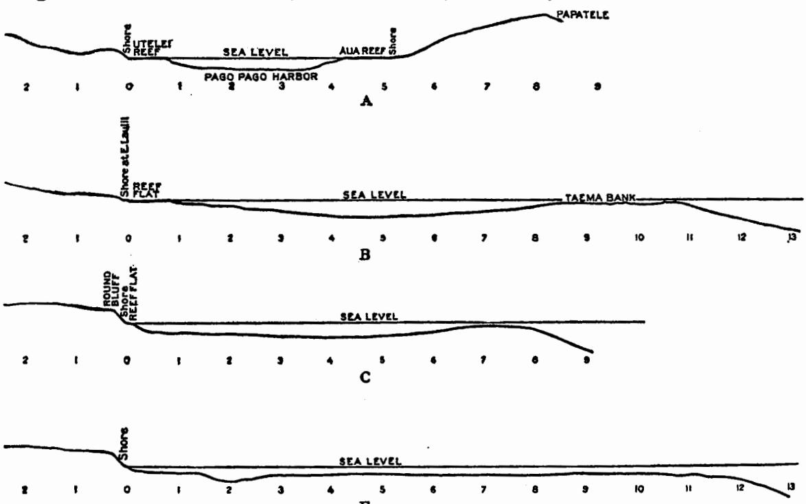

Fig. 1.—Sections across Pago Pago Harbor and across the submerged platform surrounding Tutuila. The vertical scale is same as the horizontal, illustrating conditions as they actually exist.

Text-figure I shows sections across the drowned reefs and the ancient platform, derived from data of the unpublished United States hydrographic chart of Tutuila. The vertical scale is the same as the horizontal, thus bringing out the true relations of the old lagoon to the offshore barrier reef and the fringing reef adjacent to the coast.

The bottom of the old lagoon contains soft mud and has apparently been filled in by silt and deposits to a considerable extent, but is still about 50 fathoms beneath the surface, with a few places as deep as 60 fathoms or more. Thus the

reef-wall of the old barrier reef was about 25 or 30 fathoms high, and this would lead one to suppose that the reef continued to grow for a time while the submergence increased, but that finally it could no longer keep within the limits of coral-growth of the surface and died. South of Breaker Point, at the eastern side of the entrance to Pago Pago Harbor, mud from the bottom of the old lagoon, at a depth of 50 fathoms, was gray in color and composed chiefly of foraminifera. Boiling it in hydrochloric acid showed that 95 per cent was soluble and the 5 per cent residue consisted of dark-brown volcanic mud.

It is interesting that a barrier reef should have developed near the outer edge of the ancient submerged platform around Tutuila, while at the same time a fringing reef grew outward from the shore and finally along the northwestern coast fused with the barrier reef. Our ecological studies of corals in the Murray Islands (6) and in Samoa show, however, that this is what one should expect, the barrier reef probably being composed chiefly of Acropora, which are the fastest growing of all corals, but must have pure agitated ocean-water in which to thrive, and the fringing reef of Porites, Psammocora, and Alcyonaria, which thrive best in water containing silt and away from the direct surge of the breakers.

This barrier reef of Tutuila originated as a barrier reef, as did also the Great Barrier Reef of Australia according to Andrews, (7) who showed that the reef was simply a more or less linear series of coral masses growing upon the submerged part of the Australian continental shelf, and that the shelf was not formed by the reef as Jukes, following Darwin, supposed, for the submerged platform continues southward into temperate regions along the Australian coast beyond the geographical limits of coral-growth. Incidentally, we may also state that the submerged continental shelf of Australia extends northward beyond the northern limits of coral-growth, the coral in this tropical region being prevented from growing by the mud from the great rivers of Papua. This very significant discovery by Andrews was destined to quite revolutionize our ideas of the origin of coral-reefs. for soon thereafter Vaughan (8) showed that the barrier reef of Florida is growing along the seaward edge of a submerged platform composed largely of oolitic limestone and thus not made by the reef itself, the reef being merely a series of coral patches which have grown during recent times along the outer edge of the submerged shelf. Moreover, as in Australia, this submerged shelf extends into cold regions beyond the geographical range of coral-growth. The barrier reef along the eastern shore of Andros Island, Bahamas, consists also of a series of more or less linear coral patches growing along the outer edge of a submerged platform, but the platform itself is not formed of coral-reef rock.

Moreover, Daly (9) showed that the published soundings on charts show that the bottoms of Pacific atoll lagoons are not concave, as Darwin supposed, but remarkably flat and sunken to an average depth of about 20 fathoms, and the reefwall surrounding the lagoon rises abruptly, almost as if it were a railroad embankment superimposed upon a flat plain. Here again it looks as if the lagoon bottom were a platform of marine planation and the reef-wall a new growth along its edge which accumulated during or after the platform's submergence.

It should be said that Darwin (10) had it clearly in mind that barrier reefs might originate as such by the growth of coral along the seaward edge of a submerged platform, but he knew of no examples and regarded the condition as exceptional, although he suspected that some of the West Indian reefs might have been formed in this manner.

The following quotation from Darwin's "Structure and Origin of Coral Reefs" appears to be all of significance that he wrote upon the matter. It will be recalled that there were three editions of his work on coral-reefs—the first in 1842, an enlarged edition in 1874, and in 1889 an edition was published which is merely a reprint of the 1874 edition with an appendix by its editor, Professor Bonney. Darwin died in 1882, but we may quote from the 1889 edition, for the body of the work is identical with that of 1874. In the 1889 edition, page 137, Darwin says:

A bank either of rock or of hardened sediment level with the surface of the sea and fringed with living coral would be immediately converted by subsidence into an atoll... but as we have seen the larger groups of atolls in the Pacific and Indian Oceans can not have been formed on banks of this nature.

Darwin, page 101, 1842, and page 137, 1889 edition, says:

If a bank lay a few fathoms submerged, the simple growth of the coral without the aid of subsidence would produce a structure scarcely to be distinguished from a true atoll, for in all cases the corals on the outer margin of a reef, from having space and being freely exposed to the open sea will grow vigorously and tend to form a continuous ring, whilst the growth of the less massive kinds on the central expanse will be checked by the sediment formed there.

On page 89 of the 1842 edition he says:

A reef growing on a detached bank would tend to assume an atoll-like structure; if therefore corals were to grow up from a bank with a level surface some fathoms submerged, having steep sides and being situated in a deep sea, a reef not to be distinguished from an atoll might be formed. . . . I believe some such exist in the West Indies. But a difficulty of the same kind with that affecting the crater theory renders this view inapplicable to the greater number of atolls. (See also p. 120, 1889 edition.)

Darwin, page 48, 1842, and page 66, 1889, says:

It will perhaps occur to some that the actual reefs formed of coral are not of great thickness, but that before their first growth the sea had eaten deeply into the coasts of these encircled islands, and had thus left a broad but shallow submarine ledge, on the edges of which corals grew; but if this had been the case the shore would have been invariably bounded by lofty cliffs, and not have sloped down to the lagoon-channel, as it does in many instances. On this view, moreover, the cause of the reef springing up at such a great distance from the land, leaving a deep and broad moat within, remains altogether unexplained.

On page 93, 1842, and page 127, 1889 edition, Darwin says that the upheaval and subsequent abrasion of an island would leave a flat disk which might become coated with coral, but not a deeply concave surface. (Darwin believed the bottoms of atoll lagoons to be concave instead of being practically flat, as we now know them to be.)

In four out of these five paragraphs Darwin either casts doubt upon the explanation, or regards it as hypothetical and so exceptional that he can not cite a single instance of its occurrence. Now, however, due to the advance of hydrography and the studies of Andrews, Vaughan, Daly, and Chamberlin, we have reason to believe that what Darwin regarded as the exception is in fact the rule; whereas his main thesis that "atolls have been formed during the sinking of the land by the upward growth of the reefs which primarily fringed the shores of ordinary islands" remains unproven.

Professor W. M. Davis (11, p. 564) says in his criticism of Chamberlin that there is "no doubt that when the now submerged barrier reef of Tutuila was first formed at a distance of a mile or two from the cliffed inner border of the shallow supporting platform it would have been classed by Darwin as a fringing reef because the enclosed water channel was then of small depth." Now Professor Davis presents only half the actual facts to this hypothetical Darwin, for, as Chamberlin shows, we have reason to believe that contemporaneously with the development of the offshore reef there grew also another reef attached to and extending along the shore of Tutuila. Darwin, who never flinched before a fact to maintain a theory, would certainly have called this shore reef the fringing reef and the offshore reef could then have been nothing but a barrier, no matter whether the lagoon was shallow or deep. Moreover, Darwin would doubtless have seen that the offshore reef had grown near to but at an appreciable distance inside the seaward margin of a submerged platform of marine planation and that in many places the reef simply lies upon the platform as if it were a mere embankment, the platform extending under it and reappearing on the seaward side of the reef. Darwin would doubtless have said that here at last was an example of a condition he had never been able to find, and which he had thought of more as a theoretical possibility than as an actuality. He would probably have concluded that the old barrier reef of Tutuila showed no evidence of ever having been a fringing reef, but had developed independently, while a true fringing reef grew along the shore, and thus his thesis of fringing reefs being converted into barrier reefs did not apply to Tutuila. Curiously, even Professor Davis (4) himself in 1918 called this outer reef a "barrier reef," but appears quite willing to have his "Darwin" do otherwise.

The crux of Darwin's theory is concisely expressed by him on page 147 of the 1842 edition of his classic work on coral reefs, and also on page 194 of the 1889 edition, in the following words:

On this view [that of prolonged subsidence] every difficulty vanishes; fringing reefs are thus converted into barrier reefs, and barrier reefs when encircling islands are thus converted into atolls, the instant the last pinnacle of land sinks beneath the surface of the ocean.

It is true that Darwin's definition of "fringing reefs" is unfortunately vague in that it confuses them with barrier reefs. He says (p. 4, 1889 edition) that fringing reefs "differ from barrier reefs in not lying far from the shore, and in not having within them a broad channel of deep water," but how deep and how broad the channel may be and the reef still be a fringing reef he does not say.

Of course, all reefs begin as a series of coral patches which through growth fuse into a solid structure and, in the case of fringing reefs, extend straight out from the shore, so that at low tide one may wade from the beach to the seaward edge of the reef. If a Pacific fringing reef be exposed to heavy breakers, lithothamnium grows along its seaward edge and raises this part a few inches above low-tide level. thus making a ridge along the seaward edge, and favoring the development of tidepools on the shoreward parts of the reef. Where the breakers become spent, about 200 to 400 feet inward from the seaward edge, the Lithothamnium dies out, and here the ridge disintegrates into jagged limestone masses which become detached and are washed shoreward over the reef-flat by the surges. Corals grow so readily upon these erratic fragments of the lithothamnium ridge that most of the coral-heads of the shoreward parts of the reef-flat are attached to them. Thus most of the corals growing on such a reef-flat are actually loose and liable to be driven ashore in time of exceptional storm. Of course, in regions where storms are common, or where the average surf is so heavy that it drives straight over the reef-flat to the beach, small loose fragments can not long remain upon the reef-flat, which then becomes smoothly veneered with Lithothamnium, thus protecting it from destruction by the sea. There are, however, always many tide-pools and crevices in which living coral-heads cluster, and the top of the reef-flat is usually a rich collecting-ground for corals.

We see, then, that while fringing reefs begin as isolated coral patches, these soon coalesce and the whole reef becomes backed up against the shore. Due to this backing afforded by the shore, fringing reefs in somewhat protected situations can be composed of looser and less compacted materials than can a barrier reef over which the surges dash in full force. In any event, a typical Pacific fringing reef has no lagoon between it and the shore, unless indeed we call such the very shallow tide-pools, rarely more than a foot deep, which may be impounded back of the lithothamnium ridge. Darwin's chapter on fringing reefs is unfortunately vague, and in the three editions of his work the reefs of the Florida-West Indian regions are all classed as "fringing reefs," although such well-developed barriers as the reef of Yucatan, the Florida reef from Miami to beyond Key West, and the reef on the eastern side of Andros Island are found here. Moreover, in the midst of the Bahamas lies one of the most beautiful little atolls in the world, Hogsty Reef.

However, as Professor Davis says, if we take Darwin's theory as Darwin himself proposed it, we must accept his vague and unsatisfactory definition of fringing reefs; but even so it has not been proven that the rim of a single modern atoll was ever a fringing reef in Darwin's sense or even a barrier reef. Darwin labored under great disadvantages. He saw only a few of the Society Islands and only one atoll, Cocos Keeling. There were almost no published soundings in lagoons in 1842, and the significance of drowned valleys in indicating submergence or subsidence had later to be explained by Dana. Darwin's theory, as he advanced it, presupposes subsidence of the land rather than an elevation of sea-level, nor could he, in the absence of soundings, grasp the importance of submerged platforms of marine planation which we now begin to realize are of

paramount significance in determining coral-growth. To Darwin's mind, coral-growth was probably continuous through long periods, but we now know that the reverse was the case. Thus Vaughan (12) shows that in the West Indian-Florida regions there was a maximum development of coral reefs in the middle Oligocene, when at least 15 genera now confined to the Pacific and Indian Oceans existed on the tropical Atlantic reefs. In Miocene and Pliocene times the Florida-West Indian reefs were poorly developed, no Pliocene reefs being known from the West Indies. Later in Pleistocene and Recent times there has been a fair development of reefs in this region, but the number of genera has become reduced, such forms as Pocillopora, Pavona, Favites, Goniopora, Goniastrea, Galaxea, Stylophora, and Alveopora, and 7 others of less importance, having disappeared from the West Indian region before Pliocene times. It is of interest to see that during the glacial period there was a better development of West Indian reefs than in the Pliocene, and in general reefs developed best during times of subsidence.

The strongest point in favor of Darwin's theory of subsidence is the great thickness of the ancient elevated reefs in Fiji, Tonga, the New Hebrides, and elsewhere in the Pacific. In many of these elevated masses of limestone the corals are superimposed and in place for hundreds of feet, and all the evidence supports the view that the reef grew upward and maintained itself at or near the surface while the substratum sank. It seems certain from the accounts of Davis (13) and others that some of these elevated reefs in the New Hebrides were atolls, but elsewhere they have suffered so much erosion that it may be impossible to interpret their past history. Possibly some of them were atolls which had developed to the final stage in which the lagoons had become practically filled in by materials from the reef. At present, despite the good work which has been done upon the elevated reefs of Fiji by Andrews (14) and Foye, (15) we can not be certain of their age in relation to the age of Atlantic reefs bearing similar fossils, and we know but little of their intimate structure.

In considering Darwin's theory, we should bear in mind how difficult it would be to change a fringing reef into a barrier reef through subsidence. If the fringing reef were drowned so deeply by subsidence that its corals were killed, it is obvious that it could not afford a substratum for the growth of a barrier reef, and a new fringing reef would develop along the shore. If, on the other hand, the subsidence was moderate, the corals which grow in abundance all over the broad upper surface of the fringing reef would at once spring up toward the surface, while fragments from the reef would tend to fill in any lagoon which might be left between the reef and the shore, especially as these lagoons would usually be narrow, due to the steep slopes of most volcanic islands. It would seem that only under exceptional conditions, such as abnormally gradual slopes of the shores of the central island, could a fringing reef be converted into a barrier by subsidence; but that successive periods of relatively rapid subsidence followed by periods of relative stability would lead to the development of a series of step-like terraces of successive fringing reefs.

But to return to the subject of the reefs of Tutuila. After the old barrier and fringing reefs had been killed by drowning, the island became deeply sub-

merged, as explained by Chamberlin, and the sea remained at this high level during so long a period that shore-cliffs nearly 300 feet high were cut, as at Round Point (plate 5, fig. A).

Chamberlin and Daly could find no evidence of the existence of coral reefs on Tutuila at this time of greatest submergence, and it seems probable that there were then only small isolated patches of coral around the island, as along the shores of the Marquesas to-day.

The living reefs of Tutuila did not begin to grow until after the island had emerged to its present level, probably by a lowering of sea-level rather than through an actual elevation of the land. They are simple fringing reefs projecting seaward from the shore, although in many places, as off the promontories of the north shore, there are coral patches composed chiefly of *Acropora*, but they have neither reached the surface nor constituted a continuous reef.

The fringing reef is widest on the sides of the bays and in places where the submarine slopes are relatively gentle, but at the promontories, where the slopes are steep, the reef is narrow or does not exist.

Along the south shore, where the reef is exposed to the breakers caused by the trade-wind, the lithothamnium ridge is well developed and in many places the reef-flat grows up to low-tide level, but the north shore is protected from the trades, although a surging sea swings around the island and keeps the water fairly rough; but the lithothamnium ridges of the reefs in these north-shore harbors are rather poorly developed, and the reefs are narrower than on the south shore and confined to the sides and inner ends of the harbors.

In some places, as on the west side of the entrance to Vatia Harbor, the reefs have suffered great destruction from a hurricane, no tradition of which is retained by the natives. Great numbers of corals were thrown up to a height of about 8 feet above low tide, and now lie a hundred feet or more inland, with full-grown Barringtonia trees covering them. Yet the reef-flat in this place has not yet recovered and lies submerged at all tides, with no lithothamnium ridge. For the lithothamnium ridge is everywhere chiefly composed of dead Acropora leptocyathus, which, having grown and died, is held in place and veneered by lithothamnium. thus causing it to remain as a permanent accession to the seaward edge of the reef-flat. The lithothamnium itself grows so slowly at tide-level that it alone would not form a ridge were it not for the fact that it quickly covers, smooths over, and cements upon the reef-flat all corals which have died, thus securing the retention of any accession of limestone which the seaward edge of the reef may have once attained. The lithothamnium itself is thus merely a cementing, binding, veneering, smoothing, and wave-breaking sheet which covers and preserves to the reef the limestone formed by the dead coral which once grew upon it.

The upper surface of the reef between Blunt's Point and Fagaalu, Pago Pago Harbor, has also suffered practical annihilation of its corals through some forgotten hurricane and has not yet recovered. It will be recalled that F. Wood Jones (16, p. 122) records the sudden destruction of a large area of corals in Cocos Keeling Atoll in 1876 and their failure to regain their foothold after 30

years. Also at Tortugas, Florida, the Acropora muricata which once flourished over the reef-flats in great abundance was killed by the so-called "dark water" of October 1879, and even yet (1922) this coral is rare or absent over the areas in which it was once the dominant form. Vaughan (17) showed that coral planulæ may remain floating for days rather than settle in unfavorable conditions, such as stale water, and it seems possible also that planulæ may prefer to settle in regions wherein many coral-heads of their own species are growing rather than on barren areas.

The fringing reef of the south shore of Tutuila is interrupted by the relatively recent lava-flow which extends from the Nuuli Lagoon to Sail Rock. This lava overwhelmed the ancient shore-reef and the elevated wave-cut bench, but is itself strongly clipped by the modern sea. In many places near the shore it shows the ropy surface seen in modern pahoihoi flows of Hawaii. In fact, the surface of this ancient Tutuila lava near the sea shows less effect from erosion than does the Kahuku lava-flow of 1868 on Hawaii, but, as was suggested by Professor Thomas Jaggar, the fresh appearance of the Tutuila flow is deceptive and due to the spray washing off the decomposed surface layer, thus exposing underlying layers which have not yet been weathered.

Off Nuuli the fringing reef is fully 3,000 feet wide, but elsewhere it is much narrower, none of the reefs in Pago Pago Harbor being much more than 1,000 feet wide.

By throwing out a heavy anchor on the extreme seaward edge of the reef, and having attached to this anchor a line with distances measured off on it, we succeeded in making soundings at 25 or 50 foot intervals off the seaward edges of the reef-flats. The results are shown in table 2 and illustrated in figure 2, wherein the vertical scale is the same as the horizontal, thus giving a picture of the submarine slopes as they actually are.

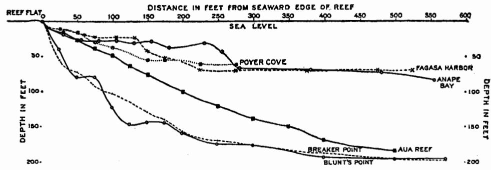

Fig. 2.—Soundings off seaward edges of reef-flats of Tutuila. The vertical scale is same as the horizontal, thus showing actual conditions. The harbors of the north coast are not so deep as Pago Pago Harbor.

The seaward edge of the reefs at low-tide level usually overhangs as a shelf, due to the growth of *Acropora leptocyathus*, veneered with lithothamnium. Below this projecting shelf lies a precipitous slope, usually of from 2 to 5 fathoms, and below this coral-heads, especially *Acropora* and *Pocillopora*, cluster thickly, producing a very irregular surface. These reef-building corals do not thrive at depths

below 8 fathoms in Pago Pago Harbor, where the water is calm and silt forms readily, but in the agitated ocean-water of the outer coasts the reef-corals grow at depths well below 10 fathoms, although their heads are not so large as in shallower water. In Pago Pago Harbor such "intermediate corals" as Leptoseris and Fungia Patelliformis come up to within 12 to 14 fathoms of the surface, but on the ocean slopes of the island reef-corals grow well at this depth, due to the agitation of the water of the coast.

TABLE 2.—Soundings off seaward edges of fringing reefs of Tutuila Island, Samoa. Illustrated by figure 2.

|                                                    |                                                                                                                             |                                                                                                 | Depth i                                                                                               | n feet.                                                                        |                                                                                |                                                                    |
|----------------------------------------------------|-----------------------------------------------------------------------------------------------------------------------------|-------------------------------------------------------------------------------------------------|-------------------------------------------------------------------------------------------------------|--------------------------------------------------------------------------------|--------------------------------------------------------------------------------|--------------------------------------------------------------------|
| Distance in feet from outer edge of reef. | Poyer Cove off SitaVillage, north coast of Tutuila, 280° true from eastern promon- tory at mouth of cove. | From middle of eastern side of Fagasa Harbor, north coast of Tutuila, 285° true. | From inner end of Anape Bay near western waterfall, 340° true, north coast of Tutuila. | From outer end of Aua Line, Aua Reef, Pago Pago Harbor, 247° true. | From 900 feet north of Breaker Point, Pago Pago Harbor, 249° true. | From Blunt's Point, Pago Pago Harbor, 57° true course. |
| 25                                                 | 12                                                                                                                          | 12                                                                                              | ••••                                                                                                  | 15                                                                             | 54                                                                             | 39                                                                 |
| 30                                                 |                                                                                                                             | •••                                                                                             | 18                                                                                                    | •••                                                                            | •••                                                                            | • • •                                                              |
| 50                                                 | 15                                                                                                                          |                                                                                                 | ••••                                                                                                  | 21                                                                             | 72                                                                             | 79                                                                 |
| 55                                                 | ••••                                                                                                                        | •••                                                                                             | 27                                                                                                    | •••                                                                            | •••                                                                            | • • •                                                              |
| 60                                                 |                                                                                                                             | 18                                                                                              | ••••                                                                                                  | •::                                                                            | 122                                                                            | • • • •                                                            |
| 75                                                 | 30                                                                                                                          | 21                                                                                              | ••••                                                                                                  | 39                                                                             | 90                                                                             | 79                                                                 |
| 80                                                 | • • • •                                                                                                                     | •••                                                                                             | 27                                                                                                    | •::                                                                            | :::                                                                            | :::                                                                |
| 100                                                | 36                                                                                                                          | •••                                                                                             | ••••                                                                                                  | 48                                                                             | 102                                                                            | 123                                                                |
| 105                                                | •::•                                                                                                                        | 21                                                                                              | 27                                                                                                    | • ; ;                                                                          | •••                                                                            | :::                                                                |
| 125                                                | 39                                                                                                                          | •11                                                                                             | ••••                                                                                                  | 63                                                                             | •••                                                                            | 147                                                                |
| 130                                                |                                                                                                                             | 24                                                                                              | 30                                                                                                    | 75                                                                             | 100                                                                            | 144                                                                |
| 150                                                | 54                                                                                                                          | 42                                                                                              |                                                                                                       |                                                                                | 129                                                                            |                                                                    |
| 155                                                | 54                                                                                                                          |  51                                                                                          | 27                                                                                                    | •••                                                                            | •••                                                                            | i 144                                                           |
| 175                                                |                                                                                                                             |                                                                                                 | 36                                                                                                    | •••                                                                            | •••                                                                            |                                                                    |
| 180                                                | ••••                                                                                                                        | •••                                                                                             |                                                                                                       |  99                                                                         | 156                                                                            | 159                                                                |
| 200 225                                         | 60                                                                                                                          |  69                                                                                          | ••••                                                                                                  |                                                                                |                                                                                | •                                                                  |
| 230                                                |                                                                                                                             |                                                                                                 | 30                                                                                                    | •••                                                                            | • • • •                                                                        | •••                                                                |
| 250                                                | • • • •                                                                                                                     | •••                                                                                             |                                                                                                       | 120                                                                            | 168                                                                            | 174                                                                |
| 255                                                | • • • • •                                                                                                                   | •••                                                                                             | 42                                                                                                    | 120                                                                            |                                                                                | 11.2                                                               |
| 275                                                | 60                                                                                                                          | 69                                                                                              |                                                                                                       |                                                                                | •••                                                                            | • • •                                                              |
| 280                                                |                                                                                                                             |                                                                                                 | 66                                                                                                    | • • •                                                                          |                                                                                | • • •                                                              |
| 300                                                |                                                                                                                             | :::                                                                                             |                                                                                                       | 138                                                                            | 177                                                                            | 177                                                                |
| 350                                                |                                                                                                                             |                                                                                                 |                                                                                                       | 150                                                                            | - 1                                                                            | •••                                                                |
| 380                                                |                                                                                                                             | 69                                                                                              | 69                                                                                                    |                                                                                |                                                                                | •••                                                                |
| 400                                                |                                                                                                                             |                                                                                                 |                                                                                                       | 168                                                                            | 186                                                                            | 192                                                                |
| 475                                                |                                                                                                                             | 69                                                                                              |                                                                                                       |                                                                                | •••                                                                            | •••                                                                |
| 480                                                |                                                                                                                             |                                                                                                 | 72                                                                                                    |                                                                                |                                                                                |                                                                    |
| 500                                                |                                                                                                                             |                                                                                                 |                                                                                                       | 183                                                                            | 195                                                                            | 195                                                                |
| 555                                                |                                                                                                                             |                                                                                                 | 84                                                                                                    |                                                                                |                                                                                | • • •                                                              |
| 575                                                |                                                                                                                             | 69                                                                                              |                                                                                                       | • • •                                                                          | 198                                                                            | 195                                                                |

The talus-slopes of the reefs in Pago Pago Harbor extend below 10 fathoms and are of about 30°, this being apparently the angle of repose of the fragments of broken and dead coral which compose them. These talus-slopes gradually lose themselves in the relatively flat bottom of the harbor, which is covered with mud and must have been greatly filled in. At the inner end of Pago Pago Harbor this

bottom mud is brown in color and only 33 per cent by weight of it is soluble in boiling hydrochloric acid, the residue being a fine brown volcanic mud. At the mouth of the harbor, however, 94 per cent of the bottom mud is soluble in boiling hydrochloric acid and only 6 per cent is composed of this brown volcanic silt.

Using a Davis-Calyx drill, our chief engineer, Mr. John W. Mills, made four borings through the fringing reef of Pago Pago Harbor, at the same time devising an improvement in the core-barrel which permitted even loose sand to be brought to the surface from the bottom of the boring. Three of these borings were made under the direction of Professor L. R. Cary to facilitate his study of the Alcyonaria of the Utelei Reef. At the bottom of all borings we ran suddenly into hard, apparently wave-worn, unweathered basalt. On the Utelei Reef this basalt was encountered at a depth of 68 feet at 200 feet from shore, 121 feet at 575 feet from shore, and 120 feet at 925 feet from shore.

A boring was also made on the Aua Line of the Aua Reef 512 feet from shore and basalt was encountered at a depth of 156 feet. This Aua Reef, being more fully exposed to the breakers than the reef of Utelei, is composed of more compact and solid material, relatively little sand being met with in the boring. When the boring had gone down 65 feet, 50 feet of 4-inch inside diameter steel pipe was driven down as a casing. The material brought up in the core-barrel from various depths was treated with boiling hydrochloric acid with results as shown in table 3.

| Depth from which material was brought up in the core-barrel. | Per cent by weight which was soluble in boiling HCl. | Per cent by weight of brown volcanic mud in- soluble in boiling HCl. |
|--------------------------------------------------------------|------------------------------------------------------------|----------------------------------------------------------------------------|
| feet. 65                                                  | 99.4                                                       | 0.6                                                                        |
| 118 125                                                   | 98.5                                                       | 1.5                                                                        |
| 152 to 156                                                   | 83 .2 98 .4                                             | 16.8 1.6                                                                |

TABLE 3 .- Boring on Aua Reef.

Thus, at a depth of 125 feet, a considerable amount of volcanic silt appears to have settled over the reef, possibly due to heavy rains or to changes in the position of the mouth of the stream which now flows into the harbor at Aua Village.

The surge of the southeast trade-winds drives pure ocean-water into Pago Pago Harbor; it drifts inward along the eastern shore, and to counterbalance this the harbor-water drifts out to sea along the western shore. Thus the reefs of the eastern side of the harbor are composed largely of Acropora, a pure-water coral, whereas those of the western shore have Porites as an abundant if not a dominant element, for Porites grows best in slightly silted or impure water. It is interesting to see, however, that the reefs of the western shore are quite as wide as those of the eastern, thus making it seem that a reef composed largely of Porites may grow as rapidly as one composed chiefly of Acropora. Porites, while it grows somewhat more slowly than Acropora, produces more rigid stems, and in rough water it thickens and strengthens its stems more readily than does Acropora.

Moreover, the massive forms of *Porites* add a practically indestructible element to the reef. Thus a *Porites* reef may build more surely than one composed of fragile-stemmed *Acropora* and in the end be quite as rapid a reef-builder as the more rapidly growing *Acropora*.

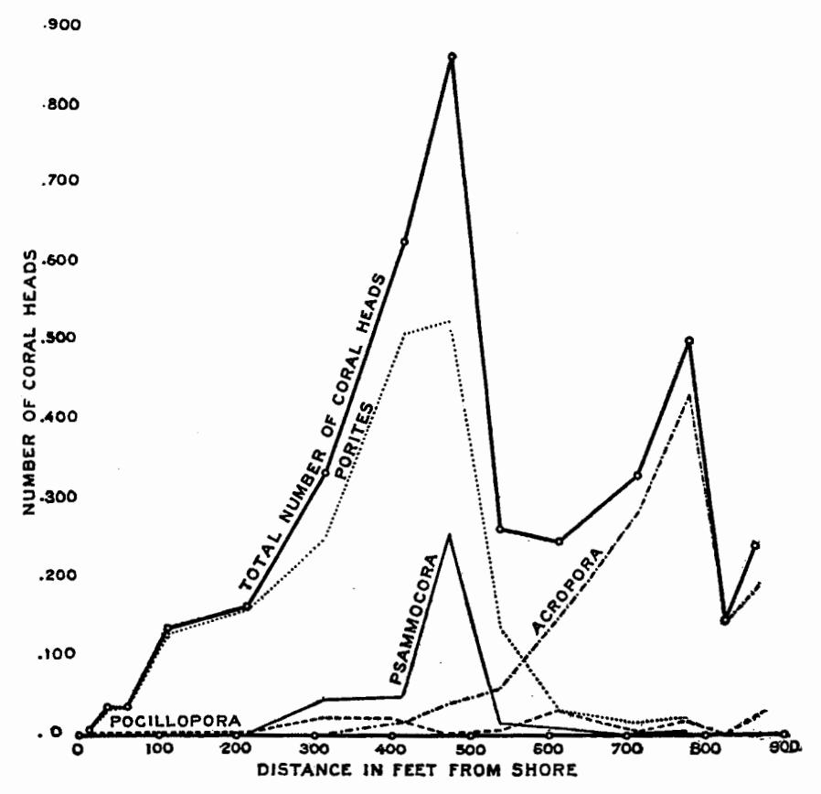

Fig. 3.—Number of coral-heads over the Aua line at various distances from shore to reef-edge. Porites are most abundant near shore, Acropora near outer edge of reef, Psammocora in middle; Pocillopora is widely distributed.

## II. ECOLOGY OF THE AUA CORAL-REEF, PAGO PAGO HARBOR.

A line 885 feet long, which we will call the Aua Line (see sketch-map of Pago Pago Harbor, plate III), was surveyed and marked at 100-foot intervals by iron stakes across the reef-flat off the southern end of Aua Village on the eastern side of Pago Pago Harbor. The line starts from a large "Pua tree" (Fragræa bertenana) on the sandy beach, and in 1917 ran south 39.5° west (magnetic) to the most conspicuous erratic, storm-tossed coral rock on the outer edge of the reef, marked "coral block 3 ft." on the chart of Pago Pago Harbor, U. S. Hydrographic Office, No. 2563.

Plate IV, fig. A, shows this coral block at the seaward end of the Aua Line and the lithothamnium ridge around it. Plate IV, fig. B, is a view from the shore across the Aua Line, the position of the line being shown by the heavy straight line drawn across the picture. Plate V, fig. A, represents the region of branched Acropora back of the lithothamnium ridge, at low tide; and plate V, fig. B, shows

the extreme outer edge of the lithothamnium ridge with Acropora leptocyathus clustering over the surface. Figure B, plate VI, shows the derrick used in boring through the Aua Line 512 feet from shore in July 1920, the view being taken from the crest of Papatele precipice above the reef. The small black object near the center of the reef-flat is the derrick.

TABLE 4.—Depth and character of bottom over the Aua Line.

| Distance in feet from shore. | Depth in inches at low tide of the new moon spring tides. | Character of bottom.                                                                                                                                                                                                                                                                                                                                                                                                                                    |
|------------------------------|-----------------------------------------------------------------------|---------------------------------------------------------------------------------------------------------------------------------------------------------------------------------------------------------------------------------------------------------------------------------------------------------------------------------------------------------------------------------------------------------------------------------------------------------|
| Low-tide line                | 0                                                                     | Sandy beach 97.5 per cent calcareous, 2.5 per cent volcanic, or insoluble in boiling hydro- chloric acid.                                                                                                                                                                                                                                                                                                                                            |
| 10                           | 8                                                                     | Fine white limestone sand, with scattered patches of nullepore algæ, and a few small loose blocks of dead coral. Very few corals, and these all small, and only on erratic limestone rocks that have been driven shoreward in time of storm. A few dark Prussian-green-black holothurians, Stichopus chloronotus.                                                                                                                                       |
| 50                           | 10                                                                    | Bottom similar to that 10 feet out, but with more holothurians, less algæ, and more coral- heads, nearly all of which are species of massive <i>Porites</i> , and all small in size, being rarely more than 3 inches in diameter. <i>Pocillopora</i> also survives here.                                                                                                                                                                          |
| 100                          | 8.5                                                                   | Sandy with little or no seaweed. Massive branched Porites, fairly numerous; all attached to loose limestone boulders that project above general level of sandy floor. Holothurians numerous.                                                                                                                                                                                                                                                            |
| 200                          | 2 .5                                                                  | Erratic dead coral rocks more numerous than at 100 feet from shore, but limestone sand still predominates. The sand consists of rather fine particles. Corals not very numerous; chiefly massive and branched <i>Porites</i> with many holothurians. Very few branched <i>Acropora</i> and all of these on loose, erratic dead coral rocks which were driven shoreward in time of storm.                                                                |
| 300                          | 6                                                                     | Patches of limestone sand and dead coral rocks covering about equal areas over the bottom.  The corals are <i>Porites</i> , <i>Psammocora</i> , and <i>Pocillopora</i> , and very few <i>Acropora</i> .                                                                                                                                                                                                                                                 |
| 400                          | 7.25                                                                  | Branched Porites very numerous. Acropora rare. Bottom chiefly fragments of dead coral lying loosely over the surface and with patches of limestone sand in the crevices. Porites dominant. Coral-heads most densely crowded about 475 feet from shore.                                                                                                                                                                                                  |
| 500                          | 11.75                                                                 | Deepest part of reef-flat near this region. Sandy patches and fragments of dead and broken Acropora about equal in area to each other over the bottom. Erratic dead coral boulders neither so large nor so numerous as at 600 feet from shore. Psammocora reaches its maximum about 450 feet from shore. Corals not very abundant. Slender long-branched Acropora and large massive Porites are the commonest corals, projecting above the sandy floor. |
| 600                          | 10.25                                                                 | Region of slender Acropora with long branches. Porites not common. Bottom covered with patches of coarse coral sand and fragments of dead Acropora, the sand patches being predominant. Many small and a few large erratic boulders of dead coral, some of which project above surface at low tide of spring tides.                                                                                                                                     |
| 700                          | 6.25                                                                  | Zone of branched Acropora formosa, etc. These branched Acropora attain a maximum about 750 feet from shore. Bottom covered thickly with fragments of dead Acropora with very little sand, and this only in crevices. Erratic coral blocks, smaller but more numerous than at 800 feet from shore. The surge of breakers in ordinary weather dies out at low tide in this region about 700 feet from shore. Holothurians rare.                           |
| 800                          | Awash                                                                 | Zone of dark brown Acropora samoensis. Bottom irregular, hard, jagged, and rocky, without sand, and with very large erratic dead coral boulders washed inward from outer edge of reef. No small erratic boulders. Very few Porites. Very little lithothamnium.                                                                                                                                                                                          |
| 870                          | About 6 ins. above water.                                             | This is the region of the lithothamnium ridge. Bottom hard smooth rock veneered with lithothamnium. No loose erratic boulders here, either large or small, except a few large ones caught and held in crevices. The breakers dash hard upon this ridge and the short stumpy incrusting Acropora leptocyathus is the dominant coral, being the only one able to withstand the dash of the breakers.                                                      |

Squares 24 feet on the side were staked out at intervals along the surveyed line over the Aua Reef. Each square inclosed 576 square feet, and all coral-heads,

millepora, alcyonaria, and holothurians found upon it were recorded. The position of these squares and the number of coral-heads, etc., found within them are recorded in table 5, illustrated by text-figure 3.

Table 5.—Number of living coral-heads upon each of the 24-foot squares on the Aua Line in Pago Pago Harbor, Tutuila, Samoa, in March and April 1917. (Illustrated by text figure 3).

|                                                                                                                                                                   |          |           | Γ         | Distar      | ice in             | feet        | from        | the l                  | ow-ti               | de lir      | e of            | the si      | nore.       |             |                |
|-------------------------------------------------------------------------------------------------------------------------------------------------------------------|----------|-----------|-----------|-------------|--------------------|-------------|-------------|------------------------|---------------------|-------------|-----------------|-------------|-------------|-------------|----------------|
| Name of coral.                                                                                                                                                    | 0 to 24. | 24 to 48. | 48 to 72. | 100 to 124. | 200 to 224.        | 300 to 324. | 400 to 424. | 460 to 484.            | 526 to 550.         | 600 to 624. | 700 to 724.     | 766 to 790  | 812 to 836. | 850 to 874. | Total.         |
| Massive Porites allied to P. lutea Branched Porites, P. andrewsi Psammocora Pocillopora(3 species), chiefly P.damicornis Pavona (2 species), P. frondifera and P. | 3        |  2     |           | 32          | 82 79 2 3 |             | 317         | 205 319 259 3 | 90 49 17 6 | 9           | 5               |  5 19 | ····        |             | 957            |
| decussata Leptastrea purpurea Favites Branched Acropora related to A. muricata Brown-stemmed coarsely branched Acropora shown in plate IV A                       |          |           |           | 3 2      | 1                  | 7           | 4  13 | 10                  | 59                  | 2 151    | 265             | 407         | 1           |             | 26 6 936 |
| Acropora samoensis                                                                                                                                                |          |           |           |             |                    |             |             | 2                   |                     |             | 16              | 15 13    |             | 15 1     | 51 14       |
| Encrusting Acropora, A. leptocyathus (see plate V)                                                                                                                |          | ••••      | ••••      | ••••        | • • • •            |             |             |                        |                     |             | 1               | <u> </u>    | 1           |             | 1 1            |
| Fungia  Montipora  Massive Montipora  Foliated Montipora                                                                                                          |          |           |           |             |                    |             |             |                        |                     | 2           | 1  2 4 | 13          |             | 21          | 36 2 4   |
| Hydnophora microconos.  Cyphastrea  Pavona divaricata  Millepora                                                                                                  |          |           |           |             |                    | ••••        |             | 1                   | 1                   | 6           | 1 2 1     |  1       | l::::       |             | 10             |
| Number of heads on each square Number of species on each square                                                                                                   | 9        | 38 5   | 35 3   | 138 5    | 168 6           | 334 8    | 601 9    | 863 10              | 262 10           | 247 8    | 327 15       | 505 11   | 147 4    | 236 6    | 3,910          |

TABLE 6.—Alcyonaria, blue-black holothurians (Stichopus chloronotus), and blue starfishes (Linckia lævigata) on the Aua Line, Pago Pago Harbor, Tutuila, Samoa.

|                                                |          |           |           | Dist        | ance        | in fee       | t fro       | m low       | r-tide     | line       | of the      | shor        | e.          |             |                |
|------------------------------------------------|----------|-----------|-----------|-------------|-------------|--------------|-------------|-------------|------------|------------|-------------|-------------|-------------|-------------|----------------|
| Name.                                          | 0 to 24. | 24 to 48. | 48 to 72. | 100 to 124. | 200 to 224. | 300 to 324.  | 400 to 424. | 460 to 484. | 526 to 550 | 600 to 624 | 700 to 724. | 766 to 800. | 812 to 836. | 850 to 874. | Total.         |
| AlcyonariaBlue starfishesBlue-black holothuria |          | 1 68   |           | 6           |             | 2  115 |             |             |  34     | 12         | 4           |             | 3           |             | 22 2 935 |

At Murray Island, Queensland (Mayor, 6), and also in Samoa, the densest clustering of coral-heads is found in relatively quiet water, about 150 to 200 feet inward from the region wherein the surges die out in ordinary weather. The greatest number of kinds of corals are, however, found on both reefs just where the surges die out in ordinary weather.

Table 7.—Percentage compared with entire number of coral-heads found on reef-flat.

| Genus.  | Murray Island, Australia.   | Aua Reef, Pago Pago, Samoa. |
|---------|-----------------------------------|-----------------------------------|
| Porites | 38 18 10 very rare 25 | 47.4 33.6 4.1 10 0    |
| Total   | 91                                | 95 . 1                            |

Again, in both the Australian and the Samoan reefs, according to Mayor (18), 4 genera comprise more than 90 percent of the entire number of coral-heads found on the reef-flat (table 7).

In both cases *Porites* are the most abundant corals, although not so conspicuous as *Acropora* with its large individual heads and long stems. *Seriotopora* is not found on the Samoan reef, but, from an ecological standpoint, its place is taken by *Psammocora*, which, like *Seriatopora*, is most abundant in the middle regions of the reef-flat, where rough water can not shatter its fragile stems.

Although in essentials, mentioned above, these Australian and Samoan reefs are similar each to each, yet in slight respects they differ, for at Aua the nodular *Porites* grows within 15 feet of low-tide line, just beyond the influence of seepage of fresh water from the shore in time of torrential rains, whereas at Murray Island there are practically no corals within 200 feet of the shore. This is probably due to the strong current of about 20 or more feet per minute which moves along parallel with the shore over the Aua Reef, thus bringing in pure ocean-water and food from Breaker Point. Moreover, the reef-flat at Murray Island is impounded and converted into a vast tide-pool at practically every low tide, whereas at Aua it is impounded only by the lowest of new-moon spring tides, which at most occur only 3 or 4 days in the month. Thus the shore-water of the Murray Island reef-flat is relatively more stagnant and more readily heated by the warmer suns of Australia than is the Samoan reef, and in this manner the apparent difference between the two reef-flats may readily be explained.

The number of species of corals is greater in Australia, and there seem to be more of the rarer forms than in Samoa. Thus I list only 15 genera from the Aua Line, whereas the line across the Murray Island Reef gave 24.

Acropora are relatively less abundant on the Murray Island Reef than on the Aua Reef, but this is due to the remarkable growth of Seriatopora, which in the middle region of the Murray Island Reef crowds out the other corals. On the Aua Reef Psammocora occupies somewhat the same ecological position but is not so successful in usurping the field as is the Seriatopora of the Australian Reef.

As in Murray Island, so on the Aua Reef, the Acropora, which are easily killed by heat or smothered by silt, live on the outer parts of the reef, where the water is pure and cool, while the Porites, which are relatively resistant to heat or to silt, live near shore. Thus experiments made upon corals placed in warm sea-water heated and maintained at definite temperatures in a thermostat chamber showed that a temperature of 34.4° C. for 30 minutes or of 35.3° for 20 minutes will kill the branched Acropora formosa, but the brown-colored, "stumpy," short-stemmed Acropora leptocyathus, which grows in rough water about 700 feet from shore, although seriously injured by these temperatures, usually survives. The very profusely, delicately branched Acropora hyacinthus which forms expanded "fungus-shaped" or vase-shaped colonies, especially in water just below the influence of the breakers or in relatively protected parts of the reef-flat, where pure, cool water surrounds it, is about as resistant as the brown-stemmed, coarsely-branched Acropora samoensis and is killed by exposure to 35.8° C. for 30 minutes. The most resistant species of Acropora is, however, the low-lying, stumpy-stemmed incrusting Acropora leptocyathus, which thrives where the breakers pound in full force upon the outer edges of the reef-flat. It survives 30 minutes of 34.4° C., but is seriously injured if not killed by an equally long exposure to 35.8° C.

As a temperature of 32.3° C. was observed in the water of the Aua reef-flat at the low spring-tide of March 22, 200 feet from shore, at a time when a gentle breeze rippled the water, it is possible that in bright sunshine, with the reef-flat impounded for 3 hours by an unrippled calm, the temperature near shore might rise to 34.4° C., which in half an hour would be fatal to the branched species of Acropora formosa or to Acropora samoensis. Thus inability to withstand heat may account for the almost total absence of Acropora within 150 feet of the shore, but they are also very sensitive to silt, and this is an additional reason for their absence from the shore region. Wood Jones (16, p. 124) says that in Cocos Keeling Acropora thrive in tide-pools which become heated to 93° F. (33.9° C.).

TABLE 8.

| Name of coral.                           | Constant temperature, exposure to which causes death in one hour. | Relative rate of oxygen consumption per gram of living substance at 29° C. |
|------------------------------------------|-------------------------------------------------------------------------|----------------------------------------------------------------------------------|
| A                                        | ° C. 3.7                                                             | 10.7                                                                             |
| Acropora muricata Orbicella annularis |                                                                         | 18.7 6.1                                                                      |
|                                          |                                                                         |                                                                                  |
| Mæandra areolata                         |                                                                         | 5.5                                                                              |
| Favia fragum                             | 37.05                                                                   | 3.8                                                                              |
| Siderastrea radians                      | 38.2                                                                    | 1.0                                                                              |
|                                          |                                                                         | 1                                                                                |

A temperature of 35.3°C. for 60 minutes or of 36.8°C. for 30 minutes kills all the acroporas, but produces no visible injury to the inshore corals, such as the nodular or massive Porites (aff. P. lutea), the branched Porites andrewsi, Pavona frondifera, and Pavona decussata, Psammocora, and Leptastrea purpurea. This temperature would injure Pocillopora damicornis, which, however, can survive 35° C. for an hour without injurious effects, but is killed by 30 minutes' exposure to 36.7° C. Large massive Porites (aff. P. lutea) appears to be the most resistant Samoan reef-coral, and is killed by 30 minutes' exposure to 37.5° C. It also is the most resistant to asphyxiation by mud, or dilution due to rains, and lives closest to the shore and nearest to the mouths of streams.

In 1917 Mayor (19) found that there is an apparent converse relation between the rate of oxygen consumption in reef-corals from Tortugas, Florida, and their ability to resist high temperature, those corals which are most readily killed by heat having the highest metabolism (rate of oxygen consumption), as determined by Winkler's method (table 8).

Also, if sea-water be supersaturated with carbon-dioxide gas, the toxic effect is in the same order as that of high temperature. That is to say, those corals which are readily killed by heat are also correspondingly easily killed by H2CO2. It seems possible that some undetermined acid may accumulate in the tissues, due to increased metabolism under the influence of heat, and thus poison the coral.

TABLE 9.

| Name of coral.                                                                                      | Average of oxygen consumption in 3½ hours in c. c. at 760 mm. pressure. | Range in oxygen con- sumption in the various experiments. | Average consumption of oxygen per hour. | Area of liv- ing tissue of corals in square centimeters. | Weight of living sub- stance in grams. |                      | Specific gravity of coral. |
|-----------------------------------------------------------------------------------------------------|-------------------------------------------------------------------------|-----------------------------------------------------------------------|--------------------------------------------------|----------------------------------------------------------------------|-------------------------------------------------|----------------------|----------------------------------|
| Pocillopora damicornis Acropora formosa Massive Porites aff. P. lutea. Branched Porites P. andrewsi | 1.7 2.4                                                              | 1.3 to 3.6 0.97 1.97 1.48 2.48 1.8 2.7                       | 0.74 0.48 0.68 0.65                     | 50 30.6 135                                                    | 1.58 2.3 3.8 7.6                       | 25 10 61 31 | 2.2 2 1.7 1.77          |

This supposed toxic effect of carbon dioxide is not due to its replacing some of the oxygen of the sea-water, for I find that corals are remarkably insensitive to a reduction in the oxygen-supply, all species except Acropora muricata living more than 11 hours in sea-water under an air-pump which took out 95 per cent or more of the oxygen; and even Acropora muricata can withstand 6 hours of this treatment.

From July 30 to August 3, 1918, experiments were carried out upon four common genera of Samoan corals from the Aua reef-flat, using Winkler's method, and showing the metabolism of 4 species of Samoan reef-corals, based on their oxygenconsumption method; 5 experiments of 31/2 hours each were made on each coral upon 5 successive days, in the dark, in sea-water at 27° to 28° C., having 4.26 to 4.55 c. c. of oxygen per liter, the oxygen being estimated as at 760 mm. pressure

TABLE 10.

| Name of coral.         | Oxygen consumed.         |
|------------------------|--------------------------|
| Pocillopora damicornis | 468* 208 179 85 |

c. c. of oxygen per kilogram per hour.

and o° C. During the experiments each coral was kept in a glass-stoppered bottle holding about a liter of sea-water. The weight of living substance was determined after dissolving the stony substance in 20 per cent nitric acid.

From this we derive table 10, showing the cubic centimeters of oxygen con-\*Acropora muricata from Tortugas, Florida, consumes 479 sumed each hour by each kilogram of living substance of the coral.

The relation between rate of oxygen consumption and ability to resist high temperature in these Samoan corals is shown in table 11. This table brings out the

anomalous result that Pocillopora, which has a higher rate of metabolism than Acropora, is nevertheless more resistant to high temperature. Pocillopora is also a widely distributed coral, being found close to shore and as far out on the reef-flat as its fragile stems will permit. Thus at first sight it seems to break the rule of a converse relation between resistance to heat and rate of metabolism shown so closely by the Florida corals. We find, however, that if Pocillopora be buried beneath the mud or subjected to CO2, it is killed quite as quickly as is Acropora. If, however, we take a Pocillopora and an Acropora and sprinkle sand or mud upon them, we find that the Pocillopora readily frees itself from the smothering substance by means of its very efficient cilia, whereas the Acropora is by no means so successful. Thus Pocillopora, while easily smothered if virtually covered by mud, is able under normal conditions to free itself from this danger and can therefore live closer to shore than can Acropora. It seems possible also that the ability to resist high temperatures which characterized *Pocillopora* may be due to the current over its surface which is maintained by its cilia, thus driving stagnant CO-laden water from its stems. The living tissue of Pocillopora is also much thinner than Acropora, and for a given weight of living substance it exposes a greater surface area to aeration.

TABLE II.

| Name of coral.         | Constant temperature, exposure to which for 30 minutes causes death. | Relative rate of oxygen consumption per gram of living substance in each coral at 27° to 28° C. |
|------------------------|----------------------------------------------------------------------|----------------------------------------------------------------------------------------------------------|
| Pocillopora damicornis | 36.7 34.4 37.5 37.2                                         | 5.5 2.4 2 1                                                                                     |

In 1917, I was led to suspect from experiments carried out upon corals of Tortugas, Florida, that death from high temperature might be due to the accumulation of acid, possibly H2CO3, in the tissues, the high rate of metabolism producing CO2 at so great a rate that it could not be effectively gotten rid of by diffusion into the surrounding sea-water and thus it accumulated in the tissues and produced acidosis. If this hypothesis be true, an increase in the concentration of the hydrogen ion in the sea-water ought to be correlated with a lowered resistance to high temperature. I found that if 6 drops of hydrochloric acid be added to 1,500 c. c. of Samoan sea-water, the PH changed from 8.2 to 6.95, thus being nearly neutral at 27° C. Reef-corals survive in this water for at least 24 hours at 27° C. without apparent injury. Two jars, each holding 1,500 c. c. of sea-water of 4.48 c. c. of oxygen per liter and 8.22 PH, were kept in a thermostat chamber until their temperature was 36.6° to 36.8° C. Then 5 drops of HCl made the sea-water of one of the jars nearly neutral and of 6.95 PH. Two small pieces were then broken off from each coral, and one of these pieces was placed in the jar of normally alkaline seawater and the other in the jar of neutral sea-water with results shown in table 12.

Thus the corals could withstand heat quite as well in sea-water made neutral by HCl as in normally alkaline sea-water. This experiment was tried a number of times, but the one cited above is typical for all the others, and there seems to be no definite relation between a coral's ability to resist high temperature and the alkalinity of the sea-water, provided the sea-water be not decidedly acid.

TABLE 12.

| Name of coral.         | Corals in normal sea-water of 8.22 PH.                                             | Corals in neutral sea-water of 6.95 Рн, made neutral by adding HCl to the sea-water. |
|------------------------|---------------------------------------------------------------------------------------|--------------------------------------------------------------------------------------------|
| Pocillopora damicornis | Dead Badly injured, probably killed Injured but survived Do Apparently not injured Do | Badly injured. Injured but survived. Do. Apparently not injured.                           |

A more direct test of this matter was made at Tortugas, Florida, in May and June 1919, where many experiments were carried out by adding CO2 to sea-water until its PH was reduced to 6.75, this being practically neutral at the temperatures of the experiments. The CO2 was introduced by saturating 200 c. c. of the seawater with carbon-dioxide gas under heavy pressure, and then adding this saturated water to 400 c. c. of natural sea-water of about 8.2 PH. Then, after heating this 4,200 c. c. of sea-water in a thermostat for from 12 to 15 hours, the average PH

TABLE 13.

| Name of coral.     | No. 1. | No. 2. |
|--------------------|--------|--------|
|                    | ° C.   | ° C.   |
| Acropora muricata  | 34.8   | 34.7   |
| Porites astræoides | 35.8   | 35.8   |
| Porites clavaria   | 35.7   | 36.4   |
| Mæandia areolata   | 36.2   | 36.8   |
| Favia fragum       | 36.2   | 37.05  |

became 6.75, ranging in the various experiments from 6.65 to 6.9. The results are shown in table 13. In column 1 the temperature given was just sufficient to kill the coral after exposure for 1 hour in sea-water made neutral (6.75 PH) by the addition of CO2. In column 2 the temperature given was just sufficient to kill the coral after exposure to it for one hour in natural sea-water of about 8.2 PH.

This experiment seems to show that the corals withstand heat nearly if not quite as well in sea-water made neutral by CO2 as they do in natural alkaline seawater.

We know, however, from the work of Henze (20) on sea-anemones that these coelenterates have a wide range of adaptability, and when placed in sea-water with reduced oxygen their metabolism is also reduced and they survive the adverse condition without apparent injury. It seemed possible, therefore, that the presence of CO2 in the surrounding water may have reduced the rate of metabolism of the corals, enabling them to resist an increase in temperature.

In order to test this, the metabolism of Samoan corals in normal sea-water at normal temperature was compared with their rate of metabolism in sea-water of the same temperature but rendered decidedly acid by the addition of CO2. The

metabolism was estimated by determining the amount of oxygen consumed by the corals, using Winkler's method. Sea-water of 8.24 PH was made acid, and of 5.85 PH by running CO2 into it. Two tightly stoppered glass bottles, each of 1 liter capacity, were used in the experiment and the temperature of the water was made 27.7° C., practically the same in each by placing them in a thermostat for 12 hours before the experiment. Experiments were made upon small pieces of *Pocillopora damicornis* and *Porites andrewsi*, the corals being kept for 2 hours in the bottles.

In the case of *Porites andrewsi*, the average oxygen-content in the normal seawater was 4.48 c. c. of oxygen per liter, at 8.24 PH and 27.7° C., and the coral consumed the oxygen at the average rate of 0.31 c. c. per hour. When placed in sea-water of 4.85 PH, made acid by CO2 and containing 3.5 c. c. of oxygen per liter, it consumed 0.24 c. c.; now 4.48:3.50 = 0.307:0.24, this being so close to 0.31:0.24 as to be practically identical. Thus no toxic effect appeared to be produced by the CO2 and the coral simply consumed oxygen in proportion to the concentration of oxygen in the surrounding water.

Eight experiments upon Pocillopora damicornis gave a similar result. Thus the normal sea-water of 8.24 Ph had an average oxygen-content of 4.1 c. c. per liter and the coral consumed on an average 0.215 c. c. of oxygen per hour. When placed in acid sea-water containing CO2 and of 5.85 Ph which had an average oxygen-content of 3.1 c. c. per liter, the coral consumed on the average 0.165 c. c. of oxygen per liter. Now, 4.1:3.1 = 0.215:0.165. In other words, the coral consumed oxygen at a rate proportional to the oxygen concentration in the surrounding seawater, and showed no injurious effect from the decidedly acid sea-water in which it was placed.

The animal substance of the *Pocillopora damicornis* used in these experiments was removed from the skeleton by 15 per cent nitric acid and weighed; and this showed that it consumed oxygen in normal sea-water at 27.7° C. at the rate of 400 c. c. of oxygen per hour for each 1,000 grams of living substance of the coral.

These experiments made it evident that the slight changes in the concentration of CO2 normally occurring in the water of reef regions can have no injurious effect upon the corals. Samoan corals are not obliged to withstand low temperatures, but the limits of coral-growth appear to be somewhat lower in this respect than has hitherto been suspected. Thus, at Boca Grande, west of Key West, Florida, on January 8, 1919, at 7h45m a. m., after four days of a severe "norther," the water over the flats became 15.8° C. (60.4° F.) for a few hours; yet corals such as Mæandra areolata, Porites furcata, and Siderastrea radians thrive on these flats, and were apparently uninjured by this temporary exposure to so low a temperature.

Experiments I made in Porto Rico indicated that reef-corals when cooled gradually become more and more inactive and lose their ability to capture prey if kept for half an hour at about 61° to 63° F., at which temperature the tentacles become temporarily incapable either of retaining copepods on their surface or conveying attached prey to the mouth. Thus at these temperatures the corals would eventually die of starvation if from no other cause.

It was interesting to find that when the Aua Reef was impounded in sunshine during the lowest tide, it tended to become more alkaline in places and relatively more acid in others than the open ocean. Thus an alkalinity of 8.51 PH (0.31 × 10-8) and water temperature of 32.1° C. was observed over the Aua reef-flat on March 24, 1917, the alkalinity of the water of the open ocean at this time being 8.25 PH (0.54 × 10-8). There was a bacterial scum over the hot, stagnant water at this time. Again, at the low tide of July 16, 1920, the impounded water of the Aua reef-flat, 400 feet from shore, where the depth was about 5 inches, was of 8.6 PH at 27.4° C., and had 8.44 c. c. of oxygen per liter and a salinity of 34.79. At this time the water of the ocean outside of the reef was of 8.25 PH at 26.7° C. and had 4.67 c. c. of oxygen per liter, with a salinity of 34.7. Thus the reef-water was supersaturated with oxygen.

Experiments made at Tortugas, Florida, in 1917, showed that tide-pools, when cut off from the ocean at low tide and exposed to the sun, soon became super-saturated with oxygen and highly alkaline (8.65 PH), due to the photosynthetic activity of sea-weeds and of commensal algæ in the corals, and McClendon (21) had previously observed a diurnal range in the PH of the Tortugas lagoon due to photosynthesis, the water being more highly alkaline during the day than it is at night.

On the other hand, tide-pools, which lack plants and contain decomposing animal matter, accumulate CO2 and become relatively acid, and some such cause may account for the local relative acidity, such as 8.01 PH, seen at one place when the Aua Reef was impounded at the low tide of March 23, 1917, the PH of the free oceanwater at this time being 8.23.

It will be recalled that Dana thought that reef-corals did not grow at depths of 20 or more fathoms, due to the low temperature of the water at these depths. Using a Negretti-Zambra reversing thermometer standardized by the Kew Observatory, I made a number of tests of the temperature at depths down to 33 fathoms off

TABLE 14.

| Depth.            | Temperature                                                  |
|-------------------|--------------------------------------------------------------|
| feet. Surface. 25 | ° C. 27.4 27.3 27.2 27.2 27.2 27.2 27.2 |

the seaward edges of the reefs of Tutuila and found that there is usually less than 1° C. difference in temperature between the surface and a depth of 200 feet. Thus, in a typical series taken September 7, 1919, east of Whale Rock, Pago Pago Harbor, Tutuila, in a place where the chart shows a depth of 213 to 222 feet, results are as given in table 14, the tide rising and the sea being roughened by a strong breeze; air 27.5° C.; time 3 p. m. It is evident that this slight decline in temperature could not be injurious to coral-reef growth.

Wood Jones (16) and others have suggested that the deposition of silt over the coral-heads in the undisturbed water of the depths may be the cause of the decline in growth of coral. This is undoubtedly an important factor, but I find that in many places in Samoa, as over the Taema Bank, where the water is constantly agitated by the Pacific swell and the bottom is clean, hard, and free from silt, the corals at depths of 8.5 fathoms grow only to about one-third the linear dimensions

they attain in shallower water, and there are wide spaces between the heads, indicating unfavorable conditions. It looks as if some factor such as light may have a decided influence in determining the growth of coral. Indeed, Vaughan noticed that corals did not grow under the shade of a wharf at Tortugas, Florida, although they flourish on those piles of this wharf which are exposed to sunlight. I found that in going down in a diving-helmet to the moderate depth of 40 feet off one of the coral reefs of Pago Pago Harbor, the light became so reduced that one could not see objects clearly which were more than 4 feet away. No Acropora was found in this region, but Pocillopora, Psammocora, and Porites and some others were able to grow.

While in Samoa we observed some of the vicissitudes to which coral-reefs may be subjected. Thus on May 21, 1920, there was an exceptionally low tide, while the ocean was flat, calm, and a heavy rain fell for several hours. In the absence of the usual surge, the lithothamnium ridge of the coral-reef was continually drenched by the rain, and thousands of *Acropora leptocyanthus* were killed, but the other species of *Acropora*, such as *A. hyacinthus*, and the lithothamnium itself, survived the deluge of fresh water without apparent injury.

Again, at about 11 p. m. of June 28, 1920, a torrential rain commenced at Pago Pago and about 14.2 inches had fallen by 8 a. m. This rain continued with but little interruption until July 1, by which time 37.5 inches had fallen in 4 consecutive days, this being the highest rainfall for so short a period yet observed in Tutuila, according to the record compiled by Lieutenant F. C. Nyland. The harbor-water became so muddy that objects 2 inches below the surface could not be seen. At 10 a. m. on June 29, 45.6 liters of water were gathered from the mid-region of the reef-flat off Morr's wharf, Pago Pago Harbor, and it was found that it contained 3.67 grams of mud per 100 liters, or practically 1 ounce avoirdupois of mud per cubic yard. This mud was dark brown in color and consisted of finely divided particles and, on boiling it in HCl, 50 per cent of it dissolved, leaving a very dark brown volcanic residue. Thus about half the mud in suspension over the reef-flat was derived from the volcanic slopes of the island and half by agitation from the surface of the reef-flat. In this region there was a sparse growth of corals, such as Acropora hyacinthus, A. leptocyathus, several species of branched Acropora, Pocillopora damicornis, and Porites, but all were killed by the mud and dilution. The dilution at times during the shower amounted to fully 50 per cent on the surface. Thus off Blacklock's Wharf, where the normal salinity was about 33 to 34, the salinity of the surface was found to be 17.97, and at a depth of 34 inches it was 26.56.

The mud was more fatal to Acropora hyacinthus than to A. leptocyathus. Thousands of stocks of A. hyacinthus, many of them 2 to 3 feet in diameter, were killed all around the shores of Tutuila to a depth of 10 feet below the surface, but the A. leptocyathus survived in most instances fairly well. It is interesting to see that the pure, drenching rain-water of May 21 was more fatal to A. leptocyathus than to A. hyacinthus. Off the mouth of Fagaalu brook many heads of the massive Porites, allied to P. lutea, which must have been at least 50 years old and 5 to 7 feet

1 5.3 inches on June 28; 16.5, on June 29; 12, on June 30; 3.7, July 1.

in diameter, were killed by the dilution and mud of June 29 to July 1, 1920. In fact, the reefs of Tutuila suffered a loss from which they can not recover for many years.

This muddy water remained more or less apparent for 10 days or more following the rain, but the salinity soon became practically normal. Thus the inner parts of the harbors of Fagasa, Aso, Massefau, Aofono, Aoa, and Vatia were very muddy on July 9 to 12, but the salinity of these muddy waters ranged from 33.89 to 34.43, whereas the clear ocean-water at the mouths of the harbors was 34.51 to 34.87.

When, as Dr. Alexander Agassiz's assistant in 1898, I first saw the barrier reef off the mouth of Suva Harbor, Fiji, it was remarkably rich not only in corals, but in fishes and invertebrates; but in 1918 this reef had been largely killed by mud from the harbor and from the Rewa River delta, and by 1920 it had suffered even more apparently by sewage from the growing town of Suva. Of the large number of Alcyonaria and corals of this reef which Professor L. R. Cary and myself had weighed, measured, and photographed in 1918, none had made anything like a normal growth by 1920 and many of them were dead. In fact, every alcyonaria we experimented upon had shrunken in size. Moreover, the corals growing naturally over wide areas of reef near Suva had died between 1918 and 1920, some very rich reefs being converted into very poor ones. Thus it appears that the growth of a coral-reef is probably not a uniform process, but is subject to vicissitudes and times of check as well as to periods of rapid development.

## LITERATURE CITED.

- 1. DAKIN, W. J. 1919. Journal Linnean Soc. London, vol. 34, p. 127.
- 2. AGASSIZ, A. 1903. Proc. Royal Soc. London, vol. 71, p. 413.
- 3. DALY, R. A.
- 4. DAVIS, W. M. 1918. Bulletin U. S. Geol. Surv., p. 523.
- 5. MAYOR, A. G. 1920. Proc. Amer. Phil. Soc., vol. 48, No. 3, p. 5.
  6. MAYOR, A. G. 1918. Ecology of Murray Island Coral Reef. Carnegie Inst. Wash. Pub. No. 213, 48 pp., 19 plates. Vol. 9 of Papers from Department of Marine Biology.
- 7. ANDREWS, E. C. 1902. Proc. Linnean Soc. New South Wales, part 2, p. 146. Also 1916, Amer. Journ. Sci., vol. 41,
- p. 135. 8. VAUGHAN, T. W. 1914. Building of the Marquesas and Tortugas atolls and a sketch of the geologic history of the Florida reef tract. 13 pp. Carnegie Inst. Wash. Pub. No. 182. Also, 1914, Journ. Wash. Acad. Sci., vol.
- 4, p. 26. 9. Daly, R. A. 1910. Amer. Journ. Sci., vol. 30, p. 297; also, 1915, Proc. Amer. Acad. Arts and Sci., vol. 51, p. 159; also, 1916, Amer. Journ. Sci., vol. 41, p. 153.
- 10. DARWIN, C. 1842. Structure and origin of coral reefs. 2d ed., enlarged, 1874. Also, 1842. The structure and distribution of coral reefs. 3d ed., 1889, with an appendix by T. G. Bonney, 344 pp.; D. Appleton & Co.
- 11. Davis, W. M. 1921. Science, n. s., vol. 53, p. 559.
  12. Vaughan, T. W. 1918. Bull. Geol. Soc. Amer., vol. 29, p. 629; also, 1919, U. S. Nat. Mus. Bull. No. 103, p. 226, etc.
- 13. DAVIS, W. M.
- 14. Andrews, E. C.
- 15. FOYE, -
- 16. JONES, F. WOOD. 1910. Coral and atolls, 392 pp., 27 plates. 17. VAUGHAN, T. W. Year Book Carnegie Inst. Wash.
- 18. MAYOR, A. G. 1915. Proc. Nat. Acad. Sci., vol. 1, p. 211.
- 19. MAYOR, A. G. 1917. Proc. Nat. Acad. Sci., vol. 3, p. 626.
- 20. Henze, R. 1910. Biochem. Zeitschrift, Bd. 26, p. 266.
  21. McClendon, J. F. 1918. Papers from the Department of Marine Biology of the Carnegie Institution, vol. 12, p. 212

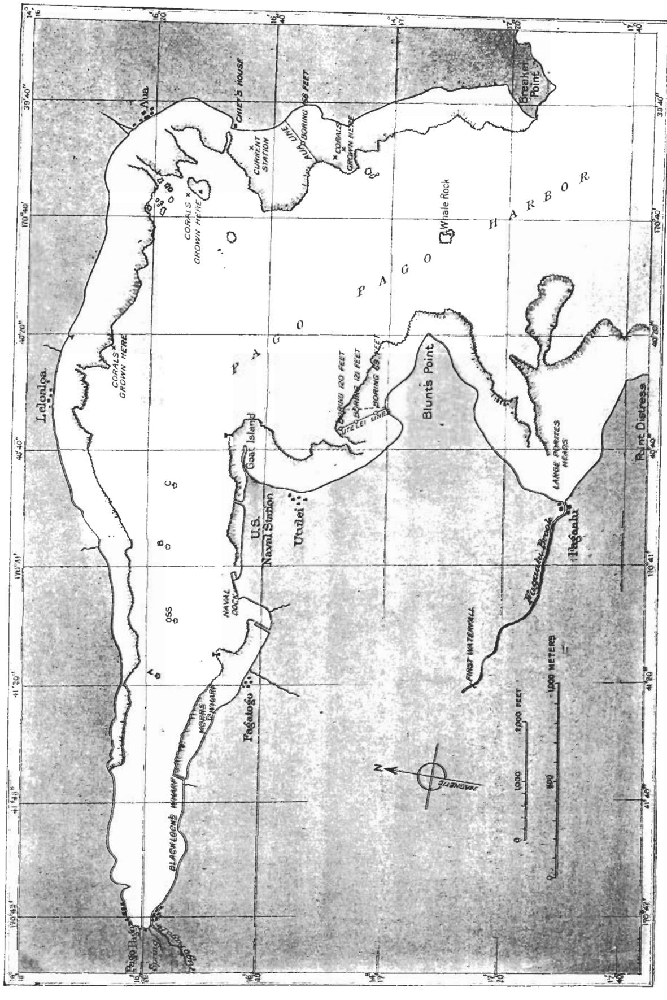

Pago Pago Harbor showing the Aua Line, stations at which corals were grown, and depths of borings through the reefs at Utelei and Aua.

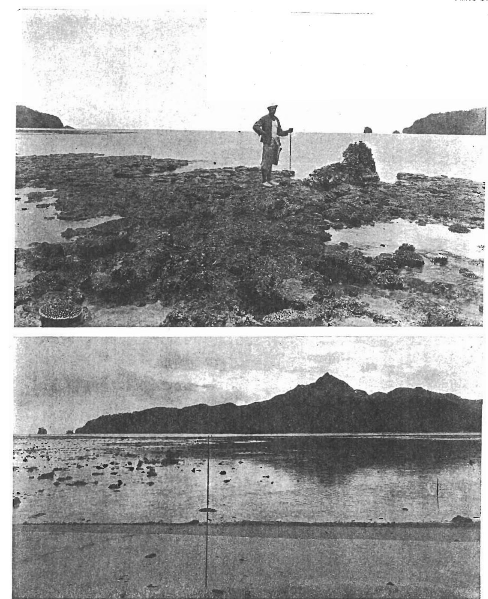

A.—Storm-tossed coral block at seaward edge of the Aua Line, showing the lithothamnium ridge and stocks of Acropora leptocyathus laid bare at low spring tide.
B.—View across the Aua Line at low tide. Line drawn across reef-flat marks position of the Aua Line.

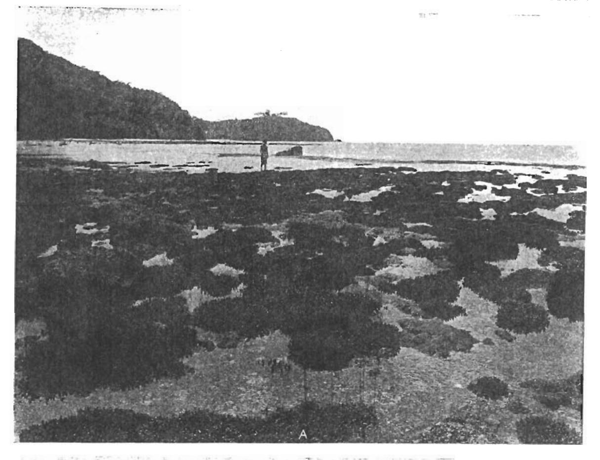

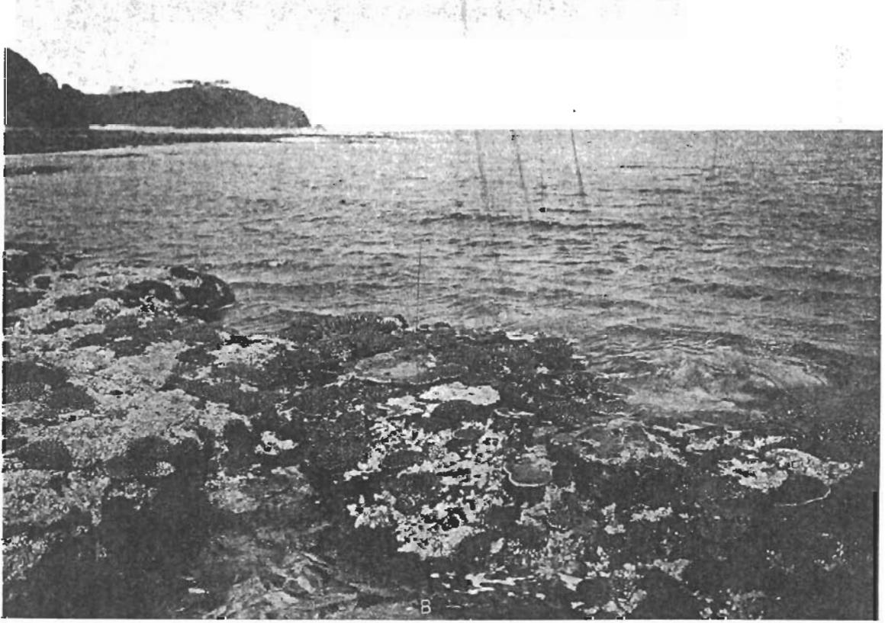

A.—Branched Acropora laid bare at low spring-tide on the Aua Line shoreward of the lithothamnium ridge, which is barely uncovered.
 B.—Seaward edge of the Aua Reef near outer end of the Aua Line, showing Acropora leptocyathus and lithothamnium.

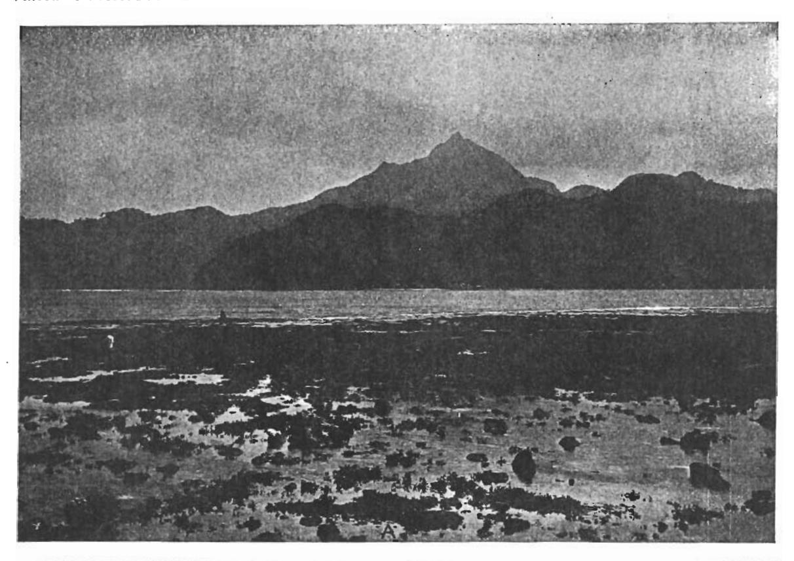

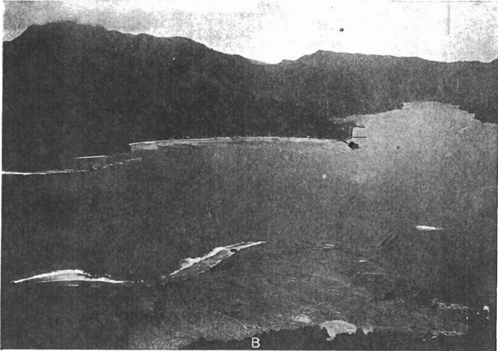

A.—The Aua reef-flat at low tide.
B.—The Aua reef-flat from the summit of Papatele. The small dark object near the middle of the reef-flat is the derrick used in boring through the reef in July 1920. The boring was 156 feet deep and ran into hard basalt at the bottom.

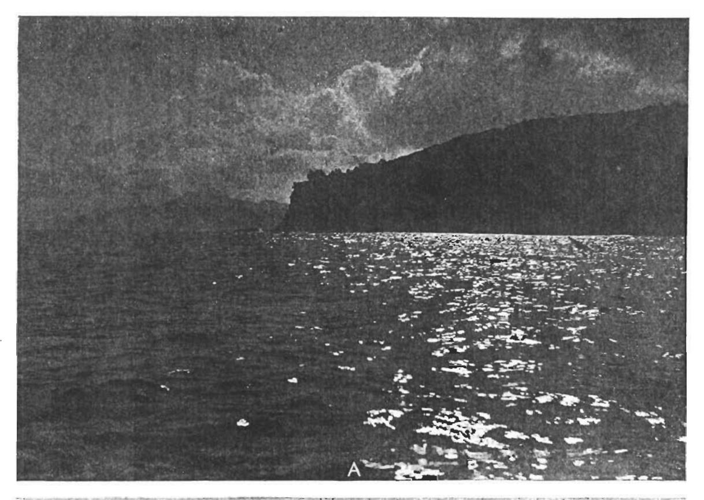

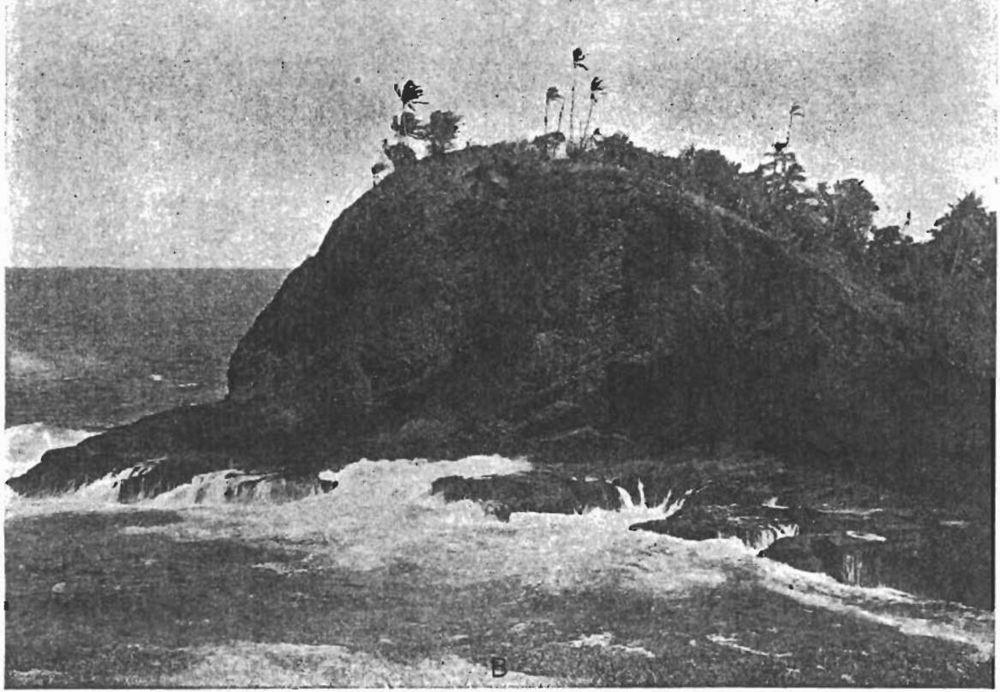

A.—Emerged platform of marine erosion at base of 300-foot cliff at Round Point, South Shore of Tutuila.
B.—Emerged platform of marine plantation at base of cliff on east side of Annu Island, off Tutuila.

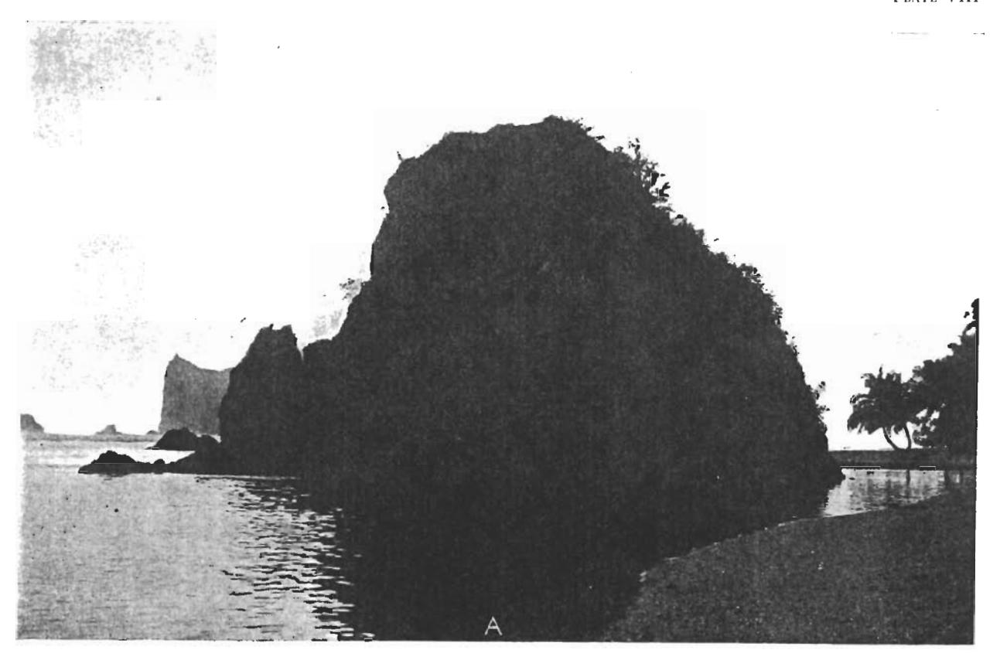

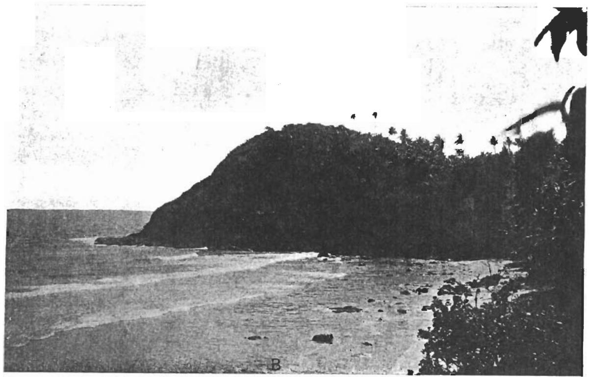

A.—Emerged platform at base of the sea-cliffs of Foisina Island, seen from Ofu Island, Manua group, Samoa.
B.—Emerged platform of marine erosion at base of a sea-cliff on the north shore of Tau Island, Manua group, Samoa.