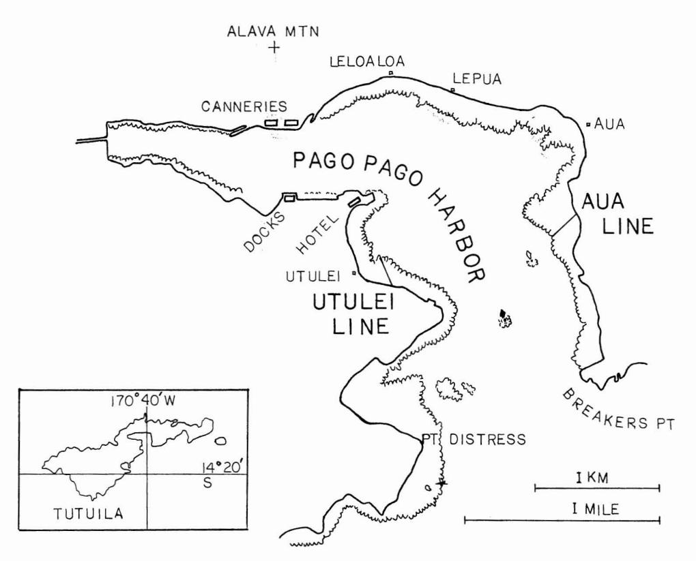
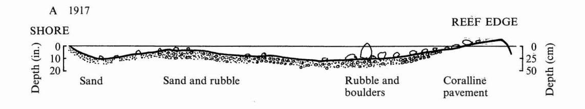
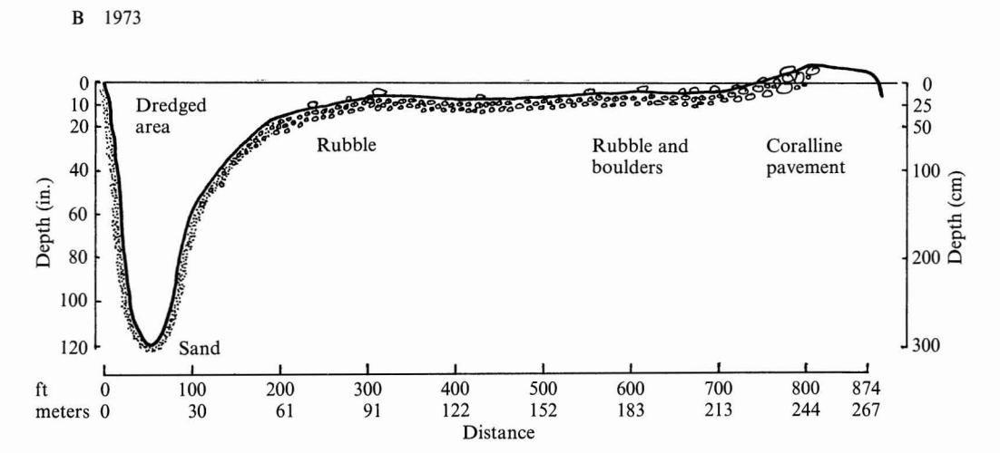
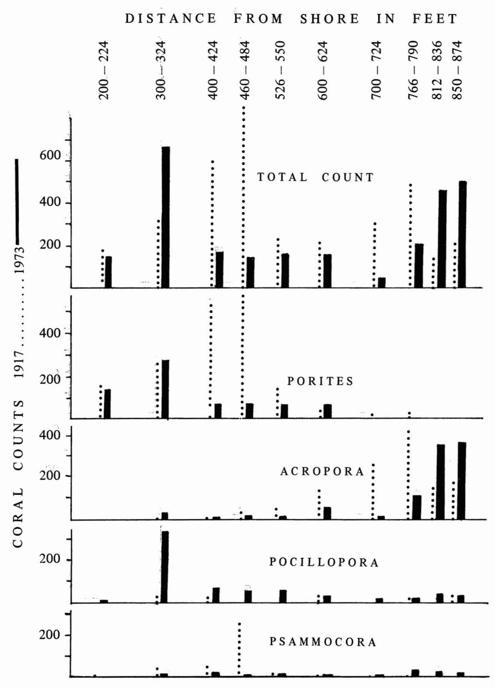

# Environmental Impact on a Samoan Coral Reef: A Resurvey of Mayor's 1917 Transect1

ARTHUR L. DAHL2 AND AUSTIN E. LAMBERTS3

ABSTRACT: Coral reef sites in Pago Pago Harbor, American Samoa, for which descriptions and quantitative data were obtained by Alfred G. Mayor and the Carnegie Institution of Washington expeditions of 1917–1920, were resurveyed in 1973. Some sites were destroyed and others damaged in the intervening half century, but it was possible to relocate the major quantitative transect at Aua. A reduction in total numbers of corals, a change in the relative proportions of different genera, and a probable reduction in the average size of individual colonies are recorded. Elsewhere in the harbor, more drastic effects on the reefs were noted. Both human and natural impacts may be responsible for the observed changes; it is suggested that the Aua reef may now be recovering from earlier damaging events.

A MAJOR DIFFICULTY in determining the environmental impact of urbanization and human activity stems from lack of adequate baseline data from which to measure change. The lack is particularly acute in the case of complex tropical ecosystems such as coral reefs. Even where there are early studies, they are generally insufficiently documented to permit meaningful comparisons with present conditions. The extensive studies by Mayor (1924a, b, c, d) are an exception. These studies, conducted in American Samoa between 1917 and 1920, centered in an area altered by subsequent development and provide a baseline for studies of the long-term impact of human activities on a coral reef. We report on a recent resurvey of some of Mayor's sites.

The Samoan Islands are an eroded volcanic archipelago in the mid-South Pacific (14° S, 170° W), of which the eastern islands constitute the Territory of American Samoa. Tutuila, largest island in the territory, consists

of a 32 km long volcanic crest reaching heights of 654 meters but never more than 9.6 km wide. The island runs SW-NE, and is partly encircled by about 55 km of narrow fringing reefs, predominantly on the south side exposed to the full sweep of the southeast tradewinds. The large deep-water Pago Pago Harbor opening to the southeast nearly bisects the island, and contains a fifth of the reef front (Figure 1).

The Polynesian population apparently never exceeded 5000, subsisting in part on seafood gathered from the reefs and on fish caught along the margins of the bays. Pago Pago Harbor became a United States coaling station in 1872, and the territory was ceded to the United States in 1900. Between 1942 and 1945, the military dredged several inshore areas for landfill, there was an increase in harbor traffic, and shipping converted from coal to oil. In 1950, with the transfer of administration to the Department of the Interior, development of Tutuila accelerated. Tuna canneries were established on the north shore of the harbor in 1956, and dredging operations were expanded in 1960.

During the past half century, the population of Tutuila increased to about 30,000, with extensive urban development along the harbor shores. The ready availability of imported food decreased local fishing pressure

&lt;sup>1 Manuscript accepted 11 March 1977.

&lt;sup>2 Department of Botany, Smithsonian Institution, Washington, D.C. 20560. Present address: South Pacific Commission, Post Box D-5 Noumea Cedex, New Caledonia.

&lt;sup>31520 Leffingwell, N.E., Grand Rapids, Michigan 49505.

FIGURE 1. Pago Pago Harbor, Tutuila, American Samoa, showing approximate reef margin and Aua and Utulei transect lines.

on the reefs. By 1973, tuna canneries and a marine railway in the harbor serviced an ocean-going fleet of over 250 fishing ships, and the port facilities are increasingly visited by tour ships and utilized as a freight transshipment point.

Pago Pago Harbor is boot-shaped, with the opening facing the oncoming tradewinds. Small tidal amplitude (maximum 1.3 meter) and poor internal circulation allow only slow flushing. There are occasional small oil spills, and urban and industrial wastes drain into the harbor, although collection and treatment projects are now underway. Freshwater from the torrential rains that sweep Tutuila often overlays the reefs: 95 cm (37.5 in.) of rain fell in 4 days in 1920, killing many of the corals (Mayor, 1924a). In 1966, a hurricane caused terrestrial damage but only minor harm to the harbor reefs. Torrential rains from 22 to 27 December 1969 may have

measured over 760 mm (30 in.) at the harbor entrance opposite Aua, although official records from Tafuna (several miles away) showed 248 mm.

## RESURVEY METHODS

The Carnegie Institution program of 1917- 1920 remains the only extensive study of the ecology of Samoan reefs. This program included taxonomic studies of various groups, such as corals (Hoffmeister 1925), soft corals (Cary 1931), terrestrial and marine plants (Setchell 1924), geological and ecological studies including reef coring (Bramlette 1926, Cary 1931) and the wide-ranging experiments and observations of Mayor himself *(l924a, b,* c, d). Central to this program were a series of line transects across the reefs in Pago Pago Harbor. Of these, only those of Aua and

FIGURE 2. Aua reef transect profiles in 1917 and 1973 (30 times vertical exaggeration).

Utulei still cross living reef (Figure 1). The others have disappeared with dredging and filling in the harbor. A series of surveys of the Tutuila reefs has been undertaken periodically by one of us since 1969 (Dahl 1972).

Mayor defined his Aua transect as running 39.5° W (magnetic) from a large tree on the beach to a conspicuous coral block on the outer edge of the reef (Mayor 1924a). In the intervening 57 years, road construction has altered the shoreline, eliminating both beach and tree. To relocate the Aua line, one of us (Dahl), matched Mayor's map (Mayor 1924a) with recent maps and the actual shore contour, obtained a new starting point, and aligned the line with respect to the mountain contours opposite to correspond Mayor's photograph (Mayor 1924a, plate 41B). The other (Lamberts) independently positioned a line based on recent charts, Mayor's photographs, and a bearing recalculated from 1917 to 1974. The two lines,

established without consultations, were within 1 meter of each other, and passed within 1 meter of a large, well-cemented block, 1 meter above the general contour of the reef edge. Remeasuring the line inward from the reef edge indicated that the margin of the present road fill roughly corresponded to Mayor's starting point. The remeasured line was marked with iron rods at 65.6-meter (200-ft) intervals, and Mayor's quantitative survey method was repeated with squares 7.32 meters (24 ft) on a side marked out at the same distances used in 1917. A team of five members with face masks and underwater slates, each concentrating on a particular group of corals or other organisms, counted genera and species within each square. A voucher collection of corals was later compared directly with Mayor's specimens at the National Museum of Natural History, Smithsonian Institution. Mayor's original measurements and counts were made

TABLE I EQUIVALENCE OF MAYOR'S TENTATIVE IDENTIFICATIONS OF *Acropora* SPECIES AND THOSE BY LAMBERTS FOR THIS PAPER

| MAYOR                                       | LAMBERTS                             |
|---------------------------------------------|--------------------------------------|
| Branched Acropora related to A. muricata | A.formosa (Dana)                     |
| Brown-stemmed, coarsely branched         | A. hebes (Dana)                      |
| Delicately branched                         | A. nana (Studer) A. quelchi Brook |
| A. samoensis                                | A. humilis (Dana)                    |
| A. leptocyathus                             | A. rotumana Gardiner                 |

in March and April 1917; our resurvey was undertaken in July 1973.

Reefs were also examined at Masefau and Fagasa on the north shore, and Amouli, Fagaitua, Matuu, Nu'uuli, Pala lagoon, Airport lagoon, Leone, and Paloa on the south shore.

## RESULTS

The dredging of a nearshore lagoon 3 meters deep and over 40 meters wide altered Mayor's first four measured squares too greatly to include them in this study. This lagoon bottom consisted of calcareous sand and mud with occasional outcroppings of coral rock to which heads of *Porites lutea* Vaughan up to 35 cm in diameter were attached, as well as scattered clumps of *Acroporaformosa* (Dana) larger than any on the reef flat. The remaining contours and the surface of the Aua reef seem not to have changed appreciably in the intervening years. Comparative profiles of the line in 1917 and 1973 are shown in Figure 2.

Mayor (1924a) recorded corals by tentative identification; these could not be entirely harmonized with later identifications by Hoffmeister (1925) or with our findings. Corresponding identifications for *Acropora* are listed in Table 1. Three genera *(Merulina, Goniopora,* and *Cyphastr?at* reported by Mayor were not found in 1973. Hoffmeister did not confirm *Gonioporafrom* the Aua line, and the *M erulina* he reported was from Utulei.

The reef edge near the coralline algal ridge had many crevices and shallow tide pools crowded with small (juvenile) *Acropora,* mostly under 12 cm tall, for which species determinations were not possible.

Most significant are the differences in total numbers and species proportions found in 1917 and 1973 (Table 2, Figure 3). Total numbers of coral heads decreased 28 percent. The same four genera of hermatypic corals still predominate, but their relative proportions have altered. Numbers of *Psammocora* and *Porites* decreased by half, while *Pocillopora,* especially *P. damicornis,* increased fivefold. *Acropora* remained constant.

Counts were also made of the black holothurians *Stichopus chloronotus* Brandt, blue starfish *Linckia laevigata* Linnaeus, and alcyonarians (Table 3). In all cases the numbers observed were roughly triple those reported by Mayor.

Water currents pass obliquely from the harbor entrance across the Aua line. Surface waters generally sweep to the head of the bay where the currents are dissipated. The waters within the confines of the upper harbor are turbid and dark and a plume of discoloration can often be observed in the cannery area. Underwater visibility at the reef edge of the Aua transect in the path of incoming ocean water was 30 meters horizontally, when observed on one occasion, and corals could be distinguished to a depth of 10 meters, comparable to other areas around Tutuila. Visibility gradually decreased up the harbor along the north shore, and at Lepua it was estimated as one-third that ofthe Aua region.

Coral growth on the reef opposite the village of Aua remains vigorous, but along the north harbor shore it becomes sparse. No *Acropora* or branched *Porites* were found beyond Lepua, where *Pocillopora brevicornis* (Dana) is the most prominent inshore coral, associated with *Porites lutea, Pavona frondifera, Leptastrea purpurea,* and *Montipora* sp. A similar distribution of coral but with fewer individuals was found at Leloaloa. At the reef edges, spur and groove contours are present, and beyond, occasional large heads of *Porites* aff. *lutea* are visible. In the areas adjacent to the canneries no recently dead or

TABLE 2 NUMBER OF LIVING CORAL HEADS UPON EACH 7.32-METER (24-FT) SQUARE ON THE AUA LiNE, PAGO PAGO HARBOR, TUTU/LA, AMERICAN SAMOA, JULY 1973 (MAYOR'S COUNTS FROM 1917 IN ITALICS)

|                                                                               | DISTANCE FROM LOW TIDE OF SHORE MARK |         |           |          |          |          |           |          |           |           |           |            |             |                        |
|-------------------------------------------------------------------------------|--------------------------------------------------------|---------|-----------|----------|----------|----------|-----------|----------|-----------|-----------|-----------|------------|-------------|------------------------|
|                                                                               | Meters                                                 | 61-68   | 91-99     | 122-129  | 140-147  | 160-168  | 183-190   | 213-221  | 233-241   | 247-255   | 259-267   |            |             |                        |
| CORAL                                                                         | Feet                                                   |         | 200-224   | 300-324  | 400-424  | 460-484  | 526-550   | 600-624  | 700-724   | 766-790   | 812-836   | 850-874    | TOTAL       | PERCENT TOTAL OF |
| Psammocora contigua (Esper)                                             |                                                        | 2       | 46 10  | 49 14 | 259 6 | 17 12 | 9 2    | 1 7   | 5 33   | 21        | 15        | 388 120 | 10.6 4.5 |                        |
| Pocillopora damicornis brevicornis P. P. eydouxi & Haime | (L), Lamarck, Milne-Edwards                      | 3 11 | 24 349 | 23 75 | 3 60  | 6 63  | 35 32  | 5 15  | 19 23  | 46        | 31 45  | 149 719 | 4.1 27.1 |                        |
| Acropora formosa                                                           | (Dana)                                                 | 7       | 3 23   | 13 3  | 38 14 | 59 11 | 151 30 | 265 6 | 407 26 | 15        | 9         | 936 144 | 25.5 5.4 |                        |
| (Dana) Acropora hebes                                                   |                                                        |         |           |          |          |          | 16        | I 1   | 4 9    | 144 15 | 8 56   | 157 99  | 4.3 3.7  |                        |
| (Studer) Acropora nana and A. que/chi                          | Brook                                                  |         | 8         | 2 2   | 2        | 3        | 4         | 16 2  | 15 19  | 6         | 15 3   | 50 47   | 1.2 1.8  |                        |
| Acropora humilis A. rotumana                                         | or (Dana) Gardiner                               |         | 1         | I        | 4        | 3        | 8         | 2        | 12        | 13 36  | 161 68 | 174 135 | 4.7 5.1  |                        |
| Acropora hyacinthus                                                        | (Dana)                                                 |         | 1         |          | 1        |          | 6         | 3        |           | 15        | 36        | 62         | 2.3         |                        |
| sp. "Juveniles" Acropora                                                |                                                        |         |           |          |          |          |           | 2        | 55        | 265       | 214       | 536        | 20.2        |                        |
| sp. Montipora                                                              |                                                        |         |           |          |          |          | 2         | 6 4   | 13 17  | 11        | 21 13  | 42 45   | 1.1 1.7  |                        |

TABLE 2 *(conI.)*

|                                                    |                         |             |            |            | DISTANCE FROM | LOW TIDE | MARK OF | SHORE     |            |            |            |                |                        |
|----------------------------------------------------|-------------------------|-------------|------------|------------|------------------|-------------|------------|-----------|------------|------------|------------|----------------|------------------------|
|                                                    | Meters                  | 61-68       | 91-99      | 122-129    | 140-147          | 160-168     | 183-190    | 213-221   | 233-241    | 247-255    | 259-267    |                |                        |
| CORAL                                              | Feet                    | 200-224     | 300~324    | 400-424    | 460-484          | 526-550     | 600-624    | 700-724   | 766-790    | 812-836    | 850-874    | TOTAL          | PERCENT OF TOTAL |
| PavonaJrondifera                                   | Lamarck                 |             | 2 6     | 1 5     | 22               | 35 4     | 10 2    | 7 I    | 4 7     | 8          | 10         | 81 43       | 2.2 1.6             |
| "massive," Porites P. lutea & Haime | mostly Milne-Edwards | 82 68    | 94 119  | 190 33  | 205 22        | 90 16    | 32 44   | 18        | 23 I    |            |            | 734 303     | 20.0 11.4           |
| Porites "branched," P. andrewsi           | mostly Vaughan       | 79 61    | 157 145 | 317 31  | 319 40        | 49 37    | 2 8     |           |            |            |            | 923 322     | 25.1 12.1           |
| Favites sp.                                     |                         | ,1          |            |            |                  |             | .2 '2   |           | 'I         | 1 ,I    | 5          | 4 9         | 0.1 0.3             |
| (Dana) Leptastrea purpurea                   |                         | 1 I      | 7 3     | 4 2     | 10               | 4           | 3          |           |            |            |            | 22 13       | 0.6 0.5             |
| Galaxeafascicularis                                | (L.)                    |             |            |            |                  |             |            | I         | 4          | 1 7     | 29         | 1 41        | 0.03 1.5            |
| sp. Millipora                                   |                         |             | 1          | 2          | 4                |             |            | 2         |            |            | 19         | 9 19        | 0.2 0.7             |
| Total coral heads                            |                         | 168 0148 | 334 666 | 601 166 | 862 147       | 256 154  | 243 157 | 321 44 | 490 207 | 159 446 | 236 522 | 3,670 2,657 |                        |

FIGURE 3. Comparison of distribution and numbers of total corals and major genera observed on the Aua line in 1917 and 1973.

TABLE 3 NUMBERS OF BLUE-BLACK HOLOTHURIANS *(Stichopus chloronotus),* BLUE STARFISH *(Linckia laevigata),* AND ALCYONARIANS ON THE AUA LINE, PAGO PAGO HARBOR, TUTUILA, AMERICAN SAMOA, JULY 1973 (MAYOR'S COUNTS FROM 1917 IN ITALICS)

| DISTANCE FROM LOW TIDE MARK OF SHORE |        |            |            |            |            |           |           |          |         |         |         |              |
|--------------------------------------------------------|--------|------------|------------|------------|------------|-----------|-----------|----------|---------|---------|---------|--------------|
|                                                        | Meters | 61-68      | 91-99      | 122-129    | 140-148    | 160-168   | 183-190   | 213-221  | 233-241 | 247-255 | 259-267 |              |
| NAME                                                   | Feet   | 200-224    | 300-324    | 400-424    | 460-484    | 526-550   | 600-624   | 700-724  | 766-790 | 812-836 | 850-874 | TOTAL        |
| Ho1othurians                                           |        | 183 229 | 115 173 | 170 289 | 135 300 | 34 410 | 12 500 | 4 249 | 3 38 | 20      |         | 656 2,208 |
| Blue starfish                                       |        | 1          | 6          | 1 1     | 2          |           |           |          |         |         |         | 2 9       |
| Alcyonarians                                           |        | 3          | 2          |            | 5          |           | 8         |          |         | 3 18 | 3       | 13 30     |

live coral was found, except inshore at a depth of 25 cm where *Leptastrea purpurea* and some small heads of *P. lutea* were seen.

As far as could be ascertained, the upper end of the harbor from the canneries to the docks was devoid of living coral. The 300 meter-long area between the docks and our hotel contained a reef that had been dredged in 1969. When examined in 1973, it consisted for the most part ofsandy bottom sloping for 50 meters into deep water, with occasional outcroppings of old coral rocks. Living *Porites* air. *lobata* was found in the midportion of this area. In addition, ten coral colonies had established themselves, including *Porites lutea, P. andrewsi, Leptastrea purpurea,* and *Pocillopora damicornis.* No holothurians were observed.

The Utulei line described by Mayor has been disrupted by dredging near the shore, but the coral reefs on the west shore of the harbor south of the hotel and the outer Utulei reefs appear structurally intact. Water was turbid, with considerable garbage on the bottom. Numerous alcyonarians, large heads of *Porites,* some large heads of *Favites rotumana* Gardiner, and smaller numbers of *Acropora* are present.

### DISCUSSION

Measurements from charts indicate that approximately 10 km of reef front once existed in Pago Pago Harbor between Point Distress and Breakers Point. In 1917 when Mayor visited Samoa, a wharf was already present, but from his lack of discussion it is inferred the reefs in the inner harbor were flourishing. Mayor dredged living deep-water corals in the upper harbor and chose Lepua for coral growth studies (Mayor 1924d). This site lies in the middle of a 2-mile stretch of reef which now shows considerable decrease in coral abundance compared with the Aua reef. Also, 2 km of reef in the innermost part of the harbor showed no living coral in 1973.

The combination of sedimentation and eutrophication has caused destruction of many coral reefs in Kaneohe Bay, Oahu, Hawaii (Banner and Bailey 1970, Caperon

et al. 1971, Smith et al. 1973), and physical conditions in Pago Pago Harbor are in many ways comparable to those found in Kaneohe Bay. Dredging activities in the upper harbor have been continuous for several years with attendant water turbidity and silt. Johannes (1972, personal communication) and Pillai and Gopinadha (1971) implicate siltation as the most significant factor in reef destruction. In Pago Pago Harbor some of the sediment formed by dredging is carried by currents to areas outside the harbor, but this circulation does not normally affect the Aua line. Wastes from the canneries are, for the most part, washings and other organic fish residues which appear to contribute to progressive eutrophication of the bay.

The decrease in total number of coral heads and change in species proportion on the Aua transect since 1917 cannot readily be attributed to any specific natural fluctuation or human disturbance, although it may be related to the processes that have killed the corals of the inner harbor and generally impoverished the reefs ofthe north harborshore. The changesin both numbers and proportions relative to distance on the transect suggest that major alterations in community structure have taken place. While *Acropora* continues to be a major contributor to the structure of the reef, *Psammocora* has been reduced by two-thirds. In the midzone, *Pocillopora*, especially *P. damicornis* and *P. brevicornis,* have increased fivefold, occupying a zone once dominated by *Porites.*

Unfortunately, Mayor did not record the sizes of the colonies counted, although his photographs suggest considerable numbers of large colonies. Comparison of coral sizes at Aua with those of other reefs on Tutuila shows that young corals now predominate at Aua. *Porites lutea* frequently forms colonies 1 meter or more in diameter on Tutuila reefs, but at Aua the heads observed were as small as 3 cm. In other reef moats on Tutuila, it is common to find patches of *Acropora formosa* many square meters in extent and 1 meter or more in height. The lower parts ofthese thickets are often dead, and the upper parts killed in a sharply demarcated line, presumably corresponding to extreme low

tide level. No such large patches were observed at Aua. The many small colonies and lack of large ones suggests a reef subjected to intermittent severe stress, or one gradually recovering from an earlier traumatic event (for example, the freshwater inundation of 1969). What is known of species tolerances in corals also supports the view that the Aua reef is gradually recovering from earlier stress. Acropora requires pure, clean water and is intolerant to siltation. The presence of some mature A. formosa in the dredged area and at the reef edge suggests impure water has not been a recent problem. Pocillopora damicornis is most tolerant of adverse conditions and is often found near shore where there is silt and fluctuating water temperature. This species and P. brevicornis are good colonizers of denuded areas because the planulae are released frequently and in large numbers. A fivefold increase in numbers of *Pocillopora* is thus not unexpected.

One species greatly reduced in numbers at Aua was *Porites andrewsi*, and on the Lepua reef it was not found at all. On other reefs on Tutuila it is often found in conjunction with *P. lutea* though there are inshore areas outside the harbor where one species was present in large numbers and the other absent.

Our recount of the number of black holothurians, *Stichopus chloronotus* Brandt, showed triple the number found in 1917, possibly suggesting an increase in organic material in the sediments.

The Aua transect in 1973 showed healthy recent coral growth with species diversity consistent with that found on other sections of the Tutuila reefs. However, the total number of colonies was less than that in 1917, species proportions are considerably altered, and the number of small colonies is high. Whether the reef will eventually return to the state recorded over 50 years ago by Mayor, will further decline under the impact of natural or man-induced stress, or will achieve some new equilibrium state can only be determined by future surveys. Fortunately, the foresight and skill of the Carnegie Institution studies will make such a determination possible.

#### ACKNOWLEDGMENTS

We wish to express our appreciation for the cooperation and assistance of the Office of Marine Resources of the Government of American Samoa and in particular for the invaluable aid of Jim Chambers, Bill Nunes, and Gordon Yamasaki in collecting the field data.

## LITERATURE CITED

Banner, A. H., and J. H. Bailey. 1970. The effect of urban pollution upon a coral reef system. Hawaii Inst. Mar. Biol. Tech. Rep. 25. Honolulu, Hawaii. 65 p.

BRAMLETTE, M. N. 1926. Some marine bottom samples from Pago Pago Harbor, Samoa. Carnegie Inst. Wash., Publ. 344, Pap. Dep. Mar. Biol. 23:1–35, 1 map.

CAPERON, J., A. CATELL, and G. KRASNICK. 1971. Phytoplankton kinetics in a subtropical estuary—eutrophication. Limnol. Oceanogr. 16:599–607.

CARY, L. R. 1931. Studies on the coral reefs of Tutuila, American Samoa with special reference to the Alcyonaria. Carnegie Inst. Wash., Publ. 413, Pap. Tortugas Lab. 27:53–98, pl. 1–7.

DAHL, A. L. 1972. Ecology and community structure of some tropical reef algae in Samoa. Proc. Int. Seaweed Symp. 7:36–39.

HOFFMEISTER, J. E. 1925. Some corals from American Samoa and the Fiji Islands. Carnegie Inst. Wash., Publ. 343, Pap. Dep. Mar. Biol. 22:1–90, pl. 1–23.

JOHANNES, R. E. 1972. Coral reefs and pollution. Pages 364–375 in M. Ruivo, ed. Marine pollution and sea life. Fishing News (Books) Ltd., London.

MAYOR, A. G. 1924a. Structure and ecology of Samoan reefs. Carnegie Inst. Wash., Publ. 340, Pap. Dep. Mar. Biol. 19:1–25, pl. 3–10.

------. 1924b. Causes which produce stable conditions in the depth of the floors of Pacific fringing reef-flats. Carnegie Inst. Wash., Publ. 340, Pap. Dep. Mar. Biol. 19:27–36, pl. 9–10.

- . 1924c. Inability of stream-water to dissolve submarine limestones. Carnegie Inst. Wash., Publ. 340, Pap. Dep. Mar. Biol. 19:37-49.
- —... 1924*d*. Growth-rate of Samoan corals. Carnegie Inst. Wash., Publ. 340, Pap. Dep. Mar. Biol. 19:51–72, pl. 1–26. PILLAI, N. K., and G. S. GOPINADHA. 1971. Composition of the coral fauna of the south eastern coast of India and the Laccadives. *In* D. R. Stoddart and M.
- Yonge, eds. Regional variations in Indian Ocean coral reefs. Academic Press, New York.
- SETCHELL, W. A. 1924. American Samoa. I. Vegetation of Tutuila Island. Carnegie Inst. Wash., Publ. 341, Pap. Dep. Mar. Biol. 20.
- SMITH, S. V., K. E. CHAVE, and D. T. O. KAM. 1973. Atlas of Kaneohe Bay: A reef ecosystem under stress. University of Hawaii Sea Grant Program. UNIHI-SEAGRANT-TR-72-01.