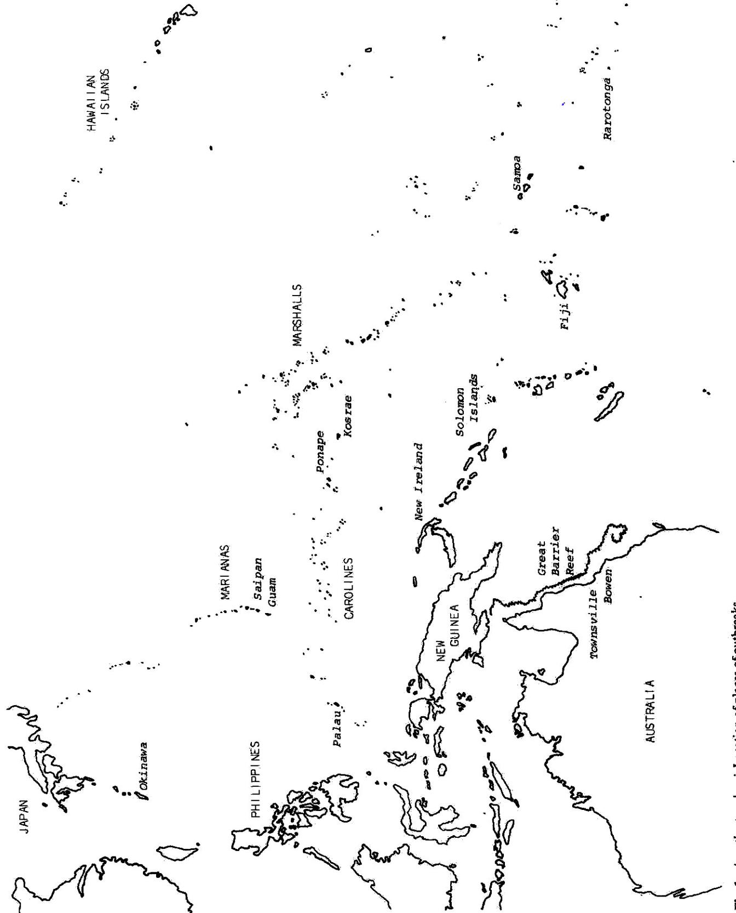
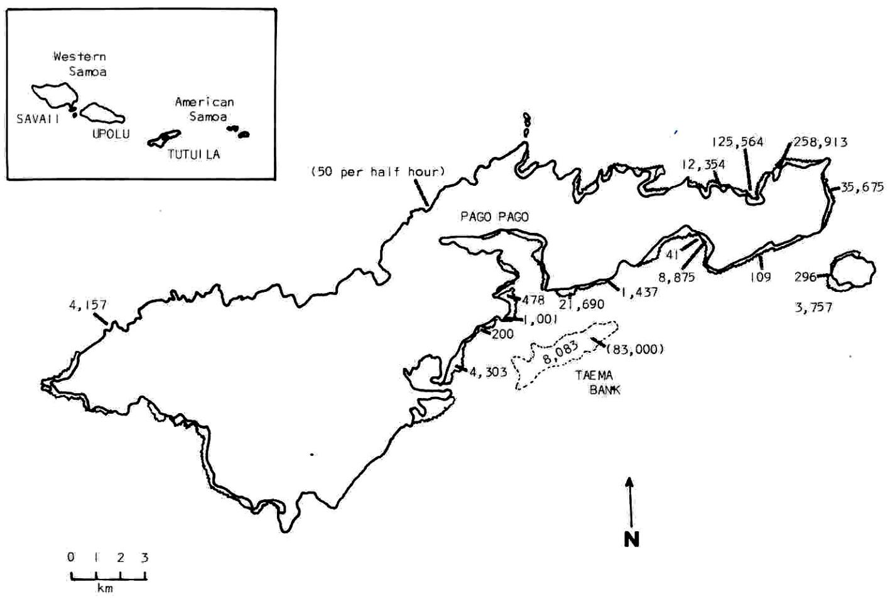

# Terrestrial Runoff As a Cause of Outbreaks of *Acanthaster planci* (Echinodermata: Asteroidea) \*

C. Birkeland

Marine Laboratory, UOG Station, University of Guam; Mangilao, Guam 96913

#### Abstract

Outbreaks of adult Acanthaster planci (Linnaeus) have appeared at irregular intervals, arriving 3 yr after heavy rains (>100 cm in 3 months) following droughts (<25 cm in 4 months) or 3 yr after rains exceeding intensities of 30 cm in 24 h. Outbreaks of A. planci follow typhoons that bring heavy rains, but do not follow "dry" typhoons of equivalent wind force. Outbreaks occur around the high islands in Micronesia and Polynesia, but not around the atolls at intermediate locations. Phytoplankton blooms appear off high islands at the beginning of the rainy season in bays with large watersheds and with sufficient residence time of the waters; these are the initial sites of A. planci abundance on Guam. The spawning seasons of A. planci occur at the beginning of the rainy season on both sides of the equator. I hypothesize that, on rare occasions, terrestrial runoff from heavy rains (following the dry season or a record drought) may provide enough nutrients to stimulate phytoplankton blooms of sufficient size to produce enough food for the larvae of A. planci. The increased survival of larvae results in an outbreak of adults 3 yr later. This hypothesis can be tested by predicting future outbreaks. An outbreak of A. planci on Saipan in the summer of 1981 was predicted on the basis of heavy rains in August 1978.

#### Introduction

Outbreaks of Acanthaster planci are a natural phenomenon that recur at irregular intervals. That outbreaks recur is evidenced by aggregations of skeletal remains in sediment core samples (Frankel, 1977), by a second recent increase in abundance on Guam, and by the folklore and memories of Samoans (Birkeland and Randall, 1979), Solomon Islanders (Vine, 1970, 1973), New Ireland Is-

landers (Pyne, 1970), Ponapeans (Chesher, 1969a) and Palauans (Birkeland, 1979) of previous outbreaks of A. planci (Fig. 1). That outbreaks are a natural phenomenon is implied by their occurrences hundreds of years ago (Frankel, 1977), by their occurrences in areas far from agricultural activity or industrial and urban development [e.g. the north coast of Tutuila, American Samoa (Birkeland and Randall, 1979) and south of Urukthapel Island, Palau (Birkeland, 1979)] and by the lack of correlation of timing of any construction or industrial activities with the local outbreaks of A. planci (Birkeland and Randall, 1979). Only rainfall with terrestrial runoff was correlated with the outbreaks and evidence for this is presented in this paper.

#### **Observations**

Abruptness of the Population Increases

Initial outbreaks of Acanthaster planci (Linnaeus) appear suddenly, within a few months, and do not build up gradually over years. This characteristic of outbreaks of A. planci is fundamental to my hypothesis.

Acanthaster planci appeared suddenly in American Samoa in late 1977. Despite their frequent and widespread activity, fishermen who were on the reef nearly every day during the last few decades very rarely saw an A. planci from about 1938 to late 1977 (Birkeland and Randall, 1979; Flanigan and Lamberts, 1981). Weber and Woodhead (1970), Vine (1970), and Devaney (Devaney and Randall, 1973) reported A. planci to be very scarce in American Samoa between 1966 and 1971. R. C. Wass (personal communication) saw no more than 6 individuals during 3 yr of extensive diving around American Samoa prior to November 1977. The first group of A. planci (roughly 50 per 30 min) was seen in November 1977 at Fagatuitui Cove, northeast of Fagasa Bay on the north coast of Tutuila (Wass, 1979). In the next month, an aggregation of about 83 000 individuals moved as a front

\* Contribution no. 169, University of Guam Marine Laboratory

Fig. 1. Acanthaster planci. Location of places of outbreaks

Fig. 2. Acanthaster planci. Numbers removed from the ocean for bounty (open numbers) or observed in surveys (numbers in parentheses) at Tutuila, American Samoa

along Taema Banks off the south-central coast of Tutuila (Wass, 1979). In early 1978, 384 477 individuals were collected from two small bays on the northeast coast (Fig. 2). A total of 486 933 individuals were removed from the ocean less than a year from the time the first group was observed (Birkeland and Randall, 1979).

Acanthaster planci appeared in large numbers on Western Samoa (at Upolu, 59 km from Tutuila) during 1977 (A. Banse, personal communication). A. planci thus appeared at approximately the same time in widely separated locations (on all sides of Tutuila and at Upolu, Fig. 2).

Sudden increases in abundance of Acanthaster planci occurred at Guam in late 1967 and in 1979. A. planci started to appear frequently in June 1967 and by June 1968 about 200 individuals could be observed per dive at Tumon Bay (Randall, 1971). I observed a total of less than 20 individuals during about 240 dives (averaging about 30 min each) in 4 yr from August 1975 to May 1979. Beginning in May 1979, we could find 29 to 50 individuals per 30-min period at the north ends of Agana and Tumon Bays.

A sudden and widespread increase in abundance of Acanthaster planci occurred in Palau (Belau) in the spring

of 1977 (Government of Palau Office of Marine Resources, personal communication). Over 354 470 A. planci were removed from the area around Ngadarak (Ngederrak) reef (S. Birk, personal communication). The outbreaks seemed to have started at discrete locations, widely separated by Urukthapel (Ngeruktabel), a very long island (Birkeland, 1979). Although each outbreak was concentrated on a geographic scale, occurring in some island groups but not in others, the outbreaks appeared suddenly at more than one location within these groups across an area subjected to similar climatic conditions.

"Secondary infestations" (Endean, 1973) sometimes follow initial outbreaks. Examples were found at Guam (Chesher, 1969b), in Palau (Birk, 1979), and on the Great Barrier Reef (Kenchington, 1977). This paper is only concerned with causes of the initial outbreaks. Endean (1973, 1974) and Kenchington (1977) discuss secondary infestations.

## Outbreaks and Rainfall Records

All major outbreaks of Acanthaster planci have been associated with unusually heavy rainfall 3 yr previous to their first appearance (Table 1). If we accept the spawning

Table 1. Acanthaster planci. Association of outbreaks with heavy rainfall 3 yr previous

| Year when outbreak was first observed | Location                                               | Minimum estimates of outbreak size                                                                          | References                                                                                                                  | Weather event at the location 3 yr previous to the outbreak                                                                                                                            | References                                                                                        |
|------------------------------------------------|--------------------------------------------------------|----------------------------------------------------------------------------------------------------------------|-----------------------------------------------------------------------------------------------------------------------------|----------------------------------------------------------------------------------------------------------------------------------------------------------------------------------------|---------------------------------------------------------------------------------------------------|
| 1962                                           | Queensland Coast between Townsville and Bowen | 44 000 individuals were killed by control measures at Green Island, but the outbreak was was more extensive    | Barnes, 1966; Endean, 1973, 1974; Endean and Stablum, 1975; Harding, 1968                                    | The third most intense typhoon on record with heavy rainfall causing extensive river discharge in 1959                                                                                 | FS, DO, Brisbane, 1959; ACR, 1975: 16; Newman and Bath, 1959                       |
| 1967 – 1968                                    | Suva, Fiji                                             | 9 860 individuals; "many" were observed in an area where none were observed the year before (1966) | Owens, 1971; Weber and Woodhead, 1970                                                                                 | Severe floods and heavy rains early in the wet seasons of 1964 and 1965                                                                                                       | Cooper, 1966                                                                                      |
| 1968                                           | Guam                                                   | 63 000 individuals were destroyed by control measures, but many remained                              | Randall, 1971; Marsh and Tsuda, 1973                                                                                  | Most severe dry spell on record (since 1956) came in February to May 1965 followed by 39.9 cm (15.7 inches) of rain in July which was 12 cm greater than expected | NOAA. 1980 b                                                                                   |
| 1969 – 1972                                    | West-Central Okinawa                                | 240 000 individuals removed by control measures                                                          | Nishihira and Yamazato, 1974                                                                                             | 119.4 cm rain at Nago during the early reproductive season of Acanthaster (April–June) in 1966; 154.2 cm rain in same period at Nago in 1969                                           | Koichi Kujirai, Director- General, Japan Meteorological Agency (pers. comm.) |
| 1973                                           | Rarotonga, Cook Islands                             | 80 974 individuals killed by control measures                                                            | Cook Island News, 19 February 1973                                                                                    | 117.5 cm rain fell during the early reproductive season of Acanthaster (December 1970 – February 1971)                                                                  | JMA, 1975                                                                                         |
| 1977                                           | Tutuila, American Samoa                             | 486 933 individuals were collected for bounty, thousands more remained                                | Birkeland and Randall, 1979                                                                                              | Record drought in 1974 (13.5 cm [5.3 inches] in 4 months) immediately followed by heavy rains (112 cm [44 inches] in 3 months)                                       | NOAA, 1980c                                                                                       |
| 1977                                           | Palau                                                  | 354 470 individuals were removed from Ngederrak Reef, but more remained south of Urukthapel        | Serge Birk (personal communication)                                                                                   | The highest annual rainfall on record for Palau was 470 cm (185 inches) in 1974; 35 cm (13.9 inches) on a single day in January                                                        | NOAA, 1980 a                                                                                      |
| 1979                                           | Guam                                                   | scattered aggregations of up to 200 individuals                                                       | Personal observations and personal communications from others                                                      | 68.6 cm (27 inches) of rain on 22 May 1976 and a total of 83.8 cm in 2d with Typhoon Pamela                                                                                | Records at the NOAA station on Guam                                                      |
| 1981                                           | Saipan                                                 | "thousands" of individuals                                                                                  | Joaquin Villagomez, Chief, Division of Marine Resources, Commonwealth of the Northern Marianas (pers. comm.) | 114 cm (45 inches) of rain in 48 h in mid-August 1978                                                                                                                            |                                                                                                   |

season of A. planci north of the equator to be June–August (Yamazato and Kiyan, 1973) and south of the equator to be November–January (Lucas, 1973), and if we define a "rainy spawning season" to be a three-month period in which there is more than 100 cm of rain, then we find a significant tendency for A. planci outbreaks to be associated with heavy rainfall during the spawning season three years previous (Table 2).

It is not certain whether there were one or two outbreaks of Acanthaster planci off west-central Okinawa. The outbreak of A. planci at Okinawa was first observed in 1969 and the population was still abundant in 1972 (Nishihira and Yamazato, 1974). Weather records show that the heaviest rains during the spawning seasons in Okinawa were in 1966 and 1969. I have not been able to determine whether there were one or two outbreaks because A. planci were common throughout this period and 240 000 individuals were removed intermittently over a prolonged period (Nishihira and Yamazato, 1974). If there was only one outbreak at west-central Okinawa in 1969, there was a total of 6 outbreaks in 173 place-years (Table 2). If there was a second outbreak in 1972 (cf. Nishihira and Yamazato, 1974), then there were 7 outbreaks in 173 place-years.

If we set operational definitions of "heavy rains" (>100 cm during 3-months of the spawning season) following "droughts" (<25 cm of rain during 4-months immediately preceding the spawning season) and "intensive" rains (>30 cm in 24 h) and examine areas for which daily precipitation records exist (Table 3), we find that all outbreaks have occurred 3 yr after one of these two weather events ( $P < 8.1 \times 10^{-6}$  that this association is a matter of chance).

This association of future outbreaks with the weather allows predictions to be made. There were 45 inches (114 cm) of rain in a 48-h period on Saipan in August 1978. Predictions were made (Birkeland and Randall, 1979; Birkeland, 1980) that an outbreak would occur on Saipan in the summer of 1981, three years after the rains. Several thousand *Acanthaster planci* were found

Table 2. Acanthaster planci. Association of outbreaks with heavy rainfall (> 100 cm) during 3 months of the spawning season 3 yr previous. Monthly rainfall data were from American Samoa (1960 – 1979), Rarotonga (1899 – 1980), Palau (1947 – 1979), Guam (1956 – 1979) and Nago, Okinawa (1966 – 1979)

No. years with rainfall

Acanthaster planci outbreak

|         | (during spaw 3 yr previous | (during spawning season) 3 yr previous |  |
|---------|-------------------------------|----------------------------------------|--|
|         | < 100 cm                      | > 100 cm                               |  |
| present |                               | 6                                      |  |
| absent  | 116                           | 51                                     |  |

P (7) = 
$$\left(\frac{57}{173}\right)^7$$
 = 0.00042 (assuming two outbreaks at Okinawa)

**Table 3.** Acanthaster planci. Association of heavy rains (> 100 cm in 3 months) following droughts (< 25 cm in 4 months) or intensive rains (> 30 cm in 24 h) with A. planci outbreaks 3 yr later. Daily records are from American Samoa, Palau, and Guam

| Outbreak of Acanthaster planci | Heavy rains following drought or intensive rains |                      |  |
|--------------------------------|--------------------------------------------------|----------------------|--|
| *                              | No. years with                                | No. years without |  |
| present                        | 4                                                |                      |  |
| absent                         |                                                  | 71                   |  |

as a moving front in southern Saipan in August 1981 (J. Villagomez, Chief of the Division of Marine Resources, Northern Marianas, personal communication). I predict an outbreak of *A. planci* in Palau in the summer of 1983 because there were 17 inches (43 cm) of rain in Palau on 13 April 1979.

Tests of hypotheses can be made by predicting previous weather records. "Huge numbers" of Acanthaster planci were last seen (prior to the 1977 outbreak) on American Samoa in 1938 (Flanigan and Lamberts, 1981). I have not yet been able to obtain daily weather records for Tutuila for January 1935, but I predict that they would contain records of exceptionally intensive rains around January 1935.

Vine (1970, 1973) was informed that an outbreak occurred in the Solomon Islands about 40 yr prior to 1970. The weather records for Honiara, Guadalcanal (JMA, 1975), show extremely heavy rains during the spawning season of *Acanthaster planci* in 1923. There were 1 506 mm (59.3 inches) of rain in January 1923, 2 639 mm of rain during the spawning season (November 1922 to January 1923) and 7 964 mm (314 inches) of rain for the year (April 1922 to March 1923). This was over 3 times the expected rainfall for January, the spawning season, and the year.

### Wet and Dry Typhoons

Typhoon Karen and Typhoon Pamela were two very strong typhoons that struck Guam with sustained winds of 220 to 270 km h-1. Typhoon Pamela brought 83.8 cm (33 inches) of rain (68.6 cm in 24 h) in May 1976 and was followed by an increase in abundance of *Acanthaster planci* first seen in May 1979. Typhoon Karen (1962) was a dry typhoon with a wind intensity equivalent to that of Typhoon Pamela; it caused tremendous structural damage on Guam, but brought no flooding. Typhoon Karen was not followed by an increase in abundance of *A. planci*.

The only recent major typhoon in American Samoa was a dry typhoon in 1966; it was not followed by an outbreak in 1969. A wet typhoon in Fiji in 1965 (Cooper, 1966) was followed by an increase in abundance of

Acanthaster planci in 1968 (Weber and Woodhead, 1970). The intense typhoon on the Queensland coast in 1959 (Newman and Bath, 1959) was accompanied by heavy rains and followed by an outbreak of A. planci in 1962 (Endean, 1973). The 1968 outbreak at Guam and the 1977 outbreak of Samoa followed heavy rains, but not strong winds.

#### Role of Rainfall and Terrestrial Runoff

The main spawning season of Acanthaster planci south of the equator is November-January (Lucas, 1973). The main spawning season north of the equator is June-August (Yamazato and Kiyan, 1973). In both regions, these periods begin about a month after the beginning of the rainy season. Field studies off Guam led Marsh (1977) to conclude that phytoplankton blooms "... are usually associated with the beginning of the rainy season. It is probable that heavy rains coming after an extended dry season wash a pulse of nutrients, especially phosphorus, off the watershed and stimulate a bloom. Eventually, as the most easily available nutrients wash off the land, the runoff water becomes more dilute and the plankton bloom in the bay dies out. With the onset of the dry season, accumulation of easily leachable nutrients begins again on the watershed and the seasonal cycle is repeated". Marsh (1977) noted that no phytoplankton blooms have been observed in Pago Bay which has a generally smaller watershed and a lower input of groundwater than Tumon Bay. Phytoplankton blooms have been recorded in Tumon Bay as far back as the earliest Spanish occupation of Guam (Marsh, 1977). Outbreaks of A. planci originating in Pago Bay have not been seen, but outbreaks have originated twice at the north end of Tumon Bay, near San Vitores cut, where Marsh did his study. Outbreaks of A. planci generally seem to start around Agana and Tumon Bays, large bays with large watersheds.

Phytoplankton blooms may be necessary for abundant larval recruitment of Acanthaster planci. Lucas (1974) determined that the greatest percentage of larval A. planci survived to late brachiolaria stage at 5 000 diatom cells ml-1. Marshall's (1933) study is the only comprehensive analysis of phytoplankton on the Great Barrier Reef (Lucas, 1974). Marshall sampled phytoplankton for almost a year and found most samples to contain phytoplankton at very low concentrations, about 2 cells ml-1. At irregular intervals, phytoplankton (mostly diatoms) reached maximum concentrations of about 170 cells ml-1. These phytoplankton densities are a small fraction of the minimum densities required to support larvae of A. planci.

# High Islands and Atolls

Marsh (1977) found that phytoplankton blooms around Guam were associated with availability of nitrate-nitrogen and reactive phosphorus. His values for nitrate-nitrogen levels around Guam, a high island, were over an order of magnitude higher than those found by Webb et al. (1975) around Enewetak, an atoll or low island. He found slightly higher values of reactive phosphorus around Guam than Pilson and Betzer (1973) found around Enewetak. He predicted that reefs around high islands might generally be more heavily influenced by terrestrial runoff of nutrients than would low islands or atolls.

Cowan and Clayshulte (1980) found that the total soluble inorganic nitrogen in waters surrounding all high islands sampled (Kosrae, Ponape, Moen, Dublon, Yap, and Koror) to be higher than in waters around any of the atoll islands sampled (Majuro, Ebeye, Gugeegue). Except for Yap, which had unusually low orthophosphate levels, the waters around the high islands had higher calculated potentials for phytoplankton blooms or biomass yields than did waters around any of the atolls.

If phytoplankton blooms are more likely to occur around high islands than around atolls because of nutrient runoff following rains, and if phytoplankton blooms are necessary for initial outbreaks of Acanthaster planci, then we would predict that outbreaks should occur more frequently around high islands or continents than around atolls. Indeed, Okinawa (Nishihira and Yamazato, 1974), Guam (Chesher, 1969a, b), Palau (Birkeland, 1979), Truk (Chesher, 1969b; Cheney, 1973), Ponape (Chesher, 1969b), Upolu (Western Samoa, cf. Garlovsky and Bergquist, 1970). Tutuila (American Samoa, cf. Birkeland and Randall, 1979), Rarotonga (Cook Islands, cf. Devaney and Randall, 1973; Syme, 1980), Tahiti (Devaney and Randall, 1973) are all high islands and the initial outbreak at the Great Barrier Reef appeared to have begun near the continental coast of Queensland, Australia (ACR, 1975). Outbreaks have been found around the high islands of Palau (Chesher, 1969a, b; Marsh and Tsuda, 1973; Birkeland, 1979) but not around Kayangel, the atoll of Palau (Marsh and Tsuda, 1973).

To test the hypothesis of more frequent occurrence of *Acanthaster planci* outbreaks around high islands, we can analyze the data in Marsh and Tsuda (1973). Marsh and Tsuda categorized islands as high islands or atolls and ranked the abundance of *A. planci* on a scale from 1 to 6. Conditions 1 and 2 were essentially normal conditions of abundance of *A. planci*, Conditions 3 to 5 designated large populations of *A. planci*, and Condition 6 indicated a case in which *A. planci* was not actually seen but the coral community appeared to have been influenced extensively by predation. Condition 6 was excluded from the analysis because of inadequate documentation. Further explanation of this scale of ranking can be found in Chesher (1969a) and in Marsh and Tsuda (1973).

Outbreaks of Acanthaster planci have a significant tendency to occur around high islands and rarely around atolls (Table 4). The two instances of abundant A. planci on atolls (Table 4) might be disregarded for two reasons. First, only one individual was actually seen on Kuop and only a few were seen on Ant (Marsh and Tsuda, 1973). These atolls were categorized in Condition 5 because the

**Table 4.** Acanthaster planci. Results of surveys 1969 – 1972, in Micronesia. The data were tallied from Table I in Marsh and Tsuda (1973) and "normal" and "abundant" conditions are defined in that reference.

|                                                    | High islands | Low islands (Atolls) | Total |
|----------------------------------------------------|-----------------|-------------------------|-------|
| Conditions 1 and 2 (normal densities of A. planci) | 4               | 20                      | 24    |
| Conditions 3 to 5 (abundant A. planci)             | 19              | 2                       | 21    |
|                                                    | 23              | 22                      | 45    |
| $\chi^2_{\text{adj [I]}} = 21.5 \ (P \ll 0.001)$   |                 |                         |       |

"... reefs appeared to have been substantially killed off at some time in the past" although there was "... not convincing evidence that the kill was due to Acanthaster" (Marsh and Tsuda, 1973). Second, both of the atolls were very near the outer reefs of high islands and the initial outbreaks could have occurred as a result of proximity to the high islands. Kuop is 3 km from the outer reefs of Truk and Ant is 10 km (and directly downstream) from Ponape.

Other sources of evidence for a long-term tendency of outbreaks of Acanthaster planci to occur around high islands but not around atolls are the linguistics and cultures of peoples from the respective island groups. People from high islands remember previous outbreaks, have traditional cures for punctures from A. planci, and have species-specific names for A. planci (Flanigan and Lamberts, 1981; Birkeland, 1981). People from atolls do not remember previous outbreaks and refer to A. planci with names that are general terms for starfish (Birkeland, 1981). Hypergeometric distribution analysis of names for A. planci among island groups (Birkeland, 1981) indicates a probability of less than 0.04 that the association of terms for A. planci with high islands rather than atolls is a matter of chance.

## Water Residence Time in Lagoons

Kosrae and Ponape are high islands which have the greatest potential for phytoplankton blooms of all of the Carolines (Cowan and Clayshulte, 1980). Acanthaster planci was common in Ponape just after World War II and in 1969 (Chesher, 1969a), in 1970, 1971, 1972 (Cheney, 1973; Marsh and Tsuda, 1973), and in 1979 (R. A. Croft, personal communication), but it was not common in Kosrae in 1973 (Wass, 1973) or 1979 (Eldredge et al., 1979). Ponape is surrounded by a lagoon which is enclosed by a barrier reef. Kosrae is surrounded by fringing reefs. Although the waters off Kosrae contain enough nutrients to allow phytoplankton blooms (Cowan and Clayshulte, 1980), the waters probably move away from the island before the phytoplankton have undergone enough cell divisions to build up a standing crop sufficient to support

larvae of A. planci. At Ponape, the lagoon may act as an incubator with the water in the lagoon having a long enough residence time to allow phytoplankton to build up a standing crop large enough to support larvae of A. planci. The dispersion of water could also thin out the concentration of A. planci larvae as well as the food supply of the larvae. Studies of fish larvae indicate that upwelling of nutrient-rich water leads to phytoplankton blooms, but the movement of the upwelling waters disperse food organisms so that the food particles are too low in concentration to support larval anchovy growth (Smith and Lasker, 1978).

The populations of Acanthaster planci at Guam increased originally at the northern ends of Agana and Tumon Bays in both 1968 and 1979, but not in Pago Bay. After heavy rains, the sediment flume is carried directly out of Pago Bay and dispersed into the open sea. The movements of waters on the reef flat at the north end of Tumon Bay is sluggish and probably has a relatively long residence time in the areas in which phytoplankton blooms are observed (Marsh, 1977).

Owens (1971) showed that Acanthaster planci was significantly more abundant on inshore fringing reefs of the high island of Viti Levu, Fiji, than on the offshore barrier reefs. D. L. Woodland (personal communication) pointed out that the densities of A. planci given on Owen's (1971) survey map declined along a gradient from the relatively rainy southeast [Suva, with about 120 inches (305 cm) per year] to the relatively arid northwest [Lautoka, with about 30 inches (76 cm) per year] on the south coast of Viti Levu.

#### Discussion

Initial outbreaks of Acanthaster planci occur suddenly, within a year, which implies that outbreaks originate from especially successful larval recruitment during particular seasons. Populations of adult A. planci do not appear to build up to outbreak levels gradually over several years or generations, a response which could result from release from predation or competitive pressure. The magnitudes of the initial outbreaks also imply that increases must result from survival of larvae, where a small percent increase in survival could produce great increases in absolute numbers of adults. A. planci suddenly appear in such numbers in so many localities in an area that major outbreaks are difficult to attribute to behavioral aggregations.

Acanthaster planci were 25-35 cm in diameter when they first appeared in abundance in American Samoa (Birkeland and Randall, 1979), Palau (Birkeland, 1979), and Guam (Birkeland, unpublished observation). Juveniles were difficult to find; they apparently stay concealed within the interstices of the reef. R. Caldwell (personal communication) found juveniles under coral and rubble fragments covered with crustose coralline algae at Phuket (Thailand), at Moorea (Society Islands), in the Gulf of

Chiriqui (Panama), and on the coast of Australia between Cairns and Townsville. Lucas (1974) in Australia and Yamaguchi (1974) on Guam each raised A. planci from the egg to the juvenile stage and independently obtained similar growth curves. Analysis of size frequency data from field studies by Kenchington (1977) gave growth curves compatible with the information from laboratory studies by Lucas (1974) and Yamaguchi (1974) and also with field experiments of Pearson and Endean (1969). Although size classes are very poor indicators of age classes in asteroids (Mead, 1900), results from these four studies provide the best estimate available and indicate that A. planci requires about three years to reach 25–35 cm diameter.

The initial outbreak of Acanthaster planci in Samoa occurred on both sides of Tutuila and on Upolu, 59 km away (Birkeland and Randall, 1979). The outbreak at Palau occurred in at least two locations, separated by a long island (Birkeland, 1979). Therefore, I looked for meteorological events because they would cover areas of this magnitude. An examination of weather records produced a significant association between initial outbreaks of A. planci and unusually heavy rains 3 yr previous, but heavy rains (>100 cm per spawning season) was too general a category for predictive value. Therefore, I examined those situations which would facilitate nutrient runoff and found a very significant association between heavy rains (>100 cm in spawning season) following droughts (<25 cm of precipitation in 4 months prior to the spawning season) or intensive rains (>30 cm in 24 h) and outbreaks of A. planci 3 yr later.

If nutrient runoff is the ultimate cause of Acanthaster planci outbreaks, then land-clearing activities by humans should increase the chances of outbreaks (Nishihira and Yamazato, 1974; Pearson. 1975). Although land-clearing for agriculture and urban development could conceivably facilitate nutrient runoff to the point of increasing the frequency of outbreaks of A. planci in the future, there is no direct evidence in my studies for this having occurred. This is concluded because outbreaks probably have been occurring for hundreds of years (Frankel. 1977) and the sites of the two most intensive outbreaks on record (Table 1), American Samoa and Palau, are in relatively pristine areas, isolated from any agricultural, industrial, or urban land-clearing activities (Birkeland and Randall, 1979; Birkeland, 1979).

Lucas (1973) demonstrated that survival of larvae of Acanthaster planci increased as the salinity was lowered to 30% S. According to Pearson and Lucas (in: Advisory Committee on Research, 1975), "... the right combination of heavy run-off (lowering salinity), light wind conditions (preventing mixing with more saline water) and an abundance of A. planci larvae could lead to a high survival rate in larvae and subsequent expansion of juvenile and adult populations". Pearson (1975) found optimal salinity levels for development of larval A. planci as a result of terrestrial runoff into reef waters near the coast of Queensland where infestations were common.

Heavy runoff may be favorable to the survival of larvae of Acanthaster planci, but the main benefit of the runoff is not the lower salinity itself (a proximate adaptation), but the ultimate increase in nutrients (nitratenitrogen and reactive phosphates) which stimulate phytoplankton blooms (Aleem, 1972; Marsh, 1977) which, in turn, provide food for the larvae. The spawning season of A. planci coincides with the beginning of the rainy season. The larvae are adapted to relatively low salinities (30% S) in which ample nourishment most probably occurs. Himmelman (1975, 1978, 1980) presented evidence from both controlled laboratory experiments and field observations which indicated that phytoplankton induced spawning in chitons and the echinoid Strongylocentrotus droebachiensis.

Many coastal marine invertebrates with planktotrophic larvae show irregular recruitment (Coe, 1956). They may generally be related to terrestrial nutrient runoff. Sutcliffe (1972, 1973) showed that correlations exist between the amounts of land drainage or river discharge and bivalve, fish, and lobster catches. As with the 3-yr lag between the unusual terrestrial runoff and the appearance of an outbreak of adult Acanthaster planci, the correlations of river discharges with commercial catches are found if lag periods are included to account for the time that is required for the animals to grow to commercially harvestable size. The timing of the runoff is important. Sutcliffe found the runoff data must be taken from early in the reproductive season for each species under consideration, just as we must remember that relevant rainfall data for the A. planci study are 6 months apart on the two sides of the equator because of the different reproductive seasons in the two hemispheres. Sutcliffe (1973) found that the major effect of land drainage was in increased production of larval stages, probably through increased primary production. The degree of correlation was highest for the earliest larval stage and decreased with increasing larval stages. Ben-Tuvia (1960) and Chidambaram and Menon (1945) showed positive correlations between abundances of juvenile sardines and rainfall during the preceding peak spawning season. Aleem (1972) found that when nutrient concentrations in the Nile flood water decreased, the phytoplankton blooms associated with the flood disappeared and, consequently, the fisheries catches decreased to 3.7% of their former level.

Loosanoff (1964), from 25 consecutive years of observations, showed that the abundance of adult Asterias forbesi (starfish) and the size of sets had no predictive relation to each other. Individual female Acanthaster planci can produce hundreds of thousands of eggs. When conditions favoring abundant larval survival occur, the high reproductive potential of even a few adult A. planci may allow the production of a massive settlement of juveniles. In fisheries studies, there is often no correlation between the size of the reproductive stock and the size of the resultant year class (Lasker, 1978). Larval survival and the size of the resultant year class may be predicted more reliably from availability of larval food (Hjort, 1926; May,

1974; Lasker, 1975, 1978; Arthur, 1976; Methot and Kramer, 1979).

It might be contended that phytoplankton constitute only a minor fraction of the organic matter in seawater anywhere and organic detritus might be more important as a source of larval food in nature. However, larvae may rarely, if ever, starve in nature; quality and quantity of larval food may only influence rate of development. Methods for determination of age of larval anchovy have shown that growth of anchovy in the sea is always faster than the growth of anchovy on limited rations in the laboratory (Methot and Kramer, 1979). If larvae survive, then they have apparently obtained enough food for rapid growth. The slower growing and presumably weaker individuals may never actually die of starvation, but may be more susceptible to predation.

Plagues of insects in the tropics may also be related to rainfall pattern and added nutrition for larvae, although for different reasons. White (1976) reviewed the literature for 7 species of locusts from around the world and found that very young locusts usually have an inadequate or too thinly dispersed food supply. Most individuals die before reaching maturity. When there are periods of alternating unusually dry and wet seasons; the food supply becomes more favorable for the very young locusts. An increased survival of very young locusts later results in a plague. Parasites and predators have little influence on their abundance; the determining factor is added nutrition for early instars which results from extreme changes in rainfall patterns. Wolda (1978a) presented evidence that fluctuations in populations of tropical herbivorous insects were strongly affected by irregularities in rainfall. I suggest that this situation is generally the same for shallow-water marine invertebrates with planktotrophic larvae. Outbreaks occur when runoff of terrestrial nutrients coincide with the reproductive season of the marine invertebrates.

It is sometimes asserted that "... pronounced shortterm fluctuations in population densities are not features of the population ecology of specialized coral reef species and Acanthaster planci can be shown to be such a specialized coral reef species" (Endean, 1977). The definition used for the term "specialized" (Endean, 1974) is not definitive enough to clearly include or exclude most species, but if we consider tropical marine invertebrates with planktotrophic larvae, we find that many species are characterized by great year-to-year fluctuations in recruitment success. Frank (1969) characterized tropical gastropods as being long-lived with irregular reproductive success. Marsh et al. (1977) noted that an extensive settlement of Diadema setosum and Echinothrix diadema occurred in 1973 and the abundant year class of 1973 was still prevalent in 1977 (and perhaps longer). Outbreaks of A. planci have received more attention than have outbreaks of other species because of the spectacular effects the A. planci outbreaks have on the coral reef communities. Many species with planktotrophic larvae may be characterized by an occasional year of abundant recruitment followed by several years of very sparse recruitment.

The abundant recruitment comes at different times for different species, possibly because of different combinations of factors favoring larval development and successful settlement for each species. Similarities in larval biology alone, however, does not necessarily produce similar patterns of reproductive success. The survival rate of the very similar lecithotrophic brachiolaria larvae of *Mediaster aequalis* and *Hippasteria spinosa* was about the same, but *H. spinosa* has much greater percent mortality shortly after metamorphosis in both field and laboratory (Birkeland, 1974).

Endean (1977) argued that infestations of Acanthaster planci were not periodic or cyclic because coral reef systems are regarded as having "... a particularly stable or predictable organization because they are biologically accomodated". I suggest that coral reef systems might fluctuate as do temperate marine systems, but the fluctuations of small motile invertebrates have been unnoticed and unstudied while the fluctuations in coral and sponge populations are on a long-term time scale because of the longevity of individuals. Tropical insect populations were assumed to fluctuate less than temperate insect populations on the basis of the diversity-stability hypothesis. Once comparative data were obtained from the tropical rain forest (Wolda, 1977, 1978b), it was found that there was no empirical basis for the theoretical assumption of less fluctuation of invertebrates in tropical rain forests. The same might hold for coral reef systems.

Acknowledgements. I am grateful to R. H. Bradbury, T. A. Ebert, J. M. Lawrence, J. S. Lucas, J. A. Marsh, Jr., R. T. Paine, R. H. Randall, P. W. Sammarco, N. A. Sloan, D. L. Woodland, and M. Yamaguchi for very helpful comments on an earlier draft of the paper. H. Sesepasara, P. G. Bryan, R. C. Wass, I. Laupapa, W. Pedro, R. Pflum, F. Cushing and R. H. Randall were each kind and helpful during the trip to Samoa. T. Paulis and S. Birk were helpful every day on my trip to Palau. B. Bailey was very thoughtful to send me a copy of the weather records for Rarotonga and a copy of the Cook Island News for 19 February 1973. I am especially grateful to H. Sesepasara and T. Paulis who made it possible for me to travel and work in Samoa and Palau (Belau).

#### Literature Cited

Advisory Committee on Research: Report on research sponsored by the advisory committee on research into the crown-ofthorns starfish. Australian Government Publishing Service, Canberra. October 1974 (1975)

Aleem, A. A.: Effect of river outflow management on marine life. Mar. Biol. 15, 200-208 (1972)

Arthur, D. K.: Food and feeding of larvae of three fishes occurring in the California current, Sardinops sagax. Engraulis mordax, and Trachurus symmetricus. Fish. Bull., U.S. 74, 517-530 (1976)

Barnes, J. H.: The crown of thorns starfish as a destroyer of coral. Aust. nat. Hist. 15, 257-261 (1968)

Ben-Tuvia, A.: Fluctuations in the stock of Sardinella aurita and its dependence on temperature and rain. Proc. World Scien-

- tific Meeting on the Biology of Sardines and Related Species, FAO, Rome, 1959, 3, 1193-1203 (1960)
- Birk, S.: Results of "crown of thorn" starfish Acanthaster planci reward and control program in Malakal Harbor 28/5-6/8/79. Mimeographed report, p 13 (1979)
- Birkeland, C.: Interactions between a sea pen and seven of its predators. Ecol. Monogr. 44, 211-232 (1974)
- Birkeland, C.: Report on the Acanthasier planci (rrusech) survey of Palau, 18 to 26 May 1979. Typed report, p 30 (1979)
- Birkeland, C.: Population postulation. Glimpses of Micronesia and the Western Pacific 20, 76-77 (1980)
- Birkeland, C.: Acanthaster in the cultures of high islands. Atoll Res. Bull. 255, 55-58 (1981)
- Birkeland, C. and R. H. Randall: Report on the *Acanthaster planci (alamea)* studies on Tutuila, American Samoa. Typed report, p 59 (1979)
- Cheney, D. P.: An analysis of the Acanthaster control programs in Guam and the Trust Territory of the Pacific Islands. Micronesica 9, 171-180 (1973)
- Chesher, R. H.: Acanthaster planci: impact on Pacific coral reefs. Final report to U.S. Dept. of the Interior, Westinghouse Res. Lab. No. 69-951-Ocean-Ra, p 152 (1969a)
- Chesher, R. H.: Destruction of Pacific corals by the sea star Acanthaster planci. Science, N.Y. 165, 280-283 (1969b)
- Chidambaram, K. and M. D. Menon: The correlation of the west coast (Malabar and South Kanara) fisheries with plankton and certain oceanographic factors. Proc. Indian Acad. Sci. 22(B), 355-367 (1945)
- Coe, W. R.: Fluctuations in populations of littoral marine invertebrates. J. mar. Res. 15, 212-232 (1956)
- Cooper, M. J.: Destruction of marine flora and fauna in Fiji caused by the hurricane of February 1965. Pac. Sci. 20, 137–141 (1966)
- Cowan, P. A. and R. N. Clayshulte: Marine baseline water quality of the Trust Territory of the Pacific Islands. Univ. Guam WRRC, Tech. Rept. 14, p 98 (1980)
- Devaney, D. M. and J. E. Randall: Investigations of Acanthaster planci in Southeastern Polynesia during 1970–1971. Atoll Res. Bull. 169, 35 (1973)
- Eldredge, L. G., B. R. Best, M. I. Chernin, R. K. Kropp, R. F. Myers and T. L. Smalley: Marine environmental survey of Okat, Kosrae. Univ. Guam Mar. Lab. Tech. Rept. 63, p 101 (1979)
- Endean, R.: Population explosions of Acanthaster planci and associated destruction of hermatypic corals in the Indo-West Pacific region. In: Biology and geology of coral reefs, II. Biology I, pp 389-438. Ed. by O. A. Jones and R. Endean. New York: Academic Press 1973
- Endean, R.: Acanthaster planci on the Great Barrier Reef. Proceedings, Second International Coral Reef Symposium. 1. Biology: 563-576 (1974)
- Endean, R.: Acanthaster planci infestations of reefs of the Great Barrier Reef. Proceedings, Third International Coral Reef Symposium. 1. Biology: 185-191 (1977)
- Endean, R. and W. Stablum: Population explosions of Acanthaster planci and associated destruction of the hard-coral cover of reefs of the Great Barrier Reef, Australia. Environ. Conservation 2, 247-256 (1975)
- Flanigan, J. M. and A. E. Lamberts: *Acanthaster* as a recurring phenomenon in Samoan History. Atoll Res. Bull. 255, 59-61 (1981)
- Forecasting Section, Divisional Office, Brisbane: Occurrence of tropical depressions and cyclones in the north eastern Australian region during the season 1958–1959. Austr. Meterol. Mag. 26, 50–75 (1959)
- Frank, P. W.: Growth rates and longevity of some gastropod mollusks on the coral reef at Heron Island. Oecologia 2, 232-250 (1969)
- Frankel, E.: Previous Acanthaster aggregations in the Great Barrier Reef. Proceedings, Third International Coral Reef Symposium. I. Biology: 201–208 (1977)

- Garlovsky, D. F. and A. Bergquist: Crown-of-thorns starfish in Western Samoa. South Pacific Bull. 20, 47-49 (1970)
- Harding, J.: The deadly crown-of-thorns. Sea Frontiers 14, 258-261 (1968)
- Himmelman, J.: Phytoplankton as a stimulus for spawning in three marine invertebrates. J. exp. mar. Biol. Ecol. 20, 199-214 (1975)
- Himmelman, J.: Reproductive cycle of the green sea urchin, Strongylocentrotus droebachiensis. Can. J. Zool. 56, 1828–1836 (1978)
- Himmelman, J.: Synchronization of spawning in marine invertebrates by phytoplankton. In: Advances in invertebrate reproduction, pp 3-19. Ed. by W. H. Clark, Jr. and T. S. Adams. New York: Elsevier North-Holland, Inc. 1980
- Hjort, J.: Fluctuations in the year classes of important food fishes. J. Cons. perm. int. Explor. Mer 1, 5-38 (1926)
- Japan Meteorological Agency: Precipitation for the world: monthly total, normal and frequency distribution. Technical Data Series 41, 201-207 (1975)
- Kenchington, R. A.: Growth and recruitment of Acanthaster planci (L.) on the Great Barrier Reef. Biol. Conserv. 11, 103-118 (1977)
- Lasker, R.: Field criteria for survival of anchovy larvae: the relation between inshore chlorophyll maximum layers and successful first feeding. Fish. Bull., U.S. 73, 453-462 (1975)
- Lasker, R.: The relation between oceanographic conditions and larval anchovy food in the California Current: identification of factors contributing to recruitment failure. Rapp. P.-v. Reun. Cons. int. Explor. Mer 173, 212-230 (1978)
- Loosanoff, V. I.: Variations in time and intensity of setting of the starfish, Asterias forbesi, in Long Island Sound during a twenty-five year period. Biol. Bull. mar. biol. Lab., Woods Hole 126, 423-439 (1964)
- Lucas, J. S.: Reproductive and larval biology of Acanthaster planci (L.) in Great Barrier Reef waters. Micronesica 9, 197-203 (1973)
- Lucas, J. S.: Environmental influences on the early development of Acanthaster planci (L.). In: Crown-of-thorns starfish seminar proceedings, pp 109-121. Australian Government Publishing Service, Canberra 1975 (1974)
- Marsh, J. A., Jr.: Terrestrial inputs of nitrogen and phosphorus on fringing reefs of Guam. Proceedings, Third International Coral Reef Symposium. 1. Biology: 331-336 (1977)
- Marsh, J. A., Jr., M. I. Chernin and J. E. Doty: Power plants and the marine environment in Piti Bay and Piti Channel, Guam: 1976-1977 observations and general summary. Univ. Guam Mar. Lab. Tech. Rept. 38, p 93 (1977)
- Marsh, J. A., Jr. and R. T. Tsuda: Population levels of *Acanthaster planci* in the Mariana and Caroline Islands 1969–1972. Atoll Res. Bull. 170, 1–16 (1973)
- Marshall, S. M.: The production of microplankton in the Great Barrier Reef region. Sci. Reps. Great Barrier Reef Expedition 1928-29, 2, 111-158 (1933)
- May, R. C.: Larval mortality in marine fishes and the critical period concept. *In:* The early life history of fish, pp 3-19. Ed. by J. H. S. Blaxter. Berlin: Springer-Verlag 1974
- Mead, A. D.: On the correlation between growth and food supply in starfish. Am. Nat. 34, 17-23 (1900)
- Methot, R. D., Jr. and D. Kramer: Growth of northern anchovy, Engraulis mordax, larvae in the sea. Fish. Bull., U.S. 77, 413-473 (1979)
- National Oceanic and Atmospheric Administration: Local climatological data. Annual summary with comparative data. Koror Island, Pacific, p 4 (1980a)
- National Oceanic and Atmospheric Administration: Local climatological data. Annual summary with comparative data. Guam, Pacific, p 4 (1980b)
- National Oceanic and Atmospheric Administration: Local climatological data. Annual summary with comparative data. Pago Pago, American Samoa, p 4 (1980c)

- Newman, B. W. and A. T. Bath: Occurrence of tropical depressions and cyclones in the north eastern Australian region during the season 1957–1958. Austr. Meteorol. Mag. 24, 33–64 (1959)
- Nishihira, M. and K. Yamazato: Human interference with the coral reef community and *Acanthaster* infestation in Okinawa. Proceedings, Second International Coral Reef Symposium. 1. Biology: 577-590 (1974)
- Owens, D.: Acanthaster planci starfish in Fiji: survey of incidence and biological studies. Fiji Agric. J. 33, 15-23 (1971)
- Pearson, R. G.: Coral reefs, unpredictable climatic factors and Acanthaster. In: Advisory Committee on Research. Report on research sponsored by the advisory committee on research into the crown-of-thorns starfish. pp 131-134. Australian Government Publishing Service, Canberra, October 1974 (1975)
- Pearson, R. G. and R. Endean: A preliminary study of the coral predator *Acanthaster planci* (L.) (Asteroidea) on the Great Barrier Reef. Fisheries Notes, Queensland Department of Harbours and Marine, Brisbane 3, 27-55 (1969) (Not seen: referenced in Kenchington [1977])
- Pilson, M. E. Q. and S. B. Betzer: Phosphorus flux across a coral reef. Ecology 54, 581-588 (1973)
- Pyne, R. R.: Notes on the crown-of-thorns starfish: its distribution in Papua and New Guinea (Echinodermata: Asteroidea: Acanthasteridae). Papua and New Guinea Agr. J. 21, 128-138 (1970)
- Randall, R. H.: Tanguisson-Tumon, Guam, reef corals before, during and after the crown-of-thorns starfish (Acanthaster planci) predation. Univ. Guam Master of Science Thesis, p 119 (1971)
- Smith, P. E. and R. Lasker: Position of larval fish in an ecosystem. Rapp. P.-v. Reun. Cons. int. Explor. Mer 173, 77-84 (1978)
- Sutcliffe, W. H., Jr.: Some relations of land drainage, nutrients, particulate material, and fish catch in two eastern Canadian bays. J. Fish. Res. Bd Can. 29, 357-362 (1972)
- Sutcliffe, W. H., Jr.: Correlations between seasonal river discharge and local landings of American lobster (Homarus americanus)

- and Atlantic halibut (*Hippoglossus hippoglossus*) in the Gulf of St. Lawrence. J. Fish. Res. Bd Can. 30, 856-859 (1973)
- Syme, F.: First operation taramea for 1980. Cook Islands News. 19 November 1980: 1-2 (1980)
- Vine, P. J.: Densities of Acanthaster planci in the Pacific Ocean. Nature, Lond. 228, 341-342 (1970)
- Vine, P. J.: Crown of thorns (Acanthaster planci) plagues: the natural causes theory. Atoll Res. Bull. 166, 1-10 (1973)
- Wass, R. C.: Observations by the Marine Resources Survey Team on Kusaie Island. Ponape Marine Resources, p 2 (1973)
- Wass, R. C.: Results of an Acanthaster planci (crown-of-thorns) survey around Tutuila Island, American Samoa. pp 54-69. In:
  C. Birkeland and R. H. Randall, Report on the Acanthaster planci (alamea) studies on Tutuila, American Samoa. p 69 (1979)
- Webb, K. L., W. D. DuPaul, W. Wiebe and W. Sottile: Enewetak (Eniwetok) Atoll: aspects of the nitrogen cycle on a coral reef. Limnol. Oceanogr. 20, 198-210 (1975)
- Weber, J. N. and P. M. J. Woodhead: Ecological studies of the coral predator *Acanthaster planci* in the South Pacific. Mar. Biol. 6, 12-17 (1970)
- White, T. C. R.: Weather, food and plagues of insects. Oecologia 22, 119-134 (1976)
- Wolda, H.: Fluctuations in abundance of some Homoptera in a neotropical forest. Geo-Eco-Trop 3, 229-257 (1977)
- Wolda, H.: Seasonal fluctuations in rainfall, food and abundance of tropical insects. J. Anim. Ecol. 47, 369–381 (1978a)
- Wolda, H.: Fluctuations in abundance of tropical insects. Am. Nat. 112, 1017-1055 (1978b)
- Yamaguchi, M.: Growth of juvenile Acanthaster planci (L.) in the laboratory. Pac. Sci. 28, 123-138 (1974)
- Yamazato, K. and T. Kiyan: Reproduction of Acanthaster planci in Okinawa. Micronesica 9, 185-195 (1973)

Date of final manuscript acceptance: May 14, 1982. Communicated by J. M. Lawrence, Tampa