### NOAA Technical Memorandum NOS MEMD 3

# BIOLOGICAL RESOURCE ASSESSMENT OF THE FAGATELE BAY NATIONAL MARINE SANCTUARY

Charles E. Birkeland\*, Richard H. Randall\*, Richard C. Wass\*\*, Barry Smith\*, an Susanne Wilkens\*

- \* University of Guam Marine Laboratory, UOG Station, Mangilao, Guam 96923
- \*\* U.S. Fish and Wildlife Service, 300 Ala Moana Blvd., Honolulu, Hawaii 96850

Proporty of one bibuary

U.S. DEPARTMENT OF COMMERCE NOAA COASTAL SERVICES CENTER 2234 SOUTH HOBSON AVENUE CHARLESTON, SC 29405-2413

Washington, D.C. August 1987

25. Di

UNITED STATES
DEPARTMENT OF COMMERCE

National Oceanic and Atmospheric Administration National Ocean Service

AUTHENTICATED U.S. GOVERNMENT INFORMATION GPO

#### NOAA TECHNICAL MEMORANDA

#### National Ocean Service Series

#### Marine and Estuarine Management Division

The National Ocean Service, through its Office of Ocean and Coastal Resource Management, conducts natural resource management related research in its National Marine Sanctuaries and National Estuarine Reserve Research System to provide data and information for natural resource managers and researchers. The National Ocean Service also conducts research on and monitoring of site-specific marine and estuarine resources to assess the impacts of human activities in its Sanctuaries and Research Reserves and provides the leadership and expertise at the Federal level required to identify compatible and potentially conflicting multiple uses of marine and estuarine resources while enhancing resource management decisionmaking policies.

The NOAA Technical Memoranda NOS MEMD subseries facilitates rapid distribution of material that may be preliminary in nature and may be published in other referreed journals at a later date.

- MEMD 1 M.M. Littler, D.S. Littler and B.E. Lapointe. 1986. Baseline Studies of Herbivory and Eutrophication on Dominant Reef Communities of Looe Key National Marine Sanctuary.
- MEMD 2 M.M. Croom and N. Stone, Eds. 1987. Current Research Topics in the Marine Environment.
- MEMD 3 C.E. Birkeland, R.H. Randall, R.C. Wass, B. Smith and S. Wilkens. 1987. Biological Resource Assessment of the Fagatele Bay National Marine Sanctuary

National Marine Sanctuary Program
Marine and Estuarine Management Division
Office of Ocean and Coastal Resource Management
National Ocean Service
National Oceanic and Atmospheric Administration
U.S. Department of Commerce

#### NOTICE

This report has been approved by the National Ocean Service of the National Oceanic and Atmospheric Administration (NOAA) and approved for publication. Such approval does not signify that the contents of this report necessarily represent the official position of NOAA or of the Government of the United States, nor does mention of trade names or commercial products constitute endorsement or recommendation for their use.

## REPORT TO NATIONAL OCEANIC AND ATMOSPHERIC ADMINISTRATION U.S. DEPARTMENT OF COMMERCE

#### NOAA TECHNICAL MEMORANDA SERIES NOS/MEMD

Biological Resource Assessment of the Fagatele Bay National Marine Sanctuary

Charles E. Birkeland, Richard H. Randall, Richard C. Wass,

Barry Smith, and Susanne Wilkins

August 1987

U.S. DEPARTMENT OF COMMERCE
NATIONAL OCEANIC AND ATMOSPHERIC ADMINISTRATION
NATIONAL OCEAN SERVICE
OFFICE OF OCEAN AND COASTAL RESOURCE MANAGEMENT
MARINE AND ESTUARINE MANAGEMENT DIVISION
WASHINGTON, D.C.

# REPORT TO NATIONAL OCEANIC AND ATMOSPHERIC ADMINISTRATION U.S. DEPARTMENT OF COMMERCE

#### NOAA TECHNICAL MEMORANDA SERIES NOS/MEMD

Biological Resource Assessment of the Fagatele Bay National Marine Sanctuary

Charles E. Birkeland\*, Richard H. Randall\*, Richard C. Wass\*\*, Barry Smith\*, and Susanne Wilkins\*

- \* University of Guam Marine Laboratory, UOG Station, Mangilao, Guam 96923
- \*\* U.S. Fish and Wildlife Service, 300 Ala Moana Blvd., Honolulu, Hawaii 96850

This work is the result of research sponsored by the U.S.

Department of Commerce, National Oceanic and Atmospheric

Administration, National Ocean Service, Office of Ocean and

Coastal Resource Management, Marine and Estuarine Management Division

Under Contract 40AANC502436

#### Abstract

A quantitative assessment of the biological resources of Fagatele Bay National Marine Sanctuary, American Samoa, was undertaken in order to provide a baseline against which changes in time could be examined rigorously. permanent transects were established, each running from the reef margin to a depth of 12 m. Data were taken on 30-m transects running out from the permanent transects along isobaths on the reef platform and at depths of 3, 5, 9, and 12 m. Algae, corals, macroinvertebrates and fishes were all surveyed. Algae occupied about 78% of the substrate and hermatypic corals occupied about 12.6% in April 1985. Although corals were still showing the effects of the predation by Acanthaster planci in 1979 and occupied a small proportion of the substrate, 116 species were still present in Fagatele Bay. There are nearly twice the number of hermatypic coral species in Fagatele Bay as there are in the entire Atlantic, from Africa to Mexico. An average of 7.8 colonies per  $m^2$ were found. The Acanthaster planci population greatly reduced the substrate surface cover by corals in 1979, but most species survived at least as tiny living remnants. Recruitment is occurring and corals are common, although small. As these new recruits grow, the coral community is expected to recover to its former (before the A. planci outbreak) abundance in a few more years.

Of a total of 96 species of gastropods collected at 11 sites around Tutuila, 75 species, or 78% of the total were found in Fagatele Bay. A total of 215 species of fish was observed in Fagatele Bay in April 1985. Of particular note was that not a single holothuroid was observed in Fagatele Bay during our study.

A second objective of this study was to determine the rate of recovery of coral communities around Tutuila following the outbreak of <u>Acanthaster planci</u> in 1978-1979. Twelve sites around Tutuila were surveyed both along the reef margin as well as at 6 m depth. It was found that corals had increased in abundance at all sites except for the shallow portions of reefs between Sita Bay and Fagasa Bay and at the deeper portions of reefs near the Rainmaker Hotel and at Fatu Rock.

#### TABLE OF CONTENTS

|                                                                    | Page |
|--------------------------------------------------------------------|------|
| Introduction                                                       | 1    |
| Relation of this project to previous studies                       | 8    |
| Methods                                                            | 10   |
| Location of transects                                              | 10   |
| Algae (and substrate coverage)                                     | 12   |
| Corals                                                             | 15   |
| Macroinvertebrates                                                 | 22   |
| Fishes                                                             | 23   |
| Physiographic Description of the Marine Habitats of Fagatele Bay   | 26   |
| Overall setting                                                    | 26   |
| Description of the coral reef in Fagatele Bay                      | 27   |
| Reef-flat platform zone                                            | 31   |
| Reef margin zone                                                   | 33   |
| Forereef slope zone                                                | 34   |
| Quantitative Survey of Biological Resources at Fagatele Bay        | 38   |
| Glossary                                                           | 38   |
| Algae and substrate cover                                          | 39   |
| Corals                                                             | 48   |
| Macroinvertebrates                                                 | 49   |
| Fishes                                                             | 54   |
| Changes in Coral Communities Following the Outbreak of Acanthaster | 177  |

| Influence of Acanthaster - Induced Coral Kills on Fish Communities at Fagatele Bay and at Cape Larsen | 193 |
|-------------------------------------------------------------------------------------------------------|-----|
| Acknowledgements                                                                                      |     |
| References Cited                                                                                      | 212 |
| Appendix 1. List of coral species recorded from transects 1-6 at Fagatele Bay                         | 216 |
| Appendix 2. List of coral species recorded at locations outside Fagatele Bay in 1979, 1982 and 1985   | 221 |

#### LIST OF FIGURES

| Figu | <u>re</u>                                                                                                                                                                                                                                                                                                                                                                                                                                                | Page |
|------|----------------------------------------------------------------------------------------------------------------------------------------------------------------------------------------------------------------------------------------------------------------------------------------------------------------------------------------------------------------------------------------------------------------------------------------------------------|------|
| 1.   | Aerial views of Fagatele Bay National Marine Sanctuary                                                                                                                                                                                                                                                                                                                                                                                                   | 2    |
| 2.   | Map of locations of study sites around Tutuila Island                                                                                                                                                                                                                                                                                                                                                                                                    | 3    |
| 3.   | Locations of the permanent Transects 1-6 in Fagatele Bay National Marine Sanctuary and the 30-m survey transects                                                                                                                                                                                                                                                                                                                                         | 4    |
| 4.   | Diagrammatic view of the coastline in Fagatele Bay National Marine Sanctuary for the purpose of facilitating the location of the permanent transect markers                                                                                                                                                                                                                                                                                              | 13   |
| 5.   | An illustration of the point-quarter sampling technique as described and explained in the text                                                                                                                                                                                                                                                                                                                                                           | 17   |
| 6.   | Areal sizes of coral colonies should be estimated by as efficient an approximation as possible                                                                                                                                                                                                                                                                                                                                                           | 21   |
| 7.   | Measurements should be to the nearest colony center rather than to the nearest colony edge                                                                                                                                                                                                                                                                                                                                                               | 21   |
| 8.   | Vertical profiles drawn from depth measurements taken along the reef surface at Transects 1 and 2 to a depth of 12.2 meters, showing general bottom topography, physiographic zones discriminated, water depth, relative abundances of bioclastic rubble and corals, locations of transect marker stakes, and the 1.0, 3.0, 4.6, 9.1, and 12.2 meter depth isobaths where quantitative measurements of marine invertebrates, fishes and algae were taken | 28   |
| 9.   | Vertical profiles drawn from depth measurements taken along the reef surface at Transects 3 and 4 to a depth of 12.2 meters, showing general bottom topography, physiographic zones discriminated, water depth, relative abundances of bioclastic rubble and corals, location of transect marker stakes, and the 1.0, 3.0, 4.6, 9.1, and 12.2 meter depth isobaths where quantitative measurements of marine invertebrates, fishes and algae were taken  | 29   |
| 10.  | Vertical profiles drawn from depth measurements taken along the reef surface at Transects 5 and 6 to a depth of 12.2 meters, showing general bottom topography, physiographic zones discriminated, water depth, relative abundance of bioclastic rubble and corals, locations of transect marker stakes, and the 1.0, 3.0, 4.6, 9.1, and 12.2 meter depth isobaths where quantitative measurements of marine invertebrates, fishes, and algae were taken | 30   |

#### LIST OF TABLES

| Tab1 | <u>Le</u>                                                                                                                                                                                                                                                                 | Page   |
|------|---------------------------------------------------------------------------------------------------------------------------------------------------------------------------------------------------------------------------------------------------------------------------|--------|
| 1.   | An example of an efficient format for recording field data from the point-quarter method                                                                                                                                                                                  | 18     |
| 2.   | Frequency and percent cover of algae:                                                                                                                                                                                                                                     |        |
|      | a. Fagatele Bay, Transects 1-3                                                                                                                                                                                                                                            | 42     |
|      | b. Fagatele Bay, Transects 4-6                                                                                                                                                                                                                                            | 44     |
|      | c. Mean percent cover and standard deviation at different depths in Fagatele Bay                                                                                                                                                                                          | 45     |
|      | d. Along 12 transects in 6 different bays of American Samoa                                                                                                                                                                                                               | 46     |
| 3.   | Summary statistics for each species of coral for which data were obtained along permanent transects in Fagatele Bay National Marine Sanctuary:                                                                                                                            |        |
|      | a-c. Transect 1: 5-6,9 and 12 m depth                                                                                                                                                                                                                                     | 57-59  |
|      | d-h. Transect 2: 1, 3, 5, 9, and 12 m depth                                                                                                                                                                                                                               | 60-66  |
|      | i-m. Transect 3: 1, 3, 5, 9, and 12 m depth                                                                                                                                                                                                                               | 67-71  |
|      | n-r. Transect 4: 1, 3, 5, 9, and 12 m depth                                                                                                                                                                                                                               | 72-76  |
|      | s-v. Transect 5: 3, 5, 9, and 12 m depth                                                                                                                                                                                                                                  | 77-81  |
|      | w-y. Transect 6: 5-6, 9, and 12 m depth                                                                                                                                                                                                                                   | 82-84  |
| 4-15 | Summary statistics for each species of coral for which data were obtained at 12 study sites other than Fagatele Bay round Tutuila. Each table is in 4 parts: a) shallow transect 1982, b) shallow transect 1985, c) 6 m depth transect 1982 and d) 6 m dept transect 1985 | h      |
|      | 4. Inside Masefau Bay                                                                                                                                                                                                                                                     | 85-89  |
|      | 5. Outside Masefau Bay (Asaga Strait)                                                                                                                                                                                                                                     | 90-95  |
|      | 6. Aoa Bay                                                                                                                                                                                                                                                                | 96-101 |
|      | 7. Onenoa Bay                                                                                                                                                                                                                                                             | 102-10 |
|      | 8. Aunuu Island                                                                                                                                                                                                                                                           | 108-11 |
|      | Q Matuli Boint                                                                                                                                                                                                                                                            | 112-11 |

|     |                                                                                                                                                                                         | Page    |
|-----|-----------------------------------------------------------------------------------------------------------------------------------------------------------------------------------------|---------|
|     | 10. Fagasa Bay                                                                                                                                                                          | 116-121 |
|     | 11. Cape Larsen                                                                                                                                                                         | 122-129 |
|     | 12. Fagafue Bay                                                                                                                                                                         | 130-136 |
|     | 13. Massacre Bay                                                                                                                                                                        | 137-140 |
|     | 14. Rainmaker Hotel                                                                                                                                                                     | 141-145 |
|     | 15. Fatu Rock                                                                                                                                                                           | 146-149 |
| 16. | Percent cover of substrate by hermatypic corals in Fagatele Bay, April 1985                                                                                                             | 150     |
| 17. | Abundance of hermatypic corals (colonies per m 2 ) in Fagatele Bay National Marine Sanctuary, April 1985                                                                  | 151     |
| 18. | Mean hermatypic coral colony diameter (cm) in Fagatele Bay National Marine Sanctuary, April 1985                                                                                     | 152     |
| 19. | Indices of community structure for hermatypic corals at Fagatele Bay National Marine Sanctuary, April 1985                                                                              | 153     |
| 20. | Densities of macroinvertebrates occurring along transects in Fagatele Bay                                                                                                               | 155     |
| 21. | Preliminary list of macroinvertebrates other than scleractinian corals observed adjacent to, but outside, the transects of Fagatele Bay, American Samoa                                 | 158     |
| 22. | Preliminary list of gastropods collected from 11 sites around Tutuila, American Samoa                                                                                                   | 162     |
| 23. | Fishes enumerated or observed during the general survey inshore fishes at Fagatele Bay conducted 5-12 April 1985                                                                        | 168     |
| 24. | Abundance (number/m 2 ) of hermatypic coral colonies at 12 sites around Tutuila island in April 1982 and in April 1985 at two depths at each site                            | 179     |
| 25. | Results of a factorial anova of the data in Table 24 concerning the relation of coral abundance (number/m²) of coral colonies to location around Tutuila, wave exposure, depth and year | 180     |
| 26. | Percent cover by hermatypic coral colonies at 12 sites around Tutuila Island in April 1982 and in April 1985 at two depths                                                              | 183     |

|     |                                                                                                                                                                                   | Page |
|-----|-----------------------------------------------------------------------------------------------------------------------------------------------------------------------------------|------|
| 27. | Results of a factorial anova of the data in Table 26 concerning the relation of percent coral cover to location around Tutuila, wave exposure, depth and year                     | 185  |
| 28. | Mean diameter of hermatypic coral colonies at 12 sites around Tutuila Island in April 1982 and in April 1985 at two depths at each site                                           | 186  |
| 29. | Results of a factorial anova of the data in Table 28 concerning the relation of mean diameter (cm) of hermatypic corals to location around Tutuila, wave exposure, depth and year | 188  |
| 30. | Indices of community structure for hermatypic corals at 12 sites around Tutuila                                                                                                   | 189  |
| 31. | Fishes enumerated or observed during repetitive transects conducted at Cape Larsen before and after an extensive coral kill by Acanthaster planci late in 1978                    | 194  |
| 32. | Fishes enumerated or observed during repetitive transects conducted at Fagatele Bay and impacted by an extensive coral kill by Acanthaster planci late in 1978                    | 201  |

#### INTRODUCTION

Fagatele Bay, on the southwest sector of Tutuila, American Samoa (Figs. 1,2), is an ecologically rich and pristine pocket of coastline formed by the crater of an extinct volcano which has one wall open to the sea. The portion of the crater submerged in seawater is dominated by a coral reef ecosystem with a terraced structure typical of islands of volcanic origin. Beaches of predominantly calcareous sand extend offshore for 5 to 10 meters where they merge with the reef platform of limestone and encrusting coralline algae. The reef platform, at a depth of about 0.6 m, extends about 60 meters offshore to the reef front. The reef front drops abruptly to 2 or 3 m depth, then gradually slopes offshore to about 5 to 7 m depth (Fig. 3). The reef front slope contains large photogenic coral mounds and pinnacles up to 5 m tall. The topographic relief of the reef front slope is a major aspect of the scenic beauty of the bay for snorkelers. Fagatele Bay encompasses 163 acres (0.65 km2).

A vertical wall formed by Matautuloa Ridge extends between Fagatele Crater and Steps Point, southeast of Fagatele Bay. This area outside the crater is more difficult for snorkeling and less rich in corals, but the large populations of planktivorous and pelagic fishes are spectacular.

The vertical cliffs of Fagatele Crater and Matautuloa Ridge have generally discouraged access to the area, so both the terrestrial and marine faunas have been relatively protected up until the present. A thick stand of undisturbed vegetation grows on the walls of the crater around the bay. A variety of seabirds nest and forage for food in the bay. The endemic flying fox or fruit bat (Pteropus samoensis) roosts in abundance on the northern rim

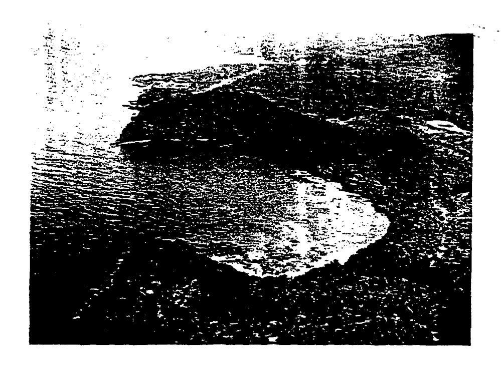

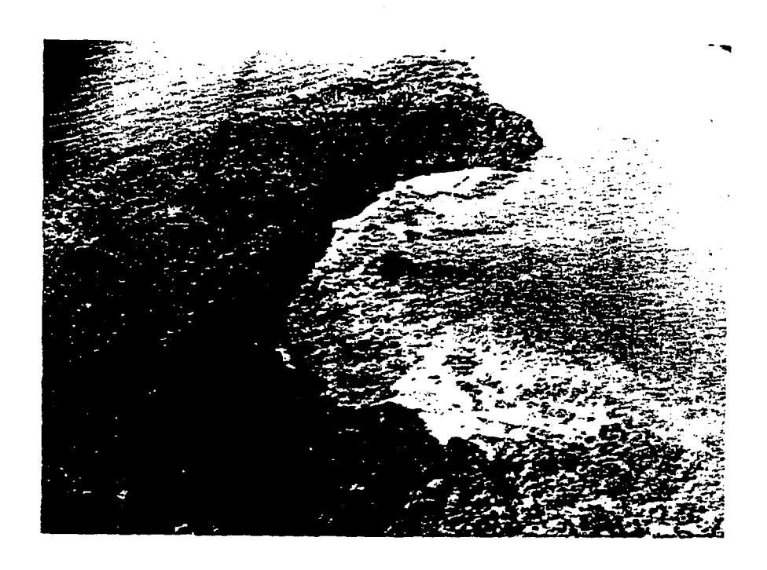

Fig. 1. Aerial views of Fagatele Bay National Marine Sanctuary: a) of the north, b) of the south. Note that the three sections of the reef platform separated by dashed lines in Fig. 3 are clearly visible in the upper photograph.

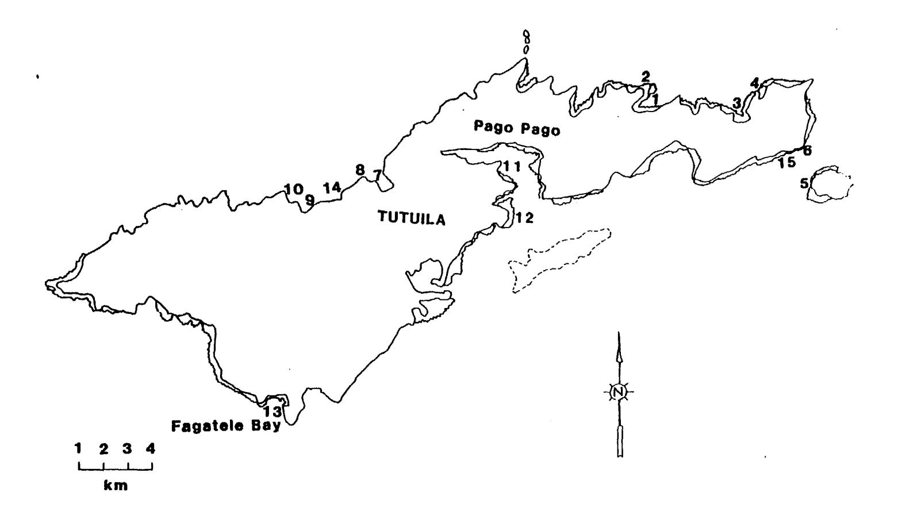

W

Fig. 2. Map of locations of study sites around Tutuila Island: 1- inside Masefau Bay, 2- outside Masefau Bay (Asaga Strait), 3- Aoa Bay, 4- Onenoa Bay, 5- Aunuu Island, 6- Matuli Point, 7- Fagasa Bay, 8- Cape Larsen, 9- Fagafue Bay, 10- Massacre Bay, 11- Rainmaker Hotel, 12- Fatu Rock, 13- Fagatele Bay, 14- Sita Bay, 15- Auasi.

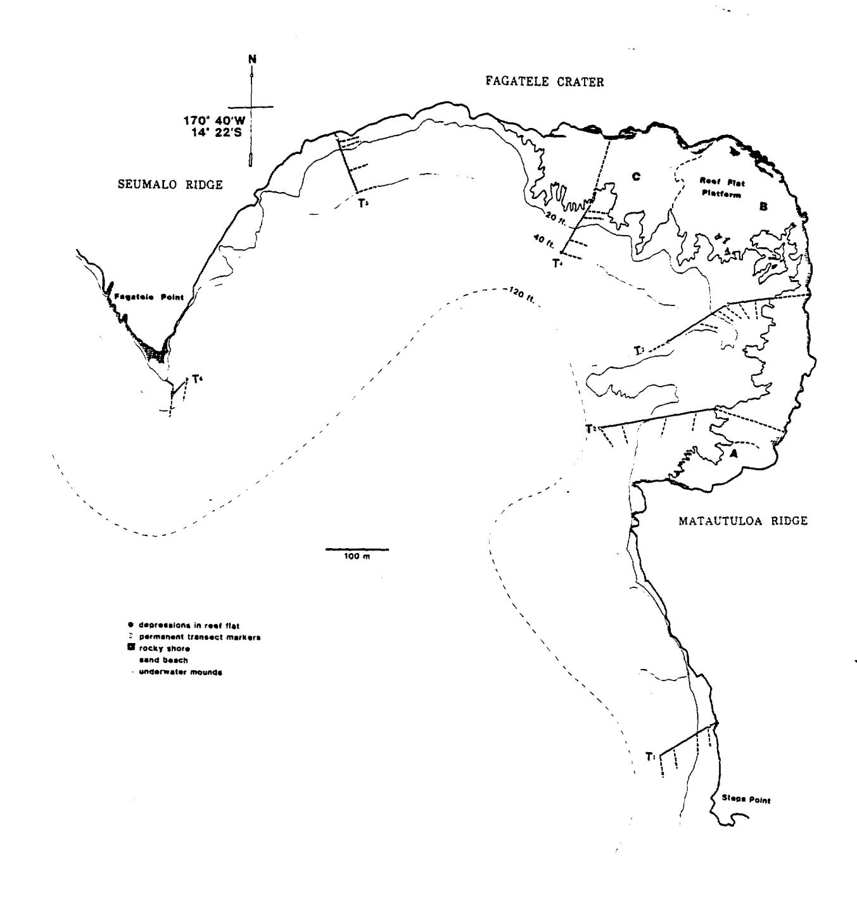

Fig 3. Locations of the permanent Transects 1-6 (T1-T6, solid lines) in Fagatele Bay National Marine Sanctuary and the 30-m survey transects (dotted lines). The boundaries of A- the intertidal reef platform veneered with loose rubble, B- the subtidal reef platform with abundant corals, and C- the intertidal volcanic bench are indicated by dashed lines.

of the bay. Endangered species of sea turtles (5 species) have been seen in or near Fagatele Bay.

The biological, geological, physical oceanographic, climatic, and human sociological, economic and legal aspects of Fagatele Bay have all been reviewed in the Final Environmental Impact Statement and Management Plan for the Proposed Fagatele Bay National Marine Sanctuary (FEIS/MP 1984). These reviews will not be repeated here.

Likewise, the history of events leading up to the designation of Fagatele Bay as a National Marine Sanctuary on 29 April 1985, the Management Plan for the Sanctuary, and the benefits and consequences of the designation of Fagatele Bay as a National Marine Sanctuary are presented in FEIS/MP (1984). The FEIS/MP (1984) was prepared by the Sanctuary Programs Division, National Oceanic and Atmospheric Administration (NOAA), U.S. Department of Commerce, in cooperation with the Development Planning Office, Government of American Samoa.

The FEIS/MP (1984) identified the need for a thorough scientific documentation and mapping of the biological resources and habitats of Fagatele Bay as the most important step in the process yet to be undertaken and accomplished. This responsibility was assigned to the University of Guam Marine Laboratory, working with the cooperation of the Office of Marine Resources, Government of American Samoa. The funding of this project was by NOAA (1/3) and by the Government of American Samoa (2/3).

The scientific documentation of biological resources is one of the aspects of the Resource Studies Plan as outlined in the FEIS/MP (1984) and is particularly germane to two of the main goals of the management plan (FEIS/MP 1984:4-5):

- "Goal 2: Expand public awareness and understanding of marine environments found in the warm waters of the Pacific Ocean, and thereby foster a marine conservation ethic;
  - Goal 3: Expand scientific understanding of marine ecosystems

    found in the warm waters of the Pacific Ocean, especially

    coral reefs that have been infested by the crown-of
    thorns starfish, and apply scientific knowledge to the

    development of improved resource management techniques."

A particular value of marine sanctuaries is in their status as surveyed and monitored regions of controlled utilization. Most ecological studies in tropical regions have been done on expeditions on which there was a tacit assumption that conditions would be the same as during the study both before and after the expedition. This has automatically led to a conclusion that tropical ecosystems are more stable than comparable ecosystems in temperate regions (which biologists study over longer periods and to which they return and observe changes having occurred). This conclusion appears to be false (Birkeland 1983). As the first U.S. National Marine Sanctuary in a truly tropical region, and as a naturally protected, relatively pristine area, dominated subtidally by a rich coral reef habitat, Fagatele Bay provides an excellent opportunity to monitor natural temporal variability in a diverse tropical marine ecosystem. In particular, since Fagatele Bay was greatly affected by an Acanthaster planci (crown-of-thorns starfish) outbreak in 1979, the situation provides the opportunity to monitor the recovery of the system following the depredation by A. planci.

Adding to these opportune circumstances is the fact that Birkeland and Randall had previously acquired quantitative assessments of the coral communities at a dozen sites around Tutuila. Likewise, Wass had acquired quantitative assessments of fish populations at several sites around Tutuila.

Therefore, the main objectives of this project were in two parts. The first, and most important, objective was to conduct a thorough scientific documentation and mapping of the biological resources and habitats of Fagatele Bay in order to set the baseline for future studies against which changes through time could be compared. A secondary set of objectives was to resurvey a dozen areas previously surveyed around Tutuila in order to assess quantitatively the rate of recovery of coral reef communities following devastation by outbreaks of A. planci.

Specifically, the objectives of this study given in a Statement of work were:

- to complete a quantitative survey of coral, fish, algae, and invertebrates in Fagatele Bay and to develop a species list for each phyletic category;
- 2. to establish permanent reference markers for transects;
- to map the entire bay in terms of habitat, predominant córal species,
   and topological physical environmental features;
- 4. to obtain, preserve, label, and organize a reference collection of voucher specimens; and
- 5. to repeat surveys of corals and fishes along selected transects outside Fagatele Bay which were surveyed previously to document changes in coral and fish populations following the outbreak of <u>Acanthaster planci</u> in 1977-78.

#### Relation of this Project to Previous Studies

Tutuila has been the site for important studies of fishes (Jordan and Seals 1906), scleractinian corals (Mayor 1920, 1924), alcyonaceans (Cary 1931), and algae (Dahl 1972). Although numerous surveys have been made of the marine habitats of Tutuila (USACHED 1980; Randall and Devaney 1974; Helfrich 1975; Dahl 1971), only two have specifically dealt with Fagatele Bay (Wass 1978a; USACHED 1980:197-200). The project that we report on here is the first quantitative survey of the marine fauna and flora of Fagatele Bay.

Tutuila has been surveyed several times for crown-of-thorns starfish Acanthaster planci populations. A. planci is generally scarce around Tutuila (Weber and Woodhead 1970; Vine 1970; Devaney and Randall 1973), but major outbreaks have occurred at about 1938 (Birkeland 1981; Flanigan and Lamberts 1981) and in late 1978 (Wass 1978b; Birkeland and Randall 1979; Birkeland 1982). Three of us (Birkeland, Randall, and Wass) spent a day in April 1979 investigating Fagatele Bay during which time a large population of A. planci was in the process of eating most of the corals in the bay. Birkeland and Randall returned to Tutuila in 1982 and obtained quantitative data on the abundances and size distributions of corals at 12 sites around Tutuila. Dick Wass, during his tenure at the Division of Marine Resources of the Government of American Samoa, also obtained data on the abundances of fishes from about 60 transects around Tutuila. In the FEIS/MP (1984:C-7), it was stated that the coral cover in Fagatele Bay was estimated to be nearly 100% before the crown-of-thorns starfish infestation, but coral cover was reduced to about 10% after the infestation. We believe that our quantitative assessments of the coral and fish communities in Fagatele Bay and at other sites around Tutuila for which quantitative data are available from a previous visit will be of

particular value in providing a sound basis for estimating rates of recovery of coral and fish populations. As discussed on page C-7 of the FEIS/MP (1984), this quantitative information was lacking but would be most important for gaining an understanding of the ecosystem, how quickly and how completely it is able to recover from devastation by factors such as <u>A. planci</u> populations, and whether it will be again as highly productive a habitat as it was before.

#### METHODS

The third specific goal enumerated in the Statement of Work for this project was for us to provide a detailed description of survey techniques that can be used to monitor changes in species abundance and composition with time. Indeed, the baseline survey itself is to provide the initial data set to which future replicates can be statistically compared. Because it is important that the same methods are used, we are providing a description and discussion of methods in more detail than is usually given.

#### Location of Transects

In order to provide the means by which our surveys could be related to maps of Fagatele Bay and in order to enable the Sanctuary Manager or others to repeat our surveys so that changes could be monitored through time, our studies were conducted in Fagatele Bay in terms of orientation to permanent transect markers. These permanent markers are large, galvanized, 3/4-inch (1.9 cm) diameter spikes. They were driven into the substrate with a 10-pound (4.5 kg) sledge hammer. Six permanent transects were established (Fig. 3), with Transects 1-5 each marked with three permanent markers, one at the beginning of the transect at the seaward edge of the reef flat or on an offshore mound where the reef front begins, a second at roughly the halfway mark at 20 ft (6.1 m) and the third at the end of the transect at 40 ft (12.2 m). Transect 6 had only two markers, one at 25 ft (7.6 m) and the other at 40 ft (12.2 m).

Depth profiles were taken along each of the 6 permanent transects with distance measured along a tape and depth measured with a depth guage. The general descriptions of the reef along the permanent transects are given in the Physiographic Description of the Marine Habitats section of this report

(pages 24-34). Lines of any material are either large enough to uproot the permanent markers or else they are small enough to deteriorate or be broken. If left permanently in place, lines could damage or otherwise affect the benthic community below. Therefore, only the markers, not the lines, can be permanently in place. A line should be strung between the permanent markers along a transect for orientation whenever a new survey will be undertaken. The permanent transects run roughly perpendicular to the shoreline across depth zones. The information from these transects was used in measuring the depth gradient across the reef and relating the scale of our maps to the patterns from aerial photographs of the bay.

Actual quantitative sampling was done along 30-m replicate transects within each zone, generally perpendicular to the transect lines and roughly parallel to shore (Fig. 3). This is a stratified random sampling program. Replicate transects within zones are necessary for statistical analysis and for the calculation of confidence limits on abundance estimates. To cross several zones along a depth gradient within a sample adds a tremendous variance within each sample and prohibits a comparison between zones. Transect lines running across zones are attractive and perhaps provide clearer information for descriptive purposes, but the resulting data are difficult to analyze statistically because several zones would be represented by a single statistic. To make quantitative statements about the results of a survey across zones of a coral reef system, it is best to take replicate transects and replicate counts within transects as stratified random samples within zones or depth contours. This allows discrete estimates of variance between zones with comparable replicate transects of equal length.

A stratified random sampling program is used when the total area or population being studied is divided into several well defined, relatively homogeneous subareas or subpopulations, each of which is sampled randomly. When an entire study area is sampled randomly, nearly all of the samples might fall within one of the subareas and the other subareas would be inadequately represented. Because of this, the more efficient methods of stratified random sampling are always preferable to simple random sampling (Hasel 1938; Osborn 1942; Madow 1946; Yates 1946, 1948, 1953; Finney 1948a,b; Bordeau 1953; Milne 1959; Cochran 1963; Greig-Smith 1964; Elliott 1971).

In order to facilitate locating the transect markers (Fig. 3), buoys were attached to the initial and final permanent markers on each transect, were lined up, visually from a small boat, and the point on the shoreline which was intersected by the line between the two buoys was noted and illustrated in Fig. 4. A hand-bearing compass was used to take a reading from a small boat across the two buoys to the point on the shoreline for transects 1-5. The compass reading is given in the caption for Figure 4.

Transects at locations outside Fagatele Bay and two 100-m fish transects in Fagatele Bay which were surveyed on previous years were laid along the bottom and located at the sites of previous surveys by memory of the previous investigators. We expect that only those transects within the Fagatele Bay Marine Sanctuary will be monitored by others. However, if one wishes to replicate the transects at the other sites around Tutuila, he may write to Birkeland or Randall (for corals) or Wass (for fishes) for detailed instructions.

#### Algae (and substrate coverage)

Marine plants and substrate coverage were quantified by a point-quadrat method along the 30-m transects roughly parallel to the shoreline at a series

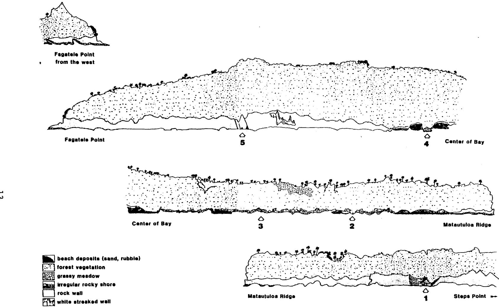

Fig. 4. Diagrammatic view of the coastline in Fagatele Bay National Marine Sanctuary. The arrows indicate the point on the coast at which a line passing through floats over the nearshore and 40-ft (12-m) markers on the permanent transects would intersect the shore. The line through the floats intersecting the indicated point on the shore for Transect 1 is at 060° on a hand-bearing compass. Transect 2 is at 080°, Transect 3 is at 058°, Transect 4 is at 030°, and Transect 5 is at 340°. Transect 6 is oriented in reference to a submerged ridge (cf. Fig. 3).

of depths (Fig. 3). Nondiscrete patches of surface occupied by algal turf, crustose coralline algae, filmy encrusting sponges, etc., are difficult to measure by dimensions and so these subjects are surveyed more appropriately by the point-quadrat method. This method consists of tallying organisms under the points of intersection of strings tied across a  $1/16-m^2$  (25 x 25 cm) quadrat. Four strings tied from each side of the quadrat gives 16 intersecting points for each quadrat. Whatever algal species occurred under each point was recorded. In the rare case in which the point falls on two layers of algae, the base alga is scored as occupying the substrate and the overlying alga is recorded as present. In the frequent case in which the identification to species is impossible in the field, the specimen was collected and placed in its own separate plastic bag with a label indicating which datum it represented. Identification was made later with a microscope. This frequent collection for identification was time consuming and cut down on the number of data we had time to collect. If no alga was found under the point, then whatever was present, e.g., sand, dead coral, rubble, or live coral, was recorded.

The quadrat was tossed randomly at 5-m intervals along the length of the transect. Therefore, data were collected from 6 quadrats, or at 96 points, along each transect. ("Haphazard" is actually the proper word to use here. "Random" in biometrics refers to a more rigorous placement by use of numbers obtained from a random-number table. We are using "random" in in this report in the vernacular sense of tossing without consciously aiming it. To lay out a grid-work in the bay to operate from a random number table and for each of us to work at independent locations around the bay simultaneously was unfeasible logistically in consideration of constraints by time and water turbulence.)

Each of these transects originated at points along the permanent transect lines at depths of either 10, 15, 30, or 40 feet (3.0, 4.6, 9.1 or 12.2 m). Permanent Transects 2, 3, and 4 accommodated 4 perpendicular transects at 10, 15, 30, and 40 feet. Permanent Transects 1 and 5 accommodated transects at depths of 15, 30, and 40 feet, while Transect 6 had only transects at depths of 20 and 40 ft.

Percent cover for each transect was calculated by taking the number of points occupied by a particular category divided by the total number of points per transect. Frequency of occurrence was calculated by taking the number of quadrat tosses in which a benthic constituent occurred, divided by the number of tosses per transect. Both cover and frequency values were converted to percent by multiplying by 100. Other algal species also seen along the transects were recorded as observed.

In addition, twelve 30-m transects were surveyed at a depth of 20 feet (6.1 m) at the sites around Tutuila which were surveyed in previous years for coral cover. The same methods were applied as described above.

#### Corals

For sessile benthic organisms that are found as discrete colonies or individuals, the point-quarter technique has been found to be most efficient. This method was presented by Cottam et al. (1953) and Cox (1972) and its use in coral reef research has been reviewed by Loya (1978).

The basic concept of the point-quarter method is that the average abundance of coral species or other species of sessile organisms can be measured by the average distances from random points to the center of colonies or individuals. The shorter the average distance from a random point to the nearest colony, the more colonies there must be per unit area. When the

average distance is squared, an average square area occupied by one individual or colony is obtained. If the average occupied area is divided into the unit area, the abundance or density or number of individuals per unit area will be obtained. The average surface coverage for each species can then be obtained by multiplying the average surface area of colonies of each species times their average abundances.

The random points from which measurements are made can be obtained by laying a transect, by randomly tossing an object with right angles in its structure, or by a combination of both by tossing an object at points along a transect. Four measurements must be made from each random point, one and only one in each quadrant. The four quadrants can be visualized as marked by the transect line and an imaginary line running perpendicular to the transect line through the point (Fig. 5a), one line running along the handle of the hammer and another perpendicular to the handle through the head with the imaginary point from which measurements are made being the intersection of the handle with the head (Fig. 5b), or imaginary lines at right angles to each other as determined by any other object being tossed at random, e.g., a dive knife (Fig. 5c).

The first measurement to be made in each quadrant is the distance from the sample point to the center of the nearest colony or to the center the nearest item being sampled (Fig. 5). The next two measurements are the length (or longest dimension) and the width (or longest dimension at right angles to the width). Data should be recorded in the field in an organized manner for ease in later computations (Table 1).

The area of each colony is estimated by multiplying the length times the width and taking the square root (the geometric mean diameter). The mean

Fig. 5. An illustration of the point-quarter sampling technique as described and explained in the text. ————————————————————————————————————

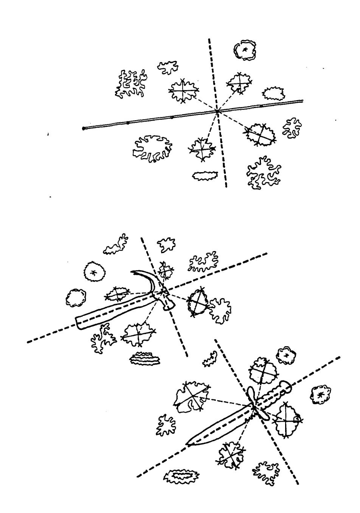

Table 1. An example of an efficient format for recording field data from the point-quarter method. The areas would be calculated later, but a column is included on the same paper for efficiency. The means of each four distances and areas taken from the same point could be calculated separately for an additional level in nested analysis of variance.

Date:

Location:

Zone:

| Distance                                                            | (Len | gth x Wi    | dth) | Species | Area |
|---------------------------------------------------------------------|------|-------------|------|---------|------|
| <ul><li>(4 measurements</li><li>from first</li><li>point)</li></ul> | (    | x x x | )    |         |      |
| -                                                                   | (    | x           | )    |         |      |
| <pre>- (4 measurements - from second - point) -</pre>               | (    | x x x | )    |         |      |
| - etc                                                            | (    | x etc    | )    |         |      |

diameter is then divided by 2 to obtain the radius which is squared and multiplied by  $\pi$  to obtain an estimate of the area, i.e.,  $\pi(\frac{1 \times w}{2}) = A$ .

If the colony is not roughly circular but instead is somewhat rectangular, triangular, "L"-shaped, or of some other configuration, the area may be estimated however the observer believes is best without spending too much time (Fig. 6), i.e., when the error in precision of area-estimation is more than compensated by the number of data that there is time to collect. If one spends too much time increasing the precision of measurements of an individual coral, the accuracy of conclusions are lost in the fewer measurements taken when the variance between the size of colonies is large compared to the error variance of each measurement.

It is important to remember to measure to the nearest colony center. The borders of some colonies may be nearer than the centers of other colonies, but you should be measure to the nearest center (Fig. 7).

The formulas for computations are:

| density (abundance) of all species                         | = | unit area (mean distance) 2                                       |
|------------------------------------------------------------|---|------------------------------------------------------------------------------|
| relative density (abundance) of a particular species | = | number of a particular species measured total number of individuals measured |
| density (abundance) of a particular species                | = | <pre>(density of x (relative density)   all species)</pre>                   |
| percent cover of all species                               | = | (average areal sizex(density ofof all species)all species)                   |
| percent cover of a particular species                      | = | (average areal size x(density of aof a particularparticularspecies)species)  |
| relative percent cover of a particular species       | = | percent cover of a particular species percent cover of all species           |
| importance value                                           | = | <pre>relative frequency + relative density</pre>                             |

(The "importance value" is a compound index and therefore has little statistical validity or strength and the terminology tempts us into subjective conclusions or interpretations. However, the original presentations of this method [Cottam et al. 1953; Cottam and Curtis 1956; Cox 1972] provide formulas for calculating indices of "important value", and the descriptions of the reef communities are traditionally organized around this index. A compound index makes just as good a format for description as does taxonomic order or any of the three components of the "importance value" alone, so we will maintain the tradition here.)

An advantage of the point-quarter method over the transect methods is that it provides data on size distributions of each species in terms of area. Size distribution data provide insight into the nature of the population dynamics of each species. Also, if colonies are widely spaced, the point-quarter method allows one to precisely measure the distance to the nearest colony in each quadrant, no matter how far. The transect method might only allow one to accumulate zeroes. If only zeroes are accumulated with transects, we might have no idea of the order of magnitude of the scarcity of a species.

If the subject being sampled is not found in a quadrant, there are methods for taking zero-quadrants into account (Warde and Petranka 1981), but it is better to attempt to find a coral in each quadrant no matter how far you have to search.

Fig. 6. Areal sizes of coral colonies should be estimated by as efficient an approximation as possible. The great range in sizes of coral colonies determines that the number of colonies measured is more important than the precision of the measurements.

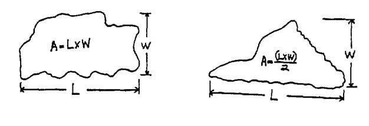

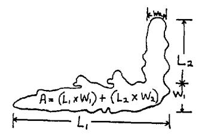

Fig. 7. Measurements should be to the nearest colony center rather than to the nearest colony edge.

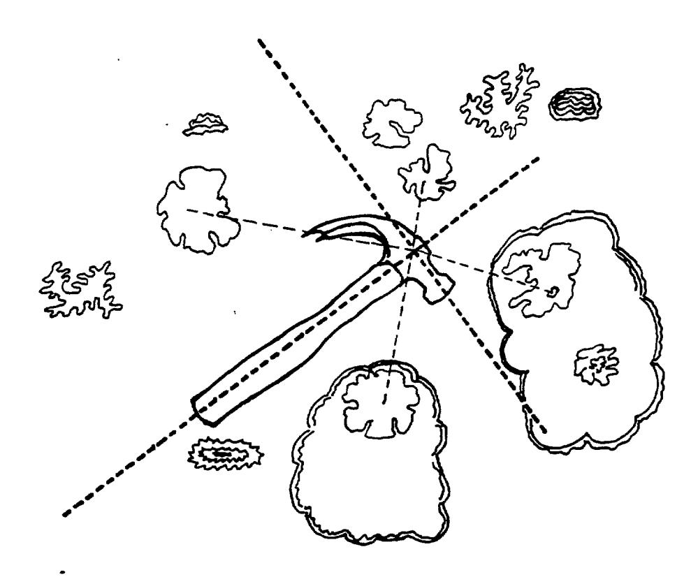

(The "importance value" is a compound index and therefore has little statistical validity or strength and the terminology tempts us into subjective conclusions or interpretations. However, the original presentations of this method [Cottam et al. 1953; Cottam and Curtis 1956; Cox 1972] provide formulas for calculating indices of "important value", and the descriptions of the reef communities are traditionally organized around this index. A compound index makes just as good a format for description as does taxonomic order or any of the three components of the "importance value" alone, so we will maintain the tradition here.)

An advantage of the point-quarter method over the transect methods is that it provides data on size distributions of each species in terms of area. Size distribution data provide insight into the nature of the population dynamics of each species. Also, if colonies are widely spaced, the point-quarter method allows one to precisely measure the distance to the nearest colony in each quadrant, no matter how far. The transect method might only allow one to accumulate zeroes. If only zeroes are accumulated with transects, we might have no idea of the order of magnitude of the scarcity of a species.

If the subject being sampled is not found in a quadrant, there are methods for taking zero-quadrants into account (Warde and Petranka 1981), but it is better to attempt to find a coral in each quadrant no matter how far you have to search.

#### Macroinvertebrates

Macroinvertebrates other than corals were censused by either of two methods. The line transect method was used in all but two cases. A 30-m transect line was placed along 10-, 15-, 30-, and 40-ft isobaths and approximately parallel to shore. Macroinvertebrates occurring within 1 m on

both sides of the transect line were identified and recorded along 5-m intervals of the line. Therefore, each transect consisted of 6 quadrats, each covering an area of 10  $\text{m}^2$ .

The small, infaunal echinoid <u>Echinostrephus</u> sp. was too numerous to count by the line transect method in the shallow areas of Transects 1 and 6. In these areas, <u>Echinostrephus</u> was sampled with a 1/16-m2 quadrat. The quadrat was thrown randomly twice at 5-m intervals and within 1 m of the transect line, yielding 14 samples from which population densities were estimated.

Areas adjacent to transects were examined for macroinvertebrates not quantified by the transects. A record of these species was maintained to compile a faunal list for the bay.

#### Fishes

Two transect lengths and layouts were used. The Fagatele Bay fish transects were conducted in conjunction with transects and inventories of corals, macroinvertebrates and algae. All of the studies were designed for future repetition and were oriented along six transects laid approximately perpendicular to the shoreline and crossing all major inshore habitats. The transects were conducted along a 30-m length of line tied to the permanent stakes and laid in a straight line more or less parallel to the depth contour in the leftward direction when facing deeper water.

A different layout was used for an additional fish transect at Fagatele Bay and for transects at Cape Larsen and Sita Bay. These three transects were made along a 100-m length of weighted line placed in the exact same location as transects conducted during previous years in order to measure population changes over time.

The Fagatele Bay transect began 15 m west of the basalt-rock point on the east side of the bay and proceeded west along the 40-ft depth contour at the upper edge of the reef slope. The Cape Larsen transect began at the eastern edge of a deep crack that bisects the reef 200-300 m west of Fatuelo Point on the west side of Fagasa Bay. The transect began at 25 ft where the reef slope abruptly steepens and proceeded in an eastward direction at this depth. The Sita Bay transect began on the west edge of an indentation of the reef flat located about 40 m west of the ava (local term for channel or groove in the reef) leading into the beach. The transect began at 15 ft and proceeded to the west at a depth of 15-20 ft along the upper edge of the steeply sloping reef front.

The fish transects were censused by a single observer equipped with scuba. All fishes observed within one meter on either side of the transect line and two meters above it were identified to species and counted. and cracks in the reef within the transect corridor were inspected for nocturnal and secretive fishes and the substrate was closely examined for cryptic species. It is likely, however, that many species and individuals were undetected, thereby resulting in an underestimate of their abundance. Being wary of divers, larger and more transient fishes tend to depart the transect corridor at the approach of the observer so they, too, are probably under-censused by this procedure. Even clearly visible fishes that have no tendency to hide or flee the approach of a diver are subject to inaccurate counts because of their diversity and large numbers and because of their constant motion in and out of the transect corridor. In spite of these shortcomings, the visual census technique is accepted as a valuable tool for studying reef fish populations and is widely used in areas where the underwater visibility is good. It is of greatest value for making relative

comparisons between fish communities at different times and locations rather than as a quantitative method for assessing the precise composition of a particular community. All of the fish censuses covered by this report were conducted by the same individual (R. C. Wass), thereby reducing variability due to observer bias.

Jones and Thompson developed (1978) a similar technique which allows one to characterize the fish community in terms of species presence and gives an indication of abundance. Its advantages are that it requires little time and no special equipment except for a diving watch and an underwater slate. The census procedure used in the present study goes beyond Jones and Thompson's technique to yield a numerical population estimate for each species on a per-unit-area basis. Our 15-20 minute search for additional species following the census picks up the rare, crytic and secretive fishes that would also be found with the technique of Jones and Thompson.

About ten minutes were required to enumerate the fishes on the 30-meter transects and about thirty minutes were required for the 100-meter transects. Data were recorded on a tape recorder in an underwater housing through a microphone in the mouthpiece of a regulator. Ten to thirty minutes after the transects were censused, the observer returned to the area with an underwater slate and spent 15-20 minutes seeking out and listing species not recorded during the census. The search was conducted within 20 m of the transect line and within the same depth range. Although no quantitative information resulted from this species search, it facilitated a more complete description of the fish community by providing information on the presence of wary, uncommon, cryptic and secretive species not observed during the census. All observations were made between 9:00 A.M. and 3:00 P.M. when diurnal fishes are most active and nocturnal fishes are inactive.

### PHYSIOGRAPHIC DESCRIPTION of the MARINE HABITATS at FAGATELE BAY

#### Overall Setting

Fagatele Bay was formed sometime during the Holocene when the ocean breached the seaward side of the volcanic tuff cone and flooded Fagatele Crater (Fig. 1). Exposed rocks within the crater consist of lithic-vitric tuffs derived from Fagatele Crater and from the nearby Vailoatai and Fogamaa Craters as well. Seumalo Ridge rises 122 meters in elevation along the northern and western sides of the crater and Matautuloa Ridge rises to over 61 meters in elevation along its eastern side. Slopes leading down to the bay from these ridge crests are quite steep and locally form vertical to overhanging cliffs. Sea cliffs are particularly well developed along wave-exposed stretches of shoreline northwest of Fagatele Point and north of Step Point.

Although overall bottom topography within Fagatele Bay undoubtedly resembles to some extent that of the original crater, shallower regions have been extensively modified by reef deposits. Reef deposits are most extensively found along the northeastern sector of the bay where a contiguous fringing reef-flat platform up to 200 meters wide and generally less than a meter deep is developed (Fig.3). Except where volcanic basement rocks form local outcrops and submarine cliffs, deeper reef deposits form a complex topography that is extensively distributed on most slopes within the bay. Channel and buttress topography is well developed on shallow slopes adjacent to reef-flat platforms and an undulate topography of elongate ridges and troughs with scattered smaller relief features consisting of knobs, mounds, and pinnacles of various sizes characterize the deeper slopes. At some locations overall slopes are interrupted by prominent submarine terraces.

Although regions where volcanic rocks outcrop may lack in situ reef deposit, such localities may be patchily veneered by a considerable number of reef-building corals and calcareous algal species. Deep slopes in the central part of the bay were not directly observed, but based upon a general downslope increase in sedimentation on shallower slopes, it is most likely a depositional zone where significant amounts of bioclastic sediments are accumulating.

Description of the Coral Reef in Fagatele Bay.

The reefs of Fagatele Bay can be divided into two principal geomorphic regions consisting of a relatively shallow reef platform that extends outward from the shoreline, and the forereef slope that dips downward from the outer edge of the reef platform, or from the shoreline where such shallow platforms are absent. Both the shallow reef platform and the forereef slope can be subdivided into a number of conspicuous physiographic zones. Such zones also define the boundaries for some biozonation patterns as well in that certain reef-dwelling species are restricted in their distribution to specific physiographic habitats. In addition to strictly reef zones, Fagatele Bay has significant areas of nonreef habitats as well, particularly were submarine cliffs and outcrops of volcanic basement rock occur. Vertical profiles drawn from depth measurements taken along the bottom at Transects 1-6 to a depth of 12.2 meters are shown in Figures 8-10. For each transect location these profiles show the general bottom topography, the physiographic zones discriminated, water depth, relative abundance of sediments (mostly bioclastic rubble) and corals, locations of transect marker stakes, and isobaths where quantitative measurements of marine invertebrates, fishes, and algae were taken.

Figure 8. Vertical profiles drawn from depth measurements taken along the reef surface at Transects 1 and 2 to a depth of 12.2 meters, showing general bottom topography, physiographic zones discriminated, water depth, relative abundances of bioclastic rubble and corals, locations of transect marker stakes, and the 1.0, 3.0, 4.6, 9.1, and 12.2 meter depth isobaths where quantitative measurements of marine invertebrates, fishes, and algae were taken. Random carets indicate outcrops of volcanic basement rock. Vertical exaggeration X 3.57.

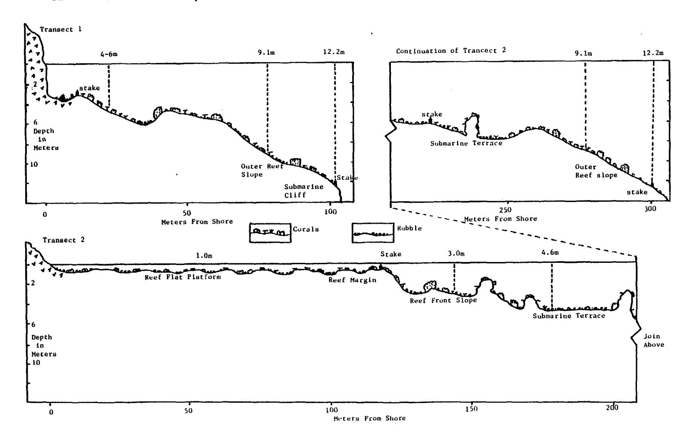

Figure 9. Vertical profiles drawn from depth measurements taken along the reef surface at Transects 3 and 4 to a depth of 12.2 meters, showing general bottom topography, physiographic zones discriminated, water depth, relative abundances of bioclastic rubble and corals, location of transect marker stakes, and the 1.0, 3.0, 4.6, 9.1, and 12.2 meter depth isobaths where quantitative measurement of marine invertebrates, fishes, and algae were taken. Random carets indicate outerops of volcanic basement rock. Vertical exaggeration X 3.57.

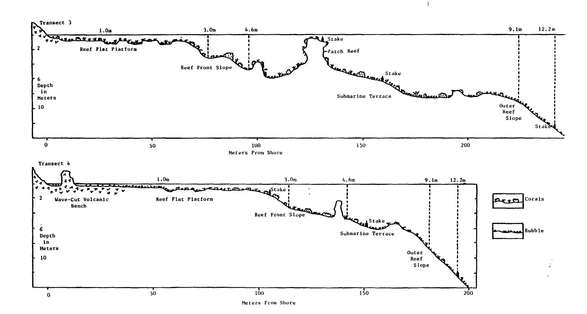

Figure 10. Vertical profiles drawn from depth measurements taken along the reef surface at Transects 5 and 6 to a depth of 12.2 meters, showing general bottom topography, physiographic zones discriminated, water depth, relative abundances of bioclastic rubble and corals, locations of transect marker stakes, and the 1.0, 3.0, 4.6, 9.1, and 12.2 meter depth isobaths where quantitative measurements of marine invertebrates, fishes, and algae were taken. Random carets indicate outerops of volcanic basement rock. Vertical exaggeration X 3.57.

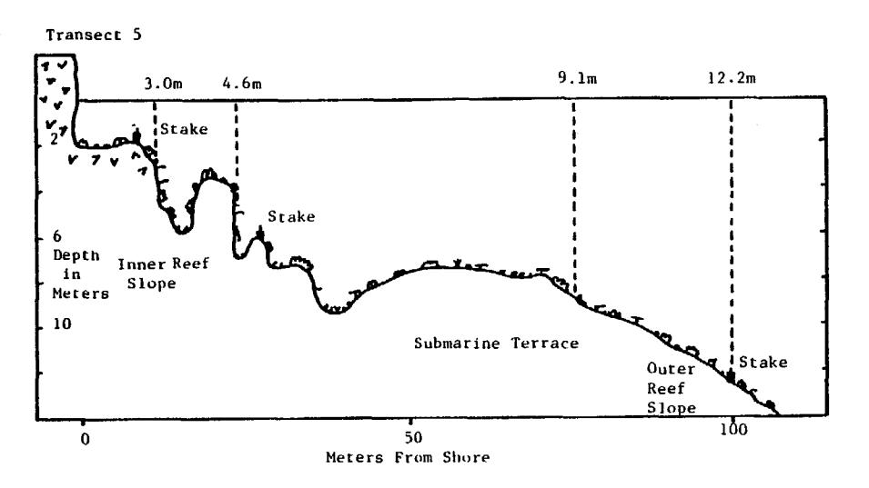

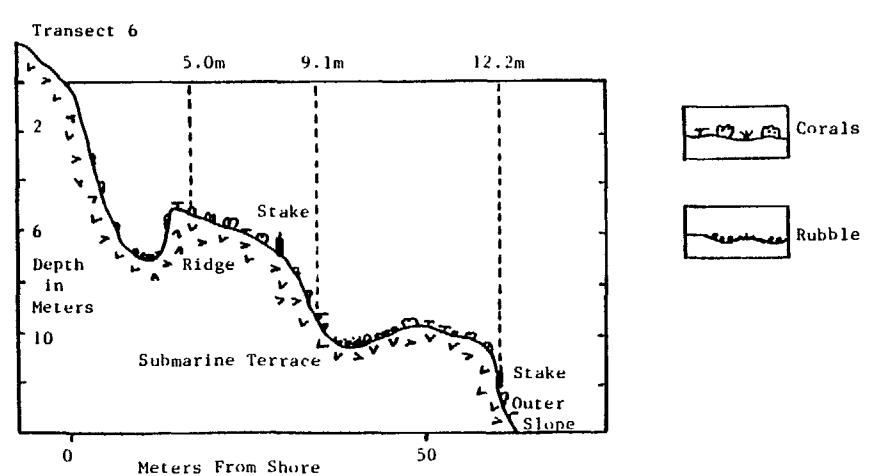

#### Reef-Flat Platform Zone

Shallow fringing reef-flat platform development is restricted to the northeastern sector of Fagatele Bay (Fig. 3). When measured along its shoreward margin, the reef-flat platform is approximately 1100 meters long and entends outward from the shoreline a maximum of 200 meters. The presence of a number of large reentry channels, tens of meters wide and long, and more numerous but smaller surge channels, generally less than two meters wide and ten meters long, give the outer edge of the reef-flat platform, or reef margin, a very irregular and frayed appearance. It is difficult to assess whether restriction of reef-flat platform development to the northeastern bay sector has been the result of it being a more protected region, which would promote growth of fast-growing branching species of Acropora, Porites, and Pavona upward to mean sea level, or that a shallow terrace was present in that part of the bay when it was initially flooded. It is suspected that both factors have had some influence in reef-flat platform development, as volcanic basement rocks outcrop along the inner reef-flat platform at location C and fast-growing branching species are found at location B (Fig. 4).

The reef-flat platform can be divided into three distinct habitats (A,B and C) as shown in Figure 4. These divisions are based both upon physiographic as well as community structural aspects of corals. In respect to physiography, much of the surface of platforms A and C are elevated relative to platform B and thus are partially exposed during low spring tides. Corals and other reef organisms which tolerate little to no exposure to air are thus absent on surfaces of these two platforms. The elevated nature of platform A is for the most part caused by the accumulation of boulder rubble. This rubble is composed mostly of fragmented corals that normally inhabit the region adjacent the upper forereef slope zone and thus must have been

transport onto the platform surface by storm surge and waves. The intertidal veneer of boulder rubble on platform A forms a distinct boundary between it and the adjacent surface of platform B, as indicated by a dotted line on Figure 3. Storm waves have also been responsible for building up a significant veneer of beach deposits along the western part of platform A. Composition of these beach deposits is mostly reef-derived bioclastics of a wide textural range intermixed with some volcanoclastics derived from the adjacent volcanic ridge slope.

The inner part of platform C is an intertidal wave-truncated volcanic bench about 15 to 25 centimeters higher in elevation than the adjacent surface of platform B. The abrupt difference in elevation between platforms C and B forms a distinct topographic boundary, as indicated by a dotted line on Figure 3, as well as a community structural boundary in that corals abundantly occupy the slightly subtidal surface of B and are completely absent on the intertidal surface of C. In a seaward direction the volcanic bench grades into a slightly lower reef platform that is abundantly veneered with boulder rubble similar to that described on platform A. Although the outer part of the boulder zone is slightly subtidal, corals are widely scattered and, for the most part, restricted to elongate depressions that grade into reef margin channels at the seaward edge of the platform. A few small patches of rubbly beach deposits veneer the surface of several small shoreline indentations.

Platform B is considerably larger in area than is either platform A or C, mostly subtidal, and quite variable in topographic structure. The southern third of the platform has a somewhat flattened topography with a number of shallow holes and depressions, generally less than 50 centimeters deep, scattered about. Corals are widely scattered on shallow flattened

portions of the platform, with most being restricted to deeper holes and depressions. Reentry channels, large holes, and irregularly-shaped depressions to 2 meters in depth give the central part of platform B a very irregular topography. Between these topographic depression, through, abundant finely branched and compact foliaceous species of corals have grown upward to near mean low tide level which gives the surface a truncated appearance. Some of the larger and deeper holes and channels are abundantly occupied by a diverse community of corals as well as considerable amounts of bioclastic sand and coral rubble. Much of this rubble has been derived from the collapse and fragmentation of in situ arborescent coral species that were presumably killed by earlier Acanthaster planci predation. On the northern part of platform B (adjacent to C), topographic depressions and holes are much less abundant and, where present, are shallower in depth. The platform at most places is abundantly covered by compact stubbily-branched and foliaceous coral species which grow upward to near mean low tide level, giving the surface a neat clipped appearance. At places these corals completely cover the reef surface. Bioclastic sand and rubble veneers the floors of most holes and depressions, particularly near the shoreline where a narrow rubble-strewn shallow moat occurs. Some small patches of rubbly beach deposits have accumulated where shoreline indentations occur.

#### Reef Margin Zone

The reef margin consists of the shallow wave-washed outer edge of the reef-flat platform. Topographically, it is also a distinct region that is indented at somewhat regular to irregular intervals by channels that penetrate up to 10 or more meters into the outer reef-flat platform. Channel orientation is roughly normal to the outer reef-flat platform edge. At their

seaward end, channel depth ranges 2 to 3 meters and channel width ranges from 1 to 3 meters. In cross section, channel walls are steeply sloping, vertical, or overhanging and channel floors are flat or U-shaped and generally veneered with bioclastic rubble and sand.

Because of the abrupt shoaling nature of the outer reef-flat platform, water in the reef margin is seldom calm, as even small waves generally break and produce surf. Water movement is generally oscillating because as a wave trough approaches, water rushes seaward and then abruptly reverses direction and rushes landward as the wave crest advances. Collapse of the wave at the reef margin itself translates the wave into a surge of rolling surf that moves shoreward across the platform. These strong currents and wave action keep platform areas between the reef margin channels swept free of most fine sediment, but larger-sized cobbles and boulders and sand tend to accumulate on the channel floors. Based upon the presence of abundant bioclastic rubble transported onto the reef-flat platform, wave assult must be greatest in the reef margin zones adjacent to platforms A and C. Species abundance and coverage of corals is relatively high on the reef margin because of reduced Acanthaster planci predation in wave-assaulted zones. Although stoutly-branched species of corals are restricted to this zone, so are some of the most fragile species as well.

#### Forereef Slope Zone

Seaward of the reef margin, the reef surface abruptly dips downward, forming the forereef slope zone. Where reef platform development is absent, such as along the southeastern and northwestern regions of Fagatele Bay (Transects 1 and 6), the forereef slope dips downward directly from the subtidal shoreline. Along the portion of the bay with reef-flat development

(Transects 2, 3, and 4), the forereef slope can be divided into three physiographic zones.

The uppermost or shallowest of the zones on the forereef slope is the reef front slope which consists of the steeply dipping seaward face of the shallow reef-flat platform. Channels from the reef margin extend through this zone forming a channel and buttress topography. The depth to which this channel and buttress topography can be maintained or developed, mainly by erosion by abrasion of loose sediments along channel floors and by reef accretion on intervening buttress surfaces, determines the lower boundary of this zone, which here ranges from about 3 to 6 meters. Although the reef front slope lies just seaward of the normal breaking surf zone, it is still located in a region of strong oscillating currents. For this reason, predation by Acanthaster planci was less intense and species abundance and coverage of corals is higher here than on deeper forereef zones. In place of shallow reef front slope channel and buttress morphology at Transects 1 and 5, a somewhat irregular surface topography, here called the inner reef slope zone, is developed at these locations (Figs. 1 and 3). Although in situ reef deposits appear to occupy most major reef slope surfaces, at is suspected that they form only a thin or patchy veneer, and that the greater surface irregularity here is mainly a reflection of uneven underlying volcanic basement rocks.

At most locations (except at Transect 6) between 3 and 9 meters depth, the degree of forereef slope decreases forming a submarine terrace zone. Width of the submarine terrace ranges from less than 40 meters at Transect 5 to about 120 meters at Transect 3. Elongate ridges and valleys and scattered pinnacles, knobs, and mounds gives the submarine terrace an irregular surface topography. At Transect 3 a prominent patch reef about 6 meters in diameter

breaks the surface during low tides. Bioclastic rubble and sand veneers the submarine terrace surface in many places, particularly in valleys, troughs, and other topographic depressions. When driving rim stakes into the reef surfaces for transect markers, this rubble accumulation was found to be in excess of a meter in thickness at places. Possibly recent Acanthaster planci predation on corals has accelerated the accumulation rate of rubble. Much of the rubble consists of fragmented branching corals and scattered pieces of tabulate Acropora species, particularly Acropora nobilis and A. hyacinthus. Although a considerable amount of coral rubble is present on the submarine terrace, it is rapidly being consolidated into a wave-resistant deposit by encrusting calcareous algae, and to a lesser extent by incrusting species of corals. Consolidation of loose rubble is important if recolonization by large tabulate corals is to be successful. Tabulate corals, such as Acropora hyacinthus, which was an important species on the forereef slope before Acanthaster planci predation, are presently recruiting to rubble deposits. For these recruits to be successful, rubble must be wave-stable, because as drag resistance from wave current increases with colony enlargement a point is reached where the loose piece of rubble to which it is attached becomes unstable under normal wave assault and the colony topples.

A noticeable increase in the angle of downward dip occurs on the forereef slope at a depth of 6 to 9 meters along Transects 1,2,3,4, and 5, which marks the beginning of the outer reef slope zone. Outer reef slope topography is somewhat similar to that described on the more gently sloping submarine terrace zone, but with smaller and fewer local prominences such as mounds, knobs, and pinnacles. Bioclastic sediments are more abundant than on the upper forereef slope zones, particularly the sand-sized fraction which tends to accumulate in local flattened portions of the slope, topographic

depressions, and troughs. Although no direct observations of slopes deeper than 20 meters was made systematically, a number of large sandy patches were observed at about 30 meters depth while making a towed snorkel reconnaissance around Fagatele Bay. A submarine cliff interrupts the outer reef slope at about 12 meters depth at Transect 1. Such cliffs also are found extensively between Step Point and the reef platform along the east side of the bay and between Fagatele Point and the reef platform C along the northwestern side of the bay (Figs. 1 and 3). Although rock samples were not collected from these submarine cliffs, their vertical faces are presumed to be composed of volcanic tuffs, similar to those exposed along adjacent shorelines. Outer reef (or volcanic nonreef slopes) deeper than 30 meters were not directly observed, but it is suspected that this deep central part of the bay is primarily a depositional basin where bioclastic sediments of reef volcanoclastic sediments of materials eroded from subtidal and subaerial slopes are accumulating.

Extensive in situ reef deposits were not observed at Transect 6. Here volcanic basement rocks form a complex topography of steep slopes, irregularly shaped ridges, and large blocks that are patchily veneered by corals, calcareous algae, and other reef-dwelling organisms. Although heavy wave assult keeps most surfaces swept free of sediments, some flattened terraces, troughs, and topographic depressions are veneered by a mixture of bioclastic and volcanoclastic sediments of a wide size range.

#### OUANTITATIVE SURVEY OF BIOLOGICAL RESOURCES

#### at FAGATELE BAY

#### 5-19 April 1985

A preliminary survey of Fagatele Bay National Marine Sanctuary revealed that the coral community and benthic habitat were in a patchily arrayed lateral pattern superimposed over a vague pattern of vertical gradient. To quantify these sources of variance as efficiently as possible, we set our 6 permanent transects evenly around the perimeter of the Sanctuary, with each permanent transect covering the vertical gradient to a depth of 40 ft (12 m).

Replicate quantitative samples were taken along isobaths, starting at the permanent transects. The results of our quantitative surveys are given below in taxonomic order.

#### Glossary

The following symbols are used in this report.

S = standard deviation anova = analysis of variance

 $S_{\overline{v}}$  = standard error of the mean \* = p<.05

W = range of data

H' = Shannon-Wiener diversity index \*\*\* = p<.001

=  $-\Sigma P_i \log P_i$  (where  $P_i = \frac{n_i}{N}$ ) ns = not significant

J' = evenness index

 $= \underline{H}'_{\text{max}}$ 

D = Simpson's index of dominance

 $= \underbrace{\frac{\sum n_{i} (n_{i}-1)}{N (N-1)}}$ 

#### Algae and Substrate Cover

Results of the quantitative survey of algae in Fagatele Bay are presented in Tables 2a and 2b. A total of 39 species of marine plants were encountered along 20 transects at various depths. The overall percent cover for the marine plant community along all transects in Fagatele Bay was 78 (s = 18). Crustose and articulate coralline algae made up 57.1% of the overall coverage. In fact, incrusting coralline algae were characteristic of the entire bay. Both the overall algal coverage and the coverage of the crustose and articulate coralline algae decreased with depth (Table 2c). Halimeda was common in the interstices of the substrate. The thin, black, tightly adherent crusts of Ralfsia were conspicuous and reached a 15.6% coverage at 40 ft (12 m) on Transect 4. Cheilosporum maximum was one of the more conspicuous articulate coralline algae and was found on most transects, frequently in somewhat protected areas.

During the second part of the study at other sites around Tutuila a total of 54 algal species were encountered along 12 transects at a depth of 6 m (Table 2d). The overall percent cover was 55.8 (s = 30.4). Crustose and articulate coralline algae comprised 43.4% (s = 20.1) of the cover.

Little information has been published on the marine algae of American Samoa. The paper by Setchell (1924) is perhaps the most substantial, yet it was apparently based upon fragmentary collections and is incomplete (Dahl 1971). In addition, most of Setchell's work was done in relatively shallow water on the reef flat. Dahl, in his 1971 paper, presents a general discussion about algal assemblages frequently found associated with turfs in American Samoa.

Fagatele Bay was greatly affected by <u>Acanthaster planci</u> in 1979 (U.S. Army Corps of Engineers 1980). The coral community in most areas was

devastated, providing surface for the recruitment of successional plant assemblages. Studies on the algal recolonization of coral communities after destruction by A. planci generally address only the time periods directly after the destruction (Briggs and Eminson 1977). Nishihira and Yamazato (1974) mention that the type of community after the destruction of the corals by the A. planci depends upon the type of the original and surrounding community as well as on the geophysical position of the community concerned.

The marine plant community of Fagatele Bay may be categorized and described in terms of their secondary roles as functional groups in the marine escoystem of the bay, assuming primary production to be the primary role (Tsuda 1973). One group, the fleshly macroalgae and marine plants, was greatly reduced. Members of this group, such as <a href="Halophila">Halophila</a> sp. and <a href="Sargassum">Sargassum</a> sp., were observed in shallow water during the second part of this study. Only two members of this group, <a href="Laurencia">Laurencia</a> and <a href="Tolypiocladia">Tolypiocladia</a>, were found in Fagatele Bay, but they were sparsely distributed, low growing, and were associated mostly with algal turf.

Algal turf was generally low and was usually found in semiprotected Gelidium pussilum, Hypnea pannosa, Microcoleus lyngbyaceus, areas. tribuloides, Dictyosphaeria versluysii represent Sphacelaria and predominant turf community observed along most transects. Ralfsia pangoensis Its cover reached up to 16% along Transect 4 at 40 ft. generally low abundance of filamentous algae in exposed areas and the reduced occurrence of algal mats may be an indication of grazing by herbivorous fishes, or it may be a successional stage which follows the devastation of the coral community 6 years ago.

Incrusting coralline algae were the most abundant algal component along all transects in Fagatele Bay. Most transects were exposed to strong surge or

high wave energy. <u>Porolithon</u> associations formed a pavement giving the substrate a clean scrubbed appearance. A typical sun-loving plant, <u>Porolithon</u> occupies only the upper surface of the rosettes of <u>Acropora</u> or other corals. <u>Peyssonelia</u>, a thoroughly calcified species, covers wave-worn fragments of coral and other substrates. <u>Halimeda</u> was one of the more abundant of the carbonate-producing algae. The thalli of <u>Halimeda</u> frequently were so closely crowded together that the light fell only on their tips. <u>Chilosporum maximum</u>, <u>Amphiroa foliacea</u>, <u>Jania</u>, and <u>Amphiroa</u> sp. follow in order of importance for carbonate production.

This baseline study does not take into account the importance of precipitation and tidal fluctuations in influencing the seasonal occurrence of certain species of marine plants. Information on the algal communities of American Samoa is sparse and frequently too general (Setchell 1924; Dahl 1971; U.S. Army Corps of Engineers 1980) to make any comparisons about the algal community and residual or second-order impact from the <u>A. planci</u> infestation and changes in the algal community since this event.

The plant assemblages of the areas surveyed during the second part of the study were similar to those in Fagatele Bay. Incrusting coralline algal associations were characterisic for all areas. Of particular interest was the layer of <u>Peyssonelia</u> over large areas of rubble at locations 4,5, and 7 (Table 2d, Fig. 2). The area of transect 11 (at Rainmaker Hotel) showed the lowest number of algal species (4). The human population around Pago Pago, including the industrial complexes within the harbor, contribute to the pollution in the bay and possibly to the decline in species diversity of algae near the Rainmaker Hotel.

Table 2a. Frequency and percent cover of the benthic flora in Fagatele Bay, American Samoa (Transects 1,2,3). Plain numbers indicate percent coverage, numbers in parenthesis indicate frequency of occurrence converted to percent (see Methods in the text). Algal species occurring epiphytically on other algae or occurring in the vicinity of the transect are marked with an X.

|                                                                                                                               |                    |                    |         |                    | T F                | RANSEC   | T S                |                    |                    |                    |                     |  |
|-------------------------------------------------------------------------------------------------------------------------------|--------------------|--------------------|---------|--------------------|--------------------|----------|--------------------|--------------------|--------------------|--------------------|---------------------|--|
|                                                                                                                               | 1                  |                    |         |                    | 2                  |          |                    |                    | 3                  |                    |                     |  |
| SPECIES                                                                                                                       | 15                 | 30                 | 40      | 10                 | 15                 | 30       | 40                 | 10                 | 15                 | 30 °               | 40                  |  |
| Cyanophyta (blue-green) Microcoleus lyngbyaceus (Kutz.) Crouan Schizothrix calcicola (Ag.) Gomont Schizothrix mexicana Gomont | х                  |                    |         | x                  | х                  | 1.0(17)  | •                  |                    |                    |                    | 1.0(17)             |  |
| Chlorophyta (green) Chlorodesmis fastigiata (C. Ag.) Dictyosphaeria versluysii W. v. Bosse                                    | 3,1(33)            |                    |         | 1.0(17)            |                    |          |                    | 1.0(17) 2.1(33) |                    |                    |                     |  |
| Enteromorpha clathrata (Roth) J.Ag.                                                                                           | X                  |                    |         |                    |                    |          |                    |                    |                    |                    |                     |  |
| Halimeda discoidea Decaisne                                                                                                | 2.1(17)            |                    |         |                    |                    | 3.1(33)  | 1.0(17)            |                    |                    |                    |                     |  |
| Halimeda opuntia (L.) Lanx.                                                                                                | 4.2(17)            |                    | 4.2(33) |                    |                    | 8.3(33)  | 8.3(67)            |                    |                    | 6.25(17)           | 10,4(50)            |  |
| Rhizoclonium samoense Valonia fastigiata Har                                                                            | x                  |                    |         |                    |                    |          | 1.0(17)            | X                  |                    |                    |                     |  |
| Valonia ventricosa J.Ag.                                                                                                   |                    |                    |         |                    | 1.0(17)            |          |                    |                    |                    |                    |                     |  |
| Phaeophyta (brown) Dictyopteris repens (Okam.) Boerg.                                                                         | 2.1(17)            |                    |         |                    | 3.1(50)            |          |                    | 1,0(17)            | 1.0(17)            |                    |                     |  |
| Dictyota friabilis                                                                                                            | 1,0(17)            | 3.1(17)            | 1.0(17) | 6.2(50)            | 1.0(17)            | 2.1(33)  | 5,2(50)            |                    | 2.1(17)            |                    | 1.0(17)             |  |
| Setch. Ralfsia pangoensis                                                                                                     | 3,1(33)            | 2.1(17)            | 8.3(50) | 10.4(77)           | 8.3(83))           | 12.5(83) | 4.2(50)            |                    | 8,2(50)            | 1.0(17)            | 4.2(33)             |  |
| Setch. <u>Sphacelaria tribuloides</u> Menegh.                                                                           | 2.1(33)            | 2,1(17)            |         | 2.1(33)            |                    |          |                    |                    |                    |                    | 3.1(17)             |  |
| Rhodophyta (red) Ceramium mazatlenese                                                                                         |                    |                    |         | 1.0(17)            |                    |          | 1.0(17)            |                    |                    |                    |                     |  |
| Dawson <u>Cerantium</u> sp. <u>Champia compressa</u> <u>Harv. J.Ag.</u>                                                       |                    |                    |         | 1.0(17)            | 2.1(33)            |          |                    |                    | 2.1(33) 1.0(17) | 2,1(33)            |                     |  |
| Gelidiella sp. Gelidium pussilum (Stackh.) LeJolis                                                                            | 2.1(33) 2.1(17) | 6.2(33) 2.1(33) |         | 2.1(17) 3.1(17) | 6.2(33) 2.1(33) | 1.0(17)  | 3.1(17) 3.1(33) |                    | 6.2(67) 2.1(33) | 9,4(50) 1,0(17) | 10.4(67) 2.1(17) |  |
| Herposiphonia tenella (C. Ag.) Naegele                                                                                     | 1.0(17)            |                    |         | 2,1(33)            |                    |          |                    |                    | 2.1(33)            | 1.0(17)            | 1.0(17)             |  |
| Hypoglossum attenuatum Gardner                                                                                                |                    |                    |         |                    |                    |          | 2.1(33)            |                    |                    |                    |                     |  |
| Laurencia obtusa (Huds.) Lamx. Lophosiphonia villum                                                                     | 2.1(17)            |                    |         |                    |                    |          |                    | X                  |                    |                    |                     |  |
| (J.Ag.) Setchel&Gardner Polysiphonia scopulorum                                                                               |                    |                    | 1.0(17) | 5,2(50)            |                    |          | 1.0(17)            |                    |                    |                    |                     |  |
| Harv. Tolipiocladia glomerulata (Ag.) Schmitz                                                                                 |                    |                    |         |                    |                    | 1.0(17)  | 3,1(33)            |                    |                    |                    |                     |  |
| Crustose and articulate con                                                                                                   | ralline alg        | ae                 |         |                    |                    |          |                    |                    |                    |                    |                     |  |
| Amphiroa sp. Amphiroa foliacea Lamx.                                                                                          |                    |                    |         |                    | 1.0(17)            | 4.2(33)  | 1.0(17)            | 2.1(33)            | 1.0(17) 3.1(17) |                    |                     |  |
| Amphiroa fragilissima Laux.                                                                                                |                    | •                  |         |                    |                    | 3.1(17)  |                    |                    |                    |                    | 1.0(17)             |  |
| Cheilosporum maximum Yendo Cheilosporum multifidum (Kuetz) Manza                                                              |                    |                    |         | X                  |                    | 1.0(17)  | 2.1(17)            |                    | 3.1(17)            |                    |                     |  |

Table 2a continued.....

|                                                                |                     |                                 |                      |                                 | 1                               | RANSE                          | CTS                                        |                                 |                                 |                                 |                                |  |
|----------------------------------------------------------------|---------------------|---------------------------------|----------------------|---------------------------------|---------------------------------|--------------------------------|--------------------------------------------|---------------------------------|---------------------------------|---------------------------------|--------------------------------|--|
|                                                                |                     | 1                               |                      |                                 | 2                               |                                |                                            | 3                               |                                 |                                 |                                |  |
| SPECIES                                                        | 15                  | 30                              | 40                   | 10                              | 15                              | 30                             | 40                                         | 10                              | 15                              | 30                              | 40                             |  |
| Jania capillacea Harvey                                     | 1.0(17)             |                                 |                      |                                 |                                 | 1.0(17)                        |                                            |                                 | 1.0(17)                         |                                 | 1.0(17)                        |  |
| Lithoporella sp. Mesophyllum mesomorphum (Foslie) Adey         | 1.0(17)             | 2.1(17) 5.2(50)              | 5.2(40) 2.1(33)   |                                 | 2.1(17)                         | 6.2(33)                        | 3.1(33)                                    | 2.1(33)                         | 6,2(33) 2,1(33)              | •                               | 2.1(17)                        |  |
| Neogoniolithon sp. Peyssonelia sp. Porolithon sp. Species 1    | 8.3(50) 36.2(83) | 14.6(50) 30.2(83) 6.2(67) | 5.2(50) 33.3(100) | 5.2(50) 52.1(100) 2.1(17) | 7.3(50) 56.1(100) 4.2(33) | 8.3(50) 15.6(67) 2.1(17) | 2.1(33) 7.3(67) 19.8(67) 10.4(50) | 5.2(33) 47.9(100) 2.1(17) | 16.7(83) 14.6(50) 5.2(33) | 8.3(50) 28.1(83) 13.5(50) | 6.2(50) 26.0(50) 3.1(17) |  |
| Dead coral                                                     |                     |                                 | 2.1(17)              |                                 |                                 |                                | 10.4(33)                                   |                                 |                                 |                                 | 7.3(50)                        |  |
| Coral rock                                                     | 11.5(17)            | 2.1(17)                         |                      |                                 |                                 |                                | , ,                                        |                                 |                                 |                                 |                                |  |
| Live coral Rubble                                           | 8.3(50)             | 19.8(67)                        | 26.0(83) 2.1(17)  | 2.1(17)                         | 2.1(33)                         | 24.0(76)                       | 2.1(33)                                    | 26.0(83)                        | 17,7(67)                        | 12,5(67)                        | 9.4(50)                        |  |
| Sand                                                           | 6,2(33)             | 4.2(17)                         | 7.3(33)              |                                 |                                 |                                |                                            |                                 |                                 |                                 |                                |  |
| Anemone                                                        | 3,2(2)              |                                 | 2.1(33)              |                                 |                                 |                                |                                            |                                 |                                 |                                 |                                |  |
| Sea urchin                                                     | 1.0(17)             |                                 |                      |                                 |                                 |                                |                                            |                                 |                                 |                                 |                                |  |
| Sponge                                                         | 1.0(17)             |                                 |                      |                                 | 2.1(17)                         |                                |                                            | 6,2(50)                         | 3.1(17)                         | 9,4(17)                         |                                |  |
| Tunicates                                                      | 1.0(17)             |                                 |                      | 1.0(17)                         |                                 |                                |                                            | ` '                             | • •                             |                                 |                                |  |
| Soft coral Scuzz                                            |                     |                                 |                      | 1.0(17)                         | 1.0(17)                         | 7.4(33) 2.1(17)             |                                            |                                 | 1,0(17)                         | 4.2(17)                         | 4.2(17)                        |  |
| Number of plant genera/trans                                   |                     | 9                               | 9                    | 13                              | 12                              | 13                             | 18                                         | 11                              | 15                              | 10                              | 15                             |  |
| Number of plant species/tran                                   |                     | 9                               | 9                    | 14                              | 12                              | 15                             | 19                                         | 11                              | 18                              | 10                              | 15                             |  |
| Overall percent plant covera                                   |                     | 73.9                            | 60.2                 | 95.7                            | 94.6                            | 67.4                           | 85.0                                       | 67.6                            | 81.1                            | 73.7                            | 78.8                           |  |
| Percent coverage of crustose and articulate coralline als   |                     | 58.3                            | 45.83                | 61.5                            | 70.8                            | 41.5                           | 48.9                                       | 63.5                            | 53.1                            | 53.0                            | 45.6                           |  |
| Total number of plant general Total number of plant species |                     |                                 | . ,                  |                                 |                                 |                                |                                            |                                 |                                 |                                 |                                |  |

Table 2b. Frequency and percent cover of the benthic flora in Fagatele Bay, American Samoa (Transects 4,5,6). Plain numbers indicate percent coverage, numbers in parenthesis indicate frequency of occurrence converted to percent (see Methods in the text). Algal species occurring epiphytically on other algae or occurring in the vicinity of the transect are marked with an X.

|                                                                                                                                                        |                                    |                                 |                    | TRAN                             | SECTS                            |                                 | •                                |                                           |                    |
|--------------------------------------------------------------------------------------------------------------------------------------------------------|------------------------------------|---------------------------------|--------------------|----------------------------------|----------------------------------|---------------------------------|----------------------------------|-------------------------------------------|--------------------|
|                                                                                                                                                        |                                    |                                 | 4                  |                                  |                                  | 5                               |                                  |                                           | 6                  |
| SPECIES                                                                                                                                                | 10                                 | 15                              | 30                 | 40                               | 15                               | 30                              | 40                               | 25                                        | 40                 |
| Cyanophyta (blue-green)  Microcoleus lyngbyaceus (Kutz.) Crouan Schizothrix calcicola (Ag.) Gomont Schizothrix mexicana Gomont                         | X                                  |                                 |                    | 2.1(33)                          | ,                                |                                 | 1.0(17)                          | •                                         | 1,0(17)            |
| Chlorophyta (green) <u>Chlorodesmis</u> <u>fastigiata</u> (C. Ag.)  Dictyosphaeria versluysii                                                          | X 3.1(33)                       |                                 |                    | 1.0(17)                          |                                  |                                 |                                  | 2.1(33)                                   |                    |
| W. v. Bosse Halimeda discoidea                                                                                                                      | 1.0(17)                            |                                 | 3,1(17)            |                                  |                                  |                                 |                                  | ,                                         |                    |
| Decaisne Halimeda opuntia (L.) Laux. Valonia ventricosa J.Ag.                                                                                          | 5.2(33)                            | 4.2(17)                         | 10.4(50)           | 6.2(50)                          | 4.2(33) X                     | 7.3(33)                         | 15,6(67)                         |                                           |                    |
| Phaeophyta (brown) <u>Dictyopteris repens</u> (Otan.) Boerg. <u>Dictyota friabilis</u>                                                                 | 4.2(17)                            | 2.1(17)                         |                    | 1.0(17)                          |                                  | 1.0(17) 2.1(33)              |                                  | 1.0(17)                                   |                    |
| Ralfsia pangoensis                                                                                                                                     | 5,2(50)                            | 8,3(67)                         | 13.5(67)           | 15.6(83)                         | 7.3(33)                          |                                 | 4.2(33)                          | 8.3(50)                                   | 3.1(17)            |
| Setch. <u>Sphacelaria</u> <u>tribuloides</u> Menegh.                                                                                             | 1,0(17)                            |                                 |                    |                                  |                                  |                                 |                                  |                                           |                    |
| Rhodophyta (red) Ceramium sp. Gelidiella sp. Gelidium pussilum (Stackh.) Lalolis Herposiphonia tenella (C. Ag.) Naegele Hypoglossum attenuatum Gardner | 2.1(17) 2.1(33) 1.0(17)      | 1.0(17) 22.1(17) 1.0(17)  | 2.1(17)            | 5.2(33) 1.0(17)               | 1.0(17)                          | 1.0(17)                         | 1.0(17) 1.0(17) 1.0(17)    |                                           |                    |
| Unidentified red                                                                                                                                       |                                    |                                 |                    | 1.0(17)                          |                                  | 1.0(17)                         |                                  |                                           |                    |
| Crustose and articulate co <u>Amphiroa</u> sp. <u>Amphiroa foliacea</u> <u>Lamx.</u> <u>Amphiroa fragilissima</u> <u>Lamx.</u>          | oralline alg 1.0(17) 1.0(17) | 3,1(50)                         | 4.2(50)            | 1.0(17)                          |                                  | 1.0(17)                         | 3.1(33) 1.0(17)               |                                           |                    |
| Cheilosporum maximum Yendo                                                                                                                          | 4,2(33)                            | 4.2(33)                         | 12.5(67)           | 5,2(33)                          | 5.2(50)                          | 10.4(83)                        | 7.3(50)                          | 1.0(17)                                   |                    |
| Jania capillacea Harvey Lithoporella sp. Lithophyllum moluccense                                                                                       |                                    | 4.2(50)                         | 1.0(17) 1.0(17) | 15.2(33) 1.0(17)              |                                  | 23.1(50)                        | 1.0(17)                          |                                           |                    |
| Foslie Mesophyllum erubesence                                                                                                                       | 2.1(17)                            | 1.0(17)                         | 1.0(17)            | ()                               |                                  |                                 | 1.0(17)                          |                                           | 4.1(33)            |
| (Foslie) Lemoine Mesophyllum mesomorphum (Foslie) Adey                                                                                                 | 4,2(33)                            |                                 | 10,4(50)           | 2.1(33)                          |                                  |                                 | 4.2(50)                          | 2.1(17)                                   | (/                 |
| Neogoniolithon sp. Peyssonelia sp. Porolithon sp. Species 1                                                                                            | 3.1(50) 45.8(83) 6.2(33)     | 8.3(67) 25.0(33) 25.0(33) |                    | 16.7(83) 30.2(100) 3.1(33) | 15.6(83) 43.8(100) 7.3(33) | 4.2(50) 36.5(83) 10.4(67) | 11.5(100) 35.4(67) 8.3(33) |                                           | 5.2(17) 4.1(17) |
| Dead coral Coral rock Live coral Rubble                                                                                                       | 5,2(50)                            |                                 | 4.1(17) 3.1(17) | 1.0(17)                          | 11.4(33)                         | 19.8(83)                        |                                  | 2.1(17) 4.2(17) 11.5(33) 3.1(17) | 39,6(100)          |

Table 2b continued.....

|                                                                |                                       |         |      | T    | RANSEC  | TS      |      |         |          |  |
|----------------------------------------------------------------|---------------------------------------|---------|------|------|---------|---------|------|---------|----------|--|
|                                                                | · · · · · · · · · · · · · · · · · · · | 4       |      |      |         | 5       |      | 6       |          |  |
| SPECIES                                                        | 10                                    | 15      | 30   | 40   | 15      | 30      | 40   | 25      | 40       |  |
| Sand                                                           |                                       |         |      |      |         |         |      | 2.1(17) | 42.7(67) |  |
| Sea urchin Soft coral                                       | 2,1(17)                               |         |      |      | 4,2(17) | 1.0(17) |      | 7.3(33) |          |  |
| Scuzz                                                          |                                       | 2.1(17) |      |      | 4.2(17) | 1.0(17) |      | 7.3(33) |          |  |
| Chiton                                                         |                                       | 1.0(17) |      |      |         |         |      |         |          |  |
| Number of plant genera/transec                                 |                                       | 14      | 11   | 17   | 7       | 12      | 13   | 7       | 5        |  |
| Number of plant species/transe                                 |                                       | 14      | 13   | 17   | 7       | 12      | 15   | 7       | 5        |  |
| Overall percent plant coverage                                 |                                       | 96.9    | 88.2 | 99.0 | 84.4    | 78.0    | 96.6 | 69.7    | 17.5     |  |
| Percent coverage of crustose and articulate coralline algae | 67 <b>.</b> 6                         | 77.0    | 60.3 | 64.5 | 71.9    | 66.6    | 72.8 | 58.3    | 13.6     |  |
| Total number of plant genera Total number of plant species  | 27 33                              |         |      |      |         |         |      |         |          |  |

Table 2c. Mean percent cover and standard diviation at different depths in Fagatele Bay.

|                                                         | overall                    | 10 ft                     | 15 ft                  | 30 ft                  | 40 ft                    |
|---------------------------------------------------------|----------------------------|---------------------------|------------------------|------------------------|--------------------------|
|                                                         | n=20                       | n=3                       | n=5                    | n=6                    | n=6                      |
| all algae crustose and articulate coralline algae | 78.0 ± 18.2 57.1 ± 14.1 | 85.3 ± 12.6 65.6 ± 2.9 | 85.6± 9.6 63.9±11.8 | 75.2 ±6.7 56.3 ±7.7 | 72.8± 27.8 48.5± 18.6 |

Table 2d. Frequency and percent cover of the benthic flora along 12 transects in 6 different bays of American Samoa. Plain numbers indicate percent coverage, numbers in parenthesis indicate frequency of occurrence converted to percent (see Methods in the text). Algal species occurring epiphytically on other algae or occurring in the vicinity of the transect are marked with an X.

|                                                        |          |         |          |         |         |         | TRAN    | SECTS   |         |         |         |         |
|--------------------------------------------------------|----------|---------|----------|---------|---------|---------|---------|---------|---------|---------|---------|---------|
| SPECIES                                                | 1        | 2       | 3        | 4       | 5       | 6       | 7       | 8       | 9       | 10      | 11      | 12      |
| Cyanophyta (blue-green) Microcoleus lyngbyaceus     |          | 1.0(17) |          | 1.0(17) |         | 1.0(17) |         | 1.0(17) | 1.0(17) |         | •       |         |
| (Kutz.) Crouan Schizothrix calcicola                |          | 1.0(17) | 1.0(17)  |         |         | ,       |         |         | 311(217 |         | 1.0(17) |         |
| (Ag.) Gomont                                           | 1.0(17)  |         | 1,0(17)  |         |         |         |         |         |         | 1.0(17) | 1.0(1/) |         |
| Schizothrix mexicana Comont                         | 1.0(17)  | 1.0(1/) |          |         |         |         |         |         | -       | 1.0(17) |         |         |
| Chlorophyta (green) Bryopsis pennata                   |          | 1.0(17) |          |         |         |         |         |         |         | 1.0(17) |         | 2.1(17) |
| Lanx. Caulerpa peltata                              |          | 140(1.) |          |         |         |         |         |         |         | 1.0(17) |         | 2,2(2,7 |
| (Forsk.) J.Ag.                                         |          |         |          |         | 3.1(33) |         | 1 (/17) | 2.1(33) |         | 6.3(17) |         |         |
| Chlorodesmis fastigiata (C. Ag.)                       | 1 0(17)  |         |          |         | 3.1(33) |         | 1.0(17) |         |         | 0.3(17) |         | 1.0(17) |
| Dictyosphaeria versluysii W. v. Bosse               | 1.0(17)  |         |          |         |         |         |         | 1.0(17) |         |         |         | 1.0(17) |
| Enteromorpha clathrata (Roth) J.Ag.                    |          |         |          |         |         |         |         |         |         | 1.0(17) |         |         |
| Halimeda discoidea Decaisne                         |          |         |          | 1.0(17) |         |         | 1.0(17) |         |         |         |         |         |
| Halimeda opuntia (L.) Lamx.                         | 4.2(33)  | 3.1(33) | 4.2(33)  | 4.2(17) | 3,1(33) | 2.1(17) | 2.1(33) |         | 5.2(33) |         | 1.0(17) |         |
| Neomeris annulata Dickie                            |          |         |          |         |         |         | 1.0(17) | 1.0(17) |         |         |         |         |
| Valonia ventricosa                                     |          | 1.0(17) |          |         |         |         |         |         |         |         |         |         |
| J.Ag. Tydemanda expeditionis                        |          | 2.1(17) |          |         |         | 1.0(17) |         |         |         |         |         |         |
| W, v, Bosse                                            |          |         |          |         |         |         |         |         |         |         |         |         |
| Pheeophyta (brown) <u>Dictyopteris</u> repens          | X        | 1.0(17) |          |         |         |         |         |         |         | 2.1(33) |         |         |
| (Okam.) Boerg. Dictyota friabilis                   |          | 7.3(33) |          | 1.0(17) | 3.1(17) | 3.1(33) | 2.1(33) | 4.2(33) | 4.2(33) | 4.2(33) |         | 1.0(17) |
| Setch. Ralfsia pangoensis                           |          |         | 11.5(50) |         | 4,2(17) | 6.2(67) | 4.2(50) | 1.0(17) | 1.0(17) | 2.1(33) |         | 1.0(17) |
| Setch. Sphacelaria furcigera                        |          |         |          |         |         |         |         |         | 1.0(17) |         |         |         |
| Kutz.                                                  |          |         |          |         |         |         |         |         | . , ,   |         |         |         |
| Rhodophyta (red) Actinotrichia fragilis             |          |         |          | 1.0(17) |         | 1.0(17) |         | 1.0(17) |         |         |         |         |
| Boerg. Asparagopsis taxiformis                         |          | X       |          | 200(21) |         | 210(27) |         | 210(21) |         |         |         |         |
| (Delile) Collina&Hervey                                |          | Α       |          |         |         |         | 1.0(17) |         |         |         |         |         |
| Ceramium mazatlenese Dawson                         |          |         |          |         |         |         | 1.0(11) |         |         |         |         |         |
| Champia compressa Harv. J. Ag.                      |          | X       |          |         |         |         |         | a 4/00\ |         |         |         |         |
| Desmia hornemanni Lyngb.                            |          |         | •        | 1.0(17) |         |         |         | 2.1(33) |         |         |         |         |
| Galaxaura filamentosa Dawson                        |          |         |          |         |         |         |         | 1.0(17) |         | 1.0(17) |         |         |
| Calaxaura marginata Lanx.                           |          |         | 1.0(17)  |         |         |         |         |         | 2.1(17) |         |         |         |
| Gibsmithia bawaiiensis Doty                         |          | 1.0(17) |          |         |         |         |         |         |         |         |         |         |
| Gelidiella sp. Gelidiopsis intricata                | 1.0(17)  | 1.0(17) | 2.1(17)  |         | 4.2(33) |         | 5.2(33) | 9.4(50) | 5.2(33) | 5.2(17) |         |         |
| (Ag.) Vickers                                          | 1 (1/17) |         |          |         |         |         | 6 2(32) | 4.2(67) |         | 3.1(50) |         |         |
| Gelidium pussilum (Stackh.) LeJolis                 |          | 2.1(33) |          |         |         |         |         |         |         | 3.1(30) |         |         |
| Halopleone duperrayi                                   | X .      | 1.0(17) |          |         |         |         | 2.1(1/) | 2.1(33) |         |         |         |         |
| <u>Hermitrema fragilis</u> Harvey                   |          | 2.1(17) |          |         |         |         |         |         |         |         |         |         |
| Herposiphonia tenella (W. v. Bosse & Foslie) Foslie |          |         | 1.0(17)  | 2.1(17) |         |         | 2,1(33) |         |         |         |         |         |
| Hypnea pannosa                                         | X        | X       |          |         |         |         |         |         |         |         |         |         |

Table 2d continued.....

|                                                                                                                                                                         |                                |                          |                          |                                 | TR                       | ANSEC                    | T S                      | *************************************** |                          |                          |                      | <del></del>              |
|-------------------------------------------------------------------------------------------------------------------------------------------------------------------------|--------------------------------|--------------------------|--------------------------|---------------------------------|--------------------------|--------------------------|--------------------------|-----------------------------------------|--------------------------|--------------------------|----------------------|--------------------------|
| SPECIES                                                                                                                                                                 | 1                              | 2                        | 3                        | 4                               | 5                        | 6                        | 7                        | 8                                       | 9                        | 10                       | 11                   | 12                       |
| J.Ag. Hypoglossum attenuatum Gardner                                                                                                                              |                                |                          | 1.0(17)                  | 1.0(17)                         |                          |                          |                          |                                         | 1.0(17)                  |                          |                      |                          |
| <u>Laurencia papillosa</u> (Forsk.) Grev.                                                                                                                            |                                |                          |                          |                                 |                          |                          |                          |                                         |                          | 1.0(17)                  |                      |                          |
| <u>Liagora</u> sp. <u>Polysiphonia</u> sp. Polysiphonia <u>scopulorum</u>                                                                                         |                                |                          |                          |                                 |                          | •                        | 1.0(17)                  | 1.0(17) 1.0(17                       |                          |                          | 1.0(17)              |                          |
| Harv. <u>Rhodymenia</u> sp. Tolipiocladia glomerulata                                                                                                             | 2.1(17)                        |                          | 1.0(17)                  |                                 |                          |                          |                          | 1.0(17)                                 |                          |                          |                      |                          |
| (Ag.) Schmitz Unidentified red                                                                                                                                       |                                | X                        | 1.0(17)                  |                                 |                          |                          |                          |                                         |                          |                          |                      |                          |
| Crustose and articulate corallin Amphiroa sp. Amphiroa foliacea                                                                                                   | ne algae 1.0(17) 3.1(17) |                          |                          |                                 | 1.0(17) 2.1(17)       | 2.1(17)                  |                          |                                         | 2.1(17) 3.1(17)       | 2.1(33)                  |                      | 1.0(17)                  |
| lanx. Amphiroa fragilissina                                                                                                                                          | 4,2(33)                        | 1.0(17)                  |                          |                                 |                          |                          | 1.0(17)                  |                                         |                          |                          |                      |                          |
| Lanx. Cheilosporum maximum Yeno                                                                                                                                   |                                |                          |                          |                                 |                          |                          |                          | 3.1(33)                                 |                          | 4.2(33)                  | 2.1(33)              | 1.0(17)                  |
| Hydrolithon sp. Jania capillacea Harvey                                                                                                                           |                                |                          |                          |                                 |                          |                          | 1.0(17)                  | 1,0(17)                                 |                          | 1.0(17) 1.0(17)       |                      |                          |
| Lithophyllum moluccense Foslie                                                                                                                                       | •                              |                          |                          |                                 |                          |                          | 1.0(17)                  |                                         |                          |                          |                      |                          |
| Lithoporella sp. Mesophyllum erubesens (Foslie) Lemoine                                                                                                                 |                                |                          |                          | 3,1(33)                         | 4,2(50)                  | 4,2(17)                  | 5,2(33)                  |                                         | 1.0(17)                  | 2.1(33) 2.1(17)       |                      |                          |
| Mesophyllum mesomorphum (Foslie) Adey                                                                                                                                |                                | 3.1(33)                  | 2.1(17)                  | 2.1(33)                         | 1,0(17)                  | 1.0(17)                  |                          | 1.0(17)                                 |                          | 4,2(67)                  |                      | 2.1(33)                  |
| Neogoniolithon sp. Peyssonelia sp. Porolithon sp.                                                                                                                       |                                |                          | 11.5(83) 39.6(100)    | 19.8(67)                        | 38.5(83)                 | 31.3(67)                 |                          |                                         | 7.3(33)                  | 1.0(17) 5.2(50)       |                      | 4.2(33)                  |
| Species 1                                                                                                                                                               |                                |                          | 15.6(33)                 | 2,1(33)                         | 11.5(33)                 |                          | 6.2(33)                  | 4.2(33)                                 | 15.6(33)                 | 7.3(17)                  |                      | 2.1(33)                  |
| Rivalve Dead coral                                                                                                                                                   | 13.5(67)                       | 4.2(33)                  | 5 9/39\                  |                                 | 5,2(17)                  | 2.1(17)                  | 6.2(33)                  | 9.4(67)                                 |                          | 5.2(17)                  | 1.0(17) 10.4(33)  | / 2/1 <b>7</b> \         |
| Coral rock Live coral Rubble                                                                                                                                      | 30,2(67)                       | 28.1(100)                | 5,2(33) 2,1(17)       | 2.1(17) 21.9(67) 15.6(33) | 8.3(50) 6.2(50)       | 2.1(17) 18.8(100)     | 3.1(33)                  | 18.8(67)                                | 17.7(67)                 | 32.3(83)                 | 20.8(50) 25.0(50) | 4,2(17) 49,0(100)     |
| Sand Sea urchin                                                                                                                                                      | 5.2(33)                        |                          |                          | ,                               |                          |                          |                          | 2,1(17)                                 |                          | 1.0(170                  | 14.6(50)             |                          |
| Silt Soft coral Sponge                                                                                                                                            | 23,0(67)                       | 4.2(33) 1.0(17)       |                          | 6.2(17)                         |                          | 4.2(17) 1.0(17)       |                          |                                         |                          | 1.0(17)                  | 15.6(33) 7.3(50)  | 3,1(33)                  |
| Number of plant genera/transect Number of plant species/transect Overall percent plant coverage Percent coverage of crustose and articulate coralline algae | 10 12 27.9 17.6       | 16 18 62.0 36.3 | 13 13 92.9 68.8 | 12 13 48.8 36.5        | 12 13 88.4 70.7 | 11 11 70.6 56.2 | 19 19 89.1 60.5 | 20 20 69.5 39.5                | 13 14 83.1 62.4 | 24 24 59.1 32.1 | 4 4 5.1 2.1 | 10 10 43.6 38.5 |
| Total number of plant genera Total number of plant species                                                                                                           | 47 53                       |                          |                          |                                 |                          |                          | ···                      | w                                       |                          |                          |                      |                          |

1- Inside Masefau, 2- Outside Masefau, 3- Aoa, 4- Onemoa, 5- Aumu'u, 6- Matuli Point, 7- Fagasa, 8- Cape Larsen, 9- Fagafue, 10- Massacre Bay, 11- Rainmaker, 12- Fatu Rock

#### Corals

The primary purpose of this report is to provide a quantitative biological resource assessment of Fagatele Bay National Marine Sanctuary so that changes in time can be quantitatively documented in comparison with this baseline information. Towards this objective, we have presented summary statistics for each reef-building (hermatypic) coral species at each depth along each permanent transect for Fagatele Bay in Tables 3a-y. Likewise, we have provided summary statistics for each hermatypic coral species at the reef margin and at 6 m depth for April 1982 and for April 1985 at 12 additional locations around Tutuila Island (Tables 4-15).

In Fagatele Bay, the percent substrate coverage by hermatypic corals (Table 16) tended to be greatest in areas with strong wave action, e.g., coverage by corals generally decreased along a gradient from transects in shallow areas to transects in deeper waters and the outer Transects 1 and 6 had greater coverage by corals than did the central transects at comparable depths. Although these trends can be seen in Table 16, statistical demonstration of these trends can not be given because of a large interaction term brought about by the presence of a large clump of Echinopora hirsutissima at 9 m near Transect 2. We believe this general trend is probably a result of protection of corals from Acanthaster planci by water surge and wave action.

A. planci does not maintain its position on the substrate in areas of strong surge.

Echinopora hirsutissima is not a favored prey of A. planci and this may be why such a large patch was present at 9 m depth. We looked for patterns in the distribution of favored prey (Acroporidae) and disfavored prey (e.g., Poritidae, Mussidae, Milleporidae), in Table 3, but in all cases there were strong interaction terms which prevented generalizations. The abundance of

hermatypic corals in Fagatele Bay was patchy and no clear patterns could be observed (Table 17). This may result from aggregated and irregular recruitment. Likewise, because of interactions, there were no clear patterns in the distributions of mean colony sizes (Table 18), coral community diversity values, degrees of evenness of representation of coral species, or degree to which the coral communities were dominated by a few species (Table 19). Nevertheless, with the summary statistics obtained in this study, a comparison can be made with statistics from future studies to see if a significant change has occurred.

Data from the survey indicate that the coral community in Fagatele Bay is a diverse and complex system. Frequent interactions obscure general patterns. The present distribution of corals in the community may result in part from differential predation pressure from <a href="Acanthaster planci">Acanthaster planci</a> in 1979 as well as from aggregated and irregular patterns of coral recruitment. The purpose of this survey is to provide a basis for a quantitative comparison of future changes and to allow statistical analysis of these changes in community structure. For convenience, a complete list of all species of scleractinian corals observed on each transect at each depth in Fagatele Bay is given in Appendix 1. A complete list of species observed at 12 locations around Tutuila outside Fagatele Bay in 1979, 1982 and 1985 is given in Appendix 2.

#### Macroinvertebrates

The densities of macroinvertebrates along 19 transects in Fagatele Bay are presented in Table 20. A qualitative assessment of macroinvertebrates observed on the reef outside the areas censused on the transects is presented in Table 21.

Echinoderms were the predominant benthic invertebrates, occurring on all transects. Observed on 95% of the transects, Echinometra mathaei was the most common of the five species of urchins encountered. E. mathaei reached its greatest abundance in the more sheltered reef of Transects 2 and 3, where it inhabited the interstices of dead branching corals. In the more wave-assaulted zones of Transects 1 and 6, it occupied a system of grooves in the reef pavement.

Conversely, the burrowing urchin <u>Echinostrephus</u> sp. was more abundant in the higher energy environments where reef pavement was covered by a thin sand and algal turf. This occurred at a mean density of  $236.6/m^2$  along the 15-ft (5 m) isobath of Transect 1. At the 30-ft (9 m) isobath of Transect 1 and the 25-ft (7.6 m) isobath of Transect 6, it attained mean densities of  $109.7/m^2$  and  $102.9/m^2$ , respectively.

Other species of echinoids were neither as common nor as abundant as <u>E</u>.

<u>mathaei</u> or <u>Echinostrephus</u> sp. <u>Echinothrix</u> <u>diadema</u> was found in the two shallower zones of Transects 2, 4, and 6. Less common were <u>Eucidaris</u> <u>metularia</u> and <u>Diadema</u> sp., which occupied the deeper isobaths.

The small coral reef asteroid <u>Linckia multifora</u> was the only starfish occurring on transects. This species was most commonly observed on the deeper isobaths where it was sheltered from wave surge. Only two individual <u>Acanthaster planci</u> were observed in Fagatele Bay during our studies in April 1985.

The soft coral <u>Sinularia</u> sp. also formed a conspicuous component of the macroinvertebrate fauna. Present on 14 transects, colonies of <u>Sinularia</u> sp. were more abundant in shallow areas of moderate to high wave and current activity. A single colony of <u>Sarcophyton</u> sp. was encountered on the transect at the 40-ft isobath of Transect 1.

The highest diversity among the macrobenthos was exhibited by the gastropod assemblage. Fourteen species of neogastropods occurred on the transects, representing about 78% of all species of snails. Only two species each of archeogastropods and mesogastropods were found on the transects. The predominance of neogastropods was also reflected in population densities; 71% of the gastropod fauna consisted of neogastropods, while archeogastropods and mesogastropods made up 11% and 3% of the fauna, respectively. The most common and most abundant of the neogastropods was the muricid Morula uva, followed by the fasciolariid Peristernia fastigium.

A single species of opisthobranch gastropod was observed on the transects. However, this species, the nudibranch <u>Phyllidia</u> sp., constituted about 14% of all gastropods present. Thus, its abundance was almost equal to that of the archeogastropods and mesogastropods combined.

Although a number of dead bivalves was observed in Fagetele Bay (Table 21), the giant clam <u>Tridacna maxima</u> was the only live species encountered on transects. This probably represents a conservative estimate of relative abundance of bivalves because there was not sufficient time to examine habitats of the cryptic or the infaunal species, such as <u>Arca avellana</u> and Scutarcopagia scobinata.

The principal crustaceans inhabiting the transected areas of the reef were hermit crabs of the family Diogenidae. These crustaceans were collected and preserved for later identification by Roy K. Kropp of the University of Maryland. A medium-sized parthenopid crab, <u>Daldorfia</u> cf. <u>horrida</u>, was observed adjacent to the 10-ft (3 m) isobath on Transect 3.

A preliminary list of gastropods collected or observed at 11 sites around Tutuila is given in Table 22. Further study is being given to crustaceans, asteroids, and ophiuroids to provide accurate identification of these taxa.

Macroinvertebrate specimens collected during this survey are being compiled into a reference collection to be deposited at the Fagatele Bay National Marine Sanctuary headquarters in American Samoa. Where available, duplicate specimens will be deposited at the University of Guam Marine Laboratory.

As noted by Eldredge (1979), few marine faunistic surveys have been conducted in American Samoa. Previous studies of Fagatele Bay have encompassed fish surveys (Wass 1978) and general reef mapping (U.S. Army Corps of Engineers 1980). Unfortunately, few details of the composition of the macroinvertebrate community have been provided.

Data from the present study indicate that the macroinvertebrate fauna of Fagatele Bay is representative of the Indo-West Pacific region. We collected two of the 13 species of asteroids known from Samoa (Marsh 1974) at Fagatele Bay, and three additional species were found outside the sanctuary. Although no ophiuroids, or brittlestars, occurred on transects in Fagatele Bay, the as yet unidentified specimens we collected during frequent encounters in other localities will add to the few reported from Samoa by Devaney (1974).

The high diversity of gastropods in the sanctuary is evident from a comparison of Tables 21 and 22. Of a total of 142 species of gastropods collected at 11 sites around Tutuila, 61 species, or 43% of the total, were also observed or collected in Fagatele Bay. An additional 36 species were encountered in Fagatele Bay but not elsewhere around the island. When consideration is given to the fact that all sampling in Fagatele Bay was conducted on hard substrates, the relative diversity of gastropods in the sanctuary is even greater.

Patterns of succession among corals (Colgan 1981; Pearson 1981) and algae (Biggs and Eminson 1977) have been studied in some detail on reefs devastated by Acanthaster planci, and some changes have been noted in fish communities

(Endean 1973). However, the effects of <u>A</u>. <u>planci</u> infestations on the population structure of benthic macroinvertebrate communities have been esstentially overlooked.

Endean (1973) presumed that small organisms associated with corals attacked by the A. planci were killed by the digestive enzymes released by the starfish. Some areas of the Australian Great Barrier Reef were characterized by a marked spread of alcyonaceans following a lapse of about two years after an infestation (Endean and Stablum 1973; Endean 1976). Birkeland (1981) related a report of increased abundance of herbivorous sea urchins following an outbreak of A. planci in Palau before World War II. He further noted the scarcity of urchins at the time of his survey.

It is likely that successional changes among macroinvertebrates in Fagatele Bay have taken place already. A previous study of the area reported extensive patches of a whitish sponge in depressions at depths between 15 and 30 feet (U.S. Army Corps of Engineer 1980). Although a few isolated colonies of a whitish sponge were observed during the present study, none was encountered in the area surveyed on transects.

One group of macroinvertebrates was conspicuous by its absence in Fagatele Bay. The Holothuroidea, or sea cucumbers, comprise a major constituent of the benthic fauna in many Pacific areas (Birkeland 1978; Intes and Menou 1979; Grosenbaugh 1981). However, no holothurians occurred in the 1140-m2 area surveyed on transects in Fagatele Bay, nor were any sighted on the reef adjacent to transects.

Inventories of reef faunas in other areas of Tutuila have recorded a number of holothurian species (Helfrich 1975; U.S. Army Corps of Engineers 1980). Included among the holothurians reported from nearby Pala Lagoon was Actinopyga, a genus that frequently inhabits the reef front. Although

Fagatele Bay would appear to provide suitable habitat for Actinopyga, none was found. Reasons for the absence of holothurians in general, and this genus in particular, at Fagatele Bay are not known.

Without a point of reference, it is difficult to assess accurately any changes that may be occurring within the macroinvertebrate community as a result of devastation of the reef. However, with the present study as a baseline, the Fagatele Bay marine sanctuary offers an important opportunity to investigate hypotheses regarding changes in the macroinvertebrate community during the late stages of recovery of the reef. The two predominant invertebrate taxa that we found could have been inferred on the basis of reports from other areas. It will contribute further to our understanding of biological disturbances on coral reefs if macroinvertebrates such as the soft coral <u>Sinularia</u> sp. and the urchin <u>Echinometra mathaei</u> are monitored to measure any changes in their relative densities as the reef undergoes further recovery.

#### Fishes

Fishes observed and counted on-transect and during subsequent 15-20 minute searches are listed in Table 23 for the twelve 30-meter transects conducted within Fagatele Bay. Table 23 also lists additional species observed within the bay during a general reconnaissance dive to 60 ft (18 m).

A total of 215 species was observed in the bay. Averages of 25 species and 221 individuals were observed per transect (60 m2). When the off-transect fish (those additional species observed within 20 m of the transect line) are included, the average number of species for each area was 62. Greatest diversity occurred at Transect 1-D conducted in the outer portion of the bay near Steps Point at a depth of 40 ft (12 m). A total of 105 on-and off-transect species were observed at this location.

Predominant species were the bristle-tooth surgeonfish <u>Ctenochaetus</u> <u>striatus</u> (56% of the on-transect individuals), the damselfish <u>Plectroglyphidodon lacrymatus</u> (7%), the surgeonfish <u>Acanthurus nigrofuscus</u> (4%), the wrasse <u>Thalassoma quinquevittatum</u> (3%), the lined surgeonfish <u>Acanthurus lineatus</u> (2%), the damselfish <u>Chromis vanderbilti</u> (1%), the damselfish <u>Pomacentrus brachialis</u> (1%), and the surgeonfish <u>Acanthurus</u> glaucoparieus (1%).

The overwhelming predominance of <u>Ctenochaetus</u> <u>striatus</u> is somewhat deceiving. The vast majority of individuals censused were juveniles (about 3 inches !7-8 cml long) belonging to an exceptionally large year class which had recently settled out of the plankton. Many individuals had shrunken sides and frayed fins. Their unhealthy condition likely resulted in a wholesale dieoff shortly after the survey was conducted. <u>C. striatus</u> was also found by the author to be the most common and abundant species in a very extensive survey of the nearshore waters of Tutuila consisting of sixty-three (63) 100-meter transects conducted over a period of 3 years. However, the species comprised only about 11% of the on-transect fishes in that survey. A figure of that magnitude is probably realistic for Fagatele Bay in the long term.

A comparison of the 12 transects by depth reveals an increase in species diversity with depth. Average numbers of on-and off-transect species were: shallow-49, medium-63, and deep-70. Ctenochaetus striatus was clearly the predominant species at all three depths. However, Acanthurus lineatus, Stegastes fasciolatus and Thalassoma quinquevittatum were of second-order predominance in the shallow depths while Plectroglyphidodon lacrymatus was the second most numerous species at 40 ft (12 m). Acanthurus nigrofuscus was very common at all depths.

Comparison of the four transects conducted along the exposed outer portion of the bay with the eight transects conducted in the more sheltered inner portions of the bay indicates that species diversity is greater in the exposed portion (average = 70 on-and off-transect species) than in the sheltered portion (average = 58 species). However, fewer individuals were censused in the exposed portion (average = 177) than in the sheltered portion (average = 242). Though clearly the most numerous species in both areas, Ctenochaetus striatus was significantly less prevalent in the exposed areas, (where it comprised 33% of the individuals) than in sheltered areas (64% of the individuals). Thalassoma quinquevittatum was the second-most prevalent species in exposed areas (9%) and Chromis vanderbilti was fourth (5%). In sheltered areas, Plectroglyphidodon lacrymatus (9%) followed C. striatus in predominance. Acanthurus nigrofuscus and Stegastes fasciolatus were common and equally numerous in both areas.

| L  | j | 1 |
|----|---|---|
| ٠. |   | ı |

1 a a

| Table 3a                                     | ı   |      |                       |                 |           |                       |                                  |                     |                  |                              |                     |
|----------------------------------------------|-----|------|-----------------------|-----------------|-----------|-----------------------|----------------------------------|---------------------|------------------|------------------------------|---------------------|
| Fagatele Bay: Transect 1 5-6 m (16-20 ft) | 1   |      | Distribut Diameter | ion s in cm) | Frequency | Relative Frequency | Density (Per m 2 ) | Relative Density | Percent Cover | Relative Percent Cover | Importance Value |
|                                              | N   | Ÿ.   | S                     | W               |           |                       |                                  |                     |                  |                              |                     |
| Pocillopora verrucosa                        | 20  | 7.8  | 4.2                   |                 | 0.67      | 20.81                 | 2.29                             | 33.33               | 1.41             | 8.25                         | 62.39               |
| Acropora (A.) palmerae                       | 1   | 87.0 |                       |                 | 0.07      | 2.17                  | 0.11                             | 1.67                | 6.82             | 39.88                        | 43.72               |
| Millepora platyphylla                        | 8   | 11.9 | 15.1                  | 2.4-48.3        | 0.40      | 12.42                 | 0.91                             | 13.33               | 2.46             | 14.39                        | 40.14               |
| Acropora (A.) digitifera                     | 5   | 13.4 | 5.5                   | 7.0-20.5        | 0.33      | 10.25                 | 0.57                             | 8.33                | 0.91             | 5.32                         | 23.90               |
| Pocillopora elegans                          | : 4 | 16.8 | 9.7                   | 8.5-30.7        | 0.27      | 8.39                  | 0.46                             | 6.67                | 1.26             | 7.37                         | 22.43               |
| Pocillopora eydouxi                          | 4   | 14.4 | 10.1                  | 9.0-29.5        | 0.27      | 8.39                  | 0.46                             | 6.67                | 1.01             | 5.91                         | 20.97               |
| Acropora (A.) gemmifera                      | 1   | 43.8 |                       | -               | 0.07      | 2.17                  | 0.11                             | 1.67                | 1.73             | 10.12                        | 13,96               |
| Montastrea curta                             | 3   | 5.8  | 2.5                   | 3.5-8.5         | 0.20      | 6.21                  | 0.34                             | 5.00                | 0.10             | 0.58                         | 11.79               |
| Acropora (A.) azurea                         | 3   | 5.4  | 1.7                   | 3.5-6.9         | 0.20      | 6.21                  | 0.34                             | 5.00                | 0.09             | 0.53                         | 11.74               |
| Favia stelligera                             | 2   | 18.5 | 4.7                   | 15.2-21.8       | 0.13      | 4.04                  | 0.23                             | 3.33                | 0.63             | 3.68                         | 11.05               |
| Acropora (A.) sp.1                           | 2   | 6.7  | 1.9                   | 5.3-8.0         | 0.13      | 4.04                  | 0.23                             | 3.33                | 0.08             | 0.47                         | 7.84                |
| Favites complanata                           | 2   | 6.2  | 1.2                   | 5.3-7.0         | 0.13      | 4.04                  | 0.23                             | 3.33                | 0.07             | 0.41                         | 7.78                |
| Acropora (A.) robusta                        | 1   | 18.5 |                       | -               | 0.07      | 2.17                  | 0.11                             | 1.67                | 0.31             | 1.81                         | 5.65                |
| Hydnophora microconos                        | 1   | 13.7 | -                     |                 | 0.07      | 2.17                  | 0.11                             | 1.67                | 0.17             | 0.99                         | 4.83                |
| Acropora (A.) valida                         | 1   | 6.0  |                       |                 | 0.07      | 2.17                  | 0.11                             | 1.67                | 0.03             | 0.18                         | 4.02                |
| Acropora (A.) hyacinthus                     | 1   | 4.0  | -                     | -               | 0.07      | 2.17                  | 0.11                             | 1.67                | 0.01             | 0.06                         | 3.90                |
| Acropora (A.) ocellata                       | 1   | 3.2  |                       |                 | 0.07      | 2.17                  | 0.11                             | 1.67                | 0.01             | 0.06                         | 3.90                |
|                                              |     | ,    | - <del> </del>        | - <del></del>   |           |                       |                                  |                     | - <del> </del>   |                              | <u> </u>            |
| Totals                                       | 60  | 11.9 | 13.3                  | 2.4-87.0        |           |                       | 6.83                             | <del></del>         | 17.10            | •                            | <del> </del>        |

| Millepora         2           Porites (P.) sp.2         8           Pocillopora eydouxi         4           Pocillopora meandrina         5           Galaxea fascicularis         5           Acropora (A.) hyacinthus         2           Montastrea curta         2           Coscinaraea sp.1         2           Coscinaraea columna         2           Pocillopora elegans         1        | 28.84   35 4.38   1. 10.35   4 10.98   3 6.72   1 8.49   6.97   4 4.5   0 6.84   1 | S W  3.89 3.46-54.22  7.12 2.45-7.21  4.18 7.48-16.49  3.17 8-16  4.06 4-7.94  0 8.49-8.49  3.65 3.68-10.29  3.71 4-5  3.29 5.92-7.75 | 0.5 0.4 0.2 0.4 0.2 0.2 0.2 | 3.2 16.1 12.9 6.5 12.9 6.5 6.5 | 0.50 2.00 1.00 1.25 1.25 0.50 0.50 | 5.0 20.0 10.0 12.5 12.5 5.0 | 5.80 0.34 0.94 1.26 0.41 0.28 | 3.24 8.97 12.02 3.91 2.67 | 63.54 39.34 31.87 31.02 29.31 14.17 |
|----------------------------------------------------------------------------------------------------------------------------------------------------------------------------------------------------------------------------------------------------------------------------------------------------------------------------------------------------------------------------------------------------|------------------------------------------------------------------------------------------------------------|---------------------------------------------------------------------------------------------------------------------------------------|-----------------------------------------------|--------------------------------------------------|------------------------------------------------------|--------------------------------------------|----------------------------------------------|---------------------------------------|----------------------------------------------------|
| Porites (P.) sp.2         8           Pocillopora eydouxi         4           Pocillopora meandrina         5           Galaxea fascicularis         5           Acropora (A.) hyacinthus         2           Montastrea curta         2           Coscinaraea sp.1         2           Coscinaraea columna         2           Pocillopora elegans         1           Leptoria phrygia         1 | 4.38 1. 10.35 4 10.98 3 6.72 1 8.49 6.97 4 4.5 0 6.84 1                                                    | 7.12 2.45-7.21 7.48-16.49 3.17 8-16 0.06 4-7.94 0 8.49-8.49 3.65 3.68-10.29                                            | 0.5 0.4 0.2 0.4 0.2 0.2 0.2 | 16.1 12.9 6.5 12.9 6.5 6.5        | 2.00 1.00 1.25 1.25 0.50                 | 20.0 10.0 12.5 12.5 5.0        | 0.34 0.94 1.26 0.41 0.28         | 3.24 8.97 12.02 3.91 2.67 | 39.34 31.87 31.02 29.31 14.17          |
| Pocillopora eydouxi         4           Pocillopora meandrina         5           Galaxea fascicularis         5           Acropora (A.) hyacinthus         2           Montastrea curta         2           Coscinaraea sp.1         2           Coscinaraea columna         2           Pocillopora elegans         1           Leptoria phrygia         1                                       | 10.35 4 10.98 3 6.72 1 8.49 6.97 4 4.5 0 6.84 1                                                            | 7.48-16.49 3.17 8-16 4-7.94 0 8.49-8.49 3.65 3.68-10.29                                                                               | 0.4 0.2 0.4 0.2 0.2 0.2        | 12.9 6.5 12.9 6.5 6.5                | 1.00 1.25 1.25 0.50                         | 10.0 12.5 12.5 5.0                | 0.94 1.26 0.41 0.28                 | 8.97 12.02 3.91 2.67         | 31.87 31.02 29.31 14.17                   |
| Pocillopora meandrina         5           Galaxea fascicularis         5           Acropora (A.) hyacinthus         2           Montastrea curta         2           Coscinaraea sp.1         2           Coscinaraea columna         2           Pocillopora elegans         1           Leptoria phrygia         1                                                                               | 10.98 3 6.72 1 8.49 6.97 4 4.5 0 6.84 1                                                                    | 8.17 8-16 .06 4-7.94 0 8.49-8.49 0.65 3.68-10.25 0.71 4-5                                                                 | 0.2 0.4 0.2 0.2 0.2               | 6.5 12.9 6.5 6.5                        | 1.25 1.25 0.50                                 | 12.5 12.5 5.0 5.0                 | 0.41                                         | 3.91 2.67                          | 31.02 29.31 14.17                            |
| Galaxea fascicularis         5           Acropora (A.) hyacinthus         2           Montastrea curta         2           Coscinaraea sp.1         2           Coscinaraea columna         2           Pocillopora elegans         1           Leptoria phrygia         1                                                                                                                         | 6.72 1 8.49 6.97 4 4.5 0 6.84 1                                                                   | 0 8.49-8.49 0.65 3.68-10.29                                                                                                        | 0.4                                           | 12.9 6.5 6.5                               | 1.25 0.50 0.50                                 | 12.5 5.0 5.0                         | 0.41                                         | 3.91                                  | 29.31                                              |
| Acropora (A.) hyacinthus 2  Montastrea curta 2  Coscinaraea sp.1 2  Coscinaraea columna 2  Pocillopora elegans 1  Leptoria phrygia 1                                                                                                                                                                                                                                                               | 8.49 6.97 4 4.5 0 6.84 1                                                                          | 0 8.49-8.49 3.65 3.68-10.25 0.71 4-5                                                                                            | 0.2                                           | 6.5                                              | 0.50                                                 | 5.0                                        | 0.28                                         | 2.67                                  | 14.17                                              |
| Montastrea curta         2           Coscinaraea sp.1         2           Coscinaraea columna         2           Pocillopora elegans         1           Leptoria phrygia         1                                                                                                                                                                                                               | 6.97 4 4.5 0 6.84 1                                                                                  | 3.68-10.29 0.71 4-5                                                                                                                | 0.2                                           | 6.5                                              | 0.50                                                 | 5.0                                        |                                              |                                       | ·                                                  |
| Coscinaraea         sp.1         2           Coscinaraea         columna         2           Pocillopora         elegans         1           Leptoria         phrygia         1                                                                                                                                                                                                                    | 4.5 0 6.84 1                                                                                            | 0.71 4-5                                                                                                                              | 0.2                                           |                                                  |                                                      |                                            | 0.23                                         | 2.19                                  | 13.69                                              |
| Coscinaraea columna 2 Pocillopora elegans 1 Leptoria phrygia 1                                                                                                                                                                                                                                                                                                                                     | 6.84 1                                                                                                     |                                                                                                                                       | <del> </del>                                  | 6.5                                              | 0.50                                                 |                                            | <del></del>                                  |                                       |                                                    |
| Pocillopora elegans 1 1  Leptoria phrygia 1 1                                                                                                                                                                                                                                                                                                                                                      |                                                                                                            | 29 5.92-7.75                                                                                                                          |                                               |                                                  | 1 0.30                                               | 5.0                                        | 0.08                                         | 0.76                                  | 12.26                                              |
| Leptoria phrygia 1                                                                                                                                                                                                                                                                                                                                                                                 | <del></del> -                                                                                              |                                                                                                                                       | 0.1                                           | 3.2                                              | 0.50                                                 | 5.0                                        | 0.19                                         | 1.81                                  | 10.01                                              |
|                                                                                                                                                                                                                                                                                                                                                                                                    | 12.96                                                                                                      |                                                                                                                                       | 0.1                                           | 3.2                                              | 0.25                                                 | 2.5                                        | 0.33                                         | 3.15                                  | 8.85                                               |
| Montipora 1                                                                                                                                                                                                                                                                                                                                                                                        | 10                                                                                                         | 1                                                                                                                                     | 0.1                                           | 3.2                                              | 0.25                                                 | 2.5                                        | 0.2                                          | 1.91                                  | 7.61                                               |
|                                                                                                                                                                                                                                                                                                                                                                                                    | 8                                                                                                          |                                                                                                                                       | 0.1                                           | 3.2                                              | 0.25                                                 | 2.5                                        | 0.13                                         | 1.24                                  | 6.94                                               |
| Montastrea annuligera 1                                                                                                                                                                                                                                                                                                                                                                            | 7.75                                                                                                       |                                                                                                                                       | 0.1                                           | 3.2                                              | 0.25                                                 | 2.5                                        | 0.12                                         | 1.15                                  | 6.85                                               |
| Porites (P.) lutea 1                                                                                                                                                                                                                                                                                                                                                                               | 5.66                                                                                                       | <del></del>                                                                                                                           | 0.1                                           | 3.2                                              | 0.25                                                 | 2.5                                        | 0.06                                         | 0.57                                  | 6.27                                               |
| Leptastrea purpurea 1                                                                                                                                                                                                                                                                                                                                                                              | 5.24                                                                                                       |                                                                                                                                       | 0.1                                           | 3.2                                              | 0.25                                                 | 2.5                                        | 0.05                                         | 0.48                                  | 6.18                                               |
| Favia matthaii 1                                                                                                                                                                                                                                                                                                                                                                                   | 4.58                                                                                                       |                                                                                                                                       | 0.1                                           | 3.2                                              | 0.25                                                 | 2.5                                        | : 0.04                                       | 0.38                                  | 6.08                                               |
| Stylaster gracilis 1                                                                                                                                                                                                                                                                                                                                                                               | 3.46                                                                                                       |                                                                                                                                       | 0.1                                           | 3.2                                              | 0.25                                                 | 2.5                                        | 0.02                                         | 0.19                                  | 5.89                                               |
|                                                                                                                                                                                                                                                                                                                                                                                                    |                                                                                                            |                                                                                                                                       | i                                             |                                                  |                                                      |                                            |                                              |                                       | -                                                  |
| Totals 40                                                                                                                                                                                                                                                                                                                                                                                          | 8.3 8.                                                                                                     | .15 2.45-54.22                                                                                                                        |                                               |                                                  | 10.0                                                 |                                            | 10.48                                        | ·:                                    | i <del></del>                                      |

| Table 3c                                 |     |       |                       |                 |           |                       |                                  |                                       |                  | }                            |                     |
|------------------------------------------|-----|-------|-----------------------|-----------------|-----------|-----------------------|----------------------------------|---------------------------------------|------------------|------------------------------|---------------------|
| Fagatele Bay: Transect 1 12 m (40 ft) |     |       | Distribut Diameter | ion s in cm) | Frequency | Relative Frequency | Density (Per m 2 ) | Relative Density                   | Percent Cover | Relative Percent Cover | Importance Value |
|                                          | N   | Ÿ     | S                     | W               |           |                       |                                  |                                       |                  |                              |                     |
| Pocillopora eydouxi                      | 4   | 16.05 | 3.76                  | 11.83-20.98     | 0,4       | 10.8                  | 1.02                             | 9.8                                   | 2.15             | 20.13                        | 40.73               |
| Montipora                                | 4   | 17.01 | 5.76                  | 11.96-24.98     | 0.2       | 5.4                   | 1.02                             | 9.8                                   | 2.52             | 23,6                         | 38.8                |
| Pocillopora elegans                      | 5   | 10.21 | 3.14                  | 5.48-13.42      | 0.4       | 10.8                  | 1.27                             | 12.2                                  | 1.12             | 10.49                        | 33.49               |
| Coscinaraea sp. 1                        | 5   | 8.15  | 4.44                  | 4.47-15.72      | 0.5       | 13.5                  | 1.27                             | 12.2                                  | 0.82             | 7.68                         | 33.38               |
| Acropora (A.) hyacinthus                 | . 3 | 8.34  | 2.18                  | 6.71-10.82      | 0.3       | 8.1                   | 0.76                             | 7.3                                   | 0.43             | 4.03                         | 19.43               |
| Porites (P.) lutea                       | 3   | 7.6   | 3.65                  | 4.24-7.07       | 0.3       | 8.1                   | 0.76                             | 7.3                                   | 0.4              | 3.75                         | 19.15               |
| Montastrea curta                         | 3   | 7.2   | 2.06                  | 5.48-9.49       | 0.3       | 8.1                   | 0.76                             | 7.3                                   | 0.33             | 3.09                         | 18.49               |
| Porites (P.) sp. 2                       | 3   | 9.33  | 4.63                  | 4.9-8.94        | 0.2       | 5.4                   | 0.76                             | 7.3                                   | 0.6              | 5.62                         | 18.32               |
| Acropora (I.) crateriformis              | 2   | 12.44 | 3.44                  | 10-14.87        | 0.2       | 5.4                   | 0.51                             | 4.9                                   | 0.64             | 5.99                         | 16.29               |
| Astreopora                               | 2   | 10.21 | 4.54                  | 7-13.42         | 0.2       | 5.4                   | 0.51                             | 4.9                                   | 0.46             | 4.31                         | 14.61               |
| Favia favus                              | 2   | 7.01  | 3.59                  | 4.47-9.54       | 0.2       | 5.4                   | 0.51                             | 4.9                                   | 0.22             | 2.06                         | 12.36               |
| Pocillopora meandrina                    | 1   | 18    |                       | _,              | 0.1       | 2.7                   | 0.25                             | 2.4                                   | 0.64             | 5.99                         | 11.09               |
|                                          | 1   | 10.82 |                       |                 | 0.1       | 2.7                   | 0.25                             | 2.4                                   | 0.23             | 2.15                         | 7.25                |
| Favia matthaii                           | 1   | 5.48  |                       |                 | 0.1       | 2.7                   | 0.25                             | 2.4                                   | 0.06             | 0.56                         | 5.66                |
| Coscinaraea columna                      | 1   | 5.48  |                       |                 | 0.1       | 2.7                   | 0.25                             | 2.4                                   | 0.06             | 0.56                         | 5.66                |
| Pocillopora                              | 1_  | 1.1   |                       |                 | 0.1       | 2.7                   | 0.25                             | 2.4                                   | 0.00             | 0                            | 5.1                 |
|                                          |     |       |                       |                 | ·         |                       |                                  |                                       |                  |                              |                     |
| Totals                                   | 41  | 10.28 | 5.04                  | 1.1-24.98       |           |                       | 10.4                             | · · · · · · · · · · · · · · · · · · · | 10.68            | · .                          |                     |

| Table 3d .                                       |     |      |                       |           |           |                       |                                  | }                   |                  |                              |                     |
|--------------------------------------------------|-----|------|-----------------------|-----------|-----------|-----------------------|----------------------------------|---------------------|------------------|------------------------------|---------------------|
| Fagatele Bay: Transect 2 1 m (3 ft)           |     |      | Distribu / Diamete | rs in cm) | Frequency | Relative Frequency | Density (Per m 2 ) | Relative Density | Percent Cover | Relative Percent Cover | Importance Value |
|                                                  | N   | Ÿ    | s                     | W         | 1         |                       |                                  |                     |                  |                              |                     |
| Porites (S.) rus                                 | 25  | 7.2  | 6.3                   | 1.0-27.7  | 0.53      | 24.42                 | 2.99                             | 41.67               | 2.11             | 52.17                        | 118-26              |
| Porites (P.) sp. 2                               | 9   | 3.1  | 1.0                   | 1.4- 4.9  | 0.27      | 12.44                 | 1.08                             | 15.00               | 0.09             | 2,22                         | 29.66               |
| Porites (P.) annae                               | 3   | 11.5 | 5.6                   | 5.5-16.6  | 0.07      | 3.23                  | 0.36                             | 5.00                | 0.43             | 10.63                        | 18.86               |
| Porites (P.) lutea                               | 3   | 8.7  | 10.5                  | 2.4-20.8  | 0.07      | 3.23                  | 0.36                             | 5.00                | 0.42             | 10.39                        | 18.62               |
| Stylocoeniella armata                            | 4   | 2.2  | 0.4                   | 1.4- 2.4  | 0.20      | 9.22                  | 0.48                             | 6.67                | 0.02             | 0.49                         | 16.38               |
| Leptastrea purpurea                              | 3   | 2.9  | 0.9                   | 2.4- 3.9  | 0,20      | 9.22                  | 0.36                             | 5.00                | 0.08             | 1.98                         | 16.20               |
| Pocillopora verrucosa                            | 2   | 7.1  | 0.3                   | 6.9- 7.3  | 0.13      | 5.99                  | 0.24                             | 3.33                | 0.10             | 2.47                         | 11.79               |
| Acropora (A.) digitifera                         | 1   | 16.4 | -                     | _         | 0.07      | 3.23                  | 0.12                             | 1.67                | 0.25             | 6.18                         | 11.08               |
| Montipora tuberculosa                            | 1   | 15.0 | _                     | -         | 0.07      | 3.23                  | 0.12                             | 1.67                | 0.21             | 5.19                         | 10.09               |
| Acropora (A.) gemmifera                          | 1   | 13.7 | -                     | -         | 0.07      | 3,23                  | 0.12                             | 1.67                | 0.18             | 4.45                         | 9.35. – —           |
| Fungia (P.) scutaria                             | 2   | 3.0  | 1:4                   | 2.0- 4.0  | 0.07      | 3.23                  | 0.24                             | 3.33                | 0.02             | 0.49                         | 7.05                |
| Lobophyllia hemprichii                           | 1   | 6.9  | -                     | -         | 0.07      | 3.23                  | 0.12                             | 1.67                | 0,05             | 1.24                         | 6.14                |
| Leptoria phrygia                                 | 1 1 | 6.5  | _                     | _         | 0.07      | 3,23                  | 0.12                             | 1.67                | 0.04             | 0.99                         | 5.89                |
| Psammocora contigua                              | 1   | 5.5  | -                     | -         | 0.07      | 3.23                  | 0.12                             | 1.67                | 0.03             | 0.74                         | 5.64                |
| Leptastrea purpurea                              | 1   | 3.5  | -                     | -         | 0.07      | 3.23                  | 0.12                             | 1.67                | 0.01             | 0.25                         | 5.15                |
| Cyphastrea sp. 1                                 | 1   | 2.0  | _                     |           | 0.07      | 3.23                  | 0,12                             | 1.67                | 0.004            | 0.10                         | 5.00                |
| Pocillopora danae                                | 1   | 1.0  | -                     | -         | 0.07      | 3.23                  | 0,12                             | 1.67_               | 0.001            | 0.02                         | 4.92                |
| . 41. 49 47 457464444444444444444444444444444444 |     |      |                       |           |           |                       |                                  |                     | 1                |                              | 1                   |
| Totals                                           | 60  | 6.4  | 5.7                   | 1.0-27.7  |           |                       | 7.19                             |                     | 4.045            |                              | 1                   |

| _ |  |
|---|--|
| 9 |  |
| - |  |

| Table 3e  Fagatele Bay: Transect 2 | ! ! | Size | Distribut | ton:     | Frequency | Relative  | Density               | Relative | Percent | Relative         | Importance |
|------------------------------------|--------|------|-----------|----------|-----------|-----------|-----------------------|----------|---------|------------------|------------|
| 3 m (10 ft)                        |        |      | Diameter  |          |           | Frequency | (Per m 2 ) | Density  | Cover   | Percent Cover | Value      |
|                                    | N      | Ÿ    | S         | W        |           |           |                       |          |         |                  |            |
| Acropora (I.) crateriformis        | 9      | 9.7  | 5.5       | 2.4-20.5 | 0.47      | 14.78     | 0.30                  | 15.00    | 0.29    | 26.03            | 55.81      |
| Galaxea fascicularis               | 11     | 6.1  | 2.0       | 2.4-8.5  | 0.47      | 14.78     | 0.37                  | 18.33    | 0.12    | 10.77            | 43.88      |
| Millepora tuberosa                 | 3      | 14.3 | 10.2      | 6.9-25.9 | 0.20      | 6.29      | 0.10                  | 5.00     | 0.22    | 19.75            | 31.04      |
| Porites (P.) sp. 2                 | 7      | 5.8  | 3.3       | 2.0-11.5 | 0.33      | 10.38     | 0.25                  | 11.67    | 0.08    | 7.18             | 29.23      |
| Pocillopora setchelli              | 7      | 4.1  | 4.4       | 1.0-13.3 | 0.33      | 10.38     | 0.25                  | 11.67    | 0.06    | 5.39             | 27,44      |
| Pocillopora verrucosa              | 6      | 6.4  | 1.3       | 4.9-7.0  | 0.27      | 8.50      | 0.20                  | 10.00    | 0.07    | 6.28             | 24.78      |
| Stylocoeniella armata              | 4      | 2.6  | 0,9       | 1.4-3.5  | 0.20      | 6.29      | 0.14                  | 6.67     | 0.01    | 0.90             | 13.86      |
| Montastrea curta                   | 1      | 13.3 | -         | _        | 0.07      | 2.20      | 0.03                  | 1.67     | 0.05    | 4.49             | 8.36       |
| Favities complanata                | 1      | 12.3 |           | -        | 0.07      | 2.20      | 0.03                  | 1,67     | 0.04    | 3.59             | 7.46       |
| Acropora (A.) gemmifera            | 1      | 10.4 | -         | _        | 0.07      | 2,20      | 0.03                  | 1.67     | 0.03    | 2.69             | 6.56       |
| Lobophyllia hemprichii             | 1      | 10.5 | _         | -        | 0.07      | 2.20      | 0.03                  | 1.67     | 0.03    | 2,69             | 6.56       |
| Acropora (A.) nobilis              | 1      | 8.0  | -         | -        | 0.07      | 2.20      | 0.03                  | 1.67     | 0.02    | 1.80             | 5,67       |
| Goniopora somaliensis              | 1      | 9.5  | -         | _        | 0,07      | 2,20      | 0.03                  | 1.67     | 0.02    | 1.80             | 5.67       |
| Porites (S.) rus                   | 1      | 8.4  | -         | -        | 0.07      | 2.20      | 0.03                  | 1.67     | 0.02    | 1.80             | 5.67       |
| Stylophora mordax                  | 1      | 9.2  |           | _        | 0.07      | 2.20      | 0.03                  | 1.67     | 0.02    | 1.80             | 5.67       |
| Acropora (A.) cerealis             | 1      | 5.6  | -         | -        | 0.07      | 2.20      | 0.03                  | 1,67     | 0.01    | 0.90             | 4.77       |
| Goniastrea retiformis              | 1      | 6.7  | -         | -        | 0.07      | 2.20      | 0.03                  | 1,67     | 0.01    | 0,90             | 4.77       |
| Pocillopora eydouxí                | 1      | 6.5  | -         | -        | 0.07      | 2,20      | 0.03                  | 1,67     | 0.01    | 0.90             | 4.77       |
| Acropora (A.) azures               | 1.     | 3.40 | -         | - } - | 0.07      | 2,20      | 0.03                  | 1,67     | 0.002   | 0.18             | 4.05       |

\*, \*,

| Table 3e  Fagatele Bay: Transect 2 3 m (10 ft) |    |                                       | Distributi Diameters |             | Frequency | Relative Frequency | Density (Per m 2 ) | Relative Density | Percent Cover                              | Relative Percent Cover | Importance Value |
|------------------------------------------------|----|---------------------------------------|-------------------------|-------------|-----------|-----------------------|----------------------------------|---------------------|-----------------------------------------------|------------------------------|---------------------|
|                                                | N  | Y                                     | S                       | W           |           |                       |                                  |                     |                                               |                              |                     |
| Montipora elschneri                            | 1  | 2.4                                   | -                       | -           | 0,07      | 2,20                  | 0.03                             | 1,67                | 0.002                                         | 0.18                         | 4. 05               |
| Totals                                         | 60 | 7.0                                   | 4.5                     | 1.0-25,9    |           | :                     | 2,00                             |                     | 1.114                                         |                              |                     |
|                                                | ,  | · · · · · · · · · · · · · · · · · · · |                         | <del></del> | <i>C</i>  |                       | <u></u> .                        | <del></del>         | <u>,                                     </u> | L <del></del>                | <u> </u>            |

| Table 3f Fagatele Bay - Transect 2 | !   | Size (Colony | Distribut: Diameter: | ion s in cm) | Frequency | Relative Frequency | Density (Per m 2 ) | Relative Density | Percent Cover | Relative Percent Cover | Importance Value |
|---------------------------------------|-----|-----------------|-------------------------|-----------------|-----------|-----------------------|----------------------------------|---------------------|------------------|------------------------------|---------------------|
| 5 m (16 ft)                           | N   | Ϋ́              | S                       | W               |           |                       |                                  |                     |                  |                              |                     |
| Stylocoeniella armata                 | 10  | 1.8             | 0.9                     | 1.0~3.9         | 0.47      | 14.87                 | 0,42                             | 16,67               | 0.01             | 0.84                         | 32.38               |
| Acropora (A.) azurea                  | 7   | 5,1             | 1,7                     | 3.0-7.5         | 0.47      | 12.66                 | 0,29                             | 11.67               | 0.06             | 5,04                         | 29.37               |
| Goniastrea retiformis                 | 4   | 11.0            | 4.2                     | 7.0-16.0        | 0.20      | 6,33                  | 0.17                             | 6.67                | 0.18             | 15.13                        | 28.13               |
| Pocillopora verrucosa                 | 6   | 4,5             | 2.3                     | 1.0-8.0         | 0.33      | 10.44                 | 0.25                             | 10.00               | 0.05             | 4,20                         | 24.64               |
| Galaxea fascicularis                  | 5   | 6,0             | 2.6                     | 3.0-8.9         | 0,27      | 8.54                  | 0.21                             | 8.33                | 0.07             | 5.88                         | 22.75               |
| Acropora (I.) crateriformis           | 3   | 9.9             | 1.1                     | 8,8-11.0        | 0,20      | 6,33                  | 0.13                             | 5.00                | 0.10             | 8.40                         | 19,73               |
| Favites complanata                    | 3   | 10,6            | 6,1                     | 4.0-16.0        | 0.07      | 2,22                  | 0.13                             | 5.00                | 0,14             | 11.76                        | 18.98               |
| Porites (P.) sp. 2                    | 6   | 3.9             | 1.8                     | 1.4-5.5         | 0,20      | 6,33                  | 0.25                             | 10.00               | 0.03             | 2.52                         | 18.85               |
| Montipora ehrenbergii                 | 1   | 22.4            |                         |                 | 0,07      | 2.22                  | 0.04                             | 1.67                | 0.17             | 14.29                        | 18.18               |
| Acropora (A.) digitifera              | 2   | 13.4            | 0.8                     | 12.8-14.0       | 0.13      | 4.11                  | 0.08                             | 3.33                | 0.12             | 10.08                        | 17.52               |
| Acropora tenuis                       | 2   | 6,3             | 2.3                     | 4.6-7.9         | 0,13      | 4.11                  | 0.08                             | 3.33                | 0.03             | 2.52                         | 9.96                |
| Pavona sp. 1                          | 1   | 13.0            | <u> </u>                | _               | 0.07      | 2.22                  | 0.04                             | 1,67                | 0.06             | 5.04                         | 8.93                |
| Pocillopora eydouxi                   | 1   | 14.1            |                         |                 | 0.07      | 2.22                  | 0.04                             | 1.67                | 0.06             | 5.04                         | 8.93                |
| Coscinaraea sp. 1                     | 2   | 3.9             | 0.0                     | 3.9-3.9         | 0.13      | 4,11                  | 0.08                             | 3,33                | 0.01             | 0.84                         | 8,28                |
| Pocillopora elegans                   | 2   | 4.8             | 1.3                     | 3,9-5.7         | 0,07      | 2.22                  | 0.08                             | 3.33                | 0,02             | 1.68                         | 7.23                |
| Montipora sp. 1                       | , 1 | 10,0            | -                       | -               | 0.07      | 2.22                  | 0.04                             | 1,67                | 0.03             | 2,52                         | 6.41                |
| Acropora (A.) hyacinthus              | 1   | 7.0             |                         | -               | 0.07      | 2.22                  | 0.04                             | 1,67                | 0.02             | 1.68                         | 5.57                |
| Acropora (A.) gemmifera               | 1   | 5.0             | -                       | _               | 0.07      | 2.22                  | 0.04                             | 1,67                | 0.01             | 0.84                         | 4.73                |
| Leptoria phrygia                      | 1   | 6.0             | -                       | -               | 0.07      | 2.22                  | 0.04                             | 1,67                | 0.01             | 0.84                         | 4.73                |

•

| Table 3f  Tagatele Bay - Transect 2  5 m (16 ft) |    |     | Distribut: Diameter: |              | Frequency | Relative Frequency | Density (Per m 2 ) | Relative Density | Percent Cover | Relative Percent Cover | Importance Value |
|--------------------------------------------------|----|-----|-------------------------|--------------|-----------|-----------------------|----------------------------------|---------------------|------------------|------------------------------|---------------------|
|                                                  | N  | Ÿ   | s                       | W            |           |                       |                                  |                     |                  |                              |                     |
| Pocillopora setchelli                            | 1  | 6.5 | -                       | _            | 0.07      | 2.22                  | 0.04                             | 1,67                | 0.01             | 0.84                         | 4.73                |
|                                                  |    |     |                         | <del> </del> |           |                       | ·                                |                     |                  |                              |                     |
| Totals                                           | 60 | 6,3 | 4.5                     | 1.0-22.4     |           |                       | 2.49                             |                     | 1,19             |                              |                     |

•

ž ž

| ٠, |   | ١ |
|----|---|---|
| ι  |   | 1 |
| 7  | _ | ٦ |

1 x 1 1

| agatele Bay: Transect 2 9 m (30 ft) |     |          | Distribut Diameter |                                       | Frequency | Relative Frequency | Density (Per m 2 ) | Relative Density | Percent Cover | Relative Percent Cover | Importanc Value |
|----------------------------------------|-----|----------|-----------------------|---------------------------------------|-----------|-----------------------|----------------------------------|---------------------|------------------|------------------------------|--------------------|
|                                        | N   | <u> </u> | s                     | , w                                   |           | _                     |                                  |                     |                  |                              |                    |
| Echinopora hirsutissima                | , 7 | 63.61    | 101.02                | 1.73-214.21                           | 0.3       | 10                    | 0.58                             | 17.5                | 58.28            | 90.54                        | 118.04             |
| Porites (P.) sp. 2                     | 9   | 3.6      | 1.64                  | 1.5 - 6                               | 0.5       | . 16.7                | : 0.75                           | 22.5                | 0.09             | 0.14                         | 39.34              |
| Pavona varians                         | 3   | 6.53     | 4.81                  | 3 - 12                                | 0.3       | 10                    | 0.25                             | 7.5                 | 0.11             | 0.17                         | 17.67              |
| Acropora (A.) hyacinthus               | 3   | 3.91     | 2.61                  | 1.55-6.71                             | 0.2       | 6.7                   | 0.25                             | 7.5                 | 0.04             | 0.06                         | 14.26              |
| Acropora (A.) nobilis                  | 1   | 81.91    |                       |                                       | 0.1       | 3.3                   | 0.08                             | 2.5                 | 4.22             | 6.56                         | 12.36              |
| Porites (Synaraea) rus                 | 2   | 4.94     | 1.51                  | 3.87- 6                               | 0.2       | 6.7                   | 0.17                             | 5.0                 | 0.03             | 0.05                         | 11.75              |
| Porites (P.) lutes                     | . 2 | 1.77     | 0.33                  | 1.54- 2                               | 0.2       | 6.7                   | 0.17                             | 5.0                 | 0.00             | 0                            | 11.7               |
| Acropora (A.) squarrosa                | : 2 | 17.45    | 10.82                 | 9.8-25.1                              | 0.1       | 3.3                   | 0.17                             | 5.0                 | 0.48             | 0.75                         | 9.05               |
| Echinophyllia aspera                   | 1   | 25.92    |                       |                                       | 0.1       | 3.3                   | 0.08                             | 2.5                 | 0.42             | 0.65                         | 6.45               |
| Pavona sp. 1                           | 1   | 21.79    |                       |                                       | 0.1       | 3.3                   | 0.08                             | 2.5                 | 0.3              | 0.47                         | 6.27               |
| Pocillopora elegans                    | . 1 | 15.49    |                       | !                                     | 0.1       | 3.3                   | 0.08                             | 2.5                 | 0.15             | 0.23                         | 6.03               |
| Pocillopora eydouxi                    | 1   | 10       |                       |                                       | 0.1       | 3.3                   | 0.08                             | 2.5                 | 0.06             | 0.09                         | 5.89               |
| Pocillopora meandrina                  | 1   | 8.49     |                       | · · · · · · · · · · · · · · · · · · · | 0.1       | 3.3                   | 0.08                             | 2.5                 | 0.05             | 0.08                         | 5.88               |
| Acropora (A.) digitifera               | . 1 | 8        |                       |                                       | 0.1       | 3.3                   | 0.08                             | 2.5                 | 0.04             | 0.06                         | 5.86               |
| Montastrea annuligera                  | 1   | 8        |                       |                                       | 0.1       | 3.3                   | 0.08                             | 2,5                 | 0.04             | 0.06                         | 5.86               |
| Pocillopora verrucosa                  | 1   | 8        |                       |                                       | 0.1       | 3.3                   | 0.08                             | 2.5                 | 0.04             | 0.06                         | 5.86               |
| Pocillopora                            | . 1 | 4.47     |                       |                                       | 0.1       | 3.3                   | 0.08                             | 2.5                 | 0.01             | 0.02                         | 5.82               |
| Hydnophora microconos                  | 1   | 3.46     |                       |                                       | 0.1       | 3.3                   | 0.08                             | 2.5                 | 0.01             | 0.02                         | 5.82               |
| Pavona sp. 3                           | 1   | 2.32     |                       |                                       | 0.1       | 3.3                   | 0.08                             | 2.5                 | 0.00             | 0                            | 5.8                |
| Totals                                 | 40  | 18.88    | 46.67                 | 1.5-214.21                            | 3         |                       | 3.3                              | - <del></del>       | 64.37            |                              |                    |
|                                        |     |          |                       | à                                     |           |                       | ·                                |                     |                  |                              |                    |

\* \*

| Table 3h Fagatele Bay - Transect 2 12 m (40 ft) |    |       | Distributi Diameters |            | Frequency | Relative Frequency | Density (Per m 2 ) | Relative Density | Percent Cover | Relative Percent Cover | Importance Value |
|-------------------------------------------------------|----|-------|-------------------------|------------|-----------|-----------------------|----------------------------------|---------------------|------------------|------------------------------|---------------------|
|                                                       | N  | Ÿ     | S                       | w          |           |                       |                                  |                     |                  |                              |                     |
| Pavona varians                                        | 15 | 5.32  | 2.77                    | 2-12       | 0.8       | 26.7                  | 1.04                             | 40.5                | 0.29             | 32.95                        | 100.15              |
| Stylophora mordax                                     | 2  | 9.8   | 0.43                    | 9.49-10.1  | 0.2       | 6.7                   | 0.14                             | 5.4                 | 0.21             | 23.86                        | 35.96               |
| Montastrea curta                                      | 2  | 8.45  | 3.01                    | 6.32-10.58 | 0.2       | 6.7                   | 0.14                             | 5.4                 | 0.08             | 9.09                         | 21.19               |
| Pocillopora eydouxi                                   | 1  | 13.75 |                         |            | 0.1       | 3.3                   | 0.07                             | 2.7                 | 0.10             | 11.36                        | 17.36               |
| Acropora (A.) digitifera                              | 2  | 5.7   | 1.74                    | 4.47-6.93  | 0.2       | 6.7                   | 0.14                             | 5.4                 | 0.04             | 4.55                         | 16.65               |
| Leptastrea purpurea                                   | 2  | 5.55  | 2.65                    | 3.67-7.42  | 0.2       | 6.7                   | 0.14                             | 5.4                 | 0.04             | 4.55                         | 16.65               |
| Leptoria phrygia                                      | 2  | 4.71  | 3.92                    | 1.94-7.48  | 0.2       | 6.7                   | 0.14                             | 5.4                 | 0.03             | 3.41                         | 15.41               |
| Pocillopora setchelli                                 | 2  | 4.6   | 1.24                    | 3.72-5.48  | 0.2       | 6.7                   | 0.14                             | 5.4                 | 0.02             | 2.27                         | 14. 37              |
| Goniastrea retiformis                                 | 2  | 2.44  | 1.45                    | 1.41-3.46  | 0.2       | 6.6                   | 0.14                             | 5.4                 | 0.01             | 1.14                         | 13. 14              |
| Stylocoeniella armata                                 | 1  | 3.15  |                         |            | 0.2       | 6.6                   | 0.14                             | 5.4                 | 0.01             | 1.14                         | 13.14               |
| Acropora (A.) nobilis                                 | 1  | 5.29  |                         |            | 0.1       | 3.3                   | 0.07                             | 2.7                 | 0.02             | 2.27                         | 8.27                |
| Euphyllia glabrescens                                 | 1  | 4     |                         |            | 0.1       | 3.3                   | 0.07                             | 2.7                 | 0.01             | 1.14                         | 7.14                |
| Porites (P.) lutea                                    | 1  | 3.46  |                         |            | 0.1       | 3.3                   | 0.07                             | 2.7                 | 0.01             | 1.14                         | 7.14                |
| Galaxea fascicularis                                  | 2  | 3.06  | 0.13                    | 2.96-3.46  | 0.1       | 3.3                   | 0.07                             | 2.7                 | 0.01             | 1.14                         | 7.14                |
| Porites (S.) rus                                      | 1  | 2     |                         |            | 0.1       | 3.3                   | 0.07                             | 2.7                 | 0.00             | 0                            | 6                   |
| -                                                     |    |       |                         |            | •         |                       |                                  |                     |                  |                              |                     |
| Totals                                                | 37 | 5.41  | 3                       | 1,41-13.75 |           |                       | 2.58                             |                     | 0.88             |                              |                     |

| Table 31  Fagatele Bay: Transect 3 1 m (3 ft) |    |      | Distribut Diameter | ion s in cm) | Frequency | Relative Frequency | Density (Per m 2 ) | Relative Density | Percent Cover | Relative Percent Cover | Importanc Value |
|-----------------------------------------------|----|------|-----------------------|-----------------|-----------|-----------------------|----------------------------------|---------------------|------------------|------------------------------|--------------------|
|                                               | N  | Ϋ́.  | S                     | W               |           |                       |                                  |                     |                  |                              |                    |
| Pavona divaricata                             | 16 | 31.5 | 34.0                  | 2.4-96.9        | 0.40      | 18.10                 | 2.44                             | 26.67               | 38.49            | 85.19                        | 129,96             |
| Porites (P.) sp. 2                            | 20 | 4.1  | 2.5                   | 2.0-12.4        | 0.47      | 21.27                 | 3.05                             | 33.33               | 0.55             | 1.22                         | 55.82              |
| Porites (P.) cylindrica                       | 5  | 15.7 | 11.6                  | 2.4-30.3        | 0.33      | 14.93                 | 0.76                             | 8.33                | 2.13             | 4.71                         | 27.97              |
| Porites (S.) rus                              | 5  | 14.7 | 11.8                  | 3.0-33.6        | 0.27      | 12.22                 | 0.76                             | 8.33                | 1.96             | 4.34                         | 24.89              |
| Stylocoeniella armata                         | 4  | 2.4  | 1.1                   | 1.0-3.5         | 0.13      | 5.88                  | 0.61                             | 6.67                | 0.12             | 0.27                         | 12.82              |
| Pocillopora verrucosa                         | 2  | 10.7 | 4.0                   | 7.9-13.5        | 0.13      | 5.88                  | 0.30                             | 3.33                | 0.29             | 0.64                         | 9.85               |
| Porites (P.) lutea                            | 2  | 5.7  | 4.6                   | 2.4-8.9         | 0.13      | 5.88                  | 0.30                             | 3.33                | 0.10             | 0.22                         | 9.43               |
| Montastrea curta                              | 2  | 12.6 | 11.9                  | 4.2-21.0        | 0.07      | 3.17                  | 0.30                             | 3.33                | 0.55             | 1.22                         | 7.72               |
| Pocillopora eydouxi                           | 1  | 21.8 | -                     | -               | 0.07      | 3.17                  | 0.15                             | 1.67                | 0.57             | 1.26                         | 6.10               |
| Millepora platyphylla                         | 1  | 16.0 | -                     | -               | 0.07      | 3.17                  | 0.15                             | 1.67                | 0.31             | 0.69                         | 5.53               |
| Psammocora contigua                           | 1  | 8.5  | -                     | j -             | 0.07      | 3.17                  | 0.15                             | 1.67                | 0.10             | 0.22                         | 5.06               |
| Leptastrea purpurea                           | 1  | 3.5  | -                     | -               | 0.07      | 3.17                  | 0.15                             | 1.67                | 0.01             | 0.02                         | 4.86               |
| Totals                                        | 60 | 14.4 | 21.4                  | 1.0-96.9        |           |                       | 9.12                             |                     | 45.18            |                              |                    |

. . . . . . . . . . . . . . . . . . . .

| Fagatele Bay: Transect 3 3 m (10 ft) |    |      | Distribu y Diamete | tion rs in cm) | Frequency | Relative Frequency | Density (Per m 2 ) | Relative Density | Percent Cover | Relative Percent Cover | Importance Value |
|--------------------------------------|----|------|-----------------------|-------------------|-----------|-----------------------|----------------------------------|---------------------|------------------|------------------------------|---------------------|
|                                      | N  | Ÿ    | S                     | W                 |           |                       |                                  |                     |                  |                              |                     |
| Porites (P.) sp. 2                   | 39 | 6.9  | 3.6                   | 1.0-17.0          | 0.93      | 43.26                 | 15.15                            | 65.00               | 7.25             | 28.30                        | 136.56              |
| Favites complanata                   | 2  | 37.5 | 33.2                  | 14.0-60.9         | 0.07      | 3.26                  | 0.76                             | 3.33                | 11.89            | 46.41                        | 53.00               |
| Stylocoeniella armata                | 9  | 2.6  | 1.1                   | 1.0-3.5           | 0.47      | 21.86                 | 3.50                             | 15.00               | 0.22             | 0.86                         | 37.72               |
| Pocillopora setchelli                | 5  | 7.8  | 3.7                   | 3.0-11.0          | 0.33      | 15.35                 | 1.94                             | 8.33                | 1.09             | 4.25                         | 27.93               |
| Pavona divaricata                    | 1  | 32.4 | i -                   | -                 | 0.07      | 3.26                  | 0.39                             | 1.67                | 3.22             | 12.57                        | 17.50               |
| Acropora digitifera                  | 1  | 14.8 | _                     | -                 | 0.07      | 3.26                  | 0.39                             | 1.67                | 0.67             | 2,62                         | 7.55                |
| Montipora caliculata                 | 1  | 13.5 | -                     |                   | 0.07      | 3.26                  | 0.39                             | 1.67                | 0.56             | 2.19                         | 7.12                |
| Psammocora sp. 1                     | 1  | 12.0 | -                     | -                 | 0.07      | 3.26                  | 0.39                             | 1.67                | 0.44             | 1.72                         | 6.65                |
| Galaxea fascicularis                 | 1  | 9.5  | -                     | -                 | 0.07      | 3,26                  | 0.39                             | 1.67                | 0.28             | 1.09                         | 6.02                |
| Totals                               | 60 | 8.2  | 8.6                   | 1.0-60.9          |           |                       | 23.30                            |                     | 25.62            | <del></del>                  |                     |

Table 3j

| Table 3k                             | i    |          |                     |           |           | -                     |                                  |                     | 1                |                              |                     |
|--------------------------------------|------|----------|---------------------|-----------|-----------|-----------------------|----------------------------------|---------------------|------------------|------------------------------|---------------------|
| Fagatele Bay: Transect 3 5 m (16 ft) |   |          | Distribu Diamete | rs in cm) | Frequency | Relative Frequency | Density (Per m 2 ) | Relative Density | Percent Cover | Relative Percent Cover | Importance Value |
|                                      | N    | <u> </u> | S                   | w         |           |                       |                                  |                     |                  |                              |                     |
| Porites (P.) sp.2                    | 24   | 5.3      | 1.5                 | 2.2-8.8   | 0.87      | 37.02                 | 13.81                            | 40.00               | 3.34             | 28.43                        | 105.45              |
| Stylocoeniella armata                | . 24 | 2.6      | 1.1                 | 1.0-5.0   | 0.80      | 34.04                 | : 13.81                          | 40.00               | 0.84             | 7.15                         | 81.19               |
| Porites (P.) lutea                   | 2    | 17.3     | 12.0                | 8.8-25.7  | 0.07      | 2.98                  | 1.15                             | 3.33                | 3.33             | 28.34                        | 34.65               |
| Acropora (A.) nobilis                | 2    | 12.9     | 9.8                 | 5.9-19.8  | 0.07      | 2.98                  | 1.15                             | 3.33                | 1.93             | 16.43                        | 22.74               |
| Acropora (A.) hyacinthus             | 2    | 9.9      | 1.6                 | 8.8-11.0  | 0.13      | 5.53                  | 1.15                             | 3.33                | 0.89             | 7.57                         | 16.43               |
| Pocillopora verrucosa                | 2    | 6.0      | 3.5                 | 3.5-8.5   | 0.13      | 5.53                  | 1.15                             | 3.33                | 0.38             | 3.23                         | 12.09               |
| Stylophora mordax                    | 1    | 9.9      | -                   |           | 0.07      | 2.98                  | 0.58                             | 1.67                | 0.45             | 3.83                         | 8.48                |
| Acropora (A.) pagoenis               | 11   | 8.0      |                     | -         | 0.07      | 2.98                  | 0.58                             | 1.67                | 0.29             | 2.47                         | 7.12                |
| Psammocora sp.1                      | 1    | 7.0      | _                   |           | 0.07      | 2.98                  | 0.58                             | 1.67                | 0.22             | 1.87                         | 6.52                |
| Fungia (P.) scutaria                 | 1    | 4.0      | _                   | _         | 0.07      | 2.98                  | 0.58                             | 1.67                | 0.08             | 0.68                         | 5.33                |
| Totals                               | 60   | 5.2      | 4.1                 | 1.0-25.7  | -         |                       | 34.54                            |                     | 11.75            |                              |                     |

|      |                    |                                                                   |                     | )                                                                                                                                                                                        |                                           |                                  |                     | )                |                              | j                                             |
|------|--------------------|-------------------------------------------------------------------|---------------------|------------------------------------------------------------------------------------------------------------------------------------------------------------------------------------------|-------------------------------------------|----------------------------------|---------------------|------------------|------------------------------|-----------------------------------------------|
|      |                    |                                                                   |                     | Frequency                                                                                                                                                                                | Relative Frequency                     | Density (Per m 2 ) | Relative Density | Percent Cover | Relative Percent Cover | Importan Value                             |
| N    | <u>Y</u>           | S                                                                 | W                   |                                                                                                                                                                                          |                                           |                                  |                     |                  | !                            |                                               |
| . 11 | 6.43               | 2.63                                                              | 3-10                | 0.6                                                                                                                                                                                      | 25                                        | 2.77                             | 29.7                | 1.04             | 45.22                        | 99.92                                         |
| . 13 | 4.23               | 1.76                                                              | 1.22-6              | 0.8                                                                                                                                                                                      | 33.3                                      | 3.27                             | 35.1                | 0.53             | 23.04                        | 91.44                                         |
| 7    | 3.81               | 1.11                                                              | 2.45-6              | 0.5                                                                                                                                                                                      | 20.8                                      | 1.76                             | 18.9                | 0.21             | 19.13                        | 48.83                                         |
| 2    | 8.22               | 3.87                                                              | 5.48-10.95          | 0.2                                                                                                                                                                                      | 8.3                                       | 0.50                             | 5.4                 | 0.29             | 12.61                        | 26.31                                         |
| 3    | 5.2                | 1.54                                                              | 3.97-6.93           | 0.2                                                                                                                                                                                      | 8.3                                       | 0.75                             | 8.1                 | 0.17             | 7.39                         | 23.79                                         |
| 1    | 5.48               |                                                                   |                     | 0.1                                                                                                                                                                                      | 4.2                                       | 0.25                             | 2.7                 | 0.06             | 2.61                         | 9.51                                          |
|      |                    | 2,32                                                              | 1.22-10.95          |                                                                                                                                                                                          |                                           | 9,3                              |                     |                  |                              |                                               |
|      | 11 13 7 2 | (Colony  N   T  11   6.43  13   4.23  7   3.81  2   8.22  3   5.2 | (Colony Diameter  N | 11     6.43     2.63     3-10       13     4.23     1.76     1.22-6       7     3.81     1.11     2.45-6       2     8.22     3.87     5.48-10.95       3     5.2     1.54     3.97-6.93 | (Colony Diameters in cm)    N   Y   S   W | N   Y   S   W                    | N   Y   S   W       | N   Y   S   W    | N   Y   S   W                | N   Y   S   W   W   S   W   W   S   W   W   W |

| - | J |
|---|---|
|   |   |
| г |   |

| able 3m agatele Bay: Transect 3 12 m (40 ft) |         |       | Distribut Diameter                  | ion s in cm) | Frequency | Relative Frequency | Density (Per m 2 ) | Relative Density | Percent Cover | Relative Percent Cover | Importance Value |
|----------------------------------------------|---------|-------|----------------------------------------|-----------------|-----------|-----------------------|----------------------------------|---------------------|------------------|------------------------------|---------------------|
|                                              | N       | Ÿ     | S                                      | V               |           |                       |                                  |                     |                  |                              | 1                   |
| Pocillopora elegans                          | 4       | 7.24  | 3.73                                   | 3.74-12.49      | 0.3       | 9.1                   | 0.64                             | 35                  | 0.32             | 41.03                        | 85.13               |
| Pavona varians                               | 14      | 4.83  | 2.71                                   | 2.24-11.62      | 1         | 30.3                  | 0.64                             | 35                  | 0.15             | 19.23                        | 84.53               |
| Porites (P.) sp. 2                           | . 7     | 3.58  | 1.65                                   | 1.5-5.98        | 0.5       | 15.2                  | 0.32                             | 17.5                | 0.04             | 5.13                         | 37.83               |
| Pavona sp. 3                                 | 4       | 5.89  | 1.12                                   | 4.74-7.42       | 0.4       | 12.1                  | 0.18                             | 10                  | 0.05             | 6.41                         | 28.51               |
| Porites (P.) lutea                           | 4       | 3.91  | 2.46                                   | 1.94-7.48       | 0.4       | 12.1                  | 0.18                             | 10                  | 0.03             | 3.85                         | 25.95               |
| Pocillopora meandrina                        | 1       | 14.49 |                                        | 1               | 0.1       | 3                     | 0.05                             | 2.5                 | 0.08             | 10,26                        | 15.76               |
| Galaxea fascicularis                         | 2       | 6.38  | 1.94                                   | 5 - 7.75        | 0.2       | 6.1                   | 0.09                             | 5.                  | 0.03             | 3.85                         | 14.95               |
| Pocillopora                                  | 1       | 11    |                                        |                 | 0.1       | 3                     | 0.05                             | 2.5                 | 0.05             | 6.41                         | 11.91               |
| Caulastrea                                   | 1       | 6.71  |                                        | - 1             | 0.1       | 3                     | 0.05                             | 2.5                 | 0.02             | 2,56                         | 8.06                |
| Acropora (A.) hyacinthus                     | 1       | 4.24  |                                        | -,              | 0.1       | 3                     | 0.05                             | 2.5                 | 0.01             | 1.28                         | 6.78                |
| Millepora                                    | _ , _ 1 | 2.83  |                                        |                 | 0.1       | 3                     | 0.05                             | 2.5                 | 0.00             | 0                            | 5.5                 |
|                                              |         | !     | ······································ |                 | ·         | -                     |                                  |                     | -                |                              | <u> </u>            |
| Totals                                       | 40      | 5.32  | 3.02                                   | 1.94-14.49      |           |                       | 2.3                              | <del> </del>        | 0.78             |                              | -                   |

•

· ·

\* \* \* \* \* \* \* \* \* \* \* \* \* \* \* \* \* \* \*

|                                               | 1   |            |                       |                   |           | i                     |                                  |                     |                  |                              |                     |
|-----------------------------------------------|-----|------------|-----------------------|-------------------|-----------|-----------------------|----------------------------------|---------------------|------------------|------------------------------|---------------------|
| Table 3n  Fagatele Bay: Transect 4 1 m (3 ft) |     |            | Distribut Diameter | cion cs in cm) | Frequency | Relative Frequency | Density (Per m 2 ) | Relative Density | Percent Cover | Relative Percent Cover | Importance Value |
|                                               | N   | <u>¥</u> . | s                     | u                 | 1         | _                     |                                  |                     |                  |                              | ·                   |
| Pocillopora verrucosa                         | 7   | 8.0        | 4.4                   | 3.0-15.0          | 0.56      | 23.05                 | 1.93                             | 21.88               | 1.22             | 18.48                        | 63.41               |
| Acropora (I.) crateriformis                   | 3   | 13,5       | 2.5                   | 11.5-16.3         | 0.33      | 13.58                 | 0.83                             | 9.38                | 1.22             | 18.48                        | 41.44               |
| Galaxea fascicularis                          | , 5 | 7,6        | 2.7                   | 4.2-10.2          | 0.33      | 13.58                 | 1.38                             | 15.63               | 0.69             | 10.45                        | 39.66               |
| Pocillopora setchelli                         | 4   | 8.9        | 4.7                   | 2.0-12.5          | 0.22      | 9.05                  | 1.10                             | 12.50               | 0.82             | 12.42                        | 1 33.97             |
| Acropora (A.) azurea                          | 2   | 15.0       | 2.8                   | 13.0-17.0         | 0.11      | 4.53                  | 0.55                             | 6.25                | 0.99             | 15.00                        | , 25.78             |
| Montipora verrilli                            | 1   | 20.4       |                       |                   | 0.11      | 4.53                  | 0.28                             | 3.13                | 0.91             | 13.79                        | 221.45              |
| Goniastrea retiformis                         | 2   | 7.3        | 3,2                   | 5.0-9.5           | 0.11      | 4.53                  | 0.55                             | 6.25                | 0,25             | 3.79                         | 14.57               |
| Acropora (A.) ocellata                        | 2   | 7.4        | 1.5                   | 6.3-8.4           | 0.11      | 4.53                  | 0.55                             | 6.25                | 0.24             | 3.64                         | 14.42               |
| Montastrea curta                              | 2   | 4.1        | 0.1                   | 4.0-4.2           | 0.11      | 4.53                  | 0.55                             | 6.25                | 0.07             | 1.06                         | 11.84               |
| Acropora (A.) digitifera                      | 1   | 6.9        |                       | 1                 | 0.11      | 4.53                  | 0.28                             | 3,13                | 0.10             | 1.52                         | 9.18                |
| Porites (P.) sp. 2                            | 1   | 4.5        |                       | 1                 | 0.11      | 4.53                  | 0.28                             | 3,13                | 0.04             | 0.61                         | 8.27                |
| Acropora (A.) gennifera                       | 1   | 3.9        |                       |                   | 0.11      | 4.53                  | 0.28                             | 3.13                | 0.03             | 0.45                         | 8.11                |
| Acropora (A.) robusta                         | 1   | 3.0        |                       |                   | 0.11      | 4.53                  | 0.28                             | 3.13                | 0.02             | 0.30                         | 7.96                |
|                                               |     |            |                       |                   |           |                       |                                  |                     |                  |                              |                     |
| Totals                                        | 32  | 8.6        | 4.6                   | 2.0-20.4          |           |                       | 8.84                             |                     | 6.60             |                              |                     |

•

4 e . . . .

| Table 3o Fagatele Bay: Transect 4 3 m (10 ft) |    | Size (Colony | Distribu Diamete | tion rs in cm) | Freguency | Relative Frequency | Density (Per m 2 ) | Relative Density                   | Percent Cover | Relative Percent Cover | Importance Value |
|-----------------------------------------------|----|-----------------|---------------------|-------------------|-----------|-----------------------|----------------------------------|---------------------------------------|------------------|------------------------------|---------------------|
|                                               | N  | Ÿ               | S                   | , w               |           |                       |                                  |                                       |                  | 1                            |                     |
| Acropora (A.) hyacinthus                      | 18 | 7.0             | 3.4                 | 3.0-14.5          | 0.73      | 22.81                 | 0.96                             | 30.00                                 | 0.43             | 19.63                        | 72.44               |
| Galaxea fascicularis                          | 12 | 7.3             | 2.8                 | 3.9-13.3          | 0.67      | 20.94                 | 0.64                             | 20,00                                 | 0.30             | 13.70                        | 54.64               |
| Pocillopora verrucosa                         | 5  | 11.8            | 8.2                 | 5.7-25.1          | 0.33      | 10.31                 | 0.27                             | 8.33                                  | 0.40             | 18.26                        | 36.90               |
| Pocillopora setchelli                         | 7  | 6.8             | 3.9                 | 2.4-14.0          | 0.33      | 10.31                 | 0.37                             | 11.67                                 | 0.17             | 7.76                         | 29.74               |
| Pocillopora elegans                           | 3  | 10.1            | 8.3                 | 3.5-19.4          | 0.20      | 6.25                  | 0.16                             | 5.00                                  | 0.17             | 7.76                         | 19.01               |
| Montipora elschneri                           | 2  | 14.5            | 7.8                 | 8.9-20.0          | 0.13      | 4.06                  | 0.11                             | 3.33                                  | 0.20_            | 9.13                         | 16.52               |
| Montipora verrilli                            | 2  | 11.2            | 1.8                 | 9.9-12.4          | 0.13      | 4.06                  | 0.11                             | 3.33                                  | 0.11             | 5,02                         | 12.41               |
| Porites (P.) sp. 2                            | 2  | 8.7             | 2.5                 | 6.9-10.4          | 0.13      | 4.06                  | 0.11                             | 3.33                                  | 0.07             | 3.20                         | 10.59               |
| Montipora sp.1                                | 2  | 11.1            | 2.3                 | 9.4-12.7          | 0.07      | 2.19                  | 0.11                             | 3.33                                  | .10              | 4.57                         | 10.09               |
| Acropora (A.) sp. 1                           | 2  | 6.4             | 6.2                 | 2.0-10.8          | 0.13      | 4.06                  | 0.11                             | 3,33                                  | 0.05             | 2.28                         | 9.67                |
| Pocillopora eydouxi                           | 1  | 13.5            |                     | -                 | 0.07      | 2.19                  | 0.05                             | 1.67                                  | 0.08             | 3.65                         | 7.51                |
| Acropora (A.) digitifera                      | 1  | 9.9             | -                   | 1 -               | 0.07      | 2.19                  | 0.05                             | 1.67                                  | 0.04             | 1.83                         | 5,69                |
| Acropora (A.) gemmifera                       | 1  | 10.0            | •                   | _                 | 0.07      | 2.19                  | 0.05                             | 1.67                                  | 0.04             | 1.83                         | 5.69                |
| Goniastrea retiformis                         | 1  | 7.5             | -                   |                   | 0.07      | 2.19                  | 0.05                             | 1.67                                  | 0.02             | 0,91                         | 4.77                |
| Favites complanata                            | 1  | 5.9             | -                   | -                 | 0.07      | 2.19                  | 0.05                             | 1.67                                  | 0.01             | 0.46                         | 4.32                |
|                                               | ·  |                 |                     |                   | 1         |                       |                                  |                                       |                  |                              |                     |
| Totals                                        | 60 | 8.4             | 4.5                 | 2.0-25.1          |           |                       | 3.20                             |                                       | 2.19             |                              | 1                   |
|                                               | •  |                 |                     |                   |           |                       |                                  | · · · · · · · · · · · · · · · · · · · |                  | ·.                           | ,                   |
|                                               |    |                 |                     |                   |           |                       |                                  | •                                     |                  |                              |                     |

|                          | 1      |      |     |          | ;    | 1     | 1    | !     | 1    |       |           |
|--------------------------|--------|------|-----|----------|------|-------|------|-------|------|-------|-----------|
|                          | N      | Ţ.   | S   | , w      | 1    |       |      |       |      |       |           |
| Pocillopora verrucosa    | 19     | 10.0 | 4.8 | 3.0-22.6 | 0.73 | 25.52 | 0,45 | 31,67 | 0.41 | 46.07 | 103.26    |
| Acropora (A.) hyacinthus | 16     | 5.8  | 3.4 | 1.4-14.0 | 0.73 | 25.52 | 0.38 | 26.67 | 0.13 | 14.61 | 66.80     |
| Pocillopora elegans      | 7      | 8.6  | 5.8 | 2.8-19.4 | 0.40 | 13.98 | 0.17 | 11.67 | 0.13 | 14.61 | 40.26     |
| Acropora (A.) digitifera | 6      | 8.7  | 3.4 | 5.0-13.7 | 0.33 | 11.54 | 0.14 | 10.00 | 0.10 | 11.24 | 32.78     |
| Pocillopora eydouxi      | 2      | 12.4 | 5.0 | 8.8-15.9 | 0.13 | 4.55  | 0.05 | 3.33  | 0.06 | 6.74  | 14.62     |
| Galaxea fascicularis     | _ 3    | 6.1  | 2.1 | 4.9-8.5  | 0.20 | 6.99  | 0.07 | 5.00  | 0.02 | 2.25  | 14.24     |
| Porites (P.) sp. 2       |        | 3.1  | 2.6 | 1.0-6.6  | 0.13 | 4.55  | 0.10 | 6.67  | 0.01 | 1,12  | 12,34     |
| Acropora (A.) gemmifera  | 1      | 3.0  |     |          | 0.07 | 2.45  | 0.02 | 1.67  | 0.01 | 1.12  | 5.24      |
| Acropora (A.) sp.1       | 1      | 5.9  |     |          | 0.07 | 2.45  | 0.02 | 1.67  | 0.01 | 1.12  | 5.24      |
| Goniastrea retiformis    | 1      | 8.9  |     |          | 0.07 | 2.45  | 0.02 | 1.67  | 0.01 | 1.12  | 5.24      |
|                          | _, _1_ | 6.9  |     |          | 0.07 | 2.45  | 0.02 | 1.6/  |      | 0.01  | 0,01 1.12 |
|                          |        | ı    | 1   |          |      | I     | l l  | i     |      | •     |           |

Relative

Frequency

Frequency

Density

1.42

(Per m2)

Relative

Density

Percent

Cover

0.89

Relative

Percent

Cover

74

Table 3p

Fagatele Bay: Transect 4 5 m (16 ft)

Totals

60

7.7

4.6

1.0-22.6

Size Distribution (Colony Diameters in cm)

7

Importance

Value

| able 3q agatele Bay: Transect 4 9 m (30 ft) |    |                            | Distribut Diameter |            | Frequency | Relative Frequency | Density (Per m 2 ) | Relative Density | Percent Cover | Relative Percent Cover | Importance Value |
|---------------------------------------------------|----|----------------------------|-----------------------|------------|-----------|-----------------------|----------------------------------|---------------------|------------------|------------------------------|---------------------|
|                                                   | N  | $\overline{\widetilde{Y}}$ | S                     | W          |           |                       |                                  |                     |                  |                              |                     |
| Porites (P.) sp. 2                                | 19 | 3.91                       | 2.95                  | 0.49-11.22 | 0.8       | 34.8                  | 1.67                             | 52.8                | 0,31             | 12.65                        | 100.25              |
| Pocillopora meandrina                             | 6  | 10.61                      | 3.71                  | 3.32-13.96 | 0.6       | 26.1                  | 0.53                             | 16.7                | 0.62             | 25.31                        | 68.11               |
| Merulina ampliata                                 | 1  | 34.5                       |                       | !          | 0.1       | 4.3                   | 0.09                             | 2.8                 | 0.84             | 34.29                        | 41.39               |
| Pocillopora verrucosa                             | 2  | 14.33                      | 12.26                 | 5.66-23    | 0.2       | 8.7                   | 0.18                             | 5.6                 | 0.4              | 16.33                        | 30.63               |
| Acropora                                          | 3  | 5.43                       | 0.51                  | 4.9-5.92   | 0.2       | 8.7                   | 0.26                             | 8.3                 | 0.06             | 2.45                         | 19.45               |
| Pocillopora elegans                               | 2  | 8.04                       | 0.47                  | 7.71-8.37  | 0.2       | 8.7                   | 0.18                             | 5.6                 | 0.09             | 3.67                         | 17.97               |
| Montipora                                         | 2  | 8.22                       | 2.24                  | 6.63-9.8   | 0.1       | 4.3                   | 0.18                             | 5.6                 | 0.1              | 4.08                         | 13.98               |
| Galaxea fascicularis                              | 1  | 6.93                       |                       |            | 0.1       | 4.3                   | 0.09                             | 2.8                 | 0.03             | 1.22                         | 8.32                |
|                                                   |    |                            |                       |            |           |                       |                                  |                     |                  |                              |                     |
| Totals                                            | 36 | 7.13                       | 6.58                  | 0.49-34.5  | - 4417    |                       | 3.18                             |                     | 2.45             |                              |                     |

, i t i

| Table 3r                                 |          |          |                     |                   | <u> </u>  | !                     |                                  |                     |                  |                              |                     |
|------------------------------------------|----------|----------|---------------------|-------------------|-----------|-----------------------|----------------------------------|---------------------|------------------|------------------------------|---------------------|
| Fagatele Bay: Transect 4 12 m (40 ft) | 1        |          | Distribu Diamete | rion rs in cm) | Frequency | Relative Frequency | Density (Per m 2 ) | Relative Density | Percent Cover | Relative Percent Cover | Importance Value |
|                                          | N        | <u>Y</u> | : s                 | W                 | 1         |                       |                                  |                     |                  | <del> </del>                 | -i                  |
| Porites (P.) sp. 2                       |  ' 20 | 4.46     | 1.99                | 0.84-7.94         | 1         | 35.7                  | 1.114                            | 50                  | 0.21             | 21.65                        | 107.35              |
| Acropora (A.) hyacinthus                 |          | 7.58     |                     | 2 - 13.49         | 0,3       | 10.7                  | 0.28                             | 12.5                | 0.17             | 17.53                        | 40.73               |
| Pocillopora meandrina                    |          |          |                     |                   | 0.1       | 3.6                   | 0.06                             | 2.5                 | 0.14             | 14.43                        | 20.53               |
| Millepora                                |          | 8.48     | •                   | 6.71-10.25        | 0.2       | 7.1                   | 0.11                             | 5                   | 0.06             | 6.19                         | 18.29               |
| Montipora                                | 1        | 14.97    |                     | •                 | 0.1       | 3.6                   | 0.06                             | 2.5                 | 0.11             | 11.34                        | 17.44               |
| Pocillopora eydouxi                      | 1        | 14.49    |                     |                   | 0.1       | 3.6                   | 0.06                             | 2.5                 | 0.1              | 10.31                        | 16.41               |
| Pocillopora verrucosa                    | 2        | 5.73     | 1.07                | 4.97-6.48         | 0.2       | 7.1                   | 0.11                             | 5                   | 0.03             | 3.09                         | 15.19               |
| Pavona sp. 3                             | 2        | 4.74     | 1.96                | 3.35-6.12         | 0.2       | 7.1                   | 0.11                             | 5                   | 0.02             | 2.06                         | 14.16               |
| Coscinaraea columna                      | 1        | 10.95    | !                   | †                 | 0.1       | 3.6                   | 0.06                             | 2.5                 | 0.06             | 6.19                         | 12.29               |
| Stylocoeniella armata                    | 2        | 0.97     | 0.36                | 0.71-1.22         | 0.2       | 7.1                   | 0.11                             | 5                   | 0.00             | 0                            | 12.1                |
| Stylophora mordax                        | 1        | 10.49    |                     | ,                 | 0.1       | 3.6                   | 0.06                             | 2.5                 | 0.05             | 5.15                         | 11.25               |
| Galaxea fascicularis                     | 1        | 3.87     |                     |                   | 0.1       | 3.6                   | 0.06                             | 2.5                 | 0.01             | 1.03                         | 7.13                |
| Porites (P.) lutes                       | 1        | 3.46     |                     |                   | 0.1       | 3.6                   | 0.06                             | 2.5                 | 0.01             | 1.03                         | 7.13                |
| Totals                                   | 40       | 6.05     | 4.03                | 0.71-16.97        |           |                       | 2.254                            |                     | 0.97             |                              | 1                   |

. . . . . . . . . . . . . . . . . . .

| Table 3s  Fagatele Bay: Transact 5 |      |          | Distribut Diameter |            | Frequency | Relative Frequency | Density (Per m 2 ) | Relative Density | Percent Cover | Relative Percent | Importance Value |
|------------------------------------|------|----------|-----------------------|------------|-----------|-----------------------|----------------------------------|---------------------|------------------|---------------------|---------------------|
| 3 m (10 ft)                        | į    | (COLORY  | Di allie ce i         | s in cilly |           | , requestey           | (101 )                           |                     | 33,11            | Cover               |                     |
|                                    | N    | <u> </u> | ! s                   | W          |           |                       |                                  |                     |                  |                     |                     |
| Millepora platyphylla              | , 17 | 26.2     | 15.9                  | 6.6-64.9   | 0.53      | 21.82                 | 4.36                             | 28.33               | 31.75            | 68.65               | 118.80              |
| Galaxea fascicularis               | . 15 | 4.7      | 1.3                   | 2.4-8.1    | 0.47      | 19.34                 | 3.85                             | 25.00               | 0.74             | 1.60                | 45.94               |
| Goniastrea retiformis              | 10   | 8.8      | 4.8                   | 2.8-18.5   | 0.33      | 13.58                 | 2.57                             | 16.67               | 1.79             | 3.87                | 34.12               |
| Pocillopora verrucosa              | 4    | 14.2     | 6.4                   | 6.0-21.5   | 0.27      | 11.11                 | 1.03                             | 6.67                | 1.87             | 4.04                | 21.82               |
| Pocillopora setchelli              | . 4  | 10.6     | 4.7                   | 6.5-16.4   | 0,27      | 11.11                 | 1.03                             | 6.67                | 1.04             | 2.25                | 20.03               |
| Lobophyllia corymbosa              | 1    | 40.0     | _                     | -          | 0.07      | 2.88                  | 0.26                             | 1.67                | 4.00             | 8 65                | 13.20               |
| Pocillopora elegans                | 1    | 31.4     | -                     | -          | 0.07      | 2.88                  | 0.26                             | 1.67                | 1.99             | 4.30                | 8.85                |
| Acropora (A.) azurea               | 2    | 12.6     | 10.3                  | 5.3-16.9   | 0.07      | ↑ 2.88                | 0.51                             | 3.33                | 0.63             | 1.36                | 7.57                |
| Echinopora hirsutissima            | 1    | 25.5     | -                     | -          | 0.07      | 2.88                  | 0.26                             | 1.67                | 1.31             | 2.83                | 7.38                |
| Acropora (A.) ocellata             | 2    | 9.1      | 5.3                   | 5.3-12.8   | 0.07      | 2.88                  | 0.51                             | 3,33                | 0.39             | 0.84                | 7.05                |
| Acropora (I.) crateriformis        | 1    | 16.0     | •                     | -          | 0.07      | 2.88                  | 0.26                             | 1.67                | 0.52             | 1.12                | 5.67                |
| Montipora caliculata               | 1    | 8.8      | -                     |            | 0.07      | 2.88                  | 0.26                             | 1.67                | 0.16             | 0.36                | 4.91                |
| Acanthastrea echinata              | 1    | 5.3      | -                     | -1         | 0.07      | 2.88                  | 0.26                             | 1.67                | 0.06             | 0.13                | 4.68                |
|                                    | ,    |          |                       | ,          |           |                       |                                  |                     | ,                |                     | !                   |
| Totals                             | 60   | 14.4     | 13.0                  | 2.4-64.9   |           |                       | 15.42                            |                     | 46.25            |                     | 1                   |

.

|                                                |             |          |                     |                   | 1         | 1                     | 1                                | ŀ                   |                  | 1                            |                     |
|------------------------------------------------|-------------|----------|---------------------|-------------------|-----------|-----------------------|----------------------------------|---------------------|------------------|------------------------------|---------------------|
| Table 3t  Fagatele Bay: Transect 5 S m (16 ft) | : ! ! |          | Distribu Diamete | tion rs in cm) | Frequency | Relative Frequency | Density (Per m 2 ) | Relative Density | Percent Cover | Relative Percent Cover | Importance Value |
|                                                | N           | <u> </u> | S                   | W                 |           |                       |                                  |                     |                  |                              |                     |
| Acropora (A.) gemmifera                        | 12          | 20.4     | 14.3                | 3.5-47.2          | 0.33      | 12.64                 | 0.74                             | 20,00               | 3.54             | 27.46                        | 60.10               |
| Acropora (I.) crateriformis                    | 10          | 10.1     | 4.3                 | 5.5-19.3          | 0.47      | 18.01                 | 0.62                             | 16,67               | 0.58             | 4.50                         | 39.18               |
| Acropora (A.) robusta                          | 1           | 77.4     | -                   | . •               | 0.07      | 2.68                  | 0.06                             | 1.67                | 2.93             | 22.73                        | 27.08               |
| Millepora platyphylla                          | 4           | 26.0     | 13.1                | 17.4-45.4         | 0.13      | 4.98                  | 0.25                             | 6.67                | 1.57             | 12.18                        | 23.83               |
| Acropora (A.) digitifera                       | 5           | 18.9     | 8.7                 | 7.3-31.5          | 0.13      | 4.98                  | 0.31                             | 8.33                | 1.02             | 7.91                         | 21.22               |
| Acropora (A.) hyscinthus                       | 3           | 16.3     | 10.7                | 8.8-28.6          | 0.13      | 4.98                  | 0.19                             | 5.00                | 0.50             | 3.88                         | 13.86               |
| Acropora (A.) sp. 1                            | 3           | 14.0     | 4.4                 | 10.4-18.9         | 0.13      | 4.98                  | 0.19                             | 5.00                | 0.31             | 2.40                         | 12.38               |
| Galaxea fascicularis                           | 4           | 3.8      | 0.4                 | 3.5-4.2           | 0.13      | 4.98                  | 0.25                             | 6,67                | 0.03             | 0.23                         | 11.88               |
| Lobophyllia corymbosa                          | 1           | 42.8     | -                   | -                 | 0.07      | 2.68                  | 0.06                             | 1.67                | 0.89             | 6.90                         | 11.25               |
| Pocillopora setchelli                          | 3           | 6.3      | 1.4                 | 5.5-7.9           | 0.13      | 4.98                  | 0.19                             | 5.00                | 0.06             | 0.47                         | 10.45               |
| Lobophyllia hemprichii                         | 1           | 37.3     | _                   | -                 | 0.07      | 2.68                  | 0.06                             | 1.67                | 0.68             | 5.28                         | 9.63                |
| Pocillopora verrucosa                          | 2           | 5.0      | 2.8                 | 3.0-7.0           | 0.13      | 4.98                  | 0.12                             | 3.33                | 0.03             | 0.23                         | 8.54                |
| Porites (P.) sp. 2                             | 2           | 4.5      | 3.5                 | 2.0-7.0           | 0.13      | 4.98                  | 0.12                             | 3.33                | 0.03             | 0.23                         | 8.54                |
| Pocillopora elegans                            | 1           | 30.0     | •                   |                   | 0.07      | 2.68                  | 0.06                             | 1.67                | 0.44             | 3,41                         | 7.76                |
| Echinopora hirsutissima                        | 2           | 7.8      | 1.5                 | 6.7-8.8           | 0.07      | 2.68                  | 0.12                             | 3,33                | 0.06             | 0.47                         | 6.48                |
| Millepora tuberosa                             | 1           | 13.3     | •                   |                   | 0.07      | 2.68                  | 0.06                             | 1.67                | 0.09             | 0.70                         | 5.05                |
| Goniastrea retiformis                          | 1           | 9.4      | -                   |                   | 0.07      | 2.68                  | 0.06                             | 1.67                | 0.04             | 0.31                         | 4.66                |
| Acropora (A.) smithi                           | 1           | 7.5      | •                   | -                 | 0.07      | 2.68                  | 0.06                             | 1.67                | 0.03             | 0.23                         | 4.58                |
| Psamaocora sp.1                                | 1           | 7.5      | -                   | !                 | 0.07      | 2.68                  | 0.06                             | 1.67                | 0.03             | 0.23                         | 4.58                |

· · · · · ·

| Table 3t Pagatele Bay: Tra 5 w | nnsect 5 |     |      | Distribu <b>t</b> Diameter: |            | Frequency | Relative Frequency | Density (Per m 2 ) | Relative Density | Percent Cover | Relative Percent Cover | Importance Value |
|--------------------------------------|----------|-----|------|--------------------------------|------------|-----------|-----------------------|----------------------------------|---------------------|------------------|------------------------------|---------------------|
|                                      |          | N N | Ÿ    | S                              | ; w        |           | _                     |                                  |                     |                  |                              | -\                  |
| Acropora (A.) az                     | urea     | 1   | 6.0  | -                              |            | 0.07      | 2.68                  | 0.06                             | 1.67                | 10.02            | 0.16                         | 4.51                |
| Acropora (A.) oc                     | ellata   | 1.  | 3.9  |                                | ; <u> </u> | 0.07      | 2.68                  | 0.06                             | 1.67                | 0.01             | 0.08                         | 4.43                |
|                                      |          |     | ;    |                                |            |           |                       |                                  |                     |                  |                              | -,                  |
| Totals                               |          | 60  | 15.7 | 14.1                           | 2.0-77.4   | ; !    |                       | 3.70                             |                     | 12.89            | ı                            | •                   |

\* \* \*

.

| Table 3u Fagatele Bay: Transect 5 9 m (30 ft) |    |          | Distribut Drameter |           | Frequency | Relative Frequency | Density (Per m 2 ) | Relacive Density | Percent Cover | Relative Percent Cover | Importance Value |
|-----------------------------------------------|----|----------|-----------------------|-----------|-----------|-----------------------|----------------------------------|---------------------|------------------|------------------------------|---------------------|
|                                               | N  | Ÿ.       | S                     | W         | 1         |                       |                                  |                     |                  | ;                            |                     |
| · · · · · · · · · · · · · · · · · · ·         | -, | · - j | ļ                     |           |           |                       |                                  |                     | ;             | !                            |                     |
| Acropora (A.) nobilis                         | 13 | 20.2     | 12.31                 | 4.97-37.5 | 0.5       | 23.8                  | 2.40                             | 36.1                |                  | 88.44                        | 148.34              |
| Porites (P.) sp.2                             | 14 | 4.07     | 2.19                  | 1.5-9.49  | 0.7       | 33.3                  | 2.59                             | 38.9                | 0.43             | 3.68                         | 75.88               |
| Acropora (A.) hyacinthus                      | 3  | 7.39     | 4.04                  | 4.47-12   | 0.3       | 14.3                  | 0.55                             | 8.3                 | 0.28             | 2.4                          | 25                  |
| Acropora (I.) crateriformis                   | 1  | 12.69    |                       | ,         | 0.1       | 4.8                   | 0.19                             | 2.8                 | 0.24             | 2.05                         | 9.65                |
| Montipora                                     | 1  | 9.95     | i                     | i         | 0.1       | 4.8                   | 0.19                             | 2.8                 | 0.15             | 1.28                         | 8.88                |
| Hydnophora rigida                             | 1  | 7.75     |                       | 1         | 0.1       | 4.8                   | 0.19                             | 2.8                 | 0.09             | 0.77                         | 8.37                |
| Acropora (A.) digitifera                      | 1  | 7.48     |                       |           | 0.1       | 4.8                   | 0.19                             | 2.8                 | 0.08             | 0.68                         | 8.28                |
| Pocillopora meandrina                         | 1  | 5        |                       | 1         | 0.1       | 4.8                   | 0.19                             | 2.8                 | 0.04             | 0.34                         | 7.94                |
| Pocillopora                                   | 1  | 4.9      |                       | ,         | 0.1       | 4.8                   | 0.19                             | 2,8                 | 0.04             | 0.34                         | 7.94                |
| Totals                                        | 36 | 10.82    | 10.45                 | 1.5-37.5  |           |                       | 6.68                             |                     | 11.68            |                              |                     |

| ( | ı | ţ | Ì |
|---|---|---|---|
| Ŀ | _ |   | i |
| r |   |   | ì |

| Cable 3v                                 |     |       |          |            |           |                       | ]                                | <b>D. 1</b>         | Barrasa | Relacive         | Importance |
|------------------------------------------|-----|-------|----------|------------|-----------|-----------------------|----------------------------------|---------------------|---------|------------------|------------|
| Fagatele Bay: Transect 5 12 m (40 ft) |     |       | Diameter |            | Frequency | Relative Frequency | Density (Per m 2 ) | Relative Density | Percent | Percent Cover | Value      |
|                                          | N   | Ÿ     | s        | u          |           |                       |                                  |                     |         |                  |            |
| Porites (P.) sp. 2                       | 16  | 5.34  | 3.49     | 1.41-14.83 | 0.9       | 34.6                  | 1.37                             | 43.2                | 0.43    | 33.08            | 110.88     |
| Montipora                                | 6   | 9.44  | 0.91     | 8.31-10.61 | 0.3       | 11.5                  | 0.52                             | 16.2                | 0.37    | 28.46            | 56.16      |
| Pavona varians                           | 2   | 8,72  | 0.32     | 8.49-8.94  | 0.2       | 7.7                   | 0.17                             | 5.4                 | 0.1     | 7.69             | 20.79      |
| Pavona sp.                               | 2   | 7.19  | 1.68     | 6 -8.37    | 0.2       | 7.7                   | 0.17                             | 5.4                 | 0.07    | 5.38             | 18.48      |
| Pocillopora verrucosa                    | 1   | 11.49 |          | i          | 0.1       | 3.8                   | 0.09                             | 2.7                 | 0.09    | 6.92             | 13.42      |
| Pocillopora meandrina                    | 2   | 5.8   | 2.2      | 4.24-7.35  | 0.1       | 3.8                   | 0.17                             | 5.4                 | 0.05    | 3.85             | 13,05      |
| Acropora (A.) nobilis                    | 1   | 9.49  |          |            | 0.1       | 3.8                   | 0.09                             | 2.7                 | 0.06    | 4.62             | 11.12      |
| Coscinaraea sp. 1                        | 1   | 7.48  |          |            | 0.1       | 3.8                   | 0.09                             | 2.7                 | 0.04    | 3.08             | 9.58       |
| Montastrea curta                         | 1   | 5.74  |          |            | 0.1       | 3.8                   | 0.09                             | 2.7                 | 0.02    | 1.54             | 8.04       |
| Pocillopora                              | 1   | 4.97  |          | ,          | 0.1       | 3.8                   | 0.09                             | 2.7                 | 0.02    | 1.54             | , 8.04     |
| Pocillopora elegans                      | 1   | 4.9   |          | ı          | 0.1       | 3.8                   | 0.09                             | 2.7                 | 0.02    | 1.54             | 8.04       |
| Acropora                                 | 1   | 4.9   |          |            | 0.1       | 3.8                   | 0.09                             | 2.7                 | 0.02    | 1.54             | 8.04       |
| Pavona duerdeni                          | 1   | 4     |          |            | 0.1       | 3.8                   | 0.09                             | 2.7                 | 0.01    | 0.77             | 7.27       |
| Stylocoeniella armata                    | 1 , | 2.83  |          |            | 0.1       | 3.8                   | 0.09                             | 2.7                 | 0.01    | 0.77             | 7.27       |
|                                          |     |       |          |            |           | <u> </u>              |                                  |                     | 1       |                  | !          |
| Totals                                   | 37  | 6.52  | 3.08     | 1.41-14.83 |           |                       | 3.21                             |                     | 1.3     | <del></del>      |            |

r r ,

| Table 3w Fagatele Bay: Transect 6 |            |      | Distribut Diameter |           | Frequency | Relative Frequency | Density (Per m 2 ) | Relative Density | Percent Cover | Relacive Percent Cover | Importance Value |
|-----------------------------------|------------|------|-----------------------|-----------|-----------|-----------------------|----------------------------------|---------------------|------------------|------------------------------|---------------------|
| 5-6 m (16-20 ft)                  | N          | Ÿ    | s                     | ผ         |           |                       |                                  |                     |                  |                              |                     |
| Millepora platyphylla             | 12         | 12.6 | 9.8                   | 4.0-33.3  | 0.53      | 17.55                 | 4.08                             | 20.00               | 7.88             | 39.03                        | 76.58               |
| Acropora (A.) azurea              | 14         | 9.0  | 5.8                   | 2.4-20.5  | 0.67      | 22.19                 | : 4.76                           | 23.33               | 4.23             | 20.95                        | 66.46               |
| Pocillopora setchelli             | 10         | 7.8  | 3.6                   | 3.9-15.3  | 0.47      | 15.56                 | 3.40                             | 16.67               | 1.95             | 9.66                         | 41.89               |
| Galaxea fascicularis              | 11         | 3.9  | 1.4                   | 2.4-7.3   | 0.47      | 15.56                 | 3.74                             | 18.33               | 0.51             | 2.53                         | 36.42               |
| Pocillopora elegans               | 2          | 22.1 | 2.4                   | 20.4-23.8 | 0.13      | 4.30                  | 0.68                             | 3.33                | 2.50             | 12.38                        | 20.01               |
| Favia stelligera                  | 1          | 19.8 |                       |           | 0.07      | 2.32                  | 0.34                             | 1.67                | 1.05             | 5.20                         | 9.19                |
| Pocillopora verrucosa             | 2          | 6.7  | 1.1                   | 5.9-7.5   | 0.13      | 4.30                  | 0.68                             | 3,33                | 0.24             | 1.19                         | 8.82                |
| Porites (P.) sp.2                 | 2          | 4.4  | 0.7                   | 3.9-4.9   | 0.13      | 4.30                  | 0.68                             | 3.33                | 0.10             | 0.50                         | 8.13                |
| Hydnophora microconos             | 1          | 13.7 |                       |           | 0.07      | 2.32                  | 0.34                             | 1.67                | 0.50             | 2.48                         | 6.47                |
| Millepora dichotoma               | 1          | 13.0 |                       |           | 0.07      | 2, 32                 | 0.34                             | 1.67                | 0.45             | 2.23                         | 6.22                |
| Montipora caliculata              | 1          | 13.0 |                       |           | 0.07      | 2.32                  | 0.34                             | 1.67                | 0.45             | 2,23                         | 6.22                |
| Goniastrea retiformis             | 1          | 7.9  |                       |           | 0.07      | 2.32                  | 0.34                             | 1.67                | 0.17             | 0.84                         | 4.83                |
| Montipora ehrenbergii             | 1          | 7.0  |                       |           | 0.07      | 2.32                  | 0.34                             | 1.67                | 0.13             | 0.64                         | 4.63                |
| Acropora (A.) sp.1                | 1          | 3.5  |                       |           | 0.07      | 2.32                  | 0.34                             | 1.67                | 0.03             | 0.15                         | 4.14                |
|                                   | - · ·      |      |                       |           |           |                       |                                  |                     |                  |                              |                     |
| Totals                            | <b>6</b> 0 | 9.1  | 6.8                   | 2.4-33.3  |           |                       | 20.40                            |                     | 20.19            |                              |                     |

| Table 3x  Fagatele Bay: Transect 6 9 m (30 ft) |     |          | Distributi Diameters |             | Frequency | Relative Frequency | Density (Per m 2 ) | Relative Density | Percent Cover | Relative Percent Cover | Importance Value |
|------------------------------------------------|-----|----------|-------------------------|-------------|-----------|-----------------------|----------------------------------|---------------------|------------------|------------------------------|---------------------|
|                                                | N   | <u> </u> | S                       | W           |           |                       |                                  |                     |                  |                              |                     |
| Acropora (A.) hyacinthus                       | 8   | 10.06    | 7.86                    | 3.5-28.98   | 0.6       | 18,2                  | 1.16                             | 20.5                | 1,41             | 31,33                        | 70.03               |
| Montipora                                      | 7   | 7.39     | 3.6                     | 1.22-12     | 0.4       | 12.1                  | 1.01                             | 17.9                | 0.52             | 11.56                        | 41.56               |
| Pocillopora elegans                            | 3   | 9.44     | 3.12                    | 7-12.96     | 0.3       | 9.1                   | 0.43                             | 7.7                 | 0.32             | 7.11                         | 23.91               |
| Acropora (I.) craferiformis                    | 2   | 13.1     | 2.65                    | 11,22-14.97 | 0.2       | 6.1                   | 0.29                             | 5.1                 | 0.4              | 8.89                         | 20.09               |
| Pocillopora eydouxi                            | 2   | 11.75    | 3.43                    | 11.49-12    | 0.2       | 6.1                   | 0.29                             | 5.1                 | 0,31             | 6.89                         | 18.09               |
| Pocillopora                                    | 3   | 2.29     | 0.51                    | 1.73-2.74   | 0.3       | 9.1                   | 0.43                             | 7.7                 | 0.02             | 0.44                         | 17.24               |
| Acropora (A.) digitifera                       | 1   | 18.44    |                         |             | 0.1       | 3                     | 0.15                             | 2.6                 | 0.4              | 8.89                         | 14.49               |
| Favia favus                                    | 2   | 4.11     | 1.94                    | 2.74-5.48   | 0.2       | 6.1                   | 0.29                             | 5.1                 | 0.04             | 0.89                         | 12.09               |
| <u>Montastrea</u>                              | 1   | 14.7     |                         |             | 0.1       | 3                     | 0.15                             | 2.6                 | 0.25             | 5.56                         | 11.16               |
| Millepora tuberosa                             | 2   | 5.47     | 2.26                    | 3.87-7.07   | 0.1       | , 3                   | 0.29                             | 5.1                 | 0.07             | 1.56                         | 9.66                |
| Porites (P.) lichen                            | 1   | 12.19    |                         |             | 0.1       | 3                     | 0.15                             | 2.6                 | 0.17             | 3.78                         | 9.38                |
| Acropora                                       | 1   | 10.95    |                         |             | 0.1       | 3                     | 0.15                             | 2.6                 | 0.14             | 3.11                         | 8.71                |
| Pavona sp.3                                    | 1   | 9.75     |                         |             | 0.1       | 3                     | 0.15                             | 2.6                 | 0.11             | 2.44                         | 8.04                |
| Galaxea fascicularis                           | 1   | 8.77     |                         |             | 0.1       | 3                     | 0.15                             | 2.6                 | 0.09             | 2.00                         | 7.6                 |
| Cyphastrea                                     | 1   | 8.12     |                         |             | 0.1       | 3                     | 0.15                             | 2.6                 | 0.08             | 1.78                         | 7238                |
| Coscinaraea columna                            | , 1 | 7.55     |                         |             | 0.1       | 3                     | 0.15                             | 2.6                 | 0.07             | 1.56                         | 7.16                |
| Acropora (A.) humilis                          | 1   | 6.93     |                         |             | 0.1       | 3                     | 0.15                             | 2.6                 | 0.06             | 1.33                         | 6.93                |
| Astreopora                                     | 1   | 5.83     |                         |             | 0.1       | 3                     | 0.15                             | 2.6                 | 0.04             | 0.89                         | 6.49                |
| Total                                          | 39  | 8.7      | 5.08                    | 1.22-28.98  |           |                       | 5.69                             | · .                 | 4.5              | :                            |                     |

. .

and the second of the second of the second of the second of the second of the second of the second of the second of the second of the second of the second of the second of the second of the second of the second of the second of the second of the second of the second of the second of the second of the second of the second of the second of the second of the second of the second of the second of the second of the second of the second of the second of the second of the second of the second of the second of the second of the second of the second of the second of the second of the second of the second of the second of the second of the second of the second of the second of the second of the second of the second of the second of the second of the second of the second of the second of the second of the second of the second of the second of the second of the second of the second of the second of the second of the second of the second of the second of the second of the second of the second of the second of the second of the second of the second of the second of the second of the second of the second of the second of the second of the second of the second of the second of the second of the second of the second of the second of the second of the second of the second of the second of the second of the second of the second of the second of the second of the second of the second of the second of the second of the second of the second of the second of the second of the second of the second of the second of the second of the second of the second of the second of the second of the second of the second of the second of the second of the second of the second of the second of the second of the second of the second of the second of the second of the second of the second of the second of the second of the second of the second of the second of the second of the second of the second of the second of the second of the second of the second of the second of the second of the second of the second of the second of the second of the second o

---------------------------------------

\_\_ ....

| Table 3y  Fagatele Bay: Transect 6 12 m (40 ft) | -  |       | Distribut Diametet |             | Frequency | Relative Frequency | Density (Per m 2 ) | Relacive Density | Percent Cover | Relative Percent Cover | Importance Value |
|-------------------------------------------------|----|-------|-----------------------|-------------|-----------|-----------------------|----------------------------------|---------------------|------------------|------------------------------|---------------------|
|                                                 | N  | Y     | S                     | W           |           |                       |                                  |                     |                  |                              |                     |
| Pocillopora eydouxi                             | 10 | 12.38 | 4.02                  | 6.93-17.89  | 0.7       | 25                    | 1.87                             | 27                  | 2.46             | 29.18                        | 81.18               |
| Montipora                                       | 3  | 17.94 | 4.24                  | 8.66-22.8   | 0.2       | 7.1                   | : 0.56                           | 8.1                 | 1.61             | 19.1                         | 34.3                |
| Acropora (I.) crateriformis                     | 2  | 19.66 | 0.98                  | 18.97-20.35 | 0.2       | 7.1                   | 0.37                             | 5.4                 | 1.12             | 13.29                        | 25.79               |
| Pocillopora elegans                             | 2  | 15.25 | 3.9                   | 12.49-18    | 0.2       | 7.1                   | 0.37                             | 5.4                 | 0.7              | 8.3                          | 20.8                |
| Acropora                                        | 4  | 5.03  | 2.02                  | 4 -8.06     | 0.2       | 7.1                   | 0.75                             | 10.8                | 0.17             | 2.02                         | 19.92               |
| Acropora (A.) hyacinthus                        | 3  | 9.09  | 1.04                  | 7.94-9.95   | 0.2       | 7.1                   | 0.56                             | 8.1                 | 0.37             | 4.39                         | 19.59               |
| Porites (P.) lutea                              | 2  | 9.38  | 9.8                   | 2.45-16.31  | 0.2       | 7.1                   | 0.37                             | 5.4                 | 0.4              | 4.74                         | 17.24               |
| Porites (P.) sp.2                               | 2  | 7.83  | 1.9                   | 6.48-9.17   | 0.2       | 7.1                   | 0.37                             | 5.4 .               | 0.18             | 2.14                         | 14.64               |
| Montastrea curta                                | 2  | 11.38 | 2.09                  | 9.9-12.85   | 0.1       | 3.6                   | 0.37                             | 5.4                 | 0.38             | 4.51                         | 13.51               |
| Pocillopora setchelli                           | 1  | 19.49 |                       |             | 0.1       | 3.6                   | 0.19                             | 2,7                 | 0.57             | 6.76                         | 13.06               |
| Pocillopora verrucosa                           | 2  | 6.87  | 5.13                  | 3.24-10.49  | 0.1       | 3.6                   | 0.37                             | 5.4                 | 0.18             | 2.14                         | 11.14               |
| Pocillopora                                     | 2  | 2.45  | . 0                   | 2.45-2.45   | 0.1       | 3.6                   | 0.37                             | 5.4                 | 0.02             | 0.24                         | 9.24                |
| Acropora (A.) digitifera                        | 1  | 9.8   |                       |             | 0.1       | 3.6                   | 0.19                             | 2.7                 | 0.14             | 1.66                         | 7.96                |
| Montipora foveolata                             | 1  | 7.48  |                       |             | 0.1       | 3.6                   | 0.19                             | 2.7                 | 0.08             | 0.95                         | 7.25                |
| Leptoria phrygia                                | 1  | 5.5   |                       |             | 0.1       | 3.6                   | 0.19                             | 2.7                 | 0.05             | 0.59                         | 6.89                |
| Totals                                          | 38 | 10.96 | 5.89                  | 2.45-22.8   |           |                       | 7.09                             |                     | 8.43             |                              |                     |

| Table 4a Inside Masefau Bay (2-3 m (6-10 ft) |    |      | Distributi Diameters |           | Prequency | Relative Frequency | Density (Per m 2 ) | Relative Density | Percent Cover | Relative Percent Cover | Importance Value |
|----------------------------------------------------|----|------|-------------------------|-----------|-----------|-----------------------|----------------------------------|---------------------|------------------|------------------------------|---------------------|
| 19.82                                              | N  | Ÿ    | S                       | w         |           |                       |                                  |                     |                  |                              |                     |
| Acropora (A.) nobilis                              | 22 | 19.1 | 29.6                    | 2.4-132.7 | 0.53      | 21.37                 | 1.06                             | 36.67               | 7.83             | 63.63                        | 121.67              |
| Porites (S.) rus                                   | 5  | 24.7 | 24.5                    | 2.4-52.4  | 0.33      | 13.31 :               | 0.24                             | 8.33                | 2.07             | 16.82                        | 38.46               |
| Porites (P.) sp.2                                  | 7  | 5.5  | 2.0                     | 3.0-8.9   | 0.33      | 13.31                 | 0.34                             | 11.67               | 0.09             | 0.73                         | 25.71               |
| Porites (P.) cylindrica                            | 4  | 13.8 | 19.1                    | 3.0-42.4  | 0.13      | 5.24                  | 0.19                             | 6.67                | 0.71             | 5.77                         | 17.67               |
| Millepora dichotoma                                | 4  | 2.5  | 0.5                     | 2.0-3.2   | 0.20      | 8.06                  | 0,19                             | 6.67                | 0.01             | 0.08                         | 14.81               |
| Acropora (A.) irregularis                          | 3  | 23.7 | 8.5                     | 18.7-33.5 | 0.13      | 5.24                  | 0.14                             | 5.00                | 0.36             | 2.93                         | 13.17               |
| Acropora (A.) hyacinthus                           | 3  | 21.9 | 8.5                     | 15.9-31.6 | 0.07      | 2.82                  | 0.14                             | 5.00                | 0.60             | 4.88                         | 12.70               |
| Alveopora viridis                                  | 3  | 3.2  | 0.3                     | 3.0-3.5   | 0.13      | 5,24                  | 0.14                             | 5.00                | 0.01             | 0.08                         | 10.32               |
| Acropora (A.) gemmifera                            | 1  | 39.1 |                         |           | 0.07      | 2.82                  | 0.05                             | 1.67                | 0.58             | 4.71                         | 9.20                |
| Montipora ehrenbergii                              | 1  | 7.0  |                         |           | 0.07      | 2.82                  | 0.05                             | 1.67                | 0.02             | 0.16                         | 4.65                |
| Montipora verrilli                                 | 1  | 4.6  |                         |           | 0.07      | 2.82                  | 0.05                             | 1.67                | 0.01             | 0.08                         | 4.57                |
| Pocillopora elegans                                | 1  | 3.9  |                         |           | 0.07      | 2.82                  | 0.05                             | 1.67                | 0.006            | 0.05                         | 4.54                |
| Acropora (A.) azurea                               | 1  | 3.0  |                         |           | 0.07      | 2.82                  | 0.05                             | 1.67                | 0.003            | 0.02                         | 4.51                |
| Favia rotumana                                     | 1  | 3.0  |                         |           | 0.07      | 2.82                  | 0.05                             | 1.67                | 0.003            | 0.02                         | 4.51                |
| Pocillopora verrucosa                              | 1  | 2.0  |                         |           | 0.07      | 2.82                  | 0.05                             | 1.67                | 0.002            | 0.02                         | 4.51                |
| <u>Favia</u> sp. (Juvenile)                        | 1  | 1.0  |                         |           | 0.07      | 2.82                  | 0.05                             | 1.67                | 0.001            | 0.01                         | 4.50                |
| Leptastrea purpurea                                | 1  | 1.0  |                         |           | 0.07      | 2.82                  | 0.05                             | 1.67                | 0.001            | 0.01                         | 4.50                |
|                                                    |    |      |                         |           |           |                       |                                  |                     |                  |                              |                     |
| Totals                                             | 60 | 13.2 | 19.7                    | 1.0-132.7 |           |                       | 2.89                             |                     | 12.306           |                              |                     |

| Table 4b  Inside Masefau Bay 2-3 m (6-10 ft) |     | Size (Colony | Distribut y Diameter | in cm)    | Frequency | Relative Frequency | Density (Per m 2 ) | Relative Density                   | Percent Cover | Relative Percent Cover | Importance Value |
|----------------------------------------------|-----|-----------------|-------------------------|-----------|-----------|-----------------------|----------------------------------|---------------------------------------|------------------|------------------------------|---------------------|
| 1985                                         | N   | Ÿ               | S                       | W         |           |                       |                                  |                                       |                  |                              |                     |
| Pocillopora verrucosa                        | 11  | 5.5             | 2.5                     | 2.0-9.0   | 0.40      | 14.76                 | 0.64                             | 18.33                                 | 0.18             | 4.88                         | 37.97               |
| Porites (P.) cylindrica                      | 6   | 11.0            | 11.1                    | 4.0-33.0  | 0,27      | 9.96                  | 0.35                             | 10.00                                 | 0.61             | 16.53                        | 36.49               |
| Millepora tuberosa                           | 4   | 17.9            | 9.2                     | 8.5-28.6  | 0.20      | 7.38                  | 0.23                             | 6.67                                  | 0.70             | 18.97                        | 33.02               |
| Acropora (I.) crateriformis                  | 5   | 10.9            | 7.8                     | 4.0-24.2  | 0.27      | 9.96                  | 0.29                             | 8.33                                  | 0.38             | 10.30                        | 28.59               |
| Porites (P.) sp.2                            | 7   | 4.3             | 0.7                     | 3.2-5.0   | 0.27      | 9.96                  | 0.41                             | 11.67                                 | 0.06             | 1.63                         | 23.26               |
| Millepora platyphylla                        | 4   | 11.1            | 8.0                     | 4.6-22.0  | 0.20      | 7.38                  | 0.23                             | 6.67                                  | 0.31             | 8.40                         | 22.45               |
| Montipora verrilli                           | 2   | 24.2            | 2.5                     | 22.4-26.0 | 0.07      | 2.58                  | 0.12                             | 3.33                                  | 0.54             | 14.63                        | 20.54               |
| Porites (S.) rus                             | 5   | 4.0             | 3.3                     | 2.0-9.9   | 0.13      | 4.80                  | 0.29                             | 8,33                                  | 0.06             | 1.63                         | 14.76               |
| Alveopora viridis                            | 4   | 3.5             | 2.1                     | 2.0-6.5   | 0.13      | 4.80                  | 0.23                             | 6,67                                  | 0,03             | 0.81                         | 12.28               |
| Montipora hoffmeisteri                       | 1   | 24.2            |                         |           | 0.07      | 2.58                  | 0.06                             | 1,67                                  | 0.27             | 7.32                         | 11.57               |
| Montipora elschneri                          | 1   | 20.0            |                         |           | 0,07      | 2.58                  | 0.06                             | 1.67                                  | 0.18             | 4.88                         | 9.13                |
| Acropora (A.) nobilis                        | 2   | 8.5             | 6.0                     | 4.2-12.7  | 0.07      | 2.58                  | 0.12                             | 3,33                                  | 0.08             | 2.17                         | 8.08                |
| Montipora ehrenbergii                        | 1   | 17.3            |                         |           | 0.07      | 2.58                  | 0.06                             | 1.67                                  | 0.14             | 3.79                         | 8.04                |
| Pavona sp.3                                  | 1   | 11.5            |                         |           | 0.07      | 2.58                  | 0.06                             | 1,67                                  | 0.06             | 1.63                         | 5.88                |
| Acropora (A.) azurea                         | 1   | 7.3             |                         |           | 0.07      | 2.58                  | 0.06                             | 1,67_                                 | 0.02             | 0.54                         | 4.79                |
| Acropora (A.) hyacinthus                     | , 1 | 6.5             |                         |           | 0.07      | 2.58                  | 0.06                             | 1.67                                  | 0.02             | 0.54                         | 4.79                |
| Montipora sp.l                               | 1   | 6.9             |                         |           | 0.07      | 2.58                  | 0.06                             | 1.67                                  | 0.02             | 0.54                         | 4.79                |
| Millepora dichotoma                          | 1   | 4.2             |                         |           | 0.07      | 2.58                  | 0.06                             | 1.67                                  | 0.01             | 0.27                         | 4.52                |
|                                              |     | ·               |                         |           |           |                       |                                  | · · · · · · · · · · · · · · · · · · · |                  |                              |                     |

| Table 4b Inside Masefau Bay (2-3 m (6-10 ft) |    |          | Distribut Diameter | s in cm) | Frequency | Relative Frequency | Density (Per m 2 ) | Relative Density | Percent Cover | Relative Percent Cover | Importance Value |
|----------------------------------------------------|----|----------|-----------------------|----------|-----------|-----------------------|----------------------------------|---------------------|------------------|------------------------------|---------------------|
| 1985                                               | N  | <u> </u> | S                     | W        |           |                       |                                  |                     |                  |                              |                     |
| Pocillopora danae                                  | 1  | 2.0      |                       |          | 0.07      | 2.58                  | 0.06                             | 1.67                | 0.01             | 0.27                         | 4.52                |
| Pocillopora elegana                                | 1  | 2.5      |                       |          | 0.07      | 2.58                  | 0.06                             | 1.67                | 0.01             | 0.27                         | 4.52                |
|                                                    |    |          |                       |          |           | <u> </u>              |                                  |                     | <u> </u>         |                              |                     |
| Totals                                             | 60 | 8.9      | 7.6                   | 2.0-33.0 |           | <u> </u>              | 3.51                             |                     | 3.69             |                              |                     |

•

•

| Table 4c Inside Masefau Bay 6 m (20 ft) |    |       | Distribuct Diameters |             | Frequency | Relacive Frequency | Density (Per m 2 ) | Relative Density | Percent | Relative Percent Cover | Importance Value |
|-----------------------------------------------|----|-------|-------------------------|-------------|-----------|-----------------------|-------------------------------|---------------------|---------|------------------------------|---------------------|
| 1982                                          | N  | Ÿ.    | S                       | W           |           |                       |                               |                     |         |                              |                     |
| Porites (S.) rus                              | 42 | 21.05 | 28.29                   | 3.35-151.11 | 0.70      | 45.16                 | 3.01                          | 50.60               | 29.77   | 90.62                        | 186.38              |
| Porites (P.) cylindrica                       | 34 | 9.15  | 8.53                    | 1.87-36.5   | 0.6       | 38.71                 | 2.43                          | 40.96               | 2.95    | 8.89                         | 88.56               |
| Porites (S.) monticulosa                      | 3  | 5.73  | 2.7                     | 3.46-8.72   | 0.05      | 3.23                  | 0.21                          | 3,61                | 0.06    | 0.18                         | 7.02                |
| Montipora verrilli                            | 1  | 9     |                         |             | 0.05      | 3.23                  | 0.07                          | 1.20                | 0.04    | 0.12                         | 4.55                |
| Galaxea fascicularis                          | 1  | 5.7   |                         |             | 0.05      | 3.23                  | 0.07                          | 1.20                | 0.02    | 0.06                         | 4.49                |
| Porites (P.) lichen                           | 1  | 4     |                         |             | 0.05      | 3.23                  | 0.07                          | 1.20                | 0.01    | 0.03                         | 4.46                |
| Pocillopora                                   | 1  | 2.74  |                         |             | 0.05      | 3.23                  | 0.07                          | 1.20                | 0       | _ 0                          | 4.43                |
| Totals                                        | 83 | 14.86 | 22.03                   | 1.87-151.11 |           |                       | 5.93                          |                     | 32.85   |                              |                     |

| Table 4d Inside Masefau Bay 6 m (20 ft) |    |        | Distributi Diameters |                  | Frequency | Relative Frequency | Density (Per m 2 ) | Relative Density | Percent Cover   | Relacive Percent Cover | Importance Value |
|-----------------------------------------|----|--------|-------------------------|------------------|-----------|-----------------------|----------------------------------|---------------------|--------------------|------------------------------|---------------------|
| 1985                                    | N  | Ÿ      | S                       | W                |           |                       |                                  |                     |                    |                              |                     |
| Porites (S.) rus                        | 23 | 40.3   | 74.92                   | 2.45-339.41      | 0.56      | 30.77                 | 3.07                             | 37.7                | 47.96              | 72.58                        | 141,05              |
| Porites (P.) sp.2                       | 26 | 5.72   | 8.19                    | 0.69-10.58       | 0.63      | 34.62                 | 3.47                             | 42.62               | 0.64               | 0.97                         | 78.21               |
| Porites (P.) cylindrica                 | 6  | 114.85 | 121-17                  | 10.17- 335.41 | 0.31      | 17.03                 | 0.8                              | 9.84                | 16.75 (159.76)* | 25.35                        | 52.22               |
| Montipora                               | 3  | 13.52  | 5.3                     | 9.17-19.42       | 0.13      | 7.14                  | 0.4                              | 4.92                | 0.63               | 0.95                         | 13.01               |
| Alveopora superficialis                 | 2  | 4.58   | 1                       | 3.87-5.29        | 0.13      | 7.14                  | 0.27                             | 3.28                | 0.05               | 0.08                         | 10.5                |
| Pavona sp.3                             | 1  | 6.71   |                         |                  | 0.06      | 3.3                   | 0.13                             | 1.64                | 0.05               | 0.08                         | 5.02                |
| Totals                                  | 61 | 29.2   | 66.17                   | 0.69-339.41      |           |                       | 8.14                             |                     | 66.08              |                              |                     |
|                                         |    |        |                         |                  |           |                       |                                  |                     |                    |                              |                     |

\* Two of the six colonies of P. cylindrica were very extensive and by contacting them, our findings were swamped by the two data. The data are included in the calculation of values in parentheses and excluded in the other calculations.

| Table 5a 1982  Outside Masefau Bay (Asaxa Strait) |            | Size (Colony           | Distribut V Diameter | ion sincm) | Frequency | Relative Frequency | Density (Per m 2 ) | Relative Density | Percent Cover | Relative Percent Cover | Importance Value |
|---------------------------------------------------|------------|---------------------------|-------------------------|---------------|-----------|-----------------------|----------------------------------|---------------------|------------------|------------------------------|---------------------|
| 2.5-3.5 m (8-12 ft) 1982                       | N          | $\overline{\overline{Y}}$ | S                       | W             |           |                       |                                  |                     |                  |                              |                     |
| Galaxea fascicularis                              | 28         | 5.9                       | 2.0                     | 1.0-9.9       | 0.87      | 32.22                 | 14.30                            | 46.67               | 4,40             | 10.49                        | 89.38               |
| Pocillopora eydouxi                               | 3          | 28.9                      | 10.0                    | 19.4-39.5     | 0.20      | 7.41                  | 1.53                             | 5.00                | 10.87            | 25.92                        | 38.33               |
| Acropora (A.) smithi                              | 1          | 59.0                      |                         |               | 0.07      | 2.59                  | 0.51                             | 1.67                | 13.98            | 33.33                        | 37.59               |
| Pocillopora verrucosa                             | 4          | 13.7                      | 8.6                     | 6.9-25.0      | 0.27      | 10.00                 | 2.04                             | 6.67                | 3.93             | 9.37                         | 26.04               |
| Montipora verrilli                                | 5          | 8.8                       | 7.0                     | 3.0-20.4      | 0.27      | 10.00                 | 2.55                             | 8.33                | 2,33             | 5.56                         | 23.89               |
| Acropora (I.) crateriformis                       | 3          | 8.0                       | 3.5                     | 5.9-12.0      | 0.20      | 7.41                  | 1.53                             | 5.00                | 0.86             | 2.05                         | 14.46               |
| Porites (P.) sp.2                                 | 5          | 2.9                       | 1.8                     | 1.0-4.5       | 0.13      | 4.81                  | 2.55                             | 8.33                | 0.22             | 0.52                         | 13.66               |
| Porites (P.) lichen                               | 3          | 4.8                       | 0.9                     | 3.9-5.7       | 0.13      | 4.81                  | 1.53                             | 5.00                | 0.28             | 0.67                         | 10.48               |
| Pocillopora elegans                               | 1          | 22.4                      |                         |               | 0.07      | 2.59                  | 0.51                             | 1.67                | 2.03             | 4.84                         | 9.10                |
| Acropora (A.) irregularis                         | 1          | 19.9                      |                         |               | 0.07      | 2.59                  | 0.51                             | 1.67                | 1.59             | 3.79                         | 8.05                |
| Leptoria phrygia                                  | 1          | 14.8                      |                         |               | 0.07      | 2.59                  | 0.51                             | 1.67                | 0.88             | 2,10                         | 6.36                |
| Favites complanata                                | 1          | 7.9                       |                         |               | 0.07      | 2.59                  | 0.51                             | 1.67                | 0.25             | 0.60                         | 4.86                |
| Favia rotumana                                    | 1          | 5.9                       |                         |               | 0.07      | 2.59                  | 0.51                             | 1.67                | 0.14             | 0.33                         | 4.59                |
| Acropora (A.) azurea                              | 1          | 5.0                       |                         |               | 0.07      | 2.59                  | 0.51                             | 1.67                | 0.10             | 0.24                         | 4.50                |
| Acropora (A.) sp.1                                | 1          | 3.9                       |                         |               | 0.07      | 2.59                  | 0.51                             | 1.67                | 0.06             | 0.14                         | 4.40                |
| Hydnophora microconos                             | <u>,</u> 1 | 2.0                       |                         |               | 0.07      | 2.59                  | 0.51                             | 1.67                | 0.02             | 0.05                         | 4.31                |
| Totals                                            | 60         | 9.1                       | 9.6                     | 1.0-59.0      | ·         | <b></b>               | 30.62                            |                     | 41.94            |                              |                     |
|                                                   |            |                           |                         | <del> </del>  |           | ·                     |                                  | <u> </u>            |                  |                              |                     |

| Table 5b                                                     |     |      |                      |           | 1         | 1                     | 1                                | 1                   | 1.               | Labore                       | T. 33.55.             |
|--------------------------------------------------------------|-----|------|----------------------|-----------|-----------|-----------------------|----------------------------------|---------------------|------------------|------------------------------|-----------------------|
| Outside Masefau Bay (Asaga Strait) 2.5-3.5 m (8-12 ft) |     |      | Distributi Diameters |           | Frequency | Relative Frequency | Density (Per m 2 ) | Relative Density | Percent Cover | Relative Percent Cover | Importance   Value |
| 1985                                                         | N   | Ÿ    | S                    | W         |           |                       |                                  |                     |                  |                              |                       |
| Galaxea fascicularis                                         | 21  | 6.2  | 2.2                  | 3.5-9.9   | 0.80      | 24,24                 | 11,85                            | 35.00               | 4.07             | 14.31                        | 73,55                 |
| Montipora verrilli                                           | 6   | 9.1  | 5.9                  | 5.3-20.4  | 0.33      | 10.00                 | 3.39                             | 10.00               | 2.97             | 10,44                        | 30,44                 |
| Pocillopora eydouxi                                          | 1   | 35.5 | -                    | _         | 0.07      | 2.12                  | 0.57                             | 1.67                | 5.59             | 19.66                        | 23.45                 |
| Montastrea curta                                             | 5   | 5.9  | 3.6                  | 2.8-9.9   | 0.33      | 10.00                 | 2.82                             | 8.33                | 1.01             | 3,55                         | 21.88                 |
| Goniastrea retiformis                                        | 4   | 10.8 | 3.4                  | 6.9-15.0  | 0.20      | 6.06                  | 2.26                             | 6,67                | 2,23             | 7.84                         | 20.57                 |
| Alveopora viridis                                            | 5   | 1.9  | 1.3                  | 1.0-4.0   | 0.33      | 10.00                 | 2.82                             | 8.33                | 0.11             | 0.39                         | 18.72                 |
| Pocillopora elegans                                          | 2   | 17.8 | 6,8                  | 13,0-22,6 | 0.13      | 3.94                  | 1.13                             | 3,33                | 3.02             | 10.62                        | 17.89                 |
| Montipora colei                                              | 1   | 25.7 | _                    | -         | 0.07      | 2.12                  | 0.57                             | 1.67                | 2.93             | 10.30                        | 14.09                 |
| Porites (P.) sp. 2                                           | 3   | 4.9  | 1.1                  | 3.9-6.0   | 0.20      | 6.06                  | 1,69                             | 5,00                | 0.33             | 1.16                         | 12.22                 |
| Montipôra ehrenbergii                                        | 1   | 18.5 | _                    | _         | 0.07      | , 2,12                | 0.57                             | 1.67                | 1.52             | 5.34                         | 9.13                  |
| Cyphastrea serailia                                          | 1   | 15.0 | -                    | -         | 0,07      | 2.12                  | 0.57                             | 1.67                | 0.99             | 3.48                         | 7.27                  |
| Acropora (A.) azurea                                         | 1   | 13.9 | -                    | -         | 0.07      | 2.12                  | 0,57                             | 1.67                | 0.85             | 2.99                         | 6.78                  |
| Leptoria phrygia                                             | 1   | 13,3 | -                    | -         | 0.07      | 2,12                  | 0,57                             | 1,67                | 0.78             | 2.74                         | 6.53                  |
| Hydnophora microconos                                        | 1   | 12,5 | -                    | -         | 0.07      | 2.12                  | 0,57                             | 1.67                | 0.69             | 2.43                         | 6.22                  |
| Acropora (A.) digitifera                                     | 1   | 12,4 | -                    | -         | 0.07      | 2.12                  | 0,57                             | 1.67                | 0,68             | 2.39                         | 6,18                  |
| Favites complanata                                           | , 1 | 6,5  | -                    | -         | 0.07      | 2.12                  | 0,57                             | 1.67                | 0.19             | 0.67                         | 4.46                  |
| Psammocora sp. 1                                             | 1   | 6.5  |                      | -         | 0.07      | 2.12                  | 0.57                             | 1.67                | 0.19             | 0.67                         | 4.46                  |
| Pocillopora verrucosa                                        | 1   | 5.9  |                      |           | 0.07      | 2.12                  | 0.57                             | 1.67                | 0.16             | 0,56                         | 4.35                  |
| Pavona sp. 3                                                 | 1   | 4.5  | -                    | -         | 0.07      | 2,12                  | 0.57                             | 1.67                | 0.09             | 0.32                         | 4.11                  |

| Table 5b  Outside Masefau Bay (Asaga Strait) 2.5-3.5 m (8-12 ft) |    |     | Distribut: Diameter: |          | Frequency | Relative Frequency | Density (Per m 2 ) | Relative Density | Percent Cover | Relative Percent Cover | Importance Value |
|------------------------------------------------------------------|----|-----|-------------------------|----------|-----------|-----------------------|----------------------------------|---------------------|------------------|------------------------------|---------------------|
| 1985                                                             | N  | ₹.  | S                       | W        |           |                       |                                  |                     |                  |                              |                     |
| Montipora elschneri                                              | 1  | 2.4 | -                       | -        | 0.07      | 2.12                  | 0.57                             | 1.67                | 0.03             | 0.11                         | 3,90                |
| Stylocoeniella armata                                            | 1  | 1.4 | -                       | _        | 0.07      | 2,12                  | 0.57                             | 1.67                | 0.01             | 0,04                         | 3,83                |
| Totals                                                           | 60 | 8.2 | 6.3                     | 1.0-35.5 | :         | <u> </u>              | 33.94                            |                     | 28.44            |                              |                     |

| Table 5c Outside Masefau Bay-6m (20 ft) |   | Size 1 (Colony | Distributi Diameters | on in cm) | Frequency | Relative Frequency | Density (Per m 2 ) | Relacive Density | Percent Cover | Relative Percent Cover | Importance Yalus |
|-----------------------------------------|---|-------------------|-------------------------|--------------|-----------|-----------------------|----------------------------------|---------------------|------------------|------------------------------|---------------------|
| 1702                                    | N | Ţ.                | S                       | W            |           |                       |                                  |                     |                  |                              |                     |
| Coscinaraea                             | 5 | 17.39             | 27,85                   | 3,16-66.99   | 0,29      | 8,55                  | 0.24                             | 8.93                | 1,74             | 67.18                        | 84.66               |
| Porites (P.) sp. 2                      | 7 | 1.76              | 0.83                    | 13.16        | 0,36      | 10.62                 | 0.34                             | 12.5                | 0.01             | 0.39                         | 23.51               |
| Porites (S.) monticulosa                | 6 | 3.25              | 0.87                    | 2.65-4.9     | 0.36      | 10,62                 | 0.29                             | 10.71               | 0.03             | 1,16                         | 22.49               |
| Pocillopora eydouxi                     | 1 | 29.73             |                         |              | 0.07      | 2,06                  | 0.05                             | 1,79                | 0.35             | 13,51                        | 17.36               |
| Montipora verrilli                      | 5 | 3.81              | 1,43                    | 2.83-5.74    | 0,21      | 6,19                  | 0,16                             | 8.93                | 0.03             | 1,16                         | 16.28               |
| Pocillopora                             | 3 | 3.65              | 0,53                    | 3.24-4.24    | 0.21      | 6,19                  | 0.15                             | 5.36                | 0.02             | 0,77                         | 12.32               |
| Pocillopora verrucosa                   | 1 | 23.37             |                         |              | 0,07      | 2,06                  | 0.05                             | 1.79                | 0,21             | 8.1                          | 11,95               |
| Alveopora                               | 3 | 3.39              | 0,13                    | 3.24-3.46    | 0.21      | 6,19                  | 0.15                             | 5.36                | 0.01             | 0.39                         | 11.94               |
| Montastrea curta                        | 3 | 3,28              | 0.9                     | 2.45-4.24    | 0.14      | 4,13                  | 0.15                             | 5,36                | 0.01             | 0.39                         | 9.88                |
| Acropora (A.) danai                     | 3 | 3,14              | 1.8                     | 1.34-5       | 0.14      | 4,13                  | 0.15                             | 5.36                | 0.01             | 0.39                         | 9.88                |
| Platygyra daedalea                      | 2 | 4,58              | 2.01                    | 3.16-6       | 0,14      | 4,13                  | 0.1                              | 3.57                | 0.02             | 0,77                         | 8.47                |
| Favia                                   | 2 | 2.85              | 0.86                    | 2.24-3.46    | 0,14      | 4,13                  | 0.1                              | 3,57                | 0.01             | 0,39                         | 8.09                |
| Astreopora                              | 2 | 2,71              | 0.36                    | 2.45-2.96    | 0,14      | 4,13                  | 0.1                              | 3.57                | 0.01             | 0.39                         | 8.09                |
| Pavona varians                          | 1 | 7.94              |                         |              | 0.07      | 2.06                  | 0.05                             | 1.79                | 0.02             | 0.77                         | 4.62                |
| Porites (green stomodeum)               | 1 | 7.48              |                         |              | 0.07      | 2.06                  | 0,05                             | 1.79                | 0.02             | 0.77                         | 4.62                |
| Acropora (A.) hyacinthus                | 1 | 7                 |                         |              | 0.07      | 2.06                  | 0.05                             | 1.79                | 0.02             | 0,77                         | 4.62                |
| Acropora (I.) crateriformis             | 1 | 6.71              |                         |              | 0.07      | 2,06                  | 0,05                             | 1.79                | 0.02             | 0.77                         | 4.62                |
| Porites (S.) rus                        | 1 | 6.32              |                         |              | 0.07      | 2.06                  | 0.05                             | 1.79                | 0.02             | 0.77                         | 4.62                |
| Montipora elschneri                     | 1 | 4.9               |                         |              | 0.07      | 2.06                  | 0.05                             | 1.79                | 0.01             | 0.39                         | 4.24                |

| Table 5c Outside Masefau Bay-6m (20ft |    |      | Distribut Diameter |         | Frequency | Relative Frequency | Density (Per m 2 ) | Relative Density | Percent Cover | Relative Percent Cover | Importance Value |
|------------------------------------------|----|------|-----------------------|---------|-----------|-----------------------|----------------------------------|---------------------|------------------|------------------------------|---------------------|
| 1982                                     | N  | Ÿ    | S                     | W       |           |                       |                                  |                     |                  |                              |                     |
| Acropora                                 | 1  | 4.24 |                       |         | 0.07      | 2.06                  | 0.05                             | 1.79                | 0.01             | 0,39                         | 4,24                |
| Favia matthaii                           | 1  | 3.71 |                       |         | 0.07      | 2.06                  | 0.05                             | 1,79                | 0.01             | 0,39                         | 4.24                |
| Galaxea fascicularis                     | ı  | 3.46 |                       |         | 0.07      | 2.06                  | 0.05                             | 1.79                | 0_               | 0                            | 3.85                |
| Leptastrea immersa                       | 1  | 3.24 |                       |         | 0.07      | 2.06                  | 0.05                             | 1.79                | 0                | 0                            | 3.85                |
| Porites (blue)                           | 1  | 2.83 |                       |         | 0.07      | 2.06                  | 0,05                             | 1.79                | 0                | _ 0                          | 3,85                |
| Porites (P.) lichen                      | 1  | 1.74 |                       |         | 0.07      | 2.06                  | 0.05                             | 1.79                | 0                | Q                            | 3.85                |
| Pocillopora damicornis                   | 1  | 1.94 |                       |         | 0,07      | 2.06                  | 0.05                             | 1.79                | 0                | 0                            | 3.85                |
|                                          |    |      |                       |         |           |                       |                                  |                     |                  |                              |                     |
| Totals                                   | 56 | 5.61 | 9.57                  | 1-66.99 |           | ,                     | 2.68                             |                     | 2.59             |                              |                     |

 $\cdot$ 

| Table 5d Outside Masefau Bay-6m (20 f | <b> </b> |          | Distributi Diameters |             | Frequency | Relative Frequency | Density (Per m 2 ) | Relative Density                   | Percent Cover | Relative Percent Cover | Injortance Value |
|------------------------------------------|----------|----------|-------------------------|-------------|-----------|-----------------------|----------------------------------|---------------------------------------|------------------|------------------------------|---------------------|
| 1985                                     |          | <b> </b> |                         | <del></del> |           |                       |                                  |                                       |                  | COVET                        |                     |
|                                          | N        | <u>7</u> | S                       | W           |           |                       |                                  |                                       |                  |                              |                     |
| Porites (P.) sp. 2                       | 18       | 5.73     | 2.87                    | 2-13.49     | 0.53      | 18.34                 | 1.61                             | 30.51                                 | 0.51             | 15.45                        | 64.3                |
| Montipora                                | 8        | 12,09    | 4.99                    | 6-21        | 0.4       | 13.84                 | 0.72                             | 13.56                                 | 0.95             | 28.79                        | 56.19               |
| Pocillopora elegans                      | 4        | 14.75    | 10.06                   | 6-27.55     | 0.27      | 9.34                  | 0.36                             | 6.78                                  | 0.83             | 25.15                        | 41.27               |
| Pocillopora eydouxi                      | 5        | 7.68     | 3.3                     | 5.24-13.49  | 0.33      | 11.42                 | 0.45                             | 8.47                                  | 0.24             | 7.27                         | 27.16               |
| Acropora (A.) digitifera                 | 5        | 8.73     | 2.61                    | 7-13        | 0.27      | 9.34                  | 0.45                             | 8.47                                  | 0.29             | 8.79                         | 26,6                |
| Alveopora (A.) superficialis             | 6        | 2.86     | 1.35                    | 1.5-4.9     | 0,27      | 9.34                  | 0.54                             | 10.17                                 | 0.04             | 1,21                         | 20.72               |
| Acropora (A.) hyacinthus                 | 2        | 4.47     | 0                       | 4.47-4.47   | 0.13      | 4.5                   | 0.18                             | 3.39                                  | 0.03             | 0.91                         | 8.8                 |
| Pavona varians                           | 1        | 14.49    |                         |             | 0.07      | 2.42                  | 0.09                             | 1.69                                  | 0.15             | 4.54                         | 8.65                |
| Galaxea fascicularis                     | 2        | 7.01     | 3,59                    | 4.47-9.54   | 0.07      | 2.42                  | 0.18                             | 3.39                                  | 0.08             | 2.42                         | 8.23                |
| Montastrea curta                         | 2        | 8.44     | 7.04                    | 3.46-13.42  | 0.13      | , 4.5                 | 0.18                             | 3.39                                  | 0                | 0                            | 7.89                |
| Leptastrea purpurea                      | 1        | 13.27    |                         |             | 0.07      | 2.42                  | 0.09                             | 1.69                                  | 0.12             | 3.64                         | 7.75                |
| Pocillopora danae                        | 1        | 5.24     |                         |             | 0.07      | 2.42                  | 0.09                             | 1.69                                  | 0.02             | 0.61                         | 4.72                |
| Leptoria phrygia                         | 1        | 3.87     |                         |             | 0.07      | 2,42                  | 0.09                             | 1,69                                  | 0.01             | 0.3                          | 4.41                |
| Acropora (A.) squarrosa                  | 1        | 3.74     |                         | _           | 0.07      | 2.42                  | 0.09                             | 1.69                                  | 0.01             | 0.3                          | 4.41                |
| Coscinaraea sp. 1                        | 1        | 3        |                         |             | 0.07      | . 2.42                | 0.09                             | 1.69                                  | 0,01             | 0.3                          | 4.41                |
| Acropora                                 | , 1      | 3        |                         |             | 0.07      | 2.42                  | 0.09                             | 1.69                                  | 0.01             | 0.3                          | 4.41                |
|                                          |          |          |                         |             |           |                       |                                  |                                       |                  |                              |                     |
| Totals                                   | 59       | 7.53     | 5,1                     | 1.5-27.55   |           |                       | 5.3                              | · · · · · · · · · · · · · · · · · · · | 3.3              |                              |                     |
| <del></del> .                            |          |          |                         |             |           |                       |                                  | ·. ·                               |                  |                              | -                   |

| Table 6a  Aoa Bay 1.5-2.5 m (5-8 ft)  1982 |     |          | Distributi Diameters |          | Frequency | Relacive Frequency | Density (Per m 2 ) | Relative Density | Percent Cover | Relative Percent Cover | Importance Value |
|--------------------------------------------|-----|----------|-------------------------|----------|-----------|-----------------------|----------------------------------|---------------------|------------------|------------------------------|---------------------|
|                                            | N   | <u> </u> | s                       | W        |           |                       |                                  |                     |                  |                              |                     |
| Porites (P.) sp.2                          | 16  | 3.4      | 1.2                     | 1.0-8.5  | 0.67      | 21.20                 | 0.80                             | 26.67               | 0.08             | 2.56                         | 50.43               |
| Millepora platyphylla                      | 1   | 57.6     |                         |          | 0.07      | 2.22                  | : 0.05                           | 1.67                | 1.30             | 41.67                        | 45.56               |
| Pocillopora eydouxi                        | 5   | 20.2     | 9.2                     | 6.0-28.1 | 0.20      | 6.33                  | 0.25                             | 8.33                | 0.94             | 30.13                        | 44.79               |
| Acropora (A.) hyacinthus                   | 10  | 4.8      | 2.0                     | 2.0-8.5  | 0.53      | 16.67                 | 0.50                             | 16.67               | 0.10             | 3.21                         | 36.65               |
| Pocillopora verrucosa                      | 4   | 11.8     | 9.0                     | 5.0-19.8 | 0.20      | 6.33                  | 0.20                             | 6.67                | 0.31             | 9.94                         | 22.94               |
| Montipora verrilli                         | 5   | 5.7      | 3.8                     | 3.0-12.0 | 0.27      | 8,54                  | 0.25                             | 8.33                | 0.09             | 2.88                         | 19.75               |
| Montastrea curta                           | 4   | 6.4      | 3.0                     | 3.0-9.5  | 0.20      | 6.33                  | 0.20                             | 6.67                | 0.07             | 2.24                         | 15.24               |
| Pocillopora sp. (Juvenile)                 | 3   | 2.6      | 0.8                     | 2.0-3.5  | 0.20      | 6.33                  | 0.15                             | 5.00                | 0.01             | 0.32                         | 11.65               |
| Acropora (A.) vasiformis                   | 2   | 4.4      | 1.9                     | 3.0-5.7  | 0.13      | 4.11                  | 0.10                             | 3.33                | 0.02             | 0.64                         | 8.08                |
| Acropora (A.) nobilis                      | 2   | 3.7      | 2.3                     | 3.0-5.3  | 0.13      | 4.11                  | 0.10                             | 3.33                | 0.01             | 0.32                         | 7.76                |
| Pocillopora ligulata                       | 1_  | 16.0     |                         |          | 0.07      | 2.22                  | 0.05                             | 1.67                | 0.10             | 3.21                         | 7.10                |
| Galaxea fascicularis                       | 1   | 11.0     |                         |          | 0.07      | 2.22                  | 0.05                             | 1.67                | 0.05             | 1.60                         | 5.49                |
| Astreopora myriophthalma                   | 1   | 4.0      |                         |          | 0.07      | 2.22                  | 0.05                             | 1.67                | 0.01             | 0.32                         | 4.21                |
| Coscinaraea columna                        | 1   | 5.9      |                         |          | . 0.07    | 2.22                  | 0.05                             | 1.67                | 0.01             | 0.32                         | 4.21                |
| Porites (P.) lichen                        | 1   | 3.9      |                         |          | 0.07      | 2.22                  | 0.05                             | 1.67                | 0.01             | 0.32                         | 4.21                |
| Acropora (A.) sp.1                         | , 1 | 3.0      | -                       |          | 0.07      | 2,22                  | 0.05                             | 1.67                | 0.004            | 0.13                         | 4.02                |
| Pavona sp.3                                | 1   | 3.0      |                         |          | 0.07      | 2.22                  | 0.05                             | 1.67                | 0.004            | 0.13                         | 4.02                |
| Leptastrea purpurea                        | 1   | 2.0      |                         |          | 0.07      | 2.22                  | 0.05                             | 1.67                | 0.002            | 0.06                         | 3.95                |
| Totals                                     | 60  | 7.2      | 9.0                     | 1.0-57.6 |           |                       | 3.00                             |                     | 3.120            | :                            |                     |

| Table 6b  Aoa Bay 1.5-2.5 m (5-8 ft)  1985 |     | Size (Calony | Distributi Diameters | on in cm) | Frequency | Relative Frequency | Density (Per m 2 ) | Relative Density | Percent Cover | lelative Percent Cover | Li popularica Zelan |
|--------------------------------------------|-----|-----------------|-------------------------|--------------|-----------|-----------------------|----------------------------------|---------------------|------------------|------------------------------|------------------------|
|                                            | N   | Ÿ.              | S                       | W            |           |                       | ·                                |                     |                  |                              |                        |
| Porites (P.) sp.2                          | 16  | 5,4             | 2.7                     | 1.4-10.5     | 0.60      | 18.69                 | 4.97                             | 26.67               | 1.39             | 12.07                        | 57.43                  |
| Acropora (A.) hyacinthus                   | 10  | 7.0             | 3.4                     | 2.0-12.5     | 0.53      | 16.51                 | 3.11                             | 16.67               | 1.45             | 12.59                        | 45.77                  |
| Pocillopora verrucosa                      | 8   | 6.0             | 4.3                     | 2.0-10.5     | 0.47      | 14.64                 | 2.48                             | 13.33               | 1.01             | 8.77                         | 36.74                  |
| Montipora verrilli                         | 6   | 6.0             | 3.8                     | 1.4-12.0     | 0.33      | 10.28                 | 1.86                             | 10.00               | 0.71             | 6.16                         | 26.44                  |
| Montipora ehrenbergii                      | 2   | 21.0            | 0.6                     | 20.5-21.4    | 0.13      | 4.05                  | 0.62                             | 3.33                | 2.13             | 18.49                        | 25.87                  |
| Montastrea curta                           | 5   | 6.9             | 1.1                     | 5.3-8.1      | 0.27      | 8.41                  | 1.55                             | 8.33                | 0.59             | 5.12                         | 21.85                  |
| Montipora elschneri                        | 1   | 26.8            |                         |              | 0.07      | 2.18                  | 0.31                             | 1.67                | 1.76             | 15.28 4                      | 19.13                  |
| Pocillopora elegans                        | 2   | 14.1            | 9.7                     | 7.2-20.9     | 0.13      | 4.05                  | 0.62                             | 3.33                | 1.19             | 10.33                        | 17.71                  |
| Acropora (A.) digitifera                   | 2   | 6.7             | 3.8                     | 4.0-9.4      | 0.13      | 4.05                  | 0.62                             | 3.33                | 0.25             | 2.17                         | 9.55                   |
| Favia helianthoides                        | 1   | 15.0            |                         |              | 0.07      | 2.18                  | 0.31                             | 1.67                | 0.55             | 4.77                         | 8.62                   |
| Acropora (A.) sp.1                         | 2   | 3.3             | 0.4                     | 3.0-3.5      | 0.13      | 4.05                  | 0.62                             | 3.33                | 0.05             | 0.43                         | 7.81                   |
| Goniastrea retiformis                      | 1 , | 7.3             |                         |              | 0.07      | 2.18                  | 0.31                             | 1.67                | 0.13             | 1.13                         | 4.98                   |
| Favites flexuosa                           | 1   | 6.3             |                         |              | 0.07      | 2.18                  | 0.31                             | 1.67                | 0.10             | 0.87                         | 4.72                   |
| Acropora (A.) samoensis                    | 1   | 5.9             |                         |              | 0.07      | 2.18                  | 0.31                             | 1.67                | 0.09             | 0.78                         | 4.63                   |
| Acropora (A.) gemmifera                    | 1   | 6.0             |                         |              | 0.07      | 2.18                  | 0.31                             | 1.67                | 0,09             | 0.78                         | 4.63                   |
| Coscinaraea sp.1                           | 1   | 3.5             |                         |              | 0.07      | 2.18                  | 0.31                             | 1.67                | 0.03             | 0., 26                       | 4.11                   |
|                                            |     |                 |                         |              |           |                       |                                  |                     |                  |                              |                        |
| Totals                                     | 60  | 7.3             | 5.2                     | 1.4-26.8     |           |                       | 18.62                            |                     | 11.52            | · ·                          |                        |

f 1 f ...

| Table 6c Aoa Bay - 6m (20 ft) 1982 |    | Size (Colony | Distribut) Drameters | on s in cm) | Frequency | Relative Frequency | Density (Per m 2 ) | Relative Density | Percent Cover | Relative Percent Cover | Importance Value |
|------------------------------------------|----|-----------------|-------------------------|----------------|-----------|-----------------------|----------------------------------|---------------------|------------------|------------------------------|---------------------|
|                                          | N  | Ÿ               | S                       | u              |           |                       |                                  |                     |                  |                              |                     |
| Pocillopora                              | 3  | 16.77           | 21.71                   | 4-41.83        | 0.2       | 5.74                  | 0.06                             | 5                   | 0.28             | 35.9                         | 46,64               |
| Porites (S.) monticulosa                 | 11 | 4.44            | 2.10                    | 2-2,45         | 0.46      | 13.22                 | 0.2                              | 18,33               | 0.09             | 11.54                        | 43.09               |
| Porites (S.) rus                         | 1  | 43.99           |                         |                | 0.07      | 2.01                  | 0.02                             | 1.67                | 0.3              | 38,46                        | 42.14               |
| Pocillopora elegans                      | 7  | 4.5             | 0,95                    | 3.46-6.24      | 0.4       | 11.49                 | 0,13                             | 11.67               | 0,02             | 2.56                         | 25,72               |
| Pavona varians                           | 5  | 4.48            | 1.91                    | 2.74-7.07      | 0.27      | 7.76                  | 0.09                             | 8,33                | 0,02             | 2.56                         | 18,65               |
| Montipora elschneri                      | 5  | 3.43            | 1.81                    | 1.73-5.74      | 0.27      | 7.76                  | 0.09                             | 8.33                | 0,01             | 1.28                         | 17.37               |
| Leptastrea purpurea                      | 4  | 1.56            | 0.62                    | 1.1-2.45       | 0.27      | 7,76                  | 0.07                             | 6.67                | 0                | 0                            | 14,43               |
| Montastrea curta                         | 3  | 3.23            | 1.11                    | 2.45-4.5       | 0.2       | 5,74                  | 0.06                             | 5                   | 0,01             | 1.28                         | 12,02               |
| Galaxea fascicularis                     | 2  | 5,68            | 2.37                    | 4-7.35         | 0.13      | 3.74                  | 0.04                             | 3.33                | 0,01             | 1.28                         | 8.35                |
| Montipora cf. granulosa                  | 2  | 4.89            | 2,02                    | 3.46-6.32      | 0.13      | 3.74                  | 0.04                             | 3.33                | 0.01             | 1.28                         | 8,35                |
| Acropora (A.) hyacinthus                 | 2  | 4,32            | 0.82                    | 3.74-4.9       | 0.13      | 3.74                  | 0.04                             | 3,33                | 0.01             | 1.28                         | 8.35                |
| Echinophyllia aspera                     | 2  | 3,61            | 2.65                    | 1.73-5.48      | 0,13      | 3.74                  | 0.04                             | 3,33                | 0.01             | 1.28                         | 8.35                |
| <u>Favites</u>                           | 2  | 3,06            | 1,15                    | 2.25-3.87      | 0.13      | 3.74                  | 0.04                             | 3.33                | 0                | 0                            | 7.07                |
| Porites (P.) lutea                       | 2  | 2.56            | 0.62                    | 2.12-3         | 0,13      | 3.74                  | 0.04                             | 3.33                | 0                | 0                            | 7.07                |
| Porites (P.) (green)                     | 2  | 2.2             | 0.36                    | 1,94-2,45      | 0.07      | 2.01                  | 0.04                             | 3.33                | 0                | 0                            | 5.34                |
| Acropora (A.) danai                      | 1  | 9.49            |                         |                | 0.07      | 2.01                  | 0.02                             | 1.67                | 0.01             | 1.28                         | 4,96                |
| Porites (P.) sp. 2                       | 1  | 4.47            |                         |                | 0.07      | 2.01                  | 0,02                             | 1.67                | 0                | 0                            | 3,68                |
| Astreopora                               | 1  | 3,46            |                         |                | 0.07      | 2.01                  | 0.02                             | 1.67                | 0                | 0                            | 3.68                |
| Favia                                    | 1  | 2.65            |                         |                | 0.07      | 2.01                  | 0.02                             | 1.67                | 0                | 0                            | 3.68                |

,1

, 1

| Table 6c Aoa Bay - 6m (20 ft) |    |      | Distributl Diameters |           | Frequency | Relative Frequency | Density (Per m 2 ) | Relative Density | Percent Cover | Relative Percent Cover | Importance Value |
|----------------------------------|----|------|-------------------------|-----------|-----------|-----------------------|----------------------------------|---------------------|------------------|------------------------------|---------------------|
| 1982                             | N  | Ÿ    | S                       | W         |           |                       |                                  |                     |                  |                              |                     |
| Porites (P.) lichen              | 1  | 2.45 |                         |           | 0.07      | 2.01                  | 0.02                             | 1.67                | 0                | 0                            | 3.68                |
| Leptastrea immersa               | 1  | 1.94 |                         |           | 0.07      | 2.01                  | 0.02                             | 1.67                | 0                | 0                            | 3.68                |
| Lobophyllia                      | 1  | 1.94 |                         |           | 0.07      | 2.01                  | 0.02                             | 1,67                | 0                | 0                            | 3.68                |
|                                  |    |      |                         |           |           |                       |                                  |                     |                  |                              |                     |
| Totals                           | 60 | 5.15 | 7.31                    | 1.1-41.83 |           |                       | 1.14                             |                     | 0.78             |                              |                     |

| Table 6d Aoa Bay - 6 m (20 ft) |    |       | Distributi Diameters |            | Frequency | Relative Frequency | Density (Per m 2 ) | Relative Density | Percent Cover | Relative Percent Cover | Importance Value |
|-----------------------------------|----|-------|-------------------------|------------|-----------|-----------------------|----------------------------------|---------------------|------------------|------------------------------|---------------------|
| 1985                              | N  | Ÿ     | S                       | u          |           |                       |                                  |                     |                  |                              |                     |
| Porites (P.) sp. 2                | 12 | 6.11  | 2.38                    | 3.16-9.95  | 0.53      | 15.14                 | 0.73                             | 20                  | 0,24             | 13.33                        | 48.47               |
| Pavona sp. 3                      | 10 | 6.87  | 2,67                    | 2-10.82    | 0.53      | 15.14                 | 0.61                             | 16.67               | 0,26             | 14.44                        | 46.25               |
| Montipora                         | 4  | 12.37 | 5.4                     | 7.75-18    | 0.27      | 7.71                  | 0.24                             | 6.67                | 0.33             | 18.33                        | 32.71               |
| Pocillopora                       | 5  | 3.85  | 1.12                    | 2.24-5.29  | 0.33      | 9.43                  | 0.31                             | 8.33                | 0.04             | 2.22                         | 19.98               |
| Acropora (A.) hyacinthus          | 3  | 7.58  | 3.11                    | 4.24-10.39 | 0.2       | 5.71                  | 0.18                             | 5                   | 0.09             | _ 5                          | 15.71               |
| Montastrea curta                  | 3  | 7.15  | 3.52                    | 3.16-9.8   | 0.2       | 5,71                  | 0.18                             | 5                   | 0.08             | 4.44                         | 15.15               |
| Millepora platyphylla             | 2  | 11.73 | 4.58                    | 8.49-14.97 | 0.07      | 2                     | 0.12                             | 3.33                | 0.14             | 7.78                         | 13.11               |
| Pavona sp. 1                      | 1  | 18    |                         |            | 0.07      | 2                     | 0.06                             | 1.67                | 0.15             | 8,33                         | 12                  |
| Acropora                          | 3  | 3.14  | 0.65                    | 2.45-3.74  | 0.2       | 5,71                  | 0.18                             | 5                   | 0.01             | 0.56                         | 11.27               |
| Galaxea fascicularis              | 2  | 7.55  | 3.19                    | 5,29-9,8   | 0.13      | 3.71                  | 0.12                             | 3.33                | 0.06             | 3,33                         | 10.37               |
| Porites (P.) lutea                | 2  | 3.53  | 0.3                     | 3,32-3,74  | 0.13      | 3,71                  | 0,12                             | 3.33                | 0.01             | 0.56                         | 7.6                 |
| Favia favus                       | 2  | 6     | 0                       | 6-6        | 0.07      | 2                     | 0,12                             | 3.33                | 0.03             | 1.67                         | 7                   |
| Coscinaraea columna               | 1  | 10.58 |                         |            | 0.07      | 2                     | 0.06                             | 1.67                | 0,05             | 2.78                         | 6.45                |
| Coscinaraea sp. 1                 | 1  | 10    |                         |            | 0.07      | 2                     | 0,06                             | 1.67                | 0.05             | 2.78                         | 6.45                |
| Pocillopora elegans               | 1  | 9.95  |                         |            | 0.07      | 2                     | 0,06                             | 1,67                | 0.05             | 2.78                         | 6.45                |
| Leptastrea purpurea               | 1  | 9     |                         |            | 0.07      | 2                     | 0.06                             | 1,67                | 0.04             | 2.22                         | 5.89                |
| Acropora (A.) cerealis            | 1  | 8.37  |                         |            | 0.07      | 2                     | 0.06                             | 1,67                | 0.03             | 1.67                         | 5.34                |
| Goniastrea retiformis             | 1  | 8.37  |                         |            | 0.07      | 2                     | 0.06                             | 1,67                | 0.03             | 1.67                         | 5.34                |
| Leptastrea immersa                | 1  | 7.75  |                         |            | 0.07      | 2                     | 0.06                             | 1,67                | 0.03             | 1.67                         | 5.34                |

| Table 6d  Aoa Bay - 6 m (20 ft)  1985 |    |      | Distribut Diameter |      | Frequency | Relative Frequency | Density (Per m 2 ) | Relative Density . | Percent Cover | Relative Percent Cover | Importance Value |
|---------------------------------------|----|------|-----------------------|------|-----------|-----------------------|----------------------------------|-----------------------|------------------|------------------------------|---------------------|
|                                       | N  | Ÿ    | S                     | w    |           |                       |                                  |                       |                  |                              |                     |
| Hydnophora microconos                 | 1  | 7.75 |                       |      | 0.07      | 2                     | 0.06                             | 1.67                  | 0.03             | 1.67                         | 5.34                |
| Leptoria phrygia                      | 1  | 6    |                       |      | 0.07      | 2                     | 0.06                             | 1.67                  | 0.03             | 1.67                         | 5.34                |
| Pocillopora meandrina                 | 1  | 7    |                       |      | 0.07      | 2                     | 0.06                             | 1.67                  | 0.02             | 1.11                         | 4.78                |
| Alveopora superficialis               | 1  | 2    |                       |      | 0.07      | 2 '                   | 0.06                             | 1.67                  | 0                | 0                            | 3.67                |
| Totals                                | 60 | 7.11 | 3.62                  | 2-18 |           |                       | 3.63                             |                       | 1.8              |                              |                     |

| Table 7a Onenoa Bay 1-2.5 m (3-8 ft) 1982 |    | Size (Culony | Distributi Diameters | on in cm) | Frequency | Relative Frequency | Density (Per m 2 ) | Relative Density | Percent Cover | Relative Percent Cover | Importance Value |
|-------------------------------------------------|----|-----------------|-------------------------|--------------|-----------|-----------------------|----------------------------------|---------------------|------------------|------------------------------|---------------------|
|                                                 | N  | Ÿ               | S                       | W            |           |                       |                                  |                     |                  |                              |                     |
| Acropora (A.) hyacinthus                        | 17 | 6.7             | 2.1                     | 3.9-10.0     | 0.67      | 20.36                 | 1.68                             | 28.33               | 0.64             | 23.91                        | 72.60               |
| Porites (P.) sp.2                               | 8  | 5.7             | 1.2                     | 3.5-7.5      | 0.33      | 10.03                 | 0.79                             | 1,3,33              | 0.21             | 7.84                         | 31.20               |
| Pocillopora elegans                             | 3  | 10.9            | 10.6                    | 4.0-23.1     | 0.20      | 6.08                  | 0.30                             | 5.00                | 0.45             | 16.81                        | 27.89               |
| Acropora (A.) vasiformis                        | 4  | 7.2             | 1.9                     | 5.9-10.0     | 0.27      | 8.21                  | 0.40                             | 6.67                | 0.14             | 5,23                         | 20.11               |
| Acropora (A.) humilis                           | 3  | 9.4             | 5.3                     | 5.9-15.5     | 0.13      | 3.95                  | 0.30                             | 5.00                | 0.25             | 9.34                         | 18.29               |
| Montastrea curta                                | 4  | 4.5             | 2.1                     | 2.4-6.5      | 0.27      | 8.21                  | 0.40                             | 6.67                | 0.07             | 2.61                         | 17.49               |
| Acropora (A.) sp.2                              | 3  | 8.4             | 2.4                     | 6.3-11.0     | 0.20      | 6.08                  | 0.30                             | 5.00                | 0.17             | 6.35                         | 17.43               |
| Acropora (I.) crateriformis                     | 3  | 6.4             | 2.3                     | 4.0-8.5      | 0.20      | 6.08                  | 0.30                             | 5.00                | 0.10             | 3.74                         | 14.82               |
| Montipora elschneri                             | 1  | 16.7            |                         |              | 0.07      | 2.13                  | 0.10                             | 1.67                | 0.22             | 8.22                         | 12.02               |
| Acropora (A.) digitifera                        | 2  | 8.7             | 2.4                     | 7.0-10.4     | 0.13      | 3.95                  | 0.20                             | 3,33                | 0.12             | 4.48                         | 11.76               |
| Porites (P.) lichen                             | 2  | 6.2             | 0.4                     | 5.9~6.5      | 0.13      | 3.95                  | 0.20                             | 3.33                | 0.06             | 2.24                         | 9.52                |
| Pocillopora verrucosa                           | 2  | 4.5             | 0.0                     | 4.5-4.5      | 0.13      | 3.95                  | 0.20                             | 3.33                | 0.03             | 1.12                         | 8.40                |
| Acropora (A.) gemmifera                         | 1  | 8.4             |                         |              | 0.07      | 2.13                  | 0,10                             | 1.67                | 0.05             | 1.87                         | 5.67                |
| Montipora venosa                                | 1  | 8.1             |                         |              | 0.07      | 2.13                  | 0.10                             | 1.67                | 0.05             | 1.87                         | 5.67                |
| Montipora sp.1                                  | 1  | 7.5             |                         |              | 0.07      | 2.13                  | 0.10                             | 1.67                | 0.04             | 1.49                         | 5.29                |
| Acropora (A.) azurea                            | 1  | 6.7             |                         |              | 0.07      | 2.13                  | 0.10                             | 1.67                | 0.03             | 1.12                         | 4.92                |
| Montipora cf. granulosa                         | 1  | 6.0             |                         |              | 0.07      | 2.13                  | 0.10                             | 1.67                | 0.03             | 1.12                         | 4.92                |
| Galaxea fascicularis                            | 1  | 3.9             |                         |              | 0.07      | 2.13                  | 0.10                             | 1.67                | 0.01             | 0.37                         | 4.17                |

| Table 7a Onenoa Bay 1-2.5 m (3-8 ft) 1982 |    | Size (Culony | Distributi Diameters | on in cm) | Frequency | Relative Frequency | Density (Per m 2 ) | Relative Density | Percent Cover | Relative Percent Cover | Importance Value |
|-------------------------------------------|----|-----------------|-------------------------|--------------|-----------|-----------------------|----------------------------------|---------------------|------------------|------------------------------|---------------------|
|                                           | N  | Ÿ               | s                       | W            |           |                       |                                  |                     |                  |                              |                     |
| Leptastrea purpurea                       | 1  | 2.4             |                         |              | 0.07      | 2.13                  | 0.10                             | 1.67                | 0.004            | 0.15                         | 3.95                |
| Pocillopora sp.(Juvenile)                 | 1  | 2.0             |                         |              | 0.07      | 2.13                  | 0.10                             | 1.67                | 0.003            | 0.11                         | 3.91                |
|                                           |    |                 |                         |              |           |                       |                                  |                     | ,                |                              |                     |
| Totals                                    | 60 | 6.9             | 3.4                     | 2.0-23.1     |           |                       | 5.97                             |                     | 2.677            |                              |                     |

| Table 7b Onenoa Bay 1-2.5 m (3-8 ft) 1985 |    |      | Distributi Diameters |           | Frequency | Relative Frequency | Density (Per m 2 ) | Relative Density | Percent Cover | Relative Percent Cover | Importance Value |
|-------------------------------------------------|----|------|-------------------------|-----------|-----------|-----------------------|----------------------------------|---------------------|------------------|------------------------------|---------------------|
|                                                 | N  | Ÿ    | S                       | W         |           |                       |                                  |                     |                  |                              |                     |
| Acropora (A.) hyacinthus                        | 15 | 11.6 | 5.1                     | 1.4-18.5  | 0.73      | 22.67                 | 2.26                             | 25.00               | 2.84             | 24.61                        | 72.28               |
| Montipora verrilli                              | 8  | 12.3 | 5.2                     | 4.5-20.8  | 0.33      | 10.25                 | 1.20                             | 13.33               | 1.66             | 14.38                        | 37.96               |
| Acropora (A.) digitifera                        | 5  | 15.9 | 3.2                     | 12.0-20.0 | 0.33      | 10.25                 | 0.75                             | 8.33                | 1.55             | 13.43                        | 32.01               |
| Acropora (A.) sp.1                              | 6  | 9.5  | 5.8                     | 2.4-16.7  | 0.20      | 6.21                  | 0.90                             | 10.00               | 0.84             | 7.30                         | 23.51               |
| Pocillopora verrucosa                           | 6  | 5.7  | 3.5                     | 2.0-10.4  | 0.33      | 10.25                 | 0.90                             | 10.00               | 0.30             | 2.60                         | 22.85               |
| Pocillopora eydouxi                             | 3  | 15.5 | 5.8                     | 11.5-22.2 | 0.20      | 6.21                  | 0.45                             | 5.00                | 0.86             | 7.45                         | 18.66               |
| Montastrea curta                                | 5  | 4.1  | 1.9                     | 2.4-7.3   | 0.27      | 8.39                  | 0.75                             | 8.33                | 0.12             | 1.04                         | 17.76               |
| Acropora (A.) surculosa                         | 1  | 30.8 |                         |           | 0.07      | 2.17                  | 0.15                             | 1.67                | 1.12             | 9.71                         | 13.55               |
| Millepora platyphylla                           | 1  | 30.2 |                         |           | 0.07      | 2.17                  | 0.15                             | 1.67                | 1.08             | 9.36                         | 13.20               |
| Pocillopora elegans                             | 1  | 20.1 |                         |           | 0.07      | 2.17                  | 0.15                             | 1.67                | 0.48             | 4.16                         | 8.00                |
| Porites (P.) sp.2                               | 2  | 3.4  | 0.8                     | 2.8-4.0   | 0.13      | 4.04                  | 0.30                             | 3.33                | 0.03             | 0.26                         | 7.63                |
| Acropora (A.) gemmifera                         | 1  | 12.0 |                         |           | 0.07      | 2.17                  | 0.15                             | 1.67                | 0.17             | 1.47                         | 5.31                |
| Leptoria phrygia                                | 1  | 11.8 |                         |           | 0.07      | 2.17                  | 0.15                             | 1.67                | 0.17             | 1.47                         | 5.31                |
| Leptastrea purpurea                             | 1  | 8.5  |                         |           | 0.07      | 2.17                  | 0.15                             | 1.67                | 0.09             | 0.78                         | 4.62                |
| Acropora (A.) robusta                           | 1  | 8.0  |                         |           | 0.07      | 2.17                  | 0.15                             | 1.67                | 0.08             | 0.69                         | 4.53                |
| Favites halicora                                | 1  | 7.7  |                         |           | 0.07      | 2.17                  | 0.15                             | 1.67                | 0.07             | 0.61                         | 4.45                |
| Montipora elschneri                             | 1  | 5.9  |                         |           | 0.07      | 2.17                  | 0.15                             | 1.67                | 0.04             | 0.35                         | 4.19                |
| Pocillopora setchelli                           | 1  | 5.9  |                         |           | 0.07      | 2.17                  | 0.15                             | 1.67                | 0.04             | 0.35                         | 4.19                |
| Totals                                          | 60 | 11.0 | 6.6                     | 1.4-30.8  |           |                       | 9.01                             | •.                  | 11.54            | · .                          |                     |

| Table 7c Onenoa Bay - 6 m (20 ft) 1982 |     |        | Distributi Diameters |           | Frequency | Relative Frequency | Density (Per m 2 ) | Relative Density | Percent Cover | Relative Percent Cover | Importance Value |
|----------------------------------------|-----|--------|-------------------------|-----------|-----------|-----------------------|----------------------------------|---------------------|------------------|------------------------------|---------------------|
|                                        | N   | Ÿ      | S                       | W         |           |                       |                                  |                     |                  |                              |                     |
| Pavona lilaceae                        | 1   | 89.16  |                         |           | 0.07      | 2.06                  | 0.04                             | 1.67                | 2,5              | 79.87                        | 83.6                |
| Montipora elschneri                    | 16  | 3.59   | 1.52                    | 1.41-7.75 | 0.74      | 21.82                 | 0.59                             | 26.67               | 0.07             | 2.24                         | 50.73               |
| Porites (S.) rus                       | 8   | 5,66   | 3.74                    |           | 0.27      | 7.96                  | 0.29                             | 13.33               | 0.1              | 3.19                         | 24.48               |
| Acropora (I.) crateriformis            | 5   | 1.93   | 0.47                    | 1.22-2.45 | 0.34      | 10.02                 | 0.18                             | 8.33                | 0.01             | 0.32                         | 18.67               |
| Leptastrea purpurea                    | 5   | 2      | 1.16                    | 0,5-3     | 0.33      | 9.73                  | 0,18                             | 8.33                | 0.01             | 0.32                         | 18.38               |
| <u>Pocillopora</u>                     | 3   | _2.58  | 1.01                    | 1,5-3.5   | 0.2       | 5.9                   | 0.11                             | 5                   | 0.01             | 0.32                         | 11.22               |
| Pocillopora eydouxi                    | 1   | 25.69  |                         |           | 0.07      | 2.06                  | 0.04                             | 1.67                | 0.21             | 6.71                         | 10.44               |
| <u>Pavona</u>                          | 2   | 2.94   | 1.32                    | 2-3.87    | 0.13      | 3.83                  | 0.07                             | 3.33                | 0.01             | 0.32                         | 7.48                |
| Alveopora                              | 2   | 1.97   | 1.69                    | 0.77-3.16 | 0.13      | 3.83                  | 0.07                             | 3.33                | 0                | 0                            | 7.16                |
| Porites (P.) lutea                     | 2   | 1.83   | 0.88                    | 1.2-2.45  | 0.13      | 3.83                  | 0.07                             | 3.33                | 0                | 0                            | 7.16                |
| Favia stelligera                       | 1   | 14.49  |                         |           | 0.07      | 2.06                  | 0.04                             | 1.67                | 0.07             | 2.24                         | 5.97                |
| Montipora                              | 2   | 4.45   | 0.64                    | 4-4.9     | 0.07      | 2.06                  | 0.07                             | 3.33                | 0.01             | 0.32                         | 5.71                |
| Pavona <u>varians</u>                  | 1   | 12     |                         |           | 0.07      | 2′.06                 | 0.04                             | 1.67                | 0.05             | 1.6                          | 5.33                |
| Coscinaraea                            | 1   | 7.07   |                         |           | 0.07      | 2.06                  | 0.04                             | 1.67                | 0.02             | 0.64                         | 4.37                |
| Acropora (A.) hyacinthus               | 1   | 7      |                         |           | 0.07      | 2.06                  | 0.04                             | 1.67                | 0.02             | 0,64                         | 4.37                |
| Pocillopora elegans                    | . 1 | . 6448 |                         |           | 0.07      | 2.06                  | 0.04                             | 1.67                | 0.01             | 0.32                         | 4.05                |
| Acropora (A.) cf. reticulata           | 1   | 5.48   |                         |           | 0.07      | 2.06                  | 0.04                             | 1.67                | 0.01             | 0.32                         | 4.05                |
| Montipora (glabrous blue)              | 1   | 4.69   |                         |           | 0.07      | 2.06                  | 0.04                             | 1.67                | 0.01             | 0.32                         | 4.05                |

| Table 7c Onenoa Bay - 6 m (20 ft) |    |      | Distributi Diameters |            | Frequency | Relative Frequency | Density (Per m 2 ) | Relative Density | Percent Cover | Relative Percent Cover | Importance Value |
|--------------------------------------|----|------|-------------------------|------------|-----------|-----------------------|----------------------------------|---------------------|------------------|------------------------------|---------------------|
| 1982                                 | N  | Ÿ    | S                       | W          |           |                       |                                  |                     |                  |                              |                     |
| Porites (P.) lichen                  | 1  | 4.24 |                         |            | 0.07      | 2.06                  | 0.04                             | 1.67                | 0.01             | 0.32                         | 4.05                |
| Porites (S.) monticulosa             | 1  | 6    |                         | ,          | 0.07      | 2.06                  | 0.04                             | 1.67                | 0                | 0                            | 3.73                |
| Acropora (A.)                        | 1  | 3.87 |                         |            | 0.07      | 2.06                  | 0.04                             | 1.67                | 0                | 0                            | 3.73                |
| <u>Favites</u>                       | 1  | 3,16 |                         |            | 0.07      | 2.06                  | 0.04                             | 1.67                | 0                | 0                            | 3.73                |
| Montastrea                           | 1  | 2    |                         |            | 0.07      | 2.06                  | 0.04                             | 1.67                | 0                | 0                            | 3.73                |
| Fungia                               | 1  | 1.94 |                         |            | 0.07      | 2.06                  | 0.04                             | 1.67                | 0                | 0                            | 3.73                |
|                                      |    |      |                         |            |           |                       |                                  |                     |                  |                              |                     |
| Totals                               | 60 | 5.76 | 11.65                   | 0.77-89.16 |           |                       | 2.23                             |                     | 3.13             |                              |                     |

| Table 7d Onenoa Bay — 6 m (20 ft) |    | Size (Culony | Distributl Diameters | on in cm)               | Frequency | Relative Frequency | Density (Per m 2 ) | Relative Density | Percent Cover | Relative Percent Cover | Importance Value |
|--------------------------------------|----|-----------------|-------------------------|----------------------------|-----------|-----------------------|----------------------------------|---------------------|------------------|------------------------------|---------------------|
| 1985                                 | N  | <u></u>         | S                       | W                          |           |                       |                                  |                     |                  |                              |                     |
| Montipora                            | 10 | 16.64           | 7.76                    | 4.47-29.93                 | 0.53      | 16.16                 | 1.34                             | 17.24               | 3.48             | 37.74                        | 71.14               |
| Acropora (A.) hyacinthus             | 5  | 15.65           | 6.66                    | 10.49-26.83                | 0.27      | 8.23                  | 0.67                             | 8.62                | 1.47             | 15.94                        | 32.79               |
| Pocillopora                          | 8  | 3.7             | 1.11                    | 2.12-5.29                  | 0.4       | 12.2                  | 1.07                             | 13.79               | 0.12             | 1.3                          | 27.29               |
| Acropora (A.) digitifera             | 4  | 15.53           | 4.93                    | $12.96_{\overline{2}2.91}$ | 0.27      | 8.23                  | 0.54                             | 6.9                 | 1.1              | 11.93                        | 27.06               |
| Acropora (A.)                        | 8  | 5.22            | 2.28                    | 3.16-10.49                 | 0.33      | 10.06                 | 1.07                             | 13.79               | 0.27             | 2.93                         | 26.78               |
| Porites (P.) sp.2                    | 6  | 5.56            | 3.62                    | 1.41-10.2                  | 0.33      | 10.06                 | 0.81                             | 10.34               | 0.39             | 4.23                         | 24.63               |
| Acropora (A.) humilis                | 2  | 21.45           | 3.5                     | 18.97 23.92                | 0.13      | 3.96                  | 0.27                             | 3.45                | 0.99             | 10.74                        | 18.15               |
| Acropora (A.) irregularis            | 2  | 17.32           | 0.62                    | 16.88 17.75     | 0.13      | 3.96                  | 0.27                             | 3.45                | 0.64             | 6.94                         | 14.35               |
| Coscinaraea sp.1                     | 2  | 7.62            | 2.65                    | 5.74-9.49                  | 0.13      | 3.96                  | 0.27                             | 3.45                | 0.13             | 1.41                         | 8.82                |
| Montastrea curta                     | 2  | 7.49            | 2.84                    | 5.48-9.49                  | 0.13      | 3.96                  | 0.27                             | 3.45                | 0.13             | 1.41                         | 8.82                |
| Pavona sp.3                          | 1  | 12.41           |                         |                            | 0.07      | 2.13                  | 0.13                             | 1.72                | 0.16             | 1.74                         | 5.59                |
| Pocillopora elegans                  | 1  | 10.49           |                         |                            | 0.07      | 2.13                  | 0.13                             | 1.72                | 0.11             | 1.19                         | 5.04                |
| Acropora squarrosa                   | 1  | 7.75            |                         |                            | 0.07      | 2.13                  | 0.13                             | 1.72                | 0.06             | 0.65                         | 4.5                 |
| Galaxea fascicularis                 | 1  | 8.69            |                         |                            | 0.07      | 2.13                  | 0.13                             | 1.72                | 0.04             | 0.43                         | 4.28                |
| Coscinaraea columna                  | 1  | 5.92            |                         |                            | 0.07      | 2.13                  | 0.13                             | 1.72                | 0.04             | 0.43                         | 4.28                |
| Pocillopora meandrina                | 1  | 5.61            |                         |                            | 0.07      | 2.13                  | 0.13                             | 1.72                | 0.03             | 0.33                         | 4.18                |
| Pavona varians                       | 1  | 4.9             |                         |                            | 0.07      | 2.13                  | 0.13                             | 1.72                | 0.02             | 0.22                         | 4.07                |
| Pocillopora eydouxi                  | 1  | 4.9             |                         |                            | 0.07      | 2.13                  | 0.13                             | 1.72                | 0.02             | 0.22                         | 4.07                |
| Acropora (I.) crateriformis          | 1  | 4.74            |                         |                            | 0.07      | 2.13                  | 0.13                             | 1.72                | 0.02             | 0.22                         | 4.07                |
| Totals                               | 58 | 10.08           | 7                       | 1.41-29.93                 |           |                       | 7.75                             |                     | 9.22             |                              |                     |

| Table 8a Aunuu Island 2-3 m (6-10 ft) |    |          | Distribut Diameter |          | Frequency | Relative Frequency | Density (Per m 2 ) | Relative Density | Percent Cover | Relative Percent Cover | Importance Value |
|------------------------------------------|----|----------|-----------------------|----------|-----------|-----------------------|----------------------------------|---------------------|------------------|------------------------------|---------------------|
| 1982                                     | N  | <u>Y</u> | S                     | W        |           |                       |                                  |                     |                  |                              |                     |
| Pocillopora eydouxi                      | 10 | 28.1     | 13.9                  | 9.9-52.0 | 0.53      | 16.46                 | 0.06                             | 16.67               | 0.48             | 29.14                        | 62.27               |
| Pocillopora elegans                      | 12 | 12.4     | 6.4                   | 3.9-23.7 | 0.67      | 20.81                 | 0.08                             | 20.00               | 0.12             | 7.29                         | 48.10               |
| Acropora (A.) nobilis                    | 9  | 15.1     | 27.1                  | 3.5-86.9 | 0.27      | 8.39                  | 0.06                             | 15.00               | 0.40             | 24.29                        | 47.68               |
| Acropora (A.) squarrosa                  | 1  | 98.2     |                       |          | 0.07      | 2.17                  | 0.01                             | 1.67                | 0.49             | 29.75                        | 33.59               |
| Pocillopora verrucosa                    | 7  | 15.0     | 7.8                   | 6.3-26.1 | 0.47      | 14.60                 | 0.04                             | 11.67               | 0.10             | 6.07                         | 32.34               |
| Pocillopora sp. (Juvenile)               | 6  | 2.8      | 0.4                   | 2.0-3.0  | 0.33      | 10.25                 | 0.04                             | 10.00               | 0.002            | 0.12                         | 20.37               |
| Leptoria phrygia                         | 3  | 11.4     | 8.0                   | 5.3-20.4 | 0.20      | 6.21                  | 0.02                             | 5.00                | 0.03             | 1.82                         | 13.03               |
| Porites (P.) lichen                      | 3  | 8.8      | 2.1                   | 6.5-10.5 | 0.13      | 4.04                  | 0.02                             | 5.00                | 0.01             | 0.61                         | 9.65                |
| Acropora (A.) sp.1                       | 3  | 5.5      | 0.9                   | 5.0-6.5  | 0.13      | 4.04                  | 0.02                             | 5.00                | 0.01             | 0.30                         | 9.34                |
| Acropora (A.) irregularis                | 1  | 7.5      |                       |          | 0.07      | 2.17                  | 0.01                             | 1.67                | 0.003            | 0.18                         | 4.02                |
| Montipora socialis                       | 1  | 8.1      |                       |          | 0.07      | 2.17                  | 0.01                             | 1.67                | 0.003            | 0.18                         | 4.02                |
| Acropora (A.) hyacinthus                 | 1  | 5.0      |                       |          | 0.07      | 2.17                  | 0.01                             | 1.67                | 0.001            | 0.06                         | 3.90                |
| Acropora (A.) sp. (Juvenile)             | 1  | 2.0      |                       |          | 0.07      | 2.17                  | 0.01                             | 1.67                | 0.001            | 0.06                         | 3.90                |
| Fungia (F.) fungites                     | 1  | 3.0      |                       |          | 0.07      | 2.17                  | 0.01                             | 1.67                | 0.001            | 0.06                         | 3.90                |
| Montastrea curta                         | 1  | 4.9      |                       |          | 0.07      | 2.17                  | 0.01                             | 1.67                | .001             | 0.06                         | 3.90                |
| Totals                                   | 60 | 14.9     | 18.0                  | 2.0-98.2 |           |                       | .41                              |                     | 1.652            |                              |                     |

| Table 8b  Aunuu Island - 2-3 m (6-10 ft |    |      | Distribut Diameter |          | Frequency   | Relative Frequency | Density (Per m 2 ) | Relative Density | Percent Cover | Relative Percent Cover | Importance Value |
|-----------------------------------------|----|------|-----------------------|----------|-------------|-----------------------|----------------------------------|---------------------|------------------|------------------------------|---------------------|
| 1985                                    | N  | Ÿ    | S                     | W        |             |                       |                                  |                     |                  |                              |                     |
| Porites (P.) sp.2                       | 20 | 4.4  | 3.0                   | 1.4-14.5 | 0.40        | 21.82                 | 0.84                             | 33.33               | 0.19             | 12.18                        | 67.33               |
| Acropora (A.) hyacinthus                | 10 | 10.0 | 4.1                   | 3.5-15.4 | 0.47        | 17.09                 | 0.42                             | 16.67               | 0.38             | 24.36                        | 58.12               |
| Pocillopora verrucosa                   | 10 | 6.4  | 3.5                   | 3.5-13.0 | 0.40        | 14.55                 | 0.42                             | 16.67               | 0.17             | 10.90                        | 42.12               |
| Pocillopora elegans                     | 6  | 6.5  | 3.8                   | 3.0-12.4 | 0.33        | 12.00                 | 0.25                             | 10.00               | 0.11             | 7.05                         | 29.05               |
| Acropora (A.) sp.1                      | 4  | 10.3 | 3.7                   | 5.0-13.0 | 0.27        | 9.82                  | 0.17                             | 6.67                | 0.15             | 9.62                         | 26.11               |
| Favia stelligera                        | 1  | 26.3 |                       |          | 0.07        | 2.55                  | 0.04                             | 1.67                | 0.23             | 14.74                        | 18.96               |
| Montastrea curta                        | 3  | 9.6  | 3.5                   | 5.5-11.7 | 0.20        | 7.27                  | 0.13                             | 5.00                | 0.10             | 6.41                         | 18.68               |
| Acropora (A.) digitifera                | 2  | 13.0 | 4.3                   | 9.9-16.0 | 0.13        | 4.73                  | 0.08                             | 3.33                | 0.12             | 7.69                         | 15.75               |
| Pocillopora eydouxi                     | 1  | 14.5 |                       |          | 0.07        | 2.55                  | 0.04                             | 1.67                | 0.07             | 4.49                         | 8.71                |
| Favites complanata                      | 1  | 7.5  |                       |          | 0.07        | 2.55                  | 0.04                             | 1.67                | 0.02             | 1.28                         | 5.50                |
| Acropora (A.) samoensis                 | 1  | 6.5  |                       |          | 0.07        | 2.55                  | 0.04                             | 1.67                | 0.01             | 0.64                         | 4.86                |
| Pocillopora danae                       | 1  | 3.0  |                       |          | 0.07        | 2.55                  | 0.04                             | 1.67                | 0.01             | 0.64                         | 4.86                |
| Totals                                  | 60 | 7.4  | 4.8                   | 1.4-26.3 | ··········· |                       | 2.51                             |                     | 1.56             |                              |                     |

| Table 8c  Aunuu Island - 6 m (20 ft) |    |      | Distribut Diameter |           | Frequency | Relative Frequency | Density (Per m 2 ) | Relative Density | Percent Cover | Relative Percent Cover | Importance Value |
|--------------------------------------|----|------|-----------------------|-----------|-----------|-----------------------|----------------------------------|---------------------|------------------|------------------------------|---------------------|
| 1982                                 | N  | Ÿ    | S                     | W         |           |                       |                                  |                     |                  |                              |                     |
| Pocillopora elegans                  | 10 | 3.28 | 1.26                  | 2-5.92    | 1         | 31.45                 | 0.23                             | 41.67               | 0.02             | 33.33                        | 106.45              |
| Favia stelligera                     | 2  | 4.9  | 3.46                  | 2.45-7.35 | 0.33      | 10.38                 | 0.04                             | 8.33                | 0.01             | 16.67                        | 35.38               |
| Montastrea curta                     | 2  | 4.37 | 2.31                  | 2.74-6    | 0.33      | 10.38                 | 0.04                             | 8.33                | 0.01             | 16.67                        | 35.38               |
| Porites (P.) <u>lutea</u>            | 2  | 4.23 | 1.8                   | 2.96-5.5  | 0.33      | 10.38                 | 0.04                             | 8.33                | 0.01             | 16.67                        | 35.38               |
| Galaxea fascicularis                 | 1  | 7.48 |                       |           | 0.17      | 5.35                  | 0.02                             | 4.17                | 0.01             | 16.67                        | 26.19               |
| Leptoria phrygia                     | 2  | 2.98 | 0.68                  | 2.5-3.46  | 0.17      | 5.35                  | 0.04                             | 8.33                | 0                | 0                            | 13.68               |
| Coscinaraea columna                  | 1  | 4.47 |                       |           | 0.17      | 5.35                  | 0.02                             | 4.17                | 0                | 0                            | 9.52                |
| Coscinaraea sp.1                     | 1  | 3.54 |                       |           | 0.17      | 5.35                  | 0.02                             | 4.17                | 0                | 0                            | 9.52                |
| Acropora (A.) nobilis                | 1  | 3    |                       |           | 0.17      | 5.35                  | 0.02                             | 4.17                | 0                | 0                            | 9.52                |
| Leptastrea purpurea                  | 1  | 1.87 |                       |           | 0.17      | 5.35                  | 0.02                             | 4.17                | 0                | 0                            | 9.52                |
| <u>Favia</u> <u>matthaii</u>         | 1  | 1.5  |                       |           | 0.17      | 5.35                  | 0.02                             | 4.17                | 0                | 0                            | 9.52                |
| Totals                               | 24 | 3.65 | 1.69                  | 1.5-7.48  |           |                       | 0.51                             |                     | 0.06             |                              |                     |

| Table 8d Aunu'u Bay - 6 m (20 ft) |    |       | Distributi Diameters |            | Frequency | Relative Frequency | Density (Per m 2 ) | Relative Density | Percent Cover | Relative Percent Cover | Importance Value |
|--------------------------------------|----|-------|-------------------------|------------|-----------|-----------------------|----------------------------------|---------------------|------------------|------------------------------|---------------------|
| 1985                                 | N  | Ÿ     | S                       | w          |           |                       |                                  |                     |                  |                              |                     |
| Porites (P.) sp.2                    | 8  | 5.84  | 3.8                     | 1.87-10    | 0.53      | 16.11                 | 0.61                             | 13.79               | 0.22             | 12.02                        | 41.92               |
| Acropora (A.) surculosa              | 9  | 5.99  | 2.85                    | 2.24-9.49  | 0.3       | 9.12                  | 0.69                             | 15.52               | 0.23             | 12.57                        | 37.21               |
| Pocillopora                          | 10 | 2.53  | 1.02                    | 1.15-4.24  | 0.53      | 16.11                 | 0.76                             | 17.24               | 0.04             | 2.19                         | 35.54               |
| Acropora (A.) hyacinthus             | 6  | 8.06  | 2.78                    | 4.47-12    | 0.33      | 10.03                 | 0.46                             | 10.34               | 0.26             | 14.21                        | 34.58               |
| Pocillopora eydouxi                  | 5  | 7.15  | 3.62                    | 2.45-11    | 0.33      | 10.03                 | 0.38                             | 8.62                | 0.18             | 9.84                         | 28.49               |
| Montipora sp.l                       | 4  | 9.03  | 2.05                    | 7.42-12    | 0.27      | 8.21                  | 0.3                              | 6.9                 | 0.2              | 10.93                        | 26.04               |
| Pocillopora verrucosa                | 2  | 12.39 | 3.66                    | 9.8-14.97  | 0.13      | 3.95                  | 0.15                             | 3,45                | 0.19             | 10.38                        | 17.78               |
| Pavona sp.3                          | 3  | 7.02  | 3.43                    | 4.64-10.95 | 0.13      | 3.95                  | 0.23                             | 5.17                | 0.1              | 5.46                         | 14.58               |
| Pocillopora meandrina                | 1  | 17.49 |                         |            | 0.07      | 2.13                  | 0.08                             | 1.72                | 0.19             | 10.38                        | 14.23               |
| Coscinaraea sp.1                     | 2  | 5.61  | 0.45                    | 5.29-5.92  | 0.13      | 3.95                  | 0.15                             | 3.45                | 0.04             | 2.19                         | 9.59                |
| Favia stelligera                     | 1  | 12.49 |                         |            | 0.07      | 2.13                  | 0.08                             | 1.72                | 0.1              | 5.46                         | 9.31                |
| Montastrea curta                     | 2  | 3.57  | 0.15                    | 3.46-3.67  | 0.13      | 3.95                  | 0.15                             | 3.45                | 0.02             | 1.09                         | 8.49                |
| Montipora elschneri                  | 2  | 1.77  | 0.5                     | 1.41-2.12  | 0.13      | 3.95                  | 0.15                             | 3.45                | 0                | 0                            | 7.4                 |
| Pocillopora elegans                  | 1  | 6.93  |                         |            | 0.07      | 2.13                  | 0.08                             | 1.72                | 0.03             | 1.64                         | 5.49                |
| Pavona sp.1                          | 1  | 5,29  |                         |            | 0.07      | 2.13                  | 0.08                             | 1.72                | 0.02             | 1.09                         | 4.94                |
| Porites (P.) stephensoni             | 1  | 3.74  |                         |            | 0.07      | 2.13                  | 0.08                             | 1.72                | 0.01             | 0.55                         | 4.4                 |
|                                      |    |       |                         |            |           |                       |                                  |                     |                  |                              |                     |
| Totals                               | 58 | 6.2   | 3.78                    | 1-17.49    |           |                       | 4,43                             |                     | 1.83             |                              |                     |

| Table 9a  Matuli Point - 1.5-3 m (5-10 ft) |    | Size (Culony | Distributi Drameters | on in cm) | Frequency | Relative Frequency | Density (Per m 2 ) | Relative Density | Percent Cover | Relative Percent Cover | Importance Value |
|--------------------------------------------|----|-----------------|-------------------------|--------------|-----------|-----------------------|----------------------------------|---------------------|------------------|------------------------------|---------------------|
| 1982                                       | N  | Ÿ               | S                       | W            |           |                       |                                  |                     |                  |                              |                     |
| Acropora (A.) nobilis                      | 17 | 11.1            | 5.3                     | 3.9-23.2     | 0.47      | 17.94                 | 3.04                             | 28.33               | 3.60             | 15.20                        | 61.47               |
| Acropora (A.) hyacinthus                   | 1  | 95.4            |                         |              | 0.07      | 2.67                  | 0.18                             | 1.67                | 12.87            | 54.14                        | 58.48               |
| Acropora (A.) azurea                       | 11 | 10.3            | 4.9                     | 5.0-21.8     | 0.40      | 15.27                 | 1.97                             | 18.33               | 1.98             | 8.36                         | 41.96               |
| Galaxea fascicularis                       | 7  | 6.4             | 2.5                     | 3.5-9.9      | 0.40      | 15.27                 | 1.25                             | 11.67               | 0.45             | 1.90                         | 28.84               |
| Leptoria phrygia                           | 4  | 16.0            | 7.5                     | 5.9-24.0     | 0.20      | 7.63                  | 0.72                             | 6.67                | 1.67             | 7.05                         | 21.35               |
| Pocillopora setchelli                      | 3  | 9.3             | 5.2                     | 4.9-15.0     | 0.20      | 7.63                  | 0.54                             | 5.00                | 0.44             | 1.86                         | 14.49               |
| Porites (P.) lichen                        | 3  | 4.3             | 0.5                     | 3.9-4.9      | 0.20      | 7.63                  | 0.54                             | 5.00                | 0.08             | 0.34                         | 12.97               |
| Acropora (I.) crateriformis                | 3  | 8.7             | 0.6                     | 8.1-9.2      | 0.13      | 4.96                  | 0.54                             | 5.00                | 0.32             | 1.35                         | 11.31               |
| Acropora (A.) ocellata                     | 3  | 5.7             | 2.9                     | 3.0-8.8      | 0.13      | 4.96                  | 0.54                             | 5.00                | 0.16             | 0.68                         | 10.64               |
| Acropora (A.) gemmifera                    | 1  | 28.5            |                         |              | 0.07      | 2.67                  | 0.18                             | 1.67                | 1.14             | 4.81                         | 9.15                |
| Favites halicora                           | 3  | 8.2             | 3.1                     | 4.9-11.0     | 0.07      | 2.67                  | 0.54                             | 5.00                | 0.31             | 1.31                         | 8.98                |
| Favia rotumana                             | 1  | 18.8            |                         |              | 0.07      | 2,67                  | 0.18                             | 1.67                | 0.50             | 2.11                         | 6.45                |
| Pocillopora elegans                        | 1  | 11.0            |                         |              | 0.07      | 2.67                  | 0.18                             | 1.67                | 0.17             | 0.72                         | 5.06                |
| Leptastrea purpurea                        | 1  | 5.0             |                         |              | 0.07      | 2.67                  | 0.18                             | 1.67                | 0.04             | 0.17                         | 4.51                |
| Goniastrea retiformis                      | 1  | 1.0             |                         |              | 0.07      | 2.67                  | 0.18                             | 1.67                | 0.001            | 0.004                        | 4.34                |
|                                            |    |                 |                         |              |           |                       |                                  | -                   |                  |                              |                     |
| Totals                                     | 60 | 11.8            | 12.9                    | 1.0-95.4     |           |                       | 10.76                            |                     | 23.681           |                              |                     |

| 1985                        | N  | Ÿ    | s    | W         |      |       |      |       |      |       |       |
|-----------------------------|----|------|------|-----------|------|-------|------|-------|------|-------|-------|
| Galaxea fascicularis        | 20 | 5.2  | 1.7  | 2.4-10.4  | 0.67 | 25.77 | 4.56 | 33.33 | 1.08 | 9.22  | 68.32 |
| Porites (P.) sp.2           | 16 | 3.5  | 2.4  | 1.4-11.5  | 0.53 | 20.38 | 3.64 | 26.67 | 0.50 | 4.27  | 51.32 |
| Acropora (I.) crateriformis | 5  | 15.2 | 4.9  | 7.9-20.0  | 0.33 | 12.69 | 1.14 | 8.33  | 2.24 | 19.11 | 40.13 |
| Acropora (A.) robusta       | 1  | 44.7 |      |           | 0.07 | 2.69  | 0.23 | 1.67  | 3.59 | 30.63 | 34.99 |
| Acropora (A.) nobilis       | 7  | 7.9  | 4.3  | 3.7-16.0  | 0.33 | 12.69 | 1.59 | 11.67 | 0.99 | 8.45  | 32.76 |
| Leptoria phrygia            | 2  | 19.5 | 10.0 | 12.4-26.5 | 0.13 | 5.00  | 0.46 | 3.33  | 1.53 | 13.05 | 21.38 |
| Acropora (A.) azurea        | 4  | 8.7  | 3.4  | 3.9-12.0  | 0.20 | 7.69  | 0.91 | 6.67  | 0.60 | 5.12  | 19.48 |
| Acropora (A.) digitifera    | 2  | 14.5 | 1.3  | 13.5-15.4 | 0.13 | 5.00  | 0.46 | 3.33  | 0.75 | 6.40  | 14.73 |
| Pocillopora verrucosa       | 1  | 13.0 |      |           | 0.07 | 2.69  | 0.23 | 1.67  | 0.30 | 2.56  | 6.92  |
| Favia pallida               | 1  | 7.5  |      |           | 0.07 | 2.69  | 0.23 | 1.67  | 0.10 | 0.85  | 5.21  |
| Pocillopora elegans         | 1  | 5.0  |      |           | 0.07 | 2.69  | 0.23 | 1.67  | 0.04 | 0.34  | 4.70  |

Frequency

Relative Frequency Relative Density

Density (Per m2)

13.68

Size Distribution (Colony Diameters in cm)

Relative Percent

Cover

Percent

Cover

11.72

Importance

Value

Table 9b

Matuli Point - 1,5-3 m

(5-10 ft)

Totals

60

7.7

7.1

1.4-44.7

•

1 a 1

| Table 9c Matuli Point - 6 m (20 ft) |    | Size (Colony | Distributi Diameters | on in cm)              | Frequency | Relative Frequency | Density (Per m 2 ) | Relative Density | Percent Cover | Relative Percent Cover | Importanc Value                                |
|-------------------------------------|----|-----------------|-------------------------|------------------------|-----------|-----------------------|----------------------------------|---------------------|------------------|------------------------------|---------------------------------------------------|
| 1982                                | N  | Ÿ               | S                       | W                      |           |                       |                                  |                     |                  |                              |                                                   |
| Acropora (A.) danai                 | 3  | 69.75           | 45.44                   | 19.9 108.86 | 0.08      | 3.01                  | 0.14                             | 5.66                | 6.86             | 86.95                        | 95.62                                             |
| Porites (S.) monticulosa            | 17 | 4.74            | 2.43                    | 1.22-10.39             | 0.69      | 25.94                 | 0.81                             | 32.08               | 0.18             | 2.28                         | 60.3                                              |
| Acropora (A.) nobilis               | 8  | 8.98            | 4.74                    | 3.46-17.32             | 0.31      | 11.65                 | 0.38                             | 15.09               | 0.49             | 6.21                         | 32.95                                             |
| Porites (P.) lutea                  | 4  | 3.68            | 0.65                    | 2.74-4.24              | 0.27      | 10.15                 | 0.19                             | 7.55                | 0.02             | 0.25                         | 17.95                                             |
| Stylophora mordax                   | 3  | 4.97            | 1.47                    | 3.54-6.48              | 0.23      | 8.65                  | 0.14                             | 5.66                | 0.03             | 0.38                         | 14.69                                             |
| Acropora (I.) crateriformis         | 4  | 6.38            | 1.33                    | 4.58-7.71              | 0.15      | 5.64                  | 0.19                             | 7.55                | 0.06             | 0.76                         | 13.95                                             |
| Porites (P.) lichen                 | 3  | 5.73            | 1.99                    | 4 - 7.91               | 0.15      | 5.64                  | 0.14                             | 5.66                | 0.04             | 0.51                         | 11.81                                             |
| Pocillopora elegans                 | 2  | 11.22           | 11.62                   | 3 - 19.44              | 0.15      | 5.64                  | 0.1                              | 3.77                | 0,15             | 1.9                          | 11.31                                             |
| Leptoria phrygia                    | 2  | 2.81            | 0.5                     | 2.45~3.16              | 0.15      | 5.64                  | 0.1                              | 3.77                | 0.01             | 0.13                         | 9.54                                              |
| Pavona maldivensis                  | 2  | 2.8             | 0.93                    | 2.14-3.46              | 0.08      | 3.01                  | 0.1                              | 3.77                | 0.01             | 0.13                         | 6.91                                              |
| Porites sp.2 (explanate)            | 1  | 7.94            |                         |                        | 0.08      | 3.01                  | 0.05                             | 1.89                | 0.02             | 0.25                         | 5.15                                              |
| Lobophyllia costata                 | 1  | 4.47            |                         |                        | 0.08      | 3.01                  | 0.05                             | 1.89                | 0.01             | 0.13                         | 5.03                                              |
| Fungia (P.) scutaria                | 1  | 3.97            |                         |                        | 0.08      | 3.01                  | 0.05                             | 1.89                | 0.01             | 0.13                         | 5.03                                              |
| Pavona varians                      | 1  | 3.24            |                         |                        | 0.08      | 3.01                  | 0.05                             | 1.89                | 0                | 0                            | 4.9                                               |
| Alveopora                           | 1  | 2.45            |                         |                        | 0.08      | 3.01                  | 0.05                             | 1.89                | 0                | 0                            | 4.9                                               |
| Totals                              | 53 | 9.24            | 17.77                   | 1.22 108.86 |           |                       | 2.54                             |                     | 7.89             |                              | <del>                                      </del> |

, i

| Table 9d  Matuli Point - 6 m (20 ft) |    |        | Distribut Diameter |             | Frequency | Relative Frequency | Density (Per m 2 ) | Relative Density | Percent Cover  | Relative Percent Cover | Importance Value |
|--------------------------------------|----|--------|-----------------------|-------------|-----------|-----------------------|----------------------------------|---------------------|-------------------|------------------------------|---------------------|
| 1985                                 | N  | Ÿ      | s                     | W           |           |                       |                                  |                     |                   |                              |                     |
| Porites (P.) sp.2                    | 43 | 4.41   | 1.98                  | 1.14-8.12   | 1         | 49.5                  | 8.25                             | 70.49               | 1.51              | 3.64                         | 123.63              |
| Acropora (A.) irregularis            | 1  | 138.24 |                       |             | 0.07      | 3.47                  | 0.19                             | 1.64                | 28.52             | 68.74                        | 73.85               |
| Acropora (A.) squarrosa              | 8  | 60.88  | 76.85                 | 4.58 224.21 | 0.33      | 16.34                 | 1.53                             | 13.11               | 7.32 (106.64)* | 17.64                        | 47.09               |
| Acropora (A.) nobilis                | 3  | 96.64  | 137.55                | 6.15-255    | 0.2       | 9.9                   | 0.58                             | 4.92                | 1.65              | 3.98                         | 18.8                |
| Acropora (A.) hyacinthus             | 1  | 32.4   |                       |             | 0.07      | 3.47                  | 0.19                             | 1.64                | 1.57              | 3.78                         | 8.89                |
| Acropora (A.) cerealis               | 1  | 14.39  |                       |             | 0.07      | 3.47                  | 0.19                             | 1.64                | 0.31              | 0.75                         | 5.86                |
| Acropora (I.) crateriformis          | 1  | 13.27  |                       |             | 0.07      | 3.47                  | 0.19                             | 1.64                | 0.26              | 0.63                         | 5.74                |
| Coscinaraea columna                  | 1  | 12.69  |                       |             | 0.07      | 3.47                  | 0.19                             | 1.64                | 0.24              | 0.58                         | 5.69                |
| Pocillopora setchelli                | 1  | 6.24   |                       |             | 0.07      | 3.47                  | 0.19                             | 1.64                | 0.06              | 0.14                         | 5.25                |
| Stylophora mordax                    | 1  | 6      |                       |             | 0.07      | 3.47                  | 0.19                             | 1.64                | 0.05              | 0.12                         | 5.23                |
|                                      |    |        |                       |             |           |                       |                                  |                     |                   |                              |                     |
| Totals                               | 61 | 19.51  | 47.51                 | 1.14-255    |           |                       | 11.69                            |                     | 41.49             |                              |                     |
|                                      |    |        |                       |             |           |                       |                                  |                     |                   |                              |                     |
|                                      |    |        |                       |             |           | <u> </u>              |                                  | ·                   |                   |                              |                     |

\* Two of the eight colonies of Acropora (A.) squarrosa were very extensive and by contacting them our findings were swamped by the two data. The two data are included in the calculations of values in parentheses and excluded form the other calculations.

| Table 10 a  Fagasa Bay ~ 2-3 m (6-10 ft)  1982 |    |      | Distribut y Drameter |           | Frequency | Relative Frequency | Density (Per m 2 ) | Relative Density | Percent Cover | Relative Percent Cover | Importance Value |
|------------------------------------------------|----|------|-------------------------|-----------|-----------|-----------------------|----------------------------------|---------------------|------------------|------------------------------|---------------------|
| 1702                                           | N  | Ŷ    | S                       | W         |           |                       |                                  |                     |                  |                              |                     |
| Porites (P.) sp.2                              | 14 | 5.2  | 3.6                     | 1.0-13.4  | 0.47      | 14.83                 | 1.87                             | 23.33               | 0.58             | 3.46                         | 41,62               |
| Goniastrea retiformis                          | 2  | 48.1 | 16.1                    | 36.7-59.4 | 0.13      | 4.10                  | 0.27                             | 3.33                | 5.10             | 30.40                        | 37.83               |
| Montipora verrilli                             | 10 | 6.9  | 2.6                     | 1.7-10.5  | 0.47      | 14.83                 | 1.33                             | 16.67               | 0.56             | 3.34                         | 34.84               |
| Montipora venosa                               | 8  | 9.8  | 4.3                     | 3.0-15.5  | 0.40      | 12.62                 | 1.07                             | 13.33               | 0.72             | 4.29                         | 30.24               |
| Pavona sp.1                                    | 1  | 55.3 | 1                       |           | 0.07      | 2.21                  | 0.13                             | 1.67                | 3.20             | 19.08                        | 22.96               |
| Porites murrayensis                            | 1  | 50.0 |                         |           | 0.07      | 2.21                  | 0.13                             | 1.67                | 2.62             | 15.62                        | 19.50               |
| Pocillopora eydouxi                            | 2  | 13.8 | 12.0                    | 5.3-22.2  | 0.13      | 4.10                  | 0.27                             | 3, 33               | 0.55             | 3.28                         | 10.71               |
| Pavona varians                                 | 1  | 31.5 |                         |           | 0.07      | 2.21                  | 0.13                             | 1.67                | 1.04             | 6.20                         | 10.08               |
| Favites complanata                             | 2  | 10.2 | 4.6                     | 6.9-13.4  | 0.13      | 4.10                  | 0.27                             | 3.33                | 0.24             | 1.43                         | 8.86                |
| Montastrea curta                               | 2  | 8.6  | 7.8                     | 3.0-14.1  | 0.13      | 4.10                  | 0.27                             | 3.33                | 0.22             | 1.31                         | 8.74                |
| Favia stelligera                               | 1  | 27,7 |                         |           | 0.07      | 2.21                  | 0.13                             | 1.67                | 0.81             | 4.83                         | 8.71                |
| Acropora (A.) azurea                           | 2  | 3.5  | 0.7                     | 3.0-4.0   | 0.13      | 4.10                  | 0.27                             | 3.33                | 0.03             | 0.18                         | 7.61                |
| Coscinaraea sp.1                               | 2  | 3.0  | 2.8                     | 1.0-4.9   | 0.13      | 4.10                  | 0.27                             | 3.33                | 0.03             | 0.18                         | 7.61                |
| Favia pallida                                  | 1  | 20.5 |                         |           | 0.07      | 2.21                  | 0.13                             | 1.67                | 0.44             | 2.62                         | 6.50                |
| Galaxea fascicularis                           | 2  | 7.2  | 1.8                     | 5.9-8.5   | 0.07      | 2.21                  | 0.27                             | 3.33                | 0.11             | 0.66                         | 6.20                |
| Pavona sp.3                                    | 1  | 14.5 |                         |           | 0.07      | 2.21                  | 0.13                             | 1.67                | 0.22             | 1.31                         | 5.19                |
| Hydnophora microconos                          | 1  | 9.8  |                         |           | 0.07      | 2.21                  | 0.13                             | 1.67                | 0.10             | 0.60                         | 4.48                |
| Acropora (A.) hyacinthus                       | 1  | 7.0  |                         |           | 0.07      | 2.21                  | 0.13                             | 1.67                | 0.05             | 0.30                         | 4.18                |

. . .

The section of the section of the section of the section of the section of the section of the section of the section of the section of the section of the section of the section of the section of the section of the section of the section of the section of the section of the section of the section of the section of the section of the section of the section of the section of the section of the section of the section of the section of the section of the section of the section of the section of the section of the section of the section of the section of the section of the section of the section of the section of the section of the section of the section of the section of the section of the section of the section of the section of the section of the section of the section of the section of the section of the section of the section of the section of the section of the section of the section of the section of the section of the section of the section of the section of the section of the section of the section of the section of the section of the section of the section of the section of the section of the section of the section of the section of the section of the section of the section of the section of the section of the section of the section of the section of the section of the section of the section of the section of the section of the section of the section of the section of the section of the section of the section of the section of the section of the section of the section of the section of the section of the section of the section of the section of the section of the section of the section of the section of the section of the section of the section of the section of the section of the section of the section of the section of the section of the section of the section of the section of the section of the section of the section of the section of the section of the section of the section of the section of the section of the section of the section of the section of the section of the section of the section of the se

. .

| Table 10a Fagasa Bay - 2-3 m (6-10 ft) 1982 |    |      | Distribut Diameter |          | Frequency | Relative Frequency | Density (Per m 2 ) | Relative Density | Percent Cover | Relative Percent Cover | Importance Value |
|---------------------------------------------|----|------|-----------------------|----------|-----------|-----------------------|----------------------------------|---------------------|------------------|------------------------------|---------------------|
| 1704                                        | N  | Ÿ    | S                     | W        |           |                       |                                  |                     |                  |                              |                     |
| Astreopora myriophthalma                    | 1  | 7.0  |                       |          | 0.07      | 2.21                  | 0.13                             | 1.67                | 0.05             | 0.30                         | 4.18                |
| Acropora (A.) wardii                        | 1  | 5.5  |                       |          | 0.07      | 2.21                  | 0.13                             | 1.67                | 0.03             | 0.18                         | 4.06                |
| Leptastrea purpurea                         | 1  | 5.5  |                       |          | 0.07      | 2.21                  | 0.13                             | 1.67                | 0.03             | 0.18                         | 4.06                |
| Astreopora gracilis                         | 1  | 4.0  |                       |          | 0.07      | 2.21                  | 0.13                             | 1.67                | 0.02             | 0.12                         | 4.00                |
| Pocillopora sp. (Juvenile)                  | 1  | 4.0  |                       |          | 0.07      | 2.21                  | 0.13                             | 1.67                | 0.02             | 0.12                         | 4.00                |
| Alveopora superficialis                     | 1  | 2.0  |                       |          | 0.07      | 2.21                  | 0.13                             | 1.67                | 0.004            | 0.02                         | 3.90                |
| Totals                                      | 60 | 10.9 | 12.1                  | 1.0-59.4 |           |                       | 7.98                             |                     | 16.774           |                              |                     |

.

i **e** i

| Table 10b Fagasa Bay - 2-3 m (6-10 ft) |    |      | Distribut Diameter |          | Frequency | Relative Frequency | Density (Per m 2 ) | Relative Density | Percent Cover | Relative Percent Cover | Importance Value |
|----------------------------------------|----|------|-----------------------|----------|-----------|-----------------------|----------------------------------|---------------------|------------------|------------------------------|---------------------|
| 1985                                   | N  | Ÿ    | S                     | W        |           |                       |                                  |                     |                  |                              |                     |
| Porites (P.) sp.2                      | 30 | 5.0  | 2.9                   | 1.0-11.0 | 0.80      | 33.20                 | 2.16                             | 50.00               | 0.55             | 28.50                        | 111.70              |
| Pocillopora verrucosa                  | 7  | 10.2 | 7.5                   | 2.4-24.9 | 0.27      | 11.20                 | 0.50                             | 11.67               | 0.62             | 32.12                        | 54.99               |
| Montipora verrilli                     | 6  | 8.0  | 2.4                   | 6.0-11.2 | 0.20      | 8.30                  | 0.43                             | 10.00               | 0.24             | 12.44                        | 30.74               |
| Acropora (A.) hyacinthus               | 4  | 3.2  | 0.9                   | 2.0-4.0  | 0.27      | 11.20                 | 0.29                             | 6.67                | 0.03             | 1.55                         | 19.42               |
| Leptoria phrygia                       | 2  | 7.2  | 5.2                   | 3.5-10.8 | 0.13      | 5.39                  | 0.14                             | 3.33                | 0.07             | 3.63                         | 12.35               |
| Pavona sp.1                            | 2  | 7.4  | 2.6                   | 5.5-9.2  | 0.13      | 5.39                  | 0.14                             | 3.33                | 0.06             | 3.11                         | 11.83               |
| Astreopora myriophthalma               | 1  | 14.5 |                       |          | 0.07      | 2.90                  | 0.07                             | 1.67                | 0.12             | 6.22                         | 10.79               |
| Montastrea curta                       | 1  | 14.5 |                       |          | 0.07      | 2.90                  | 0.07                             | 1.67                | 0.12             | 6.22                         | 10.79               |
| Acropora (A.) sp.1                     | 2  | 3.8  | 0.4                   | 3.5-4.0  | 0.13      | 5.39                  | 0.14                             | 3.33                | 0.02             | 1.04                         | 9.76                |
| Acropora (A.) digitifera               | 2  | 3.5  | 0.6                   | 3.0-3.9  | 0.13      | 5.39                  | 0.14                             | 3.33                | 0.01             | 0.52                         | 9.24                |
| Favites complanata                     | 1  | 8.8  |                       |          | 0.07      | 2.90                  | 0.07                             | 1.67                | 0.04             | 2.07                         | 6.64                |
| Montipora elschneri                    | 1  | 7.9  |                       |          | 0.07      | 2.90                  | 0.07                             | 1.67                | 0.04             | 2.07                         | 6.64                |
| Montipora sp.1                         | 1  | 5.0  |                       |          | 0.07      | 2,90                  | 0.07                             | 1.67                | 0.01             | 0.52                         | 5.09                |
| Totals                                 | 60 | 6.3  | 4.3                   | 1.0-24.9 | -         |                       | 4.29                             |                     | 1.93             |                              |                     |

.

| Table 10c Fagasa Bay - 6 m (20 ft) 1982 |    | Size (Colony | Distributi Diameters | on         | Frequency | Relative Frequency | Density (Per m 2 ) | Relative Density | Percent Cover | Relative Percent Cover | Importance Value |
|-----------------------------------------|----|-----------------|-------------------------|------------|-----------|-----------------------|----------------------------------|---------------------|------------------|------------------------------|---------------------|
| 1702                                    | N  | Ÿ               | S                       | W          |           |                       |                                  |                     |                  |                              |                     |
| Pocillopora eydouxi                     | 2  | 36.01           | 41.12                   | 6.93-65.08 | 0.1       | 3.17                  | 0.08                             | 2.44                | 1.35             | 54.44                        | 60.05               |
| Pavona varians                          | 17 | 7.5             | 4.58                    | 2.96-18    | 0.6       | 19.05                 | 0.64                             | 20.73               | 0.38             | 15.32                        | 55.1                |
| Coscinaraea                             | 14 | 4.54            | 1.46                    | 2.74-7.71  | 0.5       | 15.87                 | 0.53                             | 17.07               | 0.09             | 3.62                         | 36.56               |
| Porites (P.) sp.2                       | 9  | 3.82            | 2.53                    | 0.9-9.38   | 0.2       | 6.35                  | 0.34                             | 10.98               | 0.06             | 2.42                         | 19.75               |
| Porites (P.) lutea                      | 6  | 8.77            | 3.73                    | 3.87-12.41 | 0.15      | 4.76                  | 0.23                             | 7.32                | 0.16             | 6.45                         | 18.53               |
| Montipora elschneri                     | 4  | 8.16            | 1.95                    | 6.42-10.95 | 0.2       | 6.35                  | 0.15                             | 4.88                | 0.08             | 3.23                         | 14.46               |
| <u>Favia</u>                            | 4  | 5.53            | 2.02                    | 2.74-7.42  | 0.2       | 6.35                  | 0.15                             | 4.88                | 0.04             | 1.61                         | 12.84               |
| Porites (S.) monticulosa                | 3  | 3.15            | 0.95                    | 2.45-4.24  | 0.15      | 4.76                  | 0.11                             | 3.66                | 0.01             | 0.4                          | 8.82                |
| Alveopora                               | 3  | 1.99            | 0.26                    | 1.73-2.24  | 0.15      | 4.76                  | 0.11                             | 3.66                | 0                | 0                            | 8.42                |
| Cyphastrea                              | 3  | 4.27            | 2.49                    | 1.41-5.92  | 0.1       | 3.17                  | 0.11                             | 3.66                | 0.02             | 0.81                         | 7.64                |
| Stylocoeniella armata                   | 2  | 6.71            | 4.59                    | 3.46-9.95  | 0.1       | 3.17                  | 0.08                             | 2.44                | 0.03             | 1.21                         | 6.82                |
| Coscinaraea sp.1 (smoother)             | 1  | 16.25           |                         |            | 0.05      | 1.59                  | 0.04                             | 1.22                | 0.08             | 3.23                         | 6.04                |
| Porites (S.) rus                        | 2  | 2.49            | 2.81                    | 0.5-4.47   | 0.1       | 3.17                  | 0.08                             | 2.44                | 0.01             | 0.4                          | 6.01                |
| Psammocora sp.1 (Samoa brown)           | 1  | 14.73           |                         |            | 0.05      | 1.59                  | 0.04                             | 1.22                | 0.07             | 2.82                         | 5.63                |
| Montipora verrilli (brown)              | 2  | 6               | 2.12                    | 4.5-7.5    | 0.05      | 1.59                  | 0.08                             | 2.44                | 0.02             | 0.81                         | 4.84                |
| <u>Pocillopora</u>                      | 1  | 8.37            |                         |            | 0.05      | 1.59                  | 0.04                             | 1.22                | 0.02             | 0.81                         | 3.62                |
| Astreopora                              | 1  | 7.75            |                         |            | 0.05      | 1.59                  | 0.04                             | 1.22                | 0.02             | 0.81                         | 3.62                |
| Galaxea fascicularis                    | 1  | 7               |                         |            | 0.05      | 1.59                  | 0.04                             | 1.22                | 0.02             | 0.81                         | 3.62                |
| Favites flexuosa                        | 1  | 5.66            |                         |            | 0.05      | 1.59                  | 0.04                             | 1.22                | 0.01             | 0.4                          | 3.21                |

•

| Table 10c Fagasa Bay - 6 m (20 ft) |    |      | Distribut Drameter |           | Frequency | Relative Frequency | Density (Per m 2 ) | Relative Density | Percent Cover | Relacive Percent Cover | Importance Value |
|---------------------------------------|----|------|-----------------------|-----------|-----------|-----------------------|----------------------------------|---------------------|------------------|------------------------------|---------------------|
| 1982                                  | N  | Ÿ    | S                     | W         |           |                       |                                  |                     |                  |                              |                     |
| Pavona sp.1                           | 1  | 4.9  |                       |           | 0.05      | 1.59                  | 0.04                             | 1.22                | 0.01             | 0.4                          | 3.21                |
| Leptastrea immersa                    | 1  | 2.74 |                       |           | 0.05      | 1.59                  | 0.04                             | 1.22                | 0                | 0                            | 2.81                |
| Porites (P.)                          | 1  | 2.5  |                       |           | 0.05      | 1.59                  | 0.04                             | 1.22                | 0                | 0                            | 2.81                |
| Favites complanata                    | 1  | 2.45 |                       |           | 0.05      | 1.59                  | 0.04                             | 1.22                | 0                | 0                            | 2.81                |
| Leptastrea purpurea                   | 1  | 1.41 |                       |           | 0.05      | 1.59                  | 0.04                             | 1.22                | 0                | 0                            | 2.81                |
|                                       |    |      |                       |           |           |                       |                                  |                     |                  |                              |                     |
| Totals                                | 82 | 6.55 | 7.5                   | 0.9-65.08 |           |                       | 3.13                             |                     | 2.48             | <u> </u>                     |                     |

| $\mathbf{L}$ |
|--------------|
| 'n           |
|              |
| $\vdash$     |

| Table 10d  Fagasa Bay - 6 m (20 ft)  1985 |    |       | Diameters |             | Frequency | Relative Frequency | Density (Per m 2 ) | Relative Density | Percent Cover | Relative Percent Cover | Importance Value |
|-------------------------------------------|----|-------|-----------|-------------|-----------|-----------------------|----------------------------------|---------------------|------------------|------------------------------|---------------------|
|                                           | N  | Ÿ     | S         | W           |           |                       |                                  |                     |                  |                              |                     |
| Montipora                                 | 20 | 23.6  | 21.82     | 2.24-98.58  | 0.73      | 24.41                 | 1.87                             | 33.33               | 14.83            | 69.53                        | 127.27              |
| Porites (P.) sp.2                         | 11 | 5.32  | 2.24      | 1.73-9.8    | 0.53      | 17.73                 | 1.03                             | 18.33               | 0.27             | 1.27                         | 37.33               |
| Pocillopora elegans                       | 6  | 16.28 | 10.82     | 3.46-33.36  | 0.4       | 13.38                 | 0.56                             | 10                  | 1.59             | 7.45                         | 30.83               |
| Pocillopora eydouxi                       | 3  | 31.05 | 20.35     | 8.94-48.99  | 0.2       | 6.69                  | 0.28                             | 5                   | 2.73             | 12.8                         | 24.49               |
| Pavona sp. 3                              | 6  | 8.65  | 5.31      | 3.16-17.32  | 0.27      | 9.03                  | 0.56                             | 10                  | 0.43             | 2.02                         | `21.05              |
| Pavona varians                            | 3  | 13.12 | 2.91      | 9.87-15.49  | 0.13      | 4.35                  | 0.28                             | 5                   | 0.39             | 1.83                         | 11.18               |
| Acropora                                  | 2  | 17.47 | 7.79      | 11.96 22.98 | 0.13      | 4.35                  | 0.19                             | 3.33                | 0.5              | 2.34                         | 10,02               |
| Galaxea fascicularis                      | 2  | 8.57  | 4.37      | 5.48-11.66  | 0.13      | 4.35                  | 0.19                             | 3.33                | 0.12             | 0.56                         | 8,24                |
| Coscinaraea sp.1                          | 2  | 6.99  | 1.51      | 5.92-8.06   | 0.13      | 4.35                  | 0.19                             | 3.33                | 0.07             | 0.33                         | 8.01                |
| Pocillopora                               | 2  | 4.47  | 0         | 4.47-4.47   | 0.13      | 4.35                  | 0.19                             | 3.33                | 0.03             | 0.14                         | 7082                |
| Pocillopora verrucosa                     | 1  | 13.86 |           |             | 0.07      | 2.34                  | 0.19                             | 1.67                | 0.29             | 1.36                         | 5.37                |
| Favia favus                               | 1  | 9.95  |           |             | 0.07      | 2.34                  | 0.09                             | 1.67                | 0.07             | 0.33                         | 4.34                |
| Leptastrea purpurea                       | 1  | 3.54  |           |             | 0.07      | 2.34                  | 0.09                             | 1.67                | 0.01             | 0.05                         | 4.06                |
| Totals                                    | 60 | 15.25 | 15.89     | 1.73-98.58  |           |                       | 5.6                              |                     | 21.33            |                              |                     |

| Table lla Cape Larsen - 2-3 m (6-10 ft) 1982 |    | Size (Culon) | Distribut Diameter | sin cm)   | Frequency | Relative Frequency | Density (Per m 2 ) | Relative Density | Percent Cover | Relative Percent Cover | Importance Valuc |
|----------------------------------------------------|----|-----------------|-----------------------|-----------|-----------|-----------------------|----------------------------------|---------------------|------------------|------------------------------|---------------------|
|                                                    | N  | Ÿ               | S                     | w         |           |                       |                                  |                     |                  |                              |                     |
| Montipora verrilli                                 | 18 | 5.6             | 2.6                   | 1.0-10.0  | 0.67      | 21.75                 | 2.37                             | 30.00               | 0.70             | 6.57                         | 58.32               |
| Pocillopora eydouxi                                | 4  | 24.4            | 11.5                  | 8.8-36.5  | 0,20      | 6.49                  | 0.53                             | 6.67                | 2.89             | 27.13                        | 40.29               |
| Leptoria phrygia                                   | 5  | 18.0            | 13.8                  | 2.4-30.0  | 0,20      | 6.49                  | 0.66                             | 8.33                | 2.46             | 23.09                        | 37.91               |
| Favites flexuosa                                   | 2  | 26.5            | 16.0                  | 15.2-37.8 | 0.13      | 4.22                  | 0.26                             | 3.33                | 1.71             | 16.05                        | 23.60               |
| Porites (P.) sp.2                                  | 6  | 3.3             | 1.9                   | 1.0-5.2   | 0.33      | 10.71                 | 0.79                             | 10.00               | 0.09             | 0.84                         | 21.55               |
| Acropora (I.) crateriformis                        | 2  | 17.2            | 15.8                  | 6.0-28.3  | 0.13      | 4.22                  | 0.26                             | 3.33                | 0.86             | 8.07                         | 15.62               |
| Montipora venosa                                   | 3  | 9.3             | 9.3                   | 3.0-19.9  | 0.20      | 6.49                  | 0.40                             | 5.00                | 0.44             | 4.13                         | 15.62               |
| Favia rotumana                                     | 1  | 29.5            |                       |           | 0.07      | 2.27                  | 0.13                             | 1.67                | 0.90             | 8.45                         | 12.39               |
| Alveopora viridis                                  | 3  | 2.8             | 0.8                   | 2.0-3.5   | 0.20      | 6.49                  | 0.40                             | 5.00                | 0.03             | 0.28                         | 11.77               |
| Coscinaraea sp.1                                   | 2  | 4.3             | 0.5                   | 3.9-4.6   | 0.13      | 4.22                  | 0.26                             | 3.33                | 0.04             | 0.38                         | 7.93                |
| Montipora sp.1                                     | 2  | 3.3             | 1.8                   | 2.0-4.6   | 0.13      | 4.22                  | 0.26                             | 3.33                | 0.03             | 0.28                         | 7.83                |
| Montastrea curta                                   | 2  | 3.2             | 1.1                   | 2.4-4.0   | 0.13      | 4.22                  | 0.26                             | 3.33                | 0.02             | 0.19                         | 7.74                |
| Favites halicora                                   | 1  | 17.5            |                       |           | 0.07      | 2.27                  | 0.13                             | 1.67                | 0.32             | 3.00                         | 6.94                |
| Acropora (A.) hyacinthus                           | 2  | 3.5             | 0.6                   | 3.0-3.9   | 0.07      | 2.27                  | 0.26                             | 3.33                | 0.03             | 0.28                         | 5.88                |
| Pocillopora sp. (Juvenile)                         | 2  | 3.5             | 0.7                   | 3.0-4.0   | 0.07      | 2.27                  | 0.26                             | 3.33                | 0.03             | 0.28                         | 5.88                |
| Galaxea fascicularis                               | 1  | 7.1             |                       |           | 0.07      | 2.27                  | 0.13                             | 1.67                | 0.05             | 0.47                         | 4.41                |
| Astreopora myriophthalma                           | 1  | 4.2             |                       |           | 0.07 ·    | 2.27                  | 0.13                             | 1.67                | 0.02             | 0.19                         | 4.13                |
| Favites complanata                                 | 1  | 4.6             |                       |           | 0.07      | 2.27                  | 0.13                             | 1.67                | 0.02             | 0.19                         | 4.13                |

| <b>f</b> • 1 a                |          |              | •            |              |              |           |                       |          |         | ,                | *,         |
|-------------------------------|----------|--------------|--------------|--------------|--------------|-----------|-----------------------|----------|---------|------------------|------------|
|                               |          |              |              |              |              |           |                       |          |         | ,                | •          |
|                               |          |              |              |              |              |           |                       |          |         |                  |            |
|                               |          |              |              |              |              |           |                       |          |         |                  |            |
| Table 11a                     |          | Size         | Distribut:   | lon          | Frequency    | Relative  | Density               | Relative | Percent | Relative         | Importance |
| Cape Larsen - 2-3 m (6-10 ft) |          | (Culony      | Diameter     | in cm)       |              | Frequency | (Per m 2 ) | Density  | Cover   | Percent Cover | Value      |
| 1982                          |          | <del> </del> | <del> </del> | <del> </del> |              |           |                       |          |         |                  |            |
|                               | N        | Ÿ.           | S            | W            |              |           |                       |          |         |                  |            |
| Echinopora lamellosa          | 1        | 3.0          |              |              | 0.07         | 2.27      | 0.13                  | 1.67     | 0.01    | 0.09             | 4.03       |
| Goniastrea retiformis         | 1        | 2.0          |              |              | 0.07         | 2.27      | 0.13                  | 1.67     | 0.064   | 0.04             | 3.98       |
|                               |          |              |              |              |              |           |                       |          |         |                  |            |
| Totals                        | 60       | 8.9          | 9.7          | 1.0-36.5     |              | <u> </u>  | 7.88                  |          | 10.654  |                  |            |
|                               | <b>-</b> | <del></del>  | <u> </u>     |              | *··········· |           | <del></del>           | ······   |         | <del>1</del>     |            |
| •                             |          |              |              |              |              |           |                       |          |         |                  |            |

.

|      | Table 11b  Cape Larsen - 2-3 m (6-10 ft) |    |      | Distribut Diameter |           | Frequency | Relative Frequency | Density (Per m 2 ) | Relative Density | Percent Cover | Relative Percent Cover | Importance Value |
|------|------------------------------------------|----|------|-----------------------|-----------|-----------|-----------------------|----------------------------------|---------------------|------------------|------------------------------|---------------------|
|      | 1985                                     | N  | Ÿ    | S                     | W         |           |                       |                                  |                     |                  |                              |                     |
|      | Montipora verrilli                       | 17 | 15.9 | 10.3                  | 2.6-36.5  | 0.73      | 23.70                 | 2.22                             | 28.33               | 6.18             | 43.37                        | 95.40               |
|      | Porites (A.) sp.2                        | 6  | 3.1  | 1.1                   | 1.7-4.5   | 0.40      | 12.99                 | 0.78                             | 10.00               | 0.07             | 0.49                         | 23.48               |
|      | Acropora (A.) crateriformis              | 3  | 20.0 | 5.5                   | 14.5-25.5 | 0.20      | 6.49                  | 0.39                             | 5.00                | 1.29             | 9.05                         | 20.54               |
|      | Millepora platyphylla                    | 3  | 20.4 | 11.3                  | 11.0-33.0 | 0.13      | 4.22                  | 0.39                             | 5.00                | 1.55             | 10.88                        | 20.10               |
|      | Galaxea fascicularis                     | 3  | 8.2  | 4.1                   | 4.9-12.8  | 0.20      | 6.49                  | 0.39                             | 5.00                | 0.24             | 1.68                         | 13.17               |
|      | Acropora (A.) digitifera                 | 3  | 12.3 | 2.9                   | 10.0-15.5 | 0.13      | 4.22                  | 0.39                             | 5.00                | 0.48             | 3.37                         | 12.59               |
|      | Montastrea curta                         | 3  | 10.3 | 4.9                   | 6.0-15.6  | 0.13      | 4.22                  | 0.39                             | 5.00                | 0.37             | 2.60                         | 11.                 |
|      | Pocillopora elegans                      | 2  | 16.9 | 15.3                  | 6.0-27.7  | 0.07      | 2.27                  | 0.26                             | 3.33                | 0.82             | 5.75                         | 11.35               |
| 1 24 | Pocillopora verrucosa                    | 2  | 13.3 | 8.1                   | 7.5-19.0  | 0.13      | 4.22                  | 0.26                             | 3.33                | 0.43             | 3.02                         | 10,57               |
| 4    | Montipora socialis                       | 1  | 28.5 |                       |           | 0.07      | 2.27                  | 0.13                             | 1.67                | 0.83             | 5.82                         | 9.76                |
|      | Acropora (A.) gemmifera                  | 1  | 28.3 |                       |           | 0.07      | 2.27                  | 0.13                             | 1.67                | 0.82             | 5.75                         | 9.69                |
|      | Acropora (A.) azurea                     | 2  | 10.3 | 2.1                   | 8.8-11.7  | 0.13      | 4.22                  | 0.26                             | 3.33                | 0.22             | 1.54                         | 9.09                |
|      | Goniastrea retiformis                    | 3  | 4.1  | 3.1                   | 1.4-7.5   | 0.07      | 2.27                  | 0.39                             | 5.00                | 0.07             | 0.49                         | 7.76                |
|      | Pocillopora danae                        | 2  | 3.3  | 0.4                   | 3.0-3.5   | 0.13      | 4.22                  | 0.26                             | 3.33                | 0.02             | 0.14                         | 7.69                |
|      | Favia stelligera                         | 2  | 6.8  | 5.3                   | 3.0-10.5  | 0.07      | 2.27                  | 0.26                             | 3.33                | 0.12             | 0.84                         | 6.44                |
|      | Pavona venosa                            | 2  | 6.0  | 3.0                   | 3.9-8.1   | · 0.07    | 2.27                  | 0.26                             | 3.33                | 0.08             | 0,56                         | 6.16                |
|      | Acropora (A.) hyacinthus                 | 1  | 15.0 |                       |           | 0.07      | 2.27                  | 0.13                             | 1.67                | 0.23             | 1.61                         | 5.55                |
| •    | Astreopora myriophthalma                 | 1  | 13.1 |                       |           | 0.07      | 2.27                  | 0.13                             | 1.67                | 0.18             | 1.26                         | 5.20                |

| Table 11b  Cape Larsen - 2-3 m (6-10 ft)  1985 |    | Size (Colony | Distribut Diameter: | s in cm) | Frequency | Relative Frequency | Density (Per m 2 ) | Relative Density | Percent Cover | Relative Percent Cover | Importance Value |
|------------------------------------------------|----|-----------------|------------------------|----------|-----------|-----------------------|----------------------------------|---------------------|------------------|------------------------------|---------------------|
| 1983                                           | N  | Ÿ               | S                      | W        |           |                       |                                  |                     |                  |                              |                     |
| Favites complanata                             | 1  | 12.8            |                        |          | 0.07      | 2.27                  | 0.13                             | 1.67 g              | 0.17             | 1.19                         | 5.13                |
| Acropora (A.) ocellata                         | 1  | 8.1             |                        |          | 0.07      | 2.27                  | 0.13                             | 1.67                | 0.07             | 0.49                         | 4.43                |
| Acropora (A.) sp.1                             | 1  | 2.4             |                        |          | 0.07      | 2.27                  | 0.13                             | 1.67                | 0.01             | 0.07                         | 4.01                |
| Totals                                         | 60 | 12.3            | 9.1                    | 1.7-36.5 |           |                       | 7.81                             |                     | 14.25            |                              |                     |

·

| Table 11c Cape Larsen - 6m (20 ft) 1982 |    | Size (Colony | Distribut Drameters | ion s in cm) | Frequency | Relative Frequency | Density (Per m 2 ) | Relative Density | Percent Cover | Relative Percent Cover | Importance Value |
|-----------------------------------------------|----|-----------------|------------------------|-----------------|-----------|-----------------------|----------------------------------|---------------------|------------------|------------------------------|---------------------|
|                                               | N  | Ÿ               | s                      | W               |           |                       |                                  |                     |                  |                              |                     |
| Porites (P.) sp.2                             | 11 | 3.71            | 1.99                   | 1.22-6.48       | 0.67      | 18.16                 | 1.39                             | 18.33               | 0.19             | 2.59                         | 39.08               |
| Pavona varians                                | 7  | 11.36           | 6.49                   | 3,24-19         | 0.33      | 8.94                  | 0.88                             | 11.67               | 1.14             | 15.51                        | 36.12               |
| Montipora verrilli                            | 9  | 5.22            | 2.31                   | 2.74-19         | 0.53      | 14.36                 | 1.14                             | 15.0                | 0.29             | 3.95                         | 33.31               |
| Porites (S.) monticulosa                      | 7  | 4.46            | 3.52                   | 0.5-10.2        | 0.47      | 12.74                 | 0.88                             | 11.67               | 0.21             | 2.86                         | 27.27               |
| Pocillopora eydouxi                           | 1  | 44.45           |                        |                 | 0.07      | 1.9                   | 0.13                             | 1.67                | 1.72             | 23.4                         | 26.97               |
| Leptoria phrygia                              | 2  | 21.43           | 19.91                  | 7.35-35.5       | 0.13      | 3.52                  | 0.25                             | 3.33                | 1.29             | 17.55                        | 24.4                |
| Platygyra daedalea                            | 1  | 37.51           |                        |                 | 0.07      | 1.9                   | 0.13                             | 1.67                | 1.44             | 19.59                        | 23.16               |
| Coscinaraea                                   | 6  | 5.2             | 2.54                   | 2.13-8.83       | 0.33      | 8.94                  | 0.76                             | 10.0                | 0.19             | 2.59                         | 21.53               |
| Galaxea fascicularis                          | 3  | 6.83            | 1.25                   | 5.48-7.94       | 0.2       | 5.42                  | 0.38                             | 5.0                 | 0.14             | 1.9                          | 12.32               |
| Porites (P.) lichen                           | 2  | 8.99            | 0.71                   | 8.49-9.49       | 0.13      | 3.52                  | 0.25                             | 3.33                | 0.16             | 2.18                         | 9.03                |
| Acropora (A.) humilis                         | 1  | 16.88           |                        |                 | 0.07      | 1.9                   | 0.13                             | 1.67                | 0.29             | 3.95                         | 7.52                |
| Acropora (A.)                                 | 2  | 2.58            | 0.82                   | 2-3.16          | 0.13      | 3.52                  | 0.25                             | 3.33                | 0.01             | 0.14                         | 6.99                |
| Acropora (I.)                                 | 1  | 9.38            |                        |                 | 0.07      | 1.9                   | 0.13                             | 1.67                | 0.09             | 1.22                         | 4.79                |
| Psammocora sp.1                               | 1  | 7.35            |                        |                 | 0.07      | 1.9                   | 0.13                             | 1.67                | 0.06             | 0.82                         | 4.39                |
| Montipora elschneri                           | 1  | 6.48            |                        |                 | 0.07      | 1.9                   | 0.13                             | 1.67                | 0.04             | 0.54                         | 4.11                |
| Acropora (A.) hyacinthus                      | 1  | 5               |                        |                 | 0.07      | 1.9                   | 0.13                             | 1.67                | 0.03             | 0.41                         | 3.98                |
| Stylocoeniella armata                         | 1  | 4.9             |                        |                 | 0.07      | 1.9                   | 0.13                             | 1.67                | 0.02             | 0.27                         | 3.84                |
| Goniopora                                     | 1  | 4.69            |                        |                 | 0.07      | 1.9                   | 0.13                             | 1.67                | 0.02             | 0.27                         | 3.84                |

| Cable llc Cape Larsen - 6 m (20 ft) |    |      | Distribut y Diameter  |           | Frequency | Relative Frequency | Density (Per m 2 ) | Relative Density | Percent Cover | Relative Percent Cover | Importance Value |
|-------------------------------------|----|------|-----------------------------|-----------|-----------|-----------------------|----------------------------------|---------------------|------------------|------------------------------|---------------------|
| 1982                                | N  | Ÿ    | S                           | W         |           |                       |                                  |                     |                  |                              |                     |
| Pavona maldivensis                  | 1  | 3.67 |                             |           | 0.07      | 1.9                   | 0.13                             | 1.67                | 0.01             | 0.14                         | 3.71                |
| Favia stelligera                    | 1  | 3    |                             |           | 0.07      | 1.9                   | 0.13                             | 1.67                | 0.01             | 0.14                         | 3.71                |
|                                     | 1  |      | 1                           |           |           |                       | 1                                |                     |                  |                              | ·                   |
| Totals                              | 60 | 7.66 | 8.34                        | 0.5-44.45 |           |                       | 7.57                             |                     | 7.35             |                              |                     |

.

2 4 2 1

| Table 11d  Cape Larsen - 6 m (20 ft) |    |       | Distribut Diameter |            | Frequency | Relative Frequency | Density (Per m 2 ) | Relative Density | Percent Cover | Relative Percent Cover | Importan Value |
|--------------------------------------|----|-------|-----------------------|------------|-----------|-----------------------|----------------------------------|---------------------|------------------|------------------------------|-------------------|
| 1985                                 | N  | Ÿ     | S                     | W          |           |                       |                                  |                     |                  |                              |                   |
| Montipora socialis                   | 26 | 15.01 | 7.53                  | 2.24-35.07 | 0.93      | 30                    | 5.27                             | 43.33               | 11.58            | 51.84                        | 125.17            |
| Leptoria phrygia                     | 4  | 21.03 | 25.99                 | 3.35-59.59 | 0.2       | 6.45                  | 0.81                             | 6.67                | 6.04             | 27.04                        | 40.16             |
| Acropora (A.) hyacinthus             | 4  | 9.64  | 3.44                  | 5.66-14    | 0.27      | 8.71                  | 0.81                             | 6.67                | 0.65             | 2.91                         | 18.29             |
| Porites (P.) sp.2                    | 4  | 3.69  | 2.08                  | 1.3-6.32   | 0.27      | 8.71                  | 0.81                             | 6.67                | 0.11             | 0.49                         | 15.87             |
| Astreopora                           | 2  | 18    | 16.97                 | 6-30       | 0.13      | 4.19                  | 0.41                             | 3. 33               | 1.51             | 6.76                         | 14.28             |
| Cyphastrea serailia                  | 3  | 10.1  | 5.4                   | 5-15.75    | 0.2       | 6.45                  | 0.61                             | 5.0                 | 0.58             | 2.6                          | 14.05             |
| Coscinaraea sp.l                     | 3  | 5.48  | 1.54                  | 4.24-7.21  | 0.13      | 4.19                  | 0.61                             | 5.0                 | 0.15             | 0.67                         | 9.86              |
| Montastrea curta                     | 2  | 5.97  | 2.52                  |            | 0.13      | 4.19                  | 0.41                             | 3.33                | 0.12             | 0.54                         | 8.06              |
| Pocillopora eydouxi                  | 1  | 16.49 |                       |            | 0.07      | 2.26                  | 0.2                              | 1.67                | 0.43             | 1.92                         | 5.85              |
| Porites                              | 1  | 14.7  |                       |            | 0.07      | 2,26                  | 0.2                              | 1.67                | 0.34             | 1.52                         | 5.45              |
| Montipora caliculata                 | 1  | 13.42 |                       |            | 0.07      | 2.26                  | 0.2                              | 1.67                | 0.28             | 1.25                         | 5.18              |
| Pavona varians                       | 1  | 11.62 |                       |            | 0.07      | 2.26                  | 0.2                              | 1.67                | 0.21             | 0.94                         | 4.87              |
| Acropora (A.) valida                 | 1  | 9.54  |                       |            | 0.07      | 2.26                  | 0.2                              | 1.67                | 0.14             | 0.63                         | 4.56              |
| Acropora (I.) crateriformis          | 1  | 9     |                       |            | 0.07      | 2.26                  | 0.2                              | 1.67                | 0.13             | 0.58                         | 4.51              |
| Galaxea fascicularis                 | 1  | 4.24  |                       |            | 0.07      | 2.26                  | 0.2                              | 1.67                | 0.03             | 0.13                         | 4.06              |
| Favia favus                          | 1  | 4.24  |                       |            | 0.07      | 2.26                  | 0.2                              | 1.67                | 0.03             | 0.13                         | 4.06              |
| Coscinaraea columna                  | 1  | 2.24  |                       |            | 0.07      | 2.26                  | 0.2                              | 1.67                | 0.01             | 0.04                         | 3.97              |
| Alveopora viridis                    | 1  | 1.4   |                       |            | 0.07      | 2.26                  | 0.2                              | 1.67                | 0                | 0                            | 3.93              |

| Table lid Cape Larsen - 6 m (20 ft) |    | Size (Culony | Distribut Diameter | ion s in cm) | Frequency | Relative Frequency | Density (Per m 2 ) | Relative Density | Percent Cover | Relative Percent Cover | Importanc Value |
|----------------------------------------|----|-----------------|-----------------------|-----------------|-----------|-----------------------|----------------------------------|---------------------|------------------|------------------------------|--------------------|
| 1985                                   | N  | Ÿ               | S                     | W               |           |                       |                                  |                     |                  |                              | 1                  |
| Leptastrea purpurea                    | 1  | 1.4             |                       |                 | 0.07      | 2.26                  | 0.2                              | 1.67                | 0                | 0                            | 3.93               |
| solitary faviid polyp                  | 1  | 1               | 1                     |                 | 0.07      | 2.26                  | 0.2                              | 1.67                | 0                | 0                            | 3.93               |
| Totals                                 | 60 | 11.86           | 9.74                  | 1-59.59         |           | <del></del>           | 12.17                            |                     | 22.34            |                              |                    |

.

| Table 12a Fagafue Bay - 1.5-2 m (5-6 ft) 1982 |    |      | Distribut Diameters |            | Frequency | Relative Frequency | Density (Per m 2 ) | Relative Density | Percent Cover | Relative Percent Cover | Importance Value |
|-----------------------------------------------|----|------|------------------------|------------|-----------|-----------------------|----------------------------------|---------------------|------------------|------------------------------|---------------------|
|                                               | N  | Ÿ    | S                      | W          |           |                       |                                  |                     |                  |                              |                     |
| Acropora (A.) hyacinthus                      | 8  | 58.2 | 35.2                   | 20.3-128.0 | 0.40      | 12.86                 | 1.07                             | 13.33               | 37.60            | 46.92                        | 73.11               |
| Porites (P.) sp.2                             | 13 | 8.3  | 5.5                    | 3.0-19.4   | 0.47      | 15.11                 | 1.74                             | 21.67               | 1.34             | 1.67                         | 38.45               |
| Acropora (A.) gemmifera                       | 7  | 36.7 | 17.2                   | 7.0-61.6   | 0.27      | 8.68                  | 0.94                             | 11.67               | 11.67            | 14.67                        | 35.02               |
| Acropora (A.) irregularis                     | 5  | 35.4 | 14.2                   | 24.0-59.0  | 0.27      | 8.68                  | 0.67                             | 8.33                | 7.43             | 9.27                         | 26.28               |
| Leptoria phrygia                              | 4  | 33.5 | 18.0                   | 16.2-58.8  | 0.27      | 8.68                  | 0.54                             | 6,67                | 5.74             | 7.16                         | 22.51               |
| Pavona sp.1                                   | 3  | 33.2 | 17.2                   | 20.4-52.8  | 0.13      | 4.18                  | 0.40                             | 5.00                | 4.11             | 5.13                         | 14.31               |
| Acropora (A.) danai                           | 2  | 22.7 | 6.1                    | 18.4-27.0  | 0.13      | 4.18                  | 0.27                             | 3,33                | 1.12             | 1.40                         | 8.91                |
| Montipora verrilli                            | 2  | 20.2 | 6.8                    | 15.4-25.0  | 0.13      | 4.18                  | 0.27                             | 3.33                | 0.90             | 1.12                         | 8.63                |
| Acropora (A.) azurea                          | 2  | 11.6 | 8.6                    | 5.5~17.7   | 0.13      | 4.18                  | 0.27                             | 3.33                | 0.36             | 0.45                         | 7.96                |
| Favites flexuosa                              | 1  | 46.6 |                        |            | 0.07      | 2.25                  | 0.13                             | 1.67                | 2.28             | 2.85                         | 6.77                |
| Pavona varians                                | 2  | 15.4 | 11.7                   | 7.1~23.6   | 0.07      | 2.25                  | 0.27                             | 3.33                | 0.64             | 0.80                         | 6.38                |
| Echinopora hirsutissima                       | 1  | 38.8 |                        |            | 0.07      | 2.25                  | 0.13                             | 1.67                | 1.59             | 1.98                         | 5.90                |
| Millepora platyphylla                         | 1  | 32.1 |                        |            | 0.07      | 2.25                  | 0.13                             | 1.67                | 1.09             | 1.36                         | 5.28                |
| Diploastrea heliopora                         | 1  | 30.5 |                        |            | 0.07      | 2.25                  | 0.13                             | 1.67                | 0.98             | 1.22                         | 5.14                |
| Acropora (I.) crateriformis                   | 1  | 28.7 |                        |            | 0.07      | 2.25                  | 0.13                             | 1.67                | 0.87             | 1.09                         | 5.01                |
| Favia rotumana                                | 1  | 23.4 |                        |            | 0.07      | 2.25                  | 0.13                             | 1.67                | 0.57             | 0.71                         | 4.63                |
| Montastrea curta                              | 1  | 20.5 |                        |            | 0.07      | 2.25                  | 0.13                             | 1.67                | 0.44             | 0.55                         | 4.47                |
| Porites (S.) rus                              | 1  | 21.2 |                        |            | 0.07      | 2.25                  | 0113                             | 1.67                | 0.47             | 0.59                         | 4.51                |

|                                             |    |              |                         |              |           | ; *:               |                                  |                     |                  |                              |                     |
|---------------------------------------------|----|--------------|-------------------------|--------------|-----------|-----------------------|----------------------------------|---------------------|------------------|------------------------------|---------------------|
| Table 12a Fagafue Bay - 1.5-2 m (5-6 ft) |    | Size (Colony | Distributi Diameters | on in cm) | Frequency | Relative Frequency | Density (Per m 2 ) | Relative Density | Percent Cover | Relative Percent Cover | Importance Value |
| 1982                                        | N  | Ÿ            | S                       | W            |           |                       |                                  |                     |                  |                              |                     |
| Acropora (A.) sp.1                          | 1  | 19.0         |                         |              | 0.07      | 2.25                  | 0.13                             | 1.67                | 0.38             | 0.47                         | 4.39                |
| Pavona sp.3                                 | 1  | 16.7         |                         |              | 0.07      | 2.25                  | 0.13                             | 1.67                | 0,29             | 0.36                         | 4.28                |
| Acropora (A.) cytherea                      | 1  | 15.5         |                         |              | 0.07      | 2.25                  | 0.13                             | 1.67                | 0,25             | 0.31                         | 4.23                |
| Coscinaraea                                 | 1  | 3.9          |                         |              | 0.07      | 2.25                  | 0.13                             | 1.67                | 0.02             | 0.02                         | 3.94                |
|                                             |    |              |                         |              |           |                       |                                  |                     |                  |                              |                     |
| Totals                                      | 60 | 28.0         | 22.3                    | 3.0-128.0    |           |                       | 8.00                             |                     | 80.14            |                              |                     |

• • • • • • • • • • • • • • • • • • •

| Table 12b Fagafue Bay - 1.5-2 m (5-6 ft) |    | Size (Colon) | Distribut Diameter | ion s in cm) | Frequency | Relative Frequency | Density (Per m 2 ) | Relative Density | Percent Cover | Relative Percent Cover | Importance Value |
|------------------------------------------|----|-----------------|-----------------------|-----------------|-----------|-----------------------|----------------------------------|---------------------|------------------|------------------------------|---------------------|
| 1985                                     | N  | Ϋ́              | s                     | W               |           |                       |                                  |                     |                  |                              |                     |
| Acropora (A.) hyacinthus                 | 18 | 39.0            | 22.1                  | 3.9-81.6        | 0.53      | 18.47                 | 3.72                             | 30.00               | 57.88            | 67.70                        | 116.17              |
| Porites (P.) sp.2                        | 13 | 4.5             | 2.7                   | 1.0-9.9         | 0.53      | 18.47                 | 2.68                             | 21.67               | 0.58             | 0.68                         | 40.82               |
| Acropora nobilis                         | 5  | 15.9            | 11.2                  | 5.7-33.9        | 0.33      | 11.50                 | 1.03                             | 8.33                | 2.86             | 3.35                         | 23.18               |
| Acropora (A.) robusta                    | 3  | 32.1            | 29.9                  | 6.5-65.0        | 0.20      | 6.97                  | 0.62                             | 5.00                | 7.92             | 9.26                         | 21.23               |
| Acropora (A.) gemmifera                  | 4  | 21.0            | 15.1                  | 9.9-43.3        | 0.27      | 9.41                  | 0.83                             | 6.67                | 3.98             | 4.65                         | 20.73               |
| Montipora verrilli                       | 4  | 14.1            | 12.1                  | 3.9-29.4        | 0.20      | 6.97                  | 0.83                             | 6.67                | 2.01             | 2.35                         | 15.99               |
| Montipora elschneri                      | 2  | 19.0            | 6.3                   | 14.5-23.4       | 0.13      | 4.53                  | 0.41                             | 3.33                | 1.22             | 1.43                         | 9.29                |
| Millepora platyphylla                    | 1  | 51.2            |                       |                 | 0.07      | 2.44                  | 0.21                             | 1.67                | 4.26             | 4.98                         | 9.09                |
| Pocillopora verrucosa                    | 2  | 13.2            | 8.1                   | 7.5-18.9        | 0.13      | 4.53                  | 0.41                             | 3.33                | 0.67             | 0.78                         | 8.64                |
| Montipora ehrenbergii                    | 2  | 10.7            | 3.3                   | 8.4-13.0        | 0.13      | 4.53                  | 0.41                             | 3.33                | 0.39             | 0.46                         | 8.32                |
| Porites (P.) rus                         | 2  | 23.4            | 3.0                   | 21.2-25.5       | 0.07      | 2.44                  | 0.41                             | 3.33                | 1.77             | 2.07                         | 7.84                |
| Acropora (I.) crateriformis              | 1  | 20.9            | •                     |                 | 0.07      | 2.44                  | 0.21                             | 1.67                | 0.71             | 0.83                         | 4.94                |
| Acropora (A.) divaricata                 | 1  | 20.4            |                       |                 | 0.07      | 2.44                  | 0.21                             | 1.67                | 0.68             | 0.80                         | 4.91                |
| Montipora caliculata                     | 1  | 17.0            |                       |                 | 0.07      | 2.44                  | 0.21                             | 1.67                | 0.47             | 0.55                         | 4.66                |
| Acropora (A.) sp.1                       | 1  | 8.0             |                       |                 | 0.07      | 2.44                  | 0.21                             | 1.67                | 0.10             | 0.12                         | 4.23                |
| Totals                                   | 60 | 22.1            | 19.9                  | 1.0-81.6        |           |                       | 12.40                            | <u>.</u>            | 85.50            |                              |                     |

| Table 12c Fagafue Bay - 6 m (20 ft ) |   | Size (Colony | Distributi Diameters | on in cm)           | Frequency | Relative Frequency | Density (Per m 2 ) | Relative Density | Percent Cover | Relative Percent Cover | Importance Value |
|--------------------------------------|---|--------------|-------------------------|------------------------|-----------|-----------------------|----------------------------------|---------------------|------------------|------------------------------|---------------------|
| 1982                                 | N | Ÿ            | S                       | W                      |           |                       |                                  |                     |                  |                              |                     |
| Porites (P.) lutea                   | 2 | 211.78       | 37.64                   | 181.2 238.4 | 0.1       | 2.86                  | 0.27                             | 5,0                 | 736.761)*        | 62.99                        | 70.85               |
| Porites (P.) sp.2                    | 7 | 7.88         | 4.17                    | 2 - 16                 | 0.5       | 14.29                 | 0.95                             | 17.5                | 0.55             | 0.48                         | 32.27               |
| Montipora elschneri                  | 5 | 28.59        | 17.45                   | 16.73 59.19 | 0.3       | 8.57                  | 0.68                             | 12.5                | 5.67             | 4.91                         | 25.98               |
| Pavona varians                       | 2 | 78.03        | 27.06                   | 58.89 97.16 | 0,2       | 5.71                  | 0.27                             | 5.0                 | 13.69            | 11.86                        | 22.57               |
| Porites (S.) rus                     | 2 | 45.58        | 56.45                   | 5.66-85.49             | 0.2       | 5.71                  | 0.27                             | 5.0                 | 7.78             | 6.74                         | 17.45               |
| Echinophyllia                        | 2 | 30.94        | 3.61                    | 28.39 33.49            | 0.2       | 5.71                  | 0.27                             | 5.0                 | 2.04             | 1.77                         | 12.48               |
| Montipora vervilli                   | 2 | 11.51        | 7.05                    | 6.52-16.49             | 0.2       | 5.71                  | 0.27                             | 5.0                 | 0.33             | 0.29                         | 11.00               |
| Astreopora                           | 1 | 67.66        |                         |                        | 0.1       | 2.86                  | 0.14                             | 2.5                 | 5.03             | 4.36                         | 9.72                |
| Favia matthaii                       | 1 | 45.69        |                         |                        | 0.1       | 2.86                  | 0.14                             | 2.5                 | 2.3              | 1.99                         | 7.35                |
| Acropora (I.)                        | 1 | 31.81        |                         |                        | 0.1       | 2.86                  | 0.14                             | 2.5                 | 1.11             | 0.96                         | 6.32                |
| Favites abdita                       | 1 | 28.37        |                         |                        | 0.1       | 2.86                  | 0.14                             | 2.5                 | 0.89             | 0.77                         | 6.13                |
| Leptoria phrygia                     | 1 | 24.49        |                         |                        | 0.1       | 2.86                  | 0.14                             | 2.5                 | 0.66             | 0.57                         | 5.93                |
| Platygyra pini                       | 1 | 23.66        |                         |                        | 0.1       | 2.86                  | 0.14                             | 2.5                 | 0.62             | 0.54                         | 5.9                 |
| Pocillopora verrucosa                | 1 | 22.36        |                         |                        | 0.1       | 2.86                  | 0.14                             | 2.5                 | 0.55             | 0.48                         | 5.84                |
| Acropora (A.) danai                  | 1 | 21.49        |                         |                        | 0.1       | 2.86                  | 0.14                             | 2.5                 | 0.51             | 0.44                         | 5.8                 |
| Pavona sp.2                          | 1 | 18.44        |                         |                        | 0.1       | 2,86                  | 0.14                             | 2.5                 | 0.37             | 0.32                         | 5.68                |
| Pavona                               | 1 | 15.3         |                         |                        | 0.1       | 2.86                  | 0.14                             | 2.5                 | 0.26             | 0.23                         | 5.59                |
| Pavona maldivensis                   | 1 | 9            |                         |                        | 0.1       | 2.86                  | 0.14                             | 2.5                 | 0.09             | 0.08                         | 5.44                |

| Table 12c Fagafue Bay - 6 m (20 ft) |    |       | Distribut Diameters |            | Frequency | Relative Frequency | Density (Per m 2 ) | Relative Density | Percent Cover | Relative Percent Cover | Importance Value |
|-------------------------------------|----|-------|------------------------|------------|-----------|-----------------------|----------------------------------|---------------------|------------------|------------------------------|---------------------|
| 1982                                | N  | Ÿ     | S                      | W          |           |                       |                                  |                     |                  |                              |                     |
| Coscinaraea columna                 | 1  | 7.94  |                        |            | 0.1       | 2.86                  | 0.14                             | 2.5                 | 0.07             | 0.06                         | 5.42                |
| Montipora                           | 1  | 7.94  |                        |            | 0.1       | 2.86                  | 0.14                             | 2.5                 | 0.07             | 0.06                         | 5.42                |
| Favites russelli                    | 1  | 7.0   |                        |            | 0.1       | 2.86                  | 0.14                             | 2.5                 | 0.05             | 0.04                         | 5.4                 |
| Acropora                            | 1  | 5.7   |                        |            | 0.1       | 2.86                  | 0.14                             | 2.5                 | 0.04             | 0.03                         | 5.39                |
| Pocillopera                         | 1  | 5.66  |                        |            | 0.1       | 2.86                  | 0.14                             | 2.5                 | 0.04             | 0.03                         | 5.39                |
| Psammocora                          | 1  | 3.46  |                        |            | 0.1       | 2.86                  | 0.14                             | 2.5                 | 0.01             | 0.01                         | 5.37                |
| Porites                             | 1  | 1.94  |                        |            | 0.1       | 2.86                  | 0.14                             | 2.5                 | 0                | 0                            | 5.36                |
|                                     |    |       |                        |            |           |                       |                                  |                     |                  |                              |                     |
| Totals                              | 40 | 32.45 | 47.72                  | 1.94238.39 |           |                       | 5.41                             |                     | 115.44           |                              |                     |
|                                     |    |       |                        |            |           |                       |                                  |                     |                  |                              | Ī                   |

\* Only two Porites lutes were encountered in our samples, but they were both extraordinarily large. By contacting them, our findings were swamped by the two data. Both data are included in the calculation of the value in parentheses and one is excluded from other calculations. Even with only one measurement included in the calculations, the percent cover was estimated at over 100% because the random point landed on the colonies and therefore the distance was small and the area large. Furthermore, large colonies drape over the substrate and so when their diameters are measured a vertical distance is sometimes incorporated into the measurement. In cases where large colonies are prevalent, it is thus possible to have more than one square meter of living coral cover per square meter of reef area.

| 1 1 1                                | 1  |                 |                         |                        |           |                       |                                  |                     |                  | ,,                           | <b>1</b>            |
|--------------------------------------|----|-----------------|-------------------------|------------------------|-----------|-----------------------|----------------------------------|---------------------|------------------|------------------------------|---------------------|
|                                      |    |                 |                         |                        | •         |                       |                                  |                     |                  |                              |                     |
| Table 12d  Fagafue Bay - 6 m (20 ft) |    | Size (Colony | Distribut / Diameter | lon s in cm)        | Frequency | Relative Frequency | Density (Per m 2 ) | Relative Density | Percent Cover | Relative Percent Cover | Importance Value |
| 1985                                 | N  | Ÿ               | S                       | W                      |           |                       |                                  |                     |                  |                              |                     |
| Porites (P.) sp.2                    | 17 | 7.34            | 4.85                    | 3.74-22.85             | 0.67      | 25.97                 | 4.07                             | 29.31               | 2.43             | 2.47                         | 57.75               |
| Porites (S.) rus                     | 2  | 96.36           | 68.53                   | 47.9 114.82 | 0.07      | 2.71                  | 0.48                             | 3.45                | 43. 86           | 44.56                        | 50.72               |
| Montipora                            | 11 | 21.76           | 10.9                    | 5.48-45.03             | 0.33      | 12.79                 | 2.63                             | 18.97               | 12.01            | 12.2                         | 43.96               |
| Pavona sp.1                          | 5  | 33.48           | 26.45                   | 8.66-69.41             | 0.2       | 7.75                  | 1.2                              | 8.62                | 15.84            | 16.09                        | 32.46               |
| Pavona varians                       | 3  | 9.73            | 6.63                    | 3-16.25                | 0.2       | 7.75                  | 0.72                             | 5.17                | 0.7              | 0.71                         | 13.63               |
| Acropora (A.) irregularis            | 2  | 29.51           | 20.52                   | 15-44.02               | 0.07      | 2.71                  | 0.48                             | 3.45                | 4.08             | 4.15                         | 10.31               |
| Acropora (A.) divaricata             | 2  | 24.37           | 15.48                   | 13.42-35.31            | 0.07      | 2.71                  | 0.48                             | 3.45                | 2.69             | 2.73                         | 8.89                |
| Pavona sp.3                          | 2  | 6.37            | 5.13                    | 2.74-10                | 0.13      | 5.04                  | 0.48                             | 3.45                | 0.2              | 0.2                          | 8.69                |
| Acropora (A.) samoensis              | 2  | 20.57           | 1.37                    | 19.6-21.54             | 0.07      | 2.71                  | 0.48                             | 3.45                | 1.6              | 1.63                         | 7.79                |
| Acropora (A.) nobilis                | 1  | 41.64           |                         |                        | 0.07      | 2.71                  | 0.24                             | 1.72                | 3.27             | 3.32                         | 7.75                |
| Montastrea curta                     | 1  | 40.99           |                         |                        | 0.07      | 2.71                  | 0.24                             | 1.72                | 3.17             | 3.22                         | 7.65                |
| Cyphastrea                           | 1  | 38.99           |                         |                        | 0.07      | 2.71                  | 0.24                             | 1.72                | 2.87             | 2.92                         | 7.35                |
| Favia matthaii                       | 1  | 34.29           |                         |                        | 0.07      | 2.71                  | 0.24                             | 1.72                | 2.22             | 2.26                         | 6.69                |
| Acropora                             | 2  | 2.48            | 0.68                    | 2-2.96                 | 0.07      | 2.71                  | 0.48                             | 3.45                | 0.02             | 0.02                         | 6.18                |
| Acanthastrea echinata                | 1  | 28.39           |                         |                        | 0.07      | 2.71                  | 0.24                             | 1.72                | 1.52             | 1.54                         | 5.97                |
| Pocillopora verrucosa                | 1  | 24.68           |                         |                        | 0.07      | 2.71                  | 0.24                             | 1.72                | 1.15             | 1.17                         | 5.6                 |
| Acropora (A.) azurea                 | 1  | 16.97           |                         |                        | 0.07      | 2.71                  | 0.24                             | 1.72                | 0.54             | 0.55                         | 4.98                |
| Favia favus                          | 1  | 7.07            | ·                       |                        | 0.07      | 2.71                  | 0.24                             | 1.72                | 0.09             | 0.09                         | 4.52                |

| Table 12d Fagafue Bay - 6 m (20 ft) |    |       | Distribu y Diamete i | rs in cm) | Frequency | Relative Frequency | Density (Per m 2 ) | Relative Density | Percent Cover | Relative Percent Cover | Importanc Value |
|----------------------------------------|----|-------|----------------------------|-----------|-----------|-----------------------|----------------------------------|---------------------|------------------|------------------------------|--------------------|
| 1985                                   | И  | Ÿ     | S                          | W         |           |                       |                                  |                     |                  |                              |                    |
| Leptoria phrygia                       | 1  | 7.0   |                            |           | 0.07      | 2.71                  | 0.24                             | 1.72                | 0.09             | 0.09                         | 4.52               |
| Coscinaraea sp.1                       | 1  | 6.32  |                            |           | 0.07      | 2.71                  | 0.24                             | 1.72                | 0.08             | 0.08                         | 4.51               |
| Totals                                 | 58 | 20.11 | 22.47                      | 2-144.82  |           |                       |                                  | 13.88               |                  | 98.43*                       |                    |
|                                        | -  |       |                            |           |           |                       |                                  |                     |                  |                              |                    |

\* Large colonies drape over the substrate and so when their diameters are measured a vertical distance is sometimes incorporated into the measurement. In cases where large colonies are prevalent, it is thus possible to have more than a square meter of living coral per square meter of reef area.

|                                                 |    |                 |                         |                 |           |                       |                                  |                     |                  |                              | •                   |
|-------------------------------------------------|----|-----------------|-------------------------|-----------------|-----------|-----------------------|----------------------------------|---------------------|------------------|------------------------------|---------------------|
| Table 13a Massacre Bay - 1.5-2 m (5-6 ft) |    | Size (Colony | Distributi Diameters | ion s in cm) | Frequency | Relative Prequency | Density (Per m 2 ) | Relative Density | Percent Cover | Relative Percent Cover | Importance Value |
| 1982                                            | N  | Ÿ               | s                       | w               |           |                       |                                  |                     |                  |                              |                     |
| Acropora (A.) hyacinthus                        | 17 | 29.2            | 12.0                    | 12.0-48.8       | 0.53      | 22.08                 | 3.37                             | 28.33               | 26.13            | 43.56                        | 93.97               |
| Acropora (A.) nobilis                           | 12 | 20.8            | 28.0                    | 2.4-104.3       | 0.40      | 16.67                 | 2.38                             | 20.00               | 21.53            | 35.89                        | 72.56               |
| Porites (P.) sp.2                               | 17 | 3.8             | 2.3                     | 1.0-8.1         | 0.53      | 22.08                 | 3.37                             | 28.33               | 0.52             | 0.87                         | 51.28               |
| Millepora platyphylla                           | 1  | 61.3            |                         |                 | 0.07      | 2.92                  | 0.20                             | 1.67                | 5.86             | 9.77                         | 14.36               |
| Acropora (A.) nasuta                            | 2  | 27.1            | 9.3                     | 20.5-33.7       | 0.13      | 5.42                  | 0.40                             | 3.33                | 2.42             | 4.03                         | 12.78               |
| Montipora verrilli                              | 2  | 17.3            | 18.7                    | 4.0-30.5        | 0.13      | 5.42                  | 0.40                             | 3.33                | 1.47             | 2.45                         | 11.20               |
| Montipora sp.1                                  | 2  | 10.0            | 0.6                     | 9.5-10.4        | 0.13      | 5.42                  | 0.40                             | 3.33                | 0.31             | 0.52                         | 9.27                |
| Pocillopora sp. (Juvenile)                      | 2  | 3.0             | 2.8                     | 1.0-5.0         | 0.13      | 5.42                  | 0.40                             | 3.33                | 0.04             | 0.07                         | 8.82                |
| Acropora (A.) gemmifera                         | 1  | 29.2            |                         |                 | 0.07      | 2.92                  | 0.20                             | 1.67                | 1.33             | 2.22                         | 6.81                |
| Acropora (A.) azurea                            | 1  | 9.8             |                         |                 | 0.07      | 2.92                  | 0.20                             | 1.67                | 0.15             | 0.25                         | 4.84                |
| Acropora (A.) robusta                           | 1  | 9.5             | İ                       |                 | 0.07      | 2.92                  | 0.20                             | 1.67                | 0.14             | 0.23                         | 4.82                |
| Pocillopora elegans                             | 1  | 7.0             |                         |                 | 0.07      | 2.92                  | 0.20                             | 1.67                | 0.08             | 0.13                         | 4.72                |
| Alveopora viridis                               | 1  | 2.0             |                         |                 | 0.07      | 2.92                  | 0.20                             | 1.67                | 0.01             | 0.02                         | 4.61                |
|                                                 | 60 | 17.4            | 18.6                    | 1.0-104.3       | <u> </u>  | -                     | 11.92                            |                     | 59.99            |                              |                     |

| Table 13b Massacre Bay - 1.5-2 m (5-6 ft) |    |      | Distribu y Diameter |           | Frequency | Relative Frequency | Density (Per m 2 ) | Relative Density | Percent Cover | Relative Percent Cover | Importance Value |
|-------------------------------------------------|----|------|------------------------|-----------|-----------|-----------------------|----------------------------------|---------------------|------------------|------------------------------|---------------------|
| 1985                                            | N  | Ÿ    | S                      | W         |           |                       |                                  |                     |                  |                              |                     |
| Porites (P.) sp.2                               | 23 | 5.1  | 3.6                    | 1.0~17.0  | 0.87      | 32.34                 | 11.06                            | 38.33               | 3.36             | 3.79                         | 74.46               |
| Acropora (A.) gemmifera                         | 5  | 39.3 | 10.1                   | 26.5-51.8 | 0.27      | 10.04                 | 2.40                             | 8.33                | 30.72            | 34.64                        | 53.01               |
| Acropora (A.) hyacinthus                        | 7  | 27.8 | 16.6                   | 5.3-48.0  | 0.20      | 7.43                  | 3.37                             | 11.67               | 26.76            | 30.17                        | 49.27               |
| Acropora (A.) sp.1                              | 5  | 21.5 | 9.5                    | 6.5-32.9  | 0.20      | 7.43                  | 2.40                             | 8.33                | 10.06            | 11.34                        | 27.10               |
| Acropora (A.) digitifera                        | 4  | 19.0 | 1.0                    | 17.7-19.8 | 0.27      | 10.04                 | 1.92                             | 6.67                | 5.49             | 6.19                         | 22.90               |
| Montipora verrilli                              | 5  | 8.9  | 5.0                    | 3.5-16.0  | 0.27      | 10.04                 | 2.40                             | 8.33                | 1.86             | 2.10                         | 20.47               |
| Millepora platyphylla                           | 4  | 14.5 | 8.2                    | 5.3-22.0  | 0.13      | 4.83                  | 1.92                             | 6.67                | 3.95             | 4.45                         | 15.95               |
| Leptoria phrygia                                | 3  | 9.6  | 4.5                    | 4.5-12.8  | 0.20      | 7.43                  | 1.44                             | 5.00                | 1.20             | 1.35                         | 13.78               |
| Acropora (A.) nobilis                           | 1  | 32.4 |                        |           | 0.07      | 2.60                  | 0.48                             | 1.67                | 3.97             | 4.48                         | 8.75                |
| Montipora berryi                                | 1  | 17.1 |                        |           | 0.07      | 2.60                  | 0.48                             | 1.67                | 1.11             | 1.25                         | 5.52                |
| Pocillopora verrucosa                           | 1  | 7.0  | İ                      |           | 0.07      | 2.60                  | 0.48                             | 1.67                | 0.19             | 0.21                         | 4.48                |
| Pocillopora danae                               | 1  | 2.4  |                        |           | 0.07      | 2.60                  | 0.48                             | 1.67                | 0.02             | 0.02                         | 4.29                |
| Totals                                          | 60 | 14.7 | 13.3                   | 1.0-51.8  |           |                       | 28.83                            |                     | 88.69            |                              |                     |

| Table 13c  Massacre Bay - 6 m (20 ft) |    |        | Distribut Diameter |                 | Frequency | Relative Frequency | Density (Per m 2 ) | Relative Density | Percent Cover | Relative Percent Cover | Importance Value |
|---------------------------------------|----|--------|-----------------------|-----------------|-----------|-----------------------|----------------------------------|---------------------|------------------|------------------------------|---------------------|
| 1982                                  | N  | Ÿ      | s                     | W               |           |                       |                                  |                     |                  |                              |                     |
| Montipora elschneri                   | 6  | 20.86  | 11.72                 | 7.75-39.6       | 0.71      | 21.71                 | 1.27                             | 21.43               | 5.48             | 9.04                         | 52.18               |
| Porites (S.) rus                      | 6  | 17.51  | 14.05                 | 5.29-43.15      | 0.43      | 13.15                 | 1.27                             | 21.43               | 4.7              | 7.75                         | 42.33               |
| Porites (P.) cylindrica               | 1  | 106.76 |                       |                 | 0.14      | 4.28                  | 0,21                             | 3.57                | 18.8             | 31.01                        | 38.86               |
| Montipora (pink polyp)                | 3  | 45.59  | 9.90                  | 37.236.53       | 0.28      | 8.56                  | 0.64                             | 10.71               | 10.78            | 17.78                        | 37.05               |
| Millepora                             | 1  | 99.12  |                       |                 | 0.14      | 4.28                  | 0.21                             | 3.57                | 16.2             | 26.72                        | 34.57               |
| Coscinaraea                           | 2  | 18.85  | 2,33                  | 17.2-20.49      | 0.29      | 8.87                  | 0.42                             | 7.14                | 1.18             | 1.95                         | 17.96               |
| Acropora                              | 2  | 8.83   | 4.48                  | 5.66-12         | 0.29      | 8.87                  | 0.42                             | 7.14                | 0.29             | 0,48                         | 16.49               |
| Porites (S.) monticulosa              | 2  | 5.9    | 0.59                  | 5.48-6.32       | 0.29      | 8.87                  | 0.42                             | 7.14                | 0.12             | 0.2                          | 16.21               |
| Astreopora                            | 1  | 30.98  |                       |                 | 0.14      | 4.28                  | 0.21                             | 3.57                | 1.58             | 2.61                         | 10.46               |
| Acropora (branch)                     | 1  | 20.51  |                       |                 | 0.14      | 4.28                  | 0.21                             | 3.57                | 0.69             | 1.14                         | 8.99                |
| Porites (encrusting)                  | 1  | 16.97  |                       |                 | 0.14      | 4.28                  | 0.21                             | 3.57                | 0.48             | 0.79                         | 8.64                |
| Acropora (A.) danai                   | 1  | 12.65  |                       |                 | 0.14      | 4.28                  | 0.21                             | 3.57                | 0.26             | 0.43                         | 8.28                |
| Porites (brown leaf)                  | 1  | 6.71   |                       |                 | 0.14      | 4.28                  | 0.21                             | 3.57                | 0.07             | 0.12                         | 7.97                |
| Totals                                | 28 | 25.99  | 25.6                  | 5.29- 106.76 |           |                       | 5.93                             |                     | 60.63            |                              |                     |

|                             | 1  |           |                       |            |           | 1                     | 1                                | 1                   | 1                 | 1                   | 1 _                |
|-----------------------------|----|-----------|-----------------------|------------|-----------|-----------------------|----------------------------------|---------------------|-------------------|---------------------|--------------------|
| Table 13d                   | 1  |           | Distribut Diameter |            | Frequency | Relative Frequency | Density (Per m 2 ) | Relative Density | Percent Cover  | Relative Percent | Importanc Value |
| Massacre Bay - 6 m (20 ft)  |    | t (Carony | ) Drameter            | 5 LU CM/   |           | Frequency             | (161)                            | bensity             |                   | Cover               |                    |
| 1985                        | N  | Ÿ         | S                     | W          |           |                       |                                  |                     |                   |                     |                    |
| Porites (S.) rus            | 18 | 35.3      | 83.98                 | 1-353.54   | 0.47      | 16.32                 | 5.56                             | 30.51               | 42.8 (343.65)* | 46.68               | 93.51              |
| Montipora                   | 12 | 15.52     | 9.24                  | 3.46-33.91 | 0.53      | 18.4                  | 3,77                             | 20.69               | 9.45              | 10.31               | 49.4               |
| Acropora (A.) hyacinthus    | 5  | 20.99     | 18.96                 | 5.92-50.99 | 0.33      | 11.46                 | 1.54                             | 8.47                | 8.81              | 9,61                | 29.54              |
| Cyphastrea                  | 3  | 39.06     | 31.32                 | 15,1-74.5  | 0.2       | 6.94                  | 0.93                             | 5.08                | 15.92             | 17.36               | 29.38              |
| Porites (P.) sp.2           | 5  | 4.93      | 1.77                  | 1.94-6.32  | 0.27      | 9.38                  | 1.54                             | 8.47                | 0.32              | 0.35                | 18.2               |
| Acropora (A.) divaricata    | 2  | 27.56     | 10.83                 | 1.99-35.21 | 0.13      | 4.51                  | 0.63                             | 3.45                | 4.05              | 4.42                | 12.38              |
| Acropora                    | 2  | 21.68     | 26.08                 | 3.24-40.12 | 0.13      | 4.51                  | 0.63                             | 3.45                | 4.01              | 4.37                | 12.33              |
| Astreopora                  | 2  | 16.09     | 4.74                  | 12.73-19.4 | 0.13      | 4.51                  | 0.63                             | 3.45                | 1.34              | 1.46                | 9.42               |
| Leptastrea purpurea         | 2  | 6.33      | 0.84                  | 5.74-6.93  | 0.14      | 4.86                  | 0.62                             | 3.44                | 0.2               | 0.22                | 8.52               |
| Porites                     | 2  | 1.36      | 0.08                  | 1.3-1.41   | 0.13      | 4.51                  | 0.63                             | 3.45                | 0.01              | 0.01                | 7.97               |
| Pavona varians              | 1  | 43.59     |                       |            | 0.07      | 2,43                  | 0.31                             | 1.72                | 3.41              | 3.72                | 7.87               |
| Leptastrea transversa       | 1  | 16.97     |                       |            | 0.07      | 2.43                  | 0.31                             | 1.72                | 0.7               | 0.76                | 4.91               |
| Galaxea fascicularis        | 1  | 10.58     |                       |            | 0.07      | 2.43                  | 0.31                             | 1.72                | 0.27              | 0.29                | 4.44               |
| Acropora (I.) crateriformis | 1  | 9.49      |                       |            | 0.07      | 2.43                  | 0.51                             | 1.72                | 0.22              | 0.24                | 4.39               |
| Pavona sp.1                 | 1  | 8         |                       |            | 0.07      | 2.43                  | 0.31                             | 1.72                | 0.16              | 0.17                | 4.32               |
| Alveopora superficialis     | 1  | 2.24      |                       |            | 0.07      | 2,43                  | 0.31                             | 1.72                | 0.01              | 0.01                | 4.16               |
|                             |    |           |                       |            |           |                       |                                  |                     |                   |                     |                    |
| Totals                      | 59 | 21.82     | 48.07                 | 1-353.54   | •         | Ì                     | 18.23                            |                     | 91.68             |                     |                    |

\* Two of the 18 colonies of Porites (S.) rus were very large. By contacting them our findings were swamped by the two data. The two data are included in the calculation of values in parentheses and excluded from the other calculations.

| Table 14a  Rainmaker Hotel - 0.5-1.5 m (1-5 ft) |    | Size (Colony | Distribut Diameter | tion rs in cm) | Frequency | Relative Frequency | Density (Per m 2 ) | Relative Density | Percent Cover | Relative Percent Cover | Importanc Value |
|-------------------------------------------------|----|-----------------|-----------------------|-------------------|-----------|-----------------------|----------------------------------|---------------------|------------------|------------------------------|--------------------|
| 1982                                            | N  | Ϋ́              | S                     | W                 |           |                       |                                  |                     |                  |                              |                    |
| Porites (P.) lutea                              | 6  | 30.3            | 17.5                  | 16.0-64.0         | 0.33      | 13.64                 | 0.47                             | 10.00               | 4.34             | 65.26                        | 88.90              |
| Porites (P.) cylindrica                         | 26 | 5.9             | 5.4                   | 2.0-28.9          | 0.67      | 27.69                 | 2.03                             | 43.33               | 1.00             | 15.04                        | 86.06              |
| Pocillopora damicornis                          | 5  | 4.3             | 2.5                   | 2.0-8.5           | 0.33      | 13.64                 | 0.39                             | 8.33                | 0.07             | 1.05                         | 23.02              |
| Leptastrea purpurea                             | 4  | 3.0             | 1.2                   | 2.0-4.0           | 0.27      | 11.16,                | 0.31                             | 6.67                | 0.02             | 0.30                         | 18.13              |
| Pocillopora danae                               | 4  | 7.3             | 5.5                   | 1.0-13.0          | 0.20      | 8.26                  | 0.31                             | 6.67                | 0.19             | 2.86                         | 17.79              |
| Pavona divaricata                               | 4  | 8.4             | 5.0                   | 5.0-15.6          | 0.13      | 5.37                  | 0.31                             | 6.67                | 0.22             | 3.31                         | 15.35              |
| Goniastrea retiformis                           | 1  | 27.7            |                       |                   | 0.07      | 2.89                  | 0.08                             | 1.67                | 0.47             | 7.07                         | 11.63              |
| Goniopora columna                               | 4  | 5.4             | 0.5                   | 4.9-6.0           | 0.07      | 2.89                  | 0.31                             | 6.67                | 0.07             | 1.05                         | 10.61              |
| Porites (S.) rus                                | 2  | 5.0             | 1.4                   | 4.0-6.0           | 0.07      | 2.89                  | 0.16                             | 3.33                | 0.03             | 0.45                         | 6.67               |
| Platygyra daedalea                              | 1  | 13.9            |                       | 1                 | 0.07      | 2.89                  | 0.08                             | 1.67                | 0.12             | 1.80                         | 6.36               |
| Pavona sp.3                                     | 1  | 9.9             |                       |                   | 0.07      | 2.89                  | 0.08                             | 1.67                | 0.06             | 0.90                         | 5.46               |
| Alveopora viridis                               | 1  | 9.4             |                       |                   | 0.07      | 2.89                  | 0.08                             | 1.67                | 0.05             | 0.75                         | 5.31               |
| Psammocora contigua                             | 1  | 4.5             |                       |                   | 0.07      | 2.89                  | 0.08                             | 1.67                | 0.01             | 0.15                         | 4.71               |
| Totals                                          | 60 | 8.8             | 10.2                  | 1.0-64.0          |           |                       | 4.69                             | <u> </u>            | 6.65             |                              |                    |

| Table 14b  Rainmaker Hotel - 0.5-1.5 m (1-5 ft) |    |      | Distribut Diameter |           | Frequency | Relative Frequency | Density (Per m 2 ) | Relative Density | Percent Cover | Relative Percent Cover | Importance Value |
|-------------------------------------------------|----|------|-----------------------|-----------|-----------|-----------------------|----------------------------------|---------------------|------------------|------------------------------|---------------------|
| 1985                                            | N  | Ÿ    | S                     | W         |           |                       |                                  |                     |                  |                              |                     |
| Millepora platyphylla                           | 19 | 11.1 | 14.6                  | 2.0-69.7  | 0.67      | 27.13                 | 2.61                             | 31.67               | 6.72             | 59.05                        | 117.85              |
| Pocillopora danae                               | 11 | 5.2  | 3.1                   | 2.0-11.4  | 0.53      | 21.46                 | 1.51                             | 18.33               | 0.43             | 3.78                         | 43.57               |
| Pavona divaricata                               | 11 | 6.4  | 1.6                   | 4.2-9.5   | 0.40      | 16.19                 | 1.51                             | 18.33               | 0.52             | 4.57                         | 39.09               |
| Pavona decussata                                | 4  | 18.8 | 5.9                   | 15.1-27.5 | 0.13      | 5.26                  | 0.55                             | 6,67                | 1.50             | 13.18                        | 25.11               |
| Psammocora contigua                             | 3  | 17.1 | 9.8                   | 5.9-23.4  | 0.13      | 5.26                  | 0.41                             | 5,00                | 1.16             | 10.19                        | 20.45               |
| Porites (P.) cylindrica                         | 5  | 7.9  | 4.7                   | 3.5-15.0  | 0.20      | 8.10                  | 0.69                             | 8.33                | 0.43             | 3.78                         | 20.21               |
| Porites (P.) sp.1                               | 3  | 6.6  | 6.4                   | 2.4-14.0  | 0.13      | 5.26                  | 0.41                             | 5.00                | 0.23             | 2.02                         | 12.28               |
| Porites (P.) lutea                              | 1  | 16.5 | <del></del>           |           | 0.07      | 2.83                  | 0.14                             | 1.67                | 0.30             | 2.64                         | 7.14                |
| Pocillopora eydouxi                             | 1  | 7.9  |                       |           | 0.07      | 2.83                  | 0.14                             | 1.67                | 0.07             | 0.62                         | 5.12                |
| Leptastrea purpurea                             | 1  | 2.4  | <del></del>           |           | 0.07      | 2.83                  | 0.14                             | 1.67                | 0.01             | 0.09                         | 4.59                |
| Porites (P.) sp.2                               | 1  | 3.5  |                       |           | 0.07      | 2.83                  | 0.14                             | 1.67                | 0.01             | 0.09                         | 4.59                |
| Totals                                          | 60 | 9.3  | 9.6                   | 2.0-69.7  | *         |                       | 8.25                             |                     | 11.38            |                              | <del> </del>        |

| ш |
|---|
| 4 |
|   |

|                                          | 1  |                 |                        |                 | ı         |                       |                                  |                     |                  |                              |                    |
|------------------------------------------|----|-----------------|------------------------|-----------------|-----------|-----------------------|----------------------------------|---------------------|------------------|------------------------------|--------------------|
| Table 14c  Rainmaker Hotel - 6 m (20 ft) |    | Size (Colony | Distribut Diameters | ion s in cm) | Frequency | Relative Frequency | Density (Per m 2 ) | Relative Density | Percent Cover | Relative Percent Cover | Importanc Value |
| 1982                                     | N  | Ţ.              | s                      | ü               |           |                       |                                  |                     |                  |                              |                    |
| Acropora (A.) yongei                     | 6  | 41.21           | 20.26                  | 14.28-74        | 0.33      | 13.31                 | 1.16                             | 10                  | 18.59            | 67.06                        | 90.37              |
| Porites (S.) rus                         | 17 | 9.97            | 8.41                   | 1.5-33.17       | 0.54      | 21.78                 | 3.29                             | 28.34               | 4.07             | 14.68                        | 64.80              |
| Porites cylindrica                       | 17 | 8.59            | 4.91                   | 3.5-21.45       | 0.6       | 24.19                 | 3.29                             | 28.33               | 2.49             | 8.98                         | 61.5               |
| Pocillopora damicornis                   | 4  | 10.07           | 5.62                   | 4-17.32         | 0.27      | 10.89                 | 0.77                             | 6.67                | 0.76             | 2.74                         | 20.3               |
| Alveopora viridis                        | 6  | 7.51            | 2.58                   | 4.47-11.96      | 0.13      | 5.24                  | 1,16                             | 10                  | 0,56             | 2.02                         | 17.26              |
| Fungia                                   | 4  | 2.25            | 0.87                   | 1.5-3           | 0.2       | 8.06                  | 0.77                             | 6.67                | 0.03             | 0.11                         | 14.84              |
| Pavona divaricata                        | 2  | 5.91            | 0.13                   | 5.81-6          | 0.13      | 5.24                  | 0.38                             | 3.33                | 0.1              | 0.36                         | 8.93               |
| Acropora (A.) azurea                     | 1  | 24              |                        |                 | 0.07      | 2.82                  | 0.19                             | 1.67                | 0.86             | 3.1                          | 7.59               |
| Favites                                  | 1  | 10.95           |                        |                 | 0.07      | 2.82                  | 0.19                             | 1.67                | 0.18             | 0.65                         | 5.14               |
| Montipora                                | 1  | 6.71            |                        |                 | 0.07      | 2.82                  | 0.19                             | 1.67                | 0.07             | 0.25                         | 4.74               |
| Pocillopora                              | 1  | 2               |                        |                 | 0.07      | 2.82                  | 0.19                             | 1.67                | 0.01             | 0.04                         | 4.53               |
| Totals                                   | 60 | 11.88           | 12.99                  | 1.5-74          |           |                       | 11.58                            |                     | 27.72            |                              | <del> </del>       |

•

•

· · · · · · · · · · · · · · · · · · ·

\* · · · · · · · · · · · · · · · · · · ·

|                                            | 1   |                 |                         |                        | ı         | ì                     | *·                               | i                   |                  |                              | •                   |
|--------------------------------------------|-----|-----------------|-------------------------|------------------------|-----------|-----------------------|----------------------------------|---------------------|------------------|------------------------------|---------------------|
| Table 14d Rainmaker Hotel - 6 m (20 ft) |     | Size (Colony | Distributi Diameters | in cm)                 | Frequency | Relative Frequency | Density (Per m 2 ) | Relative Density | Percent Cover | Relative Percent Cover | Importance Value |
| 1985                                       | N   | Ÿ               | S                       | W                      |           |                       |                                  |                     |                  |                              |                     |
| Diploastrea heliopora                      | 6   | 113.5           | 114.79                  | 5.74276.69             | 0.2       | 7.07                  | 0.09                             | 9.84                | 16.87            | 87.91                        | 104.82              |
| Pocillopora damicornis                     | 14  | 10.28           | 3.21                    | 2-21.91                | 0.47      | 16.61                 | 0.2                              | 22.95               | 0.22             | 1.15                         | 40.71               |
| Pavona divaricata                          | - 8 | 11.83           | 4.81                    | 3.46-18.44             | 0.4       | 14.13                 | 0.12                             | 13.11               | 0.15             | 0.78                         | 28.02               |
| dillepora tuberosa                         | 3   | 62.51           | 44.56                   | 11.66 94.75            | 0.13      | 4.59                  | 0.04                             | 4.92                | 1.64             | 8.55                         | 18.06               |
| dillepora platyphylla                      | 4   | 17.95           | 2.81                    | 15.49 21.98 | 0.2       | 7.07                  | 0.06                             | 6.56                | 0.15             | 0.78                         | 14.41               |
| Porites (P.) cylindrica                    | 5   | 4.24            | 2.32                    | 1.4-7.35               | 0.14      | 4.94                  | 0.07                             | 8.2                 | 0.01             | 0.05                         | 13.19               |
| Acropora                                   | 3   | 5.28            | 3.07                    | 3-8.77                 | 0.2       | 7.07                  | 0.04                             | 4.92                | 0.01             | 0.05                         | 12.04               |
| Pavona sp.3                                | 3   | 10.87           | 5.55                    | 4.9-15.87              | 0.13      | 4.59                  | 0.04                             | 4.92                | 0.04             | 0.21                         | 9.72                |
| Porites (P.) murrayensis                   | 2   | 10.42           | 3.77                    | 7.75-13.08             | 0.13      | 4.59                  | 0.03                             | 3.28                | 0.03             | 0.16                         | 8.03                |
| Oscinaraea sp.1                            | 2   | 4.19            | 2.45                    | 2.45-5.92              | 0.13      | 4.59                  | 0.03                             | 3.28                | 0                | 0                            | 7.87                |
| orites (P.) lutea                          | 2   | 11.22           | 1.8                     | 9.95-12.49             | 0.07      | 2.47                  | 0.03                             | 3.28                | 0.01             | 0.05                         | 5.8                 |
| ontipora (                                 | 1   | 21.17           |                         |                        | 0.07      | 2.47                  | 0.01                             | 1.64                | 0.04             | 0.21                         | 4. 32               |
| ungia                                      | 1   | 13.13           |                         |                        | 0.07      | 2.47                  | 0.01                             | 1.64                | 0.01             | 0.05                         | 4.16                |
| oniopora tenuidens                         | 1   | 8.94            |                         | ,                      | 0.07      | 2.47                  | 0.01                             | 1.64                | 0.01             | 0.05                         | 4.16                |
| avona                                      | 1   | 7.21            |                         |                        | 0.07      | 2.47                  | 0.01                             | 1.64                | 0                | 0                            | 4.11                |
| everal attached <u>Fungia</u>              | .1  | 3.87            |                         |                        | 0.07      | 2.47                  | 0.01                             | 1.64                | 0                | 0                            | 4.11                |
| orites                                     | 1   | 3.16            |                         |                        | 0.07      | 2.47                  | 0.01                             | 1.64                | 0                | 0                            | 4.11                |
| avona varians                              | 1   | 3. 16           |                         |                        | 0.07      | 2.47                  | 0.01                             | 1.64                | 0                | 0                            | 4.11                |
|                                            |     |                 | <del></del>             |                        |           |                       | ····                             |                     | <del></del>      | ···                          | ·•                  |

|                                        |    |       |                         |            |           | _                     | · · ·                      |                     |                  |                              |                     |
|----------------------------------------|----|-------|-------------------------|------------|-----------|-----------------------|----------------------------------|---------------------|------------------|------------------------------|---------------------|
| Table 14d Rainmaker Hotel - 6 m (20 ft |    |       | Distributi Diameters |            | Frequency | Relative Frequency | Density (Per m 2 ) | Relative Density | Percent Cover | Relative Percent Cover | Important. Value |
|                                        | N  | Ÿ     | S                       | W          |           |                       |                                  |                     |                  |                              |                     |
| Leptastrea                             | 1  | 3     |                         |            | 0.07      | 2.47                  | 0.01                             | 1.64                | 0                | 0                            | 4.11                |
| Millepora cf. dichotoma                | 1  | 1.73  |                         |            | 0.07      | 2.47                  | 0.01                             | 1.64                | 0                | 0                            | 4.11                |
|                                        |    |       |                         |            |           |                       |                                  |                     |                  |                              |                     |
| Totals                                 | 61 | 22.39 | 47.4                    | 1.73 76.69 |           |                       | 0.84                             |                     | 19.19            |                              |                     |

| Table 15a  Fatu Rock - 2.5-4 m (8-13 ft)  1982 |    |      | stributio Diameter | on rs in cm) | Frequency | Relative Frequency | Density (Per m 2 ) | Relative Density | Percent Cover | Relative Percent Cover | Importance Value |
|------------------------------------------------|----|------|-----------------------|-----------------|-----------|-----------------------|----------------------------------|---------------------|------------------|------------------------------|---------------------|
|                                                | N  | Y    | S                     | w               |           |                       |                                  |                     |                  |                              |                     |
| Pocillopora setchelli                          | 27 | 9.9  | 4.2                   | 3.0-16.4        | 0.93      | 34.44                 | 9.98                             | 45.00               | 8.95             | 42.91                        | 122.35              |
| Pocillopora verrucosa                          | 10 | 12.0 | 4.6                   | 3.0-17.7        | 0.47      | 17.41                 | 3.70                             | 16.67               | 4.73             | 22.67                        | 56.75               |
| Acropora (A.) azurea                           | 7  | 6.6  | 4.1                   | 3.0-13.9        | 0.40      | 14.81                 | 2.59                             | 11.67               | 1.16             | 5.56                         | 32.04               |
| Acropora (A.) ocellata                         | 4  | 10.1 | 5.0                   | 5.0-15.9        | 0.20      | 7.41                  | 1.48                             | 6.67                | 1.41             | 6.76                         | 20.75               |
| Millepora platyphylla                          | 1  | 28.6 |                       |                 | 0.07      | 2.59                  | 0.37                             | 1.67                | 2.38             | 11.41                        | 15.67               |
| Montipora verrilli                             | 2  | 7.1  | 2.0                   | 5.7-8.5         | 0.07      | 2.59                  | 0.74                             | 3.33                | 0.30             | 1.44                         | 7.36                |
| Montipora ehrenbergii                          | 1  | 14.5 |                       |                 | 0.07      | 2.59                  | 0.37                             | 1.67                | 0.61             | 2.91                         | 7.18                |
| Porites (P.) sp.2                              | 2  | 6.5  | 1.1                   | 5.7-7.3         | 0.07      | 2.59                  | 0.74                             | 3.33                | 0.25             | 1.20                         | 7. 12               |
| Acropora (A.) hyacinthus                       | 1  | 11.0 |                       |                 | 0.07      | 2.59                  | 0.37                             | 1.67                | 0.35             | 1.68                         | 5.94                |
| Favites halicora                               | 1  | 9.4  |                       |                 | 0.07      | 2.59                  | 0.37                             | 1.67                | 0.26             | 1.25                         | 5.51                |
| Psammocora contigua                            | 1  | 8.8  |                       |                 | 0.07      | 2.59                  | 0.37                             | 1.67                | 0.22             | 1.05                         | 5.31                |
| Acropora (A.) squarrosa                        | 1  | 8.0  |                       |                 | 0.07      | 2.59                  | 0.37                             | 1.67                | 0.19             | 0.91                         | 5.17                |
| Pocillopora sp.(Juvenile)                      | 1  | 3.0  |                       |                 | 0.07      | 2.59                  | 0.37                             | 1.67                | 0.03             | 0.14                         | 4.40                |
| Porites (P.) <u>lichen</u>                     | 1  | 2.4  |                       |                 | 0.07      | 2.59                  | 0.37                             | 1.67                | 0.02             | 0.10                         | 4. 36               |
|                                                |    |      |                       |                 |           |                       |                                  |                     |                  |                              |                     |
| Totals                                         | 60 | 9.8  | 5.0                   | 3.0-28.6        |           |                       | 22.19                            |                     | 20.86            |                              |                     |

| Table 15b Fatu Rock - 2.5-4 m (8-13 ft) |    |      | stribution Diameters               |           | Frequency | Relative Frequency | Density (Per m 2 ) | Relative Density | Percent Cover | Relative Percent Cover | Importance Value |
|--------------------------------------------|----|------|---------------------------------------|-----------|-----------|-----------------------|----------------------------------|---------------------|------------------|------------------------------|---------------------|
| - <del>1985</del>                          | N  | Y    | s                                     | w         |           |                       |                                  |                     |                  |                              |                     |
| Pocillopora setchelli                      | 23 | 12.7 | 6.1                                   | 2.4-22.4  | 0.73      | 25.89                 | 7.21                             | 38.33               | 11.16            | 38.98                        | 103.20              |
| Pocillopora verrucosa                      | 10 | 11.6 | 13.6                                  | 3.0-49.5  | 0,47      | 16.67                 | 3.14                             | 16.67               | 7.39             | 25.81                        | 59.15               |
| Acropora (A.) azurea                       | 6  | 9.7  | 5.4                                   | 3.5-16.7  | 0.40      | 14.18                 | 1.88                             | 10.00               | 1.75             | 6.11                         | 30.29               |
| Porites (P.) sp.2                          | 8  | 4.3  | 1.1                                   | 2.0-5.3   | 0.40      | 14.18                 | 2.51                             | 13.33               | 0.39             | 1.36                         | 28.87               |
| Acropora (A.) robusta                      | 3  | 13.6 | 10.8                                  | 5.0-25.7  | 0.13      | 4.61                  | 0.94                             | 5.00                | 1.93             | 6.74                         | 16.35               |
| Acropora (A.) digitifera                   | 2  | 18.7 | 3.5                                   | 16.2-21.2 | 0.13      | 4.61                  | 0.63                             | 3.33                | 1.76             | 6.15                         | 14.09               |
| Acropora (A.) gemmifera                    | 1  | 22.0 |                                       |           | 0.07      | 2.48                  | 0.31                             | 1.67                | 1.20             | 4.19                         | 8.34                |
| Acropora (A.) samoensis                    | 1  | 22.0 |                                       |           | 0.07      | 2.48                  | 0.31                             | 1.67                | 1.20             | 4.19                         | 8.34                |
| Montipora elschneri                        | 1  | 16.4 |                                       |           | 0.07      | 2.48                  | 0.31                             | 1.67                | 0.67             | 2.34                         | 6.49                |
| Acropora (A.) ocellata                     | 1  | 13.7 | · · · · · · · · · · · · · · · · · · · |           | 0.07      | 2.48                  | 0.31                             | 1.67                | 0.46             | 1.61                         | 5.76                |
| Lobophyllia hemprichii                     | 1  | 13.3 |                                       |           | 0.07      | 2.48                  | 0.31                             | 1.67                | 0.43             | 1.50                         | 5.65                |
| Acropora (A.) sp.2                         | 1  | 7.5  |                                       |           | 0.07      | 2.48                  | 0.31                             | 1.67                | 0.14             | 0.49                         | 4.64                |
| Montipora verrilli                         | 1  | 6.6  |                                       |           | 0.07      | 2.48                  | 0.31                             | 1.67                | 0.11             | 0.38                         | 4.53                |
| Acropora (A.) hyacinthus                   | 1  | 4.0  |                                       |           | 0.07      | 2.48                  | 0.31                             | 1.67                | 0.04             | 0.14                         | 4.29                |
| Totals                                     | 60 | 11.4 | 8.0                                   | 2.0-49.5  |           |                       | 18.79                            |                     | 28.63            |                              |                     |

| Table 15c  Fatu Rock - 6 m (20 ft)  1982 |    |       | Distribut Diameter |             | Frequency | Relative Frequency | Density (Per m 2 ) | Relative Density | Percent Cover | Relative Percent Cover | Iejortanse Value |
|------------------------------------------|----|-------|-----------------------|-------------|-----------|-----------------------|----------------------------------|---------------------|------------------|------------------------------|---------------------|
|                                          | N  | Ÿ     | s                     | W           |           |                       |                                  |                     |                  |                              |                     |
| Porites (S.) monticulosa                 | 24 | 6.48  | 2.52                  | 2.83-11.96  | 0.6       | 21.82                 | 5.89                             | 30                  | 2.22             | 12.8                         | 64.62               |
| Porites (P.) sp.2                        | 15 | 7.31  | 2.72                  | 2.45-12.73  | 1         | 20                    | 3.66                             | 18.75               | 1.74             | 10.03                        | 48.78               |
| Porites (S.) rus                         | 13 | 8.89  | 4.53                  | 1.8-16.97   | 0.4       | 14.55                 | 3, 19                            | 16.25               | 2.45             | 14.13                        | 44.93               |
| Acropora (A.) danai                      | 6  | 13.70 | 10.79                 | 4.58-34.99  | 0.2       | 7.27                  | 1.47                             | 7.5                 | 3.28             | 18.92                        | 33.69               |
| Acropora (A.) nobilis                    | ī  | 12.65 | 1                     |             | 0.05      | 1.82                  | 0.25                             | 1.25                | 3.39             | 19.55                        | 22.62               |
| Pocillopora                              | 5  | 7.62  | 3,21                  | 2.74-10.95  | 0.25      | 9.09                  | 1.23                             | 6.25                | 0.64             | 3,69                         | 19.03               |
| Montipora elschneri                      | 4  | 10.25 | 3.02                  | 7.14-13.86  | 0.2       | 7.27                  | 0.98                             | 5                   | 0.86             | 4.96                         | 17.23               |
| Pocillopora eydouxi                      | 2  | 19.55 | 3.98                  | 16.73 22.36 | 0.1       | 3.64                  | 0.49                             | 2.5                 | 1.5              | 8.65                         | 14.79               |
| Acropora (A.) reticulata                 | 3  | 6.43  | 3.93                  | 3.87-10.95  | 0.1       | 3.64                  | 0.74                             | 3.75                | 0.3              | 1.73                         | 9.12                |
| Montastrea curta                         | 2  | 5.66  | 1.37                  | 4.69-6.63   | 0.05      | 1.82                  | 0.49                             | 2.5                 | 0.13             | 0.75                         | 5.07                |
| Montipora                                | 1  | 13    |                       |             | 0.05      | 1.82                  | 0,25                             | 1.25                | 0.33             | 1.9                          | 4.97                |
| Galaxea fascicularis                     | 1  | 12    |                       |             | 0.05      | 1.82                  | 0,25                             | 1,25                | 0.28             | 1.61                         | 4.68                |
| Acropora (A.) hyacinthus                 | 1  | 6.71  |                       |             | 0.05      | 1.82                  | 0.25                             | 1.25                | 0.09             | 0.52                         | 3.59                |
| faviid                                   | 1  | 5.92  |                       |             | 0.05      | 1.82                  | 0.25                             | 1.25                | 0.07             | 0.4                          | 3.47                |
| Payona varians                           | 1  | 5.29  |                       |             | 0.05      | 1.82                  | 0.25                             | 1.25                | 0.06             | 0.35                         | 3.42                |
|                                          |    |       |                       |             |           |                       |                                  |                     |                  |                              |                     |
| Totals                                   | 80 | 8.34  | 4.82                  | 1.8-34.99   |           |                       | 19.66                            |                     | 17.34            |                              |                     |

| Table 15d Fatu Rock ~ 6 m (20 ft) 1985 |    |        | Distribut) Diameters |                | Frequency | Relative Frequency | Density (Per m 2 ) | Relative Density | Percent Cover | veralive Percel Cover | frije i swe Vilue |
|----------------------------------------------|----|--------|-------------------------|----------------|-----------|-----------------------|----------------------------------|---------------------|------------------|-----------------------------|----------------------|
|                                              | N  | Ÿ      | S                       | W              |           |                       |                                  |                     |                  |                             |                      |
| Acropora (A.) hyacinthus                     | 9  | 30.8   | 13.31                   | 17.89 55.96 | 0.4       | 13,51                 | 2.7                              | 15.52               | 23.46            | 38. 15                      | 67.18                |
| Acropora (A.) irregularis                    | 1  | 210.71 |                         |                | 0.07      | 2.36                  | 0.3                              | 1.72                | (104.62)*        | (62.98)*                    | (67.06)*             |
| Porites (P.) sp.2                            | 19 | 4.71   | 2.46                    | 1-9.54         | 0.73      | 24.66                 | 5.7                              | 32.76               | 1.29             | 2.1                         | 59.52                |
| Acropora (A.) squarrosa                      | 4  | 39.15  | 23.23                   | 17.1571.85     | 0.27      | 9.12                  | 1.2                              | 6.9                 | 18.26            | 29.7                        | 45.72                |
| Montipora                                    | 4  | 23.27  | 12.48                   | 6.93-36.52     | 0.2       | 6.76                  | 1.2                              | 6.9                 | 6.2              | 10.08                       | 23.74                |
| Acropora (A.) gemmifera                      | 4  | 22.01  | 2.68                    | 19.6-25.3      | 0.27      | 9.12                  | 1.2                              | 6.9                 | 4.62             | 7.51                        | 23.53                |
| Pocillopora danae                            | 4  | 6.13   | 2.52                    | 3.67-9.54      | 0.27      | 9.12                  | 1.2                              | 6.9                 | 0.4              | 0.65                        | 16.67                |
| Porites (S.) rus                             | 4  | 11.7   | 10.67                   | 3.4626.83      | 0.14      | 4,72                  | 1.2                              | 6.89                | 2.1              | 3.41                        | 15.02                |
| Pocillopora verrucosa                        | 2  | 17.22  | 0.31                    | 17-17.44       | 0.13      | 4439                  | 0.6                              | 3.45                | 1.4              | 2.28                        | 10.12                |
| Pocillopora eydouxi                          | 2  | 14.01  | 11.81                   | 5.66-22.36     | 0.13      | 4.39                  | 0.6                              | 3.45                | 1.25             | 2.03                        | 9.87                 |
| Acropora (A.) digitifera                     | 1  | 20.45  |                         |                | 0.07      | 2.36                  | 0.3                              | 1.72                | 0.98             | 1.59                        | 5.67                 |
| Millepora platyphylla                        | 1  | 19.21  |                         |                | 0.07      | 2.36                  | 0.3                              | 1.72                | 0.87             | 1,41                        | 5.49                 |
| Pocillopora meandrina                        | 1  | 13.96  |                         |                | 0.07      | 2.36                  | 0.3                              | 1.72                | 0,46             | 0.75                        | . 4.83               |
| Pavona varians                               | 1  | 7.75   |                         |                | 0.07      | 2.36                  | 0.3                              | 1.72                | 0.14             | 0.23                        | 4.31                 |
| Acropora (A.) cerealis                       | 1  | 4.9    |                         |                | 0.07      | 2.36                  | 0.3                              | 1.72                | 0.06             | 0.1                         | 4.18                 |
| Totals                                       | 58 | 19.23  | 29.33                   | 1~210.71       |           |                       | 17.41                            |                     | 61.49            |                             | i .                  |

\* One large colony of Acropora (A.) irregularis was encountered with the random point landing near the center of the colony so that the estimate of area occuppied was much smaller than the estimate of the colony size. This throws off our estimates of surface cover by estimating overe 100% cover. Therefore we calculated the rest of the values in the table without including data from this one observation. Values including this observation are given in parentheses.

Table 16. Percent cover of substrate by hermatypic corals in Fagatele Bay National Marine Sanctuary, April 1985.

| Depth              |      | Per  | manent Tra | nsect Number |      |      |
|--------------------|------|------|------------|--------------|------|------|
| •                  | 1    | 2    | 3          | 4            | 5    | 6    |
| Reef Flat Platform |      | 4.0  | 45.2       | 6.6          |      |      |
| 3 m                |      | 1.1  | 25.6       | 2.2          | 46.2 |      |
| 5 m                | 17.1 | 1.2  | 11.8       | 0.9          | 12.9 | 20.2 |
| 9 m                | 10.5 | 64.4 | 2.3        | 2.4          | 11.7 | 4.5  |
| 12 m               | 10.7 | 0.9  | 0.8        | 1.0          | 1.3  | 8.4  |

Table 17. Abundance of hermatypic corals (colonies per  $m^2$ ) in Fagatele Bay National Marine Sanctuary, April 1985.

| Depth              |      | Per | nanent Tran | sect Number |      |      |
|--------------------|------|-----|-------------|-------------|------|------|
|                    | 1    | 2   | 3           | 4           | 5    | 6    |
| Reef Flat Platform |      | 7.2 | 9.1         | 8.8         |      |      |
| 3 m                |      | 2.0 | 23.3        | 3.2         | 15.4 |      |
| 5 m                | 6.8  | 2.5 | 34.5        | 1.4         | 3.7  | 20.4 |
| 9 m                | 10.0 | 3.3 | 9.3         | 3.2         | 6.7  | 5.7  |
| 12 m               | 10.4 | 2.6 | 2.3         | 2.3         | 3.2  | 7.1  |

Table 18. Mean hermatypic coral colony diameter (cm) in Fagatele Bay National Marine Sanctuary, April 1985.

| Depth              | 1    | Pe 2 | rmanent Tr 3 | ansect Nu 4 | mber 5 | 6    |
|--------------------|------|---------|-----------------|----------------|-----------|------|
| Reef Flat Platform |      | 6.4     | 14.4            | 8.6            |           |      |
| 3 m                |      | 7.0     | 8.2             | 8.4            | 14.4      |      |
| 5 m                | 11.9 | 6.3     | 5.2             | 7.7            | 15.7      | 9.1  |
| 9 m                | 8.3  | 18.9    | 5.1             | 7.1            | 10.8      | 8.7  |
| 12 m               | 10.3 | 5.4     | 5.3             | 6.0            | 6.5       | 11.0 |

Table 19. Indices of community structure for hermatypic corals at Fagatele Bay National Marine Sanctuary, April 1985.

|            | Number of coral species | Shannon-Wiener Diversity Index | Evenness Index | Simpson's Dominance Index |
|------------|-------------------------------|-----------------------------------|-------------------|---------------------------------|
|            |                               | H *                               | J'                | D                               |
| Transect 1 |                               |                                   |                   |                                 |
| 5-6 m      | 24                            | 1.0077                            | .8190             | .1407                           |
| 9 m        | 19                            | 1.1112                            | .9031             | .0756                           |
| 12 m       | 22                            | 1.1411                            | .9477             | .0573                           |
| Transect 2 |                               |                                   |                   |                                 |
| 1 m        | 24                            | .9208                             | .7483             | .1994                           |
| 3 m        | 42                            | 1.1051                            | .8494             | .0887                           |
| 5 m        | 37                            | 1.1710                            | .9001             | .0689                           |
| 9 m        | 19                            | 1.1168                            | .8897             | .0852                           |
| 12 m       | 14                            | .9612                             | .8173             | .1698                           |
| Transect 3 |                               |                                   |                   |                                 |
| 1 m        | 38                            | .8366                             | .7753             | .1915                           |
| 3 m        | 39                            | .5325                             | .5581             | .4452                           |
| 5 m        | 26                            | .6338                             | .6338             | .3141                           |
| 9 m.       | 13                            | .6524                             | .8384             | .2372                           |
| 12 m       | 14                            | .8574                             | .8233             | .1679                           |
| Transect 4 |                               |                                   |                   |                                 |
| 1 m        | 15                            | 1.0158                            | .9119             | .0887                           |
| 3 m        | 27                            | .9549                             | .8119             | .1458                           |
| 5 m        | 25                            | .8017                             | .8017             | .1904                           |
| 9 m        | 19                            | .6618                             | .7328             | .3048                           |
| 12 m       | 18                            | .8040                             | .7217             | .2615                           |

|            | Number of coral | Shannon-Wiener Diversity Index | Evenness Index | Simpson's Dominance |
|------------|-----------------|-----------------------------------|-------------------|------------------------|
|            | species         | H,                                | J†                | Index D             |
| Transect 5 |                 |                                   |                   |                        |
| 3 m        | 22              | .8685                             | .7797             | .1695                  |
| 5 m        | 22              | 1.1555                            | .8739             | .0819                  |
| 9 m        | 12              | .6686                             | .7006             | .2730                  |
| 12 m       | 13              | .8725                             | .7613             | .2072                  |
| Transect 6 |                 |                                   |                   |                        |
| 5-6 m      | 19              | .9072                             | .7915             | .1469                  |
| 9 ш        | 17              | 1.1190                            | .8914             | .0796                  |
| 12 m       | 14              | 1.0670                            | .9073             | .0910                  |

Table 20. Densities of macroinvertebrates occurring along transects in Fagatele Bay. Figures are means ± standard deviations of taxa observed in five 10-m quadrats, except where noted.

|                              |                          | Transect 1      |                                         |               | Trans                    | sect 2      |            |
|------------------------------|--------------------------|-----------------|-----------------------------------------|---------------|--------------------------|-------------|------------|
|                              | 15 ft                    | 30 ft           | 40 ft                                   | <u>10 ft</u>  | 15 ft                    | 30 ft       | 40 ft      |
| Macroimertebrates            |                          |                 |                                         |               |                          |             |            |
| Alcyonacea                   |                          |                 |                                         |               |                          |             |            |
| Sarcophyton sp.              |                          |                 | 0.17± 0.41                              |               |                          |             | 0 (7.01.00 |
| Simularia sp.                | 9.33±14.11               | 9.00± 10.94     | 2.00± 2.53                              |               |                          | 2.67± 6.06  | 8.67±21.23 |
| Gastropoda                   |                          |                 |                                         |               |                          |             |            |
| Trochus laciniatus           |                          | 0.17± 0.41      | $0.33 \pm 0.82$                         |               |                          | 0.17± 0.41  |            |
| Cypraea moneta               |                          |                 |                                         | $0.33\pm0.52$ |                          |             |            |
| Drupa morum                  | 0.50± 0.84               |                 |                                         |               |                          |             |            |
| Drupa ricims                 |                          |                 | 0.17± 0.41                              | 0.45.0.44     |                          |             |            |
| Drupella clata               |                          |                 |                                         | 0.17±0.41     | 4 50: 4 00               |             |            |
| Morula uva                   | 0.67± 0.82               |                 |                                         | 0.67±0.82     | 1.50± 1.22               |             |            |
| Thais armigora               |                          |                 |                                         |               | 0.17± 0.41               |             |            |
| Thais tuberosa               |                          | 0.224 0.53      | 0.67± 1.63                              |               | 0.17± 0.41 0.17± 0.41 |             |            |
| Poristornia fastigium        | 0 674 1 03               | 0.33± 0.52      | U.0/± 1.03                              |               | 0.1/2 0.41               |             |            |
| Pusia cancellarioides        | 0.67± 1.03 0.17± 0.41 |                 |                                         |               |                          |             |            |
| Coms flavidus                | U.1/± U.41               |                 |                                         | 0.17±0.41     |                          |             |            |
| Comus rattus Comus sponsalis | 0.50± 0.55               |                 | 0.17± 0.41                              | 0.1/20.41     | 0.17± 0.41               |             |            |
| Phyllidia sp.                | 0.501 0.55               | 0.33± 0.52      | 0.33± 0.82                              |               | 0.17- 0.41               |             | 0.17± 0.41 |
|                              |                          |                 | • • • • • • • • • • • • • • • • • • • • |               |                          |             |            |
| Bivalvia Tridacna maxima     |                          | 0.17± 0.41      |                                         |               |                          |             |            |
|                              |                          | 0.1/2 0.41      |                                         |               |                          |             |            |
| Crustacea                    | 0.45. 0.44               | 1 45. 0 00      | 0.00. 0.55                              |               | 0.071.0.00               | 1 171 0 00  | 0.021.0.00 |
| Diogenid spp.                | 0.17± 0.41               | 1.17± 0.98      | 0.83± 0.75                              | 1.67±2.25     | 0.67± 0.82               | 1.17± 0.98  | 0.83± 0.98 |
| Asteroidea                   |                          |                 |                                         |               |                          |             |            |
| Linckia multifora            |                          |                 |                                         |               |                          | 0.67± 0.82  | 1.50± 0.84 |
| Echinoidea                   |                          |                 |                                         |               |                          |             |            |
| Diadema sp.                  |                          | $0.33 \pm 0.52$ |                                         |               |                          |             |            |
| Echinometra mathaei          |                          | $0.83\pm 0.75$  | $1.33 \pm 1.51$                         | 3.33±2.66     |                          | 13.67±11.11 | 9.17± 6.77 |
| Echinostrephus sp.           | *                        | 109.67±206.10   | 14.00±21.70                             | $0.83\pm0.75$ |                          |             | 0.50± 0.84 |
| Echinothrix diadema          |                          |                 |                                         | 0.17±0.41     | $0.83 \pm 0.75$          |             |            |
| Eucidaris metularia          |                          |                 | 0.17± 0.41                              |               |                          |             | 0.17± 0.41 |

\*Sampled with 1-16-m² quadrats on this transect. Mean ± standard deviation of fourteen 0.0625-m² samples = 14.79 ± 16.36

Table 20. Continued.

|                                    |                 | Transe     | ct 3            |               |                 | Transe     | ct 4      | 40 ft  0.33±0.82  0.33±0.52 0.17±0.41 0.33±0.82  0.17±0.41 0.83±1.17 |  |  |
|------------------------------------|-----------------|------------|-----------------|---------------|-----------------|------------|-----------|----------------------------------------------------------------------|--|--|
|                                    | 10 ft           | 15 ft      | 30 ft           | 40 ft         | 10 ft           | 15 ft      | 30 ft     | 40 ft                                                                |  |  |
| Macroissertebrates                 |                 |            |                 |               |                 |            |           |                                                                      |  |  |
| Alcyonacea                         |                 |            |                 |               |                 |            |           |                                                                      |  |  |
| Simlaria sp.                       |                 | 1.33±3.27  | 7.83±11.39      |               | 7.67±18.78      | 0.67± 1.21 |           | 0.33±0.82                                                            |  |  |
| Gastropoda                         |                 |            |                 |               |                 |            |           |                                                                      |  |  |
| Trochus laciniatus                 |                 |            |                 |               | 0.67± 0.82      |            | 0.17±0.41 |                                                                      |  |  |
| Astraea rhodostoma                 |                 | 0 15:0 11  |                 |               |                 |            | 0.17±0.41 |                                                                      |  |  |
| Cerithium echinatum                |                 | 0.17±0.41  |                 |               | 0.33± 0.52      |            |           | 0.1/±0.41                                                            |  |  |
| <u>Drupa ricinus</u> Morula uva | 0.33± 0.82      | 0.17±0.41  |                 |               | 1.33± 1.97      | 0.17± 0.41 |           | 0 33+0 82                                                            |  |  |
| Peristernia fastigium              | 0.17± 0.41      | 0.17±0.41  |                 |               | 1.67± 1.97      | 0.33± 0.52 |           | 0,5520.02                                                            |  |  |
| Vasum cormicum                     | 0,5,- 0,12      | 0121-0112  |                 |               | 0.17± 0.41      |            |           |                                                                      |  |  |
| Comus imperialis                   |                 |            | 0.17± 0.41      |               |                 |            |           |                                                                      |  |  |
| Coms miles                         |                 |            |                 |               |                 | 0.17± 0.41 |           |                                                                      |  |  |
| Comus sponsalis                    |                 |            |                 |               |                 |            | 0.33±0.52 |                                                                      |  |  |
| Phyllidia sp.                      |                 |            | 0.17± 0.41      | 0.17±0.41     | 0.17± 0.41      | 0.33± 0.52 |           | 0.83±1.17                                                            |  |  |
| Bivalvia                           |                 |            |                 |               |                 |            |           |                                                                      |  |  |
| Tridacna maxima                    |                 |            |                 | •             |                 |            |           | 0.17±0.41                                                            |  |  |
| Crustacea                          |                 |            |                 |               |                 |            |           |                                                                      |  |  |
| Diogenid spp.                      | 2.50± 4.81      | 2.00±2.10  | 0.17± 0.41      | 0.33±0.82     | 1.00± 0.89      | 1.33± 1.21 |           | 1.83±1.33                                                            |  |  |
| Asteroidea                         |                 |            |                 |               |                 |            |           |                                                                      |  |  |
| Linckia multifora                  | 0.17± 0.41      |            | $0.33 \pm 0.52$ | 0.50±0.55     |                 |            | 1.33±1.21 | 0.83±1.33                                                            |  |  |
| Echinoidea                         |                 |            |                 |               |                 |            |           |                                                                      |  |  |
| Echinometra mathaei                | 24.50±13.19     | 15.33±4.46 | 77.00±13.07     | 12.00±7.01    | $6.33 \pm 6.02$ | 8.33±11.11 | 2.17±1.17 | 6.33±2.34                                                            |  |  |
| Echinostrephus sp.                 | $0.50 \pm 0.84$ | 0.17±0.41  | 0.67± 1.21      | $0.83\pm0.37$ | 0.67± 1.21      |            | 0.17±0.41 | 1.67±1.21                                                            |  |  |
| Echinothrix diadema                |                 |            |                 |               | 0.17± 0.41      |            |           |                                                                      |  |  |
| <u> Bucidaris</u> metularia        |                 |            | $0.17 \pm 0.41$ |               |                 |            |           |                                                                      |  |  |

Table 20. Continued.

|                                             | 15 ft       | Transect 5                    | 40 ft           | Transect 6 25 ft |
|---------------------------------------------|-------------|-------------------------------|-----------------|------------------|
| Macroinvertebrates                          |             |                               | 10 10           |                  |
| Alcyonacea Similaria sp.                    | 35.83±37.90 | 32 <b>.5</b> 0±24 <b>.</b> 02 | 10.17±11.25     | 2.17±4.36        |
|                                             |             |                               |                 |                  |
| Gastropoda <u>Trochus</u> <u>laciniatus</u> |             | 0.17± 0.41                    |                 |                  |
| Astraea rhodostoma                          | 0.67± 1.03  | 0.17± 0.41                    | 0.17± 0.41      |                  |
| <u>Morula uva</u> Peristernia fastigium  | 0.0/± 1.03  | 0.17± 0.41 0.17± 0.41      |                 |                  |
| Comms miles                                 |             |                               |                 | 0.17±0.41        |
| Comus sponsalis                             | 0.17± 0.41  | 0.17± 0.41                    |                 |                  |
| Phyllidia sp.                               |             |                               | 0.17± 0.41      |                  |
| Crustaces                                   |             |                               |                 |                  |
| Diogenid spp.                               | 0.17± 0.41  | 0.83± 0.98                    | $0.33 \pm 0.52$ | 1.33±1.21        |
| Actourldon                                  |             |                               |                 |                  |
| Asteroidea Linckia multifora                |             | 0.17± 0.41                    | 0.17± 0.41      |                  |
|                                             |             |                               |                 |                  |
| Echinoidea                                  |             |                               | 4.45. 4.05      | 0.00.0.50        |
| Echinometra mathaei                         |             | 3.83± 2.64                    |                 | 0.33±0.52        |
| Echinostrephus sp.                          | 10.17±24.90 | 3.33± 4.37                    | 0.50± 1.22      | •                |
| Echinothrix diadema                         | 0.50± 1.22  |                               |                 |                  |

\*Sampled with 1-16-m2 quadrats on this transect. Mean ± standard deviation of fourteen 0.0625-m2 samples = 6.43 ± 7.66

Table 21. Preliminary list of macroinvertebrates other than scleractinian corals observed adjacent to, but outside the transects of Fagatele Bay, American Samoa. An asterisk (\*) indicates a dead specimen observed or collected in the specified zone.

|                                                                                                                                                                                                                                                                                                                                                                                                                                                                      | Inter- tidal | Reef Flat          | 10 ft         | 15 ft        | 30 ft         | 40 ft    |
|----------------------------------------------------------------------------------------------------------------------------------------------------------------------------------------------------------------------------------------------------------------------------------------------------------------------------------------------------------------------------------------------------------------------------------------------------------------------|-----------------|-----------------------|------------------|-----------------|------------------|-------------|
| Coelenterata                                                                                                                                                                                                                                                                                                                                                                                                                                                         |                 |                       |                  |                 |                  |             |
| Alcyonacea                                                                                                                                                                                                                                                                                                                                                                                                                                                           |                 |                       |                  |                 |                  |             |
| Sarcophyton sp. Sinularia sp.                                                                                                                                                                                                                                                                                                                                                                                                                                        |                 | x x                | х                | х               | х                | X X      |
| Zooanthidea                                                                                                                                                                                                                                                                                                                                                                                                                                                          |                 |                       |                  |                 |                  |             |
| Palythoa sp.                                                                                                                                                                                                                                                                                                                                                                                                                                                         |                 | х                     | х                | х               | X ·              | х           |
| Mollusca                                                                                                                                                                                                                                                                                                                                                                                                                                                             |                 |                       |                  |                 |                  |             |
| Gastropoda                                                                                                                                                                                                                                                                                                                                                                                                                                                           |                 |                       |                  |                 |                  |             |
| Haliotis sp. 1 Haliotis sp. 2 Trochus conus Gmelin Trochus laciniatus Reeve Trochus ochroleucus Gmelin Tectus pyramis (Born) Clanculus clanguloides Wood Turbo argyrostomus Linnaeus Turbo cinereus Born Turbo crassus Wood Turbo petholatus Linnaeus Turbo setosus Gmelin Astraea rhodostoma Lamarck Leptothyra sp. Nerita plicata Linnaeus Puperita bensoni (Recluz) Littorina coccinea (Gmelin) Cerithium alveolus (Hambron & Jaquinot) Cerithium columna Sowerby | x x          | * X X X X | * X X * | X X X X X X * * | * * X X | x * x |
| Cerithium echinatum (Lamarck) Cerithium nesioticum Pilsbry & Vanetta Cerithium n. sp. Houbrick Rhinoclavis articulata (Adams & Reeve) Lambis truncata sebae (Kiener) Sabia conica (Schumacher) Cypraea annulus Linnaeus Cypraea arabica Linnaeus Cypraea caputserpentis Linnaeus Cypraea carneola Linnaeus Cypraea isabella Linnaeus Cypraea jsabella Linnaeus Cypraea lynx Linnaeus                                                                                 |                 | x *                | x                | x x x     | x *           | X X X |

Table 21. Continued.

|                                               | Inter- tidal | Reef Flat | 10 ft | 15 ft | 30 ft | 40 ft |
|-----------------------------------------------|-----------------|--------------|----------|----------|----------|----------|
| Cypraea moneta Linnaeus                       |                 | х            |          | Х        |          |          |
| Cypraea testudinaria Linnaeus                 |                 | Α            |          | Δ.       | *        | 1        |
| Cymatium rubeculum (Linnaeus)                 |                 | •            |          |          | Х        | Ì        |
| Charonia tritonis (Linnaeus)                  |                 |              | *        |          | Λ.       |          |
| Bursa bubo (Linnaeus)                         |                 |              |          |          | Х        | ŀ        |
| Bursa bufonia (Gmelin)                        |                 | *            |          |          |          |          |
| Bursa mammata (Roeding)                       |                 | ŀ            |          |          |          | x        |
| Bursa rhodostoma (Sowerby)                    |                 | l            |          | }        | *        |          |
| Chicoreus brunneus (Link)                     |                 |              | 1        | x        | x        | x        |
| Thais aculeata (Deshayes)                     |                 | x            | ł        | "        |          | -        |
| Thais armigera (Link)                         |                 | -            | l        | x        |          |          |
| Thais tuberosa (Roeding)                      |                 | х            | x        | x        |          | 1        |
| Cronia margariticola (Broderip)               |                 | X            |          |          |          |          |
| Drupa grossularia (Roeding)                   |                 | X            |          | х        |          |          |
| Drupa morum Roeding                           |                 |              | х        |          |          | 1        |
| Drupa ricinus (Linnaeus)                      | ł               | х            | х        | *        |          | x        |
| Drupa rubusidaeus Roeding                     |                 |              |          | •        | *        |          |
| Drupella elata (Blainville)                   |                 | х            | x        | l        |          | 1        |
| Morula biconica (Blainville)                  | ŀ               | X            |          | l        |          |          |
| Morula dumosa (Conrad)                        | l               | ]            | l        | х        |          |          |
| Morula granulata (Duclos)                     | ]               | х            | x        | -        |          |          |
| Morula nodicostata (Pease)                    | [               | X            | ]        | •        |          |          |
| Morula spinosa (H. & A. Adams)                |                 | х            | į        | l        | ł        |          |
| Morula squamosa (Pease)                       | х               |              |          |          |          |          |
| Morula uya (Roeding)                          | <u> </u>        | X            | х        | х        | х        | х        |
| Coralliophila violacea (Kiener)               | 1               |              | *        | ł        |          |          |
| Quoyula monodonta (Blainville)                |                 |              | X        |          |          | 1        |
| Mitrella albina (Kiener)                      |                 |              |          | •        |          | *        |
| Pyrene deshayesii (Crosse)                    |                 | X            | ļ        | 1        | 1        | х        |
| Pyrene turturina (Lamarck)                    | ļ               |              | 1        | İ        | 1        |          |
| Cantharus undosus (Linnaeus)                  |                 | 1            | Х        | 1        |          | *        |
| Engina alveolata (Kiener)                     |                 | X            | 1        |          | ĺ        |          |
| Engina incarnata (Deshayes)                   | 1               | X            | 1        |          | 1        | 1        |
| Pleuroploca filamentosa (Roeding)             | 1               | X            | 1        | ļ        | Х        | 1 1      |
| Latirus polygonus barclayi (Reeve)            | 1               | X            | 1        | X        | 1        |          |
| Latiroglena smaragdula (Linnaeus)             |                 | X            | l        | X        |          |          |
| Peristernia fastigium (Reeve)                 | 1               | 1            | X        | Х        | X        | X        |
| <u>Peristernia nassatula</u> (Lamarck)        |                 | X            | l        | ł        |          | l        |
| Vasum ceramicum (Linnaeus)                    |                 |              | X        | l        |          | 1        |
| Mitra coffea Schubert & Wagner                |                 |              | *        | 1        |          |          |
| <u> Mitra (Dibaphus) multiplicata</u> (Pease) |                 | I            |          | X        |          | 1        |
| <u>Mitra (Nebularia) contracta</u> Swainson   | Į               |              |          | l        |          | *        |
| Mitra (Nebularia) cucumerina Lamarck          |                 | X            | *        |          |          |          |
| Mitra (Nebularia) fraga Quoy & Gaimard        | I               | X            | ١.       | 1        | I        |          |
| Mitra (Strigatella) acuminata Swainson        |                 | }            | *        |          |          | j        |
| Mitra (Strigatella) fastigium Reeve           |                 |              |          | X        |          |          |
| <u>Mitra (Strigatella) litterata</u> Lamarck  | Ī               | X            | I        | l        | 1        | 1 1      |

Table 21. Continued.

|                                                                                                                                               | Inter- tidal | Reef Flat     | 10 ft | 15 ft         | 30 ft    | 40 ft |
|-----------------------------------------------------------------------------------------------------------------------------------------------|-----------------|------------------|----------|------------------|-------------|----------|
| Vexillum (Pusia) cancellarioides (Anton) Vexillum (Pusia) lautum (Reeve) Vexillum (Pusia) unifascialis (Lamarck) Turridrupa cerithina (Anton) |                 |                  | X        | X                | *           | X        |
| Conus chaldeus Roeding Conus coronatus Gmelin Conus distans Hwass Conus ebraeus Linnaeus                                                      |                 | X X           | * X   |                  | х           |          |
| Conus flavidus Lamarck Conus glans Hwass Conus imperialis Linnaeus Conus lividus Hwass Conus miles Linnaeus                                   |                 | X X X      | x        | * X * X | x           |          |
| Conus miliaris Hwass Conus rattus Hwass Conus sanguinolentus Quoy & Gaimard Conus sponsalis Hwass                                             |                 | X X X X |          | * X           | X           | x        |
| Conus striatus Linnaeus Conus terebra Born Conus vexillum Gmelin Siphonaria sp.                                                               | x               |                  |          | *                | *           |          |
| Bivalvia                                                                                                                                      |                 |                  |          |                  |             |          |
| Arca avellana Lamarck  Isognomon perna (Linnaeus)  pectinid spp.                                                                              |                 | х                | X        |                  | x           | *        |
| Spondylus sp. Chama sp. Cardita variegata Bruguiere Tridacna maxima (Roeding)                                                                 |                 | х                |          |                  | X * X | x        |
| Scutarcopagia scobinata (Linnaeus) Trapezium oblongum (Linnaeus)                                                                           |                 |                  |          |                  | *           |          |
| Cephalopoda  Sepioteuthis sp.                                                                                                                 |                 |                  |          |                  | x           |          |
| Arthropoda Crustacea                                                                                                                          |                 |                  |          |                  |             |          |
| <u>Daldorfia</u> cf. <u>horrida</u> (Linnaeus) <u>Dardanus megistos</u> (Herbst)                                                           |                 |                  | x        |                  |             | x        |

Table 21. Continued.

| -                                                                                 | Inter- tidal | Reef Flat |        | 15 ft | 30 ft | 40 ft |   |
|-----------------------------------------------------------------------------------|-----------------|--------------|--------|----------|----------|----------|---|
| Echinodermata Asteroidea                                                       |                 |              |        |          |          |          |   |
| <u>Neoferdina</u> cf. <u>cumingi</u> (Gray) <u>Linckia multifora</u> (Lamarck) |                 |              | x x | х        | x        | х        |   |
| Echinoidea                                                                        |                 |              |        |          |          |          |   |
| Diadema sp.                                                                       |                 |              |        |          | Х        |          |   |
| Echinometra mathaei (de Blainville)                                               | 1               | Х            | Х      | X        | Х        | Х        | ١ |
| Echinostrephus sp.                                                                | 1               | 1            | Х      | X        | Х        | Х        | l |
| Echinothrix diadema (Linnaeus)                                                    |                 |              | Х      | X        | 1        | l        | ١ |
| Eucidaris metularia (Lamarck)                                                     |                 | Ì            | 1      | Ì        | x        | x        | ı |

Table 22. Preliminary list of gastropods collected from 11 sites around Tutuila, American Samoa. Column numbers correspond to locations numbered in Fig. 2. Habitats are defined as:

Pv = on pavement

Rk = on or under rock

Rb = under rubble

Sn = in sand

It = intertidal rocks

\* = Dead specimen observed or collected

|                                 | 1_1_ | 3  | 4 | 5 | 6  | 7_ | 8  | 9  | 10 | 11 | 15 |
|---------------------------------|------|----|---|---|----|----|----|----|----|----|----|
| Mollusca                        |      |    | • |   |    |    |    |    |    |    |    |
| Gastropoda                      |      |    |   |   |    |    |    |    |    |    |    |
| Haliotidae                      |      |    |   |   |    |    |    |    |    |    |    |
| <u>Haliotis</u> sp. 1           |      | *  |   |   |    |    |    |    | *  |    | 1  |
| Haliotis sp. 2                  | *    |    |   |   |    |    |    |    |    |    |    |
| Fissurellidae                   |      |    |   |   |    |    |    |    |    |    |    |
| Diodora sp.                     | Rk   |    |   |   |    |    |    |    |    |    |    |
| Patellidae                      |      |    |   |   |    |    |    |    |    |    |    |
| Patella flexuosa Quoy & Gaimard |      |    |   |   |    |    | *  |    |    |    |    |
| Trochidae                       |      |    |   |   |    |    |    |    |    |    |    |
| Clanculus atropurpureus (Gould) | Rk   | Rk |   |   |    | Rk | Rk |    |    |    |    |
| Clanculus clanguloides Wood     | Rk   |    |   |   | Rb | Rk |    | Rk |    |    |    |
| Monilea philippiana Dunker      | Rk   |    |   |   |    | Pv | *  |    |    |    |    |
| <u>Tectus pyramis</u> (Born)    |      |    |   |   |    | Pv |    |    |    |    |    |
| Trochus conus Gmelin            | Pv   | Pv |   |   |    |    |    |    |    |    |    |
| Trochus laciniatus Reeve        | Pv   |    |   |   |    |    | Pv |    | Rk |    |    |
| Trochus ochroleucus Gmelin      | Pv   |    |   |   |    |    |    | Rk | Rk |    |    |
| Turbinidae                      |      |    |   |   |    |    |    |    |    |    |    |
| Astraea rhodostoma Lamarck      | Pv   | Pv |   |   |    | Pv |    | Rk |    |    |    |
| Turbo argyrostomus Linnaeus     |      |    |   |   |    |    | Pv |    |    |    |    |
| Turbo crassus Wood              | Pv   |    |   |   |    |    |    |    |    |    |    |
| Turbo petholatus Linnaeus       | 1 1  | *  |   |   |    |    |    | Rk |    |    |    |

Table 22. Continued.

|                                                                                                                                | 1_             | . 3 | 4  | 5_ | 6 | 7        | 8  | 9 | 10 | 11 | 15 |  |
|--------------------------------------------------------------------------------------------------------------------------------|----------------|-----|----|----|---|----------|----|---|----|----|----|--|
| Cyclostrematidae <u>Liotina loculosa</u> (Gould)                                                                            | Rk             |     |    |    |   | Rk       |    |   |    |    |    |  |
| Neritidae <u>Nerita argus</u> Recluz <u>Nerita morio</u> (Sowerby) <u>Nerita plicata</u> Linnaeus                     | It It It | •   | •  |    |   | It It |    |   |    |    | It |  |
| Littorinidae <u>Littorina coccinea</u> (Gmelin) <u>Littorina undulata</u> Gray                                           |                |     |    |    |   | It It |    |   |    |    |    |  |
| Rissoidae <u>Rissoina ambigua</u> (Gould)                                                                                   |                |     |    |    |   | Rk       |    |   |    |    |    |  |
| Planaxidae <u>Planaxis sulcatus</u> (Born)                                                                                  |                |     |    |    |   | It       |    |   |    | It |    |  |
| Modulidae <u>Modulus tectum</u> (Gmelin)                                                                                    |                |     |    |    |   | Rk       |    |   |    |    |    |  |
| Cerithiidae <u>Bittium zebrum</u> (Kiener) <u>Cerithium alveolus</u> (Hambron & Jaquinot) <u>Cerithium echinatum</u> (Lamarck) | Pv             |     | *  |    |   | Rk Rk | Pv |   |    |    |    |  |
| Cerithium nesioticum Pilsbry & Vanetta Cerithium nodulosum Bruguiere Rhinoclavis fasciata (Bruguiere)                    | Rb             |     | Sn |    |   | Rk       | Rk |   |    |    | Rk |  |
| Strombidae  Lambis scorpius (Linnaeus)  Strombus microurceus (Kira)  Strombus mutablis Swainson                                | Rb Rb       |     |    |    |   |          | *  |   | Rk |    |    |  |
| Hipponicidae <u>Sabia conica</u> (Schumacher)                                                                               |                |     |    |    |   |          | Pv |   |    |    |    |  |

Table 22. Continued.

|                                                    | 1 .      |       | i ,      | 5   | 1 | 7    | 1 0 | 9  | 1,0 | Ī ,, | 15   |
|----------------------------------------------------|----------|-------|----------|-----|---|------|-----|----|-----|------|------|
| 0-1                                                |          | 3     | 4        |     | 6 |      | 8   |    | 10_ | _11  | 15   |
| Calyptraeidae <u>Cheilea equestris</u> (Linnaeus)  | į        | Rk    |          |     |   |      |     |    |     | 1    |      |
| Cherren Ednestile (prungens)                       |          | 25.25 |          |     |   |      |     |    | ł   |      |      |
| Cypraeidae                                         |          |       |          |     | • |      |     | İ  |     |      |      |
| Cypraea annulus Linnaeus                           | Pv       |       |          |     |   |      | Pv  | l  |     | İ    |      |
| Cypraea arabica Linnaeus                           | Rk       | •     |          |     |   |      |     | l  | ٦,  |      |      |
| Cypraea asellus Linnaeus                           |          |       | i        |     |   |      | n   |    | Rk  |      |      |
| Cypraes caputserpentis Linnaeus                    |          |       | Rk       |     | 1 |      | Pv  |    | ļ   | İ    | Rk   |
| Cypraea carneola Linnaeus                          | 1        |       | KK       |     | į | Rk   |     | 1  | İ   |      | I KK |
| Cypraea cicercula Linnaeus                         |          |       |          | Rk  | İ | IKK. | ì   | ĺ  |     |      |      |
| Cypraea eglaptina Duclos Cypraea erosa Linnaeus | Rk       |       |          | *** | • | •    |     | 1  | ŀ   | 1    |      |
| Cypraea isabella Linnaeus                          | Rk       |       |          | l   | 1 |      | İ   |    | l   |      |      |
| Cypraea kieneri Hidalgo                            | Rk       |       |          |     | Ī | l    | Rk  | 1  | Rk  | l    |      |
| Cypraea labrolineata Gaskoin                       |          |       |          |     |   | l    | ł   | l  |     |      | Rk   |
| Cypraea moneta Linnaeus                            |          |       |          |     | ļ |      | Pv  | İ  |     | Ì    |      |
| Cypraea nucleus Linnaeus                           |          |       |          | İ   | ļ | Rk   | l   |    |     |      |      |
| Cypraea staphylaea Linnaeus                        | j        |       |          |     | Ì | 1    | *   | 1  | 1   | 1    |      |
| Cypraea talpa Linnaeus                             | Rk       |       |          | l   | 1 |      | 1   | 1  | l   | l    |      |
| Cypraea tigris Linnaeus                            | Pv       |       |          |     |   |      |     |    |     |      |      |
| Eratoidae                                          | İ        |       |          |     |   |      |     | İ  |     |      |      |
| Trivia edgari Shaw                                 | İ        |       |          | i   | I | 1    | Rk  | ]  |     | l    |      |
| TREEFE PROPERTY.                                   | İ        |       |          | İ   | Į |      |     | Ī  |     |      |      |
| Cassidae                                           | <b>!</b> |       |          |     | 1 | ŧ .  |     | ļ  | ŧ   | 1    |      |
| Casmaria erinaceus (Linnaeus)                      |          |       |          |     | İ |      |     |    | İ   | *    |      |
| Cymatiidae                                         |          |       |          |     |   |      |     |    |     |      |      |
| Cymatium gemmatum (Reeve)                          | Rk       |       |          | l   |   |      |     | }  | 1   |      |      |
| Gyrineum roseum (Reeve)                            | *        |       | <b>i</b> | ŀ   |   |      |     | l  |     |      |      |
| JIIIII IJIII                                       | [        |       |          |     |   |      |     |    |     |      |      |
| Bursidae                                           |          |       |          |     |   |      |     |    |     |      |      |
| Bursa cruentata (Sowerby)                          |          |       |          |     |   | Rk   |     | Rk |     |      |      |
| <u>Bursa lamarcki</u> (Deshayes)                   |          |       | Rk       |     |   |      |     |    |     |      |      |
| Bursa rhodostoma (Sowerby)                         | i        |       |          |     |   | Rk   |     |    |     |      |      |
| Bursa rhodostoma (Sowerby)                         |          |       |          |     |   | Rk   |     |    |     |      |      |

Table 22. Continued.

|                                 | 11_ | 3  | 4   | 5  | 6   | 7  | 8        | 9        | 10       | 11 | 15 |
|---------------------------------|-----|----|-----|----|-----|----|----------|----------|----------|----|----|
| Muricidae                       |     |    |     |    |     |    |          |          |          |    |    |
| Chicoreus brunneus (Link)       | Rk  | Rk |     | ]  |     |    |          |          | Rk       | i  | 1  |
| Drupa grossularia (Roeding)     | Pv  |    |     |    |     |    | Py       |          |          | l  | }  |
| Drupa ricinus (Linnaeus)        | Pv  | Pv |     |    |     |    | Rk       |          |          | 1  |    |
| Drupa rubusidaeus Roeding       |     |    |     |    |     | l  | _        | Rk       | <b>.</b> |    | İ  |
| Drupella elata (Blainville)     |     |    |     |    |     |    | Pv       | Rk       | Rk       | ŀ  | 1  |
| Drupella fragum (Blainville)    | l   |    |     |    |     | 1  | Pv       | 1        | l        |    | l  |
| Maculotriton bracteatus (Hinds) | Rk  |    | •   |    |     |    |          | l        |          |    | 1  |
| Morula biconica (Blainville)    | Rk  |    |     |    |     | Rk | Pv       |          | i        |    |    |
| Morula dumosa (Conrad)          | Rk  |    |     |    |     | Rk | İ        | 1        |          |    | 1  |
| Morula echinata (Reeve)         | Rk  |    |     | 1  |     | 1  | l        | 1        | l        |    |    |
| Morula nodicostata (Pease)      | Rk  |    |     |    |     |    |          |          |          | l  | 1  |
| Morula uya (Roeding)            |     |    |     | ł  |     | }  | Pv       | Rk       | ĺ        | ł  | l  |
| Nassa serta (Bruguiere)         | *   |    |     |    | Rb  | ł  | <b>.</b> | ŀ        |          |    |    |
| Thais armigera (Link)           | 1   |    |     |    |     | Ī  | Rk       | ł        | İ        |    |    |
| Thais tubeross (Roeding)        |     | Rk |     | Rk |     | ŀ  |          |          |          |    |    |
| oralliophilidae                 |     |    |     |    |     |    |          |          | İ        |    |    |
| Coralliophila erosa (Roeding)   | ł   |    | ļ.  | 1  | 1   | ŀ  | ļ .      | 1        | Rk       | ļ  | 1  |
| Coralliophila yiolacea (Kiener) | Pv  |    |     |    |     |    |          |          |          | ļ  | ]  |
| Columbellidae                   |     |    |     |    |     |    |          | <u> </u> |          |    |    |
| Mitrella albina (Kiener)        | *   |    | l   |    |     | 1  | ł        | 1        |          |    | 1  |
| Mitrella marquesa (Gaskoin)     | Rk  |    | l . |    |     | Rk | ĺ        |          |          | 1  | ļ  |
| Pyrene deshayesii (Crosse)      |     |    | 1   |    | l   | Pv | Pv       | 1        | 1        | 1  |    |
| Pyrene flaya (Bruguiere)        |     |    |     |    |     | Rk |          |          |          | İ  |    |
| Buccinidae                      |     |    |     |    |     |    |          |          |          |    |    |
| Cantharus pulcher (Reeve)       | Rk  | ]  | 1   | į  | i ' |    |          | ĺ        | }        |    | ł  |
| Cantharus undosus (Linnaeus)    |     | l  | ł   | 1  | ł   |    | Pv       | Rk       |          | l  |    |
| Engina lineata (Reeve)          | Rk  |    |     |    |     |    |          |          | 1        | ł  | I  |
| Engina mendicaria (Linnaeus)    | Pv  | İ  | l   | İ  |     |    |          | 1        |          |    | Ī  |
| Pisania ignea (Gmelin)          | Rk  |    |     |    |     |    | Pv       |          |          |    |    |
| Nassariidae                     |     |    |     |    |     |    |          | }        |          |    | }  |
| Nassarius albescens (Dunker)    | ł   |    | ŀ   |    |     | ł  |          |          | Rk       |    |    |
| Nassarius distortus (A. Adams)  | Rb  | 1  | ŀ   |    |     | ł  |          | 1        | }        |    | l  |

Table 22. Continued.

|                                                                    | 1,  | 3  | 4        | 5 | 6        | 7  | 8     | 9 | 10    | 11  | 15       | ī |
|--------------------------------------------------------------------|-----|----|----------|---|----------|----|-------|---|-------|-----|----------|---|
| Nassarius glans (Linnaeus)                                         |     |    |          |   |          |    |       |   | - # - | *   | - + -    | t |
| Nassarius pauperus (Gould)                                         |     |    |          | l | 1        |    | Rk    |   | Rk    |     | *        | ı |
| Fasciolariidae                                                     | 1   |    |          |   |          |    | }     |   | İ     |     |          | ١ |
| Latiroglena smaragdula (Linnaeus)                                  | 1   | 1  |          |   |          | l  |       | * |       |     |          |   |
| Latirus craticulatus (Linnaeus) Latirus polygonus barclayi (Reeve) |     | ]  |          |   |          | 1  | Pv    |   | Rk    |     | ļ        |   |
| Peristernia fastigium (Reeve)                                      |     | Rk | •        | Ì | }        |    | 1 * * |   | 1     |     | Rk       | l |
| Peristernia nassatula (Lamarck)                                    | Pv  | Pv |          |   | l        | 1  | Pv    |   | Rk    |     |          |   |
| Pleuroploca filamentosa (Roeding)                                  |     | Pv |          |   |          | PV |       |   |       | į   |          | ١ |
| Olividae                                                           |     |    |          |   |          |    |       |   |       |     |          | 1 |
| Oliya annulata Gmelin                                              | Sn  | 1  |          |   | 1        | 1  |       |   | İ     |     |          | ı |
| Oliva panniculata Duclos                                           |     |    | Sn       |   | ļ        |    |       |   |       |     |          |   |
| Vasidae                                                            | 1   |    |          | ĺ |          |    |       |   | ĺ     |     |          |   |
| Vasum ceramicum (Linnaeus)                                         | Pv  |    |          |   |          | Pv |       |   |       |     |          | ١ |
| Mitridae                                                           |     |    |          |   |          |    |       | 1 |       |     |          |   |
| Mitra imperialis Roeding                                           | *   | }  | 1        |   |          |    |       |   |       | •   | 1        | ۱ |
| Nebularia coffea (Schubert & Wagner)                               | Rk  | 1  |          |   |          | l  | 1     |   |       | ]   |          | İ |
| Nebularia contracta Swainson                                       |     | 1  |          | ł |          | I  |       | İ | l     | l _ | *        |   |
| Nebularia cucumerina (Lamarck)                                     | Rk  | l  | <b>.</b> | Ì | <u> </u> |    | Rk    | ] | ł     | Pv  | l        | I |
| Nebularia fraga (Quoy & Gaimard)                                   | Rk  | 1  |          | Ì |          | Rk | Pv    | İ | 1     |     | •        | ı |
| Nebularia rubritincta (Reeve)                                      | Rk  |    |          |   |          | ł  | ļ     | ŀ |       |     | l        |   |
| Nebularia turgida (Reeve)                                          | Rk  |    |          |   |          |    |       |   |       |     |          | l |
| Costellariidae                                                     |     |    |          | i | ł        |    |       |   |       |     |          |   |
| Costellaria modestum (Reeve)                                       | 1   | 1  |          |   |          | l  |       | ł |       | •   | *        | l |
| Pusia amabilis (Reeve)                                             | Rb  | 1  |          | ŀ | ŀ        | ŀ  | Pv    | 1 | 1     |     |          |   |
| Pusia cancellarioides (Anton)                                      | - 1 | l  |          | l | ļ        | 1  | Pv    |   | ł     |     | İ        | l |
| Pusia cavea (Reeve)                                                | ı   | ł  | ł        | ł | ł        | ł  |       | l | Rk    |     | ł        | l |
| Pusia lauta (Reeve)                                                | 1   | l  |          | l |          | l  | Pv    | i | İ     |     |          | l |
| Pusis moelleri (Kuester)                                           | 1   |    |          | l | Rb       | l  |       |   |       |     | l        |   |
| Pusia suavis (Souverbie)                                           | ł   | l  |          |   | l        | Rk |       |   | İ     |     | <b>.</b> | l |
| Pusia unifascialis (Lamarck)                                       | į   | l  |          | ì |          | 1  |       |   | ŀ     |     | Rk       |   |
| Thala jaculanda (Gould)                                            | i   | l  |          | l | I        | I  | Rk    |   | ]     |     | Ī        | İ |

Table 22. Continued.

|                                        | 1_1 | 3  | 4        | 5  | 6  | 7  | 8   | 9  | 10  | 11       | 15 |
|----------------------------------------|-----|----|----------|----|----|----|-----|----|-----|----------|----|
| Turridae                               |     |    |          | 1  |    |    |     |    |     |          |    |
| Turridrupa cerithina (Anton)           |     |    |          |    |    |    | Rk  |    |     |          |    |
| Conidae                                |     |    |          |    | •  |    |     |    |     |          |    |
| Conus arenatus Hwass                   |     | l  | Sn       | ł  | į  |    | I . |    |     | 1        | 1  |
| Conus canonicus Hwass                  |     | }  | ļ        | ĺ  |    |    | *   |    |     | l        | 1  |
| Conus catus Hwass                      | Pv  |    |          | l  | l  |    | ļ   |    | İ   | l        | 1  |
| Conus flavidus Lamarck                 | ١.  | Rk |          | }  | }  |    | Pv  | ]  | j   | <b>,</b> | 1  |
| Conus generalis Linnaeus               | Sn  | ļ  | Ī        | Į  | 1  | İ  | ł   |    |     | 1        | ĺ  |
| Conus imperialis Linnaeus              | Pv  | Pv | l        |    | Į  |    | Pv  |    | l   |          | Į  |
| Conus lividus Hwass                    | Pv  | 1  |          | Rk |    |    | Pv  |    | Rk  | •        |    |
| Conus magnificus Reeve                 | *   | 1  |          |    |    |    | j   | ]  |     | 1        | l  |
| Conus miles Linnaeus                   | Pv  | l  | 1        | ł  | ł  | Pv | Pv  | }  | 1   | į        | l  |
| Conus nussatela Linnaeus               | *   | l  | l        | 1  |    |    | *   | l  | i   | l .      |    |
| Conus rattus Hwass                     | Pv  | 1  | 1        | Ì  | 1  |    | ł   |    |     | 1        |    |
| Conus sanguinolentus Quoy & Gaimard    | Pv  | l  |          |    | I  | Pv | Pv  |    |     | 1        |    |
| Conus sponsalis Hwass                  |     | 1  | ]        | İ  | 1  |    | Pv  |    | Rk  |          | İ  |
| <u>Conus terebra</u> Born              | 1   | l  | i        | ľ  | ľ  |    |     | Rk | ľ   | l        | l  |
| Conus tulipa Linnaeus                  | 1   | l  | 1        |    | RЬ |    |     | ì  | ŀ   |          | l  |
| Conus vitulinus Hwass                  | *   |    |          |    |    |    |     |    |     |          |    |
| Terebridae                             |     |    |          | }  |    |    |     |    |     | 1        |    |
| Hastula albula (Menke)                 | 1   | f  | Sn       | Í  | ĺ  |    |     | ŀ  | i i |          | Í  |
| Hastula strigilata (Linnaeus)          | 1   | l  | Sn       |    |    |    | ŀ   | j  | l   | İ        |    |
| Terebra maculata (Linnaeus)            | 1   | ł  | Sn       |    |    |    |     | ł  | l   |          |    |
| Terebra subulata (Linnaeus)            | ŀ   |    | l        |    |    |    |     | ŀ  |     | İ        | Sn |
|                                        | ł   | 1  | l        |    | ł  |    |     |    | ł   |          |    |
| Ellobiidae                             | 1   |    | İ        |    | 1  |    |     |    |     |          |    |
| Melampus flayus (Gmelin)               | 1   | ĺ  | ĺ        | 1  |    |    |     | ŀ  |     |          | It |
| ************************************** | -   |    | <b>!</b> |    | Ī  |    |     | ł  |     |          |    |

Table 23. Fishes enumerated or observed during the general survey of inshore fishes at Fagatele Bay conducted 5-12 April 1985. The presence of a particular species is denoted by the number of individuals censused during the transect or a "p" which indicated the species was observed within 10 m of the transect during a subsequent 20-minute search. Transect 1-S originated at the shallow stake of Transect 1; Transect 1-M originated at the middle stake of Transect 1; Transect 1-D originated at the deep stake of Transect 1; etc. The column labled "Bay" lists additional species observed within the bay during a general reconnaissance dive to 60 ft (18 m).

1-S 1-D 2-S 2-M 2-D 3-M 3-D 4-S 4-M 4-D 6-M 6-D Bay

| Carcharhinus melanopterus   |   |   |   |   |   |   |   |   |   |   |   |   | P |
|-----------------------------|---|---|---|---|---|---|---|---|---|---|---|---|---|
| Triaenodon obesus           |   |   |   |   |   |   |   |   |   |   |   |   | P |
| Aetobatis narinari          |   |   |   |   |   |   |   |   |   |   |   |   | P |
| Gymnothorax javanicus       |   |   |   |   |   |   |   |   |   |   | P |   |   |
| Gymnothorax meleagris       |   | 1 |   |   |   |   |   |   |   |   |   |   |   |
| Flammeo sammara             |   | 1 |   |   |   |   |   |   | P |   |   |   |   |
| Myripristis berndti         |   | 1 |   |   |   |   |   |   |   |   |   |   |   |
| Sargocentron caudimaculatum |   |   |   |   |   |   |   |   |   |   |   |   | P |
| Sargocentron diadema        |   | 1 |   |   |   |   |   |   |   |   |   |   |   |
| Sargocentron microstoma     |   |   |   | 1 |   |   |   |   |   |   |   |   |   |
| Sargocentron spiniferum     |   | P |   |   |   |   |   |   |   |   |   |   |   |
| Sargocentron tiere          | P | 2 |   |   |   |   |   | P |   |   | P |   |   |
| Aulostomus chinensis        |   | P | 1 |   | P | 1 | P |   | P | P |   |   |   |
| Fistularia commersonii      |   |   |   |   |   |   |   | P |   |   |   |   |   |
| Anthias pascalus            |   |   |   |   | P |   |   |   |   |   |   |   |   |
| Cephalopholis argus         |   | 3 |   |   |   |   |   |   | P |   | P |   |   |
| Cephalopholis leopardus     |   |   |   |   |   |   |   |   |   |   |   |   | P |
| Cephalopholis urodelus      |   | 2 |   |   |   |   | P | P | P | 1 | 2 | 2 |   |
| Epinephelus hexagonatus     |   | 1 |   |   |   | 1 |   |   |   |   |   |   |   |
| Epinephelus tauvina         |   |   |   | P |   |   |   |   |   |   |   |   |   |
| Gracila albomarginata       |   | P |   |   |   |   |   |   |   |   |   |   |   |

| Plectropomus leopardus     |   |   |   |   |   |   |   |   |   |   |   |   | P |
|----------------------------|---|---|---|---|---|---|---|---|---|---|---|---|---|
| Variola louti              |   | P |   | P | P |   | P |   |   | P |   |   |   |
| Belonoperca chabanaudi     |   |   |   |   |   |   |   |   |   |   |   |   | P |
| Cheilodipterus macrodon    |   |   |   |   |   |   |   |   |   |   |   |   | P |
| Malacanthus latovittatus   |   |   |   |   |   |   |   |   |   |   |   |   | P |
| Caranx melampygus          |   |   |   |   |   |   |   |   |   |   |   |   | P |
| Scomberoides lysan         | P |   |   |   |   |   |   |   |   |   |   |   |   |
| Trachinotus baillonii      |   |   |   |   |   |   |   |   |   |   |   |   | P |
| Caesio xanthonotus         |   |   |   |   |   |   |   |   |   |   |   |   | P |
| Pterocaesio kohleri        |   |   |   |   |   |   |   |   |   | P |   |   |   |
| Pterocaesio tile           |   | P |   |   |   |   |   |   |   | P |   |   |   |
| Pterocaesio sp.            |   |   |   |   |   |   | 4 |   |   |   |   |   |   |
| Aphareus furcatus          | P | P |   | P | 1 |   | 1 |   | 1 | 1 | P | P |   |
| Lutjanus bohar             | P | P |   |   |   |   |   |   | P | P |   |   |   |
| Lutjanus fulvus            |   |   |   |   |   |   |   |   |   |   |   |   | P |
| Lutjanus gibbus            |   |   |   |   |   |   |   |   |   |   |   |   | P |
| Lutjanus kasmira           |   |   |   |   |   |   |   |   | P | P |   |   |   |
| Lutjanus monostigma        |   | P |   |   |   |   |   |   |   |   |   |   |   |
| Macolor niger              |   | P |   | P | P |   |   |   | P |   | P |   |   |
| Plectorhynchus orientalis  |   |   |   |   |   | P |   |   |   |   |   |   |   |
| Gnathodentex aureolineatus |   | 3 |   |   | P |   | 1 |   |   |   |   |   |   |
| Lethrinus harak            |   |   |   | P |   |   |   |   |   |   |   |   |   |
| Monotaxis grandoculis      |   | 1 |   |   |   | 1 |   |   |   |   |   |   |   |
| Mulloides flavolineatus    |   | P |   |   |   |   |   |   |   | P |   |   |   |
| Mulloides vanicolensis     |   | P |   |   |   |   | P |   |   |   |   |   |   |
| Parupeneus bifasciatus     | P | P | P |   |   |   | P | P | P |   | P |   |   |

| Parupeneus chryserydros   | P | P |   | P | P | 2 | P | P | 1 |   |   | P |   |
|---------------------------|---|---|---|---|---|---|---|---|---|---|---|---|---|
| Parupeneus trifasciatus   | P | 1 | P |   | P |   |   | P | P | P | P | P |   |
| Pempheris oualensis       |   |   |   |   |   |   |   |   |   |   |   |   | P |
| Kyphosus cinerascens      | P |   | P |   |   | 1 |   |   | P |   |   |   |   |
| Chaetodon auriga          |   | P |   |   |   |   |   |   |   |   |   |   |   |
| Chaetodon bennetti        |   |   |   |   |   |   |   |   |   |   |   |   | P |
| Chaetodon citrinellus     | P |   | 1 |   |   |   |   | P |   |   | P | 2 |   |
| Chaetodon ephippium       | P | 2 |   | 1 |   | P |   | P |   |   | P | P |   |
| Chaetodon lunula          |   |   |   |   |   |   |   |   |   |   |   |   | P |
| Chaetodon ornatissimus    | P | P |   |   |   | P |   |   |   |   | P |   |   |
| Chaetodon pelewensis      |   |   |   |   |   |   | P |   |   |   |   |   |   |
| Chaetodon quadrimaculatus | P |   |   |   |   |   |   | 1 |   |   | P |   |   |
| Chaetodon rafflesii       |   |   |   |   |   |   |   | P |   |   | P |   |   |
| Chaetodon reticulatus     | P | 3 | 2 | 3 |   | 1 | 1 | 4 | 1 |   | 1 | P |   |
| Chaetodon semeion         |   |   | P |   |   |   |   |   |   |   |   |   |   |
| Chaetodon trifascialis    |   |   |   | 1 |   |   |   | P |   |   |   |   |   |
| Chaetodon trifasciatus    |   |   | P | 1 |   |   |   | P |   |   |   |   |   |
| Chaetodon ulietensis      |   |   |   |   |   |   |   | P |   |   |   |   |   |
| Chaetodon unimaculatus    |   |   | 1 | P |   | P | P |   |   |   |   | P |   |
| Chaetodon vagabundus      | P |   |   | P | P |   |   |   |   | P | P |   |   |
| Forcipiger flavissimus    |   |   |   |   | 1 |   | 1 |   |   | P |   | P |   |
| Forcipiger longirostris   |   | 2 |   |   | P |   |   |   |   |   | P |   |   |
| Hemitaurichthys polylepis |   | 1 |   |   |   |   | P |   | P | P |   |   |   |
| Henicchus chrysostomus    |   |   | P |   |   |   |   |   |   |   |   |   |   |
| Heniochus monoceros       |   |   |   |   |   |   |   |   | P |   |   |   |   |
| Centropyge bispinosus     |   | P |   |   | 1 |   | 1 |   | P | P |   |   |   |

| Centropyge flavissimus           | P  | 2  |   |   | P | P  | 2  |    |    | 1 | 3  | 3  |    |
|----------------------------------|----|----|---|---|---|----|----|----|----|---|----|----|----|
| Centropyge loriculus             |    | P  |   |   |   |    |    |    |    |   |    |    |    |
| Holacanthus trimaculatus         |    |    |   |   |   |    |    |    |    |   |    |    | P  |
| Pomacanthus imperator            |    |    |   |   |   |    |    | P  |    |   |    |    |    |
| Pygoplites diacanthus            |    | P  |   |   | 1 |    |    |    |    | P | P  | P  |    |
| Abudefduf septemfasciatus        |    |    |   |   |   | P  |    | P  |    |   |    |    |    |
| Abudefduf vaigiensis             | P  |    |   |   |   |    |    |    |    |   |    |    |    |
| Amphiprion chrysopterus          |    | 1  |   | 1 |   |    |    |    |    |   | P  | P  |    |
| Amphiprion melanopus             |    |    |   | 3 |   |    |    |    |    |   |    |    |    |
| Chromis acares                   |    | P  |   | P |   |    | P  |    | 2  | P |    |    |    |
| Chromis agilis                   |    | P  |   |   |   |    |    |    |    |   |    |    |    |
| Chromis amboinensis              |    |    |   |   |   |    |    |    |    | 3 |    |    |    |
| Chromis atripectoralis           |    |    |   |   |   | P  |    |    | P  | P |    |    |    |
| Chromis iomelas                  |    | 9  |   |   | 2 |    | 1  |    | 1  | 9 |    |    |    |
| Chromis margaritifer             |    | 6  |   |   | P |    |    |    |    | P |    | 1  |    |
| Chromis vanderbilti              |    |    |   |   |   |    |    |    |    |   | 19 | 18 |    |
| Chromis xanthura                 |    | 10 |   |   | P |    | 4  |    | P  | P |    | P  |    |
| Chromis sp. A                    |    | P  |   |   |   |    | P  |    |    |   |    |    |    |
| Chrysiptera cyanea               |    | P  | 4 |   |   |    |    | 16 |    |   | P  | 3  |    |
| Chrysiptera leucopoma            | 13 |    |   |   |   |    |    | 11 |    |   | 2  | 2  |    |
| Dascyllus trimaculatus           |    | 4  |   |   | P |    | P  |    | P  | P |    |    |    |
| Plectroglyphidodon dickii        |    | 3  | 2 | 1 |   |    |    |    |    |   | 3  | P  |    |
| Plectroglyphidodon johnstonianus |    | P  |   |   |   |    |    |    |    |   | P  | P  |    |
| Plectroglyphidodon lacrymatus    |    |    | 2 | 5 | 5 | 29 | 3  | 2  | 60 | 2 | 3  |    | 10 |
| Plectroglyphidodon leucozona     | 3  |    |   |   |   |    |    |    |    |   |    |    |    |
| Plectroglyphidodon lacrymatus    | 3  | P  | 2 | 5 | 5 | 29 | 3. | 2  | 60 | 2 |    | P  | 10 |

| Plectroglyphidodon phoenixensis | 5 |   |   |   |   |   |   |    |    |   |    |    |   |
|---------------------------------|---|---|---|---|---|---|---|----|----|---|----|----|---|
| Pomacentrus brachialis          |   | 8 |   | P | 4 | P | 8 |    | 13 | P |    |    |   |
| Pomacentrus coelestis           |   |   |   |   |   |   |   |    |    |   |    |    | P |
| Pomacentrus vaiuli              |   | 4 | P |   | P | 3 | 4 |    | 5  | P |    | 2  |   |
| Pomachromis richardsoni         |   |   |   |   |   |   |   |    |    |   |    | 14 |   |
| Stegastes fasciolatus           | 3 |   | 8 | 4 |   |   |   | 30 |    |   | 29 | 3  |   |
| Stegastes nigricans             |   |   |   |   |   |   | 8 |    |    |   |    |    |   |
| Cirrhitus pinnulatus            | 1 |   |   |   |   |   |   |    |    |   | 1  |    |   |
| Paracirrhites arcatus           |   | 3 |   |   |   | P | P | P  |    |   | 4  | 1  |   |
| Paracirrhites forsteri          |   | 1 |   |   |   |   | P |    | P  | 1 | 1  |    |   |
| Paracirrhites hemistictus       | P |   |   |   |   |   |   |    |    |   |    |    |   |
| Anampses caeruleopunctatus      | 1 | P |   | P |   | 1 |   |    | 2  |   | P  | P  |   |
| Anampses meleagrides            |   | P |   | P |   |   |   |    | P  |   |    | P  |   |
| Anampses twistii                |   | 2 | 1 | 1 | P | P | P | P  | P  | P |    |    |   |
| Bodianus axillaris              |   | P | , |   |   |   |   |    |    |   |    |    |   |
| Cheilinus chlorourus            |   | P | P |   | P |   |   | P  |    |   |    | P  |   |
| Cheilinus digrammus             |   |   |   |   | 2 |   |   |    | P  | 1 |    |    |   |
| Cheilinus oxycephalus           |   | P |   | 7 | 2 | P | 2 |    | 6  | P | P  |    |   |
| Cheilinus undulatus             |   |   |   |   |   |   |   |    |    |   |    |    | P |
| Cheilinus unifasciatus          | P | 1 | 1 | P | 2 | 1 | 1 | 2  | 2  |   | P  | P  |   |
| Cirrhilabrus sp.                |   | P |   |   |   |   |   |    |    |   |    | 3  |   |
| Coris aygula                    |   | P |   |   |   |   |   |    | P  |   |    | 1  |   |
| Coris gaimard                   |   | P |   |   |   |   |   |    |    |   |    | 1  |   |
| Epibulus insidiator             |   | 1 | P |   |   | 1 |   | P  |    | P |    | P  |   |
| Gomphosus varius                |   | 5 | 1 | 2 | P | P | 5 | 1  | 3  | P | 1  | P  |   |

| Halichoeres biocellatus    |   | P |            |   |   |   |   |   |   |   |    | 2  |   |
|----------------------------|---|---|------------|---|---|---|---|---|---|---|----|----|---|
| Halichoeres hortulanus     | 1 | 1 |            | P | 1 |   | P |   | P | 1 | 2  | 2  |   |
| Halichoeres margaritaceus  |   | 2 |            |   |   |   |   |   |   |   |    |    |   |
| Halichoeres marginatus     |   |   | P          |   |   |   |   | 1 | P |   | 1  |    |   |
| Halichoeres melanurus      |   |   | P          |   | P |   |   |   |   | 1 |    |    |   |
| Hemigymnus fasciatus       |   | P | <b>P</b> . | 1 | P |   | P | P |   | 1 | P  |    |   |
| Hemigymnus melapterus      |   | P | P          |   |   |   |   | ₽ |   |   | P  | P  |   |
| Hologymnosus doliatus      |   |   |            |   | P |   |   |   |   |   | P  | 1  |   |
| Labroides bicolor          |   | P |            |   |   |   |   | P |   | P |    |    |   |
| Labroides dimidiatus       |   | 1 |            | 3 | P | P | 1 | P | P | P | P  | 2  |   |
| Labroides rubrolabiatus    |   |   | 1          | P |   | P | P | 1 | 1 | P |    |    |   |
| Labropsis xanthonota       |   | P |            | P | P |   |   |   | P | 1 |    |    |   |
| Macropharyngodon meleagris | 1 | P |            |   |   |   |   |   |   |   |    | P  |   |
| Novaculichthys taeniourus  |   |   |            |   |   | 2 |   |   |   |   |    |    |   |
| Pseudocheilinus hexataenia |   | 1 | P          | 2 | 1 | 2 | 1 |   | P |   |    |    |   |
| Pseudocheilinus octotaenia |   |   |            |   | P |   | P |   |   | 1 |    |    |   |
| Pseudodax moluccanus       |   |   |            |   |   |   |   |   |   |   |    |    | P |
| Stethojulis bandanensis    |   | 1 |            | 1 | 1 |   |   | P | P |   | P  | P  |   |
| Thalassoma amblycephalum   |   |   |            |   |   |   |   |   |   |   | 28 |    |   |
| Thalassoma fuscum          | P |   |            |   |   |   |   |   |   |   | P  |    |   |
| Thalassoma hardwickei      |   |   | 2          | 3 | 1 | 1 | 1 | 2 | 1 |   |    |    |   |
| Thalassoma lutescens       |   | 1 |            | 4 | 2 |   | 1 |   | 1 |   |    |    |   |
| Thalassoma quinquevittatum | 9 | P | 8          | 2 |   | 1 |   | 8 |   |   | 45 | 12 |   |
| Bolbometopon muricatum     |   |   |            |   |   |   |   |   |   |   |    |    | P |
| Calotomus sandwicensis     |   | P |            |   | P | 1 | P |   | P | P |    |    |   |
| Cetoscarus bicolor         |   |   |            |   |   |   |   |   |   |   |    |    | P |

| Scarus brevifilis          |   |   |   |   |   |   |   |   |   |   |   |   | P |
|----------------------------|---|---|---|---|---|---|---|---|---|---|---|---|---|
| Scarus dimidiatus          |   |   |   |   |   |   |   |   |   |   |   |   | P |
| Scarus frenatus            |   | P |   | P | P |   | P | P |   |   | P | P |   |
| Scarus frontalis           |   | P |   |   |   |   |   |   |   |   |   |   |   |
| Scarus gibbus              |   | P |   | P | P |   |   |   | P | P |   |   |   |
| Scarus japanensis          | P | P | P | P |   | P |   | P | P | P | P | P |   |
| Scarus niger               |   |   |   | P | P | 1 | P |   | P | P |   |   |   |
| Scarus oviceps             |   | P | P | P | P | 1 |   | P | P | 1 | P |   |   |
| Scarus psitticus           |   | P | P | 1 |   | P |   |   | P |   | P | P |   |
| Scarus rubroviolaceus      | 1 | P | P |   |   |   |   |   |   |   | P | P |   |
| Scarus schlegeli           |   |   |   |   |   |   |   |   |   | P |   |   |   |
| Scarus sordidus            |   | 2 | P | 5 | 3 | 2 | 1 | P | 1 | 2 | P | 2 |   |
| Scarus spinus              |   | 1 |   | P | P | P | P | P | P | P | P |   |   |
| Scarus tricolor            |   | P |   | 3 | P | P | 1 |   | 1 | 1 |   | P |   |
| Scarus sp. (juveniles)     |   | 4 |   | 6 |   | 2 |   |   |   |   |   |   |   |
| Parapercis cephalopunctata | 1 |   |   |   |   |   |   |   |   |   | P | 1 |   |
| Aspidontus taeniatus       |   |   |   | 1 |   |   |   |   |   |   |   |   |   |
| Cirripectes sebae          |   |   |   |   |   | 1 |   |   |   |   |   |   |   |
| Cirripectes stigmaticus    |   |   |   |   |   |   | 1 |   |   | 1 |   |   |   |
| Cirripectes variolosus     |   |   |   |   |   |   |   | P |   |   | 1 |   |   |
| Cirripectes sp.            |   |   | 1 | 1 |   |   |   |   |   |   | 1 | P |   |
| Meiacanthus atrodorsalis   |   |   |   |   |   | 1 |   |   | P | P |   |   |   |
| Ptereleotris evides        |   | P |   |   |   |   |   |   |   | P |   |   |   |
| Valenciennea strigatus     |   |   |   |   |   |   |   |   |   |   |   |   | P |
| Zanclus cornutus           | P | P | P | P |   | P | P | P | P | P | P | P |   |
| Acanthurus achilles        | P |   |   |   |   |   |   |   |   |   |   |   |   |

| Acanthurus bleekeri      |    |     |     |     |     |    |     | · · · · · · · · · · · · · · · · · · · |     |     |    |    | P |
|--------------------------|----|-----|-----|-----|-----|----|-----|---------------------------------------|-----|-----|----|----|---|
| Acanthurus glaucopareius |    | 7   | P   | P   | P   | P  | 2   | 3                                     | 2   | 4   | 6  | 5  | - |
| Acanthurus guttatus      | P  | -   | 2   | _   | -   | -  | _   | P                                     | -   | •   | Ū  | ,  |   |
| Acanthurus lineatus      | 16 | P   | 21  | P   |     |    |     | 21                                    |     |     | 2  |    |   |
|                          | 10 | •   | 21  | •   | P   |    |     | 41                                    |     |     | 2  | P  |   |
| Acanthurus maculiceps    | P  |     |     |     | r   |    |     |                                       |     |     |    | r  |   |
| Acanthurus nigricauda    |    | 1.0 | 10  |     | ,   |    | 1   | 10                                    | 10  | 2   | ъ  | 10 |   |
| Acanthurus nigrofuscus   | 5  | 18  | 10  | 11  | 6   | 2  | 1   | 19                                    | 13  | 3   | P  | 18 |   |
| Acanthurus nigroris      |    |     |     |     | P   |    |     |                                       |     |     |    |    |   |
| Acanthurus olivaceus     |    |     |     | ٠   |     |    |     |                                       |     |     | P  | P  |   |
| Acanthurus pyroferus     |    |     |     |     |     |    |     |                                       |     |     |    |    | P |
| Acanthurus thompsoni     |    | 4   |     |     |     |    |     |                                       |     | P   |    |    |   |
| Acanthurus triostegus    | 3  |     | 3   | P   |     |    |     | P                                     |     |     |    |    |   |
| Acanthurus xanthopterus  | P  |     |     |     |     |    |     |                                       |     |     |    |    |   |
| Ctenochaetus striatus    | 54 | 83  | 218 | 195 | 115 | 96 | 137 | 153                                   | 188 | 145 | 26 | 73 |   |
| Ctenochaetus strigosus   |    | 15  |     | P   | P   |    |     |                                       |     | 4   |    |    |   |
| Naso lituratus           | P  | P   | P   | 6   | 7   | P  | 1   |                                       | 1   | 2   | 1  | 1  |   |
| Naso tuberosus           |    |     |     |     |     |    |     |                                       |     |     |    |    | P |
| Naso unicornis           | P  |     |     |     |     |    |     |                                       |     |     |    |    |   |
| Zebrasoma scopas         |    |     | 2   | P   | 4   | 5  | 2   |                                       | 1   | 9   |    |    |   |
| Zebrasoma veliferum      |    |     |     | P   |     |    |     |                                       | P   |     |    |    |   |
| Siganus argenteus        |    | P   | P   | 1   | P   |    | P   |                                       | P   | P   | P  |    |   |
| Siganus spinus           |    |     |     | P   |     | P  |     | 1                                     | 2   |     |    |    |   |
| Gymnosarda unicolor      |    |     |     | P   |     | P  |     | P                                     |     |     |    |    |   |
| Balistapus undulatus     | P  | 3   |     | P   | P   | P  | P   |                                       | P   | P   |    | P  |   |
| Balistoides conspicillum |    |     |     |     |     |    |     |                                       |     |     | P  |    |   |
| Balistoides viridescens  |    | P   |     |     |     |    |     |                                       |     |     |    |    |   |
| Melichthys niger         |    | P   |     |     |     |    |     |                                       |     |     |    |    |   |

|                                   | 1 <b>-</b> S | 1-D  | 2 <b>-</b> S | 2-M | 2-D          | 3-M                                   | 3-D | 4 <b>-</b> S | 4-M | 4-D | 6 <b>-</b> M | 6-D | BAY         |
|-----------------------------------|--------------|------|--------------|-----|--------------|---------------------------------------|-----|--------------|-----|-----|--------------|-----|-------------|
| Melichthys vidua                  | P            | 2    | P            | P   | P            | P                                     | P   | P            | P   | Р   | P            | P   |             |
| Rhinecanthus rectangulus          | P            |      |              |     |              |                                       |     |              |     |     | P            |     |             |
| Sufflamen bursa                   |              | P    |              |     |              | P                                     |     |              |     | P   | P            | P   |             |
| Amanses scopas                    |              | P    | P            | 2   | 1            | P                                     | P   |              |     |     |              |     |             |
| Cantherhines dumerili             |              | 1    |              |     |              |                                       |     |              |     |     | P            |     |             |
| Cantherhines pardalis             | P            | 1    | P            | 1   | 1            | P                                     |     | P            |     | P   | 1            | 4   | •           |
| Oxymonacanthus longirostris       | <u> </u>     |      |              |     |              |                                       |     |              |     |     |              |     | P           |
| Pervagor melanocephalus           |              |      | P            |     | 1            |                                       |     |              | P   |     |              | P   |             |
| Ostracion meleagris               |              |      | P            |     |              |                                       |     |              |     |     | P            | P   |             |
| Arothron nigropunctatus           |              |      |              |     |              |                                       |     |              |     |     |              |     | P           |
| Canthigaster amboinensis          |              |      |              |     |              | 1                                     | P   |              | P   |     |              |     |             |
| Canthigaster solandri             |              |      |              |     |              |                                       |     |              |     | 1   |              |     |             |
|                                   | <del></del>  |      |              |     | <del> </del> | · · · · · · · · · · · · · · · · · · · |     |              |     |     |              | ··- |             |
| Total No. Species                 | 46           | 105  | 49           | 65  | 60           | 54                                    | 57  | 51           | 65  | 66  | 67           | 61  | 31          |
| On-Transect species               | 15           | 49   | 21           | 32  | 23           | 25                                    | 28  | 16           | 23  | 23  | 22           | 26  |             |
| On-Transect Individuals           | 117          | 235  | 295          | 304 | 192          | 191                                   | 217 | 274          | 259 | 205 | 180          | 179 |             |
| Shannon-Wiener Diversity Index | .81          | 1.25 | .53          | .73 | .69          | .68                                   | .72 | .71          | .56 | .60 | .97          | .99 | <del></del> |
| Evenness                          | .69          | .74  | .40          | .48 | .51          | .49                                   | .49 | .59          | .41 | .44 | .72          | .70 |             |
| Simpson's Dominance Index         | .25          | .14  | .55          | .42 | .39          | .34                                   | .41 | .34          | .53 | .51 | .14          | .20 |             |

#### CHANGES in CORAL COMMUNITIES

#### FOLLOWING the OUTBREAK of Acanthaster planci 1978-1979

Two of us (Birkeland and Randall) visited Tutuila in April at 3-year intervals, in 1979, 1982 and 1985. In April 1979, coral communities in Masefau Bay, at northwest Aunuu Island, and at Matuli Point (Fig. 2), were being heavily preyed upon by <u>Acanthaster planci</u> which was present by the thousands. In Aoa Bay, Onenoa Bay, Fagasa Bay, and Cape Larsen (Fig. 2), the coral communities were obviously preyed upon heavily a short time previous to our visit. The coral community at Fatu Rock may have been preyed upon several months earlier in deeper water, but appeared to have been bypassed by <u>A</u>. <u>planci</u> in the shallow zone of turbulant water. The coral communities at Fagafue Bay and Massacre Bay (Fig. 2) had not been preyed upon extensively.

We returned in April 1982 and 1985 to assess the changes in community structure of hermatypic corals at these locations (Tables 4-15). The average abundances (number/m²) of coral colonies at each site, depth and year are given in Table 24. The locations were selected a priori with the goal of obtaining data for a 3-factor analysis, the factors being wave-exposure, depth and time (Table 25). Six areas generally sheltered from wave action were paired with six other nearby areas exposed to open coast conditions, with inside Masefau Bay: outside Masefau Bay, Aoa Bay: Onenoa Bay, northwest Aunuu Island: Matuli Point, Fagasa Bay: Cape Larsen, Fagafue Bay: Massacre Bay, and Rainmaker Hotel: Fatu Rock being the protected: exposed pairs of sites.

There was a significant difference (Table 25) in abundance of corals between years (Table 24). As would be expected, corals generally were more abundant six years after the outbreak of <u>Acanthaster planci</u> (1985) than they were three years after (1982). The exception were in shallow water (2-3 m)

Table 24. Abundance  $(number/m^2)$  of hermatypic coral colonies at 12 sites around Tutuila island in April 1982 and in April 1985 at two depths at each site.

| Location            | Depth     | Year         | Number of coral colonies/m 2 |
|---------------------|-----------|--------------|-----------------------------------------|
| Inside Masefau Bay  | 2-3 m     | 1982 1985 | 2.89 3.51                            |
|                     | 6 ш       | 1982 1985 | 5.93 8.14                            |
| Outside Masefau Bay | 2-3 m     | 1982 1985 | 30.62 33.94                          |
|                     | 6 ш       | 1982 1985 | 2.68 5.30                            |
| Aoa Bay             | 1.5-2.5 m | 1982 1985 | 3.00 18.62                           |
| -                   | 6 m       | 1982 1985 | 1.14 3.63                            |
| Onenoa Bay          | 1-2.5 m   | 1982 1985 | 5.97 9.01                            |
|                     | 6 m       | 1982 1985 | 2.23 7.75                            |
| Aunuu Island        | 2-3 m     | 1982 1985 | 0.41 2.51                            |
|                     | 6 ш       | 1982 1985 | 0.51 4.43                            |
| Matulí Point        | 1.5-3 m   | 1982 1985 | 10.76 13.68                          |
|                     | 6 m       | 1982 1985 | 2.54 11.69                           |

| Location        | Depth    | Year         | Number of coral colonies/m 2 |
|-----------------|----------|--------------|-----------------------------------------|
| Fagasa Bay      | 2-3 m    | 1982 1985 | 7.98 4.29                            |
|                 | 6 ш      | 1982 1985 | 3.13 5.60                            |
| Cape Larsen     | 2-3 m    | 1982 1985 | 7.88 7.81                            |
|                 | 6 m      | 1982 1985 | 7.57 12.17                           |
| Fagafue Bay     | .5-2 m   | 1982 1985 | 8.00 12.40                           |
|                 | 6 m      | 1982 1985 | 5.41 13.88                           |
| Massacre Bay    | 1.5-2 m  | 1982 1985 | 11.92 28.83                          |
|                 | 6 m      | 1982 1985 | 5.93 18.23                           |
| Rainmaker Hotel | .5-1.5 m | 1982 1985 | 4.69 8.25                            |
|                 | 6 m      | 1982 1985 | 11.58 0.84                           |
| Fatu Rock       | 2.5-4 m  | 1982 1985 | 22.19 18.79                          |
|                 | 6 ш      | 1982 1985 | 19.66 17.41                          |

Table 25. Results of a factorial anova of the data in Table 24 concerning the relation of coral abundance (number/m $^2$ ) of coral colonies to location around Tutuila, wave exposure, depth and year.

| source of variation                                   | degrees of freedom | mean square | Fs       |
|----------------------------------------------------------|--------------------|----------------|----------|
| location (A)                                             | 5                  | 92.79          | 7.48*    |
| exposed or protected (B)                                 | 1                  | 629.95         | 50.76*** |
| A X B interaction                                        | 5                  | 56.24          | ns       |
| depth: 3 or 6 m (C)                                      | 1                  | 210.30         | 16.95**  |
| A X C interaction                                        | 5                  | 39.65          | ns       |
| B X C interaction                                        | 1                  | 119.73         | 9.65*    |
| A X B X C interaction                                    | 5                  | 94.16          | 7.58*    |
| Year: 1982 or 1985 (D)                                   | 1                  | 154.05         | 12.41*   |
| A X D interaction                                        | 5                  | 45.64          | ns       |
| B X D interaction                                        | 1                  | 11.15          | ns       |
| A X B X D interaction                                    | 5                  | 8.74           | ns       |
| C X D interaction                                        | 1                  | 0.45           | ns       |
| A X C X D interaction                                    | 5                  | 11.61          | ns       |
| B X C X D interaction                                    | 1                  | 10.93          | ns       |
| A X B X C X D interaction (assumed to be the error term) | 5                  | 12.41          |          |

at Fagasa Bay and at Cape Larsen and in deeper water (6 m) at the Rainmaker Hotel and at Fatu Rock. We suggest the exceptions in shallow water possibly may be related to fishing with Clorox and the exceptions at Pago Pago may be related to urban and industrial pollution.

When Birkeland visited Tutuila in July 1980, he observed several areas in shallow water between Sita Bay and Fagasa (Fig. 2) where numerous white swaths laid as bands straight across neighboring colonies. Acanthaster planci does not feed in such a pattern. This pattern could have been a result of a toxic chemical washing across the colonies in a surge of water. This area of damage to coral apparently from Clorox is also the region in which there was a slight decrease in abundance of corals during a period when corals were increasing in abundance in other areas.

When we visited Tutuila in 1985, the oily brown plume of water from Pago Pago could be seen passing Fatu Rock. During our stay in Tutuila in 1979, Pago Pago Bay did not appear to be nearly so polluted as it was in 1985. The striking decrease in coral abundance at 6 m depth on the reef at the Rainmaker Hotel and the slight decrease in coral abundance at Fatu Rock may result from increased turbidity and perhaps even toxic effects of polluted harbor waters.

The abundance of corals varied also with depth (3 or 6 m) and with whether the area was exposed to or protected from wave assault (Tables 24 and 25). Corals were generally more abundant in shallow water and this difference in abundance was greatest in areas exposed to heavy wave action (Table 24). The interaction between depth and exposure to wave action was also significant (Table 25). This may be attributed to occasional protection of reef communities in shallow water from predation by Acanthaster planci. A. planci seems to have difficulty maintaining its position in an area with strong wave action. Therefore, an aggregation of A. planci tends to have a greater effect

on coral communities at depths below the surf zone. This difference in effects of <u>A</u>. <u>planci</u> is probably greater on exposed coasts than in protected bays. Although the effects of depth and degree of wave exposure are both significant (Table 25), the interactions between these factors are also significant.

Location at coastal sites around Tutuila is a significant factor for abundances of coral colonies per  $m^2$  (Table 24 and 25), for percent cover of reef substrate by hermatypic corals (Tables 26 and 27), and for mean colony diameter (Table 28 and 29). This is not surprising because locations differ in past history, i.e., in whether coral communities were heavily preyed upon by  $\underline{A}$ . planci within the last decade and probably also in abundance and success of coral recruitment.

Although the abundance of coral colonies and substrate surface cover by hermatypic corals was greatly reduced, a few small living colonies or portions of colonies of each coral species apparently did remain tucked away in crevices or depressions. However, the diversity of the coral community often increased during recovery of the reef community (Table 30). This must be largely a result of an increase in evenness of representation by different species and a decrease in predominance of a few species (Table 30) rather than a result of an increase in the number of species.

We are tempted to hypothesize that the increase in prevalence of Millepora at the reefs near the Rainmaker Hotel is a result of greater tolerance of Millepora to pollution. This matter should be followed by observing further changes in coral community structure in Pago Pago Bay.

Table 26. Percent cover by hermatypic coral colonies at 12 sites around Tutuila Island in April 1982 and in April 1985 at two depths at each site.

| Location            | Depth      | Year         | % cover by hermatypic corals |
|---------------------|------------|--------------|------------------------------|
| Inside Masefau Bay  | 2-3 m      | 1982         | 12.31                        |
|                     |            | 1985         | 3.69                         |
|                     | 6 m        | 1982         | 32.85                        |
|                     | о м        | 1985         | 66.08                        |
|                     |            |              |                              |
| Outside Masefau Bay | 2-3 m      | 1982         | 41.94                        |
|                     |            | 1985         | 28.44                        |
|                     | 6          | 1002         | 2 50                         |
|                     | 6 m.       | 1982 1985 | 2.59 3.30                 |
|                     |            | 1705         | 3.30                         |
| Aoa Bay             | 1.5-2.5 m  | 1982         | 3.12                         |
| •                   |            | 1985         | 11.52                        |
|                     | 6 m        | 1982         | 0.78                         |
|                     | о <u>ш</u> | 1985         | 1.80                         |
|                     |            |              |                              |
| Onenoa Bay          | 1-2.5 m    | 1982         | 2.68                         |
|                     |            | 1985         | 11.54                        |
|                     | 6 па       | 1982         | 3.13                         |
|                     |            | 1985         | 9.22                         |
|                     |            |              |                              |
| Aunuu Island        | 2-3 m      | 1982         | 1.65                         |
|                     |            | 1985         | 1.56                         |
|                     | 6 щ        | 1982         | 0.06                         |
|                     | <b>.</b>   | 1985         | 1.83                         |
|                     |            |              |                              |
| Matuli Point        | 1.5-3 m    | 1982         | 23.68                        |
| IMPULL TOTAL        | _,         | 1985         | 11.72                        |
|                     | <i>6</i>   | 1982         | 7.89                         |
|                     | 6 m        | 1982         | 41.49                        |
|                     |            |              | · <del></del>                |

| Location        | Depth      | Year         | %cover by hermatypic corals |
|-----------------|------------|--------------|-----------------------------|
| Fagasa Bay      | 2-3 m      | 1982         | 16.77                       |
| · ·             |            | 1985         | 1.93                        |
|                 | 6 m        | 1982         | 2.48                        |
|                 |            | 1985         | 21.33                       |
| Cara Tangan     | 2-3 m      | 1982         | 10.65                       |
| Cape Larsen     | 2-3 m      | 1985         | 14.25                       |
|                 | 6 т        | 1982         | 7.35                        |
|                 | <b>~</b> — | 1985         | 22.34                       |
|                 |            |              |                             |
| Fagafue Bay     | .5-2 m     | 1982 1985 | 80.14 85.50              |
|                 |            |              |                             |
|                 | 6 m.       | 1982 1985 | 115.44 98.43             |
|                 |            | 1,00         | 757.5                       |
| Massacre Bay    | 1.5-2 m    | 1982         | 59.99                       |
|                 |            | 1985         | 88.69                       |
| •               | 6 m        | 1982         | 60.63                       |
|                 |            | 1985         | 91.68                       |
|                 |            | 1000         | 6.65                        |
| Rainmaker Hotel | .5-1.5 m   | 1982 1985 | 6.65 11.38               |
|                 |            |              |                             |
|                 | 6 m        | 1982         | 27.72 19.19              |
|                 |            | 1985         | 17.17                       |
| Fatu Rock       | 2.5-4 m    | 1982         | 17.34                       |
| racu Rock       | 2.J 7 m    | 1985         | 61.49                       |

Table 27. Results of a factorial anova of the data in Table 26. Concerning the relation of percent coral cover to location around Tutuila, wave exposure, depth and year.

| source of variation                                      | degrees of freedom | mean square | Fs       |
|----------------------------------------------------------|--------------------|----------------|----------|
|                                                          |                    |                |          |
| location (A)                                             | 5                  | 6914.80        | 51.53*** |
| exposed or protected (B)                                 | 1                  | 46.63          | ทร       |
| A X B interaction                                        | 5                  | 447.16         | ns       |
| depth: 3 or 6 m (C)                                      | 1                  | 391.88         | ns       |
| A X C interaction                                        | 5                  | 93.41          | ns       |
| B X C interaction                                        | 1                  | 576.78         | ns       |
| A X B X C interaction                                    | 5                  | 486.14         | ns       |
| Year: 1982 or 1985 (D)                                   | 1                  | 662.53         | ns       |
| A X D interaction                                        | 5                  | 27.93          | ns       |
| B X D interaction                                        | 1                  | 350.95         | ns       |
| A X B X D interaction                                    | 5                  | 185.89         | ns       |
| C X D interaction                                        | 1                  | 417.19         | ns       |
| A X C X D interaction                                    | 5                  | 128.11         | ns       |
| B X C X D interaction                                    | 1                  | 110.20         | ns       |
| A X B X C X D interaction (assumed to be the error term) | 5                  | 134.20         |          |

Table 28. Mean diameter of hermatypic coral colonies at 12 sites around Tutuila Island in April 1982 and in April 1985 at two depths at each site.

| Location                                | Depth         | Year | Y coral colony diameter (cm) |
|-----------------------------------------|---------------|------|---------------------------------|
| Inside Masefau Bay                      | 2-3 m         | 1982 | 13.2                            |
|                                         |               | 1985 | 8.9                             |
|                                         | 6 m           | 1982 | 14.86                           |
|                                         |               | 1985 | 30.6                            |
| Outside Masefau Bay                     | 2-3 m         | 1982 | 9.1                             |
| · • • • • • • • • • • • • • • • • • • • |               | 1985 | 8.2                             |
|                                         | 6 m           | 1982 | 5.6                             |
|                                         | О Ш           | 1985 | 7.5                             |
|                                         |               |      |                                 |
| Aoa Bay                                 | 1.5-2.5 m     | 1982 | 7.2                             |
| noa bay                                 | 2.3 2.3 4     | 1985 | 7.3                             |
|                                         | 6 m           | 1982 | 5.2                             |
|                                         | ОШ            | 1985 | 7.1                             |
|                                         |               | 2755 |                                 |
| Onenoa Bay                              | 1.2.5 m       | 1982 | 6.9                             |
| onenda bay                              |               | 1985 | 11.0                            |
|                                         | 6 m           | 1982 | 5.8                             |
|                                         | О ш           | 1985 | 10.1                            |
|                                         |               |      |                                 |
| Aunuu Island                            | 2-3 m         | 1982 | 14.9                            |
|                                         | , <del></del> | 1985 | 7.4                             |
| •                                       | 6 m           | 1982 | 3.6                             |
|                                         | о ш           | 1985 | 6.2                             |
|                                         |               |      |                                 |
| Matuli Point                            | 1.5-3 m       | 1982 | 11.8                            |
|                                         | _,,,          | 1985 | 19.5                            |
|                                         | 6 т           | 1982 | 9.2                             |
|                                         | ОШ            | 1985 | 19.5                            |

| Location        | Depth    | Year                 | Y coral colony diameter (cm) |
|-----------------|----------|----------------------|------------------------------|
| Fagasa Bay      | 2-3 m    | 1982 1985         | 10.9 6.3                  |
|                 | 6 m      | 1982 1985         | 6.6 15.2                  |
| Cape Larsen     | 2-3 m    | 1982 1985         | 8.9 12.3                  |
|                 | 6 m      | 1982 1985         | 7.7 11.9                  |
| Fagafue Bay     | .5-2 m   | 1982 1985         | 28.0 22.1                 |
|                 | 6 m      | 1982 1985         | 32.4 20.1                 |
| Massacre Bay    | 1.5-2 m  | 1982 1985         | 17.4 14.7                 |
|                 | 6 m      | 1982 1985         | 26.0 21.8                 |
| Rainmaker Hotel | .5-1.5 m | 1982 1985         | 8.8 9.3                   |
|                 | 6 ш      | 1982 1985         | 11.9 22.4                 |
| Fatu Rock       | 2.5-4 m  | 1982 1985         | 9.8 11.4                  |
|                 | 6 m      | 1982 <b>198</b> 5 | 8.3 19.2                  |

Table 29. Results of a factorial anova of the data in Table 28 concerning the relation of mean diameter (cm) of hermatypic corals to location around Tutuila, wave exposure, depth and year.

| source of variation                                   | degrees of freedom | mean square | Fs      |
|----------------------------------------------------------|--------------------|----------------|---------|
| 4.3                                                      | _                  |                |         |
| location (A)                                             | 5                  | 228.98         | 22.37** |
| exposed or protected (B)                                 | 1                  | 31.14          | ns      |
| A X B interaction                                        | 5                  | 49.30          | ns      |
| depth: 3 or 6 m (C)                                      | 1                  | 63.62          | ns      |
| A X C interaction                                        | 5                  | 18.24          | ns      |
| B X C interaction                                        | 1                  | 1.49           | ns      |
| A X B X C interaction                                    | 5                  | 38.30          | ns      |
| Year: 1982 or 1985 (D)                                   | 1                  | 24.28          | ns      |
| A X D interaction                                        | 5                  | 34.68          | ns      |
| B X D interaction                                        | 1                  | 11.47          | ns      |
| A X B X D interaction                                    | 5                  | 8.11           | ns      |
| C X D interaction                                        | 1                  | 116.38         | 11.34*  |
| A X C X D interaction                                    | 5                  | 20.65          | ns      |
| B X C X D interaction                                    | 1                  | 10.77          | ns      |
| A X B X C X D interaction (assumed to be the error term) | 5                  | 10.26          |         |

Table 30. Indices of community structure for hermatypic corals at 12 sites around Tutuila. Diversity, evenness and dominance were calculated for two depths at each site for April 1982 and for April 1985. The numbers of coral species are given for 1982, 1985 and, for some sites, 1979 and are combined for both depths at each site. The total numbers of species for each site over all years and depths combined are given in parentheses.

| Inside Masefau Bay (101) 2-3 m  1979 69 1982 41 .9772 .7942 .1599 1985 47 1.1538 .8869 .0740  6 m  1982 .4531 .5361 .4187 1985 .5589 .7183 .3262  Outside Masefau Bay (66) | Simpson's Dominand Index D' | Evenness Index J' | Shannon-Wiener Diversity Index H' | Number of Coral Species | Location, Depth and year |
|----------------------------------------------------------------------------------------------------------------------------------------------------------------------------|--------------------------------------|-------------------------|--------------------------------------------|-------------------------------|-----------------------------|
| 1982 41 .9772 .7942 .1599 1985 47 1.1538 .8869 .0740  6 m  1982 .4531 .5361 .4187 1985 .5589 .7183 .3262                                                                   |                                      |                         |                                            | (101)                         |                             |
| 1982 41 .9772 .7942 .1599 1985 47 1.1538 .8869 .0740  6 m  1982 .4531 .5361 .4187 1985 .5589 .7183 .3262                                                                   |                                      |                         |                                            | 69                            | 1979                        |
| 6 m  1982 .4531 .5361 .4187 1985 .5589 .7183 .3262                                                                                                                         |                                      |                         |                                            |                               | 1982                        |
| 1982 .4531 .5361 .4187 1985 .5589 .7183 .3262                                                                                                                           | .0740                                | .8869                   | 1.1538                                     | 47                            | 1985                        |
| .5589 .7183 .3262                                                                                                                                                          |                                      |                         |                                            |                               | 6 m                         |
| .5589 .7183 .3262                                                                                                                                                          | .4187                                | .5361                   | .4531                                      |                               | 1982                        |
| Outside Masefau Bay (66)                                                                                                                                                   |                                      |                         |                                            |                               |                             |
| Outside Masefau Bay (66)                                                                                                                                                   |                                      |                         |                                            |                               | •                           |
|                                                                                                                                                                            |                                      |                         |                                            | (66)                          | Outside Masefau Bay         |
| 2-3 m                                                                                                                                                                      |                                      |                         |                                            |                               | 2-3 m                       |
| 1982 51 .8746 .7263 .2333                                                                                                                                                  | .2333                                | .7263                   | .8746                                      | 51                            | 1982                        |
| 1985 41 1.0470 .7919 .1441                                                                                                                                                 | .1441                                | .7919                   | 1.0470                                     | 41                            |                             |
| 6 m                                                                                                                                                                        |                                      |                         |                                            |                               | 6 m                         |
| 1982 2.2999 .9187 .0461                                                                                                                                                    | .0461                                | . 9187                  | 2.2999                                     |                               | 1982                        |
| 1985 .9964 .8275 .1315                                                                                                                                                     |                                      |                         |                                            |                               |                             |
|                                                                                                                                                                            |                                      |                         |                                            |                               |                             |
| Aoa Bay (60)                                                                                                                                                               |                                      |                         |                                            | (60)                          | Aoa Bay                     |
| 1.5-2.5 m                                                                                                                                                                  |                                      |                         |                                            |                               | 1.5-2.5 m                   |
| 1979 21                                                                                                                                                                    |                                      |                         |                                            | 21                            | 1979                        |
| 1982 41 1.0497 .8362 .1141                                                                                                                                                 |                                      |                         |                                            |                               |                             |
| 1985 37 .9938 .8253 .1254                                                                                                                                                  | .1254                                | .8253                   | .9938                                      | 37                            | 1985                        |
| 6 m                                                                                                                                                                        |                                      |                         |                                            |                               | 6 m                         |
| 1982 1.2141 .9044 .0650                                                                                                                                                    | .0650                                | .9044                   | 1.2141                                     |                               | 1982                        |
| 1985 1.1856 .8706 .0791                                                                                                                                                    | .0791                                |                         |                                            |                               |                             |

| Location, Depth and year | Number of Coral Species | Shannon-Wiener Diversity Index H' | Evenness Index J' | Simpson's Dominance Index D |
|-----------------------------|-------------------------------|--------------------------------------------|-------------------------|--------------------------------------|
| Onenoa Bay                  | (67)                          |                                            |                         |                                      |
| 1-2.5 m                     |                               |                                            |                         |                                      |
| 1979                        | 23                            |                                            |                         |                                      |
| 1982                        | 48                            | 1.1033                                     | .8480                   | .1079                                |
| 1985                        | 38                            | 1.0577                                     | .8426                   | .1056                                |
| 6 m                         |                               |                                            |                         |                                      |
| 1982                        |                               | 1.1562                                     | .8377                   | .0989                                |
| 1985                        |                               | 1.1181                                     | .8744                   | .0823                                |
| 2,02                        |                               |                                            |                         | 70023                                |
| Aunuu Island                | (85)                          |                                            |                         |                                      |
| 2-3 m                       |                               | ·                                          | •                       |                                      |
| 1979                        | 71                            |                                            |                         |                                      |
| 1982                        | 27                            | 1.0045                                     | .8541                   | .1085                                |
| 1985                        | 24                            | .8593                                      | .7963                   | .1723                                |
| 6 m                         |                               |                                            |                         |                                      |
| 1982                        |                               | .8632                                      | .8289                   | .1775                                |
| 1985                        |                               | 1.0699                                     | .8885                   | .0889                                |
| Matuli Point                | (55)                          |                                            |                         |                                      |
| 1.5-3 m                     | ζ ,                           |                                            |                         |                                      |
|                             | 26                            |                                            |                         |                                      |
| 1979                        | 36                            | .9806                                      | .8338                   | .1316                                |
| 1982 1985                | 40 19                      | .8063                                      | .7743                   | .1972                                |
|                             | 19                            | .0003                                      | 11143                   | 11772                                |
| 6 m                         |                               |                                            |                         |                                      |
| 1982                        |                               | .9873                                      | .8395                   | .1364                                |
| 1985                        |                               | .4920                                      | .4920                   | .5104                                |
| Fagasa Bay                  | (85)                          |                                            |                         |                                      |
| 2-3 m                       |                               |                                            |                         |                                      |
| 1979                        | 51                            |                                            |                         |                                      |
| 1982                        | 58                            | 1.1534                                     | .8357                   | .0966                                |
| 1985                        | 35                            | .7829                                      | .7028                   | .2718                                |

| Location, Depth and year | Number of Coral Species | Shannon-Wiener Diversity Index H' | Evenness Index J' | Simpson's Dominance Index D |
|--------------------------|-------------------------------|--------------------------------------------|-------------------------|--------------------------------------|
| 6 ш                      |                               |                                            |                         |                                      |
| 1982 1985             |                               | 1.1609 .9101                            | .8411 .8170          | .0912 .1610                       |
| Cape Larsen              | (61)                          |                                            |                         |                                      |
| 2-3 m                    |                               |                                            |                         |                                      |
| 1979 1982 1985     | 21 37 42                | 1.1074 1.1484                           | .8512 .8685          | .1113 .0989                       |
| 6 m                      |                               |                                            |                         |                                      |
| 1982 1985             |                               | 1.1151 .9768                            | .8571 .7508          | .0870 .1983                       |
| Fagafue Bay              | (86)                          | •                                          |                         |                                      |
| .5-2 m                   |                               |                                            |                         |                                      |
| 1979 1982 1985     | 49 65 43                | 1.1554 .9577                            | .8607 .8143          | .0847 .1469                       |
| 6 m                      |                               |                                            |                         |                                      |
| 1982 1985             |                               | 1.2915 1.0581                           | .9239 .8132          | .0462 .1270                       |
| Massacre Bay             | (51)                          |                                            |                         |                                      |
| 1.5-2 m                  |                               |                                            |                         |                                      |
| 1982 1985             | 26 38                      | .8249 .8787                             | .7405 .8142          | .1932 .1802                       |
| 6 m                      |                               |                                            |                         |                                      |
| 1982 1985             |                               | .9980 .9746                             | .8960 .8094          | .0952 .1444                       |

| Location, Dep and year | th  | Number of Coral Species | Shannon-Wiener Diversity Index H' | Evenness Index J' | Simpson's Dominance Index D |
|---------------------------|-----|-------------------------------|--------------------------------------------|-------------------------|--------------------------------------|
|                           |     |                               | **                                         |                         |                                      |
| Rainmaker Hot             | el  | (59)                          |                                            |                         |                                      |
| .5-1.5 m                  |     |                               |                                            |                         |                                      |
| 19                        | 79  | 43                            |                                            |                         |                                      |
| 19                        | 82  | 42                            | .8583                                      | .7706                   | .2119                                |
| 19                        | 85  | 33                            | .8453                                      | .8117                   | .1712                                |
| 6 m                       |     |                               |                                            |                         |                                      |
| 19                        | 82  |                               | .8350                                      | .8018                   | .1780                                |
| 19                        | 85  |                               | 1.1305                                     | .8690                   | .0885                                |
|                           |     |                               |                                            |                         |                                      |
| Fatu Rock                 |     | (61)                          |                                            |                         |                                      |
| 2.5-4 m                   |     |                               |                                            |                         |                                      |
| 19                        | 79  | 39                            |                                            |                         |                                      |
| 19                        | 82  | • 36                          | .8086                                      | .7055                   | .2401                                |
| 19                        | 85  | 29                            | .8574                                      | .7481                   | .1949                                |
| 6 m                       |     |                               |                                            | •                       |                                      |
| 19                        | 982 |                               | .9224                                      | .7843                   | .1566                                |
|                           | 985 |                               | .9681                                      | .8231                   | .1446                                |

### INFLUENCE of <u>Acanthaster-Induced</u> CORAL KILLS on FISH COMMUNITIES AT FAGATELE BAY and at CAPE LARSEN

During 1978 and 1979, a population explosion of <u>Acanthaster planci</u> killed a large proportion of the reef corals around Tutuila Island. An estimated 80-90% of the corals were killed on the reef fronts of Fagatele Bay and Cape Larsen during October 1978. Fish transects censused before and after the coral kills in these two areas facilitate analysis of the impact of this perturbation on the fish communities

Fishes were censused three times at Cape Larsen prior to the coral kill and two times subsequently, including the census done in April 1985. The results of these transects are listed in Table 31. Fishes were censused once at Fagatele Bay just prior to the coral kill and again in April 1985. These results are listed in Table 32 along with the results of two censuses conducted at Sita Bay over the same time period.

In contrast to the other two areas, the corals at Sita Bay were largely untouched by Acanthaster planci. Sita Bay, therefore, serves as a control. Differences between its two censuses are a measure of population changes resulting from factors other than an extensive coral kill, as well as a measure of data variability and the precision of the method. The latter two factors can also be examined through comparison of the first three columns of Table 31 depicting the results of Cape Larsen censuses conducted only four days apart (a period of time too short to result in any real population changes) and ten weeks apart.

The unusually large numbers of <u>Ctenochaetus</u> <u>striatus</u> in April 1985 again confuse the analysis. In each of the three study areas, the total number of all fishes censused in 1985 exceeds the totals for each of the previous

TABLE 31. Fishes enumerated or observed during repetitive transects conducted at Cape Larsen before and after an extensive coral kill by Acanthaster planci late in 1978. The columns are headed by transect dates.

10-VI-77 14-VI-77 26-VIII-77 4-I-79 9-IV-85

| Saurida gracilis               | P |     |   |   |   |
|--------------------------------|---|-----|---|---|---|
| Synodus sp.                    | P |     |   | 1 |   |
| Flammeo sammara                |   |     |   | 1 | P |
| Myripristis berndti            | 4 | 8   | 2 | 4 | 2 |
| Sargocentron diadema           |   |     |   |   | 2 |
| Sargocentron lacteoguttum      |   |     | 1 |   |   |
| Sargocentron microstoma        | P | P   | 4 |   |   |
| Sargocentron tiere             | 1 | 2 . | 3 | P | 5 |
| Aulostomus chinensis           |   |     |   |   | 1 |
| Pterois volitans               |   |     |   |   | P |
| Caracanthus maculatus          |   |     |   |   | P |
| Anthias pascalus               |   |     |   |   |   |
| Cephalopholis argus            | 3 | 4   | 3 | 4 | P |
| Cephalopholis leopardus        |   | 1   | P |   |   |
| Cephalopholis urodelus         | 5 | 5   | P | 2 | 8 |
| Epinephelus hexagonatus        |   |     |   |   |   |
| Epinephelus tauvina            |   |     |   | 1 | 1 |
| Variola louti                  | P | P   | P | P | P |
| Cheilodipterus quinquelineatus |   | P   |   |   |   |
| Caranx melampygus              | 1 |     | 1 |   |   |
| Caesio xanthonotus             | 8 |     |   | 1 |   |
| Pterocaesio tile               |   |     |   | P |   |

|                               | 10-VI-77 | 14-VI-77 | 26-VIII-77 | 4-1-79 | 9-IV-85 |
|-------------------------------|----------|----------|------------|--------|---------|
| Aphareus furcatus             | P        | P        | P          | P      | P       |
| Lutjanus bohar                | P        | P        | P          | P      | P       |
| <u>Lutjanus</u> <u>fulvus</u> | P        | P        | 1          | P      |         |
| Lutjanus monostigma           |          |          | P          | P      |         |
| Macolor niger                 | P        | P        | P          | P      | 1       |
| Plectorhynchus orientalis     |          |          |            | P      | P       |
| Gnathodentex aureolineatus    | 12       | 8        | P          | P      | P       |
| Monotaxis grandoculis         | P        | P        | P          | P      | . 1     |
| Mulloides flavolineatus       | 13       | 11       | 2          | 1      | 4       |
| Mulloides vanicolensis        |          |          |            | P      |         |
| Parupeneus bifasciatus        | P        | P        | P          | 1      | 2       |
| Parupeneus chryserydros       | P        | P        | 2          | P      | 6       |
| Parupeneus trifasciatus       | P        |          | 1          | P      | 2       |
| Pempheris oualensis           | P        | 3        | 5          | 2      | 5       |
| Kyphosus cinerascens          | 1        | P        | P          | P      | 2       |
| Chaetodon ephippium           | P        | P        | P          | P      |         |
| Chaetodon lunula              |          | P        | P          | P      |         |
| Chaetodon melannotus          | P        |          |            | 1      | P       |
| Chaetodon ornatissimus        | 1        | P        | P          | P      | P       |
| Chaetodon pelewensis          | P        | P        | P          | P      | P       |
| Chaetodon rafflesii           |          |          | P          |        |         |
| Chaetodon reticulatus         | 4        | 5        | 9          | 2      | 4       |
| Chaetodon semeion             |          |          | P          |        |         |
| Chaetodon trifascialis        | 1        | 1        | P          | P      |         |
| Chaetodon trifasciatus        | P        | P        | 1          | P      | 1       |
| Chaetodon vagabundus          | P        | P        | 2          | P      |         |

10-VI-77 14-VI-77 26-VIII-77 4-I-79 9-IV-85

| Forcipiger flavissimus           |     | P   | P   |    | P  |
|----------------------------------|-----|-----|-----|----|----|
| Forcipiger longirostris          |     |     | P   | P  |    |
| Heniochus chrysostomus           |     |     | 2   |    |    |
| Heniochus varius                 | P   | P   | 2   | 2  |    |
| Centropyge flavissimus           | 2   | 7   | 2   | P  | 5  |
| Centropyge loriculus             |     |     |     |    | P  |
| Pomacanthus imperator            |     |     |     |    | P  |
| Pygoplites diacanthus            | P   | P   | 2   | P  | 2  |
| Amphiprion chrysopterus          | P   | P   |     |    |    |
| Chromis acares                   | 35  | 47  | 24  | 16 | 3  |
| Chromis agilis                   |     |     |     |    | P  |
| Chromis iomelas                  | 1   | P   | 5   | P  | P  |
| Chromis margaritifer             | 7   | 6   | 12  | 7  | 1  |
| Chromis vanderbilti              | 1   | P   | P   |    |    |
| C. weberi                        | P   | P   | P   | 4  |    |
| Chromis xanthura                 | 20  | 14  | P   | 24 |    |
| Chrysiptera cyanea               | 9   | 9   | 17  | 9  | 5  |
| Chrysiptera leucopoma            |     |     |     |    | P  |
| Dascyllus reticulatus            |     |     | P   |    |    |
| Neopomacentrus metallicus        | P   | 5   | 14  | 16 | 6  |
| Plectroglyphidodon dickii        | 107 | 107 | 129 | 58 | 8  |
| Plectroglyphidodon johnstonianus | 8   | 6   | 8   | 7  | 1  |
| Plectroglyphidodon lacrymatus    | 19  | 21  | 37  | 39 | 67 |
| Pomacentrus brachialis           | 73  | 56  | 80  | 78 | 40 |
| Pomacentrus vaiuli               | 3   | 6   | 5   | 1  | 9  |
| Pomachromis richardsoni          |     |     |     |    | P  |
| Stegastes fasciolatus            | 5   | 6   | 5   | 6  | 12 |

|                                       | 10-VI-77 | 14-VI-77 | 26-VIII-77 | 4-1-79 | 9-IV-85 |
|---------------------------------------|----------|----------|------------|--------|---------|
| Neocirrhites armatus                  |          |          |            |        | P       |
| Paracirrhites arcatus                 | 12       | 16       | 19         | 7      | 3       |
| Paracirrhites forsteri                | 1        | 2        | 1          | 1      | 1       |
| Paracirrhites hemistictus             |          |          |            |        | P       |
| Anampses caeruleopunctatus            |          | P        |            | P      | P       |
| Anampses meleagrides                  | P        | P        | P          | P      |         |
| Anampses twistii                      | 2        | 1        | 5          | P      | P       |
| Bodianus axillaris                    | 2        | 2        | 1          | P      | P       |
| Cheilinus oxycephalus                 |          |          |            |        | 2       |
| Cheilinus trilobatus                  |          |          |            |        | P       |
| Cheilinus undulatus                   |          |          |            |        | P       |
| Cheilinus unifasciatus                | P        | P        | 2          | P      | 1       |
| Coris aygula                          |          |          | P          |        |         |
| Epibulus insidiator                   | P        |          |            |        | 2       |
| Gomphosus varius                      | 10       | 2        | 16         | 16     | 9       |
| Halichoeres hortulanus                | P        | P        | P          | P      | 2       |
| Halichoeres margaritaceus             |          | 1        |            |        |         |
| Halichoeres marginatus                | P        |          | 1          | 2      | 2       |
| Hemigymnus fasciatus                  | P        | P        | P          | P      | P       |
| Labrichthys unilineatus               | P        | P        | 2          | 1      |         |
| <u>Labroides</u> <u>bicolor</u>       | 2        | P        | P          | P      |         |
| <u>Labroides</u> <u>dimidiatus</u>    | 3        | 4        | 2          | 1      | 6       |
| <u>Labroides</u> <u>rubrolabiatus</u> | 2        | 2        | 5          | 2      | 8       |
| Labropsis xanthonota                  |          |          | P          |        | P       |
| Macropharyngodon meleagris            | P        | P        | P          | P      | 1       |
| Novaculichthys taeniourus             |          |          |            |        |         |

|                            | 10-VI-77 | 14-VI-77 | 26-VIII-77 | 4-I <b>-</b> 79 | 9-IV-85 |
|----------------------------|----------|----------|------------|-----------------|---------|
| Pseudocheilinus hexataenia | 8        | 15       | 7          | 3               | 4       |
| Pseudocheilinus octotaenia |          |          |            |                 | P       |
| Stethojulis bandanensis    |          |          |            |                 | P       |
| Stethojulis trilineata     |          |          |            | 1               |         |
| Thalassoma fuscum          | P        |          |            |                 |         |
| Thalassoma hardwickei      | 5        | 2        | 1          | 8               | 5       |
| Thalassoma quinquevittatum | 2        | 2        | 4          | 3               | 4       |
| Calotomus sandwicensis     |          |          | P          |                 |         |
| Scarus brevifilis          | 1        | ÷        |            | P               | P       |
| Scarus frenatus            | P        | P        | 2          | P               | P       |
| Scarus frontalis           |          |          |            | P               |         |
| Scarus gibbus              | 1        | P        | P          | P               | P       |
| Scarus japanensis          | P        | 1        | P          | 1               | P       |
| Scarus niger               | 1        | P        | 1          | P               | 1       |
| Scarus oviceps             | P        | P        |            |                 |         |
| Scarus psitticus           |          | P        | 2          |                 |         |
| Scarus rubroviolaceus      | P        | P        | P          | P               | P       |
| Scarus sordidus            | P        | P        | P          | 1               | 5       |
| Scarus spinus              | P        |          |            |                 |         |
| Scarus tricolor            | 1        |          | P          | P               | 1       |
| Parapercis cephalopunctata |          |          |            |                 | P       |
| Cirripectes stigmaticus    | 9        | 13       | 6          | 4               | 15      |
| Meiacanthus atrodorsalis   | P        | P        | P          | 1               | 2       |
| Ecsenius bicolor           | 1        |          |            |                 |         |
| Exallias brevis            |          | 1        |            |                 |         |
| Pterelectris evides        | 4        | P        | P          | P               | P       |

|                             | 10-VI-77 | 14-VI-77 | 26-VIII-77 | 4-1-79 | 9-IV-85 |
|-----------------------------|----------|----------|------------|--------|---------|
| Zanclus cornutus            |          |          |            | 1      | P       |
| Acanthurus achilles         |          |          |            | 1      | P       |
| Acanthurus glaucopareius    | 2        | 3        | 6          | 6      | 6       |
| Acanthurus guttatus         | P        | P        | P          | P      | P       |
| Acanthurus lineatus         | P        | P        | 1          | 1      | P       |
| Acanthurus maculiceps       | P        |          | P          |        | P       |
| Acanthurus nigricauda       | 3        |          |            |        |         |
| Acanthurus nigrofuscus      | 5        | 5        | 4          | 10     | 45      |
| Acanthurus olivaceus        |          |          | P          | P      |         |
| Acanthurus thompsoni        |          | P        | P          |        | 4       |
| Acanthurus xanthopterus     |          |          |            | P      |         |
| Ctenochaetus striatus       | 37       | 47       | 45         | 27     | 326     |
| Ctenochaetus strigosus      | P        | 1        | 3          | 1      | P       |
| Naso lituratus              | P        | P        | P          | 1      | 2       |
| Naso tuberosus              |          |          |            |        | P       |
| Naso unicornis              |          |          |            |        | P       |
| Zebrasoma scopas            | 1        |          |            | P      |         |
| Zebrasoma veliferum         | P        | P        | P          | P      | P       |
| Siganus argenteus           |          |          |            | P      |         |
| Balistapus undulatus        | P        | P        | P          | P      | P       |
| Melichthys vidua            | 2        | 2        | P          | P      | 1       |
| Amanses scopas              | 1        | 1        | 2          | 2      |         |
| Cantherhines dumerili       | P        | P        | 2          | P      | P       |
| Cantherhines pardalis       | 1        | P        | P          | P      | 1       |
| Oxymonacanthus longirostris | P        |          | 1          |        |         |
| Pervagor melanocephalus     |          |          |            |        | 2       |
| Ostracion meleagris         | P        | P        | P          | 1      | 1       |

|                          | 10-VI-77 | 14-VI-77 | 26-VIII-77   | 4-I-79 | 9-IV-85 |
|--------------------------|----------|----------|--------------|--------|---------|
| Arothron nigropunctatus  |          |          | P            | 1      |         |
| Canthigaster solandri    | 2        | 5        |              | 1      |         |
|                          |          |          | <del> </del> |        |         |
| Total No. of Species     | 101      | 93       | 104          | 105    | 104     |
| On-Transect Species      | 52       | 43       | 54           | 52     | 56      |
| On-Transect Individuals  | 465      | 466      | 522          | 393    | 668     |
| Shannon-Wiener Diversity | 1.2846   | 1.2596   | 1.2692       | 1.2939 | 1.0105  |
| Index H                  |          |          |              |        |         |
| Evenness Component of    | .7486    | .7711    | .7326        | .7540  | .5780   |
| Diversity J'             | ,        |          |              |        |         |
| Simpson's Dominance      | .0986    | .0968    | :1058        | .0883  | .2590   |
| Index                    |          |          |              |        |         |

TABLE 32. Fishes enumerated or observed during repetitive transects conducted at Fagatele Bay and Sita Bay before and after Tutuila reefs were impacted by an extensive coral kill by <u>Acanthaster planci</u> late in 1978. The coral kill at Fagatele Bay was heavy while corals at Sita Bay received little damage.

|                           | FAGATELE BAY |          | SITA BAY |          |  |
|---------------------------|--------------|----------|----------|----------|--|
|                           | 25-IX-78     | 12-IV-85 | 17-VI-77 | 10-IV-85 |  |
| Flammeo sammara           |              |          | 2        | 4        |  |
| Myripristis berndti       |              |          | 10       | 1        |  |
| Myripristis kuntee        |              |          | 3        |          |  |
| Myripristis violaceus     |              |          | 1        | 1        |  |
| Sargocentron tiere        |              |          |          | 2        |  |
| Aulostomus chinensis      | P            | 3        |          |          |  |
| Anthias pascalus          | P            | P        |          |          |  |
| Anyperodon leucogrammicus | 1            |          |          |          |  |
| Cephalopholis argus       | P            | P        | P        | Р        |  |
| Cephalopholis urodelus    | P            | 3        | 5        | 4        |  |
| Epinephelus tauvina       |              | 1        |          |          |  |
| Gracila albomarginata     | P            |          |          |          |  |
| Malacanthus latovittatus  |              | P        |          |          |  |
| Scomberoides lysan        | P            |          |          |          |  |
| Caesio caerulaureus       | P            |          |          |          |  |
| Caesio xanthonotus        | P            |          | P        |          |  |
| Pterocaesio kohleri       | 9            | P        |          |          |  |
| Pterocaesio tile          |              | 5        |          |          |  |
| Pterocaesio sp.           |              | 8        |          |          |  |
| Aphareus furcatus         | P            | 1        | P        | 1        |  |
| Lutjanus bohar            | P            | P        | P        | P        |  |
| Lutjanus fulvus           |              |          | 2        | P        |  |
| Lutjanus gibbus           |              | P        |          |          |  |

|                            | FAGATELE BAY |          | SITA BAY |          |
|----------------------------|--------------|----------|----------|----------|
|                            | 25-IX-78     | 12-IV-85 | 17-VI-77 | 10-IV-85 |
| Lutjanus monostigma        |              | 1        | P        |          |
| Macolor niger              | P            | P        | P        | P        |
| Plectorhynchus orientalis  |              | P        | P        |          |
| Gnathodentex aureolineatus | P            | 3        |          | P        |
| Monotaxis grandoculis      | P            | P        | P        | P        |
| Mulloides flavolineatus    | 2            | 2        | 7        | 15       |
| Mulloides vanicolensis     |              | P        |          |          |
| Parupeneus bifasciatus     | P            | 3        | 2        | P        |
| Parupeneus chryserydros    | 1            | 1        | 2        | 8        |
| Parupeneus trifasciatus    | P            | P        | . 3      | 6        |
| Pempheris oualensis        |              | P        | 6        | 6        |
| Kyphosus cinerascens       | P            | P        | P        | P        |
| Chaetodon bennetti         |              | P        |          |          |
| Chaetodon ephippium        | P            | P        | P        |          |
| Chaetodon lunula           |              |          | P        | 1        |
| Chaetodon melannotus       |              |          | 3        | P        |
| Chaetodon ornatissimus     | 1            |          |          | 3        |
| Chaetodon pelewensis       | 1            |          | P        | P        |
| Chaetodon rafflesii        |              | P        |          |          |
| Chaetodon reticulatus      | 1            | 2        | 4        | 3        |
| Chaetodon semeion          |              | P        |          |          |
| Chaetodon trifascialis     | 5            | P        | 4        | 1        |
| Chaetodon trifasciatus     | P            |          | 3        | 1        |
| Chaetodon ulietensis       | P            | P        |          |          |
| Chaetodon unimaculatus     |              |          | 2        | P        |
| Chaetodon vagabundus       |              |          | P        | P        |

|                           | FAGATELE BAY |          | SITA BAY   |          |  |
|---------------------------|--------------|----------|------------|----------|--|
|                           | 25-IX-78     | 12-IV-85 | 17-VI-77 1 | LO-IV-85 |  |
| Forcipiger flavissimus    | 1            |          | P          |          |  |
| Forcipiger longirostris   | 1            |          |            |          |  |
| Hemitaurichthys polylepis | P            | 7        |            |          |  |
| Heniochus chrysostomus    | P            | P        |            |          |  |
| Heniochus monoceros       | P            |          |            |          |  |
| Heniochus varius          | P            |          | P          | P        |  |
| Centropyge bispinosus     | 2            | 2        |            |          |  |
| Centropyge flavissimus    | P            | 2        | 3          | 4        |  |
| Centropyge loriculus      | P            |          |            |          |  |
| Pomacanthus imperator     | P            |          |            |          |  |
| Pygoplites diacanthus     | 1            | 1        | 1          | P        |  |
| Abudefduf viagiensis      | P            |          |            | P        |  |
| Chromis acares            | 72           | P        | 55         | P        |  |
| Chromis agilis            |              | 4        |            | P        |  |
| Chromis atripectoralis    | 8            | P        | P          | P        |  |
| Chromis iomelas           | 19           | 48       | 6          | P        |  |
| Chromis margaritifer      |              |          | 2          | 5        |  |
| Chromis vanderbilti       |              |          | P          |          |  |
| Chromis xanthura          | 13           | 1        | 22         | 4        |  |
| Chromis sp. A.            | 4            | P        |            |          |  |
| Chrysiptera cyanea        |              |          | 49         | 19       |  |
| Dascyllus reticulatus     | 3            |          |            |          |  |
| Dascyllus trimaculatus    | 1            | 2        |            |          |  |
| Neopomacentrus metallicus |              |          | 28         | 15       |  |
| Plectroglyphidodon dickii | 115          | P        | 85         | 66       |  |

|                                  | FAGATELE BAY |          | SITA BAY |          |
|----------------------------------|--------------|----------|----------|----------|
|                                  | 25-IX-78     | 12~IV-85 | 17-VI-77 | 10-IV-85 |
|                                  |              |          |          |          |
| Plectroglyphidodon johnstonianus | 18           |          | 16       | 12       |
| Plectroglyphidodon lacrymatus    | 4            | 12       | 17       | 25       |
| Pomacentrus brachialis           | 12           | 5        | 79       | 23       |
| Pomacentrus vaiuli               | 5            | 24       | 12       | 20       |
| Stegastes fasciolatus            |              |          | 19       | 1        |
| Paracirrhites arcatus            | 5            |          | 3        | 7        |
| Paracirrhites forsteri           | 2            |          | P        | 1        |
| Paracirrhites hemistictus        |              | P        |          | P        |
| Anampses caeruleopunctatus       | P            |          | P        |          |
| Anampses meleagrides             | P            | P        |          |          |
| Anampses twistii                 | P            | 2        |          |          |
| Bodianus axillaris               | P            | 1        | P        | P        |
| Cheilinus chlorourus             |              | 1        |          |          |
| Cheilinus digrammus              | P            | P        |          |          |
| Cheilinus oxycephalus            | 1            | 2        |          | 3        |
| Cheilinus trilobatus             | P            |          |          |          |
| Cheilinus unifasciatus           | Р.           | 2        | . 1      | 2        |
| Coris aygula                     | P            | P        |          |          |
| Epibulus insidiator              | 1            | P        | P        | 1        |
| Gomphosus varius                 | 8            | 4        | 7        | 11       |
| Halichoeres biocellatus          | P            |          |          |          |
| Halichoeres hortulanus           | P            | 2        | 1        | 1        |
| Halichoeres marginatus           |              |          | 1        |          |
| Halichoeres melanurus            |              | 2        |          |          |
| Hemigymnus fasciatus             | P            | 1        | P        | 2        |

|                                       | FAGATELE BAY |          | SITA BAY |          |
|---------------------------------------|--------------|----------|----------|----------|
|                                       | 25-IX-78     | 12-IV-85 | 17-VI-77 | 10-IV-85 |
|                                       |              |          |          |          |
| <u>Labrichthys</u> <u>unilineatus</u> | 3            |          | P        |          |
| <u>Labroides</u> <u>bicolor</u>       | P            | P        | 1        | , P      |
| <u>Labroides</u> <u>dimidiatus</u>    | 2            | 1        | 6        | 3        |
| <u>Labroides</u> <u>rubrolabiatus</u> | P            | P        | 1        | 2        |
| <u>Labropsis</u> <u>xanthonota</u>    | 2            |          |          | P        |
| Macropharyngodon meleagris            | P            |          | 2        | 2        |
| Pseudocheilinus evanidus              | P            |          |          |          |
| Pseudocheilinus hexataenia            |              | 1        | 5        | 5        |
| Pseudocheilinus octotaenia            |              | P        |          |          |
| Pseudodax moluccanus                  | P            | 1        |          |          |
| Stethojulis bandanensis               | P            | P        | P        |          |
| Thalassoma hardwickei                 | P            | 1        | 9        | 2        |
| Thalassoma lutescens                  | 3            | 5        |          |          |
| Thalassoma quinquevittatum            |              |          | 2        | 2        |
| Calotomus sandwicensis                |              | 1        | P        | 1        |
| Cetoscarus bicolor                    | P            | P        |          |          |
| Scarus brevifilis                     |              |          | P        |          |
| Scarus dimidiatus                     |              | P        |          |          |
| Scarus frenatus                       | P            |          | P        |          |
| Scarus gibbus                         | P            | 2        | 1        | P        |
| Scarus japanensis                     | P            | P        | 3        | 4        |
| Scarus niger                          | 2            |          | P        |          |
| Scarus oviceps                        | P            | P        |          |          |
| Scarus psitticus                      | P            | P        | P        |          |

|                          | FAGATELE_ | FAGATELE BAY |                                         |          |  |
|--------------------------|-----------|--------------|-----------------------------------------|----------|--|
|                          | 25-IX-78  | 12-IV-85     | 17-VI-77                                | 10-IV-85 |  |
|                          |           |              | *************************************** |          |  |
| Scarus rubroviolaceus    | P         | P            | P                                       | P        |  |
| Scarus schlegeli         |           | P            |                                         |          |  |
| Scarus sordidus          | 4         | 5            | 1                                       | 2        |  |
| Scarus spinus            | P         | P            |                                         |          |  |
| Scarus tricolor          | P         | 3            |                                         |          |  |
| Scarus sp.               |           | 3            |                                         |          |  |
| Cirripectes stigmaticus  | 1         |              | 16                                      | 4        |  |
| Exallias brevis          |           |              | P                                       |          |  |
| Meiacanthus atrodorsalis |           | 9            |                                         | P        |  |
| Plagiotremus tapeinosoma |           |              | 2                                       | 1        |  |
| Ptereleotris evides      | P         | P            | P                                       | P        |  |
| Zanclus cornutus         | 1         | P            |                                         | 1        |  |
| Acanthurus bleekeri      | P         | P            |                                         |          |  |
| Acanthurus glaucopareius | 3         | 8            | 6                                       | 9        |  |
| Acanthurus guttatus      |           |              | P                                       | P        |  |
| Acanthurus lineatus      | P         | P            | P                                       | P        |  |
| Acanthurus nigricauda    |           | P            |                                         |          |  |
| Acanthurus nigrofuscus   | 2         | 23           | 3                                       | 24       |  |
| Acanthurus nigroris      |           |              | P                                       |          |  |
| Acanthurus olivaceus     | P         |              |                                         |          |  |
| Acanthurus pyroferus     |           | P            |                                         | P        |  |
| Acanthurus thompsoni     |           | 2            |                                         |          |  |
| Acanthurus triostegus    |           | P            |                                         |          |  |
| Acanthurus xanthopterus  |           | P            | P                                       |          |  |

|                                | FAGATELE | BAY      | SITA BAY |          |
|--------------------------------|----------|----------|----------|----------|
|                                | 25-IX-78 | 12-IV-85 | 17-VI-77 | 10-IV-85 |
| Ctenochaetus striatus          | 10       | 280      | 49       | 321      |
| Ctenochaetus strigosus         | 6        | 14       |          |          |
| Naso lituratus                 | 2        | 3        | . 1      | 1        |
| Zebrasoma scopas               | 2        | 18       | 4        | 4        |
| Zebrasoma veliferum            |          |          | Р        |          |
| Siganus argenteus              | P        | P        |          |          |
| Siganus punctatus              | P        |          |          |          |
| Gymnosarda unicolor            |          | P        |          |          |
| Balistapus undulatus           | P        | P        | Р        | 2        |
| Melichthys vidua               | 2        | P        | . 1      | 1        |
| Sufflamen bursa                | P        | P        |          |          |
| Aluterus scriptus              | P        |          |          |          |
| Amanses scopas                 | 4        | P        | P        | 2        |
| Cantherhines dumerili          | P        |          | P        | P        |
| Cantherhines pardalis          | P        | 1        | P        |          |
| Oxymonacanthus longirostris    | P        |          | 2        |          |
| Pervagor melanocephalus        |          |          |          | 6        |
| Ostracion meleagris            | 1        | P        | 1        | 1        |
| Canthigaster solandri          | 1        |          |          | 5        |
| Total Species                  | 113      | 107      | 96       | 88       |
| On-Transect Species            | 47       | 51       | 55       | 57       |
| On-Transect Individuals        | 368      | 539      | 582      | 684      |
| Shannon-Wiener Diversity Index | 1.1675   | .9748    | 1.3512 1 | .0677    |
| Evenness                       | .6982    | .5708    | .7764    | .6080    |
| Simpson's Dominance Index      | .1476    | .2857    | .0724    | .2376    |

censuses. When the numbers of  $\underline{C}$ . striatus are subtracted from each total, however, the 1985 totals are each less than the earlier totals for the same area.

The number of transects conducted before and after the Acanthaster infestation are relatively few and the data are highly variable so only a few conclusions can be drawn with any degree of confidence. As with the corals, it appears that the total number of fish was little affected by the coral kill. The total number of species in the Cape Larsen censuses averaged 99 for the three censuses before the kill and 104 for the two censuses after the kill. At Fagatele Bay, the total dipped from 113 to 107, but the decrease at Sita Bay (the control) from 96 to 88 was even more drastic, so the Fagatele decrease cannot attributed to the coral kill.

A few gross changes in species numbers are evident from the tables and are likely to be results of the <u>Acanthaster</u> population explosion and subsequent coral devastation. Clearly, the numbers of the damselfishes <u>Plectroglyphidodon dickii</u>, and probably <u>Plectroglyphidodon johnstonianus</u>, have been reduced. Both are known to associate with and feed on <u>Acropora</u> corals. There is some indication that a few of the surgeonfish species have increased, although the basis for this conclusion is clouded by the unusually large population of juvenile <u>Ctenochaetus striatus</u>. An increase in surgeonfish populations might be expected as most species of this family feed on benthic algae which grows on dead coral substrate. The damselfish <u>Plectroglyphidodon lacrymatus</u> seems also to have increased significantly after the coral kill. It, too, is known to feed primarily on benthic algae.

Overall, the impact of the extensive coral kill on the fish communities of Tutuila Island appears to be surprisingly small. Species diversity and numbers of individuals remain high. Although there are no data relative to

fish biomass, in the subjective opinion of the author, that too is probably unchanged. Fishes targeted by Samoan fishermen appear as plentiful and as large as ever.

#### Acknowledgments

Bill Thomas, Assistant Project Manager, Sanctuary Programs Division, NOAA, was the catalyst for this project. He contacted us to inform us of the program, designed the objectives in the Statement of Work, and arranged for the creation and funding of the program. This project would not have been accomplished if he were not involved.

The cooperation of the Office of Marine Resources, Government of American Samoa, was superb. Despite demands on their boats and equipment for other projects, they were always able to accommodate us, and we were able to work in the field every day during our 2-week stay. Mr. Raymond Tulafono, Director of the Office of Marine Resources (OMR), gave us full support and provided use of their 28-ft catamaran MASIMASI for all our work at Fagatele Bay and use of their Zodiac, outboard motor, truck and trailer for work at other sites around the island. Their scuba air compressor provided us with 143 air fills during our 2 weeks of intensive field work.

Mr. Raymond Buckley, Chief Fishery Biologist at OMR, was instrumental in interweaving our use in boats with their schedule of use so that all projects were accomplished and nobody was put on hold. Ray Buckley, David Itano and Fa'asega "Stu" Kuresa also gave us substantial field help in boat operation, laying out and retrieving fish transect lines, and taking depth contour readings. Dave and Stu even helped us with field work on weekends and on Good Friday. David Itano also made a particular effort to observe and practise our survey and sampling techniques in order to provide continuity to the monitoring of the transects after we have left. It is when we get such full cooperation from other institutions on projects like this that we feel marine science is a profession with a particular comraderie.

Ideia Sackryas diligently drafted the maps and figures for our report. This was not an easy job because the aerial photographs were not directly vertical. Therefore locations had to be determined and distances had to be checked by triangulation.

We are also grateful to Marie Peredo and Diane Fuller for patiently typing this manuscript and the 149 pages of tabular material. Mei Tsu volunteered to log the data into the IBM PC for analysis and proofread much of the tabular material.

#### REFERENCES CITED

- Biggs, P., and D. F. Eminson. 1977. Studies on algal recolonization of coral predated by the crown of thorns starfish <u>Acanthaster planci</u> in the Sudanese Red Sea. Biol. Conserv. 11:41-47.
- Birkeland, C. 1978. Other macroinvertebrates. Pages 77-90. <u>In</u> R. H. Randall (ed.), Guam's reefs and beaches. Part II. Transect studies. Univ. Guam Mar. Lab. Tech. Rept. 48. 90 p.
- Birkeland, C. 1981. Acanthaster in the cultures of high islands. Atoll Res. Bull. 255:55-58.
- Birkeland, C. 1982. Terrestrial runoff as a cause of outbreaks of Acanthaster planci (Echinodermata: Asteroidea). Mar. Biol. 69:175-185.
- Birkeland, C. 1983. Large-scale fluctuations of tropical marine populations. Are they natural events? The Siren 22:13-17.
- Birkeland, C., and R. H. Randall. 1979. Report on the <u>Acanthaster planci</u> (alamea) studies on Tutuila, American Samoa. Report submitted to the Division of Marine Resources, American Samoa. 50 p.
- Bourdeau, P. F. 1953. A test of random versus systematic ecological sampling. Ecology 34:499-512.
- Cary, L. R. 1931. Studies on the coral reefs of Tutuila, American Samoa with special reference to the alcyonaria. Pap. Dept. Mar. Biol. Carnegie Inst., Washington, D.C. 27:53-98.
- Cochran, W. G. 1963. Sampling techniques. J. Wiley and Sons, New York. 413 p.
- Colgan, M. W. 1981. Succession and recovery of a coral reef after predation by <u>Acanthaster planci</u> (L.). Proc. Fourth Internat. Coral Reef Symp. 2:333-338.
- Cottam, G., and J. T. Curtis. 1956. The use of distance measures in phytosociological sampling. Ecology 37:451-460.
- Cottam, G., J. T. Curtis, and B. W. Hale. 1953. Some sampling characteristics of a population of randomly dispersed individuals. Ecology 34:741-757.
- Cox, G. W. 1972. Laboratory manual of general ecology. Wm. C. Brown, Dubuque, Iowa. 195 p.
- Dahl, A. L. 1971. Ecological report on Tutuila, American Samoa. Smithsonian Institution, Washington, D.C. 13 p.
- Dahl, A. L. 1972. Ecology and community structure of some tropical reef algae in Samoa. Proc. Internat. Seaweed Symp. 7:36-39.

- Devaney, D. M. 1974. Shallow-water asterozoans of southeastern Polynesia. II. Ophiuroidea. Micronesica 10(1):105-204.
- Devaney, D. M., and J. E. Randall. 1973. Investigations of <u>Acanthaster</u> planci in southeastern Polynesia during 1970-1971. Atoll Res. Bull. 169. 35 p.
- Eldredge, L. G. 1979. Noncommercial marine invertebrates of Hawaiian, Samoan, and Micronesian waters. Pages 7-1 to 7-50. In J. E. Byrne (ed.), Literature review and synthesis of information on Pacific island ecosystems. U.S. Fish & Wildlife Serv., Off. Biol. Serv., FWS/OBS-79/35.
- Elliott, J. M. 1971. Some methods for the statistical analysis of samples of benthic invertebrates. Freshwater Biological Association Scientific Publication No. 25. 148 p.
- Endean, R. 1973. Population explosions of <u>Acanthaster planci</u> and associated destruction of hermatypic corals in the <u>Indo-West Pacific region</u>. Pages 389-438. <u>In O. A. Jones and R. Endean (eds.)</u>, Biology and geology of coral reefs. Volume II. Biology 1. Academic Press, New York. xxi + 480 p.
- Endean, R. 1976. Destruction and recovery of coral reef communities. Pages 215-254. In O. A. Jones and R. Endean (eds.), Biology and geology of coral reefs. Volume III. Biology 2. Academic Press, New York. xxi + 435 p.
- Endean, R., and W. Stablum. 1973. The apparent extent of recovery of reefs of Australia's Great Barrier Reef devastated by the crown-of-thorns starfish. Atoll Res. Bull. 168:1-26.
- Final Environmental Impact Statement and Management Plan for the Proposed Fagatele Bay National Marine Sanctuary (FEIS/MP). 1984. Prepared by Sanctuary Programs Division of the National Oceanic and Atmospheric Administration and by Development Planning Office of the Government of American Samoa. 135 p.
- Finney, D. J. 1948a. Volume estimation of standing timber by sampling. Forestry 21:179-203.
- Finney, D. J. 1948b. Random and systematic sampling in timber surveys. Forestry 22:64-99.
- Flanigan, J. M., and A. E. Lamberts. 1981. <u>Acanthaster</u> as a recurring phenomenon in Samoan history. Atoll Res. Bull. 255:59-61.
- Grieg-Smith, P. 1964. Quantitative plant ecology. Butterworth & Co., London. 256 p.
- Grosenbaugh, D. A. 1981. Qualitative assessment of the asteroids, echinoids and holothurians in Yap Lagoon. Atoll Res. Bull. 255:49-54.
- Hasel, A. A. 1938. Sampling error in timber surveys. J. Agric. Res. 57:713-736.

- Helfrich, P. 1975. An assessment of the expected impact of a dredging project proposed for Pala Lagoon, American Samoa. Sea Grant Technical Report UNIHI-SEA GRANT-TR-76-02, Univ. Hawaii, Honolulu. viii + 76 p.
- Intes, A., and J. L. Menou. 1979. Quelques holothuries (Echinodermata) des environs de Noumea et leur repartition. O. R. S. T. O. M. Rapports Scientifiques et Techniques No. 3:1-15.
- Jones, R. S., and M. J. Thompson. 1978. Comparison of Florida reef fish assemblages using a rapid visual technique. Bull. Mar. Sci. 28:159-172.
- Jordan, D. S., and A. Seals. 1906. The fishes of Samoa. Pages 173-455. <u>In</u>
  Bulletin of the Bureau of Fisheries XXV.
- Loya, Y. 1978. Plotless and transect methods. Pages 197-217. <u>In</u> D. R. Stoddart and R. E. Johannes (eds.), Coral Reefs: Research Methods. Monographs on Oceanographic Methodology 5. UNESCO, Paris. 581 p.
- Madow, L. H. 1946. Systematic sampling and its relation to other sampling designs. J. Am. Stat. Assoc. 41:204-217.
- Marsh, L. M. 1974. Shallow-water asterozoans of southeastern Polynesia. I. Asteroidea. Micronesica 10(1):65-104.
- Mayor, A. G. 1920. The reefs of Tutuila, Samoa, in their relation to coral reef theories. Proc. Amer. Philosophical Soc. 19(3):2-14.
- Mayor, A. G. 1924. Structure and ecology of Samoan reefs. Carnegie Inst. Publ. 340. Depart. Mar. Biol. 19:1-25.
- Milne, A. 1959. The centric systematic area-sample treated as a random sample. Biometrics 15:270-297.
- Nishihira, M., and K. Yamazato. 1974. Human interference with the coral community and <u>Acanthaster</u> infestation of Okinawa. Proc. Second Internat. Coral Reef Symp. 1:577-590.
- Osborne, J. G. 1942. Sampling errors of systematic and random surveys of cover-type areas. J. Am. Stat. Assoc. 37:256-264.
- Pearson, R. G. 1981. Recovery and recolonization of coral reefs. Mar. Ecol. Prog. Ser. 4:105-122.
- Randall, J. E., and D. E. Devaney. 1974. Marine biological surveys and resource inventory of selected coastal sites at American Samoa. U.S. Army Corps of Engineers, Pac. Ocean Div. 108 p.
- Setchell, W. A. 1924. Vegetation of Tutuila Island. Carnegie Inst. Publ. 341. Dept. Mar. Biol. 20:1-188.

- Tsuda, R. T. 1973. Functional group analysis of the marine benthic algae in Fanning Lagoon, Line Islands. Pages 69-73. <u>In</u> K. E. Chave and E. A. Kay (eds.), Fanning Island Expedition, July and August 1972. Hawaii Inst. Geophysics Tech. Rept. HIG 73-13.
- U.S. Army Corps of Engineers, Honolulu District (USACEHD). 1980. American Samoa coral reef inventory. Prepared for Development Planning Office, American Samoa Government. Part A: text. Part B: Atlas. U.S. Army Corps of Engineers, Pacific Ocean Division, Honolulu. iii + 314 p.
- Vine, P. J. 1970. Densities of <u>Acanthaster planci</u> in the Pacific Ocean. Nature 228:341-342.
- Warde, W., and J. W. Petranka. 1981. A correction factor table for missing point-center quarter data. Ecology 62(2):491-494.
- Wass, R. C. 1978a. Fagatele Bay reef front and flat: list of species recorded along reef front on September 25, 1978, and along reef flat on February 15, 1978. Office of Marine Resources, American Samoa Government, Internal Report.
- Wass, R. C. 1978b. Current status of the crown-of-thorns starfish

  (Acanthaster planci "alamea") around Tutuila Island. Report to
  Governor P. T. Coleman. Prepared by Office of Marine Resources,
  Government of American Samoa. 7 p.
- Weber, J. N., and P. M. J. Woodhead. 1970. Ecological studies of the coral predator Acanthaster planci in the South Pacific. Mar. Biol. 6(1):12-17.
- Yates, F. 1946. A review of recent statistical developments in sampling and sampling surveys. J. R. Stat. Soc., London. 109:12-43.
- Yates, F. 1948. Systematic sampling. Philos. Trans. R. Soc. London Series A, 241:345-377.
- Yates, F. 1953. Sampling methods for censuses and surveys. Hafner Publ. Co., New York. 401 p.

Appendix 1. Tist of coral species recorded from Transects 1:6 at Fagatele Bay.

|                                                                                                                                                                                                                                                                                                                                                                                                                                                     | Fransect No. Station |             | 1 |             | ٠. | -                | 2           |        |        |                  |             | 3_     | · |        |          | - 4    | _      |             | ļ -      | 5           |   |             | {      | . b         | 1           |
|-----------------------------------------------------------------------------------------------------------------------------------------------------------------------------------------------------------------------------------------------------------------------------------------------------------------------------------------------------------------------------------------------------------------------------------------------------|-------------------------|-------------|---|-------------|----|------------------|-------------|--------|--------|------------------|-------------|--------|---|--------|-------------|--------|--------|-------------|-------------|-------------|---|-------------|--------|-------------|-------------|
|                                                                                                                                                                                                                                                                                                                                                                                                                                                     | Depth (meters)          | 5           | 9 | <u>12</u>   | ]! | 3                | 5           | . y    | 12     |                  | ,3          | 5      | 9 | 12     | 3           | . 5.   | 9      | 12          | _3          | 5.          | 9 | 12          | 5      | . <u>9</u>  | 12          |
| CLASS-ANTHOZOA ORDER-SCLERACTINIA SUBBORDER-ASTROCOENIINA FAMILY-ASTROCOENIIDAE                                                                                                                                                                                                                                                                                                                                                                     |                         | !           |   |             |    |                  |             |        |        | 1                |             |        |   |        |             |        |        |             |             |             |   |             |        |             |             |
| Stylocoeniella armata (Ehrenberg, 1834)                                                                                                                                                                                                                                                                                                                                                                                                             |                         |             |   |             | х  | X                | Х           |        | Х      | х                | Х           | х      |   |        |             |        |        | х           | İ           |             |   | х           |        |             |             |
| FAMILY-THAMNASTERI IDAE                                                                                                                                                                                                                                                                                                                                                                                                                             |                         | !           |   |             |    |                  |             |        |        | 1                |             |        |   |        |             |        |        |             |             |             |   |             |        |             |             |
| Psammocora contigua (Esper, 1797) Psammocora haimeana Milne Edwards and Haime, 1851 Psammocora neirstraszi van der Horst, 1921 psammocora sp.1                                                                                                                                                                                                                                                                                                      |                         |             |   |             | X  | x                | X X      |        |        | X X : X | X X      |        |   | х      |             |        | x      |             |             | х           |   |             | ! ! |             |             |
| FAMILY-POCILLOPORIDAE                                                                                                                                                                                                                                                                                                                                                                                                                               |                         |             |   |             |    |                  |             |        |        | į                |             |        |   |        |             |        |        |             | Ì           |             |   |             | 1      |             |             |
| Stylophora mordax (Dana, 1846)  Pocillopora ankeli Sheer and Pillai, 1974  Pocillopora danae Verrill, 1864  Pocillopora elegans Dana, 1846  Pocillopora ligulata Dana, 1846  Pocillopora meandrina Dana, 1846  Pocillopora setchelli Hoffmeister, 1929  Pocillopora verrucosa (Ellis and Solander, 1786)  Pocillopora sp. 1 (Juvenile)                                                                                                              |                         | x x x | X | x x x | x  | х                |             | x x | x x | X                | x x      |        | х | x x | x x x |        | x x | X X X | х           | X X X | x | X X X |        | x x      | x x x |
| FAMI LY-ACROPOR I DAE                                                                                                                                                                                                                                                                                                                                                                                                                               |                         |             |   |             | {  |                  |             |        |        |                  |             |        |   |        |             |        |        |             |             |             |   |             |        |             |             |
| Acropora (Acropora) acuminata Verrill, 1864 Acropora (A.) azurea Veron and Wallace, 1984 Acropora (A.) cerealis (Dana, 1846) Acropora (A.) digitifera (Dana, 1846) Acropora (A.) cf. gemmifera (Brook, 1892) Acropora (A.) humilis (Dana, 1846) Acropora (A.) hyacinthus (Dana, 1846) Acropora (A.) irregularis (Brook, 1892) Acropora (A.) cf. nana (Studer, 1878) Acropora (A.) monticulosa (Bruggemann, 1879) Acropora (A.) nobilis (Dana, 1846) |                         | x x x | x | x           | X  | x x x x | X X X | x      | x x | x x           | x x x | x x |   | x x | x x x | x x | x x | x           | x x x | X X X |   | x           | X      | x x x |             |

| ٨ | د |
|---|---|
| Ŀ | _ |
| • | _ |
|   |   |

•

| orals.                                                                                                                                               | Transect No.              |   | 1      |             |        |        | 4      |     |        |   |                 | 3   |     |   |   |     | 4      |     |   |   | 5   |     | <u> </u> | 6      |    |
|------------------------------------------------------------------------------------------------------------------------------------------------------|---------------------------|---|--------|-------------|--------|--------|--------|-----|--------|---|-----------------|-----|-----|---|---|-----|--------|-----|---|---|-----|-----|----------|--------|----|
|                                                                                                                                                      | Station Depth (meters) | 5 | 9      | 12          | 1      | 3      | 5      | 9 1 | 2      | 1 | 3               | 5 5 | ) 1 | 2 | 1 | 3   | 5 9    | ) 1 | 2 | 3 | 5 9 | 12  | 5        | 9      | 17 |
| Acropora (A.) ocellata (Klunzinger, 1879) Acropora (A.) pagoensis Hoffmeisteri, 1925 Acropora (A.) palmerae Wells, 1954                        |                           | x |        |             |        | x      |        |     |        | x | х х             | :   |     | X | : |     |        |     |   | x | x   |     |          |        |    |
| heropora (A.) paimerse wells, 1934 heropora (A.) samoensis (Brook, 1891) heropora (A.) cf. squarrosa (Ehrenberg, 1834)                         |                           | X |        | x           |        |        | ,      | x   |        |   | X X          |     | Х   | × | : |     | x      | x   |   |   | х   |     |          |        |    |
| cropora (A.) tenuis (Dana, 1846) cropora (A.) tutuilensis Hoffmeisteri, 1925 cropora (A.) valida (Dana, 1846)                                  |                           | х |        |             |        |        | х      |     |        |   |                 |     |     |   |   |     |        |     |   |   | X   |     |          |        |    |
| cropora (A.) yonget Veron and Wallace, 1984 cropora (A.) sp.1 cropora (Isopora) crateriformis (Gardiner, 1898) cropora (I.) palifera (Lamarck, 1816) |                           | х |        | х           |        | x X | x      |     |        |   | x x x x x |     |     | x |   |     | x X | X   |   | x | х х | x   | x        | X X |    |
| ontipora berryi Hoffmeisteri, 1925 ontipora caliculata (Dana, 1846)                                                                                  |                           |   |        | X X X |        | ^      |        |     |        |   | x x             |     |     |   |   | •   |        | ı   |   | x |     |     | X        | Х      |    |
| ontipora ehrenbergii Verrill, 1872 ontipora elschneri Vaughan, 1918 ontipora foveolata (Dana, 1846)                                            |                           |   |        |             |        | x      | X      |     | ł ! |   | Х               |     |     |   |   | X : | x      |     |   |   |     |     | XX       |        | ;  |
| ontipora lobulata Bernard, 1897 ontipora tuberculosa (Lamarck, 1816) ontipora venosa (Ehrenberg, 1834) ontipora verrilli Vaughan, 1907               |                           | k |        |             | X X |        | x      |     |        |   |                 | Х   |     | x |   | х : | x      |     |   | , |     | x   |          |        |    |
| ontipora sp.1 ontipora sp.2 ontipora sp.3                                                                                                            |                           |   | X X | x           |        | Х      | х      |     |        |   |                 | х   |     |   |   | Х   |        | x : | x | • |     | х х |          | x      |    |
| RDER - FUNGIINA LY - AGARICIIDAE                                                                                                                  |                           |   |        |             |        |        |        |     | }      |   |                 |     |     | { |   |     |        |     | { |   |     |     |          |        |    |
| avona divaricata (Lamarck, 1816) avona duerdeni Vaughan, 1907 avona venosa (Ehrenberg, 1834) avona sp.1                                              |                           |   |        |             | X .    | X X | x x | x   |        | X | х х             |     |     |   |   |     |        |     |   |   |     | X   |          |        |    |
| avona sp. 2 avona sp. 3 ardineroseria planulata (Dana, 1846)                                                                                   |                           |   |        |             | i      |        |        | х   |        |   |                 | х   | х   |   | : | x   |        |     | x |   |     | X   |          | х      |    |
|                                                                                                                                                      |                           |   |        |             |        |        |        |     |        |   |                 |     |     |   |   |     |        |     |   |   |     |     |          |        |    |
|                                                                                                                                                      |                           |   |        |             |        |        |        |     |        |   |                 |     |     |   |   |     |        |     |   |   |     |     |          |        |    |
|                                                                                                                                                      |                           |   |        |             |        |        |        |     |        | } |                 |     |     |   |   |     |        |     |   |   |     |     |          |        |    |

| Corals                                                                                                                                                                                                                                                                                                                                                                                                                                                                         | Transe t So. Startsen Sepah (metera) |             | ! ) 12 | 1   | <u>.</u> . | · .              | ) 12   | [           | 3                | 1 5 9 | 12              |   | ـ خ | - 4 5 9   | 12     | 3 5         | <u></u> 5 | - 1 | - · · · · · · · · · · · · · · · · · · · | 9 12        |
|--------------------------------------------------------------------------------------------------------------------------------------------------------------------------------------------------------------------------------------------------------------------------------------------------------------------------------------------------------------------------------------------------------------------------------------------------------------------------------|--------------------------------------------|-------------|-----------|-----|------------|------------------|--------|-------------|------------------|----------|-----------------|---|--------|-----------------|--------|-------------|--------------|-----|-----------------------------------------|-------------|
| FAMILY - SIDERASTREIDAE <u>Coscinaraea columna</u> (Dana, 1846) <u>Coscinaraea</u> sp. I  FAMILY - FUNGIIDAE                                                                                                                                                                                                                                                                                                                                                                   |                                            |             | Х         | 1   | Х          | X                |        |             |                  |          |                 |   |        |                 | х      |             | х            | x   | 2                                       | x           |
| Fungia (Verrillofungia) repanda Dana, 1846 Fungia (Pleuractis) scutaria Lamarck, 1801 FAMILY - PORITIDAE                                                                                                                                                                                                                                                                                                                                                                       |                                            | X           |           | i x | Ċ          |                  | х      | ; x         |                  | х        |                 |   |        |                 |        |             |              |     |                                         |             |
| Goniopora somaliensis Vaughan, 1907 Goniopora sp.1 Porites (Porites) annae Crossland, 1952 Porites (P.) cylindrica Dana, 1846 Porites (P.) lichen Dana, 1846 Porites (P.) lutea Milne Edwards and Haime, 1860 Porites (P.) murrayensis Vaughan, 1918 Porites (P.) sp.1 Porites (P.) sp.2 Porites (P.) sp.3 Porites (Synaraea) rus (Forskal, 1775) Alveopora superficialis Scheer and Pillai, 1976 Alveopora viridis Quoy and Gaimard, 1833 SUBORDE - FAVIINA FAMILY - FAVIIDAE |                                            | x x x |           |     | <          | x x x x | х х    | X X X | x x x      | Х        | x x x x x | x | X Z    | x x x x x | x x | x           | х            | x   | х                                       | x x x |
| Caulastrea furcata Dana, 1846 Favia favus (Forskal, 1775) Favia matthati Vaughan, 1918 Favia pallida (Dana, 1846 Favia rotumana (Gardiner, 1899) Favia stelligera (Dana, 1846) Favites cf. complanata (Ehrenberg, 1834) Favites cf. halicora (Ehrenberg, 1834) Goniastrea edwardsi (Chevalier, 1971) Goniastrea retiformis (Lamarck, 1812) Goniastrea sp.l Platygyra daedalea (Ellis and Solander, 1786) Leptoria phrygia (Ellis and Solander, 1786)                           |                                            | x x x | х         | X   | x x x x    | x x x x | x x |             | x x x x | x        | X               | x | x      | х :          | X X | x x x |              |     | x                                       | x           |

.

| ٠ | 0        |
|---|----------|
| ì | ٦,       |
| r | _        |
|   | $\hat{}$ |

1 (

| Corals                                                                                                                                                                                                                                                                                                                                                                                                                                                                                                                                                                                                 | Transect No.              |   | 1           |    |             | _2     |        |     | _     |        | 3 |   |     |     |   |        | 4      |     |    |             | 5 |   |    |   | 6      |
|--------------------------------------------------------------------------------------------------------------------------------------------------------------------------------------------------------------------------------------------------------------------------------------------------------------------------------------------------------------------------------------------------------------------------------------------------------------------------------------------------------------------------------------------------------------------------------------------------------|---------------------------|---|-------------|----|-------------|--------|--------|-----|-------|--------|---|---|-----|-----|---|--------|--------|-----|----|-------------|---|---|----|---|--------|
|                                                                                                                                                                                                                                                                                                                                                                                                                                                                                                                                                                                                        | Station Depth (meters) | 5 | 9           | 12 | ]           | 3      | 5 9    | 9 1 | 2     | 1      | 3 | 5 | 9 : | 12  | 1 | 3_     | 5      | 9 1 | 12 | 3           | 5 | 9 | 12 | 5 | 9 12   |
| Hydnophora exesa (Pallas, 1766) Hydnophora microconos (Lamarck, 1816) Hydnophora rigida (Dana, 1846) Montastrea annuligera (Milne Edwards and Haime, Interpretation of transversa (Dana, 1846) Leptastrea transversa Klunzinger, 1879 Leptastrea sp.1 Cyphastrea sp.1 Echinopora exesa (Pallas, 1766) Microconos (Lamarck, 1816) Lemarck, 1846) Lunta (Dana, 1846) Leptastrea sp.1 Cyphastrea sp.1 Echinopora exesa (Pallas, 1766) Microconos (Lamarck, 1816) Milne Edwards and Haime, 1846) Leptastrea sp.1 Echinopora exesa (Pallas, 1766) Microconos (Lamarck, 1816) Milne Edwards and Haime, 1846) |                           | x | x x x |    | x x x |        | X      |     | x x x | x x |   | x |     | x   | х | X X | x      |     |    | x x      | 1 | x | x  | х | x x |
| Echinopora lamellosa (Esper, 1795) AMILY - OCULINIDAE                                                                                                                                                                                                                                                                                                                                                                                                                                                                                                                                                  |                           | Х |             |    |             |        |        |     |       |        |   |   |     | - { |   |        |        |     | }  |             |   |   | }  |   |        |
| Galaxea fascicularis (Linnaeus, 1767)  AMILY - MERULINIDAE  Merulina ampliata (Ellis and Solander, 1786)  Merulina vaughani Van der Horst, 1921  AMILY - MUSSIDAE                                                                                                                                                                                                                                                                                                                                                                                                                                      |                           |   | X           |    |             | x x | x x | x   |       | x      |   | x | X 2 | x   |   |        | x x | x x | ζ  | x           | x |   |    | x | X      |
| Acanthastrea echinata (Dana, 1846) Lobophyllia corymbosa (Forskal, 1775) Lobophyllia costata (Dana, 1846) Symphyllia recta (Dana, 1846)                                                                                                                                                                                                                                                                                                                                                                                                                                                                |                           |   |             |    |             | х      |        |     |       | x      | x |   |     |     |   |        |        |     |    | X X X | x |   |    |   |        |
| AMILY - PECTINIIDAE <u>Echinophyllia aspera</u> (Ellis and Solander, 1786)                                                                                                                                                                                                                                                                                                                                                                                                                                                                                                                             |                           |   |             | х  |             |        |        | x   | !     |        |   |   |     |     |   |        |        | X   | ۲  |             |   |   |    |   |        |
| UBORDER - CARYOPHYLLIINA AMILY - CARYOPHYLLIIDAE                                                                                                                                                                                                                                                                                                                                                                                                                                                                                                                                                    |                           |   |             |    |             |        |        |     | İ     |        |   |   |     |     |   |        |        |     |    |             |   |   |    |   |        |
| Euphyllia glabrescens (Chamisso and Eysenhardt,                                                                                                                                                                                                                                                                                                                                                                                                                                                                                                                                                        | 821)                      |   |             |    | }           |        |        | . 2 | 4     | X      |   |   |     |     |   |        |        |     |    |             |   |   |    |   |        |
| UBORDER - DENDROPHYLLIINA AMILY - DENDROPHYLLIIDAE <u>Turbinaria reniformis</u> Bernard, 1896                                                                                                                                                                                                                                                                                                                                                                                                                                                                                                    |                           |   |             |    |             |        |        |     |       |        |   |   |     |     |   |        |        | х   |    |             |   |   |    |   |        |

.

| Gotals                                                                                                                                           | Transect No.           | !      | 1_             |    | _  |        | 2              |    |    |             |        | 3              |    |    |    |        | 4_             |    |    |    | 5      |                |    |        | 6                |   |
|--------------------------------------------------------------------------------------------------------------------------------------------------|------------------------|--------|----------------|----|----|--------|----------------|----|----|-------------|--------|----------------|----|----|----|--------|----------------|----|----|----|--------|----------------|----|--------|------------------|---|
|                                                                                                                                                  | Station Depth (meters) | 5      | 9_             | 12 | 1  | _3     | 5              | 9  | 12 | 1           | 3      | 5              | 9  | 12 | 1. | 3      | 5              | 9_ | 12 | 3  | 5      | 9              | 12 | 5      | 9 1              | 2 |
| CLASS - HYDROZOA ORDER - MILLEPORINA FAMILY- MILLEPORIDAE                                                                                  |                        |        |                |    |    |        |                |    |    |             |        |                |    |    |    |        |                |    |    |    |        |                |    |        |                  |   |
| Millepora dichotoma Forskal, 1775 Millepora platyphylla Hemprich and Ehrenberg, 183 Millepora tuberosa Boschma, 1966 Millepora ap.1              | 4                      | X X | x              |    | XX | X X | X X         |    | ;  | x           | x x | x              |    | х  | X  | X X | x              |    | x  | x  | X X |                |    | X X | x                |   |
| ORDER - STYLASTERINA FAMILY - STYLASTERIDAE                                                                                                   |                        | }      |                |    |    |        |                |    |    |             |        |                |    |    |    |        |                |    |    |    |        |                |    |        |                  |   |
| Stylaster cf. gracilis Dana, 1846                                                                                                                |                        |        | X              |    |    |        |                |    |    | } ! ! |        |                |    |    |    |        |                |    |    |    |        |                |    |        |                  |   |
| Total Species per Depth Isobar Total Species per Transect Total Genera per Transect Total Species for Fagatele Bay Total Genera for Fagatele Bay | 11 <b>5</b> 35      | 24     | 19 47 19 | 22 | 24 | 7      | 37 74 29 | 19 | 14 | 38 :        |        | 26 63 26 | 13 | 14 | 15 |        | 25 53 23 | 19 | 18 | 22 | 4      | 12 52 19 | 13 |        | 17 l 34 15 | 4 |

APPENDIX 2. List of coral species recorded at locations outside Fagatele Bay in 1979, 1982 and 1985. Site 1 is inside Masefau Bay, 2 is outside Nasefau Bay (Asaga Strait), 3 is Aoa Bay, 4 is Onenoa, 5 is Aunuu, 6 is Matuli Point, 7 is Fagasa Bay, 8 is Cape Larsen, 9 is Fagafue Bay, 10 is Massacre Bay, 11 is Rainmaker Hotel, and 12 is Fatu Rock.

|                                                                                                                                                                                                                                           | STTE    | 1          | 2           | 3 4         | 5                | 6 7           | 8              | 9 10           | 11 12                                 |
|-------------------------------------------------------------------------------------------------------------------------------------------------------------------------------------------------------------------------------------------|---------|------------|-------------|-------------|------------------|---------------|----------------|----------------|---------------------------------------|
|                                                                                                                                                                                                                                           | YEAR    | 79 82 85 7 | 79 82 85 79 | 82 85 79 83 | 2 85 79 82 85 79 | 9 82 85 79 82 | 85 79 82 85 79 | 82 85 79 82 85 | 79 82 85 79 82 85                     |
| CLASS - AUTHOZOA                                                                                                                                                                                                                          |         |            |             |             |                  |               |                |                |                                       |
| ORDER - SCLERACTINIA                                                                                                                                                                                                                      |         |            |             |             |                  |               |                |                |                                       |
| SUBORDER - ASTROCOFNIINA                                                                                                                                                                                                                  |         |            |             |             |                  |               |                |                |                                       |
| FAMILY - ASTROCOEDIIDAE                                                                                                                                                                                                                   |         |            |             |             |                  |               |                |                |                                       |
| <u>Stylocoeniella armata</u> (Ehrenberg, 1834)                                                                                                                                                                                         |         |            | х           |             |                  |               | х              | х              |                                       |
| FAMILY - THANNASTERIIDAE                                                                                                                                                                                                                  |         |            |             |             |                  |               |                |                |                                       |
| Psannocora contigua (Esper, 1797) Psanmocora haimeana Milne Edwards and Haime Psanmocora neirstraszi van der Horst, 1921 Psannocora samoensis Hoffmeister, 1925 Psannocora superficiales Cardiner, 1898 Psannocora sp.1 | e, 1851 | х х        | х х         | x x      | x                | х             | x x         | x x         | x x x x x x x x x x x x x x x x x x x |
| Stylophora mordax (Dana, 1846) Seriatopora crassa Quelch, 1886 Seriatopora hystrix Dana, 1846 Pocillopora ankeli                                                                                                        |         | x x     | x x x    |             | x x x            | x x x         |                |                |                                       |

| ٨ | ٠ |
|---|---|
|   | ٠ |
| 1 | ٠ |

· · · · · · · · · · · · · · · · · · ·

| SITE                                                       |    | 1    |              | 2   |      | 3    |    |            | 4    |      | 5    |    |            | 6    |              | 7  |    |     | 8    |     | 9    |    | 1            | .0   |              | 11 |    |    | 12   |
|------------------------------------------------------------|----|------|--------------|-----|------|------|----|------------|------|------|------|----|------------|------|--------------|----|----|-----|------|-----|------|----|--------------|------|--------------|----|----|----|------|
| YEAR                                                       | 79 | 82 8 | 5 <b>7</b> 9 | 82  | 85 7 | 9 82 | 85 | <b>7</b> 9 | 82 8 | 35 7 | 9 82 | 85 | <b>7</b> 9 | 82 8 | <b>5 7</b> 9 | 82 | 85 | 79  | 82 8 | 5 7 | 9 82 | 85 | <b>7</b> 9 8 | 2 85 | <b>5 7</b> 9 | 82 | 85 | 79 | 82 8 |
| Pocillopora danae Verrill, 1864                         |    | х    |              |     | x    |      |    | x          | Х    | x    |      | x  |            |      |              |    |    |     | )    | 3   |      | x  |              | х    | x            | x  | X  | x  | х х  |
| Pocillopora elegans Dana, 1846                          | Х  | х х  | X            | Х   | х х  | X    | Х  | Х          | х    | X    | X    | X  | X :        | х х  | Х            |    | X  |     | 3    |     |      |    | X            | :    |              |    |    | x  | х х  |
| <u>Pocillopora eydoxi</u> Milne Edwards and Haime, 1860 | Х  | х х  | X            | Х   | х х  | X    | X  | Х          | X X  | X    | X    | X  | Х          | X    | X            | X  | X  | X   | х >  | Х   |      | X  | Х            | :    |              |    | X  | x  | x x  |
| <u>Pocillopora ligulata</u> Dana, 1846                  |    |      |              | Х   | Х    | X    | X  | Х          |      |      |      |    |            |      |              |    | X  |     |      |     |      |    |              |      |              |    | i  |    | X    |
| <u>Pocillopora meandrina</u> Dana, 1846                 |    |      |              |     |      |      | Х  |            | X    |      |      | X  |            |      |              |    |    |     |      |     |      |    |              |      |              |    |    |    | Х    |
| <u>Pocillopora setchelli</u> Hoffmeister, 1929          | х  |      |              |     | х х  |      |    |            |      |      |      |    | x :        | X X  |              |    |    | Х   | }    | :   |      | X  | X            |      |              |    |    | Х  | х х  |
| <u>Pocillopora verrucosa</u> (Ellis and Solander, 1786) |    | х х  | •            |     | х х  |      |    | Х          | X X  | X    | Х    | X  |            | Х    | Х            |    |    | X : | X X  | Х   | X    | X  |              | Х    |              |    | X  | X  | х х  |
| Pocillopora sp.1                                           | Х  | X    |              | X   |      | X    | X  |            | X X  | ζ.   | X    | X  |            |      |              | X  | X  |     | X    |     | Х    |    | Х            |      | X            | Х  |    | Х  | X    |
| FAMILY - ACTOPORIDAE                                       |    |      |              |     |      |      |    |            |      |      |      |    |            |      |              |    |    |     |      |     |      |    |              |      |              |    |    |    |      |
| N N Acroxora (Acroxora) abrotanoides                 | х  |      |              |     |      |      |    | x          |      | х    |      |    |            |      |              |    |    |     |      |     |      |    |              |      | х            |    |    |    | v    |
| (Lamarck, 1816) Acrorora (A.) acuminata                    |    |      |              |     |      |      |    | Λ          |      | Λ    |      |    |            |      | х            |    |    |     |      |     |      |    |              |      | Λ            | '  |    |    | Х    |
| Verrill, 1864 Acroxora (A.) azurea                      | v  | х х  |              | υ   | хх   |      | v  | v          |      | ,    |      |    |            | , ,  |              | ., |    |     |      |     |      |    |              | .,   |              |    |    |    |      |
| Veron and Wallace, 1984                                    | Α. | ^ ^  |              | Λ   | Λ Λ  |      | Λ  | X :        | к х  | •    |      |    | X 2        | K X  | X            | х  |    | х . | к х  | Х   | Х    | Х  | х            | Х    |              | Х  |    |    | х х  |
| Acropora (A.) clathrata (Prook, 1891)                   |    |      |              |     |      |      |    |            |      |      |      |    |            |      |              |    |    |     |      |     |      |    |              |      | X            |    |    | Х  | Х    |
| Λ <u>croμora (A.) complanata</u> (Γrook, 1891)          |    |      |              |     |      |      |    |            |      | Х    |      |    |            |      | Х            |    |    |     |      |     |      |    |              |      |              |    |    |    |      |
| <u>Λοτομοτα (Λ.) cerealis</u> (Dana, 1864)              |    |      |              |     |      |      | X  |            |      |      |      | Х  |            | Х    |              |    |    |     |      |     |      |    |              |      |              |    |    |    | Х    |
| Acropora (A.) cytherea (Dana, 1846)                     | Х  |      |              |     |      |      |    |            | K    | X    |      |    | Х          |      | Х            |    |    |     |      | X   | X    |    | Х            | X    |              |    |    |    | Х    |
| Acropora (A.) danai (Milne Edwards and Maime, 1860)     | X  |      |              | X   |      | Х    |    |            |      | X    |      |    | }          | ζ.   | X            |    |    |     |      |     | Х    |    | х            |      | X            | Х  |    |    | х    |
| Acropora (A.) digitifera (Dana, 1846)                   | Х  | Х    |              | X . | X    | Х    |    | :          | K X  | X    |      | X  |            | Х    |              |    | X  |     | Х    | Х   |      | x  | X            | X    |              |    |    | X  | х    |
| <u>Λογομογά (Α.) divaricata</u> (Dana, 1746)            | Х  |      |              |     |      |      |    |            |      | Х    |      |    |            |      | Х            |    |    |     |      | х   | Х    | х  |              | х    |              |    |    |    |      |

· ,

ŧ t

| SIT                                                                | E     | 1  |     | 2    | 2     |              | 3  |    |       | 4  |    |    | 5  |    |    | 6  |    |    | 7  |    |    | 8  |    |    | 9  |        |    | 10 |    |    | 11 |    |    | 12 |    |
|--------------------------------------------------------------------|-------|----|-----|------|-------|--------------|----|----|-------|----|----|----|----|----|----|----|----|----|----|----|----|----|----|----|----|--------|----|----|----|----|----|----|----|----|----|
| YEA                                                                | ır 79 | 82 | 85  | 79 8 | 32 8! | <b>5 7</b> 9 | 82 | 85 | 79    | 82 | 85 | 79 | 82 | 85 | 79 | 82 | 85 | 79 | 82 | 85 | 79 | 82 | 85 | 79 | 82 | 85     | 79 | 82 | 85 | 79 | 82 | 85 | 79 | 82 | 85 |
| Acropora (A.) formosa                                              |       | х  |     |      |       |              |    |    |       |    |    | х  |    |    |    |    |    |    |    |    |    |    |    |    |    |        |    |    |    |    |    |    |    |    |    |
| (Dana, 1846) Acropora (A.) cf. gemmifera (Brook, 1892)             |       |    | X   |      |       | X            | x  | x  | x     | X  | X  | x  |    |    | X  | x  |    |    |    | X  |    |    | х  | x  | X  | x      |    | х  | X  |    |    |    | x  |    | х  |
| Acropora (A.) hebes (Dana, 1846)                                | х     |    |     |      |       |              |    |    | X     | X  | X  |    |    | •  |    |    |    |    |    |    |    |    |    |    |    | X      |    |    |    |    |    |    |    |    |    |
| Acropora (A.) humilis (Dana, 1846)                              | х     |    |     |      |       |              |    |    |       | Х  | Х  | X  |    |    | Х  | X  |    | X  | X  | X  | X  | X  |    | X  |    | X      |    |    |    |    |    |    | 1  |    |    |
| Acropora (A.) hyacinthus (Dana, 1846)                           | х     | Х  | x 2 | ζ )  | Х     | Х            | Х  | х  | х     | х  | X  | X  | X  | Х  | X  | X  | X  | X  | Х  | Х  | X  | х  | Х  | x  | X  | X      | Х  | Х  | х  | X  | X  | X  | X  | X  | X  |
| Acropora (A.) irregularis (Brook, 1892)                         | Х     | Х  | x   | Х    | X     |              |    | X  |       |    | X  | X  | X  | Х  | X  | Х  | X  | X  | Х  |    |    |    |    | X  | X  | X      |    |    |    |    |    |    |    |    | X  |
| Acropora (A.) monticulosa (Bruggemann, 1879)                    |       |    | X   | }    | Х     |              |    |    |       |    |    | X  |    | X  | X  | Х  |    |    |    |    |    |    |    |    |    | X      |    |    |    |    |    |    |    |    |    |
| Acropora (A.) nana (Studer, 1878)                               |       |    |     |      |       |              |    |    |       |    |    | X  |    |    | Х  |    |    |    |    |    |    |    | Х  |    |    |        |    |    |    |    |    |    |    |    |    |
| Acropora (A.) nasuta (Dana, 1846)                               | х     |    |     |      |       |              |    |    |       | X  |    | X  |    |    | Х  |    |    | Х  |    |    |    |    |    | Х  |    |        |    |    |    |    |    |    |    |    |    |
| Acropora (A.) nobilis (Dana, 1846)                              |       |    |     |      |       |              | х  | Х  |       |    | х  | Х  | Х  |    |    | Х  | Х  | Х  |    |    |    |    |    | X  |    | Х      | X  | X  | X  |    | X  |    | X  | X  | X  |
| Acropora (A.) ocellata (Klunzinger, 1879)                       |       |    |     |      | Х     | Х            | Х  |    |       |    |    |    |    |    | Х  | Х  |    |    |    | X  |    |    | Х  |    |    | Х      |    |    |    |    |    | ı  | Х  | Х  | X  |
| Acropora (A.) pagoensis Hoffmeister, 1925                       |       |    | Х   |      |       |              |    |    |       |    |    | Х  |    |    |    |    |    |    |    |    |    |    |    |    |    |        |    |    |    |    |    |    |    |    |    |
| Acropora (A.) palmerae Wells, 1954                              | v     | •  |     | -    |       |              |    |    | X  |    |    |    |    |    | х  |    |    |    |    |    |    | X  |    |    | х  |        |    |    |    |    |    |    |    |    |    |
| Acropora (A.) paxilligera (Dana, 1846)                          | Х     | X  | ,,  | X    | Х     | Х            | х  |    | Х     | Х  |    | х  |    |    | Х  | X  | Х  |    |    |    | Х  |    |    | X  | Х  | Х      |    | х  | Х  |    |    |    | Х  | X  |    |
| Acropora (A.) rambleri (Bassett-Smith, 1890)                    | х     |    | X   |      |       |              |    |    | v     |    | ., |    |    |    |    |    | ., |    |    | ., |    |    | ., | ., | v  | .,     |    |    |    |    |    |    |    |    |    |
| Acropora (A.) robusta (Dana, 1846)                              | ^     |    | Х   |      |       |              | х  |    | Х     |    | x  | v  |    | x  |    |    | Х  | х  |    | X  |    |    | Х  | х  |    | x x |    | Х  | ., |    |    |    |    |    | х  |
| Acropora (A.) samoensis (Brook, 1891) Acropora (A.) squamosa | х     |    |     |      |       |              | Х  |    |       |    | X  | Х  |    | х  |    |    |    |    |    | X  |    |    |    |    |    | х      |    |    | X  |    |    |    |    |    | Х  |
| (Brook, 1892) Acropora (A.) cf. squarrosa                          |       | х  | v   |      | x     |              |    |    |       |    |    | Х  | v  |    |    |    | v  | Х  |    |    | v  | Х  | v  |    |    |        |    |    |    | v  |    |    | v  | ., | v  |
| (Ehrenberg, 1834) Acroxora (A.) surculosa                          | Λ.    | Λ. | ^   |      | x     |              |    | х  |       |    | х  | Λ. |    | х  |    |    | ^  | Λ  |    |    | Λ  | Λ  | Λ  |    |    |        |    |    |    | Х  |    |    | X  | X. | х  |
| (Dana, 1846)                                                       |       |    |     |      | Λ     |              |    | Λ  |       |    | Λ  |    |    | Λ  |    |    |    |    |    |    |    |    |    |    |    |        |    |    |    |    |    |    |    |    |    |

| SITE                                                 |     |              | 1  |    |    | 2  |    |     | 3   |    |      | 4 |      |      | 5    |    |            | 6  |    |            | 7  |    |            | 8  |        |    | 9      |    |            | 10 |        |            | 11 |    |     | 12  |    |
|------------------------------------------------------|-----|--------------|----|----|----|----|----|-----|-----|----|------|---|------|------|------|----|------------|----|----|------------|----|----|------------|----|--------|----|--------|----|------------|----|--------|------------|----|----|-----|-----|----|
| YEAR                                                 | -   | <b>7</b> 9 . | 82 | 85 | 79 | 82 | 85 | 5 7 | 9 8 | 28 | 5 79 | 8 | 2 85 | 5 79 | 9 82 | 85 | <b>7</b> 9 | 82 | 85 | <b>7</b> 9 | 82 | 85 | <b>7</b> 9 | 82 | 85     | 79 | 82     | 85 | <b>7</b> 9 | 82 | 85     | <b>7</b> 9 | 82 | 85 | 79  | 82  | 85 |
| Acropora (A.) symmetrica                             | 2   | ζ.           |    |    |    |    |    |     |     |    |      |   |      |      |      |    |            |    |    |            |    |    |            |    |        | x  | х      |    |            |    |        |            |    | ;  | x   |     |    |
| (Brook, 1891) Acropora (A.) tutuilensis           | 2   | ζ.           |    |    |    |    |    |     |     |    |      | X |      |      |      |    |            |    | x  |            |    |    |            | х  |        |    | Х      |    |            |    |        |            |    |    |     |     |    |
| Hoffmeister, 1925                                    |     |              |    |    |    |    |    |     |     |    |      |   | •    |      |      |    |            |    |    |            |    |    |            |    | х      |    |        |    |            |    |        |            |    |    |     |     |    |
| Acropora (A.) valida (Dana, 1846)                 |     |              |    |    |    |    |    |     |     |    |      |   |      |      |      |    |            |    |    |            |    |    |            |    | Λ      |    |        |    |            |    |        |            |    |    |     |     |    |
| Acropora (Λ.) yongei Veron and Wallace, 1984      |     |              |    |    |    |    |    |     |     |    |      |   |      |      |      |    |            |    |    |            |    |    |            |    |        |    |        |    |            |    |        | X          | x  | Х  | 1   |     |    |
| Acropora (A.) sp.1                                   | 2   | ( )          | X  | X  |    | X  | Х  | X   | X   |    | X    | Х | Х    | Х    | Х    | Х  | Х          | Х  |    |            | х  | Х  |            |    | X X | Х  | X X | Х  |            | х  | Х      |            |    |    |     | Х   | X  |
| Acropora (A.) sp.2 Acropora (A.) sp.3             |     |              |    |    |    | Λ  |    |     | ^   |    |      |   |      |      |      |    |            |    | х  |            | Λ  |    |            |    | Λ      |    | Λ      |    |            | Λ  | Х      |            |    |    |     | X   |    |
| Acropora (Isopora) crateriformis (Gardiner, 1898) | i ) | ζ :          | X  |    |    | X  | Х  |     |     | Х  | Х    | Х | X    | Х    |      | X  | Х          | X  |    | X          | Х  |    | X          | х  | X      | X  | X      | Х  | X          | X  | X      |            |    |    |     |     |    |
| Acropora (I.) palifera (Lamarck, 1816)            | 2   | (            |    |    |    |    |    |     |     |    |      |   |      |      |      |    |            |    |    |            |    |    |            |    |        |    |        |    |            |    |        | Х          |    |    |     |     |    |
| Astreopora elliptica Yabe and Sugiyama, 1941      |     |              |    |    |    |    |    |     |     |    |      |   |      |      |      |    |            |    |    |            |    |    |            |    |        |    |        |    |            |    |        |            |    | X  |     |     |    |
| Astreopora nyriophthalma (Lamarck, 1816)             |     |              |    | Х  |    |    |    | Х   | х   | X  |      |   |      |      |      |    |            |    |    | х          | X  | x  | X          | х  | Х      |    |        |    |            |    |        |            |    |    |     |     |    |
| Astreopora randalli Lamberts, 1980                | 2   | (            |    |    |    |    |    |     |     |    |      |   |      |      |      |    |            |    |    | X          | Х  |    |            |    |        |    |        |    |            |    |        |            |    |    |     |     |    |
| Astreopora sp.1 Nontipora berryi                  |     |              |    |    |    | Х  |    |     | Х   | х  |      |   |      | х    |      |    |            |    |    |            | Х  |    |            |    | Х      |    | X      |    |            | X  | X X |            |    | '  |     |     |    |
| Hoffmeisteri, 1925 Montipora colei Wells, 1954 |     |              |    | х  |    | х  |    |     |     |    | •    |   |      |      |      |    |            |    |    |            |    |    |            |    |        |    |        | x  |            |    |        |            |    |    |     |     |    |
| Montipora composita Crossland, 1952               | >   | 3            |    |    |    |    |    |     |     |    |      |   |      | X    |      |    |            |    |    |            |    |    |            |    |        |    |        |    | X          |    |        |            |    |    |     |     |    |
| Contipora caliculata (Dana, 1846)                 |     |              |    |    |    |    |    |     |     |    |      | Х |      |      |      |    |            |    |    |            |    |    |            |    | X      |    | x      |    |            |    |        |            |    |    |     |     |    |
| Montipora ehrenbergii Verrill, 1872               | 2   | ( )          |    | Х  |    | Х  |    |     | Х   |    |      | Х |      | X    |      |    |            |    |    | X          | Х  |    |            | Х  |        | Х  | Х      | Х  |            | Х  | X      |            |    |    |     | Х   |    |
| <u>Vaughan, 1918</u>                                 |     | 2            | X  |    |    | Х  |    |     | Х   |    | X    | Х | Х    |      |      | Х  | Х          |    |    |            | X  | X  |            | х  | X      |    | Х      | Х  |            | X  |        |            |    | }  | K . | X . | K  |
| (Pallas, 1766)                                       |     |              |    |    |    |    |    |     |     |    |      |   |      |      |      |    |            |    |    |            |    |    |            |    |        | Х  | Х      |    |            | Х  |        | X          | Х  |    |     |     |    |
| Montipora foveolata (Dana, 1846)                  |     |              |    |    |    |    |    |     |     |    |      |   |      | Х    |      |    |            |    |    | X          |    |    |            |    |        | X  |        |    |            |    |        |            |    |    |     |     |    |
| Montipora granulosa Bernard, 1897                 |     |              |    |    |    |    |    |     | Х   |    |      |   | Х    |      |      |    |            |    |    |            |    |    |            |    |        |    |        |    |            |    |        |            |    |    |     |     |    |

. . .

|                                                    | SITE |            | 1  |    |    | 2  |    |            | 3  |    |      | 4  |    |              | 5   |     |     | 6  |     |     | 7   |     |     | 8  |     |     | 9   |     |     | 10   | 0   |      | 1  | l    |    | 12 |    |
|----------------------------------------------------|------|------------|----|----|----|----|----|------------|----|----|------|----|----|--------------|-----|-----|-----|----|-----|-----|-----|-----|-----|----|-----|-----|-----|-----|-----|------|-----|------|----|------|----|----|----|
|                                                    | YEAR | <b>7</b> 9 | 82 | 85 | 79 | 82 | 85 | <b>7</b> 9 | 82 | 85 | 5 79 | 82 | 85 | 5 <b>7</b> ! | 9 8 | 2 8 | 5 7 | 98 | 2 8 | 5 7 | 9 8 | 2 8 | 5 7 | 98 | 2 8 | 5 7 | 9 8 | 2 8 | 5 7 | 9 8: | 2 8 | 5 79 | 8: | 2 85 | 79 | 82 | 85 |
| Montipora hispida (Dana, 1846)                  |      | x          |    |    |    |    |    |            |    |    |      |    |    | х            |     |     |     |    |     | X   |     |     |     |    |     | х   |     |     |     |      | Х   |      |    |      |    |    |    |
| Montipora hoffmeisteri Wells, 1954              |      |            |    | x  |    |    |    |            |    |    |      |    |    |              |     |     |     |    |     |     |     |     |     |    |     |     |     |     |     |      |     |      |    |      |    |    |    |
| Montipora informis Bernard, 1897                |      |            |    |    |    |    |    |            |    |    |      |    |    |              |     |     |     |    |     | X   |     |     |     |    |     |     |     |     |     |      |     |      |    |      |    |    |    |
| Montipora lobulata Bernard, 1897                |      |            |    | Х  |    |    |    |            |    |    |      |    |    |              |     |     |     |    |     |     |     |     |     |    |     |     |     |     |     |      |     |      |    |      | 1  |    |    |
| Montipora marshallensis Wells, 1954             |      |            |    |    |    |    |    |            |    |    |      |    |    |              |     |     |     |    |     | X   |     |     |     |    |     |     |     |     |     |      |     |      |    |      |    |    |    |
| Montipora socialis Bernard, 1879                |      |            |    |    |    |    |    |            |    |    |      |    |    |              | Х   |     |     |    |     | 7   | Х   |     |     |    | Х   |     |     |     |     |      |     |      |    |      |    |    |    |
| Nontipora tuberculosa (Lamarck, 1816)           |      | Х          |    |    |    |    |    |            |    |    |      |    |    | X            | Х   |     |     |    |     |     |     |     |     |    |     |     |     |     |     |      |     |      |    |      |    |    |    |
| Montipora venosa (Ehrenberg, 1834)              |      |            |    |    |    |    |    |            |    |    |      | X  | Х  |              |     |     |     |    |     |     |     | X   |     | X  |     |     |     |     |     |      |     |      |    |      | Х  |    |    |
| Montipora verrilli Vaughan, 1907                |      | Ж          |    |    |    |    | Х  | Х          | Х  | Х  |      |    | Х  | Х            | Х   |     |     |    | •   | X   | Х   |     |     |    |     | . X | Х   | Х   |     |      | Х   |      |    |      | Х  | X  | х  |
| Montipora sp.1 Montipora sp.2 Montipora sp.3 |      |            | X  | x  |    | X  | v  |            |    |    |      | X  | х  |              |     | X   |     |    |     |     |     | x   |     | Х  |     |     | v   | 1,  |     | X    |     |      | Х  |      |    | х  | x  |
| SUBORDER - FUNCTINA                                |      |            |    | Λ  |    |    | X  |            |    |    |      | Х  | Х  |              |     | Х   |     |    |     |     |     | Х   |     |    |     |     | Х   | Х   |     |      | Х   |      | Х  |      |    |    |    |
| FAMILY - AGARICIDAE                                |      |            |    |    |    |    |    |            |    |    |      |    |    |              |     |     |     |    |     |     |     |     |     |    |     |     |     |     |     |      |     |      |    |      |    |    |    |
| Pavona clavus                                      |      |            |    |    |    |    |    |            |    |    |      |    |    |              |     |     |     | х  |     |     |     |     |     |    |     |     |     |     |     |      |     |      |    |      | х  |    |    |
| (Dana, 1846)                                       |      |            |    |    |    |    |    |            |    |    |      |    |    |              |     |     |     | •• |     |     |     |     |     |    |     |     |     |     |     |      |     |      |    |      | •• |    |    |
| Pavona decussata (Dana, 1846)                   |      |            |    | Х  |    |    |    |            |    | Х  |      |    |    |              |     |     |     |    |     |     |     |     |     |    |     |     |     |     |     |      |     | X    | Х  | X    |    |    |    |
| Payona cf. diffluens (Lamarck, 1816)            |      | X          |    |    |    |    |    |            |    |    |      | X  |    |              |     |     |     |    |     | Х   | :   |     |     |    |     |     |     |     |     |      |     | X    | X  |      |    |    |    |
| <u>Pavona divaricata</u> (Lamarck, 1816)        |      |            |    |    |    |    |    |            |    | X  |      |    |    |              |     |     |     |    |     |     |     |     |     |    |     |     |     |     | •   |      |     |      | X  | X    |    |    |    |
| Pavona duerdeni Vaughan, 1907                   |      |            | X  |    |    |    |    |            |    |    |      |    |    |              |     |     |     |    |     |     |     |     |     |    |     |     |     |     |     |      |     |      |    |      |    |    |    |
| Pavona explanulata (Lamarck, 1816)              |      | Х          |    |    |    |    |    |            |    |    |      |    |    |              |     |     |     |    |     | Х   |     |     |     |    |     | Х   | Х   |     |     |      |     |      |    |      |    |    |    |
| Payona maldivensis (Gardiner, 1905)             |      | Х          |    |    |    |    | X  |            |    |    |      |    |    |              |     |     |     | Х  |     |     |     |     |     | Х  |     |     | Х   | Х   | X   |      |     |      |    |      |    |    |    |

, v

|     | SI                                                      | TE   |          | 1  |      | 2    |     |      | 3  |    |            | 4   |          | 5            | 5        |       | 6   |     |      | 7  |      |    | 8  |    |            | 9      |    |    | 10   |       | 1   | 1    |    | 12 |    |
|-----|---------------------------------------------------------|------|----------|----|------|------|-----|------|----|----|------------|-----|----------|--------------|----------|-------|-----|-----|------|----|------|----|----|----|------------|--------|----|----|------|-------|-----|------|----|----|----|
|     | YE                                                      | AR 7 | 79       | 82 | 85 7 | 79 8 | 2 8 | 5 79 | 82 | 85 | <b>7</b> 9 | 82  | 85       | <b>7</b> 9 8 | 82 (     | 85 79 | 9 8 | 2 8 | 5 79 | 82 | 2 85 | 79 | 82 | 85 | <b>7</b> 9 | 82     | 85 | 79 | 82 8 | 35 79 | 9 8 | 2 85 | 79 | 82 | 85 |
|     | <u>Pavona minuta</u> Wells, 1954                     | 2    | <b>(</b> |    |      |      |     |      |    |    |            |     |          |              |          |       |     |     |      |    |      |    |    |    |            |        |    |    |      |       |     |      |    |    |    |
|     | Pavona Varians Verrill, 1864                         | 2    | ۲ :      | X  | X    | Х    | х   |      | Х  |    |            | Χ : | <b>X</b> | X            |          |       | X   |     | х    | X  | Х    |    | Х  | Х  | X          | х      | X  |    | X    | Х     | Х   | x    | X  | X  | Х  |
|     | <u>Pavona venosa</u> (Ehrenberg, 1834)               |      | (        |    |      |      |     |      |    | Х  |            |     |          |              |          |       |     |     | X    | х  |      |    |    | Х  | Х          | X      |    |    |      | Х     |     |      |    |    |    |
|     | <u>Pavona</u> sp.1 <u>Pavona</u> sp.2                | >    | ( )      |    |      |      |     | Х    |    | Х  |            |     |          |              |          | K     |     |     |      | Х  |      |    |    |    |            | X X |    |    | }    |       |     |      | 1  |    |    |
|     | Pavona sp.3 Cardineroseris planulata (Dana, 1846) |      | ;        | X  | X    |      | X   |      |    | Х  |            | X   | Х :      | X            | }        | Κ     |     |     | Х    | Х  | Х    | Х  |    | Х  | Х          | X      | X  |    |      |       | X   | Х    | Х  |    | Х  |
|     | Leptoseris incrustans (Quelch, 1886)                 | }    | {        |    |      |      |     |      |    |    |            | X   |          |              |          |       |     |     |      |    |      |    |    |    |            |        |    |    |      |       |     |      |    |    |    |
|     | Leptoseris mycetoseroides Tells, 1954                | >    |          |    | X    |      |     |      |    |    |            |     | X        |              |          |       |     |     |      | X  |      |    |    |    |            |        |    |    |      |       |     |      | X  |    |    |
|     | Pachyseris rugosa (Lamarck, 1801)                    |      |          |    |      |      |     |      |    |    |            |     |          |              |          |       |     |     |      |    |      |    |    |    |            |        |    |    |      | X     |     | Х    | Х  |    |    |
| 2   | Pachyseris speciosa (Dana, 1846)                     |      |          |    | X    |      |     |      |    |    |            |     |          |              |          |       |     |     |      |    |      |    |    |    |            |        |    |    |      |       |     |      |    |    |    |
| 226 | FAMILY - SIDFRASTREIDAE                                 |      |          |    |      |      |     |      |    |    |            |     |          |              |          |       |     |     |      |    |      |    |    |    |            |        |    |    |      |       |     | 1    |    |    |    |
|     | Coscinaraea columna (Dana, 1846)                     | X    | : :      | ζ. |      | х    |     | Х    | х  | x  | Х          | x : | х :      | х х          | <u> </u> |       |     | x   | X    | x  | X    | x  |    | х  | x          | x      |    |    |      |       |     |      | X  | x  |    |
|     | Coscinaraea sp.1                                        |      |          |    |      | Х    | X   | X    | Х  | Х  |            | X : | x x      | K X          | ζ )      | 3     |     |     |      | X  | X    | X  | X  | х  |            | х      | X  | 2  | ζ.   |       | X   | x    | X  | X  | X  |
|     | FAMILY - FUNGILDAE                                      |      |          |    |      |      |     |      |    |    |            |     |          |              |          |       |     |     |      |    |      |    |    |    |            |        |    |    |      |       |     |      |    |    |    |
|     | Fungia (Verrillofungia) conc Verrill, 1864           | inna |          | :  | K    |      |     |      |    |    |            |     | 3        | X            |          |       |     |     |      |    |      |    |    |    |            |        |    |    |      |       |     |      |    |    |    |
|     | Fungia ( <u>V.) repanda</u> Dana, 1846               |      | }        | <  |      |      |     |      |    |    |            |     |          |              |          |       |     |     |      |    |      |    |    | Х  |            |        |    |    |      |       |     |      |    |    |    |
|     | Fungia (Danafungia) danai Milne Edwards and Haime, 1 |      |          |    |      |      |     |      |    |    |            |     |          |              |          |       |     |     |      |    |      |    |    |    |            |        |    |    |      | X     |     | х х  |    |    |    |
|     | <u>Fungia (Fungia) fungites</u> (Linnaeus, 1758)     | Х    |          |    |      | x    |     |      |    |    |            |     |          | K X          | X        |       |     |     |      |    |      |    |    |    |            |        |    |    |      | X     | Х   | X    |    |    |    |
|     | Fungia (Pleuractis) scutaria Lamarck, 1801           |      |          |    |      |      |     | •    |    |    |            | 3   | κ )      |              |          |       | Х   |     |      |    |      | Х  |    |    |            |        |    |    |      | X     | Х   | Х    |    |    |    |
|     | (Cardiner, 1905)                                        |      |          |    |      |      |     |      |    |    |            |     | 3        | Κ.           |          |       |     |     |      |    |      |    |    |    |            |        |    |    |      |       |     |      |    |    |    |

.

| ٨ | ٥ |
|---|---|
|   | ٠ |

| SITE                                                                                                                   |   |          | 1      |      | 2  |    |    | 3      |             |            | 4        |     |        | 5   |       | 6           | •    |     | 7      |      |    | 8  |        |    | 9  |    |    | 10     |    |        | 11 |    |    | 12 |    |
|------------------------------------------------------------------------------------------------------------------------|---|----------|--------|------|----|----|----|--------|-------------|------------|----------|-----|--------|-----|-------|-------------|------|-----|--------|------|----|----|--------|----|----|----|----|--------|----|--------|----|----|----|----|----|
| YEAR                                                                                                                   |   | 79 1     | B2 B   | 5 79 | 82 | 85 | 79 | 82     | 85          | <b>7</b> 9 | 82       | 85  | 79     | 82  | 85 '  | 79 8        | 12 8 | 5 7 | 9 8:   | 2 85 | 79 | 82 | 85     | 79 | 82 | 85 | 79 | 82     | 85 | 79     | 82 | 85 | 79 | 82 | 85 |
| Herrolitha limax (Houttuyn, 1772) Halomitra pileus (Linnaeus, 1758) Sandalolitha robusta (Quelch, 1886) | ; | X        |        |      | х  |    |    |        |             |            |          |     | x x |     |       |             |      |     | х      |      |    |    |        |    |    |    |    |        |    |        |    |    |    |    |    |
| FAMILY - PORITIDAE                                                                                                     |   |          |        |      |    |    |    |        |             |            |          |     |        |     |       |             |      |     |        |      |    |    |        |    |    |    |    |        |    |        |    |    |    |    |    |
| Goniopora columna (Dana, 1846)                                                                                      |   |          |        |      |    |    |    | х      |             | х          |          |     |        |     |       |             |      |     |        |      |    |    |        |    |    |    |    |        |    |        | x  | х  | ,  |    |    |
| <u>Goniopora somaliensis</u> Vaughan, 1907                                                                          |   |          |        |      |    |    |    |        |             |            |          |     |        |     |       |             |      | Х   | Х      |      |    |    |        |    |    |    |    |        |    |        |    |    |    |    |    |
| Goniopora sp.1 Porites (Porites) annae Crossland, 1952                                                                 |   | 2        | K      |      |    |    |    |        |             | :          | x        |     |        |     |       |             |      |     | Х      |      |    | X  |        |    |    |    |    |        |    | X X |    | х  |    |    |    |
| Porites (P.) cylindrica Dana, 1846                                                                                  | : | x x      | х х    |      |    |    |    |        |             | x          |          |     |        |     |       |             |      | х   | X      |      |    |    |        | X  | X  |    |    | X      |    | X      | X  | X  | Х  |    | x  |
| Porites (P.) lichen Dana, 1846                                                                                      |   | 3        | X      | Х    | х  | Х  | X  | х      | X           | :          | X        |     | X :    |     | 2     | ( x         |      | X   | X      |      |    | Х  |        | Х  |    |    |    |        |    |        | х  |    |    | х  |    |
| Porites (P.) lobata Dana, 1846                                                                                      |   |          |        |      |    |    |    |        |             |            |          |     | X :    | X   |       |             |      |     |        |      |    |    |        |    |    |    |    |        |    |        |    |    |    |    |    |
| Porites (P.) lutea Milne Edwards and Haime, 1860                                                                    |   | X X      | K      |      |    |    | X  | Х      |             | X :        | X        |     | x      |     | 2     | Х           | :    | X   | Х      | Х    |    |    | Х      | X  | X  | Х  |    |        |    | X      | X  | 'X |    |    |    |
| Porites (P.) murrayensis Vaughan, 1918                                                                              |   | х        |        |      |    |    |    |        |             |            |          |     | X      |     |       |             |      | Х   | X      |      |    |    |        |    |    |    |    |        | X  |        |    |    | Х  |    |    |
| Porites (P.) stephensoni Crossland, 1952                                                                            |   |          |        |      |    |    |    |        |             |            |          |     |        | 2   | X     |             |      |     |        |      |    |    |        |    |    |    |    |        |    |        |    |    |    |    |    |
| Porites (P.) sp.1 Porites (P.) sp.2 Porites (P.) sp.3                                                            |   | X X X | x x |      | X  | х  | x  | x x | X X X |            | х : х | х : | X )    | X : | x . > | X X X | X    | X   | X X |      | x  | x  | x x | x  | x  | x  |    | x x |    |        | Х  |    | х  | х  | х  |
| Porites (P.) sp.4 Porites (synaraea) convexa                                                                        |   |          |        |      | X  |    |    | X      | 21          | •          | "        |     | •      |     |       | ^           | •    |     |        |      |    |    | ^      |    | х  |    |    | Л      | Λ  |        |    | х  |    |    |    |
| (Verrill, 1864)  Porites (S.) horizontalata (Hoffweister, 1925)                                                        |   |          |        |      |    |    |    |        |             |            |          |     |        |     |       |             |      | х   |        |      |    |    |        |    | x  |    |    |        | х  | х      | х  |    |    |    |    |
| Porites (S.) monticulosa (Dana, 1846)                                                                               |   | )        | Κ.     |      | х  | Х  |    | Х      |             | 2          | X        |     |        |     |       | Х           |      |     | х      |      |    | х  |        |    |    |    |    | Х      |    |        |    |    |    | х  |    |
| Porites (S.) rus (Porskal, 1775)                                                                                    | 2 | ХΣ       | K X    |      | Х  |    |    | х      |             | 2          | X        | :   | X      |     |       |             |      | X   | Х      |      |    |    |        | х  | Х  | х  |    | X      | Х  | Х      | X  | X  |    | x  | x  |

•

|                                                     | SME      |            | 1  |    |    | 2  |    |    | 3  |    |    | 4  |    |    | 5  |    |      | 6  |     |     | 7  |     |     | 8   |     |             | 9  |     |      | 1   | 0    |    | 11 |    |    | 12 | 5    |
|-----------------------------------------------------|----------|------------|----|----|----|----|----|----|----|----|----|----|----|----|----|----|------|----|-----|-----|----|-----|-----|-----|-----|-------------|----|-----|------|-----|------|----|----|----|----|----|------|
|                                                     | YEAR     | <b>7</b> 9 | 82 | 85 | 79 | 82 | 85 | 79 | 82 | 85 | 79 | 82 | 85 | 79 | 82 | 85 | 5 79 | 8. | 2 8 | 5 7 | 98 | 2 8 | 5 7 | 9 8 | 2 8 | 85 <b>7</b> | 98 | 2 8 | 5 79 | 9 8 | 2 85 | 79 | 82 | 85 | 79 | 82 | 2 85 |
| Alveopora superficiales                             |          |            |    | х  |    |    | х  |    |    | х  |    |    |    |    |    |    |      |    |     |     |    |     |     |     |     |             |    |     |      |     | 2    |    |    |    |    |    |      |
| Scheer and Pillia, 1976 Alveopora viridis        |          |            | х  |    |    | х  |    |    |    |    |    |    | х  | v  | v  |    |      |    |     |     |    |     |     | v   | >   | ,           |    |     |      |     | х    |    |    | х  |    |    |      |
| Quoy and Gaimard, 1833                              |          | .,         |    | Λ  |    |    |    |    | ., |    |    |    |    |    |    |    |      |    |     |     |    |     | .,  |     |     |             |    |     | v    |     |      |    | ., | •• |    |    |      |
| Alveopora sp.1                                      |          | Х          | X  |    |    |    | Х  | Х  | Х  |    |    | Х  |    | X  |    | •  |      |    |     |     | Х  |     | Х   | Х   |     | Х           |    |     | Х    |     |      | Х  | Λ  |    |    |    |      |
| SUBORDER - FAVIINA                                  |          |            |    |    |    |    |    |    |    |    |    |    |    |    |    |    |      |    |     |     |    |     |     |     |     |             |    |     |      |     |      |    |    |    | ,  |    |      |
| FAMILY - FAVIIDAE                                   |          |            |    |    |    |    |    |    |    |    |    |    |    |    |    |    |      |    |     |     |    |     |     |     |     |             |    |     |      |     |      |    |    |    |    |    |      |
| Favia favus                                         |          |            |    |    |    |    |    |    |    | Х  |    |    |    |    |    |    |      |    |     | X   |    | Х   |     |     | >   |             |    | X   |      |     |      | X  | x  |    |    |    |      |
| (Forskal, 1775) Favia helianthoides              |          |            |    |    |    |    |    |    |    | х  |    |    |    |    |    |    |      |    |     |     |    |     |     |     |     |             |    |     |      |     |      |    |    |    |    |    |      |
| Wells, 1954                                         |          |            |    |    |    | v  |    |    |    |    |    |    |    |    | х  |    |      |    |     |     |    |     |     |     |     |             | v  | х   |      |     | v    | х  | v  |    |    |    |      |
| <u>Favia matthaii</u> Vaughan, 1918              |          |            |    |    |    | Х  |    |    |    |    |    |    |    |    | Λ  |    |      |    |     |     |    |     |     |     |     |             | Λ  | ^   |      |     | Л    | А  | Λ  |    |    |    |      |
| Favia Dallida                                       |          |            |    | Х  |    |    | Х  |    |    |    |    |    |    |    |    |    |      |    | X   |     | Х  | Х   |     |     |     |             |    |     |      |     |      | X  | X  |    | Х  | X  |      |
| (Dana, 1846) Favia rotumana                      |          | х          | х  | х  |    | Х  | х  |    |    |    |    |    |    | х  | х  |    | х    | Х  |     |     | Х  |     |     | Х   |     |             | х  | х   |      |     |      |    |    |    |    | х  |      |
| (Gardiner, 1899)                                    |          |            |    |    |    |    |    |    |    |    |    |    |    |    |    |    |      |    |     |     |    |     |     |     |     |             |    |     |      |     |      |    |    |    |    |    |      |
| <u>Favia stelligera</u> (Dana, 1846)             |          |            | Х  | Х  |    |    | X  |    |    |    | X  | Х  |    | х  | Х  | X  | Х    | Х  |     | Х   | Х  | X   |     | Х   | }   | X           | Х  |     |      |     |      |    |    | 1  |    |    |      |
| Favia sp.1                                          |          |            |    |    |    | х  |    |    | Х  |    |    |    |    |    |    |    |      | Х  |     |     |    | х   |     |     |     |             |    |     |      |     |      |    |    |    |    |    | х    |
| Favites abdita                                      | 061      | X          |    |    |    |    |    |    |    |    |    |    |    |    |    |    | Х    |    |     |     |    |     |     |     |     | X           | X  |     |      |     |      |    |    |    |    |    |      |
| (Ellis and Solander, 176 Favites complanata      | 00)      |            |    |    |    | Х  | х  |    |    |    |    |    |    |    |    | х  |      |    |     | х   | Х  | Х   |     | х   | Х   | :           |    |     |      |     |      |    |    |    |    |    |      |
| (Ehrenberg, 1834)                                   |          |            |    |    |    |    |    |    |    |    |    |    |    |    |    |    |      |    |     |     |    |     |     |     |     |             |    |     |      |     |      |    |    |    |    |    |      |
| <u>Favites flexuosa</u> (Dana, 1846)             |          | X          |    |    |    |    |    |    |    | Х  |    |    |    |    |    |    |      |    |     |     | X  |     |     | Х   |     |             | Х  |     |      |     |      | Х  |    |    |    |    |      |
| Favites halicora                                    |          |            |    |    |    |    |    |    |    |    |    | X  | X  | Х  |    |    | x    | Х  | Х   | Х   | Х  | Х   | Х   | Х   | X   | X           | Х  |     |      |     |      |    |    |    | Х  | Х  |      |
| (Ehrenberg, 1834) Favites russell                |          | х          |    |    |    | х  |    |    |    |    |    |    |    |    |    |    |      |    |     |     |    |     |     |     |     |             | х  |     |      |     |      | ., |    |    |    |    |      |
| (Wells, 1954)                                       |          | Λ          |    |    |    | ^  |    |    |    |    |    |    |    |    |    |    |      |    |     |     |    |     |     |     |     |             |    |     |      |     |      | X  |    |    |    |    |      |
| Favites sp.1                                        |          |            |    |    |    |    |    |    | X  |    |    | Х  |    |    |    |    |      |    |     |     |    |     |     |     |     |             |    |     |      |     |      |    |    |    |    |    |      |
| Goniastrea australiensis (Milne Edwards and Haim | a. 1857) |            |    |    |    |    |    |    |    |    |    |    |    |    |    |    |      |    |     |     |    |     |     |     |     |             | X  |     |      |     |      |    |    |    |    |    |      |
| Goniastrea edwardsi Chevalier, 1971              | 2, 1037, | x          |    |    |    |    |    |    |    |    |    |    |    |    |    |    |      |    |     |     |    |     |     |     |     |             |    |     |      |     |      |    |    |    |    |    |      |
| Goniastrea favulus (Dana, 1846)                  |          | x          |    |    |    |    |    |    |    |    |    |    |    | x  |    |    |      |    |     |     |    |     |     |     |     | х           | х  |     |      |     |      |    |    |    |    |    |      |

| SITE                                                     |    | 1  |    |    | 2  |    |    | 3  |            |     | 4          | •  |    | 5  |    |    | 6  |    |    | 7  |    |    | 8  |    |    | 9  |      |    | 10   |      | 1   | 1   |          | 1:         | 2    |
|----------------------------------------------------------|----|----|----|----|----|----|----|----|------------|-----|------------|----|----|----|----|----|----|----|----|----|----|----|----|----|----|----|------|----|------|------|-----|-----|----------|------------|------|
| YEAR                                                     | 79 | 82 | 85 | 79 | 82 | 85 | 79 | 82 | กร :       | 79  | 82         | 85 | 79 | 82 | 85 | 79 | 82 | 85 | 79 | 82 | 85 | 79 | 82 | 85 | 79 | 82 | 85 ' | 79 | 82.8 | }5 7 | 9 A | 2 6 | 35 7     | <u>а</u> я | 2 85 |
| -112                                                     |    |    | •  |    |    |    |    |    |            |     |            |    |    |    | -  |    |    |    |    |    |    |    |    |    |    |    |      |    |      | ,    |     | _ ` |          | , ,,       | . 00 |
| Goniastrea pectinata                                     |    |    |    |    |    |    |    |    |            |     |            |    |    |    |    |    |    |    |    |    |    |    |    |    | х  |    |      |    |      |      |     |     |          |            |      |
| (Ehrenberg, 1834) Conjastrea retiformis               | х  | х  | х  |    | х  |    |    | х  | <b>x</b> : | х   |            |    |    |    |    | х  | x  |    | Х  | х  |    | x  | х  | х  | х  |    | x    |    |      | х    | х   |     |          |            |      |
| (Lamarck, 1816) Coniastrea sp.1                       |    |    |    |    |    |    |    |    |            |     |            |    |    |    |    |    |    |    |    | Х  |    |    |    |    |    |    |      |    | 2    | •    |     |     |          |            |      |
| Platygyra daedalea (Ellis and Solander, 1786)         | X  | χ. |    |    | X  | X  |    |    |            |     |            |    | X  |    |    | X  | X  |    | X  | X  | X  |    | X  |    |    |    |      |    | _    | -    |     | >   | ζ.       |            |      |
| <u>Platygyra lamellina</u>                               |    |    | x  |    |    |    |    |    |            |     |            |    |    |    |    |    |    |    |    |    |    |    |    |    | Х  |    |      |    |      |      |     |     | ,        |            |      |
| (Ehrenberg, 1834) Platygyra pini                      |    |    |    |    |    |    |    |    |            |     |            |    |    |    |    |    |    |    |    |    |    |    |    |    |    | х  |      |    |      |      |     |     |          |            |      |
| Chevalier, 1975 Leptoria phrygia                      | х  | х  | x  |    | x  | х  |    |    | х          | x : | х          | x  | x  | x  | х  | x  | х  | х  | X  | х  | х  | х  | х  | х  | x  | х  | х    |    | }    | х    | Х   | · } | <b>(</b> |            |      |
| (Ellis and Solander, 1786) Oulophyllia crispa         |    |    |    |    |    |    |    |    |            |     |            |    | х  |    |    |    |    |    |    |    |    |    |    |    |    |    |      |    |      |      |     |     |          |            |      |
| (Lamarck, 1816) Hydnophora exesa                      |    |    |    |    |    |    |    |    |            |     |            |    |    |    |    |    |    |    |    |    |    |    |    |    | х  |    |      |    |      |      |     |     |          |            |      |
| (Pallas, 1766) <u>Nivonochora microconos</u>          | х  |    |    |    | х  | x  |    | х  | x          |     |            |    | х  | x  |    | х  | x  |    |    | х  |    | х  |    | х  |    |    |      |    |      |      |     |     |          |            |      |
| (Lamarck, 1816)                                          | •• |    |    |    |    |    |    | •• | ••         |     |            |    |    | •• |    | •• | •• |    |    | •• |    | ** |    | •• |    |    |      |    |      |      |     |     |          |            |      |
| <u>llydnophora rigida</u> (Dana, 1846)                |    |    |    |    |    | Х  |    |    |            |     |            |    | Х  |    |    |    |    |    |    |    |    |    |    |    |    | Х  |      |    |      |      |     |     | 1        |            |      |
| Montastrea annuligera (Milne Edwards and Haime, 1849) |    |    |    |    |    |    |    |    |            | 2   | X          |    |    |    |    |    |    |    |    |    | X  |    |    |    |    |    |      |    | X    |      |     |     |          |            |      |
| Montastrea curta (Dana, 1846)                         | X  | X  | X  |    | X  | X  | X  | X  | X          | :   | Х :        | X  | X  | X  | Х  | X  | Х  |    | X  | Х  | X  | Х  | X  | Х  | Х  | X  | X    |    |      |      |     |     | X        | X          | х    |
| Plesiastrea Versipora (Lamarck, 1816)                 |    |    |    |    |    |    |    |    |            |     |            |    |    |    |    |    |    |    |    |    |    |    |    |    |    | X  |      |    |      |      |     |     |          |            |      |
| Diploastrea heliopora (Lamarck, 1816)                 | X  | х  |    |    | Х  |    | x  | Х  | 2          | к : | X          |    |    |    |    |    |    |    |    |    |    |    |    |    | X  | Х  |      |    |      | Х    | х   | Х   | Х        | X          |      |
| <u>Leutastrea innersa</u> Klunzinger, 1879            |    |    |    |    | X  |    |    | Х  | Х          | 2   | <b>x</b> : | X  |    |    |    |    |    |    |    | Х  |    |    |    |    |    |    |      |    |      |      |     |     |          |            |      |
| Leptastrea purpurea (Dana, 1846)                      | X  | Х  | Х  |    |    | Х  |    | Х  | X          | :   | X :        | X  |    | Х  |    | X  | Х  |    | X  | Х  | X  |    |    | х  |    |    |      |    | Х    |      | х   | х   | Х        |            | х    |
| Leutastrea transversa Klunzinger, 1879                |    |    | х  |    |    |    |    |    |            |     |            |    | X  |    |    |    |    |    |    | x  |    |    |    |    | х  |    | х    |    | Х    |      |     |     | х        |            |      |
| Cyphastrea microphthalma (Lamarck, 1816)              |    | X  |    |    |    |    |    |    |            |     |            |    | Х  |    |    |    |    |    |    |    |    |    |    |    |    |    |      |    |      |      |     |     | x        | х          |      |
| <u>Cyphastrea serailia</u>                               |    |    |    |    |    | Х  |    |    |            |     |            |    |    |    |    |    |    |    |    |    |    |    |    | Х  |    |    |      |    |      |      |     |     |          |            |      |
| (Forskal, 1775) <u>Cyphastrea</u> sp.1                |    |    |    |    |    |    |    |    |            |     |            |    |    |    |    |    |    |    |    | X  |    |    |    |    |    |    | Х    |    | х    |      |     |     |          |            |      |

r 1 ,

| SITE                                                                                                                               | 1        | 2 3            | 4           | 5 6            | 7 8                  | 9             | 10 11 12                |
|------------------------------------------------------------------------------------------------------------------------------------|----------|----------------|-------------|----------------|----------------------|---------------|-------------------------|
| YFAR                                                                                                                               | 79 82 85 | 79 82 85 79 82 | 85 79 82 85 | 79 82 85 79 82 | 85 79 82 85 79 82 85 | 5 79 82 85 79 | 82 85 79 82 85 79 82 85 |
| Echinopora hirsutissima Milne Edwards and Haime, 1849 Echinopora lamellosa (Esper, 1795)                                  | х        | x              | x x         | x x x          | x x x             | x x x         |                         |
| FAMILY - OCULINIDAE                                                                                                                |          |                |             |                |                      |               |                         |
| <u>Calaxea fascicularis</u> (Linnaeus, 1767)                                                                                    | х х х    | х х х х        | x x x x     | x x x :        | x x x x x x          | хх            | x x x                   |
| FAMILY - MERULINIDAE                                                                                                               |          |                |             |                |                      |               |                         |
| Merulina ampliata (Ellis and Solander, 1786) Merulina yaughani van der Horst, 1921 Clavarina triangularis Veron and Pichon, 1979   |          | х              |             | x x         |                      | х х           | х х                     |
| Acanthastrea echinata (Dana, 1846) Lobophyllia corymbosa                                                                     | х        |                |             | x x x          |                      | хх            | 1                       |
| (Forskal, 1775) Lobophyllia costata (Dana, 1846) Lobophyllia hemprichii                                                   | x        | x x x          |             | x x x x x      | x x               | х х           | x                       |
| (Ehrenberg, 1834) Symphyllia recta (Dana, 1846) Symphyllia valenciennesii Milne Edwards and Haime, 1849                            | X        | х              |             | x x x          |                      |               | х                       |
| FAMILY - PECTINIDAE                                                                                                                |          |                |             |                |                      |               |                         |
| Echinophyllia aspera (Ellis and Solander, 1786) Nycedium elephantotus (Pallas, 1766) Oxygora lacera (Verrill, 1864) | x x   | <b>x</b> x x   | х           | х              | х                    | х             | ххх                     |

r 1

| SITE                                                                                                         | 1            | 2          | 3 4             | 5                                      | 6 7              | 8 9                  | 10 11 1             | .2   |
|--------------------------------------------------------------------------------------------------------------|--------------|------------|-----------------|----------------------------------------|------------------|----------------------|---------------------|------|
| YEMR                                                                                                         |              |            |                 |                                        |                  | 79 82 85 79 82 85 79 |                     |      |
| 11347                                                                                                        | 77 112 0     | 3 73 02 03 | 75 (12 05 15 02 | , 03 73 02 03 73                       | , 62 63 73 62 63 | 75 02 03 75 02 03 75 | 02 03 73 02 03 73 0 | 2 03 |
| SUBORDER - CARYOPHYLLIINA                                                                                    |              |            |                 |                                        |                  |                      |                     |      |
| FAMILY - CARYOPHYLLIDAE                                                                                      |              |            |                 |                                        |                  |                      |                     |      |
| Caryophyllia sp.1 Euphyllia glabrescens (Chawisso and Rysenhardt, 1821)                                |              |            |                 | х .                                    |                  |                      | x x x               |      |
| SUBORDER - DEMONOPHYLLLINA                                                                                   |              |            |                 |                                        |                  |                      |                     |      |
| FAMILY - DENDROPHYLLIIDAE                                                                                    |              |            |                 |                                        |                  |                      |                     |      |
| Dendrophyllia sp.1 Tubastraea aurea (Quoy and Gaimard, 1833) Turbinaria reniformis Bernard, 1896 | х х          |            | x               | x                                      | хх               | X                    | x x                 |      |
| CLASS - HYDROZOA                                                                                             |              |            |                 |                                        |                  |                      |                     |      |
| ORDER - HILLEPORINA                                                                                          |              |            |                 |                                        |                  |                      | 1                   |      |
| FAMILY - MILLEPORIDAE                                                                                        |              |            |                 |                                        |                  |                      |                     |      |
| Millepora dichotoma Forskal, 1775                                                                         | <b>x</b> x x | ;          | х х             | х                                      |                  | x x x x              | x  x  x  x          | х    |
| Millepora platyphylla Hemprich and Ehrenberg, 1834                                                        | х х х        | x x x :    | x x x x         | $\mathbf{x}$ $\mathbf{x}$ $\mathbf{x}$ | x x              | x x x x x x          | x x x x x x         | х    |
| millepora tuberosa Boschma, 1966                                                                             | хх           | :          | к х             |                                        |                  |                      |                     |      |
| Millepora sp.1                                                                                               |              |            |                 |                                        |                  |                      | x                   |      |
| ORDER - STYLASTERINA                                                                                         |              |            |                 |                                        |                  |                      |                     |      |
| FAMILY - STYLASTERIDAE                                                                                       |              |            |                 |                                        |                  |                      |                     |      |
| Distichopora gracilis Dana, 1846                                                                          | x            |            |                 |                                        | Х                |                      |                     |      |
| Stylaster gracilis Hilne Edwards and Haime, 1850                                                             |              |            |                 |                                        | хх               |                      | х                   |      |

.

SITE 1 2 3 4 5 6 7 8 9 10 11 12

YEAR 79 82 85 79 82 85 79 82 85 79 82 85 79 82 85 79 82 85 79 82 85 79 82 85 79 82 85 79 82 85 79 82 85 79 82 85 79 82 85 79 82 85 79 82 85 79 82 85 79 82 85 79 82 85 79 82 85 79 82 85 79 82 85 79 82 85 79 82 85 79 82 85 79 82 85 79 82 85 79 82 85 79 82 85 79 82 85 79 82 85 79 82 85 79 82 85 79 82 85 79 82 85 79 82 85 79 82 85 79 82 85 79 82 85 79 82 85 79 82 85 79 82 85 79 82 85 79 82 85 79 82 85 79 82 85 79 82 85 79 82 85 79 82 85 79 82 85 79 82 85 79 82 85 79 82 85 79 82 85 79 82 85 79 82 85 79 82 85 79 82 85 79 82 85 79 82 85 79 82 85 79 82 85 79 82 85 79 82 85 79 82 85 79 82 85 79 82 85 79 82 85 79 82 85 79 82 85 79 82 85 79 82 85 79 82 85 79 82 85 79 82 85 79 82 85 79 82 85 79 82 85 79 82 85 79 82 85 79 82 85 79 82 85 79 82 85 79 82 85 79 82 85 79 82 85 79 82 85 79 82 85 79 82 85 79 82 85 79 82 85 79 82 85 79 82 85 79 82 85 79 82 85 79 82 85 79 82 85 79 82 85 79 82 85 79 82 85 79 82 85 79 82 85 79 82 85 79 82 85 79 82 85 79 82 85 79 82 85 79 82 85 79 82 85 79 82 85 79 82 85 79 82 85 79 82 85 79 82 85 79 82 85 79 82 85 79 82 85 79 82 85 79 82 85 79 82 85 79 82 85 79 82 85 79 82 85 79 82 85 79 82 85 79 82 85 79 82 85 79 82 85 79 82 85 79 82 85 79 82 85 79 82 85 79 82 85 79 82 85 79 82 85 79 82 85 79 82 85 79 82 85 79 82 85 79 82 85 79 82 85 79 82 85 79 82 85 79 82 85 79 82 85 79 82 85 79 82 85 79 82 85 79 82 85 79 82 85 79 82 85 79 82 85 79 82 85 79 82 85 79 82 85 79 82 85 79 82 85 79 82 85 79 82 85 79 82 85 79 82 85 79 82 85 79 82 85 79 82 85 79 82 85 79 82 85 79 82 85 79 82 85 79 82 85 79 82 85 79 82 85 79 82 85 79 82 85 79 82 85 79 82 85 79 82 85 79 82 85 79 82 85 79 82 85 79 82 85 79 82 85 79 82 85 79 82 85 79 82 85 79 82 85 79 82 85 79 82 85 79 82 85 79 82 85 79 82 85 79 82 85 79 82 85 79 82 85 79 82 85 79 82 85 79 82 85 79 82 85 79 82 85 79 82 85 79 82 85 79 82 85 79 82 85 79 82 85 79 82 85 79 82 85 79 82 85 79 82 85 79 82 85 79 82 85 79 82 85 79 82 85 79 82 85 79 82 85 79 82 85 79 82 85 79 82 85 79 82 85 79 82 85 79 82 85 79 82 85 79 82 85 79 82 85 79 82 85 79 82 85 7