# Changes in the coral reef communities of Fagatele Bay National Marine Sanctuary and Tutuila Island (American Samoa), 1982-1995

Charles Birkeland, University of Guam Richard H. Randall, University of Guam Alison L. Green, American Samoa Department of Marine and Wildlife Resources Barry D. Smith, University of Guam Suzanne Wilkins, University of Guam

National Oceanic and Atmospheric Administration Department of Commerce National Ocean Service Environment Division Office of National Marine Sanctuaries

#### **U.S. Department of Commerce American Samoa Government**

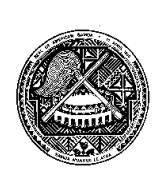

Pago Pago, American Samoa May, 2003 Report content does not necessarily reflect the views and policies of the National Marine Sanctuary Program or the National oceanic and Atmospheric Administration, nor does the mention of trade names or commercial products constitute endorsement or recommendation for use.

#### REPORT AVAILABILITY

Electronic copies of this report may be downloaded from the National Marine Sanctuaries Program web site at www. Sanctuaries.nos.noaa.gov. Hard copies may be available from the following address:

> Fagatele Bay National Marine Sanctuary PO Box 4318 Pago Pago, As 96799

#### SUGGESTED CITATION

#### Suggested citation:

Birkeland, C.1 , Randall, R.1 , Green, A.2 , Smith, B.1 , and Wilkins, S.1. 2003. Changes in the coral reef communities of Fagatele Bay NMS and Tutuila Island (American Samoa), 1982-1995. Fagatele Bay National Marine Sanctuary Science Series. Pago Pago, AS. p. 237

1 University of Guam Marine Laboratory, UOG Station, Mangilao, Guam 96923

2 Department of Marine and Wildlife Resources, Pago Pago, AS 96799

#### TABLE OF CONTENTS

| Abstract                                                              | vii |
|-----------------------------------------------------------------------|-----|
| Coral Communities (by R.H. Randall and C. Birkeland)                  | 1   |
| Introduction                                                          | 1   |
| Methods                                                               | 2   |
| Results                                                               | 3   |
| Discussion                                                            | 3   |
| Previous studies                                                      | 3   |
| Structural effects of Acanthaster planci on reef communities          | 4   |
| Discussion and summary of Acanthaster planci effects                  | 8   |
| Tropical cyclones of 1990 and 1991                                    | 9   |
| Structural effects of tropical Cyclones Ofa and Val on fringing reefs |     |
| in Fagatele Bay                                                       | 10  |
| Discussion and summary of cyclone effects                             | 16  |
| Macrobenthic Invertebrate Communities (by Barry D. Smith)             | 111 |
| Introduction                                                          | 111 |
| Methods                                                               | 111 |
| Results                                                               | 112 |
| Discussion                                                            | 113 |
| Algal Communities (by Suzanne Wilkins)                                | 128 |
| Introduction                                                          | 128 |
| Methods                                                               | 128 |
| Results and Discussion                                                | 129 |
| Fish Communities (by Alison Green)                                    | 144 |
| Introduction                                                          | 144 |
| Methods                                                               | 144 |
| Results                                                               | 146 |
| Discussion                                                            | 156 |
| Appendix A: Coralline Lethal Orange Disease                           | 221 |
| Acknowledgments                                                       | 223 |
| Literature Cited                                                      | 224 |

#### LIST OF TABLES

| Table 1. Coral communities at 6 transects in Fagatele Bay, based on 25 quantitative point-quarter transect surveys done in July 1995.                                                                                         | 18-61   |
|----------------------------------------------------------------------------------------------------------------------------------------------------------------------------------------------------------------------------------|---------|
| Table 2. Coral communities at 10 locations around Tutuila, American Samoa, based on 20 quantitative point-quarter surveys done in July 1995.                                                                                  | 62-98   |
| Table 3. Abundance of hermatypic corals (colonies per m2 ) in Fagatele Bay National Marine Sanctuary in April 1985, April 1988, and July 1995.                                                                             | 99      |
| Table 4. Percent cover of substrata by hermatypic corals in Fagatele Bay National Marine Sanctuary in April 1985, April 1988, and July 1995.                                                                                  | 100     |
| Table 5. Mean coral colony diameter (cm) in Fagatele Bay National Marine Sanctuary in April 1985, April 1988 and July 1995.                                                                                                   | 101     |
| Table 6. Abundance (number per m2 ) of hermatypic coral colonies at 12 sites around Tutuila Island in April 1982, April 1985, April 1988, and July 1995 at two depths at each site.                                     | 102-104 |
| Table 7. Percent cover of substrata by hermatypic coral colonies at 12 sites around Tutuila Island in April 1982, April1985, April 1988, and July 1995 at two depths at each site.                                         | 105-107 |
| Table 8. Mean diameter (cm) of hermatypic coral colonies at 12 sites around Tutuila Island in April 1982, April 1985, April 1988, and July 1995 at two depths at each site.                                                | 108-110 |
| Table 9. Densities of macroinvertebrates occurring on the forereef slope at Transects 1 and 2 (Figure 2) in Fagatele Bay. Data are means ± standard deviations of taxa observed in six 10-m2 quadrats, except where noted. | 115-116 |
| Table 10. Densities of macroinvertebrates occurring on the forereef slope at Transect 3 and 4 at Fagatele Bay. Data are means ± standard deviations of taxa observed in six 10-m2 quadrats.                             | 117-118 |
| Table 11. Densities of macroinvertebrates occurring on the forereef slope at Transects 5 and 6 in Fagatele Bay. Data are means ± standard deviations of taxa observed in six 10-m2 quadrats, except where noted.        | 119-120 |

| Table 12. Densities of macroinvertebrates occuring on the reef flat at Transects 3 and 4 in Fagatele Bay. The reef at Transect 3 was 90 m in width and, therefore, consisted of 18 quadrats; the reef flat at Transect 4 was 145 m and consisted of 29 quadrats. Data are means + standard deviations of taxa observed in 10 m2 quadrats.                                              | 121-122 |
|-------------------------------------------------------------------------------------------------------------------------------------------------------------------------------------------------------------------------------------------------------------------------------------------------------------------------------------------------------------------------------------------------------|---------|
| Table 13. Densities of macroinvertebrates occurring on the forereef slope at Sites 1 to 4 (Figure1) around Tutuila, American Samoa. Data are means ± standard deviations of taxa observed in six 10-m2 quadrats.                                                                                                                                                                             | 122     |
| Table 14. Densities of macroinvertebrates occurring on the forereef slope at Sites 7 to 12 (Figure1) around Tutuila, American Samoa. Data are means ± standard deviations of taxa observed in six 10-m2 quadrats, except where noted.                                                                                                                                                     | 123-124 |
| Table 15. Species list of non-scleractinian macroinvertebrates observed adjacent to transects at 11 sites (see Figure 1) around Tutuila, American Samoa. Presence of a species is denoted by the symbol *.                                                                                                                                                                                      | 125-127 |
| Table 16. Frequency and percent cover of the benthic flora in Fagatele Bay, American Samoa. Plain numbers indicate percent cover, numbers in parenthesis indicate frequency of occurrence converted to percent (see Methods in text). Algal species occurring epiphytically on other algae or occurring in the vicinity of the transect are marked with and X.                            | 130-133 |
| Table 17. Frequency and precent cover of the benthic flora in Fagatele Bay, American Samoa (Transects 4, 5, 6). Plain numbers indicate percent cover, numbers in parenthesis indicate frquency of occurrence converted to percent (see Methods in text). Algal species occurring epiphytically on other algae or in the vicinity of the transect are marked with an X.                    | 134-137 |
| Table 18. Frequency and percent cover of the benthic flora along 10 transects in 5 different bays of American Samoa. Plain numbers indicate percent cover, numbers in parenthesis indicate frequency of occurrence converted to percent (see Methods in text). Algal species occurring epiphytically on other algae or occurring in the vicinity of the transect are marked with an X. | 138-141 |
| Table 19. Summary of mean percent cover and standard deviation of algae at different depths in Fagatele Bay of the 1985 and 1995 survey.                                                                                                                                                                                                                                                           | 142     |
| Table 20. Summary of mean percent cover and standard deviation of algae at the Permanent Transects 1 - 6 at Fagatele Bay of the 1985 and 1995 survey.                                                                                                                                                                                                                                           | 142     |

| Table 21. Summary of overall percent algal and coralline algal cover in 5 days of American Samoa from the 1985 and 1995 survey.                                                                                                                                                                                                  | 143     |
|-------------------------------------------------------------------------------------------------------------------------------------------------------------------------------------------------------------------------------------------------------------------------------------------------------------------------------------|---------|
| Table 22a. Fishes censused on the reef slope at Fagatele Bay in 1995, Sites 1 and 2. Numbers indicate the number of individuals of each species counted on the transect, and the letter P indicates the presence of a species in the vicinity of the transect lines.                                                       | 159-165 |
| Table 22b. Fishes censused on the reef slope at Fagatele Bay in 1995, Sites 3 and 4. Numbers indicate the number of individuals of each species counted on the transect, and the letter P indicates the presence of a species in the vicinity of the transect lines.                                                       | 166-174 |
| Table 22c. Fishes censused on the reef slope at Fagatele Bay in 1995, Sites 5 and 6. Numbers indicate the number of individuals of each species counted on the transect, and the letter P indicates the presence of a species in the vicinity of the transect lines.                                                       | 175-181 |
| Table 23. Fishes censused on the reef flat at Fagatele Bay in 1995. Numbers indicate the number of individuals of each species counted on the transect, and the letter P indicates the presence of a species in the vicinity of the transect line.                                                                         | 182-188 |
| Table 24a. Fishes censused on transects at various sites around Tutuila Island in 1995: Masefau inside, Masefau outside, Aoa and Onenoa. Numbers indicate the number of individuals of each species counted on the transect, and the letter P indicates the presence of a species in the vicinity of the transect line. | 189-197 |
| Table 24b. Fishes censused on transects at various sites around Tutuila Island in 1995: Fagafue, Massacre Bay, Rainmaker and Fatu Rock. Numbers indicate the number of individuals of each species counted on the transect, and the letter P indicates the presence of a species in the vicinity of the transect line.  | 198-206 |
| Table 24c. Fishes censused on transects at various sites around Tutuila Island in 1995:. Numbers indicate the number of individuals of each species counted on the transect, and the letter P indicates the presence of a species in the vicinity of the transect line.                                                    | 207-213 |
| Table 25. Fishes censused along 100-m transects on the reef slopes at Fatatele Bay, Sita Bay, and Cape Larsen in 1995. Numbers indicate the number of individuals of each species counted on the transect, and the letter P indicates the presence of a species in the vicinity of the transect line.                      | 214-220 |

| Table 26. Total species richness and abundance of fishes recorded on the reef slope transects in Fagatele Bay in each year of the survey. Where: Area = total area surveyed each year. | 221 |
|----------------------------------------------------------------------------------------------------------------------------------------------------------------------------------------------|-----|
| Table 27. Summary of the number of transects surveyed on the reef flat and reef slope at each depth in Fagatele Bay in each year.                                                         | 221 |
| Table 28. The frequency of occurrence for the orange band disease and grey sponge per quadrant for Transects 1-6.                                                                         | 223 |

### **List of Figures**

| Figure 1. Locations of ten survey sites on Tutuila Island, excluding sites in Fagatele Bay. 1-inside Masefau Bay; 2-outside Masefau Bay (Asaga Strait); 3-Aoa Bay; 4-Onenoa Bay; 5-Aunu'u Island; 6-Matuli Point; 7- Fagasa Bay; 8-Cape Larsen; 9-Fagafue Bay; 10-Massacre Bay; 11- Rainmaker Hotel; 12-Fatu Rock, 13-Fagatele Bay; 14-Sita Bay; 15-Auasi. | 1   |
|------------------------------------------------------------------------------------------------------------------------------------------------------------------------------------------------------------------------------------------------------------------------------------------------------------------------------------------------------------------------|-----|
| Figure 2. Six permanent sites in Fagatele Bay and transects at each site.                                                                                                                                                                                                                                                                                              | 2   |
| Figure 3. Mean (and se) species richness (a) and abundance (b) of fishes in Fagatele Bay during each of three surveys over the last ten years. Please note that the number of transects surveyed varied among depths and years (see Table 31 ).                                                                                                               | 147 |
| Figure 4. Comparison of species richness (a) and abundance (b) between surveys in 1988 and 1995 on the reef slope at ten sites around Tutuila Island .                                                                                                                                                                                                           | 150 |
| Figure 5. Species richness (a) and abundance (b) of fishes on the reef slope at three sites around Tutuila Island on four occasions over the last 18 years.                                                                                                                                                                                                         | 151 |
| Figure 6. Abundance of each family of fishes at three sites around Tutuila Island on four occasions over the last 18 years.                                                                                                                                                                                                                                         | 152 |
| Figure 7. Abundance of each pomocentrid species at three sites around Tutuila Island on four occasions over the last 18 years.                                                                                                                                                                                                                                      | 153 |
| Figure 8. Abundance of each acanthurid species at three sites around Tutuila Island on four occasions over the last 18 years.                                                                                                                                                                                                                                       | 154 |
| Figure 9. Abundance of each acanthurid species at three sites around Tutuila Island on four occasions over the last 18 years.                                                                                                                                                                                                                                       | 155 |
| Figure 10. Coralline lethal orange disease photographed at Fagatele Bay by Dr. Charles Birkeland                                                                                                                                                                                                                                                                    | 221 |

### ABSTRACT

The condition of coral reefs in Fagatele Bay National Marine Sanctuary and at ten other sites around Tutuila was assessed during 12-28 July 1995. Reef-building corals were surveyed along 25 transects, other invertebrates along 23 transects, algae along 21 transects, and fishes along 22 transects in Fagatele Bay. All these groups were also surveyed along transects at the other ten sites around Tutuila. These transect were originally established in pairs in exposed and sheltered sites, and they were previously surveyed quantitatively in 1982, 1985, and 1988.

The most obvious finding from this survey was rather counterintuitive. Exposed reefs showed little damage from hurricanes and bleaching events, while protected areas showed extensive damage. The reasons for this are that the coral colonies in exposed areas are conditioned to frequent strong wave action and loose materials are scarce, while corals in sheltered areas grow into delicate forms and loose material accumulates on the substrata. Delicate arborescent "staghorn", "elkhorn", and especially "tabletop" corals, break under storm waves, and these large limestone objects are thrown back and forth by storm waves and smash into other corals. There are also rocks and gravel laying around in protected areas which become projectiles in high-energy wave conditions of hurricanes and which are damaging to corals. In exposed areas, the corals are conditioned to frequent wave action and therefore grow into compact, solid, or encrusting growth forms which are not as vulnerable to being broken by storm waves, and loose rocks are persistently removed by wave action so they do not accumulate as much as they do in sheltered areas.

Because of the processes mentioned above, the corals along Transects 1 and 6 in exposed locations at the outer edges of Fagatele Bay appeared to be in the same conditions as in previous surveys. However, the corals along Transects 2, 3, 4, and 5 in relatively sheltered sites inside Fagatele Bay were severely affected by hurricanes. Many large colonies were broken off and tumbled around. Although there were numerous young (less than three-year-old) recruits, there were relatively few older colonies. There was substantial structural damage to the reef from the toppling of older colonies. Likewise, the corals outside Masefau Bay appeared the same as in 1982, 1985, and 1988, while the reef community inside Masefau was totally devastated.

Although the damage to the coral communities from Hurricanes Ofa and Val were extensive, the reefs are in good health as evidenced by the abundance of young colonies. The recruitment of corals and the health and stability of the reef system is enhanced by the prevalence of coralline algae, especially *Porolithon onkodes*.

Coralline algae stabilize the reef by growing over and cementing dead corals. The planula larvae of many species of reef-building corals respond to chemical cues from coralline algae as signals or stimulants for settling and/or undergoing metamorphosis. Coralline algae provide smooth clean substrata on which corals can settle. Filamentous and fleshy algae, in contrast, abrade coral recruits, overgrow coral recruits, and produce sediment traps in which small corals are smothered. The coral communities at Fagatele Bay and most other sites around Tutuila which were devastated by waves from hurricanes and by bleaching (perhaps from temporary seawater temperature increases) are apparently recovering as indicated by the abundance of small recruits.

The coralline algae also facilitate reef construction. After the hurricanes, shards and rubble accumulate into mounds or fill channels. These mounds and fill are then cemented into place and solidified by coralline algae. In view of the overgrowth of one of the shallow stakes on Transect 3 by a relatively slow-growing massive *Porites lutea*, we suspect that a number of the permanent transect markers in Fagatele Bay may have been buried by the rubble which is now cemented by coralline algae. This form of reef growth, although relatively rapid, is of very porous construction. This makes it difficult to secure bolts and metal loops for permanent anchor buoys on these reefs of rapid, but porous, growth.

Considering the importance of coralline algae to the recovery and growth of the coral reef of Fagatele Bay, it was noted that the "coralline lethal orange disease" (CLOD) was common from shallow water down to 40-ft depth on Transects 4 and 5, and to a lesser extent on Transect 3. See Appendix A. There was also a black "lichen-like" disease of coralline algae on Transect 3.

Corals of the genus *Pocillopora* were conspicuous in their mortality in shallow water in the inner sections of Fagatele Bay. It has been suggested by Nancy Daschbach that while corals of many genera demonstrated a whitening during bleaching event of the summer of 1994, *Pocillopora* showed greater mortality than did other corals. This is consistent with the scientific literature on corals in which species of *Pocillopora* are perceived as "weedy" species that are rapid recruiters and rapid growers, but which are especially susceptible to physiological stresses such as temperature changes. This is corroborated by the observations that colonies of *Pocillopora* did not show exceptional mortality in exposed areas where the frequent turbulence and mixing of water would mollify any temperature changes.

Other invertebrates also showed dramatic changes since the previous survey in 1985. The pinkspined urchin *Echinometra mathaei* decreased in abundance by an order of magnitude, in some cases by over 95%. This is probably of ecological importance because *E. mathaei* is a major agent of bioerosion, making grooves and channels in the reef structure. The edible tridacnid clams *Tridacna squamosa* and *Tridacna maxima* were also very scarce around Tutuila, but they have been scarce in all our surveys.

The fish communities of Fagatele Bay and elsewhere around Tutuila Island have changed dramatically over the last two decades also. Fish abundance has decreased by more than one half at some sites, although species richness appears to have remained relatively consistent over time. The most dramatic changes to the fish communities have been in the Family Pomacentridae. In 1995 there were only 30-50% as many pomacentrids as there were when the study began in 1977-1978. This was largely due to a 91-99% decline in the abundance of one species, *Plectroglyphidodon dickii*. The change in abundance of this and other pomacentrid species can be understood in the context of habitat degradation, since most are small, site-attached species that are closely associated with particular habitat characteristics including coral cover. In contrast, other families such as the Acanthuridae showed no substantial decline in abundance over time. This was probably because the acanthurids were mostly roving herbivores, which were less likely to have been affected by the changes to their habitat characteristics.

The history of coral-reef communities at Tutuila has involved changes in pattern of depth distribution of disturbances over the past 16 years. The reefs in 1979-1988 were recovering from devastation by predation from the crown-of-thorns starfish. In this period it was the deeper reefs, below the surf zone or reef margin, that showed the greater effects of disturbance. This was because the crown-of-thorns was not well adapted to hanging on in turbulent water. Corals in shallow water were defended from crown-of-thorns predation by wave action. In contrast, the damage by waves from hurricanes directly impacted the shallow reef margin, and bleaching also extended into shallow water.

In view of the response of the coral-reef communities around Tutuila to disturbances such as an outbreak of the crown-of-thorns (1978/1979), two hurricanes (1990 and 1991), and a bleaching event (1994), the coral reefs of Tutuila appear robust. The adult colonies are killed and living coral cover is reduced to a large extent, but the abundant recruitment of juveniles indicate that the coral reefs are resilient to natural disturbances. However, events on the coral reef community near the Rainmaker Hotel indicate that chronic environmental effects from human activities such as sedimentation and pollution inhibit coral recruitment and so the reef community deteriorates by attrition. Although there is no spectacular mortality of adult colonies, occasionally one of them will die of natural causes and they are not replaced if there is severe sedimentation or pollution.

Sedimentation is a stress on adult colonies because of the calories required to produce the mucus necessary to shed off the silt. We observed a large area of mucus on a *Porites* colony in the cove just west of Fatu Rock. It has been shown that colonies of corals in areas of sedimentation are less fecund, i.e., produce fewer eggs, perhaps because the energy used to survive by shedding the mucus is diverted from energy used to produce eggs. Also, suspended sediment diminishes water clarity and therefore the light available for photosynthesis by zooxanthellae in the tissues of corals. Furthermore, the microscopic planula larvae of corals cannot settle and undergo metamorphosis on sediment; they need bare limestone or clean encrusting coralline algae. Sedimentation and pollution also interfere with the chemical cues needed by sperm and eggs in fertilization and by the planula larvae in recognition of appropriate substrata for settlement and metamorphosis. Nevertheless, without sedimentation or pollution, corals are remarkably recovery-prone to even the worst of natural disasters.

### CORAL COMMUNITIES

#### by Richard H. Randall and Charles Birkeland

#### INTRODUCTION

This is a report of the findings of a survey of the corals and the condition of coral reefs in Fagatele Bay National Marine Sanctuary and at ten other sites around Tutuila during 12-24 July 1995. Reef-building corals were surveyed along 25 permanent transects that were established in 1985 in Fagatele Bay. The transects at ten sites at other locations around Tutuila (Fig. 1) were originally established in pairs in exposed and sheltered sites, and previously surveyed quantitatively in 1982, 1985, and 1988 (Birkeland et al. 1987, 1994). Detailed descriptions of the physiography of the marine habitats, the coral communities, the locations of the permanent transects, and vertical profiles along the six transects in Fagatele Bay National Marine Sanctuary are presented in Birkeland et al. 1987. The 1987 report also provides detailed descriptions of the reef-flat platform, reef margin, and forereef slope zones.

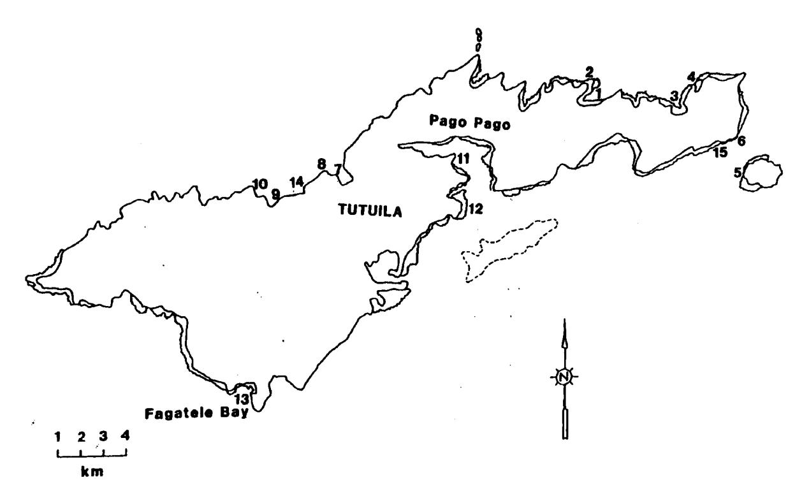

Fig. 1. Locations of ten survey sites on Tutuila Island, excluding sites in Fagatele Bay. 1-inside Masefau Bay; 2-outside Masefau Bay (Asaga Strait); 3-Aoa Bay; 4-Onenoa Bay; 5-Aunu'u Island; 6-Matuli Point; 7-Fagasa Bay; 8-Cape Larsen; 9-Fagafue Bay; 10-Massacre Bay; 11-Rainmaker Hotel; 12-Fatu Rock, 13-Fagatele Bay; 14-Sita Bay; 15-Auasi.

Our original survey in 1982 was to assess recovery of Samoan reef communities from predation by an outbreak of crown-of-thorns starfish *Acanthaster planci* in 1978-1979. Therefore, we expected to find the coral communities in later stages of recovery. However, since our previous survey in 1988, there have been two major cyclones (Hurricanes Ofa in 1990 and Val in 1991)

and a coral-bleaching event (April 1994). Reefs and corals were subjected to extensive structural damage as a result of these two tropical cyclones passing close to American Samoa. Changes in the community structure of corals and other reef-associated organisms that have occurred since the initial *Acanthaster planci* predation during 1977-79 have been documented in Birkeland and Randall (1979), and Birkeland et al.(1987, 1994).

The main emphasis on corals in this report will be in their relation to the geomorphic structure of reefs and vulnerability or resistance to large swells and waves generated by storms and cyclones. Because intense *Acanthaster planci* predation on the reef corals can cause major changes in the community structure of reef-building corals as well as some structural changes, a section on the effects of intense *A. planci* predation on the reefs at selected sites around the island is also given.

#### METHODS

Coral communities were surveyed with the point-quarter method as used in previous surveys of Fagatele Bay National Marine Sanctuary and as described in detail in Birkeland et al. 1987. The locations of the permanent transects are given in Fig. 2.

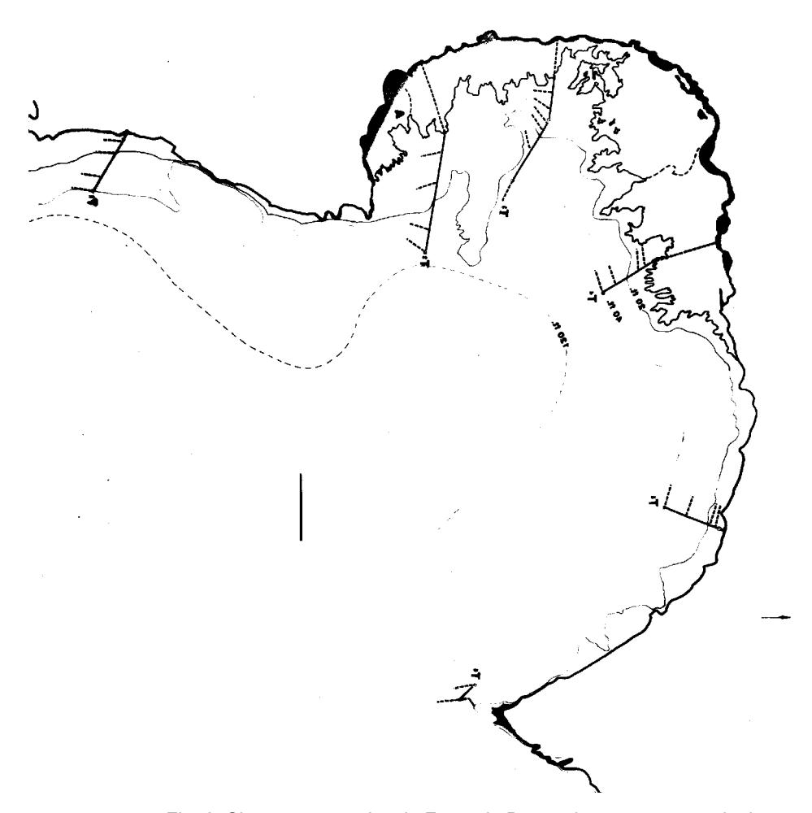

Fig. 2. Six permanent sites in Fagatele Bay and transects at each site.

#### RESULTS

Data on size distributions (geometric mean diameters, standard deviations, and ranges in diameters) of coral colonies, the numbers and abundances (per m2, relative abundances, frequencies) of the various species, and the percent cover of the reef substratum by living corals (per m2 and relative percentages) are provided in Table 1, a-y, for the permanent transects in Fagatele Bay National Marine Sanctuary and in Table 2, a-t, for the other sites around Tutuila. Tables begin on page 18.

Summary statistics for the abundances of coral colonies, percent cover of the reef surface by living coral, and colony size distributions at five (5) depths along six (6) permanent transects in Fagatele Bay 1985, 1988, and 1995 are given in Tables 3 - 5. Likewise, these summary statistics are given for coral communities at two depths at each of ten other sites around Tutuila for 1982, 1985, 1988, and 1995 in Tables 6 - 8.

#### DISCUSSION

#### *Previous Studies*

The authors have conducted five separate studies of the reef systems around Tutuila Island in American Samoa between April 1979 and July 1995. The first of these studies was conducted from 24 March through 16 April 1979 to survey the coral reef communities, which at that time were undergoing severe predation by the coral-eating crown-of-thorns starfish *Acanthaster planci*. During this first survey, the distribution and abundance of *A. planci*, the relative degree of mortality to the coral community by *A. planci* predation, and the geomorphic structure of the reefs and species abundance of reef-building corals were assessed at 45 different stations around the island (Birkeland and Randall, 1979). During the 1979 assessment 525 specimens of reefbuilding corals were collected for systematic studies.

The second study was conducted during April 1982 to determine the degree of recovery of the coral reef communities from previous *A. planci* predation at twelve of the 45 stations studied during the 1979 survey. Six of these twelve stations were selected to represent wave-sheltered locations (coastal embayments) that were paired with six nearby wave-exposed locations (exposed coasts). In order to establish a quantitative baseline assessment of the coral communities at these twelve stations a plotless point-quarter technique was used to determine species size distribution, density, and percent surface coverage. During the 1982 assessment, 284 specimens of reef-building corals were collected for systematic studies.

The third study was conducted during April 1985 to continue an assessment of the degree of coral recovery from earlier *Acanthaster planci* predation at the twelve 1982 sites surveyed during 1982, and to conduct a biological marine survey at a newly established U. S. Marine Sanctuary located at Fagatele Bay along the southwest coast (Birkeland et al., 1987). At Fagatele Bay, corals were surveyed quantitatively by using the plotless point-quarter method of assessment along six permanently established transects and the general geomorphic reef structure and species abundance of corals were qualitatively assessed within the overall bay. During the 1985 coral assessment 446 coral specimens were collected for systematic studies.

The fourth (Birkeland et al., 1994) and fifth studies were conducted during April of 1988 and July of 1995 respectively, during which times assessments similar to those conducted during the 1985 study were made. During the 1995 study additional studies were conducted consisting of: 1) a quantitative resurvey of Mayor's 1917 reef flat platform transect in Pago Pago Bay, 2) a general qualitative assessment of a lagoon created by dredging on the reef flat platform adjacent to the Pago Pago Airport, and 3) general assessments at three embayment reefs along the southwest coast to determine effects of terrestrial sedimentation. During the 1988 and 1995 assessments, 102 coral specimens were collected for systematic studies.

*Structural effects of* Acanthaster planci *on reef communities*

Scattered damage to the surficial reef deposits, mainly by the collapse and fragmentation of some colony forms, as the result of *A. planci* predation has been observed at some of the assessment sites in Fagatele Bay and other sites around the island. To prevent confusion in regard to structural reef damage as a result of the 1977-79 *Acanthaster planci* predation and the reef damage resulting from the two typhoons that occurred in 1990 and 1991, a short summary of the effects resulting from the former is in order.

In regard to the magnitude of the *Acanthaster planci* predation events, one of us (Randall) witnessed the extensive predation on Guam and many other Micronesian and Pacific Islands from 1967 through 1972, and rates the predation event that occurred on the reefs of American Samoa from 1977 through 1979 just as devastating to the coral community, or possibly even greater, than that observed at any other island that experienced extensive starfish predation.

#### Immediate effects

When *Acanthaster planci* feeds on corals only the soft tissues are digested away, the integrity of coral corallum remains intact, thus there is no immediate structural damage. When all the living coral tissues are digested the colony is killed, and sometimes partial digestion of the colony tissues causes death as well, but commonly parts of the colony are left alive after the feeding event and the living zone(s) continues to grow in size and regenerate. Our observations show that where coral tissues are digested the underlying corallum becomes bleached white in color and is quickly recolonized. The first colonizers are generally endolithic and filamentous algae, which are quickly succeeded, or simultaneously recolonized by various species of calcareous algae and fleshy macro-algae. The rapidity by which freshly killed corals become recolonized by algae was generally observed wherever *A. planci* was feeding upon corals during our 1979 assessment and several accounts at specific sites are worth mentioning.

On 26 March 1979 near Siufaga Point, just inside the mouth of Fagasa Bay, two coral samples were chiseled from the lumpy dorsal surface of a pale brown *Porites lutea* colony, roughly 1.2 x 1.0 meters in diameter, that was growing on the outer edge of a submarine shelf at a depth of 3.0 meters. Sampling left two white concave depressions with a pale brown, fractured, peripheral margin about a centimeter wide that was invested with living tissues. On 12 April 1979 the sampling site was revisited and observations on the same *P. lutea* colony revealed that new polyps occupied the peripheral fractured regions and the previous white skeletal region was

occupied by numerous, pink, 1-2 mm diameter discs of coralline algae and short green filaments of algae, the latter possibly a cyanophytic species. The coralline discs covered an estimated 25 percent of the previously fractured surface.

Another example which documents the rapidity of algal recolonization as well as the intensity of starfish predation was observed 11 April 1979 north of Agaoleatu Point on Aunu'u Island. Here a sand-floored terrace 12 to 15 meters deep had large scattered coral mounds that rose upward to within 4 to 6 meters of the surface. The mounds were predominantly occupied by arborescent thickets and scattered tabletop *Acropora* species which at places were infested with numerous *A. planci*. At our anchorage site, on top of one of the mounds about 100 x 75 meters in size near the seaward margin of the terrace, a large aggregation of *A. planci* were feeding on arborescent acroporoid corals. It was obvious that the feeding starfish had moved upslope to the mound crest, leaving a swath of dead corals behind about a 100 meters long and 5 to 10 meters wide. At the deeper trailing edge of the swath the coral branches were colonized by dark brown fleshy algae, which graded upward into a zone where the branches were colonized primarily with filamentous green algae, which in turn was preceded by a zone of white freshly killed branches, and at leading edge was a dense feeding band of starfish. Within the feeding band the starfish were stacked atop each other feeding on various interstitial levels between the coral branches. Here the entire sequence from actively feeding starfish to recolonization of the freshly killed branch surfaces by macroalgae was evident within a single swath of corals.

Another example of intense feeding activity by *Acanthaster planci* on large tabletop colonies was observed near Matuli Point on 31 March 1979. At the seaward edge of a submarine terrace scarp, in water about 4 to 5 meters deep, a large multi-tiered colony of *Acropora hyacinthus* about 1.7 meters across had 15 *A. planci* actively feeding on both the upper and lower polypoid surfaces. Although there was room for the starfish to individually feed over the colony surface, they were at places crowded together in overlapping aggregations.

#### Intermediate effects

Intermediate effects are here interpreted from observations of reef areas where the coral communities had undergone extensive *Acanthaster planci* predation 1 1/2 to 3 years earlier. Several reef areas reported by Wass (1979) as having undergone extensive *A. planci* predation during late 1977 and early 1978 were investigated during our 1979 assessment, and during April of 1982 we reassessed many of the areas that were intensively infested with *A. planci* during our 1979 assessment. Observations made during these reassessments at several of our field stations are given below which describes the structural condition of the reef and of the corals at several different habitats that were previously killed by *A. planci* predation. Taema and Nafanua Bank sites represent deep low wave energy slopes, Aunu'u Island site represents a moderate to heavy wave assaulted shallow terrace and adjacent deep seaward slope on the windward side of the island, and Aoa Bay site represents a protected embayment fringing reef habitat on the leeward side of the island.

On 30 March 1979, we investigated a region of Taema Bank that Richard Wass had reported as heavily infested with *A. planci* during the late part of 1977 and the early part of 1978. One of us (Birkeland) made a scuba dive down the seaward bank slope to a sand-floored terrace at 34

meters depth. An extensive coral community, previously consisting of numerous tabletop and scattered arborescent *Acropora* species, were nearly all dead and heavily encrusted with crustose coralline algae. A marginal piece of an in situ dead *A. cytherea* colony about 2.5 meters in diameter was collected near the base of the seaward bank slope at 34 meters depth. The fractured face of the coral revealed stems encrusted at places by crustose coralline algae up to a centimeter thick on the upper plate surface. The under plate algal encrustations were thinner and had numerous spats of a red colored adherent foraminiferan *Homotrema rubra* scattered over the surface. Ten marginal samples of dead *Acropora* tabletop colonies and five branch samples from arborescent colonies collected from the upper bank slope to a depth of 20 meters were all similarly encrusted with crustose coralline algae laminations up to a centimeter or more thick. With the exception of some arborescent *Acropora* patches, nearly all the dead corals on the seaward bank slope were "in place" and extensively encrusted by several crustose coralline algal species. About 25 percent of the bank slope surface was occupied by *Halimeda* species which produces extensive amounts of detrital sediment.

Nufanua Bank which extends southwest of Aunu'u Island was also reported by Richard Wass as intensely infested with *A. planci* during the early part of 1978. On 31 March 1979 we reassessed the upper bank platform (14 to 17 meters depth) and seaward bank slope to 34 meters depth. Our observations revealed a slope dominated by numerous dead "in place" *Acropora* colonies extensively encrusted by crustose coralline algae, similar to the conditions that were observed at Taema Bank.

The general pattern of most coral colonies retaining their structural integrity and becoming heavily encrusted by crustose coralline algae after being killed by *A. planci* predation was also observed in shallower more wave-assaulted reef habitats as well. A striking example of conditions before and after *A. planci* predation on a shallow, wave-assaulted, fringing reef habitat was observed at Aunu'u Island. On 31 March 1979, a shallow submarine terrace and adjacent steep seaward slopes and scarps to a depth of 34 meters was investigated about 250 meters southwest of Salevatia Point on Aunu'u Island. The terrace ranged from 2 to 3 meters deep on the inner part and gradually deepened to about 5 meters on the outer part where it abruptly terminated at a scarp edge. The terrace was conspicuously dominated by tabletop and other abundant to common corymbose and arborescent *Acropora* species. Encrusted patches of *Montipora* and cespitose heads of *Pocillopora* were also abundant to common as well. At the seaward margin of the terrace conspicuous mounds and ridges up to 2 meters high were composed of multiple tiers of living tabletop and corymbose *Acropora* species. Estimates of living coral coverage ranged from 70 to 80 percent on the inner terrace and 80 to 90 percent on the outer terrace. Actual coral coverage was much higher if all the multiple tiers of tabletop forms were considered.

On 5 April 1982 the same shallow terrace off of Salevatia Point on Aunu'u Island was reassessed. Most of the former living coral colonies were dead and thoroughly encrusted with crustose coralline algae. Collapse and fragmentation of arborescent and foliaceous species was apparent, but many were also intact and encrusted with coralline algae. Living corals were widely scattered and small, consisting mostly of a few arborescent *Acropora* patches with surviving stem tips, surviving patches of mostly dead *Pocillopora* heads, and an occasional newly recruited coral spat a few centimeters in diameter. Coral coverage on the terrace has been reduced to 1.7

percent from a previous estimate of 70 to 90 percent in 1979, and on the deeper adjacent scarp and steep slope coral coverage was only 0.06 percent (Birkeland et al., 1987). Surface coverage by crustose coralline algae on the shallow terrace was estimated at 80 to 90 percent.

An example of conditions before and after *A. planci* predation in a protected embayment reef along the leeward northeast coast was observed at Aoa Bay. During a tow survey on 1 June 1978 Richard Wass observed 270 *A. planci* on the reefs between Solo Point and Motsaga Point (Aoa Bay), but reported that about 90 percent of the corals were still alive. On 9 April 1979 the fringing embayment reef along the east side of Aoa Bay was reassessed and we found most of the corals intact, but dead and extensively encrusted with crustose coralline algae. Coral coverage on shallow terraces (2 to 5 m depth) along the outer bay was estimated at 2 to 3 percent and along the inner bay (1 to 2 m depth) at 1 to 2 percent. Fifteen *A. planci* were observed during our 1979 assessment, mostly along the inner part of the bay feeding on surviving corals, including *Millepora platyphylla*, but about half of them were actively moving about on sand-floored parts of the bay, possibly in search of living corals.

On 6 April 1982 we again reassessed the eastern side of Aoa Bay and found some small, widely scattered, newly recruited corals among numerous algal encrusted heads and tabletop corals along the outer part of the bay. Coral coverage along transects on the shallow terrace (2 to 5 m depth) was 3.1 percent and on the adjacent deeper slope (6 m depth) was 0.8 percent, and coralline algal coverage on the shallower terrace was estimated at 80 percent (Birkeland et al., 1987). Where the terrace grades into the reef flat platform coralline algal coverage was even higher.

#### Long-term effects

Long term effects are here interpreted from observations of reef areas from our 1985 and 1988 reassessments where the coral communities had undergone extensive *Acanthaster planci* predation 7 to 10 years earlier. With an elapse of this much time the reef areas should show a considerable amount of recovery by recruitment of new corals and regeneration of surviving spats. The recovery of coral communities that had undergone extensive *A. planci* predation in Guam are well documented (Randall, 1973a,b; Jones et al., 1976), and show that coral coverage as well as species abundance reached previous *A. planci* predation levels within 12 years (Colgan, 1987).

The shallow terrace and adjacent steep slopes at Aunu'u Island were reassessed 15 April 1985. The structural integrity of the shallow terrace appeared much the same as it did during the 1982 assessment. Crustose coralline algae dominated both the inner and outer parts of the terrace, and freshly fractured samples of "in place" tabletop colonies revealed crustose laminations up to two or more centimeters thick on the upper surface. Coral coverage on the shallow terrace was 1.6 percent, about the same as that during the 1982 assessment, and on the adjacent steep seaward slopes coral coverage increased from 0.06 percent during the 1982 assessment to 1.83 percent (Birkeland et al., 1987). Coralline algal coverage along a transect at 6 meters depth was 70.7 percent and on the shallower terrace was estimated at 80 to 90 percent.

The Aunu'u Island site was reassessed again on 14 April 1988, but because of breaking waves on shallow terrace, only the adjacent scarp and steep slopes at 6 meters depth could be

quantitatively assessed. A short snorkeling excursion onto the outer part of the shallow terrace revealed that it was still dominated by crustose coralline algae, but corals appeared to more abundant. Especially conspicuous were the *Acropora hyacinthus* colonies which were now exhibiting tabletop colony forms. Some of the tabletop *Acropora* colonies appeared to be well over 0.5 meters across, which demonstrates the rapid growth rate of these colonies, which during the 1985 assessment were still in the encrusting-mound stage of development with colony diameters ranging from 3 to 15 centimeters. Coral coverage on seaward scarp and steep slopes at 6 meters depth was 17.8 percent (Birkeland et al., 1994), and an estimate of coral coverage on the outer part of the adjacent shallow terrace was estimated at 15 to 25 percent.

The fringing embayment reef along the east side of Aoa Bay was reassessed on 18 April 1985. The shallow terrace along the outer part of the terrace was dominated by encrusting crustose coralline algae, but new coral recruitment and regeneration of surviving spats were conspicuous, particularly on the outer half of the terrace. Newly recruited *Acropora hyacinthus* were especially noticeable, but were still in their encrusting-mound stage of development. Coral coverage along transects on the shallow terrace was 11.5 percent and on the adjacent deeper slope (6 m depth) was 1.8 percent, and coralline algal coverage along a transect at 6 meters depth was 68.8 percent and on the shallower terrace was estimated at 80 percent (Birkeland et al., 1987).

Aoa Bay was reassessed on 7 April 1988. Although encrusting coralline algae still dominated the shallow terrace, corals were conspicuously more abundant than during the 1985 assessment. Particularly noticeable were the *Acropora hyacinthus* colonies which were now forming their distinctive tabletop colony form, one of which was measured at 78 centimeters along the outer part of the terrace. Coral coverage along transects on the shallow terrace was 19.4 percent and on the adjacent deeper slope (6 m depth) was 15.8 percent (Birkeland et al., 1988), and coralline algal coverage on the shallower terrace was estimated at about 80 percent.

#### *Discussion and summary of* Acanthaster planci *effects*

With exception of some arborescent and foliate colony forms, most coral skeletons did not collapse or fragment as might be expected by their death and the sudden loss of skeletal tissue accretion and increase in surface exposure to bioeroders. Increased bioersion would certainly weaken the coral skeleton, resulting in greater susceptibility to chemical and physical erosion. If fleshy algae was the climax colonizer of the exposed coral surfaces on arborescent, corymbose, cespitose, foliose, and tabletop forms, it is doubtful that structural integrity of the skeleton could be maintained until the coral community became reestablished. Coral recolonization would probably proceed at a much slower rate on surfaces covered with fleshy algae because of the difficulty of planulae to settle on such unstable substrates, and if they did by chance become settled, the relatively slow growing coral polyp could become smothered by the high rate of biomass production by the fleshy algae, as was demonstrated by Birkeland (1977) on settling plate studies.

After extensive *Acanthaster planci* predation many arborescent "staghorn" *Acropora* patches were observed to have collapsed and fragmented after being killed by *A. planci* predation. In general it was the large thicket-like patches several meters across and larger mounds up to tens of meters across that were more prone to collapse and fragment. Arborescent *Acropora* thickets

consist of several distinct zones -- a living dorsal region and a basal dead region where the branches still retain their structural integrity, and if the thicket has been growing for some time there will most likely be a third zone consisting of fragmented dead branches that accumulate from gravitational collapse as a result of the accumulating weight of the upper growing surface.

In living thickets the dead branches that have not collapsed are usually occupied by fleshy algae rather than coralline encrustations which are maintained and protected by pomacentrid "farmer" fishes which graze the algal gardens for food. Coralline algae are thus prevented from encrusting and strengthening the dead branches. Bioerosion soon weakens the fleshy algal coated branches, especially from boring sponges, resulting in their collapse. When the living branches suddenly die in thickets which have populations of "farmer" fishes present the upper branches become colonized by fleshy algal species promoted by them. Within several years the branches are weakened internally by bioerosion, the thicket rapidly collapses and is abandoned by the host fishes, and the fleshy algae is replaced by crustose corallines which cements the rubble into a more rigid mass. Small arborescent thickets of coral commonly do not have "farmer" fish associated with them, and after their death they generally become rapidly encrusted with crustose coralline algae. Even during our 1988 reassessment survey it was fairly common to see small dead arborescent branch clumps encrusted with coralline algae that had maintained their structural integrity for 7 to 10 years.

In conclusion, the coral reefs, as well as most of the individual coral colonies, retained their structural integrity in a wide range of habitats. Coral skeletal integrity was achieved primarily by the relatively rapid colonization and encrustation of the newly exposed corallum surfaces by another primary reef framework builder, the crustose corallines. Even without the reef-building corals, accretion of framework reef deposits was still occurring throughout much of the reef system, though at a slower rate than if the faster-growing corals were present.

#### *Tropical cyclones of 1990 and 1991*

Between our 1988 and 1995 coral reef assessments, two tropical cyclones (hurricanes or typhoons) caused substantial decreases in coral coverage and abundance as well as some structural damage to the reef framework deposits. The tropical cyclones also caused an increase in the production of detrital deposits and changes in sediment patterns by redistribution. Hurricane Ofa passed about 140 miles to the southwest of Tutuila during February of 1990, and Hurricane Val passed directly over Tutuila in December of 1991. Although the wind speeds associated with these two hurricanes were not exceptionally strong during their passage by or over Tutuila, storm waves and storm surge generated by the hurricanes were exceptionally destructive to the fringing reef systems and coastal areas. From a report supplied to us from the American Samoa Meteorological Service Office at the Airport, a short summary of each of the two hurricanes is given below.

The eye of Tropical Cyclone Ofa was estimated to have passed about 140 miles southwest of Tutuila Island on 4 February 1990. Strong winds began to be reported over the island from about 0200 UTC on February 2, with winds becoming very gusty and average speeds reaching gale force by 1200 UTC on February 3. About 0500 NTC on February 4 the winds peaked with maximum average speeds reported at 53 knots. The maximum gust reported was 93 knots which

occurred at 0119 UTC on February 3. Heavy rain and large storm surge and storm waves washed away sections of roads and damaged bridges, buildings, and other structures. The coastal areas and villages in the northern part of the island were most severely affected.

Tropical Cyclone Val became organized northwest of the Samoa Islands, tracked southeast toward the island group, made a clockwise loop southwest of Savaii, and then tracked eastward and passed over Tutuila about 0000 UTC on 10 December 1991. Although no summary of the wind speed for Tropical Cyclone Val is given in the report from the Meteorological Services Office, anemometer graph charts from their office indicate a peak wind speed of 99 knots at 2350 on 9 December 1991. In conclusion, the report states that Val was a major tropical cyclone of this decade and will go on record as causing one of the most severe impacts in recent history. Apparently Tutuila has not experienced any major tropical cyclones since the middle 1960s.

#### *Structural effects of tropical Cyclones Ofa and Val on the fringing reefs in Fagatele Bay*

#### General effects of cyclones

Upon returning to American Samoa to conduct the 1995 coral reef reassessments, our team was well aware of the 1990 and 1991 Tropical Cyclones that passed near or over Tutuila Island, but we were somewhat unprepared to witness the degree of structural damage to the reef and coral communities we saw upon entering the waters of Fagatele Bay. One of us (Randall) has witnessed the effects of three "super typhoons" that passed directly over Guam since the middle 1960s, and found the level of structural reef damage around Tutuila Island to be generally greater than that observed on Guam after these more intense typhoons had passed over the island.

It must be kept in mind that the following observations from this assessment were made 3 to 4 years after the two cyclones affected the reefs, and thus we are unable to separate the individual effects of each cyclone. We are also unable to determine the immediate effects of the cyclones to the reef structure and associated communities, which was probably more severe than what we report, because of some recruitment and regeneration of marine organisms and redistribution of sediments since the cyclone events. It is also extremely difficult to determine whether the corals that we observed during the 1995 assessment are surviving patches or pieces of colonies that survived the cyclone events or are new corals recruited since the cyclones, or some combination of both. Another confounding factor in assessing the cyclone damage was a thermal event in 1994 that significantly elevated the water temperature, particularly in shallow reef margin and reef flat platform reef zones.

The cyclone-induced changes to the reefs in Fagatele Bay can be categorized into two broad types -- changes in the community structure of reef and reef-associated marine organisms and changes in the structural aspects of the reef framework and detrital deposits. Structural changes can be further subdivided into those of a minor or superficial nature (extant corals) where the physiography of the reef has not been significantly changed and those which have changed the physiographic features (buttresses, knobs, pinnacles) of the reef. To effectively evaluate both of these types of changes requires baseline knowledge of the reef system before and after the cyclone disturbances. Thus the basis for determining the structural and superficial aspects of the

two cyclones is drawn primarily from a comparison of field notes taken during the 1979, 1985, and 1988 assessments with observations made during the present 1995 reassessment. Most of these field observations have been focused around the six transect sites in shoal-water regions of the bay from the surface to about 10 meters depth, but some general observations were made between the sites as well.

The general physiographic nature of the fringing reefs in Fagatele Bay, before Tropical Cyclones Ofa and Val affected the reefs, is given in the 1987 report (Birkeland et al., 1987: 26-37) and will not be repeated here. The structural and superficial effects from the cyclones are presented in a systematic manner, starting with Transects 1 through 6.

#### Assessment of the cyclone damage at Transects 1-6

#### *Transect 1*

General observations at this site were for the most part restricted to a submarine terrace 5 to 12 meters deep that extends from Steps Point to Matutuloa Point, with the most detailed observations at 5 to 6 meters depth in the vicinity of Transect 1. During the 1988 assessment waves and swells were to high to conduct a quantitative analysis at the 5 meter transect site, or make any detailed observations within the general area. The entire region was investigated during 1985 and reassessed again in 1995.

The reef structure at this location is not conspicuously different from that observed during the 1985 assessment, but some superficial changes have occurred. The most obvious change was the stripping away of many of the dead and living tabletop colony forms between 6 and 9 meters depth just seaward of the 5 meter transect area. Except for some abrasion and colony breakage, the coral community on the surface of the three mound tops that constitute the 5 meter transect sampling area appeared to be little effected by the cyclone. In fact, there was an increase in coral density, coverage, and colony size since the last assessment during 1985. Apparently the coral community at the 5 meter transect site is adjusted to the large waves and swells that normally sweep across the region, and thus was not seriously affected by the cyclone events. Most noticeable damage to the corals at the 5 meter transect site was abrasion and breakage of vertical plates on large *Millepora platyphylla* colonies.

Conspicuous scouring was observed on the floor of shallow troughs that follow joints in the volcanic rocks that extend seaward from a submarine cliff along the shoreline, as well as around the base of large volcanic rock blocks scattered along the base of the submarine cliff toward Matutuloa Point. Coral communities on the upper surfaces of these blocks appeared to be little affected by the cyclone events. Many of the large algal encrusted tabletop and cespitose colonies that were observed during the 1985 assessment along a 9 to 12 meter deep submarine terrace that extends south from Matutuloa Point were also not seriously affected by the cyclone event.

#### *Transect 2*

Significant structural reef changes have occurred at this site, both in its surficial and physiographic aspects. The site normally receives considerable water agitation from waves refracted around Matutuloa Point.

The reef flat in the vicinity of the transect was swept free of sediment except for minor accumulations in holes and depressions. Corals were scattered and patchy on the reef flat, nevertheless there was an increase coral coverage and density and a decrease in colony size since the 1988 assessment. Although the reef flat area south of the transect site was previously veneered by rubble across much of its surface, significant new deposits consisting mostly of *Acropora* shingle has been added to the surface. The new shingle deposits are especially conspicuous at the reef flat-reef margin boundary where the deposits form a linear ridge.

The most intense damage at this transect site was observed in the shallow reef margin and upper reef front slope to about 2 meters depth. The most conspicuous surficial change observed was the stripping away of most of the living and dead corals with arborescent, tabletop, and corymbose colony forms. In contrast, many small, dead algal encrusted heads of *Pocillopora* were observed at places on the buttress ridges. Apparently these *Pocillopora* colonies developed after the storm event and were killed by some other cause, possibly by the 1994 thermal event.

Very few living corals were observed within this shallow reef area, unlike the deeper adjacent reef front slope where small corals were much more abundant. Many corals that were not stripped away were badly damaged by abrasion and breakage from sand- to boulder-sized pieces that were vigorously moved about by storm surge and waves. Structural physiographic damage to the buttress ridges was also observed within the reef margin and upper reef front slope to a depth of 2 meters. Some of the more conspicuous damage included several buttress ridge sections 2 to 3 meters long that had been toppled over onto their sides, a section that had been overturned in an upside-down position, and several sections 1 to 2 meters across that had been hydraulically plucked off from buttress ridges. Channels situated between the buttress ridges have undergone considerable shoaling as a result of infilling by mostly coralline algal encrusted coral rubble and shingle. At places this coral and shingle accumulation was a meter or more in thickness and cemented together by encrusting algae.

Except for some toppled knobs and pillars the reef front slope areas deeper than 2 meters appeared to have less structural physiographic damage, but surficial damage to living and dead extant coral colonies was extensive. From 2 to about 8 meters depth the reef slopes were veneered with coralline algal encrusted coral rubble and shingle except where topographic knobs and low mounds and ridges occurred. At the 3 meter transect site a linear arrangement of metersized *Lobophyllia hemprichii* colonies growing alongside a buttress ridge, that were used to identify the transect location, had all but the very tops buried in rubble and shingle. Some of the individual pieces of shingle were a meter or more in their long dimension and at places some of the clasts were being cemented together by crustose algae.

In regard to the community structure of the corals, there was an increase in coral density, coverage, and colony size at both the 3 and 5 meter transect sites since the last assessment during 1988. Scattered living and dead corals occurred on both the rubble and shingle veneered areas as well as on extant topographic features. Most of the corals were relatively small and appeared to have become established since the cyclone events, but a few larger colonies were also scattered about. Judging from the amount of abrasion and breakage, some of these larger colonies must have survived the two cyclone events.

#### *Transect 3*

This site is situated within the broad convex head of the bay and is exposed directly to waves and swells that enter the mouth of Fagatele Bay. At this site significant structural reef changes have occurred primarily in the reef margin and adjacent reef front slope zones, both in its surficial and physiographic aspects. In comparison with the other transect sites at the head of the bay, there was less cyclone damage in the upper reef front slope than at transect sites 2 and 4, but the lower reef front slope appeared to have about the same amount of damage. The presence of a large depression with a patch reef at its outer edge may have given the upper reef front slope some degree of protection at transect 2.

The reef flat in the vicinity of the transect has a relatively flat truncated surface with scattered irregular-shaped holes and depressions up to 5 or more meters across and up to 2 meters deep. There was only minor evidence of storm damage along the inner two-thirds of the platform, except for some scattered pieces of coral rubble and shingle. Along the outer third of the platform the holes and depression are connected by channelways that extend seaward to the reef margin and reef front slope, which contained significantly more rubble and shingle than before the cyclone events. Many dead and living corals that were earlier observed in these channelways have been swept away, but many small algal encrusted *Pocillopora* heads were still in place.

The most significant change on the inner two-thirds of the reef platform was the presence of abundant dead in situ corals that were alive during the 1988 assessment. The dead corals are mostly located in the holes and depression and in a narrow moat along the shoreline. On the outer part of the effected platform arborescent *Acropora* patches and *Pocillopora* heads were selectively killed, leaving most of the other species unharmed.

Farther inshore more species of corals, such as *Pavona divaricata, Porites lutea, P. cylindrica, P. annae*, and *Psammocora contigua*, as well as the encrusting corallines have been partially to completely killed. Where crustose coralline algae has been killed the surfaces are occupied by dark-colored fleshy algal species. It is suspected that the coral communities on the reef flat platform have been selectively killed by the 1994 thermal event, with the effects being greatest on the inner shallower part of the platform and attenuating in a seaward direction to the outer reef margin. Similar selective thermal coral kills have been observed on reef platforms on Guam and Saipan in the Mariana Islands that were related to periods of exceptionally low tides and calms. In regard to the community structure of the corals on the reef flat, there was a decrease in coral density, coverage, and colony size since the last assessment during 1988.

Although some damage was observed in the shallow reef margin and upper reef front slope zones, it was not nearly so severe as that observed at transect areas 2 an 4. The most obvious damage was the accumulation coral rubble and shingle. Physiographic reef damage consisted of several

toppled knobs several meters across in the reef margin, and a partly living colony of *Psammocora* sp.1 (2.2 x 1.7 meters across) that was broken off from a prominent pinnacle on the lower reef front slope and transported upslope to a reef margin channel.

On the upper reef front slope there was more survival of pre-cyclone dead and living coral colonies than at transect sites 2 and 4. Some of the more conspicuous survivors included; damaged and fragmented patches of *Porites* (*S*.) *rus* and *P*. (*S*.) *convexa* on the reef front slope, and a partially dead *Acropora robusta* colony 3.1 meters in diameter and a partly dead corymbose *Acropora* cf. *paxilligera* colony 2.8 meters in diameter and 1 meter high in the reef margin zone. There were also a number of large living colonies growing on the reef slope, which irregardless of their size, appeared to have been recruited since the cyclone events. Examples of these living colonies include; two *Acropora hyacinthus* colonies whose tabletop measurements were 115 x 76 cm and 90 x 88 cm, a pedicellated corymbose *Acropora pagoensis* colony 72 x 53 cm, a compound tabletop *Acropora* sp. 2 colony 103 x 74 cm., and a clump of *Acropora nobilis* 174 cm across. These large living colonies show no evidence of storm damage, even though there were growing amidst, as well as on, storm accumulated plates of shingle.

In regard to the community structure of the corals on the upper reef front slope, there was a decrease in coral density and an increase in coverage and colony size at the 3 meter transect site, and a decrease in coral density and coverage and a slight increase in colony size at the 5 meter transect site since the last assessment during 1988. Nearly 50 percent of the colonies encountered along the 3 and 5 meter transects were *Porites* sp. 2 with a mean diameter of only 5.9 cm, that been recruited since the cyclone events.

Reef front slope areas deeper than 6 meters appeared to have less structural physiographic damage than the shallower parts, but surficial damage to living and dead extant coral colonies was extensive. Although there has been some collapse of extensive arborescent thickets of *Acropora* and foliaceous patches of *Merulina, Echinopora*,and *Turbinaria* after *Acanthaster planci* predation, most of the extant dead and living corals were striped away by the cyclone events. Except for some topographic mounds, ridges, and knobs, algal encrusted coral rubble and shingle now veneers much of the lower reef slopes.

#### *Transect 4*

Like transect area 3, this site is situated within the broad convex head of the bay and is exposed directly to waves and swells that enter the mouth of Fagatele Bay. In comparison with the other transect sites at the head of the bay there was more surficial cyclone damage observed in the reef margin and reef front slope zones than at transect sites 2 and 3. Although some physiographic reef damage was observed, it was not as extensive as that at transect areas 2 and 3.

The reef flat platform in the vicinity of the transect has a relatively flat surface with scattered irregular-shaped holes and depressions up to 2 or more meters across and up to a meter deep on the outer half of the platform, and a very flat truncated surface with widely scattered shallow holes and depressions on the inner half of the platform. Along the transect itself there was only minor evidence of storm damage on the inner half of the platform, except for some scattered pieces of coral rubble and shingle. The outer half of the platform has minor amounts of coral

rubble and shingle scattered over the surface, mainly on the floors of holes and depressions. To the west of transect area the platform has accumulated considerably more coral rubble and shingle than was observed there during the 1985 assessment. No assessment was conducted at this transect site during the 1988 assessment because of high waves and swells breaking on the platform.

There appeared to be more damage to the coral community from the 1994 thermal event than from the two cyclones. Nevertheless, in regard to the community structure of the corals on the reef flat, there was an increase in coral density and coverage and a slight decrease in colony size since the last assessment during 1985. Some of the community structural differences is probably due to a slight shift of the 1995 transect area toward the west into a region occupied by abundant truncated beds of *Pavona divaricata*. Apparently the new storm rubble and shingle accumulation on the platform (described above) has shifted deposits eastward and the transect was thus shifted eastward as well.

Except for a few minor toppled knobs and pillars, most of the cyclone damage is of a surficial nature on reef margin and reef front slope areas. Reef margin channels and the adjacent reef front slopes to about 10 meters depth are now veneered with extensive amounts algal encrusted coral rubble and shingle, except where topographic knobs and low mounds and ridges occurred. Apparently the numerous extant dead and living corals that were present on the slopes during the 1988 assessment were broken loose and the surface overlain by reworked coral rubble and shingle during the cyclone events. A shallow reentry channel that extends into the reef platform at this site was veneered with an unbroken layer of mostly large pieces of shingle. Judging from the tops of some large *Porites lutea* colonies that are now just barely emergent, the shingle accumulation in the reentry channel is at places is over a meter thick.

In regard to the community structure of the corals, there was an decrease in coral density and coverage and colony size was unchanged at the 3 meter transect site, and an increase in density and coverage and a decrease in colony size at the 5 meter transect site since the last assessment during 1988. Scattered living and dead corals occurred on both the rubble and shingle veneered areas as well as on extant topographic features.

#### *Transect 5*

This transect site is located on the west side of Fagatele Bay and is thus exposed to waves and swells that directly enter the bay mouth or are refracted around Fagatele Point. The shoreline is a vertical volcanic rock wall that extends downward below the water level 2 to 5 meters. Waves reflected from the shoreline wall and underwater scarp meet oncoming waves and swells causing a very agitated water mass in the vicinity of the transect. Seaward from the submarine scarp the bottom dip downward rather steeply and the topography is very irregular, consisting of various sized blocks of rock slumped from the adjacent cliff and mounds, knobs, and ridges that have no consistent orientation or shape. Coarse sediment forms a patchy veneer at places between the topographic features and in undercut troughs and open joints along the submarine wall. The 3 meter transect area is located along submarine scarp and the 5 meter transect area just a few meters father seaward.

Within the 3 and 5 meter transect areas there was very little noticeable physiographic damage and no noticeable changes in the amount or distribution of sediments. Bottom sediments ranged from sand- to rubble-sized clasts and a few rounded boulders, similar to what was present during the pre-cyclone assessments. Most of the cyclone damage was of a surficial nature consisting of sediment scouring along basal regions of some topographic features and along the base of the submarine scarp. Many of the living corals showed some evidence of abrasion and breakage, but it did not appear that many corals were actually striped away by the cyclone events. During the 1988 assessment table top corals within the 3 and 5 meter transect areas were rare, but on the adjacent deeper slopes some were observed. In regard to the community structure of the corals, there was a decrease in coral density, coverage, and colony size at both the 3 and 5m transect sites.

#### *Transect 6*

General observations at this site were for the most part restricted to a short, isolated, submarine ridge with peripheral steep to vertical scarps that lies a short distance off of Fagatele Point. Transect sampling was restricted to the upper surface of the ridge which ranged from 4 to 6 meters deep.

No obvious or structural reef damage was apparent on the upper surface of the ridge, and only minor surficial damage was noted in the form of sediment scouring around the basal peripheral region of the ridge, and the obvious removal of the tabletop colonies that were present during the 1988 assessment.

The community structure of the corals at this location is conspicuously different from that observed during the 1988 assessment. There has been some significant changes in species composition and a decrease in coral density, coverage, and colony size. Similar variation in the community structure of the corals also occurred between the 1985 and 1988 assessments. During 1995, nearly half the corals encountered on the transect had never been observed at this station before. In our 1985 assessment, 14 colonies of *Acropora azurea* were encountered on the transect. None were encountered on the transect in 1988, but one was observed in the area, and during the 1995 assessment, none were encountered on the transect or observed in the area.

In the 1985 and 1988 assessments, *Galaxea fascicularis* was encountered on the transect 11 and 7 times respectively, but during the 1995 assessment it was neither encountered on the transect or observed in the area. The top of the short ridge where this transect area is located is easily recognized and quite small in area, so there is little doubt about not sampling the same region. Rapid turnover in the corals here, except possibly for the very stout species like *Millepora platyphylla*, is not surprising when considering that it is a just a veneering community. The fact that there is no true reef deposit here presupposes a rapid turnover of the corals, unlike the wave assaulted 5 meter coral community at the transect 1, where the community appears to be fairly stable and is building up an underlying reef deposit.

#### *Discussion and summary of cyclone effects*

It is quite apparent that Tropical Cyclones Ofa and Val caused considerable surficial damage, as well as some structural physiographic damage, to nearly all the reef communities within Fagatele Bay, but it is also probable that not all the surficial damage observed could be ascribed to the effects of the cyclones alone. Some of the rubble has been derived from the collapse and fragmentation of certain colony forms after they were killed by *Acanthaster planci* predation.

The thermal event of 1994 appears to have had a significant effect on the corals and living patches that initially survived the cyclones as well the new recruits. Many of the dead corals observed on the shallow reef flat platform and reef margin zones may have been recruited after the cyclones, and then killed by water temperature elevation to lethal levels during this thermal event, which explains why they were not swept away by the cyclone waves.

One of the most conspicuous surficial effects of the cyclones was stripping away of many of extant dead and living corals that offered a high coefficient of drag to the storm waves. Many of these storm-prone corals that retained their structural integrity after *A. planci* predation, by becoming rapidly encrusted with coralline algae, gave the reef surface a high degree of threedimensionality and microhabitat diversity, which provided ideal substrates for rapid recruitment and re-establishment of diverse coral communities. The collapse and fragmentation of such storm-prone dead and living corals produced a prodigious amount of new rubble and shingle, which along with precyclone sediments underwent considerable redistribution. At some places there was sediment accretion, commonly in places where there was little sediment accumulation before, and at other places sediment depletion occurred.

In the shoal-water reef zones strong wave surge transported considerable amounts of coarse sediment into the reef margin surge channels. This newly accumulated material is rapidly being cemented into a wave-resistant reef fabric. Such accumulations hasten the reef-building process by propagation of the reef front framework deposits seaward and over the newly accumulated detrital material. Much of the newly produced rubble and shingle was also worked downslope where it builds up the forereef detrital deposits. Strong cyclone waves and currents comminute coarser sediments into finer grains, some of which is transported out of the bay to the deeper island slopes. Finally, a relatively small part of the sediment was transported to shoreward to become part of the ephemeral beach deposits along the rocky shoreline of the bay.

The cyclones also caused some structural physiographic damage to the reef as well, particularly in the reef margin and reef front slope zones, where sections of reef buttresses, pinnacles, and knobs were overturned or toppled. Such structural reef damage is impressive to an observer, but is relatively inconsequential when compared to the volume new sediment produced and its widespread redistribution.

Some of the above cyclone effects to the reef system may seem catastrophic, but reefs are features of tropical seas where cyclonic systems breed and blow, and in spite of such storms they flourish and persist, possibly because of them.

In conclusion, it appears that the species diversity, density, coverage, and colony size (community structure) that we observe on the reefs of Fagatele Bay at any one point in time are dependent to a great degree on chance historical events. Because of the unpredictable nature of these events, such as their temporal spacing and variability in intensity, it is difficult for corals to adapt to them. Had we visited the reefs of Fagatele Bay just once in 1979, we would know

the community structure of the corals there, but now after four more trips to these reefs the concept seems to have become an elusive goal. It's like the old saying of the man with a watch: with one, he knows what the time is, but if he carried four watches, he is uncertain of what time it is.

**Table 1. Coral communities at 6 transects in Fagatele Bay, based on 25 quantitative point-quarter transect surveys done in July 1995.**

| 1(a) Transect 1 5-6m depth 1(b) Transect 1 9 m depth 1(c) Transect 1 12 m depth 1(d) Transect 2 1 m depth 1(e) Transect 2 3 m depth 1(f) Transect 2 5 m depth 1(g) Transect 2 9 m depth 1(h) Transect 2 12 m depth 1(i) Transect 3 1 m depth 1(j) Transect 3 3 m depth 1(k) Transect 3 5 m depth 1(l) Transect 3 9 m depth 1(m) Transect 3 12 m depth 1(n) Transect 4 1 m depth 1(o) Transect 4 3 m depth 1(p) Transect 4 5 m depth 1(q) Transect 4 9 m depth 1(r) Transect 4 12 m depth 1(s) Transect 5 3 m depth 1(t) Transect 5 5 m depth 1(u) Transect 5 9 m depth 1(v) Transect 5 12 m depth 1(w) Transect 6 5-6m depth 1(x) Transect 6 9 m depth |      |            |            |
|-----------------------------------------------------------------------------------------------------------------------------------------------------------------------------------------------------------------------------------------------------------------------------------------------------------------------------------------------------------------------------------------------------------------------------------------------------------------------------------------------------------------------------------------------------------------------------------------------------------------------------------------------------------------------------------------------------------------------------------------------------------------------------------------------------------------------------------------------------------------------------|------|------------|------------|
|                                                                                                                                                                                                                                                                                                                                                                                                                                                                                                                                                                                                                                                                                                                                                                                                                                                                             |      |            |            |
|                                                                                                                                                                                                                                                                                                                                                                                                                                                                                                                                                                                                                                                                                                                                                                                                                                                                             |      |            |            |
|                                                                                                                                                                                                                                                                                                                                                                                                                                                                                                                                                                                                                                                                                                                                                                                                                                                                             |      |            |            |
|                                                                                                                                                                                                                                                                                                                                                                                                                                                                                                                                                                                                                                                                                                                                                                                                                                                                             |      |            |            |
|                                                                                                                                                                                                                                                                                                                                                                                                                                                                                                                                                                                                                                                                                                                                                                                                                                                                             |      |            |            |
|                                                                                                                                                                                                                                                                                                                                                                                                                                                                                                                                                                                                                                                                                                                                                                                                                                                                             |      |            |            |
|                                                                                                                                                                                                                                                                                                                                                                                                                                                                                                                                                                                                                                                                                                                                                                                                                                                                             |      |            |            |
|                                                                                                                                                                                                                                                                                                                                                                                                                                                                                                                                                                                                                                                                                                                                                                                                                                                                             |      |            |            |
|                                                                                                                                                                                                                                                                                                                                                                                                                                                                                                                                                                                                                                                                                                                                                                                                                                                                             |      |            |            |
|                                                                                                                                                                                                                                                                                                                                                                                                                                                                                                                                                                                                                                                                                                                                                                                                                                                                             |      |            |            |
|                                                                                                                                                                                                                                                                                                                                                                                                                                                                                                                                                                                                                                                                                                                                                                                                                                                                             |      |            |            |
|                                                                                                                                                                                                                                                                                                                                                                                                                                                                                                                                                                                                                                                                                                                                                                                                                                                                             |      |            |            |
|                                                                                                                                                                                                                                                                                                                                                                                                                                                                                                                                                                                                                                                                                                                                                                                                                                                                             |      |            |            |
|                                                                                                                                                                                                                                                                                                                                                                                                                                                                                                                                                                                                                                                                                                                                                                                                                                                                             |      |            |            |
|                                                                                                                                                                                                                                                                                                                                                                                                                                                                                                                                                                                                                                                                                                                                                                                                                                                                             |      |            |            |
|                                                                                                                                                                                                                                                                                                                                                                                                                                                                                                                                                                                                                                                                                                                                                                                                                                                                             |      |            |            |
|                                                                                                                                                                                                                                                                                                                                                                                                                                                                                                                                                                                                                                                                                                                                                                                                                                                                             |      |            |            |
|                                                                                                                                                                                                                                                                                                                                                                                                                                                                                                                                                                                                                                                                                                                                                                                                                                                                             |      |            |            |
|                                                                                                                                                                                                                                                                                                                                                                                                                                                                                                                                                                                                                                                                                                                                                                                                                                                                             |      |            |            |
|                                                                                                                                                                                                                                                                                                                                                                                                                                                                                                                                                                                                                                                                                                                                                                                                                                                                             |      |            |            |
|                                                                                                                                                                                                                                                                                                                                                                                                                                                                                                                                                                                                                                                                                                                                                                                                                                                                             |      |            |            |
|                                                                                                                                                                                                                                                                                                                                                                                                                                                                                                                                                                                                                                                                                                                                                                                                                                                                             |      |            |            |
|                                                                                                                                                                                                                                                                                                                                                                                                                                                                                                                                                                                                                                                                                                                                                                                                                                                                             |      |            |            |
|                                                                                                                                                                                                                                                                                                                                                                                                                                                                                                                                                                                                                                                                                                                                                                                                                                                                             |      |            |            |
|                                                                                                                                                                                                                                                                                                                                                                                                                                                                                                                                                                                                                                                                                                                                                                                                                                                                             | 1(y) | Transect 6 | 12 m depth |

**Table 1a. Fagatele Bay, Transect 1, 5-6 m depth**

| Fagatele - Transect 1 5-6 m depth - July 1995 |    |      | Diameters in cm | Size distribution of colonies |           |                       |                          |            |                        |
|--------------------------------------------------|----|------|-----------------|-------------------------------|-----------|-----------------------|--------------------------|------------|------------------------|
| corals                                           | n  | Y    | s               | w                             | frequency | density 2 per m | relative % density | % cover | relative % cover |
| Millepora platyphylla                            | 12 | 26.5 | 21.1            | 6.5/68.5                      | 0.47      | 1.76                  | 20.00                    | 15.42      | 58.12                  |
| Montipora grisea                                 | 3  | 23.4 | 30.8            | 5.3/59.0                      | 0.20      | 0.44                  | 5.00                     | 4.09       | 15.42                  |
| Pocillopora elegans                              | 2  | 25.4 | 8.4             | 19.4/31.3                     | 0.13      | 0.29                  | 3.33                     | 1.57       | 5.92                   |
| Montipora ehrenbergii                            | 8  | 10.9 | 4.6             | 6.0/20.0                      | 0.27      | 1.18                  | 13.33                    | 1.26       | 4.75                   |
| Pocillopora verrucosa                            | 5  | 12.5 | 6.8             | 3.5/22.0                      | 0.33      | 0.73                  | 8.33                     | 1.11       | 4.18                   |
| Montipora verrilli                               | 5  | 12.9 | 3.8             | 7.3/16.7                      | 0.20      | 0.73                  | 8.33                     | 1.04       | 3.92                   |
| Pocillopora danae                                | 2  | 15.2 | 1.8             | 13.9/16.5                     | 0.13      | 0.29                  | 3.33                     | 0.53       | 2.00                   |
| Pocillopora eydouxi                              | 4  | 8.7  | 1.4             | 7.3/10.5                      | 0.27      | 0.59                  | 6.67                     | 0.36       | 1.36                   |
| Pocillopora meandrina                            | 3  | 8.5  | 3.8             | 4.8/12.5                      | 0.20      | 0.44                  | 5.00                     | 0.28       | 1.06                   |
| Galaxea fascicularis                             | 6  | 5.8  | 2.1             | 3.0/8.5                       | 0.33      | 0.88                  | 10.00                    | 0.26       | 0.98                   |
| Porites (P.) lutea                               | 2  | 9.3  | 1.6             | 8.1/10.4                      | 0.07      | 0.29                  | 3.33                     | 0.20       | 0.75                   |
| Porites (P.) sp.2                                | 2  | 7.7  | 2.5             | 5.9/9.4                       | 0.13      | 0.29                  | 3.33                     | 0.14       | 0.53                   |
| Psammocora haimeana                              | 2  | 6.0  | 0.7             | 5.5/6.5                       | 0.13      | 0.29                  | 3.33                     | 0.08       | 0.30                   |
| Acropora (I.) craterformis                       | 1  | 6.9  | -               | -                             | 0.07      | 0.15                  | 1.67                     | 0.06       | 0.23                   |
| Millepora tuberosa                               | 1  | 7.5  | -               | -                             | 0.07      | 0.15                  | 1.67                     | 0.06       | 0.23                   |

| Leptoria phrygia         | 1  | 5.7  | -    | -        | 0.07 | 0.15 | 1.67 | 0.04  | 0.15 |
|--------------------------|----|------|------|----------|------|------|------|-------|------|
| Acropora (A.) hyacinthus | 1  | 5.3  | -    | -        | 0.07 | 0.15 | 1.67 | 0.03  | 0.11 |
| COMMUNITY                | 60 | 13.8 | 13.8 | 3.0/68.5 |      | 8.80 |      | 26.53 |      |

**Table 1b. Fagatele Bay, Transect1, 9 m depth**

| Fagatele - Transect 1 9 m depth - July 1995 |    |      | Diameters in cm | Size distribution of colonies |           |                       |                          |            |                        |
|------------------------------------------------|----|------|-----------------|-------------------------------|-----------|-----------------------|--------------------------|------------|------------------------|
| corals                                         | n  | Y    | s               | w                             | frequency | density 2 per m | relative % density | % cover | relative % cover |
| Pocillopora eydouxi                            | 17 | 14.9 | 4.27            | 6.9- 23.2                     | .70       | 187.4                 | 20.6                     | 3.27       | 30.16                  |
| Leptoria phrygia                               | 3  | 28.2 | 9.24            | 17.9- 35.8                    | .13       | 33.0                  | 3.6                      | 2.06       | 19.00                  |
| Montipora grisea                               | 6  | 14.9 | 11.5            | 6.5- 37.7                     | .22       | 65.9                  | 7.2                      | 1.15       | 10.61                  |
| Pocillopora verrucosa                          | 6  | 13.3 | 3.46            | 7.0- 15.9                     | .22       | 65.9                  | 7.2                      | 0.92       | 8.48                   |
| Montipora verrilli                             | 12 | 9.2  | 4.89            | 2.6- 19.5                     | .39       | 132.5                 | 14.5                     | 0.88       | 8.12                   |
| Platygyra daedalea                             | 1  | 25.0 | -               | -                             | .04       | 11.0                  | 1.2                      | 0.54       | 4.98                   |
| Montipora ehrenbergii                          | 2  | 17.0 | 4.31            | 13.9- 20.0                    | .22       | 22.0                  | 2.4                      | 0.50       | 4.61                   |
| Pocillopora meandrina                          | 6  | 8.0  | 5.84            | 3.5- 19.0                     | .09       | 65.9                  | 7.2                      | 0.33       | 3.04                   |
| Favites russelli                               | 2  | 13.2 | 16.6            | 2.4- 25.9                     | .17       | 22.0                  | 2.4                      | 0.30       | 2.77                   |
| Pavona sp. 3                                   | 4  | 8.3  | 6.65            | 3.5- 18.0                     | .13       | 44.0                  | 4.9                      | 0.24       | 2.21                   |
| Montipora granulosa                            | 3  | 6.7  | 2.02            | 3.9- 12.0                     | .04       | 33.0                  | 3.6                      | 0.12       | 1.11                   |
| Favia rotumana                                 | 1  | 9.4  | -               | -                             | .04       | 11.0                  | 1.2                      | 0.08       | 0.74                   |
| Montipora caliculata                           | 1  | 9.0  | -               | -                             | .04       | 11.0                  | 1.2                      | 0.64       | 0.65                   |
| Porites lichen                                 | 1  | 2.8  | -               | -                             | .04       | 11.0                  | 1.2                      | 0.06       | 0.55                   |
| Montipora monasteriata                         | 3  | 4.3  | 3.51            | 1.2- 8.1                      | .13       | 33.0                  | 3.6                      | 0.05       | 0.46                   |

| Porites sp. 2            | 3  | 3.7  | 0.50 | 3.2- 4.2 | .13 | 33.0  | 3.6 | 0.04  | 0.37 |
|--------------------------|----|------|------|----------|-----|-------|-----|-------|------|
| Psammocora nierstraszi   | 1  | 6.9  | -    | -        | .04 | 11.0  | 1.2 | 0.37  | 0.37 |
| Psammocora superficialis | 1  | 6.5  | -    | -        | .04 | 11.0  | 1.2 | 0.33  | 0.37 |
| Leptastrea purpurea      | 1  | 6.0  | -    | -        | .04 | 11.0  | 1.2 | 0.28  | 0.28 |
| Favites complanata       | 2  | 3.2  | -    | 3.2- 3.2 | .04 | 22.0  | 2.4 | 0.2   | 0.18 |
| Hydnophora microconos    | 1  | 5.5  | -    | -        | .04 | 11.0  | 1.2 | 0.24  | 0.18 |
| Astreopora sp. 1         | 1  | 4.5  | -    | -        | .04 | 11.0  | 1.2 | 0.16  | 0.18 |
| Astreopora sp. 1         | 1  | 4.9  | -    | -        | .04 | 11.0  | 1.2 | 0.02  | 0.18 |
| Astreopora sp. 1         | 1  | 4.5  | -    | -        | .04 | 11.0  | 1.2 | 0.02  | 0.18 |
| Astreopora sp. 1         | 1  | 4.0  | -    | -        | .04 | 11.0  | 1.2 | 0.01  | 0.09 |
| Astreopora sp. 1         | 1  | 3.9  | -    | -        | .04 | 11.0  | 1.2 | 0.01  | 0.09 |
| Astreopora sp. 1         | 1  | 2.0  | -    | -        | .04 | 11.0  | 1.2 | 0.03  | 0.03 |
| COMMUNITY                | 83 | 11.3 | 7.56 | 1.2-37.7 |     | 913.6 |     | 12.67 |      |

**Table 1c. Fagatele Bay, Transect1, 12 m depth**

| Fagatele - Transect 1 12 m depth - July 1995 |    |      | Diameters in cm | Size distribution of colonies |           |                       |                          |            |                        |
|-------------------------------------------------|----|------|-----------------|-------------------------------|-----------|-----------------------|--------------------------|------------|------------------------|
| corals                                          | n  | Y    | s               | w                             | frequency | density 2 per m | relative % density | % cover | relative % cover |
| Pocillopora eydouxi                             | 10 | 19.4 | 18.2            | 6.0- 61.4                     | .35       | 93.7                  | 12.1                     | 2.75       | 17.41                  |
| Montastrea curta                                | 2  | 33.2 | 25.0            | 15.5- 50.9                    | .10       | 19.0                  | 2.5                      | 1.64       | 10.39                  |
| Acropora gemmifera                              | 1  | 41.4 | -               | -                             | .05       | 9.6                   | 1.2                      | 1.29       | 8.17                   |
| Montipora grisea                                | 7  | 15.2 | 6.01            | 5.9- 25.8                     | .20       | 66.0                  | 8.6                      | 1.19       | 7.53                   |
| Platygyia pini                                  | 2  | 28.0 | 16.7            | 16.2- 39.8                    | .10       | 19.0                  | 2.5                      | 1.17       | 7.41                   |
| Acropora digitifera                             | 1  | 37.9 | -               | -                             | .05       | 9.6                   | 1.2                      | 1.08       | 6.84                   |
| Hydrophora exesa                                | 1  | 37.5 | -               | -                             | .05       | 9.6                   | 1.2                      | 1.06       | 6.71                   |
| Leptoria phrygia                                | 5  | 16.8 | 12.8            | 3.5- 31.7                     | .20       | 47.1                  | 6.1                      | 1.04       | 6.59                   |
| Astreopora sp. 1                                | 3  | 21.3 | 15.4            | 10.4- 32.2                    | .15       | 28.3                  | 3.7                      | 1.01       | 6.40                   |
| Pocillopora verrucosa                           | 1  | 35.7 | -               | -                             | .05       | 9.6                   | 1.2                      | 0.96       | 6.08                   |
| Montipora verrilli                              | 12 | 8.82 | 3.93            | 2.5- 16.5                     | .45       | 112.4                 | 14.5                     | 0.96       | 4.37                   |
| Montipora ehrenbergii                           | 1  | 23.8 | -               | -                             | .05       | 9.6                   | 1.2                      | 0.43       | 2.72                   |
| Pavona sp. 3                                    | 6  | 8.07 | 8.89            | 1.4- 25.5                     | .30       | 56.4                  | 7.3                      | 0.29       | 1.84                   |
| Favites russelli                                | 3  | 10.4 | 8.59            | 5.0- 20.3                     | .10       | 28.3                  | 3.7                      | 0.24       | 1.52                   |
| Favia matthaii                                  | 3  | 9.03 | 6.33            | 4.2- 16.2                     | .15       | 28.3                  | 3.7                      | 0.18       | 1.14                   |

| Favia rotumana           | 1  | 14.0 | -    | -        | .05 | 9.6   | 1.2 | 0.15  | 0.95 |
|--------------------------|----|------|------|----------|-----|-------|-----|-------|------|
| Montipora elschneri      | 1  | 12.6 | -    | -        | .05 | 9.6   | 1.2 | 0.12  | 0.76 |
| Montipora turgescens     | 1  | 12.5 | -    | -        | .05 | 9.6   | 1.2 | 0.12  | 0.76 |
| Porites sp.2             | 7  | 3.57 | 1.69 | 1.7- 6.3 | .20 | 65.7  | 8.5 | 0.07  | 0.44 |
| Pavona venosa            | 2  | 6.75 | 1.77 | 5.5- 8.0 | .10 | 19.0  | 2.5 | 0.07  | 0.44 |
| Gardineroseris plantuata | 1  | 9.4  | -    | -        | .05 | 9.6   | 1.2 | 0.07  | 0.44 |
| Fungia fungites          | 1  | 7.9  | -    | -        | .05 | 9.6   | 1.2 | 0.05  | 0.32 |
| Fungia scutaria          | 1  | 6.7  | -    | -        | .05 | 9.6   | 1.2 | 0.03  | 0.19 |
| Millepora tuberosa       | 1  | 5.9  | -    | -        | .05 | 9.6   | 1.2 | 0.03  | 0.19 |
| Porites (Synaraea) rus   | 4  | 2.9  | 1.00 | 2.0- 4.0 | .20 | 37.9  | 4.9 | 0.023 | 0.15 |
| Acropora verweyi         | 1  | 4.9  | -    | -        | .05 | 9.6   | 1.2 | 0.02  | 0.13 |
| Montipora monasteriata   | 1  | 4.5  | -    | -        | .05 | 9.6   | 1.2 | 0.02  | 0.13 |
| Pavona varians           | 1  | 3.2  | -    | -        | .05 | 9.6   | 1.2 | 0.008 | 0.05 |
| Galaxea fascicularis     | 1  | 3.2  | -    | -        | .05 | 9.6   | 1.2 | 0.008 | 0.05 |
| Leptastrea purpurea      | 1  | 1.7  | -    | -        | .05 | 9.6   | 1.2 | 0.002 | 0.01 |
| COMMUNITY                | 83 | 35.9 | 18.9 | 1.4-61.4 |     | 784.3 |     | 14.27 |      |

**Table 1d. Fagatele Bay, Transect 2, 1 m depth**

| Fagatele - Transect 2 1 m depth - July 1995 |    |      | Diameters in cm | Size distribution of colonies |           |                       |                          |            |                        |
|------------------------------------------------|----|------|-----------------|-------------------------------|-----------|-----------------------|--------------------------|------------|------------------------|
| corals                                         | n  | Y    | s               | w                             | frequency | density 2 per m | relative % density | % cover | relative % cover |
| Porites (P.) lutea                             | 6  | 12.8 | 10.5            | 6.9/33.0                      | 0.24      | 0.63                  | 8.82                     | 1.44       | 28.69                  |
| Porites (S.) rus                               | 12 | 7.2  | 8.8             | 2.0/34.3                      | 0.35      | 1.27                  | 17.65                    | 1.22       | 24.30                  |
| Galaxea fascicularis                           | 9  | 7.7  | 3.1             | 4.9/13.5                      | 0.35      | 0.95                  | 13.24                    | 0.51       | 10.16                  |
| Porites (P.) annae                             | 6  | 6.6  | 6.6             | 1.4/19.7                      | 0.24      | 0.63                  | 8.82                     | 0.41       | 8.17                   |
| Leptoria phrygia                               | 3  | 11.7 | 5.3             | 6.0/16.5                      | 0.06      | 0.32                  | 4.41                     | 0.39       | 7.77                   |
| Gardineroseris planulata                       | 2  | 12.3 | 6.2             | 7.0/16.7                      | 0.12      | 0.21                  | 2.94                     | 0.28       | 5.58                   |
| Montipora verrilli                             | 1  | 15.9 | -               | -                             | 0.06      | 0.11                  | 1.47                     | 0.21       | 4.18                   |
| Acropora (I.) crateriformis                    | 3  | 7.0  | 6.2             | 2.4/15.7                      | 0.06      | 0.32                  | 4.41                     | 0.18       | 3.59                   |
| Porites (P.) sp. 2                             | 13 | 3.8  | 1.3             | 1.0/6.0                       | 0.47      | 1.37                  | 19.12                    | 0.17       | 3.39                   |
| Porites (P.) lobata                            | 2  | 5.4  | 3.3             | 3.0/3.5                       | 0.06      | 0.21                  | 2.94                     | 0.06       | 1.20                   |
| Echinopora hirsutissima                        | 1  | 6.7  | -               | -                             | 0.06      | 0.11                  | 1.47                     | 0.04       | 0.80                   |
| Millepora tuberosa                             | 3  | 3.6  | 0.7             | 2.8/4.0                       | 0.12      | 0.32                  | 4.41                     | 0.03       | 0.60                   |
| Stylocoeniella armata                          | 4  | 3.2  | 0.4             | 2.8/3.5                       | 0.12      | 0.42                  | 5.88                     | 0.01       | 0.60                   |
| Montipora tuberculosa                          | 1  | 5.5  | -               | -                             | 0.06      | 0.11                  | 1.47                     | 0.02       | 0.40                   |
| Montipora ehrenbergii                          | 1  | 4.9  | -               | -                             | 0.06      | 0.11                  | 1.47                     | 0.02       | 0.40                   |

| Leptastrea purpurea | 1  | 4.0 | -   | -        | 0.06 | 0.11 | 1.47 | 0.01 | 0.02 |
|---------------------|----|-----|-----|----------|------|------|------|------|------|
| COMMUNITY           | 68 | 7.1 | 6.2 | 1.0/34.3 |      | 7.20 |      | 5.02 |      |

**Table 1e. Fagatele Bay, Transect 2, 3 m depth**

| Fagatele - Transect 2 3 m depth - July 1995 | Size distribution of colonies Diameters in cm |      |      |           |           |                       |                          |            |                        |
|------------------------------------------------|--------------------------------------------------|------|------|-----------|-----------|-----------------------|--------------------------|------------|------------------------|
| corals                                         | n                                                | Y    | s    | w         | frequency | density 2 per m | relative % density | % cover | relative % cover |
| Acropora (A.) crateriformis                    | 13                                               | 13.2 | 8.0  | 3.0/29.9  | 0.40      | 2.96                  | 21.7                     | 5.48       | 23.39                  |
| Galaxea fascicularis                           | 19                                               | 8.1  | 2.7  | 3.0/15.4  | 0.67      | 4.32                  | 31.57                    | 2.46       | 14.54                  |
| Pocillopora eydouxi                            | 2                                                | 21.9 | 15.1 | 11.2/32.6 | 0.13      | 0.45                  | 3.33                     | 2.13       | 12.59                  |
| Acropora (A.) gemmifera                        | 4                                                | 14.4 | 4.4  | 11.0/21.4 | 0.20      | 0.91                  | 6.67                     | 1.85       | 10.93                  |
| Montipora verrilli                             | 3                                                | 12.7 | 7.0  | 5.0/18.7  | 0.20      | 0.68                  | 5.00                     | 1.05       | 6.21                   |
| Goniastrea retiformis                          | 1                                                | 23.8 | -    | -         | 0.07      | 0.23                  | 1.67                     | 1.02       | 6.03                   |
| Pocillopora elegans                            | 1                                                | 22.0 | -    | -         | 0.07      | 0.23                  | 1.67                     | 0.87       | 5.14                   |
| Montipora ehrenbergii                          | 2                                                | 14.2 | 1.1  | 13.4/15.0 | 0.07      | 0.45                  | 3.33                     | 0.72       | 4.26                   |
| Acropora (A.) humilis                          | 1                                                | 16.5 | -    | -         | 0.07      | 0.23                  | 1.67                     | 0.49       | 2.90                   |
| Porites (A.) sp.2                              | 7                                                | 4.3  | 1.5  | 2.4/6.0   | 0.04      | 1.59                  | 11.67                    | 0.26       | 1.54                   |
| Acropora tenuis                                | 1                                                | 8.7  | -    | -         | 0.07      | 0.23                  | 1.67                     | 0.13       | 0.77                   |
| Favia stelligera                               | 3                                                | 5.0  | 0.0  | 5.0/5.0   | 0.13      | 0.68                  | 5.00                     | 0.13       | 0.77                   |
| Pocillopora verrucosa                          | 2                                                | 3.8  | 5.3  | 4.0/7.5   | 0.07      | 0.45                  | 3.33                     | 0.13       | 0.77                   |
| COMMUNITY                                      | 60                                               | 10.6 | 6.7  | 2.4/32.6  |           | 13.64                 |                          | 16.92      |                        |

**Table 1f. Fagatele Bay, Transect 2, 5 m depth**

| Fagatele - Transect 2 5 m depth - July 1995 |    |      | Diameters in cm | Size distribution of colonies |           |                       |                          |            |                        |
|------------------------------------------------|----|------|-----------------|-------------------------------|-----------|-----------------------|--------------------------|------------|------------------------|
| corals                                         | n  | Y    | s               | w                             | frequency | density 2 per m | relative % density | % cover | relative % cover |
| Acropora (I.) carterformis                     | 11 | 15.7 | 9.7             | 3.0/34.9                      | 0.47      | 1.09                  | 18.33                    | 2.86       | 20.78                  |
| Montipora verrilli                             | 6  | 20.4 | 11.5            | 8.1/42.4                      | 0.33      | 0.60                  | 10.00                    | 2.46       | 17.88                  |
| Goniastrea retiformis                          | 2  | 30.0 | 19.0            | 16.5/43.4                     | 0.13      | 0.20                  | 3.33                     | 1.68       | 12.21                  |
| Acropora (A.) gemmifera                        | 2  | 28.1 | 21.3            | 13.0/43.1                     | 0.13      | 0.20                  | 3.33                     | 1.58       | 11.48                  |
| Pocillopora eydouxi                            | 2  | 19.3 | 19.2            | 5.7/32.9                      | 0.13      | 0.20                  | 3.33                     | 0.87       | 6.32                   |
| Galaxea fascicularis                           | 10 | 9.8  | 3.2             | 4.5/14.1                      | 0.27      | 1.00                  | 16.67                    | 0.82       | 5.96                   |
| Montipora ehrenbergii                          | 3  | 15.4 | 10.2            | 4.2/24.3                      | 0.20      | 0.30                  | 5.00                     | 0.72       | 5.23                   |
| Acropora (A.) c.f. digitifera                  | 2  | 13.8 | 11.0            | 6.0/21.5                      | 0.13      | 0.20                  | 3.33                     | 0.39       | 2.82                   |
| Montipora elschneri                            | 2  | 12.5 | 12.8            | 3.5/21.6                      | 0.07      | 0.20                  | 3.33                     | 0.37       | 2.69                   |
| Pavona venosa                                  | 1  | 21.3 | -               | -                             | 0.07      | 0.10                  | 1.67                     | 0.36       | 2.62                   |
| Montipora sp.2                                 | 1  | 21.0 | -               | -                             | 0.07      | 0.10                  | 1.67                     | 0.35       | 2.54                   |
| Acropora (A.) delicatula                       | 2  | 13.5 | 4.9             | 10.0/16.9                     | 0.13      | 0.20                  | 3.33                     | 0.30       | 2.18                   |
| Montipora grisea                               | 1  | 19.1 | -               | -                             | 0.07      | 0.10                  | 1.67                     | 0.29       | 2.11                   |
| Porites (P.) sp.2                              | 5  | 4.5  | 3.5             | 1.4/13.5                      | 0.33      | 0.90                  | 15.00                    | 0.22       | 1.60                   |
| Montipora tuberculosa                          | 1  | 15.4 | -               | -                             | 0.07      | 0.10                  | 1.67                     | 0.19       | 1.38                   |

| Pocillopora verrucosa    | 2  | 10.3 | 2.5  | 8.5/12.0 | 0.13 | 0.20 | 3.33 | 0.17  | 1.24 |
|--------------------------|----|------|------|----------|------|------|------|-------|------|
| Hydnophora microconos    | 1  | 9.4  | -    | -        | 0.07 | 0.10 | 1.67 | 0.07  | 0.51 |
| Acropora (A.) hyacinthus | 1  | 7.0  | -    | -        | 0.07 | 0.10 | 1.67 | 0.04  | 0.29 |
| Montastrea curta         | 1  | 5.0  | -    | -        | 0.07 | 0.10 | 1.67 | 0.02  | 0.15 |
| COMMUNITY                | 60 | 13.9 | 10.1 | 1.4/43.4 |      | 5.99 |      | 13.76 |      |

**Table 1g. Fagatele Bay, Transect 2, 9 m depth**

| Fagatele - Transect 2 9 m depth - July 1995 |    |      | Diameters in cm | Size distribution of colonies |           |                       |                          |            |                        |
|------------------------------------------------|----|------|-----------------|-------------------------------|-----------|-----------------------|--------------------------|------------|------------------------|
| corals                                         | n  | Y    | s               | w                             | frequency | density 2 per m | relative % density | % cover | relative % cover |
| Porites sp.2                                   | 24 | 3.9  | 1.9             | 1.0-6.9                       | 0.39      | 3.23                  | 0.29                     | 0.01       | 0.001                  |
| Porites (Synaraea) rus                         | 14 | 19.7 | 35.7            | 2.4-138.6                     | 0.39      | 1.89                  | 0.17                     | 0.34       | 0.03                   |
| Montipora grisea                               | 10 | 21.0 | 9.7             | 5.5-43.5                      | 0.39      | 1.35                  | 0.12                     | 0.38       | 0.04                   |
| Montipora venosa                               | 3  | 5.0  | 1.5             | 3.5-6.5                       | 0.15      | 0.40                  | 0.04                     | 0.02       | 0.002                  |
| Pocillopora eydouxi                            | 3  | 18.6 | 8.5             | 10.5-27.4                     | 0.15      | 0.40                  | 0.04                     | 0.30       | 0.03                   |
| Montipora ehrenbergii                          | 3  | 14.5 | 6.3             | 9.5-21.6                      | 0.10      | 0.40                  | 0.04                     | 0.18       | 0.02                   |
| Pavona sp. 3                                   | 3  | 11.0 | 3.4             | 8.4-17.9                      | 0.15      | 0.40                  | 0.04                     | 0.10       | 0.01                   |
| Porites vaughani                               | 3  | 6.1  | 1.6             | 4.2-7.1                       | 0.10      | 0.40                  | 0.04                     | 0.03       | 0.002                  |
| Pavona duerdeni                                | 2  | 27.2 | 19.0            | 13.7-40.6                     | 0.10      | 0.27                  | 0.02                     | 0.64       | 0.06                   |
| Montipora pagoensis                            | 2  | 16.2 | 4.6             | 13.0-19.4                     | 0.10      | 0.27                  | 0.02                     | 0.23       | 0.02                   |
| Acropora tenuis                                | 2  | 14.8 | 1.9             | 13.5-16.1                     | 0.10      | 0.27                  | 0.02                     | 0.19       | 0.02                   |
| Porites lutea                                  | 2  | 5.7  | 4               | 2.8-8.5                       | 0.10      | 0.27                  | 0.02                     | 0.03       | 0.003                  |
| Acropora pagoensis                             | 1  | 86   | -               | -                             | 0.05      | 0.13                  | 0.01                     | 6.42       | 0.59                   |
| Pavona sp.1                                    | 1  | 24.4 | -               | -                             | 0.05      | 0.13                  | 0.01                     | 0.52       | 0.05                   |
| Montipora tuberculosa                          | 1  | 23.6 | -               | -                             | 0.05      | 0.13                  | 0.01                     | 0.48       | 0.04                   |
| Pocillopora meandrina                          | 1  | 20.3 | -               | -                             | 0.05      | 0.13                  | 0.01                     | 0.36       | 0.03                   |
| Pocillopora verrucosa                          | 1  | 20   | -               | -                             | 0.05      | 0.13                  | 0.01                     | 0.35       | 0.03                   |
| Acropora hyacinthus                            | 1  | 12.2 | -               | -                             | 0.05      | 0.13                  | 0.01                     | 0.13       | 0.01                   |

| Galaxea fascicularis | 1  | 10.1 | -    | - | 0.05 | 0.13  | 0.01 | 0.09  | 0.008  |
|----------------------|----|------|------|---|------|-------|------|-------|--------|
| Montipora elschneri  | 1  | 8.0  | -    | - | 0.05 | 0.13  | 0.01 | 0.05  | 0.005  |
| Acropora gemmifera   | 1  | 4.9  | -    | - | 0.05 | 0.13  | 0.01 | 0.02  | 0.002  |
| Montastrea curta     | 1  | 5.5  | -    | - | 0.05 | 0.13  | 0.01 | 0.02  | 0.002  |
| Leptoria phrygia     | 1  | 2.7  | -    | - | 0.05 | 0.13  | 0.01 | 0.007 | 0.0006 |
| COMMUNITY            | 82 | 13.3 | 18.8 | - |      | 11.05 | 1    | 10.9  | 1      |

**Table 1h. Fagatele Bay, Transect 2, 12 m depth**

| Fagatele - Transect 2 12 m depth - July 1995 |    |      | Diameters in cm | Size distribution of colonies |           |                       |                          |            |                        |
|-------------------------------------------------|----|------|-----------------|-------------------------------|-----------|-----------------------|--------------------------|------------|------------------------|
| corals                                          | n  | Y    | s               | w                             | frequency | density 2 per m | relative % density | % cover | relative % cover |
| Montipora venosa                                | 33 | 4.1  | 1.6             | 1.0-8.1                       | 0.62      | 5.79                  | 0.39                     | 0.02       | 0.002                  |
| Montipora grisea                                | 11 | 20.2 | 10.8            | 8-49                          | 0.38      | 1.93                  | 0.13                     | 0.47       | 0.06                   |
| Porites (Synaraea) rus                          | 10 | 12.1 | 1.8             | 2.4-30.8                      | 0.43      | 1.75                  | 0.12                     | 0.17       | 0.02                   |
| Pocillopora eydouxi                             | 4  | 25.9 | 4.6             | 20.8-27.4                     | 0.19      | 0.70                  | 0.05                     | 0.78       | 0.10                   |
| Montipora monasteriata                          | 3  | 20.2 | 3.8             | 16-23.5                       | 0.14      | 0.53                  | 0.04                     | 0.47       | 0.06                   |
| Montipora verrilli                              | 3  | 8.1  | 7.6             | 3.5-16.9                      | 0.10      | 0.53                  | 0.04                     | 0.08       | 0.009                  |
| Galaxea faxicularis                             | 3  | 6.6  | 0.4             | 6.2-7.1                       | 0.05      | 0.53                  | 0.04                     | 0.05       | 0.006                  |
| Porites sp.2                                    | 3  | 5.5  | 0.6             | 4.9-6.0                       | 0.10      | 0.53                  | 0.04                     | 0.03       | 0.004                  |
| Acropora cerealis                               | 2  | 27.2 | 5.3             | 23.5-30.9                     | 0.10      | 0.35                  | 0.02                     | 0.86       | 0.11                   |
| Pavona sp.3                                     | 2  | 4.4  | 2.7             | 2.4-6.3                       | 0.10      | 0.35                  | 0.02                     | 0.02       | 0.002                  |
| Pavona varians                                  | 1  | 65   | -               | -                             | 0.045     | 0.18                  | 0.01                     | 4.89       | 0.60                   |
| Favia pallida                                   | 2  | 9.4  | 10.0            | 2.3-16.5                      | 0.10      | 0.35                  | 0.02                     | 0.10       | 0.01                   |
| Leptoria phrygia                                | 1  | 7.5  | -               | -                             | 0.05      | 0.18                  | 0.01                     | 0.06       | 0.007                  |
| Favites russelli                                | 1  | 6    | -               | -                             | 0.05      | 0.18                  | 0.01                     | 0.04       | 0.005                  |
| Acropora azure                                  | 1  | 5.9  | -               | -                             | 0.05      | 0.18                  | 0.01                     | 0.04       | 0.005                  |
| Acropora hyacinthus                             | 1  | 5    | -               | -                             | 0.05      | 0.18                  | 0.01                     | 0.03       | 0.004                  |
| Montipora ehrenbergii                           | 1  | 4.9  | -               | -                             | 0.05      | 0.18                  | 0.01                     | 0.03       | 0.003                  |

| Porites annae        | 1  | 3    | -    | - | 0.05 | 0.18 | 0.01 | 0.01  | 0.001  |
|----------------------|----|------|------|---|------|------|------|-------|--------|
| Psammocora samoensis | 1  | 1.7  | -    | - | 0.05 | 0.18 | 0.01 | 0.003 | 0.0004 |
| COMMUNITY            | 84 | 10.5 | 11.1 | - |      | 14.7 | 1    | 8.16  | 1      |

**Table 1i. Fagatele Bay, Transect 3, 1 m depth**

| Fagatele - Transect 3 1 m depth - July 1995 |     |      | Diameters in cm | Size distribution of colonies |           |                       |                          |            |                        |
|------------------------------------------------|-----|------|-----------------|-------------------------------|-----------|-----------------------|--------------------------|------------|------------------------|
| corals                                         | n   | Y    | S               | w                             | Frequency | density 2 per m | relative % density | % cover | relative % cover |
| Pavona divaricata                              | 37  | 20.5 | 17.6            | 2.0/68.6                      | 0.57      | 3.44                  | 30.83                    | 19.45      | 51.74                  |
| Porites (S.) rus                               | 14  | 23.6 | 21.4            | 3.0/78.4                      | 0.33      | 1.30                  | 11.67                    | 10.07      | 26.79                  |
| Porites (P.) cylindrica                        | 6   | 17.9 | 13.8            | 6.3/43.9                      | 0.20      | 0.56                  | 5.00                     | 2.09       | 5.56                   |
| Porites (P.) annae                             | 4   | 21.1 | 18.3            | 4.0/45.9                      | 0.13      | 0.37                  | 3.33                     | 2.04       | 5.43                   |
| Porites (P.) lutea                             | 5   | 18.0 | 11.8            | 8.9/37.9                      | 0.13      | 0.47                  | 4.17                     | 1.59       | 4.23                   |
| Acropora (I.) crateriformis                    | 11  | 11.5 | 5.0             | 4.9/20.8                      | 0.20      | 1.02                  | 9.17                     | 1.22       | 3.25                   |
| Porites (P.) sp.2                              | 28  | 4.1  | 1.9             | 1.4/8.5                       | 0.40      | 2.61                  | 23.33                    | 0.42       | 1.12                   |
| Acropora (A.) robusta                          | 1   | 22.4 | -               | -                             | 0.03      | 0.09                  | 0.83                     | 0.37       | 0.98                   |
| Psammmocora contigua                           | 2   | 10.3 | 10.3            | 3.0/17.5                      | 0.07      | 0.19                  | 1.67                     | 0.23       | 0.62                   |
| Stylocora contigua                             | 6   | 3.0  | 0.7             | 2.4/4.0                       | 0.07      | 0.56                  | 5.00                     | 0.04       | 0.11                   |
| Leptoria phrygia                               | 1   | 6.6  | -               | -                             | 0.03      | 0.09                  | 0.83                     | 0.03       | 0.08                   |
| Leptastrea purpurea                            | 2   | 2.2  | 2.5             | 2.4/4.0                       | 0.07      | 0.19                  | 1.67                     | 0.02       | 0.05                   |
| Cyphastrea sp. 1                               | 1   | 3.2  | -               | -                             | 0.03      | 0.09                  | 0.83                     | 0.01       | 0.03                   |
| Fungia (L.) scutaria                           | 2   | 2.5  | 0.7             | 2.0/3.0                       | 0.07      | 0.19                  | 1.67                     | 0.01       | 0.03                   |
| COMMUNITY                                      | 120 | 14.1 | 15.2            | 1.4/78.4                      |           | 11.17                 |                          | 37.59      |                        |

**Table 1j. Fagatele Bay, Transect3, 3 m depth**

| Fagatele - Transect 3 3 m depth - July 1995 |    |      | Diameters in cm | Size distribution of colonies |           |                       |                          |            |                        |
|------------------------------------------------|----|------|-----------------|-------------------------------|-----------|-----------------------|--------------------------|------------|------------------------|
| corals                                         | n  | Y    | s               | w                             | frequency | density 2 per m | relative % density | % cover | relative % cover |
| Acropora (A.) robusta                          | 1  | 79.5 | -               | -                             | 0.07      | 0.21                  | 1.67                     | 10.43      | 28.23                  |
| Platygyra daedalea                             | 1  | 61.4 | -               | -                             | 0.07      | 0.21                  | 1.67                     | 6.23       | 16.86                  |
| Acropora (A.) gemmifera                        | 2  | 36.0 | 13.5            | 26.4/45.5                     | 0.13      | 0.42                  | 3.33                     | 4.45       | 12.29                  |
| Acropora (A.) irregularis                      | 1  | 52.2 | -               | -                             | 0.07      | 0.21                  | 1.67                     | 4.50       | 12.18                  |
| Acropora (I.) craterformis                     | 11 | 11.9 | 5. 8            | 3.0/24.0                      | 0.04      | 2.30                  | 18.33                    | 3.09       | 8.36                   |
| Acropora (A.) hyacinthus                       | 1  | 36.8 | -               | -                             | 0.07      | 0.21                  | 1.67                     | 2.23       | 6.04                   |
| Pavona venosa                                  | 3  | 19.8 | 8.6             | 10.6/27.7                     | 0.20      | 0.63                  | 5.00                     | 2.19       | 5.93                   |
| Porites (P.) sp.2                              | 26 | 6.3  | 3.0             | 1.4/16.4                      | 0.93      | 5.45                  | 43.33                    | 2.05       | 5.55                   |
| Acropora (A.) nobilis                          | 1  | 24.9 | -               | -                             | 0.07      | 0.21                  | 1.67                     | 1.02       | 2.76                   |
| Psammocora haimeana                            | 2  | 9.4  | 4.3             | 6.3/12.4                      | 0.07      | 0.42                  | 3.33                     | 0.32       | 0.87                   |
| Acropora (I.) palifera                         | 2  | 8.4  | 1.5             | 7.3/9.4                       | 0.13      | 0.42                  | 3.33                     | 0.32       | 0.62                   |
| Stylocoeniella armata                          | 5  | 2.9  | 0.4             | 2.4/3.5                       | 0.20      | 1.05                  | 8.33                     | 0.07       | 0.19                   |
| Acropora (A.) ocellata                         | 1  | 3.5  | -               | -                             | 0.07      | 0.21                  | 1.67                     | 0.02       | 0.05                   |
| Fungia (L.) scutaria                           | 1  | 2.4  | -               | -                             | 0.07      | 0.21                  | 1.67                     | 0.01       | 0.03                   |
| Galaxea fascicularis                           | 1  | 3.0  | -               | -                             | 0.07      | 0.21                  | 1.67                     | 0.01       | 0.03                   |

| Leptastrea purpurprea | 1  | 3.0  | -    | -        | 0.07 | 0.021 | 1.67 | 0.01  | 0.03 |
|-----------------------|----|------|------|----------|------|-------|------|-------|------|
| COMMUNITY             | 60 | 12.0 | 14.9 | 1.4/79.5 |      | 12.58 |      | 36.95 |      |

**Table 1k. Fagatele Bay, Transect 3, 5 m depth**

| Fagatele - Transect 3 5 m depth - July 1995 |    |      | Diameters in cm | Size distribution of colonies |           |                       |                          |            |                        |
|------------------------------------------------|----|------|-----------------|-------------------------------|-----------|-----------------------|--------------------------|------------|------------------------|
| corals                                         | n  | Y    | s               | w                             | frequency | density 2 per m | relative % density | % cover | relative % cover |
| Porites (S.) rus                               | 6  | 15.8 | 21.3            | 5.0/59.0                      | 0.20      | 1.43                  | 10.00                    | 7.05       | 33.64                  |
| Acropora (I.) crateriformis                    | 7  | 14.2 | 5.6             | 7.0/20.9                      | 0.27      | 1.67                  | 11.67                    | 2.97       | 14.17                  |
| Hydnopora exesa                                | 1  | 34.0 | -               | -                             | 0.07      | 0.24                  | 1.67                     | 2.16       | 10.31                  |
| Pocillopora eydouxi                            | 1  | 33.7 | -               | -                             | 0.07      | 0.24                  | 1.67                     | 2.12       | 10.11                  |
| Porites (P.) sp. 2                             | 27 | 5.5  | 3.0             | 2.4/13.0                      | 0.73      | 6.42                  | 45.00                    | 1.99       | 9.49                   |
| Porites (S.) convexa                           | 6  | 9.8  | 6.8             | 3.0/22.2                      | 0.13      | 1.43                  | 10.00                    | 1.51       | 7.20                   |
| Acropora (A.) samoensis                        | 1  | 23.0 | -               | -                             | 0.07      | 0.24                  | 1.67                     | 0.99       | 4.72                   |
| Leptoria phrygia                               | 1  | 20.5 | -               | -                             | 0.07      | 0.24                  | 1.67                     | 0.79       | 3.72                   |
| Montipora verrilli                             | 1  | 16.5 | -               | -                             | 0.07      | 0.24                  | 1.67                     | 0.51       | 2.43                   |
| Acropora (A.) digitifera                       | 1  | 15.0 | -               | -                             | 0.07      | 0.24                  | 1.67                     | 0.42       | 2.00                   |
| Montastrea curta                               | 1  | 8.8  | -               | -                             | 0.07      | 0.24                  | 1.67                     | 0.14       | 0.67                   |
| Porites (P.) cylindrica                        | 2  | 5.5  | 0.7             | 5.0/6.0                       | 0.07      | 0.48                  | 3.33                     | 0.11       | 0.52                   |
| Goniastrea pectinata                           | 1  | 6.5  | -               | -                             | 0.07      | 0.24                  | 1.67                     | 0.08       | 0.38                   |
| Acropora (A.) hyacinthus                       | 1  | 4.5  | -               | -                             | 0.07      | 0.24                  | 1.67                     | 0.04       | 0.19                   |
| Porites (P.) superfusa                         | 1  | 4.9  | -               | -                             | 0.07      | 0.24                  | 1.67                     | 0.04       | 0.19                   |

| Alveopora sp. 1      | 1  | 3.9 | -   | -        | 0.07 | 0.24  | 1.67 | 0.03  | 0.14 |
|----------------------|----|-----|-----|----------|------|-------|------|-------|------|
| Fungia (L.) scutaria | 1  | 2.4 | -   | -        | 0.07 | 0.24  | 1.67 | 0.01  | 0.05 |
| COMMUNITY            | 60 | 9.7 | 9.7 | 2.4/59.0 |      | 14.31 |      | 20.96 |      |

**Table 1l. Fagatele Bay, Transect 3, 9 m depth**

| Fagatele - Transect 3 9 m depth - July 1995 |    |      | Diameters in cm | Size distribution of colonies |           |                       |                          |            |                        |
|------------------------------------------------|----|------|-----------------|-------------------------------|-----------|-----------------------|--------------------------|------------|------------------------|
| corals                                         | n  | Y    | s               | w                             | frequency | density 2 per m | relative % density | % cover | relative % cover |
| Porites sp.2                                   | 36 | 4.0  | 1.3             | 2.0-7.7                       | 0.73      | 3.76                  | 0.44                     | 0.01       | 0.003                  |
| Pocillopora eydouxi                            | 6  | 20.2 | 17.5            | 5.3-46.5                      | 0.24      | 0.63                  | 0.07                     | 0.27       | 0.08                   |
| Pavona sp.3                                    | 6  | 14.7 | 7.2             | 3.9-24.7                      | 0.24      | 0.63                  | 0.07                     | 0.15       | 0.04                   |
| Echinopora hirsutissima                        | 4  | 17.0 | 20.1            | 3.2-46.5                      | 0.15      | 0.42                  | 0.05                     | 0.20       | 0.06                   |
| Montipora verrilli                             | 3  | 4.2  | 0.1             | 4.1-14                        | 0.15      | 0.31                  | 0.04                     | 0.01       | 0.003                  |
| Pocillopora verrucosa                          | 2  | 17.4 | 11.3            | 9.4-25.4                      | 0.10      | 0.21                  | 0.02                     | 0.20       | 0.06                   |
| Favia stelligera                               | 2  | 12.4 | 9.2             | 5.9-18.9                      | 0.05      | 0.21                  | 0.02                     | 0.10       | 0.03                   |
| Montipora ehrenbergii                          | 2  | 12.0 | 2.1             | 10.5-13.4                     | 0.10      | 0.21                  | 0.02                     | 0.10       | 0.03                   |
| Hydnophora exesa                               | 2  | 11.3 | 9.4             | 4.7-18                        | 0.10      | 0.21                  | 0.02                     | 0.09       | 0.02                   |
| Montipora culiculata                           | 2  | 9.0  | 3.6             | 6.5-11.5                      | 0.10      | 0.21                  | 0.02                     | 0.05       | 0.02                   |
| Acropora hyacinthus                            | 2  | 8.2  | 2.5             | 6.5-10                        | 0.10      | 0.21                  | 0.02                     | 0.05       | 0.01                   |
| Porites (Synaraea) rus                         | 2  | 4.3  | 0.9             | 3.7-4.9                       | 0.10      | 0.21                  | 0.02                     | 0.01       | 0.004                  |
| Fungia scutaria                                | 2  | 1.8  | 1.1             | 1-2.5                         | 0.10      | 0.21                  | 0.02                     | 0.002      | 0.0006                 |
| Pavona duerdeni                                | 1  | 41.0 | -               | -                             | 0.05      | 0.10                  | 0.01                     | 1.13       | 0.32                   |
| Montipora grisea                               | 1  | 23.9 | -               | -                             | 0.05      | 0.10                  | 0.01                     | 0.38       | 0.11                   |
| Favites flexuosa                               | 1  | 23.2 | -               | -                             | 0.05      | 0.10                  | 0.01                     | 0.36       | 0.10                   |
| Hydnophora rigida                              | 1  | 16.0 | -               | -                             | 0.05      | 0.10                  | 0.01                     | 0.17       | 0.05                   |
| Favites russelli                               | 1  | 10.4 | -               | -                             | 0.05      | 0.10                  | 0.01                     | 0.07       | 0.02                   |

| Porites murrayensis  | 1  | 8.8 | -   | - | 0.05 | 0.10 | 0.01 | 0.05  | 0.01   |
|----------------------|----|-----|-----|---|------|------|------|-------|--------|
| Galaxea fascicularis | 1  | 5.9 | -   | - | 0.05 | 0.10 | 0.01 | 0.02  | 0.007  |
| Acropora yongei      | 1  | 7.3 | -   | - | 0.05 | 0.10 | 0.01 | 0.04  | 0.01   |
| Porites annae        | 1  | 4.5 | -   | - | 0.05 | 0.10 | 0.01 | 0.01  | 0.004  |
| Leptoria phrygia     | 1  | 3.5 | -   | - | 0.05 | 0.10 | 0.01 | 0.01  | 0.002  |
| Favites sp.          | 1  | 1.4 | -   | - | 0.05 | 0.10 | 0.01 | 0.001 | 0.0004 |
| COMMUNITY            | 82 | 8.9 | 9.7 | - |      | 8.56 | 1    | 3.49  | 1      |

**Table 1m. Fagatele Bay, Transect 3, 12 m depth**

| Fagatele - Transect 3 12 m depth - July 1995 |    |      | Diameters in cm | Size distribution of colonies |           |                       |                          |            |                        |
|-------------------------------------------------|----|------|-----------------|-------------------------------|-----------|-----------------------|--------------------------|------------|------------------------|
| corals                                          | n  | Y    | s               | w                             | frequency | density 2 per m | relative % density | % cover | relative % cover |
| Porites sp.2                                    | 42 | 4.0  | 1.7             | 1.4-9.2                       | 0.78      | 7.91                  | 0.55                     | 0.02       | 0.01                   |
| Galaxea fascicularis                            | 8  | 7.3  | 1.9             | 3.9-9.4                       | 0.26      | 1.51                  | 0.10                     | 0.06       | 0.02                   |
| Porites (Synaraea) rus                          | 7  | 11.5 | 9.8             | 4.6-25.7                      | 0.21      | 1.32                  | 0.09                     | 0.15       | 0.06                   |
| Montipora grisea                                | 4  | 10.4 | 5.1             | 5.9-17.3                      | 0.16      | 0.75                  | 0.05                     | 0.12       | 0.05                   |
| Stylocoeniella armata                           | 3  | 2.1  | 0.6             | 1.7-2.8                       | 0.10      | 0.57                  | 0.04                     | 0.01       | 0.002                  |
| Pavona sp.3                                     | 2  | 3.5  | 2.1             | 2-5                           | 0.10      | 0.38                  | 0.03                     | 0.01       | 0.006                  |
| Pavona (collines)                               | 2  | 2.7  | 1.03            | 2-3.5                         | 0.10      | 0.38                  | 0.03                     | 0.01       | 0.003                  |
| Goniastrea favulus                              | 1  | 33.4 | -               | -                             | 0.05      | 0.19                  | 0.01                     | 1.27       | 0.51                   |
| Fungia fungites                                 | 1  | 16   | -               | -                             | 0.05      | 0.19                  | 0.01                     | 0.29       | 0.12                   |
| Pocillopora meandrina                           | 1  | 13.3 | -               | -                             | 0.05      | 0.19                  | 0.01                     | 0.20       | 0.08                   |
| Montipora verrilli                              | 1  | 12   | -               | -                             | 0.05      | 0.19                  | 0.01                     | 0.16       | 0.07                   |
| Pocillopora verrucosa                           | 1  | 10.5 | -               | -                             | 0.05      | 0.19                  | 0.01                     | 0.13       | 0.05                   |
| Psammocora samoensis                            | 1  | 4.6  | -               | -                             | 0.05      | 0.19                  | 0.01                     | 0.02       | 0.01                   |
| Favites abdita                                  | 1  | 3.9  | -               | -                             | 0.05      | 0.19                  | 0.01                     | 0.02       | 0.01                   |
| Hydnophora exesa                                | 1  | 3.7  | -               | -                             | 0.05      | 0.19                  | 0.01                     | 0.02       | 0.01                   |
| Porites sp.                                     | 1  | 3.2  | -               | -                             | 0.05      | 0.19                  | 0.01                     | 0.01       | 0.005                  |
| COMMUNITY                                       | 77 | 6.1  | 5.3             | -                             |           | 14.5                  | 1                        | 2.5        | 1                      |

**Table 1n. Fagatele Bay, Transect 4, 1 m depth**

| Fagatele - Transect 4 1 m depth - July 1995 |    |      | Diameters in cm | Size distribution of colonies |           |                       |                          |            |                        |
|------------------------------------------------|----|------|-----------------|-------------------------------|-----------|-----------------------|--------------------------|------------|------------------------|
| corals                                         | n  | Y    | s               | w                             | frequency | density 2 per m | relative % density | % cover | relative % cover |
| Porites (P.) cylindrica                        | 16 | 14.6 | 15.0            | 2.0/48.3                      | 0.36      | 1.97                  | 18.18                    | 6.53       | 57.13                  |
| Pavona divaricata                              | 37 | 6.1  | 5.1             | 1.4/22.6                      | 0.73      | 4.55                  | 42.05                    | 2.26       | 19.77                  |
| Goniastrea retiformis                          | 1  | 33.3 | -               | -                             | 0.05      | 0.12                  | 1.14                     | 1.08       | 9.45                   |
| Porites (P.) annae                             | 12 | 5.4  | 4.4             | 2.0/18.3                      | 0.32      | 1.44                  | 13.64                    | 0.52       | 4.55                   |
| Porites (S.) rus                               | 4  | 7.7  | 6.8             | 3.0/17.7                      | 0.14      | 0.49                  | 4.55                     | 0.37       | 3.24                   |
| Porites (P.) lutea                             | 5  | 5.4  | 3.2             | 2.0/10.4                      | 0.14      | 0.62                  | 5.68                     | 0.18       | 1.57                   |
| Psammocora nierstraszi                         | 1  | 12.5 | -               | -                             | 0.05      | 0.12                  | 1.14                     | 0.15       | 1.31                   |
| Porites (S.) convexa                           | 2  | 7.5  | 1.3             | 6.5/8.4                       | 0.05      | 0.25                  | 2.27                     | 0.10       | 0.87                   |
| Acropora (A.) robusta                          | 1  | 9.8  | -               | -                             | 0.05      | 0.12                  | 1.14                     | 0.09       | 0.79                   |
| Galaxea fascicularis                           | 3  | 4.9  | 1.0             | 3.9/5.9                       | 0.05      | 0.37                  | 3.41                     | 0.07       | 0.61                   |
| Leptoria phrygia                               | 1  | 5.3  | -               | -                             | 0.05      | 0.12                  | 1.14                     | 0.03       | 0.26                   |
| Pavona venosa                                  | 1  | 4.6  | -               | -                             | 0.05      | 0.12                  | 1.14                     | 0.02       | 0.17                   |
| Stylocoeniella armata                          | 3  | 2.3  | 1.2             | 1.0/30                        | 0.14      | 0.37                  | 3.41                     | 0.02       | 0.17                   |
| Porites (P.) sp. 2                             | 1  | 3.4  | -               | -                             | 0.05      | 0.12                  | 1.14                     | 0.01       | 0.09                   |
| COMMUNITY                                      | 88 | 7.8  | 8.6             | 1.4/48.3                      |           | 10.78                 |                          | 11.43      |                        |

**Table 1o. Fagatele Bay, Transect 4, 3 m depth**

| Fagatele - Transect 4 3 m depth - July 1995 |    |      | Diameters in cm | Size distribution of colonies |           |                       |                          |            |                        |
|------------------------------------------------|----|------|-----------------|-------------------------------|-----------|-----------------------|--------------------------|------------|------------------------|
| corals                                         | n  | Y    | s               | w                             | frequency | Density 2 per m | relative % density | % cover | relative % cover |
| Goniastrea retiformis                          | 4  | 24.4 | 35.8            | 6.0/78.0                      | 0.13      | 0.22                  | 6.67                     | 2.72       | 48.48                  |
| Porites (S.) rus                               | 5  | 22.5 | 12.0            | 12.2/39.9                     | 0.13      | 0.29                  | 8.33                     | 1.36       | 24.24                  |
| Montipora ehrenbergii                          | 2  | 17.6 | 1.3             | 16.7/18.5                     | 0.07      | 0.11                  | 3.33                     | 0.27       | 4.81                   |
| Acropora (A.) gemmifera                        | 3  | 13.3 | 1.3             | 11.8/14.0                     | 0.20      | 0.17                  | 5.00                     | 0.23       | 4.10                   |
| Montipora verrilli                             | 2  | 13.7 | 5.4             | 9.9/17.5                      | 0.13      | 0.11                  | 3.33                     | 0.18       | 3.21                   |
| Porites (P.) sp. 2                             | 14 | 4.5  | 2.1             | 3.0/9.0                       | 0.60      | 0.78                  | 23.33                    | 0.15       | 2.67                   |
| Acropora (A.) digitifera                       | 1  | 16.5 | -               | -                             | 0.07      | 0.06                  | 1.67                     | 0.12       | 2.14                   |
| Acropora (A.) crateriformis                    | 3  | 8.4  | 1.4             | 7.0/9.8                       | 0.20      | 0.17                  | 5.00                     | 0.09       | 1.60                   |
| Acropora (A.) palifera                         | 3  | 8.1  | 2.5             | 6.0/10.8                      | 0.20      | 0.17                  | 5.00                     | 0.09       | 1.60                   |
| Galaxea fascicularis                           | 4  | 6.5  | 2.4             | 3.4/9.0                       | 0.27      | 0.22                  | 6.67                     | 0.08       | 1.43                   |
| Acropora (A.) nasuta                           | 2  | 8.3  | 3.3             | 5.9/10.6                      | 0.13      | 0.11                  | 3.33                     | 0.06       | 1.07                   |
| Pocillopora verrucosa                          | 2  | 7.3  | 6.1             | 3.0/11.6                      | 0.13      | 0.11                  | 3.33                     | 0.06       | 1.07                   |
| Acropora (A.) hyacinthus                       | 2  | 7.7  | 1.1             | 6.9/8.5                       | 0.13      | 0.11                  | 3.33                     | 0.05       | 0.89                   |
| Montipora grisea                               | 1  | 9.4  | -               | -                             | 0.07      | 0.06                  | 1.67                     | 0.04       | 0.71                   |
| Aleopora sp. 1                                 | 2  | 5.5  | 0.8             | 4.9/6.0                       | 0.13      | 0.11                  | 3.33                     | 0.03       | 0.53                   |

| Montipora venosa      | 1  | 8.5 | -    | -        | 0.07 | 0.06 | 1.67  | 0.03 | 0.53 |
|-----------------------|----|-----|------|----------|------|------|-------|------|------|
| Psammocora haimeana   | 1  | 6.9 | -    | -        | 0.07 | 0.06 | 1.67  | 0.02 | 0.36 |
| Stylocoeniella armata | 7  | 2.1 | -    | 1.0/3.5  | 0.47 | 0.39 | 11.67 | 0.02 | 0.36 |
| Porites (P.) lobata   | 1  | 4.6 | -    | -        | 0.07 | 0.66 | 1.67  | 0.01 | 0.18 |
| COMMUNITY             | 60 | 9.5 | 11.2 | 1.0/78.0 |      | 3.37 |       | 5.61 |      |

**Table 1p. Fagatele Bay, Transect 4, 5 m depth**

| Fagatele - Transect 4 5 m depth - July 1995 |    |      | Diameters in cm | Size distribution of colonies |           |                       |                          |            |                        |
|------------------------------------------------|----|------|-----------------|-------------------------------|-----------|-----------------------|--------------------------|------------|------------------------|
| corals                                         | n  | Y    | s               | w                             | frequency | density 2 per m | relative % density | % cover | relative % cover |
| Goniastrea retiformis                          | 1  | 41.9 | -               | -                             | 0.07      | 0.10                  | 1.67                     | 1.42       | 19.14                  |
| Platygyra daedalea                             | 2  | 26.3 | 4.6             | 23.0/29.5                     | 0.07      | 0.21                  | 3.33                     | 1.13       | 15.23                  |
| Acropora (A.) c.f. convexa                     | 1  | 30.2 | -               | -                             | 0.07      | 0.10                  | 1.67                     | 0.74       | 9.97                   |
| Fungia (F.) fungites                           | 2  | 19.5 | 2.2             | 17.9/21.0                     | 0.07      | 0.21                  | 3.3                      | 0.61       | 8.22                   |
| Porites (S.) rus                               | 3  | 15.2 | 4.8             | 7.9/19.2                      | 0.13      | 0.31                  | 5.00                     | 0.60       | 8.09                   |
| Acropora (I.) crateriformis                    | 4  | 12.2 | 6.6             | 7.3/21.5                      | 0.20      | 0.41                  | 6.67                     | 0.58       | 7.82                   |
| Porites (P.) sp. 2                             | 22 | 5.2  | 2.2             | 2.4/10.4                      | 0.93      | 2.26                  | 36.67                    | 0.56       | 7.55                   |
| Montipora berryi                               | 2  | 14.9 | 0.8             | 14.3/15.4                     | 0.07      | 0.21                  | 3.33                     | 0.36       | 4.85                   |
| Acropora (A.) gemmifera                        | 1  | 20.5 | -               | -                             | 0.07      | 0.10                  | 1.67                     | 0.34       | 4.58                   |
| Acropora (A.) hyacinthus                       | 3  | 8.3  | 4.0             | 4.0/12.0                      | 0.20      | 0.31                  | 5.00                     | 0.19       | 2.56                   |
| Pavona varians                                 | 1  | 14.9 | -               | -                             | 0.07      | 0.10                  | 1.67                     | 0.18       | 2.43                   |
| Montipora elschneri                            | 1  | 13.2 | -               | -                             | 0.07      | 0.10                  | 1.67                     | 0.14       | 1.89                   |
| Acropora (I.) palifera                         | 3  | 8.1  | 2.1             | 6.5/10.5                      | 0.20      | 0.31                  | 5.00                     | 0.13       | 1.75                   |
| Goniopora somaliensis                          | 1  | 10.5 | -               | -                             | 0.07      | 0.10                  | 1.67                     | 0.09       | 1.21                   |
| Lobophyllia hemprichii                         | 1  | 10.2 | -               | -                             | 0.07      | 0.10                  | 1.67                     | 0.08       | 1.08                   |

| Caulastrea furreata    | 1  | 9.5 | -   | -        | 0.07 | 0.10 | 1.67 | 0.07 | 0.94 |
|------------------------|----|-----|-----|----------|------|------|------|------|------|
| Acropora (A.) loripes  | 2  | 5.5 | 0.7 | 5.0/6.0  | 0.13 | 0.21 | 3.33 | 0.05 | 0.67 |
| Montipora verrilli     | 1  | 7.0 | -   | -        | 0.07 | 0.10 | 1.67 | 0.04 | 0.54 |
| Psammocora contigua    | 1  | 7.0 | -   | -        | 0.07 | 0.10 | 1.67 | 0.04 | 0.54 |
| Stylocoeniella aramta  | 3  | 3.0 | 0.6 | 2.4/3.5  | 0.20 | 0.31 | 5.00 | 0.02 | 0.27 |
| Psammocora nierstraszi | 1  | 5.0 | -   | -        | 0.07 | 0.10 | 1.67 | 0.02 | 0.27 |
| Alveopora sp. 1        | 1  | 4.0 | -   | -        | 0.07 | 0.10 | 1.67 | 0.01 | 0.13 |
| Fungia (L.) scutaria   | 1  | 3.0 | -   | -        | 0.07 | 0.10 | 1.67 | 0.01 | 0.13 |
| Psammocora haimeana    | 1  | 4.0 | -   | -        | 0.07 | 0.10 | 1.67 | 0.01 | 0.13 |
| COMMUNITY              | 60 | 9.7 | 7.9 | 2.4/41.9 |      | 6.15 |      | 7.42 |      |

**Table 1q. Fagatele Bay, Transect 4, 9 m depth**

| Fagatele - Transect 4 9 m depth - July 1995 |    |      | Diameters in cm | Size distribution of colonies |           |                       |                          |            |                        |
|------------------------------------------------|----|------|-----------------|-------------------------------|-----------|-----------------------|--------------------------|------------|------------------------|
| corals                                         | n  | Y    | s               | w                             | frequency | density 2 per m | relative % density | % cover | relative % cover |
| Acropora paxilligera                           | 2  | 63.6 | 60.4            | 20.9- 106                     | .08       | 1.91                  | 1.90                     | 0.61       | 32.3                   |
| Montipora grisea                               | 11 | 18.8 | 7.95            | 7.1- 32.5                     | .35       | 10.52                 | 9.53                     | 0.31       | 16.4                   |
| Porites (Synaraea) rus                         | 11 | 18.1 | 13.5            | 5.5- 49.5                     | .27       | 10.53                 | 10.48                    | 0.27       | 14.3                   |
| Acropora pagoensis                             | 1  | 51.0 | -               | -                             | .01       | 0.96                  | 0.95                     | 0.19       | 10.0                   |
| Porites sp. 2                                  | 41 | 6.26 | 4.12            | 1.4- 21.8                     | .77       | 39.25                 | 39.05                    | 0.12       | 6.3                    |
| Favia stelligera                               | 1  | 30.3 | -               | -                             | .04       | 0.96                  | 0.95                     | 0.07       | 3.7                    |
| Goniastrea edwardsi                            | 1  | 27.5 | -               | -                             | .04       | 0.96                  | 0.95                     | 0.06       | 3.2                    |
| Acropora gemmifera                             | 2  | 19.8 | 8.06            | 14.1- 25.5                    | .08       | 1.91                  | 1.90                     | 0.06       | 3.2                    |
| Montipora verrilli                             | 5  | 12.6 | 9.35            | 3.9- 28.5                     | .15       | 4.78                  | 4.76                     | 0.06       | 3.2                    |
| Pavona varians                                 | 5  | 11.5 | 7.06            | 3.5- 19.0                     | .12       | 4.78                  | 4.76                     | 0.05       | 2.6                    |
| Acropora samoensis                             | 1  | 15.9 | -               | -                             | .04       | 0.96                  | 0.95                     | 0.02       | 1.1                    |
| Porites lichen                                 | 4  | 5.45 | 3.52            | 2.0- 10.0                     | .15       | 3.83                  | 3.81                     | 0.009      | 0.5                    |
| Favites abdita                                 | 1  | 9.80 |                 |                               | .04       | 0.96                  | 0.95                     | 0.007      | 0.4                    |
| Montipora elschneri                            | 1  | 9.80 |                 |                               | .04       | 0.96                  | 0.95                     | 0.007      | 0.4                    |
| Galaxea fascicularis                           | 2  | 6.65 | 3.04            | 4.5- 8.8                      | .08       | 1.91                  | 1.90                     | 0.007      | 0.4                    |

| Porites lutea            | 4   | 4.92 | 3.33 | 2.8- 9.9 | .15 | 3.83  | 3.81 | 0.007 | 0.4 |
|--------------------------|-----|------|------|----------|-----|-------|------|-------|-----|
| Acropora digitifera      | 1   | 9.0  | -    | -        | .04 | 0.96  | 0.95 | 0.006 | 0.3 |
| Pavona sp. 3             | 1   | 7.5  | -    | -        | .04 | 0.96  | 0.95 | 0.004 | 0.2 |
| Psammocora nierstraszi   | 1   | 7.3  | -    | -        | .04 | 0.96  | 0.95 | 0.004 | 0.2 |
| Pavona (colline)         | 1   | 7.3  | -    | -        | .04 | 0.96  | 0.95 | 0.004 | 0.2 |
| Echinopora hirsutissima  | 1   | 6.9  | -    | -        | .04 | 0.96  | 0.95 | 0.004 | 0.2 |
| Pavona venosa            | 1   | 6.5  | -    | -        | .04 | 0.96  | 0.95 | 0.003 | 0.2 |
| Hydnophora exesa         | 1   | 5.3  | -    | -        | .04 | 0.96  | 0.95 | 0.002 | 0.1 |
| Fungia repanda           | 1   | 5.0  | -    | -        | .04 | 0.96  | 0.95 | 0.002 | 0.1 |
| Montipora floweri        | 1   | 4.9  | -    | -        | .04 | 0.96  | 0.95 | 0.002 | 0.1 |
| Gardineroseris planulata | 1   | 4.2  | -    | -        | .04 | 0.96  | 0.95 | 0.001 | 0.1 |
| Favia pallida            | 1   | 3.2  | -    | -        | .04 | 0.96  | 0.95 | 0.001 | 0.1 |
| Pocillopora meandrina    | 1   | 2.7  | -    | -        | .04 | 0.96  | 0.95 | 0.001 | 0.1 |
| COMMUNITY                | 105 | 11.4 | 13.2 | 1.4/106  |     | 100.5 |      | 1.89  |     |

**Table 1r. Fagatele Bay, Transect 4, 12 m depth**

| Fagatele - Transect 4 12 m depth - July 1995 |    |      | Diameters in cm | Size distribution of colonies |           |                       |                          |            |                        |
|-------------------------------------------------|----|------|-----------------|-------------------------------|-----------|-----------------------|--------------------------|------------|------------------------|
| corals                                          | n  | Y    | s               | w                             | frequency | density 2 per m | relative % density | % cover | relative % cover |
| Platygyra daedalea                              | 1  | 56.5 | -               | -                             | .06       | 10.6                  | .015                     | 2.66       | 28.7                   |
| Montipora grisea                                | 10 | 14.3 | 6.30            | 6.9- 26.0                     | .47       | 104.0                 | .147                     | 1.67       | 18.0                   |
| Porites (S.) rus                                | 7  | 15.8 | 18.4            | 4.0- 55.3                     | .41       | 72.9                  | .103                     | 1.44       | 15.6                   |
| Pavona (collines)                               | 4  | 17.2 | 17.1            | 7.7- 42.8                     | .24       | 41.8                  | .059                     | 0.97       | 10.5                   |
| Porites sp. 2                                   | 25 | 5.42 | 2.45            | 1.4- 10.8                     | .82       | 260.5                 | .368                     | 0.60       | 6.5                    |
| Pocillopora verrucosa                           | 2  | 16.7 | 13.9            | 6.9- 26.5                     | .12       | 20.5                  | .029                     | 0.45       | 4.9                    |
| Montipora verrilli                              | 4  | 9.65 | 4.69            | 5.9- 16.5                     | .24       | 41.8                  | .059                     | 0.31       | 3.3                    |
| Leptastrea purpurea                             | 1  | 17.7 | -               | -                             | .06       | 10.6                  | .015                     | 0.26       | 2.8                    |
| Pavona varians                                  | 1  | 17.0 | -               | -                             | .06       | 10.6                  | .015                     | 0.24       | 2.6                    |
| Acropora palifera                               | 1  | 16.1 | -               | -                             | .06       | 10.6                  | .015                     | 0.22       | 2.4                    |
| Fungia repanda                                  | 1  | 13.0 | -               | -                             | .06       | 10.6                  | .015                     | 0.14       | 1.5                    |
| Pavona sp. 3                                    | 1  | 10.2 | -               | -                             | .06       | 10.6                  | .015                     | 0.09       | 1.0                    |
| Echinopora hirsutissima                         | 2  | 7.20 | .424            | 6.9- 7.5                      | .12       | 20.5                  | .029                     | 0.08       | 0.9                    |
| Montipora monasteriata                          | 3  | 5.00 | 2.88            | 2.4- 8.1                      | .18       | 31.1                  | .044                     | 0.06       | 0.6                    |
| Montipora venosa                                | 1  | 6.90 | -               | -                             | .06       | 10.6                  | .015                     | 0.04       | 0.4                    |

| Acropora gemmifera     | 2  | 2.95 | 1.34 | 2.0- 3.9 | .12 | 20.5  | .029 | 0.01 | 0.1 |
|------------------------|----|------|------|----------|-----|-------|------|------|-----|
| Montipora granulosa    | 1  | 3.50 | -    | -        | .06 | .06   | .015 | 0.01 | 0.1 |
| Psammocora nierstraszi | 1  | 2.80 | -    | -        | .06 | .06   | .015 | 0.01 | 0.1 |
| COMMUNITY              | 68 | 10.4 | 10.6 |          |     | 709.0 |      | 9.26 |     |

**Table 1s. Fagatele Bay, Transect 5, 3 m depth**

| Fagatele - Transect 5 3 m depth - July 1995 |    |      | Diameters in cm | Size distribution of colonies |           |                       |                          |            |                        |
|------------------------------------------------|----|------|-----------------|-------------------------------|-----------|-----------------------|--------------------------|------------|------------------------|
| corals                                         | n  | Y    | s               | w                             | Frequency | density 2 per m | relative % density | % cover | relative % cover |
| Millepora platyphylla                          | 16 | 16.0 | 10.7            | 3.9/39.7                      | 0.40      | 1.22                  | 26.67                    | 3.50       | 48.08                  |
| Acropora (A.) gemmifera                        | 2  | 29.9 | 2.8             | 27.9/31.8                     | 0.07      | 0.15                  | 3.33                     | 1.07       | 14.70                  |
| Acropora (A.) ocellata                         | 10 | 11.1 | 4.4             | 6.0/21.0                      | 0.33      | 0.76                  | 16.67                    | 0.85       | 11.68                  |
| Favites complanata                             | 3  | 13.1 | 8.0             | 3.9/17.9                      | 0.07      | 0.23                  | 5.00                     | 0.38       | 5.22                   |
| Montipora ehrenbergii                          | 1  | 22.0 | -               | -                             | 0.07      | 0.08                  | 1.67                     | 0.29       | 3.98                   |
| Millepora tuberosa                             | 1  | 19.4 | -               | -                             | 0.07      | 0.08                  | 1.67                     | 0.23       | 3.16                   |
| Goniastrea retiformis                          | 3  | 10.6 | 2.5             | 8.5/13.3                      | 0.20      | 0.23                  | 5.00                     | 0.19       | 2.61                   |
| Pavona sp. 3                                   | 1  | 14.5 | -               | -                             | 0.07      | 0.08                  | 1.67                     | 0.13       | 1.79                   |
| Pocillopora meandrina                          | 5  | 6.3  | 3.5             | 3.0/11.0                      | 0.20      | 0.38                  | 8.33                     | 0.13       | 1.79                   |
| Montipora elschneri                            | 2  | 8.3  | 7.4             | 3.0/13.5                      | 0.07      | 0.15                  | 3.33                     | 0.11       | 1.51                   |
| Porites (P.) sp. 2                             | 1  | 1.5  | -               | -                             | 0.07      | 0.08                  | 1.67                     | 0.08       | 1.10                   |
| Lobophyllia hemprichii                         | 1  | 10.5 | -               | -                             | 0.07      | 0.08                  | 1.67                     | 0.07       | 0.96                   |
| Galaxea fascicularis                           | 2  | 6.2  | 3.7             | 3.5/8.8                       | 0.13      | 0.15                  | 33.3                     | 0.05       | 0.69                   |
| Leptastrea transversa                          | 4  | 4.6  | 1.1             | 3.0/5.7                       | 0.20      | 0.31                  | 6.67                     | 0.05       | 0.69                   |
| Pocillopora eydouxi                            | 1  | 8.8  | -               | -                             | 0.07      | 0.08                  | 1.67                     | 0.05       | 0.69                   |

| Pavona duerdeni     | 1  | 7.5  | -   | -        | 0.07 | 0.08 | 1.67 | 0.03 | 0.41 |
|---------------------|----|------|-----|----------|------|------|------|------|------|
| Montastrea curta    | 1  | 5.7  | -   | -        | 0.07 | 0.08 | 1.67 | 0.02 | 0.27 |
| Montipora verrilli  | 4  | 2.6  | 1.6 | 1.0/4.0  | 0.27 | 0.31 | 6.67 | 0.02 | 0.27 |
| Pocillopora elegans | 1  | 7.5  | -   | -        | 0.07 | 0.08 | 1.67 | 0.03 | 0.41 |
| COMMUNITY           | 60 | 11.6 | 8.5 | 1.0/39.7 |      | 4.61 |      | 7.28 |      |

**Table 1t. Fagatele Bay, Transect 5, 5 m depth**

| Fagatele - Transect 5 5 m depth - July 1995 |    |      | Diameters in cm | Size distribution of colonies |           |                       |                          |            |                        |
|------------------------------------------------|----|------|-----------------|-------------------------------|-----------|-----------------------|--------------------------|------------|------------------------|
| corals                                         | n  | Y    | s               | w                             | frequency | density 2 per m | relative % density | % cover | relative % cover |
| Leptastrea transversa                          | 5  | 20.5 | 19.0            | 4.9/47.3                      | 0.13      | 0.42                  | 8.33                     | 2.32       | 29.12                  |
| Montipora verrilli                             | 13 | 9.6  | 7.2             | 2.0/23.0                      | 0.60      | 1.09                  | 21.67                    | 1.19       | 14.94                  |
| Goniastrea retiformis                          | 6  | 12.6 | 11.9            | 4.0/33.9                      | 0.20      | 0.50                  | 10.00                    | 1.09       | 13.68                  |
| Millepora platyphylla                          | 8  | 9.9  | 6.6             | 3.9/20.0                      | 0.27      | 0.67                  | 13.33                    | 0.72       | 9.04                   |
| Acropora (A.) robusta                          | 1  | 28.5 | -               | -                             | 0.07      | 0.08                  | 1.67                     | 0.70       | 8.79                   |
| Acropora (A.) gemmifera                        | 1  | 28.0 | -               | -                             | 0.07      | 0.08                  | 1.67                     | 0.51       | 6.40                   |
| Acropora (A.) crateriformis                    | 3  | 13.2 | 2.3             | 11.0/15.2                     | 0.13      | 0.25                  | 5.00                     | 0.35       | 4.39                   |
| Acropora (A.) digitifera                       | 2  | 14.0 | 1.4             | 13.0/15.0                     | 0.13      | 0.17                  | 3.33                     | 0.25       | 3.26                   |
| Leptoria phrygia                               | 3  | 11.2 | 2.1             | 8.8/12.5                      | 0.20      | 0.25                  | 5.00                     | 0.25       | 3.14                   |
| Pocillopora eydouxi                            | 3  | 10.7 | 4.0             | 6.5/14.5                      | 0.20      | 0.25                  | 5.00                     | 0.24       | 3.01                   |
| Galaxea fascicularis                           | 5  | 6.6  | 2.4             | 3.5/10.2                      | 0.20      | 0.42                  | 8.33                     | 0.16       | 2.01                   |
| Pocillopora meandrina                          | 4  | 4.7  | 2.5             | 2.0/8.0                       | 0.20      | 0.33                  | 6.67                     | 0.08       | 1.00                   |
| Acropora (A.) nasuta                           | 1  | 8.0  | -               | -                             | 0.07      | 0.08                  | 1.67                     | 0.04       | 0.50                   |
| Porites sp. 2                                  | 2  | 5.7  | 0.3             | 5.5/5.9                       | 0.07      | 0.17                  | 3.33                     | 0.04       | 0.50                   |
| Cyphastrea serailia                            | 1  | 3.9  | -               | -                             | 0.07      | 0.08                  | 1.67                     | 0.01       | 0.13                   |

| Montipora elschneri   | 1  | 2.4  | -   | -        | 0.07 | 0.08 | 1.67 | 0.004 | 0.05 |
|-----------------------|----|------|-----|----------|------|------|------|-------|------|
| Stylocoeniella armata | 1  | 2.0  | -   | -        | 0.07 | 0.08 | 1.67 | 0.003 | 0.04 |
| COMMUNITY             | 60 | 10.8 | 9.1 | 2.0/47.3 |      | 5.00 |      | 7.967 |      |

**Table 1u. Fagatele Bay, Transect 5, 9 m depth**

| Fagatele - Transect 5 9 m - July 1995 |    |      | Diameters in cm | Size distribution of colonies |       |                       |                          |            |                     |
|------------------------------------------|----|------|-----------------|-------------------------------|-------|-----------------------|--------------------------|------------|---------------------|
| corals                                   | n  | Y    | s               | w                             | Freq. | density 2 per m | Relative % density | % cover | Relative % cover |
| Montipora grisea                         | 19 | 10.5 | 3.5             | 6-16                          | 0.63  | 1.91                  | 0.27                     | 0.06       | 0.08                |
| Montipora ehrenbergii                    | 14 | 12.3 | 3.6             | 5-17.3                        | 0.46  | 1.40                  | 0.2                      | 0.08       | 0.11                |
| Montipora verrilli                       | 11 | 8.5  | 2.4             | 4-13.4                        | 0.46  | 1.10                  | 0.16                     | 0.04       | 0.06                |
| Pocillopora meandrina                    | 6  | 4.4  | 1.1             | 2.4-5.9                       | 0.34  | 0.60                  | 0.09                     | 0.01       | 0.01                |
| Porites sp.2                             | 5  | 3.8  | 1.4             | 2.4-5.3                       | 0.23  | 0.50                  | 0.07                     | 0.01       | 0.01                |
| Montipora venosa                         | 3  | 10.6 | 5.3             | 4.5-14                        | 0.11  | 0.30                  | 0.04                     | 0.06       | 0.09                |
| Acropora cerealis                        | 2  | 10.6 | 3.7             | 8-13.3                        | 0.11  | 0.20                  | 0.03                     | 0.06       | 0.09                |
| Montipora monasteriata                   | 2  | 8.7  | 1.1             | 7.9-9.5                       | 0.11  | 0.20                  | 0.03                     | 0.04       | 0.06                |
| Porites (Synaraea) rus                   | 2  | 5.1  | 0.3             | 4.9-5.3                       | 0.11  | 0.20                  | 0.03                     | 0.01       | 0.02                |
| Montipora elschneri                      | 1  | 20.5 | -               | -                             | 0.06  | 0.10                  | 0.01                     | 0.23       | 0.32                |
| Galaxea fascicularis                     | 1  | 8.4  | -               | -                             | 0.06  | 0.10                  | 0.01                     | 0.04       | 0.05                |
| Acropora hyacinthus                      | 1  | 7.7  | -               | -                             | 0.06  | 0.10                  | 0.01                     | 0.03       | 0.05                |
| Montipora granulosa                      | 1  | 5.7  | -               | -                             | 0.06  | 0.10                  | 0.01                     | 0.02       | 0.02                |
| Acropora crateriformis                   | 1  | 3.5  | -               | -                             | 0.06  | 0.10                  | 0.01                     | 0.01       | 0.01                |
| Pocillopora damicornis                   | 1  | 2.4  | -               | -                             | 0.06  | 0.10                  | 0.01                     | 0.003      | 0.005               |
| COMMUNITY                                | 70 | 9.1  | 4.3             | -                             |       | 7.02                  | 1                        | 0.71       | 1                   |

**Table 1v. Fagatele Bay, Transect 5, 12 m depth**

| Fagatele - Transect 5 12 m depth - July 1995 |    |      | Diameters in cm | Size distribution of colonies |           |                       |                          |            |                        |
|-------------------------------------------------|----|------|-----------------|-------------------------------|-----------|-----------------------|--------------------------|------------|------------------------|
| corals                                          | n  | Y    | s               | w                             | frequency | density 2 per m | relative % density | % cover | relative % cover |
| Montipora grisea                                | 28 | 8.9  | 4.1             | 2-21                          | 0.93      | 2.14                  | 0.38                     | 0.03       | 0.09                   |
| Montipora ehrenbergii                           | 13 | 14.3 | 2.5             | 11.4-13.9                     | 0.44      | 1.00                  | 0.18                     | 0.09       | 0.22                   |
| Montipora verrilli                              | 13 | 10.8 | 3.6             | 2.4-17.9                      | 0.66      | 1.00                  | 0.18                     | 0.05       | 0.13                   |
| Acropora hyacinthus                             | 3  | 7.8  | 2.5             | 5.5-10.5                      | 0.11      | 0.23                  | 0.04                     | 0.03       | 0.07                   |
| Pocillopora meandrina                           | 3  | 3.6  | 1.3             | 2.4-5                         | 0.16      | 0.23                  | 0.04                     | 0.01       | 0.01                   |
| Porites (Synaraea) rus                          | 2  | 9.3  | 1.7             | 8.1-10.5                      | 0.11      | 0.15                  | 0.03                     | 0.04       | 0.09                   |
| Acropora yongei                                 | 2  | 9.2  | 3.2             | 6.9-11.5                      | 0.11      | 0.15                  | 0.03                     | 0.04       | 0.09                   |
| Acropora cerealis                               | 2  | 8.0  | 5.0             | 4.5-11.5                      | 0.11      | 0.15                  | 0.03                     | 0.03       | 0.07                   |
| Porites sp.2                                    | 2  | 4.8  | 0.7             | 4.2-5.3                       | 0.11      | 0.15                  | 0.03                     | 0.01       | 0.02                   |
| Acropora crateriformis                          | 1  | 9.2  | -               | -                             | 0.06      | 0.08                  | 0.01                     | 0.04       | 0.09                   |
| Pocillopora verrucosa                           | 1  | 6.9  | -               | -                             | 0.06      | 0.08                  | 0.01                     | 0.02       | 0.05                   |
| Pavona sp.3                                     | 1  | 5.5  | -               | -                             | 0.06      | 0.08                  | 0.01                     | 0.01       | 0.03                   |
| Montipora monasteriata                          | 1  | 3.9  | -               | -                             | 0.06      | 0.08                  | 0.01                     | 0.01       | 0.02                   |
| Montipora culiculata                            | 1  | 2.7  | -               | -                             | 0.06      | 0.08                  | 0.01                     | 0.003      | 0.01                   |
| COMMUNITY                                       | 73 | 9.6  | 4.6             |                               |           | 5.59                  | 1                        | 0.40       | 1                      |

**Table 1w. Fagatele Bay, Transect, Fagatele Bay 6 m depth**

| Fagatele - Transect 2 3 m depth - July 1995 |    |      | Diameters in cm | Size distribution of colonies |           |                       |                          |            |                        |
|------------------------------------------------|----|------|-----------------|-------------------------------|-----------|-----------------------|--------------------------|------------|------------------------|
| corals                                         | n  | Y    | s               | w                             | frequency | density 2 per m | relative % density | % cover | relative % cover |
| Pocillopora danae                              | 26 | 6.9  | 5.5             | 2.0/23.9                      | 0.87      | 2.87                  | 43.33                    | 1.17       | 29.53                  |
| Pocillopora meandrina                          | 13 | 8.9  | 7.5             | 3.0/27.5                      | 0.67      | 1.43                  | 21.67                    | 1.60       | 27.63                  |
| Pocillopora verrucosa                          | 8  | 9.7  | 8.1             | 3.0/27.5                      | 0.27      | 0.88                  | 13.33                    | 1.05       | 18.13                  |
| Millepora platyphylla                          | 6  | 10.5 | 6.7             | 6.0/23.7                      | 0.20      | 0.66                  | 10.00                    | 0.76       | 13.13                  |
| Pocillopora elegans                            | 1  | 22.9 | -               | -                             | 0.07      | 0.11                  | 1.67                     | 0.46       | 7.94                   |
| Pocillopora eydouxi                            | 2  | 8.7  | 1.1             | 7.9/9.5                       | 0.13      | 0.22                  | 3.33                     | 0.13       | 2.25                   |
| Acropora (A.) ocellata                         | 1  | 5.9  | -               | -                             | 0.07      | 0.11                  | 1.67                     | 0.03       | 0.52                   |
| Acropora (A.) crateriformis                    | 1  | 4.5  | -               | -                             | 0.07      | 0.11                  | 1.67                     | 0.02       | 0.35                   |
| Pocillopora setchelli                          | 1  | 4.5  | -               | -                             | 0.07      | 0.11                  | 1.67                     | 0.02       | 0.35                   |
| Pavona varians                                 | 1  | 3.9  | -               | -                             | 0.07      | 0.11                  | 1.67                     | 0.01       | 0.17                   |
| COMMUNITY                                      | 60 | 8.4  | 6.4             | 2.0/27.5                      |           | 6.61                  |                          | 5.79       |                        |

**Table 1x. Fagatele Bay, Transect 6, 9 m depth**

| Fagatele - Transect 6 9 m depth - July 1995 |    |      | Diameters in cm | Size distribution of colonies |           |                       |                          |            |                        |
|------------------------------------------------|----|------|-----------------|-------------------------------|-----------|-----------------------|--------------------------|------------|------------------------|
| corals                                         | n  | Y    | s               | w                             | frequency | density 2 per m | relative % density | % cover | relative % cover |
| Montipora verrilli                             | 15 | 14.8 | 11.0            | 3.5-30.6                      | 0.5       | 1.09                  | 0.19                     | 0.10       | 0.04                   |
| Pocillopora meandrina                          | 10 | 9.2  | 7.4             | 1.0-21.9                      | 0.4       | 0.73                  | 0.13                     | 0.04       | 0.02                   |
| Pocillopora eydouxi                            | 14 | 18.4 | 4.4             | 10.5-29.7                     | 0.6       | 1.02                  | 0.18                     | 0.15       | 0.07                   |
| Pocillopora verrucosa                          | 6  | 11.0 | 6.3             | 2.4-18.3                      | 0.2       | 0.44                  | 0.08                     | 0.05       | 0.02                   |
| Galaxea fascicularis                           | 3  | 7.3  | 2.3             | 5.9-9.9                       | 0.1       | 0.22                  | 0.04                     | 0.02       | 0.01                   |
| Montipora grisea                               | 5  | 14.6 | 8.4             | 2.5-25.5                      | 0.3       | 0.36                  | 0.06                     | 0.10       | 0.04                   |
| Porites (Synaraea) rus                         | 2  | 7.2  | 3.2             | 4.9-9.5                       | 0.1       | 0.15                  | 0.03                     | 0.02       | 0.01                   |
| Millepora platyphylla                          | 2  | 16.9 | 18.5            | 3.9-30                        | 0.1       | 0.15                  | 0.03                     | 0.13       | 0.06                   |
| Porites lutea                                  | 2  | 11.0 | 4.3             | 7.9-14.0                      | 0.1       | 0.15                  | 0.03                     | 0.05       | 0.02                   |
| Favia speciosa                                 | 2  | 6.5  | 3.5             | 4-8.9                         | 0.1       | 0.15                  | 0.03                     | 0.02       | 0.01                   |
| Favia matthaii                                 | 2  | 3.7  | 0.8             | 3.2-4.2                       | 0.1       | 0.15                  | 0.03                     | 0.01       | 0.003                  |
| Acropora nasuta                                | 2  | 4.6  | 0.2             | 4.5-4.7                       | 0.1       | 0.15                  | 0.03                     | 0.01       | 0.004                  |
| Hydnophora exesa                               | 2  | 30.2 | 8.1             | 29-36                         | 0.1       | 0.15                  | 0.03                     | 0.42       | 0.18                   |
| Astreopora sp.                                 | 1  | 44.0 | -               | -                             | 0.05      | 0.07                  | 0.01                     | 0.88       | 0.37                   |
| Leptastrea purpurea                            | 1  | 17.1 | -               | -                             | 0.05      | 0.07                  | 0.01                     | 0.13       | 0.06                   |
| Leptoria phrygia                               | 1  | 15.5 | -               | -                             | 0.05      | 0.07                  | 0.01                     | 0.11       | 0.05                   |
| Favites complanata                             | 1  | 7.9  | -               | -                             | 0.05      | 0.07                  | 0.01                     | 0.03       | 0.01                   |
| Acropora gemmifera                             | 1  | 7.1  | -               | -                             | 0.05      | 0.07                  | 0.01                     | 0.02       | 0.01                   |

| Cyphastrea sp.         | 1  | 6.6  | -   | - | 0.05 | 0.07 | 0.01 | 0.02  | 0.01   |
|------------------------|----|------|-----|---|------|------|------|-------|--------|
| Acropora hyacinthus    | 1  | 6    | -   | - | 0.05 | 0.07 | 0.01 | 0.02  | 0.01   |
| Acropora crateriformis | 1  | 5    | -   | - | 0.05 | 0.07 | 0.01 | 0.01  | 0.005  |
| Montipora caliculata   | 1  | 3.9  | -   | - | 0.05 | 0.07 | 0.01 | 0.01  | 0.003  |
| Favites halicora       | 1  | 3.7  | -   | - | 0.05 | 0.07 | 0.01 | 0.01  | 0.003  |
| Montipora monasteriata | 1  | 3.2  | -   | - | 0.05 | 0.07 | 0.01 | 0.005 | 0.002  |
| Porites sp.2           | 1  | 2    | -   | - | 0.05 | 0.07 | 0.01 | 0.001 | 0.001  |
| Porites sp.3           | 1  | 1.6  | -   | - | 0.05 | 0.07 | 0.01 | 0.001 | 0.0005 |
| COMMUNITY              | 80 | 12.7 | 9.4 |   |      | 5.82 |      | 2.38  |        |

**Table 1y. Fagatele Bay, Transect 6, 12 m depth**

| Fagatele - Transect 6 12 m - July 1995 |    |      | Size distribution of colonies Diameters in cm |              |       |                          |                      |            |                     |
|-------------------------------------------|----|------|-----------------------------------------------------|--------------|-------|--------------------------|----------------------|------------|---------------------|
| corals                                    | n  | Y    | s                                                   | w            | Freq. | density per sq. meter | relative% density | % cover | Relative % cover |
| Montipora verrilli                        | 17 | 12.3 | 9.3                                                 | 1.0- 40.7 | 0.61  | 1.75                     | 0.26                 | 0.08       | 0.12                |
| Pocillopora meandrina                     | 12 | 6.6  | 3.6                                                 | 2-12         | 0.42  | 1.24                     | 0.18                 | 0.02       | 0.03                |
| Pocillopora verrucosa                     | 5  | 9.2  | 5.9                                                 | 2-16         | 0.18  | 0.51                     | 0.08                 | 0.05       | 0.07                |
| Acropora crateriformis                    | 5  | 7.7  | 1.8                                                 | 6-10         | 0.30  | 0.51                     | 0.08                 | 0.03       | 0.05                |
| Porites lutea                             | 4  | 15.7 | 14.4                                                | 5.9- 36.9 | 0.24  | 0.41                     | 0.06                 | 0.13       | 0.19                |
| Leptastrea purpurea                       | 3  | 5.1  | 0.8                                                 | 4.2-5.6      | 0.18  | 0.31                     | 0.05                 | 0.01       | 0.02                |
| Pavona haimeana                           | 3  | 4.4  | 1.4                                                 | 3.2-6        | 0.18  | 0.31                     | 0.05                 | 0.01       | 0.01                |
| Acropora nasuta                           | 2  | 9.6  | 2.6                                                 | 7.7- 11.4 | 0.12  | 0.21                     | 0.03                 | 0.05       | 0.07                |
| Montipora venosa                          | 2  | 5.4  | 0.13                                                | 5.3-5.5      | 0.12  | 0.21                     | 0.03                 | 0.02       | 0.02                |
| Favites halicora                          | 2  | 1.6  | 0.20                                                | 1.5-1.7      | 0.12  | 0.21                     | 0.03                 | 0.001      | 0.002               |
| Montipora granulosa                       | 1  | 12.2 | -                                                   | -            | 0.06  | 0.10                     | 0.02                 | 0.08       | 0.12                |
| Favites pentagona                         | 1  | 12.0 | -                                                   | -            | 0.06  | 0.10                     | 0.02                 | 0.08       | 0.11                |
| Leptoria phrygia                          | 1  | 8.5  | -                                                   | -            | 0.06  | 0.10                     | 0.02                 | 0.04       | 0.06                |
| Montipora calculata                       | 1  | 4.9  | -                                                   | -            | 0.06  | 0.40                     | 0.06                 | 0.01       | 0.02                |
| Montipora ehrenbergii                     | 1  | 4.9  | -                                                   | -            | 0.06  | 0.10                     | 0.02                 | 0.01       | 0.02                |
| Favia favus                               | 1  | 3.5  | -                                                   | -            | 0.06  | 0.10                     | 0.02                 | 0.01       | 0.01                |
| Montipora grisea                          | 1  | 1.4  | -                                                   | -            | 0.06  | 0.10                     | 0.02                 | 0.001      | 0.002               |

| Pocillopora eydouxi | 4  | 10.6 | 4.9 | - | 0.06 | 0.41 | 0.06 | 0.06 | 0.09 |
|---------------------|----|------|-----|---|------|------|------|------|------|
| COMMUNITY           | 66 | 8.9  | 7.0 |   |      | 7.09 |      | 0.69 |      |

**TABLE 2. Coral communities at 10 locations around Tutuila, American Samoa, based on 20 quantitative point-quarter surveys done in July 1995.**

| 2(a) | Inside Masefau Bay  | 2-3 m depth     |
|------|---------------------|-----------------|
| 2(b) | Inside Masefau Bay  | 6 m depth       |
| 2(c) | Outside Masefau Bay | 2-4 m depth     |
| 2(d) | Outside Masefau Bay | 6 m depth       |
| 2(e) | Aoa Bay             | 1.5-2.5 m depth |
| 2(f) | Aoa Bay             | 6 m depth       |
| 2(g) | Onenoa Bay          | 1-2.5 m depth   |
| 2(h) | Onenoa Bay          | 6 m depth       |
| 2(i) | Fagasa              | 1.5-3 m depth   |
| 2(j) | Fagasa              | 6 m depth       |
| 2(k) | Cape Larsen         | 2.5-3.5 m depth |
| 2(l) | Cape Larsen         | 6 m depth       |
| 2(m) | Fagafue             | 1.5-2 m depth   |
| 2(n) | Fagafue             | 6 m depth       |
| 2(o) | Massacre Bay        | 1.5-2 m depth   |
| 2(p) | Massacre Bay        | 6 m depth       |
| 2(q) | Rainmaker Hotel     | 0.5-1.5 m depth |
| 2(r) | Rainmaker Hotel     | 6 m depth       |
| 2(s) | Fatu Rock           | 2.5-4 m depth   |
| 2(t) | Fatu Rock           | 6 m depth       |
|      |                     |                 |

**Table 2a . Size distribution, frequency, density and percent cover of coral at Masefau Bay- Inside, 2-3 m.**

| Masefau Bay- Inside 2-3 m depth - July 1995 |   |      | Diameters in cm | Size distribution of colonies |           |                       |                          |            |                        |
|------------------------------------------------|---|------|-----------------|-------------------------------|-----------|-----------------------|--------------------------|------------|------------------------|
| corals                                         | n | Y    | s               | w                             | frequency | density 2 per m | relative % density | % cover | relative % cover |
| Porites (S.) rus                               | 9 | 15.6 | 5.6             | 6.0/22.6                      | 0.04      | 1.10                  | 15.00                    | 2.36       | 28.84                  |
| Montipora berryi                               | 1 | 28.8 | -               | -                             | 0.07      | 0.12                  | 1.67                     | 0.79       | 9.65                   |
| Pavona varians                                 | 2 | 16.5 | 16.3            | 5.0/28.0                      | 0.07      | 0.25                  | 3.33                     | 0.78       | 9.53                   |
| Montipora verrilli                             | 6 | 10.7 | 3.2             | 8.0/16.7                      | 0.33      | 0.74                  | 10.00                    | 0.71       | 8.68                   |
| Millepora tuberosa                             | 1 | 25.3 | -               | -                             | 0.07      | 0.12                  | 1.67                     | 0.62       | 7.58                   |
| Montipora monasteriata                         | 3 | 11.6 | 5.4             | 7.5/17.7                      | 0.07      | 0.37                  | 5.00                     | 0.44       | 5.38                   |
| Acropora (A.) gemmifera                        | 2 | 11.7 | 8.0             | 6.0/17.3                      | 0.13      | 0.25                  | 3.33                     | 0.32       | 3.91                   |
| Porites (P.) lobata                            | 2 | 10.8 | 8.1             | 5.0/16.5                      | 0.13      | 0.25                  | 3.33                     | 0.29       | 3.54                   |
| Acropora (I.) crateriformis                    | 4 | 6.9  | 5.3             | 3.0/14.7                      | 0.27      | 0.49                  | 6.67                     | 0.27       | 3.30                   |
| Pocillopora eydouxi                            | 2 | 11.0 | 6.4             | 6.5/15.5                      | 0.13      | 0.25                  | 3.33                     | 0.27       | 3.30                   |
| Pocillopora elegans                            | 1 | 16.2 | -               | -                             | 0.07      | 0.12                  | 1.67                     | 0.25       | 3.05                   |
| Millepora dichotoma                            | 1 | 15.2 | -               | -                             | 0.07      | 0.12                  | 1.67                     | 0.22       | 2.69                   |
| Pocillopora verrucosa                          | 4 | 6.3  | 3.0             | 3.9/10.0                      | 0.27      | 0.49                  | 6.67                     | 0.18       | 2.20                   |
| Porites (P.) cylindrica                        | 2 | 8.4  | 6.2             | 4.0/12.8                      | 0.13      | 0.25                  | 3.33                     | 0.17       | 2.08                   |
| Porites (P.) sp.2                              | 8 | 3.8  | 1.5             | 1.4/6.0                       | 0.27      | 0.98                  | 13.33                    | 0.13       | 1.59                   |

| Galaxea fascicularis        | 2  | 8.0 | 0.1 | 7.9/8.0  | 0.13 | 0.25 | 3.33 | 0.12  | 1.47 |
|-----------------------------|----|-----|-----|----------|------|------|------|-------|------|
| Montastrea curta            | 2  | 6.2 | 1.6 | 5.0/7.3  | 0.07 | 0.25 | 3.33 | 0.08  | 0.98 |
| Pavona duerdeni             | 2  | 5.2 | 0.4 | 4.9/5.5  | 0.07 | 0.25 | 3.33 | 0.05  | 0.61 |
| Porites (P.) annae          | 1  | 7.5 | -   | -        | 0.07 | 0.12 | 1.67 | 0.05  | 0.61 |
| Psammocora samoensis        | 2  | 5.3 | 1.1 | 4.5/5.5  | 0.13 | 0.25 | 3.33 | 0.05  | 0.61 |
| Acropora (A.) digitifera    | 1  | 4.5 | -   | -        | 0.07 | 0.12 | 1.67 | 0.02  | 0.24 |
| Montipora grisea            | 1  | 3.9 | -   | -        | 0.07 | 0.12 | 1.67 | 0.01  | 0.12 |
| Pocillopora (juv. Spec) sp. | 1  | 2.0 | -   | -        | 0.07 | 0.12 | 1.67 | 0.004 | 0.05 |
| COMMUNITY                   | 60 | 9.9 | 6.7 | 1.4/28.8 |      | 7.38 |      | 8.184 |      |

· Note: This is not the overall community structure of this station. Only the buttress ridges and knobs were sampled (as shown in diagram) as the intervening area was composed of loose shingle-boulder and sand-to cobble-sized sediments which were devoid of corals.

**Table 2b . Size distribution, frequency, density and percent cover of coral at Masefau Bay- Inside, 6 m.**

| Masefau Bay - Inside 6 m depth - July 1995 |    |      | Diameters in cm | Size distribution of colonies |           |                       |                          |            |                        |
|-----------------------------------------------|----|------|-----------------|-------------------------------|-----------|-----------------------|--------------------------|------------|------------------------|
| corals                                        | n  | Y    | s               | w                             | frequency | density 2 per m | relative % density | % cover | relative % cover |
| Montipora grisea                              | 22 | 10.9 | 5.6             | 2.4-21                        | 0.83      | 1.60                  | 0.30                     | 0.05       | 0.03                   |
| Montipora turgescens                          | 7  | 9.7  | 3.8             | 6.3-15.3                      | 0.22      | 0.51                  | 0.10                     | 0.04       | 0.02                   |
| Millepora tuberosa                            | 6  | 13.4 | 8.7             | 3.9-25                        | 0.33      | 0.44                  | 0.08                     | 0.07       | 0.04                   |
| Montipora ehrenbergii                         | 6  | 11.0 | 2.9             | 6.9-14.4                      | 0.17      | 0.44                  | 0.08                     | 0.05       | 0.03                   |
| Leptastrea purpurea                           | 6  | 2.0  | 0.3             | 1.9-2.5                       | 0.28      | 0.44                  | 0.08                     | 0.002      | 0.001                  |
| Montipora verrilli                            | 4  | 5.5  | 3.8             | 3.2-11.2                      | 0.22      | 0.29                  | 0.05                     | 0.01       | 0.01                   |
| Porites lutea                                 | 3  | 12.6 | 16.3            | 2-31.4                        | 0.11      | 0.22                  | 0.04                     | 0.07       | 0.04                   |
| Porites lichen                                | 3  | 9.9  | 6.5             | 4.6-17.1                      | 0.17      | 0.22                  | 0.04                     | 0.04       | 0.02                   |
| Psammocora samoensis                          | 3  | 7.2  | 2.9             | 3.9-9.2                       | 0.17      | 0.22                  | 0.04                     | 0.02       | 0.01                   |
| Porites cylindrica                            | 2  | 17.3 | 0.5             | 17.0-17.7                     | 0.06      | 0.15                  | 0.03                     | 0.13       | 0.07                   |
| Acropora crateriformis                        | 2  | 16.8 | 4.7             | 13.5-20.2                     | 0.11      | 0.15                  | 0.03                     | 0.12       | 0.07                   |
| Acropora humilis                              | 2  | 12.0 | 1.4             | 11-13                         | 0.11      | 0.15                  | 0.03                     | 0.06       | 0.04                   |
| Porites sp.2                                  | 2  | 3.2  | 1.5             | 2.1-4.2                       | 0.11      | 0.15                  | 0.03                     | 0.004      | 0.002                  |
| Goniastrea favulus                            | 1  | 45.5 | -               | -                             | 0.06      | 0.07                  | 0.01                     | 0.86       | 0.51                   |
| Montipora verrucosa                           | 1  | 18.5 | -               | -                             | 0.06      | 0.07                  | 0.01                     | 0.14       | 0.08                   |
| Acropora yongei                               | 1  | 5.9  | -               | -                             | 0.06      | 0.07                  | 0.01                     | 0.01       | 0.01                   |
| Millepora "yellow"                            | 1  | 5.5  | -               | -                             | 0.06      | 0.07                  | 0.01                     | 0.01       | 0.01                   |

| Porites "clean annae" | 1  | 1.4  | -   | - | 0.06 | 0.07 | 0.01 | 0.001 | 0.0005 |
|-----------------------|----|------|-----|---|------|------|------|-------|--------|
| COMMUNITY             | 73 | 10.3 | 7.5 |   |      | 5.3  |      | 1.69  |        |

**Table 2c . Size distribution, frequency, density and percent cover of coral at Masefau Bay- Outside, 6 m.**

| Masefau Bay- Outside 6 m depth - July 1995 |    |      | Diameters in cm | Size distribution of colonies |           |                       |                          |            |                        |
|-----------------------------------------------|----|------|-----------------|-------------------------------|-----------|-----------------------|--------------------------|------------|------------------------|
| corals                                        | n  | Y    | s               | w                             | frequency | density 2 per m | relative % density | % cover | relative % cover |
| Goniastrea favulus                            | 32 | 9.0  | 2.7             | 4.5/16.0                      | 1.00      | 7.14                  | 53.33                    | 4.90       | 37.84                  |
| Montipora verrilli                            | 8  | 10.6 | 7.5             | 3.0/23.1                      | 0.47      | 1.78                  | 13.33                    | 2.26       | 17.45                  |
| Montipora ehrenbergii                         | 2  | 20.4 | 3.7             | 17.7/23.0                     | 0.13      | 0.45                  | 3.33                     | 1.48       | 11.43                  |
| Montipora grisea                              | 3  | 14.4 | 6.1             | 7.4/18.6                      | 0.13      | 0.67                  | 5.00                     | 1.22       | 9.42                   |
| Pocillopora elegans                           | 2  | 13.8 | 0.4             | 13.5/14.0                     | 0.13      | 0.45                  | 3.33                     | 0.69       | 5.33                   |
| Pocillopora meandrina                         | 1  | 17.5 | -               | -                             | 0.07      | 0.22                  | 1.67                     | 0.54       | 4.17                   |
| Pocillopora eydouxi                           | 2  | 12.0 | 3.0             | 9.8/14.1                      | 0.13      | 0.45                  | 3.33                     | 0.45       | 3.94                   |
| Montipora monasteriata                        | 2  | 11.0 | 2.1             | 9.5/12.5                      | 0.13      | 0.45                  | 3.33                     | 0.27       | 3.47                   |
| Montipora elschneri                           | 1  | 12.5 | -               | -                             | 0.07      | 0.22                  | 1.67                     | 0.27       | 2.08                   |
| Pocillopora verrucosa                         | 1  | 12.5 | -               | -                             | 0.07      | 0.22                  | 1.67                     | 0.21       | 2.08                   |
| Goniastrea retiformis                         | 2  | 6.9  | 4.7             | 3.5/10.2                      | 0.07      | 0.45                  | 3.33                     | 0.09       | 1.62                   |
| Pavona verians                                | 1  | 7.3  | -               | -                             | 0.07      | 0.22                  | 1.67                     | 0.02       | 0.69                   |
| Favia stelligera                              | 1  | 3.0  | -               | -                             | 0.07      | 0.22                  | 1.67                     | 0.02       | 0.15                   |
| Porites (P.) sp.2                             | 1  | 3.5  | -               | -                             | 0.07      | 0.22                  | 1.67                     | 0.02       | 0.15                   |
| Psammocora samoensis                          | 1  | 3.4  | -               | -                             | 0.07      | 0.22                  | 1.67                     |            | 0.15                   |
| COMMUNITY                                     | 60 | 10.0 | 4.7             | 3.0/23.1                      |           | 13.38                 |                          | 12.95      |                        |

**Table 2d . Size distribution, frequency, density and percent cover of coral at Masefau Bay- Inside, 6 m.**

| Masefau Bay - Outside 6 m depth - July 1995 |    |      | Diameters in cm | Size distribution of colonies |           |                       |                          |            |                        |
|------------------------------------------------|----|------|-----------------|-------------------------------|-----------|-----------------------|--------------------------|------------|------------------------|
| corals                                         | n  | Y    | s               | w                             | frequency | density 2 per m | relative % density | % cover | relative % cover |
| Montipora grisea                               | 16 | 13.9 | 5.8             | 2.8-20.4                      | 0.57      | 4.31                  | 0.21                     | 0.32       | 0.05                   |
| Montipora ehrenbergii                          | 12 | 18.4 | 6.3             | 7.7-27.1                      | 0.52      | 3.24                  | 0.16                     | 0.55       | 0.08                   |
| Pocillopora eydouxi                            | 8  | 9.6  | 3.7             | 3.9-16                        | 0.05      | 2.16                  | 0.10                     | 0.15       | 0.02                   |
| Porites sp.2                                   | 7  | 3.5  | 2.3             | 1-7                           | 0.31      | 1.89                  | 0.09                     | 0.02       | 0.003                  |
| Pocillopora verrucosa                          | 3  | 13.7 | 7.7             | 8.4-22.5                      | 0.16      | 0.81                  | 0.04                     | 0.31       | 0.05                   |
| Montipora verrilli                             | 3  | 7.8  | 8.0             | 3 - 17                        | 0.16      | 0.81                  | 0.04                     | 0.10       | 0.01                   |
| Pavona varians                                 | 3  | 5.1  | 2.7             | 2-6.9                         | 0.16      | 0.81                  | 0.04                     | 0.04       | 0.006                  |
| Favites flexuosa                               | 2  | 18.6 | 8.0             | 13-24.2                       | 0.10      | 0.54                  | 0.03                     | 0.56       | 0.08                   |
| Montipora granulosa                            | 2  | 18.0 | 9.9             | 11-25                         | 0.10      | 0.54                  | 0.03                     | 0.53       | 0.08                   |
| Pocillopora meandrina                          | 2  | 12.2 | 6.0             | 7.9-16.5                      | 0.10      | 0.54                  | 0.03                     | 0.24       | 0.04                   |
| Porites (Synaraea) rus                         | 2  | 9.0  | 0.04            | 8.9-9                         | 0.10      | 0.54                  | 0.03                     | 0.13       | 0.02                   |
| Psammocora samoensis                           | 2  | 5.1  | 3.2             | 2.8-7.3                       | 0.10      | 0.54                  | 0.03                     | 0.04       | 0.01                   |
| Montipora caliculata                           | 2  | 4.2  | 0.3             | 4-4.5                         | 0.10      | 0.54                  | 0.03                     | 0.03       | 0.004                  |
| Montastrea curta                               | 2  | 3.9  | -               | -                             | 0.10      | 0.54                  | 0.03                     | 0.02       | 0.004                  |
| Platygyra pini                                 | 1  | 30.4 | -               | -                             | 0.05      | 0.27                  | 0.01                     | 1.51       | 0.23                   |
| Favites abdita                                 | 1  | 20.3 | -               | -                             | 0.05      | 0.27                  | 0.01                     | 0.67       | 0.10                   |
| Astreopora sp.                                 | 1  | 18.2 | -               | -                             | 0.05      | 0.27                  | 0.01                     | 0.54       | 0.08                   |
| Montipora elschneri                            | 1  | 14.0 | -               | -                             | 0.05      | 0.27                  | 0.01                     | 0.32       | 0.05                   |

| Montipora verrucosa    | 1  | 12   | -   | - | 0.05 | 0.27  | 0.01 | 0.23 | 0.04  |
|------------------------|----|------|-----|---|------|-------|------|------|-------|
| Montipor venosa        | 1  | 9    | -   | - | 0.05 | 0.27  | 0.01 | 0.13 | 0.02  |
| Montipora monasteriata | 1  | 8.8  | -   | - | 0.05 | 0.27  | 0.01 | 0.13 | 0.02  |
| Galaxea fascicularis   | 1  | 5.7  | -   | - | 0.05 | 0.27  | 0.01 | 0.05 | 0.01  |
| Leptastrea purpurea    | 1  | 3.5  | -   | - | 0.05 | 0.27  | 0.01 | 0.02 | 0.003 |
| Acropora hyacinthus    | 1  | 2.5  | -   | - | 0.05 | 0.27  | 0.01 | 0.01 | 0.002 |
| Favia pallida          | 1  | 2    | -   | - | 0.05 | 0.27  | 0.01 | 0.01 | 0.001 |
| COMMUNITY              | 77 | 11.6 | 7.4 |   |      | 20.76 |      | 6.67 |       |

**Table 2e . Size distribution, frequency, density and percent cover of coral at Aoa Bay, 1.5-2.5 m.**

| Aoa Bay 1.5-2.5 m depth - July 1995 |    |      | Diameters in cm | Size distribution of colonies |           |                       |                          |            |                        |
|----------------------------------------|----|------|-----------------|-------------------------------|-----------|-----------------------|--------------------------|------------|------------------------|
| corals                                 | n  | Y    | s               | w                             | frequency | density 2 per m | relative % density | % cover | relative % cover |
| Montipora verrilli                     | 12 | 10.3 | 4.1             | 3.5/16.0                      | 0.53      | 1.47                  | 20.00                    | 1.40       | 26.91                  |
| Pavona venosa                          | 10 | 9.3  | 3.6             | 5.7/16.5                      | 0.53      | 1.23                  | 16.67                    | 0.89       | 17.11                  |
| Montipora grisea                       | 2  | 16.5 | 11.3            | 8.5/24.5                      | 0.13      | 0.25                  | 3.33                     | 0.64       | 12.30                  |
| Montipora ehrenbergii                  | 4  | 10.2 | 5.7             | 6.3/17.3                      | 0.27      | 0.49                  | 6.67                     | 0.57       | 10.96                  |
| Montipora sp. 2                        | 1  | 17.3 | -               | -                             | 0.07      | 0.12                  | 1.67                     | 0.29       | 5.57                   |
| Acropora (A.) samoensis                | 4  | 8.4  | 2.1             | 5.3/10.2                      | 0.27      | 0.49                  | 6.67                     | 0.28       | 5.38                   |
| Acropora (A.) gemmifera                | 1  | 15.1 | -               | -                             | 0.07      | 0.12                  | 1.67                     | 0.22       | 4.23                   |
| Porites (P.) lobata                    | 3  | 7.6  | 4.9             | 3.0/12.0                      | 0.13      | 0.37                  | 5.00                     | 0.20       | 3.84                   |
| Pocillopora verrucosa                  | 1  | 12.8 | -               | -                             | 0.07      | 0.12                  | 1.67                     | 0.16       | 3.08                   |
| Pocillopora eydouxi                    | 2  | 7.2  | -               | -                             | 0.13      | 0.25                  | 3.33                     | 0.10       | 1.92                   |
| Pocillopora ligulata                   | 1  | 10.4 | -               | -                             | 0.07      | 0.12                  | 1.67                     | 0.10       | 1.92                   |
| Porites (P.) sp.2                      | 5  | 3.7  | 1.2             | 2.4/4.9                       | 0.27      | 0.61                  | 8.33                     | 0.07       | 1.35                   |
| Acropora (I.) carteriformis            | 2  | 5.6  | 2.2             | 4.0/7.1                       | 0.13      | 0.25                  | 3.33                     | 0.06       | 1.15                   |
| Acropora (A.) hyacinthus               | 3  | 4.5  | 1.8             | 3.0/6.5                       | 0.20      | 0.37                  | 5.00                     | 0.06       | 1.15                   |
| Montipora monasteriata                 | 1  | 6.3  | -               | -                             | 0.07      | 0.12                  | 1.67                     | 0.04       | 0.77                   |

| Acropora (A.) digitifera | 1  | 5.9 | -   | -        | 0.07 | 0.12 | 1.67 | 0.03  | 0.58 |
|--------------------------|----|-----|-----|----------|------|------|------|-------|------|
| Goniastrea retiformis    | 3  | 3.3 | 1.1 | 2.0/4.0  | 0.07 | 0.37 | 5.00 | 0.03  | 0.58 |
| Montastrea annuligera    | 1  | 6.0 | -   | -        | 0.07 | 0.12 | 1.67 | 0.03  | 0.58 |
| Acropora (A.) sp. 2      | 1  | 5.0 | -   | -        | 0.07 | 0.12 | 1.67 | 0.02  | 0.38 |
| Montastrea curta         | 1  | 3.9 | -   | -        | 0.07 | 0.12 | 1.67 | 0.01  | 0.19 |
| Poncillopora (juv.spec)  | 1  | 2.0 | -   | -        | 0.07 | 0.12 | 1.67 | 0.004 | 0.08 |
| COMMUNITY                | 60 | 8.3 | 4.7 | 2.0/24.5 |      | 7.35 |      | 5.203 |      |

**Table 2f . Size distribution, frequency, density and percent cover of coral at Aoa Bay, 6 m.**

| Aoa Bay 6 m depth - July 1995 |    |      | Diameters in cm | Size distribution of colonies |           |                       |                          |            |                        |
|----------------------------------|----|------|-----------------|-------------------------------|-----------|-----------------------|--------------------------|------------|------------------------|
| corals                           | n  | Y    | s               | w                             | frequency | density 2 per m | relative % density | % cover | relative % cover |
| Psammocora samoensis             | 11 | 4.7  | 1.7             | 1.4-7.5                       | 0.50      | 2.12                  | 0.14                     | 0.03       | 0.01                   |
| Montipora grisea                 | 8  | 17.1 | 8.5             | 6.9-30.5                      | 0.40      | 1.54                  | 0.10                     | 0.35       | 0.10                   |
| Montipora verrilli               | 9  | 17.2 | 4.4             | 4.9-38.1                      | 0.30      | 1.73                  | 0.11                     | 0.36       | 0.10                   |
| Leptastrea purpurea              | 8  | 3.9  | 2.3             | 1-6.9                         | 0.30      | 1.54                  | 0.10                     | 0.02       | 0.01                   |
| Porites sp.2                     | 6  | 6.3  | 2.0             | 2.8-7.7                       | 0.30      | 1.15                  | 0.08                     | 0.05       | 0.01                   |
| Acropora hyacinthus              | 5  | 7.2  | 1.7             | 5.3-9.0                       | 0.25      | 0.96                  | 0.06                     | 0.06       | 0.02                   |
| Montipora ehrenbergii            | 6  | 15.0 | 4.5             | 10-21.9                       | 0.25      | 1.15                  | 0.08                     | 0.27       | 0.08                   |
| Pocillopora verrucosa            | 4  | 10.8 | 4.4             | 4.9-14.4                      | 0.15      | 0.77                  | 0.05                     | 0.14       | 0.04                   |
| Porites (Synaraea) rus           | 2  | 11.9 | 11.2            | 4-19.9                        | 0.10      | 0.38                  | 0.03                     | 0.17       | 0.05                   |
| Montipora caliculata             | 2  | 3.7  | 0.4             | 3.5-4                         | 0.10      | 0.38                  | 0.03                     | 0.02       | 0.005                  |
| Montipora granulosa              | 2  | 11.0 | 8.5             | 5-17                          | 0.10      | 0.38                  | 0.03                     | 0.15       | 0.04                   |
| Pavona venosa                    | 2  | 12.7 | 1.1             | 12-13.5                       | 0.10      | 0.38                  | 0.03                     | 0.20       | 0.06                   |
| Montipora sp.3                   | 1  | 17.9 | -               | -                             | 0.05      | 0.19                  | 0.01                     | 0.39       | 0.11                   |
| Acropora samoensis               | 1  | 16.5 | -               | -                             | 0.05      | 0.19                  | 0.01                     | 0.33       | 0.10                   |
| Acropora valida                  | 1  | 11.5 | -               | -                             | 0.05      | 0.19                  | 0.01                     | 0.16       | 0.05                   |
| Acropora nasuta                  | 1  | 9.5  | -               | -                             | 0.05      | 0.19                  | 0.01                     | 0.11       | 0.03                   |
| Pavona sp.3                      | 1  | 10.4 | -               | -                             | 0.05      | 0.19                  | 0.01                     | 0.13       | 0.04                   |
| Pavona (collines)                | 1  | 7.9  | -               | -                             | 0.05      | 0.19                  | 0.01                     | 0.08       | 0.02                   |

| Montipora hoffmeisteri | 1  | 8.9 | -   | - | 0.05 | 0.19  | 0.01 | 0.10 | 0.03  |
|------------------------|----|-----|-----|---|------|-------|------|------|-------|
| Fungia repanda         | 1  | 8   | -   | - | 0.05 | 0.19  | 0.01 | 0.08 | 0.02  |
| Astreopora sp.         | 1  | 7   | -   | - | 0.05 | 0.19  | 0.01 | 0.06 | 0.02  |
| Pavona varians         | 1  | 6.3 | -   | - | 0.05 | 0.19  | 0.01 | 0.05 | 0.01  |
| Montastrea curta       | 1  | 5.5 | -   | - | 0.05 | 0.19  | 0.01 | 0.04 | 0.01  |
| Goniastrea favulus     | 1  | 5.3 | -   | - | 0.05 | 0.19  | 0.01 | 0.03 | 0.01  |
| Favites abdita         | 1  | 6   | -   | - | 0.05 | 0.19  | 0.01 | 0.04 | 0.01  |
| Montopora sp.4         | 1  | 5.3 | -   | - | 0.05 | 0.19  | 0.01 | 0.03 | 0.01  |
| Goniastrea edwardsi    | 1  | 3.2 | -   | - | 0.05 | 0.19  | 0.01 | 0.01 | 0.004 |
| COMMUNITY              | 80 | 9.9 | 7.0 |   |      | 13.66 | 1    | 3.44 | 1     |

**Table 2g . Size distribution, frequency, density and percent cover of coral at Onenoa Bay, 1. -2.5 m.**

| Onenoa Bay 1-2.5 m depth - July 1995 |   |      | Diameters in cm | Size distribution of colonies |           |                       |                          |            |                        |
|-----------------------------------------|---|------|-----------------|-------------------------------|-----------|-----------------------|--------------------------|------------|------------------------|
| corals                                  | n | Y    | s               | w                             | frequency | density 2 per m | relative % density | % cover | relative % cover |
| Acropora (A.) hyacinthus                | 5 | 12.5 | 4.2             | 7.0/17.0                      | 0.33      | 0.59                  | 8.33                     | 0.80       | 13.24                  |
| Montipora ehrenbergii                   | 5 | 10.7 | 5.5             | 7.0/20.2                      | 0.33      | 0.59                  | 8.33                     | 0.65       | 10.76                  |
| Pocillopora eydouxi                     | 4 | 12.5 | 5.2             | 4.9/16.0                      | 0.20      | 0.47                  | 6.67                     | 0.65       | 10.67                  |
| Acropora (A.) robusta                   | 6 | 9.6  | 2.6             | 6.5/13.4                      | 0.40      | 0.71                  | 10.00                    | 0.55       | 9.11                   |
| Montipora verrilli                      | 8 | 7.5  | 2.9             | 2.0/11.2                      | 0.33      | 0.95                  | 13.33                    | 0.46       | 7.62                   |
| Montipora grisea                        | 1 | 21.0 | -               | -                             | 0.07      | 0.12                  | 1.67                     | 0.41       | 6.79                   |
| Acropora (A.) gemmifera                 | 5 | 8.0  | 1.5             | 5.9/9.4                       | 0.27      | 0.59                  | 8.33                     | 0.31       | 5.13                   |
| Montipora monasteriata                  | 1 | 18.0 | -               | -                             | 0.07      | 0.12                  | 1.67                     | 0.30       | 4.97                   |
| Acropora (A.) samoensis                 | 2 | 9.8  | 7.4             | 4.5/15.0                      | 0.13      | 0.24                  | 3.33                     | 0.23       | 3.81                   |
| Pavona venosa                           | 2 | 10.7 | 1.1             | 9.9.11.5                      | 0.13      | 0.24                  | 3.33                     | 0.22       | 3.64                   |
| Pocillopora verrucosa                   | 1 | 14.4 | -               | -                             | 0.07      | 0.12                  | 1.67                     | 0.19       | 3.15                   |
| Acropora (A.) surculosa                 | 2 | 9.5  | 3.6             | 6.9/12.0                      | 0.13      | 0.24                  | 3.33                     | 0.18       | 2.98                   |
| Acropora (I.) crateriformis             | 3 | 6.5  | 2.2             | 3.9/8.0                       | 0.20      | 0.36                  | 5.00                     | 0.13       | 2.15                   |
| Acropora (A.) humuis                    | 1 | 12.0 | -               | -                             | 0.07      | 0.12                  | 1.67                     | 0.13       | 2.15                   |
| Hydnopora microconos                    | 1 | 11.6 | -               | -                             | 0.07      | 0.12                  | 1.67                     | 0.13       | 2.15                   |

| Montipora verrucosa      | 1  | 11.0 | -   | -        | 0.07 | 0.12 | 1.67 | 0.11 | 1.82 |
|--------------------------|----|------|-----|----------|------|------|------|------|------|
| Acropora (A.) sp.2       | 1  | 9.9  | -   | -        | 0.07 | 0.12 | 1.67 | 0.09 | 1.49 |
| Montastrea curta         | 3  | 5.5  | 1.8 | 4.0/7.5  | 0.2  | 0.36 | 5.00 | 0.09 | 1.49 |
| Astreopora myriophthalma | 1  | 8.9  | -   | -        | 0.07 | 0.12 | 1.67 | 0.07 | 1.16 |
| Goniastrea retiformis    | 1  | 8.5  | -   | -        | 0.07 | 0.12 | 1.67 | 0.07 | 1.16 |
| Pavona sp.               | 1  | 8.0  | -   | -        | 0.07 | 0.12 | 1.67 | 0.06 | 0.99 |
| Porites (P.) lobata      | 1  | 7.0  | -   | -        | 0.07 | 0.12 | 1.67 | 0.06 | 0.99 |
| Cyphastrea chalcidicum   | 1  | 7.5  | -   | -        | 0.07 | 0.12 | 1.67 | 0.05 | 0.83 |
| Favia matthaii           | 1  | 7.5  | -   | -        | 0.07 | 0.12 | 1.67 | 0.05 | 0.83 |
| Porites (P.) sp.2        | 1  | 6.0  | -   | -        | 0.07 | 0.12 | 1.67 | 0.03 | 0.50 |
| Acropora (A.) verweyi    | 1  | 5.0  | -   | -        | 0.07 | 0.12 | 1.67 | 0.02 | 0.33 |
| COMMUNITY                | 60 | 9.6  | 4.0 | 2.0/21.0 |      | 7.14 |      | 6.04 |      |

**Table 2h . Size distribution, frequency, density and percent cover of coral at Onenoa Bay, 6 m.**

| Onenoa Bay 6 m depth - July 1995 |    |      | Diameters in cm | Size distribution of colonies |           |                       |                          |            |                        |
|-------------------------------------|----|------|-----------------|-------------------------------|-----------|-----------------------|--------------------------|------------|------------------------|
| corals                              | n  | Y    | s               | w                             | frequency | density 2 per m | relative % density | % cover | relative % cover |
| Montipora grisea                    | 12 | 11.8 | 4.5             | 6.3-18.4                      | 0.33      | 2.88                  | 0.14                     | 0.22       | 0.03                   |
| Pocillopora eydouxi                 | 10 | 9.6  | 3.4             | 3.7-15.3                      | 0.28      | 2.40                  | 0.12                     | 0.15       | 0.02                   |
| Montipora verrilli                  | 10 | 18.9 | 8.0             | 5.1-31.2                      | 0.42      | 2.40                  | 0.12                     | 0.57       | 0.09                   |
| Porites sp.2                        | 7  | 8.1  | 3.1             | 4-13                          | 0.28      | 1.68                  | 0.08                     | 0.10       | 0.02                   |
| Montipora ehrenbergii               | 7  | 20.4 | 7.6             | 11.8-31.9                     | 0.33      | 1.68                  | 0.08                     | 0.66       | 0.10                   |
| Montipora caliculata                | 6  | 9.7  | 5.9             | 3-20.2                        | 0.24      | 1.44                  | 0.07                     | 0.15       | 0.02                   |
| Psammocora samoensis                | 4  | 4.4  | 2.8             | 2-7.3                         | 0.19      | 0.96                  | 0.05                     | 0.03       | 0.005                  |
| Montipora turgescens                | 3  | 15.5 | 4.2             | 12.8-20.3                     | 0.09      | 0.72                  | 0.04                     | 0.39       | 0.06                   |
| Montipora venosa                    | 3  | 23.4 | 7.4             | 14.8-28                       | 0.09      | 0.72                  | 0.04                     | 0.87       | 0.13                   |
| Pocillopora verrucosa               | 3  | 12.0 | 6.4             | 7.5-19.3                      | 0.14      | 0.72                  | 0.04                     | 0.23       | 0.04                   |
| Acropora samoensis                  | 3  | 11.4 | 1.4             | 9.9-12.8                      | 0.14      | 0.72                  | 0.04                     | 0.20       | 0.03                   |
| Acropora hyacinthus                 | 3  | 7.4  | 2.3             | 5.7-9.9                       | 0.14      | 0.72                  | 0.04                     | 0.09       | 0.01                   |
| Montipora verrucosa                 | 2  | 12.5 | 2.2             | 11-14                         | 0.09      | 0.48                  | 0.02                     | 0.25       | 0.04                   |
| Montipora hoffmeisteri              | 2  | 9.6  | 2.4             | 7.9-11.3                      | 0.05      | 0.48                  | 0.02                     | 0.15       | 0.02                   |
| Pavona varians                      | 2  | 9.3  | 1.6             | 8.1-10.4                      | 0.09      | 0.48                  | 0.02                     | 0.14       | 0.02                   |
| Montipora monasteriata              | 1  | 27.9 | -               | -                             | 0.05      | 0.24                  | 0.01                     | 1.25       | 0.19                   |
| Montipora elschneri                 | 1  | 15.5 | -               | -                             | 0.05      | 0.24                  | 0.01                     | 0.38       | 0.06                   |
| Galaxea fascicularis                | 1  | 11.6 | -               | -                             | 0.05      | 0.24                  | 0.01                     | 0.22       | 0.03                   |

| Acropora subglabra     | 1  | 11.0 | -   | - | 0.05 | 0.24 | 0.01 | 0.19 | 0.03  |
|------------------------|----|------|-----|---|------|------|------|------|-------|
| Astrepora sp.          | 1  | 6.7  | -   | - | 0.05 | 0.24 | 0.01 | 0.07 | 0.01  |
| Porites lichen         | 1  | 6.5  | -   | - | 0.05 | 0.24 | 0.01 | 0.07 | 0.01  |
| Porites (Synaraea) rus | 1  | 4    | -   | - | 0.05 | 0.24 | 0.01 | 0.03 | 0.004 |
| Pavona sp.3            | 1  | 7.5  | -   | - | 0.05 | 0.24 | 0.01 | 0.09 | 0.01  |
| COMMUNITY              | 85 | 12.5 | 7.0 |   |      | 20.4 | 1    | 6.51 | 1     |

**Table 2i . Size distribution, frequency, density and percent cover of coral at Fagasa Bay, 1.5-23 m.**

| Fagasa Bay 1.5-3 m depth - July 1995 |    |      | Diameters in cm | Size distribution of colonies |           |                       |                          |            |                        |
|-----------------------------------------|----|------|-----------------|-------------------------------|-----------|-----------------------|--------------------------|------------|------------------------|
| corals                                  | n  | Y    | s               | w                             | frequency | density 2 per m | relative % density | % cover | relative % cover |
| Montipora verrilli                      | 20 | 11.9 | 10.3            | 2.0/42.0                      | 0.73      | 5.03                  | 33.3                     | 9.59       | 38.76                  |
| Montipora ehrenbergii                   | 9  | 15.3 | 5.9             | 6.0/22.2                      | 0.40      | 2.26                  | 15.00                    | 4.70       | 19.00                  |
| Pocillopora eydouxi                     | 3  | 19.5 | 8.4             | 13.5/28.3                     | 0.20      | 0.75                  | 5.00                     | 2.52       | 10.19                  |
| Montipora grisea                        | 4  | 16.7 | 5.4             | 10.9/23.1                     | 0.27      | 1.01                  | 6.67                     | 2.36       | 9.54                   |
| Montipora elschneri                     | 5  | 11.4 | 5.4             | 2.4/16.6                      | 0.20      | 1.26                  | 8.33                     | 1.51       | 6.10                   |
| Pocillopora elegans                     | 1  | 23.8 | -               | -                             | 0.07      | 0.25                  | 1.67                     | 1.12       | 4.53                   |
| Porites (P.) sp.2                       | 7  | 6.1  | 2.4             | 3.5/8.8                       | 0.33      | 1.76                  | 11.67                    | 0.58       | 2.34                   |
| Favites complanata                      | 1  | 16.9 | -               | -                             | 0.07      | 0.25                  | 1.67                     | 0.57       | 2.30                   |
| Acropora (A.) nana                      | 1  | 15.0 | -               | -                             | 0.07      | 0.25                  | 1.67                     | 0.44       | 1.78                   |
| Acropora (A.) hyacithus                 | 1  | 14.5 | -               | -                             | 0.07      | 0.25                  | 1.67                     | 0.42       | 1.70                   |
| Galaxea fascicularis                    | 3  | 7.1  | 0.6             | 6.5/7.5                       | 0.02      | 0.75                  | 5.00                     | 0.30       | 1.21                   |
| Acropora (I.) crateriformis             | 1  | 11.8 | -               | -                             | 0.07      | 0.25                  | 1.67                     | 0.28       | 1.13                   |
| Pavona venosa                           | 1  | 9.9  | -               | -                             | 0.07      | 0.25                  | 1.67                     | 0.19       | 0.77                   |
| Montastrea curta                        | 1  | 7.9  | -               | -                             | 0.07      | 0.25                  | 1.67                     | 0.12       | 0.49                   |
| Psammocora haimeana                     | 1  | 3.9  | -               | -                             | 0.07      | 0.25                  | 1.67                     | 0.03       | 0.12                   |

| Leptastrea purpurea | 1  | 2.4  | -   | -        | 0.07 | 0.25  | 1.67 | 0.01  | 0.04 |
|---------------------|----|------|-----|----------|------|-------|------|-------|------|
| COMMUNITY           | 60 | 12.1 | 7.9 | 2.0/24.0 |      | 15.07 |      | 24.74 |      |

**Table 2j . Size distribution, frequency, density and percent cover of coral at Fagasa Bay, 6 m.**

| Fagasa Bay 6 m depth - July 1995 |    |      | Diameters in cm | Size distribution of colonies |           |                       |                          |            |                        |
|-------------------------------------|----|------|-----------------|-------------------------------|-----------|-----------------------|--------------------------|------------|------------------------|
| corals                              | n  | Y    | s               | w                             | frequency | density 2 per m | relative % density | % cover | relative % cover |
| Porites lutea                       | 5  | 27.0 | 6.8             | 18.9-35.9                     | 0.28      | 0.87                  | 0.10                     | 0.58       | 0.21                   |
| Pocillopora verrucosa               | 6  | 14.6 | 4.6             | 7.9-19.3                      | 0.41      | 1.04                  | 0.10                     | 0.17       | 0.06                   |
| Montipora grisea                    | 10 | 10.9 | 7.0             | 4-21                          | 0.55      | 1.74                  | 0.17                     | 0.09       | 0.03                   |
| Pavona venosa                       | 4  | 5.8  | 5.3             | 1.4-13.4                      | 0.28      | 0.70                  | 0.07                     | 0.03       | 0.01                   |
| Pavona sp.3                         | 4  | 7.4  | 2.0             | 5.5-9.8                       | 0.28      | 0.70                  | 0.07                     | 0.04       | 0.02                   |
| Pavona varians                      | 4  | 4.4  | 3.0             | 1.2-8.5                       | 0.28      | 0.70                  | 0.07                     | 0.02       | 0.01                   |
| Pocillopora eydouxi                 | 3  | 10.9 | 0.5             | 10.5-11.4                     | 0.21      | 0.52                  | 0.05                     | 0.10       | 0.04                   |
| Astreopora                          | 3  | 8.4  | 2.8             | 6.3-11.6                      | 0.21      | 0.52                  | 0.05                     | 0.06       | 0.02                   |
| Montipora verrilli                  | 2  | 12.0 | 2.9             | 10-14                         | 0.14      | 0.35                  | 0.03                     | 0.11       | 0.04                   |
| Acropora verweyi                    | 2  | 12.7 | 1.0             | 12-13.5                       | 0.14      | 0.35                  | 0.03                     | 0.13       | 0.05                   |
| Montastrea curta                    | 2  | 19.6 | 7.20            | 14.5-24.7                     | 0.14      | 0.35                  | 0.03                     | 0.30       | 0.11                   |
| Leptastrea purpurea                 | 2  | 1.9  | 0.8             | 1.3-2.4                       | 0.14      | 0.35                  | 0.03                     | 0.003      | 0.001                  |
| Psammocora superficialis            | 1  | 24.5 | -               | -                             | 0.07      | 0.17                  | 0.02                     | 0.48       | 0.18                   |
| Acropora gemmifera                  | 1  | 15.9 | -               | -                             | 0.07      | 0.17                  | 0.02                     | 0.20       | 0.07                   |
| Coscinaraea columna                 | 1  | 21.0 | -               | -                             | 0.07      | 0.17                  | 0.02                     | 0.35       | 0.13                   |
| Montipora sp.10                     | 1  | 2.2  | -               | -                             | 0.07      | 0.17                  | 0.02                     | 0.004      | 0.001                  |
| Porites sp.2                        | 1  | 2.4  | -               | -                             | 0.07      | 0.17                  | 0.02                     | 0.005      | 0.002                  |
| Acropora hyacinthus                 | 1  | 8.4  | -               | -                             | 0.07      | 0.17                  | 0.02                     | 0.06       | 0.02                   |

| Favites sp.            | 1  | 5.5  | -   | - | 0.07 | 0.17 | 0.02 | 0.02  | 0.002 |
|------------------------|----|------|-----|---|------|------|------|-------|-------|
| Montipora elschneri    | 1  | 8.1  | -   | - | 0.07 | 0.17 | 0.02 | 0.05  | 0.005 |
| Leptoria phrygia       | 1  | 3    | -   | - | 0.07 | 0.17 | 0.02 | 0.007 | 0.001 |
| Montipora monasteriata | 1  | 3.9  | -   | - | 0.07 | 0.17 | 0.02 | 0.01  | 0.001 |
| Porites (Synaraea) rus | 1  | 4.2  | -   | - | 0.07 | 0.17 | 0.02 | 0.01  | 0.001 |
| COMMUNITY              | 58 | 11.2 | 7.7 |   |      | 10.1 | 1    | 2.72  | 1     |

**Table 2k . Size distribution, frequency, density and percent cover of coral at Larsen Bay, 2.5-3.5 m.**

| Larsen Bay 2.5-3.5 m depth - July 1995 |    |      | Diameters in cm | Size distribution of colonies |           |                       |                          |            |                        |
|-------------------------------------------|----|------|-----------------|-------------------------------|-----------|-----------------------|--------------------------|------------|------------------------|
| corals                                    | n  | Y    | s               | w                             | frequency | density 2 per m | relative % density | % cover | relative % cover |
| Montipora ehrenbergii                     | 9  | 17.4 | 8.4             | 9.2/34.8                      | 0.40      | 1.68                  | 15.00                    | 4.80       | 24.60                  |
| Montipora verrilli                        | 11 | 13.3 | 6.7             | 3.0/22.2                      | 0.40      | 2.06                  | 18.33                    | 3.55       | 18.20                  |
| Astreopora gracillis                      | 1  | 40.0 | -               | -                             | 0.07      | 0.19                  | 1.67                     | 2.35       | 12.05                  |
| Pocillopora eydouxi                       | 4  | 13.6 | 6.8             | 7.3/23.0                      | 0.20      | 0.75                  | 6.67                     | 1.29       | 6.61                   |
| Montipora grisea                          | 2  | 16.1 | 11.9            | 7.7/24.5                      | 0.13      | 0.37                  | 3.33                     | 0.97       | 4.97                   |
| Pocillopora elegans                       | 3  | 14.1 | 3.7             | 9.9/16.5                      | 0.20      | 0.56                  | 5.00                     | 0.92       | 4.72                   |
| Porites (P.) lutea                        | 1  | 21.8 | -               | -                             | 0.07      | 0.19                  | 1.67                     | 0.70       | 3.59                   |
| Montipora elschneri                       | 2  | 14.4 | 6.3             | 9.9/18.4                      | 0.13      | 0.37                  | 3.33                     | 0.64       | 3.28                   |
| Favites halicora                          | 1  | 20.2 | -               | -                             | 0.07      | 0.19                  | 1.67                     | 0.60       | 3.08                   |
| Favites complanata                        | 2  | 12.3 | 9.1             | 5.9/12.5                      | 0.13      | 0.37                  | 3.33                     | 0.57       | 2.92                   |
| Acropora (A.) sp. 1                       | 2  | 11.0 | 9.2             | 4.5/17.5                      | 0.13      | 0.37                  | 3.33                     | 0.48       | 2.46                   |
| Porites (S.) rus                          | 1  | 15.7 | -               | -                             | 0.07      | 0.19                  | 1.67                     | 0.36       | 1.85                   |
| Pocillopora verrucosa                     | 2  | 11.0 | 2.2             | 9.4/12.5                      | 0.13      | 0.37                  | 3.33                     | 0.36       | 1.85                   |
| Acropora (I.) crateriformis               | 3  | 7.0  | 3.6             | 3.0/9.9                       | 0.20      | 0.56                  | 5.00                     | 0.25       | 1.28                   |
| Millepora platyphylla                     | 1  | 13.0 | -               | -                             | 0.07      | 0.19                  | 1.67                     | 0.25       | 1.28                   |

| Alvepora virdis          |    |      |     |          |      |       |      |       |      |
|--------------------------|----|------|-----|----------|------|-------|------|-------|------|
|                          | 1  | 12.4 | -   | -        | 0.07 | 0.19  | 1.67 | 0.23  | 1.18 |
| Galaxea fascicularis     | 2  | 8.7  | 1.1 | 7.9/9.4  | 0.13 | 0.37  | 3.33 | 0.22  | 1.13 |
| Pavona varians           | 2  | 8.0  | 3.5 | 5.5/10.5 | 0.13 | 0.37  | 3.33 | 0.21  | 1.08 |
| Goniastrea retiformis    | 2  | 8.0  | 0.7 | 7.5/8.5  | 0.07 | 0.37  | 3.33 | 0.21  | 0.97 |
| Coscinaraea columna      | 1  | 9.9  | -   | -        | 0.07 | 0.19  | 1.67 | 0.15  | 0.77 |
| Pocillopora liguata      | 1  | 8.8  | -   | -        | 0.07 | 0.19  | 1.67 | 0.11  | 0.56 |
| Acropora (A.) digitifera | 1  | 7.5  | -   | -        | 0.07 | 0.19  | 1.67 | 0.08  | 0.41 |
| Astreopora myriophthalma | 1  | 7.5  | -   | -        | 0.07 | 0.19  | 1.67 | 0.08  | 0.41 |
| Montipora monasteriata   | 1  | 6.5  | -   | -        | 0.07 | 0.19  | 1.67 | 0.06  | 0.31 |
| Psammocora samoensis     | 1  | 5.7  | -   | -        | 0.07 | 0.19  | 1.67 | 0.05  | 0.26 |
| Alveopora sp. 1          | 2  | 3.8  | 1.1 | 3.0/4.5  | 0.07 | 0.37  | 3.33 | 0.04  | 0.21 |
| COMMUNITY                | 60 | 13.0 | 7.4 | 3.0/40.0 |      | 11.22 |      | 19.51 |      |

**Table 2l . Size distribution, frequency, density and percent cover of coral at Larsen Bay, 6 m.**

| Cape Larsen 6 m depth - July 1995 |    |      | Diameters in cm | Size distribution of colonies |           |                       |                          |            |                        |
|--------------------------------------|----|------|-----------------|-------------------------------|-----------|-----------------------|--------------------------|------------|------------------------|
| corals                               | n  | Y    | s               | w                             | frequency | density 2 per m | relative % density | % cover | relative % cover |
| Porites lutea                        | 2  | 32.3 | 19.5            | 18.6-46.1                     | 0.12      | 0.17                  | 0.03                     | 0.47       | 0.26                   |
| Montipora ehrenbergii                | 9  | 18.1 | 7.6             | 6.9-27.9                      | 0.48      | 0.79                  | 0.14                     | 0.15       | 0.08                   |
| Montipora grisea                     | 14 | 13.2 | 4.4             | 3.5-21                        | 0.85      | 1.22                  | 0.21                     | 0.08       | 0.04                   |
| Montipora verrilli                   | 6  | 19.8 | 6.8             | 11.8-29.4                     | 0.30      | 0.52                  | 0.09                     | 0.18       | 0.10                   |
| Montipora turgescens                 | 4  | 18.6 | 12.2            | 11-36.8                       | 0.24      | 0.35                  | 0.06                     | 0.16       | 0.09                   |
| Pocillopora verrucosa                | 3  | 13.0 | 5.8             | 8.5-19.6                      | 0.18      | 0.26                  | 0.05                     | 0.08       | 0.04                   |
| Cyphastrea                           | 3  | 13.7 | 2.1             | 11.7-15.9                     | 0.12      | 0.26                  | 0.05                     | 0.08       | 0.04                   |
| Pocillopora elegans                  | 2  | 9.7  | 2.5             | 7.9-11.5                      | 0.12      | 0.17                  | 0.03                     | 0.04       | 0.02                   |
| Acropora gemmifera                   | 2  | 11.9 | 3.9             | 9.2-14.7                      | 0.12      | 0.17                  | 0.03                     | 0.06       | 0.04                   |
| Astreopora                           | 2  | 14.3 | 0.3             | 14.1-14.5                     | 0.12      | 0.17                  | 0.03                     | 0.09       | 0.05                   |
| Montastrea curta                     | 2  | 5.4  | 0.5             | 5-5.7                         | 0.12      | 0.17                  | 0.03                     | 0.01       | 0.01                   |
| Pocillopora eydouxi                  | 10 | 11.0 | 4.6             | 4.5-17.5                      | 0.61      | 0.87                  | 0.15                     | 0.05       | 0.03                   |
| Galaxea faxicularis                  | 1  | 6.9  | -               | -                             | 0.06      | 0.09                  | 0.02                     | 0.02       | 0.01                   |
| Pavona venosa                        | 1  | 4.9  | -               | -                             | 0.06      | 0.09                  | 0.02                     | 0.01       | 0.01                   |
| Favites russelli                     | 1  | 10.6 | -               | -                             | 0.06      | 0.09                  | 0.02                     | 0.05       | 0.03                   |
| Favia sp.                            | 1  | 3.0  | -               | -                             | 0.06      | 0.09                  | 0.02                     | 0.004      | 0.002                  |
| Porites (Synaraea) rus               | 1  | 9.2  | -               | -                             | 0.06      | 0.09                  | 0.02                     | 0.04       | 0.02                   |
| Montipora elschneri                  | 1  | 15.5 | -               | -                             | 0.06      | 0.09                  | 0.02                     | 0.11       | 0.06                   |

| Pavona sp.3 | 1  | 14.1 | -   | - | 0.06 | 0.09 | 0.02 | 0.09 | 0.05 |
|-------------|----|------|-----|---|------|------|------|------|------|
| COMMUNITY   | 66 | 14.6 | 7.7 |   |      | 5.77 | 1    | 1.79 | 1    |

**Table 2m. Size distribution, frequency, density and percent cover of coral at Fagafue Bay, 1.5-2 m.**

| Fagafue Bay 1.5-2 m depth - July 1995 |    |      | Diameters in cm | Size distribution of colonies |           |                       |                          |            |                        |
|------------------------------------------|----|------|-----------------|-------------------------------|-----------|-----------------------|--------------------------|------------|------------------------|
| corals                                   | n  | Y    | s               | w                             | frequency | density 2 per m | relative % density | % cover | relative % cover |
| Montipora ehrenbergii                    | 10 | 21.6 | 9.7             | 11.0/40.2                     | 0.53      | 1.30                  | 16.67                    | 5.63       | 38.46                  |
| Montipora verrilli                       | 20 | 13.7 | 5.4             | 5.5/23.4                      | 0.67      | 2.59                  | 33.33                    | 4.58       | 31.28                  |
| Acropora (A.) hyacinthus                 | 4  | 14.4 | 2.9             | 11.0/17.0                     | 0.27      | 0.52                  | 6.67                     | 0.87       | 5.94                   |
| Pocillopora verrucosa                    | 4  | 14.3 | 3.4             | 9.5/17.1                      | 0.27      | 0.52                  | 6.67                     | 0.87       | 5.94                   |
| Pocillopora eydouxi                      | 3  | 13.5 | 6.3             | 9.9/20.8                      | 0.20      | 0.39                  | 5.00                     | 0.64       | 4.37                   |
| Acro pora (A.) samoensis                 | 1  | 19.9 | -               | -                             | 0.07      | 0.13                  | 1.67                     | 0.40       | 2.73                   |
| Goniastrea retiformis                    | 2  | 13.1 | 0.4             | 12.8-13.4                     | 0.07      | 0.26                  | 3.33                     | 0.35       | 2.39                   |
| Acro pora (A.) cf. gemmifera             | 2  | 11.2 | 2.3             | 9.5/12.8                      | 0.13      | 0.26                  | 3.33                     | 0.26       | 1.78                   |
| Acro pora (A.) humilis                   | 1  | 14.0 | -               | -                             | 0.07      | 0.13                  | 1.67                     | 0.20       | 1.37                   |
| Acropora (A) nana                        | 1  | 12.8 | -               | -                             | 0.07      | 0.13                  | 1.67                     | 0.17       | 1.16                   |
| Montipora sp. 2                          | 1  | 12.8 | -               | -                             | 0.07      | 0.13                  | 1.67                     | 0.17       | 1.16                   |
| Montipora elschneri                      | 1  | 12.0 | -               | -                             | 0.07      | 0.13                  | 1.67                     | 0.15       | 1.02                   |
| Acropora (A) sp. 1                       | 2  | 6.5  | 0.7             | 6.0/7.0                       | 0.13      | 0.26                  | 3.33                     | 0.09       | 0.61                   |
| Pavona sp. 2                             | 1  | 9.2  | -               | -                             | 0.07      | 0.13                  | 1.67                     | 0.09       | 0.61                   |
| Galaxea fascicularis                     | 2  | 5.2  | 1.6             | 4.0/6.3                       | 0.13      | 0.26                  | 3.33                     | 0.06       | 0.41                   |

| Leptastrea purpurea    | 2  | 4.5  | 0.8 | 3.9/5.0  | 0.13 | 0.26 | 3.33 | 0.04  | 0.27 |
|------------------------|----|------|-----|----------|------|------|------|-------|------|
| Psammocora samoensis   | 1  | 5.9  | -   | -        | 0.07 | 0.13 | 1.67 | 0.04  | 0.27 |
| Acropora (A) cytherea  | 1  | 4.5  | -   | -        | 0.07 | 0.13 | 1.67 | 0.02  | 0.14 |
| Montipora monasteriata | 1  | 3.2  | -   | -        | 0.07 | 0.13 | 1.67 | 0.01  | 0.07 |
| COMMUNITY              | 60 | 13.9 | 7.0 | 3.2/40.2 |      | 7.79 |      | 14.64 |      |

**Table 2n . Size distribution, frequency, density and percent cover of coral at Fagafue Bay, 6 m.**

| Fagafue Bay 6 m depth - July 1995 |    |      | Diameters in cm | Size distribution of colonies |           |                       |                          |            |                        |
|--------------------------------------|----|------|-----------------|-------------------------------|-----------|-----------------------|--------------------------|------------|------------------------|
| corals                               | n  | Y    | s               | w                             | frequency | density 2 per m | relative % density | % cover | relative % cover |
| Montipora ehrenbergii                | 18 | 15.9 | 6.2             | 3.9-28                        | 0.73      | 2.32                  | 0.25                     | 0.18       | 0.08                   |
| Montipora grisea                     | 9  | 9.8  | 4.3             | 3-14                          | 0.45      | 1.16                  | 0.13                     | 0.07       | 0.03                   |
| Acropora hyacinthus                  | 6  | 10.4 | 2.9             | 6.9-13                        | 0.28      | 0.77                  | 0.08                     | 0.08       | 0.03                   |
| Pavona varians                       | 6  | 15.4 | 9.7             | 10.5-30.7                     | 0.23      | 0.77                  | 0.08                     | 0.17       | 0.07                   |
| Pocillopora verrucosa                | 4  | 15.6 | 1.7             | 13.5-17                       | 0.17      | 0.52                  | 0.06                     | 0.17       | 0.07                   |
| Montipora granulosa                  | 4  | 4.1  | 1.7             | 1.5-5                         | 0.11      | 0.52                  | 0.06                     | 0.01       | 0.01                   |
| Montipora verrilli                   | 2  | 16.2 | 4.6             | 13-19.5                       | 0.11      | 0.26                  | 0.03                     | 0.19       | 0.08                   |
| Acropora samoensis                   | 2  | 16.4 | 0.8             | 15.9-17                       | 0.11      | 0.26                  | 0.03                     | 0.19       | 0.08                   |
| Montipora monasteriata               | 2  | 10.1 | 9.7             | 3.2-16.9                      | 0.11      | 0.26                  | 0.03                     | 0.07       | 0.03                   |
| Montipora caliculata                 | 2  | 7.3  | 5.5             | 3.5-11.2                      | 0.06      | 0.26                  | 0.03                     | 0.04       | 0.02                   |
| Pocillopora elegans                  | 2  | 10.0 | 2.1             | 8.5-11.5                      | 0.11      | 0.26                  | 0.03                     | 0.07       | 0.03                   |
| Pocillopora meandrina                | 1  | 15.4 | -               | -                             | 0.06      | 0.13                  | 0.01                     | 0.17       | 0.07                   |
| Favites abdita                       | 1  | 15.7 | -               | -                             | 0.06      | 0.13                  | 0.01                     | 0.18       | 0.07                   |
| Pavona decussata                     | 1  | 13   | -               | -                             | 0.06      | 0.13                  | 0.01                     | 0.12       | 0.05                   |
| Pavona sp.2                          | 1  | 12   | -               | -                             | 0.06      | 0.13                  | 0.01                     | 0.10       | 0.04                   |
| Montipora turgescens                 | 1  | 11.8 | -               | -                             | 0.06      | 0.13                  | 0.01                     | 0.10       | 0.04                   |
| Montipora verrucosa                  | 1  | 10.8 | -               | -                             | 0.06      | 0.13                  | 0.01                     | 0.08       | 0.04                   |
| Galaxea fascicularis                 | 1  | 9.9  | -               | -                             | 0.06      | 0.13                  | 0.01                     | 0.07       | 0.03                   |

| Astreopora sp.      | 1  | 7.9  | -   | - | 0.06 | 0.13 | 0.01 | 0.05 | 0.02  |
|---------------------|----|------|-----|---|------|------|------|------|-------|
| Pocillopora eydouxi | 1  | 7.8  | -   | - | 0.06 | 0.13 | 0.01 | 0.04 | 0.02  |
| Alveopora           | 1  | 6.7  | -   | - | 0.06 | 0.13 | 0.01 | 0.03 | 0.01  |
| Montastrea curta    | 1  | 6.5  | -   | - | 0.06 | 0.13 | 0.01 | 0.03 | 0.01  |
| Montipora sp.13     | 1  | 10.5 | -   | - | 0.06 | 0.13 | 0.01 | 0.08 | 0.03  |
| Favia sp.           | 1  | 8.5  | -   | - | 0.06 | 0.13 | 0.01 | 0.05 | 0.02  |
| Leptastrea purpurea | 1  | 3.5  | -   | - | 0.06 | 0.13 | 0.01 | 0.01 | 0.004 |
| COMMUNITY           | 71 | 12.0 | 5.9 |   |      | 9.15 | 1    | 2.37 | 1     |

**Table 2o. Size distribution, frequency, density and percent cover of coral at Massacre Bay, 1.5-2 m.**

| Massacre Bay 1.5-2 m depth - July 1995 |    |      | Diameters in cm | Size distribution of colonies |           |                       |                          |            |                        |
|-------------------------------------------|----|------|-----------------|-------------------------------|-----------|-----------------------|--------------------------|------------|------------------------|
| corals                                    | n  | Y    | s               | w                             | frequency | density 2 per m | relative % density | % cover | relative % cover |
| Montipora verrilli                        | 14 | 8.4  | 4.6             | 3.0/18.6                      | 0.73      | 4.71                  | 23.33                    | 3.32       | 25.21                  |
| Montipora ehrenbergii                     | 4  | 13.6 | 3.3             | 10.8/18.4                     | 0.27      | 1.34                  | 6.67                     | 2.04       | 15.49                  |
| Pocillopora verrucosa                     | 3  | 14.2 | 1.0             | 13.1/15.0                     | 0.13      | 1.00                  | 5.00                     | 1.58       | 12.00                  |
| Porites (P.) sp.2                         | 15 | 5.6  | 3.0             | 2.4/12.5                      | 0.73      | 5.00                  | 25.00                    | 1.58       | 12.00                  |
| Montipora elschneri                       | 1  | 18.3 | -               | -                             | 0.07      | 0.33                  | 1.67                     | 0.88       | 6.68                   |
| Montipora grisea                          | 3  | 8.6  | 3.0             | 4.5/11.5                      | 0.20      | 1.00                  | 5.00                     | 0.63       | 4.78                   |
| Pocillopora eydouxi                       | 2  | 9.5  | 3.6             | 6.9/12.0                      | 0.13      | 0.67                  | 3.33                     | 0.50       | 3.80                   |
| Acropora (A.) sp.2                        | 1  | 13.5 | -               | -                             | 0.07      | 0.33                  | 1.67                     | 0.48       | 3.64                   |
| Acropora (A.) samoensis                   | 3  | 6.2  | 4.8             | 1.4/11.0                      | 0.20      | 1.00                  | 5.00                     | 0.42       | 3.19                   |
| Galaxea fascicularis                      | 1  | 11.0 | -               | -                             | 0.07      | 0.33                  | 1.67                     | 0.31       | 2.35                   |
| Acropora (A.) gemmifera                   | 1  | 9.9  | -               | -                             | 0.07      | 0.33                  | 1.67                     | 0.26       | 1.97                   |
| Acropora (A.) verweyi                     | 1  | 9.5  | -               | -                             | 0.07      | 0.33                  | 1.67                     | 0.24       | 1.82                   |
| Pavona sp. 3                              | 3  | 5.3  | 0.3             | 5.0/5.5                       | 0.20      | 1.00                  | 5.00                     | 0.22       | 1.67                   |
| Montipora                                 | 1  | 8.9  | -               | -                             | 0.07      | 0.33                  | 1.67                     | 0.21       | 1.59                   |
| Montipora monasteriata                    | 1  | 7.7  | -               | -                             | 0.07      | 0.33                  | 1.67                     | 0.16       | 1.21                   |

| Acropora (A.) nana          | 1  | 7.5 | -   | -        | 0.07 | 0.33  | 1.67 | 0.15  | 1.14 |
|-----------------------------|----|-----|-----|----------|------|-------|------|-------|------|
| Porites (P.) lobata         | 1  | 4.9 | -   | -        | 0.07 | 0.33  | 1.67 | 0.06  | 0.46 |
| Acropora (A.) hyacinthus    | 1  | 4.5 | -   | -        | 0.07 | 0.33  | 1.67 | 0.05  | 0.38 |
| Pavona varians              | 1  | 4.5 | -   | -        | 0.07 | 0.33  | 1.67 | 0.05  | 0.38 |
| Acropora (A.) crateriformis | 1  | 3.0 | -   | -        | 0.07 | 0.33  | 1.67 | 0.02  | 0.15 |
| Alveopora sp. 1             | 1  | 2.0 | -   | -        | 0.07 | 0.33  | 1.67 | 0.01  | 0.08 |
| COMMUNITY                   | 60 | 8.1 | 4.4 | 1.4/18.6 |      | 20.01 |      | 13.17 |      |

**Table 2p . Size distribution, frequency, density and percent cover of coral at Massacre Bay, 6 m.**

| Massacre Bay 6 m - July 1995 | Size distribution of colonies Diameters in cm |      |      |           |           |                       |                          |            |                        |
|---------------------------------|--------------------------------------------------|------|------|-----------|-----------|-----------------------|--------------------------|------------|------------------------|
| corals                          | n                                                | Y    | s    | w         | frequency | density 2 per m | relative % density | % cover | relative % cover |
| Montipora grisea                | 18                                               | 14.5 | 6.5  | 6.9-29.6  | 0.52      | 3.61                  | 0.19                     | 0.31       | 0.02                   |
| Montipora verrilli              | 15                                               | 20.7 | 9.2  | 13-30     | 0.43      | 3.61                  | 0.16                     | 0.63       | 0.04                   |
| Montipora caliculata            | 7                                                | 5.9  | 1.6  | 2.45-12.4 | 0.22      | 1.40                  | 0.08                     | 0.05       | 0.003                  |
| Montipora ehrenbergii           | 8                                                | 22.2 | 7.2  | 9.5-27.8  | 0.21      | 1.61                  | 0.09                     | 0.72       | 0.05                   |
| Porites (Synaraea) rus          | 6                                                | 22.7 | 11.1 | 9.8-41.6  | 0.26      | 1.20                  | 0.06                     | 0.76       | 0.05                   |
| Pocillopora verrucosa           | 5                                                | 18.0 | 12.7 | 6.9-37    | 0.13      | 1.00                  | 0.05                     | 0.47       | 0.03                   |
| Pocillopora samoensis           | 4                                                | 4.7  | 1.3  | 3-6       | 0.17      | 0.80                  | 0.04                     | 0.03       | 0.002                  |
| Montipora elschneri             | 2                                                | 7.0  | 3.0  | 4.9-9.2   | 0.04      | 0.40                  | 0.02                     | 0.07       | 0.005                  |
| Pocillopora eydouxi             | 2                                                | 17.7 | 5.4  | 13.9-21.5 | 0.09      | 0.40                  | 0.02                     | 0.46       | 0.03                   |
| Montipora venosa                | 2                                                | 9.0  | 1.2  | 8.1-9.8   | 0.09      | 0.40                  | 0.02                     | 0.012      | 0.008                  |
| Favites russelli                | 2                                                | 15.6 | 6.9  | 10.7-20.4 | 0.04      | 0.40                  | 0.02                     | 0.35       | 0.02                   |
| Acropora digitifera             | 2                                                | 17.2 | 6.0  | 13.0-21.4 | 0.09      | 0.40                  | 0.02                     | 0.43       | 0.03                   |
| Acropora hyacinthus             | 2                                                | 5.2  | 0.4  | 4.9-5.5   | 0.09      | 0.40                  | 0.02                     | 0.04       | 0.003                  |
| Montipora spumosa               | 2                                                | 4.0  | 0.7  | 3.5-4.5   | 0.04      | 0.40                  | 0.02                     | 0.02       | 0.001                  |
| Porites sp.2                    | 2                                                | 4.0  | 0.7  | 3.5-4.5   | 0.04      | 0.40                  | 0.02                     | 0.02       | 0.002                  |
| Montipora tuberculosa           | 1                                                | 36.4 | -    | -         | 0.04      | 0.20                  | 0.01                     | 1.94       | 0.12                   |
| Montipora granulosa             | 1                                                | 19.5 | -    | -         | 0.04      | 0.20                  | 0.01                     | 0.56       | 0.04                   |
| Montipora verrucosa             | 1                                                | 6.5  | -    | -         | 0.04      | 0.20                  | 0.01                     | 0.06       | 0.004                  |

| Montipora turgescens   | 1  | 25.3 | -    | - | 0.04 | 0.20  | 0.01 | 0.94  | 0.06  |
|------------------------|----|------|------|---|------|-------|------|-------|-------|
| Montipora monasteriata | 1  | 14.5 | -    | - | 0.04 | 0.20  | 0.01 | 0.31  | 0.02  |
| Pocillopora meadrina   | 1  | 13.5 | -    | - | 0.04 | 0.20  | 0.01 | 0.27  | 0.02  |
| Goniastrea retiformis  | 1  | 44.0 | -    | - | 0.04 | 0.20  | 0.01 | 2.83  | 0.18  |
| Montastrea curta       | 1  | 32.9 | -    | - | 0.04 | 0.20  | 0.01 | 1.58  | 0.10  |
| Favia speciosa         | 1  | 37.4 | -    | - | 0.04 | 0.20  | 0.01 | 2.05  | 0.13  |
| Acropora nasuta        | 1  | 11.0 | -    | - | 0.04 | 0.20  | 0.01 | 0.18  | 0.01  |
| Leptastrea transversa  | 1  | 7.9  | -    | - | 0.04 | 0.20  | 0.01 | 0.09  | 0.01  |
| Coscinaraea columna    | 1  | 9.4  | -    | - | 0.04 | 0.20  | 0.01 | 0.13  | 0.01  |
| Pavona varians         | 1  | 7.9  | -    | - | 0.04 | 0.20  | 0.01 | 0.09  | 0.01  |
| Pavona sp.3            | 1  | 4    | -    | - | 0.04 | 0.20  | 0.01 | 0.02  | 0.002 |
| COMMUNITY              | 93 | 15.8 | 10.1 |   |      | 19.26 | 1    | 15.55 | 1     |

**Table 2q . Size distribution, frequency, density and percent cover of coral at Rainmaker Hotel, 0.5-1.5 m.**

| Rainmaker Hotel 0.5-1.5 m depth - July 1995 |    |      | Diameters in cm | Size distribution of colonies |           |                       |                          |            |                        |
|------------------------------------------------|----|------|-----------------|-------------------------------|-----------|-----------------------|--------------------------|------------|------------------------|
| corals                                         | n  | Y    | s               | w                             | frequency | density 2 per m | relative % density | % cover | relative % cover |
| Millepora platyphylla                          | 10 | 21.9 | 18.3            | 5.2/51.3                      | 0.47      | 1.54                  | 16.67                    | 9.35       | 77.65                  |
| Pocillopora danae                              | 39 | 5.6  | 2.8             | 1.0/11.4                      | 0.93      | 6.02                  | 65.00                    | 1.87       | 15.53                  |
| Pocillopora verrucosa                          | 3  | 10.7 | 1.3             | 9.5/120                       | 0.13      | 0.46                  | 5.00                     | 0.42       | 3.49                   |
| Acropora (A.) digitifera                       | 1  | 9.9  | -               | -                             | 0.07      | 0.15                  | 1.67                     | 0.12       | 1.00                   |
| Pavona divaricata                              | 1  | 9.2  | -               | -                             | 0.07      | 0.15                  | 1.67                     | 0.10       | 0.83                   |
| Pavona venosa                                  | 1  | 7.9  | -               | -                             | 0.07      | 0.15                  | 1.67                     | 0.08       | 0.66                   |
| Pocillopora damicornis                         | 1  | 6.3  | -               | -                             | 0.07      | 0.15                  | 1.67                     | 0.05       | 0.42                   |
| Leptastrea purpurea                            | 2  | 2.8  | 2.5             | 1.0/4.6                       | 0.13      | 0.31                  | 3.33                     | 0.03       | 0.25                   |
| Psammocora samoensis                           | 1  | 4.0  | -               | -                             | 0.07      | 0.15                  | 1.67                     | 0.02       | 0.17                   |
| Porites (P.) sp.2                              | 1  | 1.0  | -               | -                             | 0.07      | 0.15                  | 1.67                     | 0.001      | 0.01                   |
| COMMUNITY                                      | 60 | 8.4  | 9.8             | 1.0/51.3                      |           | 9.23                  |                          | 12.041     |                        |

**Table 2r . Size distribution, frequency, density and percent cover of coral at Rainmaker Hotel, 6 m.**

| Rainmaker Hotel 6 m depth - July 1995 |   |      | Diameters in cm | Size distribution of colonies |           |                       |                          |            |                        |
|------------------------------------------|---|------|-----------------|-------------------------------|-----------|-----------------------|--------------------------|------------|------------------------|
| corals                                   | n | Y    | s               | w                             | frequency | density 2 per m | relative % density | % cover | relative % cover |
| Diploastrea heliopora                    | 5 | 185  | 189             | 15.9-478                      | 0.25      | 0.10                  | 0.10                     | 2.68       | 0.88                   |
| Montipora ehrenbergii                    | 6 | 7.7  | 2.4             | 5.9-11.4                      | 0.5       | 0.12                  | 0.13                     | 0.005      | 0.002                  |
| Pocillopora damicornis                   | 4 | 10.1 | 9.3             | 2-20                          | 0.25      | 0.08                  | 0.08                     | 0.008      | 0.003                  |
| Psammocora samoensis                     | 5 | 4.3  | 2.3             | 2-7.9                         | 0.33      | 0.10                  | 0.10                     | 0.001      | 0.0004                 |
| Pavona (collines)                        | 4 | 7.3  | 5.5             | 2-13                          | 0.25      | 0.08                  | 0.08                     | 0.004      | 0.001                  |
| Montipora grisea                         | 3 | 19.3 | 27.8            | 2.6-51                        | 0.17      | 0.06                  | 0.06                     | 0.03       | 0.01                   |
| Acroproa acuminata                       | 3 | 16.3 | 6.2             | 12-23                         | 0.17      | 0.06                  | 0.06                     | 0.02       | 0.01                   |
| Acropora yongei                          | 3 | 6.7  | 2.0             | 5.5-9                         | 0.17      | 0.06                  | 0.06                     | 0.003      | 0.001                  |
| Millepora tuberosa                       | 2 | 27.3 | 33.3            | 3.7-50.7                      | 0.08      | 0.04                  | 0.04                     | 0.06       | 0.02                   |
| Millepora platyphylla                    | 2 | 27.5 | 28.0            | 7.7-47.3                      | 0.17      | 0.04                  | 0.04                     | 0.06       | 0.02                   |
| Pavona varians                           | 2 | 4.0  | 0.7             | 3.5-4.5                       | 0.17      | 0.04                  | 0.04                     | 0.001      | 0.0004                 |
| Lobophyllia hemprichii                   | 1 | 38.9 | -               | -                             | 0.08      | 0.02                  | 0.02                     | 0.12       | 0.04                   |
| Fungia danai                             | 1 | 6.7  | -               | -                             | 0.08      | 0.02                  | 0.02                     | 0.004      | 0.001                  |
| Acropora latistella                      | 1 | 22   | -               | -                             | 0.08      | 0.02                  | 0.02                     | 0.04       | 0.01                   |
| Acropora digitifera                      | 1 | 13.5 | -               | -                             | 0.08      | 0.02                  | 0.02                     | 0.01       | 0.004                  |
| Pavona sp.3                              | 1 | 9.8  | -               | -                             | 0.08      | 0.02                  | 0.02                     | 0.008      | 0.002                  |
| Fungia repanda                           | 1 | 7.5  | -               | -                             | 0.08      | 0.02                  | 0.02                     | 0.004      | 0.001                  |
| Astreopora randalli                      | 1 | 3.9  | -               | -                             | 0.08      | 0.02                  | 0.02                     | 0.001      | 0.0004                 |

| Porites sp.2  | 1  | 4    | -    | - | 0.08 | 1.0  | 0.02 | 0.001  | 0.0004 |
|---------------|----|------|------|---|------|------|------|--------|--------|
| Porites lutea | 1  | 2.5  | -    | - | 0.08 | 1.0  | 0.02 | 0.0005 | 0.0002 |
| COMMUNITY     | 48 | 29.5 | 77.8 |   |      | 2.95 | 1    | 3.06   | 1      |

**Table 2s . Size distribution, frequency, density and percent cover of coral at Fatu Rock, 0.5-1.5 m.**

| Rainmaker Hotel 0.5-1.5 m depth - July 1995 |    |      | Diameters in cm | Size distribution of colonies |           |                       |                          |            |                        |
|------------------------------------------------|----|------|-----------------|-------------------------------|-----------|-----------------------|--------------------------|------------|------------------------|
| corals                                         | n  | Y    | s               | w                             | frequency | density 2 per m | relative % density | % cover | relative % cover |
| Pocillopora verrucosa                          | 9  | 9.1  | 2.8             | 5.9/14.4                      | 0.47      | 3.66                  | 15.00                    | 2.57       | 19.11                  |
| Montipora verrilli                             | 4  | 9.0  | 6.0             | 12.0/19.0                     | 0.93      | 1.63                  | 6.67                     | 2.53       | 18.81                  |
| Porites (P.) sp.2                              | 27 | 4.9  | 2.0             | 2.0/12.0                      | 0.13      | 10.99                 | 45.00                    | 2.39       | 17.77                  |
| Acropora (A.) nana                             | 5  | 10.6 | 3.9             | 5.0/26.0                      | 0.07      | 2.03                  | 8.33                     | 2.06       | 15.32                  |
| Galaxea fascicularis                           | 5  | 7.8  | 2.4             | 6.3/11.6                      | 0.07      | 2.03                  | 8.33                     | 1.05       | 7.81                   |
| Pocillopora danae                              | 4  | 7.5  | 5.1             | 3.5/15.0                      | 0.07      | 1.63                  | 6.67                     | 0.97       | 7.21                   |
| Acropora (A.) gemmifera                        | 1  | 15.1 | -               | -                             | 0.07      | 0.41                  | 1.67                     | 0.73       | 5.43                   |
| Pocillopora cf.meandrina                       | 1  | 12.0 | -               | -                             | 0.13      | 0.41                  | 3.33                     | 0.46       | 3.42                   |
| Acropora (A.) samoensis                        | 1  | 11.5 | -               | -                             | 0.07      | 0.41                  | 1.67                     | 0.42       | 3.12                   |
| Pocillopora damicornis                         | 1  | 6.5  | -               | -                             | 0.07      | 0.41                  | 1.67                     | 0.13       | 0.97                   |
| Pocillopora eydouxi                            | 1  | 6.0  | -               | -                             | 0.07      | 0.41                  | 1.67                     | 0.12       | 0.89                   |
| Acropora (A.) ocellata                         | 1  | 2.4  | -               | -                             | 0.07      | 0.41                  | 1.67                     | 0.02       | 0.15                   |
| COMMUNITY                                      | 60 | 7.4  | 3.9             | 2.0/19.0                      |           | 24.43                 |                          | 13.45      |                        |

**Table 2t . Size distribution, frequency, density and percent cover of coral at Fatu Rock, 6 m.**

| Fatu Rock 6 m depth - July 1995 |    |      | Diameters in cm | Size distribution of colonies |           |                       |                          |            |                        |
|------------------------------------|----|------|-----------------|-------------------------------|-----------|-----------------------|--------------------------|------------|------------------------|
| corals                             | n  | Y    | s               | w                             | frequency | density 2 per m | relative % density | % cover | relative % cover |
| Porites sp.2                       | 33 | 4.6  | 2.8             | 1-11.4                        | 0.66      | 11.93                 | 0.45                     | 0.04       | 0.01                   |
| Porites xmas                       | 18 | 7.1  | 3.5             | 1-11.4                        | 0.49      | 6.51                  | 0.25                     | 0.11       | 0.02                   |
| Pocillopora verrucosa              | 7  | 9.0  | 6.6             | 3-18.6                        | 0.38      | 2.53                  | 0.10                     | 0.17       | 0.03                   |
| Porites (Synaraea) rus             | 2  | 12.6 | 6.0             | 8.4-16.9                      | 0.05      | 0.72                  | 0.03                     | 0.33       | 0.06                   |
| Montipora grisea                   | 2  | 10.5 | 4.9             | 7.1-14.0                      | 0.11      | 0.72                  | 0.03                     | 0.23       | 0.04                   |
| Pocillopora danae                  | 2  | 5.7  | 0.4             | 5.5-6                         | 0.11      | 0.72                  | 0.03                     | 0.07       | 0.01                   |
| Montipora verrilli                 | 2  | 2.4  | 2.0             | 1-3.9                         | 0.11      | 0.72                  | 0.03                     | 0.01       | 0.002                  |
| Echinopora hirsutissima            | 1  | 31.0 | -               | -                             | 0.01      | 0.36                  | 0.01                     | 1.99       | 0.36                   |
| Pocillopora eydouxi                | 1  | 28.1 | -               | -                             | 0.01      | 0.36                  | 0.01                     | 1.64       | 0.30                   |
| Acropora nana                      | 1  | 14.4 | -               | -                             | 0.01      | 0.36                  | 0.01                     | 0.43       | 0.08                   |
| Pocillopora meandrina              | 1  | 9.8  | -               | -                             | 0.01      | 0.36                  | 0.01                     | 0.20       | 0.04                   |
| Acropora crateriformis             | 1  | 7.9  | -               | -                             | 0.01      | 0.36                  | 0.01                     | 0.13       | 0.02                   |
| Montipora ehrenbergii              | 1  | 6.9  | -               | -                             | 0.01      | 0.36                  | 0.01                     | 0.10       | 0.02                   |
| Pavona sp.3                        | 1  | 5.9  | -               | -                             | 0.01      | 0.36                  | 0.01                     | 0.07       | 0.01                   |
| COMMUNITY                          | 73 | 7.0  | 5.4             |                               |           | 26.39                 | 1                        | 5.53       | 1                      |

| Depth     | Permanent Transect Number |      |      |      |      |      |  |  |  |
|-----------|---------------------------|------|------|------|------|------|--|--|--|
|           | 1                         | 2    | 3    | 4    | 5    | 6    |  |  |  |
| Reef Flat |                           |      |      |      |      |      |  |  |  |
| 1985      |                           | 7.2  | 9.1  | 8.8  |      |      |  |  |  |
| 1988      |                           | 3.6  | 25.4 |      |      |      |  |  |  |
| 1995      |                           | 7.2  | 11.2 | 10.8 |      |      |  |  |  |
| 3 m       |                           |      |      |      |      |      |  |  |  |
| 1985      |                           | 2.0  | 23.3 | 3.2  | 15.4 |      |  |  |  |
| 1988      |                           | 8.0  | 33.4 | 6.2  | 10.3 |      |  |  |  |
| 1995      |                           | 13.6 | 12.6 | 3.4  | 4.6  |      |  |  |  |
| 5 m       |                           |      |      |      |      |      |  |  |  |
| 1985      | 6.8                       | 2.5  | 34.5 | 1.4  | 3.7  | 20.4 |  |  |  |
| 1988      |                           | 3.4  | 25.2 | 2.6  | 5.2  | 8.3  |  |  |  |
| 1995      | 8.8                       | 6.0  | 14.3 | 6.2  | 5.0  | 6.6  |  |  |  |
| 9 m       |                           |      |      |      |      |      |  |  |  |
| 1985      | 10.0                      | 3.3  | 9.3  | 3.2  | 6.7  | 5.7  |  |  |  |
| 1988      | 11.9                      | 5.5  | 15.3 | 3.4  | 9.6  |      |  |  |  |
| 1995      | 9.1                       | 11.0 | 8.6  | 1.0  | 7.0  | 5.8  |  |  |  |
| 12 m      |                           |      |      |      |      |      |  |  |  |
| 1985      | 10.4                      | 2.6  | 2.3  | 2.3  | 3.2  | 7.1  |  |  |  |
| 1988      | 7.1                       | 17.1 | 14.8 | 14.7 | 5.8  | 8.1  |  |  |  |
| 1995      | 7.8                       | 14.7 | 14.5 | 7.1  | 5.6  | 7.1  |  |  |  |

| Depth     |      |      | Permanent Transect Number |      |      |      |
|-----------|------|------|---------------------------|------|------|------|
|           | 1    | 2    | 3                         | 4    | 5    | 6    |
| Reef Flat |      |      |                           |      |      |      |
| 1985      |      | 4.0  | 45.2                      | 6.6  |      |      |
| 1988      |      | 3.5  | 43.4                      |      |      |      |
| 1995      |      | 5.0  | 37.6                      | 11.4 |      |      |
| 3 m       |      |      |                           |      |      |      |
| 1985      |      | 1.1  | 25.6                      | 2.2  | 46.2 |      |
| 1988      |      | 7.3  | 31.8                      | 6.1  | 15.8 |      |
| 1995      |      | 16.9 | 37.0                      | 5.6  | 7.3  |      |
| 5 m       |      |      |                           |      |      |      |
| 1985      | 17.1 | 1.2  | 11.8                      | 0.9  | 12.9 | 20.2 |
| 1988      |      | 2.3  | 32.4                      | 4.0  | 17.9 | 37.6 |
| 1995      | 26.5 | 13.8 | 21.0                      | 7.4  | 8.0  | 5.8  |
| 9 m       |      |      |                           |      |      |      |
| 1985      | 10.5 | 64.4 | 2.3                       | 2.4  | 11.7 | 4.5  |
| 1988      | 31.6 | 3.9  | 6.9                       | 2.8  | 7.6  |      |
| 1995      | 12.7 | 10.9 | 3.5                       | 1.9  | 0.7  | 2.4  |
| 12 m      |      |      |                           |      |      |      |
| 1985      | 10.7 | 0.9  | 0.8                       | 1.0  | 1.3  | 8.4  |
| 1988      | 10.9 | 7.2  | 5.2                       | 6.5  | 5.6  | 10.9 |
| 1995      | 14.3 | 8.2  | 2.5                       | 9.3  | 0.4  | 0.7  |

| Table 5.  | Mean coral colony diameter (cm) in Fagatele Bay National Marine Sanctuary in April 1985, April 1988, and July 1995. |      |      |      |                           |      |      |
|-----------|------------------------------------------------------------------------------------------------------------------------|------|------|------|---------------------------|------|------|
| Depth     |                                                                                                                        |      |      |      | Permanent Transect Number |      |      |
|           |                                                                                                                        | 1    | 2    | 3    | 4                         | 5    | 6    |
| Reef Flat |                                                                                                                        |      |      |      |                           |      |      |
|           | 1985                                                                                                                   |      | 6.4  | 14.4 | 8.6                       |      |      |
|           | 1988                                                                                                                   |      | 9.1  | 10.9 |                           |      |      |
|           | 1995                                                                                                                   |      | 7.1  | 14.1 | 7.8                       |      |      |
| 3 m       |                                                                                                                        |      |      |      |                           |      |      |
|           | 1985                                                                                                                   |      | 7.0  | 8.2  | 8.4                       | 14.4 |      |
|           | 1988                                                                                                                   |      | 9.5  | 8.8  | 9.5                       | 11.8 |      |
|           | 1995                                                                                                                   |      | 10.6 | 12.0 | 9.5                       | 11.6 |      |
| 5 m       |                                                                                                                        |      |      |      |                           |      |      |
|           | 1985                                                                                                                   | 11.9 | 6.3  | 5.2  | 7.7                       | 15.7 | 9.1  |
|           | 1988                                                                                                                   |      | 7.6  | 9.3  | 10.8                      | 14.8 | 16.2 |
|           | 1995                                                                                                                   | 13.8 | 13.9 | 9.7  | 9.7                       | 10.8 | 8.4  |
| 9 m       |                                                                                                                        |      |      |      |                           |      |      |
|           | 1985                                                                                                                   | 8.3  | 18.9 | 5.1  | 7.1                       | 10.8 | 8.7  |
|           | 1988                                                                                                                   | 16.2 | 8.0  | 10.0 | 8.0                       | 7.7  |      |
|           | 1995                                                                                                                   | 11.3 | 13.3 | 8.9  | 11.4                      | 9.1  | 12.7 |
| 12 m      |                                                                                                                        |      |      |      |                           |      |      |
|           | 1985                                                                                                                   | 10.3 | 5.4  | 5.3  | 6.0                       | 6.5  | 11.0 |
|           | 1988                                                                                                                   | 11.2 | 6.4  | 6.3  | 5.4                       | 8.3  | 9.7  |
|           | 1995                                                                                                                   | 35.9 | 10.5 | 5.3  | 10.4                      | 9.6  | 8.9  |

**Table 6. Abundance (number per m2) of hermatypic coral colonies at 12 sites around Tutuila Island in April 1982, April 1985, April 1988, and July 1995 at two depths at each site.**

| Location            | Depth | Year | Number of coral colonies per m2 |
|---------------------|-------|------|---------------------------------------|
| Inside Masefau Bay  | 2-3 m | 1982 | 2.89                                  |
|                     |       | 1985 | 3.51                                  |
|                     |       | 1988 | 4.2                                   |
|                     |       | 1995 | 7.38/4                                |
|                     | 6 m   | 1982 | 5.93                                  |
|                     |       | 1985 | 8.14                                  |
|                     |       | 1988 | 12.41                                 |
|                     |       | 1995 | 5.3                                   |
| Outside Masefau Bay | 2-3 m | 1982 | 30.62                                 |
|                     |       | 1985 | 33.94                                 |
|                     |       | 1988 | 24.5                                  |
|                     |       | 1995 | 10.0                                  |
|                     | 6 m   | 1982 | 2.68                                  |
|                     |       | 1985 | 5.3                                   |
|                     |       | 1988 | 15                                    |
|                     |       | 1995 | 20.76                                 |
| Aoa Bay             | 2-3 m | 1982 | 3                                     |
|                     |       | 1985 | 18.62                                 |
|                     |       | 1988 | 12.11                                 |
|                     |       | 1995 | 7.35                                  |
|                     | 6 m   | 1982 | 1.14                                  |
|                     |       | 1985 | 3.63                                  |
|                     |       | 1988 | 9.42                                  |
|                     |       | 1995 | 13.66                                 |
| Onenoa              | 2-3 m | 1982 | 6.0                                   |
|                     |       | 1985 | 9.0                                   |
|                     |       | 1988 | 10.79                                 |
|                     |       | 1995 | 7.14                                  |

**Table 6 continued**

| Location     | Depth | Year | Number of coral colonies per m2 |
|--------------|-------|------|---------------------------------------|
| Fagasa Bay   | 2-3 m | 1982 | 7.98                                  |
|              |       | 1985 | 4.29                                  |
|              |       | 1988 | 16.61                                 |
|              |       | 1995 | 15.07                                 |
|              | 6 m   | 1982 | 3.13                                  |
|              |       | 1985 | 5.6                                   |
|              |       | 1988 | 7.76                                  |
|              |       | 1995 | 10.1                                  |
| Cape Larsen  | 2-3 m | 1982 | 7.88                                  |
|              |       | 1985 | 7.81                                  |
|              |       | 1988 | 14.13                                 |
|              |       | 1995 | 11.22                                 |
|              | 6 m   | 1982 | 7.57                                  |
|              |       | 1985 | 12.17                                 |
|              |       | 1988 | 12                                    |
|              |       | 1995 | 5.77                                  |
| Fagafue Bay  | 2-3 m | 1982 | 8.0                                   |
|              |       | 1985 | 12.4                                  |
|              |       | 1988 | 10.17                                 |
|              |       | 1995 | 7.79                                  |
|              | 6 m   | 1982 | 5.41                                  |
|              |       | 1985 | 13.88                                 |
|              |       | 1988 | 12.2                                  |
|              |       | 1995 | 9.2                                   |
| Massacre Bay | 2-3 m | 1982 | 11.92                                 |
|              |       | 1985 | 28.83                                 |
|              |       | 1988 | 14.8                                  |
|              |       | 1995 | 20.01                                 |
|              | 6 m   | 1982 | 5.9                                   |
|              |       | 1985 | 18.23                                 |
|              |       | 1988 | 15.57                                 |
|              |       | 1995 | 19.26                                 |

**Table 6 continued**

| Location        | Depth | Year | Number of coral colonies per m2 |
|-----------------|-------|------|---------------------------------------|
| Rainmaker Hotel | 2-3 m | 1982 | 4.69                                  |
|                 |       | 1985 | 8.25                                  |
|                 |       | 1988 | 7.54                                  |
|                 |       | 1995 | 9.23                                  |
|                 | 6 m   | 1982 | 11.58                                 |
|                 |       | 1985 | 0.84                                  |
|                 |       | 1988 | 0.25                                  |
|                 |       | 1995 | 2.95                                  |
| Fatu Rock       | 2-3 m | 1982 | 22.19                                 |
|                 |       | 1985 | 18.79                                 |
|                 |       | 1988 | 21                                    |
|                 |       | 1995 | 24.43                                 |
|                 | 6 m   | 1982 | 19.66                                 |
|                 |       | 1985 | 17.41                                 |
|                 |       | 1988 | 18.7                                  |

**Table 7. Percent cover of substrata by hermatypic coral colonies at 12 sites around Tutuila Island in April 1982, April1985, April 1988, and July 1995 at two depths at each site.**

| Location           | Depth | Year | Percent cover by coral colonies |
|--------------------|-------|------|---------------------------------------|
| Inside Masefau Bay | 2-3 m | 1982 | 12.31                                 |
|                    |       | 1985 | 3.69                                  |
|                    |       | 1988 | 8.7                                   |
|                    |       | 1995 | 8.18/4                                |
|                    | 6 m   | 1982 | 32.85                                 |
|                    |       | 1985 | 66.08                                 |
|                    |       | 1988 | 2.8                                   |
|                    |       | 1995 | 1.69                                  |
| Outside Masefau    | 2-3 m | 1982 | 41.94                                 |
|                    |       | 1985 | 28.44                                 |
|                    |       | 1988 | 15.6                                  |
|                    |       | 1995 | 13.0                                  |
|                    | 6 m   | 1982 | 2.59                                  |
|                    |       | 1985 | 3.3                                   |
|                    |       | 1988 | 23.2                                  |
|                    |       | 1995 | 6.67                                  |
| Aoa Bay            | 2-3 m | 1982 | 3.12                                  |
|                    |       | 1985 | 11.52                                 |
|                    |       | 1988 | 19.4                                  |
|                    |       | 1995 | 5.2                                   |
|                    | 6 m   | 1982 | 0.78                                  |
|                    |       | 1985 | 1.8                                   |
|                    |       | 1988 | 15.8                                  |
|                    |       | 1995 | 3.44                                  |
| Onenoa             | 2-3 m | 1982 | 2.7                                   |
|                    |       | 1985 | 11.5                                  |
|                    |       | 1988 | 27.6                                  |
|                    |       | 1995 | 6.04                                  |
|                    | 6 m   | 1982 | 3.13                                  |
|                    |       | 1985 | 9.22                                  |
|                    |       | 1988 | 38.4                                  |
|                    |       | 1995 | 6.51                                  |

**Table 7 continued**

| Location     | Depth | Year | Percent cover by coral colonies |
|--------------|-------|------|---------------------------------------|
| Fagasa Bay   | 2-3 m | 1982 | 16.77                                 |
|              |       | 1985 | 1.93                                  |
|              |       | 1988 | 61.3                                  |
|              |       | 1995 | 24.74                                 |
|              | 6 m   | 1982 | 2.48                                  |
|              |       | 1985 | 21.33                                 |
|              |       | 1988 | 51.3                                  |
|              |       | 1995 | 2.72                                  |
| Cape Larsen  | 2-3 m | 1982 | 10.65                                 |
|              |       | 1985 | 14.25                                 |
|              |       | 1988 | 34.8                                  |
|              |       | 1995 | 19.51                                 |
|              | 6 m   | 1982 | 7.35                                  |
|              |       | 1985 | 22.34                                 |
|              |       | 1988 | 29.7                                  |
|              |       | 1995 | 1.79                                  |
| Fagafue Bay  | 2-3 m | 1982 | 80.1                                  |
|              |       | 1985 | 85.5                                  |
|              |       | 1988 | 32.9                                  |
|              |       | 1995 | 14.64                                 |
|              | 6 m   | 1982 | 115.44                                |
|              |       | 1985 | 98.43                                 |
|              |       | 1988 | 93.5                                  |
|              |       | 1995 | 2.4                                   |
| Massacre Bay | 2-3 m | 1982 | 59.99                                 |
|              |       | 1985 | 88.69                                 |
|              |       | 1988 | 45.4                                  |
|              |       | 1995 | 13.17                                 |
|              | 6 m   | 1982 | 60.6                                  |
|              |       | 1985 | 91.68                                 |
|              |       | 1988 | 127.1                                 |
|              |       | 1995 | 15.55                                 |

**Table 7 continued**

| Location        | Depth | Year | Percent cover by coral colonies |
|-----------------|-------|------|---------------------------------------|
| Rainmaker Hotel | 2-3 m | 1982 | 6.65                                  |
|                 |       | 1985 | 11.38                                 |
|                 |       | 1988 | 3.2                                   |
|                 |       | 1995 | 12.04                                 |
|                 | 6 m   | 1982 | 27.72                                 |
|                 |       | 1985 | 19.19                                 |
|                 |       | 1988 | 18.7                                  |
|                 |       | 1995 | 3.06                                  |
| Fatu Rock       | 2-3 m | 1982 | 17.34                                 |
|                 |       | 1985 | 61.49                                 |
|                 |       | 1988 | 30.3                                  |
|                 |       | 1995 | 13.45                                 |
|                 | 6 m   | 1982 |                                       |
|                 |       | 1985 |                                       |
|                 |       | 1988 | 23.2                                  |
|                 |       | 1995 | 5.5                                   |

**Table 8. Mean diameter (cm) of hermatypic coral colonies at 12 sites around Tutuila Island in April 1982, April 1985, April 1988, and July 1995 at two depths at each site.**

| Location            | Depth | Year | Number of coral colonies per m2 |
|---------------------|-------|------|------------------------------------|
| Inside Masefau Bay  | 2-3 m | 1982 | 13.2                               |
|                     |       | 1985 | 8.9                                |
|                     |       | 1988 | 9.1                                |
|                     |       | 1995 | 9.9                                |
|                     | 6 m   | 1982 | 14.9                               |
|                     |       | 1985 | 30.6                               |
|                     |       | 1988 | 4.2                                |
|                     |       | 1995 | 10.3                               |
| Outside Masefau Bay | 2-3 m | 1982 | 9.1                                |
|                     |       | 1985 | 8.2                                |
|                     |       | 1988 | 7.7                                |
|                     |       | 1995 | 10.0                               |
|                     | 6 m   | 1982 | 5.6                                |
|                     |       | 1985 | 7.5                                |
|                     |       | 1988 | 10.1                               |
|                     |       | 1995 | 11.6                               |
| Aoa Bay             | 2-3 m | 1982 | 7.2                                |
|                     |       | 1985 | 7.3                                |
|                     |       | 1988 | 11.3                               |
|                     |       | 1995 | 8.3                                |
|                     | 6 m   | 1982 | 5.2                                |
|                     |       | 1985 | 7.1                                |
|                     |       | 1988 | 9.5                                |
|                     |       | 1995 | 9.9                                |
| Onenoa              | 2-3 m | 1982 | 6.9                                |
|                     |       | 1985 | 11.0                               |
|                     |       | 1988 | 15.6                               |
|                     |       | 1995 | 9.6                                |
|                     | 6 m   | 1982 | 5.8                                |
|                     |       | 1985 | 10.1                               |
|                     |       | 1988 | 16.3                               |
|                     |       | 1995 | 12.5                               |

**Table 8. Continued**

| Location     | Depth | Year | Number of coral colonies per m2 |
|--------------|-------|------|------------------------------------|
| Fagasa Bay   | 2-3 m | 1982 | 10.9                               |
|              |       | 1985 | 6.3                                |
|              |       | 1988 | 16.4                               |
|              |       | 1995 | 12.1                               |
|              | 6 m   | 1982 | 6.6                                |
|              |       | 1985 | 15.2                               |
|              |       | 1988 | 20.3                               |
|              |       | 1995 | 11.2                               |
| Cape Larsen  | 2-3 m | 1982 | 8.9                                |
|              |       | 1985 | 12.3                               |
|              |       | 1988 | 14.7                               |
|              |       | 1995 | 13                                 |
|              | 6 m   | 1982 | 7.7                                |
|              |       | 1985 | 11.9                               |
|              |       | 1988 | 14.4                               |
|              |       | 1995 | 14.6                               |
| Fagafue Bay  | 2-3 m | 1982 | 28.0                               |
|              |       | 1985 | 22.1                               |
|              |       | 1988 | 17.2                               |
|              |       | 1995 | 13.9                               |
|              | 6 m   | 1982 | 32.4                               |
|              |       | 1985 | 20.1                               |
|              |       | 1988 | 20.6                               |
|              |       | 1995 | 12.0                               |
| Massacre Bay | 2-3 m | 1982 | 17.4                               |
|              |       | 1985 | 14.7                               |
|              |       | 1988 | 16.5                               |
|              |       | 1995 | 8.1                                |
|              | 6 m   | 1982 | 26.0                               |
|              |       | 1985 | 21.8                               |
|              |       | 1988 | 22.4                               |
|              |       | 1995 | 15.8                               |

**Table 8. Continued**

| Location        | Depth | Year | Number of coral colonies per m2 |
|-----------------|-------|------|---------------------------------------|
| Rainmaker Hotel | 2-3 m | 1982 | 8.8                                   |
|                 |       | 1985 | 9.3                                   |
|                 |       | 1988 | 6.6                                   |
|                 |       | 1995 | 8.4                                   |
|                 | 6 m   | 1982 | 11.9                                  |
|                 |       | 1985 | 22.4                                  |
|                 |       | 1988 | 40.6                                  |
|                 |       | 1995 | 29.5                                  |
| Fatu Rock       | 2-3 m | 1982 | 9.8                                   |
|                 |       | 1985 | 11.4                                  |
|                 |       | 1988 | 10.6                                  |
|                 |       | 1995 | 7.4                                   |
|                 | 6 m   | 1982 | 8.3                                   |
|                 |       | 1985 | 19.2                                  |
|                 |       | 1988 | 8.8                                   |
|                 |       | 1995 | 7.0                                   |

### MACROBENTHIC INVERTEBRATE COMMUNITIES

by Barry D. Smith

#### INTRODUCTION

The baseline survey of marine nonscleractinian macrobenthos of the Fagatele Bay National Marine Sanctuary was performed in April 1985 (Birkeland et al., 1987), soon after the sanctuary was officially established. Echinoderms were the predominant benthic invertebrates in terms of standing crop, but gastropods constituted the most diverse assemblage.

A rapid ecological assessment of Fagatele Bay was performed during the American Samoa Coastal Resources Inventory in 1992. Although macroinvertebrates were surveyed in this program, the qualitative nature of the rapid assessment technique precluded all but broad comparisons with earlier baseline study.

The purpose of this study was to reassess the macrobenthos assemblage of the Fagatele Bay National Marine Sanctuary 10 years after the original baseline study. For comparison, macroinvertebrates at 10 additional sites around Tutuila, American Samoa were surveyed by the same methods used during the baseline study.

#### METHODS

Conspicuous, epibenthic macroinvertebrates other than scleractinian corals were censused by either of two methods. The belt transect method ("line transect" in Birkeland *et al.,* 1987) was used throughout the survey, except for one species. Transects were established in the same zones as in the baseline survey in 1985. On the forereef slope, a 30-m transect line was placed along the 10-, 15-, 30-, and 40-ft isobaths and approximately parallel to shore. Macroinvertebrates occurring within 1 m on both sides of the transect line were identified and recorded along 5-m intervals of the line. Therefore, each transect on the forereef consisted of 6 quadrats, each covering an area of 10 m2.

Transects on the reef flat were placed perpendicular to shore, extending from the waterline to the reef margin. Therefore, the number of 10 m2 quadrats sampled on the reef flat was a function of the extent of reef flat development.

Quantification of asexually reproducing, colonial organisms, such as alcyonacean corals and encrusting sponges, poses some difficulties for the belt transect method because determination of what constitutes an individual is problematic. For the purposes of this study, alcyonacean corals and encrusting sponges were counted as individuals only when they were not connected by any tissue to surrounding clones. Interconnected clones were counted as single individuals.

The small, boring echinoid *Echinostrephus aciculatus* was too numerous to count by the belt transect method on oblique limestone surfaces in areas exposed to strong wave surge. In these areas, *Echinostrephus aciculatus* was sampled with a 25 cm x 25 cm quadrat (= 0.0625 m2). The quadrat was thrown randomly twice at 5-m intervals and within 1 m of the transect line, yielding 12 samples from which population densities were estimated.

When time permitted, the reef adjacent to transects were examined to record observations of macroinvertebrates not encountered along the transect line. These records were compiled to compose a faunal list for the areas surveyed.

#### RESULTS

The densities of nonscleractinian macroinvertebrates along 21 belt transects at six sites in Fagatele Bay are presented in Tables 9-12. Coral reef echinoderms were the predominant macroinvertebrates, occurring on all transect in Fagatele Bay. At outer sites, where exposure to water motion is greatest (Transect 1 and 6), the small echinoid *Echinostrephus aciculatus* was the principal species. This species reached densities as great as 208 urchins/m2 on oblique surfaces, where it bores a round burrow into the limestone substrate. However, in more sheltered areas and on the deeper isobaths, the densities of *Echinostrephus aciculatus* diminished to fewer than 1 individual/m2. This species occurred on 18 of the 21 transects in Fagatele Bay.

Another echinoid, *Echinometra mathaei,* also occurred with high frequency on transects in Fagatele Bay, but at lower densities than those attained by *Echinostrephus aciculatus. Echinometra mathaei* occurred on 15 of the 21 transects, and reached densities as great as 0.5 urchins/m2 in the more sheltered areas of Transects 3 and 4.

Although *Echinometra mathaei* occurred with greater frequency on transects in the more sheltered areas, sponges were predominant in terms of biomass present. The *Dysidea herbacea* species-complex was particularly noteworthy. Mats of these encrusting sponges attained densities as great as 4.4/m2 at Transect 3. Considerable areas of substrate were covered by these sponges.

Alcyonacean corals were a conspicuous and abundant component of the macroinvertebrate assemblage in Fagatele Bay. *Cladiella* sp. cf. *C. pachyclados,* a small soft coral, occurred with the highest frequency of all the macroinvertebrates. *Cladiella cf. pachyclados* was encountered on 19 of 21 transects in Fagatele Bay. This species occurred at densities in excess of 5 colonies/m2. Larger species, such as *Sinularia* and *Lobophytum* species, were present but in relatively low densities. Encrusting mats of the zoanthid *Palythoa tuberculosa* were widespread in Fagatele Bay, but the species reached its greatest density at Transect 5 along the 10-ft and 15-ft isobaths.

Molluscs comprised the most diverse macroinvertebrate assemblage on transects in Fagatele Bay. The higher diversity was represented by predatory neogastropods, which constituted some 74% of the gastropod assemblage and 40% of total macroinvertebrate diversity in Fagatele Bay. Mollusc species of interest because of their potential for harvest for human consumption included two species of giant clams and one species of octopus. *Tridacna maxima* and *Tridacna squamosa* were present on transects, but they occurred as scattered individuals. One *Octopus cyaneus* was also noted.

Densities of macroinvertebrates occurring on belt transects along the 20-ft isobath at 10 additional sites around Tutuila are presented in Tables 13 and 14. A species list of macroinvertebrates observed in Fagatele Bay and at 10 additional sites is given in Table 15.

#### DISCUSSION

Several noteworthy changes have occurred in the macroinvertebrate assemblage of Fagatele Bay since the baseline survey in 1985. The densities of the burrowing echinoid *Echinometra mathaei* have declined significantly on all but two transects (Transect 4, 10-ft and 30-ft isobaths). High densities of these sea urchins in 1985 (Birkeland et al., 1987) were cause for some concern because of the potential impact on the reef structure of their burrowing. Formation of urchin grooves, which may be 1 m in length, is a form of bioerosion that could weaken the reef framework and cause slumping. The drop in *Echinometra mathaei* densities follows the pattern previously reported by Birkeland (1981) in which abundance of herbivorous sea urchins increased following an infestation of *Acanthaster planci* in Palau before World War II and declined over the next decades. I view the reduction in population densities of *Echinometra mathaei* as a healthy sign for continued recovery of the Fagatele Bay coral reef ecosystem.

The densities of the boring urchin *Echinostrephus aciculatus* remain essentially unchanged since 1985. However, because the burrow of *Echinstephus aciculatus* is a short (5-6 cm) straight, round hole perpendicular to the substrate, it is less damaging to the reef framework. Furthermore, this species attains its greatest abundance in areas exposed to considerable wave energy, where the substrate is continually scoured by unconsolidated debris. Therefore, bioerosion by this species is not a cause for great concern.

There are also indications of increasing diversity within the macroinvertebrate community. For example, the number of neogastropod species increased from 14 in 1985 to 20 in 1995, while proportionately neogastropods declined from 78% to 74% of the total gastropod assemblage. Similarly, the diversity of alcyonacean corals increased from unidentified species in two genera in 1985 to five species in three genera in 1995.

Further evidence of the diversity of macroinvertebrates is presented in Table 15. Of 96 species of macroinvertebrates observed on transects or the reef adjacent to transects at Fagatele Bay and the ten additional sites examined during this study, 81 species (>84%) were observed in Fagatele Bay. Twenty four species observed at Fagatele Bay were not recorded from the ten other sites. Significantly, two specimens of the coral reef holothurian *Actinopyga mauritiana* were observed at Fagatele Bay during the 1995 reassessment study. Although none were observed in 1985, the suitability of habitat for this species in Fagatele Bay was noted (Birkeland et al., 1987). Also, no *Acanthaster planci* were recorded in 1995, while two were reported in 1985.

One group of macroinvertebrates has increased dramatically in abundance since the baseline survey in 1985. The encrusting sponge *Dysidea* sp. (*Dysidea herbacea* complex) was not recorded in 1985, but this sponge covered considerable areas of substrate in 1995. The decline in sea urchins and the increase in sponges and overall diversity may be successional stages in recovery of the ecosystem. However, as noted by Birkeland et al. (1987), successional patterns within macroinvertebrate communities following devastation of coral reefs by *Acanthaster planci*

have received little attention. Further monitoring in Fagatele Bay and other areas affected by *Acanthaster planci* will be required to make such a determination

Table 9. Densities of macroinvertebrates occurring on the forereef slope at Transects 1 and 2 (Figure 2) in Fagatele Bay. Data are means ± standard deviations of taxa observed in six 10-m² quadrats, except where noted.

|                           |           | Transect 1 |           |             | Trans       | ect 2     |             |
|---------------------------|-----------|------------|-----------|-------------|-------------|-----------|-------------|
|                           | 15 ft     | 30 ft      | 40 ft     | 10 ft       | 15 ft       | 30 ft     | 40 ft       |
| Porifera                  |           |            |           |             |             |           |             |
| Calcarea                  |           |            |           |             |             |           |             |
| Leucetta sp.              |           |            | 0.33±0.82 |             |             |           |             |
| Demospongiae              |           |            |           |             |             |           |             |
| Stylotella aurantium      |           |            | 0.67±0.52 |             |             |           |             |
| Dysidea spp.              |           |            |           | 0.17±0.41   | 0.67±0.82   |           |             |
| Cnidaria                  |           |            |           |             |             |           |             |
| Anthozoa                  |           |            |           |             |             |           |             |
| Cladiella cf. pachyclados |           | 5.50±5.28  | 1.33±1.75 | 14.83±16.04 | 53.67±68.23 | 2.50±4.23 | 18.00±25.88 |
| Lobophytum pachyclados    |           | 0.17±0.41  |           |             |             |           |             |
| Lobophytum crebriplicatum |           | 1.00±2.44  | 0.17±0.41 |             |             |           |             |
| Sinularia densa           |           |            |           |             |             |           | 0.33±0.82   |
| Palythoa tuberculosa      | 0.33±0.82 | 3.83±2.99  | 7.50±5.75 | 0.83±0.75   | 0.50±0.84   | 0.17±0.41 |             |
| Mollusca                  |           |            |           |             |             |           |             |
| Gastropoda                |           |            |           |             |             |           |             |
| Astralium rhodostoma      |           |            |           |             | 0.17±0.41   |           | 0.17±0.41   |
| Cypraea caputserpentis    |           |            |           | 0.17±0.41   |             |           |             |
| Drupa grossularia         |           |            |           | 0.33±0.82   |             |           |             |
| Drupa morun               | 3.17±4.40 |            |           |             |             |           |             |
| Drupa ricinus             | 0.83±0.98 |            | 0.50±0.84 | 0.17±0.41   |             |           | 0.33±0.52   |
| Drupella cornus           |           |            | 0.17±0.41 |             |             |           |             |
| Morula uva                | 0.17±0.41 |            |           | 2.50±2.35   | 1.50±1.38   | 0.33±0.52 | 0.83±0.75   |
| Thais tuberosa            | 1.17±1.47 |            |           |             |             |           |             |
| Thais armigera            | 3.33±1.75 |            |           |             |             |           |             |
| Cantharus undosus         |           |            |           | 0.17±0.41   |             |           |             |
| Latiroglens smaragdula    | 0.17±0.41 |            |           | 0.33±0.52   |             |           |             |
| Peristernia fastigium     |           | 0.33±0.82  | 1.00±1.26 | 0.67±0.82   | 1.67±1.51   | 0.33±0.52 | 0.17±0.41   |
| Conus miles               |           |            |           |             | 0.17±0.41   | 0.17±0.41 |             |

**Table 9 continued**

|                           |             | Transect 1 |            |           | Transect 2  |           |           |
|---------------------------|-------------|------------|------------|-----------|-------------|-----------|-----------|
|                           | 15 ft       | 30 ft      | 40 ft      | 10 ft     | 15 ft       | 30 ft     | 40 ft     |
| Conus sponsalis           | 0.33±0.82   |            | 0.33±0.52  | 0.50±0.55 | 0.17±0.41   |           |           |
| Phyllidiella pustulosa    |             | 0.33±0.82  |            |           |             | 0.17±0.41 |           |
| Bivalvia                  |             |            |            |           |             |           |           |
| Tridacna maxima           |             | 0.33±0.52  |            |           |             |           |           |
| Tridacna squamosa         |             |            |            | 0.17±0.41 |             |           |           |
| Arthropoda                |             |            |            |           |             |           |           |
| Crustacea                 |             |            |            |           |             |           |           |
| Trizopagurus strigatus    |             | 0.17±0.41  |            |           |             |           |           |
| Echinodermata             |             |            |            |           |             |           |           |
| Asteroidea                |             |            |            |           |             |           |           |
| Linckia multifora         | 0.33±0.82   |            |            |           |             | 0.17±0.41 | 0.17±0.41 |
| Echinoidea                |             |            |            |           |             |           |           |
| Echinometra mathaei       | 0.33±0.52   |            |            | 0.17±0.41 |             | 0.17±0.41 |           |
| Echinostrephus aciculatus | 13.00±10.42 | 0.67±1.78a | 0.33±0.89a | 5.00±7.77 | 11.00±17.31 |           |           |
| Chordata                  |             |            |            |           |             |           |           |
| Ascidiacea                |             |            |            |           |             |           |           |
| Polycarpa cf. cryptocarpa |             |            | 0.17±0.41  |           |             |           |           |

**Sampled with 25 x 25 cm quadrats at this site. Data are mean + standard deviation of twelve 0.0625-m2 quadrats.**

Table 10. Densities of macroinvertebrates occurring on the forereef slope at Transect 3 and 4 at Fagatele Bay. Data are means ± standard deviations of taxa observed in six 10-m² quadrats.

|                            |             | Transect 3  |           |           |           | Transect 4 |            |           |
|----------------------------|-------------|-------------|-----------|-----------|-----------|------------|------------|-----------|
|                            | 10 ft       | 15 ft       | 30 ft     | 40 ft     | 10 ft     | 15 ft      | 30 ft      | 40 ft     |
| Porifera                   |             |             |           |           |           |            |            |           |
| Demospongiae               |             |             |           |           |           |            |            |           |
| Stylotella aurantium       |             |             | 0.67±1.03 | 0.33±0.52 |           |            | 0.33±0.82  |           |
| <i>Dysidea</i> spp.        | 40.00±21.26 | 44.33±20.09 | 2.17±214  | 0.17±0.41 | 5.50±4.72 | 8.00±5.40  | 3.67±2.50  | 1.00±0.00 |
| Cnidaria                   |             |             |           |           |           |            |            |           |
| Anthozoa                   |             |             |           |           |           |            |            |           |
| Cladiella sf.pachyclados   | 0.83±2.04   | 10.33±16.03 | 5.33±9.79 | 0.83±2.04 | 2.50±5.17 | 2.50±3.89  | 2.50±3.33  | 1.50±2.35 |
| Sinularia densa            |             |             |           |           |           |            | 7.83±19.19 |           |
| Heterodactyla hemprichii   |             |             |           |           |           | 0.17±0.41  |            |           |
| palythoa tuberculosa       |             |             |           | 0.17±0.41 | 0.33±0.52 |            | 0.33±0.52  | 0.17±0.41 |
| Mollusca                   |             |             |           |           |           |            |            |           |
| Gastropoda                 |             |             |           |           |           |            |            |           |
| Trochus laciniatus         | 0.50±0.84   | 0.33±0.52   | 0.33±0.52 |           |           | 0.17±0.41  |            |           |
| Australium rhodostoma      |             |             | 0.17±0.41 |           |           |            |            |           |
| Cypraea annulus            |             |             |           |           |           |            | 0.17±0.41  |           |
| Cypraea caputserpentis     | 0.17±0.41   | FB          |           |           |           |            |            |           |
| Cypraea moneta             | 0.33±0.82   |             |           |           |           |            |            |           |
| Drupa grossularia          |             | 0.17±0.41   |           |           |           |            |            |           |
| Drupa ricinus              |             |             |           |           | 0.17±0.41 | 0.17±0.41  |            |           |
| Drupa rubusidaeus          |             |             |           | 0.17±0.41 |           |            |            |           |
| Morula uva                 | 0.17±0.41   |             | 0.67±0.52 |           | 0.50±0.84 | 0.67±0.82  | 0.17±0.41  | 0.33±0.82 |
| Coralliophila violacea     | 0.50±0.84   |             |           |           |           |            |            |           |
| Latirus polygonus barclayi |             |             |           |           |           |            | 0.17±0.41  |           |
| Peristernia fastigium      | 0.33±0.82   | 0.17±0.41   | 0.33±0.52 | 0.50±0.84 | 0.33±0.52 | 0.67±0.82  | 0.50±0.84  | 0.50±0.55 |
| Peristernia nassatula      |             |             |           |           | 0.17±0.41 |            |            |           |
| Mitra cucumerina           |             |             |           |           | 0.17±0.41 |            |            |           |
| Conus miles                |             |             |           |           | 0.17±0.41 |            |            |           |
| Conus sponsalis            |             |             | 0.33±0.52 | 0.33±0.82 | 0.17±0.41 | 0.17±0.41  |            |           |
| Phyllida varicosa          |             |             |           |           |           |            | 0.17±0.41  |           |
| Phyllidiella pustulosa     |             |             |           | 0.67±0.82 |           |            | 0.17±0.41  | 0.17±0.41 |

**Table 10 continued**

|                           |           | Transect 3 |           |                |           | Transect 4     |           |           |  |
|---------------------------|-----------|------------|-----------|----------------|-----------|----------------|-----------|-----------|--|
|                           | 10 ft     | 15 ft      | 30 ft     | 40 ft 10 ft |           | 15 ft 30 ft |           | 40 ft     |  |
| Bivalvia                  |           |            |           |                |           |                |           |           |  |
| Tridacna maxima           |           |            |           |                |           |                |           | 0.17±0.41 |  |
| Cephalopoda               |           |            |           |                |           |                |           |           |  |
| Octopus cyaneus           |           |            |           | 0.17±0.41      |           |                |           |           |  |
| Echinodermata             |           |            |           |                |           |                |           |           |  |
| Crinoidea                 |           |            |           |                |           |                |           |           |  |
| Comanthus parvicirrus     |           |            | 0.17±0.41 |                |           |                |           |           |  |
| Asteroidea                |           |            |           |                |           |                |           |           |  |
| Linckia multifora         |           |            |           |                |           |                |           |           |  |
| Fromia monilis            |           |            |           |                |           |                | 0.17±0.41 | 0.17±0.41 |  |
| Echinoidea                |           |            |           |                |           |                |           |           |  |
| Diadema setosum           |           |            |           |                | 0.17±0.41 |                |           |           |  |
| Echinometra mathaei       | 4.67±3.27 | 3.50±1.38  | 0.83±1.17 | 0.67±0.82      | 5.67±6.25 | 5.00±3.03      | 3.67±2.16 | 4.00±1.10 |  |
| Echinostrephus aciculatus | 1.50±2.81 | 0.17±0.41  | 1.33±1.51 | 4.17±3.43      | 2.33±3.01 |                | 0.33±0.82 | 0.50±0.84 |  |

Table 11. Densities of macroinvertebrates occurring on the forereef slope at Transects 5 and 6 in Fagatele Bay. Data are means ± standard deviations of taxa observed in six 10-m² quadrats, except where noted.

|                            |            | Trans       | sect 5    |           | Trans       | ect 6      |
|----------------------------|------------|-------------|-----------|-----------|-------------|------------|
|                            | 10 ft      | 15 ft       | 30 ft     | 40 ft     | 30 ft       | 40 ft      |
| Porifera                   |            |             |           |           |             |            |
| Demospongiae               |            |             |           |           |             |            |
| Stylotella aurantium       |            |             |           |           | 0.67±1.03   | 0.33±0.52  |
| Dysidea spp.               | 3.00±4.69  | 0.83±0.75   |           |           | 2.17±0.75   | 0.17±0.41  |
| Cnidaria                   |            |             |           |           |             |            |
| Anthozoa                   |            |             |           |           |             |            |
| Cladiella cf. pachyclados  | 0.83±2.04  | 2.33±3.93   | 1.00±1.26 |           | 14.67±10.31 | 10.00±5.18 |
| Lobophytum crebriplicatum  | 2.83±5.98  |             |           |           |             | 0.17±0.41  |
| Lobophytum pauciflorum     |            |             |           |           |             | 0.33±0.82  |
| Lobophytum Sp.             | 8.17±18.16 |             |           |           |             |            |
| Heteractis crispa          |            |             |           |           | 0.17±0.41   |            |
| Palythoa tuberculosa       | *          | 32.83±24.85 | 0.83±0.75 |           | 0.17±0.41   |            |
| Mollusca                   |            |             |           |           |             |            |
| Gastropoda                 |            |             |           |           |             |            |
| Tectus pyramis             |            | 0.17±0.41   |           |           |             |            |
| Astralium rhodostoma       |            |             |           | 0.33±0.52 | 0.17±0.41   |            |
| Cypraea caputserpentis     | 0.17±0.41  | 0.67±1.03   |           |           |             |            |
| Drupa grossularia          |            | 0.50±1.22   |           |           |             |            |
| Drupa ricinus              | 0.17±0.41  | 0.33±0.52   |           |           |             |            |
| Morla uva                  | 0.33±0.82  | 2.50±1.22   | 0.50±0.84 | 0.33±0.52 | 0.17±0.41   | 0.17±0.41  |
| Thais tuberosa             |            | 0.17±0.41   |           |           |             |            |
| Thais armigera             |            | 0.17±0.41   |           |           |             |            |
| Latiroglena smaragdula     |            | 0.17±0.41   |           |           | 0.17±0.41   |            |
| Latirus polygonus barclayi | 0.17±0.41  |             |           |           |             |            |
| Paristernia fastigium      |            |             | 0.33±0.52 | 1.17±1.33 |             | 0.67±0.82  |
| Paristernia nassatula      |            |             |           |           | 0.17±0.41   |            |
| Vasum ceramicum            |            |             |           |           | 0.17±0.41   |            |

**Table 11 continued**

|                           |            |            | Transect 5 |           |            | Transect 6 |
|---------------------------|------------|------------|------------|-----------|------------|------------|
|                           | 10 ft      | 15 ft      | 30 ft      | 40 ft     | 30 ft      | 40 ft      |
| Conus miles               |            |            | 0.33±0.82  |           | 0.17±0.41  |            |
| Conus rattus              |            | 0.17±0.41  |            |           |            |            |
| Conus sanguinolentus      |            |            |            |           | 0.17±0.41  |            |
| Conus sponsalis           |            | 0.17±0.41  | 0.50±1.22  | 0.17±0.41 |            | 0.17±0.41  |
| Phyllidiella pustulosa    |            | 0.33±0.82  | 0.17±0.41  | 0.33±0.52 | 0.17±0.41  | 0.17±0.41  |
| Echinodermata             |            |            |            |           |            |            |
| Crinoidea                 |            |            |            |           |            |            |
| Comaster multifidus       |            |            | 0.50±1.22  |           |            |            |
| Asteroidea                |            |            |            |           |            |            |
| Linckia multifora         |            |            | 0.17±0.41  |           | 0.17±0.41  | 0.17±0.41  |
| Echinoidea                |            |            |            |           |            |            |
| Echinometra mathaei       | 1.67±1.97  | 0.33±0.52  | 0.17±0.75  | 0.33±0.82 |            |            |
| Echinostrephus aciculatus | 5.83±5.72a | 3.75±8.50a | 2.83±6.94  | 1.00±2.00 | 5.92±8.87a | 5.67±4.31a |

**Sampled with 25 x 25 cm quadrats at this site. Data are mean + standard deviation of twelve 0.0625-m2 quadrats.** 

**\*too numerous to count.**

**Table 12. Densities of macroinvertebrates occuring on the reef flat at Transects 3 and 4 in Fagatele Bay. The reef at Transect 3 was 90 m in width and, therefore, consisted of 18 quadrats; the reef flat at Transect 4 was 145 m and consisted of 29 quadrats. Data are means + standard deviations of taxa observed in 10 m2 quadrats.**

|                             | Transect 3 | Transect 4 |
|-----------------------------|------------|------------|
| Porifera                    |            |            |
| Demospongiae                |            |            |
| Dysidea spp.                | 1.48±2.92  | 0.83±0.99  |
| Mollusca                    |            |            |
| Gastropoda                  |            |            |
| Cypraea annulus             |            | 0.39±1.24  |
| Cypraea moneta              |            | 0.22±0.43  |
| Drupa ricinus               |            | 0.11±0.32  |
| Morula uva                  |            | 0.22±0.43  |
| Echinodermata               |            |            |
| Echinoidea                  |            |            |
| Echinostrephus aciculatus   | 0.03±0.19  |            |
| Echinometra mathaei         | 4.69±5.61  | 0.11±0.32  |
| Echinothrix diadema         | 0.07±0.26  | 0.08±0.29  |
| Heterocentrotus mammillatus | 0.07±0.26  |            |

Table 13. Densities of macroinvertebrates occurring on the forereef slope at Sites 1 to 4 (Figure1) around Tutuila, American Samoa. Data are means ± standard deviations of taxa observed in six 10-m² quadrats.

|                           | Transects |           |             |           |  |  |  |  |  |  |  |
|---------------------------|-----------|-----------|-------------|-----------|--|--|--|--|--|--|--|
|                           | 1         | 2         | 3           | 4         |  |  |  |  |  |  |  |
| Porifera                  |           |           |             |           |  |  |  |  |  |  |  |
| Calcarea                  |           |           |             |           |  |  |  |  |  |  |  |
| Leucetta sp.              |           | 0.33±0.52 |             |           |  |  |  |  |  |  |  |
| Demospongiae              |           |           |             |           |  |  |  |  |  |  |  |
| Stylotella aurantium      | 0.17±0.41 |           |             | 0.50±0.55 |  |  |  |  |  |  |  |
| Dysidea spp.              |           |           | 0.33±0.82   |           |  |  |  |  |  |  |  |
| Cnidaria                  |           |           |             |           |  |  |  |  |  |  |  |
| Anthozoa                  |           |           |             |           |  |  |  |  |  |  |  |
| Cladiella cf. pachyclados |           | 1.50±1.38 |             | 1.33±1.37 |  |  |  |  |  |  |  |
| Sinularia densa           |           |           |             | 0.33±0.82 |  |  |  |  |  |  |  |
| Heterodactyla hemphrichii |           |           |             | 0.17±0.41 |  |  |  |  |  |  |  |
| Palythoa tuberculosa      |           |           | 0.17±0.41   | 1.17±1.33 |  |  |  |  |  |  |  |
| Mollusca                  |           |           |             |           |  |  |  |  |  |  |  |
| Gastropoda                |           |           |             |           |  |  |  |  |  |  |  |
| Tectus pyramis            | 0.17±0.41 |           |             |           |  |  |  |  |  |  |  |
| Trochus laciniatus        |           |           |             | 0.33±0.82 |  |  |  |  |  |  |  |
| Cypraea caputserpentis    |           | 0.33±0.82 |             |           |  |  |  |  |  |  |  |
| Lambis scorpius           |           |           | 0.17±0.41   |           |  |  |  |  |  |  |  |
| Drupa ricinus             |           | 0.17±0.41 |             | 0.33±0.52 |  |  |  |  |  |  |  |
| Drupella cornus           |           | 0.33±0.52 |             |           |  |  |  |  |  |  |  |
| Morula uva                | 0.33±0.52 | 6.33±3.14 |             | 2.67±1.63 |  |  |  |  |  |  |  |
| Peristernia fastigium     |           | 0.17±0.41 |             | 2.00±1.55 |  |  |  |  |  |  |  |
| Crnus sponsalis           | 0.83±0.75 | 0.17±0.41 | 0.33±0.82   |           |  |  |  |  |  |  |  |
| Phyllidiella pustulosa    | 0.17±0.41 | 0.33±0.52 |             |           |  |  |  |  |  |  |  |
| Bivalvia                  |           |           |             |           |  |  |  |  |  |  |  |
| Tridacna maxima           |           |           | 0.83±0.75   | 0.83±1.33 |  |  |  |  |  |  |  |
| Echinodermata             |           |           |             |           |  |  |  |  |  |  |  |
| Crinoidea                 |           |           |             |           |  |  |  |  |  |  |  |
| Comanthus parvicirrus     |           |           |             | 0.17±0.41 |  |  |  |  |  |  |  |
| Asteroidea                |           |           |             |           |  |  |  |  |  |  |  |
| Linckia multifora         | 0.17±0.41 | 0.17±0.41 | 1.17±0.75   |           |  |  |  |  |  |  |  |
| Echinoidea                |           |           |             |           |  |  |  |  |  |  |  |
| Echinothrix diadema       | 0.17±0.41 |           |             | 0.17±0.41 |  |  |  |  |  |  |  |
| Echinometra mathaei       |           |           | 0.67±0.82   | 0.33±0.52 |  |  |  |  |  |  |  |
| Echinostrephus aciculatus | 3.00±1.90 | 3.67±8.50 | 46.33±40.06 | 2.33±3.44 |  |  |  |  |  |  |  |
| Holothuroidea             |           |           |             |           |  |  |  |  |  |  |  |
| Holothuria nobilis        | 0.17±0.41 |           |             |           |  |  |  |  |  |  |  |

Table 14. Densities of macroinvertebrates occurring on the forereef slope at Sites 7 to 12 (Figure 1) around Tutuila, American Samoa. Data are means ± standard deviations of taxa observed in six 10-m² quadrats, except where noted.

|                            |           |           | Т         | ransects  |           |               |
|----------------------------|-----------|-----------|-----------|-----------|-----------|---------------|
|                            | 7         | 8         | 9         | 10        | 11        | 12            |
| Porifera                   |           |           |           |           |           |               |
| Calcarea                   |           |           |           |           |           |               |
| Leucetta sp.               | 0.50±0.84 |           |           |           |           |               |
| Demospongiae               |           |           |           |           |           |               |
| Stylotella aurantia        | 3.67±1.86 | 0.33±0.52 | 0.17±0.41 | 2.50±2.51 | 2.83±1.72 | 2.83±3.06     |
| Dysidea spp.               | 2.67±1.63 | 1.17±0.75 |           |           |           |               |
| Cnidaria                   |           |           |           |           |           |               |
| Alcyonacea                 |           |           |           |           |           |               |
| Cladiella cf. pachyclados  |           |           | 0.50±1.22 | 4.00±7.78 |           | 243.00±180.95 |
| Sarcophyton trocheiophorum |           |           |           |           | 2.33±5.72 |               |
| Sinularia cf. frondosa     |           |           |           |           | 0.17±0.41 |               |
| Sinuclaria sp.             |           |           |           | 2.00±4.90 |           |               |
| Palythoa tuberculosa       |           | 0.17±0.41 | 0.33±0.82 |           |           | 0.33±0.52     |
| Mollusca                   |           |           |           |           |           |               |
| Gastropoda                 |           |           |           |           |           |               |
| Tectus pyramis             |           |           |           | 0.17±0.41 |           |               |
| Trochus laciniatus         |           |           |           |           |           | 0.17±0.41     |
| Australium rhodostoma      |           |           | 0.17±0.41 | 0.17±0.41 |           | 0.17±0.41     |
| Drupa ricinus              |           |           |           | 0.50±0.55 |           |               |
| Drupa rubusidaeus          |           |           | 0.50±.084 |           |           |               |
| Drupella cornus            | 0.17±0.41 |           | 1.00±1.55 | 0.33±0.52 |           | 0.17±0.41     |
| Morula uva                 |           |           |           | 2.00±1.41 |           | 0.67±0.82     |
| Peristernia fastigium      |           |           |           |           |           | 0.17±0.41     |
| Conus sanguinolentus       |           | 0.17±0.41 |           |           |           |               |
| Phyllidiella pustulosa     | 0.33±0.82 | 0.33±0.52 | 0.33±0.82 | 0.17±0.41 |           |               |

**Table 14 continued**

|                           |            |            |           | Transects |           |           |
|---------------------------|------------|------------|-----------|-----------|-----------|-----------|
|                           | 7          | 8          | 9         | 10        | 11        | 12        |
| Bivalva                   |            |            |           |           |           |           |
| Tridacna maxima           | 0.33±0.52  |            |           |           |           |           |
| Echinodermata             |            |            |           |           |           |           |
| Crinoidea                 |            |            |           |           |           |           |
| Comanthus parvicirrus     |            |            |           |           |           | 0.17±0.41 |
| Comaster multifidus       | 0.50±0.84  |            |           | 0.33±0.82 |           |           |
| Asteroidea                |            |            |           |           |           |           |
| Linckia multifora         |            |            |           | 0.33±0.52 |           |           |
| Echinoidea                |            |            |           |           |           |           |
| Echinometra mathaei       |            | 0.17±0.41  |           |           |           |           |
| Echinostrephus aciculatus | 0.58±0.79a | 1.92±1.16a | 1.67±1.21 | 1.00±2.45 |           | 0.67±0.82 |
| Holothuroidea             |            |            |           |           |           |           |
| Bohadshia argus           |            |            |           |           | 0.33±0.52 |           |
| Chordata                  |            |            |           |           |           |           |
| Ascidacea                 |            |            |           |           |           |           |
| Polycarpa cf. cryptocarpa | 0.33±0.52  |            |           |           |           |           |

**Sampled with 25 x 25 cm quadrats at this site. Data are means ± standard deviation of twelve 0.0625 m2 quadrats.**

**Table 15. Species list of non-scleractinian macroinvertebrates observed adjacent to transects at 11 sites (see Figure 1) around Tutuila, American Samoa. Presence of a species is denoted by the symbol \*.**

|                                          | 1 | 2 | 3 | 4 | 7 | 8 | 9 | 10 | 11 | 12 | 13 |
|------------------------------------------|---|---|---|---|---|---|---|----|----|----|----|
| PORIFERA                                 |   |   |   |   |   |   |   |    |    |    |    |
| Calcarea                                 |   |   |   |   |   |   |   |    |    |    |    |
| Leucetta sp.                             |   | * |   | * | * |   |   |    |    |    | *  |
| Demospongiae                             |   |   |   |   |   |   |   |    |    |    |    |
| Cinachyra sp.                            |   |   |   |   |   |   |   |    | *  |    | *  |
| Stylotella aurantium                     | * | * |   | * | * | * | * | *  | *  | *  | *  |
| Dysidea spp.                             |   |   | * |   | * | * |   |    |    |    | *  |
| CNIDARIA                                 |   |   |   |   |   |   |   |    |    |    |    |
| Hydroza                                  |   |   |   |   |   |   |   |    |    |    |    |
| Physalia physalis (Linnaeus)             |   |   |   |   |   |   |   |    |    | *  |    |
| Lytocarpus sp.                           |   |   |   |   | * |   |   | *  |    |    | *  |
| Anthozoa                                 |   |   |   |   |   |   |   |    |    |    |    |
| Cladiella cf. pachyclados (Klunzinger)   |   | * | * | * |   |   | * | *  |    | *  | *  |
| Lobophytum crebriplicatum (Ehrenberg)    |   |   |   |   |   |   |   |    |    |    | *  |
| Lobophytum pauciflorum                   |   |   |   |   |   |   |   |    |    |    | *  |
| Sarcophyton trocheliphorum Marenzeller   |   |   |   |   |   |   |   |    | *  |    |    |
| Sinularia densa (Whitelegge)             |   |   |   |   |   |   |   |    |    |    | *  |
| Sinularia cf. frondosa                   |   |   |   |   |   |   |   |    | *  |    |    |
| Sinularia spp.                           | * |   |   |   |   |   |   | *  |    |    | *  |
| Stereonephthya cf. unicolor (Gray)       |   |   |   |   |   |   |   |    |    |    | *  |
| Rhodactis howesii (Saville-Kent)         |   |   |   |   |   |   |   |    |    |    | *  |
| Discosoma sp.                            |   |   |   |   |   |   |   |    |    |    | *  |
| Heterodactyla hemphrichii Ehrenberg      |   |   |   | * |   |   |   |    |    |    | *  |
| Entacmaea quadricolor (Rüppel & Leukart) |   |   |   |   |   |   |   |    |    |    | *  |
| Heteractis crispa (Ehrenberg)            |   |   |   |   |   |   |   |    |    |    | *  |
| Palythoa tuberculosa (Esper)             |   | * | * | * |   | * | * |    |    | *  | *  |
| Zoanthus pacificus Walsh & Bowers        |   | * |   | * |   |   | * |    |    | *  | *  |
| Zoanthus sp.                             |   | * | * | * |   |   |   | *  |    | *  | *  |
| PLATYHELMINTHES                          |   |   |   |   |   |   |   |    |    |    |    |
| Turbellaria                              |   |   |   |   |   |   |   |    |    |    |    |
| Pseudoceros zebra Leuckart               |   |   | * |   |   |   |   |    |    |    |    |
| ANNELIDA                                 |   |   |   |   |   |   |   |    |    |    |    |
| Polychaeta                               |   |   |   |   |   |   |   |    |    |    |    |
| Spirobranchus giganteus (Pallas)         |   | * | * | * | * | * | * | *  |    | *  | *  |
| Liomia medusa (Savigny)                  |   |   |   |   | * |   |   |    |    |    |    |
| MOLLUSCA                                 |   |   |   |   |   |   |   |    |    |    |    |
| Gastropoda                               |   |   |   |   |   |   |   |    |    |    |    |
| Patelloida saccharina (Linnaeus)         |   |   |   |   |   |   |   |    |    |    | *  |
| Tectus Pyramis (Born)                    | * |   |   |   |   |   |   | *  |    |    | *  |
| Trochus laciniatus Reeve                 |   |   |   | * |   |   |   |    |    | *  | *  |
| Astralium rhodostoma (Lamarck)           |   |   |   |   |   |   | * | *  |    | *  | *  |
| Dendropoma maxima Sowerby                |   |   | * | * |   |   |   |    |    |    | *  |

**Table 15 continued.**

|                                    | 1 | 2 | 3 | 4 | 7 | 8 | 9 | 10 | 11 | 12 | 13 |
|------------------------------------|---|---|---|---|---|---|---|----|----|----|----|
| Pedaloconchus sp.                  |   | * |   |   |   |   |   |    |    |    | *  |
| Serpulorbis Sp.                    |   | * | * | * |   |   |   | *  |    | *  | *  |
| Lambis scorpius (Linnaeus)         |   |   | * |   |   |   |   |    |    |    |    |
| Cypraea annulus Linnaes            |   |   |   |   |   |   |   |    |    |    | *  |
| Cyraea caputserpentis Linnaeus     |   |   |   |   |   |   |   |    |    |    | *  |
| Cypraea moneta Linnaeus            |   |   |   |   |   |   |   |    |    |    | *  |
| Cymatium lotorium (Linnaeus)       |   |   |   |   | * |   |   |    |    |    |    |
| Cymatium nicobaricum (Röding)      |   |   |   |   |   |   |   |    |    |    | *  |
| Drupa grossularia Röding           | * |   | * | * | * | * |   |    |    |    |    |
| Drupa morum Röding                 |   |   |   |   |   |   |   |    |    |    | *  |
| Drupa ricinus (Linnaeus)           |   | * |   | * |   |   |   | *  |    |    | *  |
| Drupa rubusidaeus Röding           |   |   |   |   |   |   | * |    |    |    | *  |
| Drupella cornus (Röding)           |   | * |   | * | * |   | * | *  | *  | *  | *  |
| Moruls uva (Röding)                | * | * |   | * |   |   | * | *  |    | *  | *  |
| Thais armigera (Link)              |   |   |   |   |   |   |   |    |    |    | *  |
| Thais tuberosa (Röding)            |   |   |   |   |   |   |   |    |    |    | *  |
| Coralliophila violacea (Kiener)    |   |   |   |   |   |   |   |    |    |    | *  |
| Cantharus undosus (Linnaeus)       |   |   |   |   |   |   |   |    |    |    | *  |
| Pleuroploca filamentosa (Röding)   |   |   |   |   |   |   |   |    |    |    | *  |
| Latirus polygonus barclayi (Reeve) |   |   |   |   | * |   |   |    |    |    | *  |
| Latiroglen smaragdula (Linnaeus)   |   |   |   |   |   |   |   |    |    | *  | *  |
| Peristernia fastigium (Reeve)      |   | * |   | * |   |   |   |    |    | *  | *  |
| Peristernia nassatula (Lamarck)    | * |   |   |   |   | * | * |    |    |    | *  |
| Vasum ceramicum (Linnaeus)         |   |   |   |   |   |   |   |    |    |    |    |
| Mitra coffea Schubert & Wagner     |   |   |   |   |   |   | * |    |    |    |    |
| Mitra curcumerina Lamarck          |   |   |   |   |   |   |   |    |    |    | *  |
| Conus catus Hwass                  |   |   |   |   |   |   |   |    |    |    | *  |
| Conus flavidus Lamarck             |   |   |   |   |   | * |   |    |    |    |    |
| Conus miles Linnaeus               | * | * |   |   |   |   |   |    |    |    | *  |
| Conus rattus Hwass                 |   |   |   | * |   |   |   | *  |    |    | *  |
| Conus sanguinolentus Quoy &Gaimard |   |   |   |   |   | * |   |    |    |    | *  |
| Conus sponsalis Hwass              | * | * | * |   | * | * |   |    |    |    | *  |
| Conus vitulinus Hwass              | * |   |   |   |   |   |   |    |    |    |    |
| Phyllidia coelestis Bergh          |   |   |   |   |   |   |   |    |    |    | *  |
| Phyllidia ocellata Cuvier          |   |   |   |   |   |   |   |    |    |    | *  |
| Phyllidia varicosa Lamarck         |   |   |   |   | * |   |   |    |    |    | *  |
| Phyllidiella pustulosa (Cuvier)    | * | * |   |   | * | * | * | *  |    |    | *  |
| Phyllidiopsis striata Bergh        |   |   |   |   |   |   |   |    |    |    | *  |
| Bivalva                            |   |   |   |   |   |   |   |    |    |    |    |
| Tridacna maxima (Röding)           | * |   | * | * | * | * |   |    |    |    | *  |
| Tridacna squamosa Lamarck          |   |   |   |   |   |   |   |    |    |    | *  |
| Cephalopoda                        |   |   |   |   |   |   |   |    |    |    |    |
| Octopus Cyanea Gray                | * |   |   |   |   |   |   |    |    |    | *  |

**Table 15 continued.**

|                                        | 1 | 2 | 3 | 4 | 7 | 8 | 9 | 10 | 11 | 12 | 13 |
|----------------------------------------|---|---|---|---|---|---|---|----|----|----|----|
| ARTHROPODA                             |   |   |   |   |   |   |   |    |    |    |    |
| Crustacea                              |   |   |   |   |   |   |   |    |    |    |    |
| Thalassina anomala (Herbst)            |   |   | * |   |   |   |   |    |    |    |    |
| Paguritta harmsi (Gordon)              |   |   |   | * |   | * | * | *  |    | *  | *  |
| Clibanarius spp.                       | * | * | * |   | * |   | * | *  |    |    | *  |
| Calcinus gaimardi (H.Milne Edwards)    |   |   |   | * |   | * |   |    |    |    | *  |
| Dardanus lagopodes (Forsskål)          |   | * | * |   | * | * | * |    | *  |    | *  |
| Trizopagurus strigatus (Herbst)        |   | * |   | * |   | * |   |    |    |    | *  |
| Trapezia sp.                           |   | * | * |   |   |   |   | *  |    |    |    |
| ECHINADERMATA                          |   |   |   |   |   |   |   |    |    |    |    |
| Crinoidea                              |   |   |   |   |   |   |   |    |    |    |    |
| Comanthus parvicirrus (J. Miller)      |   |   |   | * |   |   |   | *  |    | *  | *  |
| Comaster multifidus (J. Miller)        |   |   |   |   | * |   |   |    |    |    |    |
| Asteroidea                             |   |   |   |   |   |   |   |    |    |    |    |
| Fromia monilis Perrier                 |   |   |   |   | * |   |   |    |    |    | *  |
| Neoferdina cumingii (Gray)             |   |   |   |   |   |   |   |    |    |    | *  |
| Linckia multifora (Lamarck)            | * | * | * |   |   |   |   | *  |    |    | *  |
| Culcita novaeguineae Muller & Troschel |   |   |   |   |   |   |   |    |    |    | *  |
| Echinoidea                             |   |   |   |   |   |   |   |    |    |    |    |
| Echinothrix diadema (Linnaeus)         | * |   |   | * |   | * |   |    |    |    | *  |
| Diadema setosum (Leske)                |   |   |   |   |   |   |   |    |    |    | *  |
| Echinometra mathaei (Blainville)       |   | * | * |   |   | * |   |    |    |    | *  |
| Echinostrephus aciculatus A. Agassiz   | * | * | * | * | * | * | * | *  |    | *  | *  |
| Heterocentrotus mammillatus Linneaus   |   |   |   |   |   |   |   |    |    |    | *  |
| Holothuroidea                          |   |   |   |   |   |   |   |    |    |    |    |
| Actinopyga mauritiana (Quoy & Gaimard  |   |   |   |   |   |   |   |    |    |    | *  |
| Bohadschia argus Jaeger                |   |   |   |   |   |   |   |    | *  |    |    |
| Holothuria nobilis (Selenka)           | * |   |   |   |   |   |   |    |    |    |    |
| CHORDATA                               |   |   |   |   |   |   |   |    |    |    |    |
| Ascidacea                              |   |   |   |   |   |   |   |    |    |    |    |
| Didemnum molle (Herdman)               | * |   |   |   | * |   |   |    |    |    |    |
| Diplosoma similis (Sluiter)            |   |   |   |   |   |   |   | *  |    |    | *  |
| Lissoclinum voeltzkowi (Michealsen)    |   |   |   |   |   |   |   | *  |    |    | *  |
| Polycarpa cf. cryptocarpa (Sluiter)    | * | * |   |   | * | * |   | *  |    |    | *  |

### ALGAL COMMUNITIES

#### by Suzanne Wilkins

#### INTRODUCTION

Most of the older information on algal communities of American Samoa is sparse and frequently quite general (Setchell, 1924; Dahl, 1971; Guinther and Madden, 1980). A more recent quantitative study of the benthic marine plant community was done by this author in March of 1985 (Birkeland *et al.,* 1987). The current study was conducted in July of 1995 and followed the same methods and surveyed the same transects in Fagatele Bay and 10 other sites around Tutuila as those of the 1985 survey, with the exception of two sites. Many algal species are seasonal and since both of the recent surveys have been conducted during different seasons it is difficult to make meaningful comparisons about the algal community and residual or secondary-impact from environmental changes until more data is available.

#### METHODS

Marine plants and the substrate were quantified by the point-quadrat method along 30-m transects following a series of depth contours (10, 15, 30, and 40 feet). Since areas covered by algal turf, crustose coralline algae, and other encrusting organisms are difficult to measure by dimensions, it is more appropriate to survey such organisms by the point-quadrat method. This method provides data from which a rapid assessment of percent cover and frequency of occurrence of any algal species is possible. Thus, distribution patterns, evenness or patchiness of the benthic algal species, can easily be recognized.

This method consists of quantifying organisms or substrate types under the points of intersection of strings tied across a quadrat (25 x 25 cm) frame creating 25 squares with 16 crosspoints. Whatever algal species occurred under each point was recorded. In cases when the point fell on two layers of algae the base alga was recorded and the overlying alga was noted as present. When identification of an alga was impossible to accomplish in the field a specimen was collected and pressed for later identification. If no alga was found under the point, than whatever was present, e.g., sand, live coral or rubble, was recorded.

The quadrat was tossed randomly at 5-m intervals along the length of the transect. Therefore, data were collected from 6 quadrats, or at 96 points, along a transect. Each of these transects were positioned perpendicular to Permanent Transects (1, 2, 3, 4, 5, and 6) established during a previous survey (Birkeland *et al.,* 1987) and followed a series of depth contours (10, 15, 30, or 40 feet; 3.0, 4.6, 9.1, or 12.2 m).

Permanent Transect 1 accommodated transects at 15, 30, and 40 feet, Transect 6 had only transects at 20 and 40 feet, while all other Permanent Transects had transects at all four depths.

Percent cover for each transect was calculated by taking the number of points occupied by a particular categories divided by the total number of points per transect. Frequency of occurrence was calculated by taking the number if quadrat tosses in which a benthic constituent occurred,

divided by the number of tosses per transect. Both cover and frequency values were converted to percent by multiplying by 100. Other algal species seen along the transect were recorded as observed.

In addition, 10 previously established 30-m transects at a depth of 20 (6.1 m) feet were resurveyed around Tutuila. The same methods were applied as described above.

#### RESULTS AND DISCUSSION

Results of the quantitative survey of marine benthic algae in Fagatele Bay are presented in Tables 16 and 17. A total of 26 species of benthic marine algae were encountered along the 21 transects in Fagatele Bay. Overall percent cover of the marine benthic algal community was 75 (s=12) of which crustose and articulate coralline algae made up 69 (s=14) percent. *Peysonnelia* (maximum cover 25%), a very common component, formed a firmly adherent reddish crust covering dead corals and rubble over large areas especially along the 30 and 40 feet depth contour. *Porolithon onkodes* (as high as 80 percent cover), the most conspicuous component of the algal cover throughout Fagatele Bay, appears to have formed an almost continuous smooth crust covering, cementing and stabilizing the loose surface below.

The well scrubbed appearance of the *Porolithon* crust showed relatively little evidence of epiphytic algal growth, only *Gelidium pussilum, Ceramium* and *Herposiphonia* were found tightly adhered to the surface of this crust. *Amphiroa* and *Chilosporum*, and other common component of the coralline algal assemblage, were also frequently found entangled with other species of algae forming dense clumps. The algal composition of these clumps was similar to that of algal turfs and was composed of algal species such as *Dictyota, Dictyopteris, Ceramium, Polysiphonia, Jania, Herposiphonia, Gelidium, Gelidiopsis, Gelidiella, Sphacelaria,* and *Pterocladia.*

Tables 19 and 20 provide a overview of the benthic marine floral community of the two recent surveys (Birkeland et al., 1987 and the 1995 survey). They summarize the overall percent algal and coralline algal cover along the four depth contours (Table 19) and the Permanent Transects in Fagatele Bay (Table 20). Encrusting and articulate coralline algal cover generally increased while percent cover of non-coralline algae decreased since the last survey.

The composition of the plant assemblages from the 10 transects (Table 18) surveyed at sites around Tutuila were similar to those found in Fagatele. The total number of plant species recorded along the transects is lower than that from the previous survey (53 species in 1985 and 27 species in the 1995 survey), however, the mean value for percent algal cover increased slightly since 1985 (from 56.1 ± 24 to 62.0 ± 24). Previously recorded fleshy and filamentous algae seem to be confined to algal turf assemblages or were hidden in depressions and interstices of the substrate, thus many areas seem to have a much "cleaner" appearance. Coralline algae, in particular encrusting coralline algae, showed an overall increase in percent cover (from 38.4 ± 24 to 48.1 ± 19) from the values recorded during the 1985 survey (Table 21).

**Table 16. Frequency and percent cover of the benthic flora in Fagatele Bay, American Samoa, (transects 1, 2 3). Plain numbers indicate percent cover, numbers in parenthesis indicate frequency of occurrence converted to percent (see Methods in text). Algal species occurring epiphytically on other algae or occurring in the vicinity of the transect are marked with and X.**

|                         |           |          |          |          |          | TRANSECTS |          |          |          |          |          |
|-------------------------|-----------|----------|----------|----------|----------|-----------|----------|----------|----------|----------|----------|
|                         |           | 1        |          |          |          | 2         |          |          |          | 3        |          |
|                         | 15        | 30       | 40       | 10       | 15       | 30        | 40       | 10       | 15       | 30       | 40       |
| CYANOPHYTA (blue-green) |           |          |          |          |          |           |          |          |          |          |          |
| Colothrix crustaces     | x         |          |          |          |          |           |          |          |          |          |          |
| Schousboe & Thuret      |           |          |          |          |          |           |          |          |          |          |          |
| Microcoleus lyngbyaceus | 2.1 (16)  |          | 3.1 (33) | 1.0 (16) |          |           |          |          |          | 1.0 (16) | 1.0 (16) |
| (Kutz.) Crouan          |           |          |          |          |          |           |          |          |          |          |          |
| Schizothrix calcicola   |           |          |          |          |          |           |          |          |          | 2.1 (16) | 1.0 (16) |
| (Ag.) Gomont            |           |          |          |          |          |           |          |          |          |          |          |
| CHLOROPHYTA (green)     |           |          |          |          |          |           |          |          |          |          |          |
| Bryopsis pennata        |           |          | X        |          | X        |           |          |          |          |          |          |
| Lamx.                   |           |          |          |          |          |           |          |          |          |          |          |
| Chloropytha fastigiata  |           |          |          |          | 1.0 (16) |           | X        |          |          |          |          |
| (C.Ag.) Ducker          |           |          |          |          |          |           |          |          |          |          |          |
| Dictyospheria vesluysii | 13.5 (50) | 1.0 (16) |          | 2.1 (16) |          |           |          |          | 3.1 (50) | 1.0 (16) | 1.0 (16) |
| W.v. Bosse              |           |          |          |          |          |           |          |          |          |          |          |
| Halimeda gracilis       |           |          |          |          |          |           | 4.2 (33) |          |          | 1.0 (16) | 3.1 (33) |
| Harv.                   |           |          |          |          |          |           |          |          |          |          |          |
| Halimeda opuntia        |           |          |          |          |          | 1.0 (16)  |          |          | 1.0 (16) |          |          |
| (L.) Lamx.              |           |          |          |          |          |           |          |          |          |          |          |
| Valonia fastigiata      |           |          |          |          |          |           |          |          |          |          |          |
| Har.                    |           |          |          |          |          |           |          | 1.0 (16) | 1.0 (16) |          |          |
| PHAEOPHYTA (brown)      |           |          |          |          |          |           |          |          |          |          |          |
| Dictyopteris repens     | 2.1 (33)  | 1.0 (16) | 1.0 (16) |          | X        |           |          |          |          |          |          |
| (okam.) Boerg.          |           |          |          |          |          |           |          |          |          |          |          |

#### **Table 16 continued**

|                                                    |    |    |          |          |    | TRANSECTS |    |    |    |          |    |
|----------------------------------------------------|----|----|----------|----------|----|-----------|----|----|----|----------|----|
|                                                    |    | 1  |          |          |    | 2         |    |    |    | 3        |    |
|                                                    | 15 | 30 | 40       | 10       | 15 | 30        | 40 | 10 | 15 | 30       | 40 |
| Dictyota friabilis Setch.                       | X  |    | 1.0 (16) | 1.0 (16) |    |           |    | X  |    | 1.0 (16) | X  |
| Ralfsia pangoensis Setch.                       |    | X  | X        |          |    |           |    |    | X  |          |    |
| Sphacelaria sp.                                    |    |    |          |          |    |           |    |    |    |          |    |
| RHODOPHYTA (red)                                   |    |    |          |          |    |           |    |    |    |          |    |
| Caloglossa leprieurii (Montagne) J.Ag.          |    |    |          |          |    |           |    | X  |    |          |    |
| Ceramium gracillimum Griff. @ Harv.             |    |    |          |          |    |           |    |    |    | X        |    |
| Cramium mazatlenense Dawson                     |    |    |          | X        |    |           |    |    | X  |          |    |
| Gelidiopsis intricata (Ag.) Vickers             |    | X  |          |          |    |           |    | X  |    |          |    |
| Gelidium pussilum (Stackh.) LeJolis             | X  |    | X        |          |    |           |    |    | X  |          |    |
| Goniotrichum alsidii (Zanardini) Howe           |    |    |          |          | X  |           |    |    |    |          |    |
| Hypnea pannosa J.Ag.                            |    |    |          | X        |    |           |    |    |    |          |    |
| Herposiphonia tenella (C.Ag.) Naegele           |    |    | X        |          |    | X         | X  |    |    |          |    |
| Leveillea jungermannioides (Her. @ Mart.) Harv. |    |    |          |          | X  |           |    |    | X  |          | X  |
| Polysiphonia scopulorum Harv.                   |    |    |          |          |    |           |    | X  |    |          |    |

#### **Table 16 continued**

|                                 |          |          |          |          |          | TRANSECTS |          |          |           |          |    |
|---------------------------------|----------|----------|----------|----------|----------|-----------|----------|----------|-----------|----------|----|
|                                 |          | 1        |          |          |          | 2         |          |          |           | 3        |    |
|                                 | 15       | 30       | 40       | 10       | 15       | 30        | 40       | 10       | 15        | 30       | 40 |
| Pterocladia parva               | X        | 1.0 (16) |          |          |          |           |          | 1.0 (16) | 2.1 (33)  |          |    |
| Dawson                          |          |          |          |          |          |           |          |          |           |          |    |
| Symploca hydnoides              |          |          |          |          |          |           |          |          |           |          | X  |
| Gomont                          |          |          |          |          |          |           |          |          |           |          |    |
| Crustose and Articulate         |          |          |          |          |          |           |          |          |           |          |    |
| Coralline Algae                 |          |          |          |          |          |           |          |          |           |          |    |
| Amphiroa anceps                 |          |          |          |          |          |           | 1.0 (16) |          |           |          |    |
| (Lamark)Desaisne                |          |          |          |          |          |           |          |          |           |          |    |
| Amphiroa foliacea               | 1.0 (16) | 2.1 (33) |          |          |          | 1.0 (16)  | 2.1 (33) | 3.1 (33) | 6.2 (66)  | 1.0 (16) |    |
| Lamx.                           |          |          |          |          |          |           |          |          |           |          |    |
| Amphiroa fragilissima           |          | 1.0 (16) |          |          |          |           |          |          |           |          | X  |
| Lamx.                           |          |          |          |          |          |           |          |          |           |          |    |
| Cheilosporum maximum            |          |          | X        | 1.0 (16) |          | 2.1 (16)  | 3.1 (33) | 3.1 (16) | 11.4 (66) | 2.1 (16) |    |
| Yendo                           |          |          |          |          |          |           |          |          |           |          |    |
| Hydrolithon reindoldii          | 7.3 (33) | 1.0 (16) | 2.1 (16) |          |          | 1.0 (16)  |          | 1.0 (16) | 2.1 (16)  |          |    |
| (W.V. Bosse @ Foslie) Foslie |          |          |          |          |          |           |          |          |           |          |    |
| Jania capillacea                |          |          |          | X        |          |           |          |          |           | X        | X  |
| Harvey                          |          |          |          |          |          |           |          |          |           |          |    |
| Lithoporella pacifica           |          |          |          |          |          | X         |          |          | X         |          |    |
| (Heydr.) Fosile                 |          |          |          |          |          |           |          |          |           |          |    |
| Lithothamnium asperulum         |          |          | X        |          |          |           |          |          |           |          |    |
| Foslie                          |          |          |          |          |          |           |          |          |           |          |    |
| Lithophyllum moluccense         | 1.0 (16) |          |          |          |          |           |          |          |           |          | X  |
| Foslie                          |          |          |          |          |          |           |          |          |           |          |    |
| Mesophyllum mesomorphum         | 1.0 (16) | 2.1 (33) |          | 2.1 (33) | 2.1 (16) | 2.1 (33)  | 1.0 (16) | 4.2 (33) | 6.2 (50)  | 2.1 (16) |    |
| (Foslie) Adey                   |          |          |          |          |          |           |          |          |           |          |    |

**Table 16 continued**

|                                     |            |            |            |            |            | TRANSECTS  |            |            |            |            |            |
|-------------------------------------|------------|------------|------------|------------|------------|------------|------------|------------|------------|------------|------------|
|                                     |            | 1          |            |            |            | 2          |            |            |            | 3          |            |
|                                     | 15         | 30         | 40         | 10         | 15         | 30         | 40         | 10         | 15         | 30         | 40         |
| Neogoniolithon sp.                  |            |            |            | 1.0 (16)   |            |            | 1.0 (16)   |            |            |            |            |
| Peyssonelia rubra                   | 7.3 (50)   | 12.5 (66)  | 13.5 (83)  | 12.5 (100) | 10.4 (83)  | 15.6 (83)  | 22.9 (100) | 13.5 (50)  | 16.7 (66)  | 15.6 (83)  | 17.7 (83)  |
| (Grev.) J.Ag.                       |            |            |            |            |            |            |            |            |            |            |            |
| Porolithon onkodes                  | 22.9 (100) | 33.3 (100) | 49.0 (100) | 44.8 (100) | 46.9 (100) | 47.9 (100) | 37.5 (100) | 22.9 (100) | 20.8 (100) | 43.8 (100) | 40.6 (100) |
| (Heydrich) Foslie                   |            |            |            |            |            |            |            |            |            |            |            |
| Squamaracea                         |            | X          |            |            |            | X          |            |            |            |            |            |
| Turf                                | 11.4 (33)  |            |            |            | X          | 8.3 (50)   | 2.1 (16)   | 1.0 (16)   | 5.2 (33)   | 9.4 (50)   | 4.2 (33)   |
| Dead coral                          |            |            |            |            |            |            |            |            |            |            |            |
| Coral rock                          | 6.2 (16)   | 3.1 (33)   |            | 1.0 (16)   | 3.1 (33)   |            |            |            |            | 3.1 (33)   |            |
| Live coral                          | 16.7 (33)  | 37.5 (100) | 16.7 (66)  | 22.9 (83)  | 25.0 (50)  | 15.6 (50)  | 25.0 (83)  | 26.0 (83)  | 21.9 (50)  | 3.1 (33)   | 9.4 (33)   |
| Palithoa                            |            |            |            |            | 1.0 (16)   |            |            |            |            |            |            |
| Rubble                              | 3.1 (33)   |            | 3.1 (33)   | 3.1 (16)   |            | 3.1 (16)   |            |            |            | 9.4 (50)   | 15.6 (50)  |
| Sand                                | 3.1 (33)   | 3.1 (33)   | 8.3 (50)   | 7.3 (33)   |            |            |            |            |            | 2.1 (16)   | 5.2 (33)   |
| Sponge                              |            |            |            |            |            |            |            | 22.9 (66)  | 2.1 (33)   |            |            |
| Soft coral                          |            |            |            | 2.1 (16)   | 2.1 (16)   |            |            |            |            | 1.0 (16)   | 1.0 (16)   |
| Scuzz                               |            |            |            |            |            |            |            |            |            | 1.0 (16)   |            |
| Urchin                              | 1.0 (16)   | 1.0 (16)   | 2.1 (33)   |            | 1.0 (16)   |            |            |            |            |            |            |
| Number of plant genera/transect  | 9          | 8          | 6          | 8          | 4          | 7          | 8          | 8          | 9          | 10         | 6          |
| Number of plant species/transect | 9          | 9          | 6          | 8          | 4          | 7          | 8          | 8          | 10         | 10         | 6          |
| Total plant genera                  | 17         |            |            |            |            |            |            |            |            |            |            |
| Total plant species                 | 20         |            |            |            |            |            |            |            |            |            |            |

**Table 17. Frequency and precent cover of the benthic flora in Fagatele Bay, American Samoa (Transects 4, 5, 6). Plain numbers indicate percent cover, numbers in parenthesis indicate frquency of occurrence converted to percent (see Methods in text). Algal species occurring epiphytically on other algae or in the vicinity of the transect are marked with an X.**

|                         |          |          |          |          |          | T R A N S E C T S |    |    |          |          |
|-------------------------|----------|----------|----------|----------|----------|-------------------|----|----|----------|----------|
|                         |          |          | 4        |          |          | 5                 |    |    |          | 6        |
|                         | 10       | 15       | 30       | 40       | 10       | 15                | 30 | 40 | 30       | 40       |
| CYANOPYTHA (blue-green) |          |          |          |          |          |                   |    |    |          |          |
| Microcoleus lyngbyaceus | 1.0 (16) | 1.0 (16) |          |          |          |                   |    |    |          | 2.1 (33) |
| (Kutz.) Crouan          |          |          |          |          |          |                   |    |    |          |          |
| Schizothrix calcicola   |          |          |          |          |          | 2.0 (33)          |    |    | X        |          |
| (Ag.) Gomont            |          |          |          |          |          |                   |    |    |          |          |
| Schizothrix mexicana    |          |          |          |          | 1.0 (16) |                   |    |    | 1.0 (16) |          |
| Gomont                  |          |          |          |          |          |                   |    |    |          |          |
| CHLOROPYTHA (green)     |          |          |          |          |          |                   |    |    |          |          |
| Bryopsis pennata        |          |          |          |          |          | 1.0 (16)          |    |    |          |          |
| Lamx.                   |          |          |          |          |          |                   |    |    |          |          |
| Chlorodesmis fastigiata |          | X        |          |          |          |                   |    |    |          |          |
| (C. Ag.)                |          |          |          |          |          |                   |    |    |          |          |
| Dictyosperia versluysii | 4.2 (16) | X        |          |          |          |                   |    |    | 1.0 (16) | 2.1 (33) |
| W.v. Bosse              |          |          |          |          |          |                   |    |    |          |          |
| Halimeda discoidea      |          |          |          |          |          | X                 |    |    |          |          |
| Decaisne                |          |          |          |          |          |                   |    |    |          |          |
| Halimeda gracilis       | X        | 3.1 (16) | 1.0 (16) |          |          |                   |    |    |          |          |
| Harv.                   |          |          |          |          |          |                   |    |    |          |          |
| Halimeda opuntia        |          |          |          | 2.1 (16) |          |                   |    |    |          |          |
| (L.) Lamx               |          |          |          |          |          |                   |    |    |          |          |
| Valonia fastigiata      | X        |          |          |          |          |                   |    |    | 1.0 (16) |          |
| Har.                    |          |          |          |          |          |                   |    |    |          |          |

|                        |    |    |          |    |    | T R A N S E C T S |    |          |    |    |
|------------------------|----|----|----------|----|----|-------------------|----|----------|----|----|
|                        |    |    | 4        |    |    |                   | 5  |          |    | 6  |
|                        | 10 | 15 | 30       | 40 | 10 | 15                | 30 | 40       | 30 | 40 |
| PHAEOPYTHA (brown)     |    |    |          |    |    |                   |    |          |    |    |
| Dictyopteris repens    | X  |    | X        |    |    |                   |    |          |    | X  |
| (Okam.) Boerg.         |    |    |          |    |    |                   |    |          |    |    |
| Dictyota friabilis     |    |    | 1.0 (16) | X  |    |                   | X  | 1.0 (16) |    |    |
| Setch.                 |    |    |          |    |    |                   |    |          |    |    |
| Ralfsia pangoensis     |    |    |          | X  |    | X                 |    |          |    |    |
| Setch.                 |    |    |          |    |    |                   |    |          |    |    |
| Sphacelaria sp.        |    | X  |          |    |    |                   |    |          |    | X  |
| RHODOPYTHA (red)       |    |    |          |    |    |                   |    |          |    |    |
| Actinorichia fragillis |    |    | 2.1 (16) |    |    |                   |    |          |    |    |
| Boerg.                 |    |    |          |    |    |                   |    |          |    |    |
| Ceramium gracillium    |    |    |          |    |    | X                 | X  |          | X  |    |
| Griff. @ Harv.         |    |    |          |    |    |                   |    |          |    |    |
| Cramium mazatlenense   |    |    |          | X  |    |                   |    |          |    |    |
| Dawson                 |    |    |          |    |    |                   |    |          |    |    |
| Galaxaura filamentosa  |    |    |          |    |    |                   |    | X        |    |    |
| Dawson                 |    |    |          |    |    |                   |    |          |    |    |
| Gelidiopsis intricata  |    |    | 1.0 (16) |    |    | X                 |    |          |    |    |
| (Ag.) Vickers          |    |    |          |    |    |                   |    |          |    |    |
| Gelidium pussilum      |    |    | X        | X  |    |                   | X  |          |    |    |
| (Stackh.) LeJolis      |    |    |          |    |    |                   |    |          |    |    |
| Halymenia sp.          |    |    | X        |    |    |                   |    |          |    |    |
| Herposiphonia tenella  |    |    |          | X  |    |                   |    |          |    |    |
| (C.Ag.)Naegele         |    |    |          |    |    |                   |    |          |    |    |

#### **T R A N S E C T S**

|                              |          |          | 4        |          |          |          | 5        |          |          | 6        |
|------------------------------|----------|----------|----------|----------|----------|----------|----------|----------|----------|----------|
|                              | 10       | 15       | 30       | 40       | 10       | 15       | 30       | 40       | 30       | 40       |
| Martensia fragilis           |          | X        |          |          |          |          |          |          |          |          |
| Harv.                        |          |          |          |          |          |          |          |          |          |          |
| Polysiphonia scopulorum      |          |          |          |          |          |          | X        |          |          | X        |
| Harv.                        |          |          |          |          |          |          |          |          |          |          |
| Crustose and Articulate      |          |          |          |          |          |          |          |          |          |          |
| Coralline Algae              |          |          |          |          |          |          |          |          |          |          |
| Amphiroa anceps              |          |          |          |          |          | X        |          |          |          |          |
| (Lamark) Dscaisne            |          |          |          |          |          |          |          |          |          |          |
| Amphiroa foliacea            | X        | 1.0 (16) |          | 2.1 (33) |          |          | 1.0 (16) | 2.1 (33) |          | 1.0 (16) |
| Lamx.                        |          |          |          |          |          |          |          |          |          |          |
| Amphiroa fragilissima        | 1.0 (16) |          | 2.1 (16) |          | X        |          |          |          | 1.0 (16) |          |
| Lamx.                        |          |          |          |          |          |          |          |          |          |          |
| Cheilosporum maximum         | X        | 2.1 (16) | X        | 2.1 (33) | 3.1 (33) | X        |          |          |          | 1.0 (16) |
| Yendo                        |          |          |          |          |          |          |          |          |          |          |
| Cheilosporum multifidium     |          |          |          |          |          | X        |          |          | 3.1 (33) |          |
| (Kuetz) Manza                |          |          |          |          |          |          |          |          |          |          |
| Hydrolithon reinboldii       | 4.2 (33) |          |          | 1.0 (16) |          |          |          |          |          |          |
| (W.V. Bosse @ Foslie) Foslie |          |          |          |          |          |          |          |          |          |          |
| Jania capillacea             | X        |          |          |          |          | X        | X        | X        |          |          |
| Harvey                       |          |          |          |          |          |          |          |          |          |          |
| Lithoporella pacifica        |          |          |          |          | X        | 2.1 (16) |          |          |          |          |
| (Heydr.) Foslie              |          |          |          |          |          |          |          |          |          |          |
| Lithothamnium asperulum      |          |          |          |          |          | 1.0 (16) | X        | 1.0 (16) |          |          |
| Foslie                       |          |          |          |          |          |          |          |          |          |          |

#### **T R A N S E C T S**

|                                   |            | 4          |           |            |            |            | 5          |            |            | 6          |
|-----------------------------------|------------|------------|-----------|------------|------------|------------|------------|------------|------------|------------|
|                                   | 10         | 15         | 30        | 40         | 10         | 15         | 30         | 40         | 30         | 40         |
| Lithophyllum kotschyanum          |            |            |           |            |            |            |            |            |            | X          |
| (Unger) Foslie                    |            |            |           |            |            |            |            |            |            |            |
| Lithophyllum mollucense Foslie | X          |            |           |            |            |            |            |            | 2.1 (33)   |            |
| Mesophyllum mesomorphum           | 10.4 (50)  | 4.2 (50)   | 3.1 (33)  | 1.0 (16)   | 1.0 (16)   | 2.1 (16)   |            | 3.1 (33)   | 4.2 (50)   | 2.1 (33)   |
| (Foslie) Adey                     |            |            |           |            |            |            |            |            |            |            |
| Neogoniolithon sp.                | 2.1 (16)   | X          |           |            | 4.2 (33)   |            |            | 1.0 (16)   | 2.1 (16)   |            |
| Peyssonelia rubra                 | 7.3 (33)   | 4.2 (33)   | 18.8 (83) | 19.8 (83)  | 12.5 (83)  | 24.0 (100) | 8.3 (100)  | 15.6 (83)  | 18.8 (100) | 13.5 (83)  |
| (Grev.) J.Ag.                     |            |            |           |            |            |            |            |            |            |            |
| Porolithon onkodes                | 72.9 (100) | 74.0 (100) | 42.7 (83) | 58.3 (100) | 60.4 (100) | 36.4 (100) | 80.2 (100) | 62.5 (100) | 52.1 (100) | 40.6 (100) |
| (Heydrich) Foslie                 |            |            |           |            |            |            |            |            |            |            |
| Squamaracea                       |            |            |           |            |            |            |            | 2.1 (33)   |            |            |
| Turf                              |            |            | 1.0 (16)  |            | 4.2 (16)   | 3.1 (33)   |            | 3.1 (16)   |            |            |
| Coral rock                        |            |            |           |            | 1.0 (16)   | 2.1 (16)   |            |            |            | 9.4 (50)   |
| Live coral                        | 1.0 (16)   |            | 25.0 (83) | 13.5 (33)  | 4.2 (33)   | 4.2 (50)   | 4.2 (16)   | 2.1 (16)   | 13.5 (83)  | 12.5 (66)  |
| Rubble                            |            | 1.0 (16)   | 1.0 (16)  |            |            |            |            |            |            | 2.1 (16)   |
| Palithoa                          |            |            |           |            | 6.2 (33)   | 12.5 (83)  |            |            |            |            |
| Sand                              |            |            |           |            | 1.0 (16)   | 6.2 (33)   | 1.0 (16)   | 1.0 (16)   | 2.1 (16)   | 11.4 (66)  |
| Sponge                            |            |            |           |            |            | 2.1 (16)   |            |            |            | 2.1 (16)   |
| Scuzz                             |            | 5.2 (33)   | 1.0 (16)  |            |            |            | 5.2 (33)   | 5.2 (50)   |            |            |
| Urchin                            |            |            |           |            | 1.0 (16)   | 1.0 (16)   |            |            |            |            |

**Table 18. Frequency and percent cover of the benthic flora along 10 transects in 5 different bays of American Samoa. Plain numbers indicate percent cover, numbers in parenthesis indicate frequency of occurrence converted to percent (see Methods in text). Algal species occurring epiphytically on other algae or occurring in the vicinity of the transect ae marked with an X.**

|                         |          |          |          |          | T R A N S E C T S |          |          |          |          |          |
|-------------------------|----------|----------|----------|----------|-------------------|----------|----------|----------|----------|----------|
|                         | 1        | 2        | 3        | 4        | 5                 | 6        | 7        | 8        | 9        | 10       |
| CYANOPYTHA (blue green) |          |          |          |          |                   |          |          |          |          |          |
| Microcoleus lyngbyaceus | 1.0 (16) |          | 6.2 (33) |          | 7.3 (50)          |          |          |          | 1.0 (16) | X        |
| (Kutz.) Crouan          |          |          |          |          |                   |          |          |          |          |          |
| Schizothrix calcicola   |          | 1.0 (16) | 1.0 (16) |          |                   |          |          | 4.2 (33) |          |          |
| (Ag.) Gomont            |          |          |          |          |                   |          |          |          |          |          |
| CHLOROPYTHA (green)     |          |          |          |          |                   |          |          |          |          |          |
| Bryopsis pennata        |          |          |          |          |                   |          |          |          |          | X        |
| Lamx.                   |          |          |          |          |                   |          |          |          |          |          |
| Chlorodesmis fastigiata |          |          |          | X        |                   | 2.1 (33) |          |          |          |          |
| (C. Ag.)                |          |          |          |          |                   |          |          |          |          |          |
| Dictyosperia versluysii |          | 1.0 (16) |          | X        |                   |          |          |          |          | 1.0 (16) |
| W.v. Bosse              |          |          |          |          |                   |          |          |          |          |          |
| Halimeda discoidea      |          |          |          | 4.2 (50) |                   |          |          |          |          |          |
| Decaisne                |          |          |          |          |                   |          |          |          |          |          |
| Halimeda gracilis       |          |          | 1.0 (16) |          | 2.1 (33)          |          | 1.0 (16) |          |          | 1.0 (16) |
| Harv.                   |          |          |          |          |                   |          |          |          |          |          |
| Halimeda incrassata     |          |          |          |          | 1.0 (16)          |          |          |          |          |          |
| (Ellis) Lamx            |          |          |          |          |                   |          |          |          |          |          |
| Halimeda opuntia        |          |          | 3.1 (33) |          | X                 | 2.1 (16) | 2.1 (16) | 8.3 (50) | 1.0 (16) | 3.1 (16) |
| (l.) Lamx.              |          |          |          |          |                   |          |          |          |          |          |
| PHAEOPYTHA (brown)      |          |          |          |          |                   |          |          |          |          |          |
| Dictyopteris repens     |          |          | X        |          |                   |          |          |          |          |          |
| (Okam.) Boerg.          |          |          |          |          |                   |          |          |          |          |          |
| Dictyota friabilis      |          |          | 2.1 (33) |          | 9.4 (83)          | 4.2 (33) |          | 2.1 (33) |          |          |
| Setch.                  |          |          |          |          |                   |          |          |          |          |          |

**Table 18 continued**

|                        |   |   |          |   | T R A N S E C T S |          |           |          |   |    |
|------------------------|---|---|----------|---|-------------------|----------|-----------|----------|---|----|
|                        | 1 | 2 | 3        | 4 | 5                 | 6        | 7         | 8        | 9 | 10 |
| Dictyota divericata    |   |   |          |   | X                 |          |           |          |   |    |
| Lamx.                  |   |   |          |   |                   |          |           |          |   |    |
| Padina japonica        |   |   |          |   |                   | 1.0 (16) |           |          |   |    |
| Yamada                 |   |   |          |   |                   |          |           |          |   |    |
| Ralfsia pangoensis     |   |   |          |   | X                 |          | X         |          |   | X  |
| Setch.                 |   |   |          |   |                   |          |           |          |   |    |
| Sphacelaria sp.        | X |   |          |   |                   |          |           |          |   |    |
| RHODOPYTHA (red)       |   |   |          |   |                   |          |           |          |   |    |
| Actinotrichia fragilis |   |   |          | X | 2.1 (33)          | 2.1 (16) | 10.4 (83) |          |   |    |
| Boerg.                 |   |   |          |   |                   |          |           |          |   |    |
| Ceramium gracillium    |   |   | X        |   | X                 | X        |           |          |   |    |
| Griff. @ Harv.         |   |   |          |   |                   |          |           |          |   |    |
| Cramium mazatlenense   |   | X |          |   |                   |          |           |          |   |    |
| Dawson                 |   |   |          |   |                   |          |           |          |   |    |
| Desmia hornemanni      |   |   |          |   |                   |          |           | 1.0 (16) |   |    |
| Lyngb.                 |   |   |          |   |                   |          |           |          |   |    |
| Galaxaura filamentosa  |   |   |          |   | X                 |          |           |          |   |    |
| Dawson                 |   |   |          |   |                   |          |           |          |   |    |
| Galaxaura marginata    |   |   | 3.1 (33) |   |                   |          | 2.1 (16)  | 1.0 (16) |   |    |
| Lamx.                  |   |   |          |   |                   |          |           |          |   |    |
| Galaxaura oblongata    | X |   | 8.3 (33) |   | X                 | 1.0 (16) |           |          |   |    |
| (E.@S.) Lamx.          |   |   |          |   |                   |          |           |          |   |    |
| Gelidiella sp.         |   |   |          |   |                   |          |           |          | X |    |
| Gelidiopsis intricata  |   |   |          | X |                   | X        |           |          |   |    |
| (Ag.) Vickers.         |   |   |          |   |                   |          |           |          |   |    |
| Gelidium pussilum      |   | X | X        |   |                   | X        | X         |          |   |    |
| (Stackh.) Lejolis      |   |   |          |   |                   |          |           |          |   |    |
| Herposiphonia tenella  |   | X |          |   |                   |          |           |          |   |    |
| (C.Ag.)                |   |   |          |   |                   |          |           |          |   |    |

**Table 18 continued**

|                          |          |          |           |   | T R A N S E C T S |          |          |          |   |          |
|--------------------------|----------|----------|-----------|---|-------------------|----------|----------|----------|---|----------|
|                          | 1        | 2        | 3         | 4 | 5                 | 6        | 7        | 8        | 9 | 10       |
| Hypena sp.               |          | X        |           |   | X                 |          |          |          | X |          |
| Martensia fragilis       |          | X        |           |   |                   |          |          |          |   |          |
| Harv.                    |          |          |           |   |                   |          |          |          |   |          |
| Polysiohonia scopulorum  |          |          | X         |   | X                 |          |          |          |   |          |
| Harv.                    |          |          |           |   |                   |          |          |          |   |          |
| Polysiphonia tongatensis |          |          |           |   |                   |          |          |          | X |          |
| Harv.                    |          |          |           |   |                   |          |          |          |   |          |
| Pterocladia parva        |          | 1.0 (16) |           |   |                   |          |          |          |   |          |
| Dawson                   |          |          |           |   |                   |          |          |          |   |          |
| Crustose and Atriculate  |          |          |           |   |                   |          |          |          |   |          |
| Coralline Algae          |          |          |           |   |                   |          |          |          |   |          |
| Amphiroa foliacea        |          | 2.1 (16) | 16.7 (50) |   | 8.3 (50)          | 6.2 (66) | 3.1 (50) | 2.1 (33) |   | X        |
| Lamx.                    |          |          |           |   |                   |          |          |          |   |          |
| Amphiroa fragilissima    |          |          | 2.1 (16)  | X |                   | X        |          |          |   | 1.0 (16) |
| Lamx.                    |          |          |           |   |                   |          |          |          |   |          |
| Cheilosporum maximum     |          | X        |           |   | X                 | X        | X        |          |   | 3.1 (33) |
| Yendo                    |          |          |           |   |                   |          |          |          |   |          |
| Cheilosporum multifidium |          | X        |           |   |                   |          |          |          |   | X        |
| (Kuetz) Manza            |          |          |           |   |                   |          |          |          |   |          |
| Hyrolithon reinboldii    | 5.2 (33) |          |           |   |                   | 1.0 (16) |          |          |   |          |
| (W.V. Bosse @ Foslie     |          |          |           |   |                   |          |          |          |   |          |
| Jania capillacea         |          |          |           | X |                   |          | X        | X        |   |          |
| Harvey.                  |          |          |           |   |                   |          |          |          |   |          |
| Lithoporella pacifica    |          | X        |           |   |                   |          |          |          |   |          |
| (Heydr.) Foslie          |          |          |           |   |                   |          |          |          |   |          |
| Lithothamnium asperulum  |          | 2.1 (16) |           |   |                   | 1.0 (16) | 2.1 (16) |          |   |          |
| Foslie                   |          |          |           |   |                   |          |          |          |   |          |
| Lithophyllum kotschyanum | 1.0 (16) |          |           |   |                   |          |          |          | X |          |
| (Unger) Foslie           |          |          |           |   |                   |          |          |          |   |          |

**Table 18 continued**

|                                     |           |            |            |            | T R A N S E C T S |           |            |            |            |            |
|-------------------------------------|-----------|------------|------------|------------|-------------------|-----------|------------|------------|------------|------------|
|                                     | 1         | 2          | 3          | 4          | 5                 | 6         | 7          | 8          | 9          | 10         |
| Lithophyllum moluccense             |           |            | 1.0 (16)   |            |                   |           |            |            |            |            |
| Foslie                              |           |            |            |            |                   |           |            |            |            |            |
| Mesophyllum mesomorphum             |           |            | 1.0 (16)   | 3.1 (33)   |                   |           |            | 2.1 (16)   |            | 1.0 (16)   |
| (Foslie) Adey                       |           |            |            |            |                   |           |            |            |            |            |
| Neogoniolithon sp.                  |           |            |            | 3.1 (33)   |                   |           |            |            |            |            |
| Peyssonelia rubra                   | 7.8 (83)  | 9.4 (83)   | 13.5 (83)  | 10.4 (66)  | 10.4 (83)         | 12.5 (50) | 5.2 (66)   | 16.7 (83)  |            | 31.2 (100) |
| (Grev.) J.Ag.                       |           |            |            |            |                   |           |            |            |            |            |
| Porolithon onkodes                  | 14.6 (33) | 51.0 (100) | 22.9 (100) | 46.9 (100) | 33.3 (100)        | 21.9 (50) | 32.3 (100) | 32.3 (100) | 4.2 (33)   | 37.5 (100) |
| (Heydrich) Foslie                   |           |            |            |            |                   |           |            |            |            |            |
| Turf                                |           | 3.1 (33)   | 4.2 (50)   |            | 9.4 (50)          | 10.4 (66) |            | 3.1 (33)   |            |            |
| Coral rock                          |           |            |            |            | 3.1 (16)          | 10.4 (50) | 15.6 (66)  |            |            |            |
| Live coral                          | 6.3 (33)  | 29.2 (100) | 8.3 (50)   | 28.2 (83)  | 19.8 (83)         | 12.5 (33) | 26.0 (100) | 13.5 (83)  | 7.3 (16)   | 16.6 (83)  |
| Palithoa                            |           |            |            |            |                   | 3.1 (16)  |            |            |            | 1.0 (16)   |
| Rubble                              | 1.0 (16)  |            |            |            |                   |           |            |            | 30.2 (100) |            |
| Sand                                | 63.5 (83) |            | 5.2 (33)   | 4.2 (16)   |                   |           |            | 8.3 (33)   | 56.2 (100) |            |
| Soft coral                          |           |            |            |            |                   |           |            | 3.1 (33)   |            | 3.1 (33)   |
| Tunicate                            |           |            |            |            |                   |           |            | 1.0 (16)   |            |            |
| Urchin                              |           |            |            |            |                   | 1.0 (16)  |            | 1.0 (16)   |            |            |
| Number of plant genera/transect  | 5         | 7          | 10         | 5          | 7                 | 12        | 7          | 9          | 3          | 6          |
| Number of plant species/transect | 5         | 7          | 13         | 5          | 8                 | 12        | 8          | 9          | 3          | 7          |
| Total number of plant genera        | 21        |            |            |            |                   |           |            |            |            |            |
| Total number of plant species       | 27        |            |            |            |                   |           |            |            |            |            |

1- Inside Masefau, 2- Outside Masefau, 3- Aoa, 4- Onenoa, 5- Fagasa, 6- Cape Larsen, 7- Fagafue, 8- Massacre Bay, 9- Rainmaker, 10- Fatu Rock

**Table 19. Summary of mean percent cover and standard deviation of algae at different depths in Fagatele Bay of the 1985 and 1995 survey.**

|   |         | total   |         | 10 ft.  |        | 15 ft.  |        | 30 ft.  |         | 40 ft.  |
|---|---------|---------|---------|---------|--------|---------|--------|---------|---------|---------|
|   | n=20    | n=21    | n=3     | n=4     |        | n=5     |        | n=6     |         | n=6     |
|   | 85      | 95      | 85      | 95      |        | 95      | 85     | 95      | 85      | 95      |
| 1 | 78.0+18 | 75.5+12 | 85.3+13 | 75.5+18 | 85.6+0 | 72.6+12 | 75.2+7 | 76.9+11 | 72.8+28 | 75.2+10 |
| 2 | 57.1+14 | 68.9+14 | 65.6+3  | 72.1+9  | 63.9+2 | 62.9+14 | 56.3+8 | 70.7+12 | 48.5+19 | 70.0+11 |

1 - all algae , 2 - crustose and articulate coralline algae

**Table 20. Summary of mean percent cover and standard deviation of algae at the Permanent Transects 1 - 6 at Fagatele Bay of the 1985 and 1995 survey.**

|   |        | T1      |         | T2     |         | T3      |        | T4      |        | T5     |         | T6      |
|---|--------|---------|---------|--------|---------|---------|--------|---------|--------|--------|---------|---------|
|   |        | n=3     |         | n=4    |         | n=4     |        | n=4     | n=3    | n=4    | n=2     | n=3     |
|   | 85     | 95      | 85      | 95     | 85      | 95      | 85     | 95      | 85     | 95     | 85      | 95      |
| 1 | 68.3+6 | 61.9+6  | 85.7+6  | 70.1+7 | 75.3+11 | 69.0+11 | 94.2+4 | 88.0+10 | 86.3+6 | 84.1+7 | 43.6+6  | 73.4+11 |
| 2 | 50.3+6 | 52.4+10 | 55.9+11 | 64.8+4 | 55.9+9  | 58.6+7  | 56.8+6 | 83.6+11 | 49.8+3 | 80.5+9 | 43.6+26 | 69.8+12 |

1 - all algae , 2 - crustose and articulate coralline algae

**Table 21. Summary of overall percent algal and coralline algal cover in 5 days of American Samoa from the 1985 and 1995 survey.**

|             | TRANSECTS |      |      |      |      |      |      |      |      |     |      |         |  |  |  |
|-------------|-----------|------|------|------|------|------|------|------|------|-----|------|---------|--|--|--|
|             | Year      | 1    | 2    | 3    | 4    | 5    | 6    | 7    | 8    | 9   | 10   | Mean    |  |  |  |
| Total cover | 85        | 27.9 | 62   | 92.9 | 48.8 | 90.1 | 69.4 | 84.1 | 59.1 | 5.1 | 43.6 | 56.1+24 |  |  |  |
|             | 95        | 29.2 | 70.9 | 86.3 | 67.6 | 77.1 | 72.9 | 58.3 | 71.9 | 6.3 | 79   | 62.0+24 |  |  |  |
| Coralline   | 85        | 17.6 | 36.3 | 68.8 | 36.5 | 50.5 | 39.4 | 62.4 | 32.1 | 2.1 | 38.5 | 38.4+24 |  |  |  |
| algal cover | 95        | 28.2 | 64.7 | 57.3 | 63.4 | 52   | 42.6 | 42.7 | 52.2 | 4.2 | 73.8 | 48.1+19 |  |  |  |

1-Inside Masefau , 2-Outside Masefau, 3-Aoa, 4-Onenoa, 5-Fagasa, 6-Cape Larsen, 7-Fagafue,

8-Massacre Bay, 9-Rainmaker, 10-Fatu Rock

### FISH COMMUNITIES

#### by Alison Green

#### INTRODUCTION

The coral reefs of American Samoa have suffered many destructive impacts in the last two decades, including a major outbreak of the corallivorous starfish *Acanthaster planci,* two devastating hurricanes and a mass coral bleaching event (see Coral Communities). In addition, the reefs in some locations, such as Pago Pago Harbor, have been subjected to human impacts including sedimentation, eutrophication and pollution (Craig *et al.* 1995, see Coral Communities). As a direct result of these disturbances, the coral reefs of Fagatele Bay National Marine Sanctuary and other locations around Tutuila Island have changed dramatically in recent years. Of particular importance have been the physical changes to the reef framework and the decrease in coral cover that have occurred in some locations (see Coral Communities).

Coral communities provide important habitat for fishes that inhabit coral reefs and a decline in their condition may have major consequences for the associated fish fauna. The purpose of this study was to determine if the coral reef fish communities in Fagatele Bay and elsewhere around Tutuila Island have changed substantially over the last two decades along with the changes in their habitat characteristics. Changes in the fish communities are described based on the results of several fish surveys that have been done over the last 18 years (Birkeland *et al.* 1987, Birkeland *et al.* 1994, this study).

#### METHODS

This study is divided into three sections which vary in terms of the sites surveyed, the methods used and the duration of the study:

#### *Changes in the fish communities of Fagatele Bay from 1985 to 1995*

The changes in the fish communities in Fagatele Bay are described based on the results of three surveys over the last ten years: 1985 (Birkeland *et al.* 1987), 1988 (Birkeland *et al.* 1994) and 1995 (this study). The physical and biological characteristics of the Bay are described in Birkeland *et al.* (1987), as well as a description of each transect including its exact location (see Fig. 2 in Coral Communities). All transects included in previous surveys were re-surveyed in this study (Table 31). This included counts at two depths (9m and 12m) at Sites 1 and 6, and at four depths (3m, 6m, 9m and 12m) at Sites 2 through 5. Each transect was established as close as possible to the transect locations used during previous surveys of the Bay. In addition, fishes were surveyed on the reef flat at two sites (Sites b and c: see Fig. 2 in Coral Communities) for the first time in this survey (Table 27). Standard transect dimensions of 30 x 2 m were used throughout this study, and surveys were done using the fish survey techniques described below. Fish communities are compared through time based on their species richness and abundance.

#### *Short term changes in the fish communities around Tutuila Island (from 1988 to 1995)*

The short term changes in the fish communities around Tutuila Island were examined based on two surveys done over the last six years: 1988 (Birkeland *et al.* 1994) and 1995 (this study). In each survey, fishes were counted at two depths (3m and 6m) at ten sites around Tutuila (Sites 1- 4 and 7-12 in Fig. 1 in Coral Communities). As described by Randall and Birkeland (see Coral Communities), these sites were originally established in pairs of exposed and sheltered sites around the island. Transects were surveyed using the same dimensions as those used in Fagatele Bay (30 x 2 m). Fish communities are compared among years on the basis of their species richness and abundance.

#### *Long term changes in the fish communities around Tutuila Island (from 1977 to 1995)*

This long-term study was originally designed to describe the impact of an outbreak of *Acanthaster planci* on the reef fish communities on Tutuila Island. One transect was surveyed at each of three sites (Fagatele Bay, Sita Bay and Cape Larsen: see Fig. 1 in Coral Communities) on four occasions over an 18 year period. These surveys included times before and after the *Acanthaster* outbreak that occurred in late 1978: 1977-1978 and 1985 (Birkeland *et al.* 1987), 1988 (Birkeland *et al.* 1994) and 1995 (this study). Two of these sites (Fagatele Bay and Cape Larsen) were severely impacted at the time of the outbreak, while the other site (Sita Bay) was largely untouched (Birkeland *et al.* 1987). Since that time all three sites have been subjected to two major hurricanes (in 1990 and 1991) and a mass coral bleaching event (in 1994).

Larger transects (100 x 2 m) were used here than in the other two sections, because these transects were originally designed as part of a different project (see Wass 1982). The exact location of each transect is described in Birkeland *et al.* (1987), and care was taken to re-establish the transects as close as possible to their original locations.

Changes in the fish community at each of these sites was described by comparing trends in species richness and abundance over the last 18 years. These changes were then examined in more detail by comparing the number of individuals of each family that were recorded in each survey. Changes in the fish assemblages were also examined at the species level by comparing the abundance of each species of the two most abundant families, the Pomacentridae and Acanthuridae, during each survey.

#### *Fish survey techniques*

Fishes were surveyed using the same underwater visual census techniques that were used in previous surveys, which are described in detail in Birkeland *et al.* (1987, 1994). In each year of the survey, a single observer did the fish counts. However, the surveys were done by different observers in different years: R. Wass in 1977-1978 and 1985 (Birkeland *et al.* 1987), S. Amesbury in 1988 (Birkeland *et al.* 1994) and A. Green in 1995 (this study).

#### RESULTS

A total of 6792 individuals of 191 species were recorded on all of the 45 transects re-surveyed in Fagatele Bay and elsewhere around Tutuila Island in 1995 (see Tables 22-25). An additional 30 species were observed off the transects, one of which *(Acanthurus albipectoralis)* was a new record for American Samoa.

### *Changes in the fish communities of Fagatele Bay from 1985 to 1995*

A total of 133 fish species were recorded on the reef slope transects in Fagatele Bay in 1995. This fish community was characterized by three acanthurid species *(Ctenochaetus striatus, Acanthurus nigrofuscus* and *Acanthurus nigricans),* one labrid species *(Thalassoma quinquevittatum),* five pomacentrid species *(Chrysiptera leucompoma, Pomacentrus vaiuli, Chromis acares, Pomacentrus brachialis* and *Plectrogylphidodon lacrymatus)* and one species of scarid *(Scarus sordidus)* Tables 22a-c.

Species richness was slightly higher on the reef slope in 1995 than it was in 1985 (Table 26). This was despite the fact that the area surveyed in 1985 was only 60% of that surveyed in 1995 (Table 26). In contrast, species richness in both 1985 and 1995 was almost twice that recorded in 1988 (Table 26). These trends in species richness were consistent at all depths surveyed in the Bay (Fig. 3).

A total of 2501 individuals were recorded on the reef slope transects at Fagatele Bay in 1995. Fish abundance was slightly less than that recorded in 1985 (Table 26), although the area surveyed in 1995 was almost twice as large as that surveyed in 1985 (Table 26). In a similar pattern to that recorded for species richness, the number of individuals recorded in 1988 was almost half that recorded in 1995 (Table 26). This trend in abundance was also consistent across depths within the Bay (Fig. 3).

Fishes were surveyed on the reef flats in Fagatele Bay for the first time in 1995, which added another nine species and 449 individuals to the total count for the Bay that year. The reef flat fish community was characterized by three pomacentrid species *(Stegastes albifasciatus, Chrysiptera cyanea* and *Chrysiptera leucopoma),* three acanthurid species *(Ctenochaetus striatus, Acanthurus nigrofuscus* and *Acanthurus triostegus),* one labrid species *(Thalassoma hardwicke)* and unidentified juvenile scarids (Table 23). Three of these species were not abundant on the adjacent reef slope *(S. albifasciatus, A. triostegus and T. hardwicke:* Tables 22a-c).

Species richness on the reef flat was slightly less than that recorded on the reef slope in the same year (1995: Fig. 3a). In contrast, fish abundance on the reef flat was more than twice as high as that recorded on the reef slope in the same year (1995: Fig. 3b). This was mostly because of the higher abundance of pomacentrids on the reef flat (Table 23) compared to the reef slope (Tables 22a-c) in the Bay.

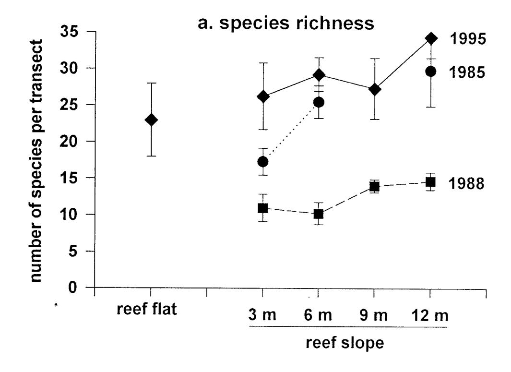

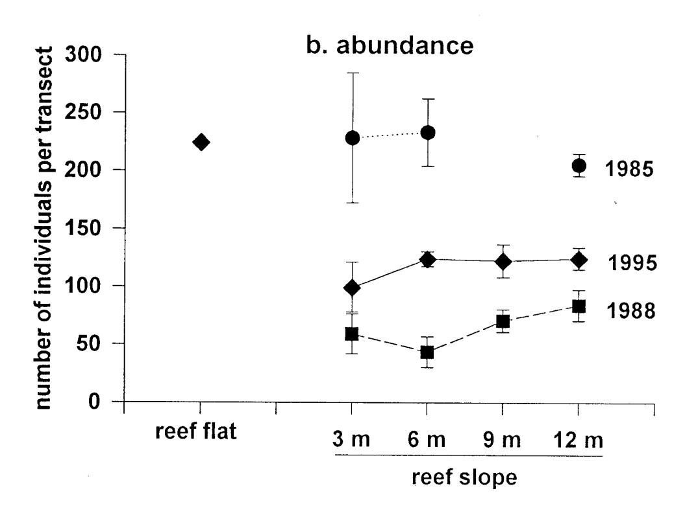

Fig. 3 Mean (and se) species richness (a) and abundance (b) of fishes in Fagatele Bay during each of three surveys over the last ten years. Please note that the number of transects surveyed varied among depths and years (see Table 31 ).

#### *Short term changes in the fish communities around Tutuila Island (from 1988 to 1995)*

This short-term study did not detect any clear patterns of variation in the fish communities around Tutuila Island associated with exposure, depth or year (Fig. 4, Tables 24a-c). Fish communities did not vary between exposed and sheltered sites in any consistent manner. In some cases, species richness and abundance was lower at sheltered than exposed sites (e.g. Fagasa vs Cape Larsen respectively: Fig. 4). However this pattern was more the exception than the rule, with species richness and abundance varying in no consistent pattern with exposure.

Fish communities did not vary in any consistent pattern associated with depth either (Fig. 4). At some sites, species richness or abundance was higher at 6m than at 3m. However, the opposite was true at other sites.

Similarly, fish communities around the island showed no consistent differences between the two years of the survey. At most sites, species richness was much higher in 1995 compared to 1988 (Fig. 4). However this was not true at 3m at Fagafue or at 6m in Massacre Bay, where species richness was similar in both years. At most sites, fish abundance was also higher in 1995 compared to 1988 (Fig. 4b). However the opposite was true at 6m at Massacre Bay and Rainmaker, where fish abundance was lower in 1995 compared to 1988.

#### *Long term changes in the fish communities around Tutuila Island (from 1977 to 1995)*

Some changes were detected in the fish communities at Fagatele Bay, Sita Bay and Cape Larsen over the last 18 years (Fig. 5). Species richness was similar at each site in 1977-1978, 1985 and 1995, but was much lower in 1988 (Fig. 5a). In contrast, fish abundance was higher in the two earlier surveys (1985 and 1977-1978), and lower in the two later surveys (1995 and 1988: Fig. 5b). These trends in species richness and abundance through time were consistent at all three sites (Fig. 5).

Changes were also evident over the last two decades in the composition of the fish communities at the three sites. Comparisons among families showed that the most dramatic change has been in the abundance of the dominant family, the Pomacentridae (Fig. 6). In the last survey in 1995, there were only 30-50% as many pomacentrids as there were in first survey in 1977-1978. An examination of this family at the species level showed that the most obvious change has been the dramatic decline in the abundance of *Plectroglyphidodon dickii* throughout the study (Fig. 7). *P. dickii* was the most abundant pomacentrid species in 1977-1978, but it is now relatively uncommon. In fact, there were only 1-9% as many individuals of this species recorded in 1995 as there were in 1977-1978. At Fagatele Bay and Cape Larsen, this decrease in abundance occurred sometime between 1977-1978 and 1985. However at Sita Bay, this decline did not occur until after 1985. Some other species, such as *Pomacentrus brachialis* and *Chromis acares,* have also decreased in abundance at some sites over time. In contrast, one species, *Chrysiptera cyanea,* has increased in abundance at one of the study sites (Cape Larsen: Fig. 7).

In contrast to the pomacentrids, the Family Acanthuridae has been relatively stable throughout the study (Fig. 8). The obvious exception to this was in 1985 when there was a peak in acanthurid abundance that occurred at all three sites (Fig. 8). However Birkeland *et al.* (1987)

reported that the vast majority of these individuals were juvenile *Ctenochaetus striatus* which had recently recruited to the reef (see Fig. 8 also). Observations at that time suggested that many of the individuals were in bad condition and were unlikely to survive to recruit to the adult population (Birkeland *et al.* 1987). In fact, this does appear to have been the case, since this increase in abundance was not maintained in subsequent years (Fig. 8). With the exception of this *C. striatus* peak in 1985, there were no apparent changes in the relative abundance of any acanthurid species through time (Fig. 8).

The other families represented in this study showed no obvious trends in abundance over time that were consistent at all three sites (Fig. 9). Only one family, the Scaridae, showed a dramatic increase in abundance, although this was apparent at one site only (Fagatele Bay: Fig. 9, Table 26).

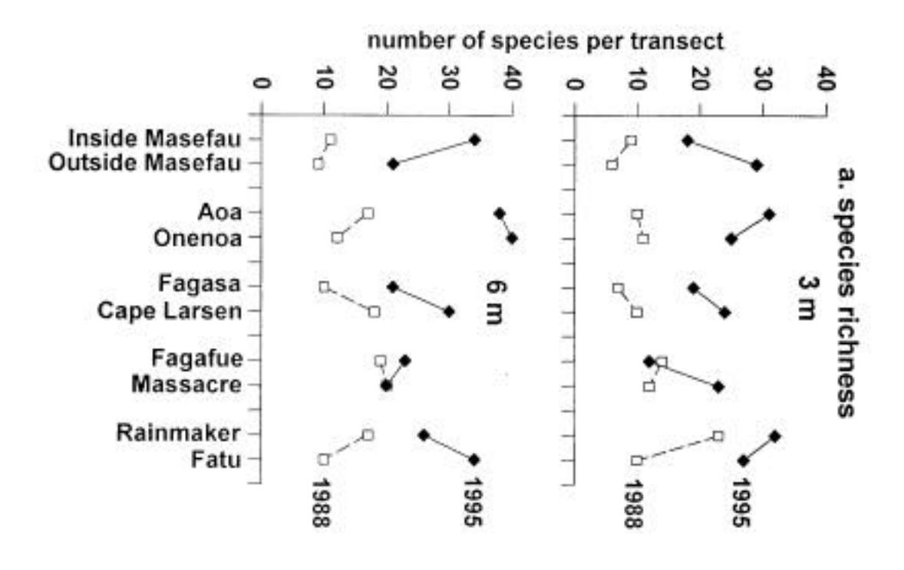

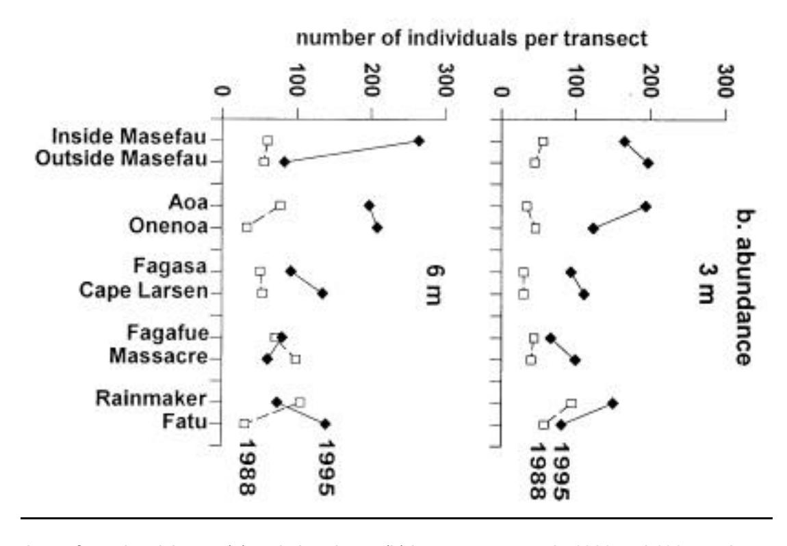

Figure 4. Comparison of species richness (a) and abundance (b) between surveys in 1988 and 1995 on the reef slope at ten sites around Tutuila Island.

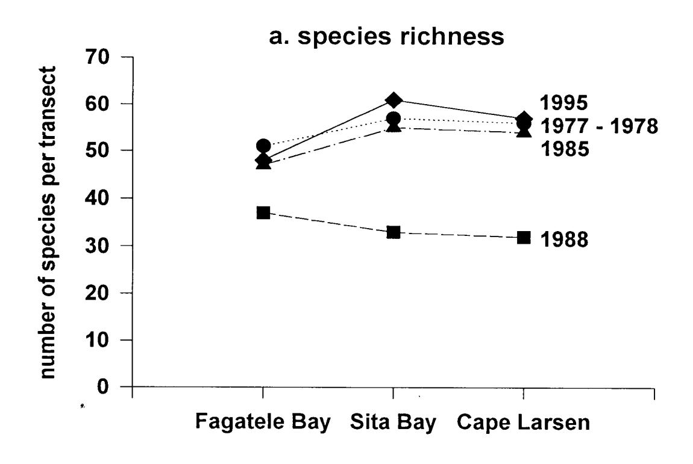

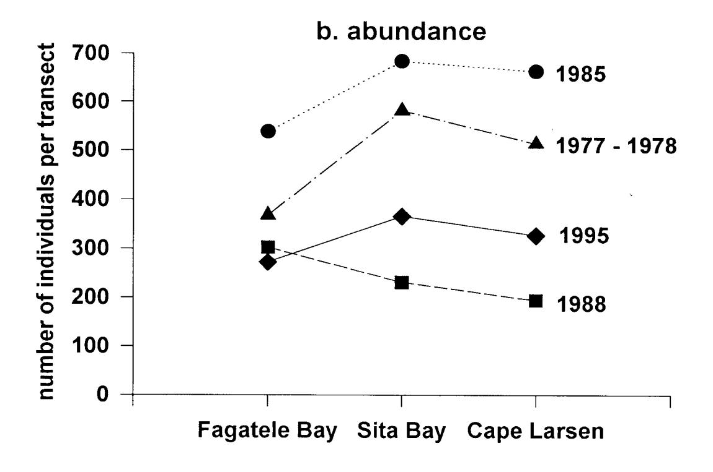

Fig. 5 Species richness (a) and abundance (b) of fishes on the reef slope at three sites around Tutuila Island on four occasions over the last 18 years.

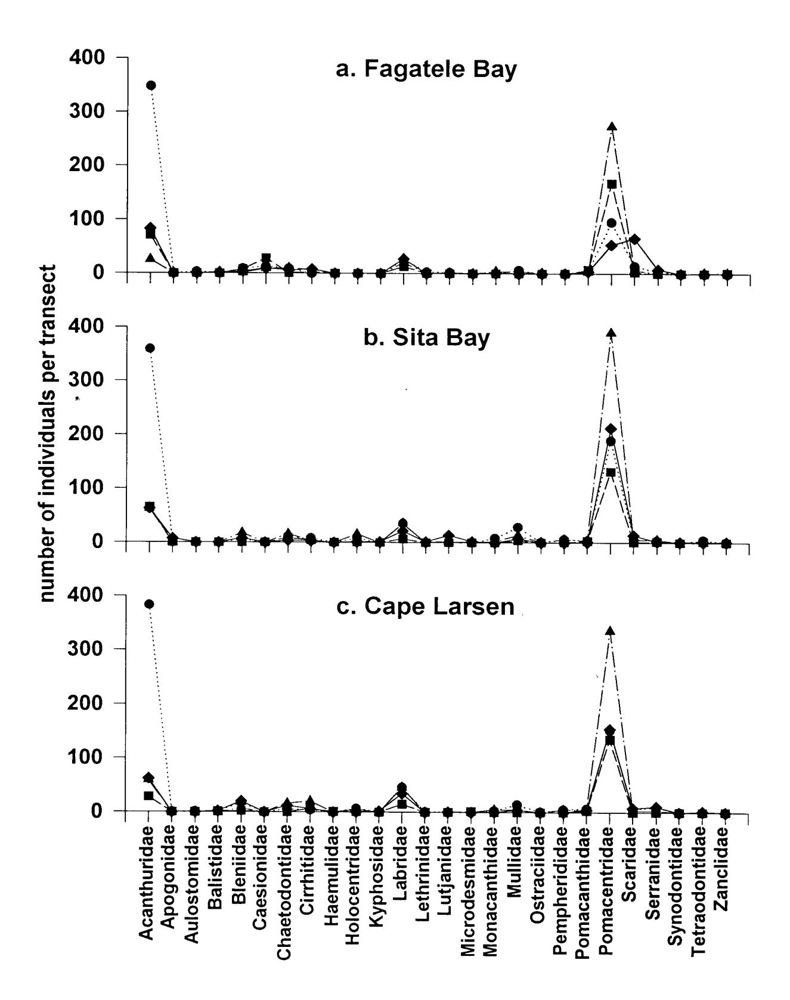

Fig. 6 Abundance of each family of fishes at three sites around Tutuila Island on four occasions over the last 18 years.

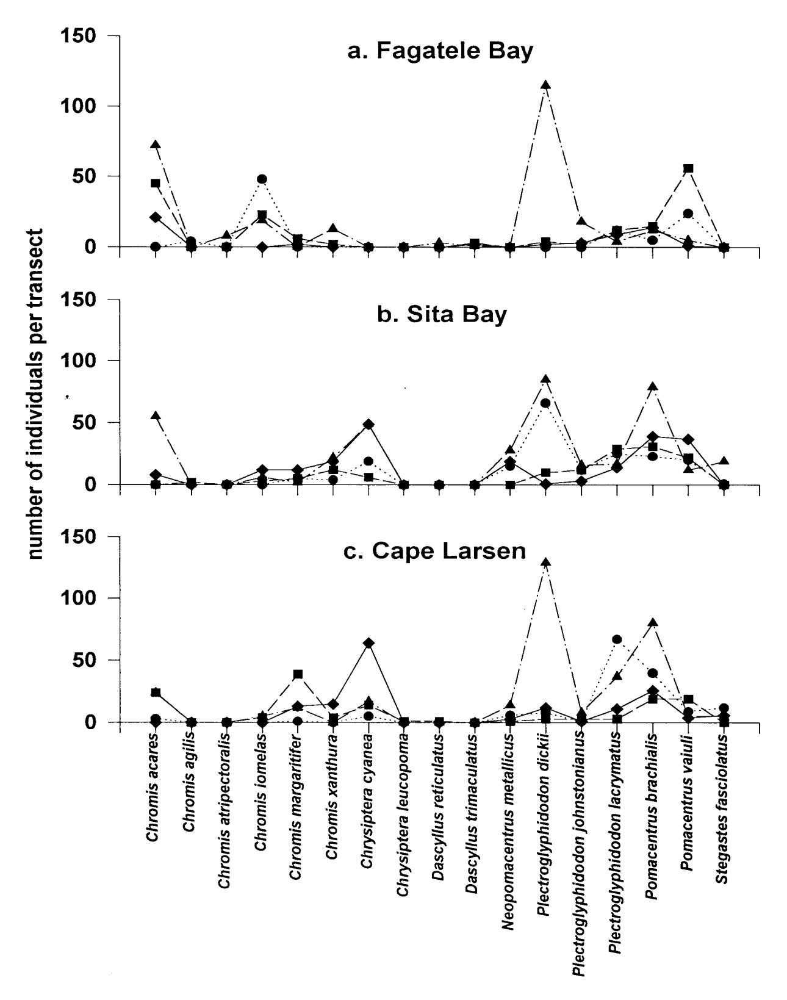

Fig. 7 Abundance of each pomocentrid species at three sites around Tutuila Island on four occasions over the last 18 years.

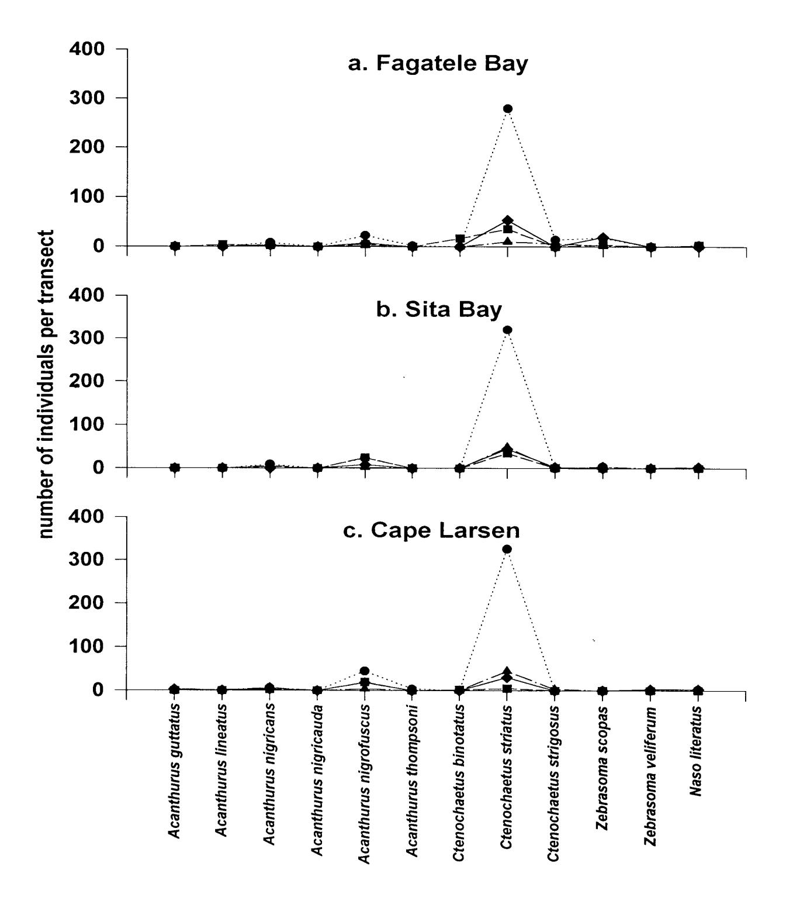

Fig. 8 Abundance of each acanthurid species at three sites around Tutuila Island on four occasions over the last 18 years.

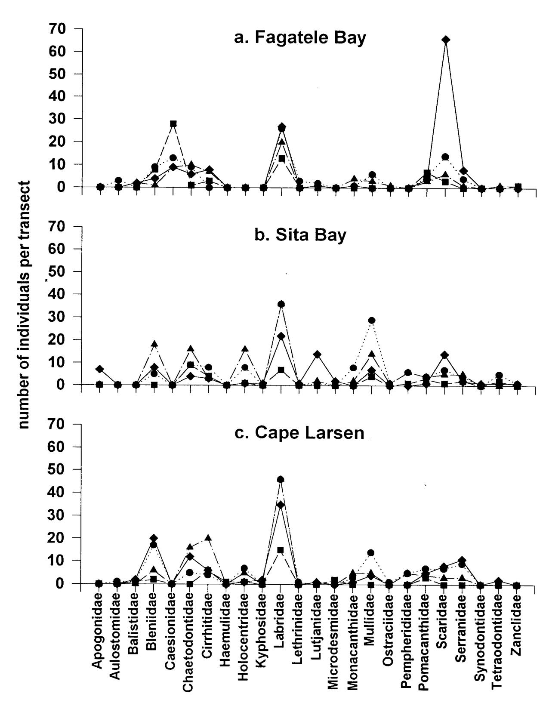

Fig. 9 Abundance of each acanthurid species at three sites around Tutuila Island on four occasions over the last 18 years.

#### DISCUSSION

The coral reefs of Fagatele Bay and elsewhere around Tutuila Island have suffered many major impacts in the last two decades (see Introduction). These impacts have resulted in physical and biological changes to the coral communities, which provide important habitat for their associated fish fauna (see Introduction). This study has demonstrated that the fish communities in Fagatele Bay and elsewhere around Tutuila Island have also changed over the last two decades, concomitant with these changes in their habitat characteristics. However the degree to which these assemblages appear to have changed depends on the index used to assess the changes.

Species richness does not appear to have decreased throughout the course of this study, with similar species richness recorded during the surveys in 1977-1978, 1985 and 1994 (Figs. 3, 5). In contrast, species richness was consistently much lower in the 1988 survey than in those done in the other years (Figs. 3, 5). However this was probably the result of a difference in methodology between surveys and not an actual decline in species richness that year. The 1988 survey was done while other groups of divers were present in the water at the same time (C. Birkeland pers. comm.), which was not the case in the other surveys. As a result, the presence of other divers may have caused a greater disturbance to the fish community in 1988, resulting in a lower number of species being observed that year. This suggestion is supported by my observations that many fishes either hid or swam rapidly away when other divers entered the survey area (A. Green pers. obs.). Therefore, as a result of this difference in methodology, the 1988 survey was probably not comparable to surveys done in the other years.

In contrast to species richness, fish abundance appears to have decreased over time, with the highest number of individuals recorded in the earliest two surveys and the lowest recorded in the last two surveys (Figs. 3, 5). Once again, the lowest abundances were consistently recorded in 1988 (Figs. 3, 5). This was probably due to the same methodological differences that resulted in the lower species richness detected in that year (see above).

The difference between the survey methods used in 1988 and 1995 may also be partly responsible for the fact that the short term study of the ten sites around the island (from 1988 to 1995), failed to produce any consistent patterns of species richness or abundance with exposure, depth or year. For this reason I recommend that this section of the study be disregarded until surveys can be done in future years using the same methods as those used in 1995.

The most dramatic changes in the fish communities around Tutuila Island have been in the changes in abundances of some families and species over the last two decades. The most abundant family, the Pomacentridae, is now represented by only 30-50% as many individuals as it was in the 1970s. This decline was largely due to a 91-99% decrease in the abundance of one species, *Plectroglyphidodon dickii,* which may be explained in the context of habitat degradation. *P. dickii* is a territorial inhabitant of robustly branching *Pocillopora* and *Acropora* corals (Myers 1989), and since coral cover has decreased dramatically at these study sites throughout the study, it is likely that habitat degradation has been responsible for the decline in this species. This suggestion is further supported by the fact that the decline at Fagatele Bay and Cape Larsen occurred after the 1977-1978 survey, which coincided with the decrease in coral cover at those sites due to an outbreak of the crown-of-thorns starfish (Birkeland *et al.* 1994). In contrast, the

decrease in the abundance of *P. dickii* did not occur at Sita Bay at that time, since that site was unaffected by the starfish outbreak (Birkeland *et al.* 1994). In contrast, the decline of this species occurred sometime between 1985 and 1994 at Sita Bay, during which time two major hurricanes caused extensive damage to the coral communities around the island (see Coral Communities). The decline in other pomacentrid species, *Chromis acares* and *Pomacentrus brachialis,* may also be related to the decrease in live coral cover at these sites. In contrast, the one pomacentrid species that increased in abundance, *Chrysiptera cyanea,* is known to be associated with rubble patches that may have increased throughout the course of the study. However the case for habitat degradation being responsible for these changes in abundance is largely circumstantial, and it is possible that other confounding factors such as recruitment variability may have contributed to these patterns also.

In contrast to the pomacentrids, the Family Acanthuridae did not show a similar decline in abundance throughout the study. *Ctenochaetus striatus* has remained the dominant acanthurid species on the reef slopes of Fagatele Bay and elsewhere around the island throughout the last two decades. Furthermore, the relative abundance of the other acanthurid species remained similar throughout the study. The fact that this family did not appear to decrease in response to the changes in the coral communities was not surprising, since they are roving herbivores that are less likely to be affected by the loss of coral cover than are small site-attached pomacentrids. In fact the only family that showed an increase in abundance was another family of roving herbivores, the Scaridae (Fig. 9). However, this increase was apparent at one site only (Fagatele Bay).

At this point, it is important to take note of the limitations of this study. One important limitation, the problem of different methodologies among years, has already been mentioned. However, inter-observer bias may have been a confounding factor in this study in more ways than one. For example, the observers may have differed in their ability to judge the width of the transect, or their ability to identify species. Another methodological problem was the fact that the surveys were done at different months in different years (the 1995 survey was done in July, while the others were done in April). Consequently, seasonal differences could have contributed to some of the patterns described in this study. Since methodological differences among surveys can cause substantial problems in the long term monitoring of fish communities, it is recommended that the same observer using a standardized set of methods be used in all subsequent surveys.

Another limitation of this survey was the lack of replication in some aspects of the study design. In other situations, unequal replication of transects was also limiting, because it made testing for significant differences among years and sites problematic. In future years it is recommended that the experimental design for this study be expanded to rectify this situation. Despite these limitations, the results of this study are still valuable, since they are quantitative and comprise a long time series of information.

In conclusion, the fish communities of Fagatele Bay and elsewhere around Tutuila Island have changed in the last two decades. This is probably the result of habitat degradation caused by the effects of several major disturbances on the coral reefs. At present, these reefs are in an important stage of recovery. Fortunately, coral colonies are recruiting and growing quickly at most sites

around the island (see Coral Communities, A. Green pers. obs.) and recovery appears to be well underway (see Coral Communities). In the absence of any major perturbations in the next few years, most of the coral communities in this study should continue to recover (see Coral Communities) and, along with them, their associated fish communities.

**Table 22a. Fishes censused on the reef slope at Fagatele Bay in 1995, Sites 1 and 2. Numbers indicate the number of individuals of each species counted on the transect, and the letter P indicates the presence of a species in the vicinity of the transect line.** 

|                                |    | Site 1 |    |    | Site 2 |     |
|--------------------------------|----|--------|----|----|--------|-----|
|                                | 9m | 12m    | 3m | 6m | 9m     | 12m |
| ACANTHURIDAE                   |    |        |    |    |        |     |
| Acanthurus achilles            |    |        | 7  |    |        |     |
| A. albipectoralis              |    |        |    |    |        |     |
| A. blochii                     |    |        |    |    |        |     |
| A. guttatus                    |    |        |    |    |        |     |
| A. lineatus                    | P  | 1      | 2  | P  |        |     |
| A. nigricans                   | 2  | 4      | 8  | 5  | 3      | 2   |
| A. nigricauda                  | 2  |        |    |    |        |     |
| A. nigrofuscus                 |    |        | 11 | 5  | 2      |     |
| A. nigroris                    |    |        |    |    |        |     |
| A. olivaceus                   |    | P      |    |    |        |     |
| A. pyroferus                   |    |        |    |    |        |     |
| A. thompsoni                   | P  |        |    |    |        |     |
| A. triostegus                  |    |        |    |    |        |     |
| Ctenochaetus binotatus         |    |        |    |    |        |     |
| C. striatus                    | 7  | 14     | 37 | 50 | 33     | 17  |
| C. strigosus                   |    | 6      |    |    |        |     |
| Naso annulatus                 |    | P      |    |    |        |     |
| N. brevirostris                |    |        |    |    |        |     |
| N. hexacanthus                 |    |        |    |    |        |     |
| N. literatus                   | P  |        |    |    | 1      | P   |
| N. unicornis                   |    |        |    |    |        |     |
| N. spp.                        |    |        |    |    |        |     |
| Zebrasoma scopas               |    |        |    |    | 4      | 4   |
| Z. veliferum                   |    |        |    |    |        |     |
| APOGONIDAE                     |    |        |    |    |        |     |
| Apogon doederleini             |    |        |    |    |        |     |
| AULOSTOMIDAE                   |    |        |    |    |        |     |
| Aulostomus chinensis           |    | P      |    |    |        |     |
| BALISTIDAE                     |    |        |    |    |        |     |
| Balistapus undulatus           | 1  | 1      |    | P  | 1      | 1   |
| Balistoides viridescens        |    |        |    |    |        |     |
| Melichthys vidua               | 2  | 2      |    | P  |        | P   |
| M. niger                       |    |        |    |    |        |     |
| Pseudobalistes flavimarginatus |    |        |    |    |        |     |
| Rhinecanthus rectangulus       |    |        |    |    |        |     |
| Sufflamen bursa                | 1  | P      |    |    | P      |     |
| S. chrysopterus                |    |        |    |    |        |     |
| S. freanatus                   |    |        |    |    |        |     |

| Table 22a continued       |    | Site 1 |    |    | Site 2 |     |
|---------------------------|----|--------|----|----|--------|-----|
|                           | 9m | 12m    | 3m | 6m | 9m     | 12m |
| BLENNIIDAE                |    |        |    |    |        |     |
| Aspidontus dussumieri     |    |        |    |    |        |     |
| Escenius bicolor          |    |        |    |    |        |     |
| Meiacanthus atrodorsalis  |    |        |    |    |        |     |
| Plagiotremus tapeinosoma  |    |        |    |    |        |     |
| unidentified blenniids    | 1  |        |    | 2  | 1      |     |
| BOTHIDAE                  |    |        |    |    |        |     |
| Bothus pantherinus        |    |        |    |    |        |     |
| CAESIONIDAE               |    |        |    |    |        |     |
| Caesio cunning            | P  | P      |    |    |        |     |
| Pterocaesio tile          |    |        |    |    | 1      |     |
| P. trilineata             |    |        |    |    | 33     | 37  |
| CARANGIDAE                |    |        |    |    |        |     |
| Caranx melampygus         |    |        |    |    |        | P   |
| Scomberoides lysan        |    |        |    |    |        |     |
| CHAETODONTIDAE            |    |        |    |    |        |     |
| Chaetodon bennetti        |    |        |    |    |        |     |
| C. citrinellus            |    |        |    |    |        |     |
| C. ephippium              |    | P      |    |    |        |     |
| C. lunula                 |    | P      |    |    |        |     |
| C. mertensii              |    |        |    |    |        |     |
| C. ornatissimus           |    | 1      |    | 2  |        |     |
| C. pelewensis             |    |        |    |    |        |     |
| C. reticulatus            | P  | 2      | P  |    |        | 1   |
| C. semeion                |    | 1      | 1  |    |        | P   |
| C. trifascialis           |    |        | P  | 1  |        |     |
| C. trifasciatus           |    |        | P  | P  |        |     |
| C. ulietensis             |    |        |    |    |        |     |
| C. unimaculatus           | P  | 1      |    |    |        |     |
| C. vagabundus             |    |        | P  |    |        |     |
| Forcipiger flavissimus    | P  | P      |    |    |        |     |
| F. longirostris           | P  |        |    |    |        |     |
| Hemitaurichthys polylepis | P  | 2      |    |    |        |     |
| Heniochus chrysostomus    |    |        |    |    |        |     |
| H. monoceros              |    |        |    |    |        |     |
| H. varius                 |    |        |    |    |        |     |
| CIRRHITIDAE               |    |        |    |    |        |     |
| Cirrhitichthys pinnulatus |    |        |    |    |        |     |
| Paracirrhites arcatus     | 7  | P      |    | 3  | 2      | P   |
| P. forsteri               |    | P      | P  | 1  | 2      | 2   |
| P. hemisticus             |    |        | P  | P  |        |     |
| CORYPHAENIDAE             |    |        |    |    |        |     |

| Table 22a continued         |    | Site 1 | Site 2 |    |    |     |  |  |
|-----------------------------|----|--------|--------|----|----|-----|--|--|
|                             | 9m | 12m    | 3m     | 6m | 9m | 12m |  |  |
| GOBIIDAE                    |    |        |        |    |    |     |  |  |
| Valenciennea strigata       |    |        |        |    |    |     |  |  |
| HAEMULIDAE                  |    |        |        |    |    |     |  |  |
| Plectorhynchus orientalis   |    | P      |        |    |    |     |  |  |
| HOLOCENTRIDAE               |    |        |        |    |    |     |  |  |
| Myripristis berndti         |    |        |        |    |    |     |  |  |
| M. kuntee                   |    |        |        |    |    |     |  |  |
| M. violacea                 |    |        |        |    |    |     |  |  |
| Neoniphon sammara           |    |        |        |    |    |     |  |  |
| Sargocentron caudimaculatum |    |        |        |    |    |     |  |  |
| S. spiniferum               |    | P      |        |    |    |     |  |  |
| KYPHOSIDAE                  |    |        |        |    |    |     |  |  |
| Kyphosus cinerascens        |    |        |        |    |    |     |  |  |
| K. vaigiensis               |    | P      |        |    |    |     |  |  |
| LABRIDAE                    |    |        |        |    |    |     |  |  |
| Anampsis caeruleopunctatus  |    |        |        |    |    |     |  |  |
| A. twistii                  |    |        |        |    |    |     |  |  |
| Bodianus axillaris          |    | P      |        | P  |    |     |  |  |
| B. loxozonus                |    |        |        |    |    |     |  |  |
| Cheilinus diagrammus        |    |        |        |    | 1  |     |  |  |
| C. fasciatus                |    |        |        |    |    |     |  |  |
| C. oxycephalus              |    |        |        |    |    |     |  |  |
| C. trilobatus               |    |        | P      |    |    |     |  |  |
| C. undulatus                |    |        |        |    |    |     |  |  |
| C. unifasciatus             |    | 1      |        |    | 1  | 2   |  |  |
| Coris aygula                |    | 1      |        |    |    |     |  |  |
| C. gaimard                  | 1  | 1      |        | P  |    |     |  |  |
| Epibulus insidiator         |    | 2      |        |    | 1  | P   |  |  |
| Gomphosus varius            |    | P      |        | 4  | 1  | 1   |  |  |
| Halichoeres biocellatus     |    |        |        |    |    |     |  |  |
| H. hortulanus               | 1  | 2      | 2      | 1  | P  |     |  |  |
| H. margaritaceus            |    |        |        |    | P  |     |  |  |
| H. marginatus               |    |        | 1      |    |    |     |  |  |
| H. melanurus                |    |        |        |    |    |     |  |  |
| H. ornatissimus             |    | P      |        |    |    |     |  |  |
| H. trimaculatus             |    |        |        |    |    |     |  |  |
| Hemigymnus fasciatus        |    | 1      |        | P  | 1  | 1   |  |  |
| H. melapterus               | P  | 1      | P      |    |    |     |  |  |
| Labrichthys unilineatus     |    |        |        |    |    | 3   |  |  |
| Labroides bicolor           |    | 1      |        | 1  | 1  | 2   |  |  |
| L. dimidiatus               |    |        | 1      |    |    |     |  |  |
| L. rubrolabiatus            |    |        |        | 1  | P  | P   |  |  |
| Labropsis xanthonota        | 1  |        |        |    |    | P   |  |  |

| Table 22a continued          |    | Site 1 |    |    | Site 2 |     |
|------------------------------|----|--------|----|----|--------|-----|
|                              | 9m | 12m    | 3m | 6m | 9m     | 12m |
| Macropharyngodon negrosensis |    |        |    |    |        |     |
| Novaculichthys taeniourus    |    |        |    |    |        |     |
| Pseudocheilinus evanidus     |    | P      |    |    |        |     |
| P. hexataenia                |    | 1      |    |    |        |     |
| P. octotaenia                |    |        |    |    |        |     |
| Pseudodax moluccanus         | P  | 1      |    |    |        |     |
| Stethojulis bandanensis      |    |        |    |    |        |     |
| S. trilineata                |    |        |    |    |        |     |
| Thalassoma amblycephalum     | 33 |        |    |    |        |     |
| T. hardwicke                 |    |        |    | P  | 2      | P   |
| T. lutescens                 | 1  | 1      |    |    |        | P   |
| T. purpureum                 |    |        |    |    |        |     |
| T. quinquevittatum           | 6  | 3      | 9  | 12 | 3      |     |
| T. trilobatum                |    |        |    |    |        |     |
| LETHRINIDAE                  |    |        |    |    |        |     |
| Gnathodentex aureolineatus   |    | 9      |    | 5  |        |     |
| Lethrinus harak              |    |        |    |    |        |     |
| L. obsoletus                 |    |        |    |    |        |     |
| Monotaxis grandoculis        |    | P      |    |    |        |     |
| LUTJANIDAE                   |    |        |    |    |        |     |
| Aphareus furca               | 1  |        |    |    | P      | P   |
| Aprion virescens             |    |        |    |    |        |     |
| Lutjanus bohar               |    | P      |    |    |        |     |
| L. fulvus                    |    |        |    |    |        |     |
| L. monostigma                |    |        |    |    |        |     |
| Macolor niger                |    | P      |    |    |        |     |
| M. macularis                 |    |        |    | 1  |        |     |
| MALACANTHIDAE                |    |        |    |    |        |     |
| Malacanthus latovittatus     |    |        |    |    |        |     |
| MICRODESMIDAE                |    |        |    |    |        |     |
| Nemateleotris magnifica      |    |        |    |    |        |     |
| Ptereleotris evides          |    |        |    |    |        |     |
| Ptereleotris heteroptera     |    |        |    |    |        |     |
| P. zebra                     |    |        |    |    |        |     |
| MONACANTHIDAE                |    |        |    |    |        |     |
| Amanses scopas               |    |        |    |    |        | P   |
| Cantherhinus dumerilii       |    | 1      |    |    |        | P   |
| C. spp.                      |    |        |    |    |        |     |
| MULLIDAE                     |    |        |    |    |        |     |
| Mulloides flavolineatus      |    |        |    |    |        |     |
| M. vanicolensis              |    |        |    |    | 17     |     |
| Parupeneus barberinus        |    |        |    |    |        |     |
| P. bifasciatus               |    | P      |    |    |        |     |
| P. cyclostomus               | P  |        | P  | P  |        |     |

| Table 22a continued        |    | Site 1 | Site 2 |    |    |     |  |  |
|----------------------------|----|--------|--------|----|----|-----|--|--|
|                            | 9m | 12m    | 3m     | 6m | 9m | 12m |  |  |
| P. multifasciatus          |    | P      |        | P  | P  | 1   |  |  |
| OSTRACIIDAE                |    |        |        |    |    |     |  |  |
| Ostracion meleagris        |    |        |        |    |    |     |  |  |
| O. cubicus                 |    |        |        | 1  |    |     |  |  |
| PEMPHERIDAE                |    |        |        |    |    |     |  |  |
| Pempheris oualensis        |    |        |        |    | 2  |     |  |  |
| PINGUIPEDIDAE              |    |        |        |    |    |     |  |  |
| Parapercis clathrata       |    |        | P      |    |    |     |  |  |
| POMACANTHIDAE              |    |        |        |    |    |     |  |  |
| Apolemichthys trimaculatus |    |        |        |    |    |     |  |  |
| Centropyge bicolor         |    |        |        |    |    |     |  |  |
| C. bispinosus              |    | P      |        |    |    | 1   |  |  |
| C. flavissimus             | 4  | 3      | P      |    | 1  | P   |  |  |
| Pomacanthus imperator      |    | P      |        |    |    |     |  |  |
| Pygoplites diacanthus      | P  | 1      |        | 1  |    |     |  |  |
| POMACENTRIDAE              |    |        |        |    |    |     |  |  |
| Abudefduf septemfasciatus  |    |        |        |    |    |     |  |  |
| A. sexfasciatus            |    |        |        |    |    |     |  |  |
| A. vaigiensis              |    |        |        |    |    |     |  |  |
| Amphiprion chrysopterus    |    |        |        |    |    |     |  |  |
| A. clarkii                 |    |        |        |    |    |     |  |  |
| A. melanopus               |    |        |        |    |    |     |  |  |
| Chromis acares             |    | 4      | P      | P  | P  | P   |  |  |
| C. agilis                  |    |        |        |    |    |     |  |  |
| C. amboinensis             |    |        |        |    |    |     |  |  |
| C. iomelas                 |    | 13     |        |    |    | P   |  |  |
| C. margaritifer            | 24 | 4      |        | P  |    | P   |  |  |
| C. vanderbilti             |    | 7      | P      | 1  |    |     |  |  |
| C. xanthura                |    | P      |        |    |    |     |  |  |
| C. spp.                    |    |        |        |    |    |     |  |  |
| Chrysiptera cyanea         | P  |        | 7      | 2  |    |     |  |  |
| C. glauca                  |    |        |        |    |    |     |  |  |
| C. leucopoma               |    |        | 14     |    |    |     |  |  |
| Dascyllus trimaculatus     | P  | 3      |        |    |    | 1   |  |  |
| Neopomacentrus metallicus  |    |        |        |    |    |     |  |  |
| Plectroglyphidodon dickii  | 6  | 2      |        | 1  | 1  | 2   |  |  |
| P. johnstonianus           | 4  | 1      |        |    | P  | 2   |  |  |
| P. lacrymatus              |    |        |        | 4  | 6  | 1   |  |  |
| P. leucozonus              |    |        |        |    |    |     |  |  |
| P. phoenixensis            |    |        |        |    |    |     |  |  |
| Pomacentrus brachialis     |    | 4      |        | 2  | 11 | 10  |  |  |
| P. vaiuli                  | 5  | 6      | P      | 2  |    |     |  |  |
| Pomachromis richardsoni    | 7  |        |        |    |    |     |  |  |

| Table 22a continued         |    | Site 1 |    |    | Site 2 |     |
|-----------------------------|----|--------|----|----|--------|-----|
|                             | 9m | 12m    | 3m | 6m | 9m     | 12m |
| Stegastes albifasciatus     |    |        |    |    |        |     |
| S. fasciolatus              |    |        | 3  | 1  |        |     |
| S. nigricans                |    |        |    |    |        |     |
| SCARIDAE                    |    |        |    |    |        |     |
| Calotomus carolinus         |    |        |    |    |        |     |
| Cetoscarus bicolor          |    | 12     |    |    |        |     |
| Hipposcarus longiceps       |    |        |    |    |        |     |
| Scarus altipinnus           |    |        |    |    |        |     |
| S. forsteni                 | P  | 1      |    | P  | 1      | P   |
| S. frenatus                 |    |        | P  | 1  | 1      |     |
| S. frontalis                |    |        |    |    |        |     |
| S. ghobban                  |    |        |    |    |        |     |
| S. globiceps                |    |        | P  |    |        |     |
| S. microrhinos              |    | P      |    |    | P      |     |
| S. niger                    |    |        |    |    |        |     |
| S. oviceps                  | P  | 2      | 1  | 1  | 3      | 2   |
| S. psittacus                |    | 1      | 9  | 1  | 2      | 12  |
| S. pyrrhurus                | P  |        | 1  | 2  |        |     |
| S. rubroviolaceus           | P  | 4      | P  | P  |        |     |
| S. schlegeli                |    |        |    |    |        |     |
| S. sordidus                 | 1  | P      | 2  | 7  | 10     | 13  |
| S. spinus                   |    | P      |    | P  | 1      | 1   |
| S. trilineata               |    |        |    |    |        |     |
| juveniles                   |    |        |    |    | 2      |     |
| SERRANIDAE                  |    |        |    |    |        |     |
| Aethaloperca rogaa          |    |        |    |    |        | P   |
| Cephalopholis argus         | P  | 1      | 1  |    |        | P   |
| C. leopardus                |    |        |    |    |        |     |
| C. urodeta                  | 2  | 1      |    |    |        |     |
| Epinephelus howlandi        |    |        |    | P  |        |     |
| E. maculatus                |    |        |    |    |        |     |
| E. merra                    |    |        |    |    |        |     |
| Plectropomus leopardus      |    |        |    |    |        |     |
| Variola louti               |    |        |    |    |        | 2   |
| SIGANIDAE                   |    |        |    |    |        |     |
| Siganus argenteus           |    |        |    |    |        |     |
| SYGNATHIDAE                 |    |        |    |    |        |     |
| Corythoichthys intestinalis |    |        |    |    |        |     |
| SYNODONTIDAE                |    |        |    |    |        |     |
| Synodus spp.                |    |        |    |    |        |     |
| TETRAODONTIDAE              |    |        |    |    |        |     |
| Arothron meleagris          |    |        |    |    |        |     |
| A. nigropunctatus           |    |        |    |    |        |     |
| Canthigaster solandri       |    |        |    |    |        |     |

| Table 22a continued     |     | Site 1 |     | Site 2 |     |     |  |  |  |
|-------------------------|-----|--------|-----|--------|-----|-----|--|--|--|
|                         | 9m  | 12m    | 3m  | 6m     | 9m  | 12m |  |  |  |
| ZANCLIDAE               |     |        |     |        |     |     |  |  |  |
| Zanclus cornutus        | P   | 2      | P   |        |     |     |  |  |  |
|                         |     |        |     |        |     |     |  |  |  |
| Total No. Species       | 45  | 72     | 37  | 47     | 39  | 45  |  |  |  |
| On-Transect Species     | 24  | 44     | 18  | 30     | 31  | 25  |  |  |  |
| On-Transect Individuals | 125 | 122    | 117 | 138    | 135 | 122 |  |  |  |

**Table 22b. Fishes censused on the reef slope at Fagatele Bay in 1995, Sites 3 and 4. Numbers indicate the number of individuals of each species counted on the transect, and the letter P indicates the presence of a species in the vicinity of the transect line.** 

|                        |    |    | Site 3 |     |    |    | Site 4 |     |
|------------------------|----|----|--------|-----|----|----|--------|-----|
|                        | 3m | 6m | 9m     | 12m | 3m | 6m | 9m     | 12m |
| ACANTHURIDAE           |    |    |        |     |    |    |        |     |
| Acanthurus achilles    |    |    |        |     | 1  |    |        |     |
| A. albipectoralis      |    |    |        | P   |    |    |        |     |
| A. blochii             |    |    |        |     |    |    |        |     |
| A. guttatus            |    |    |        |     |    |    |        |     |
| A. lineatus            |    |    |        |     | 8  | 4  |        |     |
| A. nigricans           |    | 1  | 2      | 1   | 1  |    | 1      | 8   |
| A. nigricauda          |    |    |        |     |    |    |        |     |
| A. nigrofuscus         | 5  | 6  | 7      | 6   | 12 | 8  | 9      | 3   |
| A. nigroris            |    |    |        |     |    |    |        |     |
| A. olivaceus           |    |    |        |     |    |    |        |     |
| A. pyroferus           |    |    |        |     |    |    |        |     |
| A. thompsoni           |    |    |        |     |    |    |        |     |
| A. triostegus          | 7  |    |        |     |    |    |        |     |
| Ctenochaetus binotatus |    |    |        |     |    |    |        |     |
| C. striatus            | 33 | 26 | 18     | 26  | 42 | 29 | 49     | 23  |
| C. strigosus           |    |    |        | 2   | 2  | 5  | 2      |     |
| Naso annulatus         |    |    | P      | P   |    |    |        |     |
| N. brevirostris        |    |    |        |     |    |    |        |     |
| N. hexacanthus         |    |    |        |     |    |    |        |     |
| N. literatus           | P  |    | P      |     |    |    |        |     |
| N. unicornis           |    |    |        |     |    |    |        |     |
| N. spp.                |    |    |        |     |    |    |        |     |
| Zebrasoma scopas       | 1  | 6  | 7      | 9   |    |    | 3      | 7   |
| Z. veliferum           | P  |    |        |     | P  |    |        |     |
| APOGONIDAE             |    |    |        |     |    |    |        |     |
| Apogon doederleini     |    |    |        |     |    |    |        |     |

| Table 22b continued            |    |    | Site 3 |     |    |    | Site 4 |     |
|--------------------------------|----|----|--------|-----|----|----|--------|-----|
|                                | 3m | 6m | 9m     | 12m | 3m | 6m | 9m     | 12m |
| AULOSTOMIDAE                   |    |    |        |     |    |    |        |     |
| Aulostomus chinensis           |    |    |        |     |    |    |        |     |
| BALISTIDAE                     |    |    |        |     |    |    |        |     |
| Balistapus undulatus           |    | P  | 1      |     | 1  | P  | 1      | 2   |
| Balistoides viridescens        |    |    |        |     |    |    |        |     |
| Melichthys vidua               | 1  | P  | 2      | 2   | P  |    | 3      |     |
| M. niger                       |    |    |        |     |    |    |        |     |
| Pseudobalistes flavimarginatus |    |    |        |     |    |    |        |     |
| Rhinecanthus rectangulus       |    |    |        |     |    |    |        |     |
| Sufflamen bursa                |    |    |        |     |    |    |        |     |
| S. chrysopterus                |    |    |        |     |    |    |        |     |
| S. freanatus                   |    |    |        |     |    |    |        |     |
| BLENNIIDAE                     |    |    |        |     |    |    |        |     |
| Aspidontus dussumieri          |    |    |        |     |    |    |        |     |
| Escenius bicolor               |    |    |        |     |    |    |        |     |
| Meiacanthus atrodorsalis       |    |    |        |     |    |    |        |     |
| Plagiotremus tapeinosoma       |    |    |        |     |    |    |        |     |
| unidentified blenniids         |    | 7  | 4      |     |    | 3  | 3      |     |
| BOTHIDAE                       |    |    |        |     |    |    |        |     |
| Bothus pantherinus             |    |    |        |     |    |    |        |     |
| CAESIONIDAE                    |    |    |        |     |    |    |        |     |
| Caesio cunning                 |    |    |        |     |    |    |        |     |
| Pterocaesio tile               |    |    | 10     |     |    |    |        |     |
| P. trilineata                  |    |    | 20     | 50  |    |    | 6      | P   |
| CARANGIDAE                     |    |    |        |     |    |    |        |     |
| Caranx melampygus              |    |    |        |     |    |    |        |     |
| Scomberoides lysan             |    |    |        |     |    |    |        |     |
| CHAETODONTIDAE                 |    |    |        |     |    |    |        |     |
| Chaetodon bennetti             |    | 1  |        |     |    |    |        |     |
| C. citrinellus                 |    |    |        |     |    | 1  |        |     |
| C. ephippium                   | P  |    |        |     |    |    |        |     |

| Table 22b continued       |    |    | Site 3 |     |    |    | Site 4 |     |
|---------------------------|----|----|--------|-----|----|----|--------|-----|
|                           | 3m | 6m | 9m     | 12m | 3m | 6m | 9m     | 12m |
| C. lunula                 |    |    |        |     |    |    |        |     |
| C. mertensii              |    |    |        |     |    |    |        |     |
| C. ornatissimus           | P  |    |        |     |    |    |        |     |
| C. pelewensis             |    | 2  |        | 1   |    |    |        | 1   |
| C. reticulatus            | 2  | 2  | 1      | P   | 1  |    |        | P   |
| C. semeion                | P  |    | P      |     | 2  |    |        |     |
| C. trifascialis           |    |    |        |     |    |    |        |     |
| C. trifasciatus           |    |    |        |     |    |    |        |     |
| C. ulietensis             | P  | 2  |        |     |    |    |        |     |
| C. unimaculatus           |    |    |        |     |    |    |        |     |
| C. vagabundus             |    | 1  | P      |     | 1  |    |        |     |
| Forcipiger flavissimus    |    |    |        |     |    |    |        |     |
| F. longirostris           |    |    |        |     |    |    | P      | P   |
| Hemitaurichthys polylepis |    |    |        |     |    |    |        |     |
| Heniochus chrysostomus    |    |    |        |     |    |    |        |     |
| H. monoceros              |    |    |        | P   |    |    |        |     |
| H. varius                 |    |    |        |     |    | P  |        |     |
| CIRRHITIDAE               |    |    |        |     |    |    |        |     |
| Cirrhitichthys pinnulatus |    |    |        |     |    |    |        |     |
| Paracirrhites arcatus     |    | 2  | P      |     | P  |    | 2      |     |
| P. forsteri               |    | P  | 1      |     |    | P  |        | 1   |
| P. hemisticus             |    |    |        |     |    |    |        |     |
| CORYPHAENIDAE             |    |    |        |     |    |    |        |     |
| Coryphaena hippurus       |    |    |        |     |    |    |        |     |
| GOBIIDAE                  |    |    |        |     |    |    |        |     |
| Valenciennea strigata     |    |    |        |     |    |    |        |     |
| HAEMULIDAE                |    |    |        |     |    |    |        |     |
| Plectorhynchus orientalis | P  | P  |        |     |    |    |        |     |
| HOLOCENTRIDAE             |    |    |        |     |    |    |        |     |
| Myripristis berndti       |    |    |        |     |    | 1  |        |     |
| M. kuntee                 |    |    |        |     |    |    |        |     |

| Table 22b continued         |    |    | Site 3 |     |    |    | Site 4 |     |
|-----------------------------|----|----|--------|-----|----|----|--------|-----|
|                             | 3m | 6m | 9m     | 12m | 3m | 6m | 9m     | 12m |
| M. violacea                 |    |    |        |     |    |    |        |     |
| Neoniphon sammara           |    |    |        |     |    |    |        |     |
| Sargocentron caudimaculatum |    |    |        |     |    |    |        |     |
| S. spiniferum               |    |    |        |     |    |    |        |     |
| KYPHOSIDAE                  |    |    |        |     |    |    |        |     |
| Kyphosus cinerascens        |    |    |        |     |    |    |        |     |
| K. vaigiensis               | 1  |    |        |     |    |    |        |     |
| LABRIDAE                    |    |    |        |     |    |    |        |     |
| Anampsis caeruleopunctatus  |    |    |        |     |    |    |        |     |
| A. twistii                  |    | 1  | 1      |     |    |    | 1      | 3   |
| Bodianus axillaris          |    |    |        |     |    |    |        |     |
| B. loxozonus                |    |    |        |     |    |    |        | 1   |
| Cheilinus diagrammus        |    | 1  | P      |     |    |    | 1      | 1   |
| C. fasciatus                |    |    |        |     |    |    |        |     |
| C. oxycephalus              | 2  |    |        | 1   |    |    |        |     |
| C. trilobatus               |    |    |        |     |    |    |        |     |
| C. undulatus                |    |    |        |     |    |    |        |     |
| C. unifasciatus             |    | 1  | P      | 1   |    | 1  |        |     |
| Coris aygula                |    |    |        |     |    |    | P      |     |
| C. gaimard                  |    |    |        |     |    |    |        |     |
| Epibulus insidiator         |    |    | P      | 1   |    | P  |        |     |
| Gomphosus varius            | 2  | 1  | 3      | 3   |    | 2  | 1      | 2   |
| Halichoeres biocellatus     |    |    |        |     |    |    |        |     |
| H. hortulanus               |    |    |        |     |    |    | 1      |     |
| H. margaritaceus            |    |    |        |     |    |    |        |     |
| H. marginatus               |    |    |        |     |    |    |        |     |
| H. melanurus                |    |    |        |     |    |    |        |     |
| H. ornatissimus             |    |    |        |     |    |    |        |     |
| H. trimaculatus             |    |    |        |     |    |    |        |     |
| Hemigymnus fasciatus        | P  | P  |        | P   |    |    | P      |     |
| H. melapterus               |    |    |        | P   |    |    |        |     |

| Table 22b continued          |    |    | Site 3 |     |    |    | Site 4 |     |
|------------------------------|----|----|--------|-----|----|----|--------|-----|
|                              | 3m | 6m | 9m     | 12m | 3m | 6m | 9m     | 12m |
| Labrichthys unilineatus      | P  | 2  | 1      | 3   |    |    |        |     |
| Labroides bicolor            | P  | 1  | 2      | 1   | 2  |    |        |     |
| L. dimidiatus                | 1  | 2  | 2      | 1   |    | 1  | 1      | 2   |
| L. rubrolabiatus             |    | 1  | 1      | 1   |    | 2  | P      | 2   |
| Labropsis xanthonota         |    |    | 2      | P   |    |    | 8      | 2   |
| Macropharyngodon meleagris   |    |    |        |     |    |    |        |     |
| Macropharyngodon negrosensis |    |    |        |     |    |    |        |     |
| Novaculichthys taeniourus    |    |    |        |     |    |    |        |     |
| Pseudocheilinus evanidus     |    |    |        |     |    |    |        |     |
| P. hexataenia                |    | P  | 1      | 1   |    |    | P      | 1   |
| P. octotaenia                |    |    |        |     |    |    |        |     |
| Pseudodax moluccanus         |    |    |        |     |    |    |        |     |
| Stethojulis bandanensis      |    |    |        |     |    |    |        |     |
| S. trilineata                |    |    |        |     |    |    |        |     |
| Thalassoma amblycephalum     |    |    |        |     |    |    |        |     |
| T. hardwicke                 | 4  | 3  | 1      |     | P  | 2  | P      |     |
| T. lutescens                 |    |    | 1      | P   |    |    |        |     |
| T. purpureum                 |    |    |        |     |    |    |        |     |
| T. quinquevittatum           | 3  | 4  |        |     | 7  | 8  |        |     |
| T. trilobatum                |    |    |        |     |    |    |        |     |
| LETHRINIDAE                  |    |    |        |     |    |    |        |     |
| Gnathodentex aureolineatus   |    |    |        |     |    |    |        |     |
| Lethrinus harak              | 3  |    |        |     | P  |    |        |     |
| L. obsoletus                 |    |    |        |     |    |    |        |     |
| Monotaxis grandoculis        |    | 1  |        |     |    |    |        | P   |
| LUTJANIDAE                   |    |    |        |     |    |    |        |     |
| Aphareus furca               | P  | P  | 1      | 3   |    |    |        | 1   |
| Aprion virescens             |    |    |        |     |    |    |        |     |
| Lutjanus bohar               |    |    |        |     |    |    |        |     |
| L. fulvus                    |    | P  |        |     |    |    |        |     |
| L. monostigma                | 2  |    |        |     |    |    |        |     |

| Table 22b continued        |    |    | Site 1 |     |    |    | Site 2 |     |
|----------------------------|----|----|--------|-----|----|----|--------|-----|
|                            | 3m | 6m | 9m     | 12m | 3m | 6m | 9m     | 12m |
| Macolor niger              |    | P  | 1      |     |    |    |        |     |
| M. macularis               |    | P  |        |     |    |    |        |     |
| MALACANTHIDAE              |    |    |        |     |    |    |        |     |
| Malacanthus latovittatus   |    |    |        |     |    |    |        |     |
| MICRODESMIDAE              |    |    |        |     |    |    |        |     |
| Nemateleotris magnifica    |    |    |        |     |    |    |        |     |
| Ptereleotris evides        |    |    | P      | 1   |    |    |        |     |
| Ptereleotris heteroptera   |    |    |        |     |    |    |        |     |
| P. zebra                   |    |    |        |     |    |    |        |     |
| MONACANTHIDAE              |    |    |        |     |    |    |        |     |
| Amanses scopas             |    | P  | P      | P   |    |    |        |     |
| Cantherhinus dumerilii     |    |    |        |     |    |    |        |     |
| C. spp.                    |    |    |        |     |    |    |        |     |
| MULLIDAE                   |    |    |        |     |    |    |        |     |
| Mulloides flavolineatus    |    |    |        |     |    |    |        |     |
| M. vanicolensis            |    |    |        |     |    |    |        |     |
| Parupeneus barberinus      |    |    |        |     |    |    |        |     |
| P. bifasciatus             |    |    |        |     |    |    |        |     |
| P. cyclostomus             | 2  | P  | P      | 3   |    | 4  | P      | 3   |
| P. multifasciatus          |    |    |        |     |    |    |        |     |
| OSTRACIIDAE                |    |    |        |     |    |    |        |     |
| Ostracion meleagris        |    |    |        |     |    |    |        |     |
| O. cubicus                 |    |    |        |     |    |    |        |     |
| PEMPHERIDAE                |    |    |        |     |    |    |        |     |
| Pempheris oualensis        |    |    | P      |     |    |    |        |     |
| PINGUIPEDIDAE              |    |    |        |     |    |    |        |     |
| Parapercis clathrata       |    |    |        |     |    |    |        |     |
| POMACANTHIDAE              |    |    |        |     |    |    |        |     |
| Apolemichthys trimaculatus |    |    |        |     |    |    |        |     |
| Centropyge bicolor         |    |    |        |     |    |    |        |     |
| C. bispinosus              |    |    | 1      | 2   |    |    |        |     |

| Table 22b continued       |    |    | Site 3 |     |    |    | Site 4 |     |
|---------------------------|----|----|--------|-----|----|----|--------|-----|
|                           | 3m | 6m | 9m     | 12m | 3m | 6m | 9m     | 12m |
| C. flavissimus            | P  | P  | 2      |     | P  |    | P      |     |
| Pomacanthus imperator     |    |    |        |     |    |    |        |     |
| Pygoplites diacanthus     | P  |    |        | 1   |    |    | P      |     |
| POMACENTRIDAE             |    |    |        |     |    |    |        |     |
| Abudefduf septemfasciatus |    |    |        |     |    |    |        |     |
| A. sexfasciatus           |    |    |        |     |    |    |        |     |
| A. vaigiensis             |    |    |        |     |    |    |        |     |
| Amphiprion chrysopterus   |    | P  |        | P   |    |    |        | 2   |
| A. clarkii                |    |    |        |     |    |    |        |     |
| A. melanopus              | P  | P  |        | P   |    |    |        | 5   |
| Chromis acares            |    |    | 17     |     | 4  | 13 | 21     |     |
| C. agilis                 |    |    | 2      | P   |    |    |        | 1   |
| C. amboinensis            |    |    | 1      | 2   |    |    |        |     |
| C. iomelas                |    |    | 1      | 4   |    |    | 1      | 19  |
| C. margaritifer           |    |    | 1      |     |    |    |        | 3   |
| C. vanderbilti            |    |    |        |     |    |    | P      |     |
| C. xanthura               |    | P  | P      | 3   |    |    | 3      | 1   |
| C. spp.                   |    |    |        |     |    |    |        |     |
| Chrysiptera cyanea        | 4  | P  |        |     | 21 | 2  |        |     |
| C. glauca                 |    |    |        |     |    |    |        |     |
| C. leucopoma              |    |    |        |     | 12 |    |        |     |
| Dascyllus trimaculatus    |    |    | P      | P   |    | P  |        |     |
| Neopomacentrus metallicus |    |    |        |     |    |    |        |     |
| Plectroglyphidodon dickii | 2  | 3  | P      |     |    |    | 1      |     |
| P. johnstonianus          |    |    | 1      | 4   |    |    |        | 2   |
| P. lacrymatus             |    | 8  | 6      | 8   |    | 10 | 17     | 5   |
| P. leucozonus             |    |    |        |     |    |    |        |     |
| P. phoenixensis           |    |    |        |     |    |    |        |     |
| Pomacentrus brachialis    | 2  | 5  | 15     | 2   | 5  | 4  | 1      | 1   |
| P. vaiuli                 |    | 5  | 1      | 11  | 8  | 8  | 11     | 10  |

| Table 22b continued     |    |    | Site 3 |     |    |    |    | Site 4 |  |  |  |  |
|-------------------------|----|----|--------|-----|----|----|----|--------|--|--|--|--|
|                         | 3m | 6m | 9m     | 12m | 3m | 6m | 9m | 12m    |  |  |  |  |
| Pristotis jerdoni       |    |    |        |     |    |    |    |        |  |  |  |  |
| Stegastes albifasciatus |    |    |        |     |    |    |    |        |  |  |  |  |
| S. fasciolatus          | 1  | 1  | 1      |     |    | 8  |    |        |  |  |  |  |
| S. nigricans            | 7  |    |        |     |    |    |    |        |  |  |  |  |
| SCARIDAE                |    |    |        |     |    |    |    |        |  |  |  |  |
| Calotomus carolinus     |    | P  |        | P   |    |    |    |        |  |  |  |  |
| Cetoscarus bicolor      |    |    |        |     |    |    |    |        |  |  |  |  |
| Hipposcarus longiceps   |    |    |        |     |    |    |    |        |  |  |  |  |
| Scarus altipinnus       |    |    |        |     |    |    |    |        |  |  |  |  |
| S. forsteni             |    | 1  |        | P   |    | P  | 1  |        |  |  |  |  |
| S. frenatus             | 2  | 1  |        |     | P  | 1  |    |        |  |  |  |  |
| S. frontalis            |    |    |        |     |    |    |    |        |  |  |  |  |
| S. ghobban              |    |    |        |     |    |    | P  |        |  |  |  |  |
| S. globiceps            | 1  |    | P      |     |    |    |    |        |  |  |  |  |
| S. microrhinos          |    |    |        |     |    |    |    |        |  |  |  |  |
| S. niger                |    |    | 1      |     |    |    | 1  |        |  |  |  |  |
| S. oviceps              | 3  | 1  | P      | 1   | 1  | 2  |    | P      |  |  |  |  |
| S. psittacus            | 1  | 1  |        | P   | 6  | P  | 1  | P      |  |  |  |  |
| S. pyrrhurus            | P  | 5  | 2      | 1   | 1  | 5  | 1  | 1      |  |  |  |  |
| S. rubroviolaceus       |    | P  |        | P   |    |    |    |        |  |  |  |  |
| S. schlegeli            |    |    |        |     |    |    |    |        |  |  |  |  |
| S. sordidus             | 2  | 8  | 2      | 1   | 2  | 3  | 10 | 1      |  |  |  |  |
| S. spinus               | P  | P  | 1      | 1   |    | P  |    | 1      |  |  |  |  |
| S. trilineata           |    |    |        |     |    |    |    |        |  |  |  |  |
| juveniles               |    |    |        |     |    |    |    |        |  |  |  |  |
| SERRANIDAE              |    |    |        |     |    |    |    |        |  |  |  |  |
| Aethaloperca rogaa      |    |    |        |     |    |    |    |        |  |  |  |  |
| Cephalopholis argus     |    | 1  | 1      | 3   |    | P  |    | 1      |  |  |  |  |
| C. leopardus            |    |    |        |     |    |    |    |        |  |  |  |  |
| C. urodeta              |    | 1  | 1      |     |    | 1  | 1  | 1      |  |  |  |  |

| Table 22b continued         |    | Site 3 |     |     | Site 4 |     |     |     |  |
|-----------------------------|----|--------|-----|-----|--------|-----|-----|-----|--|
|                             | 3m | 6m     | 9m  | 12m | 3m     | 6m  | 9m  | 12m |  |
| E. maculatus                |    |        |     |     |        |     |     |     |  |
| E. merra                    |    |        |     |     |        | 1   |     |     |  |
| Plectropomus leopardus      |    |        |     |     |        |     |     |     |  |
| Variola louti               |    |        |     |     |        |     |     |     |  |
| SIGANIDAE                   |    |        |     |     |        |     |     |     |  |
| Siganus argenteus           | 1  | P      |     |     |        |     |     |     |  |
| SYGNATHIDAE                 |    |        |     |     |        |     |     |     |  |
| Corythoichthys intestinalis |    |        |     |     |        |     |     |     |  |
| SYNODONTIDAE                |    |        |     |     |        |     |     |     |  |
| Synodus spp.                |    |        |     |     |        |     |     |     |  |
| TETRAODONTIDAE              |    |        |     |     |        |     |     |     |  |
| Arothron meleagris          |    |        |     |     |        |     |     |     |  |
| A. nigropunctatus           |    |        |     |     |        |     |     |     |  |
| Canthigaster solandri       |    |        |     |     |        |     |     |     |  |
| ZANCLIDAE                   |    |        |     |     |        |     |     |     |  |
| Zanclus cornutus            |    |        |     |     |        |     |     | 1   |  |
| Total No. Species           | 42 | 55     | 60  | 52  | 31     | 34  | 37  | 40  |  |
| On-Transect Species         | 26 | 35     | 41  | 36  | 22     | 24  | 29  | 34  |  |
| On-Transect Individuals     | 95 | 117    | 147 | 163 | 144    | 110 | 158 | 134 |  |

**Table 22c. Fishes censused on the reef slope at Fagatele Bay in 1995, Sites 5 and 6. Numbers indicate the number of individuals of each species counted on the transect, and the letter P indicates the presence of a species in the vicinity of the transect line.** 

|                                |    |    | Site 5 |     |    | Site 6 |
|--------------------------------|----|----|--------|-----|----|--------|
|                                | 3m | 6m | 9m     | 12m | 9m | 12m    |
| ACANTHURIDAE                   |    |    |        |     |    |        |
| Acanthurus achilles            |    | P  | P      |     |    | P      |
| A. albipectoralis              |    |    |        |     |    |        |
| A. blochii                     |    |    |        | P   |    |        |
| A. guttatus                    | P  |    |        |     |    |        |
| A. lineatus                    | 3  | 5  | 1      | 1   |    |        |
| A. nigricans                   |    |    |        |     |    |        |
| A. nigricauda                  |    |    |        |     |    |        |
| A. nigrofuscus                 |    | 1  | 11     |     | 8  | 3      |
| A. nigroris                    |    |    |        |     |    |        |
| A. olivaceus                   |    |    |        |     |    |        |
| A. pyroferus                   |    |    |        |     |    |        |
| A. thompsoni                   |    |    |        |     |    |        |
| A. triostegus                  | P  |    |        |     |    |        |
| Ctenochaetus binotatus         |    |    |        |     |    |        |
| C. striatus                    | 1  | 60 | 15     | 20  | P  | 20     |
| C. strigosus                   |    |    | 1      | 1   |    | P      |
| Naso annulatus                 |    |    |        |     |    | 4      |
| N. brevirostris                |    |    |        |     |    | P      |
| N. hexacanthus                 |    |    |        |     |    |        |
| N. literatus                   |    | 1  | 2      |     |    | 1      |
| N. unicornis                   |    |    |        |     |    |        |
| N. spp.                        |    |    |        |     |    |        |
| Zebrasoma scopas               |    |    |        | 3   |    |        |
| Z. veliferum                   | P  | 4  |        |     |    |        |
| APOGONIDAE                     |    |    |        |     |    |        |
| Apogon doederleini             |    |    |        |     |    |        |
| AULOSTOMIDAE                   |    |    |        |     |    |        |
| Aulostomus chinensis           |    |    |        |     |    |        |
| BALISTIDAE                     |    |    |        |     |    |        |
| Balistapus undulatus           |    | P  | 1      | P   |    | 1      |
| Balistoides viridescens        |    |    |        |     |    | P      |
| Melichthys vidua               | P  | P  | P      | P   | 2  | P      |
| M. niger                       |    |    |        | P   |    |        |
| Pseudobalistes flavimarginatus |    |    |        |     |    |        |
| Rhinecanthus rectangulus       | P  |    |        |     |    | P      |
| Sufflamen bursa                |    | 1  | P      | 2   |    |        |
| S. chrysopterus                |    |    |        |     |    |        |
| S. freanatus                   |    |    |        |     |    |        |

| Table 22c continued       |    | Site 6 |    |     |    |     |
|---------------------------|----|--------|----|-----|----|-----|
|                           | 3m | 6m     | 9m | 12m | 9m | 12m |
| BLENNIIDAE                |    |        |    |     |    |     |
| Aspidontus dussumieri     |    |        |    |     |    |     |
| Escenius bicolor          |    |        |    |     |    |     |
| Meiacanthus atrodorsalis  |    |        |    |     |    |     |
| Plagiotremus tapeinosoma  |    |        |    |     |    |     |
| unidentified blenniids    | 3  | 3      | 6  | 2   | 1  | 1   |
| BOTHIDAE                  |    |        |    |     |    |     |
| Bothus pantherinus        |    |        |    |     |    |     |
| CAESIONIDAE               |    |        |    |     |    |     |
| Caesio cunning            |    |        |    |     |    | P   |
| Pterocaesio tile          |    |        |    |     |    |     |
| P. trilineata             |    |        |    |     |    |     |
| CARANGIDAE                |    |        |    |     |    |     |
| Caranx melampygus         |    |        |    |     |    |     |
| Scomberoides lysan        |    |        |    |     |    |     |
| CHAETODONTIDAE            |    |        |    |     |    |     |
| Chaetodon bennetti        |    |        |    |     |    |     |
| C. citrinellus            |    |        |    |     |    |     |
| C. ephippium              |    |        |    | 1   |    | 1   |
| C. lunula                 |    |        |    |     |    |     |
| C. mertensii              |    |        |    |     |    |     |
| C. ornatissimus           |    |        |    |     |    |     |
| C. pelewensis             |    |        |    |     |    |     |
| C. reticulatus            |    | P      | P  |     | 1  |     |
| C. semeion                |    | 1      |    |     |    |     |
| C. trifascialis           |    |        |    |     |    |     |
| C. trifasciatus           |    |        |    |     |    |     |
| C. ulietensis             |    | P      |    |     |    |     |
| C. unimaculatus           |    |        |    |     |    |     |
| C. vagabundus             |    | P      |    |     |    |     |
| Forcipiger flavissimus    |    |        |    | P   |    |     |
| F. longirostris           |    |        | P  |     |    | 1   |
| Hemitaurichthys polylepis |    |        |    |     |    | 1   |
| Heniochus chrysostomus    |    |        |    |     |    |     |
| H. monoceros              |    |        |    |     |    |     |
| H. varius                 |    |        |    |     |    |     |
| CIRRHITIDAE               |    |        |    |     |    |     |
| Cirrhitichthys pinnulatus | P  |        |    |     |    |     |
| Paracirrhites arcatus     |    |        |    | P   |    | 3   |
| P. forsteri               |    | 1      |    | 1   |    |     |
| P. hemisticus             |    |        |    |     |    |     |
| CORYPHAENIDAE             |    |        |    |     |    |     |

| Table 22c continued         |    |    | Site 6 |     |    |     |
|-----------------------------|----|----|--------|-----|----|-----|
|                             | 3m | 6m | 9m     | 12m | 9m | 12m |
| GOBIIDAE                    |    |    |        |     |    |     |
| Valenciennea strigata       |    |    |        |     | P  |     |
| HAEMULIDAE                  |    |    |        |     |    |     |
| Plectorhynchus orientalis   |    |    |        |     |    |     |
| HOLOCENTRIDAE               |    |    |        |     |    |     |
| Myripristis berndti         |    |    |        |     |    |     |
| M. kuntee                   |    |    |        |     |    |     |
| M. violacea                 |    |    |        |     |    |     |
| Neoniphon sammara           |    |    |        |     |    |     |
| Sargocentron caudimaculatum |    |    |        |     |    |     |
| S. spiniferum               |    |    |        |     |    |     |
| KYPHOSIDAE                  |    |    |        |     |    |     |
| Kyphosus cinerascens        |    |    |        |     |    |     |
| K. vaigiensis               |    |    |        |     |    |     |
| LABRIDAE                    |    |    |        |     |    |     |
| Anampsis caeruleopunctatus  |    | P  |        |     |    |     |
| A. twistii                  |    | P  | 1      |     |    |     |
| Bodianus axillaris          |    |    |        | 1   |    |     |
| B. loxozonus                |    |    |        |     |    |     |
| Cheilinus diagrammus        |    |    |        |     |    |     |
| C. fasciatus                |    |    |        |     |    |     |
| C. oxycephalus              |    |    |        |     |    |     |
| C. trilobatus               |    |    |        |     |    |     |
| C. undulatus                |    |    |        |     |    |     |
| C. unifasciatus             |    | 1  | P      | P   |    |     |
| Coris aygula                |    |    |        |     |    | P   |
| C. gaimard                  |    |    |        | P   |    | P   |
| Epibulus insidiator         |    |    |        | 3   |    | P   |
| Gomphosus varius            |    | 2  | 1      |     |    | 1   |
| Halichoeres biocellatus     |    |    |        |     |    |     |
| H. hortulanus               | 3  | 1  |        | 1   | P  | 2   |
| H. margaritaceus            |    |    |        |     |    |     |
| H. marginatus               | 1  | 1  |        |     |    |     |
| H. melanurus                |    |    |        |     |    |     |
| H. ornatissimus             |    |    |        |     | P  | 3   |
| H. trimaculatus             |    |    |        |     |    |     |
| Hemigymnus fasciatus        |    |    | 1      | 1   |    | 1   |
| H. melapterus               |    |    |        |     |    |     |
| Labrichthys unilineatus     |    |    |        |     |    |     |
| Labroides bicolor           |    |    | P      | 1   |    |     |
| L. dimidiatus               |    |    | 1      | 1   |    | 2   |
| L. rubrolabiatus            |    | 2  | 1      |     |    | P   |
| Labropsis xanthonota        |    |    | P      | 1   |    |     |

| Table 22c continued          |    |    | Site 5 |     | Site 6 |     |  |
|------------------------------|----|----|--------|-----|--------|-----|--|
|                              | 3m | 6m | 9m     | 12m | 9m     | 12m |  |
| Macropharyngodon negrosensis |    |    |        |     |        | P   |  |
| Novaculichthys taeniourus    |    |    |        |     |        |     |  |
| Pseudocheilinus evanidus     |    |    |        |     |        |     |  |
| P. hexataenia                |    |    |        |     |        | 1   |  |
| P. octotaenia                |    |    |        |     |        |     |  |
| Pseudodax moluccanus         | 1  |    |        |     |        |     |  |
| Stethojulis bandanensis      |    | P  |        |     |        |     |  |
| S. trilineata                |    |    |        |     |        |     |  |
| Thalassoma amblycephalum     |    |    | 1      |     |        | 6   |  |
| T. hardwicke                 |    |    |        |     |        |     |  |
| T. lutescens                 |    |    |        | 1   |        | 1   |  |
| T. purpureum                 |    |    |        |     |        |     |  |
| T. quinquevittatum           | 6  | 9  | 15     | 2   | 18     | 10  |  |
| T. trilobatum                | 4  |    |        |     |        |     |  |
| LETHRINIDAE                  |    |    |        |     |        |     |  |
| Gnathodentex aureolineatus   |    |    |        |     |        |     |  |
| Lethrinus harak              |    |    |        |     |        |     |  |
| L. obsoletus                 |    |    |        |     |        |     |  |
| Monotaxis grandoculis        |    |    |        | P   |        |     |  |
| LUTJANIDAE                   |    |    |        |     |        |     |  |
| Aphareus furca               | P  |    |        |     |        | P   |  |
| Aprion virescens             |    |    |        |     | P      |     |  |
| Lutjanus bohar               |    |    |        | 2   |        |     |  |
| L. fulvus                    |    |    |        |     |        |     |  |
| L. monostigma                |    |    |        |     |        |     |  |
| Macolor niger                |    |    |        |     |        |     |  |
| M. macularis                 |    |    |        |     |        |     |  |
| MALACANTHIDAE                |    |    |        |     |        |     |  |
| Malacanthus latovittatus     |    |    |        |     |        |     |  |
| MICRODESMIDAE                |    |    |        |     |        |     |  |
| Nemateleotris magnifica      |    |    |        |     |        | 1   |  |
| Ptereleotris evides          |    |    |        |     |        |     |  |
| Ptereleotris heteroptera     |    |    |        |     |        |     |  |
| P. zebra                     |    |    |        |     |        | P   |  |
| MONACANTHIDAE                |    |    |        |     |        |     |  |
| Amanses scopas               |    | P  | 1      |     |        |     |  |
| Cantherhinus dumerilii       | 1  |    |        |     |        |     |  |
| C. spp.                      |    |    |        |     |        |     |  |
| MULLIDAE                     |    |    |        |     |        |     |  |
| Mulloides flavolineatus      |    |    |        |     |        |     |  |
| M. vanicolensis              |    |    |        |     |        |     |  |
| Parupeneus barberinus        |    | P  |        |     |        |     |  |
| P. bifasciatus               | P  |    |        |     |        | P   |  |
| P. cyclostomus               | P  | P  | P      | 1   | P      | P   |  |

| Table 22c continued                          |    |    | Site 5 |     | Site 6 |     |  |
|----------------------------------------------|----|----|--------|-----|--------|-----|--|
|                                              | 3m | 6m | 9m     | 12m | 9m     | 12m |  |
| P. multifasciatus                            |    |    |        |     |        |     |  |
| OSTRACIIDAE                                  |    |    |        |     |        |     |  |
| Ostracion meleagris                          |    |    |        |     |        | P   |  |
| O. cubicus                                   |    |    |        |     |        |     |  |
| PEMPHERIDAE                                  |    |    |        |     |        |     |  |
| Pempheris oualensis                          |    | 1  |        |     |        |     |  |
| PINGUIPEDIDAE                                |    |    |        |     |        |     |  |
| Parapercis clathrata                         |    |    | P      |     | 1      | 1   |  |
| POMACANTHIDAE                                |    |    |        |     |        |     |  |
| Apolemichthys trimaculatus                   |    |    |        |     |        | P   |  |
| Centropyge bicolor                           |    |    |        |     |        |     |  |
| C. bispinosus                                |    |    |        |     |        |     |  |
| C. flavissimus                               |    |    |        | P   | P      | 1   |  |
| Pomacanthus imperator                        |    |    |        |     |        |     |  |
| Pygoplites diacanthus                        |    | P  | 1      |     |        | P   |  |
| POMACENTRIDAE                                |    |    |        |     |        |     |  |
| Abudefduf septemfasciatus                    |    |    |        |     |        |     |  |
| A. sexfasciatus                              |    |    |        |     |        |     |  |
| A. vaigiensis                                | 2  |    |        |     |        |     |  |
| Amphiprion chrysopterus                      |    |    |        |     |        |     |  |
| A. clarkii                                   |    |    |        |     |        |     |  |
| A. melanopus                                 |    |    | 18     | 3   |        | 3   |  |
| Chromis acares                               |    |    |        |     |        |     |  |
| C. agilis                                    |    |    |        |     |        |     |  |
| C. amboinensis                               |    |    |        |     |        |     |  |
| C. iomelas                                   |    |    |        |     |        |     |  |
| C. margaritifer                              |    |    |        |     |        | 2   |  |
| C. vanderbilti                               |    |    | 5      |     |        | 1   |  |
| C. xanthura                                  |    |    | 1      | P   |        |     |  |
| C. spp.                                      |    |    |        |     |        |     |  |
| Chrysiptera cyanea                           | P  | 1  |        |     |        | 2   |  |
| C. glauca                                    |    |    |        |     |        |     |  |
| C. leucopoma                                 | 8  |    |        |     | 34     |     |  |
| Dascyllus trimaculatus                       |    |    |        | P   |        |     |  |
| Neopomacentrus metallicus                    |    |    |        |     |        |     |  |
| Plectroglyphidodon dickii                    |    |    |        |     |        | 1   |  |
| P. johnstonianus                             |    |    |        |     |        | 1   |  |
| P. lacrymatus                                |    |    | 2      | 4   |        |     |  |
| P. leucozonus                                | 5  |    |        |     |        |     |  |
| P. phoenixensis                              | 1  |    |        |     |        |     |  |
| Pomacentrus brachialis                       |    | 1  | 3      | 6   | 1      |     |  |
| P. vaiuli                                    |    | 1  | 1      | 17  |        | 7   |  |
|                                              |    |    |        |     |        |     |  |
| Pomachromis richardsoni Pristotis jerdoni |    |    |        |     |        |     |  |

| Table 22c continued         |    |    | Site 5 |     |    | Site 6 |
|-----------------------------|----|----|--------|-----|----|--------|
|                             | 3m | 6m | 9m     | 12m | 9m | 12m    |
| Stegastes albifasciatus     |    |    |        |     |    |        |
| S. fasciolatus              | 3  | 14 | 4      | 1   |    |        |
| S. nigricans                |    |    |        |     |    |        |
| SCARIDAE                    |    |    |        |     |    |        |
| Calotomus carolinus         |    |    |        |     |    |        |
| Cetoscarus bicolor          |    |    |        |     |    |        |
| Hipposcarus longiceps       |    |    |        |     |    |        |
| Scarus altipinnus           |    |    |        |     |    |        |
| S. forsteni                 |    |    |        | 1   |    | 1      |
| S. frenatus                 |    | P  | P      |     |    |        |
| S. frontalis                |    |    |        | 1   |    |        |
| S. ghobban                  |    |    |        |     |    |        |
| S. globiceps                |    |    |        |     |    |        |
| S. microrhinos              |    | 1  |        |     |    |        |
| S. niger                    | P  | 2  | P      | 2   |    | P      |
| S. oviceps                  |    | P  | 2      | 1   | P  | 1      |
| S. psittacus                | P  | 2  | P      |     |    | 1      |
| S. pyrrhurus                |    |    |        |     |    | 3      |
| S. rubroviolaceus           |    |    |        |     |    |        |
| S. schlegeli                |    |    |        |     |    |        |
| S. sordidus                 | P  | 1  | 1      | P   | P  |        |
| S. spinus                   |    |    | P      |     |    |        |
| S. trilineata               |    |    |        |     |    |        |
| juveniles                   |    |    |        |     |    |        |
| SERRANIDAE                  |    |    |        |     |    |        |
| Aethaloperca rogaa          |    |    |        |     |    |        |
| Cephalopholis argus         |    | P  |        | P   |    | P      |
| C. leopardus                |    |    |        |     |    |        |
| C. urodeta                  | P  | 2  | 3      | 2   | 1  | 3      |
| Epinephelus howlandi        |    |    | 1      |     |    |        |
| E. maculatus                |    |    |        |     |    |        |
| E. merra                    |    |    |        |     |    |        |
| Plectropomus leopardus      |    |    |        |     |    |        |
| Variola louti               |    |    |        |     |    |        |
| SIGANIDAE                   |    |    |        |     |    |        |
| Siganus argenteus           |    | 1  | P      |     |    |        |
| SYGNATHIDAE                 |    |    |        |     |    |        |
| Corythoichthys intestinalis |    |    |        |     |    |        |
| SYNODONTIDAE                |    |    |        |     |    |        |
| Synodus spp.                |    |    |        |     |    |        |
| TETRAODONTIDAE              |    |    |        |     |    |        |
| Arothron meleagris          |    |    |        |     |    |        |
| A. nigropunctatus           |    |    |        |     |    |        |
|                             |    |    |        |     |    |        |

| Table 22c continued     | Site 5 |     |     |     | Site 6 |     |  |
|-------------------------|--------|-----|-----|-----|--------|-----|--|
|                         | 3m     | 6m  | 9m  | 12m | 9m     | 12m |  |
| ZANCLIDAE               |        |     |     |     |        |     |  |
| Zanclus cornutus        |        | 1   |     |     | P      | 5   |  |
| Total No. Species       | 53     | 44  | 43  | 42  | 22     | 60  |  |
| On-Transect Species     | 39     | 28  | 29  | 28  | 10     | 39  |  |
| On-Transect Individuals | 42     | 132 | 111 | 93  | 60     | 114 |  |

**Table 23. Fishes censused on the reef flat at Fagatele Bay in 1995. Numbers indicate the number of individuals of each species counted on the transect, and the letter P indicates the presence of a species in the vicinity of the transect line.** 

|                                | Site B | Site C |
|--------------------------------|--------|--------|
|                                | 1 m    | 1 m    |
| ACANTHURIDAE                   |        |        |
| Acanthurus achilles            | 1      |        |
| A. albipectoralis              |        |        |
| A. blochii                     |        |        |
| A. guttatus                    |        |        |
| A. lineatus                    | 3      |        |
| A. nigricans                   | 3      |        |
| A. nigricauda                  |        |        |
| A. nigrofuscus                 | 34     | 18     |
| A. nigroris                    |        |        |
| A. olivaceus                   |        |        |
| A. pyroferus                   |        |        |
| A. thompsoni                   |        |        |
| A. triostegus                  | 6      | 6      |
| Ctenochaetus binotatus         |        |        |
| C. striatus                    | 19     |        |
| C. strigosus                   |        |        |
| Naso annulatus                 |        |        |
| N. brevirostris                |        |        |
| N. hexacanthus                 |        |        |
| N. literatus                   | 2      | P      |
| N. unicornis                   |        |        |
| N. spp.                        |        |        |
| Zebrasoma scopas               | 3      | P      |
| Z. veliferum                   | P      |        |
| APOGONIDAE                     |        |        |
| Apogon doederleini             |        |        |
| AULOSTOMIDAE                   |        |        |
| Aulostomus chinensis           |        |        |
| BALISTIDAE                     |        |        |
| Balistapus undulatus           |        | P      |
| Balistoides viridescens        |        |        |
| Melichthys vidua               |        |        |
| M. niger                       |        |        |
| Pseudobalistes flavimarginatus | P      |        |
| Rhinecanthus rectangulus       |        |        |
| Sufflamen bursa                |        |        |
| S. chrysopterus                |        |        |
| S. freanatus                   |        |        |
|                                |        |        |

| Table 23 continued        | Site B | Site C |
|---------------------------|--------|--------|
|                           | 1 m    | 1 m    |
| BLENNIIDAE                |        |        |
| Aspidontus dussumieri     |        |        |
| Escenius bicolor          |        |        |
| Meiacanthus atrodorsalis  |        |        |
| Plagiotremus tapeinosoma  |        |        |
| unidentified blenniids    | 2      |        |
| BOTHIDAE                  |        |        |
| Bothus pantherinus        |        |        |
| CAESIONIDAE               |        |        |
| Caesio cunning            |        |        |
| Pterocaesio tile          |        |        |
| P. trilineata             |        |        |
| CARANGIDAE                |        |        |
| Caranx melampygus         |        |        |
| Scomberoides lysan        |        |        |
| CHAETODONTIDAE            |        |        |
| Chaetodon bennetti        |        |        |
| C. citrinellus            | P      | P      |
| C. ephippium              | P      |        |
| C. lunula                 | P      |        |
| C. mertensii              |        |        |
| C. ornatissimus           |        |        |
| C. pelewensis             |        |        |
| C. reticulatus            | 1      | P      |
| C. semeion                | P      |        |
| C. trifascialis           |        | P      |
| C. trifasciatus           | 1      | 1      |
| C. ulietensis             | 1      |        |
| C. unimaculatus           |        |        |
| C. vagabundus             |        | P      |
| Forcipiger flavissimus    |        |        |
| F. longirostris           |        |        |
| Hemitaurichthys polylepis |        |        |
| Heniochus chrysostomus    |        |        |
| H. monoceros              |        |        |
| H. varius                 |        |        |
| CIRRHITIDAE               |        |        |
| Cirrhitichthys pinnulatus | P      |        |
| Paracirrhites arcatus     |        |        |
| P. forsteri               |        |        |
| P. hemisticus             |        |        |
| CORYPHAENIDAE             |        |        |
| Coryphaena hippurus       |        |        |

| Table 23 continued          | Site B | Site C |
|-----------------------------|--------|--------|
|                             | 1 m    | 1 m    |
| GOBIIDAE                    |        |        |
| Valenciennea strigata       |        |        |
| HAEMULIDAE                  |        |        |
| Plectorhynchus orientalis   |        |        |
| HOLOCENTRIDAE               |        |        |
| Myripristis berndti         |        |        |
| M. kuntee                   |        |        |
| M. violacea                 |        |        |
| Neoniphon sammara           |        |        |
| Sargocentron caudimaculatum |        | 2      |
| S. spiniferum               |        |        |
| KYPHOSIDAE                  |        |        |
| Kyphosus cinerascens        | P      |        |
| K. vaigiensis               |        |        |
| LABRIDAE                    |        |        |
| Anampsis caeruleopunctatus  |        |        |
| A. twistii                  |        |        |
| Bodianus axillaris          |        |        |
| B. loxozonus                |        |        |
| Cheilinus diagrammus        |        |        |
| C. fasciatus                |        |        |
| C. oxycephalus              |        |        |
| C. trilobatus               | P      |        |
| C. undulatus                |        |        |
| C. unifasciatus             |        |        |
| Coris aygula                |        |        |
| C. gaimard                  |        |        |
| Epibulus insidiator         |        |        |
| Gomphosus varius            |        | 1      |
| Halichoeres biocellatus     |        |        |
| H. hortulanus               | 4      | 1      |
| H. margaritaceus            |        |        |
| H. marginatus               | 2      | 1      |
| H. melanurus                |        |        |
| H. ornatissimus             |        |        |
| H. trimaculatus             |        |        |
| Hemigymnus fasciatus        |        |        |
| H. melapterus               |        | 1      |
| Labrichthys unilineatus     |        |        |
| Labroides bicolor           |        | P      |
| L. dimidiatus               | 1      |        |
| L. rubrolabiatus            |        | 1      |
| Labropsis xanthonota        |        |        |

| Table 23 continued           | Site B | Site C |
|------------------------------|--------|--------|
|                              | 1 m    | 1 m    |
| Macropharyngodon negrosensis |        |        |
| Novaculichthys taeniourus    |        |        |
| Pseudocheilinus evanidus     |        |        |
| P. hexataenia                |        |        |
| P. octotaenia                |        |        |
| Pseudodax moluccanus         |        |        |
| Stethojulis bandanensis      | 1      |        |
| S. trilineata                |        |        |
| Thalassoma amblycephalum     |        |        |
| T. hardwicke                 | 6      | 6      |
| T. lutescens                 | P      | P      |
| T. purpureum                 |        |        |
| T. quinquevittatum           | 2      | P      |
| T. trilobatum                | P      |        |
| LETHRINIDAE                  |        |        |
| Gnathodentex aureolineatus   |        |        |
| Lethrinus harak              |        |        |
| L. obsoletus                 |        |        |
| Monotaxis grandoculis        |        |        |
| LUTJANIDAE                   |        |        |
| Aphareus furca               |        |        |
| Aprion virescens             |        |        |
| Lutjanus bohar               |        |        |
| L. fulvus                    |        |        |
| L. monostigma                |        |        |
| Macolor niger                |        |        |
| M. macularis                 |        |        |
| MALACANTHIDAE                |        |        |
| Malacanthus latovittatus     |        |        |
| MICRODESMIDAE                |        |        |
| Nemateleotris magnifica      |        |        |
| Ptereleotris evides          |        |        |
| Ptereleotris heteroptera     |        |        |
| P. zebra                     |        |        |
| MONACANTHIDAE                |        |        |
| Amanses scopas               |        |        |
| Cantherhinus dumerilii       |        |        |
| C. spp.                      |        |        |
| MULLIDAE                     |        |        |
| Mulloides flavolineatus      |        |        |
| M. vanicolensis              |        |        |
| Parupeneus barberinus        |        |        |
| P. bifasciatus               | 1      | P      |
| P. cyclostomus               | 1      | P      |
| P. multifasciatus            | 1      |        |

| Table 23 continued         | Site B | Site C |
|----------------------------|--------|--------|
|                            | 1 m    | 1 m    |
| OSTRACIIDAE                |        |        |
| Ostracion meleagris        |        |        |
| O. cubicus                 |        |        |
| PEMPHERIDAE                |        |        |
| Pempheris oualensis        |        |        |
| PINGUIPEDIDAE              |        |        |
| Parapercis clathrata       |        |        |
| POMACANTHIDAE              |        |        |
| Apolemichthys trimaculatus |        |        |
| Centropyge bicolor         |        |        |
| C. bispinosus              |        |        |
| C. flavissimus             |        |        |
| Pomacanthus imperator      |        |        |
| Pygoplites diacanthus      |        |        |
| POMACENTRIDAE              |        |        |
| Abudefduf septemfasciatus  | 2      | P      |
| A. sexfasciatus            | P      |        |
| A. vaigiensis              |        |        |
| Amphiprion chrysopterus    |        |        |
| A. clarkii                 |        |        |
| A. melanopus               |        |        |
| Chromis acares             |        |        |
| C. agilis                  |        |        |
| C. amboinensis             |        |        |
| C. iomelas                 |        |        |
| C. margaritifer            |        |        |
| C. vanderbilti             |        |        |
| C. xanthura                |        |        |
| C. spp.                    |        |        |
| Chrysiptera cyanea         | 17     | 53     |
| C. glauca                  | 3      |        |
| C. leucopoma               | 63     | 31     |
| Dascyllus trimaculatus     |        |        |
| Neopomacentrus metallicus  |        |        |
| Plectroglyphidodon dickii  |        |        |
| P. johnstonianus           |        |        |
| P. lacrymatus              |        |        |
| P. leucozonus              |        |        |
| P. phoenixensis            |        |        |
| Pomacentrus brachialis     |        |        |
| P. vaiuli                  |        |        |
| Pomachromis richardsoni    |        |        |
| Pristotis jerdoni          | 37     |        |
| Stegastes albifasciatus    |        | 53     |

| Table 23 continued          | Site B | Site C |
|-----------------------------|--------|--------|
|                             | 1 m    | 1 m    |
| S. fasciolatus              |        |        |
| S. nigricans                | 4      | 5      |
| SCARIDAE                    |        |        |
| Calotomus carolinus         |        |        |
| Cetoscarus bicolor          |        |        |
| Hipposcarus longiceps       |        |        |
| Scarus altipinnus           |        |        |
| S. forsteni                 |        |        |
| S. frenatus                 | P      | 1      |
| S. frontalis                |        |        |
| S. ghobban                  |        |        |
| S. globiceps                |        |        |
| S. microrhinos              |        |        |
| S. niger                    |        |        |
| S. oviceps                  |        |        |
| S. psittacus                |        | P      |
| S. pyrrhurus                |        |        |
| S. rubroviolaceus           |        |        |
| S. schlegeli                |        |        |
| S. sordidus                 | P      | P      |
| S. spinus                   |        |        |
| S. trilineata               |        |        |
| juveniles                   | 1      | 25     |
| SERRANIDAE                  |        |        |
| Aethaloperca rogaa          |        |        |
| Cephalopholis argus         |        |        |
| C. leopardus                |        |        |
| C. urodeta                  |        |        |
| Epinephelus howlandi        |        |        |
| E. maculatus                |        |        |
| E. merra                    | 4      | 1      |
| Plectropomus leopardus      |        |        |
| Variola louti               |        |        |
| SIGANIDAE                   |        |        |
| Siganus argenteus           | P      |        |
| SYGNATHIDAE                 |        |        |
| Corythoichthys intestinalis |        |        |
| SYNODONTIDAE                |        |        |
| Synodus spp.                |        |        |
| TETRAODONTIDAE              |        |        |
| Arothron meleagris          |        |        |
| A. nigropunctatus           |        |        |
| Canthigaster solandri       |        |        |
|                             |        |        |

| Table 23 continued      | Site B | Site C |
|-------------------------|--------|--------|
|                         | 1 m    | 1 m    |
| ZANCLIDAE               |        |        |
| Zanclus cornutus        |        |        |
| Total No. Species       | 44     | 33     |
| On-Transect Species     | 28     | 18     |
| On-Transect Individuals | 26     | 223    |

**Table 24a. Fishes censused on transects at various sites around Tutuila Island in 1995: Masefau inside, Masefau outside, Aoa and Onenoa. Numbers indicate the number of individuals of each species counted on the transect, and the letter P indicates the presence of a species in the vicinity of the transect line.**

|                        |    | Masefau Inside |    | Masefau Outside |    | Aoa |    | Onenoa |
|------------------------|----|----------------|----|-----------------|----|-----|----|--------|
|                        | 3m | 6m             | 3m | 6m              | 3m | 6m  | 3m | 6m     |
| ACANTHURIDAE           |    |                |    |                 |    |     |    |        |
| Acanthurus achilles    |    |                | P  | 1               |    |     | P  |        |
| A. albipectoralis      |    |                |    |                 |    |     |    |        |
| A. blochii             |    | 1              |    |                 |    |     |    | 1      |
| A. guttatus            |    |                |    |                 |    |     |    |        |
| A. lineatus            | P  |                | 3  | P               | P  | P   |    | 3      |
| A. nigricans           | P  | P              | 2  | 1               | P  | 1   | 3  | P      |
| A. nigricauda          |    |                |    |                 |    |     |    |        |
| A. nigrofuscus         | 7  | 15             |    | 7               | 10 | 6   | 20 | 7      |
| A. nigroris            |    |                |    |                 |    |     |    |        |
| A. olivaceus           |    | P              |    |                 |    |     |    |        |
| A. pyroferus           |    | 1              |    |                 |    |     |    |        |
| A. thompsoni           |    |                |    |                 |    | 7   |    | 1      |
| A. triostegus          | 1  |                |    |                 |    |     |    |        |
| Ctenochaetus binotatus |    |                |    |                 |    | P   |    |        |
| C. striatus            |    | 2              | 4  | 13              | 9  | 19  | 29 | 21     |
| C. strigosus           |    | 1              |    | P               |    | 1   |    | 2      |
| Naso annulatus         |    |                |    |                 |    |     |    |        |
| N. brevirostris        |    |                |    |                 |    |     |    |        |
| N. hexacanthus         |    |                |    |                 |    | P   |    |        |
| N. literatus           |    |                |    | 1               |    | 1   |    | 1      |
| N. unicornis           |    |                |    |                 |    |     |    |        |
| N. spp.                |    |                |    |                 |    |     |    |        |
| Zebrasoma scopas       |    |                |    | P               |    | P   |    |        |
| Z. veliferum           | P  |                |    | P               | 1  | P   | 1  | 2      |
| APOGONIDAE             |    |                |    |                 |    |     |    |        |
| Apogon doederleini     |    |                |    |                 |    |     |    |        |

| Table 24a continued            | Masefa | u Inside | Masefau | Outside | A  | оа | One | noa |
|--------------------------------|--------|----------|---------|---------|----|----|-----|-----|
|                                | 3m     | 6m       | 3m      | 6m      | 3m | 6m | 3m  | 6m  |
| AULOSTOMIDAE                   |        |          |         |         |    |    |     |     |
| Aulostomus chinensis           |        |          |         |         |    |    |     |     |
| BALISTIDAE                     |        |          |         |         |    |    |     |     |
| Balistapus undulatus           | Р      |          | Р       |         |    | Р  |     | Р   |
| Balistoides viridescens        |        |          |         |         |    |    |     |     |
| Melichthys vidua               |        |          | 3       | 3       |    | Р  | Р   | 1   |
| M. niger                       |        |          |         |         |    |    |     |     |
| Pseudobalistes flavimarginatus |        |          |         |         |    |    |     |     |
| Rhinecanthus rectangulus       |        |          | 1       | Р       |    |    | Р   |     |
| Sufflamen bursa                |        |          |         | 2       | 3  |    |     |     |
| S. chrysopterus                | Р      | 1        |         |         |    |    |     |     |
| S. freanatus                   |        |          |         |         |    |    |     |     |
| BLENNIIDAE                     |        |          | •       |         |    |    | •   |     |
| Aspidontus dussumieri          |        |          |         |         |    |    |     |     |
| Escenius bicolor               | 4      | Р        |         |         | 1  |    |     |     |
| Meiacanthus atrodorsalis       |        |          |         |         |    | 11 |     | 1   |
| Plagiotremus tapeinosoma       |        |          | Р       |         |    |    | 1   | Р   |
| unidentified blenniids         |        | 2        |         | Р       | 3  | 1  | Р   |     |
| BOTHIDAE                       |        |          |         |         |    |    | •   |     |
| Bothus pantherinus             |        |          |         |         |    |    |     |     |
| CAESIONIDAE                    | I      |          | 1       |         |    |    | 11  |     |
| Caesio cunning                 |        |          |         |         |    |    |     |     |
| Pterocaesio tile               |        |          |         |         |    |    |     |     |
| P. trilineata                  |        |          |         |         |    |    |     |     |
| CARANGIDAE                     |        |          |         |         |    |    |     |     |
| Caranx melampygus              |        |          |         |         |    |    |     |     |
| Scomberoides lysan             |        |          |         |         |    |    |     |     |
| CHAETODONTIDAE                 |        |          |         |         |    |    |     |     |
| Chaetodon bennetti             |        |          |         |         |    |    |     |     |
| C. citrinellus                 | 1      | Р        |         |         | 3  |    | Р   |     |
| C. ephippium                   | Р      |          |         |         |    |    |     |     |

| Table 24a continued       |    | Masefau Inside |    | Masefau Outside | Aoa |    | Onenoa |    |
|---------------------------|----|----------------|----|-----------------|-----|----|--------|----|
|                           | 3m | 6m             | 3m | 6m              | 3m  | 6m | 3m     | 6m |
| C. lunula                 |    |                | 2  |                 |     |    | P      | P  |
| C. mertensii              |    |                |    |                 |     |    |        |    |
| C. ornatissimus           |    |                | P  |                 |     |    |        |    |
| C. pelewensis             |    |                |    | P               |     | 1  |        |    |
| C. reticulatus            |    |                | 1  | P               | P   | 1  | 1      | 3  |
| C. semeion                |    |                | P  |                 |     |    |        |    |
| C. trifascialis           |    |                |    |                 |     |    |        |    |
| C. trifasciatus           |    |                | 2  |                 |     | P  | P      |    |
| C. ulietensis             |    |                |    |                 |     |    |        |    |
| C. unimaculatus           |    |                |    |                 |     |    |        |    |
| C. vagabundus             | P  | P              | P  | P               |     | 1  | 2      | P  |
| Forcipiger flavissimus    | P  |                | P  |                 |     | P  |        | P  |
| F. longirostris           |    |                |    |                 |     |    |        |    |
| Hemitaurichthys polylepis |    |                |    |                 |     |    |        |    |
| Heniochus chrysostomus    |    | P              |    |                 |     |    |        |    |
| H. monoceros              |    |                |    |                 |     |    |        |    |
| H. varius                 |    |                |    |                 |     |    |        |    |
| CIRRHITIDAE               |    |                |    |                 |     |    |        |    |
| Cirrhitichthys pinnulatus |    |                | P  |                 |     |    |        |    |
| Paracirrhites arcatus     |    |                |    | 1               |     | P  | P      | P  |
| P. forsteri               |    | 2              | 1  | 1               |     | P  | 2      |    |
| P. hemisticus             |    |                | P  |                 |     |    |        | P  |
| CORYPHAENIDAE             |    |                |    |                 |     |    |        |    |
| Coryphaena hippurus       |    |                |    |                 |     |    |        |    |
| GOBIIDAE                  |    |                |    |                 |     |    |        |    |
| Valenciennea strigata     | P  | 2              | 2  |                 |     |    |        |    |
| HAEMULIDAE                |    |                |    |                 |     |    |        |    |
| Plectorhynchus orientalis |    |                | P  |                 |     |    |        | 1  |
| HOLOCENTRIDAE             |    |                |    |                 |     |    |        |    |
| Myripristis berndti       |    |                |    |                 |     |    |        |    |
| M. kuntee                 |    |                |    |                 |     |    |        |    |

| Table 24a continued         | Masefau Inside |    |    | Masefau Outside |    | Aoa |    | Onenoa |
|-----------------------------|----------------|----|----|-----------------|----|-----|----|--------|
|                             | 3m             | 6m | 3m | 6m              | 3m | 6m  | 3m | 6m     |
| M. violacea                 |                |    |    |                 |    |     |    |        |
| Neoniphon sammara           |                |    |    |                 |    |     |    |        |
| Sargocentron caudimaculatum |                | 1  |    |                 |    |     |    |        |
| S. spiniferum               |                |    |    | P               |    |     |    |        |
| KYPHOSIDAE                  |                |    |    |                 |    |     |    |        |
| Kyphosus cinerascens        |                |    |    |                 |    |     |    |        |
| K. vaigiensis               | P              |    |    |                 |    |     | P  | 3      |
| LABRIDAE                    |                |    |    |                 |    |     |    |        |
| Anampsis caeruleopunctatus  |                |    |    |                 |    |     |    |        |
| A. twistii                  |                |    |    |                 |    |     |    |        |
| Bodianus axillaris          |                |    |    |                 |    |     |    | P      |
| B. loxozonus                |                |    |    |                 |    |     |    |        |
| Cheilinus diagrammus        |                |    |    |                 |    | P   |    | 1      |
| C. fasciatus                |                |    |    |                 |    |     |    |        |
| C. oxycephalus              |                |    |    |                 |    |     |    |        |
| C. trilobatus               | P              | P  | 3  |                 |    | P   |    |        |
| C. undulatus                |                |    |    |                 |    |     |    |        |
| C. unifasciatus             |                | P  |    | 1               | P  | P   | P  |        |
| Coris aygula                |                |    | P  |                 |    |     |    |        |
| C. gaimard                  | P              | 2  | 1  |                 |    |     |    |        |
| Epibulus insidiator         |                | P  |    |                 |    |     |    |        |
| Gomphosus varius            | P              |    | 1  | P               |    | 1   | P  |        |
| Halichoeres biocellatus     |                |    |    |                 |    |     |    |        |
| H. hortulanus               | 1              | 1  | 3  | P               | P  | 1   | P  |        |
| H. margaritaceus            | 18             | 1  | 2  |                 |    |     |    |        |
| H. marginatus               | 2              |    | 2  | P               | 1  | P   | 1  | P      |
| H. melanurus                |                |    |    |                 |    |     |    |        |
| H. ornatissimus             |                |    |    |                 | 1  |     |    |        |
| H. trimaculatus             |                | 4  |    |                 |    |     |    |        |
| Hemigymnus fasciatus        |                |    |    |                 | P  |     | P  |        |
| H. melapterus               | P              |    |    |                 |    |     |    |        |

| Table 24a continued          |    | Masefau Inside |    | Masefau Outside |    | Aoa | Onenoa |    |
|------------------------------|----|----------------|----|-----------------|----|-----|--------|----|
|                              | 3m | 6m             | 3m | 6m              | 3m | 6m  | 3m     | 6m |
| Labrichthys unilineatus      |    |                |    |                 | 2  | P   |        |    |
| Labroides bicolor            |    |                |    | P               |    |     |        |    |
| L. dimidiatus                | 3  | 1              | 2  |                 | 2  | 3   | 1      | 1  |
| L. rubrolabiatus             |    | 1              |    | P               |    | 1   | P      | 2  |
| Labropsis xanthonota         |    | P              |    |                 |    | P   |        | 1  |
| Macropharyngodon meleagris   | P  | 1              |    |                 | 4  | 1   |        |    |
| Macropharyngodon negrosensis |    |                |    |                 |    |     |        |    |
| Novaculichthys taeniourus    |    | P              |    |                 |    |     |        |    |
| Pseudocheilinus evanidus     |    |                |    |                 |    |     |        |    |
| P. hexataenia                | P  | P              |    | P               | P  | 1   |        | 2  |
| P. octotaenia                |    |                |    |                 |    |     |        |    |
| Pseudodax moluccanus         |    |                |    |                 |    |     |        |    |
| Stethojulis bandanensis      | 5  | 2              | P  |                 |    |     | P      |    |
| S. trilineata                |    |                |    |                 |    |     |        |    |
| Thalassoma amblycephalum     | 15 |                | P  |                 | P  |     | 2      |    |
| T. hardwicke                 |    |                |    | P               | 2  | 1   | P      | P  |
| T. lutescens                 |    | P              |    |                 |    |     |        | 3  |
| T. purpureum                 |    |                |    |                 |    |     |        |    |
| T. quinquevittatum           | 1  | 2              | 13 | 15              | 2  | 3   | 9      | 6  |
| T. trilobatum                | 2  |                |    |                 | 10 |     | 20     |    |
| LETHRINIDAE                  |    |                |    |                 |    |     |        |    |
| Gnathodentex aureolineatus   |    |                |    |                 |    |     |        |    |
| Lethrinus harak              |    |                |    |                 |    |     |        |    |
| L. obsoletus                 | P  |                |    |                 |    |     |        |    |
| Monotaxis grandoculis        |    | 1              |    |                 |    |     |        | P  |
| LUTJANIDAE                   |    |                |    |                 |    |     |        |    |
| Aphareus furca               |    |                |    |                 |    | P   |        | 1  |
| Aprion virescens             |    |                |    |                 |    |     |        |    |
| Lutjanus bohar               |    |                |    |                 |    |     |        | P  |
| L. fulvus                    |    |                |    | P               |    | P   |        | P  |
| L. monostigma                |    |                |    |                 |    |     |        | P  |

| Table 24a continued        |    | Masefau Inside |    | Masefau Outside |    | Aoa | Onenoa |    |
|----------------------------|----|----------------|----|-----------------|----|-----|--------|----|
|                            | 3m | 6m             | 3m | 6m              | 3m | 6m  | 3m     | 6m |
| Macolor niger              |    |                |    |                 |    |     |        |    |
| M. macularis               |    |                |    |                 |    |     |        |    |
| MALACANTHIDAE              |    |                |    |                 |    |     |        |    |
| Malacanthus latovittatus   |    | P              |    |                 |    |     |        |    |
| MICRODESMIDAE              |    |                |    |                 |    |     |        |    |
| Nemateleotris magnifica    |    |                |    |                 |    |     |        |    |
| Ptereleotris evides        |    | P              | P  |                 | 2  | P   | P      |    |
| Ptereleotris heteroptera   |    | P              |    |                 |    |     |        |    |
| P. zebra                   |    |                |    | P               |    |     |        |    |
| MONACANTHIDAE              |    |                |    |                 |    |     |        |    |
| Amanses scopas             |    |                |    |                 |    |     |        |    |
| Cantherhinus dumerilii     |    |                | P  |                 |    |     |        |    |
| C. spp.                    |    |                |    |                 |    |     |        | 1  |
| MULLIDAE                   |    |                |    |                 |    |     |        |    |
| Mulloides flavolineatus    |    |                |    |                 |    |     |        |    |
| M. vanicolensis            |    |                |    |                 |    | P   |        | P  |
| Parupeneus barberinus      | P  |                |    |                 |    | P   |        |    |
| P. bifasciatus             |    | P              | P  |                 |    |     | 1      | 7  |
| P. cyclostomus             |    | P              | P  | 1               | P  | P   | 1      |    |
| P. multifasciatus          | 6  | 7              | P  | 1               | 2  | 1   | P      | P  |
| OSTRACIIDAE                |    |                |    |                 |    |     |        |    |
| Ostracion meleagris        |    |                |    |                 |    |     |        |    |
| O. cubicus                 |    |                |    |                 |    |     |        |    |
| PEMPHERIDAE                |    |                |    |                 |    |     |        |    |
| Pempheris oualensis        |    |                |    | P               |    |     |        |    |
| PINGUIPEDIDAE              |    |                |    |                 |    |     |        |    |
| Parapercis clathrata       | 1  | 1              | P  |                 |    |     |        |    |
| POMACANTHIDAE              |    |                |    |                 |    |     |        |    |
| Apolemichthys trimaculatus |    |                |    |                 |    |     |        |    |
| Centropyge bicolor         |    | P              |    |                 |    |     |        |    |

| Table 24a continued       |    | Masefau Inside |    | Masefau Outside |    | Aoa |    | Onenoa |
|---------------------------|----|----------------|----|-----------------|----|-----|----|--------|
|                           | 3m | 6m             | 3m | 6m              | 3m | 6m  | 3m | 6m     |
| C. bispinosus             |    |                |    |                 |    |     |    |        |
| C. flavissimus            |    | 1              |    | P               | 2  | 2   | 2  | 1      |
| Pomacanthus imperator     | P  |                |    |                 |    |     |    |        |
| Pygoplites diacanthus     |    |                | P  |                 | P  | 1   |    |        |
| POMACENTRIDAE             |    |                |    |                 |    |     |    |        |
| Abudefduf septemfasciatus |    |                |    |                 |    |     |    |        |
| A. sexfasciatus           |    |                |    |                 |    |     |    |        |
| A. vaigiensis             |    |                |    |                 |    |     |    |        |
| Amphiprion chrysopterus   |    |                |    | P               |    |     |    |        |
| A. clarkii                |    |                |    |                 |    |     |    |        |
| A. melanopus              |    |                |    |                 |    |     |    |        |
| Chromis acares            |    |                |    | 5               |    | 1   | 3  | 25     |
| C. agilis                 |    |                |    |                 |    |     |    |        |
| C. amboinensis            |    |                |    |                 |    |     |    |        |
| C. iomelas                |    | 1              |    |                 |    |     |    | 5      |
| C. margaritifer           |    | 1              |    | 1               | 1  | P   |    | 5      |
| C. vanderbilti            |    |                |    |                 |    |     |    |        |
| C. xanthura               |    | 10             |    | P               |    | 25  |    | 36     |
| C. spp.                   |    |                |    |                 |    |     |    |        |
| Chrysiptera cyanea        | 50 | 126            | 18 | P               | 60 | 29  | 1  | 7      |
| C. glauca                 |    |                |    |                 |    |     |    |        |
| C. leucopoma              | 29 |                | 72 | 15              | 31 | 3   | 11 |        |
| Dascyllus trimaculatus    |    | P              |    |                 |    |     |    |        |
| Neopomacentrus metallicus |    |                |    |                 |    |     | P  | P      |
| Plectroglyphidodon dickii |    |                | 1  | P               |    |     | 1  | 1      |
| P. johnstonianus          |    |                |    |                 |    |     |    | 1      |
| P. lacrymatus             |    | 6              |    |                 |    | 3   |    | 1      |
| P. leucozonus             |    |                |    |                 |    |     |    |        |
| P. phoenixensis           |    |                |    |                 |    |     |    |        |
| Pomacentrus brachialis    |    | 1              |    | 2               | 7  | 6   | 5  | 42     |
| P. vaiuli                 | 3  | 57             | 1  | 9               | 14 | 37  | 4  | 3      |
| Pomachromis richardsoni   | 16 | 5              | P  | P               | 8  |     | P  | 1      |

| Table 24a continued     |    | Masefau Inside |    | Masefau Outside |    | Aoa |    | Onenoa |
|-------------------------|----|----------------|----|-----------------|----|-----|----|--------|
|                         | 3m | 6m             | 3m | 6m              | 3m | 6m  | 3m | 6m     |
| Pristotis jerdoni       |    |                |    |                 |    |     |    |        |
| Stegastes albifasciatus |    |                |    |                 |    |     |    |        |
| S. fasciolatus          |    | 47             |    | 2               | P  | 1   | 1  |        |
| S. nigricans            |    |                |    |                 |    |     |    |        |
| SCARIDAE                |    |                |    |                 |    |     |    |        |
| Calotomus carolinus     |    |                |    |                 |    |     |    |        |
| Cetoscarus bicolor      |    |                |    |                 |    | P   |    |        |
| Hipposcarus longiceps   |    |                |    |                 |    |     |    |        |
| Scarus altipinnus       |    |                |    |                 |    |     |    | 1      |
| S. forsteni             |    |                |    | P               |    |     |    |        |
| S. frenatus             |    |                |    |                 | P  |     |    |        |
| S. frontalis            | P  |                |    |                 |    |     |    |        |
| S. ghobban              |    |                |    |                 |    |     |    | 1      |
| S. globiceps            |    |                | 1  | P               |    |     |    |        |
| S. microrhinos          |    |                |    |                 |    | P   |    |        |
| S. niger                |    |                |    | P               |    |     |    | P      |
| S. oviceps              |    |                |    | 1               |    |     |    | 2      |
| S. psittacus            | P  |                | 1  |                 | 4  | 3   |    | 2      |
| S. pyrrhurus            | P  | P              | 4  | P               | 1  | 8   | 1  |        |
| S. rubroviolaceus       |    |                |    | P               | 1  | 1   |    |        |
| S. schlegeli            |    |                |    |                 |    |     |    | P      |
| S. sordidus             | P  | P              | 1  | P               | 4  | P   |    | P      |
| S. spinus               |    |                |    | P               |    |     |    |        |
| S. trilineata           |    |                |    |                 |    |     |    |        |
| juveniles               |    |                |    |                 | 1  |     |    |        |
| SERRANIDAE              |    |                |    |                 |    |     |    |        |
| Aethaloperca rogaa      |    |                |    |                 |    |     |    |        |
| Cephalopholis argus     |    |                | P  | P               |    | 1   | 1  |        |
| C. leopardus            |    |                |    |                 |    | 1   |    |        |
| C. urodeta              | P  | 2              | 2  | 1               | 1  | 2   | P  |        |
| Epinephelus howlandi    |    | 1              | P  |                 |    |     |    |        |
| E. maculatus            |    | P              |    |                 |    |     |    |        |
| E. merra                |    |                |    |                 | P  | 1   |    |        |

| Table 24a continued         |     | Masefau Inside |     | Masefau Outside |     | Aoa | Onenoa |    |
|-----------------------------|-----|----------------|-----|-----------------|-----|-----|--------|----|
|                             | 3m  | 6m             | 3m  | 6m              | 3m  | 6m  | 3m     | 6m |
| Plectropomus leopardus      |     |                |     |                 |     |     |        | P  |
| Variola louti               |     | P              |     |                 |     |     |        |    |
| SIGANIDAE                   |     |                |     |                 |     |     |        |    |
| Siganus argenteus           |     |                |     |                 |     |     |        |    |
| SYGNATHIDAE                 |     |                |     |                 |     |     |        |    |
| Corythoichthys intestinalis |     |                |     |                 |     |     |        |    |
| SYNODONTIDAE                |     |                |     |                 |     |     |        |    |
| Synodus spp.                |     |                |     |                 |     |     |        |    |
| TETRAODONTIDAE              |     |                |     |                 |     |     |        |    |
| Arothron meleagris          |     | 1              |     |                 |     |     |        |    |
| A. nigropunctatus           |     |                |     |                 |     |     |        |    |
| Canthigaster solandri       | P   | P              |     |                 |     |     |        |    |
| ZANCLIDAE                   |     |                |     |                 |     |     |        |    |
|                             |     |                |     |                 |     |     |        |    |
| Zanclus cornutus            | P   |                | P   |                 | 1   | 1   | P      | P  |
| Total No. Species           | 45  | 59             | 53  | 55              | 44  | 66  | 47     | 63 |
| On-Transect Species         | 18  | 34             | 29  | 21              | 31  | 38  | 25     | 40 |
| On-Transect Individuals     | 165 | 264            | 197 | 84              | 194 | 197 | 124    | 20 |

**Table 24b. Fishes censused on transects at various sites around Tutuila Island in 1995: Fagafue, Massacre Bay, Rainmaker and Fatu Rock. Numbers indicate the number of individuals of each species counted on the transect, and the letter P indicates the presence of a species in the vicinity of the transect line.**

|                        |    | Fagafue |    | Massacre Bay |    | Rainmaker |    | Fatu Rock |
|------------------------|----|---------|----|--------------|----|-----------|----|-----------|
|                        | 3m | 6m      | 3m | 6m           | 3m | 6m        | 3m | 6m        |
| ACANTHURIDAE           |    |         |    |              |    |           |    |           |
| Acanthurus achilles    | P  | 1       |    |              | 1  |           | 1  | P         |
| A. albipectoralis      |    |         |    |              |    |           |    |           |
| A. blochii             |    | P       |    | P            |    | P         |    | P         |
| A. guttatus            |    |         |    | P            |    |           | 2  |           |
| A. lineatus            | 16 | 2       | 3  | P            | P  |           | 5  | 2         |
| A. nigricans           |    |         | 3  | 3            | P  | 9         |    | 2         |
| A. nigricauda          |    | P       |    | P            |    |           |    |           |
| A. nigrofuscus         |    | 11      | 9  | 2            | 17 | 7         | 4  | 2         |
| A. nigroris            |    |         |    |              |    |           |    |           |
| A. olivaceus           |    |         |    |              |    |           |    |           |
| A. pyroferus           |    |         |    |              | 2  | 4         |    |           |
| A. thompsoni           |    |         |    |              |    |           |    |           |
| A. triostegus          |    |         |    |              |    |           |    |           |
| Ctenochaetus binotatus |    |         |    |              |    |           | 1  |           |
| C. striatus            | 1  | 10      | 12 | 4            | 16 | 12        | 12 | 21        |
| C. strigosus           |    |         |    |              | 3  | 1         |    |           |
| Naso annulatus         |    |         |    |              |    |           |    |           |
| N. brevirostris        |    |         |    |              |    |           |    |           |
| N. hexacanthus         |    |         |    |              |    |           |    |           |
| N. literatus           |    | 2       | 8  | P            | P  |           |    | 8         |
| N. unicornis           |    |         |    |              |    | 1         |    |           |
| N. spp.                |    |         |    |              |    |           |    | 22        |
| Zebrasoma scopas       |    | 3       |    |              | 2  | 1         | P  | P         |
| Z. veliferum           |    |         |    |              |    |           |    | P         |
| APOGONIDAE             |    |         |    |              |    |           |    |           |
| Apogon doederleini     |    |         |    |              |    |           |    |           |

| Table 24b continued            |    | Fagafue |    | Massacre Bay |    | Rainmaker | Fatu Rock |    |
|--------------------------------|----|---------|----|--------------|----|-----------|-----------|----|
|                                | 3m | 6m      | 3m | 6m           | 3m | 6m        | 3m        | 6m |
| AULOSTOMIDAE                   |    |         |    |              |    |           |           |    |
| Aulostomus chinensis           |    |         |    |              |    |           |           |    |
| BALISTIDAE                     |    |         |    |              |    |           |           |    |
| Balistapus undulatus           |    | P       |    | 1            | P  | 2         | 1         | 1  |
| Balistoides viridescens        |    |         |    |              |    |           |           |    |
| Melichthys vidua               |    |         | 1  | 1            |    |           |           | P  |
| M. niger                       |    |         |    |              |    |           |           |    |
| Pseudobalistes flavimarginatus |    |         |    |              |    |           |           |    |
| Rhinecanthus rectangulus       |    |         |    |              |    |           |           |    |
| Sufflamen bursa                |    |         |    |              | 2  | 1         |           |    |
| S. chrysopterus                |    |         |    |              |    |           |           |    |
| S. freanatus                   |    |         |    |              |    |           |           |    |
| BLENNIIDAE                     |    |         |    |              |    |           |           |    |
| Aspidontus dussumieri          |    |         |    |              |    |           |           |    |
| Escenius bicolor               |    | P       |    |              |    |           |           |    |
| Meiacanthus atrodorsalis       |    | 1       |    | 1            | 2  | 4         |           |    |
| Plagiotremus tapeinosoma       |    |         |    |              |    |           |           |    |
| unidentified blenniids         |    |         | 1  | 1            |    |           | 1         |    |
| BOTHIDAE                       |    |         |    |              |    |           |           |    |
| Bothus pantherinus             |    |         |    |              |    |           |           |    |
| CAESIONIDAE                    |    |         |    |              |    |           |           |    |
| Caesio cunning                 |    |         |    |              |    |           |           | P  |
| Pterocaesio tile               |    |         |    |              |    |           |           | P  |
| P. trilineata                  |    |         |    |              |    |           |           |    |
| CARANGIDAE                     |    |         |    |              |    |           |           |    |
| Caranx melampygus              |    |         |    |              |    |           |           |    |
| Scomberoides lysan             |    |         | P  |              |    |           |           |    |
| CHAETODONTIDAE                 |    |         |    |              |    |           |           |    |
| Chaetodon bennetti             |    |         |    |              |    |           |           |    |
| C. citrinellus                 | 2  |         | P  | P            | 3  | P         |           |    |
| C. ephippium                   |    |         |    |              | 1  | P         |           | 1  |

| 3m 6m 3m 6m 3m 6m 3m C. lunula P C. mertensii P 2 C. ornatissimus 2 P C. pelewensis C. reticulatus P 2 1 2 P P P C. semeion C. trifascialis C. trifasciatus 1 C. ulietensis C. unimaculatus P P P P P C. vagabundus 1 P Forcipiger flavissimus F. longirostris P Hemitaurichthys polylepis P P Heniochus chrysostomus 2 H. monoceros P H. varius 1 Cirrhitichthys pinnulatus P Paracirrhites arcatus P. forsteri P P. hemisticus Coryphaena hippurus P Valenciennea strigata Plectorhynchus orientalis 1 Myripristis berndti | Table 24b continued | Fagafue | Massacre Bay |   | Rainmaker | Fatu Rock |
|---------------------------------------------------------------------------------------------------------------------------------------------------------------------------------------------------------------------------------------------------------------------------------------------------------------------------------------------------------------------------------------------------------------------------------------------------------------------------------------------------------------------------------------------------------------------------------------------------------------------------------------------------------------------------------------------------------------------|---------------------|---------|--------------|---|-----------|-----------|
|                                                                                                                                                                                                                                                                                                                                                                                                                                                                                                                                                                                                                                                                                                                     |                     |         |              |   |           | 6m        |
|                                                                                                                                                                                                                                                                                                                                                                                                                                                                                                                                                                                                                                                                                                                     |                     |         |              |   |           | 1         |
|                                                                                                                                                                                                                                                                                                                                                                                                                                                                                                                                                                                                                                                                                                                     |                     |         |              |   |           |           |
|                                                                                                                                                                                                                                                                                                                                                                                                                                                                                                                                                                                                                                                                                                                     |                     |         |              |   |           |           |
|                                                                                                                                                                                                                                                                                                                                                                                                                                                                                                                                                                                                                                                                                                                     |                     |         |              |   |           |           |
|                                                                                                                                                                                                                                                                                                                                                                                                                                                                                                                                                                                                                                                                                                                     |                     |         |              |   |           | P         |
|                                                                                                                                                                                                                                                                                                                                                                                                                                                                                                                                                                                                                                                                                                                     |                     |         |              |   |           |           |
|                                                                                                                                                                                                                                                                                                                                                                                                                                                                                                                                                                                                                                                                                                                     |                     |         |              |   |           |           |
|                                                                                                                                                                                                                                                                                                                                                                                                                                                                                                                                                                                                                                                                                                                     |                     |         |              |   |           |           |
|                                                                                                                                                                                                                                                                                                                                                                                                                                                                                                                                                                                                                                                                                                                     |                     |         |              |   |           |           |
|                                                                                                                                                                                                                                                                                                                                                                                                                                                                                                                                                                                                                                                                                                                     |                     |         |              |   |           |           |
|                                                                                                                                                                                                                                                                                                                                                                                                                                                                                                                                                                                                                                                                                                                     |                     |         |              |   |           |           |
|                                                                                                                                                                                                                                                                                                                                                                                                                                                                                                                                                                                                                                                                                                                     |                     |         |              |   |           | P         |
|                                                                                                                                                                                                                                                                                                                                                                                                                                                                                                                                                                                                                                                                                                                     |                     |         |              |   |           |           |
|                                                                                                                                                                                                                                                                                                                                                                                                                                                                                                                                                                                                                                                                                                                     |                     |         |              |   |           |           |
|                                                                                                                                                                                                                                                                                                                                                                                                                                                                                                                                                                                                                                                                                                                     |                     |         |              |   |           |           |
|                                                                                                                                                                                                                                                                                                                                                                                                                                                                                                                                                                                                                                                                                                                     |                     |         |              |   |           | 1         |
|                                                                                                                                                                                                                                                                                                                                                                                                                                                                                                                                                                                                                                                                                                                     |                     |         |              |   |           | 1         |
|                                                                                                                                                                                                                                                                                                                                                                                                                                                                                                                                                                                                                                                                                                                     | CIRRHITIDAE         |         |              |   |           |           |
|                                                                                                                                                                                                                                                                                                                                                                                                                                                                                                                                                                                                                                                                                                                     |                     |         |              |   |           |           |
|                                                                                                                                                                                                                                                                                                                                                                                                                                                                                                                                                                                                                                                                                                                     |                     |         |              |   |           | 3         |
|                                                                                                                                                                                                                                                                                                                                                                                                                                                                                                                                                                                                                                                                                                                     |                     |         |              |   |           | 3         |
|                                                                                                                                                                                                                                                                                                                                                                                                                                                                                                                                                                                                                                                                                                                     |                     |         |              |   |           |           |
|                                                                                                                                                                                                                                                                                                                                                                                                                                                                                                                                                                                                                                                                                                                     | CORYPHAENIDAE       |         |              |   |           |           |
|                                                                                                                                                                                                                                                                                                                                                                                                                                                                                                                                                                                                                                                                                                                     |                     |         |              |   |           |           |
|                                                                                                                                                                                                                                                                                                                                                                                                                                                                                                                                                                                                                                                                                                                     | GOBIIDAE            |         |              |   |           |           |
|                                                                                                                                                                                                                                                                                                                                                                                                                                                                                                                                                                                                                                                                                                                     |                     |         |              |   |           |           |
|                                                                                                                                                                                                                                                                                                                                                                                                                                                                                                                                                                                                                                                                                                                     | HAEMULIDAE          |         |              |   |           |           |
|                                                                                                                                                                                                                                                                                                                                                                                                                                                                                                                                                                                                                                                                                                                     |                     |         |              |   |           |           |
|                                                                                                                                                                                                                                                                                                                                                                                                                                                                                                                                                                                                                                                                                                                     | HOLOCENTRIDAE       |         |              |   |           |           |
|                                                                                                                                                                                                                                                                                                                                                                                                                                                                                                                                                                                                                                                                                                                     |                     |         |              |   |           |           |
|                                                                                                                                                                                                                                                                                                                                                                                                                                                                                                                                                                                                                                                                                                                     | M. kuntee           |         |              | 1 |           |           |

| Table 24b continued         |    | Fagafue |    | Massacre Bay |    | Rainmaker |    | Fatu Rock |
|-----------------------------|----|---------|----|--------------|----|-----------|----|-----------|
|                             | 3m | 6m      | 3m | 6m           | 3m | 6m        | 3m | 6m        |
| M. violacea                 |    |         |    |              |    |           |    |           |
| Neoniphon sammara           |    |         |    | P            |    |           |    | 1         |
| Sargocentron caudimaculatum | P  |         |    |              |    |           |    |           |
| S. spiniferum               |    |         |    |              |    |           |    |           |
| KYPHOSIDAE                  |    |         |    |              |    |           |    |           |
| Kyphosus cinerascens        | P  |         |    |              |    |           |    |           |
| K. vaigiensis               |    |         |    | P            | P  |           |    |           |
| LABRIDAE                    |    |         |    |              |    |           |    |           |
| Anampsis caeruleopunctatus  | P  |         | P  |              |    |           | 1  |           |
| A. twistii                  |    |         |    |              |    |           |    | P         |
| Bodianus axillaris          |    |         |    |              |    |           |    |           |
| B. loxozonus                |    |         |    |              |    |           |    |           |
| Cheilinus diagrammus        |    |         |    |              | P  | P         | P  |           |
| C. fasciatus                |    |         |    |              |    | P         |    |           |
| C. oxycephalus              |    |         |    |              |    |           | P  |           |
| C. trilobatus               |    |         | 1  |              | P  |           | P  |           |
| C. undulatus                | P  |         |    |              | P  |           | P  |           |
| C. unifasciatus             |    |         |    |              |    |           |    |           |
| Coris aygula                |    |         |    |              |    |           |    |           |
| C. gaimard                  |    |         |    |              |    |           |    |           |
| Epibulus insidiator         |    |         |    |              |    | P         | 1  |           |
| Gomphosus varius            | 1  |         | 2  |              |    |           | 2  | 3         |
| Halichoeres biocellatus     |    |         |    |              |    |           |    |           |
| H. hortulanus               | 2  | 1       |    | P            |    |           |    | 1         |
| H. margaritaceus            |    |         |    |              |    |           |    |           |
| H. marginatus               | 6  | 3       | 2  |              |    |           | 1  |           |
| H. melanurus                |    |         |    |              | 3  | 2         |    |           |
| H. ornatissimus             |    |         |    |              |    |           |    |           |
| H. trimaculatus             |    |         |    |              |    |           |    |           |
| Hemigymnus fasciatus        |    |         |    |              |    |           | P  | P         |
| H. melapterus               |    |         |    |              |    |           | P  |           |

| Table 24b continued          |    | Fagafue |    | Massacre Bay |    | Rainmaker |    | Fatu Rock |
|------------------------------|----|---------|----|--------------|----|-----------|----|-----------|
|                              | 3m | 6m      | 3m | 6m           | 3m | 6m        | 3m | 6m        |
| Labrichthys unilineatus      |    |         |    |              |    |           |    |           |
| Labroides bicolor            | 1  |         | P  |              |    |           |    | P         |
| L. dimidiatus                | 1  | 1       | P  | 1            | P  |           | 1  | 1         |
| L. rubrolabiatus             |    |         | 1  |              |    |           |    | 1         |
| Labropsis xanthonota         |    |         |    |              |    |           |    |           |
| Macropharyngodon meleagris   |    |         |    |              |    |           |    |           |
| Macropharyngodon negrosensis |    |         |    |              |    |           |    |           |
| Novaculichthys taeniourus    |    |         |    |              |    |           |    |           |
| Pseudocheilinus evanidus     |    |         |    |              |    |           |    |           |
| P. hexataenia                |    | P       |    | 1            |    |           |    | P         |
| P. octotaenia                |    |         |    |              |    |           |    |           |
| Pseudodax moluccanus         |    |         |    |              |    |           |    |           |
| Stethojulis bandanensis      |    |         |    |              |    |           |    |           |
| S. trilineata                |    |         |    | P            | P  |           |    |           |
| Thalassoma amblycephalum     |    |         |    |              |    |           |    |           |
| T. hardwicke                 |    |         | 1  |              | P  |           | P  |           |
| T. lutescens                 |    |         |    |              |    |           |    |           |
| T. purpureum                 | 1  |         |    |              |    |           |    |           |
| T. quinquevittatum           | 0  | 4       | 3  |              | P  |           | 5  | 1         |
| T. trilobatum                |    |         |    |              |    |           |    |           |
| LETHRINIDAE                  |    |         |    |              |    |           |    |           |
| Gnathodentex aureolineatus   |    |         |    |              |    |           |    |           |
| Lethrinus harak              |    |         |    |              |    |           |    |           |
| L. obsoletus                 |    |         |    |              |    |           |    |           |
| Monotaxis grandoculis        |    |         | P  | 2            | 1  |           |    |           |
| LUTJANIDAE                   |    |         |    |              |    |           |    |           |
| Aphareus furca               |    | P       | 2  | 1            |    |           |    |           |
| Aprion virescens             |    |         |    |              |    |           |    |           |
| Lutjanus bohar               |    | P       |    |              |    |           | 1  |           |
| L. fulvus                    |    |         |    | P            |    |           |    | 1         |
| L. monostigma                |    | P       |    | P            |    |           |    |           |

| Table 24b continued        |    | Fagafue |    | Massacre Bay |    | Rainmaker |    | Fatu Rock |
|----------------------------|----|---------|----|--------------|----|-----------|----|-----------|
|                            | 3m | 6m      | 3m | 6m           | 3m | 6m        | 3m | 6m        |
| Macolor niger              |    |         | P  | P            |    |           |    |           |
| M. macularis               |    |         |    | 2            |    | P         |    |           |
| MALACANTHIDAE              |    |         |    |              |    |           |    |           |
| Malacanthus latovittatus   |    |         |    |              |    |           |    |           |
| MICRODESMIDAE              |    |         |    |              |    |           |    |           |
| Nemateleotris magnifica    |    |         |    |              |    |           |    |           |
| Ptereleotris evides        |    |         |    | 1            |    |           |    |           |
| Ptereleotris heteroptera   |    |         |    |              |    |           |    |           |
| P. zebra                   |    |         |    |              |    |           |    |           |
| MONACANTHIDAE              |    |         |    |              |    |           |    |           |
| Amanses scopas             |    |         |    |              |    |           |    |           |
| Cantherhinus dumerilii     |    |         |    |              |    |           |    |           |
| C. spp.                    |    |         |    |              |    |           |    |           |
| MULLIDAE                   |    |         |    |              |    |           |    |           |
| Mulloides flavolineatus    |    |         |    |              |    | P         |    |           |
| M. vanicolensis            | P  | P       | P  |              | P  |           |    |           |
| Parupeneus barberinus      |    |         |    |              |    | P         |    |           |
| P. bifasciatus             | P  | P       | P  |              | 1  |           | P  | P         |
| P. cyclostomus             |    | P       | P  | P            |    | 1         | 1  |           |
| P. multifasciatus          |    | 3       | P  | P            | 3  | 1         |    |           |
| OSTRACIIDAE                |    |         |    |              |    |           |    |           |
| Ostracion meleagris        |    |         |    |              |    |           |    |           |
| O. cubicus                 |    |         |    |              |    |           |    |           |
| PEMPHERIDAE                |    |         |    |              |    |           |    |           |
| Pempheris oualensis        |    |         | 1  |              |    |           |    | 1         |
| PINGUIPEDIDAE              |    |         |    |              |    |           |    |           |
| Parapercis clathrata       |    |         |    |              |    |           |    |           |
| POMACANTHIDAE              |    |         |    |              |    |           |    |           |
| Apolemichthys trimaculatus |    |         |    |              |    |           |    |           |
| Centropyge bicolor         |    |         |    |              |    | 1         |    |           |
| C. bispinosus              |    |         |    |              |    |           |    |           |

| Table 24b continued       |    | Fagafue |    | Massacre Bay |    | Rainmaker |    | Fatu Rock |
|---------------------------|----|---------|----|--------------|----|-----------|----|-----------|
|                           | 3m | 6m      | 3m | 6m           | 3m | 6m        | 3m | 6m        |
| C. flavissimus            |    | P       |    |              | 2  | 1         | 1  | 3         |
| Pomacanthus imperator     |    |         |    | P            |    |           |    |           |
| Pygoplites diacanthus     |    |         |    | 1            | 3  | P         | 1  | 1         |
| POMACENTRIDAE             |    |         |    |              |    |           |    |           |
| Abudefduf septemfasciatus |    |         |    |              |    |           |    |           |
| A. sexfasciatus           |    |         |    |              | 8  | 3         | P  | P         |
| A. vaigiensis             |    |         |    |              |    |           |    |           |
| Amphiprion chrysopterus   |    |         |    |              |    |           |    |           |
| A. clarkii                |    |         |    |              |    |           |    |           |
| A. melanopus              |    |         |    |              |    |           |    |           |
| Chromis acares            |    |         |    |              |    |           |    |           |
| C. agilis                 |    |         |    |              |    |           |    |           |
| C. amboinensis            |    |         |    |              |    |           |    |           |
| C. iomelas                |    | P       |    |              |    |           |    |           |
| C. margaritifer           | P  | 3       | P  | 1            |    |           |    | 13        |
| C. vanderbilti            |    |         |    |              |    |           |    |           |
| C. xanthura               |    | 5       | P  | P            |    |           |    | P         |
| C. spp.                   |    |         |    |              |    |           |    |           |
| Chrysiptera cyanea        | 11 | 8       | 10 | 12           | 28 | 2         | 2  | 2         |
| C. glauca                 |    |         |    |              |    |           |    |           |
| C. leucopoma              |    |         |    |              |    |           | P  |           |
| Dascyllus trimaculatus    |    |         |    |              | P  | 2         |    | P         |
| Neopomacentrus metallicus |    | P       | 27 | P            | P  |           |    |           |
| Plectroglyphidodon dickii |    |         | 2  |              |    |           | 6  | 7         |
| P. johnstonianus          |    |         |    |              |    |           |    |           |
| P. lacrymatus             | 2  | 1       |    | 11           | 1  | 2         |    | 1         |
| P. leucozonus             |    |         |    |              |    |           |    |           |
| P. phoenixensis           |    |         |    |              |    |           |    |           |
| Pomacentrus brachialis    | 5  | 7       |    | 1            | 5  | 7         |    | 27        |
| P. vaiuli                 |    | 4       |    |              |    |           |    |           |

| Table 24b continued     |    | Fagafue | Massacre Bay |    | Rainmaker |    | Fatu Rock |    |
|-------------------------|----|---------|--------------|----|-----------|----|-----------|----|
|                         | 3m | 6m      | 3m           | 6m | 3m        | 6m | 3m        | 6m |
| Pristotis jerdoni       |    |         |              |    |           |    |           |    |
| Stegastes albifasciatus |    |         |              |    |           |    |           |    |
| S. fasciolatus          | 6  | 1       |              |    |           |    | 22        | 1  |
| S. nigricans            |    |         |              |    |           | P  |           |    |
| SCARIDAE                |    |         |              |    |           |    |           |    |
| Calotomus carolinus     |    | P       |              |    |           |    |           |    |
| Cetoscarus bicolor      |    |         |              |    |           |    |           |    |
| Hipposcarus longiceps   |    |         |              |    |           |    |           |    |
| Scarus altipinnus       |    |         |              |    |           |    |           |    |
| S. forsteni             |    |         |              |    |           |    |           |    |
| S. frenatus             |    |         | P            |    |           |    |           |    |
| S. frontalis            |    |         |              |    |           |    |           | P  |
| S. ghobban              |    |         |              |    |           | P  |           | 1  |
| S. globiceps            |    |         |              | P  |           |    |           |    |
| S. microrhinos          |    |         |              |    |           |    |           |    |
| S. niger                |    | P       | P            | P  | P         |    |           |    |
| S. oviceps              |    |         |              |    |           |    |           |    |
| S. psittacus            |    |         | 2            | P  | P         |    |           |    |
| S. pyrrhurus            | P  | 4       | 4            | 4  |           | 1  | 1         | 1  |
| S. rubroviolaceus       |    |         |              | P  |           |    |           |    |
| S. schlegeli            |    |         |              |    |           |    |           |    |
| S. sordidus             |    |         |              |    | 3         | 1  |           | 1  |
| S. spinus               |    |         |              |    |           |    |           |    |
| S. trilineata           |    |         |              |    |           |    |           |    |
| juveniles               |    |         |              |    |           |    |           |    |
| SERRANIDAE              |    |         |              |    |           |    |           |    |
| Aethaloperca rogaa      |    |         |              |    |           |    |           |    |
| Cephalopholis argus     |    |         |              | P  |           |    |           | P  |
| C. leopardus            |    |         |              |    |           |    |           |    |
| C. urodeta              | 2  | 1       |              | P  |           |    | 1         |    |
| Epinephelus howlandi    |    |         |              |    |           |    |           |    |
| E. maculatus            |    |         |              |    |           |    |           |    |

| Table 24b continued         |    | Fagafue | Massacre Bay |    | Rainmaker |    | Fatu Rock |     |
|-----------------------------|----|---------|--------------|----|-----------|----|-----------|-----|
|                             | 3m | 6m      | 3m           | 6m | 3m        | 6m | 3m        | 6m  |
| Plectropomus leopardus      |    |         |              |    |           |    |           |     |
| Variola louti               |    |         |              |    |           |    |           | P   |
| SIGANIDAE                   |    |         |              |    |           |    |           |     |
| Siganus argenteus           |    |         |              |    |           |    |           |     |
| SYGNATHIDAE                 |    |         |              |    |           |    |           |     |
| Corythoichthys intestinalis |    |         |              |    |           | 2  |           |     |
| SYNODONTIDAE                |    |         |              |    |           |    |           |     |
| Synodus spp.                |    |         |              |    |           |    |           |     |
| TETRAODONTIDAE              |    |         |              |    |           |    |           |     |
| Arothron meleagris          |    |         |              |    |           |    |           |     |
| A. nigropunctatus           |    |         |              | P  |           |    |           |     |
| Canthigaster solandri       | P  |         | 1            | P  | 4         | 3  |           |     |
| ZANCLIDAE                   |    |         |              |    |           |    |           |     |
| Zanclus cornutus            |    |         |              |    | 1         | 1  | 1         | 2   |
|                             |    |         |              |    |           |    |           |     |
| Total No. Species           | 23 | 41      | 40           | 49 | 51        | 42 | 43        | 53  |
| On-Transect Species         | 12 | 41      | 40           | 49 | 51        | 42 | 43        | 53  |
| On-Transect Individuals     | 67 | 91      | 100          | 61 | 150       | 74 | 81        | 139 |

**Table 24c. Fishes censused on transects at various sites around Tutuila Island in 1995: Fagasa Bay and Cape Larsen. Numbers indicate the number of individuals of each species counted on the transect, and the letter P indicates the presence of a species in the vicinity of the transect line.**

|                                            |    | Fagasa Bay |    | Cape Larsen |
|--------------------------------------------|----|------------|----|-------------|
|                                            | 3m | 6m         | 3m | 6m          |
| ACANTHURIDAE                               |    |            |    |             |
| Acanthurus achilles                        |    |            |    |             |
| A. albipectoralis                          |    |            |    |             |
| A. blochii                                 |    |            |    |             |
| A. guttatus                                |    |            |    |             |
| A. lineatus                                | 19 | 2          | 6  | P           |
| A. nigricans                               | P  | 1          |    | 5           |
| A. nigricauda                              |    |            |    |             |
| A. nigrofuscus                             | 1  | 14         | 1  | 6           |
| A. nigroris                                | P  |            |    |             |
| A. olivaceus                               |    |            |    |             |
| A. pyroferus                               |    |            |    |             |
| A. thompsoni                               |    |            |    |             |
| A. triostegus                              |    |            |    |             |
| Ctenochaetus binotatus                     |    | 1          |    | 1           |
| C. striatus                                |    | 13         | 10 | 18          |
| C. strigosus                               |    |            |    |             |
| Naso annulatus                             |    |            |    |             |
| N. brevirostris                            |    |            |    |             |
| N. hexacanthus                             |    |            |    |             |
| N. literatus                               |    | 1          | P  | P           |
| N. unicornis                               |    |            | 1  |             |
| N. spp.                                    |    |            |    |             |
| Zebrasoma scopas                           |    |            |    |             |
| Z. veliferum                               |    |            |    |             |
| APOGONIDAE                                 |    |            |    |             |
| Apogon doederleini                         |    |            |    |             |
| AULOSTOMIDAE                               |    |            |    |             |
| Aulostomus chinensis                       |    |            |    |             |
| BALISTIDAE                                 |    |            |    |             |
|                                            | P  |            | 1  | P           |
| Balistapus undulatus                       |    |            |    |             |
| Balistoides viridescens                    |    |            |    |             |
| Melichthys vidua                           |    |            | 1  | 1           |
| M. niger Pseudobalistes flavimarginatus |    |            |    | P           |
|                                            |    |            | 1  |             |
| Rhinecanthus rectangulus                   |    |            |    |             |
| Sufflamen bursa                            | P  |            |    | 1           |
| S. chrysopterus                            |    |            |    | P           |

| Table 24c continued       |    | Fagasa Bay | Cape Larsen |    |  |
|---------------------------|----|------------|-------------|----|--|
|                           | 3m | 6m         | 3m          | 6m |  |
| BLENNIIDAE                |    |            |             |    |  |
| Aspidontus dussumieri     |    |            |             |    |  |
| Escenius bicolor          | 1  | 1          |             | 1  |  |
| Meiacanthus atrodorsalis  |    |            |             |    |  |
| Plagiotremus tapeinosoma  |    |            |             |    |  |
| unidentified blenniids    |    |            | P           |    |  |
| BOTHIDAE                  |    |            |             |    |  |
| Bothus pantherinus        |    |            |             | 1  |  |
| CAESIONIDAE               |    |            |             |    |  |
| Caesio cunning            |    |            |             |    |  |
| Pterocaesio tile          |    |            |             |    |  |
| P. trilineata             |    |            |             |    |  |
| CARANGIDAE                |    |            |             |    |  |
| Caranx melampygus         |    |            | P           |    |  |
| Scomberoides lysan        |    |            |             |    |  |
| CHAETODONTIDAE            |    |            |             |    |  |
| Chaetodon bennetti        |    |            |             |    |  |
| C. citrinellus            | 3  | 1          | 3           | 3  |  |
| C. ephippium              |    |            | 2           | P  |  |
| C. lunula                 |    |            |             |    |  |
| C. mertensii              |    |            |             |    |  |
| C. ornatissimus           |    | P          | 2           | P  |  |
| C. pelewensis             |    |            |             |    |  |
| C. reticulatus            | P  |            | P           |    |  |
| C. semeion                |    |            |             |    |  |
| C. trifascialis           |    |            |             |    |  |
| C. trifasciatus           |    |            |             |    |  |
| C. ulietensis             |    |            |             |    |  |
| C. unimaculatus           |    |            |             |    |  |
| C. vagabundus             | P  |            | P           | P  |  |
| Forcipiger flavissimus    |    |            |             |    |  |
| F. longirostris           |    |            |             |    |  |
| Hemitaurichthys polylepis |    |            |             |    |  |
| Heniochus chrysostomus    |    |            |             |    |  |
| H. monoceros              |    |            |             |    |  |
| H. varius                 |    |            |             |    |  |
| CIRRHITIDAE               |    |            |             |    |  |
| Cirrhitichthys pinnulatus |    |            |             |    |  |
| Paracirrhites arcatus     | P  |            |             |    |  |
| P. forsteri               | 2  |            |             |    |  |
| P. hemisticus             |    |            |             |    |  |
| CORYPHAENIDAE             |    |            |             |    |  |
| Coryphaena hippurus       |    |            |             |    |  |

| Table 24c continued         |    | Fagasa Bay | Cape Larsen |    |  |
|-----------------------------|----|------------|-------------|----|--|
|                             | 3m | 6m         | 3m          | 6m |  |
| GOBIIDAE                    |    |            |             |    |  |
| Valenciennea strigata       |    |            |             | 3  |  |
| HAEMULIDAE                  |    |            |             |    |  |
| Plectorhynchus orientalis   |    |            |             |    |  |
| HOLOCENTRIDAE               |    |            |             |    |  |
| Myripristis berndti         |    |            |             |    |  |
| M. kuntee                   |    |            |             |    |  |
| M. violacea                 |    |            |             |    |  |
| Neoniphon sammara           |    |            |             |    |  |
| Sargocentron caudimaculatum |    |            |             |    |  |
| S. spiniferum               |    |            |             |    |  |
| KYPHOSIDAE                  |    |            |             |    |  |
| Kyphosus cinerascens        |    |            |             |    |  |
| K. vaigiensis               |    | P          |             |    |  |
| LABRIDAE                    |    |            |             |    |  |
| Anampsis caeruleopunctatus  |    |            |             |    |  |
| A. twistii                  |    |            |             |    |  |
| Bodianus axillaris          |    |            |             |    |  |
| B. loxozonus                |    |            |             |    |  |
| Cheilinus diagrammus        |    |            |             |    |  |
| C. fasciatus                |    |            |             |    |  |
| C. oxycephalus              |    |            |             |    |  |
| C. trilobatus               |    | 1          |             |    |  |
| C. undulatus                |    |            |             | P  |  |
| C. unifasciatus             | P  |            |             | 1  |  |
| Coris aygula                |    |            |             |    |  |
| C. gaimard                  |    |            |             |    |  |
| Epibulus insidiator         |    |            |             |    |  |
| Gomphosus varius            | P  |            |             |    |  |
| Halichoeres biocellatus     |    |            |             |    |  |
| H. hortulanus               | 1  | 2          | 4           | 3  |  |
| H. margaritaceus            |    |            |             |    |  |
| H. marginatus               | 2  |            | 1           | 1  |  |
| H. melanurus                |    |            |             |    |  |
| H. ornatissimus             |    |            |             | 1  |  |
| H. trimaculatus             |    |            |             |    |  |
| Hemigymnus fasciatus        |    |            |             |    |  |
| H. melapterus               |    |            |             |    |  |
| Labrichthys unilineatus     |    |            |             |    |  |
| Labroides bicolor           |    | P          |             |    |  |
| L. dimidiatus               |    |            | 1           | 1  |  |
| L. rubrolabiatus            |    |            |             | P  |  |

| Table 24c continued          |    | Fagasa Bay | Cape Larsen |    |  |
|------------------------------|----|------------|-------------|----|--|
|                              | 3m | 6m         | 3m          | 6m |  |
| Macropharyngodon meleagris   |    |            |             |    |  |
| Macropharyngodon negrosensis |    |            | P           |    |  |
| Novaculichthys taeniourus    |    |            |             |    |  |
| Pseudocheilinus evanidus     |    |            |             |    |  |
| P. hexataenia                |    |            |             |    |  |
| P. octotaenia                |    |            |             |    |  |
| Pseudodax moluccanus         |    |            |             |    |  |
| Stethojulis bandanensis      | 2  |            |             |    |  |
| S. trilineata                |    |            |             |    |  |
| Thalassoma amblycephalum     | 1  |            |             |    |  |
| T. hardwicke                 | P  |            |             |    |  |
| T. lutescens                 |    |            |             |    |  |
| T. purpureum                 |    |            |             |    |  |
| T. quinquevittatum           | 14 | 1          | 13          | 12 |  |
| T. trilobatum                |    |            |             |    |  |
| LETHRINIDAE                  |    |            |             |    |  |
| Gnathodentex aureolineatus   |    |            |             |    |  |
| Lethrinus harak              |    |            |             |    |  |
| L. obsoletus                 |    |            |             |    |  |
| Monotaxis grandoculis        |    |            |             | P  |  |
| LUTJANIDAE                   |    |            |             |    |  |
| Aphareus furca               |    |            |             | P  |  |
| Aprion virescens             |    |            |             |    |  |
| Lutjanus bohar               |    |            |             |    |  |
| L. fulvus                    |    |            |             |    |  |
| L. monostigma                |    |            |             |    |  |
| Macolor niger                |    |            |             | P  |  |
| M. macularis                 |    |            |             |    |  |
| MALACANTHIDAE                |    |            |             |    |  |
| Malacanthus latovittatus     |    |            |             |    |  |
| MICRODESMIDAE                |    |            |             |    |  |
| Nemateleotris magnifica      |    |            |             | 1  |  |
| Ptereleotris evides          |    |            |             |    |  |
| Ptereleotris heteroptera     |    |            |             |    |  |
| P. zebra                     | P  |            |             | 7  |  |
| MONACANTHIDAE                |    |            |             |    |  |
| Amanses scopas               |    |            |             |    |  |
| Cantherhinus dumerilii       |    |            | 1           | P  |  |
| C. spp.                      |    |            |             |    |  |
| MULLIDAE                     |    |            |             |    |  |
| Mulloides flavolineatus      |    |            |             |    |  |
| M. vanicolensis              |    |            |             |    |  |
| Parupeneus barberinus        |    |            |             |    |  |

| Table 24c continued        |    | Fagasa Bay |    | Cape Larsen |
|----------------------------|----|------------|----|-------------|
|                            | 3m | 6m         | 3m | 6m          |
| P. bifasciatus             | 3  |            |    | P           |
| P. cyclostomus             | P  |            | 1  |             |
| P. multifasciatus          |    | 2          |    |             |
| OSTRACIIDAE                |    |            |    |             |
| Ostracion meleagris        |    |            |    |             |
| O. cubicus                 |    |            |    |             |
| PEMPHERIDAE                |    |            |    |             |
| Pempheris oualensis        |    |            |    |             |
| PINGUIPEDIDAE              |    |            |    |             |
| Parapercis clathrata       | 2  | 1          | 1  | P           |
| POMACANTHIDAE              |    |            |    |             |
| Apolemichthys trimaculatus |    |            |    |             |
| Centropyge bicolor         |    |            |    |             |
| C. bispinosus              |    |            |    |             |
| C. flavissimus             | 1  | 2          | 1  | 2           |
| Pomacanthus imperator      |    |            |    |             |
| Pygoplites diacanthus      | P  |            |    | 1           |
| POMACENTRIDAE              |    |            |    |             |
| Abudefduf septemfasciatus  |    |            |    |             |
| A. sexfasciatus            |    |            |    |             |
| A. vaigiensis              |    |            |    |             |
| Amphiprion chrysopterus    |    |            |    |             |
| A. clarkii                 |    |            |    |             |
| A. melanopus               |    |            |    |             |
| Chromis acares             |    |            |    | 1           |
| C. agilis                  |    |            |    |             |
| C. amboinensis             |    |            |    |             |
| C. iomelas                 |    |            |    |             |
| C. margaritifer            |    |            |    | 4           |
| C. vanderbilti             |    |            |    |             |
| C. xanthura                |    |            |    | 1           |
| C. spp.                    |    |            |    |             |
| Chrysiptera cyanea         | 8  | 32         | 3  | 9           |
| C. glauca                  |    |            |    |             |
| C. leucopoma               | 14 |            | 47 | 10          |
| Dascyllus trimaculatus     |    |            |    |             |
| Neopomacentrus metallicus  | 7  |            |    | 17          |
| Plectroglyphidodon dickii  | 3  |            |    | P           |
| P. johnstonianus           |    |            |    |             |
| P. lacrymatus              |    | 1          |    |             |
| P. leucozonus              |    |            |    |             |
| P. phoenixensis            |    |            |    |             |

| Table 24c continued         |    | Fagasa Bay |    | Cape Larsen |
|-----------------------------|----|------------|----|-------------|
|                             | 3m | 6m         | 3m | 6m          |
| Stegastes albifasciatus     |    |            |    |             |
| S. fasciolatus              | 4  | 1          | 5  |             |
| S. nigricans                |    |            |    |             |
| SCARIDAE                    |    |            |    |             |
| Calotomus carolinus         |    |            |    |             |
| Cetoscarus bicolor          |    |            |    |             |
| Hipposcarus longiceps       |    |            |    |             |
| Scarus altipinnus           |    |            |    |             |
| S. forsteni                 |    |            |    |             |
| S. frenatus                 |    | P          |    |             |
| S. frontalis                | P  |            |    |             |
| S. ghobban                  |    |            |    |             |
| S. globiceps                |    |            |    |             |
| S. microrhinos              |    |            |    |             |
| S. niger                    |    |            |    | P           |
| S. oviceps                  |    |            |    |             |
| S. psittacus                |    |            |    | P           |
| S. pyrrhurus                | P  |            |    | P           |
| S. rubroviolaceus           |    |            | 1  | P           |
| S. schlegeli                |    |            |    |             |
| S. sordidus                 |    | 3          |    | P           |
| S. spinus                   |    |            |    |             |
| S. trilineata               |    |            |    |             |
| juveniles                   |    |            |    |             |
| SERRANIDAE                  |    |            |    |             |
| Aethaloperca rogaa          |    |            |    |             |
| Cephalopholis argus         |    |            |    |             |
| C. leopardus                |    |            |    |             |
| C. urodeta                  | P  | 1          | 3  | 4           |
| Epinephelus howlandi        |    |            |    |             |
| E. maculatus                |    |            |    |             |
| E. merra                    |    |            |    |             |
| Plectropomus leopardus      |    |            |    |             |
| Variola louti               |    |            |    |             |
| SIGANIDAE                   |    |            |    |             |
| Siganus argenteus           |    |            |    |             |
| SYGNATHIDAE                 |    |            |    |             |
| Corythoichthys intestinalis |    |            |    |             |
| SYNODONTIDAE                |    |            |    |             |
| Synodus spp.                |    |            |    |             |
| TETRAODONTIDAE              |    |            |    |             |
| Arothron meleagris          |    |            |    |             |
| A. nigropunctatus           |    |            |    |             |
| Canthigaster solandri       |    |            |    |             |
| ZANCLIDAE                   |    |            |    |             |
| Zanclus cornutus            |    |            | P  |             |
|                             |    |            |    |             |

| Table 24c continued     | Fagasa Bay |    | Cape Larsen |     |
|-------------------------|------------|----|-------------|-----|
|                         | 3m         | 3m | 6m          |     |
|                         |            |    |             |     |
| Total No. Species       | 34         | 25 | 31          | 52  |
| On-Transect Species     | 19         | 21 | 24          | 30  |
| On-Transect Individuals | 94         | 92 | 111         | 135 |

**Table 25. Fishes censused along 100-m transects on the reef slopes at Fatatele Bay, Sita Bay, and Cape Larsen in 1995. Numbers indicate the number of individuals of each species counted on the transect, and the letter P indicates the presence of a species in the vicinity of the transect line.**

|                                | Fagatele Bay | Sita Bay | Cape Larsen |
|--------------------------------|--------------|----------|-------------|
| ACANTHURIDAE                   |              |          |             |
| Acanthurus achilles            |              |          |             |
| A. albipectoralis              |              | P        |             |
| A. blochii                     |              |          |             |
| A. guttatus                    |              |          | 3           |
| A. lineatus                    |              | 1        | 1           |
| A. nigricans                   | 3            | P        | 4           |
| A. nigricauda                  |              | 1        |             |
| A. nigrofuscus                 | 7            | 8        | 18          |
| A. nigroris                    |              |          |             |
| A. olivaceus                   |              |          |             |
| A. pyroferus                   |              |          |             |
| A. thompsoni                   |              |          |             |
| A. triostegus                  |              |          |             |
| Ctenochaetus binotatus         |              | 1        | P           |
| C. striatus                    | 54           | 45       | 30          |
| C. strigosus                   |              | 3        |             |
| Naso annulatus                 |              |          |             |
| N. brevirostris                |              |          |             |
| N. hexacanthus                 |              |          |             |
| N. literatus                   |              | 3        | 3           |
| N. unicornis                   |              |          |             |
| N. spp.                        |              |          |             |
| Zebrasoma scopas               | 19           |          |             |
| Z. veliferum                   |              | 1        | 3           |
| APOGONIDAE                     |              |          |             |
| Apogon doederleini             |              | 7        |             |
| AULOSTOMIDAE                   |              |          |             |
| Aulostomus chinensis           |              |          |             |
| BALISTIDAE                     |              |          |             |
| Balistapus undulatus           | 2            | P        | 1           |
| Balistoides viridescens        |              |          |             |
| Melichthys vidua               | P            | P        | 1           |
| M. niger                       |              |          |             |
| Pseudobalistes flavimarginatus |              |          | P           |
| Rhinecanthus rectangulus       |              |          |             |
| Sufflamen bursa                |              |          | P           |
| S. chrysopterus                |              |          | P           |

*Table 25 continued*

|                           | Fagatele Bay | Sita Bay | Cape Larsen |
|---------------------------|--------------|----------|-------------|
| BLENNIIDAE                |              |          |             |
| Aspidontus dussumieri     |              |          |             |
| Escenius bicolor          | P            | 1        | P           |
| Meiacanthus atrodorsalis  |              | 3        | 1           |
| Plagiotremus tapeinosoma  |              |          |             |
| unidentified blenniids    | 4            | 4        | 19          |
| BOTHIDAE                  |              |          |             |
| Bothus pantherinus        |              |          | P           |
| CAESIONIDAE               |              |          |             |
| Caesio cunning            |              |          |             |
| Pterocaesio tile          | 9            |          |             |
| P. trilineata             | P            |          |             |
| CARANGIDAE                |              |          |             |
| Caranx melampygus         | P            | P        |             |
| Scomberoides lysan        |              |          |             |
| CHAETODONTIDAE            |              |          |             |
| Chaetodon bennetti        |              | P        |             |
| C. citrinellus            |              | P        | 2           |
| C. ephippium              |              | P        | P           |
| C. lunula                 |              |          |             |
| C. mertensii              |              |          |             |
| C. ornatissimus           |              | P        | 4           |
| C. pelewensis             |              | 2        |             |
| C. reticulatus            | 1            | 1        | 4           |
| C. semeion                |              |          | P           |
| C. trifascialis           |              |          |             |
| C. trifasciatus           |              |          | 1           |
| C. ulietensis             |              |          |             |
| C. unimaculatus           |              |          |             |
| C. vagabundus             | 2            | P        | P           |
| Forcipiger flavissimus    |              |          |             |
| F. longirostris           |              |          |             |
| Hemitaurichthys polylepis |              |          |             |
| Heniochus chrysostomus    | 3            |          |             |
| H. monoceros              |              |          |             |
| H. varius                 |              | 1        | 1           |
| CIRRHITIDAE               |              |          |             |
| Cirrhitichthys pinnulatus | P            |          |             |
| Paracirrhites arcatus     | 1            | 1        | 3           |
| P. forsteri               | 7            | 2        | 3           |
| P. hemisticus             |              |          |             |
| CORYPHAENIDAE             |              |          |             |

|                                          | Fagatele Bay | Sita Bay | Cape Larsen |
|------------------------------------------|--------------|----------|-------------|
|                                          |              |          |             |
| GOBIDAE                                  |              |          |             |
|                                          |              |          |             |
| Valenciennea strigata                    |              |          | P           |
| HAEMULIDAE                               |              |          |             |
| Plectorhynchus orientalis                |              |          |             |
| HOLOCENTRIDAE                            |              |          |             |
| Myripristis berndti                      |              |          | 1           |
| M. kuntee                                |              |          |             |
| M. violacea                              | 1            |          |             |
| Neoniphon sammara                        |              |          |             |
| Sargocentron caudimaculatum              |              |          |             |
| S. spiniferum                            |              |          |             |
| KYPHOSIDAE                               |              |          |             |
| Kyphosus cinerascens                     |              |          |             |
| K. vaigiensis                            |              | 1        | 2           |
| LABRIDAE                                 |              |          |             |
| Anampsis caeruleopunctatus               |              |          |             |
| A. twistii                               | 1            |          |             |
| Bodianus axillaris                       |              | 1        | 1           |
| B. loxozonus                             | P            |          |             |
| Cheilinus diagrammus                     | 1            | 1        |             |
| C. fasciatus                             |              |          |             |
| C. oxycephalus                           |              |          |             |
| C. trilobatus                            |              | P        |             |
| C. undulatus                             |              |          | P           |
| C. unifasciatus                          | 3            | 1        | 1           |
| Coris aygula                             |              |          |             |
| C. gaimard                               |              |          |             |
| Epibulus insidiator                      | P            |          |             |
| Gomphosus varius                         | 4            | 3        | 3           |
| Halichoeres biocellatus                  | 2            |          |             |
| H. hortulanus                            |              | 2        | 2           |
| H. margaritaceus                         |              |          |             |
| H. marginatus                            |              |          | 1           |
| H. melanurus                             |              |          |             |
| H. ornatissimus                          |              |          | P           |
| H. trimaculatus                          |              |          |             |
| Hemigymnus fasciatus                     | 1            |          |             |
|                                          |              |          | 1           |
| H. melapterus Labrichthys unilineatus | 1            |          |             |
|                                          | 1            | 2        | 5           |
| Labroides bicolor                        |              |          |             |
| L. dimidiatus L. rubrolabiatus        | 1 3       | 2 1   | 5 2      |

*Table 25 continued*

|                              | Fagatele Bay | Sita Bay | Cape Larsen |
|------------------------------|--------------|----------|-------------|
| Labropsis xanthonota         | P            |          |             |
| Macropharyngodon meleagris   |              | 1        | 1           |
| Macropharyngodon negrosensis |              |          |             |
| Novaculichthys taeniourus    |              |          |             |
|                              |              |          |             |
| Pseudocheilinus evanidus     |              |          |             |
| P. hexataenia                | 6            | 1        | 1           |
| P. octotaenia                | 1            |          |             |
| Pseudodax moluccanus         |              |          |             |
| Stethojulis bandanensis      |              | 1        |             |
| S. trilineata                |              |          |             |
| Thalassoma amblycephalum     |              |          |             |
| T. hardwicke                 |              | 5        | 1           |
| T. lutescens                 | 1            | 1        |             |
| T. purpureum                 |              |          |             |
| T. quinquevittatum           | 1            | P        | 16          |
| T. trilobatum                |              |          |             |
| LETHRINIDAE                  |              |          |             |
| Gnathodentex aureolineatus   |              |          |             |
| Lethrinus harak              |              |          |             |
| L. obsoletus                 |              |          |             |
| Monotaxis grandoculis        |              | 1        | P           |
| LUTJANIDAE                   |              |          |             |
| Aphareus furca               | 1            |          | P           |
| Aprion virescens             |              |          |             |
| Lutjanus bohar L. fulvus  |              | 1 8   | 1           |
| L. monostigma                |              | 3        |             |
| Macolor niger                |              | P        | P           |
| M. macularis                 |              | 2        |             |
| MALACANTHIDAE                |              |          |             |
| Malacanthus latovittatus     |              |          |             |
| MICRODESMIDAE                |              |          |             |
| Nemateleotris magnifica      |              |          | P           |
| Ptereleotris evides          |              | 2        |             |
| Ptereleotris heteroptera     |              |          |             |
| P. zebra                     |              |          | P           |
| MONACANTHIDAE                |              |          |             |
| Amanses scopas               | 1            |          | P           |
| Cantherhinus dumerilii       | P            | 1        | P           |
| C. spp.                      |              |          |             |
| MULLIDAE                     |              |          |             |
| Mulloides flavolineatus      |              |          |             |
| M. vanicolensis              |              |          |             |
| Parupeneus barberinus        |              |          |             |

*Table 25 continued*

|                            | Fagatele Bay | Sita Bay | Cape Larsen |
|----------------------------|--------------|----------|-------------|
| P. bifasciatus             |              | 1        | 1           |
| P. cyclostomus             |              | 1        | 2           |
| P. multifasciatus          |              | 5        | 1           |
| OSTRACIIDAE                |              |          |             |
| Ostracion meleagris        |              |          |             |
|                            |              |          |             |
| O. cubicus                 |              |          |             |
| PINGUIPEDIDAE              |              |          |             |
| Parapercis clathrata       |              |          | P           |
| POMACANTHIDAE              |              |          |             |
| Apolemichthys trimaculatus |              |          |             |
| Centropyge bicolor         |              |          |             |
| C. bispinosus              | 3            |          |             |
| C. flavissimus             | 1            | 1        | 2           |
| Pomacanthus imperator      |              |          |             |
| Pygoplites diacanthus      | P            | P        | 3           |
| POMACENTRIDAE              |              |          |             |
| Abudefduf septemfasciatus  |              |          |             |
| A. sexfasciatus            |              |          |             |
| A. vaigiensis              |              |          |             |
| Amphiprion chrysopterus    |              |          |             |
| A. clarkii                 |              |          |             |
| A. melanopus               |              |          |             |
| Chromis acares             | 21           | 8        | P           |
| C. agilis                  |              |          |             |
| C. amboinensis             |              |          |             |
| C. iomelas                 | P            | 12       | P           |
| C. margaritifer            | 2            | 12       | 13          |
| C. vanderbilti             |              |          |             |
| C. xanthura                |              | 19       | 15          |
| C. spp.                    |              |          |             |
| Chrysiptera cyanea         |              | 49       | 64          |
| C. glauca                  |              |          |             |
| C. leucopoma               |              | P        | P           |
| Dascyllus trimaculatus     | 2            |          |             |
| Neopomacentrus metallicus  |              | 19       | 3           |
| Plectroglyphidodon dickii  | 2            | 1        | 12          |
| P. johnstonianus           | 3            | 3        | 1           |
| P. lacrymatus              | 9            | 14       | 11          |
| P. leucozonus              |              |          |             |
| P. phoenixensis            |              |          |             |
| Pomacentrus brachialis     | 14           | 39       | 26          |
| P. vaiuli                  | 1            | 37       | 4           |
|                            |              |          | P           |

*Table 25 continued*

|                             | Fagatele Bay | Sita Bay | Cape Larsen |
|-----------------------------|--------------|----------|-------------|
| Stegastes albifasciatus     |              |          |             |
| S. fasciolatus              |              |          | P           |
| S. nigricans                |              |          |             |
| SCARIDAE                    |              |          |             |
| Calotomus carolinus         | P            |          |             |
| Cetoscarus bicolor          |              |          |             |
| Hipposcarus longiceps       |              |          | 1           |
| Scarus altipinnus           |              |          |             |
| S. forsteni                 | P            | 1        |             |
| S. frenatus                 | 2            |          |             |
| S. frontalis                |              | 1        |             |
| S. ghobban                  |              |          |             |
| S. globiceps                | 3            |          |             |
| S. microrhinos              |              |          |             |
| S. niger                    |              |          | 2           |
| S. oviceps                  | 1            |          |             |
| S. psittacus                | 16           |          | P           |
| S. pyrrhurus                | 1            | 11       | 3           |
| S. rubroviolaceus           |              | 1        | P           |
| S. schlegeli                |              |          |             |
| S. sordidus                 | 42           |          | 1           |
| S. spinus                   | P            |          | 1           |
| S. trilineata               | 1            |          |             |
| juveniles                   |              |          |             |
| SERRANIDAE                  |              |          |             |
| Aethaloperca rogaa          | P            |          |             |
| Cephalopholis argus         | 6            | 2        | 4           |
| C. leopardus                |              |          |             |
| C. urodeta                  | 1            | P        | 7           |
| Epinephelus howlandi        |              |          |             |
| E. maculatus                |              |          |             |
| E. merra                    |              |          |             |
| Plectropomus leopardus      | P            |          |             |
| Variola louti               | 1            | P        |             |
| SIGANIDAE                   |              |          |             |
| Siganus argenteus           |              |          |             |
| SYGNATHIDAE                 |              |          |             |
| Corythoichthys intestinalis |              |          |             |
| SYNODONTIDAE                |              |          |             |
| Synodus spp.                |              | 1        |             |
| TETRAODONTIDAE              |              |          |             |
| Arothron meleagris          |              |          | 2           |
| A. nigropunctatus           |              | 1        |             |

*Table 25 continued* 

|                         | Fagatele Bay | Sita Bay | Cape Larsen |
|-------------------------|-----------------|----------|----------------|
| Canthigaster solandri   |                 | P        |                |
| ZANCLIDAE               |                 |          |                |
| Zanclus cornutus        |                 | 1        |                |
| Total No. Species       | 64              | 79       | 83             |
| On-Transect Species     | 48              | 61       | 57             |
| On-Transect Individuals | 273             | 366      | 327            |

**Table 26. Total species richness and abundance of fishes recorded on the reef slope transects in Fagatele Bay in each year of the survey. Where: Area = total area surveyed each year.**

| Year | Species Richness | Abundance | Area (m2 ) |
|------|------------------|-----------|------------------|
| 1985 | 119              | 2648      | 720              |
| 1988 | 61               | 1341      | 1200             |
| 1995 | 133              | 2501      | 1200             |

**Table 27. Summary of the number of transects surveyed on the reef flat and reef slope at each depth in Fagatele Bay in each year.**

|      | Reef Flat | Reef Slope |    |    |     |  |
|------|-----------|------------|----|----|-----|--|
| Year | (< 1m)    | 3m         | 6m | 9m | 12m |  |
| 1985 | -         | 3          | 4  | -  | 5   |  |
| 1988 | -         | 4          | 4  | 6  | 6   |  |
| 1995 | 2         | 4          | 4  | 6  | 6   |  |

## APPENDIX A: Coralline Lethal Orange Disease

#### by Charles Birkeland

The recently discovered "orange band" disease was observed at several locations in Fagatele Bay during the 1995 assessment period. The host of the disease is encrusted coralline algae and the cause or pathogen is at present not known.

In the field the disease is easily recognized by the presence of a circular, narrow, bright orange ring that occurs on encrusted coralline algal surfaces (Fig. 10). Apparently the disease starts at some location, possibly at a damaged or stressed point, and then expands in a centrifugal manner leaving a trailing white band, about as wide as the orange band itself. The white band or area is presumably the crustose algal region that has been killed of affected.

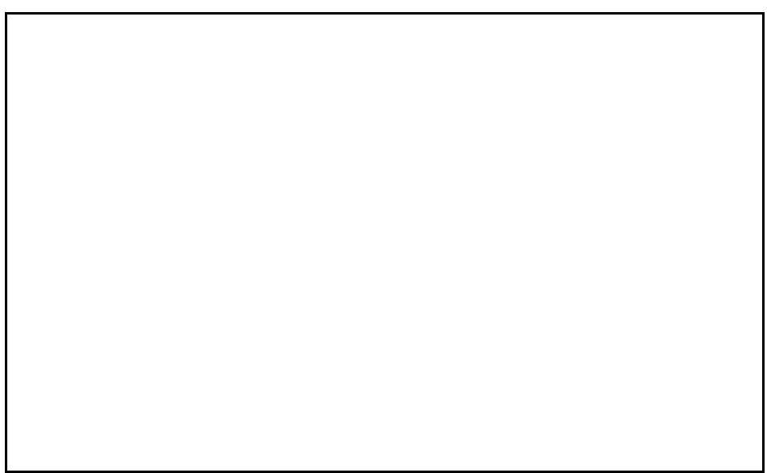

Figure 10. Coralline lethal orange disease

Commonly the orange band and associated white zone appear as incomplete circles, forming semicircles or crescent shapes. Close inspection of the orange and white bands and the enclosed circular area reveals that the crustose algae recovers or rapidly recolonizes the affected regions. In no instances was the enclosed area of the peripheral bands completely killed (white). Generally the enclosed area was an overall pink or purplish red or a somewhat mottled mixture of these colors. In crescent-shaped affected areas it was sometimes difficult to discern the area behind the orange and white bands from the normal surrounding algal encrusted surfaces.

Observations of several orange band occurrences at transect 4 during the two-week duration of our assessment period revealed no apparent expansion or contraction of the orange band. Possibly the rate of growth is slow, sporadic, or was dormant.

In addition to general qualitative observations within the bay, the frequency of occurrence was determined at all six transects on the reef platform and the 3 and 5 meter depth locations during the same time the plotless point-quarter coral transects were run. At each transect point a search radius of one meter was used in each quadrant. It was noticed that a common grey colored encrusting sponge (*Dysidea*) was also conspicuously growing over a number of substrates, including crustose algae. The frequency of the grey sponge was also recorded along with the occurrence of the orange band disease (Table A-1, below).

The frequency of the orange band disease was expected to be higher from just general observations, but this was apparently an illusion because of its conspicuousness. A separate 50 meter long transect was laid down at a rubble covered reentry area at 3 meters depth at transect 4 because of the apparent abundance of the orange band occurrences there, but none was encountered with a 1 meter search radius. General observations, as well as the transect data, showed a greater abundance of the orange band disease at transect 5.

No occurrences of the orange band disease was recorded from any of our other 12 monitoring stations around Tutuila, but one occurrence was observed at the airport dredge site.

In conclusion, it appears that the orange band disease is not a serious threat to the health of the reefs of Tutuila. The disease has a very low frequency of occurrence, and apparently the infected areas quickly recover and become reestablished by crustose coralline algae. The common, but not so conspicuous, grey sponge was affecting about four times as much reef area—that included coral as well as coralline encrusted areas—as the orange band disease in Fagatele Bay.

Table 28. The frequency of occurrence for the orange band disease and grey sponge per quadrant for Transects 1-6.

|        | Quadrant /depth | CLOD | Dysidea | number of quadrants |
|--------|--------------------|------|---------|------------------------|
|        | 1-5m               | 0    | 0       | 60                     |
|        | 2-1m               | 0    | 0       | 68                     |
|        | 2-3m               | 0    | 0       | 60                     |
|        | 2-5m               | 0    | 1       | 60                     |
|        | 3-1m               | 0    | 1       | 120                    |
|        | 3-3m               | 0    | 1       | 60                     |
|        | 3-5m               | 0    | 3       | 60                     |
|        | 4-1m               | 0    | 0       | 88                     |
|        | 4-3m               | 1    | 2       | 60                     |
|        | 4-5m               | 0    | 0       | 60                     |
|        | 5-3m               | 2    | 0       | 60                     |
|        | 5-5m               | 1    | 3       | 60                     |
|        | 6-5m               | 0    | 0       | 60                     |
| Totals |                    | 4    | 11      | 876                    |

### ACKNOWLEDGEMENTS

Our project with the Fagatele Bay National Marine Sanctuary (12-28 July 1995) was a success largely because of logistic help of the Department of Marine & Wildlife Resources (DMWR), Government of American Samoa. We were all most impressed with the cooperation among programs under the administration of Raymond Tulafono. The Department of Marine and Wildlife Resources provided boat, fuel, scuba tanks, air fills and, most importantly, the expert assistance of Fale Tuilagi and Elia Henry. Fale and Elia are extraordinary workers. Elia consistently put all his effort into each of our endeavors. He was always full of energy and completely and competently committed to the tasks at hand.

Fale had a great deal of technical skill. He organized the logistics of most of our trips, which included such administrative matters as obtaining permission from local residents for access to the Fagatele Bay National Marine Sanctuary via land and permission to launch a boat in the village of Onenoa. He was able to launch and retrieve the boat from a rocky beach which we would have thought was impossible. In Fagatele Bay, he was able to oversee the safe and efficient operation of scientists in four different sections of the bay simultaneously. He was a remarkably effective technician and was present every day, even on Sundays and holidays, to help us take advantage of every day of our limited visit.

Ultimately, of course, the whole project was brought about by Nancy Daschbach, Fagatele Bay National Marine Sanctuary Coordinator. She organized and secured the logistics and equipment, and she participated in most of the field work, even driving us to access by land and guiding us down the path by land when the seas were too rough to go by boat.

Final typesetting and document preparation was performed by Good Work(s), an American Samoa consulting company. Nancy Daschbach provided the final editing.

### LITERATURE CITED

Birkeland, C. 1977. The importance of rate of biomass accumulation in early successional stages of benthic communities to the survival of coral recruits. *Proc. of 3rd Inter. Coral Reef Symp.*, Miami. 1. Biology: 15-21

Birkeland, C. 1981. *Acanthaster* in the cultures of high islands. *Atoll Res. Bull*. 255:55-58.

Birkeland, C., and R. H. Randall. 1979. Report on the *Acanthaster planci (alamea)* studies on Tutuila, American Samoa. Report submitted to the Division of Marine Resources, American Samoa. 50 p.

Birkeland, C., R.H. Randall, and S.S. Amesbury. 1994. Coral and reef-fish assessment of the Fagatele Bay National Marine Sanctuary. Report to the National Oceanic and Atmospheric Administration. 126 p.

Birkeland, C., R.H. Randall, R.C. Wass, B.D. Smith, and S. Wilkins. 1987. Biological resource assessment of the Fagatele Bay National Marine Sanctuary. *NOAA Technical Memorandum NOS MEMD 3*, U.S. Department of Commerce. 232 p.

Colgan, W.C. 1987. Coral recovery on Guam (Micronesia) after catastrophic predation by *Acanthaster planci. Ecology* 68(6):1592-1605.

Craig, P., A. Green and S. Saucerman 1995. Coral reef troubles in American Samoa. *Fisheries Newsletter* 72: 33-34.

Dahl, A.L. 1971. Ecological report on Tutuila, American Samoa. Smithsonian Institution, Washington, D.C. 13 p.

Helfrich, P. 1975. An assessment of the expected impact of a dredging project for Pala Pala Lagoon, American Samoa. University of Hawaii, Sea Grant Tech. Rept. UNIHI-SEAGRANT-TR-76-02: 76 p.

Jones, R.S., R.H. Randall, and M. Wilder. 1976. A study of biological impact caused by natural and man-induced changes in a tropical reef. U.S. Environmental Protection Agency, Ecological Research Series, No. EPA-60013-76-027. 209 p.

Lamberts, A. E. 1974. Coral kill in American Samoa. *Nat. Geog. Soc. Res. Rept.* 15:359-337

Myers, R.F. 1989. Micronesian Reef Fishes. A Practical Guide for the Identification of the Coral Reef Fishes of the Tropical Central and Western Pacific. Coral Graphics, Guam.

Randall, R. H. 1773a. Coral reef recovery following intensive damage by the "crown-of-thorns" starfish *Acanthaster planci* (L.). *Publ. Seto Mar. Biol. Lab*. 20:469-489

Randall, R. H. 1973b. Distribution of corals after *Acanthaster planci* infestation at Tanguisson Point, Guam. Micronesica 9(2):213-222

Randall, R.H. 1990. The general geographic and geologic setting, physiographic description, and community structure of the reef-building corals of Ngesoal Reef, Palau. Univ. of Guam Envir. Dur. Rept. No. 24. 44 p.

Randall, R.H. 1993. Coral transplanting and monitoring plan for the Ocean Development Company \ Palau Resort Development Project in Ngesaol, Koror State, Palau. MBA International, Honolulu, Hawaii, 19 p.

Randall, R.H., R.T. Tsuda, R.S. Jones, M.J. Gawel, J.A. Chase, and R. Rechebei. 1975. Marine biological survey of the Cocos barrier reef and enclosed lagoon. 160 p.

Setchell, W.A. 1924. Vegetation of Tutuila Island. Carnegie Inst. Publ. 341. Dept. Mar. Biol. 20:1-188

Guinther, E., and W. Madden. 1980. American Samoa coral reef inventory. Part A. U.S. Army Corps of Engineers, Pacific Division Report for the Development and Planning Office, American Samoa Government. 314 p.

Wass, R.C. 1979. Current status of the crown-of-thorns starfish *(Acanthaster planci - "alamea")* around Tutuila Island. Report to Governor P. T. Coleman. Prepared by Office of Marine Resources, Government of American Samoa. 7 p.

Wass, R.C. 1982. Characterization of Inshore Samoan Fish Communities. DMWR Biological Report Series No. 6.