# **Brian McArdle**

# **Report:**

# **Statistical analyses for Coral Reef Advisory Group.**

**August - October 2003**

# **Contents**

| Contents                                                                   | l   |
|----------------------------------------------------------------------------|-----|
| Executive summary                                                          | 4   |
| 1) Data Analyses for Fagatele Marine Sanctuary and National Parks Service  |     |
| Coral                                                                      |     |
| Fish                                                                       |     |
| Health                                                                     |     |
| 2) Fisheries data analyses for Department of Marine and Wildlife Resources |     |
| Summary                                                                    |     |
| 3) Sample Survey design for National Parks Service.                        |     |
| Summary                                                                    |     |
| Monitoring programmes                                                      |     |
| Fagetele Bay.                                                              |     |
| Design                                                                     |     |
| Coral                                                                      |     |
| Fish                                                                       |     |
| Tutuila                                                                    |     |
| Design                                                                     |     |
| Fish                                                                       |     |
| Coral                                                                      |     |
| Long term - 3 site.                                                        |     |
| Design                                                                     |     |
| Fish                                                                       |     |
| All islands survey                                                         |     |
| Design                                                                     |     |
| Fish                                                                       |     |
| Summary of results                                                         |     |
| Fagetele Bay.                                                              |     |
| Coral                                                                      |     |
|                                                                            |     |
| Fish                                                                       |     |
| Tutuila                                                                    |     |
| Coral                                                                      |     |
| Fish                                                                       |     |
| Long term 3 site.                                                          |     |
| Design                                                                     |     |
| Fish                                                                       |     |
| All islands survey                                                         |     |
| Design                                                                     |     |
| Fish                                                                       |     |
| State of the coral and fish communities 2001/2002                          |     |
| Coral community 2001                                                       |     |
| Summary                                                                    |     |
| Fish community                                                             |     |
| Summary                                                                    |     |
| 2001                                                                       |     |
| Species numbers                                                            |     |
| Total abundance.                                                           |     |
| Recommendations for designs and future analyses                            |     |
| Looking for trend in CPUE                                                  | 134 |

| Summary                          | 134 |
|----------------------------------|-----|
| Conclusion                       | 139 |
| Modelling catch using past hooks | 140 |

# **Executive summary**

## *1) Data Analyses for Fagatele Marine Sanctuary and National Parks Service*

## *Coral*

The data are of sufficient quality to detect clear trends in time space and depth

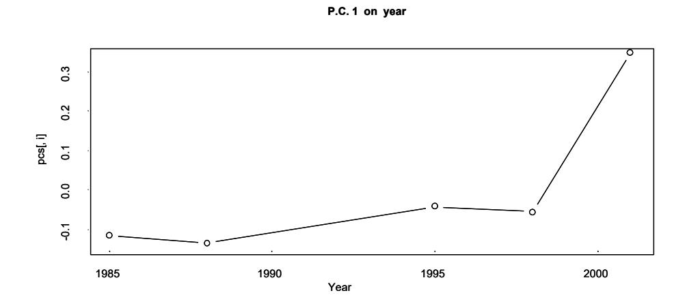

The dominant signal is that there was a huge shift in amount of coral between 1998 and 2001 suggesting that the reefs are recovering from the disasters of the previous 20 years. The number of species declined but the area covered increased.

Spatially, patterns were detected within Fagatele bay with the dominant trend in both the species composition and the pattern of species coverage showing clear contrast between the inner (2, 3, 4 5) and outer sites (1 & 6).

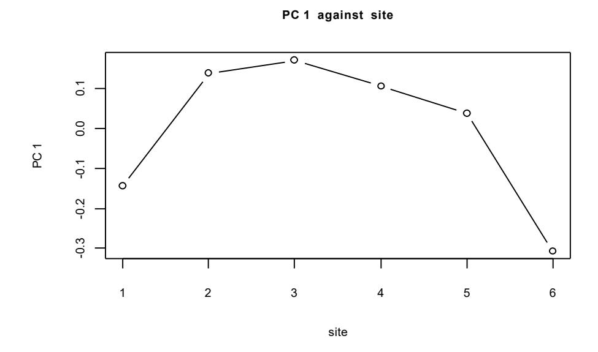

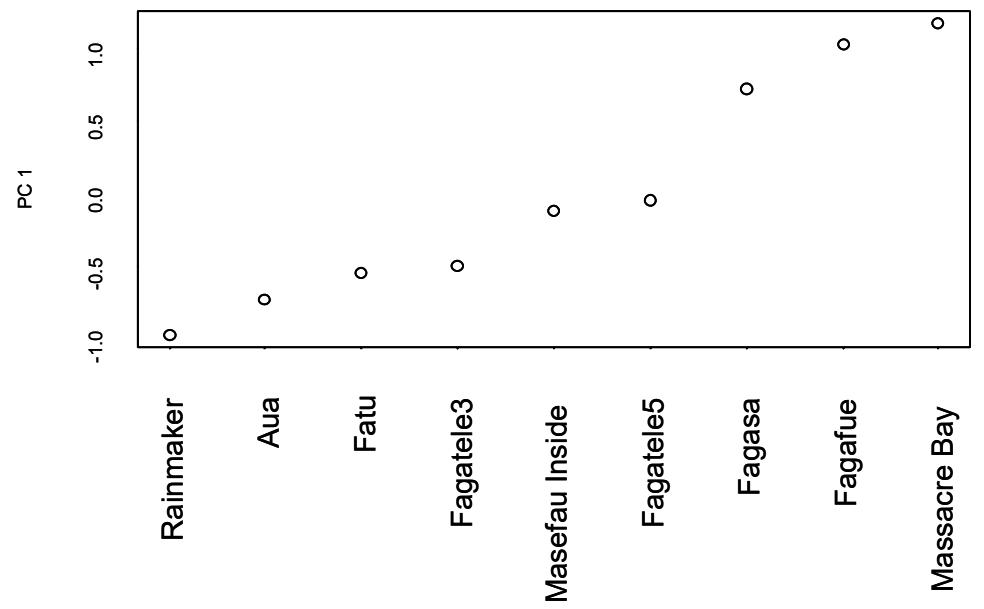

The Tutuila data also showed spatial pattern with three north-eastern sites being distinguished from the rest.

Within Fagatele the depth pattern was clear, wide difference between the species composition and patterns of coverage between the 1m and 3 depths followed by a steady gradient from 3 to 12m.


With the Tutuila data there were only two depth ranges (1-3 m and about 6m) and they did not give a clear picture.

## *Fish*

With the possible exception of data from 1988 the fish data set is also of reasonable quality, allowing clear trends to be detected both within Fagatele Bay and around

Tutuila. Alison Green's multi island survey involving as it did more work than the other two is of particularly high quality.

Temporal trends emerged from all studies for which 2001 data were available. The dominant trend was best shown by the long term 3 site data set. The analysis of the multi island study showed that most species showing an increase in density between 1996 and 2001.

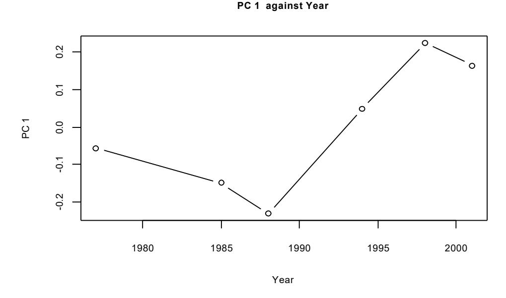

Spatially, once again the Fagetele Bay data showed in inner outer contrast as the dominant trend in both species composition and pattern of species abundances.

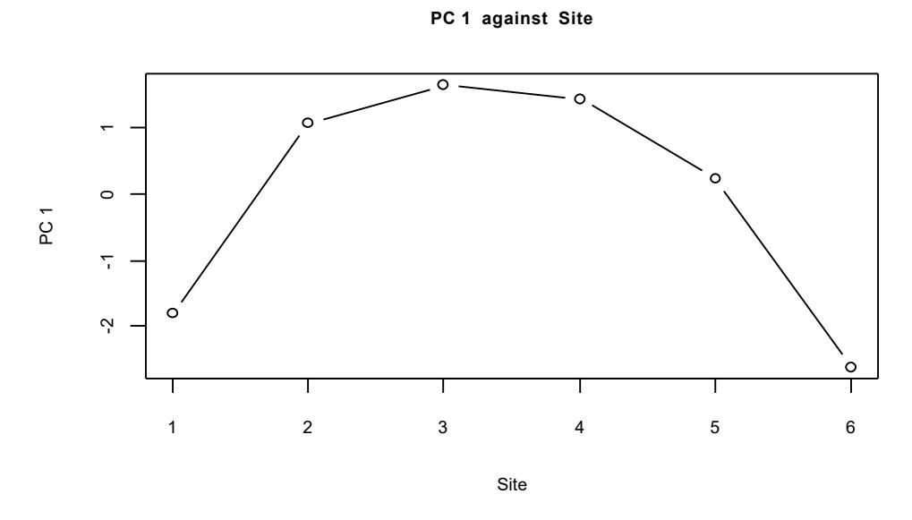

Significant differences were found between sites in all larger scale analyses. In particular the multi-island study showed clear inter and intra-island pattern:

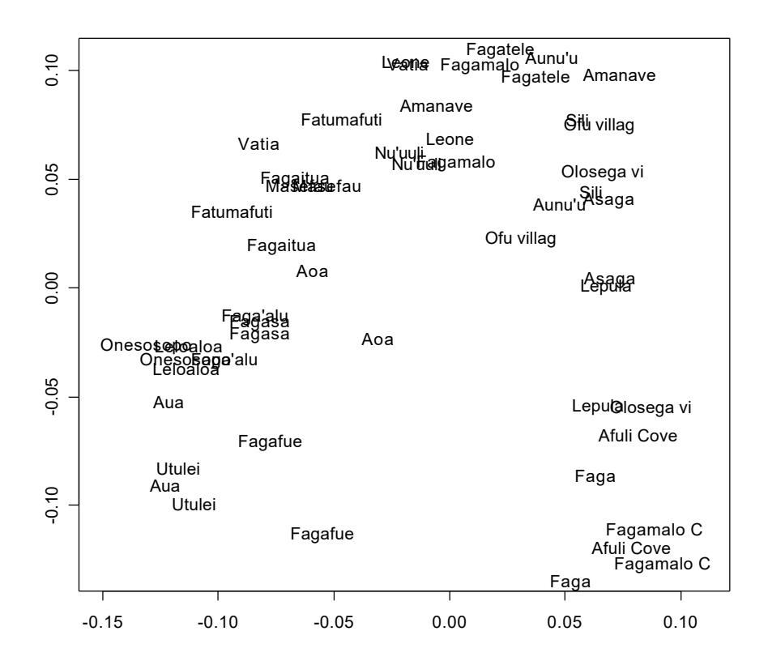

The Fagatele Bay set was the only one with good depth data. The main trend was very clear for both species composition and abundance. There is a simple gradient in both with depth. There are other trends in addition but this was the main one.

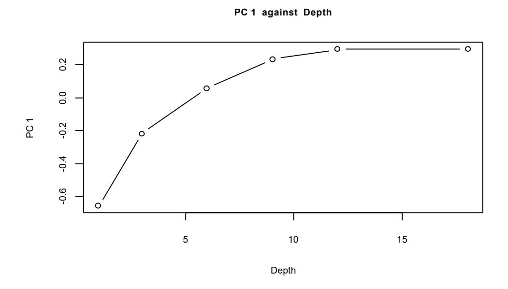

Health

Using a consensus definition of the health of the reef community it was possible to demonstrate that by analysing only the 2001 data it was possible to identify trends in time and space that were consistent with reef recovery in both coral and fish

communities. Perhaps more useful it was also possible to identify potential indicator species that could be useful in monitoring.

## *2) Fisheries data analyses for Department of Marine and Wildlife Resources.*

### **Summary**

We found three groups of fish – Albacore, mahimahi and billfish - show signs of overfishing, and that two other groups – bigeye and sharks – show markedly increasing CPUE. This is almost certainly due to their being increasingly targeted, deliberately or accidentally. Two other groups – skipjack and Wahoo - also show increasing CPUE, though less clearly.

## *3) Sample Survey design for National Parks Service.*

### **Summary**

Pilot study data were analysed to establish the viability of projected sample sizes. Methods of data collection were discussed and an efficient paired sampling technique that exploited the spatial autocorrelation in the data was decided upon.

# **Monitoring programmes**

## *Fagetele Bay.*

### **Design**

The design has changed over time, in particular the number of depths covered for example in 1985 depth 9 metre was not taken, in 1998 and 2001 depth 18 metres was added. In addition, as can be seen from table 1, the design has many holes in - it is extremely unbalanced. Some depths are not practically available for sampling at some sites. Analysing such a data set is difficult, and the results become more tentative. To identify trends in space time or depth, the data have to be corrected for the missing values, since simple statistics will be biased due to the missing values. Either data are thrown away until the remainder has no holes - is balanced - or the data must be manipulated statistically to correct for the missing values. In the first case this would lead to the loss of 70% of the data if we wished to keep 1985 in the analysis, 38% at best. I regard this as an unacceptable loss of useful information and would suggest statistical correction, as can be seen in the results section of the report this has worked well.

I will consider possible changes to the design later in the report.

Table 1 Sites sampled by year at each depth

| Depth 1m  |          |   |   |   |   |   |
|-----------|----------|---|---|---|---|---|
| Site      |          |   |   |   |   |   |
|           | 1        | 2 | 3 | 4 | 5 | 6 |
| 1985      | 0        | 0 | 0 | 0 | 0 | 0 |
| 1988      | 0        | 0 | 0 | 0 | 0 | 0 |
| 1995      | 0        | 0 | 1 | 1 | 0 | 0 |
| 1998      | 0        | 0 | 1 | 1 | 0 | 0 |
| 2001      | 0        | 0 | 1 | 1 | 0 | 0 |
| Depth 3m. |          |   |   |   |   |   |
|           | Transect |   |   |   |   |   |
|           | 1        | 2 | 3 | 4 | 5 | 6 |
| 1985      | 1        | 1 | 0 | 1 | 0 | 0 |
| 1988      | 0        | 1 | 1 | 1 | 1 | 0 |
| 1995      | 0        | 1 | 1 | 1 | 1 | 0 |
| 1998      | 0        | 1 | 1 | 1 | 1 | 0 |
| 2001      | 0        | 1 | 1 | 1 | 1 | 0 |
| Depth 6m  |          |   |   |   |   |   |
|           | Transect |   |   |   |   |   |
|           | 1        | 2 | 3 | 4 | 5 | 6 |
| 1985      | 0        | 1 | 1 | 1 | 0 | 1 |
| 1988      | 0        | 1 | 1 | 1 | 1 | 0 |
| 1995      | 1        | 1 | 1 | 1 | 1 | 0 |
| 1998      | 0        | 1 | 1 | 1 | 1 | 0 |

| 2001                                       | 0        | 1 | 1 | 1 | 1 | 0 |
|--------------------------------------------|----------|---|---|---|---|---|
| Depth 9m                                   |          |   |   |   |   |   |
|                                            | Transect |   |   |   |   |   |
|                                            | 1        | 2 | 3 | 4 | 5 | 6 |
| 1985                                       | 0        | 0 | 0 | 0 | 0 | 0 |
| 1988                                       | 1        | 1 | 1 | 1 | 1 | 1 |
| 1995                                       | 1        | 1 | 1 | 1 | 1 | 1 |
| 1998                                       | 0        | 1 | 1 | 1 | 1 | 1 |
| 2001                                       | 1        | 1 | 1 | 1 | 1 | 1 |
| Depth 12m                                  |          |   |   |   |   |   |
|                                            | Transect |   |   |   |   |   |
|                                            | 1        | 2 | 3 | 4 | 5 | 6 |
| 1985                                       | 1        | 1 | 1 | 1 | 0 | 1 |
| 1988                                       | 1        | 1 | 1 | 1 | 1 | 1 |
| 1995                                       | 1        | 1 | 1 | 1 | 1 | 1 |
| 1998                                       | 0        | 1 | 1 | 1 | 1 | 1 |
| 2001                                       | 1        | 1 | 1 | 1 | 1 | 1 |
| Depth 18m. This was only recorded for fish |          |   |   |   |   |   |
|                                            | Transect |   |   |   |   |   |
|                                            | 1        | 2 | 3 | 4 | 5 | 6 |
| 1985                                       | 0        | 0 | 0 | 0 | 0 | 0 |
| 1988                                       | 0        | 0 | 0 | 0 | 0 | 0 |
| 1995                                       | 0        | 0 | 0 | 0 | 0 | 0 |
| 1998                                       | 0        | 1 | 1 | 1 | 1 | 0 |
| 2001                                       | 0        | 1 | 1 | 1 | 1 | 0 |

### **Coral**

## **Density**

There appear to be errors in the data files. Figure 1 shows a box plot species densities for every sample of the total. All total densities in the data set are less than 50 except for 4 values, 3 of which are extremely deviant. These values are shown in table 2, they are two orders of magnitude greater than expected given the rest of the data. Possibly a data entry mistake (dividing all the suspect entries by 100 gives plausible values). Attempts to have this confirmed have so far failed. For the purpose of this exercise the deviant samples had all their values divided by 100, which brought them into line with the rest of the data. However any analyses based on these data are inevitably only provisional until the data problems are resolved.

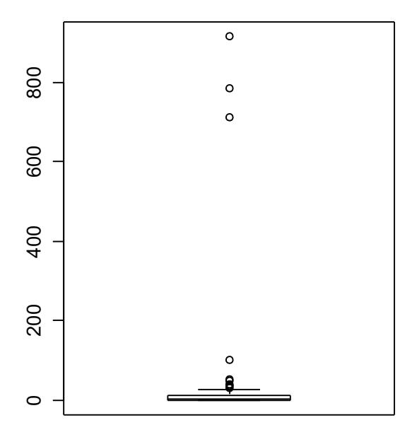

Table 2

| Year | Site | Depth |    | Density |
|------|------|-------|----|---------|
|      | 1995 | 4     | 9  | 100.52  |
|      | 1995 | 4     | 12 | 709     |
|      | 1995 | 1     | 9  | 913.6   |
|      | 1995 | 1     | 12 | 784.3   |

Though there is no replication the density values do not seem to have undue variation (assessed by examining the residuals after fitting the simple time, space, depth

trends). The point quadrat method seems to give reasonable estimates, at least of total density, there may be individual species that are poorly assessed by the method, but I found none where the variation was greater than might be expected. There is of course always the possibility of differential bias between species, but this is of course equally true of virtually any census method of virtually any taxon group.

## **Size**

There seems to be no problems with the mean size data (the diameter of individual coral colonies). However, unlike density this is a conditional variable: if the coral is not recorded at a site then the density is logically and usefully recorded as zero, size is however unrecorded; a value of zero is misleading, if there are no coral colonies then there is no size. The existence of a value of size is conditional on the density being greater than zero. This restricts the usefulness of this variable for analysis, its main purpose is to allow the calculation of coverage.

## **Coverage – surface area per sq. metre**

There is a fundamental problem with the percent cover as presented in past reports and the current form of data. By examining the Excel spreadsheet calculations I discovered that the percent cover for the individual species has been wrongly calculated. It had been defined in earlier reports, correctly, as the area of a circle with the average radius (mean size) of a single colony for that species recorded for that sample multiplied by the estimated density of colonies per sq metre. It is therefore the estimate of total horizontal area of this species in a square metre (not quite proportional or percentage coverage since it can exceed 1 if there is 3–D complexity, e.g. layering. Previously however it had been calculated in the Excel spread sheets as the mean area for the individual species times the total density of all species in the sample. Once we have settled the problems with the density estimates that were mentioned above, a new data set with the correct figures can be prepared. For the purpose of these analyses the densities were corrected as above, and the area per metre<sup>2</sup> was calculated.

## **Overall quality**

As shall be seen below the data are of sufficient quality to allow basic trends to be easily detected.

### *Species coverage.*

The figure below shows the histogram of number of species per sample (in the total data set), usually between 10 and 20. A total of 185 species were recorded overall. However only 71 species reached the commonly used exclusion criterion of appearing in at least 5% of the samples. Of course this criterion is only relevant to community analysis, it assumes that the occurrence of infrequent species in a sample is likely to be too influenced by random sampling probability to provide reliable information. However it does indicate that most of the species are infrequent. 91.7% of the data set are zeros, reducing to 80.2% of the 71 retained species. A large, but not uncommon proportion of zeros. It might be suggested that using more point-quadrant points for each sample might give a better characterisation of the species composition at a sampling location. However as we shall see below the current system still has sufficient information to show basic trends.

#### **Histogram of spno**

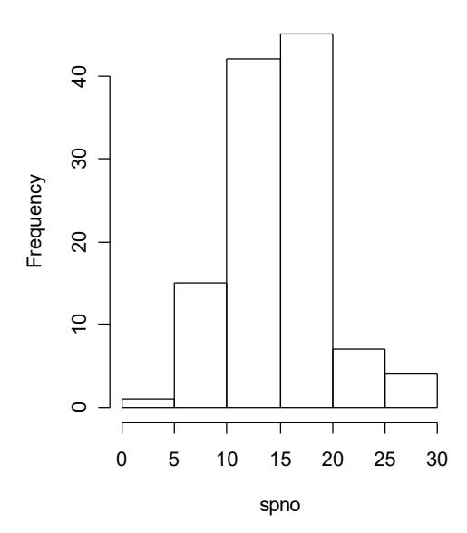

### **Fish**

The data are counts per 30m quadrat. No problems were detected in the data. A total of 215 species were recorded (of which 96 appeared in more than 5% of the samples). 89% of the total data set are zeros, 88% of the data for the 96 are zeros.

The histogram of numbers of species per sample (in the total data set) is presented below, most samples contain between 10 and 30 species. Quite adequate numbers for community level patterns to emerge.

Size is available for fish seen in 2001 though these data were not analysed in this study.

#### **Histogram of spno**

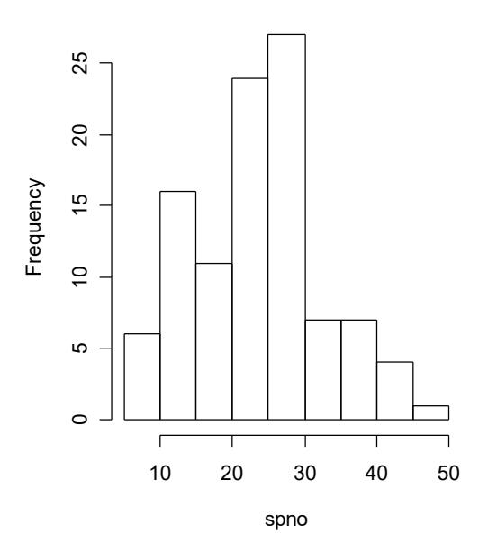

These data proved quite adequate to detect major trends.

## *Tutuila*

### **Design**

The basic data collection for coral and fish around the island were essentially the same till 2001. I have no fish data for 2001 at the same sites to complement the coral data, and the 1982 fish data do not seem to exist any more. The current data for corals seem a truly remarkable data set, though data for years 1982, 1985, 1988 have not yet been entered into machine readable form. This is most regrettable since when this data set is combined with the Fagatele Bay data set (which it complements) there can be few such spatially diverse data sets in the Pacific or Indian oceans that span such a long period of time. I regret that the sampling has been so inconsistent. Much data has to be abandoned before even statistically corrected analyses can be performed. If properly maintained and added to in the coming years this could be a world class resource.

Where possible all site were sampled at shallow (c1-3m) and medium (6m) depths. Table 3 shows the number of samples taken from the various sites over time.

| Aoa  | Aua |   | Aua outer Auasi | Aunuu | Cape<br>Larsen | Fagafue | Fagasa | Fatu | Larsen<br>Bay |   |
|------|-----|---|-----------------|-------|----------------|---------|--------|------|---------------|---|
| 1982 | 1   | 0 | 0               | 0     | 2              | 2       | 2      | 2    | 2             | 0 |
| 1985 | 2   | 0 | 0               | 0     | 2              | 2       | 2      | 2    | 2             | 0 |
| 1988 | 2   | 0 | 0               | 1     | 1              | 2       | 2      | 2    | 2             | 0 |
| 1995 | 2   | 0 | 0               | 0     | 0              | 0       | 2      | 2    | 2             | 2 |
| 1998 | 0   | 1 | 1               | 0     | 0              | 2       | 1      | 2    | 0             | 0 |
| 2001 | 0   | 2 | 0               | 2     | 2              | 0       | 0      | 0    | 2             | 0 |

| Masefau | Masefau |     | Massacre<br>Matuli |   |        |           |
|---------|---------|-----|--------------------|---|--------|-----------|
| Inside  | Outside | Bay | Point              |   | Onenoa | Rainmaker |
| 1982    | 2       | 1   | 2                  | 2 | 2      | 2         |
| 1985    | 2       | 2   | 2                  | 2 | 2      | 2         |
| 1988    | 2       | 2   | 2                  | 0 | 2      | 2         |
| 1995    | 2       | 1   | 2                  | 0 | 2      | 2         |
| 1998    | 1       | 0   | 1                  | 0 | 0      | 2         |
| 2001    | 2       | 0   | 0                  | 0 | 0      | 2         |

### **Fish**

The actual design analysed was:

|      |   |   |   |   |   |   | Aoa Aua Cape Larsen Fagafue Fagasa Bay Fatu Rock Masefau Inside Masefau Outside Massacre Bay Onenoa Rainmaker |   |   |   |   |
|------|---|---|---|---|---|---|---------------------------------------------------------------------------------------------------------------|---|---|---|---|
| 1995 | 2 | 0 | 2 | 2 | 2 | 2 | 2                                                                                                             | 2 | 2 | 2 | 2 |
| 1998 | 0 | 2 | 2 | 2 | 2 | 0 | 2                                                                                                             | 0 | 2 | 0 | 2 |

150 species were recorded for this data set (1995-1998), with 84 left after pruning out the rare species. 84% of the total data set is zeros, 74.5% of the pruned data set.

#### **Number of species per sample**

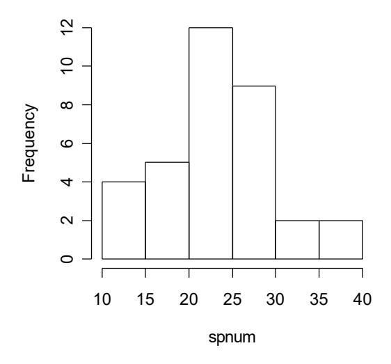

Most of the samples (in the total data set) have between 20 and 30 species.

### **Coral**

The design actually analysed was:

|      |         |        |   |                          |   | Masefau | Massacre |           |   |
|------|---------|--------|---|--------------------------|---|---------|----------|-----------|---|
| Aua  | Fagafue | Fagasa |   | Fagatele3 Fagatele5 Fatu |   | Inside  | Bay      | Rainmaker |   |
| 1995 | 0       | 2      | 2 | 2                        | 2 | 2       | 2        | 2         | 2 |
| 1998 | 1       | 1      | 2 | 2                        | 2 | 0       | 1        | 1         | 2 |
| 2001 | 2       | 0      | 0 | 2                        | 2 | 2       | 2        | 0         | 2 |

There were 151 species recorded (89%zeros), 68 after the rarer species had been removed (79%zeros).

#### **Number of species per sample**

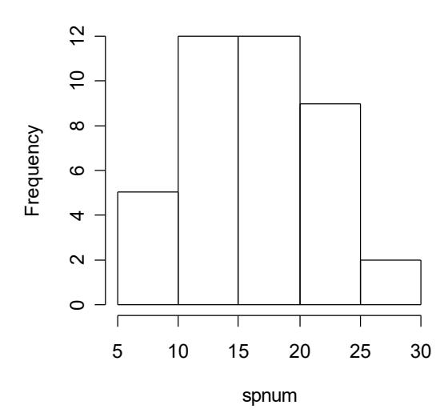

Most samples (in the total data set) contained between 10 and 25 species

## *Long term - 3 site.*

### **Design**

Originally put in place to monitor the changes in the fish community brought about by the crown-of –Thorns starfish in the 70s it has so far been sampled for over 20 years,

|      | Cape   | Fagatele |          |
|------|--------|----------|----------|
|      | Larsen | Bay      | Sita Bay |
| 1977 | 1      | 0        | 1        |
| 1978 | 0      | 1        | 0        |
| 1979 | 1      | 0        | 0        |
| 1985 | 1      | 1        | 1        |
| 1988 | 1      | 1        | 1        |
| 1994 | 1      | 1        | 1        |
| 1998 | 1      | 1        | 1        |

For the purpose of the comparative analyses performed here the 1978 and 1979 samples have been dropped, so the data sequence is for 5 time periods over 20 years with one missing value.

### **Fish**

There are only fish species in this data set. The design as analysed was:

|      | Cape   | Fagatele |          |   |
|------|--------|----------|----------|---|
|      | Larsen | Bay      | Sita Bay |   |
| 1977 | 1      | 0        |          | 1 |
| 1985 | 1      | 1        |          | 1 |
| 1988 | 1      | 1        |          | 1 |
| 1994 | 1      | 1        |          | 1 |
| 1998 | 1      | 1        |          | 1 |

187 species were recorded in total (73% of the samples zeros), after species that appeared in only one sample were removed then there were still 123 left (52% zeros)

#### **Number of species per sample**

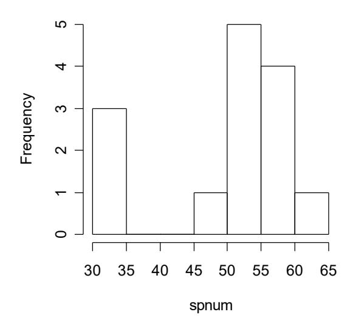

Most of the samples contain more than 50 species (reflecting the larger transects). The 3 samples in the 30s are all from 1988 and probably reflect a different sampling protocol used that year as reported by Alison Green.

## *All islands survey*

In 1996 Alison Green established an extraordinarily complete survey, of the 4 main islands in the American Samoa group: 28 sites over Aunu'u, Ofu, Tau and Tutuila.

## **Design**

3 or 5 replicates were taken at each site at 10m depth. (except for Hurricane House and Vaoto Lodge which were shallower lagoonal sites)

|      | Aunu'u Ofu | Ofu | Ofu                                                                    |   | Ofu | Olosega | Olosega |
|------|------------|-----|------------------------------------------------------------------------|---|-----|---------|---------|
|      |            |     | Aunu'uAsaga Hurricane House Ofu villageVaoto Lodge Olosega villageSili |   |     |         |         |
| 1996 | 3          | 5   | 5                                                                      | 5 | 5   | 5       | 5       |
| 2002 | 3          | 5   | 5                                                                      | 5 | 5   | 5       | 5       |

|      | Tau | Tau                                     | Tau | Tutuila |   | TutuilaTutuilaTau |   | Tutuila | Tutuila | Tutuila                      |
|------|-----|-----------------------------------------|-----|---------|---|-------------------|---|---------|---------|------------------------------|
|      |     | Afuli CoveFagamalo CoveLepulaAmanaveAoa |     |         |   | Aua               |   |         |         | Faga Faga'aluFagafueFagaitua |
| 1996 |     | 5                                       | 5   | 5       | 3 | 3                 | 3 | 3       | 3<br>3  | 3                            |
| 2002 |     | 5                                       | 5   | 5       | 3 | 3                 | 3 | 3       | 3<br>3  | 3                            |

|      | Tutuila |        | Tutuila Tutuila | Tutuila | Tutuila |   | TutuilaTutuila |   | TutuilaTutuila                                                                  |   | TutuilaTutuila |   |
|------|---------|--------|-----------------|---------|---------|---|----------------|---|---------------------------------------------------------------------------------|---|----------------|---|
|      |         |        |                 |         |         |   |                |   | FagamaloFagasa FagateleFatumafuti Leloaloa Leone MasefauNu'uuliOnesosopo Utulei |   | Vatia          |   |
| 1996 |         | 3<br>3 |                 | 3       | 3       | 3 | 3              | 3 | 3                                                                               | 3 | 3              | 3 |
| 2002 |         | 3<br>3 |                 | 3       | 3       | 3 | 3              | 3 | 3                                                                               | 3 | 3              | 3 |

Note that there are no missing samples, a remarkable testimony to what can be achieved. A substrate classification was performed for the transects in 1996.

### **Fish**

254 species were recorded for the data set as a whole (87.5% zeros), 125 in the reduced set (76% zeros). The bulk of the transects had between 25 and 40 species.

## **Number of species per sample**

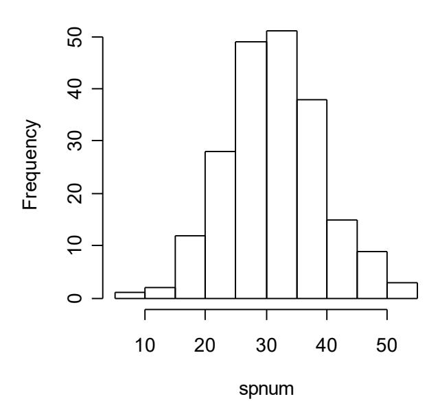

## **Size**

Size data were available for the fish seen in these two studies, a potentially useful resource when overfishing is to be detected. However it needs integrating with lengthweight equations so that the abundance data can be converted to biomass.

# **Summary of results**

## *Fagetele Bay.*

## **Coral**

## **Species numbers**

The only significant variation was Year p<0.005

#### **Estimated species numbers**

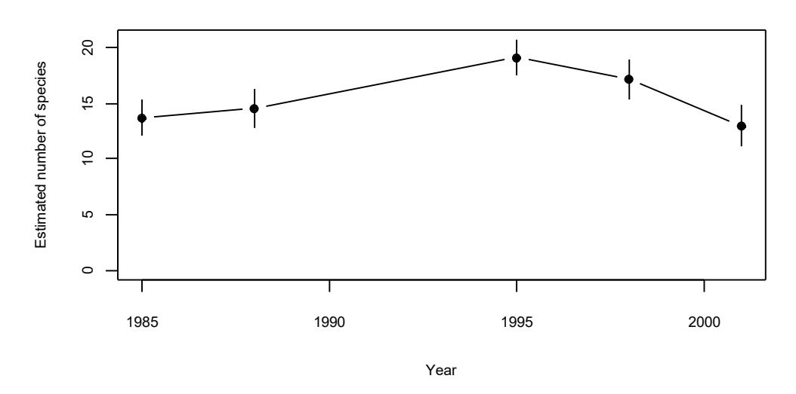

This is a pattern we see repeatedly in the various coral data sets and is possibly related to the response of the reefs to the hurricanes of the early 90s. A rise in species numbers during recolonisation (prior to 1995) followed by a loss of species through competition as the larger corals dominate.

## **Total coral density**

Using the log transformed densities, there are statistically significant site\*depth and site\*year interactions. This means the site vary differently with year and depth – unsurprising. However if we average over these interactions there are still clear simple effects.

### *Over time*

#### **Estimated mean density**

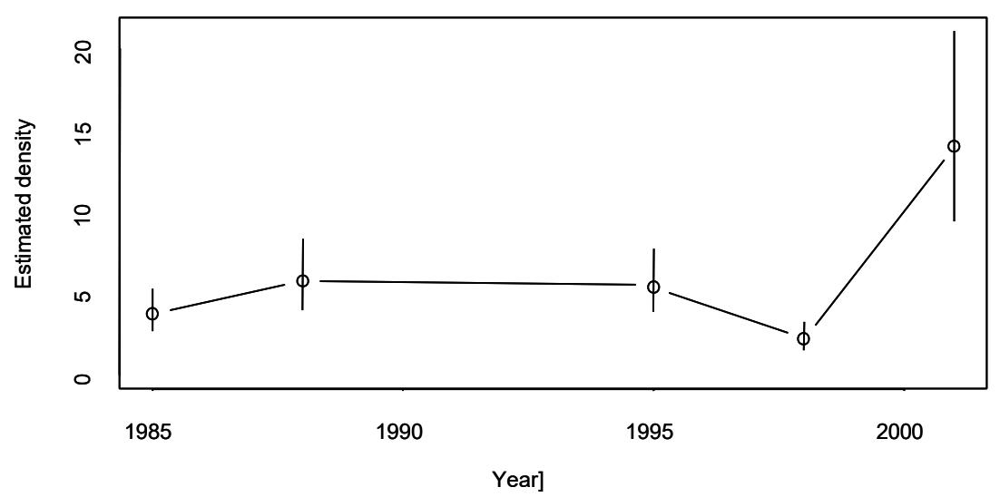

The density going up in 2001 lends support to the suggestion that the drop in species could be due to competition.

### *Depth*

#### **Estimated mean density**

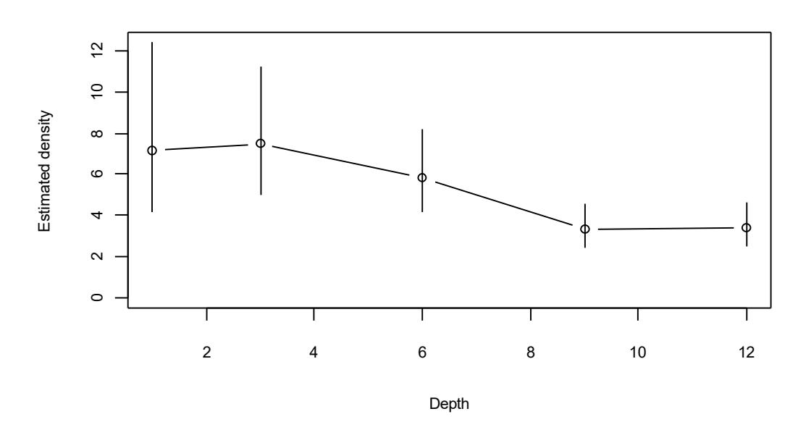

A fairly standard density depth plot – good clear signal.

### *Sites*


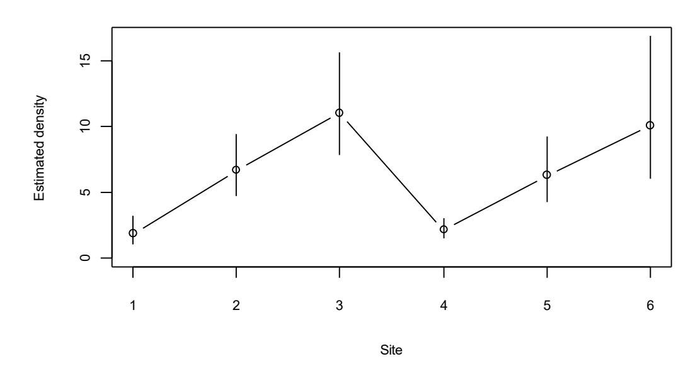

The pattern over the sites is not easily interpreted without intimate local knowledge. But the distinct difference between sites 1 and 6 (both on the outside of the bay) could be of particular interest.

## *Site\*time interactions*

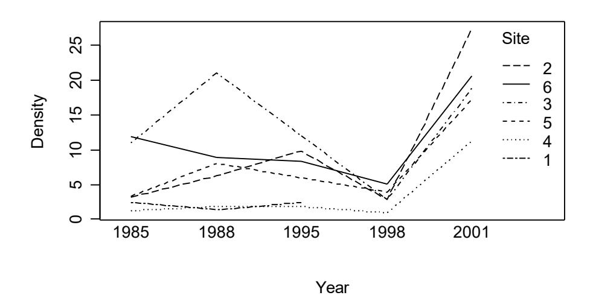

The sites generally have similar trajectories over time, particularly 1998 – 2001.

### *Depth\*site interactions*

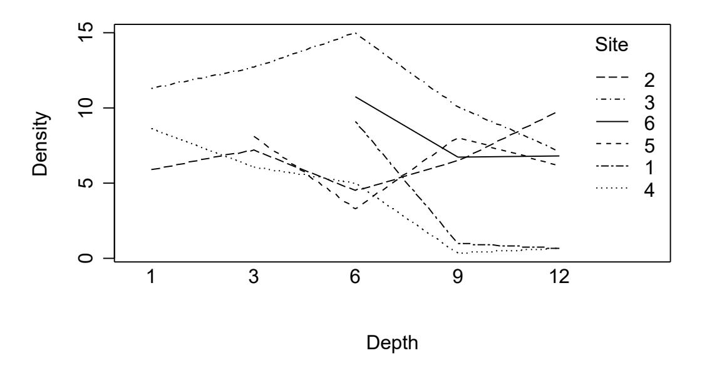

The drop off with depth seems steepest at site 1 and 4.

## **Size**

There is no obvious summary statistics pooled across species that makes much sense here given the very different niches of the species involved, so we move straight on to the combination of size and density – coverage.

## **Coverage – surface area per sq. metre**

There are statistically significant site\*year and site\*depth interactions. Also there are clear simple effects for site year and depth when the interactions are averaged over.

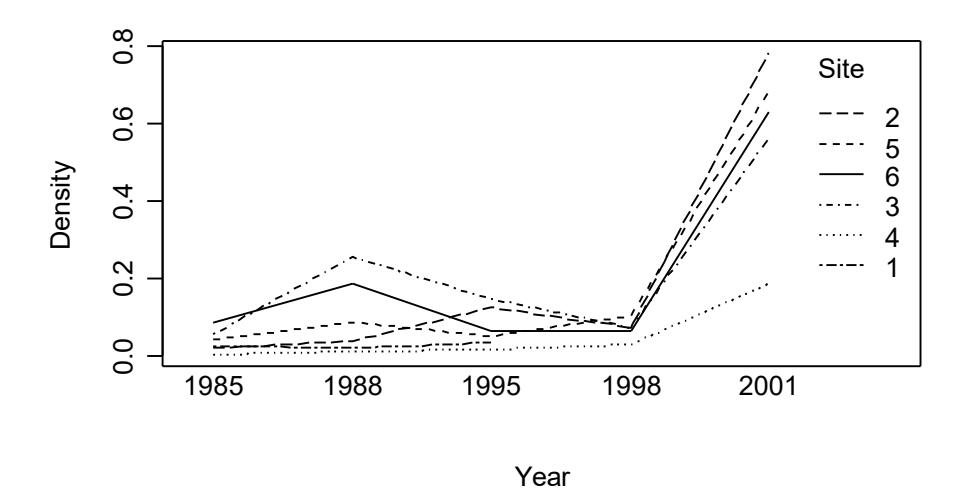

The sites may have different trajectories thorough the years, but the basic feature – the big increase between 1998 and 2001 - is very clear for all of them.

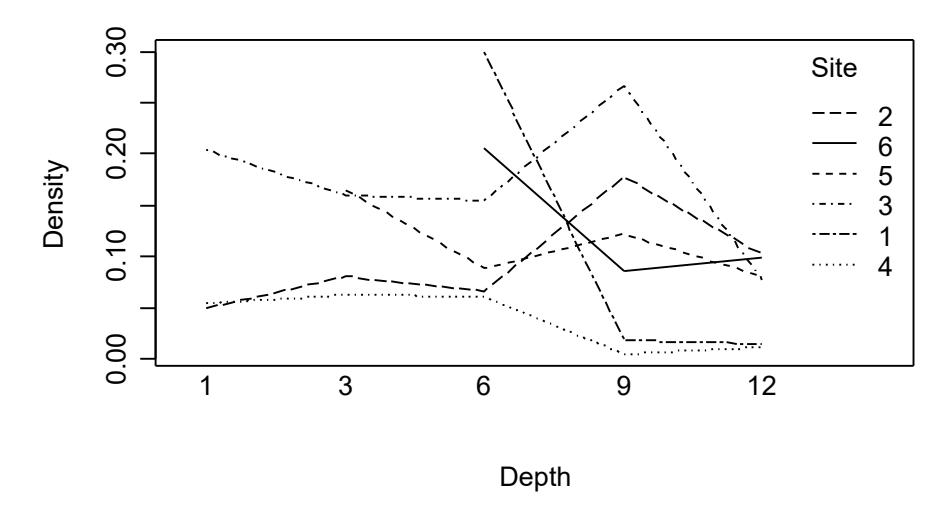

There is no obvious pattern in the depth variation over sites. Three of the sites seem to have local peaks of coverage at 9 metres while 1 and 4 show the drop off seen with density.

### *Year*

#### **Estimated mean coverage**

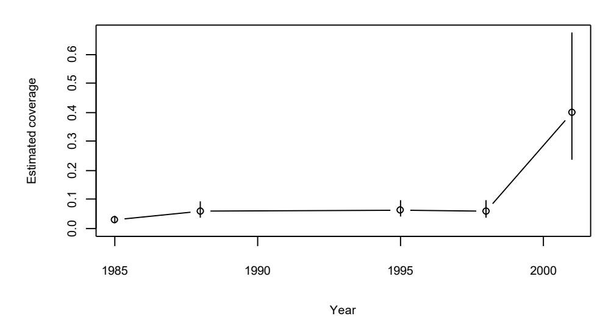

The recovery trend in density is clearly reproduced here, with values around 0.4m<sup>2</sup> .of surface m-2 .

### *Site*

#### **Estimated mean coverage**

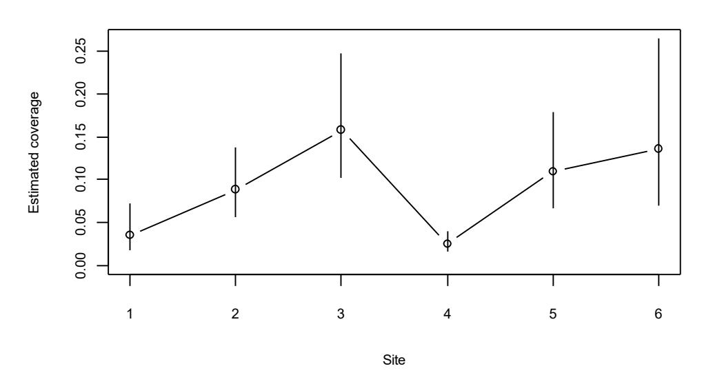

Simply shows the trend in density.

### *Depth*

#### **Estimated mean coverage**

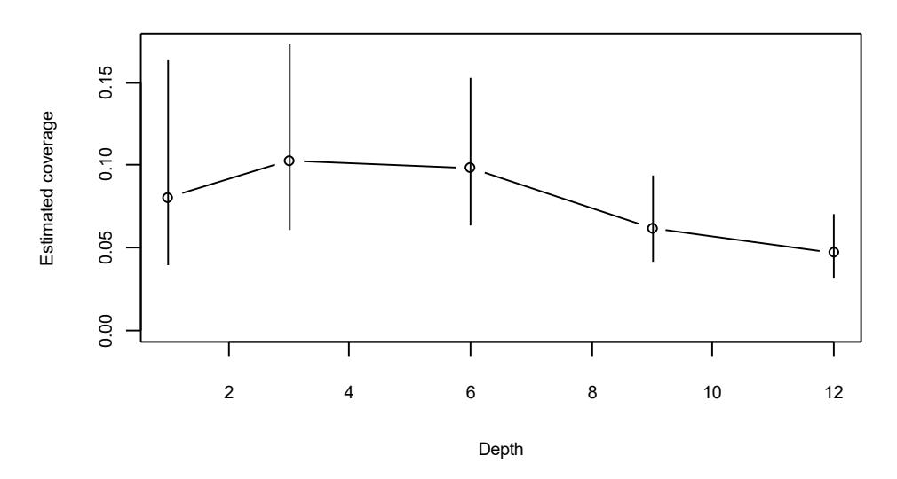

Given the interaction plot this disguises some fine detail but the averaged pattern is not unexpected.

## **Species Composition**

A multivariate ANOVA for distance matrices (Distance RDA -McArdle and Anderson 2000) showed significant year\*depth and year\*site interactions and significant simple differences between sites, years and depths.

The corrected means in multivariate space can be calculated and displayed in fewer dimensions through a Principal Component Analysis on the means of the full set of Principal Coordinates, though confidence intervals are currently impossible.

*Year*

The estimated distances between the years is given in this distance matrix

|      | 1985  | 1988  | 1995  | 1998  |
|------|-------|-------|-------|-------|
| 1988 | 0.194 |       |       |       |
| 1995 | 0.326 | 0.289 |       |       |
| 1998 | 0.317 | 0.292 | 0.201 |       |
| 2001 | 0.484 | 0.495 | 0.445 | 0.456 |

The first value 0.194 shows that of the species present in either years 1985 and 1988, 19.4% were different between years, conversely 80% of the species were the same in both years, clearly quite similar. However in contrast year 2001 shows a clear difference in species composition (sharing only 50% of its species with any of the other years). The changes in 2001 visible in the simple variables (species number, total density, total coverage) are clearly visible in species composition also.

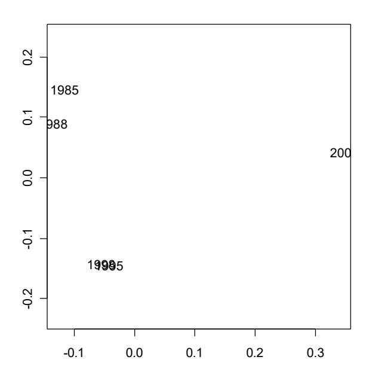

This figure shows the approximate relative positions of the years based on their species composition. 2001 is clearly very different to the others, 1985 and 1988 are similar as are 1995 and 1998. The relative similarity of years close together is statistically significant

The x axis of this graph, principal component 1 identifies the major trend in the means.

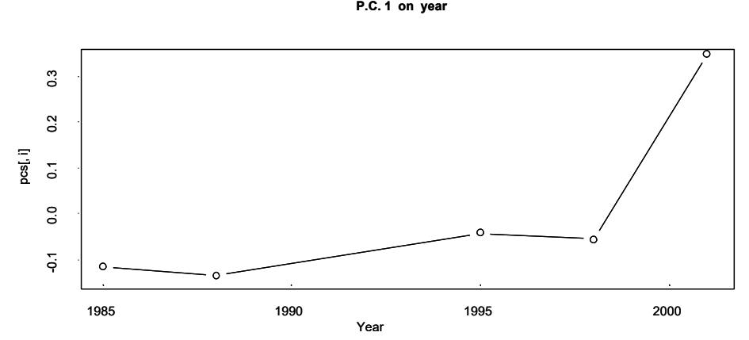

Now the values on this major trend are plotted against year and the change prior to 2001 is clearly visible.

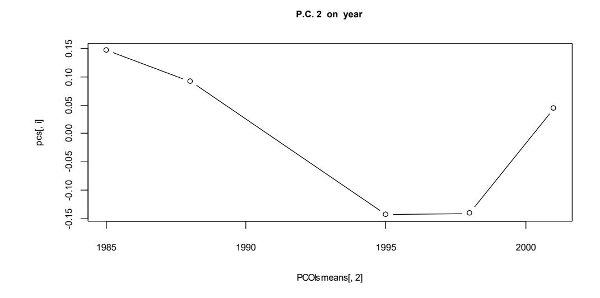

The values on the second axis (the second principal component) is consistent with the expected effect of the hurricanes in the early 90s with certain species that went missing at that time reappearing in 2001.

#### **Indicator species**

The 10 species most associated with the dominant time trend in species composition (principal component 1) are:

Montipora.tuberculosa

Montipora.sp

Acropora.insignis

Fungia.sp

Montipora.corbettensis

Montipora.efflorescens

Acropora.okajimensis

Astreopora.listeri

#### Astreopora.myriopthalma Montipora.millepora

These largely Acroporid species all increase in detectability between 1995 and 2001. They were more likely to be found in 2001 than 1996.

The top 10 associated with the second major trend are:

Favites.abdita Acropora.crateriformis

Pavona.varians Alveopora.sp.1

Favites.halicora Psammocora.neirstraszi Pavona.venosa Acropora.palifera

Montipora.turgescensPorites.cylindrica

They are all negatively associated with the trend, meaning that they increase in detectability during 1995 1998 and reduce again in 2001.

### *Site*

The distances between the sites in average species composition are

| Site |   | 1     | 2     | 3     | 4     | 5     |
|------|---|-------|-------|-------|-------|-------|
|      | 2 | 0.32  |       |       |       |       |
|      | 3 | 0.347 | 0.235 |       |       |       |
|      | 4 | 0.351 | 0.195 | 0.178 |       |       |
|      | 5 | 0.303 | 0.219 | 0.239 | 0.216 |       |
|      | 6 | 0.213 | 0.278 | 0.322 | 0.316 | 0.262 |

The most similar are highlighted, thus 2 is similar to 4 and 3 is also similar to 4 are and 4 is similar to 5.Interestingly 1 and 6 – the two exposed sites are also similar. These differences are significantly correlated to the map distance between the site (p<0.05) The closer the sites the more similar the species composition. A plot that approximates this distance matrix

:

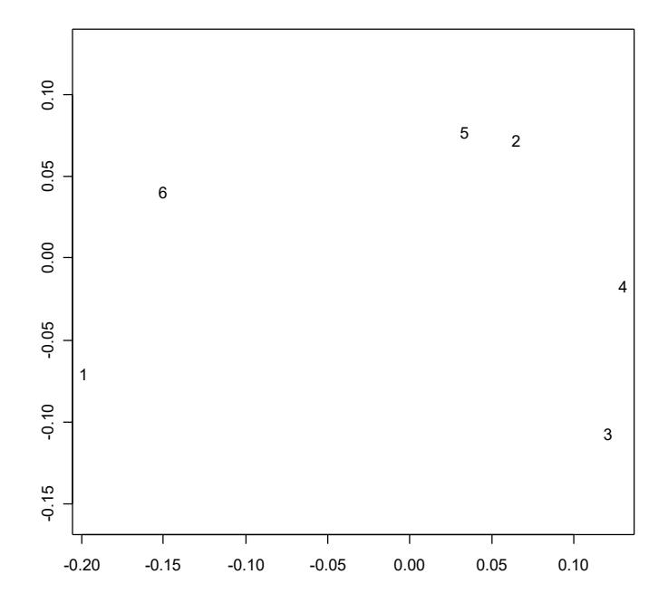

reproduces the contrast between sites in the bay and those outside.

If once again we plot on the values of the dominant trend (represented by the x axis) then the pattern is even clearer

**P.C. 1 on site**

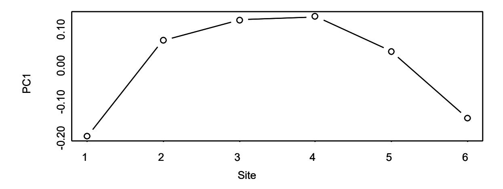

#### **Indicator species**

The 10 species most associated with this trend between sites are:

Pocillopora.danae -0.976 Montipora.grisea -0.974 Porites.massive -0.97 Montipora.turgescens -0.969 Hydnophora.rigida 0.969 Stylophora.mordax 0.966 Acropora.palmerae -0.964 Hydnophora.microconos-0.964 Acropora.crateriformis -0.953 Astreopora.listeri -0.952

Most of these species are more often present at the more exposed sites. Only *Hydnophora.rigida* and *Stylophora.mordax* appear more often inside the bay.

*Depth*

The pattern for depth is also clear and unexceptionable

| Depth |    | 1     | 3     | 6     | 9     |
|-------|----|-------|-------|-------|-------|
|       | 3  | 0.395 |       |       |       |
|       | 6  | 0.361 | 0.171 |       |       |
|       | 9  | 0.427 | 0.299 | 0.231 |       |
|       | 12 | 0.404 | 0.32  | 0.263 | 0.143 |

6m and 9m share many species, 6 m and 3m are also similar, 1m stands out on its own.

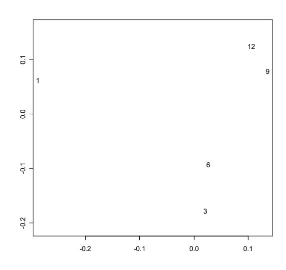

Once again the dominant trend, the x axis, shows the pattern most clearly

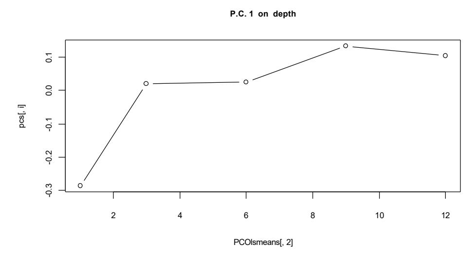

changes in species composition are non-linear on depth, changes lessening for every extra metre.

The second major trend (principal component 2) is given by

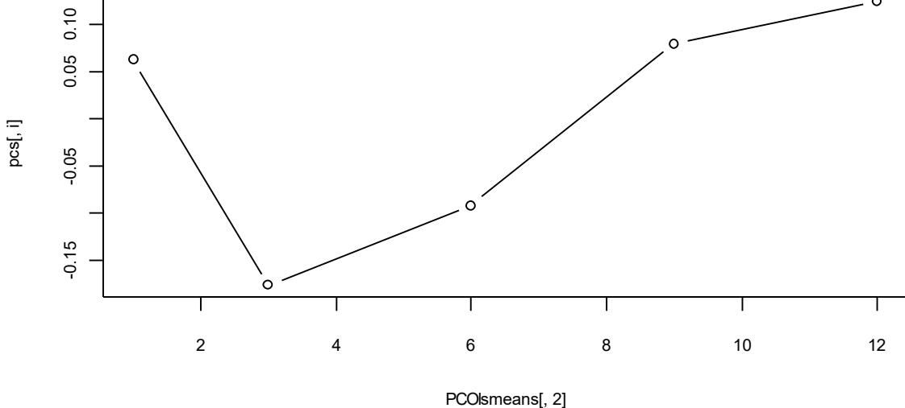

**P.C. 2 on depth**

At first sight this trend looks strange, however by seeing how species are associate3d with it we discover that is simply saying that some species are only found at intermediate depths (3-6 metres)

## *Indicator species*

The 10 species most associated with the dominant depth pattern (principal component 1) are:

| Psammocora.contigua   | -0.985 |
|-----------------------|--------|
| Porites.cylindrica    | -0.984 |
| Acropora.hyacinthus   | 0.979  |
| Pocillopora.danae     | -0.974 |
| Fungia.scutaria       | -0.969 |
| Pavona.divaricata     | -0.966 |
| Pavona.contigua       | -0.96  |
| Pavona.verrucosa      | -0.96  |
| Montipora.platyphylla | -0.96  |
| Millepora.tuberosa    | -0.958 |
|                       |        |

All except *Acropora.hyacinthus* are negatively associated with the trend, that is they decrease with depth. *Acropora.hyacinthus* on the other hand appears to increase with depth.

The following are associated with principal component 2. They are present at intermediate depths.

| Acropora.irregularis  | -0.983 |
|-----------------------|--------|
| Acropora.gemmifera    | -0.98  |
| Acropora.azurea       | -0.952 |
| Pocillopora.verrucosa | -0.95  |
| Psammocora.sp.1       | -0.94  |
| Montipora.informis    | 0.939  |

Porites.sp.2 0.933 Acropora.selago -0.928 Acropora.ocellata -0.915 Pocillopora.setchelli -0.909

All except and *Porites.sp.2* have a negative relationship with the trend so they are more often met at intermediate depths. *Montipora.informis* is only found at 9 m and below, *Porites*.sp.2 is fairly uniform at all depths but does have a slightly higher frequency at 1m and 9 m. and below.

#### Checking the interaction means

Since there were significant evidence that the sites have different trajectories through time, we must check that the overall means tell a reliable story. The major trend in the site\* year interaction multivariate means is plotted below.

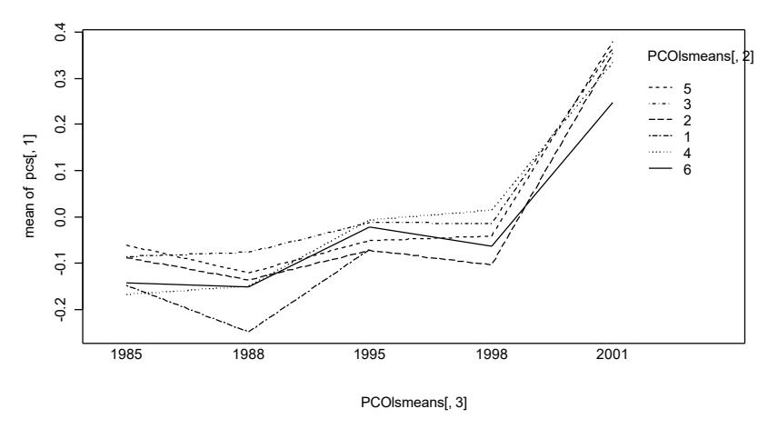

Clearly all the sites have similar trajectories and the simple plot above is adequate.

The year depth interaction means when plotted show that different depths have essentially the same pattern over time reassuring us that the plot of time means represents the data adequately.

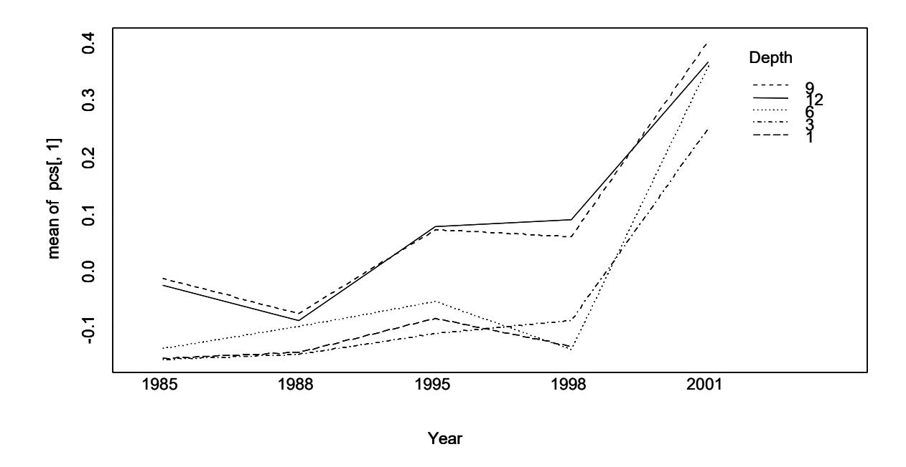

#### Coverage

The analysis was performed using a Gowers unstandardised distance measure calculated on log((cm<sup>2</sup> per m<sup>2</sup>) +1) so that it was focused on proportional change.

A multivariate Distance based ANOVA detected a significant difference between years, though it depended on the site (i.e. a site\*year interaction, p < 0.0005), it also depended on the depth (i.e. a depth\*year interaction, p = 0.002). The simple tests between the year means was significant (p < 0.0005) as were the simple tests for differences between the means for sites (p < 0.0005), and depths (p < 0.0005).

#### **Years**

The differences between the years is summarised by the distance matrix:

|      | 1985  | 1988  | 1995  | 1998  |
|------|-------|-------|-------|-------|
| 1988 | 0.291 |       |       |       |
| 1995 | 0.405 | 0.367 |       |       |
| 1998 | 0.377 | 0.398 | 0.249 |       |
| 2001 | 0.752 | 0.771 | 0.584 | 0.628 |

Note that while 1985 and 1988 are very similar and 1995 and 1998, but 2001 is different to the rest. This distance matrix can be represented (approximately) by the plot of Principal component 1 (PC1 - x axis) against PC2 (y axis).

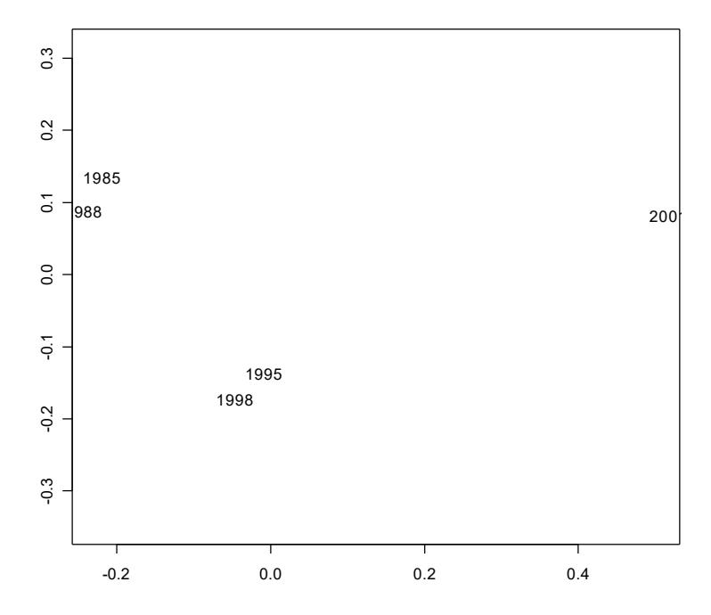

This shows the pattern clearly, the spatial structure (pattern of coverage between species) of coral was roughly stable after the crown of thorns outbreak, Changed rapidly between 1988 and 1995 (possibly influenced by the hurricanes) and then again

even more rapidly between 1998 and 2001. This fits with the changes in species composition and total coverage that were shown earlier.

The pattern is possibly even clearer if we look only at the dominant trend, PC1 (the x axis in the plot above).

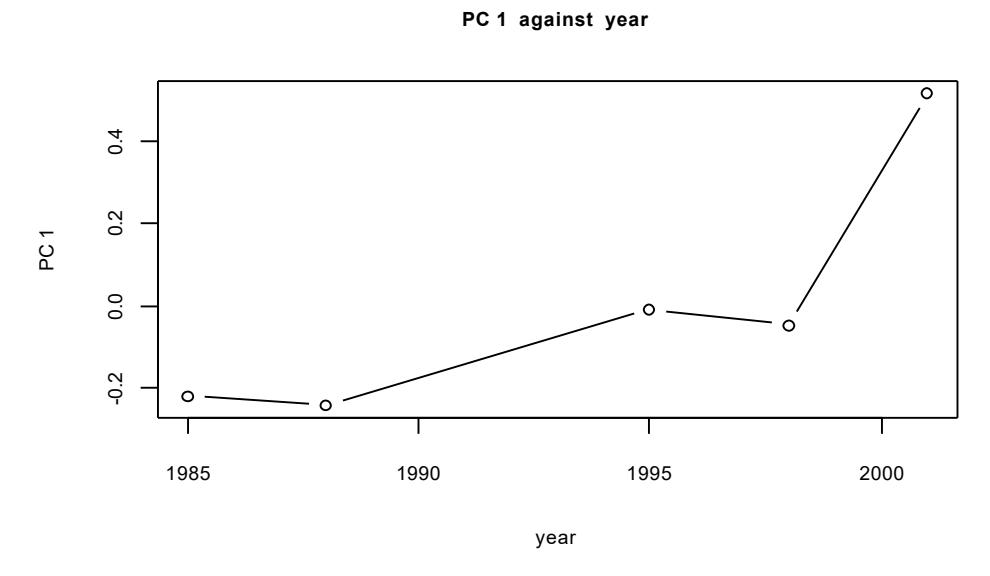

This emphasises the changes between 1998 and 2001, showing how dramatic they are.

The second dominant trend PC2 is

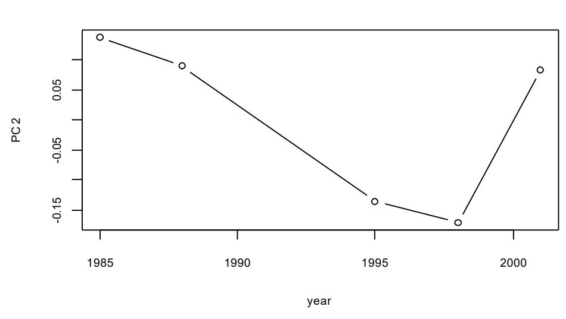

**PC 2 against year**

emphasising the difference between the post hurricane period and the rest.

#### **Species indicators**

The 10 species most associated with the dominant trend – PC1 – are:

| Montipora.griseaLSMean       | 0.992 |
|------------------------------|-------|
| Psammocora.haimeanaLSMean    | 0.98  |
| Montipora.monasteriataLSMean | 0.962 |
| Montipora.informisLSMean     | 0.959 |
| Montipora.tuberculosaLSMean  | 0.958 |
| Acropora.aculeusLSMean       | 0.944 |
| Pocillopora.eydouxiLSMean    | 0.943 |
| Montipora.corbettensisLSMean | 0.943 |
| Montipora.efflorescensLSMean | 0.942 |
| Pavona.collinesLSMean        | 0.94  |

All of these show a positive correlation with PC1 indicating that they increased between 1998 and 2001. *Porites.lutea* with a correlation of -0.904 declined over that period

The species most associated with PC2 are:

| Pavona.venosa          | -0.978 |
|------------------------|--------|
| Leptoria.phrygia       | -0.976 |
| Psammocora.neirstraszi | -0.955 |
| Montipora.verrilli     | -0.949 |
| Acropora.gemmifera     | -0.929 |
| Pavona.sp.3            | -0.922 |
| Pocillopora.danae      | -0.911 |
| Porites.cylindrica     | -0.906 |
| Montipora.elschneri    | -0.876 |
| Favia.matthaii         | -0.866 |

All have negative correlations and are species that peaked in the 90s.

*Stylophora.mordax* (0.833) and *Montastrea.curta* (0.811) showed the reverse, declining in the 90s but reappearing in 2001.

### *Sites*

The differences between the sites are described in the distance matrix:

|   | 1     | 2     | 3     | 4     | 5     |
|---|-------|-------|-------|-------|-------|
| 2 | 0.407 |       |       |       |       |
| 3 | 0.407 | 0.354 |       |       |       |
| 4 | 0.36  | 0.377 | 0.358 |       |       |
| 5 | 0.372 | 0.378 | 0.424 | 0.377 |       |
| 6 | 0.301 | 0.492 | 0.515 | 0.489 | 0.467 |

The most noticeable feature of this is how similar are the outer, exposed, sites 1 and 6. The largest distances are generally between inner and outer sites.

These relationships between the sites can be approximated by the plot of the principal components.

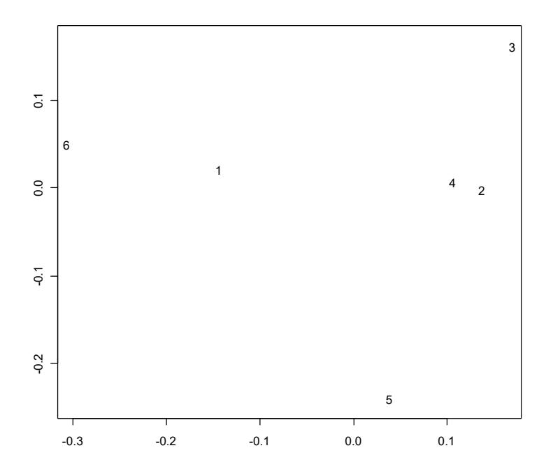

Sites 4 and 2 are plotted misleadingly close – their differences lie in a 3rd dimension. The contrast between the inner and outer sites is clear.

If we plot the dominant trend (PC1) the pattern is even clearer:

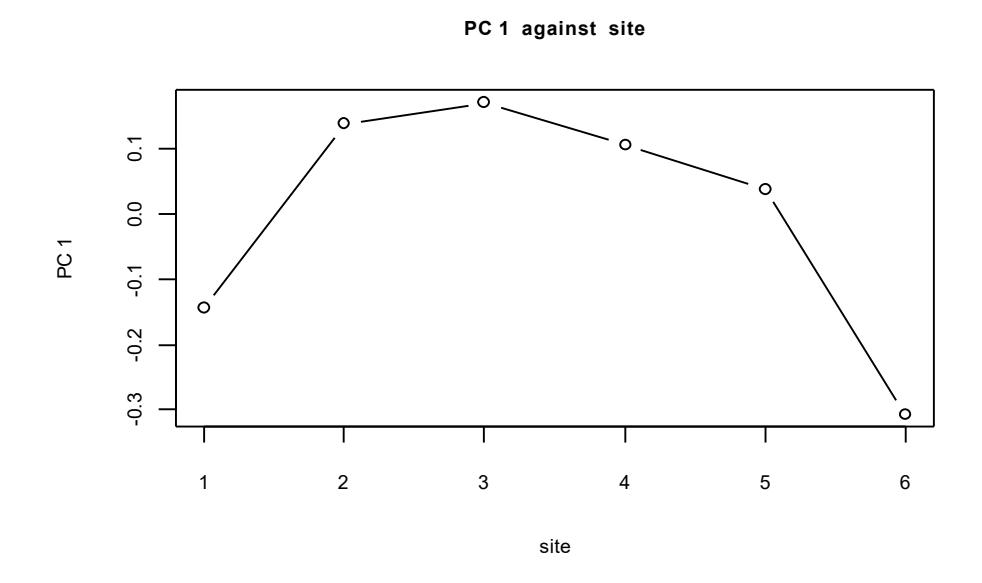

The second major axis (PC2) explains too little variance to be worth bothering with.

#### **Indicator species**

The 10 species most associated with this trend are:

Hydnophora.microconos -0.964 Montastrea.curta -0.954

| Hydnophora.rigida      | 0.947  |
|------------------------|--------|
| Pocillopora.elegans    | -0.931 |
| Favia.stelligera       | -0.93  |
| Pocillopora.danae      | -0.918 |
| Cyphastrea.serailia    | -0.915 |
| Montipora.berryi       | -0.902 |
| Pavona.varians         | 0.887  |
| Montipora.corbettensis | 0.886  |

A negative correlation ( e.g. *Hydnophora.microconos*) indicates species that favour the outer sites, positive correlations (e.g. *Hydnophora.rigida*) indicate species favouring the more sheltered inner sites.

### *Depth*

The differences in coverage are shown:

|    | 1     | 3     | 6     | 9     |
|----|-------|-------|-------|-------|
| 3  | 0.536 |       |       |       |
| 6  | 0.432 | 0.364 |       |       |
| 9  | 0.518 | 0.518 | 0.332 |       |
| 12 | 0.54  | 0.568 | 0.382 | 0.239 |
|    |       |       |       |       |

They show 9m and 12m are, perhaps unsurprisingly quite similar in the structure of their coverage.

The principal component plot

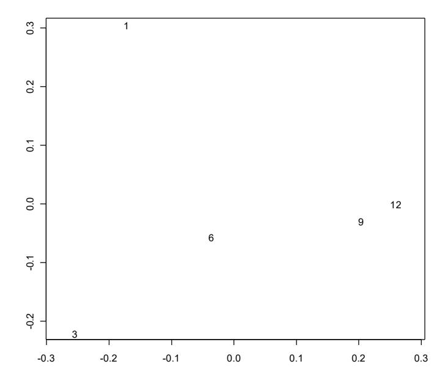

shows this, and also the difference between the shallowest depth (1m) and the rest.

The major trend PC1 is largely a simple effect of depth: the gradual changes from shallow to deep.

-0.2 -0.1 0.0 0.1 0.2 PC 1

**PC 1 against depth**

The second major trend (PC2) emphasizes the special nature of the shallow environment; and the large differences to be observed between 1 and 3 metres.

depth

2 4 6 8 10 12

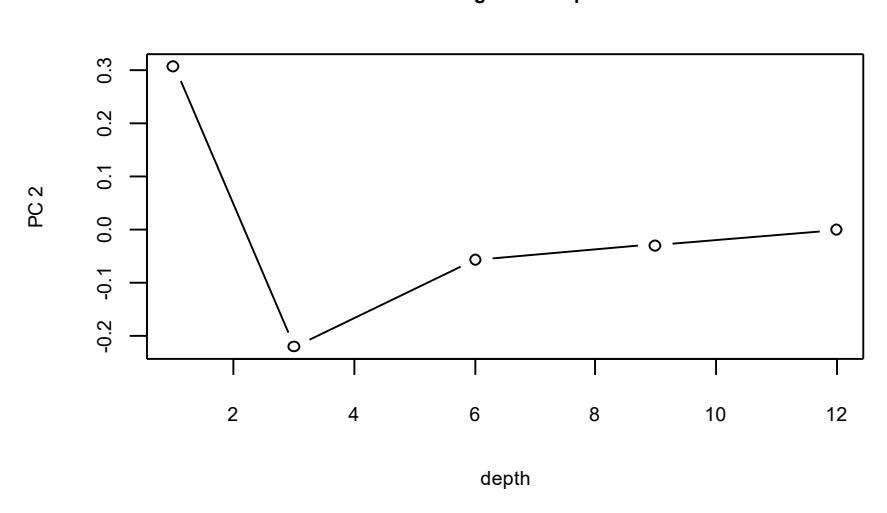

**PC 2 against depth**

#### **Indicator species**

#### PC1

| Montipora.berryi       | 0.995  |
|------------------------|--------|
| Lobophyllia.hemprichii | -0.994 |
| Acropora.crateriformis | -0.975 |
| Acropora.ocellata      | -0.961 |
| Millepora.platyphylla  | -0.952 |
| Acropora.pagoensis     | 0.949  |
| Montipora.grisea       | 0.941  |
|                        |        |

| Acropora.cerealis     | 0.931  |
|-----------------------|--------|
| Pavona.sp.2           | 0.927  |
| Goniastrea.retiformis | -0.915 |

A positive correlation ( e.g. *Montipora.berryi*) indicates a species that decreases with depth, a negative one (e.g. *Lobophyllia.hemprichii*) an increase.

#### PC2

| Montipora.ehrenbergii | -0.984 |
|-----------------------|--------|
| Montipora.caliculata  | -0.981 |
| Porites.rus           | 0.979  |
| Pocillopora.elegans   | -0.936 |
| Porites.lutea         | 0.927  |
| Acropora.hyacinthus   | -0.91  |
| Pavona.venosa         | -0.907 |
| Psammocora.haimeana   | -0.873 |
| Porites.cylindrica    | 0.867  |
| Pavona.divaricata     | 0.85   |
|                       |        |

Negative correlations show species that do not favour the shallowest water (e.g. *Montipora.ehrenbergii*) , positive correlation species do favour it (e.g. *Porites.rus*). Porites rus is an interesting species as it appears to dislike the 3m depth but achieve larger coverage in shallower and deeper samples.

### *Site\*year interactions*

For the above interpretations to be useful the patterns of year variation must be essentially the same across sites (and the pattern of variation across sites should remain more or less the same between years).

A principal component analysis of the separate site\*year means shows us that the major change between 1998 and 2001 appears as the dominant trend and was more or less the same across all the sites - except 4.

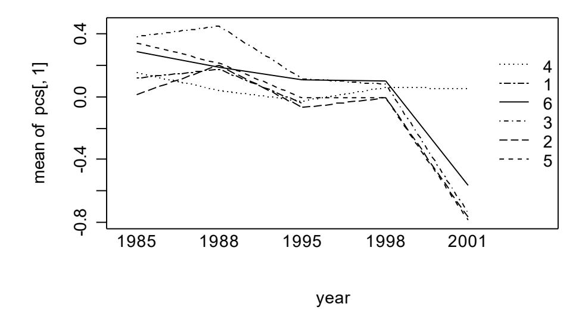

The change between inner and outer sites appeared as the second major trend (PC2). With the pattern of variation across sites being reassuringly constant over years.

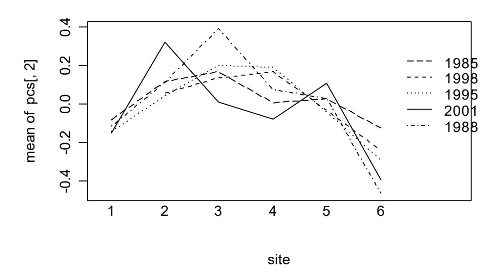

### *depth\*year interaction*

We must also check the depth\*year means.

The major trend of PC1 of the depth\*year means shows 2001 as different from the others.

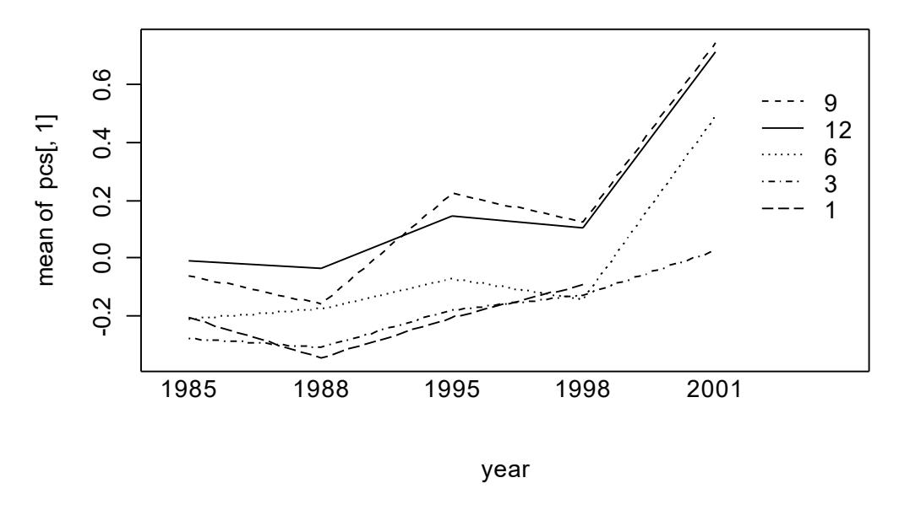

The same principal component, when p[lotted against depth shows the basic depth pattern:

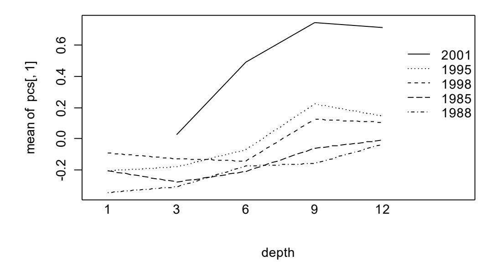

Clearly the depth effects become more marked in 2001 (prior to this the levels of coverage had been so low that it would be difficult for a pattern to emerge. But the basic pattern seems clear enough.

## Fish

## **Species numbers**

The is a significant site year interaction, and a significant simple depth and simple year effect.

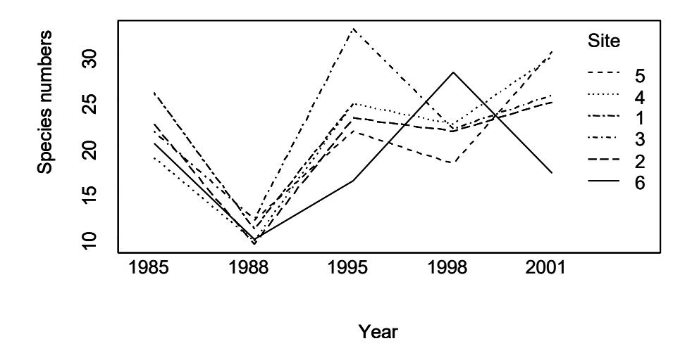

#### Estimated mean species numbers

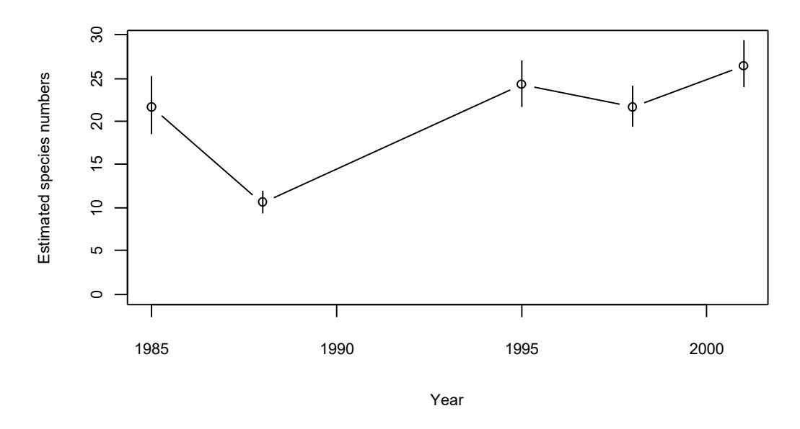

The consistent drop in numbers of species recorded in 1988 is likely to be due to the different sampling protocol used that year.

#### **Estimated mean species numbers**

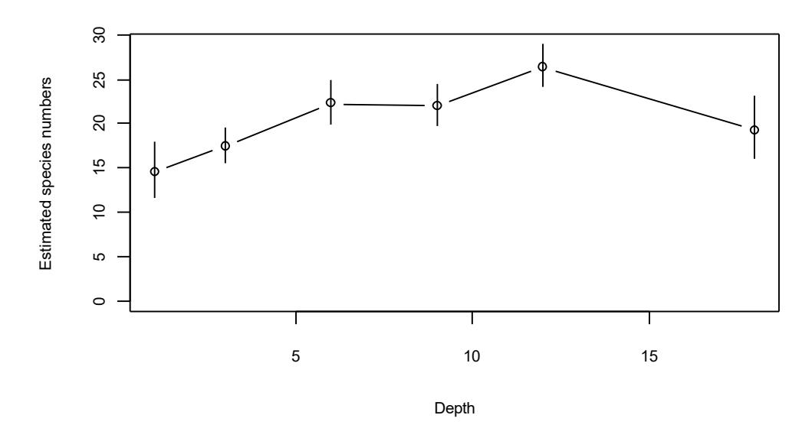

It would appear that species numbers peak at 12 m.

## **Counts per transect**

Total number of fish seen per transect.

There was no detectable differences between sites but clear differences between years and depths. There were no significant interactions.

#### **Estimated mean fish count**

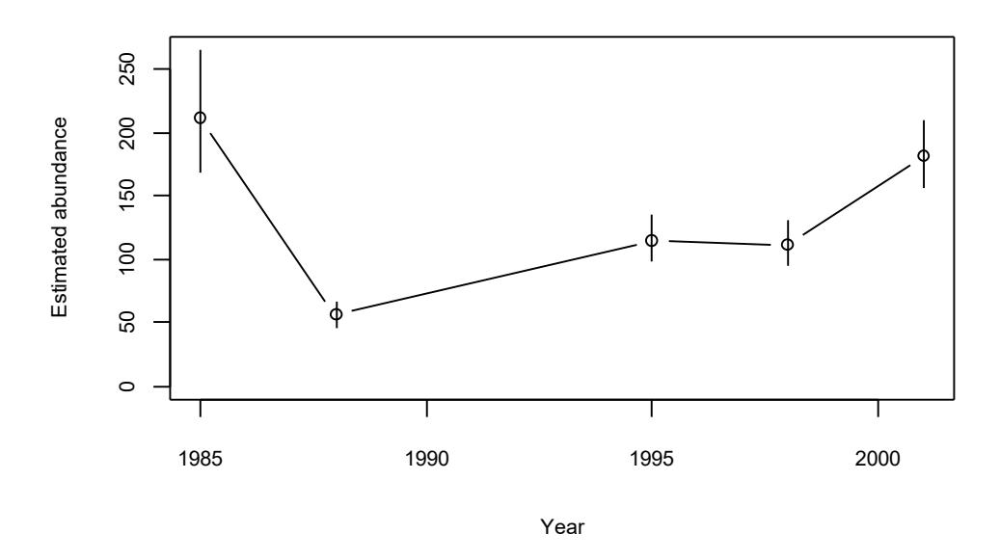

Once again the effect of the 1988 sampling protocol change is visible. Though it is clear that the 1990s were lower than 1985 or 2001, the unreliable value in 1988 means that we cannot date the decline with any precision. It may have occurred during the last years of the crown of thorns outbreak or (possibly more likely) as a consequence of the hurricanes in the early 1990s).

The interaction plot shows that the site did generally have similar pattern except for the exposed site 6. But in the main the sites show an increase in recent years after an extensive period of low counts

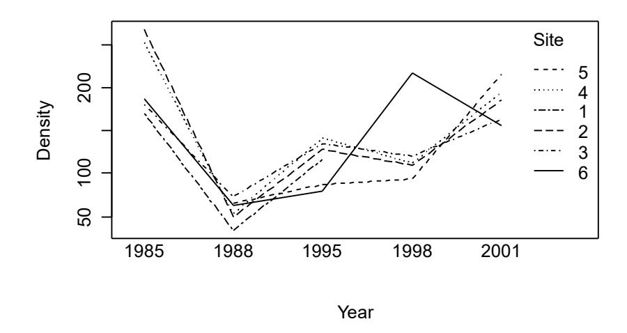

47

There is little doubt that the pattern in total abundance visible above is dominated to a high degree by the commonest species *Ctenochaetus striatus*.

Actually the majority of common species that increase in 2001 do not show the decline after 1985. Given that *C striatus* is an episodic recruiter the 1985 peak may be a relatively uninteresting phenomenon.

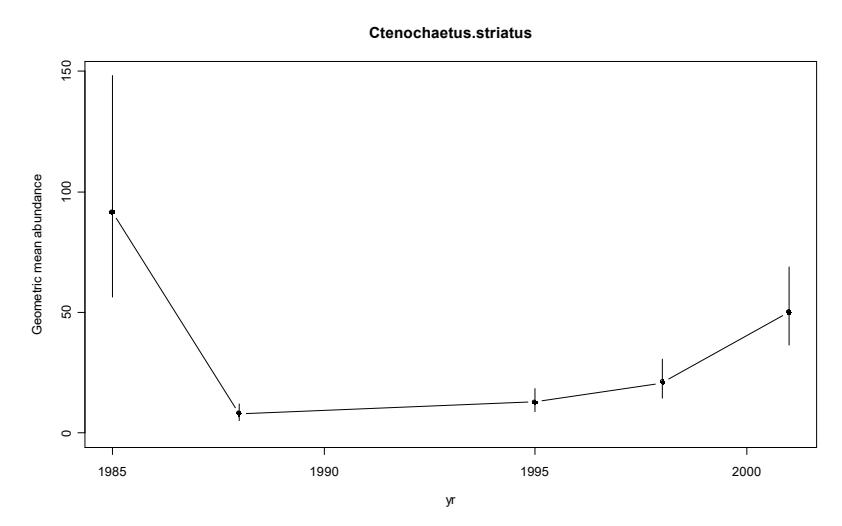

The pattern with depth

#### **Estimated mean fish count**

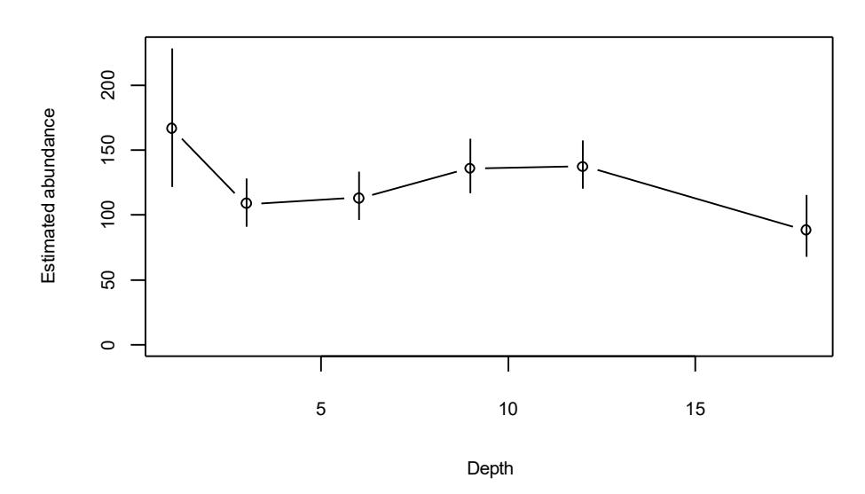

A number of common species are found only at shallow depths.

## **Species composition**

Using Multivariate ANOVA on the Jaccards distance we found there are significant differences across years, sites and depths and there is a significant interaction between site and year, also between depth and year.

The corrected means in multivariate space can be calculated and displayed in fewer dimensions through a Principal Component Analysis on the means of the full set of Principal Coordinates, though confidence intervals are currently impossible.

### *Years*

The distances between the species composition in the 5 years is summarised in this distance matrix, the later years are more similar to each other (around 75% of their species are held in common) than they are to the earlier years.

|      | 1985  | 1988  | 1995  | 1998  |
|------|-------|-------|-------|-------|
| 1988 | 0.343 |       |       |       |
| 1995 | 0.317 | 0.346 |       |       |
| 1998 | 0.344 | 0.351 | 0.249 |       |
| 2001 | 0.348 | 0.389 | 0.248 | 0.278 |

The distance matrix can be approximated with this plot of the dominant trends (principal components 1 & 2).

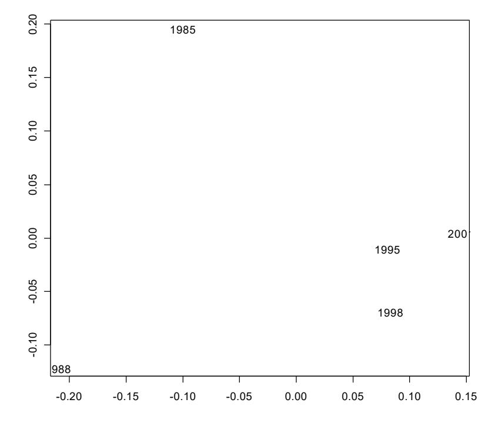

The dominant trend (the x axis of the plot above) is plotted below


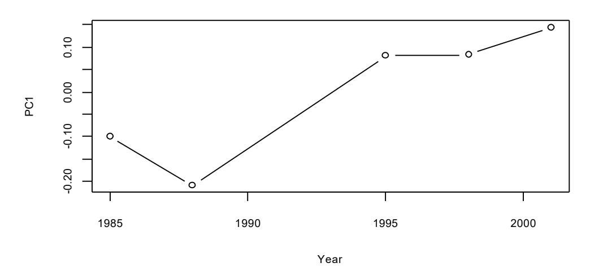

If we accept that the 1988 point is unreliable due to the suspect protocol then we can again state with some certainty that between 1985 and 1995 a major shift in fish populations occurred (perhaps due to the hurricanes), and that subsequent changes have been smaller.

The second trend (principal component 2) looks like this:

**PC2 against year**

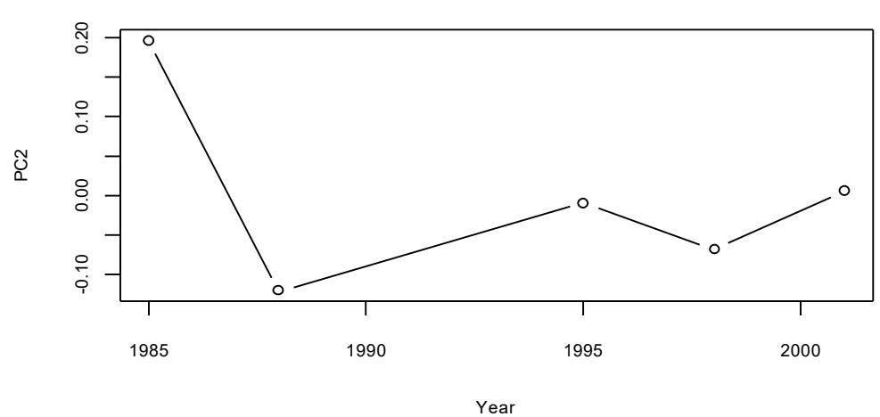

There are species that were observed frequently at the start of the study but which declined and are now less frequently seen.

#### **Indicator species**

These are the 10 species most associated with the dominant trend in species composition (Principal component 1):

| Scarus.oviceps             | 0.983 |
|----------------------------|-------|
| Melichthys.vidua           | 0.981 |
| Chromis.agilis             | 0.955 |
| Thalassoma.quinquevittatum | 0.937 |
| Acanthurus.nigricans       | 0.931 |

50

| Chromis.margaritifer    | 0.921  |
|-------------------------|--------|
| Chrysiptera.leucopoma   | -0.913 |
| Scarus.forsteni         | 0.911  |
| Synodus.spp.            | -0.909 |
| Cheilodipterus.macrodon | -0.909 |

Most of these species appear more often over time, only *Chrysiptera.leucopoma*, *Synodus*.spp and *Cheilodipterus.macrodon* become less frequent over time.

The top 10 species associated with the second principal component are:

| Monotaxis.grandoculis    | 0.987 |
|--------------------------|-------|
| Cheilinus.oxycepthalus   | 0.984 |
| Cheilinus.unifaciatus    | 0.929 |
| Acanthurus.nigrofuscus   | 0.927 |
| Naso.literatus           | 0.924 |
| Meiacanthus.atrodorsalis | 0.924 |
| Siganus.spinus           | 0.914 |
| Pervagor.melanocephalus  | 0.914 |
| Cirripectes.stigmaticus  | 0.914 |
| Hologymnosus.doliatus    | 0.913 |
|                          |       |

These species either went down after 1985 and then started to come back in the 90s or simply vanished after 1985.

### *Sites*

The differences in species composition are described in the distance matrix:

|   | 1     | 2     | 3     | 4     | 5     |
|---|-------|-------|-------|-------|-------|
| 2 | 0.334 |       |       |       |       |
| 3 | 0.37  | 0.181 |       |       |       |
| 4 | 0.358 | 0.193 | 0.143 |       |       |
| 5 | 0.304 | 0.234 | 0.247 | 0.226 |       |
| 6 | 0.299 | 0.408 | 0.45  | 0.428 | 0.337 |

The interesting values are highlighted. Clearly site 2, 3, 4, 5 are similar to each other, as are to a lesser extent 1 and 6.

A comparison with the geographic (map) distances between the midpoints of the transects is revealing:

|    | S1 | S2   | S3  | S4  | S5  |     |
|----|----|------|-----|-----|-----|-----|
| S2 |    | 5.2  |     |     |     |     |
| S3 |    | 6.7  | 1.7 |     |     |     |
| S4 |    | 8.5  | 3.7 | 2.5 |     |     |
| S5 |    | 10.7 | 7   | 6.6 | 4.1 |     |
| S6 |    | 9.9  | 8.5 | 9   | 7.3 | 4.4 |

Closer sites tend to have more similar species compositions. This relationship is statistically significant.

The plot of principal components shows it even more clearly, reproducing the approximate shape of the bay.

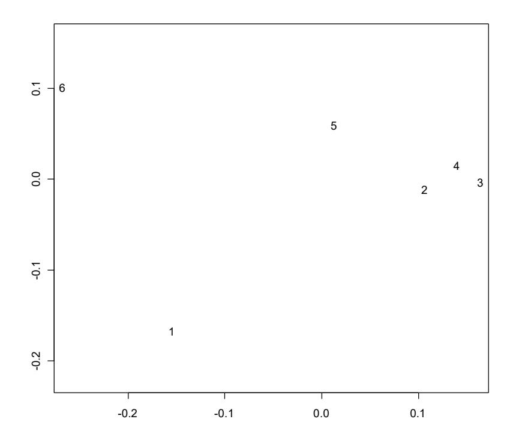

A plot of the dominant trend (the first principal component, PC 1) show the main difference is between the two exposed outer sites and the inner sheltered sites.

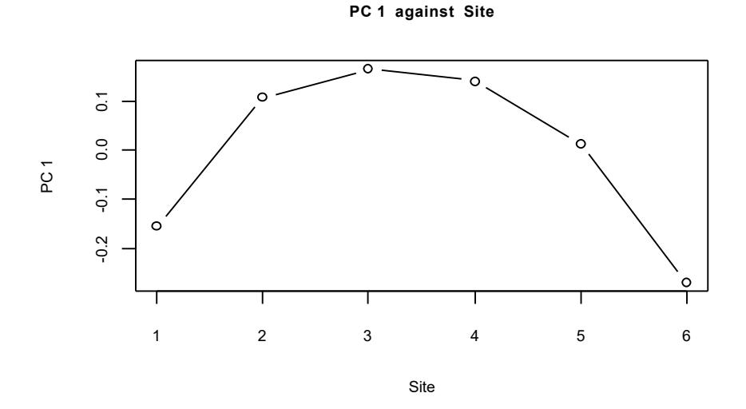

Note that this is almost identical to the species composition plot for Corals.

#### **Indicator species**

The top 10 species associated with this exposed, protected gradient are:

| Halichoeres.hortulanus   | -0.991 |
|--------------------------|--------|
| Zanclus.cornutus         | -0.989 |
| Thalassoma.amblycephalum | -0.988 |
| Parapercis.clathrata     | -0.982 |
| Acanthurus.nigrofuscus   | 0.974  |

| Chromis.vanderbiliti             | -0.973 |
|----------------------------------|--------|
| Zebrasoma.scopas                 | 0.967  |
| Centropyge.bispinosus            | 0.965  |
| Plectroglyphidodon.lacrymatusLSM | 0.964  |
| Thalassoma.quinquevittatum       | -0.962 |

A negative sign on the correlation e.g. for *Halichoeres.hortulanus* suggests that that species appears more often in the exposed sites (1&6). A positive value, e.g. for *Acanthurus.nigrofuscus* suggests they favour the inner sites.

### *Site\*year interaction*

The multivariate test showed that the sites changed significantly differently over time. For the two patterns (in space and time) we see above to be credible it must be shown that these differences change the above conclusions.

If we do a principal component analysis on the corrected means for each site and time combination we see that the major trend (PC1) is spatial, and that the pattern across the sites is essentially the same for all years – reassuring.

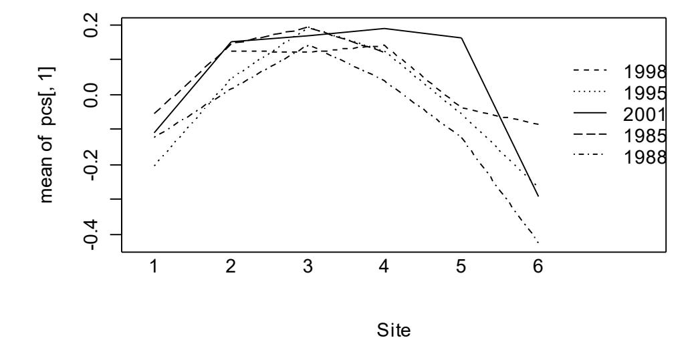

The second major trend (PC2) summarises the temporal pattern, and once again the time trend is essentially the same for all sites - though perhaps 6 is slightly different, and because of missing values there is not enough information to estimate what site 1 does in the later years.

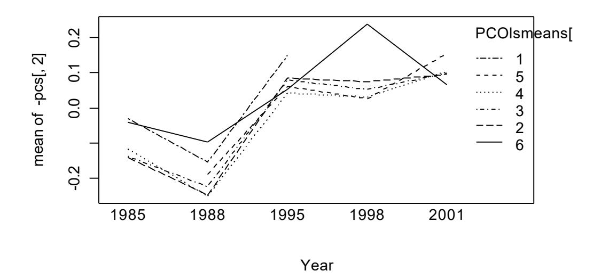

We can be reassured, the basic patterns revealed in the plots of the simple means are valid.

*Depth*

The variation in species composition with depth is shown in the distance matrix

|    | 1     | 3     | 6     | 9     | 12    |
|----|-------|-------|-------|-------|-------|
| 3  | 0.47  |       |       |       |       |
| 6  | 0.566 | 0.284 |       |       |       |
| 9  | 0.641 | 0.402 | 0.222 |       |       |
| 12 | 0.67  | 0.45  | 0.281 | 0.177 |       |
| 18 | 0.674 | 0.523 | 0.445 | 0.413 | 0.361 |

Species composition changes smoothly with depth, though the difference between 1 and 3 is particularly - though to an ecologist unsurprisingly – large.

The principal components plot shows the pattern clearly

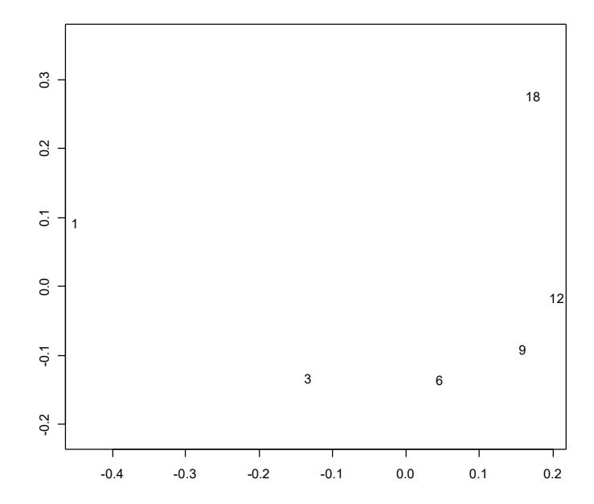

with the primary trend (PC1) being particularly clear

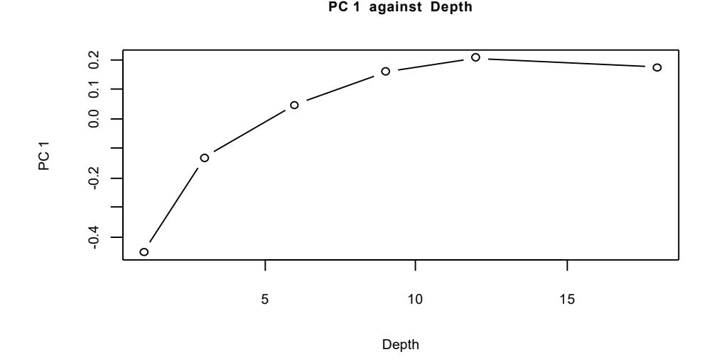

**PC 2 against Depth**

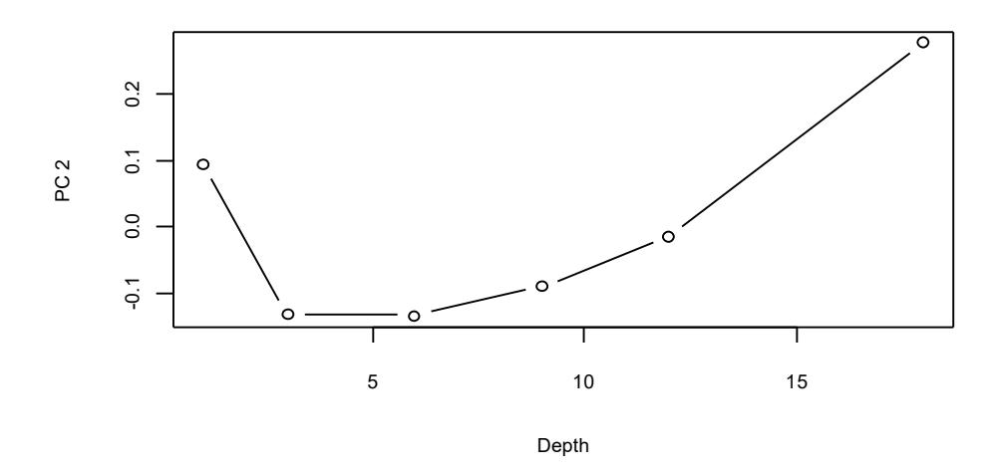

These two trends are almost identical to the corresponding coral plots. (The 18m point should not be trusted too far since it was only sampled in 1998 and 2001)

#### **Indicator species**

For the dominant trend (PC1) these are the top 10 fish. The species like *Chrysiptera.leucopoma* with negative correlations are shallow water fish whose incidence declines with depth. Those with positive signs (e.g. *Scarus.forsteni*) increase with depth.

| Chrysiptera.leucopoma  | -0.99  |
|------------------------|--------|
| Chaetodon.citrinellus  | -0.984 |
| Scarus.forsteni        | 0.98   |
| Acanthurus.achilles    | -0.977 |
| Chaetodon.trifasciatus | -0.975 |
| Halichoeres.marginatus | -0.969 |
| Stegastes.nigricans    | -0.964 |
| Pomacentrus.vaiuli     | 0.955  |
| Chrysiptera.cyanea     | -0.951 |
| Epinephalus.merra      | -0.945 |

#### For PC2

Those with negative signs have a greater incidence at intermediate depths. Those with positive signs like *Zanclus.cornutus* have a very interesting disjunct distribution with higher incidence in shallow and deeper water but lower incidence in intermediate depths.

| Zanclus.cornutus           | 0.963  |
|----------------------------|--------|
| Plectroglyphidodon.dickii  | -0.942 |
| Chaetodon.ephippium        | 0.919  |
| Scarus.pyrrhurus           | -0.916 |
| Thalassoma.quinquevittatum | -0.898 |
| Caesio.cuning              | -0.896 |

56

| Acanthurus.albipectoralis | -0.892 |
|---------------------------|--------|
| Halichoeres.hortulanus    | 0.853  |
| Parupeneus.bifasciatus    | -0.845 |
| Halichoeres.biocellatus   | 0.845  |

### *Depth\*site interaction*

The changes with depth vary over years, so we must check that the general pattern is more or less the same. The principal components of the depth means for the separate years shows the depth pattern is still quite clear.

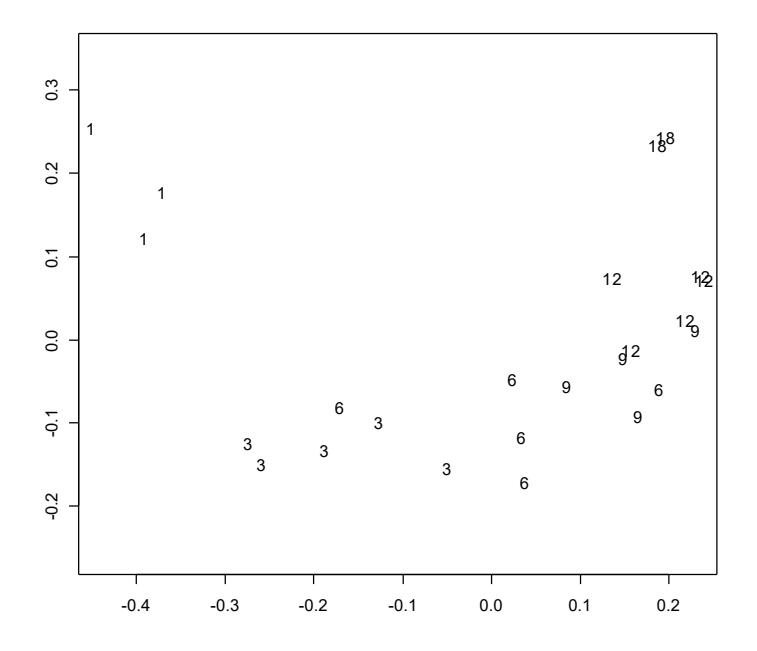

with the dominant trend being still quite simple

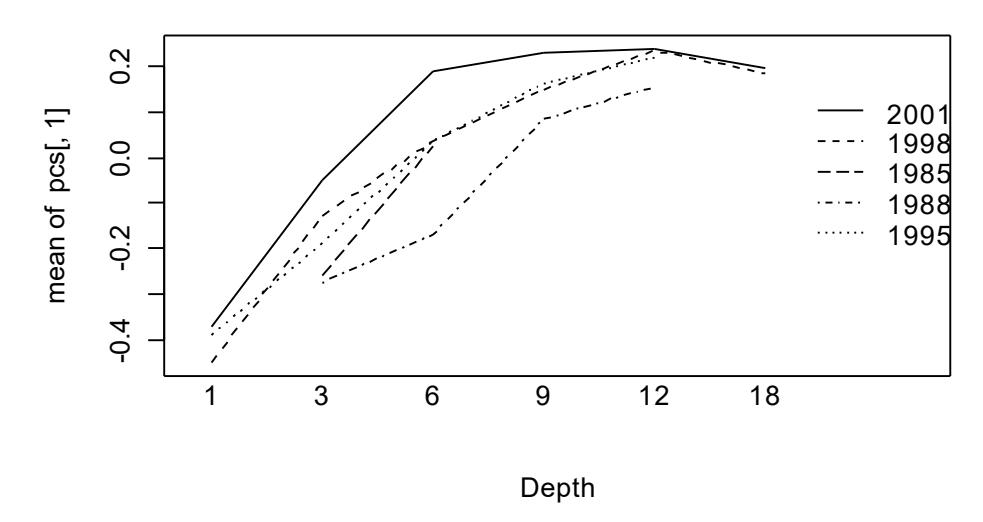

The time pattern is on the 3rd principal component

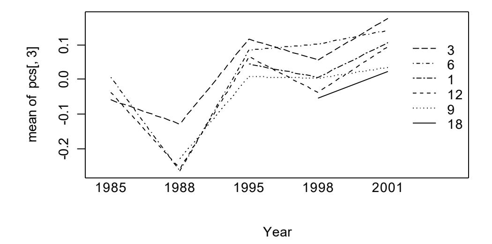

This suggests (and a glance at the respective distance matrices confirms it) that the depth changes in species composition are more extreme than the temporal ones. The difference between depths 1 and 18 is 67.4% of their species, the largest difference between years (between 2001 and 1988) is only 39%. The spatial differences between sites are comparable to those between years; the largest being 45% between sites 6 and 3. Such results are unsurprising, indeed they are reassuring, the data have clear signal that is entirely consistent with ecological expectations.

## **Abundance**

The abundance data were analysed using Gower's distance on transformed data. The transformation (explained in the statistical appendix) involved adding 0.1 to all zeros and then log10 transforming and adding 1.

i.e. log10(X+(X=0)\*0.1) +1

The interpretation of this distance is the average size of the difference between two sites, in orders of magnitude.

A multivariate NAOVA on the distance matrix detected differences between the sites (p<0.0005), year (p<0.0005) and depth (p<0.0005). The difference between years depended on the site (site\*year interaction p=0.003) and also on depth (depth\*year interaction p<0.0005)

### *Years*

The distance matrix describes the average differences between the years in orders of magnitude.

|      | 1985  | 1988  | 1995  | 1998  |
|------|-------|-------|-------|-------|
| 1988 | 0.503 |       |       |       |
| 1995 | 0.429 | 0.417 |       |       |
| 1998 | 0.492 | 0.447 | 0.347 |       |
| 2001 | 0.469 | 0.56  | 0.371 | 0.406 |

Clearly the 90s samples and 2001 are the most similar. Note that 1988 is out on its own (possibly due to the anomalous sampling protocol mentioned earlier). However it is worth noting the 1988 is more similar to 2001 than 1985 is. It is marginally less different from 1995 and 1998 than 1985 is. The real problem lies in the difference between 1985 and 1988, and between 1988 and 2001

These data can be approximately represented as:

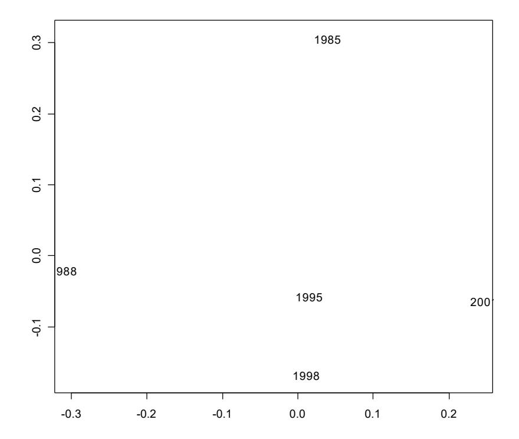

The dominant trend (Principal component 1 the x axis in the above plot) can be shown:

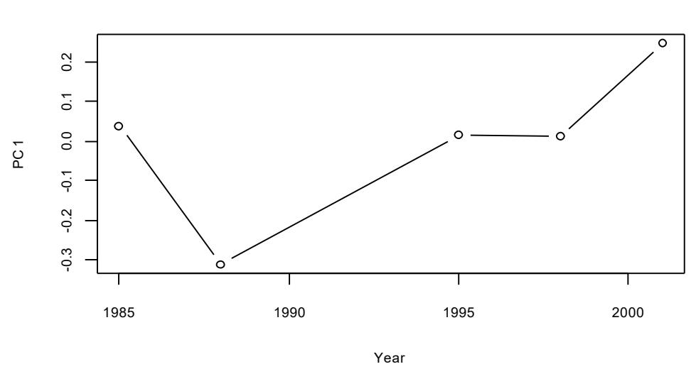

**PC 1 against Year**

1988 shows up again as anomalous. This may due to the sampling problems mentioned earlier. The main contrast being between 1988 and 2001.

If we drop the 1988 data point and repeat the analysis the dominant trend is now the contrast between 1985 and the rest.

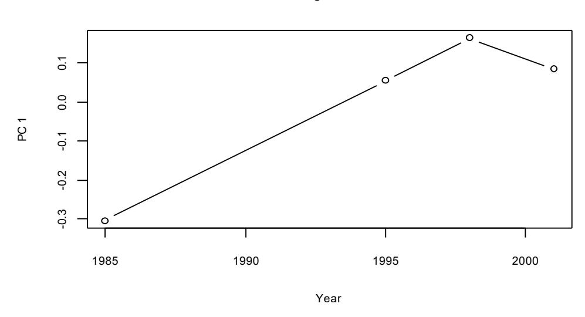

**PC 1 against Year**

Whether 1988 should be dropped form the analysis or not is equivocal. Consideration of the species that show little or no anomaly in 1988 might help us make the decision. These species showed little or no sign of the "88 effect".

*Stegastes fasciolatus, Stegastes nigricans, Chaetodon trifasciatus, Chrysiptera cyanea, Chrysiptera leucopoma, Chromis acares, Chromis amboinensis, Chromis iomelas, Labrid* juveniles*, Labroides rubrolabiatus, Paracirrhites arcatus, Plectroglyphidodon dickii, Plectroglyphidodon johnstonianus, Plectroglyphidodon lacrymatus, Pomacentrus brachialis, Pomacentrus vaiuli, Pseudocheilinus hexataenia, Thalassoma lutescens* all seem unaffected. Note the tendency for this to run in genera – why? Are these genera that the sampler was familiar with?

For the rest of the analysis of the Fagatele Fish data I have retained 1988 but checked to see if dropping it makes substantive differences to the conclusions.

### PC2 The second dominant trend between years was

**PC 2 against Year**

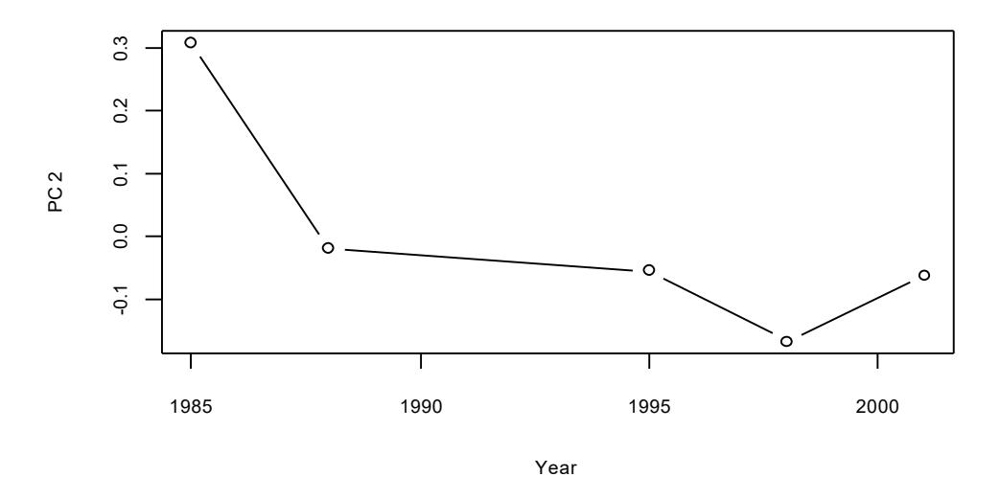

1985 against the rest.

#### **Indicator species**

The dominant trend in the data (PC1:1988 against 2001) is associated with the following species.

| Zebrasoma.scopas          | 0.963  |
|---------------------------|--------|
| Parupeneus.multifasciatus | 0.956  |
| Labroides.dimidiatus      | 0.944  |
| Chaetodon.reticulatus     | 0.943  |
| Chaetodon.ephippium       | 0.927  |
| Gomphosus.varius          | 0.9    |
| Chromis.agilis            | 0.883  |
| Gnathodentax.aurolineatus | 0.872  |
| Ctenochaetus.strigosus    | 0.865  |
| Scarus.niger              | 0.864  |
| Labrid.juveniles          | -0.848 |

A positive correlation indicates a larger value in 2001, a negative one (e.g. Labrid.juveniles) indicates a group that was higher in 1988.

#### PC2

The second major trend (1985 versus the rest) is associated with these species

| Cheilinus.oxycepthalus   | 0.95   |
|--------------------------|--------|
| Chromis.acares           | -0.948 |
| Cheilinus.unifaciatus    | 0.833  |
| Paracirrhites.hemisticus | -0.833 |
| Scarus.rubroviolaceus    | -0.825 |
| Monotaxis.grandoculis    | 0.824  |
| Thalassoma.lutescens     | 0.819  |

62

| Anampses.twistii              | 0.777 |
|-------------------------------|-------|
| Stegastes.fasciolatus         | 0.769 |
| Plectroglyphidodon.lacrymatus | 0.767 |

Positive values (e.g. *Cheilinus.oxycepthalus*) indicate species that were more numerous in 1985. Negative values (e.g. *Chromis.acares*) show species that were low then and which then increased.

### *Sites*

|   | 1     | 2     | 3     | 4     | 5     |
|---|-------|-------|-------|-------|-------|
| 2 | 0.501 |       |       |       |       |
| 3 | 0.547 | 0.239 |       |       |       |
| 4 | 0.524 | 0.275 | 0.194 |       |       |
| 5 | 0.451 | 0.366 | 0.374 | 0.331 |       |
| 6 | 0.428 | 0.608 | 0.66  | 0.626 | 0.498 |

Overall the differences between the sites are generally comparable to those between years.

Clearly 2 and 3 are very similar while 1 and 6 are moderately different from each other but even more different from the others.

The pattern is clear in the reduced space plot

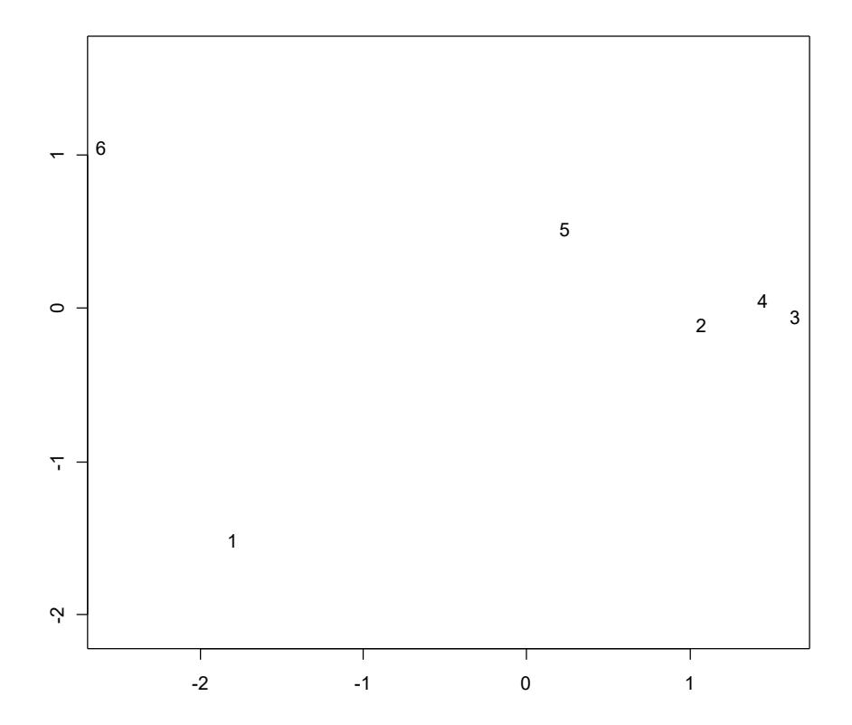

The dominant trend is clear

**PC 1 against Site**

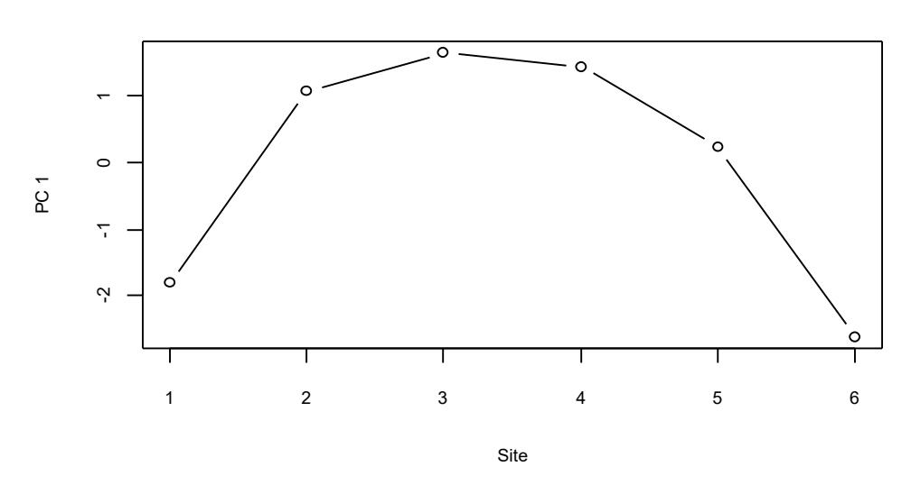

The same pattern as we observed earlier, for the coral and the species composition.

PC2

**PC 2 against Site**

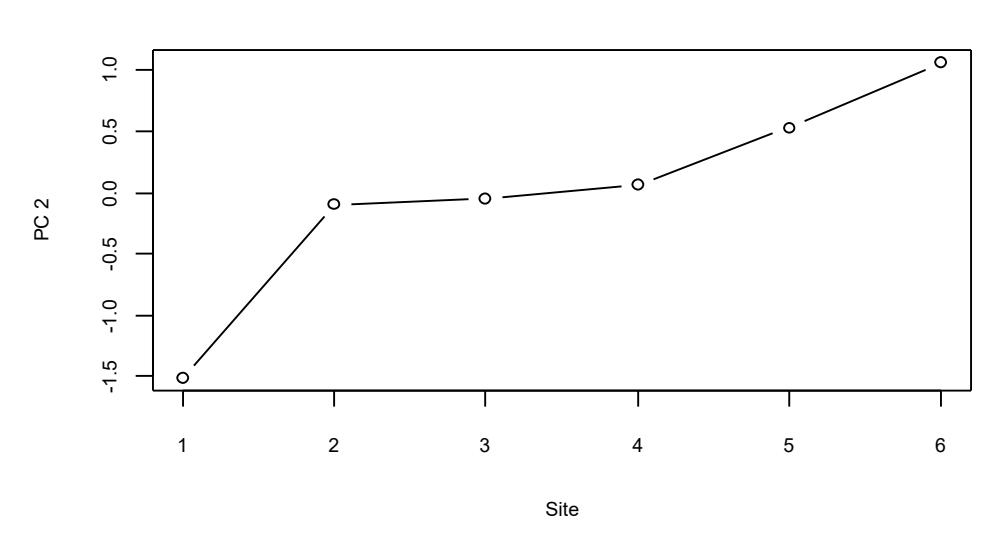

The second principal component shows the trend along the coast, given the small spatial scale of the study area it may be difficult to identify the environmental gradient this reflects.

#### **Indicator species**

PC1

| Zanclus.cornutus         | -0.987 |
|--------------------------|--------|
| Thalassoma.amblycephalum | -0.981 |
| Zebrasoma.scopas         | 0.981  |

| Halichoeres.hortulanus           | -0.981 |
|----------------------------------|--------|
| Ctenochaetus.striatus            | 0.968  |
| Plectroglyphidodon.lacrymatusLSM | 0.967  |
| Chromis.vanderbiliti             | -0.966 |
| Parapercis.clathrata             | -0.966 |
| Cheilinus.oxycepthalus           | 0.965  |
| Thalassoma.quinquevittatum       | -0.96  |

Positive values (e.g. *Zebrasoma.scopas*) indicate species that appear to prefer the sheltered interior of the bay; negative values (e.g. *Zanclus.cornutus*) identify species favouring the exposed sites.

#### PC2

| Forcipiger.flavissimus    | -0.933 |
|---------------------------|--------|
| Halichoeres.biocellatus   | 0.9    |
| Melichthys.vidua          | -0.894 |
| Cephalopholis.argus       | -0.875 |
| Chrysiptera.cyanea        | 0.874  |
| Naso.literatus            | 0.858  |
| Pempheris.oualensis       | -0.812 |
| Gnathodentax.aurolineatus | -0.803 |
| Dascyllus.trimaculatus    | -0.802 |
| Cantherhinus.dumerilii    | -0.776 |

Negative values (e.g. *Forcipiger.flavissimus*) identify species associated with site 1 declining from there to site 6. Positive values (e.g. *Halichoeres.biocellatus* ) suggest the opposite trend.

### *Depth*

|    | 1     | 3     | 6     | 9     | 12    |
|----|-------|-------|-------|-------|-------|
| 3  | 0.68  |       |       |       |       |
| 6  | 0.824 | 0.409 |       |       |       |
| 9  | 0.946 | 0.598 | 0.319 |       |       |
| 12 | 0.978 | 0.666 | 0.411 | 0.26  |       |
| 18 | 1.013 | 0.79  | 0.652 | 0.595 | 0.518 |

The most obvious feature of this distance matrix is the size of the difference between some of the depths. The average difference per species between the shallow and deep samples is around an order of magnitude - considerably larger than any differences found in space or time.

This pattern can be approximated:

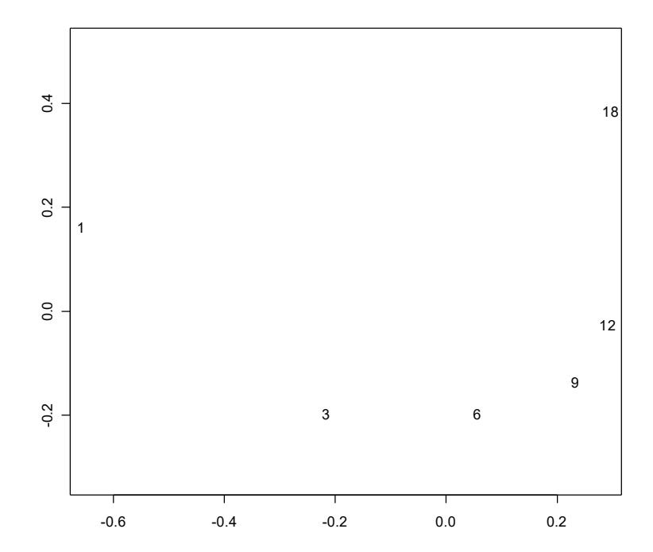

The dominant trend PC1 is

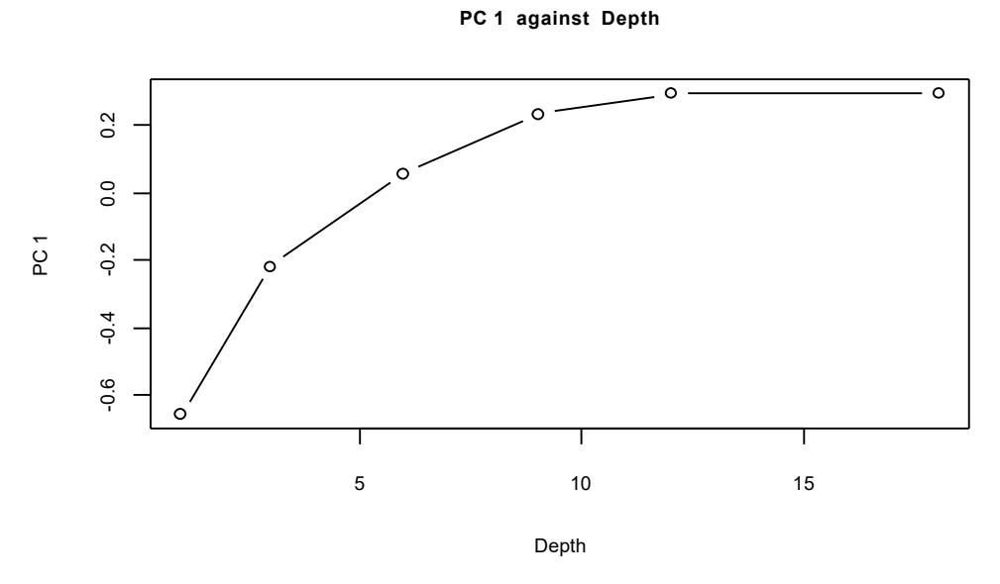

This is self explanatory.

The secondary trend (PC2 identifies the trend of species that are more abundant at intermediate depths.

**PC 2 against Depth**

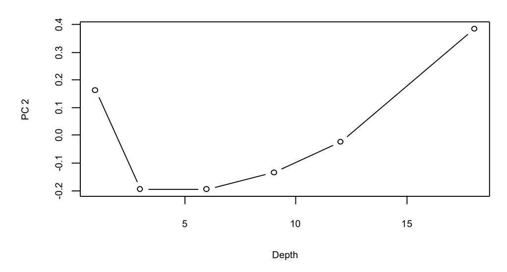

#### **Indicator species**

#### PC1

The "top 10" are:

| Scarus.forsteni        | 0.982  |
|------------------------|--------|
| Acanthurus.achilles    | -0.974 |
| Chrysiptera.leucopoma  | -0.971 |
| Chrysiptera.cyanea     | -0.971 |
| Halichoeres.marginatus | -0.965 |
| Thalassoma.hardwicke   | -0.954 |
| Stegastes.nigricans    | -0.953 |
| Acanthurus.lineatus    | -0.949 |
| Balistapus.undulatus   | 0.948  |
| Chaetodon.trifasciatus | -0.945 |

Positive values (e.g. *Scarus.forsteni*) seem to be deeper water species, negative values (e.g. *Acanthurus.achilles*) - shallow water.

### PC2

| Plectroglyphidodon.dickii  | -0.96  |
|----------------------------|--------|
| Chaetodon.ephippium        | 0.952  |
| Zanclus.cornutus           | 0.929  |
| Scarus.pyrrhurus           | -0.896 |
| Chaetodon.ornatissimus     | -0.844 |
| Labroides.dimidiatus       | -0.839 |
| Thalassoma.quinquevittatum | -0.836 |
| Labroides.rubrolabiatus    | -0.826 |
| Acanthurus.nigricans       | -0.822 |
| Halichoeres.biocellatus    | 0.809  |

67

Negative values (e.g. *Plectroglyphidodon.dickii*) identify species that appear to favour intermediate depths. Positive values pick out those interesting species that appear to have higher densities at both the shallow and deeper waters but lower in between (e.g. *Chaetodon.ephippium*, or *Zanclus.cornutus* ). There are a number of possible explanations involving competition and/or predation (and no doubt others are possible).

### *Site\*year interactions*

To confirm that the above interpretations are valid the significant interactions must be checked. The principal components of the separate site\*year means were analysed.

PC1 was associated with the between site variation.:

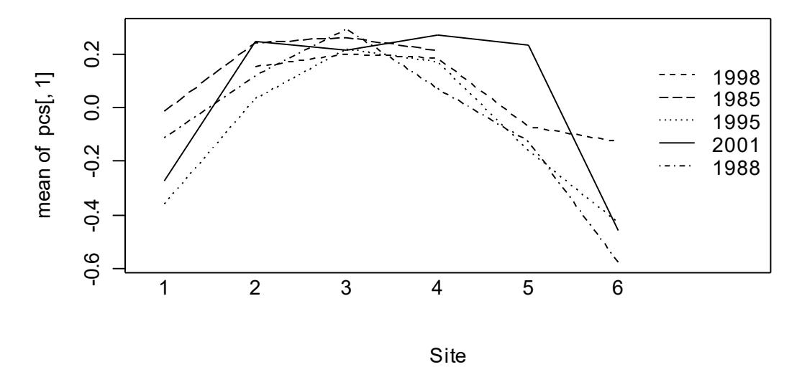

The site patterns may vary between years but they are clearly similar enough not to disturb the above interpretation

The year variation was on PC2:

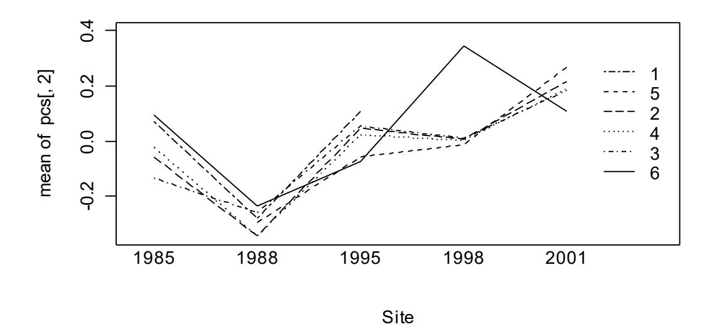

Though the mean for Site 1 in 2001 is not plotted (the 1998 mean was not estimable) it is the highest for that year at 3.48. Clearly the basic pattern of years is reaffirmed.

### *Depth\*year interactions*

We must also check the other significant interactions:

The first PC reproduces the basic depth pattern.

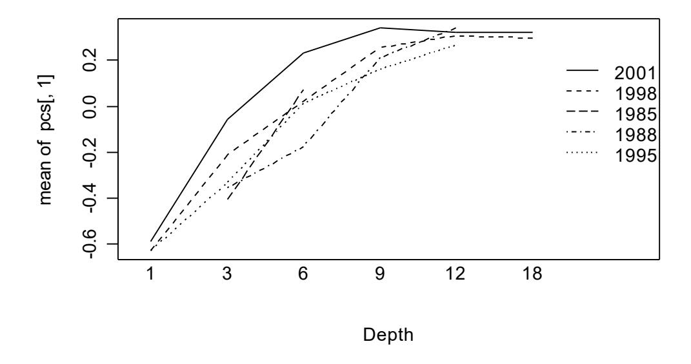

PC2 reproduces the second depth trend:

69

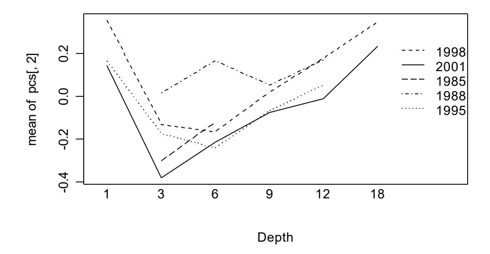

The time pattern is on PC3 (it is a less important trend than depth as we noted before)

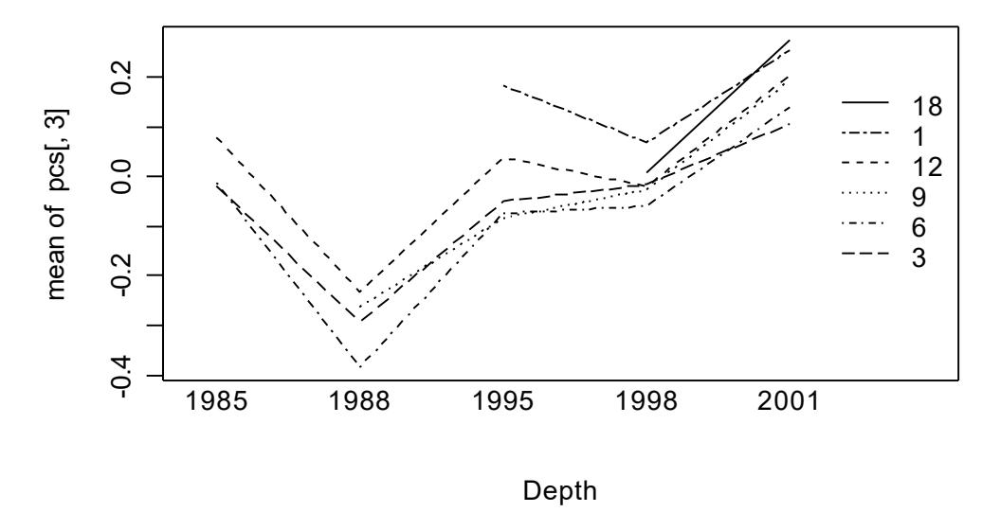

Clearly there is nothing in these interactions to lead us to change the interpretation of the basic trends.

## *Tutuila*

### **Coral**

## **Design**

Though over the years a total of 17 sites have been sampled, only the years 1995-2001 are available in machine readable form, which leaves 7 sites which have been sampled at least twice during that time. To these I have added two sites from Fagatele Bay which were consistently sampled over the 3 years at the two relevant depths. This give 9 sites with 2 or more years, 3 complete (probably at opposite ends of the "health" spectrum.

The final data set: 151spp

|      |         |        |   |   |                          | Masefau |     | Massacre |           |
|------|---------|--------|---|---|--------------------------|---------|-----|----------|-----------|
| Aua  | Fagafue | Fagasa |   |   | Fagatele3 Fagatele5 Fatu | Inside  | Bay |          | Rainmaker |
| 1995 | 0       | 2      | 2 | 2 | 2                        | 2       | 2   | 2        | 2         |
| 1998 | 1       | 1      | 2 | 2 | 2                        | 0       | 1   | 1        | 2         |
| 2001 | 2       | 0      | 0 | 2 | 2                        | 2       | 2   | 0        | 2         |

## **Species numbers**

Only the Year (p=0.0005) and Site (p=0.026) differences were statistically significant.

The difference between years shows the same pattern as the Fagatele data – a drop in species diversity between 1998 and 2001.

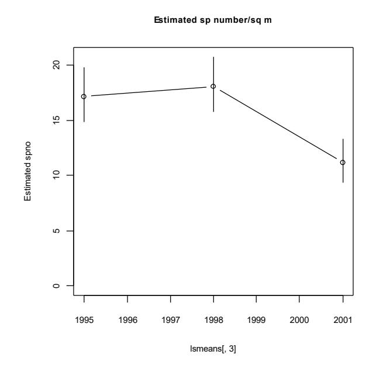

To confirm the credibility of this pattern we can examine the individual sites:

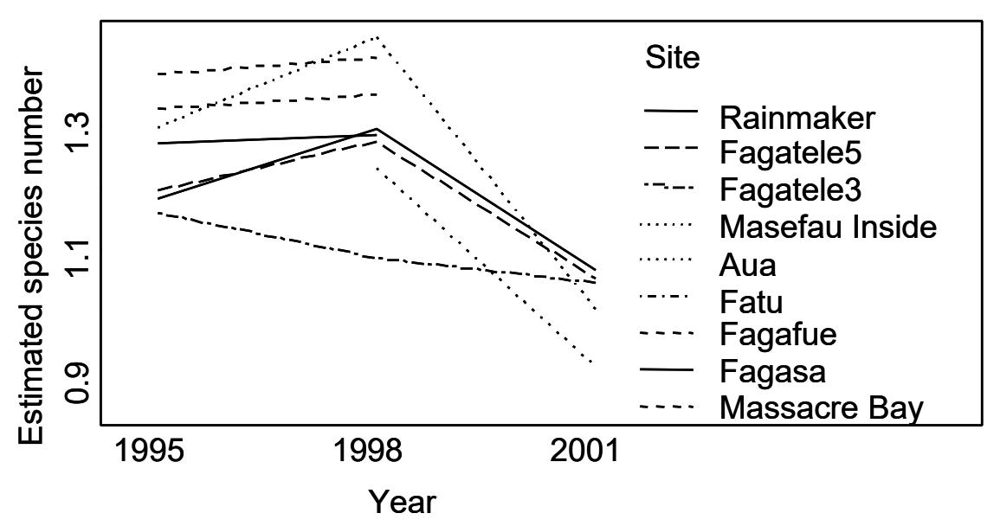

The pattern is clearly present at all the sites for which data are available. It is worth noting that the largest drop off is at Masefau Inside; as will be seen later this where the largest increase in coverage by large coral occurred. Suggesting that the drop in species may be related (at least in part) to increased competition for space (or light). The difference between sites:

#### **Estimated sp number/sq m**

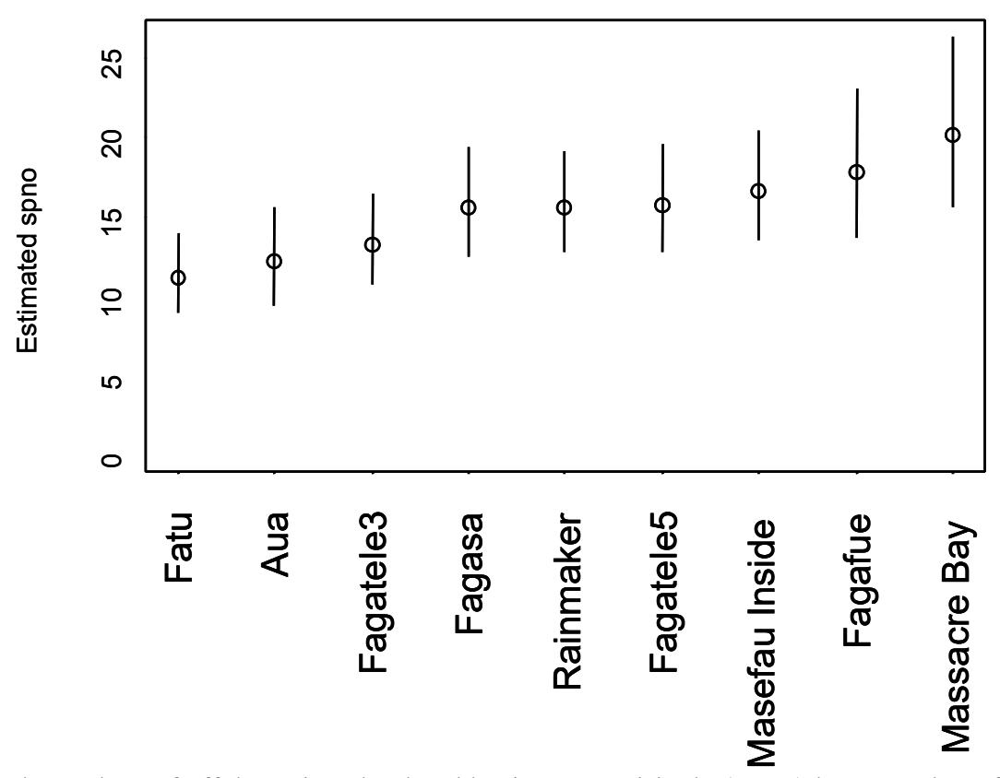

shows the reef off the Rainmaker hotel having a surprisingly (to me) large number of species.

## **Total Density**

There were significant differences between sites and years in total density of colonies  $(nos m^{-1})$ 

The plot of changes in the estimated density over years


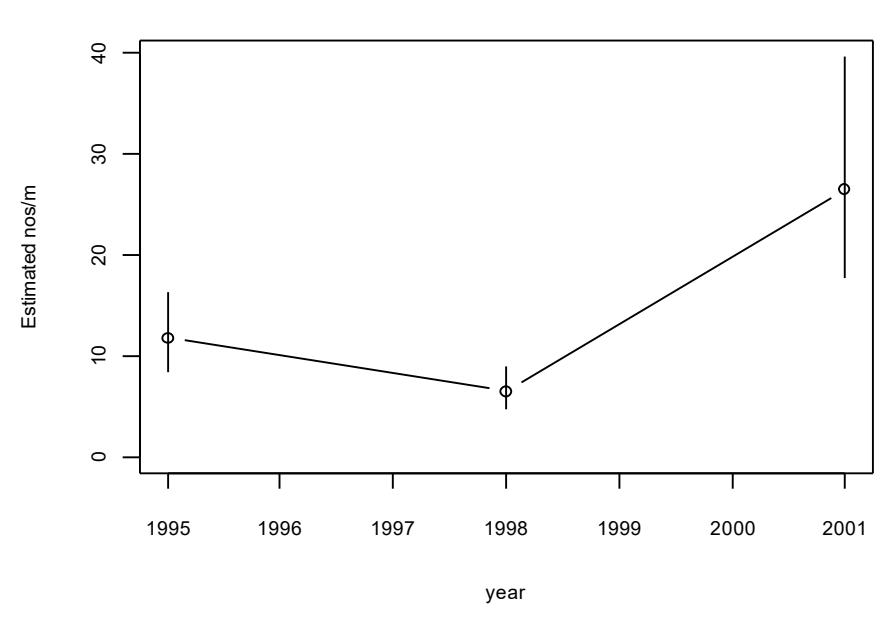

shows the expected increase in density between 1998 and 2001 – in all probability the recovery phase after the hurricanes. The temporal pattern is similar among sites (or at least those that were sampled in 2001) except possibly for Fagasa.

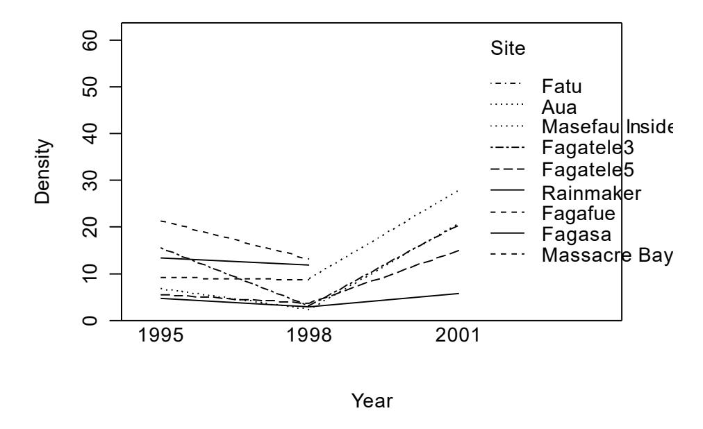

Fatu (because it was not sampled in 1998 is not plotted, it's mean value of 50 colonies m<sup>-2</sup> in 2001 is remarkable; with, as we shall see, large numbers of very small colonies (particularly of *Porites lichen*)

#### **Estimated Density**

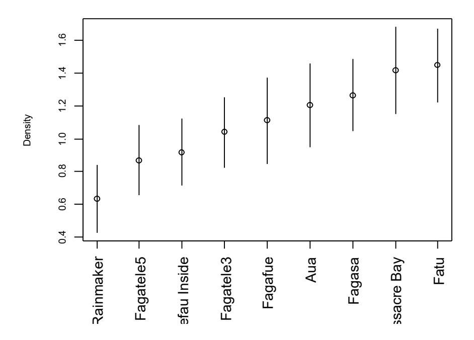

While there are clear differences between sites, the pattern in number of colonies per square metre is not easy to interpret. Rainmaker has a relatively low density, as might be expected; but Fatu, which is also generally considered part of the impacted harbour region, has the highest density of all.

## Coverage

The only detectable effect is the differences between the years (p=0.009).

#### Estimated coverage sq m per sq m

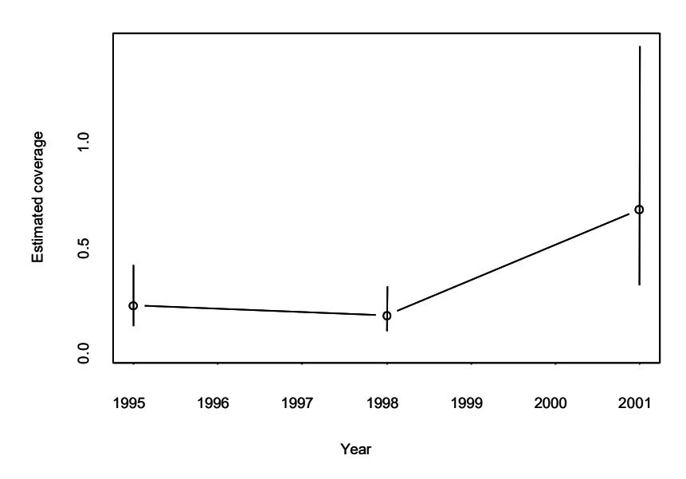

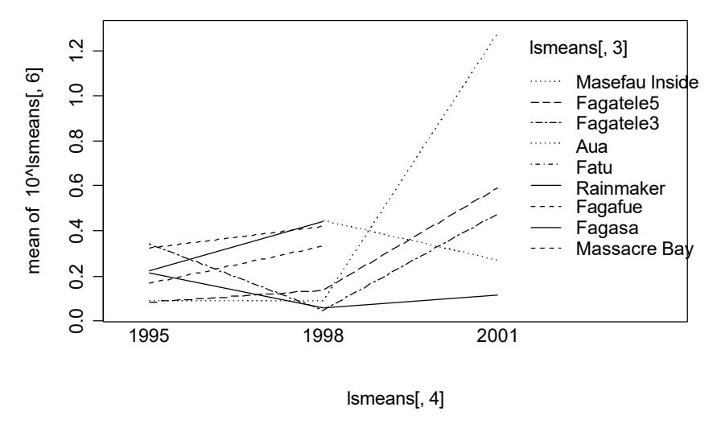

It is noticeable that the Pago harbour sites have not shown the growth in corals that happened at the other sites. Fatu, again not plotted had a mean coverage of 0.258 putting it with Rainmaker and Aua, the sites that do not seem to be showing much increase in coral cover. It is a pity that so few of the long term sites were sampled in 2001.

## **Species composition**

Using the multivariate ANOVA on Jaccards distance there are detectable differences between years (p=0.005), between sites (p<0.005), and possibly between depths (p=0.06).

The corrected means in multivariate space can be calculated and displayed in fewer dimensions through a Principal Component Analysis on the means of the full set of Principal Coordinates, though confidence intervals are currently impossible.

### *Years*

The estimated means in Jaccards space were calculated for years.

The distances between the means are:

|      | 1995  | 1998  |
|------|-------|-------|
| 1998 | 0.244 |       |
| 2001 | 0.462 | 0.463 |

2001 was clearly different to the other two years. There has clearly been a major shift in species composition 46% of the species are different between 1998 and 2001. When the major trend in the data is plotted:

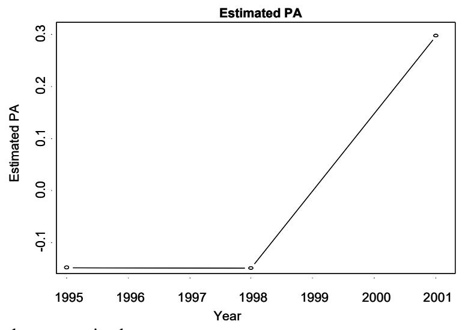

the pattern is clear.

#### **Indicator species**

The species that showed the greatest proportional change in their probability of detection

| Montipora.efflorescens | 0    |             | 0 0.417 |
|------------------------|------|-------------|---------|
| Montipora.informis     | 0    |             | 0 0.333 |
| Montipora.corbettensis | 0    | 0           | 0.25    |
| Montipora.sp           | 0    | 0           | 0.25    |
| Pocillopora.juvenile   | 0    | 0           | 0.25    |
| Pocillopora.elegans    | 0.25 | 0.25        | 0       |
| Porites.sp.2           | 0.25 | 0.25        | 0       |
| Montipora.ehrenbergii  |      | 0.562 0.667 | 0       |
| Montipora.verrilli     |      | 0.812 0.667 | 0       |

Some species appear in 2001 after not being detected in this data set before, while others vanish.

*Sites* The distance matrix is

|                | Aua   | Fagafue | Fagasa |       | Fagatele3 Fagatele5 Fatu |       | Masefau<br>Inside | Massacre<br>Bay |
|----------------|-------|---------|--------|-------|--------------------------|-------|-------------------|-----------------|
| Fagafue        | 0.602 |         |        |       |                          |       |                   |                 |
| Fagasa         | 0.545 | 0.46    |        |       |                          |       |                   |                 |
| Fagatele3      | 0.607 | 0.586   | 0.565  |       |                          |       |                   |                 |
| Fagatele5      | 0.635 | 0.545   | 0.544  | 0.4   |                          |       |                   |                 |
| Fatu           | 0.543 | 0.588   | 0.55   | 0.508 | 0.518                    |       |                   |                 |
| Masefau Inside | 0.492 | 0.523   | 0.463  | 0.461 | 0.531                    | 0.508 |                   |                 |
| Massacre Bay   | 0.531 | 0.387   | 0.383  | 0.577 | 0.533                    | 0.552 | 0.483             |                 |
| Rainmaker      | 0.469 | 0.606   | 0.539  | 0.577 | 0.599                    | 0.564 | 0.461             | 0.558           |

Clearly all the sites are different in their species composition – the most similar pair of sites (the neighbouring Massacre Bay and Fagasa Bay) share only 62% of their recorded species.

If we compare the values between sites we see that they are generally larger than those between years.

The dominant trends between the sites can be approximated by the plot on Principal Components 1 and 2. The similarity of the north west sites Fagasa, Fagafue, and Massacre Bay are obvious – hardly surprising - they are all close neighbours The two Fagatele Bay sites are also, unsurprisingly, associated together. The harbour sites Aua and Rainmaker are associated, and Masefau Inside and Fatu linger in the middle. Fatu is not really that close to Masefau Inside – a glance at the distance matrix shows that – but this plot reproduces the rest of the distances fairly well.

The biogeographic effects clearly dominate, though to some extent they are inseparable from anthropogenic impacts – the harbour sites could be expected to come out together for a number of reasons, including impacts. That the north western sites come out so separate is reassuring though that Masefau is more similar to Fagatele3 and Rainmaker than to the other north coast sites is perhaps a bit of surprise. Though this may be related to differences in other environmental variables like exposure. Extra information about exposure at the sample sites would be useful.

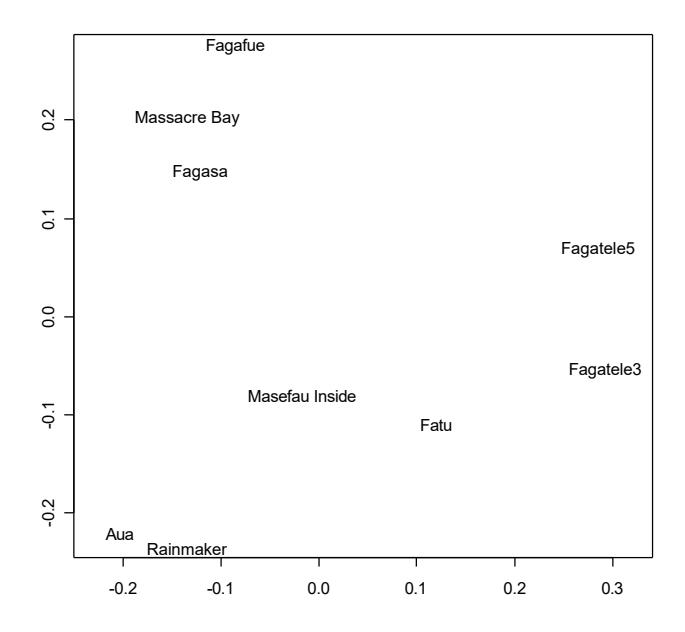

#### **Indicator Species**

These are the top 10 species associated with the dominant trend (PC1 the x axis), contrasting the Harbour sites with Fagatele Bay.

| Acropora.crateriformis  | 0.883  |
|-------------------------|--------|
| Leptastrea.purpurea     | -0.855 |
| Montipora.grisea        | -0.853 |
| Pavona.varians          | -0.85  |
| Acropora.gemmifera      | 0.838  |
| Porites.sp.2            | 0.833  |
| Psammocora.neirstraszi  | 0.799  |
| Echinopora.hirsutissima | 0.736  |
| Acropora.ocellata       | 0.728  |

Stylocoeniella.armata 0.719

Positive correlations indicate species that have a lower incidence at the harbour sites and high incidence at Fagatele Bay (sites 5 and 3). Negative correlations identify species present in more samples in the harbour, less at Fagetele.

The second trend (PC2, the y axis), that separates the north eastern sites is associated with these species (the top 10)

| Montastraea.curta      | 0.881  |
|------------------------|--------|
| Acropora.hyacinthus    | 0.846  |
| Acropora.digitifera    | -0.812 |
| Pocillopora.eydouxi    | 0.809  |
| Pocillopora.danae      | -0.773 |
| Millepora.dichotoma    | -0.732 |
| Millepora.tuberosa     | -0.731 |
| Porites.lutea          | -0.718 |
| Pocillopora.damicornis | -0.714 |
| Montipora.monasteriata | 0.709  |

Positive correlations (like *Montastraea.curta* ) are more likely to be present at the north western group of sites. Others (like *Pocillopora.danae*) are less likely.

### Species abundance (coverage).

Within species the changes in coverage are so huge between 1998 and 2001 that the data must be transformed to allow analysis of the between year patterns. I converted the data to cm<sup>2</sup> per m<sup>2</sup> and did a log(X+1) transformation and Gower's unstandardised distances (for reasons explained in Appendix 1).

Using Multivariate ANOVA on the Gower's distance matrix there were detectable differences between years (p<0.0005), between sites (p<0.005), and probably between depths (p=0.092 though this is not statistically significant). There were no detectable interaction effects (site\*year p0.206, site:depth p=0.192, year\*depth p=0.675).

#### **Years**

The distance matrix though less biologically interpretable than the species composition matrices still shows relative similarity in the abundance patterns across species. Once again there is major shift between 1998 and 2001.

|      | 1995  | 1998  |
|------|-------|-------|
| 1998 | 0.698 |       |
| 2001 | 1.5   | 1.422 |

The major trend in the data is the same as usual.

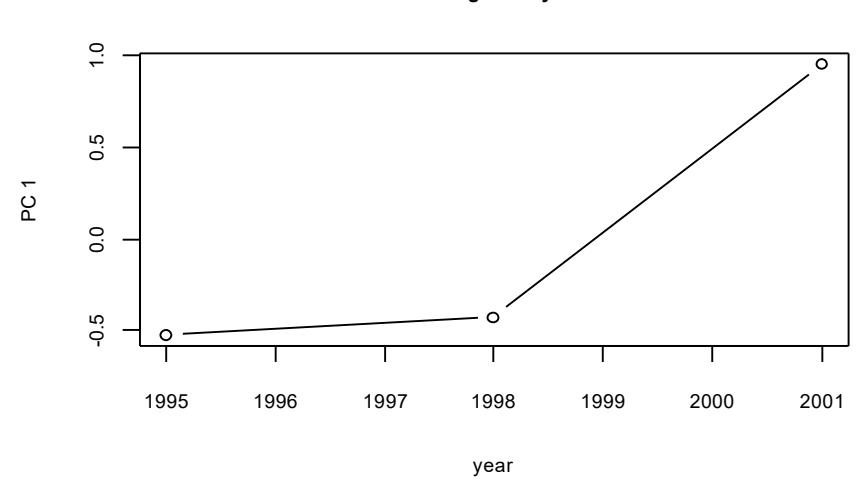

PC 1 against year

#### **Indicator species**

The species that showed this pattern in coverage (here expressed as cm<sup>2</sup> per m<sup>2</sup>) most clearly were:

|                        | 1995   | 1998    | 2001    |
|------------------------|--------|---------|---------|
| Montipora.informis     | 0      | 0       | 285.921 |
| Montipora.corbettensis | 0      | 0       | 85.842  |
| Montipora.efflorescens | 0      | 0       | 24.602  |
| Montipora.verrilli     | 176.41 | 220.836 | 0       |
| Acropora.irregularis   | 28.089 | 32.442  | 0       |
| Porites.cylindrica     | 3.782  | 4.651   | 399.855 |
| Pavona.collines        | 0.209  | 0       | 49.959  |

| Porites.lichen          | 1.058  | 0      | 81.496  |
|-------------------------|--------|--------|---------|
| Echinopora.hirsutissima | 16.982 | 9.3    | 119.929 |
| Montipora.grisea        | 84.746 | 31.661 | 933.684 |
| Acropora.hyacinthus     | 27.608 | 48.531 | 201.165 |

Some of the species (for example *Montipora.grisea*, *Montipora informis or Porites.cylindrica*) increased massively in coverage between 1998 and 2001. Others like *Montipora.verrilli Acropora.irregularis* (and also *Millepora.platyphylla Montipora.ehrenbergii* not in this list) and disappear so abruptly that one must wonder about identification problems or nomenclature changes.

### *Sites*

|                |       |         |        |       |                          |       | Masefau | Massacre |
|----------------|-------|---------|--------|-------|--------------------------|-------|---------|----------|
|                | Aua   | Fagafue | Fagasa |       | Fagatele3 Fagatele5 Fatu |       | Inside  | Bay      |
| Fagafue        | 2.425 |         |        |       |                          |       |         |          |
| Fagasa         | 2.213 | 1.597   |        |       |                          |       |         |          |
| Fagatele3      | 2.351 | 2.218   | 2.069  |       |                          |       |         |          |
| Fagatele5      | 2.26  | 1.845   | 1.862  | 1.568 |                          |       |         |          |
| Fatu           | 2.069 | 2.158   | 2.08   | 2.014 | 2.045                    |       |         |          |
| Masefau Inside | 2.217 | 1.98    | 1.755  | 1.648 | 1.703                    | 2.115 |         |          |
| Massacre Bay   | 2.35  | 1.514   | 1.538  | 2.312 | 2.006                    | 2.284 | 2.125   |          |
| Rainmaker      | 1.756 | 2.281   | 2.089  | 1.731 | 1.708                    | 1.711 | 1.76    | 2.422    |

Once again the biogeographic variation seems to dominate: the north west bays come out together, the Pago Harbour sites together, and Fagatele sites (with Masefau). Rainmaker however is as similar (from the distance matrix) to the two Fagatele Bay sites and Masefau Inside as to the other harbour sites. Information about degree of exposure might help explain this. It is of course possible that the gradient from bottom left to top right in the plot below could be related to presence or absence of impacts.

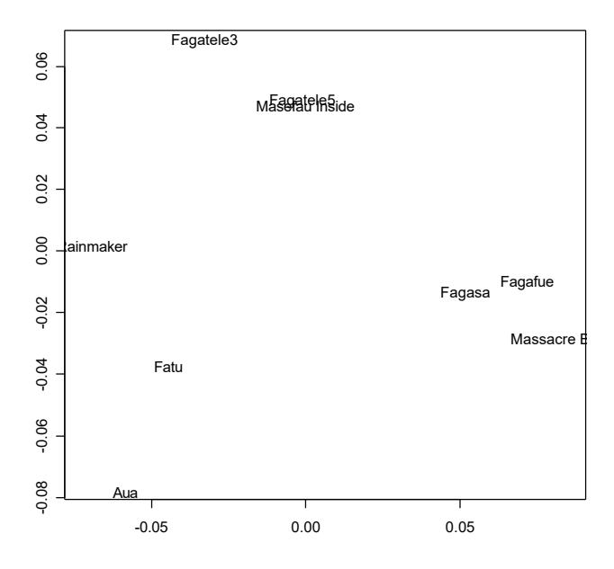

Individually the two major trends are:

1) Mainly biogeographic, again identifying the north-eastern group as separate.

#### **PC 1 against site**

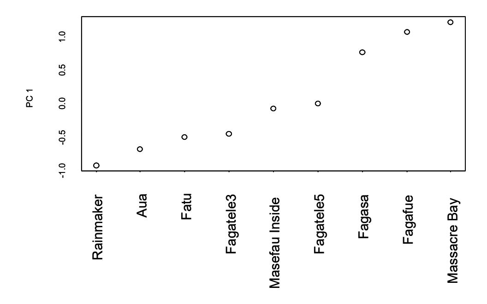

2) Possibly health related contrasting Fagetele and Masefau sites versus the rest. Note the position of the Rainmaker site.

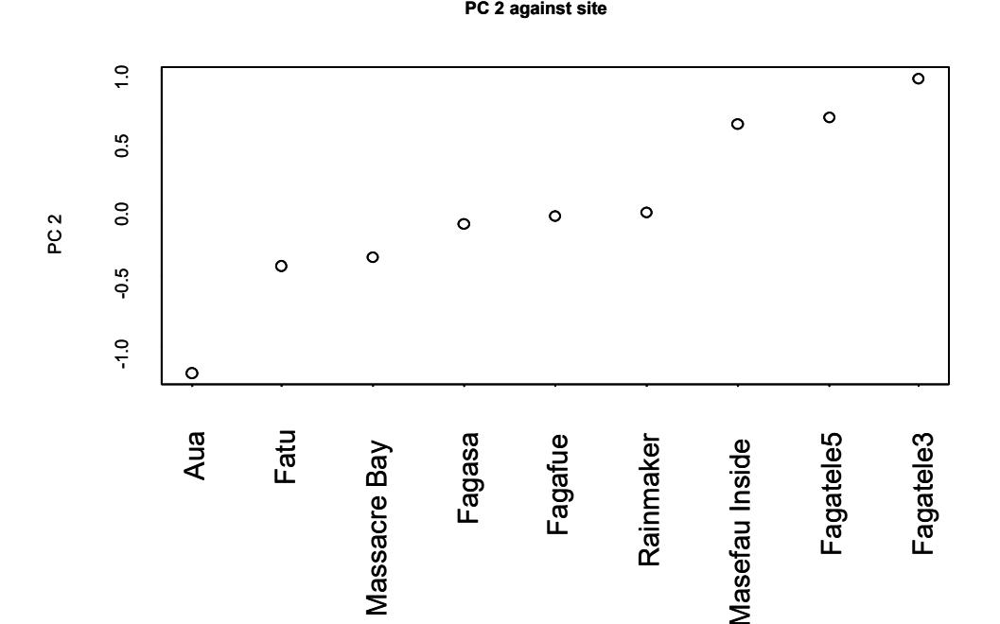

#### **Indicator species**

For PC1 (northeastern sites versus the rest).

A positive sign means this species (e.g. *Montastrea.curta*) is relative greater coverage in the northeastern sites. A negative sign (e.g. *Pocillopora.danae, Pocillopora.damicornis*) have more in the harbour sites. Clearly most of the species have more coverage in the northeastern sites compared with the harbour.

| Montastrea.curta       | 0.932  |
|------------------------|--------|
| Acropora.hyacinthus    | 0.884  |
| Montipora.verrilli     | 0.874  |
| Pocillopora.eydouxi    | 0.848  |
| Montipora.ehrenbergii  | 0.791  |
| Pocillopora.danae      | -0.772 |
| Pocillopora.damicornis | -0.653 |
| Montipora.monasteriata | 0.726  |
| Montipora.elschneri    | 0.707  |
| Montipora.grisea       | 0.7    |

#### PC2.

These species are associated with the contrast between Fagatele and Masefau Bays and the rest of the sites:

| Acropora.nana          | -0.821 |
|------------------------|--------|
| Pocillopora.verrucosa  | -0.789 |
| Acropora.crateriformis | 0.734  |
| Porites.annae          | 0.698  |
| Acropora.gemmifera     | 0.623  |
| Montipora.sp2          | -0.61  |

Positive values (e.g. *Acropora.crateriformis*) tends to have higher coverage in Fagatele Bay, negative values tend to have lower.

### *Depth*

Though it is not significant the difference between the two depths is 0.763, not large compared with the geographic distances (or even the difference between 2001 and the other years).

The species with the largest differences

#### **Indicator species**

The species with the largest changes with depth:

|                         | 2m     | 6m      |
|-------------------------|--------|---------|
| Montipora.grisea        | 197.91 | 477.002 |
| Porites.cylindrica      | 3.166  | 269.163 |
| Porites.sp2             | 19.957 | 189.867 |
| Diploastrea.heliopora   | 0      | 166.858 |
| Porites.rus             | 12.329 | 154.429 |
| Echinopora.hirsutissima | 1.572  | 99.327  |
| Goniastrea.retiformis   | 69.944 | 139.975 |
| Montipora.monasteriata  | 20.41  | 61.402  |
| Montipora.corbettensis  | 8.754  | 46.529  |
| Pavona.varians          | 5.211  | 42.794  |

#### **Fish**

Because the data for the fish survey for 2001 were not available, and the data from the earliest sampling occasions have not yet been entered into the computer, I am restricted to analysing only data from 1995 and 1998, for the two depths 3 and 6. I added the corresponding depths and years of the two Fagatele Bay sites 3 and 5.

### **Species numbers**

There were significant differences between sites (p=0.008) and between depths (p=0.003). The pattern was complicated by significant site\*year (p=0.0355) and year\*depth (p=0.016) interactions showing that differences between sites depended on the year, and differences between the depth 3m and 6m depended on year.

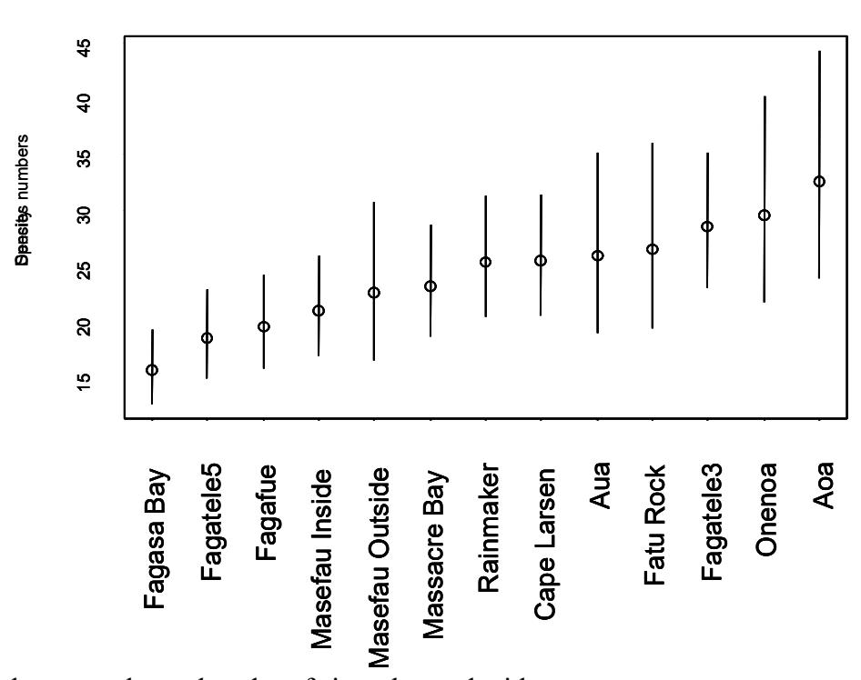

however the rank order of sites changed with year.

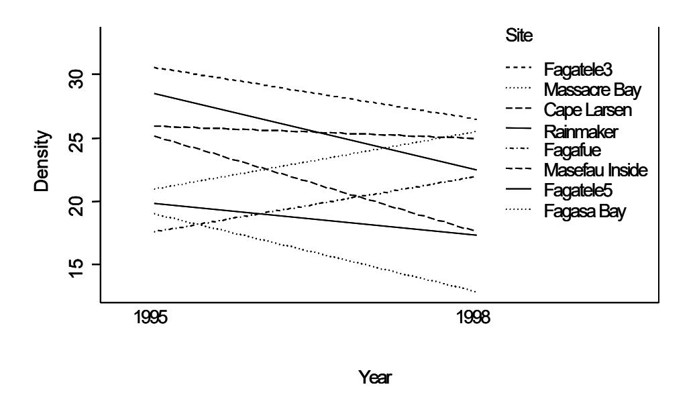

#### Depth

The average number of species increased with depth (21.3 species /transect at 3m, 26.3 at 6m), and the interaction of depth with year did not change this overall conclusion.

#### **Total Fish Count**

There were significant differences between sites (p=0.012) though these differences varied between the years (site\*year interaction p= 0.029). There was no detectable simple difference between years (p=0.159). There was a depth effect (p= 0.0015) though that varied between sites (site\*depth interaction p=0.016)

#### Sites

The averages over the 2 years identify the north western cluster of sites as having lower than average counts over this period relative to the other sites. However such differences in total counts can be influenced by the distribution of the most abundant species (like *Ctenochaetus.striatus*) whose values over such a short period of time my by influenced by recruitment or other cohort effects. Perhaps a longer period might get a better picture, though any data set without the higher densities expected from the regenerating reefs in 2001 would necessarily give a picture of a pathological state that did not reflect the real differences between sites that can be expected after regeneration has occurred. The clear spatial patterns seen in the coral data depended heavily on the 2001 data.

#### **Estimated Density**

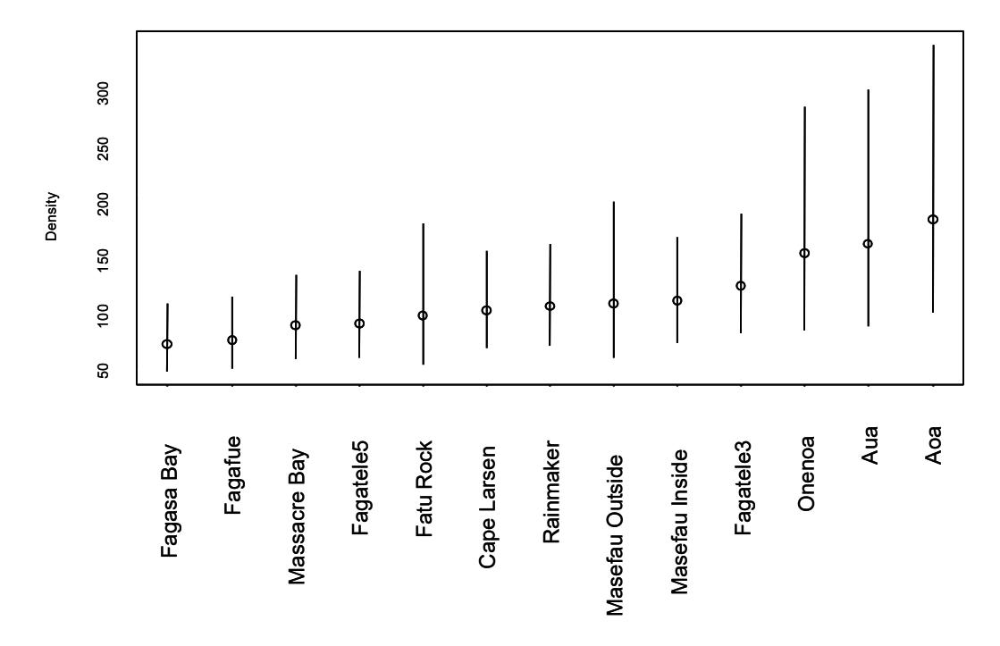

## Site\*year interactions:

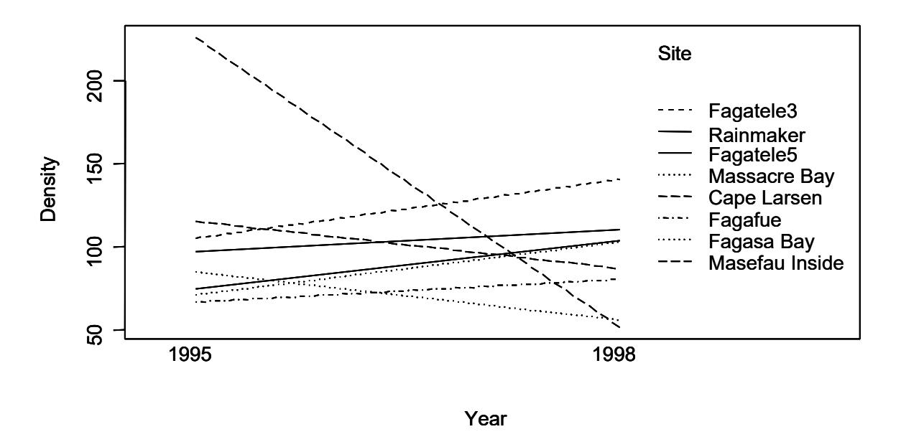

The changes between years are small for most of the sites, though the change at Masefau Inside is large. In Masefau these changes were not confined to a single species suggesting that this might be an environmental rather than a single species cohort effect.

Ten species had a drop of more than 10 individuals in between the two years.

| Chrysiptera.cyanea      | 174 |
|-------------------------|-----|
| Stegastes.fasciolatus   | 47  |
| Pomacentrus.vaiuli      | 32  |
| Chrysiptera.leucopoma   | 28  |
| Pomachromis.richardsoni | 21  |

85

| 19 |
|----|
| 17 |
| 15 |
| 12 |
| 10 |
|    |

0nly one species had an increase of comparable size.

Pomacentrus.coelestis 18

### *Depth*

There was only a small (though statistically significant) difference between the depths, a small increase on average with depth.

> 3 100.8386 6 112.4685

This difference however varies over sites.

#### **Indicator species**

The 10 species with the apparent largest change with depth were:

| Ctenochaetus.striatus         | 11.144 |
|-------------------------------|--------|
| Pomacentrus.brachialis        | 3.216  |
| Chrysiptera.cyanea            | -2.595 |
| Pomacentrus.vaiuli            | 1.863  |
| Acanthurus.nigrofuscus        | 1.715  |
| Chrysiptera.leucopoma         | -1.143 |
| Acanthurus.lineatus           | -0.913 |
| Thalassoma.quinquevittatum    | -0.889 |
| Plectroglyphidodon.lacrymatus | 0.748  |
| Stegastes.fasciolatus         | -0.499 |

A positive change indicates an increase in abundance with depth..

*Pomacentrus.brachialis, Chrysiptera.cyanea, Pomacentrus.vaiuli, Chrysiptera.leucopoma, Acanthurus.lineatus* and *Plectroglyphidodon.lacrymatus* have clear corresponding patterns in the Fagetele Bay data (abundance changing monotonically with depth).

*Thalassoma.quinquevittatum* and *Stegastes.fasciolatus* shows a declining function with depth from 3 metres onwards.

### *Site\*Depth interaction*

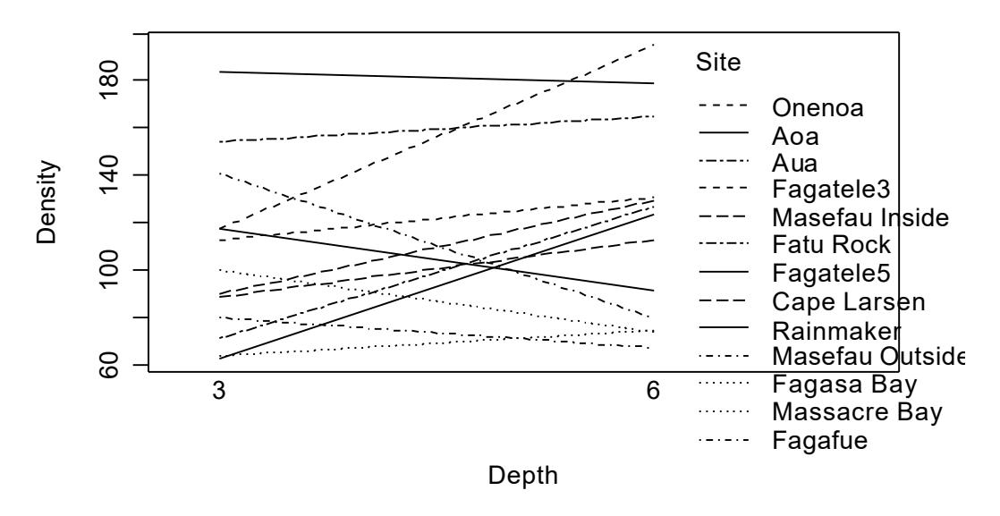

Most of the sites have increases with depth, only 3 of the north western sites (Fagasa, Fagafue, and Massacre Bay) Masefau Outside and Rainmaker show a drop or no effective change at all.

## **Species Composition**

Multivariate ANOVA found significant differences between sites (p=<0.005) and depth (p<0.005) but not between years (p=0.17). There were no detectable interactions

### *Depths*

The differences between the two depths though significant was not large, the two depths differ, on average, in only 23% of their species. Far less than the differences between the sites.

*Sites*

The species composition distance matrix between sites

|                 | Aoa   | Aua   | Cape<br>Larsen | Fagafue | Fagasa<br>Bay | Fagatele3 | Fagatele5 | Fatu Rock | Masefau<br>Inside | Masefau<br>Outside | Massacre<br>Bay | Onenoa |
|-----------------|-------|-------|----------------|---------|---------------|-----------|-----------|-----------|-------------------|--------------------|-----------------|--------|
| Aua             | 0.623 |       |                |         |               |           |           |           |                   |                    |                 |        |
| Cape Larsen     | 0.513 | 0.618 |                |         |               |           |           |           |                   |                    |                 |        |
| Fagafue         | 0.528 | 0.542 | 0.433          |         |               |           |           |           |                   |                    |                 |        |
| Fagasa Bay      | 0.559 | 0.603 | 0.394          | 0.411   |               |           |           |           |                   |                    |                 |        |
| Fagatele3       | 0.552 | 0.641 | 0.528          | 0.492   | 0.543         |           |           |           |                   |                    |                 |        |
| Fagatele5       | 0.578 | 0.646 | 0.477          | 0.421   | 0.441         | 0.51      |           |           |                   |                    |                 |        |
| Fatu Rock       | 0.587 | 0.568 | 0.49           | 0.49    | 0.524         | 0.546     | 0.545     |           |                   |                    |                 |        |
| Masefau Inside  | 0.534 | 0.657 | 0.517          | 0.533   | 0.473         | 0.586     | 0.544     | 0.666     |                   |                    |                 |        |
| Masefau Outside | 0.553 | 0.703 | 0.453          | 0.505   | 0.512         | 0.512     | 0.484     | 0.566     | 0.549             |                    |                 |        |
| Massacre Bay    | 0.497 | 0.557 | 0.471          | 0.422   | 0.488         | 0.42      | 0.513     | 0.486     | 0.571             | 0.513              |                 |        |
| Onenoa          | 0.504 | 0.639 | 0.528          | 0.57    | 0.551         | 0.521     | 0.567     | 0.59      | 0.58              | 0.516              | 0.444           |        |

87

Rainmaker 0.605 0.558 0.638 0.636 0.625 0.603 0.706 0.666 0.64 0.692 0.601 0.64

The smallest distances – identifying the most similar pairs of sites – are in bold. The neighbouring sites of Fagasa, Fagafue, Massacre Bay and Cape Larsen are clearly similar. This pattern reflects that of the coral where the north western sites also came out together. Interestingly Fagatele Bay 5 seems more similar to Fagafue and Fagasa than to any where else. The plot that approximates these distances also shows clearly how different Aua and Rainmaker were from the others.

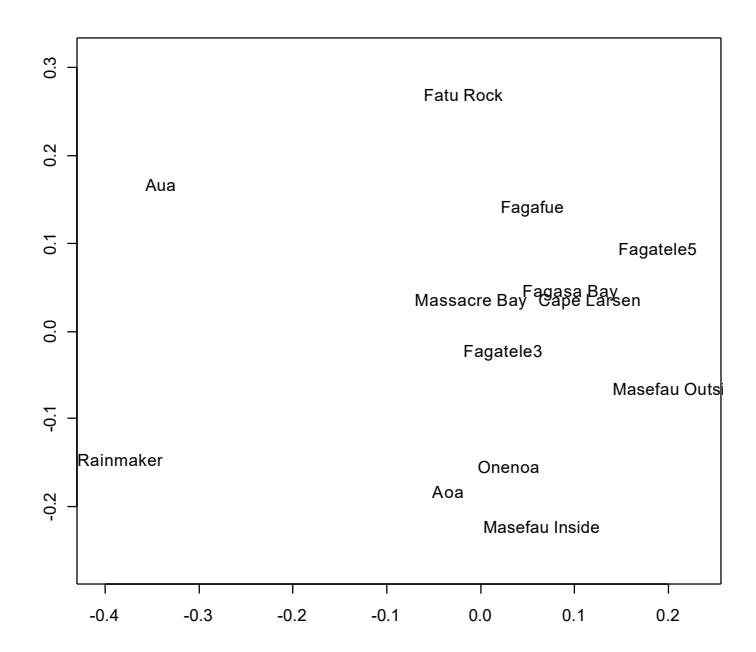

It would appear that once again biogeography, exposure (or other environmental factors) and human impact are mixed up together in this data set.

#### **Species abundances**

As with the Fagatele Bay data I used a Gower's distance measure on the  $\log_{10}(X+(X=0)*0.1)+1$  transformation. The distance is therefore the average size of the difference between two sites per species.

Significant differences were found between sites (p<0.0005) and depths (p<0.0005) But not between years (p=0.111), and there were no detectable interaction effects (site\*year p=0.224, depth\*year p=0.348, site\*depth p=0.306).

#### Depth

The average size of the difference per species (in orders of magnitude) between the mean for 3m and that for 6m was 0.171. This is small relative to the differences recorded at Fagatele for the same depths. However it is clear in the Fagatele data that the differences between these two depths was particularly small in 1995 and 1998. The indicator species have been discussed earlier in the context of Total fish Counts.

### *Sites*

|                 |       |       | Cape   |         | Fagasa | Fagatele | Fagatele | Fatu  | Masefau | Masefau | Massacre |        |
|-----------------|-------|-------|--------|---------|--------|----------|----------|-------|---------|---------|----------|--------|
|                 | Aoa   | Aua   | Larsen | Fagafue | Bay    | 3        | 5        | Rock  | Inside  | Outside | Bay      | Onenoa |
| Aua             | 0.477 |       |        |         |        |          |          |       |         |         |          |        |
| Cape Larsen     | 0.42  | 0.49  |        |         |        |          |          |       |         |         |          |        |
| Fagafue         | 0.427 | 0.452 | 0.331  |         |        |          |          |       |         |         |          |        |
| Fagasa Bay      | 0.428 | 0.499 | 0.289  | 0.317   |        |          |          |       |         |         |          |        |
| Fagatele3       | 0.454 | 0.511 | 0.436  | 0.406   | 0.447  |          |          |       |         |         |          |        |
| Fagatele5       | 0.491 | 0.543 | 0.383  | 0.345   | 0.354  | 0.432    |          |       |         |         |          |        |
| Fatu Rock       | 0.493 | 0.477 | 0.394  | 0.427   | 0.425  | 0.456    | 0.44     |       |         |         |          |        |
| Masefau Inside  | 0.433 | 0.514 | 0.418  | 0.4     | 0.345  | 0.481    | 0.446    | 0.525 |         |         |          |        |
| Masefau Outside | 0.466 | 0.559 | 0.341  | 0.389   | 0.374  | 0.44     | 0.386    | 0.486 | 0.439   |         |          |        |
| Massacre Bay    | 0.419 | 0.454 | 0.356  | 0.32    | 0.36   | 0.359    | 0.383    | 0.406 | 0.433   | 0.392   |          |        |
| Onenoa          | 0.423 | 0.511 | 0.414  | 0.443   | 0.422  | 0.403    | 0.429    | 0.478 | 0.468   | 0.42    | 0.366    |        |
| Rainmaker       | 0.455 | 0.445 | 0.475  | 0.474   | 0.455  | 0.467    | 0.527    | 0.513 | 0.484   | 0.518   | 0.465    | 0.48   |

The differences indicate that the neighbouring sites of Fagasa Bay, Cape Larsen, Fagafue and Massacre Bay have similar fish populations. The reduced space plot of the first 2 principal components separates the harbour sites from the others, as well as suggesting that Masefau Inside is different to the rest in particular it is very different from Fatu Rock.

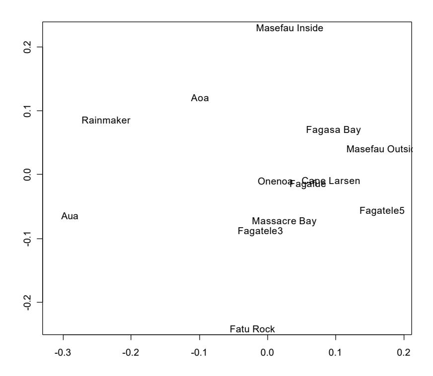

The dominant trend (PC1) is:

**PC 1 against site**

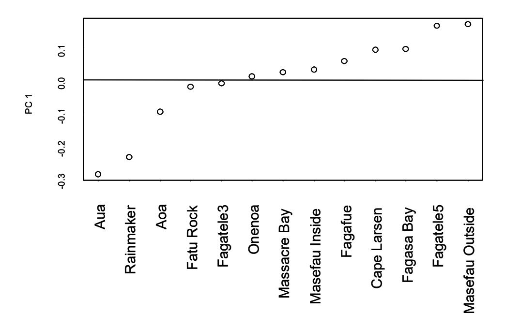

The second trend is

**PC 2 against site**

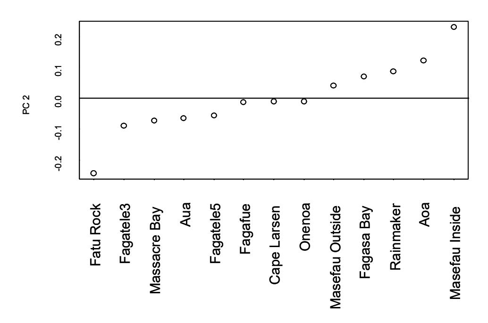

#### **Indicator species**

PC1.

The top 10 are Canthigaster.solandri -0.831 Thalassoma.quinquevittatum 0.82 Abudefduf.sexfasciatus -0.794 Pygoplites.diacanthus -0.777

| Epinephelus.merra                | -0.77  |
|----------------------------------|--------|
| Plectroglyphidodon.lacrymatusLSM | -0.744 |
| Meiacanthus.atrodorsalis         | -0.735 |
| Pomacentrus.brachialis           | -0.731 |
| Centropyge.flavissimus           | -0.705 |
| Acanthurus.nigrofuscus           | -0.703 |

A negative correlation (e.g. *Canthigaster.solandri* ) indicates species that are more abundant in the Harbour sites than Fagatele 5 or Masefau Outside. A positive correlation (e.g. *Thalassoma.quinquevittatum*) indicates the reverse.

#### PC2.

| Parupeneus.multifasciatus | 0.822  |
|---------------------------|--------|
| Acanthurus.guttatus       | -0.716 |
| Pempheris.oualensis       | -0.712 |
| Pomachromis.richardsoni   | 0.69   |
| Gomphosus.varius          | -0.682 |
| Epibulus.insidiator       | -0.668 |
| Pomacentrus.vaiuli        | 0.661  |
| Plectroglyphidodon.dickii | -0.639 |
| Escenius.bicolor          | 0.628  |
| Balistapus.undulatus      | -0.615 |
|                           |        |

Positive values (e.g. *Parupeneus.multifasciatus* ) indicate species that are common at Masefau Inside but less so at Fatu Rock.

## *Years*

The distance between 1995 and 1998 was 0.153, not statistically significant This was very small indeed. In the Fagetele bay data there was little difference between these two years. Though not as small as this.

It is probably not worthwhile looking at the species that are associated with such a small change.

## Long term 3 site.

#### Design

This is the data set that covers the longest time.

To make the data more balanced for analysis the data for 1978 Fagatele were used as a proxy for Fagatele 1977 and the 1979 record for Cape Larsen was dropped leaving:

|      | Cape   | Fagatele | •        |   |
|------|--------|----------|----------|---|
|      | Larsen | Bay      | Sita Bay |   |
| 1977 | •      | 1        | 1        | 1 |
| 1985 | ,<br>) | 1        | 1        | 1 |
| 1988 | }      | 1        | 1        | 1 |
| 1994 |        | 1        | 1        | 1 |
| 1998 | }      | 1        | 1        | 1 |
| 2001 |        | 1        | 1        | 1 |

#### **Fish**

#### **Species numbers**

A permutation Analysis of variance on species numbers detected a difference between sites (p=0.003) and a significant difference between years (p=0.005).

The plot of the simple counts shows the sites are similar and have similar patterns:

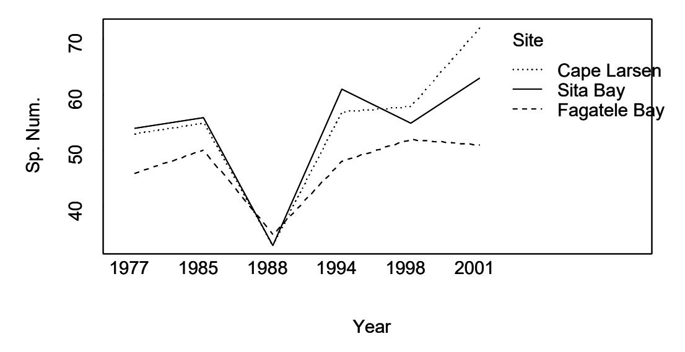

The most obvious effect is the drop in species in 1988, possibly due to a change in sampling protocol in that year.

## **Species abundances**

Permutation ANOVA detected no difference between sites (p= 0.606) but there was a clear difference between years (p<0.0005)

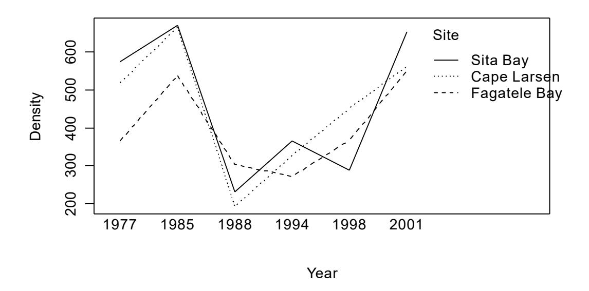

The 88 dip is obvious though it appears to continue for a time afterwards, suggesting that it might not be completely a sampling problem.

## **Species composition**

A multivariable distance based ANOVA found significant differences between sites (p<0.0005)and years (p = 0.001)

The data can be approximated by the plot of the first two principal axes. Axis 1 separates the sites and axis 2 the years. The sites are clearly grouped into the Sita Bay and Cape Larsen separated from Fagatele Bay.

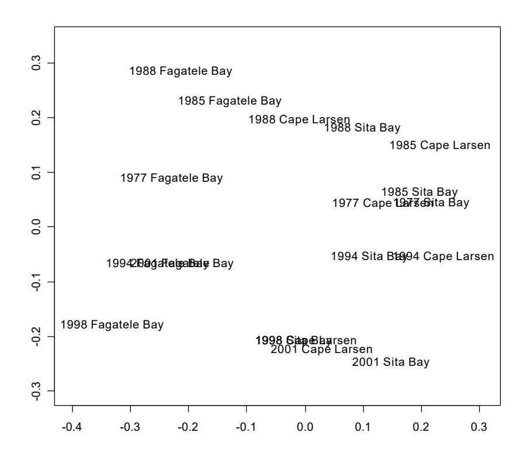

#### Year means

Distance based Redundancy analysis was used to calculate the distances between years:

|      | 1977  | 1985  | 1988  | 1994  | 1998  |
|------|-------|-------|-------|-------|-------|
| 1985 | 0.459 |       |       |       |       |
| 1988 | 0.592 | 0.652 |       |       |       |
| 1994 | 0.525 | 0.566 | 0.637 |       |       |
| 1998 | 0.596 | 0.682 | 0.689 | 0.559 |       |
| 2001 | 0.523 | 0.64  | 0.67  | 0.53  | 0.519 |

Notice the large between year changes between 1988 and its adjacent samples.

These distances can be approximated by the PC plot:

PC 1 (the X axis) shows the dominant trend between the years. PC2 the y axis clearly shows the 1988 anomaly.

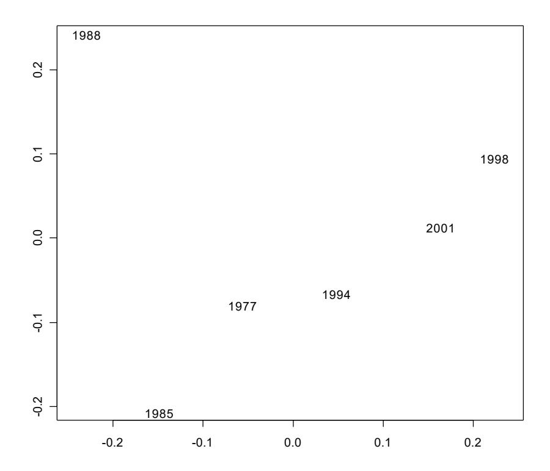

The dominant trend (PC1) can be seen more clearly:


The main contrast is clearly between the earlier year and the later years.

#### **Indicator species**

The ten species most associated with this trend are shown below: Labroides.bicolor 0.974

| Scarus.psittacus           | 0.964  |
|----------------------------|--------|
| Scarus.globiceps           | 0.919  |
| Scarus.oviceps             | 0.919  |
| Scarus.forsteni            | 0.919  |
| Chaetodon.vagabundus       | 0.897  |
| Thalassoma.quinquevittatum | 0.881  |
| Dascyllus.trimaculatus     | -0.866 |
| Sufflamen.bursa            | 0.866  |
| Chaetodon.ulietensis       | 0.866  |
| Labroides.rubrolabiatus    | 0.866  |

It is worth noting that the Scarids in particular seem positively associated with this change.

### *Site means*

The distances between the site averages are:

Cape Larsen Fagatele Bay

Fagatele Bay 0.564

Sita Bay 0.335 0.583

That is Cape Larsen and Sita Bay, on average share 66% of their species , while they are both more different to Fagatele Bay (sharing 42-43%).

#### **Indicator species**

The ten species showing the contrast in probability of incidence most clearly are shown here:

|                            | Cape   | Fagatele |          |
|----------------------------|--------|----------|----------|
|                            | Larsen | Bay      | Sita Bay |
| Chrysiptera.cyanea         | 1      | 0        | 1        |
| Chaetodon.trifasciatus     | 0.83   | 0        | 0.67     |
| Halichoeres.marginatus     | 0.67   | 0        | 0.5      |
| Zebrasoma.scopas           | 0.17   | 1        | 0.5      |
| Pseudocheilinus.hexataenia | 1      | 0.5      | 1        |
| Chromis.margaritifer       | 1      | 0.5      | 1        |
| Dascyllus.trimaculatus     | 0      | 0.67     | 0        |
| Pterocaesio.tile           | 0      | 0.67     | 0        |
| Thalassoma.lutescens       | 0      | 0.83     | 0.17     |
| Centropyge.bispinosus      | 0      | 0.83     | 0        |
| Scarus.oviceps             | 0      | 0.5      | 0        |

## **Species abundances**

Using Gower's distance on log10(x+(x=0)\*0.1)+1 so that distances are in order of magnitude units, I performed a Principal coordinate analysis to reproduce the data cloud in fewer dimensions.

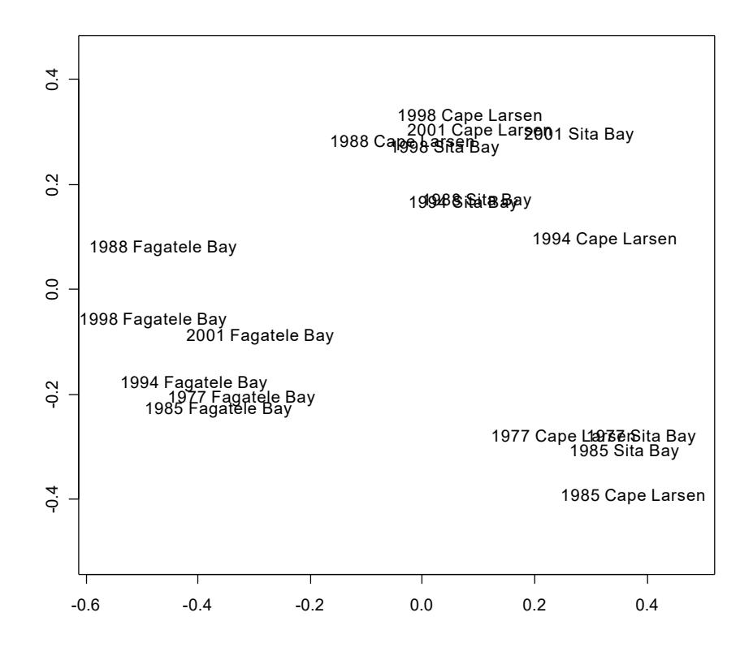

The difference between Fagatele Bay and the other two sites is even more clearly displayed here than with species composition. It is the major trend in the data (Principal Axis 1) the second most important largely separates the time patterns.

The pattern on PA axis 1 is clear. The distance between Fagetele Bay and the others remains fairly constant over time (very close to 1 unit difference), suggesting that this difference is an environmental one (e.g. exposure), i.e it does not change much through time.

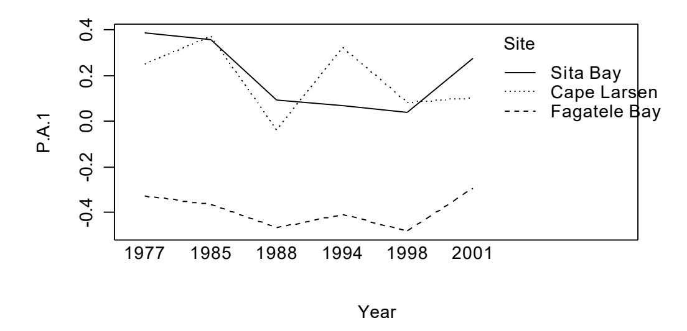

Principal axis 2 shows the main time trend:

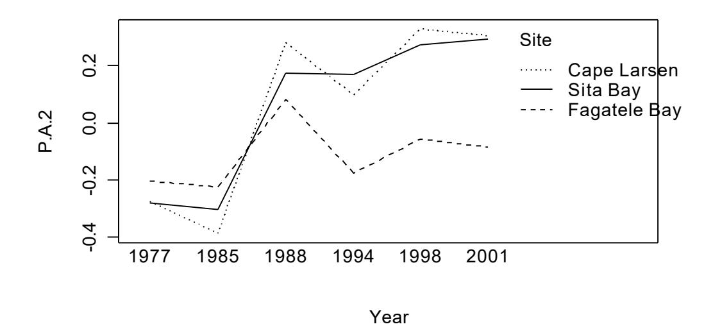

This shows that Fagatele Bay changes in a different way over the years than the other two. In particular Fagatele Bay returns to closer to the 1977 state than either of the others.

| Fagetele Bay |  |  |
|--------------|--|--|
|--------------|--|--|

| 1985<br>1988<br>1995<br>1998 | 1977<br>1.04<br>0.98<br>1.05<br>0.94 | 1985<br>1<br>1.02<br>1.02 | 1988<br>0.99<br>0.98 | 1995<br>0.85 | 1998 |
|------------------------------|--------------------------------------|---------------------------|----------------------|--------------|------|
| 2001                         | 0.78                                 | 1.02                      | 1.06                 | 0.9          | 0.88 |
| Cape Larsen.                 |                                      |                           |                      |              |      |
|                              | 1977                                 | 1985                      | 1988                 | 1995         | 1998 |
| 1985                         | 0.78                                 |                           |                      |              |      |
| 1988                         | 1.01                                 | 1.07                      |                      |              |      |
| 1995                         | 0.84                                 | 0.76                      | 0.94                 |              |      |
| 1998                         | 1.04                                 | 0.99                      | 0.94                 | 0.83         |      |
| 2001                         | 0.98                                 | 1.03                      | 0.99                 | 0.87         | 0.78 |
| Sita Bay                     |                                      |                           |                      |              |      |
|                              | 1977                                 | 1985                      | 1988                 | 1995         | 1998 |
| 1985                         | 0.65                                 |                           |                      |              |      |
| 1988                         | 0.99                                 | 0.91                      |                      |              |      |
| 1995                         | 0.91                                 | 0.99                      | 0.93                 |              |      |
| 1998                         | 0.95                                 | 0.98                      | 0.91                 | 0.85         |      |
| 2001                         | 0.96                                 | 0.85                      | 0.95                 | 0.93         | 0.83 |

Given that it is quite clear that the three sites have quite different trajectories through time there is little point in looking at the year means or site means separately.

### *Indicator species*

The main species associated with the difference between the sites are:

| Chrysiptera.cyanea     | 0.881  |
|------------------------|--------|
| Chaetodon.trifasciatus | 0.838  |
| Pomacentrus.brachialis | 0.783  |
| Pterocaesio.tile       | -0.762 |
| Centropyge.bispinosus  | -0.752 |
| Parupeneus.cyclostomus | 0.708  |
| Dascyllus.trimaculatus | -0.695 |
| Thalassoma.lutescens   | -0.693 |
| Myripristis.berndti    | 0.678  |
| Stegastes.fasciolatus  | 0.677  |
|                        |        |

The species associated with the major temporal (PA2) trend are

| Mulloides.flavolineatus   | -0.812 |
|---------------------------|--------|
| Chromis.margaritifer      | 0.667  |
| Ostracion.meleagris       | -0.634 |
| Cheilinus.oxycepthalus    | -0.628 |
| Gomphosus.varius          | -0.617 |
| Chaetodon.pelewensis      | 0.581  |
| Stegastes.fasciolatus     | -0.573 |
| Zebrasoma.veliferum       | 0.561  |
| Labroides.rubrolabiatus   | 0.546  |
| Plectorhinchus.orientalis | 0.528  |

## *All islands survey*

### **Design**

The lagoonal sites were dropped from the dataset since they were not comparable with the other deeper sites. This left

|      | Aunu'u Ofu |     | Ofu             | Olosega                                    |         | Olosega |   |                   |   |                                                                                 |   |                |   |
|------|------------|-----|-----------------|--------------------------------------------|---------|---------|---|-------------------|---|---------------------------------------------------------------------------------|---|----------------|---|
|      |            |     |                 | Aunu'uAsaga Ofu villageOlosega villageSili |         |         |   |                   |   |                                                                                 |   |                |   |
| 1996 | 3          | 5   |                 | 5                                          |         | 5       | 5 |                   |   |                                                                                 |   |                |   |
| 2002 | 3          | 5   |                 | 5                                          |         | 5       | 5 |                   |   |                                                                                 |   |                |   |
|      |            |     |                 |                                            |         |         |   |                   |   |                                                                                 |   |                |   |
| Tau  |            | Tau |                 | Tau                                        | Tutuila |         |   | TutuilaTutuilaTau |   | Tutuila<br>Tutuila                                                              |   | Tutuila        |   |
|      |            |     |                 | Afuli CoveFagamalo CoveLepulaAmanaveAoa    |         |         |   | Aua               |   | Faga Faga'aluFagafueFagaitua                                                    |   |                |   |
| 1996 |            | 5   |                 | 5                                          | 5       | 3       | 3 | 3                 | 3 | 3                                                                               | 3 | 3              |   |
| 2002 |            | 5   |                 | 5                                          | 5       | 3       | 3 | 3                 | 3 | 3                                                                               | 3 | 3              |   |
|      |            |     |                 |                                            |         |         |   |                   |   |                                                                                 |   |                |   |
|      | Tutuila    |     | Tutuila Tutuila |                                            | Tutuila | Tutuila |   | TutuilaTutuila    |   | TutuilaTutuila                                                                  |   | TutuilaTutuila |   |
|      |            |     |                 |                                            |         |         |   |                   |   | FagamaloFagasa FagateleFatumafuti Leloaloa Leone MasefauNu'uuliOnesosopo Utulei |   | Vatia          |   |
| 1996 |            | 3   | 3               | 3                                          | 3       |         | 3 | 3                 | 3 | 3                                                                               | 3 | 3              | 3 |
| 2002 |            | 3   | 3               | 3                                          | 3       |         | 3 | 3                 | 3 | 3                                                                               | 3 | 3              | 3 |

### **Fish**

## **Species numbers**

There was a significant site\*year interaction term. The percentage changes between the years is plotted for the sites

#### % change in species numbers 1996-2002

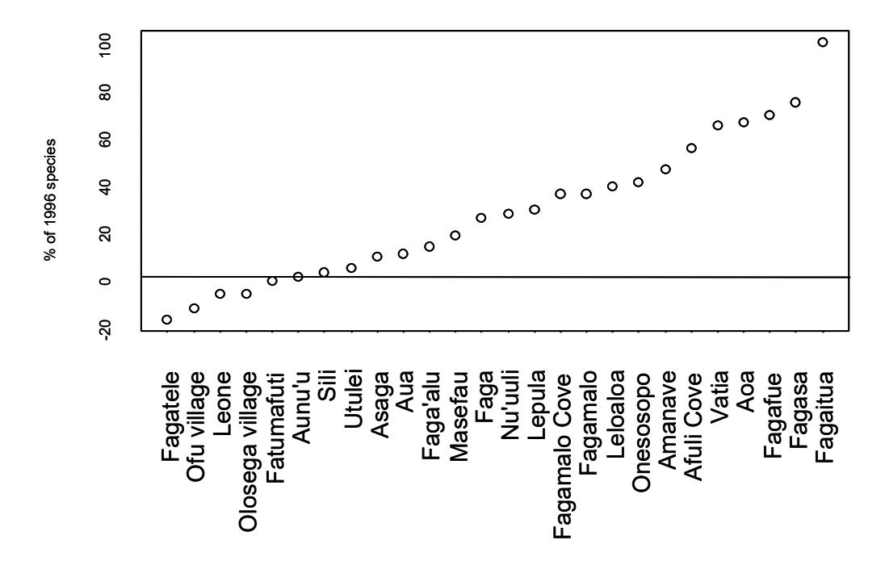

Nearly all the sites had a positive change, indicating an increase in species between 1996 and 2002. Some of the sites had extremely large changes Fagaitua went from a mean of 19.2 species per transect to 38.2. There is some tendency for the Southern coast of Tutuila to have lower levels of change, while the northern sites tend to have higher values – though southern sites at the extremes of the island (Amanave, Fagaitua) are also high.

Given the size of some of these changes the overall site means are of limited use. However some patterns do emerge

Mean number of species

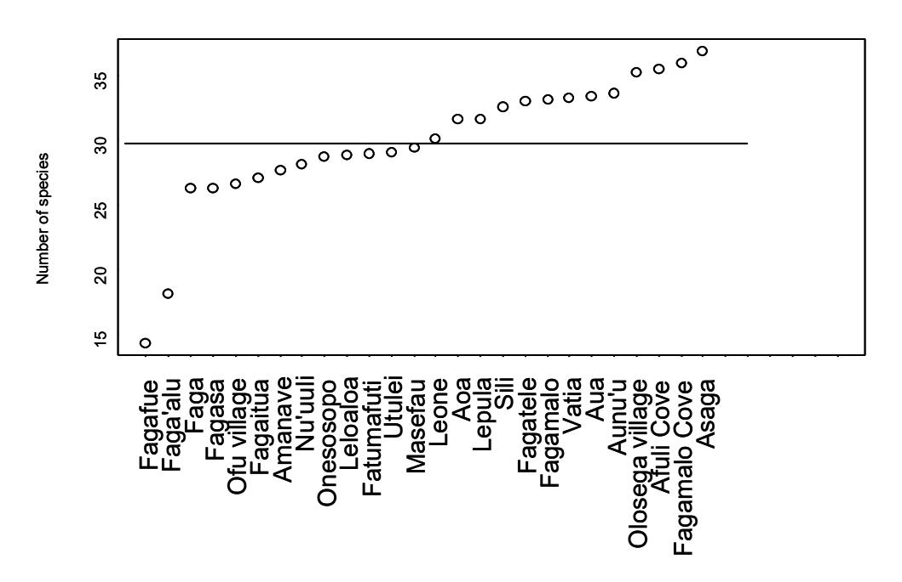

It is noticeable that Fagafue and Faga'alu have extremely low average species counts and that the Manu'a island sites tend to have above average (the horizontal line).

#### **Total Abundance**

The difference between years varied with sites (significant interaction p<0.0005) and overall the sites differed (p<0.0005) and so did years (p<0.0005). The % change (all increases) between 1996 and 2001

#### % increases in fish sounted

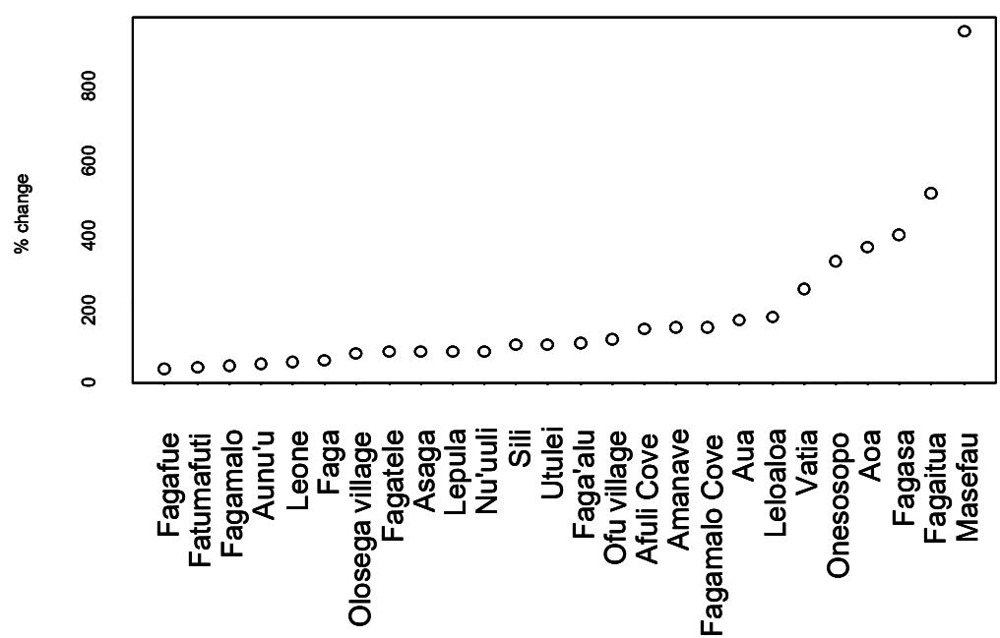

Clearly Masefau showed an enormous increase in fish numbers over this period. It is worth noting that, as we saw earlier, Masefau also showed a huge increase in coral coverage during this period.

#### **Size**

Though the lengths of the fish were recorded it would involve more effort than is currently justified to convert these to weights (it would require the use of taxon specific length weight parameters - a time consuming task – though one required if these results are to be published).

#### **Species composition**

The species composition at a site was defined as the species that were recorded at any of the transects

There was a clear difference between years (p<0.0005) and between sites (p<0.0005), unsurprisingly the differences between years depended on the site (year\* site interaction p<0.0005.

Because the design is more or less balanced we can use distance RDA to provide the reduced space plot.


The dominant pattern I spatial: at the negative end of the x axis are the harbour sites, at the other end are the island sites. Plotting the islands shows the clear separation.

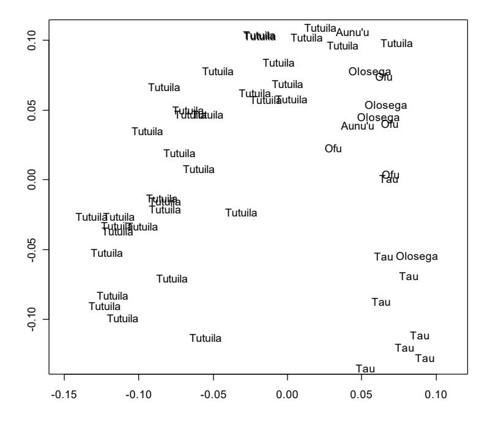

The separation is basically complete, mainly on the x axis (Principal axis 1). There is reason to suspect that the second principal axis (y axis) may be an artefact resulting

from what is known as the "horseshoe effect", a result of the largest possible difference between two sites being constrained to 1.

The temporal pattern emerges on the 3<sup>rd</sup> axis.

If we plot principal axis 1 against principal axis 3

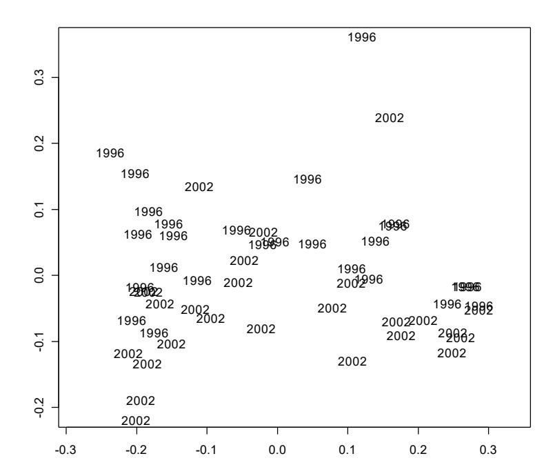

The 2002 measurements are clearly towards negative values of the y axis (Principal Axis 3).

#### Site means

The pattern is even clearer if we plot the site means (averaged over years).

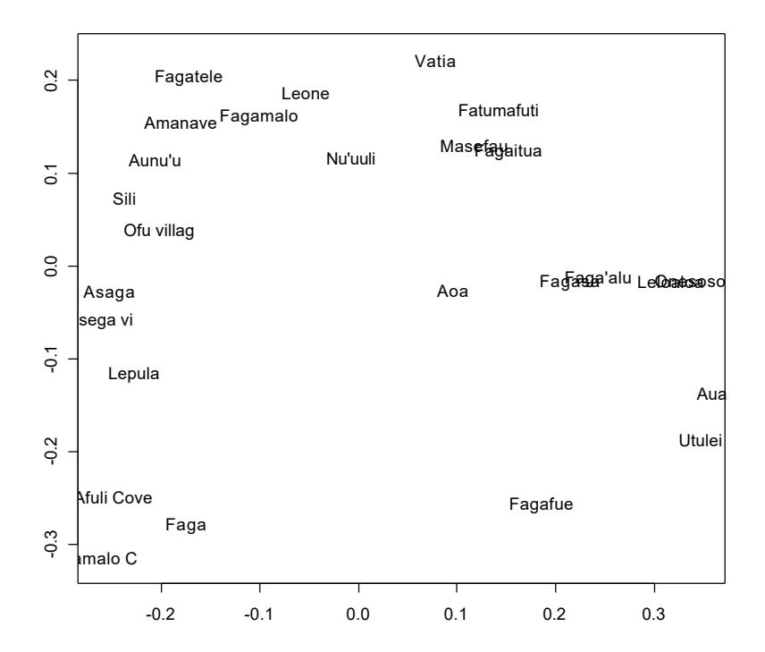

Again the islands are completely distinct.

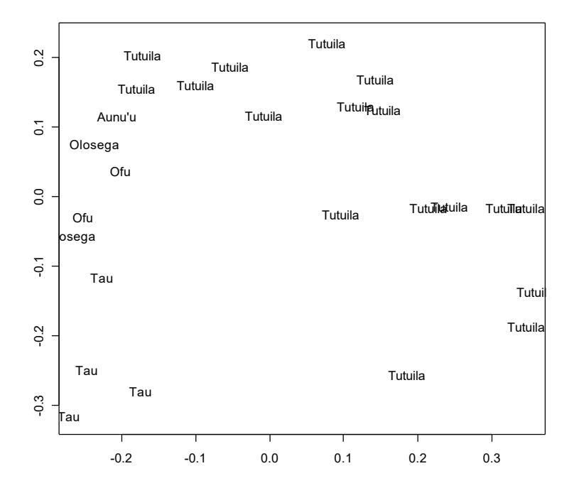

# Indicator species

For Principal Axis 1 the 10 species most associated (correlation coefficient) with these changes in species composition. All of them except *Canthigaster solandri* are negatively related to principal axis 1. They have a higher probability of detection in the Manu'a islands and clean Tutuila sites (like Fagatele) than at the harbour sites. Only *Canthigaster solandri* has the reverse pattern being more likely to be present at the harbour sites.

| Chromis.acares             | -0.908 |
|----------------------------|--------|
| Thalassoma.quinquevittatum | -0.876 |
| Melichthys.vidua           | -0.857 |
| Chromis.margaritifer       | -0.825 |
| Scarus.forsteni            | -0.805 |
| Cephalopholis.argus        | -0.797 |
| Labroides.rubrolabiatus    | -0.756 |
| Gomphosus.varius           | -0.731 |
| Acanthurus.nigricans       | -0.722 |
| Canthigaster.solandri      | 0.768  |
|                            |        |

## **Year means**

The average difference between sites in species composition is 0.16. That is the same site (on average) changed about 16% of the species between 1996 and 2001. Not a lot.

### *Indicator species*

The species whose probability of detection changed most between years (2002-1996) Only *Acanthurus nigrofuscus* actually had a decrease in the probability of detection.

| Plectroglyphidodon.johnstonianus0.309 |        |  |  |
|---------------------------------------|--------|--|--|
| Scarus.psittacus                      | 0.298  |  |  |
| Chaetodon.pelewensis                  | 0.287  |  |  |
| Plectroglyphidodon.dickii             | 0.277  |  |  |
| Ctenochaetus.cyanocheilus             | 0.255  |  |  |
| Acanthurus.nigrofuscus                | -0.234 |  |  |
| Chaetodon.reticulatus                 | 0.213  |  |  |
| Acanthurus.nigricans                  | 0.202  |  |  |
| Ctenochaetus.binotatus                | 0.202  |  |  |
| Chaetodon.unimaculatus                | 0.191  |  |  |
|                                       |        |  |  |

## **Species abundances**

Once again I use the Gower's distance on log10(X+(X=0)\*0.1)+1 transformed counts. Distance based ANOVA found difference between sites (p<0.0005) and the two years (p<0.0005), though the differences between years varied between sites (interaction p<0.0005).

## **Site means**

The differences between sites were investigated using distance Redundancy Analysis. The main pattern between sites is approximated in this plot:

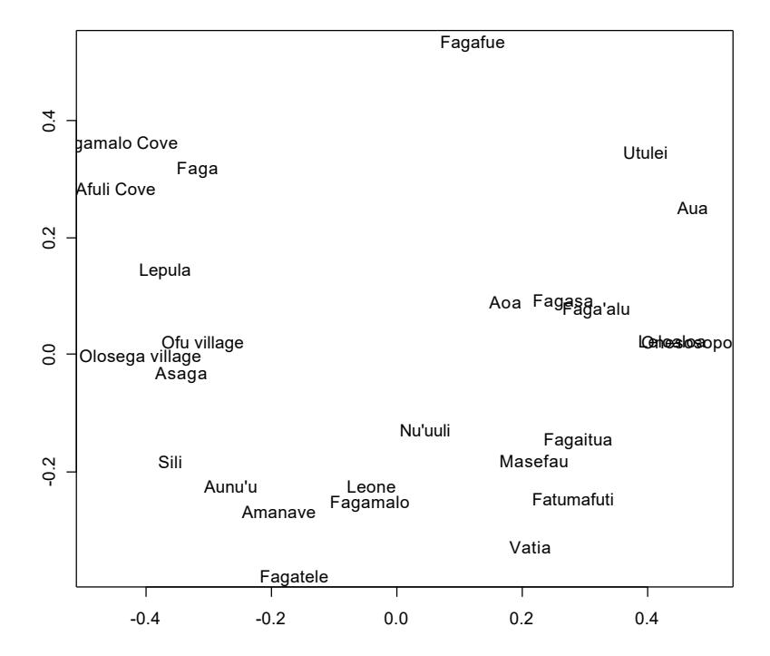

The basis of this is clearer if we plot island names instead of site.

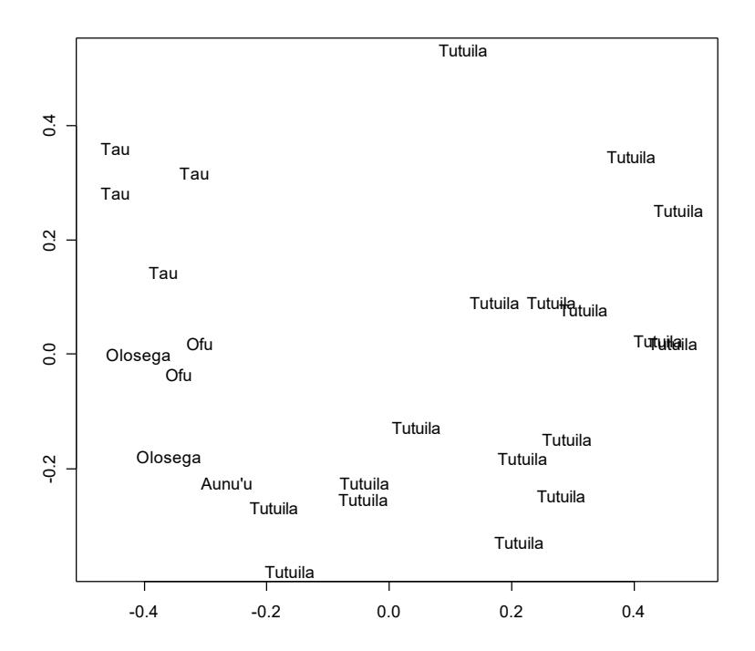

Like the species composition data the abundance data clearly separate the islands.

Within Tutuila there appears to be a gradient from the harbour sites to the probably less impacted sites (e.g. Fagatele, Amanave, Aunu'u). If one envisages the gradient running from upper right to lower left, then the Manua island sites are all at the less impacted end but are naturally different, from each other and Tutuila. An alternative explanation is that the shape is an example of the "horseshoe" phenomenon an artefact that would lead to an interpretation that there was only one gradient running from the harbour sites at one end, through the other Tutuila sites, Olosega, Ofu and finally ending at Tau.

### *Indicator species*

Given the quality of the data I have taken the top 20 species which are responsible for the differences between the sites.

|                            | r-squared |
|----------------------------|-----------|
| Chromis.acares             | 0.23      |
| Thalassoma.quinquevittatum | 0.21      |
| Pomacentrus.brachialis     | 0.20      |
| Scarus.forsteni            | 0.19      |
| Cephalopholis.argus        | 0.19      |
| Melichthys.vidua           | 0.19      |
| Acanthurus.nigricans       | 0.18      |
| Cephalopholis.urodeta      | 0.18      |
| Canthigaster.solandri      | 0.17      |
| Labroides.rubrolabiatus    | 0.17      |
| Stegastes.fasciolatus      | 0.17      |
| Chromis.margaritifer       | 0.16      |

| Acanthurus.olivaceus      | 0.16 |
|---------------------------|------|
| Ctenochaetus.cyanocheilus | 0.15 |
| Halichoeres.ornatissimus  | 0.15 |
| Pygoplites.diacanthus     | 0.15 |
| Coris.gaimard             | 0.15 |
| Sufflamen.bursa           | 0.14 |
| Gomphosus.varius          | 0.14 |
| Chlorurus.pyrrhurus       | 0.14 |

## **Year means**

The two years differ (on average) by a distance of 0.55 orders of magnitude, though of course this varied over sites. Not large compared with the individual site differences - individual sites had changes from 0.709 (Utulei) to 1.12 (Amanave). The species that showed the greatest changes between the two years were:

|                                  | Orders of |
|----------------------------------|-----------|
|                                  | magnitude |
| Ctenochaetus.striatus            | 0.711     |
| Pomacentrus.vaiuli               | 0.621     |
| Plectroglyphidodon.dickii        | 0.617     |
| Scarus.psittacus                 | 0.535     |
| Chaetodon.reticulatus            | 0.433     |
| Plectroglyphidodon.johnstonianus | 0.414     |
| Chaetodon.pelewensis             | 0.408     |
| Unid.scarid                      | -0.396    |
| Chromis.margaritifer             | 0.389     |
| Ctenochaetus.cyanocheilus        | 0.384     |
| Zebrasoma.scopas                 | 0.354     |
| Plectroglyphidodon.lacrymatus    | 0.3       |
| Chromis.iomelas                  | 0.294     |
| Stegastes.fasciolatus            | 0.29      |
| Chaetodon.unimaculatus           | 0.268     |
| Chromis.xanthura                 | -0.266    |
| Naso.lituratus                   | -0.256    |
| Ctenochaetus.binotatus           | 0.235     |
| Dascyllus.reticulatus            | 0.227     |
| Parupeneus.cyclostomus           | 0.223     |

## **Site\*year interactions**

The sites changed in different ways. A plot approximating the site year means shows the same basic pattern of sites as shown by the simple averages with the changes in a surprisingly coherent direction. The arrows show change from 1996 to 2002.

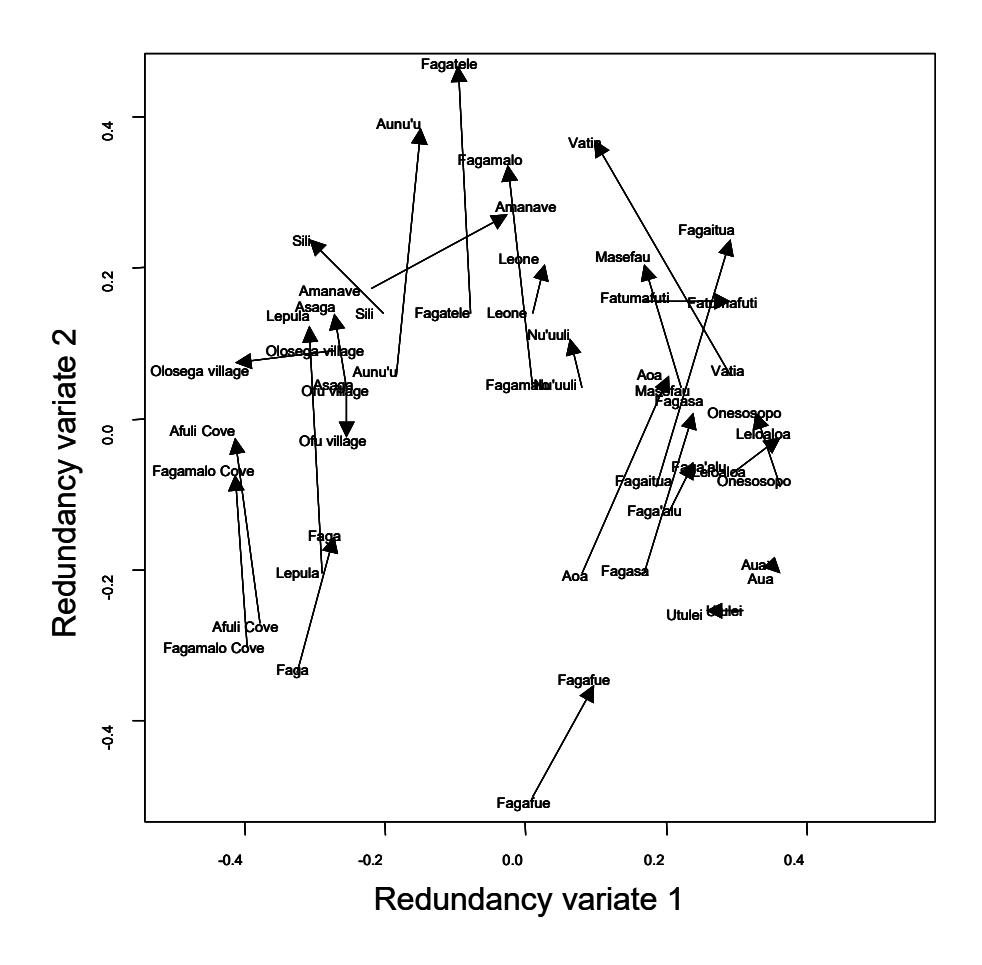

Note only the two harbour sites (Utulei and Aua) and the two island site Olosega and Ofu villages do not conform to the general pattern of change on the y-axis (Redundancy variate 2).

## Indicator species

Species associated with this change (in the y axis) are:

| 1                                | $\mathcal{C}$ |
|----------------------------------|---------------|
| Plectroglyphidodon.dickii        | 0.714         |
| Chaetodon.reticulatus            | 0.662         |
| Plectroglyphidodon.johnstonianus | 0.66          |
| Acanthurus.nigricans             | 0.659         |
| Chlorurus.sordidus               | 0.646         |
| Gomphosus.varius                 | 0.586         |
| Chromis.margaritifer             | 0.576         |
| Ctenochaetus.striatus            | 0.551         |
| Pseudocheilinus.hexataenia       | 0.529         |
| Chrysiptera.taupou               | -0.515        |
| Plectroglyphidodon.lacrymatus    | 0.515         |
| Scarus.oviceps                   | 0.462         |
| Chaetodon.ornatissimus           | 0.442         |
| Acanthurus.pyroferus             | -0.425        |
| Chaetodon.trifascialis           | 0.401         |
| Chaetodon.vagabundus             | -0.397        |
| Acanthurus.blochii               | -0.388        |
| Chaetodon.citrinellus            | -0.385        |
| Parupeneus.multifasciatus        | -0.373        |
|                                  |               |

Scarus.frenatus 0.371
The pattern is clearer when we use the second and third major trends (Redundancy variates 2 and 3).

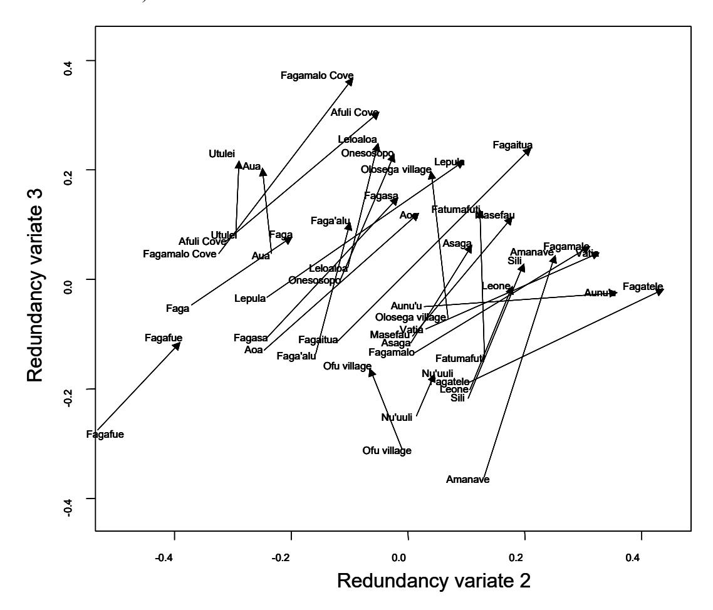

Once again showing the coherence of the changes, and also highlighting the harbour sites and the two island villages. Clearly the main difference between these two groups of sites is on Redundancy variate 2.

# **State of the coral and fish communities 2001/2002**

The health of reef communities is an extremely slippery concept that however quite justifiably dominates the thinking of reef community managers. Given that there seems to be no sensible objective way of defining it, still less of measuring it directly, In order to identify whether patterns in the data that have emerged in these data analyses I have used a subjective approach – sometimes called the "Delphic approach" – to define which are healthy sites and which are not. This approach, popular in marketing circles (hence the fancy name for a common sense idea) simply relies on the consensus of a group of people that know the state of the communities at the sites.

I took the sites that I had analysed and had 3 people: Nancy Daschbach, Peter Craig, and Eva rank them (independently) from "sick" to "healthy". My ad hoc measure of "health" was simply the average of these assessments.

For example for one of the analyses (Alison Green's fish survey) the rankings of the Tutuila sites were:

| Site       | Nancy | Peter | Eva | Mean  |
|------------|-------|-------|-----|-------|
| Aua        | 2     | 1     | 3   | 2.00  |
| Leloaloa   | 3     | 2     | 2   | 2.33  |
| Utulei     | 1     | 4     | 2   | 2.33  |
| Onesosopo  | 5     | 3     | 4   | 4.00  |
| Faga'alu   | 7     | 5     | 4   | 5.33  |
| Fagasa     | 6     | 9     | 3   | 6.00  |
| Fagaitua   | 4     | 11    | 7   | 7.33  |
| Nu'uuli    | 10    | 6     | 6   | 7.33  |
| Fatumafuti | 9     | 10    | 6   | 8.33  |
| Leone      | 14    | 7     | 7   | 9.33  |
| Fagafue    | 8     | 14    | 7   | 9.67  |
| Amanave    | 16    | 8     | 7   | 10.33 |
| Vatia      | 12    | 13    | 6   | 10.33 |
| Fagamalo   | 11    | 16    | 6   | 11.00 |
| Aoa        | 15    | 12    | 7   | 11.33 |
| Masefau    | 13    | 15    | 7   | 11.67 |
| Fagatele   | 17    | 17    | 9   | 14.33 |

The concordance was less than perfect but usable, and as we shall see agrees quite well with some of the dominant trends in the data.

The coral data have shown major signs of recovery between 1998 and 2001 and it is unlikely that differences in "health" would be detectable in the earlier data. So for the coral data I have only analysed the 2001 set. The fish however showed less difference between those years, and I have therefore also analysed the 1996 set for Alison Green's data. I have attempted to identify species that seem to be associated with the "health" trends. These are then candidates for the status of indicators species. It is worth pointing out that further work by biologists who know the species well would be needed to winnow out the useful species. My species are simply ones suggested by the data. There are many reasons why any given species may have a correlation with the health ranking. Given that most of the harbour sites are considered unhealthy, any species that does not live there (even if the reason has nothing to do with human impact) is likely to appear as an indicator of health.

## *Coral community 2001*

## **Summary**

The data suggest that though regeneration has partially occurred the differences between the sites have not had a chance to develop clearly yet. The coverage data are suggestive, even encouraging – there is an apparent gradient from the unhealthy to the healthy sites - but there is clearly more growth to come (if there are no further disasters). The next survey could be extremely interesting. We can expect that the growth of the Acroporids in the less impacted sites will continue Species that may prove useful to consider as indicators:

```
Pocillopora.eydouxi – healthy?
Galaxea.fascicularis – healthy?
Acropora.insignis – healthy?
Acropora.hyacinthus – healthy?
Acropora.divaricata – healthy?
Acropora.crateriformis – healthy?
Montipora.divaricata – healthy?
Montipora.hispida – healthy?
Montipora.foveolata – healthy?
Porites.cylindrica – healthy? 
Pocillopora.danae – unhealthy?
Pocillopora.damicornis – unhealthy?
```

## **Species numbers**

There were no detectable differences between Sites in 2001 (ANOVA p=0.141).

| Aua       | 14 |
|-----------|----|
| Auasi     | 14 |
| Aunuu     | 20 |
| Fagatele3 | 20 |
| Fagatele5 | 20 |
| Fatu      | 10 |
| Masafau   | 20 |
| Rainmaker | 19 |

There is no obvious relationship with health

## **Density**

The was a significant difference between the sites in their total density:

| Fatu      | 116.55 |
|-----------|--------|
| Auasi     | 76.92  |
| Aunuu     | 51.14  |
| Aua       | 49.28  |
| Masafau   | 36.81  |
| Fagatele3 | 36.4   |
| Fagatele5 | 26.21  |
| Rainmaker | 12.67  |

There does not seem to be an obvious relationship with health.

The extremely high density of coral at Fatu does not reflect the coverage there (they are all small), but the difference between Fatu and say Masefau (that has high coverage) is interesting. The differences in density between Rainmaker and the rest is interesting given that the Rainmaker site has almost as many species as the best sites. And Fatu with the highest density has the lowest number of species.

## **Coverage**

There was a significant difference between sites (p= 0.001). The ranking was

|           | (cm2<br>m-2<br>) |
|-----------|------------------|
| Rainmaker | 788.8601         |
| Fatu      | 1774.189         |
| Aua       | 1836.538         |
| Fagatele3 | 3265.878         |
| Aunuu     | 3810.658         |
| Fagatele5 | 3953.666         |
| Auasi     | 5188             |
| Masafau   | 8810.489         |

There is a suggestion that the harbour sites have considerably lower levels of coverage. The Masefau site has far and away the highest coverage.

The top 20 species that correlate most with this pattern are:

|                      | Correlation |
|----------------------|-------------|
| Porites.enc          | 0.793       |
| Montipora.hispida    | 0.793       |
| Acropora.divaricata  | 0.793       |
| Montipora.divaricata | 0.793       |
| Porites.cylindrica   | 0.793       |
| Pocillopora.eydouxi  | 0.759       |
| Montipora.grisea     | 0.664       |
| Acropora.insignis    | 0.663       |
| Millepora.sp         | -0.595      |
| Pocillopora.danae    | -0.576      |
| Galaxea.fascicularis | 0.519       |

Pocillopora.damicornis -0.493 Astreopora.listeri -0.492 Acropora.humilis -0.492 Diploastrea.heliopora -0.492 Pavona.venosa -0.492 Montipora.foveolata 0.439 Pocillopora.verrucosa -0.426 Acropora.hyacinthus 0.392 Pocillopora.meandrina 0.384

The pattern is fairly clear, positive correlations indicate species that are less common in the harbour, more common outside. The predominance of family Acropora in the "healthier" sites seems clear.

## **Species composition**

The distance matrix between the sites is:

|           | Aua   | Auasi | Aunuu |       | Fagatele3 Fagatele5 Fatu |       | Masafau |
|-----------|-------|-------|-------|-------|--------------------------|-------|---------|
| Auasi     | 0.783 |       |       |       |                          |       |         |
| Aunuu     | 0.786 | 0.583 |       |       |                          |       |         |
| Fagatele3 | 0.778 | 0.68  | 0.7   |       |                          |       |         |
| Fagatele5 | 0.769 | 0.667 | 0.593 | 0.724 |                          |       |         |
| Fatu      | 0.8   | 0.588 | 0.8   | 0.84  | 0.783                    |       |         |
| Masafau   | 0.692 | 0.741 | 0.667 | 0.781 | 0.774                    | 0.8   |         |
| Rainmaker | 0.68  | 0.862 | 0.818 | 0.882 | 0.767                    | 0.885 | 0.742   |

No clear pattern – relatable to health – is visible here. It is particularly interesting that the two most similar sites are Auasi and Fatu, and the two most different are Fatu and Rainmaker. These do not suggest any "health" based trends.

Pictorially this matrix can be approximated by:

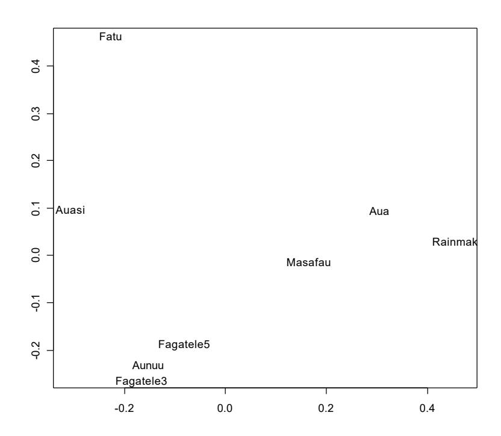

## **Species density**

Using Gower's distance on log10(density+1) the distance matrix is:

|           | Aua |      | Auasi | Aunuu |      | Fagatele3 Fagatele5 Fatu |      | Masafau |
|-----------|-----|------|-------|-------|------|--------------------------|------|---------|
| Auasi     |     | 0.31 |       |       |      |                          |      |         |
| Aunuu     |     | 0.25 | 0.2   |       |      |                          |      |         |
| Fagatele3 |     | 0.26 | 0.22  | 0.19  |      |                          |      |         |
| Fagatele5 |     | 0.22 | 0.2   | 0.16  | 0.16 |                          |      |         |
| Fatu      |     | 0.42 | 0.28  | 0.28  | 0.28 | 0.27                     |      |         |
| Masafau   |     | 0.21 | 0.22  | 0.17  | 0.18 | 0.15                     | 0.3  |         |
| Rainmaker |     | 0.17 | 0.22  | 0.18  | 0.15 | 0.13                     | 0.26 | 0.12    |

The interesting pattern here is that the closest two sites in the relative densities over species are Masefau and Rainmaker. As the reduced space plot below shows there is no clear evidence of a relationship with health. Though perhaps the y-axis (P.A. 2) might represent it.

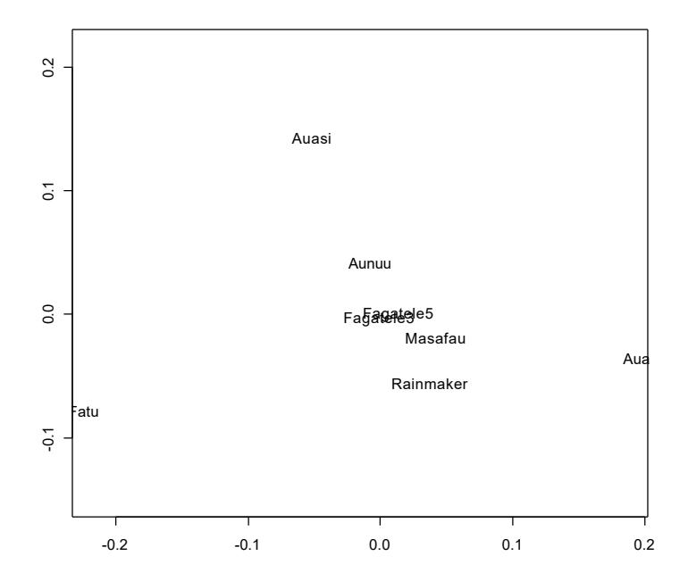

However examining this trend more closely just shows that it is primarily a contrast between Auasi and the rest.


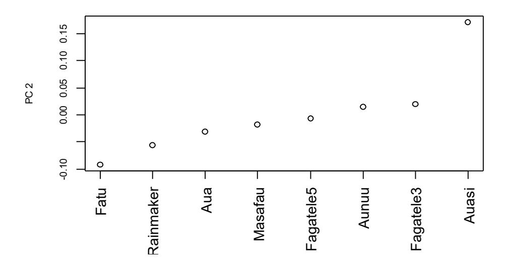

The 10 species most involved are:

| Acropora.crateriformis | 0.92  |
|------------------------|-------|
| Millepora              | 0.883 |
| Pocillopora.eydouxi    | 0.802 |
| Galaxea.fascicularis   | 0.786 |
| Montastrea.curta       | 0.748 |
| Pavona.collines        | 0.653 |
| Montipora.sp           | 0.575 |
| Montipora.foveolata    | 0.492 |

117

| Acropora.subulata | -0.477 |
|-------------------|--------|
| Palythoa          | -0.477 |

## **Species coverage**

The distance matrix (Gower's on log(cm<sup>2</sup> per m<sup>2</sup> + 1))

|           | Aua   | Auasi | Aunuu |       | Fagatele3 Fagatele5 Fatu |       | Masafau |
|-----------|-------|-------|-------|-------|--------------------------|-------|---------|
| Auasi     | 1.932 |       |       |       |                          |       |         |
| Aunuu     | 1.7   | 1.366 |       |       |                          |       |         |
| Fagatele3 | 1.865 | 1.736 | 1.609 |       |                          |       |         |
| Fagatele5 | 1.685 | 1.651 | 1.536 | 1.739 |                          |       |         |
| Fatu      | 1.676 | 1.467 | 1.705 | 1.807 | 1.745                    |       |         |
| Masafau   | 1.805 | 1.941 | 1.7   | 1.876 | 1.592                    | 1.939 |         |
| Rainmaker | 1.303 | 1.749 | 1.604 | 1.753 | 1.522                    | 1.561 | 1.697   |

The smallest distances are between Aua and Rainmaker, but once again Auasi is bafflingly close to Fatu.

The reduced space plot shows:

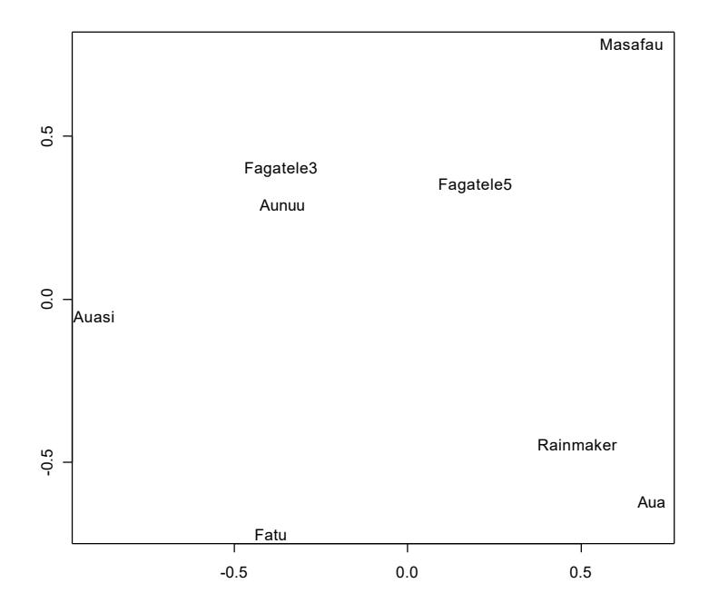

Principal Axis 1 (the x axis) Links Masefau, Aua, and Rainmaker, and contrasts them with Auasi, could this be some sort of exposure gradient? Certainly P.A.2 does seem to contrast the harbour sites with the others.

This contrast is more clearly shown in the following plot:

**PC 2 against site**

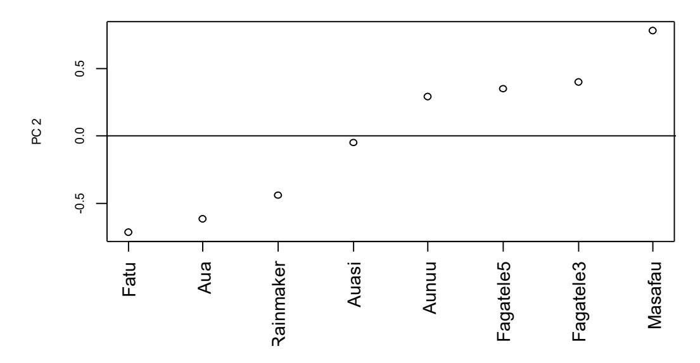

Once again Masefau stands out.

The species associated with this gradient:

| Pocillopora.verrucosa -0.731 |        |
|------------------------------|--------|
| Galaxea.fascicularis         | 0.706  |
| Acropora.insignis            | 0.705  |
| Acropora.hyacinthus          | 0.631  |
| Pocillopora.eydouxi          | 0.613  |
| Pocillopora.danae            | -0.606 |
| Millepora.sp                 | -0.604 |
| Porites.cylindrica           | 0.582  |
| Acropora.divaricata          | 0.582  |
| Montipora.divaricata         | 0.582  |
| Montipora.hispida            | 0.582  |
| Porites.enc                  | 0.582  |
| Acropora.subulata            | -0.532 |
| Palythoa                     | -0.532 |
| Pocillopora.damicornis-0.497 |        |
| Montipora.grisea             | 0.478  |
| Montipora.foveolata          | 0.445  |
| Porites.rus                  | 0.405  |
| Goniastrea.retiformis        | 0.401  |
| Acropora.crateriformis 0.401 |        |

Once again the predominance of Acroporids is clear. A more detailed examination of the patterns of the individual species may help to identify health related species more clearly. Regrettably there is not time in this study.

119

## *Fish community*

## **Summary**

By analysing Alison Green's data for Tutuila separately for 2001 and 1996 we can identify that the major spatial trends in the data correspond well with the focus group's "health" rankings. It is the possible to identify a subset of 23 species that reappear in a number of the analyses. 12 of these species (in bold below) also appear in the temporal analyses described earlier in this report. They therefore appear to be good candidates for further investigation.

| Chromis.margaritifer             | Healthy?   |
|----------------------------------|------------|
| Plectroglyphidodon.johnstonianus | Healthy?   |
| Thalassoma.quinquevittatum       | Healthy?   |
| Melichthys.vidua                 | Healthy?   |
| Acanthurus.nigricans             | Healthy?   |
| Gomphosus.varius                 | Healthy?   |
| Plectroglyphidodon.dickii        | Healthy?   |
| Labroides.rubrolabiatus          | Healthy?   |
| Chlorurus.sordidus               | Healthy?   |
| Chromis.acares                   | Healthy?   |
| Scarus.oviceps                   | Healthy?   |
| Chaetodon.vagabundus             | Healthy?   |
| Cheilinus.unifasciatus           | Healthy?   |
| Zebrasoma.veliferum              | Healthy?   |
| Scarus.forsteni                  | Healthy?   |
| Labrichthys.unilineatus          | Healthy?   |
| Forcipiger.flavissimus           | Unhealthy? |
| Acanthurus.pyroferus             | Unhealthy? |
| Monotaxis.grandoculis            | Unhealthy? |
| Heniochus.monoceros              | Unhealthy? |
| Canthigaster.solandri            | Unhealthy? |
| Halichoeres.prosopeion           | Unhealthy? |
| Synodus.variegatus               | Unhealthy? |

## *2001*

### **Species numbers**

There was a significant difference between sites in 2001 (p<0.0005). Though, as the figure below shows there as no detectable relationship with "health", even though the number of species varied from 37 to 75.

PC 2 against site

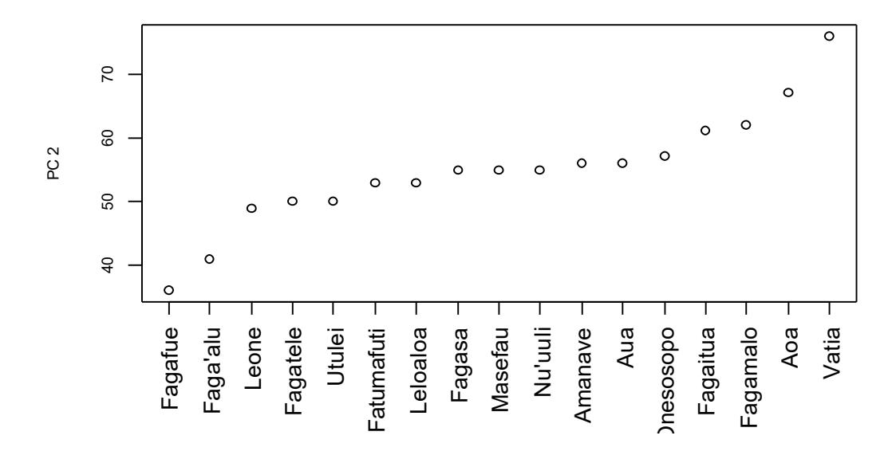

#### Total abundance.

Similarly, even though there were significant differences in the number of fish seen at the different sites (p<0.0005) there was no detectable relationship with "health".


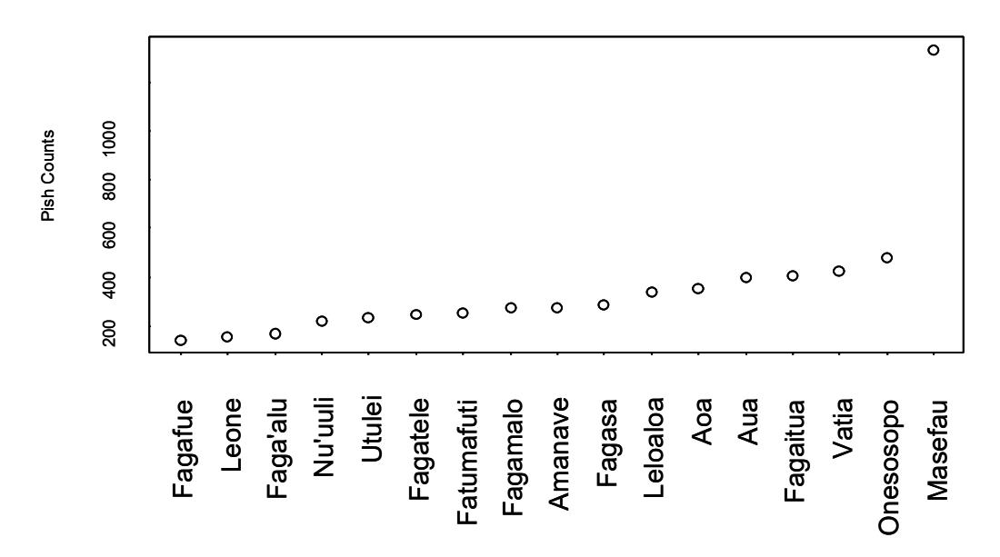

The extraordinary abundances recorded at Masefau may be related to the high coral coverage reported in the same region for 2001.

121

## **Species composition**

By simply correlating the presence absence data with the mean health score (from the experts) we can identify species whose presence (or absence) seems to be associated with "healthy" sites. The 20 species with the highest correlation:

| Chromis.margaritifer                  | 0.817  |
|---------------------------------------|--------|
| Plectroglyphidodon.dickii             | 0.763  |
| Acanthurus.pyroferus                  | -0.763 |
| Thalassoma.quinquevittatum            | 0.761  |
| Halichoeres.prosopeion                | -0.703 |
| Labrichthys.unilineatus               | 0.7    |
| Gomphosus.varius                      | 0.679  |
| Monotaxis.grandoculis                 | -0.668 |
| Plectroglyphidodon.johnstonianus0.646 |        |
| Labroides.rubrolabiatus               | 0.622  |
| Cheilinus.fasciatus                   | -0.596 |
| Acanthurus.nigricans                  | 0.578  |
| Heniochus.acuminatus                  | -0.578 |
| Heniochus.monoceros                   | -0.572 |
| Canthigaster.solandri                 | -0.565 |
| Cheilinus.unifasciatus                | 0.553  |
| Centropyge.bispinosus                 | -0.542 |
| Scarus.oviceps                        | 0.532  |
| Acanthurus.nigricauda                 | 0.529  |
| Synodus.variegatus                    | -0.529 |

Interestingly when the species composition data is analysed by a principal coordinate analysis on the Jaccards distance measure the fist principal axis, the major trend in the data is highly correlated with the "health" scores.

|       | corr  | pvaluer | N  |
|-------|-------|---------|----|
| Nancy | 0.799 | 0.0000  | 17 |
| Peter | 0.760 | 0.0001  | 17 |
| Eva   | 0.828 | 0.0000  | 17 |
| Mean  | 0.867 | 0.0000  | 17 |

Notice that it is most highly correlated with the consensus value.


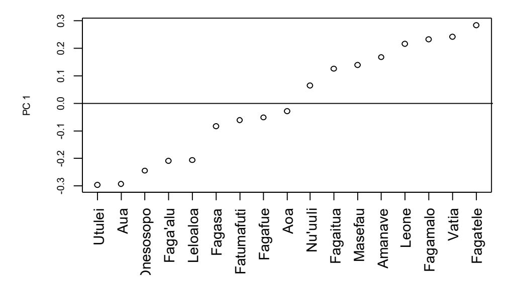

The 20 species most associated with this trend are:

| Chromis.margaritifer                  | 0.858  |
|---------------------------------------|--------|
| Plectroglyphidodon.johnstonianus0.857 |        |
| Thalassoma.quinquevittatum            | 0.837  |
| Melichthys.vidua                      | 0.772  |
| Halichoeres.prosopeion                | -0.748 |
| Canthigaster.solandri                 | -0.747 |
| Gomphosus.varius                      | 0.736  |
| Plectroglyphidodon.dickii             | 0.723  |
| Acanthurus.pyroferus                  | -0.723 |
| Labroides.rubrolabiatus               | 0.717  |
| Chlorurus.sordidus                    | 0.674  |
| Monotaxis.grandoculis                 | -0.674 |
| Chromis.acares                        | 0.659  |
| Heniochus.monoceros                   | -0.655 |
| Scarus.oviceps                        | 0.644  |
| Chaetodon.vagabundus                  | -0.64  |
| Cheilinus.unifasciatus                | 0.609  |
| Synodus.variegatus                    | -0.595 |
| Scarus.forsteni                       | 0.591  |
| Labrichthys.unilineatus               | 0.579  |

There's is 75% overlap between this list and the one associating species with the consensus "health" score. This suggest that the major trend in the data indeed matches the subjective assessment of the focus group.

## **Species abundances**

Once again the abundances have been transformed by (log10(x+(x=0)\*0.1)+1, so Gower's distance again has an order-of-magnitude interpretation.

123

Again the data can be correlated with the consensus measure of "health" The 20 species that are most associated with this are:

| Heniochus.monoceros        | -0.754 |
|----------------------------|--------|
| Acanthurus.nigricans       | 0.723  |
| Chaetodon.citrinellus      | -0.716 |
| Zanclus.cornutus           | -0.683 |
| Monotaxis.grandoculis      | -0.630 |
| Gomphosus.varius           | 0.629  |
| Pomacentrus.brachialis     | -0.626 |
| Chromis.acares             | 0.605  |
| Balistapus.undulatus       | -0.603 |
| Plectroglyphidodon.dickii  | 0.584  |
| Thalassoma.quinquevittatum | 0.582  |
| Forcipiger.flavissimus     | -0.579 |
| Chlorurus.sordidus         | 0.573  |
| Heniochus.varius           | -0.555 |
| Halichoeres.hortulanus     | 0.552  |
| Heniochus.acuminatus       | -0.550 |
| Halichoeres.prosopeion     | -0.544 |
| Zebrasoma.veliferum        | 0.542  |
| Acanthurus.pyroferus       | -0.538 |
| Centropyge.bispinosus      | -0.531 |
|                            |        |

60% of these species overlap with the species composition lists.

The analysis of the species abundances for the 2001 data gives a health related pattern:

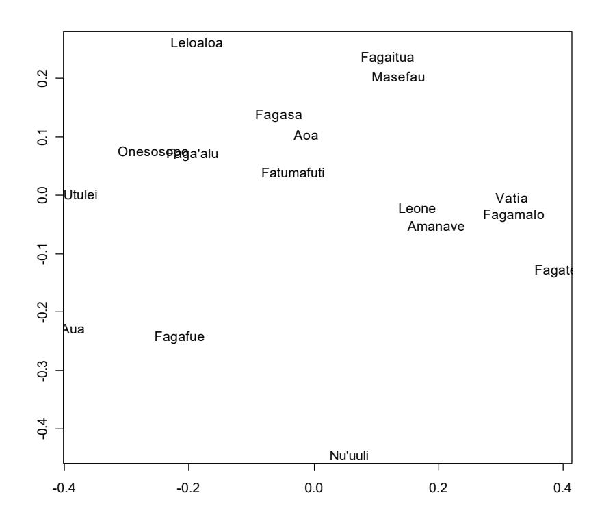

Principal Axis 1 (x-axis) suggests a health related gradient.

**PC 1 against site**

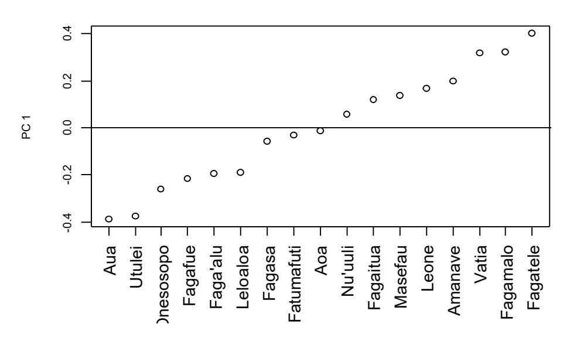

Correlation of PA1 with the "health" scores.

|       | corr | pcorr        | N |    |
|-------|------|--------------|---|----|
| Nancy |      | 0.792<0.0001 |   | 17 |
| Peter |      | 0.739<0.0001 |   | 17 |
| Eva   |      | 0.755<0.0001 |   | 17 |
| Mean  |      | 0.841<0.0001 |   | 17 |

Note that again the strongest correlation is with the consensus measure (very reassuring).

The 20 species with the strongest correlation with PA 1 are:

| 0.863                                 |
|---------------------------------------|
| Plectroglyphidodon.johnstonianus0.832 |
| 0.807                                 |
| 0.805                                 |
| 0.805                                 |
| 0.805                                 |
| 0.801                                 |
| -0.797                                |
| 0.766                                 |
| 0.753                                 |
| -0.703                                |
| 0.661                                 |
| 0.656                                 |
| 0.652                                 |
| -0.652                                |
| -0.640                                |
| 0.623                                 |
| -0.614                                |
| -0.604                                |
| 0.600                                 |
|                                       |

90% of these species appeared in the previous lists. It appears that there are a reasonably consistent subset of species associated with the dominant spatial patterns and also the health index.

## **Alison Green's data 1996**

These data are a priori less likely to give a clear relationship since the sites are at much earlier stages of recovery. However I felt was worth looking.

## **Species composition**

The top 20 correlations of the species presence absence data with Health showed some of the usual suspects.

| Plectroglyphidodon.johnstonianus | 0.695  |
|----------------------------------|--------|
| Acanthurus.nigricans             | 0.664  |
| Heniochus.monoceros              | -0.654 |
| Halichoeres.prosopeion           | -0.645 |
| Hemigymnus.fasciatus             | 0.598  |
| Labroides.rubrolabiatus          | 0.588  |
| Chaetodon.pelewensis             | -0.588 |
| Cephalopholis.argus              | 0.588  |
| Forcipiger.flavissimus           | -0.583 |

| Macolor.macularis          | -0.578 |
|----------------------------|--------|
| Saurida.spp.               | -0.578 |
| Naso.spp.                  | -0.578 |
| Chromis.weberi             | -0.561 |
| Cheilinus.diagrammus       | -0.561 |
| Halichoeres.hortulanus     | 0.561  |
| Anampses.twistii           | 0.553  |
| Thalassoma.quinquevittatum | 0.550  |
| Scarus.niger               | 0.542  |
| Pseudocheilinus.hexataenia | 0.538  |
| Cheilinus.trilobatus       | -0.529 |
|                            |        |

The analysis of the species composition data showed a pattern that does seem to relate to the health scores:

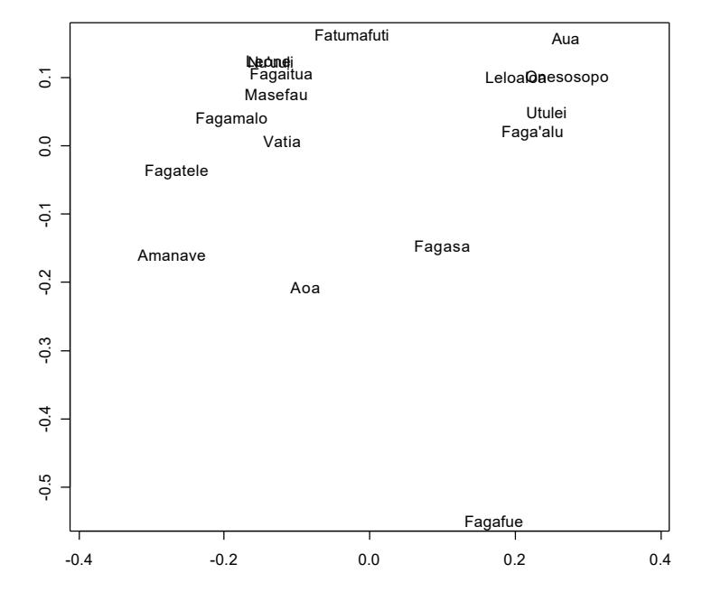

The dominant trend Principal axis 1 seems to have a plausible association with health. Though notice it is a negative association. And there is a clear separation between two groups of sites. The difference is, if anything clearer than in the corresponding data from 2001.

**PC 1 against site**

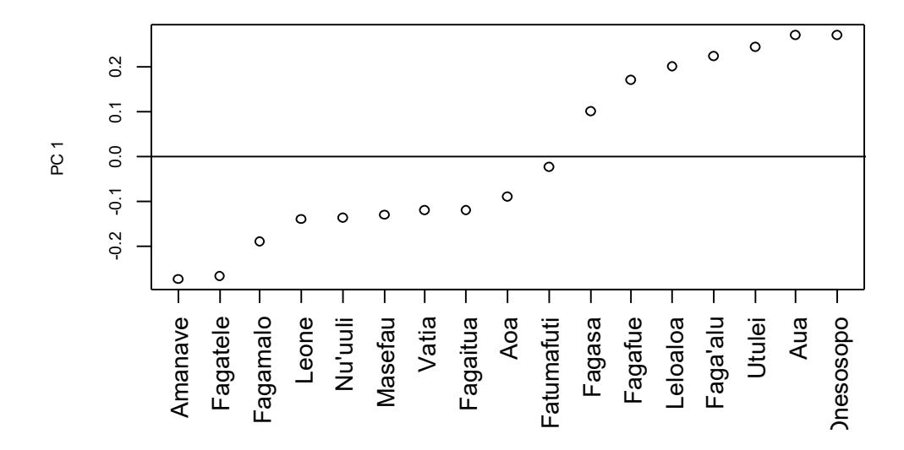

The correlations between PA 1 and the focus group rankings:

|       | corr | pcorr         | N |    |
|-------|------|---------------|---|----|
| Nancy |      | -0.831<0.0001 |   | 17 |
| Peter |      | -0.681<0.0001 |   | 17 |
| Eva   |      | -0.815<0.0001 |   | 17 |
| Mean  |      | -0.843<0.0001 |   | 17 |

Notice once again the correlation is strongest with the consensus value, and is very similar to the 2001 correlations.

The same species seem to reappear (65% of them appeared in the 2001 analyses – in bold). Note that a negative correlation indicates association with "health". A positive value is associated with harbour sites.

| Acanthurus.nigricans             | -0.788 |
|----------------------------------|--------|
| Labroides.rubrolabiatus          | -0.735 |
| Cephalopholis.argus              | -0.719 |
| Plectroglyphidodon.johnstonianus | -0.679 |
| Canthigaster.solandri            | 0.667  |
| Gomphosus.varius                 | -0.653 |
| Thalassoma.quinquevittatum       | -0.649 |
| Chromis.acares                   | -0.645 |
| Heniochus.monoceros              | 0.641  |
| Plectroglyphidodon.dickii        | -0.608 |
| Halichoeres.prosopeion           | 0.599  |
| Scarus.oviceps                   | -0.584 |
| Anampses.twistii                 | -0.561 |
| Scarus.frenatus                  | -0.552 |
| Scarus.forsteni                  | -0.552 |
| Parupeneus.multifasciatus        | 0.543  |
| Thalassoma.lutescens             | -0.540 |

| Chromis.margaritifer | -0.503 |
|----------------------|--------|
| Chaetodon.pelewensis | 0.507  |
| Cheilinus.diagrammus | 0.517  |

## **Species abundances**

The correlations of the species abundances with the consensus health index, show only 55% of the top 20 species coinciding with those form the 2001 analyses – in bold:

| Forcipiger.flavissimus                | -0.720 |
|---------------------------------------|--------|
| Hemigymnus.fasciatus                  | 0.638  |
| Heniochus.monoceros                   | -0.637 |
| Acanthurus.nigricans                  | 0.630  |
| Chaetodon.pelewensis                  | -0.611 |
| Plectroglyphidodon.johnstonianus0.605 |        |
| Labroides.rubrolabiatus               | 0.604  |
| Halichoeres.prosopeion                | -0.591 |
| Heniochus.varius                      | -0.589 |
| Halichoeres.hortulanus                | 0.588  |
| Macolor.macularis                     | -0.578 |
| Saurida.spp.                          | -0.566 |
| Cheilinus.trilobatus                  | -0.553 |
| Gomphosus.varius                      | 0.547  |
| Chromis.weberi                        | -0.546 |
| Pseudocheilinus.hexataenia            | 0.544  |
| Canthigaster.solandri                 | -0.544 |
| Thalassoma.quinquevittatum            | 0.542  |
| Cephalopholis.argus                   | 0.535  |
| Macropharyngodon.meleagris            | 0.524  |
|                                       |        |

The analysis of the Gower's distance matrix on the transformed data showed:

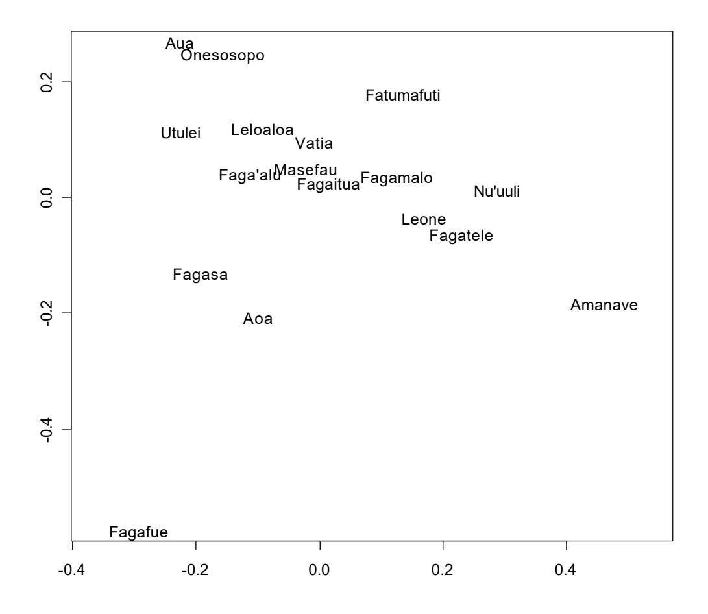

Principal axis 1 could act as a crude measure though a more consistent gradient can be idenitified as running diagonally from top left to mid right leaving Fagafue more in the middle of the gradient rather than as next door to the harbour sites.

However to keep it simple I have used PA 1

130

**PC 1 against site**

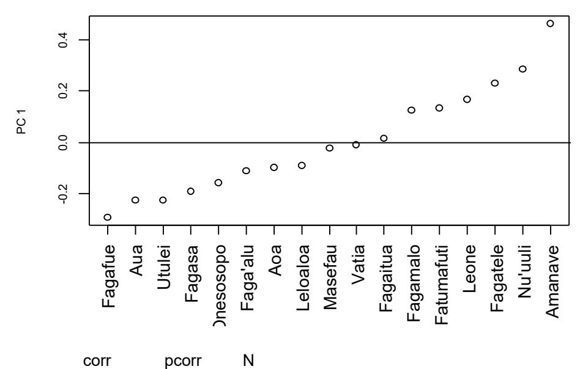

| Nancy | 0.673 | 0.002 | 17 |
|-------|-------|-------|----|
| Peter | 0.254 | 0.163 | 17 |
| Eva   | 0.579 | 0.007 | 17 |
| Mean  | 0.532 | 0.014 | 17 |

There is a moderate association with "health" and the top 20 species show a corresponding set of familiar names – 65% appeared in 2001:

| Labroides.rubrolabiatus          | 0.814  |
|----------------------------------|--------|
| Chromis.margaritifer             | 0.790  |
| Acanthurus.nigricans             | 0.769  |
| Chromis.acares                   | 0.764  |
| Cephalopholis.argus              | 0.726  |
| Thalassoma.quinquevittatum       | 0.701  |
| Scarus.frenatus                  | 0.678  |
| Scarus.oviceps                   | 0.678  |
| Chlorurus.sordidus               | 0.675  |
| Gomphosus.varius                 | 0.622  |
| Parupeneus.multifasciatus        | -0.612 |
| Plectroglyphidodon.dickii        | 0.610  |
| Pseudodax.moluccanus             | 0.573  |
| Stegastes.fasciolatus            | 0.573  |
| Scarus.forsteni                  | 0.572  |
| Chrysiptera.taupou               | -0.566 |
| Plectroglyphidodon.johnstonianus | 0.544  |
| Canthigaster.solandri            | -0.533 |
| Ctenochaetus.cyanocheilus        | 0.525  |
| Chaetodon.vagabundus             | -0.513 |

## **Concordance with temporal analyses**

It is reassuring to see the same species coming up in the different analyses. A further step might be to investigate whether these species that show these spatial patterns in "health" show corresponding changes through time.

In the Fagetele analysis of species composition, of the 10 most correlated with the first principal component for change through time, 6 of the species overlapped. (60%). All were positively associated with a rise in incidence in later years.

| Scarus.oviceps             | 0.983 |
|----------------------------|-------|
| Melichthys.vidua           | 0.981 |
| Thalassoma.quinquevittatum | 0.937 |
| Acanthurus.nigricans       | 0.931 |
| Chromis.margaritifer       | 0.921 |
| Scarus.forsteni            | 0.911 |

For the abundance data

Only

Gomphosus.varius 0.9 Appears in the "health" data sets.

In Alison's data the species associated with the changes from 1996 to 2001 (Redundancy variate 2) were:

Bold indicates species that have appeared in one (at least) of the above spatial analyses. These results reassure that these species may well have potential as indicators.

| Plectroglyphidodon.dickii        | 0.714  |
|----------------------------------|--------|
| Chaetodon.reticulatus            | 0.662  |
| Plectroglyphidodon.johnstonianus | 0.66   |
| Acanthurus.nigricans             | 0.659  |
| Chlorurus.sordidus               | 0.646  |
| Gomphosus.varius                 | 0.586  |
| Chromis.margaritifer             | 0.576  |
| Ctenochaetus.striatus            | 0.551  |
| Pseudocheilinus.hexataenia       | 0.529  |
| Chrysiptera.taupou               | -0.515 |
| Plectroglyphidodon.lacrymatus    | 0.515  |
| Scarus.oviceps                   | 0.462  |
| Chaetodon.ornatissimus           | 0.442  |
| Acanthurus.pyroferus             | -0.425 |
| Chaetodon.trifascialis           | 0.401  |
| Chaetodon.vagabundus             | -0.397 |
| Acanthurus.blochii               | -0.388 |
| Chaetodon.citrinellus            | -0.385 |
| Parupeneus.multifasciatus        | -0.373 |
| Scarus.frenatus                  | 0.371  |
|                                  |        |

# **Recommendations for designs and future analyses**

- 1) Get all remaining data entered into Excel spreadsheets as soon as possible. Attempt to recover missing data where possible. In particular see if the macroinvertebrate and the algal data can be located.
- 2) Island wide survey: Unless there are pressing biological or managerial reasons to continue sampling, abandon all sites that currently have more than two missing values, and make every effort to sample the remaining sites on every occasion at least one depth. The archipelago survey done by Alison Green shows what can be done. A final decision as to the utility of this survey cannot be made without the 2001 data. The coral data set has clear and useful signal largely due to the 2001 set. The 2001 fish data were not available and I would be reluctant to see this data set terminated without knowing what was being lost.
- 3) Abandon the 18m depth it gains little.
- 4) Abandon the 1988 fish data, the sampling appears to have been deviant.
- 5) Mr Eric Treml has access to a hydrological model of the coast for the prediction of larval coral dispersion patterns. This should be accessed and data on the exposure of the current sampling sites should be added to the data set. The difference between exposed and sheltered sites in Fagatele suggest that the precision of any analysis could be improved by the use of this data.
- 6) It has emerged in these analyses that the data are of quite good quality and contain a good deal of ecological information. Future data analyses should be integrated with GIS systems. The spatial information used in this analysis has been crude map ("as the crow flies") distances, these are clearly inadequate. Not only can many of the results of the analysis be usefully presented on maps (with or without interpolation) the analysis could be made more sensitive and relevant by access to "as the fish swims " distances which are more easily acquired from a GIS system; or even "as a planula floats" distances which would require the use of the hydrological model to calculate.
- 7) Future Analyses.
  - a) Re-analyse existing data sets when more data are made available in machine readable form e.g. 1985 and 1988 for Tutuila fish and coral. In particular analyse the complete Tutuila data sets using all available data (especially 2001 for the fish data) so that recommendations as to continuing the sampling program can made..
  - b) Look for relationships between fish and coral community structure (preliminary work suggests that this could be a productive area, increasing our understanding of the reef system as a whole, and making further suggestions for indicator species.
  - c) Look for relationships between the substrate type and fish communities in Alison Green's 1998 2001 archipelago data sets.
  - d) Combine Alison Green's size data with the data base of published lengthweight relationships for reef fish to get biomass estimates.

# **Fisheries data analyses for Department of Marine and Wildlife Resources.**

## *Looking for trend in CPUE*

### **Summary**

We found three groups of fish – Albacore, mahimahi and billfish - show signs of overfishing, and that two other groups – bigeye and sharks – show markedly increasing CPUE. This is almost certainly due to their being increasingly targetted, deliberately or accidentally. Two other groups – skipjack and Wahoo - also show increasing CPUE, though less clearly.

#### 1) Albacore

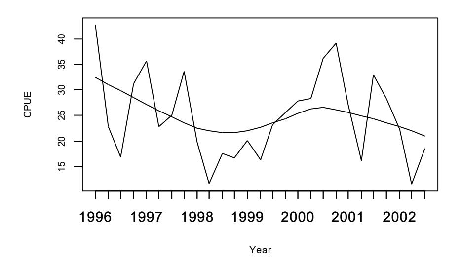

No evidence of autocorrelation, so simple regression.

| Standard |           | Approx |           |          |         |         |
|----------|-----------|--------|-----------|----------|---------|---------|
|          | Variable  | DF     | Estimate  | Error    | t Value | Pr >  t |
|          |           |        |           |          |         |         |
|          | Intercept | 1      | 3.2428    | 0.1387   | 23.37   | <.0001  |
|          | date      | 1      | -0.006206 | 0.008660 | -0.72   | 0.4802  |

No detectable linear trend. But the non-linear smoother is suggestive.

#### 2) Yellowfin

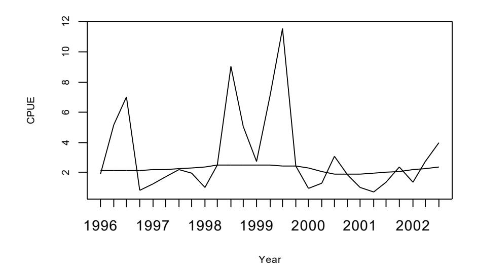

| Variable  | DF | Estimate | Standard<br>Error | t Value | Approx<br>Pr >  t |
|-----------|----|----------|-------------------|---------|-------------------|
| Intercept | 1  | 1.0348   | 0.3009            | 3.44    | 0.0021            |
| date      | 1  | -0.0133  | 0.0188            | -0.71   | 0.4861            |

No detectable linear trend.

#### 3) Skipjack

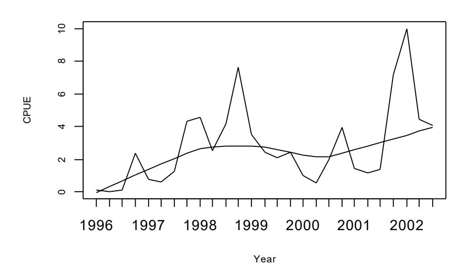

No evidence of autocorrelation, so simple regression.

| Variable                   | DF | Estimate | Standard<br>Error | t Value | Approx<br>Pr >  t |
|----------------------------|----|----------|-------------------|---------|-------------------|
| Intercept                  | 1  | -0.4320  | 0.4146            | -1.04   | 0.3078            |
| date                       | 1  | 0.0744   | 0.0254            | 2.93    | 0.0073            |
| Significant positive trend |    |          |                   |         |                   |

### 4) Bigeye

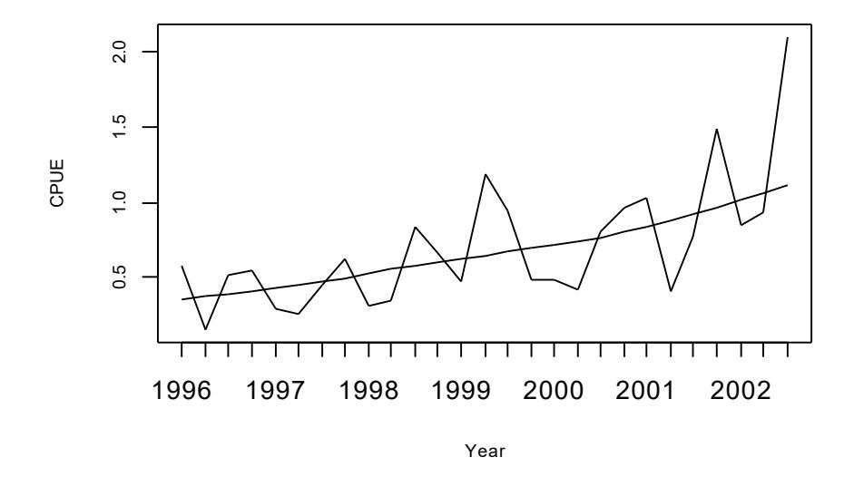

Significant negative autocorrelation at lag 2 – evidence of a 2 quarter low-high cycle Seasonality.

| Variable  | DF | Estimate | Standard<br>Error | t Value | Approx<br>Pr >  t |
|-----------|----|----------|-------------------|---------|-------------------|
| Intercept | 1  | -1.1647  | 0.1191            | -9.78   | <.0001            |
| date      | 1  | 0.0463   | 0.007506          | 6.17    | <.0001            |

#### Expected Autocorrelations

| Lag | Autocorr    |
|-----|-------------|
|     | 0<br>1.0000 |
|     | 1<br>0.0000 |
| 2   | -0.3982     |

Significant positive trend in CPUE

#### 5) Wahoo

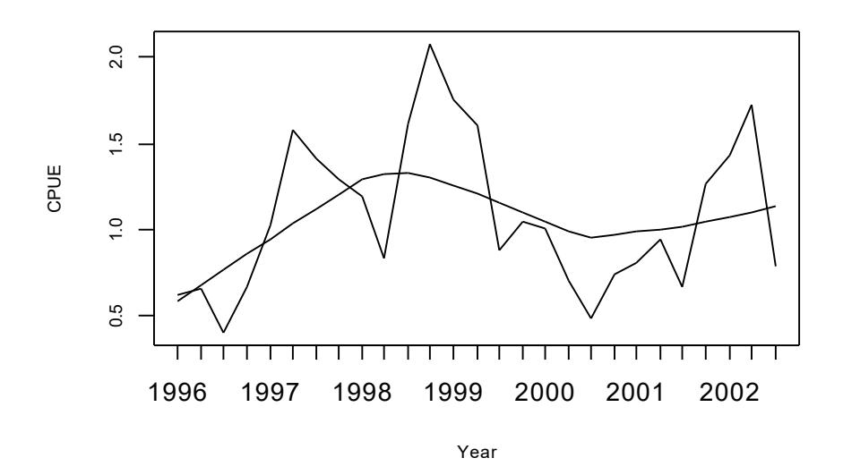

Positive first order autoregression –

|           |    |          | Standard |         | Approx  |
|-----------|----|----------|----------|---------|---------|
| Variable  | DF | Estimate | Error    | t Value | Pr >  t |
| Intercept | 1  | -0.1411  | 0.2935   | -0.48   | 0.6352  |
| date      | 1  | 0.007372 | 0.0179   | 0.41    | 0.6838  |

No evidence of linear trend.

#### 6) Mahimahi

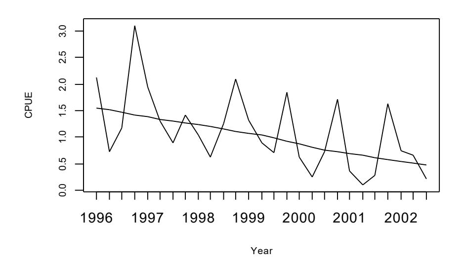

Negative 2 lag correlation - seasonality

| Variable  | DF | Estimate | Standard<br>Error | t Value | Approx<br>Pr >  t |
|-----------|----|----------|-------------------|---------|-------------------|
| Intercept | 1  | 0.6865   | 0.1429            | 4.80    | <.0001            |
| DATE      | 1  | -0.0595  | 0.009037          | -6.59   | <.0001            |

 Expected Autocorrelations

| Lag | Autocorr |
|-----|----------|
| 0   | 1.0000   |
| 1   | 0.0000   |
| 2   | -0.6045  |

#### Significant negative trend

#### 7) Billfish

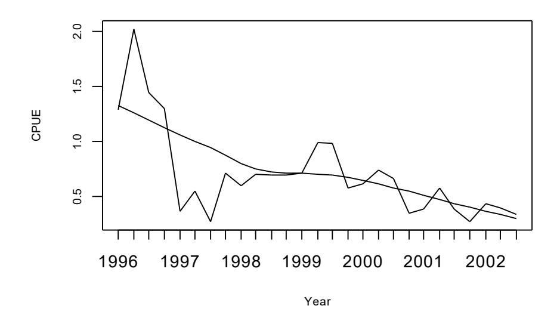

#### No significant autocorrelation

| Variable  | DF | Estimate | Standard<br>Error | t Value | Approx<br>Pr >  t |
|-----------|----|----------|-------------------|---------|-------------------|
| Intercept | 1  | 0.0849   | 0.1623            | 0.52    | 0.6055            |
| DATE      | 1  | -0.0405  | 0.0101            | -3.99   | 0.0005            |

Significant negative trend.

#### 8) Sharks

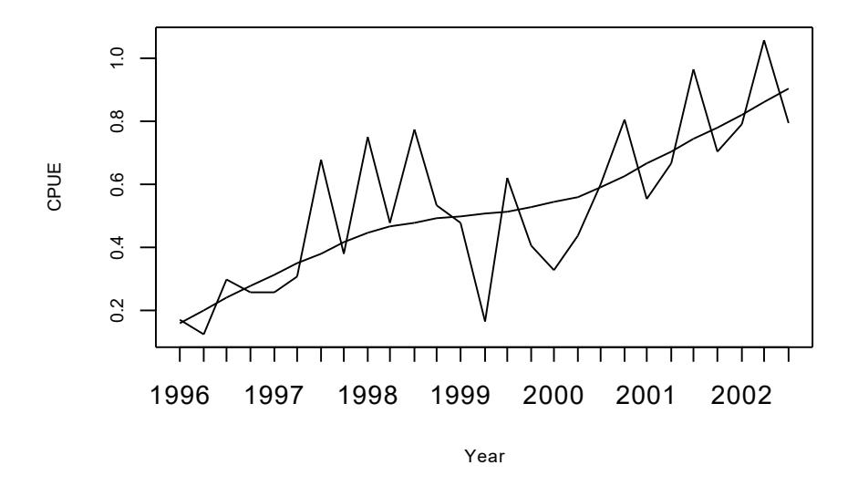

significant autocorrelation

| Variable  | DF | Estimate | Standard<br>Error | t Value | Approx<br>Pr >  t |
|-----------|----|----------|-------------------|---------|-------------------|
| Intercept | 1  | -1.4788  | 0.1597            | -9.26   | <.0001            |
| DATE      | 1  | 0.0510   | 0.009965          | 5.12    | <.0001            |

Positive trend.

## *Conclusion*

The interesting results here are that Billfish are showing clear signs of over fishing, and that in two of the species: Bigeye and Shark there are clear increases in CPUE with time. This is only possible if the populations of either (or both) species have in fact grown during that time (extremely unlikely) or that there has been a change in fishing strategy so that these fish are caught with greater efficiency. Given that shark is, I believe, a prohibited catch…

139

No

## *Modelling catch using past hooks*

By looking at whether the number of hooks set in the corresponding quarter in the previous year is related to the number of fish caught in this year we have an alternative way for detecting overfishing. It should be capable of picking up some non-linear trends in CPUE.

#### Albacore

#### Significant autocorrelation

| Expected  |                  |          |                  |         |         |  |
|-----------|------------------|----------|------------------|---------|---------|--|
|           |                  |          | Autocorrelations |         |         |  |
|           | Lag<br>Autocorr  |          |                  |         |         |  |
|           |                  | 0        | 1.0000           |         |         |  |
|           |                  | 1        | 0.0000           |         |         |  |
|           |                  | 2        | -0.5009          |         |         |  |
|           |                  |          | Standard         |         | Approx  |  |
| Variable  | DF               | Estimate | Error            | t Value | Pr >  t |  |
| Intercept | 1                | 230.3344 | 1931             | 0.12    | 0.9063  |  |
| hooks     | 1                | 34.6229  | 2.6706           | 12.96   | <.0001  |  |
| pasthooks | 1                | -3.3410  | 0.8173           | -4.09   | 0.0006  |  |
|           | Regress R-Square | 0.9635   | Total R-Square   |         | 0.9333  |  |

Hooks negatively related - more hooks in the last year fewer fish caught now. Evidence of overfishing.

### Yellowfin No significant autocorrelation

|                  |    |          | Standard       |         | Approx  |
|------------------|----|----------|----------------|---------|---------|
| Variable         | DF | Estimate | Error          | t Value | Pr >  t |
| Intercept        | 1  | 160.2963 | 589.0348       | 0.27    | 0.7883  |
| hooks            | 1  | 1.7117   | 0.4908         | 3.49    | 0.0023  |
| pasthooks        | 1  | 0.1398   | 0.1552         | 0.90    | 0.3782  |
| Regress R-Square |    | 0.6357   | Total R-Square |         | 0.6357  |

No detectable effect associated with past hooks.

#### Skipjack.

| Variable         | DF | Estimate  | Standard<br>Error | t Value | Approx<br>Pr >  t |
|------------------|----|-----------|-------------------|---------|-------------------|
| Intercept        | 1  | -626.8216 | 702.4790          | -0.89   | 0.3847            |
| hooks            | 1  | -0.4739   | 0.9223            | -0.51   | 0.6140            |
| pasthooks        | 1  | 1.7584    | 0.2826            | 6.22    | <.0001            |
| Regress R-Square |    | 0.9008    | Total R-Square    |         | 0.8405            |

Strong positive relationship, detecting the positive trend visible in the CPUE plot..

#### Expected Autocorrelations

| Lag | Autocorr |
|-----|----------|
| 0   | 1.0000   |
| 1   | 0.0000   |
| 2   | -0.6270  |

#### Bigeye

No detectable autocorrelation

|           |                  |           | Standard       |         | Approx  |
|-----------|------------------|-----------|----------------|---------|---------|
| Variable  | DF               | Estimate  | Error          | t Value | Pr >  t |
| Intercept | 1                | -241.5749 | 277.3289       | -0.87   | 0.3940  |
| hooks     | 1                | 0.8733    | 0.3210         | 2.72    | 0.0132  |
| pasthooks | 1                | 0.1186    | 0.0948         | 1.25    | 0.2253  |
|           | Regress R-Square | 0.7583    | Total R-Square |         | 0.7583  |

No apparent relationship.

#### Wahoo

No autocorr

| Variable  | DF               | Estimate | Standard<br>Error | t Value | Approx<br>Pr >  t |
|-----------|------------------|----------|-------------------|---------|-------------------|
| Intercept | 1                | 77.2990  | 115.3161          | 0.67    | 0.5103            |
| hooks     | 1                | 0.3649   | 0.1336            | 2.73    | 0.0129            |
| pasthooks | 1                | 0.2073   | 0.0395            | 5.25    | <.0001            |
|           | Regress R-Square | 0.9272   | Total R-Square    |         | 0.9272            |

Positive relationship. This appears to be consistent with an increasing CPUE over time, See the CPUE plot.

#### Mahimahi

|           |                  |          | Standard       |         | Approx  |
|-----------|------------------|----------|----------------|---------|---------|
| Variable  | DF               | Estimate | Error          | t Value | Pr >  t |
| Intercept | 1                | 157.6643 | 132.8919       | 1.19    | 0.2509  |
| hooks     | 1                | 0.4665   | 0.2161         | 2.16    | 0.0446  |
| pasthooks | 1                | 0.0560   | 0.0691         | 0.81    | 0.4288  |
|           | Regress R-Square | 0.7817   | Total R-Square |         | 0.6568  |

#### Nothing

#### Billfish

| Variable  | DF | Estimate | Standard<br>Error | t Value | Approx<br>Pr >  t |
|-----------|----|----------|-------------------|---------|-------------------|
| Intercept | 1  | 77.7932  | 28.6502           | 2.72    | 0.0142            |
| hooks     | 1  | 0.4542   | 0.0323            | 14.08   | <.0001            |

| pasthooks                                             | 1 | -0.0272 | 0.009456       | -2.88 | 0.0101 |  |
|-------------------------------------------------------|---|---------|----------------|-------|--------|--|
| Regress R-Square                                      |   | 0.9686  | Total R-Square |       | 0.9565 |  |
| Significant negative effect. Evidence of overfishing. |   |         |                |       |        |  |
| Expected                                              |   |         |                |       |        |  |
| Autocorrelations                                      |   |         |                |       |        |  |

| Lag | Autocorr     |
|-----|--------------|
|     | 0<br>1.0000  |
|     | 1<br>-0.1505 |
|     | 2<br>-0.5903 |
|     | 3<br>0.4705  |

Sharks Significant autocorrelation

|           |                  |             | Standard       |         |         |
|-----------|------------------|-------------|----------------|---------|---------|
|           | Lag              | Coefficient | Error          | t Value |         |
|           | 1                | -0.636761   | 0.175464       | 3.63    |         |
|           | 2                | -0.667702   | 0.175464       | 3.81    |         |
|           |                  |             | Standard       |         | Approx  |
| Variable  | DF               | Estimate    | Error          | t Value | Pr >  t |
| Intercept | 1                | -98.9288    | 21.4075        | -4.62   | 0.0002  |
| hooks     | 1                | 0.6649      | 0.0292         | 22.74   | <.0001  |
| pasthooks | 1                | 0.0518      | 0.008906       | 5.81    | <.0001  |
|           | Regress R-Square | 0.9958      | Total R-Square |         | 0.9820  |

Positive relationship – the more hooks you set in the past the more you get per hook now. Consistent with an increasing CPUE.

## *Conclusion*

As found with the CPUE analysis performed above there is evidence of overfishing in Billfish and these analyses support the suggestion seen in the CPUE graphs of overfishing of the Albacore stocks. The increase in CPUE over time associated with Big-eye and shark is reinforced and the same trend that was visible in the CPUE plot for Skipjack is confirmed.