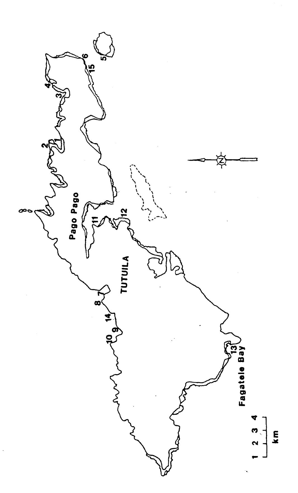
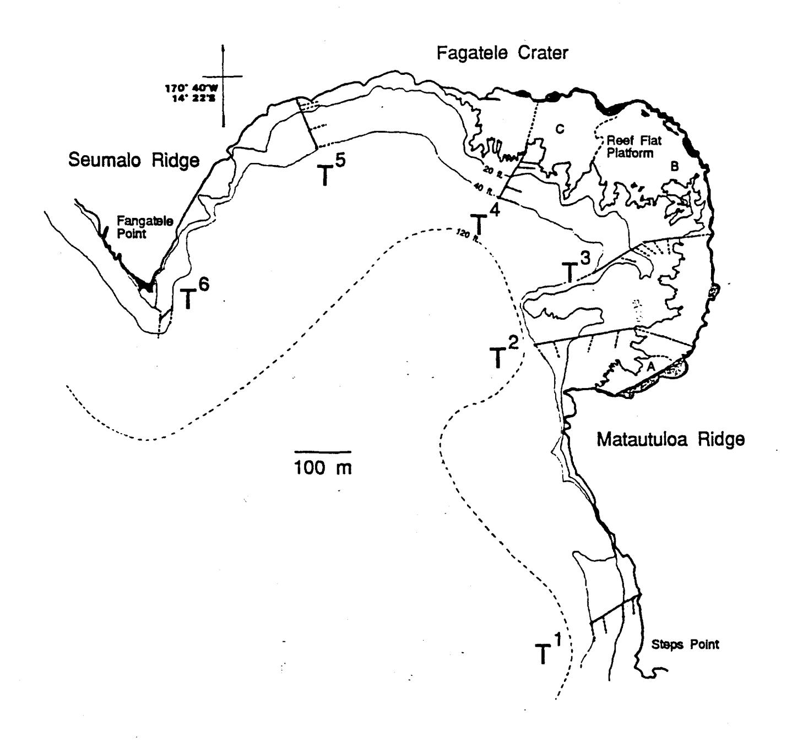
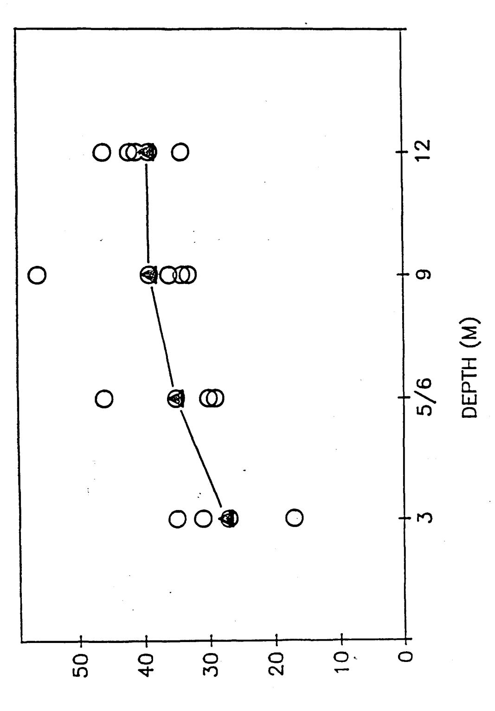
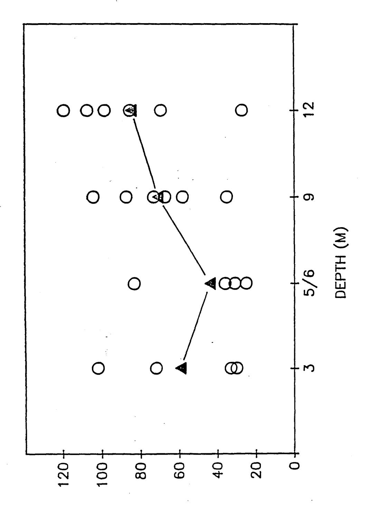
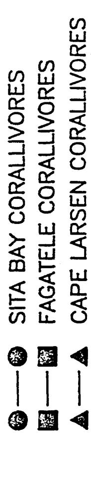
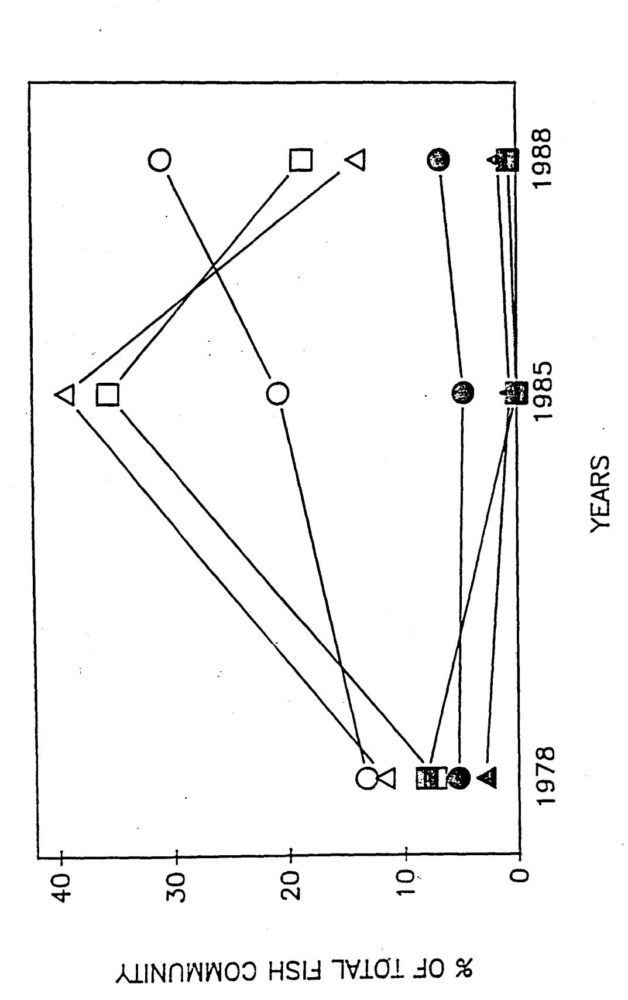
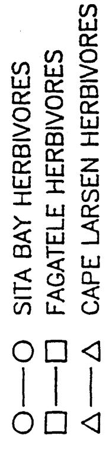
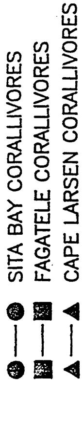
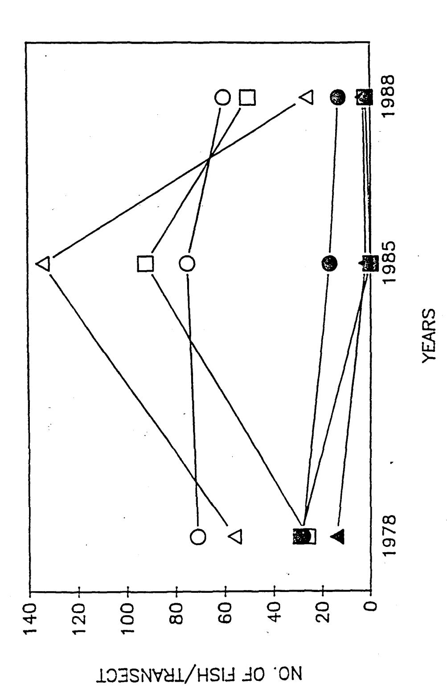

# REPORT TO NATIONAL OCEANIC AND ATMOSPHERIC ADMINISTRATION U.S. DEPARTMENT OF COMMERCE

1994

Coral and Reef-Fish Assessment of the Fagatele Bay National Marine Sanctuary

Charles Birkeland, Richard S. Randall, and Steven S. Amesbury

University of Guam Marine Laboratory UOG Station, Mangilao, Guam 96923

## TABLE OF CONTENTS

| Abstractii                          | i |
|-------------------------------------|---|
| Coral Communities of American Samoa |   |
| Introduction                        | 1 |
| Methods                             | 1 |
| Results                             | 4 |
| Discussion                          |   |
| Acknowledgements                    | 7 |
| Literature Cited                    | 7 |
| Fish Communities of American Samoa  |   |
| Introduction8                       | 2 |
| Materials and Methods8              | 2 |
| Results and Discussion8             | 3 |
| Titorature Cited                    | _ |

#### Abstract

A quantitative survey of the coral communities in Fagatele Bay National Marine Sanctuary was made using the point-quarter method to assess size distribution, abundance, and surface cover by each of the scleractinian species. The 22 transects in this survey of 1988 were at the same sites as the transects of 1985, i.e., in 6 sets evenly distributed across the Marine Sanctuary, with transects at each of 5 depths. It was found that there has been a general increase in abundance of coral colonies (number per m2) and surface cover by living coral, but the coral community in the bay was still occupied to a large extent by benthic algae. corals were recovering most rapidly in deep water at the central region of the bay. The coral communities were initially damaged to a lesser extent by <a href="Acanthaster planci">Acanthaster planci</a> in the shallow regions and outer margins of the bay because of protection by stronger wave action in these regions. Therefore, we found more corals in shallow water, but a greater recovery rate in deeper water. colonies were still generally small, but they were becoming numerous, probably as a result of frequent recruitment. size and surface cover have not been increasing as rapidly as has the abundance. Although the number of small recruits has been increasing, the surface area occupied by corals has not been increasing rapidly to April 1988, but now that corals are abundant, each colony will be increasing in size and we predict that the surface cover by living corals will appear to increase relatively suddenly. Although the community in Fagatele Bay looked poor, our survey showed that there were actually many colonies present. We predict that by 1992-1994 the reef community may be recovered to approximately the state it was in terms of surface coverage and species richness prior to the 1978-1979 outbreak of Acanthaster planci. Mean colony size may still be smaller, and because of natural variability in space and time we cannot expect natural communities to be identical in all aspects.

We also quantitatively surveyed the coral communities around Tutuila at 12 sites that we had previously surveyed in 1982 and in 1985. The areas with the heaviest initial damage from the Acanthaster planci outbreak showed the greatest rates of recovery. The areas missed by the A. planci outbreaks did not change much. The reef at the Rainmaker Hotel was the only area we found in which the coral community was actually decreasing from effects of pollution and sedimentation on juveniles. most rapid recovery was in the areas in which the initial reduction in coral cover was the most severe. For example, at Aunu'u Island, the abundance of coral colonies (m2) increased from 0.5 (in 1982) to 4.43 (1985) to 27.82 (1988). The surface cover occuppied by living coral increased even more rapidly, from 0.06% (1982) to 1.83% (1985) to 17.8% (1988). The association of severe initial reduction in cover with rapidity of recovery may partly result from the favored prey of Acanthaster planci being the faster-growing corals.

The coral community near the Rainmaker Hotel showed opposite trends to all the other communities around the island. There has been a spectacular decrease in coral abundance (11.58 colonies m-2 in 1982, 0.84 in 1985, and 0.25 in 1988), a decrease in coral cover (27.7% in 1982, 19.2% in 1985, and 18.7% in 1988), and a major increase in mean colony size (12 cm diameter in 1982, 22 cm in 1985, and 41 cm in 1988). Sedimentation differentially affects small colonies and inhibits recruitment.

The fish communities in Fagatele Bay were more diverse and abundant in deeper areas than in shallow water. As would be expected, the abundances of coral-eating fishes declined after the corals were devastated by the outbreak A. planci. The corallivorous fishes were still scarce in 1988, probably because the cover of living coral was still low. The herbivorous fishes became abundant when the coral was replaced by algae, but the abundance of herbivorous fishes had declined by 1988.

#### INTRODUCTION

In April of 1985, a survey was made of the coral and fish communities in Fagatele Bay and 12 other sites around Tutuila, American Samoa, following a major outbreak of the coral-predator Acanthaster planci in 1978-1979. In order that changes in the coral and fish communities could be monitored along the transects in Fagatele Bay, a series of permanent transect markers were established. Six transects were established in Fagatele Bay at approximately even intervals between the east and west borders of the marine sanctuary, running perpendicular to shore from the reef margin to a depth of 12 m. Detailed descriptions of the physiography of the marine habitats, the coral communities, the locations of the transects, and vertical profiles along the six transects in Fagatele Bay National Marine Sanctuary are presented in Birkeland et al. (1987). Detailed descriptions were also provided for the reef-flat platform, reef margin, and forereef slope zones.

In April of 1988, a follow-up survey was done along the same transects in Fagatele Bay and at the other 12 sites previously surveyed around Tutuila Island. A total of 22 coral transects and 20 fish-count transects were completed along isobaths (1 m, 3 m, 5 m, 9 m, and 12 m) from the six permanent transects in Fagatele Bay National Marine Sanctuary. Strong swells were present throughout our work and so shallow transects were impossible at three of the sites, but we were nevertheless able to accomplish the deeper transects at all sites. Twenty-two of the 24 transects at other locations around Tutuila were also resurveyed. Amesbury was able to resurvey the 100-m fish-count transects established by R.C. Wass in previous years at Fagatele Bay, Sita Bay and Cape Larsen.

In this report we present the results of our surveys of 1988. We found that the patterns of recovery or change in the coral communities differed among sites in ways that might be explained by the past histories in combination with the present conditions of the areas. The results of the survey of fishes showed that the crown-of-thorns starfish had second- and third-order effects on the marine communities. The coral-eating fishes became scarce because of the disappearance of corals, while the herbivorous fishes became more common because of the increased food supply of benthic algae.

#### **METHODS**

The corals were surveyed using the point-quarter method as described in detail in the previous report on Fagatele Bay National Marine Sanctuary (Birkeland et al. 1987). An advantage of the point-quarter method over the quadrat method is that when the individual colonies are scattered widely, the point-quarter method allows the investigator to measure precisely the abundances of the corals whereas only zeroes are collected by the quadrat method. If only zeroes are collected, we might not have

Map of locations of study sites around Tutuila Island: 1- inside Masefau Bay, 2- outside Masefau Bay (Asaga Strait), 3- Aoa Bay, 4- Onenoa Bay, 5- Aunu'u Island, 6- Matuli Point, 7- Fagasa Bay, 8- Cape Larsen, 9- Fagafue Bay, 10- Massacre Bay, 11- Rainmaker Hotel, 12- Fatu Rock, 13- Fagatele Bay, 14- Sita Bay, 15-Auasi. Fig. 1.

Fig. 2. Locations of the permanent Transects 1-6 (T1-T6, solid lines) in Fagatele Bay National Marine Sanctuary and the 30-m survey transects (dotted lines). The boundaries of A- the intertidal reef platform veneered with loose rubble, B- the subtidal reef platform with abundant corals, and C- the intertidal volcanic bench are indicated by dashed lines.

any idea of the order of magnitude of the scarcity of a species. The quadrat method may become adequate in future years after the corals become abundant, but it would not have been satisfactory during the 1982, 1985 and 1988 surveys. For monitoring, it is important that we continue with the same survey methods because changing survey methods between years makes statistical analyses improper.

The recent development of the extremely precise, small, and relatively inexpensive portable satellite location finder will make future surveys much more efficient and less time-consuming. The greatest problem in the surveys of Fagatele Bay to date has been in finding the permanent transect markers. Although the permanent markers are large, galvanized, 1.9 cm (3/4 inch) diameter spikes, the 0.65 km2 (163 acre) area of Fagatele Bay is also very large. The slope of the coral reef in Fagatele Bay is gradual enough that the isobaths extend over a large area. To date, the markers have been found by triangulation from fixed points on the map and on the shoreline (cf. the diagrammatic view of the coastline given for this purpose in Figure 4 in Birkeland et al. 1987) with a hand-bearing compass. The hand-bearing compass is open to variance from movements of the boat on the waves and in variation in angle of the compass with the eye of the observer. Our experience has shown that the Magellan portable satellite location finder is accurate to within 15 m.

We highly recommend that the Fagatele Bay National Marine Sanctuary obtain a portable satellite location finder for monitoring the sanctuary. Several brands are available for just over \$2000, including postage.

#### RESULTS

Data on the size distributions (geometric mean diameters, standard deviations, and ranges in diameters), abundances of colonies (per m² and relative percentage), and cover of the reef substratum (per m² and relative percentages) are given in Tables la-lv for each of the species of corals along each of the 22 transects surveyed in Fagatele Bay in April 1988. Comparable data for the same transects surveyed in April 1985 are given in Tables 3a-3y in Birkeland et al. (1987).

Likewise, data on the size distributions (geometric mean diameters, standard deviations, and ranges in diameters), abundances of colonies (per m² and relative percentage), and cover of the reef substratum (per m² and relative percentages) are given in Tables 2a-2v for each of the species of corals along transects at each of two depths at 12 sites around Tutuila in April 1988. Comparable data for the same transects surveyed in April 1985 are given in Tables 4 - 15 in Birkeland et al. (1987).

The abundances of coral colonies are compared among 5 depths along each of the six transects in Fagatele Bay in April 1985 and April 1988 in Table 2. The results of the April 1985 and April

1988 surveys for the percent cover of substrata by corals at 5 depths along each of the six transects in Fagatele Bay are given in Table 3. Table 4 presents the mean colony diameters for corals at the 5 depths along the 6 transects in Fagatele Bay in April 1985 and in April 1988.

Summary statistics are given for the abundances, percent cover, and mean colony sizes in Tables 6, 7, and 8, respectively, for corals along two depth contours at 12 sites around Tutuila. The mean values are given for two depths (2-3 m and 6 m) for the month of April in three years (1982, 1985, 1988).

Because of the remarkable lack of holothuroids in our detailed survey of 1985 (1140-m2 of transects plus hours of searching outside the transects), we were constantly on the look-out and made a determined effort to find any holothuroids in Fagatele Bay in 1988. In our (Birkeland, Randall, Amesbury) combined (33 mandays) of field-work, not a single holothuroid or <u>Acanthaster planci</u> was observed.

#### DISCUSSION

The coral communities have generally been recovering around American Samoa. There was a general increase in abundances of coral colonies and in the percent of substratum covered by living coral from 1982 to 1985 and further to 1988 in the areas all around Tutuila (Tables 6 and 7) in which the coral communities had been severely reduced by the outbreak of <u>Acanthaster planci</u> in 1978-1979.

The most rapid recovery was in the areas in which the initial reduction in coral cover was the most severe. For example, at Aunu'u Island, the abundance (Table 6) of coral colonies (m²) increased from 0.5 (in 1982) to 4.43 (1985) to 27.82 (1988). The surface cover occupied by living coral (Table 7) increased even more rapidly, from 0.06% (1982) to 1.83% (1985) to 17.8% (1988). The association of severe initial reduction in cover with rapidity of recovery may partly result from the favored prey of Acanthaster planci being fast-growing corals. Acropora were predominant at Aunu'u, and so the reef around Aunu'u was especially severely affected by the outbreak of A. planci. However, Acropora is the fastest growing coral, and so the increases in abundance and surface cover occurred most rapidly at Aunu'u.

In Fagatele Bay (Tables 3 and 4), the increases in abundance and surface cover of the coral community occurred in the center of the bay (Transects 2 - 4), and less obviously at the margins (Transects 1 and 6). The coral communities along Transects 1 and 6 were less severely impacted by predation by Acanthaster planci, probably because of the strong wave action in these areas. A. planci is not well adapted to holding onto the substratum in strong surf conditions (Birkeland and Lucas 1990). In 1988, the

greatest abundance and surface cover of coral in Fagatele Bay was in the center (Transect 3), and generally decreased towards the margins of the bay.

The influence of heavy wave action was also greater in shallow-transect areas of Fagatele Bay, and so the shallow regions were affected less severely than deeper regions along the transects (Tables 3 and 4). There was found to be greater surface cover in shallow regions of Fagatele Bay because of less inital mortality, but the increases in abundance and surface cover were occurring more rapidly in deeper regions along the transects.

The abundance, surface cover, and mean colony size did not substantially change among 1982-1985-1988 in areas which were missed by the outbreak of <u>Acanthaster planci</u> (Fagafue Bay and Massacre Bay). Where there was little damage, there was little recovery (Tables 6 - 8).

The mean colony sizes showed a general increase on 15 out of 22 transects in Fagatele Bay from 1985 to 1988 (Table 5). The reason that the mean size often did not change much and sometimes decreased was that there was substantial recruitment of new recruits, especially following heavy mortality from the crown-of-thorns outbreak.

The coral community near the Rainmaker Hotel showed opposite trends to all the other communities around the island (Tables 6, 7, and 8). There has been a spectacular decrease in coral abundance (11.58 colonies m-2 in 1982, 0.84 in 1985, and 0.25 in 1988), a decrease in coral cover (27.7% in 1982, 19.2% in 1985, and 18.7% in 1988), and a major increase in mean colony size (12 cm diameter in 1982, 22 cm in 1985, and 41 cm in 1988). The cause might be pollution and sedimentation. Sedimentation differentially affects small colonies and inhibits recruitment. Therefore, what might be happening is that the larger colonies are surviving, but small colonies are dying and there has been essentially no recruitment. The coral community at the Rainmaker Hotel is slowly dying, while the communities at other sites around Tutuila, including Fagatele Bay, are recovering.

In summary, the coral community in Fagatele Bay has been making substantial progress towards recovery. New recruits have been accumulating in the community, and so the colony size and surface cover have not been increasing as rapidly as has the abundance (number of colonies m-2). We predict that with the number of small recruits increasing, the surface area occupied by corals has not been increasing rapidly to April 1988, but now that corals are abundant, each colony will be increasing in size and we predict that the surface cover by living corals will appear to increase relatively suddenly. Although the community in Fagatele Bay looked poor, our survey showed that there were actually many colonies present. We predict that by 1992-1994 the reef community may be recovered to approximately the state it was in terms of surface coverage and species richness prior to the 1978-

1979 outbreak of <u>Acanthaster planci</u>. Mean colony size may still be smaller, and because of natural variability in space and time we cannot expect natural communities to be identical in all aspects.

The recovery of the Fagatele Bay coral community appears to involve a diverse array of species, and the predominant species on each transect appear to be representative of what was there before. We suspect that any effort to enhance recovery by transplantation would be very time-consuming and expensive, and would have a negligible effect compared with the natural recovery processes.

## Acknowledgements

As always, we had complete support from OMWR personnel, thanks to the Director, Raymond Tulafono. In particular, Dave Itano and Fa'asega "Stu" Kuresa not only took care of logistics, but they were essential help in the field. They located and marked the permanent transects in Fagatele Bay. We realize now that we would not have had time to resurvey all the transects if we had to locate and mark the transects first. Mrs. Nancy Daschbach participated in most of the fieldwork and helped us greatly in making logistic arrangements. Troy Buckley also handled the boat for us and Fale Tuilaga took care of trucking us across the island and launching the Boston Whaler. We operated with full support from the staff of OMWR even on the weekend. In view of the importance of weekends in Samoan culture, and especially in consideration of the approaching Flag Day, the support we received was outstanding.

## LITERATURE CITED

- Birkeland, C., and J.S. Lucas. 1990. <u>Acanthaster planci</u>: major management problem of coral reefs. CRC Press, Boca Raton. 257 p.
- Birkeland, C., R.H. Randall, R.C. Wass, B. Smith, and S. Wilkins. 1987. Biological resource assessment of the Fagatele Bay National Marine Sanctuary. NOAA Technical Memorandum NOS MEMD 3, U.S. Department of Commerce. 232 p.

- Table 1. Coral community at Fagatele Bay National Marine Sanctuary. Results of a quantitative survey of 22 transects in April 1988.
  - a. Transect 1 9 m depth
  - b. Transect 1 12 m depth
  - c. Transect 2 1 m depth
  - d. Transect 2 3 m depth
  - e. Transect 2 5 m depth
  - f. Transect 2 9 m depth
  - g. Transect 2 12 m depth
  - h. Transect 3 1 m depth
  - i. Transect 3 3 m depth
  - j. Transect 3 5 m depth
  - k. Transect 3 9 m depth
  - 1. Transect 3 12 m depth
  - m. Transect 4 3 m depth
  - n. Transect 4 5 m depth
  - o. Transect 4 9 m depth
  - p. Transect 4 12 m depth
  - q. Transect 5 3 m depth
  - r. Transect 5 5 m depth
  - s. Transect 5 9 m depth
  - t. Transect 5 12 m depth
  - u. Transect 6 5 m depth
  - v. Transect 6 12 m depth

| Bay: Fagatele Transect: 1 |          | Size Distribution (colony diameters in cm) | Size Distribution olony diameters i | n in cm) | Density | relative density | % cover | relative % cover |
|------------------------------|----------|-----------------------------------------------|----------------------------------------|-------------|---------|---------------------|---------|---------------------|
| Date: 13 April 1988          | Z        | ¥                                             | S                                      | W           |         |                     |         |                     |
| Pocillopora elegans          | 6        | 19.0                                          | 6.62                                   | 8.4 - 28.5  | 2.45    | 20.5                | 7.7     | 24.4                |
| Acropora crateriformis       | <b>†</b> | 23.1                                          | 3.63                                   | 18.9 - 26.7 | 1.09    | 9.1                 | 4.7     | 14.8                |
| Pocillopora eydouxi          | 2        | 17.8                                          | 7.20                                   | 11.5 - 26.8 | 1.36    | 11.4                | 3.8     | 12.3                |
| Montipora ehrenbergii        | 4        | 20.7                                          | 4.09                                   | 15.5 - 24.8 | 1.09    | 9.1                 | 3.8     | 12.1                |
| Coscinaraea columna          | 3        | 21.3                                          | 14.2                                   | 4.9 - 30.3  | 0.81    | 6.8                 | 3.8     | 12.1                |
| Montipora herryi             | 2        | 24.7                                          | 6.10                                   | 20.4 - 29.0 | 0.54    | 4.5                 | 2.7     | 8.5                 |
| Astreopora sp.1              | 3        | 15.6                                          | 92.9                                   | 7.8 - 19.5  | 0.81    | 6.8                 | 1.8     | 5.6                 |
| Porites lutea                | 1        | 25.7                                          |                                        |             | 0.27    | 2.3                 | 1.5     | 4.5                 |
| Porites (P.) sp.2            | 9        | 6.9                                           | 2.94                                   | 3.9 - 10.8  | 1.62    | 13.6                | 0.7     | 2.2                 |
| Favia rotumana               | 1        | 17.6                                          |                                        |             | 0.27    | 2.3                 | 0.7     | 2.1                 |
| Coscinaraea sp.1             | 4        | 5.8                                           | 2.55                                   | 3.9 - 9.5   | 1.09    | 9.1                 | 0.3     | 1.1                 |
| Acropora hyacinthus          | 1        | 6.0                                           |                                        |             | 0.27    | 2.3                 | 0.1     | 0.2                 |
| Cynhastrea serailia          | 1        | 3.2                                           |                                        |             | 0.27    | 2.3                 | 0.02    | 0.02                |
|                              |          |                                               |                                        | -           |         |                     |         |                     |
| Sinularia                    | 3        | 6.0                                           | 3.52                                   | 3.5 - 10.0  | 0.72    | 5.9                 | 0.4     | 6.0                 |
| <u>Lobophytum</u>            | 2        | 5.2                                           | 1.64                                   | 4.0 - 6.3   | 0.48    | 3.9                 | 0.1     | 0.4                 |
| Palythoa                     | 7        | 3.9                                           | 2.01                                   | 2.4 - 5.3   | 0.48    | 3.9                 | 0.1     | 0.2                 |
|                              |          |                                               |                                        |             |         |                     |         |                     |

| F |                      |  |
|---|----------------------|--|
|   |                      |  |
|   | 31.6                 |  |
|   |                      |  |
|   | 11.9                 |  |
|   | 2.4 - 30.3           |  |
|   |                      |  |
|   | 15.9                 |  |
|   | 44                   |  |
|   | Total scleractinians |  |

| Bay: Fagatele Transect: 1 Depth: 12 m Date: 13 April 1988 | z | Size Distribution (colony diameters in cm) $\overline{\overline{Y}}$ | Size Distribution $\frac{\text{Sloop}}{\overline{\Upsilon}}$ S | in cm) W | Density | relative density | % cover | relative % cover |
|--------------------------------------------------------------------|---|----------------------------------------------------------------------|----------------------------------------------------------------|-------------|---------|---------------------|---------|---------------------|
| Montipora eydouxi                                                  | 4 | 12.2                                                                 | 10.25                                                          | 2.4 - 26.8  | 66.0    | 13.8                | 1.9     | 16.7                |
| Pocillopora eydouxi                                                | 1 | 30.0                                                                 |                                                                |             | 0.24    | 3.4                 | 1.7     | 15.8                |
| Acropora crateriformis                                             | 1 | 27.5                                                                 |                                                                |             | 0.24    | 3.4                 | 1.4     | 13.3                |
| Pocillopora elegans                                                | 1 | 24.5                                                                 |                                                                |             | 0.24    | 3.4                 | 1.1     | 10.5                |
| Coscinaraea columna                                                | - | 21.9                                                                 |                                                                |             | 0.24    | 3.4                 | 6.0     | 8.4                 |
| Montipora verrilli                                                 | က | 9.4                                                                  | 10.25                                                          | 3.0 - 21.2  | 0.74    | 10.3                | 6.0     | 8.3                 |
| Astreopora sp.1                                                    | က | 10.2                                                                 | 6.42                                                           | 2.8 - 14.7  | 0.74    | 10.3                | 8.0     | 6.9                 |
| Montipora ehrenbergii                                              | 1 | 15.0                                                                 |                                                                |             | 0.24    | 3.4                 | 0.4     | 4.0                 |
| Pavona maldivensis                                                 | - | 14.9                                                                 |                                                                |             | 0.24    | 3.4                 | 0.4     | 3.9                 |
| Porites (P.) sp.2                                                  | က | 9.9                                                                  | 5.05                                                           | 1.4 - 11.5  | 0.74    | 10.3                | 0.4     | 3.2                 |
| Montastrea curta                                                   |   | 12.0                                                                 |                                                                |             | 0.24    | 3.4                 | 0.3     | 2.5                 |
| Cyphastrea serailia                                                | 1 | 11.0                                                                 |                                                                |             | 0.24    | 3.4                 | 0.2     | 2.1                 |
| Leptastrea purpurea                                                | 2 | 6.5                                                                  | 2.0                                                            | 5.1 - 7.9   | 0.50    | 6.9                 | 0.2     | 1.6                 |
| Favia rotumana                                                     | 2 | 6.4                                                                  | 0.5                                                            | 6.0 - 6.7   | 0.50    | 6.9                 | 0.2     | 1.4                 |
| Coscinaraea sp.1                                                   | 2 | 5.0                                                                  | 2.8                                                            | 3.0 - 6.9   | 0.50    | 6.9                 | 0.1     | 1.0                 |
| Acropora digitifera                                                | 1 | 3.2                                                                  |                                                                |             | 0.24    | 3.4                 | 0.02    | 0.2                 |
| <u>Platygyra daedalea</u>                                          | 1 | 3.0                                                                  |                                                                |             | 0.24    | 3.4                 | 0.02    | 0.2                 |
| -                                                                  |   |                                                                      |                                                                |             |         |                     |         |                     |

| Lobophytum           | 1  | 12.6 |      |            | 0.23 | 3.0 | 0.3  | 2.7 |
|----------------------|----|------|------|------------|------|-----|------|-----|
| <u>Palythoa</u>      | 3  | 4.5  | 2.50 | 2.0 - 7.0  | 99.0 | 9.1 | 0.1  | 1.2 |
|                      |    |      |      |            |      |     |      |     |
| Total scleractinians | 29 | 11.2 |      | 1.4 - 26.8 | 7.11 |     | 10.9 |     |

| Bay: Fagatele Transect: 2          |    | Size Distribution (colony diameters in cm) | Size Distribution olony diameters i | on in cm) | Density | relative density | % cover | relative % cover |
|---------------------------------------|----|-----------------------------------------------|----------------------------------------|--------------|---------|---------------------|---------|---------------------|
| Depth: 1 m Date: 5 April 1988      | Z  | $\overline{Y}$                                | S                                      | W            |         |                     |         |                     |
| <u>Porites lutea</u>                  | L  | 10.5                                          | 7.8                                    | 3.9 - 22.0   | 0.41    | 11.7                | 0.5     | 14.9                |
| <u>Acropora</u> cf. gem <u>mifera</u> | 2  | 23.4                                          | 5.1                                    | 19.8 - 27.0  | 0.12    | 3.3                 | 0.5     | 14.6                |
| Porites (S.) rus                      | 9  | 11.4                                          | 7.3                                    | 4.2 - 20.4   | 0.35    | 10.0                | 0.5     | 13.8                |
| Porites (P.) sp. 2                    | 11 | 5.5                                           | 2.9                                    | 2.0 - 13.7   | 1.00    | 28.3                | 0.3     | 8.3                 |
| Goniastrea retiformis                 | 1  | 23.6                                          |                                        |              | 90.0    | 1.7                 | 0.3     | 7.4                 |
| Pavona divaricata                     | 3  | 11.1                                          | 7.0                                    | 3.0 - 15.9   | 0.18    | 5.0                 | 0.2     | 0.9                 |
| Pocillopora verrucosa                 | 3  | 11.5                                          | 4.8                                    | 8.0 - 17.0   | 0.18    | 5.0                 | 0.2     | 5.7                 |
| Montipora elschneri                   | 1  | 20.5                                          |                                        |              | 90.0    | 1.7                 | 0.2     | 5.4                 |
| Pocillopora eydouxi                   | 1  | 18.5                                          |                                        |              | 90.0    | 1.7                 | 0.2     | 4.6                 |
| <u>Acropora crateriformis</u>         | 1  | 18.0                                          |                                        |              | 90.0    | 1.7                 | 0.2     | 4.3                 |
| Pocillopora meandrina                 | 2  | 11.5                                          | 6.3                                    | 7.0 - 15.9   | 0.12    | 3.3                 | 0.1     | 4.0                 |
| Por Ilopora setchelli                 | 2  | 8.5                                           | 7.8                                    | 3.0 - 14.0   | 0.12    | 3.3                 | 0.1     | 2.6                 |
| Acropora hyacinthus                   | 1  | 14.0                                          |                                        |              | 90.0    | 1.7                 | 0.1     | 2.6                 |
| Millepora tuberosa                    | 1  | 11.2                                          |                                        |              | 90.0    | 1.7                 | 0.1     | 1.7                 |
| <u>Acropora digitifera</u>            | 1  | 9.4                                           |                                        |              | 90.0    | 1.7                 | 0.04    | 1.2                 |
| Lobophyllia hemprichii                | 1  | 8.8                                           |                                        |              | 90.0    | 1.7                 | 0.04    | 1.2                 |
| Leptastrea purpurca                   | 4  | 3.2                                           | 1.4                                    | 1.6 - 4.5    | 0.23    | 6.7                 | 0.02    | 9.0                 |
| Stylophora mordax                     | 1  | 6.3                                           |                                        |              | 90.0    | 1.67                | 0.02    | 9.0                 |

| Fungia scutaria       | 3  | 2.3 | 1.5 | 1.0 - 4.0  | 0.18 | 5.0 | 0.01 | 0.3 |
|-----------------------|----|-----|-----|------------|------|-----|------|-----|
| Stylocoeniella armata | 2  | 2.8 | 9.0 | 2.4 - 3.2  | 0.12 | 3.3 | 0.01 | 0.3 |
|                       |    |     |     |            |      |     |      |     |
| Total scleractinians  | 09 | 9.1 | 6.7 | 1.0 - 27.0 | 3.55 |     | 3.5  |     |

| Bay: Fagatele Transect: 2                                 |     | Size Distribution (colony diameters in cm) | Size Distribution olony diameters i | on in cm) | Density | relative density | % cover | relative % cover |
|--------------------------------------------------------------|-----|-----------------------------------------------|----------------------------------------|--------------|---------|---------------------|---------|---------------------|
| Depth: 3 m Date: 5 April 1988                             | z   | $\overline{\overline{Y}}$                     | S                                      | W            |         |                     |         |                     |
| Pocillopora verrucosa                                        | 10  | 11.6                                          | 3.6                                    | 6.5 - 16.0   | 1.33    | 16.7                | 1.5     | 21.0                |
| <u>Galaxea fascicularis</u>                                  | 15  | 8.1                                           | 2.9                                    | 4.6 - 14.0   | 2.00    | 25.00               | 1.2     | 15.9                |
| <u>Lobophyllia hemprichii</u>                                | 2   | 11.7                                          | 8.2                                    | 4.9 - 24.3   | 99.0    | 8.3                 | 1.0     | 13.6                |
| $\overline{	ext{Porites}}$ ( $\overline{	ext{P}}$ .) sp. $2$ | 12  | 7.2                                           | 2.9                                    | 3.9 - 12.0   | 1.60    | 20.00               | 8.0     | 11.4                |
| Goniastrea retiformis                                        | 4   | 13.4                                          | 4.3                                    | 7.4 - 17.0   | 0.53    | 6.7                 | 0.8     | 11.1                |
| Favites complanata                                           | 1   | 27.8                                          | ,                                      |              | 0.13    | 1.7                 | 0.8     | 11.1                |
| <u>Acropora hyacinthus</u>                                   | 2   | 13.2                                          | 8.1                                    | 7.5 - 18.9   | 0.27    | 3.3                 | 0.4     | 5.9                 |
| <u>Acropora</u> cf. gem <u>mifera</u>                        | 1   | 16.5                                          |                                        |              | 0.13    | 1.7                 | 0.3     | 3.8                 |
| Pocillopora <u>setchelli</u>                                 | 3   | 7.2                                           | 2.9                                    | 3.9 - 9.4    | 0.40    | 5.0                 | 0.2     | 2.5                 |
| <u>Acropora azurea</u>                                       | 3   | 7.1                                           | 2.1                                    | 5.0 - 9.2    | 0.40    | 5.0                 | 0.2     | 2.3                 |
| Echinopora hirsuitissima                                     | . 1 | 6.5                                           |                                        |              | 0.13    | 1.7                 | 0.03    | 0.4                 |
| Montipora caliculata                                         | 1   | 5.5                                           |                                        |              | 0.13    | 1.7                 | 0.03    | 0.4                 |
| Porites lichen                                               | 1.  | 3.0                                           |                                        |              | 0.13    | 1.7                 | 0.01    | 0.1                 |
|                                                              |     |                                               |                                        |              |         |                     |         |                     |
| Total scleractinians                                         | 60  | 9.4                                           | 5.1                                    | 3.0 - 27.8   | 7.97    |                     | 7.3     |                     |

| Bay: Fagatele Transect: 2     |    | Size Di colony d | Size Distribution (colony diameters in cm) | n in cm) | Density | relative density | % cover | relative % cover |
|----------------------------------|----|---------------------|-----------------------------------------------|-------------|---------|---------------------|---------|---------------------|
| Deptn: 5 m Date: 5 April 1988 | Z  | Y                   | S                                             | W           |         |                     |         |                     |
| Acropora azurea                  | 28 | 6.0                 | 4.1                                           | 2.0 - 14.0  | 1.58    | 46.7                | 9.0     | 28.2                |
| Pocillopora verrucosa            | 8  | 8.5                 | 4.8                                           | 4.2 - 16.0  | 0.45    | 13.3                | 0.3     | 14.5                |
| Acropora crateriformis           | 3  | 13.7                | 6.0                                           | 7.5 - 19.4  | 0.17    | 5.0                 | 0.3     | 13.2                |
| Millepora tuberosa               | 1  | 24.3                |                                               |             | 0.06    | 1.7                 | 0.3     | 11.4                |
| Pavona sp. 1                     | 1  | 21.5                |                                               |             | 0.06    | 1.7                 | 0.2     | 9.2                 |
| Pocillopora eydouxi              | 1  | 19.5                |                                               |             | 0.06    | 1.7                 | 0.2     | 7.5                 |
| Galaxea fascicularis             | 8  | 6.4                 | 1.7                                           | 4.9 - 9.8   | 0.45    | 13.3                | 0.2     | 9.9                 |
| Acropora digitifera              | 5  | 6.7                 | 4.9                                           | 3.0 - 15.3  | 0.28    | 8.3                 | 0.1     | 6.2                 |
| Pocillopora setchelli            | 2  | 6.3                 | 1.4                                           | 5.3 - 7.3   | 0.11    | 3.3                 | 0.03    | 1.3                 |
| Millepora platyphylla            | 1  | 6.5                 |                                               |             | 0.06    | 1.7                 | 0.02    | 6.0                 |
| Acropora squarrosa               | 1  | 3.9                 |                                               |             | 90.0    | 1.7                 | 0.01    | 0.4                 |
| Porites (P.) sp. 2               | 1  | 5.3                 |                                               |             | 0.06    | 1.7                 | 0.01    | 0.4                 |
|                                  |    |                     |                                               |             |         |                     |         |                     |
| Total scleractinians             | 09 | 7.6                 | 5.3                                           | 2.0 - 24.3  | 3.40    |                     | 2.3     |                     |

| Bay: Fagatule Transect: 2                                 |    | Size Distribution (colony diameters in cm) | Size Distribution olony diameters i | n in cm) | Density | relative density | % cover | relative % cover |
|--------------------------------------------------------------|----|-----------------------------------------------|----------------------------------------|-------------|---------|---------------------|---------|---------------------|
| Depth: 9 m Date: 5 April 1988                             | Z  | Y                                             | S                                      | W           |         |                     |         |                     |
| Pocillopora elegans                                          | 61 | 11.9                                          | 5.32                                   | 2.7 - 25.7  | 1.33    | 24.0                | 1.75    | 45.5                |
| $\overline{	ext{Porites}}$ ( $\overline{	ext{P}}$ .) sp. $2$ | 33 | 4.9                                           | 2.30                                   | 1.7 - 12.4  | 2.30    | 41.8                | 0.5     | 13.7                |
| Pocillopora verrucosa                                        | 2  | 15.9                                          | 12.1                                   | 7.4 - 24.5  | 0.14    | 2.5                 | 0.4     | 9.3                 |
| Acropora hyacinthus                                          | 7  | 8.5                                           | 4.81                                   | 2.7 - 16.9  | 0.49    | 8.9                 | 0.4     | 9.1                 |
| Montipora berryi                                             | 7  | 7.8                                           | 5.8                                    | 2.8 - 19    | 0.49    | 8.9                 | 0.3     | 8.8                 |
| Galaxea fascicularis                                         | 5  | 9.2                                           | 3.0                                    | 4.9 - 12.6  | 0.37    | 9.9                 | 0.3     | 6.5                 |
| Acropora tenuis                                              | 1  | 14.4                                          |                                        |             | 0.07    | 1.3                 | 0.1     | 3.0                 |
| Coscinaraea columna                                          | 1  | 11.4                                          |                                        |             | 0.07    | 1.3                 | 0.1     | 1.8                 |
| Goniastrea retiformis                                        | 1  | 9.5                                           |                                        |             | 0.07    | 1.3                 | 0.05    | 1.3                 |
| <u>Astreopora</u> sp. 1                                      | 1  | 6.7                                           |                                        |             | 0.07    | 1.3                 | 0.02    | 9.0                 |
| Pocillopora damicornis                                       | -  | 4.0                                           |                                        |             | 0.07    | 1.3                 | 0.01    | 0.2                 |
| Pavona varians                                               | 1  | 3.0                                           |                                        |             | 0.07    | 1.3                 | 0.005   | 0.1                 |
| • /                                                          |    |                                               |                                        |             |         |                     |         |                     |
| Sinularia                                                    | 3  | 6.9                                           | 4.83                                   | 1.5 - 10.8  | 0.21    | 3.7                 | 0.5     | 2.6                 |
|                                                              |    |                                               |                                        |             |         |                     |         |                     |
| Total scleractinians                                         | 79 | 8.0                                           |                                        | 1.7 - 25.7  | 5.5     |                     | 3.9     |                     |

| Bay: Fagatele Transect: 2      |    | Size D | Size Distribution (colony diameters in cm) | n in cm)  | Density | relative density | % cover | relative % cover |
|-----------------------------------|----|--------|-----------------------------------------------|--------------|---------|---------------------|---------|---------------------|
| Depth: 12 m Date: 5 April 1988 | z  | Ÿ      | S                                             | W            |         |                     |         |                     |
| Porites (P.) sp. 2                | 25 | 99.9   | 2.56                                          | 1.73 - 12.25 | 10.05   | 56.8                | 3.0     | 41.8                |
| Pocillopora elegans               | 2  | 12.24  | 8.83                                          | 6.00 - 18.49 | 08.0    | 4.5                 | 1.2     | 16.5                |
| Pavona varians                    | 3  | 10.55  | 1.00                                          | 9.54 - 11.53 | 1.20    | 6.8                 | 1.1     | 14.7                |
| Galaxea fascicularis              | 3  | 5.73   | 4.22                                          | 2.45 - 10.49 | 1.20    | 6.8                 | 0.4     | 5.8                 |
| Montipora ehrenbergii             | 2  | 6.93   | 4.06                                          | 4.06 - 9.80  | 08.0    | 4.5                 | 0.4     | 4.9                 |
| Platygyra daedalea                | 1  | 10.58  |                                               |              | 0.41    | 2.3                 | 0.4     | 4.9                 |
| Pocillopora verrucosa             | -  | 8.94   |                                               |              | 0.41    | 2.3                 | 0.4     | 4.9                 |
| Favites complanata                | 1  | 7.75   |                                               |              | 0.41    | 2.3                 | 0.2     | 2.6                 |
| Montastrea curta                  | 1  | 7.48   |                                               |              | 0.41    | 2.3                 | 0.2     | 2.4                 |
| Acropora hyacinthus               | 2  | 3.37   | 0.89                                          | 2.74 - 4.00  | 0.80    | 4.5                 | 0.1     | 1.0                 |
| Acropora tenuis                   | 1  | 4.24   |                                               |              | 0.41    | 2.3                 | 0.1     | 8.0                 |
| Stylocomiella armata              | 1  | 4.24   |                                               |              | 0.41    | 2.3                 | 0.1     | 8.0                 |
| Goniastrea retiformis             | 1  | 2.45   |                                               |              | 0.41    | 2.3                 | 0.02    | 0.3                 |
|                                   |    | -      |                                               |              |         |                     |         |                     |
| Sinularia                         | 1  | 8.49   |                                               |              | 0.18    | 2.2                 | 0.1     | 3.0                 |
|                                   |    |        |                                               |              |         |                     |         |                     |
| Total scleractinians              | 44 | 6.4    |                                               | 1.73 - 18.49 | 17.72   |                     | 7.2     |                     |

| Bay: Fagatele Transect: 3     |    | Size D (colony d | Size Distribution (colony diameters in cm) | n in cm) | Density | relative density | % cover | relative % cover |
|----------------------------------|----|---------------------|-----------------------------------------------|-------------|---------|---------------------|---------|---------------------|
| Depth: 1 m Date: 4 April 1988 | z  | Ϋ́                  | S                                             | W           |         |                     |         |                     |
| Porites cylindrica               | 2  | 31.0                | 12.0                                          | 13.9 - 43.9 | 2.12    | 8.3                 | 17.9    | 41.2                |
| Porites (S.) rus                 | 7  | 12.7                | 11.8                                          | 4.6 - 38.0  | 2.97    | 11.7                | 9.9     | 15.1                |
| Pavona divaricata                | 10 | 12.0                | 5.1                                           | 4.6 - 20.1  | 4.24    | 16.7                | 5.6     | 12.9                |
| <u>Acropora crateriformis</u>    | 3  | 23.1                | 1.6                                           | 21.5 - 24.7 | 1.27    | 5.0                 | 5.3     | 12.2                |
| Porites (P.) sp. 2               | 21 | 5.5                 | 2.2                                           | 2.4 - 11.5  | 8.90    | 35.0                | 2.5     | 5.7                 |
| Pocillopora verrucosa            | 7  | 10.0                | 12.1                                          | 1.4 - 18.5  | 0.85    | 3.3                 | 1.1     | 2.6                 |
| Fungia scutaria                  |    | 2.5                 | 8.0                                           | 1.4 - 3.5   | 2.12    | 8.3                 | 0.1     | 0.2                 |
| Leptastrea purpurea              | 7  | 3.5                 | 0.7                                           | 3.0 - 4.0   | 0.85    | 3.3                 | 0.1     | 0.2                 |
| <u>Alveopora viridis</u>         | 1  | 4.5                 |                                               |             | 0.42    | 1.7                 | 0.1     | 0.2                 |
| Stylocoeniella armata            | 1  | 2.4                 |                                               |             | 0.42    | 1.7                 | 0.02    | 0.05                |
|                                  |    |                     |                                               |             |         |                     |         |                     |
| ี่ ใบเป scleractinians           | 09 | 6.6                 | 10.1                                          | 1.4 - 43.9  | 25.43   |                     | 43.4    |                     |
|                                  |    |                     |                                               |             |         |                     |         |                     |

| Bay: Fagatele Transect: 3     |    | Size Distribution (colony diameters in cm) | Size Distribution olony diameters in | n in cm) | Density | relative density | % cover | relative % cover |
|----------------------------------|----|-----------------------------------------------|-----------------------------------------|-------------|---------|---------------------|---------|---------------------|
| Depth: 3 m Date: 4 April 1988 | z  | Ϋ́                                            | S                                       | W           |         |                     |         |                     |
| Porites (P.) sp. 2               | 43 | 7.3                                           | 4.5                                     | 2.0 - 22.4  | 23.95   | 711.7               | 13.6    | 42.9                |
| Pocillopora meandrina            | 1  | 33.0                                          |                                         |             | 0.56    | 1.7                 | 4.8     | 15.0                |
| Pocillopora verrucosa            | 4  | 14.8                                          | 2.5                                     | 11.8 - 18.0 | 2.23    | 6.7                 | 3.9     | 12.3                |
| Acropora palifera                | 1  | 25.0                                          |                                         |             | 0.56    | 1.7                 | 2.8     | 8.6                 |
| Montipora ehrenbergii            | 1  | 23.0                                          |                                         |             | 0.56    | 1.7                 | 2.3     | 7.3                 |
| Acropora crateriformis           | 1  | 18.3                                          |                                         |             | 0.56    | 1.7                 | 1.5     | 4.6                 |
| Acropora hyacinthus              | 1  | 17.9                                          |                                         |             | 0.56    | 1.7                 | 1.46    | 4.4                 |
| Pocillopora setchelli            | 1  | 13.4                                          |                                         |             | 0.56    | 1.7                 | 8.0     | 2.5                 |
| Psammocora sp. 1                 | 1  | 10.6                                          |                                         |             | 0.56    | 1.7                 | 0.5     | 1.5                 |
|                                  |    |                                               |                                         |             |         |                     |         |                     |
| Total scleractinians             | 09 | 8.6                                           | 9.9                                     | 1.4 - 23.0  | 33.43   |                     | 31.8    |                     |

| Bay: Fagatele Transect: 3                   |    | Size Di (colony d | Size Distribution (colony diameters in cm) | on in cm) | Density | relative density | % cover | relative % cover |
|------------------------------------------------|----|----------------------|-----------------------------------------------|--------------|---------|---------------------|---------|---------------------|
| Depth: 5 m Date: 4 April 1988               | Z  | Y                    | S                                             | W            |         |                     |         |                     |
| Porites (S.) rus                               | 6  | 19.2                 | 8.3                                           | 8.4 - 32.0   | 3.78    | 15.0                | 12.7    | 39.4                |
| Porites lutea                                  | 1  | 48.5                 |                                               |              | 0.42    | 1.7                 | 7.8     | 24.0                |
| $\overline{Porites}$ ( $\overline{P}$ .) sp. 2 | 30 | 6.1                  | 3.6                                           | 2.0 - 17.1   | 12.61   | 50.0                | 4.9     | 15.1                |
| Pocillopora verrucosa                          | 8  | 8.9                  | 4.7                                           | 3.5 - 16.4   | 3.36    | 13.3                | 2.6     | 8.1                 |
| <u>Acropora robusta</u>                        | 1  | 27.9                 |                                               | ,            | 0.42    | 1.7                 | 2.6     | 8.0                 |
| Stylophora mordax                              | 2  | 12.2                 | 10.2                                          | 5.0 - 19.0   | 0.84    | 3.3                 | 1.3     | 4.1                 |
| Acropora hyacinthus                            | 1  | 6.0                  |                                               |              | 0.42    | 1.7                 | 0.1     | 0.4                 |
| <u>Alveopora viridis</u>                       | 2  | 4.1                  | 0.2                                           | 3.9 - 4.2    | 0.84    | 3.3                 | 0.1     | 0.3                 |
| Stylocoeniella armata                          | 3  | 2.5                  | 1.0                                           | 1.6 - 3.5    | 1.26    | 5.0                 | 0.1     | 0.2                 |
| Fungia scutaria                                | 2  | 2.7                  | 0.4                                           | 2.4 - 3.0    | 0.84    | 3.3                 | 0.05    | 0.2                 |
| Cyphastrea chalcidicum                         | 1  | 4.9                  |                                               |              | 0.42    | 1.7                 | 0.1     | 0.2                 |
|                                                |    |                      |                                               |              |         |                     |         |                     |
| Total selve actinians                          | 09 | 9.3                  | 8.8                                           | 1.6 - 48.5   | 25.21   |                     | 32.4    |                     |

| Depth: 9 m         N         Y           Date: 4 April 1988         N         Y           Porites (P.) sp. 2         45         6.23           Pocillopora vertucosa         5         8.39           Acropora hyacinthus         5         7.47 | S 4.17 89 9.11 17 1.82 88 1.79 86 3.43 | W 1 58 99    |      |      |         |         |
|--------------------------------------------------------------------------------------------------------------------------------------------------------------------------------------------------------------------------------------------------|-------------------------------------------------------|--------------|------|------|---------|---------|
| 45 5 5                                                                                                                                                                                                                                           |                                                       | 1 58 . 99    |      |      |         |         |
| 5 5                                                                                                                                                                                                                                              |                                                       | 1.00 - 22    | 9.98 | 65.2 | 4.6     | 66.2    |
| 2                                                                                                                                                                                                                                                |                                                       | 2.0 - 23.5   | 1.10 | 7.2  | 0.5     | 7.4     |
|                                                                                                                                                                                                                                                  |                                                       | 4.47 - 9.38  | 1.10 | 7.2  | 0.5     | 7.4     |
| Pocillopora elegans 4 7.98                                                                                                                                                                                                                       |                                                       | 7.48 - 9.90  | 0.89 | 5.8  | 0.4     | 5.9     |
| Montipora caliculata 3 7.55                                                                                                                                                                                                                      |                                                       | 4.47 - 11.25 | 0.67 | 4.3  | 0.3     | 4.5     |
| Porites lichen 2 10.47                                                                                                                                                                                                                           | 47 5.64                                               | 6.48 - 14.46 | 0.45 | 2.9  | 0.2     | 2.9     |
| Aeropora digitifera 2 4.89                                                                                                                                                                                                                       | 39 2.02                                               | 3.46 - 6.32  | 0.45 | 2.9  | 0.2     | 2.9     |
| Echinopora hirsuitissima 1 23.47                                                                                                                                                                                                                 | 47                                                    |              | 0.22 | 1.4  | 0.1     | 1.4     |
| Favia favus 1 11.96                                                                                                                                                                                                                              | 96                                                    |              | 0.22 | 1.4  | 0.1     | 1.4     |
| Porites (S.) rus 1 209.0                                                                                                                                                                                                                         | 0.0                                                   |              | 0.22 | 1.4  | *(0.97) | (91.8)* |
| Acropora nobilis +                                                                                                                                                                                                                               |                                                       |              |      |      |         |         |
|                                                                                                                                                                                                                                                  |                                                       |              |      |      |         |         |
| Sinularia 3 6.4                                                                                                                                                                                                                                  | 4 4.4                                                 | 2.0 - 10.9   | 0.7  | 4.2  |         |         |
|                                                                                                                                                                                                                                                  |                                                       |              |      |      |         |         |
| Total scleractinians 69 10.0                                                                                                                                                                                                                     | 0                                                     | 1.6 - 23.5   | 15.3 |      | 6.9     |         |

| Bay: Fagatele Transect: 3      |    | Size Di | Size Distribution (colony diameters in cm) | n in cm) | Density | relative density | % cover | relative % cover |
|-----------------------------------|----|---------|-----------------------------------------------|-------------|---------|---------------------|---------|---------------------|
| Depth: 12 m Date: 4 April 1988 | z  | ×       | Ø                                             | M           |         | •                   |         |                     |
| Porites (P.) sp. 2                | 28 | 5.46    | 3.64                                          | 1.4 - 15.3  | 6.88    | 46.7                | 1.6     | 30.3                |
| Pocillopora elegans               | 2  | 15.20   | 13.9                                          | 5.3 - 25    | 0.44    | 3.3                 | 6.0     | 16.8                |
| Pavona varians                    | 2  | 14.07   | 9.5                                           | 7.4 - 20.8  | 0.44    | 3.3                 | 0.7     | 14.4                |
| Porites (§.) rus                  | 10 | 5.53    | 3.41                                          | 1.4 - 11.7  | 2.49    | 16.7                | 9.0     | 11.1                |
| Galaxea fascicularis              | 4  | 6.12    | 1.70                                          | 4 . 7.5     | 1.02    | 6.7                 | 0.3     | 5.5                 |
| Acropora digitifera               | 1  | 11      |                                               |             | 0.29    | 1.7                 | 0.2     | 4.4                 |
| Leptastrea purpurea               | 2  | 7.07    |                                               | 7.07 - 7.07 | 0.44    | 3.3                 | 0.2     | 3.6                 |
| Coscinaraea sp. 1                 | 1  | 10      |                                               |             | 0.29    | 1.7                 | 0.2     | 3.6                 |
| Pavona sp. 3                      | 2  | 6.75    | 5.30                                          | 3 - 10.5    | 0.44    | 3.3                 | 0.2     | 3.3                 |
| Montipora caliculata              | 3  | 4.79    | 2.24                                          | 3.16 - 7.35 | 0.73    | 5.0                 | 0.1     | 2.5                 |
| Acropora hyacinthus               | 3  | 4.13    | 1.54                                          | 2.45 - 5.48 | 0.73    | 5.0                 | 0.1     | 1.9                 |
| Stylophora mordax                 | 1  | 6.48    |                                               |             | 0.29    | 1.7                 | 0.08    | 1.5                 |
| Porite: (?) sp. 3                 | 1  | 5       |                                               |             | 0.29    | 1.7                 | 0.05    | 6.0                 |
|                                   |    |         |                                               |             |         |                     |         |                     |
| Sinularia                         | 1  | 1.7     |                                               |             | 0.29    | 1.6                 | 0.05    | 0.1                 |
|                                   |    |         |                                               |             |         |                     |         |                     |
| Total scleractinians              | 09 | 6.3     |                                               | 1.4 - 25    | 14.77   |                     | 5.2     |                     |

| Bay: Fagatelle Transect: 4    |    | Size Distribution (colony diameters in cm) | Size Distribution olony diameters i | n in cm) | Density | relative density | % cover | relative % cover |
|----------------------------------|----|-----------------------------------------------|----------------------------------------|-------------|---------|---------------------|---------|---------------------|
| Depth: 3 m Date: 6 April 1988 | Z  | Y                                             | S                                      | W           |         |                     |         |                     |
| Pocillopora elegans              | 1  | 34.5                                          |                                        |             | 0.10    | 1.7                 | 1.0     | 15.9                |
| <u>Millepora platyphylla</u>     | 2  | 22.0                                          | 4.9                                    | 18.5 - 25.4 | 0.21    | 3.3                 | 8.0     | 13.0                |
| Galaxea fascicularis             | 15 | 7.5                                           | 2.1                                    | 3.5 - 10.2  | 1.54    | 25.0                | 0.7     | 12.2                |
| <u>Acropora hyacinthus</u>       | 5  | 10.3                                          | 7.9                                    | 6.0 - 24.4  | 0.51    | 8.3                 | 9.0     | 10.4                |
| <u>Montipora</u> sp. 1           | 3  | 15.6                                          | 2.6                                    | 13.4 - 18.5 | 0.31    | 5.0                 | 9.0     | 9.6                 |
| Pavona sp. 1                     | 1  | 22.4                                          |                                        |             | 0.10    | 1.7                 | 0.4     | 8.9                 |
| Pocillopora verrucosa            | 6  | 6.4                                           | 3.3                                    | 3.0 - 12.5  | 0.92    | 15.0                | 0.4     | 6.1                 |
| Goniopora sp. 1                  | 1  | 17.1                                          |                                        |             | 0.10    | 1.7                 | 0.2     | 4.0                 |
| <u>Acropora crateriformis</u>    | 2  | 7.1                                           | 5.9                                    | 4.5 - 11.8  | 0.51    | 8.3                 | 0.2     | 3.8                 |
| <u>Leptoria phrygia</u>          | 2  | 12.0                                          | 2.0                                    | 11.5 - 12.5 | 0.21    | 3.3                 | 0.2     | 3.8                 |
| Pocillopora setchelli            | 2  | 8.3                                           | 6.7                                    | 3.5 - 13.0  | 0.21    | 3.3                 | 0.2     | 2.5                 |
| <u>Goniastrea retiformis</u>     | 2  | 8.2                                           | 4.0                                    | 5.3 - 11.0  | 0.21    | 3.3                 | 0.1     | 2.0                 |
| Continuraea sp. 1                | 1  | 12.0                                          |                                        |             | 0.10    | 1.7                 | 0.1     | 2.0                 |
| <u>Acropora nasuta</u>           | 1  | 11.4                                          |                                        |             | 0.10    | 1.7                 | 0.1     | 1.6                 |
| Favites complanata               | 1  | 9.6                                           |                                        |             | 0.10    | 1.7                 | 0.1     | 1.3                 |
| <u>Millepora tuberosa</u>        | 1  | 9.9                                           |                                        |             | 0.10    | 1.7                 | 0.1     | 1.3                 |
| <u>Montastrea curta</u>          | 2  | 5.3                                           | 1.8                                    | 4.0 - 6.5   | 0.21    | 3.3                 | 0.05    | 8.0                 |
| <u>Montipora verrilli</u>        | 1  | 7.0                                           |                                        |             | 0.10    | 1.7                 | 0.04    | 0.7                 |
| Pocillopora eydouxi              | 1  | 6.9                                           |                                        |             | 0.10    | 1.7                 | 0.04    | 0.7                 |

| <u>Favia pallida</u>                                         | 1  | 5.7 |     |                       | 0.10 | 1.7 | 0.03 | 0.5  |
|--------------------------------------------------------------|----|-----|-----|-----------------------|------|-----|------|------|
| <u>Acropora robusta</u>                                      | 1  | 4.9 |     |                       | 0.10 | 1.7 | 0.02 | 0.3  |
| $\overline{\text{Porites}}$ ( $\overline{\text{P}}$ .) sp. 2 | 1  | 5.3 |     |                       | 0.10 | 1.7 | 0.02 | 0.3  |
| Stylocoeniella armata                                        | -  | 1.7 |     |                       | 0.10 | 1.7 | 0.00 | 0.03 |
|                                                              |    |     |     |                       |      |     |      |      |
| Total scleractinians                                         | 09 | 9.4 | 6.1 | 30 9.4 6.1 1.7 - 34.5 | 6.15 |     | 6.1  |      |

| Bay: Fagatele Transect: 4                                 |     | Size Distribution (colony diameters in cm) | Size Distribution olony diameters i | n in cm) | Density | relative density | % cover | relative % cover |
|--------------------------------------------------------------|-----|-----------------------------------------------|----------------------------------------|-------------|---------|---------------------|---------|---------------------|
| Depth: 5 m Date: 6 April 1988                             | z   | <b> &gt;</b> -                                | S                                      | W           |         |                     |         |                     |
| <u>Merulina yaughani</u>                                     | 2   | 39.2                                          | 25.0                                   | 21.5 - 56.9 | 60.0    | 3.3                 | 1.2     | 31.0                |
| Pocillopora eydouxi                                          | 5   | 21.9                                          | 11.3                                   | 7.0 - 37.3  | 0.21    | 8.3                 | 1.0     | 24.5                |
| Pocillopora verucosa                                         | 20  | 7.9                                           | 5.1                                    | 2.4 - 19.0  | 0.86    | 33.3                | 9.0     | 14.8                |
| <u>Acropora hyacinthus</u>                                   | 12  | 9.9                                           | 3.0                                    | 3.5 - 15.0  | 0.52    | 20.0                | 0.2     | 5.2                 |
| <u>Millepora tuberosa</u>                                    | 1   | 23.1                                          |                                        |             | 0.04    | 1.7                 | 0.2     | 4.5                 |
| <u>Acropora</u> cf. gemmifera                                | 2   | 13.7                                          | 7.5                                    | 8.4 - 19.0  | 0.09    | 3.3                 | 0.2     | 3.8                 |
| Gonjastrea retiformis                                        | _   | 19.5                                          |                                        |             | 0.04    | 1.7                 | 0.1     | 3.2                 |
| <u>Acropora</u> sp. 1                                        | 4   | 6.7                                           | 6.3                                    | 3.0 - 16.3  | 0.17    | 6.7                 | 0.1     | 3.0                 |
| $\overline{\text{Porites}}$ ( $\overline{\text{P}}$ .) sp. 2 | 4   | 8.1                                           | 4.3                                    | 4.6 - 13.9  | 0.17    | 6.7                 | 0.1     | 2.8                 |
| <u>Acropora</u> paxilligera                                  | 1   | 16.5                                          |                                        |             | 0.04    | 1.7                 | 0.1     | 2.2                 |
| <u>Acropora digitifera</u>                                   | . 2 | 8.4                                           | 1.6                                    | 7.3 - 9.5   | 0.09    | 3.3                 | 0.05    | 1.2                 |
| Galaxea fascicularis                                         | 1   | 12.1                                          |                                        |             | 0.04    | 1.7                 | 0.05    | 1.2                 |
| <u>Acropora nasuta</u>                                       | 1   | 11.0                                          |                                        |             | 0.04    | 1.7                 | 0.04    | 1.0                 |
| Pocillopora setchelli                                        | 1   | 9.4                                           |                                        |             | 0.04    | 1.7                 | 0.03    | 8.0                 |
| <u>Montastrea curta</u>                                      | 2   | 8.4                                           | 3.5                                    | 5.9 - 10.9  | 0.09    | 3.3                 | 0.02    | 0.5                 |
| <u>Leptoria phrygia</u>                                      | П   | 6.0                                           |                                        |             | 0.04    | 1.7                 | 0.01    | 0.2                 |
|                                                              |     |                                               |                                        |             |         |                     |         |                     |
| Total scleractinians                                         | 09  | 10.8                                          | 9.2                                    | 2.4 - 56.9  | 2.57    |                     | 4.0     |                     |

| Bay: Fagatele Transect: 4     |    | Size Distribution (colony diameters in cm) | Size Distribution olony diameters i | on in cm) | Density | relative density | % cover | relative % cover |
|----------------------------------|----|-----------------------------------------------|----------------------------------------|--------------|---------|---------------------|---------|---------------------|
| Depth: 9 m Date: 6 April 1988 | Z  | Ϋ́                                            | S                                      | W            |         |                     |         | •                   |
| Pocillopora elegans              | 9  | 15.4                                          | 5.0                                    | 6.5 - 21.0   | 0.32    | 9.6                 | 9.0     | 23.4                |
| Porites sp.2                     | 12 | 5.6                                           | 3.8                                    | 0.5 - 22.2   | 1.46    | 42.9                | 0.5     | 18.3                |
| Acropora palifera                | 1  | 34.0                                          |                                        |              | 0.05    | 1.6                 | 0.5     | 17.5                |
| Acropora cf. gemmifera           | 4  | 12.0                                          | 8.6                                    | 4.0 - 26.4   | 0.22    | 6.3                 | 0.4     | 13.1                |
| Montipora sp. 1                  | 4  | 8.6                                           | 2.2                                    | 2.6 - 15.9   | 0.22    | 6.3                 | 0.2     | 5.9                 |
| Porites (S.) rus                 | 1  | 19.0                                          |                                        |              | 0.05    | 1.6                 | 0.1     | 5.4                 |
| Cyphastrea chalcidicum           | 1  | 18.4                                          |                                        |              | 0.05    | 1.6                 | 0.1     | 5.1                 |
| Montastrea curta                 | 8  | 7.3                                           | 4.2                                    | 2.5 - 10.0   | 0.16    | 4.8                 | 0.1     | 3.0                 |
| Acropora hyacinthus              | 2  | 5.9                                           | 2.0                                    | 3.0 - 7.9    | 0.27    | 7.9                 | 0.1     | 2.9                 |
| Montipora verrucosa              | 2  | 8.2                                           | 0.3                                    | 7.9 - 8.4    | 0.11    | 3.2                 | 0.1     | 2.0                 |
| Platygyra daedalea               | 1  | 10.5                                          |                                        |              | 0.05    | 1.6                 | 0.04    | 1.7                 |
| <u>Poritea lutea</u>             | 2  | 4.3                                           | 0.1                                    | 4.2 - 4.4    | 0.11    | 3.2                 | 0.03    | 9.0                 |
| <u>Acropora digitifera</u>       | 2  | 3.2                                           | 1.8                                    | 2.0 - 4.5    | 0.11    | 3.2                 | 0.01    | 0.4                 |
| Montipora verrilli               | 1  | 4.5                                           |                                        |              | 0.05    | 1.6                 | 0.01    | 0.3                 |
| <u>Acropora nasuta</u>           | 1  | 3.7                                           |                                        |              | 0.05    | 1.6                 | 0.005   | 0.2                 |
| Stylocoeniella armata            | 1  | 2.7                                           |                                        |              | 0.05    | 1.6                 | 0.003   | 0.1                 |
| Montipora elschneri              | 1  | 3.0                                           |                                        |              | 0.05    | 1.6                 | 0.004   | 0.1                 |
| Hydnophora microconos            | +  |                                               |                                        |              |         |                     |         |                     |
|                                  |    |                                               |                                        |              |         |                     |         |                     |

| Sinularia            | 3  | 3.2 | 1.13 | 3.2 1.13 2.2 - 4.5 | 0.15 | 4.4 | 0.01 | 0.2  |
|----------------------|----|-----|------|--------------------|------|-----|------|------|
| <u>Palythoa</u>      | 1  | 2.1 |      |                    | 0.05 | 1.5 | 0.02 | 0.03 |
| Lobophytum           | +  |     |      |                    |      |     |      |      |
|                      |    |     |      |                    |      |     |      |      |
| Total scleractinians | 63 | 8.0 |      | 0.5 - 26.4         | 3.38 |     | 2.8  |      |

| Bay: Fagatele Transect: 4      |    | Size Di (colony d | Size Distribution (colony diameters in cm) | n in cm) | Density | relative density | % cover | relative % cover |
|-----------------------------------|----|----------------------|-----------------------------------------------|-------------|---------|---------------------|---------|---------------------|
| Depth: 12 m Date: 6 April 1988 | z  | i X                  | S                                             | W           |         |                     |         |                     |
| Pavona varians                    | 9  | 12.3                 | 8.16                                          | 3.0 - 26.3  | 1.44    | 9.8                 | 2.3     | 35.9                |
| Stylophora mordax                 | 7  | 6.5                  | 11.49                                         | 1.0 - 32.1  | 1.68    | 11.5                | 2.0     | 31.5                |
| Porites sp.2                      | 30 | 4.6                  | 2.28                                          | 1.4 - 12.0  | 7.21    | 49.2                | 1.5     | 22.5                |
| Montipora sp. 1                   | 2  | 6.0                  | 3.56                                          | 3.5 - 8.5   | 0.48    | 3.3                 | 0.2     | 2.4                 |
| Goniastrea retiformis             | 1  | 8.9                  |                                               |             | 0.23    | 1.6                 | 0.1     | 2.3                 |
| Acropora hyacinthus               | 2  | 5.2                  | 3.29                                          | 2.8 - 7.5   | 0.48    | 3.3                 | 0.1     | 1.9                 |
| Porites lutea                     | 9  | 2.3                  | 0.65                                          | 1.4 - 2.8   | 1.44    | 9.8                 | 0.1     | 1.0                 |
| Millepora platyphylla             | 1  | 4.7                  | -                                             |             | 0.23    | 1.6                 | 0.04    | 0.7                 |
| Montipora verrucosa               | 1  | 4.5                  |                                               |             | 0.23    | 1.6                 | 0.04    | 9.0                 |
| Acropora nobilis                  | -  | 3.5                  |                                               |             | 0.23    | 1.6                 | 0.02    | 0.3                 |
| Stylocoeniella armata             | 1  | 1.7                  |                                               |             | 0.23    | 1.6                 | 0.01    | 0.1                 |
| Leptastrea purpurea               | 1  | 1.7                  |                                               |             | 0.23    | 1.6                 | 0.01    | 0.1                 |
| Montipora elschneri               | 1  | 4.5                  |                                               |             | 0.23    | 1.6                 | 0.04    | 0.01                |
| Montipora verrilli                | 1  | 3.5                  |                                               |             | 0.23    | 1.6                 | 0.02    | 0.003               |
|                                   |    |                      |                                               |             |         |                     |         |                     |
| Total scleractinians              | 61 | 5.4                  |                                               | 1.0 - 32.1  | 14.67   |                     | 6.5     |                     |

| Bay: Fagatele Transect: 5                                 |                | Size Distribution (colony diameters in cm) | Size Distribution olony diameters i | n in cm) | Density | relative density | % cover | relative % cover |
|--------------------------------------------------------------|----------------|-----------------------------------------------|----------------------------------------|-------------|---------|---------------------|---------|---------------------|
| Deptn: 3 m Date: 6 April 1988                             | Z              | Ÿ                                             | သ                                      | W           |         |                     |         |                     |
| Millepora platyphylla                                        | 11             | 18.2                                          | 9.0                                    | 4.5 - 36.6  | 1.84    | 18.3                | 5.8     | 37.0                |
| <u>Echinopora hirsuitissima</u>                              | 2              | 22.1                                          | 12.2                                   | 13.4 - 30.7 | 0.33    | 3.3                 | 1.5     | 9.3                 |
| Acropora azurea                                              | 10             | 9.3                                           | 3.7                                    | 5.0 - 15.9  | 1.67    | 16.7                | 1.3     | 8.1                 |
| <u>Acropora</u> sp. 1                                        | 1              | 30.5                                          |                                        |             | 0.17    | 1.7                 | 1.2     | 7.7                 |
| <u>Lobophyllia corymbosa</u>                                 | 1              | 28.9                                          |                                        |             | 0.17    | 1.7                 | 1.1     | 7.0                 |
| Goniastrea retiformis                                        | 1              | 28.5                                          |                                        |             | 0.17    | 1.7                 | 1.1     | 6.8                 |
| Galaxea fascicularis                                         | 11             | 7.3                                           | 2.5                                    | 4.5 - 13.0  | 1.84    | 18.3                | 5.3     |                     |
| Favites complamata                                           | 8              | 14.0                                          | 1.4                                    | 12.4 - 15.1 | 0.50    | 5.0                 | 8.0     | 4.9                 |
| Acropora cf. gemmifera                                       | 2              | .14.4                                         | 6.4                                    | 9.9 - 18.9  | 0.33    | 3.3                 | 9.0     | 3.8                 |
| Cyphastrea chalcidicum                                       | 3              | 10.1                                          | 2.0                                    | 7.9 - 11.8  | 0.50    | 5.0                 | 0.4     | 2.6                 |
| Acropora symmetrica                                          | . 1            | 16.0                                          |                                        |             | 0.17    | 1.7                 | 0.3     | 2.2                 |
| Pocillopora eydouxi                                          | 3              | 8.2                                           | 1.0                                    | 7.0 - 9.0   | 0.50    | 5.0                 | 0.3     | 1.7                 |
| Pocillopora elegans                                          | 3              | 6.9                                           | 3.0                                    | 4.0 - 9.9   | 0.50    | 5.0                 | 0.2     | 1.3                 |
| Pocillopora setchelli                                        | 1              | 9.9                                           |                                        |             | 0.17    | 1.7                 | 0.1     | 8.0                 |
| $\overline{\text{Porites}}$ ( $\overline{\text{P}}$ .) sp. 2 | 2              | 5.3                                           | 2.5                                    | 3.5 - 7.0   | 0.33    | 3.3                 | 0.1     | 0.5                 |
| Pocillopora verrucosa                                        | င              | 3.8                                           | 0.8                                    | 3.0 - 4.5   | 0.50    | 5.0                 | 0.1     | 0.4                 |
| Pavona varians                                               | -              | 6.3                                           |                                        |             | 0.17    | 1.7                 | 0.05    | 0.3                 |
| Pavona sp. 3                                                 | <del></del> -1 | 5.3                                           |                                        |             | 0.17    | 1.7                 | 0.04    | 0.2                 |
|                                                              |                |                                               |                                        |             |         |                     |         |                     |

| 15.8                |   |  |
|---------------------|---|--|
| 15                  |   |  |
|                     |   |  |
|                     |   |  |
|                     |   |  |
|                     |   |  |
| 10.3                |   |  |
|                     |   |  |
|                     |   |  |
|                     |   |  |
| 9.6                 |   |  |
| 3.0 - 36.6          | · |  |
| 3.0                 |   |  |
|                     |   |  |
| 7.8                 |   |  |
|                     |   |  |
| 11.9                | · |  |
| 11                  |   |  |
|                     |   |  |
| 9                   |   |  |
|                     |   |  |
|                     |   |  |
|                     |   |  |
| ians                |   |  |
| ctin                |   |  |
| lera                |   |  |
| otal scleractinians |   |  |
| ota                 |   |  |

| Bay: Fagatele Transect: 5           |    | Size D (colony d | Size Distribution (colony diameters in cm) | n in cm) | Density | relative density | % cover | relative % cover |
|----------------------------------------|----|---------------------|-----------------------------------------------|-------------|---------|---------------------|---------|---------------------|
| Deptn: 5 m Date: 6 April 1988       | Z  | ١×                  | S                                             | W           |         |                     |         |                     |
| <u>Acropora irregularis</u>            | 1  | 99.0                |                                               |             | 60.0    | 1.7                 | 6.8     | 38.1                |
| Acropora nana                          | -  | 50.6                |                                               |             | 0.09    | 1.7                 | 1.8     | 9.8                 |
| <u>Acropora crateriformis</u>          | 9  | 19.5                | 6.4                                           | 10.4 - 28.9 | 0.52    | 10.0                | 1.7     | 9.4                 |
| Pocillopora elegans                    | 2  | 29.6                | 16.0                                          | 20.9 - 40.9 | 0.17    | 3.3                 | 1.4     | 7.6                 |
| Pocillopora verrucosa                  | 10 | 11.7                | 7.1                                           | 4.0 - 22.4  | 0.87    | 1.7                 | 1.2     | 7.0                 |
| Pocillopora eydouxi                    | 9  | 15.2                | 7.5                                           | 7.5 - 25.4  | 0.52    | 10.0                | 1.1     | 6.4                 |
| <u>Acropora squarrosa</u>              | 1  | 36.9                |                                               |             | 60.0    | 1.7                 | 6.0     | 5.2                 |
| Pocillopora meandrina                  | 2  | 24.9                | 5.7                                           | 20.8 - 28.9 | 0.17    | 3.3                 | 6.0     | 4.8                 |
| $\overline{\text{Porites}}$ (P.) sp. 2 | 21 | 5.9                 | 1.5                                           | 3.7 - 8.5   | 1.82    | 35.0                | 0.5     | 3.0                 |
| <u>Montipora verrilli</u>              | 3  | 12.7                | 10.2                                          | 2.6 - 23.0  | 0.26    | 5.0                 | 0.5     | 2.6                 |
| <u>Montipora</u> sp. 1                 | 1  | 21.4                |                                               |             | 60.0    | 1.7                 | 0.3     | 1.7                 |
| <u>Acropora symmetrica</u>             | 1  | 20.0                |                                               |             | 60.0    | 1.7                 | 0.3     | 1.5                 |
| <u>Gonjastrea retiformis</u>           | 1  | 15.9                |                                               |             | 60.0    | 1.7                 | 0.2     | 1.0                 |
| <u>Acropora ocellata</u>               | 1  | 13.7                |                                               |             | 60.0    | 1.7                 | 0.1     | 0.7                 |
| Montipora foveolata                    |    | 13.7                |                                               |             | 0.09    | 1.7                 | 0.1     | 0.7                 |
| Acropora humilis                       |    | 10.8                |                                               |             | 0.09    | 1.7                 | 0.08    | 0.4                 |
| Galaxea fascicularis                   | 1  | 5.9                 |                                               |             | 0.09    | 1.7                 | 0.02    | 0.1                 |
|                                        |    |                     |                                               |             |         |                     |         |                     |
| Total scleractinians                   | 09 | 14.7                | 15.0                                          | 2.6 - 99.9  | 5.23    |                     | 17.9    |                     |

| Bay: Fagatele Transect: 5 | 0) | Size Distribution (colony diameters in cm) | ibution neters in c | (m:         | Density | relative density | % cover | relative % cover |
|------------------------------|----|-----------------------------------------------|------------------------|-------------|---------|---------------------|---------|---------------------|
| Date: 6 April 1988           | Z  | ¥                                             | S                      | W           |         |                     | •       |                     |
| Pocillopora elegans          | 10 | 14.7                                          | 10.26                  | 1.7 - 33.5  | 1.60    | 16.7                | 3.9     | 51.4                |
| Acropora palifera            | 2  | 21.0                                          | 1.27                   | 20.1 - 21.9 | 0.32    | 3.3                 | 1.1     | 14.6                |
| <u>Acropora nobilis</u>      | 9  | 9.7                                           | 4.73                   | 4.9 - 16.6  | 96.0    | 10.0                | 8.0     | 11.1                |
| Porites (P.) sp. 2           | 30 | 3.8                                           | 1.85                   | 9.0 - 9.2   | 4.78    | 50.0                | 0.7     | 8.8                 |
| Acropora hyacinthus          | 7  | 8.6                                           | 1.51                   | .6.5 - 11.0 | 1.12    | 11.7                | 0.7     | 8.8                 |
| Platygyra daedalea           | 1  | 10.0                                          |                        |             | 0.16    | 1.7                 | 0.1     | 1.6                 |
| Galaxea fascicularis         | 1  | 9.8                                           |                        |             | 0.16    | 1.7                 | 0.1     | 1.6                 |
| Acropora nasuta              | 1  | 8.9                                           |                        |             | 0.16    | 1.7                 | 0.1     | 1.3                 |
| Montipora ehrenbergii        | 1  | 4.9                                           |                        |             | 0.16    | 1.7                 | 0.03    | 0.4                 |
| Coscinaraea sp. 1            | 1  | 4.6                                           |                        |             | 0.16    | 1.7                 | 0.03    | 0.3                 |
|                              |    | •                                             |                        |             |         |                     |         |                     |
| Total scleractinians         | 09 | 7.7                                           |                        | 1.7 - 33.5  | 9.58    |                     | 7.6     |                     |

| Date: 6 April 1988         N         Y           Pocillopora elegans         9         1           Galaxea fascicularis         7         1 |      | (colony diameters in cm) | m)         |      | density |      | % cover |
|---------------------------------------------------------------------------------------------------------------------------------------------|------|--------------------------|------------|------|---------|------|---------|
| 6                                                                                                                                           | S    |                          | W          |      |         |      |         |
| L                                                                                                                                           | 11.8 | 10.34                    | 2.8 - 31.0 | 0.87 | 14.8    | 1.6  | 28.3    |
|                                                                                                                                             | 10.8 | 10.00                    | 3.0 - 29.0 | 0.67 | 11.5    | 1.1  | 19.0    |
| Acropora nasuta                                                                                                                             | 17.7 | 15.91                    | 6.5 - 29.0 | 0.19 | 3.3     | 0.7  | 11.8    |
| Montipora verrucosa 5 1                                                                                                                     | 10.4 | 8.11                     | 4.6 - 24.5 | 0.48 | 8.2     | 0.6  | 10.8    |
| Montipora ehrenbergii 9                                                                                                                     | 8.3  | 4.74                     | 3.2 - 16.5 | 0.87 | 14.8    | 0.6  | 10.6    |
| Montipora berryi 1 2                                                                                                                        | 21.4 |                          |            | 0.09 | 1.6     | 0.3  | 6.2     |
| Porites sp. 2                                                                                                                               | 3.9  | 1.99                     | 0.7 - 8.4  | 1.53 | 26.2    | 0.2  | 4.0     |
| Acropora hyacinthus 5                                                                                                                       | 6.3  | 3.99                     | 2.2 - 13.0 | 0.48 | 8.2     | 0.2  | 3.5     |
| Platygyra daedalea 1 1                                                                                                                      | 12.0 |                          |            | 0.09 | 1.6     | 0.1  | 1.9     |
| Montastrea curta                                                                                                                            | 11.0 |                          |            | 0.09 | 1.6     | 0.1  | 1.6     |
| Coscinaraca sp. 1                                                                                                                           | 9.5  |                          |            | 0.09 | 1.6     | 0.1  | 1.2     |
| Stylophora mordax                                                                                                                           | 5.5  |                          |            | 60.0 | 1.6     | 0.05 | 0.4     |
| Acropore delis                                                                                                                              | 4.7  |                          |            | 60.0 | 1.6     | 0.02 | 0.3     |
| Goniastrea retiformis 2                                                                                                                     | 3.0  | 1.41                     | 2.0 - 4.0  | 0.19 | 3.3     | 0.01 | 0.2     |
|                                                                                                                                             |      |                          |            |      |         |      |         |
| Sinularia 5                                                                                                                                 | 4.5  | 2.54                     | 1.7 - 7.9  | 0.41 | 7.4     | 0.1  | 1.7     |
| Palythoa 2                                                                                                                                  | 2.1  | 0.51                     | 1.7 - 2.4  | 0.16 | 2.9     | 0.01 | 0.1     |
|                                                                                                                                             |      |                          |            |      |         |      |         |
| Total scleractinians 61                                                                                                                     | 8.3  |                          | 0.7 - 31.0 | 5.82 |         | 5.6  |         |

| Bay: Fagatele Transect: 6      | <u> </u> | Size Distribution | Size Distribution (colony diameters in cm) | m;          | Density | relative density | % cover | relative % cover |
|-----------------------------------|----------|-------------------|-----------------------------------------------|-------------|---------|---------------------|---------|---------------------|
| Depth: 5 m Date: 11 April 1988 | Z        | Y                 | S                                             | W           |         |                     |         |                     |
| Acropora monticulosa              | 1        | 104.8             |                                               |             | 0.21    | 2.5                 | 17.9    | 47.6                |
| Pocillopora eydouxi               | 11       | 13.9              | 8.4                                           | 4.9 - 33.2  | 2.28    | 27.5                | 4.6     | 12.3                |
| <u>Acropora hyacinthus</u>        | 2        | 29.3              | 32.2                                          | 6.5 - 52.0  | 0.42    | 5.0                 | 4.5     | 11.9                |
| Pocillopora verruçosa             | 6        | 13.7              | 9.4                                           | 1.4 - 26.8  | 1.87    | 22.5                | 3.9     | 10.3                |
| Montipora verrilli                | 1        | 34.1              |                                               |             | 0.21    | 2.5                 | 1.9     | 5.0                 |
| Favia stelligera                  | က        | 17.9              | 3.4                                           | 14.7 - 21.4 | 0.62    | 7.5                 | 1.6     | 4.3                 |
| Montastrea curta                  | 3        | 14.0              | 14.0                                          | 4.5 - 30.0  | 0.62    | 7.5                 | 1.6     | 4.2                 |
| Pocillopora elegans               | 1        | 20.8              |                                               |             | 0.21    | 2.5                 | 0.7     | 1.9                 |
| <u>Acropora digitifera</u>        | 2        | 0.8               | 0.0                                           | 8.0 - 8.0   | 0.42    | 5.0                 | 0.2     | 9.0                 |
| Pocillopora meandrina             | -        | 11.0              |                                               |             | 0.21    | 2.5                 | 0.2     | 0.5                 |
| Leptoria phrygia                  | 1        | 10.8              |                                               |             | 0.21    | 2.5                 | 0.2     | 0.5                 |
| Portes murrayensis                |          | 8.5               |                                               |             | 0.21    | 2.5                 | 0.1     | 0.3                 |
| Goniastreá retiformis             | П        | 6.9               |                                               | -           | 0.21    | 2.5                 | 0.1     | 0.2                 |
| Cyphastrea serailia               | 1        | 6.5               |                                               |             | 0.21    | 2.5                 | 0.1     | 0.2                 |
|                                   |          |                   |                                               |             |         |                     |         |                     |
| Total scleractinians              | 40       | 16.2              | 17.7                                          | 1.4 - 104.8 | 8.33    |                     | 37.6    |                     |
|                                   |          |                   |                                               |             |         |                     |         |                     |

| Bay: Fagatele Transect: 6       | )    | Size Distribution | Size Distribution (colony diameters in cm) | (m)         | Density | relative density | % cover | relative % cover |
|------------------------------------|------------|-------------------|-----------------------------------------------|-------------|---------|---------------------|---------|---------------------|
| Depth: 12 m Date: 11 April 1988 | Z          | 12                | တ                                             | W           |         |                     |         |                     |
| Montipora verrilli                 | 4          | 15.6              | 15.43                                         | 1.7 - 31.5  | 0.67    | 8.3                 | 2.2     | 20.6                |
| Montipora vertucosa                | 3          | 19.5              | 5.53                                          | 14.3 - 25.3 | 0.50    | 6.2                 | 1.6     | 14.7                |
| Pocillopora eydouxi                | 4          | 13.8              | 9:08                                          | 6.0 - 28.5  | 0.67    | 8.3                 | 1.4     | 12.9                |
| <u>Porites lutea</u>               | 1          | 28.3              |                                               |             | 0.17    | 2.1                 | 1.1     | 9.8                 |
| <u>Montipora berryi</u>            | 1          | 26.1              |                                               |             | 0.17    | 2.1                 | 6.0     | 8.3                 |
| <u>Acropora crateriformis</u>      | 4          | 11.5              | 6.87                                          | 4.6 - 21.0  | 0.67    | 8.3                 | 6.0     | 8.2                 |
| <u>Acropora hyacinthus</u>         | 3          | 12.4              | 8.75                                          | 6.5 - 22.49 | 0.50    | 6.2                 | 8.0     | 7.5                 |
| Pocillopora elegans                | 1          | . 20.6            |                                               |             | 0.17    | 2.1                 | 9.0     | 5.2                 |
| <u>Astreopora</u> sp. 1            | 1          | 19.9              |                                               |             | 0.17    | 2.1                 | 0.5     | 4.8                 |
| Coscinaraea sp. 1                  | 9 .        | 4.7               | 2.49                                          | 1.8 - 8.8   | 1.00    | 12.5                | 0.2     | 2.0                 |
| <u>Mentastrea curta</u>            | 3          | 6.13              | 3.37                                          | 2.5 - 9.2   | 0.50    | 6.2                 | 0.2     | 1.6                 |
| Montipora ehrenbergii              | 1          | 11.6              |                                               |             | 0.17    | 2.1                 | 0.2     | 1.6                 |
| Montipora sp. 3                    | 1          | 8.7               |                                               |             | 0.17    | 2.1                 | 0.1     | 6.0                 |
| Pocillopora verrucosa              | 9          | 2.4               | 1.11                                          | 1.0 - 3.9   | 1.51    | 18.8                | 0.1     | 0.7                 |
| Acropora palmerae                  | 2          | 3.6               | 2.65                                          | 1.7 - 5.5   | 0.34    | 4.2                 | 0.04    | 0.4                 |
| Leptoria phrygia                   |            | 0.9               |                                               |             | 0.17    | 2.1                 | 0.05    | 0.4                 |
| Leptastrea purpurea                | 2          | 2.7               | 0.71                                          | 2.2 - 3.2   | 0.34    | 4.2                 | 0.02    | 0.2                 |
| Porites $(P) \approx p.2$          | 1          | 2.0               |                                               |             | 0.17    | 2.1                 | 0.005   | 0.05                |

| Sinularia            | 10 | 3.5 | 1.45 | 2.0 - 5.9  | 1.55 | 17.2 | 0.7  | 6.5 |
|----------------------|----|-----|------|------------|------|------|------|-----|
|                      |    |     |      |            |      |      |      |     |
| Total scleractinians | 48 | 9.7 |      | 1.0 - 28.5 | 8.06 |      | 10.9 |     |

- Table 2. Coral communities at 12 locations around Tutuila, American Samoa, based on 22 quantitative transect surveys done in April 1988.
  - a. Inside Masefau Bay 2 3 m depth
  - b. Inside Masefau Bay 6 m depth
  - c. Outside Masefau Bay 2 3 m depth
  - d. Outside Masefau Bay 6 m depth
  - e. Aoa Bay 1 2 m depth
  - f. Aoa Bay 6 m depth
  - g. Onenoa Bay 1 2 m depth
  - h. Onenoa Bay 6 m depth
  - i. Aunu'u Island 6 m depth
  - j. Auasi 6 m depth
  - k. Fagasa 2 3 m depth
  - 1. Fagasa 6 m depth
  - m. Cape Larsen 2 3 m depth
  - n. Cape Larsen 6 m depth
  - o. Fagafue 1 2 m depth
  - p. Fagafue 6 m depth
  - q. Massacre Bay 1 2 m depth
  - r. Massacre Bay 6 m depth
  - s. Rainmaker Hotel 0.5-1.5 m depth
  - t. Rainmaker Hotel 6 m depth
  - u. Fatu Rock 2 4 m depth
  - v. Fatu Rock 6 m depth

| Bay: Inside Masefau Transect:     | )    | Size Distribution olony diameters i | Size Distribution (colony diameters in cm) | m)          | Density | relative density | % cover | relative % cover |
|--------------------------------------|------------|----------------------------------------|-----------------------------------------------|-------------|---------|---------------------|---------|---------------------|
| Depth: 2 - 3 m Date: 9 April 1988 | Z          | Ι                                      | S                                             | W           |         |                     |         |                     |
| Porites cylindrica                   | 10         | 22.0                                   | 29.3                                          | 1.7 - 98.8  | 0.70    | 16.7                | 6.9     | 79.3                |
| Pavona sp. 3                         | 1          | 26.7                                   |                                               |             | 0.07    | 1.7                 | 0.4     | 4.5                 |
| Acropora crateriformis               | 4          | 12.2                                   | 3.8                                           | 8.5 - 17.3  | 0.28    | 6.7                 | 0.4     | 4.0                 |
| Pocillopora verrucosa                | 7          | 0.7                                    | 3.0                                           | 3.0 - 11.2  | 0.49    | 11.7                | 0.2     | 2.5                 |
| Porites (P.) sp. 2                   | 21         | 9.6                                    | 1.7                                           | 2.0 - 7.5   | 1.47    | 35.0                | 0.2     | 2.1                 |
| Acropora nobilis                     | 2          | 12.0                                   | 2.7                                           | 10.1 - 13.9 | 0.14    | 3.3                 | 0.2     | 1.8                 |
| Montipora caliculata                 | 1          | 16.4                                   |                                               |             | 0.07    | 1.7                 | 0.2     | 1.7                 |
| Porites (S.) rus                     | 4          | 0.7                                    | 3.8                                           | 3.5 - 12.4  | 0.28    | 6.7                 | 0.1     | 1.5                 |
| Millepora tuberosa                   | 2          | 7.8                                    | 5.4                                           | 4.0 - 11.6  | 0.14    | 3.3                 | 0.1     | 6.0                 |
| Montipora sp. 3                      |            | 10.5                                   |                                               |             | 0.07    | 1.7                 | 0.1     | 0.7                 |
| Pocillopora eydouxi                  | . 7        | 6.3                                    | 0.4                                           | 6.0 - 6.5   | 0.14    | 3.3                 | 0.04    | 0.5                 |
| Millepora dichotoma                  | 1          | 6.7                                    |                                               |             | 0.07    | 1.7                 | 0.03    | 0.3                 |
| Alveopora sp. 1                      | 2          | 3.5                                    | 0.7                                           | 3.0 - 4.0   | 0.14    | 3.3                 | 0.01    | 0.1                 |
| Pocillopora setchelli                | 1          | 3.5                                    |                                               |             | 0.07    | 1.7                 | 0.01    | 0.1                 |
| Pocillopora damicornis               | 1          | 1.0                                    |                                               |             | 0.07    | 1.7                 | 0.001   | 0.01                |
|                                      |            |                                        |                                               |             |         |                     |         |                     |
| Total scleractinians                 | 09         | 9.1                                    | 13.6                                          | 1.0 - 98.8  | 4.20    |                     | 8.7     |                     |

| Bay: Inside Masefau Transect: | )   . | Size Dist   | Size Distribution (colony diameters in cm) | (ma)       | Density | relative density | % cover | relative % cover |
|----------------------------------|----------|-------------|-----------------------------------------------|------------|---------|---------------------|---------|---------------------|
| Depth: 6 m Date: 9 April 1988 | Z        | <b>&gt;</b> | S                                             | W          |         |                     |         |                     |
| Porites (P.) sp.2                | 53       | 4.0         | 3.36                                          | 0.7 - 18.7 | 10.95   | 88.3                | 2.3     | 81.6                |
| Fungia scutaria                  | 2        | 8.4         | 7.04                                          | 3.5 - 13.4 | 0.41    | 3.3                 | 0.3     | 10.9                |
| Montipora ehrenbergii            | 1        | 7.4         |                                               |            | 0.21    | 1.7                 | 60.0    | 3.1                 |
| Acropora hyacinthus              | 1        | 6.5         |                                               |            | 0.21    | 1.7                 | 0.07    | 2.4                 |
| Coscinaraea sp. 1                | 1        | 3.9         |                                               |            | 0.21    | 1.7                 | 0.02    | 6.0                 |
| Montipora verrilli               | 1        | 3.5         |                                               |            | 0.21    | 1.7                 | 0.02    | 0.7                 |
| <u>Acropora nobilis</u>          | 1        | 3.0         |                                               |            | 0.21    | 1.7                 | 0.01    | 0.5                 |
|                                  |          |             |                                               |            |         |                     | •       |                     |
| Total scleractinians             | 09       | 4.2         |                                               | 0.7 - 18.7 | 12.41   |                     | 2.8     |                     |

| Bay: Outside Masefau Transect:        | )  | Size Distribution (colony diameters in cm) | ribution neters in ( | cm)        | Density | relative density | % cover | relative % cover |
|------------------------------------------|----|-----------------------------------------------|-------------------------|------------|---------|---------------------|---------|---------------------|
| Depth: 2.5 - 3.5 m Date: 9 April 1988 | Z  | <b>X</b>                                      | S                       | W          |         |                     |         |                     |
| Galaxea fascicularis                     | 32 | 6.5                                           | 2.4                     | 3.0 - 13.3 | 13.05   | 53.3                | 5.1     | 33.0                |
| Montipora verrilli                       | 4  | 12.3                                          | 6.9                     | 4.6 - 20.8 | 1.63    | 6.7                 | 2.4     | 15.2                |
| Montipora elschneri                      | 1  | 25.5                                          |                         |            | 0.41    | 1.7                 | 2.1     | 13.4                |
| Pocillopora meandrina                    | 1  | 19.4                                          |                         |            | 0.41    | 1.7                 | 1.2     | 7.8                 |
| <u>Acropora crateriformis</u>            | 2  | 11.1                                          | 10.2                    | 3.9 - 18.3 | 0.81    | 3.3                 | 1.1     | 7.2                 |
| <u>Acropora hyacinthus</u>               | 5  | 7.5                                           | 3.1                     | 5.9 - 13.0 | 2.04    | 8.3                 | 1.0     | 6.5                 |
| Favites complanata                       | 1  | 15.5                                          |                         |            | 0.41    | 1.7                 | 0.8     | 5.0                 |
| Montastrea curta                         | 2  | 9.7                                           | 6.7                     | 4.9 - 14.4 | 0.81    | 3.3                 | 0.7     | 4.8                 |
| Pocillopora verrucosa                    | 9  | 4.2                                           | 2.7                     | 2.0 - 9.5  | 2.45    | 10.0                | 0.5     | 3.0                 |
| $\overline{\text{Porites}}$ (P.) sp.2    | 4  | 4.6                                           | 1.0                     | 3.5 - 5.9  | 1.63    | 6.7                 | 0.3     | 1.8                 |
| Pocillopora setchelli                    | 1  | 8.8                                           |                         | ·          | 0.41    | 1.7                 | 0.2     | 1.6                 |
| Favia rotumana                           | 1  | 6.9                                           |                         |            | 0.41    | 1.7                 | 0.2     | 1.0                 |
|                                          |    |                                               |                         |            |         |                     |         |                     |
| Total scleractinians                     | 09 | 7.6                                           | 4.7                     | 2.0 - 25.5 | 24.47   |                     | 15.6    |                     |

| Bay: Outside Masefau Transect:                            | 9  | Size Distribution | Size Distribution (colony diameters in cm) | m)          | Density | relative density | % cover | relative % cover |
|--------------------------------------------------------------|----|-------------------|-----------------------------------------------|-------------|---------|---------------------|---------|---------------------|
| Depth: 6 m Date: 9 April 1988                             | Z  | ٠ ۲            | S                                             | W           |         |                     |         |                     |
| <u>Pocillopora eydouxi</u>                                   | 3  | 33.3              | 26.47                                         | 7.4 - 60.3  | 0.72    | 4.8                 | 8.9     | 38.2                |
| <u>Montipora verrilli</u>                                    | 3  | 25.2              | 10.02                                         | 14.3 - 33.9 | 0.72    | 4.8                 | 4.0     | 17.0                |
| <u>Montastrea curta</u>                                      | 4  | 12.5              | 5.25                                          | 8.0 - 19.8  | 0.96    | 6.4                 | 1.3     | 5.7                 |
| <u>Acropora</u> nasuta                                       | 2  | 17.2              | 11.03                                         | 9.4 - 25.0  | 0.48    | 3.2                 | 1.3     | 5.7                 |
| <u>Acropora hyacinthus</u>                                   | 4  | 10.4              | 8.02                                          | 3.7 - 22.0  | 0.96    | 6.4                 | 1.2     | 5.1                 |
| <u>Acropora craterifornis</u>                                | 1  | 22.08             |                                               |             | 0.24    | 1.6                 | 6.0     | 3.9                 |
| $\overline{\text{Porites}}$ ( $\overline{\text{P}}$ .) sp. 2 | 15 | 4.6               | 2.43                                          | 1.5 - 10.2  | 3.60    | 24.0                | 0.7     | 3.2                 |
| <u>Favia rotumana</u>                                        | 3  | 10.9              | 3.58                                          | 7.0 - 14.0  | 0.72    | 4.8                 | 0.7     | 3.1                 |
| Pocillopora elegans                                          | 4  | 7.2               | 7.39                                          | 2.0 - 18.0  | 0.96    | 6.4                 | 0.7     | 3.0                 |
| <u>Goniastrea retiformis</u>                                 | 2  | 13.1              | 0.49                                          | 12.7 - 13.4 | 0.48    | 3.2                 | 9.0     | 2.8                 |
| Pavona varians                                               | 1  | 16.5              |                                               |             | 0.24    | 1.6                 | 0.5     | 2.2                 |
| <u>'Cyphastra, serailia</u>                                  | 1  | 15.0              |                                               |             | 0.24    | 1.6                 | 0.4     | 1.8                 |
| Montipora sp. 3                                              | 1  | 14.3              |                                               |             | 0.24    | 1.6                 | 0.4     | 1.6                 |
| Pocillopora meandrina                                        | 3  | 7.5               | 3.57                                          | 5.0 - 11.6  | 0.72    | 4.8                 | 0.4     | 1.6                 |
| Favia favus                                                  | 1  | 10.4              |                                               |             | 0.24    | 1.6                 | 0.2     | 6.0                 |
| <u>Alveopora viridis</u>                                     | 7  | 3.5               | 1.80                                          | 1.4 - 6.9   | 1.68    | 11.2                | 0.2     | 8.0                 |
| <u>Platygyra daedalea</u>                                    | 2  | 6.9               | 3.25                                          | 4.6 - 9.2   | 0.48    | 3.2                 | 0.2     | 0.8                 |
| Favites halicora                                             | 1  | 9.8               |                                               |             | 0.24    | 1.6                 | 0.2     | 8.0                 |

| Pavona decussata     | -  | 9.5  |      |            | 0.24 | 1.6 | 0.2  | 0.7 |
|----------------------|----|------|------|------------|------|-----|------|-----|
| Galaxea fascicularis | 2  | 5.2  | 3.61 | 2.6 - 7.8  | 0.48 | 3.2 | 0.1  | 0.5 |
| Acropora nana        | 1  | 6.5  |      |            | 0.24 | 1.6 | 0.1  | 0.3 |
| Porites lichen       | 1  | 3.9  |      |            | 0.24 | 1.6 | 0.03 | 0.1 |
|                      |    |      |      |            |      |     |      |     |
| Sinularia            | ++ |      |      |            |      |     |      |     |
|                      |    |      |      |            |      |     |      |     |
| Total scleractinians | 63 | 10.1 |      | 1.4 - 60.3 | 15.0 |     | 23.2 |     |

| Bay: Aoa Transect:     | 3) | Size Distribution | Size Distribution (colony diameters in cm) | cm)        | Density | relative density | % cover | relative % cover |
|------------------------|----|-------------------|-----------------------------------------------|------------|---------|---------------------|---------|---------------------|
| Date: 7 April 1988     | Z  | <u>Y</u>          | S                                             | W          |         |                     |         |                     |
| Acropora hyacinthus    | 7  | 16.2              | 6.2                                           | 6.0 - 21.4 | 1.42    | 11.7                | 3.3     | 16.8                |
| Montipora verrilli     | 9  | 15.9              | 8.1                                           | 4.7 - 25.0 | 1.21    | 10.0                | 2.9     | 15.1                |
| Pocillopora eydouxi    | 5  | 14.2              | 10.4                                          | 5.7 - 31.2 | 1.01    | 8.3                 | 2.3     | 11.7                |
| Pocillopora verrucosa  | 7  | 12.4              | 6.6                                           | 4.9 - 21.9 | 1.42    | 11.7                | 2.1     | 11.0                |
| Porites (P.) sp.2      | 17 | 6.2               | 4.2                                           | 2.0 - 16.5 | 3.44    | 28.3                | 1.5     | 7.6                 |
| Acropora digitifera    | 1  | 29.5              |                                               |            | 0.20    | 1.7                 | 1.4     | 7.2                 |
| Acropora cf. gemmifera | 4  | 12.0              | 5.1                                           | 4.5 - 15.4 | 0.81    | 6.7                 | 1.0     | 5.4                 |
| Millepora platyphylla  | 1  | 25.0              |                                               |            | 0.20    | 1.7                 | 1.0     | 5.1                 |
| Acropora humilis       | 1  | 24.5              |                                               |            | 0.20    | 1.7                 | 1.0     | 5.0                 |
| Pavona sp. 3           | 2  | 12.6              | 8.3                                           | 6.7 - 18.4 | 0.40    | 3.3                 | 9.0     | 3.2                 |
| Pocillopora meandrina  | 1  | 19.9              |                                               |            | 0.20    | 1.7                 | 9.0     | 3.2                 |
| 'Acropora azurea       | -  | 17.5              |                                               |            | 0.20    | 1.7                 | 0.5     | 2.5                 |
| Goniastrea retiformis  | П  | 16.4              |                                               | -          | 0.20    | 1.7                 | 0.4     | 2.2                 |
| Acropora cytherea      | -  | 12.0              |                                               |            | 0.20    | 1.7                 | 0.2     | 1.2                 |
| Acropora nasuta        | -  | 10.5              |                                               |            | 0.20    | 1.7                 | 0.2     | 6.0                 |
| Montipora elschneri    | 1  | 10.5              |                                               |            | 0.20    | 1.7                 | 0.2     | 6.0                 |
| Acropora sp.1          | 1  | 7.4               |                                               |            | 0.20    | 1.7                 | 0.1     | 0.5                 |
| Pocillopora elegans    |    | 6.5               |                                               |            | 0.20    | 1.7                 | 0.1     | 0.4                 |

| <u>Montastrea curta</u> | 1  | 3.5  |     |            | 0.20  | 1.7 | 0.02 | 0.1 |
|-------------------------|----|------|-----|------------|-------|-----|------|-----|
|                         |    |      |     | ,          |       |     |      |     |
| Total scleractinians    | 09 | 12.1 | 4.2 | 2.0 - 31.2 | 12.11 |     | 19.4 |     |

| Bay: Aoa Transect:    | )  | Size Distribution olony diameters i | Size Distribution (colony diameters in cm) | cm)         | Density | relative density | % cover | relative % cover |
|--------------------------|-------|----------------------------------------|-----------------------------------------------|-------------|---------|---------------------|---------|---------------------|
| Date: 7 April 1988       | Z     | <u>Y</u>                               | S                                             | W           |         |                     |         |                     |
| Montipora berryi         | 6     | 19.4                                   | 11.26                                         | 4.2 - 35.4  | 0.94    | 10.0                | 3.5     | 34.7                |
| Pavona divaricata        | 2     | 20.3                                   | 8.38                                          | 14.4 - 26.3 | 0.31    | 3.3                 | 1.1     | 10.8                |
| Pocillopora elegans      | 9     | 8.6                                    | 8.20                                          | 2.7 - 24.5  | 0.94    | 10.0                | 1.0     | 9.4                 |
| Porites (P.) sp. 2       | 17    | 5.7                                    | 3.37                                          | 1.4 - 12.7  | 2.66    | 28.3                | 6.0     | 8.8                 |
| Goniastrea retiformis    | 4     | 12.2                                   | 5.75                                          | 5.5 - 19.5  | 0.63    | 6.7                 | 6.0     | 8.4                 |
| Montipora verrucosa      | 9     | 10.3                                   | 3.37                                          | 6.3 - 14.5  | 0.94    | 10.0                | 0.8     | 8.3                 |
| Pavona varians           | 2     | 13.5                                   | 12.13                                         | 5.0 - 22.0  | 0.31    | 3.3                 | 9.0     | 6.1                 |
| <u>Coscinaraea</u> sp. 1 | 3     | 9.4                                    | 2.47                                          | 7.9 - 12.2  | 0.47    | 5.0                 | 0.3     | 3.3                 |
| Cyphastrea microphthalma | 2     | . 10.9                                 | 4.13                                          | 7.9 - 13.8  | 0.31    | 3.3                 | 0.3     | 3.0                 |
| Montastrea curta         | 1     | 11.0                                   |                                               |             | 0.16    | 1.7                 | 0.2     | 1.4                 |
| Montipora verrilli       | . 3   | 5.8                                    | 1.72                                          | 4.6 - 7.8   | 0.47    | 5.0                 | 0.1     | 1.3                 |
| <u>Acropora nasuta</u>   | 1     | 8.6                                    |                                               |             | 0.16    | 1.7                 | 0.1     | 1.2                 |
| Galaxea fascicularis     | 1     | 8.8                                    |                                               |             | 0.16    | 1.7                 | 0.1     | 6.0                 |
| Favia favus              | 1     | 8.2                                    |                                               |             | 0.16    | 1.7                 | 60.0    | 9.0                 |
| Porites lutea            | 1     | 6.3                                    |                                               |             | 0.16    | 1.7                 | 0.05    | 0.5                 |
| Acropora nobilis         | H     | 6.7                                    |                                               |             | 0.16    | 1.7                 | 5.7     | 0.5                 |
| Acropora cf. genmifera   | 1     | 4.0                                    |                                               | ·           | 0.16    | 1.7                 | 0.02    | 0.2                 |
| Acropora hyacinthus      | 1     | 4.5                                    |                                               |             | 0.16    | 1.7                 | 0.03    | 0.2                 |
| Favites flexuosa         | 1     | 2.6                                    |                                               |             | 0.16    | 1.7                 | 0.009   | 0.08                |

| Palythoa             | 2  | 1.9 | 0.19 | 1.7 - 2.0  | 0.43 | 4.8 | 0.01 | 80.0 |
|----------------------|----|-----|------|------------|------|-----|------|------|
|                      |    |     |      |            |      |     |      |      |
| Total scleractinians | 09 | 9.5 |      | 1.4 - 35.4 | 9.42 |     | 15.8 |      |

| Bay: Onenoa Transect:                                     | )   | Size Distribution colony diameters i | Size Distribution (colony diameters in cm) | (m:         | Density | relative density | % cover | relative % cover |
|--------------------------------------------------------------|-----|-----------------------------------------|-----------------------------------------------|-------------|---------|---------------------|---------|---------------------|
| Depth: 1 - 2.5 m Date: 7 April 1988                          | Z   | l>-                                     | တ                                             | M           |         |                     |         |                     |
| Acropora hyacinthus                                          | 6   | 17.1                                    | 12.4                                          | 5.3 - 39.8  | 1.61    | 15.0                | 5.4     | 19.6                |
| Acropora sp. 2                                               | 9   | 23.4                                    | 8.7                                           | 13.0 - 36.9 | 1.08    | 10.0                | 5.2     | 18.7                |
| Acropora cf. gemmifera                                       | 9   | 22.8                                    | 3.7                                           | 11.5 - 29.0 | 1.08    | 10.0                | 3.8     | 13.7                |
| Acropora digitifera                                          | 3   | 22.9                                    | 9.2                                           | 12.4 - 29.4 | 0.54    | 2.0                 | 2.5     | 8.9                 |
| Acropora samoensis                                           | 2   | 21.5                                    | 12.8                                          | 12.4 - 30.5 | 0.36    | 3.3                 | 1.5     | 5.5                 |
| Pocillopora verrucosa                                        | 3   | 16.8                                    | 3.3                                           | 14.0 - 20.5 | 0.54    | 5.0                 | 1.2     | 4.4                 |
| Pocillopora eydouxi                                          | 2   | 18.3                                    | 0.5                                           | 17.9 - 18.6 | 0.36    | 3.3                 | 1.0     | 3.4                 |
| Montipora ehrenbergii                                        | 2   | 17.7                                    | 3.8                                           | 15.0 - 20.4 | 0.36    | 3.3                 | 0.90    | 3.3                 |
| Millepora platyphylla                                        | 1   | . 24.7                                  |                                               |             | 0.18    | 1.7                 | 0.9     | 3.1                 |
| Hydnophora microconos                                        | 1   | 24.5                                    |                                               |             | 0.18    | 1.7                 | 8.0     | 3.1                 |
| Montipora caliculata                                         | . 1 | 23.9                                    |                                               |             | 0.18    | 1.7                 | 0.8     | 2.9                 |
| Cyphastrea chalcidicum                                       | 1   | 22.8                                    |                                               |             | 0.18    | 1.7                 | 0.7     | 2.6                 |
| Acropora crateriformis                                       | 9   | 6.7                                     | 5.8                                           | 2.4 - 18.0  | 1.08    | 10.0                | 0.6     | 2.2                 |
| <u>Montipora verrilli</u>                                    | 1   | 18.5                                    |                                               |             | 0.18    | 1.7                 | 0.5     | 1.7                 |
| Acropora nasuta                                              | 2   | 12.0                                    | 9.0                                           | 11.5 - 12.4 | 0.36    | 3.3                 | 0.4     | 1.5                 |
| $\overline{	ext{Porites}}$ ( $\overline{	ext{P}}$ .) sp. $2$ | 4   | 7.9                                     | 1.4                                           | 6.6 - 9.4   | 0.72    | 6.7                 | 0.4     | 1.3                 |
| Pocillopora setchelli                                        | 2   | 9.2                                     | 4.6                                           | 5.9 - 12.4  | 0.36    | 3.3                 | 0.3     | 1.0                 |
| Favites complanata                                           | 1   | 14.3                                    |                                               |             | 0.18    | 1.7                 | 0.3     | 1.0                 |
| Pocillopora elegans                                          | 1   | 11.5                                    |                                               |             | 0.18    | 1.7                 | 0.2     | 0.7                 |

| Acropora azurea         | 2  | 7.4  | 3.5 | 4.9 - 9.9  | 0.36  | 3.3 | 0.2  | 9.0 |
|-------------------------|----|------|-----|------------|-------|-----|------|-----|
| Acropora nobilis        | 1  | 10.4 |     |            | 0.18  | 1.7 | 0.2  | 0.5 |
| <u>Alveopora virdis</u> | 3  | 3.0  | 1.3 | 2.0 - 4.5  | 0.54  | 6.0 | 0.04 | 0.1 |
|                         |    |      |     | ·          |       |     |      |     |
| Total scleractinians    | 09 | 15.9 | 9.2 | 2.0 - 36.9 | 10.79 |     | 27.6 |     |

| Bay: Onenoa Transect:         | 0) | Size Distribution (colony diameters in cm) | ribution neters in o | cm)         | Density | relative density | % cover | relative % cover |
|----------------------------------|----|-----------------------------------------------|-------------------------|-------------|---------|---------------------|---------|---------------------|
| Depth: b m Date: 7 April 1988 | Z  | Y                                             | S                       | W           |         |                     |         | ·                   |
| Acropora hyacinthus              | 21 | 25.0                                          | 29.3                    | 2.1 - 101.2 | 2.46    | 32.4                | 27.9    | 72.8                |
| Montipora berryi                 | 5  | 30.0                                          | 2.91                    | 26.8 - 33.5 | 0.58    | 7.7                 | 4.0     | 10.4                |
| Montipora sp. 3                  | 4  | 27.5                                          | 5.93                    | 19.4 - 33.4 | 0.47    | 6.2                 | 2.9     | 7.5                 |
| Pocillopora verrucosa            | 6  | 8.3                                           | 7.8                     | 2.0 - 27.9  | 1.05    | 13.8                | 1.0     | 2.6                 |
| Montipora verrilli               | 2  | 15.1                                          | 18.8                    | 1.7 - 28.4  | 0.24    | 3.1                 | 8.0     | 2.1                 |
| Pocillopora meandrina            | 1  | 25.0                                          |                         |             | 0.11    | 1.5                 | 9.0     | 1.6                 |
| <u>Acropora nasuta</u>           | 3  | 0.11                                          | 5.48                    | 5.5 - 16.4  | 0.35    | 4.6                 | 0.4     | 1.0                 |
| Porites (P.) sp. 2               | 6  | 4.2                                           | 3.21                    | 1.0 - 11.6  | 1.05    | 13.8                | 0.2     | 0.5                 |
| Acropora sp. 2                   | 2  | 9.4                                           | 4.19                    | 6.5 - 12.4  | 0.2     | 3.1                 | 0.2     | 0.5                 |
| <u>Platygyra daedalea</u>        | 1  | 11.6                                          |                         |             | 0.11    | 1.5                 | 0.1     | 0.3                 |
| Montipora verrucosa              | 1  | 11.0                                          |                         |             | 0.11    | 1.5                 | 0.1     | 0.3                 |
| Acropora palifera                | 1  | 10.4                                          |                         |             | 0.11    | 1.5                 | 0.1     | 0.3                 |
| Leptastrea purpurea              | 3  | 2.8                                           | 9.0                     | 2.2 - 3.2   | 0.35    | 4.6                 | 0.02    | 0.05                |
| <u>Montastrea curta</u>          | 1  | 4.6                                           |                         |             | 0.11    | 1.5                 | 0.02    | 0.05                |
| <u>Montipora minuta</u>          | 1  | 3.9                                           |                         |             | 0.11    | 1.5                 | 0.01    | 0.03                |
| Coscinaraea columna              | 1  | 2.7                                           |                         |             | 0.11    | 1.5                 | 0.01    | 0.03                |
|                                  |    |                                               |                         |             |         |                     |         |                     |
| Sinularia                        | 3  | 7.2                                           | 2.7                     | 4.5 - 9.8   | 0.33    | 4.4                 | 0.1     | 3.1                 |
|                                  |    |                                               |                         |             |         |                     |         |                     |

| 38.4         |        |
|--------------|--------|
| ,            |        |
|              |        |
| 8.05         |        |
|              |        |
|              |        |
|              |        |
|              |        |
|              |        |
| 16.3         |        |
|              |        |
| <del></del>  |        |
| actinians    |        |
| Total sclera |        |
|              | 5 16.3 |

| Bay: Aunu'u Transect:          | <u> </u> | Size Distribution (colony diameters in cm) | ibution neters in c | (m)         | Density | relative density | % cover | relative % cover |
|-----------------------------------|----------|-----------------------------------------------|------------------------|-------------|---------|---------------------|---------|---------------------|
| Depth: 6 m Date: 14 April 1988 | z        | 52  ≻-                                     | S                      | W           |         |                     |         |                     |
| Pocillopora eydouxi               | 4        | 15.8                                          | 12.86                  | 4.0 - 28.5  | 2.42    | 8.7                 | 7.1     | 40.2                |
| Porites (P.) sp. 2                | 33       | 5.1                                           | 2.74                   | 1.2 - 12.3  | 19.95   | 71.7                | 5.2     | 29.2                |
| Acropora hyacinthus               | 2        | 19.2                                          | 8.81                   | 13.0 - 25.5 | 1.20    | 4.3                 | 3.9     | 21.9                |
| <u>Acropora nasuta</u>            | 1        | 11.2                                          |                        |             | 0.61    | 2.2                 | 0.6     | 3.4                 |
| Pavona varians                    | 1        | 11.0                                          |                        |             | 0.61    | 2.2                 | 0.6     | 3.2                 |
| Galaxea fascicularis              | 1        | 4.6                                           |                        |             | 0.61    | 2.2                 | 0.1     | 9.0                 |
| <u>Montastrea curta</u>           | 1        | 4.6                                           |                        |             | 0.61    | 2.2                 | 0.1     | 9.0                 |
| Coscinaraea columna               | 2        | 2.6                                           | 1.74                   | 1.4 - 3.9   | 1.20    | 4.3                 | 0.1     | 0.5                 |
| Pocillopora elegans               | 1        | 4.0                                           |                        |             | 0.61    | 2.2                 | 0.1     | 0.4                 |
|                                   |          |                                               |                        |             |         |                     |         |                     |
| <u>Sinularia</u>                  | . 1      | 5.7                                           |                        |             | 0.59    | 2.1                 | 0.2     | 6.0                 |
| <u>Palythoa</u>                   | +        |                                               |                        |             |         |                     |         |                     |
|                                   |          |                                               |                        |             |         |                     |         |                     |
| Total scleractinians              | 46       | 8.9                                           |                        | 1.2 - 28.5  | 27.82   |                     | 17.8    |                     |

| Bay: Auasi                        |    | Size Distribution | ribution                 |            | Density | relative | % cover | relative |
|-----------------------------------|----|-------------------|--------------------------|------------|---------|----------|---------|----------|
| Transect:                         | ၁  | olony dian        | (colony diameters in cm) | (m:        |         | density  |         | % cover  |
| Depth: 6 m Date: 14 April 1988 | z  | Ϋ́                | S                        | W          |         |          |         |          |
| Acropora irregularis              | 1  | 74.1              |                          |            | 0.10    | 1.5      | 4.3     | 41.4     |
| Acropora nobilis                  | 80 | 15.0              | 21.30                    | 4.0 - 67.1 | 0.84    | 12.3     | 4.1     | 37.5     |
| Porites (P.) sp. 2                | 44 | 4.7               | 3.47                     | 1.0 - 16.7 | 4.63    | 67.7     | 1.2     | 11.3     |
| Acropora crateriformis            | 1  | 26.4              |                          |            | 0.10    | 1.5      | 0.5     | 5.3      |
| Pocillopora elegans               | 4  | 7.3               | 1.32                     | 5.3 - 7.9  | 0.42    | 6.2      | 0.2     | 1.6      |
| Acropora cf. gennnifera           | 1  | 10.5              |                          |            | 0.10    | 1.5      | 0.1     | 8.0      |
| Platygyra daedalea                | 1  | 10.5              |                          |            | 0.10    | 1.5      | 0.004   | 8.0      |
| Pocillopora eydouxi               | 2  | 5.7               | 3.17                     | 3.5 - 7.9  | 0.21    | 3.1      | 0.1     | 9.0      |
| Montipora verrilli                | 1  | 8.9               |                          |            | 0.10    | 1.5      | 0.1     | 9.0      |
| Pocillopora damicornis            | 1  | 2.4               |                          |            | 0.10    | 1.5      | 60.0    | 0.04     |
| Porites lutea                     | 1  | 2.4               |                          |            | 0.10    | 1.5      | 0.005   | 0.04     |
|                                   |    |                   |                          |            |         |          |         |          |
| Sinularia '                       | အ  | 5.5               | 1.74                     | 3.5 - 6.5  | 0:30    | 4.3      | 0.08    | 0.7      |
| Palythoa                          | 1  | 2.0               |                          |            | 0.98    | 1.4      | 0.003   | 0.03     |
|                                   |    |                   |                          |            |         |          |         |          |
| Total scleractinians              | 92 | 7.7               |                          | 1 - 67.1   | 6.80    |          | 10.7    |          |

| Bay: Fagasa                     |    | Size Distribution | ribution                  |             | Density | relative | % cover | relative |
|---------------------------------|----|-------------------|---------------------------|-------------|---------|----------|---------|----------|
| 1 ransect: Denth: 9 - 3 m    | 9  | ololly ulai       | (colony diameters in cin) | (1111)      |         | delisity |         | Javos o  |
| Date: 10 April 1988             | Z  | Y                 | S                         | W           |         |          |         |          |
| Montipora verrilli              | 8  | 24.6              | 13.9                      | 8.5 - 52.7  | 2.21    | 13.3     | 13.4    | 21.9     |
| Acropora paxilligera            | 1  | 63.7              |                           |             | 0.28    | 1.7      | 8.8     | 14.4     |
| Pocillopora eydouxi             | 1  | 58.6              |                           |             | 0.28    | 1.7      | 7.5     | 12.2     |
| Goniastrea retiformis           | 2  | 40.3              | 4.2                       | 37.3 - 43.3 | 0.55    | 3.3      | 7.1     | 11.6     |
| Montipora sp. 3                 | 1  | 46.0              |                           |             | 0.28    | 1.7      | 4.6     | 7.5      |
| Pocillopora verrucosa           | 15 | 10.4              | 5.4                       | 3.5 - 19.0  | 4.15    | 25.0     | 4.4     | 7.2      |
| Acropora cf. gemmifera          | 2  | 24.7              | 14.4                      | 14.5 - 34.9 | 0.55    | 3.3      | 3.1     | 5.1      |
| Montipora elschneri             | 2  | 23.4              | 13.9                      | 13.5 - 33.2 | 0.55    | 3.3      | 2.8     | 4.6      |
| Acropora humilis                | 1  | 32.6              |                           |             | 0.28    | 1.7      | 2.3     | 3.8      |
| <u>Astreopora myriophthalma</u> | 2  | 19.7              | 15.4                      | 8.8 - 30.6  | 0.55    | 3.3      | 2.2     | 3.6      |
| Millepora platyphylla           | 8  | 12.4              | 8.9                       | 5.2 - 18.8  | 0.88    | 5.0      | 1.2     | 2.0      |
| Pavona varians                  | 4  | 10.3              | 5.3                       | 5.5 - 15.7  | 1.11    | 6.7      | 1.1     | 1.8      |
| Pocillop setchelli              | 8  | 6.3               | 3.6                       | 1.7 - 12.5  | 2.21    | 13.3     | 6.0     | 1.4      |
| <u>Montipora ehrenbergii</u>    | 2  | 13.4              | 1.3                       | 12.5 - 14.3 | 0.55    | 3.3      | 8.0     | 1.3      |
| Acropora azurea                 | 4  | 9.8               | 2.7                       | 4.5 - 10.2  | 1.11    | 6.7      | 0.7     | 1.1      |
| <u>Acropora digitifera</u>      | 1  | 6.6               |                           |             | 0.28    | 1.7      | 0.2     | 0.3      |
| Acropora ocellata               | 1  | 6.5               |                           |             | 0.28    | 1.7      | 0.1     | 0.2      |
| <u>Acropora crateriformis</u>   | 1  | 0.9               |                           |             | 0.28    | 1.7      | 0.1     | 0.1      |
| Porites (P.) sp. 2              | 1  | 3.2               |                           |             | 0.28    | 1.7      | 0.02    | 0.03     |

| Bay: Fagasa Transect:                                     | 3  | Size Distribution | Size Distribution (colony diameters in cm) | (m:         | Density | relative density | % cover | relative % cover |
|--------------------------------------------------------------|----|-------------------|-----------------------------------------------|-------------|---------|---------------------|---------|---------------------|
| Depth: 6 m Date: 10 April 1988                            | Z  | <b>X</b>          | α                                  | M           |         |                     |         |                     |
| Montipora ehrenbergii                                        | æ  | 40.5              | 24.52                                         | 9.2 - 87.0  | 1.02    | 13.1                | 17.4    | 33.7                |
| Montipora elschnerl                                          | 4  | 55.5              | 14.17                                         | 43.9 - 76.0 | 0.51    | 9.9                 | 12.9    | 25.1                |
| <u>Acropora nobilis</u>                                      | 10 | 23.0              | 16.91                                         | 3.5 - 54.9  | 1.28    | 16.4                | 7.6     | 14.8                |
| Pocillopora eydouxi                                          | 2  | 24.4              | 31.25                                         | 6.7 - 80.0  | 0.64    | 8.2                 | 6.9     | 13.4                |
| Porites lutea                                                | 1  | 47.6              |                                               |             | 0.12    | 1.6                 | 2.1     | 4.4                 |
| Favi <u>a</u> matthaii                                       |    | 31.0              |                                               |             | 0.12    | 1.6                 | 6.0     | 1.9                 |
| <u>Platygyra daedalea</u>                                    | 2  | 20.2              | 7.77                                          | 14.7 - 25.7 | 0.26    | 3.3                 | 6.0     | 1.7                 |
| $\overline{	ext{Porites}}$ ( $\overline{	ext{P}}$ .) sp. $2$ | 12 | 6.0               | 4.06                                          | 1.5 - 14.8  | 1.53    | 19.7                | 9.0     | 1.2                 |
| Montastrea curta                                             | 2  | 16.6              | 87.9                                          | 11.8 - 21.4 | 0.26    | 3.3                 | 9.0     | 1.2                 |
| Montipora sp. 3                                              | -1 | 24.3              |                                               |             | 0.12    | 1.6                 | 9.0     | 1.2                 |
| Pocillopora verrucosa                                        | 1  | 16.0              |                                               |             | 0.12    | 1.6                 | 0.2     | 0.5                 |
| ' $P$ ocillopora setchelli                                   | 7  | 4.5               | 2.75                                          | 1.0 - 8.5   | 06.0    | 11.5                | 0.2     | 0.4                 |
| <u>Montipora caliculata</u>                                  | 3  | 7.3               | 2.99                                          | 4.6 - 10.5  | 0.38    | 4.9                 | 0.2     | 0.3                 |
| Pavona decussata                                             | 2  | 5.4               | 1.58                                          | 4.2 - 6.5   | 0.26    | 3.3                 | 0.1     | 0.1                 |
| Millepora platyphylla                                        | 1  | 7.2               |                                               |             | 0.12    | 1.6                 | 0.05    | 0.1                 |
| Galaxea fascicularis                                         |    | 6.9               |                                               |             | 0.12    | 1.6                 | 0.05    | 0.1                 |
|                                                              |    |                   |                                               |             |         |                     |         |                     |
| Total scleractinians                                         | 61 | 20.3              |                                               | 1.0 - 80.0  | 7.76    | ·                   | 51.3    |                     |

| Bay: Cape Larsen Transect:         | )  | Size Distribution | Size Distribution (colony diameters in cm) | (m:         | Density | relative density | % cover | relative % cover |
|---------------------------------------|----|-------------------|-----------------------------------------------|-------------|---------|---------------------|---------|---------------------|
| Depth: 2 - 3 m Date: 10 April 1988 | Z  |   }            | Ω                                             | W           |         |                     |         |                     |
| Montipora verrilli                    | 13 | 18.3              | 12.1                                          | 3.5 - 36.8  | 3.05    | 21.7                | 11.3    | 32.5                |
| Acropora sp. 1                        | 4  | 21.8              | 2.1                                           | 19.0 - 23.6 | 0.94    | 6.7                 | 3.5     | 10.1                |
| Montipora sp. 3                       | 4  | 21.7              | 1.8                                           | 19.3 - 23.3 | 0.94    | 6.7                 | 3.5     | 10.0                |
| Leptoria phyrygia                     | 3  | 19.3              | 19.8                                          | 6.7 - 42.1  | 0.70    | 5.0                 | 3.5     | 10.0                |
| Pocillopora eydouxi                   | 4  | 17.8              | 13.2                                          | 9.9 - 37.5  | 0.94    | 6.7                 | 3.3     | 9.5                 |
| Porites lobata                        | 1  | 33.2              |                                               |             | 0.24    | 1.7                 | 2.0     | 5.9                 |
| Acropora crateriformis                | 4  | 10.7              | 9.2                                           | 4.9 - 24.4  | 0.94    | 6.7                 | 1.3     | 3.8                 |
| Pocillopora elegans                   | 2  | 17.2              | 2.6                                           | 15.3 - 19.0 | 0.47    | 3.3                 | 1.1     | 3.2                 |
| Montipora caliculata                  | 2  | 16.7              | 4.6                                           | 13.4 - 19.9 | 0.47    | 3.3                 | 1.1     | 3.0                 |
| Acropora samoensis                    | 1  | 19.4              |                                               |             | 0.24    | 1.7                 | 0.7     | 2.0                 |
| Porites lutea                         | 1  | 19.4              |                                               |             | 0.24    | 1.7                 | 0.7     | 2.0                 |
| Acropora digitifera                   | 2  | 12.7              | 1.0                                           | 12.0 - 13.4 | 0.47    | 3.3                 | 9:0     | 1.7                 |
| L ptastrea purpurea                   | 1  | 15.0              |                                               |             | 0.24    | 1.7                 | 0.4     | 1.2                 |
| Acropora azurea                       | 2  | 6.0               | 2.4                                           | 3.9 - 9.4   | 1.17    | 8.3                 | 0.4     | 1.1                 |
| Montipora elschneri                   | 1  | 13.1              |                                               |             | 0.24    | 1.7                 | 0.3     | 6.0                 |
| Favia pallida                         | 1  | 11.2              |                                               |             | 0.24    | 1.7                 | 0.2     | 0.7                 |
| Favites complanata                    | 1  | 6.6               |                                               |             | 0.24    | 1.7                 | 0.2     | 0.5                 |
| <u>Favia stelligera</u>               | 1  | 6.6               |                                               |             | 0.24    | 1.7                 | 0.2     | 0.5                 |
| Galaxea fascicularis                  | 3  | 4.0               | 0.0                                           | 4.0 - 4.0   | 0.70    | 5.0                 | 0.1     | 0.3                 |

| Hydnophora microconos |    | 8.1  |      |            | 0.24  | 1.7 | 0.1  | 0.3 |
|-----------------------|----|------|------|------------|-------|-----|------|-----|
| Pocillopora Verrucosa | -1 | 8.0  |      |            | 0.24  | 1.7 | 0.1  | 0.3 |
| Goniastrea retiformis | -1 | 7.4  |      |            | 0.24  | 1.7 | 0.1  | 0.3 |
| Alveopora sp. 1       | က  | 3.0  | 1.3  | 2.0 - 4.5  | 0.70  | 6.0 | 0.05 | 0.1 |
|                       |    |      |      |            |       |     |      |     |
| Total scleractinians  | 09 | 14.7 | 10.0 | 2.0 - 42.1 | 14.13 |     | 34.8 |     |

| Bay: Cape Larsen Transect:     | )  | Size Distribution clony diameters i | Size Distribution (colony diameters in cm) | (m:         | Density | relative density | % сочег | relative % cover |
|-----------------------------------|-------|----------------------------------------|-----------------------------------------------|-------------|---------|---------------------|---------|---------------------|
| Depth: 6 m Date: 10 April 1988 | Z     | Ϋ́                                     | S                                             | W           |         |                     |         |                     |
| Pocillopora eydouxi               | 3     | 31.9                                   | 17.24                                         | 21.0 - 51.8 | 0.58    | 4.8                 | 5.5     | 18.7                |
| Porites (S.) rus                  | 2     | 33.8                                   | 3.20                                          | 31.5 - 36.0 | 0.39    | 3.2                 | 3.5     | 11.7                |
| Montipora elschneri               | 2     | 31.0                                   | 0.64                                          | 30.6 - 31.5 | 0.39    | 3.2                 | 3.0     | 9.6                 |
| Pavona varians                    | 7     | 13.9                                   | 9.20                                          | 3.0 - 31.8  | 1.36    | 11.3                | 2.8     | 9.5                 |
| Montipora verrilli                | 8     | 11.8                                   | 7.45                                          | 3.0 - 23.9  | 1.55    | 12.9                | 2.3     | 7.7                 |
| Montipora berryi                  | 3     | 21.4                                   | 5.05                                          | 17.9 - 27.2 | 0.58    | 4.8                 | 2.2     | 7.3                 |
| Montipora sp. 3                   | 3     | 18.4                                   | 13.78                                         | 3.5 - 30.8  | 0.58    | 4.8                 | 2.1     | 7.1                 |
| <u>Acropora cytherea</u>          | 2     | 22.2                                   | 1.46                                          | 21.2 - 23.2 | 0.39    | 3.2                 | 1.5     | 5.1                 |
| Goniastrea retiformis             | 2     | 13.6                                   | 15.67                                         | 2.5 - 24.7  | 0.39    | 3.2                 | 6.0     | 3.1                 |
| Acropora digitifera               | 2     | 16.2                                   | 0.71                                          | 15.7 - 16.7 | 0.39    | 3.2                 | 8.0     | 2.7                 |
| Montastrea curta                  | 1     | 21.9                                   |                                               |             | 0.19    | 1.6                 | 0.7     | 2.5                 |
| Acropora azurea                   | 1     | 21.4                                   |                                               |             | 0.19    | 1.6                 | 0.7     | 2.4                 |
| Astreapora myriothalma            | 3     | 10.1                                   | 8.33                                          | 3.5 - 19.4  | 0.58    | 4.8                 | 0.7     | 2.3                 |
| Coscinaraea sp. 1                 | 2     | 11.2                                   | 9.52                                          | 4.5 - 17.9  | 0.39    | 3.2                 | 0.5     | 1.8                 |
| Goniastrea pectinata              | 1     | 17.2                                   |                                               |             | 0.19    | 1.6                 | 0.4     | 1.5                 |
| Leptastrea purpurea               | 2     | 11.4                                   | 3.44                                          | 9.0 - 13.9  | 0.39    | 3.2                 | 0.4     | 1.4                 |
| Favia pallida                     | 1     | 15.9                                   |                                               |             | 0.19    | 1.6                 | 0.4     | 1.3                 |
| Acropora crateriformis            | 1     | 14.4                                   |                                               |             | 0.19    | 1.6                 | 0.3     | 1.1                 |
| Pavona venosa                     | -     | 14.4                                   |                                               |             | 0.19    | 1.6                 | 0.3     | 1.1                 |

| Porites lutea                          | 2  | 8.4  |      | 8.4 - 8.4  | 0.39 | 3.2 | 0.2  | 0.7  |
|----------------------------------------|----|------|------|------------|------|-----|------|------|
| Acropora hyacinthus                    | 4  | 4.8  | 1.72 | 3.0 - 6.9  | 0.78 | 6.5 | 0.2  | 0.5  |
| Cyphastrea serailia                    | 1  | 6.2  |      |            | 0.19 | 1.6 | 0.1  | 0.2  |
| Pavona duerdeni                        | 1  | 6.5  |      |            | 0.19 | 1.6 | 0.1  | 0.2  |
| Galaxea fascicularis                   | 1  | 5.5  |      |            | 0.19 | 1.6 | 0.04 | 0.2  |
| $\overline{\text{Porites}}$ (P.) sp. 2 | 3  | 2.3  | 0.77 | 1.4 - 2.7  | 0.58 | 4.8 | 0.03 | 0.09 |
| <u>Alveopora</u> sp. 1                 | 2  | 2.6  | 0.27 | 2.4 - 2.8  | 0.39 | 3.2 | 0.02 | 0.07 |
| <u>Pocillopora elegans</u>             | 1  | 2.4  |      |            | 0.19 | 1.6 | 0.03 | 0.03 |
|                                        |    |      |      |            |      |     |      |      |
| Total scleractinians                   | 62 | 14.4 |      | 1.4 - 51.8 | 12.0 |     | 29.7 |      |

| Bay: Fagafue Transect:                                    | 9  | Size Distribution clony diameters i | Size Distribution (colony diameters in cm) | (m;         | Density | relative density | % cover | relative % cover |
|--------------------------------------------------------------|----|----------------------------------------|-----------------------------------------------|-------------|---------|---------------------|---------|---------------------|
| Depth: 1.5 - 2.0 m Date: 12 April 1988                    | Z  | <b>)&gt;</b> -                         | S                                             | W           |         |                     |         |                     |
| Acropora hyacinthus                                          | 10 | 24.4                                   | 18.8                                          | 7.5 - 70.9  | 1.69    | 16.7                | 12.1    | 31.9                |
| Montipora verrilli                                           | 9  | 21.3                                   | 16.4                                          | 9.8 - 53.8  | 1.01    | 10.0                | 5.4     | 14.3                |
| Acropora digitifera                                          | 2  | 42.7                                   | 2.6                                           | 40.8 - 44.5 | 0.34    | 3.3                 | 4.8     | 12.7                |
| Acropora crateriformis                                       | 3  | 23.1                                   | 11.0                                          | 12.0 - 33.9 | 0.51    | 5.0                 | 2.4     | 6.5                 |
| Acropora sp. 1                                               | 1  | 42.7                                   |                                               |             | 0.17    | 1.7                 | 2.4     | 6.4                 |
| Favites complanata                                           | 1  | 38.8                                   |                                               |             | 0.17    | 1.7                 | 2.0     | 5.3                 |
| Acropora paxilligera                                         | -  | 31.7                                   |                                               |             | 0.17    | 1.7                 | 1.3     | 3.5                 |
| Cyphastrea serailia                                          | 2  | 21.4                                   | 3.5                                           | 18.9 - 23.8 | 0.34    | 3.3                 | 1.2     | 3.2                 |
| <u>Leptoria phrygia</u>                                      | 2  | 20.6                                   | 3.2                                           | 18.3 - 22.8 | 0.34    | 3.3                 | 1.1     | 3.0                 |
| $\overline{\text{Porites}}$ ( $\overline{\text{P}}$ .) sp. 2 | 15 | 6.3                                    | 2.4                                           | 3.0 - 10.4  | 2.54    | 25.0                | 6.0     | 2.4                 |
| Montipora elschneri                                          | 1  | 26.4                                   |                                               |             | 0.17    | 1.7                 | 6.0     | 2.4                 |
| Montastrea curta                                             | 2  | 17.2                                   | 2.1                                           | 15.7 - 18.7 | 0.34    | 3.3                 | 8.0     | 2.1                 |
| Acropora azurea                                              | 2  | 15.1                                   | 2.3                                           | 13.5 - 16.7 | 0.34    | 3.3                 | 9.0     | 1.6                 |
| Acropora nasuta                                              | 2  | 13.4                                   | 0.5                                           | 13.0 - 13.7 | 0.34    | 3.3                 | 0.5     | 1.2                 |
| Pavona maldivensis                                           | 2  | 12.8                                   | 1.8                                           | 11.5 - 14.0 | 0.34    | 3.3                 | 0.4     | 1.1                 |
| Montipora ehrenbergii                                        | 1  | 14.9                                   |                                               |             | 0.17    | 1.7                 | 0.3     | 0.8                 |
| Pavona varians                                               | 2  | 8.7                                    | 1.7                                           | 7.5 - 9.9   | 0.34    | 3.3                 | 0.2     | 9.0                 |
| Acropora samoensis                                           | 2  | 7.2                                    | 3.8                                           | 4.5 - 9.9   | 0.34    | 3.3                 | 0.2     | 0.4                 |
| Galaxea fascicularis                                         | 1  | 10.2                                   |                                               |             | 0.17    | 1.7                 | 0.1     | 0.4                 |

| Pocillopora verrucosa | 1  | 5.3  |      |            | 0.17  | 1.7 | 0.04 | 0.1  |
|-----------------------|----|------|------|------------|-------|-----|------|------|
| Leptastrea purpurea   | 1  | 2.0  |      |            | 0.17  | 1.7 | 0.01 | 0.03 |
|                       |    |      |      |            |       |     |      |      |
| Total scleractinians  | 09 | 17.1 | 13.7 | 2.0 - 70.9 | 10.17 |     | 32.9 |      |

| Bay: Fagafue Transect: | 9 | Size Distribution (colony diameters in cm) | ibution neters in 0 | (m;         | Density | relative density | % cover | relative % cover |
|---------------------------|---|-----------------------------------------------|------------------------|-------------|---------|---------------------|---------|---------------------|
| Date: 12 April 1988       | Z | Ϋ́                                            | S                      | W           |         |                     |         | ·                   |
| Acropora irregularis      | 1 | 146.5                                         |                        |             | 0.21    | 1.7                 | 35.4    | 37.0                |
| <u>Acropora nobilis</u>   | 3 | 38.6                                          | 37.06                  | 6.0 - 78.9  | 0.61    | 6.0                 | 11.5    | 12.5                |
| Acropora hyacinthus       | 5 | 29.2                                          | 23.64                  | 10.5 - 69.0 | 1.01    | 8.3                 | 10.3    | 11.2                |
| Pavona varians            | 2 | 26.1                                          | 12.49                  | 14.1 - 44.4 | 1.01    | 8.3                 | 6.4     | 6.9                 |
| Montipora ehrenhergii     | 6 | 18.2                                          | 9.75                   | 3.9 - 30.5  | 1.83    | 15.0                | 0.9     | 6.5                 |
| Cyphastrea serailia       | 2 | 36.0                                          | 25.38                  | 18.0 - 53.9 | 0.40    | 3.3                 | 5.1     | 5.6                 |
| Montipora berryi          | 7 | 38.0                                          | 11.10                  | 30.2 - 45.9 | 0.40    | 3.3                 | 4.7     | 5.2                 |
| Acropora cf. gemmifera    | 5 | 37.9                                          | 7.18                   | 32.8 - 43.0 | 0.40    | 3.3                 | 4.6     | 5.0                 |
| Acropora cytherea         | 1 | 38.6                                          |                        |             | 0.21    | 1.7                 | 2.5     | 2.6                 |
| Porites lutea             | 2 | 20.7                                          | 15.19                  | 10.0 - 31.4 | 0.40    | 3.3                 | 1.7     | 1.9                 |
| Astreopora sp. 1          | 2 | 20.0                                          | 16.24                  | 8.5 - 31.5  | 0.40    | 3.3                 | 1.7     | 1.8                 |
| Pocillopora elegans       | 2 | 17.7                                          | 2.28                   | 16.1 - 19.3 | 0.40    | 3.3                 | 1.0     | 1.1                 |
| Fartus halicora           | 1 | 25.5                                          |                        |             | 0.21    | 1.7                 | 1.1     | 1.1                 |
| Porites (P.) sp. 2        | 7 | 5.5                                           | 3.53                   | 1.4 - 10.6  | 1.43    | 11.7                | 0.5     | 0.5                 |
| Montastrea curta          | 2 | 6.1                                           | 2.77                   | 2.8 - 9.8   | 1.01    | 8.3                 | 0.3     | 0.4                 |
| Montipora verrilli        | 1 | 11.8                                          |                        |             | 0.21    | 1.7                 | 0.2     | 0.2                 |
| Pocillopora meandrina     | 1 | 11.3                                          |                        |             | 0.21    | 1.7                 | 0.2     | 0.2                 |
| Coscinaraea sp. 1         | 2 | 4.9                                           | 0.54                   | 4.5 - 5.2   | 0.40    | 3.3                 | 0.1     | 0.1                 |
| Pocillopora verrucosa     | 3 | 4.6                                           | 1.28                   | 3.5 - 4.5   | 0.61    | 5.0                 | 0.1     | 0.1                 |
|                           |   |                                               |                        |             |         |                     |         |                     |

| Alveopora sp. 1      | 2  | 3.5  | 1.43 | 2.4 - 4.5  | 0.40  | 3.3 | 0.04 | 0.04 |
|----------------------|----|------|------|------------|-------|-----|------|------|
| Leptastrea purpuren  | П  | 3.0  |      |            | 0.21  | 1.7 | 0.01 | 0.02 |
| Platygyra daedalea   | -  | 3.5  |      |            | 0.21  | 1.7 | 0.02 | 0.03 |
|                      |    |      |      | ·          |       |     |      |      |
| Total scleractinians | 09 | 20.6 |      | 1.4 - 78.9 | 12.17 |     | 93.6 |      |

| Bay: Massucre Bay Transect:          | 0) | Size Distribution colony diameters i | Size Distribution (colony diameters in cm) | (m:         | Density | relative density | % cover | relative % cover |
|-----------------------------------------|----|-----------------------------------------|-----------------------------------------------|-------------|---------|---------------------|---------|---------------------|
| Depth: 1.5 - 2 m Date: 12 April 1988 | z  | <b>I</b> ≻                              | Ø                                             | W           |         |                     |         |                     |
| Acropora hyacinthus                     | 4  | 35.1                                    | 23.7                                          | 7.9 - 57.5  | 0.99    | 6.7                 | 10.0    | 22.1                |
| Acropora nobilis                        | 6  | 16.7                                    | 9.1                                           | 3.5 - 29.5  | 2.22    | 15.0                | 6.1     | 13.4                |
| Acropora sp. 1                          | 2  | 35.3                                    | 0.4                                           | 35.0 - 35.5 | 0.49    | 3.3                 | 4.8     | 10.6                |
| Acropora samoensis                      | 5  | 18.4                                    | 13.3                                          | 5.3 - 37.1  | 1.23    | 8.3                 | 4.6     | 10.2                |
| Acropora digitifera                     | 5  | 20.1                                    | 6.5                                           | 14.4 - 27.5 | 1.23    | 8.3                 | 4.2     | 9.3                 |
| Acropora paxilligera                    | 2  | 26.8                                    | 7.6                                           | 21.4 - 32.2 | 0.49    | 3.3                 | 2.9     | 6.4                 |
| Montipora caliculata                    | 1  | 35.7                                    |                                               |             | 0.25    | 1.7                 | 2.5     | 5.4                 |
| Acropora squarrosa                      | -  | 31.5                                    |                                               |             | 0.25    | 1.7                 | 1.9     | 4.2                 |
| Acropora cf. gemmifera                  | 1  | 30.8                                    |                                               |             | 0.25    | 1.7                 | 1.8     | 4.0                 |
| Acropora azurea                         | 5  | 12.1                                    | 3.6                                           | 8.5 - 16.4  | 1.23    | 8.3                 | 1.5     | 3.4                 |
| Porites (P.) sp. 2                      | 11 | 6.8                                     | 2.6                                           | 4.5 - 13.3  | 2.71    | 18.3                | 1.1     | 2.4                 |
| Montipora verrilli                      | 2  | 14.9                                    | 3.5                                           | 12.4 - 17.3 | 0.49    | 3.3                 | 6.0     | 1.9                 |
| Positionora verrucosa                   | က  | 9.4                                     | 6.4                                           | 3.0 - 15.8  | 0.74    | 5.0                 | 0.7     | 1.5                 |
| Acropora crateriformis                  | -  | 18.8                                    |                                               |             | 0.25    | 1.7                 | 0.7     | 1.5                 |
| Montipora sp. 3                         |    | 18.8                                    |                                               |             | 0.25    | 1.7                 | 0.7     | 1.5                 |
| Favia favus                             | -  | 13.7                                    |                                               |             | 0.25    | 1.7                 | 0.4     | 8.0                 |
| Acropora nasuta                         | 2  | 8.4                                     | 1.4                                           | 7.4 - 9.4   | 0.49    | 3.3                 | 0.3     | 9.0                 |
| Montastrea curta                        | 1  | 8.6                                     |                                               |             | 0.25    | 1.7                 | 0.2     | 0.4                 |
| Galaxea fascicularis                    | 1  | 6.5                                     |                                               |             | 0.25    | 1.7                 | 0.1     | 0.2                 |

| <u>Alveopora</u> sp. 1 | 2  | 3.7  | 1.8  | 2.4 - 4.9  | 0.49  | 3.3 | 0.1  | 0.1 |
|------------------------|----|------|------|------------|-------|-----|------|-----|
|                        |    |      |      |            |       |     |      |     |
| Total scleractinians   | 09 | 16.5 | 12.1 | 2.4 - 57.5 | 14.80 |     | 45.4 |     |

| Bay: Massacre Bay Transect:    | <b>3)</b> | Size Distribution olony diameters i | Size Distribution (colony diameters in cm) | (m:         | Density | relative density | % cover | relative % cover |
|-----------------------------------|-----------|----------------------------------------|-----------------------------------------------|-------------|---------|---------------------|---------|---------------------|
| Depth: 6 m Date: 12 April 1988 | z         | ₹                                      | S                                             | W           |         |                     |         |                     |
| Acropora hyacinthus               | 4         | 48.4                                   | 43.05                                         | 7.0 - 101.8 | 1.42    | 9.1                 | 41.6    | 33.2                |
| <u>Acropora samoensis</u>         | 1         | 96.1                                   |                                               |             | 0.36    | 2.3                 | 26.1    | 20.5                |
| <u>Acropora nobilis</u>           | 8         | 28.9                                   | 14.86                                         | 6.2 - 51.0  | 2.83    | 18.2                | 22.8    | 18.2                |
| Pavona clavus                     | 1         | 60.3                                   |                                               |             | 98.0    | 2.3                 | 10.3    | 8.1                 |
| Porites (P.) sp. 2                | 13        | 9.5                                    | 13.91                                         | 1.4 - 54.1  | 4.59    | 29.5                | 9.7     | 7.8                 |
| Porites (S.) rus                  | 6         | 15.4                                   | 4.92                                          | 8.1 - 22.0  | 2.12    | 13.6                | 5.7     | 3.4                 |
| <u>Montipora ehrenbergii</u>      | 3         | 20.1                                   | 3.39                                          | 17.3 - 23.9 | 1.06    | 6.8                 | 3.4     | 2.7                 |
| <u>Montipora berryi</u>           | 1         | 32.6                                   |                                               |             | 0.36    | 2.3                 | 3.0     | 2.4                 |
| Acropora cytherea                 | 1         | 26.5                                   |                                               |             | 0.36    | 2.3                 | 2.0     | 1.6                 |
| Pavona decussata                  | 2         | 14.4                                   | 8.57                                          | 8.4 - 20.5  | 0.70    | 4.5                 | 1.3     | 1.1                 |
| Coscinaraea sp. 1                 | . 1       | 14.5                                   |                                               |             | 0.36    | 2.3                 | 0.6     | 0.5                 |
| Millepora platyphylla             | 2         | 9.1                                    | 3.90                                          | 6.3 - 11.8  | 0.70    | 4.5                 | 0.5     | 0.4                 |
| Montipora verrilli                | 1         | 9                                      |                                               |             | 0.36    | 2.3                 | 0.1     | 0.1                 |
|                                   |           |                                        |                                               | •           |         |                     |         |                     |
| Sinularia                         | 1         | 5.93                                   |                                               |             | 98.0    | 2.2                 | 0.1     | 0.1                 |
|                                   |           |                                        |                                               |             |         |                     |         |                     |
| Total scleractinians              | 44        | 22.4                                   |                                               | 1.4 - 101.8 | 15.57   |                     | 127.1   |                     |

| Bay: Rainmaker Hotel Transect:        | 0) | Size Distribution | Size Distribution (colony diameters in cm) | em)        | Density | relative density | % cover | relative % cover |
|------------------------------------------|----|-------------------|-----------------------------------------------|------------|---------|---------------------|---------|---------------------|
| Depth: 0.5 - 1.5 m Date: 8 April 1988 | z  | 1>-               | တ                                             | W          |         |                     |         |                     |
| Pocillopora danae                        | 34 | 5.4               | 3.5                                           | 1.0 - 15.9 | 4.27    | 56.7                | 1.4     | 42.1                |
| Pavona divaricata                        | &  | 9.8               | 1.8                                           | 4.9 - 10.4 | 1.00    | 13.3                | 9.0     | 18.6                |
| Millepora platyphylla                    | 9  | 6.8               | 3.3                                           | 4.6 - 14.1 | 0.75    | 10.0                | 0.5     | 16.1                |
| Pavona decussata                         | က  | 11.1              | 2.4                                           | 9.5 - 13.9 | 0.38    | 5.0                 | 0.3     | 9.3                 |
| Pocillopora damicornis                   | က  | 7.3               | 3.8                                           | 3.0 - 10.0 | 0.38    | 5.0                 | 0.2     | 5.9                 |
| Porites lutea                            | -  | 12.7              |                                               |            | 0.13    | 1.7                 | 0.2     | 5.0                 |
| Leptastrea purpurea                      | 4  | 4.0               | 0.4                                           | 3.5 - 4.5  | 09'0    | 6.7                 | 0.1     | 1.9                 |
| Psammocora contigua                      | -  | 6.0               |                                               |            | 0.13    | 1.7                 | 0.04    | 1.2                 |
|                                          |    |                   |                                               |            |         |                     |         |                     |
| Total scleractinians                     | 09 | 9.9               | 3.6                                           | 1.0 - 15.9 | 7.54    |                     | 3.2     |                     |
|                                          |    |                   |                                               |            |         |                     |         |                     |

| Bay: Rainmaker Hotel Transect: | ၁)             | Size Distribution olony diameters i | Size Distribution (colony diameters in cm) | (m;          | Density | relative density | % cover | relative % cover |
|-----------------------------------|----------------|----------------------------------------|-----------------------------------------------|--------------|---------|---------------------|---------|---------------------|
| Date: 8 April 1988                | Z              | Ϋ́                                     | ജ                                             | W            |         |                     |         |                     |
| Diploastrea heliopora             | 5              | 252.9                                  | 138.4                                         | 63.5 - 442.5 | 0.03    | 11.4                | 18.1    | 96.3                |
| <u>Millepora excesa</u>           | 2              | 49.2                                   | 53.67                                         | 11.2 - 87.1  | 0.01    | 4.5                 | 0.3     | 1.9                 |
| <u>Millepora platyphylla</u>      | 2              | 33.3                                   | 4.24                                          | 30.3 - 36.3  | 0.01    | 4.5                 | 0.1     | 0.5                 |
| Pavona decussata                  | 4              | 15.3                                   | 9.73                                          | 4.2 - 26.9   | 0.02    | 9.1                 | 0.05    | 0.3                 |
| Pocillopora damicornis            | 7              | 8.3                                    | 5.06                                          | 3.9 - 19.0   | 0.04    | 15.9                | 0.03    | 0.2                 |
| Acropora hyacinthus               | 4              | 11.8                                   | 6.84                                          | 5.0 - 20.8   | 0.05    | 9.1                 | 0.03    | 0.2                 |
| Porites lichen                    | 2              | 20.1                                   | 11.63                                         | 11.8 - 28.3  | 0.01    | 4.5                 | 0.04    | 0.2                 |
| Pocillopora danae                 | 5              | 8.4                                    | 3.30                                          | 4.9 - 13.9   | 0.03    | 11.4                | 0.02    | 0.1                 |
| Pavona varians                    | 2              | 14.4                                   | 2.94                                          | 12.3 - 16.5  | 0.01    | 4.5                 | 0.02    | 0.1                 |
| Pavona divaricata                 | 1              | 16.3                                   |                                               |              | 900.0   | 2.3                 | 0.01    | 0.1                 |
| Fungia scutaria                   | . 2            | 10.2                                   | 5.32                                          | 6.5 - 14.0   | 0.01    | 4.5                 | 0.01    | 0.06                |
| Leptastrea purpurea               | 1              | 11.4                                   |                                               |              | 900.0   | 2.3                 | 0.006   | 0.03                |
| Acropora nobilis                  | 1              | 11.0                                   |                                               |              | 900.0   | 2.3                 | 0.006   | 0.03                |
| Pocillopora meandrina             | 1              | 8.5                                    |                                               |              | 900.0   | 2.3                 | 0.003   | 0.02                |
| Psammocora contigua               | , <del>,</del> | 9.2                                    |                                               |              | 900.0   | 2.3                 | 0.004   | 0.02                |
| Pavona frondosa                   | 2              | 3.7                                    | 0.29                                          | 3.5 - 3.9    | 0.01    | 4.5                 | 0.001   | 0.01                |
| Payona venosa                     | <del>,</del>   | 5.9                                    |                                               |              | 900.0   | 2.3                 | 0.002   | 0.01                |
| Millepora dichotoma               | 1              | 2.0                                    |                                               |              | 900.0   | 2.3                 | 0.0002  | 0.001               |
|                                   |                |                                        |                                               |              |         |                     |         |                     |

| Lobophytum               | 4  | 29.6 | 14.5 | 8.8 - 42.7 | 0.027 | 7.5 | 0.2   | 1.0   |
|--------------------------|----|------|------|------------|-------|-----|-------|-------|
| <u>Corallimorpharian</u> | 4  | 3.4  | 1.55 | 2.4 - 5.7  | 0.027 | 7.5 | 0.003 | 0.01  |
| Palythoa                 | 1  | 3.2  |      |            | 0.007 | 1.9 | 0.001 | 0.003 |
|                          |    |      |      |            |       |     |       |       |
| Tethya                   | 5  | 5.8  | 2.47 | 3.5 - 9.5  |       |     |       |       |
|                          | 1  |      |      |            |       |     |       |       |
| Total scleractinians     | 44 | 40.6 |      | 3.5 - 442  | 0.25  |     | 18.7  |       |
|                          |    |      |      |            |       |     |       |       |

| Bay: Fatu Rock Transect:            | 0) | Size Distribution olony diameters i | Size Distribution (colony diameters in cm) | (ma         | Density | relative density | % cover | relative % cover |
|----------------------------------------|----|-------------------------------------|-----------------------------------------------|-------------|---------|---------------------|---------|---------------------|
| Depth: 2.5 - 4 m Date: 8 April 1988 | Z  | 52  ≻                            | SO                                            | W           |         |                     |         |                     |
| Acropora azurea                        | 25 | 8.4                                 | 4.6                                           | 2.0 - 20.5  | 8.77    | 41.7                | 6.2     | 20.5                |
| Acropora hyacinthus                    | 4  | 20.5                                | 13.6                                          | 5.7 - 38.5  | 1.40    | 6.7                 | 6.1     | 20.3                |
| <u>Acropora nobilis</u>                | 2  | 31.5                                | 8.8                                           | 25.3 - 37.7 | 0.70    | 3.3                 | 5.7     | 18.7                |
| Pocillopora setchelli                  | 12 | 9.0                                 | 6.1                                           | 2.0 - 18.4  | 4.21    | 20.0                | 3.8     | 12.6                |
| Millepora platyphylla                  | 1  | 32.4                                |                                               |             | 0.35    | 1.7                 | 2.9     | 9.6                 |
| Montipora verrilli                     | 2  | 19.1                                | 11.7                                          | 10.8 - 27.4 | 0.70    | 3.3                 | 2.4     | 7.9                 |
| Montipora sp. 1                        | 1  | 22.0                                |                                               |             | 0.35    | 1.7                 | 1.4     | 4.5                 |
| <u>Acropora ocellata</u>               | 2  | 10.6                                | 0.3                                           | 10.4 - 10.8 | 0.70    | 3.3                 | 9.0     | 2.0                 |
| Montipora elschneri                    | Ţ  | 13.7                                |                                               |             | 0.35    | 1.7                 | 0.5     | 1.7                 |
| Porites (P.) sp. 2                     | 9  | 3.9                                 | 8.0                                           | 3.0 - 5.0   | 2.10    | 10.0                | 0.3     | 6.0                 |
| Galaxea fascicularis                   | 2  | 7.0                                 | 1.5                                           | 5.9 - 8.0   | 0.70    | 3.3                 | 0.3     | 6.0                 |
| Pocillopora verrucosa                  | 2  | 4.7                                 | 6.0                                           | 4.0 - 5.3   | 0.70    | 3.3                 | 0.1     | 0.4                 |
|                                        |    |                                     |                                               |             |         |                     |         |                     |
| Total scleractinians                   | 09 | 9.01                                | 8.5                                           | 2.0 - 38.5  | 21.0    |                     | 30.3    |                     |

| Bay: Fatu Rock Transect:      | )  | Size Distribution (colony diameters in cm) | ribution neters in ( | (m;         | Density | relative density | % cover | relative % cover |
|----------------------------------|----|-----------------------------------------------|-------------------------|-------------|---------|---------------------|---------|---------------------|
| Depth: 6 m Date: 8 April 1988 | Z  | <u>ا</u>                                      | S                       | W           |         |                     |         |                     |
| Acropora irregularis             |    | 52.9                                          |                         |             | 0.28    | 1.5                 | 6.2     | 27.2                |
| Montipora berryi                 | 2  | 26.9                                          | 5.20                    | 23.2 - 30.6 | 0.58    | 3.1                 | 3.4     | 14.3                |
| Acropora cf. gemmifera           | 1  | 37.1                                          |                         |             | 0.28    | 1.5                 | 3.0     | 13.3                |
| Pocillopora verrucosa            | 12 | 8.7                                           | 4.78                    | 2.2 - 15.4  | 3.47    | 18.5                | 2.6     | 11.2                |
| Porites (P.) sp. 2               | 34 | 4.2                                           | 1.92                    | 1.4 - 8.9   | 9.81    | 52.3                | 1.6     | 8.9                 |
| Montipora verrilli               | 5  | 10.2                                          | 5.48                    | 4.9 - 19.0  | 1.44    | 7.7                 | 1.5     | 6.2                 |
| Acropora crateriformis           |    | 23.0                                          |                         |             | 0.28    | 1.5                 | 1.2     | 5.1                 |
| Acropora cytherea                | -  | 22.2                                          |                         |             | 0.28    | 1.5                 | 1.1     | 4.8                 |
| Montipora verrucosa              | 1  | 21.9                                          |                         |             | 0.28    | 1.5                 | 1.1     | 4.7                 |
| Acropora nobilis                 | 4  | 8.9                                           | 4.31                    | 4.5 - 14.1  | 1.16    | 6.2                 | 8.0     | 3.6                 |
| Porites (S.) rus                 | -  | 14.8                                          |                         |             | 0.28    | 1.5                 | 0.5     | 2.1                 |
| Porites cylindrica               | 1  | 6.9                                           |                         |             | 0.28    | 1.5                 | 0.1     | 0.5                 |
| Leptastrea purpurea              | 1  | 4.9                                           |                         |             | 0.28    | 1.5                 | 0.05    | 0.2                 |
|                                  |    |                                               |                         | -           |         |                     |         |                     |
| <u>Sinularia</u>                 | 15 | 5.9                                           | 1.92                    | 2.5 - 9.2   | 0.18    | 17.9                | 0.05    | 5.1                 |
| <u>Palythoa</u>                  | 3  | 6.7                                           | 8.89                    | 1.4 - 17.0  | 0.04    | 3.6                 | 0.03    | 2.6                 |
| Zoanthus                         | 1  | 9.8                                           |                         |             | 0.01    | 1.2                 | 0.01    | 6.0                 |
|                                  |    |                                               |                         |             |         |                     |         |                     |
| Total scleractinians             | 92 | 8.8                                           |                         | 1.4 - 30.6  | 18.70   |                     | 23.2    |                     |

Table 3. Abundance of hermatypic corals (colonies per  $m^2$ ) in Fagatele Bay National Marine Sanctuary in April 1985 and April 1988.

| Depth        |              | Perman      | ent Transe   | ct Number   |              |             |
|--------------|--------------|-------------|--------------|-------------|--------------|-------------|
| <del></del>  | 1            | 2           | 3            | 4           | 55           | 6           |
| Reef F       | lat          | ,           |              |             |              |             |
| 1985 1988 |              | 7.2 3.6  | 9.1 25.4  | 8.8         |              |             |
| 3 m          |              |             |              |             |              |             |
| 1985 1988 |              | 2.0 8.0  | 23.3 33.4 | 3.2 6.2  | 15.4 10.3 |             |
| 5 m          |              |             |              |             |              |             |
| 1985 1988 |              | 2.5 3.4  | 34.5 25.2 | 1.4 2.6  | 3.7 5.2   | 20.4 8.3 |
| 9 m          |              |             |              |             |              |             |
| 1985 1988 | 10.0 11.9 | 3.3 5.5  | 9.3 15.3  | 3.2 3.4  | 6.7 9.6   | 5.7         |
| 12 m         |              |             |              |             |              |             |
| 1985 1988 | 10.4 7.1  | 2.6 17.7 | 2.3 14.8  | 2.3 14.7 | 3.2 5.8   | 7.1 8.1  |

Table 4. Percent cover of substrata by corals in Fagatele Bay National Marine Sanctuary in April 1985 and April 1988.

Depth Permanent Transect Number 5 Reef Flat 4.0 1985 45.2 6.6 1988 3.5 43.4 3 m 1985 1.1 25.6 2.2 46.2 1988 7.3 31.8 6.1 15.8 5 m 1985 17.1 1.2 11.8 0.9 12.9 20.2 1988 2.3 32.4 4.0 17.9 37.6 9 m 1985 10.5 64.4 2.3 2.4 11.7 4.5 1988 31.6 3.9 6.9 2.8 7.6 12 m 1985 1.0 10.7 0.9 0.8 1.3 8.4 10.9 5.2 6.5 5.6 1988 7.2 10.9

Table 5. Mean hermatypic coral colony diameter (cm) in Fagatele Bay National Marine Sanctuary in April 1985 and April 1988.

| Depth        |              | Perman      | ent Transe  | ct Number   |              |             |
|--------------|--------------|-------------|-------------|-------------|--------------|-------------|
|              | 1            | 2           | 3           | 4           | 5            | 66          |
| Reef Fla     | t            |             |             |             |              |             |
| 1985 1988 |              | 6.4 9.1  | 14.4        | 8.6         |              |             |
| 3 m          |              |             |             |             |              |             |
| 1985 1988 |              | 7.0 9.5  | 8.2 8.8  | 8.4 9.5  | 14.4 11.8 |             |
| 5 m          |              |             |             |             |              |             |
| 1985 1988 | 11.9         | 6.3 7.6  | 5.2 9.3  | 7.7 10.8 | 15.7 14.8 | 9.1 16.2 |
| 9 m          | -            |             |             |             |              |             |
| 1985 1988 | 8.3 16.2  | 18.9 8.0 | 5.1 10.0 | 7.1 8.0  | 10.8 7.7  | 8.7         |
| 12 m         |              |             |             |             |              |             |
| 1985 1988 | 10.3 11.2 | 5.4 6.4  | 5.3 6.3  | 6.0 5.4  | 6.5 8.3   | 11.0 9.7 |

Table 6. Abundance (number per m2) of hermatypic coral colonies at 12 sites around Tutuila Island in April 1982, April 1988, and April 1991 at two depths at each site.

| Location                                             | Depth        | Year | Number of coral colonies per m² |
|------------------------------------------------------|--------------|------|---------------------------------|
| <u> 2004.61011                                  </u> | Depen        | rear | COIGI COIGITES DEL M            |
| Inside Masefau Bay                                   | 2-3 m        | 1982 | 2.89                            |
|                                                      |              | 1985 | 3.51                            |
|                                                      |              | 1988 | 4.20                            |
|                                                      |              |      | -                               |
|                                                      | 6 m          | 1982 | 5.93                            |
|                                                      |              | 1985 | 8.14                            |
|                                                      |              | 1988 | 12.41                           |
|                                                      |              | 1300 | 12.41                           |
| Outside Masefau Bay                                  | 2-3 m        | 1982 | 30.62                           |
|                                                      | <b>2</b>     | 1985 | 33.94                           |
|                                                      |              | 1988 | 24.47                           |
|                                                      |              | 1900 | 24.47                           |
|                                                      | 6 m          | 1982 | 2.68                            |
| · · · · · · · · · · · · · · · · · · ·                | O III        | 1985 | 5.30                            |
| *                                                    |              | 1988 | 15.00                           |
|                                                      |              | 1988 | 13.00                           |
| Aoa Bay                                              | 2-3 m        | 1982 | 3.00                            |
| Aca bay                                              | 2-3 M        | 1985 |                                 |
|                                                      |              |      | 18.62                           |
|                                                      |              | 1988 | 12.11                           |
|                                                      | 6 m          | 1000 | 1 14                            |
|                                                      | <b>6</b> III | 1982 | 1.14                            |
|                                                      |              | 1985 | 3.63                            |
|                                                      |              | 1988 | 9.42                            |
| Ononoa Pau                                           | 2.2          | 1000 | E 07                            |
| Onenoa Bay                                           | 2-3 m        | 1982 | 5.97                            |
|                                                      |              | 1985 | 9.01                            |
|                                                      |              | 1988 | 10.79                           |
|                                                      | 6 m          | 1982 | 2 22                            |
| -                                                    | 6 111        | 1985 | 2.23                            |
|                                                      |              | 1988 | 7.75                            |
|                                                      | :            | 1900 | 8.05                            |
| Aunu'u Island                                        | 2-3 m        | 1982 | 0.41                            |
| Adia a Islana                                        | 2-5 M        | 1985 | 0.41 2.51                    |
|                                                      |              | 1900 | 2.51                            |
|                                                      | 6 m          | 1000 | 0 51                            |
|                                                      | . O III      | 1982 | 0.51                            |
|                                                      |              | 1985 | 4.43                            |
| •                                                    |              | 1988 | 27.82                           |
| Matuli Point                                         | 2-3 m        | 1982 | 10.76                           |
| Maculi Foliic                                        | 2-3 III      |      |                                 |
|                                                      |              | 1985 | 13.68                           |
|                                                      | 6 m          | 1982 | 2.54                            |
|                                                      | o m          |      |                                 |
|                                                      |              | 1985 | 11.69                           |
|                                                      |              | 1988 | 6.80                            |

| B B             | 0 0              | 1000 | 7 00  |
|-----------------|------------------|------|-------|
| Fagasa Bay      | 2-3 m            | 1982 | 7.98  |
|                 |                  | 1985 | 4.29  |
|                 |                  | 1988 | 16.61 |
|                 |                  |      |       |
|                 | 6 m              | 1982 | 3.13  |
|                 |                  | 1985 | 5.60  |
|                 |                  |      |       |
|                 |                  | 1988 | 7.76  |
| Cape Larsen     | 2-3 m            | 1002 | 7.88  |
| cape Larsen     | 2-3 m            | 1982 |       |
|                 |                  | 1985 | 7.81  |
|                 |                  | 1988 | 14.13 |
|                 |                  |      |       |
|                 | 6 m              | 1982 | 7.57  |
|                 |                  | 1985 | 12.17 |
|                 |                  | 1988 | 12.00 |
|                 |                  | 1300 | 12.00 |
| Fagafue Bay     | 2-3 m            | 1982 | 8.00  |
| ragazae bay     |                  | 1985 | 12.40 |
|                 |                  |      |       |
| •               |                  | 1988 | 10.17 |
|                 | 6 m - | 1982 | 5.41  |
| •               | 6 III            |      |       |
|                 |                  | 1985 | 13.88 |
|                 |                  | 1988 | 12.17 |
| _               |                  |      |       |
| Massacre Bay    | 2-3 m            | 1982 | 11.92 |
|                 |                  | 1985 | 28.83 |
|                 |                  | 1988 | 14.80 |
|                 |                  |      |       |
|                 | 6 m              | 1982 | 5.93  |
|                 |                  | 1985 | 18.23 |
| ,               |                  | 1988 | 15.57 |
|                 |                  | 1500 | 23.3. |
| Rainmaker Hotel | 2-3 m            | 1982 | 4.69  |
|                 |                  | 1985 | 8.25  |
|                 |                  | 1988 | 7.54  |
| •               |                  | 1900 | 7.54  |
| -               | 6 m              | 1982 | 11.58 |
| · ·             | <b>3</b>         | 1985 | 0.84  |
|                 | ;                |      |       |
|                 |                  | 1988 | 0.25  |
| Date: Dank      | 2-2 -            | 1000 | 22.19 |
| Fatu Rock       | 2-3 m            | 1982 |       |
|                 |                  | 1985 | 18.79 |
|                 |                  | 1988 | 21.00 |
|                 | <u>.</u>         |      |       |
|                 | 6 m              | 1982 | 19.66 |
|                 | •                | 1985 | 17.41 |
|                 |                  | 1988 | 18.70 |
|                 |                  |      |       |

Table 7. Percent cover of substrata by hermatypic coral colonies at 12 sites around Tutuila Island in April 1982, April 1988, and April 1991 at two depths at each site.

|                                       |         |      | Donasant assume her |
|---------------------------------------|---------|------|---------------------|
| Tomobiou                              | 5       | ***  | Percent cover by    |
| Location                              | Depth   | Year | coral colonies      |
| Ingide Magefau Bau                    | 2 2     | 1000 | 12 21               |
| Inside Masefau Bay                    | 2-3 m   | 1982 | 12.31               |
|                                       |         | 1985 | 3.69                |
|                                       |         | 1988 | 8.7                 |
|                                       |         |      |                     |
|                                       | 6 m     | 1982 | 32.85               |
|                                       |         | 1985 | 66.08               |
|                                       |         | 1988 | 2.8                 |
|                                       |         |      |                     |
| Outside Masefau Bay                   | 2-3 m   | 1982 | 41.94               |
|                                       |         | 1985 | 28.44               |
|                                       |         | 1988 | 15.6                |
|                                       |         |      |                     |
|                                       | 6 m.    | 1982 | 2.59                |
| -                                     | •       | 1985 | 3.30                |
|                                       |         | 1988 | 23.2                |
|                                       |         |      |                     |
| Aoa Bay                               | 2-3 m   | 1982 | 3.12                |
|                                       |         | 1985 | 11.52               |
|                                       |         | 1988 | 19.4                |
|                                       | 6 m     | 1982 | 0.78                |
|                                       |         | 1985 | 1.80                |
|                                       |         | 1988 | 15.8                |
|                                       |         |      |                     |
| Onenoa Bay                            | 2-3 m   | 1982 | 2.68                |
| • • • • • • • • • • • • • • • • • • • |         | 1985 | 11.54               |
|                                       |         | 1988 | 27.6                |
|                                       |         |      |                     |
| ÷                                     | б m     | 1982 | 3.13                |
|                                       |         | 1985 | 9.22                |
| · :                                   |         | 1988 | 38.4                |
|                                       | •       |      |                     |
| Aunu'u Island                         | 2-3 m   | 1982 | 1.65                |
|                                       |         | 1985 | 1.56                |
|                                       |         |      |                     |
|                                       | 6 m     | 1982 | 0.06                |
|                                       | <b></b> | 1985 | 1.83                |
|                                       | ,       | 1988 | 17.8                |
|                                       |         | 2300 | 2,00                |
| Matuli Point                          | 2-3 m   | 1982 | 23.68               |
|                                       | 2 3 111 | 1985 | 11.72               |
|                                       |         | 2,00 |                     |
|                                       | 6 m     | 1982 | 7.89                |
|                                       | J 111   | 1985 | 41.49               |
|                                       |         | 1988 | 10.7                |
|                                       |         | 1900 | 10.7                |

| Fagasa Bay      | 2-3 m | 1982 1985 1988 | 16.77 1.93 61.3   |
|-----------------|-------|----------------------|-------------------------|
|                 | 6 m   | 1982 1985 1988 | 2.48 21.33 51.3   |
| Cape Larsen     | 2-3 m | 1982 1985 1988 | 10.65 14.25 34.8  |
|                 | 6 m   | 1982 1985 1988 | 7.35 22.34 29.7   |
| Fagafue Bay     | 2-3 m | 1982 1985 1988 | 80.14 85.50 32.9  |
|                 | 6 m   | 1982 1985 1988 | 115.44 98.43 93.5 |
| Massacre Bay    | 2-3 m | 1982 1985 1988 | 59.99 88.69 45.4  |
|                 | 6 m   | 1982 1985 1988 | 60.63 91.68 127.1 |
| Rainmaker Hotel | 2-3 m | 1982 1985 1988 | 6.65 11.38 3.2    |
|                 | 6 m   | 1982 1985 1988 | 27.72 19.19 18.7  |
| Fatu Rock       | 2-3 m | 1982 1985 1988 | 17.34 61.49 30.3  |
|                 | 6 m   | 1988                 | 23.2                    |

Table 8. Mean diameter (cm) of hermatypic coral colonies at 12 sites around Tutuila Island in April 1982, April 1988, and April 1991 at two depths at each site.

| Location            | Depth | Year                  | Y diameter of coral colonies |
|---------------------|-------|-----------------------|------------------------------|
| Inside Masefau Bay  | 2-3 m | 1982 1985 1988  | 13.2 8.9 9.1           |
|                     | 6 m   | 1982 1985 1988  | 14.9 30.6 4.2          |
| Outside Masefau Bay | 2-3 m | 1982 1985 1988  | 9.1 8.2 7.7            |
|                     | 6 m   | 1982 1985 1988  | 5.6 7.5 10.1           |
| Aoa Bay             | 2-3 m | 1982 1985 1988  | 7.2 7.3 11.3           |
| ·                   | - 6 m | 1982 .1985 1988 | 5.2 7.1 9.5            |
| Onenoa Bay          | 2-3 m | 1982 1985 1988  | 6.9 11.0 15.6          |
| ·                   | 6 m   | 1982 1985 1988  | 5.8 10.1 16.3          |
| Aunu'u Island       | 2-3 m | 1982 1985          | 14.9                         |
|                     | 6 m   | 1982 1985 1988  | 3.6 6.2 6.8            |
| Matuli Point        | 2-3 m | 1982 1985          | 11.8                         |
|                     | 6 m   | 1982 1985 1988  | 9.2 19.5 7.7           |

| Fagasa Bay      | 2-3 m | 1982         | 10.9        |
|-----------------|-------|--------------|-------------|
|                 |       | 1985 1988 | 6.3 16.4 |
|                 |       | 1900         | 10.4        |
|                 | 6 m   | 1982         | 6.6         |
|                 |       | 1985         | 15.2        |
|                 |       | 1988         | 20.3        |
| Cape Larsen     | 2-3 m | 1982         | 8.9         |
|                 | •     | 1985         | 12.3        |
|                 |       | 1988         | 14.7        |
|                 | 6 m   | 1982         | 7.7         |
|                 |       | 1985         | 11.9        |
|                 |       | 1988         | 14.4        |
| Fagafue Bay     | 2-3 m | 1982         | 28.0        |
|                 |       | 1985         | 22.1        |
|                 |       | 1988         | 17.2        |
|                 | 6 m   | 1982         | 32.4        |
|                 |       | 1985         | 20.1        |
|                 |       | 1988         | 20.6        |
| Massacre Bay    | 2-3 m | 1982         | 17.4        |
|                 |       | 1985         | 14.7        |
|                 |       | 1988         | 16.5        |
|                 | 6 m   | 1982         | 26.0        |
|                 |       | 1985         | 21.8        |
|                 |       | 1988         | 22.4        |
| Rainmaker Hotel | 2-3 m | 1982         | 8.8         |
|                 |       | 1985         | 9.3         |
| ·               |       | 1988         | 6.6         |
|                 | 6 m . | 1982         | 11.9        |
|                 |       | 1985         | 22.4        |
|                 |       | 1988         | 40.6        |
| Fatu Rock       | 2-3 m | 1982         | 9.8         |
|                 |       | 1985         | 11.4        |
|                 |       | 1988         | 10.6        |
|                 | . 6 m | 1982         | 8.3         |
|                 |       | 1985         | 19.2        |
|                 |       | 1988         | 8.8         |
|                 |       |              |             |

## FISH COMMUNITIES OF AMERICAN SAMOA

Steven S. Amesbury Marine Laboratory University of Guam

#### INTRODUCTION

Fagatele Bay on the island of Tutuila, American Samoa, was officially designated a Marine Sanctuary by the National Oceanographic and Atmospheric Administration of the U. S. Department of Commerce in April 1985. At that time a thorough assessment of the marine biota in the Bay was made by a team of biologists from the University of Guam Marine Laboratory (Birkeland et al., 1987). This report details the results of a follow-up survey of the Sanctuary carried out in April 1988, three years after the original survey. At the same time, two other survey projects were carried out on Tutuila:

- 1) a survey of three sites which had been surveyed prior to and subsequent to a major outbreak of the crown-of-thorns starfish Acanthaster planci in 1978/79 (Birkeland et al., 1987); two of the sites were heavily damaged by the starfish, while the other one was spared starfish damage, and
- 2) a survey of twelve sites, six in exposed and six in protected locations, which were recovering from <u>Acanthaster</u> damage; coral communities at these sites had previously been surveyed (Birkeland et al., 1987), but this was the first time that fish communities had been surveyed at these locations.

## MATERIALS AND METHODS

The resurvey of the Fagatele Bay Marine Sanctuary was performed by doing fish surveys along 30-m transects set up at various depths at each of six survey locations within the Bay. The transects were established as close as possible to the transect locations used during the previous surveys of the Bay. Four transect depths from 3 m to 12 m were established at sites 2 through 5, but rough water conditions at sites 1 and 6 made it impossible to run fish transects at the shallower depths.

The monitoring of fish community response to the 1978-79 outbreak of <u>Acanthaster planci</u> involved the resurveying of three sites which had been surveyed prior to and after the <u>Acanthaster</u> coral kill. Two of these sites were heavily impacted by the <u>Acanthaster</u> outbreak (Fagatele Bay and Cape Larsen) and one (Sita Bay) was largely untouched by the predatory starfish. At each of these three sites, 100-m transects were established in the same locations as previous fish survey transects.

A third subproject was the survey of fishes along 30-m transects at twelve locations around Tutuila at which coral communities had previously been surveyed. The twelve locations consisted of pairs of nearby sites which had suffered Acanthaster damage and which represented, respectively, exposed and protected reefs. At eleven of the twelve locations, two transects at different depths were run (rough water conditions precluded running the shallower transect at Aunuu).

The transect censuses, in each case, were carried out by a diver using scuba gear who swam the length of the transect line (30 or 100 m, as appropriate) enumerating fishes by species which were observed within one meter of either side of the transect line. After the enumeration, the investigator spent approximately 10 minutes swimming in the immediate vicinity of the transect line recording species which were not observed during the transect enumeration. Both the transect enumeration and the additional species list were recorded by the investigator on an underwater slate.

During the 1988 survey, a different investigator (Amesbury) carried out the fish censuses than had carried them out during previous years (Wass). Comparison of the data collected by these different investigators suggests that having different individuals perform the censuses introduced an additional source of variability. The 1988 censuses recorded fewer fish species and lower counts of fish individuals than did the 1985 censuses on almost all transects. Because these differences are so consistent among transects and among fish groups, it appears to reflect differences in the performance of the transect surveys by the two investigators. The differences may be attributed to different estimates of the width of the 2-m corridor which was censused along the transect line or by different lengths of time spent by the two investigators in running the line. Another possible source of the difference between the censuses of the two investigators was that Wass used an underwater tape recorder for the transect counts, while Amesbury recorded the counts on an underwater slate.

A second source of variation was the occurrence of large numbers of small, presumably newly recruited, individuals of the surgeonfish <a href="Ctenochaetus striatus">Ctenochaetus striatus</a> during the 1985 survey. Small individuals of this species were not seen during the 1988 survey. To correct for this source of variation, some of the year-to-year comparisons eliminate consideration of this species.

#### RESULTS AND DISCUSSION

### Assessment of Fish Communities in Fagatele Bay

A total of twenty 30-meter transects were censused at the six survey sites in Fagatele Bay (Table 1). Fish density ranged from 25 to 119 per transect (60  $\rm m^2$ ), and the number of species per transect location ranged from 17 to 56. In general, more

species of fish and a greater abundance of fish were observed at the deeper transects than at the shallower ones (Figures 1 and 2).

During the 1988 surveys, overall fish counts on the transects were approximately half those of 1985 (excluding counts of <u>Ctenochaetus</u> <u>striatus</u> which were unusually abundant during a recruitment event in 1985). However, fish counts were not consistently lower at all transects during 1988, and at some transects (the 12-m transects at sites 3 and 4), the 1988 counts were higher. In fact, if 1985 and 1988 fish counts are compared for the eleven transects which were surveyed in both years, there is no significant correlation between counts at the various transects in the two years (r=-.13247, d.f.=9, n.s.). likely that several factors, including different survey personnel, different placement of the transect line, natural variability in the occurrence of fishes within the area of the relatively short 30-m line, and differences in environmental and sea conditions all contribute to the lack of correlation between survey counts in the two years.

## Recovery from Acanthaster Damage

Three 100-meter transects were censused (Table 2) to monitor the response of reef fish communities to reef destruction caused by the crown-of-thorns starfish <u>Acanthaster planci</u> in 1979.

Fish counts and number of fish species observed were, with the exception of fish abundance at the Fagatele Bay transect, all less in 1988 than in previous years. This may be more a result of differences in the censusing procedures (as discussed above) than in changes in the fish communities, but consideration of various trophic groups of fish which may be directly influenced by environmental changes resulting from the <u>Acanthaster</u> outbreak in 1979 indicates that changes in community composition may have taken place over the years of the survey program.

Prior to the 1979 <u>Acanthaster</u> outbreak, corallivorous fishes made up between 2.9 and 8.1% of the fish communities at Fagatele Bay, Cape Larsen, and Sita Bay; herbivorous fishes made up a somewhat larger proportions, 7.3 to 13.3% (Table 3; Figure 3). By 1985, six years after the starfish outbreak, coral-eating fishes had decreased to 0 to 0.6% of the fish communities at Fagatele and Cape Larsen, which were heavily damaged by <u>Acanthaster</u>, while remaining relatively unchanged at 4.7% at Sita, which was not impacted by the starfish. Herbivorous fishes at Fagatele and Cape Larsen increased greatly in abundance to comprise 35.5 to 39.2% of the fish communities in 1985; at Sita the increase of herbivorous fishes was considerably less.

In 1988, the abundance of corallivorous rishes has remained low at Fagatele Bay and Cape Larsen (0.7 to 1.6%), and has remained relatively high at Sita (6.7%). Herbivorous fishes have declined notably from their 1985 high at Fagatele and Cape Larsen

(down to 13.9 to 18.5%), while remaining high (30.8%) at Sita. The year-to-year patterns in trophic group abundance are relatively consistent whether seen as proportions of the total fish community or absolute numbers (Figure 4), indicating that these changes are not merely the results of different census techniques in different years.

The changes in the trophic composition of the fish communities at Fagatele Bay and Cape Larsen are the kinds of changes one would expect to result from crown-of-thorns damage; the death of corals leads to a reduction in the abundance of those species that depend upon coral for food. Coral death permits the settlement and growth of benthic algae and so should lead to an increase in the abundance of herbivorous fishes. In subsequent years, as the coral communities recover and the proportion of substrate covered by living corals increases at the expense of the algae, the abundance of herbivorous fishes should decline while the abundance of corallivorous fishes should increase. These changes were observed at the two sites heavily damaged by Acanthaster but were not observed at Sita which was not damaged by the starfish.

## Other Surveys Around Tutuila

Fish surveys were carried out along 30-m transects at twelve additional sites around Tutuila (Table 4). At each site (except for Aunuu Island where difficult sea conditions made it impossible to carry out a shallow transect survey), transects were run at two depths, shallow (3 to 5 meters) and deeper (6 to 7 meters). Sites were paired to represent protected and exposed reefs at nearby locations around the island.

Comparisons among these various conditions (Table 5) indicate that fish are more numerous at protected locations and at greater depth. Species richness is approximately the same at both protected and exposed locations, and it is greater at the deeper transects (Table 6). Two-way anova failed to show statistical significance in these general trends, however. Nineteen eighty-eight was the first year that fishes had been surveyed at these sites (although coral communities have been surveyed at these sites in previous years), and so no year-to-year comparisons can be made.

### LITERATURE CITED

Birkeland, C. E., R. H. Randall, R. C. Wass, B. Smith, and S. Wilkens. 1987. Biological resource assessment of the Fagatele Bay National Marine Sanctuary. NOAA Technical Memorandum NOS MEMD 3, U.S. Department of Commerce. 232p.

Number of fish species per transect for transects at different depths. Individual transect counts indicated by circles; means for depths indicated by triangles. Figure 1.

NO' OL SPECIES

Number of fish counted per transect for transects at different depths. Individual transect counts indicated by circles; means for depths indicated by triangles. Figure 2.

NO. OF FISH/TRANSECT

O—O SITA BAY HERBIVORES
□—□ FAGATELE HERBIVORES
△—△ CAPE LARSEN HERBIVORES

Change in trophic composition of fish communities at Sita Bay, Fagatele Bay, and Cape Larsen over 1978-1988 period. Figure 3.

Figure 4. Changes in abundance of herbivores and corallivores at Sita Bay, Fagatele Bay, and Cape Larsen over 1978-1988 period

Table 1a. Fishes censused on the Fagatele Bay transects. Numbers indicate the number of fish counted on the transects; the letter P indicates the presence of species in the immediate vicinity of the transect line.

|                                       | Sit | e 1  |     | Sit |     |      |
|---------------------------------------|-----|------|-----|-----|-----|------|
|                                       | 9-m | 12-m | 3-m | 5-m | 9-m | 12-m |
| ACANTHURIDAE                          |     |      |     |     |     |      |
| Acanthurus achilles                   |     |      |     |     |     |      |
| A. glaucopareius                      | 2   | 2    | P   | P   | 1   | 2    |
| A. guttatus                           |     |      | P   |     |     |      |
| A. lineatus                           | P   | P    | P   |     |     |      |
| A. nigrofuscus                        | 2   |      | 4   | P   | 4   | 4    |
| A. olivaceus                          |     |      |     |     |     |      |
| A. triostegus                         |     |      |     |     |     |      |
| A. xanthopterus                       | •   | P    |     |     |     |      |
| Ctenochaetus striatus                 | 13  | 4    | 7   | 3   | 58  | 36   |
| Ctenochaetus sp.                      | 2   | P    |     |     |     | P    |
| Naso lituratus                        | P   | P    |     | P   | P   | P    |
| Zebrasoma scopas                      |     |      |     | P   | 5   | 6    |
| Z. veliferum                          |     |      |     |     |     |      |
| juveniles                             |     |      |     |     | P   | 2    |
| 17000170                              |     |      |     |     |     |      |
| APOGONIDAE                            |     |      |     |     |     |      |
| Cheilodipterus macrodon               |     |      |     |     |     |      |
| AULOSTOMIDAE                          |     |      |     |     |     |      |
| Aulostomus chinensis                  |     |      |     |     | P   |      |
| Adioscollas Chinelisis                |     |      |     |     | Ρ,  |      |
| BALISTIDAE                            |     |      |     |     |     |      |
| Balistapus undulatus                  | P   |      |     |     |     |      |
| Melichthys niger                      | P   |      |     |     |     |      |
| M. vidua                              | P   | P    |     | P   | P   |      |
| Rhinecanthus rectangulus              | _   | _    |     |     |     |      |
| Sufflamen bursa                       | P   | P    |     |     |     |      |
| · · · · · · · · · · · · · · · · · · · |     |      |     |     |     |      |
| BLENNIIDAE                            |     |      | •   |     |     |      |
| Meiacanthus atrodorsalis              |     | :    |     |     |     |      |
| unidentified blenniids                |     |      |     |     | P   | 1    |
|                                       |     |      |     |     |     |      |
| CAESIONIDAE                           |     | _    |     |     |     |      |
| Caesio caerulaureus                   |     | P    |     |     |     |      |
| C. xanthonotus                        |     |      |     |     |     |      |
| Pterocaesio chrysozona                |     |      |     |     |     |      |
| P. tile                               | •   |      |     |     |     |      |
| CHAETODONTIDAE                        | •   |      |     |     |     |      |
| Chaetodon bennetti                    |     |      |     |     |     |      |
| C. citrinellus                        |     |      |     | P   | •   |      |
| C. ephippium                          |     |      |     | P   | •   |      |
| C. lunula                             | 1   |      |     | £   |     |      |
| C. melannotus                         | 1   |      |     | -   |     |      |
| C. ornatissimus                       | P   |      |     |     |     |      |
| C. quadrimaculatus                    | r   |      |     | ,   |     |      |
| c. quautimacutatus                    |     |      |     |     |     |      |

| Table la. Continued                                 | ci+      | e 1      |     | cit | ce 2 |      |
|-----------------------------------------------------|----------|----------|-----|-----|------|------|
|                                                     | 9-m      | 12-m     | 3-m | 5-m | 9-m  | 12-m |
|                                                     |          |          |     |     |      |      |
| Chaetodon rafflesi                                  | _        | _        |     |     | _    |      |
| C. reticulatus C. semeion                           | P        | P        |     |     | P    |      |
| C. trifasciatus                                     | P        |          | P   |     |      |      |
| C. ulietensis                                       | •        |          | •   |     |      |      |
| C. unimaculatus                                     | P        | P        |     |     |      |      |
| C. vagabundus                                       | P        |          |     |     |      |      |
| Forcipiger flavissimus                              |          |          |     |     |      |      |
| F. longirostris                                     | _        | P        |     |     |      |      |
| Hemitaurichthys polylepis                           | P        | P        |     |     |      |      |
| Heniochus chrysostomus Megaprotodon trifascialis |          |          | P   |     |      |      |
| megaprocodom critasciaris                           |          |          | F   |     |      |      |
| CIRRHITIDAE                                         |          |          |     |     |      |      |
| Paracirrhites arcatus                               | 2        | 2        |     |     |      |      |
| P. forsteri                                         | P        |          |     |     | P    |      |
| ·                                                   |          | • •      | •   |     |      |      |
| GOBIIDAE                                            |          |          |     |     |      |      |
| Ptereleotris evides                                 |          |          |     |     |      |      |
| HAEMULIDAE                                          |          |          |     |     |      |      |
| Plectorhynchus orientalis                           |          |          |     |     |      |      |
|                                                     |          |          |     |     |      |      |
| HOLOCENTRIDAE                                       |          |          |     |     |      |      |
| Myripristis berndti                                 |          |          |     |     |      |      |
| Neoniphon opercularis                               |          |          |     |     |      |      |
| N. sammara                                          | <b>D</b> |          |     |     |      |      |
| Sargocentron diadema S. spiniferum                  | P 1   |          |     |     |      |      |
| 5. Spinifeldm                                       | 1        |          |     |     |      |      |
| KYPHOSIDAE                                          |          |          |     |     |      |      |
| Kyphosus cinerascens                                |          |          |     |     |      |      |
| 13001038                                            |          | -        |     |     |      |      |
| LABRIDAE                                            |          | <i>:</i> |     |     |      |      |
| Anampses caeruleopunctatus A. meleagrides           |          |          |     |     |      | P    |
| A. twisti                                           | P        | P        | •   |     | 1    | P    |
| Bodianus axillaris                                  | -        | •        |     |     | -    | •    |
| Cheilinus diagrammus                                | P        | P        |     |     |      | P    |
| C. oxycephalus                                      |          |          |     |     |      | P    |
| Coris aygula                                        | P        | P        |     |     |      |      |
| C. gaimard                                          |          | P        |     |     |      |      |
| Epibulus insidiator Gomphosus varius             | P        | P        |     |     | 1.   | 1    |
| Halichoeres hortulanus                              | 1        | P        |     |     |      | _    |
| H. marginatus                                       | *        |          | P   |     |      |      |
| H. melanurus                                        |          | 1        | =   |     |      |      |
| Hemigymnus fasciatus                                | P        | P        |     | P   | P    |      |
| H. melapterus                                       |          |          |     |     |      |      |
| Labrichthys unilineata                              |          |          |     |     |      | P    |
|                                                     |          |          |     |     |      |      |

| Table la. Continued                   |     |            |     |     |      |      |  |
|---------------------------------------|-----|------------|-----|-----|------|------|--|
|                                       |     | <u>e 1</u> |     |     | te 2 |      |  |
|                                       | 9-m | 12-m       | 3-m | 5-m | 9-m  | 12-m |  |
| Labroides bicolor L. dimidiatus    | P   |            |     |     | P    | 1    |  |
| L. rubrolabiatus                      | 1   | P          |     |     |      | P    |  |
| Labropsis xanthonota                  |     | P          |     |     |      | P    |  |
| Macropharyngodon meleagris            |     | P          |     |     |      |      |  |
| Pseudocheilinus hexataenia            |     |            |     |     |      | P    |  |
| Stethojulis bandanensis               |     | P          |     | P   |      |      |  |
| S. trilineata                         |     |            |     |     |      |      |  |
| Thalassoma fuscum                     |     |            | P   | P   |      |      |  |
| T. hardwicki                          |     |            |     | P   | 2    |      |  |
| T. lutescens                          |     | 1          |     |     | 1    | 2    |  |
| T. purpureum                          |     |            |     |     |      |      |  |
| T. quinquevittata                     | P   | 1          | P   | 4   |      |      |  |
| unidentified labrids                  |     |            |     |     |      |      |  |
| juveniles                             |     |            |     | 3   |      |      |  |
| · · · · · · · · · · · · · · · · · · · |     |            |     |     |      |      |  |
| LETHRINIDAE                           | _   |            |     |     |      |      |  |
| Gnathodentex aureolineatus            | P   |            |     |     |      |      |  |
| Monotaxis grandoculis                 |     |            |     |     |      |      |  |
| LUMIANIDAR                            |     |            |     |     |      |      |  |
| LUTJANIDAE                            |     | ъ          |     |     | P    |      |  |
| Aphareus furcatus                     |     | P          |     |     | P    |      |  |
| Lutjanus fulvus                       |     |            |     |     |      |      |  |
| L. monostigma                         |     |            |     |     |      |      |  |
| Macolor niger                         |     |            |     |     |      |      |  |
| MONACANTHIDAE                         |     |            |     |     |      |      |  |
| Amanses scopas                        |     |            |     |     |      | Р    |  |
| Cantherhines dumerili                 |     |            |     |     |      | _    |  |
| C. pardalis                           |     |            |     |     |      |      |  |
| Oxymonacanthus longirostris           |     |            |     |     |      |      |  |
|                                       |     |            |     |     |      |      |  |
| MUGILOIDIDAE                          |     |            | •   |     |      |      |  |
| Parapercis cephalopunctata            |     |            |     | 1   |      |      |  |
|                                       |     |            |     |     |      |      |  |
| MULLIDAE                              |     |            |     | •   |      |      |  |
| Mulloides flavolineatus               |     |            |     |     | _    |      |  |
| M. vanicolensis                       | _   |            |     |     | 3    |      |  |
| Parupeneus bifasciatus                | P   |            |     | _   |      |      |  |
| P. chryseredros                       | P   |            |     | P   |      |      |  |
| P. pleurostigma                       |     | -          |     |     |      |      |  |
| P. trifasciatus                       | P   | P          |     |     |      |      |  |
| OSTRACIONTIDAE                        |     |            |     |     |      |      |  |
| Ostracion meleagris                   |     |            |     | P   |      |      |  |
| OSCIACION METERGITS                   |     |            |     | •   | •    |      |  |
| PEMPHERIDAE                           |     |            |     |     |      |      |  |
| Pempheris oualensis                   |     |            |     |     | P    |      |  |
| 1 cmpiter 12 oddreiin 10              |     |            |     |     | _    |      |  |

Table la. Continued

| Table Ia. Continued                 | Sit    | e 1    |     | Sit     | te_2       |        |
|-------------------------------------|--------|--------|-----|---------|------------|--------|
|                                     | 9-m    | 12-m   | 3-m | 5-m     | 9-m        | 12-m   |
| POMACANTHIDAE                       |        |        |     |         |            |        |
| Apolemichthys trimaculatus          | P      |        |     |         |            |        |
| Centropyge bispinosus               |        |        |     |         |            | P      |
| C. flavissimus                      | P      |        |     |         |            | P      |
| C. loriculus                        | _      | P      |     |         | _          |        |
| Pygoplites diacanthus               | P      | P      |     |         | 3          |        |
| POMACENTRIDAE                       |        |        |     |         |            |        |
| Abudefduf saxatilis                 |        |        | P   |         |            |        |
| A. sexfasciatus                     |        |        |     |         |            |        |
| Amphiprion chrysopterus             | P      |        |     |         |            |        |
| A. melanopus                        |        |        |     |         | _          |        |
| Chromis acares                      |        |        |     |         | P          | 4      |
| <pre>C. agilis C. amboinensis</pre> |        |        |     |         |            | ~      |
| C. iomelas                          | 1      | n      |     |         |            | 7 6 |
| C. margaritifer                     | 1 1 | P 6 |     |         |            | 0      |
| C. vanderbilti                      | P      | ð      |     |         |            |        |
| C. xanthura                         | P      | 1      |     |         | P          | P      |
| Chrysiptera cyanea                  | -      | -      | 1   | 1       | . •        | •      |
| C. leucopomus                       |        |        | 6   | 12      |            |        |
| Dascyllus reticulatus               |        |        |     |         |            |        |
| D. trimaculatus                     | P      |        |     |         | P          | 1      |
| Lepidozygus tapeinosoma             |        | P      |     |         |            |        |
| Neopomacentrus metallicus           |        |        |     |         |            |        |
| Plectroglyphidodon dickii           | 7      | _      | 1   | P       |            | _      |
| P. johnstonianus                    | P      | 1      |     |         |            | 1      |
| P. lacrymatus P. leucozona          | 4      |        |     | P       | 13         | 14     |
| Pomacentrus brachialis              | 11     | 1      | 2   |         | 7          | 5      |
| P. vaiuli                           | 4      | 7      | 2   |         | í          | 4      |
| Pomachromis richardsoni             | •      | •      |     |         | -          | 7      |
| Stegastes fasciolatus               |        |        | . 3 |         |            |        |
| S. nigricans                        |        |        |     | 1       |            |        |
| unidentified pomacentrids           |        | •      |     |         |            |        |
| SCARIDAE                            |        |        |     |         |            |        |
| Cetoscarus bicolor                  |        | P      |     |         |            |        |
| Hipposcarus longiceps               |        | •      |     | P       | *          |        |
| Scarus brevifilis                   |        |        |     | _       | P          |        |
| S. frenatus                         | P      | P      |     | P       | P          |        |
| S. gibbus                           | P      | P      |     |         |            |        |
| S. japanensis                       |        |        |     |         |            |        |
| S. niger                            | P      |        |     |         |            |        |
| S. oviceps                          |        | _      |     |         | . <b>P</b> |        |
| S. psittacus                        | _      | P      |     |         |            |        |
| S. rubroviolaceus S. schlegeli      | P      |        |     | r.      |            |        |
| S. spinus                           |        | P      |     | Б       | P          | P      |
| S. sordidus                         | P      | F      | P   | P. P | P          | P      |
|                                     | -      |        | •   | •       | •          | _      |

| Table 1a. Continued                                                                                     |                |                |               |               |                 |                |  |  |
|---------------------------------------------------------------------------------------------------------|----------------|----------------|---------------|---------------|-----------------|----------------|--|--|
|                                                                                                         |                | <u>:e 1 </u>   |               |               | te 2            |                |  |  |
|                                                                                                         | 9-m            | 12-m           | 3-m           | 5-m           | 9-m             | 12-m           |  |  |
| Scarus tricolor juveniles                                                                            | 1              |                |               |               | Р               | P              |  |  |
| SERRANIDAE Anthias pascalus Cephalopholis argus C. urodelus Epinephelus tauvina E. hexagonatus V. louti |                | P              |               | P             | Р               |                |  |  |
| SIGANIDAE Siganus argenteus                                                                          |                |                | ·             |               |                 |                |  |  |
| SPHYRAENIDAE Sphyraena barracuda                                                                     | P              |                |               |               |                 |                |  |  |
| SYNODONTIDAE Synodus sp.                                                                             |                | -*             | ·             |               |                 |                |  |  |
| TETRAODONTIDAE Arothron nigropunctatus                                                               |                |                |               |               |                 |                |  |  |
| ZANCLIDAE Zanclus cornutus                                                                           | P              | P              |               | P             |                 |                |  |  |
| Total No. Species On-Transect Species On-Transect Individuals                                           | 56 17 58 | 46 11 27 | 17 9 30 | 29 7 25 | 34 16 104 | 34 18 98 |  |  |

Table 1b. Fishes censused on the Fagatele Bay transects. Numbers indicate the number of fish counted on the transects; the letter P indicates the presence of species in the immediate vicinity of the transect line.

|                            |     | Sit | te 3 |      |        | Sit    | ce 4     |      |
|----------------------------|-----|-----|------|------|--------|--------|----------|------|
|                            | 3-m | 5-m | 9-m  | 12-m | 3-m    | 5-m    | 9-m      | 12-m |
| ACANTHURIDAE               | -   |     |      |      |        |        |          | ·    |
| Acanthurus achilles        | _   | _   | _    | _    | P      |        | _        | _    |
| A. glaucopareius           | P   | P   | P    | 1    | P      | P      | P        | P    |
| A. guttatus A. lineatus | P   |     |      |      | P P | -      | <b>D</b> |      |
| A. nigrofuscus             | P   | 3   | 9    | 7    | 1      | P P | P 6   | 10   |
| A. olivaceus               |     | 3   | 9    | ,    | 1      | P      | 0        | 10   |
| A. triostegus              | P   | P   |      |      |        | P      |          |      |
| A. xanthopterus            | •   | •   |      |      |        | •      |          |      |
| Ctenochaetus striatus      | 6   | 42  | 32   | 21   | P      | 19     | 14       | 15   |
| Ctenochaetus sp.           |     |     |      | 14   | _      |        | P        | 14   |
| Naso lituratus             | P   | P   | P    | P    |        | P      | P        |      |
| Zebrasoma scopas           | 3   | . 4 | P    | 2    | P      | P      | 2        | P    |
| Z. veliferum               |     | .*  |      |      |        | P      |          |      |
| juveniles                  |     |     |      | 2    |        |        | 1        |      |
|                            |     |     |      |      |        |        |          |      |
| APOGONIDAE                 |     |     |      |      |        |        |          |      |
| Cheilodipterus macrodon    |     |     |      |      |        |        | 1        |      |
| AULOSTOMIDAE               |     |     |      |      |        |        |          |      |
| Aulostomis chinensis       |     |     |      |      |        |        | -        |      |
| Adioscomus Chillensis      |     |     |      |      |        |        | 1        |      |
| BALISTIDAE                 |     |     |      |      |        |        |          |      |
| Balistapus undulatus       |     |     |      | P    |        |        | P        |      |
| Melichthys niger           |     |     |      | _    |        |        | -        |      |
| M. vidua                   |     | P   | P    |      |        | P      |          |      |
| Rhinecanthus rectangulus   |     |     |      |      |        |        |          |      |
| Sufflamen bursa            |     |     |      |      |        | ,      |          |      |
| ·                          |     |     |      |      |        |        |          |      |
| BLENNIIDAE                 |     |     |      |      |        |        |          |      |
| Meiacanthus atrodorsalis   | _   | .•  |      | _    | _      | _      | P        | P    |
| unidentified blenniids     | P   |     |      | P    | 1      | P      | P        | 2    |
| CAESIONIDAE                |     |     |      |      |        |        |          |      |
| Caesio caerulaureus        |     |     |      |      |        |        |          |      |
| C. xanthonotus             |     |     |      |      |        |        |          | ъ    |
| Pterocaesio chrysozona     |     |     |      |      |        |        |          | P    |
| P. tile                    |     |     | P    |      |        |        |          |      |
| 1. 5225                    |     |     | •    |      |        |        |          |      |
| CHAETODONTIDAE             |     |     |      |      |        |        |          |      |
| Chaetodon bennetti         | P   |     |      |      |        |        |          |      |
| C. citrinellus             |     |     |      |      | < P    |        |          |      |
| C. ephippium               |     |     |      |      |        | P      |          |      |
| C. lunula                  |     |     |      |      |        |        | P        | •    |
| C. melannotus              |     | P   |      |      |        |        |          |      |
| C. ornatissimus            |     | P   |      | ₩.   |        |        |          |      |
| C. quadrimaculatus         |     |     |      | , ** |        |        |          |      |

Table 1b. Continued

|                                          |     | Si     | te 3     |      |     | Si  | te 4   |         |
|------------------------------------------|-----|--------|----------|------|-----|-----|--------|---------|
|                                          | 3-m | 5-m    | 9-m      | 12-m | 3-m | 5-m | 9-m    | 12-m    |
| C. rafflesi                              |     | P      | P        |      |     | P   |        |         |
| C. reticulatus                           | P   | P      | P        |      | P   | P   | P      |         |
| C. semeion                               | •   | •      |          |      |     |     |        |         |
| <pre>C. trifasciatus C. ulietensis</pre> | 2   | 3 P |          |      |     |     |        |         |
| C. unimaculatus                          |     | P      |          |      |     |     |        |         |
| C. vagabundus                            |     | P      | P        |      |     | P   |        |         |
| Forcipiger flavissimus                   |     | -      | -        |      |     | -   |        |         |
| F. longirostris                          |     |        |          |      |     |     |        |         |
| Hemitaurichthys polylepis                |     |        |          |      |     |     |        |         |
| Heniochus chrysostomus                   | P   |        |          |      | _   |     |        |         |
| Megaprotodon trifascialis                |     | P      |          |      | P   |     |        |         |
| CIRRHITIDAE                              |     | •      |          |      |     |     |        |         |
| Paracirrhites arcatus                    | _   |        |          | P    | P   | 2   |        |         |
| P. forsteri                              | P   | 2      |          | P    |     | P   |        | P       |
| GOBIIDAE                                 |     | -      |          |      |     |     |        |         |
| Ptereleotris evides                      |     |        |          |      |     |     |        |         |
| HAEMULIDAE                               |     |        |          |      |     |     |        |         |
| Plectorhynchus orientalis                |     |        |          |      |     |     |        |         |
| HOLOCENTRIDAE                            |     |        |          |      |     |     |        |         |
| Myripristis berndti                      |     | P      |          |      |     |     | 1      |         |
| Neoniphon opercularis                    |     | P      |          |      |     |     |        |         |
| N. sammara                               |     |        |          |      | P   |     |        |         |
| Sargocentron diadema                     |     |        |          |      |     |     |        |         |
| S. spiniferum                            |     |        |          |      |     |     |        |         |
| KYPHOSIDAE                               |     |        |          |      |     |     |        |         |
| Kyphosus cinerascens                     |     |        | <i>:</i> |      |     | -   |        |         |
| LABRIDAE                                 |     |        |          |      |     |     |        |         |
| Anampses caeruleopunctatus               |     | :      |          |      |     |     |        |         |
| A. meleagrides                           |     |        |          | : _  |     | _   | _      |         |
| A. twisti                                |     | P      |          | P    |     | P   | P      |         |
| Bodianus axillaris                       |     | n      |          |      | P   | P   | 1      | 1       |
| Cheilinus diagrammus C. oxycephalus   |     | P      |          | P    | F   | F   | 1 P | 1. P |
| Coris aygula                             |     |        |          | •    |     |     | •      | •       |
| C. gaimard                               |     |        |          |      |     |     |        |         |
| Epibulus insidiator                      | •   |        |          | P    |     |     |        |         |
| Gomphosus varius                         | P   | 1      | 1        | P    | P   | . 1 | P      | P       |
| Halichoeres hortulanus                   | P   |        |          | P    |     |     |        | Р       |
| H. marginatus                            |     | •      |          |      |     |     |        |         |
| H. melanurus                             | ъ   | P      | P        | P    | P   |     |        | P       |
| Hemigymnus fasciatus H. melapterus    | P   | P      | P        | F    | F   |     |        | r       |
| Labrichthys unilineata                   |     |        |          |      |     |     |        |         |
|                                          |     |        |          |      |     |     |        |         |

Table 1b. Continued

| Table 1b. Continued                     |     |          |      |      |        |     |      |                      |
|-----------------------------------------|-----|----------|------|------|--------|-----|------|----------------------|
| ; · · · · · · · · · · · · · · · · · · · |     |          | te 3 |      |        |     | te 4 |                      |
|                                         | 3-m | 5-m      | 9-m  | 12-m | 3-m    | 5-m | 9-m  | 12-m                 |
| Labroides bicolor                       | P   |          |      | 1    |        |     | P    |                      |
| L. dimidiatus                           | ī   | P        |      | -    | P      |     | •    | P                    |
| L. rubrolabiatus                        | -   | ī        | 1    | 1    | •      | 1   | P    | P                    |
| Labropsis xanthonota                    |     | _        | _    | P    |        | -   | -    | $\mathbf{P}^{\cdot}$ |
| Macropharyngodon meleagris              |     |          |      | -    |        |     |      | •                    |
| Pseudocheilinus hexataenia              |     | P        | 1    | 3    |        |     | 1    | 1                    |
| Stethojulis bandanensis                 |     | _        | _    | •    |        |     |      | _                    |
| S. trilineata                           |     |          |      |      |        |     |      |                      |
| Thalassoma fuscum                       |     |          | P    |      | P      |     |      |                      |
| T. hardwicki                            | 1   | P        | 1    | P    | P 1 | P   | P    | 1                    |
| T. lutescens                            |     |          |      |      |        |     |      | P                    |
| T. purpureum                            | P   |          |      |      |        |     |      |                      |
| T. quinquevittata                       | 2   |          | P    |      | 8      |     |      |                      |
| unidentified labrids                    |     |          |      |      |        |     |      | P                    |
| juveniles                               | 1   |          |      | P    |        | 2   |      |                      |
|                                         |     | ÷        |      |      |        |     |      |                      |
| LETHRINIDAE                             |     | <i>:</i> |      |      |        |     |      |                      |
| Gnathodentex aureolineatus              |     |          |      |      | •      |     |      |                      |
| Monotaxis grandoculis                   |     |          |      |      |        |     |      |                      |
| I IIM TANT DA D                         |     |          |      |      |        |     |      |                      |
| LUTJANIDAE Aphareus furcatus         |     | _        | _    | _    |        | _   |      |                      |
| Lutjanus fulvus                         |     | P        | P    | P    |        | P   | P    | P                    |
|                                         |     | P        |      |      |        |     |      |                      |
| L. monostigma Macolor niger          |     | P P   |      |      |        |     |      |                      |
| Macoror miger                           |     | P        |      |      |        |     |      |                      |
| MONACANTHIDAE                           |     |          |      |      |        |     |      |                      |
| Amanses scopas                          |     |          |      |      |        | 1   |      |                      |
| Cantherhines dumerili                   |     |          |      |      |        | -   |      |                      |
| C. pardalis                             |     | P        |      |      |        |     |      |                      |
| Oxymonacanthus longirostris             | P   | _        |      |      |        |     |      |                      |
|                                         | _   |          |      |      |        |     |      |                      |
| MUGILOIDIDAE                            |     |          |      |      |        |     |      |                      |
| Parapercis cephalopunctata              |     | •        |      |      | P      |     |      |                      |
|                                         |     | •        |      |      |        |     |      |                      |
| MULLIDAE                                |     |          |      |      |        |     |      |                      |
| Mulloides flavolineatus                 |     |          |      |      |        |     |      | P                    |
| M. vanicolensis                         |     |          |      |      |        |     |      |                      |
| Parupeneus bifasciatus                  |     | P        |      |      |        | P   |      |                      |
| P. chryseredros                         |     | P        |      |      |        | P   |      |                      |
| P. pleurostigma                         | ·   |          |      |      |        |     |      |                      |
| P. trifasciatus                         |     |          |      |      |        |     |      | P                    |
| OSTRACIONTIDAE                          |     |          |      |      |        |     |      |                      |
| Ostracion meleagris                     |     | D        |      |      |        |     |      |                      |
| osciacion mereagits                     |     | P        |      |      | *.     |     |      |                      |
| PEMPHERIDAE                             |     |          |      |      |        |     |      |                      |
| Pempheris oualensis                     |     |          |      |      |        |     |      |                      |
| •                                       |     |          |      |      |        |     |      |                      |

Table 1b. Continued

| Indic in. Concined                                                                                                   |        | Si     | te 3          |               |          | Sit         | te 4   |              |
|----------------------------------------------------------------------------------------------------------------------|--------|--------|---------------|---------------|----------|-------------|--------|--------------|
|                                                                                                                      | 3-m    | 5-m    | 9-m           | 12-m          | 3-m      | 5-m         | 9-m    | 12-m         |
| POMACANTHIDAE Apolemichthys trimaculatus Centropyge bispinosus C. flavissimus C. loriculus Pygoplites diacanthus     | P      | P      | P             | P             |          |             | 1      | 1 P       |
| POMACENTRIDAE Abudefduf saxatilis A. sexfasciatus Amphiprion chrysopterus A. melanopus Chromis acares                |        | P      | <b>P</b> .    | 17            |          | P           |        | P P 16 |
| <ul><li>C. agilis</li><li>C. amboinensis</li><li>C. iomelas</li><li>C. margaritifer</li><li>C. vanderbilti</li></ul> |        | ē      | P ·        | 7 9        |          |             | _      | 4 20 P |
| <ul><li>C. xanthura</li><li>Chrysiptera cyanea</li><li>C. leucopomus</li><li>Dascyllus reticulatus</li></ul>         | 3 P | 6      |               |               | 15 27 |             | P      |              |
| D. trimaculatus Lepidozygus tapeinosoma Neopomacentrus metallicus Plectroglyphidodon dickii P. johnstonianus         | P P | 1 P | 2 3           | 1             | P        | P           | Р      |              |
| P. lacrymatus P. leucozona Pomacentrus brachialis P. vaiuli                                                          | 2      | 18     | 14 15 6 | 14 11 6 | P        | 3 P 1 | 3 2 | 8 3 10 |
| Pomachromis richardsoni Stegastes fasciolatus S. nigricans unidentified pomacentrids                        | 3 7 |        | e P        |               | 19       | 1           |        |              |
| SCARIDAE Cetoscarus bicolor Hipposcarus longiceps Scarus brevifilis S. frenatus S. gibbus                            |        |        |               |               |          |             |        |              |
| S. japanensis S. niger S. oviceps S. psittacus S. rubroviolaceus S. schlegeli                                        | P      | P      | P             |               |          |             | P      |              |
| S. spinus S. sordidus                                                                                                | 1      | P P | P P        | 1             |          | P P      | P      | P            |

| Table 1b. Continued                                                                                     |                | a : a          | Site 3Site 4       |                 |               |               |                   |                 |
|---------------------------------------------------------------------------------------------------------|----------------|----------------|--------------------|-----------------|---------------|---------------|-------------------|-----------------|
|                                                                                                         | 3-m            | 5-m            | <u>ce 3</u> 9-m | 12-m            | 3-m           | 5-m           | <u>e 4</u> 9−m | 12-m            |
| S. tricolor juveniles                                                                                   | J              | P              | P                  | <b>22</b>       | - <b></b>     | P             |                   | p               |
| SERRANIDAE Anthias pascalus Cephalopholis argus C. urodelus Epinephelus tauvina E. hexagonatus V. louti | p              |                | р 1             |                 |               |               | P P            | 1               |
| SIGANIDAE Siganus argenteus                                                                          |                | P              |                    |                 |               |               |                   |                 |
| SPHYRAENIDAE Sphyraena barracuda                                                                     |                |                |                    |                 |               |               |                   |                 |
| SYNODONTIDAE Synodus sp.                                                                             |                | •              |                    |                 |               |               | 1                 |                 |
| TETRAODONTIDAE Arothron nigropunctatus                                                               |                |                |                    |                 |               |               | :                 | :               |
| ZANCLIDAE Zanclus cornutus                                                                           | P              |                |                    |                 |               |               |                   |                 |
| Total No. Species On-Transect Species On-Transect Individuals                                           | 35 13 33 | 46 11 83 | 33 13 87     | 34 18 119 | 27 7 72 | 35 9 31 | 36 13 35    | 39 15 107 |

Table 1c. Fishes censused on the Fagatele Bay transects. Numbers indicate the number of fish counted on the transects; the letter P indicates the presence of species in the immediate vicinity of the transect line.

|                                      |            | Si  | te 5 |      | Sit | e 6  |
|--------------------------------------|------------|-----|------|------|-----|------|
|                                      | 3-m        | 6-m | 9-m  | 12-m | 9-m | 12-m |
| ACANTHURIDAE                         |            |     |      |      |     |      |
| Acanthurus achilles                  |            |     |      |      |     |      |
| A. glaucopareius                     | 19         | 1   | 1    | P    | 1   | P    |
| A. guttatus                          |            |     |      |      |     |      |
| A. lineatus                          | 6          | P   |      |      | P   |      |
| A. nigrofuscus                       |            | 1   | 7    | 2    | P   | P    |
| A. olivaceus                         |            |     |      |      | P   | P    |
| A. triostegus                        |            |     |      |      |     |      |
| A. xanthopterus                      |            | _   |      |      |     |      |
| Ctenochaetus striatus                | 15         | 5   | 28   | 16   | P   | 10   |
| Ctenochaetus sp.                     |            | _   |      | 4    | _   | _    |
| Naso lituratus                       | 15         | P   | _    | P    | P   | P    |
| Zebrasoma scopas                     |            |     | P    | P    |     |      |
| Z. veliferum                         |            |     |      | _    |     |      |
| juveniles                            |            |     | P    | P    |     |      |
| 1 D0 G0 V T D 1 D                    |            |     |      |      |     |      |
| APOGONIDAE                           |            |     |      |      | ,   |      |
| Cheilodipterus macrodon              |            |     |      |      |     |      |
| AULOSTOMIDAE                         |            |     |      |      |     |      |
| Aulostomus chinensis                 |            |     |      |      |     |      |
| Maroo comad chirichoro               |            |     |      |      | •   |      |
| BALISTIDAE                           |            |     |      |      |     |      |
| Balistapus undulatus                 | P          |     | P    | P    |     | P    |
| Melichthys niger                     |            |     |      |      |     |      |
| M. vidua                             |            |     |      | P    |     | P    |
| Rhinecanthus rectangulus             |            | P   |      |      | P   |      |
| Sufflamen bursa                      |            |     |      | P    | P   | P    |
|                                      |            | ."  |      |      |     |      |
| BLENNIIDAE                           |            |     | ÷    |      |     |      |
| Meiacanthus atrodorsalis             |            |     |      |      |     |      |
| unidentified blenniids               |            | P   | 2    | 3    |     |      |
|                                      |            |     |      |      |     |      |
| CAESIONIDAE                          |            |     |      |      |     |      |
| Caesio caerulaureus                  |            |     |      |      |     | ъ    |
| C. xanthonotus                       |            |     |      | 5    |     | P    |
| Pterocaesio chrysozona               |            |     |      | P    |     |      |
| P. tile                              |            |     |      |      |     |      |
| CUA EMODONAT DA E                    |            |     |      |      |     |      |
| CHAETODONTIDAE Chaetodon bennetti |            |     |      |      |     |      |
| C. citrinellus                       |            |     |      |      | P   | P    |
|                                      |            | P   |      |      | •   | •    |
| <pre>C. ephippium C. lunula</pre>    | P          | P   |      |      | P   |      |
| C. melannotus                        | . <b>F</b> | F   | P    |      | •   |      |
| C. ornatissimus                      | P          | P   | r    |      |     |      |
| C. quadrimaculatus                   | P          | F   |      |      |     | P    |
| c. quadrimacuratus                   | r          |     |      |      |     | -    |

| Table 1c. Continued                                                                                                             |               |        |               |               |                |        |
|---------------------------------------------------------------------------------------------------------------------------------|---------------|--------|---------------|---------------|----------------|--------|
|                                                                                                                                 | 2             | Sit    | te 5 9-m   | 12-m          | Sit            | e 6    |
| <pre>C. rafflesi C. reticulatus C. semeion</pre>                                                                                | 3-m P P | P      | 9-m P P | 12 <b>-</b> m | 9-m 1 P  | 12-m   |
| <ul><li>C. trifasciatus</li><li>C. ulietensis</li><li>C. unimaculatus</li></ul>                                                 | 2             |        | _             | P             |                | P      |
| C. vagabundus Forcipiger flavissimus F. longirostris Hemitaurichthys polylepis Heniochus chrysostomus Megaprotodon trifascialis | P             |        |               |               | Р              | Р      |
| CIRRHITIDAE Paracirrhites arcatus P. forsteri                                                                             |               | e e |               | 3 P        | 12             | 3      |
| GOBIIDAE Ptereleotris evides                                                                                                 |               |        |               |               |                |        |
| HAEMULIDAE Plectorhynchus orientalis                                                                                         |               |        |               |               |                |        |
| HOLOCENTRIDAE Myripristis berndti Neoniphon opercularis N. sammara Sargocentron diadema S. spiniferum                           |               |        |               |               | P              |        |
| KYPHOSIDAE Kyphosus cinerascens                                                                                              | P             |        |               |               |                |        |
| LABRIDAE Anampses caeruleopunctatus A. meleagrides                                                                        |               | 1      | _             | _             |                |        |
| A. twisti Bodianus axillaris Cheilinus diagrammus C. oxycephalus                                                       |               |        | P P P   | P             |                | P      |
| Coris aygula C. gaimard                                                                                                      |               |        |               |               |                | P      |
| Epibulus insidiator Gomphosus varius Halichoeres hortulanus H. marginatus                                              | 1 P        | 1      | 1             | P             | . P | Р 1 |
| H. melanurus Hemigymnus fasciatus H. melapterus Labrichthys unilineata                                                 | P P        | P P | P             | P P        | P              | P      |

| Table 1c. Continued                                                                   |        |     |             |         |       |        |
|---------------------------------------------------------------------------------------|--------|-----|-------------|---------|-------|--------|
|                                                                                       | 3-m    | Si1 | te 5 9-m | 12-m    | Sit   | 12-m   |
| Labroides bicolor                                                                     | J-m    | O-m | 9-11t       | 12 -111 | J III | 12 111 |
| L. dimidiatus L. rubrolabiatus                                                     | P      | 1   | P P      | P       |       |        |
| Labropsis xanthonota                                                                  |        | -   | •           | P       |       | , P    |
| Macropharyngodon meleagris Pseudocheilinus hexataenia                              |        |     |             | 1       |       | 1      |
| Stethojulis bandanensis S. trilineata                                              |        |     |             | :       |       | P      |
| Thalassoma fuscum                                                                     | -      | P   | 70          |         | P     |        |
| T. hardwicki T. lutescens                                                          | 1      |     | P 1      | 2       | P     |        |
| <ul><li>T. purpureum</li><li>T. quinquevittata</li><li>unidentified labrids</li></ul> | 4      | 1.  |             |         | 16    | 5      |
| juveniles                                                                             |        | 1,  |             | P       | 9     | 1      |
| LETHRINIDAE Gnathodentex aureolineatus Monotaxis grandoculis                    |        | ż   | ٠           | P       |       |        |
| -                                                                                     |        |     |             | -       |       |        |
| LUTJANIDAE Aphareus furcatus Lutjanus fulvus                                          | P      |     | P           |         | P     |        |
| L. monostigma Macolor niger                                                        |        |     |             | P       |       |        |
| MONACANTHIDAE Amanses scopas                                                       |        |     | P           |         |       |        |
| Cantherhines dumerili C. pardalis Oxymonacanthus longirostris                   | P      |     | P           |         | P     | P P |
| MUGILOIDIDAE                                                                          |        | . 2 | ÷           |         | 1     | P      |
| Parapercis cephalopunctata                                                            |        | . 2 |             |         | •     | •      |
| MULLIDAE Mulloides flavolineatus M. vanicolensis                                |        |     |             | ,       |       |        |
| Parupeneus bifasciatus P. chryseredros P. pleurostigma                                | P 1 |     |             |         |       | •      |
| P. trifasciatus                                                                       |        |     |             | P       |       | P      |

OSTRACIONTIDAE Ostracion meleagris

PEMPHERIDAE Pempheris oualensis

| 102 |
|-----|

P

P

Table 1c. Continued

| Table 1c. Continued                                                           |        |        |             |         |            |        |
|-------------------------------------------------------------------------------|--------|--------|-------------|---------|------------|--------|
|                                                                               |        | sit    | te <u>5</u> |         | Sit        | e 6    |
|                                                                               | 3-m    | 6-m    | 9-m         | 12-m    | 9-m        | 12-m   |
| POMACANTHIDAE Apolemichthys trimaculatus Centropyge bispinosus C. flavissimus |        |        | P           | P       | P          | 2      |
| C. loriculus Pygoplites diacanthus POMACENTRIDAE                              |        |        | P           |         | F          | 2      |
| Abudefduf saxatilis A. sexfasciatus Amphiprion chrysopterus A. melanopus      |        | P      |             |         |            |        |
| Chromis acares C. agilis C. amboinensis                                 |        |        | P           | 20      | 13         | 15     |
| <ul><li>C. iomelas</li><li>C. margaritifer</li><li>C. vanderbilti</li></ul>   |        | ÷      |             | 2       | P          | P      |
| C. xanthura                                                                   |        | _      | P           | P       | •          | ъ      |
| Chrysiptera cyanea                                                            | 1 3 | 1 5 |             |         | 1          | P 1 |
| C. leucopomus Dascyllus reticulatus                                           | 3      | 5      |             |         | +          | Τ.     |
| D. trimaculatus                                                               |        |        |             |         |            |        |
| Lepidozygus tapeinosoma                                                       |        |        |             |         |            |        |
| Neopomacentrus metallicus                                                     | 30     |        |             |         |            |        |
| Plectroglyphidodon dickii                                                     |        | P      | 5           |         | 2          | P      |
| P. johnstonianus                                                              |        |        | 2           | P       | 1          | 2      |
| P. lacrymatus                                                                 |        |        | 8           | 3       |            |        |
| P. leucozona                                                                  |        |        |             |         |            |        |
| Pomacentrus brachialis                                                        |        |        |             | _       |            |        |
| P. vaiuli                                                                     |        |        | 2           | 7       |            | P      |
| Pomachromis richardsoni                                                       | •      |        | 2.2         | _       | 1.0        | 38     |
| Stegastes fasciolatus                                                         | 2      | 13     | 13          | 6       | 10         | 3      |
| S. nigricans unidentified pomacentrids                                        |        | · ·    | 1           |         |            |        |
| unitaentillea pomacentilas                                                    |        |        | •           |         |            |        |
| SCARIDAE                                                                      |        |        |             |         |            |        |
| Cetoscarus bicolor                                                            |        |        |             |         |            |        |
| Hipposcarus longiceps                                                         |        |        |             |         |            |        |
| Scarus brevifilis                                                             |        |        |             | _       | _          |        |
| S. frenatus                                                                   |        |        | P           | P       | P          |        |
| S. gibbus                                                                     | •      |        |             |         |            |        |
| S. japanensis                                                                 |        |        |             |         |            |        |
| S. niger S. oviceps                                                        |        | P      | P           |         | <i>:</i> - |        |
| S. psittacus                                                                  |        | F      | •           |         |            |        |
| S. rubroviolaceus                                                             |        |        |             |         |            | P      |
| S. schlegeli                                                                  |        |        |             |         |            |        |
| S. spinus                                                                     |        |        | P           | P. P |            |        |
| S. sordidus                                                                   | P      | P      | P           | P       | P          | 2      |

| Table lc. Continued                                                                                     |                 |                |                |                |                |                |   |
|---------------------------------------------------------------------------------------------------------|-----------------|----------------|----------------|----------------|----------------|----------------|---|
| <u> </u>                                                                                                | :               | Sit            | te 5           | <u> Site 6</u> |                |                |   |
|                                                                                                         | 3-m             | 6-m            | 9-m            | 12-m           | 9-m            | 12-m           |   |
| S. tricolor juveniles                                                                                   | P               |                | P              | P              |                |                |   |
| SERRANIDAE Anthias pascalus Cephalopholis argus C. urodelus Epinephelus tauvina E. hexagonatus V. louti |                 | 2              | 1 P         |                | P              | 1              |   |
| SIGANIDAE Siganus argenteus                                                                          |                 |                |                |                |                |                |   |
| SPHYRAENIDAE Sphyraena barracuda                                                                     |                 | <i>:</i>       |                |                |                |                |   |
| SYNODONTIDAE Synodus sp.                                                                             |                 |                |                |                |                |                |   |
| TETRAODONTIDAE Arothron nigropunctatus                                                               |                 |                |                |                |                |                | : |
| ZANCLIDAE Zanclus cornutus                                                                           | 1               |                |                | P              | P              | P              |   |
| Total No. Species On-Transect Species On-Transect Individuals                                     | 31 15 102 | 30 14 36 | 39 14 73 | 41 12 69 | 36 11 67 | 42 14 85 |   |

Table 2. Fishes censused along 100-m transects at Fagatele Bay, Sita, and Cape Larsen. Numbers indicate the number of fish counted on the transects; the letter P indicates the presence of species in the immediate vicinity of the transect line.

|                                                      | Fagatele Bay | _Sita_     | Cape <u>Larsen</u> |
|------------------------------------------------------|-----------------|------------|-----------------------|
| ACANTHURIDAE                                         |                 |            |                       |
| Acanthurus achilles                                  |                 | P          |                       |
| A. glaucopareius                                     | 2               | 4          | 2                     |
| A. guttatus                                          |                 | P          |                       |
| A. lineatus                                          | 4               | P          | P                     |
| A. nigrofuscus                                       | 5               | 25         | 19                    |
| Ctenochaetus striatus                                | 36              | 35         | 5                     |
| C. strigosus                                         |                 | 1          |                       |
| C. binotatus                                         | 17              |            | 2                     |
| Naso lituratus                                       | 3               | P          | P                     |
| Zebrasoma scopas                                     | 4               | P          |                       |
|                                                      |                 |            |                       |
| BALISTIDAE                                           | :               | 7          |                       |
| Balistapus undulatus                                 |                 | P          |                       |
| Melichthys vidua                                     | P               | P          | 1                     |
| Sufflamen bursa                                      | P               | _          | P                     |
|                                                      | -               | •          | <del>-</del>          |
| BLENNIIDAE                                           |                 |            |                       |
| Meiacanthus atrodorsal                               | is 8            |            | P                     |
| unidentified blenniids                               |                 |            | P 2                |
|                                                      |                 |            | _                     |
| CAESIONIDAE                                          |                 |            |                       |
| <u>Caesio caerulaureus</u>                           | P               |            |                       |
| Pterocaesio chrysozona                               | <del>-</del>    |            |                       |
| P. tile                                              | 28              |            |                       |
| <u> </u>                                             | 20              |            |                       |
| CHAETODONTIDAE                                       |                 |            |                       |
| Chaetodon citrinellus                                |                 | 2          | P                     |
| C. lunula                                            |                 | : <b>P</b> | P                     |
| C. melannotus                                        |                 | P          | -                     |
| C. ornatissimus                                      | P .             | P          |                       |
| C. pelewensis                                        | _               | 3          |                       |
| C. reticulatus                                       | 1               | 3          | P                     |
| C. semeion                                           | -               | P          | -                     |
| <ul><li>C. semeion</li><li>C. trifasciatus</li></ul> |                 | ī          |                       |
| C. ulietensis                                        | P               | ~          |                       |
| C. unimaculatus                                      | •               | P          | P                     |
| C. vagabundus                                        | P               | •          | -                     |
| Forcipiger longirostri                               |                 |            |                       |
| Heniochus varius                                     | <u> </u>        | P          |                       |
| Megaprotodon trifascia                               | lie             | P          |                       |
| megapiocodon critascia                               | 1172            | r          |                       |
| CIRRHITIDAE                                          |                 |            |                       |
| <u>Cirrhitichthys</u> falco                          |                 |            | 1                     |
| Paracirrhites arcatus                                | 3               | 3          | 5                     |
| P. forsteri                                          | D D          | 1          | <b>J</b>              |
| r. Torocerr                                          | r               | Τ.         |                       |

| Tab | םו | 2   | Con | + i : | nued |
|-----|----|-----|-----|-------|------|
| Tan | TE | ~ • |     |       | uueu |

| Tubic 2. Continued                                                                   | Fagatele Bay | Sita        | Cape <u>Larsen</u> |
|--------------------------------------------------------------------------------------|-----------------|-------------|-----------------------|
| FISTULARIIDAE Fistularia commersonii                                              |                 | P           |                       |
| GOBIIDAE <u>Nemateleotris</u> <u>magnifica</u> <u>Ptereleotris</u> <u>evides</u>     | P               |             | 1 1                |
| HAEMULIDAE Plectorhynchus oriental                                                   | <u>is</u>       | P           | 1                     |
| HOLOCENTRIDAE  Myripristis berndti  Neoniphon sammara  Sargocentron diadema          |                 | 1           | 1 P                |
| KYPHOSIDAE Kyphosus cinerascens                                                   | P               | P           |                       |
| LABRIDAE  Anampses twisti  Bodianus axillaris  Cheilinus unifasciatus  Coris gaimard | 2 6 P     | P           | P 2 P P      |
| Epibulus insidiator Gomphosus varius Halichoeres hortulanus H. margaritaceus         | 1 P 1     | P 3      | P 2 P           |
| Hemigymnus fasciatus Labroides bicolor L. dimidiatus                                 | P               | P P      | 2                     |
| L. rubrolabiatus Macropharyngodon meleag Pseudocheilinus hexatae                     |                 | 1 P 2 | P P 2           |
| Stethojulis trilineata Thalassoma fuscum T. hardwicki                                | P ·             | 1           | P P                |
| T. quinquevittata juveniles                                                          | 2               | P P      | 5 2                |
| LETHRINIDAE Monotaxis grandoculis                                                    | P               | P           |                       |
| LUTJANIDAE Aphareus furcatus Lutjanus bohar L. fulvus                                | P P          | P           | P                     |
| Macolor niger                                                                        | P               |             | -                     |
| MONACANTHIDAE Amanses scopas                                                         | P               | P           |                       |

Table 2. Continued Fagatele Cape Sita <u>Bay</u> <u>Larsen</u> Cantherhines dumerili P MULLIDAE Mulloides vanicolensis P Parupeneus bifasciatus P P P. chryseredros P P. pleurostiqma P P. trifasciatus PEMPHERIDAE P. oualensis 1 POMACANTHIDAE Apolemichthys trimaculatus P Centropyge bispinosus C. flavissimus 1 C. loriculus 1 Pygoplites diacanthus 2 1 **POMACENTRIDAE** Amphiprion chrysopterus P Chromis acares P 24 45 C. agilis 2 C. iomelas 23 3 4 5 39 C. margaritifer 6 C. xanthura 2 12 4 14 6 <u>Chrysiptera</u> cyanea C. leucopoma 1 <u>Dascyllus reticulatus</u> P D. trimaculatus Neopomacentrus metallicus Plectroglyphidodon dickii 4 10 3 P. johnstonianus
P. lacrymatus 12 2 3 29 12 3 Pomacentrus brachialis 15 31 19 P. vaiuli 56 22 19 Pomachromis richardsoni P SCARIDAE Scarus brevifilis P 1 Р P S. frenatus P S. niger P Ρ P S. psittacus Ρ S. rubroviolaceus P Р S. sordidus S. spinus P P S. tricolor 1 SERRANIDAE

Anthias pascalus

Table 2. Continued

| Table 2. Continued                                                        | Fagatele Bay | _Sita_          | Cape <u>Larsen</u> |
|---------------------------------------------------------------------------|-----------------|-----------------|-----------------------|
| <u>Cephalopholis</u> <u>urodelus</u> unidentified serranid                |                 | 1               | P                     |
| TETRAODONTIDAE Arothron meleagris A. nigropunctatus Canthigaster solandri | Р               | 2               | P                     |
| ZANCLIDAE Zanclus cornutus                                                | 1               | P               |                       |
| Total No. Species On-Transect Species On-Transect Individuals       | 70 37 307 | 70 33 230 | 60 32 192       |

Table 3. Comparison of 100-m transect fish counts from 1977-78 to 1988. All numbers and percentage values exclude the surgeonfish <a href="Ctenochaetus">Ctenochaetus</a> striatus.

| FAGATELE BAY                                                                               | <u>197</u> | <u>7-78</u>                | 19 | <u>1985</u>                 |    | 988 |
|--------------------------------------------------------------------------------------------|------------|----------------------------|----|-----------------------------|----|-----|
| total fish (exc. <u>C. striatus</u> )  corallivores  herbivores (exc. <u>C. striatus</u> ) | 29         | (100%) (8.1%) (7.3%) | 0  | (100%) ( 0%) (35.5%)  | 2  |     |
| SITA BAY                                                                                   |            | ` '                        |    | ,                           |    |     |
| total fish (exc. <u>C. striatus</u> ) corallivores herbivores (exc. <u>C. striatus</u> )   | 28         | (5.3%)                     | 17 | (100%) (4.7%) (20.7%) | 13 |     |
| CAPE LARSEN                                                                                |            |                            |    |                             |    |     |
| total fish (exc. <u>C. striatus</u> ) corallivores herbivores (exc. <u>C. striatus</u> )   | 14         |                            | 2  | (100%) (0.6%) (39.2%) | 3  |     |

Table 4a. Fishes censused on transects at various sites around Tutuila island in April 1988. Numbers indicate the number of fish counted on the transects; the letter P indicates the presence of species in the immediate vicinity of the transect line.

|                                                                                        | Mase _Ins: | efau ide | Mase Outs | efau Aoa side Bay |        |     | Onenoa <u>Bay</u> |             |
|----------------------------------------------------------------------------------------|---------------|-------------|--------------|----------------------|--------|-----|----------------------|-------------|
|                                                                                        | 3-m           | 6-m         | 3-m          | 6-m                  | 5-m    | 7-m | 4-m                  | 6-m         |
| ACANTHURIDAE Acanthurus achilles                                                       |               | _           | _            | P                    | P      |     |                      |             |
| <ul><li>A. glaucopareius</li><li>A. guttatus</li><li>A. lineatus</li></ul>             | 1 P        | P           | P P       | P P·              | 3 P | 1   | P P P          | P           |
| A. nigricauda A. nigrofuscus A. pyroferus                                              | 2             | P           | P            |                      | 1      | 3   | P                    | 4           |
| A. thompsoni A. triostegus                                                             | P             |             |              | P                    | P P | . 3 | P                    | 6           |
| A. xanthopterus Ctenochaetus binotatus C. striatus                                     | 3             | 11          |              | P                    |        | 3   | P                    | P           |
| Naso lituratus Zebrasoma scopas Z. veliferum                                           | P P        | P 5 P |              |                      | P P | 3   | P                    | P 1 P |
| juveniles APOGONIDAE                                                                   |               | 1           |              |                      |        | P   |                      | • -         |
| C. quinquelineata                                                                      |               |             |              |                      |        |     |                      |             |
| AULOSTOMIDAE Aulostomus chinensis                                                      |               | P           |              |                      |        |     |                      |             |
| BALISTIDAE <u>Balistapus undulatus</u> <u>Balistoides viridescens</u>                  | P             |             |              |                      | P      | P   |                      |             |
| Melichthys vidua Rhinecanthus rectangulus Sufflamen bursa                        |               | ÷           | P            | P P               | P      | P   | P                    |             |
| BLENNIIDAE  Meiacanthus atrodorsalis  Plagiotremus tapeinosoma  unidentified blenniids |               | <b>P</b>    |              |                      |        | P   |                      | P           |
| CAESIONIDAE <u>Caesio xanthonotus</u> Ptorogaesio shrusozona                           | P             | P           |              |                      |        | P   |                      |             |
| <pre>Pterocaesio chrysozona P. tile</pre>                                              | P             |             |              |                      | ÷      |     |                      |             |
| CARANGIDAE                                                                             |               |             |              |                      |        |     |                      |             |

CARANGIDAE

<u>Caranx</u> melampyqus

| Table 4a. C                                                                | ontinued                                            | Mase               |                  |                    | Masefau Ao  |                  |                 | Oner             | 10a |    |  |
|----------------------------------------------------------------------------|-----------------------------------------------------|--------------------|------------------|--------------------|-------------|------------------|-----------------|------------------|-----|----|--|
|                                                                            |                                                     | <u>Insi</u> 3-m | <u>de</u> 6-m | <u>Outs</u> 3-m | ide 6-m  | <u>Ba</u> 5-m | <u>y</u> 7-m | <u>Ba</u> 4−m | 6-m | ٠  |  |
| CHAETODONTIDA Chaetodon au C. citrinella                             | <u>riga</u> us                                   | 3 - M              | o-m              | 3-m                | 0-m         | P                | 7 — III         | P                | P   | 3  |  |
| C. ephippium C. lunula C. melannotu C. mertensii C. ornatissi C. pelewensi | <u>s</u> mus                                     |                    |                  |                    | P P      | P                |                 |                  | P   |    |  |
| C. quadrimac C. reticulat C. semeion C. trifascia C. ulietensi | <u>ulatus</u> us tus                          | P                  | P                | P P             | P P P | P                |                 | P                | P   |    |  |
| <ul><li>C. unimacula</li><li>C. vagabundu</li><li>Forcipiger f</li></ul>   | tus s lavissimus hys polylepis uminatus |                    | ÷                | P ·                | P P      | P                |                 | P                | P   |    |  |
|                                                                            | trifascialis                                        | -                  |                  |                    |             |                  |                 | P                |     |    |  |
| CIRRHITIDAE Cirrhitus pi Paracirrhite P. forsteri P. hemistict             | s arcatus                                           | 1                  |                  | P                  | 6 P      | 1 .              | 1               | P P           | P   |    |  |
| GOBIIDAE <u>Ptereleotris</u>                                            | <u>evides</u>                                       |                    |                  | :                  |             |                  |                 | P                |     |    |  |
| HAEMULIDAE Plectorhynch                                                 | us <u>orientalis</u>                                |                    | :                |                    | ı           |                  |                 |                  |     |    |  |
| HOLOCENTRIDA Neoniphon sa Myripristis Sargocentron                         | <u>mmara</u> <u>berndti</u>                      | P                  | P                |                    |             |                  |                 |                  | P   |    |  |
| KYPHOSIDAE Kyphosus cin                                                 | erascens                                            |                    |                  |                    |             | P                | P               | P                |     | •  |  |
| LABRIDAE Anampses twi Bodianus axi Chailinus un                            | <u>llaris</u>                                       |                    | , D           |                    |             |                  |                 |                  |     | £. |  |
| Cheilinus un C. fasciatus Epibulus ins                               |                                                     |                    | P P           |                    | P P      |                  |                 |                  |     |    |  |

ì

Table 4a. Continued

|                                          |     | efau ide |     | efau side |          | oa ay | Oner Ba | noa ay |
|------------------------------------------|-----|-------------|-----|--------------|----------|----------|------------|-----------|
|                                          | 3-m | 6-m         | 3-m | 6-m          | 5-m      | 7-m      | 4-m        | 6-m       |
| <u>Gomphosus varius</u>                  | P   | P           | P   | P            |          |          | P          |           |
| <u> Halichoeres hortulanus</u>           | P   |             |     | P            | P        |          | P          | P         |
| H. margaritaceus                         |     |             |     | P            |          |          |            |           |
| H. marginatus                            | P   |             | 2   | P            | 7        | 1        | 4          | •         |
| H. melanurus                             | _   |             | •   | -            | •        | -        | •          |           |
| H. prosopeion                            |     |             |     |              |          |          |            |           |
| Hemigymnus fasciatus                     | P   |             |     |              |          |          |            |           |
| H. melapterus                            | P   |             |     |              |          |          |            |           |
| <u>Labroides</u> <u>bicolor</u>          |     |             | P   | P            |          |          |            |           |
| <u>L. dimidiatus</u>                     |     | P           | P   |              | P        |          | 1          |           |
| L. rubrolabiatus                         | P   | 1           |     | P            | P        | P        | P          | P         |
| Labropsis xanthonota                     |     |             |     |              |          |          |            | P         |
| Macropharyngodon meleagris               | P   | 1           | P   | P            |          |          |            | _         |
| Novaculichthys taeniourus                | •   | - :         | •   | •            |          |          |            | P         |
|                                          |     |             |     | •            |          | 1        |            | P         |
| Pseudocheilinus hexataenia               | _   |             | _   | 1            |          | 1        | _          |           |
| Stethojulis bandanensis                  | P   |             | 1   | P            |          |          | 2          |           |
| <u>s</u> . <u>trilineata</u>             |     | ÷           | P   |              |          |          |            |           |
| Thalassoma fuscum                        | P   |             |     |              |          |          |            |           |
| <u>T. hardwicki</u>                      | 1   | P           |     |              | P        |          | 1          | P         |
| T. janseni                               |     |             |     |              |          |          |            | P         |
| T. lutescens                             | •   | P           |     |              |          |          |            | P         |
| T. quinquevittata                        | P   | -           | 11  | 3            | 4        | 1        | 6          | 2         |
| unidentified labrids                     | -   | p           | 11  | ,            | 7        | _        | J          | 2         |
|                                          |     | P           | _   | •            | _        |          |            | •         |
| juveniles                                |     |             | P   | 2            | 2        |          |            | 1         |
|                                          |     |             |     |              |          |          |            |           |
| LETHRINIDAE                              | •   |             |     |              |          |          |            |           |
| <u>Gnathodentex</u> <u>aureolineatus</u> |     | 1           |     |              |          |          |            |           |
| <u>Monotaxis grandoculis</u>             |     |             |     | P            |          |          |            | P         |
|                                          |     |             |     |              |          |          |            |           |
| LUTJANIDAE                               |     |             |     |              |          |          |            |           |
| Aphareus furcatus                        |     |             |     |              |          |          |            | P         |
| Lutjanus bohar                           |     |             |     | P            |          | -        |            | -         |
| L. fulvus                                |     | P           | P   | P            |          | P        |            | P         |
|                                          |     | F           | P   | P            |          | P        |            | P         |
|                                          |     | :           |     |              |          | P        |            |           |
| Macolor niger                            |     |             |     |              |          |          |            |           |
|                                          |     |             |     |              |          |          |            |           |
| MONACANTHIDAE                            |     |             |     |              |          |          |            |           |
| <u>Cantherhines</u> <u>dumerili</u>      |     |             | P   | P            |          |          |            |           |
| <pre>C. pardalis</pre>                   |     |             |     |              | P        |          |            |           |
| Oxymonacanthus longirostris              |     |             |     |              |          |          |            |           |
|                                          |     |             |     |              |          |          |            |           |
| MUGILOIDIDAE                             |     |             |     |              |          |          |            |           |
|                                          |     |             |     | P            |          |          |            |           |
| Parapercis cephalopunctata               |     |             |     | F            |          |          |            |           |
| MILLIDAD                                 |     |             |     |              |          |          |            |           |
| MULLIDAE                                 |     | _           |     |              | <i>:</i> |          |            |           |
| Mulloides vanicolensis                   |     | P           |     | _            |          |          | _          |           |
| Parupeneus bifasciatus                   | P   |             |     | P            | P        |          | P          |           |
| P. chryseredros                          |     | P           |     |              |          |          |            | P         |
| P. pleurostigma                          |     |             |     |              | _        |          |            | P         |
| P. trifasciatus                          | P   | P           | P   | ,            | Ĉ        | P        | P          |           |
| _ · <u> </u>                             | -   | -           | -   |              |          |          |            |           |

| Table 4a. Continued                                                                                       |         | efau ide 6-m | Mase Outs 3-m |             | Ac Ba 5-m  | a 7-m    | Oner Ba |             |
|-----------------------------------------------------------------------------------------------------------|---------|--------------------|---------------------|-------------|------------------|-------------|------------|-------------|
| OSTRACIONTIDAE Ostracion meleagris                                                                        |         |                    |                     |             | ·                |             | P          |             |
| PEMPHERIDAE Pempheris oualensis                                                                           |         |                    | P                   | P           | P                |             |            |             |
| POMACANTHIDAE Centropyge flavissimus Pygoplites diacanthus                                                | P       | 1 P             |                     | P.          | P                | P           |            | P P      |
| POMACENTRIDAE  Abudefduf saxatilis  A. septemfasciatus  A. sexfasciatus                                   | P       | P                  |                     |             |                  | P           |            |             |
| Amphiprion melanopus Chromis acares                                                                    | _       | P                  |                     |             |                  | 40          |            | P           |
| C. agilis C. iomelas C. margaritifer                                                                      | P       | P                  | . *                 | 3           | 1                | 1 6      | <b>P</b> . | P 1      |
| <ul><li><u>vanderbilti</u></li><li><u>xanthura</u></li><li><u>Chrysiptera</u> <u>biocellata</u></li></ul> |         | P                  |                     |             |                  | P           |            | P           |
| <pre>C. cyanea C. leucopoma Dascyllus trimaculatus</pre>                                                  | ·P      |                    | P 7              | P 6      | P P           | 1           | 9 5     | 3           |
| Neopomacentrus metallicus Plectroglyphidodon dickii P. johnstonianus P. lacrymatus                        | 1 27 | 1 25            | 2                   | P 3      | P P 1 2 | P 1 3 | 1 P     | P 1 2 |
| Pomacentrus brachialis                                                                                    | 19      | 11                 |                     | 2           | _                | 7           | -          | 3           |
| P. vaiuli Pomachromis richardsoni                                                                      | ī       | 3                  | <u>.</u> •          | P           |                  | 3           | P          | 8           |
| Stegastes albifasciatus S. fasciolatus S. nigricans                                                       | P       |                    | 22                  | 30          | 12               |             | 16         | 1           |
| unidentified pomacentrids                                                                                 |         |                    |                     |             |                  |             |            |             |
| SCARIDAE Cetoscarus bicolor Scarus frenatus S. gibbus                                                     |         |                    |                     | P           |                  |             |            | P           |
| S. globiceps S. niger S. oviceps                                                                          |         | P P             |                     | P           |                  | P           |            | P           |
| <ul><li>S. psittacus</li><li>S. rubroviolaceus</li></ul>                                                  |         | •                  |                     | P           | D                |             | P          | P P      |
| <ul><li>S. sordidus</li><li>S. spinus</li><li>S. tricolor</li></ul>                                       | P       | P                  | Р                   | P P P | Р                |             | r          | P           |

| Table 4a. Continued                                                                            |                   |                |                    |               |                |                |                |                |
|------------------------------------------------------------------------------------------------|-------------------|----------------|--------------------|---------------|----------------|----------------|----------------|----------------|
|                                                                                                | Masefau Inside |                | Masefau Outside |               | Aoa Bay     |                | Oner           |                |
|                                                                                                |                   |                |                    |               |                |                |                | ay             |
| unidentified scarids juveniles                                                                 | 3-m               | 6-m P       | 3-m                | 6-m P      | 5-m            | 7-m            | 4 – m          | 6-m            |
| SCORPAENIDAE Pterois volitans                                                                  |                   |                |                    |               |                |                |                |                |
| SERRANIDAE  Anyperodon leucogrammicus  Cephalopholis argus  C. urodelus                        |                   | P              | P                  | P             | P              | P 2         |                | P              |
| SYNGNATHIDAE unidentified syngnathids                                                          |                   |                |                    |               |                |                |                |                |
| TETRAODONTIDAE <u>Arothron nigropunctatus</u> <u>Canthigaster solandri</u> <u>C. valentini</u> | P                 | ; ;         |                    |               |                |                | 1              |                |
| ZANCLIDAE Zanclus cornutus                                                                     |                   |                |                    | P             | P              |                |                | ÷              |
| Total No. Species On-Transect Species On-Transect Individuals                            | 36 9 56     | 41 11 61 | 27 6 45      | 55 9 56 | 38 10 34 | 33 17 78 | 36 11 46 | 48 12 33 |

Table 4b. Fishes censused on transects at various sites around Tutuila island in April 1988. Numbers indicate the number of fish counted on the transects; the letter P indicates the presence of species in the immediate vicinity of the transect line.

|                                                                                                                   | Aunuu <u>Island</u> | Matu Po: | ıli int       | Faga Ba | isa iy | Cap <u>Lars</u> |        |
|-------------------------------------------------------------------------------------------------------------------|------------------------|-------------|------------------|------------|-----------|--------------------|--------|
|                                                                                                                   | 7-m                    | 3-m         | 6-m              | 3-m        | 6-m       | 4 – m              | 7-m    |
| ACANTHURIDAE  Acanthurus achilles  A. glaucopareius  A. guttatus                                                  | P 4                 | P           | P                | P          | P P    | P P             | P      |
| A. lineatus A. nigricauda A. nigrofuscus A nyroforus                                                              | P 3                 | P P      | P P           | 1          | P 6    | 1 P             | 9      |
| A. pyroferus A. thompsoni A. triostegus A. xanthopterus                                                           | P                      |             |                  | P          |           | P P             |        |
| Ctenochaetus binotatus C. striatus Naso lituratus Zebrasoma scopas Z. veliferum juveniles                         | 7 P                 | P           | P 2 P P | P          | 4 - P  |                    | 2 P |
| APOGONIDAE  C. quinquelineata                                                                                     |                        |             |                  |            |           |                    |        |
| AULOSTOMIDAE Aulostomus chinensis                                                                              |                        |             |                  |            |           |                    |        |
| BALISTIDAE Balistapus undulatus Balistoides viridescens Melichthys vidua Rhinecanthus rectangulus Sufflamen bursa | P P                 | £           | P                | P          |           | 1 P P        | Р      |
| BLENNIIDAE <u>Meiacanthus atrodorsalis</u> <u>Plagiotremus tapeinosoma</u> unidentified blenniids                 |                        |             | 2                |            | P         |                    | 2      |
| CAESIONIDAE <u>Caesio xanthonotus</u> <u>Pterocaesio chrysozona</u> <u>P. tile</u>                                | P P                 |             |                  |            |           |                    |        |
| CARANGIDAE Caranx melampygus                                                                                      |                        |             |                  |            |           | 1                  |        |

| Table 4b. Continued                                                                                                          | Aunuu                |              | ıli         |                  | ısa    |             |            |
|------------------------------------------------------------------------------------------------------------------------------|----------------------|--------------|-------------|------------------|--------|-------------|------------|
| •                                                                                                                            | <u>Island</u> 7-m | <u>Poi</u>   | int 6-m  | <u>Ba</u> 3−m | 6-m    | <u>Lars</u> | sen 7-m |
| CHAETODONTIDAE  Chaetodon auriga  C. citrinellus  C. ephippium  C. lunula  C. melannotus  C. mertensii  C. ornatissimus      | , 11                 | <i>3</i> - m | O-M         | P                | P      | 2           | , — III    |
| <ul><li>C. pelewensis</li><li>C. quadrimaculatus</li><li>C. reticulatus</li><li>C. semeion</li><li>C. trifasciatus</li></ul> | Р                    | ·            | P P P | Р                | P      | Р           | 2          |
| <ul><li>C. ulietensis</li><li>C. unimaculatus</li></ul>                                                                      |                      | ,            |             |                  |        |             | P          |
| <u>C. vagabundus</u> <u>Forcipiger flavissimus</u>                                                                        |                      | ÷ ,          |             |                  |        | P           | P          |
| Hemitaurichthys polylepis                                                                                                    | P                    |              |             |                  |        |             | F          |
| <u>Heniochus acuminatus</u> <u>H. monoceros</u>                                                                           |                      |              |             |                  |        |             |            |
| <ul><li>H. varius</li><li>Megaprotodon trifascialis</li></ul>                                                                |                      | P            |             |                  |        |             |            |
| CIRRHITIDAE <u>Cirrhitus pinnulatus</u> <u>Paracirrhites arcatus</u> <u>P. forsteri</u> <u>P. hemistictus</u>                | P P               |              | 1           | 2                | 2 P | P           | 2          |
| GOBIIDAE <u>Ptereleotris</u> <u>evides</u>                                                                                |                      |              | P           |                  |        |             |            |
| HAEMULIDAE Plectorhynchus orientalis                                                                                         | - -               | :            |             | -                |        |             |            |
| HOLOCENTRIDAE  Neoniphon sammara  Myripristis berndti  Sargocentron spinifer                                                 |                      |              |             |                  |        |             | P 1     |
| KYPHOSIDAE Kyphosus cinerascens                                                                                           |                      |              |             |                  |        | P           |            |
| LABRIDAE  Anampses twisti  Bodianus axillaris  Cheilinus unifasciatus  C. fasciatus  Epibulus insidiator                     | P                    |              |             | .*               |        |             |            |

| Table 4b. Continued                                                                      | Aunuu  | Matı | 1] i         | Faga | ısa | Cap   | ne. |
|------------------------------------------------------------------------------------------|--------|------|--------------|------|-----|-------|-----|
|                                                                                          | Island | Poi  |              | Ba   |     | Lars  |     |
|                                                                                          | 7-m    | 3-m  | 6-m          | 3-m  | 6-m | 4-m   | 7-m |
| gamphagua arasina                                                                        |        |      |              |      |     | 4-111 |     |
| Gomphosus varius                                                                         | P      | 1    | 2            | P    | P   |       | P   |
| Halichoeres hortulanus                                                                   | P      |      |              | P    | 1   | _     | 1   |
| H. margaritaceus                                                                         |        |      |              |      |     | P     |     |
| H. marginatus                                                                            |        | 3    | 1            | 1    | 1   |       |     |
| H. melanurus                                                                             |        |      |              |      |     |       |     |
| H. prosopeion                                                                            |        |      |              |      |     |       |     |
| Hemigymnus fasciatus                                                                     | P      |      | P            | P    |     |       |     |
| H. melapterus                                                                            |        |      |              |      |     |       |     |
| Labroides bicolor                                                                        |        |      | P            |      |     |       |     |
| L. dimidiatus                                                                            | P      | P    | 2            | P    |     | Р     |     |
| L. rubrolabiatus                                                                         | 2      | •    | -            | •    |     | -     | 1   |
|                                                                                          | ٠      |      |              |      |     |       | _   |
| Labropsis xanthonota                                                                     |        |      |              |      | n   |       |     |
| Macropharyngodon meleagris                                                               |        |      |              |      | P   |       |     |
| Novaculichthys taeniourus                                                                |        |      |              |      | P   |       |     |
| <u>Pseudocheilinus</u> <u>hexataenia</u>                                                 |        |      |              |      |     |       |     |
| <u>Stethojulis</u> <u>bandanensis</u>                                                    |        |      |              | P    |     |       |     |
| S. trilineata                                                                            |        | 1    | $\mathbf{P}$ |      |     |       |     |
| Thalassoma fuscum                                                                        |        |      |              |      |     |       | P   |
| T. hardwicki                                                                             |        | P    | P            |      | P   |       |     |
| T. janseni                                                                               |        | _    | _            |      | _   |       |     |
| T. lutescens                                                                             | 1      |      |              |      |     |       |     |
|                                                                                          |        | 2    |              | 5    |     | 1     | P   |
| T. quinquevittata                                                                        | 1      | 2    | 1            | 5    |     | _     | P   |
| unidentified labrids                                                                     | P      |      |              |      | _   | _     |     |
| juveniles                                                                                | 1      | 2    | P            |      | 1 . | 1     |     |
| LETHRINIDAE <u>Gnathodentex</u> <u>aureolineatus</u> <u>Monotaxis</u> <u>grandoculis</u> |        |      |              |      |     |       |     |
| LUTJANIDAE                                                                               |        |      |              |      |     |       |     |
| Aphareus furcatus                                                                        | P      |      |              |      |     |       |     |
| Lutjanus bohar                                                                           | -      |      |              |      |     |       |     |
| L. fulvus                                                                                |        |      |              |      | P   |       |     |
| L. monostigmus                                                                           |        |      |              |      | •   |       |     |
|                                                                                          |        |      |              |      |     |       |     |
| Macolor niger                                                                            |        |      |              |      |     |       |     |
|                                                                                          |        |      |              | •    |     |       |     |
| MONACANTHIDAE                                                                            |        |      |              |      |     |       |     |
| <u>Cantherhines</u> <u>dumerili</u>                                                      |        |      |              |      |     |       | P   |
| <pre>C. pardalis</pre>                                                                   | P      | P    |              |      |     |       |     |
| Oxymonacanthus longirostris                                                              |        |      |              |      |     |       |     |
|                                                                                          |        |      |              |      |     |       |     |
| MUGILOIDIDAE                                                                             |        |      |              |      |     |       |     |
| Parapercis cephalopunctata                                                               |        |      |              |      |     |       |     |
| Taraperoro Depitaropanetata                                                              |        |      |              |      |     |       |     |
| MULLIDAE                                                                                 |        |      |              |      |     |       |     |
|                                                                                          |        |      |              |      |     |       |     |
| Mulloides vanicolensis                                                                   |        |      |              | ~    |     |       | •   |
| Parupeneus bifasciatus                                                                   |        |      | _            | P    |     | _     | 1   |
| P. chryseredros                                                                          |        |      | P            | P    |     | P     |     |
| P. pleurostigma                                                                          |        |      |              |      | ,   |       |     |
| P. trifasciatus                                                                          |        |      | P            |      | P   | P     | P   |

| Table 4b. Continued                 |               |            |     |              |          |       |     |
|-------------------------------------|---------------|------------|-----|--------------|----------|-------|-----|
|                                     | Aunuu         | Matu       |     | Faga         |          | Cap   |     |
|                                     | <u>Island</u> | <u>Poi</u> |     |              | <u>Y</u> | Lars  |     |
| Comphagua wawiwa                    | 7-m           | 3-m        | 6-m | 3 <b>-</b> m | 6-m      | 4 – m | 7-m |
| Gomphosus varius                    | P             | 1          | 2   | P            | P        |       | P   |
| Halichoeres hortulanus              | P             |            |     | P            | 1        | _     | 1   |
| H. margaritaceus                    |               | _          | _   | _            | _        | P     |     |
| H. marginatus                       |               | 3          | 1   | 1            | 1        |       |     |
| H. melanurus                        |               |            |     |              |          |       |     |
| H. prosopeion                       | _             |            | _   | _            |          |       |     |
| <u>Hemigymnus</u> <u>fasciatus</u>  | P             |            | P   | P            |          |       |     |
| H. melapterus                       |               |            |     |              |          |       |     |
| <u>Labroides</u> <u>bicolor</u>     |               |            | P   |              |          |       |     |
| <u>L. dimidiatus</u>                | P             | P          | 2   | P            |          | P     |     |
| <u>L. rubrolabiatus</u>             | 2             |            |     |              |          |       | 1   |
| <u>Labropsis xanthonota</u>         |               |            |     |              |          |       |     |
| Macropharyngodon meleagris          |               |            |     |              | P        |       |     |
| Novaculichthys taeniourus           |               |            |     |              | P        |       |     |
| Pseudocheilinus hexataenia          |               |            |     |              |          | •     |     |
| Stethojulis bandanensis             |               |            |     | P            |          |       |     |
| S. trilineata                       |               | 1          | P.  |              |          |       |     |
| Thalassoma fuscum                   |               |            |     |              |          |       | P   |
| T. hardwicki                        |               | P          | P   |              | P        |       | -   |
| T. janseni                          |               | _          |     |              | _        |       |     |
| T. lutescens                        | 1             |            |     |              |          |       |     |
| T. quinquevittata                   | ī             | 2          | 1   | 5            |          | 1     | P   |
| unidentified labrids                | P             | L          | _   | ,            |          | -     | 1   |
| juveniles                           | 1             | 2          | P   |              | 1        | 1     |     |
| Javenilles                          | 1             | 2          | P   |              | <b>.</b> | 1     |     |
| LETHRINIDAE                         |               |            |     |              |          |       |     |
| Gnathodentex aureolineatus          |               |            |     |              |          |       |     |
| Monotaxis grandoculis               |               |            |     |              |          |       |     |
|                                     |               |            |     |              |          |       |     |
| LUTJANIDAE                          |               |            |     |              |          |       |     |
| Aphareus furcatus                   | P             |            |     |              |          |       |     |
| Lutjanus bohar                      | •             |            |     |              |          |       | •   |
| L. fulvus                           |               |            |     |              | P        |       |     |
| L. monostigmus                      |               |            |     |              | F        |       |     |
| Macolor niger                       |               | ••         |     |              |          |       |     |
| Masoror Miger                       |               |            |     |              |          |       |     |
| MONACANTHIDAE                       |               |            |     | •            |          |       |     |
| <u>Cantherhines</u> <u>dumerili</u> |               |            |     |              |          |       | 7   |
| C. pardalis                         | P             | P          |     |              |          |       | P   |
| Oxymonacanthus longirostris         |               | P          |     |              |          |       |     |
| Oxymonacanthus Iongirostris         |               |            |     |              |          |       |     |
| MUGILOIDIDAE                        |               |            |     |              |          |       |     |
|                                     | •             |            |     |              |          |       |     |
| Parapercis cephalopunctata          |               |            |     |              |          | ,     |     |
| MULLIDAE                            |               |            |     |              |          |       |     |
|                                     |               |            |     |              |          |       |     |
| Mulloides vanicolensis              |               |            |     | -            |          |       |     |
| Parupeneus bifasciatus              |               |            | _   | P            |          |       | 1   |
| P. chryseredros                     |               |            | P   | P            |          | P     |     |
| P. pleurostigma                     |               |            |     | ,            | _        | _     | _   |
| P. trifasciatus                     |               |            | P   |              | P        | P     | P   |

| Table 4b. Continued                                                         | 3               | Mada | .1: | Es es  |           | Cor         |     |
|-----------------------------------------------------------------------------|-----------------|------|-----|--------|-----------|-------------|-----|
|                                                                             | Aunuu Island |      |     |        | asa ay | Car Lars |     |
|                                                                             | 7-m             | 3-m  |     | 3-m    |           |             | 7-m |
| OSTRACIONTIDAE                                                              |                 |      |     |        |           |             |     |
| Ostracion meleagris                                                         |                 |      |     |        |           |             |     |
| PEMPHERIDAE                                                                 |                 |      |     |        |           |             |     |
| Pempheris oualensis                                                         |                 |      |     |        | P         |             | P   |
| POMACANTHIDAE                                                               |                 |      |     |        |           |             |     |
| Centropyge flavissimus                                                      | P               |      | P   |        |           |             | P   |
| Pygoplites diacanthus                                                       | P               |      | P   |        |           |             |     |
|                                                                             |                 |      |     |        |           |             |     |
| POMACENTRIDAE                                                               |                 |      |     |        |           |             |     |
| Abudefduf saxatilis A. septemfasciatus                                      |                 |      |     | P      |           |             |     |
| A. sexfasciatus                                                             |                 |      |     | F      |           |             |     |
| Amphiprion melanopus                                                        |                 |      |     |        |           |             |     |
| Chromis acares                                                              | 5               |      |     |        |           |             | 1   |
| C. agilis                                                                   | P               | ;    |     |        |           |             |     |
| C. iomelas                                                                  | P               |      |     |        |           |             |     |
| C. margaritifer                                                             | 2               |      |     |        |           |             | P   |
| C. vanderbilti                                                              |                 |      |     |        |           |             |     |
| C. xanthura                                                                 | P               |      | P   | P      |           |             | P   |
| Chrysiptera biocellata                                                      |                 |      | _   | •      | 20        | •           | 2   |
| C. cyanea                                                                   | -               | 2    | P   | 1 P | 20        | 2 18     | 3   |
| C. leucopoma                                                                | P               | 3    |     | P      |           | 18          |     |
| <u>Dascyllus trimaculatus</u> <u>Neopomacentrus metallicus</u>           | P               |      |     | P      |           |             | P   |
| Plectroglyphidodon dickii                                                   | P               | 1    | 5   | 7      | 7         | P           | 3   |
| P. johnstonianus                                                            | i               | *    | J   | ·      | P         | -           | 2   |
| P. lacrymatus                                                               | 3               |      | 3   |        | 1         |             | 2   |
| P. leucozonus                                                               |                 |      |     |        |           | 2           | ,   |
| Pomacentrus brachialis                                                      | P               |      | 4   |        |           |             | 4   |
| P. vaiuli                                                                   |                 |      | 1   |        | P         | ,           | 7   |
| Pomachromis richardsoni                                                     |                 |      |     |        |           |             |     |
| Stegastes albifasciatus                                                     | 7               | :    |     | 10     | 0         | -           | _   |
| S. fasciolatus                                                              | P 1          | 23   | 2   | 13     | 8         | 1           | 5   |
| S. nigricans unidentified pomacentrids                                   | 1               |      | 2   |        |           |             |     |
| dilidentilled pomacentilds                                                  |                 |      |     |        |           |             |     |
| SCARIDAE                                                                    |                 |      |     |        |           |             |     |
| <u>Cetoscarus</u> <u>bicolor</u>                                            |                 |      |     |        |           |             |     |
| Scarus frenatus                                                             | P :             |      |     |        |           |             |     |
| S. gibbus                                                                   | · P             |      |     |        |           |             |     |
| S. globiceps                                                                |                 |      |     |        |           |             |     |
| S. niger                                                                    |                 | P    | P   |        | 4.        |             |     |
| S neittacus                                                                 |                 | . •  | •   |        | <i>‡</i>  |             |     |
| S. rubroviolaceus                                                           |                 |      |     |        | P         |             |     |
| S. sordidus                                                                 | 2               | P    | P   |        |           |             |     |
| S. spinus                                                                   |                 |      |     | •      |           |             |     |
| S. oviceps S. psittacus S. rubroviolaceus S. sordidus S. spinus S. tricolor |                 |      | P   | •      | P         | P           |     |
|                                                                             |                 |      |     |        |           |             |     |

| Table 4b. Continued                                                          | Aunuu <u>Island</u> | Matu <u>Poi</u> | nt_            |               | У              | Cape Larse  | <u>en</u>      |
|------------------------------------------------------------------------------|------------------------|--------------------|----------------|---------------|----------------|----------------|----------------|
| unidentified scarids juveniles                                               | 7 <b>-</b> m           | 3-m                | 6-m 1       | 3-m           | 6-m            | 4-m            | 7-m            |
| SCORPAENIDAE Pterois volitans                                                |                        |                    |                |               |                |                |                |
| SERRANIDAE Anyperodon leucogrammicus Cephalopholis argus C. urodelus         | P 1 1            |                    |                |               | P              |                | P P         |
| SYNGNATHIDAE unidentified syngnathids                                        |                        |                    |                |               |                |                |                |
| TETRAODONTIDAE  Arothron nigropunctatus  Canthigaster solandri  C. valentini |                        | ż                  |                |               | P              |                |                |
| ZANCLIDAE Zanclus cornutus                                                   |                        |                    | P              |               |                |                |                |
| Total No. Species On-Transect Species On-Transect Individuals          | 47 15 35         | 18 8 36      | 40 13 27 | 24 7 30 | 31 10 51 | 27 10 30 | 35 18 54 |

Table 4c. Fishes censused on transects at various sites around Tutuila island in April 1988. Numbers indicate the number of fish counted on the transects; the letter P indicates the presence of species in the immediate vicinity of the transect line.

|                                                                                                   | _   | afue ay | Massa Ba | acre   | Rainr <u>Ho</u> t |         | Fat Roc |        |
|---------------------------------------------------------------------------------------------------|-----|------------|-------------|--------|----------------------|---------|------------|--------|
|                                                                                                   | 3-m | 6-m        | 3-m         | 6-m    | 3-m                  | 6-m     | 3-m        | 6-m    |
| ACANTHURIDAE Acanthurus achilles                                                                  |     |            |             |        |                      |         |            | P      |
| <ul><li>A. glaucopareius</li><li>A. guttatus</li></ul>                                            | P   | P          | 1 P      | P P |                      |         | P          | P P |
| A. <u>lineatus</u> A. <u>nigricauda</u>                                                        | P   | P          | P           | P      | P                    | P       | 1          | P      |
| A. nigrofuscus A. pyroferus A. thompsoni                                                          |     | 1          | P           | 2      | 8                    | 13 P |            | P      |
| A. triostegus A. xanthopterus Ctenochaetus binotatus                                              |     | e e     |             |        | P                    | P       | P P     | P      |
| C. striatus                                                                                       | P   | 4          | 3           | 5 P | 1                    |         | D          | 3      |
| Naso lituratus Zebrasoma scopas                                                                   |     |            |             | P      | P                    | P       | Ρ.         | P      |
| <u>Z. veliferum</u> juveniles                                                                  |     | P          |             |        |                      |         |            | ÷      |
| APOGONIDAE C. quinquelineata                                                                   |     |            |             |        |                      | 1       |            |        |
| AULOSTOMIDAE Aulostomus chinensis                                                              |     |            |             |        | 1                    |         |            |        |
| BALISTIDAE <u>Balistapus undulatus</u> <u>Balistoides viridescens</u>                       |     |            |             | P      |                      | P P  |            | P      |
| Melichthys vidua Rhinecanthus aculeatus Sufflamen bursa                                     |     | <b>P</b>   | P           | P      |                      | P       | P          |        |
| BLENNIIDAE <u>Meiacanthus atrodorsalis</u> <u>Plagiotremus tapeinosoma</u> unidentified blenniids | P   | 1 P     | P           |        | 2                    | 6       |            |        |
| CAESIONIDAE <u>Caesio xanthonotus</u> <u>Pterocaesio chrysozona</u> <u>P. tile</u>                |     | P          |             |        | ÷                    |         |            |        |
| CARANGIDAE <u>Caranx</u> melampygus                                                               |     |            |             | P      |                      |         |            |        |

| Table 4c. Continued                                                                                                                 |            |            |     |             |              |             |            |        |
|-------------------------------------------------------------------------------------------------------------------------------------|------------|------------|-----|-------------|--------------|-------------|------------|--------|
|                                                                                                                                     | _          | afue ay |     | acre ay  | Rainn Hot |             | Fat Roc |        |
|                                                                                                                                     | 3-m        | 6-m        | 3-m | 6-m         | 3-m          | 6-m         | 3-m        | 6-m    |
| CHAETODONTIDAE  Chaetodon auriga  C. citrinellus  C. ephippium  C. lunula                                                           |            |            |     | P P      | P            | 5           |            | Р      |
| <ul> <li>C. melannotus</li> <li>C. mertensii</li> <li>C. ornatissimus</li> <li>C. pelewensis</li> <li>C. quadrimaculatus</li> </ul> |            | P P     |     | P           | 1            | 2 P 5 |            |        |
| <ul><li>C. reticulatus</li><li>C. semeion</li><li>C. trifasciatus</li><li>C. ulietensis</li></ul>                                   |            | P          | 1   | 2 P P | P            | P           | P          | 3      |
| C. unimaculatus C. vagabundus Forcipiger flavissimus Hemitaurichthys polylepis Heniochus acuminatus                                 |            | ÷          | ·   | P           | 1            | 2           |            | P P |
| H. monoceros H. varius Megaprotodon trifascialis                                                                                    |            | P          |     | P           | 1            | P           |            |        |
| CIRRHITIDAE Cirrhitus pinnulatus Paracirrhites arcatus P. forsteri P. hemistictus                                                   | - <b>3</b> | 2 P     | P   | 1           |              |             | P P     | 1      |
| GOBIIDAE Ptereleotris evides                                                                                                        |            |            | ÷   |             |              | P           |            |        |
| HAEMULIDAE Plectorhynchus orientalis                                                                                             | P          | ÷          |     | ÷           |              |             |            |        |
| HOLOCENTRIDAE <u>Neoniphon sammara</u> <u>Myripristis berndti</u> <u>Sargocentron diadema</u>                                       |            |            | 1   | 1           |              |             |            |        |
| KYPHOSIDAE Kyphosus cinerascens                                                                                                  |            | P          |     |             | P            |             |            |        |
| LABRIDAE  Anampses twisti  Bodianus axillaris  Cheilinus unifasciatus  C. fasciatus                                                 |            | P          |     | 1           |              |             |            |        |
| <u>Epibulus insidiator</u>                                                                                                          |            |            |     |             | 1            |             |            |        |

Table 4c. Continued

| Table 4c. Continued                      |      |           |       |      |            |       |     |     |
|------------------------------------------|------|-----------|-------|------|------------|-------|-----|-----|
| •                                        | Faga |           | Massa | acre | Rainn      | naker | Fat | -   |
|                                          | Ba   | <u>ay</u> |       | ay   | <u>Hot</u> |       | Roc |     |
|                                          | 3-m  | 6-m       | 3 – m | 6-m  | 3 – m      | 6-m   | 3-m | 6-m |
| Gomphosus varius                         | 2    | 1         | P     | 1    |            |       | P   | P   |
| <u>Halichoeres</u> <u>hortulanus</u>     | P    | 3         |       | P    | P          |       |     | P   |
| H. margaritaceus                         |      |           |       |      |            |       |     |     |
| <u>H. marginatus</u>                     | P    |           | P     | P    | 2          | P     | 1   |     |
| <u>H. melanurus</u>                      |      |           |       |      | 6          | 5     |     |     |
| <u>H. prosopeion</u>                     |      |           |       |      |            | P     |     |     |
| <u>Hemigymnus fasciatus</u>              |      |           |       |      |            |       |     |     |
| H. melapterus                            |      |           |       |      | P          | P     |     |     |
| Labroides bicolor                        | 1    | 1         |       | 1    |            |       |     | P   |
| L. dimidiatus                            |      | 1         | P     |      | P          | P     |     | P   |
| L. rubrolabiatus                         | 1    | P         | P     | P    |            |       |     |     |
| Labropsis xanthonota                     |      |           |       |      |            |       |     |     |
| Macropharyngodon meleagris               |      |           |       | P    |            |       |     |     |
| Novaculichthys taeniourus                |      |           |       |      |            |       |     |     |
| Pseudocheilinus hexataenia               |      |           | •     | 1    |            |       |     |     |
| Stethojulis bandanensis                  |      |           |       | _    |            |       | P   |     |
| S. trilineata                            |      | ·         |       |      |            | P     | •   |     |
| Thalassoma fuscum                        |      |           | P     |      |            | -     | P   |     |
| T. hardwicki                             | P    | P         | P     | P    | P          | P     | F   |     |
|                                          | P    | P         | P     | P    | P          | P     |     |     |
| T. janseni                               |      |           |       | •    |            |       | ъ   | ъ   |
| T. lutescens                             |      | •         | _     |      | •          |       | P   | P   |
| T. quinquevittata                        | 1    | 1         | 2     |      | 1          |       | 2   | 1   |
| unidentified labrids                     | _    | P         | _     |      |            |       | _   | •   |
| juveniles                                | 1    | 1         | 1     |      | 4          | 20    | 7   | 1   |
|                                          |      |           |       |      |            |       |     |     |
| LETHRINIDAE                              |      |           |       |      |            |       |     |     |
| <u>Gnathodentex</u> <u>aureolineatus</u> |      |           |       |      |            |       |     |     |
| <u>Monotaxis</u> <u>grandoculis</u>      |      |           |       |      |            | P     |     | P   |
|                                          |      |           |       |      |            |       |     |     |
| LUTJANIDAE                               |      |           |       |      |            |       |     |     |
| <u>Aphareus furcatus</u>                 |      |           |       |      |            |       |     |     |
| <u>Lutjanus bohar</u>                    |      |           |       |      |            |       |     |     |
| L. fulvus                                |      |           |       |      | ₽          | P     | P   | P   |
| L. monostigmus                           |      | ÷         |       | •    |            |       |     |     |
| Macolor niger                            |      |           |       |      |            |       |     | P   |
| <del></del>                              |      |           |       |      |            |       |     |     |
| MONACANTHIDAE                            |      |           |       |      |            |       |     |     |
| <u>Cantherhines</u> <u>dumerili</u>      |      |           | P     |      |            |       |     |     |
| C. pardalis                              |      |           |       |      |            |       | P   | P   |
| Oxymonacanthus longirostris              |      |           | P     | 2    |            |       |     |     |
| <u> </u>                                 |      | •         |       |      |            |       |     |     |
| MUGILOIDIDAE                             |      |           |       |      |            |       |     |     |
| Parapercis cephalopunctata               |      |           |       |      |            |       |     |     |
| Falapeters Cephalopanetata               |      |           |       |      |            |       |     |     |
| MULLIDAE                                 |      |           |       |      |            |       |     |     |
|                                          | P    |           |       |      | •          |       |     |     |
| Mulloides flavolineatus                  | r    | P         |       |      |            |       |     |     |
| M. vanicolensis                          | Ε.   | P         |       |      |            |       | P   |     |
| Parupeneus bifasciatus                   | P    | _         |       | -    | ъ          |       | P   |     |
| P. chryseredros                          | P    | P         |       | P ·  | . P . 1 | 1     | P   |     |
| P. trifasciatus                          |      | P         |       | P    | 1          | 1     |     |     |
|                                          |      |           |       |      |            |       |     |     |

| Table 4c. Continued OSTRACIONTIDAE                                                                    |                   | afue ay 6-m  |         | acre ay 6-m  | Rainr <u>Hot</u> 3-m | naker <u>cel</u> 6-m | Fat  |              |
|-------------------------------------------------------------------------------------------------------|-------------------|--------------------|---------|--------------------|----------------------------|----------------------------|---------|--------------|
| Ostracion meleagris                                                                                   |                   |                    | P       |                    |                            |                            | P       |              |
| PEMPHERIDAE Pempheris oualensis                                                                       |                   |                    |         |                    | P                          | P                          |         | P            |
| POMACANTHIDAE Centropyge flavissimus Pygoplites diacanthus                                            | P                 | P                  | 1       | 1                  | P                          | 1                          | P       | 2 P       |
| POMACENTRIDAE <u>Abudefduf saxatilis</u> <u>A. septemfasciatus</u> <u>A. sexfasciatus</u>             |                   |                    |         |                    | P                          | p                          | P       | P            |
| Amphiprion melanopus Chromis acares                                                                |                   | 1                  | P       | 1                  | P                          | F                          | P       |              |
| <pre>C. aqilis C. iomelas C. margaritifer</pre>                                                       |                   | P 4             | ·       | P 3             |                            |                            |         | 1            |
| <pre>C. vanderbilti C. xanthura Chrysiptera biocellata</pre>                                          |                   | P                  | 3       | P                  |                            |                            | 3       | P            |
| <ul><li>C. cyanea</li><li>C. leucopoma</li><li>Dascyllus trimaculatus</li></ul>                       | P                 | 7                  | P       |                    | 22 P P               | 13                         | 18      | P            |
| Neopomacentrus metallicus Plectroglyphidodon dickii P. johnstonianus P. lacrymatus                    | 3 14 1 1 | P 2 10 11 | 22 3 | 45 12 5 3 | P P                     | 1                          | 1       | 14 1 P |
| P. leucozonus Pomacentrus brachialis P. vaiuli                                                        | 3 P            | 13                 | P       | 9                  | 6                          | 3 15                    | 1       | 4            |
| Pomachromis richardsoni Stegastes albifasciatus S. fasciolatus S. nigricans unidentified pomacentrids | 2 10           | P                  | 1       | ·                  | 1 P 24               | 9 P                     | 22      |              |
| SCARIDAE Cetoscarus bicolor Scarus frenatus S. gibbus S. globiceps S. niger                           |                   |                    |         |                    |                            |                            | -       |              |
| <pre>S. oviceps S. psittacus S. rubroviolaceus S. sordidus</pre>                                      |                   |                    |         | P                  |                            |                            | P       |              |
| <pre>S. spinus S. tricolor</pre>                                                                      |                   |                    |         | P                  |                            |                            |         |              |

| Table 4c. Continued                                                          |                |                |                |                |                |                 |                |                |
|------------------------------------------------------------------------------|----------------|----------------|----------------|----------------|----------------|-----------------|----------------|----------------|
|                                                                              | _              | afue av     |                | acre           |                | maker tel    | Fat Roc     |                |
|                                                                              | 3-m            | 6-m            | 3-m            | 6-m            | 3-m            | 6-m             | 3-m            | 6-m            |
| unidentified scarids juveniles                                            |                | P              |                |                | P              |                 |                | P              |
| SCORPAENIDAE Pterois volitans                                                |                |                |                |                | P              |                 |                |                |
| SERRANIDAE  Anyperodon leucogrammicus  Cephalopholis argus  C. urodelus      | P 1         | 3              |                |                |                |                 | P              |                |
| SYNGNATHIDAE unidentified syngnathids                                        |                |                |                |                | 2              |                 |                |                |
| TETRAODONTIDAE  Arothron nigropunctatus  Canthigaster solandri  C. valentini |                | : :         |                |                | 1 3 1    | P P          |                |                |
| ZANCLIDAE Zanclus cornutus                                                |                |                |                | P              | P              | P               | P              | . P            |
| Total No. Species On-Transect Species On-Transect Individuals          | 29 14 44 | 44 19 71 | 30 12 40 | 47 20 99 | 47 23 95 | 42 17 105 | 33 10 58 | 38 10 31 |

Table 5. Fish abundance (no. per 60 m²) at various sites around Tutuila. Protected sites are listed in leftmost column; exposed sites listed in rightmost column. Shallow transects are at depths of 3 to 5 m; deep transects are at 6 to 7 m.

|                | Protec         | ted  | Exposed        |             |                 |
|----------------|----------------|------|----------------|-------------|-----------------|
|                | <u>Shallow</u> | Deep | <u>Shallow</u> | <u>Deep</u> |                 |
| Masefau Inside | 56             | 61   | 45             | 56          | Masefau Outside |
| Aoa Bay        | 34             | 78   | 46             | 33          | Onenoa Bay      |
| Aunuu Island   |                | 35   | 36             | 27          | Matuli Point    |
| Fagasa Bay     | 30             | 51   | 30             | 54          | Cape Larsen     |
| Fagafue Bay    | 44             | 71   | 40             | 99          | Massacre Bay    |
| Rainmaker      | 95             | 105  | _58_           | 31          | Fatu Rock       |
| Means          | 51.8           | 66.8 | 42.5           | 50.0        |                 |

Mean Protected Sites: 59.3 Mean Exposed Sites: 46.25

Mean Shallow Transects: 47.15 Mean Deep Transects: 58.4

Table 6. Fish species richness at various sites around Tutuila. Protected sites are listed in leftmost column; exposed sites listed in rightmost column. Shallow transects are at depths of 3 to 5 m; deep transects are at 6 to 7 m.

|                | Protec         | <u>ted</u> | Exposed        |             |                 |
|----------------|----------------|------------|----------------|-------------|-----------------|
|                | <u>Shallow</u> | Deep       | <u>Shallow</u> | <u>Deep</u> |                 |
| Masefau Inside | 36             | 41         | 27             | 55          | Masefau Outside |
| Aoa Bay        | 38             | 33         | 36             | 48          | Onenoa Bay      |
| Aunuu Island   |                | 47         | 18             | 40          | Matuli Point    |
| Fagasa Bay     | 24             | 31         | 27             | 35          | Cape Larsen     |
| Fagafue Bay    | 29             | 44         | 30             | 47          | Massacre Bay    |
| Rainmaker      | 47             | 42         | _33_           | _38_        | Fatu Rock       |
| Means          | 34.8           | 39.7       | 28.5           | 43.8        |                 |

Mean Protected Sites: 37.25 Mean Exposed Sites: 36.15

Mean Shallow Transects: 31.65: Mean Deep Transects: 41.75