## STATUS OF THE CORAL REEFS OF THE SAMOAN ARCHIPELAGO

by Alison Green

Department of Marine & Wildlife Resources

P.O. Box 3730, American Samoa. 96799.

#### INTRODUCTION

Coral reefs are diverse marine ecosystems that flourish in the clear, tropical waters of the South Pacific. Samoa is fortunate to have well developed coral reefs surrounding most of the islands in the archipelago. These reefs are an important natural resource, since they provide the basis for the valuable inshore fishery for the people of American and Western Samoa (Craig et al. 1993, Zann 1991). Coral reefs also play an integral role in the rich cultural heritage of these islands.

Unfortunately, Samoan reefs have suffered many major impacts in the last two decades, including three severe hurricanes: Hurricanes Tusi, Ofa and Val in 1987, 1990 and 1991 respectively (Birkeland et al. 1996, Craig et al. 1995, Maragos et al. 1994, Zann & Sua 1991); several major outbreaks of the corallivorous starfish *A canthaster planci* (Bell 1989, Birkeland 1982, Birkeland & Randall 1979, Zann 1991, 1992); and a mass coral bleaching event (Craig et al. 1995, Goreau & Hayes 1994).

Coral reefs are robust ecosystems that can recover quickly from such "natural" disturbances. In the absence of further disturbances, Samoan reefs have the potential to recover to a large extent in one to two decades (see Zann & Sua 1991). However, there is now concern that human impacts may be contributing to the degradation of these reefs, and inhibiting their ability to recover from natural disturbances (Craig et al. 1995, Zann & Sua 1991). Of particular concern is the rapidly increasing human population in both American and Western Samoa, which has lead to an increase in human impacts on reefs and their associated fisheries (Craig et al. 1995, Saucerman 1995; Wass 1982a, Zann 1991). Human activities that pose threats to the future of these reefs include:

- » coastal construction, especially dredging and filling operations;
- » increased sedimentation due to poor land use practices;
- » eutrophication caused by a increase in nutrients in nearshore waters as a result of runoff from domestic sewage, piggery waste and the effluent from the tuna canneries in Pago Pago Harbor;
- » pollution from urban, industrial and agricultural areas (eg. fuel spills, heavy metals, herbicides and pesticides);
- » solid waste pollution (eg. trash);
- » coral and sand mining;
- » boat groundings;
- » overfishing; and
- » the use of destructive fishing techniques including dynamite fishing and traditional fish poisons such as "ava niu kini" (Derris elliptica) and "futu" (Barringtonia asiatica).

Many studies have reported that some Samoan reefs have been severely degraded by a combination of these natural and human disturbances in recent years (Bell 1989, Birkeland 1982, Birkeland & Randall 1979, Birkeland et al. 1996, Buckley 1986, Green et al. 1996, Itano & Buckley 1988, Maragos et al. 1994, Zann 1991, 1992, Zann & Sua 1991). The result is that there is now a need for a systematic, quantitative survey of the coral reefs of the Samoan Archipelago to determine the current condition of these reefs. This information is vital for the future conservation of the reefs, and the sustainable harvest of reef fishes, which accounts for more than

50% of all fish caught in subsistence and artisanal fisheries in American Samoa alone (Craig et al. 1993).

The objectives of this study are twofold:

- 1. To determine the current status of coral reef fishes and their habitat throughout the Samoan Archipelago. This will be based on a series of detailed, quantitative surveys of reefs on eight islands in the archipelago. The information collected in this survey will also provide a quantitative basis for the long term monitoring of these reefs.
- 2. To present the results of this study in a format that is useful to local managers of this important resource.

#### **METHODS**

#### Description of the Study Area

The Samoan Archipelago is located in the Central Pacific at lat. 13-14° S and long. 168-172° E, and is divided into two countries: Western and American Samoa (Fig. 1). Western Samoa comprises seven islands in the western end of archipelago, including the two large islands of 'Upolu and Savai'i (Fig. 1). American Samoa encompasses the six eastern islands, as well as Swains Island which is situated 370 km north of Tutuila in the Tokelau Group (Fig. 1). Tutuila is the largest island in American Samoa, with the much smaller islands of the Manu'a Group (Ofu, Olosega and Ta'u) located 102 km to the east (Fig. 1). The tiny island of Aunu'u is situated 1.6 km off the southeast coast of Tutuila (Fig. 1). Rose Atoll is situated 270 km east of Tutuila and 156 km from the nearest island of Ta'u in the Manu'a Group (Fig. 1).

This study will focus on eight islands in the archipelago: all seven islands of American Samoa and 'Upolu Island in Western Samoa. These islands differ in terms of their size, age, geology, topography and human habitation. 'Upolu and Tutuila (Figs. 2, 3) are the oldest, largest and most densely populated, while the islands of the Manu'a Group (Fig. 4) are smaller, younger and have lower population densities. Aunu'u is a very small island off the southeast coast of Tutuila (Fig. 3), which also has a small resident population. These six islands are all emergent islands of volcanic rock, while the remaining two, Rose and Swains (Figs. 5, 6), are small coral cays situated on remote atolls. Rose Atoll is a National Wildlife Refuge and is unpopulated, while Swains Atoll is sparsely inhabited.

The coral reefs of each of these islands differ in terms of the degree to which they appear to have been impacted by natural and human disturbances over the last two decades. The reefs of 'Upolu have suffered repeated infestations of the crown-of-thorns starfish in the last twenty years (Bell 1989, Zann 1991, 1992, Zann & Bell 1991), and were severely impacted by Hurricane Ofa in 1990 (Zann 1991, Zann & Sua 1991). Tutuila's reefs also suffered a major starfish infestation in the 1970s, as well as two severe hurricanes in the last five years (Birkeland et al. 1996, Craig et al. 1995). Rose Atoll and the islands of the Manu'a Group were badly hit by Hurricane Tusi in 1987, although these islands were less affected by the two more recent hurricanes (P. Craig & F. Tuilagi pers. comm). Predation by the crown-of-

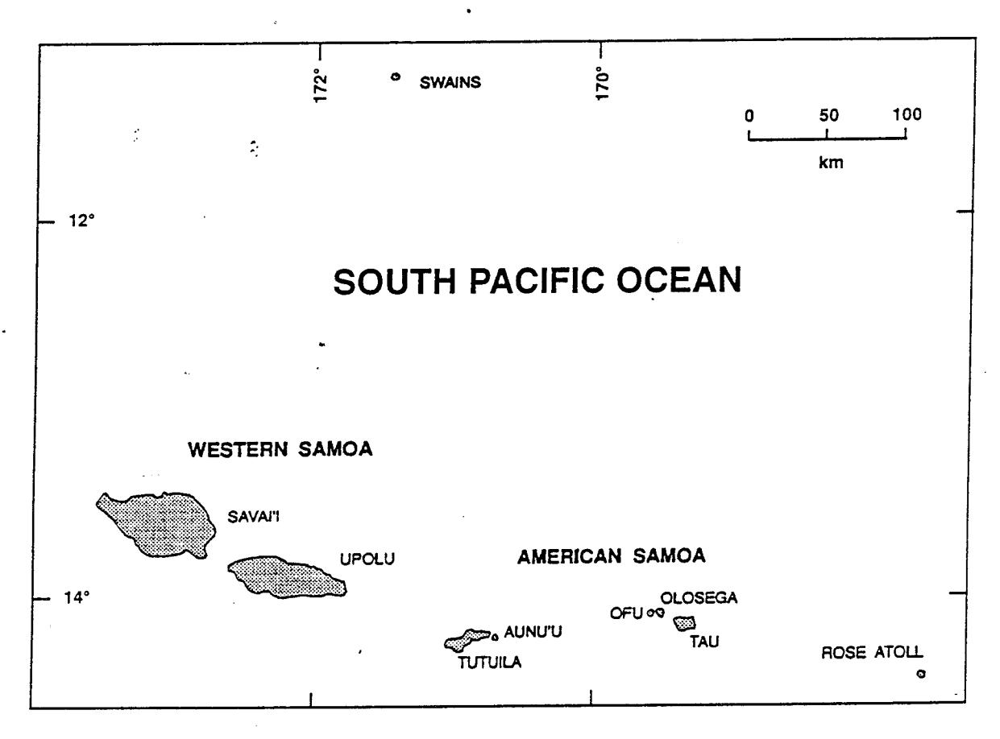

Fig. 1. Map of Samoan Archipelago showing the location of each island in American and Western Samoa.

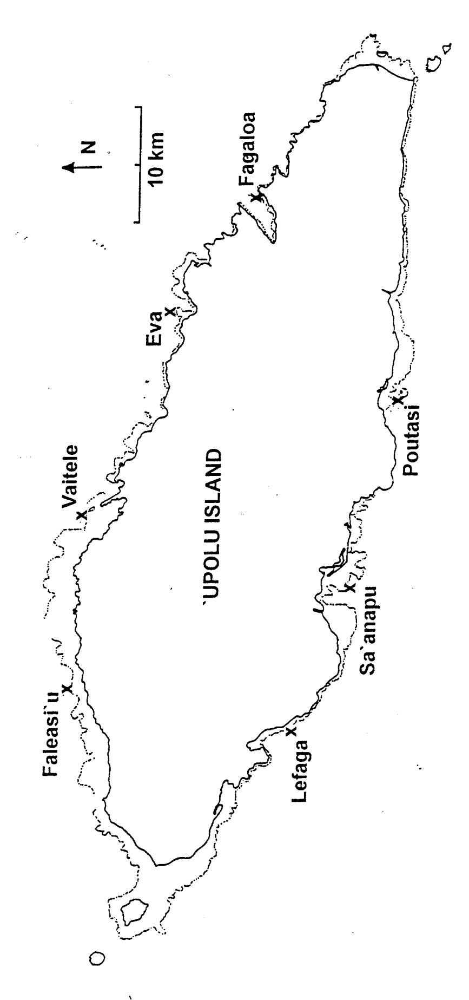

Fig. 2. Map of 'Upolu Island, Western Samoa, showing the location of each study site.

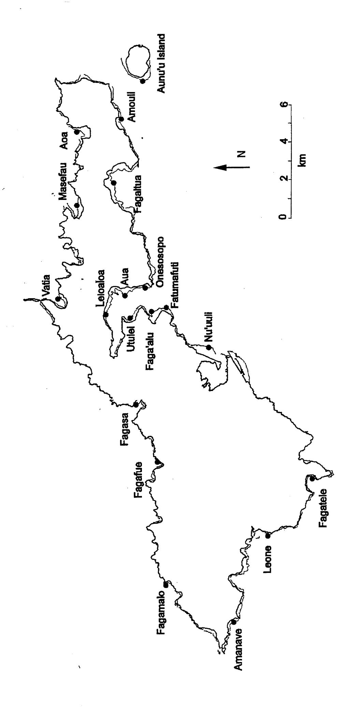

Fig. 3. Map of Tutuila Island, American Samoa, showing the location of each study site.

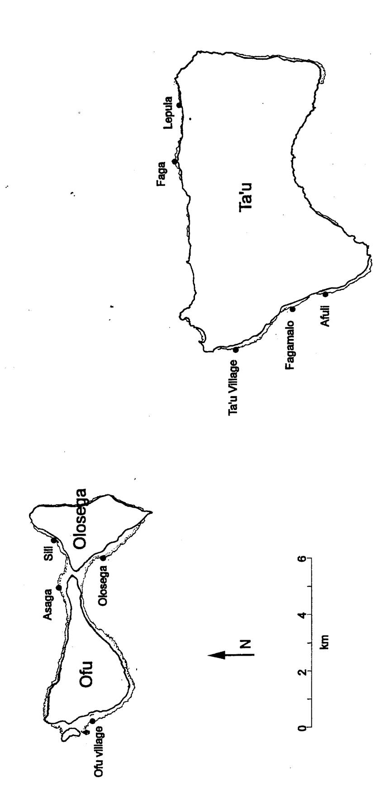

Fig. 4. Map of each of the islands in the Manu`a Group, American Samoa, showing the location of each study site.

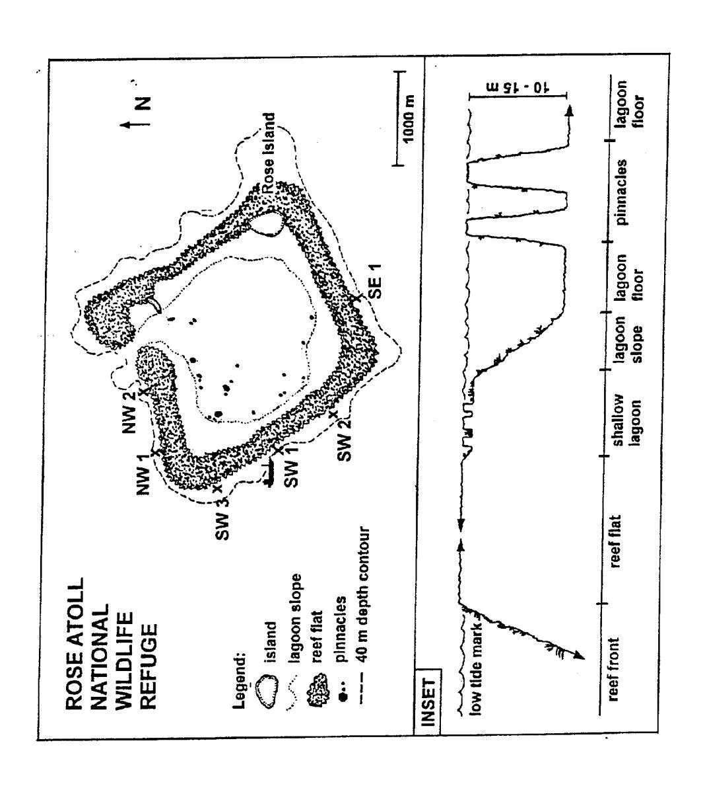

Fig. 5. Map of Rose Atoll, American Samoa, showing the location of each study site, and the position of each habitat type on the reef profile (see inset).

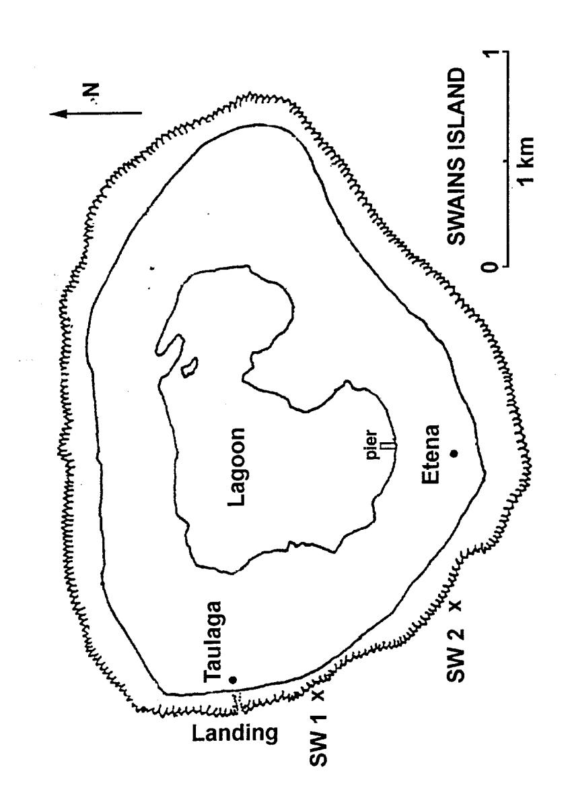

Fig. 6. Map of Swains Island, American Samoa, showing the location of each study site.

thorn starfish has been moderate in the Manu'a for many years, and has probably caused some damage to the reefs (Itano & Buckley 1988, Mundy 1996, Zann 1992). Fortunately, Manu'a was apparently not affected by the massive starfish outbreak that devastated the reefs in Tutuila in the 1970s, and neither were Rose or Swains (D. Itano pers. comm in Zann 1991). However, the reefs of Swains Island were severely damaged by a violent storm in 1987 (D. Itano unpubl. data, see Green 1996a1), and it appears that all of the islands in the archipelago experienced the mass coral bleaching episode in 1994 (Craig et al. 1995, Goreau & Hayes 1994, Maragos 1994).

The heavily populated islands of 'Upolu and Tutuila appear to be the most heavily affected by human impacts (especially pollution and sedimentation: Bell, 1989, Birkeland et al. 1996, Maragos et al. 1994, Zann 1991). Of particular concern are the reefs in Pago Pago Harbor on Tutuila Island, which appear to have been severely impacted by human activities this century (Green et al. 1996). Human impacts appear to be less of a threat to the reefs on the less populated islands of Aunu'u, the Manu'a Group and the remote atolls.

Until recently, Rose Atoll was considered to be one of the most pristine coral reefs in the world (UNEP/IUCN 1988). Unfortunately, the pristine nature of Rose Atoll was compromised in 1993 when the longliner Jin Shiang Fa ran aground on its southwest side spilling >1000,000 gallons of diesel fuel and other lubricants onto the reef (Green & Craig 1996, Maragos 1994, USFWS 1995). The impact of the longliner grounding on the pristine coral reef at Rose in currently under investigation by a cooperative project between the US Fish and Wildlife Service and the Department of Marine and Wildlife Resources in American Samoa.

Reef profile and habitat types

Most of the reefs on the volcanic islands of American Samoa are narrow fringing reefs that are close to shore (<200 m). These reefs can be divided into six recognizable habitat types, which differ in their position on the reef profile, depth and degree of wave exposure (see Fig. 7). The reef flat is situated between the shore and the outer edge of the reef and is usually exposed at low tide (depth=0-1m). The crest is defined as the seaward edge of the reef flat where the reef edge drops off into deeper water (depth=0-3m). At most sites, the reef front descends from the crest at a slope of 45-90° down to the reef base (depth=10-30m), where it joins the sand flat which stretched away from the reef towards open water. In some situations, a shallow lagoon is located between the reef flat and the shore (depth=1-3m). Well developed lagoons are uncommon in American Samoa and where they occur on Tutuila they tend to be the result of dredging operations (eg. at Fagaitua, Alofau, Aua, Faga'alu, Nu'uuli and the Airport). In contrast, there are some small, naturally occurring lagoons at Ofu. Wave exposure is usually low on the reef flat, shallow lagoon, reef base and sand flat, and high on the crest. Exposure on the reef front is usually low but can be high during strong storms or hurricanes. The profile of the reefs of American Samoa are also described in detail

&lt;sup>1The damage was caused by a violent storm and not by Hurricane Tusi as reported by Green (1996a).

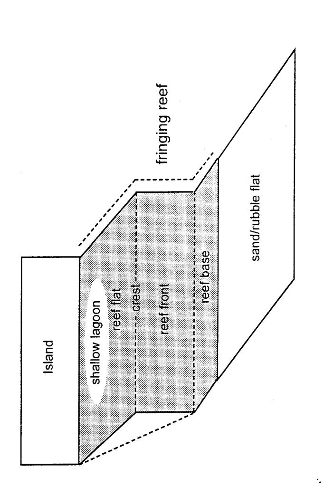

Figure 7. Schematic diagram showing the position of each habitat type on the reef profile of the fringing reefs of American Samoa.

in the American Samoa Coral Reef Inventory (AECOS and Aquatic Farms 1980), as well as in Itano & Buckley (1988) and Maragos et al. (1994).

The reef profile on the islands of Western Samoa is similar to that described for the volcanic islands of American Samoa, except that most of the reefs are separated from land by well developed, natural shallow lagoons that are up to 2 km wide in places. Because these reefs are so far from shore, they are often referred to as "barrier reefs" (UNEP/IUCN 1988). A more complete description of the coral reefs of Western Samoa can be found in Zann (1991).

The reef profile on the remote atolls differs from that on the volcanic islands. However, the reef at Rose Atoll can also be divided into six easily recognized habitat types (Fig. 5) which vary in terms of their physical and biological characteristics (described in detail by Green & Craig 1996, Maragos 1994, Rodgers et al. 1993, Wass 1981a). The reef front is located on the seaward side of the reef, and consists of an irregular and often steep slope down to a depth of about 50m. The reef flat is a hard, consolidated substratum that is exposed during spring tides. The lagoon is almost entirely enclosed by the reef flat, except for a narrow opening on the northwest side. The inner edge of the reef flat slopes down to a shallow shelf that surrounds the outside of the lagoon (1-3m deep). Most of this shelf (50-75%) is covered with rubble and a few scattered colonies of Acropora and is called the rubble flat. The rest of the shelf is dotted with coral blocks, whose tops are uncovered at low tide. The sides of the coral blocks are similar to the inner edge of the reef flat, and together, these two places are referred to as the shallow lagoon. The inside edge of the rubble flat slopes steeply down to the <u>lagoon floor</u> (> 15 m deep), which has an undulating sandy bottom and a few isolated A cropora patches around its perimeter. Flat-topped, steep-sided pinnacles jut up to the surface from the floor of the lagoon. Wave exposure is low in all lagoonal habitats, and high on the reef front and reef flat.

The reef profile at Swains Island is similar to that at Rose, except that the reef flat extends all the way into shore (50-200m) and there are no marine lagoon habitat types. However, there is a brackish lagoon with a salinity of  $\sim 2^{0}/_{00}$  (J. McConnaughey *unpubl. data*) that is completely enclosed by the island, and is not considered in this report (Fig. 6).

#### Survey design

This study was based on a detailed survey of the coral reefs on eight of the islands in the archipelago, including all seven islands of American Samoa and the island of 'Upolu in Western Samoa (Fig. 1). Because of the remoteness of some of these islands, surveys were done opportunistically over a period of one year. Surveys of Tutuila, Aunu'u and the Manu'a Group were done from November 1994-November 1995, while 'Upolu was surveyed from 7-21 September 1995. The surveys of Rose were done during two brief trips to the atoll (25-29 October 1994 and 5-16 August 1995), and the surveys of Swains were done from 26-30th March, 1996.

The surveys were divided into two sections to examine the variation in reef fishes and their habitat characteristics associated with two main factors: habitat type and location.

#### Phase One. Comparison among habitat types

The variation associated with habitat type was examined on areas of well developed continuous reef on each of two islands: Tutuila and Ofu-Olosega2. On each island, reef fishes and their habitat characteristics were surveyed at two sites on the southern side of the island (see *Location of Study Sites and Transects* below). At each site, five habitat types were surveyed for fish and habitat characteristics: reef flat (depth<1m), shallow lagoon (depth=1-5m), crest (depth=0-2m), reef front (10m) and reef front (20m). Habitats deeper than 20 m were not be surveyed because of SCUBA-imposed restrictions. Reef fishes and habitat characteristics were surveyed along five replicate transects in each habitat type at each site using the methods described below (see *Fish Survey Methods* and *Habitat Description Methods*).

#### Phase Two: Comparison among islands and sites

The variation in reef fish communities and their associated habitat characteristics were compared among 43 sites distributed throughout eight islands in the archipelago: 'Upolu, Tutuila, Aunu'u, Ofu, Olosega, Ta'u, Rose and Swains (see Fig. 1). The number of sites surveyed on each island ranged from 1 to 17 (see Figs. 2-6), and all sites were areas of well developed continuous reef. Where possible, sites were distributed around each island to include the variation associated with exposure. Sites on the southern sides of the islands are exposed to the prevailing southeast Trade Winds from April to September. In contrast, sites on the north sides are more protected from the Trade Winds, but tend to be harder hit by hurricanes which occur from October to March. Five of the sites on Tutuila were located within Pago Pago Harbor on the south side of the island, which tends to be relatively protected from the prevailing wind conditions.

Sites were compared based on a single habitat type, because of the logistic constraints of working at remote islands. Reef fronts (depth=10m) were used for this comparison for two reasons. First, it is one of the few habitat types that is present on all of the islands. Second, fish species richness, density and biomass tend to be high in this habitat type (see *Results*) Reef fishes and habitat characteristics were surveyed along five replicate transects on the reef front at each site using the methods described below (see *Fish Survey Methods* and *Habitat Description Methods*).

#### Phase Three: Recovery of the coral communities after Hurricane Val

The recovery of the coral communities after Hurricane Val was also described by comparing the coral cover at six sites around Tutuila (Fagafue, Fagasa, Vatia, Masefau, Faga'alu and Fagaitua: see Fig. 3) over a period of 18 months. This comparison was based on the results of two habitat surveys done in August-November 1994 and April-May 1996, which took place three to five years after Hurricane Val in December 1991. In each survey, habitat surveys were done using five replicate transects on the reef slope (depth=10m) at each site (see *Habitat Description Methods*).

&lt;sup>2The islands of Ofu and Olosega are connected by a continuous coral reef (Fig. 4) and were considered a single reef for the purposes of this study.

#### Location of study sites and transects

The location of the study sites on each island are shown in Figs. 2-6. The transects were positioned near natural landmarks at each site (eg. near channels or *avas*), and their exact locations described in detail so that they could be relocated for future surveys. The location of the transects used for the comparison among islands and sites are described in Appendix I, while the locations of the transects used for the comparison among habitats are described in Appendix II. The transects used to describe the recovery of the coral communities after the hurricane are the same as those described in Appendix I.

#### Fish survey methods

Reef fishes were surveyed using visual census techniques along five replicate 50m x 3m transects within each habitat at each site (total area=750m² per habitat per site). These transect dimensions were used because Green (1996b) determined that they yielded the most precise estimate of abundances of highly mobile, diurnal species such as wrasses. Transect lengths were measured using 50m tapes, and transect widths were measured using my known body proportions. The size of each fish (total length in cm) was estimated visually and recorded directly onto underwater paper.

A restricted family list was used which comprised only those families which are amenable to visual census techniques, because they are relatively large, diurnally active and conspicuous in coloration and behavior (see Table 1). This method excludes species that are not amenable to the technique because they are nocturnal or cryptic in behavior. Fishes were surveyed by three passes along the transect counting different groups of families in each pass. The first count was of large, highly mobile species, which are most likely to be disturbed by the passage of a diver (such as parrotfishes, snappers and emperors). This count was done while an assistant followed laying out the five tapes. The tapes then remained *in situ* until all of the fish and habitat surveys were completed at that site. The second count was of medium sized mobile families (including most surgeonfishes, butterflyfishes and wrasses), and the third count was of small, site attached species (mostly damselfishes). Fish counts were be separated by a 5-10 minute waiting period. Habitat surveys were done along the same transects after the fish counts were completed (see *Habitat Description Methods* below).

Fishes were compared among locations on the basis of fish species richness, fish density and fish biomass. Where: fish species richness was the total number of species recorded on the transects and fish density was converted to the number individuals per hectare (ha). Fish biomass was calculated by converting estimated fish lengths to weights using Wass's methods (1982a). Where:

weight (kg) = (length in cm)3x constant x metric conversion factor and constant=length-weight conversion ratio for each species (see Appendix III); and metric conversion factor=0.027654. Estimates for fish biomass are for bony fishes only, and do not include sharks and rays because length-weight ratios were not available for those species. Since surveys were done at all times throughout the year, these comparisons were made based on adult fishes only, which I defined as individuals that were more than one third of the maximum total length of each species (as recorded in Randall et al. 1990 or Myers 1991).

## Table 1. Reef fish families included in surveys of the Samoan Archipelago.

Sharks & Rays:

Carcharinidae (whaler or requiem sharks)

Ginglymostomatidae (nurse sharks)

Hemigaleidae (weasel sharks)

Myliobatidae (eagle rays)

Bony fishes:

Acanthuridae (surgeonfishes & unicornfishes)

Aulostomidae (trumpetfishes)

Balistidae (triggerfishes)

Caesionidae (fusiliers)

Carangidae (trevallies)

Chaetodontidae (butterflyfishes)

Diodontidae (porcupinefishes)

Echeneidae (suckerish)

Ephippidae (batfishes)

Fistularidae (flutemouths)

Haemulidae (sweetlips)

Kyphosidae (drummers)

Labridae (wrasses)

Lethrinidae (emperors)

Lutjanidae (snappers)

Malacanthidae (sand tilefishes)

Monacanthidae (leatherjackets)

Mugilidae (mullets)

Mullidae (goatfishes)

Nemipteridae (coral breams)

Ostracidae (boxfishes)

Pinguipedidae (sandperches)

Pomacanthidae (angelfishes)

Pomacentridae (damselfishes)

Scaridae (parrotfishes)

Scomberidae (mackerels)

Scorpaenidae (scorpionfishes)

Serranidae (groupers)

Siganidae (rabbitfishes)

Sphyraenidae (barracudas)

Synodontidae (lizardfishes)

Tetraodontidae (puffers)

Zanclidae (moorish idol)

#### Habitat description methods

Habitat characteristics at each site were described using a point-based method for habitat description. This technique was originally developed for describing forest habitats for birds by Wiens & Rotenberry (1981), but it has been successfully adapted to describing coral reef habitats for fishes (Choat & Bellwood 1985, Green 1996b). In this study, this method was used to provide an estimate of the percent coral cover on each of the fish transects. At 2 m intervals along each transect, a 2 m transect was run perpendicular to the direction of the main transect. Three sampling points were then used along each of the 2 m transects (one directly under the 50 m tape, and one 1 m either side). Twenty-five 2 m intervals along the main transect were sampled in this manner, yielding 75 sample points per transect.

At each point, the substratum was recorded as belonging to one of 4 non-living (reef matrix, sand, rubble or crevice/hole) or 15 living categories (plate coral, massive coral, submassive coral, digitate coral, branching coral, encrusting coral, gorgonians, hydrozoans, sponges, zooanthids, ascidians, echinoderms, macroalgae, filamentous algae or pink coralline algae). The cover of each substratum type could then be calculated as the percentage of the 75 points that it occupied on each transect. Habitat characteristics were then compared among habitats and sites based on the cover of each substratum type.

#### RESULTS

A total of 60,889 fishes belonging to 266 species and 36 families (see Appendix III) were counted in this survey of the coral reefs of the Samoan Archipelago, which covered an area of 48,750m2. Since this study only included families that were amenable to visual census techniques and species that were recorded on the transects, a more complete list of the species of Samoa can be found in Wass (1984).

Fishes and their habitat characteristics varied among habitats, islands and sites as described below. For the purposes of this study, fish species richness, fish density, fish biomass and percent coral cover were each assigned to descriptive categories of low, moderate and high (see Table 2).

Table 2. Descriptive categories used for each of the biological characteristics.

|                                           | category |             |         |
|-------------------------------------------|----------|-------------|---------|
|                                           | low      | moderate    | high    |
| Fish species richness (number of species) | <100     | 100-149     | ≥150    |
| Fish density (individuals per ha)         | <5,000   | 5,000-9,999 | ≥10,000 |
| Fish biomass (kg per ha)                  | <500     | 500-999     | ≥1,000  |
| Coral cover (%)                           | <20      | 20-39       | ≥ 40    |

#### Comparison among habitat types

Habitat types varied in terms of their fish and habitat characteristics as follows:

Fish species richness

Species richness tended to increase with depth, with deeper habitats tending to have more species than shallower ones (Fig. 8). Reef flats were characterized by low species richness, while species richness was low to moderate in the shallow lagoon and on the crest. By comparison, the reef front at both depths was characterized by moderate to high species richness.

#### Fish density

Density in a particular habitat type was very variable among islands (Fig. 9). For example, fish density on the reef flat and in the shallow lagoon tended to be higher on Tutuila and Ofu-Olosega than it was at Rose. In contrast, density tended to be higher on the reef front (10m) at Rose than it was on the other islands. Fish density also tended to be lower on 'Upolu than on the other islands in any given habitat type. As a result of the variation among locations, density did not show a clear pattern associated with habitat type (Fig. 9), ranging from low to high on the reef flat and in the shallow lagoon, and from moderate to high on the crest and the reef front at both depths.

#### Relative abundance of fish families and species

The relative abundance of fish families varied among habitat types (Fig. 10). The fish communities on the reef flats were distinctive, since they comprised approximately half of the number of families recorded in the other habitat types. Pomacentrids were the most abundant family in most habitat types, except on the crest where acanthurids were more abundant. Some families, such as the labrids and chaetodontids, were present in similar densities in all habitat types, while others such as the caesionids and scarids varied among habitats. The relative abundance of fish families was similar in the shallow lagoon and on the reef front at both depths, except that caesionids were much more abundant on the reef front than in the shallow lagoon.

The relative abundance of fish species also varied among habitat types (see Appendix IV). The reef flats were dominated by four species of pomacentrid (Chrysiptera cyanea, Chrysipter glauca, Dascyllus aruanus and Stegastes nigricans) and one species of acanthurid (A canthurus triostegus). The fish fauna of the shallow lagoons were also characterized by the same species that were abundant on the reef flat, as well as the pomacentrids (Chromis viridis and Stegastes albifasciatus), the acanthurid Ctenochaetus striatus, the labrid Thalassoma hardwicke and unidentified scarids (Scarus spp.). In contrast, the crest was characterized by a distinctive fish fauna that was dominated by four acanthurid species (A canthurus guttatus, A canthurus lineatus, A canthurus nigricans and Ctenochaetus striatus), the labrid Thalassoma quinquevittatum, three pomacentrid species (Chromis vanderbilti, Plectroglyphidodon dickii and Stegastes fasciolatus) and unidentified scarids (Scarus spp.). Similarly, the reef front (at both depths) was also characterised by a distinctive fish fauna, which was dominated by the acanthurid Ctenochaetus striatus and the pomacentrids Chromis acares and Pomacentrus brachialis. In addition, the caesionid Pterocaesio tile was also abundant on the reef front at 10m, and the pomacentrid Pomacentrus vaiuli was abundant on the reef front at 20m.

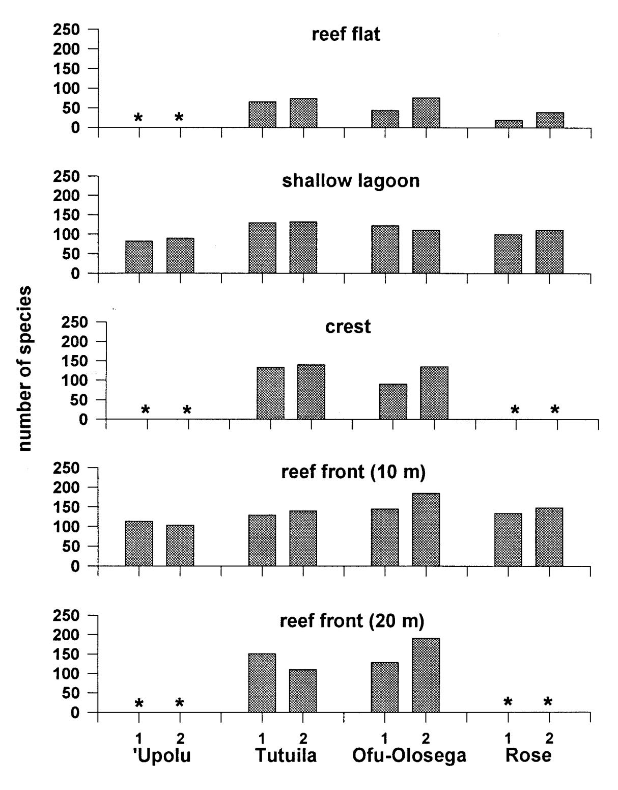

Fig. 8 Total species richness of fishes recorded on the transects in each of five habitat zones at two sites on each of the islands of 'Upolu, Tutuila, Ofu-Olosega and Rose Atoll. Where: area surveyed =  $750m^2$  and \* = not surveyed.

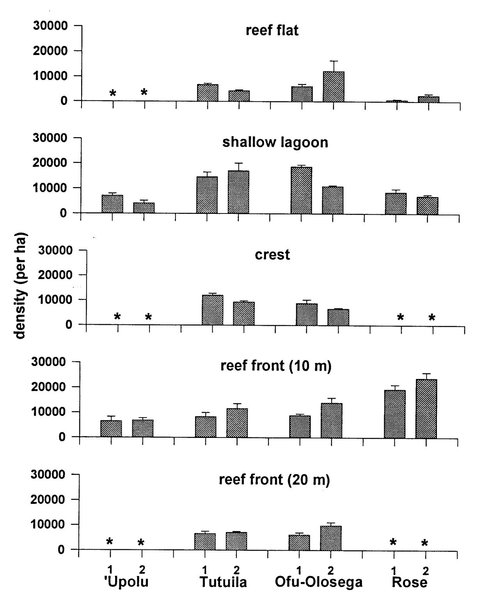

Fig. 9 Mean fish density ( $\pm$  se) in each of five habitat zones at two sites on the islands of 'Upolu, Tutuila, Ofu-Olosega and Rose Atoll. Where: n = five transects and \* = not surveyed.

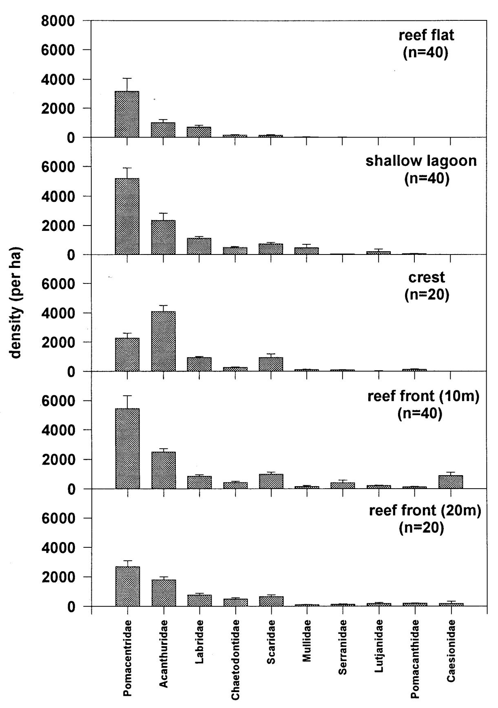

Fig. 10 Mean density ( $\pm$  se) of the ten most abundant fish families in each of five habitat types surveyed in the Samoan Archipelago. Where n = number of transects.

#### Fish biomass

Biomass showed some variation among habitat types (Fig. 11). Biomass was very low on the reef flats, since this habitat type was dominated by small species (mostly pomacentrids: see Fig. 10, Appendix IV). In contrast, biomass was low to moderate in most of the other habitats were larger families were more abundant (Fig. 10, Appendix IV). The exception was the reef front (20m) at Site 2 on Ofu-Olosega where biomass was high because of the large Maori Wrasses (Cheilinus undulatus) recorded at that site.

#### Coral cover

Coral cover also varied among habitat types (Fig. 12). Cover was consistently low to moderate on the crest and reef front (at both 10m and 20m) on all islands surveyed. However, cover was much more variable on the reef flats and shallow lagoons and varied among islands and sites. For example, cover ranged from low to high in the shallow lagoons on 'Upolu, and it was low to high on the reefs flats of Rose and Tutuila respectively. However, it is important to note that the high cover recorded on the reef flat on Tutuila was much higher than the cover present in this habitat type in most locations around the island, where cover is generally much lower (~<5%). This may was probably because the reef flats that were surveyed were deeper than most of the reef flats on Tutuila, and they do not become uncovered at low tide.

The type of coral cover also varied among habitat types (Table 3). Reef flats were characterised by a low cover of massive, branching and encrusting corals, with a high cover of massives (mostly *Psammocora* and *Porites cyclindrica*) recorded on Tutuila. In contrast, the shallow lagoons tended to be characterised by a high cover of branching coral (mostly large *Acropora* species) and/or massive coral (mostly *Porites cylindrica*). Coral cover on the crest and reef front tended to comprise a mixture of massive, branching and encrusting coral at most sites, with plate coral only relatively abundant on the reef front at one site on 'Upolu. More detailed information on the corals of Samoa can be found in Birkeland et al. (1987, 1994, 1996), Maragos (1994), Maragos et al. (1994) and Mundy (1996).

#### Comparison among islands and sites

Fish communities also varied among islands and sites (see below). For the convenience of local coastal zone managers, this information is summarized for each of the sites in Appendix I.

#### Fish species richness

Species richness was quite variable among islands and sites (Fig. 13). Species richness was very variable on 'Upolu, Tutuila, Ta'u and Rose and ranged from low to high at different sites. In contrast, species richness tended to be more consistently higher on Aunu'u, Ofu, Olosega and Swains, where it ranged from moderate to high.

#### Fish density

Density varied among islands and sites, ranging from low to high on 'Upolu, Tutuila, and Ta'u, and from moderate to high on Aunu'u, Ofu and Olosega (Fig. 14). Density was very high on the two remote atolls (Rose and Swains), especially at Swains. This was due to the large schools of planktivorous species which are very abundant on these atolls. In particular, the damselfish

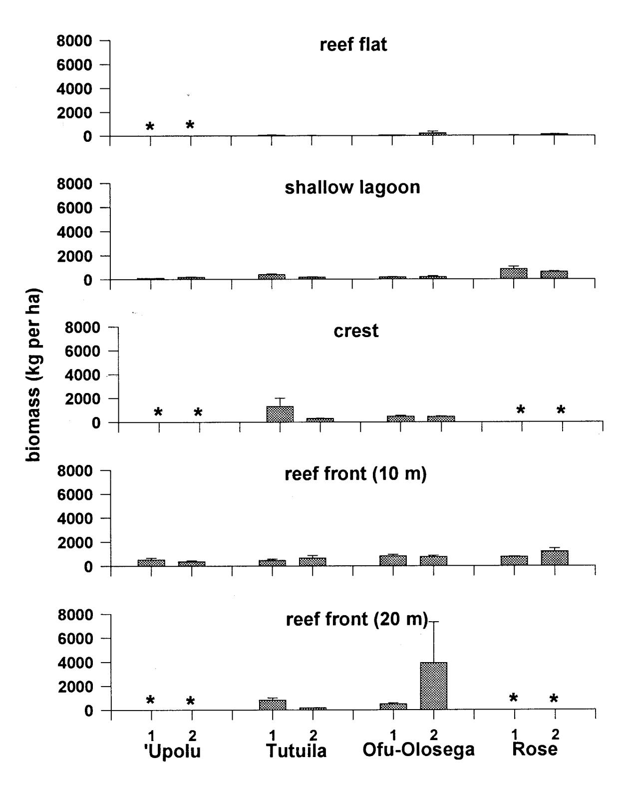

Fig. 11 Mean fish biomass ( $\pm$  se) in each of five habitat zones at two sites on the islands of 'Upolu, Tutuila, Ofu-Olosega and Rose Atoll. Where: n = five transects and \* = not surveyed.

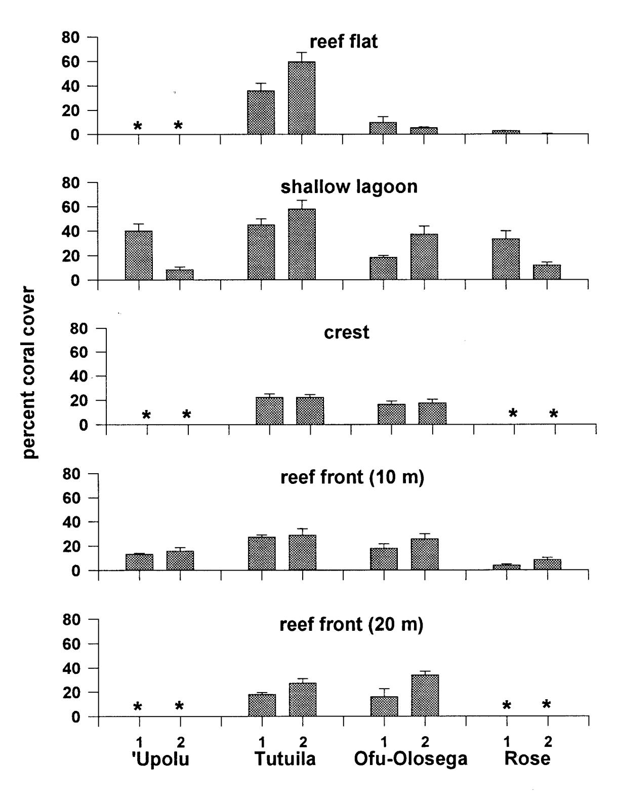

Fig. 12 Mean percent cover ( $\pm$  se) of corals in each of five habitat zones at two sites on the islands of 'Upolu, Tutuila, Ofu-Olosega and Rose Atoll. Where: n = five transects and \* = not surveyed.

Table 3 Mean percent cover  $(\pm$  se) of each of the major coral growth forms in five habitat types at a range of sites surveyed in the Samoan Archipelago. Where: n=five transects.

|                    | massive           | plate            | branching          | encrusting        |
|--------------------|-------------------|------------------|--------------------|-------------------|
| REEF FLAT          |                   |                  |                    |                   |
| Tutuila Site 1     | 35.5 (± 6.29)     | 0.0              | $0.5 (\pm 0.33)$   | 0.0               |
| Tutuila Site 2     | 56.0 (± 7.39)     | 0.0              | 3.7 (± 1.81)       | 0.0               |
| Ofu/Olosega Site 2 | $1.1 (\pm 0.65)$  | 0.0              | 8.5 (± 4.87)       | $0.3 (\pm 0.27)$  |
| Ofu/Olosega Site 2 | $3.2 (\pm 0.90)$  | 0.0              | $0.5 (\pm 0.53)$   | 1.6 (± 1.29)      |
| Rose Site 1        | 0.0               | 0.0              | $0.3 (\pm 0.27)$   | 0.0               |
| Rose Site 2        | 0.0               | 0.0              | 0.0                | 0.0               |
| SHALLOW LAGOON     |                   |                  |                    |                   |
| 'Upolu Site 1      | $15.5 (\pm 3.64)$ | $0.3 (\pm 0.27)$ | 19.7 (± 5.01)      | 0.0               |
| 'Upolu Site 2      | $1.3 (\pm 0.0)$   | $0.5 (\pm 0.33)$ | $6.1 (\pm 2.41)$   | 0.0               |
| Tutuila Site 1     | $7.7 (\pm 4.72)$  | 0.0              | $36.3 (\pm 6.34)$  | 0.0               |
| Tutuila Site 2     | 19.5 (± 9.91)     | 0.0              | $38.4 (\pm 12.33)$ | 0.0               |
| Ofu/Olosega Site 2 | 10.4 (± 1.55)     | 0.0              | 4.0 (± 1.33)       | $1.9 (\pm 0.90)$  |
| Ofu/Olosega Site 2 | 34.1 (± 6.59)     | 0.0              | $1.6 (\pm 0.50)$   | $0.3 (\pm 0.27)$  |
| Rose Site 1        | 16.5 (± 3.71)     | 0.0              | 9.6 (± 2.47)       | 6.7 (± 1.52)      |
| Rose Site 2        | 5.9 (± 1.56)      | 0.0              | 1.6 (± 0.27)       | $4.3 (\pm 1.54)$  |
| CREST              |                   |                  |                    |                   |
| Tutuila Site 1     | $8.3 (\pm 2.65)$  | 0.0              | $7.7 (\pm 1.86)$   | $0.8 (\pm 0.53)$  |
| Tutuila Site 2     | $2.7 (\pm 0.94)$  | 0.0              | $6.4 (\pm 1.36)$   | $1.1 (\pm 0.78)$  |
| Ofu/Olosega Site 2 | $9.3 (\pm 1.63)$  | 0.0              | $1.9 (\pm 0.90)$   | $2.4 (\pm 0.78)$  |
| Ofu/Olosega Site 2 | 8.0 (± 2.27)      | 0.0              | 1.1 (± 0.78)       | $4.8 (\pm 1.37)$  |
| REEF FRONT (10m)   |                   |                  |                    |                   |
| 'Upolu Site 1      | $3.2 (\pm 1.24)$  | $8.3 (\pm 3.14)$ | $4.5 (\pm 0.53)$   | 10.4 (± 2.04)     |
| 'Upolu Site 2      | $4.0 (\pm 0.60)$  | $0.8 (\pm 0.53)$ | $3.5 (\pm 1.24)$   | $4.0 (\pm 0.94)$  |
| Tutuila Site 1     | $7.2 (\pm 1.44)$  | 0.0              | 9.9 (± 1.91)       | $3.5 (\pm 0.90)$  |
| Tutuila Site 2     | $6.9 (\pm 1.54)$  | $1.3 (\pm 0.60)$ | $4.0 (\pm 1.63)$   | $16.0 (\pm 2.60)$ |
| Ofu/Olosega Site 2 | $6.4 (\pm 1.76)$  | 0.0              | $1.1 (\pm 0.50)$   | 0.0               |
| Ofu/Olosega Site 2 | 17.9 (± 2.75)     | 0.0              | $0.3 (\pm 0.27)$   | 5.1 (± 2.32)      |
| Rose Site 1        | $2.1 (\pm 0.53)$  | 0.0              | 0.0                | $0.8 (\pm 0.33)$  |
| Rose Site 2        | $2.4 (\pm 0.65)$  | 0.0              | $0.3 (\pm 0.27)$   | $3.5 (\pm 0.53)$  |
| REEF FRONT (20m)   |                   |                  |                    |                   |
| Tutuila Site 1     | $5.3 (\pm 0.42)$  | 0.0              | $0.5 (\pm 0.33)$   | 1.6 (± 0.65)      |
| Tutuila Site 2     | $3.2 (\pm 0.53)$  | $0.3 (\pm 0.27)$ | $0.8 (\pm 0.33)$   | 17.1 (± 3.30)     |
| Ofu/Olosega Site 2 | 4.8 (± 1.55)      | 0.0              | 0.0                | $1.9 (\pm 0.68)$  |
| Ofu/Olosega Site 2 | 24.8 (± 6.15)     | 1.3 (± 1.33)     | $1.6 (\pm 0.27)$   | 4.8 (± 2.26)      |

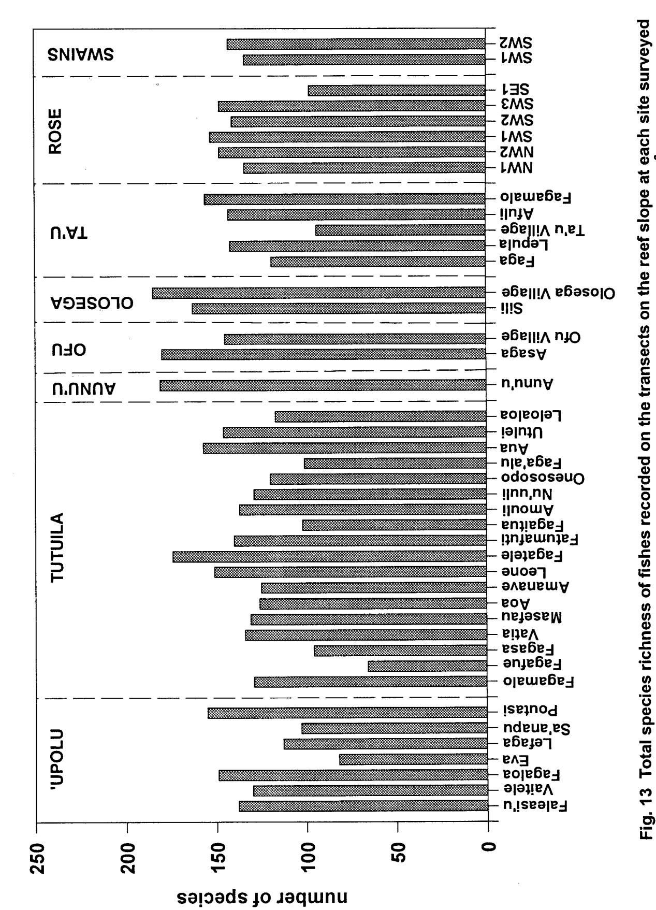

on eight islands in the Samoan Archipelago. Where: area surveyed at each site = 750m′

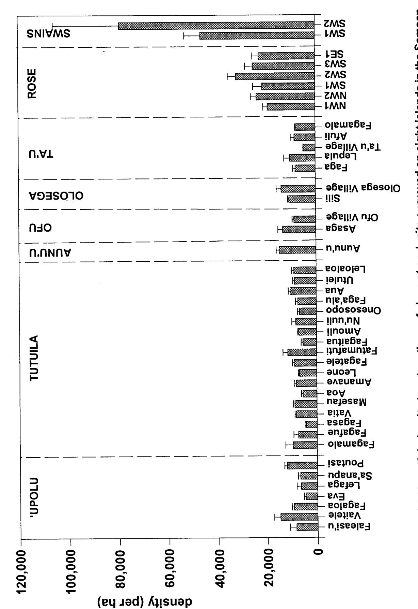

Fig. 14 Mean fish density (± se) on the reef slope at each site surveyed on eight islands in the Samoan Archipelago. Where: n=five transects.

Chromis acares is dominant on both atolls, and the fairy basslet Luzonichthys waitei is also dominant at Swains (see Appendix V).

#### Relative abundance of fish families and species

The relative abundance of fish families also varied among islands (Fig. 15). Pomacentrids were the most abundant family on most islands followed by acanthurids, except on 'Upolu were caesionids were abundant and on Swains where serranids were dominant. Both Rose and Swains were also characterised by an exceptionally high abundance of pomacentrids (mostly *Chromis acares*).

Fish species also varied among islands (see Appendix V). The acanthurid Ctenochaetus striatus, was dominant throughout most of the archipelago (except Swains). However, most species varied in abundance among islands. The reefs of 'Upolu were characterised by high abundances of the caesionids Caesio cuning, Pterocaesio tile and Pterocaesio trilineata, the mullid Mulloides flavolineatus, and the pomacentrids (Chrysiptera cyanea, Plectroglyphidodon lacrymatus and Pomacentrus brachialis), while those of Tutuila were dominated by the pomacentrids (Chromis xanthura, Pomacentrus brachialis and Pomacentrus vaiuli). In contrast, the reefs of Manu'a were dominated by two acanthurids (A canthurus nigrofuscus and Naso literatus), the labrid Thalassoma quinquevittatum and the pomacentrids Chromis acares and Chrysiptera cyanea. Each of the two remote atolls also had a distinctive fish fauna. The reefs of Rose Atoll were dominated by the surgeonfishes (A canthurus achilles and Ctenochaetus strigosus), the chaetodontid Hemitaurichthys thompsoni, the labrid Thalassoma quinquevittatum, the pomacentrid Chromis acares and the serranid Pseudoanthias pascalus. In contrast, the reefs of Swains Island were dominated by the balistids Melichthys niger and Melichthys vidua, the pomacanthid Centropyge loriculus, the pomacentrids Chromis acares and Plectroglyphidodon dickii, and the serranids Cephalopholis urodeta and Luzonichthys waitei. Several species were also common at Swains that were not recorded elsewhere in Samoa: Ctenochaetus hawaiiensis, Zebrasoma rostratum Pseudocheilinus tetrataenia.

#### Fish biomass

Biomass was highly variable on most islands, ranging from low to moderate on 'Upolu, Tutuila, Ta'u and Swains and from low to high at Rose (Fig. 16). In contrast, biomass was moderate at all sites surveyed on Aunu'u, Ofu and Olosega.

#### Coral cover

Coral cover was extremely variable throughout the archipelago (Fig. 17), ranging from low to high on 'Upolu and from low to moderate on Tutuila, Aunu'u, Ofu, Olosega and Ta'u. Coral cover was dramatically different on the two remote atolls, with high cover recorded on Swains and low cover recorded on Rose.

The type of coral cover also varied among the islands (Fig. 18). The reefs of 'Upolu were characterized by a mixed assemblage of plate, encrusting, massive and branching corals. Of particular note was the relatively high cover of plate coral (cf. A cropora hyacinthus) recorded on 'Upolu compared to the other islands. In contrast, the reefs of Tutuila and Aunu'u tended to be

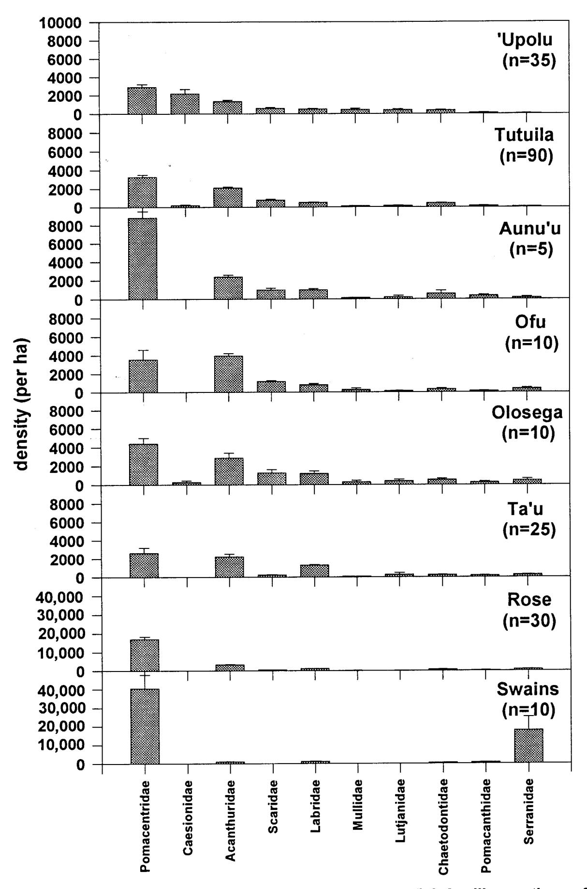

Fig. 15 Mean density ( $\pm$  se) of the ten most abundant fish families on the reef slopes of each island surveyed in the Samoan Archipelago. Where n = number of transects. Please note the different y axes.

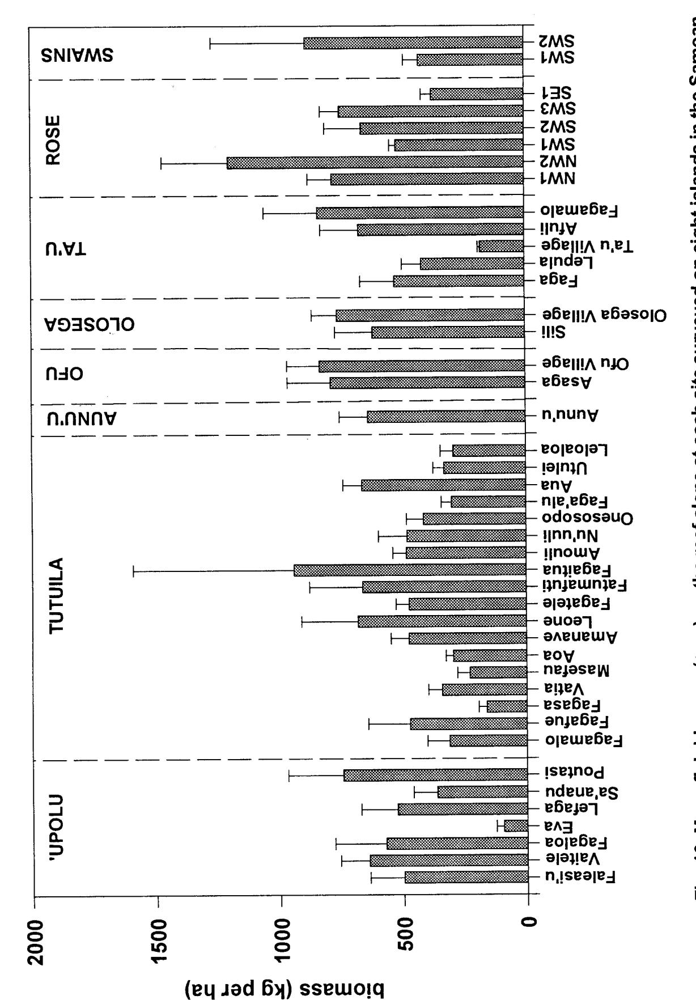

Fig. 16 Mean fish biomass (± se) on the reef slope at each site surveyed on eight islands in the Samoan Archipelago. Where: n = five transects.

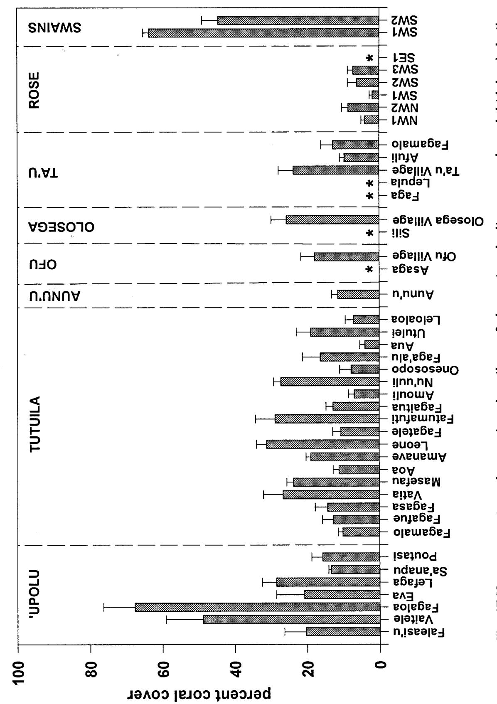

Fig. 17 Mean percent coral cover  $(\pm se)$  on the reef slope at each site surveyed on eight islands in the Samoan Archipelago. Where: n = five transects and \*=not surveyed.

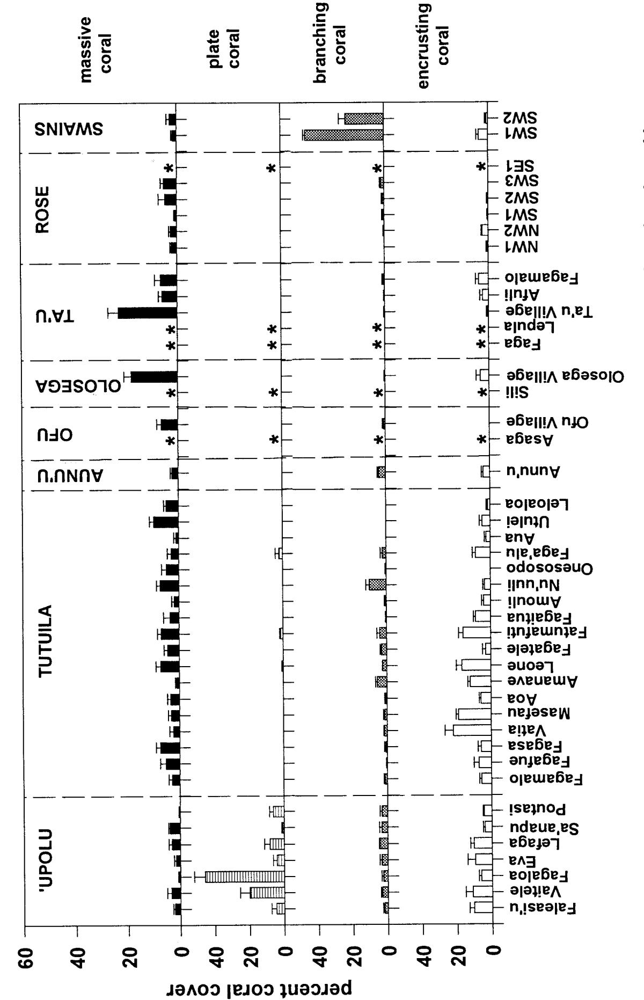

Fig. 18 Mean percent cover (+ se) of each of the main coral growth forms (massive, plate, branching and encrusting) on the reef slope at each site surveyed on eight islands in the Samoan Archipelago. Where: n=five transects and \*=not surveyed

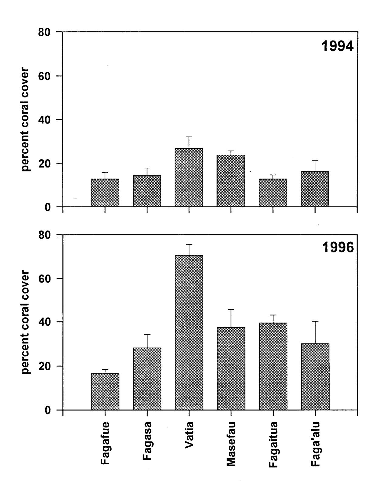

Fig. 19 Mean percent coral cover ( $\pm$  se) on the reef slope at six sites on Tutuila Island on two occasions over an 18 month period. Where: n = five transects.

dominated by encrusting and massive coral, with a smaller percentage of branching coral and very few plate corals. The reefs of the Manu'a Islands also differed from the other islands by having a high percentage of massive corals and a small percentage of encrusting, branching and plate corals. The reef at Rose Atoll was characterised by a low coral cover, which was comprised of mostly massive corals with small amounts of branching and encrusting corals recorded also. In fact, the reef front at Rose were clearly dominated by pink coralline algae, which accounted for >30% of the cover at the study sites. In contrast to Rose, the reefs on Swains Island were dominated by the highest cover of branching coral recorded in the survey (mostly *Pocillopora* species).

#### Recovery of the coral communities after Hurricane Val

Percent coral cover has increased rapidly at most of the sites over the last 18 months (Fig. 19), although the rate of recovery varied among sites. The most rapid recovery was been at Vatia and Fagaitua, where coral cover was three times as high in 1996 as it was in 1994 (ranging from 27-71% and from 13-39% respectively). Recovery has also been reasonably fast at Fagasa, Masefau and Faga'alu, with coral cover at each of these sites doubling in the last 18 months. In contrast, recovery at Fagafue has been slow with only a minor increase in coral cover over the last 18 months (13-17%).

#### DISCUSSION

This study has demonstrated that the coral reefs of the Samoan Archipelago vary substantially in terms of their fish and habitat characteristics. In this discussion, the condition of the reefs on each of the islands will be discussed along with the future threats to this important resource and management recommendations. Please note that a summary of the condition of the reef at each site is presented in Appendix I.

#### Upolu Island

Previous studies have reported that the coral reefs of 'Upolu Island have been severely degraded in recent years (Zann 1991). In particular, Hurricane Ofa was reported to have caused extensive damage to these reefs in 1990 (Zann & Sua 1991). These reefs have also suffered a more recent hurricane (Hurricane Val in 1991), a mass coral bleaching event and repeated infestations by the crown-of-thorns starfish over the last 20 years (Bell 1989, Zann 1991, Zann & Bell 1991). In addition, human impacts are assumed to have had an important impact on the reefs of 'Upolu, including overfishing, the use of destructive fishing methods (especially dynamite fishing), dredging, land reclamation, sedimentation and pollution from urban, industrial and agricultural sources (Bell 1989, Zann 1991, Zann & Sua 1991).

This study shows that despite these impacts, the reef front on 'Upolu Island appear to be in reasonably good condition. Most of the sites surveyed supported healthy, mixed coral assemblages (Fig. 18). Of particular note, were the dense stands of plate coral that were present at many sites, which were not observed on any of the other islands in the archipelago. The fish assemblages on the reef fronts were also in reasonably good condition, although both fish and coral communities varied among sites (Table 4a). The reefs at some sites, such as Fagaloa and

Table 4a. Summary of fish and habitat characteristics of each of sites surveyed in the Samoan Archipelago: the volcanic islands.

|                 | fish species richness | fish density | fish biomass | coral cover   |
|-----------------|-----------------------|--------------|--------------|---------------|
| UPOLU           |                       |              |              |               |
| Faleasi'u       | moderate              | moderate     | low          | moderate      |
| Vaitele         | moderate              | high         | moderate     | high          |
| Fagaloa         | moderate              | moderate     | moderate     | high          |
| Eva             | low                   | low          | low          | moderate      |
| Lefaga          | moderate              | moderate     | moderate     | moderate      |
| Sa'anapu        | moderate              | moderate     | low          | low           |
| Poutasi         | high                  | high         | moderate     | low           |
| TUTUILA         |                       |              |              |               |
| Fagamalo        | moderate              | moderate     | low          | low           |
| Fagafue         | low                   | moderate     | low          | low           |
| Fagasa          | low                   | low          | low          | low           |
| Vatia           | moderate              | moderate     | low          | moderate      |
| Masefau         | moderate              | moderate     | low          | moderate      |
| Aoa             | moderate              | moderate     | low          | low           |
| Amanave         | moderate              | moderate     | low          | low           |
| Leone           | high                  | moderate     | moderate     | moderate      |
| Fagatele        | high                  | moderate     | low          | low           |
| Fatumafuti      | moderate              | high         | moderate     | moderate      |
| Fagaitua        | moderate              | moderate     | moderate     | low           |
| Amouli          | moderate              | moderate     | low          | low           |
| Nu'uuli         | moderate              | moderate     | low          | moderate      |
| Onesosopo       | moderate              | moderate     | low          | low           |
| Faga'alu        | moderate              | moderate     | low          | low           |
| Aua             | high                  | high         | moderate     | low           |
| Utulei          | moderate              | moderate     | low          | low           |
| Leloaloa        | moderate              | moderate     | low          | low           |
| AUNUU           |                       |              |              |               |
| Aunu'u          | high                  | high         | moderate     | low           |
| <b>OFU</b>      |                       |              |              |               |
| Asaga           | high                  | high         | moderate     | not available |
| Ofu Village     | moderate              | moderate     | moderate     | low           |
| OLOSEGA         |                       |              |              |               |
| Sili            | high                  | high         | moderate     | not available |
| Olosega Village | high                  | high         | moderate     | moderate      |
| TAU             |                       |              |              |               |
| Faga            | moderate              | moderate     | moderate     | not available |
| Lepula          | moderate              | high         | low          | not available |
| Ta'u Village    | low                   | low          | low          | moderate      |
| Afuli           | moderate              | moderate     | moderate     | low           |
| Fagamalo        | high                  | moderate     | moderate     | low           |

Table 4b. Summary of fish and habitat characteristics of each of sites surveyed in the Samoan Archipelago: the coral atolls.

|           | fish species richness | fish density | fish biomass | coral cover   |
|-----------|-----------------------|--------------|--------------|---------------|
| ROSE      |                       |              |              |               |
| NW Site 1 | moderate              | high         | moderate     | low           |
| NW Site 2 | moderate              | high         | high         | low           |
| SW Site 1 | high                  | high         | moderate     | low           |
| SW Site 2 | moderate              | high         | moderate     | low           |
| SW Site 3 | moderate              | high         | moderate     | low           |
| SE Site 1 | low                   | high         | low          | not available |
| SWAINS    |                       |              |              |               |
| SW Site 1 | moderate              | very high    | low          | high          |
| SW Site 2 | moderate              | very high    | moderate     | high          |

Vaitele, were in exceptionally good condition with lush coral communities and an abundant and diverse fish communities. This is surprising, because Fagaloa is the site of a large hydroelectric plant that discharges into the bay, and pollution is thought to be a problem in the lagoon at Vaitele (Bell 1989, Zann 1991). However, the good condition of these reefs is probably because the study sites were located on the outside of the reef (Fig. 2) where they are bathed in clear oceanic waters, and not in inshore locations where they may have been subjected to poor water quality. In fact, the good condition of most of the reefs surveyed on 'Upolu may reflect the choice of study sites, since most locations were selected for their exposed condition and well developed reefs. The only site surveyed that was in poor condition was at Eva (Table 4a), which appeared to receive heavy loads of sediment from a nearby stream.

In contrast to the reef fronts, the shallow lagoons surveyed on 'Upolu suggest that this habitat may be under more threat than the reef front. Shallow lagoons were only surveyed at two sites in this study, Sa'anapu and Lefaga (= Sites 1 and 2 respectively), and the results were quite different at each site. The coral reef in the lagoon at Lefaga was in reasonably good condition with a moderate coral cover and fish density (Table 5), although there was a lot of dead coral at this site that may have been caused by the moderate number of crown-of-thorns starfish in the area (Green 1996c). In fact, it appears that starfish have been active in this lagoon since the 1970s (Zann 1991). In contrast, the lagoon at Sa'anapu was in much worse condition than the one at Lefaga (Tables 3, 5; Fig. 12). The structural damage to the reefs in Sa'anapu lagoon suggests that the poor condition of this reef may be largely due to dynamite fishing, although crown-of-thorns starfish have also been active in the area (Zann 1991, pers. obs.).

The results of this study suggest that the shallow lagoons may be in worse condition than the reef fonts on 'Upolu, because dynamite fishing and crown-of-thorns starfish appear to be more prevalent in the more sheltered habitat type. Pollution, sedimentation and eutrophication also tend to be more of a problem in the lagoons than on the reef fronts (Zann 1991). This supports the suggestion that the lagoons are more heavily impacted than the reef fronts on 'Upolu, and that the reef fronts may be acting as a refuge for reef fish stocks on the island (Zann 1991). Therefore, any future developments of the fishery on the reef fronts should be carefully

Table 5. Summary of fish and habitat characteristics of each habitat type surveyed in the Samoan Archipelago.

|                    | fish species richness | fish density | fish biomass | coral cover |
|--------------------|-----------------------|--------------|--------------|-------------|
| REEF FLAT          |                       |              |              |             |
| Tutuila Site 1     | low                   | moderate     | low          | moderate    |
| Tutuila Site 2     | low                   | low          | low          | high        |
| Ofu-Olosega Site 1 | low                   | moderate     | low          | low         |
| Ofu-Olosega Site 2 | low                   | high         | low          | low         |
| Rose Site 1        | low                   | low          | low          | low         |
| Rose Site 2        | low                   | low          | low          | low         |
| SHALLOW LAGOON     |                       |              |              |             |
| 'Upolu Site 1      | low                   | moderate     | low          | moderate    |
| 'Upolu Site 2      | low                   | low          | low          | low         |
| Tutuila Site I     | moderate              | high         | low          | high        |
| Tutuila Site 2     | moderate              | high         | low          | high        |
| Ofu-Olosega Site 1 | moderate              | high         | low          | low         |
| Ofu-Olosega Site 2 | moderate              | high         | low          | moderate    |
| Rose Site 1        | low                   | moderate     | moderate     | moderate    |
| Rose Site 2        | moderate              | moderate     | moderate     | low         |
| CREST              |                       |              |              |             |
| Tutuila Site 1     | moderate              | high         | high         | moderate    |
| Tutuila Site 2     | moderate              | moderate     | low          | moderate    |
| Ofu-Olosega Site 1 | low                   | moderate     | low          | low         |
| Ofu-Olosega Site 2 | moderate              | moderate     | low          | low         |
| REEF FRONT (10m)   |                       |              |              |             |
| 'Upolu Site 1      | moderate              | moderate     | moderate     | low         |
| 'Upolu Site 2      | moderate              | moderate     | low          | low         |
| Tutuila Site 1     | moderate              | moderate     | low          | moderate    |
| Tutuila Site 2     | moderate              | high         | moderate     | moderate    |
| Ofu-Olosega Site 1 | moderate              | moderate     | moderate     | low         |
| Ofu-Olosega Site 2 | high                  | high         | moderate     | moderate    |
| Rose Site 1        | moderate              | high         | moderate     | low         |
| Rose Site 2        | moderate              | high         | high         | low         |
| REEF FRONT (20m)   |                       |              |              |             |
| Tutuila Site 1     | high                  | moderate     | moderate     | low         |
| Tutuila Site 2     | moderate              | moderate     | low          | moderate    |
| Ofu-Olosega Site 1 | moderate              | moderate     | low          | low         |
| Ofu-Olosega Site 2 | high                  | moderate     | high         | moderate    |

monitored, especially if modern techniques such as SCUBA and dynamite fishing are employed. Future threats to these reefs may include human impacts such as overfishing, dynamite fishing, sedimentation, eutrophication and pollution, as well as the crown-of-thorns starfish which is still present in reasonable numbers at some sites (Green 1996c).

One limitation of this study is that it is was based on only a few sites on Upolu, which is a large island (Fig. 2). This study also tended to concentrate on outer reef fronts, which are less likely to be impacted by human activities than locations closer to shore. Therefore, it is important that the reefs of 'Upolu are surveyed in much more detail as soon as possible to examine the extent of the damage to the coral reefs and the threat to the important inshore fishery on this island. In particular, a detailed survey of the condition of the shallow lagoons around the island would be invaluable.

Unfortunately, it is not possible to describe the way in which the reefs and the associated fish populations have changed on 'Upolu in recent decades, because of the absence of a quantitative long term monitoring program on the island. Therefore, I strongly recommend that this study be used as a basis for establishing a long term monitoring program for the coral reef resources on 'Upolu, and that the study be expanded to include many more habitats and sites in future (especially in lagoonal habitats). I also recommend that the 1990 survey by Samoilys & Carlos (1991) be repeated, since it is the only quantitative data available for the island prior to Hurricane Val.

#### Tutuila Island

The reefs of Tutuila Island have suffered many major impacts in the last two decades including two major hurricanes in the last five years (Hurricanes Ofa and Val in 1990 and 1991), a mass coral bleaching event in 1994 and a massive outbreak of the crown-of-thorns starfish in the 1970s (Birkeland et al. 1996, Craig et al. 1995, Maragos et al. 1994). Long term monitoring of these reefs show that these disturbances have resulted in major changes to the coral and fish communities on this island over the last twenty years (Birkeland et al. 1996, Green et al. 1996).

As a result, these reefs are in a delicate state of recovery right now. Coral cover is low at most sites and dominated by encrusting and massive corals (Fig. 18). Reef fish communities are similar to those observed on 'Upolu, except that there were less caesionids, mullids and lutjanids on Tutuila (Fig. 15), and biomass tended to be lower (Table 4a). However, there was quite a lot of variation in the condition of the reefs around the island. Some sites (eg. Leone, Fagatele, Fatumafuti and Vatia) appear to be in good condition, while others such as Fagasa and Fagafue appear to be in worse condition (Table 4a, 6). Water quality may have contributed to these differences, since the reefs that appear to have good water quality are in good condition, while those that have poor water quality (especially high sediment loads) are in poor condition.

This study has shown that the reefs of Tutuila are recovering well from the effects of the most recent disturbance, Hurricane Val (see also Mundy 1996). Many of the reefs that were reduced to rubble by the hurricane, have now been consolidated by pink coralline algae and colonized by corals which are growing rapidly. Coral cover has increased two to three fold at most sites in the last 18 months (Fig. 19), which is three to five years after the hurricane. At most sites, this rapid increase in coral cover is mostly due to encrusting corals (especially Vatia and Fagaitua). However, at some of these sites (especially Vatia), plate and branching corals are starting to become established and are also growing rapidly. As such, it appears that in the absence of other major disturbances, many of the reefs of Tutuila will recover from the effects of the hurricanes and should support lush coral assemblages again in 5-10 years. However, this will only be possible if good water quality is maintained. The importance of good water quality for the recovery of coral reefs is demonstrated by the relative speed of recovery of the six reefs monitored in this study. The reefs with good water quality (eg. Vatia and Fagaitua) seem to be recovering the fastest, while those with poor water quality due to sedimentation (eg. Fagafue) seem to be recovering more slowly (Fig. 19). It is unclear why the sites with poor water quality are recovering more slowly than the others. However, it is likely that the high sediment loads are a contributing factor, since many studies have reported lower coral recruitment, reduced survival of juvenile corals or slower coral growth rates in areas with high sediment loads (Maragos 1993, Rodgers 1990, Richmond 1993, see Mundy 1996).

The reefs of Pago Pago Harbor warrant special mention. Early this century, Pago Pago Harbor supported lush coral reefs (Mayor 1924). However, these reefs have been severely degraded over many years by a combination of natural and human impacts (Green et al. 1996). In addition to the recent hurricanes and mass coral bleaching event, these reefs have also suffered from major dredging and filling operations and chronic pollution over many years (eg. from fuel spills, heavy metals and pesticides), and the fish in the inner harbor are toxic to eat (EnvironSearch International 1994). Of particular concern has been the eutrophication of the harbor caused by the effluent from the tuna canneries, although water quality has improved in recent years since the cannery outfalls were moved from the inner to the outer harbor in 1992 (CH2M Hill 1993). Long term monitoring of the reefs in the harbor show that these reefs have been severely degraded this century (Green et al. 1996) and that they are continuing to decline (Birkeland et al. 1996, Maragos et al. 1994). Results of other studies (Maragos et al. 1994, Mundy 1996), also show that the coral communities in Pago Pago Harbor are in worse condition than those elsewhere around Tutuila. Moreover, it is likely that the reefs in the harbor will not recover from the hurricanes to the same extent as the other reefs around the island, because of poor water However despite the poor condition of the coral communities in the harbor, the associated fish communities are similar to those observed elsewhere around the island in terms of their fish species richness, fish density and fish biomass (Table 4a). Moreover, previous studies have reported that reported that despite the stressed conditions in the Harbor, these reefs are important since they support habitats and coral species otherwise unique to Samoa (Birkeland et al. 1987, 1994, 1996, Maragos et al. 1994).

Potential threats to the reefs of Tutuila in future years include an increase in the human population and associated impacts, including overfishing. Populations of giant clams have already

been severely depleted on the island, presumably as a result of overfishing (Tuilagi & Green 1995, Green & Craig 1996). There has also been a downward trend in the catch per unit effort of the inshore fishery, although this appears to be the result of habitat degradation rather than overfishing (Saucerman 1995). Fortunately, the use of destructive fishing techniques appear to be limited, although dynamite fishing and the use of traditional fish poisons does still occur (Tuilagi & Green 1995). Another threat to the future of these reefs is pollution. For example, sedimentation is heavy in many places around the island, and it remains to be demonstrated if sedimentation has increased in recent years because of human activities, and if so, if it has had detrimental effects on the coral reefs and the associated fisheries on Tutuila (Saucerman 1995).

#### Aunu'u Island

The coral reefs of Aunu'u have been subjected to the same disturbances as those on the nearby island of Tutuila (see above). However, the reef at Aunu'u seems to be in much better condition than most of the reefs on Tutuila. Mundy (1996) reported that while coral cover was low at Aunu'u, coral species richness was high and coral density was moderate (see Table 6). Similarly, this study found that the fish assemblages on Aunu'u were in particularly good condition, with high fish species richness, high fish density and moderate fish biomass (Table 4a). The good condition of this reef may be related to the low population on the island and high water quality. At present, these reefs are in good condition and there do not appear to be any immediate threats to their integrity. However, these reefs may be threatened in future years if there is an increase in the human population or fishing on the island.

#### Manu'a Islands

The reefs of the Manu'a Islands were severely damaged by Hurricane Tusi in 1987, but escaped major damage in the two more recent hurricanes. These reefs have also been affected by the crown-of-thorns starfish and a recent coral bleaching event, although the extent of the damage is unclear.

Several studies over the last ten years, have shown that the reef fronts of the Manu'a Islands, tend to be in better condition than those on Tutuila (Itano & Buckley 1988, Maragos et al. 1994, Mundy 1996, this study). The coral communities are characterised by moderate to high species richness, although coral density and coral cover is quite variable (Tables 4a, 6), Many of the coral communities also contain some very large, massive colonies of *Porites lutea* (eg. Afuli and Lepula: Table 6), which are uncommon on the other islands (Mundy 1996). Reef fish assemblages also tend to be in better condition on Manu'a than on Tutuila in terms of species richness, density and biomass (Itano & Buckley 1988, this study Table 4a), although the relative abundance of fish families is similar (Fig. 15). In fact, coral reefs at some of the sites in Manu'a were among the best surveyed in the archipelago, including reefs on Ofu (Asaga), Olosega (Sili and Olosega Village) and Ta'u (Lepula and Afuli). The future of some of these reefs is currently threatened by ongoing (Sili and Asaga) and proposed (Lepula) road construction immediately adjacent to the shoreline (Green & Mundy 1995). Crown-of-thorns starfish have also been recorded as being present in low to moderate densities over many years, which may provides the basis for a potential outbreak in the future (Itano & Buckley 1988, Mundy 1996, Zann 1992).

Table 6. Summary of characteristics of the coral communities at each of the sites in the Samoan Archipelago surveyed by Mundy (1996).

|                 | coral species richness | coral density | coral cover | colony size                        |
|-----------------|------------------------|---------------|-------------|------------------------------------|
| TUTUILA         | *                      |               |             |                                    |
| Fagafue         | moderate               | low           | low         | most small, some medium, few large |
| Fagasa          | moderate               | low           | low         | most small, some medium, few large |
| Vatia           | high                   | high          | high        | most small, some medium            |
| Masefau         | moderate               | high          | moderate    | most small, some medium, few large |
| Amanave         | high                   | moderate      | high        | most small or medium               |
| Leone           | moderate               | moderate      | high        | most small or medium               |
| Fagatele        | moderate               | moderate      | low         | most small, some medium            |
| Fatumafuti      | moderate               | moderate      | high        | most small, some medium, few large |
| Fagaitua        | moderate               | high          | low         | most small, few medium             |
| Nu'uuli         | moderate               | moderate      | low         | most small, few medium             |
| Onesosopo       | moderate               | low           | low         | most small, few medium             |
| Faga'alu        | moderate               | moderate      | moderate    | most small, some medium            |
| Aua             | moderate               | low           | low         | most small, few medium             |
| Utulei          | moderate               | low           | low         | most small, few medium             |
| Leloaloa        | moderate               | low           | low         | most small, few medium             |
| AUNU'U          |                        |               |             |                                    |
| Aunu'u          | high                   | moderate      | low         | most small, few medium             |
| <b>OFU</b>      |                        |               |             |                                    |
| Asaga           | high                   | moderate      | moderate    | most small, few medium             |
| Ofu Village     | moderate               | low           | low         | most small, some medium, few large |
| OLOSEGA         |                        |               |             |                                    |
| Sili            | high                   | high          | high        | most small, some medium, few large |
| Olosega Village | high                   | moderate      | high        | most small, some medium, few large |
| TA'U            |                        |               |             |                                    |
| Faga            | high                   | moderate      | low         | most small, some medium            |
| Lepula          | high                   | moderate      | moderate    | most small, some medium, few large |
| Afuli           | high                   | moderate      | moderate    | most small, some medium, few large |
| Fagamalo        | moderate               | low           | low         | most small, few medium             |

The shallow lagoons at Ofu warrant special attention, especially the lagoon in the National Park on the south side of the island. These lagoons do not occur naturally in many places in American Samoa, and where they do occur they are usually characterised by lush coral communities and a rich and abundant fish fauna (Frielander 1992, Hunter 1992, this study Figs. 8, 9). Giant clams are also more abundant in these lagoons than they are elsewhere in American Samoa except at Rose Atoll (Green & Craig 1996). Previous surveys have also reported that lagoons at Ofu are of particular importance because the rare blue coral *Heliopora coerulea* is relatively abundant, and several other corals form spectacular microatolls in the area (Itano & Buckley 1988, Maragos et al. 1994). This, in combination with the calm and protected waters inside the lagoon, afford some of the best snorkeling available for tourists in the Samoan Archipelago.

#### Rose Atoll

Until recently, Rose Atoll was considered to be one of the most pristine coral reefs in the world (UNEP/IUCN 1988). This is despite the fact that this reef was hit by Hurricane Tusi in 1987, and a mass coral bleaching event in 1994 (Maragos 1994). Unfortunately, the near pristine condition of Rose was compromised in 1993 when a longliner ran aground on the atoll, spilling >100,000 gallons of diesel fuel onto the reef. The impact of the longliner grounding and associated fuel spill (see Methods) on the reefs at Rose is still under investigation (Maragos 1994, USFWS 1995). However one study (Green & Craig 1986), suggests that the impact of the grounding on the clam population at Rose was small.

Despite the recent impacts at Rose, this study demonstrates that the reefs on the atoll are in very good condition and they are clearly very different from the reefs in the rest of the Samoan Archipelago. Rose Atoll is dominated by a lush growth of pink coralline algae (Mayor 1921, Maragos 1994), and coral cover is very low and quite different from that on the other islands of American Samoa (Mayor 1921, Maragos 1994, this study Table 4b, Fig. 18). However, this appears to be the normal condition for Rose, and Mayor (1921) suggested that it should be called a "lithothamnium atoll" rather than a coral atoll, because of the dominance of this algae. Maragos (1994) also reported that coral species richness is lower at Rose than it is elsewhere in American Samoa. The fish communities at Rose are in an excellent condition and are characterised by high fish density, and moderate to high species richness and biomass (except on the SE side).

In 1974, Rose Atoll was designated a National Wildlife Refuge "for the conservation, management, and protection of its unique and valuable fish and wildlife resources" (Greenwalt 1974). The importance of Rose Atoll as a refuge for giant clams (*Tridacna maxima*) in the Samoan Archipelago has now been well established (Wass 1981b, Radtke 1985, Green & Craig 1996), and this study demonstrates that it is also an important refuge for a unique and flourishing coral reef community in American Samoa. Hopefully its status as a refuge, together with its isolation, will continue to protect the coral reefs at Rose Atoll from human impacts in future.

#### Swains Island

This study shows that the coral reefs of Swains Island have recovered from the violent storm that devastated the island in 1987, and they are among some of the most pristine in American Samoa. The coral communities are in excellent condition and they are characterised by a high cover of

branching coral (Table 4b, Fig. 18), which was not recorded on any of the other islands in Samoa. The fish communities are also in very good condition. Fish density is very high, fish species richness is moderately high and fish biomass is low to moderate. Several species were also present on Swains that were not recorded elsewhere in Samoa (see *Results*), which is probably because it is not part of the Samoan Archipelago since it is situated in the Tokelau Group to the north. The lush condition of these reefs, combined with the excellent water clarity and steep dropoffs, make the reefs of Swains some of the most spectacular in American Samoa. The future of these reefs is uncertain. However, if conditions continue as they are and the island remains sparsely populated, then the reefs should remain in good condition. Any proposed development for this island should carefully consider the potential impact on this important resource.

#### MANAGEMENT RECOMMENDATIONS

This study have shown that the reefs of the Samoan Archipelago vary a great deal in terms of their current status. Some of these reefs are in good condition, while many have been seriously degraded by natural and human disturbances. The following are recommendations for the future conservation of these reefs:

#### 1. Marine protected areas

Marine conservation areas play an important role in preserving biodiversity in Samoa by maintaining healthy coral reefs and populations of species that may be heavily impacted elsewhere in the archipelago. A good example is the giant clam population at Rose. A recent study has shown that Rose Atoll National Wildlife Refuge is the only place where a healthy population of giant clams still exists in Samoa (Green & Craig 1996). The study also suggested that the refuge may be contributing to the continued presence of clams on the other islands in the archipelago, by providing a source of clam larvae to areas where the adult stocks have been depleted (Green & Craig 1996).

At present, there are few marine protected areas in American Samoa. Notable exceptions include Rose Atoll National Wildlife Refuge, Fagatele Bay National Marine Sanctuary and the National Park of American Samoa. Fortunately, these protected areas encompass some of the best coral reefs in the Territory. However, it is recommended that more coral reefs be incorporated into marine reserves in the Territory (see also Maragos et al. 1994). This should include sites that warrant a high level of protection because of the good quality of their coral reef resources, such as:

- » Amanave and Leone on Tutuila Island;
- » all of Aunu'u Island;
- » Sili and Olosega Village on Olosega Island;
- » Asaga on Ofu Island;
- » Lepula and Afuli on Ta'u; and
- » all of Swains Island.

Western Samoa also has a number of marine protected areas such as Palolo Deep Marine Park, Aleipata Marine Reserve and Faleasi'u Marine Reserve. However, it is recommended that more places that support healthy coral reefs be considered as potential sites for marine reserves in Western Samoa, such as Vaitele and Fagaloa Bay.

#### 2. Special management areas

The reefs in some areas of the archipelago appear to have been heavily degraded by human impacts, especially Pago Pago Harbor and the lagoons of the Western Samoa (see above). Therefore, it is recommended that these sites be considered as special management areas, and separate management plans be proposed to decrease human impacts in these areas (see Maragos et al. 1994, Mundy 1996).

#### 3. Minimizing human impacts on coral reefs

Human impacts on coral reefs can be reduced in the following ways:

- » Reducing point and non-source pollution in nearshore waters, especially sedimentation, eutrophication and chemical pollution (eg. fuel spills and pesticides);
- » Limiting coastal construction, especially dredging and filling operations;
- » Restricting coral and sand mining;
- » Closely monitoring the inshore fishery to detect if there is a decline in the fishery;
- » Prohibiting destructive fishing techniques;
- » Improving surveillance and protection of marine protected areas; and
- » Increasing protection of adjacent wetland habitats, which may as a nursery for coral reef fishes in some situations.

#### 4. Enforcement

Many regulations exist that provide for the protection of coral reef resources in American and Western Samoa. However, there are often difficulties enforcing these regulations because of limited staff or conflicts with the local culture. Therefore, it is recommended that more funding and human resources be made available to improve enforcement of regulations that are important in minimizing human impacts on coral reefs (see above).

#### 5. Education

Educational programs are recommended to promote public awareness on the importance of the coral reefs in Samoa, and the need to protect them. In particular, it is important to educate people on the link between poor land use practices and coral reef health.

#### 6. Long term monitoring

In order to effectively manage the coral reefs and inshore fisheries of Samoa, it is important to have regular updates on the condition of this important resource. This study, in combination with the one by Mundy (1996), provides the basis for establishing a long term monitoring program for the coral reefs of Samoa, and it is recommended that these surveys be repeated at regular intervals in future years (eg. every three to five years). This information will provide the basis for assessing the effect of natural and human impacts on these reefs in future years. In Western Samoa, it is recommended this study be expanded to include a greater variety of islands, habitats

and sites. In addition to directly monitoring coral reef health, it is also important to establish or expand existing programs aimed at monitoring water quality and coral reef fisheries throughout the archipelago.

#### 7. Research

Coral reef management should be based upon a sound ecological knowledge of the resource. Unfortunately in many situations in Samoa, we do not have the adequate scientific information to make informed decisions that affect coral reefs, and there is a strong need to promote coral reef research in these islands. High priority areas for future research include assessing the effects of human impacts on the local coral reef resources. For example, there is a need to determine the effects of water pollution (especially sedimentation) on the coral reefs and associated fisheries of Samoa. Additional biological information on important species in the inshore fishery would also be advantageous.

#### **ACKNOWLEDGEMENTS**

This project was only possible with the assistance of many people. Firstly, I would like to thank Ray Tulafono and Peter Craig for providing me with the opportunity to do this study in Samoa. Secondly, I am especially grateful to Fale Tuilagi and Elia Henry who provided the majority of the logistic support for this work. Without their skills in organizing diving based trips to remote islands, a project of this magnitude would have been impossible. I also thank Peter Craig, Nancy Daschbach, Joshua Craig, Mika Letuane and Terry Lam Yuen for their field assistance, and the crews of the Manuatele and Sausaumoana for their logistic support. I am particularly grateful to Fini Aitaoto, Elliott Lutali and Penglong Tao for keeping my computers functioning, and to David Hamm for assistance with dbase programming. Special thanks to Nancy Daschbach, Meryl Goldin, Craig Mundy, Mike Page and Jo Martin for producing Figs. 1-7 and Appendices I-V, and to Meryl Goldin for help processing the data. I would also like to thank Peter Craig, Suesan Saucerman, Nancy Daschbach, Sheila Wiegman, Lelei Peau, Craig Mundy, David Itano, Chuck Birkeland and Jim Maragos for their numerous discussions on the condition of the reefs of American Samoa. The work in Western Samoa would not have been possible without the help of Tanielu Sua, and the support of the Lui Bell and Mike King of the local Fisheries Division and David Butler and Cedric Shuster of the Department of the Environment and Conservation. Fa'afetai tele lava to you all.

#### REFERENCES

AECOS and Aquatic Farms 1980. American Samoa Coral Reef Inventory. Prepared for the Development Planning Office, American Samoa Government under contract with U.S. Army Corps of Engineers, Pacific Ocean Division, Honolulu. 314 pp.

Bell, L.A.J. 1989 Environmental problems in Western Samoa. Fisheries Division Report, Western Samoa. 16 pp.

Birkeland, C. 1982 Terrestrial runoff as a cause of outbreaks of *A canthaster planci* (Echinodermata: Asteroidea). *Mar. Biol.* 69: 175-185.

Birkeland, C. & R.H. Randall 1979 Report on the *A canthaster planci (A lamea)* studies on Tutuila, American Samoa. Submitted to Henry Sesepasar, Director Office of Marine Resources, Government of American Samoa, Pago Pago, American Samoa. 96799.

Birkeland, C., Randall, R., Wass, R., Smith, B & S. Wilkens 1987 Biological resource assessment of the Fagatele Bay National Marine Sanctuary. NOAA Technical Memorandum NOS MEMD 3. 232 pp.

Birkeland, C., R. Randall & S. Amesbury 1994 Coral and reef-fish assessment of the Fagatele Bay National Marine Sanctuary. Report to the Naitonal Oceanic and Atmospheric Administration, U.S. Department of Commerce. 126 pp.

Birkeland, C., R. Randall, A.L. Green, B. Smith & S. Wilkens 1996 A re-survey of the marine resources of Fagatele Bay National Marine Sanctuary, American Samoa. *NOAA Technical Report Series* 223 pp.

Buckley, T. 1986 Impact of *Acanthaster* coral kills. Report by the Department of Marine & Wildlife Resources, American Samoa.

Choat, J.H. & D.R, Bellwood 1985 Interactions amongst herbivorous fishes on a coral reef: Influence of spatial variation. *Mar. Biol.* 89: 221-234.

CH2M Hill 1995 Results of March 1995 Harbor Water Quality Monitoring, Pago Pago Harbor, American Samoa. Prepared for StarkKist Samoa Inc., and VCS Samoa Packing Inc,

Craig, P. 1995 Are tropical nearshore fisheries manageable in view of projected population increases? Joint FFA/SPC workshop on the management of South Pacific Inshore Fisheries. Noumea, New Caledonia, 26 June = 7 July 1995. 16 pp.

Craig, P., Green, A., & S. Saucerman 1995 Coral reef troubles in American Samoa. South Pacific Commission Newsletter 72: 33-34.

Craig, P., Ponwith, B., Aitaoto, F. & D. Hamm 1993 The commercial, subsistence, & recreational fisheries of American Samoa. *Mar. Fish. Review* 55(2): 109-116.

Dahl, A.L. & A.E. Lamberts 1977 Environmental impact on a Samoan coral reef: a resurvey of Mayor's 1917 transect. Pacific Science 31(3): 309-319.

EnvironSearch International 1994 Human health risk assessment for the consumption of fish and shellfish contaminated with heavy metals and organochlorine compounds in American Samoa. Report prepared for the Environmental Protection Agency, American Samoan Government.

Friedlander, A. 1992 Ofu Reef Survey. Preliminary assessment and recommendations for long-term monitoring of reef fish populations in the proposed National Park on Ofu Island, American Samoa. Report to the National Parks Service, United States Department of Interior, Pago Pago, American Samoa.

Goreau, T.J. & R.L. Hayes 1994 A survey of coral reef bleaching in the South Central Pacific during 1994. A report to the Coral Reef Initiative, U.S. Department of State. 118 pp.

Green, A.L. 1996a Coral reefs of Swains Island, American Samoa. Department of Marine and Wildlife Resources Biological Report Series, PO Box 3730, Pago Pago, American Samoa. 96799. 2 pp.

Green, A.L. 1996b Spatial, temporal and ontogenetic patterns of habitat use by coral reef fishes (Family Labridae). *Mar. Ecol. Prog. Ser.* 133: 1-11.

Green, A.L. 1996c A preliminary assessment of the status of the coral reefs on 'Upolu Island, Western Samoa. Department of Marine and Wildlife Resources Biological Report Series, PO Box 3730, Pago Pago, American Samoa. 96799. 12 pp.

Green, A.L. & P. Craig 1996 Rose Atoll: a refuge for giant clams in American Samoa? Department of Marine and Wildlife Resources Biological Report Series, PO Box 3730, Pago Pago, American Samoa. 96799. 55 pp. Also submitted to *Coral Reefs*.

Green, A. & C. Mundy 1995 Biological assessment of the coral reefs adjacent to the proposed road development on Ta'u Island, Manu'a Islands. Department of Marine and Wildlife Resources Biological Report Series, PO Box 3730, Pago Pago, American Samoa. 96799. 6 pp.

Green, A.L., C. Birkeland, R. Randall, B. Smith & S. Wilkens 1996 78 years of coral reef degradation in Pago Pago Harbor: a quantitative record. Submitted to the *Proceedings of the 8th Symposium, Panama City, Panama. 1996.* 

Greenacre, M.J. 1984 "Theory & application of correspondence analysis", Academic Press, Sydney.

Greenwalt LA 1974 Notice of Establishment, Rose Atoll National Wildlife Refuge, American Samoa. Federal Register 39(71); Thursday, April 11, 1974. 16 pp.

Hunter, C. L. 1992 Ofu Reef Survey. General reef characteristics, corals and macro-invertebrates. Report to the National Parks Service, United States Department of Interior, Pago Pago, American Samoa.

Itano, D. & T. Buckley 1988 The coral reefs of the Manu'a Islands, American Samoa. Department of Marine and Wildlife Resources Biological Report Series. pp. 1-28.

Maragos, J.E. 1993 Impact of coastal construction on coral reefs in the U.S.-Affiliated Pacific Islands. Coastal Management 21: 235-269.

Maragos, J.E. 1994 Reef and coral observations on the impact of the grounding of the longliner *Jin Shiang Fa* at Rose Atoll, American Samoa.

Maragos, J.E., Hunter, C.L. & K.Z. Meier 1994 Reefs & corals observed during the 1991-1992 American Samoa coastal resources inventory. Prepared for the American Samoa Department of Marine & Wildlife Fisheries, America Samoa Government.

Mayor, A. 1921 Rose Atoll, American Samoa. Proc. Amer. Philos. Soc. 60: 62-70.

Mayor A 1924 Structure and ecology of Samoan reefs. Papers from the Department of Marine Biology, Carnegie Institution of Washington 19: 1-25, pl. 1-8

Mundy, C. 1996 A quantitative survey of the corals of American Samoa. Report to the Department of Marine and Wildlife Resources, American Samoan Government.

Myers, R.F. 1991 Micronesian Reef Fishes. Coral Graphics, Guam.

Radtke, R. 1985 Population dynamics of the giant clam, Tridacna maxima, at Rose Atoll. Hawaii Institute of Marine Biology, University of Hawaii. 24 pp.

Randall, J.E., Allen, G.R. & R.C. Steene 1990 Fishes of the Great Barrier Reef and Coral Sea. Crawford House Press, Bathurst, Australia.

Richmond, R.H. 1993 Coral reefs: present problems and future concerns resulting from anthropogenic disturbance. Amer. Zool. 33: 524-536.

Rodgers, C.S. 1990 Responses of coral reefs and reef organisms to sedimentation. Mar. Ecol. Prog. Ser. 62: 185-202.

Rodgers, K.A., McAllan, I.A.W., Cantrell, C. & .J. Ponwith 1993 Rose Atoll: an annotated bibliography. Technical Reports of the Australian Museum 9: 1-37

Saucerman, S. 1995 Assessing the management needs of a coral reef fisher in decline. Joint FFA/SPC workshop on the management of South Pacific Inshore Fisheries. Noumea, New Caledonia, 26 June = 7 July 1995. 14 pp.

Tuilagi, F. & A. Green 1995 Community perception of changes in coral reef fisheries in American Samoa. Joint FFA/SPC workshop on the management of South Pacific Inshore Fisheries. Noumea, New Caledonia, 26 June = 7 July 1995. 16 pp.

UNEP/IUCN 1988 Coral reefs of the World Volume 3: Central and Western Pacific. UNEP Regional Seas Directories and Bibliographies. IUCN, Gland, Switzerland and Cambridge, U.K./UNEP, Nairobi, Kenya. xlix + 329 pp., 30 maps.

USFWS 1995 Preassessment screen for physical injuries caused by the F/V *Jin Shiang Fa* grounding at Rose Atoll National Wildlife Refuge, American Samoa. Report prepared by the U.S. Fish and Wildlife Service, Pacific Islands Office, Environmental Contaminants Branch, Honolulu, Hawaii.

Wass, R. 1980 The shoreline fishery of American Samoa, past and present. In J. Munro (ed.), Marine and coastal processes in the Pacific: ecological aspects of coastal zone management. Proc. UNESCO Seminar, Motupore Is. Res. Center, July 1980. United Nations Education, Scientific and Cultural Organization (Paris), p. 51-83.

Wass, R. 1981a The fishes of Rose Atoll. Department of Marine and Wildlife Resources Biological Report Series. 10 pp.

Wass, R. 1981b The Tridacna clams of Rose Atoll. Department of Marine and Wildlife Resources Biological Report Series, PO Box 3730, Pago Pago, American Samoa. 96799. 9 pp.

Wass, R. 1982a Characterization of inshore Samoan fish communities. Department of Marine and Wildlife Resources Biological Report Series, PO Box 3730, Pago Pago, American Samoa. 96799. 47 pp.

Wass, R. 1982b The fishes of Rose Atoll - Supplement I. Department of Marine and Wildlife Resources Biological Report Series. 12 pp.

Wass, R.C. 1984 An annotated checklist of the fishes of Samoa. NOAA Technical Report NMFS SSRF-781. 43 pp.

Wiens, J.A. & J.T. Rotenberry 1981. Habitat associations and community structure of birds in shrubsteppe environments. *Ecol. Monogr.* 51: 409-422.

Zann, L. 1991 The inshore resources of Upolu, Western Samoa: coastal inventory and fisheries database. FAO/UNDP SAM/89/002 Field Report No. 5.

Zann, L. 1992 Report on the management of the crown-of-thorns starfish (*Acanthaster planci*) in the proposed national park of American Samoa with recommendations on policy. SPEER Consultancies, Townsville. Australia.

Zann, L. & L. Bell 1991 The effects of the crown-of-thorns starfish (alamea) on Samoan reefs. FAO/UNDP/SAM/89/002 Report 8.

Zann, L. & T. Sua 1991 Effects of Cyclone Ofa on the fisheries and coral refs of 'Upolu, Western Samoa in 1990. FAO/UNEP SAM/89/002 Field Report No. 2. pp. 1-24

## APPENDIX I: SITE SUMMARIES

The following is a summary of the information for each of the 43 sites surveyed throughout the Samoan Archipelago in this study. This includes maps and descriptions showing the exact location of the transects surveyed at each site. Maps used for site descriptions of Tutuila and the Manu'a Islands were taken from the United States Department of the Interior Geological Survey Topographic Maps (Scale 1:24,000). Maps used for site descriptions of 'Upolu Island were taken from Zann (1991), while those of Rose and Swains were taken from Figs. 5 and 6 respectively. Please note that the scales of the maps vary among islands. However, and the line marking the location of the transects is the same (=250m long) on each map.

The biological characteristics of each site are also summarized. Fish and habitat characteristics are described for each of the 43 sites based on the results of this study. Coral community characteristics are summarized for 24 of these sites also surveyed by Mundy (1996). For the purposes of this study, each of the biological characteristics at each site were assigned to the descriptive categories (see Table 2).

## 'UPOLU ISLAND Faleasi'u

Location of site: northwest side of 'Upolu (see Fig. 2).

#### Location of transects (see map below):

Five transects were done on the reef front (depth=10m) at Faleasi'u. The transects started approximately 750m east of the main ava and continued in a northeasterly direction.

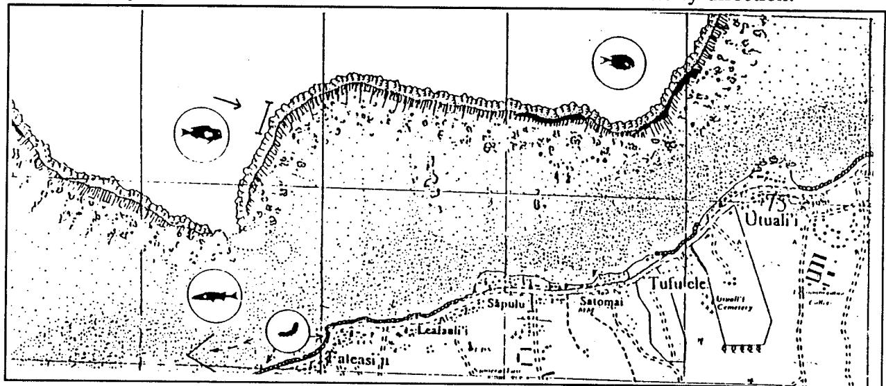

## Fish communities& habitat characteristics (this study):

Fish species richness: moderate

Fish density: moderate Fish biomass: low Coral cover: moderate

## 'UPOLU ISLAND Vaitele

Location of site: northwest side of 'Upolu (see Fig. 2).

#### Location of transects (see map below):

Five transects were done on the reef front (depth=10m) at Vaitele. The transects started approximately 500m west of the main ava northwest of Mulinu'u Point and continued in a westerly direction.

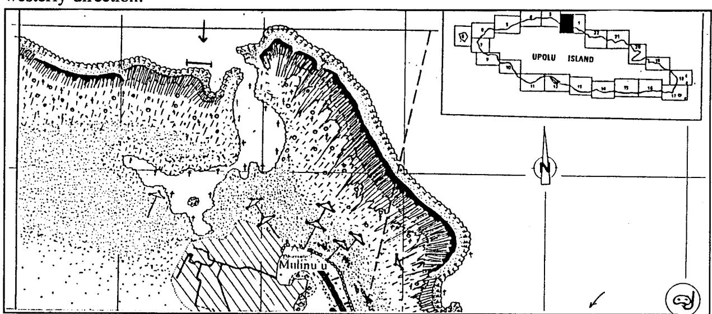

## Fish communities & habitat characteristics (this study):

Fish species richness: moderate

Fish density: high Fish biomass: moderate Coral cover: high

## 'UPOLU ISLAND Fagaloa

Location of site: northeast side of 'Upolu (see Fig. 2).

#### Location of transects (see map below):

Five transects were done on the reef front (depth=10m) on the east side of bay at Fagaloa in front of the village of Samamea. The transects started 250m east of the ava and continued in an easterly direction.

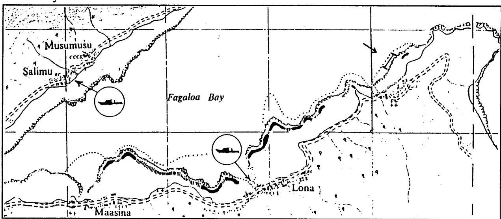

## Fish communities & habitat characteristics (this study):

Fish species richness: moderate

Fish density: moderate Fish biomass: moderate

Coral cover: high

## 'UPOLU ISLAND

#### Eva

Location of site: northeast side of 'Upolu (see Fig. 2).

#### Location of transects (see map below):

Five transects were done on the reef front (depth=10m) on a very large patch reef (approximately 1km long and 500m wide), which is situated on the west side of Saluafata Harbour. The transects started approximately half way along on the reef on the northern side and continued in a westerly direction.

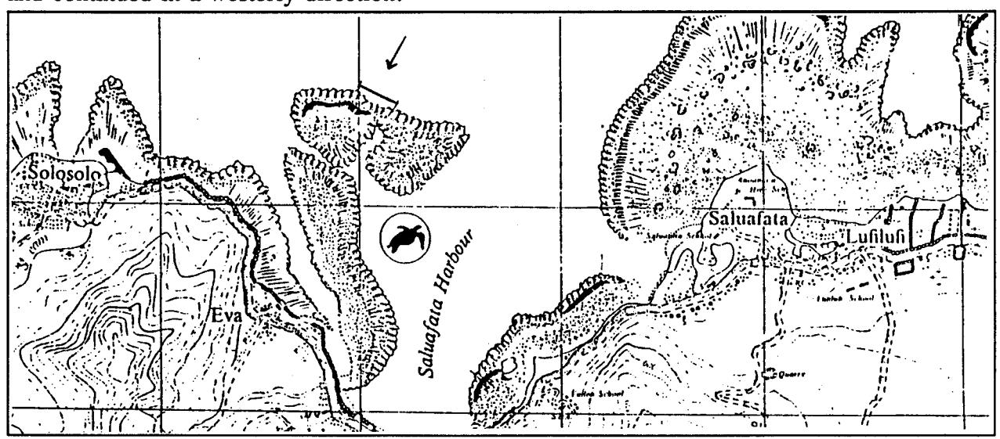

#### Fish communities & habitat characteristics (this study):

Fish species richness: low

Fish density: low Fish biomass: low Coral cover: moderate

## 'UPOLU ISLAND Lefaga

Location of site: southwest side of 'Upolu (see Fig. 2).

#### Location of transects (see map below):

Five transects were done on the reef front (depth=10m)on the east side of Lefaga Bay. The transects started 800m south of the small ava in front of the village of Savala and followed the contour of the reef in a southerly direction.

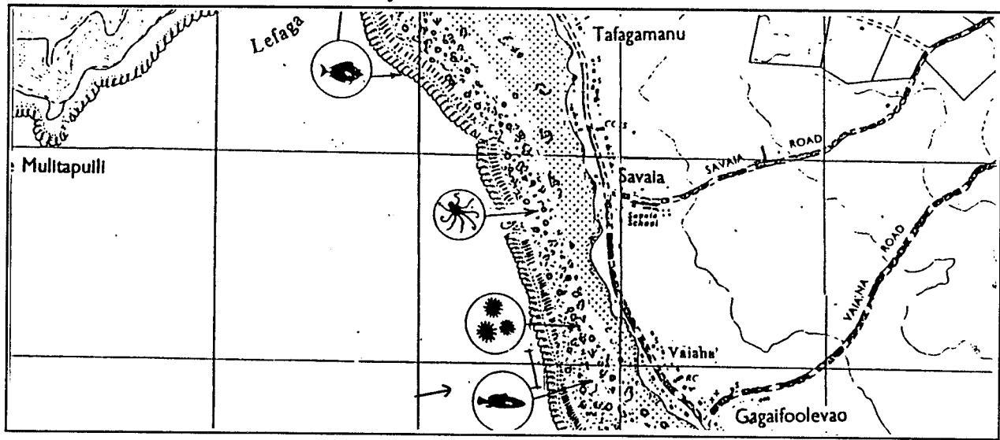

## Fish communities & habitat characteristics (this study):

Fish species richness: moderate

Fish density: moderate Fish biomass: moderate Coral cover: moderate

## 'UPOLU ISLAND Sa'anapu

Location of site: southwest side of 'Upolu (see Fig. 2).

#### Location of transects (see map below):

Five transects were done on the reef front (depth=10m) just east of the entrance to Safata Harbour. The transects started just outside of the harbour and continued in an easterly direction.

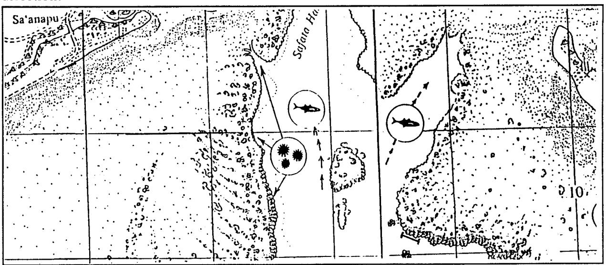

#### Fish communities & habitat characteristics (this study):

Fish species richness: moderate

Fish density: moderate Fish biomass: low Coral cover: low

## 'UPOLU ISLAND Poutasi

Location of site: southeast side of 'Upolu (see Fig. 2).

#### Location of transects (see map below):

Five transects were done on the reef front (10m) at Poutasi. The transects started approximately 200m west of the ava and followed the contour of the reef in a westerly direction.

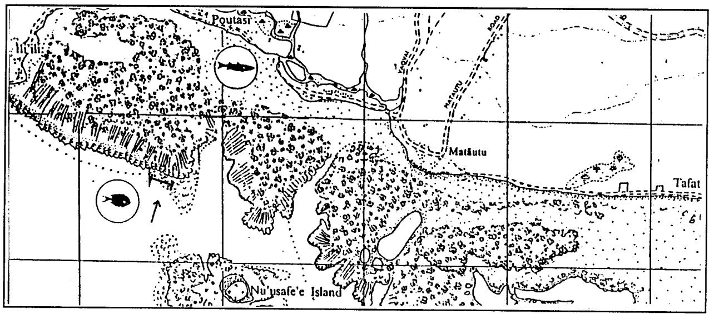

## Fish communities & habitat characteristics (this study):

Fish species richness: high

Fish density: high Fish biomass: moderate

Coral cover: low

## TUTUILA ISLAND Fagamalo

Location of site: northwest side of Tutuila (Fig. 3)

#### Location of transects (see map below):

Five transects were done on the reef front (depth=10m) on the eastern side of the bay. The first three transects were done consecutively starting from the eastern side of ava and heading in a northerly direction. The last two transects started from the same starting point and continued south across the entrance of the ava.

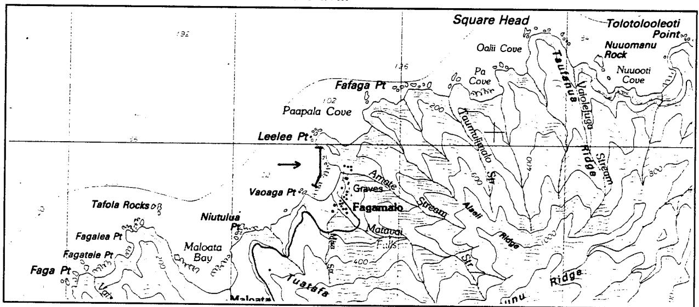

## Fish communities & habitat characteristics (this study):

Fish species richness: moderate

Fish density: moderate Fish biomass: low Coral cover: low

## **TUTUILA ISLAND**

## **Fagafue**

Location of site: northwest side of Tutuila (Fig. 3)

#### Location of transects (see map below):

Five transects were done consecutively on the reef front (depth=10m) on the eastern side of the bay. The transects started approximately 30m east of the ava and ended at the entrance to the bay.

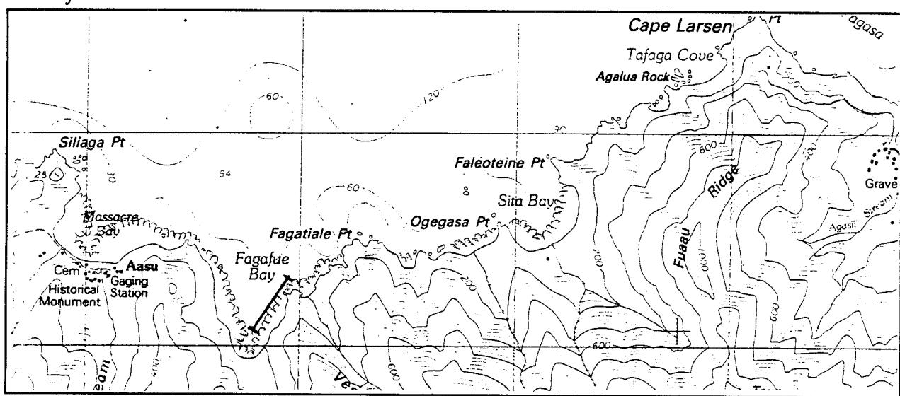

## Fish communities & habitat characteristics (this study):

Fish species richness: low Fish density: moderate Fish biomass: low Coral cover: low

## Coral communities (Mundy 1996):

Coral species richness: moderate

Coral density: low Coral cover: low

#### TUTUILA ISLAND

#### **Fagasa**

Location of site: northwest side of Tutuila (Fig. 3)

#### Location of transects (see map below):

Five transects were done consecutively on the reef front (depth=10m) on the eastern side of the bay. The transects started approximately 20m east of a distinctive coral head that is approximately 4m wide and breaks the surface at low tide, and they ended at the entrance to the bay. The start of the transects was also adjacent to the last house on the eastern side of the bay.

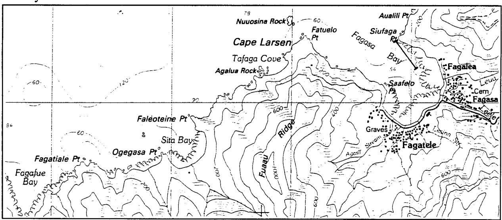

#### Fish communities & habitat characteristics (this study):

Fish species richness: low

Fish density: low Fish biomass: low Coral cover: low

#### Coral communities (Mundy 1996):

Coral species richness: moderate

Coral density: low Coral cover: low

## TUTUILA ISLAND Vatia

Location of site: northeast side of Tutuila (Fig. 3)

#### Location of transects (see map below):

Five transects were done consecutively on the reef front (depth=10m) on the eastern side of Vatia. The transects started at the entrance near a distinctive "tongue" of reef which juts out into deeper water. The transects started approximately 50m east of this "tongue" and continued on into the bay, crossing the "tongue" where it heads down into deeper water along the second transect. The starting position was also approximately 150m offshore from a very small sandy cove at the beginning of the steep rock wall, which was about 75m east of the end of a long beach.

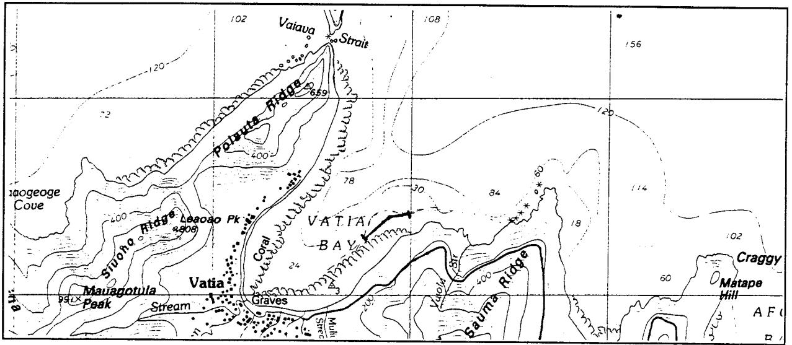

## Fish communities & habitat characteristics (this study):

Fish species richness: moderate

Fish density: moderate Fish biomass: low Coral cover: moderate

## Coral communities (Mundy 1996):

Coral species richness: high

Coral density: high Coral cover: high

### TUTUILA ISLAND Masefau

Location of site: northeast side of Tutuila (Fig. 3)

#### Location of transects (see map below):

Five transects were done consecutively on the reef front (depth=10m) on the eastern side of the bay. The transects started in front of a distinctive dumbell-shaped indentation in the reef just east of the water tank, which is approximately 300m east of a sandy beach. The transects then proceeded along the reef into the bay.

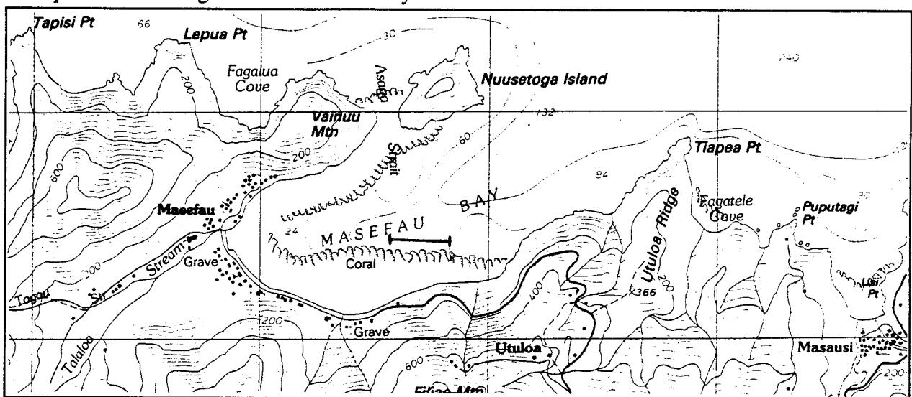

## Fish communities & habitat characteristics (this study):

Fish species richness: moderate

Fish density: moderate Fish biomass: low Coral cover: moderate

#### Coral communities (Mundy 1996):

Coral species richness: moderate

Coral density: high Coral cover: moderate

## TUTUILA ISLAND Aoa

Location of site: northeast side of Tutuila (Fig. 3)

#### Location of transects (see map below):

Five transects were done consecutively on the reef front (depth=10m) on the eastern side of the bay. The transects started approximately 30m east of the ava and continued in a northeasterly direction.

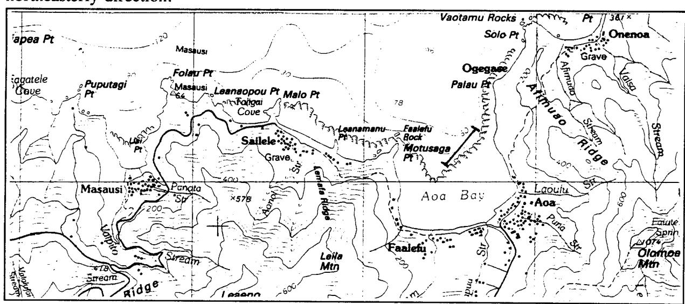

## Fish communities & habitat characteristics (this study):

Fish species richness: moderate

Fish density: moderate Fish biomass: low Coral cover: low

## TUTUILA ISLAND Amanave

Location of site: southwest side of Tutuila (Fig. 3)

#### Location of transects (see map below):

Five transects were done consecutively on the reef front (depth=10m) in front of the village of Amanave. The transects started approximately 30m east of the main ava and continued in an easterly direction past Utusiva Rock.

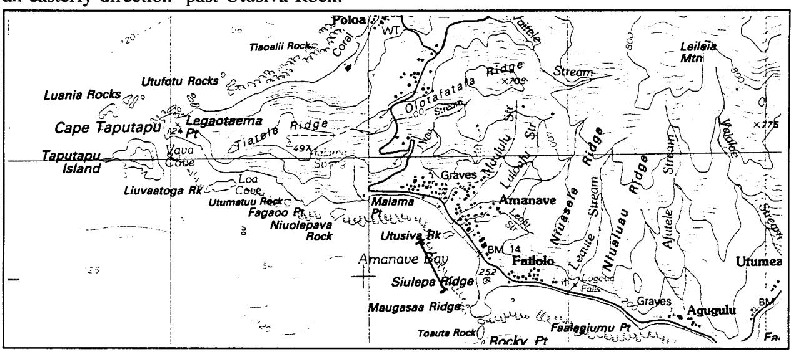

#### Fish communities & habitat characteristics (this study):

Fish species richness: moderate

Fish density: moderate Fish biomass: low Coral cover: low

#### Coral communities (Mundy 1996):

Coral species richness: high Coral density: moderate

Coral cover: high

Colony size: most colonies small and medium sized colonies relatively abundant

## TUTUILA ISLAND Leone

Location of site: southwest side of Tutuila (Fig. 3)

## Location of transects (see map below):

Five transects were done consecutively on the reef front (depth=10m) at Leone. The transects started across from Fagalele High School about 5m west of a large emergent coral head (approx. 4m across) which is located >50m out from the reef edge. The transects then continued in a westerly direction towards the main ava in the middle of the village.

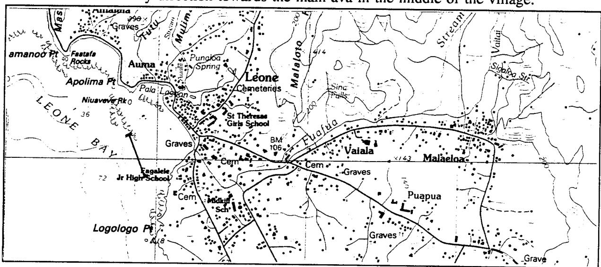

## Fish communities & habitat characteristics (this study):

Fish species richness: high Fish density: moderate Fish biomass: moderate Coral cover: moderate

## Coral communities (Mundy 1996):

Coral species richness: moderate

Coral density: moderate

Coral cover: high

Colony size: small and medium sized colonies both abundant

## TUTUILA ISLAND

## **Fagatele**

Location of site: southwest side of Tutuila (Fig. 3)

#### Location of transects (see map below):

Five transects were done consecutively on the reef front (depth=10m) on the eastern side of the bay. The transects started next to a permanent mooring that is just inside the east side of the bay and about 20 m north of the point, and followed the reef front in towards the middle of the bay.

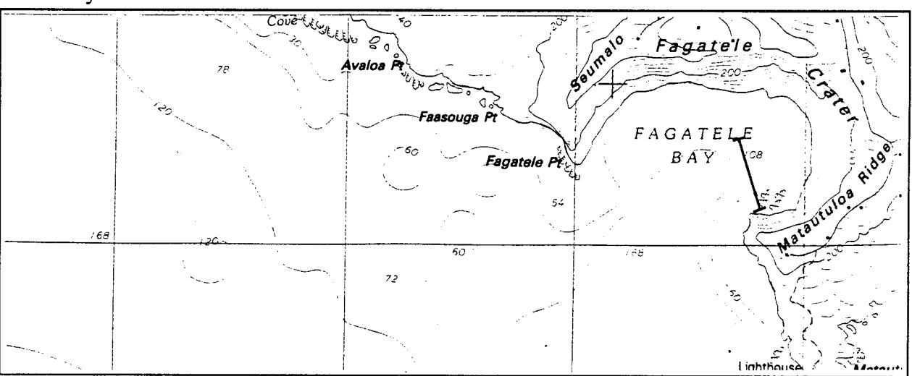

#### Fish communities & habitat characteristics (this study):

Fish species richness: high Fish density: moderate Fish biomass: low

Coral cover: low

## Coral communities (Mundy 1996):

Coral species richness: moderate

Coral density: moderate

Coral cover: low

## TUTUILA ISLAND Fatumafuti

Location of site: southeast side of Tutuila (Fig. 3)

#### Location of transects (see map below):

Five transects were done consecutively on the reef front (depth=10m) at Fatumafuti. The transects started on the south side of a deep indentation in the reef across from Niuloa Point, and continued in a southerly direction towards Fatu Rock.

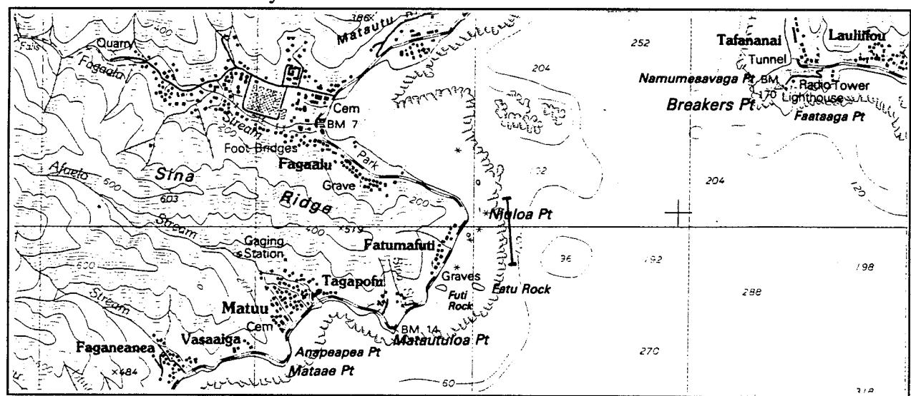

#### Fish communities & habitat characteristics (this study):

Fish species richness: moderate

Fish density: high Fish biomass: moderate Coral cover: moderate

## Coral communities (Mundy 1996):

Coral species richness: moderate

Coral density: moderate

Coral cover: high

## TUTUILA ISLAND Fagaitua

Location of site: southeast side of Tutuila (Fig. 3)

#### Location of transects (see map below):

Five transects were done consecutively on the reef front (depth=10m) in the middle of the bay. The transects started approximately 20m west of the main ava, and then continued in a westerly direction.

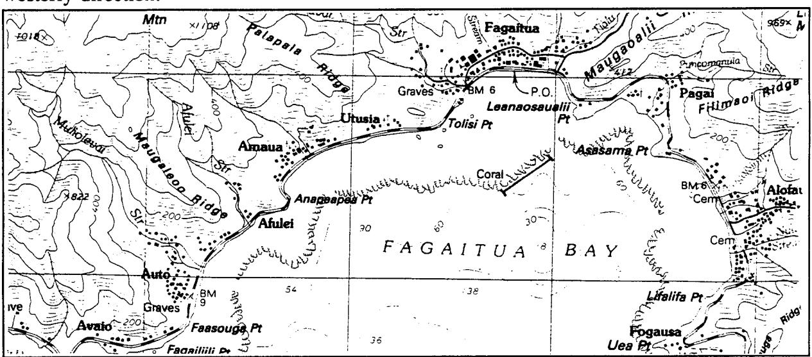

#### Fish communities & habitat characteristics (this study):

Fish species richness: moderate

Fish density: moderate Fish biomass: moderate

Coral cover: low

#### Coral communities (Mundy 1996):

Coral species richness: moderate

Coral density: high Coral cover: low

## TUTUILA ISLAND Amouli

Location of site: southeast side of Tutuila (Fig. 3)

#### Location of transects (see map below):

Five transects were done consecutively on the reef front (depth=10m) in the middle of the bay. The transects started approximately 20m west of the main ava, and then continued in a westerly direction.

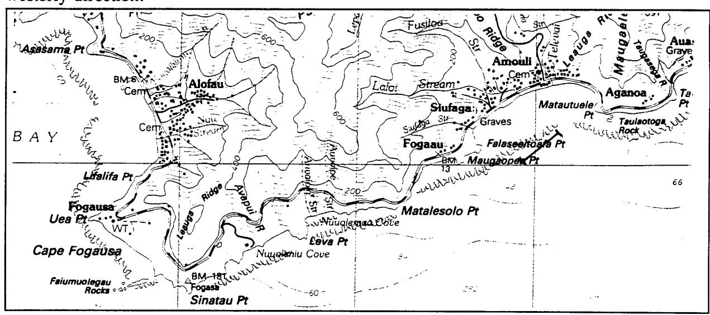

#### Fish communities & habitat characteristics (this study):

Fish species richness: moderate

Fish density: moderate Fish biomass: low Coral cover: low

## TUTUILA ISLAND Nu'uuli

Location of site: southeast side of Tutuila (Fig. 3)

#### Location of transects (see map below):

Five transects were done consecutively on the reef front (depth=10m) in front of Coconut Point. The transects started about 30m from the east side of a small opening in the reef, which is the third opening east of the entrance to Pala Lagoon. The transects then continued in a southeastly direction.

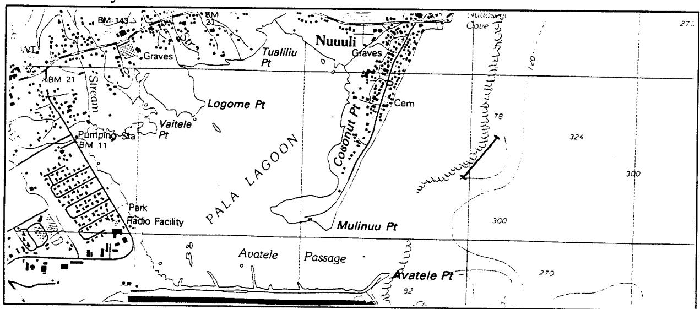

## Fish communities & habitat characteristics (this study):

Fish species richness: moderate

Fish density: moderate Fish biomass: low Coral cover: moderate

## Coral communities (Mundy 1996):

Coral species richness: moderate

Coral density: moderate

Coral cover: low

## TUTUILA ISLAND Onesosopo

Location of site: east side of Pago Pago Harbor (Fig. 3)

#### Location of transects (see map below):

Five transects were done consecutively on the reef front (depth=10m) at Onesosopo (=Anasoposo). The transects started on the south side of the ava and continued south towards Breakers Point.

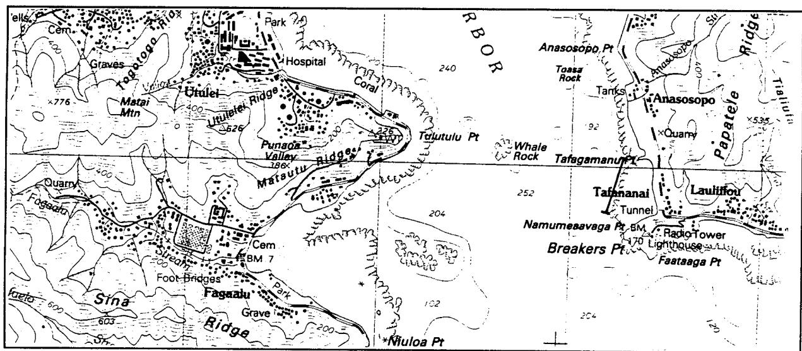

## Fish communities & habitat characteristics (this study):

Fish species richness: moderate

Fish density: moderate Fish biomass: low Coral cover: low

#### Coral communities (Mundy 1996):

Coral species richness: moderate

Coral density: low Coral cover: low

## TUTUILA ISLAND Faga'alu

Location of site: west side of Pago Pago Harbor (Fig. 3)

#### Location of transects (see map below):

Five transects were done consecutively on the reef front (depth=10m) at Faga'alu. The transects started at a deep crevice which was approximately 100m inside the main ava on the south side. The transects then continued east towards to the outer reef front. The first two transects were inside the ava, the third transect followed the reef front around the corner to the outside and the last two transects were on the outer reef front.

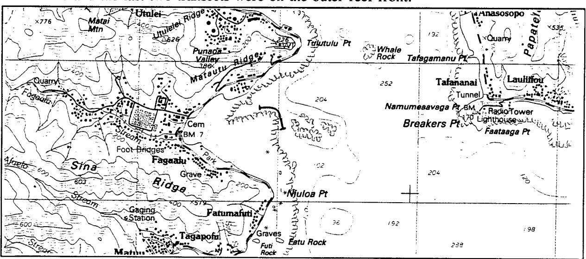

## Fish communities & habitat characteristics (this study):

Fish species richness: moderate

Fish density: moderate Fish biomass: low Coral cover: low

#### Coral communities (Mundy 1996):

Coral species richness: moderate

Coral density: moderate Coral cover: moderate

## TUTUILA ISLAND Aua

Location of site: east side of Pago Pago Harbor (Fig. 3)

### Location of transects (see map below):

Five transects were done consecutively on the reef front (depth=10m) at Aua. The transects started approximately 300m west of Aua Point and followed the reef south towards Anasosopo. These transects ended approximately 200m north of the "Aua Transect" (see Green et al. 1996)..

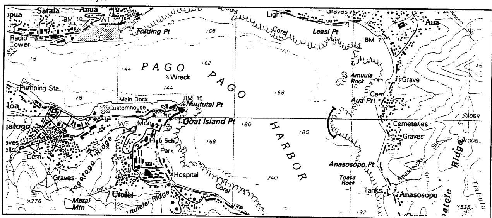

## Fish communities & habitat characteristics (this study):

Fish species richness: high

Fish density: high Fish biomass: moderate

Coral cover: low

#### Coral communities (Mundy 1996):

Coral species richness: moderate

Coral density: low Coral cover: low

## TUTUILA ISLAND Utulei

Location of site: west side of Pago Pago Harbor (Fig. 3)

#### Location of transects (see map below):

Five transects were done consecutively on the reef front (depth=10m) at Utulei. The transects started approximately 10m north of the outfall from the Utulei Sewage Treatment Plant, and continued in a northwesterly direction.

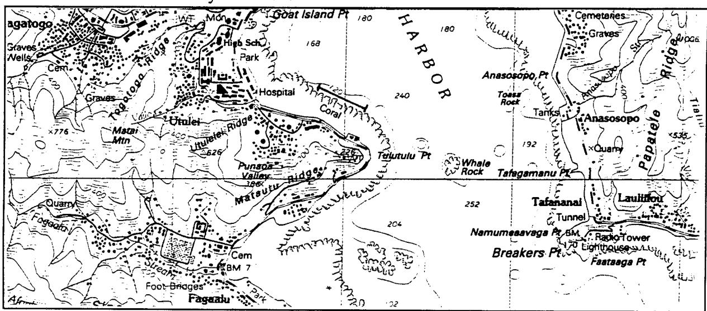

#### Fish communities & habitat characteristics (this study):

Fish species richness: moderate

Fish density: moderate Fish biomass: low Coral cover: low

#### Coral communities (Mundy 1996):

Coral species richness: moderate

Coral density: low Coral cover: low

## TUTUILA ISLAND Leloaloa

Location of site: north side of Pago Pago Harbor (Fig. 3)

#### Location of transects (see map below):

Five transects were done consecutively on the reef front (depth=10m) at Leloaloa. The transects started on the eastern side of a distinctive embayment in the reef, and continued in an easterly direction until they ended in front of the Catholic Church.

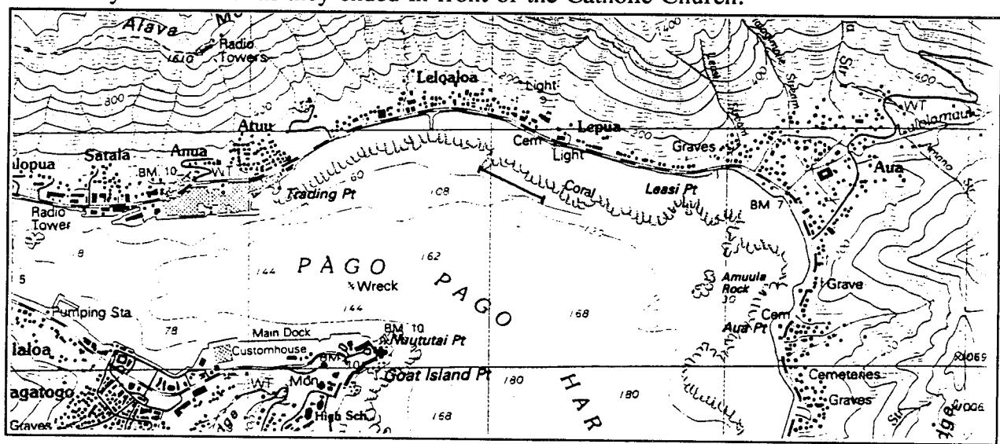

## Fish communities & habitat characteristics (this study):

Fish species richness: moderate

Fish density: moderate Fish biomass: low Coral cover: low

#### Coral communities (Mundy 1996):

Coral species richness: moderate

Coral density: low Coral cover: low

## AUNU'U ISLAND Aunu'u

Location of site: southwest side of the island (Fig. 3)

#### Location of transects:

Five transects were done consecutively on the reef front (depth=10m) off Salevatia Point. The transects started approximately 250m south of the harbor entrance and continued along the reef front in a southerly direction.

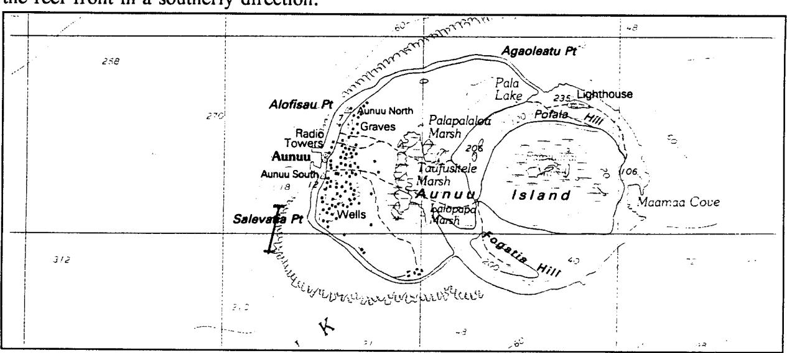

## Fish communities & habitat characteristics (this study):

Fish species richness: high

Fish density: high

Fish biomass: moderate

Coral cover: low

#### Coral communities (Mundy 1996):

Coral species richness: high Coral density: moderate

Coral cover: low

#### **OFU ISLAND**

## Asaga

Location of site: northeast side of Ofu (Fig. 4)

#### Location of transects (see map below):

Five transects were done consecutively on the reef front (depth=10m) at Asaga. The transects started approximately 75m west of the main ava at Asaga Strait and continued in a westerly direction.

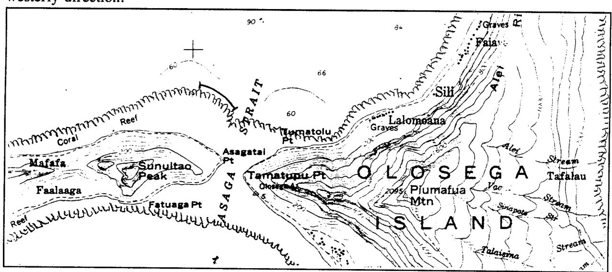

## Fish communities & habitat characteristics (this study):

Fish species richness: high

Fish density: high Fish biomass: moderate Coral cover: not available

## Coral communities (Mundy 1996):

Coral species richness: high Coral density: moderate Coral cover: moderate

## OFU ISLAND Ofu Village

Location of site: southwest side of Ofu (Fig. 4)

#### Location of transects (see map below):

Five transects were done consecutively on the reef front (depth=10m) in front of Nuupule Rock in Ofu Village. The transects started on the south side of the main ava and continued in a southerly direction.

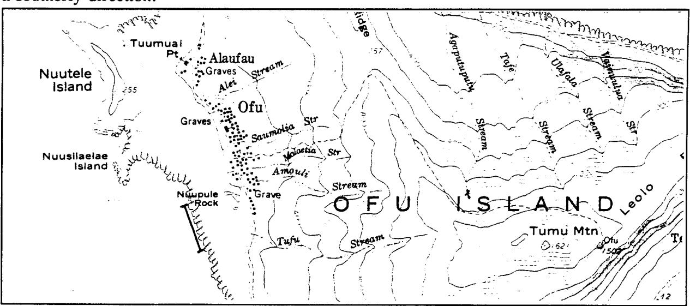

#### Fish communities & habitat characteristics (this study):

Fish species richness: moderate

Fish density: moderate Fish biomass: moderate

Coral cover: low

#### Coral communities (Mundy 1996):

Coral species richness: moderate

Coral density: low Coral cover: low

## OLOSEGA ISLAND Sili

Location of site: northwest side of Olosega (Fig. 4)

#### Location of transects (see map below):

Five transects were done consecutively on the reef front (depth=10m) at Sili. The transects started on the western end of village and continued in northeasterly direction past the present location of the village.

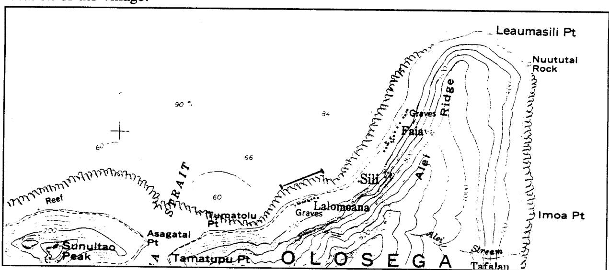

## Fish communities & habitat characteristics (this study):

Fish species richness: high

Fish density: high
Fish biomass: moderate
Coral cover: not available

## Coral communities (Mundy 1996):

Coral species richness: high

Coral density: high Coral cover: high

## OLOSEGA ISLAND Olosega Village

Location of site: southwest side of Olosega (Fig. 4)

#### Location of transects (see map below):

Five transects were done consecutively on the reef front (depth=10m) in front of Olosega Village. The transects started approximately 50m south of the main ava and continued in a southerly direction past the school.

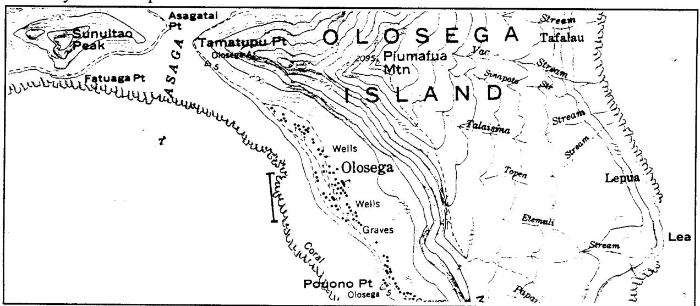

## Fish communities & habitat characteristics (this study):

Fish species richness: high

Fish density: high
Fish biomass: moderate
Coral cover: moderate

#### Coral communities (Mundy 1996):

Coral species richness: high Coral density: moderate

Coral cover: high

## TA'U ISLAND

## Faga

Location of site: northeast side of Ta'u (Fig. 4)

## Location of transects (see map below):

Five transects were done consecutively on the reef front (depth=10m) in front of the historic village of Faga.

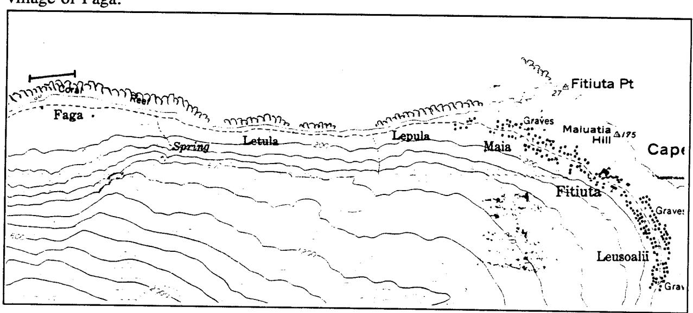

## Fish communities & habitat characteristics (this study):

Fish species richness: moderate

Fish density: moderate Fish biomass: moderate Coral cover: not available

## Coral communities (Mundy 1996):

Coral species richness: high Coral density: moderate

Coral cover: low

## TA'U ISLAND Lepula

Location of site: northeast side of Ta'u (Fig. 4)

## Location of transects (see map below):

Five transects were done consecutively on the reef front (depth=10m) at Lepula. The transects started on the eastern side of the main ava which used to be the old landing site for village of Fitiuta. The transects then continued in an easterly direction towards the village of Fitiuta.

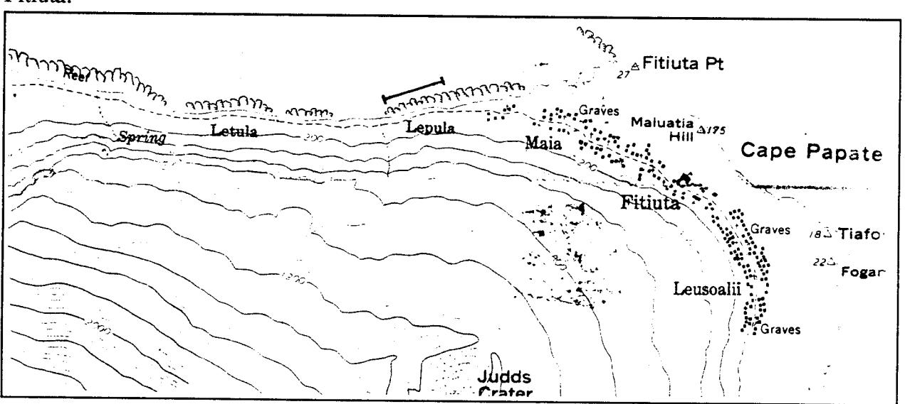

## Fish communities & habitat characteristics (this study):

Fish species richness: moderate

Fish density: high Fish biomass: low

Coral cover: not available

#### Coral communities (Mundy 1996):

Coral species richness: high Coral density: moderate Coral cover: moderate

## TA'U ISLAND Ta'u Village

Location of site: northwest side of Ta'u (Fig. 4)

## Location of transects (see map below):

Five transects were done consecutively on the reef front (depth=10m) in front of the village of Ta'u. The transects started on the northern side of the village in front of Tui Manu'a's grave and continued in a southerly direction.

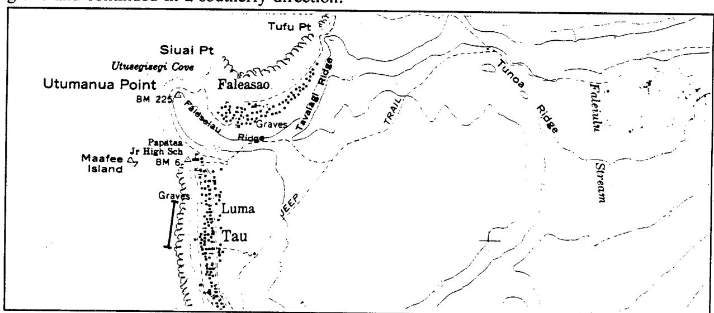

## Fish communities & habitat characteristics (this study):

Fish species richness: low

Fish density: low Fish biomass: low Coral cover: moderate

## TA'U ISLAND Afuli

Location of site: southwest side of Ta'u (Fig. 4)

#### Location of transects (see map below):

Five transects were done consecutively on the reef front (depth=10m) at Afuli Cove. The transects started at a very large *Porites* bommie (about 10m in diameter and 10m high), which is approximately 150m offshore. The transects then proceeded in a northerly direction towards the village of Ta'u.

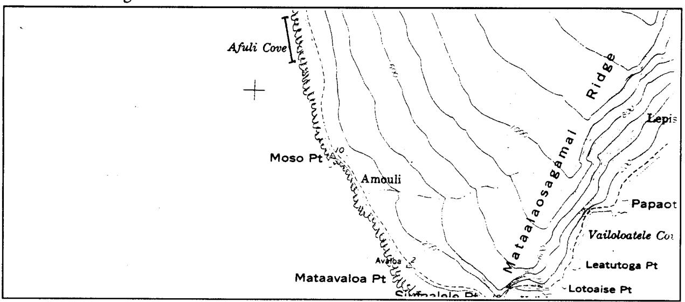

#### Fish communities & habitat characteristics (this study):

Fish species richness: moderate

Fish density: moderate Fish biomass: moderate

Coral cover: low

#### Coral communities (Mundy 1996):

Coral species richness: high Coral density: moderate Coral cover: moderate

## TA'U ISLAND Fagamalo

Location of site: southwest side of Ta'u (Fig. 4)

#### Location of transects (see map below):

Five transects were done consecutively on the reef front (depth=10m) at Fagamolo Cove. The transects started approximately 200m from the northern end of the reef in the cove, and continued in a southerly direction towards Afuli Cove.

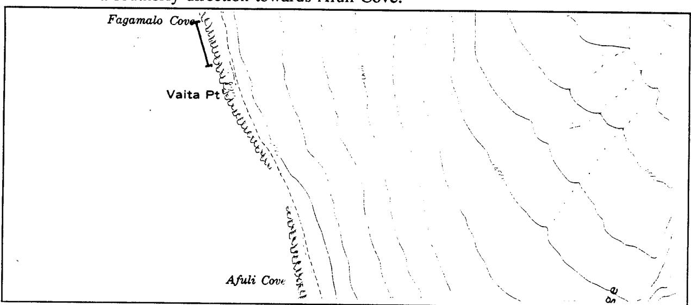

## Fish communities & habitat characteristics (this study):

Fish species richness: high Fish density: moderate Fish biomass: moderate

Coral cover: low

## Coral communities (Mundy 1996):

Coral species richness: moderate

Coral density: low Coral cover: low

## ROSE ATOLL NW Site 1

Location of site: northwest side of the atoll (Fig. 5)

#### Location of transects (see map below):

Five transects were done consecutively on the reef front (depth=10m) at this site. The transects started approximately 850m west of the entrance to the lagoon and continued in a westerly direction.

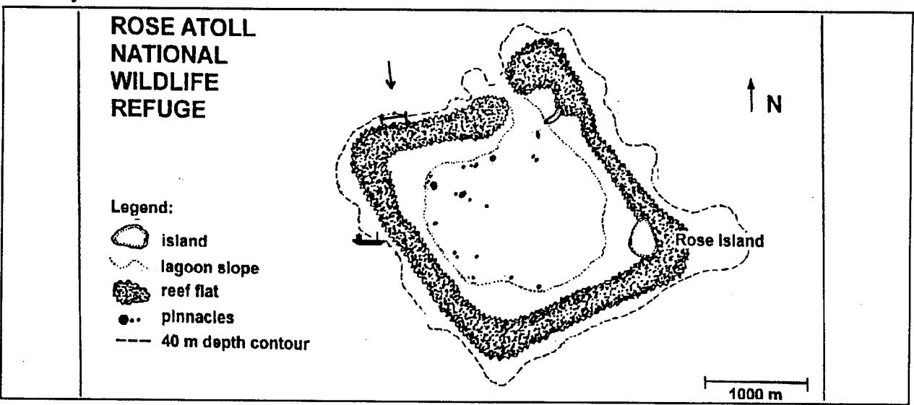

## Fish communities & habitat characteristics (this study):

Fish species richness: moderate

Fish density: high Fish biomass: moderate

Coral cover: low

## ROSE ATOLL NW Site 2

Location of site: northwest side of the atoll (Fig. 5)

#### Location of transects (see map below):

Five transects were done consecutively on the reef front (depth=10m) at this site. The transects started approximately 200m west of the entrance to the lagoon and continued in a westerly direction.

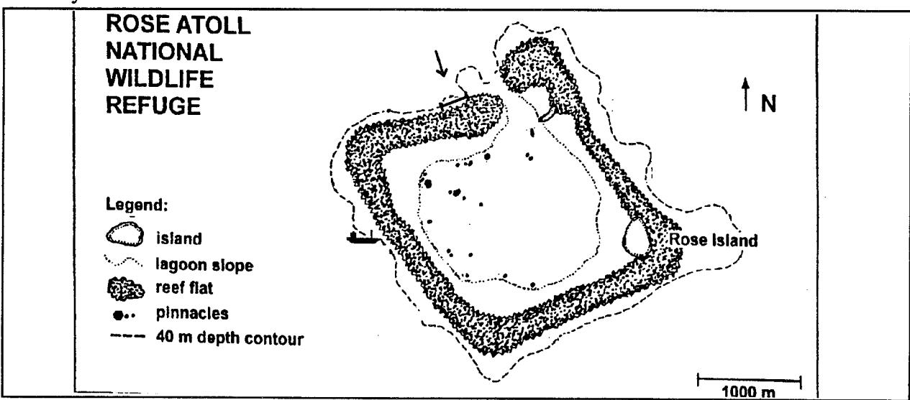

#### Fish communities & habitat characteristics (this study):

Fish species richness: moderate

Fish density: high Fish biomass: high Coral cover: low

## ROSE ATOLL SW Site 1

Location of site: southwest side of the atoll (Fig. 5)

#### Location of transects (see map below):

Five transects were done on the reef front (depth=10m) where the longlinger ran aground, which is approximately 1 km south of the northwest corner of the atoll. Three transects were done heading south from the impact site, and two transects were done heading north from the same site.

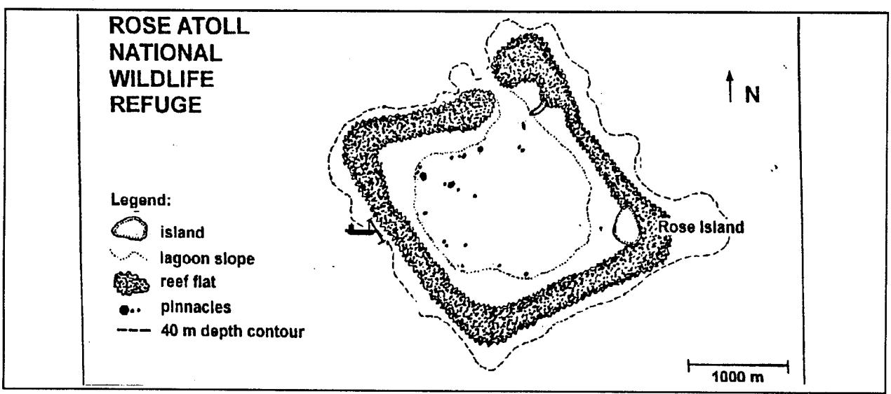

#### Fish communities & habitat characteristics (this study):

Fish species richness: high

Fish density: high Fish biomass: moderate

Coral cover: low

## ROSE ATOLL SW Site 2

Location of site: southwest side of the atoll (Fig. 5)

#### Location of transects (see map below):

Five transects were done consecutively on the reef front (depth=10m) at this site. The transects started about 1.6 km south of the northwest corner of the atoll and about 850 m north of the southern corner. The transects then continued in a southerly direction towards the southern corner of the atoll.

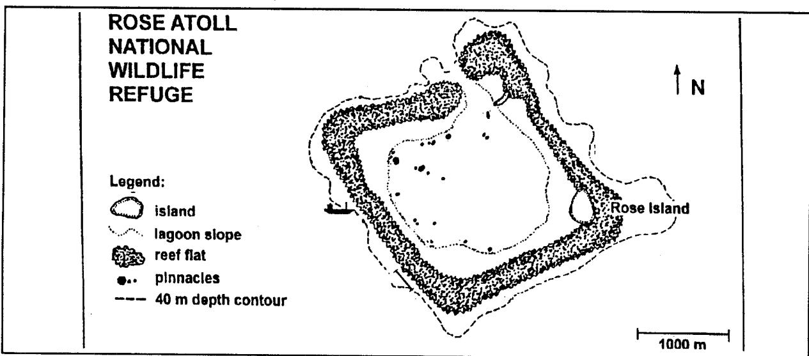

## Fish communities & habitat characteristics (this study):

Fish species richness: moderate

Fish density: high Fish biomass: moderate

Coral cover: low

## ROSE ATOLL SW Site 3

Location of site: southwest side of the atoll (Fig. 5)

#### Location of transects (see map below):

Five transects were done consecutively on the reef front (depth=10m) at this site. The transects started about 250m south of the northwest corner of the atoll and continued in a southerly direction.

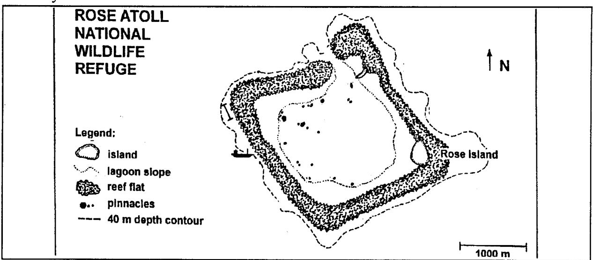

#### Fish communities & habitat characteristics (this study):

Fish species richness: moderate

Fish density: high Fish biomass: moderate

Coral cover: low

## ROSE ATOLL SE Site 1

Location of site: southeast side of the atoll (Fig. 5)

## Location of transects (see map below):

Five transects were done consecutively on the reef front (depth=10m) at this site. The transects started about 600m east of the southern corner of the atoll and continued in a easterly direction towards Rose Island.

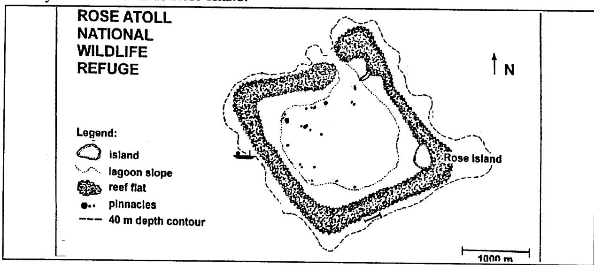

## Fish communities & habitat characteristics (this study):

Fish species richness: low

Fish density: high Fish biomass: low

Coral cover: not available

## SWAINS ISLAND SW Site 1

Location of site: southwest side of the island (see Fig. 6).

#### Location of transects (see map below):

Five transects were done consecutively on the reef front (depth=10m) at Taulaga. The transects started approximately 300m south of the ava, and proceeded in a southerly direction.

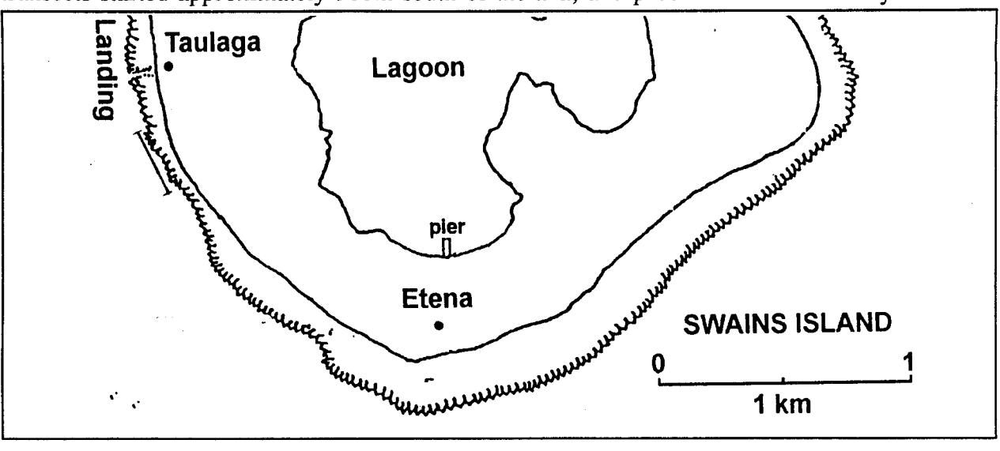

#### Fish communities & habitat characteristics (this study):

Fish species richness: moderate

Fish density: very high Fish biomass: low Coral cover: high

## SWAINS ISLAND SW Site 2

Location of site: southwest side of the island (see Fig. 6).

#### Location of transects (see map below):

Five transects were done consecutively on the reef front (depth=10m) on the southwest side of the island. The transects started approximately 500m south of the end of the transects at SW Site 1.

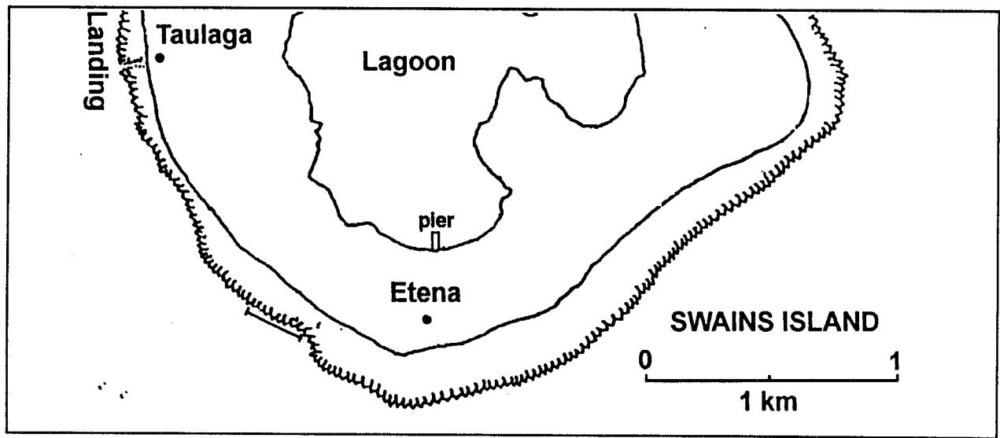

#### Fish communities & habitat characteristics (this study):

Fish species richness: moderate

Fish density: very high Fish biomass: moderate Coral cover: high

## APPENDIX II: LOCATION OF STUDY SITES FOR COMPARISON AMONG HABITAT TYPES

The following is a summary of the exact location of the transects surveyed in a range of habitats at two sites on 'Upolu, Tutuila, Ofu-Olosega and Rose Atoll. All habitat types were surveyed at the same two sites on each island, except for the shallow lagoons which were surveyed at distances up to 2.5km away from these sites because the availability of this habitat type was limited. For the purposes of this study, Ofu and Olosega will be considered a single island since they are connected by a continuous reef (see Fig. 4).

## 'UPOLU ISLAND SITE 1

Location of site: Lefaga Bay, southwest side of 'Upolu (see Fig. 26).

#### Location of transects (see map below):

Five transects were done on the reef front (depth=10m) on the east side of Lefaga Bay. The transects started 800m south of the small ava in front of the village of Savala and followed the contour of the reef in a southerly direction.

Surveys were also done in the shallow lagoon at Lefaga (depth=1-3m). Five transects were laid around the outer edges of the large coral patches in the lagoon approximately 600m south of the small ava in front of the village of Savala (see hatched area below).

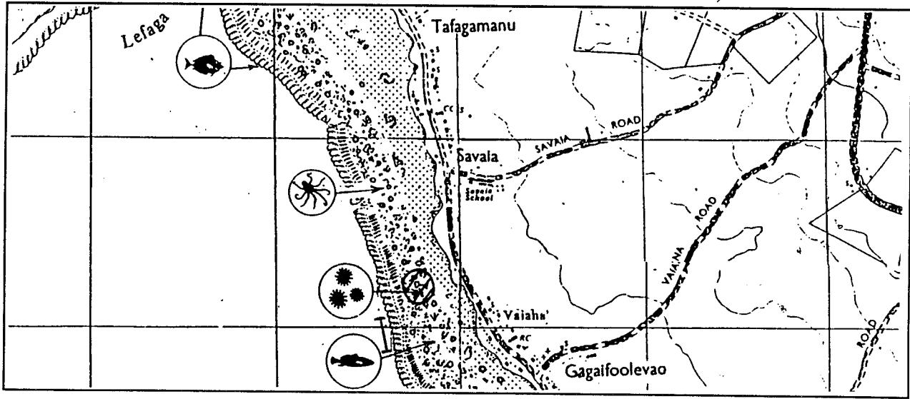

## 'UPOLU ISLAND SITE 2

Location of site: Sa'anapu, southwest side of 'Upolu (see Fig. 6).

## Location of transects (see map below):

Five transects were done on the reef front (depth=10m) just east of the entrance to Safata Harbour. The transects started just outside of the harbour and continued in an easterly direction.

Surveys were also done in the shallow lagoon at this site (depth=1-2m). Five transects were laid around the outer edges of the small coral patches in the lagoon approximately 2500m west of Safata Harbour (see hatched area below).

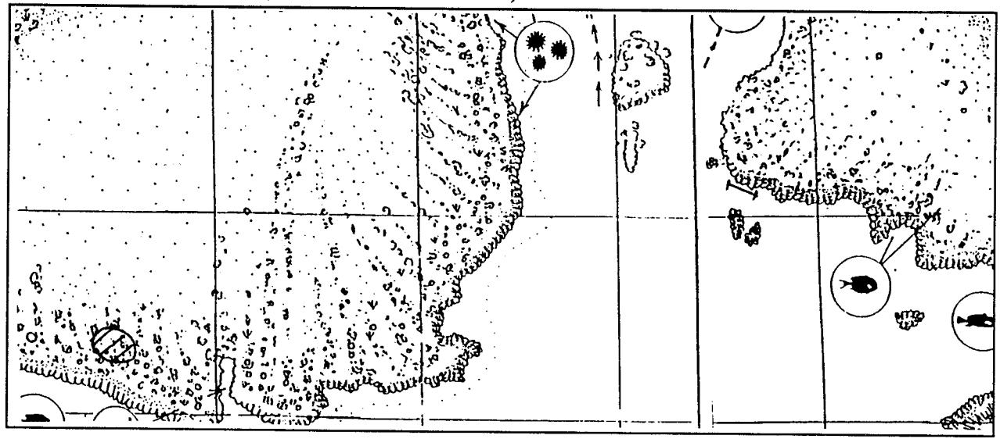

#### TUTUILA ISLAND SITE 1

Location of site: Nu'uuli and Airport, southeast Tutuila (Fig. 1)

#### Location of transects (see map below):

Five transects were done consecutively on the reef front (depth=10m) in front of Coconut Point. The transects started about 30m from the east side of a small opening in the reef, which is the third opening east of the entrance to Pala Lagoon. The transects then continued in a southeastly direction. Three other habitat types were also surveyed at this site: reef flat (<1 m), crest (2-3m) and the reef front (20 m). The crest and reef front (20 m) were surveyed using five consecutive transects parallel to the ones done at 10m (see above), and the reef flat was surveyed using five consecutive transects that were located approximately 450m in from the reef edge (see dotted line) along the inner edge of the reef flat (depth=1m).

Surveys were also done in the shallow lagoon at Nu'uuli (depth=3-5m). However, these transects were located approximately 1200m west of the main site in front of the airport between the runway and the reef edge. The transects started approximately 5m off the point of the coral rubble beach that is approximately 150m west of the end of the runway. Five transects were then laid around the outer edges of the large coral patches in the lagoon (see hatched area).

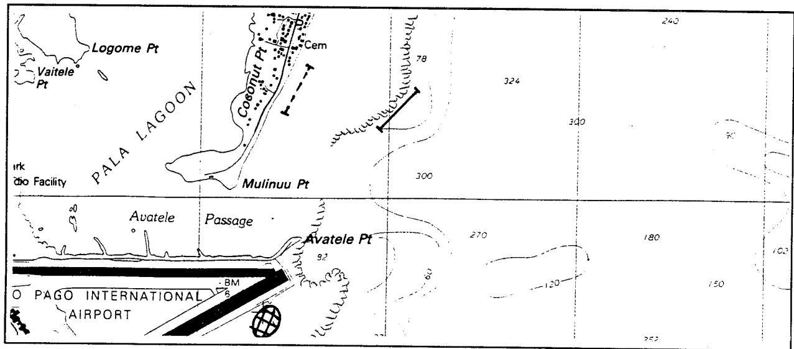

## TUTUILA ISLAND SITE 2

Location of site: Fatumafuti and Faga'alu, southeast Tutuila (Fig. 1)

#### Location of transects (see map below):

Five transects were done consecutively on the reef front (depth=10m) at Fatumafuti. The transects started on the south side of a deep indentation in the reef across from Niuloa Point, and continued in a southerly direction towards Fatu Rock. Two other habitats types were surveyed at the same site, the crest (2-3 m) and the reef front (20m), using five consecutive transects in each habitat parallel to the ones done at 10m (see above).

The reef flat was surveyed using five consecutive transects at a site approximately 2.5km west of the main site (see above) on the reef flat at Nu'uuli in front of where the road leaves the shoreline and heads inland. The transects were done along the inner edge of the reef flat (depth=1m) and started approximately 50m from a small sandy beach on the eastern side of a small stream, and continued in southwesterly direction.

Five transects were also done in the shallow lagoon (depth=2-3m) at Faga'alu, which was approximately 500 m north of the main site at Fatumafuti (see above). The transects were laid consecutively around the outer edges of the large coral patches in the lagoon (see hatched area below), starting approximately 50m from the ava and about 300m in from the reef edge.

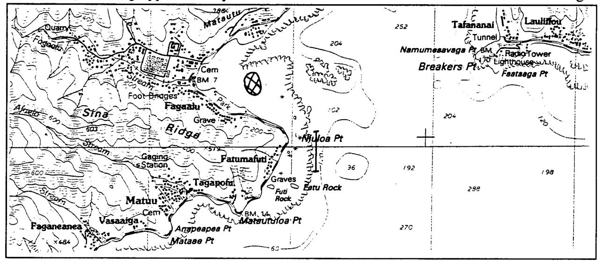

## OFU-OLOSEGA ISLANDS Site 1

Location of site: Ofu Village and Vaoto, southwest Ofu (Fig. 3)

#### Location of transects (see map below):

Five transects were done consecutively on the reef front (depth=10m) in front of Nuupule Rock in Ofu Village. The transects started on the south side of the main ava and continued in a southerly direction. Three other habitats types were surveyed at the same site: reef flat, crest (3 m), reef front (20m). The crest and reef front (20m) were surveyed using five consecutive transects parallel to the ones done at 10m (see above). The reef flat was surveyed using five consecutive transects along the inner edge of the reef flat that started approximately 10m south of the main ava and approximately 50m in from the reef edge (see dotted line).

Five transects were also done in the shallow lagoon (depth=1-2m) in front of Vaoto Lodge, which was approximately 2000 m southeast of village of Ofu. Five transects were laid consecutively in the shallow lagoon (depth=1-2m) at Vaoto starting approximately 5m from shore and 100m west of the eastern end of the sandy beach in front of the lodge. The transects were laid around the outer edges of the large coral patches in the lagoon and continued in a southwesterly direction from the starting point (see hatched area below).

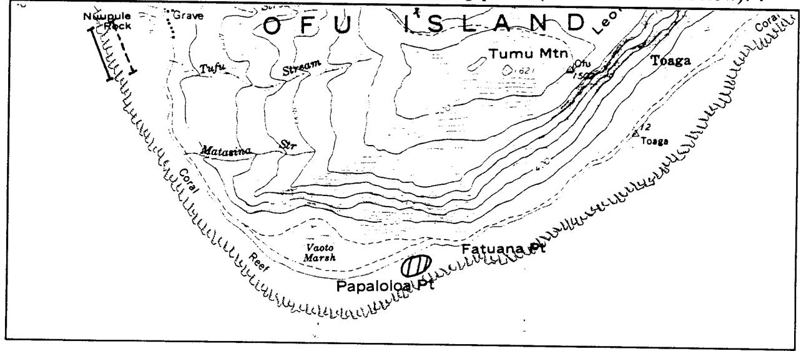

## OFU-OLOSEGA ISLANDS SITE 2

Location of site: Olosega Village, southwest Olosega; and Toaga, southeast Ofu (Fig. 3)

#### Location of transects (see map below):

Five transects were done consecutively on the reef front (depth=10m) in front of Olosega Village. The transects started approximately 50m south of the main ava and continued in a southerly direction past the school. Three other habitats types were surveyed at the same site: reef flat, crest (3 m), reef front (20m). The crest and reef front (20m) were surveyed using five consecutive transects parallel to the ones done at 10m (see above). The reef flat was surveyed using five consecutive transects along the inner edge of the reef flat starting approximately 10m north of the main ava and approximately 70m in from the reef edge (see dotted line).

Five transects were also done in the shallow lagoon (depth=1-2m) at Toaga, which was approximately 3000 m west of village of Olosega. The transects started approximately 20m from shore and approximately 100m east of a very large granite boulder (approximately 5m across and 3m high) on the shoreline. The transects were laid consecutively around the outer edges of the large coral patches in the lagoon in a southwesterly direction and finished approximately 75m from shore (see hatched area below). These transects were in front of the "hurricane house", which was built after Hurricane Tusi and was the only house at Toaga in 1995. The house belongs to DMWR employee, Pita IIi.

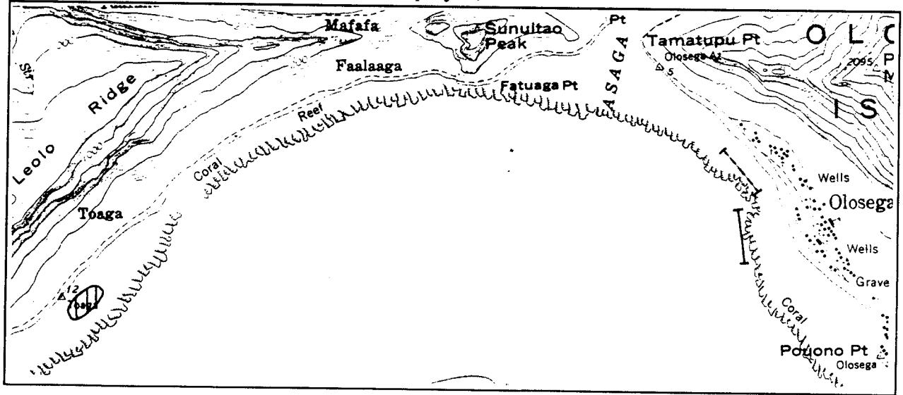

## ROSE ATOLL NW Site 1

Location of site: northwest side of the atoll (Fig. 4)

## Location of transects (see map below):

Five transects were done consecutively on the reef front (depth=10m) at this site. The transects started approximately 850m west of the entrance to the lagoon and continued in a westerly direction. Two other habitats types were surveyed at the same site: reef flat and shallow lagoon. The reef flat was surveyed using five consecutive transects parallel to the ones done on the reef front at 10m (see above) and approximately 250m in from the outer reef edge (see dotted line). The shallow lagoon (depth=1-2m) was surveyed using five transects adjacent to the reef flat transects at this site. These transects were laid around the edges of the large coral patches in the lagoon (see hatched area below).

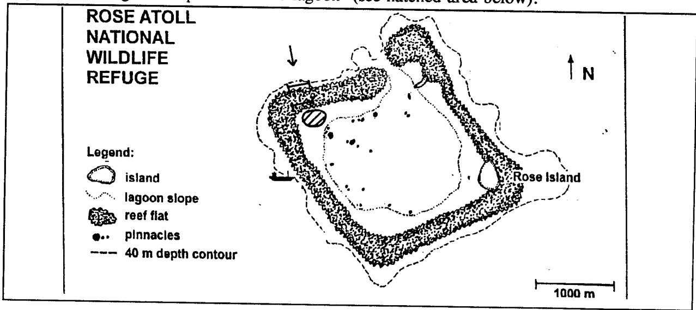

#### ROSE ATOLL NW Site 2

Location of site: northwest side of the atoll (Fig. 4)

#### Location of transects (see map below):

Five transects were done consecutively on the reef front (depth=10m) at this site. The transects started approximately 200m west of the entrance to the lagoon and continued in a westerly direction. Two other habitats types were surveyed at this site: reef flat and shallow lagoon. The reef flat was surveyed using five consecutive transects parallel to the ones done on the reef front at 10m (see above) and approximately 250m in from the outer reef edge (see dotted line). The shallow lagoon (depth=1-2m) was surveyed using five transects adjacent to the reef flat transects at this site. These transects were laid around the edges of the large coral patches in the lagoon (see hatched area below).

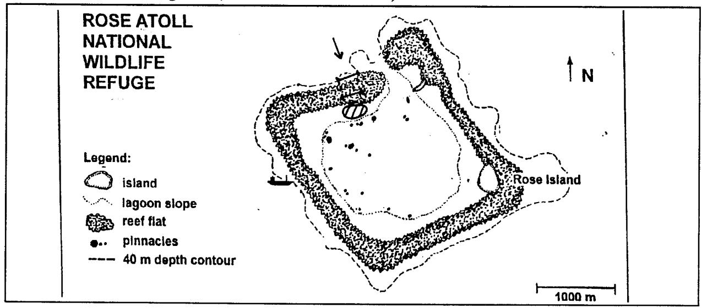

## APPENDIX III: SPECIES LIST & LENGTH-WEIGHT CONVERSION CONSTANTS

List of species recorded on survey of the Samoan Archipelago, and the length-weight conversion constant calculated for each species in American Samoa (based on Wass 1982a: see *Results*).

| BONY FISHES:                   | constant |
|--------------------------------|----------|
| ACANTHURIDAE                   |          |
| Acanthurinae                   |          |
| A canthurus achilles           | 0.000860 |
| A canthurus albipectoralis     | 0.00800  |
| A canthurus blochii            | 0.00800  |
| A canthurus dussumieri         | 0.00800  |
| A canthurus guttatus           | 0.001250 |
| A canthurus leuchocheilus      | 0.000800 |
| A canthurus lineatus           | 0.000860 |
| A canthurus nigricans          | 0.000860 |
| A canthurus nigricauda         | 0.000800 |
| A canthurus nigrofuscus        | 0.000800 |
| A canthurus nigroris           | 0.000680 |
| A canthurus olivaceus          | 0.000680 |
| A canthurus pyroferus          | 0.000860 |
| A canthurus thompsoni          | 0.000570 |
| A canthurus triostegus         | 0.001080 |
| A canthurus xanthopterus       | 0.000900 |
| Ctenochaetus hawaiiensis       | 0.000940 |
| Ctenochaetus striatus          | 0.000940 |
| Ctenochaetus strigosus         | 0.000940 |
| Zebrasoma scopas               | 0.000880 |
| Zebrasoma veliferum            | 0.000840 |
| Zebrasoma rostratum            | 0.000880 |
| Nasinae                        |          |
| Naso annulatus                 | 0.000540 |
| Naso brevirostris              | 0.000700 |
| Naso hexacanthus               | 0.000540 |
| Naso literatus                 | 0.000960 |
| Naso unicomis                  | 0.000750 |
| Naso vlamingii                 | 0.000540 |
| Naso sp.                       | 0.000540 |
| AULOSTOMIDAE                   |          |
| Aulostomus chinensis           | 0.000060 |
| BALISTIDAE                     |          |
| Balistapus undulatus           | 0.001000 |
| Balistoides viridescens        | 0.001000 |
| Melichthys niger               | 0.000870 |
| Melichthys vidua               | 0.001100 |
| Pseudobalsites flavimarginatus | 0.001000 |

|                           | constant |
|---------------------------|----------|
| Balistidae cont.          |          |
| Rhinecanthus aculeatus    | 0.001000 |
| Rhinecanthus rectangulus  | 0.001010 |
| Sufflamen bursa           | 0.000890 |
| Sufflamen chrysopterus    | 0.000990 |
| Sufflamen freanatus       | 0.000990 |
| CAESIONIDAE               |          |
| Caesio cuning             | 0.000450 |
| Pterocaesio marri         | 0.000450 |
| Pterocaesio tile          | 0.000450 |
| Pterocaesio trilineata    | 0.000450 |
| Pterocaesio spp.          | 0.000450 |
| CARANGIDAE                |          |
| Caranx ignobilis          | 0.000710 |
| Caranx lububris           | 0.000710 |
| Caranx melampygus         | 0.000710 |
| Caranx spp.               | 0.000710 |
| Carangoides ferdau        | 0.000710 |
| Elagatis bipinnulatus     | 0.000330 |
| Scomberoides lysan        | 0.000330 |
| CHAETODONTIDAE            |          |
| Chaetodon auriga          | 0.001000 |
| Chaetodon bennetti        | 0.001000 |
| Chaetodon citrinellus     | 0.000940 |
| Chaetodon ephippium       | 0.000940 |
| Chaetodon lineolatus      | 0.001000 |
| Chaetodon lunula          | 0.001160 |
| Chaetodon melannotus      | 0.001000 |
| Chaetodon mertensii       | 0.001000 |
| Chaetodon omatissimus     | 0.001160 |
| Chaetodon pelewensis      | 0.001100 |
| Chaetodon quadrimaculatus | 0.000950 |
| Chaetodon rafflesii       | 0.001000 |
| Chaetodon reticulatus     | 0.001000 |
| Chaetodon semeion         | 0.001000 |
| Chaetodon speculum        | 0.001000 |
| Chaetodon trifascialis    | 0.001000 |
| Chaetodon trifasciatus    | 0.001000 |
| Chaetodon ulietensis      | 0.001030 |
| Chaetodon unimaculatus    | 0.001000 |
| Chaetodon vagabundus      | 0.001000 |
| Forcipiger flavissimus    |          |
| Forcipiger longirostris   | 0.000470 |
| Hemitaurichthys polylepis | 0.000470 |
| Hemitaurichthys thompsoni | 0.001010 |
|                           | 0.001010 |

| Charles I at 1            | constant |
|---------------------------|----------|
| Chaetodontidae cont.      |          |
| Heniochus acuminatus      | 0.001030 |
| Heniochus chrysostomus    | 0.001030 |
| Heniochus monceros        | 0.001030 |
| Heniochus varius          | 0.001030 |
| DIODONTIDAE               |          |
| Diodon liturosus          | 0.001000 |
| FISTULARIDAE              |          |
| Fistularia commersonii    | 0.000020 |
| HAEMULIDAE                |          |
| Plectorhinchus orientalis | 0.000670 |
| Plectorhinchus spp.       | 0.000670 |
| KYPHOSIDAE                |          |
| Kyphosus cinerascens      | 0.000740 |
| Kyphosus vaigiensis       | 0.000740 |
| Kyphosus spp.             | 0.000740 |
| эрр.                      | 0.000740 |
| LABRIDAE                  |          |
| Anampses meleagrides      | 0.000400 |
| Anampses twistii          | 0.000400 |
| Bodianus axillaris        | 0.000620 |
| Bodianus loxozonus        | 0.000620 |
| Bodianus mesothorax       | 0.000620 |
| Cheilinus chlorourus      | 0.000570 |
| Cheilinus diagrammus      | 0.000570 |
| Cheilinus fasciatus       | 0.000570 |
| Cheilinus oxycepthalus    | 0.000570 |
| Cheilinus trilobatus      | 0.000570 |
| Cheilinus undulatus       | 0.000570 |
| Cheilinus unifaciatus     | 0.000570 |
| Cheilinus spp.            | 0.000570 |
| Cheilio inermis           | 0.000320 |
| Cirrhilabrus cyanopleura  | 0.000500 |
| Cirrhilabrus punctatus    | 0.000500 |
| Cirrhilabrus scottorum    | 0.000500 |
| Cirrhilabrus spp.         | 0.000500 |
| Coris aygula              | 0.000440 |
| Coris gaimard             | 0.000440 |
| Epibulus insidiator       | 0.000620 |
| Gomphosus varius          | 0.000320 |
| Halichoeres biocellatus   | 0.000510 |
| Halichoeres hortulanus    | 0.000510 |
| *Halichoeres complex      | 0.000510 |
| Halichoers marginatus     | 0.000510 |
|                           |          |

\*Halichoeres complex comprises a group of closely related species that are difficult to separate in the field: H. margaritaceus, H. nebulosus and H. miniatus. | Ivi

| Labridae cont.               | constant |
|------------------------------|----------|
| Halichoeres melanurus        | 0.000510 |
| Halichoeres omatissiumus     | 0.000510 |
| Halichoeres prosopeion       | 0.000510 |
| Halichoeres trimaculatus     | 0.000510 |
| Halichoeres spp.             | 0.000510 |
| Hemigymnus fasciatus         | 0.000620 |
| Hemigymnus melapterus        | 0.000620 |
| Hologymnosus annulatus       | 0.000320 |
| Labrichthyes unilineatus     | 0.000510 |
| Labroides bicolor            | 0.000450 |
| Labroides dimidiatus         | 0.000450 |
| Labroides rubrolabiatus      | 0.000450 |
| Labropsis australis          | 0.000510 |
| Labropsis xanthonota         | 0.000510 |
| Macropharyngodon meleagris   | 0.000620 |
| Macropharyngodon negrosensis | 0.000620 |
| Pseudocheilinus evanidus     | 0.000520 |
| Pseudocheilinus hexataenia   | 0.000520 |
| Pseudocheilinus octotaenia   | 0.000540 |
| Pseudocheilinus tetrataenia  | 0.000520 |
| Pseudodax moluccanus         | 0.000510 |
| Stethojulis bandanensis      | 0.000540 |
| Stethojulis strigiventer     | 0.000540 |
| Stethojulis trilineata       | 0.000540 |
| Thalassoma amblycephalum     | 0.000480 |
| Thalassoma hardwicke         | 0.000480 |
| Thalassoma lunare            | 0.000480 |
| Thalassoma lutescens         | 0.000480 |
| Thalassoma purpureum         | 0.000480 |
| Thalassoma quinquevittatum   | 0.000480 |
| Thalassoma trilobatum        | 0.000480 |
| Xyrichtyes aneitensis        | 0.000500 |
| LETHRINIDAE                  |          |
| Gnathodentax aurolineatus    | 0.000670 |
| Lethrinus harak              | 0.000670 |
| Lethrinus spp.               | 0.000670 |
| Monotaxis grandoculis        | 0.000560 |
| LUTJANIDAE                   |          |
| A phareus furca              | 0.000.00 |
| Aprion virescens             | 0.000600 |
| Lutjanus bohar               | 0.000540 |
| Lutjanus fulviflamma         | 0.000670 |
| Lutjanus fulvus              | 0.000670 |
| Lutjanus gibbus              | 0.000670 |
| Lutjanus kasmira             | 0.000670 |
| Lutjanus monostigma          | 0.000670 |
| enganas monostigmu           | 0.000670 |

| Lujanidae cont.             | constant             |
|-----------------------------|----------------------|
| Macolor niger               | 0.000670             |
| Macolor macularis           | 0.000670 0.000670 |
|                             | 0.000670             |
| MALACANTHIDAE               |                      |
| Malacanthus latovittatus    | 0.000260             |
|                             |                      |
| MONACANTHIDAE               |                      |
| A luterum monoceros         | 0.000690             |
| Cantherninus dumerilii      | 0.001640             |
| Oxymonacanthus longirostris | 0.000600             |
| Pervagor janthinosoma       | 0.000790             |
| MUGILIDAE                   |                      |
| Liza vaigiensis             | 0.000380             |
|                             |                      |
| MULLIDAE                    |                      |
| Mulloides flavolineatus     | 0.000440             |
| Mulloides vanicolensis      | 0.000440             |
| Parupeneus barberinus       | 0.000500             |
| Parupeneus bifasciatus      | 0.000500             |
| Parupeneus cyclostomus      | 0.000500             |
| Parupeneus multifasciatus   | 0.000500             |
| NEMIPTERIDAE                |                      |
| Scolopsis trilineatus       | 0.000650             |
| OCTD A CID A E              |                      |
| OSTRACIDAE                  |                      |
| Ostracion cubicus           | 0.001570             |
| Ostracion meleagris         | 0.001570             |
| PINGUIPEDIDAE               |                      |
| Parapercis clathrata        | 0.000500             |
| Parapercis hexophtalma      | 0.000500             |
| DI ATACIDAE                 |                      |
| PLATACIDAE                  |                      |
| Platax orbicularis          | 0.000880             |
| POMACANTHIDAE               |                      |
| A polemichthys trimaculatus | 0.001110             |
| Centropyge bicolor          | 0.001110             |
| Centropyge bispinosus       | 0.001110             |
| Centropyge flavissimus      | 0.001110             |
| Centropyge loriculus        | 0.001110             |
| Centropyge spp.             | 0.001110             |
| Pomacanthus imperator       | 0.001110             |
| Pygoplites diacanthus       | 0.001160             |
|                             | 0.001100             |

|                                  | constant |
|----------------------------------|----------|
| POMACENTRIDAE                    |          |
| A budefduf septemfasciatus       | 0.000630 |
| A budefduf sexfasciatus          | 0.000940 |
| A budefduf sordidus              | 0.000630 |
| A budefduf vaigensis             | 0.000940 |
| Amblglyphidodon spp.             | 0.000900 |
| Amphiprion akindynos             | 0.000900 |
| Amphiprion chrysopterus          | 0.000900 |
| Amphiprion clarki                | 0.000900 |
| Amphiprion melanopus             | 0.000900 |
| Chromis acares                   | 0.000650 |
| Chromis agilis                   | 0.000900 |
| Chromis amboinensis              | 0.000900 |
| Chromis iomelas                  | 0.000900 |
| Chromis margaritifer             | 0.000900 |
| Chromis ternatensis              | 0.000900 |
| Chromis vanderbiliti             | 0.000650 |
| Chromis viridis                  | 0.000900 |
| Chromis weberi                   | 0.000900 |
| Chromis xanthura                 | 0.000900 |
| Chromis spp.                     | 0.000900 |
| Chrysiptera biocellata           | 0.000800 |
| Chrysiptera cyanea               | 0.000800 |
| Chrysiptera glauca               | 0.000800 |
| Chrysiptera leucopoma            | 0.000800 |
| Chrysiptera rollandi             | 0.000800 |
| Dascyllus aruanus                | 0.001250 |
| Dascyllus reticulatus            | 0.001250 |
| Dascyllus trimaculatus           | 0.001250 |
| Neopomacentrus metallicus        | 0.000980 |
| Plectroglyphidodon dickii        | 0.000660 |
| Plectroglyphidodon johnstonianus | 0.000660 |
| Plectroglyphidodon lacrymatus    | 0.000660 |
| Plectroglyphidodon leucozonus    | 0.000660 |
| Pomacentrus brachialis           | 0.000700 |
| Pomacentrus coelestis            | 0.000700 |
| Pomacentrus vaiuli               | 0.000700 |
| Pomachromis richardsoni          | 0.000700 |
| Stegastes albifasciatus          | 0.000980 |
| Stegastes fasciolatus            | 0.000980 |
| Stegastes nigricans              | 0.000980 |
| SCARIDAE                         |          |
| Calotomus carolinus              | 0.000810 |
| Cetoscarus bicolor               | 0.000810 |
| Hipposcarus longiceps            | 0.000810 |
| Scarus atropectoralis            | 0.000810 |
| Scarus forsteni                  | 0.000620 |
| Scarus frenatus                  | 0.000810 |

|                           | constant          |
|---------------------------|-------------------|
| Scaridae cont.            |                   |
| Scarus frontalis          | 0.000810          |
| Scarus ghobban            | 0.000810          |
| Scarus globiceps          | 0.000810          |
| Scarus microrhinos        | 0.000810          |
| Scarus niger              | 0.000810          |
| Scarus oviceps            | 0.000810          |
| Scarus psittacus          | 0.000810          |
| Scarus pyrrhurus          | 0.000810          |
| Scarus rubroviolaceus     | 0.000810          |
| Scarus schlegeli          | 0.000810          |
| Scarus sordidus           | 0.001180          |
| Scarus spinus             | 0.000750          |
| Scarus spp.               | 0.000810          |
| SCOMBRIDAE                |                   |
| Gymnosarda unicolor       | 0.000710          |
| unid. scomberid           | 0.000710          |
| SCORPAENIDAE              |                   |
| Scorpaeniopsis diabolus   | 0.001090          |
|                           |                   |
| SERRANIDAE                |                   |
| Anthinae                  |                   |
| Luzonichthys waitei       | 0.000470          |
| Pseudoanthias pascalus    | 0.000470          |
| Pseudanthias spp.         | 0.000470          |
| Ephinephelinae            |                   |
| Cephalopholis argus       | 0.000 <b>5</b> 00 |
| Cephalopholis leopardus   | 0.000500          |
| Cephalopholis urodeta     | 0.000500          |
| Epinephelus fasciatus     | 0.000500          |
| Epinephelus fuscoguttatus | 0.000500          |
| Epinephelus hexagonatus   | 0.000500          |
| Epinephelus howlandi      | 0.000500          |
| Epinephelus macrospilos   | 0.000500          |
| Epinephalus merra         | 0.000500          |
| Epinephelus spilotoceps   | 0.000500          |
| Epinephelus spp.          | 0.000500          |
| Gracilia albomarginata    | 0.000500          |
| Variola louti             | 0.000500          |
| SIGANIDAE                 |                   |
| Siganus argenteus         | 0.000740          |
| Siganus lineolatus        | 0.000800          |
| Siganus spinus            | 0.000740          |
| SPHYRAENIDAE              |                   |
| Sphyraena barracuda       | 0.000300          |
| • •                       | 0.000300          |

|                            | constant      |
|----------------------------|---------------|
| SYNODONTIDAE               |               |
| Saurida gracilis           | 0.000320      |
| Synodus spp.               | 0.000320      |
| TETRAODONTIDAE             |               |
| A rothron meleagris        | 0.001000      |
| A rothron nigropunctatus   | 0.001000      |
| Canthigaster bennetti      | 0.000970      |
| Canthigaster solandri      | 0.000970      |
| Canthigaster valentini     | 0.000970      |
| ZANCLIDAE                  |               |
| Zanclus comutus            | 0.001120      |
| SHARKS & RAYS:             |               |
| CARCHARINIDAE              |               |
| Carcharthinus melanopterus | not available |
| GINGLYMOSTOMATIDAE         |               |
| Nebrius ferrugibeus        | not available |
| HEIGALEIDAE                |               |
| Triacnodon obesus          | not available |
| MYLIOBATIDIDAE             |               |
| A etobatus narinari        |               |
| TOODAINS NATINATI          | not available |

## APPENDIX IV: RELATIVE ABUNDANCE OF FISH SPECIES IN DIFFERENT HABITAT TYPES

Relative abundance of fish species recorded on the surveys of different habitat types in the Samoan Archipelago. Where the following codes represent the relative abundance of each species on the transects: R = rare, U = uncommon, C = common, A = abundant and D = dominant.

|                            | reef flat | shallow lagoon | crest | front (10m) | front (20m) |
|----------------------------|-----------|----------------|-------|-------------|-------------|
| <b>BONY FISHES:</b>        |           |                |       | ` ,         | ()          |
| ACANTHURIDAE               |           |                |       |             |             |
| Acanthurinae               |           |                |       |             |             |
| A canthurus achilles       | -         | U              | С     | С           |             |
| A canthurus albipectoralis | •         | -              | -     | -           | -           |
| A canthurus blochii        | -         | -              | -     | U           | - C      |
| A canthurus dussumieri     | -         | -              | _     | -           | -           |
| A canthurus guttatus       | •         | R              | Α     | U           | U           |
| A canthurus leuchocheilus  | _         | •              | -     | -           | -           |
| A canthurus lineatus       | -         | U              | Α     | Ü           | U           |
| A canthurus nigricans      | -         | R              | A     | č           | Č           |
| A canthurus nigricauda     | U         | •              | R     | Ŭ           | U           |
| A canthurus nigrofuscus    | С         | C              | c     | č           | Č           |
| A canthurus nigroris       | U         | U              | -     | •           | R           |
| A canthurus olivaceus      | С         | С              | -     | •           | U           |
| A canthurus pyroferus      | -         | -              | -     | R           | IJ          |
| A canthurus thompsoni      | -         | R              | _     | U           | Ū           |
| A canthurus triostegus     | Α         | Α              | С     | •           | -           |
| A canthurus xanthopterus   | -         | U              | -     | U·          | R           |
| Ctenochaetus hawaiiensis   | -         | -              | -     | •           | _           |
| Ctenochaetus striatus      | U         | Α              | Α     | Α           | A           |
| Ctenochaetus strigosus     | -         | U              | -     | C           | C           |
| Zebrasoma scopas           | -         | С              | U     | Ū           | c           |
| Zebrasoma veliferum        | -         | U              | R     | R           | บ           |
| Zebrasoma rostratum        | -         | -              | •     | -           | -           |
| Nasinae                    |           |                |       |             |             |
| Naso annulatus             | -         | -              | -     | -           | · _         |
| Naso brevirostris          | -         | -              | -     | U           | _           |
| Naso hexacanthus           | -         | -              | _     | Ř           | _           |
| Naso literatus             | -         | U              | U     | Ĉ           | U           |
| Naso unicomis              | -         | R              | -     | -           |             |
| Naso vlamingii             | -         | _              | -     | _           | _           |
| Naso sp.                   | -         | -              | -     | U           | U           |
|                            |           |                |       | _           | Ü           |
| AULOSTOMIDAE               |           |                |       |             |             |
| Aulostomus chinensis       | -         | U              | -     | R           | R           |
| BALISTIDAE                 |           |                |       |             |             |
| Balistapus undulatus       | -         | R              | U     | U           | U           |
| Balistoides viridescens    | -         | -              | -     | -           | -           |
| Melichthys niger           | -         | -              | С     | U           | R           |
|                            |           |                |       |             |             |

| D-15-4-J4                                                | reef flat | shallow lagoon | crest | front (10m)          | front (20m) |
|----------------------------------------------------------|-----------|----------------|-------|----------------------|-------------|
| Balistidae cont.                                         |           |                |       | _                    |             |
| Melichthys vidua                                         | -         | •              | U     | С                    | С           |
| Pseudobalsites flavimarginatus Rhinecanthus aculeatus | -         | -              | -     | -                    | -           |
|                                                          | U         | <del>-</del>   | -     | -                    | -           |
| Rhinecanthus rectangulus                                 | U         | -              | U     | <u>•</u>             | -           |
| Sufflamen bursa                                          | -         | -              | -     | R                    | U           |
| Sufflamen chrysopterus                                   | -         | U              | -     | •                    | -           |
| Sufflamen freanatus                                      | • •       | -              | -     | -                    | -           |
| CAESIONIDAE                                              |           |                |       |                      |             |
| Caesio cuning                                            | -         | •              | -     | С                    | -           |
| Pterocaesio marri                                        | -         | -              | •     | С                    | _           |
| Pterocaesio tile                                         | -         | -              | -     | Α                    | С           |
| Pterocaesio trilineata                                   | -         | -              | -     | -                    | -           |
| Pterocaesio spp.                                         | -         | -              | -     | -                    | -           |
| CARANGIDAE                                               |           |                |       |                      |             |
| Caranx ignobilis                                         | •         | -              | -     |                      | _           |
| Caranx lububris                                          | -         | -              | -     |                      | _           |
| Caranx melampygus                                        | -         | R              | R     | R                    | R           |
| Caranx spp.                                              | -         | -              | -     | -                    | -           |
| Carangoides ferdau                                       | -         | -              | -     | R                    | _           |
| Elagatis bipinnulatus                                    | -         | -              | -     | -                    | _           |
| Scomberoides lysan                                       | -         | -              | U     | -                    | •           |
| CHAETODONTIDAE                                           |           |                |       |                      |             |
| Chaetodon auriga                                         | U         | U              | R     |                      |             |
| Chaetodon bennetti                                       | -         | •              | -     | R                    | • :      |
| Chaetodon citrinellus                                    | C         | С              | U     | R                    | •           |
| Chaetodon ephippium                                      | •         | Ŭ              | R     | K                    | - R      |
| Chaetodon lineolatus                                     | -         | R              | -     | -                    | K           |
| Chaetodon lunula                                         | U         | U              | U     | - U               | u U      |
| Chaetodon melannotus                                     | -         | Ü              | -     | $\mathbf{U}^{\circ}$ | U           |
| Chaetodon mertensii                                      | -         | R              | _     | -                    | - U      |
| Chaetodon omatissimus                                    | _         | R              | U     | U                    | U           |
| Chaetodon pelewensis                                     | -         | U              | -     | U                    | C           |
| Chaetodon quadrimaculatus                                | U         | Ü              | _     | R                    | C           |
| Chaetodon rafflesii                                      |           | •              | _     | K                    | -           |
| Chaetodon reticulatus                                    | U         | U              | C     | c                    | c           |
| Chaetodon semeion                                        | R         | R              | U     | R                    | C           |
| Chaetodon speculum                                       | -         | -              | U     | K                    | -           |
| Chaetodon trifascialis                                   | - -    | U              | U     | - R               | -           |
| Chaetodon trifasciatus                                   | U         | c              | U     | K U               | - TT     |
| Chaetodon ulietensis                                     | -         | U              | U     | R                    | U           |
| Chaetodon unimaculatus                                   | -         | Ü              | -     | K U               | U           |
| Chaetodon vagabundus                                     | U         | U              | U     | U                    | U           |
| Forcipiger flavissimus                                   | -         | R              | U     |                      | U           |
| Forcipiger longirostris                                  | _         | •              |       | U                    | U           |
|                                                          | -         | -              | -     | U                    | U           |

| Chaetodontidae cont.                                                                                                                                                                                                                                                                                                                                                                                                                                                                                                                                                                                                                                                                                                                                                                                                                                                                                                                                                                                                                                                                                                                                                                                                                                                                                                                                                                                                                                                                                                                                                                                                                                                                                                                                                                                                                                                                                                                                                                                                                                                                                                           | reef flat | shallow lagoon | crest  | front (10m) | front (20m) |
|--------------------------------------------------------------------------------------------------------------------------------------------------------------------------------------------------------------------------------------------------------------------------------------------------------------------------------------------------------------------------------------------------------------------------------------------------------------------------------------------------------------------------------------------------------------------------------------------------------------------------------------------------------------------------------------------------------------------------------------------------------------------------------------------------------------------------------------------------------------------------------------------------------------------------------------------------------------------------------------------------------------------------------------------------------------------------------------------------------------------------------------------------------------------------------------------------------------------------------------------------------------------------------------------------------------------------------------------------------------------------------------------------------------------------------------------------------------------------------------------------------------------------------------------------------------------------------------------------------------------------------------------------------------------------------------------------------------------------------------------------------------------------------------------------------------------------------------------------------------------------------------------------------------------------------------------------------------------------------------------------------------------------------------------------------------------------------------------------------------------------------|-----------|----------------|--------|-------------|-------------|
| Hemitaurichthys polylepis                                                                                                                                                                                                                                                                                                                                                                                                                                                                                                                                                                                                                                                                                                                                                                                                                                                                                                                                                                                                                                                                                                                                                                                                                                                                                                                                                                                                                                                                                                                                                                                                                                                                                                                                                                                                                                                                                                                                                                                                                                                                                                      |           |                |        | **          |             |
| Hemitaurichthys thompsoni                                                                                                                                                                                                                                                                                                                                                                                                                                                                                                                                                                                                                                                                                                                                                                                                                                                                                                                                                                                                                                                                                                                                                                                                                                                                                                                                                                                                                                                                                                                                                                                                                                                                                                                                                                                                                                                                                                                                                                                                                                                                                                      | -         | •              | -      | U           | U           |
| Heniochus acuminatus                                                                                                                                                                                                                                                                                                                                                                                                                                                                                                                                                                                                                                                                                                                                                                                                                                                                                                                                                                                                                                                                                                                                                                                                                                                                                                                                                                                                                                                                                                                                                                                                                                                                                                                                                                                                                                                                                                                                                                                                                                                                                                           | -         | -              | - D | С           | -           |
| Heniochus chrysostomus                                                                                                                                                                                                                                                                                                                                                                                                                                                                                                                                                                                                                                                                                                                                                                                                                                                                                                                                                                                                                                                                                                                                                                                                                                                                                                                                                                                                                                                                                                                                                                                                                                                                                                                                                                                                                                                                                                                                                                                                                                                                                                         | •         | - U         | R      | • D      | - D      |
| Heniochus monceros                                                                                                                                                                                                                                                                                                                                                                                                                                                                                                                                                                                                                                                                                                                                                                                                                                                                                                                                                                                                                                                                                                                                                                                                                                                                                                                                                                                                                                                                                                                                                                                                                                                                                                                                                                                                                                                                                                                                                                                                                                                                                                             | -         | U              | -      | R           | R           |
| Heniochus varius                                                                                                                                                                                                                                                                                                                                                                                                                                                                                                                                                                                                                                                                                                                                                                                                                                                                                                                                                                                                                                                                                                                                                                                                                                                                                                                                                                                                                                                                                                                                                                                                                                                                                                                                                                                                                                                                                                                                                                                                                                                                                                               | -         | - U         | -      | R           | U           |
| Tremochus varius                                                                                                                                                                                                                                                                                                                                                                                                                                                                                                                                                                                                                                                                                                                                                                                                                                                                                                                                                                                                                                                                                                                                                                                                                                                                                                                                                                                                                                                                                                                                                                                                                                                                                                                                                                                                                                                                                                                                                                                                                                                                                                               | -         | U              | U      | U           | U           |
| DIODONTIDAE                                                                                                                                                                                                                                                                                                                                                                                                                                                                                                                                                                                                                                                                                                                                                                                                                                                                                                                                                                                                                                                                                                                                                                                                                                                                                                                                                                                                                                                                                                                                                                                                                                                                                                                                                                                                                                                                                                                                                                                                                                                                                                                    |           |                |        |             |             |
| Diodon liturosus                                                                                                                                                                                                                                                                                                                                                                                                                                                                                                                                                                                                                                                                                                                                                                                                                                                                                                                                                                                                                                                                                                                                                                                                                                                                                                                                                                                                                                                                                                                                                                                                                                                                                                                                                                                                                                                                                                                                                                                                                                                                                                               | -         | -              | -      | -           | -           |
| FISTULARIDAE                                                                                                                                                                                                                                                                                                                                                                                                                                                                                                                                                                                                                                                                                                                                                                                                                                                                                                                                                                                                                                                                                                                                                                                                                                                                                                                                                                                                                                                                                                                                                                                                                                                                                                                                                                                                                                                                                                                                                                                                                                                                                                                   |           |                |        |             |             |
| Fistularia commersonii                                                                                                                                                                                                                                                                                                                                                                                                                                                                                                                                                                                                                                                                                                                                                                                                                                                                                                                                                                                                                                                                                                                                                                                                                                                                                                                                                                                                                                                                                                                                                                                                                                                                                                                                                                                                                                                                                                                                                                                                                                                                                                         | R         | R              |        |             |             |
| The second second second second second second second second second second second second second second second second second second second second second second second second second second second second second second second second second second second second second second second second second second second second second second second second second second second second second second second second second second second second second second second second second second second second second second second second second second second second second second second second second second second second second second second second second second second second second second second second second second second second second second second second second second second second second second second second second second second second second second second second second second second second second second second second second second second second second second second second second second second second second second second second second second second second second second second second second second second second second second second second second second second second second second second second second second second second second second second second second second second second second second second second second second second second second second second second second second second second second second second second second second second second second second second second second second second second second second second second second second second second second second second second second second second second second second second second second second second second second second second second second second second second second second second second second second second second second second second second second second second second second second second second second second second second second second second second second second second second second second second second second second second second second second second second second second second secon |           | K              | -      | •           | -           |
| HAEMULIDAE                                                                                                                                                                                                                                                                                                                                                                                                                                                                                                                                                                                                                                                                                                                                                                                                                                                                                                                                                                                                                                                                                                                                                                                                                                                                                                                                                                                                                                                                                                                                                                                                                                                                                                                                                                                                                                                                                                                                                                                                                                                                                                                     |           |                |        |             |             |
| Plectorhinchus orientalis                                                                                                                                                                                                                                                                                                                                                                                                                                                                                                                                                                                                                                                                                                                                                                                                                                                                                                                                                                                                                                                                                                                                                                                                                                                                                                                                                                                                                                                                                                                                                                                                                                                                                                                                                                                                                                                                                                                                                                                                                                                                                                      | -         | -              | _      | <u>.</u>    | R           |
| Plectorhinchus spp.                                                                                                                                                                                                                                                                                                                                                                                                                                                                                                                                                                                                                                                                                                                                                                                                                                                                                                                                                                                                                                                                                                                                                                                                                                                                                                                                                                                                                                                                                                                                                                                                                                                                                                                                                                                                                                                                                                                                                                                                                                                                                                            | -         | -              | -      | -           | R           |
|                                                                                                                                                                                                                                                                                                                                                                                                                                                                                                                                                                                                                                                                                                                                                                                                                                                                                                                                                                                                                                                                                                                                                                                                                                                                                                                                                                                                                                                                                                                                                                                                                                                                                                                                                                                                                                                                                                                                                                                                                                                                                                                                |           |                |        |             | 10          |
| KYPHOSIDAE                                                                                                                                                                                                                                                                                                                                                                                                                                                                                                                                                                                                                                                                                                                                                                                                                                                                                                                                                                                                                                                                                                                                                                                                                                                                                                                                                                                                                                                                                                                                                                                                                                                                                                                                                                                                                                                                                                                                                                                                                                                                                                                     |           |                |        |             |             |
| Kyphosus spp.                                                                                                                                                                                                                                                                                                                                                                                                                                                                                                                                                                                                                                                                                                                                                                                                                                                                                                                                                                                                                                                                                                                                                                                                                                                                                                                                                                                                                                                                                                                                                                                                                                                                                                                                                                                                                                                                                                                                                                                                                                                                                                                  | -         | U              | U      | С           | U           |
|                                                                                                                                                                                                                                                                                                                                                                                                                                                                                                                                                                                                                                                                                                                                                                                                                                                                                                                                                                                                                                                                                                                                                                                                                                                                                                                                                                                                                                                                                                                                                                                                                                                                                                                                                                                                                                                                                                                                                                                                                                                                                                                                |           |                |        |             |             |
| LABRIDAE                                                                                                                                                                                                                                                                                                                                                                                                                                                                                                                                                                                                                                                                                                                                                                                                                                                                                                                                                                                                                                                                                                                                                                                                                                                                                                                                                                                                                                                                                                                                                                                                                                                                                                                                                                                                                                                                                                                                                                                                                                                                                                                       |           |                |        |             |             |
| Anampses meleagrides                                                                                                                                                                                                                                                                                                                                                                                                                                                                                                                                                                                                                                                                                                                                                                                                                                                                                                                                                                                                                                                                                                                                                                                                                                                                                                                                                                                                                                                                                                                                                                                                                                                                                                                                                                                                                                                                                                                                                                                                                                                                                                           | -         | -              | -      | -           | -           |
| Anampses twistii                                                                                                                                                                                                                                                                                                                                                                                                                                                                                                                                                                                                                                                                                                                                                                                                                                                                                                                                                                                                                                                                                                                                                                                                                                                                                                                                                                                                                                                                                                                                                                                                                                                                                                                                                                                                                                                                                                                                                                                                                                                                                                               | -         | R              | -      | U           | U           |
| Bodianus axillaris                                                                                                                                                                                                                                                                                                                                                                                                                                                                                                                                                                                                                                                                                                                                                                                                                                                                                                                                                                                                                                                                                                                                                                                                                                                                                                                                                                                                                                                                                                                                                                                                                                                                                                                                                                                                                                                                                                                                                                                                                                                                                                             | -         | -              | R      | U           | U           |
| Bodianus loxozonus                                                                                                                                                                                                                                                                                                                                                                                                                                                                                                                                                                                                                                                                                                                                                                                                                                                                                                                                                                                                                                                                                                                                                                                                                                                                                                                                                                                                                                                                                                                                                                                                                                                                                                                                                                                                                                                                                                                                                                                                                                                                                                             | -         | · -            | -      | R           | -           |
| Bodianus mesothorax                                                                                                                                                                                                                                                                                                                                                                                                                                                                                                                                                                                                                                                                                                                                                                                                                                                                                                                                                                                                                                                                                                                                                                                                                                                                                                                                                                                                                                                                                                                                                                                                                                                                                                                                                                                                                                                                                                                                                                                                                                                                                                            | <u>.</u>  | R              | -      | -           | -           |
| Cheilinus chlorourus                                                                                                                                                                                                                                                                                                                                                                                                                                                                                                                                                                                                                                                                                                                                                                                                                                                                                                                                                                                                                                                                                                                                                                                                                                                                                                                                                                                                                                                                                                                                                                                                                                                                                                                                                                                                                                                                                                                                                                                                                                                                                                           | R         | U              | -      | -           | -           |
| Cheilinus diagrammus                                                                                                                                                                                                                                                                                                                                                                                                                                                                                                                                                                                                                                                                                                                                                                                                                                                                                                                                                                                                                                                                                                                                                                                                                                                                                                                                                                                                                                                                                                                                                                                                                                                                                                                                                                                                                                                                                                                                                                                                                                                                                                           | -         | -              | -      | R           | U           |
| Cheilinus fasciatus                                                                                                                                                                                                                                                                                                                                                                                                                                                                                                                                                                                                                                                                                                                                                                                                                                                                                                                                                                                                                                                                                                                                                                                                                                                                                                                                                                                                                                                                                                                                                                                                                                                                                                                                                                                                                                                                                                                                                                                                                                                                                                            | -         | U              | -      | -           | -           |
| Cheilinus oxycepthalus                                                                                                                                                                                                                                                                                                                                                                                                                                                                                                                                                                                                                                                                                                                                                                                                                                                                                                                                                                                                                                                                                                                                                                                                                                                                                                                                                                                                                                                                                                                                                                                                                                                                                                                                                                                                                                                                                                                                                                                                                                                                                                         | -         | -              | -      | -           | -           |
| Cheilinus trilobatus                                                                                                                                                                                                                                                                                                                                                                                                                                                                                                                                                                                                                                                                                                                                                                                                                                                                                                                                                                                                                                                                                                                                                                                                                                                                                                                                                                                                                                                                                                                                                                                                                                                                                                                                                                                                                                                                                                                                                                                                                                                                                                           | -         | R              | R      | R           | U           |
| Cheilinus undulatus                                                                                                                                                                                                                                                                                                                                                                                                                                                                                                                                                                                                                                                                                                                                                                                                                                                                                                                                                                                                                                                                                                                                                                                                                                                                                                                                                                                                                                                                                                                                                                                                                                                                                                                                                                                                                                                                                                                                                                                                                                                                                                            | -         | •              | R      | -           | U           |
| Cheilinus unifaciatus                                                                                                                                                                                                                                                                                                                                                                                                                                                                                                                                                                                                                                                                                                                                                                                                                                                                                                                                                                                                                                                                                                                                                                                                                                                                                                                                                                                                                                                                                                                                                                                                                                                                                                                                                                                                                                                                                                                                                                                                                                                                                                          | -         | •              | U      | U           | U           |
| Cheilinus spp.                                                                                                                                                                                                                                                                                                                                                                                                                                                                                                                                                                                                                                                                                                                                                                                                                                                                                                                                                                                                                                                                                                                                                                                                                                                                                                                                                                                                                                                                                                                                                                                                                                                                                                                                                                                                                                                                                                                                                                                                                                                                                                                 | -         | -              | -      | -           | -           |
| Cheilio inermis                                                                                                                                                                                                                                                                                                                                                                                                                                                                                                                                                                                                                                                                                                                                                                                                                                                                                                                                                                                                                                                                                                                                                                                                                                                                                                                                                                                                                                                                                                                                                                                                                                                                                                                                                                                                                                                                                                                                                                                                                                                                                                                | -         | R              | -      | •           | -           |
| Cirrhilabrus cyanopleura                                                                                                                                                                                                                                                                                                                                                                                                                                                                                                                                                                                                                                                                                                                                                                                                                                                                                                                                                                                                                                                                                                                                                                                                                                                                                                                                                                                                                                                                                                                                                                                                                                                                                                                                                                                                                                                                                                                                                                                                                                                                                                       |           |                |        |             |             |
| Cirrhilabrus punctatus                                                                                                                                                                                                                                                                                                                                                                                                                                                                                                                                                                                                                                                                                                                                                                                                                                                                                                                                                                                                                                                                                                                                                                                                                                                                                                                                                                                                                                                                                                                                                                                                                                                                                                                                                                                                                                                                                                                                                                                                                                                                                                         | -         | •              | -      | R           | U           |
| Cirrhilabrus scottorum                                                                                                                                                                                                                                                                                                                                                                                                                                                                                                                                                                                                                                                                                                                                                                                                                                                                                                                                                                                                                                                                                                                                                                                                                                                                                                                                                                                                                                                                                                                                                                                                                                                                                                                                                                                                                                                                                                                                                                                                                                                                                                         | -         | •              | U      | -           | -           |
| Cirrhilabrus spp.                                                                                                                                                                                                                                                                                                                                                                                                                                                                                                                                                                                                                                                                                                                                                                                                                                                                                                                                                                                                                                                                                                                                                                                                                                                                                                                                                                                                                                                                                                                                                                                                                                                                                                                                                                                                                                                                                                                                                                                                                                                                                                              | -         | -              | -      | R           | -           |
| Coris aygula                                                                                                                                                                                                                                                                                                                                                                                                                                                                                                                                                                                                                                                                                                                                                                                                                                                                                                                                                                                                                                                                                                                                                                                                                                                                                                                                                                                                                                                                                                                                                                                                                                                                                                                                                                                                                                                                                                                                                                                                                                                                                                                   | -         | -              | -      | R           | -           |
| Coris gaimard                                                                                                                                                                                                                                                                                                                                                                                                                                                                                                                                                                                                                                                                                                                                                                                                                                                                                                                                                                                                                                                                                                                                                                                                                                                                                                                                                                                                                                                                                                                                                                                                                                                                                                                                                                                                                                                                                                                                                                                                                                                                                                                  | -         | R              | -      | R           | U           |
| Epibulus insidiator                                                                                                                                                                                                                                                                                                                                                                                                                                                                                                                                                                                                                                                                                                                                                                                                                                                                                                                                                                                                                                                                                                                                                                                                                                                                                                                                                                                                                                                                                                                                                                                                                                                                                                                                                                                                                                                                                                                                                                                                                                                                                                            | -         | R              | U      | U           | U           |
| Gomphosus varius                                                                                                                                                                                                                                                                                                                                                                                                                                                                                                                                                                                                                                                                                                                                                                                                                                                                                                                                                                                                                                                                                                                                                                                                                                                                                                                                                                                                                                                                                                                                                                                                                                                                                                                                                                                                                                                                                                                                                                                                                                                                                                               | R         | U              | С      | U           | U           |
|                                                                                                                                                                                                                                                                                                                                                                                                                                                                                                                                                                                                                                                                                                                                                                                                                                                                                                                                                                                                                                                                                                                                                                                                                                                                                                                                                                                                                                                                                                                                                                                                                                                                                                                                                                                                                                                                                                                                                                                                                                                                                                                                |           |                |        |             |             |

|                              | reef flat      | shallow lagoon | crest    | front (10m) | front (20m) |
|------------------------------|----------------|----------------|----------|-------------|-------------|
| Labridae cont.               |                |                |          | , ,         | ` ,         |
| Halichoeres biocellatus      | -              | -              | -        | -           | -           |
| Halichoeres hortulanus       | U              | С              | U        | U           | С           |
| *Halichoeres complex         | С              | U              | -        | -           | -           |
| Halichoers marginatus        | U              | U              | C        | R           | U           |
| Halichoeres melanurus        | R              | U              | -        | -           | •           |
| Halichoeres omatissiumus     | -              | •              | =        | R           | С           |
| Halichoeres prosopeion       | -              | •              | -        | •           | _           |
| Halichoeres trimaculatus     | С              | Ŭ              | -        |             | _           |
| Halichoeres spp.             | U              | •              | -        | -           | _           |
| Hemigymnus fasciatus         | _              | -              | -        | U           | Ū           |
| Hemigymnus melapterus        | -              | R              | _        | -           |             |
| Hologymnosus annulatus       | -              | •              | R        | _           | -           |
| Labrichthyes unilineatus     | _              | U              |          | _           | •           |
| Labroides bicolor            | _              | Ü              | U        | U           | U           |
| Labroides dimidiatus         | R              | Č              | Ŭ        | Ŭ           |             |
| Labroides rubrolabiatus      | -              | -              | Ü        | C           | С           |
| Labropsis australis          | _              | _              | -        | C           | U           |
| Labropsis xanthonota         | _              | _              | -        | -           | •           |
| Macropharyngodon meleagris   | _              | <u>-</u>       | -        | Ü           | R           |
| Macropharyngodon negrosensis | _              | •              | -        | R           | U           |
| Pseudocheilinus evanidus     | -              | •              | -        | •           | -           |
| Pseudocheilinus hexataenia   | R              | •              | -        | -           | Ŭ           |
| Pseudocheilinus octotaenia   | -              | •              | -        | U           | U           |
| Pseudocheilinus tetrataenia  | -              | -              | -        | U           | C           |
| Pseudodax moluccanus         |                | •              | - D   | -           | -           |
| Stethojulis bandanensis      | C              | U              | R        | U           | U           |
| Stethojulis strigiventer     | R              |                | R        | R           | -           |
| Stethojulis trilineata       | R              | R              | -        | -           | -           |
| Thalassoma amblycephalum     | -              | U              | -        | <u>-</u>    | -           |
| Thalassoma hardwicke         | -              |                | U        | U           | -           |
| Thalassoma lunare            | С              | A              | С        | R           | -           |
| Thalassoma lutescens         | -              | R              | <u>-</u> |             | -           |
|                              | -              | •              | R        | U           | U           |
| Thalassoma purpureum         | •              | U              | -        | -           | -           |
| Thalassoma quinquevittatum   | С . | U . | Α        | С           | -           |
| Thalassoma trilobatum        | -              | -              | U        | -           | -           |
| Xyrichtyes aneitensis        | -              | •              | -        | •           | -           |
| LETHRINIDAE                  |                |                |          |             |             |
| <del>-</del>                 |                |                |          |             |             |
| Gnathodentax aurolineatus    | -              | U              | -        | U           | U           |
| Lethrinus harak              | R              | R              | -        | R           | -           |
| Lethrinus spp.               | -              | -              | -        | R           | -           |
| Monotaxis grandoculis        | -              | U              | -        | U           | R           |
| LUTJANIDAE                   |                |                |          |             |             |
| A phareus furca              | _              | _              | U        | TT          | 0           |
| Aprion virescens             | _              | _              | U        | U           | C           |
| Lutjanus bohar               | _              | -              | •        | -           | R           |
|                              | -              | -              | -        | U           | U           |

\*Halichoeres complex comprises a group of three closely related species that are difficult to separate in the field: H. margaritaceus, H. nebulosus and H. miniatus. | lxv

| Tudinati                    | reef flat | shallow lagoon | crest | front (10m)  | front (20m) |
|-----------------------------|-----------|----------------|-------|--------------|-------------|
| Lutjanidae cont.            | -         |                |       |              |             |
| Lutjanus fulviflamma        | R         | -              | -     | -            | -           |
| Lutjanus fulvus             | -         | -              | -     | U            | С           |
| Lutjanus gibbus             | -         | U              | -     | U            |             |
| Lutjanus kasmira            | •         | С              | -     | R            | -           |
| Lutjanus monostigma         | -         | U              | U     | C            | U           |
| Macolor niger               | -         | -              | -     | U            | U           |
| Macolor macularis           | -         | -              | -     | -            | U           |
| MALACANTHIDAE               |           |                |       |              |             |
| Malacanthus latovittatus    | -         | -              | -     | -            | R           |
| MONACANTHIDAE               |           |                |       |              |             |
| A luterum monoceros         | -         | -              | -     | _            | _           |
| A manses scopas             | -         | -              | U     | _            | _           |
| Cantherhinus dumerilii      | -         | -              | •     | R            | _           |
| Oxymonacanthus longirostris | -         | U              | _     | R            | _           |
| Pervagor janthinosoma       | -         | -              | -     | -            | -           |
| MUGILIDAE                   |           |                |       |              |             |
| Liza vaigiensis             | -         | U              | -     | -            | -           |
| MULLIDAE                    |           |                |       |              |             |
| Mulloides flavolineatus     | R         | С              | U     | U            | R           |
| Mulloides vanicolensis      | -         | Č              | Ü     | C            |             |
| Parupeneus barberinus       | -         | R              | -     | C            | U           |
| Parupeneus bifasciatus      | _         | Ü              |       | u U       | -           |
| Parupeneus cyclostomus      | R         | -              | U     | U            | U           |
| Parupeneus multifasciatus   | U         | U              | Ü     | Ü            | U U      |
| NEMIPTERIDAE                |           |                |       |              |             |
| Scolopsis trilineatus       | U         | R              | -     | -            | -           |
| OSTRACIDAE                  |           |                |       |              |             |
| Ostracion cubicus           | -         | _              |       |              |             |
| Ostracion meleagris         | -         | R              | -     | - -       | •           |
| PINGUIPEDIDAE               |           |                |       |              |             |
| Parapercis clathrata        | U         | R              | D     |              |             |
| Parapercis hexophtalma      | R         | K -            | R     | R            | -           |
|                             | IX.       | -              | -     | -            | -           |
| PLATACIDAE                  |           |                |       |              |             |
| Platax orbicularis          | -         | -              | -     | -            | -           |
| POMACANTHIDAE               |           |                |       |              |             |
| A polemichthys trimaculatus | -         | -              | -     | <del>-</del> | -           |
| Centropyge bicolor          | -         | -              | -     | -            | -           |
| Centropyge bispinosus       | -         | -              | -     | R            | U           |
| Centropyge flavissimus      | -         | U              | С     | C            | č           |
|                             |           |                |       |              | _           |

| Pomacanthidae cont.              | reef flat | shallow lagoon | crest | front (10m) | front (20m) |
|----------------------------------|-----------|----------------|-------|-------------|-------------|
| Centropyge loriculus             |           |                |       | **          |             |
| Centropyge spp.                  | -         | -              | -     | U           | -           |
| Pomacanthus imperator            | - R    | -              | -     | -           | -           |
| Pygoplites diacanthus            | K         | - U         | R     | -           | -           |
| 1 ygopines aiacaninus            | -         | . 0            | U     | Ŭ           | U           |
| POMA CENTRIDA E                  |           |                |       |             |             |
| A budefduf septem fasciatus      | U         | U              | -     | -           | _           |
| A budefduf sexfasciatus          | R         | R              | U     | U           | -           |
| A budefduf sordidus              | -         | U              | -     | -           | -           |
| A budefduf vaigensis             | -         | •              | U     | •           | -           |
| Amblglyphidodon spp.             | -         | -              | -     | -           | -           |
| Amphiprion akindynos             | -         | -              | -     | R           | -           |
| Amphiprion chrysopterus          | -         | R              | -     | -           | -           |
| Amphiprion clarki                | -         | -              | -     | -           | _           |
| Amphiprion melanopus             | -         | R              | -     | R           | -           |
| Chromis acares                   | -         | •              | U     | Α           | Α           |
| Chromis agilis                   | -         | •              | -     | -           | -           |
| Chromis amboinensis              | -         | R              | -     | -           | -           |
| Chromis iomelas                  | -         | R              | •     | U           | С           |
| Chromis margaritifer             | -         | R              | U     | U           | R           |
| Chromis tematensis               | -         | -              | •     | -           | -           |
| Chromis vanderbilii              | •         | -              | Α     | -           | -           |
| Chromis viridis                  | -         | Α              | -     | -           | -           |
| Chromis weberi                   | -         | -              | -     | -           | -           |
| Chromis xanthura                 | -         | -              | С     | U           | С           |
| Chromis spp.                     | R         | -              | •     | -           | •           |
| Chrysiptera biocellata           | U         | U              | -     | -           | •           |
| Chrysiptera cyanea               | Α         | Α              | U     | С           | U           |
| Chrysiptera glauca               | Α         | С              | -     | -           | -           |
| Chrysiptera leucopoma            | С         | С              | U     | •           | -           |
| Chrysiptera rollandi             | U         | -              | -     | ,           | -           |
| Dascyllus aruanus                | Α         | Α              | -     | -           | -           |
| Dascyllus reticulatus            | -         | -              | -     | -           | -           |
| Dascyllus trimaculatus           | -         | •              | •     | -           | U .         |
| Neopomacentrus metallicus        | -         | -              | U     | -           | -           |
| Plectroglyphidodon dickii        | •         | U              | Α     | U           | -           |
| Plectroglyphidodon johnstonianus | -         | R              | U     | U           | U           |
| Plectroglyphidodon lacrymatus    | -         | U              | R     | C           | С           |
| Plectroglyphidodon leucozonus    | -         | -              | U     | -           | -           |
| Pomacentrus brachialis           | -         | -              | U     | Α           | Α           |
| Pomacentrus coelestis            | U         | -              | -     | U           | -           |
| Pomacentrus vaiuli               | U         | С              | U     | С           | Α           |
| Pomachromis richardsoni          | •         | -              | U     | -           | -           |
| Stegastes albifasciatus          | С         | Α              | -     | -           | -           |
| Stegastes fasciolatus            | -         | -              | Α     |             | -           |
| Stegastes nigricans              | Α         | Α              | -     | •           | •           |

|                           | reef flat | shallow lagoon | crest             | front (10m) | front (20m) |
|---------------------------|-----------|----------------|-------------------|-------------|-------------|
| SCARIDAE                  |           |                |                   | , ,         | ` ,         |
| Calotomus carolinus       | -         | •              | -                 | R           | U           |
| Cetoscarus bicolor        | -         | -              | -                 | R           | -           |
| Hipposcarus longiceps     | 4 •       | -              | -                 | R           | R           |
| Scarus atropectoralis     | -         | -              | -                 | R           | -           |
| Scarus forsteni           | -         | -              | -                 | U           | U           |
| Scarus frenatus           | -         | •              | U                 | C           | U           |
| Scarus frontalis          | U         | С              | C                 | С           | -           |
| Scarus ghobban            | -         | -              | -                 | R           | -           |
| Scarus globiceps          | R         | -              | R                 | U           | U           |
| Scarus microrhinos        | -         | •              | R                 | R           | U           |
| Scarus niger              | -         | -              | -                 | U           | U           |
| Scarus oviceps            | -         | C              | U                 | С           | U           |
| Scarus psittacus          | -         | U              | С                 | С           | U           |
| Scarus pyrrhurus          | -         | •              | U                 | U           | U           |
| Scarus rubroviolaceus     | -         | •              | U                 | R           | U           |
| Scarus schlegeli          | -         | R              | -                 | U           | U           |
| Scarus sordidus           | U         | U              | $\mathbf{C}^{-1}$ | C           | C           |
| Scarus spinus             | -         | <del>.</del>   | -                 | U           | U           |
| Scarus spp.               | С         | Α              | Α                 | С           | Ū           |
| SCOMBRIDAE                |           |                |                   |             |             |
| Gymnosarda unicolor       | -         | •              | -                 | R           | _           |
| unid. scomberid           | -         | -              | -                 | - -      | -           |
| SCORPAENIDAE              |           |                |                   |             |             |
| Scorpaeniopsis diabolus   | -         | -              | -                 | -           | -           |
| SERRANIDAE                |           |                |                   |             |             |
| Anthinae                  |           |                |                   |             |             |
| Luzonichthys waitei       | -         | -              | -                 |             | _           |
| Pseudoanthias pascalus    | -         | -              | •                 | С           | _           |
| Pseudanthias spp.         | -         | -              | -                 | R           | _           |
| Ephinephelinae            |           |                |                   |             |             |
| Cephalopholis argus       | -         | U              | U                 | U           | Ū           |
| Cephalopholis leopardus   | -         | -              | -                 | <u>-</u>    | •           |
| Cephalopholis urodeta     | -         | R              | U                 | С           | U           |
| Epinephelus fasciatus     | -         | -              | _                 | •           | •           |
| Epinephelus fuscoguttatus | -         | R              | _                 |             | _           |
| Epinephelus hexagonatus   | R         | R              | _                 | _           | _           |
| Epinephelus howlandi      | -         | R              | •                 | -           | R           |
| Epinephelus macrospilos   | -         | -              | -                 | 40          |             |
| Epinephalus merra         | U         | U              | -                 | R           | -           |
| Epinephelus spilotoceps   | -         | - -         | _                 | -           | <u>-</u>    |
| Epinephelus spp.          | -         | R              | _                 | R           | •           |
| Gracilia albomarginata    | -         | -              | _                 | R R      | R           |
| Variola louti             | -         | _              | _                 | R R      | U U      |
|                           |           |                |                   | IX.         | U           |

| ara a symp a m             | reef flat | shallow lagoon | crest | front (10m) | front (20m) |
|----------------------------|-----------|----------------|-------|-------------|-------------|
| SIGANIDAE                  |           |                |       |             |             |
| Siganus argenteus          | -         | -              | U     | -           | -           |
| Siganus lineolatus         | -         | -              | -     | Ŭ           | -           |
| Siganus spinus             | U         | R              | U     | •           | -           |
| SPHYRAENIDAE               |           |                |       |             |             |
| Sphyraena barracuda        | -         | -              | -     | -           | -           |
| SYNODONTIDAE               |           |                |       |             |             |
| Saurida gracilis           | R         | -              | _     | _           |             |
| Synodus spp.               | •         | •              | -     | - -      | - R      |
| TETRAODONTIDAE             |           |                |       |             |             |
| Arothron meleagris         | _         | R              | _     | _           | _           |
| A rothron nigropunctatus   | R         | R              | R     | <u>-</u>    | U           |
| Canthigaster bennetti      | -         | R              | -     | - -      | -           |
| Canthigaster solandri      | U         | U              | U     | -           | _           |
| Canthigaster valentini     | -         | U              | -     | -           | -           |
| ZANCLIDAE                  |           |                |       |             |             |
| Zanclus comutus            | U         | U              | U     | U           | U           |
| SHARKS & RAYS:             |           |                |       |             |             |
| CARCHARINIDAE              |           | er e           |       |             |             |
| Carcharrhinus melanopterus | -         | •              | U     | -           |             |
| GINGLYMOSTOMATIDAE         |           |                |       |             |             |
| Nebrius ferrugibeus        | -         | -              | -     | -           | R           |
| HEIGALEIDAE                |           |                |       |             |             |
| Triacnodon obesus          | -         | R              | -     | <b>-</b> ., | R           |
| MYLIOBATIDIDAE             |           |                |       |             |             |
| A etobatus narinari        |           | _              | R     |             |             |

273 frakes 4 sharks + rays

# APPENDIX V: RELATIVE ABUNDANCE OF FISH SPECIES ON DIFFERENT ISLANDS

Relative abundance of fish species recorded on the surveys of reef slopes of the islands of the Samoan Archipelago. Where the following codes represent the relative abundance of each species on the transects: R = rare, U = uncommon, C = common, A = abundant and D = dominant.

| DOME TRANS                 | 'Upolu | Tutuila | Manu'a | Rose | Swains |
|----------------------------|--------|---------|--------|------|--------|
| <b>BONY FISHES:</b>        |        |         |        |      |        |
| ACANTHURIDAE               |        |         |        |      |        |
| Acanthurinae               |        |         |        |      |        |
| A canthurus achilles       | -      | R       | U ·    | Α    | U      |
| A canthurus albipectoralis | -      | •       | Ū      | IJ   | O      |
| A canthurus blochii        | U      | U       | Ū      | Ü    | - U |
| A canthurus dussumieri     | -      | R       | •      | -    | U      |
| A canthurus guttatus       | U      | R       | R      | _    | -      |
| A canthurus leuchocheilus  | R      | -       | -      | _    | -      |
| A canthurus lineatus       | U      | U       | U      | Ū    | -      |
| A canthurus nigricans      | U      | С       | Č      | Č    | U U |
| A canthurus nigricauda     | R      | R       | Ü      | U    | O      |
| A canthurus nigrofuscus    | С      | С       | Ā      | Č    | U      |
| A canthurus nigroris       | R      | -       | R      | Ü    | U      |
| A canthurus olivaceus      | R      | -       | Ū      | č    | U U |
| A canthurus pyroferus      | U      | U       | Ū      | R    | U      |
| A canthurus thompsoni      | -      | U       | Ř      | R    | U      |
| A canthurus triostegus     | -      | -       | -      |      | -      |
| A canthurus xanthopterus   | •      | U       | •      | _    | -      |
| Ctenochaetus hawaiiensis   | -      | •       | •      | _    | C      |
| Ctenochaetus striatus      | D      | D       | D      | D    | C      |
| Ctenochaetus strigosus     | U      | Ū       | Ċ      | D    | C      |
| Zebrasoma scopas           | С      | С       | Ū      | -    | C      |
| Zebrasoma veliferum        | -      | U       | Ř      | R    | -      |
| Zebrasoma rostratum        | -      | -       | -      |      | - C |
| Nasinae                    |        |         |        | _    | C      |
| Naso annulatus             | -      | -       | -      | R    |        |
| Naso brevirostris          | -      | _       | R      | U    | U      |
| Naso hexacanthus           | -      | -       |        | R    | U      |
| Naso literatus             | U      | С       | Α      | D    | - U |
| Naso unicomis              | -      | -       | -      |      | U      |
| Naso vlamingii             | -      | -       | _      | U    |        |
| Naso sp.                   | -      | U       | R      | R    | -      |
|                            |        |         |        | K    | . •    |
| AULOSTOMIDAE               |        |         |        |      |        |
| Aulostomus chinensis       | R      | R       | -      | -    | -      |
| BALISTIDAE                 |        |         |        |      |        |
| Balistapus undulatus       | U      | U       | U      | U    | C      |
| Balistoides viridescens    | -      | •       | R      | R    | C U |
| Melichthys niger           | -      | -       | U      | U    | A      |
|                            |        |         | -      | O    | A      |

|                                  | 'Upolu | Tutuila | Manu'a | Rose           | Swains |
|----------------------------------|--------|---------|--------|----------------|--------|
| Balistidae cont.                 |        |         |        | 11000          | Swanis |
| Melichthys vidua                 | U      | U       | С      | С              | Α      |
| Pseudobalsites flavimarginatus   | -      | -       | -      | -              | -      |
| Rhinecanthus aculeatus           | -      | •       | -      | -              | -      |
| Rhinecanthus rectangulus         | -      | •       | R      | •              | _      |
| Sufflamen bursa                  | R      | U       | С      | U              | U      |
| Sufflamen chrysopterus           | R      | -       | R      | -              | _      |
| Sufflamen freanatus              | -      | R       | R      | -              | -      |
| CAESIONIDAE                      |        |         |        |                |        |
| Caesio cuning                    | Α      | U       | U      | -              |        |
| Pterocaesio marri                | C      | R       | -      | •              | _      |
| Pterocaesio tile                 | D      | С       | U      | •              | _      |
| Pterocaesio trilineata           | Α      | -       | •      | _              | _      |
| Pterocaesio spp.                 | U      | -       | -      | -              | _      |
| CARANGIDAE                       |        |         |        |                |        |
| Caranx ignobilis                 |        |         |        |                |        |
| Caranx lububris                  | -      | •       | -      | -              | U      |
|                                  | -      | -       | -      | U              | U      |
| Caranx melampygus Caranx spp. | •      | R       | U      | U              | С      |
| Carangoides ferdau               | -      | R       | n      | -              | -      |
| Elagatis bipinnulatus            | -      | •       | R      | -              | -      |
| Scomberoides lysan               | -      | -       | -      | -              | U      |
| scomberolaes lysan               | -      | •       | •      | -              | -      |
| CHAETODONTIDAE                   |        |         |        |                |        |
| Chaetodon auriga                 | -      | R       | R      | R              | U      |
| Chaetodon bennetti               | -      | R       | R      | -              | U      |
| Chaetodon citrinellus            | U      | U       | Ŭ      | •              | •      |
| Chaetodon ephippium              | R      | U       | Ü      | _              | U      |
| Chaetodon lineolatus             | -      | -       | -      | -              | -      |
| Chaetodon lunula                 | R      | U       | U.     | U              | _      |
| Chaetodon melannotus             | R      | U       | •      | •              | _      |
| Chaetodon mertensii              | -      | R       | -      | -              | _      |
| Chaetodon omatissimus            | U      | U       | U      | _              | U      |
| Chaetodon pelewensis             | U      | C       | U      | R              | Ü      |
| Chaetodon quadrimaculatus        | -      | -       | -      | R              | Ŭ      |
| Chaetodon rafflesii              | -      | - -  | -      | R              | -      |
| Chaetodon reticulatus            | U      | С       | С      | Ü              | С      |
| Chaetodon semeion                | R      | -       | -      | -              | -      |
| Chaetodon speculum               | -      | R       | _      | _              | _      |
| Chaetodon trifascialis           | U      | R       | R      | -              | _      |
| Chaetodon trifasciatus           | U      | U       | Ŭ      | -              | -      |
| Chaetodon ulietensis             | R      | Ü       | R      | _              | -      |
| Chaetodon unimaculatus           | R      | U       | Ü      | R              | U      |
| Chaetodon vagabundus             | U      | U       | Ü      | -              | -      |
| Forcipiger flavissimus           | U      | U       | U      | -              | _      |
| Forcipiger longirostris          | -      | U       | Ū      | С              | C      |
|                                  |        |         |        | <del>-</del> ' | _      |

|                           | 'Upolu | Tutuila | Manu'a | Rose | Swains |
|---------------------------|--------|---------|--------|------|--------|
| Chaetodontidae cont.      |        |         |        |      |        |
| Hemitaurichthys polylepis | •      | U       | U      | -    | -      |
| Hemitaurichthys thompsoni | •      | -       | -      | Α    | •      |
| Heniochus acuminatus      | * -    | -       | -      | -    | -      |
| Heniochus chrysostomus    | U      | U       | R      | -    | -      |
| Heniochus monceros        | -      | U       | R      | -    | -      |
| Heniochus varius          | U      | U       | R      | -    | U      |
| DIODONTIDAE               |        |         |        |      |        |
| Diodon liturosus          | •      | -       | R      | -    | -      |
| FISTULARIDAE              |        |         |        |      |        |
| Fistularia commersonii    | R      | -       | -      | -    | -      |
| HAEMULIDAE                |        |         |        |      |        |
| Plectorhinchus orientalis | R      | -       | R .    | _    | _      |
| Plectorhinchus spp.       | -      | -       | -      | R    | -      |
| KYPHOSIDAE                |        |         |        |      |        |
| Kyphosus spp.             | U      | U       | U      |      |        |
| >F                        | · ·    | O       | Ü      | -    | -      |
| LABRIDAE                  |        |         |        |      |        |
| A nampses meleagrides     | R      | R       | R      | -    | -      |
| Anampses twistii          | U      | U       | U      | U    | -      |
| Bodianus axillaris        | U      | U       | U      | -    | -      |
| Bodianus loxozonus        | R      | R       | •      | . A  | _      |
| Bodianus mesothorax       | -      | -       | -      | -    | -      |
| Cheilinus chlorourus      | -      | R       | -      | -    | -      |
| Cheilinus diagrammus      | U      | U       | -      | -    | -      |
| Cheilinus fasciatus       | -      | R       | -      | -    | _      |
| Cheilinus oxycepthalus    | R      | R       | •      | -    | -      |
| Cheilinus trilobatus      | R      | U       | -      | •    | -      |
| Cheilinus undulatus       | R      | R       | R      | -    | _      |
| Cheilinus unifaciatus     | -      | U       | U      | С    | U      |
| Cheilinus spp.            | -      | R       | -      | -    | -      |
| Cheilio inermis           |        | -       | -      | -    | -      |
| Cirrhilabrus cyanopleura  | -      | -       | -      | -    | -      |
| Cirrhilabrus punctatus    | •      | -       | R      | -    | -      |
| Cirrhilabrus scottorum    | -      | -       | U      | -    | -      |
| Cirrhilabrus spp.         | -      | -       | -      | -    | -      |
| Coris aygula              | -      | -       | -      | -    | -      |
| Coris gaimard             | -      | R       | U      | -    | U      |
| Epibulus insidiator       | U      | U       | U      | R    | -      |
| Gomphosus varius          | U      | U       | U      | C    | C      |

|                              |        |         |        | 1.1    |          |
|------------------------------|--------|---------|--------|--------|----------|
|                              | 'Upolu | Tutuila | Manu'a | Rose   | Swains   |
| Labridae cont.               |        |         |        |        |          |
| Halichoeres biocellatus      | R      | -       | -      | -      | -        |
| Halichoeres hortulanus       | U      | U       | U      | U      | U        |
| *Halichoeres complex         | Ū      | -       | R      | •      | -        |
| Halichoers marginatus        | U      | U       | R      | -      | -        |
| Halichoeres melanurus        | -      | R       | -      | -      | _        |
| Halichoeres omatissiumus     | U      | U       | С      | U      | _        |
| Halichoeres prosopeion       | R      | U       | -      | -      | •        |
| Halichoeres trimaculatus     | -      | •       | -      | •      | -        |
| Halichoeres spp.             | -      | -       | •      | -      | -        |
| Hemigymnus fasciatus         | -      | U       | R      | U      | U        |
| Hemigymnus melapterus        | -      | R       | R      | -      | •        |
| Hologymnosus annulatus       | -      | -       | -      | -      | -        |
| Labrichthyes unilineatus     | U      | U       | -      | _      | _        |
| Labroides bicolor            | U      | U       | U      | U      | U        |
| Labroides dimidiatus         | U      | С       | С.     | Ŭ      | c        |
| Labroides rubrolabiatus      | U      | U       | С      | Č      | Ċ        |
| Labropsis australis          | -      | R       |        | -      | -        |
| Labropsis xanthonota         | U      | R       | U      | R      | U        |
| Macropharyngodon meleagris   | R      | R       | Ū      | -      | -        |
| Macropharyngodon negrosensis | -      | -       | R      | _      | <u>-</u> |
| Pseudocheilinus evanidus     | R      | •       | Ü      | _      | -        |
| Pseudocheilinus hexataenia   | U      | U       | Ü      | _      | - U   |
| Pseudocheilinus octotaenia   | U      | R       | Ŭ      | U      | U        |
| Pseudocheilinus tetrataenia  | _      | 2       | -      | -      | C        |
| Pseudodax moluccanus         | -      | R       | R      | U      | C        |
| Stethojulis bandanensis      | U      | R       | R      | U      | -        |
| Stethojulis strigiventer     | -      | -       | -      | -      | -        |
| Stethojulis trilineata       | -      | _       | -      | •      | -        |
| Thalassoma amblycephalum     | R      | R       | U      | •      | -        |
| Thalassoma hardwicke         | U      | U       | U      | - D | -        |
| Thalassoma lunare            | •      | -       | -      | R      |          |
| Thalassoma lutescens         | U      | U       | u U | •      | -        |
| Thalassoma purpureum         | -      | -       | U      | С      | -        |
| Thalassoma quinquevittatum   | U      | U       | •      | -      | -        |
| Thalassoma trilobatum        | ٠.     | U       | Α      | Α      | С        |
| Xyrichtyes aneitensis        | -      | •       | •      | -      | -        |
| 11 y rienty es une tiensis   | -      | -       | •      | -      | R        |
| LETHRINIDAE                  |        |         |        |        |          |
| Gnathodentax aurolineatus    | ·_     | U       | U      | 0      |          |
| Lethrinus harak              | _      | R       | U      | С      | -        |
| Lethrinus spp.               | _      | K       | -      | n D | -        |
| Monotaxis grandoculis        | U      | - D  | -      | R      | -        |
| granavents                   | U      | R       | С      | U      | -        |
| LUTJANIDAE                   |        |         |        |        |          |
| A phareus furca              | U      | U       | U      | U      | U        |
| Aprion virescens             | _      | •       | R      | -      | U        |
| Lutjanus bohar               | U      | R       | U      | u U | -        |
| •                            | ~      | 1       | U      | U      | -        |

\*Halichoeres complex comprises a group of three closely related species that are difficult to separate in the field: H. margaritaceus, H. nebulosus and H. miniatus. | lxxiii

|                             |          |         |            | • •           |        |
|-----------------------------|----------|---------|------------|---------------|--------|
| Tutionidos4                 | 'Upolu   | Tutuila | Manu'a     | Rose          | Swains |
| Lutjanidae cont.            |          |         |            |               |        |
| Lutjanus fulviflamma        | -        | U       |            | -             | -      |
| Lutjanus fulvus             | C        | U       | -          | -             | -      |
| Lutjanus gibbus             | C        | R       | -          | U             | -      |
| Lutjanus kasmira            | -        | -       | C          | U             | -      |
| Lutjanus monostigma         | C        | U       | R          | U             | U      |
| Macolor niger               | U        | Ū       | U          | U             | -      |
| Macolor macularis           | -        | R       | -          | -             | -      |
| MALACANTHIDAE               |          |         |            |               |        |
| Malacanthus latovittatus    | U        | -       | R          |               | -      |
| MONACANTHIDAE               |          |         |            |               |        |
| A luterum monoceros         |          |         |            |               |        |
| A manses scopas             | -        | R       | R          |               | U      |
| Cantherhinus dumerilii      | R        | R       | -          | R             | U      |
| Oxymonacanthus longirostris | R        | R       | _          | K             | -      |
| Pervagor janthinosoma.      | -        | R       | - -     | -             | -      |
| MUGILIDAE                   |          |         |            |               |        |
| Liza vaigiensis             | -        | -       | -          | -             | -      |
| MULLIDAE                    |          |         |            |               |        |
| Mulloides flavolineatus     | <b>A</b> | **      |            |               |        |
| Mulloides vanicolensis      | A        | n D  | U          | -             | •      |
| Parupeneus barberinus       | U        | R       | U          | •             | -      |
|                             | -        | R       | · <b>-</b> | -             | -      |
| Parupeneus bifasciatus      | U        | U       | U          | U             | -      |
| Parupeneus cyclostomus      | U        | U       | U          | R             | -      |
| Parupeneus multifasciatus   | U        | Ų       | U          | U             | •      |
| NEMIPTERIDAE                |          |         |            |               |        |
| Scolopsis trilineatus       | -        | -       | -          | -             | -      |
| OSTRACIDAE                  |          |         |            |               |        |
| Ostracion cubicus           | -        | _       |            |               |        |
| Ostracion meleagris         | •        | R       | - -     | <u>.</u> - | -      |
| PINGUIPEDIDAE               |          |         |            |               |        |
| Parapercis clathrata        | R        | R       | D          |               |        |
| Parapercis hexophtalma      | -        | R       | R R     | - -        |        |
| PLATACIDAE                  |          |         |            |               |        |
| Platax orbicularis          | ъ        |         |            |               |        |
| 1 mill Officharts           | R        | -       | -          | =             | -      |
| POMACANTHIDAE               |          |         |            |               |        |
| A polemichthys trimaculatus | -        | -       | R          | -             | -      |
| Centropyge bicolor          | -        | U       | -          | -             | -      |
| Centropyge bispinosus       | R        | U       | U          | R             | -      |
| Centropyge flavissimus      | С        | С       | С          | С             | С      |

|                                  | 'Upolu | Tutuila     | Manu'a | Rose                                  | Swains     |
|----------------------------------|--------|-------------|--------|---------------------------------------|------------|
| Pomacanthidae cont.              |        |             |        |                                       |            |
| Centropyge loriculus             | -      | R           | -      | С                                     | Α          |
| Centropyge spp.                  | -      | -           | R      | -                                     | -          |
| Pomacanthus imperator            | -      | R           | R      | -                                     | -          |
| Pygoplites diacanthus            | U      | U           | U      | -                                     | -          |
| DOLLA CENTENA A                  |        |             |        |                                       |            |
| POMACENTRIDAE                    |        |             |        |                                       |            |
| A budefduf septemfasciatus       | •      | -           | -      | -                                     | -          |
| A budefduf sexfasciatus          | С      | U           | •      | -                                     | -          |
| A budefduf sordidus              | •      | -           | -      | •                                     | -          |
| A budefduf vaigensis             | •      | •           | -      | -                                     | -          |
| Amblglyphidodon spp.             | R      | •           | -      | -                                     | -          |
| Amphiprion akindynos             | •      | -           | -      | R                                     | -          |
| Amphiprion chrysopterus          | R      | •           | -      | -                                     | -          |
| Amphiprion clarki                | •      | R           | R      | -                                     | -          |
| Amphiprion melanopus             | -      | R           | -      | -                                     | -          |
| Chromis acares                   | U      | С           | D      | D                                     | D          |
| Chromis agilis                   | -      | R           | R      | U                                     | С          |
| Chromis amboinensis              | -      | R           | •      | -                                     | . <b>-</b> |
| Chromis iomelas                  | C      | C           | С      | R                                     | R          |
| Chromis margaritifer             | U      | С           | C      | U                                     | U          |
| Chromis tematensis               | -      | U           | U      | -                                     | -          |
| Chromis vanderbilii              | -      | •           | U      | -                                     | •          |
| Chromis viridis                  | -      | -           | -      | -                                     | • .        |
| Chromis weberi                   | -      | R           | -      | -                                     | -          |
| Chromis xanthura                 | C      | · A         | С      | -                                     | -          |
| Chromis spp.                     | •      | R           | -      | •                                     | -          |
| Chrysiptera biocellata           | -      | •           | •      | •                                     | -          |
| Chrysiptera cyanea               | Α      | С           | Α      | R                                     | -          |
| Chrysiptera glauca               | -      | -           | -      | -                                     | -          |
| Chrysiptera leucopoma            | U      | •           | U      | •                                     | _          |
| Chrysiptera rollandi             | -      | <del></del> | -      | -                                     | -          |
| Dascyllus aruanus                | •      | •           | •      | • • • • • • • • • • • • • • • • • • • | _          |
| Dascyllus reticulatus            | -      | R           | •      | -                                     | _          |
| Dascyllus trimaculatus           | R      | R           | •      | -                                     | U          |
| Neopomacentrus metallicus        | -      | C           | -      | •                                     |            |
| Plectroglyphidodon dickii        | -      | U           | U      | _                                     | Α          |
| Plectroglyphidodon johnstonianus | R      | Ü           | Ř      | U                                     | c          |
| Plectroglyphidodon lacrymatus    | A      | Č '         | Ü      | Č                                     | -          |
| Plectroglyphidodon leucozonus    | _      | -           | -      | -                                     | -          |
| Pomacentrus brachialis           | D      | D           | c      | -                                     | -          |
| Pomacentrus coelestis            | -      | U           |        | R                                     | -          |
| Pomacentrus vaiuli               | C      | A           | C      | IX.                                   | -          |
| Pomachromis richardsoni          | _      | Λ.          | U ·    | -                                     | <b>-</b>   |
| Stegastes albifasciatus          | -      | -           | -      | -                                     | • -        |
| Stegastes fasciolatus            | R      | R           | - R | - U                                | -          |
| Stegastes nigricans              | IX.    | U U      | K      | U                                     | -          |
| Diegasies nigricans              | -      | U           | -      | -                                     | -          |

|                           | 'Upolu | Tutuila | Manu'a | Rose     | Swains   |
|---------------------------|--------|---------|--------|----------|----------|
| SCARIDAE                  | •      |         |        | 11000    | o wallis |
| Calotomus carolinus       | R      | R       | U      | R        | U        |
| Cetoscarus bicolor        | -      | R .     | R      | R        | -        |
| Hipposcarus longiceps     | -      | -       | R      | -        | <u>-</u> |
| Scarus atropectoralis     | -      | -       | R      | -        | U        |
| Scarus forsteni           | -      | R       | C      | С        | -        |
| Scarus frenatus           | R      | U       | Ü      | R        | -        |
| Scarus frontalis          | R      | U       | U      | Ü        | _        |
| Scarus ghobban            | R      | -       | _      | R        | -        |
| Scarus globiceps          | R      | U       | R      | U        | -        |
| Scarus microrhinos        | -      | R       | U      | R        | -        |
| Scarus niger              | U      | U       | -      | •        | -        |
| Scarus oviceps            | U      | U       | С      | -        | -        |
| Scarus psittacus          | U      | С       | U      | U        | -        |
| Scarus pyrrhurus          | U      | С       | U      | •        | -        |
| Scarus rubroviolaceus     | _      | U       | U      | -        | U        |
| Scarus schlegeli          | R      | R       | -      | R        | -        |
| Scarus sordidus           | С      | С       | С      | C        | _        |
| Scarus spinus             | U      | U       | R      | <u>-</u> | _        |
| Scarus spp.               | С      | C       | С      | U        | -        |
| SCOMBRIDAE                |        |         |        |          |          |
| Gymnosarda unicolor       | -      | -       | -      | R        | _        |
| unid. scomberid           | -      | R       | -      | -        | -        |
| SCORPAENIDAE              |        |         |        |          |          |
| Scorpaeniopsis diabolus   | •      | R       | -      | -        | -        |
| SERRANIDAE                |        |         |        |          |          |
| Anthinae                  |        |         |        |          |          |
| Luzonichthys waitei       | -      | -       | -      | -        | D        |
| Pseudoanthias pascalus    | -      | -       | С      | Α        | C        |
| Pseudanthias spp.         | -      | R       | -      | U        | _        |
| Ephinephelinae            |        |         |        |          |          |
| Cephalopholis argus       | U      | U       | С      | С        | С        |
| Cephalopholis leopantus   | R      | R       | -      | -        | Ū        |
| Cephalopholis urodeta     | U      | U       | С      | С        | A        |
| Epinephelus fasciatus     | R      | -       | -      | -        | -        |
| Epinephelus fuscoguttatus | -      | R       |        | -        | -        |
| Epinephelus hexagonatus   | · - | -       | -      | R        | _        |
| Epinephelus howlandi      | •      | R       | R      | U        | _        |
| Epinephelus macrospilos   | -      | -       | R      | -        | -        |
| Epinephalus merra         | -      | U       | R      | R        | -        |
| Epinephelus spilotoceps   | -      | R       | -      | •        | U        |
| Epinephelus spp.          | -      | _       | -      | R        | -        |
| Gracilia albomarginata    | -      | -       | -      | R        | -        |
| Variola louti             | -      | -       | U      | -        | -        |

|                           | 'Upolu     | Tutuila      | Manu'a | Rose        | Swains |
|---------------------------|------------|--------------|--------|-------------|--------|
| SIGANIDAE                 | -          |              |        |             | OWAND  |
| Siganus argenteus         | -          | R            | -      | -           | -      |
| Siganus lineolatus        | -          | R            | -      |             | -      |
| Siganus spinus            | -          | -            | -      | -           | -      |
| SPHYRAENIDAE              |            |              |        |             |        |
| Sphyraena barracuda       | . •        | -            | R      | -           | · •    |
| SYNODONTIDAE              |            |              |        |             |        |
| Saurida gracilis          | -          | -            | -      | -           | _      |
| Synodus spp.              | -          | R            | -      | -           | -      |
| TETRAODONTIDAE            |            |              |        |             |        |
| A rothron meleagris       | -          | -            | -      | -           | U      |
| A rothron nigropunctatus  | R          | R            | R      | _           | -      |
| Canthigaster bennetti     | ¹ <u>-</u> | -            | -      |             | _      |
| Canthigaster solandri     | R          | U            | -      | -           | U      |
| Canthigaster valentini    | -          | -            | -      | -           | -      |
| ZANCLIDAE                 |            |              |        |             |        |
| Zanclus comutus           | U          | U            | U      | U           | U      |
| SHARKS & RAYS:            |            |              |        |             |        |
| CARCHARINIDAE             |            |              |        |             |        |
| Carchardinus melanopterus | -          | <del>-</del> | -      | -           | -      |
| GINGLYMOSTOMATIDAE        |            |              |        |             |        |
| Nebrius ferrugibeus       | -          | -            | -      | -           | -      |
| HEIGALEIDAE               |            |              |        |             |        |
| Triacnodon obesus         | -          | -            | -      | <b>-</b> ., | -      |
| MYLIOBATIDIDAE            |            |              |        |             |        |
| A etobatus narinari       |            | -            | -      | _           | _      |

7 48 P