# A QUANTITATIVE SURVEY OF THE CORALS OF AMERICAN SAMOA

CRAIG MUNDY

ZOOLOGY DEPARTMENT UNIVERSITY OF QUEENSLAND ST LUCIA, QLD 4072 AUSTRALIA

DEPARTMENT OF MARINE &

DEPARTMENT OF MARINE &

DEPARTMENT OF MARINE &

PAGO PAGO, AMERICAN SAMOA 96799

PAGO PAGO, AMERICAN SAMOA 96799

A REPORT PREPARED FOR

DEPARTMENT OF MARINE AND WILDLIFE RESOURCES

AMERICAN SAMOA GOVERNMENT

JANUARY 1996

## CONTENTS

| List of Figures, Tables and Appendices        | ii  |
|-----------------------------------------------|-----|
| Śummary                                       | v   |
| Introduction                                  | 1   |
| Methods                                       | 2   |
| Field Surveys                                 | 2   |
| Data Analysis                                 | 2   |
| Results                                       | . 5 |
| Overview of the corals of American Samoa      | 5   |
| Site characteristics                          | 9   |
| Habitat variation and community structure     | 15  |
| Exposure and community structure              | 15  |
| Discussion                                    | 20  |
| Current status of the reefs of American Samoa | 20  |
| Habitat variation and community structure     | 20  |
| Exposure and community structure              | 21  |
| Temporal changes in American Samoan reefs     | 22  |
| Conclusions and Recommendations               | 23  |
| Acknowledgments                               | 24  |
| References                                    | 24  |
| Appendix 1                                    | 26  |

### CONTENTS

E SUM S

| List of Figures, Tables and Appendices        | ii. |  |
|-----------------------------------------------|-----|--|
| Summary                                       | v   |  |
| Introduction                                  | 1   |  |
| Methods ^                                     | 2   |  |
| Field Surveys                                 | 2   |  |
| Data Analysis                                 | 2   |  |
| Results                                       | . 5 |  |
| Overview of the corals of American Samoa      | 5   |  |
| Site characteristics                          | 9   |  |
| Habitat variation and community structure     | 15  |  |
| Exposure and community structure              | 15  |  |
| Discussion                                    | 20  |  |
| Current status of the reefs of American Samoa | 20  |  |
| Habitat variation and community structure     | 20  |  |
| Exposure and community structure              | 21  |  |
| Temporal changes in American Samoan reefs     | 22  |  |
| Conclusions and Recommendations               | 23  |  |
| Acknowledgments                               | 24  |  |
| References                                    | 24  |  |
| Annendix 1                                    | 26  |  |

## LIST OF FIGURES, TABLES AND APPENDICES

| Figure 1  | A. Map of Tutuila showing the approximate locations of study sites and exposure categories                                           | 3  |
|-----------|--------------------------------------------------------------------------------------------------------------------------------------|----|
| .•        | B. Map of the Manu'a Islands showing the approximate location of study sites                                                         | 4  |
| Figure 2  | Total number of colonies recorded in each of the seven size classes, across all 29 sites in the American Samoa Archipelago           | 9  |
| Figure 3  | Size frequency distributions of abundant genera across all 29 sites in the American Samoa Archipelago                                | 10 |
| Figure 4  | Size-frequency distribution of all coral colonies at each of the 29 sites surveyed in the American Samoa Archipelago                 | 11 |
| Figure 5  | Total number of coral species recorded at each of the 29 sites surveyed around the American Samoa Archipelago                        | 12 |
| Figure 6  | Mean coral density recorded at each of the 29 sites surveyed around the American Samoa Archipelago                                   | 13 |
| Figure 7  | Average percent coral cover recorded at each of the 29 sites surveyed around the American Samoa Archipelago                          | 14 |
| Figure 8  | Results from Multi-dimensional scaling and cluster analysis based on the mean number of colonies of each species at each site        | 16 |
| Figure 9  | Results from Multi-dimensional scaling and cluster analysis based on the percent cover of corals of each species at each site        | 17 |
| Figure 10 | Results from Multi-dimensional scaling and cluster analysis based on the mean number of colonies of each species at reef slope sites | 18 |

| Figure 11  | Results from Multi-dimensional scaling and cluster analysis based on the percent cover of corals of each species at reef slope sites   | 19 |
|------------|----------------------------------------------------------------------------------------------------------------------------------------|----|
| Table 1    | Size categories and corresponding colony size used to record size of colonies in belt transects                                        | 2  |
| Table 2    | List of species found in transects at both Tutuila and Manu'a Islands                                                               | 6  |
| Table 3    | Total number of colonies and percent cover of each scleractinian genus observed across all transects in the American Samoa Archipelago | 8  |
| Appendix 1 | Raw data                                                                                                                               | 26 |

#### SUMMARY

- A survey of coral communities was carried out in the American Samoa Archipelago to assess the current status of coral reefs and provide a rigorous quantitative baseline dataset for future monitoring of these reefs.
- Five replicate belt transects were used to estimate the size structure, density and percent cover of corals at 29 locations around Tutuila and Manu'a Islands during October and November, 1995.
- Over 18,000 colonies from 150 species of scleractinian coral were recorded during these surveys including six new species records for American Samoa and 38 species not previously recorded in the Manu'a Islands.
- Corals of the genera Montipora and Porites were the most numerically abundant and also represented the highest proportion of coral cover on the reefs surveyed. The majority of coral colonies on American Samoan reefs were small, having a diameter of less than 20cm.
- Coral communities in three different reef habitats reef flat, lagoon, reef slope - were distinct, being dominated by different suites of species and having different coral densities and percent cover.
- There were few distinctions between sites of varying exposure around Tutuila, although coral communities at the Manu'a Islands were more diverse. Harbour sites were depauperate but the presence of some small colonies suggests recruitment is occurring.
- The results from this study indicate the reefs of American Samoa are currently in a recovery phase following a combination of natural and anthropogenic impacts. Not withstanding, many of the reef areas are diverse ecosystems with high coral complexity and remain a valuable resource of the people of American Samoa.
- It is recommended that monitoring of American Samoan reef corals be continued on a regular basis, specifically aimed at recording changes in coral communities and maintaining the integrity of the coral reef resource.

#### INTRODUCTION

The coral reefs of American Samoa are an important fisheries and tourism resource, and an integral part of the Samoan culture. Coral reefs of American Samoa support a diverse community of Scleractinian corals. Around 200 species belonging to over 50 genera have previously been recorded from American Samoan reefs (Maragos et al. 1994), representing a large subset of species found throughout the Indo-Pacific region (Veron 1993).

The reefs of American Samoa are primarily fringing reefs, with some offshore banks. Well developed reefs are found in bays, particularly those offering protection from regular (omnipresent) swells. Reefs are less well developed in exposed rocky locations, and largely absent on highly exposed rocky points. Detailed descriptions of reef topography and distribution around American Samoa can be found in earlier reports eg. Birkeland *et al.* (1987), Itano and Buckley (1988), Maragos *et al.* (1994).

In the past decade, the reefs of American Samoa have suffered extensively from outbreaks of the coralliverous Crown-of-thorns starfish Acanthaster planci (Birkeland et al. 1987, 1991), and more recently from two severe tropical cyclones ("Val" in 1990 and "Ofu" in 1991). In addition, rapid population expansion and industrial development, particularly in Pago Pago harbour, have placed the reef communities under increasing stress. An overall decline in both coral abundance and coverage between 1979 and 1992 has been described (Maragos et al. 1994) although Birkeland et al. (1991) suggested some recovery in coral populations in Fagatele Bay had occurred between 1985 and 1988.

With few exceptions, previous coral surveys have relied on qualitative assessments (eg. Maragos et al. 1994) or have been largely restricted to marine sanctuaries (eg. Birkeland et al. 1987, 1991). In order to properly understand temporal changes in reef communities around American Samoa and to instigate management policies to maintain the integrity of the coral reef resource, continual monitoring involving rigorous quantitative surveys on both the coral and reef fish communities will be required. The purpose of this study is to assess the current status of coral communities throughout American Samoa, and provide a rigorous quantitative dataset for future monitoring of these reefs.

Quantitative surveys of hard corals were carried out at 29 sites around Tutuila and the Manu'a Islands during October and November 1995 (Figure 1). These surveys were designed to complement reef fish surveys currently underway in the American Samoa Archipelago (Green, in prep).

At each site five replicate 20m x 0.5m belt transects were surveyed on the reef slope at 10m depth, except at Fagaitua where only three transects were surveyed. All transects were located randomly within sites as it has been shown that random transects within fixed sites are as effective and more efficient for long-term monitoring of corals than fixed transects (Mundy 1991; see also Green 1989). In addition to reef slope surveys, coral communities were surveyed at two sites on the reef flat at Mamu'a Islands (Olosega and Ofu) and at two sites on the reef flat at Tutuila (Fatumafuti and Nu'uuli) (Figure 1). A single lagoon site was surveyed on Tutuila at Faga'alu at approximately 4m depth. Detailed descriptions of all sites and transect locations can be found in Green (in prep).

Each transect was surveyed by laying a 20m fibre tape close to the substratum parallel to the reef edge. A coral was considered to be within the transect if the centre of the colony lay within 25cm of either side of the tape. All corals within the belt were identified to species where possible, and the maximum diameter of each colony was measured and placed in one of seven size classes (Table 1).

it me

Table 1. Size categories and corresponding colony size used to record size of colonies in belt transects.

| Size class | Colony size           |
|------------|-----------------------|
| 1          | <= 5cm                |
| 2          | > 5 cm and <= 10 cm   |
| 3          | > 10 cm and <= 20 cm  |
| 4          | > 20 cm and <= 40 cm  |
| 5          | > 40 cm and <= 80 cm  |
| 6          | > 80 cm and <= 160 cm |
| 7          | > 160 cm              |

#### Data analysis:

Transect data was used to estimate colony density, population size structure, and percent cover for each species at each site. The midpoint of each size class was used

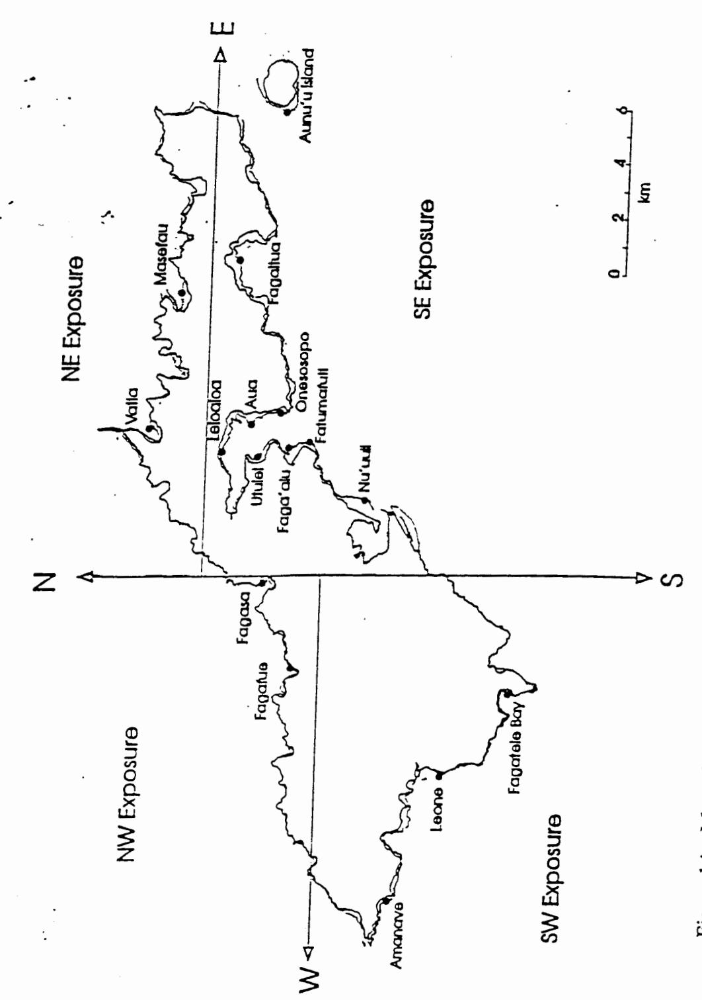

Figure 1A. Map of Tutuila showing approximate location of study sites and exposure categories.

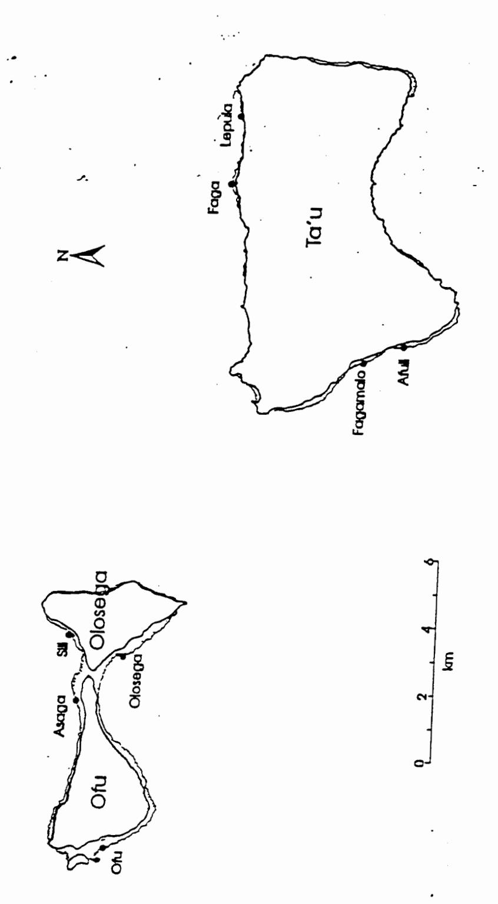

Figure 1B. Map of the Manu'a Islands showing the approximate location of study sites.

to calculate the approximate area of each colony. Percent cover was calculated by expressing the sum of the areas for each species as a proportion of total transect area (10m²).

Multivariate analyses were used to identify patterns in coral community structure around the islands of American Samoa. Cluster analysis (flexible UPGMA) and Multi-dimensional scaling (non-metric) (MDS) were used to test for effects of habitat (reef flat vs. lagoon vs. reef slope) and exposure (NW, NE, SW, SE, Manu'a; see Figure 1) on coral community structure. Cluster analyses and MDS were based on Bray-Curtis similarity matrices using species densities (mean number of colonies per site) and the average percent cover of each species at each site.

#### RESULTS

Overview of the corals of American Samoa:

A total of 18,002 coral colonies comprising 150 scleractinian species and 42 genera were recorded in the transects (Tables 2 & 3, Appendix 1). Eighteen of these represent new records for this region (Table 2) although most new records of species in the genera Acropora and Montipora may represent differences in identification between surveys, particularly of small colonies which may be hard to identify accurately. The species Acanthastrea hillae, Coeloseris mayeri, Leptoseris foliosa, Montastrea valenciennesi, Porites densa and Montipora corbettensis have distinctive morphologies and represent new records for American Samoa. There were 38 species recorded in the transects which had not previously been recorded at the Manu'a Islands (Table 2).

Corals of the genera *Montipora* and *Porites* were the most numerically abundant in American Samoa, comprising approximately 30% and 25% of all coral colonies recorded (Table 3). Corals of the genera *Pavona*, *Pocillopora* and *Psammocora* were the next most numerically abundant groups, but comprised only 9%, 6% and 5% of the total coral colonies (Table 3). Over 1/3 of all genera recorded represented less than 1% of the total coral colonies (Table 3).

The two most numerically abundant genera also represented the highest proportion of coral cover (37% in Montipora and 22% in Porites, Table 3) and Pavona and Pocillopora were also the 3rd and 4th highest cover (7% and 5% respectively, Table 3). Interestingly, while Psammocora was the next most abundant genus, it represented less than 2% of total coral cover while Acropora, which were less abundant, had a much higher coverage of 7%. Corals of the genera Goniastrea, Favia, Astreopora, Echinopora and Diploastrea also had a disproportionately high percent cover relative to the number of colonies.

Islands. Records denoted with "spp" indicat colonies too small to be reliably identified to species. 

indicates species presence, N denotes new species record for that area.

| Species                         | Tutuila  | Manu       | l'a Species                                         | Tutuila  | Manu'a |
|---------------------------------|----------|------------|-----------------------------------------------------|----------|--------|
| Acanthastrea echinata           |          | 1          | Favia laxa                                          |          | N      |
| Acanthastrea hillae             | N ·      | N          | Favia matthaii                                      | 1        | ✓      |
| Aczopora aculeus                | Ņ ✓   |            | Favia pallida                                       | 1        | ✓      |
| Acropora aspera                 | 1        | N          | Favia speciosa                                      |          | ✓      |
| Acropora azurea                 | ✓        | N          | Favia spp                                           | ✓        | ✓      |
| Acropora bushiensis             | N        |            | Favia stelligera                                    | ✓        | ✓      |
| Acropora cerialis               | ✓        |            | Favites abdita                                      |          | 1      |
| Acropora cf. verweyi            |          | N          | Favites chinensis                                   |          |        |
| Acropora clat <del>iv</del> ata | ✓ .      |            | Favites complanata                                  |          | N      |
| Acropora crateriformis          | . 🗸      | N          | Favites flexuosa                                    |          | ✓      |
| Acropora cytharea               | 1.       | N          | Favites halicora                                    | 1        | 1      |
| Acropora danai                  | N        | N          | Favites russelli                                    | 1        | 1      |
| Acropora divaricata             | ✓        |            | Favites spp                                         | 1        | 1      |
| Acropora formosa                | 1        |            | Fungia concinna                                     | 1        | /      |
| Acropora gemmifera              | ✓        | 1          | Fungia danai                                        | 1        | ·      |
| Acropora humilis                | 1        | \ <b>/</b> | Fungia fungites                                     | 1        | /      |
| Acropora hvacinthus             | 1        | /          | Fungia horrida                                      | •        | 1      |
| Acropora monticulosa            | 1        |            | Fungia klunzingeri                                  | /        | ·      |
| Acropora nana                   | /        | 1          | Fungia repanda                                      | /        | /      |
| Acropora nasuta                 | 1        | 1          | Fungia scutaria                                     | 1        | ·      |
| Acropora nobilis                | 1        | N          | Fungia spp                                          | 1        | 1      |
| Acropora paniculata             | 1        | • `        | Galaxea astreat <b>a</b>                            | •        | 1      |
| Acropora pulchra                | •        | N          | Galaxea fascicularis                                | _        | 1      |
| Acropora samoensis              | /        | /          | Gardineroseris planulata                            | 1        | •      |
|                                 | 1        | /          | Goniastrea australensis                             | 1        | N      |
| Acropora spp                    | N        | •          | Goniastrea edwardsi                                 | 1        | 1      |
| Acropora subulata               | /        | N          | Goniastrea pectinata                                | 1        | 1      |
| Acropora tenuis                 | /        | /          | Goniastrea retifir <del>m</del> is                  | <b>,</b> | 1      |
| Acropora valida                 | /        | •          | Goniastrea spp                                      | 1        | 1      |
| Acropora vongei                 | /        |            | Goniopora djiboutiensis                             | N        | •      |
| Alveopora allingi               | N        |            | Goniopora somaliensis                               | 1        | N      |
| Alveopor: cf. spongiosa         | ,        |            | Halomitra pileus                                    | •        | 1      |
| Alveopora spp                   | N        | N          | Hydnophora exe <b>sa</b>                            | 1        | /      |
| Astreopora of gracilis          | <i>'</i> | N          | Hydnophora rigida                                   | <b>✓</b> | •      |
| Astreopora listeri              | 1        | /          | Leptastrea purpurea                                 | <b>√</b> | ,      |
| Astreopora                      | •        | •          | Leptastrea transversa                               | 1        | /      |
| Astreopora spp                  | ,        |            | •                                                   | 1        | ,      |
| Caulastres furcata              | N        | λĭ         | Leptoria phrygia                                    | •        | ₹      |
| Coeloseris mayeri               | N        | N ✓     | Leptoseris explanata                                | <b>√</b> |        |
| Coscinaraea columna             | <b>✓</b> | /          | Leptoseris foliosa                                  | N ⁄   |        |
| Cyphastrea chalcidicum          | /        | N          | Leptoseris mycetoseroides Lobophyllia hemprichii | /        | ,      |
| Cyphastres                      | 1        | .,         | Merulina ampliata                                   | /        | 1      |
| Cyphastres serailia             | 1        |            | Montastrea annuligera                               | /        | •      |
| Diploastrea heliopora           | 1        |            | Montastrea curta                                    | 1.       | 1      |
| Echinophyllia aspera            | 1        | N          | Montastrea valenciennesi                            | •        | N      |
| Echinopora hirsutissima         | 1        |            | Montipora                                           | 1        | 14     |
| Echinopori horrida              | 1        |            | Monupora corbettensis                               | N        |        |
| Echinopora lamellosa            | /        |            | Monupora danae                                      |          | N      |
| avia favus                      | •        |            |                                                     |          | .,     |

| Species .              | Tutuila | Manu'a | Species                  | Tutuila    | Manu'a |
|------------------------|---------|--------|--------------------------|------------|--------|
| Montipora efflorescens | 1       | N      | Platygyra sinensis       | 1          | 1      |
| Montipora floweri      | N       | N      | Pocillopora damicornis   | ✓          | 1      |
| Montipora foveolata    | 1       | 1      | Pocillopora eydouxi      | ✓          | 1      |
| Montipora grisea       | N       | N      | Pocillopora meandrina    | 1          | ✓      |
| Montipora hoffmeisteri | . 🗸     | ′ /    | Pocillopora spp          | 1          | 1      |
| Montipora informis     | 1       | N      | Pocillopora verrucosa    | /          | 1      |
| Montipora millepora    | 1       |        | Porites annae            | . <b>/</b> | N      |
| Montipora monasteriata | N       | N      | Porites cylindrica       | 1          | 1      |
| Montipora nodosa       | N       | N      | Porites densa            |            | N      |
| Montipora'spp          | 1       | 1      | Porites enc              | ✓.         | 1      |
| Montipora tuberculosa  | . 1     | 1      | Porites lichen           | ✓          |        |
| Montipora turgescens   | N       | N      | Porites lutea            | ✓          | 1      |
| Montipora verrucosa    | ✓       | 1      | Porites massive          | 1          | 1      |
| Mycedium elephantotus  | 1       |        | Porites nigrescens       | 1          | N      |
| Oulophyllia crispa     |         | 1      | Porites rus              | 1          | 1      |
| Oxypora lacera         | 1       | 1      | Porites sp2              | ✓          | N      |
| Pachyseris speciosa    | 1       |        | Porites spp              | 1          | 1      |
| Pavona clavus          | 1       | 1      | Psammocora contigua      | 1          | 1      |
| Pavona decussata       | 1       |        | Psammocora haimeana      | 1          | 1      |
| Pavona divaricata      | 1       | N      | Psammocora               | 1          | 1      |
| Pavona explanulata     | 1       | 1      | Psammocora superficialis | 1          | 1      |
| Pavona maldivensis     | 1       | 1      | Sandalolitha robusta     | 1          |        |
| Pavona minuta          | 1       | N      | Scapophyllia cylindrica  | 1          | 1      |
| Pavona varians         | 1       | N      | Sivlocoeniella armata    | 1          | N      |
| Pavona venosa          | 1       | 1      | Stylophora pistillata    | 1          |        |
| Platygyra daedalea     | 1       | 1      | Symphyllia recta         | 1          |        |
| Platygyra pini         | 1       | 1      | Turbinaria reniformis    | -          | 1      |

N.B. Porites sp. 2 as per Birkeland et al. (1991).

Table 3. Total number of colonies and percent cover of each scleractinian genus observed across all transect. (N.B. Percent cover here is expressed as a percent of total coral cover rather than a percent of total area surveyed).

| Genus                | Total number of colonies | Percent of total corals | Percent of coral cover |  |
|----------------------|--------------------------|-------------------------|------------------------|--|
| Montipora            | . 5337                   | 29.65                   | 36.95                  |  |
| Porites              | 4459                     | 24.77                   | 21.69                  |  |
| Pavona               | 1686                     | 9.36                    | 7.25                   |  |
| Pocillopora          | 1072                     | 5.95                    | 5.08                   |  |
| Psammocora           | 940                      | 5.22                    | 1.61                   |  |
| Acropora             | 757                      | 4.21                    | 6.96                   |  |
| Galaxea              | 575                      | 3.19                    | 1.50                   |  |
| Goniastrea           | 511                      | 2.84                    | 2.66                   |  |
| Leptastrea           | 473                      | 2.63                    | 0.48                   |  |
| Favia                | 368                      | 2.04                    | 2.30                   |  |
| Montastrea           | 337                      | 1.87                    | 0.47                   |  |
|                      | 333                      | 1.85                    | 4.14                   |  |
| Astreopora           | 197                      | 1.09                    | 0.67                   |  |
| Leptoria             | 174                      | 0.97                    | 0.28                   |  |
| Cyphastrea           | 126                      | 0.70                    | 0.78                   |  |
| Favites              | 115                      | 0.64                    | 0.25                   |  |
| Fungia               | 64                       | 0.36                    | 0.46                   |  |
| Oxypora              | 63                       | 0.35                    | 1.40                   |  |
| Echinopora           | 62                       | 0.34                    | 0.67                   |  |
| Platygyra            | 57                       | 0.32                    | 0.04                   |  |
| Alveopora            | 54                       | 0.30                    | 0.16                   |  |
| Leptoseri <b>s</b>   | 40                       | 0.22                    | 0.38                   |  |
| Coscinaraea          | 30                       | 0.17                    | 0.09                   |  |
| Stylocoeniella       | 29                       | 0.16                    | 0.49                   |  |
| Turbinaria           | 26                       | 0.14                    | 0.08                   |  |
| Acanthastrea         | 24                       | 0.13                    | 0.07                   |  |
| Hydnophora           | 21                       | 0.12                    | 0.33                   |  |
| Merulina             | 14                       | 0.08                    | 1.12                   |  |
| Diploastrea          | 10                       | 0.06                    | 0.16                   |  |
| Lobophyllia          | 9                        | 0.05                    | 0.04                   |  |
| Coeloseris           | 8                        | 0.04                    | 0.02                   |  |
| Siylophora           | 7                        | 0.04                    | 0.06                   |  |
| Mycedium             | 6                        | 0.03                    | 0.03                   |  |
| Scapophyllia         | 4                        | 0.02                    | 0.91                   |  |
| Goniopora            | 3                        | 0.02                    | 0.01                   |  |
| Sandolitha           | 3                        | 0.02                    | 0.01                   |  |
| Oulophyllia          | 2                        | 0.01                    | 0.04                   |  |
| Echinophyllia        | 2                        | 0.01                    | 0.09                   |  |
| Symphyllia           | 1                        | 0.005                   | 0.02                   |  |
| Gardinos <b>eris</b> | 1                        | 0.005                   | 0.001                  |  |
| Caulastrea           | 1                        | 0.005                   | 0.005 .                |  |
| falomit <b>ra</b>    | i                        | 0.005                   | 0.005                  |  |
| achyseris            | i                        | 0.005                   | 0.005                  |  |

(Figure 2). Over 90% of the coral colonies surveyed were in the first three size categories (Figure 2), with 28.8%, 34.2% and 27.6% of corals in size classes 1-3 respectively.

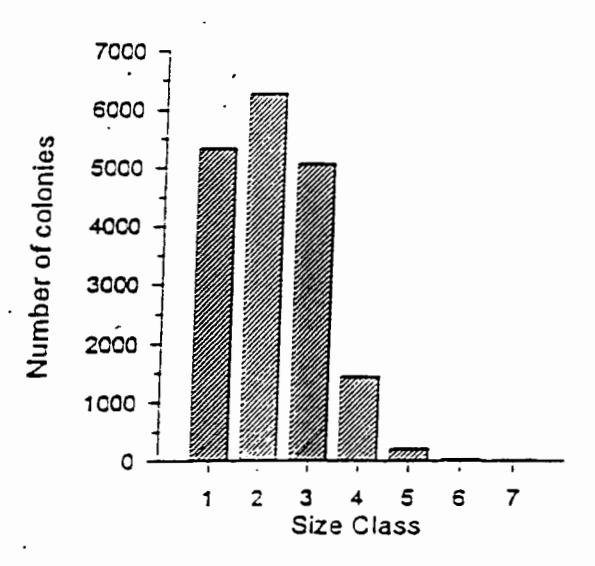

Figure 2. Total number of colonies recorded in each of the seven size classes, across all 29 sites surveyed in the American Samoan archipelago.

While the majority of all colonies were in the first three size categories, size frequency distributions did vary among the more abundant genera. Colonies of *Montipora* were predominantly in size class three (10-20cm) although there were many colonies which were larger (size class 4, 20-40cm; Figure 3). Most *Porites* colonies were smaller, falling into the first two size classes (<5cm and 5-10cm) as were colonies of *Psammocora* (Figure 3). Colonies of *Pocillopora*, *Pavona* and *Acropora* were more evenly distributed among the first three size classes, although colonies in the first size class were less abundant in these three genera (Figure 3).

#### Site characteristics:

The size-frequency distribution of coral colonies was similar across most sites, with the majority of colonies at each site falling into the first three size categories (Figure 4). Notable exceptions were Amanave and Leone which had relatively high numbers of colonies in size class 4 (20–40cm) and the Lagoon site at Faga'alu which had a uniform distribution of colonies across all size categories (Figure 4).

The number of species recorded at each site fell into three broad categories. Shallow water sites (reef flat & lagoon) had relatively low diversity (<25 species) than sites at

10m (Figure 5). The remaining sites could be loosely categorised as those with moderate diversity (30-40 species) and those with high diversity (>50 species). Moderate and high diversity sites were found at sites around both Tutuila and Manu'a Islands (Figure 5). Sites at Manu'a Islands were generally more diverse than those at Tutuila, with 6 of the 8 reef slope sites at Manu'a having high diversity while only 4 of the 16 Tutuila reef slope sites had high diversity.

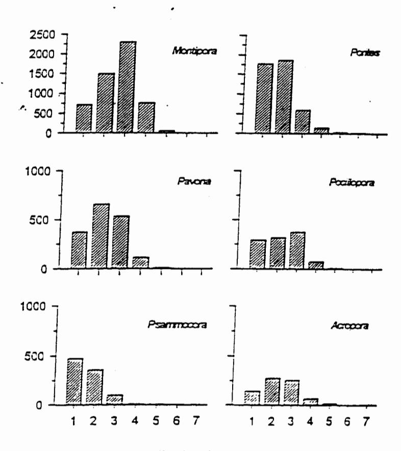

Figure 3. Size frequency distribution of abundant genera across all 29 sites surveyed in the American Samoa Archipelago.

The number of coral colonies per  $10\text{m}^2$  transect was highly variable among sites ranging from a mean of 34 colonies per  $10\text{m}^2$  transect (at Faga'alu Lagoon) to a mean of 313 colonies per  $10\text{m}^2$  transect at Ofu Reef flat (Figure 6). There were no strong patterns in mean density between shallow water (reef flat/lagoon) and deep water (reef slope) sites or between Tutuila and Manu'a Islands (Figure 6). However, the NW exposure sites and the harbour sites (with the exception of Faga'alu) all had relatively low densities (<75 colonies per  $10\text{m}^2$ ) (Figure 6). In contrast, the NE exposure sites had very high coral density (>200 colonies per  $10\text{m}^2$ ) (Figure 6). Variability in density between replicate transects within sites was low, as evidenced by the small standard deviations around the mean (Figure 6).

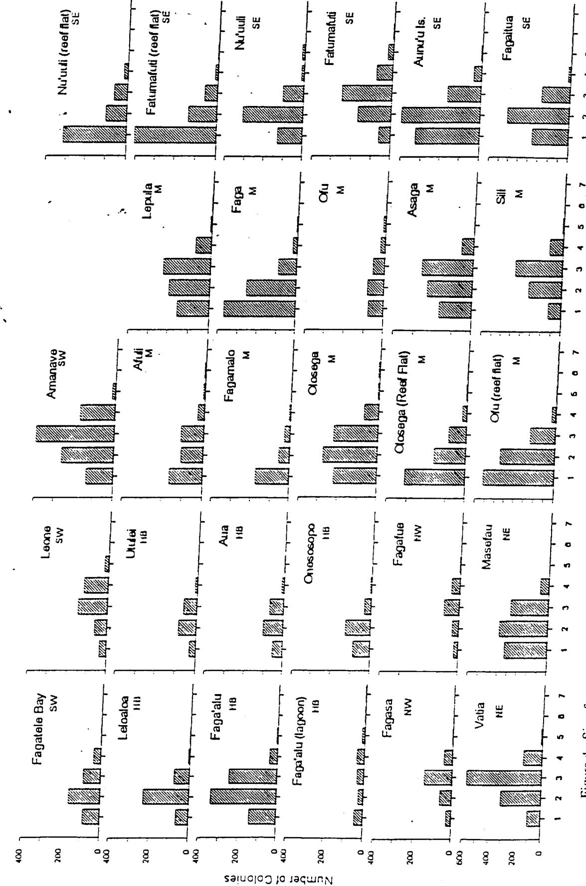

Figure 4. Size-frequency distribution of all coral colonies at each of the 29 sites surveyed in the American Samoa Archipelago. Exposure categories are indicated on each graph by SW, IIB (=Harbour), NW, NE, SE and M (=Manu'a).

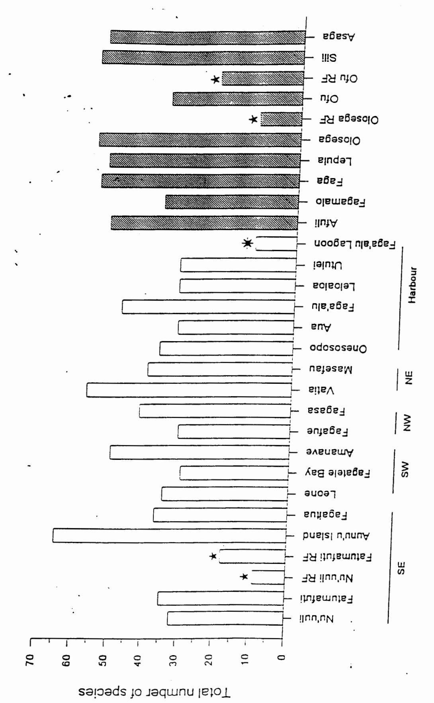

Figure 5. Total number of coral species recorded at each of the 29 sites surveyed around the American Samoan archipelago. Filled bars are Manu'a Islands sites, the remaining sites are around Tutuila, grouped by exposure. Sites denoted by \* are

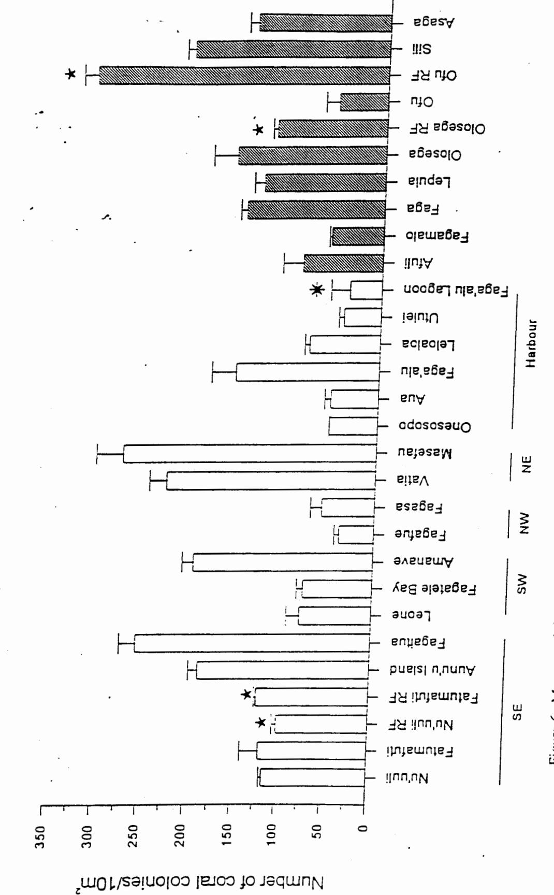

Figure 6. Mean coral density recorded at each of the 29 sites surveyed around the American Samoan archipelago. Filled bars are Manu'a Islands sites, the remaining sites are around Tutuila, grouped by exposure. Sites denoted by × are reef flat sites; Sites denoted by \times are lagoon sites. Error bars denote standard deviations.

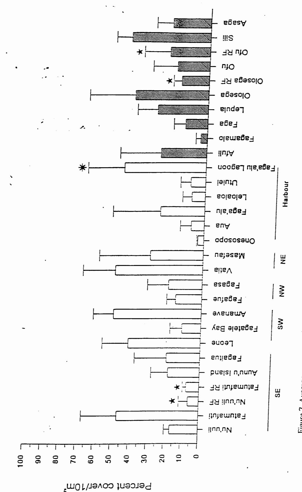

Filled bars are Manu'a Islands, the remaining sites are around Tutuila, grouped by exposure. Sites denoted by \* are reef Figure 7. Average percent coral cover recorded at each of the 29 sites surveyed around the American Samoan archipelago. flat sites; Sites denoted by \* are lagoon sites. Bror bars denote standard deviations.

23% (Figure 7). No clear relationship was apparent in mean percent cover between sites or between exposure groups (Figure 7). Variability in percent cover among replicate transects within sites was high and is reflected in the large standard deviations around the mean (Figure 7).

#### Habitat variation and community structure:

Clear differences in coral communities were found between the three habitat areas studied. The lagoon site at Faga'alu (27) was clearly separated from all other sites in both the MDS plot and the cluster analysis (Figures 8 and 9). Reef flat sites (13, 15, 28, 29) also grouped independently of the reef slope sites in analyses of both colony numbers and percent cover (Figures 8 & 9). A low stress value (stress=0.13, Figure 8) in the MDS based on mean numbers of colonies indicates strong differences between groups. The higher stress value in the MDS based on percent cover (stress = 0.33, Figure 9) indicates there are few differences between the three groups, although identical groupings in the MDS and cluster analysis suggests there are grounds for differentiation in percent cover between habitats.

#### Exposure and community structure:

No clear pattern of coral communities and exposure was found between the reef slope sites. Analysis based on the mean number of colonies of all species did distinguish three main groups within the data set; 1. the Manu'a Islands sites, 2. a group containing the two NW exposure sites (5 and 6) and all the Pago Pago Harbour sites (except Faga'alu (20)), and 3. a group consisting of the SE, SW and NE exposure Tutuila sites (Figure 10). No clear groupings were found based on percent cover, although the inner harbour sites did generally cluster together (Figure 11). High stress values (>0.4) in MDS analyses of both numbers of colonies and percent cover indicate little basis for group separation.

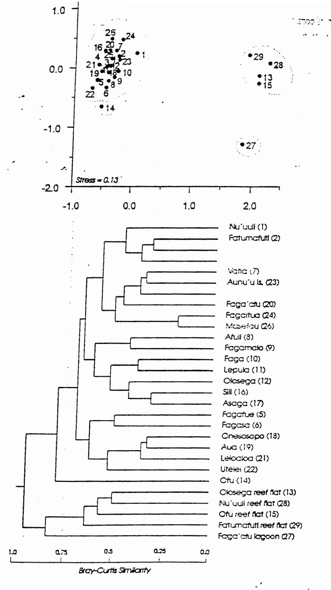

Figure 8. Results from Multi-dimensional scaling (top) and cluster analysis (bottom) based on the mean number of colonies of each species at each site. Colours correspond to exposure classification of each site; SE, NE, NW, Harbour and Manu'a Islands. Numbers on MDS plot correspond with site numbers on cluster diagram. Dotted lines show corresponding groups in both analyses

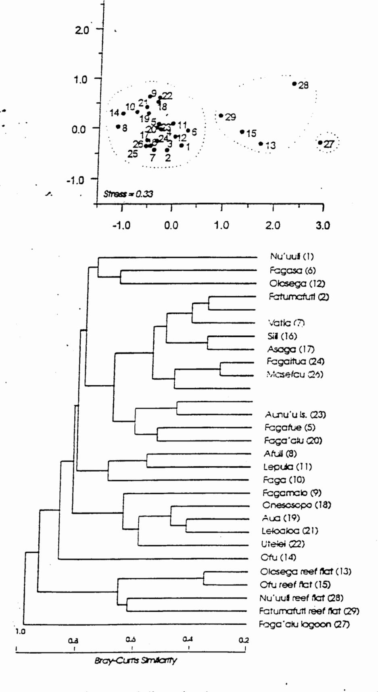

Figure 9. Results from Multi-dimensional scaling (top) and cluster analysis (bottom) based on the percent cover of corals of each species at each site. Colours correspond to exposure classification of each site; SE, NE, NW, Harbour and Manu'a Islands. Numbers on MDS plot correspond with site numbers on cluster diagram. Dotted lines show corresponding groups in both analyses

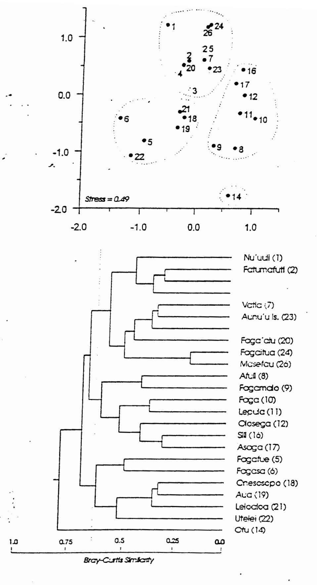

Figure 10. Results from Multi-dimensional scaling (top) and cluster analysis (bottom) based on the mean number of colonies of each species on slope sites. Colours correspond to exposure classification of each site; SE, NE, NW, Harbour and Manu'a Islands. Numbers on MDS plot correspond with site numbers on cluster diagram. Dotted lines show corresponding groups in both analyses

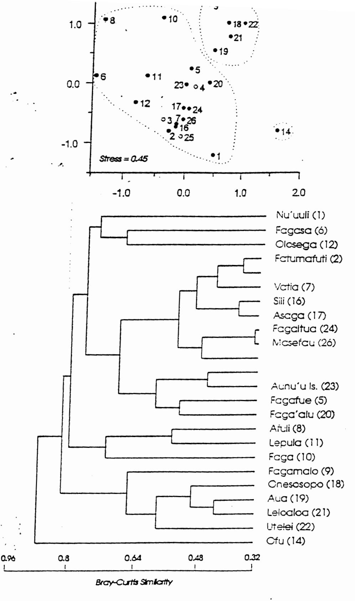

Figure 11. Results from Multi-dimensional scaling (top) and cluster analysis (bottom) based on the percent coverof corals of each species at slope sites. Colours correspond to exposure classification of each site: SE, NE, NW, Harbour and Manu'a Islands. Numbers on MDS plot correspond with site numbers on cluster diagram. Dotted lines show corresponding groups in both analyses

#### DISCUSSION

#### Current Status of the reefs of American Samoa:

The findings of this survey indicate the reefs of American Samoa are recovering following a series of devastations. The reefs of American Samoa represent an ecosystem of moderate to high species richness, with more than half of all coral species listed for the Indo-Pacific region occurring in the American Samoan Archipelago. However, more than 50% of all colonies recorded in this survey belonged to only two genera - *Montipora* and *Porites*. Furthermore, the majority of these were small colonies with a maximum diameter of less than 20cm.

The dominant species observed in this survey were encrusting, fast growing and opportunistic species (eg. Montipora grisea, M. informis and M. monasteriata, Porites sp 2 & P.rus). Recruitment of these corals most likely occurred soon after the devastation of the most recent cyclone ("Ofu" in 1991) and the dominance of colonies <20cm coincides with 3-4 years of growth following recruitment. Colonies of the slower growing species (eg. Faviids) are still poorly represented in the Samoan communities although proportionally higher cover of these groups relative to colony abundance may represent survival of large massive colonies which may be more capable of withstanding the effects of cyclones.

Devastation of coral communities following cyclones Val and Ofu appears to have been widespread. However, high numbers of corals up to 20cm diameter throughout American Samoa indicate recruitment has occurred rapidly, although it is likely the majority of larvae have recruited to American Samoa from other regions. Nothing is known of the relationship between American Samoan reefs nor of the degree and nature of larval dispersal between these and other reefs in the Pacific. Consequently if large scale deterioration of the coral resource occurs on source reefs within greater Polynesia, recovery following future perturbations may be considerably slower. Dispersal processes such as these could be investigated using a combination of life history studies, genetics and oceanography.

#### Habitat variation and community structure:

Differences in coral communities between reef habitats (i.e. zonation) have been well documented (Sheppard 1980, Done 1982). In American Samoa, species assemblages differed between the three habitat types, with reef slope sites having much higher species richness than reef flat and lagoon sites (Figure 5). The reef flat sites were largely dominated by Pavona divaricata, Psammocora contigua and Porites species, including P. annae, P. cylindrica and P.rus. In contrast, the lagoon site at Faga'alu was dominated by Porites cylindrica and Acropora formosa and reef slope sites were mostly dominated by encrusting Montipora species. (see Appendix 1).

moderate numbers of small colonies with low overall percent coral cover (Figures 4, 6 & 7). In contrast, the lagoon site had lower coral density but colonies were large resulting in higher overall coral cover (Figures 4, 6 & 7).

#### Exposure and community structure:

Coral communities within American Samoa showed no clear patterns with exposure. However, reefs around the Manu'a Islands appear to be in better overall condition than those around Tutuila. Coral diversity and density is generally higher at Manu'a Island sites than Tutuila sites (Figures 6 & 7) and this may reflect lower population pressure on the reefs and less severe impact by cyclones Val and Ofu. Sites at Manu'a islands tended to have higher numbers of large colonies (Figure 4), particularly massive species of *Porites* and Faviids, as well as large colonies of *Turbinaria* and *Echinopora* (Appendix 1). At Afuli, numerous large colonies of *Porites lutea* were seen, including one colony which exceeded 5 metres in height and 9 metres in diameter. The age of colonies this size are likely to be in excess of 400 years.

Four of the harbour sites (Leloaloa, Utulei, Aua and Onesosopo) and the NW exposure sites had lower numbers of corals as well as low percent cover (Figures 6&7). The size frequency distributions of both NW sites (Fagafue and Fagasa) are more normally distributed than most sites (Figure 4), suggesting either recruitment or survivorship is lower (or perhaps more sporadic) at these sites than other reef slope sites around Tutuila. Both NW sites consist of steep vertical to overhanging walls which generally have lower coral cover than gently sloping areas (pers. obs.). In addition, the NW side of the island suffers most from cyclone damage which may explain the lower densities and percent coral cover. Recruitment to Fagafue may also be reduced due to high sedimentation from Le'ave'ave Stream which runs into the bay (eg. Babcock & Davies 1991).

The harbour sites at Onesosopo and Aua are also on vertical walls which may explain the lower coral cover found at these two sites although the harbour reefs have been heavily impacted by pollution which has had a detrimental effect on the coral communities (Birkeland et al. 1991). Interestingly, Leloaloa is the inner-most harbour site but it has higher coral cover and coral density than the other harbour sites. Leloaloa has a more gently sloping topography than either Onesosopo or Aua which may explain the differences between these sites. Size frequency distributions at the four harbour sites (Leloaloa, Utulei, Aua and Onosesopo) suggest low or sporadic recruitment occurs within the harbour. This may be due in part to the effects of sedimentation and pollution inhibiting recruitment and/or survivorship (Dahl & Lamberts 1977, Birkeland et al. 1991). Some new recruits were seen during this survey, particularly colonies of Oxypora lacera at Leloaloa, suggesting the recently implemented management strategies to reduce pollution within the harbour may be

having a positive effect.

Low overall coral densities and coral cover in the harbour are indicative of long term anthropogenic impacts including pollution and sedimentation. At all four sites, there was higher cover of fleshy algae than on non-harbour reef slopes and little or no coralline algae and encrusting *Montipora*. The absence of corallines and *Montipora* was clearly slowing the reconsolidation of the rubble resulting from cyclone damage on these reefs and subsequently the rate of recovery within the harbour area.

In all cluster analyses, there were two sites which were different from all the others. One clearly outlying site, the reef slope at Ofu Village (14), had a unique species assemblage. Faviids (rather than *Montipora* and *Porites*) were the dominant corals at this site, particularly species of *Platygyra*, *Echinopora*, and *Goniastrea*. There was also proportionally more large colonies than small colonies at Ofu although density and percent cover was relatively low.

The harbour site at Faga'alu (20) always grouped with the reef slope sites, rather than with the other harbour sites (Figures 8-11). Faga'alu had much higher coral density and percent cover than the other four harbour sites and this may reflect its protected location at the mouth of the harbour. Colony distributions were also highly patchy at Faga'alu, with one end of the site being dominated by large colonies of Diploastrea, Oxypora, Merulina and Lobophyllia (Appendix 1).

#### Temporal changes in American Samoan Reefs:

Results from this survey are not directly comparable with other surveys of the corals of American Samoa. Many of the earlier surveys were purely qualitative (eg. Maragos 1994, Itano & Buckley 1988) and other quantitative surveys have used alternative techniques (eg. Birkeland et al. 1987, 1991). General comparisons of coral densities and colony sizes at sites common to both this study and that of Birkeland et al. (1991) suggest the reefs of American Samoa have been continuing to recover since 1988, even though the reefs were severely impacted by cyclones in the intervening period. For example, at Masefau Bay the density of corals recorded in this study (27.4 colonies/m²) is twice that found by Birkeland et al. in 1988 (12.4 colonies/m²) and the size of colonies has also increased (modal size of 5-10cm vs. mean diameter of 4.2cm). This trend is also apparent at Faturnafuti and Aunu'u Island. Coral density and mean size at Fagasa and Fagafue are similar in both surveys. It should be noted that the sample size of this study is in excess of an order of magnitude higher than that of Birkeland et al. (1991) hence more detailed comparisons of species diversity and percent cover data are not valid.

#### CONCLUSIONS AND RECOMMENDATIONS

- The reefs of American Samoa are currently in a recovery phase following a combination of natural and anthropogenic impacts. Not withstanding, many of the reef areas are diverse ecosystems with high coral complexity and remain a valuable resource of the people of American Samoa. The reef at Sili in particular is notable for its spectacular coral communities.
- The reefs inside Pago Pago Harbour are depauperate although there is evidence of low levels of recruitment to these reefs. It is essential a management plan to reduce pollution and sedimentation within the harbour be established immediately (see Maragos et al. 1994).
- There was evidence of a large population of Crown of Thorns starfish on the reef at the Olosega Village site. It would be advisable to set up a programme to monitor population fluctuations in this area, as well as around American Samoa generally.
- This survey has provided a rigorous baseline data set from which future surveys can quantitatively determine the extent of any change in the coral communities of American Samoa. Repeat surveys should be carried out at least every three years to monitor recovery of the coral resource and other changes in community structure. Additional surveys coinciding with major perturbations such as cyclones and/or outbreaks of Crown-of- thorns starfish will also be important.

#### **ACKNOWLEDGMENTS**

I thank the director Ray Tulafono and the staff of the American Samoa Department of Marine and Wildlife resources for administrative support. Essential logistics support was provided by Alison Green, Fale Tuilagi and Elia Henry without which this study would not have been possible. Thanks also to the crew of the MV Saosaomoana for logistic support and entertainment during surveys of the Manu'a Islands. Karen Miller assisted with coral identifications and compilation of this report. Funding for this study was provided to the Dept of Marine & Wildlife resources by the Insular Pacific Regional Marine Research Programme.

#### REFERENCES

- Babcock, R. C., Davies, P. (1991). Effects of sedimentation on settlement of *Acropora millepora*. Coral Reefs 9: 205-208
- Birkeland, C.E., Randall, R.H., Wass, R.C., Smith, B., Wilkens, S. (1987). Biological Resource assessment of the Fagatele Bay National Marine Sanctuary. NOAA Technical Memorandum, NOS MEMD 3, 232pp.
- Birkeland, C.E., Randall, R.S., Amesbury, S.S. (1991). Coral and Reef-fish assessment of the Fagatele Bay National Marine Sanctuary. Report to the National Oceanic and Atmospheric Administration, U.S. Dept of Commerce. 126pp
- Dahl, A.L., Lamberts, A.E. (1977). Environmental impact on a Samoan coral reef: a resurvey of Mayor's 1917 transect. Pac Sci. 31(3):309-319
- Done, T. J. (1982). Patterns in the distribution of coral communities across the central Great Barrier Reef. Coral Reefs 1: 95-107
- Green, A.L. (in prep). Starus of coral reef fishes and their habitat in the Samoan archipelago.
- Green, R.H. (1989). Power analysis and practical strategies for environmental monitoring. Environ. Res. 50:195-205
- Hunter, C.L. (1992). Draft: Ofu Reef Survey General Reef Characteristics, Corals and Macro-invertebtrates. Report to the National Park Service, United States Department of the Interior, Pago Pago

- Itano, D., Buckley, T. (1988). The coral reefs of the Mamu'a Islands, American Samoa. Report to the Department of Marine and Wildlife Resources, American Samoa Government. 26pp
- Maragos, J.E., Hunter, C.L., Meier, K.Z. (1994). Reefs and corals observed during the 1991-92 American Samoa Coastal Resources Inventory. Report prepared for America Samoa Department of Marine and Wildlife Fisheries, American Samoa Governement. 28pp.
- Mundy, C.N. (1991). A critical evaluation of the Line Intercept Transect methodology for surveying sessile coral reef benthos. Msc Thesis. James Cook University of North Queensland. 127pp.
- Sheppard, C.R.C. (1980). Coral cover, zonation and diversity on reef slopes of Chagos Atoll, and population structures of the major species. Mar. Eco. Prog. Ser. 2:193-205.
- Veron, J. E. N. (1993). A Biogeographic Database of Hermatypic Corals. Species of the Central Indo-Pacific, Genera of the World. Australian Institute of Marine Science Monograph series. Volume 10, 433pp.

DEPARTMENT OF MARINE &

DEPARTMENT OF MARINE &

PAGO PAGO, AMERICAN SAMOA 96799

PAGO PAGO, AMERICAN SAMOA 96799