# The Impact of a Ship Grounding and Associated Fuel Spill at Rose Atoll National Wildlife Refuge, American Samoa

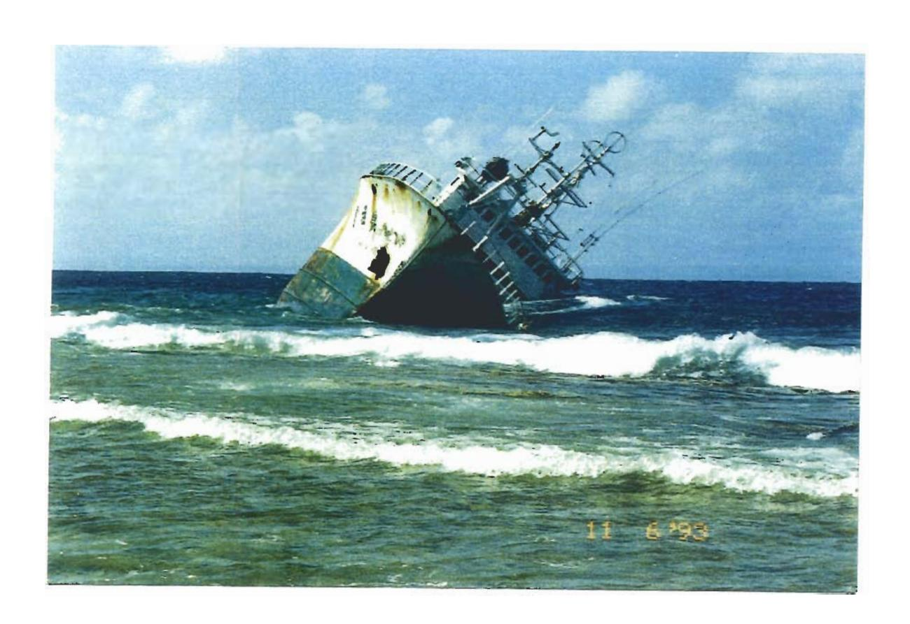

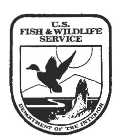

U.S. Fish and Wildlife Service Pacific Islands Ecoregion Honolulu, Hawaii

September 1997

| Cover photo: The longline fishing vessel Jin Shiang Fa hard aground on the southwest arm of the Rose Atoll in November 1993. |
|------------------------------------------------------------------------------------------------------------------------------|
|                                                                                                                              |
|                                                                                                                              |
|                                                                                                                              |
|                                                                                                                              |
|                                                                                                                              |
|                                                                                                                              |
|                                                                                                                              |
|                                                                                                                              |
|                                                                                                                              |
|                                                                                                                              |
|                                                                                                                              |
|                                                                                                                              |
| This report was prepared by: Alison Green 1 Jeff Burgett 2                                             |
| Michael Molina 2 Don Palawski 2                                                                        |
| Paul Gabrielson 3                                                                                                 |
|                                                                                                                              |
|                                                                                                                              |
|                                                                                                                              |

&lt;sup>1Coral Reef Consultant, 51 Mons School Road, Buderim. Q. Australia. Previously of the Dept. of Marine and Wildlife Resources, Pago Pago, American Samoa.

&lt;sup>2Ecological Services Division, Pacific Islands Ecoregion, U.S. Fish and Wildlife Service, Honolulu, Hawaii.

&lt;sup>3Biology Department, William Jewell College, Liberty, Missouri.

# **TABLE OF CONTENTS**

| SUMMARY                            |
|------------------------------------|
| ACKNOWLEDGMENTS i                  |
| 1. INTRODUCTION 1                  |
| 2. STUDY AREA                      |
| 3. DESCRIPTION OF SHIP GROUNDING   |
| 3.1 Physical Disturbances          |
| 3.2 Chemical Releases              |
| Acute Chemical Releases            |
| Chronic Chemical Releases          |
|                                    |
| 4. INJURY ASSESSMENT               |
| 4.1 Physical Injuries              |
| 4.1.1 Effects of the Collision     |
| 4.1.2 Generation of Berms          |
| 4.1.3 Other Injuries               |
| 4.2 Biological Responses           |
| 4.2.1 Algae                        |
| 4.2.2 Corals                       |
| 4.2.3 Echinoderms                  |
| 4.2.4 Giant Clams                  |
| 4.2.5 Fishes                       |
| 4.2.6 Seabirds                     |
| 4.2.7 Sea Turtles                  |
| 5. LEGAL ISSUES                    |
| 6. DISCUSSION49                    |
| 7 DECOMMENDATIONS 52               |
| 7. RECOMMENDATIONS                 |
| 7.1 Reef Restoration               |
| 7.2 Monitoring                     |
| 8. LITERATURE CITED54              |
| APPENDIX A: CHRONOLOGY OF EVENTS57 |

#### **SUMMARY**

In October 1993, the Taiwanese longliner *Jin Shiang Fa* ran aground at Rose Atoll National Wildlife Refuge, spilling 100,000 gallons of diesel fuel and other contaminants onto the reef. Prior to the grounding, the atoll was considered to be one of the most remote and pristine coral reefs in the world.

The ship grounding caused major injuries to the coral reefs at Rose, including:

- > gouging large grooves in the atoll and pulverizing reef into rubble;
- > killing many invertebrates including reef-boring sea urchins, giant clams, and corals;
- > dramatically changing the nature of the atoll by killing the dominant reef-forming organisms (crustose coralline algae) and causing a bloom of opportunistic algal species over a large portion of the reef; and
- > changing the distribution of herbivorous fishes and sea urchins, which have been attracted to the wreckage and the algal bloom.

Three years after the grounding, the reefs show only limited recovery from this event. Opportunistic algal species continue to dominate the wreck site, and the crustose coralline algae show little sign of recovery. This is of particular concern, because the crustose corallines are primarily responsible for maintaining the structure of the atoll. Preliminary studies show that iron is corroding from the wreckage, which may be contributing to the maintenance of the algal bloom and inhibiting the recovery of the crustose coralline algae.

This study is the first to demonstrate the serious, long-term effects of diesel fuel on an oceanic coral reef ecosystem. Recommendations for the future management of Rose Atoll NWR include:

- > Removing the wreckage to facilitate reef recovery by natural processes; and
- > Continuing to monitor the atoll to determine if it will recover from this event.

#### **ACKNOWLEDGMENTS**

The U.S. Fish and Wildlife Service (USFWS) is grateful to the Department of Marine and Wildlife Resources (DMWR) in American Samoa for providing much of the logistical support for this investigation. In particular, we thank Ray Tulafono, Philip Langford, Peter Craig, Alison Green, Fale Tuilagi, Mika Letuane, Elia Henry, and Bruce Tupuola. The USFWS also thanks the U.S. Coast Guard (USCG) for aerial reconnaissance of the site, and the USCG and the American Samoa Dept. of Port Administration (ASDPA) for providing transportation to the site

USFWS personnel who participated in this investigation include: Michael Molina, Jeff Burgett, Steve Miller, Beth Flint, Don Palawski, Chip Demarest, Roger Helm, Jon Hale, Dave Woodside, Ken McDermond, Nick Palaia, Rick Poetter, Steve Barclay, and Mark Webber. The Service also thanks the following individuals who participated in the surveys and subsequent analyses or provided scientific advice: Peter Craig and Alison Green of DMWR, John Naughton and George Balazs of the National Marine Fisheries Service (NMFS), Paul Gabrielson and Barry Pollock of William Jewell College, Rob Ricker of the California Dept. of Fish and Game, John Cubit of the National Oceanic and Atmospheric Administration (NOAA), Jim Maragos of the East-West Center, and Sue Vink of the University of Hawaii.

Photodocumentation of the site investigation was conducted by USFWS personnel, DMWR personnel, U.S. Coast Guard personnel, Philip Colla and Skip Stubbs. The photographs in this report were taken by U.S. Fish and Wildlife Service and U.S. Coast Guard personnel, Philip Colla and David Itano.

#### 1. INTRODUCTION

Rose Atoll is a remote coral reef in the Territory of American Samoa (Fig. 1). Because of its isolation, the atoll has been largely protected from human activities and, until recently, was considered to be one of the least disturbed coral atolls in the world (UNEP/IUCN 1988). The main island, Rose Island, is an important nesting site for federally protected sea turtles and seabirds (Rodgers *et al.* 1993) and the coral reefs are unique in Samoa (Rodgers *et al.* 1993, Maragos 1994, Green 1996). These reefs also provide an important refuge for numerous species, including the giant clam *Tridacna maxima* which appears to have been overfished throughout the rest of the archipelago (Green and Craig 1996).

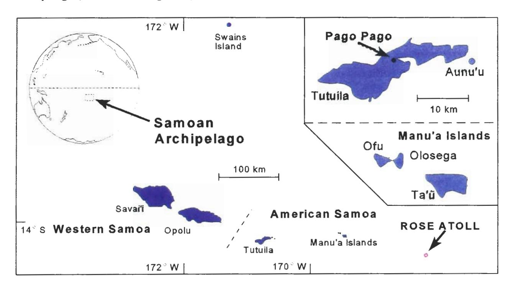

Figure 1 Map of Samoan Archipelago showing the location of Rose Atoll in American Samoa.

Rose Atoll was designated as a National Wildlife Refuge (NWR) in 1974 "for the conservation, management, and protection of its unique and valuable fish and wildlife resources" (Greenwalt 1974). Soon after, a Presidential Proclamation recognized that "[T]he submerged lands surrounding Rose Atoll are necessary for the protection of the atoll's marine life, including the green sea and hawksbill turtles" (Ford 1975). The refuge is jointly administered by the U.S. Fish and Wildlife Service (USFWS) and the Department of Marine and Wildlife Resources (DMWR) of the American Samoa Government.

Sadly, the pristine nature of the refuge was compromised in October 1993 when the Taiwanese fishing vessel *Jin Shiang Fa* ran aground on the southwestern side of the atoll. At the time of the grounding, the ship was fully laden with fuel and supplies including 100,000 gallons of diesel fuel and other contaminants that were eventually spilled onto the reef (USFWS 1996a,b).

The primary objectives of this report are to:

- I) describe the ship grounding and associated contaminant spill at Rose Atoll NWR;
- ii) describe the injury to the coral reef ecosystem at Rose Atoll as a result of the grounding; and
- iii) make recommendations for the future management of the refuge.

#### 2. STUDY AREA

Rose Atoll is located on the eastern edge of the Samoan Archipelago (14°32'S, 168°08'W: Fig. 1). The atoll is remote, since it is situated more than 150 km from the nearest island, Ta'u in the Manu'a Islands, and 270 km east of the main island of Tutuila (Fig. 1). The shape of the atoll is square, with the four "corners" facing roughly north, south, east, and west (Fig. 2). The lagoon is almost entirely enclosed by the reef, except for a narrow opening on the northwest side (Fig. 2). At 640 ha in area, Rose is one of the smallest coral atolls in the world (UNEP/IUCN 1988).

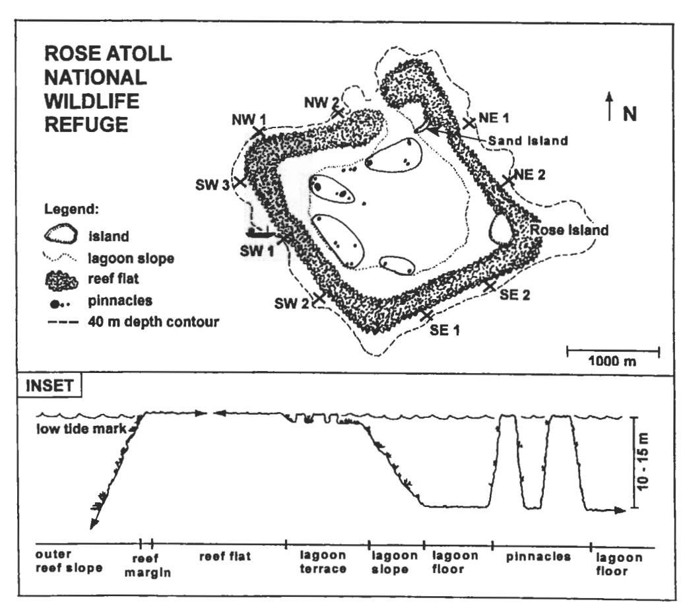

Figure 2 Map of Rose Atoll National Wildlife Refuge (modified from Green and Craig 1996) showing the the location of the fish and clam surveys and the position of each habitat type on the reef profile (see inset). The location of the longliner grounding is also shown on the southwest arm of the atoll

Rose Atoll has been the subject of approximately 300 papers and reports over the last 80 years, which describe the geology, geography, biology, meteorology, oceanography, and history of the area. The results of many of these studies have been summarized in an annotated bibliography of the area by Rodgers *et al.* (1993).

Rose Atoll supports two emergent islands (Fig. 2). The largest island, Rose (area=5.2 ha), is heavily vegetated with trees (*Pisonia grandis*) and beach heliotrope shrubs (*Tournefortia argentea*: Figs. 3 & 4, USFWS 1996a,b). Rose Island is also an important nesting site for 12 species of federally protected seabirds (Fig. 4), and approximately 97% of the total seabird population of American Samoa resides on the atoll (Amerson *et al.* 1982, Rodgers *et al.* 1993, USFWS 1996a,b). Five species of federally protected migratory shorebirds and one species of forest bird also use the terrestrial habitat, shoreline, and exposed reef for feeding, resting, and roosting (USFWS 1996a,b). The second island, Sand Island (area=2.6 ha), is much smaller and unvegetated. Both islands are uninhabited.

The two islands at Rose Atoll are important nesting sites for the threatened green sea turtle (*Chelonia mydas*) in American Samoa (Rodgers *et al.* 1993, Fig. 4). Satellite tags attached to nesting green turtles at Rose shown that these turtles migrate between American Samoa and other Pacific island nations (including Fiji and French Polynesia: Balazs *et al.* 1994). In addition to the migratory breeding population of turtles that use the atoll during the nesting season (from August to February), there is also a small, apparently resident population of juveniles living on the atoll (G. Balazs pers. comm.). Endangered hawskbill turtles (*Eretmochelys imbricata*) have also been seen in the lagoon, although they are considered rare and it is not known if they nest on the islands (USFWS 1996a).

The coral reef ecosystems at Rose are unique in Samoa, since they are dominated by crustose coralline algae4 rather than hermatypic corals (Figs. 3 & 5, Mayor 1921, Green 1996). Although a "coral" atoll dominated by crustose coralline algae is not unique in the central Pacific Ocean, Rose is an excellent example of this type of reef. Initial observations of the crustose coralline algae, as well as the fleshy and filamentous algae, indicate that the species present at Rose are typical of atolls in the central Pacific Ocean, although the species diversity appears to be somewhat low. The most recent published list of algae for all of Samoa, including Rose, is by Setchell (1924). Only recently have algae at Rose been collected by experienced phycologists, and then only in the austral winter (July and August). The lack of seasonal collecting, as well as very limited subtidal collecting, may account for the low diversity of algal species thus far observed.

&lt;sup>4Crustose coralline algae at Rose are dominated by two species, *Hydrolithon onkodes* and *Hydrolithon craspedium*. Two other species, *Hydrolithon gardineri* and *Lithophyllum kotschyanum*, are also present but much less abundant.

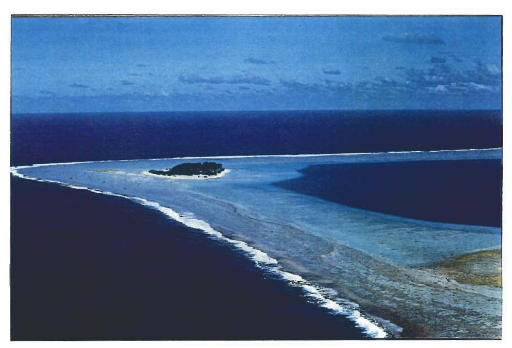

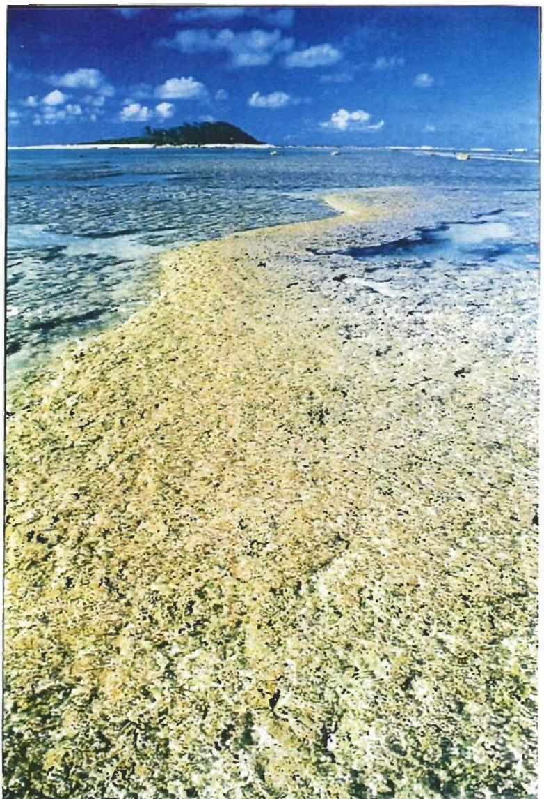

Figure 3 Rose Island and adjacent coral reef habitats on the northeastern and southeastern arms (top) and crustose coralline algae on the inner edge of the reef flat on the southeastern arm (bottom) of Rose Atoll.

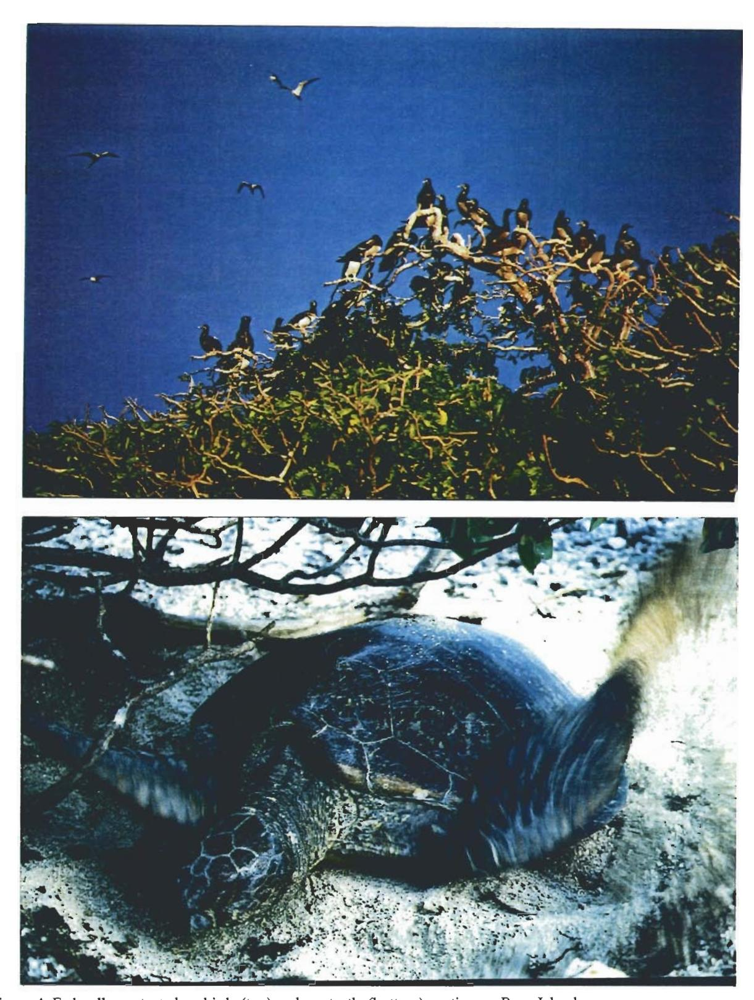

Figure 4 Federally protected seabirds (top) and sea turtle (bottom) nesting on Rose Island.

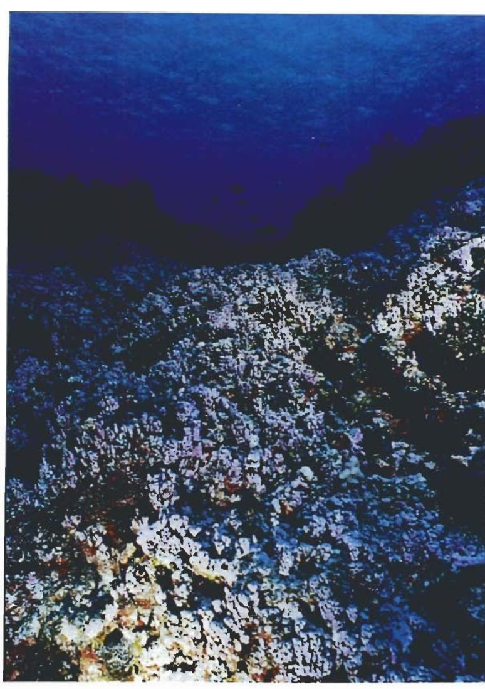

Figure 5 Crustose coralline algae on the reef slope (top) and corals and a giant clam (*Tridacna maxima*) on the base of a pinnacle in the lagoon (bottom) at Rose Atoll.

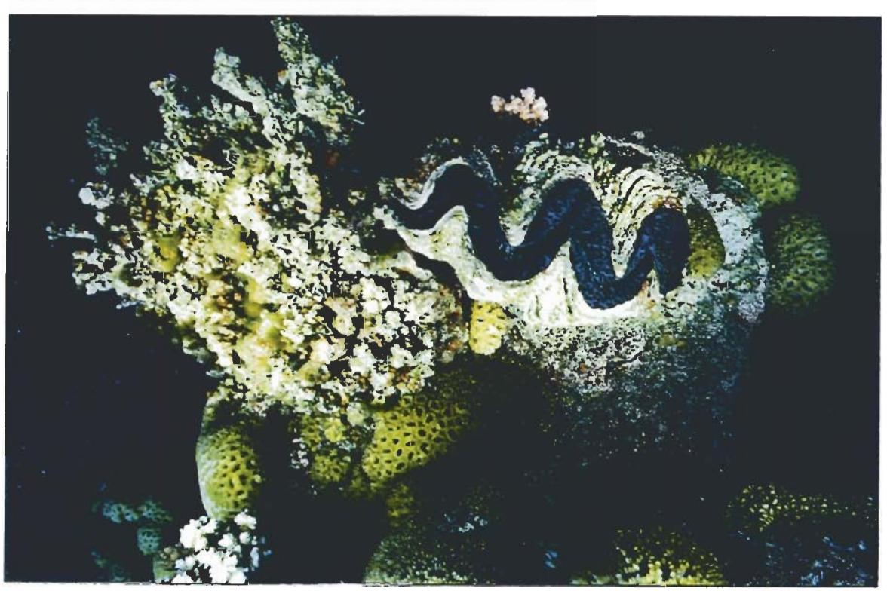

Previous studies have shown that the coral communities at Rose are distinctive and quite different to those on the other islands in Samoa, with coral abundance, cover, species richness (number of species present), and diversity all low compared to elsewhere in the archipelago (Mayor 1921, Maragos 1994, Green 1996). Dominant coral genera at Rose include Favia, Acropora, Porites, Montipora, Astreopora, Montastrea, and Pocillopora (Figs. 5 & 6), and two species, Favia speciosa and Astreopora myriopththalma, are much more abundant at Rose than elsewhere in Samoa (Maragos 1994). In contrast, four genera (Pavona, Galaxea, Leptastrea, and Platygyra) are less abundant at Rose than they are on the other islands in the archipelago (Maragos 1994).

The fish communities at Rose are also distinctly different from those that occur elsewhere in the Samoan Archipelago (Green 1996). Fish density is very high and species richness is moderately high at Rose, although fish diversity and biomass are low because of the dominance of small, planktivorous species (Green 1996). The fish assemblages at Rose also differ from the rest of the archipelago by having a much lower diversity of herbivorous species (especially parrotfishes and damselfishes), and a high density of planktivorous and carnivorous species (especially damselfishes, unicornfishes and snappers: Fig. 6. Wass 1981a, Green 1996, unpubl. data).

The reefs at Rose Atoll are also characterized by high densities of giant clams (*Tridacna maxima*), which are most abundant on the bottoms of the pinnacles in the lagoon (Fig. 5 & 6: Wass 1981b, Radtke 1985, Green and Craig 1996). By comparison, giant clam densities are much lower throughout the rest of the Samoan Archipelago, where their populations appear to have been overharvested (Green and Craig 1996).

Previous studies have determined that the coral reefs at Rose can be divided into six easily recognized habitat zones, which vary in terms of their physical and biological characteristics (Fig.2: Green 1996, Green and Craig 1996). The outer reef slope is located on the seaward side of the atoll, and consists of an irregular and often steep slope down to a depth of approximately 50 meters (m). In some locations, a shallow reef terrace (< 10 m deep) is located on the upper slope, before the reef plunges down almost vertically into deeper water. Spur and groove formations occur on the shallow reef terrace in some locations. The reef flat is a hard, consolidated substratum that is exposed during spring tides. The seaward edge of the reef flat, just before the reef starts to slope down into deeper water, is called the reef margin. The lagoon is almost entirely enclosed by the reef flat, except for a narrow opening, or channel, on the northwest side. The inner edge of the reef flat slopes down to a shallow shelf (1-3 m deep) that surrounds the lagoon called the lagoon terrace. Most of this shelf (50-75%) is covered with rubble and a few scattered colonies of Acropora, and the rest is dotted with small patch reefs whose tops are uncovered at low tide. The inner edge of the lagoon terrace slopes steeply down the lagoon slope to the <u>lagoon floor</u> (> 15 m deep). The lagoon has an undulating sandy floor with a few isolated Acropora patches around its perimeter and numerous flat-topped, steep-sided pinnacles that extend up to the surface. Wave exposure is low in all lagoonal habitats and high on the outer reef slope and reef flat. The reef habitats at Rose Atoll have also been described in detail in previous studies, including Wass (1981b), Rodgers et al. (1993), Maragos (1994) and Green (1996).

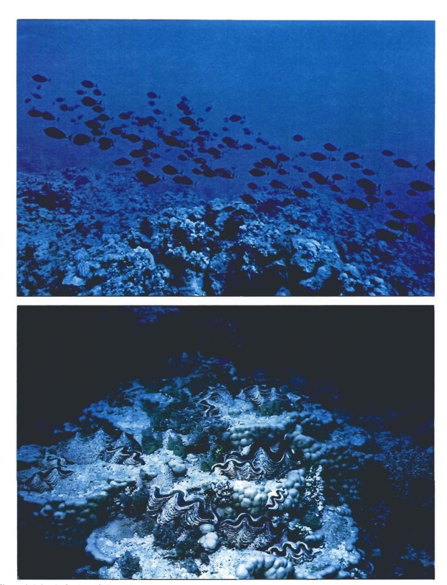

Figure 6 School of unicornfishes (Naso literatus) on the outer reef slope (top) and giant clams (Tridacna maxima) on the base of a pinnacle in the lagoon (bottom) at Rose Atoll.

The prevailing trade winds at Rose Atoll blow from the southeast. As such, the southeast and northeast sides of the atoll are usually the most exposed to ocean swells. However because Rose is so small, waves tend to wrap around the sides of the atoll during periods of strong winds, frequently affecting the southwestern side. The northwestern side of the atoll is generally protected from strong wave action, except during hurricanes which tend to come from the north.

Water circulation patterns at Rose Atoll are complex and variable, but some general patterns are apparent. Wave action pushes water over the reef flats into the lagoon during most tide and sea states. Much of the water forced into the lagoon then exits via a strong current in the channel on the northwestern side. Interactions of wind and waves can complicate this pattern in some areas. For example, water flowing onto the reef flat at the wreck site on the southwest arm normally meets tradewind generated waves from the lagoon resulting in a northwest flow along the reef flat (based on limited dye studies: J. Burgett pers. obs.).

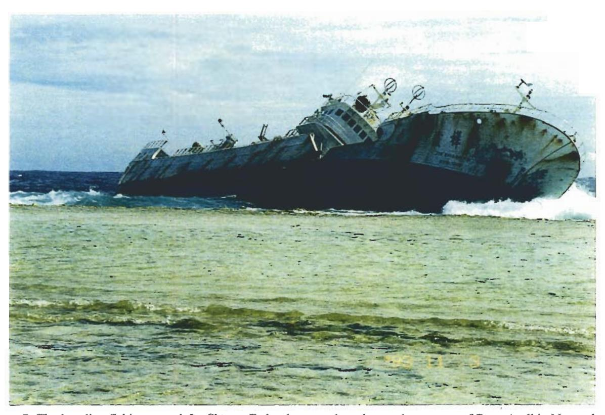

Figure 7 The longline fishing vessel Jin Shiang Fa hard aground on the southwest arm of Rose Atoll in November 1993.

#### 3. DESCRIPTION OF SHIP GROUNDING

At approximately 4:00 am on October 14, 1993, the Taiwanese longline fishing vessel *Jin Shiang Fa* ran hard aground on the seaward edge of the southwest arm of Rose Atoll (Figs. 2, 7 & 8). The ship had departed from Pago Pago less than 24 hrs earlier and was in transit to an unspecified fishing area in the Pacific when it ran aground (USFWS 1996a). At the time of the grounding, the 37-m vessel was carrying 100,000 gallons of diesel fuel, 500 gallons of lube oil, and 2,500 pounds of ammonia, all of which were eventually discharged into the marine environment (Fig. 8, USFWS 1996b).

The ship grounding affected the coral reefs at Rose Atoll in two ways: the physical disturbance caused by the vessel running aground and breaking up on the reef; and the release of chemical contaminants into the marine environment from the wreck. Each of these disturbances are described below:

#### 3.1 Physical Disturbances

Observations of the wreck site on the southwest arm suggest that the vessel hit the reef while traveling parallel to it (Fig. 8, Molina 1994). The vessel collided with the upper portion of the outer reef slope and skipped across the tops of two large spurs (depth 3-4 m) before coming to rest across the tops of two others and spanning a large groove in the reef (Molina 1994, Fig. 8 & 9). The orientation of the grounded vessel was almost parallel with the reef margin, and the ship's hull was keeled over toward its port side with its bow pointed in a north-northwesterly direction (Fig. 8 & 9. Molina 1994). The vessel was not completely stationary, and was rocking back and forth on the reef slope with the movement of the ocean swells (Molina 1994).

Surveys conducted two weeks following the grounding revealed that there was a tremendous amount of ship-related debris on the reef slope and reef flat (Molina 1994). The debris was mostly fishing gear (including both cotton and monofilament longlines, stainless steel snaps, swivels, and fishing aprons: Fig. 10), clothing, galley supplies, batteries, radio direction finder, audio and video tapes, zinc anodes, and a large amount of metal, fiberglass and wooden items (Molina 1994). No fishing hooks were seen (Molina 1994). Many porous items were soaked with diesel, and all items were oily to the touch (Molina 1994). Most of the debris on the reef slope was distributed immediately below the vessel, while the debris on the reef flat extended in a north-northeasterly direction from the wreck toward the lagoon (Molina 1994).

The area where the vessel ran aground is periodically subject to strong wave action, and the vessel broke up four to six weeks after grounding and before a salvage operation could take place (Fig. 11, Barclay 1993). When the salvage operation began on November 27, 1993, the stern half of the vessel (approximately 250 tons) was nearly submerged on the shallow reef slope (approx. 50 m seaward of the reef margin) with only a small amount of rigging above water (Barclay 1993). The bow section (76 tons), wheelhouse (5 tons), shelter deck (2 tons) and 18 miscellaneous pieces of the shipwreck (38 tons) were scattered over the reef flat in close proximity to the grounding site and fully exposed at low tide (Fig. 11, Barclay 1993). This wreckage was estimated to cover

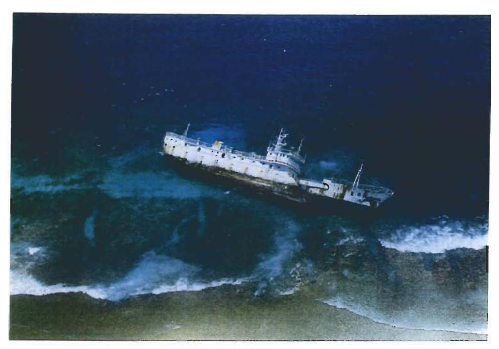

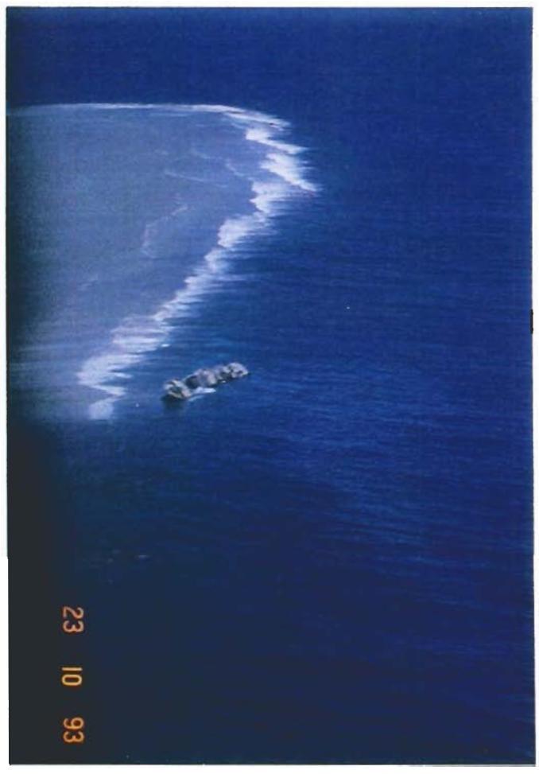

Figure 8 The Jin Shiang Fa hard aground across spurs on the reef slope at Rose Atoll in October 1993 (top) and the contaminant spill north of the vessel on October 23, 1993 (bottom).

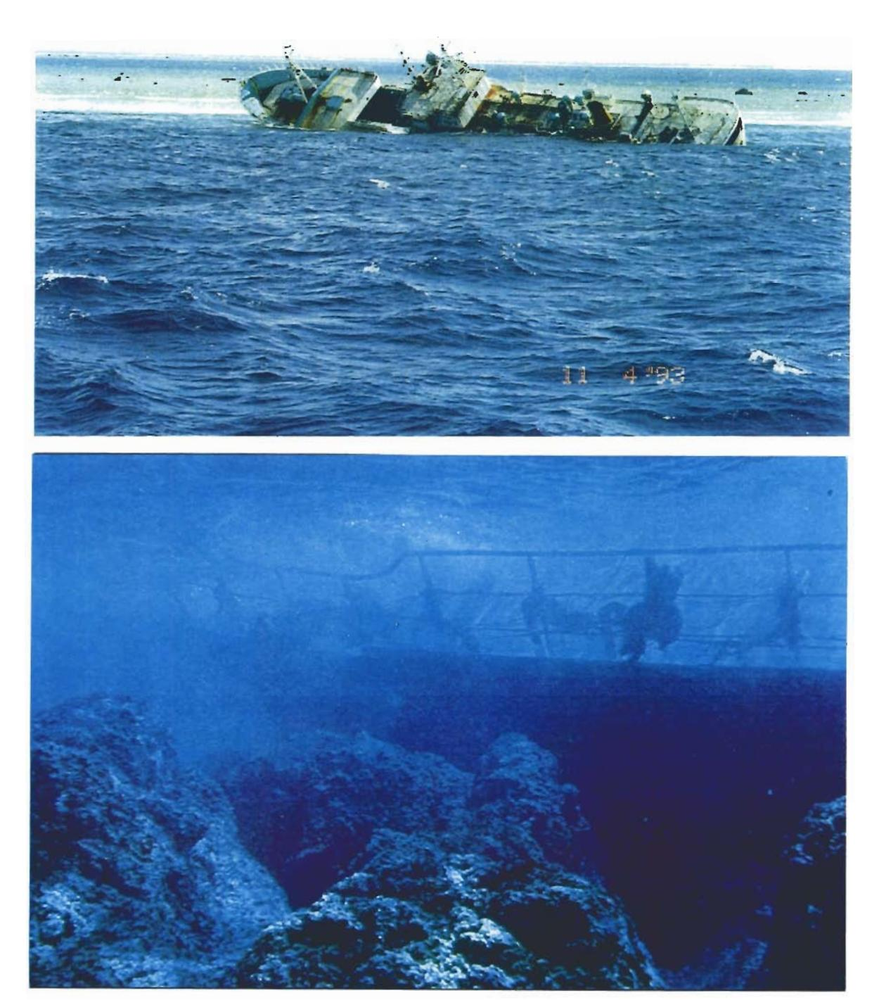

Figure 9 The outer reef slope at Rose Atoll in November 1993 showing the Jin Shiang Fa keeled over on its port side (top) with the port side railing under water (bottom).

approximately 9,000 m2 of reef flat (Barclay 1993). Ship debris was also spread over an estimated area of 175,000 m2 of reef flat and lagoon terrace, although the majority of the debris was concentrated in a 100-m wide band across the reef flat adjacent to the wreck (Barclay 1993).

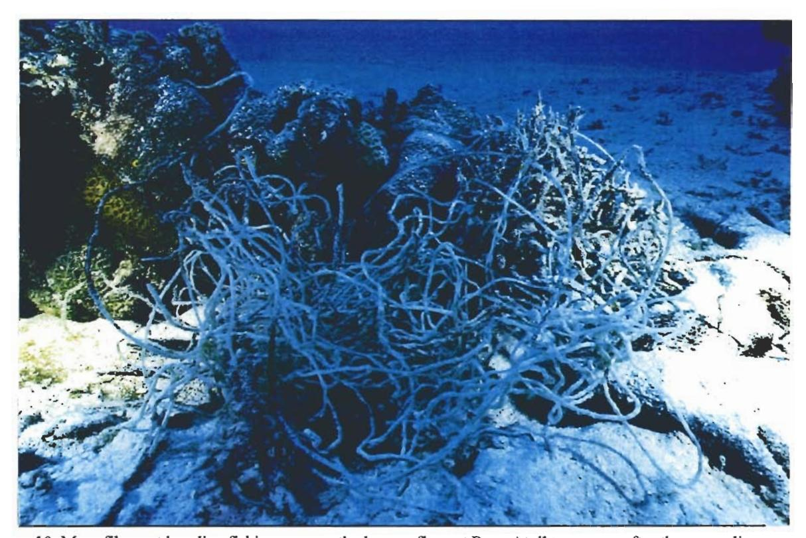

Figure 10 Monofilament longline fishing gear on the lagoon floor at Rose Atoll two years after the grounding.

Salvage operations (Fig. 12) were successful in removing most of the larger pieces of wreckage and debris from the reef flat (Barclay 1993). This included pulling the bow, wheelhouse, shelter deck, and miscellaneous pieces of ship wreckage off the reef flat into deeper water (600-1,000 m). However, the salvage crew did not attempt to move the stern and its associated debris from the shallow reef slope because the sheer mass of the stern made it impossible to move (Barclay 1993). In the months following the salvage operation, the stern was broken up into smaller pieces by high wave energy.

Four months after the grounding, a large amount of wreckage and debris was still present on the reef slope, covering an area of approximately 3,500 m2 (Molina 1995). The engine block was on the reef slope just below the surf zone (Fig. 13), and numerous other pieces of wreckage and debris were distributed in the area, mostly within the natural reef groove where the vessel came to rest (Fig. 13, Molina 1995). The remaining wreckage included coils of longline fishing gear, large metal plates, twisted engine conduit, pieces of super structure, and many other miscellaneous items (Molina 1995). Molina (1995) also noted that much of the debris appeared to be very unstable, although some had been imbedded in a large rubble pile below the main area of the wreckage (see *Generation of Berms*).

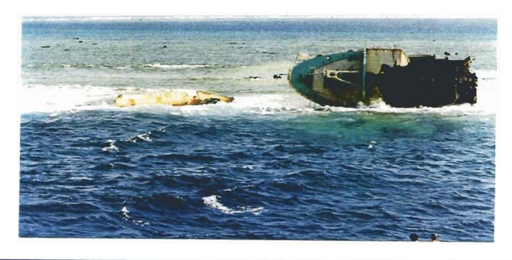

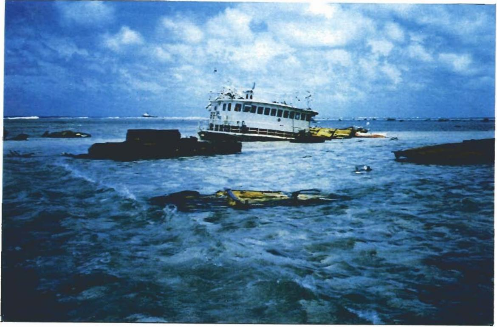

Figure 11 The bow section (top), wheelhouse and other pieces of wreckage (bottom) on the reef flat at Rose Atoll six weeks after the grounding.

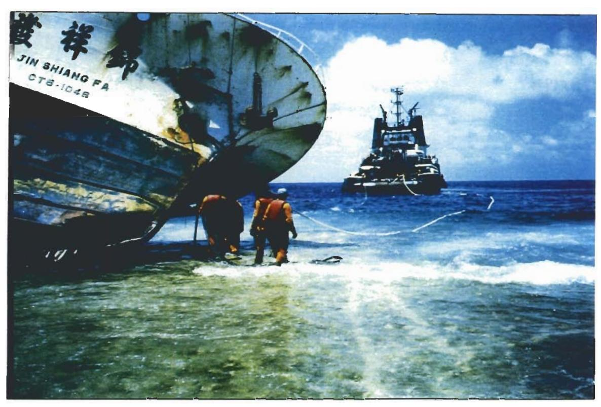

Figure 12 Salvage operation to remove the wreckage from the reef flat six weeks after the grounding.

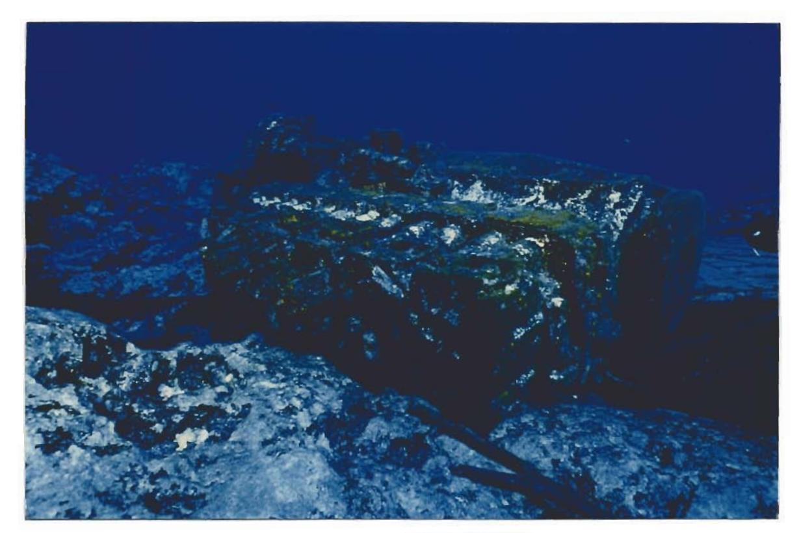

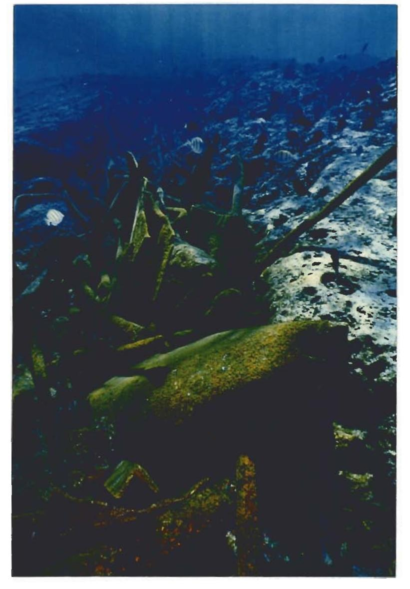

Figure 13 Wreckage on the outer reef slope two years after the grounding, including the engine block (top) and other metal sections of the stern and ship debris (below).

Surveys conducted four months after the grounding also showed that there was a substantial amount of debris still remaining on the reef flat, lagoon terrace, lagoon slope, and lagoon floor (Fig. 14, Molina 1995). This debris was scattered over a distance of 1,300 m along the reef, extending along the southwest and northwest arms of the atoll from the wreck site towards the channel (Molina 1995). However, most of the wreckage (large piles of twisted metal conduit, large sections of the hull, and large pieces of metal and wood) and debris (longline fishing gear, batteries, audio tapes etc.) was deposited within a 500 m wide band across the reef flat from the wreck site to the lagoon (Fig. 14, Molina 1995). Most of this wreckage and debris, was believed to have been washed up onto the reef flat from the outer reef slope (Fig. 15).

Subsequent surveys have revealed that much of this wreckage and debris is still present on the reef flat and reef slope three years after the grounding (M. Molina and J. Burgett pers. obs.).

# 3.2 Chemical Releases

The contaminants associated with the grounding can be broken down into acute and chronic chemical releases as follows:

#### Acute Chemical Releases

At the time of the grounding, the vessel was carrying an estimated 100,000 gallons of diesel fuel (#2 fuel oil), 500 gallons of lube oil, and 2,500 pounds of refrigeration system ammonia. All of these contaminants were discharged into the marine environment at the wreck site on the southwest arm (Fig. 8), where they subsequently spread over the reef flat and into the lagoon (USFWS 1996b).

Emergency oil spill response activities were limited to vessel observation, fuel discharge estimation, and limited documentation of acutely toxic effects of the fuel oil on coral reef organisms. No remedial actions were undertaken during the spill to reduce the physical and chemical injuries to the natural resources at Rose Atoll because of the nature of the contaminant and the location of the spill on the exposed side of a remote atoll.

The rate at which the contaminants were released into the marine environment could not be accurately determined, although the discharge appeared to be continuous for approximately six weeks after the grounding (USFWS 1996b). Based on observations during overflights and site visits, it appears that the bulk of the oil was discharged within the first few days after the ship ran aground, with smaller amounts continuing to be discharged until after the break up of the vessel and the salvage operation six weeks later (Barclay 1993, USFWS 1996b).

Based on U.S. Coast Guard video footage of the spill, it appeared that the contaminants moved consistently across the reef flat and into the lagoon by the force of the prevailing waves and currents (Molina 1994). The spill also appeared to flow away from the atoll in northwesterly and southeasterly directions on different days, depending on the prevailing weather conditions (Molina 1994). This suggests that the spilled chemicals were distributed along the outer reef slope and reef flat on the southwest arm of the atoll, as well as in the lagoon (Molina 1994). Given water

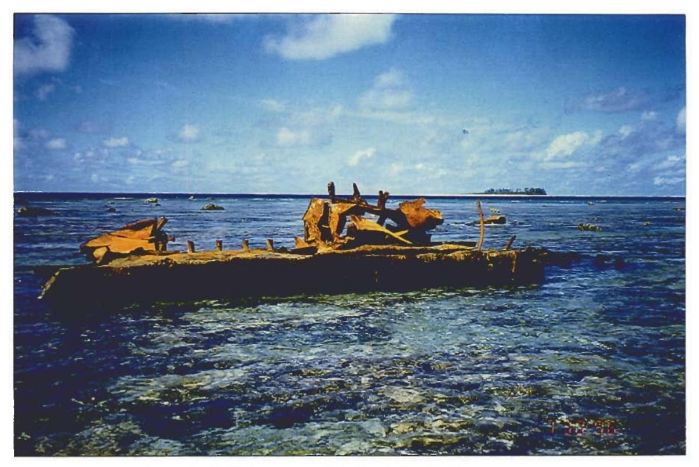

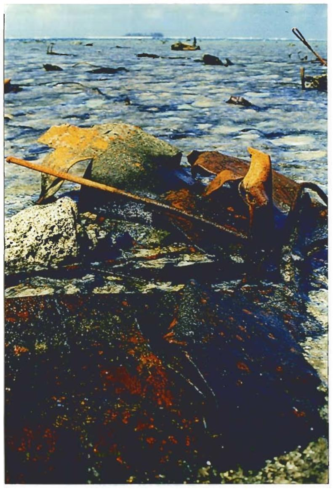

Figure 14 Wreckage from the *Jin Shiang Fa* on the reef flat two years after the grounding.

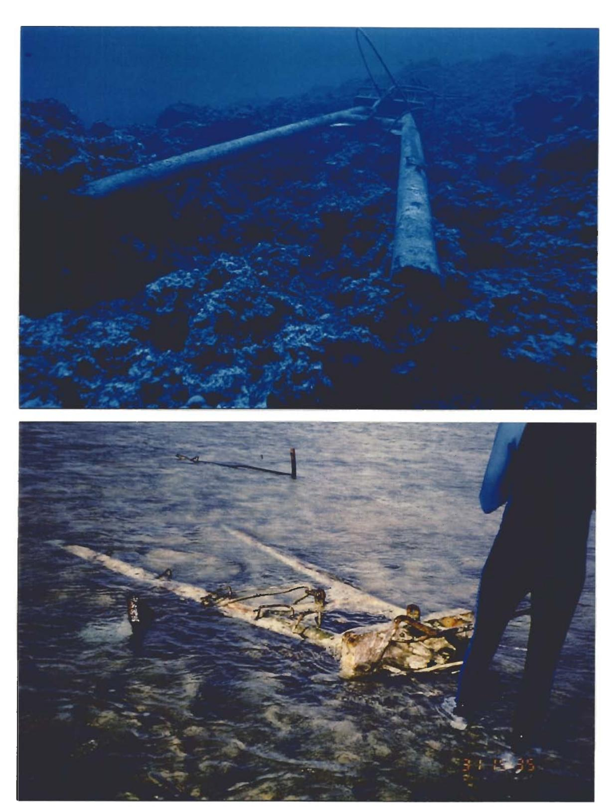

Figure 15 Foremast on the outer reef slope five months after the grounding (top) and the same piece of wreckage on the reef flat  $1\frac{1}{2}$  years later (bottom).

movement patterns in the area (see *Study Area*), it is assumed that some the fuel later exited the lagoon via the channel or over the reef flat on the northwest arm.

Due to the heavy wave action at the wreck site, fuel oil was also forced downward into the water column and trapped in the reef structure on the southwest arm of the atoll (Molina 1994). Entrapped oil was recorded along a 630 m stretch of reef flat on the southwest arm, which extended 190 m southeast and 440 m northwest of the wreck (Molina 1994). Observations of the reef flat showed that oil persisted in the form of sunken oily debris and oil entrapped in the reef matrix, coral rubble, and associated sediments for at least two to three weeks after the grounding (Molina 1994, see *Chronic Chemical Releases*).

The precise chemical composition of the diesel fuel discharged onto the reef at Rose Atoll is unknown, although fuel oil typically contains significant quantities of toxic metals including cadmium, chromium, copper, lead, and zinc (USFWS 1996b). Fuel oil is also highly toxic because it contains approximately 13% aromatic hydrocarbon such as toluene and benzene (USFWS 1996b). The breakdown of the volatile fuel oil can also lead to the production of additional toxic materials or lead to the toxic components becoming more bioavailable, resulting in an increased threat to living organisms (USFWS 1996b). The biological responses of the reef organisms to these contaminants are described below (see *Injury Assessment*).

#### Chronic Chemical Releases

Petroleum products persisted in the sediment at the wreck site for at least 22 months after the spill (August 1995: D. Palawski unpubl. data). Total extractable hydrocarbons in the diesel range were detected in two samples taken from the lagoon terrace and lagoon slope (10 mg/kg and 16 mg/kg respectively) but were below the detection limit (10 mg/kg-wt weight basis) in sediments collected from the lagoon floor. Although the detected hydrocarbon concentrations were relatively low, these data indicate that reef organisms were exposed to petroleum hydrocarbons over an extended period of time.

Another source of chronic chemical release is the wreckage that remains in shallow reef waters on the atoll, since the metal sections of the vessel are corroding into the surrounding seawater. Based on the composition of the wreckage, the metals include iron (from structural steel and the engine block), zinc (from sacrificial anodes), and copper (from the bronze propeller and brass fittings). These metals are usually present in trace concentrations in pristine coral reef waters, and an increase in their concentration may be poisonous to some organisms (e.g. copper) or enhance the growth of others (e.g. iron: Sunda 1994). For example, recent research has shown that iron is the limiting nutrient for planktonic algal production in marine environments that are remote from continental margins (Martin and Fitzwater 1988, Sunda 1994), such as at Rose Atoll.

Water samples were taken to determine if elevated iron concentrations were present in the waters near the wreckage, which could offer a possible explanation for the persistent algal bloom at the wreck site. Dissolved iron levels were sampled along the outer reef flat on the southwest arm of

the atoll in January 1997, and total dissolved iron was determined by spectrophotometric flow injection analysis (Measures et al. 1995).

A clear peak in iron concentration was found on the outer reef flat at the wreck site (Fig. 16). Given water circulation patterns on the atoll (see *Study Area*), the source of the iron is most likely the large amount of submerged wreckage on the outer reef slope. Limited sampling suggests that a plume of iron-rich water, approximately 500 m wide, flows across the reef from the outer reef slope to the lagoon and that the debris on the reef flat contributes relatively little iron to the plume (J. Burgett unpubl. data). By comparison, low background iron levels found away from the plume (< 1 nM: Fig. 16) are typical of oceanic waters in which iron is the limiting nutrient.

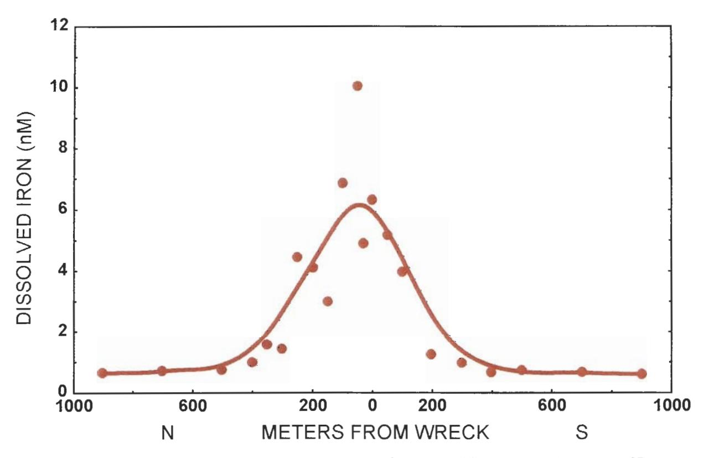

Figure 16 Iron (Fe) concentrations (and least squares curve) on the outer reef flat on the southwest arm of Rose Atoll in January 1997.

#### 4. INJURY ASSESSMENT

A preassessment screen conducted in the weeks following the ship grounding, determined that the reefs at Rose Atoll had sustained substantial injuries from the physical impact of the vessel and the contaminant releases (USFWS 1996a,b). The preassessment screen also concluded that additional studies were necessary to determine the full extent and magnitude of injuries to the natural resources at the atoll.

Subsequently, an environmental injury assessment has been conducted to determine the impact of the grounding and associated fuel spill on the reef at Rose. This assessment was done during several trips to the island over the last four years (from November 1993 to January 1997: see Appendix A) and focused primarily on the two habitat zones that appeared to have been most heavily affected by this event (i.e., the reef flat and outer reef slope: see Fig. 2). The lag between the grounding and the first comprehensive survey (August 1995) was due to the logistic difficulties of mounting a field expedition to this remote location.

The injury assessment was impeded by two important factors. First, there are no rigorous, pregrounding data for the atoll that would provide a basis for describing how the coral reef communities at Rose changed as a result of the grounding. Second, there are no suitable "control" sites that would provide valid comparisons between "affected" and "unaffected" areas, since the reef is too small to allow for comparative sites to be established on the same side of the atoll. The coral reef communities on the other arms of the atoll have been described, however, in most situations, the communities on the other three arms do not provide valid comparisons with the affected arm. This is primarily because the coral reef communities on all four arms are fundamentally different, probably due to the influence of wave exposure, which varies around the atoll (see *Study Area*).

Furthermore, comparative sites could not be used on other islands in Samoa, because the reefs at Rose Atoll are unlike any others in the archipelago (see *Study Area*). Consequently, the effects of the ship grounding and associated fuel spill were assessed by describing the injury to the atoll across a gradient away from the wreck site and by describing the changes that have occurred at the wreck site since the grounding.

The injury assessment has been broken down into two sections: the physical injuries to the reef; and the biological responses to the environmental perturbations caused by the shipwreck.

#### 4.1 Physical Injuries

Effects of the Collision

The initial collision created large scars on the outer reef slope where the vessel apparently skipped over the tops of two spurs before running hard aground on two others (Fig. 17, Molina 1994). Underwater measurements showed that the total area of the scars was approximately 1,200 m2, including the area directly beneath the vessel where it came to rest (Molina 1994, 1995).

The tops of the scarred spurs appeared relatively flat and smooth, apparently as a result of the vessel shearing off and pulverizing the upper layer of reef, including its veneer of living biota (Molina 1994). Two weeks after the grounding, the scarred substrate was beginning to be colonized by opportunistic algal species (Molina 1994), which now dominate the area (see *Algae*).

The condition of the reef substratum underneath the remaining wreckage on the reef slope is unknown, although it is assumed that the living biota has been killed by the weight and movement of the heavy metal plates over the last four years.

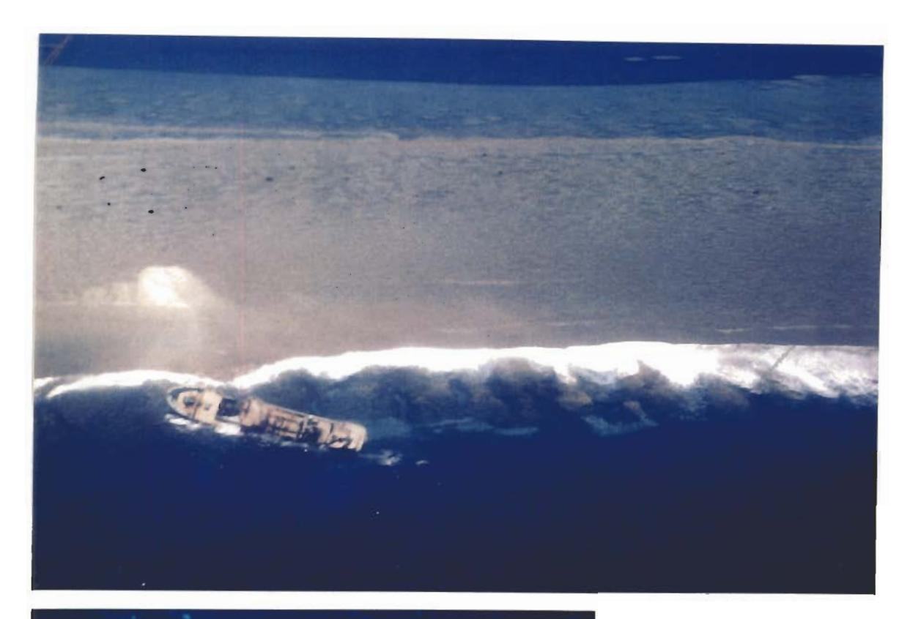

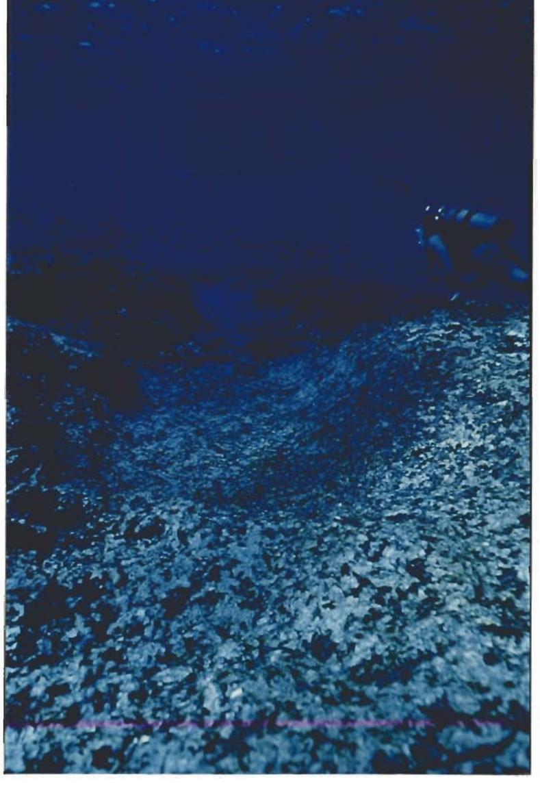

Figure 17 Scarring on the outer reef slope caused by the passage of the vessel as seen from the air (top) and underwater (bottom).

# Generation of Berms

In the weeks following the grounding, the rocking of the vessel by waves and surge caused additional injury to the outer reef slope, by enlarging the groove in which the ship's keel and hull were lodged. Calcareous sediments (i.e. pulverized reef) generated by the movement of the hull formed two large piles which extended down the reef slope below the vessel (Fig. 18: Molina 1994). Both of these berms were large enough to be clearly visible from the air (Fig. 18). The largest of the berms spread down the slope from just below the surf zone to a depth of 46 m (Molina 1995). Two weeks after the grounding, this berm was 78 m long, and ranged in width from 21 to 42 m at depths of 14 m and 9 m respectively (Molina 1995). These berms are believed to have buried benthic marine organisms and a large amount of ship debris, as evidenced by the pieces of fishing line and other items protruding from within the sediments (Molina 1994). Subsequently, this berm has migrated down the outer reef slope to the seaward terrace in deeper water below the wreck (J. Burgett pers. obs.).

A large berm also formed on the reef flat near the wreck in the weeks following the grounding (Barclay 1993, Molina 1994, Fig. 18). The calcareous sediments in this berm are believed to have been created by the movement of the vessel and wreckage on the outer reef slope and reef flat and concentrated by water movement patterns in the wave shadow of the hull on the reef flat Two weeks after the grounding, the berm was 15 m wide and 60 m long, with its lagoonward edge located approximately 100 m away from the wreck (Molina 1994). Reef surveys conducted five months later, in conjunction with aerial photograph interpretation, delineated the area of sedimentation to encompass 8,060 m2 of reef flat (USFWS 1996a). At the same time, it was noted that the sediments in the berm had become anaerobic, exhibiting a characteristic black color and strong hydrogen sulfide smell (Molina 1994, Maragos 1994, see *Other Injuries*).

Over time, the sediments from the reef flat berm have spread laterally and moved towards the lagoon, scouring and filling in numerous cracks and depressions in the reef flat, and burying and abrading reef organisms (Molina 1994, 1995, see *Corals* and *Echinoderms*). Three years after the grounding, these sediments remain prominent in depressions in the reef flat near the wreck (J. Burgett pers. obs.).

# Other Injuries

The large amounts of wreckage and debris at Rose Atoll are believed to have caused injury to coral reef organisms in a number of ways. The movement of these items has caused breakage, abrasion, smothering, and burial of sedentary reef organisms, including corals, giant clams, and other invertebrates (Molina 1994, 1995, Maragos 1994: see *Coral* and *Echinoderms*) The physical effects of the debris may have also been exacerbated by the presence of petroleum products, which are believed to have had a toxic effect on some reef organisms (see *Corals*). Furthermore, Maragos (1994) suggested that the porous debris, such as clothing, ropes, and wood, may have acted as a reservoir, which retained toxic petroleum hydrocarbons in the marine environment for an extended period of time. Some of the debris, especially the tangled monofilament longline gear, was also believed to represent a risk of entanglement to certain mobile reef organisms (see *Seabirds* and *Sea Turtles*).

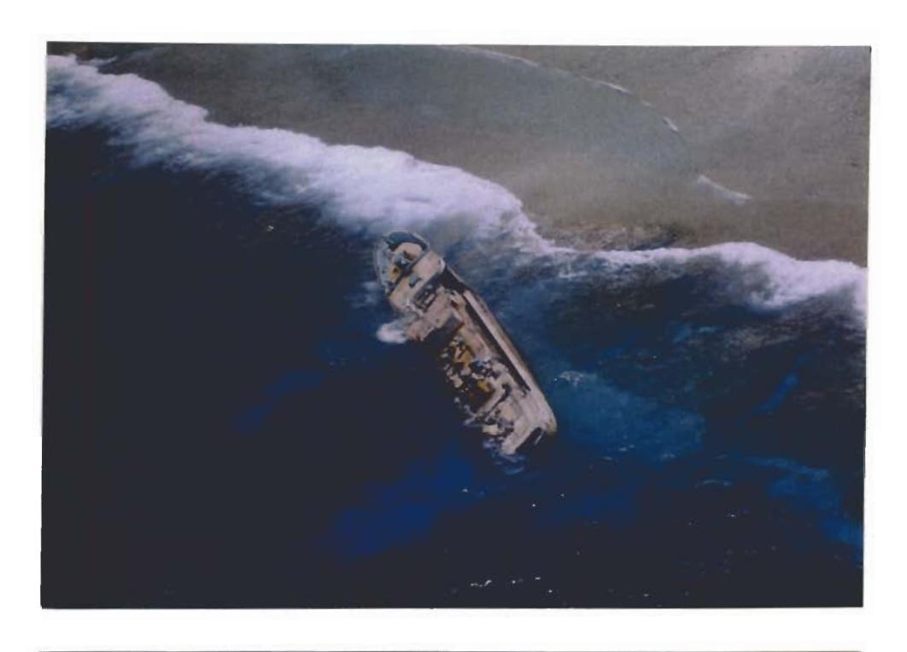

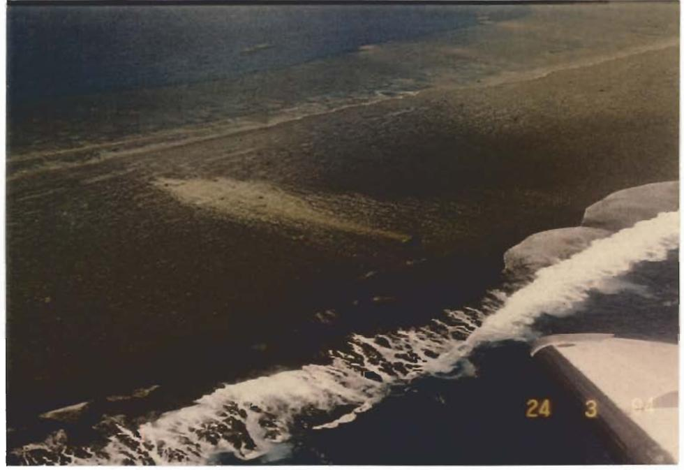

Figure 18 Sand-rubble berms on the outer reef slope below the vessel two weeks after the grounding (top) and the berm on the reef flat adjacent to the wreck site five months after the grounding (bottom).

Decomposition of dead marine life and organic ship debris is also believed to have led to the creation of a widespread zone of anoxia at the wreck site, which persisted for several months after the grounding (Molina 1994, 1995, Maragos 1994). Two weeks after the event, Molina (1994) noticed that the sediments just below the surface in the reef flat berm were anoxic, exhibiting a characteristic black color and strong hydrogen-sulfide smell. Five months later, a widespread zone of decomposition and anoxia (about 0.5 km long) was observed on the reef flat, lagoon terrace and lagoon floor at the wreck site (Molina 1995, Maragos 1994). This zone was especially pronounced on the lagoon terrace where large amounts of wood and other debris had accumulated (Molina 1995). In these areas, black clouds of decomposing organics and anoxic sediments were released when the upper layers of the substratum were disturbed (Molina 1994, 1995, Maragos 1994). This zone of anoxia is believed to have caused the death of sedentary reef organisms in the area (see *Corals*).

# 4.2 Biological Responses

The biological responses of each of six major taxa to the ship grounding and associated spill have been summarized below:

# 4.2.1 Algae

Prior to the ship grounding, the reefs at Rose were dominated by crustose coralline algae, which is the primary reef-building element in the coral reef ecosystem on the atoll. Observations during and after the ship grounding, indicated that the algal communities had been severely affected by this event. In particular, it appeared that there had been a die-off of the crustose coralline algae on the southwest arm, accompanied by a bloom of other algal species that are otherwise uncommon on the atoll. This post-spill bloom of opportunistic algae has been observed to follow spills of petroleum products on marine shores worldwide, such as the Torrey Canyon spill in England (Bellamy et al. 1967), the Exxon Valdez spill in Alaska (Houghton et al. 1991) and the Bahia Las Minas spill in Panama (Jackson et al. 1989).

Subsequently, scientists have conducted surveys of the algal communities on the atoll in order to describe the changes that have taken place as a result of the grounding. Surveys were done in the two habitat zones that appeared most affected by this event: the reef flat and outer reef slope.

#### Reef Flat

Observations by field biologists indicate that, prior to the ship grounding, the reef flat at Rose Atoll was dominated by crustose coralline algae, giving the atoll a distinctive pink color (B. Flint and P. Craig, pers. comm., see Fig. 3). This coralline algal community was relatively uniform on the reef flat on all four arms of the atoll (Fig. 19).

Scientists visiting the atoll two to three weeks after the grounding noticed two obvious changes in the algal communities at the wreck site. First, a large area of bleached coralline algae was observed over a distance of 650 m along the outer reef flat and reef margin on the southwest arm, suggesting that there had been a massive die-off of crustose coralline algae over a large area at the wreck site (Molina 1994). Six weeks after the grounding, it was noticed that this zone of bleached

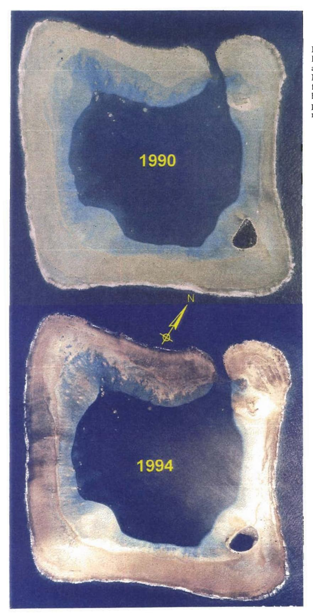

Fig. 19 Aerial photographs of Rose Atoll prior to and one year after the ship grounding in 1993. Note uniform coloration of the reef flat in 1990 (green color due to high tide) contrasted with large patches of dark algae on the reef margin and reef flat in 1994.

coralline algae had expanded to cover a distance of 1,000 m along the outer reef flat and reef margin.

Second, the scientists noticed that filamentous cyanobacteria5 (blue-green algae), usually uncommon on the atoll, had become established in reef depressions along 700 m of the reef flat on the southwest arm (from 200 m southeast to 500 m northwest of the wreck) in the weeks following the grounding (Molina 1994). At that time the densest patches of cyanobacteria were observed closer to the wreck site (from 190 m southeast to 500 m northwest of the wreck: Molina 1994). Several months to a year later (March 1994 and April 1995), the cyanobacteria bloom had spread along the entire southwest arm of the atoll, although it was most concentrated within a 150 m wide band across the reef flat and adjacent lagoonal habitats at the wreck site (Fig. 19: Flint and Craig 1995, Molina 1995). The cyanobacteria were also present on the northwest arm, but tended to be less dense and more restricted in distribution (Flint and Craig 1995, Molina 1995, Fig. 19).

In order to describe the changes in the algal communities at Rose in more detail, a quantitative survey was established in August 1995. The sampling design for this survey included 60 sites, which were distributed around all four sides of the atoll and across the reef flat (the outer, middle and inner reef flat: Fig. 20). The sites on the southwest arm were arranged in a gradient extending north and south from the wreck site, while the sites on the other three arms were designed to be representative for each arm. The majority of sites (33) were concentrated on the southwest arm of the atoll, because it appeared most heavily affected by the grounding.

The surveys were done on two occasions: approximately two (August 1995) and three (August 1996) years after the grounding. Sampling in 1995 was restricted to 42 sites on the southwest and southeast arms (Fig. 20), because of logistic constraints. However, the full survey was completed in 1996. At each site, the algal communities were sampled by experienced phycologists using four quarter-meter quadrats, which yielded samples with a total of 100 points per site.

The algal communities on the southwest arm have changed dramatically as a result of the grounding. By 1995, it was apparent that the previously dominant crustose coralline algae were no longer abundant on this arm (0-35% cover: Fig. 21), and that they had been replaced by opportunistic species. At that time, the dominant algae on the southwest arm were a mixed community of cyanobacteria species and a finely branched, turf-forming coralline alga, *Jania adherens*, which together accounted for up to 90% of the cover (Fig. 21). The *Jania*, like cyanobacteria, is usually rare on the atoll, and became abundant on the southwest arm sometime between March 1994 and August 1995. As a result of this change in the algal communities the reef flat on the southwest arm had changed from pink, the color of healthy crustose coralline algae, to black, the color of the mixed cyanobacteria community (Figs. 19 & 22). This pattern was most pronounced on the outer reef flat (Figs. 22).

&lt;sup>5Cyanobacteria included *Lyngbya* spp. and *Oscillatoria* spp.

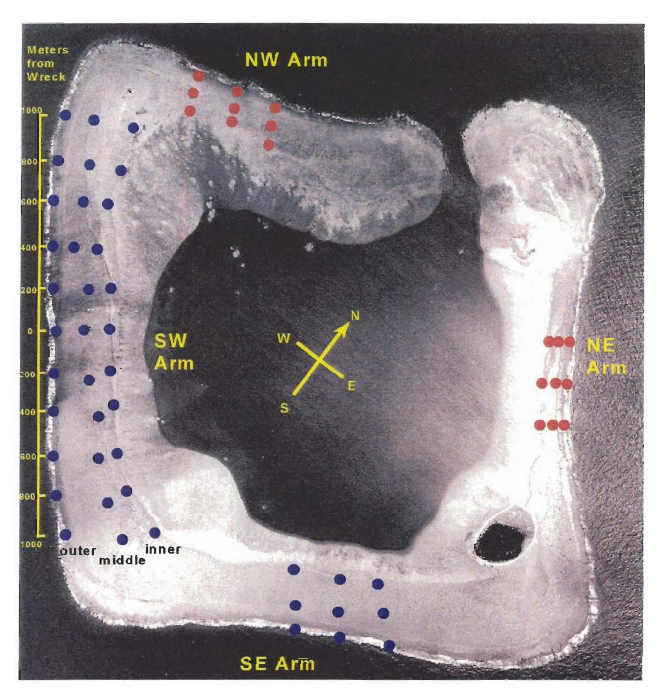

Figure 20 Aerial photograph of Rose Atoll showing the location of the study sites used to describe the algal communities on the reef flat. Blue symbols show sites surveyed in both 1995 and 1996, and red symbols show sites surveyed in 1996 only.

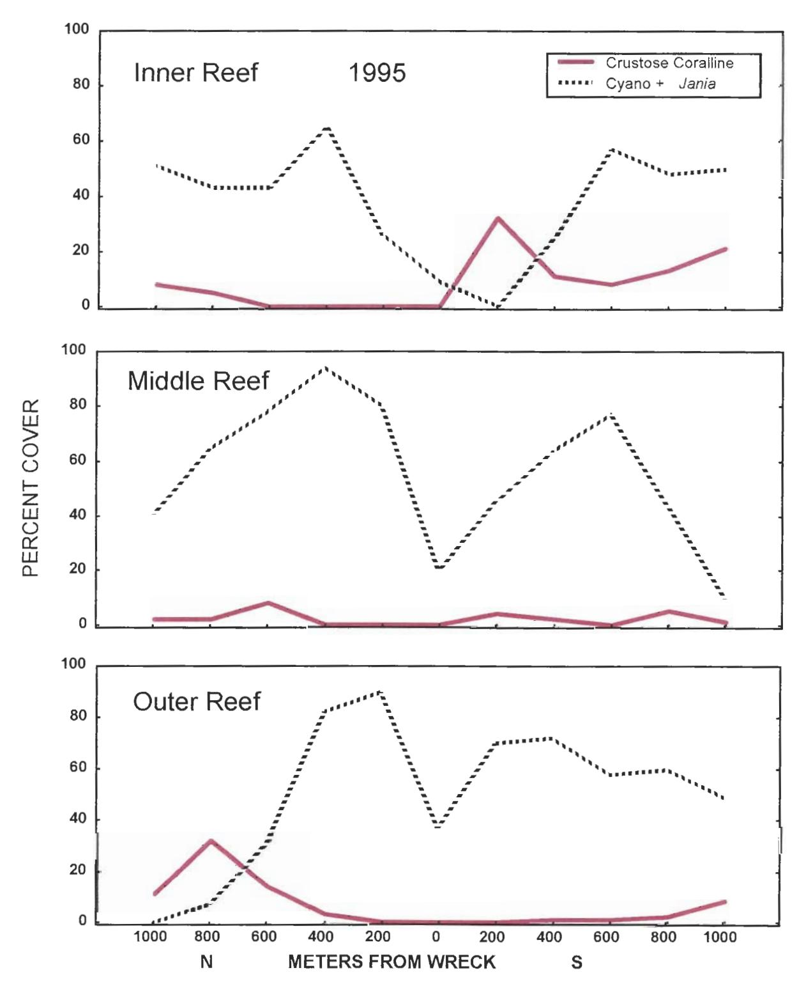

Figure 21 Abundance of crustose coralline algae and opportunistic algae (cyanobacteria and *Jania*) in a gradient away from the wreck site on the southwest arm of Rose Atoll two years after the grounding (1995). Data is presented for each of three zones across the reef flat: inner, middle, and outer (see Fig. 20).

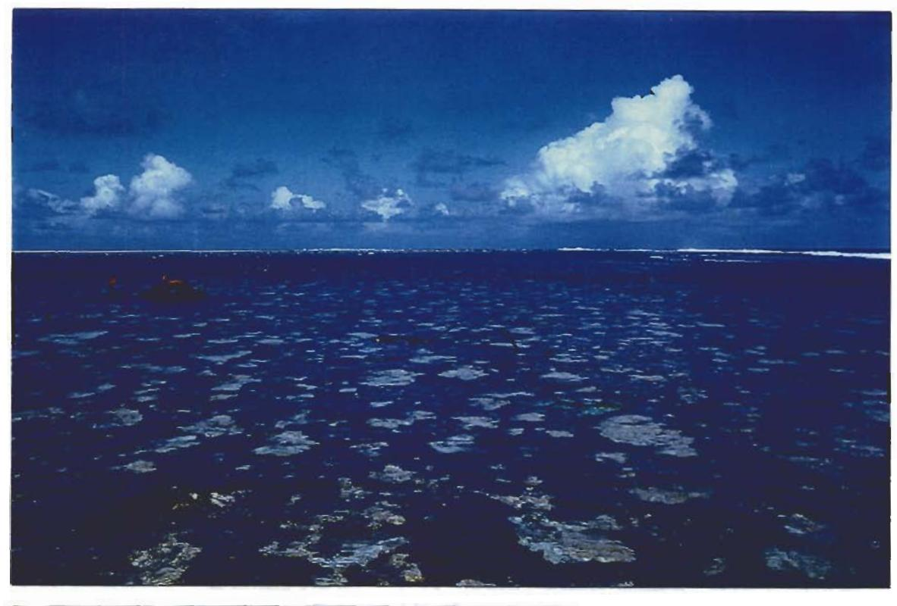

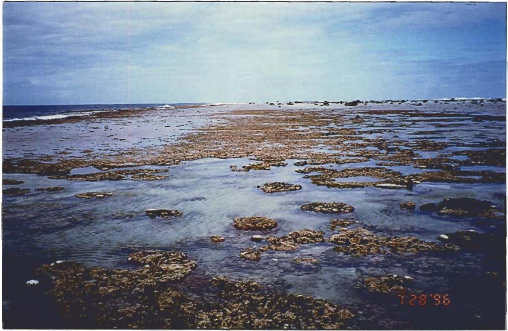

Figure 22 Reef flat adjacent to wreck site showing dominance of dark opportunistic algae (cyanobacteria and *Jania adherens*) six months after the grounding (top) and healthy reef flat on southeast arm of the atoll showing typical dominance of pink crustose coralline algae (bottom).

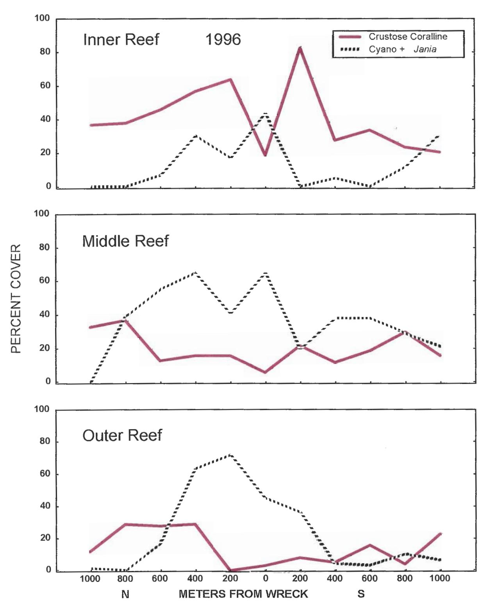

Figure 23 Abundance of crustose coralline algae and opportunistic algae (cyanobacteria and *Jania*) in a gradient away from the wreck site on the southwest arm of Rose Atoll almost three years after the grounding (1996). Data is presented for each of three zones across the reef flat: inner, middle, and outer (see Fig. 20).

By comparison, the algal assemblages on the southeast arm were still dominated by living crustose corallines (50-80% cover: J. Burgett unpubl. data), and cyanobacteria and *Jania* were absent or rare. As a result, the reef flat on this arm was still pink (Figs. 19 and 22).

The results of the survey in 1996 indicated that some reef recovery was underway on the southwest arm. Crustose coralline algae had recolonized the inner reef flat (Fig. 23). However, only minor recovery of crustose corallines had occurred on the middle and outer reef flat, and these areas were still dominated by cyanobacteria and *Jania* (Fig. 23). On the outer reef flat, the area of dominance by opportunistic *Jania* and cyanobacteria had become more restricted and centered north of the wreck (Figs. 21 & 23). Qualitative observations in January 1997 indicate that this is still the case (J. Burgett pers. obs.).

# Outer Reef Slope

Early observations of the wreck site suggested that the algal communities on the outer reef slope had also been dramatically affected by the grounding (Molina 1994, 1995). Two weeks after the grounding, Molina (1994) noted that large areas of outer reef slope had been denuded of living substratum by the passage of the vessel (see *Physical Disturbances*), and that these areas were being colonized by opportunistic algal species.

More recently, the algal communities on the reef slope at Rose Atoll were described during a larger, quantitative survey of the benthic communities on the atoll (Green 1996). The results of this study will allow for comparisons of algal communities at the wreck site with other areas around the atoll, as well as for monitoring the algal communities at the wreck site through time. In this study, algal species were lumped into major categories (see below), because most of these surveys were done by biologists who were not experienced phycologists.

Algal communities were compared around the atoll based on surveys done at five sites on the outer reef slope at a depth of 10 m: three sites on the southwestern arm and two sites on the northwestern arm (Fig. 2). Because of the logistical constraints, these surveys were done during two trips to the atoll: the northwest arm was surveyed in October 1994 and the southwest arm was surveyed in August 1995 (approximately two and three years after the grounding respectively).

Algae was surveyed along five 50 m transects at each site. At 2 m intervals along each transect, a 2 m line was run perpendicular to the direction of the main transect. Three points were then sampled along each of these 2 m lines (one directly under the 50 m transect, and one 1 m either side). Twenty-five 2 m intervals were sampled in this manner along the main transect, yielding 75 sample points per transect.

At each point, the substratum was recorded as belonging to a coral or algal growth form category based on Green (1996), including live crustose coralline algae, dead crustose coralline algae, and

cyanobacteria6. The cover of each growth form was then calculated as the percentage of the 75 points that it occupied on each transect.

This study showed that there were some dramatic differences in the algal communities on the reef slope at Rose Atoll one to two years after the grounding (Fig. 24). Live crustose coralline algae was the dominant substratum type at all sites, except the wreck site. Similarly, qualitative observations of the reef slope on the southeast arm revealed that it was also dominated by a lush growth of live crustose coralline algae (A. Green pers. obs.). In contrast, the algal communities at the wreck site were dominated by dead crustose coralline algae and cyanobacteria. Dead, crustose coralline algae and cyanobacteria were also recorded in low abundance on the other two sites on the southwest arm but were not recorded on the northwest arm. These results suggest that there has been a die-off of crustose coralline algae at the wreck site as a result of the grounding, and that the area has become dominated by opportunistic algae species.

In order to determine how the algal communities changed over time, the survey of the wreck site was conducted on three occasions: October 1994, August 1995, and August 1996. The results of these surveys show that the algal communities at the wreck site do not appear to have recovered from the effects of the grounding (Fig. 25). The area is still dominated by cyanobacteria and the cover of crustose coralline algae has not increased.

#### 4.2.2 Corals

Six months after the grounding, a qualitative survey was done to examine the effects of the grounding on the coral communities at Rose (Maragos 1994). The results of this survey revealed that coral injury and mortality was moderate to high up to a km or more away from the wreck site (Maragos 1994, Molina 1995).

The shipwreck appeared to have caused injury and death to corals in several ways (Maragos 1994), including:

- > toxicity from fuel spills and other contaminants;
- > mechanical injuries from the collision and subsequent movement of the vessel and debris smothering and snagging of debris (clothing and line);
- > anoxia from organic loading and biological oxygen demand (BOD) caused by decomposing debris and reef organisms;
- > smothering or scouring from sediments generated by the wreckage;
- > competition from benthic algae, and perhaps soft corals, whose growth were stimulated by the grounding; and
- > bleaching from reduced light penetration, toxicity or other stresses associated with the grounding.

&lt;sup>6This category was originally classified as "black filamentous algae" but it has since been identified as cyanobacteria, probably the same species that occur on the reef flat (see above).

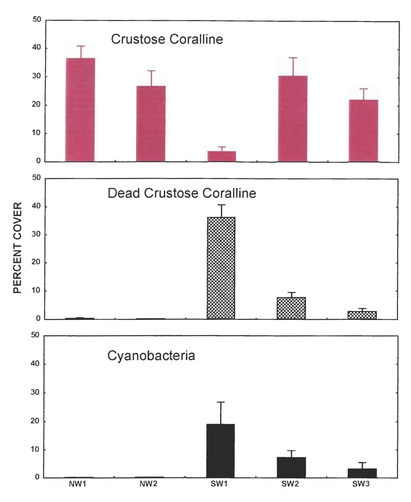

Figure 24 Abundance of live and dead crustose coralline algae and cyanobacteria on the outer reef slope at three sites on the southwest arm and two sites on the northwest arm of Rose Atoll approximately one year after the ship grounding. Where SW1 is the wreck site (see Fig. 2)

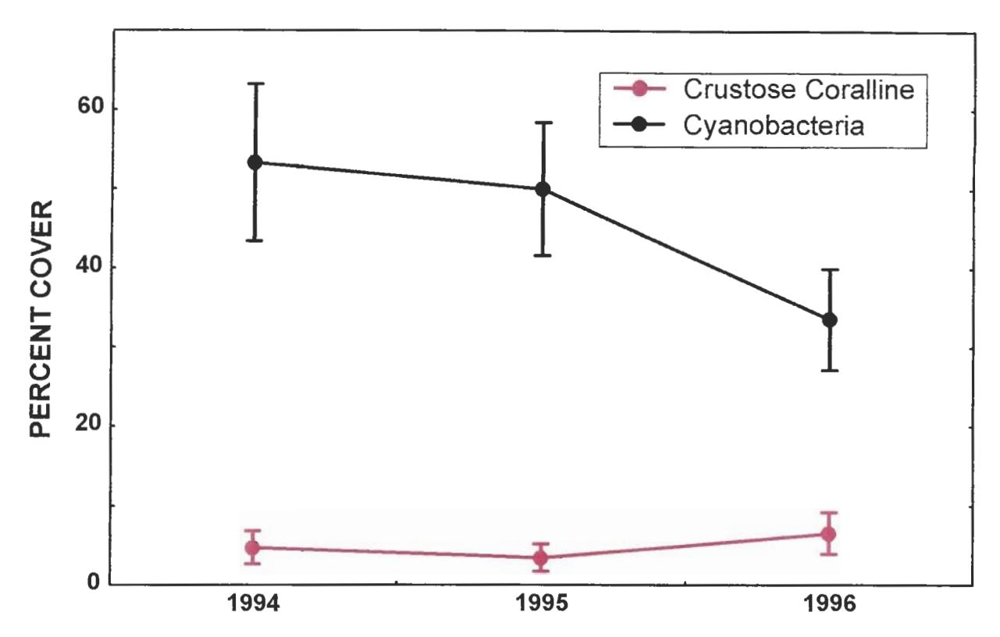

Figure 25 Abundance of live crustose coralline algae and cyanobacteria on the outer reef slope at the wreck site approximately one, two and three years after the grounding (1994, 1995, 1996 respectively).

Most of the injury or death of corals was observed in a range of habitat zones on the southwest arm of the atoll (Maragos 1994). These included the reef flat, lagoon terrace, lagoon slope, lagoon floor, pinnacles, and the outer reef slope (see Fig. 2). Unfortunately, the total extent of the impact on the coral communities at Rose could not be ascertained due to logistic constraints at the time of the survey (Maragos 1994).

#### 4.2.3 Echinoderms

The effects of the grounding on the echinoderms at Rose were assessed by comparing the distribution and abundance of sea urchins (*Echinometra* spp. and *Diadema* c.f. savignyi) and sea cucumbers or holothurians. Since different methods were used to measure the effects on each of these taxa, they will be dealt with individually:

#### Echinometra spp.

Boring sea urchins (*Echinometra spp.*) are abundant on the outer reef flat at Rose Atoll, where they live in small holes in the reef matrix. Early observations of the wreck site suggested that many of these urchins were killed by the ship grounding and associated spill along the most seaward portion of the outer reef flat (Molina 1994). Two species of *Echinometra* inhabit this area (*E. oblonga* and *E. mathaei*), although *E. oblonga* is the dominant species.

To measure this effect, the density of these urchins was quantified along a transect on the outer reef flat at the wreck site, approximately 10 m lagoonward of the reef margin and extending 220 m south and 200 m north of the wreck (Molina 1994). Urchins were surveyed at 10 m intervals along the transect by counting the number of individuals within a 0.25 m² quadrat. These counts were repeated approximately two and three years later (August 1995 and August 1996 respectively), and expanded to include the other three arms of the atoll.

Two weeks after the grounding, the first survey of the southwest arm revealed that the middle section of the transect (10 m wide) had been scoured and the urchin holes filled with sand (see *Generation of Berms*). Approximately 40 m either side of this zone, the reef flat had also been scoured by the sediments, but the holes had not been filled. No sea urchins were seen within these two sections of the transect, nor were they recorded between 60 m south and 90 m north of the wreck site (Fig. 26). In general, the density of these urchins increased with distance from the wreck.

Subsequent surveys have shown that the density of boring urchins has continued to decline on the southwest arm, especially north of the wreck site (Fig. 26). The surveys have also shown that the mean density of boring urchins on the outer reef flat is lower on the southwest arm (2.24 per m²) than on the other three arms (3.12 to 5.76 per m²: M. Molina unpubl. data) of the atoll. These results demonstrate that the urchins were severely affected by the ship grounding and associated fuel spill and have not yet recovered from this event.

# Diadema c.f. savignyi

This large, herbivorous urchin is common on the reef flat at Rose Atoll, although observations two years after the grounding suggested that this species was unusually abundant at the wreck site. In order to determine if this was true, urchins were surveyed on the reef flat at five sites (see Fig. 2): three sites on the southwest arm (SW1, SW2 and SW3) and two sites on the southeast arm (SE1 and SE2). Urchins were counted using five 50 x 3 m transects across the middle of the reef flat, approximately parallel to the reef margin at each site. The survey showed that these urchins were much more abundant on the southwest arm of the atoll than they were on the southeast arm (Fig. 27). Several factors could be responsible for this pattern, including the effect of the ship grounding or natural variation around the atoll.

#### Holothurians

Early observations suggested that holothurian density was unusually low at the wreck site (M. Molina pers. comm.). To determine if this was true, sea cucumber surveys were done on the southwest and southeast arms of the atoll two years after the grounding. These surveys were repeated and expanded to include the other two arms one year later. Holothurian abundance was measured by five observers walking approximately 20 m apart across the reef flat in the center of the arm from the edge of the lagoon to the outer, seaward margin of the reef flat. Each observer counted the number of sea cucumbers observed within 1 m either side of the track. Holothurians were not recorded at the species level, but it was apparent that the dominant species was

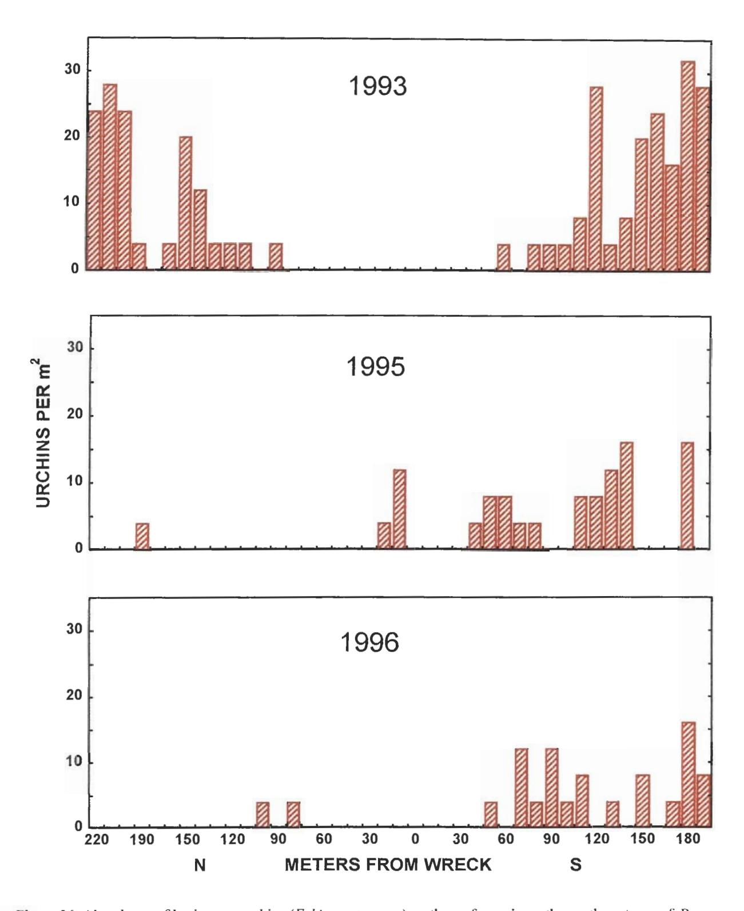

Figure 26 Abundance of boring sea urchins (*Echinometra* spp.) on the reef margin on the southwest arm of Rose Atoll on three occasions: two weeks, two years and three years after the grounding (1994, 1995, 1996 respectively). Data are presented in a gradient away from the wreck site.

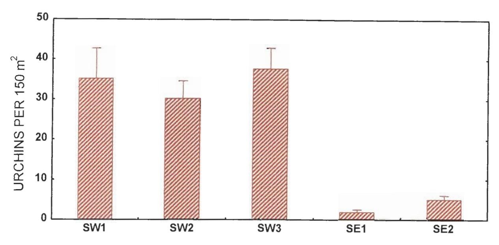

Figure 27 Mean density (and standard error) of sea urchins (*Diadema* spp.) on the reef flat at three sites on the southwest arm and two sites on the southeast arm of Rose Atoll two years after the grounding. Where SW1 is the wreck site (see Fig. 2)

Holothuria edulis and other species, such as H. atra and Stichopus chloronotus, were less abundant.

The results of the survey on all four arms in 1996 show that holothurian abundance was highest on the southeast arm, and much lower on the other three arms (Fig. 28). The southwest arm did have one of the lowest densities of sea cucumbers on the atoll, although it is unclear if this was the result of the ship grounding or other factors such as natural variation around the atoll. A comparison of holothurian abundance on the southeast and southwest arms in 1995 and 1996 suggests that the density of holothurians has been relatively stable on each of these two arms in recent years (Fig. 28).

# 4.2.4 Giant Clams

# Initial Effects

Initial surveys of the wreck site revealed that large numbers of giant clams appeared to have died as a result of the spill (Molina 1994). In order to quantify these effects, giant clams were surveyed along five transects spread across the reef flat on the southwest arm of the atoll two weeks after the grounding. Each of the transects were oriented parallel to the reef margin, and continued north and south of the wreck site until giant clam mortality was no longer observed. All of the transects were surveyed simultaneously by five separate observers who recorded the number of live and recently dead clams on each transect.

Similar methods were used to survey clam mortality on the lagoon terrace on the southwest arm of the atoll (Molina 1994). Five transects were oriented parallel to the lagoonward edge of the reef flat, and extended north and south of the wreck site until giant clam mortality was no longer

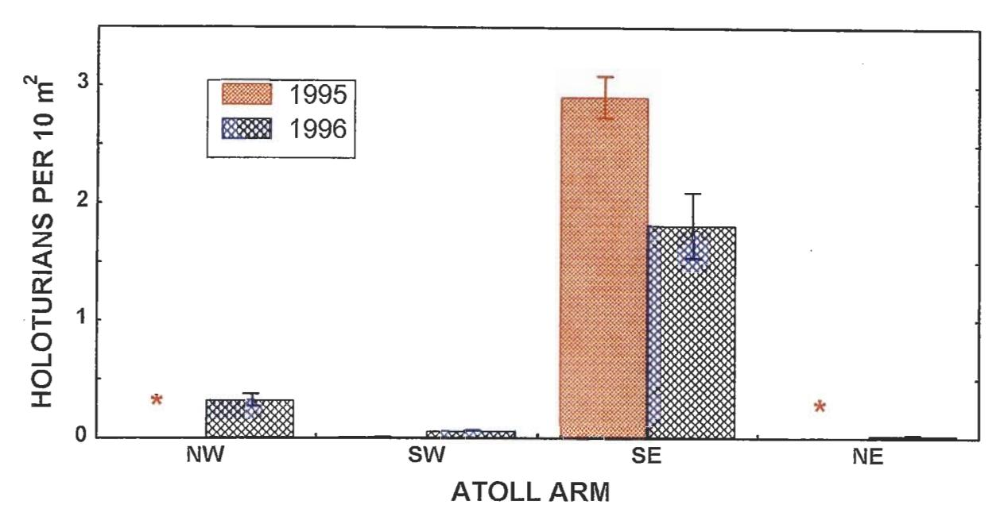

Figure 28 Mean density (and standard error) of holothurians on each of the four arms of Rose Atoll two and three years after the grounding. Asterisks represent counts that were not done on the northwest and northeast arms in 1995.

observed (20 m southeast and 400 m northwest of the wreck). Transects were surveyed simultaneously by five observers spread out across the width of the lagoon terrace who recorded the number of live and recently dead clams on each transect. Similar techniques were used to survey giant clams on the northwest arm of the atoll also (Molina 1994).

A total of 31 giant clams were recorded on the reef flat on the southwest arm, most of which (20, or 61%) were dead (Molina 1994). Recently dead clams were recorded over a distance of 270 m (from 40 to 310 m northwest of the wreck: Molina 1994), although most of the mortality (65%) occurred 160 to 220 m northwest of the wreck site (Molina 1994).

A total of 230 clams were recorded in the survey of the lagoon terrace on the southwest arm, most of which had died recently (162, or 70%), presumably as a result of the spill (Molina 1994). However, the presence of recent attachment scars on the substratum, presumably from giant clams, indicated that these numbers were probably an underestimate (Molina 1994). In contrast, 556 clams were observed on the northwest arm of the atoll, of which only a small proportion (6, or 1%) appeared to have died as a result of the spill (Molina 1994).

Molina (1994) also reported that no recently dead giant clams were observed on a nearby "double pinnacle" east-southeast of the wreck site (Molina 1994). However, five recently dead clams were observed on one of the large pinnacles in the northwest corner of the lagoon, northeast of the wreck site (Molina 1994).

Subsequent observations six months after the grounding revealed that giant clams on the lagoon terrace at the wreck site were covered with a thick growth of cyanobacteria (Molina 1995). These clams appeared stressed, as evidenced by the production of abnormally thick mucus (Molina 1995). Similarly, the clams on the pinnacles in the northwest corner of the lagoon also appeared highly stressed, as evidenced by algal infestations and an excessive coating of mucus (Molina 1994).

# Population Effects

The giant clam populations at Rose Atoll were assessed as part of a larger study on the status of giant clams throughout the Samoan Archipelago (Green and Craig 1996). This study showed that Rose supports the only healthy population of giant clams in Samoa, and that the majority of the clams on the atoll are located on the lagoon terrace and pinnacles (range: 300-11,600 clams per ha), with much lower densities recorded in the other habitat zones (less than 50 clams per ha: Green and Craig 1996). In particular, the majority of the larger, presumably mature individuals (84%) were located on the sides of the pinnacles, mostly at a depth of 10 m or more (Green and Craig 1996).

This study also examined whether there were any discernible effects of the spill on the clam population at Rose one to two years after the grounding. This was done by comparing the density of clams on the southwest arm with clam densities on the other three arms. These surveys were completed on two occasions, because the logistic constraints of working on the atoll. The surveys of the southwest and northwest sides were done 12 months after the spill (October 1994), while the surveys of the northwest and northeast arms were done 18 months after the spill (April 1995: Green and Craig 1996).

For this comparison, surveys were conducted in the two shallow habitat zones most heavily affected by the spill: reef flat and lagoon terrace (see *Ship Grounding*). In each of these habitat zones, giant clam density was measured using five replicate 50 x 2 m transects at two sites on each arm, including the wreck site (see Fig. 2). Both live and recently dead clams were counted along the transects, and recently dead clams were defined as those that were still *in situ* and looked as though they had died since the grounding. Dead clams were not counted if they appeared to have been dead for a long time (i.e. prior to the grounding), or if the shells were laying loose on the substratum. Since recruitment over the last 12-18 months could mask the effects of the grounding, only those clams that were assumed to be present at the time of the spill were included in this study. This included all individuals that with a shell length of 5 cm or more (Green and Craig 1996).

Similar surveys were also done on the lagoon pinnacles, because they provide the most important habitat for giant clams at Rose (Green and Craig 1996). However, since the pinnacles were not distributed evenly around the atoll and did not fall easily into the designated sites (see above), each pinnacle was assigned to one of four sites (denoted by black lines surrounding the pinnacles in Fig. 2). Four pinnacles were surveyed at each of three sites (two sites on the northwest arm and one site on the southwest side), and two pinnacles were surveyed on the southeast arm (Fig. 2).

Clams were surveyed along one transect at each of three depths on each pinnacle (across the top and on the sides at depths of 3 and 10 m) using the methods described above.

This study did not find any discernible effects of the grounding on clam density around the atoll 12 to 18 months after the event. Clam densities were not significantly lower closer to the wreck site on the southwest arm than they were on the other arms of the atoll in each of the habitat types surveyed (Fig. 29). However, it is possible that the effects of the grounding could have been masked by the high variation in clam density at each site, as illustrated by the large error bars surrounding the means, especially on the pinnacles (Fig. 29).

In contrast, the distribution and abundance of dead clams around the atoll indicates that there had been an impact on the clam population at the site of the grounding, which was still apparent 12 to 18 months after the event. The majority of the dead clams observed in each habitat type (63%, n=24) were recorded on the southwest arm of atoll (Fig. 30). However, this pattern should be interpreted cautiously because of the low number of individuals involved. No dead clams were recorded on the reef flat in this survey.

To summarize, some effects of the ship grounding on the giant clam populations at Rose were still discernible one to two years after the event. However, the overall effects of the grounding on the clam population at Rose are assumed to be minimal for three reasons. First, the effects of the grounding appear to be limited to the southwest arm of the atoll. Second, most of the effects of the grounding appear to have been in shallow habitat zones (reef flat and lagoon terrace) and on the outer reef slope, while the most important habitat for clams at Rose Atoll is at the bottom of the pinnacles at depths of 10 m or more (see above). Third, while a large number of clams were found dead shortly after the grounding (>200 individuals: see *Initial Effects*), this number is small compared to the estimated size of the population on the atoll, which comprises at least 19,000 individuals (Green and Craig 1996).

#### Recovery

Almost two years after the spill (August 1995), the recovery of the clam population at the wreck site was assessed by comparing clam recruitment at each of three sites on the southwest arm (see Fig. 2) using the same survey methods described above (see *Population Effects*). Recruits were defined as individuals that had recruited in the two years since the grounding, and were identified as juveniles with a shell length of less than 5 cm (Green and Craig 1996).

The results of this study show that giant clams have recruited to the southwest arm since the grounding. Clam recruits were common on four of the five transects at the wreck site (mean=285 clams per ha, se=83.3). However, no recruits were recorded on the transect which ran through the large pieces of ship debris that remain on the reef flat at that site (see Fig. 14). High densities of clam recruits were also recorded on the reef flat south of the wreck (mean=240 clams per ha, se=62.0), although fewer recruits were present north of the wreck (mean=53.3, se=24.7).

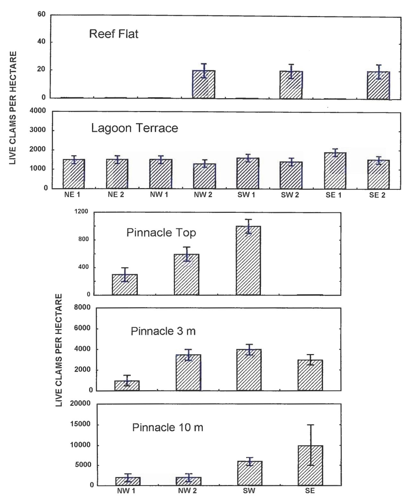

Figure 29 The abundance of giant clams on the reef flat, lagoon terrace, and three depths on the pinnacles, at a range of sites around Rose Atoll approximately one year after the grounding. Where SW1 is the wreck site (see Fig. 2).

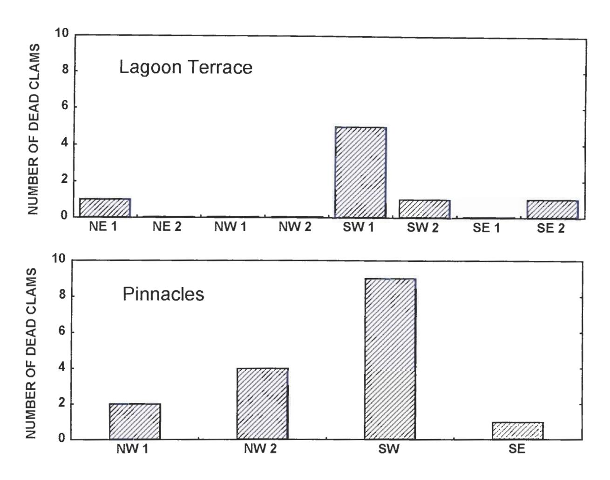

Figure 30 The number of dead clams recorded on the lagoon terrace and the pinnacles (at all three depths) in a range of sites around Rose Atoll approximately one year after the grounding. Where SW1 is the wreck site (see Fig. 2).

These results suggest that the recovery of the clam population on the reef flat on the southwest arm may be underway, except for the area immediately surrounding the wreckage. However, it remains to be seen if these juvenile clams are able to survive at the wreck site. Possible threats to clam survivorship at this site may include overgrowth by opportunistic algae (see *Algae*), abrasion by the wreckage, or toxicity from contaminants (see *Chronic Chemical Releases*).

#### 4.2.5 Fishes

Early observations at Rose Atoll suggested that the fish populations may have been affected by the grounding. Molina (1994) conducted a qualitative assessment of the fish populations on the outer reef slope and lagoon pinnacles on the southwest and northwest arms of the atoll two weeks after the ship ran aground. He noted that fish abundance and biomass appeared relatively low at the wreck site, and larger, carnivorous species were conspicuous by their absence (Molina 1994). However, a few herbivorous species were relatively abundant at the wreck site (e.g. juvenile

Acanthurus olivaceus), especially around the scars on the outer reef slope which had already been colonized by opportunistic algae species (Molina 1994).

Six months after the spill, Molina (1995) completed another survey of the fishes on the outer reef slope at the wreck site, where he recorded the relative abundance of species during a meandering 30 minute swim beside and below the vessel. Eleven species were recorded as abundant, eight as common, 26 as occasional, and 15 as rare. Most of the abundant species were either herbivores (mostly parrotfishes and surgeonfishes) or planktivores (mostly unicornfishes and fairly basslets).

More recently, the reef fish communities at Rose Atoll were described as part of a larger, quantitative survey of the fish communities throughout the Samoan Archipelago (Green 1996). The results of this study provide a quantitative comparison of the reef fish communities at three sites (including the wreck site) on the southwest arm of the atoll (see Fig. 2). For this comparison, surveys were done approximately two years after the grounding (August 1995) in the two habitat types that appeared most heavily affected by the grounding, the reef flat and outer reef slope at a depth of 10 m.

Fish surveys were done using visual census techniques as described by Green (1996). Fishes were counted along five replicate  $50 \times 3$  m belt transects in each habitat zone at each site (total area surveyed =  $750 \text{ m}^2$  per habitat per site), and the results recorded directly on underwater paper. A restricted family list was used which comprised only those families that are amenable to the technique, because they are relatively large, diurnally active and conspicuous in coloration and behavior.

The results of this study show that the ship grounding appeared to have localized effects on the distribution of reef fishes on the southwest arm, although the effects were different in the two habitat types. On the reef flat, fish abundance was substantially higher around the wreckage at the wreck site than it was on any of the other transects on the southwest arm (Fig. 31). This was primarily due to the presence of large schools of herbivorous surgeonfishes (especially *Acanthurus triostegus*) and parrotfishes (especially *Scarus frontalis*), which appeared to be attracted to the site because of the algal bloom (see *Algae*) and the three-dimensional cover provided by the large pieces of wreckage (see Fig. 14).

In contrast, fish abundance on the outer reef slope was substantially lower around the wreckage at the wreck site than it was on any of the other transects on the southwest arm (Fig. 31). This was because some species usually associated with healthy reef slopes, such as butterflyfishes and the abundant damselfish *Chromis acares*, were less abundant around the wreckage than on the other transects. However, in a similar pattern to that described for the reef flat, the majority of fishes that were present at the wreckage were herbivorous surgeonfishes, mostly *Ctenochaetus striatus* and *Acanthurus triostegus* (Fig. 32), which were probably attracted to the area because of the algal bloom (see *Algae*) and the cover provided by the wreckage.

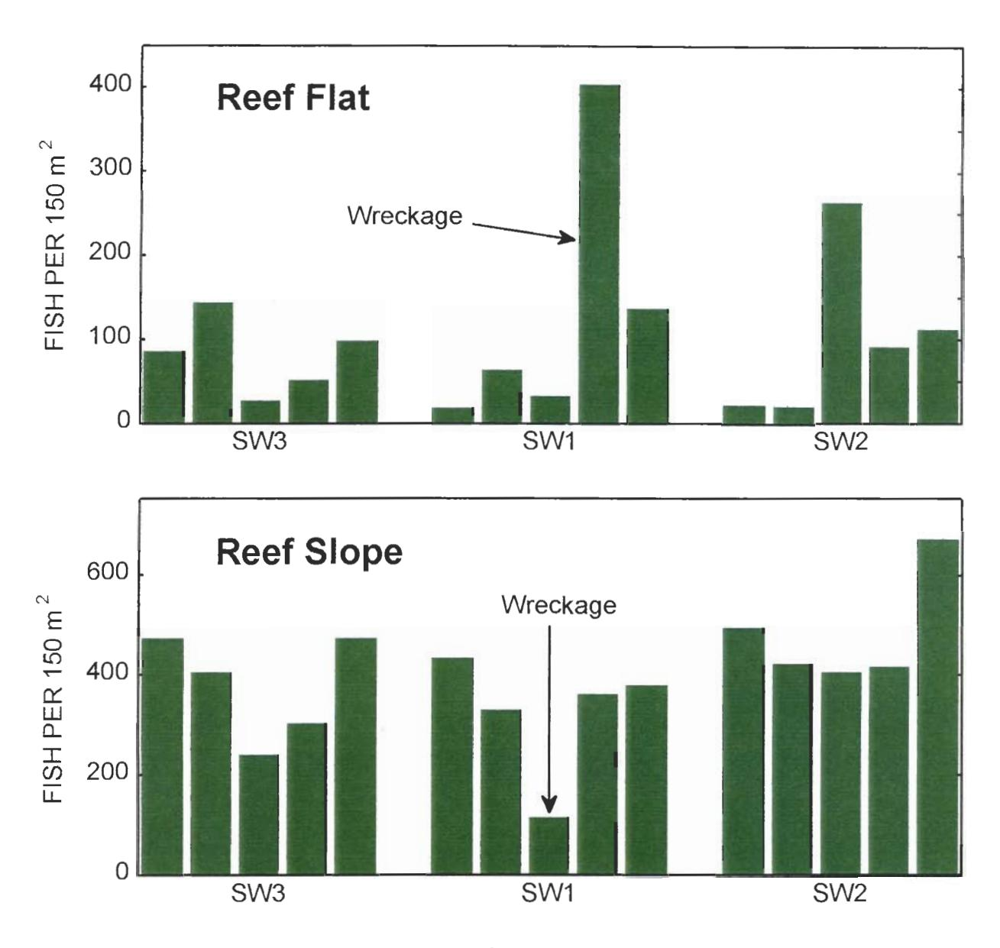

Figure 31 Abundance reef fishes on the reef flat and reef slope on each of the transects on the southwest arm of Rose Atoll one to two years after the grounding. Where SW1 is the wreck site (see Fig. 2) and the arrow shows the location of most of the wreckage.

# 4.2.6 Seabirds

The effects of the ship grounding and associated fuel spill on the seabirds at Rose are unknown, although they are assumed to be minimal (B. Flint pers. comm.). The nesting sites on Rose Island appeared unaffected by the incident. However, since the spill persisted for up to six weeks in the waters in and around the atoll where these birds feed, it is possible that some birds may have suffered ill effects if they were exposed to toxic contaminants. A brief survey of the island shortly after the spill did not detect any sick or dying birds, although the survey was very limited due to

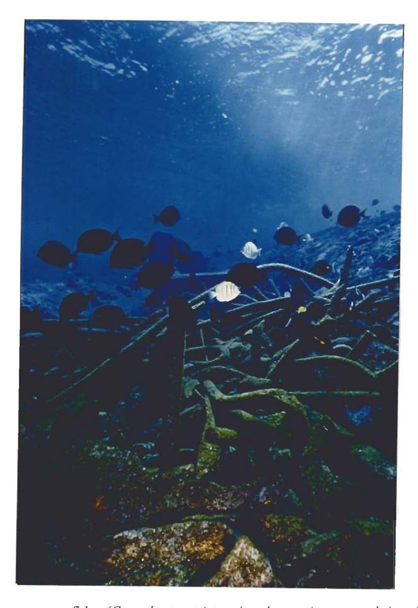

Figure 32 Herbivorous surgeonfishes (*Ctenochaetus striatus*, *Acanthurus triostegus*, and *Acanthurus olivaceus*) around the wreckage on the outer reef slope.

logistic constraints (B. Flint pers. comm.). At this point, it is unclear whether a more detailed study may have identified an effect of the spill on the seabird population on the atoll.

Concern has also been expressed that some of the debris, such as fishing lines, may have presented an entanglement hazard for seabirds (USFWS 1996a). This is possible, although unlikely, and there is no evidence to suggest that seabirds have drowned as a result of entanglement (B. Flint pers. comm.).

#### 4.2.7 Sea Turtles

The effects of the ship grounding and associated fuel spill on the sea turtles at Rose Atoll are also unknown. Fortunately, the nesting sites on Rose Island appeared unaffected by the incident (G. Balazs and P. Craig pers. comm.). However, it is possible that the turtles may have been affected by the grounding in several other ways.

For example, sea turtles may have been affected by the contaminant spill which persisted around the island for at least six weeks after the wreck (see *Acute Chemical Releases*) since adult turtles have been observed at the wreck site (Molina 1994). Hatchlings may have been affected also, since the spill occurred during nesting season (G. Balazs pers. comm.). Turtles that were immersed in the spill may have suffered ill effects as a result of the potentially toxic effects of the volatile diesel fuel and other contaminants (G. Balazs pers. comm.). One concern is that petroleum products are known to interfere with the salt excreting glands located behind the eyes. Given the vast difference in body size, the effects of these contaminants are likely to be more severe on hatchlings than on adults. Another possibility is that egg production may have been affected, since these contaminants were present in the marine environment during nesting season (see *Study Area*).

To date, there is no evidence that turtles were affected by the spill. However, two emaciated juveniles were captured on the atoll approximately one year after the grounding, including one individual which appeared to have dysfunctional salt glands and was blind and severely emaciated (G. Balazs pers. comm.)

Another concern is that the large amounts of debris scattered around the reef after the grounding may have presented a risk of entanglement to sea turtles. However this is considered unlikely, because the monofilament longlines represent the greatest threat to the turtles, and only small pieces of monofilament have been observed in shallow reef waters where they are likely to be encountered by turtles (G. Balazs and P. Craig pers. comm.).

#### 5. LEGAL ISSUES

The U.S. Fish and Wildlife Service through the U.S. Department of the Interior and the American Samoa Government have authority to pursue natural resources damages from the responsible party (owners of the F/V *Jin Shiang Fa*) for this spill under several authorities: the Comprehensive Environmental Response, Compensation, and Liability Act; the Federal Water Pollution Control

Act; the Oil Pollution Act of 1990 and associated Natural Resource Damage Assessment Regulations; the National Wildlife Refuge System Administration Act; and the National Oil and Hazardous Substances Pollution Contingency Plan.

The owner of the F/V Jin Shiang Fa is Jin Ho Ocean Enterprise Co., Ltd., a Taiwanese business incorporated in 1985. Under the Oil Pollution Act and associated Natural Resource Damage Assessment regulations, this company was designated as the responsible party for the spill that injured the natural resources at Rose Atoll NWR. According to the law offices of LeGros, Buchanan and Paul, who represent the insurance interests of the responsible party, the company's sole source of income was the sale of fish from the vessel, and the vessel was the company's only asset. The company and the vessel had "protection and indemnity" insurance coverage through Shipowners' Mutual Protection and Indemnity Association (Luxembourg). Under the policy, the insurance company was only obligated to reimburse costs paid by the insured. Despite the fact that Jin Ho Ocean Enterprise Co. did not pay anything because its sole asset was destroyed, the insurance company claims it paid in excess of 1.1 million dollars for the salvage operation. The insurance company refuses to pay anything further because it is not obligated to do so and it has already exceeded the vessel's limitation of liability.

In November, 1995, the U.S. Fish and Wildlife Service sought the assistance of the U.S. Department of State in identifying a company representative for Jin Ho Ocean Enterprise Co. The State Department traced the company representative of the vessel to a Mr. Wang Jin-Fa who lives at #46-1 Yen Ping St., Cu Shan District, Kaosiung, Taiwan. According to the State Department: "Under Taiwan Law, any individual having a relationship to the company, for example, the owner, chief shareholder, president, any employee, family member, or friend can claim to be a company representative." The State Department concluded that they had no particular reason or authority to pursue this case further.

On September 4, 1996, the U.S. Coast Guard officially referred the case to the Admiralty and Aviation Section of the U.S. Department of Justice for recovery of oil spill response costs from the responsible party. In the referral request, the U.S. Coast Guard noted that the statue of limitations for response cost recovery was about to expire on October 14, 1996. On September 20, 1996, the Department of Justice office in San Francisco assigned the case to two trial lawyers. Based on their analysis of the case, the conclusion of the Department of Justice Admiralty and Aviation Section was that it would be very difficult to pursue response cost recovery from the responsible party under U.S. law and decided not file a cost recovery action. Since the same legal analysis of the case applies to seeking damages from the responsible party for injuries to natural resources, no further legal action is being pursued.

## 6. DISCUSSION

The grounding and breakup of the *Jin Shiang Fa* initiated a chain of ecological events at Rose Atoll that has yet to run its course. This study is the first to document such an event on an oceanic coral reef, and the effects have been shown to be severe, widespread, and long-lasting. Major

changes in plant and animal communities have occurred along a quarter of the atoll, from the intertidal zone to a depth of at least 50 m, which are still evident almost four years after the event. At this point, it is unclear when or if the coral reefs at Rose Atoll will recover from this event.

The injury sustained by the atoll was the result of both the physical impacts associated with movement of the vessel and debris, and the chemical impacts of the fuel spill and other contaminants. The most severe injuries have occurred on the southwest arm of the atoll where the vessel ran aground.

The physical disturbance by the vessel and wreckage has left large scars on the reef where the living veneer of coral reef organisms has been removed. The movement of the vessel has also converted large areas of reef into sand and rubble patches, which have buried and killed other reef organisms. This sediment may have also prolonged the chemical injury to the reef by absorbing and slowly releasing petroleum products over a period of at least two years. The remaining debris and wreckage on the atoll still continues to damage the reef by abrading and suffocating reef organism, and releasing other contaminants (especially iron) into the marine environment.

The most widespread and severe injuries to the atoll appear to be due to the chemical releases from the vessel, especially the diesel fuel. The initial release of contaminants led to a massive die-off of coralline algae, giant clams, boring sea urchins and other invertebrates at the wreck site. Crustose coralline algae, which form the main structure of the reef, were killed over a large portion of the reef slope and the reef flat, and the area was quickly colonized by opportunistic algae (cyanobacteria and the turfing coralline alga *Jania adherens*). Almost four years later, the crustose coralline algae have not recovered at the wreck site, and the area remains dominated by the opportunistic algal species. Similarly, the sea urchin populations have not recovered from this event, although giant clams appear to be recolonizing the area.

The only other spill of petroleum products that has been well documented in the tropics is the spill at Bahía Las Minas, Panamá (Jackson et al. 1989, Keller & Jackson 1993). This was a spill of over 2 million gallons of crude oil, compared to the 100,000 gallons of diesel fuel spilled at Rose. Despite heavy oiling, the reef flat biota in Panamá, including corals and crustose coralline algae, appeared to recover in less than two years (Jackson et al. 1989). In contrast, the major reef biota at Rose Atoll have not recovered in the last four years, and it is unknown whether this reef will ever return to its former, pristine condition. Factors contributing to the longer term effects at Rose could include: greater toxicity of the contaminants, isolation of the atoll, type of reef organisms involved, and the continued presence of contaminants at Rose.

The die-off of crustose coralline algae is of particular concern for future management of Rose Atoll NWR, since it is responsible for the majority of the reef accretion on the atoll. In the absence of crustose coralline algae, the reef may not continue to grow fast enough on the affected arm to keep pace with sea level rise and erosion, and the area may become depressed or weakened relative to the other arms of the atoll and prone to greater erosion by wave action. If the area becomes sufficiently eroded over time, water circulation patterns in the lagoon may change, which could

have negative consequences for the giant clam population and the federally protected seabirds and sea turtles that nest on the island.

The bloom of opportunistic algae at the wreck site is also of particular concern. Such blooms are not uncommon after contaminant spills in marine environments (Bellamy et al. 1967, Houghton et al. 1991, Jackson et al. 1989). What is unusual is that this bloom has persisted for several years, since these blooms are usually ephemeral, lasting several months to a year (Bellamy et al. 1967, Keller and Jackson 1993). The only other known incidence of a persistent algal bloom after this type of disturbance was after a ship grounding in Australia (Hatcher 1984). There, the reef adjacent to the wreck became dominated by opportunistic algae, which persisted for years and appeared to represent an "alternate stable state" for that ecosystem.

The factors responsible for maintaining the bloom of opportunistic algae at Rose Atoll are unclear. However, the bloom persists in the area that continues to receive high levels of dissolved iron coming off the wreckage on the reef slope (Fig. 33). Because iron has been shown to be the limiting nutrient for algae in oceanic environments (Martin & Fitzwater 1988), it is possible that the algal bloom is being maintained by the presence of this contaminant, and that the crustose coralline algae are unable to recolonize the area because they cannot compete with the opportunistic species. If this is true, it may be necessary to remove the wreckage to allow the reef to recover (see *Recommendations*). This hypothesis should be tested at Rose, because it has important implications for the future management of the Refuge, and for ship groundings on oceanic reefs worldwide.

Despite its unique features, Rose Atoll is more similar to other central Pacific Ocean atolls and barrier reefs than is the fringing reef in Panamá, which is the existing model for coral reef-oil interactions. Rose's remoteness from continental landmasses and their influences (especially nutrient input) makes the situation there the best present model for the effects of the release of petroleum products on oceanic coral reefs. The full consequences of the release of petroleum products on central Pacific Ocean atolls and barrier coral reefs is still unknown, and can best be learned through further study of the events at Rose (see *Recommendations*).

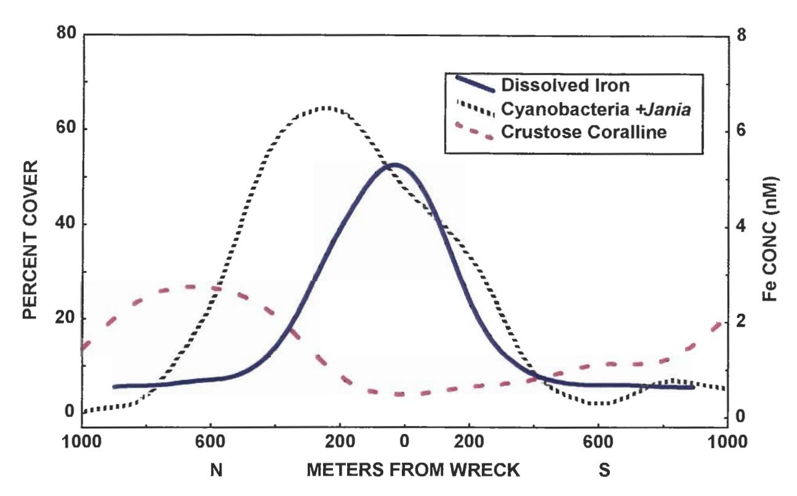

Figure 33 Iron concentrations and the cover of crustose coralline algae and opportunistic algal species (cyanobacteria and *Jania*) along the outer reef flat on the southwest arm of Rose Atoll three years after the grounding.

#### 7. RECOMMENDATIONS

This study has demonstrated that the coral reef ecosystem on the southwest arm of Rose Atoll NWR has been severely impacted by the ship grounding and associated fuel spill in 1993. The question now is whether the coral reef communities at the refuge will recover from this event. It is recommended that the following issues be considered to address the question of coral reef recovery at Rose:

#### 7.1 Reef Restoration

It is likely that the injured reef ecosystem at Rose Atoll will take many years or possibly decades to recover from this event, because of: the loss of a key component of the reef community (crustose coralline algae) over a large area; the adverse effects of opportunistic algal species; the isolation of the site from other similar reefs; and the slow re-colonization and growth rates of some of the organisms killed.

For this reason, scientists and managers are often tempted to attempt to decrease recovery time by initiating coral reef restoration projects. It is recommended that the reef restoration at Rose be limited to the removal of the wreckage and ship debris that remains on the reef, especially the large metal objects on the reef slope that are continuing to release dissolved iron into the waters surrounding the reef. This may be important, since the iron may be impeding recovery of the crustose coralline algae at the wreck site (see *Discussion*). The removal of the smaller pieces of ship debris from the reef would also be advantageous, since it will reduce the threat of smothering or entanglement to reef organisms. The Pacific Islands Office of the USFWS will seek funding through either the Refuge Contamination Cleanup Program, the Refuge Operational Needs System, or the Maintenance Management System, to develop a plan to remove the wreckage from the reef. In the plan, the potential benefits of removing the debris will be weighed against the added environmental disturbance to the area that would result from the clean up, and recommendations will be made for the least disturbing, beneficial plan. Efforts will be made to seek partnerships with the U.S. Coast Guard and the American Samoa Government to assist in implementing this plan.

The use of other invasive restoration actions to speed reef recovery, such as the reconstruction of coral substrate or the use of coral transplants, is not considered prudent or feasible at Rose. Such techniques, which usually involving the importation of seed stock from other locations, are undesirable since they may affect the unique coral reef ecosystem at Rose Atoll by introducing pathogens, alien species or genotypes to the area. Natural recolonization of the affected areas by native benthic flora and fauna is considered to be a preferable alternative.

# 7.2 Monitoring

The ship grounding and associated fuel spill had serious, long-term effects on the coral reef ecosystem at Rose Atoll, and the reef may take many more years or decades to recover from this event. As such, it is recommended that the area continue to be surveyed on a yearly basis over the next five to ten years to monitor reef recovery. This will provide valuable information for the future management of Rose Atoll NWR, and a unique opportunity to describe the long-term effects of diesel fuel on an oceanic coral reef. Monitoring will be especially valuable if the remaining debris is removed from the reef, to determine if reef recovery is facilitated by the removal of the source of iron.

We recommend that the long-term monitoring of the reefs at Rose Atoll focus on those components of the coral reef community that appear to have been most severely affected by the spill: the algal communities and the boring sea urchin (*Echinometra* spp.) populations (see above). Water quality sampling would also be useful to monitor the on-going contaminant releases from the wreckage. Annual trips to the atoll would be advisable until the reef recovery has occurred, since the situation is constantly changing. In addition, new satellite technology soon to be available in the region may provide the basis for a cost-effective method of monitoring reef recovery at Rose Atoll at more frequent, perhaps monthly, intervals. This may be possible because the extent of the injury on the reef flat is clearly visible from the air, due to dark coloration of the opportunistic algae (Fig. 19) and the light coloration of the sand berms (Figs. 18 &19). However, yearly field trips to the island will still be required to ground truth the satellite photographs and monitor the recovery of the organisms on the reef flat and reef slope.

# 8. LITERATURE CITED

Amerson, A.B., W.A. Whistler, and T.D. Schwaner 1982 Wildlife and wildlife habitat of American Samoa. II. Accounts of flora and fauna. U.S. Dept. of the Interior, Fish and Wildlife Service Report. 151 pp.

Balazs, G., P. Craig, B. Winton, and R. Miya 1994 Satellite telemetry of green turtles nesting at French Frigate Shoals, Hawaii and Rose Atoll, American Samoa. Proc. 14th Annual Symp. on Sea Turtle Biology and Conservation. 4 pp.

Barclay, S. 1993 Trip Report: Rose Atoll, November 28 - December 9, 1993. Administrative Report, U.S. Fish and Wildlife Service, Honolulu, Hawaii. 13 pp.

Bellamy, D.J., P.H. Clarke, D.M. John, D. Jones, and A. Whittlick 1967 Effects of pollution from the Torrey Canyon on littoral and sublittoral ecosystems. Nature 216: 1170-1172.

Flint, B., and P. Craig 1995 Preliminary survey of the algal infestation at Rose Atoll National Wildlife Refuge associated with the F/V *Jin Shiang Fa* oilspill. Administrative Report, U.S. Fish and Wildlife Service, Honolulu, Hawaii. 5 pp.

Ford, G.R. 1975 Needs of the United States Territories of Guam, American Samoa, and the Virgin Islands, a proclamation by the President of the United States of America. February 1, 1975. 2pp.

Green, A.L. 1996 Status of the coral reefs of the Samoan Archipelago. Department of Marine and Wildlife Resources Biological Report Series, Pago Pago, American Samoa. 125 pp.

Green, A.L., and P. Craig 1996 Rose Atoll: a refuge for giant clams in American Samoa? Department of Marine and Wildlife Resources Biological Report Series, Pago Pago, American Samoa. 55 pp.

Greenwalt L.A. 1974 Notice of Establishment, Rose Atoll National Wildlife Refuge, American Samoa. Federal Register 39(71), Thursday, April 11, 1974. 16 pp.

Hatcher, B. 1984 A maritime accident provides evidence for alternate stable states in benthic communities on coral reefs. Coral Reefs 3: 199-204.

Houghton, J.P., D.C. Lees, W.B. Driskell, and A.J. Mearns 1991 Impacts of the Exxon Valdez spill and subsequent cleanup on intertidal biota--1 year later. In: Proc. of the 1991 Oil Spill Conference. American Petroleum Institute, Washington, D.C., pp. 467-475.

Jackson, J.B.C., J.D. Cubit, B.D. Keller, V. Batista, K. Burns, H.M. Caffery, R.L. Caldwell, S.D. Garrity, C.D. Getter, C. Gonzalez, H.M. Guzman, K.W. Kaufmann, A.H. Knap, S.C. Levings, M.J. Marshall, R.Steger, R.C. Thompson, and E. Weil 1989 Ecological effects of a major oil spill on Panamanian coastal marine communities. Science 243: 37-44.

Keller, B.D., and J.B.C. Jackson, eds. 1993 Long-term assessment of the oil spill at Bahia Las Minas, Panama. Synthesis Report, Volume II: Technical Report. U.S. Department of the Interior, Minerals Management Service, Gulf of Mexico OCS Regional Office, New Orleans. 1017 pp.

Maragos, J.E. 1994 Reef and coral observations on the impact of the grounding of the longliner *Jin Shiang Fa* at Rose Atoll, American Samoa. Report prepared for U.S. Fish and Wildlife Service, Pacific Island Office, Honolulu, Hawaii. 27 pp.

Martin, J.H., and S.E. Fitzwater 1988 Iron deficiency limits phytoplankton growth in the northeast Pacific subarctic. Nature 331: 341-343

Mayor, A. 1921 Rose Atoll, American Samoa. Proc. Amer. Philos. Soc. 60: 62-70.

Measures, C.I., J.Yuan, and J.A. Resing 1995 Determination of iron in seawater by flow injection analysis using in-line preconcentration and spectrophotometric detection. Marine Chemistry 50: 3-12.

Molina, M. 1994 Trip report: Rose Atoll National Wildlife Refuge, American Samoa: October 31 to November 8, 1993. Administrative Report, U.S. Fish and Wildlife Service, Honolulu, Hawaii. 13 pp. + appendices.

Molina, M. 1995 Trip report: Rose Atoll National Wildlife Refuge, American Samoa: March 23 to 30, 1994. Administrative Report, U.S. Fish and Wildlife Service, Honolulu, Hawaii. 13 pp.+ appendices.

Molina, M. 1996 Chronology of Major Events Related to the Grounding of the *Jin Shiang Fa* at Rose Atoll National Wildlife Refuge, American Samoa. Report to Assistant Field Supervisor, Ecological Services, Pacific Islands Ecoregion, Honolulu

Radtke, R. 1985 Population dynamics of the giant clam, *Tridacna maxima*, at Rose Atoll. Hawaii Institute of Marine Biology, University of Hawaii. 24 pp.

Rodgers, K.A., I.A.W. McAllan, C. Cantrell, and B.J. Ponwith 1993 Rose Atoll: an annotated bibliography. Technical Reports of the Australian Museum 9: 1-37

Setchell, W.A. 1924 American Samoa. Part III. Vegetation of Rose Atoll. Carnegie Institution of Washington Publication 341: 241-261.

Sunda, W.G. 1994 Trace metal/phytoplankton interactions in the sea, pps. 213-247. In: G. Bidoglio and W. Stumm (eds.) Chemistry of Aquatic Systems: local and global perspectives. ECSC, EEC, EAEC, Brussels and Luxembourg.

UNEP/IUCN 1988 Coral reefs of the World Volume 3: Central and Western Pacific. UNEP Regional Seas Directories and Bibliographies. IUCN, Gland, Switzerland and Cambridge, U.K./UNEP, Nairobi, Kenya. xlix + 329 pp., 30 maps.

U.S. Fish and Wildlife Service 1996a Preassessment screen for physical injuries caused by the F/V *Jin Shiang Fa* grounding at Rose Atoll National Wildlife Refuge, American Samoa. Report prepared by the U.S. Fish and Wildlife Service, Pacific Islands Office, Honolulu, Hawaii.

U. S. Fish and Wildlife Service 1996b Preassessment screen for spill-related injuries caused by the F/V *Jin Shiang Fa* oil spill at Rose Atoll National Wildlife Refuge, American Samoa. Report prepared by the U.S. Fish and Wildlife Service, Pacific Islands Office, Honolulu, Hawaii.

Wass, R. 1981a The fishes of Rose Atoll. Department of Marine and Wildlife Resources Biological Report Series. 10 pp.

Wass, R. 1981b The *Tridacna* clams of Rose Atoll. Department of Marine and Wildlife Resources Biological Report Series, Pago Pago, American Samoa. 9 pp.

# APPENDIX A: Chronology of Major Events Related to the Grounding of the *Jin Shiang Fa* at Rose Atoll National Wildlife Refuge, American Samoa (modified from Molina 1996).

Oct 14, 1993

The Taiwanese tuna longliner *Jin Shiang Fa* ran aground on the outer reef slope approximately midway along the southwest-facing (SW) atoll reef of Rose Atoll National Wildlife Refuge (Refuge). The vessel was carrying approximately 100,000 gallons of diesel fuel, 500 gallons of lube oil, and 2,500 pounds of refrigeration system ammonia.

Oct 15-21, 1993

Personnel representing the U.S. Fish and Wildlife Service (USFWS), U.S. Coast Guard (USCG), and American Samoa Department of Marine and Wildlife Resources (DMWR) visited the Refuge on the *M/V Tasman Sea* to make a preliminary evaluation of the injury to Refuge resources caused by the grounding of the *Jin Shiang Fa*. During the visit, rat poison was placed on Rose Island and the *Jin Shiang Fa*. No birds exhibited obvious signs of fuel contamination, but none were actually captured and examined closely. Numerous pieces of cardboard and fish skeletons, which appeared to have come from deteriorating boxes of frozen longline bait, were scattered across the reef flat near the grounding site. An oil slick was clearly visible on the water surrounding the *Jin Shiang Fa*, and the smell of diesel was very strong. A planned attempt by the USCG to remove the remaining fuel from the *Jin Shiang Fa* was aborted due to rough seas and strong winds.

Oct 31-Nov 8, 1993

Personnel representing the USFWS, DMWR, National Marine Fisheries Service (NMFS), National Oceanic and Atmospheric Administration (NOAA), and Beak Consultants Inc. (BCI) visited the Refuge on the Manuatele III to make a preliminary assessment of the injuries caused to biota and habitats by the chemicals spilled from the Jin Shiang Fa. No adverse effects of the spill were recorded for terrestrial species and habitats. On the SW atoll reef surrounding the grounding site, burrowing sea urchin mortality was recorded along 330 meters of outer reef flat; giant clam (T. maxima) mortality was recorded along 270 meters of middle reef flat; gastropod mortality was recorded along 620 meters of middle reef flat; bleached hard corals were recorded along 660 meters of middle reef flat; bleached coralline algae was recorded along 650 meters of seaward reef margin and outer reef flat; slimy/greenish algal turf (tentatively referred to as a species of blue-green algae) was recorded in reef depressions along 700 meters of middle reef flat; and oil trapped in bottom sediments was recorded along 570 meters of middle reef flat. The smell of diesel was very strong around the grounding site. Giant clam mortality was 75% on rock outcrops along 420 meters of the SW lagoon terrace and less than 5% on rock outcrops on the northwest (NW) lagoon terrace and on NW lagoon pinnacles.

Nov 17, 1993

Observers on a USCG plane flying over the Refuge recorded an oil sheen floating over open water west of the grounded *Jin Shiang Fa*, a trash-filled oil slick in the lagoon northeast (NE) of the grounding site, and three very dark areas suspected to be lube oil nearly covering the entire SW atoll reef flat. Although the *Jin Shiang Fa* was still visible at the grounding site, it was almost lying on its side.

Nov 28-Dec 9, 1993

Personnel representing the USFWS, USCG, Smit Tak Towage and Salvage (Singapore), Smit Fleet Services (Netherlands), and Jin Shiang Fa visited the Refuge on the Smit Lloyd 73 to remove the Jin Shiang Fa wreckage and debris from the atoll reef. The Jin Shiang Fa had broken apart since the Nov 17 USCG overflight, and by the time the removal was attempted, it was presumed that all ammonia, lube oil, and the most of the diesel fuel on board had leaked from the wreck. A relatively light sheen was visible on the water near the wreck. With the exception of the stern section, all wreckage was pulled off the reef flat into deep water outside the atoll. All fishing line, netting, and other debris that could pose a potential entanglement hazard for marine wildlife were removed from the atoll reef flat and lagoon. Oil trapped in bottom sediments was recorded along 750 meters of middle reef flat and the smell of diesel was present through this area. Bleached coralline algae was recorded along 1,500 meters of seaward reef margin and outer reef flat. No wreckage or debris removal was attempted on the outer reef slope of the atoll reef.

Mar 23-30, 1994

Personnel from the USFWS, DMWR, BCI, and the East-West Center (Honolulu) visited the Refuge on the USCG cutter Sassafras to make a preliminary assessment of the physical injuries caused to biota and habitats by the grounding, break-up, and removal of wreckage and debris associated with the Jin Shiang Fa. No adverse effects of the grounding, break-up, and removal were recorded for terrestrial species and habitats. On the SW atoll reef, scraped and pulverized seaward reef-front habitats were recorded over an area roughly approximating 1,200 m2; rubble-buried seaward reef-front and reef-slope habitats were recorded at the grounding site over an area extending from the surf zone to a depth of 46 meters; deposition of a large amount of wreckage and debris on seaward reef-front and reef-slope habitats at the grounding site were recorded over an area approximating 350 m2; scoured and buried reef-flat habitats were recorded immediately east of the grounding site; deposition of a large amount of wreckage and debris was recorded within a 500-m-wide band (zone of dense debris) across the atoll reef-flat, lagoon-terrace, talus-slope, and lagoon-floor habitats east of the grounding site; deposition of wreckage and debris on reef-flat, lagoon-terrace, talus-slope, and lagoon-floor habitats were recorded along a distance of 1,300 m; and coral injury and mortality from abrasion by wreckage and debris were recorded on lagoon-terrace and lagoon-floor habitats over a distance of 500 m.

Supplemental results concerning chemical injuries to marine biota that were obtained during this visit include potentially abnormal coral bleaching on the outer reef slope over a distance of 1,077 m SE of the grounding site; development of anoxic conditions within atoll reef-flat and lagoon-terrace habitats NE of the grounding site; spread of blue-green algal turf infestation over reef-flat habitats along the entire SW atoll reef; concentrated spread of blue-green algal turf within a 150-m-wide band across reef-flat, lagoon-terrace, and lagoon-floor habitats on the SW atoll reef and extending lagoonward from the grounding site toward the pass (ava) on the NW atoll reef; and highly stressed-looking corals and giant clams on lagoon pinnacles in the NW corner of the lagoon.

Mar 25, 1994

Personnel from BCI took aerial photos and made an aerial oblique video of Rose Atoll that were later subjected to image analysis by personnel from Geomatics International.

Oct 14, 1994

Personnel from Air Survey Hawaii (Honolulu) took detailed aerial photos of Rose Atoll

Oct 25-29, 1994

Personnel from DMWR and NMFS visited the Refuge to conduct surveys of giant clam (*T. maxima*) populations on the SW and NW outer reef slope, reef flat, lagoon terrace, and lagoon pinnacles with consideration given to the effects of the grounding of the *Jin Shiang Fa*. Significantly higher clam mortality was recorded on the SW atoll reef, and overall giant clam abundance was significantly greater on the deeper lagoon pinnacles. Aerial photos taken of the atoll on Oct 14, 1994, were ground-truthed, and observations of the general status of algal coverage and wreckage distribution on the SW and NW atoll reefs were made.

Apr 10-11, 1995

Personnel from the USFWS and DMWR visited the Refuge on the USCG cuter *Sassafras* to conduct a preliminary qualitative survey of species composition and condition of the algal community on the atoll reef flat. Some algal specimens were collected.

Aug 9-16, 1995

Personnel from the USFWS and DMWR visited the Refuge on the *Manuatele III* primarily to compile detailed data on the reef-flat algae surrounding the grounding site of the *Jin Shiang Fa* and to monitor changes

in the abundances of selected reef-flat macroinvertebrates. On the SW atoll reef flat, the post-grounding infestation of blue-green algae was still widespread and dominant; a group of turf-forming coralline, fleshy red, and filamentous brown algae was very abundant; burrowing sea urchin abundance on the outer reef flat was low (zero at and near the grounding site); and holothurian abundance across the reef flat was very low. On the SE atoll reef flat, a group of crustose coralline and fleshy green algae was widespread and dominant; blue-green algae and the group of turf-forming coralline, fleshy red, and filamentous brown algae were present only as minor components; and burrowing sea urchin abundance on the outer reef flat and holothurian abundance across the reef flat were both much higher than they were on the SW reef. In addition, the relative abundances of reef fishes were assessed, data on benthic habitat characteristics of the SW and SE atoll reefs were compiled, the seaward reef-front grounding scars of the Jin Shiang Fa were remeasured, and marine and terrestrial biota and the distribution of grounding-related debris were photodocumented.

Jul 24-Aug 3, 1996

Personnel from the USFWS and DMWR visited the Refuge on the Manuatele III to redo the reef-flat surveys of algae and selected macroinvertebrates on the SW and SE reef flats and perform similar data collection on the NW and NE reef flats; redo benthic habitat characterization transects on the SW outer reef slope at the grounding site; inventory and describe the major items of wreckage and debris remaining on the SW outer reef slope and SW reef flat; and compile Global Positioning System (GPS) coordinates for the algal survey stations and major items of wreckage.

January 28-29, 1997 USFWS and DMWR personnel visited the Refuge on the Sassafras to examine the current situation at the wreck site, and to collect water samples for iron analysis. The cyanobacteria bloom appeared to have contracted slightly and to be concentrated about 200 m north of the wreck site. GPS coordinates for the large metal debris showed that it was still moving slowly across the reef flat towards the lagoon. Dye was released at the wreck site to track water movement patterns in the area. Observations of wind damage to trees on Rose Island suggested that the atoll had recently experienced a large storm.