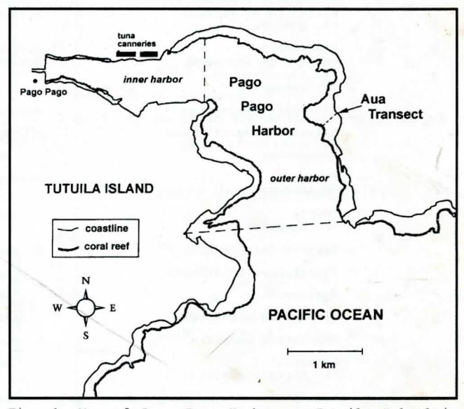
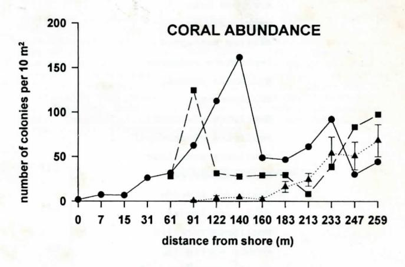
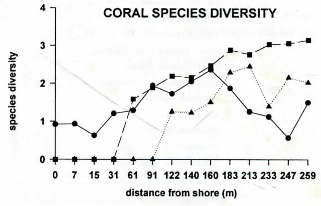
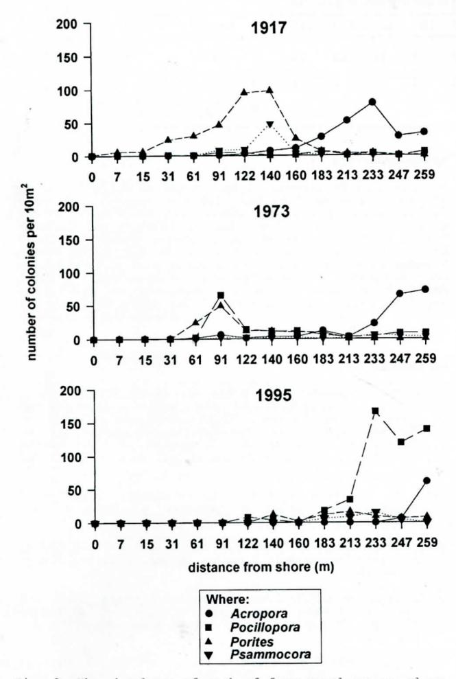
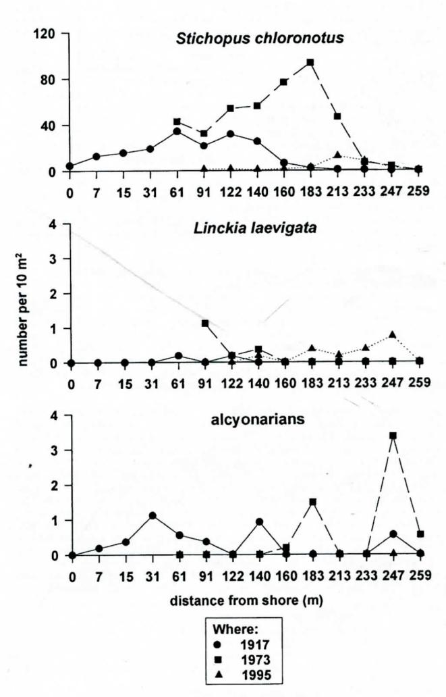

## 78 YEARS OF CORAL REEF DEGRADATION IN PAGO PAGO HARBOR: A QUANTITATIVE RECORD

A.L. Green C.E. Birkeland R.H. Randall B.D. Smith and S. Wilkins

1Department of Marine and Wildlife Resources, P.O. Box 3730, Pago Pago, American Samoa 96799 2Marine Laboratory, University of Guam, UOG Station, Mangilao, Guam 96923

### ABSTRACT

Early this century, lush coral reefs lined the shore of Pago Pago Harbor, American Samoa. Since then, the harbor has undergone urbanization and become a busy port, as well as the site of two tuna canneries. As a result, the reefs have experienced major dredging and filling operations as well as chronic pollution over many decades. In recent years the reefs have also endured two severe hurricanes and a mass coral bleaching event. This study focuses on the changes that have occurred on the "Aua Transect" in the harbor, based on three quantitative surveys over the last 78 years: 1917 (Mayor 1924a), 1973 (Dahl and Lamberts 1977) and 1995 (this study). There have been dramatic changes in the coral reef community at Aua this century. Coral species richness, abundance, cover and colony size have decreased, and the relative abundance of coral genera has changed. Coral zonation patterns have also changed and some "zones" have completely disappeared. Diversity of Acropora species and the density of some other macroinvertebrates (holothurians and soft corals) are also much lower now.

### INTRODUCTION

Coral reefs are complex ecosystems that are being degraded by human activities in many places throughout the world. In most situations, these changes have not been documented because of the lack of coral reef monitoring programs, or because the degradation of these reefs predated the implementation of monitoring programs. In Pago Pago, American Samoa, we had the opportunity to describe the degradation of a coral reef spanning a period of nearly 80 years.

The basis for this study was established in 1917, when Alfred Mayor of the Carnegie Institute in Washington visited American Samoa to study the coral reefs in Pago Pago Harbor. At this time, he did a quantitative survey of the corals and macroinvertebrates along a transect in the outer harbor which he called the Aua Transect (Mayor 1924a). At the time of his survey, lush coral reefs lined Pago Pago Harbor and the effects of human activities were minor, since there were only a few small traditional villages located in the harbor area (Mayor 1924a).

Pago Pago Harbor has undergone many major changes since Mayor completed his study almost 80 years ago. The human population on the island has increased from 7,000 in 1912 (USDC 1960) to 48,000 in 1990 (EDPO 1994), and more than 10,000 people now live in the harbor area alone (EDPO 1994). The harbor has also become a busy port, and two tuna canneries have been in operation on its north shore since 1956. These activities have resulted in some major changes to the harbor, and approximately 95% of the reefs in the inner harbor have now been completely destroyed by dredging and filling operations (IUCN/UNEP 1988).

Water quality has also decreased in the harbor as a result of sedimentation, chemical pollution (fuel spills, heavy metals and pesticides) and solid waste disposal (IUCN/UNEP 1988). Of particular concern has been the chronic eutrophication of the area caused by the effluent from the tuna canneries (American Samoa's Environmental Protection Agency, hereafter ASEPA, unpubl. data). However, water quality has improved substantially in recent years since the cannery outfalls were moved from the inner to the outer harbor in 1992 (ASEPA, unpubl. data). Despite efforts to clean up the harbor, recent toxicity studies have shown that the fish in the inner harbor contain high levels of heavy metals and are unfit for human consumption (ASEPA, unpubl. data).

In addition to these anthropogenic changes, the reefs in Pago Pago Harbor have also experienced two hurricanes (1990 and 1991) and a mass coral bleaching event (1994) in the last five years. However, the harbor did escape the major infestation by crown-of-thorns starfish Acanthaster planci that occurred on the island in the late 1970s.

The primary objective of this study was to describe the changes that occurred to the coral reefs in Pago Pago Harbor in this century. This was done by comparing the results of three quantitative surveys of the Aua Transect which were done over the past 78 years: 1917 (Mayor 1924a), 1973 (Dahl and Lamberts 1977), and 1995 (this study).

#### MATERIALS AND METHODS

Pago Pago is a deep-water harbor on the southeast side of Tutuila Island, American Samoa (170°40'W, 14°17'S). The harbor is lined with fringing reefs which account for one fifth of the coral reefs on the island (UNEP/IUCN 1988). The Aua Transect is situated on the reef flat off the southern end of the village of Aua, on the eastern side of the outer harbor (Fig. 1). At this point, the harbor is approximately 2 km wide, 55 m deep, and has a flushing time of 13 to 20 days (ASEPA unpubl. data).

 $\underline{\text{Fig. 1}}$ : Map of Pago Pago Harbor on Tutuila Island in American Samoa, showing the location of the Aua Transect.

Mayor described the Aua Transect as running from a large "Pua" tree (Fagraea berteriana) on the beach to a conspicuous coral block on the outer edge of the reef along a compass bearing of  $39.5^\circ\text{W}$  (Mayor 1924a). He also provided several photographs showing the exact location of the transect (Mayor 1924a: Plates IV, V, and VI). The transect covered a distance of 270 m from the shore to reef edge, and was marked by iron stakes placed at 31-m intervals from the shore.

Mayor surveyed the transect by dividing it into squares 7.3 m on each side (area =  $53.5~\text{m}^2$ ) which were staked out at intervals along the transect. Squares were surveyed starting at the following distances from the shoreline: 0 m, 7 m, 15 m, 31 m, 61 m, 91 m, 122 m, 140 m, 160 m, 183 m, 213 m, 237 m, and 259 m. The final square at 259 m was located on the seaward margin of the reef edge. After the transect was delineated, Mayor counted all corals present in each square, as well as three groups of macroinvertebrates: an holothurian (Stichopus chloronotus), an asteroid (Linckia laevigata), and all aleyonarians.

In July 1973, the transect was re-surveyed by Dahl and Lamberts (1977). In the intervening years, road construction had altered the shoreline eliminating both beach and tree. However, they were able to relocate the transect by matching Mayor's maps and photos with recent maps and the actual shore contour. The re-established transect passed within 1 meter of a large, well-cemented block on the reef edge which was 1 meter above the general reef contour as described by Mayor (1924a). By remeasuring the line inward from the reef edge, they calculated that the margin of the present road fill corresponded to Mayor's starting point. The remeasured line was marked with iron rods at 65.6 meter intervals, and Mayor's quantitative survey method was repeated with squares 7.3 m on a side marked out at the same distances from shore as those used in 1917.

The transect was re-surveyed again in July 1995 (this study), which was 78 years and 22 years after the first and second surveys, respectively. The transect was re-located

Table 1: Equivalent taxonomic groups used in each of three surveys of the Aua transect. In many cases, species were lumped at the generic level because quantitative data were not presented at the species level in previous surveys. Acropora species groups are based on those used by Dahl and Lamberts (1977). Species names marked with an \* under Mayor (1924a) are additional species recorded as occurring on the transect in 1917 by Hoffmeister (1925) based on an examination of Mayor's original specimens. Where: nr = not recorded.

| Mayor (1924a)                                                                                          | Dahl & Lamberts (1977)                | this study                               |  |  |  |
|--------------------------------------------------------------------------------------------------------|---------------------------------------|------------------------------------------|--|--|--|
| "brown stemmed coarsely branched Acropora" *A. hebes                                                   | Acropora hebes                        | nr                                       |  |  |  |
| Branched Acropora related to A. muricata *A. formosa var. gracilis *A. formosa var. brachiata | Acropora formosa                      | nr                                       |  |  |  |
| Delicately branched Acropora allied to A. formosa *A. quelchi                                          | Acropora nana Acropora quelchi     | Acropora nana                            |  |  |  |
| A.samoensis Encrusting Acropora, A. leptocyathus *A. samoensis                                         | Acropora humilis Acropora rotumana | nr                                       |  |  |  |
| *Acropora hyacinthus                                                                                   | Acropora hyacinthus                   | nr                                       |  |  |  |
| *Alveopora verrilliana                                                                                 | nr                                    | nr                                       |  |  |  |
| Cyphastrea                                                                                             | nr                                    | Cyphastrea                               |  |  |  |
| Favites                                                                                                | Favites sp.                           | Favites pentagona                        |  |  |  |
| *F. abdita                                                                                             |                                       |                                          |  |  |  |
| Fungia *F. fungit <mark>es</mark>                                                                   | nr                                    | nr                                       |  |  |  |
| Galaxea fascicularis                                                                                   | G. fascicularis                       | nr                                       |  |  |  |
| *Goniastrea retiformis                                                                                 | nr                                    | nr                                       |  |  |  |
| Goniopora                                                                                              | nr                                    | nr                                       |  |  |  |
| Hydnophora microconos                                                                                  | nr                                    | nr                                       |  |  |  |
| Leptastrea purpurea                                                                                    | L. purpurea                           | L. purpurea                              |  |  |  |
| Leptoria *L. phrygia-gracilis                                                                       | nr                                    | nr                                       |  |  |  |
| Merulina                                                                                               | nr                                    | nr                                       |  |  |  |
| Millepora                                                                                              | Millepora sp.                         | Millepora spp.                           |  |  |  |
| *M. truncata                                                                                           |                                       | M. exaesa M. sp.                      |  |  |  |
| Montipora                                                                                              | Montipora sp.                         | Montipora spp.                           |  |  |  |
| foliated Montipora massive Montipora                                                                   |                                       | M. ehrenbergii M. elschneri           |  |  |  |
| *M. ehrenbergii                                                                                        | And the second second second          | M. granulosa                             |  |  |  |
| *M. elschneri *M. trabeculata                                                                       |                                       | M. grisea                                |  |  |  |
| *M. venosa                                                                                             |                                       | M. hispida M. venosa                  |  |  |  |
| *M. verrilli                                                                                           |                                       | M. verrilli knobby Montipora          |  |  |  |
| Pavona decussata                                                                                       | P. frondifera                         |                                          |  |  |  |
| Pavona frondifera                                                                                      | P. Ifondilera                         | P. decussata                             |  |  |  |
| Pavona divaricata                                                                                      | nr                                    | P. divaricata                            |  |  |  |
| nr                                                                                                     | nr                                    | Pavona venosa                            |  |  |  |
| Pocillopora                                                                                            | Pocillopora                           | Pocillopora                              |  |  |  |
| 3 species, chiefly                                                                                     | P. brevicornis                        | P. danae                                 |  |  |  |
| P. damicornis *P. brevicornis                                                                          | P. damicornis P. evdouxi           | P. damicornis                            |  |  |  |
| *P. damicornis var. cespitosa                                                                          | r. eydodxi                            | P. verrucosa                             |  |  |  |
| Branched Porites, P. andrewsi                                                                          | branched Porites                      | nr                                       |  |  |  |
| massive Porites                                                                                        | mostly P. andrewsi                    |                                          |  |  |  |
| *P. lutea  *P. lutea  *P. lobata forma nodulosa  *P. lutea                                             | massive Porites mostly P. lutea       | massive Porites Porites lutea            |  |  |  |
| *P. lutea var. haddoni                                                                                 |                                       |                                          |  |  |  |
| *P. murraensis *P. undulata                                                                         |                                       |                                          |  |  |  |
|                                                                                                        |                                       | Porites rus Porites sp. 2             |  |  |  |
| Psammocora                                                                                             | P. contigua                           |                                          |  |  |  |
| *P. contigua *P. contigua var.                                                                      | r. concigua                           | Psammocora spp. P. contigua P. samoensis |  |  |  |
| tutuilensis                                                                                            |                                       |                                          |  |  |  |
| nr                                                                                                     | nr                                    | Stylaraea punctata                       |  |  |  |

by carefully following the description of the location of the transect in Mayor (1924a) and Dahl and Lamberts (1977), as well as by using the photographs and maps in both papers. The position of the road appears to have remained in the same position since 1973, and the line was marked out from the shore to the reef edge along a compass bearing of 39.5°W. We believe that the transect was close to its original position for two reasons. First, the transect passed within 1 m of a large, well cemented block above the general contour of the reef edge, which was similar to the one described in the same position in the previous surveys. Second, the distance from the shoreline to the reef edge was also very close to the length of the original transect of 267 m. However, no iron stakes from previous surveys were re-located.

The remeasured transect was marked with iron stakes and floats at the start of each "square" for the duration of our study. Corals and macroinvertebrates were then re-surveyed in each square. Macroinvertebrates were re-surveyed by using the same methods as those used in previous surveys (see above). However, the coral survey methods differed in that each square was re-surveyed with a number of replicate 0.25 m quadrats that were haphazardly located in each square. This was done in order to attain a mean ( $\pm$  SE) number of colonies per square that would enable us to determine if the number of colonies present in 1995 differed significantly from those present in previous years. A stratified sampling technique was also used, with more quadrats being done in the squares where there were very few corals (n=80 quadrats in squares 0-213 m from shore), and fewer quadrats done in squares where corals were more numerous (n = 53, 79, and 61 quadrats at 233 m, 247 m, and 259 m, respectively). Coral surveys were done by C. Birkeland and R. Randall, while macroinvertebrates counts were done by B. Smith. All counts were done on snorkel, and the results were recorded directly onto underwater paper.

The quantitative data from each survey were then used to compare the changes in coral communities on the transect through time in terms of the total number of colonies, species richness, species diversity, relative abundance of each genus, and patterns of zonation across the reef. Species diversity was calculated for each survey using the Shannon-Wiener Diversity Index:

$$H' = -p_i \log_2 p_i$$

where pi is the proportion of corals in category I.

In order to maintain consistency through time, diversity was calculated for equivalent taxonomic groups from each survey, as summarized in Table 1. In some cases, this required lumping species at the generic level to be consistent with previous years. Since colonies of Acropora were identified to the species level (Table 1), "unidentified juvenile Acropora" was excluded from the diversity indices. Trends in the abundance of the three groups of macroinvertebrates (see above) were also examined over time.

Photographs taken of the transect in 1917 were also used to compare the coral communities that were present in 1917 with those observed in 1995. This enabled us to visually assess the changes in colony size and coral cover over time, which could not be compared with the quantitative data.

# RESULTS

## Corals

Major changes have occurred along the Aua Transect over the past 78 years. In 1917, corals were recorded along the entire transect (Fig. 2). However, no colonies were recorded less than  $90~\mathrm{m}$  from shore in 1973 and 1995 (Fig. 2).

The coral community greater than 90 m from shore has also changed. The total number of colonies recorded on the transect has decreased through time, with fewer corals recorded in 1995 than in either of the other two surveys (Fig. 2). This pattern was also consistent at each interval along the transect up to a distance of 183 m from shore. In particular, in 1995 very few colonies were recorded in the middle of the transect, where the most colonies were recorded in previous years (91-140 m from shore). The number of colonies on the outer third of the transect (183-259 m from shore) also varied among surveys, although there was no clear pattern associated with time that was consistent at all locations.

Species diversity for the entire transect differed slightly among years, but did not show a clear downward trend through time. Overall, species diversity was highest in

1973 and lowest in 1995, with an intermediate value recorded for 1917 (H'=2.8 for 1917, H'=3.1 for 1973, and H'=2.4 for 1995). Similarly, patterns of species diversity across the transect differed among surveys, but showed no clear downward trend associated with time (Fig. 2). Species diversity tended to be highest in 1973 and lowest in either 1995 (<160 m from shore) or 1917 (>183 m from shore) at most locations across the transect.

Where:

■ 1917

■ 1973

▲ 1995

Fig.2: Coral abundance and coral species diversity along the Aua transect during each of three surveys: 1917 (Mayor, 1924a), 1973 (Dahl and Lamberts, 1977), and 1995 (this study).

The most obvious change in the coral communities has been in the relative abundance of coral genera over time (Fig. 3). In 1917, corals of the genus Porites were the most abundant, followed by Acropora and Psammocora (Fig. 3). However, by 1973 the number of Porites colonies had decreased and Psammocora had become rare on the transect. As a result, Acropora colonies were the most abundant in 1973, followed by Porites and Pocillopora. The situation was very different in 1995, by which time both Porites and Psammocora colonies were uncommon on the transect, and the outer reef flat was clearly dominated by Pocillopora, although Acropora colonies were still relatively abundant (Table 2). This is in marked contrast to the two previous surveys, in which Pocillopora was relatively uncommon.

As a result of this change in the relative abundance of colonies of various genera, there have also been major changes in coral zonation across the transect over the last 78 years. In 1917, the inner and middle sections of the reef flat were dominated by Porites, with Psammocora also relatively abundant on the middle reef flat (Fig. 3). A similar pattern was also apparent in 1973, although the Porites and Psammocora zone was more restricted and closer to shore. By 1995, the Porites and Psammocora zone had completely disappeared. Similarly, there was an Acropora zone on the outer reef flat in 1917 (233 m from shore: Figs. 3, ), but no Acropora colonies were recorded in this zone in 1995 and the area was dominated by Pocillopora

<u>Table 2</u>: Number of colonies of each coral species recorded along the Aua transect in 1995. Area sampled was  $5.0~\text{m}^2$  except for 233, 247 and 259 m from shore where it was  $3.3~\text{m}^2$  4.9 m² and  $3.8~\text{m}^2$  respectively.

| species                | distance from shore (m) |     |     |     |     |     |     |     |     |      |
|------------------------|-------------------------|-----|-----|-----|-----|-----|-----|-----|-----|------|
|                        | 91                      | 122 | 140 | 160 | 183 | 213 | 233 | 247 | 259 | tota |
| Acropora nana          |                         |     |     |     |     |     |     | 3   | 23  | 26   |
| Cyphastrea sp.         |                         |     |     |     |     |     |     | 1   |     | 1    |
| Favites pentagona      |                         |     |     |     |     |     |     | 1   |     | 1    |
| Leptastrea purpurea    |                         |     | 1   | 1   | 1   | 3   | 2   | 5   | 1   | 14   |
| Millepora exaesa       |                         |     |     | 2   | 8   | 2   |     |     |     | 12   |
| Millepora sp.          |                         |     |     |     | 3   |     |     | 5   |     | 8    |
| Montipora elschneri    |                         |     |     |     |     |     |     | 2   |     | 2    |
| Montipora ehrenbergii  |                         |     |     |     |     |     | 1   | 1   | 2   | 4    |
| Montipora granulosa    |                         |     |     |     |     |     |     |     | 2   | 2    |
| Montipora grisea       |                         |     |     |     |     |     |     | 1   |     | 1    |
| Montipora hispida      |                         |     |     |     |     |     |     | 1   |     | 1    |
| Montipora venosa       |                         |     |     |     |     |     |     |     | 4   | 4    |
| Montipora verrilli     |                         | 1   |     |     | 1   | 3   | 2   | 4   | 3   | 14   |
| knobby Montipora       |                         |     |     |     |     |     |     | 1   |     | 1    |
| Pavona decussata       |                         |     |     |     | 1   | 2   |     | 1   | 2   | 6    |
| Pavona divaricata      |                         |     |     |     |     | 1   | 4   | 9   | 5   | 19   |
| Pavona venosa          |                         |     |     |     |     |     |     |     | 3   | 3    |
| Pocillopora damicornis |                         |     | 1   |     |     | 1   |     | 1   | 1   | 4    |
| Pocillopora danae      |                         | 4   | 1   |     | 8   | 16  | 54  | 53  | 48  | 184  |
| Pocillopora verrucosa  |                         |     |     |     | 1   |     | 1   | 5   | 4   | 11   |
| Porites lutea          |                         |     | 6   | 1   | 6   | 8   | 3   | 1   |     | 25   |
| Porites rus            |                         |     |     |     |     | -   |     | 1   | 3   | 4    |
| Porites sp.2           |                         |     |     |     |     |     | -   | 1   |     | 1    |
| Psammocora contigua    |                         |     |     | 3   | 4   | 2   |     |     |     | 9    |
| Psammocora samoensis   |                         |     |     |     |     | 3   | 2   |     |     | 5    |
| Stylaraea punctata     | 1                       | 1   |     |     |     |     |     |     |     | 2    |
| total                  | 1                       | 6   | 9   | 7   | 33  | 41  | 69  | 97  | 101 | 364  |

(Fig. 3, Table 2). The outer reef edge also changed from being dominated by a mixed assemblage of *Acropora* species. in 1917 (Hoffmeister 1925) to being dominated by Pocillopora and a single species of Acropora, A. nana, in 1995 (Fig. 3, Table 2).

visual comparison of the photographs taken at Aua in 1917, and observations of the same area in 1995, shows that there has been a substantial change in colony size and coral cover on the transect. In 1917, the outer reef flat was characterized by moderate to large colonies of branching *Acropora*, and the outer reef edge was characterized by moderately sized colonies of digitate, branching, and plate *Acropora*. In 1995, no *Acropora* colonies were recorded on the outer reef flat (see above), and only colonies were recorded on the outer reef flat (see above), and only small branching colonies of Acropora nana (<10 cm) were recorded on the outer reef edge based on visual observations. Coral cover also decreased substantially over time. Cover appears to have been high on the outer reef flat and outer edge in 1917, but it was low in these areas in 1995 (pers obs.).

More than half of the genera or species that were recorded on the transect in previous years were not present on the transect in 1995 (Table 1). Of particular note was the disappearance of most of the Acropora, which decreased from five species in 1917 to only one in 1995 (Table 1). For example, the plating Acropora seen by Mayer (1924a) (e.g., A. hyacinthus) were no longer present at Aua in 1995. In contrast, only two species were recorded in 1995 that were not recorded in previous surveys: Pavona venosa and Stylaraea punctata.

# Macroinvertebrates

In a similar pattern to that recorded for the corals, no macroinvertebrates were recorded less than 91 m from shore in 1973 or 1995 (Fig. 4), although all three groups (Stichopus chloronotus, Linckia laevigata and (Stichopus chloronotus, Linckia laevigata and alcyonarians) were recorded in this area in 1917. The distribution and abundance of macroinvertebrates have also

changed along the remainder of the transect.

The holothurian Stichopus chloronotus was present from low to moderate densities on the inner half of the transect in 1917 (Fig. 4), only 0-160 m from shore. There was an increase in the number of holothurians on the transect in 1973, with the peak in abundance occurring further out along the transect (183 m from shore) than was the case in 1917. In contrast to the two previous surveys, holothurian abundance on the transect in 1995 was lowest ever recorded (Fig. 4, Table 3).

Only small numbers of Linckia laevigata were recorded on the transect during each of the three surveys (Fig. 4). This species was relatively more abundant in 1973 and 1995 than in 1917, with more starfish observed further from shore in 1995 than in the earlier surveys (Fig. 4, Table 3). However, these patterns should be interpreted with caution because of the small number of individuals involved.

Alcvonarians also showed different distribution and abundance in each of the surveys. Most of the soft corals were recorded along the first half of the transect in 1917 (7-140 m from shore), although some were observed at 247 m (Fig. 4). Soft corals were recorded only from the outer half of the transect in 1973 (160-259 m from shore). No soft corals were observed on the transect in 1995 (Table 3).

# DISCUSSION

The Aua Transect has changed substantially over the past 78 years. The greatest change has been the complete loss of approximately 25% of the transect adjacent to shore as a result of the dredging of a channel in this area prior to 1960 (Dahl and Lamberts 1977). There have also been major changes in the coral-reef communities along the remaining sections of the transect. Coral species richness, abundance, colony size and coral cover have all declined, and there has been a change in the relative abundance of coral genera and patterns of coral zonation.

 $\overline{\text{Fig. 3}}$ : The abundance of each of four coral genera along the Aua transect during each of three surveys: 1917 (Mayor, 1924a), 1973 (Dahl and Lamberts, 1977), and 1995 (this study).

A combination of both anthropogenic and natural processes including eutrophication, sedimentation, chemical pollution, hurricanes, and coral bleaching have probably contributed to the degradation of the coral communities at Aua. It is tempting to contribute most of these changes to the two hurricanes that have hit Tutuila in the last five years. However, while these hurricanes did cause substantial damage to the reefs on the island (Birkeland et al. 1996), the coral communities were already badly degraded in the 1970s (Dahl and Lamberts 1977). Observations by the Samoan community indicate that the lush coral reefs at Aua actually disappeared in the 1950s (High Talking Chief Ma'afala, pers. comm.). Degradation of the reef may be related to a decrease in water quality in the harbor in the 1950s as a result of several factors.

First, the channel at Aua was dredged during the 1950s, and this resulted in a chronic plume of sediment over the transect for several years (High Talking Chief Ma'afala, pers. comm.). Second, the canneries commenced operation in 1956 leading to eutrophication of the harbor (ASEPA, unpubl. data). Third, there was an influx of chemical pollutants into the harbor around this time from a fuel dump at Aua, and chemical pollution has been chronic in the harbor ever since (S. Wiegman, ASEPA, pers. comm.).

The importance of water quality in the changes in the coral communities at Aua is consistent with the observation that the species that have disappeared or declined in abundance are those that are considered to be most susceptible to poor water quality (e.g., Acropora species). Conversely, the increase in Pocillopora in the

area in the last 20 years may reflect the ability of colonies in this genus to survive poor water quality. The high abundance of *Pocillopora* at Aua may also be related to its ability to recolonize quickly after hurricanes since all of the colonies recorded in 1995 were small (<10 cm). Similarly, the relatively large number of *A. nana* colonies recorded in 1995 may also represent a rapid recolonization by this species after the hurricanes since all of these colonies were small also.

Stylaraea punctata was recorded on the transect for the first time in 1995. This is a major range extension for this species, since it has not previously been recorded east of the Great Barrier Reef (Veron 1986). However, the fact that this species has not been recorded at Aua before probably does not mean that it has not been present during previous surveys. The two colonies of this species recorded in this study were both tiny (1 cm in diameter), and they may have been simply overlooked in previous years, especially in 1917 when the area was dominated by large stands of branching Acropora.

 $\underline{\text{Fig.4}}$ : Abundance of holothurians ( $Stichopus\ chloronotus$ ), asteroids ( $Linckia\ laevigata$ ), and alcyonarians along the Aua transect during each of three surveys: 1917 (Mayor, 1924a), 1973 (Dahl and Lamberts, 1977), and 1995 (this study).

There have also been some changes in the macroinvertebrate fauna along the transect. The biggest change has been in the abundance of the holothurian Stichopus chloronotus. This species showed a massive peak in abundance in 1973, possibly as a result of the increase in organic material in the sediment at that time (Dahl and Lamberts 1977). However, this species was much less abundant in 1995, possibly because the amount of organic material in the harbor has decreased since the cannery outfall was moved in 1992 (ASEPA unpubl. data). However, the hurricanes may have contributed to their decline also.

 $\underline{\text{Table 3}}$ : Number of holothurians (Stichopus chloronotus), asteroids (Linckia laevigata) and alcyonarians recorded along the Aua transect in 1995.

| Species               | distance from shore (m) |     |     |     |     |     |     |     |     |       |
|-----------------------|-------------------------|-----|-----|-----|-----|-----|-----|-----|-----|-------|
|                       | 91                      | 122 | 140 | 160 | 183 | 213 | 233 | 247 | 259 | total |
| Stichopus chloronotus | 7                       | 8   | 4   | 8   | 13  | 66  | 44  | 13  | 0   | 163   |
| Linckia laevigata     | 0                       | 0   | 1   | 0   | 2   | 1   | 2   | 4   | 0   | 10    |
| Alcyonaria            | 0                       | 0   | 0   | 0   | 0   | 0   | 0   | 0   | 0   | 0     |

One of the limitations of this study is that it is unreplicated. This raises the question of how representative the transect is of the condition of the reef at Aua and in Pago Pago Harbor in general. Observations of the reef flat adjacent to the Aua Transect suggests that the middle and outer parts of transect (91-259 m) are representative of the reefs in the area. However the inner reef flat on the transect is in a worse condition than adjacent, undredged areas.

In addition to the reef flat, the reef slopes at Aua also appear to have been severely degraded in the last four decades. Mayor (1924b) described lush coral communities on the reef slope adjacent to the transect, with coral covering an estimated 3/4 of the area at a depth of 4-6 m in 1917. He also reported that most of this cover was made up of Acropora colonies (87% of colonies counted), and that large colonies of A. hyacinthus (3 feet in diameter) were common, as were stands of branching Acropora covering 25 square feet in area. A recent survey of the same area in 1995 (C. Mundy unpubl. data) revealed that coral cover was low (mean=7.2%, se=2.66, n=5 transects), and that the dominant corals were encrusting species of Montipora, while Acropora colonies were small and uncommon.

The degradation of the reef at Aua appears to be representative of the general situation in the outer harbor at Pago Pago. A ten-year study of the coral community directly across the harbor has also found that the reefs in the harbor are declining, presumably from the effects of chronic sedimentation and pollution on coral recruitment (Birkeland et al. 1996). Fortunately, the condition of the reefs in the harbor is not representative of the reefs in American Samoa, which tend to be in much better condition than those in the harbor area.

In summary, surveys along the Aua Transect have shown that the reefs of Pago Pago Harbor have been severely degraded over the last 78 years. This study also demonstrates the value of long-term monitoring programs for describing the degradation of coral reefs through time. Without the quantitative surveys of Mayor (1924a) and of Dahl and Lamberts (1973), augmented by observations of the local residents as communicated by the Talking Chief Ma'afala, Pulenu'u of Aua, we might have attributed the poor condition of the coral reefs of Pago Pago solely to the two hurricanes and the coral-bleaching event of the early 1990s. We could have totally misinterpreted our observations and not realized the influence of the establishment of the canneries and the dredging of the reef flat on the present status of the coral community.

## ACKNOWLEDGMENTS

We thank the Department of Marine and Wildlife Resources in American Samoa for their logistic support, and Fale Tuilagi and Elia Henry for their field assistance. We are grateful to Nancy Daschbach and the Fagatele Bay National Marine Sanctuary Program for financial support for this project, and for producing Fig. 1. We also thank Sheila Wiegman of ASEPA for providing water quality information on the harbor. We are grateful to High Talking Chief Ma'afala, Pulenu'u of Aua, for permission to work at Aua and for sharing his memories of the reefs in front his village with us. Contribution No. 379 of the University of Guam Marine Laboratory.

## REFERENCES

Birkeland C, Randall RS, Green AL, Smith BD, Wilkins S (1996) Reassessment of the marine resources of Fagatele Bay National Marine Sanctuary. Report to National Oceanic and Atmospheric Administration, US Department of Commerce. University of Guam Marine Laboratory, UOG Station, Mangilao, Guam 96923. 222 pp.

Dahl AL, Lamberts AE (1977) Environmental impact on a Samoan coral reef: A resurvey of Mayor's 1917 transect. Pac Sci 31:209-319

EDPO (1994) American Samoa statistical digest. Prepared by Economic Development Planning Office, American Samoan Government.

Hoffmeister JE (1925) Some corals from American Samoa and the Fiji Islands. Papers from the Department of Marine Biology, Carnegie Institution of Washington 22:1-90, pl. 1-23

IUCN/UNEP (1988) Coral reefs of the world. Vol. 3: Central
 and western Pacific. IUCN/UNEP, Nairobi, Kenya. xlix
 + 329 pp., 30 maps.

Mayor A (1924a) Structure and ecology of Samoan reefs.

Papers from the Department of Marine Biology, Carnegie
Institution of Washington 19:1-25, pl. 1-8

Mayor A (1924b) Growth-rate of Samoan corals. Papers from the Department of Marine Biology, Carnegie Institution of Washington 19:51-72, pl. 1-26

USDC (1960) U.S. census of population: 1960. Prepared by U.S. Department of Commerce, U.S.A.

Veron, JEN (1986) Corals of Australia and the Indo-Pacific. Angus and Robertson, North Ryde, Australia. 644 pp.