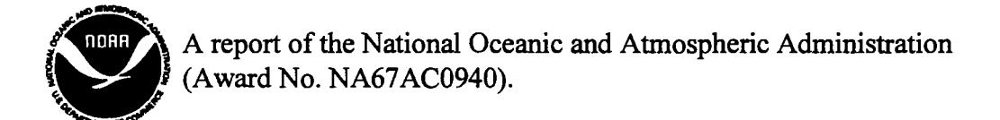
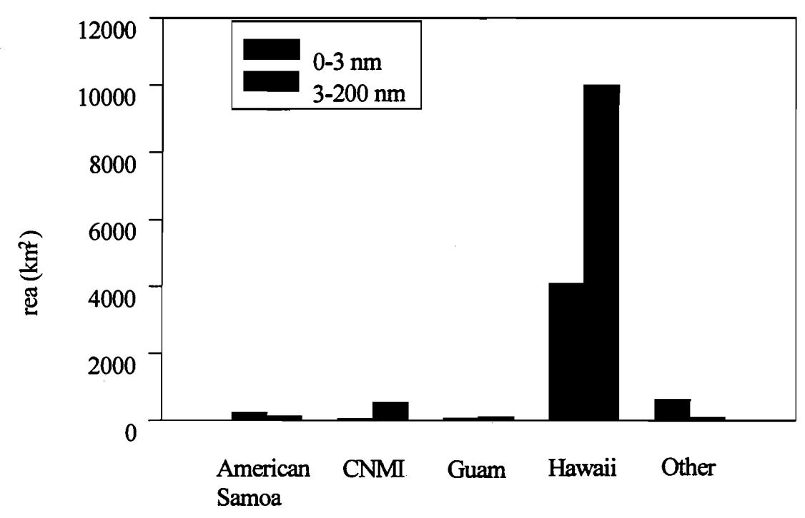
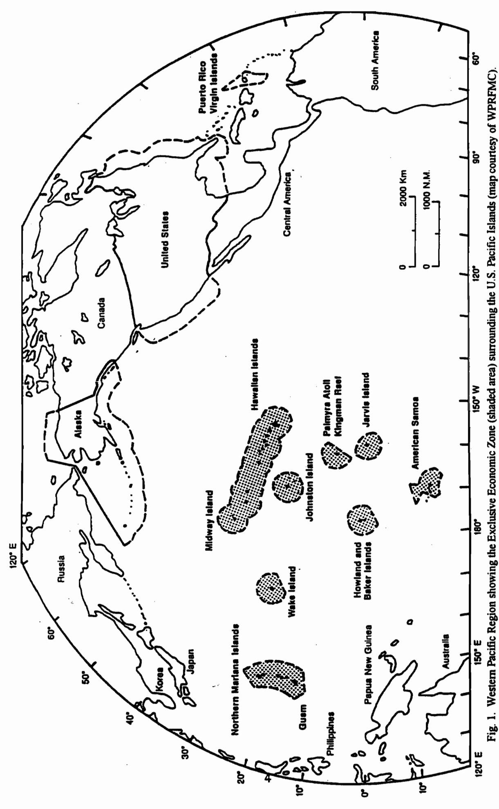
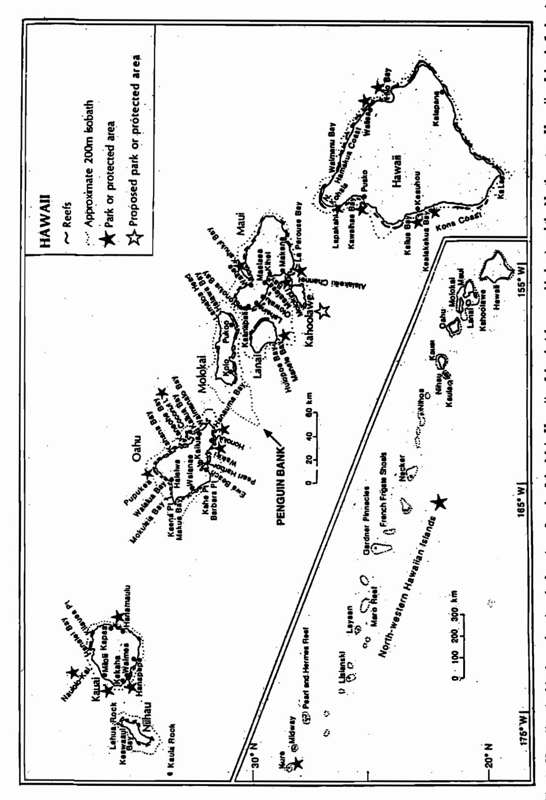
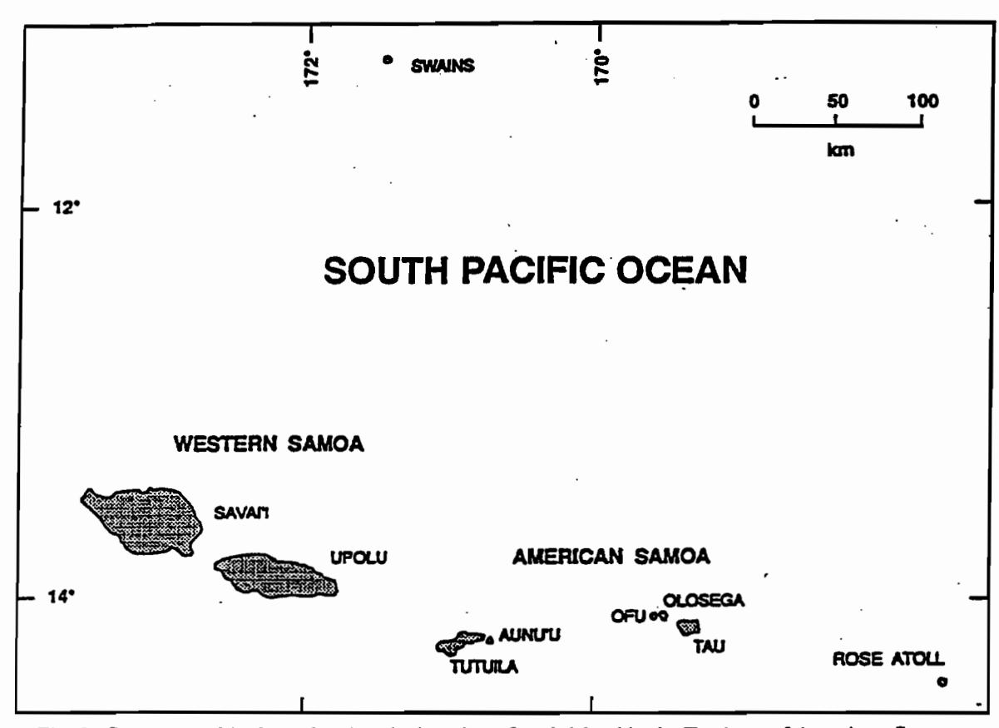
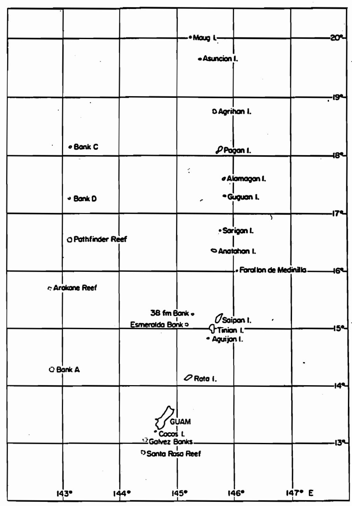

# An assessment of the status of the coral reef resources, and their patterns of use, in the U.S. Pacific Islands.

Prepared by: Alison Green, Consultant, October 1997

Prepared for:

Western Pacific Regional Fisheries Management Council, 1164 Bishop Street, Suite 1400, Honolulu, Hawaii 96813 (Under NOAA Cooperative Agreement No. NA67FC0007)

# TABLE OF CONTENTS:

| EXE  | CUTIV | E SUM  | MARY                                          | i   |
|------|-------|--------|-----------------------------------------------|-----|
| I.   | INT   | RODUC  | TION                                          | 1   |
| II.  | DES   | CRIPTI | ON OF THE RESOURCE                            | 8   |
|      | 2.1   | Coral  | Reef Communities                              | 9   |
|      |       | 2.1.1  | American Samoa                                |     |
|      |       | 2.1.2  | CNMI                                          |     |
|      |       | 2.1.3  | Guam                                          |     |
|      |       | 2.1.4  | Hawaii                                        |     |
|      |       | 2.1.5  | Other U.S. Pacific Islands                    |     |
|      | 2.2   |        | Fishes                                        | 26  |
|      |       |        | American Samoa                                |     |
|      |       |        | Marianas (Guam and CNMI)                      |     |
|      |       |        | Hawaii                                        |     |
|      |       |        | Other U.S. Pacific Islands                    |     |
|      | 2.3   |        | s and "Live Rock"                             | 57  |
|      |       |        | American Samoa                                |     |
|      |       |        | Marianas (Guam and CNMI)                      |     |
|      |       |        | Hawaii                                        |     |
|      |       |        | Other U.S. Pacific Islands                    | 00  |
|      | 2.4   |        | tebrates (Crustaceans, Molluscs, Echinoderms) | 82  |
|      |       |        | American Samoa                                |     |
|      |       |        | Marianas (Guam and CNMI)                      |     |
|      |       |        | Hawaii                                        |     |
|      |       |        | Other U.S. Pacific Islands                    | 100 |
|      | 2.5   | 0      |                                               | 100 |
|      |       |        | American Samoa                                |     |
|      |       |        | Marianas (Guam and CNMI)                      |     |
|      |       |        | Hawaii                                        |     |
|      | 2.6   |        | Other U.S. Pacific Islands                    | 100 |
|      | 2.6   |        | consumptive Resources                         | 109 |
|      |       | 2.6.1  | American Samoa                                |     |
|      |       |        | CNMI                                          |     |
|      |       | 2.6.3  |                                               |     |
|      |       |        | Hawaii                                        |     |
|      |       | 2.6.5  | Other U.S. Pacific Islands                    |     |
| III. | PAT   | TERNS  | OF UTILIZATION                                | 113 |
|      | 3.1   |        | ican Samoa                                    | 114 |
|      |       | 3.1.1  | Shoreline Subsistence Fishery                 |     |
|      |       |        | Boat Based Fishery                            |     |
|      |       | 3.1.3  |                                               |     |
|      |       |        | •                                             |     |

|     | 3.2 | CNM    | II                                            | 121 |
|-----|-----|--------|-----------------------------------------------|-----|
|     |     | 3.2.1  | Reef Fishes                                   |     |
|     |     | 3.2.2  | Corals and "Live Rock"                        |     |
|     |     | 3.2.3  | Invertebrates                                 |     |
|     |     | 3.2.4  | Algae                                         |     |
|     | 3.3 | Guan   | n ·                                           | 139 |
|     |     | 3.3.1  | Inshore or Near shore Fishery                 |     |
|     |     | 3.3.2  | Offshore or Boat Based Fishery                |     |
|     |     | 3.3.3  | Summary                                       |     |
|     | 3.4 | Hawa   | aii                                           | 151 |
|     |     | 3.4.1  | Main Hawaiian Islands: Commercial Fisheries   |     |
|     |     | 3.4.2  | Main Hawaiian Islands: Recreational Fisheries |     |
|     |     | 3.4.3  | Northwestern Hawaiian Islands                 |     |
|     | 3.5 | Other  | r U.S. Pacific Islands and Atolls             | 165 |
| IV. | SPE | CIAL M | IANAGEMENT ISSUES                             | 169 |
|     | 4.1 | Live I | Reef Fish Trade                               | 169 |
|     | 4.2 | Aqua   | rium Fish Collection                          | 170 |
|     |     | 4.2.1  | American Samoa                                |     |
|     |     | 4.2.2  | CNMI                                          |     |
|     |     | 4.2.3  | Guam                                          |     |
|     |     | 4.2.4  | Hawaii                                        |     |
|     |     | 4.2.5  | Other U.S. Pacific Islands                    |     |
|     | 4.3 | Over   | Fishing                                       | 175 |
|     |     | 4.3.1  | American Samoa                                |     |
|     |     | 4.3.2  | CNMI                                          |     |
|     |     | 4.3.3  | Guam                                          |     |
|     |     | 4.3.4  | Hawaii                                        |     |
|     |     | 4.3.5  | Other U.S. Pacific Islands                    |     |
|     | 4.4 | Habit  | tat Degradation                               | 185 |
|     |     | 4.4.1  | Sedimentation                                 | 185 |
|     |     |        | American Samoa                                |     |
|     |     |        | CNMI                                          |     |
|     |     |        | Guam                                          |     |
|     |     |        | Hawaii                                        |     |
|     |     |        | Other U.S. Pacific Islands                    |     |
|     |     | 4.4.2  | Nutrient Loading                              | 191 |
|     |     |        | American Samoa                                |     |
|     |     |        | CNMI                                          |     |
|     |     |        | Guam                                          |     |
|     |     |        | Hawaii                                        |     |
|     |     |        | Other U.S. Pacific Islands                    |     |

| 4.4 | Habit | tat Degradation cont.                 |     |
|-----|-------|---------------------------------------|-----|
|     |       | Ship Groundings                       | 200 |
|     |       | American Samoa                        |     |
|     |       | CNMI                                  |     |
|     |       | Guam                                  |     |
|     |       | Hawaii                                |     |
|     |       | Other U.S. Pacific Islands            |     |
|     | 4.4.4 | Pollution and Contamination           | 203 |
|     |       | American Samoa                        |     |
|     |       | CNMI                                  |     |
|     |       | Guam                                  |     |
|     |       | Hawaii                                |     |
|     |       | Other U.S. Pacific Islands            |     |
|     | 4.4.5 | Coastal Construction                  | 213 |
|     |       | American Samoa                        |     |
|     |       | CNMI                                  |     |
|     |       | Guam                                  |     |
|     |       | Hawaii                                |     |
|     |       | Other U.S. Pacific Islands            |     |
|     | 4.4.6 | Destructive Fishing Practices         | 215 |
|     |       | American Samoa                        |     |
|     |       | CNMI                                  |     |
|     |       | Guam                                  |     |
|     |       | Hawaii                                |     |
|     |       | Other U.S. Pacific Islands            |     |
|     | 4.4.7 | Tourism and Recreation                | 217 |
|     |       | American Samoa                        |     |
|     |       | CNMI                                  |     |
|     |       | Guam                                  |     |
|     |       | Hawaii                                |     |
|     |       | Other U.S. Pacific Islands            |     |
|     | 4.4.8 | Military Activities                   | 221 |
|     | 4.4.9 | Other Impacts                         | 224 |
|     |       | Destruction of Adjacent Habitat Types |     |
|     |       | Introduction of Alien Species         |     |
|     |       | Fish Poisoning                        |     |
|     |       | Freshwater Kills and Floods           |     |
|     |       | Thermal Stress                        |     |
|     |       | Geological Activities                 |     |
| 4.5 |       | ne Reserves                           | 230 |
|     | 4.5.1 | American Samoa                        |     |
|     | 4.5.2 | CNMI                                  |     |
|     |       | Guam                                  |     |
|     |       | Hawaii                                |     |
|     | 455   | Other IIS Pacific Islands             |     |

| V.    | JUR        | ISDICT | ION AND EXISTING MANAGEMENT REGIMES                                                                         | 233 |
|-------|------------|--------|-------------------------------------------------------------------------------------------------------------|-----|
|       | <b>5.1</b> | Local  | Government Regulations                                                                                      | 234 |
|       | 5.2        | Feder  | al Government Regulations                                                                                   | 234 |
|       |            | 5.2.1  | U.S. Dept. of Interior Regulations for National Wildlife                                                    |     |
|       |            |        | Refuges                                                                                                     |     |
|       |            | 5.2.2. | U.S. Navy and U.S. Air Force Regulations                                                                    |     |
|       | 5.3        | Tradi  | tion Use Rights                                                                                             | 237 |
| VI.   | REC        | OMME   | NDATIONS TO IMPROVE AVAILABLE INFORMATION                                                                   | 237 |
|       | 6.1        | Supp   | orting Coral Reef Assessments                                                                               | 237 |
|       | <b>6.2</b> |        | oving Fisheries Monitoring Programs                                                                         | 239 |
|       | 6.3        |        | zing Existing Fisheries Statistics                                                                          | 240 |
|       |            | 6.3.1  | Bottomfish Statistics                                                                                       |     |
|       |            | 6.3.2  | CNMI's Inshore and Offshore Fisheries Statistics                                                            |     |
|       |            | 6.3.3  | Guam's Offshore Boat Based Fisheries Statistics                                                             |     |
|       |            | 6.3.4  | Catch Statistics for Key Species                                                                            |     |
|       | 6.4        | Supp   | orting Scientific Research                                                                                  | 241 |
| VII.  | MAN        | IAGEM  | ENT RECOMMENDATIONS                                                                                         | 241 |
|       | 7.1        | Mana   | gement Needs                                                                                                | 241 |
|       | 7.2        | Other  | Issues for Consideration                                                                                    | 243 |
|       |            | 7.2.1  | Overlap with Existing FMPs                                                                                  |     |
|       |            | 7.2.2  | Jurisdiction                                                                                                |     |
|       |            | 7.2.3  | Multiple Use                                                                                                |     |
|       |            | 7.2.4  | Specialized Fisheries                                                                                       |     |
|       |            | 7.2.5  | Conservation of Threatened and Endangered Species                                                           |     |
| VIII. | ACK        | NOWL   | EDGMENTS                                                                                                    | 244 |
| IX.   | REF        | ERENC  | ES                                                                                                          | 246 |
| APPE  | NDIX       |        | nmary of existing state and territorial resource management vities in American Samoa, CNMI, Guam and Hawaii | 272 |
| A DDE | NDIV       |        | seary of Acronyms                                                                                           | 272 |

\$

•

## **EXECUTIVE SUMMARY**

The Western Pacific Regional Fisheries Management Council (WPRFMC) is the policy-making organization for the management of fisheries in the Exclusive Economic Zone or EEZ (3-200 nmi from shore) in the Western Pacific Region. This includes the waters surrounding the U.S. Pacific Islands: State of Hawaii, Territories of American Samoa and Guam, the Commonwealth of the Northern Mariana Islands (CNMI) and the unincorporated Other U.S. Pacific Islands. WPRFMC currently has Fishery Management Plans (FMPs) in place for fisheries of four species groups: crustaceans, precious corals, bottomfish and seamount groundfish, and pelagics.

WPRFMC is now interested in determining if there are any current management needs for coral reef resources in the region. In order to do this, the Council requires a detailed summary of the extent and condition of the coral reef resources, their patterns of use, and the existing management regimes. WPRFMC is also interested in the status of special management issues which may be affecting coral reefs. This includes the presence of specialized coral reef fisheries (the live reef fish and aquarium fish trades) and the extent of habitat degradation caused by human impacts (including over fishing, sedimentation, nutrient loading, coastal construction, pollution and contamination, destructive fishing practices, tourism, recreation and military activities).

The objective of this report is to summarize this information. The scope includes a synthesis of the information contained in scientific papers and unpublished reports, as well as comments from representatives of local government agencies and knowledgeable individuals (scientists, fishermen and dive operators).

This project has been completed in two stages. First, Dr. Cindy Hunter was contracted to do a preliminary assessment of the issue. Dr. Hunter produced a report that summarized coral reef area, jurisdiction, coral reef condition and the existing patterns of use in the region. Second, Dr. Alison Green was contracted to prepare a more detailed assessment of the issue. Three other consultants were also contracted to assist Dr. Green by summarizing the condition of the resources, and the most recent fisheries statistics for three of the five areas (Dr. Alan Freidlander in Hawaii, Robert Myers in Guam and John Gourley in CNMI). The present report is a synthesis of the available information, which encompasses the results of the reports by the other contractors: Hunter (1995), Friedlander (1996), Myers (1997) and Gourley (1997).

#### Present Status and Patterns of Use

The coral reef resources in the U.S. Pacific Islands cover an estimated area of 15,852 km2, most of which (10,762 km2) is located in the EEZ (Fig. A). The vast majority of the coral reef area in the EEZ is located in Hawaii, with smaller areas present in the other parts of the region.

Fig. A. Coral reef area in nearshore waters and the Exclusive Economic Zone (0-3 nm and 3-shore respectively) in each location in the U.S. Pacific Islands (modified from

Coral reef condition and utilization patterns vary throughout the region (Tables A&B). The majority of the reefs in the EEZ (88% by area) appear to be in good condition, largely because they are remote from major human population centers. Similarly, these reefs appear to be unfished or only lightly used, because of their remoteness, and in some cases, their protected status. Exceptions include the more accessible offshore banks in Hawaii, Guam and CNMI (Penguin, Galvez and Esmeralda respectively) and the banks surrounding the island of Farallon de Medinilla in CNMI, which are heavily fished. However, much of the fishing in these areas is for bottomfish, with an unknown component of reef species included in the catch.

The relatively good condition of most reefs in federal waters is in stark contrast to many of the reefs in nearshore state or territorial waters, which appear to have been degraded by a combination of natural and anthropogenic effects, including habitat degradation and overfishing. In general, nearshore reefs that are close to human population centers tend to be more heavily used and in worse condition than those in more remote areas (Tables A&B).

Table A. Summary of coral reef condition in nearshore waters and the Exclusive Economic Zone (0-3 nmi and 3-200 nmi from shore respectively) in each location in the U.S. Pacific Islands.

|                                   | 0-3 nmi        | 3-200 nmi      |
|-----------------------------------|----------------|----------------|
| American Samoa                    | Poor-Excellent | Good-Excellent |
| CNMI                              | Poor-Excellent | Good-Excellent |
| Guam                              | Poor-Good      | Good-Excellent |
| Hawaii                            |                |                |
| Main Hawaiian Islands (MHI)       | Poor-Good      | Good-Excellent |
| Northwest Hawaiian Islands (NWHI) | Excellent      | Excellent      |
| Other                             | Poor-Excellent | Excellent      |
| Overall                           | Poor-Excellent | Good-Excellent |

Table B. Summary of utilization patterns of coral reefs in nearshore waters and the Exclusive Economic Zone (0-3 nmi and 3-200 nmi from shore respectively) in each location in the U.S. Pacific Islands.

| <del></del>                       | 0-3 nmi      | 3-200 nmi    |
|-----------------------------------|--------------|--------------|
| American Samoa                    | Nil-Moderate | Nil-Light    |
| CNMI                              | Nil-Heavy    | Nil-Heavy    |
| Guam                              | Light-Heavy  | Nil-Heavy    |
| Hawaii                            |              |              |
| Main Hawaiian Islands (MHI)       | Light-Heavy  | Nil-Heavy    |
| Northwest Hawaiian Islands (NWHI) | Mostly Nil   | Mostly Nil   |
| Other                             | Nil-Light    | Mostly Nil   |
| Overall                           | Nil-Heavy    | Nil-Moderate |

The coral reef fisheries of the U.S. Pacific Islands tend to be dominated by reef fishes (60-90% of catch), and the total 'nominal' reef fish production is estimated to be 1,000 tons (Dalzell et al. 1996). Most of the catch comes from Hawaii (700 t), followed by American Samoa (176 t), CNMI (84 t) and Guam (39 t). Minor catches have also been recorded in the Other U.S. Pacific Islands.

Invertebrates comprise most of the remainder of the catch (10-40%), although the taxa that are important vary among islands. For example, molluscs, echinoderms, and crustaceans are locally important in American Samoa, CNMI, and Hawaii respectively. Corals and live rock comprise only an incidental part of the catch (mostly precious corals), since stony coral and live rock collecting is illegal in states throughout the region. Algal harvesting is also believed to be an important component of the fishery in some locations (especially Hawaii), but the size of the harvest is unknown.

The majority of the coral reef fisheries in the U.S. Pacific Islands occur in nearshore waters (80-100%), with only a small component (<20%) occurring in the EEZ.

The following is an overview of the results of the assessment for each location. For the purposes of this report, coral reefs were defined as "substratum adjacent to coastlines (or

on shoals) from depths of 1-100 m that is primarily composed of hard-bottom" (Hunter 1995). This definition led to problems of overlap between coral reef fisheries and other fisheries (see *Overlap with Existing FMPs* below). The main problem was the overlap with the bottomfish fishery, which is generally considered to include two components that can be separated on the basis of depth and species complex: the shallow-water (< 150 m) emperor based bottomfish fishery and the deep-water (150-250 m) eteline snapper and grouper based bottomfish fishery. Therefore, many of the species in the shallow-water bottomfish fishery could also be considered "reef species" as defined in this report. Consequently, the shallow-water bottomfish fishery is also discussed in some locations (mostly CNMI).

## State of Hawaii

By far the largest coral reef area in federal waters is located in Hawaii (10,004 km²), of which most is situated in the Northwestern Hawaiian Islands (NWHI: 9,124 km²). Surveys of the NWHI show that they support healthy coral reefs with high standing stocks of many reef fishes. These resources receive little impact because of their protected status, remoteness and harsh seasonal weather conditions. However, some recreational fishing does occur by occasional visitors to the area, including federal government personnel and visitors to Midway Atoll. Data are not yet available for this fishery, although it is assumed to be minor.

The Main Hawaiian Islands (MHI) also comprise a reasonably large area of coral reef in federal waters (880km²), almost all of which is located on Penguin Bank off Molokai. Little is known about the condition of these reefs. In contrast, many of the reefs in near shore waters in the MHI are known to have been badly degraded as a result of over fishing, urbanization and development.

Commercial fisheries catch statistics for Hawaii reveal that coral reef fisheries account for 10.2% of the weight (1,570,285 lb) and 10.5% of the value (\$3,392,645) of the total mean annual commercial catch. Less than 12% of all inshore fishes were caught in federal waters (32,018 lb and \$65,402). In contrast, approximately half (51% by weight) of the State's reported commercial landings of Kona crab were taken on Penguin Bank between 1990 and 1995 (14,191 lb and \$57,436). However, the commercial crab landings on Penguin Bank are only a minor component of the total fisheries catch for the State (<1% by weight).

Recreational catch in Hawaii is unknown, although it is assumed to be equal to or greater than the commercial catch for some important target species. Most of the recreational fishing for reef species occurs in state waters close to shore, although Penguin Bank is believed to support a substantial, but undocumented, recreational fishery for deepwater snappers and groupers.

This study was hindered by the absence of good quality fisheries statistics for the MHI.

Future studies should be encouraged that would provide a better assessment of the catch from both commercial and recreational fishermen in the MHI, especially on Penguin Bank. A resource assessment of Penguin Bank and more reefs in the NWHI would also be of value.

## Territory of American Samoa

The coral reef resources of American Samoa are limited in area (total =296 km²), and only a small portion is located within federal waters (25 km²). A recent resource assessment showed that the near shore reefs in territorial waters vary in condition throughout the archipelago. Reefs on the main island of Tutuila are in the worst condition because of a combination of natural and anthropogenic effects (hurricanes, coral bleaching, pollution, sedimentation etc.), while the reefs on the more remote and less populated islands tend to be in good condition. Virtually nothing is known of the condition of the reefs in federal waters, because they are relatively inaccessible. However, it is assumed that they are in better condition than the near shore reefs, because they are in deeper water and remote from most human activities.

Recent fisheries statistics from American Samoa show that coral reef fisheries have accounted for 62% of the catch (339,730 lb) and 70% of the value (\$619,009) of the value of the total mean landings in the Territory over the last few years. The actual total for coral reef fisheries is probably higher than this for two reasons. First, this estimate does not include the shoreline artisanal catch, which is assumed to be substantial. Second, the coral reef harvest will include an unknown proportion of the shallow-water bottomfish catch, because of overlap between the two fisheries (see above). However, the mean annual harvest of the bottomfish fishery in American Samoa is small (23,754 lb with a local market value of \$45,722), and unlikely to contribute a substantial amount to this total.

Most of the landings in the known coral reef fisheries in American Samoa are reef fishes (215,897 lb), molluscs (73,112 lb) and echinoderms (43,384 lb), although small amounts of crustaceans (7,337 lb) are also harvested. Recent fisheries statistics show that the shoreline coral reef fishery appears to be in decline, possibly because of habitat degradation.

All of the coral reef fisheries in American Samoa occur in near shore territorial waters. However, since most of the bottomfishing occurs in federal waters, and some of the species in this fishery can be considered reef fishes, then it is possible that a small proportion of the coral reef fishery also occurs in federal waters. However, this catch is assumed to be minor, since no major commercial fisheries operate in federal waters in American Samoa. A resource assessment of these reefs and their patterns of use would be useful, but is not a high priority.

X

## Territory of Guam

The total coral reef area in federal waters in Guam is small relative to the other states and territories (110 km²). However, these reefs account for approximately 60% of the coral reef area in Guam. All of the reefs in the EEZ in Guam are offshore banks and shoals, which are relatively inaccessible. As such, they are much less heavily fished than the nearshore resources, and only account for <20% of the 235-335,000 lb of coral reef resources harvested annually in the Territory in recent years. Most of these harvested resources (>90%) were finfish.

Virtually no information exists on the condition of the coral reef resources in federal waters in Guam, and a resource assessment of these reefs would be useful. On the basis of anecdotal information, it is appears that most of these reefs are in good condition because of their isolation. The exception may be Galvez Bank, which has been reported to be over fished in recent years. In contrast, many of the reefs in Guam's territorial waters appear to have been badly degraded by over fishing and other human impacts (especially sedimentation).

## Commonwealth of the Northern Mariana Islands (CNMI)

CNMI accounts for the second largest coral reef area in the U.S. Pacific Islands (area=579 km²). At present, all coral reef resources in CNMI are under federal jurisdiction (0-200 nmi from shore), although the local government currently manages these resources. The majority of the coral reef resources in CNMI (534 km²) are located 3-200 nmi from shore, most of which is accounted for by Farallon de Medinilla and submerged shoals, reefs and banks (311 km² and 204 km² respectively).

Limited information suggests that most of the near shore reefs in CNMI are in good condition, except in some locations on the southern islands, where there are major population centers and there has been extensive coastal development and over fishing (especially on Saipan). Some of the near shore reefs may have also suffered as a result of recent military (e.g. on Farallon de Medinilla and Rota) and volcanic activities (e.g. on Pagan). Virtually nothing is known of the condition of the banks and shoals in the EEZ in CNMI, although most are assumed to be in good condition because of their isolation.

Coral reef fisheries in CNMI appear to be mostly limited to near shore reefs, especially on the main islands of Saipan, Rota and Tinian. Unfortunately, it is difficult to assess the total harvest of these fisheries, because of shortcomings in the local fisheries statistics. These include limitations in geographic coverage (mostly limited to Saipan) and the poor quality of some of the data. For example, some of the data cannot be subdivided into strata that will allow for a detailed analysis of the catch by area, depth, and in some cases, taxa. In particular, coral reef fish are difficult to separate from bottomfish in some of the existing databases.

All of the recent statistics that are available for the coral reef fisheries in CNMI are for

the commercial fisheries. Most of these fisheries take place in the nearshore waters on the southern islands of Saipan, Tinian, Aguijan and Rota. Data from the commercial purchase survey show that at least 136,653–177,377 lb of coral reef fish and 2,240-3,425 lb of spiny lobster were landed each year from 1992-1994. Commercial fisheries for trochus and sea cucumbers were also re-opened for the first time in recent history, and a total of 268,068 sea cucumbers (168,235 lb live weight) were harvested over an 18 month period from 1995 to 1996. No harvest estimates are available for the trochus fishery.

Very little is known of the coral reef fisheries in the northern islands, although the catch is believed to minor in most years. The exception was in 1995, when the near shore fringing reefs of six of the northern islands (especially Anatahan and Sarigan) were fished commercially for seven months of the year. During that time, these islands yielded a harvest of 15, 335 kg of reef fish and 380 spiny lobsters.

An unknown proportion of the bottomfish landings in CNMI may also be classified as part of the coral reef fishery, based on species captured and depth fished (see above). However, it is difficult to do so, because much of the catch is unidentified (29-51%), and the depth at which the fish were captured is unknown. However, two of the commercial bottomfishing operations have recently started targeting shallow-water species (< 100 m deep) in the northern islands, and the proportion of "reef species" in the catch may have increased. Furthermore, since much of this fishery takes place on the extensive bank at Farallon de Medinilla, it is possible that a moderate fishery for "reef species" is taking place in the EEZ of the CNMI, which is currently classified as part of the shallow-water bottomfish fishery.

Virtually no information is available on the inshore subsistence and recreational catch of coral reef species in CNMI at present, since the data from the Inshore and Offshore Creel Surveys have not been properly analyzed because of data quality problems. However, this catch is assumed to be substantial, especially in the more heavily populated areas such as Saipan Lagoon. Coral reef species harvested in this fishery include reef fishes and invertebrates, as well as small quantities of marine algae.

Anecdotal information suggests that most of the reefs in the EEZ receive very little fishing pressure, since local fishermen do not like to venture far from shore. The exceptions are the banks that are relatively close to the main islands (e.g. Esmeralda) and the extensive bank at Farallon de Medinilla, which are heavily fished.

Better quality data is clearly needed before the management needs for the coral reef resources in CNMI can be adequately determined. In particular, there is a strong need for a good resource assessment of the reefs in CNMI, which will describe the coral reef resources and their current condition. There is also a need for a study on the patterns of utilization of coral reef resources in CNMI, especially relating to the shallow-water

bottomfish fishery at Farallon de Medinilla. Fortunately, this seems to be underway at present.

## Other Unincorporated U.S. Pacific Islands

The total coral reef area on these remote islands and atolls is 620 km2, of which 112 km2 are currently under WPRFMC jurisdiction. Little is known about the status of most of these reefs, although the majority are assumed to be pristine because they are remote from human activities. The exceptions are reefs that are immediately adjacent to islands occupied by the military, where coastal construction and pollution and contamination have affected coral reef health.

The majority of these islands and atolls are unfished, because of their remoteness and protected status as National Wildlife Refuges. The main exceptions are Johnston and Wake, where fishing is a popular sport among the resident work forces. However, it appears that these atolls are only lightly fished, and that all of the fishing takes place in near shore waters. A detailed quantitative survey of these reefs would be useful to clearly identify the coral reef resources that are protected in these areas.

## **Management Needs**

This assessment did not reveal any major management issues for the coral reef resources in the EEZ of the Western Pacific Region at present, since most of the reefs are in good condition and only lightly used, if at all. However, some issues may warrant Council consideration. One issue is the use of the island of Farallon de Medinilla (FDM) as a military bombing target in CNMI. This island is of particular interest to the Council, since it accounts for the largest area of coral reef in the EEZ outside of the State of Hawaii. At present, local fishermen are harvesting shallow-water bottomfish at FDM, and they believe that the bombing is impacting the fisheries resources in the area. The ongoing use of the island as a target is now being re-assessed, with the intent of continuing or expanding training operations. A comprehensive assessment of the fisheries resources at FDM, and the possible effects of the bombing on these resources, would be of value at this time.

Another situation that may require attention is the status of the coral reefs and their associated fisheries on the few offshore banks and shoals that are being heavily fished in the EEZ at present. This would include Penguin Bank in Hawaii, Galvez Bank on Guam, and Esmeralda Bank and the banks surrounding Farallon de Medinilla in CNMI (see above). A more thorough assessment of the condition of these reefs, and their patterns of use, is required before management recommendations can be made for these areas.

A more critical issue is the mounting body of evidence that the coral reef resources in state and territorial waters in the region are being degraded and over-exploited. Local government agencies, which are responsible for managing these resources, may need to increase the priority of allocating funds to protect these resources. Another option may

be for the Council to consider establishing reefs in remote federal waters as reserves, offlimits to fishing, which may act as sources of larvae for the replenishment of some of the species that are heavily exploited on nearshore reefs.

It is also recommended that the need for management of coral reef resources in the EEZ be reassessed at regular intervals in the future, in case the situation changes. Management measures should also be reconsidered at an earlier date if there is any evidence to suggest that substantial changes have occurred. Such changes may include increased threats to coral reef health, or an increase in fishing pressure by either local or foreign interests. The situation should also be reassessed if specialized fisheries become established in the area. For example, if the live reef fish trade becomes established, since this trade has become a major fisheries management issue elsewhere in the Asia-Pacific Region.

Other aspects for further consideration include:

## 1. Information Needs

This assessment was constrained by the general absence of good quality information on the condition of the reefs in the EEZ, and the total landings of coral reef resources in each state and territory. Options to fill these important gaps in our knowledge should be considered, including identifying support for detailed resource assessments and the collection and analysis of improved fisheries statistics by local government agencies.

## 2. Overlap with Existing FMPs

Three of the Council's FMPs have the potential for some overlap with management of coral reef resources in the EEZ, possibly through a new FMP: the Bottomfish and Seamount Groundfish FMP, the Crustacean FMP and the Precious Corals FMP. To clarify this issue, it would be important to identify which species, depths and gear types are covered by each plan. Alternatively, an ecosystem-based FMP encompassing all of these fisheries may be a better management approach because the complexity of interactions among reef-associated species and shared habitat may make it difficult to manage these fisheries independently.

## 3. Jurisdiction

The issue of jurisdiction over coral reef resources is complicated and unresolved in several areas in the Western Pacific Region. It is recommended that this issue be addressed before proceeding with a management plan for the coral reef fisheries in the region.

## I. INTRODUCTION

Coral reefs are complex tropical ecosystems characterized by high biological diversity. These reefs are an important natural resource in the U.S. Pacific Islands, since they provide the basis for coral reef fisheries and play an important role in tourism, recreation and shoreline protection (Richmond 1993a, Maragos et al. 1996, Birkeland 1997a, Grigg 1997a). In many locations, coral reefs also play an integral role in the rich cultural heritage of the islands (Richmond 1993a, Green 1996a, Myers 1997, Grigg 1997a).

Unfortunately, coral reefs are being severely degraded by human activities in many locations around the world, including the Pacific Islands (Maragos et al. 1996). In response to the concern about the global threat to coral reef resources, the International Coral Reef Initiative (ICRI) was established at the First Conference of the Parties of the Convention on Biological Diversity in 1994 (Maragos et al. 1996). Since then, the United States has developed a domestic branch of the ICRI, the USCRI, which is aimed at the conservation and effective management of coral reef ecosystems in U.S. waters (Maragos et al. 1996). This Initiative is based on cooperation among all levels of government, in partnership with non-governmental organizations, scientists, the private sector and the general public (Maragos et al. 1996).

The Western Pacific Regional Fishery Management Council (hereafter WPRFMC or the Council) is the policy-making organization for the management of fisheries in the Exclusive Economic Zone or EEZ (generally 3-200 nmi from shore) surrounding the U.S. Pacific Islands in the Western Pacific Region (Fig. 1), including:

- ▶ the State of Hawaii (Fig. 2),
- ▶ the Territory of American Samoa (Fig. 3),
- ▶ the Territory of Guam (Fig. 4),
- the Commonwealth of the Northern Mariana Islands (hereafter CNMI: Fig. 4), and the unincorporated U.S. Pacific possessions collectively known as the Other U.S. Pacific Islands and Atolls (Johnston Atoll, Wake Atoll, Baker Island, Howland Island, Jarvis Island, Kingman Reef and Palmyra Atoll: Fig. 1).

In response to this increased international concern, the Council is interested in determining if there is a need for management of the coral reef resources within its jurisdiction. The precedent for this has already been established, since three other U.S. Regional Fishery Management Councils (South Atlantic, Gulf and Caribbean Councils) already have fishery management plans (FMPs) to manage their coral reef resources.

The overall area of coral reef habitat in the Western Pacific Region is estimated to be 15,852 km2 (<100 m depth), most of which is under WPRFMC fisheries management jurisdiction (10,762 km2: Hunter 1995). However, legal jurisdiction for the fisheries surrounding many of the reefs and islands in the region is complex (Hunter 1995, Table 1) and a matter of some dispute among local and federal government agencies (see *Jurisdiction and Existing Management Regimes*). In the opinion of legal counsel for WPRFMC (TM Beuttler, NOAA General Counsel, August 8, 1995), the Council has clear jurisdiction over fisheries management in the EEZ surrounding all

of the American Flag Pacific Islands (AFPI: Table 1). WPRFMC also has jurisdiction, in some cases jointly with other federal agencies, up the shoreline (0-200 nmi from shore) on the other unicorporated U.S. possessions and on all of the islands in CNMI (T.M. Beuttler, NOAA General Counsel, August 8, 1995: Table 1). However, the local government currently manages the coral reef resources in CNMI.

In order to determine if there is a need for management of the coral reef resources within its jurisdiction, WPRFMC requires three important pieces of information about its region:

- the extent and condition of the coral reef resources;
- ▶ the current patterns of utilization of these resources; and
- ▶ the existing management regimes in each location.

In 1995, the Council commissioned a preliminary report aimed at addressing these issues. This report (Hunter 1995) includes a summary of:

- ▶ the overall area of coral reef habitat in the WPRFMC region;
- the extent and type of the coral reef resources in each the U.S. Pacific Islands;
- an overview of the general condition of these reefs and the human activities affecting reef health;
- the overall value of each of the fisheries in each of the islands; and
- the coral and "live rock" trade in the United States, including the Western Pacific Region. For the purposes of this report, reef habitat was defined as "substratum adjacent to coastlines (or on shoals) from depths of 1-100 m that is primarily composed of hard-bottom" (Hunter 1995: p. 4).

The aim of this study is to expand upon the Hunter report by providing a detailed assessment of:

- the condition of the coral reef resources in the U.S. Pacific Islands, focusing on five resources that have been identified as of particular interest to the Council (reef fishes, coral, "live rock", invertebrates, algae and non-consumptive resources),
- ▶ patterns of resource use in each of the U.S. Pacific Islands (including the most recent fisheries statistics available for each location),
- the degree to which these resources are already being managed by local government agencies; and
- special management issues which may be affecting coral reef resources in the region, including overfishing, habitat degradation and the status of specialized fisheries (live reef fish trade and the aquarium fish industry).

This report also considers management needs and identifies gaps in our knowledge where more information is required for the effective management of these resources.

&lt;sup>1 "Live rock" is coral reef rock that is encrusted with an assortment of invertebrate and algal life.

Given the volume of information available on certain aspects of coral reefs in the region, this report is not intended to be a comprehensive review. Instead, it is a synthesis of the existing knowledge of the region based on an overview of the existing literature (unpublished reports and papers published in scientific journals), and a series of interviews with knowledgeable local management agencies, non-government agencies, scientists, fishermen and other interested parties (e.g. divers). Local specialists were also sub-contracted to synthesize some of the information (the condition of the resource and patterns of use) in each of three locations: Dr. Alan Friedlander in Hawaii, Mr. Robert Myers in Guam and Mr. John Gourley in CNMI. The information contained in this review includes all of the information previously presented by these scientists contracted by WPRFMC to assess this issue, including the information contained in the reports prepared by Hunter (1995), Friedlander (1996), Myers (1997) and Gourley (1997).

Table 1. Jurisdictional authority over coral reef fisheries management in the Western Pacific Region, as interpreted by T.M. Beuttler, NOAA Office of General Counsel (modified from Hunter 1995).

| Location                                     | 0-3 nmi                  | 3-200 nmi |
|----------------------------------------------|--------------------------|-----------|
| American Samoa                               | <del>-</del>             |           |
| Tutuila, Aunu'u, Ofu, Olosega, Ta'u, Swains  | Territory of Am. Samoa   | WPRFMC    |
| Rose Atoll                                   | DOI                      | WPRFMC    |
| Guam                                         | Territory of Guam (most) | WPRFMC    |
| Hawaii - Main Hawaiian Islands (all islands) | State of Hawaii          | WPRFMC    |
| Hawaii - Northwestern Hawaiian Islands       |                          |           |
| French Frigate Shoals                        | DOI, State of Hawaii     | WPRFMC    |
| Gardner Pinnacles                            | DOI, State of Hawaii     | WPRFMC    |
| Kure                                         | State of Hawaii          | WPRFMC    |
| Laysan                                       | DOI, State of Hawaii     | WPRFMC    |
| Lisianski                                    | DOI, State of Hawaii     | WPRFMC    |
| Maro Reef                                    | DOI, State of Hawaii     | WPRFMC    |
| Midway                                       | DOI                      | WPRFMC    |
| Necker                                       | DOI, State of Hawaii     | WPRFMC    |
| Nihoa                                        | DOI, State of Hawaii     | WPRFMC    |
| Pearl and Hermes Atoll                       | DOI, State of Hawaii     | WPRFMC    |
| All other banks, shoals, and seamounts       | WPRFMC                   | WPRFMC    |
| Northern Mariana Islands                     |                          |           |
| Rota                                         | WPRFMC                   | WPRFMC    |
| Saipan                                       | WPRFMC                   | WPRFMC    |
| Tinian                                       | WPRFMC                   | WPRFMC    |
| All other islands, banks, and shoals         | WPRFMC                   | WPRFMC    |
| Other Unincorporated U.S. Possessions        |                          |           |
| Johnston                                     | DOI,US Navy,WPRFMC       | WPRFMC    |
| Howland                                      | DOI, WPRFMC              | WPRFMC    |
| Baker                                        | DOI, WPRFMC              | WPRFMC    |
| Jarvis                                       | DOI, WPRFMC              | WPRFMC    |
| Palmyra                                      | DOI, WPRFMC              | WPRFMC    |
| Kingman Reef                                 | US Navy, WPRFMC          | WPRFMC    |
| Wake                                         | US Air Force, WPRFMC     | WPRFMC    |

Fig. 2. Hawaiian Archipelago showing the location of each of the Main Hawaiian Islands (above and below) and the Northwestern Hawaiian Islands (below) in the State of Hawaii (modified from Grigg 1997a).

Fig. 3. Samoan Archipelago showing the location of each island in the Territory of American Samoa (from Green 1996a).

Fig. 4. Mariana Archipelago showing the location of the main islands and some of the seamounts and banks in the Territory of Guam (south of 14°N) and the Commonwealth of the Northern Mariana Islands (north of 14°N: from Polovina et al. 1985).

#### II. DESCRIPTION OF THE RESOURCE

The Western Pacific Region comprises a total of 106 recognized coral reefs with a combined area of 15,852 km² (Tables 2 & 3). The majority of the coral reef area is located in federal waters in the EEZ (10,762 km²: Table 2), most of which is in the Northwest Hawaiian Islands (85%). The remaining coral reef area located in the EEZ is in the Main Hawaiian Island (8%) and CNMI (5%), with only a small percentage (2%) located in Guam, American Samoa and the Other U.S. Pacific Islands. However, Hunter (1995) advises that these figures should be interpreted as approximations only, because of the inherent difficulties in the method used to assess coral reef area (based on hydrological charts alone).

In some states and territories, the majority of the coral reef resources are in federal waters (Hunter 1995, Table 2). In Hawaii, 71% of the reef area is located in federal waters, although the vast majority of this (91%) is located in the Northwest Hawaiian Islands. The remainder is on Penguin Bank off Molokai, which is the most extensive shallow shelf area in the main Hawaiian Islands (Smith 1993), and around the small island of Kaula (Hunter 1995). Similarly, the majority of the reef area in Guam (62%) is also in federal waters, including Galvez, Rota and Santa Rosa Banks and an unnamed shoal south of Guam (Hunter 1995). The federal government's position is that its jurisdiction in the CNMI extends from the shoreline to 200 nmi, which includes all waters with coral reef. The majority of these resources (92%) are located more than three miles from shore. In contrast, only a small portion (13%) of the coral reef areas in the Other U.S. Pacific Islands (Johnston, Howland, Baker, Jarvis, Palmyra, Kingman Reef, Wake) lie in the EEZ 2-200 nmi from shore. Similarly, only a very small proportion of the coral reefs in American Samoa (8%) lay within federal waters.

Table 2. Coral reef area (<100m deep) in nearshore waters and the Exclusive Economic Zone (0-3 nmi and 3-200 nmi from shore respectively) in each location in the Western Pacific Region (from Hunter 1995).

|                            | 0-3 nmi | 3-200 nmi | Total Area |
|----------------------------|---------|-----------|------------|
| American Samoa             | 271     | 25        | 296        |
| Guam                       | 69      | 110       | 179        |
| Hawaii                     |         |           |            |
| Main Hawaiian Islands      | 1,655   | 880       | 2,535      |
| Northwest Hawaiian Islands | 2,430   | 9,124     | 11,554     |
| Northern Marianas          | 45      | 534       | 579        |
| Other U.S. Pacific Islands | 620     | 89        | 709        |
| TOTAL                      | 5,090   | 10,762    | 15,852     |

All known reef types are represented in 106 reefs recognized in the WPRFMC region (Hunter 1995, Table 3), including atoll, fringing, barrier/lagoon, submerged banks/shoals and non-

structural reef communities (sensu Maragos & Holthus in press). Most of the reefs are banks or shoals (37%), non-structural reefs (25%) or fringing reefs (22%). Only a few of the reefs are atolls (10%) or barrier/lagoon reefs (6%).

Each of the states or territories differ in the type of reefs that they contain (Hunter 1995, Table 3). Most of the reefs in main Hawaiian Islands are large non-structural or fringing reefs as well as a few barrier reefs and banks or shoals. In contrast, most of the reefs in the Northwestern Hawaiian Islands are banks/shoals, although there are also a few atolls, non-structural reefs and fringing reefs. Similarly, the reefs of CNMI tend to be mostly banks/shoals or non-structural reefs, although there are also some fringing and barrier/lagoon reefs. American Samoa has mostly fringing reefs, with two remote atolls and two non-structural reefs. Most of the reefs on Guam are a mixture of banks/shoals, barrier/lagoon reefs and fringing or non-structural reefs. The Other U.S. Islands are either atolls or fringing reefs. In contrast, there are no atolls in Guam, the Main Hawaiian Islands or CNMI.

Table 3. Numbers of recognizable reef systems in the WPRFMC region (from Hunter 1995, modified after Maragos & Holthus in press).

|               | Atoli | Fringing | Barrier/ lagoon | Non- structural reefs | Banks/ shoals | TOTAL |
|---------------|-------|----------|--------------------|-----------------------------|------------------|-------|
| Am. Samoa     | 2     | 5        | 0                  | 2                           | 2                | 11    |
| Guam          | 0     | 1        | 2                  | 1                           | 4                | 8     |
| Hawaii MHI | 0     | 7        | 2                  | 10                          | 1                | 20    |
| NWHI          | 5     | 2        | 0                  | 3                           | 16               | 26    |
| CNMI          | 0     | 5        | 2                  | 11                          | 16               | 34    |
| Other         | 4     | 3        | 0                  | 0                           | 0                | 7     |
| TOTAL         | 11    | 23       | 6                  | 27                          | 39               | 106   |

The overall condition of the coral reef communities in each location are summarized below:

## 2.1 Coral Reef Communities

The condition of the coral reefs in the U. S. Pacific Islands varies greatly. In general, reefs tend to be in poorer condition where they are close to major population centers, and in better condition in more remote locations. As such, reefs tend to be in better condition in federal waters than in state or territorial waters, because reefs in federal waters tend to be further offshore.

## 2.1.1 American Samoa

The total coral reef area in American Samoa is relatively small (296 km²: Hunter 1995, Tables 2 & 4). The majority of the reefs in American Samoa are in territorial waters (271 km²), with only a small amount located in federal waters (25 m²: Tables 2 & 4). Most of the reefs in territorial waters are fringing reefs around volcanic islands (Table 3), including the main island of Tutuila (243 km²) and the smaller islands of the Manu'a Group (6.9 km²: Table 4, Fig. 3). Other reef areas in territorial waters include the two remote atolls (10.3 km² at Rose and Swains) and two submerged banks off Tutuila (10 km² on Taema and Nafanua Banks: Table 4). The limited amount of reef area that is located in federal waters is situated on submerged banks in federal waters east and west of Tutuila Island (25 km²: Table 4). The structure and development of most of these reefs, except the submerged banks, has been well described in recent years (Maragos et al. 1994, Maragos 1994, Green 1996a, Green & Craig 1996).

Table 4. Coral reef area (km²) located in nearshore waters and the Exclusive Economic Zone (0-3 nmi and 3-200 nmi from shore respectively) in American Samoa (from Hunter 1995).

| Location     | 0-3 nmi | 3-200 nmi | TOTAL |
|--------------|---------|-----------|-------|
| Aunu'u       | 0.5     | 0         | 1     |
| Nafanua Bank | 6.0     | 0         | 6     |
| Ofu          | 3.2     | 0         | 3     |
| Olosega      | 2.0     | 0         | 2     |
| Rose         | 7.0     | 0         | 7     |
| Swains       | 3.3     | 0         | 3     |
| Taema Bank   | 4.0     | 0         | 4     |
| Ta'u         | 1.7     | 0         | 2     |
| Tutuila      | 243.0   | 25        | 268   |
| Total        | 271     | 25        | 296   |

The condition coral reef communities in territorial waters have also been well described by numerous quantitative and qualitative surveys over the last few years, including: Birkeland et al. 1987. 1994, 1996; Hunter et al 1993; Maragos 1994; Maragos et al. 1994; Mundy 1996; Green 1996a; Green & Craig 1996; Green et al. in press; Green et al. ms). In general, the reefs adjacent to human population centers (e.g. Tutuila Island) appear to be worse condition than those on less populated or unpopulated islands (e.g. the Manu'a Group and the two remote atolls: Green 1996a).

The reefs on the main island of Tutuila Island have been badly damaged by a combination of natural and anthropogenic disturbances in the last two decades. These include a severe outbreak of the crown-of-thorns starfish in the 1970s, two major hurricanes in the last seven years (Hurricanes Ofa and Val in 1990 and 1991 respectively), and a mass coral bleaching event in 1994 (Maragos et al. 1994, Birkeland et al. 1996, Green 1996a). In some locations (especially Pago Pago Harbor and Pala Lagoon), these reefs also appear to have been degraded by a combination of anthropogenic processes, including coastal construction, sedimentation,

eutrophication, chemical and solid waste pollution (Maragos et al. 1994, Green 1996a, Green et al. in press).

Long term monitoring of these reefs show that these disturbances have resulted in major changes to the coral and fish communities on the island over the last 20-80 years (Birkeland et al. 1996, Green et al. in press, Green et al. ms). The rate of recovery of the coral reef communities on Tutuila appears to be quite variable. The reefs in Fagatele Bay National Marine Sanctuary (FBNMS) and at most other locations are recovering well from these disturbances (Birkeland et al. 1987, 1994, 1996, Green 1996a, Green et al. ms). In contrast, the reefs in Pago Pago Harbor and at several other locations around the island are not (Birkeland et al. 1987, 1994, 1996, Mundy 1996, Green et al. in press). Differences in water quality among sites may be partly responsible for these differences among reefs. For example, the reefs in good condition, including those at FBNMS, Leone, Fatumafuti and Vatia, appear to have good water quality (Mundy 1996, Green 1996a, Green et al. ms). By comparison, the reefs that are in poor condition appear to have poor water quality, including high sediment loads and the presence of chemical pollutants (Maragos et al. 1994, Mundy 1996, Green 1996a, Green et al. in press). Poor quality reefs include most of the reefs in Pago Pago Harbor and some reefs on the NW shore (Fagasa and Fagafue: Maragos et al. 1994, Mundy 1996, Green 1996a, Green et al. in press).

In general, the reefs on the other, less populated, islands appear to be in good condition (Green 1996a, Mundy 1996). The small island of Aunu'u Island has suffered the same natural disturbances as Tutuila. However, they are relatively protected from anthropogenic effects, and they are recovering quickly from the hurricanes and are in excellent condition (Mundy 1996, Green 1996a).

The reefs of the Manu'a Islands (Ofu, Olosega and Ta'u) were severely damaged by Hurricane Tusi in 1987, but escaped major damage in the two more recent hurricanes (Green 1996a). The starfish invasion in the 1970s and the recent coral bleaching event also affected these reefs, but the extent of the damage is unclear (Green 1996a). Several studies over the last ten years have shown that the reefs of the Manu'a Group tend to be in better condition than those on Tutuila (Itano & Buckley 1988, Maragos et al. 1994, Mundy 1996, Green 1996a). In fact, Green (1996a) and Mundy (1996) reported that some of the reefs in Manu'a were among the best surveyed in the archipelago, including reefs on Ofu (Asaga), Olosega (Sili and Olosega Village) and Ta'u (Lepula and Afuli). The shallow lagoon in the National Park is also in particularly good condition (Hunter et al. 1993, Green 1996a, see Non-consumptive Resources). In general, anthropogenic effects are less pronounced in the Manu'a Islands, because of the lower population on these islands. However, the future of some of these reefs is currently threatened by road construction immediately adjacent to the shoreline on all three islands (Green & Mundy 1995, Green 1996a). Intermittent, moderate to large infestations of the crown-of-thorns starfish may also threaten the condition of some of these reefs in future, especially on Ofu and Olosega (Zann 1992, Mundy 1996)

American Samoa has two remote atolls. Rose Atoll is a National Wildlife Refuge, which UNEP/IUCN (1988) listed as one of the most pristine coral reefs in the world. Rose Atoll is dominated by a lush growth of pink coralline algae (Mayor 1921, Maragos 1994), and coral cover and diversity are quite low relative to the other islands in American Samoa (Mayor 1921, Maragos 1994, Green 1996a). However, this appears to be the normal condition for Rose, and Mayor (1921) suggested that it should be called a "lithothamnium atoll" rather than a coral atoll, because of the dominance of this alga. Fish communities at Rose are in excellent condition and are characterized by a high density, and moderate to high species richness and biomass relative to the other islands (Green 1996a). Rose Atoll is important refuge for giant clams (*Tridacna maxima*), which have been overfished throughout the rest of the Samoan Archipelago (Green & Craig 1996).

Unfortunately, the near pristine condition of Rose was compromised in 1993 when a fishing vessel ran aground on the southwest side of the atoll, spilling >100,000 gallons of diesel fuel onto the reef (USFWS 1997). The grounding has had a dramatic impact on the coral reef communities on the southwest side of atoll (USFWS 1997, see *Pollution and Contamination*). However, the rest of the atoll still appears to be in relatively good condition (Green 1996, pers. obs.).

Swains Island is a remote coral atoll that is geographically located in the Tokelau Group 370 km to the north of Tutuila (Green 1996a). The reefs at Swains were devastated by a violent in storm in 1987 (D. Itano unpubl. data), but they have largely recovered from this event and are now in an excellent condition (Green 1996a). The lush condition of these reefs, combined with excellent water clarity and steep drop-offs, make the reefs of Swains Island some of the most spectacular in the Territory (Green 1996a).

Only two small areas of reef (total area=25 km²) are located in federal waters in American Samoa (Hunter 1995). Both of these areas are located off Tutuila: 3 to 5 nmi off Cape Taputapu in the west and Cape Matatula in the east (Hunter 1995). Virtually nothing is known about the condition of these reefs, except that navigational charts indicate that there is coral present at depths of 60-120 m (Hunter 1995).

## 2.1.2 CNMI

CNMI encompasses 14 islands stretching over a distance of 400 nmi (Gourley 1997, Fig. 4). These islands can be divided into two sections (Eldredge 1983, Asakura et al. 1994a): the southern raised limestone islands (including Saipan, Tinian, Rota, Aguijan and Farallon de Medinilla) and the northern volcanic islands (including Anatahan, Sarigan, Guguan, Alamagan, Pagan, Agrihan, Asuncion, Maug and Uracas). Over 99.5% of the total population (58,846 in 1995: see Gourley 1997) live on the three southern islands of Saipan, Tinian and Rota, with 89% living on Saipan alone (Gourley 1997).

In addition to the islands, there are numerous submerged seamounts and unnamed shoals in CNMI (Eldredge 1983, Hunter 1995, Fig. 4). The submerged seamounts run in a north-direction,

approximately parallel to the main islands and 120-180 nmi to the west (Gourley 1997, Polovina et al. 1985). These seamounts include Pathfinder Reef, Arakane Reef, and Banks A, C and D (Polovina et al. 1985, Gourley 1997). Hunter (1995) also identified 12 shoals in the Commonwealth including: seven in the southern islands (one west of Saipan, two west of Tinian, one west of Rota, and three north of Farallon de Medinilla); and five in the northern islands (one west of Pagan, three west of Alamagan, and one west of Guguan). However, Gourley (1997) noted that this list was incomplete, since there are other shoals in the Commonwealth that were not listed by Hunter (1995), including one south of Aguijan, one north of Saipan, one west of Saipan, and one between Sarigan and Guguan.

The total coral reef area in CNMI is 579 km2, of which 534 km2 is situated in the EEZ (>3 nmi from shore: Hunter 1995, Tables 2 & 5). Most of the reefs in nearshore waters are located on the southern islands of Saipan, Tinian and Rota (64%: Table 5), with the remainder situated on the northern islands (especially Pagan, Agrihan and Alamagan: Table 5). The majority of the reef area in the EEZ (58%) is located on the submerged bank at Farallon de Medinilla (Table 5), and the rest is located on submerged banks and seamounts (Table 5).

The southern islands in CNMI are relatively old, and support a variety of marine habitat types (>35 million years: Asakura et al. 1994a). The coral reef resources of Saipan include fringing reefs, inshore and offshore patch reefs, and a well-developed barrier reef-lagoon system along most of the leeward coast (Eldredge 1983, Donaldson 1995, Gourley 1997). Saipan Lagoon also comprises some large areas of well-developed seagrass beds, as well as a small area of mangroves (Donaldson 1995, Gourley 1997).

The reefs of Rota, Tinian and Aguijan are less well developed than those on Saipan, and are generally restricted to small fringing reef systems (Eldredge 1983, Donaldson 1995, Gourley 1997). A recent study of the reefs adjacent to beaches on Tinian reported that coral reefs are present around much of the island and, in general, reefs on the eastern (leeward) coastline are better developed and have greater species diversity than those on the western coast (see PSDA 1997). Rota also has some well developed reefs, especially in Sasanhaya Bay on the south side, as well as some offshore reefs on north and west sides of the island (Donaldson 1995, PSDA 1997).

Farallon de Medinilla (FDM) is an uninhabited island that has been used as a military bombardment range for the last 26 years (Eldredge 1983, PSDA 1997). There is no fringing reef or shallow coastal zone at FDM, since deepwater surrounds much of the island and the submarine slope appear to be very steep (PSDA 1997). The combination of this vertical profile and wave action on the windward side of the island probably explains the limited coral reef biota in shallow water on that side (PSDA 1997). As such, marine resources are mostly concentrated on the leeward side of the island, where the substrate drops gradually seaward (PSDA 1997). Farallon de Medinilla also supports an extensive shallow bank a mile north of the island (about 18 m deep: PSDA 1997), which is the most extensive coral reef area in the Mariana Islands (311 km²: see Hunter 1995).

Table 5. Coral reef area (km²) located in nearshore waters and the Exclusive Economic Zone (0-3 nmi and 3-200 nmi from shore respectively) in CNMI (from Hunter 1995).

| Location                               | 0-3 nmi  | 3-200 nmi | TOTAL |
|----------------------------------------|----------|-----------|-------|
| Agrihan                                | 2.5      | 0         | 2.5   |
| Aguijan                                | 1.1      | 0         | 1.1   |
| Alamagan                               | 1.4      | 0         | 1.4   |
| Anatahan                               | 2.4      | 0         | 2.4   |
| Ascuncion                              | 1.1      | 0         | 1.1   |
| Farallon de Medinilla                  | 0.7      | 311       | 311.5 |
| Farallon de Pajaros                    | 0.6      | 0         | 0.6   |
| Guguan                                 | <b>-</b> | 0         | 0.0   |
| Maug                                   | 1.4      | 0         | 1.4   |
| Pagan                                  | 4.0      | 0         | 4.0   |
| Rota                                   | 5.2      | 0         | 5.2   |
| Saipan                                 | 8.2      | 19        | 27.7  |
| Sarigan                                | 1.0      | 0         | 1.0   |
| Tinian                                 | 15.4     | 0         | 15.4  |
| Stingray Shoal                         | 0        | 8         | 7.8   |
| Pathfinder Reef                        | 0        | 8         | 7.8   |
| Arakane Reef                           | 0        | 8         | 7.8   |
| Supply Reef                            | 0        | 25        | 24.9  |
| Esmeralda Bank                         | . 0      | 5         | 4.6   |
| Unnamed shoal west of Pagan            | 0        | 8         | 7.8   |
| Unnamed shoal west of Alamagan         | 0        | 8         | 7.8   |
| Unnamed shoal west of Alamagan         | 0        | 3         | 7.8   |
| Unnamed shoal west of Alamagan         | 0        | 8         | 7.8   |
| Unnamed shoal west of Guguan           | 0        | 8         | 7.8   |
| Unnamed shoal west of Saipan           | 0        | 5         | 4.6   |
| Unnamed shoal west of Tinian           | 0        | 5         | 4.6   |
| Unnamed shoal west of Tinian           | 0        | 5         | 4.6   |
| Unnamed shoal west of Rota             | 0        | 8         | 7.8   |
| Unnamed shoal north of F. de Medinilla | 0        | 33        | 32.5  |
| Unnamed shoal north of F. de Medinilla | 0        | 51        | 50.8  |
| Unnamed shoal north of F. de Medinilla | 0        | 8         | 7.8   |
| Total                                  | 45       | 534       | 579.0 |

In contrast, the northern islands are relatively young (1-1.5 myp) and include five active volcanoes on the islands of Pagan (which erupted in 1981), Guguan, Asuncion, Agrihan and Uracas (Asakura et al. 1994a). In general, reef development is poor or non-existent on the northern islands (Eldredge 1983). Most of the reefs that do exist tend to be narrow, rocky reefs on steep slopes, with coral communities growing on volcanic substrata and little true coral reef development (Eldredge et al. 1977a, Eldredge 1983, Donaldson 1995, Birkeland 1997b). However there are a few small "embryonic" or "apron" reefs on these islands, which may have some reef formation but do not reach sea level (Birkeland 1997b). These include areas at depths of >25m at western Anatahan, southern Sarigan, and parts of Pagan (Donaldson et al. 1994,

Donaldson 1995). Eldredge et al. (1977a) also reported a well-developed fringing reef on the seaward side of West Island on Maug.

These differences in the development of reefs throughout the Marianas appears to be related to the age and geology of the islands, since coral growth is just as vigorous in both the north and south (Birkeland 1997b). For example, geological faulting of large areas in the older Southern Marianas (e.g. west coast of Saipan), have created large, oblique, shallow-water surfaces, which has allowed for extensive reef growth and the development of reef flats and lagoons over time (Birkeland 1997b). In contrast, the islands in the north are younger and quite vertical in profile, which does not provide the basis for extensive reef development (Birkeland 1997b).

The condition of individual reefs on Saipan, Rota, Tinian and some of the northern islands have been assessed in numerous environmental impact studies over the last twenty years (see University of Guam Marine Laboratory Technical Report Series, Eldredge 1987, in prep.). These reports contain detailed quantitative assessments of reefs in some locations. However, most are not useful for this assessment because they are outdated, or the data are not summarized in a usable format. But these reports may be of historical value and are listed in the bibliography for future reference.

However, these reports do provide some valuable background information on the reefs over time. For example, these reports note the some of the islands in southern CNMI (Saipan, Tinian, Rota and Aguijan) have experienced at least one mass outbreak of the corallivorous crown-of-thorns starfish in the last few decades (Chesher 1969, Marsh & Tsuda 1973, Jones et al. 1974; see Duenas & Swavely 1985). This outbreak occurred in the late 1960's at the same time as the starfish invasion on Guam (Chesher 1969, Marsh & Tsuda 1973), and is known to have caused extensive damage to some of the reefs on Saipan and elsewhere in CNMI (e.g. Tinian: Jones et al. 1974, see Duenas & Swavely 1985).

Low to moderate numbers of starfish have also been assumed to be responsible for substantial coral mortality on some reefs on Saipan over the last two decades. This includes areas in Saipan Lagoon (see Duenas & Swavely 1985, Richmond & Matson 1986), the Obyan-Naftan area (Randall et al. 1988), and Laulau Bay (see PBEC 1984, Randall et al. 1991). However, the starfish do not appear to be abundant on Saipan at present, and local divers report that starfish are only seen occasionally at the primary dive sites (e.g. Obyan and Laulau Bay: J. Comfort pers. comm.)

Starfish outbreaks have also been recorded on the other islands. For example, divers have observed occasional, small-scale outbreaks on Rota since the 1980s (Mark Michael pers. comm., CRM 1996). There have also been reports of starfish causing damage to reefs on the northern islands of CNMI, including Maug (Eldredge et al. 1977a in Irimura et al. 1994) and Alamagan (Eldredge 1983).

The coral reefs in CNMI are also likely to have experienced some damage from the frequent typhoons in the area (see *Guam* below). In addition, the reefs in some locations appear to have been affected by human activities, including overfishing, sedimentation and nutrient loading (see below). Several, localized coral bleaching events have also been noticed in recent years, which may be related to human activities in the area (see *Sedimentation*).

Best available information suggests that the current condition of the coral reefs in the southern islands of CNMI is quite variable. Most appear to be in good condition, except in some heavily populated areas where the reefs have been degraded by human activities (e.g. overfishing, sedimentation: J. Gourley pers. comm.). The major focus for concern are the reefs in Saipan Lagoon, since this area encompasses nearly all of the Commonwealth's population, tourism industry, commercial activity, subsistence fishing, and water-oriented recreation (see Duenas & Swavely 1985).

Local opinion is that many of the reefs in Saipan Lagoon have been degraded by human activities (DFW, DEQ and CRM personnel pers. comm.), including some nearshore patch reefs in Garapan (J. Gourley pers. comm., see *Sedimentation*) and the reefs immediately adjacent to Managaha Island (CRM 1996, see *Nutrient Loading*). In particular, overfishing is considered to be a major problem in Saipan Lagoon (see *Overfishing*). Parts of Laulau Bay on the eastcoast of Saipan also appear to have been degraded by human activities in recent years (see *Sedimentation*).

Most of the relatively inaccessible reefs on Saipan are in good condition, including those on the northwest (e.g. Wing Beach and Bonsai) and eastern sides (e.g. Forbidden Island: J. Comfort and J. Taman pers. comm.). In addition, some of the more accessible reefs on Saipan are also still in reasonably good condition (J. Comfort pers. comm.). These include the reefs from Obyan to Naftan (southeast side), at the Grotto (northeast side), and in the vicinity of Managaha Island in Saipan Lagoon (J. Comfort and DFW personnel pers. comm., pers. obs.). Most of the reefs on Tinian and Rota are also in good condition (J. Gourley, S. Burr and J. Taman pers. comm.), especially in Sasanhaya Bay on Rota (but see *Military Activities*).

In general, it appears that the reefs in the northern islands are also in good condition, because of their isolation from human population centers (Birkeland 1997b). The exceptions are localized areas that may have been affected by volcanic or military activities (e.g. Pagan and Farallon de Medinilla: see *Geologic Activities* and *Military Activities*).

Coral reefs located in the EEZ include numerous banks, shoals and seamounts (Hunter 1995, Table 5). The largest is the extensive bank at Farallon de Medinilla. The condition of this reef is largely unknown, since the area has been used as a military bombing target since 1971 (Eldredge 1983). However, biologists from NMFS, USFWS, and DFW recently completed a brief assessment of the area (see *Military Activities*). They reported that the reefs appeared to be in reasonably good condition with high coral cover in some locations (70-80%), despite the obvious effects of the bombing (J. Naughton pers. comm., see *Military Activities*). However, the

abundance of large reef fish appeared low, especially *Lethrinus rubrioperculatus* which is targeted by local fishermen (J. Naughton pers. comm., see *Patterns of Utilization*).

Little is known about the condition of the other reefs in the EEZ. Some are located in the main chain of islands, and the ones closest to human population centers have been reported to be overfished (e.g. Esmeralda: C. La Plante, J. Gourley and J. Taman pers. comm.). The rest are located in the chain of submerged shoals and seamounts situated 120-180 nmi west of the main islands (Hunter 1995, Table 5). At present, there is virtually no information available on the condition of these reefs, because they are so remote. However, anecdotal reports suggest that they are probably still in good condition, because of they are rarely visited by scientists or local fishermen (J. Polovina, R. Sakomoto and E. Poppe pers comm.). However, the degree of poaching by foreign vessels is unknown (DFW personnel pers. comm.).

### 2.1.3 Guam

Approximately 50% of Guam's 153 km shoreline is surrounded by well developed coral reefs (Randall & Myers 1983, Myers 1997). Most of the reefs are fringing reefs (up to 600m wide), except for the broad barrier reef enclosing the shallow Cocos Lagoon at the southwest tip of the island (Eldredge 1983, Randall & Myers 1983). A raised barrier reef (Cabras Island), a greatly disturbed barrier reef (Luminao Reef) and a coral bank (Calalan Bank), enclose the deep lagoon of Apra Harbor (Randall & Myers 1983). Patch reefs are also associated with Anae Island on the southwest coast and at Pugua Patch Reef (or Double Reef) on the northwest coast (Randall & Myers 1983). All of the reef flats, lagoons, patch reefs and outer reef slopes surrounding Guam are located within territorial waters (Hunter 1995, Myers 1997). Deepwater banks are located at several locations around the island, four of which are located in federal waters (Rota Bank to the north and Galvez, Santa Rosa and White Tuna Bank to the south (Donaldson 1995, Hunter 1995, Myers 1997, Fig. 4). These offshore submerged banks, with a minimum depth ranging from 5-60m, represent the only coral reefs within federal waters in Guam (Hunter 1995, Myers 1997).

Recent calculations by Hunter (1995, Table 2) from National Marine Fisheries Service (NMFS) charts suggest that the total reef area in Guam (≤ 100 m depth) is small (179 km²), most of which (110 km² or 62%) is located within federal waters (Tables 2 & 6). Most of the reefs located in territorial waters are located on the island of Guam, while all of the reefs in federal waters are located on the offshore banks (Table 6, Fig. 4). At present, the South Pacific Commission (SPC) is nearing completion of a detailed bathymetric survey of Guam's reefs and banks, which should provide more precise information on reef area by depth in Guam in future (G. Davis pers. comm. in Myers 1997).

Local scientists have reported a substantial decline in coral reef health on Guam over the last two decades, and most of the reefs now appear to be in poor condition (R. Richmond and C. Birkeland pers. comm.). For example, coral cover and species diversity have both decreased dramatically at many locations (G. Davis, R. Richmond and C. Birkeland pers. comm.). In contrast, algal communities have thrived and become dominant, and some aggressive coral species, which do well under disturbed conditions, have increased in abundance (e.g. *Porites rus*:

R. Richmond pers. comm.). These changes in the coral reef communities on Guam are due a combination of natural and anthropogenic disturbances on the island (Birkeland 1997b).

Table 6. Coral reef area (km²) located in nearshore waters and the Exclusive Economic Zone (0-3 nmi and 3-200

nmi from shore respectively) in Guam (from Hunter 1995).

| Location                    | 0-3 nmi | 3-200 nmi | TOTAL |
|-----------------------------|---------|-----------|-------|
| Island of Guam              | 69      | 0         | 69    |
| Galvez Bank                 | 0       | 33        | 32.5  |
| Rota Banks                  | 0       | 5         | 4.6   |
| Santa Rosa Bank             | 0       | 65        | 64.8  |
| Unnamed shoal south of Guam | 0       | 8         | 7.8   |
| Total                       | 69      | 110       | 179   |

Typhoons are frequent on Guam (up to five major typhoons per year: Eldredge 1983, USDA 1995, Birkeland 1997b), which cause some damage to the reefs (Randall & Eldredge 1977, Birkeland 1997b). However, the reefs on Guam tend to experience less physical damage from these storms than is the case in other areas, because corals in exposed locations are "adapted" to these rough conditions and grow in low profile growth forms (Randall & Eldredge 1977, Birkeland 1997b). As such, severe typhoon damage to the reefs on Guam tends to be localized in areas that are usually protected from heavy wave action by the shape of the coastline (Birkeland 1997b).

Several outbreaks of the crown-of-thorns starfish have also occurred on Guam over the last few decades (Birkeland 1997b). One outbreak in the 1960s, caused severe catastrophic mortality (90%) of reef slope corals along 38 km of Guam's northwest coast (Randall 1971, 1973, Colgan 1981, 1982, Chesher 1986). However by 1981, the reefs had started to recover from the starfish invasion and coral cover was high again (65%: Colgan 1987). Occasional earthquakes and El Nino events have also been known to cause substantial damage to the reefs on Guam (Birkeland 1997b). However, the biggest threat to Guam's reefs appears to be from anthropogenic effects, including overfishing and habitat degradation due to poor land use practices, urbanization and development (Myers 1997, see Habitat Degradation). Sedimentation and overfishing are probably the most serious problems causing coral reef degradation on Guam (Myers 1997, Birkeland 1997b, see Overfishing and Sedimentation). For example, Birkeland (1997b) reported that the rates of coral replenishment have been substantially reduced on Guam over the last 20 years, possibly as a result of increased sedimentation and the overfishing of herbivores (Birkeland 1997b). As a result of the loss of living cover and the lack of replenishment of these reefs, coral cover on the island has declined substantially over time (Birkeland 1997b). This effect has been most pronounced on the reef slopes, and coral cover is still reasonably high in some places on the reef flat (Birkeland 1997b). Other anthropogenic impacts that may have affected coral reef health on Guam include industrial pollution, non-point source pollution, oil spills, sewage and coastal construction (Myers 1997).

The coral reefs around Guam have been the subject of a multitude of coral reef assessments over the last 30 years, especially during the 1970s. Most of these surveys were done as environmental impact assessments related to coastal construction, industry and sewage on the island (see University of Guam Marine Laboratory Technical Report Series, Eldredge 1987, in prep.). These reports provide a brief insight into the condition of the reefs resources at the time of the study (often prior to an impact). However, many of these reports are of little value in assessing the condition of the resources at present, since they were done so long ago and conditions have now changed in most locations.

Current opinion is that coral reef health varies around the island of Guam. In general many of the reefs on the southern part of the island tend to be in poor condition, because of the high population base, extensive coastal development, good reef access, and high runoff of terrigenous sediments onto the reefs from large rivers (Myers 1997). One example is the reef between Facpi Point and Umatac on the southwest side of the island, which has been buried by sediment in recent years (R. Myers, R. Richmond and S. Amesbury pers. comm.). By contrast, the reefs on the northern part of the island (e.g. Ritidian Point and Pati Point) tend to be in better condition because there are fewer people, less development, less access to the reef, and no major rivers (R. Myers, C. Birkeland, S. Amesbury and R. Sakomoto pers. comm.)

Virtually nothing is known of the coral reef resources on the banks in federal waters in Guam (Myers 1997), since they are in remote locations and difficult to access (DAWR personnel pers. comm.). The small amount of information that is available is based on anecdotal observations by scientists and fishermen, who have made one or more dives on the banks (e.g. C. Birkeland and E. Poppe Jnr. pers. comm.). In general, Rota, Santa Rosa and White Tuna Banks (= unnamed shoal south of Guam) are thought to be in good condition, while Galvez is thought to be in worse condition, because it is closer to Guam and more heavily fished (J. Cruz pers. comm.).

## 2.1.4 Hawaii

Coral reefs in the Hawaii constitute the vast majority of coral reef area in the WPRFMC region (89%: Hunter 1995, Table 2). Most of the reef area in Hawaii is located in the Northwestern Hawaiian Islands (82%), while the remainder is located in the Main Hawaiian Islands (Table 7, Fig. 2). Of the reefs in Main Hawaiian Islands (MHI), 35% is located in federal waters 3-200 nmi from shore (most of Penguin Bank on Molokai and some of Kaula Rock: Hunter 1995, Table 7, Fig.2). In contrast, 79% of the reefs in the Northwest Hawaiian Islands (NWHI) are located in federal waters (Table 7). Collectively, the reefs in federal waters in Hawaii comprise 93% of the reef area under federal jurisdiction in the region (8% and 85% in MHI and NWHI respectively: see Table 2).

The MHI represent the younger portion of the Hawaiian Archipelago, and they have less well-developed fringing reefs that have not subsided as far below sea level as those in the NWHI (Smith 1993). The coral reefs of the MHI were mapped extensively in the 1970s and 1980s

(AECOS, Inc. 1979a,b,c, 1981, 1982; Maragos & Elliott 1985), and have been surveyed intermittently ever since. Most recently, Grigg (1997a) summarized the

Table 7. Coral reef area (km²) located in nearshore waters and the Exclusive Economic Zone (0-3 nmi and 3-200 nmi from shore respectively) in Hawaii (from Hunter 1995).

| Location                                 | 0-3 nmi | 3-200 nmi | TOTAI |
|------------------------------------------|---------|-----------|-------|
| Main Hawaiian Islands (MHI)              |         |           |       |
| Hawaii                                   | 252     | 0         | 252   |
| Kahoolawe                                | 58      | 0         | 58    |
| Kauai                                    | 266     | 0         | 266   |
| Kaula                                    | 18      | 10        | 28    |
| Lanai                                    | 95      | 0         | 9:    |
| Lehua                                    | 4       | 0         | 4     |
| Maui                                     | 270     | 0         | 270   |
| Molokai                                  | 128     | 870       | 99    |
| Molokini                                 | 1       | 0         |       |
| Niihau                                   | 60      | 0         | 6     |
| Oahu                                     | 504     | 0         | 50-   |
| TOTAL MHI                                | 1,655   | 880       | 2,53  |
| Northwest Hawaiian Islands (NWHI)        |         |           |       |
| Brooks Banks                             | 0       | 290       | 29    |
| French Frigate Shoals                    | 456     | 277       | 73    |
| Gambia Shoal                             | 0       | 19        | 1     |
| Gardner Pinnacles                        | 86      | 1,818     | 1,90  |
| Kure                                     | 147     | 20        | 16    |
| Ladd Seamount                            | 0       | 202       | 20    |
| Laysan                                   | . 34    | 23        | 5     |
| Lisianski                                | 202     | 777       | 97    |
| Maro Reef                                | 18      | 1,490     | 1,50  |
| Midway                                   | 203     | 20        | 22    |
| Necker                                   | 98      | 1,440     | 1,53  |
| Nero Seamount                            | 0       | 91        | 9     |
| Nihoa                                    | 20      | 226       | 24    |
| Northhampton Banks                       | 0       | 399       | 39    |
| Pearl and Hermes Atoll                   | 1,166   | 0         | 1,16  |
| Pioneer Bank                             | 0       | 414       | 41    |
| Raita Bank                               | 0       | 513       | 51    |
| Saint Rogatien Bank                      | 0       | 311       | 31    |
| Salmon Banks                             | 0       | 142       | 14    |
| Unnamed shoal                            | 0       | 114       | 11    |
| Unnamed shoal                            | 0       | 2         |       |
| Unnamed shoal                            | 0       | 73        | 7     |
| Unnamed shoal (between Nihoa and Necker) | 0       | 52        | 5     |
| Unnamed shoal (between Nihoa and Necker) | 0       | 280       | 28    |
| Unnamed shoal (between Nihoa and Necker) | 0       | 85        | 8     |
| Unnamed shoal (north of St. Rogatien)    | 0       | 47        | 4     |
| TOTAL NWHI                               | 2,430   | 9,124     | 11,55 |

condition of the reefs on each island in 1996-7, based on a statewide survey of knowledgeable individuals and agencies. This survey indicated that many of the reefs in Hawaii are healthy (90%: Grigg 1997a). However, there is a serious problem with overfishing, and increasing problems with environmental degradation associated with an increasing human population, urbanization and development (Friedlander 1996, Grigg 1997a, J. Maragos pers. comm.). Focal points for coral reef degradation in Hawaii include reefs adjacent to urban areas, coastal recreational developments (e.g. hotels, golf courses), and ocean outfalls (Jokiel & Cox 1996 in Friedlander 1996, J. Maragos pers. comm.). Recently, Friedlander (1996) noted that the coral reef resources in Hawaii, especially around the densely populated island of Oahu, have been severely negatively impacted by a whole suite of human activities.

Grigg (1997a) reported that wave forces and depth naturally control the growth of coral reefs and reef community structure in Hawaii. Most coastline areas in the State are exposed to the open ocean, and the reefs in these areas are frequently disturbed by wave induced mortality (Grigg 1997a). As such, the only significant build-up of reefs in the MHI is found in areas that are reasonably sheltered from open ocean swells and at depths that are not constrained by sea level (Grigg 1997a). Such areas are typically restricted to embayments and areas sheltered from wave exposure by nearby islands (Grigg 1997a). Examples include the Kona Coast of Hawaii; the south coast of west Maui; northcoast of Lanai and Kauai; Kaneohe Bay; Hanauma Bay; and Barber's Point on Oahu (Des Rochers 1992, J. Maragos pers. comm.). In most places, the modern Holocene reefs consist of only a thin veneer on top of the older, Pleistocene reefs, which suggests that no accretion of living corals is taking place (Grigg 1997a). Slow coral growth, low rates of recruitment and sedimentation have also been proposed as factors that have contributed to the slow rate of coral reef formation in Hawaii (see Friedlander 19960.

A combination of natural and anthropogenic factors, including wave energy, depth, sedimentation, turbidity, light, nutrient concentration and other biological factors, control coral reef community structure in Hawaii (Grigg 1997a). In general, impacts related to anthropogenic factors such as point and non-point pollution, tend to be of most significant in wave sheltered environments or in areas with high residence time such as embayments and lagoons (Grigg 1997a). In cases where the ecology of reefs is under primary or dominant control by waves forces, the potential effects of pollution may be of less pronounced, except with respect to aesthetic values or water quality and human health (Grigg 1997a). By comparison, the degree of anthropogenic impact to fisheries would be expected to be a function of habitat and fishing pressure irrespective of exposure or shelter (Grigg 1997a). Friedlander (1996) and Grigg (1997a) both noted that overfishing is a serious problem throughout the MHI. Grigg (1997a) also noted that each main island is characterized by other specific and localized threats to coral reef health. The following is a summary of the condition of the reefs on each island.

Oahu, being the population center of Hawaii, ranks highest among the MHI in terms of coral reef resource problems and the need for better long-term management (Grigg 1997a, J. Maragos pers. comm.). Most of the open coastline of Oahu is fringed by coral reefs with low natural coral cover due to wave action (Grigg 1997a). The best reef development is found in embayments or

shelter areas, such as Kaneohe Bay or Hanauma Bay (Grigg 1997a, J. Maragos pers. comm.). Reef communities are generally healthy except for local areas where shoreline use is high or in some embayments where water circulation is restricted (Grigg 1997a). Point and non-point source pollution has degraded many of these environments (Grigg 1997a, see also Sedimentation and Nutrient Loading). Although, the most serious anthropogenic impact to coral reef ecosystems island-wide is over-fishing (Grigg 1997a, see also Overfishing). Notwithstanding these problems, Grigg (1997a) reports that many improvements in coastal environments have occurred on Oahu in recent years. All shallow nearshore sewage discharges have been replaced by deepwater outfalls, and better land management practices and the curtailment of dredging and filling activities have greatly reduced sedimentation problems to coral reef island wide (Grigg 1997a).

Most coral reefs on Maui are also under primary control of wave forces (Grigg 1997a). The best reefs are off Honokowai on the western end and the stretch of coastline between Olowalu and Papawai off the south coast of West Maui (Grigg 1997a). Both of these areas were sheltered from the effects of Hurricane Iniki in 1992, and coral cover ranges from 50-80% (depth: 10-20m, Grigg 1997a). Other pristine reefs also exist at 30-40 m in Au'au Channel where they are totally sheltered from wave stress (Grigg 1997a). Exposed areas, some with reefs containing ≥50% coral cover, were devastated by Iniki, which resulted in mortality of up to 100% (E. Brown pers. comm. in Grigg 1997a).

The two most significant environmental problems affecting coral reefs on Maui are overfishing and increases in various species of algae which may be related to nutrient loading (Grigg 1997a, see *Overfishing* and *Nutrient Loading*), periodic natural upwelling, the low abundance of urchins or the overfishing of herbivorous fishes (Grigg 1997a).

Virtually all of the reefs on Lanai are in a healthy condition, although those on the northern half experience episodic mortally as the result of sediment run-off (Grigg 1997a, J. Maragos pers. comm.). None of the reefs are impacted by pollution, although they all experience overfishing (Grigg 1997a).

The reefs of Molokai have been subjected to widespread over-fishing and sedimentation (Grigg 1997a, see also *Sedimentation*), although other anthropogenic effects on these reefs appear minimal (Grigg 1997a). There was an outbreak of the starfish *Acanthaster planci* off the southeast coast in 1972, and an attempt was made to eradicate the outbreak (Branham et al. 1972 in Grigg 1997a). However, it appears that the starfish returned to its normal abundance level naturally over a period of several years (Grigg 1997a).

The south coast of Molokai supports the longest fringing reef in Hawaii (~35 miles long: J. Maragos pers. comm.). The condition of this reef varies from poor to excellent, with much of the reef degradation associated with sedimentation due to poor land use practices (J. Maragos pers. comm).

Kahoolawe was used as a military target for live-firing and bombing for years, which resulted in high rates of sedimentation onto the reefs (Grigg 1997a, see Sedimentation also). The reefs are now in a state of recovery, since the bombing ceased in 1994 (see Sedimentation). Interestingly, little ordinance can be found on any reefs around Kahoolawe today, suggesting rapid overgrowth by coral and/or high accuracy of the military target practice (Grigg 1997a). Alternatively, many errant bombs may have landed in very deep water around the island below the depth of scuba (J. Maragos pers. comm) However, over-fishing is an on-going problem on the island (see Overfishing). The best reefs on Kahoolawe are found off Hakio-awa (Grigg 1997a).

The big island of Hawaii is still geologically active. The reefs on this island are dramatically different on the windward and leeward coasts (Grigg 1997a). Reefs on the windward side (except in Hilo Bay) are controlled by wave stress, and are characterized by early successional reef stages (i.e. scattered coral colonies or thin veneers on basalt foundations: Grigg 1997a, J. Maragos pers. comm.). In contrast, rich coral reef communities exist along the sheltered leeward side of the island (Grigg 1997a, J. Maragos pers. comm.). However, Grigg (1997a) noted that the reefs along the leeward shore are subject to severe storms with a periodicity of approximately 40 years, which may explain why fringing reefs are not well developed in this area. Human impacts have also had some effect on the reefs of this island. Reefs on the Hamakua Coast have been degraded by sugar cane waste waters in the past (see Sedimentation), while overfishing, aquarium fish collecting and ground water intrusion have caused serious human impacts on the reefs on the leeward coast (Grigg 1997a). In summary, Grigg (1997a) reported that there has been a substantial decline in the reef fish biomass on the big island, but the that rest of the coral reef ecosystem could be described as generally healthy.

Kauai is the oldest and wettest island in the MHI, and Grigg (1997a) suggested that sedimentation may be responsible for the lack of well developed fringing reefs around most of the island. Grigg (1997a) noted that the reefs that are most heavily impacted by sediments are those that are in shallow or enclosed areas that have restricted circulation. In contrast, the best shallow reefs are found on the exposed northeast and north coasts where the sediment is washed away by waves and currents (Grigg 1997a, J. Maragos pers. comm.). Grigg (1997a) also noted that some of the best reefs on the island exist in deep water (15-25m deep) in areas with the least exposure to sediment-laden streams (e.g. reefs of Poipu and Makahuena). However, these reefs have been impacted by hurricanes in recent years (Ewa in 1982 and Iniki in 1992: Grigg 1997a). In addition to the recent reefs, fossil limestone reefs are present off the southern shore off Kauai (30-70m deep), where abundant populations of the black coral *Antipathes dichotoma* can be found (Grigg 1997a). In addition to sedimentation, human impacts that are perceived to be a problem on the reefs of Kauai include overfishing and water quality (Grigg 1997a).

Little is known about the reefs on the small, privately owned island of Niihau. However, they are believed to be in good condition, especially along the western coast (J. Maragos pers. comm.).

The reef habitat in federal waters in the MHI is restricted to Penguin Bank and Kaula Rock (Hunter 1995). Very little is known of the condition of the reefs in these locations. Based on interpretations of navigational charts, Hunter (1995) suggested that the Penguin Bank supported areas of coral or coralline algae at a depth of approximately 50 m. In deeper water (50-100m), the reef on Penguin Bank is characterized by coralline algae, *Halimeda*, bryozoans and pen shells, and corals are only present in low abundances (Agegian & Abbott 1985 in Hunter 1995).

Kaula Rock supports only a small coral reef area in federal waters. Recent observations suggests that the reef at Kaula rock appears to be in good condition and has not been severely impacted by human activities such as overfishing (J. Earle pers. comm.). Kaula Rock was previously used as a military bombing range (J. Maragos pers. comm.).

The Northwestern Hawaiian Islands comprise a multitude of reef areas (see Hunter 1995), including: numerous islands or reefs (French Frigate Shoals, Kure, Laysan, Lisianski, Maro Reef, Midway, Necker, Nihoa, Pearl and Hermes Atoll, Gardner Pinnacles); two seamounts (Ladd and Nero); several banks (Brooks Banks, Northhampton Banks, Pioneer Bank, Ralta Bank, Saint Rogatien Bank, and Salmon Banks); and eight shoals (Gambia Shoal and seven unnamed shoals, including three between Nihoa and Necker, and one north of St. Rogatien). In general, these coral reef areas tend to be in excellent condition with unique biodiversity and high standing stock of many reef fishes, probably because of their isolation, protected status and harsh seasonal weather conditions (Friedlander 1996). The "pristine" condition of this resource is likely to continue, because they are distant from land based sources of pollution as well as protected from any large-scale human activities in the region (Friedlander 1996).

The NWHI have been the focus of a detailed study of ecosystem research by J. Polovina and coworkers at NMFS for more than 20 years (see summary in Friedlander 1996). As a result of these studies, a simple model has been developed to estimate mean annual biomass, production, and consumption of a coral reef ecosystem at French Frigate Shoals (see Friedlander 1996). These models showed that reef fishes (including octopus), represent the largest biomass after primary producers and heterotrophic benthos in this system (see Friedlander 1996, Table 8). These studies also demonstrated that climatic events may play an important role in ecosystem productivity in the NWHI, and that productivity of seabirds, monk seals, reef fishes, and chlorophyll have all declined since the 1980s (see Friedlander 1996).

## 2.1.5 Other U.S. Pacific Islands

The Other U.S. Pacific Islands comprise the third largest area of coral reef (709 km²: ≤100m depth) under U.S. jurisdiction in the Western Pacific Region (after Hawaii and CNMI: Hunter 1995, Table 2). The majority of the reef area is located in nearshore waters (87%), with only a small proportion in the EEZ (13%: Table 9). Most of reefs in the EEZ are located at Johnston Atoll (Table 9).

Very little is known about the condition of the reefs in most of these remote locations, because of the absence of coral reef surveys. However, several surveys have been conducted at Johnston

Atoll where these reefs are known to be in good condition (P. Lobel pers. comm., see *Corals and "Live Rock"*). Maragos and Jokiel (1986) published detailed observations on the reefs and corals of Johnston Atoll. Virtually nothing is known about the condition of the reefs on the other islands, although anecdotal observations suggest that these reefs are in excellent condition (B. Flint pers. comm., USFWS 1996), probably because they are remote from human populations. Several unpublished reports exist on coral reefs of Palmyra Atoll (Maragos 1979a, 1979b) and Wake (Maragos 1979).

Table 8. Mean annual biomass and annual production estimates from tropical ecosystem biomass budget model for French Frigate Shoals (from Friedlander 1996 after Polovina 1984).

| Species group                   | Biomass per habitat area (kg/km²) | Annual production per habitat area (kg/km²) |
|---------------------------------|--------------------------------------|------------------------------------------------|
| Tiger shark                     | 42                                   | 11                                             |
| Monk seals                      | 63                                   | 189                                            |
| Birds                           | 15                                   | 81                                             |
| Reef sharks                     | 38                                   | 7                                              |
| Turtles                         | 15                                   | 2                                              |
| Small pelagics                  | 1836                                 | 2020                                           |
| Jacks                           | 411                                  | 144                                            |
| Reef fishes (including octopus) | 23941                                | 35912                                          |
| Lobsters and crabs              | 2311                                 | 1202                                           |
| Bottom fishes                   | 377                                  | 121                                            |
| Nearshore fishes                | 60                                   | 40                                             |
| Zooplankton                     | 899                                  | 35944                                          |
| Phytoplankton                   | 3295                                 | 230679                                         |
| Heterotrophic benthos           | 289181                               | 867543                                         |
| Benthic algae                   | 342598                               | 4282471                                        |
| Total biomass (kg/km²)          | 390604                               |                                                |
| Total production (kg/km²)       |                                      | 3294960                                        |

Table 9. Coral reef area (km²) located in nearshore waters and the Exclusive Economic Zone (0-3 nmi and 3-200 nmi from shore respectively) in the Other U.S. Pacific Islands (from Hunter 1995).

| Location     | 0-3 nmi | 3-200 nmi | TOTAL |
|--------------|---------|-----------|-------|
| Johnston     | 130     | 75        | 205   |
| Howland      | 5       | 0         | 5     |
| Baker        | 10      | 0         | 10    |
| Jarvis       | 8       | 0         | 8     |
| Palmyra      | 396     | 4         | 400   |
| Kingman Reef | 39      | 10        | 49    |
| Wake         | 32      | 0         | 32    |
| Total        | 620     | 89        | 709   |
|              | -       |           |       |

Exceptions would be in some locations where pollutants and contaminants from military activities may have contaminated nearshore reefs (e.g. Johnston and Wake: see *Pollution and* 

Contamination). Similarly, dredging and filling by the military may have had severe, localized impacts on water circulation and reef health on some of these islands (e.g. Palmyra and Johnston: see Coastal Construction).

The reefs on the Other U.S. Pacific Islands are also expected to have experienced severe hurricanes and storms on occasion. In addition, the reefs on Wake and Johnston Atoll are known to have experienced at least one outbreak of the corallivorous crown-of-thorns starfish in the last few decades, which occurred in the late 1960's at the same time as the invasion in Guam and CNMI (Chesher 1969). The effects of these disturbances on the reefs of the Other U.S. Pacific Islands are largely unknown.

The status of each of five groups of important coral reef resources in each state or territory are summarized as follows:

## 2.2 Reef Fishes

Coral reef fishes are an important natural resource in the Western Pacific, since they form the basis of the inshore reef fisheries in most locations. More than 2,500 species of reef fish (165 families) have been recorded from the region, and approximately 300 of these species representing 30 to 50 families are taken by subsistence or commercial fisheries (Wright 1993). The condition of this resource is extremely variable throughout the WPRFMC region and the following is a summary for each area:

## 2.2.1 American Samoa

Wass (1984) recorded 991 species of marine fish in the Samoan Islands, of which about 40 were considered to be endemic (USFWS 1996). At present, there is no information available on the status of coral reef fishes in federal waters of American Samoa, since most of these resources are offshore "drowned barrier reefs" that are difficult to survey. However, there is some useful information available for the nearshore, territorial waters. A recent study by Green (1996a) provided a quantitative assessment of the coral reef fish communities in a range of habitats on each of the seven islands in American Samoa.

Green (1996a) compared the fishes in five habitat types on Tutuila, Ofu-Olosega and Rose Atoll. Fish species richness, density, biomass and the relative abundance of fish families and species varied as follows:

- Species richness tended to increase with depth, with deeper habitats tending to have more species than shallower ones (Green 1996a, Table 10). Reef flats were characterized by low species richness, while species richness was low to moderate in the shallow lagoon and on the crest. By comparison, the reef front at both depths was characterized by moderate to high species richness.
- 2. Fish density was very variable among islands (Green 1996a, Table 10). For example, fish density on the reef flat and in the shallow lagoon tended to be higher on Tutuila and Ofu-Olosega than it was at Rose. In contrast, density tended to be higher on the reef front (10m) at Rose than it was on the other islands. As a result of the variation among locations, density

did not show a clear pattern associated with habitat type, ranging from low to high on the reef flat and in the shallow lagoon, and from moderate to high on the crest and the reef front at both depths.

Table 10. Species richness, mean density  $(\pm \text{ se})$  and mean biomass  $(\pm \text{ se})$  of coral reef fishes in each of five habitats surveyed on two to three islands in American Samoa (from Green 1996a). A restricted family list was used which comprised only those families which are amenable to visual census techniques, because they are relatively large, diurnally active and conspicuous in coloration and behavior (see Green 1996a).

|                    | Species richness         | Mean density             | Mean biomass          |
|--------------------|--------------------------|--------------------------|-----------------------|
|                    | (per 750m 2 ) | (per ha)                 | (kg per ha)           |
| Reef flat          |                          |                          |                       |
| Tutuila Site 1     | 66                       | 6,867 (± 415)            | 62 (± 13)             |
| Tutuila Site 2     | 74                       | 4,280 (± 435)            | 30 (± 4)              |
| Ofu-Olosega Site 1 | 44                       | 6,089 (± 945)            | 54 (± 15)             |
| Ofu-Olosega Site 2 | 77                       | 12,227 (± 4,330)         | 217 ( <u>+</u> 145)   |
| Rose Site 1        | 19                       | 640 ( <u>+</u> 311)      | 11 ( <u>+</u> 9)      |
| Rose Site 2        | 40                       | 2,400 ( <u>+</u> 743)    | 109 (± 29)            |
| Shallow lagoon     |                          |                          |                       |
| Tutuila Site 1     | 129                      | 14,600 ( <u>+</u> 1,940) | 408 ( <u>+</u> 63)    |
| Tutuila Site 2     | 132                      | 16,960 (± 3,154)         | 194 ( <u>+</u> 38)    |
| Ofu-Olosega Site 1 | 122                      | 18,613 ( <u>+</u> 832)   | 199 ( <u>+</u> 29)    |
| Ofu-Olosega Site 2 | 110                      | 10,813 (± 429)           | 219 ( <u>+</u> 76)    |
| Rose Site 1        | 99                       | 8,467 (± 1,396)          | 860 ( <u>+</u> 217)   |
| Rose Site 2        | 110                      | 7,027 ( <u>+</u> 616)    | 607 ( <u>+</u> 63)    |
| Crest              |                          |                          |                       |
| Tutuila Site 1     | 133                      | 12,000 (± 761)           | 1,306 (± 698)         |
| Tutuila Site 2     | 140                      | 9,333 ( <u>+</u> 469)    | 286 ( <u>+</u> 36)    |
| Ofu-Olosega Site 1 | 90                       | 8,827 (± 1,416)          | 490 ( <u>+</u> 85)    |
| Ofu-Olosega Site 2 | 135                      | 6,587 ( <u>+</u> 373)    | 459 ( <u>+</u> 54)    |
| Reef front (10m)   |                          |                          |                       |
| Tutuila Site 1     | 129                      | 8,333 (± 1,633)          | 481 ( <u>+</u> 117)   |
| Tutuila Site 2     | 140                      | 11,640 ( <u>+</u> 1,982) | 663 ( <u>+</u> 216)   |
| Ofu-Olosega Site 1 | 145                      | 8,760 (± 754)            | 834 (± 133)           |
| Ofu-Olosega Site 2 | 185                      | 13,840 (+ 2,018)         | 763 (± 102)           |
| Rose Site 1        | 134                      | 19,227 (± 1,839)         | 782 (± 20)            |
| Rose Site 2        | 148                      | 23,693 (±2,315)          | 1,201 ( <u>+</u> 269) |
| Reef front (20m)   |                          |                          |                       |
| Tutuila Site 1     | 151                      | 6,587 ( <u>+</u> 872)    | 821 ( <u>+</u> 180)   |
| Tutuila Site 2     | 110                      | 7,067 (± 445)            | 170 ( <u>+</u> 16)    |
| Ofu-Olosega Site 1 | 128                      | 6,093 ( <u>+</u> 912)    | 466 ( <u>+</u> 113)   |
| Ofu-Olosega Site 2 | 191                      | 9,813 (+ 1,239)          | 3,906 (+ 3,397)       |

- 3. Fish biomass showed some variation among habitat types (Green 1996a, Table 10). Biomass was very low on the reef flats, since this habitat type was dominated by small species (mostly pomacentrids: Table 11). In contrast, biomass was low to moderate in most of the other habitats where larger families were more abundant (Tables 10 & 11). The exception was the reef front (20m) at Site 2 on Ofu-Olosega where biomass was high because of the large Maori Wrasses (*Cheilinus undulatus*) recorded at that site.
- 4. The relative abundance of fish families varied among habitat types (Green 1996a, Table 11). The fish communities on the reef flats were distinctive, since they comprised approximately half of the number of families recorded in the other habitat types. Pomacentrids were the most abundant family in most habitat types, except on the crest where acanthurids were more abundant. Some families, such as the labrids and chaetodontids, were present in similar densities in all habitat types, while others such as the caesionids and scarids varied among habitats. The relative abundance of fish families was similar in the shallow lagoon and on the reef front at both depths, except that caesionids were much more abundant on the reef front than in the shallow lagoon.
- 5. The relative abundance of fish species also varied among habitat types (Green 1996a). Reef flats were dominated by four species of pomacentrid (Chrysiptera cyanea, Chrysiptera glauca, Dascyllus aruanus and Stegastes nigricans) and one species of acanthurid (Acanthurus triostegus). The fish fauna of the shallow lagoons were also characterized by the same species that were abundant on the reef flat, as well as the pomacentrids (Chromis viridis and Stegastes albifasciatus), the acanthurid (Ctenochaetus striatus), the labrid (Thalassoma hardwicke) and unidentified scarids (Scarus spp.). In contrast, the crest was characterized by a distinctive fish fauna that was dominated by four acanthurid species (Acanthurus guttatus, Acanthurus lineatus, Acanthurus nigricans and Ctenochaetus striatus), the labrid (Thalassoma quinquevittatum), three pomacentrid species (Chromis vanderbilti, Plectroglyphidodon dickii and Stegastes fasciolatus) and unidentified scarids (Scarus spp.). Similarly, the reef front (at both depths) was also characterized by a distinctive fish fauna, which was dominated by the acanthurid (Ctenochaetus striatus) and the pomacentrids (Chromis acares and Pomacentrus brachialis). In addition, the caesionid (Pterocaesio tile) was also abundant on the reef front at 10m, and the pomacentrid (Pomacentrus vaiuli) was abundant on the reef front at 20m.

Table 11. Mean density (± se) of the ten most abundant fish families in each of five habitat types surveyed in American Samoa (from Green 1996a).

|                | Reef flat (per ha) | Shallow lagoon (per ha) | Crest (per ha) | Reef front (10m) (per ha) | Reef front (20m) (per ha) |
|----------------|-----------------------|-------------------------------|-------------------|------------------------------|------------------------------|
| Pomacentridae  | 3,160 (± 905)         | 5,198 (± 704)                 | 2,273 (± 343)     | 5,462 (± 859)                | 26,680 (± 403)               |
| Acanthuridae   | 1,014 (± 208)         | 2,345 (± 503)                 | 4,093 (± 405)     | 2,383 (± 234)                | 1,800 (± 189)                |
| Labridae       | 719 (± 125)           | 1,123 (+ 122)                 | 953 (± 64)        | 858 (± 104)                  | 777 ( <u>+</u> 118)          |
| Chaetodontidae | 155 (± 33)            | 490 (± 61)                    | 263 (± 42)        | 417 (± 100)                  | 503 ( <u>+</u> 87)           |
| Scaridae       | 150 (± 39)            | 730 (± 113)                   | 950 (± 235)       | 990 (± 150)                  | 647 ( <u>+</u> 130)          |
| Mullidae       | 26 (± 9)              | 470 (± 234)                   | 107 (± 38)        | 165 ( <u>+</u> 60)           | 97 ( <u>+</u> 29)            |
| Serranidae     | 10 (± 5)              | 33 (± 12)                     | 80 (± 21)         | 405 ( <u>+</u> 179)          | 127 ( <u>+</u> 24)           |
| Lutjanidae     | 5 (± 5)               | 205 (± 173)                   | 20 (± 10)         | 213 (± 41)                   | 173 ( <u>+</u> 68)           |
| Pomacanthidae  | 2 (+2)                | 57 (± 14)                     | 127 (± 35)        | 132 ( <u>+</u> 22)           | 190 ( <u>+</u> 28)           |
| Caesionidae    | 0                     | 0                             | 0                 | 895 (± 227)                  | 167 (± 167)                  |

Green (1996a) also described the reef fish assemblages on the reef front (depth = 10 m) on all seven islands in the archipelago. She found that the fish communities also varied among islands and sites, on the basis of species richness, density, biomass and the relative abundance of families and species as follows:

- 1. Fish species richness varied among islands and sites (Green 1996a, Table 12). Species richness was very variable on Tutuila, Ta'u and Rose and ranged from low to high at different sites. In contrast, species richness tended to be more consistently higher on Aunu'u, Ofu, Olosega and Swains, where it ranged from moderate to high.
- 2. Fish density varied among islands and sites, ranging from low to high on Tutuila, and Ta'u, and from moderate to high on Aunu'u, Ofu and Olosega (Green 1996a, Table 12). Density was very high on the two remote atolls (Rose and Swains), especially at Swains. This was due to the large schools of planktivorous species, which are very abundant on these atolls. In particular, the damselfish *Chromis acares* is dominant on both atolls, and the fairy basslet *Luzonichthys waitei* is also dominant at Swains (Green 1996a).
- 3. Fish biomass was highly variable on most islands, ranging from low to moderate on Tutuila, Ta'u and Swains and from low to high at Rose (Table 12). In contrast, biomass was moderate at all sites surveyed on Aunu'u, Ofu and Olosega (Table 12).
- 4. The relative abundance of fish families also varied among islands (Green 1996a, Table 13). Pomacentrids were the most abundant family on most islands followed by acanthurids, except on Swains where serranids were dominant. Both Rose and Swains were also characterized by an exceptionally high abundance of pomacentrids (mostly *Chromis acares*: Green 1996a).
- 5. Fish species also varied among islands (see Green 1996a). The acanthurid Ctenochaetus striatus, was dominant throughout most of the archipelago (except Swains). However, most other species varied in abundance. The reefs of Tutuila were dominated by the pomacentrids (Chromis xanthura, Pomacentrus brachialis and Pomacentrus vaiuli), while the reefs of the Manu'a Group were dominated by two acanthurids (Acanthurus nigrofuscus and Naso literatus), the labrid Thalassoma quinquevittatum and the pomacentrids Chromis acares and Chrysiptera cyanea. Each of the two remote atolls also had a distinctive fish fauna. The reefs

of Rose Atoll were dominated by the surgeonfishes (Acanthurus achilles and Ctenochaetus strigosus), the chaetodontid Hemitaurichthys thompsoni, the labrid Thalassoma quinquevittatum, the pomacentrid Chromis acares and the serranid Pseudoanthias pascalus. In contrast, the reefs of Swains Island were dominated by the balistids Melichthys niger and Melichthys vidua, the pomacenthid Centropyge loriculus, the pomacentrids Chromis acares and Plectroglyphidodon dickii, and the serranids Cephalopholis urodeta and Luzonichthys waitei. Several species were also common at Swains that were not recorded elsewhere in Samoa: Ctenochaetus hawaiiensis. Zebrasoma rostratum and Pseudocheilinus tetrataenia.

Green's survey has now established the basis for the long-term monitoring of the reef fish populations throughout American Samoa (Green 1996a). In addition, several other, quantitative long-term monitoring projects have also been established to monitor the coral reef fishes over time in specific locations in the Territory. These include:

- ► A 20 year long-term monitoring program of the coral reef fishes in Fagatele Bay National Marine Sanctuary and other nearby reefs (FBNMS: Birkeland et al. 1987, 1994, 1996), and
- A newly established long-term monitoring program for the reefs in the National Park on Ofu (Hunter et al. 1993).

Table 12. Species richness, mean density ( $\pm$  se) and mean biomass ( $\pm$  se) of coral reef fishes on the reef front (depth = 10 m) on each of the seven islands in American Samoa (from Green 1996a). A restricted family list was used which comprised only those families, which are amenable to visual census techniques, because they are relatively large, diurnally active and conspicuous in coloration and behavior (see Green 1996a).

|                 | Species richness | Mean density             | Mean biomass        |  |
|-----------------|------------------|--------------------------|---------------------|--|
|                 | (per 750m²)      | (per ha)                 | (kg per ha)         |  |
| Tutuila Island  |                  |                          |                     |  |
| Fagamalo        | 129              | 9,747 ( <u>+</u> 2,975)  | 312 ( <u>+</u> 90)  |  |
| Fagafue         | 66               | 7,427 ( <u>+</u> 1,972)  | 473 (± 169)         |  |
| Fagasa          | 96               | 4,267 (± 396)            | 161 (± 33)          |  |
| Vatia           | 134              | 8,440 ( <u>+</u> 409)    | 342 (± 55)          |  |
| Masefau         | 131              | 8,853 (± 668)            | 230 (± 49)          |  |
| Aoa             | 126              | 5,547 ( <u>+</u> 712)    | 296 (± 29)          |  |
| Amanave         | 125              | 8,387 (± 568)            | 476 (± 72)          |  |
| Leone           | 151              | 6,973 (± 380)            | 682 (± 229)         |  |
| Fagatele        | 174              | 9,200 (± 634)            | 474 (± 54)          |  |
| Fatumafuti      | 140              | 11,640 (± 1,982)         | 663 (± 217)         |  |
| Fagaitua        | 102              | 5,493 (+ 762)            | 941 (+ 652)         |  |
| Amouli          | 137              | 7,347 (± 478)            | 484 (± 54)          |  |
| Nu'uuli         | 129              | 8,333 (± 1,633)          | 481 (± 117)         |  |
| *Onesosopo      | 120              | 6,920 (± 730)            | 415 (± 68)          |  |
| *Faga'alu       | 101              | 7,427 (± 1,002)          | 301 (± 42)          |  |
| *Aua            | 157              | 10,547 (± 765)           | 663 (± 77)          |  |
| *Utulei         | 146              | 8,773 (± 725)            | 331 (± 44)          |  |
| *Leioaloa       | 117              | 8,973 (± 843)            | 293 (+ 52)          |  |
| Aunu'u Island   | 181              | 14,813 (± 1,184)         | 638 (± 116)         |  |
| Ofu Island      |                  | 2 3,000                  | ,                   |  |
| Asaga           | 180              | 13,347 (± 1,955)         | 789 (± 176)         |  |
| Ofu Village     | 145              | 8,760 (± 754)            | 834 (± 133)         |  |
| Olosega Island  | - 10             | 3,100 (2.10.1)           | 00 ( 💆 100)         |  |
| Sili            | 163              | 10,787 (± 544)           | 619 ( <u>+</u> 151) |  |
| Olosega Village | 185              | 13,840 (± 2,018)         | 763 (± 102)         |  |
| Ta'u Island     | 105              | 15,010 (-2,010)          | 703 (- 102)         |  |
| Faga            | 119              | 8,200 (± 935)            | 529 ( <u>+</u> 137) |  |
| Lepula          | 142              | 10,280 (± 2,409)         | 420 (± 78)          |  |
| Ta'u Village    | 94               | 4,853 (± 83)             | 180 (± 9)           |  |
| Afuli           | 143              | 8,520 (± 1,549)          | 674 (± 154)         |  |
| Fagamalo        | 156              | 7,800 (± 536)            | 840 (± 218)         |  |
| Rose Atoll      | 150              | 7,000 (± 330)            | 040 (± 210)         |  |
| NW1             | 134              | 19,227 (± 1,839)         | 782 ( <u>+</u> 98)  |  |
| NW2             | 134              |                          |                     |  |
| SW1             |                  | 23,693 (± 2,315)         | 1,201 (± 269)       |  |
|                 | 153              | 21,413 (± 3,649)         | 519 (± 26)          |  |
| SW2             | 141              | 31,973 (± 3,329)         | 661 (± 148)         |  |
| SW3             | 148              | 25,147 (± 3,126)         | 749 (± 78)          |  |
| SE1             | 98               | 22,707 ( <u>+</u> 2,794) | 375 (± 41)          |  |
| Swains Island   | 124              | 46 222 (16 6 460)        | 100 (1.00)          |  |
| SW1             | 134              | 46,333 (± 6,460)         | 426 (± 61)          |  |
| SW2             | 143              | 79,307 (+ 26,690)        | <u>888 (+ 381)</u>  |  |

\* Sites located in Pago Pago Harbor.

Table 13. Mean density  $(\pm \text{ se})$  of the ten most abundant fish families on the reef front (depth=10m) of each of the islands in American Samoa (from Green 1996a)

|                | Tutuila         | Aunu'u          | Ofu            | Olosega         | Ta'u            | Rose              | Swains          |
|----------------|-----------------|-----------------|----------------|-----------------|-----------------|-------------------|-----------------|
|                | (per ha)        | (per ha)        | (per ha)       | (per ha)        | (per ha)        | (per ha)          | (per ha)        |
| Pomacentridae  | 3,267           | 8,840           | 3,540          | 4,407           | 2,627           | 16,978            | 40,480          |
|                | ( <u>+</u> 233) | (± 701)         | (± 1,075)      | ( <u>+</u> 612) | ( <u>+</u> 574) | ( <u>+</u> 1,274) | (± 7,332)       |
| Caesionidae    | 209             | 0               | 0              | 280             | 0               | 0                 | 0               |
|                | <u>(+</u> 76)   |                 |                | <u>(+</u> 159)  |                 |                   |                 |
| Acanthuridae   | 2,107           | 2,387           | 3,920          | 2,853           | 2,248           | 3,265             | 993             |
|                | <u>(+</u> 107)  | <u>(+</u> 183)  | <u>(+</u> 271) | <u>(+</u> 543)  | <u>(+</u> 288)  | <u>(+</u> 234)    | (± 158)         |
| Scaridae       | 785             | 960             | 1,160          | 1,273           | 213             | 433               | 27              |
|                | <u>(± 74)</u>   | (± 207)         | <u>(+</u> 125) | (± 352)         | <u>(± 56)</u>   | <u>(+</u> 84)     | <u>(±</u> 15)   |
| Labridae       | 504             | 960             | 813            | 1,200           | 1,291           | 1,100             | 1,120           |
|                | <u>(± 32)</u>   | ( <u>+</u> 139) | <u>(+</u> 128) | <u>(+</u> 281)  | <u>(+</u> 89)   | ( <u>+</u> 79)    | <u>(+</u> 160)  |
| Mullidae       | 106             | 120             | 260            | 300             | 53              | 80                | 0               |
|                | <u>(± 21)</u>   | <u>(+</u> 39)   | <u>(+</u> 163) | <u>(+</u> 178)  | <u>(+</u> 14)   | <u>(+</u> 17)     |                 |
| Lutjanidae     | 149             | 200             | 120            | 393             | 277             | 124               | 27              |
|                | <u>(+</u> 22)   | ( <u>+</u> 167) | <u>(+</u> 34)  | <u>(+</u> 172)  | (± 201)         | <u>(± 25)</u>     | ( <u>+</u> 11)  |
| Chaetodontidae | 427             | 573             | 333            | 540             | 235             | 620               | 413             |
|                | ( <u>+</u> 37)  | ( <u>+</u> 332) | <u>(+</u> 93)  | <u>(+ 127)</u>  | ( <u>+</u> 29)  | ( <u>+</u> 165)   | ( <u>+</u> 93)  |
| Pomacanthidae  | 137             | 387             | 120            | 287             | 171             | 240               | 680             |
|                | <u>(+</u> 16)   | <u>(+</u> 88)   | <u>(+</u> 34)  | ( <u>+</u> 76)  | <u>(± 29)</u>   | <u>(+</u> 35)     | ( <u>+</u> 110) |
| Serranidae     | 78              | 187             | 393            | 453             | 267             | 782               | 17,820          |
|                | <u>(+ 10)</u>   | (+ 88)          | (+100)         | (+200)          | (± 34)          | (+247)            | $(\pm 7,265)$   |

Birkeland and co-workers have described the changes that have occurred in the reef fish communities in Fagatele Bay National Marine Sanctuary (FBNMS) over the last two decades (Birkeland et al. 1987, 1994, 1996, Green et al. ms). During this time the coral communities in the sanctuary have been devastated by a crown-of-thorns outbreak in 1979, two major hurricanes in 1990 and 1991, and a mass coral bleaching event in 1994 (Green et al. ms). Coral communities provide important habitat for coral reef fishes, and these studies suggest that there have been some major changes in the fish communities in Fagatele Bay in the last two decades, associated with habitat degradation.

Limited data going back as far as 1979 (one 100m transect surveyed in 1977-78, 1985, 1988 and 1996), suggests that the reef fish communities in FBNMS have changed dramatically over time (Birkeland et al. 1996, Green et al. ms). The most dramatic change took place after the starfish invasion in 1979, which resulted in the catastrophic loss of live coral cover in the bay (Birkeland

et al. 1987. 1994, 1996). At this time, the most obvious change in the fish assemblages was in the relative abundance of damselfish, with only 30-50% as many damselfish recorded in 1995 as in 1977-1978 (Birkeland et al. 1996). An examination of the damselfish at the species level, showed that there had been a dramatic decline in small, site-attached species that are closely associated with live coral colonies (such as *Plectroglyphidodon dickii* which showed a decline of >90% from 1977-78 to 1985: Birkeland et al. 1987, 1994, 1996). In contrast, there was an increase in species that prefer coral rubble in the bay (e.g. *Chrysiptera cyanea*: Birkeland et al. 1996). In comparison with the damselfish, the abundances of most other families have remained relatively stable over time (Birkeland et al. 1996).

More rigorous surveys of the fish communities in FBNMS over the last 10 years, indicate that the fish communities in the bay appear to have been relatively stable since the starfish invasion in 1979 (Green et al. ms). Some variation has been seen over time, but it is thought to be related to the two incidental factors rather than a substantial change in the fish communities over time (Green et al. ms):

- A massive, short-lived recruitment pulse of the surgeonfish, *Ctenochaetus striatus* in 1985; and
- ► The bias associated with methodological differences among surveys (1988 vs others: Green et al. ms)

The results of this part of the study are described below.

A total of 259 fish species belonging to 40 families and 114 genera have now been recorded in Fagatele Bay (Green et al. ms). Fish communities are known to differ between the reef flat and reef slope. Dominant species on the reef slope include the surgeonfish Ctenochaetus striatus, Acanthurus nigrofuscus, A. lineatus and A. nigricans, the damselfish Plectroglyphidodon lacrymatus, Chromis vanderbilti, and Pomacentrus brachialis and the wrasse Thalassoma quinquevittatum. In contrast, dominant species on the reef flat include the pomacentrids Stegastes albifasciatus, Chrysiptera cyanea and C. leucopoma, the acanthurids Ctenochaetus striatus, Acanthurus nigrofuscus and A. triostegus, the labrid Thalassoma hardwicke and unidentified juvenile scarids.

Green et al. (ms) demonstrated that fish abundance, species richness and diversity have each showed different patterns of variation associated with depth and time. In each survey, fish abundance was similar at each depth on the reef slope. However, there was a substantial difference in fish abundance among surveys, with almost twice the number of individuals recorded in the first survey than in each of the later two surveys (Green et al. ms, Table 14). This high fish abundance recorded in 1985 was probably due to an ephemeral recruitment pulse observed at that time (see above). Fish abundance was also consistently higher in 1995 than in 1988, but this was believed to be due to methodological differences among surveys (see above: Green et al. ms, Table 14). Fish abundance was only surveyed on the reef flat in 1995, and density was almost twice as high on the reef flat as on the reef slope that year (Green et al. ms, Table 14).

The most abundant families in FBNMS are the Acanthuridae, Pomacentridae, Labridae, Caesionidae and Scaridae. Pomacentrids are by far the most abundant fishes on the reef flat, followed by the acanthurids and labrids (Green et al. ms). Pomacentrids were less abundant on the reef slope, although they were still one of the three most abundant families, along with acanthurids and labrids (Green et al. ms). Acanthurids were much more abundant in 1985 than in other years, because of the large number of *Ctenochaetus striatus* juveniles that were present in the bay at that time (see above, Green et al. ms).

Table 14. Mean fish abundance (per 10m2) recorded at each depth in Fagatele Bay National Marine Sanctuary (FBNMS) during three surveys over the last 10 years (from Green et al. ms). Where: standard errors are presented in parentheses, n=2-6 transects, and -=not surveyed.

| Depth      | 1985        | 1988        | 1995        |
|------------|-------------|-------------|-------------|
| Reef flat  |             |             |             |
| 1m         | -           | -           | 37.4 (0.25) |
| Reef slope |             |             |             |
| 3m         | 39.2 (9.70) | 9.6 (2.98)  | 16.6 (3.61) |
| 6m         | 36.5 (6.19) | 7.3 (2.21)  | 20.4 (0.88) |
| 9m         | -           | 11.5 (1.57) | 20.6 (2.18) |
| 12m        | 35.7 (2.20) | 14.0 (2.24) | 20.8 (1.58) |

Fish species richness ranged from low to moderately high and varied with depth and time (Green et al. ms, Table 15). In each year, species richness tended to increase with depth on the reef slope, although this pattern was less pronounced in 1988 (Green et al. ms, Table 15). Species richness recorded on the reef flat in 1995 was similar to that observed on the shallow reef slope that year (Green et al. ms, Table 15). Species richness was also similar in 1985 and 1995 at each depth (Green et al. ms, Table 15). In contrast, species richness in 1988 was almost half that recorded in the other two years, probably because of methodological differences among surveys (see above, Green et al. ms, Table 15).

Table 15. Mean fish species richness (per 60 m2) recorded at each depth in Fagatele Bay National Marine Sanctuary (FBNMS) during three surveys over the last 10 years (from Green et al. ms). Where: standard errors are presented in parentheses, n=2-6 transects, and -=not surveyed.

| Depth      | 1985        | 1988        | 1995        |
|------------|-------------|-------------|-------------|
| Reef flat  |             |             |             |
| 1m         | -           | -           | 22.5 (5.50) |
| Reef slope |             |             |             |
| 3m         | 17.7 (1.20) | 10.0 (1.78) | 20.0 (2.58) |
| 6m         | 25.0 (2.04) | 9.5 (1.56)  | 28.4 (2.23) |
| 9m         | -           | 12.5 (0.81) | 27.3 (4.15) |
| 12m        | 29.8 (4.66) | 14.0 (0.97) | 34.3 (2.86) |

Families that accounted for most of the species richness in the bay included Acanthuridae, Labridae, Pomacentridae, Scaridae and Chaetodontidae (Green et al. ms). Patterns of species richness of each family were relatively similar at all depths (including the reef flat), but varied among surveys (Green et al. ms). In general, species richness of each family was similar in 1985 and 1995 (Green et al. ms). However species richness was uniformly lower for each family in 1988 (especially mobile families including scarids, labrids and acanthurids) than it was in the other two years (because of methodological differences), which accounts for the apparent low overall species richness recorded in 1988 (Green et al. ms).

Fish species diversity was relatively high and showed some variation associated with depth and time (Green et al. ms, Table 16). Diversity was similar at all depths, but tended to be highest on the deep reef slope (12m: Green et al. ms, Table 16). Diversity also varied among surveys and was highest in 1995 (Green et al. ms, Table 16). Diversity was probably higher in 1995 than 1988 because of the methodological differences among surveys (see above, Green et al. ms). In contrast, fish species diversity was probably higher in 1995 than 1985 because of the dominance of juvenile *Ctenochaetus striatus* in 1985 (Green et al. ms).

Table 16. Mean fish species diversity (H') recorded at each depth in Fagatele Bay National Marine Sanctuary (FBNMS) during three surveys over the last 10 years (from Green et al. ms). Where: standard errors are presented in parentheses, n=2-6 transects, and -=not surveyed.

|   |            | 1101 541 107 541 |                 |                 |
|---|------------|------------------|-----------------|-----------------|
| ľ | Depth      | 1985             | 1988            | 1995            |
|   | Reef flat  |                  |                 |                 |
|   | 1 <b>m</b> | -                | -               | 0.9557 (0.0943) |
|   | Reef slope |                  |                 |                 |
|   | 3m         | 0.7020 (0.1025)  | 0.8137 (0.0751) | 1.0580 (0.0282) |
|   | 6m         | 0.7035 (0.1099)  | 0.6802 (0.0779) | 1.0976 (0.0708) |
|   | 9m         | •                | 0.8212 (0.0438) | 1.0797 (0.0989) |
|   | 12m        | 0.8502 (0.1242)  | 0.9281 (0.0368) | 1.2500 (0.0612) |

Hunter et al. (1993) conducted a quantitative survey of the coral reef fishes on Ofu in 1992. This study was intended to describe the coral reef fish communities in the National Park and several other locations around the island, as well as to establish the basis for the long-term monitoring of these resources. In this survey, coral reef fishes were censused at six sites in the lagoon and three sites on the reef slope on Ofu. A total of 173 species were observed during the survey, with the total number of species ranging from 37 to 71 at each site (Hunter et al. 1993, Table 17). The total number of species was highest at two reef slope sites (Hurricane House and Ofu Village) and two reef flat sites (Airport and Park E). In contrast, the lowest number of species was recorded on the reef flat on the "backside" or north shore (all other sites were on the south shore). A similar pattern was recorded for mean species richness (Table 17).

Fish density was also variable, with a mean fish density of 181.2 recorded for all sites (Hunter et al. 1993, Table 17). However, fish abundance tended to be higher on the reef slope (range 187.3

to 342.0) than on the reef flat (range 111.8 to 184.5: Table 17). The highest mean abundance was recorded on the reef slope at the Airport (Table 17), which was largely due to the numerically abundant blackfin dartfish (*Ptereleotris evides*) at that site (Hunter et al. 1995).

Mean fish length also varied among sites at Ofu (Hunter et al. 1993). The offshore site at the Hurricane House had the largest mean fish length (mean=~13 cm, sd =~5cm), while the offshore Airport site had the smallest mean fish length (because of the abundance of small dartfish and damselfish species: mean=4.6 cm, sd =2.27, Hunter et al. 1993). Mean size was also relatively high on the reef flat at Park E and Park G, and low on the reef flat on the "backside" (because of the abundance of small labrids: Hunter et al. 1993). Fish were most numerous in the 5-10 cm size class (mean abundance=76.8, sd=33.6), followed by those in the 10-15cm size class (mean abundance=44.2, sd=26.2), and those < 5cm (mean abundance=42.5, sd=72.3: Hunter et al. 1993). By comparison, fish in the larger size classes were less common: 15-20 cm (mean abundance=13.8, sd=25.4), 20-25 cm (mean abundance=2.3, sd=7.2) and >25 cm (mean abundance=1.6, sd=7.7: Hunter et al. 1993).

Table 17. Reef fish community statistics for visual censuses conducted at Ofu, American Samoa (from Hunter et al. 1993). Numbers are mean values for censuses done at each location. Standard deviations are in parenthesis.

| Habitat/site    | Total number of species | Species richness | Fish abundance |  |
|-----------------|-------------------------|------------------|----------------|--|
| .Lagoon         |                         |                  |                |  |
| Airport         | 62                      | 25.8 (4.6)       | 111.8 (13.3)   |  |
| Park E          | 71                      | 35.3 (2.5)       | 184.5 (13.8)   |  |
| Park H          | 51                      | 23.2 (2.7)       | 166.0 (26.0)   |  |
| Park G          | 53                      | 24.4 (4.2)       | 162.0 (76.8)   |  |
| Park K          | . 49                    | 30.3 (3.8)       | 161.7 (9.9)    |  |
| Backside        | 37                      | 24.7 (1.2)       | 149.0 (19.5)   |  |
| Reef slope      |                         |                  |                |  |
| Airport         | 43                      | 24.0 (1.0)       | 342.0 (52.0)   |  |
| Hurricane House | 64                      | 38.0 (3.0)       | 187.3 (78.1)   |  |
| Ofu Village     | 65                      | 35.0 (1.7)       | 234.7 (46.5)   |  |
| TOTAL           | 173                     | 28.4 (6.1)       | 181.2 (71.4)   |  |

Cluster analysis showed the similarities in the fish assemblages among sites (Hunter et al. 1993). The three offshore sites had a distinctive fish assemblage compared to the lagoonal sites, with the reef slope at the airport having the greatest dissimilarity among reef slope sites. The six lagoonal sites clustered into three groups, depending on where they were located on the island.

Eleven of the 25 most abundant species recorded in the survey on Ofu were pomacentrids, while labrids (4 species), acanthurids (4 species) and scarids (3 species) were also numerous (Hunter et al. 1993). Chrysiptera taupou was the most abundant species over all sites combined, followed by P. evides, Stegastes nigricans, Ctenochaetus striatus, and Scarus sordidus.

Statistical comparisons among sites showed that fish abundance and the number of species were significantly higher on the reef slope than in the lagoon at Ofu, although species diversity and evenness were not (Hunter et al. 1993). Mean fish size was also found to be significantly different among habitats, with the larger mean fish sizes recorded in the lagoon (Hunter et al. 1993). However, commercially and recreationally important species, such as serranids, lutjanids, and large scarids, were more abundant on the reef slopes than in the lagoon.

## 2.2.2 Marianas (Guam and CNMI)

A total of 946 fish species have been recorded in the Marianas to date (Donaldson et al. 1994), of which approximately one third are harvested for consumption on Guam (Myers 1993b). Excluding species that are primarily oceanic pelagics, secondary freshwater species and species that live below 100m, about 85% of the total number of species recorded in these islands could be considered "reef" fishes (Myers 1997).

The coral reef ichthyofauna of the Marianas belongs to the highly diverse Indo-West Pacific fauna, and 73% of species are widespread Indo-Pacific species (Myers 1988). The rest are circumtropical (5%), Indo-West Pacific species (12%), widespread Pacific Plate endemics (4%), Pacific Plate species with disjunct populations in the extreme eastern Indian Ocean (3%), and regional or Marianas endemics (<2%: Myers 1988, Donaldson et al. 1994, Donaldson 1995). Less than 3% of species have uncertain distributions (Myers 1988). At least two species, which are probably recent introductions, are not included in the total (see *Introduction of Alien Species*)

Within the Marianas, only the fishes on the southern islands, chiefly Guam, have been well sampled (Myers 1988, Donaldson et al. 1994). However, the limited sampling conducted in the northern Marianas and banks indicate that their faunas tend to be subsets of those on the southern islands (Guam to Farallon de Medinilla: Myers 1988, Donaldson 1995). Of the 946 species recorded in the archipelago, 933 (112 families) were recorded in the southern Marianas, while only 427 (72 families) were recorded in the northern islands (Donaldson et al. 1994). Gourley (1997) noted that a high proportion of the species recorded in these southern and northern islands could be considered shallow (≤60m) reef species (88% and 91% respectively).

The difference in the number of species recorded in different parts of the archipelago is probably related to the fact that there are more habitat types available on the southern islands than there are on the ones in the north (Myers 1988, Donaldson et al. 1994, Donaldson 1995). With a few exceptions, intra-island differences in the ichthyofauna tend to be primarily ecological (Myers 1988). Only eight or nine species (including three rare deep-water forms and four tiny, cryptic species generally only collected with ichthyocides) are known from the northern Marianas that have not been recorded from the south Marianas (Myers 1988, 1997). All of which are expected to be found on Guam eventually (Myers 1997). As such, Myers (1988) considers the entire archipelago to be one zoogeographic entity.

Myers (1997) noted that while all the species recorded in the Marianas are likely to occur in Guam's territorial waters, an unknown number of species would probably not occur on the

offshore banks in federal waters, because of the absence of estuarine, reef flat, or shallow lagoon habitats.

Unfortunately, there is virtually no information on reef fish communities in federal waters on Guam (Myers 1997). However, Myers (1997) suggested that species composition of these banks may be expected to be similar to those on the outer reef slope on Guam, although the relative abundance of species would probably be different because of the remoteness of the banks, the absence of adjacent projected habitats, and a difference in fishing pressure (see *Overfishing*). These similarities and differences in the reef fish communities of nearshore and offshore reefs may also apply in CNMI.

The composition of the Marianas fish fauna is similar to that of most other Indo-Pacific coral reefs, with the 20 most speciose families comprising 71% of the total number of species in the archipelago (including Gobiidae, Labridae, Pomacentridae, Muraenidae, Serranidae, Blenniidae, Apogonidae, Acanthuridae and Chaetodontidae: Myers 1988). Moreover, Myers (1997) noted that the 10 most speciose families alone accounted for 50% of the species and 54% of the coral reef species in the islands (see Table 18). Fish families that are important in coral reef fisheries on Guam include the Labridae (69 spp.), Serranidae (38 spp.), Acanthuridae (34 spp.), Carangidae (24 spp.), Holocentridae (23 spp.), Lutjanidae (12 spp.), Scaridae (23 spp.), Lethrinidae (15 spp.), and Mullidae (13 spp.: Myers 1997).

Table 18. Number of species of the 10 most speciose fish families in the Marianas classified as inshore and epipelagic, or coral reef species (modified from Myers 1997).

|                | Number of species      |                    |  |  |
|----------------|------------------------|--------------------|--|--|
| Family         | Inshore and epipelagic | Coral Reef species |  |  |
| Gobiidae       | 91                     | 91                 |  |  |
| Labridae       | 69                     | 67                 |  |  |
| Serranidae     | 51                     | 38                 |  |  |
| Pomacentridae  | 46                     | 46                 |  |  |
| Muraenidae     | 44                     | 42                 |  |  |
| Blenniidae     | 40                     | 40                 |  |  |
| Apogonidae     | 35                     | 34                 |  |  |
| Acanthuridae   | 34                     | 34                 |  |  |
| Chaetodontidae | 31                     | 30                 |  |  |
| Carangidae     | 26                     | 24                 |  |  |

There has been no systematic, quantitative assessment of the reef fishes within the variety of coral reef habitats in the Marianas, which will provide a meaningful stock assessment for these islands (Myers 1997). However, there have been a multitude of small-scale surveys on Guam and CNMI (mostly Saipan) over the last two decades (see University of Guam Marine Laboratory Technical Report Series, Eldredge 1987, in prep.).

The majority of these surveys were designed to provide baseline data for environmental monitoring or environmental impact assessment for proposed development projects in particular locations and habitats (Myers 1997, Gourley 1997). Unfortunately, the huge volume of information contained in these surveys is of limited value for this assessment, because the information is qualitative in nature, limited in scope, or up to 20 years out of date. Many of these studies did record quantitative survey data. However, the data contained in most of these reports is not summarized in a format that can be readily used in this assessment (i.e. most surveys provide only a very brief summary of the data, with most of the information presented as raw data in tables). Moreover, Myers (1997) noted that the methods used in these surveys (visual census techniques) can be ineffective at estimating abundances of many of the larger, commercially important species of fish. The following provides an overview of the types of information that are available in some of these reports for a variety of locations and habitat types in both Guam and CNMI.

## Reef Fish Resources on Guam

In one of the more applied fisheries studies, Katnik (1982) compared the reef fish resources on heavily and lightly fished reefs on Guam. Katnik (1982) concluded that the heavily fished reef flats were overfished, because they had lower standing stock densities of many target groups (especially carnivores) compared to the lightly fished areas. The detailed results of this comparison are presented elsewhere (see *Overfishing*).

Numerous other studies have described the reef fish communities at specific sites on Guam. For example, an early study of the fish community in Cocos Lagoon showed that the area did not support an exceptionally rich ichthyofauna, probably because most of the lagoon was dominated by sandy habitats (Jones & Chase 1975). However, juveniles fishes were abundant in reef and seagrass beds in the lagoon, making it a valuable nursery ground for many species which constitute important components of Guam's fishery (Jones & Chase 1975). For example, large numbers of juvenile rabbitfishes, goatfishes, and snappers were observed in the *Halodule* and *Enhalus* seagrass beds (Jones & Chase 1975).

Many other studies were done on the inshore fish communities on Guam in the 1970s, although most focused on the reefs in bays and harbors around the island. The following are a few examples of these surveys, which show the type of information that they provide:

- 1. A study of Talofofo Bay by Randall (1974 in Uchida 1983) noted that several marine species of recreational value were present in the bay, including species of carangids, snappers, mullet and rabbitfish.
- 2. A description of the reef fish fauna in Agat Bay by Gawel (1977) reported that the fish fauna was diverse, and listed 202 species belonging to 99 genera and 44 families in the bay. Pomacentridae were the most abundant family, while the most diverse families included the Labridae, Pomacentridae, Chaetodontidae, Acanthuridae and Balistidae, and Cirrhitidae (Gawel 1977, see Myers 1997). An overall fish density of 0.54 fish/m² was recorded in the four habitats examined in the bay (Gawel 1977).

3. A study of the fish fauna of Piti Bay and Piti Channel by Marsh et al. (1977) noted that the dominant species in the area was the ringtailed surgeonfish, and that the area was subject to occasional fish kills as a result of pollution from power plants (see *Pollution and Contamination*).

Artificial reefs have been used in Guam since 1970 in an attempt to concentrate and increase reef fish populations with mixed success (Uchida 1983). One artificial reef, in Agat Bay, has attracted large numbers of coral reefs fishes, including large fishes (0.5 kg or larger), mostly serranids and lutjanids (Uchida 1983).

Kock (1980) monitored the populations of fishes in the vicinity of the artificial reef (on the submarine terrace at 18m in Agat Bay) over a period of 20 months. He recorded 120 species at the site, including families that were important in the local fisheries, including surgeonfishes (9 spp.), squirrelfishes (5 spp.), wrasses (22 spp.), emperors (2 spp.), snappers (6 spp.), goatfishes (6 spp.), sweetlips (1 spp.), parrotfishes (6 spp.), groupers (4 spp.) and rabbitfishes (1 spp.: Kock 1980 in Myers 1997). Kock (1980) also noted that a few large predators, which are important in the local fisheries, were most abundant at the site during months when prey abundances were high.

Myers (1997) described the results of an earlier study that he did of the fish fauna of Cabras Island. Myers (in Randall & Eldredge 1982) recorded 304 fish species in the vicinity of the island, of which 200 were recorded in seaward reef habitats (155 species occurred at > 4m on the submarine terrace and outer reef slope: see Myers 1997). Myers (1997) also noted that the fish densities recorded in that survey were 3.30 and 1.94 fishes/m² for each transect (depth=4-5m), and that six of the ten most abundant species were damselfishes. Most of the fisheries species observed were herbivores (15 surgeonfishes and 7 parrotfishes), as well as a few carnivorous species (3 wrasses, 3 goatfishes, 3 epinepheline groupers, 2 jacks, 2 snappers and 2 emperors: see Myers 1997).

The most recent quantitative data on the reef fish assemblages on Guam are contained in a recent baseline resource survey of the reef flat in Andersen Air Force Base in the north (see Amesbury et al. 1995). A total of 221 species of 40 families were recorded in the preserve during the survey. This accounts for ~25% of the total number of species recorded on Guam, and is likely to be an underestimate since the diversity of some cryptic groups were probably underrepresented. The results of the survey suggest that reef margins tend to have a higher fish species richness and abundance than areas closer to the beach in the preserve. Species richness also tends to be considerably higher in "grooves" in the reef flat, than in adjacent "flat" areas. Species richness and abundance recorded in the preserve were extremely variable in space and time, with the number of species per transect ranging from <5 to >35 per transect, and the number of individuals ranging from <10 to >500 per 100m2.

Amesbury et al. (1993) also completed a recent survey of the reef fishes on the reef flat in Tumon Bay. They reported that fish species richness and abundance tended to be most abundant in the

middle part of the reef flat, and less abundant towards the beach and the reef margin. Amesbury et al. (1993) also compared the results with this survey with those of earlier survey (1977 vs 1991), and found that fish abundance and species richness have both declined on the reef flat since the 1970s. However, the evidence is not unequivocal and it not clear what factors may have caused the apparent decline (Amesbury et al. 1993).

Very little information is available on the reef fish assemblages on the banks in federal waters in Guam. One exception is a trapping study, which was done in Guam and CNMI in 1978 (see Uchida 1983). This study found that most of the fishes caught in deeper reefs (15-71m) were snappers (*Lujanus bohar* and *Lutjanus kasmira*), although catch rates were low (0.18-0.48 fish per trap-night for red snapper and taape). Whitetip reef shark (*Triaenodon obesus*) also occurred in the traps in relatively good numbers, especially around Farallon de Medinilla and Galvez banks (Uchida 1983).

Another exception is some anecdotal information on the fish species present on Santa Rosa, which was provided by a commercial spearfishmen who did one dive on the bank (E. Poppe Jnr.). He reported that he saw lots of species on the bank that are no longer abundant on the nearshore reefs on Guam. They included some unicornifishes (Naso spp.), a few parrotfishes, Maori Wrasse (Cheilinus undulatus), several serranid species (Epinephelus merra, E. urodeta, E. fasciatus, Variola albimarginata and Variola louti), some lutjanids (Lutjanus bohar and L. gibbus) and some jacks, squirrelfish, goat fish and smaller lethrinid species. Pelagic species, including skipjack tuna and rainbow runners, were also abundant in the area. However, there was an apparent absence of eels and small ornamental fish, which he attributed to the lack of cover on the "barren" bank. Another diver also reported that similar reef fish communities occur on another bank off Guam (11 mile reef: P. Peterson pers. comm.).

## Reef Fish Resources at CNMI

Most of the information available on the reef fish resources in CNMI is for Saipan, especially Saipan Lagoon. Smith (1947b in Uchida 1983) did a study of the coral reef resources in the lagoon following World War II. He reported that fish were scarce inside the fringing reef at Saipan, although the outer edge of the reef was well populated with surgeonfish, squirrelfish, jacks and parrotfish (Uchida 1983).

More recently, Amesbury and co-workers described the coral reef fish communities in Saipan Lagoon in the late 1970s (Amesbury et al. 1979). They surveyed 24 stations and reported that the lagoon supported a mixture of habitat types including coral reefs, seagrass and mangrove areas. They also reported that the lagoon comprised a relatively diverse community of reef fishes (252 species recorded), and that there was a distinctive group of fishes present in each habitat type. The highest species diversity occurred in reef habitats with live corals (e.g. off Managaha Island), and the lowest diversity was recorded on algal covered sand flats. Amesbury et al. (1979) also compared the reef fishes inside and outside the lagoon, and found that some families (surgeonfish, parrotfishes, large wrasses and large groupers) were more diverse and abundant

outside the reef. In 1979, the most abundant species in the lagoon was a damselfish (blue *Chromis*), although surgeonfishes were dominant by weight.

Amesbury et al. (1979) identified 22 categories of economically valuable fishes in Saipan Lagoon, and calculated the estimated annual harvest for these groups based on their estimated abundance (Table 19). Most of these groups did not provide the economic potential for food fisheries in the lagoon, because of the absence or low abundance of appropriate species. This included groups such as sharks, milkfish, squirrelfish, mullets, groupers, jacks (except bigeye scad, *Selar crumenophthalmus*), sparids (now lethrinids), rudderfish (Table 19). In contrast, some families were abundant and represented a significant food resource, including goatfishes, parrotfishes, rabbitfishes, surgeonfishes, large wrasses, snappers and emperors (Table 19). However it should be noted that some of these families were most abundant in the seagrass communities in the lagoon rather than on the coral reefs (e.g. rabbitfish, snappers and emperors).

Amesbury et al. (1979) also considered the coral reef fish resources in Saipan Lagoon as a possible source of baitfish for tuna fishing. They found that some families, especially damselfishes such as *Chromis* spp., were abundant and a potential source of baitfish. However, they noted that there were major difficulties with collecting enough *Chromis* for bait without damaging the corals they inhabit. Amesbury et al. (1979) also found no clupeoid-type fishes in the lagoon which are more suitable as tuna baitfish than *Chromis*, and other suitable families such as atherinids, cardinal fishes and fusiliers were not abundant enough to provide a reliable supply.

Amesbury repeated the survey in 1996 in order to determine if there were any changes in the reef fish fauna in the lagoon over the last 18 years (Amesbury 1996). He found no clear trend in the abundance of each of the fish groups through time, with increases in fish density recorded at some stations and decreases recorded at others. However, he did notice a reduction in fish density on a patch reef near the harbor, which he attributed to the effects of habitat degradation caused by either low tides during El Nino events or a decline in water quality in the area. Amesbury (1996) also noted that five fish categories recorded in 1979 were absent from the 1996 survey, including milkfish, mullets, rudderfish, fusiliers and barracudas, and that there were substantial decreases in the density of other groups (goatfish, rabbitfish and cardinal fish: see Gourley 1997). Despite these indicators, Amesbury (1996) suggested that there did not appear to be a significant change in the abundance of food and baitfish in Saipan Lagoon over the last two decades.

However, the results of this study should be interpreted cautiously, because the visual census methods used (point counts using estimated areas, different observers, and different numbers of replicates in each survey) are subject to heavy biases. Moreover, fishes were counted at different times of the year in the two surveys (January 1979 and October 1996), and seasonal differences may have confounded the comparison through time. As such, it is believed that the power of this study to detect a change in the fish communities in the lagoon over time was low.

Table 19. Estimated abundance and annual harvest of fish groups in Saipan Lagoon in 1979 (from Gourley 1997 after Amesbury et al. 1979).

| Fish groups        | Estimated | Estimated      |
|--------------------|-----------|----------------|
|                    | abundance | annual harvest |
| Blue Chromis       | 4,423,070 | 4,423,070      |
| Surgeonfish        | 783,852   | 522,568        |
| Goatfish           | 304,658   | no estimate    |
| Adult parrotfish   | 224,638   | no estimate    |
| Rabbitfish         | 186,200   | 124,133        |
| Snappers           | 120,505   | no estimate    |
| Cardinalfish       | 48,287    | no estimate    |
| Large wrasses      | 24,220    | 12,110         |
| Barracuda          | 20,367    | 13,578         |
| Large squirrelfish | 8,922     | no estimate    |
| Silversides        | 4,617     | no estimate    |
| Fusiliers          | 4,062     | no estimate    |
| High-bodied jacks  | 3,567     | 1,784          |
| Large groupers     | 1,871     | 1,247          |
| Leiognathids       | 999       | no estimate    |
| Slender jacks      | 852       | no estimate    |
| Sparids            | 744       | no estimate    |
| Rudderfish         | 406       | no estimate    |
| Sharks             | 277       | 23             |
| Milkfish           | 129       | No estimate    |
| Mullets            | 72        | No estimate    |

NB: The blue *Chromis*, Silversides, Cardinalfishes and Fusiliers were included in the survey due to the potential use as skipjack tuna baitfish. The remaining categories are important as food fish with the possible exception of sharks.

At least two studies have been done on the fishes in Tanapag Lagoon, Saipan. Amesbury et al. (1977 in Uchida 1983) surveyed the fishes in Tanapag Harbor, and recorded a total of 75 species in the area. However, they concluded that there were probably many species that were not observed during the study, because they are roving (e.g. jacks, snapper and goatfishes), seasonally abundant (e.g. rabbitfish), nocturnally active (e.g. squirrelfish) or cryptic (e.g. gobies, blennies and eels). The most abundant groups observed were two damselfish species (*Chromis caerulea* and *Dascyllus aruanas*), which accounted for 50% and 20% of all the fishes seen (Amesbury et al. 1977 in Uchida 1983). Other abundant species included the sharpnosed puffer and surgeonfish (Amesbury et al. 1977 in Uchida 1983).

Ten years later, Randall et al. (1987) provided a description of the reef fishes on the northern Tanapag reef platform. They reported substantial differences among fish communities in different habitat zones. In general, zones that were characterized by seagrasses or sandy bottoms

comprised the fewest species as well as the fewest individuals. Whereas, habitat zones nearest the reef platform margin, supported the greatest diversity of fishes. In general, the fish fauna along the narrow, most northern reef platform was characterized by small, substrate-attached species adapted to high surge environments. Fish communities were also clearly related to habitat complexity i.e. species diversity increased as habitat complexity increased.

There have also been several studies of the reef fishes in Bahia Laulau on the windward coast of Saipan. One study in the 1980s, reported that the fish communities in the bay were fairly diverse and in a relatively healthy state (PBEC 1984). This study also noted that many important species of food fishes were present in the bay (including acanthurids, holocentrids, labrids, lethrinids, lutjanids, mullids, siganids and scarids) and that the fisheries potential for the area was high.

More recently, Schupp and Kerr (1991) described the fish communities in Laulau Bay in different seasons (wet and dry). They found significant differences between surveys done in different seasons, which they attributed to variation in the number of wide-ranging schools of damselfish *Pomachromis guamensis*, eleotrids *Pteroeleotris* spp., and the herring *Spratelloides* sp. counted each time.

Another study of the Obyan-Naftan reef complex on the south coast of Saipan reported that the reef flat fish communities comprised a modest number of species (33: Randall et al. 1988). Fish densities were low on the reef flat (4-77 fish per 100m²), but tended to be higher further from shore. Fish species richness (67 species) and density (120-191 fish per 100m²) were also found to be higher on the reef front than on the reef flat in the area.

Reef fish surveys have also been done on a few of the other islands in CNMI, including Tinian, Rota and some of the northern islands. For example, Jones et al. (1974) conducted a general ecological survey of the nearshore marine resources on Tinian in the 1970s (see Gourley 1997). The objective of this study was to assess the potential impacts of a proposed military base on the island, and surveys were done at four sites: San Jose Harbor, Lamanibot Bay, Uani Dangkulo and Peipeingul Bay (Jones et al. 1974 in Gourley 1997). Specific fishery related issues were not addressed, although they did do some interviews with local fishermen, and they recorded presence/absence data on some of the commercially important species (Gourley 1997).

Jones et al. (1974 in Gourley 1997) recorded 180 fish species during their survey of Tinian. Fish densities were estimated for each site (see Table 20), but no population

Table 20. Abundance and Importance Values (I.V.) for fish species recorded during the 1974 Tinian Island baseline study (from Gourley 1997 after Jones et al. 1974). Only species observed on 10 or more occasions are included. Importance Values (I.V.) are a summation value obtained from relative density, relative frequency and relative occurrence. Where: Site 1 is San Jose Harbor, Site 2 is Lamanibot Bay, Site 3 is Uani Dangkulo, and Site 4 is Peipeingul Bay.

| Species                   | S1  | S2  | S3I | <b>S4</b> | Total  | I.V.      |
|---------------------------|-----|-----|-----|-----------|--------|-----------|
|                           |     |     |     |           |        | Value     |
| Acanthuridae              |     |     |     |           |        |           |
| Acanthurus nigrofuscus    | 8   | 12  | 0   | 12        | 32     | 6.3       |
| Ctenochaetus striatus     | 2   | 3   | 0   | 17        | 22     | 4.8       |
| Blenniidae                |     |     |     |           |        |           |
| Aspidontis taeniatus      | 0   | 6   | 0   | 6         | 12     | 2.38      |
| Meiacanthus atrodorsalis  | 4   | 4   | 0   | 17        | 25     | 5.0       |
| Runula tapeinosoma        | 18  | 1   | 0   | 0         | 19     | 2.62      |
| Cirrhitidae               |     |     |     |           |        |           |
| Gymnocirrhites arcatus    | 8   | 6   | 0   | 16        | 30     | 5.5       |
| Neocirrhites armatus      | 1   | 0   | 0   | 10        | 11     | 2.74      |
| Eleotridae                |     |     |     |           |        |           |
| Pogonoculius zebra        | 0   | 27  | 0   | 7         | 34     | 2.5       |
| Labridae                  |     |     |     |           |        |           |
| Halichoeres margaritaceus | 8   | 9   | 21  | 1         | 39     | 5.89      |
| H. trimaculatus           | 3   | 0   | 11  | 0         | 14     | not given |
| Stethojulis axillaris     | 13  | 0   | 8   | 2         | (typo) | (typo)    |
| Thalassoma amblycephalus  | 0   | 22  | 0   | 4         | 26     | 3.66      |
| T. lutescens              | 0   | 5   | 1   | 8         | 14     | 3.88      |
| T. quinquevittata         | 42  | 19  | 0   | 13        | 74     | 9.19      |
| Pomacentridae             |     |     |     |           |        |           |
| Abudefduf amabilis        | 30  | 4   | 37  | 1         | 72     | 6.69      |
| A. dicki                  | 10  | 0   | 0   | 2         | 12     | 1.98      |
| A. glaucus                | 0   | 0   | 20  | 0         | 20     | 1.77      |
| A. lacrymatus             | . 5 | 8   | 0   | 97        | 110    | 9.34      |
| A. leucopomus             | 28  | 6   | 6   | 0         | 40     | 4.94      |
| Chromis vanderbilti       | 1   | 19  | 0   | 7         | 27     | 3.11      |
| Dascyllus aruanus         | 91  | 0   | 0   | 0         | 91     | 5.92      |
| Pomacentrus albofasciatus | 67  | 0   | 0   | 0         | 67     | 4.25      |
| P. pavo                   | 51  | 0   | 0   | 0         | 51     | 3.77      |
| P. jenkinsi               | 32  | 52  | 0   | 20        | (typo) | (typo)    |
| P. vaiuli                 | 70  | 162 | 0   | 214       | 446    | 30.15     |
| P. sp. (unknown)          | 0   | 128 | 0   | 125       | 253    | 15.48     |
| Scaridae                  |     |     |     |           |        |           |
| Scarus lepidus            | 0   | 3   | 0   | 15        | 18     | 3.47      |
| S. sordidus               | 0   | 0   | 0   | 32        | 32     | 4.05      |
| S. sp. #3                 | 18  | 0   | 0   | 0         | 18     | 1.97      |

estimates were calculated (Gourley 1997). Based on the derived importance values, 12 species were found to be most important in the area (Table 20, Gourley 1997): six damselfish (Pomacentrus vaiuli, Pomacentrus sp., P. jenkinsi, Abudefduf lacrymatus, A.amabilis, and Dascyllus aruanus), three wrasses (Thalassoma quinquevittatum, Halichoeres margaritaceus, and Stethojulis axillaris), a surgeonfish (Acanthurus nigrofuscus), a hawkfish (Gymnocirrhites arcatus), and a blenny (Meiacanthus atrodorsalis: Gourley 1997). None of these species are important components of the local fishery (Gourley 1997).

Some limited surveys have also been done on Rota, where a total of almost 150 fish species have been recorded (Eldredge 1983). For example, Smith et al. (1989) described the reef fish communities in the Talakhaya area on the southern side of Rota. They found that species richness was generally low on the reef flat (18 species), and that fish abundance varied widely. Dominant species on the reef flat included damselfishes (Chrysiptera leucopoma and C. glauca), wrasses (Halichoeres margaritaceus, H. trimaculatus, and Stethojulis bandanensis). In comparison, fish species richness was higher on the reef front (41 species), where the dominant species were surgeonfishes (Ctenochaetus striatus), wrasses (Halichoeres margaritaceus and Thalassoma quinquevittatum), and damselfishes (Chrysiptera leucopoma and Stegastes fasciolatus). Fish density was also variable on the reef front, ranging from 65 to 146 fish per 100 m².

Smith et al. (1989) also surveyed the fishes at a nearby site at Gagani on the southern coast of Rota. They found that the reef fishes at Gagani were similar to those recorded at Talakhaya, although species richness and abundance were higher at Gagani. Smith et al. (1989) also noted that the reef fish communities on Rota were dominated by a similar suite of species to those on Saipan.

In an another study, Randall and Smith (1988) described the fishes on the high-energy reef flat on the northeast side of Rota. They found that the most common and widespread species in this habitat were damselfishes (Abudefduf sordidus, Chrysiptera glauca and C. leucopoma), that were present in the reef flat pools. Randall and Smith (1988) also noted that a greater diversity of fishes occurred in the shallow channels or depressions on the reef flat at this site, which included butterflyfishes, angelfishes, wrasses, goatfishes, and surgeonfishes. Large scarids were also observed grazing along the reef margin in the area.

More recently, Amesbury and Coleson (1996) described the fish communities at Maug and Pagan in the northern islands, based on qualitative and/or quantitative surveys at three sites on each island. They reported that these communities appeared to be healthy and thriving, although species richness was low compared to elsewhere in Micronesia (108 and 87 species recorded at Maug and Pagan respectively). They also suggested that the low species richness in the northern islands may be due to limited availability of habitats, food resources, or available larvae in the area.

The most speciose families observed at Maug and Pagan were the Acanthuridae (19 species), Pomacentridae (15 species), Labridae (14 species) and Chaetodontidae (14 species: Amesbury &

Coleson 1996). Average fish abundance at the two islands was similar (359 and 425 fish sighted per 10 mins at Maug and Pagan respectively). Although, the average fish abundance at one site between the three islands at Maug was about half that recorded at the other 5 sites (404 to 438 fish per 10 mins). Acanthurids comprised a large proportion of the fishes at all sites. Pomacentrids were also relatively abundant at most sites, except between the islands at Maug. Scarids and chaetodontids were moderately abundant at all sites, while labrids and balistids were most abundant at Pagan. Amesbury & Coleson (1996) concluded that the coral reef fish resources at Maug and Pagan did not appear to be abundant or productive enough to provide the basis for an intensive inshore fishery on these islands.

Amesbury & Coleson (1996) also compared the density of each of the major food fish families in these northern islands with the fish densities recorded in Saipan Lagoon (Table 21). They noted that the reefs on these northern islands supported a higher density of kyphosids and epinepheline groupers, about the same density of acanthurids, lutjanids, and considerably less carangids, holocentrids, mullids, and scarids than the reefs in Saipan Lagoon (Table 21).

Table 21. Comparison of the estimated density (per 1000m2) of some of the major food fish families at Maug, Pagan and Saipan (from Amesbury & Coleson 1996). Data for Saipan Lagoon is taken from Amesbury et al. (1979).

|                                | Maug (average) | Pagan (average) | Saipan (maximum) |
|--------------------------------|-------------------|--------------------|---------------------|
| Acanthuridae                   | 82.7              | 82.8               | 81.7                |
| Carangidae (jacks)             | 0.1               | 0.1                | 12.4                |
| Holocentridae (squirrelfishes) | 3.7               | 4.1                | 14.3                |
| Kyphosidae (rudderfulshes)     | 7.1               | 3.8                | 0.25                |
| Lutjanidae (snappers)          | 8.2               | 10.1               | 10.4                |
| Mullidae (goatfishes)          | 1.9               | 1.8                | 42.6                |
| Scaridae (parrotfishes)        | 5.2               | 6.3                | 45.4                |
| Epinephelinae (groupers)       | 1.7               | 3.5                | 0.3                 |

To date, almost all of the studies done of coral reef fishes in CNMI have been done on nearshore reefs < 3 nmi from shore (see above), and very little is known about the coral reef fish resources on the offshore banks and seamounts. One exception is a trapping study that was done in 1978 (see Uchida 1983), which found that most of the fishes caught in deeper reefs (15-71m) in CNMI were snappers (*Lujanus bohar* and *Lutjanus kasmira*), although catch rates were low (0.18-0.48 fish per trap-night for red snapper and taape). Whitetip reef shark (*Triaenodon obesus*) also occurred in the traps in relatively good numbers, especially around Farallon de Medinilla (Uchida 1983).

Bigeye scad (Selar crumenophthalmus) is a pelagic species which is caught in the inshore fishery at certain times of the year when it can be found in large schools in coral reef waters close to

shore (Uchida 1983). Uchida (1983) reported that a survey in 1978 showed that healthy stocks of bigeye scad were present in the waters surrounding the high islands of Guam and CNMI, as well as over the offshore banks and seamounts. Among the high islands, Agrihan in CNMI was highly productive, as were Galvez Banks (22 nmi southwest of Guam), Arakane Reef (180 nmi west of Saipan), Pathfinder Reef (152 nmi west of Anatahan) and an unnamed bank about 180 nmi due west of Alamagan (Uchida 1983). Polovina et al. (1985) also reported that this species was present at most of the islands and banks in the Marianas. However, they were unable to do a systematic survey of its abundance because of the seasonal nature of the resource and the effect of moon phase on the presence of this species.

## 2.2.3 Hawaii

Hawaii's coral reefs support diverse communities of fish, which vary as function of depth, exposure and the three-dimensional relief of their habitats (Fielding & Robinson 1987 in Smith 1993). A total of 557 species of marine reef and shore fish have been identified from the Hawaiian islands, and about 24% of these are considered endemics (Randall 1995). This is considered depauperate in comparison with the reef fish communities of the Indo-West Pacific, from which it is derived (see Friedlander 1996). Important families of reef fish in Hawaii include surgeonfishes, parrotfishes, soldier fishes and squirrelfishes (Smith 1993). Numerous fish species have been introduced to Hawaii, of which 7 have established breeding populations (Friedlander 1996, see *Introduction of Alien Species*).

Fish biomass has been estimated on shallow reefs in the MHI by numerous surveys over the last two decades (see Table 22). Biomass varies greatly around these islands, depending on the location surveyed (Friedlander 1996). The lowest biomass estimates recorded were on the island of Oahu, while the highest estimates were on Lanai and the big island (Table 22). In general, fish biomass tended to be higher in Marine Life Conservation Districts (MLCDs) than in adjacent areas (Friedlander 1996, Table 22). Several studies have also shown that fish biomass increases with habitat complexity in Hawaii, with the lowest biomass recorded on sand flats and the highest biomass recorded in areas of high relief (Friedlander 1996).

Complete species lists or density estimates for naturally occurring coral reef fish communities in federal waters of the MHI are not available. The only information available on the fish community structure at Penguin Bank is based on an investigation of deepwater artificial reefs using manned submersibles (Moffitt et al. 1989 in Friedlander 1996). This study recorded 62 taxa (25 families) on these reefs, of which 32 were considered resident, 25 transient and five incidental (see Friedlander 1996). Estimates of mean biomass ranged from 3-290 mt/km² for resident species to 90-2,460 km/m² for transient species. These estimates are considered high for the area, since several studies have shown that artificial reefs tend to support a higher biomass than natural reefs under similar circumstances.

Limited information is also available for Kaula Rock. Earle (unpubl. data) reported that he observed 105 fish species on three dives at Kaula Rock and nearby 5 fathom rock in 1996. He

also noted that the fish assemblages on these rocks were unusual for Hawaiian waters because he did not observe any Anthias spp., Apogon sp., Diodontid sp., or Chromis verater or C. ovalis, and there were virtually no scarids or tetraodontids and few labrids. In contrast, the chaetodontid Hemitaurichthys thompsoni was abundant.

Table 22. Estimates of total fish biomass density for various locations in Hawaii (modified from Friedlander 1996).

| Location                  | Mean biomass (mt/km²) | SD    | Years    | Authors                  |
|---------------------------|--------------------------|-------|----------|--------------------------|
| Oahu                      |                          |       |          |                          |
| Kailua                    | 17                       | 2.1   | 1990-92  | Grigg 1994a              |
| Kailua                    | 18                       | 3.5   | 1990-92  | Grigg 1994a              |
| Waianae                   | 10                       | 4.2   | 1990-92  | Grigg 1994a              |
| Waianae                   | 117                      | 122   | 1990-92  | Grigg 1994a              |
| Sandy Beach               | 106                      | 41    | 1990-92  | Grigg 1994a              |
| Hanauma Bay               | 106                      | 40    | 1990-92  | Grigg 1994a              |
| Kaneohe Bay               | 125                      |       | 1966     | Wass 1967                |
| Kaneohe Bay               | 92                       |       | 1977     | Brock et al. 1979        |
| Waikiki-Diamond Head MLCD | 17-36                    |       | 1978-89  | Brock & Kam 1993         |
| Hanauma Bay (MLCD)        | 78                       | 23.1  | 1990-92  | Grigg 1994a              |
| Maui                      |                          |       |          |                          |
| Honolua Bay               | 24                       | 13.2  | 1990-92  | Grigg 1994a              |
| Molokini Island           | 101                      | 29.8  | 1990-92  | Grigg 1994a              |
| Molokini Island (MLCD)    | 107                      | 54.3  | 1990-92  | Grigg 1994a              |
| Honolua Bay (MLCD)        | 93                       | 29.8  | 1990-92  | Grigg 1994a              |
| Lanai                     |                          |       |          |                          |
| Manele Bay                | 64                       | 31.7  | 1990-92  | Grigg 1994a              |
| Manele Bay (MLCD)         | 80                       | 30.2  | 1990-92  | Grigg 1994a              |
| Hulopoe-Manele MLCD       | 60-345                   |       | 1989-92  | Brock & Kam 1993         |
| Hawaii                    |                          |       |          |                          |
| Kealakakua Bay            | 47                       | 4.2   | 1990-92  | Grigg 1994a              |
| Kealakakua Bay (MLCD)     | 194                      | 86.1  | 1990-92  | Grigg 1994a              |
| Kauai                     |                          |       |          |                          |
| Hanalei Bay               | 76                       | 119.0 | 1992 -94 | Friedlander et al. 1995a |

In general, fish species richness appears to be lower in the NWHI than in the MHI, but density and biomass appear to be higher. Randall et al. (1993 in Friedlander 1996) recorded a total of 258 reef and shore fishes at Midway Atoll, which is substantially less than the 557 recorded in the MHI (see above). Several explanations have been invoked to explain this difference, including cooler water temperatures, lack of some high-island habitat types and lower sampling effort in the NWHI (see Friedlander 1996).

The reef fish communities of the NWHI have been investigated by Parrish et al. who concentrated most of their effort at Midway and French Frigate Shoals (see Friedlander 1996). They found that the fish community on these reefs were numerically dominated by gobiids, apogonids, pomacentrids, holocentrids and labrids (see Schroeder 1989 also), while the most species rich families included the labrids, acanthurids, chaetodontids, murrains, and scorpaenids (see Table 23). Parrish et al. (1985 in Friedlander 1996) noted that reef fish trophic structure in the NWHI was dominated by carnivores in terms of numerical abundance and biomass. Friedlander (1996) also noted that this fish community structure differed from other areas in Hawaii by having a lower abundance of herbivores (mostly acanthurids) and a higher abundance of pomacentrids and carnivores (mullids, scorpaenids, apogonids and priacanthids).

Table 23. Composition of major fish families in the Northwestern Hawaiian Islands (modified from Friedlander 1996 after Parrish et al. 1985).

| Family                           | No. of species | % of all individuals in | Census method |
|----------------------------------|----------------|-------------------------|---------------|
|                                  |                | community               |               |
| Muraenidae (moray eels)          | 11             | 4                       | Chemical      |
| Congridae (conger eels)          | 5              | 2                       | Chemical      |
| Ophichthidae (snake eels)        | . 7            | 3                       | Chemical      |
| Ophidiidae (cusk eels)           | 1              | <1                      | Chemical      |
| Holocentridae (squirrelfishes)   | 7              | 12                      | Chemical*     |
| Scorpaenidae (scorprionfishes)   | 10             | 2                       | Chemical      |
| Priacanthidae (bigeyes)          | 3              | <1                      | Chemical      |
| Apogonidae (cardinalfishes)      | 5              | 16                      | Chemical      |
| Mullidae (goatfishes)            | 7              | 2                       | Visual        |
| Chaetodontidae (butterflyfishes) | 11             | 2                       | Visual        |
| Pomacentridae (damselfishes)     | 9              | 16                      | Visual        |
| Cirrhitidae (hawkfishes)         | 4              | <1                      | Visual        |
| Labridae (wrasses)               | 22             | 12                      | Visual        |
| Scaridae (parrotfishes)          | 4              | 2                       | Visual        |
| Gobiidae (gobies)                | 4              | 19                      | Chemical      |
| Acanthuridae (surgeonfishes)     | 12             | 2                       | Visual        |
| Tetraodontidae (pufferfishes)    | 4              | <1                      | Visual        |

\* One species visually censused

Ongoing studies by NMFS (DeMartini et al. 1993, 1994, 1996) have shown that the reef fish assemblages at Midway and French Frigate Shoals appear to be relatively similar (see Friedlander 1996). However, there appear to be differences in the trophic structure among habitat types at both locations, with a higher biomass of carnivores recorded in patch reef habitats, while herbivore biomass was greater in back reef areas (see Table 24). The dominant fish species recorded in these studies include several species of mullid (especially *Mulloidichthys vanicolensis*), juvenile scarids, apogonids, pomacentrids, labrids and acanthurids (see Table 25). Commercially important species were not numerically important in these surveys, probably

because larger species tend to be less abundant than small species and not well sampled by the visual census methods used (Friedlander 1996).

Table 24. Comparison of reef fish biomass (mt/km²) estimates from visual censuses at Midway Atoll and French Frigate Shoals (modified from Friedlander 1996 after DeMartini et al. 1996).

|                       | Trophic group | Backreef | Patch reef |
|-----------------------|---------------|----------|------------|
| French Frigate Shoals | Herbivores    | 38.7     | 67         |
| _                     | Carnivores    | 25.4     | 120        |
| Midway Atoll          |               |          |            |
|                       | Herbivores    | 162.0    | 20         |
|                       | Carnivores    | 45.6     | 65         |

Table 25. Top ten taxa observed on visual fish transects on patch reefs and backreef areas at French Frigate Shoals and Midway Atoll. Mean numerical densities (per 10 m2) of major fish taxa ranked in descending order of their weighted grand means for both habitat types (backreef and patch reef) pooled. Asterisks denote taxa of commercial importance (modified from Friedlander 1996 after DeMartini & Parrish 1996).

| Taxon                         | Density |
|-------------------------------|---------|
| French Frigate Shoals         |         |
| Mulloidichthys vanicolensis*  | 4.41    |
| Scarid juvenile               | 2.25    |
| Dascyllus albisella           | 1.73    |
| Thalassoma duperrey           | 1.18    |
| Chromis ovalis                | 1.12    |
| Stegastes fasciolatus         | 1.02    |
| Ctenochaetus strigosus*       | 0.97    |
| Neoniphon sammara             | 0.54    |
| Chromis vanderbilti           | 0.45    |
| Chaetodon miliaris            | 0.45    |
| Midway Atoll                  |         |
| Apogon spp.                   | 1.86    |
| Stegastes fasciolatus         | 1.64    |
| Chromis ovalis                | 1.53    |
| Parupeneus pleurostigma*      | 1.42    |
| Acanthurus triostegus*        | 1.38    |
| Dascyllus albisella           | 1.31    |
| Mulloidichthys flavolineatus* | 1.21    |
| Thalassoma duperrey           | 0.93    |
| Chaetodon miliaris            | 0.84    |
| Juvenile Scaridae             | 0.63    |

Fish biomass densities on shallow reefs at Northwestern Hawaiian Islands have been estimated by several surveys over the last two decades (Table 26). These surveys show that fish biomass is extremely variable in the NWHI (ranging from 4.4-224 mt/km²), with substantial differences detected in biomass among different islands and habitats (see Table 26).

Recently, DeMartini et al. (1996) noted that mean fish biomass of fishes on shallow reefs in the NWHI (~0.7 kg/10m²) tended to be almost twice as high as means recorded for shallow reef area in the MHI (0.4-0.6 kg/10m²: see DeMartini et al. 1996). DeMartini et al. (1996) then suggested that this may be the result of heavy fishing pressure in the MHI relative to the NWHI. However, this remains to be established, since fish biomass estimated by numerous surveys cover similar ranges in both areas (see Tables 22 and 26). Moreover, F. Parrish (pers. comm.) cautions against such comparisons, because the structure of the reef fish communities in the two places are fundamentally different i.e. the fish communities in the NWHI are dominated by apex predators (sharks and jacks), while those in the MHI are not. Similarly, J. Polovina (pers. comm.) suggested that such comparisons may not be warranted, since different habitat types are monitored in the NWHI (primarily patch reefs) and the MHI (primarily continuous reef tracts).

Table 26. Estimates of total fish biomass density for various locations in the NWHI (modified from Friedlander 1996). Where: se=standard error.

| Location              | Mean biomass (mt/km²) | Se    | Years   | Authors                 |
|-----------------------|--------------------------|-------|---------|-------------------------|
| French Frigate Shoals | _                        |       |         |                         |
| Backreef              | 64                       | 94.9  | 1995    | DeMartini et al. 1996   |
| Patchreef             | 188                      | 125.6 | 1995    | DeMartini et al. 1996   |
| Midway                |                          |       |         |                         |
| Backreef              | 208                      | 120.9 | 1995    | DeMartini et al. 1996   |
| Patchreef             | 86                       | 108.4 | 1995    | DeMartini et al. 1996   |
| Various locations     |                          |       |         |                         |
| Smooth habitat        | 4                        |       | 1977-82 | Okamoto & Kanenaka 1984 |
| Moderate habitat      | 38                       |       | 1977-82 | Okamoto & Kanenaka 1984 |
| Rough bottom habitat  | 112-224                  |       | 1977-82 | Okamoto & Kanenaka 1984 |

Long term monitoring of the nearly pristine reef fish populations in the Northwestern Hawaiian Islands at French Frigate Shoals and Midway Atoll, suggests that the numerical densities of reef fishes declined by about one-third during a period of low oceanic productivity in the central North Pacific between the early 1980s and 1990s (Polovina et al. 1994, DeMartini et al. 1996). At Midway, these declines included both herbivorous and carnivorous fishes and occurred in two major habitat types (DeMartini et al. 1996). However in recent years, fish density and biomass have started to increase again, at least at French Frigate Shoals (DeMartini & Parrish 1996). This

may signal the beginning of a cyclic upturn in productivity following the downturn that occurred during the late 1980s and early 1990s (DeMartini & Parrish 1996).

Hawaii's Division of Aquatic Resources (DAR) also collected data on the nearshore fishery resources of the NWHI from 1977-1982 (Okamoto & Kanenaka 1984 in Friedlander 1996). Their study was based on visual counts of fish at ten locations at depths of 1-21 m (see Friedlander 1996). They recorded 240 fish species on these transects, with the highest number of species recorded at Pearl and Hermes Atoll where the most transects were done (see Table 27).

Okamoto and Kanenaka (1984 in Friedlander 1996) also noted that mean standing stock varied among habitat types in the NWHI, ranging from 4.4 mt/km² to 112-224 mt/km² in smooth and rough bottom types respectively. Based on the area of each habitat type in each location, Okamoto and Kanenaka (1984 in Friedlander 1996) estimated that the standing stock of reef fish on these 10 islands was 68 million kg. Okamoto and Kanenaka (1984 in Friedlander 1996) also noted that many inshore fish species appeared to be larger in the NWHI than in the MHI (e.g. Coris flavovittata and Thalassoma purpureum), and that some species were common in parts of the NWHI that were rare elsewhere in the archipelago e.g. Chaetodon trifasciatus, the wrasse Epibulus insidiator, two species of knifefish (Opeignathus fasciatus and O. punctatus), a squirrelfish (Pristolepis oligolepis), a jack (Pseudocaranx dentex), the Hawaiian Morwong (Cheilodactylus vittatus) and the boarfish (Evistias H. acutirostris). All but the first two of these species have antitropical distributions, and are thought to have become established when surface waters were cooler (see Friedlander 1996).

Based on these surveys, Okamoto and Kanemaka (1984 in Smith 1993) concluded that the inshore fish resources in the NWHI were similar to those in the MHI, since they included species that were popular in the fisheries in the MHI, including *Kuhlia sandvicensis*; *Mugil cephalus* and *Polydactylus sexfilis*. Other species, including lutjanids, carangids, serranids and large pelagic fishes were also recorded, but they tended to be observed slightly farther from shore (Uchida & Uchiyama 1986 in Smith 1993).

Table 27. Total number of fish species observed during fish counts at various locations throughout the Northwestern Hawaiian Islands from 1977 to 1982 (from Okamoto & Kanenaka 1984).

| Location               | No. of transects | No. of species |
|------------------------|------------------|----------------|
| Nihoa                  | 16               | 119            |
| Necker Island          | 13               | 99             |
| French Frigate Shoals  | 126              | 171            |
| Gardner Pinnacles      | 4                | 73             |
| Maro Reef              | 64               | 115            |
| Laysan Island          | 36               | 121            |
| Lisianski Island       | 44               | 105            |
| Pearl and Hermes Atoll | 147              | 155            |
| Midway Islands         | 52               | 127            |
| Kure Atoll             | 72               | 125            |
| Total                  | 574              | 240            |

Recently, other authors have also noticed differences in the fish fauna of the NWHI and the MHI, which may provide for exceptional fishing opportunities in the NWHI. The masked angelfish (Genicanthus personatus) is a highly prized aquarium fish species, which is rare in the MHI at depths at >70m (see Friedlander 1996). However, this species is relatively common at Midway and Kure at depths of 20-30m (see Friedlander 1996). Similarly, the Hawaiian grouper (Epinephelus quernus) is common on shallow reefs at Midway and Kure, but is generally found at depths of >60m in the MHI where it is an important species in the bottomfish fishery (see Friedlander 1996).

#### 2.2.4 Other U.S. Pacific Islands

Very little is known about the reef fish communities on most of the Other U.S. Pacific Islands. Although, anecdotal reports suggest that they are in good condition (2USFWS Biological Summaries and Ascertainment Reports on Baker, Howland, and Jarvis, B. Flint pers. comm.).

Some previous studies have noted that fish species richness tends to be much lower on the remote atolls and islands than in the states and territories (USFWS 1996). For example, surveys have recorded about 270 fish species on Johnston Atoll (Gosline 1955, Randall et al.1985), none of which are endemic (Randall et al. 1985). Previous studies have also shown that the fish communities at Johnston are most closely allied to the Hawaiian fauna (Gosline 1955, Randall et al.1985), although species richness is much lower at Johnston. This is probably because of the isolation and paucity of habitat types on the atoll (Randall et al. 1985, Cooke 1986). In contrast, some species appear to maintain population densities at greater levels at Johnston than in the Hawaiian chain (Cooke 1986).

&lt;sup>2 USFWS Biological Summaries and Ascertainment Reports are anonymous and undated reports.

A survey of the coral reef fishes at Johnston Atoll showed that the most abundant species on the island were parrotfishes, surgeonfishes, butterflyfishes, triggerfishes, wrasses and damselfishes (Irons et al. 1984, Table 28). However, in terms of species that are harvested in the local fishery, the most abundant families were surgeonfish, goatfishes, wrasses, rudderfishes, parrotfishes and soldierfishes (Irons et al. 1984, Table 29).

Table 28. Abundance codes for the most abundant fish species at Johnston Atoll, based on the mean value for the whole atoll (from Irons et al. 1984). Where abundance codes are as follows: 0=not seen, 1=uncommon (< 3 individuals seen), 2=fairly common (3-10 individuals seen), 3=common (10-50 individuals seen), and 4=abundant (>50 individuals seen).

| Species                   | Overall mean Abundance |
|---------------------------|---------------------------|
| Scarus sordidus           | 3.74                      |
| Ctenochaetus strigosus    | 3.51                      |
| Acanthurus nigroris       | 3.24                      |
| Naso literatus            | 2.72                      |
| Melichthys niger          | 2.71                      |
| Acanthurus achilles       | 2.65                      |
| Megaprotodon trifascialis | 2.53                      |
| Thalassoma dupperey       | 2.43                      |
| Dascyllus albisella       | 2.37                      |
| Chaetodon auriga          | 2.27                      |
| Acanthurus triostegus     | 2.20                      |

Irons et al. (1984) also noted that the reef fish populations varied among 12 different "ecotypes" or zones at Johnston (described in Corals and "Live Rock"). These surveys included 13 sites in federal waters, which were located in Zones 8 and 9 (see Corals and "Live Rock"). Irons et al. (1984) noted that the reef fishes in Zone 8 were similar to those recorded for the whole atoll, with nine out of the ten most abundant species for Zone 8 occurring among the 11 most abundant species for the atoll (Table 28). Notable differences in the fish community at Zone 8 included an increase in abundance of some species, including all mullids (especially Mulloides flavolineatus) as well as some acanthurids (especially Zebrasoma flavescens, but excluding Ctenochaetus strigosus and A. nigroris: Irons et al. 1984). This trend of increasing dominance of acanthurids in Zone 8 seems to be most pronounced in the southern and eastern areas of the atoll, where there is a greater abundance of algae (Irons et al. 1984). The carangid Caranx melampygus, was also present in its highest abundance in this zone (Irons et al. 1984).

In comparison to Zone 8, the fishes in Zone 9 had a lower species diversity and abundance, which decreased towards the south and west sides of the atoll (Irons et al. 1984). In general, the fish communities in Zone 9 showed lower abundance and diversity of chaetodontids (especially *Megaprotodon trifascialis*) than elsewhere on the atoll, because of the low abundance of live *Acropora* in this zone (Irons et al. 1984). In contrast, there was a fairly high diversity and abundance of acanthurids (especially *Naso literatus* and *Zebrasoma flavescens*) and mullids (especially *Parupeneus multifasciatus* and *P. cyclostomus*) in this zone (Irons et al. 1984).

Table 29. Abundance codes for the species utilized in the coral reef fishery on Johnston Atoll, based on mean values for the atoll (from Irons et al. 1984). Where abundance codes are listed in Table 28.

| Resource species            | Rank in catch | Overall mean Abundance |
|-----------------------------|------------------|---------------------------|
| Ctenochaetus strigosus      | 3                | 3.51                      |
| Acanthurus nigroris         | 15               | 2.94                      |
| Acanthurus triostegus       | 2                | 2.20                      |
| Mulloides flavolineatus     | 7                | 1.47                      |
| Pseudupeneus bifasciatus    | 8                | 1.04                      |
| Pseudupeneus multifasciatus | 4                | 0.94                      |
| Cheilinus unifasciatus      | 12               | 0.82                      |
| Mulloides vanicolensis      | 16               | 0.78                      |
| Kyphosus vaigiensis         | 9                | 0.70                      |
| Scarus perspicillatus       | 11               | 0.70                      |
| Myripristis amaenus         | 1                | 0.63                      |

Subsequent long-term monitoring of the fish communities in nearshore waters at Johnston Atoll suggests that temporal variation is generally low (Irons et al. 1990). However, there does appear to have been a decreasing trend in the total number of fish present at some sites, although this pattern is not consistent for all species or all sites (Irons et al. 1990). Furthermore, the cause of the trend could not be linked to human activities, since the decline did not appear to be related to fishing or the construction of the Johnston Atoll Chemical Agent Disposal System (JACADS: Irons et al. 1990). As such, it appears that the trend may have been due to natural causes, such as recruitment variability, and part of the natural cycle of variability on the atoll (Irons et al. 1990).

Earlier surveys have suggested that the fish populations at Johnston were adversely impacted by the extensive dredging of the atoll in 1965, when the number of species were reduced to about 50% in some areas (Brock et al. 1966 in Cooke 1986). However these areas appear to have recovered from most of the impacts of the dredging in recent years (Irons et al. 1984)

Several outbreaks of fish poisoning (ciguatera) have also been reported on Johnston Atoll (Halstead & Bunker 1954, Brock et al. 1965 in Cooke 1986), which have been attributed to dredging operations (Brock et al. 1965 in Cooke 1986). Toxic fish include puffers, triggerfish, jacks, skipjack tuna (?), snapper, mullet, eels and sharks (Cooke 1986).

Little is known about the fish communities on the other reefs and islands. However, snorkel surveys at Howland and Baker recorded 144 large, conspicuous species of reef fish (McDermond & Wass 1986). McDermond & Wass (1986) also reported that fish biomass was high on these reefs. Similarly, qualitative assessments suggest that there are many fish species at Jarvis, which are present in high densities (USFWS 1986). In particular, sharks and rays are common at Jarvis where the sharks appear to be breeding (USFWS Biological Ascertainment Reports). B. Flint (pers. comm.) also noted that there appears to be a large population of bonefish in the lagoon at Palmyra.

## 2.3 Corals and "Live Rock"

Corals are important natural resources, which are collected in many locations in the Pacific Islands for souvenirs or for home aquaria (Maragos 1992). The harvest of these resources is of particular importance, since corals provide valuable habitat for other reef organisms, including coral reef fish, invertebrates and algae. Coral harvesting has been severely restricted or banned in most nearshore reef areas in the U.S. Pacific Islands (Hunter 1995). Despite these restrictions, poaching continues to occur in most areas, due to lack of enforcement (PBDC 1995 in Hunter 1995).

Recently, there has been a trend towards the collection of "live rock" for the aquarium trade (Maragos 1992). These rocks consist of stony corals, soft corals and other attractive reef substrates (Maragos 1992). Removal of rocky substrate from reef habitats is harmful to reefs because many commensal and infaunal reef organisms are removed along with the rock (Maragos 1992). More importantly, the extraction of live rock is considered to be consumption of an essentially non-renewable resource (Florida Marine Fisheries Commission 1992 in Hunter 1995). To date, there has been no resource assessment done on the "live rock" resources in the U.S. Pacific Islands. However, some information exists on the status of the coral resources as follows:

## 2.3.1 American Samoa

The coral reefs of American Samoa were mapped extensively by the 1978-79 American Samoan Coastal Resources Inventory (ASCRI: AECOS and Aquatic Farms 1980, nd; Maragos & Elliott 1985). Since then, there have been numerous surveys of the coral reef communities in American Samoa (Birkeland et al. 1987, 1994, 1996, Itano & Buckley 1988, Hunter 1992, Maragos 1994, Maragos et al. 1994, Mundy 1996, Green 1996a, Green et al. in press).

The coral reefs of American Samoa represent an ecosystem of moderate to high species richness, comprising almost 300 species (Birkeland et al. 1987, 1994, 1996, Maragos et al. 1994, Mundy 1996). As such, Mundy (1996) noted that the Samoan reefs support more than half of all the coral species listed for the Indo-pacific region. However, coral diversity is much lower on the remote atolls than on the main volcanic islands (Maragos 1994, D. Itano pers. comm.).

In the last two decades, the coral communities of American Samoa have suffered many major impacts, including three severe hurricanes, a major outbreak of the corallivorous starfish *Acanthaster planci* and a mass coral bleaching event (Birkeland et al. 1996, Green 1996a). As a result, coral cover on the island of Tutuila has dropped from an estimated 60% in 1979 (Wass 1982) to 3-13% in 1993 (Maragos et al. 1994). However, more recent studies suggest that the coral communities in most places on Tutuila are recovering from these events (Birkeland et al. 1996, Green 1996a, Mundy 1996). For example, Green (1996a) has shown that coral cover at some sites around the island has increased two to three-fold in the last few years.

Recent studies provide a quantitative assessment the current condition of the coral communities in American Samoa. One study by Green (1996a) measured coral cover, at the growth form level, in

a range of habitats in the Territory (Table 30). This study showed that the coral communities varied among habitat types (Table 30). Reef flats were characterized by a low cover of massive, branching and encrusting coral, with a high cover of massive coral (mostly *Psammocora* and *Porites cyclindrica*) recorded on Tutuila (Green 1996a, Table 30). In contrast, the shallow lagoons tended to be characterised by a high cover of branching coral (mostly large *Acropora* species) and/or massive coral (mostly *Porites cylindrica*: Green 1996a, Table 30). Coral cover on the crest and reef front tended to comprise a mixture of massive, branching and encrusting coral at most sites (Green 1996a).

Green (1996a) also compared the coral communities on the reef slopes (depth = 10 m) on all seven islands in American Samoa, based at the growth form level (Table 31). She found that coral cover was extremely variable throughout the archipelago (Table 31), ranging from low to moderate on the volcanic islands (Tutuila, Aunu'u, Ofu, Olosega and Ta'u), and from very low to very high on the two remote atolls (Rose and Swains respectively: Table 31).

Green (1996a) also found that the type of coral cover varied among islands (Table.31). The reefs on the volcanic islands tended to be dominated by a mixed assemblage of encrusting and massive coral, with some branching corals (Table 31). In contrast, the reef at Rose Atoll was characterised by a low coral cover, which was comprised of mostly massive corals with small amounts of branching and encrusting corals recorded also (Green 1996a, Table 31). In fact, the reef front at Rose were clearly dominated by pink coralline algae, which accounted for >30% of the cover at the study sites (Green 1996a). In contrast to Rose, the reefs on Swains Island were dominated by the highest cover of branching coral recorded in the survey (mostly *Pocillopora* species: Green 1996a, Table 31).

More detailed information on the coral communities on each island can be found in Birkeland et al. (1987, 1994, 1996), Hunter (1993), Maragos (1994), Maragos et al. (1994), Mundy (1996) and Green et al. (in press, ms).

Table 30. Mean percent cover (± se) of each of the three major coral growth forms and mean percent total cover (± se) of corals in five habitat types at a range of sites surveyed on three islands in American Samoa (from Green 1996a).

| <u></u>            | Massive                  | Branching           | Encrusting          | TOTAL                |
|--------------------|--------------------------|---------------------|---------------------|----------------------|
| Reef flat          |                          |                     |                     |                      |
| Tutuila Site 1     | 35.5 (± 6.3)             | 0.5 (± 0.3)         | 0                   | 36.0 (± 6.1)         |
| Tutuila Site 2     | 56.0 (± 7.4)             | 3.7 (± 1.8)         | 0                   | 59.7 (± 7.6)         |
| Ofu-Olosega Site 1 | $1.1 (\pm 0.7)$          | 8.5 (± 4.9)         | 0.3 (± 0.3)         | 9.9 (+4.8)           |
| Ofu-Olosega Site 2 | 3.2 (± 0.9)              | $0.5 \pm 0.5$       | 1.6 (± 1.3)         | 5.3 (± 0.9)          |
| Rose Site 1        | $\frac{\overline{0}}{0}$ | 0.3 (± 0.3)         | 0                   | 2.7 (± 0.3)          |
| Rose Site 2        | 0                        | 0                   | 0                   | .3 (± 0.3)           |
| Shallow lagoon     |                          |                     |                     |                      |
| Tutuila Site 1     | 7.7 ( <u>+</u> 4.7)      | 36.3 (± 6.3)        | 0                   | 44.8 (± 5.0)         |
| Tutuila Site 2     | 19.5 (± 9.9)             | 38.4 (± 12.3)       | 0                   | 57.9 (± 7.3)         |
| Ofu-Olosega Site 1 | 10.4 (± 1.6)             | 4.0 (± 1.3)         | 1.9 (± 0.9)         | 18.1 (± 1.7)         |
| Ofu-Olosega Site 2 | 34.1 ( <u>+</u> 6.6)     | 1.6 (± 0.5)         | 0.3 (± 0.3)         | 37.0 ( <u>+</u> 6.8) |
| Rose Site 1        | 16.5 (± 3.7)             | 9.6 (± 2.5)         | 6.7 (± 1.5)         | 33.1 ( <u>+</u> 6.7) |
| Rose Site 2        | 5.9 (± 1.6)              | 1.6 (± 0.3)         | 4.3 (± 1.5)         | 11.7 ( <u>+</u> 2.4) |
| Crest              |                          |                     |                     |                      |
| Tutuila Site 1     | 8.3 (± 2.6)              | 7.7 ( <u>+</u> 1.9) | 0.8 (± 0.5)         | 22.1 (± 2.9)         |
| Tutuila Site 2     | 2.7 (± 0.9)              | 6.4 ( <u>+</u> 1.4) | 1.1 (± 0.8)         | 22.1 (± 2.5)         |
| Ofu-Olosega Site 1 | 9.3 (± 1.6)              | 1.9 ( <u>+</u> 0.9) | 2.4 (± 0.8)         | 16.3 ( <u>+</u> 3.0) |
| Ofu-Olosega Site 2 | 8.0 (± 2.3)              | 1.1 (± 0.8)         | 4.8 (± 1.4)         | 17.3 (± 3.2)         |
| Reef front (10m)   |                          |                     |                     |                      |
| Tutuila Site 1     | 7.2 (± 1.4)              | 9.9 ( <u>+</u> 1.9) | 3.5 (± 0.9)         | 27.2 (± 2.0)         |
| Tutuila Site 2     | 6.9 (± 1.5)              | 4.0 (± 1.6)         | 16.0 (± 2.6)        | 28.8 (± 5.4)         |
| Ofu-Olosega Site 1 | 6.4 (± 1.8)              | 1.1 (± 0.5)         | 0                   | 17.9 ( <u>+</u> 3.7) |
| Ofu-Olosega Site 2 | 17.9 (± 2.8)             | 0.3 (± 0.3)         | 5.1 (± 2.3)         | 25.6 (± 4.3)         |
| Rose Site 1        | 2.1 (± 0.5)              | 0                   | $0.8 (\pm 0.3)$     | 4.0 ( <u>+</u> 0.9)  |
| Rose Site 2        | 2.4 (± 0.7)              | 0.3 (± 0.3)         | 3.5 (± 0.5)         | 8.5 (± 1.7)          |
| Reef front (20m)   |                          |                     |                     |                      |
| Tutuila Site 1     | 5.3 (± 0.4)              | 0.5 (± 0.3)         | 1.6 (± 0.7)         | 17.9 ( <u>+</u> 1.7) |
| Tutuila Site 2     | 3.2 (± 0.5)              | 0.8 (± 0.3)         | 17.1 (± 3.3)        | 27.2 (± 3.8)         |
| Ofu-Olosega Site 1 | 4.8 (± 1.6)              | 0                   | 1.9 (± 0.7)         | 16.0 (± 6.5)         |
| Ofu-Olosega Site 2 | 24.8 (± 6.2)             | 1.6 (+ 0.3)         | 4.8 ( <u>+</u> 2.7) | 33.9 (+ 3.2)         |

Table 31. Mean percent cover  $(\pm \text{ se})$  of each of the three major coral growth forms and mean percent total cover  $(\pm \text{ se})$  of corals on the reef front (depth = 10 m) on all seven islands in American Samoa (from Green 1996a).

|                      | Massive         | Branching           | Encrusting          | TOTAL                |
|----------------------|-----------------|---------------------|---------------------|----------------------|
| Tutuila Island       |                 |                     |                     |                      |
| Fagamalo             | 2.9 (± 1.4)     | $1.3 (\pm 0.6)$     | 5.6 (± 1.3)         | 10.1 ( <u>+</u> 1.2) |
| Fagafue              | 5.3 (± 2.2)     | $0.3 (\pm 0.3)$     | 7.2 (± 2.7)         | 12.8 (± 2.9)         |
| Fagasa               | 7.5 (± 1.6)     | $0.8 \pm 0.8$       | 5.9 (± 1.7)         | 14.4 (± 3.4)         |
| Vatia                | 2.4 (± 1.5)     | $1.6 (\pm 0.5)$     | 21.9 (± 4.7)        | 26.7 (± 5.4)         |
| Masefau              | 3.2 (± 1.2)     | $1.3 (\pm 0.8)$     | 18.7 (± 1.6)        | 23.7 (± 1.9)         |
| Aoa                  | 3.5 (± 1.2)     | $0.8 (\pm 0.5)$     | 5.9 (± 0.8)         | 11.2 (± 1.6)         |
| Amanave              | 1.1 (± 0.5)     | 5.6 (± 1.0)         | 12.0 (± 1.5)        | 18.9 (± 1.4)         |
| Leone                | 7.2 (± 1.8)     | $2.4 (\pm 0.3)$     | 16.8 (± 3.3)        | 31.2 (± 2.8)         |
| Fagatele             | 4.5 (± 1.4)     | $2.9 (\pm 0.9)$     | 2.9 (± 1.8)         | 10.7 (± 2.2)         |
| Fatumafuti           | $6.9 (\pm 1.5)$ | 4.0 (± 1.6)         | 16.0 (± 2.6)        | 28.8 (± 5.4)         |
| Fagaitua             | 3.5 (± 2.5)     | $0.3 (\pm 0.3)$     | 8.8 (± 1.2)         | 12.8 ( <u>+</u> 1.9) |
| Amouli               | 1.9 (± 09)      | $0.8 (\pm 0.3)$     | 4.0 (± 1.3)         | 6.9 ( <u>+</u> 1.6)  |
| Nu'uuli              | 7.2 (± 1.4)     | 9.9 (± 1.9)         | 3.5 (± 0.9)         | 27.2 (± 2.0)         |
| *Onesosopo           | 4.8 (± 1.9)     | $0.3 (\pm 0.3)$     | 0                   | 7.7 ( <u>+</u> 3.2)  |
| *Faga'alu            | 2.9 (± 1.5)     | 2.1 (± 1.2)         | 8.5 (± 1.8)         | 16.3 (± 4.9)         |
| *Aua                 | 1.1 (± 0.8)     | 0                   | 2.4 (± 1.0)         | 4.0 (± 1.4)          |
| *Utulei              | 9.6 (± 1.7)     | 0                   | 4.5 (± 1.7)         | 18.9 ( <u>+</u> 3.9) |
| *Leloaloa            | 4.8 (± 1.0)     | 0                   | 1.3 (± 0.8)         | 7.2 ( <u>+</u> 2.2)  |
| Aunu'u Island        | 2.4 (± 0.6)     | 4.0 (± 0.7)         | 3.7 (± 1.0)         | 11.5 (± 1.6)         |
| Ofu Island           |                 |                     |                     |                      |
| Ofu Village          | 6.4 (± 1.8)     | 1.1 (± 0.5)         | 0                   | 17.9 ( <u>+</u> 3.7) |
| Olosega Island       |                 |                     |                     |                      |
| Olosega Village      | 17.9 (± 2.8)    | 0.3 ( <u>+</u> 0.3) | 5.1 ( <u>+</u> 2.3) | 25.6 ( <u>+</u> 4.3) |
| Ta'u Island          |                 |                     |                     |                      |
| Ta'u Village         | 22.7 (± 4.0)    | 0.3 ( <u>+</u> 0.3) | 0.8 (± 0.3)         | 23.7 (± 4.1)         |
| Afuli                | 5.9 (± 1.4)     | 0.3 ( <u>+</u> 0.3) | 3.4 ( <u>+</u> 1.4) | 9.6 ( <u>+</u> 1.3)  |
| Fagmalo              | 6.4 (± 2.2)     | 0.8 (± 0.6)         | 5.6 ( <u>+</u> 1.8) | 12.8 (± 3.2)         |
| Rose Atoll           |                 |                     |                     |                      |
| NW1                  | 2.1 (± 0.5)     | 0                   | 0.8 ( <u>+</u> 0.3) | 4.0 ( <u>+</u> 0.9)  |
| NW2                  | 2.4 (± 0.7)     | 0.3 (± 0.3)         | 3.5 (± 0.5)         | 8.5 (± 1.7)          |
| SW1                  | 0.8 (± 0.3)     | 0.8 (± 0.5)         | $0.3 (\pm 0.3)$     | 1.9 (± 0.8)          |
| SW2                  | 4.5 (± 2.5)     | 1.1 (± 0.5)         | 0.5 (± 0.3)         | 6.1 (± 2.6)          |
| SW3                  | 5.1 (± 1.2)     | 1.9 (± 0.7)         | 0                   | 7.2 ( <u>+</u> 1.4)  |
| <b>Swains Island</b> |                 |                     |                     |                      |
| SW1                  | 1.6 (± 0.5)     | 45.6 (± 1.3)        | 5.3 (± 1.3)         | 63.7 ( <u>+</u> 1.6) |
| SW2                  | 2.7 (± 1.2)     | 22.1 (± 3.9)        | 1.1 (± 0.8)         | 44.5 ( <u>+</u> 4.5) |

\*Sites located in Pago Pago Harbor.

Mundy (1996) described the coral communities of American Samoa based on a quantitative survey of the reef slopes (depth = 10 m) at 29 sites on Tutuila and the Manu'a Group. The results of this study can be summarized as follows (from Mundy 1996, see Table 32):

1. A total of 150 species were recorded on the transects, including 6 new species for American Samoa and 38 species not previously recorded in the Manu'a Islands.

- 2. Corals of two genera, *Montipora* and *Porites*, were the most numerically abundant, comprising 30% and 25% of all coral colonies recorded respectively. Corals of the genera *Pavona*, *Pocillopora* and *Psammocora* were the next most numerically abundant, but comprised only 9%, 6% and 5% of the total coral colonies.
- 3. The two genera, *Montipora* and *Porites*, also represented the highest proportion of coral cover (37% and 22% respectively) on the reefs surveyed. *Pavona*, *Acropora* and *Pocillopora* were the next highest in cover, accounting for 7%, 7% and 5% of the cover respectively.
- 4. Coral communities in three different reef habitats (reef flat, lagoon, reef slope) were distinct, in terms of species richness, dominant species and community structure. Species richness was lower in shallow water habitats (< 25 species on reef flats and in lagoons) than on the reef slopes (30 to 67 species). Reef flats were largely dominated by Pavona divaricata, Psammocora contigua and Porites spp. (including P. annae, P. cylindrica and P. rus), while the lagoon was dominated by Porites cylindrica and Acropora formosa, and the reef slopes were mostly dominated by encrusting Montipora species. Community structure of the reef flats were characterized by moderate numbers of small colonies with a low overall percent coral cover, and the lagoon characterized by low coral density and larger colonies, resulting in a higher coral cover.
- 5. Coral communities varied among islands. The reefs in the Manu'a islands appeared to be in a better overall condition than those on Tutuila. Coral diversity and density tended to be higher in Manu'a than on Tutuila (Table 32), which may reflect lower population pressure on the reefs and less severe impact by cyclones Val and Ofu. Sites on the Manu'a Group also tended to have higher numbers of large colonies (Table 32), particularly massive species of *Porites* and faviids, as well as large colonies of *Turbinaria* and *Echinopora*. At Afuli on Ta'u, numerous large colonies of *Porites lutea* were seen, including one large colony (more than 5m high and 9 m in diameter), which was estimated to be > 400 years old. However, the vast majority of the coral colonies (>90%) recorded in the survey were small, having a diameter of <20 cm (Table 32).
- 6. Coral communities also varied around the island of Tutuila. Most of the harbor sites and the two sites on the NW side of the island had low coral cover and density, relative to the other sites (see Table 32). In contrast, most of the other sites had moderate to high cover and density (especially on the NE side: Vatia and Masefau). The differences in these coral communities is believed to be due to the relative impact of anthropogenic processes (primarily pollution and sedimentation), the topography of the sites, and the relative recruitment rates.
- 7. The results of this study indicated that the reefs of American Samoa are currently in a recovery phase following a combination of natural and anthropogenic impacts (see Coral Reef Communities). The dominant species observed in the survey were encrusting, fast growing and opportunistic species (e.g. Montipora grisea, M. informis and M. monasteriata, Porites sp. 2 and P. rus). Recruitment of these corals most likely occurred soon after the devastation of the recent hurricanes in 1990 and 1991, and the dominance of the colonies <20cm coincides with 3-4 years growth following recruitment. Colonies of slower growing species (e.g. faviids) are still poorly represented in the Samoan communities, although some large colonies appear to have survived the hurricanes. Recovery of some sites on Tutuila (e.g. Fagafue and most harbor

sites) may be impeded by anthropogenic processes, including pollution and sedimentation (Mundy 1996).

Table 32. A qualitative summary of characteristics of the coral communities at each of the sites in the Samoan Archipelago (from Green 1996a after Mundy 1996). Where: the Manu'a Group comprises Ofu, Olosega and Ta'u. Quantitative values for these estimates are provided in Mundy 1996.

|                 | Coral species | Coral    | Coral    | Colony size                        |
|-----------------|---------------|----------|----------|------------------------------------|
|                 | richness      | density  | cover    |                                    |
| Tutuila         |               |          |          |                                    |
| Fagafue         | Moderate      | Low      | Low      | most small, some medium, few large |
| Fagasa          | Moderate      | Low      | Low      | most small, some medium, few large |
| Vatia           | High          | High     | High     | most small, some medium            |
| Masefau         | Moderate      | High     | Moderate | most small, some medium, few large |
| Amanave         | High          | Moderate | High     | most small or medium               |
| Leone           | Moderate      | Moderate | High     | most small or medium               |
| Fagatele        | Moderate      | Moderate | Low      | most small, some medium            |
| Fatumafuti      | Moderate      | Moderate | High     | most small, some medium, few larg  |
| Fagaitua        | Moderate      | High     | Low      | most small, few medium             |
| Nu'uuli         | Moderate      | Moderate | Low      | most small, few medium             |
| *Onesosopo      | Moderate      | Low      | Low      | most small, few medium             |
| *Faga'alu       | Moderate      | Moderate | Moderate | most small, some medium            |
| *Aua            | Moderate      | Low      | Low      | most small, few medium             |
| *Utulei         | Moderate      | Low      | Low      | most small, few medium             |
| *Leloaloa       | Moderate      | Low      | Low      | most small, few medium             |
| Aunu'u          |               |          |          |                                    |
| Aunu'u          | High          | Moderate | Low      | most small, few medium             |
| Ofu             | •             |          |          |                                    |
| Asaga           | High          | Moderate | Moderate | most small, few medium             |
| Ofu Village     | Moderate      | Low      | Low      | most small, some medium, few larg  |
| Olosega         |               |          |          |                                    |
| Sili            | High          | High     | High     | most small, some medium, few larg  |
| Olosega Village | High          | Moderate | High     | most small, some medium, few larg  |
| Ta'u            |               |          | _        |                                    |
| Faga            | High          | Moderate | Low      | most small, some medium            |
| Lepula          | High          | Moderate | Moderate | most small, some medium, few larg  |
| Afuli           | High          | Moderate | Moderate | most small, some medium, few larg  |
| Fagamalo        | Moderate      | Low      | Low      | most small, few medium             |

\* Sites located in Pago Pago Harbor.

Maragos et al. (1994) also provided a qualitative assessment of the coral communities at 40 sites on Tutuila and Aunu'u Islands and at 11 sites on Ofu and Olosega as part of the 1991-1992 American Samoa Coastal Resources Inventory (ASCRI). In this survey, coral species and their relative abundance were recorded at each site at two depths (6m and 18 m).

Maragos et al. (1994) recorded a total of 200 coral species (50 genera) on Tutuila and Aunu'u Islands, and 132 species (44 genera) on Ofu and Olosega in this survey. This included 31 species

(3 genera) not previously recorded in American Samoa. Maragos et al. (1993) noted that this bought the total number of species reported from American Samoa to 293 species (62 genera).

Maragos et al. (1994) reported that the most common coral species observed on the reef slopes during the survey were Acropora humilis, Astreopora myriophthalma, Coscinaraea columna, Favia matthaii, F. stelligera, Favites flexuosa, Montipora foveolata, M. verrilli, Oxypora lacera, Pavona maldivensis, P. cf. varians, P. varians, Fungia scutaria, Galaxea fascicularis, Goniastrea pectinata, G. retiformis, Hydnophora exesa, Leptastrea purpurea, Leptoria phrygia, Lobophyllia hemprichii, Montastrea curta, Montipora ehrenbergii, Platygyra daedalea, Pocillopora eydouxi, P. meandrina, P. verrucosa, Porites annae, P. lobata, P. rus, Psammocora profundacella, and Stylophora pistillata. Species that were abundant on the reef flats included Porites lutea, Acropora digitifera, A. gemmifera, Cyphastra serailia, Favia speciosa, Favites halicora, Fungia fungites, Fungia repanda, Goniopora sp., and Millepora platyphylla (Maragos et al. 1994).

Coral species richness observed during the 1991-1992 ASCRI varied between 20 and 84 species per site, with the highest total species richness (>50 species) recorded at 17 sites (Maragos et al. 1994, Table 33). Most of the reefs with high species richness were those facing to the south, southwest or southeast, with only two northern sites (Vatia and A'asu) showing high species richness (Table 33). None of the sites with high species richness were located in Pago Pago Harbor (Maragos et al. 1994).

Maragos et al. (1994) also estimated percent coral cover for shallow and deep water at each site during the ASCRI survey (see Table 34). They reported that live coral cover was variable among sites, but tended to be higher in deeper water than shallow water (Maragos et al. 1994, Table 34). Comparisons among the 1991-1992 and 1978-1979 ASCRI surveys also showed that coral cover had declined over time at most of the sites, possibly as a result of the recent hurricanes (Maragos et al. 1994, Table 34). None of the sites with high coral cover were located in Pago Pago Harbor (Maragos et al. 1994).

Four of the 40 Tutuila-Aunu'u sites were in exceptionally good condition, with both high coral cover and high species diversity (Maragos et al. 1994). They were Leone Bay (off Fagalele Boys School), Larsen Bay, Vatia Bay and A'asu (Massacre Bay: Maragos et al. 1994, Tables 33 & 34). All four of these sites are in sheltered embayments, two of which are on the north shore (Vatia Bay and A'asu) and the other two are on the south shore (Leone Bay and Larsen Bay: Maragos et al. 1994).

Only 11 sites were surveyed on Ofu and Olosega in the Manu'a Group. In general, the coral reefs were healthier in Manu'a, with a higher live coral cover than on Tutuila, although coral species richness was similar (Maragos et al. 1994). Live coral cover at the 5 sites where cover data were recorded on Ofu and Olosega ranged from 25-70%, and included the three highest live coral estimates recorded in the 1991-1992 survey (Maragos et al. 1994). Ofu reefs seemed

particularly healthy, with a high species richness compared to those on Tutuila (Maragos et al. 1994).

Table 33. ASCRI 1991-92 sites where high species richness of coral (> 50 species) were recorded (from Maragos et al. 1994).

| Site                        | Orientation | Species Richness |
|-----------------------------|-------------|------------------|
| Tutuila Island              |             |                  |
| Fagatele Boys School, Leone | SW          | 84               |
| Faga'itua                   | S           | 75               |
| Aolofau                     | SW          | 72               |
| Auto (Faga'itua Bay)        | SW          | 68               |
| Lauli'ituai                 | S           | 61               |
| Nu'uuli                     | SE          | 58               |
| Faga'alu                    | SE          | 58               |
| Fatumafuti                  | SE          | 56               |
| Larsen Bay (Fagalua Cove)   | S           | 55               |
| Vatia Bay                   | NE          | 54               |
| Niuaveve Rock, Leone        | SW          | 54               |
| Massacre Bay (A'asu)        | N           | 53               |
| Au'asi                      | S           | 52               |
| Fagatele Bay                | sw          | 51               |
| Aunu'u                      |             |                  |
| Salevatia Pt.               | sw          | 56               |
| Ofu                         |             |                  |
| Site M4                     | SW          | 65               |
| Site M6                     | SW          | 60               |

Maragos (1994) also provides the only recent information available on the coral communities at Rose Atoll. He recorded 62 species of stony corals (25 genera) at Rose, although time and logistic constraints precluded compiling a more thorough list (Maragos 1994). Three other species (one genus) have also been recorded from the atoll (Maragos 1994).

Maragos (1994) reported that the coral communities at Rose Atoll are distinctive and quite different from those on the high islands in Samoa. For example, overall coral species richness is low at Rose (see above), compared to the high islands where almost 300 species have been recorded (Maragos 1994, Maragos et al. 1994). There are also some interesting similarities and differences in the composition of the coral communities on Rose and the high islands. For example, approximately 1/3 of the species were common on both Rose and the main islands (e.g. *Montastrea* and *Pocillopora*: Maragos 1994). However, some of the most common species on the high islands were not observed on Rose (e.g. *Galaxea fascicularis*: Maragos 1994). Similarly, *Favia stelligera* was the most common *Favia* species on the high islands, while *F. speciosa* was the most comon

Table 34. Estimated percent live coral cover recorded in the 1979 and 1992 American Samoan Coastal Resource Inventories on Tutuila and Aunu'u (from Maragos et al. 1994). Where ND=no data.

| Site                   | 1979 AC   | RI SURVEY       | 1992 ACR     | SURVEY     |
|------------------------|-----------|-----------------|--------------|------------|
|                        | Reef flat | Reef slope      | Shallow (6m) | Deep (18m) |
| Anasosopo Pt.          | 5-15      | 28              | 5            | <1         |
| Lauliituai             | 25-30     | ND              | 1-5          | 5          |
| Auto (Faga'itua Bay)   | 5-10      | ND              | 1-5          | 5          |
| Faga'itua Bay          | 5-100     | ND              | <1           | 1-5        |
| Alofau                 | 1-30      | "nearly devoid" | <1           | 1-5        |
| Au'asi                 | <5-40     | 30              | <1           | 10         |
| Aunu'u (Salevatia Pt)  | 0-40      | 5-10            | <1           | 10-20      |
| Aunu'u (South)         | ND        | 40-50           | <1           | <1         |
| Onenoa                 | 1-10      | ND              | <1           | 10         |
| Aoa Bay                | 15        | ND              | <1           | 25         |
| Masausi                | ND        | ND              | <1           | 20         |
| Masefau Bay            | <5-50     | 5-100           | <1           | 5          |
| Afono Bay              | 3         | 35-90           | <1           | 1          |
| Vatia Bay (NW)         | <1-5      | 30              | 5-10         | 30         |
| Pola Rock              | 5-10      | ND              | <1           | 1-5        |
| Agapie Cove            | ND        | ND              | <1           | 10-15      |
| Fagasa Bay             | 1-30      | 40-95           | 10           | 40         |
| A'asu (Massacre Bay)   | 20-90     | 50              | <1           | 25         |
| Fagamalo               | 5-25      | ND              | <1           | <1         |
| Maloata                | 5-25      | ND              | <1           | 1-5        |
| Poloa Bay              | 10-70     | ND              | 5-10         | 1-5        |
| Amanave Bay            | 2-40      | ND              | 5            | 40-50      |
| Afao                   | 10        | ND              | 10-20        | 20-40      |
| Asili                  | 10-35     | ND              | <1           | 5-10       |
| Apolima                | 2-50      | 75              | <1           | 10         |
| E. Leone Bay           | 2-50      | <b>7</b> 5      | 15-25        | 40         |
| Avaloa Pt.             | ND        | ND              | ND           | 10-15      |
| Fagatele Bay           | 5-25      | 5               | ND           | 1-5        |
| Larsen Bay             | 1-20      | 0-50            | <1           | 40         |
| Vaitogi                | ND        | ND              | ND           | <1         |
| Fogagogo               | ND        | ND              | 1-5          | <1         |
| Airport/Avatele Pt.    | 5-90      | ND              | 1-5          | 10         |
| Nu'uuli                | <5-60     | ND              | 15           | 10         |
| Faganeanea             | <5-15     | ND              | <1           | 5-10       |
| Tagatofu               | 3-50      | ND              | ND           | 30         |
| Fatumafuti             | ND        | ND              | <1           | 5          |
| Faga'alu               | 1-30      | 30              | 1-5          | <1         |
| Utulei                 | 5         | 20-40           | 1-5          | <1         |
| Aver. cover (38 sites) | 19.7%     | 40.9%           | 3.3%         | 12.4%      |

one on Rose (Maragos 1994). Dominant coral genera also differed among islands. Favia, Acropora, Porites, Montipora, Astreopora, Montastrea, and Pocillopora were dominant on Rose, while Pavona, Galaxea, Leptastrea, and Platygyra were more abundant on the high islands (Maragos 1994). Maragos (1994) suggested that the unique coral community at Rose may be

due to its small size and geographic isolation from other reefs. Maragos (1994) also suggested that relative lack of coral development on the island may be related to periodic storm damage on the exposed atoll.

These recent, quantitative surveys have now provided the basis for the long term monitoring of the reefs on all the islands in American Samoa (Green 1996a, Mundy 1996). In addition, several quantitative long-term monitoring programs have been established for specific sites in Samoa. These include:

- A 78 year record of a coral communities at Aua in Pago Pago Harbor (Mayor 1921, Dahl and Lamberts 1977, Green et al. in press);
- ► A 20 year record of the reefs in Fagatele Bay National Marine Sanctuary and other sites around Tutuila (Birkeland et al. 1987. 1994, 1996, Green et al. ms); and
- ▶ A newly established monitoring program of the reefs in the National Park on Ofu (Hunter et al. 1993).

The results of each of these monitoring programs will be described in turn.

Green et al. (in press) described the changes in the coral communities in Pago Pago Harbor this century. This study was based on comparing the results of three quantitative surveys of a transect on the reef flat at Aua, on the eastern side of the harbor, on three occasions over the last 78 years: 1917 (Mayor 1921), 1973 (Dahl and Lamberts 1977) and 1995 (this study). Green et al. (in press) found that there have been dramatic changes in the coral communities at Aua this century. Coral species richness, abundance, cover and colony size have all decreased, and the relative abundance of coral genera has changed (Green et al. in press). For example, Porites and Psammocora colonies have declined in abundance, while Pocillopora colonies have increased substantially. Coral zonation patterns have also changed and some "zones" have completely disappeared (e.g. Porites and Psammocora zone on the inner/middle reef flat, and the Acropora zone on the outer reef flat: Green et al. in press). More than half the genera or species that were recorded on the transect in previous years were also not present on the transect in 1994 (Green et al. in press). Of particular note was the disappearance of most the Acropora, which decreased from five species in 1917 to only one in 1995 (Green et al. in press). Both natural (hurricanes) and anthropogenic disturbances (including dredging and filling and chronic pollution) are presumed responsible for these changes (Green et al. in press). However, it is hoped that the condition of the reefs in the harbor will improve in future, because water quality has improved in recent years and coral recruitment is ongoing (Green et al. in press, Mundy 1996, but see Birkeland et al. 1994)

Birkeland and co-workers have described the coral reefs of Fagatele Bay National Marine Sanctuary (FBNMS) and ten other sites around Tutuila over the last two decades (Birkeland et al. 1987, 1988, 1996). The reefs of FBNMS have been studied in the most detail, and the results from the sanctuary will be discussed first.

Birkeland et al. (1987, 1994, 1996) conducted quantitative surveys of the reefs of FBNMS on three occasions over the last 10 years: 1985 (Birkeland et al. 1987), 1988 (Birkeland et al. 1994)

and 1995 (Birkeland et al. 1996). They reported that this small bay (area=0.65 km²) contains a diverse coral community, with 150 species (17 families) recorded in the bay to date. The results have this study have shown that the reef flats in FBNMS are dominated by three coral families: Poritidae (Porites cylindrica, P. lutea, P rus and Porites sp. 2), Agaricidae (Pavona divaricata) and Acroporidae (Acropora crateriformis: Green et al. ms). By comparison, the reef slopes were characterized by a more mixed coral assemblage including poritids (Porites rus and Porites sp. 2), pocilloporids (Pocillopora elegans, P. eydouxi and P. verrucosa), acroporids (Acropora crateriformis and A. hyacinthus), faviids (Echinopora hirsutissima), oculinids (Galaxea fascicularis), astrocoeniids (Stylocoeniella armata) and milleporids (Millepora platyphylla: Green et al. ms).

Unfortunately, the coral communities in FBNMS have been devastated by several major disturbances over the last 20 years, including a crown-of-thorns starfish invasion in 1979, two major hurricanes in 1990 and 1991, and a mass coral bleaching event in 1994 (Birkeland et al. 1987, 1994, 1995, Green et al. ms). The results of this long term monitoring study show how the coral communities in the bay have changed as a result of these disturbances over time.

Coral abundance, species richness, diversity, cover and colony size have each showed different patterns of variation associated with depth and time (Green et al. ms). Coral abundance decreased with increasing depth on the reef slope in 1985, was similar at all depths in 1988, and was higher in deeper water in 1995 (Green et al. ms, Table 35). By comparison, coral abundance was similar on the reef flat in 1985 and 1988, but was substantially higher in 1995 (Green et al. ms, Table 35). The most abundant families in the bay include the Poritidae, Acroporidae, Agaricidae, Astroceniidae, and Pocilloporidae (Green et al. ms). The relative abundance of each family is similar at all depths on the reef slope, although reef flats differ from reef slopes by having a higher abundance of agaricids and a lower abundance of acroporids (Green et al ms). The relative abundance of each family has remained similar throughout the study.

Table 35. Mean coral abundance (per 10m2) recorded at each depth in Fagatele Bay National Marine Sanctuary (FBNMS) during three surveys over the last 10 years (from Green et al. ms). Where: standard errors are presented in parentheses, and n=3-6 transects.

| Depth      | 1985        | 1988        | 1995         |
|------------|-------------|-------------|--------------|
| Reef flat  |             |             |              |
| 1 m        | 50.7 (9.30) | 58.5 (1.5)  | 92.0 (15.14) |
| Reef slope |             |             |              |
| 3m         | 60.0 (0.00) | 58.2 (1.43) | 59.8 (0.25)  |
| 6m         | 60.0 (0.00) | 55.6 (4.40) | 62.5 (3.36)  |
| 9m         | 38.0 (0.77) | 63.0 (5.75) | 83.7 (4.70)  |
| 12m        | 38.8 (0.70) | 50.5 (5.23) | 75.0 (3.06)  |

Coral species richness was moderately high and similar at all depths in 1985 and 1988 (Green et al. ms, Table 36). However, species richness tended to be higher in 1995 than in the other two

surveys, especially on the reef slope at 9 m (Green et al. ms, Table 36). Families that accounted for most of the species richness in the bay included Acroporidae, Faviidae, Pocilloporidae and Poritidae (Green et al. ms). Species richness of each family was relatively similar at each depth on the reef slope, but reef flats differed from reef slopes by having relatively fewer acroporid species and relatively more species of poritid (Green et al. ms). Patterns of species richness of each family were relatively similar in all three surveys (Green et al ms). Although species richness of some families (especially acroporids and faviids) tended to be slightly higher in 1995, which may account for the overall increase in species richness in that year (especially at 9 m: Green et al. ms, Table 36).

Coral species diversity was moderately high and showed little variation associated with depth or time (Green et al. ms, Table 37). Although in a similar pattern to species richness, diversity was highest at 9 m in 1995 (Green et al. ms, Table 37).

Table 36. Mean coral species richness (per 60m2) recorded at each depth in Fagatele Bay National Marine Sanctuary (FBNMS) during three surveys over the last 10 years (from Green et al. ms). Where: standard errors are presented in parentheses, and n=3-6 transects.

| Depth      | 1985        | 1988        | 1995        |
|------------|-------------|-------------|-------------|
| Reef flat  |             |             | <u></u>     |
| 1m         | 14.0 (1.53) | 15.0 (5.00) | 14.7 (0.67) |
| Reef slope |             |             |             |
| 3 <b>m</b> | 14.3 (2.29) | 15.8 (3.04) | 16.8 (1.44) |
| 6m         | 15.3 (1.96) | 14.0 (1.14) | 17.3 (1.84) |
| 9m         | 12.2 (2.20) | 12.4 (1.29) | 23.7 (1.93) |
| 12m        | 12.7 (0.84) | 14.8 (0.87) | 19.0 (2.34) |

Table 37. Mean coral diversity (H') recorded at each depth in Fagatele Bay National Marine Sanctuary (FBNMS) during three surveys over the last 10 years (from Green et al. ms). Where: standard errors are presented in parentheses, and n=3-6 transects.

| Depth      | 1985            | 1988            | 1995             |
|------------|-----------------|-----------------|------------------|
| Reef flat  |                 |                 |                  |
| 1m         | 0.9248 (0.0518) | 0.9611 (0.1408) | 0.9163 (0.0696)  |
| Reef slope |                 |                 |                  |
| 3m         | 0.8657 (0.1213) | 0.8855 (0.1730) | 0.9929 (0.0683)  |
| 6m         | 0.9466 (0.0853) | 0.8676 (0.0501) | 0.9954 (0.0679)  |
| 9m         | 0.8690 (0.0990) | 0.7951 (0.0791) | 1.0766 (0.0441)  |
| 12m        | 0.9019 (0.0543) | 0.9354 (0.0750) | 0.9755 ((0.0783) |

Coral cover ranged from low to moderate but was extremely variable as evidenced by the large standard errors surrounding the means (Green et al. ms, Table 38). In all three surveys, cover tended to be lower in deep (12 m) than shallow (1-3 m) water (Green et al. ms, Table 38). However, patterns of coral cover were more variable at intermediate depths (Green et al. ms,

Table 38). In 1985, cover was slightly lower at 6-9 m than it was in shallower water (Green et al. ms, Table 38). By 1988, cover appeared to have increased at 6-9 m, such that the highest cover recorded was at 9 m (Green et al. ms, Table 38). However by 1995, coral cover had decreased at 6-9 m again, and there was a clear decrease in cover associated with depth (Green et al. ms, Table 38).

Six coral families comprised most of the coral cover in the bay: Acroporidae, Agariciidae, Faviidae, Milleporidae, Pocilloporidae and Poritidae (Green et al. ms). Most of the cover on the reef flat was accounted for by poritids, agariciids, and acroporids, while acroporids, faviids, milleporids, pocilloporids and poritids comprised most of the cover on the reef slope (Green et al. ms). The cover of each of these families showed some variation through time. For example, the relatively high total coral cover at 9 m in the first two surveys compared to the last one (Table 38), was largely due to the high cover of faviids and poritids in 1985 and 1988 respectively (Green et al. ms).

Table 38. Mean coral cover (%) recorded at each depth in Fagatele Bay National Marine Sanctuary (FBNMS) during three surveys over the last 10 years (from Green et al. ms). Where: standard errors are presented in parentheses, and n=3-6 transects.

| Depth      | 1985         | 1988         | 1995        |
|------------|--------------|--------------|-------------|
| Reef flat  |              |              |             |
| 1m         | 18.6 (13.31) | 21.4 (17.93) | 18.0 (9.96) |
| Reef slope |              |              |             |
| 3m         | 18.8 (10.76) | 16.3 (6.05)  | 16.6 (7.20) |
| 6m         | 10.7 (3.30)  | 18.8 (7.18)  | 13.7 (3.43) |
| 9m         | 16.0 (9.81)  | 25.7 (15.22) | 5.3 (2.08)  |
| 12m        | 3.8 (1.83)   | 7.8 (1.04)   | 6.1 (2.47)  |

Overall mean colony size was moderately small (8-17 cm: Green et al. ms, Table 39). In 1985 and 1995, colony size was similar at all four depths on the reef slope, although size tended to decrease with depth (Green et al. ms, Table 39). In contrast, colony size was highest on the reef slope at intermediate depths (6-9 m) in 1988 (Green et al. ms, Table 39). In all years, colony size was smaller on the reef flat than on the reef slope (Green et al. ms, Table 39).

Coral colony size varied among families. In general, mean colony size ranged from small to medium (area=5-20cm²) for the Acroporidae, Agariciidae, Faviidae, Pocilloporidae and Poritidae, and tended to be smaller (area=1-10cm²) for the other families (Green et al. ms).

The results of this long-term monitoring program of FBNMS suggests that the crown-of-thorns damaged the deeper portions of the coral communities more severely, while the hurricanes and bleaching affected shallower portions to a greater degree (Green et al. ms). However, the reefs appear to be recovering rapidly from these disturbances, as evidenced by the high density and species richness of small coral colonies recorded in the last survey (Green et al. ms).

Table 39. Mean colony size (cm²) recorded at each depth in Fagatele Bay National Marine Sanctuary (FBNMS) during three surveys over the last 10 years (from Green et al. ms). Where: standard errors are presented in parentheses, and n=3-6 transects.

| Depth      | 1985        | 1988        | 1995        |
|------------|-------------|-------------|-------------|
| Reef flat  |             |             |             |
| 1m         | 9.2 (1.61)  | 11.2 (0.44) | 9.4 (1.34)  |
| Reef slope |             |             |             |
| 3m         | 12.2 (2.12) | 13.3 (1.73) | 14.3 (2.81) |
| 6m         | 11.4 (1.87) | 16.6 (2.57) | 11.8 (0.99) |
| 9m         | 9.9 (1.40)  | 14.8 (3.94) | 11.6 (1.27) |
| 12m        | 7.8 (0.83)  | 9.1 (1.24)  | 10.8 (1.31) |

Birkeland et al. (1996) have also conducted quantitative surveys of the coral communities at ten sites around Tutuila on four occasions over the last 15 years: 1982, 1985, 1988, and 1995 (Birkeland et al. 1988, 1994, 1996, see above). In this survey, sites were chosen to provide paired comparisons of sheltered and exposed sites around the island, and included the following locations: Inside and Outside Masefau Bay; Aoa Bay and Onenoa; Fagasa Bay and Cape Larsen; Fagafue Bay and Massacre Bay; and Rainmaker Hotel and Fatu Rock. Coral communities were censused at two depths at each site (2-3 m and 6 m: Birkeland et al. 1996).

Surprisingly, this study showed that exposed reefs suffered relatively little damage from the hurricanes, while protected reefs suffered extensive damage (Birkeland et al. 1996). For example, the coral communities outside Masefau Bay appeared relatively unaffected by the hurricanes, while the reef communities inside Masefau were devastated (Birkeland et al. 1996). The reason for this is that the coral colonies in exposed areas were "conditioned" to frequent strong wave action, and grew in low profile growth forms (Birkeland et al. 1996). As such, they suffered little damage from the strong wave action during the hurricanes (Birkeland et al. 1996). In comparison, the corals in sheltered areas grew in delicate growth forms (e.g. arborescent and plate corals) which broke during the hurricanes, and were probably thrown around by the waves causing further damage to other coral colonies (Birkeland et al. 1996).

The results of this study also showed that most of the coral communities around Tutuila are now recovering from the effects of the hurricanes, as described for Fagatele Bay (Birkeland et al. 1996, see above). The exception is one site near the Rainmaker Hotel in Pago Pago Harbor, where reef recovery appears to be impeded by anthropogenic processes, including sedimentation and pollution (Birkeland et al. 1996).

In another study, Hunter et al. (1993) described the coral communities in the National Park on Ofu in 1992. The objectives of this study were: to collect baseline information on the current status of the reefs in the area; to establish long-term monitoring stations to enable documentation of the health of the reef communities through time; and to contribute information to the coastal resource survey of Tutuila and the Manu'a Islands.

In order to do this, Hunter et al. (1993) established six permanent monitoring sites in the lagoon inside the fringing reef on Ofu (five on the southeast shore and one on the northeast shore). The outer reef slope was also surveyed at three sites (two on the southeast shore and one on the western shore). The following is a summary of the results of the survey of these study sites (from Hunter et al. 1993):

- 1. The broad fringing reefs on the southern shores of Ofu harbor a fairly diverse and beautiful coral community. A well-developed reef crest along much of the southeastern shore protects a relatively deep (to 2.5 m) lagoon, which is characterized by large, isolated massive *Porites* colonies (up to 7 m in diameter) and *Acropora* thickets separated by sand, rubble, and areas of semi-consolidated limestone.
- 2. A total of 64 coral species were recorded at the study sites.
- 3. The coral communities at each of the six permanent sites appeared to be, with few exceptions, in exceptionally good condition. The number of species recorded at each site (area=750m²) ranged from 12-29, and coral cover ranged from low to moderately high (6.7 to 30.4%). The dominant corals at these sites were massive *Porites*, extensive thickets of *Acropora*, and branching, blade-like or encrusting *Millepora*. The blue coral, *Heliopora coerulea*, was also abundant at the site in front of airport and Vaoto Lodge.
- 4. Diseased corals (massive *Porites*) were observed at one site adjacent to a garbage dumping area, but were not observed at the other sites. It was recommended that the condition of these corals be monitored closely for indications of recovery or spread of the disease.
- 5. The three offshore sites varied in terms of their topography and coral communities. The site in front of the Airport was characterized by very low relief (index of spatial heterogeneity=1.1), low species diversity (10 species) and low coral cover (5%). The dominant corals at this site were small encrusting colonies of Astreopora, Montipora, and Porites. In contrast, the site at Hurricane House had a moderate spur and groove topography (index of spatial heterogeneity=1.1), moderate species diversity (20 species), and a relatively high coral cover (40%). The dominant species at this site were Goniastrea retiformis and Acropora robusta colonies. Similarly, the reef slope in front of Ofu Village was characterized by relatively high index of spatial heterogeneity (1.3), a high species diversity (29 species), and a moderately high coral cover (30%). However, this site was characterized by a more mixed range of species, including Acropora cespitose, A. palifera, Astreopora myriophthalma, G. retiformis, Hydnophora exesa and Leptoria phyrigia. The ratio of live vs dead coral at each of these sites was 1:1.0, 1.1:1; and 1.5:1 respectively.
- 6. The reefs on Ofu represent the eastern-most occurrences in the Pacific for a number of coral genera (*Heliopora*, *Euphyllia*, *Diploastrea*, *Oulophyllia*, and possibly others).

## 2.3.2 Marianas (Guam and CNMI)

The coral communities of the Marianas comprise approximately 254 species (56 genera), which is relatively low compared to other areas of the Northwest Pacific such as the Philippines (411 species), Tyukyu and Japan Islands (381 species), Caroline Island (395 species) and the Marshall Islands (300 species: Randall 1995). This low diversity may be the result of two factors. First, there may have been periods when coral communities were unable to exist in the Marianas as a result of large-scale geological processes (e.g. during back-arc rifting and the formation of the

Eastern Philippine Sea: Randall 1995). Second, the major current patterns in the area originate in the east where there are fewer islands, which may have provided a source of planulae to colonize these reefs (Randall 1995, Birkeland 1997b).

The southern islands in the Marianas appear to support a greater number of coral species (253 species, 56 genera) than those in the north (159 species, 43 genera: Randall 1995). Randall (1995) noted that 94 of the species (14 genera) recorded in the southern islands have not been observed in the north, while only one species (*Montipora foveolata*) has been recorded in the northern islands only. Factors presumed responsible for this difference in species richness include the lower collecting effort in the north, and the greater number of habitat types (e.g. lagoons and bays) that are available on the southern islands (Randall 1995, Birkeland 1997b). For example, aborescent species of *Acropora* are absent on both northern and southern islands where barrier reef lagoons or well-protected leeward coasts or embayments are lacking (Randall 1995). Lower coral diversity may also be related to the geologic age of the islands, with less species occurring on the younger northern islands than on the older islands in the south (Randall 1995).

The coral communities on Guam have endured several outbreaks of the corallivorous starfish *Acanthaster planci* (C. Birkeland pers. comm.). The biggest outbreak in recorded history was in the late 1960s, when the starfish caused catastrophic coral mortality (90-95%) along 38 km of coastline on Guam (Chesher 1969, Randall 1973a,1973b). Coral communities all around the island were affected by the outbreak (Chesher 1969), although the situation is best described for Tumon and Tanguisson Bays on the western side where the outbreak was first recorded. Prior to the starfish invasion, coral cover in these two bays was high (40-60%: Randall 1973a). After the invasion, almost all of the coral on the submarine terrace and seaward slope zone was dead (e.g. Tumon Bay: Chesher 1969, Randall 1973c). However, the reduction in coral cover was not as dramatic in shallow water on the reef flat (e.g. 49-21% at Tanguisson Point: Randall 1973c). The starfish invasion also resulted in a reduction is coral diversity and coral colony size (Randall 1973c). Fortunately, the reefs recovered rapidly from this disturbance, with most the coral community restored in just 12 years (Colgan 1981). Since then, there have been several starfish outbreaks on Guam, but their affects appear to have been more localized and less severe (C. Birkeland pers. comm.).

Some of the islands in CNMI (Saipan, Rota, Tinian and Aguijan) are also known to have experienced a massive outbreak of crown-of-thorns in the late 1960s (Chesher 1969, Marsh & Tsuda 1973). Anecdotal observations during and after the outbreak indicate that the starfish were responsible for extensive coral mortality in CNMI at the time (see *Coral Reef Communities*). Low to moderate numbers of starfish have also been assumed to be responsible for localized coral mortality on Saipan, Rota and some of the northern islands (Maug and Alamagan) in the last 10 to 15 years (see *Coral Reef Communities*).

Information on the distribution and abundance of corals for Guam and CNMI is outlined as follows:

## Coral Resources on Guam

Numerous studies have been done on the coral communities of Guam over the last twenty years (see University of Guam Technical Report Series, Eldredge 1987, in prep.). Most of these studies were done as part of environmental impact assessments, and were all done in nearshore, territorial waters (Myers 1997). Myers (1997) suggested that coral diversity and species composition of reefs on the submerged banks in federal waters may be expected to be lower than that in nearshore waters on Guam, because of the absence of several important reef habitats (e.g. reef flats, reef fronts, and protected habitats). This seems likely, but remains to be confirmed. However, it is known that the coral communities of these banks are in very low profile, presumably because of the strong currents in the area (C. Birkeland and E. Poppe Jnr. pers. comm.).

Unfortunately, most of the information contained in the environmental impact assessments on Guam is not suitable for inclusion in this assessment. In some situations, the information is outdated, and in other situations it is qualitative or the data has not been worked up into a format that can easily be used in this assessment. The following is an overview of the results of some of these assessments, which will provide some insight into the types of information that are available in these reports, as well as the condition of reefs in some locations at the time of the surveys.

Myers (1997) described the results of one survey of Agat Bay by Randall (in Eldredge et al. 1977b). Randall recorded 164 species in the bay, most of which (115 species, 41 genera) were recorded on the submarine terrace. Coral cover ranged as high as 50%, and the dominant species was *Acropora rambleri* (see Table 2 in Myers 1997). Nine other coral species were listed as abundant, and 36 were listed as common (see Table 2 in Myers 1997).

Another early survey was one done in Cocos Lagoon by Eldredge (1979 in Uchida 1983). He suggested that the lagoon supported one of the most diverse coral communities on Guam. At that time, corals were abundant in the deep lagoon, but less abundant or absent in other habitats such as the intertidal reef flats or shallow lagoon terrace (Eldredge 1979 in Uchida 1983). However, use of the lagoon area has rapidly increased with the expanding tourism industry in recent years (see *Non-consumptive Resources* and *Tourism and Recreation*), and the current condition of these coral communities is largely unknown.

In a different type of study, Marsh (1974 in Uchida 1983) estimated productivity of a reef flat on Guam. He found that productivity was similar to that reported for other Pacific reef flats in general and for an Hawaiian reef flat in particular (Marsh 1974 in Uchida 1983). Preliminary estimates of net community productivity on the Guam reef ranged from 0.19 to 1.8 g  $O_2/m^2/hour$  and averaged 0.87, with the gross productivity estimated to be 1.6 g  $O_2/m^2/hour$  particular (Marsh 1974 in Uchida 1983).

More recently, Amesbury et al. (1995) described the coral communities at Andersen Air Base Marine Resource Preserve. They recorded a total of 39 coral species of coral in the preserve. which was considered low compared to the 81 species recorded in Tumon Bay (see Amesbury et a. 1995). However, the estimate for Andersen Preserve is likely to be an underestimate, since it is based on the point quarter method which is not the best way to survey species diversity. Amesbury et al. (1995) also reported that overall coral cover in the preserve increases from the near-shore zone (1.36%0, through the mid-reef (4.74%) to the near-crest zone (12.88%). The total number of species also increases across the reef flat, ranging from 9 (near-shore) through 24 (mid-reef) to 27 (near-crest). Species that accounted for most of the cover in the near-shore and mid-reef zones were: Acropora aspera, Porites sp., Goniastrea retiformis and Pocillopora damicornis. In particular, A. aspera accounted for the highest relative cover (53-66%) of any species in both of these zones. By comparison, dominant corals in the near-crest zone included a more mixed assemblage of G. retiformis, Heliopora coerulea, Porites sp., Leptoria phrygia, P. damicornis, P. verrucosa, Porites annae, Favia stelligera, A. palifera, A. variabliis, P. setchelli, Pavona varians, Psammocora contgua, P. obtusangula, Acropora sp., Leptastrea purpurea, Favia matthaii, and Montipora ehrenbergii.

Amesbury et al. (1993) also provided a comparison of the coral communities in Tumon Bay over a 14-year period (1977-1991). They found considerable variation in the coral communities among and within habitat zones. In most locations, coral species abundance (number of species), cover, colony size and density either increased or stayed the same over time. This is probably because the first survey was done at a time when the reefs were still in recovery from the crown-of-thorns outbreak in the 1960s.

Recent information on the precious coral resources in the Mariana Islands is lacking (see Gourley 1997). However, Grigg & Eldredge (1975) surveyed an area between Guam and Saipan for precious corals in the 1970s, and found about 40 species of gorgonians, 38 species of scleractinian corals and 10 species of black corals at a depth of 36 to 364 m. Despite the fact that this area was reputed to have been an especially productive area for precious corals prior to World War II, no commercial grade *Corallium* spp. (red and pink corals) was found in these waters during the survey (Grigg & Eldredge 1975). Grigg & Eldredge (1975) concluded that the southern limit of commercial grade *Corallium* in the Marianas may be about lat 18° N, since high quality *Corallium* has been taken north of Pagan Island and other areas in northern CNMI.

None of the 10 species of black coral collected by Grigg & Eldredge (1974) occurred in large quantities in the Marianas. However, divers have harvested black coral (Antipathes dichotoma) at depths of >50m on Guam (Orote Point: Grigg & Eldredge 1975, Hedlund 1977). Hardness tests of this species showed that the gem quality on Guam was the same as that of Hawaiian black coral, and of sufficient quality for the commercial jewelry trade (Grigg & Eldredge 1975). However, Grigg & Eldredge (1977) concluded that the resource of this species may not be large enough to support an industry on Guam or in CNMI, and recommended further exploration be done to evaluate the extent and value of this resource more accurately.

More recently, Eldredge (1984) investigated the abundance of precious corals in Guam and CNMI using dredges or tangle mops. Sampling for precious corals in Guam was done at eight windward sites (including Pati Point and Merizo), three leeward sites, and four sites on the banks south of Guam (Galvez, Santa Rosa Bank and "550-fathom bank": Eldredge 1984). Twenty sites were also sampled in the southern and northern islands of CNMI (Rota, Saipan, Aguijan, Anatahan, Guguan and Pagan: Eldredge 1984). Precious corals (Corallium konojoi) were found at three stations off Aguijan and Saipan at depths between 140 and 420 m. While this species is considered a low quality precious coral, its association with other high quality species (e.g. C. japonicum and C. elatius) might indicate that the more valuable forms are also present in the Marianas. Eldredge (1984) concluded that the presence of C. elatius in the Tinian Channel (Grigg & Eldredge 1974) and C. konojoi southwest of Aguijan (Eldredge 1984) indicates that beds of precious corals may be present in the southern Marianas, and warrants further investigation.

Because of their requirement for deep water, precious corals may be found in both nearshore (0-3 nmi) and offshore waters (3-200 nmi) in Guam. However, the results of limited surveys that have been done (see above) suggest that precious corals are not abundant in the Territory.

## Coral Resources on CNMI

Numerous studies have also been done on the reefs on CNMI, which are of limited value to this assessment (see *Coral Resources on Guam* above). For example, studies of the coral communities in CNMI prior to 1980 suggest that Charlie Bay had the greatest coral cover on Saipan, followed by the northeastern side of Able Dock, Baker Bay and the outer side of Unai Sadog Tase (see Uchida 1983). The seaward face of Able Dock and the inner zone of Unai Sadog Tase had the least coral coverage of the sites sampled. This study also showed that three species, *Pocillopora damicornis*, *Porites lutea* and *Millepora dichotoma* were ubiquitous and *P. damicornis* was by far the most predominant species.

In 1985, Randall et al. (1985) described the coral communities in Tanapag Lagoon. They recorded a total of 61 species in the area, and reported that much of the variation in the area was associated with differences among habitat zones. In general, coral density, cover and species richness all increased from the shoreline towards the outer reef margin. Corals were rare or absent from most of the inner backreef moat zone, possibly because of unstable sediments and variable temperatures in the area at spring low tides. The middle backreef moat zone was characterised by widely scattered patches of five species of coral, which accounted for most of the very low density (4-9 colonies /1000m²) and cover (0.01-0.1%) in the area. Coral density, cover and species richness were all dramatically higher in the outer backreef moat zone. This was possibly because of the more stable substrate and the better water circulation patterns in the area, as well as the presence of arborescent species which can successfully colonize unstable areas (73% of species were *Acropora*, *Pocillopora* and *Psammocora*; *Montipora* was also abundant). The highest density, cover and species richness of corals was recorded in the shallow outer reef platform zone, possibly because of the stable substrate and good water circulation in

the area. Dominant species on the outer reef platform included Acropora palifera, Stylophora mordax, A. nasuta and Goniastrea spp.

Randall et al. also described the coral communities on the northern Tanapag reef platform in 1987. They reported at total of 93 species in the area. In general, the patterns of distribution and abundance of corals that were observed on the northern platform were similar to those described for Tanapag Lagoon in 1985 (see above).

The reefs of the Obyan-Naftan area were also described by Randall et al. (1988). They recorded a total of 72 coral species in the area, and reported that coral communities varied with habitat zone. In general, coral species richness, density and cover were lowest on the reef flat and highest on the reef front, while mean colony size tended to be slightly higher on the reef flat than on the reef front. Coral species richness ranged from 2-43, coral density ranged from 0.2-14.4 colonies per m², coral cover ranged from 0.3-18.9%, and coral colony size ranged from 5.6- 13.5 cm (in diameter).

More recently, Randall (1991) provided a detailed description of the coral communities in the Laulau Bay area on Saipan. During the course of his study, Randall (1991) recorded a total of 131 species in the area. Randall (1991) also described patterns of variation in coral communities among habitat zones. In general, coral communities on the reef flat tended to be very patchy and species abundance, density and substrate cover were low compared to adjacent reef fronts and submarine terraces (Randall 1991). Randall (1991) suggested that much of the variation among and within sites could be attributed to differences in the degree of wave exposure, reef physiography, and previous selective predation by the crown of thorns starfish. PBEC (1984) described a similar pattern of variation in the coral communities in Bahia Laulau during an earlier study of the bay.

Less is known about the coral communities on Tinian and Rota, although some information is available. An early study by Jones et al. (1974) described the reefs at four locations on Tinian. They reported that the reefs in San Jose Harbor have been greatly altered by the construction activities, but that the area was being recolonized by a considerable number of corals. However, few corals existed on the lagoon floor or the bulkhead wall, possibly because of unstable sediments and/or high turbidity (Jones et al. 1974). In contrast the coral reefs on the seaward side of the barrier reef appeared to be in good condition and relatively undisturbed by harbor activities (Jones et al. 1974). There was also a rich growth of corals on the reef flat in some locations (cover of 40% and density 18.8 corals per m²: Jones et al. 1974). A total of 129 species were observed on Tinian during this study (Eldredge 1983).

Randall and Smith (1988) described the coral communities along the inner reef platform along the northeast coast on Rota. They recorded only 11 species in the entire study area, since their study was hindered by poor weather conditions. Randall & Smith (1988) estimated that another 20 or more species would have been observed if they had been able to survey the outer reef platform.

Smith et al. (1989) also described the coral communities on the southern coast of Rota at Talakhaya and Gagani. They recorded 72 species in the survey, representing 11 families and 25 genera (Smith et al. 1989). Coral density was higher on the reef front than on the reef flat (1.1-6.8 vs <0.1-2.9 colonies per m² respectively: Smith et al. 1989). Similarly, coral cover was higher on the reef front than on the reef flat (3.0-27.9% vs <0.1-3.8% respectively: Smith et al. 1989). In contrast, colony size was higher on the reef flat than on the reef slope (9.0-23.4 vs 9.0-17.7 cm: Smith et al. 1989). Abundant species in the area included *Millepora playphylla*, *Pocillopora verrucosa*, *Porites lutea*, *Favia stelligera*, *Goniastrea retiformis*, and *Acropora cerealis* (Smith et al. 1989).

Some limited information is also available on the coral communities in the northern islands. For example, Eldredge (1983) noted that corals were abundant and diverse (111 species recorded) in shallow-water wherever the substrate was stable at Pagan, although true coral reef development was limited. Relatively rich coral communities have also been observed in deeper water at Asuncion (Eldredge 1983). In contrast, Eldredge (1983) noted that coral growth was not luxuriant on Anatahan, although isolated corals were found on the upper surfaces of blocks and boulders in deeper water. Limited information from one site at Agrihan suggests that the reefs on this island are dominated by a low encrusting form of *Millepora*, with occasional heads of *Pocillopora* also present (Eldredge 1983).

Slightly more information is available for the reefs on Maug, based on a study by Eldredge and co-workers in the 1970s. Eldredge et al (1977a) recorded 74 species (31 genera) of scleractinian corals and 4 species (2 genera) of nonscleractinians at Maug, although more species are expected to occur in the area (Eldredge 1983). The most diverse reef was midway along the eastern shore of the West Island (Eldredge 1983). At this site, large ramose-columnar colonies of *Acropora irregularis* were dominant in the inshore area, while *Millepora platyphylla*, *Porites lutea*, and *Goniastrea* sp. were more abundant further offshore (Eldredge 1983). High coral cover and species diversity were also observed along a well-developed fringing reef on the seaward side of the southern end of West Island. In contrast, no reefs were actively being formed within the lagoon, possibly because of the sediments and rocks that perpetually rain down on the reefs (Eldredge et al. 1977a, Eldredge 1983).

More recently, Randall (1984) compared the coral communities on the southern and northern islands in CNMI. He found that coral cover and colony density were considerably lower in the northern islands (27% and 5.81 m2) than in the southern islands (59.8% and 22.1 m2), although colony size was about the same (15.2 cm and 14.1 cm diam. in the north and south respectively).

There is virtually no information available on the coral communities on the reefs in the EEZ in CNMI. However, local fishermen report that the extensive bank at Farallon de Medinilla is flat and at a constant depth without much three-dimensional structure, although there are some sandy areas and small coral patches in the area (C. La Plante pers. comm.). More detailed descriptions of these coral patches are not available at present.

Recent information concerning precious corals in CNMI is lacking (Gourley 1997). However, Grigg & Eldredge (1974) and Eldredge (1984) investigated the presence, quality and volume of precious corals in the Marianas in the 1970's and 1980s (see Coral Resources on Guam above). They did not find commercial grade Corallium in CNMI, despite historical reports that high quality Corallium spp. were taken in waters "north of Pagan" (see Coral Resources on Guam above). Commercial grade black coral was found on Guam, but this resources was not considered plentiful enough to support a precious coral industry (Grigg & Eldredge 1974). Because of their requirement for deep water, precious corals may be found in both nearshore (0-3 nmi) and offshore waters (3-200 nmi) in the Marianas (Gourley 1997).

## 2.3.3 Hawaii

Hawaii's coral communities have a lower diversity (about 17 genera and 50 species: Maragos 1995) and a higher degree of endemism (25%), than most other islands in the Western Pacific Region (see USFWS 1996). Maragos (1977 in USFWS 1996) suggested that this may be the result of two factors: i) the Hawaiian Islands are isolated from the Western Pacific where many reef corals evolved; and ii) Hawaii lies near the northern margin of the tropics and the extent of coral growth in the region. Conversely, Grigg (1988) proposed that the rate of endemism of reef corals in Hawaii is moderately low (~20%), which he suggests may be explained by periods of extinction and recolonization of corals on the islands over a geological time scale.

Coral species richness tends to be higher in the NWHI, although only 22 species were recorded during the five-year DAR survey of the area (Okamoto & Kawamoto 1980 in Friedlander 1996). The most notable coral in the NWHI is the genus *Acropora*, which is rare or absent in the MHI, but which has been recorded on several of the NWHI (Nihoa, French Frigate Shoals, Gardner Pinnacle, Maro Reef and Laysan) and Kauai (see Friedlander 1996). Three *Acropora* species have been recorded at French Frigate Shoals and Maro Reef (*A. cytherea, A. valida*, and *A. humilis*), and the presence of these species in the NWHI has been used to support the hypothesis that Hawaiian reefs were partially defaunated during the Pleistocene and that distributional discontinuities among Pacific Island faunas are the net product of local extinction and recolonization (Grigg 1991 in Friedlander 1996).

Grigg (1983 in Friedlander 1996) surveyed the community structure of coral reefs off 14 major islands, atolls and reefs in the Hawaiian Archipelago (Table 40). He found a higher species diversity on reefs in the NWHI that have greater habitat heterogeneity (e.g. French Frigate Shoals and Maro Reef where there are lagoons, patch reefs, seaward reefs and reef flats), than on reefs in the MHI where there are limited number of reef habitats (i.e. seaward reefs and reef flats: see Table 40).

Grigg & Dollar (1980 in Hunter 1995) also compared coral cover among islands, and found that cover was highly variable and ranged between 8-98% throughout the archipelago. Grigg (1983 in Friedlander 1996) also demonstrated that that mean coral cover varies among islands in

Hawaiian Archipelago, ranging from 49-67% in the MHI and from 8-69% in the NWHI (Table 40).

Table 40. Number of coral species and mean coral cover in Hawaii based on a standardized photoquadrat method (from Friedlander 1996 after Grigg 1983).

| Island                     | No. of        | Mean coral |  |
|----------------------------|---------------|------------|--|
|                            | coral species | cover (%)  |  |
| Main Hawaiian Islands      |               |            |  |
| Hawaii                     | 15            | 67         |  |
| Maui                       | 12            | 49         |  |
| Oahu                       | 16            | 54         |  |
| Kauai                      | 12            | 51         |  |
| Northwest Hawaiian Islands |               |            |  |
| Nihoa                      | 12            | 25         |  |
| Necker                     | 13            | 16         |  |
| French Frigate Shoals      | 22            | 69         |  |
| Gardner                    | 14            | . 8        |  |
| Maro Reef                  | 21            | 54         |  |
| Laysan Island              | 18            | 40         |  |
| Lisianski Island           | 17            | 24         |  |
| Pearl and Hermes Island    | 12            | 19         |  |
| Midway Atoll               | 14            | 11         |  |
| Kure Atoll                 | 13            | 9          |  |

At present, the NMFS is conducting a habitat survey of the reefs in the NWHI (F. Parrish pers. comm.). This study has found that many of the reefs are comprised of calcareous algae with little live coral, and in some cases, extensive algal beds (such as at Brooks Bank and Necker: F. Parrish pers. comm.). However, some of the reefs have good coral cover, including Frigate Shoals, Laysan, Lisianski and Maro Reef (F. Parrish pers. comm.). French Frigate Shoals has the best coral cover, with high cover of *Acropora* species in places, especially in the southeastern end (F. Parrish pers. comm.). There is also a fair amount of coral at Pearl and Hermes Atoll (mostly *Porites compressa* and *P. lobata*: F. Parrish per. comm.) Coral cover is also high in patches at Laysan, Lisianksi and Maro Reef, although there tends to be less coral than at French Frigate Shoals and Pearl and Hermes Atoll, and these reefs tend to be dominated by calcareous reef areas.

In the NWHI, coral cover has also been recorded to vary among habitats from 6% in the lagoon to 17% on the reef flat at French Frigate Shoals (Atkinson & Grigg 1984 in Hunter 1995). Similarly, DeMartini et al. (1994 in Hunter 1995) found that the outer barrier reef at Midway Atoll comprised primarily dead coral rock (>90% cover), while live coral cover was high (30-70%) inside the reef due to the abundance of *Montipora* microatolls. However, F. Parrish (pers.

comm.) noted that the corals inside the reef at Midway are often suffocated by the highly mobile sand banks in the lagoon (F. Parrish pers. comm.).

Live rock resources are also available in the NWHI, although they tend to be limited to shallow areas on the atolls and a few of the banks. However, these resources are mostly inaccessible because they are hard to remove and frequently buried by mobile sand banks (F. Parrish pers. comm.). Live rock resources are probably not available on most of the other banks, because there is not much loose material lying around (F. Parrish pers. comm.). However, there is potential to "grow" live rock in some of these areas, if the rocks are transplanted there (F. Parrish pers. comm.). Although, such an industry would be fraught with difficulties because of the frequent storms and the distance to major population centers.

At present, no information is available on the status of the coral communities in federal waters in the Main Hawaiian Islands.

## 2.3.4 Other U.S. Pacific Islands

Very little is known of the coral resources on most of the Other U.S. Pacific Islands, although the region is known to support 20 to 30 coral genera (Veron 1993, USFWS 1996). Almost all of the available information is for Johnston Atoll, where a number of surveys have been done over the last 30 years.

A total of 33 coral species have been recorded at Johnston Atoll (Maragos & Jokiel 1986). Factors contributing to the low number of species include the atoll's remoteness, small size and unfavorable conditions for recruitment from the southwest Pacific (Maragos & Jokiel 1986). While most of the coral species found at Johnston are also found in Hawaii, the dominant coral, *Acropora cytherea*, is rare in the MHI and shows a restricted distribution in the NWHI (Maragos and Jokiel 1986, Maragos 1995). *A. cytherea* is responsible for some of the highest areal cover on the atoll (see below), which provides three-dimensional habitat for fish and invertebrates (Cooke 1986). This suggests that while the coral community at Johnston is derived primarily from Hawaii, it may be more ecologically similar to atolls to the south and west where various *Acropora* species are also dominant (Cooke 1986).

Some coral communities were destroyed by dredging in 1963-64 in some areas on Johnston Atoll, but considerable recovery of the dredged areas seems to have taken place (Brock et al. 1965, 1966 in Cooke 1986, Irons et al. 1984, see below). Elsewhere, the coral communities are virtually untouched (Brock et al. 1965, 1966 in Cooke 1986). Despite the low species diversity, coral cover at Johnston is extremely high (Cook 1986, Maragos & Jokiel 1986), ranging from 60-100% (Brock et al. 1965 in Hunter 1995, see below).

More detailed information is available on the coral communities on Johnston Atoll, based on a resource survey done in 1984 (Irons et al. 1984). Irons et al. (1984) surveyed 113 sites at Johnston. On the basis of this survey, Irons et al. (1984) divided the shallow-water reefs on the

atoll into 12 distinctive zones or "ecotypes". Each "ecotype" was distinguished by distinctive physical characteristics and coral communities as follows (Irons et al. 1984):

Zone 1: This zone includes the shorelines and shallow nearshore waters (< 9m) surrounding the four islands, most of which have been highly disturbed by dredging, spoiling and shoreline construction. This zone was dominated by rubble with little live coral cover (mostly <20%), and the most abundant coral was *Montipora* spp.

Zone 2: This zone consists of all the dredged channels. It has been highly disturbed, but recovery seems to be good along the sides and along the bottoms in some areas. There is great variability among channels. All of the channels have a fair amount of coral growth on the sides (75-90%), except for the west side of the East Channel. The shallower channels have more growth on the bottom than the deeper channels, because they have harder substrate. Visibility is good in most areas, and the channels are relatively deep (max. depth 15 m). The dominant coral is *Montipora* species.

Zone 3: This zone extends along the northern, ocean side of the barrier reef immediately seaward of the breaker zone, and ranges in depth from the surface to 100s of feet. This area receives heavy wave action, and the substrate is low, eroded rock with little live coral cover (<20%). *Millepora tenera* is the dominant coral.

Zone 4: This zone is the top of the barrier reef, and is shallow and characterized by strong wave action and surge. Most of the zone is a broad, flat-topped ridge with some gullies and holes in it. There is a fair amount of live coral growth, depending on how often the area is awash. The dominant coral is *Millepora tenera*.

Zone 5: This zone is a shallow (<9m), narrow band just inside the barrier reef that extends from west of the West Channel near Johnston Island to east of Donovan's Reef in the northeast. The area is characterized by rolling flats and large sand areas, and there is a rubble slope close to the barrier reef. Live coral cover is high (>50%), and dominated by *Acropora* species.

Zone 6: This zone is directly north of Johnston Island and Sand Island (<11m deep), but does not include the dredged channels. Live coral cover is very high (>75%), and *Montipora* species dominate.

Zone 7: This zone is directly south of Zone 5 (depth 9-14m), extending from west of Akau Island to east of Donovan's Reef. Live coral cover is very high (mostly > 80%), and dominated by *Montipora* species.

Zone 8: This is the most extensive zone of the atoll, and is a broad band extending from south of Sand and Hikina Islands to the eastern edge of the atoll. Coral cover is high (>60%) in most locations, and *Montipora* species dominate. Depth ranges from 9-15 m.

Zone 9: This zone is a band south of Zone 8, extending from the East Channel edge along the southeastern edge of the atoll. Coral cover is sparse (<50%), and dominated by *Montipora* species. This is the deepest zone on the atoll, ranging from 15-20m.

Zone 10: This is a small zone to the West of the West Channel between the West Camera Stand and the barrier reef (depth < 9m). Coral cover is very high (>70%), and dominated by *Montipora* species.

Zone 11: This zone covers the remainder of the western end of the atoll, extending from the West Channel. Coral cover is very high (mostly >70%), and characterized by rolling hills of Acropora cytherea. Maximum depth is 11m.

Zone 12: This zone is directly south of Johnston Island extending from the West Channel to the East Channel. Coral cover is very high (mostly >70%), and dominated by *Montipora* species. This zone is fairly deep, ranging from 8-18 m.

Approximately 13 of the 113 sites surveyed by Irons et al. (1984) at Johnston Atoll appear to be in federal waters, since they were located >3 nmi from the islands. All of these sites were located in Zones 8 and 9. As such, the coral communities in federal waters at Johnston ranged from high coral cover in some locations (>60% in Zone 8: see above) to sparse cover in others (<50% in Zone 9: see above). The dominant corals in federal waters appear to be *Montipora* species (*M. patula/verrilli* and *M. verrucosa*), *Acropora* species (*Acropora cytherea* and *A.* sp. "A") and *Pavona* species (*P. duerdeni* and *P. maldivensis*: Irons et al. 1984). (Note: *M. verrucosa* is now considered a junior synonym for *M. capitata* (Maragos 1995).

No information is available on the coral communities within federal waters on the other atolls, although the fringing reef at Jarvis Island has been reported to have a healthy coral community (USFWS Biological Summary). Similarly, the coral reefs of Palmyra are considered to be spectacular and support large coral populations (USFWS 1996). Coral reefs and corals were briefly surveyed at Palmyra by Maragos (1979a, 1988) and at Wake by Maragos (1979b, unpublished). A total of 93 species and 35 genera of corals were reported from Palmyra, and about 30 species of coral were reported from Wake. The Palmyra totals are roughly twice those of Hawaii and three times those of Johnston some 1600 km and 1000 km north of Johnston. respectively. However, these values are comparable to what has been reported at nearby Christmas and Fanning atolls. Although 1988 surveys revealed that reefs in the lagoon have recovered only minimally from previous WWII-era military construction (see Dawson 1959). open lagoon and terrace reefs to the east support near pristine reefs with high coral cover and development (Maragos 1988). Only brief snorkeling observations were possible at Wake, but shallow ocean reefs displayed high coral cover while lagoon reefs showed very little coral cover, possibly the result of the lingering effects of WWII-era dredging, filling and causeway construction (J. Marragos, pers. comm.).

## 2.4 Invertebrates (Crustaceans, Molluscs, Echinoderms)

Important invertebrate resources in most countries belong to three major taxa: crustaceans (mostly crayfish), molluscs (especially clams and octopus) and echinoderms (especially sea cucumbers which are processed into "trepang" or "beche de mer", and urchins whose gonads are edible). All of these invertebrates are used as food. In addition, some molluscs have been used as money, decorative jewelry, medicine, building materials, tools, horns and objects of art (Uchida 1983), and sea cucumbers have been used as bait, poisons for stunning fish and for pig food (Preston 1993). The status of each of these resources is as follows:

## 2.4.1 American Samoa

The coral reefs of American Samoa support a rich molluscan fauna, which may include approximately 2,000 species (A. Kay pers. comm. in USFWS 1996). For example, Birkeland et al. (1987, 1994, 1996) recorded almost 200 species of marine gastropods on Tutuila Island alone. However, very little is known about the distribution and abundance of most species.

One exception is giant clams. Giant clams (*Tridacna* spp. and *Hippopus hippopus*) have been heavily exploited throughout much of their range in the Pacific Islands (Green & Craig 1996), and there is a real danger of extinction facing some of the larger species (Adams & Dalzell in press). In the 1980s, IUCN listed the two largest species, *Tridacna gigas* and *T. derasa*, as threatened species and the international export of tridacnids is now regulated by the Convention on International Trade and Endangered Species (CITES). Little information exists on the status of clam stocks in most locations in the WPRFMC region. However, a recent study in the territorial waters of American Samoa has shown that clams (*T. maxima* and *T. squamosa*) are present only in very low densities in most of the archipelago, especially where human populations are high (Green & Craig 1996). One species, *Hippopus hippopus*, now appears to be locally extinct (Green & Craig 1996). In fact, the only place where a healthy population of giant clams still exists in Samoa is at Rose Atoll National Wildlife Refuge, where one species (*T. maxima*) is still very abundant (Green & Craig 1996)

Thousands of species of crustaceans and echinoderms are also expected to occur in the Samoan Islands (L. Eldredge pers. comm. in USFWS 1996). Commercially important species know to occur include spiny lobsters (*Panulirus* spp.), slipper lobsters (*Scyllarides* spp.) and the xanthid crabs *Scylla* sp. and *Carpilius* sp. (USFWS 1996). At least 13 species of starfish are also known from American Samoa, including the crown-of-thorns starfish (Marsh 1974 in USFWS 1996, Birkeland et al. 1987, 1994, 1996). Very little information is known about the sponges of Samoa, with only a few species recorded to date (Kelly-Borge and Valentine 1995).

Recent surveys provide some insight into the distribution and abundance of some of these species. For example, Hunter et al. (1993) described the abundance of some macro-invertebrates (those >1 cm in diameter, excluding cryptic and infaunal species) during their survey of the reefs on Ofu (see Corals and "Live Rock"). They found that the most common macro-invertebrates in the southeastern lagoon at Ofu were sea cucumbers (up to 0.4 Stichopus/m²) and urchins (up to 0.04 Diadema/m²), while few edible molluscs (Tridacna or Trochus) were seen. They also noted that while local fishermen caught numerous octopus (about 10 per day), none were seen in the survey area. Low numbers of the crown-of-thorns starfish, Acanthaster planci, were also observed in the lagoon (maximum of 1 or 2 observed per site), and the urchin Diadema, the sea cucumber Bohadschia argus, and giant clams (Tridacna spp.) were also common at one site.

Hunter et al. (1993) also surveyed three sites on the reef slope on Ofu (see *Corals and "Live Rock"*). They reported that urchins (*Echinothrix* sp.) were common at one site in front of the airport, while one *Tridacna* was recorded at the site in front of the Hurricane house, and one *Tridacna* and 8 juvenile *Trochus* were recorded at the other site in front of Ofu Village. Hunter

et al. (1993) also commented on the apparent absence or decreased abundance of two important sea cucumber species (*Thelenota ananas* and *Actinopyga mauritiana*), which Itano and Buckley (1988) reported were common on the reefs at Ofu.

In another study, Birkeland et al. (1987, 1994, 1996) have described the macroinvertebrate fauna of Fagatele Bay National Marine Sanctuary (FBNMS) on Tutuila, based on two surveys over the last ten years: 1988 (Birkeland et al. 1994) and 1995 (Birkeland et al. 1996).

In 1985, echinoderms were found to be the dominant group of benthic invertebrates in FBNMS in terms of standing crop (Birkeland et al. 1996). In 1995, echinoderms were still the dominant group of macroinvertebrates in the bay (Birkeland et al. 1996). However, the pink-spined urchin *Echinometra mathaei* had decreased in abundance in most locations by an order of magnitude (and sometimes by >95%) from 1985 to 1995 (Birkeland et al. 1996). This was considered of ecological importance to the bay, since *E. mathaei* is a major agent of bioerosion (Birkeland et al. 1996). However, this reduction in population density of *E. mathaei* was seen as a healthy sign, since it was viewed as part of the natural recovery of the reefs after they were devastated by the crown-of-thorns starfish in 1979 (Birkeland et al. 1996, see *Corals and Live Rock*). In 1995, the small, burrowing echinoid *Echinostrephus aciculats* was the principal species, with densities ranging from 1 to 208 urchins per m2 in sheltered and exposed areas respectively (Birkeland et al. 1996). In contrast to *E. mathaei*, the densities of *E. aciculatus* have remained relatively unchanged over time (Birkeland et al. 1996).

Sponges were also dominant in sheltered locations in FBNMS in 1995 (Birkeland et al. 1996). For example, the encrusting *Dysidea herbacea* species-complex formed mats as great as 4.4/m² in some places, covering considerable areas of substratum (Birkeland et al. 1996). This sponge was not recorded in FBNMS in 1985, and its increase in abundance may be a successional stage in the natural recovery of the ecosystem (see above, Birkeland et al. 1996).

Alcyonarians also comprise a conspicuous and abundant component of the macroinvertebrates fauna in FBNMS, with the number of genera recorded in the bay increasing from two to three from 1985 to 1996 (Birkeland et al. 1996). One small species (Cladiella sp. cf. C. pachyclados: densities > 5 colonies/ m²), occurred in the highest frequency of all macroinvertebrates in the bay in 1995 (Birkeland et al. 1996). Large soft coral species (e.g. Sinularia and Lobophytum) were present, but in relatively low densities (Birkeland et al. 1996). Encrusting mats of the zooanthid Palythoa tuberculosa were also widespread in the sanctuary (Birkeland et al. 1996). However, holothurians remain uncommon, with only two individuals of Actinopyga mauritiana recorded in the bay in 1995 (none were recorded in 1985: Birkeland et al. 1996).

Gastropods were the most diverse group of macroinvertebrates recorded in FBNMS in both 1985 and 1995 (Birkeland et al. 1996). Predatory neogastropods were the most diverse, accounting for 74% of the gastropod assemblage and 40% of the total macroinvertebrate diversity in the bay in 1995 (Birkeland et al. 1996). There was also an indication that the diversity of gastropods had increased in the bay, with the number of neogastropods increasing from 15 in 1985 to 20 in 1995

(Birkeland et al. 1996). Only a few individuals of food species (giant clams and octopus) were observed (Birkeland et al. 1996).

Birkeland et al. (1996) also surveyed the macroinvertebrates at ten other sites around Tutuila in 1995. They recorded a total of 96 species on the island, 4 sponge species, 18 soft coral species, 46 mollusc species (43 gastropods, 2 bivalves and 1 cephalopod), 7 crustacean species, 14 echinoderm species (2 crinoids, 5 echinoids, 4 asteroids, and 3 holothurians), 4 ascidian species, and three species of marine worm (1 platyhelminth and 2 polychaetes: Birkeland et al. 1996). Most macroinvertebrate species recorded on Tutuila (81 species) were seen in FBNMS (Birkeland et al. 1996).

The results of several recent coral reef surveys have shown that the crown-of-thorns starfish is only present in low numbers in American Samoa at present. Green (1996a, unpubl. data) did not observe large numbers of A. planci during her survey of all of the islands in American Samoa, although occasional individuals and feeding scars were encountered on most islands (except Swains). Similarly, Maragos et al. (1994) and Hunter et al. (1993) only recorded low numbers of starfish in their surveys of Tutuila and the Manu'a Group in 1991-1992, while Birkeland et al. (1996) recorded none in their survey of Tutuila in 1995. However, Mundy (1996) reported that there was evidence of a large population of A. planci on the reef slope in front of Olosega Village in 1995. Similarly, moderately high densities of starfish were also observed on several reefs on 'Upolu in Western Samoa by Green (1996a). As such, pockets of low to moderately high-density aggregations of the starfish do occur in the archipelago. However in general, the starfish are much more abundant on the reefs of Western Samoa than in American Samoa, possibly because of the well-developed lagoonal systems in Western Samoa.

Macroinvertebrates were also surveyed during the American Samoa Coral Resources Inventory in 1991-92. However, it was not possible to obtain a copy of this document from Sea Grant prior to completing this report.

## 2.4.2 Marianas (Guam and CNMI)

Thousands of species of crustaceans and echinoderms are expected to occur on the coral reefs of Guam and CNMI, but accurate information on species diversity and abundance are not available (L. Eldredge pers. comm. in USFWS 1996). Although to date, these reefs are know to support at least 1,300 mollusc species, 140 echinoderm species, 56 species of anomuran crustaceans, 31 species of soft corals and sea fans, and 68 species of sponge (Kropp et al. 1981, Eldredge et al. 1981, Carlson & Hoff 1981, Anon. 1981, Kay 1995, Kelly-Borges & Valentine 1995, Myers 1997, see Birkeland 1997b). No endemic crustacean or echinoderms have been identified in the area.

Smith (pers comm. in Myers 1997) reported that >1,300 mollusc species have been recorded from the southern Marianas, including Guam (> 200 bivalves, >700 prosobranch gastropods, and > 400 opisthobranchs). Less is known of the molluscan fauna of CNMI, although some information is available for the northern islands e.g. Vermeij et al (1983) recorded at least 300

species of shelled mollusc in the northern islands (north of Farallon de Medinilla). Of these, 18 were unknown or rare in the southern Marianas (mostly intertidal species e.g. limpets: Vermeij et al. 1983). In contrast, at least 22 species that were common in the southern Marianas were absent in the northern Marianas (intertidal and reef flat species: Vermeij et al. 1983). More recently, Kurozumi & Asakura (1994) recorded a total of 520 species of marine mollusc in the northern islands (see below).

Giant clams are present in both Guam and CNMI (*Tridacna maxima* and *T. squamosa*), and they are still harvested wherever they are found (Hensley & Sherwood 1993). Jacinto Taman (pers. comm.) also noted that clams were abundant on the shallow reef at Arakane Reef in the western chain of seamounts in federal waters.

#### Invertebrate Resources on Guam

Of the large number of mollusc species recorded in Guam, only a few are harvested for food (Myers 1997). Molluscs that are among the most important food species include 24 species of giant clams, smaller clams, mussels, marine gastropods (e.g. turban and top shells), chitons, octopus and squid (Amesbury et al. 1986 in USFWS 1996).

Trochus niloticus (= the top shell) was introduced from Belau to Saipan in the late 1930s and to Guam about two decades later, and is now abundant on reef flats and subtidally to a depth of a t least 12m on both islands (see Vermeij et al. 1983). At present, this is the only mollusc species to be taken in large quantities for subsistence and commercial purposes on Guam (Myers 1997). Smith (1979) reported that T. niloticus density appears to vary with exposure and reef topography around the island, with a higher, albeit more variable, density recorded on the leeward side (0.05 to 2.13 per 20m²) than on the windward side of the island (<0.1 per 20m²: Smith 1979). Different studies have also reported that this species prefers a variety of habitat types ranging from exposed outer slopes to lagoonal habitats at depths of 0-22m (see Stojkovich & Smith 1978). On Guam, this species appears to be segregated by size groups among habitat zones (Smith 1979), with the larger individuals found seaward of the outer reef flat (Stojkovich & Smith 1978). Given that juveniles characteristically inhabit shallow water, it possible that this species may be present in low numbers on the shallowest portions of the banks in federal waters (Myers 1997). However, Vermeij et al. (1983) did not record this species in their survey of the northern islands in 1970s and 80s.

The top shell is used for food and jewelry (mother-of-pearl), and overharvesting of this species lead to a general decline in its numbers on Guam prior to World War II (Stojkovich & Smith 1978). By the 1970s, the top shell was sufficiently dense again to warrant a limited commercial fishery for this species so long as it was strictly regulated (Stojkovich and Smith 1978, Uchida 1983).

Several edible species of bivalve occur on Guam (Hedlund 1977). Only one species of giant clam is relatively common on the island (*Tridacna maxima*), where it occurs most frequently on the reef font (Stojkovich & Smith 1978). Two other species, *Hippopus hippopus* and *T*.

squamosa, have been recorded as rare on Guam (Stojkovich & Smith 1978). A forth species, Tridacna derasa has been recently introduced from Palau, but it is unknown whether it is reproducing on the island or not (Myers 1997). Myers (1997) noted that it is possible that T. maxima and T. squamosa may occur in federal waters, although it unlikely that H. hippopus or T. derasa will occur there since they show a preference for shallow, protected habitats. Stojkovich and Smith (1978) also reported that populations of other large edible bivalves (excluding tridacnids), were present on Guam where they were associated with the mangroves in Sasa Bay (Saxostrea mordax, Gafrarium tumidum and G. pectinatum) and the seagrass beds in Cocos Lagoon (e.g. Quidnipagaus palatum and Ctena spp.).

Other mollusc species commonly taken for food in the Marianas include octopus (Octopus cyanea and O. ornatus), a squid (Sepioteuthis lessoniana), and a cuttlefish (Sepia latimanus: Myers 1997). The distribution and abundance of these species on Guam is largely unknown. However, Myers (1997) suggested that all of these species could be expected to occur in federal waters, as well as in the nearshore waters where they are most commonly harvested.

Thirty species of holothurian occur on the reef flats and slopes on Guam, eight of which can be harvested for trepang or beche-de-mer (*Thelenota ananas, Bohadschia marmorata, Actinopyga maritiana, A. echinites, H. nobilis, H. edulis, H. atra* and *Stichopus chloronotus*: Rowe & Doty 1977). Rowe and Doty (1977) found that in general, the distribution of commercially valuable species around the island in the 1970s was patchy. *H. atra* was the most numerous species, and it was most abundant at Uruno (density=22/m²). Myers (1997) noted that sand flats on some of the offshore banks may be expected to support exploitable populations of sea cucumbers, but this has not been confirmed.

Stojkovich and Smith (1978) surveyed sea urchins that are harvested for their ripe gonads on Guam (*Diadema* and *Echinothrix*). They reported that these species tended to occur on the outer reef flat and reef margin, since they favor shallow reef areas with small tunnels/overhangs in areas of good water motion. Urchins of all sizes were found in the same habitats and there appeared to be no segregation by size.

Urchins were found on most of the reefs of Guam, but significant populations seemed to be limited to a few leeward reefs (Stojkovich and Smith 1978). D. savignyi was found in low numbers at all sites, except on the Piti reef flat where it was dominant. E. diadema was more evenly distributed among the sites, with the highest populations found at Tumon, Piti and Agana Bays. Previous studies in other locations have determined that these urchins tend to produce ripe gonads at monthly intervals throughout the year, and that individuals of each species tend to have synchronous gametogenesis, although the timing of gametogenesis probably varies among genera (see Stojkovich & Smith 1978). Stojkovich and Smith (1978 in Uchida 1983) examined sea urchins in Guam periodically for gonadal development but did not find any ripe individuals.

The status of sea urchin populations on the banks in federal waters is unknown. However, Myers (1997) suggested that the two species that are commonly harvested on Guam (*Tripneustes* 

gratilla and Echinometra mathaei) may be absent or occur in low densities in federal waters since their preferred habitats (shallow reef flats and lagoons) are not present.

There is no comprehensive list of the crustaceans on Guam, but several hundred species probably occur there (Myers 1997). Crustacean species that are targeted by local fishermen include four species of spiny lobster (Panulirus longipes, P. ornatus, P. penicillatus, and P. versicolor), one homarid, one slipper lobster (Scyllarus squamosus), one or more large species of mantis shrimp (Lysiosquilla spp.), and several species of crab (Carpilius maculatus, Etisus dentatus, E. utilis, Calappa hepatica and C. calappa). Very little information is available on the distribution and abundance of these species on Guam. However, Myers (1997) has suggested that most of them may be expected to occur in federal waters, except two of the spiny lobsters (P. longipes and P. ornatus).

A recent survey of the macroinvertebrates at Andersen Air Base Marine Resource Preserve provides a useful description of the macroinvertebrate communities on the reef flat on the north side of the island (Amesbury et al. 1995). A total of 35 species of macroinvertebrates were recorded in the Preserve, which is rather low because many of the cryptic or nocturnal species would have been missed. However, this total is still greater than the 35 species recorded in Tumon Bay during a similar survey (see Amesbury et al. 1995).

Amesbury et al. (1995) reported that the near-shore zone of the Andersen Air Base Marine Resource Preserve was characterized by low species richness (overall mean number per transect = 5.3), and that macroinvertebrate abundance was extremely variable. In general, they found that the conspicuous macroinvertebrates in this zone tended to become less abundant as the reef flat narrowed from west (e.g.  $648/m^2$ ) to east (e.g.  $36/m^2$ ). By comparison, invertebrate abundance tended to be lower in the mid-reef zone, although species richness was slightly higher and more variable (overall mean number per transect = 6.0) than in the near-shore area. One species, *Holothuria atra*, comprised >90% of all the invertebrates counted in both the near-shore and mid-reef zones, with densities ranging from 2-480 per  $100m^2$ . In general, species richness was highest on the near-crest zone (overall mean number = 9.0), but density was low (from 19 and 38 per  $m^2$ ).

In 1993, Amesbury et al. (1993) completed a re-survey of the reefs in Tumon Bay. They compared their results with those done in a previous survey in 1977, and concluded that the populations of macroinvertebrates in Tumon Bay have been relatively stable during the 14 years between surveys. Amesbury et al. (1993) suggested that these results indicated that there were no changes taking place along the shoreline in Tumon Bay that were harmful to the invertebrates. In fact, some species had actually increased in abundance since the 1970s (e.g. the holothurians Actinopyga echinites and Stichopus chloronotus; and the sea urchin Echinometra mathaei: Amesbury et al. 1993). The cause of the increase in abundance of these species is unclear, but could be related to human impacts (e.g. overfishing leading to an increase in urchin density) or natural processes (e.g. recruitment variability).

#### Invertebrate Resources in CNMI

The invertebrate fauna of CNMI is less well known than that on Guam. However, more than 520 species of marine mollusc (including 4 chitons, 456 gastropods and 68 bivalves) have been recorded in the Northern Marianas, 190 of which were first recorded in 1992 (Kurozumi & Asakura 1994). Kurozumi and Asakura (1994) reported that most of the species were widely distributed in the Indo-western Pacific, while others appear to be locally distinct morphs or species (e.g. Sanhaliotis spp. and Stomatella sp.) that are endemic to the Northern Marianas and southern Japan (e.g. Nipponacmea boninensis).

A recent survey of the crustacean fauna of the northern islands also recorded a total of 119 species, including: 26 species (6 families) of macruran decapod (1 stenopodid, 24 carideans, and 1 palinuran: Hayashi et al. 1994); 28 species (7 families) of anomuran crustacean (1 Callianassidae, 6 Coenobitidae, 9 Diogenidae, 3 Paguridae, 1 Galatheidae, 7 Porcelllanidae and 1 Hippidae: Asakura et al. 1994b); 62 species (13 families) of brachyuran crab (Takeda et al. 1994); and 2 species of stomatopod (Hamano 1994). Brachyuran families recorded included: Dromiidae, Dynomenidae, Majidae, Parthenopidae, Atelecyclidae, Portunidae, Xanthidae, Menippidae, Pilumnidae, Trapeziidae, Ocypodidae, Grapsidae, and Gecarcinidae (Takeda et al. 1994 in Gourley 1997). Most of the species recorded in the Northern Marianas have a wide distribution in the tropical Indo-West Pacific (Hayashi et al. 1994).

Irimura et al. (1994) recently recorded 15 species (12 families) of echinoderm in the northern islands (excluding holothurians). This included two crinoid species (Lamprometra palmata palmata and Annametra minuta), three asteroids (Acanthaster planci, Linckia multifora and L. laevigata), four ophiuroids (Amphipholis squamata, Ophiactis savignyi, Ophiocoma dentata and Ophiostriatus sp.), and five echinoids (Eucidaris metularia, Echinothrix diadema, Diadema sp., Nudechinus sp. and Echinometra mathaei). Of these species, eight were found to be new records for the Mariana Islands (see Gourley 1997).

Some information is available on the distribution and abundance of a range of macroinvertebrate species in CNMI. In 1988, Chandran (1988) described the patterns of distribution and abundance of **holothurians** in Saipan Lagoon. He recorded a total of 12 species, four of which are edible (*Holothuria atra, Stichopus chloronotus, Bohadschia marmorata and Actinopyga echinatus*), although only the last three are potentially harvestable on a commercial basis (Tsuda and Bryan 1996)., One species, *H. atra*, is occasionally harvested on a subsistence level (Tsuda and Bryan 1996).

Chandran (1988) reported that sea cucumbers occurred in three habitat types in the lagoon: nearshore seagrass beds, midlagoon sand flats and outer rocky reef margins. He also noted that each species showed distinct habitat preferences, with species diversity and abundance being inversely proportional to the distance from shore. Diversity and abundance were highest in the nearshore sea grass beds, and lowest in the midlagoon sand flats. *Holothuria atra* occurred in all three habitat zones, while *Bohadschia marmorata* was found predominantly in high energy rocky reef margin areas where wave action was strong. In contrast, *Stichopus chloronotus* was found in

nearshore grass beds and the rocky outer reef margin, and showed partial separation of habitats when present along with *H. atra*. One edible species, *H. atra*, was recorded in harvestable quantities (Table 41), and large quantities of juveniles were observed in nearshore *Halodule uninvervis* sea grass beds for the first time.

Chandran (1988) estimated the population size of 11 holothurian species in Saipan lagoon (Table 41). However, these estimates should be viewed with caution since they were based on limited survey data and an estimated surface area of the lagoon of 51.8 km2 vs an estimate surface area of ~35 km2 by Amesbury et al 1979 (see Gourley 1997, see below).

Tsuda and Bryan (1996) did a follow up to Chandran's survey in 1996. They recorded nine edible species in Saipan Lagoon, six of which had not been previously identified by Chandran (1988): Actinopyga maritiana, Holothuria (Microthele) nobilis, H. (M.) fuscogilva, H. (Metriatyla) scabra, H. (Halodeima) edulis, and Theloneta aranus.

Tsuda and Bryan (1996) also estimated the population sizes of sea cucumbers in Saipan Lagoon, and noted that their estimates were considerably lower than those reported by Chandran (see Tables 41 & 42). For example, three species, *Actinopyga echinites, Holothuria atra*, and *Stichopus chloronotus* were about 17 to 20 times less abundant in 1996 than they were in 1988 (Tables 41 & 42). However, Tsuda and Bryan (1996) suggested that the differences in population size were probably more the result of differences between the two survey methods, than differences in the actual abundance of holothurians. To be specific, Tsuda and Bryan (1996) suggested that Chandran's (1988) calculations were grossly overestimated, because of the failure to factor in zero abundance values in those habitats where no individuals were observed. However, Tsuda and Bryan (1996) did acknowledged that their population estimates may have been "underestimates" for undisclosed reasons.

Table 41. Estimated population sizes for each of 11 holothurian species in Saipan Lagoon in 1988 (from Gourley 1997 after Chandran 1988).

| Species                                | Estimated population | Estimated density (m²) |
|----------------------------------------|----------------------|------------------------|
| Holothuria (Halodeima) atra            | 330,512,770          | 6.4                    |
| Holothuria (Thymioscycia) hilla        | 60,433,333           | 1.2                    |
| Holothuria (Thymioscycia) leucospilota | 306,915,000          | 5.9                    |
| Holothuria (Mertensiothuria) impatiens | 7,122,500            | 0.1                    |
| Synapta maculata                       | 1,295,000            | 0.02                   |
| Euapta goddeffreyii                    | 1,295,000            | 0.02                   |
| Bohadschia marmorata                   | 59,570,000           | 1.2                    |
| Bohadschia similis                     | 1,295,000            | 0.02                   |
| Stichopus chloronotus                  | 12,518,333           | 0.2                    |
| Stichopus horrens                      | 13,813,333           | 0.3                    |
| Actinopyga echinites                   | 4,532,500            | 0.1                    |

Tsuda and Bryan (1996) also noted that *Stichopus chloronotus*, a popular species with the Chinese, was the most abundant commercially valued sea cucumber in Saipan Lagoon, with an estimated population in 1996 of 146,475 (Table 42). However, this population is considered small for this species. Tsuda and Bryan (1996) concluded that because of the low numbers of sea cucumbers in Saipan Lagoon, the population should be best harvested at a subsistence level only.

Tsuda and Bryan (1996) also did limited counts of holothurians along the seaward reef margin and slope areas of the Lighthouse Marine Preserve outside of Saipan Lagoon. This area was surveyed to obtain an estimate of "naturally occurring" sea cucumber populations and species diversity in the habitat type, which was being commercially exploited at the time (see *Patterns of Utilization*). Unfortunately, only eight *Actinopyga mauritiana* were observed in the Preserve, and no comments or conclusions were made in the report.

Recently, DFW completed a survey of the sea cucumbers on the outer reef slopes on southern and western sides of Saipan. This survey was aimed at assessing the numbers of sea cucumbers remaining after the 1995-1997 harvest (see *Patterns of Utilization*). They estimated that a total of approximately 11,000 sea cucumbers remained in these areas (primarily *Actinopyga mauritiana* and *Holothuria noblis*), and that a large percentage of the population (93.7%) had been harvested (DFW unpubl. data).

Table 42. Estimated population sizes for each of eight holothurian species in Saipan Lagoon in 1996 (from Tsuda and Bryan 1996).

| Species                       | Estimated population |
|-------------------------------|----------------------|
| Holothuria (Halodeima) atra   | 8,186,527            |
| Holothuria (Halodeima) edulis | 911                  |
| Bohadschia marmorata          | 30,671               |
| Bohadschia argus              | 6,044                |
| Stichopus chloronotus         | 146,575              |
| Actinopyga echinites          | 29,238               |
| Actinopyga mauritiana         | 19,860               |
| Actinopyga miliaris           | 5,317                |

Several earlier studies have also described the distribution and abundance of holothurians on Saipan. For example, Dickinson (1977 in Uchida 1983) described the holothurian fauna in Tanapag Harbor, Saipan. He found *Holothuria atra* to be the most abundant, which is one of the least marketable of the commercially valuable species (Uchida 1983). Dickinson (1977 in Uchida 1983) also found another commercially valuable species (*Stichopus chloronotus*) at Tanapag Harbor, although this species was not as widespread as some of the others encountered.

Randall et al. (1985) also surveyed the macroinvertebrates in Tanapag Lagoon, and they reported that holothurians were the most abundant group of echinoderms in the lagoon. They also noted that holothurians occurred mostly in sandy areas, although some species were located in sea grass beds. *Holothuria atra* was the most abundant species, attaining a maximum density of 39.5/dm2 (Randall et al. 1985). In contrast, Randall et al. (1988) found that holothurians were not abundant on the reef front at Obyan-Naftan reef complex in southern Saipan.

More recently, Smith (1991) provided an assessment of the macroinvertebrate fauna in Laulau Bay on Saipan, including holothurians. He described differences between the macroinvertebrate communities in different locations and at different times, which he attributed to differences in habitat structure, exposure, fresh water run-off and silt loads during the rainy season, as well as human activities (reef walking). Smith (1991) reported that two of the most abundant species on the reef flat were *Holothuria atra* (max. density of  $38.2 \pm 14.43$  per 20 m2) and *Holothuria leucospilota* (max. density of  $17.0 \pm 10.31$  per 20 m2). In contrast, one of the most abundant species in the spur and groove zone was *Stichopus chloronotus* (up to  $25.2 \pm 6.14$  per 20 m2).

Limited information is also available on the holothurians on Rota. For example, Smith et al. (1989) described the holothurian fauna at Talakhaya on the southern coast. They found that the fauna varied among habitat zones. *Holothuria atra* was the most abundant species on the intertidal bench, although *H. leucospilota* and *Actinopyga mauritiana* were present also. Holothurians were also present in water-filled depressions on the emergent limestone ridge, but only in low numbers (*H. leucospilota* and *H. atra*: Smith et al. 1989). In contrast, sea cucumbers were dominant on the outer reef flat in terms of biomass, especially *Actinopyga mauritiana*, *H. atra* and *H. leucospilota* (Smith et al. 1989). Smith et al. (1989) also described the holothurian fauna at nearby Gagani, and found that the inner reef flat at this site supported a relatively dense population of *H. atra* and *Stichopus chloronotus*. Other species observed on Rota during this survey included *H. edulis* at Gagani, and *Heterocentrotus mammillatus* at Talakhaya (Smith et al. 1989).

In a less intensive survey, Randall and Smith (1988) reported that *Actinopyga mauritiana* was most widespread species on the bench platform along the northeast coast of Rota. Other species observed in this area included *Holothuria atra*, *H. leucospilota*, and *H. difficilis* (Randall & Smith 1988).

Several surveys have also commented on the distribution and abundance of **echinoid** species in CNMI. For example, Dickinson (1977 in Uchida 1983) noted that the most frequently observed urchin in Tanapag Harbor, Saipan was *Mespilia globulus*, which was most abundant in a narrow rubble zone (Dickinson 1977 in Uchida 1983). More recently, a survey by Randall et al (1985) found that urchins were the second most abundant group of echinoderms in Tanapag Lagoon (after holothurians), and that they were generally restricted to areas of hard substrate, so their density increased towards the reef margin. *Echinothrix diadema* and *Echinometra mathaei* were abundant on the reef margin, while *Diadema savignyi* and *D. setosum* were mostly encountered

in the outer moat area (Randall et al. 1985). Similar patterns of distribution and abundance of echinoderms were observed on the northern Tanapag reef platform by Randall et al. (1987).

Randall et al. (1988) described the echinoderm assemblages on the Obyan-Naftan reef complex in southern Saipan (Randall et al. 1988). They reported that the reef flat assemblages were similar to those described at Tanapag Lagoon (see above). Randall et al. (1988) also described the echinoderm assemblages on the reef front, and found that there were characterized by a diverse assemblage where echinoids were more abundant than holothurians. The most abundant sea urchin was *Echinostrephus* cf. aciculatus, with smaller numbers of *Echinometra mathaei* and *Echinothrix diadema* present also.

More recently, Smith (1991) described the macroinvertebrate fauna in Laulau Bay on Saipan (see above), including sea urchins. He found that *Echinometra aciculatus* was one of the most abundant species in the spur and groove zone (up to  $89.9 \pm 27.1$  per  $20 \text{ m}^2$ ). *Echinometra mathaei* was also abundant in the spur and grove zone, and both *E. mathaei* and *Echinostrephus aciculatus* were abundant on the submarine terrace (up to  $10.0 \pm 5.34$  per  $20 \text{ m}^2$  for *E. mathaei* and  $37.6 \pm 13.4$  per  $20 \text{ m}^2$  for *E. aciculatus*).

Limited information is also available on the sea urchins on Rota. For example, Smith et al. (1989) noted that echinoderms were the dominant element of the macroinvertebrate community on the reef slope at Talakhaya and Gagani on the southern side of the island. The most abundant species were the boring echinoids *Echinostrephus aciculatus* and *Echinometra mathaei* (Smith et al. 1989). Less abundant species in the area included *Echinothrix diadema* (Smith et al. 1989). Similarly, Randall and Smith (1988) reported that *Echinothrix diadema* was present in the channels on the bench platform along the northeast coast.

Some information is available on the distribution and abundance of **mollusc** species in CNMI. One of the most commercially valuable molluscs is the gastropod *Trochus niloticus* (Gourley 1997). The shell of this species is used for the manufacture of buttons for the fashion industry, and the meat is used by local Pacific Island and Asian communities for subsistence use (Adams et al. 1994 in Gourley 1997). This species was introduced to CNMI in 1938 when the Japan South Seas Government brought 2,974 live trochus from Palau and released them in Saipan waters (Adams et al. 1994). From this successful introduction, the reefs of Guam, Tinian, Rota and Agrihan were later seeded. This resource is limited to the shallow fringing and barrier reef systems of nearshore waters in CNMI (see above).

DFW established a moratorium on trochus harvest in CNMI in 1982 (Gourley 1997). In order to determine if the resources were sufficient to withstand a temporary lifting of the moratorium, DFW (with the assistance of SPC) conducted a trochus assessment survey of Saipan, Tinian and Rota in 1992 (Gourley 1997). Based on the results of this survey, potential harvest estimates were developed for each of the three islands (Table 43). However, these estimates should be used with caution (Adams et al. 1994 in Gourley).

Based on the survey data, CNMI trochus densities were considered to be "less than half of what would normally be considered to be an optimally exploited fishery in some other countries" (see Gourley 1997). Although density values are low for exploitable-size trochus, recruitment fishing is not believed to be a problem at present because of the "high densities" of juvenile shells observed at several areas along the Saipan barrier reef flat (Adams et al. 1994 in Gourley 1997).

Table 43. Potential trochus harvest estimated for Saipan, Tinian and Rota (from Gourley 1997 after Adams et al. 1994).

| Island | Harvestable             | Wet biomass           | Export wt. of         |
|--------|-------------------------|-----------------------|-----------------------|
|        | trochus shells (kgs) | wt. of harvestable | harvestable shells |
|        | ( 0 /                   | shells (kgs)          | (kgs)                 |
| Saipan | 197,600                 | 49,400                | 37,000                |
| Tinian | 14,400                  | 3,600                 | 2,700                 |
| Rota   | 26,000                  | 6,250                 | 4,700                 |

Several surveys have described the distribution and abundance of other mollusc species in CNMI. Dickinson (1977 in Uchida 1983) surveyed molluscs in Tanapag Harbor, Saipan, and reported that the most frequently encountered gastropod species were *Lambis lambis* and *Cypraea erosa*, and the most abundant bivalve was *Saxostrea morda* (see Uchida 1983). Dickinson's list of major invertebrate species from Tanapag Harbor also included several species of shells that are of commercial value either for consumption or to collectors (Uchida 1983).

Randall et al. (1985) also described the distribution and abundance of molluscs in Tanapag Lagoon. They reported that gastropods were the most common class of molluscs in the area. Some gastropods (cerithids and buccinids) were present in the shallows where they were "too numerous to count" (estimated density 200 per m²). Similarly vermetid molluscs were also present in numbers "too numerous to count" in some situations (outer reef moat and reef margin: estimated density 100-150 per m²). Randall et al. (1985) also noted that *Trochus niloticus* and *Cyprae moneta* were common in the outer reef moat and reef margin areas. In contrast, bivalves were predominantly encountered "scattered" in sandy areas between the shallows and the midmoat region. One exception were the tridacnid clams, which were common from the middle of the moat to the inner reef margin, because of their need to anchor on hard substrates. Similar patterns of distribution and abundance of molluscs were observed on the northern Tanapag reef platform by Randall et al. (1987).

A similar survey by Randall et al. (1988) reported that predatory molluscs (Orders Mesogastropoda and Neogastropoda) were the most diverse group of molluscs on the reef flat at Obyan-Naftan (southern Saipan), with the greatest diversity exhibited by the family Conidae. However, the most abundant gastropod on the reef flat was the introduced species *Trochus niloticus*. Randall et al. (1988) also reported that epibenthic molluscs were slightly less diverse

on the reef front than on the reef flat, and that reasonable numbers of giant clams (*Tridacna maxima*) were present on the reef front. A total of 85 species of macroinvertebrates were observed on the Obyan-Naftan reef during the survey.

More recently, Smith (1991) provided an assessment of the macroinvertebrate fauna in Laulau Bay on Saipan. He noted that giant clams were uncommon in the spur and groove zone at this site  $(2.2 \pm 1.92 \text{ per } 20 \text{ m}^2)$ . He also noted that echinoderms were the most abundant group in Laulau Bay, which conflicted with the results of an earlier study that found that gastropods were the most commonly collected macroinvertebrates encounted in the area (88 species: PBEC 1984).

Limited information is also available on the molluscs on Rota. For example, Randall and Smith (1988) reported that molluscs were the most diverse taxon of benthic invertebrates on the bench platform along the northeast coast. Abundant species included periwinkles, nerites and limpets in the supratidal community, muricid snails in the littoral zone, and vermetid snails in the subtidal zone (Randall & Smith 1988). No molluscs important in the coral reef fishery in CNMI were observed on this reef (Randall & Smith 1988).

Smith et al. (1989) also described the molluscan fauna on the reefs on the southeast coast of Rota at Talakhaya. They noted that molluscs were the dominant group of macroinvertebrates in all reef zones, except on the reef front. Dominant groups in each zone included: nerites, periwinkles, and the bubble shell *Haminoea cymbalum* in the intertidal zone; muricids, conids, vermetids, and limpets on the emergent limestone ridge; muricids, vasids, mitrids, conids, and bubble shells on the outer reef platform, and muricids and conids on the reef slope (Smith et al. 1989). Other molluscs observed on the reef slope included several species targeted in the local fishery, such as octopus (*Octopus cyanea*) and the giant clam *Tridacna maxima* (Smith et al. 1989). In particular, giant clams were observed on every transect, and ranged in size from about 5-25 cm in valve diameter (Smith et al. 1989). Smith et al. (1989) also described the molluscan fauna on the reef at nearby Gagani, and found the fauna to be similar, although less diverse, than at Talakhaya.

Smith et al. (1989) and Randall and Smith (1988) both commented on the absence of the topshell *Trochus niloticus* at their study sites on Rota. They noted that while this species was known to occur on the island, it did not appear to be well established.

Spiny lobsters are the primary **crustacean** resource in CNMI, and lobsters are always in demand in the local restaurants on Saipan (Gourley 1997). Three species of spiny lobster have been captured in the Northern Marianas: *Panulirus femoristriga*, *P. penicillatus* and *P. versicolor* (Uchida 1983). To date, only two trapping studies have provided some insight into their distribution and abundance in CNMI. The first study was done around Guam and CNMI in the 1970s, and found that spiny lobsters were caught at a rate of 2.7-3.6kg per trap in depths of 13-15m at Rota, which is believed to have the highest concentration of spiny lobsters in the

Commonwealth (Harrington 1977 in Uchida 1983). By comparison, no lobsters were caught at Tinian (Harrington 1977 in Uchida 1983).

The second trapping study was done at 22 stations in the Mariana Islands (including Guam) in 1978, and captured only six spiny lobsters: five in CNMI (three *P. penicillatus* off Alamagan Island and Farallon de Medinilla; and two *P femoristriga* off Saipan) and one in Guam (one *P. versicolor* at Galvez Bank: see Gourley 1997). This study concluded that either spiny lobsters do not occur in any abundance in waters 13 m or deeper in the Northern Marianas, or they do not enter baited traps in any appreciable numbers (Uchida 1983). Uchida (1983) also suggested that the primary limiting factor in the population of spiny lobsters in CNMI might be the lack of suitable grounds on the volcanic islands, which have narrow reefs with little or no shelf zone.

Unfortunately, no more recent surveys of the spiny lobster populations in CNMI have been done (Gourley 1997). However, Gourley (1997) reported that local fishermen say that there are few lobsters remaining on Saipan, and most of the spiny lobsters taken in the recent "Nearshore reef fish commercial survey" (see DFW 1994b) appear to have come from Tinian.

Some limited information is also available on the distribution and abundance of other crustaceans in CNMI. For example, Smith (1991) provided an assessment of the macroinvertebrate fauna in Laulau Bay on Saipan (see above), including crustaceans. He noted that the hermit crab, Dardanus sp., was one of the most abundant species on both the reef flat (max. density of  $19.2 \pm 19.81$  per  $20 \text{ m}^2$ ) and in the spur and groove zone  $(38.6 \pm 22.2 \text{ per } 20 \text{ m}^2)$  in the bay. Dickinson (1977 in Uchida 1983) also noted that the gall crab, Hapalocarcinus marsupialis was very common in Tanapag Lagoon (Dickinson 1977 in Uchida 1983).

Limited information is also available on the crustaceans on Rota. For example, Randall and Smith (1988) reported that the grapsid crab *Grapsus tenuicrustatus* was the most common and widespread species on the bench platform along the northeast coast. Other abundant crustaceans in the area included coenobitid and calcinid hermit crabs, ghost crabs and burrowing shrimp. No crustaceans of commercial importance were observed in this survey, although spiny lobsters and edible crabs (*Carpilius maculatus* and *Etisus* sp.) are reputed to be abundant on the reef margin in the area (Randall & Smith 1988).

Very little is known about the distribution and abundance of **other macroinvertebrates** in CNMI, although some information is available for Saipan. For example, Randall et al. (1988) reported that soft corals were abundant on the reef slope (mostly *Sinularia* and some *Lobophytum*) at Obyan-Naftan, and Randall et al. (1985) noted that ascidians and sipunculid worms were abundant in Tanapag Lagoon.

Some studies have also noted the presence of other invertebrates on Rota. For example, Randall and Smith (1988) reported that formaniferans, sponges and polychaete worms were abundant on the bench platform along the northeast side of Rota. Similarly, Smith et al. (1989) noted that

several other macroinvertebrates were present on the reefs on the southeast side of Rota, including encrusting sponges (including *Dysidea* sp.) and soft corals (*Sinularia* sp.).

To date, the majority of information available on the distribution and abundance of macroinvertebrates in CNMI is for the southern islands (primarily Saipan: see above). In contrast, very little known of the macroinvertebrate resources of the **northern islands**, although some information is available. For example, Eldredge et al (1977) reported that the fauna of Maug Lagoon was typical for the Indo-Pacific, and comprised a total of 130 species of non-sclearactinian macroinvertebrates, including 64 gastropod species (18 families including at least 24 opisthobranch species), and 21 species of echinoderm. Eldredge et al. (1977a) also noted that three gastropod species (two *Haliotis* spp. and *Purpura persica*) were present on Maug, which have not been recorded in the southern Marianas (primarily Guam). Similarly, the land hermit crab *Coenobita perlata* was common on the shore at Maug, but is rare on Guam (Eldredge et al. 1977a). Eldredge et al. (1977a) also reported that the short-spined sea urchin *Colobocentrotus mertensi* was common on intertidal boulders on Maug, with densities recorded as high as 20-26 per 0.25 m². Other macroinvertebrates recorded at Maug include four soft coral species and a black coral (*Cirripathes* sp.: Eldredge 1983).

Virtually no information is available on the invertebrates on the other northern islands, although Eldredge (1983) reported that the sea urchin *Diadema setosum* and the asteroid *Linckia multifora* were abundant on Agrihan. Eldredge (1983) also recorded a few species of intertidal organism on Uracas, including gastropods (*Littorina pintado* and *Cellana* sp.), crabs (*Grapsus tenuicrustatus*) and sea urchins (*Colobocentrotus mertensi*), which he believed were representative of the first stages of recolonization of the newly deposited shoreline. The abundant invertebrates in the intertidal zone have also been recorded at Anatahan and Asuncion. They include gastropods (*Littorina pintado, Nerita plicata* and *Purpura persica*) at Anatahan, and abalone (*Haliotis* sp.) and the sea urchin *C. mertensi* at Ascuncion (Eldredge 1983).

## 2.4.3 Hawaii

Hawaii's coral reefs support diverse communities of invertebrates, which vary as a function of depth, exposure and three-dimensional relief of their habitats (Fielding & Robinson 1987 in Smith 1993). Hawaii's marine invertebrate fauna comprises many species, including at least 884 crustacean species (Eldredge 1995), 1,071 mollusc species (Kay 1995), 278 echinoderm species (see Eldredge & Miller 1995), and 98 species of sponge (Kelly-Borges & Valentine 1995). Endemism is estimated to be about 20% for molluscs (Fielding & Robinson 1987 in USFWS 1996, Eldredge & Miller 1995), and ~3%, 30% and 54% for crustaceans, sponges and echinoderms respectively (see Eldredge & Miller 1995). Economically important invertebrates include lobsters, crabs, octopus and limpet (Smith 1993). Giant clams are naturally absent from the Hawaiian Islands (USFWS 1996).

The distribution and abundance of macroinvertebrates in Hawaii have been described by several surveys. For example, Okamoto and Kawamoto (1980 in Friedlander 1996) recorded 63 species of macroinvertebrates in their five-year study of the NWHI (mostly molluscs, echinoderms and

crustaceans). They found that the most common macroinvertebrates observed in the lava rock and limestone habitats included the sea urchin (*Colobocentrotus atratus*), two molluscs (pipipi and periwinkles: Families Neritidae and Littorinidae respectively), and the a'ama or rock crab (*Grapsus grapsus*). Okamoto and Kawamoto (1980 in Friedlander 1996) also noted that economically and culturally important limpet (opihi) was present in the splash zone at La Perouse Pinnacle and Nihoa Island in densities of 1/m² and ~50/m² respectively.

Parrish et al. (1985 in Friedlander 1996) also described the benthic invertebrate community on a number of reefs in the NWHI based on collections from dead reef substrate (Table 44). They found crustaceans to be the dominant group of benthic organisms (mostly small crabs and shrimp), followed by polychaetes and molluscs (mostly gastropods: Table 44).

By comparison, Sorden (1984 in Friedlander 1996) sampled the benthic invertebrates in the sand habitat at the lagoon at Midway Atoll, and found the most abundant organisms to be polychaete worms and molluscs. Other invertebrates recorded in the samples included isopods, tanaids, gammarids and sipunculids (see Friedlander 1996).

It is also known that the Hawaiian black-lip pearl oyster (*Pinctada margaritifera galtsoffi*) was once common at Midway, but it has become increasingly rare ever since western contact in the Hawaiian Islands (USFWS Biological Summary of Midway Atoll). However, there has been a recent attempt to re-establish the pearl oyster at Midway (USFWS Biological Summary of Midway Atoll).

Recently, Polovina et al. (1996) reported that there was a decline in recruitment of the spiny lobster *Panulirus marginatus* from the 1980s to 1990s, which was thought be the result of a decline in productivity rather than the result of overfishing (Polovina and Mitchum 1992 in Polovina et al. 1996). At present, these lobsters are currently managed by WPRFMC via a Crustacean FMP, and will not be considered in detail in this report. However as Friedlander (1996) noted, this species is an important link in the trophic food web in the nearshore coral reef ecosystems of the NWHI.

## 2.4.4 Other U.S. Pacific Islands

No detailed surveys have been completed on the invertebrate communities on most of the Other U.S. Pacific Islands, although some information does exist for Johnston Atoll. For example Amerson & Shelton (1976) recorded 58 species of molluscs and 75 species of crustaceans at Johnston, although this is considered to be an underestimate (Cooke 1986).

More recently, a survey of the non-sessile invertebrates at Johnston showed that the most abundant species were echinoderms, including holothurians (*Holothuria atra*), echinoids (*Echinometra oblonga, E. mathaei, Diadema paucispinua, Heterocentrotus mammillatus* and *Tripneustes gratilla*) and asteroids (*Linckia* sp.: Irons et al. 1984). Other less abundant species recorded at Johnston included the echinoids *E. calamaris/diadema*, the corallivorous starfish

Acanthaster planci, unidentified ophuroids, some molluscs (Cypraea tigris and unidentified bivalves), sponges and zooanthids (Irons et al. 1984).

Table 44. Composition of the benthic biota in patch reef habitat in the NWHI (from Friedlander 1996 after Parrish et al. 1985). All values are in percent of the total biota from benthic samples.

| Organism group                   | % Numbers  | % Weight |
|----------------------------------|------------|----------|
| Algae                            | -          | 41.0     |
| Zooplankton                      | 11.0       | 0.2      |
| 1 Sponges             | -          | 4.0      |
| Worms                            | 11.0       | 13.4     |
| Other Worms 2         | 1.0        | 4.4      |
| Annelid Worms                    | 10.0       | 9.0      |
| Echinoderms 1         | 0.025      | 13.6     |
| Echinoids                        | 0.007      | 13.0     |
| Ophiuroids                       | 0.018      | 0.6      |
| Benthic Molluscs 1    | 2.1        | 2.5      |
| Gastropods                       | 1.9        | 2.2      |
| Bivalves                         | 0.2        | 0.3      |
| Benthic Crustaceans 1 | 75.5       | 25.5     |
| Large Crustaceans 1              | 0.55       | 7.5      |
| All Crabs1                       | 0.24       | 6.0      |
| Hermit Crabs                     | 0.03       | 0.2      |
| Other Crabs 1         | 0.21       | 5.8      |
| Galatheidae                      | 0.01       | 0.07     |
| Brachyura 1           | 0.16       | 5.6      |
| Xanthidae                        | 0.13       | 4.7      |
| Majidae                          | 0.011      | 0.22     |
| Portunidae                       | 0.016      | 0.55     |
| Grapsidae                        | Negligible | 0.0002   |
| All Shrimp 1          | 0.3        | 1.4      |
| Alpheidae                        | 0.25       | 1.3      |
| Palaemonidae                     | 0.02       | 0.08     |
| Hippolytidae                     | 0.006      | 0.008    |
| Rhynchocinitidae                 | 0.0004     | 0.0015   |
| Stomatopods                      | 0.0017     | 0.01     |
| Small Crustaceans 1   | 75.0       | 18.0     |
| Tanaidacea                       | 41.0       | 10.7     |
| Isopoda                          | 15.0       | 4.8      |
| Amphipoda                        | 19.0       | 2.5      |
| Total benthic invertebrates      | 89.0       | 59.0     |

&lt;sup>1 Includes in its total all the subgroups immediately below that are indented one space to the right. 2 About 80-90% of these are sipunculids.

Irons et al. (1984) also noted that the relative abundance of these invertebrates varied among 12 different "ecotypes" or zones at Johnston (described in *Corals and "Live Rock"*). These surveys

included several sites in federal waters, which were located in Zones 8 and 9 (see Corals and "Live Rock"). Irons et al. (1984) noted that the non-sessile invertebrates in Zone 8 were, in order of abundance, Holothuria atra, Echinometra mathaei, Diadema paucispinua, and Tripneustes gratilla. In contrast, the most abundant species in Zone 9, in order of abundance, were E. oblonga, Heterocentrotus mammillatus, Tripneustes gratilla, Diadema paucispinum and Holothuria atra. However, these species were much less abundant in the offshore, federal waters than they were in nearshore waters (Irons et al. 1984).

In contrast, virtually no information is available on the invertebrate communities on the other U.S. possessions. Although, giant clams (*Tridacna maxima*) are known to be abundant in the waters surrounding Howland and Baker Islands (USFWS 1996) and they have been recorded from Jarvis Island also (USFWS 1986).

#### 2.5 Algae

Algae or "seaweed" is harvested for a variety of reasons. In many countries, seaweeds are important as a food resource for humans or livestock, as well as a source of extracted chemicals used as food additives or in the production of cosmetics or pharmaceuticals (Hunt et al. 1982, Moss & Doty 1987, South 1993). The seaweed industry includes harvesting naturally occurring populations as well as species cultured via aquaculture, and the worldwide wholesale value of this industry exceeds \$2 billion annually (Moss & Doty 1987, Glenn & Pfund 1992). The majority of commercially important seaweeds (95%) originate in Asia and the Pacific, 79% of which are cultured (Glenn & Pfund 1992)

The seaweeds of the tropical Pacific Islands are not well understood, and their potential as a resource has scarcely been developed (South 1993). However, their value may be considerable. Throughout the region, human consumption of seaweeds is widespread, although few detailed statistics are available on the quantities harvested (South 1993). In addition to harvesting "wild stocks", there is also considerable potential for the cultivation of seaweeds in the region. One potential problem for the seaweed industry is the seasonal variation in toxicity of some species (e.g. *Gracilaria tsudai*), which has already lead to at least one death in Guam (Biggs et al. 1996).

The following is a synopsis of the limited information available on the algal resources in the U.S. Pacific Islands:

## 2.5.1 American Samoa

To date, approximately 200 species of algae have been recorded from American Samoa, although it is expected that up to 400 species may occur there (I. Abbott pers. comm. in USFWS 1996). Two species of seagrasses are also know from the Samoan Islands, *Halophila ovalis* and *Syringodium isoetifolium* (Coles & Kuo 1995).

A couple of recent surveys provide some insight into the distribution and abundance of algae on the reefs of Samoa. For example, Hunter et al. (1993) described the macroalgal assemblages on the reefs in the National Park on Ofu. They found that algal cover was relatively low at all sites surveyed (6.2 to 17.3 % cover), and that the dominant species were red coralline algae and small

turf forming species of red, brown and green algae. Larger growth forms were primarily limited to vertical surfaces in the lagoon, and to specific areas of the reef crest, such as adjacent to deep channels.

Hunter et al. (1993) also described the structure and zonation of coral and algal communities at Ofu. They noted that "the basic structure of the reef at Ofu was very typical of tropical Pacific reefs, with the outer reef slope dominated by corals up to a depth of about 10-15 ft. From 10 to 15 ft up to and including the reef crest, coralline algae and small turf forming algae were dominant. The reef lagoon area was again dominated by corals, with larger fleshy algae confined mostly to the lower vertical sides of the reef structure and small caves, and small turf algae confined to the lower non-living parts of erect corals and rubble areas. The immediate shoreline was mostly sand, although there were a few areas with basalt boulders or hard sandstone with small filamentous algae growing on them." Hunter et al. (1993) concluded that these coral and algal communities were indicative of a low nutrient pristine tropical reef with extensive grazing by fish and invertebrates.

In another study, Birkeland et al. (1987, 1994, 1996) described the algal communities in Fagatele Bay National Marine Sanctuary (FBNMS) on Tutuila, based on two surveys over the last ten years: 1988 (Birkeland et al. 1994) and 1995 (Birkeland et al. 1996). In the latest survey (1995), a total of 26 species were recorded in the sanctuary (Birkeland et al. 1996) with an overall cover of 75% (s=12), most of which was crustose and articulate coralline algae (69%, s=15: Birkeland et al. 1996). One very common component of the coralline algae, *Peysonnelia* (25% cover), had formed a formed a reddish crust over dead corals and rubble over large areas, especially at 10-12 m depth (Birkeland et al. 1996). Another coralline, *Porolithon onkodes*, was the most conspicuous component of the algal cover throughout the sanctuary (up to 80% cover), and appeared to have formed an almost continuous smooth crust covering in the bay, cementing and stabilizing the loose surface below (Birkeland et al. 1996).

In 1995, this *Porolithon* crust showed relatively little evidence of epiphytic algal growth, with only *Gelidium pussilum*, *Ceramium* and *Herposiphonia* found adhered to the crust's surface (Birkeland et al. 1996). *Amphiroa* and *Chilosporum*, other common components of the coralline algal assemblage, were also frequently found entangled with other algal species forming dense clumps (Birkeland et al. 1996). The algal composition of these clumps was similar to that of algal turfs and was composed of species such as *Dictyota*, *Dictyopteris*, *Ceramium*, *Polysiponia*, *Jania*, *Herposiphonia*, *Gelidium*, *Gelidiopsis*, *Gelidiella*, *Sphacelaria*, and *Pterocladia* (Birkeland et al. 1996).

Comparisons of the algal assemblages in the two surveys were difficult to make, because the surveys were conducted at different times of the year, and many of the species are seasonal (Birkeland et al. 1996). However, comparisons of the existing data suggest that encrusting and articulate coralline algal cover has increased, while the cover of non-coralline species has decreased (Birkeland et al. 1996, Table 45).

Birkeland et al. (1996) suggested that the prevalence of coralline algae, especially *Porolithon onkodes*, on the reefs in FBNMS has played an important role in the recovery of these reefs from two recent hurricanes (see *Corals and "Live Rock"*). The coralline algae appears to have assisted in coral reef recovery by stabilizing the reef by growing over and cementing dead corals, and by providing a suitable substratum for coral recruitment (Birkeland et al. 1996). Given the critical role of coralline algae in reef recovery in FBNMS, it is important to note that two coralline algal "diseases" were observed on the reefs in the bay: CLOD or "coralline lethal orange disease" and a black "lichen-like" disease (Birkeland et al. 1996).

Table 45. Summary of mean percent cover (and standard deviation) at different depths in Fagatele Bay National Marine Sanctuary in 1985 and 1995 (from Birkeland et al. 1996). Where n=3-6.

|                       | ,         |           |
|-----------------------|-----------|-----------|
|                       | 1985      | 1995      |
| All algae             |           |           |
| 10ft                  | 85.3 (13) | 75.5 (18) |
| 15ft                  | 85.6 (0)  | 72.6 (12) |
| 30ft                  | 75.2 (7)  | 76.9 (11) |
| 40ft                  | 72.8 (28) | 75.2 (10) |
| Total                 | 78.0 (18) | 75.5 (12) |
| Crustose & articulate |           |           |
| coralline algae       |           |           |
| 10 ft                 | 65.6 (3)  | 72.1 (9)  |
| 15 ft                 | 63.9 (2)  | 62.9(14)  |
| 30 ft                 | 56.3 (8)  | 70.7 (12) |
| 40 ft                 | 48.5 (19) | 70.0 (11) |
| Total                 | 57.1 (14) | 68.9 (14) |

Birkeland et al. (1987, 1996) also surveyed the algal communities at ten other sites around Tutuila. They found that the algal assemblages at the other sites were similar to those described in Fagatele Bay (Birkeland et al. 1996). They also found that the total number of plant species recorded in the survey was lower in 1995 (27 species) than it was in 1985 (53 species: Birkeland et al. 1996). However, the mean percent cover was slightly higher in the later survey (mean=56.1, s=24 in 1985; and mean=62.0, s=24 in 1995: Birkeland et al. 1996). Birkeland et al. (1996) also noticed that species of fleshy and filamentous algae that were recorded in 1985, seemed confined to algal turf assemblages or hidden in depressions and interstices in 1995, so many areas seemed to have a much "cleaner" appearance (Birkeland et al. 1996). In contrast, coralline algae (especially encrusting coralline), showed an overall increase in percent cover from 38.2% (s=24) in 1985 to 48.1% (s=19) in 1995 (Birkeland et al. 1996). This high cover of pink coralline algae is presumed to be an important step in coral reef recovery after the recent hurricanes on Tutuila (see above).

Macroalgae were also surveyed during the American Samoa Coral Resources Inventory in 1991-92. However, I was unable to obtain a copy of this document from Sea Grant prior to completing this report.

## 2.5.2 Marianas (Guam and CNMI)

Approximately 220 species of marine benthic algae are known from Guam and CNMI, as well as five species of seagrass (Tsuda 1981, Coles & Kuo 1995). These include: Cyanophyta (13 spp.), Chlorophyta (69 spp.), Phaeophyta (27 spp.) and Rhodophyta (111 spp.: Tsuda 1981). Only four species of algae are commonly harvested for human consumption (Myers 1997): two greens (Caulerpa racemosa and Codium sp.), and two reds (Gracilaria edulis or G. tsudai, and Asparagopsis spp.). One species, Gracilaria tsudai, is frequently harvested commercially on Guam (Myers 1997).

Little is known of the current patterns of distribution and abundance of commercial species on Guam or CNMI. Tsuda and co-workers produced numerous papers and reports on the patterns of distribution and abundance of marine algae in the Marianas in the 1970s (see Contributions of the University of Guam Marine Laboratory). However, this information is of little value for the current assessment since the data is 20-30 years old, and the algal communities are known to have changed dramatically since then (i.e. local sources report that algal cover has increased dramatically on Guam in recent decades: C. Birkeland and B. Richmond pers. com.).

## Algal Resources on Guam

There have been a few quantitative surveys of the algae on Guam in recent years, although these databases have only been summarized to a preliminary level at this time. One example, is the recent baseline survey of Andersen Air Force Base Marine Resource Preserve. Amesbury et al. (1995) recorded 73 species within the reserve, which is  $\sim^{1}/_{3}$  of the number recorded from Guam and about 50% more than the number recorded from Tumon Bay (55: see Amesbury et al. 1993). Marine plant abundance, cover and species composition were quite variable because of seasonal variability, variation in herbivore abundance, and the impact of occasional strong wave action bought about by storms (Amesbury et al. 1995). As a result, algal cover was extremely patchy, ranging from 0-100% within a transect.

Amesbury et al. 1993 also provided a comparison of the marine plants in Tumon Bay in 1977 and 1991. They reported that species diversity was similar in both surveys, although species composition had changed substantially (Amesbury et al. 1993). Dominant species in 1977 included two blue-green algae species (*Microcoleus lyngbyaceus and Schizothrix calcicola*), two green algae (*Enteromorpha clathrata* and *Halimeda opuntia*) and two species of brown algae (*Padina borvana* and *Turbinaria ornata*). Only two of these species (*S. calcicola* and *P. borvana*) were considered dominant in 1991 also, along with six other species (*Boodlea composita, Jania capillacea, Polysiphonia* spp., *Cladophoropsis sundanensis, Gelidiella acerosa* and *Laurencia* sp.). Amesbury et al. (1993) also described patterns of zonation in the algal communities in the bay. *E. clathrata* was clearly the dominant algae in the sandy area along the shore (cover 11-48%: Amesbury et al. 1993). However, it was not possible to determine if the standing crop of *Enteromorpha* had increased or decreased since 1977 (Amesbury et al. 1993), because this species has always been abundant in the area. Dominant algae from the shoreline to the outer reef edge included *Enteromorpha, Padina, Boodlea* and *Gelidiella* (Amesbury et al. 1993).

Davis (1982) surveyed the algal and seagrass communities in Cocos Lagoon, Guam in 1982. He recorded 97 species of marine plants in his survey, and showed that the rich algal communities were most diverse on the barrier reef and patch reef habitats (58 and 62 species recorded respectively) and least diverse on the lagoon floor and channel bottom (23 and 24 species respectively). Davis (1982) also compared the results of his survey with those of a previous survey of the area by Tsuda in 1975 (in Randall et al. 1975). He found that while the species in about half of the habitat types were similar in both surveys, the species in the other habitats were not. It was unclear if the differences between surveys were the result of the effects of seasonality, tropical storms, desiccation, some other physical parameters, or methodological differences. In general, the areas sampled showed no appreciable changes from 1975-1982, and the only marked change detected between surveys was the expansion of the seagrass beds (Halodule uninervis) adjacent to Cocos Island.

However, there appears to have been a dramatic change in the marine plant communities in Cocos Lagoon in recent years. DAWR personnel (pers. comm.) have reported that most of the seagrass in the lagoon died off approximately two years ago, and it has not returned. The cause of the die off is unknown, but locals speculate that disease or human factors, such as jet ski activity in shallow water or non-point source pollution, may have been responsible for the die-off (DAWR personnel pers. comm.).

Virtually nothing is known of the algal communities on the banks in federal waters on Guam. However, Myers (1997) suggested that all of the 43 species that Tsuda (in Eldredge et al. 1977b) recorded on the submarine terrace and fore-reef slope in Agat Bay, are likely to occur in federal waters. Myers (1997) also noted that the only species that is regularly harvested commercially on Guam, *Gracilaria tsudai*, is unlikely to be present in federal waters, because it is associated with areas of nutrient enhancement by freshwater runoff or seepage.

## Algal Resources in CNMI

There is little information available on the status of the algal resources in CNMI, and most of the information that is available is not recent, restricted in distribution, or qualitative in nature.

One example is the report by Amesbury et al. (1979), who described relative abundances of some algae in their survey of the fish resources of Saipan Lagoon in the 1970s. They reported that the patch reefs and the lagoonward fringe of the barrier reef were characterized by reef building coralline algae, while the submerged barrier reef supported a lush growth of *Chlorodesmis*. In contrast, the shallow sandy area in the north of the lagoon was characterized by a variety of algae including *Gracilaria edulis* and *Boergesenia forbesii*, while other sandy habitats contained scattered patches of *Sargassum polycystum* or were covered with the blue green algae *Microcoleus lyngbyaceus* (Amesbury et al. 1979). Areas where the substrate was composed of sand and rubble was also reported as supporting growths of *Padina*, *Caulerpa*, *Dictyota* and other algae, while areas dominated by patches of the seagrass *Halodule* supported a diverse assemblage of *Caulpera*.

Another survey by Randall et al. (1985) in Tanapag Harbor on Saipan recorded a total of 45 species of marine plants in the area, which accounted for an overall mean algal cover of 23%. Randall et al. (1985) also reported that the marine plant communities varied with habitat zones. Sandy nearshore areas were characterised by species that were tolerant to salinity fluctuations, and which possessed modified attachment organs or sandbinding holdfasts (e.g. Halodule, Halophila and Halimeda macroloba). Species richness increased across the reef flat towards the reef margin. Gelidiopsis intricata, Boodlea composita, Microcoleus lyngbyaceus, Dictyosphaeria versluysii, Sphaecelaria versluysii and S. tribuloides were the dominant species of lagoon turf in the area. Most coralline species (especially Lithophyllum) seemed to grow well in areas of very strong or weak current.

Randall et al. (1987) also completed a survey of the marine plants on the northern part of Tanapag reef platform. They recorded a total of 64 species in the study area, with patterns of distribution and abundance of marine plants similar to those described in Tanapag Harbor (Randall et al. 1985, 1987).

Similarly, Randall et al. (1988) provided a brief description of the marine plants of Obyan Bay, Saipan. They recorded a total of 33 species in the area. Algal cover was highest in the outer zones of the reef platform (22-47%), with cover on the reef front varying from 20-38%. Dominant species in the inner moat included *Cladophoropsis* sp., *Gelidiopsis intricata*, *Sphacelaria*, and *Jania capillacea*. By comparison, *Turbinaria ornata* and *Neogoniolithon frutescens* were common on the outer platform, while *Liagora* sp. was common throughout the entire study area, especially on the reef front.

A recent report by Wilkins et al. (1991) described the marine plant communities of Bahia Laulau and Tank Beach on Saipan in detail. They found that both of these bays have substantial algal diversity, including 95 species of algae and one species of seagrass (*Enhalus acoroides*). Wilkins et al. (1991) also described considerable seasonal variation in the cover and composition of the algae in the bay, which may have been the result of seasonal low tides and runoff from heavy rains. The patterns of variation in algal communities described in Bahia Laulau in this study were similar to those described in an earlier study of the bay by PBEC (1984).

Very little is known about the algal communities of Tinian and Rota, although some information is available. PSDA (1997) reported that 84 species of marine plant have been recorded on the reefs adjacent to the beaches on Tinian (MRCPBEC 1994 in PSDA 1997). Similarly, limited surveys have reported 21 and 32 species of macroalgae on the reef flat along the northeast and southern coasts of Rota respectively (Randall & Smith 1988, Smith et al. 1989). Smith et al. (1989) also noted that macroalgal cover ranged from 3-87% on the reef flat on the south coast, while turf algal cover ranged from 34-87%. Some species (Laurencia sp. and Gracilaria sp.) were only found on the inner reef flat, while others (Ectocarpus breviartculatus, Gelidiella acerosa, and Asparagopsis taxiformis) were found only on the outer reef flat (Smith et al. 1989).

Smith et al. (1989) also described the algal communities on the reef front on the south coast of Rota, where they recorded a total of 15 species. Macroalgal cover ranged from 36-39%, while turf algal cover ranged from 43-58% (Smith et al. 1989). The dominant algae were blue-greens (Schizothrix mexicana and Microcoleus lyngbyaceus), although green and red algae were also abundant (e.g. Halimeda opuntia, Amphiroa fragilissima, and Asparagopsis taxiformis: Smith et al. 1989). No brown algae were observed in the area (Smith et al. 1989).

Several studies have also reported that the seagrass *Enhalus acoroides* has a limited distribution on Rota. This species has been recorded in narrow bands along the shore between the West Dock and Anjota Island near Songsong Village, and in the Talakhaya area along the southern coast (Smith et al. 1989, PSDA 1997). However, seagrass has not been observed in the West Dock area in recent years (J. Gourley pers. comm.). In contrast, well-developed seagrass beds dominate large areas of Saipan Lagoon (Eldredge 1983, Donaldson 1995, Gourley 1997).

Information on the algal communities of the northern islands is sparse. Although an early survey by Eldredge et al. (1977a), provided some information on the marine benthic algal communities in Maug Lagoon. They found that these communities where characterized by low lying turfs comprised mostly of a mixture of red algae Gelidiopsis intricata, Tolypiocladia glomerulata, Jania capillacea and Polysiphonia sp., and the brown algae Lobophora variegata. At the time, these algae comprised 75-100% cover in the lagoon. With the exception of Asparagopsis taxiformis, all algal species were less than 5cm high, which the authors attributed to the high abundance of herbivorous fish in the lagoon (A. taxiformis is unpalatable to fishes because of its high iodine content: Eldredge et al 1977a). Eldredge et al. (1977a) also reported that the total number of algae species reported for the lagoon was 60 (approximately 30% of the species known from Guam), including Cyanophyta (4 spp.), Chlorophyta (25 spp.), Phaeophyta (11 spp.) and Rhodophyta (20 spp.) With the exception of one rare species (Laurencia succisa), all of these species had been previously recorded elsewhere in Micronesia (e.g. Guam). Eldredge et al (1977) suggested that the apparent absence of seagrasses and the larger Udotea species on Maug seems to support the idea that marine flora of the island shows closer similarity to Hawaii than to the southern Mariana Islands.

More recently, Best (1984) described the macroalgae of the northern islands, and noted that with the exception of Pagan, few areas in the northern islands had exposed stands of noncalcified macroalgae. Best (1984) reported that a common intertidal zonation pattern was observed throughout the Northern Mariana Islands. An *Ectocarpus* zone was characteristically found at the high water mark, followed subtidally by bands of *Chnoospora* and *Turbinaria* (Best 1984). Best (1994) noted that these phaeophytes seemed to tenaciously persist in even the most wave exposed areas, which may provide a rare refuge from the abundant herbivorous fish populations. Conversely, macrochlorophytes were rare, possibly because of the high frequency of herbivorous fishes (Best 1984). The total number of species recorded on each of the northern islands in this survey was 48 at Pagan, 2 at Guguan, and 11 at Anatahan (Best 1994). In comparison, 21 species were recorded on each of two southern islands (Saipan and Aguijan: Best 1984).

## 2.5.3 Hawaii

Hawaii's coral reefs support many species of marine algae or "seaweeds", which are currently under revision by Dr. I. Abbott and co-workers at the Botany Department, University of Hawaii. Over 450 species of marine algae have been described to date (470: see Eldredge & Miller 1995), although the total number of species recorded for Hawaii is likely to increase by another 40-50% (C. Smith pers. comm.). Five of the recorded species have been introduced to the islands (Eldredge & Miller 1995). Only one seagrass species, *Halophila hawaiiana*, occurs in the Hawaiian Islands, and it is endemic (Coles & Kuo 1995).

Seaweeds or "limu" have long been used as food in Hawaii, and the ancient Hawaiians used them extensively in their diet (Magruder & Hunt 1979). It is thought that about 60-70 species of seaweed were once used by the Hawaiians (Fortner 1978, Magruder & Hunt 1979), although the number used now is around twenty, with less than ten commonly found in local fish markets (Magruder & Hunt 1979, Abbott 1988 in South 1993). Several species are still harvested for commercial and subsistence use in Hawaii, including *Gracilaria parvispora*, *Codium edule*, *Asparagopsis taxiformis* and *Ulva fasciata* (C. Smith pers. comm.). The most valuable, *Gracilaria*, has annual sales in Hawaii of at least US\$80,000 (South 1993).

In addition to human consumption, seaweeds are also used as a source of extracted chemicals (see above), and Santos and Doty (1985: in Moss & Doty 1987) listed 1,047 natural algal products that could be found in Hawaii seaweeds and identified the species from which they could be obtained. Santelices and Doty (1989) reported that the standing stock of *Gracilaria* in tropical latitudes is low, and does not usually exceed 2 kg/m² (Santelices & Doty 1989). Unfortunately, the current status of populations of commercial algae species in Hawaii is unknown, although it appears that *G. parvispora* has almost been eliminated from Oahu (Hunt et al. 1982, C. Smith pers. comm.).

Most of the information on the algae of the MHI has come from nearshore reefs in state waters. However, there is some information available for Penguin Bank. Agegian & Abbott (1985 in Friedlander 1996) investigated the deepwater macroalgal community on Penguin Bank using a manned submersible. They reported that the bank consists of a broad carbonate platform (~60m deep), is covered with loose carbonate rubble and coarse sediments from the calcareous green alga, *Halimeda* (Friedlander 1996). They also noted that the algal community on the bank contained 54 species (8 brown species, 16 green species, and 30 red species), and was characterized by two deepwater species (*Codium mamillosum* and *Lithothamnium* sp.) and many species that occur in shallow water (primarily *Lobophora variegata*, *Dictyota friabilis*, and *Peysonellia rubra*: see Friedlander 1996). The deeper areas of the bank (182m) were dominated by crustose coralline algae (see Friedlander 1996).

Some information is also available for the NWHI. A reexamination of previous collections and analysis of recent collections have resulted in the recognition of 205 species for the NWHI, including a number of new deepwater species relatively unknown in the area (Abbott 1989 in Friedlander 1996). Species recorded from the NWHI now include 48 taxa of green algae

(Chlorophyta: 8 new records for the NWHI), 33 taxa of brown algae (Phaeophyta: 7 new records for the NWHI), and 124 species of red algae (Rhodophyta: 26 new records for the NWHI) (Abbott 1989 in Friedlander 1996).

An earlier study of the nearshore fishery resources of the NWHI recorded a total of 101 species in the area (Okamoto & Kawamoto 1980 in Friedlander 1996). Five, of which, were common to all islands (see Friedlander 1995): two greens (Caulerpa racemosa and Dictyospaeria versluysii) and three reds (Jania spp., Porolithon gardneri and P. onkodes).

More recently, Parrish and Polovina (1994 in Friedlander 1996) recorded the algal genera commonly observed during surveys of benthic lobster habitat on some islands in the NWHI (Table 46). Twelve genera were commonly observed on Necker Island and Maro Reef, four of which were also common on Lisianski Island (Table 46). Parrish and Polovina (1994 in Friedlander 1996) also noted that most of the hard substrate (>90% cover) was dominated by macroalgae in the area surveyed (25-40 m depth: see Friedlander 1996).

Table 46. Algal genera commonly observed during surveys of the benthic habitats of some locations in the Northwestern Hawaiian Islands (from Friedlander 1996 after Parrish & Polovina 1994).

| Genera         | Necker Island | Maro Reef | Lisianski Island |
|----------------|---------------|-----------|------------------|
| Codium         | *             | *         | *                |
| Dictopterus    | *             | *         |                  |
| Dictyota       | *             | *         |                  |
| Halimeda       | *             | *         | *                |
| Hydroclanthrus | *             | *         |                  |
| Hypnea         | *             | *         |                  |
| Microdictyon   | *             | *         | *                |
| Neogoniolithon | *             | *         | *                |
| Padina         | *             | *         |                  |
| Sargassum      | *             | *         |                  |
| Spyridia       | *             | *         |                  |
| Stypopodium    | *             | *         |                  |

The potential for algal harvest for food is most likely small in the NWHI. Algae is present in many locations (including some edible species), but it may not be a viable food source, because most of the species are probably inedible and the algae are all mixed together (F. Parrish pers. comm.). However, there are extensive algal beds in some locations (eg. Brooks Bank and Necker), which are dominated by large, leafy species such as *Halimeda*, *Padina* and *Microdictyon*, which may be suitable to be harvested for fertilizer (F. Parrish pers. comm.).

## 2.5.4 Other U.S. Pacific Islands

The algal resources of the Other U.S. Pacific Islands have not been well studied, although the numbers of species on these islands and atolls are likely to range between 100 and 300 (USFWS 1996). Previous surveys of Johnston and Palmyra have recorded 93 and 88 species at these two locations respectively, although this is considered to be an underestimate (Cooke 1986). Species recorded at Johnston include 23 species of green algae, 9 species of brown algae, 41 species of red algae and 19 species of blue-green algae (USFWS 1996).

A survey of the algae at Johnston Atoll in the 1980s showed that the most abundant species were Caulerpa serrulata, C. racemosa, Dictyosphaeria sp., Halimeda sp., Calothrix/Microcoleus sp., Bryopsis pennata, and several types of coralline algae (purple, brown and yellow: Irons et al. 1984). Irons et al. (1984) also showed that the relative abundance of these species varied among 12 different "ecotypes" or zones on the atoll (described in Corals and "Live Rock"). Two of these Zones (8 and 9) were located in federal waters, where algal cover and diversity were high relative to nearshore areas (see Corals and "Live Rock"). The most abundant species in Zone 8, in order of abundance, were Caulerpa serrulata, Halimeda sp., Calothrix/Microcoleus sp. and purple coralline algae (Irons et al. 1984). In contrast, the most abundant species in Zone 9, in order of abundance, were purple coralline algae, Caulerpa racemosa, Calothrix/Microcoleus sp., C. serrulata and Halimeda sp. (Irons et al. 1984).

No information is available on the algal resources located on the other atolls.

## 2.6 Non-consumptive Resources

Coral reefs provide an important natural resource for non-extractive purposes such as tourism or recreation by local people (Maragos et al 1996). Both tourists and residents enjoy water activities including diving, snorkeling or viewing from a boat or submersible, where they can observe reef fishes and invertebrates in their natural environment (Clark 1991, Smith 1993).

All of the states and territories in the U.S. Pacific Islands have extensive coral reefs that provide high quality destinations for tourism and recreation, although tourism is developed to different degrees in each location as follows:

## 2.6.1 American Samoa

American Samoa's tourist industry is small relative to the other states and territories. The most current and best source of visitor use data for American Samoa is contained in the October 1994 "Report to the Governor and 5-Year Tourism Action Plan", which was recently summarized by the National Parks Service (NPS 1996). In 1993, less than 5,000 tourists visited American Samoa, not counting an estimated 5,000 cruise-ship passengers whose stay rarely exceeds eight hours (NPS 1996). These numbers are considerably lower than those of 20 yrs ago (NPS 1996). In the peak year (1974), more than 35,000 tourist came to the Territory. Since then, there has been a steady decline in the number of tourists, probably because of a decline in air service, deterioration of the primary hotel (the Rainmaker), competition in the region, population explosion and environmental degradation, and inadequate tourism management and lack of funding (NPS 1996). At present, most of the tourists come from the United States, followed by

New Zealand, Europe and Australia. The average length of stay of tourists in American Samoa is short (about four days: NPS 1996).

The recently dedicated National Park of American Samoa is considered to be a great opportunity for increasing tourism in the area (NPS 1996), and coral reefs are considered to be an important draw card for the park. In this context, the shallow lagoon in the National Park at Ofu warrants special mention. The coral reef communities in this lagoon are in exceptionally good condition, being characterised by high coral cover, spectacular coral microatolls, and a rich and abundant fish fauna (Hunter et al. 1993, Green 1996a). Giant clams are also more abundant in this lagoon than they are anywhere else in the Territory except at Rose Atoll (Green & Craig 1996). This, in combination with the calm and protected waters inside the lagoon, provides the best opportunity for non-consumptive use in the Territory (eg. snorkeling: Hunter et al. 1993, Green 1996a).

In addition to tourism, local people also use the reefs of American Samoa extensively for recreation (mostly fishing and swimming in front of villages). It is not known how much recreational activity takes place in federal waters. However, it is assumed that almost all recreation and tourism takes place on the nearshore, shallow reefs in territorial waters where the reefs are most accessible.

## 2.6.2 CNMI

Tourism is the primary industry in CNMI, and Saipan is the main destination, receiving about 97% of the 722,028 visitors to the Commonwealth in 1996 (MVB Visitor Arrival Statistics 1995-1996). Tourism is also rapidly increasing, with the total number of tourists visiting Saipan each year increasing from 430,000 in 1991 to 703,000 in 1996 (GVB 1995, MVB Visitor Arrival Statistics 1995-1996). Visitor expenditures are also increasing rapidly, ranging from \$61 million in 1980 to \$422 million in 1990 (CRMDEQ 1995). More recently Gourley (1997) reported that the total revenue for visitors entering CNMI in 1996 was \$575.8 million. Japanese tourists make up most of the visitors to CNMI (63%), with lesser numbers coming from elsewhere in Asia (eg. 18% from Korea), Micronesia and the U.S (GVB 1995). Marine resources play an important role in the tourism industry in the Northern Marianas, since most visitors list "beautiful seas" and water sports as their primary motivation for visiting the island (GVB 1995, see *Guam* below). Island residents also use the reefs and adjacent beach parks regularly for recreation.

Much of the tourism industry in CNMI is concentrated on Saipan, especially around Saipan Lagoon and the war memorials in the north. However, Laulau Bay is also heavily used by both tourists and residents for fishing, boating, swimming, sunbathing and picnicking (PBEC 1984). Tourism is also increasing on the small island of Rota, and is likely to increase on Tinian when the new casino is built at San Jose.

Diving is an important industry in CNMI, generating \$15.6 million per year of gross income on Saipan alone (DEQ in prep.). The most heavily used dive sites on Saipan include Laulau Bay on the southeast coast, Obyan on the south coast, and the Grotto on the northeast coast (J. Comfort

pers. comm., DEQ in prep.). Recently, DEQ (in prep.) estimated that there may be more than 84,000 dives done in Laulau Bay alone each year.

Dive boats from Saipan also go over to Tinian (weather permitting: J. Comfort pers. comm.), and there is a small, but thriving dive industry on Rota. Unfortunately, one of the prime dive sites on Rota was damaged severely last year, when the military detonated unexploded ordinance in a Sasanhaya Bay (see *Military Activities*).

As the federal position is that it has jurisdiction up to the shoreline in CNMI (see Hunter 1995), all tourism and recreation on coral reefs in CNMI takes places in federal waters.

### 2.6.3 Guam

Tourism is a rapidly growing multi-million dollar industry on Guam (GVB 1995). The number of visitors to Guam each year has increased dramatically over the last decade from 400,000 in 1986 to 1,300,000 in 1995 and 1996 (GVB 1995, unpubl. data). Most of the visitors (74%) are from Japan, with the rest coming from elsewhere in Asia, Micronesia and the U.S. (GVB 1995). Tourism is a major employer in Guam, with a total of 46,000 people employed in the industry in 1995 (GVB 1995). In 1996, the industry collected over \$26 million in hotel occupancy tax alone (GVB unpubl. data). In 1996, the total expenditure by each tourist was estimated to be \$1,143 (Birkeland 1997b). Given that 1.3 million tourists visited the island in 1996, tourist expenditure for Guam that year was in the order of \$1,486 million.

Marine resources play an important role in the tourism industry on Guam, since most visitors (49-80%) list "beautiful seas" and water sports (including fishing, diving, seawalking, and observing marine life from the submarine and fisheye marine park) as their primary motivation for visiting the island (GVB 1995, Aguon 1995). Moreover, Birkeland (1997b) noted that approximately 10% of the tourists come to Guam specifically for the diving. Given the average expenditure of each visitor per trip, Birkeland (1997b) estimated that diving alone accounts for at least \$148.6 million dollars of the tourist expenditure on Guam each year.

Local dive operators report that the most popular dive sites on Guam are on the western side of the island, because they are the most accessible (J. Bent pers. comm.). These include: Apra Harbor (Western Shoal, Finger Reef and the Wrecks), Blue Hole and "The Crevice" on the southwestern side of Orote Peninsula, Anigua Reef, Double Reef and Palau Wall on the northwestern side (J. Bent pers. comm.). The reefs on the south and eastern side are also good dive sites, but they are not dived as frequently because of weather constraints (J. Bent pers. comm.).

The commercial dive industry on Guam supports three main groups of divers: Japanese tourists or TAIKAN divers, local divers, and military recreational divers (J. Bent pers. comm.). Each group tends to utilize different sites around the island (J. Bent pers. comm.). In general, the TAIKAN divers are the most numerous (100's a day) and least experienced, and they are taken to safe locations where there is not much coral to damage (eg. Family Beach and Outhouse Beach in Apra Harbor, Power Station Channel, and Piti Bomb Hole: J. Bent pers. comm.). In contrast, the local divers and military recreational divers tend to be more experienced and cause less damage of the reefs (but see *Tourism and Recreation*), and they tend to go to the more advanced dive sites (J. Bent pers. comm.).

All activities associated with tourism and recreation take place within nearshore territorial waters in Guam.

## 2.6.4 Hawaii

After 40 years of spectacular growth in mass tourism, Hawaii's tourist industry is the largest industry in Hawaii, providing about 40% of the gross state product and a third of the direct jobs, income and government revenue (Liu & Auyong 1988). Secondary benefits of tourism are also likely to exceed these direct benefits (Liu 1986 in Liu & Auyong 1988). A study by Liu & Auyong (1988) reported that the visitor count to Hawaii in 1986 was in excess of 5.6 million (6 visitors to every resident), and that the total was predicted to increase to 8 million by the year 2000 (Liu et al 1987 in Liu & Auyong 1988). In 1988, the Hawaii Visitors Bureau estimated that the total visitor expenditures for that year were \$9.2 billion (Clark 1991). Hawaii's ocean resources, including coral reefs, play an important role in the tourist industry, since 85% of visitors participated in some form of ocean recreation (see Clark 1991). Several studies found that the most desirable strategy for the development of a long-term quality destination for tourism in Hawaii is through outdoor recreation, and marine resources play a critical role in this development (see Liu & Auyong 1988).

Outdoor recreation is a favorite leisure activity for Hawaii's residents, and coral reefs are central to the \$700 million marine recreation industry (Grigg 1997b). Hawaii's ocean recreation industry is rapidly expanding, and revenues generated from these activities have quadrupled over the past decade, from \$128 million in 1981 to \$560 million in 1992 (see Clark 1995). Based on 1985 State Comprehensive Outdoor Recreation Plan (CSORP) statistics, at least 170, 000 people swim at beaches or shorelines on a typically busy day (Clark 1991). Seaward of the shoreline, other forms of ocean recreation are being enjoyed: some 23,000 people are surfing, 25,000 are fishing, 3,000 are paddling canoes or kayaks, 18,000 are enjoying other kinds of boating, and 21,000 people are diving (Clark 1991). Total revenues from the SCUBA industry alone were 26.9 million in 1990 (A. Clark pers. com. in Hunter 1995).

Almost all of the tourism and recreation involving coral reefs in Hawaii takes place in the readily accessible, nearshore state waters in the MHI (HOMRC 1995). In some locations, such as Hanauma Bay on Oahu, the use of coral reefs for tourism and recreation is intensive (DOH 1992). However, some recreational dive groups do visit reefs in the federal waters in the MHI

also, including Penquin Bank. Kaula Rock is also visited by recreational divers, but rarely because of its isolation.

In general, most of the reefs in the NWHI are unsuitable for non-consumptive use, because they are too remote, subject to seasonably poor weather conditions, closed to visitation, or the water depth is too great (Friedlander 1996). One exception is Midway Atoll, where a tourism industry has recently been established (Friedlander 1996). Eco-tourism plays an important role in the tourism industry at Midway, and non-consumptive uses of the marine environment include SCUBA diving and snorkeling (Friedlander 1996). However, these activities are expected to be minimal, because of poor winter weather and the type of visitors that the island is expected to attract, such as educational groups (eg. elder hostel groups), natural history tours (primarily bird watchers) and recreational fishermen (B. Flint pers. comm.)

## 2.6.5 Other U.S. Pacific Islands

The pristine coral reefs on the remote atolls and islands have considerable coral reef resources, which would be highly valued for tourism and recreation. However, most of these islands are not amenable to this type of use because they are either too remote or closed to visitation by the general public because they are occupied by the military or sensitive areas for wildlife conservation (eg. National Wildlife Refuges). Palmyra requires permission in advance to visit from its private owners. However, some of these reefs may be visited occasionally by yacht crews cruising the Pacific Islands. The exception to this rule is Johnston Atoll, which is occupied by the military, who use the reefs for recreation, including fishing, swimming, diving and snorkeling.

## III. PATTERNS OF UTILIZATION

The inhabitants of the Pacific Islands utilize their coral reef resources in different ways, depending on the natural resources that are available and local customs and available fishing equipment. Overall, reef fin-fish are thought to account for 50-60% of the total nearshore fisheries landings in the Pacific Islands (Dalzell & Adams 1994 in Dalzell & Adams in press), and simple models predict Maximum Sustainable Yields (MSYs) for reef finfish in this region ranging from 4.5-20 t/km²/yr (Dalzell & Adams in press).

The annual nominal fisheries production for the Pacific Islands, including the WPRFMC region, has recently been summarized by Dalzell, Adams & co-workers (see Table 47). They reported that most of the catch in American Samoa, Guam and CNMI came from the subsistence fisheries (81%, 80% and 95% respectively), while the opposite was true in Hawaii where most of the catch (84%) was recorded from the commercial fisheries (Table 47). Reef and deep slope fish comprised only a small proportion of the commercial catch in American Samoa, Guam and Hawaii (16%, 8% and 13% respectively: Table 47). In contrast, reef and deep slope fish comprised almost half (47%) of the commercial catch in CNMI. Reef invertebrates comprised only a minor proportion of the commercial catch in each location (0.1-4.2%: Table 47). No breakdown of the data was presented for the subsistence fisheries.

Table 47. Summary of annual nominal coastal fisheries production by volume (t) for the U.S. Pacific Islands (excluding "Other Pacific Islands"). Information extracted from Adams et al. (in press) and Dalzell et al. (1996).

|                                                       | American Samoa | CNMI  | Guam  | Hawaii  | TOTAL   |
|-------------------------------------------------------|-------------------|-------|-------|---------|---------|
| Nominal total coastal fisheries production            | 267               | 2,966 | 591   | 12,206  | 16,030  |
| Commercial fisheries production (t)                   | 52                | 141   | 118   | 10,206  | 10,517  |
| Subsistence fisheries production (t)                  | 215               | 2,825 | 472   | 2,000   | 5,512   |
| Details of commercial fisheries production Finfish |                   |       |       |         |         |
| Reef and deep slope fish (t)                          | 8.2               | 65.6  | 9.5   | 1,341.0 | 1,424.3 |
| Pelagic species (t)                                   | 43.1              | 74.6  | 108.6 | 8,434.1 | 8,660.4 |
| Estuarine species (t)                                 | -                 | -     | -     | -       | -       |
| Invertebrates                                         |                   |       |       |         |         |
| Crustaceans (t)                                       | 0.3               | 1.0   | 0.1   | 431.4   | 432.8   |
| Beche-de-mer (t)                                      | -                 | -     | -     | -       | -       |
| Other echinoderms (t)                                 | -                 | -     | -     | -       | -       |
| Mother-of-pearl molluscs (t)                          | -                 | -     | -     | -       | -       |
| Other molluscs                                        |                   | -     | -     | -       | -       |

Dalzell and co-workers also presented a breakdown of the nominal value3 of the coastal fisheries in three of these locations: American Samoa (\$993,000), Guam (\$2,369,526) and the Northern Marianas (\$1,320,095: Dalzell et al. 1996, Adams et al. in press). The value of these fisheries is small, compared to the estimated revenue of \$20 million generated by the nearshore fisheries (including reef fish, lobsters, and bottom fish) in Hawaii (Grigg 1997a).

The following is a more detailed summary of the utilization patterns of coral reefs in each location:

## 3.1 American Samoa

The islands of American Samoa are partially surrounded by narrow fringing reefs, the tops of which are exposed at low tide (Craig et al. 1993). The reef flat and adjacent shallow waters are inhabited by a diverse array of fish and shellfish species that are harvested by local residents on an almost daily basis throughout the year (see Craig et al. 1993). These fisheries are considered highly productive, yielding up to 65 tons of biomass per square mile (Wass 1980 in US Congress 1987). More recently, Dalzell and Adams (in press) predicted that the estimated MSY for reef finfish in American Samoa was likely to be in the vicinity of 20 t/km²/yr.

The coral reef fishery has two components: the shoreline subsistence fishery and the boat-based artisanal fishery. The American Samoa Department of Marine and Wildlife Resources (DMWR) has been monitoring these fisheries since the 1970s, and the results are described below. At this point it should be noted that the use of the terms commercial, subsistence or recreational can not

&lt;sup>3 "Nominal value" is the total value if all components of the catch, including subsistence landings, were sold at current local market prices (Adams & Dalzell in press).

be strictly applied to the fisheries in American Samoa, because some fish are sold and others are retained for personal use in each fishery (Craig et al. 1993). For example, approximately 25% of the shoreline subsistence fishery is sold (Craig et al. 1993).

## 3.1.1 Shoreline Subsistence Fishery

Domestic fisheries in American Samoa landed 587,000 lb. of fish and invertebrates in 1991 worth approximately \$993,000 on the local market (Craig et al. 1993). The majority of which (78% by catch and 80% by value) was taken by the shoreline subsistence fishery (Craig et al. 1993). This fishery occurs entirely on the coral reefs surrounding the islands in territorial waters.

Most of the shoreline fishery is made up of individuals on foot who fish in areas adjacent to their villages (Craig et al. 1993). Principal methods used in 1991 were rod and reel (37%), handline (25%), free diving (14), gill netting (9%), gleaning (8%) and throw netting (5%: Craig et al. 1993). The average catch per unit effort (CPUE) was 3 lb/gear-hour, although CPUE varied among gear types from 0.7lb./gear-hour for bamboo pole hook and line to 12.2 lb./gear-hour for gill nets (Craig et al. 1993).

In 1991, the island-wide subsistence catch on Tutuila Island was 439,000 lb., which was worth an estimated \$768,000 on the local market (based on an average rate of \$1.75/lb.: Ponwith 1992, Craig et al. 1993). Expanding these data to include limited catches in the Manu'a Islands produces a total subsistence catch of 456,000 lb. for the Territory, worth an estimated \$798,000 (Craig et al. 1993). However, the dollar value of this fishery does not adequately represent the high economic and social importance of the resource, because of the subsistence component of Samoan culture and the generally low wage scale received by islanders that are employed (Craig et al. 1993).

Virtually all fish and invertebrates species caught in this fishery are retained for consumption or sale. In 1991, 69 taxa were harvested (Craig et al. 1993). Fishes accounted for 86% of the total catch by weight, with most of the catch composition (46%) accounted for by the migratory atule (Selar crumenophthalmus: Table 48). The majority of the reef species taken were jacks, surgeonfishes, mullet and octopus (Table 48). Fish sizes were surprisingly small, particularly for groupers and snappers that had very low mean weights (0.3-0.4 pound: Craig et al. 1993). Some favored species, such as giant clams, were generally absent in the catch because of overharvesting (Craig et al. 1993, see Overfishing). One unique species taken was a burrowing polychaete, the palolo worm Eunice viridis. Palolo emerge once or twice a year at predictable times to release their reproductive segments (epitokes) into the nearshore waters (Caspers 1984). Samoans consider these epitokes a delicacy and gather them using scoop nets or long lengths of screen (Craig et al. 1993). Palolo catches are highly variable (3,400 lb in 1990 and 600 lb in 1991), probably due to variation in the strength of the spawning event and prevailing weather conditions (Ponwith 1992).

Table 48. Catch composition of the shoreline subsistence fishery on Tutuila Island in 1991 (from Craig et al. 1993).

| Common name          | Taxa                   | Catch composition (%) | Average weight (lb.) |  |
|----------------------|------------------------|-----------------------|----------------------|--|
| Coastal Migrants     |                        |                       |                      |  |
| Atule (bigeye scad)  | Selar crumenophthalmus | 46                    | 0.3                  |  |
| Reef Fishes          |                        |                       |                      |  |
| Jacks                | Carangidae             | 10                    | 1.4                  |  |
| Groupers             | Serranidae             | 3                     | 0.4                  |  |
| Mullet               | Mugilidae              | 6                     | 0.9                  |  |
| Parrotfish           | Scaridae               | 1                     | -                    |  |
| Squirrelfish         | Holocentridae          | 2                     | -                    |  |
| Snappers             | Lutjanus spp.          | 1                     | 0.3                  |  |
| Surgeonfish          | Acanthuridae           | 9                     | 0.5                  |  |
| Reef Invertebrates   |                        |                       |                      |  |
| Octopus              | Octopus sp.            | 5                     | 2.2                  |  |
| Sea Urchins          | Echinoid               | 3                     | -                    |  |
| Palolo Worms         | Eunice viridis         | 2                     | -                    |  |
| Sea snails           | Gastropods             | 1                     | •                    |  |
| "Other" Reef Species | -                      | 11                    | -                    |  |
| TOTAL CATCH:         |                        |                       |                      |  |
| 439,000 pounds       |                        |                       |                      |  |

More recent statistics show that the total catch and value of this fishery has declined over the last five years, from 506,730 lb in 1991 to 284,250 lb in 1995 (Table 49). Catch composition varied among years, although some overriding patterns were apparent. Each year, the majority of the catch comprised reef fishes (including migratory fishes: 37-85%) and molluscs (10-48%), with a smaller proportion accounted for by echinoderms (5-30%) and crustaceans (<1%-7%: Table 49).

Table 49. Summary statistics (lb landed and dollar value) for the shoreline subsistence fishery in American Samoa from 1991 to 1995 (S. Saucerman unpubl. data).

| Taxa                         | 1991      | 1992      | 1993      | 1994      | 1995      |
|------------------------------|-----------|-----------|-----------|-----------|-----------|
| Reef fishes* (lb)            | 430,890   | 224,090   | 116,110   | 96,220    | 105,170   |
| Crustaceans (lb)             | 2,030     | 890       | 0         | 4,730     | 19,900    |
| Molluscs (lb)                | 48,460    | 47,610    | 118,580   | 45,740    | 105,170   |
| Corals (lb)                  | NA        | NA        | NA        | NA        | NA        |
| Echinoderms (lb)             | 25,350    | 114,170   | 12,350    | 11,040    | 54,010    |
| Seaweeds (lb)                | NA        | NA        | NA        | NA        | NA        |
| Total (lb)                   | 506,730   | 386,760   | 247,040   | 157,730   | 284,250   |
| Total estimated value (US\$) | \$937,450 | \$696,170 | \$444,670 | \$283,910 | \$511,650 |

\*Includes atule and other migratory fishes captured in this fishery.

Seaweed is collected occasionally in American Samoa (primarily *Caulerpa racemosa*: S. Saucerman and P. Craig pers. comm.). However, the catch is considered incidental since it has

not been recorded in the inshore fishery (Table 49, S. Saucerman pers. comm.). Local sources also reveal that most of the seaweed or "limu" eaten in American Samoa is imported from Western Samoa (S. Saucerman and P. Craig pers. comm.).

At present, DMWR has no information regarding coral or "live rock" collecting in the Territory (S. Saucerman pers. comm., Table 49). Coral collecting is banned at depths of less than 60 ft (Hunter 1995). However, it is allowed at depths of more than 60 ft, but only with a permit from DMWR (Hunter 1995).

Long-term monitoring by DMWR has shown that this fishery appears to have been in decline since the 1970s (Craig et al. 1993). Ponwith (1992) reported that there was a major decrease (~54%) in the adjusted island-wide catch of reef-resident species (excluding atule) over a period of 12 years from 1979 to 1991, while effort decreased by only 8% (see Craig et al. 1993). Similarly, Saucerman (1995) has shown that this fishery continued to decline from 1991 to 1994, with a 70% decline in total catch, a 30% decline in effort, and a 60% decline in CPUE. Notable exceptions to the apparent decline in effort are the fisheries for two highly prized species, atule and palolo (Craig et al. 1993).

The decline in the inshore subsistence fishery could be due to a number of factors. For example, it could be the result of a decline in the resource, possibly due to habitat degradation caused by a combination of natural and anthropogenic effects (Craig et al. 1993, Saucerman 1995, see *Coral Reef Communities* and *Sedimentation*). Alternatively, the decline may be the result of sociological changes associated with a shift from a subsistence to a market economy, where people no longer have as much time or incentive to fish (Craig et al. 1993). Craig et al. (1993) also suggested that overexploitation may have resulted in the decline of the fishery for at least one target species, giant clams (see *Overfishing*). It is likely that a combination of these factors have played a role in the decline in this fishery.

## 3.1.2 Boat Based Fisheries

DMWR has been collecting commercial fisheries statistics from the local fleet on Tutuila since the early 1970's and from the Manu'a Islands since 1983. Most data collected over the years have been from the commercial fleet, but beginning in October 1985, DMWR's data collection programs were modified to include data on recreational and subsistence fisheries as well (Hamm et al. 1995). Data from this survey are summarized each year in the "Fishery Statistics of the Western Pacific" which is prepared by the Western Pacific Fisheries Information Network (WPaCFIN) staff at the National Marine Fisheries Service in Honolulu (Hamm et al. 1995). The following fisheries statistics were summarized for 1993 by Hamm et al. (1995).

The domestic boat based fisheries of American Samoa are typically small boat, one-day fisheries, and the majority of the fleet is composed of 28- to 29-foot outboard engine powered catamarans (Hamm et al. 1995). During 1993, 43 boats were sampled, 32 from Tutuila and 11 from the Manu'a Islands (Hamm et al. 1995). Most of the fishing was done by trolling and bottomfishing, and the majority of the catch was sold locally (Hamm et al. 1995). During 1993, on average,

trips on boats from Tutuila had three-man crews, fished 112 hours, and caught about 160 pounds of fish, while those from the Manu'a Islands had 3.4 man crews, fished 5 hours and caught about 110 pounds of fish (Hamm et al. 1995).

A total of 443 lb of reef fish were landed by the commercial boat based fishery in American Samoa in 1993, which was only a minor proportion (<1%) of the total landings for that year (Table 50). However, several species that were classified as bottomfish by Hamm et al. (1994) can also be considered reef fish, and they accounted for another 7,256 lb landed (value=\$12,499) or 10% of the total catch (Table 50). Therefore, the combined total catch and value of reef fish in this fishery is small (1,942 lb and \$13,207). It is unclear how much, if any, of this fishery occurs in the EEZ. However, Craig et al. (1993) reported that no major commercial fishery operates in federal waters in American Samoa.

Table 50. Estimated commercial landings of the boat based fishery in American Samoa in 1993 (from Hamm et al. 1995).

|                                 | Catch (lb.) | Value (\$) |
|---------------------------------|-------------|------------|
| Pelagics                        | 56,089      | 91,901     |
| Bottomfish                      | 16,347      | 29,557     |
| **Caranx lugubris               | 330         | 643        |
| *Misc. jacks                    | 559         | 820        |
| *Cephalopholis argus            | 133         | 252        |
| *Cephalopholis sonnerati        | 262         | 457        |
| *Cephalopholis urodeta          | 7           | 12         |
| *Epinephelus lanceolatus        | 14          | 28         |
| *Variola louti                  | 520         | 868        |
| *Misc. groupers                 | 645         | 1,074      |
| "Aprion virescens               | 2,318       | 4,001      |
| *Lujanus bohar                  | 343         | 572        |
| "Lutjanus kasmira               | 2,125       | 3,772      |
| Reef fish                       | 443         | 708        |
| † Reef invertebrates | 112         | 365        |
| Miscellaneous                   | 1,073       | 2,038      |
| TOTAL                           | 74,064      | 124,569    |

\*Species classified as bottomfish by Hamm et al. (1995) that could also be considered coral reef fish.

More statistics for the boat based fishery in American Samoa have recently become available (Table 51). These statistics come from the Bottomfish and Pelagics annual reports prepared for WPRFMC and the invoice system for reef fishes (S. Saucerman pers. comm.).

These data show that the vast majority of the catch in the boat based fishery in American Samoa is pelagic fishes (68-87%), followed by bottomfishes (7-17%) and then reef fishes (2-13%: Table 51). Crustaceans make up a minor portion of the catch (0.2-1.2%), and there is no information available for molluscs, corals, live rock, echinoderms or seaweeds (S. Saucerman unpubl. data).

&quot;Species recognized as Bottomfish Management Unit Species (BMUS).

&lt;sup>+ Spiny lobsters were the only reef invertebrates recorded.

All of the reef fishes are taken in territorial waters 0-3 nmi from shore, and most of the bottomfishes are taken in the EEZ (mostly from banks located approximately 50 miles offshore: S. Saucerman pers. comm.). It is unknown where the pelagic fishes are caught (S. Saucerman pers. comm.).

Many of the species included as bottomfishes in Table 51 could be considered reef fishes, including several species of carangid, lethrinid, lutjanid, serranid, since they are known to be reef associated and occur in depths <100 m (see *Management Recommendations*). However, the proportion of the bottomfish catch that occurred in shallow reef areas and could be considered reef fishes is unknown at present.

Table 51. Summary statistics (lb landed) and dollar value (in parentheses) for the boat based fishery in American Samoa from 1991 to 1995 (S. Saucerman unpubl. data).

| Taxa                | 1991        | 1992        | 1993        | 1994        | 1995        |
|---------------------|-------------|-------------|-------------|-------------|-------------|
| Pelagic fishes (lb) | 95,010      | 111,910     | 67,040      | 257, 860    | 372,180     |
|                     | (\$120,200) | (\$138,215) | (\$98,495)  | (\$355,369) | (\$401,239) |
| Bottomfishes (lb)   | 17,920      | 13,720      | 17,100      | 39,530      | 30,500      |
|                     | (\$31,971)  | (\$28,630)  | (\$30,384)  | (\$81,286)  | (\$56,340)  |
| Reef fishes (lb)    | 10.560      | 2,765       | 13,120      | 28, 050     | 52,510      |
|                     | (\$16,680)  | (\$5,115)   | (23,035)    | (\$48,020)  | (\$96,960)  |
| Crustaceans (lb)    | 1,270       | 305         | 1,140       | 2,490       | 3,930       |
|                     | (\$3,820)   | (\$1,145)   | (\$4,020)   | (\$8,450)   | (\$13.950)  |
| Total (lb)          | 124,760     | 128,700     | 98,400      | 327,930     | 459,120     |
|                     | (\$172,671) | (\$173,105) | (\$155,934) | (\$493,125) | (\$568,489) |

\*Includes atule and other migratory fishes captured in this fishery.

## **3.1.3 Summary**

Mean total fisheries landings in American Samoa over the last few years (1991 to 1995) was 544,284 lb, which was valued at \$887,474 on the local market (Table 52). Coral reef fisheries accounted for approximately 62% of the catch and 70% of the value over time (Table 52). The actual total for coral reef fisheries is probably higher than this, since it will include an unknown proportion of the bottomfish catch also (see *Boat Based Fishery* above). It should also be noted that these figures do not include the shoreline artisanal catch, which is assumed to be substantial (P. Craig pers. comm.).

Most of the landings in the known coral reef fisheries in American Samoa are reef fishes (64%) and molluscs (22%: Table 52). Smaller amounts of crustaceans (2%) and echinoderms (13%) are also harvested (Table 52), and a small, but unknown, harvest of seaweeds occurs (see *Shoreline Subsistence Fishery* above). Coral and live rock harvesting have not been reported in the Territory (see *Shoreline Subsistence Fishery* above).

Table 52. Mean annual summary statistics (lb landed) and dollar value (US\$) for the pelagic, bottomfish and coral reef fisheries of American Samoa from 1991 to 1995 (S. Saucerman unpubl. data).

|                            | Shoreline fishery (lb) | Boat based fishery (lb) | TOTAL (lb) | TOTAL (value) |
|----------------------------|------------------------|----------------------------|---------------|------------------|
| Pelagic fishery            | Nil                    | 180,800                    | 180,800       | \$222,704        |
| Bottomfish fishery         | Nil                    | 23,754                     | 23,754        | \$45,722         |
| Coral Reef Fisheries (all) | 316,502                | 23,228                     | 339,730       | \$619,009        |
| Reef fishes                | 194,496                | 21,401                     | 215,897       |                  |
| Crustaceans                | 5,510                  | 1,539                      | 7,337         |                  |
| Molluscs                   | 73,112                 | na                         | 73,112        |                  |
| Echinoderms                | 43,384                 | na                         | 43,384        |                  |

The composition of the reef fish catch in American Samoa is clearly dominated by six families (Dalzell et al. 1996): Acanthuridae (28%), Serranidae (12%), Holocentridae (12%), Lutjanidae (7%), Mugilidae (7%), and Scaridae (6%). In fact, one species alone (*Acanthurus lineatus*), is known to comprise a substantial proportion of the artisanal harvest of reef fish in the Territory (39% in 1994: Craig et al. in press). Numerous other families also comprises small components of the catch (< 3% each), including Labridae, Mullidae, Lethrinidae, Balistidae, Belonidae, Siganidae, Gerridae, Haemulidae, and Theraponidae (Dalzell et al. 1996).

All of the coral reef fisheries listed in Table 52 occur in territorial waters in American Samoa (S. Saucerman pers. comm.). However, since most of the bottomfish fishery occurs in federal waters, and some of the species in the bottomfish fishery can be considered reef fishes, then it is possible that a small proportion of the coral reef fishery may occur in federal waters also (see *Boat Based Fishery* above). However, Craig et al. (1993) reported that no major commercial fishery operates in federal waters in American Samoa.

The mean annual fisheries landings in the coral reef fisheries in American Samoa was 339,730 lb from 1991 to 1995, which was valued at \$619,009 on the local market (Table 53). A comparison of the fisheries data over time shows that the total coral reef fishery has declined in recent years, from 518,560 lb in 1991 to 340, 690 lb in 1995 (Table 53). However, this decrease is mostly associated with the decline in the shoreline fishery, since the coral reef catch in the boat based fishery has actually increased in recent years (Table 53).

The shoreline fishery still accounts for the vast majority of the catch (84-99%), but the proportion of the catch in the boat based fishery has slowly increased in the last few years from 2-17% (from 1991 to 1995: Table 53). Reasons for the apparent decline in the shoreline fishery are discussed above (see *Shoreline Subsistence Fishery*)

Table 53. Summary statistics for coral reef fisheries (lb landed and dollar value) in American Samoa from 1991 to 1995 (from S. Saucerman pers. comm.).

|                     | Shoreline fishery | Boat based   | TOTAL   | TOTAL   |
|---------------------|-------------------|--------------|---------|---------|
|                     | (lb)              | fishery (lb) | (lb)    | (value) |
| 1991                | 506,730           | 11,830       | 518,560 | 957,950 |
| 1992                | 386,760           | 3,070        | 389,830 | 702,430 |
| 1993                | 247,040           | 14,260       | 261,300 | 471,725 |
| 1994                | 157,730           | 30,540       | 188,270 | 340,380 |
| 1995                | 284,250           | 56,440       | 340,690 | 622,560 |
| Mean Annual Harvest | 316,502           | 23,228       | 339,730 | 619,009 |

## **3.2 CNMI**

The reef fishery in CNMI is primarily limited to nearshore (≤3 nmi) fringing or barrier reef systems in the southern islands (Saipan, Tinian and Rota: Gourley 1997). Although a limited amount of fishing does occur on offshore reefs (>3 nmi: Gourley 1997).

Gourley (1997) suggested that Tinian and Rota appear to fit the general Pacific Island reef fisheries model proposed by Dalzell et al. (1996). This model suggests that reef fisheries are "overwhelmingly" subsistence in nature, with only about 20% of the fish and invertebrates taken from the local coral reef fishery entering the commercial market. Tinian and Rota appear to fit this model because they have a relatively small local population and an insignificant tourist industry (Gourley 1997). In contrast, Saipan does not appear to fit this model since it has a huge market for fresh seafood generated by its large resident population and substantial tourist industry (Gourley 1997).

Radtke and Davis (1995 in Gourley 1997) estimated that the amount of seafood purchased annually for consumer sale in CNMI might approach \$11 million, based on a daily population of 65,000 people (including residents and tourists). Frequently, the demand outweighs the local supply, and 677,614 lb of fish products were imported into the Commonwealth in 1993, most of which (80%) came from the Philippines and the Republic of Palau (Radtke & Davis 1995 in Gourley 1997). An increase in the volume of imported reef fish was also noted during 1994 (see Gourley 1997). According to data obtained from Airway Bills, most of these reef fish imports came from other Pacific Islands (Hamm et al. 1996 in Gourley 1997).

The coral reef fisheries in CNMI will be described over two time frames. First, the history of the fisheries will be described; and second, a summary of the recent fishery statistics will be provided.

Historical information on the fisheries in CNMI go back as far as pre-World War II (WWII) and were summarized by Uchida (1983). Prior to WWII, the Japanese exploited many coral reef resources in the Japanese Mandated Islands (JMI), which included CNMI (Uchida 1983). The Japanese attempted culturing the black-lip pearl oysters (*Pinctada margaritifera*) on Saipan, but eventually concentrated most of their efforts in Palau (Smith 1947a in Uchida 1983).

Five species of sea cucumbers were exploited to produce trepang or beche-de-mer in Saipan, with a catch of 54, 284 kg of sea cucumbers recorded in 1941, which had a dollar value \$6,678 (Uchida 1983). The Japanese also started an industry for trochus shells in Saipan, by transplanting *Trochus niloticus* to the island from Palau (see Uchida 1983). No shell production records are available, but the industry was said to have been successful (see Uchida 1983). Exploitation of reef fishes was also reported prior to WWII when many species of reef fish were used as bait for tuna fishing in the Japanese Mariana Islands (JMI: Uchida 1983). In the course of WWII, almost all of the fishery bases that were developed by the Japanese in the JMI were destroyed (Uchida 1983).

Following WWII, fishing was an important daily activity in CNMI, and the Saipan islanders consumed nearly 0.45 kg of fish per person per day and there was a steady market for fishery products (Smith 1947b in Uchida 1983). However fishing remained a subsistence-type activity and never developed to any extent in CNMI in the post-war years (Uchida 1983). Several attempts were made to establish a commercial fishery after the war, but they all failed (Uchida 1983). However, fishing was recognized as having a major potential for economic growth in the Mariana (Uchida 1983).

By the 1970s, there had been a resurgence of interest and the multispecies fishery in the Marianas had grown to include about 70 full-time and 90-100 part-time commercial fishermen with about 120 small boats (most < 6m). Most of these fishermen made short trips and returned each day by early afternoon to sell their catch before dark, although some of the larger vessels made longer trips to the northern islands (see Uchida 1983). Data from the Department of Natural Resources (DNR) indicates the that landings of reef fishes was very variable from 1975-1978 (2,197 kg, 5,381 kg, 17,970 kg and 2,804 kg recorded in 1975, 1976, 1977 and 1978 respectively: see Uchida 1983). The estimated value of this fishery was an average of \$10,938 per year from 1975-1978, although these figures were assumed to be a gross underestimate (Uchida 1983). At this time, Uchida (1983 in Gourley 1997) noted that while certain species and species groups were locally important in the fishery, the inshore fishery resources of CNMI were considered inadequate to support a sustainable export business, with the possible exception of atulai.

Jones et al. (1974 in Gourley 1997) also described the fishery on Tinian in the 1970s, based on a limited survey of local fishermen. They interviewed only three local fishermen who made more than 50% of their annual income from fishing. However, numerous others interviewed in San Jose village were considered part-time commercial fishermen (<50% of annual income) or subsistence fishermen. Fishing for recreational purposes was not mentioned. Interviews with local villagers found that most reef fishermen went spearfishing from the shoreline at night, mostly on the leeward coast. Species groups targeted on Tinian included acanthurids, holocentrids, kyphosids, labrids, lutjanids, mullids, scarids, serranids, and siganids. In comparison, there was limited fishing effort directed towards trolling for pelagic species (mahi mahi, skipjack tuna, wahoo, yellowfin tuna, and barracuda). This was probably because it was difficult to land whole fish by trolling, because of the substantial local shark population in the area.

In recent years, there have been some dramatic changes in the demography of the human population in CNMI (CRMDEQ 1995), which seem to be affecting the local fisheries. The population has increased from 16,780 to 43,345 in just ten years (from 1980 to 1990), and most of the population (90%) live on Saipan (CRMDEQ 1995). This dramatic increase has been primarily due to an influx of non-resident "alien" workers (non-resident work permits increased from 2,866 in 1980 to 22,745 in 1990: CRMDEQ 1995), who come to Saipan to work in the garment factories and the tourism business (J. Gourley pers. comm.). A total of 53.7% of the people in CNMI are now non-U.S. citizens, mostly from the Philippines and China (CRMDEQ 1995). Conversely, there has been a dramatic decline in the percentage of indigenous people in the population (from 70.3% in 1980 to 34.4% in 1990: CRMDEQ 1995).

The influx of Asian workers appears to have changed the nature of the coral reef fisheries on Saipan. For example, Gourley (pers. com.) noted that Asian fishermen are now represented in all sectors of the nearshore fishery. Many of the Asian fishermen, especially Filipinos, fish for both subsistence and recreation (J. Gourley and J. Furey pers. comm.). In addition, many of the fishermen working for the commercial fishing operations are now alien workers (mostly Filipinos and some people from the FSM: J. Gourley, V. Benavente, C. La Plante and J. Palacios pers. comm.). Similarly, most of the fish at the road-side market are caught and sold by Filipino fishermen (unidentified local fishermen pers. comm.).

Asian workers also do most of the gleaning on Saipan, and there appears to have been an increase in gleaning on the island over the last 10-15 years (J. Gourley and J. Furey pers. comm.). Moreover, there has been a change in the species that are being harvested, since the Asian gleaners collect more components of the nearshore resources than do the local people (J. Taman pers. comm.). For example, the Asian fishermen glean marine algae (see *Patterns of Utilization*), small fish and crabs, which the local gleaners do not (J. Gourley and J. Taman pers. comm.). This apparent change in the nature of the inshore fishery has had unknown effects on the coral reef resources. However, P. Dalzell (pers. comm.) suggested that the thorough gleaning of the reefs by the Asian fishermen may have a greater ecosystem effect than the less thorough gleaning practiced by the local Pacific Islanders. A similar situation may also arise on Tinian in the near future, due to the construction of a casino and the importation of large numbers of Asian workers to build and operate the hotel (V. Benavente and S. Burr pers. comm.).

The responsibility for monitoring the recent coral reef fisheries (subsistence, recreational and commercial) in CNMI lies with the local Division of Fish and Wildlife (DFW: Gourley 1997). To do this, they have established several on-going surveys: the Commercial Purchase Survey, the Inshore Creel Survey and the Offshore Creel Survey (Gourley 1997).

The Commercial Purchase Survey collects commercial fisheries data on pelagic species, several coral reef invertebrates (eg. octopus and lobster), and both shallow- and deep-water bottomfish, which are marketed on Saipan, Tinian and Rota (Gourley 1997). Each island has a separate data collection system, based on a dealer invoicing strategy or "trip ticket" system. Data on locally

caught fish are recorded by first-level purchases or dealers (i.e. retailers, wholesalers, or roadside operators) on specially designed invoices, which are collected by DFW on a regular basis. Catch data (date, dealer's name, fisher's name, species, total weight in pounds, price per pound, and value) are collected on all marine products, which enter the commercial market from each fishing trip.

The survey was established on Saipan in 1983, and was expanded to include Rota and Tinian in March and August 1993 respectively (Hamm et al. 1996 in Gourley 1997). DFW estimate that over 90% of the all commercial landings in Saipan are included in the survey. However, data collection is logistically difficult on Rota and Tinian, and the number of vendors participating in the survey is low (five and fourteen respectively). To date, no landings estimates have been generated for Tinian and Rota, and the data from Saipan is primarily used to estimate total annual landings for pelagic and bottomfish species in CNMI.

This type of survey has several problems, which should be considered when interpreting the data (Gourley 1997):

## 1. Data Quality

The data is collected by non-biologists, who are relied upon to identify species and accurately record the data. As a result, there are some problems with data quality. For example, certain groups of reef and bottomfish are often lumped into broad categories.

## 2. Type of Data

The data reflects where the fish were sold and not necessarily where they were collected. For example, most of the fish caught on Tinian and destined for the commercial market are sometimes sold on Saipan, while some of the fish caught on Rota may be marketed on Guam. This is because of the higher demand (and better prices) for reef fish on Saipan and Guam, than on the other two smaller islands. In contrast, all of the fish sold on Rota were probably caught on that island.

Despite these problems, the survey does provide a basis for estimating the total catch of reef fish in CNMI (DFW 1994a), and catch statistics for this fishery are summarized annually in DFW/WPacFIN reports (eg. DFW/WPacFIN 1992). With the exceptions of 1989 and 1990, DFW data show a fairly steady volume of recorded reef fish sales in Saipan from 1983 to 1993, varying between 100,000 and 140,000 pounds annually (DFW 1994c) 1989 saw a remarkable peak of 250,000 pounds, followed by 190,000 pounds in 1990 (DFW 1994c).

The DFW started the *Inshore Creel Survey* on Saipan in 1984 (DFW 1994c, Gourley 1997). This program was based on a roving creel survey of the inshore fishery, including recreational, subsistence and commercial fishermen, along the shoreline of Saipan Lagoon (from Wing Beach to Agingan Point). The survey primarily focused on the non-motorized component of the fishery, and involved monitoring a variety of fishing gears, including hook and lines, cast nets, surround nets, spears (hand and powered), drag nets, and gill nets and gleaning. The survey also identified gleaning activities in the lagoon, such as the collection of algae and infaunal bivalves. The sampling design for the survey involved monitoring the area during daylight hours for four

days each month, including two workdays and two days on weekends or holidays (DFW 1996 in Gourley 1997).

During the course of the survey, data were collected on the catch by species, number and weight in the inshore fishery (Gourley 1997). Fishing effort by gear type, man-hours and location were also monitored. While the information collected in this survey may be valuable for tracking the inshore fishery, the data have not yet been adequately analyzed and there are no accurate estimates of fishing effort or species composition (DFW 1994c, DFW 1996 in Gourley 1997). Unfortunately, this survey was suspended in 1995, apparently due to significant data quality problems (DFW pers. comm. in Gourley 1997).

The Offshore Creel Survey was developed to compliment the Inshore Creel Survey by focusing primarily on the boat-based pelagic, shallow-water (≤100m) and deepwater (≥100m) bottomfish fisheries (Gourley 1997). The survey was limited to Saipan, and was based on four random sampling days each month (2 workdays and 2 weekend or holidays). Until 1995, data collection efforts were concentrated at boat ramps located on the leeward side of the island (Sugar Dock, Fishing Base, Smiling Cove and Tanapag Village). More recently, data collection has been limited to only two of these locations (Sugar Dock and Smiling Cove Marine (DFW pers. comm. in Gourley 1997).

Unfortunately the results of this survey are considered to be of questionable quality for the following reasons:

## 1. Bias Towards Pelagic Species

A recent review of the database by WPacFIN personnel determined that the data from the survey were considered "not reliable", because the survey methods were biased toward recording information on the troll fishery by the hours spent sampling each day (Gourley 1997). With virtually all of the effort directed toward the pelagic troll fishery, it appears that very little data was obtained from the bottomfish fishery (DFW 1996 in Gourley 1996). As a result of this bias, almost all of the data (99%) from the survey was composed of pelagic species.

## 2. Data Collection Problems

Unfortunately, there were also some inconsistencies in the way in which the data were collected. For example, it appears that two length measures (standard and fork length) were used intermittently over the lifetime of the survey, without proper documentation of the dates when each method was used (DFW pers. comm. in Gourley 1997). As a result of these problems, analysis of the data is not appropriate and no accurate estimates of landings or effort for this fishery are available (Gourley 1997).

The recent fisheries statistics for CNMI will now be summarized for each of the major taxa (reef fishes, corals and "live rock", invertebrates, and algae), based on the available data from these and other surveys:

## 3.2.1 Reef Fishes

Commercial, subsistence and recreational fisheries harvest reef fishes in CNMI, and the statistics for these fisheries are collected using different surveys (see above). The available fisheries statistics for each of these fisheries will discussed in turn. In addition, the shallow-water bottomfish fishery will also be described, since a component of the catch of this fishery could be considered reef fish (see *Executive Summary* and *Overlap with Existing FMPs*).

A present, **commercial fisheries** for food fish range from individual free-diving spearfishermen operating from shore to multi-vessel operations (vessel size usually <30 ft) employing either local or alien laborers (Gourley 1997).

The U.S. Department of Commerce (1995 in Gourley 1997) reported that the landings for reef fish species in CNMI in 1994 included "other snappers" (51 lb), squirrelfish (196 lb) and "other marine finfishes" (223,301). The "other marine finfishes" category may contain pelagic, reef fish and/or bottomfish species. Gourley (1997) noted that these landings do not agree with those based on DFW data (see below), and he recommended that USDOC figures should be checked for accuracy.

CNMI's commercial reef fish fishery will be described based on the Commercial Purchase Survey, because of the problems associated with the other local surveys (see above). However, Gourley (1997) noted several problems when analyzing this data, including:

- 1. The majority of the "reef fish group" (89-91% in 1992 to 1994) could not be identified to either species or species group (see Table 54 below).
- 2. A group named "mixed (unknown)" could not be classified into either the reef fish group or the shallow-water bottomfish group. As such, 4% of the total reef associated commercial finfish landings in 1992 could not be classified. Similarly, 4% and 7% of the value of the catch for 1993 and 1994 could not be classified either.

Despite the limitations of the Commercial Purchase Survey (see above also), the results of this survey can be used to describe trends in annual species landings over time and related to overall growth or decline of particular fisheries (Gourley 1997). Gourley (1997) reported that, assuming an annual constant sampling error, there did not appear to be a substantial increase in reef fish landings in CNMI from 1992 to 1993 (Table 54). However, there was an increase of 28% in total reef fish landings recorded between 1992/1993 and 1994 (Table 54). The reason for this increase is unknown. However, if the same basic fishing effort for 1994 is assumed for 1995, a minimum increase of 20% in reef fish landings could be expected in 1995, due to the JQC Fishing Company's seven month long operation in the northern islands (Gourley 1997, see below). This projected increase, bought about by one company, is almost the same magnitude as the increase in landings from 1992/1993 to 1994.

Table 54. Commercial landings of reef associated fishes in CNMI from 1992 to 1994 (from Gourley 1997 taken from Hamm et al. 1994, 1995, 1996).

| Reef fish group          | 1992 (lb) | 1993 (lb) | 1994 (lb) |
|--------------------------|--------------|--------------|--------------|
| D CC L C . L . LC D      | 101 714      | 110 444      | 161 600      |
| Reef fish (unidentified) | 121,714      | 118,444      | 161,600      |
| Parrotfish               | 7,761        | 9,749        | 9,085        |
| Bigeye scad              | 1,487        | 3,777        | 2,933        |
| Rabbitfish               | 2,521        | 1,283        | 1,745        |
| Jacks                    | 269          | 363          | 935          |
| Goatfish                 | 531          | 647          | 332          |
| Wrasse                   | 44           | 346          | 206          |
| Squirrelfish             | 233          | 15           | 177          |
| Unicornfish              | 836          | 24           | 137          |
| Rudderfish               | 1,073        | 138          | 120          |
| Surgeonfish              | 719          | 1,867        | 107          |
| Mullet                   | 49           | -0-          | -0-          |
| Totals                   | 137,237      | 136,653      | 177,377      |

A recent study by DFW (1994b) provides the best available information on the commercial spearfishery on Saipan and Tinian (DFW 1994b). This study obtained data on species composition, catch per unit effort (CPUE), and length and weight of the catch, over a nine-month period in 1993 (Gourley 1997). The study compared two components of the fishery: a day active freedive operation and a night active hookah operation (DFW 1994b).

A total of 107 species were encountered in the study, and the relative abundance of families in the catch differed somewhat between night and day (DFW 1994b). During the day, the most abundant families were acanthurids (26% by weight), kyphosids (24%) and scarids (22%: Table 55), while acanthurids (43%) and scarids (20%) dominated the operation by night (DFW 1994b, Table 56).

Table 55. Saipan spear-fish catch composition by day (from Gourley 1997 taken from DFW 1994b).

| Species              | % (by weight) | % (by number) |
|----------------------|---------------|---------------|
| Kyphosus cinerascens | 12.6          | 5.8           |
| Acanthurus lineatus  | 7.8           | 15.1          |
| Scarus frontalis     | 6.9           | 2.6           |
| Naso literatus       | 6.5           | 9.9           |
| Kyphosus vaigiensis  | 5.0           | 2.6           |
| Acanthurus olivaceus | 3.9           | 5.2           |
| Scarus sordidus      | 3.7           | 4.4           |
| Kyphosus spp.        | 3.6           | 1.4           |
| Acanthurus blochii   | 3.1           | 2.4           |
| Caranx melampygus    | 2.5           | 0.8           |
| Total                | 55.7          | 50.3          |

Table 56. Saipan spear-fish catch composition by night (from Gourley 1997 taken from DFW 1994b).

| Species               | % (by weight) | % (by number) |
|-----------------------|---------------|---------------|
| Naso literatus        | 12.9          | 17.2          |
| Acanthurus lineatus   | 12.5          | 20.1          |
| Naso unicornis        | 7.5           | 4.1           |
| Scarus rubroviolaceus | 6.4           | 2.1           |
| Cheilinus undulatus   | 4.7           | 0.1           |
| Acanthurus nigricauda | 3.9           | 4.2           |
| Naso caesius          | 3.1           | 0.8           |
| Hipposcarus longiceps | 2.9           | 0.9           |
| Siganus argenteus     | 2.7           | 3.6           |
| Lethrinus atkinsoni   | 2.6           | 3.3           |
| Total                 | 59.3          | 56.5          |

DFW (1994b) found that nighttime CPUE (kgs per spear-hour) varied among sites in a manner that was consistent with the hypothesis that the less proximate and typically windward (and thus probably less-fished) sites would have higher fish densities. However after adjusting for the effects of other factors (eg. the number of fishes and lunar phase), the only significant difference among locations was the high CPUE recorded on the windward side of Saipan (South Saipan) relative to Tinian and the other locations on Saipan (DFW 1994b). In contrast, daytime CPUE did vary significantly between Saipan and Tinian, both before and after adjusting for other factors, suggesting higher fish densities in Tinian waters. However, this is a very tentative conclusion because of other confounding factors (DFW 1994b).

Further evidence provided by DFW (1994b) suggests that some of the reefs of Saipan are more heavily fished than those on Tinian. For example, species composition was found to vary among sites, with some species being notably absent from areas that appear to be more heavily fished, such as Saipan Lagoon (DFW 1994b). Similarly, differences in the mean fish size were also found among several fishing areas for several species, with smaller individuals being recorded in areas that appear to be more heavily fished (Saipan Lagoon and the West Saipan Area: DFW 1994b).

Significant temporal differences in CPUE were observed for the night operation only, with the highest catch rates recorded in June and July (DFW 1994b). However, DFW (1994b) suggested that this was not due to any significant temporal differences in fish density, since there were no significant temporal differences in CPUE observed for the day operation. Instead, they suggested that other factors, such as the motivation of the fishermen, may have caused the observed temporal variation. Temporal differences in size were only observed for one species (Siganus punctatus).

DFW (1997) also made some comparisons between the CPUE for night-caught reef fish in 1993 and 1995/1996 (Table 57). They noted that CPUE was similar in the same general fishing areas over time, and no noticeable declines in CPUE were observed (Table 57).

Table 57. Comparison of night-caught reef fish CPUE values for Saipan and Tinian in 1993 and 1995/1996 (from DFW 1997).

| Location      | CPUE 1993 | N  | CPUE 1995/1996 | N  |
|---------------|--------------|----|-------------------|----|
| Saipan Lagoon | 7.5          | 32 | 7.23              | 37 |
| West Saipan   | 8.3          | 31 | 8.59              | 36 |
| South Saipan  | 6.1          | 3  | 7.40              | 8  |
| East Saipan   | 13.0         | 3  | 13.24             | 5  |
| West Tinian   | 9.2          | 87 | 9.72              | 24 |
| East Tinian   | 9.8          | 17 | 9.17              | 9  |

The JQC Fishing Company fished the fringing reefs of the northern islands (Pagan, Maug, Anatahan and Sarigan, especially the last two) for six months in 1995 (DFW 1996). Prior to this operation, the reef fish populations on these islands were considered virgin stocks (Gourley 1997). The company used one vessel (110 ft and equipped with ice making equipment) to launch multi-day, night spearfishing trips to the islands (DFW 1996). Alien laborers were used, and spearfishing was done using SCUBA and/or Hookah. Small boats were placed aboard the larger vessel and used to transport the fishermen to different reef areas.

A total of 14,674 kg of reef fish was reported to have been speared during the 13 cruises to these islands in 1995 (Table 58). CPUE ranged from 8.5 to 14.2 kg/spear-hour (DFW 1996), which compared favorably with the mean night time CPUE (8.7 kg/spear-hour) obtained in the Saipan/Tinian study (DFW 1995a in Gourley 1997, Table 57)

Most of the trips were to Anatahan (54%), followed by Sarigan (23%), and one trip to each of Agrihan, Maug and Pagan/Guguan (Table 58). Farallon de Medinilla was not fished by these spearfishermen, because most of the reefs are deep (> 80ft) and there are too many sharks (DFW personnel pers. comm.).

Table 58. Reef fish landings from the northern islands in CNMI from January to July 1995 by the JQC Fishing Company (from DFW 1997). Where: N is the number of trips to each island.

| Island                | Landings  |    |
|-----------------------|-----------|----|
|                       | (kgs)     | N  |
| Agrihan               | 1,743.25  | 1  |
| Anatahan              | 5,648.44  | 7  |
| Maug                  | 2,308.91  | 1  |
| Pagan/Guguan/Anatahan | 628.26    | 1  |
| Sarigan               | 4,345.21  | 3  |
| TOTALS                | 14,674.01 | 13 |

Recreational and subsistence fisheries are primarily restricted to the populated islands of Saipan, Rota and Tinian (Gourley 1997). Fishing pressure from these fisheries is usually correlated with population level, because most of the fishing is done close to the shoreline or in the surf zone (Gourley 1997). Gear types used in the recreational and subsistence fisheries include hook and line, cast net, surround net, spear, drag net, and gill nets (Gourley 1997). However, it is difficult to categorize these fisheries as strictly non-commercial in CNMI, because the "extra" catch in these fisheries is often sold.

The recreational and subsistence fisheries on Saipan have been monitored by DFW's Inshore Creel Survey in the past, but this survey has now been discontinued and the data have not yet been analyzed (Gourley 1997, see Inshore Creel Survey above). Radtke and Davis (1995 in Gourley 1997) estimated that the catch of the unreported subsistence fishery in CNMI was approximately 280,000 lb., although this estimate has not been substantiated.

An earlier study by Duenas and Swavely, Inc. (1985 in Gourley 1997) also provides some limited information on the subsistence fishery. They conducted a survey of the various fishing, recreational, commercial and tourist related uses of Saipan Lagoon. Based on a survey of 116 lagoon users, two-thirds of the individuals surveyed claimed that they were fishing to feed their families, "rather than for sport or commercial purposes". The preferred catch was, in decreasing order of abundance, mafute, tuna, grouper, ee', parrotfish and octopus. Other species harvested included clams crabs and edible algae. Eighty per cent of the respondents who identified their ethnic origin (72 out of 116) were of Chamorro or Carolinian heritage.

As is the case on Guam, seasonal fishing for juvenile fishes is a very popular form of recreational and/or subsistence fishing by local residents (Gourley 1997). Species targeted by this fishery include ee' (Caranx spp.), tiao (primarily Mulloides flavolineatus), atulai (Selar crumenophthalmus) and manahak (Siganus spp.). Small schools of tiao, manahak and ee' are caught using cast nets along the shoreline of the lagoon. Ee' are also caught on hook and line. These catches are typically distributed among family members, although jars of "pickled" tiao have been observed in the local markets.

In contrast, surround nets or hook and line are usually used to catch atulai in shallow lagoon waters in CNMI (Gourley 1997, DFW personnel pers. comm.). The use of the surround net requires the combined effort of several individuals, and usually a small boat. Atulai can often be found in seafood markets or in restaurants in Saipan, where it usually commands a higher price than other locally caught fish.

Similarly, Polovina et al. (1985) noted that atulai was a popular resource in the Marianas in the 1980s, where it was usually netted or hooked in nearshore waters. In fact, they reported that this species was one of the four most important fishery resources in the Marianas, after tuna, deepwater bottomfish and deepwater shrimp. At that time, the annual landings of atulai in CNMI were reported to be 1 t, although much of the catch did not go through the usual market channels

and was unreported. In 1985, it was estimated that this species had the potential to offer a combined harvest as high as 200 to 440 t per year for Guam and CNMI (Polovina et al. 1985).

The **bottomfish fishery** in CNMI is composed of two components: a shallow-water emperor based complex and a deep-water eteline/grouper based complex (WPRFMC 1996 in Gourley 1997). This fishery will be described here, since some of the shallow-water complex could be considered reef fish as defined in this study (see *Executive Summary* and *Overlap with Existing FMPs*). Unfortunately, a substantial number of the fishes in the bottomfish database are unidentified, which precludes analyzing these two components of the fishery separately (Gourley 1997).

Local fishermen in small vessels do not necessarily fish exclusively for either the shallow-water or deep-water complex, since the species targeted depends partly on weather, fishing expertise, knowledge of the reef areas, equipment on board, and market demand (Gourley 1997). In addition, fishermen will troll for pelagics to and from fishing areas to maximize their catch.

Some fishermen now consider many of the leeward nearshore reefs of Saipan and Tinian to be no longer commercially viable (Gourley 1997). Nearshore reefs currently being fished include Coke Reef, 300° Reef, North Reef, Tatsumi Reef and Double Reef (J. Taman pers. comm.).

The offshore seamounts located in a north-south direction and parallel to the main chain of islands are not currently fished by CNMI fishermen (J. Taman and R. Sakomoto pers. comm., Gourley 1997). This is primarily due to the great distance from the main islands (3-200 nmi) and the lack of sophisticated navigational and/or GPS equipment, which is needed to locate them (J. Taman pers. comm., Gourley 1997). In addition, local fishermen do not appear to be comfortable exploring new, "uncharted fishing areas", away from the main chain of islands. As such, local fishermen tend to follow the island chain northward looking for virgin fishing areas rather than heading out into the "open ocean" in small vessels to fish the offshore seamounts (J. Taman pers. comm. in Gourley 1997).

One example is the JQC Fishing Company. They fished the nearshore fringing reefs in the northern islands in 1995, because the fish resources of these islands were virtually untapped, and it was easier and safer than finding the seamounts (Gourley 1997).

DFW (1994a) attempted to salvage some randomly collected bottomfish data from two sources: the South Pacific Commission (SPC) sponsored bottomfish training courses in CNMI in 1990/1991; and a DFW funded bottomfish trip to Pagan Island in May 1990. They found that limited biological data was obtained for two shallow-water reef species: *Lethrinus rubrioperculatus* and *Lutjanus kasmira*. *L. rubrioperculatus* ranged in size (FL) from 17 cm to 37.6 cm with a mean FL of 27.46 cm (n=17, length/weight regression R2=0.83598). By comparison, *L. kasmira* ranged in size from 15.9 cm to 27.5 cm with a mean FL of 20.93 cm (n=67, length/weight regression R2=0.88692).

Otherwise, data on CNMI bottomfish is primarily limited to the Saipan commercial landings (from the Commercial Purchase Survey: see above), since the Offshore Creel Survey does not adequately sample the bottom fish catch (see above). Bottomfish fishermen typically utilize vessels less than 24 feet and are usually limited to a 20-mile radius of Saipan (WPRFMC 1996 in Gourley 1997). Day trips are usual, although some fishermen may spend a night at sea. Fishing vessels >40ft in length have an extended range to the northern islands. However until now, their trip length has been limited by how long they are able to keep their fish on ice (3 to 4 days), because none of the commercial vessels have ice-making facilities (Gourley 1997). Although this situation is likely to change, since four vessels with flash freezer capability are expected to start fishing in the northern islands in the near future (DFW personnel pers. comm.).

At present there are two vessels that bottomfish in the northern islands: one 65 ft vessel operated by Island Fresh Seafood Company and a >40 ft vessel owned by the Palacios family (FV Santa Therasa: Gourley 1997). Gourley (1997) noted that these fishing vessels concentrate primarily on deep water bottomfish species, and fisheries data from shallow water bottomfish stocks is virtually non-existent (DFW personnel pers. comm. in Gourley 1997).

However, more recent interviews with the fishermen suggest that these vessels have taken to fishing shallow-water bottomfish (40-100 m) in the northern islands, especially at Farallon de Medinilla, Anatahan, Sarigan and Guguan (L. Guerrero, C. La Plante and J. Palacios pers. comm.). These vessels also venture further north in good weather during the summer months (about once a year: DFW personnel pers. comm.), as well as out to some of the closer pinnacles to the southwest (especially Esmeralda: L. Guerrero and C. La Plante pers. comm.). DFW have recently increased their sampling effort on these vessels, and are now monitoring this fishery.

The most productive and heavily fished area for shallow bottomfishing in CNMI is Farallon de Medinilla, since it comprises a large area of submerged bank (C. La Plante and J. Palacios pers comm., DFW personnel pers. comm.). Fishing is still allowed at Farallon de Medinilla, despite it being used as a military bombing target. The military bomb the island approximately twice a month (DFW personnel pers. comm.), and they put out a public notice to advise the fishermen prior to doing so. When the warning is advised, the fishermen are expected to stay outside a 10 mile safety zone and they avoid the area (C. La Plante pers. comm.). Unfortunately, the fishermen do not always hear the warnings, and there have been several cases of fishing boats having to flee the area before bombing commences (J. Palacios and C. La Plante pers. comm.). Some of these fishermen believe that the bombing has had an impact on the fisheries resources in the area (see *Military Activities*).

The species targeted by these larger vessels in the northern islands depends on several factors, including the local market and weather conditions (L. Guerrero and C. La Plante pers. comm.). In general, the local market prefers shallow bottomfish, while the tourist industry prefers deep bottomfish (C. La Plante and J. Palacios pers. comm.). Until this year, Island Fresh targeted deepwater bottomfish, but they now catch both shallow- and deepwater species on most trips (C. La Plante pers. comm.). In contrast, the *Santa Therasa* tends to target shallow bottomfish for the

local market (J. Palacios pers. comm.). Catches of shallow water bottomfish in the northern islands are primarily one species, *Lethrinus rubrioperculatus*, with smaller numbers of reef-associated species also captured, including carangids (*Caranx lugubris*) and lutjanids (C. La Plante and J. Palacios pers. comm., pers. obs.).

Several fishermen have also reported that some of the small local boats (~17 ft) sometimes go up to the northern islands, mostly Farallon de Medinilla, to go recreational bottomfishing (C. La Plante and J. Taman pers. comm.). One of these fishermen reported that he goes fishing at Farallon de Medinilla about 3 or 4 times a year (J. Taman pers. comm.). He also noted that recreational boats tend to travel in groups of up to 6 boats for safety, because they are going so far to sea. The recreational catch of these boats in the northern islands is unknown, although they tend to target *Lethrinus rubrioperculatus* (DFW personnel pers. comm.).

The WPRFMC Bottomfish Plan Team assists in assessing the bottomfish catch in CNMI (Gourley 1997). Unfortunately, the data cannot be easily analyzed by reef area, depth regimes or species groups at present. However, Gourley (1997) suggested that it was reasonable to assume that most of the reported commercial landings originated from near-island offshore (≥ 3 nmi) reefs around Saipan or Tinian, because of the small size of the vessels and the distribution of the submerged seamounts. Gourley (1997) also noted that it may be possible to separate data from certain operations (eg. those fishing in the northern islands, such as Island Fresh Seafood), and combined with a personal interview, obtain reasonable estimates for deep- and shallow-water bottomfish landings.

CNMI commercial bottom fish landings reached a historical low of 5,693 lb in 1991, but have been steadily increasing ever since (Gourley 1997, Table 59). The 1995 bottomfish landings (shallow-and deep-water) totaled 30,522 pounds, which is approximately 5 times the 1991 value (WPRFMC 1996, Table 59).

The number of vessels landing bottomfish in CNMI has declined since the early 1980s, and is now in the low 30s (Table 59). Gourley (1997) noted that the number of vessels landing bottomfish has been sporadic since 1991, but has remained constant for the past two years, even though the number of fishing trips have been increasing (see Table 59). Although a total of 33 boats landed bottomfish in 1995, the larger vessels (≥ 50 ft) accounted for > 65% of the total catch (WPRFMC 1996).

Interpretation of the catch is limited (Gourley 1997). For example, species composition is unclear, since 51% and 29% of all bottomfish landings were "unidentified" in 1994 and 1995 respectively (Gourley 1997, Table 60). In addition, some of these data do not differentiate between shallow and deep-water bottomfish landings (i.e. unidentified and grouper categories: Table 60). However, other data can be classified according to the depth regime that particular species can be found. Follow-up investigations by DFW discovered that the emperor group was "predominant" in the 1995 "unidentified" bottomfish group (WPRFMC 1996), indicating that the shallow-water bottomfish landings were underestimated for that year. Fortunately, reporting has

improved since 1996, especially by the larger vessels which fish in the northern islands (DFW personnel pers. comm.).

Table 59. CNMI bottomfish statistics for 1983 to 1995 (from WPRFMC 1996).

| Year | Number of vessels | Number of trips | Landings (lb) | Inflation- adjusted revenue |
|------|----------------------|--------------------|------------------|-----------------------------------|
| 1983 | 90                   | 533                | 22,683           | 72,405                            |
| 1984 | 102                  | 492                | 33,924           | 97,948                            |
| 1985 | 55                   | 283                | 32,780           | 88,634                            |
| 1986 | 54                   | 229                | 23,929           | 70,323                            |
| 1987 | 42                   | 237                | 39,772           | 107,083                           |
| 1988 | 29                   | 211                | 37,850           | 98,054                            |
| 1989 | 29                   | 257                | 19,550           | 55,448                            |
| 1990 | 29                   | 129                | 10,903           | 33,693                            |
| 1991 | 20                   | 124                | 5,693            | 19,019                            |
| 1992 | 38                   | 140                | 8,148            | 23,135                            |
| 1993 | 20                   | 1 <b>78</b>        | 14,769           | 39,176                            |
| 1994 | 32                   | 275                | 20,363           | 57,533                            |
| 1995 | 33                   | 313                | 30,522           | 103,030                           |

Table 60. Composition of CNMI bottomfish landings in 1995 (from WPRFMC 1996).

| Species      | Landings | Revenue |
|--------------|----------|---------|
|              | (lb)     | (\$)    |
| Unidentified | 8.977    | 24,944  |
| Jacks        | 487      | 1,302   |
| Gindai       | 979      | 3,086   |
| Grouper      | 2,407    | 6,389   |
| Onaga        | 13,120   | 55,409  |
| Opakapaka    | 714      | 2,105   |
| Lehi         | 417      | 1,435   |
| Emperor      | 3,421    | 8,362   |
| Subtotal     | 30,522   | 103,032 |

## 3.2.2 Corals and "Live Rock"

Coral collecting is banned in CNMI under regulations that prohibit the collection of hermatypic corals, soft corals and/or stony hydrozoans (Gourley 1997). However, licenses have been issued for coral collecting for scientific purposes in the past, although the amount collected is considered to be minimal. In specialized circumstances (once so far), the government will also allow for the collection of live coral by the general public. For example in 1991, DFW allowed live coral to be collected in a small designated area next to Charlie Dock, which was slated to be filled as part of the Saipan Harbor Expansion Project (Gourley 1997). Species taken included (in order of abundance), *Pocillopora* spp., *Acropora* spp. and fungid corals. A license may also be

issued to the general public by DFW for the collection of dead coral for the manufacture of "afuk" or betel nut lime (Hunter 1995, Gourley 1997).

Poaching of corals by the crews of foreign fishing vessels (eg. from Korea and Taiwan) does not occur on Saipan, because the vessels don't come in there (DFW personnel pers. comm.). However, it is possible that a minimal amount of coral is taken from the northern islands (eg. Maug: DFW personnel pers. comm.) or Tinian which is used as a transhipment point for tuna.

Live rock is collected by some local residents for personal aquaria, but the volume is unknown and probably insignificant (Gourley 1997). However, at least one individual is interested in growing cultured live rock in CNMI.

Fisheries for precious corals have existed in CNMI in the past. For example, interviews with Japanese fishermen who still live on Rota and Tinian revealed that in pre-World War II days, large quantities of high-quality red coral were harvested in 109-146 m off these islands (Grigg & Eldredge 1975). Although these fishing grounds produced corals, none were of good quality and operations soon ceased (Uchida 1983). At present, live coral collecting is banned in CNMI (see above), and there is no legal precious coral industry in the Commonwealth (Gourley 1997). However, the development of this industry has not been a priority in recent years, presumably because of the lack of good quality precious coral in the area (see *Description of the Resource*).

## 3.2.3 Invertebrates

At least one species of **mollusc**, *Trochus niloticus*, has been harvested commercially in CNMI. This species was harvested commercially during the 1950s and possibly through to the 1960's and early 1970s, although no records have been found where the catch was recorded (see Gourley 1997). It was also assumed that the Saipan trochus population received "considerable commercial fishing pressure in the late 1970's and early 1980's" (Adams et al. 1994 in Gourley 1997).

Despite the survey results and recommendations suggested in the SPC assessment of the *Trochus* resource in 1992 (see *Description of the Resource*), the trochus season was opened on Saipan from September 1 to December 31, 1996 (DFW personnel pers. comm.). DFW regulations imposed during the *Trochus* season included a licensing system and a size limit (a minimum basal diameter of 3": Gourley 1997).

In order to obtain an estimate of the landings and value of trochus, only one "commercial trochus license" was issued by DFW in 1996 (Gourley 1997). This license was issued to the Lucky Catch Fishing Company, which enabled them to legally export trochus shell from CNMI. However, according to DFW records, there were two primary companies harvesting trochus that year: Lucky Catch Fishing Company and Suzuki International who had 5 and 6 trochus harvesters respectively (Gourley 1997). In addition to doing their own harvesting, The Lucky Catch Fishing Company also placed advertisements in local newspapers, and were interested in purchasing shells (> 3" basal diameters). Prices for trochus shells without meat ranged from

\$1.25 to \$1.60 per kg, while prices for shells with meat were lower (\$1.00 to \$1.40: per kg). Apparently, the increase in prices was necessary to entice more participants to collect trochus for the shell trade. DFW (pers. comm. in Gourley 1997) also noted that the Island Fresh Seafood Company was involved in the trochus fishery, and attempted to export the 4,500 kg of shell which they had stockpiled.

Personal collection permits are also available for island residents, and 15 individual licenses have been issued this year (DFW personnel pers. comm.) Trochus "landings" for the season are not available, since no harvest or export data were obtained (DFW personnel pers. comm.).

The management of the trochus fishery in CNMI can be approached from two points of view (Gourley 1997). On one hand, it could be argued that trochus is an introduced species, and the season should be left open for the local populace. On the other hand it could be argued that trochus is a valuable resource and the utilization of this resource should be approached very conservatively, as stocks can be easily overfished. At present, DFW are taking the second approach of managing the resource. In addition to fishing regulations (see above), DFW have also identified two trochus conservation areas where harvesting is prohibited: an area around the channel marker (lighthouse) in Garapan; and the entire reef at Tank Beach, Kagman (Gourley 1997).

There is also an intermittent fishery for **holothurians** in CNMI, which dates back to the 1930s. After Japan annexed the islands in 1935, they investigated the exploitation potential of the marine resources (see Gourley 1997). At that time, sea cucumbers were found to be "underutilized" as the islanders consumed them only "sparingly". Subsequently, the Japanese developed major production centers on Saipan and four other islands in Micronesia, and focused on collecting five species of sea cucumber (species not identified). In 1941, the sea cucumber catch on Saipan was 54, 284 kg, which had a dollar value of \$6678 (Uchida 1983). Saipan was the fourth largest in landings and the last in trepang production in Micronesia at that time (Table 61). No other landings or production figures were provided, nor were the figures identified as total production (including locally consumed) or the amount exported.

The sea cucumber fishery was opened for the first time in recent history in 1995 (Gourley 1997, DFW personnel pers. comm.). The same two companies involved in the commercial trochus trade are involved in the sea cucumber fishery also: Suzuki International Fishing Company and Lucky Catch Fishing Company (Gourley 1997, DFW personnel pers. comm.). The Suzuki International Fishing Company initially harvested sea cucumbers on Rota (from October 1995 to May 1996), until it was no longer profitable to do so and they moved their operation to Saipan in July 1996 (Gourley 1997, DFW personnel pers. comm.). The Suzuki International Fishing Company ceased operations sometime after October 1996 (DFW personnel pers. comm.). Lucky Catch had their permit revoked in May 1997 after numerous permit violations (eg. they were caught harvesting in a closed area on Tinian twice: DFW personnel pers. comm.). At present, no-one is actively harvesting sea cucumbers under a sanctioned permit in CNMI (DFW personnel pers. comm.).

Table 61. Micronesian sea cucumber catch and trepang production in 1941 (from Gourley 1997 after Uchida 1983).

| Islands | Sea cucumber catch | Trepang production |
|---------|--------------------|--------------------|
|         | Wet weight (lb)    | weight (lb)        |
|         |                    |                    |
| Chuuk   | 518,364            | 14,456             |
| Palau   | 154,788            | 9,536              |
| Pohnpei | 91,529             | 9,153              |
| Saipan  | 54,284             | 2,112              |
| Yap     | 31,277             | 3,129              |

The sea cucumber fishery on Saipan is strictly nearshore, and focuses on the reef front or lagoonal habitats, depending on the target species (Gourley 1997). Tsuda and Bryan (1996) reported that the commercial harvesting of sea cucumbers on Saipan was done by free diving on the seaward reef slopes (< 7m depth). No commercial sea cucumber were harvested in Saipan Lagoon because the two targeted species (*Actinopyga mauritiana* and *Holothuria nobilis*) mainly inhabit the seaward surf zone, reef slope and terrace (Tsuda and Bryan 1996). However, one species (*H. atra*) is occasionally harvested in the lagoon on a subsistence level (Tsuda and Bryan 1996). DFW (pers. comm. in Gourley 1997) have also noted that other species, such as *Holothuria fuscopunctata*, are being harvested on Saipan.

The commercial sea cucumber fishery is monitored by DFW. Harvest records for the October 1995 to May 1997 season show that the total catch for the season was 268,068 pcs (168,235 lb live weight), most of which came from Saipan (167,000 pcs, 95,000 lb) and the rest from Rota (101,068 pcs, 73,235 lb: DFW personnel). Based on landings from both companies up until October 1996, a harvest ratio of 4:1 (*Actinopyga mauritiana* to *Holothuria noblis*) was recorded for this fishery (see Gourley 1997). All of the commercial catch was exported to Taiwan and Hong Kong (DFW personnel pers. comm.).

The Suzuki International Fishing Company is interested in re-opening the commercial sea cucumber fishery on Saipan (DFW personnel pers. comm.). However, the DFW is concerned about re-opening the season, because a large number of sea cucumbers have already been harvested (DFW personnel pers. comm.). In order to make a more informed decision, DFW recently conducted a resource assessment of the primarily target species on Saipan (*Actinopyga mauritana*). Preliminary results suggest that this species, which is usually very common on Saipan, is now only present in low numbers and that approximately 94% of the population has already been harvested (DFW unpubl. data, see *Description of the Resource*).

Very little information is available on the non-commercial catch of sea cucumbers in CNMI, since the results of the Inshore Creel Survey have not been analyzed (see Inshore Creel Survey above). Sea cucumbers are sometimes eaten by Palauans although the Chamorros do not like them, and DFW personnel (pers. comm.) suspect that little sea cucumber harvesting is done by

the Micronesians in general. However, it is difficult to know how much is being harvested by the Asian groups on Saipan (DFW personnel pers. comm.).

Current DFW regulations do not specifically address commercial fishing operations of sea cucumbers in CNMI (Gourley 1997). However, specific conditions have been developed that are included in each commercial sea cucumber fishing license issued (Gourley 1997). DFW have also established four conservation areas around Saipan that are closed to sea cucumber harvesting: Bird Island Bay, Laulau Bay, Lighthouse are southward one mile, and Marine Beach. Despite the best efforts of DFW to manage this fishery, this resource is easily exploited and it is possible that a regional approach to managing sea cucumber fisheries may be more effective (Gourley 1997).

There is also a fishery for **crustaceans** in CNMI, which is primarily based on spiny lobsters. Pitcher (1993) reported that fishermen capture spiny lobsters (*Panulirus* spp.) incidental to other seafood, and that most of the catch is consumed at home. If the catch greatly exceeds subsistence requirements then lobsters are sold through markets or to hotels (Pitcher 1993). The current commercial catch is 2-5 t, and the total catch could be more than double that (Pitcher 1993).

More recently, the U.S. Department of Commerce (1995 in Gourley 1997) reported that 4,543 lb of spiny lobster were landed in CNMI in 1994. This estimate is approximately 33% higher than that reported by Hamm et al. (1996 in Gourley 1997). Which of these two estimates is more accurate is unknown.

The commercial landings data for spiny lobster are monitored by DFW via their Commercial Purchase Survey (see above). This survey has shown that the spiny lobster fishery is a minor nearshore spear-fishery with annual landings of < 5000 lb. For example, the lobster landings for Saipan for 1992, 1993 and 1994 were 2,250 lb, 2,393 lb, and 3,425 lb respectively (Gourley 1997). Lobster landings were highest between the months of April to September (Hamm et al. 1994, 1995, 1996 in Gourley 1997), presumably because of the calmer waters at that time of the year (Gourley 1997). DFW regulations currently set a minimum size limit for spiny lobsters (carapace length of 3 inches), and prohibit the taking of ovigerous females (Gourley 1997).

Lobster landings by the JQC Fishing Company in the Northern Islands in 1995 were also monitored by DFW. A total of 380 lobsters were collected during 13 trips to these islands (Table 62), with most of the lobsters coming from Anatahan and Sarigan (46% and 28% respectively: Table 62). Gourley (1997) noted that several of these trips returned with live lobsters, which were marketed at Saipan family restaurants and the Hyatt Regency Hotel. However, this industry was short-lived because of the lack of properly equipped aquaria.

Table 62: Lobster landings from the northern islands in CNMI during January to July 1995 by the JQC Fishing Company (from DFW 1997).

| Island                        | Number      | Number   |
|-------------------------------|-------------|----------|
|                               | of lobsters | of trips |
| Arriban                       | 25          | 1        |
| Agrihan Anatahan           | 176         | 7        |
|                               | 55          | 1        |
| Maug Pagan/Guguan/Anatahan | 16          | 1        |
| Sarigan                       | 108         | 3        |
| TOTALS                        | 380         | 13_      |

## 3.2.4 Algae

Several genera of edible algae occur in the Northern Marianas, including *Caulerpa*, *Enteromorpha*, *Gracilaria*, *Laurencia*, and *Hypnea* (Uchida 1983). However, there is no historical evidence that the local people harvested this resource (Uchida 1983).

Another study by Nelson et al. (1982 in Uchida 1983) investigated the potential for seaweed harvesting in CNMI in the 1980s. They found that the seaweed *Gracilaria lichenoides* was seasonally available in Saipan Lagoon, although large-scale development of this resource was not possible because of the limited distribution of the algae in the lagoon. However, the rapid growth exhibited by *Gracilaria* on Guam indicated that the mariculture of this species was feasible using intensive culture on islands with greater economic development such as Saipan (Nelson et al. 1980a).

More recently, Gourley (1997) noted that there have been reports of gleaning of benthic algae (*Caulerpa racemosa*) by Filipinos in the Micro Beach area on Saipan. However, there are no known commercial ventures, or estimates on the volume or species that are being taken for subsistence purposes (Gourley 1997). Other species of macroalgae may also be collected, although at a negligible harvest rate (Gourley 1997).

## 3.3 Guam

In Guam, reef fishes are considered to be all fish associated with coral reefs and adjacent habitats (including sand flats, seagrass beds and estuaries), and are taken primarily by nets, spear and hook and line (Myers 1993a). Among the more important fish groups represented in the inshore fishery are the bigeye scad, jacks, snappers, goatfish and rabbitfish (Uchida 1983). Other fishes commonly taken also include surgeonfish, squirrelfish and parrotfish (Uchida 1983). Dalzell and Adams (in press) estimated that the MSY for reef finfish was low on Guam and in the order of 4.5 t/km²/yr. In addition to fish, inshore fishermen collect octopus, shellfish (including *Strombus luhuanus*, the clam *Periglpyta puerpera* and giant clams *Tridacna maxima*), spiny lobsters, shrimps, crabs and harvested edible algae (see Uchida 1983).

Rabbitfishes rank as one of the top food fishes in Guam (Uchida 1983). Although the local people seek both juvenile and adult rabbitfishes for food, the juveniles are by far the most important with respect to Guamanian culture (Kami & Ikehara 1976). Traditionally, the annual harvesting of the juvenile siganids on the shallow reef flats is a major village event, and two species of rabbitfish are involved: *Siganus spinus* (the smaller "manahac hatang") and *S. argenteus* (the larger "manahac leso": Kami & Ikehara 1976). The timing of the juvenile siganid run is reasonably predictable and usually falls a few days before or after the last quarter of the moon in April and May (Tsuda & Bryan 1973, Kami & Ikehara 1976). There may also be several runs each year, with third or fourth runs sometimes occurring in June and October. However the strength of the run is quite variable among years, and harvests ranged from an estimated 0.1 to 15 t from 1963-1975 (Kami & Ikehara 1976). Mass mortality of juveniles has been observed during years of exceptionally high abundance, which is presumed to be due to the starvation of the juveniles after they have consumed their available food resource (Tsuda & Bryan 1973). As a result, it is believed that this is a low impact fishery, because it is removing individuals that might otherwise starve (Kami & Ikehara 1976, local fishermen pers. comm.).

Katnik (1982) described a change in the socio-economics of the inshore fishery on Guam over the last few decades, and the effects that this has had on the local resources. He noted that traditional fishing methods (cast net, gill net, surround net, spear, hook and line) had assured an ample supply of reef fish in the past, and that most of the fish were consumed by the fishermen and their families, or shared throughout the local community. The fish were also used for social obligations such as funerals, marriages and fiestas. However in recent years, a larger proportion of the catch has entered commercial markets, and there has been an increase in the demand for reef fishes on Guam (Katnik 1982). As a result, local fishermen have noted a decline in the reef flat fisheries on the island. Katnik (1982) then examined the effects of fishing pressure on the reef flat fisheries on Guam. He found that the heavily used reefs appeared to be overfished, since catch rates, sizes of fish in the catch, and standing stock of target species, were all lower in the heavily fished areas than in the lightly fished ones (see *Overfishing*).

Katnik (1982) also constructed Schaefer surplus production curves from the catch and effort data for each area. The results of this study indicated that decreased effort on the heavily fished reefs and increased effort on the lightly fished reefs would result in increased yields on Guam. Katnik (1982) also noted that differences in the size and shape of the Schaefer curves among the three types of reef flats indicated that potential yields and optimal levels of effort vary depending on the intrinsic characteristics of the reefs. For example, the large channel systems of Togchan and Ajayan could sustain a more intensive fishery than the small intertidal reef flats at Rizal and Facpi (Katnik 1982).

The modern coral reef fishery on Guam has recently been described in detail by several papers and reports (especially Hensely and Sherwood 1993, Myers 1997). The majority of Guam's reef fishery is in territorial waters, and is composed of several fisheries based on method and logistics (Myers 1993a, 1997). Because of the different usage and the different areas of the sea utilized by

this multispecies, multigear fishery, Guam's reef fisheries are monitored and described as two separate fisheries (Hensely and Sherwood 1993, Myers 1997) as follows:

## 3.3.1 "Inshore" or Nearshore Fishery

The inshore fishery encompasses the shore-based fishery on coral reefs and nearshore shallow adjacent waters, which consists mostly of fringing reefs (Hensely and Sherwood 1993) and is entirely within territorial waters. Shore based activities comprises the bulk of the coral reef fishery (Hensely and Sherwood 1993, Myers 1993a). This fishery has been monitored by the Guam Division of Aquatic and Wildlife Resources (hereafter DAWR) since the 1960s, but the current creel survey methodology has only been in place since 1982 (Hensely and Sherwood 1993). The current fishery includes a variety of fishing methods including hook and line, net fishing, spear fishing, hook and gaff and "other" methods such as gleaning for invertebrates (Hensely and Sherwood 1993). Traditional fishing methods are still used, although the use of destructive methods is banned (Hensely and Sherwood 1993: see *Destructive Fishing Practices*). Currently, the most popular fishing method is hook and line, although most of the fish are taken using nets (Hensely and Sherwood 1993).

Total annual harvest of the inshore fishery ranged from approximately 100,000 to 368,000 lb from FY82 to FY91 (Myers 1997). If the highly variable seasonal harvests of juvenile rabbitfishes are removed, the harvest shows a declining trend with FY91 having the lowest harvest (Myers 1997). More recent data shows the estimated total inshore harvest (excluding seasonal juveniles) as ranging from 238,205 lb in FY92 to 84,683 lb in FY94 (DAWR annual reports for FY91-95 summarized in Myers 1997). During this period, most of the harvest (94%) consisted of fishes, with the rest made up of invertebrates.

The coral reef fishery involves over 100 species of fish, including the families Acanthuridae. Carangidae, Gerreidae, Holocentridae, Kyphosidae, Labridae, Lethrinidae, Lutjanidae, Mugilidae, Mullidae, Scaridae and Siganidae (Hensely and Sherwood 1993). The majority of the catch (usually >95%) is fish, including the seasonal runs of juveniles (Hensely and Sherwood 1993). The top species caught in the inshore fishery, not including seasonal juveniles, are Naso unicornis, Caranx melampygus, Siganus spinus, Mulloides flavolineatus, Lethrinus harak, Valamugil engeli, Kyphosus cinerascens, K. vaigiensis, Cheilinus fasciatus, Gerres spp. and Acanthurus triostegus (Hensely and Sherwood 1993, Myers 1997). Ranking of these species changes as fishing pressure and gear use fluctuates (Hensely and Sherwood 1993). However, Myers (1997) noted that five species (S. spinus, M. flavolineatus, C. melampygus, N. unicornis and A. triostegus) were consistently among the 10 most important species each year from FY91-95, and accounted for 25% of the fish harvest each year. Myers (1997) also noted that seven families (Acanthuridae, Mullidae, Siganidae, Carangidae, Mugilidae, Lethrinidae, and Scaridae) were consistently among the top 10 species in any given year from FY91-95, and accounted for 45% of the annual fish harvest. In recent years, there has been a downward trend in overall harvest of these fishes (Hensely and Sherwood 1993: see Overfishing).

The traditional harvest of juvenile fishes remains a popular and important part of the nearshore reef fisheries, which ranges from being a minor (<1% in 1982-83) to a major (>50% in 1991)

component of the overall harvest (Hensely and Sherwood 1993). Two major components of the juvenile harvest are siganids (mostly *Siganus spinus*) and scombrids (*Selar crumenophthalmus*), although juvenile carangids, mugilids and mullids are also heavily fished (Hensely and Sherwood 1993).

The bigeye scad, ("atulai", Selar crumenophthalmus), is an important resource in Guam, although it is not considered to be a coral reef fish (Uchida 1983). There is a small but established seasonal fishery for this pelagic species, since schools of juveniles occasionally enter the shallow bays and harbors in large numbers during the summer months (Uchida 1983). These seasonal inshore "runs' can involve large schools (eg. thousands of fish) although the numbers are erratic from year to year. For example, Uchida (1983) reported that the harvest of bigeye scad was 50% higher in 1979 than in 1978, and the estimated catch from various locations around the island totaled around 15 t. This species is also caught offshore throughout most of the year, but in smaller numbers (Uchida 1983, see Offshore or Boat Based Fishery below).

Approximately 40 species of invertebrates are also harvested by the inshore fishery, including 12 crustacean species, 24 mollusc species and 4 echinoderm species (Amesbury et al., 1986, 1991 in Hensely and Sherwood 1993, Myers 1997). The invertebrate harvest is probably underestimated, because it is one of the less frequent and easily missed activities (eg. most spiny lobsters are taken by spearfishing: Hensely and Sherwood 1993, Myers 1997). The true annual catch of the few species most often collected is probably only a few metric tons at most (Hensely and Sherwood 1993).

Corals have been harvested for ornamental use and jewelry work on Guam in the past, with the species most commonly harvested including (in order of importance) *Acropora* spp., *Antipathes dichotoma*, *Fungia fungites*, *Heliopora coerulea* and *Tubipora musica* (Hedlund 1977, Hensley & Sherwood 1993). In the 1970s, an estimated 2,000 lb of hermatypic and precious coral was harvested commercially each year, with an annual commercial value ranging from \$8-12,000 (Hedlund 1977). Hedlund (1977) also believed that a much larger quantity of hermatypic coral was being harvested by locals and tourists for gifts and souvenirs (or for private collections) on Guam in the 1970s, and that some *Acropora* spp. were sometimes gathered to make "lime" for betel nut.

Coral harvesting is now illegal on Guam without a permit, which can only be obtained for educational or research purposes (Hensley & Sherwood 1993, DeMartini et al. in press). Live rock or limestone (not fossil coral) collecting is also illegal on Guam without a permit (G. Davis pers. comm.). Permit applications to collect live-rock would probably be considered with respect to the proposed scale of the operation, although no applications have been made to date (G. Davis pers. comm.).

Despite these regulations, corals are still being collected on Guam. One common scenario is the collection of corals as curios or souvenirs by crews off foreign fishing vessels (mostly from Korean or Taiwanese longliners: G. Davis pers. comm.). Another common scenario is the

collection of small amounts of coral and live rock by residents for home aquaria (B. Tibbatts pers. comm.). In fact, changes to the permits are now being considered to allow for this small-scale collection of corals for home aquaria (Davis pers. comm.).

However, existing regulations regarding coral and live rock collecting are strictly enforced on Guam, and there have been several convictions (Hensley & Sherwood 1993, G. Davis pers. comm.). In most instances, successful cases of prosecution have lead to individuals paying a fee and loosing the vehicles involved in the crime (G. Davis pers. comm.). However, in one case, two local individuals received a severe 20 year jail sentence for having 16 ½ tons of illegally collected live rock (G. Davis pers. comm.). It is hoped that recent advances in the cultivation of corals by Dr. R. Richmond and co-workers at the University of Guam will lead to the large-scale production of coral to relieve the need to collect wild colonies (G. Davis pers. comm.).

Shell collecting has also been a popular hobby among residents on Guam for many years, although the number of shells to be seen on the island has greatly reduced since the 1970s (Hedlund 1977). Shells that were common in former years but are rarely seen today include *Cassius cornuta*, *Charonia tritonis*, *Cypraea aurantium*, *Oliva miniacea*, *Strombus aurisdianae* and *S. bulla* (Hedlund 1977). Local shell collectors attribute the drastic reduction in gastropod populations to increased shell collecting, as well as the increase in pollution at some of the popular shelling sites (eg. Tumon and Agana Bay: Hedlund 1977). Shell collecting on Guam appears to occur almost exclusively within state waters, mostly at Scout Beach, Tarague Beach, N.C. Beach, Tumon Bay, Adelup Point, Asan, Piti-U.S.O. Beach, Apra Harbor, North and South Tipalao, Rizal Beach, Agat Beach, Nimitz Beach-Anae Island and Cocos Lagoon (Hedlund 1977).

Hedlund (1977) also reported that at least six species of marine gastropod and four species of bivalve were gathered and eaten by the locals in the 1970s. These included *Turbo argyrostoma*, *T. setosus, Vasum ceramicum*, *V. turbinellus, Strombus luhuanus* and *Trochus niloticus, Codakia tigerina, Periglypta puerpera* and *Quidnipagus palatum* and *Tridacna maxima*.

More recently, Myers (1997) noted that while almost any shelled mollusc may be gleaned from the reef flats on Guam, only one (*Trochus niloticus*) is taken in large quantities for subsistence and commercial purposes. The top shell is used for food and jewelry (mother-of-pearl), and overharvesting of this species lead to a general decline in its numbers on Guam prior to World War II (Stojkovich & Smith 1978). However by the 1970s, Stojkovich & Smith (1978) reported that the top shell population had recovered sufficiently to warrant a limited commercial fishery for this species so long as it was strictly regulated (Uchida 1983). In particular, they recommended that the practices of harvesting small shells for home consumption be abolished, because harvesting immature individuals could result in a significant reduction of the existing stock (Stojkovich & Smith 1978 in Uchida 1983). The *Trochus* fisheries is currently regulated with size restrictions and strictly monitored by DFW (Hensely and Sherwood 1993).

T. maxima is the only species of giant clam that is relatively common on Guam (Stojkovich & Smith 1978). The meat and shell of this species can be used for food and souvenirs, although its small size and low density probably precludes commercial harvesting on Guam (Stojkovich & Smith 1978, see Uchida 1983 also).

Similarly, Stojkovich and Smith (1978) also noted that no species of large, non-tridacnid, clam were present in sufficient numbers on Guam to support commercial harvesting, although some species may be abundant enough to support a recreational fishery (Stojkovich & Smith 1978). Around the same time, Hedlund (1977) observed that three species of large bivalves (excluding tridacnids) were in fact being harvested for local consumption on Guam. More recently, Myers (1997) reported that at least 10 species of sand- and mud-dwelling clam and one species of oyster have been identified as a potential food source on Guam, and that three of the clams (Codakia tigerina, Periglypta puerpera, and Quidnipagus palatum) were currently being harvested in the subsistence fishery.

Other molluscan species that are still being harvested on Guam include chitons, conchs, nerites and strombids, some of which are collected for ornamental use and food (Hensley & Sherwood 1993). Octopus are also sought after, and squid and cuttlefish form part of the incidental catch (Hensely and Sherwood 1993, Myers 1997).

Crustaceans make up a major portion of the invertebrate catch (Hensely and Sherwood 1993). About nine crab species are hunted, including land and marine crabs (Hensely and Sherwood 1993). Carpilus maculatus, Etisus dentatus, Thalamita crenata, and Seylla serrata are the primary targets, and two other species are taken as incidental catch (Calappa hepatica and C. calappa: Hensely and Sherwood 1993).

Lobster catches are highly prized, including four species of the Palinuridae (*Panulirus. longipes*, *P. ornatus*, *P. pencillatus* and *P. versicolor*) as well as species of the families Homaridae and Scyllaridae (Hensely and Sherwood 1993). The spiny lobster (primarily *P. pencillatus*) and the slipper lobster (*Scyllarides squamosus*) are the two main components of the inshore lobster catch (Hensely and Sherwood 1993). Most fishermen are non-commercial and spear lobsters incidentally, and the total annual catch is low (<1-2 t: Pitcher 1993). Lobsters are valued for home consumption and fishing activity increases prior to important festivities (R. Hensley pers. comm. in Pitcher 1993). Mantis shrimp are targeted locally using a snare and fish for bait while in their burrows at low tide.

Other invertebrates harvested also include echinoderms. Two species of sea urchins (*Tripneustes gratilla* and *Echinometra mathaei*) are harvested for their ripe gonads (Hensely and Sherwood 1993, Myers 1997). Several species of sea cucumbers (*Stichopus horrens* and mostly *Holothuria atra*) are also harvested sporadically, although the current harvest is less than in the 1800's when catches of 2-3 tons were documented (Amesbury et al. 1986 in Hensley & Sherwood 1993). Recently, Myers (1997) reported that there is no active commercial fishery for holothurians on

Guam at present. However, certain public access areas experience heavy subsistance collecting by Micronesians.

Sea cucumber fisheries have substantial commercial value (current prices in the Pacific as high as \$22/lb), and the resource is easily overfished (Richmond et al. 1996). For these reasons, Richmond et al. (1996) have suggested several guidelines for the management of sea cucumber resources in Micronesia, including the use of

- minimum size limits (eg. 10-20 organisms per kg) aimed at maintaining the reproductive capacity of the stock;
- quotas established on the basis of either maximum sustainable yield (MSY) or maximum economic yield (MEY), which can be used to limit the amount harvested during a fishing season;
- "pulse fishing" (i.e. fishing every few years to allow for the accumulation of larger individuals and bigger populations); and
- the use of marine sanctuaries.

Callaghan (1996) examined the economic feasibility of a sea cucumber export fishery in Micronesia. He found that "under the best case conditions, an indigenous small-scale export fishery for sea cucumbers would be economically feasible so long as significant quantities of high quality species in the size categories of 10 and 20 per kg remain available". Callaghan (1996) also suggested that some combination of size restrictions and fishery closures would provide the most economically viable regulatory approaches for the fishery. Future development of the sea cucumber fishery on Guam should consider these recommendations.

There is no historical record of seaweed harvesting or utilization in the Marianas, although there are several genera of edible algae on Guam that are utilized as food by other Pacific islanders, including Caulerpa racemosa, Enteromorpha spp., Gracilaria spp., Laurencia spp. and Hypnea spp (Uchida 1983). Two species of green algae (Caulerpa racemosa and Codium sp.), two species of red algae (Gracilaria edulis and Asperagopsis sp.) and one species of brown algae (Sargassum polycystum) are now commonly harvested on Guam (Hedlund 1977, Hensley & Sherwood 1993). Most of the harvesting is for subsistence use (Hedlund 1977), although green algae is often sold at local markets when it is available (Hedlund 1977, Hensely and Sherwood 1993). Myers (1997) also reported that the red algae, Gracilaria tsudai, is frequently harvested commercially on Guam. Two genera, Sargassum and Enteromorpha sp. are also collected as bait for hook and line fishing for herbivores (Hensely and Sherwood 1993). Hedlund (1977) reported that in the 1970s, only two reef areas were commonly harvested for algae (C. racemosa and G. edulis were harvested at Pago and Sella Bays respectively), although C. racemosa was also gathered on the reef flat south of Inarajan at times. Both C. racemosa and G. edulis are seasonal in their occurrence (Hedlund 1977).

Because of the increasing interest in seaweeds and seaweed products, Nelson et al. (1980a,b) conducted experiments on the growth of *Gracilaria* on Guam. They reported that this genus shows promise for mariculture development in Micronesia, especially in places where intensive

culture systems may be feasible, such as on Guam. However, one potential problem for the development of a seaweed industry on Guam, is the seasonal variation in toxicity of some species (eg. *Gracilaria tsudai*), which has already been implicated in one at least one death on the island (Biggs et al. 1996, Myers 1997).

It appears likely that the harvest of seaweed for human consumption on Guam will remain exclusively within territorial waters. Numerous algal species probably occur in federal waters, but it is unlikely that they will ever be exploited because of the combination of inaccessibility and low value of the resource (Myers 1997). Moreover, one of the most popular species, *Gracilaria tsudai*, is unlikely to occur in federal waters since it is generally associated with areas of nutrient enhancement from freshwater runoff or seepage in nearshore areas.

## 3.3.2 Offshore or Boat Based Fishery

The offshore fishery focuses on the portion of the coral reef fishery that is conducted from motorized watercraft, most of which takes place within territorial waters (see Myers 1996). This fishery has been monitored by DAWR since the 1970s although the current methodology has only been in place since 1985 (Myers 1993a). Methods used to harvest coral reef resources in this fishery include spearfishing, bottomfishing and bigeye scad (atulai) fishing, as well as inshore methods at shallow areas accessed by boats (Myers 1997). In recent years, spearfishing produced 40% of the landings, followed by shallow species-complex bottomfishing (33%), bigeye scad fishing (15%) and various inshore methods (12%: Myers 1997).

While spearfishing is the primarily method used in the boat-based fishery, it is highly seasonal because of weather restrictions (Myers 1993a). The range of species targeted by spearfishermen is broad and includes nearly all coral reef dwelling fishes ≥ 12cm, crustaceans and molluscs and echinoderms (Myers 1993a). Over the last ten years, 90% of the catch has been reef fish and 10% invertebrates (Myers 1993a, 1997). Most of the reef fish catch has consisted of parrotfishes (36%), followed by surgeonfishes (19%), and wrasses (7%) (Table 63). Other important families include the groupers (6%), rudderfishes (5%), snappers (3%), jacks (3%), squirrelfishes (2%), sweetlips (2%) and emperors (2%) (Table 63). The remaining 10% of the catch is invertebrates, including crustaceans (especially spiny lobsters *Panulirus penicillatus*, 4%), topshells (2%) and giant clams (2%) (Table 63). There is considerable overlap among species targeted by the inshore and shallow bottomfish fishery (Myers 1993a). Considerable spearfishing occurs at night (Myers 1993a), and all spearfishing occurs in territorial waters (Myers 1997, DAWR personnel pers. comm.).

Annual catches from the boat based reef fishery were monitored from FY85-FY91 and were found to vary widely from 5 to 17 tons/year (average 13,095 lb), with a trend toward increased landings (Myers 1993a, 1997). However, activity increased dramatically from FY91-94, resulting in an increase in harvests from 40,510 lb to 62, 384 lb for FY92 and FY94 respectively (Myers 1997).

Table 63. Percent composition of small-boat based spearfishing landings on Guam during FY85-91. Invertebrates taken incidentally by hand are included also (from Myers, 1993, 1997).

| Taxon                           | Percent of total landings by weight (lb) |
|---------------------------------|---------------------------------------------|
| Fishes                          |                                             |
| Carcharhinidae (requiem sharks) | 1.0                                         |
| Holocentridae (squirrelfishes)  | 2.0                                         |
| Serranidae (groupers)           | 5.9                                         |
| Carangidae (jacks)              | 2.5                                         |
| Lutjanidae (snappers)           | 2.7                                         |
| Haemulidae (sweetlips)          | 1.7                                         |
| Lethrinidae (emperors)          | 1.6                                         |
| Mullidae (goatfishes)           | 1.4                                         |
| Kyphosidae (rudderfishes)       | 5.1                                         |
| Mugilidae (mullets)             | 1.1                                         |
| Labridae (wrasses)              | 7.3                                         |
| Scaridae (parrotfishes)         | 36.2                                        |
| Acanthuridae (surgeonfishes)    | 19.0                                        |
| Other fishes                    | 2.6                                         |
| Total fishes                    | 90.0                                        |
| Invertebrates                   |                                             |
| Trochus niloticus (topshell)    | 2.3                                         |
| Tridacna maxima (giant clam)    | 1.7                                         |
| Octopus cyanea (octopus)        | 1.1                                         |
| Panulirus spp. (spiny lobsters) | 4.2                                         |
| Other invertebrates             | 0.9                                         |
| Total invertebrates             | 10.0                                        |

Overall catch rates ranged from 1.4 to 3.1 kg/man-hour from FY85-FY91 (Myers 1993a), and have risen in recent years to 3.3 to 7.4 lb/person-hour (Myers 1997). This is not believed to be indicative a healthy fishery, because these statistics reflect an increase for non-biological reasons (Myers 1993a). In the last few years, there has been an increase in commercial spearfishing on SCUBA at night. These fishermen have become more successful of late, since they are using improved technology (high capacity tanks, high tech lights and bang sticks), which allows them to fish in deeper water (30-42m: Myers 1993a, 1997, DAWR personnel pers. comm.). The result is that a lot of larger species which have already been fished out in shallow water are now reappearing in the fishery (eg. *Bolbometopon muricatum, Cheilinus undulatus*, stingrays, and larger scarid, carangid, lethrinid, and serranid species: DAWR personnel and M. Duenas pers. comm.). At present there are 4-6 boats operating in this fishery (2-5 fishermen per boat), although the number is increasing (DAWR personnel pers. comm.).

Bottomfishing occurs in both territorial and federal waters. However, it is not possible to differentiate the fishery into territorial and federal components at present, because the existing summarized information does not break catch or effort down by area fished (Myers 1997). However, since the information required to do this is available on the raw data sheets, it would be possible to re-analyze the data to extract this information in future if it was considered necessary (see *Recommendations to Improve Available Information*).

At present, it is possible to divide bottomfishing into two components based on depth and species composition (Myers 1997). The larger of the two is the shallow-water component (<150m), which targets coral reef associated species (Myers 1997). The smaller is the deep-water component (150-250 m), which targets deeper dwelling species (Myers 1997). However, there is some overlap between the two groups. For example, some species range from shallow reef waters into deeper water, and are considered bottomfish management unit species (BMUS) and covered by WPRFMC's Bottomfish and Seamount Groundfish FMP (Myers 1997, see *Overlap with Existing FMPs*).

Estimated annual bottomfish landings for FY80-91 ranged from 21,00-95,000 lb, with fluctuations attributed to changes in the fishery rather than in the stocks (Myers 1997). Landings increased from FY92-94, from 51,702 to 96,251 lb (Myers 1997). Shallow water or coral reef species, comprised 67.7% of the aggregate landings: 35,002 to 65,162 in FY92-94 (from Myers 1997).

Catch composition of the shallow-bottomfish complex (or "coral reef species") is dominated by lethrinids, with one species (*Lethrinus rubrioperculatus*) accounting for 36% of the total catch alone (Table 64). Other important families include lutjanids, carangids, serranids, and sharks, while minor components of the catch include holocentrids, mullids, labrids, scombrids and balistids (Table 64). It should be noted that at least two of these species (*Aprion virescens* and *Caranx lugubris*) also range into deeper water and some of the catch of these species occurs in the deep-water fishery.

Summary information exists for the deep-water bottomfish management unit species (BMUS) on Guam (WPRFMC reports for calendar years 1980-95), which suggests that this fishery has come under increasing pressure in recent years, and may be in decline (Myers 1997). Estimated participation in the fishery increased substantially from 24 to 422 boats over a 15 year period from 1980 to 1995 (Myers 1997). Moreover in the last few years (from 1992 to 1995), the estimated annual number of boat-hours and trips have both increased nearly two-fold (from 9,072 to 17,457 hours and 2,234 to 4,763 trips respectively: Myers 1997). In contrast, catch rates have declined. Myers (1997) reported that catch rates fluctuated slightly between 4.8 and 5.8 lb/boat-hour for eight years, jumped to 6.7 lb/hr in 1994 and then fell to 3.2 lb/hr in 1995. Similarly, revenue also declined from \$110,383 in 1994 to \$44,024 in 1995 (Myers 1997). Since the CPUE fell to less than 50% of the aggregate CPUE for the first three years of available data, a "yellow light" situation was recognized by the WPRFMC Bottomfish and Seamount Groundfish Plan Team (Myers 1997). It is not possible at this time to determine if this apparent decline in the

deep-water bottomfish is also affecting the shallow water, or "coral reef", species (Myers 1997). However it is possible that it is, since catch rates for the total bottomfish fishery (including "coral reef" species) have shown a decrease in catch rate from more than 7.5 lb./boat hour to the range of 4.4-6.4 lb/boat hour from FY1980-94 (Myers 1997).

Table 64. Percent composition of landings of the shallow bottomfish complex, or "coral reef species", on Guam during FY80-91 (from Myers, 1993, 1997).

| Taxon                                              | Percent of total landings by weight (lb) |
|----------------------------------------------------|------------------------------------------------|
| Sharks                                             | 8.0                                            |
| Holocentridae (squirrelfishes)                     | 2.3                                            |
| Serranidae (groupers)                              | 10.6                                           |
| Cephalopholis sonerati (tomato grouper)            | 1.8                                            |
| Epinephelus fasciatus (black-tipped grouper)       | 5.0                                            |
| Variola spp. (lyretail groupers)*                  | 4.1                                            |
| Carangidae (trevallys)                             | 12.2                                           |
| Caranx ignobilis (giant trevally)                  | 1.8                                            |
| C. lugubris (black trevally)                       | 4.7                                            |
| C. melampygus (bluefin trevally)                   | 1.8                                            |
| Carangoides orthogrammus (yellow-spotted trevally) | 2.0                                            |
| Lutjanidae (snappers)                              | 14.3                                           |
| Aprion virescens (jobfish)                         | 8.2                                            |
| Lutjanus bohar (twinspot snapper)                  | 2.2                                            |
| L. kasmira (bluelined snapper)                     | 2.2                                            |
| Lethrinidae (emperors)                             | 43.6                                           |
| Lethrinus rubrioperculatus (redgill emperor)       | 35.8                                           |
| Mullidae (goatfishes)                              | 2.1                                            |
| Sphyraenidae (barracudas)                          | 0.5                                            |
| Labridae (wrasses)                                 | 1.6                                            |
| Acanthuridae (unicornfishes)                       | 1.0                                            |
| Scombridae (tunas)**                               | 1.7                                            |
| Balistidae (triggerfishes)                         | 1.8                                            |
| Other fishes                                       | 0.2                                            |

\* Primarily Variola louti, but including some V. albimarginata.

The majority of bigeye scad (atulai, *Selar crumenophthalmus*) fishing occurs in territorial waters on Guam (see *Inshore or Nearshore Fishery*), but occasionally occurs in federal waters also (Myers 1997). Estimated annual offshore landings for this species since 1985 have ranged from 6,393 lb to 44,500 lb with no apparent upward or downward trend (Myers 1997). When combined with the inshore seasonal atulai fishery, the highest annual catch recorded was 169,000 lb (Myers 1997), which falls between the upper yield of 110,000 and 247,000 lb calculated for Guam and Galvez-Santa Rosa Banks by Polovina et al. (1985 in Myers 1997). However as Myers (1997) noted, this upper yield estimate has two flaws: i) it is based on the untested assumption that the abundance per mile of 200 m contour for the Marianas is the same as that in

\*\* Almost exclusively Gymnosarda unicolor.

the Hawaiian Islands; and ii) the estimate does not include two banks where some of the catch occurs (Rota and 45° banks). At this point, it is unclear how much of the offshore atulai fishery takes places in federal waters.

Several inshore methods (gill-netting, cast-netting and surround netting) are also used in the offshore fishery at times (Myers 1997). Average annual landings for these methods is estimated to be 18,445 lb for the period FY91-94 (Myers 1997). It is assumed that these methods are used in nearshore waters that are accessible only by boat, since it would be logistically difficult to use these methods on the offshore banks (i.e. too deep and the currents are too strong).

Fishermen often sell their catch, but little economic information is available (catch composition is recorded but has never been analyzed: Myers 1993a). However, reef fish prices are high, with the average price of \$3-4/pound for whole reef fish (Hensley & Sherwood 1993). With the influx of new people and the desire for local fresh fish, this market is increasing on Guam (Hensley & Sherwood 1993), and the supply has never met the demand (Myers 1993a). At present, competition from inexpensive imports from Belau and the Federated States of Micronesia is keeping prices low and may be reducing the pressure on this resource (Hensley & Sherwood 1993, Myers 1993a).

While information is not available on the total economic value of the boat-based fishery, some information is available on the value of the commercial landings based on receipt book records (D. Hamm pers. comm. in Myers 1997). For the records with locality data, 227, 124 lb of reef fish and bottomfish were sold for an aggregate non-inflation adjusted price of \$533,329 (NMFS unpubl. data in Myers 1997). Approximately 27% of these landings (61,206 lb valued at \$137,562) were caught on offshore banks in federal waters (NMFS unpubl. data in Myers 1997). Most of which (41, 630 lb or 68%) was caught in the banks to the north, primarily Rota Bank (NMFS unpubl. data in Myers 1997). Unfortunately, there is no way to determine if this subset (i.e. only information with locality data) is representative of island-wide landings (Myers 1997).

## 3.3.3 Summary

Recently, Myers (1997) provided a rough annual estimate for the total annual landings from all coral-reef fisheries in Guam, by combining inshore and offshore fisheries catches (Table 65). He reported that the total annual landings of these fisheries ranged from 235,129 to 334, 579 lb in FY91 and FY92 respectively (Table 65). The majority of the catch (95%) was finfishes, and the rest was made up of invertebrates (mostly crustaceans and molluscs: Myers 1997). Shallow species-complex bottomfishing (i.e. for coral reef species) accounted for 14% of the total catch, while bigeye scad fishing accounted for 6% of the catch (Myers 1997).

At this time, much less than 20% of the total coral reef resources harvested in Guam are taken from federal waters (Myers 1997). This is primarily because the resources in federal waters are restricted to offshore banks, which are logistically difficult to fish because most are remote, deep, and have strong currents (DAWR personnel and M. Tenbata pers. comm.). In general, these banks are usually only accessible during calm weather in the summer months (May to

August/September: M. Tenbata pers. comm.). Of these banks, Galvez is the closest and most accessible, and is fished most often (M. Tenbata and J. Cruz pers. comm.). In contrast, the other banks (eg. White Tuna, Santa Rose and Rota) are remote and can only be fished during exceptionally good weather conditions (M. Tenbata and J. Cruz pers. comm.). Local fishermen report that up to ten commercial boats (2-3 people per boat), and some recreational boats, use the banks when the weather is good (M. Duenas pers. comm.).

Table 65. Annual harvest (lb) of coral reef resources in Guam during FY91-95 (from Myers 1997).

| Method/composition       |         |         | Year    |         |        |
|--------------------------|---------|---------|---------|---------|--------|
| <u> </u>                 | FY91    | FY92_   | FY93    | FY94    | FY95   |
| Inshore (shore-based)    | _       |         |         |         |        |
| Fishes                   | 111,222 | 228,295 | 111,160 | 110,014 | 79,412 |
| Invertebrates            | 9,544   | 9,910   | 7,932   | 7,335   | 5,271  |
| Offshore (boat-based)    |         |         |         |         |        |
| Spear*                   | 40,510  | 35,578  | 45,556  | 62,384  | na     |
| Bottomfish (shallow)**   | 31,526  | 35,002  | 37,850  | 47,809  | na     |
| Atulai jigging**         | 22,487  | 13,228  | 25,132  | 6,393   | na     |
| Other (inshore methods)  | 19,841  | 12,566  | 13,448  | 9,480   | na     |
| Est. total fishes        | 221,535 | 321,111 | 228,595 | 229,841 | na     |
| Est. total invertebrates | 13,595  | 13,467  | 12,488  | 13,573  | na     |
| Total                    | 235,129 | 334,579 | 241,079 | 243,414 | na     |

\* Includes an estimated 10% invertebrates based on FY85-91 mean composition.

Another problem with fishing on these banks is that they have large shark populations, which intercept hook and line catches on the way back up to the boat (especially Rota Bank: Ikehara et al. 1970, M. Tenbata, J. Cruz, M. Duenas and E. Poppe Jnr. pers. comm.). Rota Bank is also small and too deep for shallow bottom fishing (~ 30 fathoms: M. Tenbata, J. Cruz and E. Poppe Jnr. pers. comm.)

At present, these banks are being exploited by only two small-based methods: bottomfishing by hook and line; and jigging at night for bigeye scad (Myers 1997). SCUBA fishermen have attempted to fish these banks in the past, but have been discouraged by the strong currents and large numbers of aggressive oceanic sharks in the area (E. Poppe Jnr. pers. comm.).

## 3.4 Hawaii

The State Division of Aquatic Resources (DAR) monitors Hawaii's fisheries using the commercial landings database (Smith 1993). This database is based on monthly trip reports that

\*\* An unknown portion caught in federal waters. The shallow bottomfish catch for FY92-93 is an estimate based on applying the mean shallow species complex proportion of the total catch for FY80-91 of 67.7% of the total catch for these two years.

all commercial fishermen are required to complete, and includes information on catch, effort, species, gear type and location fished (Smith 1993, Friedlander 1996).

However, comparisons with creel surveys have shown that this database has several important shortcomings, including:

1. The catch is greatly underestimated.

Creel surveys at Kaneohe, Hanalei, and Hilo Bays have shown that there are significant differences between the total and reported landings (Lowe 1995 in Friedlander 1996). For example, Friedlander et al. (1995b in Friedlander 1996) compared the fisheries landings from Hanalaei Bay (Kauai) using the DAR commercial landings data and data obtained from a 1 ½ year creel survey of the bay. They showed that catch estimates from the creel survey were consistently higher than the catch reported by DAR. Moreover, catch estimates of most of the important taxa (i.e. taxa with catches of more than ~10kg), were also much higher in the creel survey than in the DAR database. These differences ranged from a factor of less than two to more than 100, with the creel survey catch estimate typically 2-3 times larger than the DAR values. The differences between the estimates from creel surveys and the DAR database may be due to at least two factors (Smith 1993, Friedlander 1996): i) under-reporting by commercial fishermen on catch reports, and ii) the database does not include catches from the large non-commercial catches.

2. The diversity of the catch is underestimated.

Recreational fishermen tend to take a higher diversity of species than do commercial fishermen, so the diversity of the catch is underestimated by the commercial landings database (Friedlander 1996). For example, Friedlander et al (1995 in Friedlander 1996) found that the DAR database contained only 28 commercial taxa for Hanalei Bay (Kauai), while the total aggregated catch from a creel survey of the area included 95 taxa, although the catches of many taxa were trivial. The greater diversity of taxa included in creel surveys contributes to the overall larger catch estimates of these surveys relative to the DAR estimates (see Point 1 above).

- 3. The importance of some gear types are underestimated.

  Recreational fisheries typically use a wider range of gear types than commercial fisheries (Friedlander 1996). As such, the creel surveys show that gear types that are primarily recreational/subsistence in nature (spear, crab net, gill and surround net, trolling, and pole-and-line fishing), contribute much more to the total catch than is reported in commercial landings
- 4. Fishing pressure in nearshore areas is underestimated.

Commercial and non-commercial fishermen use different areas and access methods (Smith 1993, Friedlander 1996). For example, almost all of the recreational fishery for coral reef resources takes place in state waters close to shore, while the commercial fishery takes place in both state and federal waters. Given that as much as 35% of the resident population of Hawaii fishes, this unaccounted for recreational and subsistence catch in nearshore areas can be quite substantial.

Given these shortcomings, it is difficult to know the actual fisheries catch for the State of Hawaii (Lowe 1995, Friedlander 1996). However, the commercial landings database does provide some useful information on the trends in the fishery through time (Smith 1993, Friedlander 1996), as

well as some indication of the relative importance of certain gear types, species and fishing locations (Friedlander 1996).

## 3.4.1 Main Hawaiian Islands: Commercial Fisheries

The DAR database in Hawaii is separated into two fishing zones: 0-2 nmi and 2-200 nmi from shore (Friedlander 1996). Most of the coral reef resources in the MHI are located in the inshore zone, and part of Penguin Bank and a small area around Kaula Rock are the only coral reef resources in the 2-200 nmi zone (see Hunter 1995, Friedlander 1996). Since WPRFMC jurisdiction extends from 3-200 nmi from shore, the State has jurisdiction over all coral reef resources in the inshore zone and a small portion of the reefs in the 2-200 nmi zone (i.e. 2-3 nmi from shore: Friedlander 1996).

Friedlander (1996) recently provided an analysis of the most recent commercial landings statistics for Hawaii. For this analysis, all fishes classified as inshore fishes by DAR were included as coral reef resources, including some species that are not reef-associated such as sardines, herring, needlefishes, halfbeaks, and others. Species separated in the analysis included those that have been previously recognized as deepwater bottomfish by WPRFMC in the Bottomfish Management Plan (*Epinephelus quernus, Seriola dumerili, Lutjanus kasmira, Aprion virescens, Pseudocaranx dentex, Caranx lugubris,* and *C. ignobilis*), because they can be found in shallow water associated with coral reefs at some time in their lives (Friedlander 1996, *see Overlap with Existing FMPs*). Macroinvertebrates (crustaceans, molluscs, echinoderms) and algae were also considered coral reef resources for the purposes of this analysis (Friedlander 1996).

Fishing gears were separated into offshore and inshore gears (Friedlander 1996). Offshore gear is principally used to catch pelagic species, and includes longlines, trolling, tuna handlines, aku pole and line, and Albacore trolling (Friedlander 1996, Table 66). Inshore gears include nets, traps, inshore handlines, diving, other handlines, and miscellaneous gear types that are primarily use to target inshore and coastal pelagic species (Friedlander 1996, Table 66). Deepsea handlines were included in the inshore gear category since they are used to catch benthic species (Friedlander 1996).

Offshore gear types were found to account for 85% of the weight and 81% of the value of the mean catch from 1991 to 1995 (Friedlander 1996, Table 66). The major inshore gear types were deepsea handline (5% by weight and 8% by value of the mean annual total) and net fishing (5% by weight and 3.8% by value of the mean annual total). Inshore handling accounted for 3% of the weight and 2.6% of the value of the total mean annual catch (Table 66). No other gear accounted for appreciable amounts of catch of value of the fishery (Table 66). If deepsea handline fishery is excluded, inshore fishing gear accounts for only 10.2% of the weight (1,570,285 lb) and 10.5% of the value (\$3,392,645) of the total mean annual catch of the fishery (Friedlander 1996).

Most of the catch for the deepsea handline fishery was concentrated in the MHI and NWHI >2 nmi from shore, while almost all of the net fishing was conducted <2 nmi from shore in the MHI (90% of catch by weight: Friedlander 1996, Table 66). Inshore handling activities were split between the inshore waters of the MHI (57% by wt) and the 2-200 nmi from shore in the MHI (43% by wt: Table 66). Deepwater bottomfish are the largest component of the demersal commercial catch in Hawaii (53% and 58% by weight and value respectively: Table 67). Inshore fishes make up the next largest portion of the catch by weight (21%), but spiny lobsters (*Panulirus marginatus*) account for a larger proportion of the value (16%) because of the high value of this resource (Friedlander 1996, Table 67). Jacks, sharks and crabs were other important components of the catch, while catches of molluscs, cnidarians, other crustaceans, echinoderms and seaweed were much lower (Table 67).

The majority of the total catch (70% by weight) came from the MHI, including most of the catch of deepwater bottomfish (63%), jacks (51%), inshore fishes (99%), sharks (79%), and virtually all of the black coral, molluscs, echinoderms and seaweed (Friedlander 1996, Table 67). The exception was the crustaceans, since >90% of the spiny lobsters came from the NWHI (Table 67).

Slightly more than half of the total commercial catch of demersal species (57% by weight) came from federal waters in Hawaii, most of which was made up of deep bottomfish, jacks, sharks and crustaceans. In addition to the commercial catch, Penguin Bank has long been known to support a productive bottom "handline" fishery for snappers and groupers (Ralston & Polovina 1982 in Smith 1993). The recreational value of this fishery is significant, but poorly documented (WPRFMC 1988 in Friedlander 1996). However, Holland (1985 in Friedlander 1996) noted that the charter fishing fleet out of Kewalo Basin uses Penguin Bank as one of its major fishing areas.

When reef-associated species that are presently managed under other management plans are excluded from the analysis (i.e. deep bottomfish, jacks and lobster), almost all of the coral reef fisheries in Hawaii take place in inshore waters in the MHI (Friedlander 1996). For example, only a small proportion of the inshore fishes (<12%) were caught in federal waters in the State (32,018 lb and \$65,402: Table 67). Similarly, only a small proportion of molluscs (18%) and seaweeds (1%), and no echinoderms, were harvested in federal waters (Table 67). Of the crustaceans, >50% of the reported commercial catch of kona crab were taken in federal waters on Penguin Bank (14,191 lb and \$57,436 between 1990 and 1995: Table 68). However, the overall pounds landed and value does not contribute greatly to the fisheries landings of the State (1% to total catch by weight or value: Table 68).

The top 25 species (by weight) of the DAR inshore fish category accounts for 88% of the weight (256,417 lb) and 86% of the value (\$460,598) of the total mean annual inshore fish catch (Friedlander 1996, Table 69). The top species by weight and value were soldierfishes (Myripristis spp.), parrotfish (Scarid spp.), surgeonfishes (including Acanthurus dussumieri, A. trostegus and Naso spp) and goatfishes (including Mulloidichthys spp.: Table 69). Some of these species (especially the goatfishes Parupeneus porphyreus and P. cyclostomus) are targeted by

inshore fishermen, since they can fetch a high price in some seasons (Smith 1993 in Friedlander 1996). *Tilapia* spp. ranked high in terms of catch, but was not very important in total average value because of its low market appeal (Table 69). The majority of the catch of these species (89%) came from state waters in the MHI (Table 69).

Table 66. Mean actual catch (1b) by gear type for various fishing areas in Hawaii. Data from DAR commercial fishery catch statistics for the years 1991-1995 (from Friedlander 1996). Where: other banks and shoals in MHI 2-200 nm includes all areas except Penguin Bank and Kaula Rock.

|                   | MHI 0-2 nm |                 | MHI 2-200 nm  | ш                          | WN      | NWHI      | Percentage of total catch | Value (S) |
|-------------------|---------------|-----------------|---------------|----------------------------|---------|-----------|---------------------------|--------------|
| Location          |               | Penguin Bank | Kaula Rock | Other banks and shoals* | 0-2 nm  | 2-200 nm  |                           |              |
| Offshore gear     |               |                 |               |                            |         |           |                           |              |
| Longline          | 9,176         | 0               | 161           | 4,392,848                  | 0       | 1,936,673 | 41.18                     | \$15,725,376 |
| Trolling          | 186,376       | 26,607          | 35,375        | 2,563,672                  | 8,089   | 37,129    | 18.56                     | \$4,459,605  |
| Tuna Handline     | 61,242        | 1,295           | 1,121         | 2,096,674                  | 94      | 13,065    | 14.12                     | \$3,880,633  |
| Aku pole and line | 2,185         | 67,486          | 0             | 1,603,416                  | 0       | 0         | 10.87                     | \$2,156,545  |
| Albacore trolling | 0             | 0               | 0             | 7,918                      | 0       | 14        | 0.05                      | \$16,695     |
| Subtotal          | 258,979       | 95,388          | 36,693        | 10,664,528                 | 8,183   | 1,986,881 | 84.78                     | \$26,238,854 |
| Inshore gear      |               |                 |               |                            |         |           |                           |              |
| Deepsea handline  | 90,823        | 83,517          | 5,630         | 257,969                    | 69,330  | 273,350   | 5.07                      | \$2,626,186  |
| Net               | 749,231       | 14,191          | 12            | 72,713                     | 72      | 97        | 5.43                      | \$1,243,504  |
| Trap              | 54,439        | 493             | 0             | 30,291                     | 26,203  | 27,152    | 0.90                      | \$966,285    |
| Inshore handline  | 262,386       | 2,485           | 993           | 195,186                    | 3       | 70        | 3.00                      | \$844,113    |
| Diving            | 81,604        | 22              | 91            | 6,565                      | 0       | 0         | 0.57                      | \$234,233    |
| Other             | 32,008        | 573             | 210           | 5,615                      | 0       | 14        | 0.25                      | \$104,259    |
| Other handline    | 430           | 0               | 0             | 865                        | 0       | 0         | 0.01                      | \$251        |
| Subtotal          | 1,270,921     | 101,281         | 6,861         | 568,938                    | 92,608  | 300,683   | 15.23                     | \$6,018,831  |
| Total             | 1,529,900     | 196,670         | 43,555        | 11,233,466                 | 103,791 | 2,287,565 | 15,394,947                | \$32,257,684 |

Table 67. Mean annual catch (lb) of benthic and inshore marine resources reported by DAK commercial fisheries catch statistics for the years 1991-1995 by fishing area (from Friedlander 1996).

| Species         Paging lange         Stability lange         Other publication         Paging lange         Stability lange         Stability lange         Stability lange         Stability lange         Stability lange         Stability lange         Stability lange         Stability lange         Stability lange         Stability lange         Stability lange         Stability lange         Stability lange         Stability lange         Stability lange         Stability lange         Stability lange         Stability lange         Stability lange         Stability lange         Stability lange         Stability lange         Stability lange         Stability lange         Stability lange         Stability lange         Stability lange         Stability lange         Stability lange         Stability lange         Stability lange         Stability lange         Stability lange         Stability lange         Stability lange         Stability lange         Stability lange         Stability lange         Stability lange         Stability lange         Stability lange         Stability lange         Stability lange         Stability lange         Stability lange         Stability lange         Stability lange         Stability lange         Stability lange         Stability lange         Stability lange         Stability lange         Stability lange         Stability lange         Stability lange         Stability lange         Stability lange                                                                                                                                                                                                                                                                                                                                                                                                                                                                                                                                                                            |                                           | MHI 0-2 nm |                 | MHI 2-200 nm | ımı                    | NWHI    | Ħ        | Total weight (lb) | Value (S) |
|--------------------------------------------------------------------------------------------------------------------------------------------------------------------------------------------------------------------------------------------------------------------------------------------------------------------------------------------------------------------------------------------------------------------------------------------------------------------------------------------------------------------------------------------------------------------------------------------------------------------------------------------------------------------------------------------------------------------------------------------------------------------------------------------------------------------------------------------------------------------------------------------------------------------------------------------------------------------------------------------------------------------------------------------------------------------------------------------------------------------------------------------------------------------------------------------------------------------------------------------------------------------------------------------------------------------------------------------------------------------------------------------------------------------------------------------------------------------------------------------------------------------------------------------------------------------------------------------------------------------------------------------------------------------------------------------------------------------------------------------------------------------------------------------------------------------------------------------------------------------------------------------------------------------------------------------------------------------------------------------------------------------------------------------------------------------------------------------------------|-------------------------------------------|---------------|-----------------|--------------|------------------------|---------|----------|-------------------|--------------|
| otomotifish         19,867         91,23         5,44         29,46         5,546         5,576         19,87         740,74         5,25           obbiling quermul*         3,416         981         36         9,61         9,81         9,81         6,870         518         5,81         5,81         5,81         5,81         5,81         5,81         5,81         5,81         5,81         5,81         5,81         5,81         5,81         5,81         5,81         5,81         5,81         5,81         5,81         5,81         5,81         5,81         5,81         5,81         5,81         5,81         6,87         5,83         5,83         5,83         5,83         5,83         5,83         5,83         5,83         5,83         5,83         5,83         5,83         5,83         5,83         5,83         5,83         5,83         5,83         5,83         5,83         5,83         5,83         5,83         5,83         5,83         5,83         5,83         5,83         5,83         5,83         5,83         5,83         5,83         5,83         5,83         5,83         5,83         5,83         5,83         5,83         5,83         5,83         5,83         5,83         <                                                                                                                                                                                                                                                                                                                                                                                                                                                                                                                                                                                                                                                                                                                                                                                                                                                       | Species                                   | •             | Penguin Bank | Kaula Rock   | Other banks and shoals | 0-2 nm  | 2-200 nm |                   |              |
| phelita querranti*         3,416         981         380         9,401         9,819         40,819         6,819         6,819         6,819         6,819         6,819         6,819         6,819         6,819         6,819         6,819         6,819         6,819         6,819         6,819         6,819         6,819         6,819         6,819         6,819         6,819         6,819         6,819         6,819         6,819         6,819         6,819         6,819         6,819         6,819         6,819         6,819         6,819         6,819         6,819         6,819         6,819         6,819         6,819         6,819         6,819         6,819         6,819         6,819         6,819         6,819         6,819         6,819         6,819         6,819         6,819         6,819         6,819         6,819         6,819         6,819         6,819         6,819         6,819         6,819         6,819         6,819         6,819         8,819         8,819         8,819         8,819         8,819         8,819         8,819         8,819         8,819         8,819         8,819         8,819         8,819         8,819         8,819         8,819         8,819         8,819         8,819                                                                                                                                                                                                                                                                                                                                                                                                                                                                                                                                                                                                                                                                                                                                                                                                                      | Deep bottomfish                           | 139,687       | 82,728          | 5,244        | 239,467                | 53,749  | 219,498  | 740,374           | \$2,523,898  |
| te dimentifit         543         563         99         6991         699         1743         15.256         5.5         5.5         5.5         5.5         5.5         5.5         5.5         5.5         5.5         5.5         5.5         5.5         5.5         5.5         5.5         5.5         5.5         5.5         5.5         5.5         5.5         5.5         5.5         5.5         5.5         5.5         5.5         5.5         5.5         5.5         5.5         5.5         5.5         5.5         5.5         5.5         5.5         5.5         5.5         5.5         5.5         5.5         5.5         5.5         5.5         5.5         5.5         5.5         5.5         5.5         5.5         5.5         5.5         5.5         5.5         5.5         5.5         5.5         5.5         5.5         5.5         5.5         5.5         5.5         5.5         5.5         5.5         5.5         5.5         5.5         5.5         5.5         5.5         5.5         5.5         5.5         5.5         5.5         5.5         5.5         5.5         5.5         5.5         5.5         5.5         5.5         5.5         5.5                                                                                                                                                                                                                                                                                                                                                                                                                                                                                                                                                                                                                                                                                                                                                                                                                                                                                                  | Epinephelus quernus'                      | 3,416         | 186             | 380          | 9,401                  | 618'6   | 40,873   | 64,870            | \$186,740    |
| state         258         41         9981         11,342         45,512         55,12         55,12         55,12         55,12         55,12         55,12         55,12         55,12         55,12         55,12         55,12         55,12         55,12         55,12         55,12         55,12         55,12         55,12         55,12         55,12         55,12         55,12         55,12         55,12         55,12         55,12         55,12         55,12         55,12         55,12         55,12         55,12         55,12         55,12         55,12         55,12         55,12         55,12         55,12         55,12         55,12         55,12         55,12         55,12         55,12         55,12         55,12         55,12         55,12         55,12         55,12         55,12         55,12         55,12         55,12         55,12         55,12         55,12         55,12         55,12         55,12         55,12         55,12         55,12         55,12         55,12         55,12         55,12         55,12         55,12         55,12         55,12         55,12         55,12         55,12         55,12         55,12         55,12         55,12         55,12         55,12         55,12         55,                                                                                                                                                                                                                                                                                                                                                                                                                                                                                                                                                                                                                                                                                                                                                                                                                        | Seriola dumerili'                         | 2,435         | 263             | 66           | 166'9                  | 969     | 1,743    | 12,526            | \$1,054      |
| recommend         17,881         28,051         1,381         1,382         4,917         4,917         135,937         51,939         35,939         53,939         1,393         51,610         155,537         51,610         155,537         51,510         153,537         51,510         153,537         51,510         153,537         51,510         153,537         51,510         51,537         51,510         51,537         51,510         153,537         51,510         51,537         51,510         51,537         51,510         51,537         51,510         51,510         51,510         51,510         51,510         51,510         51,510         51,510         51,511         51,510         51,510         51,510         51,510         51,510         51,510         51,510         51,510         51,510         51,510         51,510         51,510         51,510         51,510         51,510         51,510         51,510         51,510         51,510         51,510         51,510         51,510         51,510         51,510         51,510         51,510         51,510         51,510         51,510         51,510         51,510         51,510         51,510         51,510         51,510         51,510         51,510         51,510         51,510         5                                                                                                                                                                                                                                                                                                                                                                                                                                                                                                                                                                                                                                                                                                                                                                                    | Lutjanus kasmira'                         | 55,142        | 258             | 4            | 186'6                  | 0       | 86       | 65,512            | \$49,839     |
| Second control control control control control control control control control control control control control control control control control control control control control control control control control control control control control control control control control control control control control control control control control control control control control control control control control control control control control control control control control control control control control control control control control control control control control control control control control control control control control control control control control control control control control control control control control control control control control control control control control control control control control control control control control control control control control control control control control control control control control control control control control control control control control control control control control control control control control control control control control control control control control control control control control control control control control control control control control control control control control control control control control control control control control control control control control control control control control control control control control control control control control control control control control control control control control control control control control control control control control control control control control control control control control control control control control control control control control control control control control control control control control control control control control control control control control control control control control control control control control control control control control control control control control control control control control control control control | Aprion virescens'                         | 17,581        | 28,051          | 2,381        | 28,231                 | 11,342  | 44,917   | 132,503           | \$391,117    |
| 1,301         561         110         3,096         11,238         41,523         8,849         \$8           2,533         157         17         1,60         156         364         622         58           2,57312         1,607         148         30,456         480         407         29,411         \$51           2,51731         1,607         148         30,456         480         407         290,410         \$52           2,114         88         0         66,081         1,217         17,266         86,797         \$53           1,697         65         0         923         60         407         99,49         \$53           2,9490         1,646         12         2,224         60         440         3,596         \$56           3,980         454         0         2,239         610         440         3,596         \$56           3,980         454         0         0         2,224         60         440         3,596         \$56           4,581         456         1         1,531         2,626         27,426         14,286         \$51           4,581         45         0         0                                                                                                                                                                                                                                                                                                                                                                                                                                                                                                                                                                                                                                                                                                                                                                                                                                                                                                                                                     | Jacks                                     | 35,658        | 2,100           | 1,636        | 30,208                 | 14,337  | 51,610   | 135,547           | 5211,227     |
| 2,533         157         100         156         364         622           2,533         157         17         1,577         965         5,869         11,119         51           2,57,912         1,007         148         30,456         480         407         204,11         53           2,114         88         0         66,081         1,277         17,286         86,797         55           1,1697         65         0         22,248         607         4,282         28,898         58           209         0         0         22,248         607         4,282         28,898         58           20,490         14,645         112         1,931         26,262         27,249         16,188         58,879         58,879         58,879         58,879         58,879         58,879         58,879         58,879         58,879         58,879         58,189         58,879         58,188         58,879         58,188         58,188         58,188         58,188         58,188         58,188         58,188         58,188         58,188         58,188         58,188         58,188         58,188         58,188         58,188         58,188         58,188                                                                                                                                                                                                                                                                                                                                                                                                                                                                                                                                                                                                                                                                                                                                                                                                                                                                                              | Pseudocaranx dentex'                      | 1,301         | 199             | 110          | 3,096                  | 12,258  | 41,523   | 58,849            | \$98,555     |
| 2535         157         17         1,577         965         5,869         11,119         55           257912         1,007         148         30,456         490         407         290,410         553           2,114         88         0         66,081         1,217         17,286         86,797         553           11         0         0         923         0         924         55         28,898         58           209         0         0         22,248         607         4,40         3,598         58           29,490         14,645         12         1,539         56,262         27,249         106,188         586           3,788         0         0         23,39         610         440         3,598         58           3,788         0         0         23,39         56,13         27,149         106,188         58           3,788         0         0         0         0         17,152         58,179         58           4,540         1,419         1,21         1,23         1,428         3,18         58           2,540         1,419         1,419         1,41         1,23 </td <td>Caranx lugubris'</td> <td>6</td> <td>3</td> <td>0</td> <td>100</td> <td>156</td> <td>364</td> <td>632</td> <td>126\$</td>                                                                                                                                                                                                                                                                                                                                                                                                                                                                                                                                                                                                                                                                                                                                                                                                                             | Caranx lugubris'                          | 6             | 3               | 0            | 100                    | 156     | 364      | 632               | 126\$        |
| 257,912         1,007         148         30,456         480         407         290,410         553           2,114         88         0         66,081         1,217         17,286         86,787         55           1,11         0         0         923         0         0         934         55           1,697         65         0         22,248         607         4,282         28,898         58           29,490         14,645         12         1,339         610         440         3,598         58           3,788         0         0         22,248         607         27,124         106,188         586           3,788         0         0         620         21,134         18,742         44,284         585           1,784         0         0         0         620         21,134         18,742         44,284         581           25,510         14,191         12         7,736         72         9,74         44,284         581           25,510         4,641         12         7,736         7,736         14,281         51           25,510         4,641         12         7,736                                                                                                                                                                                                                                                                                                                                                                                                                                                                                                                                                                                                                                                                                                                                                                                                                                                                                                                                                                  | Caranx ignobilis 1             | 2,535         | 157             | 11           | 1,577                  | 965     | 5,869    | 611,119           | \$14,164     |
| 2,114         88         0         66,081         1,217         1,7286         86,787         55           1,197         65         0         923         0         0         934         5           1,697         65         0         22,248         607         4,282         28,898         \$\$           29,490         14,645         12         1,931         26,262         27,249         106,188         \$\$           3,980         454         0         7,336         610         4,282         28,898         \$\$           3,980         454         0         795         26,190         27,249         106,188         \$\$           3,788         0         0         620         21,134         18,742         44,284         \$\$           3,788         0         0         620         21,134         18,742         44,284         \$\$           25,510         14,191         12         7,736         72         96         74,618         \$\$           16,516         6         0         3,070         0         4,7618         \$\$         \$\$           1,769         0         0         0         4,584                                                                                                                                                                                                                                                                                                                                                                                                                                                                                                                                                                                                                                                                                                                                                                                                                                                                                                                                                      | Inshore fishes                            | 257,912       | 1,007           | 148          | 30,456                 | 480     | 407      | 290,410           | \$537,826    |
| 11         0         923         0         934         \$\$           1,697         65         0         22,248         607         4,282         28,898         \$\$           209         0         0         22,248         607         4,282         28,898         \$\$           29,490         14,645         12         1,931         26,262         27,249         106,188         \$\$           3,980         454         0         795         26,190         27,152         58,670         \$\$           3,788         0         0         620         21,134         18,742         44,284         \$\$           3,788         0         0         620         21,134         18,742         84,284         \$\$           25,510         14,191         12         7,736         72         97         47,618         \$\$           25,510         14,191         12         7,736         72         97         47,618         \$\$           1,524         6         0         0         3,070         0         0         1,782         \$\$           1,563         6         0         0         0         0         0                                                                                                                                                                                                                                                                                                                                                                                                                                                                                                                                                                                                                                                                                                                                                                                                                                                                                                                                                          | Sharks                                    | 2,114         | 88              | 0            | 180'99                 | 1,217   | 17,286   | 86,787            | \$52,405     |
| 1,697         65         0         22,248         607         4,282         28,898         5           209         0         0         2,339         610         440         3,598           29,490         14,645         12         1,931         26,262         27,249         106,188         586           3,980         454         0         795         26,190         27,152         58,70         58           3,788         0         0         620         21,134         18,742         44,284         585           192         454         0         620         21,134         18,742         44,284         581           25,510         14,191         12         7,736         72         97         47,618         581           25,510         14,191         12         7,736         72         97         47,618         58           25,510         14,191         12         7,736         73         97         47,618         58           25,510         16,191         0         0         3,050         14,618         51         51           16,516         0         0         0         0         0 <td>Sphyrna lewini</td> <td>=</td> <td>0</td> <td>0</td> <td>923</td> <td>0</td> <td>0</td> <td>934</td> <td>\$3,047</td>                                                                                                                                                                                                                                                                                                                                                                                                                                                                                                                                                                                                                                                                                                                                                                                                                                       | Sphyrna lewini                            | =             | 0               | 0            | 923                    | 0       | 0        | 934               | \$3,047      |
| 209         0         2,339         610         440         3,598           29,490         14,645         12         1,931         26,262         27,249         106,188         586           3,980         454         0         795         26,190         27,152         58,570         58,570           3,788         0         0         620         21,134         18,742         44,284         \$558           192         454         0         175         5,055         8,409         14,285         \$11           25,510         14,191         12         7,736         7,736         97         47,618         \$18           25,510         14,191         12         7,736         7,736         96,95         8,409         14,285         \$18           25,510         14,191         12         7,736         7,736         9,116         \$3           16,516         6         0         3,070         0         0         17,822         \$3           1,759         0         0         4,584         0         0         0         33,291         \$1           1,729         0         0         0         0 <th< td=""><td>Carcharhinus spp.</td><td>1,697</td><td>65</td><td>0</td><td>22,248</td><td>209</td><td>4,282</td><td>28,898</td><td>\$5,076</td></th<>                                                                                                                                                                                                                                                                                                                                                                                                                                                                                                                                                                                                                                                                                                                                                                                                        | Carcharhinus spp.                         | 1,697         | 65              | 0            | 22,248                 | 209     | 4,282    | 28,898            | \$5,076      |
| 29,490         14,645         12         1,931         26,262         27,124         106,188         \$86           3,980         454         0         795         26,190         27,152         56,570         \$68,570         \$68,570         \$68,570         \$68,570         \$68,570         \$68,570         \$68,570         \$68,570         \$68,570         \$68,570         \$68,570         \$68,570         \$68,570         \$68,570         \$68,570         \$68,570         \$68,570         \$68,570         \$68,570         \$68,570         \$68,570         \$68,570         \$68,570         \$68,570         \$68,570         \$68,570         \$68,570         \$68,570         \$68,570         \$68,570         \$68,570         \$68,570         \$68,570         \$68,570         \$68,570         \$68,570         \$68,570         \$68,570         \$68,570         \$68,570         \$68,570         \$68,570         \$68,570         \$68,570         \$68,570         \$68,570         \$68,570         \$68,570         \$68,570         \$68,570         \$68,570         \$68,570         \$68,570         \$68,570         \$68,570         \$68,570         \$68,570         \$68,570         \$68,570         \$68,570         \$68,570         \$68,570         \$68,570         \$68,570         \$68,570         \$68,570         \$68,570                                                                                                                                                                                                                                                                                                                                                                                                                                                                                                                                                                                                                                                                                                            | Galeocerdo cuvier                         | 500           | 0               | 0            | 2,339                  | 019     | 440      | 3,598             | \$823        |
| 3,980         454         0         795         26,190         27,152         88,570         56,857         56,857         56,857         56,970         57,154         44,284         55,857         56,134         18,742         44,284         55,857         51,134         18,742         44,284         51,134         14,285         51,134         51,134         14,285         51,134         51,134         51,134         51,134         51,134         51,134         51,138         51,138         51,138         51,138         51,138         51,138         51,138         51,138         51,138         51,138         51,138         51,138         51,138         51,138         51,138         51,138         51,138         51,138         51,138         51,138         51,138         51,138         51,138         51,138         51,138         51,138         51,138         51,138         51,138         51,138         51,138         51,138         51,138         51,138         51,138         51,138         51,138         51,138         51,138         51,138         51,138         51,138         51,138         51,138         51,138         51,138         51,138         51,138         51,138         51,138         51,138         51,138         51,138                                                                                                                                                                                                                                                                                                                                                                                                                                                                                                                                                                                                                                                                                                                                                                                                 | Crustacea                                 | 29,490        | 14,645          | 12           | 1,931                  | 26,262  | 27,249   | 106,188           | \$869,518    |
| 3,788         0         620         21,134         18,742         44,284         \$158           192         454         0         175         5,055         8,409         14,285         \$138           25,510         14,191         12         7,736         7,736         72         97         47,618         \$188           25,510         14,191         12         7,736         7,736         7,736         7,748         \$188         \$188         \$188         \$188         \$288         \$188         \$288         \$288         \$188         \$288         \$188         \$288         \$288         \$288         \$288         \$288         \$288         \$288         \$288         \$288         \$288         \$288         \$288         \$288         \$288         \$288         \$288         \$288         \$288         \$288         \$288         \$288         \$288         \$288         \$288         \$288         \$288         \$288         \$288         \$288         \$288         \$288         \$288         \$288         \$288         \$288         \$288         \$288         \$288         \$288         \$288         \$288         \$288         \$288         \$288         \$288         \$288         \$288 <td< td=""><td>Lobster</td><td>3,980</td><td>454</td><td>0</td><td>795</td><td>26,190</td><td>27,152</td><td>58,570</td><td>\$687,336</td></td<>                                                                                                                                                                                                                                                                                                                                                                                                                                                                                                                                                                                                                                                                              | Lobster                                   | 3,980         | 454             | 0            | 795                    | 26,190  | 27,152   | 58,570            | \$687,336    |
| 192         454         0         173         5,055         8,409         14,285         \$11           25,510         14,191         12         7,736         72         97         47,618         \$18           118         0         3,070         0         3,070         0         3,188         \$6           27,401         6         0         5,870         14         0         33,291         \$7           16,516         6         0         4,584         0         0         6,332         \$1           1,769         0         0         4,584         0         0         6,353         \$1           9,116         0         0         4,584         0         0         6,353         \$1           1239         0         0         0         0         0         9,116         \$3           1239         0         0         0         0         0         0         1,215         \$2           499,742         100,574         7,040         377,163         96,059         316,050         1,403,227         \$4,356                                                                                                                                                                                                                                                                                                                                                                                                                                                                                                                                                                                                                                                                                                                                                                                                                                                                                                                                                                                                                                                        | Panulirus marginatus                      | 3,788         | 0               | 0            | 620                    | 21,134  | 18,742   | 44,284            | \$557,270    |
| 25,510         14,191         12         7,736         72         97         47,618         \$188           118         0         3,070         0         3,188         \$6           27,401         6         0         5,870         14         0         33,291         \$7           16,516         6         0         1,286         14         0         17,822         \$3           1,769         0         0         4,584         0         6,353         \$1           9,116         0         0         0         9,116         \$3           1,239         0         0         0         0         9,116         \$3           499,742         100,574         7,040         377,163         96,059         316,050         1,403,227         \$4,356                                                                                                                                                                                                                                                                                                                                                                                                                                                                                                                                                                                                                                                                                                                                                                                                                                                                                                                                                                                                                                                                                                                                                                                                                                                                                                                                     | Scyllarides haanii                        | 192           | 454             | 0            | 175                    | 5,055   | 8,409    | 14,285            | \$130,067    |
| 118         0         3,070         0         3,188         \$6           27,401         6         0         5,870         14         0         33,291         \$7           16,516         6         0         1,286         14         0         17,822         \$3           1,769         0         0         4,584         0         0         6,353         \$1           9,116         0         0         0         0         0         9,116         \$3           1,239         0         0         4         0         0         0         1,215         \$2           499,742         100,574         7,040         377,163         96,059         316,050         1,403,227         \$4,36                                                                                                                                                                                                                                                                                                                                                                                                                                                                                                                                                                                                                                                                                                                                                                                                                                                                                                                                                                                                                                                                                                                                                                                                                                                                                                                                                                                                | Crabs                                     | 25,510        | 14,191          | 12           | 7,736                  | 17      | 97       | 47,618            | \$182,182    |
| 118         0         3,070         0         3,188         \$6           27,401         6         0         5,870         14         0         33,291         \$7           16,516         6         0         1,286         14         0         17,822         \$33           1,769         0         0         4,584         0         0         6,353         \$11           9,116         0         0         0         0         0         9,116         \$31           123         0         0         0         0         0         0         9,116         \$31           123         0         0         0         0         0         0         127         \$21           499,742         100,574         7,040         377,163         96,059         316,050         1,403,227         \$4,36                                                                                                                                                                                                                                                                                                                                                                                                                                                                                                                                                                                                                                                                                                                                                                                                                                                                                                                                                                                                                                                                                                                                                                                                                                                                                           | Cnidaria                                  |               |                 |              |                        |         |          |                   |              |
| 27,401         6         0         5,870         14         0         33,291         55           16,516         6         0         1,286         14         0         17,822         \$3           1,769         0         0         4,584         0         6,353         \$1           9,116         0         0         0         9,116         \$3           1,23         0         0         0         0         127         \$4           499,742         100,574         7,040         377,163         96,059         316,050         1,403,227         \$4,36                                                                                                                                                                                                                                                                                                                                                                                                                                                                                                                                                                                                                                                                                                                                                                                                                                                                                                                                                                                                                                                                                                                                                                                                                                                                                                                                                                                                                                                                                                                                | Anthipatharia spp.                        | 118           | 0               | •            | 3,070                  | 0       | 0        | 3,188             | \$60,793     |
| 16,516         6         0         1,286         14         0         17,822         \$1           1,769         0         0         4,584         0         6,353         \$1           9,116         0         0         0         9,116         \$3,116         \$3,116         \$3,116         \$3,116         \$3,116         \$3,116         \$3,116         \$3,116         \$3,116         \$3,116         \$3,116         \$3,116         \$3,116         \$3,116         \$3,116         \$3,116         \$3,116         \$3,116         \$3,116         \$3,116         \$3,116         \$3,116         \$3,116         \$3,116         \$3,116         \$3,116         \$3,116         \$3,116         \$3,116         \$3,116         \$3,116         \$3,116         \$3,116         \$3,116         \$3,116         \$3,116         \$3,116         \$3,116         \$3,116         \$3,116         \$3,116         \$3,116         \$3,116         \$3,116         \$3,116         \$3,116         \$3,116         \$3,116         \$3,116         \$3,116         \$3,116         \$3,116         \$3,116         \$3,116         \$3,116         \$3,116         \$3,116         \$3,116         \$3,116         \$3,116         \$3,116         \$3,116         \$3,116         \$3,116         \$3,116         \$3,116 </td <td>Mollusca</td> <td>27,401</td> <td>9</td> <td>•</td> <td>5,870</td> <td>14</td> <td>0</td> <td>33,291</td> <td>\$76,622</td>                                                                                                                                                                                                                                                                                                                                                                                                                                                                                                                                                                                                                        | Mollusca                                  | 27,401        | 9               | •            | 5,870                  | 14      | 0        | 33,291            | \$76,622     |
| 1,769         0         0         4,584         0         6,353         \$1           9,116         0         0         0         9,116         \$3           123         0         0         0         127         127           7,239         0         0         76         0         7,315         \$4,36           499,742         100,574         7,040         377,163         96,059         316,050         1,403,227         \$4,36                                                                                                                                                                                                                                                                                                                                                                                                                                                                                                                                                                                                                                                                                                                                                                                                                                                                                                                                                                                                                                                                                                                                                                                                                                                                                                                                                                                                                                                                                                                                                                                                                                                          | Octopus spp.                              | 16,516        | 9               | 0            | 1,286                  | 14      | 0        | 17,822            | \$34,568     |
| 9,116         0         0         0         9,116         \$3           123         0         0         4         0         127         127           7,239         0         0         76         0         0         7,315         \$4,36           499,742         100,574         7,040         377,163         96,059         316,050         1,403,227         \$4,36                                                                                                                                                                                                                                                                                                                                                                                                                                                                                                                                                                                                                                                                                                                                                                                                                                                                                                                                                                                                                                                                                                                                                                                                                                                                                                                                                                                                                                                                                                                                                                                                                                                                                                                            | Cephalopoda                               | 1,769         | 0               | 0            | 4,584                  | 0       | 0        | 6,353             | \$11,165     |
| 123 0 0 4 0 0 127 7,239 0 0 76 0 0 7,315 \$2 499,742 100,574 7,040 377,163 96,059 316,050 1,403,227 \$4,36                                                                                                                                                                                                                                                                                                                                                                                                                                                                                                                                                                                                                                                                                                                                                                                                                                                                                                                                                                                                                                                                                                                                                                                                                                                                                                                                                                                                                                                                                                                                                                                                                                                                                                                                                                                                                                                                                                                                                                                       | Cellana exarata                           | 9,116         | 0               | 0            | 0                      | 0       | 0        | 9,116             | \$30,889     |
| 123         0         0         4         0         0         127           7,239         0         0         76         0         0         7,315         \$2           499,742         100,574         7,040         377,163         96,059         316,050         1,403,227         \$4,36                                                                                                                                                                                                                                                                                                                                                                                                                                                                                                                                                                                                                                                                                                                                                                                                                                                                                                                                                                                                                                                                                                                                                                                                                                                                                                                                                                                                                                                                                                                                                                                                                                                                                                                                                                                                         | Echinodermata                             |               |                 |              |                        |         |          |                   |              |
| 7,239         0         0         76         0         0         7,315           499,742         100,574         7,040         377,163         96,059         316,050         1,403,227         \$4                                                                                                                                                                                                                                                                                                                                                                                                                                                                                                                                                                                                                                                                                                                                                                                                                                                                                                                                                                                                                                                                                                                                                                                                                                                                                                                                                                                                                                                                                                                                                                                                                                                                                                                                                                                                                                                                                                    | Holothurians                              | 123           | 0               | 0            | 4                      | 0       | 0        | 127               | 8008         |
| 499,742 100,574 7,040 377,163 96,059 316,050 1,403,227                                                                                                                                                                                                                                                                                                                                                                                                                                                                                                                                                                                                                                                                                                                                                                                                                                                                                                                                                                                                                                                                                                                                                                                                                                                                                                                                                                                                                                                                                                                                                                                                                                                                                                                                                                                                                                                                                                                                                                                                                                                 | Seaweed                                   | 7,239         | 0               | 0            | 9/                     | 0       | 0        | 7,315             | \$28,070     |
|                                                                                                                                                                                                                                                                                                                                                                                                                                                                                                                                                                                                                                                                                                                                                                                                                                                                                                                                                                                                                                                                                                                                                                                                                                                                                                                                                                                                                                                                                                                                                                                                                                                                                                                                                                                                                                                                                                                                                                                                                                                                                                        | Total of near shore and Benthic resources | 499,742       | 100,574         | 7,040        | 377,163                | 6\$0'96 | 316,050  | 1,403,227         | \$4,361,268  |

Table 68. Catch of the crab species reported from DAR commercial fisheries catch statistics for the years 1991-1995 by fishing area (from Friedlander 1996). Numbers represent mean annual catch (lb). Data are ordered by total weight.

|                                                                                                                                                                                                                                                                                                                                                                                                                                                                                                                                                                                                                                                                                                                                                                                                                                                                                                                                                                                                                                                                                                                                                                                                                                                                                                                                                                                                                                                                                                                                                                                                                                                                                                                                                                                                                                                                                                                                                                                                                                                                                                                           | MHI 0-2 nm  |                 | MHI 2-200 nm  | ш                       | N      | NWHI     | Total weight (lb) | Value (\$)  |
|---------------------------------------------------------------------------------------------------------------------------------------------------------------------------------------------------------------------------------------------------------------------------------------------------------------------------------------------------------------------------------------------------------------------------------------------------------------------------------------------------------------------------------------------------------------------------------------------------------------------------------------------------------------------------------------------------------------------------------------------------------------------------------------------------------------------------------------------------------------------------------------------------------------------------------------------------------------------------------------------------------------------------------------------------------------------------------------------------------------------------------------------------------------------------------------------------------------------------------------------------------------------------------------------------------------------------------------------------------------------------------------------------------------------------------------------------------------------------------------------------------------------------------------------------------------------------------------------------------------------------------------------------------------------------------------------------------------------------------------------------------------------------------------------------------------------------------------------------------------------------------------------------------------------------------------------------------------------------------------------------------------------------------------------------------------------------------------------------------------------------|----------------|-----------------|---------------|-------------------------|--------|----------|----------------------|-------------|
| Species                                                                                                                                                                                                                                                                                                                                                                                                                                                                                                                                                                                                                                                                                                                                                                                                                                                                                                                                                                                                                                                                                                                                                                                                                                                                                                                                                                                                                                                                                                                                                                                                                                                                                                                                                                                                                                                                                                                                                                                                                                                                                                                   |                | Penguin Bank | Kaula Rock | Other banks and shoals* | 0-2 пт | 2-200 nm |                      |             |
| Ranina ranina                                                                                                                                                                                                                                                                                                                                                                                                                                                                                                                                                                                                                                                                                                                                                                                                                                                                                                                                                                                                                                                                                                                                                                                                                                                                                                                                                                                                                                                                                                                                                                                                                                                                                                                                                                                                                                                                                                                                                                                                                                                                                                             | 8,033.4        | 14,190.8        | 12.0          | 5,655.2                 | 72.2   | 97.2     | 28,060.8             | \$113,578.6 |
| Portunus sanguinolentus                                                                                                                                                                                                                                                                                                                                                                                                                                                                                                                                                                                                                                                                                                                                                                                                                                                                                                                                                                                                                                                                                                                                                                                                                                                                                                                                                                                                                                                                                                                                                                                                                                                                                                                                                                                                                                                                                                                                                                                                                                                                                                   | 15,903.2       | 0.0             | 0.0           | 1,993.6                 | 0.0    | 0.0      | 17,896.8             | \$60,502.8  |
| Grapsus tenuicrustatus                                                                                                                                                                                                                                                                                                                                                                                                                                                                                                                                                                                                                                                                                                                                                                                                                                                                                                                                                                                                                                                                                                                                                                                                                                                                                                                                                                                                                                                                                                                                                                                                                                                                                                                                                                                                                                                                                                                                                                                                                                                                                                    | 1,100.2        | 0.0             | 0.0           | 9.0                     | 0.0    | 0.0      | 1,109.2              | \$6,506.6   |
| Scylla serrata                                                                                                                                                                                                                                                                                                                                                                                                                                                                                                                                                                                                                                                                                                                                                                                                                                                                                                                                                                                                                                                                                                                                                                                                                                                                                                                                                                                                                                                                                                                                                                                                                                                                                                                                                                                                                                                                                                                                                                                                                                                                                                            | 275.0          | 0.0             | 0.0           | 2.0                     | 0.0    | 0.0      | 277.0                | \$1,055.4   |
| Misc. crabs                                                                                                                                                                                                                                                                                                                                                                                                                                                                                                                                                                                                                                                                                                                                                                                                                                                                                                                                                                                                                                                                                                                                                                                                                                                                                                                                                                                                                                                                                                                                                                                                                                                                                                                                                                                                                                                                                                                                                                                                                                                                                                               | 188.0          | 0.0             | 0.0           | 73.6                    | 0.0    | 0.0      | 561.6                | \$534.8     |
| Podophthalmus vigil                                                                                                                                                                                                                                                                                                                                                                                                                                                                                                                                                                                                                                                                                                                                                                                                                                                                                                                                                                                                                                                                                                                                                                                                                                                                                                                                                                                                                                                                                                                                                                                                                                                                                                                                                                                                                                                                                                                                                                                                                                                                                                       | 7.8            | 0.0             | 0.0           | 2.4                     | 0.0    | 0.0      | 10.2                 | \$3.4       |
| Thalamita crenata                                                                                                                                                                                                                                                                                                                                                                                                                                                                                                                                                                                                                                                                                                                                                                                                                                                                                                                                                                                                                                                                                                                                                                                                                                                                                                                                                                                                                                                                                                                                                                                                                                                                                                                                                                                                                                                                                                                                                                                                                                                                                                         | 2.2            | 0.0             | 0.0           | 0.0                     | 0.0    | 0.0      | 2.2                  | \$0.0       |
| Total                                                                                                                                                                                                                                                                                                                                                                                                                                                                                                                                                                                                                                                                                                                                                                                                                                                                                                                                                                                                                                                                                                                                                                                                                                                                                                                                                                                                                                                                                                                                                                                                                                                                                                                                                                                                                                                                                                                                                                                                                                                                                                                     | 25,509.8       | 14,190.8        | 12.0          | 7,735.8                 | 72.2   | 97.2     | 47,617.8             | \$182,181.6 |
| * A to the Man of the Company of the Description of the Description of the Description of the Description of the Description of the Description of the Description of the Description of the Description of the Description of the Description of the Description of the Description of the Description of the Description of the Description of the Description of the Description of the Description of the Description of the Description of the Description of the Description of the Description of the Description of the Description of the Description of the Description of the Description of the Description of the Description of the Description of the Description of the Description of the Description of the Description of the Description of the Description of the Description of the Description of the Description of the Description of the Description of the Description of the Description of the Description of the Description of the Description of the Description of the Description of the Description of the Description of the Description of the Description of the Description of the Description of the Description of the Description of the Description of the Description of the Description of the Description of the Description of the Description of the Description of the Description of the Description of the Description of the Description of the Description of the Description of the Description of the Description of the Description of the Description of the Description of the Description of the Description of the Description of the Description of the Description of the Description of the Description of the Description of the Description of the Description of the Description of the Description of the Description of the Description of the Description of the Description of the Description of the Description of the Description of the Description of the Description of the Description of the Description of the Description of the Description of the Description of the Description of the Description of the Description of the Descripti | L. dina the D. | Dank o          | of class      | 1                       |        |          |                      |             |

\* Areas in the MHI 2-200 nm from shore excluding the Penguin Bank and Kaula Rock

Table 69. Catch of the top 25 inshore fish species reported from DAR commercial fisheries catch statistics for the years 1991-1995 by fishing area (from Friedlander 1996). Numbers represent mean annual catch (lb). Data are ordered by total weight.

| Species                     |         |                 |               |                            |        |          |         |           |
|-----------------------------|---------|-----------------|---------------|----------------------------|--------|----------|---------|-----------|
|                             |         | Penguin Bank | Kaula Rock | Other banks and shoals* | 0-2 nm | 2-200 nm |         |           |
| Myripristis spp.            | 36,635  | 12              | 93            | 166'5                      | 0      | 0        | 42,731  | \$119,454 |
| Scarid spp.                 | 32,781  | 22              | 0             | 1,786                      | 0      | 13       | 34,603  | \$65,238  |
| Acanthurus dussumieri       | 30,230  | <b>∞</b>        | 0             | 12,694                     | 0      | 0        | 32,407  | \$36,050  |
| Mulloidichthys species      | 26,530  | 0               | 9             | 3,532                      | -      | 7        | 30,077  | \$44,066  |
| Tilapia spp.                | 17,561  | 0               | 0             | •                          | 0      | 0        | 17,569  | \$11,077  |
| Mulloidichthys vanicolensis | 6,871   | 264             | 30            | 4,546                      | 468    | 231      | 12,410  | \$32,231  |
| Acanthurus triostegus       | 11,168  | 0               | 0             | 536                        | 0      | 0        | 11,705  | \$21,718  |
| Kyphosus spp.               | 9,517   | 0               | 0             | 1,075                      | 0      | 0        | 10,593  | \$8,416   |
| Naso spp.                   | 777,6   | -               | 0             | 187                        | 0      | 4        | 696'6   | \$9,789   |
| Mugil cephalus              | 6,618   | 0               | 0             | 109                        | 0      | 0        | 6,727   | \$16,402  |
| Parupeneus porphyreus       | 5,663   | 2               | 9             | 291                        | 0      | 0        | 5,962   | \$31,963  |
| Polydactylus sexfilis       | 4,941   | -               | 0             | 386                        | 0      | 0        | 5,328   | \$3,922   |
| Acanthurus xanthopterus     | 4,702   | 204             | 0             | 328                        | 0      | 0        | 5,234   | \$6,120   |
| Priacanthus species         | 4,361   | 28              | 2             | 159                        | 4      | 71       | 5,117   | \$10,562  |
| Acanthurus olivaceus        | 4,345   | 4               | 0             | 464                        | 0      | 0        | 4,813   | \$3,714   |
| Sphyraena helleri           | 2,318   | 111             | 0             | 2,213                      | 0      | ∞        | 4,651   | \$6,736   |
| Kuhlia sandvicensis         | 4,321   | 0               | S             | 305                        | 0      | 0        | 4,631   | \$9,506   |
| Bodianus bilunulatus        | 3,428   | 149             | 2             | 546                        | 3      | 32       | 4,159   | \$4,259   |
| Xyrichthys pavo             | 2,537   | Ξ               | 0             | 1,308                      | 0      | 0        | 3,955   | \$13,851  |
| Ctenochaetus strigosus      | 3,417   | 0               | 0             | 359                        | 0      | 0        | 3,776   | \$5,517   |
| Subtotal of top 25 species  | 127,721 | 617             | 144           | 46,315                     | 476    | 366      | 256,417 | \$460,591 |
| Total of all inshore fishes | 257,912 | 1,007           | 148           | 30,456                     | 480    | 407      | 290,410 | \$537,826 |

Crabs are also an important group for commercial, recreational and subsistence fishermen in Hawaii, with a mean annual commercial value of \$182,182 (Friedlander 1996, Table 68). The dominant species in the catch are kona crab (*Ranina ranina*) and a'ama crab (*Portunus sanguinolentus*), with >28,000 lb of kona crab caught annually (Table 68). Most of the kona crabs are caught on Penguin Bank (51% by weight), followed by 0-2 nmi and 2-200 nmi from shore in the MHI (29% and 20% of the catch respectively: Table 68). In fact, Penguin Bank has long been an important location for the extensive net harvest of Kona crabs (Onizuka 1972 in Smith 1993). In contrast, almost all of the other crabs species were caught <2 nmi from shore in the MHI (Table 68).

Harvesting of marine algae for commercial or subsistence use requires a permit from the Department of Land and Natural Resources, and there are limits allowed for this activity (C. Smith pers. comm.). Little is known of the actual rates of harvest of algae in Hawaii (see DAR commercial landings above). However, anecdotal observations suggest that harvest is high in populated islands such as Oahu (especially at Ewa Beach), and on islands where there is more traditional or subsistence use of marine resources such as Molokai (C. Smith pers. comm.). Little is known of the value of this industry, except that popular local species such as "limu kohu" (Asparagosis taxiformis) fetch a high price of about US\$36/kg wet weight (Abbott 1995) and the price of dried Gracilaria is more than US\$600 per mt (Abbott 1988 in South 1993).

Some data are available on the seaweed industry in 1977, when it is estimated that at least 92,300 lb. of *Gracilaria* were sold as food for \$58,922 (Fish and Game statistics in Hunt et al. 1982). However, since these totals reflect only voluntary reports of harvesters, they are probably only a portion of the total actually harvested (Hunt et al. 1982). Moreover, the Aquaculture Planning Program (1978 in Hunt et al. 1982) suggested that there was probably sufficient local demand at that time to utilize and additional 316,000 lb. of *Gracilaria* a year. Therefore it appears that in the 1970s, there was a market for at least 408,299 lb. of *Gracilaria* to be sold each year, which would sell for a total retail value from \$500,000 to \$700,000 (Hunt et al.1982). In more recent years, the annual sale of *Gracilaria* in Hawaii has been reported to be substantially lower and in the order of \$80,000 (South 1993). However, Glenn & Pfund (1992) reported that total seaweed sales in Hawaii are valued between \$250,000 and \$500,000 wholesale annually.

Hawaii's seaweed industry has the potential of undergoing a transition from harvesting naturally occurring resources to one of planned seaweed farming (Magruder & Hunt 1979, Moss & Doty 1987). Several species already occurring in Hawaii (eg. species of Pterocladia, Ahnfeltia, Eucheuma, Gelidium, Gracilaria, Hypnea and Sargassum) are edible or produce gels that are widely used in the preparation of pharmaceuticals, dairy products, cosmetics, paints as well as during industrial processes farming (Magruder & Hunt 1979, Hunt et al. 1982, Moss & Doty 1987). However, while some of these species can be grown in seaweed farms, the potential for Hawaii to develop a marine agronomy industry based on seaweeds has been reported to be

limited, because of problems such as the management of coastal growing areas (ponds and reef flats), harvesting rights, control of introductions, technical problems, and the prohibitive costs of labor and development (Magruder & Hunt 1979, Hunt et al. 1982, Woessner 1984, Moss & Doty 1987). For example, a case study of *Gracilaria* farming reported that it appears that it is biologically possible but not economically feasible to operate a seaweed farm growing this important species n Hawaii (Hunt et al. 1982).

Despite these predictions, several farms have successfully grown high value edible algae (mostly *Gracilaria*) for the local market in raceways in the Main Hawaiian Islands (Moss & Doty 1987, Glenn & Pfund 1992). It has also been suggested that there is a lot of potential for seaweed farming in more remote areas where there is no competition with tourism (eg. on the islands of Hawaii, Molokai, Kauai and Lanai: Moss & Doty 1987, Glenn & Pfund 1992). Some biologists believe that Hawaii has the potential of developing an export market for seaweed, since growers already ship fresh seaweed to mainland U.S. markets and other food seaweeds such as Nori (*Porphyra yezoensis*) could be shipped to Japan (Glenn & Pfund 1992). Moreover, there is a large international market for gel-producing red seaweeds, such as *Gracilaria* and *Eucheuma*, which have been grown successfully in Hawaii (Glenn & Pfund 1992). Glenn & Pfund (1992) reviewed the existing mariculture activities in Hawaii, and suggested possible locations for seaweed culture in the State. A review the methods that have been successful for cultivating *Gracilaria* in Hawaii is also provided by Santelices and Doty (1989)

The seaweed industry in the Main Hawaiian Islands is limited to state coral reef waters, because of the need to use shallow nearshore waters such as reef flats to grow the algae. As such, seaward farming is not a major issue in federal waters in Hawaii.

The commercial harvest of stony coral or "live rock" has been outlawed in Hawaii. State law prohibits the intentional taking of, breaking or damaging any live stony coral or any rock or coral to which marine life of any type is attached or affixed (DAR 1993). The sale of eight species of stony corals is also prohibited in Hawaii (*Pocillopora meandrina*, *P. damicornis*, *P. eydouxi*, *Porites lobata*, *P. compressa*, *Montipora verrucosa*, *Fungia scutaria* and *Tubastraea coccinea*: DAR 1993). Despite these restrictions, poaching of corals and "live rock" continues to occur in Hawaii (PBDC 1995 in Friedlander 1996).

In contrast, there is a fishery for precious corals in Hawaii. Grigg (1993 in Gourley 1997) characterizes the precious coral industry in Hawaii as consisting of two types of fisheries a shallow water (30-100m) fishery for black coral species and a deepwater fishery (400-1,500m) for pink, gold and bamboo coral species. The shallow water fishery is of interest for this assessment, since it takes place in water depths of < 100m.

There has been a fishery for black coral (*Antipathes* spp.) in relatively shallow water (30-100m) in Hawaii for over 30 years (Grigg 1994b). Commercial beds of black coral (*A. dichotoma* and *A. grandis*) were discovered 4.8 km due west of Maui in 1958, which lead to the establishment of a small cottage industry that produced curios and black coral jewelry (see Grigg 1994b).

Subsequent surveys have shown that 12 other species also exist in Hawaii, but most occur in deep water (>100m) and none are large enough or of sufficient quality to be of commercial value for the production of coral jewelry (see Grigg 1994b).

In contrast to the deeper water red and pink coral fishery (>300m: Grigg 1994b), the black coral fishery is relatively stable in Hawaii and the supply continues to meet the demand (Grigg 1994b). In the early years of the industry (1960's to early 70's), as much as 10,000 kg of black coral was harvested annually off Maui and Kauai (Grigg 1994b). Demand dropped in the 70's and 80's (while the demand for pink and gold coral increased), but has been steadily increasing again since 1986 (Grigg 1994b).

One company, Maui Divers, produces > 50% of the locally produced black coral jewelry in Hawaii (Grigg 1994b). Black coral production by this company alone increased from 78 to 1,740 kg from 1982 to 1991, and the industry continues to thrive (Grigg 1994b). Grigg (1976 in Grigg 1994b) calculated a MSY for the beds off Maui and Kauai of 6,250 kg/yr. Harvest levels for black coral above MSY occurred only in the earliest years of the fishery, and only the most accessible black coral beds off Lahaina (Maui) have been depleted (Grigg 1994).

The stability of the black coral industry in Hawaii has been aided by the availability of inexpensive black coral from the Philippines and Tonga, which have filled the demand for low quality, high volume jewelry products (see Grigg 1994b). Also, black coral resources have been well managed by local fishermen who choose not to harvest colonies < 48" in height (Grigg 1994b). This size limit is based on knowledge of the biology of the species and MSY calculations, and is in the process as being adopted by DAR which currently manages the black coral industry in Hawaii (Grigg 1994b). The precious coral fishery in federal waters in Hawaii is managed by the WPRFMC under a Fishery Management Plan for precious coral (see Grigg 1994b).

## 3.4.2 Main Hawaiian Islands: Recreational Fisheries

Hawaii is one of the few coastal states in the U.S. that does not require a saltwater recreational fishing license and the associated reporting requirements, which makes it difficult to estimate the recreational catch or effort for the State (Friedlander 1996). However, some information is available on the nearshore recreational catch, based on a number of creel censuses. Several of these studies have shown the recreational catch to be equivalent to or greater than that reported in the commercial fisheries landing data (Friedlander 1996).

One survey was done on the small-boat fisheries on Oahu in 1990-91, with emphasis on the recreational and subsistence fisheries (Hamm & Lum 1992 in Friedlander 1996). This study found that only 22% of the fishermen interviewed reported that they planned to sell their catch, and ~41% of the total catch was identified as destined to be sold. This is believed to be conservative estimate since state law prohibits catch sales without a valid commercial fishing license. Gear types with the highest proportion of sales included traps and nets (65% and 53% respectively).

The most frequently used gear type in the recreational fishery was trolling (53% of trips), followed by bottomfishing (12%), spearfishing (11%), and spin casting (8%: see Friedlander 1996, Table 70). In terms of the total estimated catch, trolling is still the most important gear type (55% of catch), followed by bottomfishing (9%), all netting methods combined(19%), spearfishing (6%), and akule/opelu fishing (6%: Table 70). The high catch of the net and akule/opelu fisheries can be explained by the higher catching efficiency and more commercial nature of these fisheries (Friedlander 1996). In contrast, spearfishing and spin casting tend to be more recreational/subsistence activities with lower catch per unit effort (Friedlander 1996).

Hamm and Lum (1992 in Friedlander 1996) sampled >340,000 kg of catch over a 12 month period. Most important fish groups in the catch were pelagic fishes (55%), followed by nearshore pelagics (akule and opelu: 18%), reef fishes (15%), miscellaneous fishes and invertebrates (>6%), and bottomfishes (<6%). However, the area fished for these species was unclear. The most popular fishing ports on Oahu were Pokai Bay (38% of catch), followed by Heeia Kea (20%) and Keehi Lagoon (11.8 %: Table 71).

Table 70. Annual (March 1990 to February 1991) summary statistics on the proportion of the catch to be sold, listed by fishing method, in the small-boat fisheries on Oahu, Hawaii (from Friedlander 1996 after Hamm& Lum 1992)

| Method              | Number of interviews | Percent of catch sold | Total expanded catch | Estimated commercial catch |
|---------------------|----------------------|-----------------------|----------------------|----------------------------|
| Trolling            | 668                  | 40                    | 777248               | 310899                     |
| Bottomfishing       | 290                  | 34                    | 127905               | 43487                      |
| Spearing            | 125                  | 30                    | 88816                | 26644                      |
| Casting (spin)      | 66                   | 6                     | 20848                | 1250                       |
| Nets (misc.)        | 14                   | 37                    | 36270                | 13419                      |
| Net (lay, gill)     | 30                   | 60                    | 111660               | 66995                      |
| Net (purse)         | 11                   | 55                    | 115252               | 63388                      |
| Net (lobster)       | 2                    | 0                     | 1901                 | C                          |
| Net (crab)          | 11                   | 58                    | 5496                 | 3187                       |
| Net (throw)         | 1                    | 0                     | 531                  | (                          |
| Net (aquarium)      | 9                    | 94                    | 1247                 | 1172                       |
| Traps (misc.)       | 3                    | 93                    | 15822                | 14714                      |
| Trap (lobster)      | 3                    | 24                    | 1981                 | 475                        |
| Trap (fish)         | 7                    | 54                    | 5156                 | 2784                       |
| Tuna (handline)     | 2                    | 88                    | 10496                | 9236                       |
| Other (misc.)       | 12                   | 13                    | 5630                 | 731                        |
| Akule/opelu         | 77                   | 41                    | 72527                | 29736                      |
| Mid-depth handline  | 23                   | 33                    | 6207                 | 2048                       |
| Bottomfish Longline | 3                    | 0                     | 293                  | (                          |
| Octopus lure        | 8                    | 0                     | 2295                 | 0                          |
| Other (jigging)     | 5                    | 20                    | 1736                 | 347                        |
| Total               | 1370                 | 41                    | 1,409,317            | 590,512                    |

Table 71. Annual (March 1990 to February 1991) summary statistics on the proportion of the catch to be sold, listed by fishing port, on Oahu, Hawaii (from Friedlander 1996 after Hamm & Lum 1992.)

| Port         | Number of interviews | Percent of catch sold | Total expanded catch | Estimated commercial catch |
|--------------|----------------------|-----------------------|----------------------|----------------------------|
| Pokai Bay    | 502                  | 33                    | 533861               | 176174                     |
| Heeia Kea    | 217                  | 58                    | 285320               | 165486                     |
| Keehi Lagoon | 121                  | 33                    | 166980               | 55103                      |
| Hawaii Kai   | 210                  | 45                    | 154893               | 69702                      |
| Haleiwa      | 180                  | 39                    | 134112               | 52304                      |
| Lanikai      | 45                   | 56                    | 83147                | 46562                      |
| Ala Wai      | 88                   | 15                    | 40116                | 6017                       |
| Kahana Bay   | 7                    | 68                    | 10887                | 7403                       |
| Total        | 1370                 | 41                    | 1,409,316            | 578,751                    |

## 3.4.3 Northwestern Hawaiian Islands

Because of the large distances involved and the exposed sea conditions, commercial fishermen with large vessels are about the only participants in the NWHI fisheries (Smith 1993 in Friedlander 1996). However, because fishing is prohibited within the 10-20 fathom isobath around most of the islands (Hawaiian Islands National Wildlife Refuge Regulations: Smith 1993), the inshore fisheries in the NWHI are largely unexploited (Moss & Doty 1987, Smith 1993, Friedlander 1996, J. Polovina pers. comm.).

Lobsters account for most of the value of the nearshore resources in the NWHI, and bycatch of reef fish in the lobster fishery is minimal (Friedlander 1996, see *Main Hawaiian Islands* above). Reef fish bycatch is probably small for two reasons (Friedlander 1996). First, trapping at shallow depths (<18m) is prohibited under the current Crustacean FMP to minimize disturbance of the endangered Hawaiian Monk Seal. Second, the catch is probably reduced because of the escape panels currently used in the lobster traps. At present, the major components of the lobster fishery bycatch are octopus, hermit crabs, and some reef fishes (Friedlander 1996).

Fifteen boats are currently permitted to fish lobster in the NWHI, although only five boats participated in the recent fishery (W. Haitt, NMFS pers. comm. in Friedlander 1996). The fishery is open from July-December or closes earlier upon attainment of the annual harvest guideline. It is assumed that this limited fishing effort does not have a large impact on the coral reef resources of the NWHI (Friedlander 1996).

Friedlander (1996) provides a summary of the most recent DAR commercial landings database for both the MHI and the NWHI (see *Main Hawaiian Islands* above). In general, recreational fishing activities in the NWHI are probably restricted to casual fishing by USFWS staff and other visitors to the area (Friedlander 1996). The impact of this activity would be difficult to quantify,

but it is assumed to be minimal because of the limited number of individuals and gear types involved.

The exception is Midway Atoll. Midway is now part of the National Wildlife Refuge System, since it was handed over from the U.S. Navy this year (B. Flint pers. comm.). The reefs of Midway were fished by Navy personnel in the past (B. Flint pers. comm.). However, fishing was mostly catch and release, because of the high level of ciguatera poisoning on the atoll (B. Flint pers. comm.). Recently, the atoll has been opened to public use under a cooperative partnership between the U.S. Fish and Wildlife Service and a private contractor (Midway Phoenix Corporation: DOI 1996). The proposed public use program provides visitors with opportunities for compatible wildlife-dependent outdoor recreational activities at Midway, including recreational fishing (DOI 1996). However, the catch is assumed to be minimal because all recreational activities are closely monitored and subject to strict regulations (see *Jurisdiction and Existing Management Regimes*). For example, fishing regulations allow only catch and release fishing in the lagoon (using barbless hooks and artificial bait to minimize interactions with monk seals: see Friedlander 1996, *Jurisdiction and Existing Management Regimes*).

## 3.5 Other U.S. Pacific Islands

The pristine coral reefs on the remote atolls and islands have considerable coral reef resources, which would be highly valued for tourism, recreation and fishing. However, most of these areas are not amenable to this type of use because they are either too remote or closed to visitation by the general public because they are occupied by the military or sensitive areas for wildlife conservation (e.g. National Wildlife Refuges).

One exception is Johnston Atoll, where recreational fishing and shell collecting have been occurring since the U.S. Navy took possession of the island in the late 1930'.s (Cooke 1986, Irons et al. 1990). The fishery at Johnston Atoll has been described over a six-year period (from 1985-1990), based on the results of a creel census by Irons et al. (1990).

Irons et al. (1990) found that the majority of the fishing activity and a large proportion of the catch is due to long-term "residents" – almost all employees of the prime contractor for Johnston Atoll operations (Holmes and Narver). These fishermen fish mostly for enjoyment, to add fresh fish to their diet, and to accumulate fish to take home on leave. The remainder of the catch is due to "transients" – personnel stationed on the island for one or two years, such as military personnel and other contractors.

Irons et al (1990) reported that the soldierfish Myrispristis amaenus comprised the largest proportion of catch of reef fishes at Johnston (Table 72). Other fish species important in the local fishery included bigeyes (Priacanthus cruentatus), flagtails (Kuhlia marginata), mullet (Chaenomugil leuciscus), goatfish (Mulloides flavolineatus, Pseudupeneus bifasciatus, P. cyclostomus and P. multifasciatus), jacks (Caranx melampygus and Carangoides orthogrammus), parrotfish (Scarus perspicillatus), surgeonfish (Acanthurus triostegus and Ctenochaetus strigosus), and bigeye scad (Selar crumenophthalmus: Table 72). Gear types

varied with the target species, and included hook and line fishing, spearfishing, and the use of throw nets (Table 72)

Table 72. Estimated total annual boat catch of all species reported in the fishery at Johnston Atoll (from June 1989 to May 1990), including major types of fishing gear (modified from Irons et al. 1990). Where: LI=line; SP=pole spear, HC=hand collected, and NT=throw net.

| Species                     | Total number | Major gear |
|-----------------------------|--------------|------------|
|                             | caught       | type       |
| Fish                        |              |            |
| Myripristis amaenus         | 3362         | LI, SP     |
| Ctenochaetus strigosus      | 1201         | SP         |
| Acanthurus triostegus       | 828          | SP, NT     |
| Chaenomugil leuciscus       | 509          | NT         |
| Selar crumenophthalmus      | 595          | LI, NT     |
| Kuhlia marginata            | 225          | LI, NT     |
| Caranx melampygus           | 186          | LI, SP     |
| Carangoides orthogrammus    | 157          | LI, SP     |
| Pseudupeneus cyclostomus    | 129          | LI, SP     |
| Mulloides flavolineatus     | 128          | LI,SP,NT   |
| Scarus perspicillatus       | 83           | SP         |
| Priacanthus cruentatus      | 79           | SP         |
| Pseudupeneus bifasciatus    | 64           | LI, SP     |
| Pseudupeneus multifasciatus | 38           | LI, SP     |
| Acanthurus mata             | 26           | LI         |
| Acanthurus nigroris         | 16           | SP         |
| Balistes sp.                | 13           | LI         |
| Aphareus furca              | 5            | LI         |
| Aulostomus chinensis        | 2            | NT         |
| Carcharhinus amblyrhynchos  | 2            | LI         |
| Scomberoides lysan          | 2            | LI         |
| Coral                       |              |            |
| Acropora cytherea           | 456          | HC         |
| Distichopora sp.            | 402          | HC         |
| Fungia scutaria             | 135          | HC         |
| Acropora valida             | 108          | HC         |
| Millepora tenera            | 4            | HC         |
| Non-sessile Invertebrates   |              |            |
| Octopus sp.                 | 121          | SP, HC     |
| Panulirus penicillatus      | 74           | HC         |
| Linckia sp.                 | . 14         | HC         |
| Grapsus sp.                 | 8            | HC         |
| Cypraea tigris              | 57           | НС         |
| Terebra sp.                 | 36           | HC         |
| Conus sp.                   | 8            | HC         |
| Charonia tritonia           | 7            | HC         |
| Cypraea sp.                 | _5           | HC         |

Irons et al. (1990) also reported that the total catch, the relative proportion of each of the major species in the catch, and CPUE all varied over the six years of the survey, although there was no clear trend associated with time (Table 73 and 74). Further comparisons suggest that the year-to-year fluctuations in catch reflect fluctuations in effort. These fluctuations appear to be the result of several factors, including a turn over in staff and an increase in competition for boats between SCUBA divers and fishermen. All of the more heavily fished areas at Johnston are located in nearshore waters, and it appears that very little, if any, fishing occurs in waters under Council jurisdiction.

Table 73. Estimated annual boat catch (all gear combined) for each of the major catch species at Johnston Island over six years (from Irons et al. 1990).

| Species           | 1990         | 1989 | 1988  | 1987 | 1986 | 1985  |
|-------------------|--------------|------|-------|------|------|-------|
| M. amaenus        | 3362         | 1799 | 4474  | 4206 | 2029 | 3024  |
| P. cruentatus     | 79           | 49   | 63    | 94   | 95   | 172   |
| K. marginata      | 225          | 240  | 555   | 75   | 293  | 1405  |
| K. vaigiensis     | 0            | 19   | 78    | 28   | 48   | 45    |
| M. flavolineatus  | 128          | 903  | 396   | 269  | 266  | 362   |
| P. bifasciatus    | 64           | 144  | 370   | 207  | 358  | 369   |
| P. cyclostomus    | 129          | 435  | 322   | 282  | 239  | 565   |
| P. multifasciatus | 38           | 338  | 289   | 288  | 198  | 795   |
| C. melampygus     | 186          | 310  | 405   | 362  | 552  | 509   |
| C. leuciscus      | 509          | 1201 | 3772  | 769  | 557  | 1897  |
| S. perspicillatus | 83           | 315  | 353   | 185  | 289  | 177   |
| A. triostegus     | 828          | 1657 | 2940  | 1222 | 1162 | 2473  |
| C. strigosus      | 1201         | 986  | 1609  | 1064 | 2188 | 3173  |
| Total             | <u>683</u> 2 | 8396 | 15652 | 9051 | 8274 | 14965 |

Table 74. Catch per unit effort (CPUE) by primary gear type for each of the major catch species at Johnston Island over six years (from Irons et al. 1990).

| Species          | Major gear type | 1990 | 1989 | 1988  | 1987 | 1986  | 1985  |
|------------------|--------------------|------|------|-------|------|-------|-------|
| M amaenus        | Spear              | 4.47 | 2.12 | 4.35  | 6.78 | 3.40  | 3.71  |
| P.cruentatus     | Spear              | 0.41 | 0.40 | 0.15  | 0.38 | 0.27  | 0.14  |
| K marginata      | Net                | 6.23 | 4.97 | 16.03 | 1.28 | 9.93  | 10.46 |
| K.vaigiensis     | Line               | 0    | 0    | 1.03  | 0.03 | 0     | 0.07  |
| M.flavolineatus  | Net                | 3.05 | 4.44 | 3.92  | 4.14 | 6.23  | 3.77  |
| P.bifasciatus    | Spear              | 0.46 | 0.28 | 0.43  | 0.42 | 0.57  | 0.38  |
| P.cyclostomus    | Line               | 0.29 | 0.28 | 0.39  | 0.55 | 0.43  | 0.48  |
| P.multifasciatus | Line               | 0.14 | 0.38 | 0.38  | 0.63 | 0.62  | 0.74  |
| C.melampygus     | Line               | 0.35 | 0.56 | 1.76  | 0.32 | 0.61  | 0.36  |
| C.leuciscus      | Net                | 6.28 | 4.28 | 10.69 | 2.87 | 10.47 | 7.74  |
| S.perspicillatus | Spear              | 0.51 | 0.50 | 0.56  | 0.54 | 0.47  | 0.47  |
| A.triostegus     | Net                | 7.65 | 4.40 | 1.90  | 7.49 | 11.40 | 4.87  |
| C.strigosus      | Spear              | 3.34 | 2.01 | 1.95  | 2.72 | 3.30  | 4.60  |

Irons et al. (1990) concluded that the fishery was having little impact on the reef fish populations at Johnston Atoll for three reasons. First, there was no apparent decline in the reef fish populations on the island over time, which could be related to the fishery. Second, most of the catch was of a fairly large size. Third, the fishery only accounted for ≤2% of the annual mortality of each of the major species on the atoll (Table 75).

Table 75. Estimated percentage of the population of each of the 10 major species in the fishery removed per year at Johnston Atoll from 1985-1990 (modified from Irons et al. 1990).

| Species                     | Estimated atoll-wide population | Estimated total 1990 boat catch | Annual catch/ population (%) |
|-----------------------------|---------------------------------|---------------------------------------|------------------------------------|
| Ctenochaetus strigosus      | 1,650,300                       | 1,201                                 | <0.1-0.2                           |
| Acanthurus triostegus       | 599,600                         | 828                                   | 0.1-0.5                            |
| Myripristis amaenus         | *385,400                        | 3,362                                 | *0.5-1.2                           |
| Mulloides flavolineatus     | 188,900                         | 128                                   | <0.1-0.5                           |
| Pseudupeneus multifasciatus | 61,850                          | 38                                    | <0.1-1.3                           |
| Pseudupeneus bifasciatus    | 48,000                          | 64                                    | 0.1-0.8                            |
| Scarus perspicillatus       | 29,450                          | 83                                    | 0.3-1.2                            |
| Pseudupeneus cyclostomus    | 27,600                          | 129                                   | 0.5-2.0                            |
| Caranx melampygus           | 26,500                          | 186                                   | 0.7-2.1                            |
| Kyphosus vaigiensis         | 22,350                          | 0                                     | 0-0.3                              |

\*The atoll population estimate is probably a considerable underestimate of this cryptic species.

Irons et al. (1990) also noted that recreational divers at Johnston collected pieces of coral for souvenirs. Acropora cytherea and the red coral Distichopora violacea were the two main species collected, although smaller quantities of Acropora valida, Millepora and Fungia were also harvested (Table 72). An assessment of the issue suggested that coral collecting was of little consequence, because the catch was minimal compared to the atoll-wide abundance of the species (Irons et al. 1990). Other invertebrates were also collected on the atoll, including species used for food (octopus, spiny lobster, and crabs) and decoration (eg. various gastropods: Table 72)

However, fishing regulations have changed at Johnston in recent years (DOI 1994), because of concerns that fish were being exported, and that coral collecting had become excessive and was incompatible with the philosophy of the refuge (B. Flint pers. comm.). Current regulations prohibit coral collecting and the export of any reef fish or invertebrates from the island (DOI 1994), and no recent fisheries statistics are available for the area.

It is also likely that some fishing occurs on Wake Atoll. Wake is administered by the US Air Force, although only the US Army is using it at the moment (G. Gunter U.S. Army pers. comm. to B. Flint USFWS). There are about 110 people living on the island at present, most of whom

are civilians and workers from Thailand who work for the base services contractor (B. Flint pers. comm.). Some recreational fishing is done on the reefs, as well as some low-key aquaculture of mullet in ponds (B. Flint pers. comm.). The harvest and impact of these activities on the coral reef resources at Wake is unknown, although it is assumed to be minimal. All these activities take place in nearshore waters (<3 nmi from shore).

It is unknown whether there is any seaweed harvested in the Other U.S. Pacific Islands. However, Moss and Doty (1987) suggested that there is probably great potential for seaweed farming on some of these islands, especially in the nearshore waters of Palmyra and Wake, because of the large area of farmable reef flat and the absence of many of the problems that make seaweed farming problematic in the Main Hawaiian Islands (see above). However, there is no potential for seaweed farming in the nearshore waters on Howland, Baker and Jarvis, because of their status of National Wildlife Refuges, and that all the islands are fringed with narrow reefs with no protected lagoon areas, rendering any mariculture seaward of the shoreline unfeasible.

## IV. SPECIAL MANAGEMENT ISSUES

In many locations, coral reef resources are at risk by human activities that are either overexploiting the resource or degrading the habitat. Several of these activities have been identified as threats to the future of the coral reef fisheries in the U.S. Pacific Islands, and the status of these activities in the region are as follows:

## 4.1 Live Reef Fish Trade

This is a relatively new industry, which has the potential to be an important fisheries management issue in the WPRFMC region in the future. This trade involves the capture of large reef fish that are kept alive until they are sold for very high prices in restaurants, usually in Hong Kong and China (Johannes & Riepen 1995). Most highly valued species include the humphead wrasse (*Cheilinus undulatus*), the highfin grouper (*Cromileptus altivelis*), other large grouper species, as well as reef crayfish (Johannes & Riepen 1995).

This fishery is extremely lucrative, since the customers are prepared to pay exceptionally high prices for live fish. For example, a humphead wrasse can sell for as much as US\$180 per kg (US\$82 per pound) in restaurants in Hong Kong. Humphead wrasse lips alone, which are considered to be delicacy, have been reported to sell for US\$225 per plate (Johannes & Riepen 1995)!

Because of the exceptionally high value of this fishery, the demand for live fish has lead to the widespread depletion of target species in many locations in Asia and the Western Pacific. Johannes & Riepen (1995) reported that this trade has severely depleted target species in most of Philippine's coral reefs, and Indonesia is likely to be in a similar state in three to five years. As areas are depleted of these stocks, the fishermen keep moving outwards in an ever expanding circle in their search for live fish, and the reefs of Palau, Papua New Guinea and the Solomon Islands are now under threat (Johannes & Riepen 1995).

One of the major problems with the live reef fish trade is that fishermen are using destructive fishing techniques. Johannes & Riepen (1995) reported many instances where massive quantities of sodium cyanide were used (55 gallon drums) to catch fish. Target species were captured and revived in fresh seawater, but non-target species died (including most reef fish and invertebrates including corals). As a result, this fishery has led to the widespread destruction of many coral reefs in Asia and the Pacific over the last 20 years. The industry also targets spawning aggregations, and many of these areas have been fished out in the Western Pacific and Papua New Guinea.

At present, there is no evidence that the live fish trade has become established in the WPRFMC region. However some areas, such as the remote reefs in the Northern Marianas, may be under threat, because they meet three important requirements of the fishery: 1) the target species are present (J. Palacios and J. Taman pers. comm.); 2) the reefs are remote and unprotected; and 3) they are close enough that the fish can be transported alive to the market place in Hong Kong (Johannes & Riepen 1995).

Gourley (1997, pers. comm.) reported that there does not appear to be an international trade for live reef fish in the Northern Marianas at present, although at least one overseas operator has shown an interest in developing the industry in CNMI. Gourley (1997) also noted that this trade presents many business opportunities for local restaurants, because of the influence of Asian cultures and the Asian tourist industry in the Commonwealth. In fact, Saipan has recently developed a live fish market with several restaurants now offering live, locally cultured, tilapia. No live reef fish have been marketed as yet, although they are on the menu in at least one Chinese restaurant in Saipan (Ming Palace: pers. obs.). However, when questioned about the live reef fish on the menu, only dead reef fish were produced.

Gourley (1997) suggested that the live reef fish market will most likely diversify and grow in CNMI, as local experience in maintaining live fish increases. Therefore, it is recommended that this fishery be closely monitored in the future, to monitor the local trade and to identify if or when an international trade in live reef fish is established in CNMI.

As Johannes & Riepen (1995) have suggested, live reef fisheries could be an attractive option for Pacific Islanders in areas where stocks of target species are high. But such control has so far proven extremely difficult. In circumstances where effective control remains impractical, live reef fish operations should be banned, because they have proven so destructive (Johannes & Riepen 1995). Alternatively, if they do proceed, then it is recommended that management agencies carefully consider the recommendations made by Johannes & Riepen (1995) on how to manage this lucrative, but potentially destructive fishery.

## 4.2 Aquarium Fish Collection

In many places around the word, coral reef organisms are collected for the aquarium fish trade. This trade involves numerous species of reef fish (especially angelfish, butterflyfish and damselfish), as well as many species of reef invertebrates including corals, anemones,

crustaceans, molluscs, polychaetes, echinoderms and sponges (Pyle 1993). Other invertebrates, as well as algae, enter the trade in the form of "live "rock" (coralline rock encrusted with an assortment of invertebrate life: Pyle 1993).

If uncontrolled, the aquarium fish trade can be a threat to coral reef health because of the large amounts of fishes captured and the destructive collection methods that are sometimes used to capture target species, including fish poisons such as sodium cyanide (Pyle 1993, Johannes & Riepen 1995). The use of fish poisons can be very destructive, since they kill non-target species including other fish and invertebrates, as well as the coral itself (Johannes & Riepen 1995). This industry can also exacerbate the effects of overfishing for food fishes, when juveniles of commercially important food fishes are also prime targets for the aquarium fish trade (Johannes & Riepen 1995). However in some locations, it appears that the aquarium fish trade has not had a substantial effect on coral reef resources, because of the relatively few individuals collected and the use of non-destructive collecting techniques (Pyle 1993).

At present, wild-caught fishes are the primary source of most marine aquarium species. However, recent advances in rearing reef fish in captivity suggest that there is potential for this industry to supplement the supply of some species in the future (Pyle 1993).

## 4.2.1 American Samoa

At present, there is no commercial aquarium trade operating in American Samoa, although several people collect fishes and invertebrates for their home aquaria. Commercial collection of coral reef fishes and invertebrates for the aquarium fish trade requires a permit from the Department of Marine and Wildlife Resources, and permission for this activity has been granted in the past (P. Craig pers. comm.). In recent years, several people have shown an interest in restarting this industry, but have been discouraged because the reefs are in a delicate stage of recovery following two recent hurricanes (P. Craig pers. comm., see *Coral Reef Communities*). If this industry were to restart, it is assumed that it would be concentrated in the nearshore territorial waters.

## 4.2.2 CNMI

DFW regulations currently prohibit the commercial export of live aquarium fish taken in CNMI (Gourley 1997). However, there have been attempts to develop a live aquarium fish export trade in the past, and these efforts will most likely be revived if the regulations are lifted in future (Gourley 1997).

Scientists have also discussed the potential for an aquarium fish trade in CNMI in the past. For example, Amesbury et al.(1979) noted that the fish resources in Saipan Lagoon were of potential economic importance for the aquarium fish trade, and even went so far as to provide a guide to areas where the diversity of possible aquarium fish was highest, and to provide information on where target species could be found.

The commercial export of marine invertebrates is also restricted. For example, the commercial export of selected gastopods (all species in the families Conidae, Cypraeidae, Ovulidae, Cassidae, Muricidae, and Strombidae) is prohibited by DFW regulations (Gourley 1997).

Although the commercial export of fish and invertebrates for the aquarium trade is prohibited, local commercial sales are allowed if a commercial collecting permit has been issued by DFW (Gourley 1997). Collecting specimens for display in home aquaria and restaurants is also allowed. However, while the volume of this trade in unknown, it is likely to be insignificant (Gourley 1997).

Gourley (1997) also noted that the potential for commercial expansion of the aquarium trade in CNMI is substantial, if the current regulations were modified to allow export of these species.

## 4.2.3 Guam

Interest in the harvest of aquarium fish is on the rise in Guam, while the actual harvest appears to be declining (Hensely and Sherwood 1993). Problems with this fishery are beginning to surface, including the use of chemicals for fish collection, habitat destruction, and unmonitored or illegal catches (Hensely and Sherwood 1993).

Recently, Myers (1997) noted that numerous fish species are being collected for the marine aquarium hobby in Guam. Three species are the primary target of this industry (the flame hawkfish *Neocirrhitus armatus*, and the angelfishes *Centropyge shepardi* and *C. flavissimus*), since they are absent or relatively unavailable in other areas (Myers 1997). At present, local law requires i) permits for commercial and non-commercial collecting of aquarium fish with smallmesh handnets; and ii) that monthly catch reports be submitted (Myers 1997). These catch reports are kept on file at DAWR and some of the information has been entered into databases, but none of the information has been summarized to date (Myers 1997).

However, some anecdotal information is available (from B. Tibbatts pers. comm.). At present, the commercial aquarium fish trade is small, with only one commercial operation exporting from Guam. This business is made up of two people who do everything (i.e. catch, sell and ship the fish). During the winter months, their total commercial catch is approximately 1,000 fish per month, which increases to about 2,000 per month during the summer (about 4 months long). The bulk of the catch is exported to the U.S., but small amounts (about 120-150 fish per month) are sold to a local pet shop on Guam, and some go to the Pacific Island Club for their swim through aquaria. One other commercial exporting business operated on Guam about three years ago, which exported to Japan (B. Tibbatts pers. comm.). However, this operation has ceased, presumably because it wasn't economically feasible.

The majority of the commercial catch is butterflyfish (Chaetodon auriga, C. lunula, C. melannotus and C. ephippium), damselfish (Chromis viridis, Dascyllus aruanus and D. trimaculatus), wrasses and angelfish (primarily Centropyge shepardi: B. Tibbatts pers. comm.).

Not many anemonefish are caught for the overseas market, because the only commonly available species, *Amphiprion melanopus*, is not a favored aquarium fish (B. Tibbatts pers. comm.).

Local residents also collect aquarium fish. Approximately 1/3 of the fish are sold to local residents by the pet shop, and the rest (~250-300 per month) are captured by private collectors (B. Tibbatts pers. comm.).

The private collectors also capture invertebrates incidentally, but the commercial operator does not (B. Tibbatts pers. comm.). Consequently, no invertebrates are currently being exported for the aquarium trade on Guam. Invertebrate species collected include anemones, banded coral shrimp, starfish (*Linckia*), and hermit crabs (B. Tibbatts pers. comm.). Coral and "live rock" are also collected for home aquaria, but only in small amounts. *Spirobranchus* worms are not collected anymore, because most of the easily available ones have already been collected. *Spirobranchus* are sold in the pet shop, but they are imported from Singapore.

Most of the aquarium collecting appears to be done on the northern reefs on Guam, which are the most productive for the target species (B. Tibbatts pers. comm.). Most of the private collectors are military personnel who collect on reefs in military reserves. The commercial collectors also do most of their collecting up north, although the sites fished depend on the weather.

The impact of the commercial aquarium fish trade on the reefs of Guam is unclear. However, Tibbatts (pers. comm.) suggested that it was unlikely to be having a severe impact, because the industry was so small. Moreover, he noted that the populations of aquarium fish seem in good condition on Guam, expect for some rare and heavily targeted species, such as emperor angelfish and *Spirobranchus* worms, which seem less abundant now.

New regulations are currently awaiting legislative review on Guam, which will ban the export of all reef fish, including aquarium species (G. Davis pers. comm.). However, the new regulations will not restrict the collection of aquarium fish for use in hotel or home aquaria (G. Davis pers. comm.).

It is possible that the three main target species of the aquarium fish industry occur in federal waters in Guam, since they inhabit exposed seaward reef habitats (Myers 1997). However, it is likely that most, if not all, of this fishery takes place in nearshore territorial waters, because the reefs in federal waters tend to be deep and inaccessible to divers (see *Patterns of Utilization*).

## 4.2.4 Hawaii

Hawaii is a major supplier of wild-caught marine aquarium fishes (Pyle 1993 in Friedlander 1996). The aquarium fish trade is an important industry in Hawaii, and is estimated to be worth in excess of \$10 million a year (Miyasaka 1991). Smith (1993), noted that this industry is still expanding and is responsible for an increasing proportion of the market value of commercial fisheries landings in Hawaii each year. Of the total revenue of this industry reported in a survey of 31 businesses in 1989 (\$7.2 million), marine fish accounted for \$5 million (70%), freshwater

fish for \$1.2 million, equipment for \$814,000 and other related sales for \$148,600 (Miyasaka 1991). Half of the companies surveyed in 1989 reported that their marine fish are imported, while the others get them from local sources (Miyasaka 1991). By comparison, most companies sold their marine fish overseas (58%: mostly to the US mainland) while the rest sold them locally (Miyasaka 1991).

Aquarium fish collecting requires a permit from the Division of Aquatic Resources, Department of Land and Natural Resources (Miyasaka 1994). This permit allows a person to use small-meshed nets (except thrownets) or traps to take live fish (Miyasaka 1994). Non-commercial collectors accounted for approximately half (54%) of the 482 permits issued in FY1994, although they accounted for only about 3% of the catch (Miyasaka 1994). Most of the permits were issued on Oahu (61%), followed by Maui County (Maui, Molokai and Lani combined: 18.9%), Hawaii (16.2%) and Kauai (3.9%: Miyasaka 1994). The 220 commercial permits in FY1994 were the most ever issued up to that time (Miyasaka 1994).

A permit requires all persons who sell marine life they collect to report monthly catch and effort data to DLNR (Friedlander 1996). Commercial operators collected 430,251 animals in FY1994, which was about 15% higher than the number collected in FY1993 (Miyasaka 1994). A total of 97% of the animals collected in FY1994 were sold, of which 25% were exported out of the State and the rest were sold to local companies (who may export them also: Miyasaka 1994).

Miyasaka (1994) summarized the catch by location in the State. Most of the animals were collected from the islands of Hawaii and Oahu (52% and 36% respectively). On Hawaii Island, almost 50% of the catch came from Kona, which was the most productive area statewide. On Oahu, most of the animals were collected in Kaneohe Bay (33%). Catches in both Kona and Oahu were higher (55% and 12% higher respectively) than in the previous year. Activity had also increased in the Milolii area off south Kona on Hawaii Island. In contrast, aquarium fish collecting in Maui County decreased by about half from FY1993 to FY1994, although this may have been due to less reporting effort that year. Kauai did not have any reported commercial aquarium collectors in FY1994.

The value of all of the animals collected in FY94 was \$832,349, which was a small increase (3%) over the previous year (Miyasaka 1994). Of the total sales, 35% and 65% came from export and local sales respectively (Miyasaka 1994).

Species breakdown of the catch is available for FY1993, and approximately 200 species of fishes and invertebrates were collected in Hawaii that year (Miyasaka 1994). However, the top five animals collected tend to remain the same each year: the Yellow Tang, Feather Duster Worm, Kole, Achilles Tang and the Moorish Idol (Table 76). The Yellow Tang (Zebrasoma flavescens) accounted for almost half (47%) of all animals sold in FY93 alone (Table 76).

Table 76. Top five aquarium taxa collected in Hawaii in FY 1993 (from Friedlander 1996 after Miyasaka 1994.).

| Taxon                  | Scientific name        | Number sold   | Value (\$)    |
|------------------------|------------------------|---------------|---------------|
| Yellow tang            | Zebrasoma flavescens   | 199,359       | 318,262       |
| Feather duster worm    | Sabellidae             | 51,349        | 64,788        |
| Kole                   | Ctenochaetus strigosus | 22,512        | 32,092        |
| Achilles tang          | Acanthurus achilles    | 17,824        | 71,000        |
| Morrish idol           | Zanclus cornutus       | 11,617        | 34,145        |
| Total for top 5 taxa   |                        | 302,661 (71%) | 520,287 (62%) |
| (% total for all taxa) |                        |               |               |

Aquarium fish collecting takes place entirely in state waters in Hawaii (A. Miyasaka pers. comm.). This is probably because aquarium fish collectors use either SCUBA or snorkeling equipment to capture the fish, and the federal waters around the MHI are too deep for this type of activity (Friedlander 1996).

No collections of aquarium fish have been reported from the NWHI either, probably because of the distance and cost involved in working in that area (Friedlander 1996). However, it has been noted that parts of the NWHIs offer exceptional opportunities for aquarium fish collecting (F. Parrish pers. comm.). This is because some high priced species are more accessible in the NWHI, because they are found in much shallower water (20 ft) than they are in the MHI (eg. masked angel *Genicanthus personatus*, *Pterois sphix*, and the dragoneel *Enchelycore pardalis*: F. Parrish pers. comm., Friedlander 1996). However, it is believed that this resource is small (mostly restricted to Midway) and could be easily over fished (F. Parrish pers. comm.).

Aquarium fish collecting is highly selective and sometimes conflicts with other non-consumptive uses of marine resources. For example, there was a recent controversy involving fish collectors and dive tour operators in Kona, Hawaii (Hendricks 1995). This dispute was settled by establishing marine conservation zones where no fish collecting is permitted (Hendricks 1995).

## 4.2.5 Other U.S. Pacific Islands

There is no aquarium trade currently operating in the Other U.S. Pacific Islands, since most of these islands are National Wildlife Refuges or used by the military.

## 4.3 Overfishing

Overexploitation of coral reef resources is a major problem in many Pacific Island nations (SPREP 1995, Maragos et al. 1996). Russ (1991) defined four types of overfishing: growth, recruitment, ecosystem and economic. Growth overfishing and economic overfishing affect yields; recruitment overfishing occurs when a population is exploited beyond the level at which reproduction can replace the numbers lost to a fishery; and ecosystem overfishing occurs when one species declines in abundance and another replaces it, resulting in changes in ecosystem function (DeMartini et al. in press).

Ecosystem overfishing is more likely in populous tropical areas than in more developed temperate nations for several reasons (DeMartini et al. in press). The high diversity of faunas of tropical coral reef ecosystems typically support multispecies fisheries that are easily accessed nearshore. Species with high "catchability" are especially vulnerable to extirpation, even after harvest of the species decreases below economic profitability, if they occur with and continue to be exploited as a bycatch of other species that remain economically valuable targets (Munro & Fakahau 1993). Overfishing can be identified by several warning signs including: i) a decrease in CPUE; ii) changes in species composition with a decrease in more desirable species; and iii) changes in the size structure of fisheries species (see Munro & Williams 1985, Russ 1991a).

Overfishing can have both direct and indirect effects on coral reef ecosystems. The direct effects are the removal of species or individuals from the system. Indirect or secondary effects can also result when the target species are major components of coral reef ecosystems, and their depletion can affect important ecological functions (Maragos 1992). Overfishing of organisms that provide habitat for others (e.g. corals and seaweeds) or those that influence the amount and distribution of habitat structure can also have secondary effects on other reef organisms (DeMartini et al. in press). For example, over-exploitation of herbivorous reef species may reduce algal cropping and lead to greater than normal growths of benthic algae that could out compete corals (Maragos 1992). Similarly, over-exploitation of reef predators may increase the proportion of prey species that are coral predators whose feeding habits can damage corals (Maragos 1992). Fortunately, direct overfishing of other habitat-forms such as seaweeds does not presently appear to be a problem in the tropical insular Pacific (DeMartini et al. in press).

DeMartini et al. (in press) investigated the effects of fishing on biodiversity in the tropical insular Pacific. They reported that intensive single species fisheries for giant clam, bech-de-mer, pearl oysters, and coconut crabs may represent the only clear examples of the local loss of overharvested species in the region. They also concluded that there are no examples of fishery-caused extinctions at the species level in the tropical Pacific Islands.

The incidence of overfishing in each location is summarized as follows:

## 4.3.1 American Samoa

The coral reef fishery on Tutuila Island appears to be declining, with a decrease in overall CPUE, total catch (biomass) and effort recorded since the 1970s (see *Patterns of Utilization*). This trend appears to suggest that overfishing is occurring on Tutuila (Craig et al. 1993), although Saucerman (1995) suggests that this may not be true since other fisheries statistics do not support the case for overfishing. For example, there has not been a decline in the relative abundance of larger, desirable fishes in the fishery since the 1970s (Saucerman 1995). Moreover, there has not been a decline in size structure of at least one important species, *Acanthurus lineatus*, which makes up approximately 30% of the commercial artisanal fishery (Saucerman 1995). However there is evidence that the reef fish communities have changed around Tutuila in the last two decades as a result of habitat degradation from a combination of natural and human impacts (Craig et al. 1995, Birkeland et al. 1996). Therefore, Saucerman (1995) suggested that habitat

degradation may be the primary cause of the decline in the coral reef fishery on Tutuila (see also *Habitat Degradation*).

However, it does appear that overfishing may be responsible for the depletion of at least one important coral reef resource. Giant clams are highly prized in the coral reef fishery of American Samoa, but local fisheries statistics show that the harvest of giant clams has declined over the last two decades (Ponwith 1992, S. Saucerman unpubl. data). In the past, three species of giant clam occurred in Samoa (*Tridacna maxima*, *T. squamosa* and *Hippopus hippopus*). One of these species, *H. hippopus*, now appears to be locally extinct, although it is unclear if this is due to overfishing or a natural reduction in the range of this species (Munro 1986, Green & Craig 1996). However, two recent studies suggest that the populations of the two remaining species have been severely depleted by overfishing in the Territory (Tuilagi & Green 1995, Green & Craig 1996).

## 4.3.2 CNMI

Fishing pressure on the heavily populated island of Saipan is probably higher than on the other islands (DFW 1994b, Gourley 1997), and there are several lines of evidence to suggest that some of the reefs on Saipan are overfished (Adams & Dalzell in press).

#### These include:

- 1. CPUE is higher in less fished areas, such as the more distant and typically windward locations, than it is in heavily fished areas (DFW 1994b: *Patterns of Utilization*).
- 2. Species composition varies among sites. For example, DFW (1994b) suggested that the absence of *Monotaxis grandoculus* and *Scarus microrhinos* from the catches in Saipan Lagoon could be related to fishing mortality.
- 3. Size differences among sites. For example, DFW (1994b) reported that smaller individuals of 11 species were caught on the more heavily fished sites on Saipan than on the less heavily fished sites of Tinian. In fact for most species, the smallest fish in the harvest have been recorded in the most heavily fished Saipan Lagoon and West Saipan areas (DFW 1994b).
- 4. Local fishermen have noticed a decline in fish abundance and size in the lagoon over time (M. Sablan and V. Benavente pers. comm.).

As a result of overfishing, the fisheries in the lagoon are no longer economically viable for commercial fishermen, who now do most of their fishing at other locations around Saipan or on other islands, especially Tinian and Aguijan (V. Benavente and unidentified Filipino fishermen pers. comm.). Some local fishermen also maintain that most of the reefs around Saipan, and even Tinian and Aguijan are now overfished (J. Taman pers. comm.). For example, the commercial fishing operators who work in the northern islands reported that they do so because it is not economically feasible to work around the main islands as there are not enough fish (C. La Plante pers. com.).

Dive operators have also reported an apparent decline in the reef fish populations at the popular dive sites around Saipan. For example, a local dive operator believes that the fish are now smaller and less abundant than there were when she first arrived on Saipan eight years ago (J.

Comfort pers. comm.). In particular, there has been a decline in large fisheries species, such as the humphead parrotfish and the maori wrasse on Saipan (*Bolbometopon muricatum* and *Cheilinus undulatus*: J. Comfort pers. comm.). Similarly, fishermen have also noticed a decline in the abundance of these species around the island (J. Taman pers. comm.). Some local divers and fishermen believe that spearfishing on SCUBA (especially at night) is one of the problems leading to overfishing on Saipan, and should be banned (J. Comfort and J. Taman pers. comm.).

Dive operators also noticed a decline in lobsters around Rota after the reefs were heavily fished for these species about 4 years ago (L. Michael pers. comm.). Otherwise, overfishing does not appear to be a problem on Rota, since most of the local people only fish at the subsistence level (L. Michael, J. Taman and local fishermen pers. comm.). This is supported by the presence of numerous large reef fishes, which are usually among the first to disappear if an area is overfished (including large lethrinids, haemulids, scarids and serranids: pers. obs.).

In general, the fisheries of the northern islands in CNMI do not appear to have been overexploited, because of the constraints of distance on the fishermen (Birkeland 1997b). Similarly, most of the reefs in the EEZ have probably not been overexploited because they are too remote to be heavily fished. However, there may be a few exceptions (L. Guerrero, C. La Plante and J. Gourley pers. comm.). For example, local fishermen have reported a decline in the size and abundance of the primary shallow-water bottomfish species at Farallon de Medinilla (*Lethrinus rubrioperculatus*), which they blame on the bombing of the area by the military (C. La Plante pers. comm., see *Military Activities*). Although, it is possible that this decline may be due to overfishing. Similarly, there have been several reports that some of the seamounts near Saipan have been overfished (eg. Esmeralda: C. La Plante, J. Gourley and J. Taman pers. comm.). Scientific studies are now required to determine if overfishing is a concern in these areas.

### 4.3.3 Guam

In the years since World War II, Guam's inshore fishery has changed from a subsistence level to a more a modern fishery with subsistence, commercial and recreational components (Katnik 1982, Hensely and Sherwood 1993, DOA 1997). This, along with the introduction of modern, manufactured fishing materials (e.g. larger capacity SCUBA tanks, high tech lights and bang sticks), has led to the decline of the nearshore resources on the island (Hensely and Sherwood 1993, DOA 1997).

A study by Katnik (1982) provides a convincing case that overfishing has occurred on some of the reef flats on Guam. Katnik (1982) compared the fisheries and standing stocks of reef fishes on heavily and lightly fished reef flats on the island. He reported that the heavily fished reefs were subject to about 5-6 times more fishing effort than the lightly fished reefs, and that the total catch was higher on the heavily fished reefs (Table 77). In contrast, total catch rate was about 4 times higher on the lightly fished reefs than in heavily fished areas (Table 77).

Table 77. Total effort and catch results of three heavily fished (Togcha, Rizal and Tanguisson) and three lightly fished reef flats (Ajayan, Facpi and Uruno) on Guam (from Katnik 1982).

|                        | Heavily fished | Lightly fished |
|------------------------|----------------|----------------|
| Effort                 |                |                |
| Man-hrs                | 499.5          | 79             |
| Gear-hrs               | 344.0          | 66.5           |
| Catch (total wt in kg) | 101.4          | 73.4           |
| CPUE                   |                |                |
| Kg/Man-hrs             | 0.21           | 0.93           |
| Kg/Gear-hrs            | 0.30           | 1.10           |

Katnik (1982) also described major differences in the relative importance of certain fishery groups in the total catch in each area. He found that although fishing pressure affected highly preferred fishes from a variety of trophic levels, the larger bodied carnivores were most heavily influenced. For example, two carnivorous species, *Caranx melampygus* and *Lethrinus harak*, made up a large component of the catch (29.4%) on the lightly fished reefs, and only a small component of the catch on heavily fished reefs (6.1%: Table 78). Similarly, another carnivore, *Mulloidichthys flavolineatus*, also made up a larger proportion of the catch on lightly fished compared to the heavily fished reefs (15% vs 6.8% respectively: Table 78). In contrast, certain preferred groups seemed unaffected by fishing pressure. For example, two herbivorous groups (*Siganus* spp. and *A. triostegus*) accounted for the majority (64%) of the total catch by weight on the heavily fished reefs and a smaller portion of the catch (31%) on lightly fished reefs (Table 78). One undesired species, *Scolopsis cancellatus*, also exhibited higher densities on heavily fished reefs (Table 78).

Katnik (1982) also noted differences in the standing stock in different areas, with most fisheries groups more abundant on lightly fished reefs than on heavily fished ones (Table 79). In addition, most of the significant differences among areas were for the large size classes, which are the major target groups in the fishery (Table 79). Fishes that had significantly higher densities in lightly fished areas included some of the larger bodied carnivores, such as *Lethrinus harak* (Table 79). The fishery groups that were most abundant on the heavily fished reefs were either those whose juveniles enter reef flat environments in highly season "runs" (such as siganids, mugilids, mullids, and scarids), or species that are not targeted by the fishery (eg. *Scolopsis cancellatus*: Table 79). In fact, *S. cancellatus* was the only species which was more abundant (at small sizes) on heavily fished reef flats than on lightly fished ones (Table 79). Fortunately, heavy fishing pressure did not appear to affect recruitment rates on the island.

More recently, several studies have provided evidence that indicates that fishing pressure on Guam's inshore resources has now reached the point of over-exploitation of many of the key species (Hensley & Sherwood 1993, Myers 1993a, DOA 1997). For example, many of the larger

reef fish species that were once economically important on Guam, are rarely seen in the nearshore waters or reported in the inshore survey catch reports anymore (Hensely and Sherwood 1993, Myers 1993a, P. Peterson, R. Sakomoto and M. Tenbata pers. comm.). These include such species as the scarid *Bolbometopon muricatum*, the labrid *Cheilinus undulatus*, groupers over 25 kg and snappers. Similarly, Birkeland (1997b) noted that several other species that were once targeted by fishermen using spearguns and gill nets, are now absent in the catches (eg. large goatfish, parrotfish and unicornfish). The proportion of juvenile fish in fisheries landings is also increasing rapidly which indicates that "growth over-harvesting" has occurred (Hensley & Sherwood 1993). As a result, the overall yield of the fishery has declined as a larger proportion of the smaller fish are harvested (Hensley & Sherwood 1993, Birkeland 1997b). It is also likely that "recruitment over-harvesting", where the reproduction and recruitment of stocks show a decline, is currently occurring in some of the important species (Hensley & Sherwood 1993).

Table 78. The order of relative importance (% of total catch weight) of fishery groups caught on heavily and lightly fished reef flats on Guam (from Katnik 1982).

| Heavily Fished                        | Lightly fished                         |
|---------------------------------------|----------------------------------------|
| Siganus spinus and S. argenteus (35%) | Acanthurus triostegus (35%)            |
| Acanthurus triostegus (29%)           | Caranx melampygus (20%)                |
| Mulloidichthys flavolineatus (6.8%)   | Mulloidichthys flavolineatus (14%)     |
| Scaridae (6.1%)                       | Lethrinus harak (9.4%)                 |
| Naso unicornis and N. literatus (5%)  | Siganus spinus and S. argenteus (6%)   |
| Labridae (4.4%)                       | Scaridae (6%)                          |
| Caranx melampygus (4.7%)              | Naso unicornis and N. literatus (4.8%) |
| Miscellaneous (2.3%)                  | Labridae (4.0%)                        |
| Kyphosus cinerascens (1.7%)           | Acanthurus species (3.0%)              |
| Lethrinus harak (1.4%)                | Kyphosus cinerascens (2.4%)            |
| Mugilidae (1.0%)                      | Miscellaneous (2.0%)                   |
| Acanthurus lineatus (0.9%)            | Serranidae (1.6%)                      |
| Acanthurus species. (0.7%)            | Acanthurus lineatus (0.8%)             |
| Scolopsis cancellatus (0.6%)          | Mugilidae (0.6%)                       |
| Serranidae (0.5%)                     | Lutjanus species. (0.5%)               |
| Parupeneus species (0.4%)             | Parupeneus species (0.3%)              |
| Ctenochaetus striatus (0.3%)          | Ctenochaetus striatus (0.2%)           |

Where: Labridae includes Cheilinus sp., Cheilio inermis, and Hemigymnus melapterus; Parupeneus species includes P. trifasciatus, P. bifasciatus and P. barberinus; Acanthurus species includes A. guttatus, A. nigroris, A. nigrocaudus and A. sp.; and Lutjanus species includes L. fulvus, L. monostigma, and L. fulviflamma.

Table 79. Overall mean densities (per 600 m2) of fishery groups by size for heavily and lightly fished reef flats on Guam (from Katnik 1982). Where: H= heavily fished and L=lightly fished. Densities that are larger for either the heavily or lightly fished areas are underlined. Asterisks denote significant differences (p<0.05) among heavily and lightly fished areas for that size class.

| Species Group                   | Sma          | all         | Mediu       | m            | Larg        | е            |
|---------------------------------|--------------|-------------|-------------|--------------|-------------|--------------|
|                                 | H            | L           | ·H          | L            | H           | L            |
| Acanthurus species              | 0.44         | *0.59       | 0.44        | <u>0.60</u>  | 0.26        | 0.53         |
| Ctenochaetus striatus           | 0.89         | <u>0.90</u> | 0.82        | 1.20         | 0.57        | 0.68         |
| Acanthurus lineatus             | 0.45         | <u>0.61</u> | 0.27        | 0.66         | 0.25        | 0.47         |
| Acanthurus triostegus           | 6.28         | <u>9.29</u> | 5.31        | <u>6.02</u>  | 1.35        | *2.79        |
| Naso unicornis and N. literatus | 0.97         | <u>1.55</u> | 0.24        | 0.90         | 0.11        | 0.54         |
| Siganus spinus and S. argenteus | <u>18.48</u> | 3.39        | <u>2.21</u> | 1.08         | 2.08        | 1.90         |
| Kyphosus cinerascens            | 0.13         | <u>0.21</u> | 0.10        | 0.24         | 0.18        | 0.25         |
| Scaridae                        | <u>7.85</u>  | 7.01        | 1.85        | 3.04         | 1.05        | *2.23        |
| Labridae                        | 0.73         | <u>0.93</u> | 0.51        | 0.69         | 0.13        | *0.47        |
| Lutjanus species                | 0.25         | 0.26        | 0.19        | 0.35         | 0.01        | 0.08         |
| Lethrinus harak                 | 0.20         | <u>0.74</u> | 0.26        | <u>*1.45</u> | 0.07        | <u>*0.90</u> |
| Serranidae                      | 0            | <u>0.04</u> | 0.04        | <u>0.23</u>  | 0.02        | <u>*0.18</u> |
| Caranx melampygus               | 0.33         | <u>0.96</u> | 0.03        | 0.14         | 0.01        | 0.20         |
| Scolopsis cancellatus           | <u>*1.31</u> | 0.61        | <u>5.39</u> | 1.78         | <u>1.39</u> | 0.71         |
| Mulloidichthys flavolineatus    | <u>2.87</u>  | 2.09        | <u>1.75</u> | 1.28         | 1.10        | <u>1.47</u>  |
| Parupeneus species              | 0.43         | <u>0.58</u> | 0.19        | <u>0.30</u>  | 0.10        | *0.24        |
| Mugilidae                       | <u>0.47</u>  | 0.43        | <u>0.78</u> | 0.52         | 0.43        | 0.59         |
| All herbivores                  | 3.52         | 4.08        | 2.24        | <u>3.51</u>  | 1.06        | 2.48         |
| All carnivores                  | <u>36.57</u> | 28.59       | 13.18       | 16.47        | 3.85        | *10.36       |
| TOTAL                           | 25.69        | 16.22       | 8.95        | 10.21        | 1.06        | *6.05        |

Where: Labridae includes Cheilinus sp., Cheilio inermis, and Hemigymnus melapterus; Parupeneus species includes P. trifasciatus, P. bifasciatus and P. barberinus; Acanthurus species includes A. guttatus, A. nigroris, A. nigrocaudus and A. sp.; and Lutjanus species includes L. fulvus, L. monostigma, and L. fulviflamma.

The case for overfishing on Guam has recently been supported by some convincing data from DAWR (DOA 1997, Myers 1997, Birkeland 1997b). DAWR have been monitoring the fisheries resources on Guam for over 20 years, and their data shows that there has been a rapid decline in the nearshore fish resources on the island since 1985. Total harvest of the inshore fishery has declined by 77%, despite an increase in effort. As a result, CPUE has declined by 86% over the same time period. Large declines in the fishery are noted for each gear type, and for each of the major families fished (including Acanthuridae, Mullidae and Lutjanidae).

Local fishermen also believe that the nearshore reefs have been overfished. Many fishermen no longer fish for shallow water bottomfish (or "reef fish") around the island, because it no longer commercially viable to do so (P. Callaghan and M. Tenbata pers. comm.). In this situation, many of the fishermen have taken one of three alternatives: 1) they have stopped fishing; 2) they have started concentrating on pelagic fishes or running charter boat operations for tourists; 3) or they have moved their bottomfishing operations to offshore banks where the catch is still good and commercially viable (M. Tenbata, J. Cruz and M. Duenas pers. comm.). In addition, several

of the local charter boat operators have also commenced catch and release fishing because of concern for the future of this resource (M. Tenbata and DAWR personnel pers. comm.). However, this up to the discretion of the local operators, and the practice is not widespread as yet (DAWR personnel pers. comm.).

The harvest of one key species, *Mulloides flavolineatus* (Mugilidae), describes one way in which overfishing is occurring in Guam (Hensley & Sherwood 1993). The juveniles of this species are targeted in the traditional fishery, which prevents many fish from reaching larger size classes and impacts the reproductive potential of the population. The harvest of this species has declined by 90% over a 6-year period up from 1985 to 1991 (from 33,896 to 3,417 kg), and the harvest is now characterized by the absence of larger females that represent the major portion of the spawning potential. This had lead to major concern over the reduced reproductive potential of the stock on the island (DOA 1997, Birkeland 1997b).

Observations of the reef fish communities on Guam also suggest that overfishing has occurred. In comparison to relatively unfished reefs, Guam's fish communities tend to be dominated by small species that mature rapidly (eg. the groupers *Epinephelus merra* and *E. hexagonatus*: G. Davis pers. comm.), and small individuals of many other species (Myers 1993a). De facto refugia in the form of areas protected by seasonal rough water or distance (eg. offshore banks in federal waters) may prevent recruitment overfishing of some of these species (Myers 1993a). However, many lagoon and reef flat species may not benefit from this and are under considerable fishing pressure (Myers 1993a).

One issue of concern is that overfishing of reef fish may have lead to follow-on effects on the coral reef ecosystem on Guam. For example, Birkeland (1997b) suggested that the overexploitation of herbivorous fishes may be one of the reasons why there has been an apparent decline in coral recruitment on the island since the 1970s. To be specific, some scientists have suggested that the decline in herbivorous fishes may have lead to an increase in filamentous and fleshy algae on the reefs in recent years, which may have interfered with coral recruitment (Birkeland 1997b, R. Richmond pers. comm.).

In the past, overfishing has also been reported for other coral reef resources on Guam. For example, there have been reported instances of overfishing of the introduced top shell (*Trochus niloticus*: Stojkovich & Smith 1978). Overfishing also appears to be affecting the aquarium fish trade, since interest in this fishery is increasing while the actual harvest appears to be declining (Hensley & Sherwood 1993). It has also been suggested that overfishing of the deep-water bottomfish may be occurring in the Territory (see *Patterns of Utilization*). However, this remains to be confirmed, and it is unclear to what extent the shallow-water, or "coral reef" species of bottomfish are involved (see *Patterns of Utilization*).

To date, most of the available information on overfishing is related to territorial waters (see above), and there is little known about the status of the fisheries in federal waters. However, anecdotal evidence suggests that overfishing may be occurring in at least one location in the

EEZ. In 1970, Ikehara et al reported that one of the banks in federal waters (Galvez), supported a large population of sharks and produced good catches of deepwater bottomfish (>100m), which included some reef species. More recently, interviews with local fishermen have revealed that Galvez Bank has been heavily fished in recent years, and is now overfished (J. Cruz, M. Duenas and E. Poppe Jnr. pers. comm.). By comparison the other banks (Santa Rosa, White Tuna and Rota Banks) are more lightly fished and seem in much better condition (M. Tenbata and E. Poppe Jnr. pers. comm.) This is probably because of the remoteness of these banks, and the difficulties of fishing there because of the currents and large numbers of oceanic sharks (M. Tenbata and M. Duenas pers. comm.).

New management measures are now needed to prevent a further decline in this fishery on Guam (Myers 1993a). Suggested management options include establishing more protected areas which offer refugia for target species, species-specific management of the most vulnerable species, and restricting certain practices such as the use of SCUBA to spear fish, especially at night (Myers 1993a). Some of these options, especially etablishing marine reserves and banning the use of spearfishing on SCUBA, are met with considerable support from the local community (DOA 1997, DAWR personnel, M. Duenas, J. Bent and P. Peterson pers. comm.).

## 4.3.4 Hawaii

Long term temporal trends in fisheries suggest that there has been a dramatic decline (~80%) in the inshore fishery of Hawaii this century (Shomura 1987). This has included a marked decline in several important groups, including opihi, baitfishes, pond and nearshore species (eg. awa, mullet, oio, and moi), and reef fishes (Shomura 1987). The decline of these fisheries may be due to three important factors (Shomura 1987, Boehlert 1993, Smith 1993):

- 1. overfishing caused by an increasing population, improved fishing technology (eg. gill nets) and a failure to recognize traditional conservation practices;
- 2. habitat degradation caused by coastal development and pollution; and
- 3. a shift in targeted species in recent years.

However, these results should be interpreted cautiously because of the shortcomings of the statistical databases (Shomura 1987).

Grigg (1994a) presented two lines of evidence that suggest that overfishing has contributed to the decline in the reef fish resources in the MHI. First, he showed that reef fish abundance has significantly declined in recent years in areas where fishing was allowed. Second, he reported that reef fish abundance was higher in areas protected from fishing than in fished areas (about 45 g/m² higher). These results are consistent with reports from fishermen who consider overfishing to be a major cause of the long term decline in reef fish abundance in Hawaii (DAR 1988, Harmon & Katekaru 1988 in Grigg 1994a).

Comparisons between the fish communities in the MHI and the NWHI also suggest that overfishing may be occurring in the MHI. One study by Hobson (1984 in Friedlander 1996) suggested that fishing pressure may account for the low numbers of some prized species, such as

large jacks (Caranx ignobilis), groupers and soldierfish (Myripristis spp.), in the MHI compared to the NWHI.

Similarly, another study by DeMartini et al. (1996) showed that fish biomass was low in the MHI relative to the NWHI, and suggested that this may be a reflection of the highly exploited state of reef fish stocks in the MHI, relative to the pristine condition of the reefs in the NWHI. However, this remains to be established, since fish biomass estimates by numerous surveys cover similar ranges in both areas (see Tables 22 and 26). Moreover, F. Parrish (pers. comm.) cautions against such comparisons, because the community structure of the reef fish communities in the two places are fundamentally different i.e. the fish communities in the NWHI are dominated by apex predators (sharks and jacks), while those in the MHI are not. Similarly, J. Polovina (pers. comm.) suggested that such comparisons may not be warranted, since different habitat types are monitored in the NWHI (primarily patch reefs) and the MHI (primarily continuous reef tracts).

Fishing pressure on nearshore resources in heavily populated areas of the MHI appear to exceed the capacity of these resources to renew themselves (Smith 1993 in Friedlander 1996). As such, there is an immediate need for improved fishery management and strengthened enforcement in these islands (Grigg 1997b). Unfortunately, because of the large number of recreational and sport fishermen in the MHI (roughly 100,000 on Oahu alone), it is politically difficult to support stronger regulatory controls over recreational fishing in these islands (Maragos 1992).

Recently, Grigg (1997a) re-iterated that overfishing is the most serious anthropogenic impact to coral reef ecosystems in the MHI, and that gill netting and spearfishing are the most damaging forms of fishing. He also pointed out that state fishery regulations continue to be largely ignored and rarely enforced except in Hanauma Bay, a Marine Life Conservation District. Grigg (1997a) noted that the problem of overfishing will not be solved until the State of Hawaii enforces its existing regulations and allocates limits in fishing effort and certain gears (eg. gill nets).

Since Oahu has sustained the largest population for more than a century, it has experienced the highest levels of fishing pressure and other human impacts of all the Hawaiian Islands (Smith 1993). As such, Smith (1993) reports that CPUE is lower on Oahu than the other islands, which may be an indication of adverse environmental impacts as well as overfishing.

Overfishing is also a problem on some of the other MHI. Recently, Grigg (1997a) reported that overfishing is one of the most significant environmental problems on Maui, and that only the least accessible areas on the island are not overfished (eg. deep reefs off Ke'anae and Kaupo on East Maui and Honokohau on the northwest tip of the island). Furthermore, Grigg (1997a) suggested that the over-exploitation of herbivorous fish may be one of the factors contributing to increases in various species of algae, which is a significant problem affecting reefs on the island (see *Nutrient Loading*). Grigg (1997a) also noted that all of the reefs on Lanai are overfished, and that overfishing is the only current anthropogenic source of impact on the coral reefs of Kahoolawe.

Molokai, which has relatively few inhabitants and a closer adherence to traditional fishing methods, has fewer problems with overfishing than do the other islands (Smith 1993). However, Grigg (1997a) reported that there is still a problem with widespread overfishing on the island.

Anecdotal observations suggest that algal resources of the MHI have also been overharvested. One species, *Gracilaria*. parvispora, appeared on Oahu in the 1900 (possibly as an introduction), and became the most widely used seaweed in Hawaii (Magruder & Hunt 1979, Hunt et al. 1982). However, this species has almost disappeared from Oahu now, possibly because of overharvesting and/or from changes in availability of nutrients in nearshore waters (Hunt et al. 1982, C. Smith pers. comm.).

## 4.3.5 Other U.S. Pacific Islands

Little fishing occurs on the remote islands and atolls (see *Patterns of Utilization*), and overfishing does not appear to be a concern in these areas.

## 4.4 Habitat Degradation

Coral reefs are being severely degraded in many locations in the U.S. Pacific Islands by a combination of natural and human activities (Maragos et al. 1996, Maragos & Payri 1996). Coral reef degradation can be an important problem in managing coral reef resources, because it can result in the depletion of important coral reef resources, including reef fishes, corals and invertebrates. "Natural" disturbances that have been important in coral reef degradation in the WPRFMC Region include hurricanes, cyclones, typhoons or storms, coral bleaching and outbreaks of the corallivorous starfish, *Acanthaster planci* (Colgan 1987, Dollar & Tribble 1993, Goreau & Hayes 1994, Jokiel et al. 1993, SPREP 1995, Birkeland et al. 1996, Green 1996a, Maragos & Payri 1997). The following is a summary of some of the human activities that have also contributed to coral reef degradation in the region:

## 4.4.1 Sedimentation

Increased sedimentation due to poor land use practices constitutes one of the biggest threats to coral reef health from human activities in the Pacific Islands (Rogers 1990, Maragos 1993). Principal anthropogenic sources of sedimentation on coral reefs include urbanization, agriculture, industrial development, and dredging and filling of coastal areas (Randall & Birkeland 1978, Richmond 1993b).

Previous studies have shown that sedimentation can have a detrimental affect on coral communities by interfering with coral feeding, growth, survival, reproduction, development, recruitment and calcification rates (Rogers 1990, Maragos 1993, Richmond 1993a,b, 1997). The overall effects of sedimentation on reefs ranges from negligible to catastrophic (Randall & Birkeland 1978), depending on the volume of the sediment, the type of sediment, and the rate of deposition (Richmond 1993a). In some situations, heavy or chronic sedimentation has been shown to cause coral reef degradation by reducing coral species richness and cover, and altering the relative abundance of species (Rogers 1990, Maragos 1993, Richmond 1993a,b). It has also

been suggested that habitat degradation caused by sedimentation has been responsible for the decline of coral reef fisheries in some locations (Rogers 1990, Zann 1991, Saucerman 1995).

In general, the effects of sedimentation on coral reefs are largely restricted to nearshore state and territorial waters in the USPI, and reefs in federal waters seem less affected because they are remote from human population centers. The following is a description of the problems with sedimentation in each location:

## American Samoa

Sedimentation appears to be problem in some nearshore areas in American Samoa, although the severity of the problem is quite variable (Birkeland et al. 1996, Green 1996a). Sedimentation is most severe on reefs adjacent to areas where agriculture, urbanization and industrialization are most heavily developed, especially in Pago Pago Harbor. Factors contributing to high sedimentation on reefs include natural landslides, poor land use practices, and coastal construction (USFWS 1996). In particular, recent roadworks appear to have accelerated soil erosion onto some of the reefs on Tutuila. These include the roadworks between Aua and Afono, along the road to Mt. Alava, on the road to Fagasa, and along the shoreline at Matu'u (USFWS 1996, pers. obs.).

Recent studies on Tutuila have shown that coral reefs with high rates of sedimentation tend to be characterized by lower coral cover (Birkeland et al. 1996, Green 1996a, Mundy 1996), and are slower to recover from the effects of other disturbances (Birkeland et al. 1996, Green 1996a). For example, sedimentation is one of the factors presumed responsible for the degradation of the coral reefs in Pago Pago Harbor (Birkeland et al. 1996, Green et al. in press). Furthermore, Saucerman (1995) suggested that habitat degradation caused by sedimentation might be a contributing factor in the decline of the local coral reef fishery in and around the harbor area. Other areas affected by heavy sediment loads on Tutuila include the reefs at Fagafue and Fagasa (Green 1996a, unpubl. data).

In general, sedimentation appears to be less of a problem on the other islands in the Territory, the islands in the Manu'a Group (Ofu, Olosega and Ta'u) and the two remote atolls, because they are only lightly populated or uninhabited. However, the reefs on the north shore of Ofu and Olosega have recently experienced heavy sediment loads because of the construction of a road adjacent to the shoreline (pers. obs.). A nearshore road development is also proposed for the northshore of Ta'u in the near future (Green & Mundy 1995). Sedimentation is unlikely to be a problem on the reefs in the EEZ, because they are remote from human activities.

#### **CNMI**

In general, sedimentation is not a major problem in CNMI, since most of the southern islands are composed primarily of uplifted limestone (Eldredge 1983, CRMDEQ 1995). However, outcrops of volcanic soil are present on the islands of Saipan, Rota and Tinian. These volcanic soils, combined with the presence of intermittent or perennial streams and heavy rainfall, contribute to the runoff of terrigenous sediments onto the reefs in some locations (Eldredge 1983, CRMDEQ 1995).

Human activities may have led to an increase in sedimentation in some places on Saipan. For example, sediments are presumed to runoff into nearshore waters in areas adjacent to construction sites, existing urban sites and unpaved roads (CRMDEQ 1995). However, local management agencies do not consider non-point pollution to be a significant factor in the degradation of reefs in CNMI (CRMDEQ 1995). By comparison, point sources of pollution are considered to be a problem in some areas in Saipan Lagoon, including areas adjacent to the Puerto Rico Dump, Saipan Port, Smiling Cover Marina, and on some areas along the north, south and east coasts (CRMDEQ 1995). Local government agencies are now working at reducing point and non-point sources of pollution in the Commonwealth (CRMDEQ 1995).

Little is known about the effects of sedimentation on the coral reefs on Saipan. Heavy sediment loads have been reported in Saipan Lagoon (Pring-Ham & Kirby 1989, CRM 1996). However, Gourley (pers. comm.) suggested that sedimentation was probably not a major problem for most of the reefs in lagoon, since they are a long way offshore and the seagrass seems to capture a lot of the sediment. Although, Gourley (pers. comm.) did note that some of the nearshore patch reefs in the lagoon may have been impacted by heavy sediment loads from at least two sources: runoff from storm drains; and the dredging that took place during the recent Saipan Harbor expansion project.

In contrast, S. Burr (pers. comm.) of the Division of Environmental quality believes that the effects of sedimentation from the Saipan Harbor expansion project were more severe. She believes that the sediments from this project probably had long-term effects on the health of the barrier reef system, since these reefs were subjected to chronic sedimentation for the duration of the project (21/2 years). In the absence of long term monitoring data for the coral reefs at this site, it is not possible to determine which of these scenarios is correct.

One location where sedimentation does appear to have caused reef degradation in CNMI is in Laulau Bay on the eastcoast of Saipan (J. Comfort and J Furey pers. comm.). Randall (1991) participated in an assessment of the reefs in the Laulau Bay area, which was done as a pre-impact study of the area prior to the development of the proposed Laulau Bay Resort and Kagman Golf Courses. Randall (1991) reported that there were significant quantities of terrigenous, volcanic sediment present on the beaches and reefs in the area, which were probably washed down from upland areas during periods of heavy rain. Randall (1991) also suggested that coral communities in the area are most likely adjusted to the quantity of terrestrial sediment that is periodically transported onto the reef, but that they might be sensitive to changes in sediment input bought about by development in the watershed.

Unfortunately this appears be true, since illegal clearing and violations of earthmoving permits have lead to some dramatic changes in the reef at Unai Bapot in Laulau Bay over the last few years (CRM 1996). As a result of these activities, the reef flat is now heavily silted, especially during the rainy season (CRM 1996, Pring-Ham & Kirby 1989, J. Comfort pers. comm.). In

addition, the area is also heavily used by divers and swimmers who may be stirring up the sediment, and contributing to the high levels of turbidity in the bay (CPC 1991).

Consequently, the coral communities at the primary dive site in Laulau Bay have been degraded over the last few years, showing a substantial decrease in coral cover and an increase in algal cover (J. Comfort pers. comm.). Moreover, a localized coral bleaching episode was observed at this site from November 1994 to March 1995 (CRM 1996, J. Comfort pers. comm.). The cause of the bleaching is unknown, although siltation resulting from anthropogenic disturbances has been proposed as one possible cause (see CRM 1996). At least two other, localized bleaching events were observed around the same time (one at Obyan on Saipan and one on Tinian: J. Comfort pers. comm.), but the causes of these bleaching episodes are also unknown.

Sedimentation has also affected coral reefs in several other locations around Saipan, including Bird Island (DFW personnel pers. comm.). In particular, sedimentation associated with coastal construction continues to be a problem on the island. For example, there was a problem with sediment-laden runoff onto the reefs when the Nikko Hotel was built at San Roque. Future coastal construction projects that may cause damage to coral reefs include the construction of a new golf course on Naftan Point, which may impact upon the healthy coral reefs at Obyan. Dirt roads are another potential source of sediments ending up on the reefs on Saipan.

The effects of sedimentation on the reefs on Rota and Tinian are largely unknown. Local opinion is that sedimentation is probably not a big problem on these islands, except for localized areas where reefs are adjacent to harbors and coastal construction projects (J. Gourley and L. Michael pers. comm., CRM 1996). However, the effects of sedimentation on these reefs are probably minimized by good flushing rates (eg. West Harbor on Rota: J. Gourley pers. comm.). Good flushing rates may also minimize the effects of sediments in other locations in CNMI, such as near the main channel on Saipan.

The degree to which sedimentation is affecting coral reef health in the northern islands is also unknown, although anthropogenic effects on the rate of sedimentation are assumed to be minor on most locations. One exception may be Farallon de Medinilla, since the island is being bombed (see *Military Activities*) which may be have resulted in an increase in the rate of sedimentation onto the reef (see comments on Kahoolawe in *Sedimentation, Hawaii*). However, it is assumed that the effects of sediment on the coral reefs at Farallon de Medinilla are probably minimal, because of the heavy wave action in the area. Another exception is Pagan where volcanic activity, and possibly mining for volcanic rock, have led to sedimentation on the reefs (S. Burr pers. comm., see *Geological Activities*).

It is assumed that problems with sedimentation are limited to nearshore reef areas, and that it is not a concern on the offshore banks and seamounts in the EEZ.

#### Guam

Sedimentation is widely believed to be one of the biggest threats to coral reef health on Guam (Birkeland 1997b, R. Richmond, P. Callaghan, P. Peterson pers. comm.). In recent years, the rate of sedimentation has increased dramatically (see below), and this has affected the reefs in several ways. For example in some locations, reefs have been simply buried by sediment and the corals have suffocated (see below). In less severe situations, coral species richness and percent cover have decreased as a result of an increase in sediments in the area (Ylig and Fouha Bays: Randall & Birkeland 1978). More recently, it has been suggested that sedimentation may be one of the factors leading to a decline in coral recruitment on Guam over the last 20 years (Birkeland 1997b, R. Richmond 1993a, pers. comm.). To be more specific, Birkeland (1997b) suggested that loose sediments on the reefs may be interfering with the settlement of coral planulae.

In general, the problem is more pronounced in the south (C. Birkeland, R. Richmond pers. comm.), where the island is of volcanic origin and the runoff is mostly comprised of terrigenous sediments (Richmond 1993a, USDA 1995). The south has also undergone extensive agriculture, construction and agriculture, which have contributed to sedimentation on the reefs (USDA 1995). As a result, much of Guam's southwestern coral reefs are covered with silt from freshwater runoff (Hensley & Sherwood 1993). One example is the reef on the southwest coast from Facpi Pint to Umatac, which was recently buried in several inches of silt (Richmond 1993a, Myers 1997). It is presumed that the spectacular burial of this reef was the result of two construction projects in the area (i.e. widening a major highway and building a radio station: Myers 1997, Birkeland 1997b). In contrast, sedimentation appears to less of a problem in the northern half of the island, where there is less development and the island is comprised of thick, uplifted limestone (C. Birkeland and R. Richmond pers. comm.).

A study of the Ugum Watershed in southern Guam (area=19.9 km²) provides some insight into the sediment related problems on Guam (USDA 1995). This study has shown that the erosion off the watershed has doubled in the last 20 years (see Birkeland 1997b). Unfortunately, these sediments end up in nearshore waters in the area after periods of heavy rainfall, as a result of severe erosion, landslips and flooding (USDA 1995). Fires contribute to the erosion problem, and there is evidence that deer hunters start some of the fires (USDA 1995, Myers 1995). Land use in the watershed includes agriculture, tourism, hunting wildlife, gathering betel nut and fruits, and recreation (USDA 1995). Offroad vehicle use of the area has also increased in recent years, which may have lead to a decrease in vegetative cover and an increase in erosion (USDA 1995, 1996). Recent estimates suggest that the total sediment yield reaching the mouth of the watershed is >25,000 tons/year, with an estimated average yield of 5.5 tons per acre per year (USDA 1995, p. 40). This is slightly higher than the estimate for the nearby Fena Reservoir drainage basin, which was ~3.9 tons per acre per year (P. Shade in USDA 1995).

The Ugum Watershed study also showed the relative rate of sediment runoff from each land use type in Guam, ranging from the highly eroded badlands (243 tons/acre/year) down to savanna grassland (32 t/a/y), agricultural lands (20 t/a/y) and ravine forest (12 t/a/y). In particular, sloped road-surface erosion is considered to contribute the highest rate of erosion in the watershed (see

USDA 1996). Recent estimates suggest that one hectare of road surface on volcanic rock slope is estimated to erode at a rate of 729 tonnes per year. If the current trend of doubling the steep road surface area in the watershed continues for the next 20 years, sediment yield to the Ugum River from this source alone will be over 15,000 tonnes per year by 2015, which is approximately double the 1993 level (USDA 1996 p. 25). Consequently, soil erosion has been identified as one of the major management problems in the watershed (USDA 1996).

#### Hawaii

Sediment runoff is a major problem in the Main Hawaiian Islands, especially in some locations on Oahu (Waialua-Haleiwa and Pearl Harbor), Molokai (Kaunakakai and Halawa), Hawaii (the Hamakua coast), Lanai (Manele), Maui (Maalaea) (DOH 1992, Grigg 1997a) and Kauai (some northern and southern coasts) (J. Maragos, pers. comm. from D. Heacock). In fact, sedimentation has been identified as the primary non-point source pollution problem in the State (Tarnas & Stewart 1991). High sediment loads are generated from agriculture, silviculture, municipal, and industrial activities, and sediment runoff in the Main Hawaiian Islands is estimated to be >1,000,000 tons/year (USFWS 1996). Extensive man made canals on many of the main islands are also thought to act as conduits for the transfer of sediments to the marine environments (USFWS 1996). As a result, so-called "red days" occur in nearshore waters adjacent to agricultural and developed lands after rain, such as along the Kaanapali coast on Maui and the leeward coast on Oahu (DOH 1992).

Many coral reef environments have been degraded by sedimentation on Oahu, including Kaneohe Bay, Pearl Harbor, Kahana Bay, Kewela Bay, Kaika and Wailua Bays and the southeast corner of Moanalua Bay at shallow depths (<2 m) off Hawaii-Kai (Grigg 1997a).

Sedimentation is a problem on the Big Island, because natural erosion has been intensified by the loss of forested areas to cattle ranching and agriculture (Smith 1993). Waste from sugar mills has also contributed to the sedimentation problem along the Hamakua Coast on the big island in the 1970's, which resulted in the degradation of the coral and reef fish communities along approximately 24 km of the coastline (Grigg 1985, 1997a). However, all of the sugar mills along the Hamakua Coast have now closed and the adjacent reefs are now under recovery (see Grigg 1997a).

On Molokai, a century of agriculture, ranching and overgrazing of ground cover by introduced game animals has eroded soils and caused sedimentation of coastal areas (DOH 1992, Grigg 1997a, J. Maragos pers. comm.). Natural run-off from 34 perennial streams also adds to the problem (Grigg 1997a). Although agriculture is no longer the immediate cause of damage, much of the sediment is still accumulated on inner reef flats and shorelines, degrading habitat and other values, including fishing and recreation (DOH 1992). An area of ~10 km of fringing and back reef on the southwestern end of the island is the worst affected by the sediments (Grigg 1997a). On the southwest side, the 15 historic fishponds may inadvertently help to curtail sedimentation in that area (Grigg 1997a).

Kahoolawe was used as a military target for live-firing and bombing for years, which resulted in high rates of sedimentation onto the reefs (Grigg 1997a). The reefs are now in a state of recovery, since the bombing ceased in 1994. In 1992, Hurricane Iniki assisted in this process by removing large amounts of sediment in shallow water along the southern coast (Grigg 1997a).

Kauai is the wettest of the MHI and sedimentation is considered to be responsible for the lack of well-developed fringing reefs on this island (Grigg 1997a). Areas most heavily impacted by sediments are shallow reef areas and embayments, which have restricted circulation (Grigg 1997a). In contrast, heavy wave activity and currents on the north and northeast coast appear to remove suspended sediments before they settle onto the reefs, which may explain why the best reefs are located on this side of the island (Grigg 1997a). Grigg (1997a) also noted that the reefs on the north shore of the island did not appear to be adversely affected by sediment run-off from coastal developments in the area (e.g. hotels, condominiums and golf courses), possibly because of the lack of sediment accumulation on the bottom due to wave activity. In contrast, J. Maragos (pers. comm.) suggested that some of the reefs on Kauai may be being damaged by human activities leading to increased sedimentation on the island, especially at Milolii, Hanalei and other northeast facing reefs.

Sedimentation due to human activities is probably not a problem in the Northwest Hawaiian Islands, since most of the islands are unpopulated (except for Midway). However, natural reef sediments are known to move around a lot in the NWHI during storms (eg. sand banks at Midway and Pearl and Hermes Atoll), and periodically suffocate reefs (F. Parrish pers. comm., Schroeder 1989).

## Other U.S. Pacific Islands

Sedimentation is assumed to have been a problem on some of these islands in the past, when they were dredged and filled extensively by the military (especially Wake, Palmyra, Johnston and Howland: see *Coastal Construction*). However, the effects of these activities on the reefs in the Other U.S. Pacific Islands is largely unknown (but see *Description of the Resource, Reef Fishes*).

## 4.4.2 Nutrient Loading

In many locations around the world, coral reefs are threatened by an influx of nutrients into nearshore waters (eg. nitrates, phosphates and potassium). The overall impact of nutrient loading on coral reef communities depends on the site-specific conditions, including the volume and type of nutrients, and the receiving water characteristics (Richmond 1993a). Problems with nutrient loading tend to be most serious in nearshore waters or coastal areas where there is poor water circulation, and less serious in open, well-flushed areas (Pastorok & Bilyard 1985).

In areas of poor water circulation, this increase in nutrients can lead to eutrophication that can seriously affect coral reef health (Pastorak and Bilyard 1985, Hunter & Evans 1995, Green et al. in press). For example, an increase in nutrients can stimulate marine plants (algae or seaweed) or other fast growing organisms (eg. sponges, tunicates and bryozoans) to rapidly increase in mass (DOH 1992, Richmond 1993a, 1997). This increase in biomass can lead to changes in benthic

communities if corals are overgrown or displaced by algae and other invertebrates (Maragos 1992, Hunter & Evans 1995, Richmond 1993a,1997). In worse case situations, phytoplankton growths in coral reef waters can also reduce sunlight needed for coral photosynthesis (Richmond 1997), and increase organic loading to sediments and possibly cause sediments to go anaerobic and become toxic to reef organisms (Maragos 1992). This additional plant matter can also decrease the clarity of ocean water, thus interfering with tourism and recreation (DOH 1992). Furthermore, the seaweed mass can sometimes accumulate in large volumes to clog harbors and pile up on shores, rotting and producing foul odors (DOH 1992).

Major anthropogenic sources of nutrients in the U.S. Pacific Islands include effluent from sewage and industry (e.g. from tuna canneries), and runoff from agricultural, recreational (eg. golf courses) and urban areas (Richmond 1993a, Hunter & Evans 1995, Green et al. in press). As such, nutrient loading is likely to be more of a problem in nearshore, state and territorial waters, and less of a problem in offshore federal waters. The status of nutrient loading in coral reef waters in each of the U.S. Pacific Islands is summarized as follows:

#### American Samoa

Eutrophication has been a chronic problem in American Samoa for many years, because of the presence of two tuna canneries which release wastewater, heavily loaded with nutrients, into the Pago Pago Harbor Area. As a result, eutrophication has contributed to the serious degradation of the reefs in the harbor (Green et al. in press). Eutrophication was also presumed responsible for several fish kills observed in the area (P. Craig pers. comm.). However, water quality has improved dramatically in Pago Pago Harbor in recent years now that the heaviest sludge from the canneries is dumped offshore and the outfall, which carries the remainder of the waste, has been moved from the inner to the outer Harbor (Green et al. in press).

Nutrient enrichment from human and animal waste has also caused problems in some locations (USFWS 1996). In at least one case, public health has been endangered by sewage disposal since cesspool seepage has resulted in high bacterial concentrations in Pala Lagoon (Helfrich et al. 1975, USFWS 1996). This presents a public health hazard (US Congress 1987), and clams collected from the lagoon are considered unsafe for human consumption (AECOS 1980 in USFWS 1996). This situation has been exacerbated by the construction of the airport runway over the opening of the lagoon, which has reduced water exchange with the open ocean (Maragos 1993). Stream runoff also adds to the problem, since it is high in nutrients and sewage tank overflows (ASCZM 1980 in US Congress 1987).

A sewage collection system with associated individual dwelling service is under construction to mitigate such adverse environmental impacts (Lovelace pers. comm. in US Congress 1987), and sewage treatment plants at Utulei have largely eliminated degradation from domestic waste in Pago Pago Harbor (US Congress 1987). However, traditional discharge of raw sewage into nearshore waters still occurs in some areas, resulting in severe water degradation (US Congress 1987). Animal wastes, particularly from pig pens located adjacent to streams, wetlands and shorelines are another important source of elevated nutrients in nearshore waters in American

Samoa, including nitrogen, phosphorus and other organic compounds which may affect coral reefs (USFWS 1996).

Algal communities are sometimes used as indicators of nutrient loading. One recent study described the algal communities in the National Park on Ofu (Hunter et al. 1993: see *Description of the Resource*), and suggested that the algal communities on the island indicated that it was a low nutrient, pristine tropical reef area with a healthy coral and coralline algae communities. However, Hunter et al. (1993) cautioned that the area may be susceptible to nutrient loading if the park is developed in future. In particular, they cautioned that any plans to develop visitor facilities in the park should be done with the goal of not adding nutrients to the groundwater (eg. from restroom facilities). Hunter et al. (1993) also noted that any change in agricultural or horticultural practices in the area, which involve the use of large amounts of fertilizers, should be discouraged. Similarly, Birkeland et al. (1996) observed healthy algal communities on the reefs at ten sites around Tutuila (see *Description of the Resource*), which indicated that nutrient loading was not a problem in most locations.

Nutrient loading is also unlikely to be a problem on the remote atolls (Swains and Rose), which are sparsely populated or uninhabited. Similarly, nutrient loading is unlikely to be a problem on the reefs in federal waters in American Samoa, because of their isolation from human population centers.

#### **CNMI**

There are several potential sources on nutrients on the developed islands in CNMI (especially Saipan), including golf courses and a few commercial farms (most of the farms are for subsistence use only, and they don't tend to use fertilizer: CRMDEQ 1995). Septic systems are another potential source of nutrients, since the leachate may enter the nearshore waters via groundwater or via culverts during storms (CRMDEQ 1995).

The degree to which nutrient loading is occurring in CNMI remains to be determined, because of the absence of historical water quality data for the area (CRMDEQ 1995, CRM 1996). However, a recent study by CRM (1996) suggests that nutrient levels (especially nitrate nitrogen) may have increased in developed islands over the last ten years (CRM 1996).

The local Division of Environmental Quality (DEQ) has been monitoring water quality parameters since 1980, but there has been very little analysis of the data (CRM 1996). In 1994, DEQ and the Division of Coastal Resources Management (CRM) established a new "Non-point Source Marine Monitoring Program" in CNMI (CRM 1996). This program is designed to assess changes in nutrients (primarily nitrate nitrogen and reactive phosphorous), sedimentation and toxicity in the nearshore waters of Saipan (46 sites), Tinian (4 sites) and Rota (2 sites).

Preliminary assessments of the data suggest that nitrate and phosphate levels vary around and among islands. For example, nitrate nitrogen (NN) levels varied around Saipan with the highest levels recorded at Boy Scout Beach on the southeast shore (mean=1.6 mg l-1) and lowest

recorded at Grotto on the northeast shore (mean=0.7 mg l-1: CRM 1996). By comparison, the mean NN levels were lower on Tinian than on Saipan, ranging from 0.42 mg l-1 at "Two Coral Head" to 0.7 mg l-1 at Kammer Beach. The NN levels from Rota were between those observed in Saipan and Tinian, ranging from 1.1 to 2.2 mg l-1:at "Coral Gardens" and at the sunken M.V. Shoun Maru respectively. The lowest levels recorded on Tinian is consistent with the fact that it is the least developed of the three main islands (CRM 1996).

CRM (1996) also reported that low reactive phosphorous levels (RP: 0.01mg l-1) were recorded at every site on Saipan, except Sugar Dock where the greatest level of 0.05 mg l-1 was recorded. The high RP levels at Sugar Dock are presumed to be a reflection of the fact that this area receives drainage from the urban areas of Susupe and Chalan Kanoa. Low RP levels were also taken on Tinian (0.01mg l-1), and insufficient readings were taken on Rota to calculate the RP descriptive statistics for that island (CRM 1996).

Comparisons with earlier studies suggest that NN levels have increased more than an order of magnitude since the 1980s at most of the beaches around Saipan (CRM 1996). For example, NN concentrations by the Hafa Adai Hotel Beach in Garapan increased from 0.006 mg l-1 to 0.4 mg l-1 from 1982 to 1995. Even the most northerly Wing Beach in Saipan Lagoon has increased from 0.001 mg l-1 to >1 mg l-1 from 1988 to 1995. Similarly, NN levels appear to have increased 300% off Krammer Beach in Tinian. These increases in NN levels are assumed to be the result of anthropogenic effects (CRM 1996). For example, the waters adjacent to Wing Beach were identified as being subject of increased NN concentrations in1989, possibly because stormwater draining into the area may contain NN from fertilizers used at Nikko Hotel and "Marpi Golf Course".

In contrast, RP levels did not show a consistent increase at all sites over time (CRM 1996). For example, RP concentrations decreased from 0.14 mg l-1 to 0.006 mg l-1 from 1982 to 1988, and then increased again to around 0.14 mg l-1 in 1995. However, some sites did see a clear increase in RP over time. For example, the water around Managaha Island showed an increase in RP concentration from 0.009 mg l-1 to 0.03 mg l-1 from 1988 to 1995. CRM (1996) suggested that the changes in RP concentrations around Managaha Islands were clearly related to anthropogenic impacts associated with the increased use of the area for tourism since the 1970s.

Another recent study in Laulau Bay on Saipan found that nitrogen levels were high in the bay during the wet season, as well as several months of the dry season (CPC 1991). However, it was unclear if these levels are unnaturally high for the area, because of the absence of historical data. Possible anthropogenic sources of nitrogen in the area include farming and nonpoint source pollution. Low levels of dissolved oxygen were also recorded, but the causes were unknown (CPC 1991).

In summary, the results of these studies suggest that nutrient loading may be occurring in some nearshore waters surrounding the southern islands of CNMI. However, these results should be

interpreted with caution, since there have been serious doubts raised about the quality of the data (J. Furey pers. comm.).

Despite the data quality problems, local management agencies believe that the proposed nutrient loading may be real (J. Furey and S. Burr pers. comm.). One of the primary concerns is sewage. At present there are two sewage treatment plants on Saipan (Tanapag Harbor and Agingan Point), which release effluent into the nearshore waters (J. Furey pers. comm.). Unfortunately, the sewage treatment facilities were overwhelmed by the rapid increase in population on Saipan in 1990/91, and raw sewage flowed into the lagoon (J. Furey pers. comm.). However, the situation has improved since 1992, and the plants are now aiming for secondary treatment and dumping in more well-mixed areas (J. Furey pers. comm.).

In addition to the sewage treatment facilities, large numbers of septic tanks are still being used on Saipan (J. Furey pers. comm.). Given the porous nature of the limestone rocks in many locations around the island, it is assumed that there is leakage from the septic tanks into the groundwater and eventually out into the nearshore waters (J. Furey pers. comm.). There are also no sewage treatment facilities on Tinian and Rota, and septic systems are used, which may be contributing to nutrient loading around these islands (J. Furey pers. comm.). However, given the small populations on the Tinian and Rota, this is unlikely to be a serious problem.

The effects of the proposed increased nutrient levels on the reefs in CNMI are unclear. However, one report (CRM 1996) noted that the encrusting sponge *Terpios fugax* (?) was overgrowing sections of the reef community at Boy Scout Beach on Saipan, and suggested that this sponge and its symbionts may be thriving because of the nitrogen rich waters in the area (CRM 1996).

Nutrient loading is not assumed to be a problem in the northern islands and on the reefs in federal waters, since they are remote from human population centers.

#### Guam

There is a high natural discharge of nutrients on Guam. Matson (1993a) described the nutrient flux through soils and aquifers to the coastal zone on the island. He noted that nitrification enriches terrestrial soil waters with nitrate and other solutes, which leach rapidly (within hours to days after saturating rain) through the northern plateau into a carbonate aquifer system. Matson (1993a) measured the nutrient chemistry and discharge of these enriched aquifer waters into the inter- and subtidal zone on Guam to evaluate the importance of this flux to the coastal nutrient regime on the island. He found that aquifer waters mix with seawater in the coastal transition zone, producing about a 10% seawater mixture, which leaks year-round through cracks and fissures and from seeps in beaches around the entire perimeter (57 km) at rates of 2.2-110 m³ (m of shoreline)  $^{-1}$  d $^{-1}$  (avg, 5.1 m³m $^{-1}$ d $^{-1}$ ). At the shoreline, the discharge aquifer waters average  $3.14^{0}$ / $_{00}$  salinity,  $96\pm21~\mu$ M NO3-,  $28\pm6.8~\mu$ M Si,  $0.85\pm0.26~\mu$ M P, and  $0.18\pm0.19~\mu$ M Fe (n=238). Deep seawater under the aquifer averages  $33.8^{0}$ / $_{00}$  salinity,  $8.5\pm2.1~\mu$ M NO3-,  $7.2\pm1.8~\mu$ M Si,  $0.05\pm0.04~\mu$ M Fe (n=47). The aquifer system can potentially discharge 1,340, 390  $\mu$ mol. m $^{-2}$  d $^{-1}$  NO3-, 390  $\mu$ mol. m $^{-2}$  d $^{-1}$  of Si, 12  $\mu$ mol. m $^{-2}$  d $^{-1}$  of P, and 2.5  $\mu$ mol. m $^{-2}$  d $^{-1}$  of Fe out to a

distance of 1 km from shore, which enriches surface seawater by about 20 times the ambient concentration per day.

As such, groundwater seepage on Guam contributes high natural concentrations of nutrients to the nearshore waters surrounding the island (Matson 1993a). Nitrate levels are particularly high, and Marsh (1977) has suggested that these nitrates may be originating from legumes or bluegreen algae growing on the island. Marsh (1977) also noted that the variation in nutrient levels in Tumon Bay can be dramatic, and correlated with time of day, tidal state or metabolic activity of the reef community.

The leakage of nutrients out onto the reef via groundwater is more characteristic of the northern part of the island, which is mostly made up of porous limestone rocks (Matson 1991a, Amesbury et al. 1995). In contrast, the nutrients on the southern side of the island are not percolated through the porous rocks, but flow directly to the coastal waters on top of the impermeable volcanic rocks (Amesbury et al. 1995). As a result, nutrient variability is likely to be higher in the south, and more directly linked to patterns of rainfall and soil erosion (Amesbury et al. 1995).

Because the two terrains have distinct geochemical properties, both the type and amount of nutrients delivered to the coastal zones in the north and south are quite different (Matson 1991a, 1993a). These differences in the hydrological source of nutrients around the island result in much higher nitrate levels in the north (e.g. Tumon Bay) than in the south (eg. Pago Bay), but phosphorous levels are similar (Marsh 1977). Conversely, Matson (1991a) noted that nutrient levels in nearshore waters on the leeward (west) coast are several times higher than on the windward side. He also noted that the nutrient levels were more rapidly depleted on the leeward side, with concentration decreasing with distance from shore. For example, waters within 0.1 km of shore were found to be enriched in No3 and Si- over those 0.5 to 8 km offshore, especially on the leeward side. Matson (1991a) suggested that these differences in nutrient levels around the island may have lead to differences in biological community structure and production on the windward and leeward sides as well as between the lateritic (southern) and carbonate (northern) provinces, although this remains to be established.

The influence of human activities on nutrient loading on Guam is a matter for debate. Marsh (unpubl. data in Fitzgerald 1976) suggested that drainage water from the hotels add high levels of nitrates and occasionally phosphates to Tumon Bay. Similarly, public opinion suggests that there may be a problem with nutrient loading as a result of leakage from sewage plants and septic tanks, as well as input from fertilizers used on the island (R. Myers and P. Peterson pers. comm.). One particular cause for concern is the frequent overflow of raw sewage into storm drains during periods of heavy rain (eg. Tumon Bay), since this untreated effluent ends up in nearshore waters (Myers 1997, E. Matson and P. Peterson pers. comm.). Similarly, there are concerns that two of the sewage treatment plants (Agana and Northern District) are discharging primary treated sewage into shallow nearshore waters (60ft: Pacific Daily News1997b, R. Richmond pers. comm.). Recently, EPA advised that these sewage treatment plants must either use a secondary

treatment process, or extend their sewage outfalls into deeper water, because of concerns for human and coral reef health (Pacific Daily News 1997b).

Matson (1993b) monitored the receiving waters off Guam's three main wastewater treatment plants in 1989. He found that of all the water quality parameters measured (pH, salinity, temperature, oxygen, turbidity, nitrates, phosphates, fecal coliform bacteria or FCs), only FCs, reactive phosphate and ammonium were detectable once the effluents had mixed with the seawater. Fecal bacteria were also detected further from the effluents (and for longer periods) than were phosphate or ammonium (Matson 1993b). Matson (1993b) also noted that high numbers of fecal bacteria were present in sediments in recreational waters on Guam, where they may pose a potential health risk to recreational users.

These results suggest that the effluent from water treatment plants do not contribute substantial levels of nutrients to Guam's nearshore waters (Matson 1993b). However, Matson (1993b) did not sample during periods of heavy rain, when runoff off raw sewage was likely. As such, he concluded that non-point source contamination (eg. from street runoff, leaky sewage, non-sewered disposal, and the disposal of contaminated runoff into percolation fields and ponding basins) was probably a worse source of fecal contamination of Guam's coastal waters than the effluent from these plants. Further studies are required to measure the influx of nutrients and fecal bacteria from sewage treatment plants during periods of heavy rain.

Some scientists are concerned about the effects of nutrient loading on the reefs on Guam (R. Richmond and R. Myers pers. comm.). However, while it is clear that there are high nutrient loads leaching/running off Guam, there is no clear evidence that they are impacting the coral reef communities on the island (Matson 1991a, pers. comm.). One scientist believes that nutrient loading is not a significant problem on Guam for three reasons (E. Matson 1991a, pers. comm.). First, there is no evidence to suggest that nutrient levels have increased on Guam over time. Second, the quantities of nutrients released into Guam's nearshore waters as a result of human activities are probably small compared to the huge natural nutrient cycle on the island. Third, these nutrients are quickly diluted once the reach the nearshore waters, and may not be present in sufficient levels to affect reefs.

However, there is some evidence to suggest that nutrient levels around Guam may be influencing the algal communities around the island. For example, the green algae *Enteromorpha clathrata* is present on reefs on Guam throughout the year, and is an important food resource for the juvenile siganids when they appear each year (Fitzgerald 1976). At times, the growth of *Enteromorpha* has been stimulated along the shoreline in some locations by the increase in nutrients (primarily nitrogen) in the groundwater (Fitzgerald 1976). In some places (eg. Tumon Bay), the algae is viewed as a nuisance by the tourism business, since the algae accumulates on recreational beaches and it is removed at frequent intervals (Fitzgerald 1976).

Matson (1991b) also described the role of water chemistry and hydrology in the "Blood of Sanvitores". The "Blood of Sanvitores" is a red tide that occurs regularly in Tumon Bay,

reputedly within days of the anniversary of the execution of Padre Diego Luis de Sanvitores (April 1672). These red tides are frequent events that have occurred since at least the 1700s, although their occurrence is not restricted to April each year. Matson (1991b) reported that the red tides are uni- or multispecific algal blooms (>108 cells ml-1) of Scrippsiella, Peridinium, and/or Gymnodinium spp., which are entrapped in the northeastern corner of the bay where they are enriched by nutrients (N,P, and Fe) via seepage from the aquifer. The red tides do not appear to adversely affect fish populations in the area, and strong, noxious odors are uncommon but do occur.

A research program is now needed to determine the degree to which human activities may be contributing to nutrient loading on Guam, and the degree to which these activities may be affecting coral reefs around the island.

#### Hawaii

The State waters around some of the more heavily populated MHI receive large amounts of nutrients from urban and agricultural areas, and nitrogen and phosphorous concentrations in excess of State Water Quality Standards are common in Hawaii's waters (see USFWS 1996). The problem of nutrient loading is most pronounced in enclosed water bodies, such as Kaneohe Bay, Pearl Harbor and the Ala Wai Canal (Grigg 1995, Hunter & Evans 1995).

The effects of these nutrients on most of Hawaii's reefs are largely unknown. Although, nutrient loading from point and non-point sources is known to have altered reef habitats in some shallow nearshore areas, by favoring the growth of numerous species of algae (Grigg 1997a).

Sewage effluent or leakage from septic tanks is presumed to be an important contributor to nutrient loading in the MHI, and appears to have been responsible for the degradation of nearshore reefs in some locations (see Smith 1993, 1995, USFWS 1996). The most notable of these is Kaneohe Bay, where sewage discharge was one of the primary factors responsible for a significant decline in coral reef health from the 1940s to the 1970's (Maragos et al. 1985, Hunter & Evans 1995, Grigg 1997a). However, the situation has improved since the sewage outfalls were relocated in 1977-78 and 1986, and the reefs have started to recover (Maragos et al. 1985, Hunter & Evans 1995, Grigg 1997a). Unfortunately, the recovery of Kaneohe Bay has suffered numerous setbacks in recent years, because of other natural and anthropogenic disturbances including periodic influxes of fresh water, sediment and nutrients during high rainfall events (Hunter & Evans 1995).

Nutrient loading from raw sewage was also responsible for the severe degradation of 4 km of nearshore coral reefs in Mamala Bay, Oahu prior to 1977 (Grigg 1995, USFWS 1996). After 1977, sewage treatment was upgraded to the primary level and outfalls were extended to deep water (>65m). As a result, nutrient loading on the shallow reefs in the bay has declined, and coral reef recovery is underway (Grigg 1995). However, recovery in the area is slow and the reefs still appear to be degraded, partly because the substratum is unstable due to effects of recent hurricanes and heavy wave activity in the area (Grigg 1995).

Subsequently, Grigg (1994a) has examined the effects of the discharge of primary or secondary treated sewage effluent through the deep ocean outfalls in Mamala Bay. He found that the outfalls have no apparent negative environmental effects on the reefs in the area. In fact, these outfalls attract reef fishes, apparently as a result of increased habitat complexity (pipelines and surrounding caprock and concrete), or possibly because of an increase in food subsidies (particulate organic matter) from the effluent. Moreover, corals, algae and invertebrates were virtually unaffected by the outfalls. However it should be noted that some scientists disagree with this interpretation of the results, and the issue of the effects of sewage on the reefs of Hawaii is one of considerable debate (see Grigg & Dollar 1995).

Nutrient loading is also a problem in other MHI. For example, Grigg (1997a) reported that one of the most significant environmental problems affecting reefs on Maui is an increase in various species of algae. The cause of this algal growth is not well understood, but increases of species in shallow water (*Hypnea*, *Sargassum*, *Dictyotoa*) may be related to the leaching of nutrients from cesspools and non-point source run-off at times of low circulation (Grigg 1997a). In contrast, outbreaks in deep water (*Cladocera* sp.) appear to be related to periodic natural upwelling (Grigg 1997a). Increases in algae may also be related to over-fishing of herbivorous fishes and the low abundance of herbivorous echinoids (Grigg 1997a). Similar factors have been invoked to explain the dominance of algae in the nearshore environments on the southwest coast of Kauai (between Kekaha and Port Allen: Grigg 1997a).

Grigg (1997a) also suggested that nutrient loading via ground water intrusion may be one of the most serious anthropogenic impacts affecting coral reefs on the big island. Groundwater intrusion is common along the shoreline and within nearshore shallow reefs on Hawaii, and the source of the groundwater is rainfall or water used for agricultural or commercial purposes (eg. golf courses). As such, this water is often enriched with nutrients including silicate, nitrate, and phosphate (Grigg 1997a). However, Dollar & Atkinson (1992 in Grigg 1997a) suggested that dilution may be so great that the impacts of these nutrients on the reefs are small or highly localized.

It is assumed that the reefs in federal waters around the MHI and in the NWHI are relatively unimpacted from nutrient loading, because they are away from major population centers. However, this remains to be established.

## Other U.S. Pacific Islands

Nutrient loading is probably not a threat to coral reef resources in the majority of the Other U.S. Pacific Islands, since most are uninhabited. However, where there are human populations, such as military installations, sewage can be a problem. For example, up to 220,000 gallons of sewage were discharged on Johnston Atoll each day until 1990, when a sewage treatment plant was installed (USFWS 1996). Unfortunately the plant's capacity has already been exceeded and raw sewage flows into the lagoon during periods of heavy rains (USFWS 1996). The effects of this nutrient loading on the coral reefs at Johnston Atoll are unknown. However, they are probably restricted to nearshore waters surrounding the islands.

## 4.4.3 Ship Groundings

Ship groundings can result in habitat degradation of coral reefs because of the physical damage caused by the initial collision, and the subsequent physical damage caused by the movement of the wreckage or reef materials loosened by the collision. In addition, ship groundings can also result in significant damage to coral reef resources, as a result of associated spills of fuel and other pollutants onto the reef (see *Pollution and Contamination*).

#### American Samoa

Ship groundings are frequent in American Samoa. At present there are no less than twelve fishing vessels (longliners) wrecked on the reefs in the Territory. Nine of these ships were washed onto the reef in Pago Pago Harbor during Hurricane Val in 1991, and they are still there. Similarly, two other longliners are still on the reef after grounding several years ago: one on the south shore of Tutuila and the other on the south shore of Aunu'u. There is no information available on the effects of the groundings on the coral reefs in the area. However, the damages from associated spills were minimized in Pago Pago Harbor, since most of the fuel and other pollutants (eg. ammonia) were removed from the vessels by American Samoa Environmental Protection Agency (S. Wiegman pers. comm.).

In 1993, another longliner ran aground on the southwest side of Rose Atoll. The grounding caused substantial damage to the reef as a result of the physical damage caused by the initial collision and the subsequent movement of wreckage in the years following the event (USFWS 1997). Moreover, the reefs appear to have suffered extensive damage from the fuel spill associated with the grounding (see *Pollution and Contamination*). Three years after the event, Rose Atoll has not recovered from this impact (see *Pollution and Contamination*).

Earlier the same year (1993), a small yacht, *Rabba Abba*, also ran aground on Rose Atoll (B. Flint pers. comm.). The impact of the grounding on the reef at Rose is unknown, but presumed minimal.

More recently, a tugboat sank in Pago Pago Harbor in 1995 (USCG unpubl. data). The effect of the sinking on the reefs in the harbor is unknown. Although it is unlikely to have caused any physical damage to reefs, because it occurred adjacent to the Port Administration dock where there is little coral reef development remaining.

All of the known ship groundings described above took place in territorial waters. No information is available on ship groundings in federal waters in American Samoa, although it seems that it is unlikely that there have been any, because the reefs are deeply submerged.

## **CNMI**

There are many historic shipwrecks around CNMI associated with World War II (eg. the Japanese freighter *Shoun Maru* in Sasanhaya Bay on Rota) and the early history of the islands (eg. the Spanish galleon *Santa Margarita* on Rota: S. Burr pers. comm.). Many of these wrecks are now considered historic sites.

Little is known about the frequency and severity of modern ship groundings in CNMI. However there was one shipwreck at Pagan this year, when a fishing vessel broke anchor and washed up on the fringing reef on the western side of the island (C. Birkeland, J. Gourley and J. Furey pers. comm.). The extent of the environmental damage caused by this event is unknown, although it assumed to be minor because there was no large fuel spill associated with the shipwreck (J. Gourley pers. comm.). Staff from local government offices in CNMI are investigating this event (J. Furey pers. comm.).

There was also an incident in Saipan Lagoon recently, where the inter-island barge capsized at the wharf, spilling fuel into the surrounding water (J. Gourley pers. comm.). The effects of this event are also assumed to be minor, because of the lack of well-developed reefs in the area (J. Gourley pers. comm.).

In addition to groundings of large vessels, small vessels owned by local fishermen may be causing some damage to reefs on Saipan by running into them and over them, and by dropping their anchors on them (DFW personnel pers. comm., S. Burr pers. comm.). However, it is believed that ship groundings are not a major problem in CNMI at present (J. Furey pers. comm.).

#### Guam

Limited information from the USCG (see *Ship Groundings, Hawaii* for limitations of the data set), suggests that were at least 15 groundings and 13 sinkings of vessels on Guam over the period from 1992-1996 (USCG unpubl. data). Unfortunately, more information on these groundings is unavailable at present, but is contained in the original dataset (eg. type of vessels, location of grounding: J. Mahoney pers. comm.).

Anecdotal evidence suggests that there are occasional ship groundings on Guam, with most occurring in Apra Harbor or near Cocos Island (C. Birkeland, P. Callaghan pers. comm.). One ship, the F/V *Jui Chun Tasi* ran aground at Cocos Island last year (USCG pers. comm.), and a fertilizer ship ran aground there in the 1980s (R. Sakamoto and S. Amesbury pers. comm.). A small boat also went aground on the reef at the entrance to Agana Boat Basin one or two years ago (R. Sakamoto and S. Amesbury pers. comm.).

The effects of these ship groundings on the reefs on Guam are largely unknown (C. Birkeland pers. comm.). However, local sources report that these ships were pulled off the reef, and there were no major spills associated with the groundings (S. Amesbury and R. Sakomoto pers. comm.). As such, damage from these groundings was probably limited to the damage caused by the physical impact of the vessel (S. Amesbury and R. Sakomoto pers. comm.)

However, there is some information available on the impact of one ship grounding on Guam. In 1992, a 244-ft bathymetric research vessel, the R/V *Jean Charcot*, ran aground on the reef front at Tumon Bay on Guam (S. Amesbury pers. comm.). Several days later, the ship was pulled off the reef by another vessel. S. Amesbury (pers. comm.) reported that an estimated 12,000ft2 area

was affected in the reef front zone at a depth of 15 to 20 ft. The largest area of habitat damage appeared to be the result of physical damage caused by the hull of the ship scraping on the reef, which resulted in most of the coral surface being removed (except in crevices or depressions in the reef), leaving a flat expanse of exposed limestone. In addition to the scraped area, several large coral mounds were shattered and pulverized. Reef recovery commenced within a few days of the ship being removed, although complete recovery of the area has not been established.

Only one ship grounding is known to have occurred on the banks in federal waters in Guam. Amesbury (pers. comm.) reported that Santa Rosa Bank is shallow in places, and a ship ran aground there a long time ago, possibly in the 1970s. No other information is available on this, or other, ship groundings in federal waters on Guam.

#### Hawaii

The USCG database contains some information on the frequency of ship groundings in Hawaii. However, this information is not complete, since it only contains incidents that were reported to the Coast Guard (J. Mahoney pers. comm.). The database has other drawbacks which are described in detail elsewhere (see *Pollution and Contamination*, *Hawaii*). Despite these limitations, the database provides some information on the frequency and type of ship groundings in the State.

The USCG reports incidents in three categories: groundings, sinkings, and collisions (J. Mahoney pers. comm.). Groundings and sinkings both have the potential to impact directly on coral reef resources and will be described here. Collisions will not be considered here, since the vessels do not make contact with the substratum. Fuel or cargo spills associated with these incidents will be dealt with elsewhere (see *Pollution and Contamination*).

The USCG reported 48 ship groundings in Hawaii from 1993-1996 (USCG unpubl. data). Most of the groundings were by passenger boats (65%), followed by fishing boats (23%), freighters (4%), towboats (2%), industrial vessels (2%) and offshore supply vessels (2%). The Coast Guard also reported 16 sinkings over the same time period, most of which were fishing boats (56%) and passenger boats (38%), and one was a towboat. Unfortunately, the Coast Guard does not record information on where these events took place relative to coral reefs or the severity of the incident. As such, the effects of these groundings on the reefs of Hawaii are largely unknown.

There have also been reports of ships running aground on the reefs in the NWHI. Known groundings include: a Japanese fishing boat that ran aground on Laysan Island in 1969; a fishing boat, the *Keola*, that ran aground at French Frigate Shoals in 1981; the S/V *Mimi* that ran aground at Pearl and Hermes Reef in 1989; and one or two wrecks on Kure in the last 10 years (see Des Rochers 1992, B. Flint and F. Parrish pers. comm.). However, since the only known groundings are those reported to the USCG or observed by USFWS or NMFS personnel, it is unclear how many groundings have actually occurred in these waters (J. Mahoney pers. comm.).

The effects of these groundings on the reefs in the NWHI are also unknown. However, NMFS personnel suggest that the groundings are not a major problem for the reefs in the area, since the groundings are relatively infrequent and most of the ships are pulled of the reef (F. Parrish pers. comm.).

However, there was an assessment done on the impact of one ship grounding on the reefs in the NWHI. In 1980, the Greek freighter "Anangel Liberty" ran aground on the reef on the southeast side of French Frigate Shoals. Dollar & Grigg (1981) reported that the vessel plowed a channel 2 to 3 m deep, 100 m long and 30 m wide in the reef where it landed. They also noted that the coral communities were damaged within 50m of both sides of the channel as a result of the cargo (kaolin clay) that was dumped into the surrounding waters (see *Pollution and Contamination*). Since the grounding site was more than 3 nmi from the closest island, it appears to have been within federal waters.

## Other U.S. Pacific Islands

There is very little information available on the incidence of ship groundings in the Other U.S. Pacific Islands, and the USCG do not have any records of shipwrecks in these islands in the last few years (J. Mahoney pers. comm.). However, at least one vessel, possibly an oil barge, was wrecked on Palmyra in the early 1990s (B. Flint pers. comm.). The effects of this ship grounding on the reef at Palmyra is unknown. Moreover, because of the remoteness of the area, it is possible that other vessels have run aground on these islands and not been reported.

## 4.4.4 Pollution and Contamination

Pollution and contamination are a major threat to coral reef health in the some locations in the USPI. Pollutants and contaminants originate from both point and non-point source discharges, and include herbicides, pesticides, and toxic substances such as heavy metals and petroleum products (Peters et al. 1997). These pollutants can cause substantial damage to coral reef resources by killing coral reef organisms outright, as well as interfering with their metabolic processes including growth, reproduction and recruitment (Pastorok & Bilyard 1985, Peters et al. 1997, Richmond 1993a, 1997). Toxic substances have also been known to interfere with the important symbiotic relationship between corals and their zooxanthellae (Peters et al. 1997). As such, pollution can result in coral reef degradation, by decreasing coral abundance, diversity and cover (Peters et al. 1997). These declines in coral reef health may also lead to the eventual demise of many reef species, which are dependent on living corals for food, shelter, and refuge from predators (see Pastorok & Bilyard 1985). Furthermore, high levels of toxic substances in coral reef organisms may make them unfit for human consumption (Green et al. in press).

In general, pollution and contamination on coral reefs tend to be most severe in places that are adjacent to islands that are heavily populated or the site of heavy industry or intensive agriculture. Military activities have also been responsible for extensive pollution on some of the USPI (USFWS 1996). As such, pollution and contamination is more of a problem in nearshore state and territorial waters, than in offshore federal waters. However, exceptions do occur. For example, there are some problems associated with oil or cargo spills from shipping, fishing or

recreational vessels, which can occur in both nearshore and offshore waters (see *Ship Groundings*).

Pollution from petroleum and petroleum products are particularly hazardous when they are released into marine environments. Oil spills can cause extensive damage to coral reefs by causing the death of many marine organisms through coating and asphyxiation, contact poisoning and exposure to water-soluble toxic compounds (Cubit et al. 1987, Jackson et al. 1989, Tarnas & Stewart 1991, Des Rochers 1992, Peters et al. 1997). This can result in changes in distribution and abundance of reef species, such as a decrease in coral cover and diversity (Bak 1987, Cubit et al. 1987, Guzman et al. 1991, Cubit & Connor 1993, Guzman 1996).

Chronic low-level concentrations of petroleum products may also interrupt normal physiological and behavioral responses of corals, affecting feeding, growth, survival, reproduction and recruitment (Rinkevich & Loya 1977, Peters et al. 1981, Bak 1987, Guzman et al. 1991, 1994, Tarnas & Stewart 1991, Des Rochers 1992, Guzman & Holst 1993, Guzman 1996). Moreover, ingestion and incorporation of sublethal amounts of oil and oil products into body tissues can result in infection, higher levels of injury, reduced resistance to disease and other stresses to reef organisms (Tarnas & Stewart 1991, Guzman et al. 1991, 1994). Oil can also have serious long-term effects by interfering with reef accretion (Cubit 1990), and coral reef recovery after an oil spill can be very slow (Des Rochers 1992).

In general, the vulnerability of coral reefs to oil spill damage varies with reef type, zonation patterns, and tidal actions (see Des Rochers 1992, Peters et al. 1997). For example, areas that experience high wave action may be less affected by a spill, because the oil will probably have a short residence before it is dispersed (Des Rochers 1992). In contrast, wave action on reef flats is quite low, and oil would be expected to have a relatively longer residence time with a corresponding higher risk of damage (Des Rochers 1992). Other factors that will determine the severity of the impact of an oil spill on a coral reef include the type and amount of oil spilled, the location of the accident, physiography of the coastline, the time of day and height of the tide (Des Rochers 1992).

Threats to coral reefs from pollutants and contaminants in the USPI are summarized as follows: American Samoa

Pollution and contamination are high in some areas of American Samoa. On the main island of Tutuila, pollution and contamination from landfills, oil spills, pesticide runoff and incineration have contributed to high levels of heavy metals and organochlorine compounds in marine fish and shellfish (USFWS 1996). Elevated levels of lead, arsenic mercury or PCB have been detected in fish and crustaceans around the island, in levels high enough to potentially cause serious risks to human health (USFWS 1996). Concern over this contamination led the American Samoan Government to issue a health warning in 1991 stating that fishes caught in inner Pago Pago Harbor were toxic and unfit for human consumption. Other metals, including copper zinc, chromium, nickel, selenium and other organochlorine compounds (i.e. DDT, dieldrin, and heptachlor), were also detected in fish and shellfish from Tutuila. Although the

levels at which these metals and compounds were detected were generally low enough not to present a potential health risk at the time (USFWS 1996).

Water quality problems have probably contributed to coral reef degradation in some areas of American Samoa (Green 1996a). In particular, pollution and contamination are believed to be one of the major causes of severe degradation of the coral reefs in Pago Pago Harbor this century (Green et al. in press). In the past, much of the problem has stemmed from tuna cannery operations in the harbor (see *Nutrient Loading*). However, pollution from the canneries has been greatly reduced in recent years (see *Nutrient Loading*).

However, fuel spills are still a problem in American Samoa, especially in Pago Pago where large-scale commercial fishery operations have resulted in chronic problems with low-level discharges of fuel into the harbor (USFWS 1996, Green et al. in press). In fact, Green et al. (in press) suggested that chronic pollution from oil spills maybe one of the factors responsible for the severe degradation of the reefs in the Harbor this century.

Larger accidental discharges of oil have also occurred as a result of vessels being grounded by large storms and hurricanes. For example in 1991, Hurricane Val caused the grounding of nine tuna longline vessels on the reefs in Pago Pago Harbor spilling an unknown quantity of fuel into the harbor (USCG 1991 in USFWS 1996). However in this case, the fuel spills associated with the groundings were minimized by the American Samoa Environmental Protection Agency, which removed most of the fuel and other pollutants (eg. ammonia) from the vessels (S. Wiegman pers. comm.).

In general, pollution and contamination appear to be less severe in the more remote islands and atolls in the Territory (i.e. the Manu'a Islands and Swains Atoll) and within federal waters > 3 nmi from shore. Unfortunately, Rose Atoll National Wildlife Refuge was the site of a major spill in 1993, when a fishing vessel ran aground on the southwest side of the atoll spilling >100,000 gallons of diesel fuel and other contaminants onto the reef. Prior to the spill, Rose Atoll was dominated by a lush growth of pink, crustose coralline algae and was considered to be one of the most pristine coral reefs in the world (UNEP/IUCN 1988).

The fuel spill caused widespread injury to the coral reefs at Rose, causing the death of many reef organisms including sea urchins, corals and giant clams (Maragos 1994, USFWS 1997). The spill also resulted in a major change in the algal communities on the southwest side, where the crustose coralline algae have been replaced by a bloom of opportunistic species (cyanobacteria and turfing coralline algae *Jania*: USFWS 1997). The distribution of herbivores has also changed, since some fishes and sea urchins have been attracted to the algal bloom (USFWS 1997). Three years after the spill, the coral reefs at Rose Atoll have still not recovered from this event, possibly because the algal bloom is being maintained by an iron plume corroding from the remaining wreckage on the reef (USFWS 1997).

#### **CNMI**

Pollution and contamination is high on some of the islands in CNMI where human populations are high and increasing (eg. Saipan: USFWS 1996), and where historic development has occurred (Tinian and Saipan: USFWS 1996). Significant areas for pollution and contamination tend to be those associated with military developments (S. Burr pers. comm, USFWS 1996). For example, three of the seven sites used to dump large amounts of military hardware (heavy equipment, vehicles, scrap metal and munitions) on Tinian at the end of World War II were ocean dumpsites (GMP 1996). Moreover, there is evidence of contaminants in nearshore waters adjacent to historic sites associated with the military (eg. PCBs in Tanapag area: S. Burr pers. comm.).

The USCG database provides some information on the frequency and severity of fuel spills in CNMI. They recorded 9 fuel spills on Saipan from 1992-1996, most of which (78%) occurred at Santa Rita, while the others occurred at Bakers Dock and Tanapag (USCG unpubl. data). The fuel spills reported on Saipan were all small (<400 gal: USCG unpubl. data, S. Burr pers. comm.). However, these numbers should be considered an underestimate of the total number of fuel spills in the area, since they only include the spills that were reported to the Coast Guard (J. Mahoney pers. comm.).

The impact of these spills on the marine environment in Saipan is unclear. For example, there was a fuel spill in Saipan Lagoon in May 1997 when an inter-island barge capsized at the wharf (J. Gourley pers. comm.), and the effects of this spill on the reefs in the area are unknown. However, the effects of such small spills on the reef in Saipan are assumed to be minimal (S. Burr pers. comm.).

Nearshore landfills are also a possible source of pollutants in some locations. For example, the Puerto Rico Dump is considered to be a big source of pollution on Saipan, although the pollutants coming from the dump have never been measured (S. Burr and J. Furey pers. comm.). Richmond and Matson (1986) performed an underwater survey of the lagoon waters adjacent to this site in 1986. They found that in general, the marine community on pilings in the immediate vicinity of the dump appeared to be a normal one, with the usual compliment of species including crustacean symbionts, which are usually sensitive to pollutants. However, high coral mortality was observed on the reef flat southwest of the dump, which they attributed to recent predation by the crown-of-thorns starfish. Richmond and Matson (1986) also reported that most coral colonies of *Acropora* on the reef flat showed signs of tissue necrosis, which may have indicated some type of metabolic stress or disease. They recommended that further studies be done to determine whether metabolic stress existed in these communities as a result of pollutants from the dump. More recently, J. Furey (pers. comm.) reported that an assessment of this issue is about to be done.

In contrast to the southern islands, the reefs in the northern islands and federal waters are assumed to be relatively unimpacted by pollution and contamination, primarily because of the lack of permanent human habitation in these areas (USFWS 1996). The exception may be

Pagan, where a ship ran aground recently (see *Ship Groundings*). However, anecdotal information suggests that the effects were probably not serious, since there did not appear to be a fuel spill associated with the wreck, because the ship was reported to have run out of fuel (J. Furey, J. Gourley and C. Birkeland pers. comm.)

#### Guam

Pollution and contamination is high on some locations on Guam where human populations are high and increasing, and where historic development has occurred (USFWS 1996). Significant areas for pollution and contamination in the Marianas tend to be those associated with military developments (USFWS 1996).

Substantial problems are also associated with industry in some locations, such as around the Tanguisson power plant where there is a chronic problem with oil leaking into the ocean from an underground tank (Rock 1990 in USFWS 1996, R. Myers, R. Richmond and S. Amesbury pers. comm.). Marsh & Doty (1976) also reported that small amounts of oil are believed to have leaked from the Piti Power Plant in the 1970s. Since then, there has been at least one major spill in the Piti area (about 15 years ago), which may have affected the mangroves in Sassa Bay (R. Myers pers. comm.).

The USCG database provides some more recent information on the frequency and distribution of fuel spills on Guam (but see limitations of the database: *Pollution and Contamination, Hawaii*). The USCG reported 146 spills on Guam from 1992-1996, most of which (133: 91%) occurred at Piti, with smaller numbers reported at Agana (3), Agat (6), Merizo (3) and Orote Point (1). All of the spills were relatively small (<2000 gal: USCG unpubl. data). Matson (pers. comm.) also noted that there are petroleum products in island runoff (from the roads) on Guam, and you can see the slicks on the water after heavy rain (especially in Tumon and Agana Bays). However, these slicks would probably not be recorded by the USCG.

In addition to fuel spills, there have also been other instances where industry pollution has caused environmental damage on Guam. For example, Marsh et al. (1977) reported that the reefs in Piti Bay on Guam were subject to occasional fish kills, which resulted from episodic discharges of chlorine from the power plants. Marsh et al. (1977) also reported that 25-75 fish appeared to be killed each time, and only the larger fish seemed to be affected, including Mulloidichthys auriflamma (=Mulloides vanicolensis), Lutjanus vaigiensis, Gerres argyreus (=G. acineces), Leiognathus equulea, Siganus spinus, Parapercis cephalopunctata (= P. millipunctata), and Caranx melampygus.

Kami (pers comm. in Tobias 1976) also reported a fish kill on the reef flat on the northwest coast of Guam in 1975, in which an estimated 65-85,000 siganids died in an area of just 360m2 (Kami pers. comm. in Tobias 1976). The aerial application of the organophosphate pesticide Malathion is believed to be responsible for this fish kill (Kami pers. comm. in Tobias 1976).

The degree to which coral reef resources have been affected by these impacts in federal waters is not known. However, the reefs in federal waters are assumed to be relatively unimpacted by pollution and contamination, because of they are deep and remote from major population centers (USFWS 1996).

#### Hawaii

Pollution and contamination in the main Hawaiian Islands varies with the amount of urbanization, land use practices and the history of military use (USFWS 1996). Point and non-point source discharges associated with urban runoff, industry and agriculture (eg. fertilizers, herbicides, pesticides and toxic substances) are a problem in the main Hawaiian Islands, especially in the most heavily populated areas of Oahu and the less populated islands that support agriculture, ranching or industrial activities (DOH 1981 in Smith 1993, Hallacher et al. 1985 in Smith 1993, Lowe 1995a, USFWS 1996). Military activities have also contributed significantly to pollution and contamination within the main Hawaiian Islands (USFWS 1996). It is unclear how these pollutants are affecting the coral reefs, although elevated levels of substances including heavy metals, DDT, PCBs and tributyltin (from boat paint) have been reported in several harbors in Hawaii (see USFWS 1996). High levels of contaminants including heavy metals and pesticides have also been found in the tissues of marine organisms, such as the oysters in Kaneohe Bay on Oahu (Hunter et al. 1995). In general, pollution from these contaminants is probably highest close to shore, and the levels of these pollutants are likely to be lower and less of a problem in federal waters that are >3 nmi from shore.

Oil spills are also an important source of contamination in the Hawaiian Islands. Pfund and coworkers reported that Hawaii is vulnerable to fuel spills for two reasons (Pfund 1992): 1) the State of Hawaii is dependent on oil for 90% of its energy; and 2) all of the oil is transported to the islands by maritime shipping. In fact, the State relies almost entirely on maritime shipping for consumer and industrial goods, and ship traffic is heavy. For example, the Port of Honolulu alone receives 8,000 inbound ships a year, 671 of which are oil or oil product carrying tankers or tanker barges (Pfund 1992). Collectively, these ships offload >2.5 billion gallons of oil and oil products in Hawaii each year (Pfund 1992). Moreover, tanker traffic in Hawaii is increasing, with an increase of 70% recorded in the number of tankers in the State from 1980-1990 (Pfund 1992).

The Honolulu Office of the USCG collects the best available information on oil spills in Hawaii, which will be used to describe the frequency, distribution and magnitude of the spills in the State (Pfund 1992). However, this database has some drawbacks which need to be considered when analyzing the data (J. Mahoney, USCG pers. comm.). First, the database is based on reported spills only, and some spills (especially minor ones) may not be reported. Second, the information in the database is only as accurate as the report made by the investigator, and may be missing some important pieces of information (eg. cause of the spill). Third, the information is entered into the office database where the spill was reported, and not necessarily in the region where the event occurred. Fourth, the database only covers civilian incidents, and does not include events associated with the military. Fifth, there may be some errors in processing the

database. However, given these limitations, the database is probably representative of the overall situation in Hawaii (J. Mahoney, USCG pers. comm.)

Oil spills in Hawaii are frequent and increasing. For example, the USCG recorded a 200% increase in the number of oil spills in Hawaii from 1980 to 1990 (Pfund 1992). A recent analysis of the USCG's data on oil spills in Hawaii from 1983 to 1991, showed that >40% of oil spills of known size in Hawaii were small (<1000 gall/spill), and ~ 10% were large (13 spills of 5-120,000 gal each). This included two spills in Pearl Harbor (48,000 and 120,000 gal), a 34,000 gal spill at Barbers Point, a 42,000 gal spill in the Molokai Channel, and seven other spills of 5-18,000 gal in Honolulu Harbor and Pearl Harbor (see Pfund 1992). Since then, there has been another major oil spill at Barbers Point (39,000 gal in 1996: USCG unpubl. data). As such, major oil spills are not infrequent in Hawaii, especially on Oahu.

The USCG 1980-1990 dataset also showed that most of the spills in Hawaii were on Oahu (81%), with a smaller proportion occurring on the big island (9%), Maui (6%), Kauai (3%) and Molokai (1%: Pfund 1992). The distribution of oil spills among islands showed a similar pattern from 1993-1996, with 82% of the spills reported on Oahu (USCG unpubl. data). Most of the spills on Oahu from 1980-1990 (59%) where concentrated on the south side of the island from Barbers Point to Honolulu Harbor, where the two major ports (Honolulu and Pearl Harbor) and the island's two oil refineries (Barbers Point) are located (see Pfund 1992). Similarly, the most recent data (1993-1996) showed that the majority of spills in Hawaii occurred on the south side of Oahu, with 80-90% of the spills occurring in Honolulu Harbor (USCG pers. comm.). An analysis of the cause of the large oil spills in Hawaii found that approximately one-third were caused by human error, while the rest were caused by structure and equipment failure (Pfund 1992).

Pfund and co-workers estimated that statistically, Hawaii can expect a 10-20,000 gal oil spill once every 2.25 yrs, a 40-50,000 gal oil spill once every 4.5 yrs and a 10-11 million gal oil spill once in 135 yrs (Pfund 1992). They also examined the possible effects of a major oil spill (USCG's "worst case scenario" of 9.8 million gallons of crude oil in Kaiwi Channel) on Hawaii, and concluded that a major oil spill would have a serious, long term impact on Hawaii's tourism industry and economy. They concluded that a spill of this magnitude would cost ~\$210-305 million to clean up (not including private property and wildlife), and would cost the tourism industry \$640 million to \$6.8 billion in direct revenue alone. The very real threat of a spill of this magnitude is highlighted by the near disaster in 1989, when the Exxon Houston went aground at the Barbers Point mooring (Pfund 1992, see below). In the event of such a spill, the first response would be to protect the coastal sites that are important to the tourism industry (eg. Waikiki: Pfund 1992).

Des Rochers (1992) examined the potential impact of a major oil spill on Hawaii's natural environment, and found that the potential impacts ranged from inconsequential to disastrous. The severity of the impact is likely to depend on the amount and type of oil spilled, the location of the accident, physiography of the coastline, the time of day, and the height of the tide. In

some situations, oil spills could cause potentially serious threats to coral reefs and threatened and endangered wildlife (eg. seabirds, turtles and monk seals). In general, organisms inhabiting the intertidal zone are at the greatest risk from an oil spill (A. Kay pers. comm. in Des Rochers 1992).

In the last decade, there have been three substantial oil spills, which have affected marine and wildlife resources in Hawaii. In 1987, 42,000 gal of Bunker C fuel were spilled from an interisland barge during a transit of Molokai Channel (Des Rochers 1992). Heavy fuel oil covered the windward, coastal areas of Oahu from Hanauma Bay to Swanzy Beach, with Makapuu Beach considered to be the hardest hit. The spill was extremely difficult to clean up because of the porous nature of the lava rocks. Intertidal limpets, seaweed, and black sand crabs were killed, as well as fish, turtles and seabirds (Des Rochers 1992).

In the same year, 120,000 gal of jet fuel were released from a rupture pipeline into the Middle Loch of Pearl Harbor (Des Rochers 1992). This spill was adjacent to the Pearl Harbor National Wildlife Refuge during the nesting season of the endangered Hawaiian Stilt (Des Rochers 1992). The spill resulted in the death of at least one of the 40 remaining birds at the refuge, as well as the death of an endangered Hawaiian duck (Des Rochers 1992). The clean up of the spill also severely disturbed the nesting season for the birds (Des Rochers 1992).

The third substantial oil spill occurred at Barbers Point in 1992, when the Exxon Houston broke away from its mooring at Barbers Point, and spilled over nearly 34,000 gallons of Alaska crude oil (Des Rochers 1992). The impact of this spill on the intertidal zone in the area is unclear, but is under investigation (Des Rochers 1992).

Areas most at risk from major oil spills include areas close to offshore unloading facilities (such as Barbers Point on Oahu), as well as coral reefs that are nearby shipping channels that are heavily used by tankers (Tarnas & Stewart 1991, Pfund 1992). This includes the entire south shore of Oahu, as well as the north shores of Maui, Molokai and Oahu (Tarnas & Stewart 1995). The waters in and adjacent to major ports (Port of Honolulu and Pearl Harbor) are also subject to spills, but these are likely to be of smaller volume and more easily contained (Pfund 1992). As such, much of the threat from major oil spills appears to be concentrated in state waters, with the federal waters at Penguin Bank and Kaula Rock under less threat. However, spills of oil and other hazardous materials may occur sporadically and unpredictably, and all areas are ultimately at some risk from these pollutants. There is also general consensus that under most circumstances, spill material would be impractical or impossible to clean up (Tarnas & Stewart 1991).

In response to the threat of oil spills in the MHI, the State of Hawaii has taken several steps aimed at reducing the likelihood of a spill (Pfund 1992). First, they have developing a tanker free zone advisory for Kaiwi Channel for adoption by the International Maritime Organization, and they have instigated more stringent procedures for offloading oil and for ship operation at offshore moorings. Second, they have taken steps to assess and improve their oil spill response

capabilities. Pfund (1992) also recommended that several other approaches could be used to reduce Hawaii's vulnerability to oil spills. These include reducing the demand for oil by identifying an alternate source of energy and promoting energy conservation, reducing the chances of ship collisions and groundings by establishing tanker free transit zones and instigating more control over recreational boats; and requiring rigorous loss control procedures for oil handlers.

Within the Northwestern Hawaiian Islands, pollution and contamination are mostly associated with military activities, especially from petroleum products and heavy metals (USFWS 1996). Midway and Kure Atolls, which have a long history of military use, have the highest levels of contamination (USFWS 1996). Remedial actions by USFWS to prevent contamination from impacting natural resources in this area are ongoing (USFWS 1996). Contamination in most of the other islands in the NWHI seem minimal, since they are uninhabited (USFWS 1996).

In general, the frequency of fuel spills in the NWHI is unknown. Two spills have been reported at Midway Atoll since 1993 (USCG unpubl. data). However, the size and cause of the spills, along with the impact on the reefs, is not known.

The potential risk of an oil spill in the NWHI may not be as great as for the MHI (Des Rochers 1992). This is because the International Maritime Organization has circumscribed a 50-mile radius around the islands and atolls in the area, and "advises" all vessels > 1,000 gross tons carrying oil and hazardous materials to avoid the area (Des Rochers 1992). However, this routing measure is only an advisory and carries no sanctions, and it appears that this buffer zone may not be wide enough to protect the critical habitat for endangered and threatened species in the area (Des Rochers 1992). Recently, USFWS and NMFS scientists have reported seeing oiled birds in the NWHI, and they would like to see the 50 mile radius extended out to 100 miles (Des Rochers 1992).

Aside from tankers, there are some risks associated with fishing vessels running aground on the shallow shoals and banks in the area (Des Rochers 1992, see *Ship Groundings*). Des Rochers (1992) noted that the threat of an oil spill from fishing vessels was real, since some of these vessels carry >10,000 gal of fuel, and several have already run aground on Laysan Island (1969) and French Frigate Shoals (1981).

In one event, the reefs of French Frigate Shoals were affected by a pollutant when a freighter ran around there in 1980 (see *Ship Groundings*). In order to expedite the refloating of the vessel, 2,200 tons of cargo (kaolin, an hydrous aluminum silicate clay) was dumped into the surroundings waters (Dollar & Grigg 1981). A phosphate wetting agent was also present in the dumped material (Dollar & Grigg 1981). Kaolin is chemically inert and is not considered to be a hazardous substance (Dollar & Grigg 1981). However it is insoluble, and the dumping resulted in huge plumes of suspended clay in the area after the spill, which smothered corals in the immediate vicinity of the impact site (Dollar & Grigg 1981). Dollar & Grigg (1981)

investigated the incident and reported that the environmental impact of this clay was minor and highly localized.

## Other U.S. Pacific Islands

Pollution and contamination is significant on the islands of the Other U.S. Pacific Islands, mostly as a result of military activities (see USFWS 1996). For example on Johnston Atoll, pollution and contamination are widespread, including contamination from nuclear warheads (plutonium radionuclide), chemical munitions (including the herbicide Agent Orange) and dioxincontaminated wastes (USFWS 1996). Three fuel spills were also reported at Johnston in 1993 (USCG unpubl. data), although the size of the spills are unknown. The impacts of pollution and contamination on the reefs at Johnston Atoll are also largely unknown, although bioaccumulated dioxin compounds have been detected in reef fishes on the atoll (USFWS 1996).

Contamination is also a problem on Baker Island, where 2,751 55-gallon drums are know to have leaked petroleum products onto the island in the last few decades. At a smaller scale, 10-15 drums probably also leaked onto Howland. Unfortunately, it is unknown if these contaminants have leaked onto the coral reefs, and if so, how much damage they have caused. USFWS is now involved in cleaning up the land-based contaminants on many of these islands (USFWS 1996).

Coral reefs on the Other U.S. Pacific Islands may have also been exposed to pollutants and contaminants that have been released in nearby areas. For example, large quantities of Agent Orange have been incinerated at sea (USFWS 1996). The marine resources of these islands are also threatened by offshore oil spills. For example, a 12-mile oil slick was identified within federal waters (i.e. the EEZ of Palmyra Atoll and Kingman Reef) by the U.S. Coast Guard in 1994 (USFWS 1996). A major fuel spill (22,000 tons gasoline, jet and turbine fuel, and Bunker C from the vessel *R.C. Stoner*) was also reported at Wake Island in 1967 (Des Rochers 1992). In most cases, the impacts of these pollutants on the coral reefs were not identified (USFWS 1996). Although, the Wake Island spill is known to have resulted in ~2,500 kg of reef fish killed and stranded on shore, as well as the death of numerous marine gastropods and sea urchins (Des Rochers 1992).

One of the unincorporated islands, Palmyra, is privately owned. Recently, a private investor proposed using Palmyra as a storage site for nuclear fuel rods (B. Flint pers. comm.). However, this proposal was rejected (B. Flint pers. comm.), since the dump would pose a major hazard in the region. But there is now a possibility that the investor is interested in using Wake Island instead. Passage of the Non-Proliferation Act of 1978 prompted the U.S. Departments of State and Energy to evaluate temporary storage of nuclear spent power reactor fuel in above ground concrete containers at Palmyra and later at Wake and Midway. In 1979 field surveys were conducted at Palmyra and preliminary environmental assessments were prepared for the proposal for all three atolls (see Maragos 1979a, b). Opposition from the landowners, the public, U.S. Congress, and several Pacific island countries led to the termination of the project (J. Maragos, pers. comm.).

## 4.4.5 Coastal Construction

Coastal construction frequently involves dredging and filling operations, which can seriously degrade coral reefs or permanently convert them into terrestrial habitats (Maragos 1992). Dredging mechanically destroys the upper-most living layers of reefs, and reef organisms are often slow to recover if the newly dredged habitats are not well flushed by currents or tides or if sediments accumulate on bottom surfaces (Maragos 1992).

In the U.S. Pacific Islands, dredging and filling have been mostly associated with the construction of coastal transportation projects such as aircraft runways, docks, ports, navigation channels, roadways, and causeways (Maragos 1992). A considerable amount of coastal construction was conducted in the region before and during World War II. More recently, new resorts in many Pacific areas are advocating dredging and filling to construct marinas, sandy beaches and to expand land holdings (see Maragos 1992). Dredging and filling operations have expanded during the past 50 years with the advent of explosives and heavy machinery use (Maragos 1992). Urban and industrial development has also resulted in significant loss of coral reef habitat in many locations in the U.S. Pacific Islands (Maragos 1992).

Many of coral reefs in the U.S Pacific Islands face future threats from proposed resort, residential or industrial developments. In general, these activities are limited to nearshore waters surrounding the islands.

The following is an overview of coastal construction in the each of the U.S. Pacific Islands. A more detailed summary of the effects of coastal construction on coral reefs in the U.S. Pacific Islands is provided by Maragos (1993).

## American Samoa

Coastal construction has caused extensive coral reef degradation in American Samoa. For example, approximately 95% of the reefs in inner Pago Pago Harbor have been completed destroyed by filling and dredging operations (Green et al. in press). The coral reefs on the south side of Tutuila were also affected when the commercial airfield was extended out into Pala Lagoon, resulting in severe restriction in tidal circulation, and dredging and quarrying on once important reefs (Helfrich 1975, US Congress 1987, Maragos 1993). In addition, small areas of coral reef have been destroyed or damaged while dredging boat harbors, such as at Faleasao on Ta'u in the Manu'a Islands.

### **CNMI**

Coastal construction has also been extensive in the heavily populated areas of Saipan in CNMI. To date, most of the dredging and filling has been associated with dredging harbors or building resorts around Saipan Lagoon (Randall et al. 1985). In particular, the recent Saipan Harbor Expansion Project involved one of the largest dredging projects to date (J. Gourley pers. comm.). Some dredging and filling has also occurred on both Tinian and Rota, usually in harbor areas, but to a lesser extent than on Saipan.

#### Guam

Dredging and filling operations in the nearshore environment are significant contributors to marine resource destruction on Guam. Dredging and filling associated with the military build up in Guam before, during and after World Was II resulted in considerable adverse impacts to the reefs in Apra Harbor and other areas (US Congress 1987). Since then, dredging has occurred in numerous locations in the harbor (Amesbury et al. 1977, often associated with the construction of channels for navigation and the Piti Power Plant (Marsh & Gordon 1972, 1974). Dredging has also occurred in other locations in association with boat navigation (eg. construction of boat harbors at Agate and Agana: Myers pers. comm.) or tourism on the island (e.g. Randall & Jones 1973).

Some coral reef areas have also been filled during the construction of boat harbors, including Apra Harbor and other smaller harbors at Agate and Agana. For example, Cabras Island was built up and connected to the mainland in the 1940s, which restricted water movement around the island and the main harbor area (Marsh & Gordon 1972, Amesbury et al. 1977).

#### Hawaii

Oahu is home to about 75% of the State's 1.3 million inhabitants (DBEDT 1990 in Smith 1993), and it is the most heavily developed island in the State. Artificial islands and airstrips have been built over reefs, bays, and sandbars on the leeward side, and piers, loading docks, high-rise hotels have over-run the natural shoreline (Smith 1993, Maragos 1993). On the windward side, shipping channels were carved into the reefs of Kaneohe Bay using dynamite, and the resulting coral rubble was used in landfills along its shoreline (Devaney et al. 1982 in Smith 1993, see Hunter & Evans 1995). Major coastal construction has also taken place at Pearl Harbor, Hickam, Honolulu Harbor and at Midway Atoll (Maragos 1993).

## Other U.S. Pacific Islands

The coral reefs on some of the remote atolls have also been subjected to massive military development and coastal construction (USFWS 1996). For example, there has been major dredging of reefs and lagoons on Wake, Palmyra, Johnston, Howland, Baker and Johnston, to allow for the construction of roads, runways and islands (Irons et al. 1984, Maragos 1993, USFWS 1996).

The effects of these activities on the coral reefs resources on most of these islands are largely unknown. One exception is Johnston Atoll, where it is known that the dredging destroyed coral communities in some areas in 1963-64, although considerable recovery of the dredged areas seems to have taken place (Brock et al. 1965, 1966 in Cooke 1986, Irons et al. 1984). Other studies have also suggested that the dredging has had adverse affects on the fish populations at Johnston, including being the cause of several outbreaks of fish poisoning (ciguatera) on the atoll (see Cooke 1986 and *Description of the Resource, Reef Fishes*).

Another exception is Palmyra, where numerous small islets were joined to make a causeway all around the atoll prior to WWII (Maragos 1993). The causeway completely blocked water

exchange between the lagoon and the open ocean, causing a catastrophic collapse of the lagoon ecosystem (Maragos 1993). Some recovery of the reefs at Palmyra has been reported in the last ten years, since waves and currents have breached several sections of the causeway (Maragos 1993). Also see Dawson (1959) for an accout of WWII era anthropogenic impacts to reefs in the atoll.

## 4.4.6 Destructive Fishing Practices

In many places in the Pacific Islands, destructive fishing practices are used to capture reef fish (Zann 1991, Hensley & Sherwood 1993, SPREP 1995, Tuilagi & Green 1995, Green 1996a). The most common methods include the use of fish poisons (eg. sodium cyanide and chlorine bleach) and explosives (e.g. dynamite). These methods are extremely destructive, since they kill both target and non-target species of reef fish and invertebrates, and destroy important coral reef habitat. Explosives generate shock and concussion that stuns or kills fish by rupturing their air bladders, shatters or dislodges corals and also kills shellfish (Maragos 1992). Many of the fish affected are unwanted and many that are desired are not collected because they sink to the bottom before they can be captured (Maragos 1992). Many corals or coralline algae dislodged by blast fishing are effectively destroyed, because they can be more easily moved about by waves and strong currents (Maragos 1992).

As described above (see *Live Reef Fish Trade*), destructive fishing practices are often associated with particular types of fisheries. Fish poisons are commonly used in the live reef fish trade and the aquarium fish trade (Johannes & Riepen 1995), and dynamite is commonly used in subsistence fisheries (Pauly et al. 1989). In many places in the world, such as the Philippines, destructive fishing practices have been responsible for the severe degradation of large areas of coral reef (Johannes & Riepen 1995).

The use of destructive fishing methods has also been reported in the WPRFMC region:

American Samoa

Destructive fishing methods continue to be used in American Samoa, including dynamite fishing and the use of the traditional fish poisons "ava niu kini" (*Derris elliptica*) and 'futu" (*Barringtonia asiatica*: Tuilagi & Green 1995). However, a recent survey of the local community, reported that the use of destructive fishing methods was not common (Tuilagi & Green 1995). Dynamite fishing now appears to be restricted to remote or unpopulated areas where there is no traditional protection in place (F. Tuilagi pers. comm.). Unfortunately, this includes the waters of the Fagatele Bay National Marine Sanctuary, where several instances of dynamite fishing have been reported in the last few years (N. Daschbach pers. comm.). It is unknown whether destructive fishing methods are being used in the EEZ in American Samoa. However, it is considered unlikely, since these methods tend to be more common in nearshore waters.

Enforcement is a problem for preventing the use of destructive fishing methods in American Samoa. Local and federal enforcement agencies have made several arrests in the last few years, but only two cases has been successfully prosecuted: one case of dynamite fishing and one case

of ava kiu kini fishing [Marine Patrol, M. Sagapolu (NMFS), N. Daschbach (FBNMS), and S. Saucerman (DMWR) pers. comm.]. For example, Marine Patrol have made five arrests since 1993, one for using ava niu kini and the rest for dynamite fishing. Of these cases, one resulted in a conviction (for ava niu kini poisoning), three cases were dropped, and one case still is pending.

#### **CNMI**

Local government agencies reported that destructive fishing was popular on Saipan in the 1960s and 1970s, but seems uncommon now (DFW and CRM personnel pers. comm.). However, there is still some dynamite fishing done on the island (V. Benavente and DFW personnel pers. comm.). One local fish vendor reported that most of the dynamite fishing seems to take place in the north around Tanapag, and the catch is sold at the barracks, since the vendor does not buy dynamited fish (V. Benavente pers. comm.). DFW personnel (pers. comm.) also noted that fish poisoning using chlorine may occur on Saipan occasionally. Alien contract workers have been implicated in these cases of destructive fishing (V. Benavente and DFW personnel pers. comm.).

#### Guam

Local sources report that destructive fishing used to be a problem in some places on Guam (eg. dynamite fishing at Agat), although it is less common now and no cases have been reported for two years (Hensley & Sherwood 1993, C. Birkeland, S. Amesbury, P. Callaghan and G. Davis pers. comm.). However, Hensley and Sherwood (1993) noted that destructive fishing methods are still practiced on a small scale for both food and aquarium fish collection. Davis (pers. comm.) suggested that isolated incidences of destructive fishing may be associated with the need for large volumes of fish on major religious holidays. Methods used include blast fishing and the use of fish poisons (chlorine bleach and the root extract from *Barringtonia asciatica*).

The decline in destructive fishing on Guam may be due to several causes (G. Davis and S. Amesbury pers. comm.), including:

- 1. local regulations making destructive fishing illegal;
- 2. increased enforcement of regulations (eg. the number of DOA law enforcement officers has increased from 7 to 17 since the 1980s);
- 3. increased public support for the regulations, probably as a result of educational programs for the schools and local fish vendors (i.e. making them aware that fish collected using these methods are of poor quality); and
- 4. a decrease in a cheap source of chlorine when the local water treatment plant stopped using powdered chlorine in the late 1980s.

It is assumed that destructive fishing is limited to nearshore, shallow waters on Guam, where these methods would be most effective.

#### Hawaii

The reefs of the Northern Hawaiian Islands routinely incur damage associated with the grounding and accumulation of nets lost or jettison from fisheries throughout the Pacific. A preliminary survey of net damagfe indicates whole coral heads are dislodged by nets washing in and drifting

over the reef until the weight of accumulated coral anchors the nets (F. Parrish pers. Comm.). Fish, turtles and seals have been found dead and alive entangled in these nets. Aside from reef damage and ghost fishing, these are associated concerns about changes to habitat balance, changes to the fish community and the prospect for introduction of alien algae and invertebrates. Further worlk is needed to evaluate the impact such debris on the reef ecosystem.

Damage to reef corals caused by harvesting attached reef invertebrates for the aquarium trade might be a problem in Hawaii (DeMartini et al. in press). In particular, the collection of feather duster worms (Polychaeta, Sabellidae) in the Hawaiian aquarium trade may be a significantly destructive fishing practice, but data on its prevalence and effects are lacking (Everson 1994 in DeMartini et al. in press). It has also been reported that fishing with bleach is still widely used in Hawaii (Maragos 1992).

## Other U.S. Pacific Islands

Destructive fishing practices are assumed to be non-existent in most of the Other U.S. Pacific Islands, because these islands and reefs are either closed to visitation by non-scientists (eg. Baker, Howland and Jarvis) or closely monitored (eg. Johnston Atoll).

## 4.4.7 Tourism and Recreation

While these activities are considered non-consumptive, they can also have important impacts on coral reefs from the physical damage caused to the reef by boat anchors and activities such as reef walking, snorkeling and diving (HOMRC 1991, Smith 1993, Lowe 1995b, Maragos & Payri in press). Coral reef fish communities can also be disturbed by fish feeding, which concentrates the fish in an area where they can be seen and can alter the natural composition of the fish community (DOH 1992, Smith 1993). This activity can result in localized increases in abundance of more aggressive and omnivorous species in feeding areas, as well as a decrease in water quality (Smith 1993, Lowe 1995b), which may have follow on effects on prey species in the area. Tourism and recreation can also be extractive, when activities such as fishing or shell collecting are permitted.

#### American Samoa

Human impacts from tourism and recreation (excluding fishing) appear to be minor in American Samoa. Coral reefs waters are used extensively by residents for swimming, and by occasional tourists for swimming and snorkeling. These activities probably result in some coral being damaged, but the effects are probably localized and minor. Residents swim in front of their villages and in designated beach areas. Reef areas that are most heavily used for recreation include Utulei Beach Park and Fatumafuti on Tutuila Island.

Visitors to American Samoa find the best opportunity for swimming and snorkeling at Ofu in front of Vaoto Lodge and in the National Park, which offer some of the best snorkeling in the archipelago (Green 1996a). In fact, the newly designated National Park of American Samoa is concerned about the potential damage to the reef on Ofu if the number of visitors to the area increases (NPS 1996). If the expected increase in visitation does occur, then the park may have

to address the issue of structuring, or limiting, visitor use of the area (NPS 1995). At present, this is not an issue because visitor use is still low (NPS 1995). Visitors should be advised that the channel or "ava" through the reef generates strong currents which can be dangerous.

#### **CNMI**

The effect of tourism on the coral reefs in the Northern Marianas is largely unknown. However, Smith (1991) suggested that reef walking may be affecting the macroinvertebrate communities on the reef flat at Laulau Bay on Saipan, since one location (Unai Bapot) is a very popular dive site with large tours diving there every day. CPC (1991) also suggested that the use of Laulau Bay by swimmers and divers may be contributing to high levels of turbidity in the area, which appears to be affecting coral reef health (see *Sedimentation*). Similarly, CRM (1996) suggested that the heavy use of Managaha Island by tourists may have led to a decline in the coral reef communities surrounding the island (see *Nutrient Loading*). However, DFW personnel (pers. comm.) noted that the effects of tourism are localized, since the industry is controlled and mostly limited to a few locations. In contrast, trampling by fishermen is likely to be having a greater effect on the coral communities in Saipan Lagoon, since they walk all over the lagoon.

The use of jet skis are also of some concern on Saipan, because they are operated in shallow water where they may be causing damage to shallow coral reef and seagrass communities (V. Benavente pers. comm.: see *Tourism and Recreation, Guam*). Local fishermen also worry that the noise from the jet skis may be scaring the fish away (V. Benavente pers. comm.) In theory, jet skis are limited to three designated areas in Saipan Lagoon (in front of the Dai Ichi, Grand and Hafa Dai Hotels: M. Sablan pers. comm.). However, the jet ski operators sometimes violate their permits and leave the designated areas to run up and down the lagoon (pers. obs.) CRM are currently working on enforcing the permit conditions and restricting the jet skis to their designated areas, and at least one operator has lost his license recently for failing to comply with the conditions of his permit (J. Tomokane pers. comm.). Other regulations restricting jet ski use (number of machines allowed and no fueling in the water) are also aimed at restricting the effects of the jet skis on the marine environment (J. Furey pers. comm.).

In contrast, the effects of tourism and recreation are probably much smaller on Tinian and Rota, where the number of residents and visitors is low. Although this may change in the future if tourism is increased on these islands (eg. when the large casino becomes operational on Tinian: J. Furey pers. comm.)

Similarly, the effects of the tourism and recreation are probably almost non-existent in the northern islands and on the reefs in federal waters at present, because these activities are mostly limited to the nearshore waters of the southern islands (see *Non-consumptive Resources*).

#### Guam

The shallow reef waters of Guam are heavily used for both tourism and recreation, especially Tumon Bay, Agana Bay, Apra Harbor and Cocos Lagoon. The use of these areas will only

increase in the future, because of the ongoing rapid increase in the tourism in the area (GVB 1995, see *Non-consumptive Resources*).

Recently, Birkeland (1997b) estimated that ~500,000 man-dives are currently made on the reefs of Guam by tourists each year, as well as additional dives made by residents and the military. Most of the diving by tourists is concentrated at five locations on Guam (Birkeland 1997b, see *Non-consumptive Resources*). The effects of diving on the coral reefs in Guam has not been well documented (Birkeland 1997b). However, diving may be affecting the reefs in several ways. For example, corals appear to have been damaged in some frequently used areas by anchors and injuries inflicted by divers and snorkelers bumping into them (Myers 1997, DAWR personnel and J. Bent pers. comm.). In some situations (i.e. areas with silty bottoms and poor circulation), silt stirred up by divers may have also led to coral mortality or stress (Myers 1997).

Diving can also lead to coral reef degradation due to collecting of corals and other invertebrates. For example, anecdotal observations suggest that gorgonaceans and antipatharians are not as common in shallow water as they used be (Birkeland 1997b). For example, the gorgonacean *Acabaria* is no longer seen at the Blue Hole (Birkeland 1997b). However, since this disappearance probably occurred in the late 1970s, it is likely that it was the result of collection by residents and military divers rather than by tourists (Birkeland 1997b). In fact, Birkeland (1997b) suggested that the military divers may be putting continuous pressure on the sea fans and black corals on Guam, since they are alleged to collect these species and there is a regular turnover of personnel every few years. In contrast, tourists tend to concentrate more on photography and observation than on collection (Birkeland 1997b). In fact, Myers (1997) noted that the number of SCUBA divers engaged in non-consumptive activities, such as underwater photography and observation of marine life, seems to have increased on Guam in the last few years (Myers 1997).

Local dive operators have also taken several steps to minimize diving related impacts on the reefs on Guam. First, they tend to take less experienced divers to safe locations where there is less coral to be damaged due to a lack of buoyancy control (J. Bent pers. comm.). Second, they encourage diver awareness of possible impacts to the reef by discussing these issues in their diver training courses (J. Bent pers. comm.). Third, they are attempting to establish a mooring buoy system to cut down on anchor damage at popular dive sites (J. Bent and P. Peterson pers. comm.).

Other activities, such as sailboarding and jet skiing, have also been blamed for coral reef degradation on Guam. For example, local opinion blames the noise, turbulence and fuel from the jet skis for the loss of seagrass and coral reef habitats in some heavily used areas (eg. East Agana Bay, Apra Harbor, and Cocos Lagoon: DAWR personnel pers. comm.). For example, there is a problem at Dog Leg Beach in Apra Harbor, where the patch reefs are being damaged by jet ski operators parking their machines on the reef and then walking back to shore (DAWR personnel pers. comm.).

Jet skis are also considered a major concern on Guam, since they interfere with fishing (Myers 1997, M. Duenas pers. comm.). This issue comes to a head during the seasonal run of juvenile fishes, when the jet skis and fishermen want to use the same reef areas (DAWR personnel pers. comm.). The major area of conflict is East Agana Bay, since it is the best place to fish for juveniles, and it is heavily used by five or six jet ski companies (DAWR personnel pers. comm.). At present, the jet skis must stop operating for a maximum of four consecutive days when a run is declared by DAWR (DAWR personnel pers. comm.)

Fish feeding is another tourist-related activity that may have had an effect on the coral reef communities on Guam. Fish feeding occurs at heavily used sites (eg. Piti Observatory and the reef in Apra Harbor that is visited by the Atlantis submarine: Myers 1997), having unknown effects on the reef fish populations.

A study by Amesbury et al. (1993) seems to show that tourism does not always appear to have substantial negative effects on coral reefs. They compared the coral reef communities in one of the most heavily used bays on Guam (Tumon Bay) over a 14 year period from 1977 to 1991. During this time period, tourism in the area increased dramatically (from ~100,000 to 1.3 million). Amesbury et al. (1993) found little affect of tourism on the reefs in the bay. Although, it is possible that the methods used did not have sufficient power to detect a significant difference in the communities over time.

#### Hawaii

Almost all of the tourism and recreation in Hawaii takes place in the Main Hawaiian Islands. In some locations, the use of coral reefs for tourism and recreation is intense (DOH 1992). Hanauma Bay on Oahu is the best-known reef recreational site in Hawaii (DOH 1992), and a good example of the impact of "non-consumptive" uses on coral reefs. Fish feeding by visitors has altered the natural composition of the fish community in the bay, and the corals are heavily damaged from being walked on (DOH 1992). There is also some evidence that nutrients are enriching the water and adversely affecting corals (DOH 1992). Crowding is a major problem in the Bay, and some controls have been applied in recent years (e.g. closures and limiting the number of people: DOH 1992). However, severe damage to this extremely valuable tourist destination is ongoing (DOH 1992).

Recently, researchers have noticed what appear to be coral tumors in Hanauma Bay (Lowe 1995a). At present, it is unclear whether trampling, declining water quality or some combination of these and other factors relating to tourism are the causes of the sick and dying coral (Lowe 1995a). However, University of Hawaii scientists (G. DeCouet, B. Kinzie, C. Smith and C. Hunter) are currently investigating the distribution, abundance, and possible causes of coral tumors and disease on Hawaiian reefs (mostly *Porites*: C. Hunter pers. comm.). To date, no clear link has been established between the tumors and tourism, although investigations are on-going (C. Hunter pers. comm.). Tumors on fishes and turtles also occur, and the cause is as yet unknown (Lowe 1995a).

With one exception, there is no tourism in the Northwestern Hawaiian Islands, because the reefs are remote and closed to visitation (see *Non-consumptive Resources*). However, a small-scale tourism operation has recently begun on Midway Atoll. The impact of this industry on the reefs at Midway remains to be seen. However, it is hoped that the non-consumptive impacts will be minimal because recreational activities will be closely monitored and subject to strict regulations regarding activities involving coral reef resources, including fishing, boating, diving and snorkeling (see *Jurisdiction and Existing Management Regimes*). Moreover, these activities are expected to be minimal, because of the seasonally bad weather and the type of visitors that the island is expected to attract, such as educational groups (eg. elder hostel groups), natural history tours (primarily bird watchers) and sport fishermen (B. Flint pers. comm.).

## Other U.S. Pacific Islands

Human impacts from tourism and recreation on most of the Other U.S. Pacific Islands are expected to be negligible, because they are uninhabited and visitation is extremely low. Rare visitors to the islands (eg. yachties) may cause some damage by anchoring, disposing trash, walking, fishing, diving and snorkeling on the reefs, but these impacts are assumed to be negligible.

The exceptions are Johnston and Wake, which are occupied by the military. Residents are known to use the reefs for recreational activities, including boating, diving and snorkeling. The impact of these activities on these reef is unknown, but assumed to be minor.

## 4.4.8 Military Activities

Many areas in the WPRFMC region have experienced military activities which have impacted upon their coral reefs, including bombing, dredging, and the dumping of military hardware and contaminants (GMP 1996, USFWS 1996, Maragos 1997, Grigg 1997a, see Pollution and Contamination also). For example, Maragos (1997) reported that military construction and warfare have resulted in permanent damage to some of the U.S. possessions (Palmyra, Wake and Johnston), that will require long-term recovery of the coral reefs. Grigg (1997a) also reported that the island of Kahoolawe in Hawaii was used as a military bombing target, which resulted in high rates of sedimentation onto the reefs. Also in Hawaii, Kaula Rock was used as a U.S. bombing target in the 1970s (J. Maragos, pers. comm.). The military also dumped chemical and explosive munitions beyond the "three-mile limit" directly off Honolulu and Pearl Harbor, in depths of about 400 m, based on Army Corps studies in the mid 1970s. During these studies a 500 lb depth charge got tangled in the trawl net and chemical munitions emptied on the research vessel's deck and blistered the feet of some researchers (J. Maragos, pers. comm. from P. Strusaker). As a result of these sorts of activities, there is now a need to clean up current and former military lands in some locations, including Hawaii, Guam, CNMI and the Other U.S. Pacific Islands (USFWS 1996, GMP 1996). Further studies are needed on unexploded ordnance that may have been dumped in other areas including coral reefs.

There is also a need to determine the effects of recent and on-going military activities on the coral reef ecosystems in the region. For example, an investigation should be conducted into the

Navy's recent detonation of unexploded ordinance on WWII wrecks in a marine reserve on Rota. The explosions caused severe damage to the reef at "Coral Gardens" in Sasanhaya Bay Fish Reserve, which was one of the lushest coral reefs on Rota and one of the primary destinations for the local dive industry (Worthington & Michael 1996, R. Richmond and M. Michael pers. comm.). The wrecks destroyed by the detonation were also considered historic sites and special attractions for Rota's tourism industry (Worthington & Michael 1996). Local opinion is that the explosions were unnecessary, since a private contractor ("Bombs Away") has subsequently removed the remaining ordinance from the area without damage to the reef or the remaining historic wrecks in the area (L. & M. Michael pers. comm.). There should also be an investigation into the effects of the ongoing underwater bomb detonations in Apra Harbor on Guam, which have been reported to have killed fish and coral in the past (PSDA 1997, J. Bent pers. comm.). Johnston Atoll was used as a launch site for U.S. military high atmospheric nuclear weapons testing in the late 1950s and early 1960s. At least two Thor missile launches failed on the launch pad or shortly after takeoff. The explosion from one of the failures scattered highly toxic plutonium over much of Johnston Island and adjacent reefs. Studies on the effects of the accident on coral reef life and the details of subsequent cleanup efforts have not been made readily available to the public (J. Maragos, pers. comm.).

Some of these islands also face threats from future military activities. (USFWS 1996). For example, the Department of Defense controls land on four islands in the Marianas (Guam, Tinian, Saipan and Farallon de Medinilla), and there are approximately 4,600 military personal undergoing training on these islands at present (PSDA 1997). Potentially significant impacts from these activities on coral reefs in the area include (PSDA 1997):

- 1. direct impacts on biological resources (eg. bombing, beach landings);
- 2. wastewater disposal on Tinian, which does not have a wastewater treatment plant; and
- 3. solid and hazardous waste disposal on Tinian, which has no EPA-approved waste disposal facility.

At present, the military is considering three options for future training activities in the Marianas, which will impact reefs to different degrees (see PSDA 1997). These are:

Alternative 1: No Action.

This consists of continuing all ongoing training activities on the islands of Guam, Tinian, Rota and Farallon De Medinilla.

Alternative 2: Augmenting training activities

This action will consist of augmenting ongoing training exercises with the following activities:

- 1. beach landings by assault amphibian vehicles (AAVs) eg. at Unai Babui on Tinian;
- 2. floating mine neutralization training outside of Apra Harbor on Guam;
- 3. detonation of 20 lb charges at existing underwater demolition site in Apra harbor (now approved for use with 10 lb charges), as well as performing underwater demolition training at several additional sites inside and outside Apra Harbor;
- 4. reconfiguring firing ranges, including areas on Tinian and Farallon de Medinilla;
- 5. upgrading targets on Farallon de Medinilla; and
- 6. conducting river insertions on Ylig and Talofofo Rivers on Guam

Alternative 3. Mitigated training activities.

This alternative consists of ongoing and selected new training activities, which are reduced in scope or location to mitigate significant impacts likely to results from Alternative 2. This would include (see PSDA 1997):

- 1. restricting amphibious vehicles to single file at Unai Babui to minimize damage to coral;
- no shallow water mine countermeasures training to be conducted offshore of Gabgab Beach; and
- 3. no ground-based weapons training to be conducted on Farallon de Medinilla.

Most of these proposed activities will take place in or adjacent to nearshore waters in Guam and CNMI. As such, the WPRFMC may wish to consider making a submission to the military that will reflect its preferred alternative (Alternative 3 will result in the least amount of damage to the reefs).

The most crucial aspect for the Council to consider is the bombing of Farallon de Medinilla (FDM). This island comprises the largest area of coral reef under federal jurisdiction in the region outside of Hawaii (see *Description of the Resource*), and it is being fished by two commercial operators from Saipan (see *Patterns of Utilization*). These fishermen believe that the shallow water fisheries resources on FDM are being adversely affected by the bombing for two reasons (L. Guerrero and C. La Plante pers. comm.). First, they have seen bombs falling in the water, and they believe that the percussion may be killing target species in the fishery (C. La Plante pers. comm.). Second, the fishermen have noticed a decline in the primary species in the shallow-water bottomfish fishery (*Lethrinus rubrioperculatus*) near the island, which they attribute to the bombing (L. Guerrero and C. La Plante pers. comm.). Therefore, it is recommended that a thorough assessment of the issue be conducted before a decision is made to continue bombing the area.

A brief resource assessment was conducted on the reefs at FDM in July 1997 by a contractor (Belt Collins and Associates) and scientists from NMFS, USFWS and the local DFW. This survey involved a qualitative assessment of the effects of the bombing on the reefs. The scientists observed large amounts of unexploded ordinance in the area as well as craters in the reef, presumably caused by exploding bombs (J. Naughton pers. comm.). However, the physical effects of the bombing appeared less than expected, possibly because they seemed minor compared to the extensive storm damage in the area (J. Naughton pers. comm.). The effects of the bombing on the fisheries species at FDM remains to be determined. The scientists did notice that large reef fishes, including *Lethrinus rubrioperculatus*, appeared to be less abundant than expected, although it was unclear if this was the result of the bombing or overfishing (J. Naughton pers. comm.). A more thorough assessment of the effects of the bombing on the fisheries resources at FDM would be of value at this time.

At this point it should be noted that the presence of the military is not always detrimental to coral reef resources. For example in some locations, coral reefs appear to be in better condition on

military bases than in nearby areas because of the protection afforded by the military installation (eg. Andersen Air Force Base on Guam: see Amesbury et al. 1995).

## 4.4.9 Other Impacts

Human activities can result in habitat degradation in other ways, which have not been considered in detail this study. These include:

## Destruction of Adjacent Habitat Types

In many places in the U.S. Pacific Islands, coral reef ecosystems are contiguous with or adjacent to other habitat types, such as mangrove forests and seagrass beds (e.g. in Cocos and Saipan Lagoons: Amesbury et al. 1979, see Duenas & Swavely 1985). The preservation of these habitat types can be important for the maintenance of coral reef fisheries in some locations, since these habitats can act as important nursery areas or feeding grounds for commercially important reef fish families, including snappers, jacks and mullets (see reviews in Parrish 1989, Wright 1993 and Ogden 1997). For example, Jones and Chase (1975) reported that the seagrass beds within Cocos Lagoon (Guam) were valuable nursery grounds for juveniles fishes, and that any disruption to the lagoon could seriously affect the rate of recruitment of subadults to nearby reef areas. Recently, Chandran (1988) also reported that juveniles of the edible sea cucumber, Holothuria atra, were abundant in seagrass beds in Saipan. In addition to their potential value as nursery grounds, mangrove and seagrass areas can also play an important role as sediment traps, which reduce the amount of sediments accumulating on adjacent coral reef areas (Coles & Lee Long in press).

DeMartini et al. (in press) reported that damage to coral reefs and adjacent habitats has been significant is some developing island states, such as Guam. Mangrove areas are diminishing in many locations as the result of a combination of factors including harvesting, development, clearance, sedimentation, overfishing, solid waste pollution (i.e. rubbish dumps), and chemical pollution and contamination from oil spills, heavy metals and hazardous waste (see review in Ellison in press). Seagrass beds are also under threat in some locations from human activities which result in excavation, erosion and burial of seagrass communities, as well as from oil pollution and changes in land use practices which reduce water quality by increasing nutrient loads and turbidity (see Coles & Lee Long in press). For example, DAWR personnel (pers. comm.) have reported that most of the seagrass died off in Cocos Lagoon on Guam about two years ago, and it has not returned. The cause of the die off is unknown, but locals speculate that disease or human factors, such as jet ski activity in shallow water or non-point source pollution, may have been responsible for the die-off (DAWR personnel pers. comm.).

In Hawaii, Grigg (1997a) reported that the most significant alteration of nearshore habitat in the MHI has been off Waikiki and Honolulu on Oahu, where former wetlands and estuaries have been converted to harbors, parks and beaches fronting hotels. Similarly, the few small mangrove areas on Saipan, have been modified by alterations to the coastline and infringement by the Puerto Rico Dump (see Duenas & Swavely 1985).

## Introduction of Alien Species

Species introductions can impact coral reefs by altering the energy flow, species interactions and virtually all other aspects of community structure (Carlton 1995). As such, introductions can have serious repercussions for coral reefs and their associated fisheries. Island species, especially endemics, are susceptible to predation by, or competition with, introduced species (Paulay 1993 in DeMartini et al. in press). The introduction of predators or prey represent potentially serious threats to the diversity of resident species, and many instances may have gone undocumented (DeMartini et al. in press). The potential for introduced species to affect fisheries has already been demonstrated in the Black Sea, where the introduction of a comb jellyfish has led to the demise of the anchovy fishery (Carlton 1995).

Species introduced to the coral reefs of the USPI may have had detrimental effects on the reefs and/or associated fisheries, although the impact on the native fauna and flora is still unclear. Damage from alien species is of particular concern in Hawaii because of the high degree of endemism, and the vulnerability of native species and ecosystems (DOH 1992). Some of these introductions are intentional, such as the introduction of 21 species of reef fishes, the Atlantic blue crab *Callinectes sapidus*, and several species of algae (Carlton 1995, Friedlander 1996, DeMartini et al. in press). In other situations, new species appear to have been introduced "accidentally" via the transport of larvae in the ballast water of shipping vessels or by organisms attached to the hull of ships (Carlton 1995). One such accidental introduction was the barnacle *Chthalmus porteus*, which was first reported in Hawaii in 1995, and is now one of the most abundant intertidal invertebrates in the State (on Oahu, Maui and Kauai: L. Eldredge pers. comm.)

In the late fifties, about a dozen species of grouper and snapper were purposely introduced from French Polynesia to Oahu and the island of Hawaii (Randall 1987 in DeMartini et al. in press). Several snappers (Lutjanus fulvus and L. kasmira) and one grouper (Cephalopholis argus) have established breeding populations and comprise minor parts of the nearshore reef fisheries in the State (DeMartini et al. in press). Conclusive evidence is lacking both for and against impacts on resident species by these introduced fishes. However, one of the most successful species, L. kasmira, is publicly perceived as outcompeting resident fishes for food and habitat in Hawaii (Oda & Parrish 1981 in DeMartini et al. in press). It is also known that these species are gradually extending their ranges in Hawaii, since L. kasmira has been seen at Necker and French Frigate Shoals in the NWHI, and C. argus has been sighted at French Frigate Shoals (F. Parrish pers. com.).

One species of baitfish (Sardinella marquesensis) was also purposely introduced to Hawaii, but with little apparent success (Williams & Clarke 1983 in DeMartini et al. in press). In contrast another species, the gold spot herring (Herklotsichthys quadrimaculatus), which may have been an accidental introduction, suddenly proliferated throughout nearshore Oahu in 1976, perhaps at the expense of a Hawaiian endemic, Atherinomorus insularum (Williams & Clarke 1983 and Randall 1987 in DeMartini et al. in press). Other fish species such as tilapia, baitfish, mullet and

goatfish have also been introduced to Hawaii, with possibly deleterious effects on the native fauna (see DeMartini et al. in press, Friedlander 1996).

Several introduced fish species have been recorded in Apra Harbor on Guam (Myers pers. comm.). They include a damselfish, *Neopomacentrus violescens*, which probably arrived in ballast water from the Philippines. This species is now abundant in the harbor, and may spread to other lagoons in the Marianas (eg. Saipan and Cocos Lagoons). Another introduced species, the microdesmid *Parioglossus philippinus*, was recorded on the bottom of a floating dry dock from the Philippines, but has not been seen on the reef. The introduction of these species is not considered to be a major issue on Guam (R. Myers pers. comm.).

A number of purposeful introductions of commercially important shellfish are well-documented in the U.S. Pacific Islands, including: the mangrove crab *Scylla serrata* to Hawaii; penaeid shrimp (*Penaeus* spp.) to American Samoa and Guam; oysters (*Crassostrea* spp. and/or *Saccostrea* spp.) to Guam and Hawaii; trochus to American Samoa, Guam and Saipan; littleneck *clams* (*Tapes japonicum*) to Hawaii; and giant clams (*Tridacna* spp.) to American Samoa, Guam and Saipan (Green & Craig 1996, DeMartini et al. in press, Eldredge in press). The effects of these introductions on the reefs in the USPI are unknown, although they are assumed to be minor, because none of these species are likely to be ecologically dominant (DeMartini et al. in press).

The seaweed *Eucheuma* provides a good example of how an alien species can become ecologically dominant (DOH 1992). This seaweed was intentionally introduced to Kaneohe Bay in the early 1970s, and it is now abundant in the area (DOH 1992). To date, *Eucheuma* has not been observed in the NHWI (F. Parrish pers. comm.). Although it could have a substantial impact on the extensive algal beds in the NWHI if it reaches the area (F. Parrish pers. comm.).

Other alien seaweeds have also been introduced to Hawaii, causing largely undocumented impacts (DOH 1992). However, Grigg (1997a) noted that two introduced genera of algae (*Hypnea* and *Acanthophora*) have overgrown some reef areas in the Waialea area on Maui, possibly because of the lack of natural predators or competitors in the area.

Mangroves have also been intentionally introduced to Hawaii in the last century. These plants have displaced some aquatic and marine species in the State, since they have encroached on wetland habitats important to indigenous life (including reef flats: DOH 1992).

## Fish Poisoning

Fish poisoning or ciguatera may cause problems for the development of coral reef fisheries in some areas of the Pacific (Dalzell 1992, 1993). In particular, the presence of ciguatoxic fish can be a major factor influencing fishing in terms of the locations fished and the composition of the catch that is retained or returned to the landing site (Kaly et al. 1991, see Wright 1993).

Ciguatera poisoning results from the consumption of fish that contain ciguatoxin, which originates from dinoflagellates (Gambierdiscus toxicus and others: Kaly & Jones 1994). Many species of reef fish can be ciguatoxic. Larger individuals of a species (and larger species, particularly higher carnivores) are more likely to be toxic and have higher concentrations of the toxin (Kaly et al. 1991). Fishes with the worst reputation for causing ciguatera poisoning include the larger piscivorous species such as the barracuda (Sphyraena), many species of groupers (e.g. Epinephelus, Plectropomus, Cephalopholis and Variola), eels (eg. Gymnothorax) and some of the larger snappers (e.g. Lutjanus bohar: Randall 1979 in Uchida 1983, Dalzell 1992, 1993). Other carnivorous species have also been implicated such as some lethrinids (Monotaxis and Lethrinus) and some wrasses (Cheilinus and Coris: Randall 1979 in Uchida 1983). Several herbivorous fishes (e.g. Scarus, Ctenochaetus and Acanthurus) have been known to cause ciguatera poisoning, but the symptoms caused by eating these fishes are milder than those caused by eating the carnivorous species (Randall 1979 in Uchida 1983).

Toxicity of fish is not entirely dependent on species, but on the association of individuals with toxic reef areas (Kaly et al. 1991). Several authors have reported changes in the toxicity of areas over time (see Kaly et al. 1991). In some instances, outbreaks of ciguatera have been attributed to human disturbance in the region (see Kaly et al. 1991, Kaly & Jones 1994), such as dredging operations on Johnston Atoll (Brock et al. 1965 in Cooke 1986, Amerson and Shelton 1976). As such, the spatial and temporal patterns of ciguatera are complex. Some areas never appear to have outbreaks, while other areas have either severe, short-term ("acute") outbreaks or long-term ("chronic") outbreaks (Kaly & Jones 1994). Since ciguatera occurs in some of the valuable food fish found in the Western Pacific region, ciguatera poisoning can be an important issue in managing these resources (see Uchida 1983).

In the Pacific, ciguatera occurs between the 30° parallels of latitude (Helfich et al. 1986 in Uchida 1983), and is known to occur in fishes from American Samoa, Guam, CNMI, Hawaii and the Other U.S. Pacific Islands (see Cooke 1986, Uchida et al. 1981, Uchida 1983). Although, it does not appear to be a big problem in most places, except at Midway and Johnston Atoll at times (F. Parrish and B. Flint pers. comm., see *Patterns of Utilization* and *Description of the Resource, Reef Fishes*). The current status of ciguatera in the NWHI needs to be assessed. But as a rule, visitors do not eat any shallow water fish caught in the area, because of concerns that they may be poisonous (F. Parrish pers. comm.).

In some locations in the USPI, ciguatera is thought to be more of a problem on offshore reefs (eg. Guam: M. Tenbata pers. comm.), while the opposite is said to be true in other locations (eg. American Samoa: DMWR personnel pers. comm.). However, this is not always the case, since several people were recently poisoned from eating *Lutjanus bohar* captured on the offshore banks in American Samoa (pers. obs.).

## Freshwater Kills and Flooding

Urban development and some forms of agriculture can increase freshwater runoff to coastal areas since rainwater, which would otherwise percolate through the soil of vegetated lands, is now

trapped by impervious pavement or open agricultural lands, and carried to the coast by flumes and lined channels (Maragos 1992). This freshwater runoff can be detrimental to coral reefs, by resulting in freshwater "kills" or interfering with coral reproduction (Maragos 1992, Richmond 1993a). This can lead to secondary effects, since the decomposition of these organisms can result in oxygen reduction and kills of other reef organisms, especially within embayments that are slow to mix or flush out freshwater discharges (see Maragos 1992).

#### Thermal Stress

Reef organisms live near their upper sublethal temperatures in the tropics, and even slight elevations of ambient water temperatures can lead to coral kills in some situations (see Maragos 1992). Power plants often use seawater for their cooling systems, and the discharge of heated effluent into the reef environment has caused coral kills in both Hawaii and Guam (see Maragos 1992, Richmond 1993a). Thermal effluent is also known to reduce coral recruitment, growth and survivorship, resulting in a predominance of benthic algae near outfalls (Neudecker 1977). However, several studies on the effects of power plants on the reefs of Hawaii and Guam have reported that adverse thermal effects tend to be minimal and localized (Marsh & Gordon 1973, Marsh & Doty 1975, 1976, Marsh et al. 1977, Neudecker 1976). In fact, dredging activities and chemical effluent from the plants are probably of greater ecological concern than the thermal effluent (Marsh & Gordon 1973, Marsh et al. 1977; see Coastal Construction and Pollution and Contamination). Unfortunately, attempts to restore coral communities killed by thermal stress near power plants have failed, because of the ongoing presence of the thermal effluent (Birkeland et al. 1979). However, thermal stress from power plants can be avoided through proper dilution of heated water to control temperature, and through proper placement of outfalls (see Maragos 1992).

On a larger scale, periodic rises in sea water temperature have been thought to be one of the causes of mass coral bleaching, which has resulted in extensive damage to reefs around the world in recent years (see Maragos 1992, Richmond 1993a). Many researchers believe that the rising sea water temperatures may be related to the warming of the atmosphere by the "greenhouse effect" caused by increased carbon emissions (see Maragos 1992). However, others disagree, and suggest that recent trends are simply the most current stages of "natural" warming after the last ice age (see Maragos 1992). If the connection between global warming and coral bleaching can be proven, it will be an example of global, rather than local, anthropogenic impacts on coral reefs (Richmond 1993a).

#### Geological Activities

In some locations in the U.S. Pacific Islands (especially in Hawaii and the Marianas), geological activities, such as earthquakes and volcanoes, have caused substantial damage to coral reef resources, and the reefs can take considerable time to recover from these impacts. For example, Grigg & Maragos (1974) reported that recovery of coral communities after lava flows was expected to take 20-50 yrs in Hawaii. In contrast, Birkeland (pers. comm.) suggested that the coral communities in the northern islands of CNMI probably recover quite quickly from lava flows, because the corals grow on rocks and there is very little coral reef development to be

replaced. Recovery from lava flows may also be faster in CNMI than in Hawaii, because the water is warmer and coral recruitment is higher (C. Birkeland pers. comm.). In contrast, reefs that have been covered by cinders may take longer to recover, if the cinders remain and keep moving, thus inhibiting coral recruitment (C. Birkeland pers. comm.).

The northern islands of CNMI include five active volcanoes on the islands of Pagan, Guguan, Asuncion, Agrihan and Uracas (Eldredge 1983, Asakura et al. 1994a). These volcanoes erupt intermittently, repeatedly clearing areas of living coral by depositing lava or pyroclastic ash and cinder on the reef (Birkeland 1997b). The most recent eruption was on Pagan on May 15, 1981, which caused extensive damage by depositing large amounts of scoria and ashfall onto the reef (Eldredge 1983, Eldredge & Kropp 1985).

Eldredge & Kropp (1985) noted that the impact of the ashfall on coral mortality at Pagan was dependent on the location of the coral colonies. Corals that were in high areas or in waters with good circulation survived, while those on low surfaces and in areas of poor circulation did not (Eldredge & Kropp 1985). Coral growth form also played a role in survivorship. Large massive or widely branched species tended to survive, while encrusting or branching colonies with relatively narrow spaces between their branches did not (Eldredge 1983, Eldredge & Kropp 1985). Two years after the eruption, 77% of corals were seen to be dead (66%) or damaged (11%), although coral recruitment had begun and recovery of the area appeared to be under way (Eldredge & Kropp 1985).

Two underwater volcanoes are also active in CNMI (Esmeralda Bank and Ruby Volcano: Eldredge 1983), which appear to affect the local fisheries. For example, scientists and local fishermen have reported seeing evidence of underwater volcanic activity at Esmeralda Bank, southwest of Saipan (eg. discolored water and the presence of volcanic gases: Eldredge 1983, J. Polovina, C. La Plante and J. Taman pers. comm.). Local fishermen report that there are very few fish associated with these active volcanoes, and the fishermen usually leave the area because of concerns for their safety (C. La Plante and J. Taman pers. comm.).

Earthquakes are also frequent in some locations, especially in Hawaii and the Marianas. In some situations, coral communities can be damaged by these events. For example, Birkeland (1997b) described the effects of an earthquake on Guam in 1993, which measured 8.2 on the Richter Scale. He reported that although the earthquake was felt over a large area, the damage to coral communities was restricted to reefs that had developed massive structures on unstable substrata eg. large *Porites rus* colonies in protected areas in Apra Harbor. In these areas, the earthquake caused major slumps in the reef as well as the appearance of deep crevasses, which are now advertised as tourist sites (Birkeland 1997b). Birkeland (1997b) also noted that the weaker corals in these areas were affected mainly along the direction of the fault. In contrast, reefs that grew on a foundation of solid limestone or on volcanic rock were not severely affected (Birkeland 1997b). Similarly, J. Maragos (pers. comm.) noted that some reefs on the Big Island of Hawaii, are affected by earthquakes and shoreline subsidence.

#### 4.5 Marine Reserves

One important tool for the conservation and management of coral reefs is the establishment of marine protected areas (Buddemeier 1992, Wilkinson 1992, Maragos & Payri in press). Numerous studies have demonstrated that coral reef communities within marine reserves tend to be in better condition than those on nearby unprotected reefs, partly because they are protected from anthropogenic disturbances (see reviews in Russ 1991b, Roberts & Polunin 1991, 1992, Polunin and Roberts 1993). Some studies have also suggested that marine reserves can play an important role in maintaining local fisheries if they are able to sustain viable populations that can provide recruits for nearby reefs that have been damaged or heavily exploited (Bohnsack 1990, Roberts & Polunin 1991, 1992, Russ et al. 1992).

The following is an overview of the marine reserves that are located in each of the states and territories:

## 4.5.1 American Samoa

American Samoa has several marine protected areas including:

- Rose Atoll National Wildlife Refuge.
- Fagatele Bay National Marine Sanctuary, Tutuila Island
- ► The National Park of American Samoa, which encompasses coral reef areas on the north shore of Tutuila, the south sides of Ofu and Ta'u.
- ► The Department of Marine and Wildlife Resources Marine Reserve in front of Vaoto Lodge on Ofu.

Fishing is technically not allowed at Rose Atoll or in Fagatele Bay, although some fishing does occur in these areas (N. Daschbach pers. comm., pers. obs.). Subsistence fishing is allowed in the National Park and in the DMWR park on Ofu.

These marine protected areas play an important role in preserving biodiversity in Samoa by maintaining healthy coral reefs and populations of species that may be heavily impacted elsewhere in the archipelago (Green 1996). Rose Atoll is perhaps the best example, since it is largely protected from human impacts by its isolation. Recently, a study has shown that Rose Atoll is the only place where a healthy population of giant clams still exists in the Samoan Archipelago (Green & Craig 1996). This study also suggested that the refuge may be contributing to the continued presence of clams on the other islands in the archipelago, by providing a source of clam larvae to areas where the adult stocks have been depleted (Green & Craig 1996).

Two recent studies have recommended that more coral reefs be incorporated into marine reserves in the Territory (Maragos et al. 1994, Green 1996a). Both have identified reefs that should be considered as potential sites for marine reserves, because of the exceptionally good condition of their coral reef resources. These include: Amanave, Leone, Larsen and Vatia Bays on Tutuila, all of Aunu'u Island, Sili and Olosega Village on Olosega, Asaga, Papaloloa and Nu'utele Island to Nu'upele Point on Ofu, Lepula, Afuli and Faga on Ta'u, all of Swains Island, and some of the offshore banks and reefs around Tutuila.

## 4.5.2 CNMI

Several of the northern islands are named by the CNMI constitution as natural resource conservation areas (Maug, Uracas, Asuncion and Guguan), and are "protected" from future development and habitation (Eldredge 1983, Gourley 1997). The surrounding nearshore waters and coral reefs are also considered by many to be included in the conservation areas (Eldredge 1983), although there do not appear to be any restrictions on the activities that are and are not allowed there (Gourley 1997). However, human impacts to these marine resources are probably minimal, with the exception of some fishing by the JQC Fishing Company (Gourley 1997).

There have also been efforts by DFW to designate marine parks around Saipan, Tinian and Rota since at least 1991 (Gourley 1997). To date, only one marine park or sanctuary has been officially designated: the Rota-Sasanhaya Fish Reserve (designated in 1994: Gourley 1997). The Sasanhaya Fish Reserve lies adjacent to the coastline around Sasanhaya Bay on the south side of Rota from Puna Point to Coral Gardens. However, while the reserve as been designated, no regulations have yet been promulgated (Eric Gilman pers. comm. in Gourley 1997). The protection afforded by designating the area as a marine reserve was also bought into question last year by the detonation of ordinance on historic wrecks in the reserve by the U.S. Navy (see *Military Activities*).

Potential sites for marine reserves on Saipan might include Managaha Island, Laulau Bay, and the Grotto, where the reefs are in good condition and/or are important tourist destinations on the island. Parts of Saipan Lagoon should also be considered as marine reserves, because of the importance of the lagoon in the local fishery, and reports that the area is being overfished (see *Overfishing*).

#### 4.5.3 Guam

Marine reserves are an important issue on Guam at present, since the local government has recently passed a proposal through the legislature to establish five new marine reserves on the island (Pati Point, Tumon Bay, Piti Bomb Holes, Sasa Bay, Merizo's Achang reef flat: Pacific Daily News 1997a). The primary motivation for the reserves is the decline in the nearshore fishery on the island and habitat protection (DOA 1997, see *Overfishing*).

A series of public hearings were held prior to establishing the reserves, and the proposal was met with a mixed response from the community (DOA 1997). The reserves received strong support from many sectors, including scientists, diving operators and fishermen alike (DOA 1997). However, there was also some opposition to the reserves, primarily from people who were concerned about the fishing restrictions (DOA 1997). Some fishermen have suggested that the local government needs to somehow compensate them for the loss of these fishing grounds, and that producing fish via aquaculture and releasing them into Guam's inshore waters may be a viable alternative (M. Tenbata and M. Duenas pers. comm.). Some local fishermen also believe that there should be a total ban on all activities in the marine reserves, since it is unfair to exclude fishermen and allow tourists to use the area, since they impact the reefs also (M. Duenas pers.

comm.). Some people have also suggested that there was no need to establish a marine reserve on the eastern side of the island, since this area is a "natural" reserve due to prevailing wind conditions.

Regulations for the new reserves will allow for non-consumptive uses (eg. snorkeling and diving), but fishing activities will be restricted (DOA 1997). Fishing regulations will allow for subsistence use (eg. fishing for seasonal juveniles), but will restrict commercial fishing in the area (especially the use of gill nets: DAWR pers. comm.).

The Marine Resource Preserve that was established on the Andersen Air Force Base in 1993 provides an example of how these reserves may work. The Preserve runs from Tarague Beach around Pati Point and south to Anao Point on the eastern coast of Guam (Amesbury et al. 1995). Harvesting marine organisms is restricted within the preserve to the use of hook and line gear from the beach and small boat trolling and bottomfishing in offshore waters (Amesbury et al. 1995). The use of nets and spearguns is prohibited (Amesbury et al. 1995). Amesbury et al. (1995) reported that it is hoped that these restrictions will allow marine species to reach reproductive size in the reserve, so they can spawn and produce larvae to replenish reefs in other areas on Guam. A detailed survey of the marine resources of the preserve has recently been completed (Amesbury et al. 1995). In general, the reefs in the reserve appear to be in good condition (Amesbury et al. 1995), although it is unclear whether they are providing larvae for other reefs on the island.

Ritidian Point National Wildlife Refuge on the northwest coast of Guam also has regulations, which prohibit the collection of plants and animals within the refuge to a depth of 30 m (USFWS personnel pers. comm.). However, the regulations are not enforced, and some fishing is done in the refuge (USFWS personnel pers. comm., pers. obs.).

There has also been some suggestion that the presence of large hotels in Tumon Bay may be resulting in the area acting as defacto marine reserve, since fishermen are discouraged from using the area by the presence of the tourists. However, this does not appear to be true, because there are no fishing restrictions in place, and the fishermen simply fish there at night (using spearguns, gill nets and beach seines) when the tourists are not around (DAWR personnel pers. comm.) However, this should change in future since the area was recently designated as a marine reserve (see above).

## 4.5.4 Hawaii

The State of Hawaii has a number of Fishery Management Areas (FMAs) and 11 Marine Life Conservation Districts (MLCDs) in place in a number of locations in the MHI (Grigg 1994a, Friedlander 1996). MLCDS in Hawaii include Hanauma Bay and Waikiki-Diamond Head on Oahu, Molokini Island and Honolua Bay on Maui, Manele Bay and Hulopoe-Manele on Lanai, and Kealakakua Bay on the big island (Friedlander 1996). However, the effectiveness of these conservation areas has been poorly documented, and the analysis of existing data and properly

planned monitoring programs should be a priority if the State is interested in using these areas as fisheries management tools (Friedlander 1996, Grigg pers. comm.).

Much of the NWHI is protected within the Hawaiian Islands National Wildlife Refuge (including French Frigate Shoals, Gardner Pinnaces, Laysan, Lisianski, Maro Reef, Midway, Necker, Nihoa, Pearl and Hermes Atoll: Hunter 1995). In addition, Kure has been designated a Natural Area Reserve System by the Hawaii Department of Land and Natural Resources (Hunter 1995). However, Friedlander (1996) suggested that an effort should be made to establish larger reserves in the area to protect the unique biodiversity in these islands. Such refuge areas would not only help preserve federal coral reef resources, but may also serve as replenishment zones for overexploited stocks in adjacent areas (Friedlander 1996). However, since jurisdiction in the NWHI is complex (involving both state and federal government agencies), a cooperative effort will be necessary to manage these remote resources effectively (Friedlander 1996).

## 4.5.5 Other U.S. Pacific Islands

Four of the seven Other U.S. Pacific Islands have been designated as National Wildlife Refuges: Johnston, Howland, Baker and Jarvis (Hunter 1995, B. Flint pers. comm.). It is also hoped that Palmyra and Wake will eventually become part of the refuge system (B. Flint pers. comm.).

#### V. JURISDICTION AND EXISTING MANAGEMENT REGIMES

Jurisdiction is complicated in the Western Pacific Region, and the coral reef resources are already being partially managed in most areas by a combination of state, territorial and federal agencies (Hunter 1995). Before considering the need for the management of coral reef resources in the EEZ, it is important to clarify the issue of jurisdiction and identify the existing management regimes in each location.

According to legal counsel, the federal government has sole jurisdiction over all fisheries resources in the EEZ (3-200 nmi) surrounding the U.S. Pacific Islands (Hunter 1995, Table 1). However, there are some dispute among government agencies as to where the boundaries between state/territorial and federal waters actually lie (eg. Hawaii, CNMI). The CNMI government claims jurisdictional authority for self-management of the marine resources from 0-200 nmi around the Northern Marianas, and currently has a suit against the federal government pending on this issue (Gourley 1997, J. Feder pers. comm.).

Jurisdiction over nearshore resources (0-3 nmi from shore) is also complicated and varies among locations (Hunter 1995, Table 1). The Territory of American Samoa has sole jurisdiction over all of its nearshore waters except at Rose Atoll, which is a National Wildlife Refuge where the Territory shares jurisdiction with the U.S. Department of the Interior (DOI). The Territory of Guam has jurisdiction over most of its nearshore waters, while some are in a National Wildlife Refuge or otherwise under federal jurisdiction pursuant to reservations contained in the Territorial Submerged Lands Act. In contrast, the nearshore waters in CNMI are under federal jurisdiction, although the local government disputes this position and currently manages these

resources. At least one vessel currently has a longline permit to operate off the CNMI under the Council's Pelagics FMP.

The State of Hawaii has complete jurisdiction over the nearshore resources of the main Hawaiian Islands (Table 1). However, the situation is quite different in the Northwestern Hawaiian Islands where jurisdiction varies among the islands and reefs. The State does have sole jurisdiction over nearshore waters at Kure Atoll, which is a Natural Area Reserve System under the Hawaii Department of Land and Natural Resources. All of the other islands and reefs in the NWHI are designated as National Wildlife Refuges. The State shares jurisdiction with the U.S. Department of the Interior (DOI) over the nearshore waters of French Frigate Shoals, Gardner Pinnacles, Laysan, Lisianski, Maro Reef, Necker, Nihoa, and Pearl and Hermes Atoll. Midway Atoll was managed by DOI as an overlay National Wildlife Refuge from 1988-1997, through a cooperative agreement with the U.S. Navy. In 1997 sole jurisdiction was transferred to DOI, upon closure of the Midway Naval Air Facility (B. Flint pers. comm.). The federal government has sole jurisdiction over all other banks, shoals and seamounts in the NWHI.

Jurisdiction over nearshore resources in the Other U.S. Pacific Islands is also complicated (Table 1). The WPRFMC shares jurisdiction with the U.S. Navy and U.S. Air Force over nearshore waters of Kingman Reef and Wake Island respectively, and with DOI over the nearshore waters of the remaining islands and reefs, four of which are National Wildlife Refuges (Johnston, Howland, Baker and Jarvis). However DOI's jurisdiction is also shared with the U.S. Navy at Johnston Atoll.

## 5.1 Local Government Regulations

Each of the local government agencies with jurisdiction in the Western Pacific Region has regulations that pertain to coral reef fisheries management. State and territorial management regulations that are already in place in the U.S. Pacific Islands were summarized recently at a Coral Reef Initiative meeting among American Flag Pacific Island Government Agencies, and the results are presented in Appendix A (from PBDC 1995).

## 5.2 Federal Government Regulations

Existing federal regulations pertaining to coral reef fisheries management in the region are as follows:

5.2.1 U.S. Department of the Interior (DOI) Regulations for National Wildlife Refuges
National Wildlife Refuges exist throughout most of the NWHI (Hawaiian Islands National
Wildlife Refuge), in American Samoa (Rose Atoll National Wildlife Refuge), and on most of the
remote U.S. Possessions (Johnston, Howland, Baker, Jarvis and Palmyra: see Hunter 1995). All
of these refuges are managed by DOI's U.S. Fish and Wildlife Service (USFWS) in Honolulu.
In each refuge, the USFWS claims jurisdiction to the 10 or 20 fathom isobath, depending on the
refuge (10 fathoms on most, 20 fathoms at Necker: B. Flint pers. comm.). In some cases, this
encompasses an area up to 3 to 12 miles from shore (B. Flint pers. comm.)

The mission of the USFWS refuge system is to protect wildlife, and all other activities within the refuges must be compatible with wildlife conservation (B. Flint pers. comm.). No commercial fishing is allowed (B. Flint pers. comm.). Recreational fishing may be allowed, but only when there is an approved fisheries management plan in place. The majority of the refuges are off limits to the public, and as such, fishing is not an issue (B. Flint pers. comm.). However, there are four refuges that are special cases, where fishing occurs: Johnston, Midway, Rose and Palmyra.

The refuge at *Johnston Atoll* is co-managed by the US Navy (see Hunter 1995). The two agency's work well together and there is very little conflict (B. Flint pers. comm.). In general, the US Navy defers to USFWS in matters relating to wildlife conservation, including fishing (B. Flint pers. comm.). There is no public use of the atoll, and a 3 mile exclusion zone is enforced by the military (B. Flint pers. comm.). However, the reefs at Johnston are fished by military personnel, and a fisheries management plan is in place for the atoll. Fishing regulations at Johnston include a ban on coral collecting, and a ban on the export of reef fish and invertebrates from the island (DOI 1994).

Midway is the only refuge where commercial use is allowed (B. Flint pers. com.). Recently, the USFWS entered into a co-operative agreement with a private contractor (Midway Phoenix Corporation) to allow for a small-scale tourist operation on the atoll.

The proposed public use program will provide visitors with opportunities for compatible wildlife-dependent outdoor recreational activities at Midway, including non-consumptive uses such as wildlife observation, photography, environmental education and interpretation (DOI 1996). Some recreational fishing will also be allowed, and a fisheries management plan is currently being developed for the refuge. During the development phase, fishing will be subject to at least the following interim regulations (DOI 1996):

- Within the lagoon, only light, spin, tackle fishing and fly-fishing will be allowed from an non-anchored boat on a catch and release basis. Artificial bait and barbless hooks must be used to protect monk seals from injury and possible attraction to live bait. Catch and release fishing pressure within the lagoon may be reduced by the Refuge Manager at any time the Service believes such a reduction is necessary. Certain areas are prohibited to any boat traffic.
- Outside the lagoon, but within the Refuge boundary, target species for sport fishing will be limited to pelagic species on primarily a catch and release basis. A limit of one fish per person may be kept for consumption on island. Boat captains will be expected to release all fish that can be released alive. Fish that die as a result of being caught should be the primarily source for each person's limit. Additional fish that die as a result of being caught will be returned to the ocean. No other marine species may be targeted.
- The following are prohibited: shore based fishing, spear fishing, and net fishing.
- Consumption of fish species prone to ciguatera poisoning is prohibited due to the potential for illness.

- Fish cannot be shipped off the Refuge with the exception of record billfish for mounting purposes.
- Boat captains must keep a log of all fish hooked per trip for submission to the Refuge manager.
- Other federal regulations as specified by the National Marine Fisheries Service may apply outside the Refuge boundary.

Ultimately, a fishing plan will be prepared for Midway according to Refuge policy and regulations (DOI 1996).

Other activities which may influence the coral reef resources on Midway will also be regulated. For example, diving and snorkeling activities will be limited as follows:

- Recreational diving and snorkeling will always occur off of boats, except for students who
  may be taught at the swimming beach.
- Diving/snorkeling is permitted within and outside the atoll lagoon, except within the buffer zone.
- Dive boats must use sand anchors only and the operator must develop dive equipment standards and depth limits.
- No fishing or collecting of dead or alive marine life by divers and snorkelers is allowed.
- A dive site chart and rotational schedule will be developed to minimize impacts of the activity on habitat and species. The chart and schedule will be approved by the Service and revised as necessary for the protection of Refuge resources. This schedule will also apply to Refuge residents.

Similarly, boating activities will be restricted, and only allowed for transportation to and from approved recreational activities, and the following regulations will apply:

- Designated boat operators must have taken a current United States Coast Guard approved operator safety course and must have attended Refuge orientation for boating regarding anchoring, restricted areas and wildlife sensitivities.
- Recreational boating for reasons other than the above-approved activities will not be allowed.
- All boat operators will be required to file a plan and maintain records of endangered species interactions.

Rose Atoll National Wildlife Refuge is another special case, since it is co-managed by the USFWS and American Samoa's Department of Marine and Wildlife Resources (see Memorandum of Understanding between the USFWS and the American Samoa Government). No fisheries management plan has been developed, so fishing is not technically permitted in the refuge. However, the right to fish at Rose Atoll is disputed by the Samoan people, and the issue is unresolved. At present, fishing occurs infrequently at Rose, usually when local government agencies visit the island (pers. obs.). Other vessels (eg. yachts) visiting the atoll may also fish in the refuge on rare occasions.

Palmyra has been privately owned by the Fullard-Leo Family since 1911 (U.S. Congress 1987), although jurisdiction is complicated. The family claims ownership over the island and the

surrounding waters, but DOI claims that the family property ends at the waterline (B. Flint pers. comm.) USFWS has identified Palmyra as a potential site for a National Wildlife Refuge, and is negotiating with the owners (B. Flint pers. comm.). At present, the owners have an agent on the island, who looks after day to day affairs on Palmyra, including monitoring visitor activities (B. Flint pers. comm.).

There is no commercial fishing on Palmyra, and the owners have asked the USCG to chase boats away who may have been coral collecting on the atoll (B. Flint pers. comm.) However, it is possible that tridacnid clams may have been fished on Palmyra in the past, because of the large mounds of *T. maxima* shells seen on the island in 1992 (B. Flint pers. comm.). There is some recreational fishing on the atoll but it is probably insubstantial (B. Flint pers. comm.).

## 5.2.2 U.S. Navy and U.S. Air Force Regulations.

Both the U.S. Navy and U.S. Air Force operate exclusion zones around the islands within their jurisdiction (Johnston, Wake and Kingman Reef: see Hunter 1995). This effectively excludes fishing by the general public in these locations. However, fishing by military personnel sometimes takes place in these areas. For example, Johnston Atoll is co-managed by the US Navy and DOI, and there is a fisheries management plan in place for that reef (see above). Fishing also occurs on Wake (see above) and it is likely that fishing occurs on Kingman Reef, although the catch is assumed to be minor.

## 5.3 Traditional Use Rights

In addition to governmental regulations, there are also traditional use rights (TURFs), which should be considered in fisheries management in the Pacific Islands (US Congress 1987, Johannes 1997). For example, ancient Hawaiians had a marine tenure system which involved a set of laws which protected certain locations, times of year, species and size-classes or limited their harvest to a small group of individuals (see Lowe 1995a). Management schemes and regulations that incorporate traditional marine tenure are more likely to succeed because they build on centuries of tradition and they are more likely to be accepted and promulgated within the culture (US Congress 1987, Johannes 1997). In contrast, schemes that conflict with local culture can cause problems for fisheries management (Hamnett 1991).

## VI. RECOMMENDATIONS TO IMPROVE AVAILABLE INFORMATION

Coral reef management should be based on a sound knowledge of the condition and patterns of utilization of the resource. This assessment was constrained by the absence of good quality information on the condition of the reefs and the total landings of coral reef resources in each state and territory. Options to fill these important gaps in our knowledge should be considered, including:

## **6.1 Supporting Coral Reef Assessments**

Information on the status of the coral reef resources in the Western Pacific Region is limited. In some areas there is very little information available on the condition of the coral reef resources at all (especially in the northern islands of CNMI and the Other U.S. Pacific Islands). In other

locations the available information is either dated or only covers a limited geographic area (eg. CNMI and Guam). Furthermore in most situations, virtually all of the resource assessments have been done in state or territorial waters, and there is very little information available on the condition of the reefs in federal waters (see *Description of the Resource*).

As such, there is a need for a thorough resource assessment of the coral reefs in federal waters in the USPI. It is especially important to survey the reefs throughout CNMI, because little is known of the condition of these reefs, and they account for the second largest area of coral reef in federal waters in the Western Pacific Region (see *Description of the Resource*). In particular, a resource survey of Farallon de Medinilla would be of value, since this area alone constitutes the largest area of coral reef in federal waters outside of Hawaii (see *Description of the Resource*), and it is currently being fished and used as a military bombing range (see *Military Activities*). At present, the military's use of the area is being re-assessed (see *Military Activities*), and a comprehensive assessment of the fisheries resources at FDM, and the possible effects of the bombing on these resources, would be of value at this time.

Similarly, a resource assessment of the coral reef resources in federal waters in Hawaii would also be useful, because they constitute the largest reef area in the region. A resource assessment of the NWHI is already underway by NMFS (F. Parrish pers. comm.). However, an assessment of the fisheries resources on Penguin Bank would also be of value, since it comprises the largest coral reef area in federal waters in the MHI, and is a popular fishing ground.

A resource assessment of the reefs in federal waters on Guam may also be warranted, because these reefs account for 61% of the coral reef resources in the Territory, and very little is known about them. In particular, a resource assessment of the banks south of Guam may be useful, because there have been reports that at least one of these banks (Galvez) is being overfished (see *Overfishing*).

It is also important to survey the condition of the coral reefs in the Other U.S. Pacific Islands, since little is known of the coral reef resources on most of these atolls and islands. This is especially important because many of these areas have been designated as National Wildlife Refuges, and the nature of the coral reef resources that they are protecting is largely unknown. In contrast, a resource assessment of the reefs in federal waters in American Samoa may be unnecessary, because of the small area involved (see *Description of the Resource*).

While a resource assessment of the coral reefs in federal waters in the U.S. Pacific Islands would be of value, it would probably have to be achieved by a combination of diving based surveys and remote methods. Diving based surveys would be appropriate in shallow nearshore areas (eg. CNMI), but inappropriate on most of the offshore banks because of the difficulties imposed by deep depths, strong currents, and large aggressive sharks (C. Birkeland, S. Amesbury and local fishermen pers. comm.). In those situations, underwater cameras of the sort currently being used by NMFS for habitat assessment in the NWHI (F. Parrish and J. Polovina pers. comm.) may be appropriate.

If these surveys are to proceed, then it will be important to ensure that statistically rigorous information is collected that can be used to monitor changes in these resources over time. The surveys should also aim to ensure that habitat characteristics and key species in the fishery (eg. large parrotfishes, surgeonfishes, wrasses, snappers and emperors) are adequately sampled by the survey technique.

## 6.2 Improving Fisheries Monitoring Programs

The total harvest of the coral reef fisheries in the Western Pacific Region is unknown, because of the absence of comprehensive fisheries monitoring programs. In each state and territory, local government agencies monitor commercial coral reef fisheries. However, it appears that these monitoring programs drastically underestimate the size of the overall fishery for two reasons (see *Patterns of Utilization* for details). First, the commercial catch is often underestimated, because of limitations in the local reporting systems (e.g. Hawaii and American Samoa). Second, the non-commercial catch is largely unknown (eg. Hawaii and CNMI), although it appears to be substantial in most state/territories. Another problem in some locations is that fisheries monitoring programs are restricted to a few locations only (eg. American Samoa and CNMI), and the data are of poor quality. As such, there is a need to improve and expand upon existing fisheries monitoring programs to achieve a more realistic estimate of the true fisheries yield in each of the U.S. Pacific Islands. Support to local government agencies is needed to achieve this goal.

It may also be important in some locations, to initiate or increase aerial surveillance of remote reefs, to determine the degree to which poaching by foreign vessels may be occurring. This may be especially important in remote areas of CNMI and Guam, where local fishermen have reported seeing foreign fishing vessels in recent years (J. Taman, J. Palacios, E. Poppe and DAWR personnel, pers. comm.)

Special attention should also be given to ensure that local fisheries monitoring programs are collecting and analyzing their data in such a way as to allow the fisheries statistics to be broken down into strata that are appropriate for management. This would include being able to separate the data into regions under different jurisdictions (usually 0-3 and 3-200 nmi from shore), different depths (to separate shallow and deepwater bottomfish: see below), and different taxa (especially reef fish, crustaceans, molluscs, echinoderms, corals, live rock, and algae).

In the case of the bottomfish fishery, it is important to ensure that the catch is being recorded at the species level, and to record the depths that are fished (if possible). This will allow the catch to be separated into the shallow-water complex (i.e. the "coral reef fishery" in <100 m) and the deep-water complex (i.e. the "bottomfish fishery" in >100 m: see Overlap with Existing FMPs).

Improved fisheries monitoring programs would be most useful to management of the coral reef resources in the EEZ if they addressed the following specific questions:

- 1. What is the recreational catch of reef associated species in shallow federal waters (< 100 m) on Penguin Bank in Hawaii?
- 2. What is the commercial and recreational catch of reef associated species in shallow federal waters (<100 m) at Farallon de Medinilla in CNMI?
- 3. What is the catch of reef associated fishes (<100 m) on heavily targeted banks in federal waters (especially Galvez Bank on Guam and Esmeralda Bank in CNMI)?

## 6.3 Analyzing Existing Fisheries Statistics

In some states or territories, fisheries data already exist which may provide additional insight into the way in which coral reef resources are being used in the USPI. However for various reasons, usually lack of funds or expertise, these data have not been analyzed. In other situations, the data have been summarized in such a way that they could not easily be divided into strata that were useful for this assessment (e.g. may not be able to separate catches from local and federal waters). The following is a summary of the available information, and a recommended course of action with respect to each database.

## 6.3.1 Bottomfish Statistics

Due to overlap among fisheries, it appears that some "coral reef species" as defined in this report are currently being monitored as the shallow-water component of the bottomfish fishery (see Executive Summary and Overlap with Existing FMPs). As such, it is recommended that the most recent data for the bottomfish fisheries be examined to determine if the "coral reef" species can be identified. This is especially important in CNMI, where there is a commercial fishery for reef associated species at Farallon de Medinilla, which is currently being monitored as part of the bottomfish fishery.

## 6.3.2 CNMI Inshore and Offshore Fisheries Statistics

The DFW has several years of data on the subsistence and recreational fisheries in CNMI, collected by the now defunct Inshore and Offshore Fisheries Surveys. However, these databases have not been analyzed to date, because of data quality problems (see *Patterns of Utilization*). As such, there appears to be no point in analyzing this information, and efforts to establish new and improved monitoring programs would seem more worthwhile.

#### 6.3.3 Guam's Offshore Boat-Based Fisheries Statistics

At present, the database for this fishery does not contain the necessary information to separate the catch into local and federal waters, or to break the catch down by strata that are of value to management (i.e. reef fishes and macroinvertebrates: Myers 1997). However, the necessary data has been recorded and could be extracted from the raw datasheets. About a month of a contractor's time would be required to enter and reanalyze the data (R. Myers pers. comm.).

Myers (1997) also pointed out that historical data for Guam's offshore fishery exists from the late 1970s. However, DAWR is currently limited in its access to the early data, because of problems associated with changing database systems from Apple to IBM in the late 1980s (Myers 1997). Myers (1997) noted that the historical data needs to entered into a specially

designed database before it can be used properly, and notes that an effort is being made to do this through NMFS. However, until this is done, it will be impossible to confidently separate the shallow-and deep-water components of the bottomfish fishery and to determine the catch and effort from the EEZ in Guam and CNMI, both of which are being fished by Guam-based boats (Myers 1997).

However at present, further analysis of the Guam database may not be necessary for the management of the coral reef resources in the EEZ, because most of these reefs appear to be only lightly used at present. The only issue of potential management importance in the EEZ that could be resolved by analyzing this data, is to address the question of whether Galvez Bank (the closest bank to Guam in federal waters) is being overfished (see *Overfishing*).

## 6.3.4 Catch Statistics for Key Species

A more detailed analysis of the catch statistics for key species should be considered, since this may provide an indication of the status of the stocks and whether overfishing is occurring. Types of information to be analyzed in more detail would include catch rates, mean sizes, percentage of immature individuals in the catch, and the spawning potential ratio (SPR) of key species (see Myers 1997). One candidate species for this analysis is the red-gilled emperor (*Lethrinus rubrioperculatus*), which comprises a substantial proportion of the catch in both CNMI and Guam (Myers 1997, see *Patterns of Utilization*). Such an analysis would provide valuable baseline information, which could be used to monitor the status of the coral reef fisheries over time. This is particularly important in some locations, where these species are already being targeted in the EEZ (eg. *L. rubrioperculatus* at Farallon de Medinilla in CNMI).

## 6.4 Supporting Scientific Research

Effective fisheries management depends on a sound knowledge of the species being managed. However, very little biological information is available for the coral reef species on some the U.S. Pacific Islands, and scientific research should be encouraged in each island area. Research projects of particular value for the management of coral reef fisheries in the USPI include:

- studies on the diet, growth, reproduction and recruitment of key species in the fishery, such as many reef fishes (especially *Lethrinus rubrioperculatus* in Guam and CNMI), invertebrates and algae;
- studies of the effect of human and natural impacts on coral reef health and associated fisheries resources; and
- studies aimed at developing viable aquaculture alternatives to harvesting wild stocks of some target species, including giant clams, live reef fish (eg. large groupers, parrotfishes and wrasses), corals, live rock and seaweed.

## VII. MANAGEMENT RECOMMENDATIONS

## 7.1 Management Needs

This assessment did not reveal urgent major management issues for the coral reef resources in the EEZ of the Western Pacific Region, overall. Most of the reefs appear to be in good condition,

largely because they are remote from human population centers. Similarly, most of these reefs appear to be either unfished or lightly fished, because of their remoteness, and in some cases their protected status (eg. Hawaiian Islands National Wildlife Refuge in the Northwest Hawaiian Islands). The relatively good condition of the majority of the reefs in the EEZ is in stark contrast to many of the reefs in nearshore state or territorial waters, which appear to have been degraded by a combination of natural and anthropogenic effects, including habitat degradation and overfishing.

However, some coral reef issues may warrant Council consideration. One such issue is the use of the island of Farallon de Medinilla (FDM) as a military bombing target in CNMI. This is of particular interest to the WPRFMC, since FDM accounts for the largest area of coral reef in the EEZ outside of the State of Hawaii. At present, local fishermen are harvesting shallow-water bottomfish at FDM, some of which could be considered reef species, and they believe that the bombing is impacting the fisheries resources in the area. The ongoing use of the island as a target is now being re-assessed, with the intent of continuing or expanding training operations. A comprehensive assessment of the fisheries resources at FDM, and the possible effects of the bombing on these resources, would be of value at this time.

Another situation that may require attention is the status of the coral reefs and their associated fisheries on the few offshore banks and shoals that are being heavily fished in the EEZ at present. This would include Penguin Bank (Hawaii), Galvez Bank (Guam), Esmeralda Bank (CNMI) and the extensive bank at Farallon de Medinilla (CNMI). A more thorough assessment of the condition of these reefs, and their patterns of use, is required before management recommendations can be made for these areas. In particular, it is important to determine the degree to which reef species are included in these fisheries and whether these resources are being overfished.

A more critical issue is the mounting body of evidence that the coral reef resources in state and territorial waters in the region are being degraded and over-exploited. Local government agencies, which are responsible for managing these resources, may need to increase the priority of allocating funds to protect these resources. Another option may be for the Council to consider establishing reefs in remote federal waters as fishing reserves, which may act as sources of larvae for the replenishment of some of the species that are heavily exploited on nearshore reefs.

It is also recommended that the need for management of coral reef resources in the EEZ be reassessed at regular intervals, perhaps every three to five years, in case the situation changes. Management needs should also be reconsidered at an earlier date if there is any evidence to suggest that substantial changes have occurred anywhere in the region. Such changes may include increased threats to coral reef health, or an increase in fishing pressure by either local or foreign fishing vessels. The situation should also be reassessed if specialized fisheries become established in the area. For example, if the live reef fish trade becomes established, since this trade has become a major fisheries management issue elsewhere in the Asia-Pacific Region.

## 7.2 Other Aspects for Consideration

## 7.2.1 Overlap with Existing FMPs

For the purposes of this assessment, coral reefs were defined as those occurring at depths of <100 m (see *Introduction*). However, this depth boundary is not a biological boundary and some species occur on contiguous habitats both above and below 100 m.

As a result, there is considerable potential for overlap with existing plans for deeper water fisheries, especially the Bottomfish and Seamount Groundfish Fisheries Management Plan, which already covers several species that could be considered coral reef species. These include the snappers Aprion virescens and Lutjanus kasmira, the groupers Epinephelus fasciatus, E. quernus and Variola louti, and the jacks Caranx ignobilis, C. lugubris, Pseudocaranx dentex and Seriola dumerili) (see Patterns of Utilization). Some overlap may also occur with the Crustacean and Precious Corals FMPs. For example, the Precious Corals FMP covers black coral (Antipathes spp.), which also occurs in shallow water (<100m).

Other potential problems with overlap among FMPs are demonstrated by the species presently covered by the Bottomfish and Seamount Groundfish FMP, since they are not covered by this plan when they are captured in shallow water using other gear types (Friedlander 1996). To clarify this issue, it would be important to identify which species, gear types and/or depths are covered by each plan. Alternatively, an ecosystem-based plan encompassing all of these fisheries may be a better management approach, because the complexity of interactions among reef-associated species and shared habitat may make it difficult to manage these fisheries independently.

## 7.2.2 Jurisdiction

In some situations, different agencies use different boundaries to identify resources under local and federal jurisdiction. For example, the boundaries recognized by the State of Hawaii differ from those recognized by WPRFMC. It is recommended that the issue of jurisdiction be resolved, since it is the cause of some discontent among local and federal agencies. It also complicates the task of assessing fisheries statistics, since the local state/territorial governments collect the statistics and they recognize different jurisdictional boundaries than does WPRFMC.

## 7.2.3 Multiple Use

Management of coral reef resources in the Western Pacific Region should consider multiple use of the resource for fishing, tourism and recreation. This is especially important in some locations, where conflict has already arisen between different user groups. In general, most of the conflict seems to arise between consumptive and non-consumptive users of the same resource. Important conflicts to date include the conflict between fishermen and jet ski users on Guam (see *Tourism and Recreation*), and between divers and aquarium fish collectors in Hawaii (see *Aquarium Fish Collection*). However, these issues are likely to be less of an issue in the EEZ, since non-consumptive uses are generally restricted to nearshore waters.

## 7.2.4 Specialized Fisheries

The coral reef fisheries in the U.S. Pacific Islands encompass a variety of fisheries (e.g. for food fishes or invertebrates, live reef fish, and aquarium fish), which vary in the areas fished, methods used and species targeted. Effective management may require identifying each of these as distinct fisheries with specialized management needs. This is important since some of these fisheries (especially the live fish trade) can be very destructive, and require careful monitoring.

## 7.2.5 Conservation of Threatened or Endangered Species

Some coral reef species are heavily exploited throughout the Pacific and their conservation and management requires special consideration. These groups include threatened or endangered giant clams and sea turtles, as well as some fishes that are heavily targeted by the live fish trade (eg. Cheilinus undulatus and Bolbometopon muricatum) or aquarium fish collectors (eg. Amphiprion spp. and Pomacanthus spp.)

## VIII. ACKNOWLEDGEMENTS

This task could not have been completed without the assistance of many individuals in many locations. I would like to thank Bob Schroeder of WPRFMC for his guidance in all aspects of the project. I would also like to acknowledge the other contractors who contributed a substantial amount of the information presented in this report: Cindy Hunter, Alan Friedlander, John Gourley and Rob Myers.

I am also grateful to the following individuals and agencies in each location that contributed to this report:

#### American Samoa

Fini Aitaoto, Department of Marine and Wildlife Resources
Peter Craig, previously of Department of Marine and Wildlife Resources
Nancy Daschbach, Fagatele Bay National Marine Sanctuary
Lelei Peau, Coastal Zone Management Program
Lt. Pruett, U.S. Coast Guard
Martina Sagapolu, NMFS
Suesan Saucerman, Department of Marine and Wildlife Resources
Ray Tulafono, Department of Marine and Wildlife Resources
Sheila Wiegman, Environmental Protection Agency

#### CNMI

George Baldwin, Coastal Resources Management
Vicky Benavente, Diego's Mart
Pat Bryan, Division of Fish and Wildlife
Susan Burr, Division of Environmental Quality
Jeannie Comfort, All American Divers Inc.
John Furey, Coastal Resources Management
John Gourley, Micronesian Environmental Services
Larry Guerrero, Commonwealth Maritime Group Corporation (Island Fresh)

Judd Palacios, FV Santa Theresa

Chris La Plante, Captain, FV Four Winds (Island Fresh)

Mark and Lynne Michael, Dive Rota

Catherine Miller, Division of Fish and Wildlife

Manuel Sablan, Coastal Resources Management

Gene Santos, Department of Natural Resources

Roque Santos, Division of Fish and Wildlife

John Scott, Bombs Away

Richard Seman, Division of Fish and Wildlife

Jacinto Taman, Division of Fish and Wildlife

Jessica Tomokane, Coastal Resources Management

Mike Trianni, Division of Fish and Wildlife

#### Guam

Steve Amesbury, University of Guam Marine Laboratory

John Bent, Guam Tropical Dive Station

Chuck Birkeland, University of Guam Marine Laboratory

Paul Callaghan, Retired Professor, University of Guam

James Cruz, Commercial Fisherman and Charter Boat Owner (Pesca Charters)

Gerry Davis, Dept. of Agriculture, Division of Aquatic and Wildlife Resources

Mannuel Duena, President, Fishermen's Coop, Agana Boat Basin

Tom Flores, Dept. of Agriculture, Division of Aquatic and Wildlife Resources

Ernie Matson, University of Guam Marine Laboratory

Mary McDonald, Agana Boat Basin

Robert Myers, Ichthyologist, Environmental Consultant

Pete Peterson, Micronesian Divers Association

Tod Pitlik, Dept. of Agriculture, Division of Aquatic and Wildlife Resources

Edward Poppe Jnr, Commercial Spearfisherman

Edward Poppe Snr, Fresh Island Seafood Hub

Bob Richmond, University of Guam Marine Laboratory

Richard Sakomoto, Retired Marine Lab Technician and Former Fisherman

Masao Tenbata, Charter Boat Owner

Brent Tibbatts, University of Guam Marine Laboratory

Andrew Torres, Dept. of Agriculture, Division of Aquatic and Wildlife Resources

#### Hawaii

Jeff Burgett, USFWS Pacific Islands Office

Deetsie Chave, Hawaii Undersea Research Laboratory

Sandy Coulson, Marine Safety Technician, (Investigations Office), USCG

Paul Dalzell, Western Pacific Regional Fisheries Management Council

Ed DeMartini, National Marine Fisheries Service

John Earle, Diver and Associate of the Bishop Museum

Lu Eldredge, Pacific Science Association

Beth Flint, USFWS Refuge Section

Alan Friedlander, Hawaii Cooperative Fishery Research Unit, University of Hawaii

Richard Grigg, University of Hawaii

David Hamm, National Marine Fisheries Service

Brooks Harper, USFWS Pacific Islands Office

Cindy Hunter, Botany Department, University of Hawaii

David Itano, Hawaii Institute of Marine Biology

Mike Laurs, National Marine Fisheries Service

Kimberly Lowe, Division of Aquatic Resources

Karin Meier, Corial

Bill Magruder, previously of the Bishop Museum

Jon Mahoney, Chief Warrant Officer, (Investigations Office), USCG

Jim Maragos, East West Center

Mike Molina, USFWS Pacific Islands Office

John Naughton, National Marine Fisheries Service

Don Palawski, USFWS Pacific Islands Office

Frank Parrish, National Marine Fisheries Service

Jim Parrish, Hawaii Cooperative Fishery Research Unit, University of Hawaii

Jeff Polovina, National Marine Fisheries Service

Richard Pyle, Bishop Museum

Jack Randall, Bishop Museum

Celia Smith, Botany Department, University of Hawaii

Marc Webber, USFWS Refuge Section

This report was funded in part by a grant from the National Oceanic and Atmospheric Administration, through the National Fish and Wildlife Foundation, and support from the Western Pacific Regional Fishery Management Council. The views expressed herein are those of the author and do not necessarily reflect the views of NOAA or any of its sub-agencies.

#### IX. REFERENCES

Abbott, I.A. 1988 Food and food products from algae, pp. 135-147. In: Lembi, C.A. and J.R. Waaland (eds.) Algae and Human Affairs. Cambridge Univ. Press, Cambridge.

Abbott, I.A. 1989 Marine algae of the Northwestern Hawaiian Islands. Pacific Science 43(3): 223-233.

Abbott, I. 1995 The state of systematics of marine algae in the tropical island Pacific. In: Maragos, J.E., Peterson, M.N.A., Eldredge, L.G., Bardach, J.E. and H.F. Takeuchi (eds.) Proceedings of the Workshop on Marine/Coastal Biodiversity, in the Tropical Island Pacific Region (November 2-4, 1994), Volume I, pp. 25-38. East-West Center and Pacific Science Association, Honolulu, Hawaii.

Adams, T. and P. Dalzell in press Artisanal Fishing. Proceedings of the Workshop on Marine/Coastal Biodiversity, in the Tropical Island Pacific Region (November 2-4, 1994), Volume II, East-West Center and Pacific Science Association, Honolulu, Hawaii.

Adams, T., Dalzell, P. and R. Farman in press Status of Pacific Island Coral Reef Fisheries. Proceedings of the 8th International Coral Reef Symposium, Panama. 1996

Adams, T., Aldan, C., Alfred, V., Bertram, I., Bukurrou, A., Cruz, J., Flores, T., Ilo, L., Rasa, F., Seman, R., Taitano, J., Taman, J., Mendiola, T., Santos, D., and H. King 1994 Assessment of the Northern Marianas trochus resource and recommendations for management of the fishery. Draft report of the CNMI/SPC Fisheries Survey Team to the Chief, Division of Fish and Wildlife. 36 pp.

AECOS, Inc. 1979a Oahu coral reef inventory, Part A and B. Prepared for U.S. Army Corps of Engineers, Honolulu Dist., Honolulu, Hawaii, 552 pp.

AECOS, Inc. 1979b Maui Island coral reef inventory, Part A and B. Prepared for U.S. Army Corps of Engineers, Honolulu Dist., Honolulu, Hawaii, 303 pp.

AECOS, Inc. 1979c Maui coastal zone atlas, representing the Hawaii Coral Reef Inventory, Island of Maui (MICRI) Part C. Prepared for the U.S. Army Corps of Engineers, Honolulu Dist., Honolulu, Hawaii, 84 maps.

AECOS, Inc. 1981 Oahu coastal zone atlas, representing the Hawaii Coral Reef Inventory, Island of Oahu (OCRI) Part C. Prepared for the U.S. Army Corps of Engineers, Honolulu Dist., Honolulu, Hawaii, 93 maps.

AECOS, Inc. 1982 Kauai Island coastal resource inventory. Prepared for the U.S. Army Corps of Engineers, Honolulu Dist., Honolulu, Hawaii, 188 pp.

AECOS and Aquatic Farms 1980 American Samoa Coral Reef Inventory, Part A-Text. Prepared under the U.S. Army Corps of Engineers, Pacific Island Div. for the Development Planning Office, American Samoa Government, 314 pp.

AECOS and Aquatic Farms (nd) American Samoa Coral Reef Inventory, Part B-Atlas. Prepared under the U.S. Army Corps of Engineers, Pacific Island Div. for the Development Planning Office, American Samoa Government, 41 maps.

Agegian, C.R. and I.A. Abbott 1985 Deep water macroalgal communities: a comparison between Penguin Bank, Hawaii and Johnson Island. Proceedings 5th International Coral Reef Congress, Tahiti 5: 46-50.

Aguon, F.B. 1995 Territory of Guam. Proceedings of the Sixth Pacific Islands Area Seminar. Ocean Resources: development of marine tourism, fisheries and coastal management in the Pacific Islands area. November 14-17, 1995. Tokai University at Honolulu.

Ambrose, E. and S. Johnson 1987 Pollution study of Hilo Bay using the millepore filtration method. Proc. 4th Ann. Marine Option Prog. Symp., Kahului, Maui, 14 March 1987, vol. 3, p. 1-10

Amerson, AB., and P.C. Shelton 1976 The natural history of Johnston Atoll, central Pacific Ocean. Atoll Research Bull. 192.

Amesbury, S.S. 1996 Resurvey of fish resources in Saipan Lagoon (DRAFT). Report to the CNMI Coastal Resources Management Office, December 1996. 15 pp.

Amesbury, S.S. and Coleson 1996 Fish surveys at Maug and Pagan in the Northern Mariana Islands, January 1996. Report to the Coastal Resources Management Office, CNMI. 10 pp.

Amesbury, S.S., Birkeland, C., Chernin, M.I., Clayshulte, R., Cushing, F., Day, J.E., Dickinson, R., Eads, J., Eldredge, L.G., Grosenbaugh-Hamel, D., Hedlund, S., Kock, R.L., Marsh, J.A., Neubauer, C., Neudecker, S., Randall, R.H. and R. T. Tsuda 1977 Marine environmental baseline report commercial port, Apra Harbor, Guam. University of Guam Marine Laboratory, Technical Report No. 34. 96 pp.

Amesbury, S.S., Chirichetti, P.R. and J.Dutka-Gianelli 1995 Andersen Air Force Base marine resource preserve baseline survey of marine resources. Final Report. University of Guam Marine Laboratory.

Amesbury, S.S., Lassuy, D.R., Myers, R.F. and V. Tyndzik 1979 A survey of the fish resources of Saipan Lagoon. University of Guam Marine Laboratory Technical Report No. 52. 58 pp.

Amesbury, S.S., Tsuda, R.T., Randall, R.H., Kerr, A.M. and B. Smith 1993 Biological Communities in Tumon Bay. 1977-1991. University of Guam Marine Laboratory Technical Report No. 99. 111 pp.

Amerson, A. and P. Shelton 1976 The natural history of Johnston Atoll, central Pacific Ocean. Atoll Res. Bull. 192: 1-479.

Anon. 1981 Preliminary checklist of echinoderms from Guam. In: A working list of marine organisms from Guam. University of Guam Marine Laboratory, Technical Report No. 70:54-58.

Asakura, A., Kurozumi, T. and T. Komai 1994b Anomura (Crustacea: Decapoda) collected from the Northern Mariana Islands, Micronesia. Nat. Hist. Res., Special Issue 1: 275-283.

Asakura, A., Ohba, T., Miyano, S., Furuki, T., Kurozumi, T. and H. Harada 1994a Outline of the biological expedition to the Northern Mariana Islands, Micronesia. Nat. Hist. Res. Special Issue 1: 1-11.

ASCZM 1980 American Samoa Coastal Management Program and Final Environmental Impact Statement, 1980. U.S. Department of Commerce, National Oceanic and Atmospheric Administration, Office of Coastal Zone Management.

Atkinson, M.J. and R.W. Grigg 1984 Model of a coral reef ecosystem. II. Gross and net primary production at French Frigate Shoals, Hawaii. Coral Reefs 3: 13-22.

Bak, R.P.M. 1987 Effects of chronic oil pollution on a Caribbean coral reef. Marine Pollution Bulletin 18 (10): 534-539.

Best, B. 1984 A quantitative analysis of the inshore benthic plant assemblages in the Mariana Islands, 19-26 pp. In: Assessment of inshore marine resources in the Marianas Archipelago. Sea Grant Project NO. UG/R-4. 62 pp.

Biggs, J., Paul, V.J., Yotsu-Yamashita, M., Seki, T. and T. Yasumoto 1996 Seasonal variation in toxicity in the tropical seaweed *Gracilaria tsudai* on Guam: a seaweed with a deadly defense. Abstracts of the 8th International Coral Reef Symposium, June 24-29, 1996. Panama City, Panama. p. 19

Birkeland, C. 1997a Introduction. In: C. Birkeland (ed.) Life and death of coral reefs. Chapman and Hall, Melbourne.

Birkeland, C. 1997b Status of coral reefs in the Marianas. In: R.W. Grigg and C. Birkeland (eds.) The Status and Health of Coral Reefs in the Pacific – 1997, the International Year of the Reef. University of Hawaii Sea Grant Publication. Pages 91-100.

Birkeland, C., Randall, R.H. and G. Grimm 1979 Three methods of coral transplantation for the purpose of reestablishing a coral community in the thermal effluent area at the Tanguisson Power Plant. University of Guam Marine Laboratory, Technical Report No. 60. 24 pp.

Birkeland, C., Randall, R., Wass, R., Smith, B. and S. Wilkens 1987 Biological resource assessment of the Fagatele Bay National Marine Sanctuary. NOAA Technical Memorandum NOS MEMD 3. 232 pp.

Birkeland, C., Randall, R. and S. Amesbury 1994 Coral and reef-fish assessment of the Fagatele Bay National Marine Sanctuary. Report to the National Oceanic and Atmospheric Administration, U.S. Department of Commerce. 126 pp.

Birkeland, C., Randall, R., Green, A.L. Smith, B. and S. Wilkens 1996 A re-survey of the marine resources of Fagatele Bay National Marine Sanctuary, American Samoa. A report to be submitted to the NOAA Technical Report Series. 223 pp.

Boehlert, G.W. 1993 Fisheries and marine resources of Hawaii and the U.S.-associated Pacific Islands: an introduction. Marine Fisheries Review 55(2): 3-6.

Bohnsack, J.A., ed. 1990 The potential of marine fishery reserves for reef fish management in the U.S. southern Atlantic. NOAA Tech. Memo NMFS-SEFC-261, Miami, 75 pp.

Brock, R.E. and A.K.H. Kam. 1993. Fishing and its impact on coral reef fish communities. Final Report to Hawaii Department of Land and Natural Resources, Division of Aquatic Resources. 35 pp.

Brock, R.E., Lewis, C. and R.C. Wass 1979 Stability and structure of a fish community on a coral patch reef in Hawaii. Marine Biology 54: 281-292.

Brock, V.E., Jones, R.S. and P. Helfrich 1965 An ecological reconnaissance of Johnston Island and the effects of dredging. Hawaii Institute Marine Biology Technical Report 5: 1-90.

Brock, V.E., van Heukelem, W. and P. Helfrich 1966 An ecological reconnaissance of Johnston Island and the effects of dredging. Hawaii Institute Marine Biology Technical Report 11: 1-56.

Buddemeier, R.W. 1992 Corals, climate and conservation. Proc. 7th Int. Coral Reef Symp., Guam. 1: 3-10.

Callaghan, P. 1996 An economic model of sea cucumber export in Micronesia. Section 4, pp. 51-65 In: R.H. Richmond. (ed.) Suggestions for the management of sea cucumber resources in Micronesia. Results of the Workshop "A Regional Management Plan for a Sustainable Sea Cucumber Fishery for Micronesia". University of Guam Marine Laboratory Technical Report No. 101, 75 pp.

Carlson, C.H. and P.J. Hoff 1981 Preliminary checklist of Opisthobranchia found on Guam. In: A working list of marine organisms from Guam. University of Guam Marine Laboratory, Technical Report No. 70:46-53.

Carlton, J.T. 1995 Marine bioinvasions: the alteration of marine ecosystems by nonindigenous species. Oceanography 9(1): 36-43.

Caspers, H. 1984 Spawning periodicity and habitat of the palolo worm *Eunice viridis* (Polychaeta: Eunicidae) in the Samoan Islands. Mar. Biol. 79: 229-236.

Chandran, R. 1988 The distribution and abundance of holothurians in Saipan Lagoon, Mariana Islands. MSc thesis, University of Guam. 64 pp.

Chesher, R.H. 1969 Destruction of Pacific corals by the sea star, Acanthaster planci. Science 165: 280-283.

Clark, A.M. 1991 Ocean recreation, pp. 16-28. In: Hawaii ocean resources management plan. Technical supplement. A report prepared by Hawaii Ocean and Marine Resources Council. 159 pp.

Clark, A.M. 1995 Designing an ocean recreation management plan. Proceedings of the Sixth Pacific Islands Area Seminar. Ocean Resources: development of marine tourism, fisheries and coastal management in the Pacific Islands area. November 14-17, 1995. Tokai University at Honolulu.

Coles, R. and J. Kuo 1995 Tropical island Pacific marine/coastal biodiversity: seagrasses. In: Maragos, J.E., Peterson, M.N.A., Eldredge, L.G., Bardach, J.E. and H.F. Takeuchi (eds.) Proceedings of the Workshop on Marine/Coastal Biodiversity in the Tropical Island Pacific Region (November 2-4, 1994), Volume I, pp. 39-58. East-West Center and Pacific Science Association, Honolulu, Hawaii.

Coles, R. and W. Lee Long in press Seagrasses. In: Maragos, J.E., Peterson, M.N.A., Eldredge, L.G., Bardach, J.E. and H.F. Takeuchi (eds.) Proceedings of the Workshop on Marine/Coastal Biodiversity in the Tropical Island Pacific Region (November 2-4, 1994), Volume II. East-West Center and Pacific Science Association, Honolulu, Hawaii.

Colgan, M.W. 1981 Long-term recovery process of a coral community after a catastrophic disturbance. University of Guam Marine Laboratory, Technical Report No. 76. 69 pp.

Colgan, M.W. 1982 Succession and recovery of a coral reef after predation by *Acanthaster planci* (L.). Proceedings of the 4th International Coral Reef Symposium, Manila 2: 333-338.

Colgan, M.W. 1987 Coral reef recovery on Guam (Micronesia) after catastrophic predation by *Acanthaster planci*. Ecology 68: 1592-1605.

Cooke, W.J. 1986 Environmental assessment. Recreational fishing plan for the Johnston Atoll National Wildlife Refuge. A report prepared by the U.S. Fish and Wildlife Service.

CPC 1991 Analysis of seawater samples from Kagman/Laulau Bay areas for certain physical and chemical parameters. Report submitted by the Cheenis Pacific Company, Saipan, CNMI.

Craig, P.C., Choat, J.H., Axe, L.M. and S. Saucerman in press Population biology and harvest of the coral reef surgeonfish, *Acanthurus lineatus*, in American Samoa. Fish. Bull. 95(4).

Craig, P.C., Green, A.L. and S. Saucerman 1995 Coral reef troubles in American Samoa. South Pacific Commission Newsletter 72: 33-34.

Craig, P.C., Ponwith, B., Aitaoto, F. and D. Hamm 1993 The commercial, subsistence, and recreational fisheries of American Samoa. Marine Fisheries review 55(2): 109-116.

CRM 1996 Nonpoint source marine monitoring program. First year progress report. Draft report by Division of Coastal Resources Management, CNMI.

CRMDEQ 1995 Commonwealth of the Northern Mariana Islands Coastal Nonpoint Source Pollution Control Plan. Submitted to the National Oceanic and Atmospheric Administration (NOAA) and Environmental Protection Agency (EPA) by the Division of Coastal Resource Management (CRM) and the Division of Environmental Quality (DEQ) of the Commonwealth of the Northern Marianas.

Cubit, J.D. 1990 Global warming and oil spills could cool shoaling reefs. Eos 71: 104.

Cubit, J.D. and J.L. Connor 1993 Effects of the 1986 Bahia Las Minas oil spill on reef flat communities. Proceedings of the 1993 International Oil Spill Conference, Washington, D.C., pp. 329-334.

Cubit, J.D., Getter, C.D., Jackson, J.B.C., Garrity, S.D., Caffey, H.M, Thompson, R.C., Weil, E. and M.J. Marshall 1987 An oil spill affecting coral reefs and mangroves on the Caribbean coast of Panama. Oil Spill Conference. Proceedings of the 10th biennial conference, April 6-9, 1987, Baltimore, MD. American Petroleum Institute Publ. No 4452, Washington, D.C.

Dalzell, P. 1992 Ciguatera fish poisoning and fisheries development in the South Pacific. Bulletin de la Societe de Pathologie Exotique 85: 435-444.

Dalzell, P. 1993 Management of ciguatera fish poisoning in the South Pacific. Mem. Old. Mus. 34(3): 471-480.

Dalzell, P. and T. J.H. Adams in press Sustainability and management of reef fisheries in the Pacific Islands. Proceedings of the 8th International Coral Reef Symposium, Panama. 1996

Dalzell, P., Adams, T.J.H. and N.V.C. Polunin 1996 Coastal fisheries in the Pacific Islands. Oceanography and Marine Biology: an Annual Review 34: 395-531.

DAR 1988 Main Hawaiian Islands - marine Resources investigation 1988 survey. A report prepared by the Division of Aquatic Resources, Department of Land and Natural Resources, State of Hawaii. 37 pp.

DAR 1993 Coral and live rock laws of Hawaii. Brochure produced by the Division of Aquatic Resources, Department of Land and Natural Resources, State of Hawaii. June 1993.

Davidson, J.R. and C.A. Olive 1992 Economic impacts of a catastrophic oil spill: clean-up costs and damages. In: Pfund, R.T. (ed.) Oil spills at sea. Potential impacts on Hawaii, pages 15-42. A report prepared for the Dept. of Health, State of Hawaii by the University of Hawaii Sea Grant College Program. CR-92-06. 166 pp.

Davis, G. 1982 Algae and seagrass survey of Cocos Lagoon. pp. 3-5 In: Randall, R.H. and T.S. Sherwood. Resurvey of Cocos Lagoon, Guam, Territory of Guam. 104 pp.

Dawson, E. 1959 Changes in Palmyra Atoll and its vegetation through the agency of man, 1913-1958. Pacific Naturalist 1: 1-51.

DBEDT 1990 State of Hawaii data boo: a statistical abstract. Department of Business, Economic Development and Tourism Res. Econ. Anal. Div., Statistic Branch. Public. No. HA4007.H356.1990, 667 p.

Dee, A.J., Irons, D.K. and J. Parrish 1985 Johnston Atoll Resource Survey: a final report of the initial phase (Jan. 19, 1984-July 20, 1985). Project report to Pacific Ocean Division, U.S. Army Corps of Engineers, 1-70.

DeMartini, E.E. and F.A. Parrish 1996 A reevaluation of shallow reef fish populations at French Frigate Shoals and Midway Atoll in September 1995. Southwest Fisheries Science Center Administrative Report H-96-01. 20 pp.

DeMartini, E.E., Mundy, B.C. and J.J. Polovina (in press) Status of nearshore sports and commercial fishing and impacts on biodiversity in the tropical insular Pacific. In: Maragos, J.E., Peterson, M.N.A., Eldredge, L.G., Bardach, J.E. and H.F. Takeuchi (eds.) Proceedings of the Workshop on Marine/Coastal Biodiversity, in the Tropical Island Pacific Region (November 2-4, 1994), Volume II. East-West Center and Pacific Science Association, Honolulu, Hawaii.

DeMartini, E.E, Parrish, F.A. and J.D. Parrish 1993 Temporal changes in reef fish prey populations at French Frigate Shoals, Northwestern Hawaiian Islands: implications for juvenile monk seal (*Monachus schauinslandi*) predators. NMFS, Southwest Fisheries Science Center Administrative Report H-93-06. 49 pp.

DeMartini, E.E., Parrish, F.A. and J.D. Parrish 1994 Temporal comparisons of reef fish populations at Midway Atoll, Northwestern Hawaiian Islands. NMFS, Southwest Fisheries Science Center Administrative Report H-94-05. 56 pp

DeMartini, E.E, Parrish, F.A. and J.D. Parrish 1996 Interdecadal change in reef fish populations at French Frigate Shoals and Midway Atoll, Northwestern Hawaiian Islands: statistical power in retrospect. Bulletin of Marine Science 58(3): 804-825.

DEQ in prep. Lau Lau Bay Watershed Nonpoint Source Pollution Project. Ecological and economic value study.

Des Rochers, K. 1992 The impact of an oil spill on Hawaii's natural environment: a general overview. In: Pfund, R.T. (ed.) Oil spills at sea. Potential impacts on Hawaii, pages 59-86. A report prepared for the Dept. of Health, State of Hawaii by the University of Hawaii Sea Grant College Program. CR-92-06. 166 pp.

Devaney, D.M., Kelly, M., Lee, P.J. and L.S. Motteler 1982 Kaneohe: a history of change. Bishop Museum/Army Corps Eng. ISBN:0-935848-14-2. The Bess Press, Honolulu, HI, 271 p.

DFW 1994a Report on the bottomfish data generated from SPC training cruises and the F/V Sun. Commonwealth of the Northern Mariana Islands, Division of Fish and Wildlife Technical Report 94-01. 49 pp.

DFW 1994b Biological analysis of the nearshore reef fishery of Saipan and Tinian. Commonwealth of the Northern Mariana Islands, Division of Fish and Wildlife Technical Report 94-02. 123 pp.

DFW 1994c Reef fish resources of the CNMI: a review of the fisheries, research and management. Division of Fish and Wildlife, Department of Natural Resources, Commonwealth of the Northern Mariana Islands.

DFW 1996 FY95 annual report on the Sportfish Restoration Research Program; period covered 1 October 1994 to 30 September 1995. CNMI Division of Fish and Wildlife, Commonwealth of the Northern Marianas. 27 pp. and appendices.

DFW 1997 FY95 annual report on the Sportfish Restoration Research Program; period covered 1 October 1995 to 30 September 1996. CNMI Division of Fish and Wildlife, Commonwealth of the Northern Marianas. 60 pp.

DFW/WPacFIN 1992 Commonwealth of the Northern Mariana Islands 1991 Fishery Statistics. Division of Fish and Wildlife, Commonwealth of the Northern Mariana Islands, and Western Pacific Fishery Information Network, National Marine Fisheries Southwest Fisheries Science Center Honolulu Laboratory.

Dickinson, R.E. 1977 Mollusca and other benthic invertebrates. In: J.E. Doty and J.A. Marsh (eds.), Marine survey of Tanapag, Saipan: the power barge "Impedance". Univ. Guam Mar. Lab., Tech. Rep. 33: 101-113.

Dickson, R.E. and R.T. Tsuda 1975 A candidate marine environmental impact survey for the potential development of the Urono Point Reef Area on Guam, Mariana Islands. University of Guam Marine Laboratory Technical Report No. 19. 50 pp.

DOA 1997 Justification for proposed amendments to the fishing regulations: marine reserve package. Document incorporating the sequence of events and justification for the proposal to modify the Department of Agriculture's fishing regulations by establishing marine reserves on Guam.

DOH 1981 Concentrations of chlorinated hydrocarbons in bottom sediments from nearshore marine waters in Hawaii. State of Hawaii, Department of Health, 11 pp.

DOH 1990 305(b) Water quality report for the State of Hawaii. Report prepared by the Department of Health (DOH), Hawaii State Government, Honolulu, Hawaii. 120 pp. + 3 appendices.

DOH 1992 Environmental risks to Hawaii's public health and ecosystems. Part 2. Risks to Ecosystems. A report of the Hawaii Environmental Risk Ranking Study of the Department of Health, State of Hawaii. 70 pp.

DOI 1994 Refuge-specific hunting and fishing regulations: final rule. Federal Register 59(212). 55182-55188. Prepared by the Department of the Interior, U.S. Fish and Wildlife Service.

DOI 1996 Final environmental assessment for the proposed refuge logistics and operations support and public use program at Midway Atoll National Wildlife Refuge. A report prepared by the United States Department of the Interior, U.S. Fish and Wildlife Service.

Dollar, S.J. and M.J. Atkinson 1992 Effects of nutrient subsidies from groundwater to nearshore marine ecosystems off the island of Hawaii. Estuarine, Coastal and Shelf Science 35: 409-424.

Dollar, S.J. and R.W. Grigg 1981 Impact of a kaolin clay spill on a coral reef in Hawaii. Marine Biology 65: 269-276.

Dollar, S.J. and G.W. Tribble 1993 Recurrent storm disturbance and recovery: a long-term study of coral communities in Hawaii. Coral Reefs 12: 223-233.

Donaldson, T.J. 1995 Comparative analysis of reef fish distribution patterns in the Northern and Southern Mariana Islands. Nat. Hist. Res. 2: 227-234.

Donaldson, T.J., Myers, R.F., Moyer, J.T. and P.J. Schupp 1994 Zoogeography of fishes of the Mariana, Ogasawara and Izu Islands: a preliminary assessment. Nat. Hist. Res., Special Issue 1: 303-332.

Dudley, W.C., Hallacher, L.E., Hammond, T., Skipper, S., Kalua, J., Crane, S., Miller, S., Glendon, C., Sagucio, A., Thomas, T., Lobato, Y., Aina, R. and K. Alspach 1991 Distribution and dispersion of sewage pollution in Hilo Bay and contiguous waters. Univ. Hawaii, Hilo. Marine Option Program, 61 p.

Duenas and Swavely, Inc. 1985 Saipan Lagoon use management plan. Prepared for the CNMI Coastal Resources Management Office. 4 Volume set.

Earle, J. (unpubl. data) Kaula Rock Fish List. Unpublished data on file at the Bishop Museum, Honolulu. 5 pp.

Eldredge, L.G. 1983 Summary of environmental and fishing information on Guam and the Commonwealth of the Northern Mariana Islands: historical background, description of the islands, and review of the climate, oceanography, and submarine topography. NOAA Technical Memorandum Number 40. 40 pp.

Eldredge, L.G. 1984 Precious coral survey in the Mariana Islands, 56-62 pp. In: Assessment of inshore Marine resources in the Marianas Archipelago. Sea Grant Project NO. UG/R-4. 62 pp.

Eldredge, L.G. 1987 Bibliography of marine ecosystems: Pacific Islands. UNEP Regional Seas Directories and Bibliographies. Published by the Food and Agriculture Organization of the United Nations (FAO) for Oceans and Coastal Areas Programme Activity Centre, United Nations Environment Programme (UNEP). 73 pp.

Eldredge, L.G. 1995 Status of crustacean systematics. In: Maragos, J.E., Peterson, M.N.A., Eldredge, L.G., Bardach, J.E. and H.F. Takeuchi (eds.) Proceedings of the Workshop on Marine/Coastal Biodiversity in the Tropical Island Pacific Region (November 2-4, 1994), Volume I, pp. 161-170. East-West Center and Pacific Science Association, Honolulu, Hawaii.

Eldredge, L.G. in press The introduction of aquaculture animals to Pacific Island. UNEP Regional Seas Studies and Reports.

Eldredge, L.G. in prep. GLOCOR preliminary bibliography of Pacific Island sites which have been surveyed or monitored.

Eldredge, L.G. and R.K. Kropp 1985 Volcanic ashfall effects on intertidal and shallow-water coral reef zones at Pagan (Mariana Islands). Proceedings of the 5th International Coral Reef Congress, Tahiti 4: 195-200.

Eldredge, L.G. and S.E. Miller 1995 How many species are there in Hawaii? Bishop Museum Occasional Papers 41: 3-18.

Eldredge, L.G., Dickinson, R. and S. Moras, eds. 1977b Marine survey of Agat Bay. University of Guam Marine Laboratory Technical Report 31, 251 pp.

Eldredge, L., Smith, B. and R.K. Kropp 1981 Preliminary checklist of shelled gastropods from Guam. In: A working list of marine organisms from Guam. University of Guam Marine Laboratory, Technical Report No. 70:42-45.

Eldredge, L., Tsuda, R., Moore, P., Chernin, M. and S. Neudecker 1977a A natural history of Maug, Northern Mariana Islands. University of Guam Marine Laboratory Technical Report 43, 86 pp.

Ellison, J.C. in press. Mangroves In: Maragos, J.E., Peterson, M.N.A., Eldredge, L.G., Bardach, J.E. and H.F. Takeuchi (eds.) Proceedings of the Workshop on Marine/Coastal Biodiversity in the Tropical Island Pacific Region (November 2-4, 1994), Volume II. East-West Center and Pacific Science Association, Honolulu, Hawaii.

Everson, A.R. 1994 Fishery utilization survey of Kaneohe Bay, Hawaii. Final Report prepared for the Main Hawaiian Islands Mar. Res. Invest. (MHI-MRI), State of Hawaii Dept. Land Nat. Res.

Fielding, A. and E. Robinson 1987 An underwater guide to Hawaii. University of Hawaii press, Honolulu, Hawaii. 156 pp.

Fitzgerald, W.J. 1976 Environmental parameters influencing the growth of *Enteromorpha clathrata* (Roth) J. Ag. in the Intertidal zone on Guam. In: Tsuda, R.T., Tobias, W.J., Bryan, P.G., Fitzgerald, W.J., Kami Harry. T. and I.I. Ikehara Studies on the Genus *Siganus* (Rabbitfish) in Guam Waters. 26-57 pp.

Fortner, H.J. 1978 The limu eater: a cookbook of Hawaiian seaweed. Sea Grant Miscellaneous Report. UNIHI-SEAGRANT-MR-79-01. 107 pp.

Friedlander, A.M. 1996 Assessment of the coral reef resources of Hawaii with emphasis on waters of federal jurisdiction. Final report prepared for the Western Pacific Regional Fishery Management Council. 62 pp.

Friedlander, A.M., DeFelice, R.C. Parrish, J.D. and J.L. Frederick. 1995a Habitat resources and recreational fish populations at Hanalei Bay, Kauai. Project report by the Hawaii Cooperative Fishery Research Unit to Hawaii Department of Land and Natural Resources. 96 pp.

Friedlander, A.M., Parrish, J.D. and J.D. Peterson 1995b A survey of the fisheries of Hanalei Bay, Kauai. Hawaii Division of Aquatic Resources Tech. Report 96-02. 87 pp.

Gawel, M. 1977 In: L.G. Eldredge, R. Dickinson and S. Moras (eds.) Marine survey of Agat Bay. Univ. Guam. Mar. Lab., Tech. Rep. 31:115-131.

Glenn, E.P. and R.T. Pfund 1992 Potential sites for seaweed culture in Hawaii: Hawaii, Molokai, Lanai and Kauai. A report prepared by the Environmental Research Laboratory, University of Arizona and the Sea Grant College Program, School of Ocean and Earth Science and Technology, University of Hawaii. 7 pp.

GMP 1996 Environmental Baseline Survey. Island of Tinian. Commonwealth of the Northern Mariana Islands. Draft report by GMP Assoc., Inc submitted to Dept. of the Navy, Pacific Division, Naval Facilities Engineering Command.

Goreau, T.J. and R.L. Hayes 1994 Coral bleaching and ocean "hot spots". AMBIO 23 (30): 176-180.

Gosline, W.A. 1955 The inshore fish fauna of Johnston Island, a Central Pacific Atoll. Pacific Science 9: 442-480.

Gourley, J. 1997 The Commonwealth of the Northern Mariana Islands: an assessment of the coral reef resources under local and federal jurisdiction. Report to Western Pacific Regional Fishery Management Council. 69 pp.

Green, A. 1996a Status of the coral reefs of the Samoan Archipelago. Department of Marine and Wildlife Resources Biological Report Series, P.O. Box 3730, Pago Pago, American Samoa. 96799, 125 pp.

Green, A. 1996b The coral reefs of Swains Island, American Samoa. Department of Marine and Wildlife Resources Biological Report Series, P.O. Box 3730, Pago Pago, American Samoa. 96799, 2 pp.

Green, A. in prep. The impact of a ship grounding and associated fuel spill on coral reef fishes and macroinvertebrates at Rose Atoll National Wildlife Refuge, American Samoa.

Green, A. and P. Craig 1996 Rose Atoll: a refuge for giant clams in American Samoa? Department of Marine and Wildlife Resources Biological Report Series, P.O. Box 3730, Pago Pago, American Samoa. 96799. 55 pp.

Green, A. and C. Mundy 1995 Biological assessment of the coral reefs adjacent to the proposed road development on Ta'u Island, Manu'a Islands. Department of Marine and Wildlife Resources Biological Report Series, P.O. Box 3730, Pago Pago, American Samoa. 96799. 6 pp.

Green, A.L., Birkeland, C. and R. Randall ms Twenty years of disturbance and change in Fagatele Bay National Marine Sanctuary, American Samoa.

Green, A.L., Birkeland, C., Randall, R., Smith, B. and S. Wilkens in press 78 years of coral reef degradation in Pago Pago Harbor: a quantitative record. Proceedings of the 8th International Coral Reef Symposium, Panama. 1996

Grigg, R.W. 1983 Community structure, succession and development of coral reefs in Hawaii. Marine Ecology Progress Series 11: 1-14.

Grigg, R.W. 1985 Hamakua Coast sugar mills revisited: an environmental impact analysis in 1983. Sea Grant Tech. Rept. UNIHI-SEAGRANT-TR-85-02, 25 pp.

Grigg, R.W. 1988 Paleoceanography of coral reefs in the Hawaiian-Emperor Chain. Science 240: 1737-1743.

Grigg, R.W. 1993 Precious coral fisheries in Hawaii and the U.S. Pacific Islands. Marine Fisheries Review 55(2): 50-60.

Grigg, R.W. 1994a Effects of sewage discharge, fishing pressure and habitat complexity on coral ecosystems and reef fishes in Hawaii. Mar. Ecol. Prog. Ser. 103: 25-34.

Grigg, R.W. 1994b History of the precious coral fishery in Hawaii. Precious Corals and Octocoral Research 3: 1-18.

Grigg, R.W. 1995 Coral reefs in an urban embayment in Hawaii: a complex case history controlled by natural and anthropogenic stress. Coral Reefs 14: 253-266.

Grigg, R.W. 1997a Hawaii's coral reefs: status and health in 1997 The International Year of the Reef. In: R.W. Grigg and C. Birkeland (eds.) The Status and Health of Coral Reefs in the Pacific – 1997, the International Year of the Reef. University of Hawaii Sea Grant Publication. Pages 41-72.

Grigg, R.W. 1997b Coral reefs in Hawaii: status and health in 1997. Makai. Toward the Sea. 19(3): 1. University of Hawaii'i Sea Grant College Program Publication, University of Hawaii, Honolulu. March 1997. [Excerpt from C. Birkeland and R.W. Grigg, eds. (in prep) Status of Coral Reefs in the Pacific. Compiled by the Scientific Committee on Coral Reefs of the Pacific Science Association.]

Grigg, R.W. and S.J. Dollar 1980 The status of reef studies in the Hawaiian Archipelago. In "Proceedings of the Symposium on Status of Resource Investigations in the Northwestern Hawaiian Islands (R. Grigg and R. Pfund, eds.), Univ. Hawaii Sea Grant MR-80-04: 100-119

Grigg, R.W. and S.J. Dollar 1995 Environmental protection misapplied: alleged versus documented impacts of a deep ocean outfall in Hawaii. Ambio 24(2): 125-128

Grigg, R.W. and L.G. Eldredge 1975 The commercial potential of precious corals in Micronesia. Part I - the Mariana Islands. Univ. Guam. Mr. Lab., Tech. Rep.18, 16 p. Sea Grant Publ. UGSG-75-01.

Grigg, R.W. and J.E. Maragos 1974 Recolonization of hermatypic corals on submerged lava flows in Hawaii. Ecology 55: 387-395.

Guzman, H.M. 1996 Oil spills and their effects on coral reefs: Panama after ten years of recovery. Abstracts of the 8th International Coral Reef Symposium, June 24-29, 1996. Panama City, Panama, p. 79.

Guzman, H.M. and I. Holst 1993 Effects of chronic oil-sediment pollution on the reproduction of the Caribbean reef coral Siderastrea siderea. Marine Pollution Bulletin 26 (5): 276-282.

Guzman, H.M., Burns, K.A. and J.B.C. Jackson 1994 Injury, regeneration and growth of Caribbean reef corals after a major oil spill in Panama. Marine Ecology Progress Series 105: 231-241.

Guzman, H.M., Jackson, J.B.C. and E. Weil 1991 Short-term ecological consequences of a major oil spill on Panamanian subtidal reef corals. Coral Reefs 10: 1-12.

GVB 1995 Guam Visitors Bureau 1995 Annual Statistical Report. 20 pp.

Helfrich, P., (in collaboration with J.L. Ball, P. Bienfang, M. Foster, B. Gallagher, E. Guinther, G. Krasnick, J. Maciolek and J. Maragos) 1975 An assessment of the expected impact of a dredging project proposed for Pala Lagoon, American Samoa. Univ. Hawaii Sea Grant Tech. Rep. UNIHI-SEAGRANT-TR-76-02. Honolulu, 76 pp.

Hamm, D.C. and H.K. Lum 1992 Preliminary results of the Hawaii small-boat fisheries survey. Southwest Fisheries Center, Honolulu Laboratory, NMFS, NOAA, Honolulu, Hawaii. Southwest Fisheries Center Administrative Report H-92-08. 35 pp.

Hamm, D., Chan, N. and M. Quach 1996 Fishery statistics of the Western Pacific. Volume XI, NMFS Southwest Fisheries Center, Honolulu Laboratory, Administrative Report H-96-08.

Hamm, D.C., Dowdell, F. and M. Quach 1994 Fishery statistics of the Western Pacific; Volume IX, NMFS Southwest Fisheries Center, Honolulu Laboratory, Administrative Report H-94-02.

Hamm, D.C., Quach, M.M.C., So, L.M.K. and N.T.S. Chan 1995 Fishery statistics of the Western Pacific. Volume X. NMFS Administrative Report H-95-05.

Hammond 1985 Distribution of arsenic in the sediments and biota of Hilo Bay, Hawaii. Pac. Sci. 39 (3): 266-273.

Halstead, B.W. and N.C. Bunker 1954 A survey of poisonous fishes of Johnston Island. Zoologica 39(2): 67-81.

Hamano, T. 1994 Stomatopod crustaceans from the Northern Mariana Islands, Micronesia. Nat. Hist. Res., Special Issue 1: 291-292.

Hammet, M.P. 1991 Fisheries, pp. 38-48. In: Hawaii ocean resources management plan. Technical supplement. A report prepared by Hawaii Ocean and Marine Resources Council. 159 pp.

Harman, R.F. and A.Z. Katekaru 1988 Hawaii commercial fishing survey: Summary of results. State of Hawaii, DLNR, HDAR Rep. Honolulu.

Harrington, R. 1977 A report submitted to the Government of the Commonwealth of the Northern Marianas, 4 pp.

Hayashi, K., Komai, T. and A. Asakura 1994 Macrura (Crustacea: Decapoda: Stenopodidea, Caridea and Palinulidea) collected from the Northern Mariana Islands, Micronesia. Nat. Hist. Res., Special Issue 1: 267-273.

Hedlund, S.E. 1977 The extent of coral, shell, and algal harvesting in Guam Waters. Univ. Guam Mar. Lab., Tech. Rep. 37, 34 pp. Sea Grant Publ. UGSG-77-10.

Hendricks. P. 1995 Fishery management areas in West Hawaii: ensuring compatible uses for divers and tropical fish collectors. Proceedings of the Sixth Pacific Islands Area Seminar. Ocean Resources: development of marine tourism, fisheries and coastal management in the Pacific Islands area. November 14-17, 1995. Tokai University at Honolulu.

Hensley, R.A. and T.S. Sherwood 1993 An overview of Guam's Inshore Fisheries. Marine Fisheries Review 55(2): 129-138.

Hobson, E.S. 1984 The structure of reef fish communities in the Hawaiian archipelago. In "Proceedings of the Second Symposium on Resource Investigations in the Northwestern Hawaiian Islands". (R. Grigg and K. Tanoue, eds.), Univ. Hawaii Sea Grant MR-84-01 1: 101-122.

Holland, K.M. 1985 Seasonality of catch per unit effort of the sport fishing fleet at Kewalo Basin, Hawaii. Sea Grant Tech. Report UNIHI-SEAGRANT-TR-86-01. 10 pp.

HOMRC 1991 Hawaii ocean resources management plan. A report prepared by Hawaii Ocean and Marine Resources Council. 159 pp.

Hunt, J.W., Ito, R.Y., Zirker, A., Birch, E.A., Norton, D.L., Gernler, S.F., Fegley, A.A., Warlop, S.K. and E. Ernce 1982 Environmental factors affecting the growth rate of *Gracilaria bursapastoris* (ogo) and *Gracilaria coronopifolia* (limu manauea). UNHI-SEAGRANT-WP-00-49, 158 pp.

Hunter, C. 1995 Review of coral reefs around American Flag Pacific Islands and assessment of need, value, and feasibility of establishing a coral reef fishery management plan for the Western Pacific Region. Final report prepared for Western Pacific Regional Fishery Management Council, Honolulu, Hawaii. 30 pp.

Hunter, C.L. and C.W. Evans 1995 Coral reefs in Kaneohe Bay, Hawaii: two centuries of western influence and two decades of data. Bulletin of Marine Science 57(2): 501-515.

Hunter, C.L., Friedlander, A.M., Magruder, W.M., and K.Z. Meier 1993 Ofu reef survey: baseline assessment and recommendations for long-term monitoring of the proposed National Park, Ofu, American Samoa. Final report to the U.S. National Park Service, Pago Pago, American Samoa. 92 pp.

Hunter, C.L, Stephenson, M.D., Tjeerdema, R.S., Crosby, D.G., Ichikawa, G.S., Goetzl, J.D., Pauson, K.S., Crane, D.B., Martin, M. and J.W. Newman 1995 Contaminants in oysters in Kaneohe Bay, Hawaii. Marine Pollution Bulletin 30 (10): 646-654.

Ikehara, I.I., Kami, H.R. and R.K. Sakamoto 1970 Exploratory fishing survey of the Inshore fisheries of Guam. In: K. Sugawara (ed.), The Kuroshio II, Proceeding of the 2nd Symposium on the Results of the Cooperative Study of the Kuroshio and Adjacent Regions, Tokyo, September 28-October 1, 1970, pp. 425-437. Saikon Publ. Co., Tokyo: 425-437.

Itano, D. and T. Buckley 1988 The coral reefs of the Manu'a Islands, American Samoa. Department of Marine and Wildlife Resources Biological Report Series. 28 pp.

Irimura, S., Shigei, M., Saba, M., Kogo, I. and A. Asakura 1994 Echinoderms collected from the Northern Mariana Islands, Micronesia. Nat. Hist. Res., Special Issue 1: 293-297.

Irons, D.K., Dee, A.J. and J.D. Parrish 1984 Johnston Atoll Resource Survey. Report submitted to Department of the Army, U.S. army Engineer District, Honolulu, Fort Shafter, Hawaii. 41 pp.

Irons, D.K., Kosaki, R.K., and J.D. Parrish 1990 Johnston Atoll Resource Survey Final Report - Phase Six (21 Jul 89 - 20 Jul 90). Report submitted to Dept. of the Army, U.S. Army Engineer District, Honolulu, Fort Shafter, Hawaii. 150 pp.

Jackson, J.B.C., Cubit, J.D., Keller, B.D., Batista, V., Burns, K., Caffey, K.M., Caldwell, R.L., Garrity, R.S., Getter, C.D., Gonzalez, C., Guzman, H.M., Kaufmann, H.K., Knap, A.H., Levings, S.C., Marshall, M.J., Steger, R., Thompson, R.C. and E. Weil 1989 Ecological effects of a major oil spill on Panamanian coastal marine communities. Science 243: 37-44.

Johannes, R.E. 1997 Traditional coral-reef fisheries management, pages 380-385. In: C. Birkeland (ed.) Life and death of coral reefs. Chapman and Hall, Melbourne.

Johannes, R.E. and M. Riepen 1995 Environmental, economic, and social implications of the live reef fish trade in Asia and the Western Pacific. Report prepared for The Nature Conservancy and the South Pacific Forum Fisheries Agency, 86 pp.

Jokiel, P.L. and E.F. Cox 1996 Assessment and monitoring of U.S. coral reefs in Hawaii and the Central Pacific. In "A coral reef symposium on practical, reliable, low cost monitoring methods for assessing the biota and habitat

conditions of coral reefs." Crosby, M.P., G.R. Gibson and K.W. Potts (eds.). January 26-27, 1995. Office of Ocean and Coastal Resources Management, National Oceanic and Atmospheric Administration, Silver Spring, MD.

Jokiel, P.L., Hunter, C.L., Taguchi, S. and L. Watarai 1993 Ecological impacts of a fresh-water "reef kill" in Kaneohe Bay, Oahu, Hawaii. Coral Reefs 12: 177-184.

Jones, R.S. and J.A. Chase 1974 Community structure and distribution of fishes in an enclosed high island lagoon in Guam. Micronesica 1: 127-148.

Jones, R.S. and R.H. Randall 1972a Water current surveys at Agana Bay, Guam. University of Guam Marine Laboratory, Environmental Survey Report No. 2. 18 pp.

Jones, R.S. and R.H. Randall 1972b A marine survey for the Okura Hotel Project. University of Guam Marine Laboratory, Environmental Survey Report No. 4. 24 pp.

Jones, R.S. and R.H. Randall 1973a A marine survey for the proposed Merizo Marina. University of Guam Marine Laboratory, Environmental Survey Report No. 6. 28 pp.

Jones, R.S. and R.H. Randall 1973 A preliminary marine survey for the northern district sewerage system. University of Guam Marine Laboratory, Environmental Survey Report No. 8. 18 pp.

Jones, R.S., Randall, R.H., and R.D. Strong 1974 An investigation of the biological and oceanographic suitability of Toguan Bay, Guam as a potential site for an ocean outfall. University of Guam Marine Laboratory, Technical Report No. 11. 97 pp.

Jones, R.S., Randall, R.H. and R.T. Tsuda 1974 A candidate marine environmental impact survey for potential U.S. Military projects on Tinian Island, Mariana Islands. University of Guam Technical Report No. 9. 143 pp.

Kaly, U.L. and G.P. Jones 1994 Test of the effect of disturbance on ciguatera in Tuvalu. Memoirs of the Queensland Museum 34(3): 523-532.

Kaly, U.L., Jones, G.P. and K. Tricklebank 1991 Preliminary assessment of a severe outbreak of ciguatera at Niutao, Tuvalu. S. Pac. J. Nat. Sc. 11: 62-81.

Kami, H.T. and I.I. Ikehara 1976 Notes on the annual juvenile siganid harvest in Guam. Micronesica 12: 323-325.

Katnik, S.E. 1982 Effects of fishing pressure on the reef flat fisheries of Guam. M.S. thesis, Univ. of Guam, Mangilao,62 pp.

Kay, E.A. 1995 Pacific Island Marine Molluscs: systematics. In: Maragos, J.E., Peterson, M.N.A., Eldredge, L.G., Bardach, J.E. and H.F. Takeuchi (eds.) Proceedings of the Workshop on Marine/Coastal in the Tropical Island Pacific Region (November 2-4, 1994), Volume I, pp. 135-61. East-West Center and Pacific Science Association, Honolulu, Hawaii.

Kelly-Borges, M. and C. Valentine 1995 The sponges of the tropical island region of Oceania: a taxonomic status review. In: Maragos, J.E., Peterson, M.N.A., Eldredge, L.G., Bardach, J.E. and H.F. Takeuchi (eds.) Proceedings of the Workshop on Marine/Coastal Biodiversity in the Tropical Island Pacific Region (November 2-4, 1994), Volume I, pp. 83-120. East-West Center and Pacific Science Association, Honolulu, Hawaii.

Kock, R.L. 1980 Patterns in the abundance variations of reef fishes near an artificial reef at Guam. Unpub. MSc thesis University of Guam., 45 pp.

Kropp, R.K., Wooster, D.S. and L.G. Eldredge 1981 Preliminary checklist of marine benthic algae and seagrasses of Guam. In: A working list of marine organisms from Guam. University of Guam Marine Laboratory, Technical Report No. 70: 39-42.

Kurozumi, T. and A. Asakura 1994 Marine molluscs from the Northern Mariana Islands, Micronesia. Nat. Hist. Res., Special Issue 1: 121-168.

Liu, J.C. and J. Auyong 1988 Touristic attractiveness of Hawaii by county. Tourism Research Publications Occasional Paper No. 10 27 pp.

Lowe, M.K. 1995a The main Hawaiian Islands Marine Resources Investigation (MHI-MRI). Integrated watershed and inshore fisheries management to conserve Hawaiian coastal fisheries ecosystems. SPC/FFA Workshop on the management of South Pacific Inshore Fisheries. Volume II. 10 pp.

Lowe, M.K. 1995b Protecting the future of small scale fisheries in an economy dominated by tourism and coastal development, based on the results of the main Hawaiian Islands Marine Resources Investigation (MHI-MRI). The 6th Pacific Islands Area Seminar in Hawaii, U.S.A. Ocean resources: development of marine tourism, fisheries and coastal management in the Pacific Islands Area. November 14-17, 1995. Tokai University at Honolulu, pp. 137-139.

MacDonald, C.D. 1971 An initial report on the spiny lobsters of Micronesia. Mar. Resour. Div., Koror, Palau, Western Caroline Islands 96840, 6 pp.

McDermond, D.K. and R.C. Wass 1986 Expedition report, Baker Island September 8-17, 1986; Howland Islands September 18-20, 1986. Administrative Report, USFWS, Hawaiian Pacific Islands National Wildlife Refuge.

Magruder, W.H. and J.W. Hunt 1979 Seaweeds of Hawaii. The Oriental Publishing, P.O. Box 22162, Honolulu, Hawaii. 96822. 116 pp.

Maragos, J.E. 1977 Order Scleractinia: stony corals. In: Devaney, D. and L. Eldredge (eds.) Reef and shore fauna of Hawaii. Section 1: Protozoa through Ctenophora. Bishop Museum Press, Honolulu, Hawaii. 278 pp.

Maragos, J.E. 1979a. Palmyra Atoll: Preliminary environmental survey and assessment. US Army Corp of Engineers, Pacific Ocean Division, Fort Shafter, Honolulu Hawaii, 31pp+62pls.

Maragos, J.E. 1979b. Preliminary environmental assessment of the construction and operation of a temporary storage facility for foreign nuclear spent fuel at Wake Island. US Army Corps of Engineers, Pacific Ocean Division, Fort Shafter, Honolulu Hawaii, 40pp+3pls.

Maragos, J.E. 1988. Notes on the abundance and distribution of reef corals and reef features at Palmura Atoll, Line Islands. US Army Corps of Engineers, Pacific Ocean Division, Fort Shafter, Honolulu Hawaii, 18pp+13pls.

Maragos, J.E. 1991 Surveys of stony corals off Ngeremeduu Bay, Eastern Babeldaob, and the Southern Barrier Reef of Palau. 8 pp.

Maragos, J.E. 1992 Chapter 5. Restoring coral reefs with emphasis on Pacific reefs, pp. 141-221. In: G.W. Thayer (ed.) Restoring the Nation's marine environment. Maryland Sea Grant Book, College Park, Maryland.

Maragos, J.E. 1993 Impact of coastal construction of coral reefs in the U.S.-Affiliated Pacific Islands. Coastal Management 21: 235-369.

Maragos, J.E. 1994 Reef and coral observations on the impact of the grounding of the longliner *Jin Shiang Fa* at Rose Atoll, American Samoa. Report prepared for U.S. Fish and Wildlife Service, Pacific Island Office, Honolulu. Hawaii. 27 pp.

Maragos, J.E. 1995 Revised checklist of extant shallow-water stony coral species from Hawaii (Cnidaria: Anthozoa: Scleractinia). Bishop Museum Occasional Papers 42: 54-55.

Maragos, J.E. 1997 Coral reef health in the Central Pacific. Makai. Toward the Sea. 19(2): 1. University of Hawai'i Sea Grant College Program Publication, University of Hawaii, Honolulu. February 1997. [Excerpt from C. Birkeland and R.W. Grigg, eds. (in prep) Status of Coral Reefs in the Pacific. Compiled by the Scientific Committee on Coral Reefs of the Pacific Science Association.]

Maragos, J.E. and M.E. Elliott 1985 Coastal resource inventories in Hawaii, Samoa and Micronesia. Proc. 5th ICRS, Tahiti Volume 5, 577-582.

Maragos, J.E. and P. Holthus in press A preliminary status report on the coral reefs of the insular tropical Pacific. Pacific Science Assoc. and East West Center Workshop on Marine/Coastal Biodiversity in the Tropical Island Pacific Regions. 25 pp. + 20 tables.

Maragos, J.E. and P. Jokiel 1986 Reef corals of Johnston Atoll: one of the world's most isolated reefs. Coral Reefs 4: 141-150.

Maragos, J.E. and C. Payri 1997 The status of coral reef habitats in the insular South and East Pacific. Proc. 8th Int. Coral Reef Symposium, Panama.

Maragos, J.E., Crosby, M.P. and J.W. McManus 1996 Coral reefs and biodiversity: a critical and threatened relationship. Oceanography 9(1): 83-101

Maragos, J.E., Evans, C. and P. Holthus 1985 Reef corals in Kaneohe Bay six years before and after termination of sewage discharges (Oahu, Hawaiian Archipelago). Proc. 5th ICRS, Tahiti, Volume 4 pp. 189-194

Maragos, J.E., Hunter, C.L. and K.Z. Meier 1994 Reefs and corals observed during the 1991-1992 American Samoa coastal resources inventory. Prepared for the American Samoa Department of Marine and Wildlife Resources, America Samoa Government. 50 pp.

Matson, E.A. 1991a Nutrient chemistry of the coastal waters of Guam. Micronesica 24(1): 109-135.

Matson, E.A. 1991b Water chemistry and hydrology of the "Blood of Sanvitores", a Micronesian Red Tide. Micronesica 24(1): 95-108.

Matson, E.A. 1993a Nutrient flux through soils and aquifers to the coastal zone of Guam (Mariana Islands). Limnol. Oceanogr. 38(2): 361-371.

Matson, E.A. 1993b Fecal pollution in Guam's coastal waters and sediments. Micronesia 26(2): 155-175.

Marsh, J.A. 1974 Preliminary observations on the productively of a Guam reef flat community. Proceedings, Second International Coral Reef Symposium 1: 139-145.

Marsh, J.A. 1977 Terrestrial inputs of nitrogen and phosphorous on fringing reefs of Guam. Proc. 3rd Int. Coral Reef Symp., Miami. 331-336.

Marsh, J.A. and J.E. Doty 1975 Power plants and the marine environment additional observations in Piti Bay and Piti Channel, Guam. University of Guam Marine Laboratory, Environmental Survey Report No. 21. 43 pp.

Marsh, J.A. and J.E. Doty 1976 The influence of power plant operations on the marine environment in Piti Channel, Guam: 1975-1976 observations. University of Guam Marine Laboratory, Environmental Survey Report No. 26. 57 pp.

Marsh, J.A. and G.D. Gordon 1972 A marine environmental survey of Piti Bay and Piti Channel, Guam. University of Guam Marine Laboratory, Environmental Survey Report No. 3. 15 pp.

Marsh, J.A. and G.D. Gordon 1973 A thermal study of Piti Channel, Guam, and adjacent areas, and the influence of power plant operations on the marine environment. University of Guam Marine Laboratory, Environmental Survey Report No. 6. 51 pp.

Marsh, J.A. and G.D. Gordon 1974 Marine environmental effects of dredging and power-plant construction in Piti Bay and Piti Channel, Guam. University of Guam Marine Laboratory, Environmental Survey Report No. 8. 56 pp.

Marsh, J.A. and R.T. Tsuda 1973 Population levels of *Acanthaster planci* in the Mariana and Caroline Islands. Atoll. Res. Bull. 170: 1-16.

Marsh, J.A., Chenini, M.I. and J.E. Doty 1977 Power plants and the marine environment in Piti Bay and Piti Channel, Guam: 1976-1977 observations and general summary. Univ. Guam. Mar. Lab., Tech. Rep. 38, 93 pp.

Mayor, A. 1921 Rose Atoll, American Samoa. Proc. Amer. Philos. Soc. 60: 62-70.

Miller, S.K. and J.R. Davidson 1983 Economics and environmental values in the management of the Northwestern Hawaiian Islands' fishery and environmental resources. Proc. Res. Inv. NWHI UNIHI-SEAGRANT-MR-84-01

Miyasaka, A. 1991 Hawaii's aquarium fish industry. A business profile. Report prepared by Division of Aquatic Resources, Department of Land and Natural Resources, State of Hawaii. 16 pp.

Miyasaka, A. 1994 Status report Aquarium Fish Collections. Fiscal Year 1993-94. Report prepared by Division of Aquatic Resources, Department of Land and Natural Resources, State of Hawaii. 8 pp.

Moffitt, R.B., Parrish, F.A. and J.J. Polovina 1989 Community structure, biomass and productivity of deepwater artificial reefs in Hawaii. Bulletin of Marine Science 44: 616-630.

Moss, J.R. and M.S. Doty 1987 Establishing a seaweed industry in Hawaii: an initial assessment. A study produced for the Aquaculture Development Program of the Hawaii State Department of Land and Natural Resources, Honolulu, Hawaii. UNIHI-SEAGRANT-CR-87-02. 72 pp.

MRCPBEC (Marine Research Consultants and Pacific Basin Environmental Consultants) 1994 Preliminary assessment of the nearshore marine environment off of beaches on the island of Tinian, CNMI. Prepared for Belt Collins, Hawaii.

Mundy, C. 1996 A quantitative survey of the corals of American Samoa. Report to the Department of Marine and Wildlife Resource, American Samoan Government.

Munro, J.L. 1986 Fisheries for giant clams (Tridacnidae: Bivalvia) and prospects for stock enhancement. In: Caddy, J.F. (ed.) Scientific approaches to management of shellfish resources. John Wiley and Sons, New York.

Munro, J.L. and S.T. Fakahau 1993 Management of coastal fishery resources. In: (Wright, A. and L. Hill, eds.), Nearshore marine resources of the South Pacific: information for fisheries development and management, p. 55-72.

Myers, R.F. 1988 An annotated checklist of the fishes of the Mariana Islands. Micronesica 21: 115-180.

Myers, R.F. 1993a Guam's small-boat-based fisheries. Marine Fisheries Review 55(2): 117-128

Myers, R.F. 1993b Micronesian reef fishes. Coral Graphics, Guam.

Myers, R.F. 1997 Assessment of coral reef resources of Guam with emphasis on waters of federal jurisdiction. Report prepared for the Western Pacific Regional Fisheries Management Council. 21 pp.

Nelson, S.G., Matlock, D.B. and J.P. Villagomez 1982 Distribution and growth of the agarophyte, *Gracilaria lichnoides* (Rhodophyta), in Saipan Lagoon. Sea Grant Q., Univ. Hawaii 4(1): 1-6.

Nelson, S.G., Tsutsui, T.N., and B.R. Best 1980a A preliminary evaluation of the mariculture potential of *Gracilaria* (Rhodophyta) in Micronesia: growth and ammonium uptake. Univ. Guam Mar. Lab., Tech. Rep. 134, 20 pp.

Nelson, S.G., Tsutusi, R.N. and B.R. Best 1980b Evaluation of seaweed mariculture potential on Guam: I. Ammonium uptake by, and growth of two species of *Gracilaria* (Rhodophyta). Univ. Guam Mar. Lab., Tech. Rep. 61, 20 pp.

NPS 1996 Draft general management plan/environmental impact statement. National Park of American Samoa, United States Dept. of the Interior/National Park Service. October 1996. 236 pp.

Neudecker, S. 1976 Effects of thermal effluent on the coral reef community at Tanguisson. University of Guam Marine Laboratory Technical Report No. 30. 55 pp.

Neudecker, S. 1977 Development and environmental quality of coral reef communities near the Tanguisson Power Plant. University of Guam Marine Laboratory Technical Report No. 41. 68 pp.

Oda, D.K. and J.D. Parrish 1981 Ecology of snappers and groups introduced to Hawaiian reefs. Proc.4th Int. Coral Reef Symp., Manila 1: 59-66.

Ogden, J.C. 1997 Ecosystem interactions in the tropical coastal seascape, pages 288-297. In: C. Birkeland (ed.) Life and death of coral reefs. Chapman and Hall, Melbourne.

Okamoto, H. and B. Kawamoto 1980 Progress report on the nearshore fishery resource assessment of the Northwestern Hawaiian Islands, 1977-79. In: "Proceedings of the symposium on status and resources investigations in the Northwestern Hawaiian Islands" (R. Grigg and R. Pfund, eds.), Univ. Hawaii Sea Grant MR-80-04 pp. 71-80

Okamoto, H. and B. Kanenaka 1984 Preliminary report on the nearshore fishery resource assessment of the Northwestern Hawaiian Islands, 1977-82. Proc. Res. Inv. NWHI, UNIHI-SEAGRANT-MR-84-01: 123-143.

Onizuka, E.W. 1972 Management and development investigations of the Kona crab, *Ranina ranina* (Linnaeus). Final report to Div Aquatic Resources, Dep. Land and Natl. Resources, State of Hawaii. 28pp.

Pacific Daily News 1997a New law restricts fishing areas. Pacific Daily News, Tuesday, May 13, 1997. Article by Adrienne Loerzel.

Pacific Daily News 1997b Upgrade sewage plants or dump deeper, EPA says. Pacific Daily News, Saturday, April 26, 1997. Article by Adrienne Loerzel.

Parrish, J.D. 1989 Fish communities of interacting shallow water habitats in tropical oceanic regions. Mar. Ecol. Prog. Ser. 58(1-2), 143-160.

Parrish, J.D. and J.J. Polovina 1994 Habitat thresholds and bottlenecks in production of the spiny lobster (Panulirus marginatus) in the Northwestern Hawaiian Islands. Bulleting of Marine Science 54: 151-163.

Parrish, J.D., Callahan, M.W., and J.E. Norris 1985 Fish trophic relationships that structure reef communities. Proceedings of the 5th International Coral Reef Congress 4: 73-78.

Pastorok, R.A. and G.R. Bilyard 1985 Effects of sewage pollution on coral-reef communities. Marine Ecology Progress Series 21: 175-189.

Paulay, G. 1993 Biodiversity on oceanic islands: its origin and extinction. Amer. Zool. 34: 134-144.

Pauly, D., Silvestre, G. and I.R. Smith 1989 On development, fisheries and dynamite: a brief review of tropical fisheries management. Natural Resource Modeling 3 (3): 307.

PBDC 1995 American Flag Pacific Islands Coral Reef Initiative management program planning meeting summary report. Prepared on behalf of the American Flag Pacific Islands Governments by Pacific Basin Development Council. 24 pp.

PBEC 1984 Biological and physical survey of Bahia Laulau, Saipan. Report prepared by Pacific Basin Environmental Consultants Inc. for Commonwealth of the Northern Marian Islands Planning/Energy Office.

Peters, E.C., Gassman, N.J., Firman, J.C., Richmond, R.H., and E.A. Power 1997 Ecotoxicology of tropical marine ecosystems. Environmental Toxicology and Chemistry 16 (1): 12-40.

Peters, E.C., Meters, P.A, Yevich, P.P. and N.J. Blake 1981 Bioaccumulation and histopathological effects of oil on a stony coral. Marine Pollution Bulletin 12 (10): 333-339.

Pfund, R.T. (ed.) 1992 Oil spills at sea. Potential impacts on Hawaii. A report prepared for the Dept. of Health, State of Hawaii by the University of Hawaii Sea Grant College Program. CR-92-06. 166 pp.

Pitcher, C.R. 1993 Spiny Lobster, pp. 539-607 In: Wright, A. and L. Hill (eds.) *Nearshore Marine Resources of the South Pacific*. Honiara(Solomon Islands), Suva (Fiji): Forum Fisheries Agency (FFA) Institute of Pacific Studies (IPS).

Polovina, J.J. 1984 Model of a coral reef ecosystem. I. The ECOPATH model and its application to French Frigate Shoals. Coral Reefs 3: 1-11.

Polovina, J.J., Mitchum, G.T. and G.T. Evans 1995 Decadal and basin-scale variation in mixed layer depth and the impact on biological production in the Central and North Pacific. Deep-Sea Res. 42: 1701-1716.

Polovina, J.J., Mitchum, G.T., Graham, N.E. Craig, M.P. DeMartini, E.E. and E.N. Fling 1994 Physical and biological consequences of a climate event in the central North Pacific. Fish. Oceanogr. 3: 15-21.

Polovina, J.J., Moffitt, R.B., Ralston, S., Shiota, P.M., and H.A. Williams 1985 Fisheries resource assessment of the Mariana Archipelago, 1982-85. Marine Fisheries Review 47(4): 19-25.

Polunin, N.V.C., and C.M. Roberts. 1993. Greater biomass and value of target coral-reef fishes in two small Caribbean marine reserves. Mar. Ecol. Prog. Ser.100: 167-176.

Ponwith, B.1992 The shoreline fishery of American Samoa: a 12-year comparison. Department of Marine and Wildlife Resources (American Samoa), Biol. Rep. Ser. 22, 51 pp.

Preston, G.L. 1993 Beche-de-mer, pp. 371-407 In: Wright, A. and L. Hill (eds.) *Nearshore Marine Resources of the South Pacific*. Honiara(Solomon Islands), Suva (Fiji): Forum Fisheries Agency (FFA) Institute of Pacific Studies (IPS).

Pring-Ham, C.K. and K.J. Kirby 1989 Suspended sediment load study at Saipan Lagoon and Laulau Bay. Report submitted to Coastal Resource Management Office and Division of Environmental Quality, Dept. of Public Health, August, 1989.

PSDA 1997 Draft environmental impact statement. Military Training in the Marianas. U.S. Pacific Command Draft Report.

Pyle, R.L. 1993 Marine Aquarium Fish, pp. 135-176 In: Wright, A. and L. Hill (eds.) Nearshore Marine Resources of the South Pacific. Honiara(Solomon Islands), Suva (Fiji): Forum Fisheries Agency (FFA) Institute of Pacific Studies (IPS).

Radtke, H. and S. Davis 1995 Analysis of Saipan's seafood markets. A report prepared for the CNMI Division of Fish and Wildlife, Solicitation number RFP93-0006.

Ralston, S. and J.J. Polovina 1982 A multispecies analysis of the commercial deep-sea handling fishery in Hawaii. Fish. Bull. 80(3): 435-448

Randall, J.E. 1979 Reef and shore fishes of the Hawaiian Archipelago, Guam, American Samoa and the U.S. Trust Territory. In: J.E. Byrne (ed.), Literature review and synthesis of information on Pacific island ecosystems, p. 8-1 and 8-32. U.S. Fish Wildl. Serv, Off. Biol. Serv., Wash., D.C. FWS/OBS-79-35.

Randall, J.E. 1987 Introductions of marine fishes to the Hawaiian Islands. Bull. Mar. Sci. 41: 490-502.

Randall, J. 1995 Zoogeographic analysis of the Hawaiian fish fauna. In: Maragos, J.E., Peterson, M.N.A., Eldredge, L.G., Bardach, J.E. and H.F. Takeuchi (eds.) Proceedings of the Workshop on Marine/Coastal Biodiversity in the Tropical Island Pacific Region (November 2-4, 1994), Volume I, pp. 193-204. East-West Center and Pacific Science Association, Honolulu, Hawaii.

Randall, J.E., Earle, J.L., Pyle, R.L., Parrish, J.D. and T. Hayes 1993 Annotated checklist of the fishes of Midway Atoll, Northwestern Hawaiian Islands. Pacific Science 47: 356-400.

Randall, R.H. 1971 Tanguisson-Tumon, Guam, reef corals before, during, and after the crown-of-thorns starfish (*Acanthaster planci*) predation. MSc thesis, University of Guam. 119 pp.

Randall, R.H. 1973a Reef physiography and distribution of corals at Tumon Bay, Guam, before crown-of-thorns starfish *Acanthaster planci* (L.) predation.

Randall, R.H. 1973b Coral reef recovery following extensive damage by the "crown-of-thorns" starfish, *Acanthaster planci* (L.). Proc. Second Int. Symp Cnidaria: 469-489.

Randall, R.H. 1973c Distribution of corals after *Acanthaster planci* (L.) infestation at Tanguisson Point, Guam. Micronesica 3(2): 213-222.

Randall, R.H. 1982 Introduction. pp. 1-2 In: Randall, R.H. and T.S. Sherwood. Resurvey of Cocos Lagoon, Guam, Territory of Guam. 104 pp.

Randall, R.H. 1984 Habitat geomorphology and community structure of the corals in the Marianas, 10-18 pp. A quantitative analysis of the inshore benthic plant assemblages in the Mariana Islands, 19-26 pp. In: Assessment of inshore Marine resources in the Marianas Archipelago. Sea Grant Project NO. UG/R-4. 62 pp.

Randall, R.H. 1991 Community structure of the corals along the fringing reefs bordering Unai Laolao Kattan, Unai Baput, and Unai LaoLao Beaches in Saipan, CNMI. First and second dry-season and first and second wet-season assessment periods. Report submitted to the Cheenis Pacific Company, Saipan, CNMI.

Randall, R.H. 1995 Biogeography of reef-building corals in the Mariana and Palau Islands in relation to back-arc rifting and the formation of the Eastern Philippine Sea. Nat. Hist. Res. 3(2): 193-210.

Randall, R.H. and C. Birkeland 1978 Guam's reefs and beaches Part II. Sedimentation studies at Fouha Bay and Ylig Bay. University of Guam Marine Laboratory Technical Report No. 47. 77 pp.

Randall, R.H. and L.G. Eldredge 1977 Effects of typhoon pamela on the coral reefs of Guam. Proc. 3rd Int. Coral Reef Symp., Miami. 525-531.

Randall, R.H. and L.G. Eldredge (eds.) 1982 Assessment of the shoalwater environments in the vicinity of the proposed OTEC development at Cabras Island, Guam. University of Guam Marine Laboratory Technical Report No. 79. 208 pp.

Randall, R.H. and R.S. Jones 1972 A marine environmental impact survey for the proposed Merizo Pier. University of Guam Marine Laboratory Environmental Survey Report No. 1. 14 pp.

Randall, R.H. and R.S. Jones 1972 A marine survey for the proposed Hilton Hotel Dredging Project. University of Guam Marine Laboratory Environmental Survey Report No. 7. 30 pp.

Randall, R.H. and R.F. Myers 1983 Guide to the coastal resources of Guam: Vol. 2. University of Guam Press. University of Guam Marine Laboratory Contribution Number 189. 129 pp.

Randall, R.H. and B. D. Smith 1988 A reconnaissance marine survey of the Mochang-As Matmos coastal area of Rota in the Mariana Islands. University of Guam Marine Laboratory, Environmental Survey Report No. 21. 28 pp.

Randall, R.H., Davis, A.E., Edward, A.E., Gates, P.D., Potter, T.S., and S.C. Wilkins 1987 A marine survey of the northern Tanapag reef platform, Saipan, Mariana Islands. University of Guam Marine Laboratory Technical Report No. 87. 147 pp.

Randall, R.H., Gates, P.D., Wilkins, S., and J. B. Neill 1985 A marine survey of the Tanapag Reef Platform Adjacent to Unai Papau. Report submitted to Office of Coastal Resources Management, Commonwealth of the Northern Marian Islands.

Randall, R.H., Tansy, T.L., and H. Larson 1973 A marine survey for the Achang Bay Marina. University of Guam Marine Laboratory Environmental Survey Report No. 10. 27 pp.

Randall, R.H., Rogers, S.D., Irish, E.E., Wilkins, S.C., Smith, B.D. and S.S. Amesbury 1988 A marine survey of the Obyan-Naftan reef area, Saipan, Mariana Islands. University of Guam Marine Laboratory Technical Report No. 90. 56 pp.

Richmond, R.H. 1993a Coral reefs: present problems and future concerns resulting form anthropogenic disturbance. Amer. Zool. 33: 524-536.

Richmond, R. H. 1993b Effects of coastal runoff on coral reproduction. Proc. of the colloquium on global aspects of coral reefs. Healths, hazards, and history. 360-364 pp. University of Miami, Rosenstiel School of Marine and Atmospheric Science.

Richmond, R. (ed.) 1996 Suggestions for the management of sea cucumber resources in Micronesia. Results of the Workshop "A Regional Management Plan for a Sustainable Sea Cucumber Fishery for Micronesia". University of Guam Marine Laboratory Technical Report No. 101, 75 pp.

Richmond, R.H. 1997 Reproduction and recruitment in corals: critical links in the persistence of reefs, pages 175-197. In: C. Birkeland (ed.). Life and death of coral reefs. Chapman and Hall Publishers, Melbourne.

Richmond, R.H. and E.A. Matson 1986 Report of a preliminary field survey of the lagoon waters adjacent to the Puerto Rico Dump Site, Saipan. Report prepared by the University of Guam Marine Laboratory for the Coastal Resource Management Office in Saipan, CNMI.

Richmond, R.H., Hopper, D. and P. Martinez 1996 The biology and ecology of sea cucumbers. Section I, pp. 7-25 In: R.H. Richmond. (ed.) Suggestions for the management of sea cucumber resources in Micronesia. Results of the Workshop "A Regional Management Plan for a Sustainable Sea Cucumber Fishery for Micronesia". University of Guam Marine Laboratory Technical Report No. 101, 75 pp.

Rinkevich, B. and Y. Loya 1977 Harmful effects of chronic oil pollution on a Red Sea scleractinian coral population. Proc. 3rd ICRS: 585-591.

Roberts, C.M., and N.V.C. Polunin. 1991. Are marine reserves effective in management of reef fisheries? Rev. Fish. Biol. Fish. 1: 65-91.

Roberts, C.M., and N.V.C. Polunin. 1992. Effects of marine reserve protection on Northern Red Sea Fish Populations. Proc. 7th Int. Coral Reef Symp., Guam. 2: 969-977.

Rock, J. 1916 Palmyra Island, with a description of its flora. College of Hawaii Pubs., Bull. 4: 1-53.

Rock, T. 1990 1M-gallon oil leak spoils reef. Pacific Daily News, 21:1.

Rogers, C.S. 1990 Responses of coral reefs and reef organisms to sedimentation. Marine Ecology Progress Series 62: 185-202.

Rowe, R.W.E. and J.E. Doty 1977 The shallow-water holothurians of Guam. Micronesica 13: 217-250.

Rupp, J.H. and H.K. Larson 1972 A marine environmental survey for the Gorco Deballasting Facility Outfall, Cabras Island, Guam. University of Guam Marine Laboratory, Environmental Survey Report No.2.

Russ, G.R. 1991a Coral reef fisheries: effects and yields. In: (P.F. Sale, ed.), The ecology of fishes on coral reefs. Academic Press, NY. 754 pp.

Russ, G.R. 1991b. Coral reef fisheries: effects and yields. Pages 600-635 in P.F. Sale, ed. The ecology of fishes on coral reefs. Academic Press, San Diego, California.

Russ, G.R., Alcala, A.C., and A.S. Cabanban. 1992. Marine reserves and fisheries management on coral reefs with preliminary modelling of the effects on yield per recruit. Proc. 7th Int. Coral Reef Symp., Guam. 2: 978-985.

Santos and Doty 1985 Hawaii Botanical Science Paper No. 42

Santelices, B. and M.S. Doty 1989 A review of Gracilaria farming. Aquaculture 78: 95-133.

Saucerman, S. 1995 Assessing the management needs of a coral reef fishery in decline. Joint FFA/SPC workshop on the management of South Pacific Inshore Fisheries. Noumea, New Caledonia, 26 June - 7 July 1995. 14 pp.

Schroeder, R.E. 1989 The ecology of patch reef fishes in a subtropical Pacific atoll: recruitment variability, community structure and the effects of fishing predators. Ph.D. dissertation, Univ. Hawaii. 321 pp.

Schupp, P. and A. Kerr 1991 Fish survey of Laulau Bay, Saipan. August-September 1991. Report submitted to the Cheenis Pacific Company, Saipan, CNMI.

Shepard, J.W. and R.F. Myers 1981 A preliminary checklist of the fishes of Guam and the southern Mariana Islands. In: A working list of marine organisms from Guam. University of Guam Marine Laboratory, Technical Report No. 70:61-86.

Shomura, R.S. 1987 Hawaii's marine fishery resources: yesterday (1900) and today (1986). Southwest Fisheries Center Administrative Report H-87-21. 15 pp.

Smith, B.D. 1979 Growth rate, abundance, and distribution of the topshell Trochus niloticus on Guam. MSc thesis, University of Guam.

Smith, B.D. 1991 Quantitative assessment of conspicuous epibenthic macro-invertebrates of Unai Bapot and Unai Laulau, Laulau Bay, Saipan. Between season comparison and abundance and frequency of occurrence of selected species: 1991 data. Report submitted to the Cheenis Pacific Company, Saipan, CNMI.

Smith, B.D., Randall, R.H., Amesbury, S.S., Irish, E.E., and C.R. Wylie 1989 A marine survey of the Apanon coastal environment, Talakhaya Area, Rota, Mariana Islands. University of Guam Marine Laboratory, Environmental Survey Report No. 22..

Smith, M. K. 1993 An ecological perspective on inshore fisheries in the Main Hawaiian Islands. Marine Fisheries Review 55(2): 34-49

Smith, R.O. 1947a Fishery resources of Micronesia. U.S. Fish Wildl. Serv., Fish. Leafl. 239, 46 pp.

Smith, R.O. 1947b Survey of the fisheries of the former Japanese Mandated Islands. U.S. Fish Wildl. Serv., Fish. Leafl. 273, 105 pp.

Sorden, C.T. 1984 Feeding relationships of goatfishes in the Northwestern Hawaiian Islands. In "Proceedings of the Second Symposium on Resource Investigations in the Northwestern Hawaiian Islands" (R. Grigg and K. Tanoue, eds.), Univ. Hawaii Sea Grant MR-84-01 2: 296-308.

South, G.R. 1993 Seaweeds, pp. 683-710. In: Wright, A. and L. Hill (eds.) Nearshore Marine Resources of the South Pacific. Honiara(Solomon Islands), Suva (Fiji): Forum Fisheries Agency (FFA) Institute of Pacific Studies (IPS).

SPREP 1995 Pacific Island regional report on the issues and activities associated with coral reefs and related ecosystems. Report prepared by the South Pacific Regional Environment Programme (SPREP).

Stojkovich, J.O. and B.D. Smith 1978 Survey of edible marine shellfish and sea urchins on the reefs of Guam. Technical Report No. 2, Aquatic and Wildlife Resources Division, Department of Agriculture.

Takeda, M., Fukui, Y., Wada, K., and A. Asakura 1994 Brachyura (Crustacea: Decapoda) from the Northern Mariana Islands, Micronesia. Nat. Hist. Res., Special Issue 1: 285-290.

Tarnas, D.A. and M.C. Stewart 1991 Waste Management, pp. 73-83. In: Hawaii ocean resources management plan. Technical supplement. A report prepared by Hawaii Ocean and Marine Resources Council.

Tsuda, R.T. 1973 Food preference of juvenile Siganus rostratus and S. spnius in Guam. Copeia 3: 3-5.

Tsuda, R.T. 1981 Preliminary checklist of marine benthic algae and seagrasses of Guam. In: A working list of marine organisms from Guam. University of Guam Marine Laboratory, Technical Report No. 70: 5-14.

Tsuda, R.T. and P. Bryan 1996 Survey of commercially-valued sea cucumbers (Echinodermata: Holothuroidea) in the Saipan Lagoon. Report to the CNMI Coastal Resources Management Office, 20 pp.

Tuilagi, F. and A. Green 1995 Community perception of changes in coral reef fisheries in American Samoa. Joint FFA/SPC workshop on the management of South Pacific Inshore Fisheries. Noumea, New Caledonia, 26 June - 7 July, 1995. 16 pp.

Uchida, R.N. 1983 Summary of Environmental and Fishing Information on Guam and the Commonwealth of the Northern Mariana Islands: a review of the plankton communities and fishery resources. NOAA Technical Memorandum NOAA-TM-NMFS-SWFC-33, 159 p.

Uchida, R.N. and J.H. Uchiyama (eds.) 1986 Fishery atlas of the Northwestern Hawaiian Islands. U.S. Dep. Commer., NOAA Tech. Rep. NMFS 38.

Uchida, R.N., Ito, B.M., Shiota, P.M., Tagami, D.T., Wendel, K.P., Honda, V.A., and M. P. Seki 1981 Status of the Honolulu Laboratory ciguatera research on fishes of the Northwestern Hawaiian Islands, American Samoa, Western Samoa, Guam and the Northern Mariana Islands. Report presented at the Pacific Ciguatera Workshop, Honolulu, Hawaii, 18-20 March 1981. WP/3, 18 pp.

UNEP/IUCN 1988 Coral reefs of the World Volume 3: Central and Western Pacific.UNEP Regional Seas Directories and Bibliographies. IUCN, Gland, Switzerland and Cambridge, U.K./UNEP, Nairobi, Kenya. Xlix + 329 pp., 30 maps.

USCG 1991 Reports from American Samoa after cyclone "Val". Facsimile message to the Department of the Interior from the Fourteenth Coast Guard District, Marine Safety Division, Honolulu, Hawaii. 6 pp.

US Congress 1987 Integrated renewable resource management for U.S. Insular Areas. OTA-F-325 Washington, DC: U.S. Government Printing Office.

USDA 1995 Resource Assessment Ugum Watershed, Guam. Report prepared by United States Dept. of Agriculture, Natural Resources Conservation Service, Pacific Basin, Agana, Guam.

USDA 1996 Ugum Watershed Management Plan Territory of Guam. Report prepared by the United States Department of Agriculture, Natural Resources Conservation Service, Pacific Basin Area.

USDC 1995 Fisheries of the United States, 1994. NOAA/NMFS Current Fishery Statistics No. 9400. 113 pp.

USFWS 1986 Jarvis Island National Wildlife Refuge Natural History. Report prepared by the Office of Refuges and Wildlife Resources, United States Fish and Wildlife Service, Honolulu. Hawaii.

USFWS 1991 Letter dated 4 October 1991: reference Exxon Houston oil spill. 2 pp.

USFWS 1996 Pacific Islands ecoregion coastal ecosystems program proposal. Prepared by Pacific Islands Ecoregion, U.S. Fish and Wildlife Service, Honolulu, Hawaii. 159 pp.

USFWS 1997 The impact of a ship grounding and associated fuel spill at Rose Atoll National Wildlife Refuge, American Samoa. Report prepared for the U.S. Fish and Wildlife Service, Honolulu, Hawaii. 60 pp.

Wass, R.C. 1967 Removal and repopulation of the fishes on an isolated patch coral reef in Kaneohe Bay, Oahu, Hawaii, 77 pp. Directed Research Report, University of Hawaii, Honolulu, Hawaii 1967.

Wass, R.C. 1984 An annotated checklist of the fishes of Samoa. NOAA Technical Report NMFS SSRF-781. 43 pp.

Wilkins, S.C., Meyer, K.D. and B.S. Davidson 1991 Benthic marine plants of Bahia Laulau and Tank Beach, Saipan. Report submitted to the Cheenis Pacific Company, Saipan, CNMI.

Wilkinson, C.R. 1992. Coral reefs of the world are facing widespread devastation: can we prevent this through sustainable management practices? Proc. 7th Int. Coral Reef Symp., Guam. 1: 11-24.

Williams, V.R. and T.A. Clarke 1983 Reproduction, growth and other aspects of the biology of the gold spot herring, *Herklotsichthys quadrimaculatus* (Clupeidae), a recent introduction to Hawaii. Fish. Bull. 81: 587-597.

Woessner, J. 1984 A final report on the commercial quality and value of Nori produced in an OTEC-like system in Hawaii. UNHI-SEAGRANT-WP-00-53, 15 pp.

Worthington, D. and M. Michael 1996 An assessment of the unexploded ordinance operations conducted on Rota by the U.S. Department of the Navy and the CNMI Emergency Management Office in May and June, 1996. A report submitted to the Director of the CNMI Emergency Management Office. 9pp.

WPRFMC 1988 Bottomfish and seamount groundfish fisheries of the Western Pacific region. Western Pacific regional Fisheries Management Council (WPRFMC), Honolulu, Hawaii.

WPRFMC 1996 Bottomfish and seamount groundfish fisheries of the Western Pacific Region, 1995 Annual Report. Honolulu, Hawaii.

Wright, A. 1993 Shallow water reef-associated finfish, pp. 203-284. In: Wright, A. and L. Hill (eds.) *Nearshore Marine Resources of the South Pacific*. Honiara(Solomon Islands), Suva (Fiji): Forum Fisheries Agency (FFA) Institute of Pacific Studies (IPS).

Zann, L. 1991 The inshore resources of Upolu, Western Samoa: coastal inventory and fisheries database. FAO/UNDP SAM/89/002 Field Report No. 5.

Zann, L. 1992 Report on the management of the crown-of-thorns starfish (*Acanthaster planci*) in the proposed national park of American Samoa with recommendations on policy. SPEER Consultancies, Townsville. Australia.

APPENDIX A. Summary of existing state and territorial resource management activities in American Samoa, Commonwealth of Northern Mariana Islands (CNMI), Guam and Hawaii that contribute to the protection of coral reef ecosystems (from PBDC 1995).

ACTIVITY AMERICAN SAMOA CNMI GUAM

HAWAII

| enforcement and education.  DEQ: Environmental quality, earthmoving, stormwater control permitting, pesticide application certification, wastewater disposal system permitting; water quality standards and permitting; recreation water quality monitoring.  DLNRM: Submerged lands leasing.  DFW: Fishing regulations.  DRW: Fishing regulations.  Dry Historic Preservation Office: Submerged historic property protection.                                                                                                                                                                                                                                                                                                                                                                                                                                                                                                                                                                                                                                                                                                                                                                                                                                                                                                                                                                                                                                                                                                                                                                                                                                                                                                                                                                                                                                                                                                                                                                                                                                                                                                  | DMWR: Manage, protect and CRM: Coastal use permitting. DC | DOA: Preservation and              | CZM: Preservation of valuable      |
|---------------------------------------------------------------------------------------------------------------------------------------------------------------------------------------------------------------------------------------------------------------------------------------------------------------------------------------------------------------------------------------------------------------------------------------------------------------------------------------------------------------------------------------------------------------------------------------------------------------------------------------------------------------------------------------------------------------------------------------------------------------------------------------------------------------------------------------------------------------------------------------------------------------------------------------------------------------------------------------------------------------------------------------------------------------------------------------------------------------------------------------------------------------------------------------------------------------------------------------------------------------------------------------------------------------------------------------------------------------------------------------------------------------------------------------------------------------------------------------------------------------------------------------------------------------------------------------------------------------------------------------------------------------------------------------------------------------------------------------------------------------------------------------------------------------------------------------------------------------------------------------------------------------------------------------------------------------------------------------------------------------------------------------------------------------------------------------------------------------------------------|-----------------------------------------------------------|------------------------------------|------------------------------------|
| including coral reef ecosystems.  ASEPA: Water quality ASEPA: Water quality regulation of activities in the water.  Water.  BNMS: Prohibits gathering, taking, breaking, cutting, destroying or possessing corals and other invertebrates. Fishing restrictions also apply.  ASCMP: Protect unique areas and resources; develop strategies for coastal hazards; conservation of marine resources; coordination of planning, monitoring, and enforcement by govt. agencies.  DEQ: Environmental quality, earthmoving, stormwater control permitting, water quality standards and permitting; recreation water quality recreation water quality and monitoring.  DLNRM: Submerged lands leasing.  DLNRM: Submerged lands leasing.  DEQ: Environmental quality, earthmoving, stormwater control permitting, water quality recreation water quality standards and permitting.  ASCMP: Protect unique areas and resources; develop strategies for coastal hazards; conservation of planning, monitoring, and promitting.  ASCMP: Protect unique areas and resources; develop strategies for coastal hazards; conservation of marine resources; coordination of planning, monitoring, and promitting.  ASCMP: Protect unique areas and resources; develop strategies for coastal hazards; conservation of marine resources; develop strategies for coastal hazards; condination of marine resources; develop strategies for coastal hazards; condination of marine resources; develop strategies for coastal hazards; condination of marine resources; develop strategies for coastal hazards; condination of marine resources; develop strategies for coastal hazards; condination of protect unique areas and resources; develop strategies for coastal hazards; condination of protect unique areas and resources; develop strategies for coastal hazards; condination of protect unique areas and resources; develop strategies for coastal hazards; condination of protect unique areas and resources; develop strategies for coastal hazards; condination of protect for coastal hazards; condination of protect for coastal h  | enforcement and education.                                | protection of fish and wildlife;   | coral reef resources; Federal      |
| DEQ: Environmental quality, earthmoving, stormwater control permitting, pesticide application certification, wastewater disposal system permitting; water quality standards and permitting; recreation water quality monitoring.  DLNRM: Submerged lands leasing.  DFW: Fishing regulations.  Historic Preservation Office: Submerged historic property protection.                                                                                                                                                                                                                                                                                                                                                                                                                                                                                                                                                                                                                                                                                                                                                                                                                                                                                                                                                                                                                                                                                                                                                                                                                                                                                                                                                                                                                                                                                                                                                                                                                                                                                                                                                             |                                                           | protection of endangered species   | consistency review.                |
| earthmoving, stormwater control permitting, pesticide application certification, wastewater disposal system permitting; water quality standards and permitting; recreation water quality monitoring.  DLNRM: Submerged lands leasing.  DFW: Fishing regulations.  Historic Preservation Office: Submerged historic property protection.                                                                                                                                                                                                                                                                                                                                                                                                                                                                                                                                                                                                                                                                                                                                                                                                                                                                                                                                                                                                                                                                                                                                                                                                                                                                                                                                                                                                                                                                                                                                                                                                                                                                                                                                                                                         | DEQ: Environmental quality,                               | and habitats.                      |                                    |
| permitting, pesticide application certification, wastewater disposal system permitting; water quality standards and permitting; recreation water quality monitoring.  DLNRM: Submerged lands leasing.  DFW: Fishing regulations.  Historic Preservation Office: Submerged historic property protection.                                                                                                                                                                                                                                                                                                                                                                                                                                                                                                                                                                                                                                                                                                                                                                                                                                                                                                                                                                                                                                                                                                                                                                                                                                                                                                                                                                                                                                                                                                                                                                                                                                                                                                                                                                                                                         |                                                           |                                    | DLNR: Establish and Manage         |
| certification, wastewater disposal system permitting; water quality standards and permitting; recreation water quality monitoring.  DLNRM: Submerged lands leasing.  DFW: Fishing regulations.  Historic Preservation Office: Submerged historic property protection.                                                                                                                                                                                                                                                                                                                                                                                                                                                                                                                                                                                                                                                                                                                                                                                                                                                                                                                                                                                                                                                                                                                                                                                                                                                                                                                                                                                                                                                                                                                                                                                                                                                                                                                                                                                                                                                           | the permitting, pesticide application                     | DLM: Seashore protection act       | Marine Life Conservation           |
| system permitting; water quality standards and permitting; recreation water quality monitoring.  DLNRM: Submerged lands leasing.  DFW: Fishing regulations.  Historic Preservation Office: Submerged historic property protection.                                                                                                                                                                                                                                                                                                                                                                                                                                                                                                                                                                                                                                                                                                                                                                                                                                                                                                                                                                                                                                                                                                                                                                                                                                                                                                                                                                                                                                                                                                                                                                                                                                                                                                                                                                                                                                                                                              |                                                           | review for development on          | Districts in which taking of coral |
| standards and permitting; recreation water quality monitoring.  DLNRM: Submerged lands leasing.  DFW: Fishing regulations.  Historic Preservation Office: Submerged historic property protection.                                                                                                                                                                                                                                                                                                                                                                                                                                                                                                                                                                                                                                                                                                                                                                                                                                                                                                                                                                                                                                                                                                                                                                                                                                                                                                                                                                                                                                                                                                                                                                                                                                                                                                                                                                                                                                                                                                                               | system permitting; water quality                          | shoreline to 10 fathoms.           | or altering substrate normally     |
| recreation water quality monitoring.  DLNRM: Submerged lands leasing.  DFW: Fishing regulations.  Historic Preservation Office: Submerged historic property protection.                                                                                                                                                                                                                                                                                                                                                                                                                                                                                                                                                                                                                                                                                                                                                                                                                                                                                                                                                                                                                                                                                                                                                                                                                                                                                                                                                                                                                                                                                                                                                                                                                                                                                                                                                                                                                                                                                                                                                         | standards and permitting;                                 | Territorial Seashore Protection    | prohibited.                        |
| monitoring.  DLNRM: Submerged lands leasing.  DFW: Fishing regulations.  Historic Preservation Office: Submerged historic property protection.                                                                                                                                                                                                                                                                                                                                                                                                                                                                                                                                                                                                                                                                                                                                                                                                                                                                                                                                                                                                                                                                                                                                                                                                                                                                                                                                                                                                                                                                                                                                                                                                                                                                                                                                                                                                                                                                                                                                                                                  | recreation water quality                                  | Commission reviews and             |                                    |
| DLNRM: Submerged lands leasing.  DFW: Fishing regulations.  Historic Preservation Office: Submerged historic property protection.                                                                                                                                                                                                                                                                                                                                                                                                                                                                                                                                                                                                                                                                                                                                                                                                                                                                                                                                                                                                                                                                                                                                                                                                                                                                                                                                                                                                                                                                                                                                                                                                                                                                                                                                                                                                                                                                                                                                                                                               | monitoring.                                               | approves or disapproves            | DOH: Rules prohibit discharge      |
| DLNRM: Submerged lands leasing.  DFW: Fishing regulations.  Historic Preservation Office: Submerged historic property protection.                                                                                                                                                                                                                                                                                                                                                                                                                                                                                                                                                                                                                                                                                                                                                                                                                                                                                                                                                                                                                                                                                                                                                                                                                                                                                                                                                                                                                                                                                                                                                                                                                                                                                                                                                                                                                                                                                                                                                                                               |                                                           | development in Seashore            | pollutant into state waters.       |
| leasing.  DFW: Fishing regulations.  Historic Preservation Office: Submerged historic property protection.                                                                                                                                                                                                                                                                                                                                                                                                                                                                                                                                                                                                                                                                                                                                                                                                                                                                                                                                                                                                                                                                                                                                                                                                                                                                                                                                                                                                                                                                                                                                                                                                                                                                                                                                                                                                                                                                                                                                                                                                                      | DLNRM: Submerged lands                                    | Reserves.                          | NPDES permit required.             |
| DFW: Fishing regulations. Historic Preservation Office: Submerged historic property protection.                                                                                                                                                                                                                                                                                                                                                                                                                                                                                                                                                                                                                                                                                                                                                                                                                                                                                                                                                                                                                                                                                                                                                                                                                                                                                                                                                                                                                                                                                                                                                                                                                                                                                                                                                                                                                                                                                                                                                                                                                                 | leasing.                                                  |                                    | ,                                  |
| DFW: Fishing regulations. Historic Preservation Office: Submerged historic property protection.                                                                                                                                                                                                                                                                                                                                                                                                                                                                                                                                                                                                                                                                                                                                                                                                                                                                                                                                                                                                                                                                                                                                                                                                                                                                                                                                                                                                                                                                                                                                                                                                                                                                                                                                                                                                                                                                                                                                                                                                                                 |                                                           | Parks and Recreation:              | Admin. Rules 11-54 requires        |
| Historic Preservation Office: Submerged historic property protection.                                                                                                                                                                                                                                                                                                                                                                                                                                                                                                                                                                                                                                                                                                                                                                                                                                                                                                                                                                                                                                                                                                                                                                                                                                                                                                                                                                                                                                                                                                                                                                                                                                                                                                                                                                                                                                                                                                                                                                                                                                                           | DFW: Fishing regulations.                                 | Recreation water use management    | conservation of coral reefs and    |
| Historic Preservation Office: Submerged historic property protection.                                                                                                                                                                                                                                                                                                                                                                                                                                                                                                                                                                                                                                                                                                                                                                                                                                                                                                                                                                                                                                                                                                                                                                                                                                                                                                                                                                                                                                                                                                                                                                                                                                                                                                                                                                                                                                                                                                                                                                                                                                                           |                                                           | plan implementation.               | wilderness areas in AA waters.     |
| Submerged historic property protection.                                                                                                                                                                                                                                                                                                                                                                                                                                                                                                                                                                                                                                                                                                                                                                                                                                                                                                                                                                                                                                                                                                                                                                                                                                                                                                                                                                                                                                                                                                                                                                                                                                                                                                                                                                                                                                                                                                                                                                                                                                                                                         |                                                           |                                    |                                    |
| protection.                                                                                                                                                                                                                                                                                                                                                                                                                                                                                                                                                                                                                                                                                                                                                                                                                                                                                                                                                                                                                                                                                                                                                                                                                                                                                                                                                                                                                                                                                                                                                                                                                                                                                                                                                                                                                                                                                                                                                                                                                                                                                                                     | Submerged historic property                               | GCMP: Reviews, approves or         |                                    |
|                                                                                                                                                                                                                                                                                                                                                                                                                                                                                                                                                                                                                                                                                                                                                                                                                                                                                                                                                                                                                                                                                                                                                                                                                                                                                                                                                                                                                                                                                                                                                                                                                                                                                                                                                                                                                                                                                                                                                                                                                                                                                                                                 | protection.                                               | disapproves activities requiring   |                                    |
| through through the control of the control of the control of the control of the control of the control of the control of the control of the control of the control of the control of the control of the control of the control of the control of the control of the control of the control of the control of the control of the control of the control of the control of the control of the control of the control of the control of the control of the control of the control of the control of the control of the control of the control of the control of the control of the control of the control of the control of the control of the control of the control of the control of the control of the control of the control of the control of the control of the control of the control of the control of the control of the control of the control of the control of the control of the control of the control of the control of the control of the control of the control of the control of the control of the control of the control of the control of the control of the control of the control of the control of the control of the control of the control of the control of the control of the control of the control of the control of the control of the control of the control of the control of the control of the control of the control of the control of the control of the control of the control of the control of the control of the control of the control of the control of the control of the control of the control of the control of the control of the control of the control of the control of the control of the control of the control of the control of the control of the control of the control of the control of the control of the control of the control of the control of the control of the control of the control of the control of the control of the control of the control of the control of the control of the control of the control of the control of the control of the control of the control of the control of the control of the control of the control of the control of the c  | •                                                         | Federal Action in coral reef areas |                                    |
| GEP Act, and the second second second second second second second second second second second second second second second second second second second second second second second second second second second second second second second second second second second second second second second second second second second second second second second second second second second second second second second second second second second second second second second second second second second second second second second second second second second second second second second second second second second second second second second second second second second second second second second second second second second second second second second second second second second second second second second second second second second second second second second second second second second second second second second second second second second second second second second second second second second second second second second second second second second second second second second second second second second second second second second second second second second second second second second second second second second second second second second second second second second second second second second second second second second second second second second second second second second second second second second second second second second second second second second second second second second second second second second second second second second second second second second second second second second second second second second second second second second second second second second second second second second second second second second second second second second second second second second second second second second second second second second second second second second second second second second second second second second second second second second second second second second second second second second second second second  | th                                                        | through Federal consistency.       |                                    |
| GEP Act, Act, and \$ Sedii Profe reson Profe Profe Profe Profe Profe Profe Profe Profe Profe Profe Profe Profe Profe Profe Profe Profe Profe Profe Profe Profe Profe Profe Profe Profe Profe Profe Profe Profe Profe Profe Profe Profe Profe Profe Profe Profe Profe Profe Profe Profe Profe Profe Profe Profe Profe Profe Profe Profe Profe Profe Profe Profe Profe Profe Profe Profe Profe Profe Profe Profe Profe Profe Profe Profe Profe Profe Profe Profe Profe Profe Profe Profe Profe Profe Profe Profe Profe Profe Profe Profe Profe Profe Profe Profe Profe Profe Profe Profe Profe Profe Profe Profe Profe Profe Profe Profe Profe Profe Profe Profe Profe Profe Profe Profe Profe Profe Profe Profe Profe Profe Profe Profe Profe Profe Profe Profe Profe Profe Profe Profe Profe Profe Profe Profe Profe Profe Profe Profe Profe Profe Profe Profe Profe Profe Profe Profe Profe Profe Profe Profe Profe Profe Profe Profe Profe Profe Profe Profe Profe Profe Profe Profe Profe Profe Profe Profe Profe Profe Profe Profe Profe Profe Profe Profe Profe Profe Profe Profe Profe Profe Profe Profe Profe Profe Profe Profe Profe Profe Profe Profe Profe Profe Profe Profe Profe Profe Profe Profe Profe Profe Profe Profe Profe Profe Profe Profe Profe Profe Profe Profe Profe Profe Profe Profe Profe Profe Profe Profe Profe Profe Profe Profe Profe Profe Profe Profe Profe Profe Profe Profe Profe Profe Profe Profe Profe Profe Profe Profe Profe Profe Profe Profe Profe Profe Profe Profe Profe Profe Profe Profe Profe Profe Profe Profe Profe Profe Profe Profe Profe Profe Profe Profe Profe Profe Profe Profe Profe Profe Profe Profe Profe Profe Profe Profe Profe Profe Profe Profe Profe Profe Profe Profe Profe Profe Profe Profe Profe Profe Profe Profe Profe Profe Profe Profe Profe Profe Profe Profe Profe Profe Profe Profe Profe Profe Profe Profe Profe Profe Profe Profe Profe Profe Profe Profe Profe Profe Profe Profe Profe Profe Profe Profe Profe Profe Profe Profe Profe Profe Profe Profe Profe Profe Profe Profe Profe Profe Profe Profe Profe Profe Profe Profe Profe Profe Prof |                                                           |                                    |                                    |
| Act, and \$ and \$ Sedii prote prote reson reson perm                                                                                                                                                                                                                                                                                                                                                                                                                                                                                                                                                                                                                                                                                                                                                                                                                                                                                                                                                                                                                                                                                                                                                                                                                                                                                                                                                                                                                                                                                                                                                                                                                                                                                                                                                                                                                                                                                                                                                                                                                                                                           | 5                                                         | GEPA: Water Pollution Control      |                                    |
| and 8 Sedin Profe reson Perm                                                                                                                                                                                                                                                                                                                                                                                                                                                                                                                                                                                                                                                                                                                                                                                                                                                                                                                                                                                                                                                                                                                                                                                                                                                                                                                                                                                                                                                                                                                                                                                                                                                                                                                                                                                                                                                                                                                                                                                                                                                                                                    | Ac Ac                                                     | Act, Water Quality Standards,      |                                    |
| Sedin prote reson reson permit permit permit permit permit permit permit permit permit permit permit permit permit permit permit permit permit permit permit permit permit permit permit permit permit permit permit permit permit permit permit permit permit permit permit permit permit permit permit permit permit permit permit permit permit permit permit permit permit permit permit permit permit permit permit permit permit permit permit permit permit permit permit permit permit permit permit permit permit permit permit permit permit permit permit permit permit permit permit permit permit permit permit permit permit permit permit permit permit permit permit permit permit permit permit permit permit permit permit permit permit permit permit permit permit permit permit permit permit permit permit permit permit permit permit permit permit permit permit permit permit permit permit permit permit permit permit permit permit permit permit permit permit permit permit permit permit permit permit permit permit permit permit permit permit permit permit permit permit permit permit permit permit permit permit permit permit permit permit permit permit permit permit permit permit permit permit permit permit permit permit permit permit permit permit permit permit permit permit permit permit permit permit permit permit permit permit permit permit permit permit permit permit permit permit permit permit permit permit permit permit permit permit permit permit permit permit permit permit permit permit permit permit permit permit permit permit permit permit permit permit permit permit permit permit permit permit permit permit permit permit permit permit permit permit permit permit permit permit permit permit permit permit permit permit permit permit permit permit permit permit permit permit permit permit permit permit permit permit permit permit permit permit permit permit permit permit permit permit permit permit permit permit permit permit permit permit permit permit permit permit permit permit permit permit permit permit permit permit  | an                                                        | and Soil Control and               |                                    |
| prote reso.                                                                                                                                                                                                                                                                                                                                                                                                                                                                                                                                                                                                                                                                                                                                                                                                                                                                                                                                                                                                                                                                                                                                                                                                                                                                                                                                                                                                                                                                                                                                                                                                                                                                                                                                                                                                                                                                                                                                                                                                                                                                                                                     | Se                                                        | Sedimentation Regulations          |                                    |
|                                                                                                                                                                                                                                                                                                                                                                                                                                                                                                                                                                                                                                                                                                                                                                                                                                                                                                                                                                                                                                                                                                                                                                                                                                                                                                                                                                                                                                                                                                                                                                                                                                                                                                                                                                                                                                                                                                                                                                                                                                                                                                                                 | pro                                                       | protect water quality and aquatic  |                                    |
| реш                                                                                                                                                                                                                                                                                                                                                                                                                                                                                                                                                                                                                                                                                                                                                                                                                                                                                                                                                                                                                                                                                                                                                                                                                                                                                                                                                                                                                                                                                                                                                                                                                                                                                                                                                                                                                                                                                                                                                                                                                                                                                                                             | Ser                                                       | resources. Clearing and Grading    |                                    |
|                                                                                                                                                                                                                                                                                                                                                                                                                                                                                                                                                                                                                                                                                                                                                                                                                                                                                                                                                                                                                                                                                                                                                                                                                                                                                                                                                                                                                                                                                                                                                                                                                                                                                                                                                                                                                                                                                                                                                                                                                                                                                                                                 | ed                                                        | permits designed to protect coral  |                                    |
| reeis                                                                                                                                                                                                                                                                                                                                                                                                                                                                                                                                                                                                                                                                                                                                                                                                                                                                                                                                                                                                                                                                                                                                                                                                                                                                                                                                                                                                                                                                                                                                                                                                                                                                                                                                                                                                                                                                                                                                                                                                                                                                                                                           | Tec.                                                      | reefs and habitats.                |                                    |

| HAWAII                    | DLNR: HRS 188-68 prohibits the intentional taking of, breaking or damaging any live stony coral including any live reef or mushroom coral. Eight species are identified in the statute. Exceptions may be granted for certain scientific, education or other public purpose if adverse impacts are minimized.                                                                                                                                                                                                                                                                                                                                                                         |
|---------------------------|---------------------------------------------------------------------------------------------------------------------------------------------------------------------------------------------------------------------------------------------------------------------------------------------------------------------------------------------------------------------------------------------------------------------------------------------------------------------------------------------------------------------------------------------------------------------------------------------------------------------------------------------------------------------------------------|
| GUAM                      | DOA: Specific statutes prohibit taking of coral without permit—"need for revision".  Seashore Protection Act: Permit required for removal. Only removal for scientific purposes permitted.  GEPA: Water Pollution Control Act and Water Quality Standards provide general protection of coral reefs and marine resources (successful out-of-court settlement in coral damage from ship grounding).                                                                                                                                                                                                                                                                                    |
| CNMI                      | DFW: Fishing regulations prohibit taking of live or dead coral except for betel lime—all types of coral covered.                                                                                                                                                                                                                                                                                                                                                                                                                                                                                                                                                                      |
| AMERICAN SAMOA            | DMWR: Regulations prohibit collecting of coral in less than 60 feet of water; commercial harvest below 60 ft requires permit; dynamite fishing illegal; willful destruction of coral while fishing is illegal; destruction of fish habitat illegal.  FBNMS: Regulations state that no corals can be taken; damage prohibited; NMFS enforces—agreement with DMWR for enforcement pending.  ASCMP: Rules prohibit dredging or filling of coral reefs and other submerged lands unless public need demonstrated, no environ. Preferable alternatives available, and adverse impacts minimized; protect marine resources and unique areas including reefs; only dependent uses permitted. |
| Appendix A cont. ACTIVITY | 2. Prohibiting or Restricting Taking of Corals                                                                                                                                                                                                                                                                                                                                                                                                                                                                                                                                                                                                                                        |

| AC            | ACTIVITY              | AMERICAN SAMOA                                             | CNMI                         | GUAM                                                         |
|---------------|-----------------------|------------------------------------------------------------|------------------------------|--------------------------------------------------------------|
| લ્ | Prohibiting Drilling, | ASCMP: Project Notification                                | CRNL Actions affecting reefs | DLM: Territorial Seashore Protection Commission: Permits     |
|               | Dredging              | projects in AS. Board's concern                            | Enforcement via permitting   | required for all such activities                             |
|               | )                     | in avoiding or mitigating damage                           | programs by CRM staff.       | within Seashore Reserve (to 10                               |
|               |                       | to environ., including coral reefs.                        |                              | fathoms).                                                    |
|               |                       | Enforcement provided by                                    |                              | Requirement for EA or EIS which                              |
|               |                       | ASCMP (2 wetland conservation officers and 2 compliance    |                              | must be approved by Guam EPA.  Environmental Protection Plan |
|               |                       | officers) Violations result in                             |                              | required and must be approved by                             |
|               |                       | stop orders; continued violations                          |                              | GEPA before DPW permit can be                                |
|               |                       | referred to AG.                                            |                              | issued.                                                      |
|               |                       |                                                            |                              |                                                              |
|               |                       | DMWR: Prohibit use of                                      |                              | GEPA:                                                        |
|               |                       | explosives on reefs and                                    |                              | -Section 401 certification                                   |
|               |                       | destruction of fish habitat. Regs                          |                              | required;                                                    |
|               |                       | enforced by DMWR enforcement                               |                              | - All operations would require an                            |
|               |                       | officers.                                                  |                              | approved Environmental                                       |
|               |                       |                                                            |                              | Protection Plan;                                             |
|               |                       | EPA: Water Quality Standards                               |                              | - Blasting would require                                     |
|               |                       | required Certificate for any of                            |                              | approved blasting plan to limit                              |
|               |                       | these activities.                                          |                              | fish kill radius to 100' max                                 |
|               |                       | FBNMS: Drilling, dredging,                                 |                              | Enforcement done by inspectors                               |
|               |                       | blasting and any other alteration of the seabed prohibited |                              | from DPW, GEPA, and DLM.                                     |

| App | Appendix A cont.                                  |                                                                                                                                                                                                                                                                                   |                                                                                    |                                                                                                                                                                                                        |                                                                                                                                                                                                                                                                                                                    |
|-----|---------------------------------------------------|-----------------------------------------------------------------------------------------------------------------------------------------------------------------------------------------------------------------------------------------------------------------------------------|------------------------------------------------------------------------------------|--------------------------------------------------------------------------------------------------------------------------------------------------------------------------------------------------------|--------------------------------------------------------------------------------------------------------------------------------------------------------------------------------------------------------------------------------------------------------------------------------------------------------------------|
| Pro | Protection and Regulations                        | AMERICAN SAMOA                                                                                                                                                                                                                                                                    | CNMI                                                                               | GUAM                                                                                                                                                                                                   | HAWAII                                                                                                                                                                                                                                                                                                             |
| 4   | Prohibiting or Restricting Anchoring        | FBNMS: Anchoring must be done so that there is no damage to bottom formations. Mooring buoys have been installed in the past, but currently none.  No restrictions exist in other parts of the Territory.                                                                         | No restrictions. DLNRM has placed mooring buoys in 17 locations.                   | No law addresses anchor damage to coral reefs.  DAWR developing stage of providing moorings.                                                                                                           | DLNR: HRS 190 authorizes regulation of anchoring and mooring in Marine Life Conservation Districts; HRS 200 restricts boats in certain reef areas; Day moorings exist in some areas and rules to curb anchoring in coral rich areas have been proposed.                                                            |
| vi  | Prohibiting or Restricting Vessel Discharge | ASEPA: AS law prohibits discharge of oil or hazardous substances from boats. Fines                                                                                                                                                                                                | No local regulations. USCG has regulations under                                | GEPA: Local water quality standards regulations restrict vessel discharges in local waters; Police Denartment (RFPA and                                                                                | CZM: HRS 205A restricts anchoring on coral reefs because of likely adverse environmental and ecological impacts.  DOH: All vessel discharges are prohibited in State waters.                                                                                                                                       |
|     |                                                   | USCG also enforces discharge regs (OPA 90) and levies fines for oil and sewage spills. FBNMS: Discharge prohibited.                                                                                                                                                               | responder to a spill.                                                              | DAWR have enforcement authority under Guam Safe Boating Act, Rec. Water Use Mgt. Rules and Regs., Endangered Species Act, Guam Clean Water Act, and Guam Litter Control Act.                           | USCG: Has OPA 90 rules in effect.  DPS Marine Patrol and USCG enforce discharge regulations cooperatively.                                                                                                                                                                                                         |
| ý   | Control of Other Point Source Pollution        | ASCMP: PNRS provides for review of all projects and compliance with Federal and Territorial laws and regs.  ASEPA: NPDES permits required for all discharges. AS Environmental Quality Act provides for standards at and distances from discharges. FBNMS: Discharges prohibited. | CRM: Permitting program; enforcement via field monitoring and enforcement program. | USCG: Has OPA 90 rules and enforcement authority. GEPA: NPDES permit required for point source discharges; Section 401 certification required for discharges; water quality monitoring for discharges. | DOH: NPDES permit is primary regulation and control of discharges in coral reef areas. Applications are reviewed for their impact of aquatic ecosystems by DLNR and for consistency with CZM objectives and policies by CZM program. USFWS and NMRS have programmatic monitoring and enforcement responsibilities. |

| Appendix A cont.           |                                      | THEN                           | , , , , , , , , , , , , , , , , , , , | 11 7 18 7 18 7 18 7 18 7 18 7 18 7 18 7 |
|----------------------------|--------------------------------------|--------------------------------|---------------------------------------|-----------------------------------------|
| Frotection and Regulations | 6. AMERICAN SAMOA CNMI               | CNMI                           | GUAM                                  | HAWAII                                  |
| 7. Control of Non-Point    | ASEPA: AS Water Quality Act          | CRM: Project permitting, plan  | GEPA: Construction Site               | DOH: Limited control over non-          |
| Source Pollution           | covers regulations for use of        | approvals; new best management | <b>Erosion and Sediment Controls</b>  | point source pollution. Storm           |
|                            | septic tanks, pesticides, activities | practices evaluation starting. | required. New rules in formative      | water runoff from county and            |
|                            | resulting in soil erosions, littler  |                                | stage including vegetative control    | industrial sources requires             |
|                            | and solid waste disposal.            | DEQ: Water quality monitoring. | and landscaping standards.            | NPDES permit. Have programs             |
|                            |                                      |                                |                                       | that promote methods for                |
|                            | ASCMP + other agencies: PNRS         |                                |                                       | controlling non-point source            |
|                            | requires permits for new projects.   |                                |                                       | pollution.                              |
|                            | Admin. rules prohibit discharge      |                                |                                       |                                         |
|                            | of untreated sewage, petroleum       |                                |                                       | Counties have promulgated               |
|                            | products and other pollutants or     |                                |                                       | requirements for construction           |
|                            | hazardous material; taking of        |                                |                                       | sites.                                  |
|                            | sand and aggregate material          |                                |                                       |                                         |
|                            | outside designated sites;            |                                |                                       | County and other State agencies         |
|                            | destruction of reef matter not       |                                |                                       | within the CZM network of               |
|                            | assoc. w/permitting; disposal of     |                                |                                       | agencies have other regulatory          |
|                            | trash; un-permitted dredge and       |                                |                                       | and non-regulatory measures that        |
|                            | fill activities. Non-regulatory      |                                |                                       | contribute to control of non-point      |
|                            | measures include public              |                                |                                       | source pollution. Non-regulatory        |
|                            | education aimed at reducing          |                                |                                       | measures include use of siltation       |
|                            | erosion and impact of piggeries;     |                                |                                       | basins, grassing, and prohibition       |
|                            | TA provided when required; solid     | 70                             |                                       | of motorized traffic.                   |
|                            | waste and oil collection facilities  |                                |                                       |                                         |
|                            | provided                             |                                |                                       |                                         |
|                            |                                      |                                |                                       |                                         |

| Pr | Protection and Regulations                      | AMERICAN SAMOA                                                                                                                                                                                                                                                                                                                    | CNMI                                                                                                                                                                                                                                                                                                            | GUAM                                                                                                        | HAWAII                                                                                                                                                                                                                                                                                                                                                            |
|----|-------------------------------------------------|-----------------------------------------------------------------------------------------------------------------------------------------------------------------------------------------------------------------------------------------------------------------------------------------------------------------------------------|-----------------------------------------------------------------------------------------------------------------------------------------------------------------------------------------------------------------------------------------------------------------------------------------------------------------|-------------------------------------------------------------------------------------------------------------|-------------------------------------------------------------------------------------------------------------------------------------------------------------------------------------------------------------------------------------------------------------------------------------------------------------------------------------------------------------------|
| œ  | 8. Proposed Non-Point Source Pollution Measures | ASCMP: Current policy of stream bank buffer of 25 ft for private and 50 ft. for commercial project now used in environmental review will be made part of ASCMP Admin. rules. Non-regulatory measures include demo project voluntary compliance on proposals, public education, tax incentives and subsidies for those using BMPs. | CRM and DEQ now developing coastal no-point source pollution plan. 6217 marina measures expected to be incorporated. Additional mgt. measures to be developed for gold course development and wildfires. DEQ existing requirements cover storm waters. Marine water quality monitoring expected to be upgraded. | Land-Use Master Plan for Guam contains performance standards designed to reduce non-point source pollution. | Numerous non-regulatory provisions are being considered for marina, agricultural forestry, urban and other activities.  State dedicated to developing a workable non-point source pollution plan of the Hawaiian context. Conflicting perspectives and values of Feds and State may make it difficult to compete program. Legislative action will drive schedule. |
| 9. | 9. CZMA 6217 Plan Completed                  | Draft to be submitted summer 1995.                                                                                                                                                                                                                                                                                                | November 1994                                                                                                                                                                                                                                                                                                   | On or before July 19, 1995                                                                                  | Anticipate July 1997 at earliest.                                                                                                                                                                                                                                                                                                                                 |

APPENDIX B: Glossary of Acronyms (modified from PBDC 1995)

AFPI: American Flag Pacific Islands

ASCMP: American Samoa Coastal Management Program
ASEPA: American Samoa Environmental Protection Agency

BSGFMP: Bottomfish and Seamount Groundfish Fisheries Management Plan,

Western Pacific Fisheries Management Council

BMPs: Best Management Practices

CITES: Council on International Trade and Endangered Species

CNMI: Commonwealth of the Northern Mariana Islands

CPUE: Catch per unit effort

CRM: Coastal Resources Management, CNMI
CUC: Commonwealth Utilities Corporation, CNMI
CZM: Coastal Zone Management Program, Hawaii

DAR: Division of Aquatic Resources, Dept Land and Natural Resources, Hawaii

DAWR: Division of Aquatic and Wildlife Resources, DOA, Guam

DEQ: Division of Environmental Quality, CNMI
DFW: Division of Fish and Wildlife, CNMI
DLM: Department of Land Management, Guam

DLNR: Department of Land and Natural Resources, Hawaii

DLNRM: Department of Lands and Natural Resource Management, CNMI
DMWR: Department of Marine and Wildlife Resources, American Samoa

DOA: Department of Agriculture, Guam
DOH: Department of Health, Hawaii
DPS: Department of Public Safety, Hawaii

EEZ: Exclusive Economic Zone

FBNMS: Fagatele Bay National Marine Sanctuary, American Samoa

FDM: Farallon de Medinilla, CNMI FMPs Fisheries Management Plans

GCMP: Guam Coastal Management Program
GEPA: Guam Environmental Protection Agency

GVB: Guam Visitors Bureau

HOMRC: Hawaii Ocean and Marine Resources Council

ICRI: International Coral Reef Initiative

IUCN: International Union for Conservation of Nature and Natural Resources

JMI: Japanese Marianas Islands (prior to World War II)

MHI: Main Hawaiian Islands
MSY: Maximum Sustainable Yield
MVB: Marianas Visitors Bureau

NMFS: National Marine Fisheries Service

NPDES: National Pollution Discharge Elimination System

NWHI: Northwestern Hawaiian Islands
PBDC: Pacific Basin Development Council

PRNS: Project Review and Notification System, American Samoa

SPREP: South Pacific Regional Environment Programme

USFWS: United States Fish and Wildlife Service

USCG: United States Coast Guard
USCRI: United States Coral Reef Initiative

USPI: United States Pacific Islands

WPRFMC: Western Pacific Regional Fishery Management Council

# **FIGURES:**

| A.         | Coral reef area in nearshore waters and the Exclusive Economic Zone (0-3 nmi and                                                         |     |
|------------|------------------------------------------------------------------------------------------------------------------------------------------|-----|
|            | 3-shore respectively) in each location in the U.S. Pacific Islands                                                                       | ii  |
| 1.         | Western Pacific Region showing the Exclusive Economic Zone surrounding the U.S.                                                          |     |
|            | Pacific Islands                                                                                                                          | 4   |
| 2.         | Hawaiian Archipelago showing the location of each of the Main Hawaiian Islands and                                                       |     |
|            | the Northwestern Hawaiian Islands in the state of Hawaii.                                                                                | 5   |
| 3.         | Samoan Archipelago showing the location of each island in the Territory of American                                                      |     |
|            | Samoa                                                                                                                                    | 6   |
| 4.         | Mariana Archipelago showing the location of the main islands and some of the seamounts                                                   | _   |
|            | and banks in the Territory of Guam and the Commonwealth of the Northern Mariana Islands                                                  | 7   |
| TAF        | BLES:                                                                                                                                    |     |
| Α.         | Summary of coral reef condition in nearshore waters and the Exclusive Economic Zone                                                      |     |
|            | (0-3 nmi and 3-200 nmi from shore respectively) in each location in the U.S. Pacific Islands                                             | iii |
| B.         | Summary of utilization patterns of coral reefs in nearshore waters and the Exclusive Economic                                            |     |
|            | Zone (0-3 nmi and 3-200 nmi from shore respectively) in each location in the U.S. Pacific Islands                                        | iii |
| 1.         | Jurisdictional authority over coral; reef fisheries management in the Western Pacific Region,                                            |     |
|            | as interpreted by T.M. Beuttler, NOAA Office of General Counsel                                                                          | 3   |
| 2.         | Coral reef area (<100m deep) in nearshore waters and the Exclusive Economic Zone (0-3 nmi and                                            |     |
|            | 3-200 nmi from shore respectively) in each location in the Western Pacific Region                                                        | 8   |
| 3.         | Numbers of recognizable reef systems in the WPRFMC region                                                                                | 9   |
| 4.         | Coral reef area (km²) located in nearshore waters and the Exclusive Economic Zone (0-3 nmi and                                           |     |
| _          | 3-200 nmi from shore respectively) in American Samoa                                                                                     | 10  |
| 5.         | Coral reef area (km²) located in nearshore waters and the Exclusive Economic Zone (0-3 nmi and                                           |     |
| _          | 3-200 nmi from shore respectively) in CNMI                                                                                               | 14  |
| 6.         | Coral reef area (km²) located in nearshore waters and the Exclusive Economic Zone (0-3 nmi and                                           | 1.0 |
| _          | 3-200 nmi from shore respectively) in Guam                                                                                               | 18  |
| 7.         | Coral reef area (km²) located in nearshore waters and the Exclusive Economic Zone (0-3 nmi and                                           | 20  |
| 8.         | 3-200 nmi from shore respectively) in Hawaii  Mean annual biomass and annual production estimates from tropical ecosystem biomass budget | 20  |
| о.         | model for French Frigate Shoals                                                                                                          | 25  |
| 9.         | Coral reef area (km²) located in nearshore waters and the Exclusive Economic Zone (0-3 nmi and                                           | 2.  |
| <i>)</i> . | 3-200 nmi from shore respectively) in the Other U.S. Pacific Islands                                                                     | 25  |
| 10.        | Species richness, mean density $(\pm \text{ se})$ and mean biomass $(\pm \text{ se})$ of coral reef fishes in each of five               |     |
| 10.        | habitats surveyed on two to three islands in American Samoa                                                                              | 27  |
| 11.        | Mean density (± sa) of the ten most abundant fish families in each of five habitat types surveyed in                                     |     |
|            | American Samoa                                                                                                                           | 29  |
| 12.        | Species richness, mean density ( $\pm$ se) and mean biomass ( $\pm$ se) of coral reef fishes on the reef front                           |     |
|            | (depth = 10 m) on each of the seven islands in American Samoa                                                                            | 31  |
| 13.        | Mean density $(\pm \text{ sa})$ of the ten most abundant fish families on the reef front (depth = 10 m) on each                          |     |
|            | of the islands in American Samoa                                                                                                         | 32  |
| 14.        | Mean fish abundance (per 10m²) recorded at each depth in Fagatele Bay National Marine Sanctuary                                          |     |
|            | (FBNMS) during three surveys over the last 10 years                                                                                      | 34  |
| 15.        | Mean fish species richness (per 10m²) recorded at each depth in Fagatele Bay National Marine                                             |     |
|            | Sanctuary (FRNMS) during three surveys over the last 10 years                                                                            | 34  |

| 16.         | Mean fish species diversity (H') recorded at each depth in Fagatele Bay National Marine Sanctuary             |     |
|-------------|---------------------------------------------------------------------------------------------------------------|-----|
|             | (FBNMS) during three surveys over the last 10 years                                                           | 35  |
| 17.         | Reef fish community statistics for visual censuses conducted at Ofu, American Samoa                           | 36  |
| 18.         | Number of species of the 10 most speciose fish families in the Marianas classified as inshore and             |     |
|             | epipelagic, or coral reef species                                                                             | 38  |
| 19.         | Estimated abundance and annual harvest of fish groups in Saipan Lagoon in 1979                                | 43  |
| 20.         | Abundance and Importance Values (I.V.) for fish species recorded during the 1974 Tinian Island                |     |
|             | baseline study                                                                                                | 45  |
| 21.         | Comparison of the estimated density (per 1000m²) of some of the major food fish families at Maug,             |     |
|             | Pagan and Saipan                                                                                              | 47  |
| 22.         | Estimates of total fish biomass density for various locations in Hawaii                                       | 49  |
| 23.         | Composition of major fish families in the Northwestern Hawaiian Islands                                       | 50  |
| 24.         | Comparison of reef fish biomass (mt/km²) estimates from visual census at Midway Atoll and French              |     |
|             | Frigate Shoals                                                                                                | 51  |
| 25.         | Top ten taxa observed on visual fish transects on patch reefs and backreef areas at French Frigate            |     |
|             | Shoals and Midway Atoll                                                                                       | 51  |
| 26.         | Estimates of total fish biomass density for various locations in the NWHI                                     | 52  |
| 27.         | Total number of fish species observed during fish counts at various locations throughout the                  |     |
|             | Northwestern Hawaiian Islands from 1977 to 1982                                                               | 54  |
| 28.         | Abundance codes for the most abundant fish species at Johnston Atoll, based on the mean values for            |     |
|             | the whole atoll                                                                                               | 55  |
| 29.         | Abundance codes for the species utilized in the coral reef fishery on Johnston Atoll, based on mean           |     |
|             | values for the whole atoll                                                                                    | 56  |
| 30.         | Mean percent cover $(\pm se)$ of each of the three major coral growth forms and mean percent total            |     |
|             | cover (+ se) of corals in five habitat types at a range of sites surveyed on three islands in American        |     |
|             | Samoa                                                                                                         | 59  |
| 31.         | Mean percent cover (± se) of each of the three major coral growth forms and mean percent total                |     |
|             | cover (+ se) of corals on the reef front (depth = 10 m) on all seven islands in American Samoa                | 60  |
| 32.         | A qualitative summary of characteristics of the coral communities at each of the sites in the Samoan          |     |
|             | Archipelago                                                                                                   | 62  |
| 33.         | ASCRI 1991-92 sites where high species richness of coral (>50 species) were recorded                          | 64  |
| 34.         | Estimated percent live coral cover recorded in the 1979 and 1992 American Samoa Coastal Resource              | -   |
|             | Inventories on Tutuila and Aunu'u                                                                             | 65  |
| 35.         | Mean coral abundance (per 10m 2 ) recorded at each depth in Fagatele Bay National Marine Sanctuary |     |
|             | (FBNMS) during three surveys over the last 10 years                                                           | 67  |
| 36.         | Mean coral species richness (per 60m²) recorded at each depth in Fagatele Bay National Marine                 |     |
|             | Sanctuary (FBNMS) during three surveys over the last 10 years                                                 | 68  |
| <b>37</b> . | Mean coral diversity (H') recorded at each depth in Fagatele Bay National Marine Sanctuary                    |     |
|             | (FBNMS) during three surveys over the last 10 years                                                           | 68  |
| 38.         | Mean coral cover (%) recorded at each depth in Fagatele Bay National Marine Sanctuary (FBNMS)                 |     |
|             | during three surveys over the last 10 years                                                                   | 69  |
| 39.         | Mean colony size (cm 2 ) recorded at each depth in Fagatele Bay National Marine Sanctuary (FBNMS)  | 0,  |
|             | during three surveys over the last 10 years                                                                   | 70  |
| <b>40</b> . | Number of coral species and mean coral cover in Hawaii based on a standardized photoquadrat                   | , 0 |
|             | method                                                                                                        | 79  |
| 41.         | Estimated population sizes for each of 11 holothurian species in Saipan Lagoon in 1988                        | 90  |
| 42.         | Estimated population sizes for each of eight holothurian species in Saipan Lagoon in 1996                     | 91  |
| 43.         | Potential trochus harvest estimated for Saipan, Tinian and Rota                                               | 94  |
| 44.         | Composition of the benthic biota in patch reef habitat in the NWHI                                            | 99  |
| 45.         | Summary of mean percent cover (and standard deviation) at different depths in Fagatele Bay                    | 77  |
| .5.         | National Marine Sanctuary in 1985 and 1995                                                                    | 102 |
| 46.         | Algal genera commonly observed during surveys of the benthic habitats of some locations in the                | 102 |
| ю.          | Northwestern Hawaiian Islands                                                                                 | 108 |
|             | NOTHIN OSIOTI HAWAHAH ISIAHO                                                                                  | 100 |

| 47.         | Summary of annual nominal coastal fisheries production by volume (t) for the U.S. Pacific Islands (Excluding "Other Pacific Islands")      | 114         |
|-------------|--------------------------------------------------------------------------------------------------------------------------------------------|-------------|
| 48.         | Catch composition of the shoreline subsistence fishery in Tutuila Island in 1991                                                           | 114 116  |
| 40. 49.  | Summary statistics (lb landed and dollar value) for the shoreline subsistence fishery in American                                          | 110         |
| 42.         | Samoa from 1991 to 1995                                                                                                                    | 116         |
| 50.         | Estimated commercial landings of the boat based fishery in American Samoa in 1993                                                          | 118         |
| 51.         | Summary statistics (lb landed) and dollar value (in parentheses) for the boat based fishery in                                             |             |
|             | American Samoa from 1991 to 1995                                                                                                           | 119         |
| 52.         | Mean annual summary statistics (lb landed) and dollar values (US\$) for the pelagic, bottomfish                                            |             |
|             | and coral reef fisheries of American Samoa from 1991 to 1995                                                                               | 120         |
| 53.         | Summary statistics for coral reef fisheries (lb landed and dollar value) in American Samoa from                                            |             |
|             | 1991 to 1995                                                                                                                               | 121         |
| 54.         | Commercial landings of reef associated fishes in CNMI from 1992 to 1994                                                                    | 127         |
| <b>55</b> . | Saipan spear-fish catch composition by day                                                                                                 | 127         |
| 56. 57.  | Saipan spear-fish catch composition by night Comparison of night-caught reef fish CPUE values for Saipan and Tinian in 1993 and 1995/1996  | 128 129  |
| 57. 58.  | Reef fish landings from the northern island in CNMI from January to July 1995 by the JQC Fishing                                           | 129         |
| 50.         | Company                                                                                                                                    | 129         |
| 59.         | CNMI bottomfish statistics for 1983 to 1995                                                                                                | 134         |
| 60.         | Composition of CNMI bottomfish landings                                                                                                    | 134         |
| 61.         | Micronesian sea cucumber catch and trepang production in 1941                                                                              | 137         |
| 62.         | Lobster landings from the northern islands in CNMI during January to July 1995 by the JCQ Fishing                                          |             |
|             | Company                                                                                                                                    | 139         |
| 63.         | Percent composition of small-boat based spearfishing landings on Guam during FY85-91                                                       | 147         |
| 64.         | Percent composition of landings of the shallow bottomfish complex, or "coral reef species", on Guam                                        |             |
|             | during FY80-91                                                                                                                             | 149         |
| <b>65</b> . | Annual harvest (lb) of coral reef resources in Guam during FY91-95                                                                         | 151         |
| 66.         | Mean annual catch (lb) by gear type for various fishing areas in Hawaii                                                                    | 156         |
| 67.         | Mean annual catch (lb) of benthic and inshore marine resources reported by DAR commercial                                                  |             |
|             | fisheries catch statistics for the years 1991-1995 by fishing area                                                                         | 157         |
| 68.         | Catch of the crab species reported from DAR commercial fisheries catch statistics for the years                                            |             |
|             | 1991-1995 by fishing area                                                                                                                  | 158         |
| 69.         | Catch of the top 25 inshore fish species reported from DAR commercial fisheries catch statistics                                           |             |
| <b>7</b> 0  | for the years 1991-1995 by fishing area                                                                                                    | 159         |
| 70.         | Annual (March 1990 to February 1991) summary statistics on the proportion of the catch to be sold,                                         | 1.00        |
| 71          | listed by fishing method, in the small-boat fisheries on Oahu, Hawaii                                                                      | 163         |
| 71.         | Annual (March 1990 to February 1991) summary statistics on the proportion of the catch to be sold, listed by fishing port, on Oahu, Hawaii | 164         |
| 72.         | Estimated total annual boat catch of all species reported in the fishery at Johnston Atoll                                                 | 104         |
| 12.         | (from June 1989 to May 1990), including major types of fishing gear                                                                        | 16 <b>6</b> |
| 73.         | Estimated annual boat catch (all gear combined) for each of the major catch species at                                                     | 100         |
| , 5.        | Johnston Island over six years                                                                                                             | 167         |
| 74.         | Catch per unit effort (CPUE) by primary gear type for each of the major catch species at                                                   | 107         |
|             | Johnston Island over six years                                                                                                             | 167         |
| <b>75</b> . | Estimated percentage of the population of each of the 10 major species in the fishery removed                                              | 10,         |
|             | per year at Johnston Atoll from 1985-1990                                                                                                  | 168         |
| 76.         | Top five aquarium taxa collected in Hawaii in FY 1993                                                                                      | 175         |
| 76.         | Total effort and catch results of three heavily fished (Togcha, Rizal and Tanguisson) and                                                  |             |
|             | three lightly fished reef flats (Ajayan, Facpi and Uruno) on Guam                                                                          | 179         |
| 77.         | The order of relative importance (% of total catch weight) of fishery groups caught on heavily                                             |             |
|             | and lightly fished reefs on Guam                                                                                                           | 180         |
| <b>78</b> . | Overall mean densities (per 600 m 2 ) of fishery groups by size for heavily and lightly fished                                  |             |
|             | reef flats on Guam                                                                                                                         | 181         |