# **Long term monitoring of Fagatele Bay National Marine Sanctuary and Tutuila Island (American Samoa) 1985 to 2001: summary of surveys conducted in 1998 and 2001.**

Charles Birkeland Alison Green Craig Mundy Karen Miller

Report submitted in March 2004 for:

**U.S. Department of Commerce American Samoa Government** National Oceanic and Atmospheric Administration Department of Commerce National Ocean Service Environment Division Office of National Marine Sanctuaries


### **EXECUTIVE SUMMARY**

- · Long-term monitoring of the coral and fish communities in Fagatele Bay National Marine Sanctuary and at other sites around Tutuila Island has been under way since 1982.
- · Permanent transects in Fagatele Bay were re-surveyed in 1998 and 2001 to assess changes in coral and fish communities through time.
- · Coral communities in Fagatele Bay generally show improved condition both in the 1998 and 2001 surveys. The coral communities on the reef slope have increased in the number of colonies, in colony size and in coral cover, although communities are still dominated largely by fast growing, opportunistic species.
- · The results indicate that the coral communities in Fagatele Bay are well on the way to recovery from the major disturbances of the last few decades, and are in the best condition that they have been in since the Crown-of-Thorns outbreak in the late 1970s.
- · In contrast to the coral communities, the fish communities appear to be taking longer to fully recover from the habitat destruction caused by the major disturbances of the last few decades in Fagatele Bay. As with the coral communities, we have seen a gradual increase through time both in fish abundance and species richness, although communities are still below levels recorded in 1985.
- · Shallow water communities on the reef flat in Fagatele Bay appear to have suffered from the effects of a severe low tide event that lead to a mass die-off of reef flat corals around the island in 1998. We have recorded a decline in the number and size of coral colonies as well as a decline in fish abundance and species richness on the reef flat.
- · Reef communities at key locations around Tutuila Island also appear to be gradually recovering from the effects of Crown-of-Thorns and hurricanes Val and Ofu. Notably however, coral communities at Cape Larson (severely affected by COTs) and Pago pago Harbour (severely affected by pollution) are still in poor condition, but seem to be showing signs of recovery.

# TABLE OF CONTENTS

| EXECUTIVE SUMMARY                                           | 2   |
|-------------------------------------------------------------|-----|
| INTRODUCTION                                                | 4   |
| METHODS                                                     | 4   |
| Survey techniques                                           | 4   |
| Corals                                                      | 4   |
| Fishes                                                      | 4   |
| Survey locations                                            | 5   |
| Surveys inside Fagatele Bay                                 | 5   |
| Surveys around Tutuila Island                               |     |
| Data analysis                                               | 7   |
| RESULTS                                                     | 7   |
| Corals                                                      | 7   |
| Fagatele Bay – 1998                                         | 7   |
| Fagatele Bay – 2001                                         |     |
| Sites around Tutuila Island – 1998                          |     |
| Sites around Tutuila Island – 2001                          |     |
| Trends in coral populations 1995-2001 – Fagatele Bay        | 9   |
| Trends in coral populations 1995-2001 – Tutuila Island      | 9   |
| Fish                                                        |     |
| Fagatele Bay - 1998                                         |     |
| Fagatele Bay - 2001                                         |     |
| Sites around Tutuila Island – 1998 & 2001                   | 33  |
| Trends in fish populations 1995-2001 – Fagatele Bay         | 34  |
| Trends in fish populations 1995-2001 – Sites around Tutuila |     |
| DISCUSSION                                                  |     |
| Coral and Fish communities in Fagatele Bay                  |     |
| Coral and Fish Communities around Tutuila Island            |     |
| Conclusions and Recommendations                             |     |
| REFERENCES                                                  |     |
| LIST OF FIGURES                                             |     |
| LIST OF TABLES                                              |     |
| APPENDIX 1                                                  |     |
| APPENDIX 2                                                  | 92  |
| APPENDIX 3                                                  |     |
| APPENDIX 4                                                  |     |
| APPENDIX 5                                                  |     |
| APPENDIX 6                                                  | 151 |

# **INTRODUCTION**

The coral reefs of American Samoa have suffered many destructive impacts in the last few decades, including a major outbreak of the corallivorous starfish *Acanthaster planci,* several devastating hurricanes, a period of high water temperature, and exposure during unusually low tides (Birkeland et al. 1996, 2003, Green 1996, 1997, Green et al. 1997). The reefs in some locations, such as Pago Pago Harbour, have also been subjected to human impacts including sedimentation, eutrophication, pollution and overfishing (Birkeland et al. 1996, 2003, Green 1996, 1997, Green et al. 1997). As a direct result of these disturbances, the reefs of Fagatele Bay National Marine Sanctuary (FBNMS) and other locations around Tutuila Island have undergone some major changes in the last 25 years (Birkeland et al. 1996, 2003, Green et al. 1997). Of particular concern have been the physical and biological changes to the coral communities in some locations.

Coral communities provide important habitat for reef fishes and changes in their condition may have important consequences for the associated fish fauna. The purpose of the ongoing monitoring of reef communities is to determine if the coral and fish communities in Fagatele Bay, and elsewhere around Tutuila, have changed substantially over the last few decades. The coral reef communities of Fagatele Bay and other sites around Tutuila have been the subjects of a long term monitoring program since the late 1970s, supported by the Fagatele Bay National Marine Sanctuary Program. The results of this program have been used to describe the changes in the coral and fish communities of American Samoa during the 20 years from 1978-1995 (Birkeland et al. 1987, 1994, 1996, 2003; Green et al. 1999). This document reports the results from the two most recent surveys in this program (1998 and 2001), and specifically summarises the changes that have occurred since the surveys were last conducted in 1995.

### **METHODS**

### **Survey techniques**

### *Corals*

Coral communities were surveyed using the point-quarter method as described in Birkeland et al. 1987. In brief, survey points were selected randomly at each site/depth (see below) based on a blind throw of a hammer. At each point, the cross of the hammer was used to designate four quarters. Within each quarter, the coral closest to the centre point of the hammer was chosen and the species, maximum and minimum diameters (length and width), and distance from the hammer were recorded. In this way, a minimum of 32 corals were surveyed at each site/depth. In 1998, the coral surveys were conducted by Charles Birkeland and Dick Randall. In 2001, surveys were done by Charles Birkeland and Craig Mundy. Surveys were conducted in April 1998 and February 2001.

### *Fishes*

Fishes were surveyed using the same underwater visual census techniques that were used in previous surveys (ie. fixed length transects), and are described in detail in Birkeland et al.

(1987, 1994). Surveys were conducted in April 1998 and February 2001. In both years a single observer, Alison Green, conducted the fish counts. This was the same observer who conducted the fish surveys in 1995 (see Birkeland et al. 2003). Prior to that, two different observers conducted the surveys: Richard Wass in 1985 and Steve Amesbury in 1988.

### **Survey locations**

### *Surveys inside Fagatele Bay*

Coral and fish surveys in Fagatele Bay were conducted across a variety of depths at each of six permanent sites located inside Fagatele Bay (Figure 1; see also Birkeland et al. 1987, 1994 and 2003). GPS readings were taken of the sites for the first time in 1995, and were used to relocate the sites subsequently.

At each site and depth, corals were surveyed at eight randomly chosen points using the pointquarter method described above. Fishes were counted along a standard 30 x 2m transect. At Sites 1 and 6, counts were done at two depths (9 and 12m), with the exception that Site 1 was not surveyed in 1998, as it was not accessible due to rough weather conditions. At Sites 2, 3, 4 and 5, coral surveys were done at four depths (3, 6, 9 and 12m) and fish transects were run at 5 depths (3, 6, 9, 12 and 18m). In previous surveys, fish transects at Sites 2-5 had only been done to a depth of 12m. In 1998 and 2001 we surveyed additional transects at 18m depth in order to obtain a more comprehensive description of the reef fish assemblages in the FBNMS. As in previous years, fish were also counted at two reef flat sites within Fagatele Bay in 1998 and 2001 (B & C; Figure 1), and corals were counted on the reef flat on Transects 2, 3 and 4 in 1998. In 2001, corals were surveyed on the reef flat in an area between transects 3 and 4.

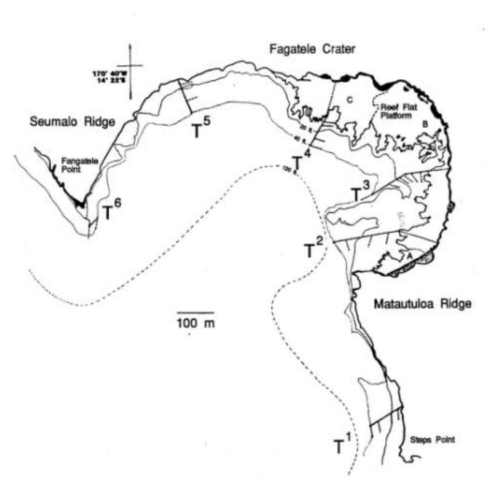

Figure 1. Map of Fagatele Bay showing six permanent transects (T<sup>1</sup> – T<sup>6</sup> ) and the approximate locations of the coral and fish surveys at each depth along each transect. The location of three reef flat sites (A-C) is also indicated.

### *Surveys around Tutuila Island*

To provide comparisons between the coral reef communities in Fagatele Bay and elsewhere around Tutuila, corals and fish have been surveyed in up to 13 other sites around the island (Figure 2). In 1998, corals were surveyed at seven of these sites - inside Masefau Bay (3m), at Aua (1m and 3m), Fagasa Bay (3, 6 and 9m), Cape Larsen (3 and 6m), Fagafue Bay (2m), Massacre Bay (2m) and Rainmaker Hotel (6m). In 2001 corals were surveyed at 3 and six metre depths at eight sites - inside Masefau Bay, at Aua, Aunu'u Island, Fagasa Bay, Cape Larsen, Rainmaker Hotel, Fatumafuti and Auasi. At each site and depth, the point quarter method was used to survey coral communities. In addition, at each of these sites, and in each year, one 30x2m transect was used to survey fish at each depth.

Fish were also surveyed in a single 100 x 2 m transect on the reef slope at each of three sites (Fagatele Bay (12m), Sita Bay (5-6m) and Cape Larsen (8-9m), see Figure 2). These are the same three sites that have been surveyed regularly since 1977 and were initially surveyed as part of an assessment of the impacts of the crown-of-thorns starfish, *Acanthaster planci* (see Birkeland et al. 1987, 2003). We have continued to survey them in each year to follow long term trends in fish communities at each of the sites, and because they form the oldest continuous survey data from American Samoa. Larger transects (100 x 2 m) are used in this part of the study, because they were originally designed as part of a different project (see Wass 1982), but due to the different depths and locations of sampling at each site, the data is not directly comparable among the three sites. The exact location of each transect is described in Birkeland et al. (1987).

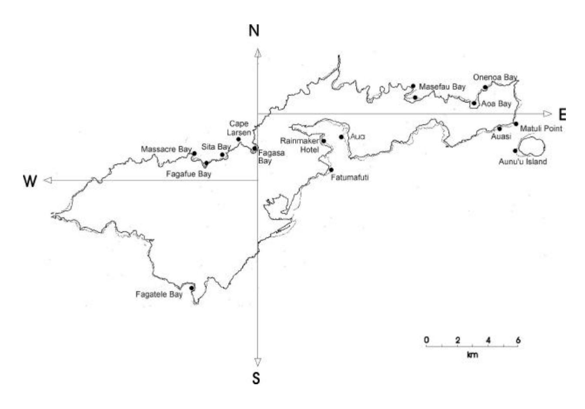

Figure 2. Location of coral and fish survey sites around Tutuila Island, American Samoa.

#### Data analysis

For each year (1998 and 2001), coral data were summarised to determine the average size of each colony (area calculated as area of a circle i.e. p\*(v(length\*width))²), the size-range of colonies of each species at each site, the density and cover of each coral species per square metre at each site, as well as the overall density and cover of corals at each site. Data were analysed using the point-centered quarter method as outlined by Mitchell (2001). In brief, density and cover for each species were calculated as

```
density of corals per hectare = n/Q*[10000/(Sd/Q)^2] relative density of corals = (n/Q)*100 coral cover (m²/ha) = mean colony area * density /10000 relative coral cover = coral cover /total coral cover*100
```

where n is the number of corals, Q is the total number of quarters surveyed at each site/depth, and d is the distance between the sample point and the centre of each coral.

Fish data were summarised to determine the relative abundance and species richness at each site in each year. Changes in coral and fish communities in Fagatele Bay were described by comparing trends between 1998 and 2001. In addition, changes in coral and fish communities over the last 25 years were examined by comparing the 1998 and 2001 data with results from surveys prior to 1998, as described in Birkeland et al. (2003).

#### **RESULTS**

#### **Corals**

#### Fagatele Bay – 1998

A total of 1384 coral colonies belonging to 83 species were recorded in the point-quarter surveys in Fagatele Bay in 1998. The most common coral species in the bay (312 colonies) was *Porites* sp. 2. Four other species were common and represented by >80 colonies including *Galaxea fascicularis* (103 colonies), *Porites rus* (100 colonies), *Montipora grisea* (93 colonies) and *Pavona divaricata* (88 colonies). Most species (59 of the 83) were numerically rare, and were represented by <10 colonies (Table 1).

At the family level, coral communities in Fagatele Bay were numerically dominated by Poritids (34% of corals) and Acroporiids (27.4% of corals). Agariciids, Oculinids, Faviids and Pocilloporiids represented 10.4%, 7.4%, 6.3% and 6.3% of corals overall (Table 2).

In general coral density, cover and diameter was highest at 9 and 12m depths, and lowest on the reef flat across all Transects. Overall density of corals in the Fagatele Bay sites ranged from 0.5 colonies/m² on the reef flat at Transect 2, to 20.6 colonies/m² at 12m depth on Transect 6 (Table 3). Coral cover in Fagatele Bay ranged from 0.9% on the reef flat at Transect 2 to 145.3% at 12m on Transect 4 (note that due to the nature of the calculation of cover from the point-quarter method i.e. as estimated horizontal area per square metre, cover can be >100% in a complex 3D reef structure)(Table 4). The average diameter of coral colonies at each sampling location ranged from 6.0cm on the reef flat at Transect 4 to 21.3cm

at 12m depth on Transect 4 (Table 5). A full summary of data summaries from the 1998 surveys including species size, density and cover across all transects and depths is provided in Appendix 1.

#### Fagatele Bay – 2001

A total of 1391 coral colonies belonging to 89 species were recorded in the point-quarter surveys in Fagatele Bay in 2001. The most common coral species in the bay (198 colonies) was *Montipora foveolata*. Four other species were common and represented by =80 colonies including *Montipora grisea* (125 colonies), *Galaxea fascicularis* (98 colonies), *Porites lichen* (82 colonies), and *Pocillopora eydouxi* (80 colonies). Most species (65 of the 89) were numerically rare, and were represented by =10 colonies (see Table 1).

At the family level, coral communities in Fagatele Bay were numerically dominated by Acroporiids (50% of corals). Poritiids, Pocilloporiids, Oculinids, Agariciids and Faviids represented 14.2%, 11.4%, 7%, 6% and 4.5% of corals overall (Table 2).

Patterns of coral community structure were similar in 2001 as in 1998 with the highest abundance, cover and size colonies generally occurring at depths below 9metres. Overall density of corals in the Fagatele Bay sites ranged from 5.0 colonies/m² at 3m depth on Transect 4, to 37.4 colonies/m² at 12m depth on Transect 2 (Table 3). Coral cover in Fagatele Bay ranged from 12.2% on the reef flat to 189.9% at 12m on Transect 3 (Table 4). The average diameter of coral colonies at each sampling location ranged from 7.0cm on the reef flat to 26.6cm at 12m depth on Transect 4 (Table 5). A full summary of data summaries from the 2001 surveys including species size, density and cover across all transects and depths is provided in Appendix 2.

#### Sites around Tutuila Island – 1998

A total of 609 corals from 76 species were sampled across the seven different areas surveyed around Tutuila Island in 1998. *Montipora grisea* (81 colonies) and *Montipora verrilli* (59 colonies) were the two most abundant species recorded outside of Fagatele Bay. *Pocillopora verrucosa* (44 colonies), *Pocillopora eydouxi* (37 colonies) *Acropora hyacinthus* (36 colonies) and *Montipora ehrenberghii* (32 colonies) were moderately abundant. 59 of the 76 species were rare (=10 colonies; see Table 1)

At the family level, coral communities around Tutuila were numerically dominated by Acroporiids (51.6% of corals). Pocilloporids were also common (19.4% of corals). Faviids rmade up 7.7% of corals, Agariciids 6.7% and Poritiids 6.1% (Table 2).

Overall density of corals in the sites around Tutuila in 1998 ranged from 2.3 colonies/m² at Masefau Bay (2-3m) and Rainmaker Hotel (6m) to 20.3 colonies/m² on the outer reef at Aua (Table 6). Coral cover at the sites around Tutuila ranged from 3% at Rainmaker Hotel (6m depth) to 39.9% at Fagasa Bay (3m depth) (Table 7). The average diameter of coral colonies at each sampling location ranged from 11cm at Rainmaker Hotel (6m) to 17cm at Fagafue Bay (2-3m) (Table 8). A full summary of data summaries from the 1998 surveys at sites around Tutuila including species size, density and cover across all transects and depths is provided in Appendix 3.

#### Sites around Tutuila Island – 2001

A total of 937 corals from 84 species were sampled across the seven different areas surveyed around Tutuila Island in 2001. *Montipora grisea* (160 colonies) was by far the most common coral species outside Fagatele Bay. *Porites lichen* (82 colonies), *Pocillopora meandrina* (60 colonies), *Montipora foveolata* (59 colonies) and *Montipora informis* (54 colonies) were all moderately abundant around Tutuila. 61 of the 84 species were rare (=10 colonies; Table 1)

At the family level, coral communities around Tutuila in 2001 were numerically dominated by Acroporiids (52.1% of corals). Pocilloporids were also common (19.3% of corals) and Poritiids represented 13.8% of corals. The remaining seven families constituted less than 5% of all corals (Table 2).

Overall density of corals in the sites around Tutuila in 2001 ranged from 1.15 colonies/m² at Rainmaker Hotel (6m) 45.8 colonies/m² at Fatumafuti (6m) (Table 6). Coral cover at the sites around Tutuila ranged from 5.3% at Rainmaker Hotel (2-3m depth) to 189.15% at Masefau Bay (6m) (Table 7). The average diameter of coral colonies at each sampling location ranged from 6.2cm at Fatumafuti (2-3m depth) to 29.1cm at Rainmaker Hotel (6m) (Table 8). A full summary of data from the 1998 surveys at sites around Tutuila including species size, density and cover across all transects and depths is provided in Appendix 4.

#### *Trends in coral populations 1995-2001 – Fagatele Bay*

The reef flat communities in Fagatele Bay showed an overall decline in abundance and cover of corals from 1995 to 2001, despite an increase in the mean size of colonies surveyed (Tables 3, 4 and 5). Coral communities at 3 and 6 metres throughout the bay showed an increase in colony abundance, cover and mostly size (although size of colonies at 3m was largely stable through time). At 9m colony size increased from 1995 to 2001, and there were substantial increases in colony cover over the same period (Tables 4 & 5). Similarly, colony abundance increased from 1995 to 1998 at 9m, although there was a slight decline overall in colony abundance in 2001 (Table 3). Coral communities at 12m depth were much more variable through time, with some sites showing an increase in coral abundance, cover and size, but others showing decreases (Tables 3-5).

#### Trends in coral populations 1995-2001 – Tutuila Island

Generalities about the changes in coral communites at sites around Tutuila Island are difficult due to the sporadic sampling at different sites in different years. Nontheless, for those sites which were sampled consistently from 1995 to 2001, increases in coral abundance, cover and colony size were apparent only at Cape Larsen and inside Masefau Bay (Tables 6, 7 and 8). At Fagasa Bay, coral cover and size increased from 1995 to 2001 (Table 7 & 8), although abundance showed a steady decline in shallow water but was relatively stable in deeper water (Table 6). The reefs at Rainmaker Hotel have depauperate coral communities, and showed a continued decline both in abundance and cover in these surveys (Tables 6 & 7), with the exception of a dramatic increase in cover in deeper water in 2001, probably influenced by the presence of a large (>2.5m) *Diploastrea heliopora* colony that was surveyed in that year (see Appendix 4). Aua was only introduced to the survey in 1998 (as an additional Pago Pago Harbour site). In the subsequent survey at Aua in 2001 we did record an increase in coral cover both in deep and shallow water (Table 7), despite a drop in abundance at 6m (Table 6) and a drop in average colony size at 3m (Table 8).

Table 1. Total number of colonies of all coral species recorded in point-quarter surveys of Fagatele Bay and Tutuila Island in 1998 and 2001.

|                                                |      | Fagatele Bay |      | Sites around Tutuila |
|------------------------------------------------|------|--------------|------|----------------------|
|                                                | 1998 | 2001         | 1998 | 2001                 |
| Acropora aculeus                               | 3    | 12           |      |                      |
| Acropora akajimensis                           |      | 7            |      |                      |
| Acropora abrotanoides                          |      |              |      | 1                    |
| Acropora azurea                                | 4    |              |      |                      |
| Acropora clathrata                             |      |              |      | 3                    |
| Acropora crateriformis                         | 68   | 31           | 10   | 7                    |
| Acropora cytharea                              |      | 1            |      | 7                    |
| Acropora dichotoma                             |      |              |      | 1                    |
| Acropora digitifera                            | 6    |              | 3    |                      |
| Acropora divaricata                            |      | 4            |      | 2                    |
| Acropora gemmifera                             | 19   | 10           | 5    | 3                    |
| Acropora humilis                               |      |              | 1    | 1                    |
| Acropora hyacinthus                            | 29   | 53           | 36   | 20                   |
| Acropora insignis                              |      | 3            |      | 2                    |
| Acropora irregularis                           |      |              | 3    |                      |
| Acropora juvenile                              |      | 3            |      |                      |
| Acropora latistella                            |      | 5            |      |                      |
| Acropora meandrina                             |      |              |      | 1                    |
| Acropora monticulosa                           |      | 4            | 3    | 1                    |
| Acropora myriopthalma                          |      |              | 2    |                      |
| Acropora nana                                  |      |              | 19   | 7                    |
| Acropora nasuta                                | 2    | 2            | 2    | 2                    |
| Acropora nobilis                               | 2    |              |      |                      |
| Acropora ocellata                              | 6    |              |      |                      |
| Acropora pagoensis                             | 5    | 2            | 1    |                      |
| Acropora palifera                              | 9    | 8            |      |                      |
| Acropora paniculata                            |      | 1            |      | 1                    |
| Acropora polystoma                             | 3    |              | 2    |                      |
| Acropora robusta                               | 2    | 1            |      | 1                    |
| Acropora samoensis                             |      | 1            |      |                      |
| Acropora secale                                | 6    |              | 2    |                      |
| Acropora sp.                                   |      |              |      | 1                    |
| Acropora sp. 2                                 | 1    |              | 4    |                      |
| Acropora subulata                              |      |              |      | 6                    |
| Acropora yongei                                | 2    |              | 1    |                      |
| Alveopora sp.                                  | 4    |              | 2    |                      |
| Alveopora sp. 1                                | 2    |              |      |                      |
| Astreopora listeri                             |      | 5            |      | 2                    |
|                                                |      |              |      |                      |
| Astreopora myriopthalma<br>Astreopora randalli |      | 7            | 1    |                      |
| Coscinaraea columna                            | 1    | 1            |      | 3                    |
|                                                |      |              |      |                      |
| Cyphastrea chalcidicum                         |      | 1            |      |                      |
| Cyphastrea seralia                             | 2    |              |      |                      |
| Cyphastrea sp.                                 | 5    |              |      | 1                    |
| Diploastrea heliopora                          |      |              | 1    | 4                    |
| Echinopora hirsutissima                        | 9    | 1            | 1    |                      |
| Echinopora lamellosa                           | 1    | 5            | 1    | 2                    |

|                            | Fagatele Bay |      | Sites around Tutuila |      |
|----------------------------|--------------|------|----------------------|------|
|                            | 1998         | 2001 | 1998                 | 2001 |
| Favia matthaii             | 1            |      | 2                    |      |
| Favia stelligera           | 1            | 4    |                      | 2    |
| Favites abdita             | 4            | 4    |                      |      |
| Favites complanata         | 1            |      | 8                    |      |
| Favites halicora           | 4            |      |                      |      |
| Favites russelli           |              |      | 1                    |      |
| Favites sp.                | 2            |      | 1                    |      |
| Fungia fungites            |              | 2    |                      |      |
| Fungia juvenile            |              | 1    |                      |      |
| Fungia scutaria            | 8            |      | 3                    |      |
| Fungia sp                  |              | 2    |                      | 1    |
| Galaxea fascicularis       | 103          | 98   | 17                   | 15   |
| Gardineroseris planulata   | 3            | 3    |                      |      |
| Goniastrea edwardsi        | 1            | 1    |                      |      |
| Goniastrea favulus         | 1            |      |                      |      |
| Goniastrea retiformis      | 20           | 9    | 11                   | 1    |
| Goniopora somaliensis      |              | 1    |                      |      |
| Goniopora sp.              |              |      |                      | 3    |
| Herpolitha limax           |              | 1    |                      |      |
| Hydnophora exesa           |              | 3    |                      | 1    |
|                            |              |      |                      |      |
| Hydnophora microconos      | 2            | 8    |                      | 1    |
| Hydnophora rigida          | 4            | 3    |                      |      |
| Leptastrea purpurea        | 13           | 15   | 6                    | 17   |
| Leptastrea transversa      | 1            | 5    | 1                    | 1    |
| Leptoria phrygia           | 11           | 4    | 3                    | 2    |
| Leptoseris explanata       |              |      | 1                    |      |
| Lobophyllia corymbosa      | 1            |      |                      |      |
| Merulina ampliata          |              | 11   |                      |      |
| Merulina vaughani          | 1            |      |                      |      |
| Millepora exaesa           |              | 6    |                      | 11   |
| Millepora dichotoma        |              |      | 6                    |      |
| Millepora platyphylla      | 33           |      | 11                   | 1    |
| Millepora tuberosa         | 11           | 2    | 1                    |      |
| Millepora sp               |              |      |                      | 14   |
| Montastrea annuligera      |              | 3    |                      | 2    |
| Montastrea curta           | 10           | 11   | 11                   | 4    |
| Montipora aequituberculata |              |      |                      | 1    |
| Montipora berryi           |              |      | 2                    |      |
| Montipora calcarea         |              |      |                      | 2    |
| Montipora caliculata       | 11           | 1    | 4                    |      |
| Montipora corbettensis     |              | 25   |                      | 13   |
| Montipora danae            | 1            | 1    |                      |      |
| Montipora divaricata       |              |      |                      | 1    |
| Montipora efflorescens     |              | 58   |                      | 26   |
| Montipora ehrenbergii      | 4            |      | 32                   |      |
| Montipora elschneri        | 27           |      | 16                   |      |
| Montipora floweri          |              | 1    |                      |      |
| Montipora foveolata        |              | 198  | 1                    | 59   |
| Montipora granulosa        |              | 2    | 3                    | 1    |

|                             | Fagatele Bay |      | Sites around Tutuila |      |
|-----------------------------|--------------|------|----------------------|------|
|                             | 1998         | 2001 | 1998                 | 2001 |
| Montipora grisea            | 93           | 125  | 81                   | 160  |
| Montipora hispida           |              |      | 1                    | 3    |
| Montipora hoffmeisteri      | 5            | 7    | 3                    | 1    |
| Montipora informis          | 3            | 23   |                      | 54   |
| Montipora lobulata          |              |      | 1                    |      |
| Montipora millepora         |              | 3    | 2                    | 4    |
| Montipora monasteriata      |              | 16   | 10                   | 11   |
| Montipora nodosa            |              | 6    |                      | 26   |
| Montipora sp                |              | 3    |                      | 6    |
| Montipora sp. 2             |              |      | 4                    |      |
| Montipora tuberculosa       |              | 58   |                      | 42   |
| Montipora turgescens        | 1            |      |                      | 1    |
| Montipora venosa            | 1            | 2    |                      | 6    |
| Montipora verrilli          | 67           | 5    | 59                   |      |
| Montipora verrucosa         |              | 3    |                      | 1    |
| Pavona clavus               | 1            |      |                      |      |
| Pavona collines             |              | 21   |                      | 11   |
| Pavona decussata            |              |      | 1                    | 1    |
| Pavona divaricata           | 88           | 39   |                      |      |
| Pavona explanulata          |              |      | 4                    | 2    |
| Pavona frondifera           |              |      |                      | 1    |
| Pavona minuta               |              |      | 1                    |      |
| Pavona profundacella        | 1            |      |                      |      |
| Pavona varians              | 11           | 20   | 4                    | 17   |
| Pavona venosa               | 12           | 1    | 11                   | 8    |
| Pavona verrucosa            |              |      |                      | 2    |
|                             |              |      |                      |      |
| Pavona sp. 2                | 6            |      | 11                   |      |
| Pavona sp. 3                | 22           |      | 6                    |      |
| Pavona sp. 4                |              |      | 2                    |      |
| Pavona sp. 5                |              |      | 1                    |      |
| Pavona sp. 6                |              |      | 1                    |      |
| Platygyra daedalea          | 1            |      |                      |      |
| Platygyra pini              |              |      |                      | 1    |
| Pocillopora damicornis      | 1            | 5    | 9                    | 41   |
| Pocillopora danae           | 2            |      | 13                   | 30   |
| Pocillopora elegans         |              |      | 9                    |      |
| Pocillopora eydouxi         | 30           | 80   | 37                   | 18   |
| Pocillopora juvenile        |              | 6    |                      | 10   |
| Pocillopora ligulata        | 1            |      | 2                    |      |
| Pocillopora meandrina       | 7            | 46   | 1                    | 60   |
| Pocillopora setchelli       |              |      | 1                    |      |
| Pocillopora sp.             | 1            |      |                      |      |
| Pocillopora verrucosa       | 45           | 19   | 44                   | 22   |
| Pocillopora woodjonesi      |              | 1    |                      |      |
| Porites "mound"             |              | 17   |                      | 4    |
| Porites "yellow encrusting" |              | 1    |                      | 3    |
| Porites annae               | 7            | 10   | 1                    | 9    |
| Porites cylindrica          | 15           | 16   | 2                    | 2    |
| Porites horizontalata       |              |      |                      | 1    |

|                          |      | Fagatele Bay |      | Sites around Tutuila |
|--------------------------|------|--------------|------|----------------------|
|                          | 1998 | 2001         | 1998 | 2001                 |
| Porites lichen           | 6    | 82           |      | 82                   |
| Porites lutea            | 23   |              | 3    |                      |
| Porites massive          |      | 3            |      |                      |
| Porites rus              | 100  | 58           | 15   | 17                   |
| Porites sp. 2            | 316  | 9            | 14   | 8                    |
| Porites spp              |      | 1            |      |                      |
| Porites vaughani         | 2    |              |      |                      |
| Psammocora contigua      | 9    | 5            | 8    | 3                    |
| Psammocora haimeana      | 5    | 7            |      | 11                   |
| Psammocora nierstraszi   | 4    |              |      |                      |
| Psammocora obtusangula   |      | 5            |      |                      |
| Psammocora profundacella |      | 1            |      |                      |
| Psammocora samoensis     |      |              | 3    |                      |
| Stylocoeniella armata    | 25   | 35           | 1    |                      |
| Stylophora mordax        |      | 1            |      |                      |
| Symphyllia radians       | 2    |              | 2    |                      |
| Turbinaria reniformis    | 1    |              |      |                      |
| Total no of colonies     | 1384 | 1391         | 609  | 937                  |
| Total no. of species     | 83   | 89           | 76   | 81                   |

Table 2. Total number of colonies of each coral family recorded in point-quarter surveys of Fagatele Bay and Tutuila Island in 1998 and 2001.

|                       |      | Fagatele Bay |      | Sites around Tutuila |
|-----------------------|------|--------------|------|----------------------|
| Family                | 1998 | 2001         | 1998 | 2001                 |
| Acroporiidae          | 380  | 697          | 314  | 488                  |
| Agariciidae           | 144  | 84           | 41   | 42                   |
| Astrocoeniidae        | 25   | 35           | 1    |                      |
| Dendrophylliidae      | 1    |              |      |                      |
| Faviidae              | 88   | 63           | 47   | 36                   |
| Fungiidae             | 8    | 6            | 3    | 1                    |
| Merulinidae           | 7    | 25           |      | 2                    |
| Milleporidae          | 44   | 8            | 18   | 26                   |
| Mussidae              | 3    |              | 2    |                      |
| Oculinidae            | 103  | 98           | 17   | 15                   |
| Pectiniidae           |      |              |      |                      |
| Pocilloporiidae       | 87   | 158          | 118  | 181                  |
| Poritiidae            | 475  | 198          | 37   | 129                  |
| Siderastreidae        | 19   | 19           | 11   | 17                   |
| Total no. of families | 13   | 12           | 11   | 10                   |
| Total no. of colonies | 1384 | 1391         | 609  | 937                  |

Table 3. Abundance of hermatypic corals (number of colonies per m<sup>2</sup> ) in Fagatele Bay National Marine Sanctuary from surveys conducted in 1985-2001. Data from 1985, 1988 and 1995 are from Birkeland et al 2003.

|           |      |      | Permanent Transect Number |      |      |      |
|-----------|------|------|---------------------------|------|------|------|
| Depth     | 1    | 2    | 3                         | 4    | 5    | 6    |
| Reef flat |      |      |                           |      |      |      |
| 1985      |      | 7.2  | 9.1                       | 8.8  |      |      |
| 1988      |      | 3.6  | 25.4                      |      |      |      |
| 1995      |      | 7.2  | 11.2                      | 10.8 |      |      |
| 1998      |      | 0.6  | 2.2                       | 2.6  |      |      |
| 2001      |      |      | 19.6*                     |      |      |      |
| 3m        |      |      |                           |      |      |      |
| 1985      |      | 2.0  | 23.3                      | 3.2  | 15.4 |      |
| 1988      |      | 8.0  | 33.4                      | 6.2  | 10.3 |      |
| 1995      |      | 13.6 | 12.6                      | 3.4  | 4.6  |      |
| 1998      |      | 7.7  | 11.0                      | 11.0 | 4.1  |      |
| 2001      |      | 24.6 | 14.2                      | 29.9 | 5.0  |      |
| 6m        |      |      |                           |      |      |      |
| 1985      | 6.8  | 2.5  | 34.5                      | 1.4  | 3.7  | 20.4 |
| 1988      |      | 3.4  | 25.2                      | 2.6  | 5.2  | 8.3  |
| 1995      | 8.8  | 6.0  | 14.3                      | 6.2  | 5    | 6.6  |
| 1998      |      | 7.1  | 10.7                      | 12.2 | 4.7  |      |
| 2001      |      | 15.2 | 22.2                      | 37.3 | 7.9  |      |
| 9m        |      |      |                           |      |      |      |
| 1985      | 10.0 | 3.3  | 9.3                       | 3.2  | 6.7  | 5.7  |
| 1988      | 11.9 | 5.5  | 15.3                      | 3.4  | 9.6  |      |
| 1995      | 9.1  | 11.0 | 8.6                       | 1.0  | 7.0  | 5.8  |
| 1998      |      | 15.1 |                           | 19.6 | 14.4 | 10.9 |
| 2001      | 16.9 | 20.3 | 14.9                      | 15.1 | 13.7 | 9.3  |
| 12m       |      |      |                           |      |      |      |
| 1985      | 10.4 | 2.6  | 2.3                       | 2.3  | 3.2  | 7.1  |
| 1988      | 7.1  | 17.1 | 14.8                      | 14.7 | 5.8  | 8.1  |
| 1995      | 7.8  | 14.7 | 14.5                      | 7.1  | 5.6  | 7.1  |
| 1998      |      | 10.9 | 16.7                      | 7.3  |      | 20.6 |
| 2001      | 9.6  | 37.4 | 9.7                       | 24.4 | 18.1 | 15.7 |

(\*Survey actually conducted on reef flat platform between Transect 3 and Transect 4)

Table 4. Percent cover of substrata by hermatypic corals in Fagatele Bay National Marine Sanctuary from surveys conducted in 1985-2001. Data from 1985, 1988 and 1995 are from Birkeland et al 2003.

|           |      |       |       | Permanent Transect Number |      |       |
|-----------|------|-------|-------|---------------------------|------|-------|
| Depth     | 1    | 2     | 3     | 4                         | 5    | 6     |
| Reef flat |      |       |       |                           |      |       |
| 1985      |      | 4.0   | 45.2  | 6.6                       |      |       |
| 1988      |      | 3.5   | 43.4  |                           |      |       |
| 1995      |      | 5.0   | 37.6  | 11.4                      |      |       |
| 1998      |      | 0.9   | 2.2   | 1.3                       |      |       |
| 2001      |      |       | 12.2* |                           |      |       |
| 3m        |      |       |       |                           |      |       |
| 1985      |      | 1.1   | 25.6  | 2.2                       | 46.2 |       |
| 1988      |      | 7.3   | 31.8  | 6.1                       | 15.8 |       |
| 1995      |      | 16.9  | 37.0  | 5.6                       | 7.3  |       |
| 1998      |      | 19.4  | 18.3  | 20.1                      | 18.6 |       |
| 2001      |      | 69.9  | 17.0  | 54.5                      | 37.1 |       |
| 6m        |      |       |       |                           |      |       |
| 1985      | 17.1 | 1.2   | 11.8  | 0.9                       | 12.9 | 20.2  |
| 1988      |      | 2.3   | 32.4  | 4.0                       | 17.9 | 37.6  |
| 1995      | 26.5 | 13.8  | 21.0  | 7.4                       | 8.0  | 5.8   |
| 1998      |      | 14.6  | 9.5   | 33.1                      | 17.2 |       |
| 2001      |      | 60.9  | 90.7  | 82.6                      | 27.1 |       |
| 9m        |      |       |       |                           |      |       |
| 1985      | 10.5 | 64.4  | 2.3   | 2.4                       | 11.7 | 4.5   |
| 1988      | 31.6 | 3.9   | 6.9   | 2.8                       | 7.6  |       |
| 1995      | 12.7 | 10.9  | 3.5   | 1.9                       | 0.7  | 2.4   |
| 1998      |      | 40.2  |       | 59.5                      | 43.3 | 19.7  |
| 2001      | 53.4 | 131.1 | 87.5  | 95.0                      | 90.0 | 35.0  |
| 12m       |      |       |       |                           |      |       |
| 1985      | 10.7 | 0.9   | 0.8   | 1.0                       | 1.3  | 8.4   |
| 1988      | 10.9 | 7.2   | 5.2   | 6.5                       | 5.6  | 10.9  |
| 1995      | 14.3 | 8.2   | 2.5   | 9.3                       | 0.4  | 0.7   |
| 1998      |      | 47.3  | 82.3  | 145.3                     |      | 34.9  |
| 2001      | 33.8 | 88.9  | 189.9 | 63.7                      | 99.4 | 100.6 |

(\*Survey actually conducted on reef flat platform between Transect 3 and Transect 4)

Table 5. Mean coral colony diameter (cm) in Fagatele Bay National Marine Sanctuary from surveys conducted in 1985-2001. Data from 1985, 1988 and 1995 are from Birkeland et al 2003.

|           |              |      |      | Permanent Transect Number |      |      |
|-----------|--------------|------|------|---------------------------|------|------|
| Depth     | 1            | 2    | 3    | 4                         | 5    | 6    |
| Reef flat |              |      |      |                           |      |      |
|           | 1985         | 6.4  | 14.4 | 8.6                       |      |      |
|           | 1988         | 9.1  | 10.9 |                           |      |      |
|           | 1995         | 7.1  | 14.1 | 7.8                       |      |      |
|           | 1998         | 11.3 | 8.4  | 6.1                       |      |      |
|           | 2001         |      | 7.0* |                           |      |      |
| 3m        |              |      |      |                           |      |      |
|           | 1985         | 7.0  | 8.2  | 8.4                       | 14.4 |      |
|           | 1988         | 9.5  | 8.8  | 9.5                       | 11.8 |      |
|           | 1995         | 10.6 | 12.0 | 9.5                       | 11.6 |      |
|           | 1998         | 13.8 | 11.8 | 11.2                      | 19.7 |      |
|           | 2001         | 13.4 | 10.0 | 10.7                      | 23.1 |      |
| 6m        |              |      |      |                           |      |      |
|           | 1985<br>11.9 | 6.3  | 5.2  | 7.7                       | 15.7 | 9.1  |
|           | 1988         | 7.6  | 9.3  | 10.8                      | 14.8 | 16.2 |
|           | 1995<br>13.8 | 13.9 | 9.7  | 9.7                       | 10.8 | 8.4  |
|           | 1998         | 13.7 | 8.6  | 14.9                      | 17.3 |      |
|           | 2001         | 15.5 | 15.2 | 10.8                      | 16.4 |      |
| 9m        |              |      |      |                           |      |      |
|           | 1985<br>8.3  | 18.9 | 5.1  | 7.1                       | 10.8 | 8.7  |
|           | 1988<br>16.2 | 8.0  | 10.0 | 8.0                       | 7.7  |      |
|           | 1995<br>11.3 | 13.3 | 8.9  | 11.4                      | 9.1  | 12.7 |
|           | 1998         | 12.0 |      | 12.5                      | 15.6 | 11.8 |
|           | 2001<br>15.6 | 19.9 | 19.7 | 16.8                      | 21.5 | 16.9 |
| 12m       |              |      |      |                           |      |      |
|           | 1985<br>10.3 | 5.4  | 5.3  | 6.0                       | 6.5  | 11.0 |
|           | 1988<br>11.2 | 6.4  | 6.3  | 5.4                       | 8.3  | 9.7  |
|           | 1995<br>35.9 | 10.5 | 5.3  | 10.4                      | 9.6  | 8.9  |
|           | 1998         | 17.5 | 14.0 |                           | 17.8 | 12.4 |
|           | 2001<br>15.6 | 13.8 | 26.6 | 11.9                      | 18.9 | 21.9 |

(\*Survey actually conducted on reef flat platform between Transect 3 and Transect 4)

Table 6. Abundance of hermatypic corals (number of colonies per m<sup>2</sup> ) at sites around Tutuila Island from surveys conducted in 1982-2001. Data from 1982, 1985, 1988 and 1995 are from Birkeland et al 2003.

| 2003.<br>Number of coral |       |      |                 |  |  |
|--------------------------|-------|------|-----------------|--|--|
| Location                 | Depth | Year | colonies per m2 |  |  |
| Anuu'u Island            | 2-3m  | 1982 |                 |  |  |
|                          |       | 1985 |                 |  |  |
|                          |       | 1988 |                 |  |  |
|                          |       | 1995 |                 |  |  |
|                          |       | 1998 |                 |  |  |
|                          |       | 2001 | 14.40           |  |  |
|                          | 6m    | 1982 |                 |  |  |
|                          |       | 1985 |                 |  |  |
|                          |       | 1988 |                 |  |  |
|                          |       | 1995 |                 |  |  |
|                          |       | 1998 |                 |  |  |
|                          |       | 2001 | 21.82           |  |  |
| Aua                      | 2-3m  | 1982 |                 |  |  |
|                          |       | 1985 |                 |  |  |
|                          |       | 1988 |                 |  |  |
|                          |       | 1995 |                 |  |  |
|                          |       | 1998 | 8.87            |  |  |
|                          |       | 2001 | 20.04           |  |  |
|                          | 6m    | 1982 |                 |  |  |
|                          |       | 1985 |                 |  |  |
|                          |       | 1988 |                 |  |  |
|                          |       | 1995 |                 |  |  |
|                          |       | 1998 | 20.26           |  |  |
|                          |       | 2001 | 10.96           |  |  |
| Auasi                    | 2-3m  | 1982 |                 |  |  |
|                          |       | 1985 |                 |  |  |
|                          |       | 1988 |                 |  |  |
|                          |       | 1995 |                 |  |  |
|                          |       | 1998 |                 |  |  |
|                          |       | 2001 | 26.01           |  |  |
|                          | 6m    | 1982 |                 |  |  |
|                          |       | 1985 |                 |  |  |
|                          |       | 1988 |                 |  |  |
|                          |       | 1995 |                 |  |  |
|                          |       | 1998 |                 |  |  |
|                          |       | 2001 | 16.24           |  |  |
|                          |       |      |                 |  |  |

| Location    | Depth | Year | Number of coral<br>colonies per m2 |
|-------------|-------|------|------------------------------------|
| Cape Larsen | 2-3m  | 1982 | 7.88                               |
|             |       | 1985 | 7.81                               |
|             |       | 1988 | 14.13                              |
|             |       | 1995 | 11.22                              |
|             |       | 1998 | 6.8                                |
|             |       | 2001 | 23.8                               |
|             | 6m    | 1982 | 7.57                               |
|             |       | 1985 | 12.17                              |
|             |       | 1988 | 12                                 |
|             |       | 1995 | 5.77                               |
|             |       | 1998 | 15.55                              |
|             |       | 2001 | 21.57                              |
| Fagafue Bay | 2-3m  | 1982 | 8.0                                |
|             |       | 1985 | 12.4                               |
|             |       | 1988 | 10.17                              |
|             |       | 1995 | 7.79                               |
|             |       | 1998 | 7.4                                |
|             |       | 2001 |                                    |
|             | 6m    | 1982 | 5.41                               |
|             |       | 1985 | 13.88                              |
|             |       | 1988 | 12.2                               |
|             |       | 1995 | 9.2                                |
|             |       | 1998 |                                    |
|             |       | 2001 |                                    |
| Fagasa Bay  | 2-3m  | 1982 | 7.98                               |
|             |       | 1985 | 4.29                               |
|             |       | 1988 | 16.61                              |
|             |       | 1995 | 15.07                              |
|             |       | 1998 | 11.69                              |
|             |       | 2001 | 8.75                               |
|             | 6m    | 1982 | 3.13                               |
|             |       | 1985 | 5.6                                |
|             |       | 1988 | 7.76                               |
|             |       | 1995 | 10.1                               |
|             |       | 1998 |                                    |
|             |       |      |                                    |
|             |       | 2001 | 9.63                               |

| Location             | Depth | Year | Number of coral<br>colonies per m2 |
|----------------------|-------|------|------------------------------------|
| Fatumafuti           | 2-3m  | 1982 | 22.19                              |
|                      |       | 1985 | 18.79                              |
|                      |       | 1988 | 21                                 |
|                      |       | 1995 | 24.43                              |
|                      |       | 1998 |                                    |
|                      |       | 2001 | 20.46                              |
|                      | 6m    | 1982 | 19.66                              |
|                      |       | 1985 | 17.41                              |
|                      |       | 1988 | 18.7                               |
|                      |       | 1995 |                                    |
|                      |       | 1998 |                                    |
|                      |       | 2001 | 45.83                              |
| Masefau Bay (inside) | 2-3m  | 1982 | 2.89                               |
|                      |       | 1985 | 3.51                               |
|                      |       | 1988 | 4.2                                |
|                      |       | 1995 | 7.38                               |
|                      |       | 1998 | 2.3                                |
|                      |       | 2001 | 11.12                              |
|                      | 6m    | 1982 | 5.93                               |
|                      |       | 1985 | 8.14                               |
|                      |       | 1988 | 12.41                              |
|                      |       | 1995 | 5.3                                |
|                      |       | 1998 |                                    |
|                      |       | 2001 | 16.82                              |
| Massacre Bay         | 2-3m  | 1982 | 11.92                              |
|                      |       | 1985 | 28.83                              |
|                      |       | 1988 | 14.8                               |
|                      |       | 1995 | 20.01                              |
|                      |       | 1998 | 12.89                              |
|                      |       | 2001 |                                    |
|                      | 6m    | 1982 | 5.9                                |
|                      |       | 1985 | 18.23                              |
|                      |       | 1988 | 15.57                              |
|                      |       | 1995 | 19.26                              |
|                      |       | 1998 |                                    |
|                      |       | 2001 |                                    |

| Location        | Depth | Year | Number of coral<br>colonies per m2 |
|-----------------|-------|------|------------------------------------|
| Rainmaker Hotel | 2-3m  | 1982 | 4.69                               |
|                 |       | 1985 | 8.25                               |
|                 |       | 1988 | 7.54                               |
|                 |       | 1995 | 9.23                               |
|                 |       | 1998 |                                    |
|                 |       | 2001 | 8.02                               |
|                 | 6m    | 1982 | 11.58                              |
|                 |       | 1985 | 0.84                               |
|                 |       | 1988 | 0.25                               |
|                 |       | 1995 | 2.95                               |
|                 |       | 1998 | 2.28                               |
|                 |       | 2001 | 1.15                               |

Table 7. Percent cover of substrata by hermatypic corals at sites around Tutuila Island from surveys conducted in 1982-2001. Data from 1982, 1985, 1988 and 1995 are from Birkeland et al 2003.

| Location      | Depth | Year | Percent cover by<br>coral colonies |
|---------------|-------|------|------------------------------------|
| Anuu'u Island | 2-3m  | 1982 |                                    |
|               |       | 1985 |                                    |
|               |       | 1988 |                                    |
|               |       | 1995 |                                    |
|               |       | 1998 |                                    |
|               |       | 2001 | 47.56                              |
|               | 6m    | 1982 |                                    |
|               |       | 1985 |                                    |
|               |       | 1988 |                                    |
|               |       | 1995 |                                    |
|               |       | 1998 |                                    |
|               |       | 2001 | 112.05                             |
| Aua           | 2-3m  | 1982 |                                    |
|               |       | 1985 |                                    |
|               |       | 1988 |                                    |
|               |       | 1995 |                                    |
|               |       | 1998 | 31.81                              |
|               |       | 2001 | 37.67                              |
|               | 6m    | 1982 |                                    |
|               |       | 1985 |                                    |
|               |       | 1988 |                                    |
|               |       | 1995 |                                    |
|               |       | 1998 | 26.7                               |
|               |       | 2001 | 60.31                              |
| Auasi         | 2-3m  | 1982 |                                    |
|               |       | 1985 |                                    |
|               |       | 1988 |                                    |
|               |       | 1995 |                                    |
|               |       | 1998 |                                    |
|               |       | 2001 | 35.58                              |
|               | 6m    | 1982 |                                    |
|               |       | 1985 |                                    |
|               |       | 1988 |                                    |
|               |       |      |                                    |
|               |       | 1995 |                                    |
|               |       | 1998 |                                    |
|               |       | 2001 | 72.06                              |

| Location    | Depth | Year | Percent cover by<br>coral colonies |
|-------------|-------|------|------------------------------------|
| Cape Larsen | 2-3m  | 1982 | 10.65                              |
|             |       | 1985 | 14.25                              |
|             |       | 1988 | 34.8                               |
|             |       | 1995 | 19.51                              |
|             |       | 1998 | 20.41                              |
|             |       | 2001 | 110.6                              |
|             | 6m    | 1982 | 7.35                               |
|             |       | 1985 | 22.34                              |
|             |       | 1988 | 29.7                               |
|             |       | 1995 | 1.79                               |
|             |       | 1998 | 38.96                              |
|             |       | 2001 | 68.42                              |
| Fagafue Bay | 2-3m  | 1982 | 80.1                               |
|             |       | 1985 | 85.5                               |
|             |       | 1988 | 32.9                               |
|             |       | 1995 | 14.64                              |
|             |       | 1998 | 24.19                              |
|             |       | 2001 |                                    |
|             | 6m    | 1982 | 115.44                             |
|             |       | 1985 | 98.43                              |
|             |       | 1988 | 93.5                               |
|             |       | 1995 | 2.4                                |
|             |       | 1998 |                                    |
|             |       | 2001 |                                    |
| Fagasa Bay  | 2-3m  | 1982 | 16.77                              |
|             |       | 1985 | 1.93                               |
|             |       | 1988 | 61.3                               |
|             |       | 1995 | 24.74                              |
|             |       | 1998 | 39.9                               |
|             |       | 2001 | 65.82                              |
|             | 6m    | 1982 | 2.48                               |
|             |       | 1985 | 21.33                              |
|             |       | 1988 | 51.3                               |
|             |       | 1995 | 2.72                               |
|             |       | 1998 |                                    |
|             |       | 2001 | 92.32                              |
|             |       |      |                                    |

| Location             | Depth | Year | Percent cover by<br>coral colonies |
|----------------------|-------|------|------------------------------------|
| Fatumafuti           | 2-3m  | 1982 | 17.34                              |
|                      |       | 1985 | 61.49                              |
|                      |       | 1988 | 30.3                               |
|                      |       | 1995 | 13.45                              |
|                      |       | 1998 |                                    |
|                      |       | 2001 | 9.62                               |
|                      | 6m    | 1982 |                                    |
|                      |       | 1985 |                                    |
|                      |       | 1988 | 23.2                               |
|                      |       | 1995 | 5.5                                |
|                      |       | 1998 |                                    |
|                      |       | 2001 | 38.72                              |
| Masefau Bay (inside) | 2-3m  | 1982 | 12.31                              |
|                      |       | 1985 | 3.69                               |
|                      |       | 1988 | 8.7                                |
|                      |       | 1995 | 8.18                               |
|                      |       | 1998 | 6.54                               |
|                      |       | 2001 | 96.07                              |
|                      | 6m    | 1982 | 32.85                              |
|                      |       | 1985 | 66.08                              |
|                      |       | 1988 | 2.8                                |
|                      |       | 1995 | 1.69                               |
|                      |       | 1998 |                                    |
|                      |       | 2001 | 189.15                             |
| Massacre Bay         | 2-3m  | 1982 | 59.99                              |
|                      |       | 1985 | 88.69                              |
|                      |       | 1988 | 45.4                               |
|                      |       | 1995 | 13.17                              |
|                      |       | 1998 | 30.46                              |
|                      |       | 2001 |                                    |
|                      | 6m    | 1982 | 60.6                               |
|                      |       |      |                                    |
|                      |       | 1985 | 91.68                              |
|                      |       | 1988 | 127.1                              |
|                      |       | 1995 | 15.55                              |
|                      |       | 1998 |                                    |
|                      |       | 2001 |                                    |

| Location        | Depth | Year | Percent cover by<br>coral colonies |
|-----------------|-------|------|------------------------------------|
| Rainmaker Hotel | 2-3m  | 1982 | 6.65                               |
|                 |       | 1985 | 11.38                              |
|                 |       | 1988 | 3.2                                |
|                 |       | 1995 | 12.04                              |
|                 |       | 1998 |                                    |
|                 |       | 2001 | 5.33                               |
|                 | 6m    | 1982 | 27.72                              |
|                 |       | 1985 | 19.19                              |
|                 |       | 1988 | 18.7                               |
|                 |       | 1995 | 3.06                               |
|                 |       | 1998 | 2.99                               |
|                 |       | 2001 | 47.28                              |

Table 8. Mean diameter (cm) of hermatypic corals at sites around Tutuila Island from surveys conducted in 1982-2001. Data from 1992, 1985, 1988 and 1995 are from Birkeland et al 2003.

| Location      | Depth | Year | Mean colony<br>diameter (cm) |
|---------------|-------|------|------------------------------|
| Anuu'u Island | 2-3m  | 1982 |                              |
|               |       | 1985 |                              |
|               |       | 1988 |                              |
|               |       | 1995 |                              |
|               |       | 1998 |                              |
|               |       | 2001 | 14.06                        |
|               | 6m    | 1982 |                              |
|               |       | 1985 |                              |
|               |       | 1988 |                              |
|               |       | 1995 |                              |
|               |       | 1998 |                              |
|               |       | 2001 | 18.95                        |
| Aua           | 2-3m  | 1982 |                              |
|               |       | 1985 |                              |
|               |       | 1988 |                              |
|               |       | 1995 |                              |
|               |       | 1998 | 16.18                        |
|               |       | 2001 | 10.23                        |
|               | 6m    | 1982 |                              |
|               |       | 1985 |                              |
|               |       | 1988 |                              |
|               |       | 1995 |                              |
|               |       | 1998 | 11.93                        |
|               |       | 2001 | 15.09                        |
| Auasi         | 2-3m  | 1982 |                              |
|               |       | 1985 |                              |
|               |       | 1988 |                              |
|               |       | 1995 |                              |
|               |       | 1998 |                              |
|               |       | 2001 | 10.16                        |
|               | 6m    | 1982 |                              |
|               |       | 1985 |                              |
|               |       | 1988 |                              |
|               |       | 1995 |                              |
|               |       | 1998 |                              |
|               |       | 2001 | 15.56                        |

| Location    | Depth | Year | Mean colony<br>diameter (cm) |
|-------------|-------|------|------------------------------|
| Cape Larsen | 2-3m  | 1982 | 8.9                          |
|             |       | 1985 | 12.3                         |
|             |       | 1988 | 14.7                         |
|             |       | 1995 | 13                           |
|             |       | 1998 | 16.89                        |
|             |       | 2001 | 17.99                        |
|             | 6m    | 1982 | 7.7                          |
|             |       | 1985 | 11.9                         |
|             |       | 1988 | 14.4                         |
|             |       | 1995 | 14.6                         |
|             |       | 1998 | 13.3                         |
|             |       | 2001 | 16.98                        |
| Fagafue Bay | 2-3m  | 1982 | 28.0                         |
|             |       | 1985 | 22.1                         |
|             |       | 1988 | 17.2                         |
|             |       | 1995 | 13.9                         |
|             |       | 1998 | 17.01                        |
|             |       | 2001 |                              |
|             | 6m    | 1982 | 32.4                         |
|             |       | 1985 | 20.1                         |
|             |       | 1988 | 20.6                         |
|             |       | 1995 | 12.0                         |
|             |       | 1998 |                              |
|             |       | 2001 |                              |
| Fagasa Bay  | 2-3m  | 1982 | 10.9                         |
|             |       | 1985 | 6.3                          |
|             |       | 1988 | 16.4                         |
|             |       | 1995 | 12.1                         |
|             |       | 1998 | 16.32                        |
|             |       | 2001 | 23.08                        |
|             | 6m    | 1982 | 6.6                          |
|             |       | 1985 | 15.2                         |
|             |       | 1988 | 20.3                         |
|             |       | 1995 | 11.2                         |
|             |       | 1998 |                              |
|             |       | 2001 | 25.5                         |

| Location             | Depth | Year | Mean colony<br>diameter (cm) |
|----------------------|-------|------|------------------------------|
| Fatumafuti           | 2-3m  | 1982 | 9.8                          |
|                      |       | 1985 | 11.4                         |
|                      |       | 1988 | 10.6                         |
|                      |       | 1995 | 7.4                          |
|                      |       | 1998 |                              |
|                      |       | 2001 | 6.23                         |
|                      | 6m    | 1982 | 8.3                          |
|                      |       | 1985 | 19.2                         |
|                      |       | 1988 | 8.8                          |
|                      |       | 1995 | 7.0                          |
|                      |       | 1998 |                              |
|                      |       | 2001 | 7.43                         |
| Masefau Bay (inside) | 2-3m  | 1982 | 13.2                         |
|                      |       | 1985 | 8.9                          |
|                      |       | 1988 | 9.1                          |
|                      |       | 1995 | 9.9                          |
|                      |       | 1998 | 15.21                        |
|                      |       | 2001 | 23.64                        |
|                      | 6m    | 1982 | 14.9                         |
|                      |       | 1985 | 30.6                         |
|                      |       | 1988 | 4.2                          |
|                      |       | 1995 | 10.3                         |
|                      |       | 1998 |                              |
|                      |       | 2001 | 25.39                        |
| Massacre Bay         | 2-3m  | 1982 | 17.4                         |
|                      |       | 1985 | 14.7                         |
|                      |       | 1988 | 16.5                         |
|                      |       | 1995 | 8.1                          |
|                      |       | 1998 | 14.75                        |
|                      |       | 2001 |                              |
|                      | 6m    | 1982 | 26.0                         |
|                      |       | 1985 | 21.8                         |
|                      |       | 1988 | 22.4                         |
|                      |       | 1995 | 15.8                         |
|                      |       | 1998 |                              |
|                      |       | 2001 |                              |

| Location        | Depth | Year | Mean colony<br>diameter (cm) |
|-----------------|-------|------|------------------------------|
| Rainmaker Hotel | 2-3m  | 1982 | 8.8                          |
|                 |       | 1985 | 9.3                          |
|                 |       | 1988 | 6.6                          |
|                 |       | 1995 | 8.4                          |
|                 |       | 1998 |                              |
|                 |       | 2001 | 7.37                         |
|                 | 6m    | 1982 | 11.9                         |
|                 |       | 1985 | 22.4                         |
|                 |       | 1988 | 40.6                         |
|                 |       | 1995 | 29.5                         |
|                 |       | 1998 | 11.01                        |
|                 |       | 2001 | 29.06                        |

### **Fish**

### *Fagatele Bay - 1998*

A total of 2939 fish belonging to 112 species were recorded in the transect surveys in Fagatele Bay in 1998 (Tables 9 & 10). Of these, 13 were new species records for the transect surveys, although six of these (\*) had been sighted in the vicinity of the transects during previous surveys:

```
Acanthurus albipectoralis* (F. Acathuridae); 
Pseudobalistes flavimarginatus (F. Balistidae);
Caesio cuning* (F. Caesionidae);
Caranx melampygus* (Family Carangidae);
Heniochrus varius* (F. Chaetodontidae);
Spratelloides delicatulus (F. Clupeidae);
Chelinus chlorourus (F. Labridae);
Aluterus scriptus and Oxymonocanthus longirostrus (F. Monacanthidae)
Chromis weberi and Dascyllus reticulatus* (F. Pomacentridae);
Hipposcarus longiceps and Scarus ghobban* (F. Scaridae).
```

An additional 46 species were observed in the vicinity of the transects. New species sighted in the bay, but not recorded on transects included:

```
Tylosurus crocodilus (F. Belonidae);
Chaetodon speculum (F. Chaetodontidae);
Crenimugil crenilabrus (F. Mugilidae);
Cheilinus fasciatus and Labropsis australis (F. Labridae); 
Centropyge bicolor (F. Pomacanthidae);
Chromis alpha (F. Pomacentridae);
Arothron meleagris (F. Tetraodontidae); and 
Terapon jarbua (F. Terapontidae).
```

Four of these new species also represented new family and generic records for Fagatele Bay (Families Belonidae, Clupeidae, Mugilidae, and Terapontidae). This brings the total number of species recorded in the bay to 271 (118 genera and 44 families: see Appendix 6).

A total of 2619 individual fish from 106 species was recorded on the reef slope in 1998 (3m-18m). The dominant fishes on the reef slope were similar to those recorded in previous surveys (see Birkeland et al. 1987, 2003). They include four acanthurids (*Ctenochaetus striatus, Ctenochaetus strigosus, Acanthurus nigrofuscus* and *Acanthurus nigricans*), one labrid (*Thalassoma quinquevittatum*), six pomacentrids (*Chromis acares, C. iomelas, C. xanthura, Pomacentrus vaiuli*, *P. brachialis* and *Plectrogylphidodon lacrymatus*), and one scarid (*Clororus sordidus*: Table 9).

Fishes were surveyed on the deep reef slope for the first time in 1998. The fish assemblages present at 18m were most similar to those recorded on the reef slope at 12m (Table 9), although species richness and abundance were generally lower at 18m than at 12m (Figures 3 and 4, Table 9). Notably, there was an apparent switch in the abundance of two closely related species in shallow and deep water. *Ctenochaetus striatus*, one of the dominant fish species in shallow water (depth = 3m-12m), was less abundant in deeper water at 18m. However, *Ctenochaetus strigosus*, was more abundant at 18m than it was in shallower water (3-12m; Table 9).

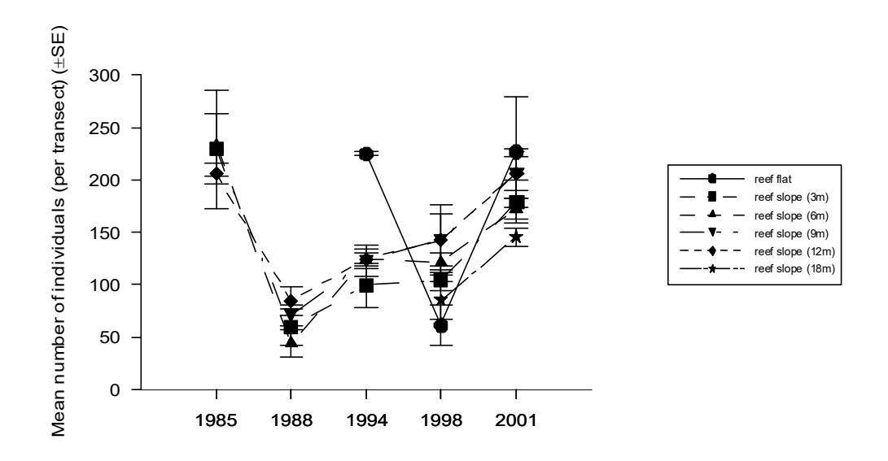

Figure 3. Mean (and SE) of species richness of fishes on the reef slope in Fagatele Bay during surveys conducted from 1985-2001.

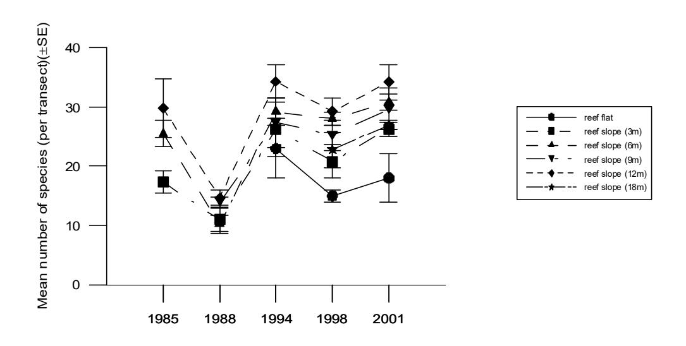

Figure 4. Mean (and SE) of abundance of fishes on the reef slope in Fagatele Bay during surveys conducted from 1985-2001.

Additional qualitative observations were made in deeper water on the reef slope (20-50m). In summary we noted that:

- Fish species richness and abundance tended to decrease with increasing depth. In particular, there was a noticeable decline below the thermocline, which occurred at a depth of 25m.
- Fish assemblages above the thermocline (20-25m) were similar to those described at 18 m (see above).
- Common species on the deep reef slope below the thermocline (25m) included acanthurids (*Ctenochaetus strigosus*) and pomacentrids (*Chromis alpha, Chromis iomelas* and *Chrysiptera cyanea*). Less common species observed on the deep reef slope and adjacent sand flat (35-50m) included:

acanthurids Zebrasoma scopas;

caesionids Caesio caerulaurea\* and C. cuning;

chaetodonitids Chaetodon reticulatus, Forcipiger flavissimus, and

*Hemitaurichthys polylepis\**;

gobiids Valenciennea strigata\*

labrids Bodianus loxozonus\*, Cheilinus fasciatus\*, Halichoeres

biocellatus, Macropharyngodon meleagris\*, Labropsis australis\*, Pseudocheilinus evanidus\*, and Pseudodax

mollucanus;

malacanthids Malacanthus latovittatus\*;

mullids *Parupeneus multifasciatus* and *P. pleurostigma\**;

pomacanthids Apolemichthys trimaculatus\*, Centropyge bicolor\* and C.

bispinosus;

serranids Epinephelus hexagonatus\* and Variola louti\*.

- Of the species observed below the thermocline, 14 were not recorded in shallower water in this survey (those marked with an asterisk above). In addition, two species (*Labropsis australis* and *Centropyge bicolor*) have only been recorded below the thermocline.
- One species, *Chromis alpha*, was particularly abundant below the thermocline, but was uncommon in shallower water (Table 1). This species is also a new record for the bay (see above).

Only a small proportion of the fishes recorded in the quantitative survey was observed on the reef flat (Table 10). A total of 320 individuals and 21 species were recorded on the reef flat transects, while another three species were observed in the vicinity of the transects. This was probably due to lower species richness on the reef flat than the reef slope (Figure 4), as well as the much smaller area surveyed on the reef flat (area = 120m² vs. 1320m²). Even though species richness is lower on the reef flat, fish abundance is usually high due to the high abundance of a few species eg schooling fishes such as *Spratelloides delicatulus* and common species such as the acathurid *Ctenochaetus striatus*, and the damselfish *Stegastes albifasciatus*.

The dominant fishes on the reef flat were similar to those recorded for that habitat type in the last survey (Birkeland et al 2003). They included: three pomacentrids (*Stegastes albifasciatus, Chrysiptera cyanea* and *C. leucopoma*), three acanthurids (*Ctenochaetus striatus, Acanthurus nigrofuscus* and *Acanthurus triostegus*), one labrid (*Thalassoma hardwicke*) and unidentified juvenile scarids (*Scarus* spp.: Table 10). Two of these species were not abundant on the adjacent reef slope (*S. albifasciatus*, and *A. triostegus*; Table 9).

### *Fagatele Bay - 2001*

A total of 4908 fish belonging to 135 species were recorded during transect surveys in Fagatele Bay in 2001 (Tables 11 & 12). Of these, 14 were new species records for the transect surveys, although seven of these (\*) had been sighted in the vicinity of the transects during previous surveys:

```
Acanthurus nigroris, Naso unicornis* and Naso sp. (Family Acanthuridae);
Chaetodon melannotus*, Heniochus chrysostomus* and H. monoceros (F. 
Chaetodontidae);
Plectorhinchus orientalis (F. Haemulidae); 
Lutjanus bohar* (F. Lutjanidae);
Parupeneus sp. (F. Mullidae);
Ostracion meleagris* (F. Ostraciidae);
Apolemicthys trimaculatus and Pomacentrus imperator (F. Pomacanthidae);
Scarus schlegeli* (F.Scariidae) and
Arothron meleagris* (F. Tetraodontidae).
```

One of these species also represented a new family and genus record for Fagatele Bay (Genus Plectorhinchus, Family Haemulidae). This brings the total number of species recorded in Fagatele Bay to 215 (119 genera and 45 families).

A total of 4456 individual fish from 130 species was recorded on the reef slope in 2001 (3m-18m). The dominant fishes on the reef slope were similar to those recorded in previous years and include four acanthurids (*Ctenochaetus striatus, Acanthurus nigrofuscus* and *Acanthurus nigricans, Zebrasoma scopas*), one labrid (*Thalassoma quinquevittatum*) six pomacentrids (*Chromis acares, C. iomelas, Pomacentrus vaiuli*, *P. brachialis* and *Plectrogylphidodon lacrymatus and Plectroglyphidodon dickii*) (Table 11).

A total of 453 individuals and 27 species were recorded on the reef flat transects in 2001. The dominant fishes on the reef flat were again very similar to previous surveys and included four pomacentrids (*Stegastes albifasciatus, Stegastes nigricans, Chrysiptera cyanea* and *C. leucopoma*), three acanthurids (*Ctenochaetus striatus, Acanthurus lineatus* and *Acanthurus triostegus*), and one labrid (*Thalassoma hardwicke*) (Table 12). Four of these species were not abundant on the adjacent reef slope (*S. albifasciatus*, *S. nigricans*, *C. leucopoma* and *A. triostegus* Table 11).

### *Sites around Tutuila Island – 1998 & 2001*

At each of the sites where corals were surveyed around Tutuila Island, we used one 30 x 2m transect to survey fish at depths of 3m and 6m. However, the fish data have not been analysed for this report due to a decision to discontinue this aspect of the survey. We believe the method used for these fish surveys is inappropriate to properly monitor trends in fish communities around the island, and due to the lack of replication, generally produce poor results.

The three additional sites where fish were surveyed in 100m transects at Fagatele Bay, Sita Bay and Cape Larsen are not directly comparable with each other in the context that each transect is run at a different depth or exposure (see methods). Surveys are done at these sites only to monitor long-term changes in fish communities at each site. The number and species of fish recorded at these three sites in 1998 and 2001 are presented in Tables 13 & 14.

### *Trends in fish populations 1995-2001 – Fagatele Bay*

The abundance of fish in Fagatele Bay has shown a gradual increase over the last six years. With the exception of the reef flat areas, all sites showed a slight increase in abundance from 1995 to 1998, with a more dramatic increase between 1998 and 2001. However, the overall abundance of fish in Fagatele Bay in the 2001 surveys is still lower than levels recorded in the first survey in 1985 (Figure 3).

The same general trends in species richness are apparent across all depths on the reef slope (3- 18m) from 1995 to 2001. Specifically, there was a slight drop in species richness between 1994 and 1998, although by 2001 species richness had returned to 1995 levels (Figure 4). On the reef flat, species richness also dropped in 1998, although despite a subsequent increase in the number of species, 2001 levels remained below those recorded in 1995. There has been an overall increase in species richness on the reef slope in Fagatele Bay from 1985 to 2001 (Figure 4), although the notable drop in species richness in 1988 may well be due to variation among observers (all surveys since 1994 have been done by Alison Green).

### *Trends in fish populations 1995-2001 – Sites around Tutuila*

Species richness and fish abundance at sites outside Fagatele Bay were similar to the patterns observed within Fagatele Bay. Changes in fish abundance outside Fagatele Bay mirrored changes inside the bay. Fish abundance gradually increased from 1995 to 2001, and were approaching peak levels recorded in 1985 (despite a slight drop in fish abundance in Sita Bay from 1995 to 1998) (Figure 5). Overall there was little difference in species richness between the 1995 and 2001 surveys, and species richness was similar to, but slightly higher than, that recorded in 1977 and 1985, and higher than in 1988 (Figure 6).

Abundance of fish at the three sites around Tutuila varied considerably at the family level. Acanthurids, Chaetodontids, Pomacentrids and Scarids have all increased in abundance at all three sites between 1995 and 2001 (with the exception of Scarids at Fagatele Bay which were unusually common in 1995; Figure 7). Fish from three of the families (Acanthuridae, Chaetodontidae and Scaridae) were more common in 2001 than in 1978, but Pomacentrid abundance was considerably lower in 2001 than in 1977 (Figure 7).

Labrid abundance varied in a similar way among all three sites, although there was a slight drop in labrid abundance both at Cape Larsen and Fagatele Bay between 1995 and 2001. Labrids were less abundant in 2001 than in 1977. The abundance of Caesonids, Cirrhitids and Serranids has varied unpredictably among surveys, although the abundance both of Serranids and Cirrhitids were similar in the 1977 and 2001 surveys (Figure 7).

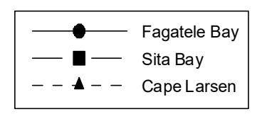

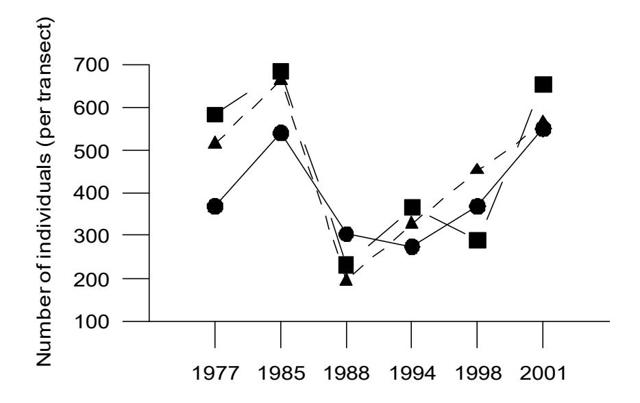

Figure 5. Abundance of fishes on the reef slope at three sites around Tutuila Island during surveys conducted from 1977-2001.

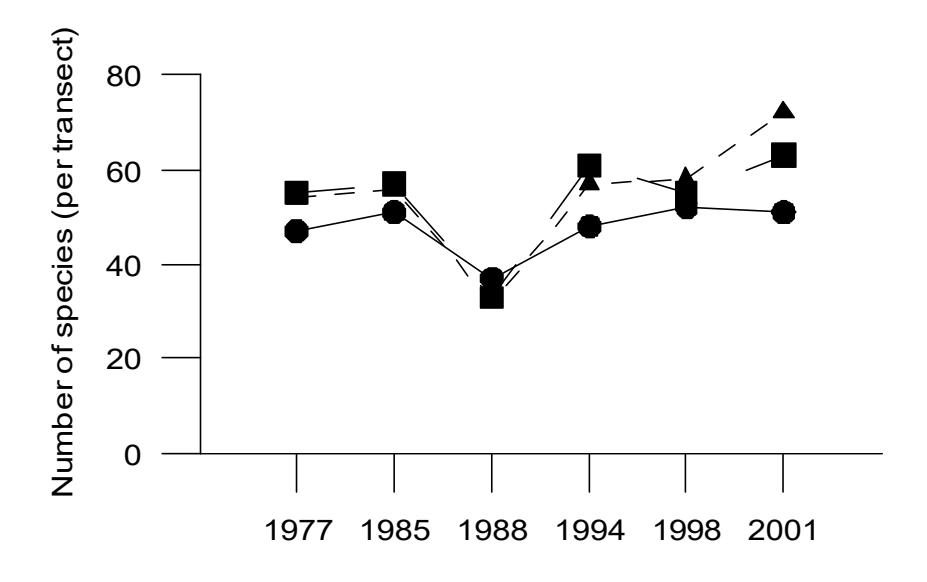

Figure 6. Species richness of fishes on the reef slope at three sites around Tutuila Island during surveys conducted from 1977-2001.

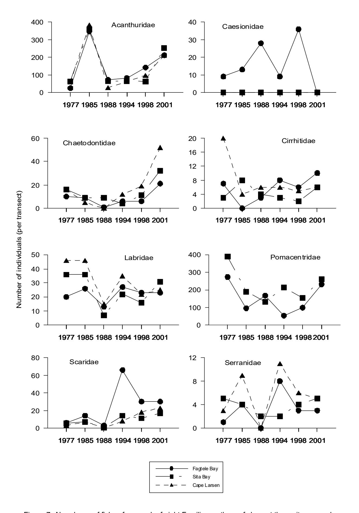

Figure 7. Abundance of fishes from each of eight Families on the reef slope at three sites around Tutuila Island during surveys conducted from 1977-2001

Table 9. Fishes recorded on the reef slope at different depths at each of five sites in Fagatele Bay National Marine Sanctuary in April 1998. Note Site 1 was not surveyed in 1998. Numbers represent fish counted on transects. P = fish present in the vicinity of the transect.

|    |    | Site 2 |     |     |    |        | Site 3 |     |        |        |    | Site 4 |     |        |        |    | Site 5 |        |             |        | Site 6      |
|----|----|--------|-----|-----|----|--------|--------|-----|--------|--------|----|--------|-----|--------|--------|----|--------|--------|-------------|--------|-------------|
| 3m | 6m | 9m     | 12m | 18m | 3m | 6m     | 9m     | 12m | 18m    | 3m     | 6m | 9m     | 12m | 18m    | 3m     | 6m | 9m     | 12m    | 18m         | 9m     | 12m         |
|    |    |        |     |     |    |        |        |     |        |        |    |        |     |        |        |    |        |        |             |        |             |
|    |    |        |     |     |    |        |        |     |        |        |    |        |     |        |        |    |        |        |             |        |             |
|    |    |        |     |     | P  |        |        |     |        |        |    |        |     |        | 1      |    |        |        |             | 7      | 3           |
|    |    |        |     |     |    |        |        |     |        |        |    |        |     |        |        |    |        |        |             | 10     | 1           |
|    |    |        | P   |     |    |        |        |     |        |        |    |        |     |        |        | P  |        |        |             |        | 1           |
| 13 |    |        |     |     |    |        |        |     |        |        |    |        |     |        | 4      |    |        |        |             |        |             |
| 2  | 4  | 1      | 2   |     | 1  |        |        |     |        |        |    |        |     |        | 4      | 4  | 1      |        |             | 2      | 1           |
| 3  | 3  | 2      | 1   |     | 1  | 9      | 2      | 1   | 1      | 2      | 1  |        | 7   | 1      | 7      | 5  | 15     | 5      | 1           | 3      | 13          |
|    |    |        |     |     |    |        |        | P   |        |        |    |        |     |        |        |    |        |        |             |        |             |
| 3  | 1  | 1      |     | 3   | 21 | 5      | 1      | 1   | 3      | 7      | 1  | 2      | 1   | 1      |        |    | 2      | 1      | 1           | 4      |             |
|    |    |        |     | P   |    |        |        |     |        |        |    |        |     |        |        |    |        |        |             |        |             |
|    |    |        |     |     | 4  |        |        |     |        | P      | P  |        |     |        |        |    |        |        |             |        |             |
| 31 | 27 | 40     | 41  | 15  | 28 | 48     | 23     | 30  | 2      | 14     | 31 | 37     | 26  | 19     | 31     | 35 | 30     | 12     | 19          | 100    | 58          |
|    | 1  | 1      | 2   | 4   |    | P      |        | 3   | 12     |        | P  | 4      | 7   | 12     |        | P  | 1      | 1      | 7           | 5      | 1           |
| P  | P  |        | 1   | P   | P  |        | P      | 1   | P      |        | 3  | P      | P   | 1      | 4      |    | 1      | 3      | 1           |        | 2           |
| 4  | 2  | P      | 2   | 2   | 1  | 2      | 4      | 2   | 1      | 5      | 7  | 4      | 3   | 5      |        |    |        |        | 6           |        | P           |
|    | 1  |        |     |     |    |        |        |     |        |        |    |        |     |        |        |    |        |        |             |        |             |
|    |    |        |     |     |    |        |        |     |        |        |    |        |     |        |        |    |        |        |             |        |             |
|    | 1  | P      |     |     |    | P      |        |     |        |        |    |        |     |        |        |    |        |        |             |        |             |
|    |    |        |     |     |    |        |        |     |        |        |    |        |     |        |        |    |        |        |             |        |             |
|    |    |        |     |     |    |        |        |     |        |        |    |        |     |        |        |    |        |        |             |        | 2           |
|    |    |        |     |     |    |        |        |     |        |        |    |        |     |        |        |    |        |        |             |        |             |
|    |    |        |     |     |    |        |        |     |        |        |    |        |     |        |        |    |        |        |             |        |             |
|    |    |        | 1   | P   |    |        |        | P   |        |        |    |        |     |        |        | P  |        |        |             |        |             |
|    |    |        |     |     |    |        |        |     |        |        |    |        |     |        | P      | P  |        |        |             |        |             |
|    |    |        |     | P   |    |        |        |     |        |        |    |        |     |        | P      |    |        |        |             | 1      |             |
|    | P  | 1<br>1 | P   | P   |    | 1<br>P | 2<br>1 |     | 2<br>1 | 1<br>P |    | P<br>1 | P   | P<br>4 | 1<br>1 |    | P<br>P | P<br>1 | 2<br>P<br>2 | 1<br>P | 2<br>P<br>P |

|                          |    |    | Site 2 |     |     |    |    | Site 3 |     |     |    |    | Site 4 |     |     |    |    | Site 5 |     |     |    | Site 6 |
|--------------------------|----|----|--------|-----|-----|----|----|--------|-----|-----|----|----|--------|-----|-----|----|----|--------|-----|-----|----|--------|
|                          | 3m | 6m | 9m     | 12m | 18m | 3m | 6m | 9m     | 12m | 18m | 3m | 6m | 9m     | 12m | 18m | 3m | 6m | 9m     | 12m | 18m | 9m | 12m    |
| FAMILY BELONIDAE         |    |    |        |     |     |    |    |        |     |     |    |    |        |     |     |    |    |        |     |     |    |        |
| Tylosurus crocodilus     | P  |    |        |     |     | P  |    |        |     |     |    |    |        |     |     |    |    |        |     |     |    |        |
|                          |    |    |        |     |     |    |    |        |     |     |    |    |        |     |     |    |    |        |     |     |    |        |
| FAMILY BLENNIDAE         |    |    |        |     |     |    |    |        |     |     |    |    |        |     |     |    |    |        |     |     |    |        |
| Meiacanthus atrodorsalis |    |    |        |     | 2   |    |    |        |     | 3   |    |    |        |     |     |    |    |        |     |     |    |        |
| unidentified blenniids   |    |    |        | 1   |     | P  |    | P      | 2   |     |    | 2  | 3      |     |     |    | 1  | 7      | 2   |     |    | 1      |
| FAMILY CAESIONIDAE       |    |    |        |     |     |    |    |        |     |     |    |    |        |     |     |    |    |        |     |     |    |        |
| Caesio cuning            |    |    |        |     |     |    |    |        |     |     |    |    |        |     | P   |    |    |        |     |     | 6  | P      |
| Pterocaesio tile         |    |    | P      |     |     |    |    | 16     |     |     |    |    |        | 1   |     |    |    |        |     |     |    |        |
| P. spp.                  |    |    |        |     |     |    |    |        |     |     |    |    |        | P   |     |    |    |        |     |     |    |        |
| FAMILY CARANGIDAE        |    |    |        |     |     |    |    |        |     |     |    |    |        |     |     |    |    |        |     |     |    |        |
| Caranx melampygus        |    |    | P      |     |     | P  |    |        |     |     |    |    |        |     |     |    | P  |        |     |     |    |        |
| Scomberoides lysan       |    |    |        |     |     |    |    |        |     |     |    |    |        |     |     |    |    | P      |     |     |    |        |
|                          |    |    |        |     |     |    |    |        |     |     |    |    |        |     |     |    |    |        |     |     |    |        |
| FAMILY CHAETODONTIDAE    |    |    |        |     |     |    |    |        |     |     |    |    |        |     |     |    |    |        |     |     |    |        |
| Chaetodon auriga         |    |    |        |     |     |    |    |        |     |     | P  |    |        |     |     |    |    |        |     |     |    |        |
| C. bennetti              |    |    |        |     |     |    |    |        | P   |     |    |    |        | P   |     |    |    |        |     |     |    |        |
| C. citrinellus           |    |    |        |     |     | 1  |    |        |     |     |    |    |        |     |     |    |    |        |     |     | P  |        |
| C. ephippium             |    | P  |        |     |     | 1  |    |        |     |     | P  |    | P      |     | 1   | P  |    | P      |     | 2   | P  |        |
| C. lunula                |    | 1  | P      |     |     |    | P  |        |     |     |    |    |        |     |     |    |    |        |     |     |    |        |
| C. melannotus            |    |    |        |     |     |    |    | P      |     |     |    |    |        |     |     |    |    |        |     |     |    |        |
| C. ornatissimus          |    |    |        |     |     | P  |    |        |     |     |    |    | 2      |     |     |    |    |        |     |     | 2  | 2      |
| C. pelewensis            |    |    |        |     |     |    |    |        |     |     |    |    | P      |     |     |    |    |        |     | P   |    |        |
| C. quadrimaculatus       |    |    |        |     |     |    |    |        |     |     |    |    |        |     |     |    | P  | 1      |     |     |    |        |
| C. rafflesi              |    | P  |        |     |     |    | P  |        |     |     | P  |    |        |     |     |    |    |        |     |     |    |        |
| C. reticulatus           |    | 2  | 2      | P   | 1   | 4  | 2  | 3      | P   |     | 2  | 2  | P      |     |     |    | 2  | P      |     |     | P  | 2      |
| C. semeion               |    | 1  | P      |     |     |    |    | P      |     |     | P  | P  | 1      | P   |     |    | P  | P      |     |     |    | P      |
| C. speculum              | P  |    |        |     |     |    |    |        |     |     |    |    | P      |     |     |    |    |        |     |     |    |        |
| C. trifascialis          | P  |    |        |     | P   |    | P  |        |     |     |    |    |        |     |     |    |    |        |     |     |    |        |

|                        |    |    | Site 2 |     |     |    |    | Site 3 |     |     |    |    | Site 4 |     |     |    |    | Site 5 |     |     |    | Site 6 |
|------------------------|----|----|--------|-----|-----|----|----|--------|-----|-----|----|----|--------|-----|-----|----|----|--------|-----|-----|----|--------|
|                        | 3m | 6m | 9m     | 12m | 18m | 3m | 6m | 9m     | 12m | 18m | 3m | 6m | 9m     | 12m | 18m | 3m | 6m | 9m     | 12m | 18m | 9m | 12m    |
| C. trifasciatus        | 1  | P  |        |     |     | 1  |    |        |     |     | P  | P  |        |     |     |    |    |        |     |     |    | 4      |
| C. ulietensis          | 2  |    |        |     |     |    | P  | P      |     |     |    | P  |        |     |     |    |    |        |     | P   |    |        |
| C. unimaculatus        |    |    |        |     |     |    |    |        |     |     |    |    |        |     |     |    |    | P      |     |     |    |        |
| C. vagabundus          |    |    |        |     |     | P  | P  |        | P   |     |    | 2  | P      | P   |     |    | P  |        |     |     | P  |        |
| Forcipiger flavissimus |    |    | P      | P   | P   |    | 3  |        |     |     |    |    |        | 1   | 1   |    |    |        |     |     | P  |        |
| Heniochus chrysostomus |    |    |        |     |     |    |    | P      |     |     | P  |    |        |     |     |    |    |        |     | P   |    |        |
| H. varius              |    |    | P      | P   |     |    | P  |        | 3   |     |    |    |        |     |     |    |    |        |     |     |    |        |
| Zebrasoma veliferum    |    |    |        |     |     |    |    |        |     |     |    |    |        |     |     |    |    |        |     |     |    | P      |
| FAMILY CIRRHITIDAE     |    |    |        |     |     |    |    |        |     |     |    |    |        |     |     |    |    |        |     |     |    |        |
| Paracirrhites arcatus  | P  |    | 2      |     | 4   | P  | 1  |        |     |     |    | 1  |        |     |     |    |    |        |     | 2   | 2  |        |
| P. forsteri            |    |    |        |     |     |    |    |        | 2   |     |    |    |        |     |     |    |    |        |     |     |    |        |
| P. hemistictus         |    | 1  |        | 1   | 1   | P  | P  |        | P   |     |    | 1  |        | 1   |     |    |    |        |     |     |    | 1      |
| FAMILY FISTULARIIDAE   |    |    |        |     |     |    |    |        |     |     |    |    |        |     |     |    |    |        |     |     |    |        |
| Fistularia commersonii |    |    |        |     |     |    |    |        |     |     |    |    |        |     |     |    | P  |        |     |     |    |        |
| FAMILY HOLOCENTRIDAE   |    |    |        |     |     |    |    |        |     |     |    |    |        |     |     |    |    |        |     |     |    |        |
| Myripristis berndti    |    |    |        |     |     |    |    |        |     |     |    |    |        |     |     |    |    |        |     |     |    | 1      |
| Neoniphon sammara      |    |    |        |     |     |    |    |        |     |     |    |    |        |     |     |    |    |        | P   |     |    |        |
| FAMILY KYPHOSIDAE      |    |    |        |     |     |    |    |        |     |     |    |    |        |     |     |    |    |        |     |     |    |        |
| Kkyphosus vaigiensis   | P  | P  | P      |     |     | P  | 2  |        |     |     | 4  |    |        |     |     |    |    |        |     |     |    |        |
| FAMILIY LABRIDAE       |    |    |        |     |     |    |    |        |     |     |    |    |        |     |     |    |    |        |     |     |    |        |
| Anampses twistii       | P  |    |        |     |     |    | 1  | 2      |     |     |    |    | P      |     | 1   |    |    |        |     |     |    |        |
| Bodianus axillaris     |    |    |        |     |     |    |    |        |     | 2   | P  |    |        |     |     |    |    |        |     |     |    |        |
| Cheilinus chlorourus   |    |    | 1      |     |     |    |    |        |     |     |    |    |        |     |     |    |    |        |     |     |    |        |
| C. digrammus           |    | 1  |        |     | P   |    |    |        | P   |     |    | P  |        |     | 1   |    | 1  |        |     | P   |    |        |
| C. fasciatus           |    |    |        | P   |     |    |    |        |     |     |    |    |        |     |     |    |    |        |     |     |    |        |
| C. oxycephalus         |    |    |        |     |     | P  |    |        | P   |     |    |    |        |     |     |    |    |        |     |     |    |        |

|                            |    |    | Site 2 |     |     |    |    | Site 3 |     |     |    |    | Site 4 |     |     |    |    | Site 5 |     |     |    | Site 6 |
|----------------------------|----|----|--------|-----|-----|----|----|--------|-----|-----|----|----|--------|-----|-----|----|----|--------|-----|-----|----|--------|
|                            | 3m | 6m | 9m     | 12m | 18m | 3m | 6m | 9m     | 12m | 18m | 3m | 6m | 9m     | 12m | 18m | 3m | 6m | 9m     | 12m | 18m | 9m | 12m    |
| C. unifasciatus            |    |    |        |     |     | P  | 1  |        |     |     |    |    |        |     |     | P  | 1  |        |     |     |    | P      |
| Coris aygula               |    |    |        |     |     | P  |    |        | P   |     |    |    |        |     |     |    |    |        |     |     |    |        |
| C. gaimard                 |    |    |        |     |     |    |    |        |     |     |    |    |        |     |     |    | P  |        | P   | 1   |    |        |
| Epibulus insidiator        | 1  |    |        |     |     |    | 1  | P      | 1   |     |    | 1  |        | P   | P   |    | 1  |        |     |     | P  |        |
| Gomphosus varius           | 1  | 1  | P      | 1   |     |    | 2  | 3      | P   |     | 1  | 1  | P      |     |     |    | 2  | 3      | 3   |     |    | 3      |
| Halichoeres biocellatus    |    |    |        |     | 1   |    |    |        |     |     |    |    |        |     | 3   |    |    |        | 1   | 2   |    |        |
| H. hortulanus              |    |    |        |     | P   |    |    | 1      | P   | 1   |    |    | P      |     |     |    |    |        |     |     | 4  |        |
| H. marginatus              |    |    |        |     |     | 3  | 3  |        |     |     |    |    |        |     |     |    | 1  |        |     |     | 3  |        |
| Hemigymnus fasciatus       | 1  | 1  | P      | 1   |     |    | P  | 1      | 1   |     |    | P  |        | P   |     |    | 2  | P      | P   | 1   | 4  | 1      |
| H. melapterus              |    |    |        |     |     |    |    |        |     |     |    | P  |        |     |     |    | P  |        |     |     | P  |        |
| Labrichthys unilineatus    |    |    |        |     |     |    |    | 3      | 1   |     |    |    |        |     |     |    |    |        |     |     |    |        |
| Labroides bicolor          | 1  |    |        |     | P   | 1  |    |        |     |     | 1  |    |        | 1   |     |    |    | P      |     |     |    | 1      |
| L. dimidiatus              |    |    |        |     | P   | P  | 1  | 1      | P   |     |    | 1  | 2      |     | 1   | 1  | 1  |        | P   | P   |    |        |
| L. rubrolabiatus           |    | 1  |        | 1   |     |    |    | 1      | 3   |     |    |    |        |     |     |    | P  | P      |     |     | 1  | 3      |
| Labropsis xanthonota       |    |    |        | 1   |     |    |    | P      | P   |     |    |    | P      | 2   |     |    | P  |        |     |     |    | P      |
| Novaculichthys taeniourus  |    |    |        |     | P   |    |    |        |     |     |    |    |        |     |     |    |    |        |     |     |    |        |
| Pseudocheilinus hexataenia |    |    |        |     |     | P  |    |        |     |     |    | 1  |        |     |     |    |    | 1      |     |     |    | P      |
| P. octotaenia              |    |    |        |     |     |    |    |        |     |     |    |    |        |     |     |    |    |        | 1   |     |    |        |
| Pseudodax moluccanus       | P  | P  |        |     |     |    |    |        |     |     |    |    |        |     |     |    |    |        |     |     |    |        |
| Stethojulis bandanensis    |    |    |        |     | P   |    |    |        |     |     |    |    |        |     |     |    |    |        |     |     |    |        |
| Thalassoma hardwicke       | 2  | 2  | P      | P   |     | 6  | 2  | 1      | P   |     | 6  | 3  |        | 1   |     | P  |    |        |     |     |    |        |
| T. lutescens               |    | 1  |        | 1   |     |    |    | 2      | 2   |     |    |    | P      |     |     |    |    |        | 1   |     | P  | P      |
| T. quinquevittatum         | 8  | 1  | 1      |     |     | 1  | 3  | 1      | P   |     | 10 | 7  | 2      | 1   |     | 20 | 21 | 3      |     |     | 3  |        |
| FAMILY LETHRINIDAE         |    |    |        |     |     |    |    |        |     |     |    |    |        |     |     |    |    |        |     |     |    |        |
| Monotaxis grandoculis      |    |    |        |     | 1   |    | P  |        |     |     | P  |    |        | P   |     |    | 1  |        | P   | P   |    | P      |
| FAMILY LUTJANIDAE          |    |    |        |     |     |    |    |        |     |     |    |    |        |     |     |    |    |        |     |     |    |        |
| Aphareus furca             | 1  |    | 3      | 4   | 1   | P  | 1  |        | 1   |     | P  |    | 1      | P   |     |    |    |        | P   |     | 1  | 4      |
| Aprion virescens           |    |    |        |     |     |    |    |        |     |     |    |    |        |     |     |    |    |        | P   |     |    |        |
| Lutjanus bohar             |    | P  |        |     |     |    |    |        |     |     |    |    |        |     |     |    |    |        |     |     |    |        |

|                             |    |    | Site 2 |     |     |    |    | Site 3 |     |     |    |    | Site 4 |     |     |    |    | Site 5 |     |     |    | Site 6 |
|-----------------------------|----|----|--------|-----|-----|----|----|--------|-----|-----|----|----|--------|-----|-----|----|----|--------|-----|-----|----|--------|
|                             | 3m | 6m | 9m     | 12m | 18m | 3m | 6m | 9m     | 12m | 18m | 3m | 6m | 9m     | 12m | 18m | 3m | 6m | 9m     | 12m | 18m | 9m | 12m    |
| L. fulvus                   |    |    |        |     |     | P  | P  |        |     |     |    |    |        |     |     |    |    |        |     |     |    |        |
| Macolor macularis           |    |    |        |     |     |    |    |        |     |     |    |    |        | P   |     |    |    |        |     |     |    |        |
| M. niger                    |    |    |        |     | 1   |    |    |        |     | P   |    |    |        |     |     |    |    |        |     | P   |    |        |
| FAMILY MICRODESMIDAE        |    |    |        |     |     |    |    |        |     |     |    |    |        |     |     |    |    |        |     |     |    |        |
| Nemateleotris magnifica     |    |    |        |     |     |    |    |        |     | P   |    |    |        |     |     |    |    |        |     |     |    |        |
| Ptereleotris evides         |    |    |        |     | P   |    |    |        |     |     |    |    | P      |     | P   |    |    |        |     |     |    |        |
| FAMILY MONACANTHIDAE        |    |    |        |     |     |    |    |        |     |     |    |    |        |     |     |    |    |        |     |     |    |        |
| Aluterus scriptus           |    |    |        |     |     | 1  | P  |        |     |     |    | P  |        |     |     |    |    |        |     |     |    |        |
| Amanses scopas              | P  | P  | P      |     |     |    | P  | 1      |     |     |    |    |        | 2   |     |    |    |        | P   |     | 1  |        |
| Cantherhines dumerilii      |    |    |        |     |     |    |    |        |     |     |    |    |        |     |     |    |    | P      | P   | 2   |    | 1      |
| Oxymonacanthus longirostris |    |    |        |     |     |    | P  |        |     |     | 2  |    |        |     |     |    |    |        |     |     |    |        |
| FAMILY MUGILIDAE            |    |    |        |     |     |    |    |        |     |     |    |    |        |     |     |    |    |        |     |     |    |        |
| Crenimugil crenilabrus      | P  |    |        |     |     |    |    |        |     |     |    |    |        |     |     |    |    |        |     |     |    |        |
| FAMILY MULLIDAE             |    |    |        |     |     |    |    |        |     |     |    |    |        |     |     |    |    |        |     |     |    |        |
| Mulloides flavolineatus     |    |    |        |     |     |    |    |        |     |     | P  |    |        |     |     |    |    |        |     |     |    |        |
| M. vanicolensis             |    |    |        |     |     |    |    | 1      |     |     |    |    |        |     |     |    |    |        |     |     |    |        |
| Parupeneus bifasciatus      |    |    |        |     |     | 1  |    |        |     |     |    |    |        |     |     |    |    |        |     |     | 4  | 1      |
| P. cyclostomus              | P  | P  |        | 1   |     | P  |    |        |     |     | 2  |    |        |     | P   | 1  |    |        | P   |     |    |        |
| P. multifasciatus           |    |    |        |     | 1   | P  |    | 1      |     |     |    |    |        |     |     |    |    | 2      |     |     |    |        |
| FAMILY OSTRACIIDAE          |    |    |        |     |     |    |    |        |     |     |    |    |        |     |     |    |    |        |     |     |    |        |
| Ostracion meleagris         |    | P  | P      |     |     |    |    |        |     |     |    |    |        |     |     |    | P  |        |     |     |    |        |
| FAMILY PINGUIPEDIDAE        |    |    |        |     |     |    |    |        |     |     |    |    |        |     |     |    |    |        |     |     |    |        |
| Parapercis clathrata        |    |    |        |     | 2   |    |    |        |     |     |    |    |        |     |     |    | 1  |        | 1   | P   |    |        |
| FAMILY POMACANTHIDAE        |    |    |        |     |     |    |    |        |     |     |    |    |        |     |     |    |    |        |     |     |    |        |

|                           |    |    | Site 2 |     |     |    |    | Site 3 |     |     |    |    | Site 4 |     |     |    |    | Site 5 |     |     |    | Site 6 |
|---------------------------|----|----|--------|-----|-----|----|----|--------|-----|-----|----|----|--------|-----|-----|----|----|--------|-----|-----|----|--------|
|                           | 3m | 6m | 9m     | 12m | 18m | 3m | 6m | 9m     | 12m | 18m | 3m | 6m | 9m     | 12m | 18m | 3m | 6m | 9m     | 12m | 18m | 9m | 12m    |
| Centropyge bispinosus     |    |    |        | 1   | 1   |    |    |        | P   | 1   |    |    |        |     | 2   |    |    |        |     | 2   |    |        |
| C. flavissimus            | P  |    | 1      |     |     | 2  | P  | P      |     |     |    |    | P      |     |     |    |    | 1      |     |     | 3  | 1      |
| Pygoplites diacanthus     |    |    | P      | P   |     |    |    | 1      | 1   |     |    |    |        |     | 1   |    |    |        | 1   | 1   | 1  | 2      |
| FAMILIY POMACENTRIDAE     |    |    |        |     |     |    |    |        |     |     |    |    |        |     |     |    |    |        |     |     |    |        |
| Abudefduf septemfasciatus |    |    |        |     |     |    |    |        |     |     |    |    |        |     |     | P  |    |        |     |     |    |        |
| A. sexfasciatus           |    |    |        | P   |     |    |    |        |     |     |    |    |        |     |     | P  |    |        |     |     |    |        |
| Amphiprion chrysopterus   |    | P  |        |     |     |    |    |        |     |     |    | 1  |        | 2   | 4   |    |    |        |     |     |    |        |
| A. melanopus              |    |    |        |     |     | P  |    |        |     |     |    |    |        |     | 6   |    |    |        |     |     |    |        |
| Chromis acares            |    | 20 | 40     | 45  |     |    |    | 29     | 57  |     |    |    | 28     | 13  |     |    |    | P      |     |     | 5  | 56     |
| C. agilis                 |    |    |        | 1   |     |    |    | P      |     |     |    |    |        | P   |     |    |    |        |     |     |    |        |
| C. alpha                  |    |    |        |     | P   |    |    |        |     |     |    |    |        |     | P   |    |    |        |     |     |    |        |
| C. iomelas                |    |    | P      | 1   | 9   |    | 3  |        | 7   | 1   | 1  |    | 6      | 14  | 5   |    |    |        | 11  | 6   |    |        |
| C. margaritifer           |    |    |        |     |     |    | 2  |        | 1   |     |    |    |        |     |     |    |    | 3      |     |     | 6  | 10     |
| C. weberi                 |    |    |        |     |     |    |    |        |     |     |    |    |        |     | 11  |    |    |        |     |     |    |        |
| C. xanthura               |    | P  |        | P   |     | 1  |    |        |     |     |    | P  | P      | 1   | 23  |    | P  | 18     | P   | P   | 35 | 20     |
| Chrysiptera cyanea        | 6  |    |        |     |     | 14 |    |        |     |     | 11 |    |        |     |     | 4  | 1  |        |     |     |    |        |
| C. leucopoma              |    |    |        |     |     | P  |    |        |     |     |    |    |        |     |     | 11 | 1  |        |     |     |    |        |
| Dascyllus reticulatus     |    | 3  |        | 4   |     |    | 2  |        | P   |     |    |    |        |     |     |    |    |        |     |     |    |        |
| D. trimaculatus           |    |    |        |     |     |    |    |        |     |     |    |    | 3      | 1   | 6   |    |    |        |     | P   |    |        |
| Plectroglyphidodon dickii | 1  | 13 | 1      |     |     |    |    | 3      | 1   |     | 3  | 9  |        |     |     |    |    |        |     |     | 12 | 2      |
| P. johnstonianus          |    | 1  |        | 1   |     |    | P  | 1      | 1   |     |    |    | 2      | 2   |     |    |    |        |     |     | 4  | 1      |
| P. lacrymatus             |    | 2  | 3      | 1   | 3   | 8  | 20 | 10     | 3   |     | 5  | 10 | 2      | 2   |     |    |    | 3      | 2   | 5   |    | 3      |
| Pomacentrus brachialis    | 2  | 12 | 9      | 7   | 4   |    | 19 | 9      | 19  | 12  |    | 3  |        | 1   |     |    |    | 7      |     |     | 1  | 28     |
| P. vaiuli                 | 4  | P  | P      |     | 6   |    |    | P      | 1   | 8   | 3  | 4  | 7      | 7   | 11  |    |    |        | 6   | 15  | 2  | 2      |
| Stegastes fasciolatus     | 1  |    |        |     |     |    | 2  |        |     |     |    | 2  |        |     |     | 4  | 24 | 2      |     |     |    |        |
| FAMILY SCARIDAE           |    |    |        |     |     |    |    |        |     |     |    |    |        |     |     |    |    |        |     |     |    |        |
| Calatomus carolinus       |    |    |        | 1   |     |    |    | P      |     | P   |    |    | P      | P   |     |    |    |        |     |     |    |        |
| Cetoscarus bicolor        |    |    |        |     |     |    |    |        |     |     |    |    |        |     |     |    | 3  |        |     |     |    |        |
| Hipposcarus longiceps     |    |    |        |     |     |    |    |        |     |     |    |    |        |     |     |    | 1  |        |     |     |    |        |

|                         |    |    | Site 2 |     |     |    |    | Site 3 |     |     |    |    | Site 4 |     |     |    |    | Site 5 |     |     |    | Site 6 |
|-------------------------|----|----|--------|-----|-----|----|----|--------|-----|-----|----|----|--------|-----|-----|----|----|--------|-----|-----|----|--------|
|                         | 3m | 6m | 9m     | 12m | 18m | 3m | 6m | 9m     | 12m | 18m | 3m | 6m | 9m     | 12m | 18m | 3m | 6m | 9m     | 12m | 18m | 9m | 12m    |
| Scarus forsteni         |    |    |        |     | P   |    | P  |        |     |     |    |    | 3      | P   | 4   |    |    | P      | 1   |     | 1  | 3      |
| S. frenatus             |    |    |        |     |     | 2  |    | P      | 2   |     | 1  |    | 1      |     | 1   |    | 1  | 1      |     | P   | P  | P      |
| S. frontalis            |    |    | P      |     |     |    |    |        |     |     |    |    | 1      |     |     |    |    |        |     |     |    |        |
| S. ghobban              | P  | P  | 1      |     |     |    |    |        |     |     |    |    |        |     |     |    |    |        |     |     |    |        |
| S. globiceps            |    |    | P      | P   |     |    |    |        |     | P   | P  | 4  |        |     |     |    |    |        |     |     |    |        |
| S. microrhinos          |    |    |        |     | P   | P  |    | P      | P   |     | 3  |    |        |     |     |    |    |        | P   | 1   | P  |        |
| S. niger                |    |    |        |     |     |    |    |        | 1   |     |    | 1  |        |     |     |    |    |        |     |     |    |        |
| S. oviceps              | 5  | P  | 1      | 1   | 3   | 4  | 1  | P      | 2   |     |    | P  | 3      | P   | 2   |    |    | 2      | P   | 1   | P  | 1      |
| S. psittacus            | 6  | 6  |        | 2   | 1   | 12 | P  | 2      |     |     | 1  | 3  | P      |     |     |    | 1  |        |     |     |    | 6      |
| S. pyrrhurus            |    |    |        | 2   |     | 3  | 1  |        |     |     |    | P  |        |     |     |    | 2  | 1      | 1   |     | 1  | 5      |
| S. rubroviolaceus       |    |    |        | P   |     |    | P  |        |     |     |    | 1  |        |     |     | P  | 1  |        |     |     |    | 2      |
| S. schlegeli            |    |    |        |     | P   |    |    |        |     |     |    |    |        |     |     |    |    |        |     | P   |    |        |
| S. sordidus             | 5  | 2  | 1      | 5   | 7   | 11 | 9  | 6      | 1   | 1   | 1  |    | 4      | 2   | 7   |    |    | 3      |     | 1   | 3  | 3      |
| S. spinus               |    | 1  |        |     | 1   |    |    | P      |     |     |    | P  | 2      |     | 1   |    |    |        | 2   |     |    | 1      |
| FAMILY SERRANIDAE       |    |    |        |     |     |    |    |        |     |     |    |    |        |     |     |    |    |        |     |     |    |        |
| Cephalopholis argus     |    | P  |        |     | P   |    |    |        | 1   | 1   |    | P  |        | P   | 1   | 2  |    |        |     |     |    | 2      |
| C. urodeta              |    |    |        |     | P   |    | 1  | P      |     |     |    | 1  | 1      | 1   |     |    | 1  | P      |     |     | 1  | P      |
| Epinephelus merra       |    |    |        |     |     | P  |    |        |     |     |    |    |        |     |     |    |    |        |     |     |    |        |
| Pseudanthias pascalus   |    |    |        |     |     |    |    |        |     |     |    |    |        |     |     |    |    |        | P   |     |    | P      |
| FAMILY SPHYRAENIDAE     |    |    |        |     |     |    |    |        |     |     |    |    |        |     |     |    |    |        |     |     |    |        |
| Sphyraena barracuda     |    |    |        |     |     |    |    |        |     |     |    |    |        |     |     |    |    |        |     |     |    | P      |
| FAMILY TETRAODONTIDAE   |    |    |        |     |     |    |    |        |     |     |    |    |        |     |     |    |    |        |     |     |    |        |
| Arothron nigropunctatus |    |    |        |     |     |    |    |        |     |     | P  |    |        |     |     |    |    |        |     |     |    |        |
| A. meleagris            |    |    |        |     |     |    |    |        |     |     |    |    |        |     |     |    |    |        |     |     |    | P      |
|                         |    |    |        |     |     |    |    |        |     |     |    |    |        |     |     |    |    |        |     |     |    |        |
| FAMILY TERAPONTIDAE     |    |    |        |     |     |    |    |        |     |     |    |    |        |     |     |    |    |        |     |     |    |        |
| Terapon jarbua          | P  |    |        |     |     |    |    |        |     |     |    |    |        |     |     |    |    |        |     |     |    |        |

|                                  |     |     | Site 2 |     |     |     |     | Site 3 |     |     |    |     | Site 4 |     |     |    |     | Site 5 |     |     |     | Site 6 |
|----------------------------------|-----|-----|--------|-----|-----|-----|-----|--------|-----|-----|----|-----|--------|-----|-----|----|-----|--------|-----|-----|-----|--------|
|                                  | 3m  | 6m  | 9m     | 12m | 18m | 3m  | 6m  | 9m     | 12m | 18m | 3m | 6m  | 9m     | 12m | 18m | 3m | 6m  | 9m     | 12m | 18m | 9m  | 12m    |
| FAMILY ZANCLIDAE                 |     |     |        |     |     |     |     |        |     |     |    |     |        |     |     |    |     |        |     |     |     |        |
| Zanclus cornutus                 |     |     | 1      |     |     |     |     |        |     |     |    |     |        | P   | 1   |    | P   |        | P   | 2   | 2   | 5      |
|                                  |     |     |        |     |     |     |     |        |     |     |    |     |        |     |     |    |     |        |     |     |     |        |
| TOTALS:                          |     |     |        |     |     |     |     |        |     |     |    |     |        |     |     |    |     |        |     |     |     |        |
| # individuals on transect        | 104 | 115 | 112    | 134 | 74  | 134 | 150 | 129    | 155 | 50  | 85 | 105 | 121    | 104 | 135 | 94 | 115 | 109    | 59  | 80  | 242 | 260    |
| # species on transect            | 23  | 30  | 19     | 29  | 23  | 26  | 29  | 27     | 31  | 15  | 21 | 28  | 23     | 24  | 30  | 13 | 25  | 23     | 20  | 22  | 34  | 41     |
| # species on transect & vicinity | 38  | 46  | 39     | 41  | 42  | 50  | 49  | 44     | 49  | 21  | 34 | 43  | 40     | 42  | 35  | 21 | 43  | 36     | 36  | 35  | 47  | 55     |

Table 10. Fishes recorded on the reef flat at each of two sites in Fagatele Bay National Marine Sanctuary in April 1998. Numbers represent fish counted on transects. P = fish present in the vicinity of the transect.

|                                        | Site B | Site C |
|----------------------------------------|--------|--------|
| CLASS OSTEICHTHYES                     |        |        |
| FAMILY ACANTHURIDAE                    |        |        |
| Acanthurus lineatus                    | 1      |        |
| A. nigrofuscus                         |        | 8      |
| A. triostegus                          | 6      | 4      |
| Ctenochaetus striatus                  | 18     | 22     |
| Zebrasoma scopas                       | 1      | 2      |
| FAMILY CARANGIDAE                      |        |        |
| Caranx melampygus                      | 1      |        |
|                                        |        |        |
| FAMILY CHAETODONTIDAE                  |        |        |
| Chaetodon citrinellus                  |        | 2      |
| C. trifasciatus                        |        | 2      |
| FAMILY CLUPEIDAE                       |        |        |
| Spratelloides delicatulus              | 110    |        |
| FAMILIY LABRIDAE                       |        |        |
| Gomphosus varius                       |        | 1      |
| Halichoeres hortulanus                 | P      | 2      |
| H. marginatus                          | 1      | 2      |
| Thalassoma hardwicke                   | 5      | 3      |
|                                        |        |        |
| FAMILY LETHRINIDAE                     |        |        |
| Lethrinus harak                        |        | 1      |
|                                        |        |        |
| FAMILIY POMACENTRIDAE                  |        |        |
| Abudefduf septemfasciatus              | 4      | 1      |
| Chrysiptera cyanea                     | 4      | 4      |
| C. leucopoma                           | 12     | 15     |
| Plectroglyphidodon leucozonus          | P      |        |
| Stegastes albifasciatus                | 39     | 23     |
| FAMILY SCARIDAE                        |        |        |
| Scarus globiceps                       |        | p      |
| S. spinus                              | 2      |        |
| unidentified juveniles                 | 23     |        |
| FAMILY TETRAODONTIDAE                  |        |        |
| Canthigaster solandri                  | P      |        |
|                                        |        |        |
| FAMILY ZANCLIDAE                       |        |        |
| Zanclus cornutus                       |        | 1      |
| Total # Individuals on transect        | 227    | 93     |
| Total # species on transect            | 14     | 16     |
| Total # species on transect & vicinity | 17     | 17     |

Table 11. Fishes recorded on the reef slope at different depths at each of six sites in Fagatele Bay National Marine Sanctuary in February 2001. Numbers represent fish counted on transects. P = fish present in the vicinity of the transect.

|                          |    | Site 1 |    |    | Site 2 |     |     |    |    | Site 3 |     |     |    |    | Site 4 |     |     |    |    | Site 5 |     |     |    | Site 6 |
|--------------------------|----|--------|----|----|--------|-----|-----|----|----|--------|-----|-----|----|----|--------|-----|-----|----|----|--------|-----|-----|----|--------|
|                          | 9m | 12m    | 3m | 6m | 9m     | 12m | 18m | 3m | 6m | 9m     | 12m | 18m | 3m | 6m | 9m     | 12m | 18m | 3m | 6m | 9m     | 12m | 18m | 9m | 12m    |
| CLASS OSTEICHTHYES       |    |        |    |    |        |     |     |    |    |        |     |     |    |    |        |     |     |    |    |        |     |     |    |        |
| FAMILY ACANTHURIDAE      |    |        |    |    |        |     |     |    |    |        |     |     |    |    |        |     |     |    |    |        |     |     |    |        |
| Acanthurus achilles      |    |        |    |    |        |     |     |    |    |        |     |     | 1  |    |        |     |     | P  | 1  |        |     |     |    | 2      |
| Acanthurus guttatus      |    |        |    |    |        |     |     |    |    |        |     |     | P  |    |        |     |     |    | P  |        |     |     |    |        |
| Acanthurus lineatus      | P  | 23     | 1  |    |        |     |     |    | P  |        |     |     |    |    |        |     |     | 2  |    |        |     |     |    |        |
| Acanthurus nigricans     | 22 | 10     | 3  | 11 | 1      |     | 1   | 4  | 5  |        | 1   | P   | 7  | 5  | 5      | 4   |     | 6  | 7  | 5      | 4   | 1   |    | 20     |
| Acanthurus nigrofuscus   | 8  |        | 34 | 3  | 4      | 4   | 9   | 4  | 2  | 7      | 7   | 5   | 4  | 3  | 2      | 6   | 5   | 1  | 3  | 7      | 9   | 14  | 22 | 4      |
| Acanthurus nigroris      |    |        |    |    |        |     |     |    |    |        |     |     |    |    |        |     |     |    |    |        |     |     | 3  |        |
| Acanthurus olivaceus     |    |        |    |    |        |     |     |    |    |        |     |     |    |    |        |     |     |    |    |        |     |     | P  |        |
| Acanthurus thompsoni     |    | 1      |    |    |        |     |     |    |    |        |     |     |    |    |        |     |     |    |    |        |     |     |    |        |
| Acanthurus triostegus    |    |        |    |    |        |     |     |    |    |        |     |     |    |    |        |     |     |    |    |        |     |     |    |        |
| Ctenochaetus striatus    | 39 | 33     | 97 | 68 | 61     | 77  | 28  | 72 | 67 | 62     | 76  | 71  | 88 | 68 | 76     | 73  | 47  | 45 | 85 | 73     | 64  | 51  | 23 | 48     |
| Ctenochaetus strigosus   |    |        |    |    |        |     | 1   |    | 4  | 11     | 8   | 2   |    |    | 6      | 5   | 3   |    | 7  | 6      | 39  | 6   |    |        |
| Naso hexacanthus         |    |        |    |    |        |     |     |    |    |        |     |     |    |    |        |     |     |    |    |        |     |     |    | P      |
| Naso literatus           |    | P      | 1  |    |        |     | 1   |    |    | 1      |     |     |    | 2  |        |     |     | 1  |    | 1      |     |     | 7  | P      |
| Naso unicornis           |    |        |    |    |        |     |     |    |    |        |     |     |    |    |        |     |     |    |    |        |     |     |    |        |
| Naso sp.                 |    | 7      |    |    |        | 2   |     |    |    | 1      |     |     |    |    |        |     |     | 1  |    |        |     |     |    |        |
| Zebrasoma scopas         |    |        | 7  | 1  | 12     | 10  | 5   | 4  | 1  | 14     | 12  | 7   | 3  | 6  | 11     | 11  | 14  | 1  | 1  | 10     | 9   | 6   |    |        |
| FAMILY AULOSTOMIDAE      |    |        |    |    |        |     |     |    |    |        |     |     |    |    |        |     |     |    |    |        |     |     |    |        |
| Aulostomus chinensis     |    |        |    |    | P      | P   |     |    |    |        |     | P   |    | P  | 3      |     |     |    | P  |        |     |     |    |        |
| FAMILY BALISTIDAE        |    |        |    |    |        |     |     |    |    |        |     |     |    |    |        |     |     |    |    |        |     |     |    |        |
| Balistapus undulatus     | P  |        |    |    |        |     |     |    | 1  |        |     |     |    | 1  | 1      | 2   | 1   |    |    |        |     | 1   |    | 1      |
| Balistoides conspicullum |    |        |    |    |        |     |     |    |    |        |     |     |    |    |        |     |     |    |    |        |     |     |    | P      |
| Melichthys niger         |    |        |    |    |        |     |     |    |    |        |     |     |    |    |        |     |     |    | P  |        |     |     |    |        |
| Melichthys vidua         | 1  | 2      |    | 1  | 1      |     |     |    |    | 1      | 1   | P   |    |    | 1      |     |     |    |    |        | 2   | 2   |    | 1      |

|                                |    | Site 1 |    |    | Site 2 |     |     |    |    | Site 3 |     |     |    |    | Site 4 |     |     |    |    | Site 5 |     |     |    | Site 6 |
|--------------------------------|----|--------|----|----|--------|-----|-----|----|----|--------|-----|-----|----|----|--------|-----|-----|----|----|--------|-----|-----|----|--------|
|                                | 9m | 12m    | 3m | 6m | 9m     | 12m | 18m | 3m | 6m | 9m     | 12m | 18m | 3m | 6m | 9m     | 12m | 18m | 3m | 6m | 9m     | 12m | 18m | 9m | 12m    |
| Pseudobalsites flavimarginatus |    |        |    |    |        |     |     |    |    |        |     |     |    |    |        |     | P   |    |    |        |     |     |    |        |
| Sufflamen bursa                | 1  | 1      |    |    |        |     | 1   |    |    |        |     |     |    |    | P      |     |     |    |    |        | P   |     | P  |        |
| FAMILY BLENNIIDAE              |    |        |    |    |        |     |     |    |    |        |     |     |    |    |        |     |     |    |    |        |     |     |    |        |
| Meiacanthus atrodorsalis       |    |        |    |    |        |     |     |    |    |        |     | 1   |    |    |        |     |     |    |    |        |     |     |    |        |
| Plagiotremus tapeinosoma       |    |        |    |    |        |     |     |    |    |        |     |     |    |    |        |     |     |    |    |        | P   |     |    |        |
| unid brown blenny              |    |        |    | 1  | 1      |     |     |    | 1  | 1      |     | 1   |    | 2  | 1      |     |     |    | 2  | 1      | 1   |     | 3  | 1      |
| unid pink blenny               |    |        |    |    |        |     |     |    |    |        |     |     |    |    |        |     |     |    |    |        |     |     | 1  |        |
| FAMILY CAESIONIDAE             |    |        |    |    |        |     |     |    |    |        |     |     |    |    |        |     |     |    |    |        |     |     |    |        |
| Caesio cuning                  |    | P      |    |    |        |     |     |    |    |        |     |     |    |    |        |     |     |    |    |        |     |     |    | 31     |
| Pterocaesio spp.               |    |        |    | P  |        | P   |     |    |    |        |     |     |    |    | P      |     | P   |    |    |        |     |     |    |        |
| FAMILY CARANGIDAE              |    |        |    |    |        |     |     |    |    |        |     |     |    |    |        |     |     |    |    |        |     |     |    |        |
| Caranx melampygus              | P  | 1      |    |    |        |     |     |    |    |        |     |     |    |    |        |     |     |    |    |        |     |     |    |        |
| Scomberoides lysan             |    |        |    |    |        |     |     | P  |    |        |     |     |    |    |        |     |     | P  |    |        |     |     |    |        |
| FAMILY CHAETODONTIDAE          |    |        |    |    |        |     |     |    |    |        |     |     |    |    |        |     |     |    |    |        |     |     |    |        |
| Chaetodon auriga               |    |        |    |    |        |     |     |    |    |        |     |     |    |    |        |     |     | P  |    |        |     |     |    |        |
| Chaetodon bennetti             |    |        |    |    |        |     |     |    | P  |        |     |     | P  |    |        |     |     |    |    |        |     |     |    |        |
| Chaetodon citrinellus          |    |        |    |    |        |     |     |    |    |        |     |     |    |    |        |     |     |    |    |        |     |     |    | P      |
| Chaetodon ephippium            | P  | 2      |    |    |        | P   |     | 1  | P  |        |     |     |    |    |        | 1   | 1   |    |    |        | 1   |     | 1  | P      |
| Chaetodon lunula               | 1  |        |    | 1  |        |     |     |    |    |        |     |     |    | P  | P      |     |     |    |    |        |     |     |    |        |
| Chaetodon melannotus           |    |        |    | 2  | P      |     |     |    | 1  | 1      |     |     |    |    |        |     |     |    |    |        |     |     |    |        |
| Chaetodon ornatissimus         | P  | 1      |    |    | 1      |     |     | 2  | 2  |        |     |     |    |    |        | 1   |     | P  |    |        | 3   |     |    | P      |
| Chaetodon pelewensis           |    |        |    |    |        | 1   | 4   |    |    |        | 7   | 4   |    |    | P      | 2   | 3   |    | 5  | 7      | 4   | 2   |    |        |
| Chaetodon quadrimaculatus      | P  |        |    |    |        |     |     |    |    |        |     |     |    |    |        |     |     |    |    |        |     |     |    | 2      |
| Chaetodon rafflesii            |    |        |    |    |        |     |     | P  |    | P      |     |     | P  |    |        |     |     |    | P  |        | P   |     |    |        |
| Chaetodon reticulatus          | P  | 1      |    | 2  | 7      | 13  | 2   | 1  | 4  | 1      | 1   | 5   | 4  | 1  | 8      | 2   | 4   | 2  | 8  | 13     | 9   | 2   |    | P      |
| Chaetodon semeion              | P  |        |    |    |        |     |     |    |    |        |     |     | P  |    |        |     |     |    |    |        |     |     |    |        |

|                             |    | Site 1 |    |    | Site 2 |     |     |    |    | Site 3 |     |     |    |    | Site 4 |     |     |    |    | Site 5 |     |     |    | Site 6 |
|-----------------------------|----|--------|----|----|--------|-----|-----|----|----|--------|-----|-----|----|----|--------|-----|-----|----|----|--------|-----|-----|----|--------|
|                             | 9m | 12m    | 3m | 6m | 9m     | 12m | 18m | 3m | 6m | 9m     | 12m | 18m | 3m | 6m | 9m     | 12m | 18m | 3m | 6m | 9m     | 12m | 18m | 9m | 12m    |
| Chaetodon speculum          |    |        |    |    |        |     |     |    |    |        |     |     |    |    |        |     |     |    |    | P      |     |     |    |        |
| Chaetodon trifascialis      |    |        | 1  |    |        |     |     | 1  |    |        | P   |     |    |    |        |     | 1   |    |    |        |     |     |    |        |
| Chaetodon trifasciatus      |    | P      | 2  |    |        |     |     | P  | 2  | P      | P   | P   |    |    | P      |     | 3   | 4  |    |        |     |     |    | P      |
| Chaetodon ulietensis        |    |        |    | 2  |        | 2   |     |    |    | 3      | 4   | 2   |    | 2  | P      | 1   |     | 2  |    |        |     |     |    |        |
| Chaetodon unimaculatus      |    |        |    |    |        | 1   | P   |    |    | P      |     | 1   |    |    | 1      | 1   | P   | 4  | 2  | 5      | 6   | 3   |    | P      |
| Chaetodon vagabundus        | P  |        | 2  | 1  |        |     |     |    |    | P      |     | P   |    |    |        | 2   |     |    | P  |        |     |     |    |        |
| Forcipiger flavissimus      | 3  | 2      |    |    |        | 1   | P   |    |    |        |     | 2   |    |    |        |     | 1   |    |    |        | 1   | 2   |    | P      |
| Hemitaurichthys polylepis   | P  | 21     |    |    |        | P   |     |    |    |        |     |     |    |    |        | P   |     |    | P  |        |     |     |    | P      |
| Hemitaurichthys thompsoni   |    | P      |    |    |        |     |     |    |    |        |     |     |    |    |        |     |     |    |    |        |     |     |    |        |
| Heniochus chrysostomus      |    |        |    |    |        |     |     |    |    |        |     |     |    |    |        | 1   | 1   |    | P  |        | 1   |     |    |        |
| Heniochus monceros          |    |        |    |    |        |     |     |    |    |        |     |     |    |    |        |     | 1   |    |    |        |     |     |    |        |
| Heniochus varius            |    | 2      |    |    |        |     |     |    |    |        |     |     |    |    |        |     |     |    |    | P      |     | 1   |    |        |
| FAMILY CIRRHITIDAE          |    |        |    |    |        |     |     |    |    |        |     |     |    |    |        |     |     |    |    |        |     |     |    |        |
| Cirrhitichthys pinnulatus   |    |        |    |    |        |     |     |    |    |        |     |     |    |    |        |     |     | P  |    |        |     |     |    |        |
| Paracirrhites arcatus       | 4  | 1      | 1  | 1  | 3      | 3   |     |    |    | 3      | 2   |     |    | 1  | 1      | 1   |     |    | 1  | 1      | 2   | 1   | 3  | 5      |
| Paracirrhites forsteri      | 1  | 1      |    |    |        | 2   | 1   |    | 1  | 1      | 1   | 2   |    | 1  | 2      |     |     |    | 1  |        | 2   |     | P  | P      |
| Paracirrhites hemisticus    |    | P      | 1  |    |        |     |     |    |    |        |     |     |    |    |        |     |     | P  |    |        |     |     | 1  |        |
| FAMILY HAEMULIDAE           |    |        |    |    |        |     |     |    |    |        |     |     |    |    |        |     |     |    |    |        |     |     |    |        |
| Plectorhinchus orientalis   | 1  |        |    |    |        |     |     | P  |    |        |     |     | P  | P  |        |     |     |    |    |        |     |     |    |        |
| FAMILY HOLOCENTRIDAE        |    |        |    |    |        |     |     |    |    |        |     |     |    |    |        |     |     |    |    |        |     |     |    |        |
| Myripristis berndti         |    |        |    |    |        |     |     |    |    |        |     |     |    | P  |        |     |     |    | 1  |        |     |     |    |        |
| Myripristis sp.             |    |        |    |    |        |     |     |    |    |        |     |     |    |    |        |     |     |    |    |        | P   |     |    |        |
| Neoniphon opercularis       |    |        |    |    |        |     |     |    |    |        |     |     |    |    |        |     |     |    | P  |        |     |     |    |        |
| Neoniphon sammara           |    | 3      |    |    |        |     |     |    |    |        |     |     |    | P  |        |     |     |    |    |        |     |     |    |        |
| Sargocentron caudimaculatum |    | 1      |    |    |        |     |     |    |    |        |     |     |    |    |        |     |     |    |    |        |     |     |    |        |
| Sargocentron diadema        |    |        | 1  |    |        |     |     |    |    |        |     |     |    |    |        |     |     |    |    |        |     |     |    |        |
| Sargocentron microstoma     |    | 1      |    |    |        |     |     | P  |    |        |     |     |    |    |        |     |     |    |    |        |     |     |    |        |

|                          |    | Site 1 |    |    | Site 2 |     |     |    |    | Site 3 |     |     |    |    | Site 4 |     |     |    |    | Site 5 |     |     |    | Site 6 |
|--------------------------|----|--------|----|----|--------|-----|-----|----|----|--------|-----|-----|----|----|--------|-----|-----|----|----|--------|-----|-----|----|--------|
|                          | 9m | 12m    | 3m | 6m | 9m     | 12m | 18m | 3m | 6m | 9m     | 12m | 18m | 3m | 6m | 9m     | 12m | 18m | 3m | 6m | 9m     | 12m | 18m | 9m | 12m    |
| FAMILY KYPHOSIDAE        |    |        |    |    |        |     |     |    |    |        |     |     |    |    |        |     |     |    |    |        |     |     |    |        |
| Kyphosus vaigiensis      |    |        |    |    |        |     |     |    |    |        |     | P   |    |    |        |     |     | 2  | 1  |        |     |     |    |        |
|                          |    |        |    |    |        |     |     |    |    |        |     |     |    |    |        |     |     |    |    |        |     |     |    |        |
| FAMILY LABRIDAE          |    |        |    |    |        |     |     |    |    |        |     |     |    |    |        |     |     |    |    |        |     |     |    |        |
| Anampses meleagrides     |    |        |    |    |        |     |     |    |    |        |     | P   |    |    |        |     |     |    |    |        |     |     |    |        |
| Anampses twistii         |    |        |    | P  |        |     |     |    |    |        |     | P   |    |    |        | 2   |     |    |    |        |     |     |    |        |
| Bodianus axillaris       | P  | 2      |    |    |        |     |     |    | 1  |        |     | P   |    |    | P      |     |     |    | 1  |        |     |     |    | P      |
| Bodianus loxozonus       |    |        |    |    |        |     |     |    |    |        |     |     |    |    |        |     |     |    |    |        |     |     |    | P      |
| Cheilinus diagrammus     |    |        |    | P  |        |     | 1   |    |    |        |     | P   |    |    | P      |     | 1   |    | P  |        |     |     |    |        |
| Cheilinus oxycepthalus   |    |        |    | P  |        |     |     |    |    |        |     |     |    | 1  | P      |     |     |    |    | 1      |     |     |    |        |
| Cheilinus trilobatus     |    |        |    |    |        |     |     |    |    |        |     |     |    | 1  |        |     |     |    |    |        |     |     |    |        |
| Cheilinus unifaciatus    |    |        |    |    |        |     |     | 1  |    |        |     |     |    |    |        |     | P   |    | P  | P      | 1   |     |    | P      |
| Coris aygula             |    |        |    |    |        |     |     |    |    |        |     |     |    |    |        |     |     |    | P  |        |     |     |    | P      |
| Coris gaimard            |    |        |    |    |        |     |     |    |    |        |     |     |    |    |        |     |     |    |    |        |     |     |    | P      |
| Epibulus insidiator      |    |        |    |    |        | P   |     | 1  | P  |        |     | P   | 1  |    |        | P   |     |    | P  | 1      | 1   |     |    |        |
| Gomphosus varius         | 1  | 1      |    |    | 2      | 1   |     | P  | 1  | 2      |     | 1   |    | 2  | 3      | 1   |     | 2  | 5  | 2      | 2   |     |    | P      |
| Halichoeres biocellatus  |    |        |    |    |        |     | 2   |    |    |        | 1   | 3   |    |    |        | 1   | 2   |    |    |        |     | 1   |    |        |
| Halichoeres hortulanus   |    | P      |    | P  |        |     | 1   |    | P  |        |     | 1   |    |    | P      |     |     | P  |    |        |     |     | P  | 1      |
| Halichoeres ornatissimus |    | 1      |    |    |        |     |     |    |    |        |     |     |    |    |        |     |     |    |    |        |     |     |    |        |
| Halichoers marginatus    |    |        |    |    |        |     |     |    |    |        |     |     |    |    |        |     |     | P  |    |        |     |     |    |        |
| Hemigymnus fasciatus     | P  |        | P  |    | 1      |     |     | 1  |    |        |     |     |    |    | 1      |     |     |    | P  |        | P   |     |    | P      |
| Hemigymnus melapterus    |    |        |    |    |        |     |     |    |    |        |     |     |    |    |        |     |     |    |    |        |     |     |    | P      |
| Hologymnosus annulatus   |    |        |    |    |        |     |     |    |    |        |     |     |    |    |        | P   |     |    |    |        |     |     |    |        |
| Labrichthyes unilineatus |    |        |    |    |        | P   |     | 3  |    |        |     |     | 4  |    | P      |     |     |    | P  |        | 1   |     |    |        |
| Labroides bicolor        |    |        |    |    |        |     |     | 1  | P  |        |     | P   |    | 1  |        |     |     |    |    |        |     |     |    |        |
| Labroides dimidiatus     | 2  | 1      |    | 5  |        |     |     | P  | 2  |        | 1   | 1   | 4  | 1  | 3      | 4   |     | 2  | 1  | 3      | 2   |     | 1  | 1      |
| Labroides rubrolabiatus  |    |        |    |    |        | P   |     | 1  | 3  |        |     | P   | 1  | 1  | 6      | P   |     |    | P  | 3      |     |     |    | P      |
| Labropsis xanthonota     |    |        |    |    |        | P   |     |    |    |        |     | P   |    | P  | 2      |     |     |    |    |        | 1   |     |    | P      |

|                             |    | Site 1 |    |    | Site 2 |     |     |    |    | Site 3 |     |     |    |    | Site 4 |     |     |    |    | Site 5 |     |     |    | Site 6 |
|-----------------------------|----|--------|----|----|--------|-----|-----|----|----|--------|-----|-----|----|----|--------|-----|-----|----|----|--------|-----|-----|----|--------|
|                             | 9m | 12m    | 3m | 6m | 9m     | 12m | 18m | 3m | 6m | 9m     | 12m | 18m | 3m | 6m | 9m     | 12m | 18m | 3m | 6m | 9m     | 12m | 18m | 9m | 12m    |
| Macropharyngodon meleagris  |    |        |    |    |        |     | 1   |    |    |        |     |     |    |    |        |     |     |    |    |        |     |     |    |        |
| Pseudocheilinus hexataenia  | 2  |        |    |    | 2      | 1   | 1   |    | 1  | 4      | 1   | 1   |    | 4  | 3      | 3   |     |    | 5  | 1      | 1   |     |    |        |
| Pseudocheilinus octotaenia  |    |        |    |    |        |     | 1   |    |    |        |     |     |    |    |        | 1   |     |    |    | 1      |     |     |    |        |
| Pseudocheilinus tetrataenia |    |        |    |    |        |     |     |    |    | P      |     |     |    |    |        |     |     |    |    |        |     |     |    |        |
| Pseudodax moluccanus        | P  |        | 2  |    |        |     |     |    |    |        |     |     |    |    |        |     |     |    |    |        |     |     |    |        |
| Thalassoma amblycephalum    |    |        |    |    |        |     |     |    |    |        |     |     |    |    |        |     |     |    |    |        |     |     | 1  |        |
| Thalassoma hardwicke        |    |        | 1  | 1  | 1      | 1   |     | 1  |    |        |     |     | 4  | 4  |        | 1   |     | 1  |    |        |     |     |    |        |
| Thalassoma lutescens        | 1  | 1      |    |    |        | 1   |     |    |    |        |     | P   |    |    | 2      | 1   |     |    |    | 3      |     |     | P  |        |
| Thalassoma quinquevittatum  | 9  | 1      | 6  | 3  |        |     |     | 9  | 5  | 3      | 1   |     | 11 |    | P      |     |     | 10 | 1  | 2      |     |     | 53 | 10     |
| Thalassoma trilobatum       |    |        | 3  |    |        |     |     |    |    |        |     |     |    |    |        |     |     |    |    |        |     |     |    |        |
| FAMILY LETHRINIDAE          |    |        |    |    |        |     |     |    |    |        |     |     |    |    |        |     |     |    |    |        |     |     |    |        |
| Gnathodentax aurolineatus   |    |        |    |    | P      |     |     |    | 3  |        |     |     |    |    | P      |     |     | 1  | 1  | P      | 1   |     |    |        |
| Lethrinus harak             |    |        |    |    |        |     |     |    |    |        |     |     |    |    |        |     |     |    |    |        |     |     |    |        |
| Monotaxis grandoculis       | P  |        |    |    |        |     | 1   |    |    |        |     |     |    | P  |        | 1   | P   |    |    | P      |     | 1   |    | P      |
| FAMILY LUTJANIDAE           |    |        |    |    |        |     |     |    |    |        |     |     |    |    |        |     |     |    |    |        |     |     |    |        |
| Aphareus furca              |    | 1      |    |    |        | 2   |     |    | 1  | 1      | 2   |     |    | P  | 1      |     | 1   |    |    | 2      |     |     |    | P      |
| Aprion virescens            |    |        |    |    |        |     |     |    |    |        |     |     |    |    |        |     |     |    |    |        |     |     | P  |        |
| Lutjanus bohar              |    |        |    |    |        |     |     |    |    |        |     |     |    |    |        |     | 4   |    |    |        |     |     |    |        |
| Lutjanus fulvus             |    |        |    |    |        |     |     |    |    |        |     |     | 2  |    |        |     |     |    |    |        |     |     |    |        |
| Lutjanus monostigma         |    |        |    |    |        |     |     |    |    |        | 1   |     |    | P  |        |     |     |    |    |        | P   |     |    |        |
| Macolor macularis           | P  |        |    |    |        |     |     |    |    |        |     |     |    |    |        |     |     |    | P  |        |     |     |    | P      |
| Macolor niger               |    |        |    |    |        |     |     |    |    | P      |     | 1   |    | P  |        |     |     | P  | P  |        |     |     |    |        |
| FAMILY MICRODESMIDAE        |    |        |    |    |        |     |     |    |    |        |     |     |    |    |        |     |     |    |    |        |     |     |    |        |
| Nemateleotris magnifica     |    |        |    |    |        |     |     |    |    |        |     | 1   |    |    |        |     |     |    |    |        |     |     |    |        |
| FAMILY MONACANTHIDAE        |    |        |    |    |        |     |     |    |    |        |     |     |    |    |        |     |     |    |    |        |     |     |    |        |

|                             |    | Site 1 |    |    | Site 2 |     |     |    |    | Site 3 |     |     |    |    | Site 4 |     |     |    |    | Site 5 |     |     |    | Site 6 |
|-----------------------------|----|--------|----|----|--------|-----|-----|----|----|--------|-----|-----|----|----|--------|-----|-----|----|----|--------|-----|-----|----|--------|
|                             | 9m | 12m    | 3m | 6m | 9m     | 12m | 18m | 3m | 6m | 9m     | 12m | 18m | 3m | 6m | 9m     | 12m | 18m | 3m | 6m | 9m     | 12m | 18m | 9m | 12m    |
| Aluterus monoceros          |    |        |    |    |        |     |     |    |    |        |     |     |    |    |        |     |     |    | P  |        |     |     |    |        |
| Amanses scopas              |    |        |    | 2  |        |     |     |    |    | P      |     |     |    |    |        | 1   |     |    | 2  |        |     |     |    |        |
| Cantherhinus dumerilii      | 3  | 1      |    | P  |        | 1   |     |    |    | P      | 2   |     |    |    |        | 1   |     |    | 1  |        | P   |     |    |        |
| Oxymonacanthus longirostris |    |        |    | 1  |        | 2   |     |    |    |        | 1   |     | 1  | 2  | P      | 2   |     |    |    |        |     |     |    |        |
| FAMILY MULLIDAE             |    |        |    |    |        |     |     |    |    |        |     |     |    |    |        |     |     |    |    |        |     |     |    |        |
| Mulloides vanicolensis      |    |        |    |    |        |     |     |    |    |        |     |     | 11 |    |        |     |     |    |    |        |     |     |    |        |
| Parupeneus bifasciatus      |    |        |    |    | 1      |     |     |    |    |        |     |     |    |    | P      |     |     |    |    |        |     |     |    |        |
| Parupeneus cyclostomus      |    | 1      |    |    |        |     |     | 2  |    |        | 1   |     |    |    |        |     | 2   |    | P  | 1      |     |     |    |        |
| Parupeneus multifasciatus   | 3  |        |    |    |        | 1   |     |    |    | 2      |     | 2   |    |    | 1      |     |     |    |    | 1      | 1   | 2   | P  | P      |
| Parupeneus sp.              |    |        |    |    |        |     |     |    |    |        |     | 1   |    |    |        |     |     |    |    |        |     |     |    |        |
| FAMILY OSTRACIDAE           |    |        |    |    |        |     |     |    |    |        |     |     |    |    |        |     |     |    |    |        |     |     |    |        |
| Ostracion meleagris         |    |        |    |    |        |     |     |    | 1  |        |     | P   | P  | 1  |        |     |     |    | P  |        |     |     |    |        |
| FAMILY PEMPHERIDAE          |    |        |    |    |        |     |     |    |    |        |     |     |    |    |        |     |     |    |    |        |     |     |    |        |
| Pempheris oualensis         | P  | 4      |    | 3  |        |     |     |    | 1  |        |     |     |    | 1  |        | P   |     | P  | 1  |        |     |     |    |        |
| FAMILY PINGUIPEDIDAE        |    |        |    |    |        |     |     |    |    |        |     |     |    |    |        |     |     |    |    |        |     |     |    |        |
| Parapercis hexophtalma      |    |        |    |    |        |     |     |    |    |        |     |     |    |    |        |     |     |    |    |        |     |     |    | P      |
| FAMILY POMACANTHIDAE        |    |        |    |    |        |     |     |    |    |        |     |     |    |    |        |     |     |    |    |        |     |     |    |        |
| Apolemichthys trimaculatus  | 1  |        |    |    |        |     |     |    |    |        |     |     |    |    |        |     |     |    |    |        |     |     | P  |        |
| Centropyge bispinosus       |    | 1      |    |    |        |     | 2   |    |    |        | 2   | 2   |    |    | 1      |     | 2   |    |    | 2      | P   | 3   |    | P      |
| Centropyge flavissimus      | 4  | 4      |    |    | P      |     |     |    |    |        |     | P   |    |    | 2      |     |     |    | 2  |        |     |     | 2  |        |
| Pomacanthus imperator       |    | 3      |    |    |        |     |     |    |    |        |     |     |    |    |        |     |     |    |    |        |     |     |    |        |
| Pygoplites diacanthus       | P  | 1      |    |    | P      | 1   |     |    | 1  |        |     |     |    |    |        | P   |     |    |    | P      |     |     |    | P      |
| FAMILY POMACENTRIDAE        |    |        |    |    |        |     |     |    |    |        |     |     |    |    |        |     |     |    |    |        |     |     |    |        |

|                                  |    | Site 1 |    |    | Site 2 |     |     |    |    | Site 3 |     |     |    |    | Site 4 |     |     |    |    | Site 5 |     |     |    | Site 6 |
|----------------------------------|----|--------|----|----|--------|-----|-----|----|----|--------|-----|-----|----|----|--------|-----|-----|----|----|--------|-----|-----|----|--------|
|                                  | 9m | 12m    | 3m | 6m | 9m     | 12m | 18m | 3m | 6m | 9m     | 12m | 18m | 3m | 6m | 9m     | 12m | 18m | 3m | 6m | 9m     | 12m | 18m | 9m | 12m    |
| Abudefduf sexfasciatus           |    |        |    |    |        |     |     |    |    |        |     |     |    |    |        |     |     |    | P  |        |     |     |    |        |
| Amphiprion chrysopterus          |    | P      |    |    |        | P   |     |    |    |        |     |     |    |    |        |     |     |    |    |        |     |     |    |        |
| Amphiprion melanopus             |    |        |    |    |        |     |     |    |    |        |     |     |    | P  | P      |     |     |    |    |        |     |     |    |        |
| Amphiprion perideraion           |    |        |    |    |        |     |     |    |    |        |     | P   |    |    |        |     |     |    |    |        |     |     |    |        |
| Chromis acares                   | 1  | 13     |    |    | 30     | 6   | 5   |    | 1  | 1      | 8   |     |    | 1  | 45     | 1   |     |    | 1  |        | 74  |     |    |        |
| Chromis agilis                   |    | 2      |    |    |        |     |     |    |    |        |     |     |    |    |        | P   |     | 1  |    | 4      |     |     |    |        |
| Chromis amboinensis              |    |        |    |    |        |     |     |    |    |        |     | P   |    |    |        | 2   | 9   |    |    |        |     |     |    |        |
| Chromis iomelas                  |    |        |    |    |        | 2   | 9   |    |    | 5      | 19  | 6   |    |    | 16     | 14  | 15  |    |    | 41     | 42  | 10  |    |        |
| Chromis margaritifer             | 8  | 31     |    |    | 1      | 6   |     |    |    |        |     |     |    |    |        |     |     | 8  |    | 2      |     |     |    | 17     |
| Chromis vanderbiliti             | P  |        |    |    |        |     |     |    | 1  |        |     |     |    |    |        |     |     |    | P  |        |     |     |    |        |
| Chromis xanthura                 |    |        |    |    |        |     |     |    |    |        |     |     |    |    |        |     | P   |    |    |        |     |     |    |        |
| Chrysiptera cyanea               |    |        |    |    |        |     |     | 5  |    |        |     |     | 20 |    |        |     |     | 6  |    |        |     |     |    |        |
| Chrysiptera leucopoma            |    |        |    |    |        |     |     |    |    |        |     |     |    |    |        |     |     | P  |    |        |     |     | 12 |        |
| Dascyllus reticulatus            | 38 | 1      | P  |    |        |     | 6   |    |    |        |     | P   |    | P  | P      |     |     |    |    |        |     | 4   | 20 | P      |
| Dascyllus trimaculatus           |    |        |    |    |        |     |     |    |    |        |     |     |    |    | 6      |     |     |    |    | 1      |     |     |    |        |
| Neopomacentrus metallicus        |    |        |    |    |        |     |     | 10 |    |        |     |     |    |    |        |     |     |    |    |        |     |     |    |        |
| Plectroglyphidodon dickii        | 54 | 5      | 34 | 23 | 17     | 5   |     | 19 | 13 | 11     | 1   |     | 3  | 14 | 4      | 1   |     | 7  | 1  | 1      |     |     | 4  | P      |
| Plectroglyphidodon johnstonianus | 4  |        |    | 2  | 8      | 6   | 5   |    | 1  | 6      | 3   | P   |    |    | 4      | 4   |     |    | 1  | 3      | 4   |     | 5  | P      |
| Plectroglyphidodon lacrymatus    |    |        |    | 11 | 2      | 14  | 5   | 2  |    | 8      |     | 1   | 7  | 22 | 3      | 5   |     | 3  | 9  | 11     | 9   |     |    | 10     |
| Pomacentrus brachialis           |    | 2      | 4  | 16 | 13     | 4   | 6   |    | 10 | 3      |     | P   | P  | 4  | 14     | 9   |     | 2  | 16 | 19     | 1   |     |    |        |
| Pomacentrus vaiuli               | 3  | 1      |    | 2  | 3      | 4   | 22  |    | 1  | 3      | 2   | 28  |    | 3  | 2      | 1   | 9   |    | 7  | 8      | 11  | 34  |    | 2      |
| Stegastes albifasciatus          |    |        |    |    |        |     |     |    |    |        |     |     |    |    |        |     |     |    |    |        |     |     |    |        |
| Stegastes fasciolatus            | P  |        |    |    |        |     |     | 3  |    |        |     |     | 1  |    |        |     |     | 6  |    |        |     |     | 2  | 13     |
| Stegastes nigricans              |    |        |    |    |        |     |     |    |    |        |     |     | 8  |    |        |     |     |    |    |        |     |     |    |        |
|                                  |    |        |    |    |        |     |     |    |    |        |     |     |    |    |        |     |     |    |    |        |     |     |    |        |
| FAMILY SCARIDAE                  |    |        |    |    |        |     |     |    |    |        |     |     |    |    |        |     |     |    |    |        |     |     |    |        |
| Calotomus carolinus              |    |        |    |    |        |     |     |    |    |        |     | 1   |    |    |        |     |     |    |    |        |     |     |    |        |
| Chlorurus frontalis              | P  |        |    |    |        |     |     |    |    |        |     |     |    |    |        |     |     |    |    |        | 1   |     |    |        |
| Chlorurus microrhinos            |    | P      |    |    |        |     |     |    |    |        |     | P   |    |    |        |     |     |    |    |        |     |     |    |        |
| Chlorurus pyrrhurus              | P  |        |    |    |        |     |     |    |    |        |     |     |    |    |        |     |     | 3  |    |        |     |     |    |        |

|                           |    | Site 1 |    |    | Site 2 |     |     |    |    | Site 3 |     |     |    |    | Site 4 |     |     |    |    | Site 5 |     |     |    | Site 6 |
|---------------------------|----|--------|----|----|--------|-----|-----|----|----|--------|-----|-----|----|----|--------|-----|-----|----|----|--------|-----|-----|----|--------|
|                           | 9m | 12m    | 3m | 6m | 9m     | 12m | 18m | 3m | 6m | 9m     | 12m | 18m | 3m | 6m | 9m     | 12m | 18m | 3m | 6m | 9m     | 12m | 18m | 9m | 12m    |
| Chlorurus sordidus        |    |        | 5  | 2  |        | 4   |     | 9  | 8  | 5      | 3   | 1   | 3  | 8  | 2      | 2   |     | 5  | 17 | 1      | 4   | 4   |    | 1      |
| Scarus forsteni           | P  | P      |    |    |        |     |     |    | 1  |        |     |     |    |    | 1      |     |     |    |    | 1      | P   | 1   |    | 1      |
| Scarus frenatus           | P  |        |    |    |        |     |     |    | P  |        |     |     | 2  |    |        | P   |     | P  |    |        |     | 1   |    | 1      |
| Scarus niger              |    |        |    |    |        |     |     |    |    |        | 1   |     |    |    | 1      |     |     |    |    |        |     |     |    |        |
| Scarus oviceps            | 2  | 1      | 5  | 1  | 11     | 1   | 2   | 2  |    | 2      | 1   | P   | 1  | 2  |        | 1   | 1   | 3  | 1  | 1      | 1   | 5   |    | 1      |
| Scarus psittacus          |    |        | 9  | 7  | 1      |     |     | 2  | 2  |        |     |     | 1  |    | P      | P   |     |    |    |        |     | 1   |    | P      |
| Scarus rubroviolaceus     | P  | P      |    |    |        |     |     |    |    |        |     |     | 1  |    |        |     |     |    | P  |        |     |     |    | 2      |
| Scarus schlegeli          |    |        |    |    |        |     |     |    |    |        |     |     |    |    | 1      | 1   |     |    |    |        |     |     |    |        |
| Scarus spinus             |    | P      |    |    | 1      |     |     |    |    |        |     |     | 1  |    |        | P   |     |    |    | 1      | 1   | 2   |    |        |
|                           |    |        |    |    |        |     |     |    |    |        |     |     |    |    |        |     |     |    |    |        |     |     |    |        |
| FAMILY SERRANIDAE         |    |        |    |    |        |     |     |    |    |        |     |     |    |    |        |     |     |    |    |        |     |     |    |        |
| Subfamily Anthinae        |    |        |    |    |        |     |     |    |    |        |     |     |    |    |        |     |     |    |    |        |     |     |    |        |
| Pseudanthias pascalus     |    |        |    |    |        | P   |     |    |    |        |     | P   |    |    |        |     |     |    |    |        |     |     |    |        |
| Subfamily Ephinephelinae  |    |        |    |    |        |     |     |    |    |        |     |     |    |    |        |     |     |    |    |        |     |     |    |        |
| Cephalopholis argus       |    | 2      |    | 1  |        |     |     |    |    | P      |     | P   |    |    | 1      | 3   | 1   |    |    | 1      |     |     |    |        |
| Cephalopholis urodeta     | 3  | 1      | 1  |    |        |     |     |    | 1  |        |     | P   |    |    | 1      |     |     |    | P  | 1      | 1   | 1   | 1  | 1      |
| Epinephalus merra         |    |        |    |    |        |     |     |    |    |        |     |     | 1  | P  |        |     |     |    |    |        |     |     |    |        |
| Epinephalus polyphekadion |    |        |    |    |        |     |     |    |    |        |     |     |    |    |        |     | P   |    |    |        |     |     |    |        |
| Gracilia albomarginata    |    |        |    |    |        |     |     |    |    |        |     | P   |    |    |        |     |     |    |    |        |     |     |    |        |
| Plectropomus sp.          |    | P      |    |    |        |     |     |    |    |        |     |     |    |    |        |     |     |    |    |        |     |     |    |        |
| Variola louti             |    |        |    |    |        |     |     |    |    |        |     | P   |    |    |        |     | P   |    |    |        |     |     |    |        |
|                           |    |        |    |    |        |     |     |    |    |        |     |     |    |    |        |     |     |    |    |        |     |     |    |        |
| FAMILY TETRAODONTIDAE     |    |        |    |    |        |     |     |    |    |        |     |     |    |    |        |     |     |    |    |        |     |     |    |        |
| Arothron meleagris        |    |        |    |    |        |     |     |    |    |        |     |     | 1  |    |        |     |     |    |    |        |     |     |    |        |
| Arothron nigropunctatus   |    |        |    |    |        |     |     |    |    | P      |     |     |    |    |        |     |     |    |    |        |     |     |    |        |
| Arothron sp               |    |        |    |    |        |     |     |    |    |        |     |     |    |    |        |     |     | P  |    |        |     |     |    |        |
| Canthigaster solandri     |    |        |    |    | 1      |     |     |    |    |        |     |     | 3  |    |        |     |     |    |    | 1      |     |     |    |        |
| FAMILY ZANCLIDAE          |    |        |    |    |        |     |     |    |    |        |     |     |    |    |        |     |     |    |    |        |     |     |    |        |

|                                  |     | Site 1 |     |     | Site 2 |     |     |     |     | Site 3 |     |     |     |     | Site 4 |     |     |     |     | Site 5 |     |     |     | Site 6 |
|----------------------------------|-----|--------|-----|-----|--------|-----|-----|-----|-----|--------|-----|-----|-----|-----|--------|-----|-----|-----|-----|--------|-----|-----|-----|--------|
|                                  | 9m  | 12m    | 3m  | 6m  | 9m     | 12m | 18m | 3m  | 6m  | 9m     | 12m | 18m | 3m  | 6m  | 9m     | 12m | 18m | 3m  | 6m  | 9m     | 12m | 18m | 9m  | 12m    |
| Zanclus cornutus                 | 4   | 7      | 2   | 1   |        | 1   | 2   | 1   | 1   |        | 3   | 4   |     | 1   | 2      |     | 4   |     |     | 1      | 5   | 1   |     | 4      |
|                                  |     |        |     |     |        |     |     |     |     |        |     |     |     |     |        |     |     |     |     |        |     |     |     |        |
| TOTALS:                          |     |        |     |     |        |     |     |     |     |        |     |     |     |     |        |     |     |     |     |        |     |     |     |        |
| # individuals on transect        | 224 | 203    | 223 | 175 | 186    | 180 | 125 | 162 | 151 | 163    | 174 | 158 | 199 | 166 | 246    | 176 | 136 | 131 | 198 | 250    | 322 | 163 | 165 | 180    |
| # species on transect            | 28  | 44     | 23  | 28  | 25     | 31  | 27  | 26  | 34  | 27     | 30  | 28  | 29  | 30  | 39     | 39  | 25  | 27  | 32  | 41     | 37  | 28  | 19  | 24     |
| # species on transect & vicinity | 52  | 56     | 25  | 34  | 30     | 41  | 29  | 33  | 41  | 37     | 32  | 57  | 36  | 43  | 57     | 49  | 33  | 40  | 56  | 47     | 46  | 28  | 27  | 57     |

Table 12. Fishes recorded on the reef flat at each of two sites in Fagatele Bay National Marine Sanctuary in February 2001. Numbers represent fish counted on transects.

| CLASS OSTEICHTHYES<br>FAMILY ACANTHURIDAE<br>Acanthurus achilles<br>Acanthurus lineatus | Site B<br>5 | Site C |
|-----------------------------------------------------------------------------------------|-------------|--------|
|                                                                                         |             |        |
|                                                                                         |             |        |
|                                                                                         |             |        |
|                                                                                         |             | 2      |
|                                                                                         |             | 8      |
| Acanthurus nigrofuscus                                                                  |             | 2      |
| Acanthurus triostegus                                                                   | 1           | 10     |
| Ctenochaetus striatus                                                                   | 78          | 132    |
| Naso literatus                                                                          | 3           |        |
| Naso unicornis                                                                          |             | 1      |
| Zebrasoma scopas                                                                        | 2           |        |
| FAMILY CHAETODONTIDAE                                                                   |             |        |
| Chaetodon ephippium                                                                     |             | 2      |
| Chaetodon reticulatus                                                                   | 1           |        |
| Chaetodon vagabundus                                                                    |             | 1      |
|                                                                                         |             |        |
| FAMILY LABRIDAE                                                                         |             |        |
| Gomphosus varius                                                                        | 1           | 2      |
| Halichoers marginatus                                                                   |             | 1      |
| Labroides dimidiatus                                                                    |             | 1      |
| Thalassoma hardwicke                                                                    | 2           | 5      |
|                                                                                         |             |        |
| FAMILY LETHRINIDAE                                                                      |             |        |
| Lethrinus harak                                                                         |             | 1      |
|                                                                                         |             |        |
| FAMILY MONACANTHIDAE                                                                    |             |        |
| Cantherhinus dumerilii                                                                  |             | 1      |
| FAMILY OSTRACIDAE                                                                       |             |        |
| Ostracion meleagris                                                                     | 2           |        |
|                                                                                         |             |        |
| FAMILY POMACENTRIDAE                                                                    |             |        |
| Chrysiptera cyanea                                                                      | 18          | 11     |
| Chrysiptera leucopoma                                                                   | 41          | 53     |
| Pomacentrus vaiuli                                                                      |             | 1      |
| Stegastes albifasciatus                                                                 | 11          | 40     |
| Stegastes nigricans                                                                     | 8           |        |
|                                                                                         |             |        |
| FAMILY SCARIDAE                                                                         |             |        |
| Chlorurus sordidus                                                                      |             | 2      |
| Scarus psittacus                                                                        |             | 1      |
|                                                                                         |             |        |
| FAMILY SERRANIDAE                                                                       |             |        |
| Epinephalus merra                                                                       |             | 1      |
| FAMILY ZANCLIDAE                                                                        |             |        |
| Zanclus cornutus                                                                        | 1           | 1      |
|                                                                                         |             |        |
| Total # individuals on transect                                                         | 174         | 279    |
| Total # species on transect                                                             | 14          | 22     |
| Total # species on transect & vicinity                                                  | 14          | 22     |

Table 13. Fishes recorded along 100-m transects on the reef slopes at three locations around Tutuila Island in April 1998. Numbers represent fish counted on transects. P = fish present in the vicinity of the transect.

|                          | Fagatele Bay | Sita Bay | Cape Larsen |
|--------------------------|--------------|----------|-------------|
| CLASS OSTEICHTHYES       |              |          |             |
| FAMILY ACANTHURIDAE      |              |          |             |
| Acanthurus guttatus      |              | 3        |             |
| A. lineatus              |              | P        |             |
| A. nigricans             | 9            | 4        | 4           |
| A. nigrofuscus           | 3            | 15       | 11          |
| Ctenochaetus striatus    | 107          | 20       | 64          |
| C. strigosus             | 5            | 8        | 1           |
| Naso lituratus           | 4            | 5        | 15          |
| N. unicornis             |              |          | 2           |
| Zebrasoma scopas         | 14           | 1        |             |
| Z. veliferum             |              | 6        | P           |
| FAMILY AULOSTOMIDAE      |              |          |             |
| Aulostomus chinensis     | P            |          |             |
|                          |              |          |             |
| FAMILY BALISTIDAE        |              |          |             |
| Balistapus undulatus     | 3            | 1        | 2           |
| Melichthys vidua         | 4            | 2        | 5           |
| Sufflamen bursa          |              |          | 2           |
| FAMILY BLENNIDAE         |              |          |             |
| Plagiotremus tapeinosoma |              | 1        |             |
| unidentified blenniids   | 1            | 2        |             |
| FAMILY CAESIONIDAE       |              |          |             |
| Pterocaesio marri        | 1            |          |             |
| P. tile                  | 35           |          |             |
|                          |              |          |             |
| FAMILY CARANGIDAE        |              |          |             |
| Caranx melampygus        |              |          | P           |
| FAMILY CHAETODONTIDAE    |              |          |             |
| Chaetodon ephippium      | 1            |          |             |
| C. lunula                |              |          | 2           |
| C. melannotus            | 1            |          |             |
| C. ornatissimus          | P            |          | 2           |
| C. pelewensis            |              | 5        | 1           |
| C. reticulatus           | 2            | 4        | 6           |
| C. semeion               | 1            |          |             |
| C. trifascialis          | P            |          |             |
| C. trifasciatus          |              |          | 1           |
| C. ulietensis            | P            |          | 2           |
| C. vagabundus            |              | 2        | 2           |
| Chaetodontidae cont.     |              |          |             |
| Forcipiger flavissimus   | 1            |          | 2           |
| F. longirostris          |              |          | 1           |

|                            | Fagatele Bay | Sita Bay | Cape Larsen |
|----------------------------|--------------|----------|-------------|
|                            |              |          |             |
| FAMILY CIRRHITIDAE         |              |          |             |
| Paracirrhites arcatus      | 3            | 1        | 4           |
| P. hemistictus             | 3            | 1        | 1           |
|                            |              |          |             |
| FAMILY DIODONTIDAE         |              |          |             |
| Diodon hystrix             |              |          | 1           |
|                            |              |          |             |
| FAMILY HAEMULIDAE          |              |          |             |
| Plectorhinchus orientalis  |              | 3        | 1           |
|                            |              |          |             |
| FAMILY HOLOCENTRIDAE       |              |          |             |
| Myripristis berndti        |              |          | P           |
| Neoniphon sammara          |              | 2        |             |
|                            |              |          |             |
| FAMILY KYPHOSIDAE          |              |          |             |
| Kyphosus vaigiensis        | 1            |          |             |
|                            |              |          |             |
| FAMILIY LABRIDAE           |              |          |             |
| Anampses twistii           |              | 2        |             |
| Bodianus axillaris         | 1            |          | P           |
| Cheilinus digrammus        | 1            |          | P           |
| C. oxycephalus             | P            |          |             |
| C. trilobatus              | 1            |          |             |
| C. undulatus               |              |          | P           |
| C. unifasciatus            |              |          | 1           |
| Epibulus insidiator        |              |          | P           |
| Gomphosus varius           | 4            | 4        | 4           |
| Halichoeres biocellatus    | 1            |          |             |
| H. hortulanus              | P            | 1        | 2           |
| H. margaritaceus/miniatus  |              |          | 1           |
| H. marginatus              |              | 1        | 1           |
| H. ornatissimus            | 2            |          | 1           |
| Hemigymnus fasciatus       | 1            |          |             |
| Labroides bicolor          | 1            | 2        | 4           |
| L. dimidiatus              | 2            |          | 2           |
| L. rubrolabiatus           | 1            | 1        | 1           |
| Labropsis xanthonota       | 3            |          | 1           |
| Pseudocheilinus hexataenia |              | 1        | 2           |
| Stethojulis bandanensis    | 2            |          |             |
| Thalassoma hardwicke       |              | 3        |             |
| T. lutescens               | 1            |          |             |
| T. quinquevittatum         | 2            | 1        | 2           |
|                            |              |          |             |
| FAMILY LETHRINIDAE         |              |          |             |
| Gnathodentex aurolineatus  |              | 1        |             |
| Monotaxis grandoculis      |              | 6        | p           |
| FAMILY LUTJANIDAE          |              |          |             |
| Aphareus furca             | 7            | 1        | p           |
| Lutjanus bohar             | P            | 1        | P           |

|                           | Fagatele Bay | Sita Bay | Cape Larsen |
|---------------------------|--------------|----------|-------------|
| L. fulvus                 |              | 1        |             |
| L. monostigma             |              | 1        |             |
| Macolor niger             | P            |          |             |
|                           |              |          |             |
| FAMILY MICRODESMIDAE      |              |          |             |
| Nemateleotris magnifica   |              |          | 1           |
| Ptereleotris evides       | P            |          | 1           |
|                           |              |          |             |
| FAMILY MONACANTHIDAE      |              |          |             |
| Amanses scopas            | p            |          |             |
| Cantherhines dumerilii    |              | 1        | P           |
|                           |              |          |             |
| FAMILY MULLIDAE           |              |          |             |
| Parupeneus bifasciatus    |              | 1        | 2           |
| P. cyclostomus            | P            |          | 1           |
| P. multifasciatus         | 3            |          | 1           |
|                           |              |          |             |
| FAMILY OSTRACIIDAE        |              |          |             |
| Ostracion meleagris       | 1            |          |             |
|                           |              |          |             |
| FAMILY PINGUIPEDIDAE      |              |          |             |
| Synodus variegatus        | P            |          |             |
|                           |              |          |             |
| FAMILY POMACANTHIDAE      |              |          |             |
| Centropyge bispinosus     | P            |          |             |
| C. flavissimus            | 1            | 2        | 5           |
| Pomacanthus imperator     |              |          | 1           |
| Pygoplites diacanthus     | 2            | P        | 3           |
|                           |              |          |             |
| FAMILIY POMACENTRIDAE     |              |          |             |
| Chromis acares            | 27           | 1        | 21          |
| C. iomelas                | 27           |          | 9           |
| C. margaritifer           |              | 22       | 67          |
| C. xanthura               |              | 10       | 29          |
| Chrysiptera cyanea        |              | 47       | 50          |
| Neopomacentrus metallicus |              |          | 13          |
| Plectroglyphidodon dickii | 3            | 2        | 3           |
| P. johnstonianus          | 8            | 8        | 1           |
| P. lacrymatus             | 11           | 23       |             |
| Pomacentrus brachialis    | 12           | 35       | 47          |
| P. vaiuli                 | 11           | 7        | 16          |
|                           |              |          |             |
| FAMILY SCARIDAE           |              |          |             |
| Calatomus carolinus       | P            |          | P           |
| Cetoscarus bicolor        | P            |          |             |
| Scarus forsteni           |              |          | 3           |
| S. frenatus               |              |          | P           |
| S. frontalis              |              |          | P           |
| S. ghobban                | 1            |          |             |
| S. globiceps              | 1            |          | P           |
| S. microrhinos            |              | 1        | P           |

|                                        | Fagatele Bay | Sita Bay | Cape Larsen |
|----------------------------------------|--------------|----------|-------------|
| S. niger                               | 1            | 2        | 3           |
| S. oviceps                             | 5            |          |             |
| S. psittacus                           | 12           | 4        |             |
| S. pyrrhurus                           |              | 2        | 9           |
| S. rubroviolaceus                      | P            | 1        | P           |
| S. sordidus                            | 10           | 1        | 3           |
| FAMILY SERRANIDAE                      |              |          |             |
| Cephalopholis argus                    | 3            | 1        |             |
| C. urodeta                             |              | 3        | 6           |
| Pseudanthias pascalus                  | P            |          |             |
| Variola louti                          |              |          | P           |
| FAMILY ZANCLIDAE                       |              |          |             |
| Zanclus cornutus                       |              |          | 3           |
| CLASS CHONDRICHTHYES                   |              |          |             |
| FAMILY HEMIGALEIDAE                    |              |          |             |
| Triaenodon obesus                      |              | 1        |             |
| Total # individuals on transect        | 368          | 288      | 452         |
| Total # species on transect            | 52           | 55       | 58          |
| Total # species on transect & vicinity | 69           | 57       | 76          |

Table 14. Fishes recorded along 100-m transects on the reef slopes at three locations around Tutuila Island in February 2001. Numbers represent fish counted on transects. P = fish present in the vicinity of the transect.

|                           | Fagatele Bay | Sita Bay | Cape Larsen |
|---------------------------|--------------|----------|-------------|
| CLASS OSTEICHTHYES        |              |          |             |
| FAMILY ACANTHURIDAE       |              |          |             |
| Acanthurus lineatus       |              | 1        |             |
| A. nigricans              | 9            | 7        | 14          |
| A. nigricauda             |              | 2        |             |
| A. nigrofuscus            | 11           | 8        | 12          |
| Ctenochaetus striatus     | 159          | 212      | 173         |
| C. strigosus              | 4            |          |             |
| Naso lituratus            |              | 21       | 11          |
| N. unicornis              |              | P        | P           |
| N. sp                     | 4            |          |             |
| Zebrasoma scopas          | 25           |          | 1           |
| Z. veliferum              |              | 2        | 1           |
|                           |              |          |             |
| FAMILY AULOSTOMIDAE       |              |          |             |
| Aulostomus chinensis      | 1            |          |             |
|                           |              |          |             |
| FAMILY BALISTIDAE         |              |          |             |
| Balistapus undulatus      |              | 1        |             |
| Melichthys vidua          | 4            | 5        | 5           |
| Sufflamen bursa           |              |          | 6           |
|                           |              |          |             |
| FAMILY BLENNIDAE          |              |          |             |
| unidentified blenniids    |              |          | 2           |
|                           |              |          |             |
| FAMILY CARANGIDAE         |              |          |             |
| Caranx melampygus         |              |          | 2           |
|                           |              |          |             |
| FAMILY CHAETODONTIDAE     |              |          |             |
|                           |              |          |             |
| Chaetodon citrinellus     |              | 3        | 3           |
| C. ephippium              | P            |          |             |
| C. lunula                 |              | 1        |             |
| C. melannotus             | P            |          |             |
| C. ornatissimus           | 1            | 3        | P           |
| C. pelewensis             | 3            | 1        | 4           |
| C. rafflesi               | P            |          |             |
| C. reticulatus            | 14           | 6        | 10          |
| C. trifascialis           | 1            |          | 8           |
| C. trifasciatus           | P            | 1        | 1           |
| C. ulietensis             | P            | 2        |             |
| C. unimaculatus           |              | 12       | 6           |
| C. vagabundus             |              |          | 2           |
| Forcipiger flavissimus    | 2            |          | P           |
| Hemitaurichthys polylepis | P            | 3        | 17          |
| Heniochus varius          |              |          | 1           |
|                           |              |          |             |
| FAMILY CIRRHITIDAE        |              |          |             |
| Paracirrhites arcatus     | 8            | 3        | 4           |

| P. forsteri<br>2<br>3<br>2<br>FAMILY FISTULARIIDAE<br>Fistularia commersonii<br>1<br>FAMILY HAEMULIDAE<br>Plectorhinchus vittatus<br>1<br>4<br>FAMILY HOLOCENTRIDAE<br>Myripristis berndti<br>1<br>M kuntee<br>2<br>Neoniphon sammara<br>8<br>1<br>Sargocentron spiniferum<br>1<br>FAMILIY LABRIDAE<br>Bodianus axillaris<br>1<br>1<br>Cheilinus digrammus<br>1<br>C. unifasciatus<br>2<br>4<br>Coris aygula<br>2<br>Epibulus insidiator<br>1<br>1<br>Gomphosus varius<br>5<br>3<br>Halichores hortulanus<br>2<br>1<br>1<br>H. marginatus<br>1<br>H. ornatissimus<br>2<br>Hemigymnus fasciatus<br>P<br>1<br>Labrichthys unilineatus<br>4<br>Labroides bicolor<br>1<br>1<br>L. dimidiatus<br>2<br>3<br>2<br>L. rubrolabiatus<br>1<br>3<br>2<br>Labropsis xanthonota<br>1<br>Pseudochelinus hexataenia<br>2<br>2<br>3<br>Pseudodax moluccanus<br>1<br>Stethojulis trilineata<br>1<br>Thalassoma hardwicke<br>P<br>T. lutescens<br>3<br>T. quinquevittatum<br>1<br>11<br>4<br>T. trilobatum<br>2<br>FAMILY LETHRINIDAE<br>Gnathodentex aurolineatus<br>P<br>Monotaxis grandoculis<br>3<br>1<br>FAMILY LUTJANIDAE<br>Aphareus furca<br>1<br>1<br>Lutjanus fulvus<br>1<br>1<br>Macolor macularis<br>1<br>4<br>FAMILY MONACANTHIDAE<br>Amanses scopas<br>3<br>Cantherhines dumerilii<br>1<br>3 |                             | Fagatele Bay | Sita Bay | Cape Larsen |
|------------------------------------------------------------------------------------------------------------------------------------------------------------------------------------------------------------------------------------------------------------------------------------------------------------------------------------------------------------------------------------------------------------------------------------------------------------------------------------------------------------------------------------------------------------------------------------------------------------------------------------------------------------------------------------------------------------------------------------------------------------------------------------------------------------------------------------------------------------------------------------------------------------------------------------------------------------------------------------------------------------------------------------------------------------------------------------------------------------------------------------------------------------------------------------------------------------------------------------------------------------------------------------------|-----------------------------|--------------|----------|-------------|
|                                                                                                                                                                                                                                                                                                                                                                                                                                                                                                                                                                                                                                                                                                                                                                                                                                                                                                                                                                                                                                                                                                                                                                                                                                                                                          |                             |              |          |             |
|                                                                                                                                                                                                                                                                                                                                                                                                                                                                                                                                                                                                                                                                                                                                                                                                                                                                                                                                                                                                                                                                                                                                                                                                                                                                                          |                             |              |          |             |
|                                                                                                                                                                                                                                                                                                                                                                                                                                                                                                                                                                                                                                                                                                                                                                                                                                                                                                                                                                                                                                                                                                                                                                                                                                                                                          |                             |              |          |             |
|                                                                                                                                                                                                                                                                                                                                                                                                                                                                                                                                                                                                                                                                                                                                                                                                                                                                                                                                                                                                                                                                                                                                                                                                                                                                                          |                             |              |          |             |
|                                                                                                                                                                                                                                                                                                                                                                                                                                                                                                                                                                                                                                                                                                                                                                                                                                                                                                                                                                                                                                                                                                                                                                                                                                                                                          |                             |              |          |             |
|                                                                                                                                                                                                                                                                                                                                                                                                                                                                                                                                                                                                                                                                                                                                                                                                                                                                                                                                                                                                                                                                                                                                                                                                                                                                                          |                             |              |          |             |
|                                                                                                                                                                                                                                                                                                                                                                                                                                                                                                                                                                                                                                                                                                                                                                                                                                                                                                                                                                                                                                                                                                                                                                                                                                                                                          |                             |              |          |             |
|                                                                                                                                                                                                                                                                                                                                                                                                                                                                                                                                                                                                                                                                                                                                                                                                                                                                                                                                                                                                                                                                                                                                                                                                                                                                                          |                             |              |          |             |
|                                                                                                                                                                                                                                                                                                                                                                                                                                                                                                                                                                                                                                                                                                                                                                                                                                                                                                                                                                                                                                                                                                                                                                                                                                                                                          |                             |              |          |             |
|                                                                                                                                                                                                                                                                                                                                                                                                                                                                                                                                                                                                                                                                                                                                                                                                                                                                                                                                                                                                                                                                                                                                                                                                                                                                                          |                             |              |          |             |
|                                                                                                                                                                                                                                                                                                                                                                                                                                                                                                                                                                                                                                                                                                                                                                                                                                                                                                                                                                                                                                                                                                                                                                                                                                                                                          |                             |              |          |             |
|                                                                                                                                                                                                                                                                                                                                                                                                                                                                                                                                                                                                                                                                                                                                                                                                                                                                                                                                                                                                                                                                                                                                                                                                                                                                                          |                             |              |          |             |
|                                                                                                                                                                                                                                                                                                                                                                                                                                                                                                                                                                                                                                                                                                                                                                                                                                                                                                                                                                                                                                                                                                                                                                                                                                                                                          |                             |              |          |             |
|                                                                                                                                                                                                                                                                                                                                                                                                                                                                                                                                                                                                                                                                                                                                                                                                                                                                                                                                                                                                                                                                                                                                                                                                                                                                                          |                             |              |          |             |
|                                                                                                                                                                                                                                                                                                                                                                                                                                                                                                                                                                                                                                                                                                                                                                                                                                                                                                                                                                                                                                                                                                                                                                                                                                                                                          |                             |              |          |             |
|                                                                                                                                                                                                                                                                                                                                                                                                                                                                                                                                                                                                                                                                                                                                                                                                                                                                                                                                                                                                                                                                                                                                                                                                                                                                                          |                             |              |          |             |
|                                                                                                                                                                                                                                                                                                                                                                                                                                                                                                                                                                                                                                                                                                                                                                                                                                                                                                                                                                                                                                                                                                                                                                                                                                                                                          |                             |              |          |             |
|                                                                                                                                                                                                                                                                                                                                                                                                                                                                                                                                                                                                                                                                                                                                                                                                                                                                                                                                                                                                                                                                                                                                                                                                                                                                                          |                             |              |          |             |
|                                                                                                                                                                                                                                                                                                                                                                                                                                                                                                                                                                                                                                                                                                                                                                                                                                                                                                                                                                                                                                                                                                                                                                                                                                                                                          |                             |              |          |             |
|                                                                                                                                                                                                                                                                                                                                                                                                                                                                                                                                                                                                                                                                                                                                                                                                                                                                                                                                                                                                                                                                                                                                                                                                                                                                                          |                             |              |          |             |
|                                                                                                                                                                                                                                                                                                                                                                                                                                                                                                                                                                                                                                                                                                                                                                                                                                                                                                                                                                                                                                                                                                                                                                                                                                                                                          |                             |              |          |             |
|                                                                                                                                                                                                                                                                                                                                                                                                                                                                                                                                                                                                                                                                                                                                                                                                                                                                                                                                                                                                                                                                                                                                                                                                                                                                                          |                             |              |          |             |
|                                                                                                                                                                                                                                                                                                                                                                                                                                                                                                                                                                                                                                                                                                                                                                                                                                                                                                                                                                                                                                                                                                                                                                                                                                                                                          |                             |              |          |             |
|                                                                                                                                                                                                                                                                                                                                                                                                                                                                                                                                                                                                                                                                                                                                                                                                                                                                                                                                                                                                                                                                                                                                                                                                                                                                                          |                             |              |          |             |
|                                                                                                                                                                                                                                                                                                                                                                                                                                                                                                                                                                                                                                                                                                                                                                                                                                                                                                                                                                                                                                                                                                                                                                                                                                                                                          |                             |              |          |             |
|                                                                                                                                                                                                                                                                                                                                                                                                                                                                                                                                                                                                                                                                                                                                                                                                                                                                                                                                                                                                                                                                                                                                                                                                                                                                                          |                             |              |          |             |
|                                                                                                                                                                                                                                                                                                                                                                                                                                                                                                                                                                                                                                                                                                                                                                                                                                                                                                                                                                                                                                                                                                                                                                                                                                                                                          |                             |              |          |             |
|                                                                                                                                                                                                                                                                                                                                                                                                                                                                                                                                                                                                                                                                                                                                                                                                                                                                                                                                                                                                                                                                                                                                                                                                                                                                                          |                             |              |          |             |
|                                                                                                                                                                                                                                                                                                                                                                                                                                                                                                                                                                                                                                                                                                                                                                                                                                                                                                                                                                                                                                                                                                                                                                                                                                                                                          |                             |              |          |             |
|                                                                                                                                                                                                                                                                                                                                                                                                                                                                                                                                                                                                                                                                                                                                                                                                                                                                                                                                                                                                                                                                                                                                                                                                                                                                                          |                             |              |          |             |
|                                                                                                                                                                                                                                                                                                                                                                                                                                                                                                                                                                                                                                                                                                                                                                                                                                                                                                                                                                                                                                                                                                                                                                                                                                                                                          |                             |              |          |             |
|                                                                                                                                                                                                                                                                                                                                                                                                                                                                                                                                                                                                                                                                                                                                                                                                                                                                                                                                                                                                                                                                                                                                                                                                                                                                                          |                             |              |          |             |
|                                                                                                                                                                                                                                                                                                                                                                                                                                                                                                                                                                                                                                                                                                                                                                                                                                                                                                                                                                                                                                                                                                                                                                                                                                                                                          |                             |              |          |             |
|                                                                                                                                                                                                                                                                                                                                                                                                                                                                                                                                                                                                                                                                                                                                                                                                                                                                                                                                                                                                                                                                                                                                                                                                                                                                                          |                             |              |          |             |
|                                                                                                                                                                                                                                                                                                                                                                                                                                                                                                                                                                                                                                                                                                                                                                                                                                                                                                                                                                                                                                                                                                                                                                                                                                                                                          |                             |              |          |             |
|                                                                                                                                                                                                                                                                                                                                                                                                                                                                                                                                                                                                                                                                                                                                                                                                                                                                                                                                                                                                                                                                                                                                                                                                                                                                                          |                             |              |          |             |
|                                                                                                                                                                                                                                                                                                                                                                                                                                                                                                                                                                                                                                                                                                                                                                                                                                                                                                                                                                                                                                                                                                                                                                                                                                                                                          |                             |              |          |             |
|                                                                                                                                                                                                                                                                                                                                                                                                                                                                                                                                                                                                                                                                                                                                                                                                                                                                                                                                                                                                                                                                                                                                                                                                                                                                                          |                             |              |          |             |
|                                                                                                                                                                                                                                                                                                                                                                                                                                                                                                                                                                                                                                                                                                                                                                                                                                                                                                                                                                                                                                                                                                                                                                                                                                                                                          |                             |              |          |             |
|                                                                                                                                                                                                                                                                                                                                                                                                                                                                                                                                                                                                                                                                                                                                                                                                                                                                                                                                                                                                                                                                                                                                                                                                                                                                                          |                             |              |          |             |
|                                                                                                                                                                                                                                                                                                                                                                                                                                                                                                                                                                                                                                                                                                                                                                                                                                                                                                                                                                                                                                                                                                                                                                                                                                                                                          |                             |              |          |             |
|                                                                                                                                                                                                                                                                                                                                                                                                                                                                                                                                                                                                                                                                                                                                                                                                                                                                                                                                                                                                                                                                                                                                                                                                                                                                                          |                             |              |          |             |
|                                                                                                                                                                                                                                                                                                                                                                                                                                                                                                                                                                                                                                                                                                                                                                                                                                                                                                                                                                                                                                                                                                                                                                                                                                                                                          |                             |              |          |             |
|                                                                                                                                                                                                                                                                                                                                                                                                                                                                                                                                                                                                                                                                                                                                                                                                                                                                                                                                                                                                                                                                                                                                                                                                                                                                                          |                             |              |          |             |
|                                                                                                                                                                                                                                                                                                                                                                                                                                                                                                                                                                                                                                                                                                                                                                                                                                                                                                                                                                                                                                                                                                                                                                                                                                                                                          |                             |              |          |             |
|                                                                                                                                                                                                                                                                                                                                                                                                                                                                                                                                                                                                                                                                                                                                                                                                                                                                                                                                                                                                                                                                                                                                                                                                                                                                                          |                             |              |          |             |
|                                                                                                                                                                                                                                                                                                                                                                                                                                                                                                                                                                                                                                                                                                                                                                                                                                                                                                                                                                                                                                                                                                                                                                                                                                                                                          |                             |              |          |             |
|                                                                                                                                                                                                                                                                                                                                                                                                                                                                                                                                                                                                                                                                                                                                                                                                                                                                                                                                                                                                                                                                                                                                                                                                                                                                                          |                             |              |          |             |
|                                                                                                                                                                                                                                                                                                                                                                                                                                                                                                                                                                                                                                                                                                                                                                                                                                                                                                                                                                                                                                                                                                                                                                                                                                                                                          |                             |              |          |             |
|                                                                                                                                                                                                                                                                                                                                                                                                                                                                                                                                                                                                                                                                                                                                                                                                                                                                                                                                                                                                                                                                                                                                                                                                                                                                                          |                             |              |          |             |
|                                                                                                                                                                                                                                                                                                                                                                                                                                                                                                                                                                                                                                                                                                                                                                                                                                                                                                                                                                                                                                                                                                                                                                                                                                                                                          | Oxymonacanthus longirostris | 1            | 1        |             |

|                             | Fagatele Bay | Sita Bay | Cape Larsen |
|-----------------------------|--------------|----------|-------------|
|                             |              |          |             |
| FAMILY MULLIDAE             |              |          |             |
| Mulloides vanicolensis      |              | 6        |             |
| Parupeneus bifasciatus      |              |          | P           |
| P. cyclostomus              |              | 2        | 1           |
| P. multifasciatus           |              | 1        | 1           |
|                             |              |          |             |
| FAMILY MURAENIDAE           |              |          |             |
| Gymnothorax flavimarginatus |              |          | 1           |
|                             |              |          |             |
| FAMILY PEMPHERIDAE          |              |          |             |
| Pempheris oualensis         |              | 2        | 1           |
|                             |              |          |             |
| FAMILY POMACANTHIDAE        |              |          |             |
| Centropyge bispinosus       | 4            |          |             |
| C. flavissimus              | 3            | 1        | 5           |
| Pygoplites diacanthus       | 1            | 3        | 3           |
|                             |              |          |             |
| FAMILY POMACENTRIDAE        |              |          |             |
| Chromis acares              | 73           |          | 1           |
| C. iomelas                  | 55           |          | 16          |
| C. margaritifer             | 4            | 21       | 23          |
| C. xanthura                 |              |          | 5           |
| Chrysiptera taupau          |              | 79       | 22          |
| Dascyllus reticulatus       | 2            | 1        | 3           |
| Neopomacentrus metallicus   |              | 30       |             |
| Plectroglyphidodon dickii   | 22           | 21       | 14          |
| P. johnstonianus            | 2            | 2        | 7           |
| P. lacrymatus               | 45           | 25       | 1           |
| Pomacentrus brachialis      | 19           | 64       | 61          |
| P. vaiuli                   | 10           | 18       | 36          |
|                             |              |          |             |
| FAMILY SCARIDAE             |              |          |             |
| Chlorurus frontalis         |              | 1        | 1           |
| C. microrhinos              |              |          | 1           |
| C. pyrrhurus                | 8            | 14       | 11          |
| C. sordidus                 | 5            | 1        | 2           |
| Scarus forsteni             | 3            |          |             |
| S. frenatus                 | 2            |          |             |
| S. globiceps                |              |          | 1           |
| S. niger                    | 2            | 1        | 5           |
| S. oviceps                  | 6            |          |             |
| S. psittacus                | 3            |          | 2           |
| S. spinus                   | 1            |          |             |
|                             |              |          |             |
| FAMILY SERRANIDAE           |              |          |             |
| Cephalopholis argus         | 1            |          | 2           |
| C. urodeta                  | 2            | 5        | 2           |
| Variola louti               |              |          | 1           |
|                             |              |          |             |
| FAMILY SPHYRAENIDAE         |              |          |             |

|                                        | Fagatele Bay | Sita Bay | Cape Larsen |
|----------------------------------------|--------------|----------|-------------|
| Sphyraena barracuda                    |              |          | P           |
| FAMILY TETRAODONTIDAE                  |              |          |             |
| Canthigaster solandri                  |              | 3        | 1           |
|                                        |              |          |             |
| Total # individuals on transect        | 549          | 650      | 555         |
| Total # species on transect            | 51           | 62       | 71          |
| Total # species on transect & vicinity | 58           | 65       | 76          |

# **DISCUSSION**

### *Coral and Fish communities in Fagatele Bay*

The surveys of coral and fish communities in Fagatele Bay National Marine Sanctuary in 1998 and 2001 indicate an overall improvement in the condition of the reefs. With the exception of reef flat communities, coral abundance, cover and size has largely increased at all sites and depths in the bay from 1995 to 2001, although coral communities still tend to be dominated by faster-growing, opportunistic species including Acroporiids (especially *Montipora* spp.), *Porites* sp. 2 and *Porites rus*. At 17 of the 22 sites surveyed in Fagatele Bay coral cover in 2001 has exceeded levels recorded in 1985, and at 15 of these coral density is also higher than in 1985 (which was the highest ever recorded). At 20 of the 22 sites the mean colony diameter has also increased between 1985 and 2001. These results indicate that the coral communities in Fagatele Bay are well on the way to recovery from the major disturbances of the last few decades, and are in the best condition that they have been in since the Crown-of-Thorns outbreak in the late 1970s.

The situation is different on the reef flat, where we witnessed a drop in coral cover and abundance in 1998, and community characteristics were still much lower in 2001 than was first observed in 1985. Since the traditional reef flat sites at Transects 2, 3 and 4 were not surveyed in 2001, it is impossible to determine if this is a continuing trend, or due to a localised event. Certainly the survey of the reef flat area between Transects 3 and 4 that was done in 2001 suggests coral abundance and cover may have increased from 1998 to 2001. However it will be important for the reef flat sites at Transects 2, 3 and 4 to be surveyed for corals in future years to properly follow trends in these communities.

Importantly we have also seen a decline in fish abundance and species richness on the reef flat in Fagatele Bay from 1995 to 1998, and fish communities on the reef flat were still relatively low in 2001. Declines in both the fish and corals may be linked to the extremely low tides that occurred just prior to the 1998 survey which resulted in a mass die-off of corals on the reef flat.

In contrast to the coral communities, the fish communities appear to be taking longer to fully recover from the habitat destruction caused by the major disturbances of the last few decades in Fagatele Bay. As with the coral communities, we have seen a gradual increase through time both in fish abundance and species richness, although communities are still below levels recorded in 1985. For example in 1998, some small, site-attached species closely associated with the coral communities (e.g. the damselfish *Plectroglyphidodon dickii*) were still much less abundant than they were in the late 1970s, although by 2001 *P. dickii* was once again one of the more common fish species recorded in the surveys. This is a good indication that the fish communities in the bay are recovering. Several factors may be responsible for the slower recovery of fish communities relative to coral communities. Some reef fishes may take longer to recover from disturbance because their recruitment may be sporadic and unpredictable. Furthermore, many reef fishes have specific microhabitat requirements, and their recovery may be contingent upon the prior recovery of the benthic coral reef communities (Green 2002). While this may be true, it is likely that another factor, fishing, may also be affecting the recovery of the fish populations in Fagatele Bay.

Several large species of reef fish that are characteristic of unfished reefs in the Indo-Pacific region, are conspicuous by their absence or small size in Fagatele Bay. These include species such as maori wrasse (*Cheilinus undulatus*), sharks, and large species of serranids and scarids, all of which are known to be particularly vulnerable to fishing (Green 2002). Given that many of these species are more abundant elsewhere in Samoa (Green 1996, 2002), these results are indicative of fishing pressure on the reefs in Fagatele Bay.

Fagatele Bay is a National Marine Sanctuary, and although fishing is prohibited, several lines of evidence indicate that the Sanctuary is being fished. For example, groups of people have been observed in the bay on several occasions over the last few years, both on shore and in fishing boats (*alias*). While these people were not fishing at the time, it is likely that they had been fishing or that this was their intent, since most of the groups left when representatives of the local government arrived. The case for asserting that the Sanctuary is being fished is also supported by the presence of physical damage to the reef. For example, large pieces of coral rubble have been overturned on the reef flat, indicating that gleaners have been active in the area. There is also evidence that dynamite fishing is occurring in the bay. During this survey, a large coral bommie (*Porites lutea*) was observed that had been severely damaged. There was a large crack in the colony, and one side had been blown away and reduced to rubble (Figure 8). It appears that this damage was caused by explosives, because approximately 10m of detonation cord was found adjacent to the bommie (Figure 9). This colony was exceptionally large (see Figure 10), and given the slow growth rate of this species, was estimated to be approximately 800 years of age.

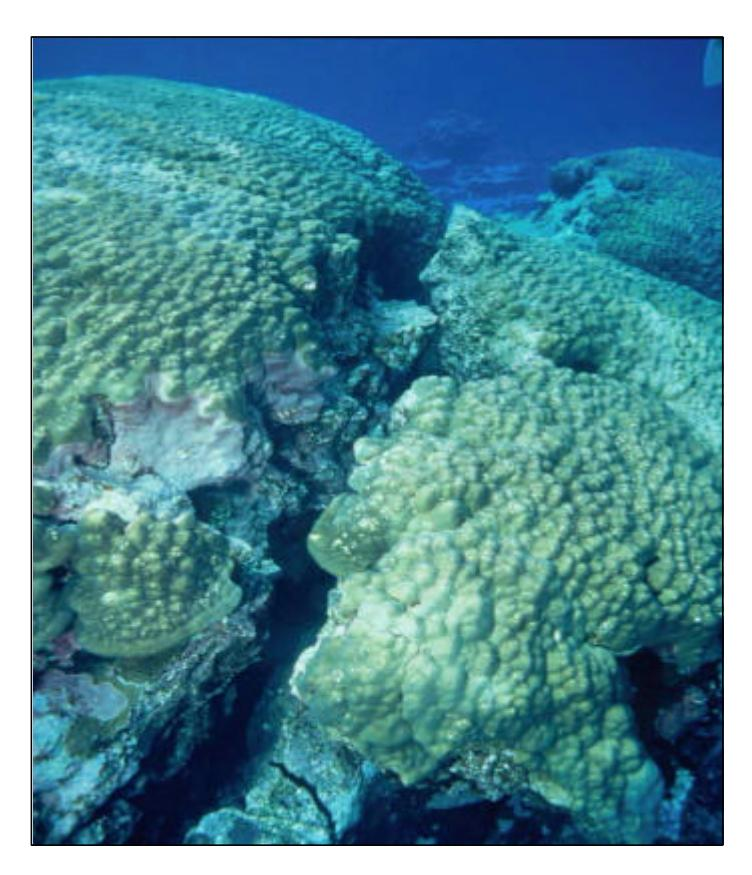

Figure 8. Photograph of a *Porites* bommie in Fagatele Bay showing a large crack, most likely from dynamite damage.

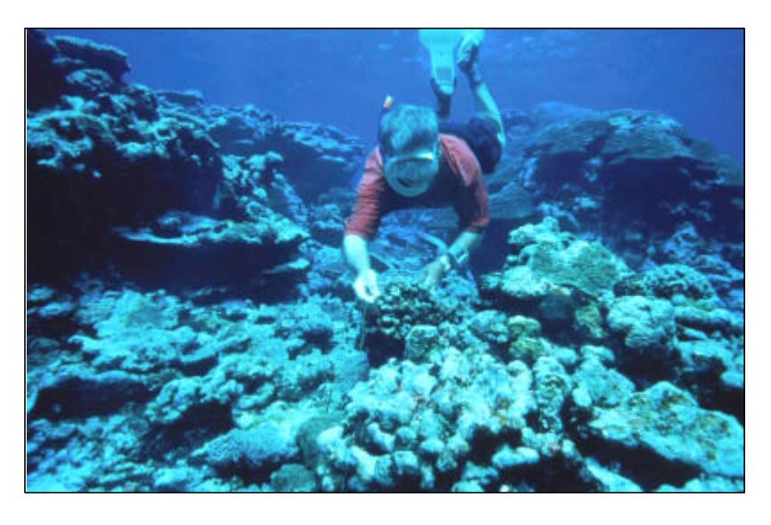

Figure 9. Dynamite detonation cord found adjacent to the damaged *Porites* bommie (Fig 8) in Fagatele Bay.

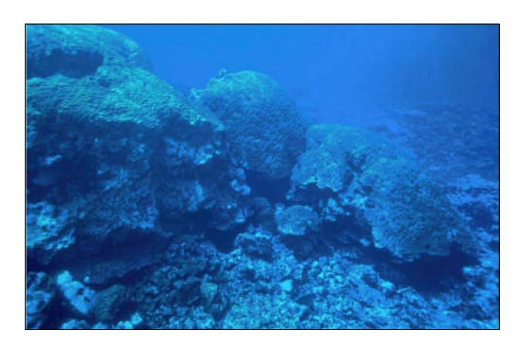

Figure 10. Photograph showing the extent of damage and large size of the dynamite damaged *Porites* bommie in Fagatele Bay.

Anecdotal reports from the local community also suggest that teams of commercial fishermen were systematically harvesting the reefs around the island of Tutuila for several years in the late 1990s (Green 2002). Since Fagatele Bay is not protected by the presence of a village, it is likely that the Sanctuary was being fished when weather conditions permitted. These fishermen have the potential to diminish the population of commercial reef fish species in a small area such as Fagatele Bay very quickly, since they are spearfishing using SCUBA equipment at night. Fortunately, this fishery was banned by the Government of American Samoa in 2001 (see Green 2002). The results of this ongoing monitoring program, and the advice of the monitoring team, played an important role in banning this destructive fishery

Despite evidence of fishing within Fagatele Bay, we have seen an overall improvement in the fish and coral populations, although fisheries species have continued to decline. In the absence of other major perturbations, and importantly in the absence of increased illegal fishing, we believe that the coral reef communities in Fagatele Bay should continue to recover.

### *Coral and Fish Communities around Tutuila Island*

The dynamics of the coral communities vary among sites around Tutuila, although generally the results from the surveys concur with the data collected in Fagatele Bay in that the reefs are recovering. Recovery is more evident in the coral than in the fish communities, most likely for the same reasons as described above for Fagatele Bay. One exception is Cape Larsen, which was severely impacted by the Crown-of-Thorns starfish outbreak in late 1978, and the hurricanes in the early 1990s. Our results from 1998 and 2001 surveys indicate continued recovery both of the coral and fish populations, although coral species richness is still relatively low in comparison to other sites around Tutuila, and the community is dominated by early colonising, fast growing species.

The coral communities on reefs adjacent to Rainmaker Hotel show continued decline, which may be associated with water quality issues within Pago Pago Harbour. Although there has been considerable efforts over the last 12 years both to minimise pollution in Pago Pago Harbour and to remediate the effects of human-induced disturbances (see Green et al 2002), there is clearly a lag in coral recovery in these areas. We did record an increase in coral cover at Aua between 1998 and 2001, which suggests recovery will happen in time. Furthermore, we have recently seen evidence of coral recruits in Pago Pago Harbour sites (C. Birkeland, unpubl. data) which is the first evidence of recruitment into the harbour in years. Importantly recruits included species of *Acropora*, including *Acropora hyacinthus*, which are ususally highly sensitive to sedimentation. We believe this provides evidence that recovery of these reefs is underway, but that changes will occur slowly. Obviously continued surveys of reef sites in Pago Pago harbour will be important for monitoring the recovery process.

While there appears to be a general improvement in coral communities at most sites, unfortunately the lack of coherence both in sampling sites around Tutuila across years and between the fish and coral surveys of the Tutuila sites makes it difficult to draw conclusions about the status of the reef communities around Tutuila generally. Furthermore, as fishes are only surveyed along a single transect (and at different depths at each site), and the number of corals surveyed is also low, the usefulness of the data collected outside Fagatele Bay is limited. Therefore, we recommend that these surveys be discontinued in future, especially since archipelago-wide surveys, which commenced in the mid 1990s (Green 1996, Mundy 1996, Fisk & Birkeland 2002, Green et al 2002), provide much more comprehensive data. Exceptions should include the sites in Pago Pago Harbour (Rainmaker and Aua), which should continue to be monitored because of their value for long term monitoring and management of the harbour. The long term monitoring of fishes at three sites around the island (Fagatele Bay, Sita Bay, Cape Larsen) should also continue, because it is the oldest quantitative fish data for the island, and the only data set that predates the Crown-of-Thorns starfish outbreak in the late 1970s.

# **Conclusions and Recommendations:**

- · Surveys of corals and fish in the Fagatele Bay National Marine Sanctuary conducted in 1998 and 2001 show an overall continued recovery of reef communities. Coral communities have largely exceeded levels recorded since the surveys began in 1985 whereas fish populations are lagging behind the recorded 1985 levels (although they continue to improve).
- · Reef flat communities in the Fagatele Bay National Marine Sanctuary have declined since 1995, probably due to the severe low tide event that lead to a mass die-off of reef flat corals around the island in 1998. Continued monitoring of the long-term reef flat sites associated with Transects 2, 3 and 4 that have been established in Fagatele Bay (but which unfortunately were not surveyed in 2001) is imperative in order to document future changes in these communities.
- · There is evidence that illegal fishing is ocurring within Fagatele Bay, which may be impacting the fish communities and impeding the recovery of the fish communities from the habitat destruction of the last few decades. We recommend that enforcement be increased to stop illegal fishing in the Sanctuary for three reasons:
  - 1. It is illegal and incompatible with the philosophy of the Sanctuary;
  - 2. Both the fish communities and their habitat have been affected by the use of destructive fishing techniques; and
  - 3. Visitor perception of the Sanctuary may be suffering as a result of these activities. In the last few years, many visitors to Fagatele Bay have reported that they were disappointed with the reefs in the Sanctuary, which they described as "nothing special" or worse. This is quite clearly untrue, because the reefs in the Sanctuary are in good condition once again and are among the most beautiful in Samoa (Green 1996, Green et al. 2002). This misconception may be the result of two factors. First, the coral communities have been in severely impacted by several disturbances in the last two decades (see *Introduction*), and they have only recently recovered sufficiently to regain their former beauty. Second, the absence of large reef fishes which are usually characteristic of a Sanctuary are absent, probably due to the effects of fishing.
- · If fishing were to be effectively controlled by improved enforcement in the Sanctuary, it is likely that the fish communities would recover from the effects of fishing and visitor perception of the area would improve. This is possible given that previous studies have shown that even quite small sanctuaries, such as Fagatele Bay, can support a higher biomass of reef fishes (especially large target species) than adjacent fished areas (Roberts and Hawkins 1997).
- · Reef communities at locations around Tutuila Island appear to be gradually recovering from the effects of Crown-of-Thorns and hurricanes Val and Ofu with the exception of coral communities adjacent to Rainmaker Hotel, which are still in poor condition but seem to be showing the first signs of recovery in decades. However the nature of data collections at these sites limits our interpretation of community change.
- · Recommendations for future surveys:
  - 1. The surveys in Fagatele Bay should continue unchanged, with the exception that point-quarter survey techniques should be replaced with the belt-transect method that has been adopted for the archipelago-wide surveys (see Mundy 1996). This approach would involve approximately the same amount of effort, but would sample considerably more corals at each site and hence provide a much more rigorous data set. Results would also be directly comparable with the archipelago-wide surveys.
  - 2. The coral and fish surveys from around the island should be discontinued as they have been superceded by the archipelago-wide surveys.

- 3. The two sites in Pago Pago Harbour (Rainmaker Hotel and Aua), which provide useful information for management, should continue in conjunction with the Fagatele Bay surveys. The long-term monitoring of the Aua transect should continue to be surveyed at the same time as the Fagatele Bay survey (for logistic reasons), and the results should be included in future Fagatele Bay reports.
- 4. The long-term fish surveys at three sites around the island (Fagatele Bay, Sita Bay and Cape Larsen) should be continued as they represent the oldest quantitative fish data for the island.

### **REFERENCES**

- Birkeland, C., Randall, R., Wass, R., Smith, B, Wilkens, S. 1987. Biological resource assessment of the Fagatele Bay National Marine Sanctuary. NOAA Technical Memorandum NOS MEMD 3. 232 pp.
- Birkeland, C., Randall, R., Amesbury, S. 1994. Coral and reef-fish assessment of the Fagatele Bay National Marine Sanctuary. Report to the National Oceanic and Atmospheric Administration U.S. Department of Commerce. 126 pp.
- Birkeland, C., Randall, R. H., Green, A.L, Smith, B.D., Wilkins, S. 1996. Changes in the coral reef communities of Fagatele Bay National Marine Sanctuary and Tutuila Island (American Samoa) over the last two decades. Report to the National Oceanic and Atmospheric Administration, U.S. Department of Commerce, 225 pp.
- Birkeland, C., Randall, R.H., Green, A.L., Smith, B.D., Wilkins, S. 2003. Changes in the coral reef communities of Fagatele Bay National Marine Sanctuary and Tutuila Island (American Samoa), 1982-1995. Fagatele Bay National Marine Sanctualry Science Series 2003-1.
- Fisk, D., Birkeland, C. 2002 Status of coral communities in American Samoa. A re-survey of long-term monitoring sites. Report to the Department of Marine and Wildlife Resources, PO Box 3730, Pago Pago, American Samoa. 96799, 134pp.
- Green, A.L. 1996. Status of the coral reefs of the Samoan Archipelago Report to the Department of Marine and Wildlife Resources, PO Box 3730, Pago Pago, American Samoa. 96799, 120pp
- Green A.L. 2002. Status of coral reefs on the main volcanic islands of American Samoa: a resurvey of long term monitoring sites (benthic communities, fish communities, and key macro invertebrates). A report prepared for the Department of Marine and Wildlife Resources, Pago Pago, American Samoa. 96799
- Green, A.L., Birkeland, C.E., Randall, R.H. 1999 Twenty years of disturbance and change in Fagatele Bay National Marine Sanctuary, American Samoa. Pacific Science 53(4): 376- 400.
- Green, A.L., Birkeland, C.E., Randall, R.H., Smith, B.D., Wilkins, S. 1997. 78 years of coral reef degradation in Pago Pago Harbour: a quantitative record. Proc. 8th Int Coral Reef Sym 2: 1883-1888.
- Mitchell, K. 2001. Quantitative analysis by the point-centered quarter method.
- Mundy, C. 1996. A quantitative survey of the corals of American Samoa. Report to the Department of Marine and Wildlife Resources, PO Box 3730, Pago Pago, American Samoa. 96799, 24 pp.
- Wass, R.C. 1982 Characterization of the inshore Samoan reef fish communities. Report to the Department of Marine and Wildlife Resources, PO Box 3730, Pago Pago, American Samoa. 96799, 48 pp

### **LIST OF FIGURES**

| Figure    |                                                                                          | Page No. |
|-----------|------------------------------------------------------------------------------------------|----------|
| Figure 1  | Map of Fagatele Bay showing six permanent transects (T1<br>– T6<br>) and the approximate |          |
|           | locations of the coral and fish surveys at each depth along each transect.               | 5        |
| Figure 2  | Location of coral and fish survey sites around Tutuila Island, American Samoa.           | 6        |
| Figure 3  | Mean (and SE) of species richness of fishes on the reef slope in Fagatele Bay during     |          |
|           | surveys conducted from 1985-2001.                                                        | 31       |
| Figure 4  | Mean (and SE) of abundance of fishes on the reef slope in Fagatele Bay during surveys    |          |
|           | conducted from 1985-2001.                                                                | 31       |
| Figure 5  | Abundance of fishes on the reef slope at three sites around Tutuila Island during        |          |
|           | surveys conducted from 1977-2001.                                                        | 35       |
| Figure 6  | Species richness of fishes on the reef slope at three sites around Tutuila Island during |          |
|           | surveys conducted from 1977-2001.                                                        | 35       |
| Figure 7  | Abundance of fishes from each of eight Families on the reef slope at three sites around  |          |
|           | Tutuila Island during surveys conducted from 1977-2001                                   | 36       |
| Figure 8  | Photograph of a Porites bommie in Fagatele Bay showing a large crack, most likely        |          |
|           | from dynamite damage                                                                     | 65       |
| Figure 9  | Dynamite detonation cord found adjacent to the damaged Porites bommie (Fig 8) in         |          |
|           | Fagatele Bay.                                                                            | 66       |
| Figure 10 | Photograph showing the extent of damage and large size of the dynamite damaged           |          |
|           | Porites bommie in Fagatele Bay.                                                          | 66       |

### **LIST OF TABLES**

| Table    |                                                                                                                                        | Page No. |
|----------|----------------------------------------------------------------------------------------------------------------------------------------|----------|
| Table 1  | Total number of colonies of all coral species recorded in point-quarter surveys of                                                     | 10       |
|          | Fagatele Bay and Tutuila Island in 1998 and 2001                                                                                       |          |
| Table 2  | Total number of colonies of each coral family recorded in point-quarter surveys of<br>Fagatele Bay and Tutuila Island in 1998 and 2001 | 14       |
| Table 3  | 2<br>Abundance of hermatypic corals (number of colonies per m<br>) in Fagatele Bay National                                            | 15       |
|          | Marine Sanctuary from surveys conducted in 1985-2001.                                                                                  |          |
| Table 4  | Percent cover of substrata by hermatypic corals in Fagatele Bay National Marine                                                        | 16       |
|          | Sanctuary from surveys conducted in 1985-2001                                                                                          |          |
| Table 5  | Mean coral colony diameter (cm) in Fagatele Bay National Marine Sanctuary from<br>surveys conducted in 1985-2001.                      | 17       |
| Table 6  | Abundance of hermatypic corals (number of colonies per m2<br>) at sites around Tutuila                                                 | 18       |
|          | Island from surveys conducted in 1982-2001.                                                                                            |          |
| Table 7  | Percent cover of substrata by hermatypic corals at sites around Tutuila Island from                                                    | 22       |
|          | surveys conducted in 1982-2001.                                                                                                        |          |
| Table 8  | Mean diameter (cm) of hermatypic corals at sites around Tutuila Island from surveys<br>conducted in 1982-2001.                         | 26       |
| Table 9  | Fishes recorded on the reef slope at different depths at each of five sites in Fagatele                                                | 37       |
|          | Bay National Marine Sanctuary in April 1998                                                                                            |          |
| Table 10 | Fishes recorded on the reef flat at each of two sites in Fagatele Bay National Marine                                                  | 45       |
|          | Sanctuary in April 1998.                                                                                                               |          |
| Table 11 | Fishes recorded on the reef slope at different depths at each of six sites in Fagatele Bay                                             | 46       |
|          | National Marine Sanctuary in February 2001.                                                                                            |          |
| Table 12 | Fishes recorded on the reef flat at each of two sites in Fagatele Bay National Marine                                                  | 55       |
|          | Sanctuary in February 2001.                                                                                                            |          |
| Table 13 | Fishes recorded along 100-m transects on the reef slopes at three locations around                                                     | 56       |
|          | Tutuila Island in April 1998.                                                                                                          |          |
| Table 14 | Fishes recorded along 100-m transects on the reef slopes at three locations around                                                     | 60       |
|          | Tutuila Island in February 2001.                                                                                                       |          |

APPENDIX 1

Summary of results from point-quarter surveys at Fagatele Bay from the 1998 surveys.

| Fagatele Bay Transect 2 1m depth – April 1998 |    | e distribut |       | lonies    | _                     |                   |                    |                 |                     |
|-----------------------------------------------|----|-------------|-------|-----------|-----------------------|-------------------|--------------------|-----------------|---------------------|
| Coral species                                 | n  | mean        | stdev | range     | frequency<br>/quarter | density<br>per m² | relative % density | cover<br>cm²/m² | relative<br>% cover |
| Acropora crateriformis                        | 2  | 16.39       | 9.32  | 9.8-23    | 0.03                  | 0.02              | 2.94               | 3.96            | 4.39                |
| Cyphastrea seralia                            | 1  | 13.49       |       |           | 0.01                  | 0.01              | 1.47               | 1.15            | 1.28                |
| Echinopora lamellosa                          | 1  | 9.90        |       |           | 0.01                  | 0.01              | 1.47               | 0.62            | 0.69                |
| Favites abdita                                | 1  | 31.43       |       |           | 0.01                  | 0.01              | 1.47               | 6.27            | 6.96                |
| Galaxea fascicularis                          | 17 | 7.49        | 2.50  | 4.2-13.5  | 0.25                  | 0.14              | 25.00              | 6.68            | 7.41                |
| Gardineroseris planulata                      | 3  | 21.08       | 8.09  | 16.1-30.4 | 0.04                  | 0.02              | 4.41               | 9.29            | 10.31               |
| Goniastrea retiformis                         | 2  | 20.65       | 14.23 | 10.6-30.7 | 0.03                  | 0.02              | 2.94               | 6.69            | 7.43                |
| Leptastrea purpurea                           | 1  | 3.46        |       |           | 0.01                  | 0.01              | 1.47               | 80.0            | 0.08                |
| Millepora platyphylla                         | 2  | 32.65       | 15.31 | 21.8-43.5 | 0.03                  | 0.02              | 2.94               | 15.01           | 16.66               |
| Millepora tuberosa                            | 2  | 23.38       | 10.09 | 16.2-30.5 | 0.03                  | 0.02              | 2.94               | 7.58            | 8.41                |
| Montipora verrilli                            | 2  | 13.02       | 5.46  | 9.2-16.9  | 0.03                  | 0.02              | 2.94               | 2.34            | 2.60                |
| Pocillopora verrucosa                         | 1  | 7.48        |       |           | 0.01                  | 0.01              | 1.47               | 0.36            | 0.39                |
| Porites lutea                                 | 14 | 11.23       | 10.16 | 4.2-41.5  | 0.21                  | 0.11              | 20.59              | 19.70           | 21.87               |
| Porites rus                                   | 10 | 8.90        | 6.92  | 3-24.7    | 0.15                  | 0.08              | 14.71              | 7.75            | 8.60                |
| Porites sp. 2                                 | 8  | 5.26        | 2.32  | 2.8-10.5  | 0.12                  | 0.06              | 11.76              | 1.64            | 1.82                |
| Psammocora contigua                           | 1  | 12.49       |       | 12.5-12.5 | 0.01                  | 0.01              | 1.47               | 0.99            | 1.10                |
| COMMUNITY                                     | 68 | 11.31       | 9.06  | 2.8-43.5  |                       | 0.55              |                    | 90.10           |                     |

| Fagatele Bay Transect 2<br>3m depth – April 1998 | Siz | e distribut<br>diamet) | tion of co<br>ter in cm) |           |                       |                   |                    |                 |                     |
|--------------------------------------------------|-----|------------------------|--------------------------|-----------|-----------------------|-------------------|--------------------|-----------------|---------------------|
| Coral species                                    | n   | mean                   | stdev                    | range     | frequency<br>/quarter | density<br>per m² | relative % density | cover<br>cm²/m² | relative<br>% cover |
| Acropora azurea                                  | 1   | 14.00                  |                          |           | 0.02                  | 0.13              | 1.67               | 19.80           | 1.02                |
| Acropora crateriformis                           | 1   | 9.95                   |                          |           | 0.02                  | 0.13              | 1.67               | 10.00           | 0.51                |
| Acropora gemmifera                               | 3   | 22.63                  | 12.05                    | 9-31.9    | 0.05                  | 0.39              | 5.00               | 184.53          | 9.49                |
| Acropora hyacinthus                              | 1   | 15.10                  |                          |           | 0.02                  | 0.13              | 1.67               | 23.03           | 1.18                |
| Acropora robusta                                 | 1   | 33.47                  |                          |           | 0.02                  | 0.13              | 1.67               | 113.12          | 5.82                |
| Favites abdita                                   | 2   | 12.37                  | 5.09                     | 8.8-16    | 0.03                  | 0.26              | 3.33               | 33.53           | 1.73                |
| Galaxea fascicularis                             | 33  | 8.35                   | 2.99                     | 4-15.1    | 0.55                  | 4.24              | 55.00              | 261.40          | 13.45               |
| Goniastrea retiformis                            | 3   | 17.93                  | 16.23                    | 8.1-36.7  | 0.05                  | 0.39              | 5.00               | 150.60          | 7.75                |
| Leptoria phrygia                                 | 5   | 28.64                  | 13.56                    | 9.9-43.2  | 0.08                  | 0.64              | 8.33               | 488.55          | 25.14               |
| Millepora tuberosa                               | 1   | 11.22                  |                          |           | 0.02                  | 0.13              | 1.67               | 12.73           | 0.65                |
| Montipora caliculata                             | 1   | 18.89                  |                          |           | 0.02                  | 0.13              | 1.67               | 36.06           | 1.86                |
| Montipora ehrenbergii                            | 1   | 17.49                  |                          |           | 0.02                  | 0.13              | 1.67               | 30.91           | 1.59                |
| Montipora verrilli                               | 1   | 12.96                  |                          |           | 0.02                  | 0.13              | 1.67               | 16.97           | 0.87                |
| Pocillopora eydouxi                              | 2   | 51.85                  | 5.24                     | 48.1-55.6 | 0.03                  | 0.26              | 3.33               | 545.92          | 28.09               |
| Pocillopora verrucosa                            | 1   | 8.77                   |                          | 8.8-8.8   | 0.02                  | 0.13              | 1.67               | 7.78            | 0.40                |
| Porites sp. 2                                    | 3   | 4.96                   | 2.48                     | 2.4-7.4   | 0.05                  | 0.39              | 5.00               | 8.69            | 0.45                |
| COMMUNITY                                        | 60  | 13.76                  | 11.56                    | 4-55.6    |                       | 7.72              |                    | 1943.60         |                     |

| Fagatele Bay Transect 2<br>6m depth – April 1998 | Siz | e distribut<br>diamet) | tion of co<br>ter in cm) |           |                       | ,                 |                    |                                          |                     |
|--------------------------------------------------|-----|------------------------|--------------------------|-----------|-----------------------|-------------------|--------------------|------------------------------------------|---------------------|
| Coral species                                    | n   | mean                   | stdev                    | range     | frequency<br>/quarter | density<br>per m² | relative % density | cover<br>cm <sup>2</sup> /m <sup>2</sup> | relative<br>% cover |
| Acropora azurea                                  | 2   | 15.12                  | 13.02                    | 5.9-24.3  | 0.03                  | 0.24              | 3.33               | 57.95                                    | 3.97                |
| Acropora crateriformis                           | 3   | 15.80                  | 2.01                     | 14-18     | 0.05                  | 0.35              | 5.00               | 69.97                                    | 4.79                |
| Acropora gemmifera                               | 2   | 23.73                  | 2.44                     | 22-25.5   | 0.03                  | 0.24              | 3.33               | 104.63                                   | 7.17                |
| Acropora hyacinthus                              | 1   | 11.00                  |                          |           | 0.02                  | 0.12              | 1.67               | 11.18                                    | 0.77                |
| Acropora sp. 2                                   | 1   | 13.96                  |                          |           | 0.02                  | 0.12              | 1.67               | 18.02                                    | 1.23                |
| Echinopora hirsutissima                          | 1   | 36.41                  |                          |           | 0.02                  | 0.12              | 1.67               | 122.56                                   | 8.40                |
| Favia matthaii                                   | 1   | 29.29                  |                          |           | 0.02                  | 0.12              | 1.67               | 79.30                                    | 5.43                |
| Galaxea fascicularis                             | 28  | 9.84                   | 3.70                     | 3-17      | 0.47                  | 3.30              | 46.67              | 284.76                                   | 19.51               |
| Goniastrea retiformis                            | 4   | 18.73                  | 12.91                    | 5.9-33.9  | 0.07                  | 0.47              | 6.67               | 175.89                                   | 12.05               |
| Leptoria phrygia                                 | 2   | 12.54                  | 10.80                    | 4.9-20.2  | 0.03                  | 0.24              | 3.33               | 39.84                                    | 2.73                |
| Millepora tuberosa                               | 4   | 26.22                  | 11.26                    | 15.4-41.7 | 0.07                  | 0.47              | 6.67               | 289.39                                   | 19.82               |
| Montipora caliculata                             | 1   | 33.47                  |                          |           | 0.02                  | 0.12              | 1.67               | 103.52                                   | 7.09                |
| Montipora ehrenbergii                            | 1   | 17.75                  |                          |           | 0.02                  | 0.12              | 1.67               | 29.11                                    | 1.99                |
| Montipora verrilli                               | 1   | 6.48                   |                          |           | 0.02                  | 0.12              | 1.67               | 3.88                                     | 0.27                |
| Pavona sp. 3                                     | 1   | 6.00                   |                          |           | 0.02                  | 0.12              | 1.67               | 3.33                                     | 0.23                |
| Pavona varians                                   | 2   | 10.58                  | 7.62                     | 5.2-16    | 0.03                  | 0.24              | 3.33               | 26.06                                    | 1.79                |
| Pocillopora verrucosa                            | 1   | 4.90                   |                          |           | 0.02                  | 0.12              | 1.67               | 2.22                                     | 0.15                |
| Porites rus                                      | 1   | 15.49                  |                          |           | 0.02                  | 0.12              | 1.67               | 22.18                                    | 1.52                |
| Porites sp. 2                                    | 3   | 7.08                   | 3.36                     | 5-11      | 0.05                  | 0.35              | 5.00               | 15.99                                    | 1.10                |
| COMMUNITY                                        | 60  | 13.71                  | 8.75                     | 3-41.7    |                       | 7.06              |                    | 1459.77                                  |                     |

| Fagatele Bay Transect 2<br>9m depth – April 1998 | Siz | e distribut<br>diamet) | tion of co<br>ter in cm) |           |                       |                   |                    |                                          |                     |
|--------------------------------------------------|-----|------------------------|--------------------------|-----------|-----------------------|-------------------|--------------------|------------------------------------------|---------------------|
| Coral species                                    | n   | mean                   | stdev                    | range     | frequency<br>/quarter | density<br>per m² | relative % density | cover<br>cm <sup>2</sup> /m <sup>2</sup> | relative<br>% cover |
| Cyphastrea sp.                                   | 1   | 27.20                  |                          |           | 0.02                  | 0.27              | 1.79               | 157.18                                   | 3.91                |
| Echinopora hirsutissima                          | 5   | 39.06                  | 28.76                    | 4-77.1    | 0.09                  | 1.35              | 8.93               | 2322.60                                  | 57.80               |
| Montipora caliculata                             | 2   | 16.09                  | 2.55                     | 14.3-17.9 | 0.04                  | 0.54              | 3.57               | 111.30                                   | 2.77                |
| Montipora elschneri                              | 1   | 14.42                  |                          |           | 0.02                  | 0.27              | 1.79               | 44.18                                    | 1.10                |
| Montipora grisea                                 | 8   | 18.72                  | 8.43                     | 8.5-29.8  | 0.14                  | 2.16              | 14.29              | 701.35                                   | 17.45               |
| Pavona sp. 2                                     | 1   | 23.92                  |                          |           | 0.02                  | 0.27              | 1.79               | 121.49                                   | 3.02                |
| Pavona venosa                                    | 1   | 5.92                   |                          |           | 0.02                  | 0.27              | 1.79               | 7.43                                     | 0.18                |
| Pocillopora meandrina                            | 1   | 12.65                  |                          |           | 0.02                  | 0.27              | 1.79               | 33.98                                    | 0.85                |
| Pocillopora verrucosa                            | 1   | 36.41                  |                          |           | 0.02                  | 0.27              | 1.79               | 281.64                                   | 7.01                |
| Porites rus                                      | 1   | 3.00                   |                          |           | 0.02                  | 0.27              | 1.79               | 1.91                                     | 0.05                |
| Porites sp. 2                                    | 32  | 5.24                   | 2.63                     | 1-11.3    | 0.57                  | 8.65              | 57.14              | 232.58                                   | 5.79                |
| Stylocoeniella armata                            | 2   | 2.50                   | 0.71                     | 2-3       | 0.04                  | 0.54              | 3.57               | 2.76                                     | 0.07                |
| COMMUNITY                                        | 56  | 12.03                  | 14.02                    | 1-36.4    |                       | 15.14             |                    | 4018.41                                  |                     |

| Fagatele Bay Transect 2<br>12m depth – April 1998 | Siz | e distribut<br>diamet) | ion of co<br>ter in cm) |           |                       |                   |                    |                                          |                     |
|---------------------------------------------------|-----|------------------------|-------------------------|-----------|-----------------------|-------------------|--------------------|------------------------------------------|---------------------|
| Coral species                                     | n   | mean                   | stdev                   | range     | frequency<br>/quarter | density<br>per m² | relative % density | cover<br>cm <sup>2</sup> /m <sup>2</sup> | relative<br>% cover |
| Acropora hyacinthus                               | 2   | 5.51                   | 1.16                    | 4.7-6.3   | 0.03                  | 0.32              | 2.99               | 7.89                                     | 0.17                |
| Acropora secale                                   | 1   | 2.45                   |                         |           | 0.01                  | 0.16              | 1.49               | 0.76                                     | 0.02                |
| Galaxea fascicularis                              | 1   | 12.00                  |                         |           | 0.01                  | 0.16              | 1.49               | 18.32                                    | 0.39                |
| Hydnophora rigida                                 | 1   | 27.13                  |                         |           | 0.01                  | 0.16              | 1.49               | 93.61                                    | 1.98                |
| Leptastrea purpurea                               | 1   | 18.97                  |                         |           | 0.01                  | 0.16              | 1.49               | 45.79                                    | 0.97                |
| Montipora caliculata                              | 2   | 29.80                  | 14.64                   | 19.4-40.1 | 0.03                  | 0.32              | 2.99               | 253.11                                   | 5.35                |
| Montipora elschneri                               | 3   | 22.73                  | 6.20                    | 15.7-27.5 | 0.04                  | 0.49              | 4.48               | 206.88                                   | 4.37                |
| Montipora grisea                                  | 12  | 29.06                  | 19.52                   | 5.2-59.7  | 0.18                  | 1.94              | 17.91              | 1821.66                                  | 38.50               |
| Montipora verrilli                                | 8   | 35.72                  | 13.14                   | 14.1-59.5 | 0.12                  | 1.30              | 11.94              | 1452.16                                  | 30.69               |
| Pavona clavus                                     | 1   | 16.43                  |                         |           | 0.01                  | 0.16              | 1.49               | 34.34                                    | 0.73                |
| Pavona sp. 2                                      | 1   | 14.83                  |                         |           | 0.01                  | 0.16              | 1.49               | 27.98                                    | 0.59                |
| Pavona sp. 3                                      | 1   | 11.96                  |                         |           | 0.01                  | 0.16              | 1.49               | 18.19                                    | 0.38                |
| Pavona varians                                    | 1   | 32.31                  |                         |           | 0.01                  | 0.16              | 1.49               | 132.79                                   | 2.81                |
| Pavona venosa                                     | 3   | 4.70                   | 3.45                    | 1.7-8.5   | 0.04                  | 0.49              | 4.48               | 11.45                                    | 0.24                |
| Pocillopora verrucosa                             | 1   | 46.96                  |                         |           | 0.01                  | 0.16              | 1.49               | 280.46                                   | 5.93                |
| Porites lutea                                     | 2   | 3.52                   | 1.23                    | 2.6-4.4   | 0.03                  | 0.32              | 2.99               | 3.34                                     | 0.07                |
| Porites rus                                       | 5   | 12.13                  | 12.54                   | 4.2-34.1  | 0.07                  | 0.81              | 7.46               | 173.49                                   | 3.67                |
| Porites sp. 2                                     | 18  | 7.00                   | 3.99                    | 1-17.4    | 0.27                  | 2.92              | 26.87              | 146.49                                   | 3.10                |
| Stylocoeniella armata                             | 3   | 2.37                   | 0.83                    | 1.5-3.2   | 0.04                  | 0.49              | 4.48               | 2.32                                     | 0.05                |
| COMMUNITY                                         | 67  | 17.48                  | 15.92                   | 1-59.5    |                       | 10.85             |                    | 4731.03                                  |                     |

| Fagatele Bay Transect 3<br>1m depth – April 1998 | Siz | e distribut<br>diamet) | tion of co<br>ter in cm) |          |                       |                   |                    |                                          |                     |
|--------------------------------------------------|-----|------------------------|--------------------------|----------|-----------------------|-------------------|--------------------|------------------------------------------|---------------------|
| Coral species                                    | n   | mean                   | stdev                    | range    | frequency<br>/quarter | density<br>per m² | relative % density | cover<br>cm <sup>2</sup> /m <sup>2</sup> | relative<br>% cover |
| Acropora crateriformis                           | 9   | 16.63                  | 4.71                     | 11-26.5  | 0.07                  | 0.16              | 7.26               | 37.32                                    | 16.78               |
| Acropora digitifera                              | 2   | 15.98                  | 2.85                     | 14-18    | 0.02                  | 0.04              | 1.61               | 7.26                                     | 3.27                |
| Alveopora sp. 1                                  | 1   | 4.90                   |                          |          | 0.01                  | 0.02              | 0.81               | 0.34                                     | 0.15                |
| Fungia scutaria                                  | 4   | 2.62                   | 0.74                     | 2-3.5    | 0.03                  | 0.07              | 3.23               | 0.41                                     | 0.18                |
| Leptastrea purpurea                              | 7   | 4.50                   | 1.69                     | 1.4-6    | 0.06                  | 0.12              | 5.65               | 2.23                                     | 1.00                |
| Millepora tuberosa                               | 1   | 21.17                  |                          |          | 0.01                  | 0.02              | 0.81               | 6.27                                     | 2.82                |
| Pavona divaricata                                | 33  | 5.74                   | 8.23                     | 1-38.5   | 0.27                  | 0.59              | 26.61              | 45.53                                    | 20.47               |
| Pocillopora danae                                | 1   | 12.00                  |                          |          | 0.01                  | 0.02              | 0.81               | 2.02                                     | 0.91                |
| Pocillopora verrucosa                            | 5   | 10.30                  | 3.38                     | 5.7-13.9 | 0.04                  | 0.09              | 4.03               | 8.06                                     | 3.62                |
| Porites annae                                    | 2   | 4.47                   | 2.85                     | 2.4-6.5  | 0.02                  | 0.04              | 1.61               | 0.67                                     | 0.30                |
| Porites cylindrica                               | 8   | 14.25                  | 11.14                    | 4-34.8   | 0.06                  | 0.14              | 6.45               | 34.89                                    | 15.69               |
| Porites lutea                                    | 2   | 3.67                   | 1.73                     | 2.4-4.9  | 0.02                  | 0.04              | 1.61               | 0.42                                     | 0.19                |
| Porites rus                                      | 15  | 14.40                  | 8.74                     | 2-34     | 0.12                  | 0.27              | 12.10              | 58.51                                    | 26.31               |
| Porites sp. 2                                    | 27  | 6.08                   | 2.60                     | 2-12     | 0.22                  | 0.48              | 21.77              | 16.44                                    | 7.39                |
| Porites vaughani                                 | 1   | 4.90                   |                          |          | 0.01                  | 0.02              | 0.81               | 0.34                                     | 0.15                |
| Psammocora contigua                              | 3   | 4.22                   | 3.71                     | 1.7-8.5  | 0.02                  | 0.05              | 2.42               | 1.13                                     | 0.51                |
| Stylocoeniella armata                            | 3   | 3.65                   | 0.75                     | 3-4.5    | 0.02                  | 0.05              | 2.42               | 0.57                                     | 0.26                |
| COMMUNITY                                        | 124 | 8.40                   | 7.62                     | 1-26.5   |                       | 2.21              |                    | 222.41                                   |                     |

| Fagatele Bay Transect 3<br>3m depth – April 1998 | Siz | e distribut<br>diamet) | tion of co |           |                       |                   |                    |                                          |                     |
|--------------------------------------------------|-----|------------------------|------------|-----------|-----------------------|-------------------|--------------------|------------------------------------------|---------------------|
| Coral species                                    | n   | mean                   | stdev      | range     | frequency<br>/quarter | density<br>per m² | relative % density | cover<br>cm <sup>2</sup> /m <sup>2</sup> | relative<br>% cover |
| Acropora crateriformis                           | 21  | 16.16                  | 7.65       | 4.6-36.4  | 0.35                  | 3.84              | 35.00              | 955.63                                   | 52.35               |
| Acropora gemmifera                               | 3   | 17.53                  | 13.89      | 4.9-32.4  | 0.05                  | 0.55              | 5.00               | 187.94                                   | 10.30               |
| Acropora palifera                                | 2   | 12.46                  | 0.71       | 12-13     | 0.03                  | 0.37              | 3.33               | 44.69                                    | 2.45                |
| Alveopora sp. 1                                  | 1   | 4.47                   |            |           | 0.02                  | 0.18              | 1.67               | 2.87                                     | 0.16                |
| Fungia scutaria                                  | 1   | 3.46                   |            |           | 0.02                  | 0.18              | 1.67               | 1.72                                     | 0.09                |
| Hydnophora rigida                                | 2   | 16.97                  | 3.50       | 14.5-19.4 | 0.03                  | 0.37              | 3.33               | 84.49                                    | 4.63                |
| Montipora caliculata                             | 1   | 18.49                  |            |           | 0.02                  | 0.18              | 1.67               | 49.14                                    | 2.69                |
| Pavona venosa                                    | 1   | 13.27                  |            |           | 0.02                  | 0.18              | 1.67               | 25.29                                    | 1.39                |
| Pocillopora verrucosa                            | 2   | 7.50                   | 3.54       | 5-10      | 0.03                  | 0.37              | 3.33               | 17.96                                    | 0.98                |
| Porites cylindrica                               | 1   | 27.84                  |            |           | 0.02                  | 0.18              | 1.67               | 111.35                                   | 6.10                |
| Porites lutea                                    | 1   | 23.07                  |            |           | 0.02                  | 0.18              | 1.67               | 76.44                                    | 4.19                |
| Porites rus                                      | 2   | 17.73                  | 15.17      | 7-28.5    | 0.03                  | 0.37              | 3.33               | 123.42                                   | 6.76                |
| Porites sp. 2                                    | 19  | 5.68                   | 4.53       | 2-20.9    | 0.32                  | 3.48              | 31.67              | 141.24                                   | 7.74                |
| Stylocoeniella armata                            | 3   | 2.58                   | 1.23       | 1.4-3.9   | 0.05                  | 0.55              | 5.00               | 3.30                                     | 0.18                |
| COMMUNITY                                        | 60  | 11.79                  | 8.60       | 1.4-36.4  |                       | 10.98             |                    | 1825.49                                  |                     |

| Fagatele Bay Transect 3<br>6m depth – April 1998 | Siz | e distribut<br>diamet) | tion of co |           |                       |                   |                    |                                          |                     |
|--------------------------------------------------|-----|------------------------|------------|-----------|-----------------------|-------------------|--------------------|------------------------------------------|---------------------|
| Coral species                                    | n   | mean                   | stdev      | range     | frequency<br>/quarter | density<br>per m² | relative % density | cover<br>cm <sup>2</sup> /m <sup>2</sup> | relative<br>% cover |
| Acropora azurea                                  | 1   | 24.68                  |            |           | 0.02                  | 0.18              | 1.67               | 85.41                                    | 9.00                |
| Acropora crateriformis                           | 11  | 11.83                  | 5.02       | 3-17.5    | 0.18                  | 1.96              | 18.33              | 251.06                                   | 26.45               |
| Acropora digitifera                              | 1   | 20.90                  |            |           | 0.02                  | 0.18              | 1.67               | 61.29                                    | 6.46                |
| Acropora gemmifera                               | 2   | 17.49                  | 6.08       | 13.2-21.8 | 0.03                  | 0.36              | 3.33               | 91.03                                    | 9.59                |
| Echinopora hirsutissima                          | 1   | 11.00                  |            |           | 0.02                  | 0.18              | 1.67               | 16.97                                    | 1.79                |
| Galaxea fascicularis                             | 9   | 7.85                   | 3.39       | 3-13      | 0.15                  | 1.61              | 15.00              | 90.60                                    | 9.54                |
| Leptoria phrygia                                 | 1   | 23.81                  |            |           | 0.02                  | 0.18              | 1.67               | 79.52                                    | 8.38                |
| Millepora tuberosa                               | 2   | 13.39                  | 10.56      | 5.9-20.9  | 0.03                  | 0.36              | 3.33               | 65.92                                    | 6.94                |
| Montipora ehrenbergii                            | 1   | 5.48                   |            |           | 0.02                  | 0.18              | 1.67               | 4.21                                     | 0.44                |
| Montipora venosa                                 | 1   | 22.05                  |            |           | 0.02                  | 0.18              | 1.67               | 68.16                                    | 7.18                |
| Pocillopora verrucosa                            | 2   | 10.68                  | 3.87       | 7.9-13.4  | 0.03                  | 0.36              | 3.33               | 34.08                                    | 3.59                |
| Porites sp. 2                                    | 26  | 4.21                   | 2.48       | 1.4-11.5  | 0.43                  | 4.64              | 43.33              | 86.40                                    | 9.10                |
| Psammocora contigua                              | 1   | 7.42                   |            |           | 0.02                  | 0.18              | 1.67               | 7.71                                     | 0.81                |
| Psammocora nierstraszi                           | 1   | 7.00                   |            |           | 0.02                  | 0.18              | 1.67               | 6.87                                     | 0.72                |
| COMMUNITY                                        | 60  | 8.60                   | 6.29       | 1.4-24.7  |                       | 10.71             |                    | 949.24                                   |                     |

| Fagatele Bay Transect 3<br>12m depth – April 1998 | Siz | e distribut<br>diamet) | tion of co |            |                       |                   |                    |                 |                     |
|---------------------------------------------------|-----|------------------------|------------|------------|-----------------------|-------------------|--------------------|-----------------|---------------------|
| Coral species                                     | n   | mean                   | stdev      | range      | frequency<br>/quarter | density<br>per m² | relative % density | cover<br>cm²/m² | relative<br>% cover |
| Acropora nobilis                                  | 1   | 100.63                 |            |            | 0.02                  | 0.36              | 2.22               | 2858.12         | 34.73               |
| Acropora pagoensis                                | 3   | 55.40                  | 39.93      | 23.5-100.2 | 0.07                  | 1.08              | 6.67               | 3498.55         | 42.51               |
| Cyphastrea sp.                                    | 2   | 8.22                   | 2.24       | 6.6-9.8    | 0.04                  | 0.72              | 4.44               | 39.52           | 0.48                |
| Goniastrea favulus                                | 1   | 11.83                  |            |            | 0.02                  | 0.36              | 2.22               | 39.52           | 0.48                |
| Leptastrea purpurea                               | 2   | 13.71                  | 2.42       | 12-15.4    | 0.04                  | 0.72              | 4.44               | 107.82          | 1.31                |
| Montastrea curta                                  | 1   | 7.94                   |            |            | 0.02                  | 0.36              | 2.22               | 17.78           | 0.22                |
| Montipora elschneri                               | 3   | 18.98                  | 12.75      | 4.5-28.4   | 0.07                  | 1.08              | 6.67               | 396.85          | 4.82                |
| Montipora grisea                                  | 3   | 12.39                  | 4.93       | 6.7-15.5   | 0.07                  | 1.08              | 6.67               | 143.67          | 1.75                |
| Montipora verrilli                                | 2   | 29.49                  | 27.85      | 9.8-49.2   | 0.04                  | 0.72              | 4.44               | 709.87          | 8.63                |
| Pavona sp. 2                                      | 1   | 5.66                   |            |            | 0.02                  | 0.36              | 2.22               | 9.03            | 0.11                |
| Pavona venosa                                     | 1   | 8.12                   |            |            | 0.02                  | 0.36              | 2.22               | 18.63           | 0.23                |
| Pocillopora verrucosa                             | 2   | 21.66                  | 5.89       | 17.5-25.8  | 0.04                  | 0.72              | 4.44               | 274.63          | 3.34                |
| Porites lichen                                    | 2   | 1.50                   | 0.12       | 1.4-1.6    | 0.04                  | 0.72              | 4.44               | 1.27            | 0.02                |
| Porites rus                                       | 5   | 3.40                   | 0.88       | 2.6-4.5    | 0.11                  | 1.80              | 11.11              | 17.22           | 0.21                |
| Porites sp. 2                                     | 14  | 4.64                   | 1.65       | 2.4-7.7    | 0.31                  | 5.03              | 31.11              | 95.19           | 1.16                |
| Stylocoeniella armata                             | 2   | 1.67                   | 0.63       | 1.2-2.1    | 0.04                  | 0.72              | 4.44               | 1.69            | 0.02                |
| COMMUNITY                                         | 45  | 13.98                  | 21.51      | 1.2-100.6  |                       | 16.17             |                    | 8229.37         |                     |

| Fagatele Bay Transect 4<br>1m depth – April 1998 | Siz | e distribut<br>diame) | tion of co<br>ter in cm) |          |                       |                   |                    |                                          |                     |
|--------------------------------------------------|-----|-----------------------|--------------------------|----------|-----------------------|-------------------|--------------------|------------------------------------------|---------------------|
| Coral species                                    | n   | mean                  | stdev                    | range    | frequency<br>/quarter | density<br>per m² | relative % density | cover<br>cm <sup>2</sup> /m <sup>2</sup> | relative<br>% cover |
| Acropora crateriformis                           | 1   | 7.35                  |                          |          | 0.01                  | 0.03              | 1.19               | 1.33                                     | 1.04                |
| Galaxea fascicularis                             | 2   | 7.50                  | 0.71                     | 7-8      | 0.02                  | 0.06              | 2.38               | 2.78                                     | 2.17                |
| Goniastrea retiformis                            | 1   | 2.45                  |                          |          | 0.01                  | 0.03              | 1.19               | 0.15                                     | 0.12                |
| Leptastrea purpurea                              | 1   | 4.00                  |                          |          | 0.01                  | 0.03              | 1.19               | 0.39                                     | 0.31                |
| Lobophyllia corymbosa                            | 1   | 8.00                  |                          |          | 0.01                  | 0.03              | 1.19               | 1.57                                     | 1.23                |
| Millepora platyphylla                            | 1   | 16.91                 |                          |          | 0.01                  | 0.03              | 1.19               | 7.03                                     | 5.49                |
| Millepora tuberosa                               | 1   | 10.25                 |                          |          | 0.01                  | 0.03              | 1.19               | 2.58                                     | 2.02                |
| Pavona divaricata                                | 55  | 5.26                  | 5.11                     | 1-23     | 0.65                  | 1.72              | 65.48              | 72.02                                    | 56.23               |
| Pavona varians                                   | 1   | 5.48                  |                          |          | 0.01                  | 0.03              | 1.19               | 0.74                                     | 0.58                |
| Pocillopora verrucosa                            | 2   | 7.90                  | 2.69                     | 6-9.8    | 0.02                  | 0.06              | 2.38               | 3.25                                     | 2.53                |
| Porites annae                                    | 3   | 5.00                  | 1.00                     | 4-6      | 0.04                  | 0.09              | 3.57               | 1.89                                     | 1.48                |
| Porites cylindrica                               | 4   | 12.38                 | 8.21                     | 4.6-19.7 | 0.05                  | 0.13              | 4.76               | 20.04                                    | 15.65               |
| Porites lutea                                    | 1   | 12.25                 |                          |          | 0.01                  | 0.03              | 1.19               | 3.69                                     | 2.88                |
| Porites rus                                      | 1   | 5.29                  |                          |          | 0.01                  | 0.03              | 1.19               | 0.69                                     | 0.54                |
| Porites sp. 2                                    | 5   | 5.62                  | 3.04                     | 2-10.4   | 0.06                  | 0.16              | 5.95               | 4.79                                     | 3.74                |
| Psammocora contigua                              | 2   | 9.46                  | 3.59                     | 6.9-12   | 0.02                  | 0.06              | 2.38               | 4.72                                     | 3.69                |
| Stylocoeniella armata                            | 2   | 2.50                  | 2.12                     | 1-4      | 0.02                  | 0.06              | 2.38               | 0.42                                     | 0.33                |
| COMMUNITY                                        | 84  | 6.05                  | 5.07                     | 1-19.7   |                       | 2.63              |                    | 128.07                                   |                     |

| Fagatele Bay Transect 4<br>3m depth – April 1998 | Siz | e distribut<br>diamet) | tion of co |           |                       |                   |                    |                                          |                     |
|--------------------------------------------------|-----|------------------------|------------|-----------|-----------------------|-------------------|--------------------|------------------------------------------|---------------------|
| Coral species                                    | n   | mean                   | stdev      | range     | frequency<br>/quarter | density<br>per m² | relative % density | cover<br>cm <sup>2</sup> /m <sup>2</sup> | relative<br>% cover |
| Acropora crateriformis                           | 6   | 16.34                  | 2.80       | 12.8-20   | 0.10                  | 1.11              | 10.00              | 237.62                                   | 11.84               |
| Acropora gemmifera                               | 2   | 31.67                  | 22.97      | 15.4-47.9 | 0.03                  | 0.37              | 3.33               | 366.78                                   | 18.27               |
| Acropora nasuta                                  | 2   | 21.07                  | 15.10      | 10.4-31.7 | 0.03                  | 0.37              | 3.33               | 161.60                                   | 8.05                |
| Acropora palifera                                | 2   | 16.27                  | 5.13       | 12.6-19.9 | 0.03                  | 0.37              | 3.33               | 80.51                                    | 4.01                |
| Fungia scutaria                                  | 2   | 3.67                   | 0.29       | 3.5-3.9   | 0.03                  | 0.37              | 3.33               | 3.91                                     | 0.19                |
| Goniastrea retiformis                            | 1   | 53.10                  |            |           | 0.02                  | 0.18              | 1.67               | 408.34                                   | 20.34               |
| Montipora grisea                                 | 1   | 29.70                  |            |           | 0.02                  | 0.18              | 1.67               | 127.71                                   | 6.36                |
| Pavona venosa                                    | 3   | 18.50                  | 20.54      | 5-42.1    | 0.05                  | 0.55              | 5.00               | 270.92                                   | 13.50               |
| Porites sp. 2                                    | 38  | 7.30                   | 2.95       | 3-14.5    | 0.63                  | 7.01              | 63.33              | 339.41                                   | 16.91               |
| Psammocora contigua                              | 1   | 7.75                   |            |           | 0.02                  | 0.18              | 1.67               | 8.69                                     | 0.43                |
| Stylocoeniella armata                            | 2   | 2.45                   | 0.00       | 2.4-2.4   | 0.03                  | 0.37              | 3.33               | 1.74                                     | 0.09                |
| COMMUNITY                                        | 60  | 11.19                  | 10.37      | 2.4-53.1  |                       | 11.06             |                    | 2007.21                                  |                     |

| Fagatele Bay Transect 4<br>6m depth – April 1998 | Siz | e distribut<br>(diamet | ion of co |           |                       |                   |                    |                                          |                     |
|--------------------------------------------------|-----|------------------------|-----------|-----------|-----------------------|-------------------|--------------------|------------------------------------------|---------------------|
| Coral species                                    | n   | mean                   | stdev     | range     | frequency<br>/quarter | density<br>per m² | relative % density | cover<br>cm <sup>2</sup> /m <sup>2</sup> | relative<br>% cover |
| Acropora crateriformis                           | 7   | 17.37                  | 8.01      | 5-28.1    | 0.12                  | 1.43              | 11.67              | 400.23                                   | 12.09               |
| Acropora palifera                                | 4   | 15.27                  | 5.90      | 11-24     | 0.07                  | 0.82              | 6.67               | 166.15                                   | 5.02                |
| Fungia scutaria                                  | 1   | 2.45                   |           |           | 0.02                  | 0.20              | 1.67               | 0.96                                     | 0.03                |
| Goniastrea retiformis                            | 1   | 28.25                  |           |           | 0.02                  | 0.20              | 1.67               | 127.85                                   | 3.86                |
| Merulina vaughani                                | 1   | 14.97                  |           |           | 0.02                  | 0.20              | 1.67               | 35.89                                    | 1.08                |
| Montipora caliculata                             | 2   | 13.42                  | 0.00      | 13.4-13.4 | 0.03                  | 0.41              | 3.33               | 57.68                                    | 1.74                |
| Platygyra daedalea                               | 1   | 27.50                  |           |           | 0.02                  | 0.20              | 1.67               | 121.13                                   | 3.66                |
| Pocillopora verrucosa                            | 2   | 5.65                   | 0.50      | 5.3-6     | 0.03                  | 0.41              | 3.33               | 10.25                                    | 0.31                |
| Porites cylindrica                               | 2   | 14.00                  | 1.41      | 13-15     | 0.03                  | 0.41              | 3.33               | 63.13                                    | 1.91                |
| Porites lutea                                    | 1   | 31.98                  |           |           | 0.02                  | 0.20              | 1.67               | 163.90                                   | 4.95                |
| Porites rus                                      | 5   | 39.79                  | 15.34     | 19-59.3   | 0.08                  | 1.02              | 8.33               | 1419.22                                  | 42.86               |
| Porites sp. 2                                    | 23  | 9.48                   | 4.38      | 3.5-23.5  | 0.38                  | 4.69              | 38.33              | 399.26                                   | 12.06               |
| Porites vaughani                                 | 1   | 3.87                   |           |           | 0.02                  | 0.20              | 1.67               | 2.40                                     | 0.07                |
| Psammocora haimeana                              | 5   | 16.97                  | 8.52      | 6-23.7    | 0.08                  | 1.02              | 8.33               | 277.34                                   | 8.37                |
| Stylocoeniella armata                            | 3   | 4.94                   | 1.37      | 3.9-6.5   | 0.05                  | 0.61              | 5.00               | 12.34                                    | 0.37                |
| Turbinaria reniformis                            | 1   | 18.33                  |           | 18.3-18.3 | 0.02                  | 0.20              | 1.67               | 53.83                                    | 1.63                |
| COMMUNITY                                        | 60  | 14.88                  | 11.18     | 2.4-59.3  |                       | 12.24             |                    | 3311.56                                  |                     |

| Fagatele Bay Transect 4<br>9m depth – April 1998 | Siz | e distribut<br>diame) | tion of co |          |                       |                   |                    |                                          |                     |
|--------------------------------------------------|-----|-----------------------|------------|----------|-----------------------|-------------------|--------------------|------------------------------------------|---------------------|
| Coral species                                    | n   | mean                  | stdev      | range    | frequency<br>/quarter | density<br>per m² | relative % density | cover<br>cm <sup>2</sup> /m <sup>2</sup> | relative<br>% cover |
| Acropora nobilis                                 | 1   | 72.28                 |            |          | 0.01                  | 0.25              | 1.27               | 1021.48                                  | 17.18               |
| Acropora palifera                                | 1   | 27.39                 |            |          | 0.01                  | 0.25              | 1.27               | 146.62                                   | 2.47                |
| Favites abdita                                   | 1   | 38.42                 |            |          | 0.01                  | 0.25              | 1.27               | 288.56                                   | 4.85                |
| Galaxea fascicularis                             | 2   | 11.02                 | 1.73       | 9.8-12.2 | 0.03                  | 0.50              | 2.53               | 48.09                                    | 0.81                |
| Hydnophora rigida                                | 1   | 6.93                  |            |          | 0.01                  | 0.25              | 1.27               | 9.38                                     | 0.16                |
| Millepora platyphylla                            | 1   | 4.00                  |            |          | 0.01                  | 0.25              | 1.27               | 3.13                                     | 0.05                |
| Montipora elschneri                              | 1   | 41.23                 |            |          | 0.01                  | 0.25              | 1.27               | 332.35                                   | 5.59                |
| Montipora grisea                                 | 4   | 11.33                 | 8.40       | 3.2-23   | 0.05                  | 1.00              | 5.06               | 141.74                                   | 2.38                |
| Montipora hoffmeisteri                           | 1   | 74.19                 |            |          | 0.01                  | 0.25              | 1.27               | 1076.03                                  | 18.09               |
| Montipora verrilli                               | 4   | 18.70                 | 19.56      | 1.5-41.6 | 0.05                  | 1.00              | 5.06               | 498.03                                   | 8.37                |
| Pavona sp. 2                                     | 1   | 14.07                 |            |          | 0.01                  | 0.25              | 1.27               | 38.71                                    | 0.65                |
| Pavona sp. 3                                     | 6   | 12.35                 | 5.45       | 3.9-18.4 | 0.08                  | 1.49              | 7.59               | 208.11                                   | 3.50                |
| Pavona varians                                   | 2   | 19.39                 | 22.22      | 3.7-35.1 | 0.03                  | 0.50              | 2.53               | 243.49                                   | 4.09                |
| Pavona venosa                                    | 1   | 2.45                  |            |          | 0.01                  | 0.25              | 1.27               | 1.17                                     | 0.02                |
| Pocillopora eydouxi                              | 1   | 45.96                 |            |          | 0.01                  | 0.25              | 1.27               | 412.89                                   | 6.94                |
| Porites lutea                                    | 1   | 1.50                  |            |          | 0.01                  | 0.25              | 1.27               | 0.44                                     | 0.01                |
| Porites rus                                      | 23  | 12.94                 | 12.09      | 1.7-42.5 | 0.29                  | 5.73              | 29.11              | 1381.50                                  | 23.23               |
| Porites sp. 2                                    | 25  | 4.06                  | 1.68       | 1.2-7.7  | 0.32                  | 6.22              | 31.65              | 93.60                                    | 1.57                |
| Stylocoeniella armata                            | 2   | 2.06                  | 0.09       | 2-2.1    | 0.03                  | 0.50              | 2.53               | 1.66                                     | 0.03                |
| COMMUNITY                                        | 79  | 12.49                 | 15.23      | 1.2-74.2 |                       | 19.66             |                    | 5946.99                                  |                     |

| Fagatele Bay Transect 5<br>3m depth – April 1998 | Siz | e distribut<br>diamet) | ion of co<br>er in cm) |          |                       |                   |                    |                                          |                     |
|--------------------------------------------------|-----|------------------------|------------------------|----------|-----------------------|-------------------|--------------------|------------------------------------------|---------------------|
| Coral species                                    | n   | mean                   | stdev                  | range    | frequency<br>/quarter | density<br>per m² | relative % density | cover<br>cm <sup>2</sup> /m <sup>2</sup> | relative<br>% cover |
| Acropora crateriformis                           | 3   | 15.49                  | 7.36                   | 11-24    | 0.05                  | 0.20              | 5.00               | 44.17                                    | 2.38                |
| Acropora gemmifera                               | 3   | 26.91                  | 6.59                   | 19.9-33  | 0.05                  | 0.20              | 5.00               | 120.52                                   | 6.48                |
| Acropora hyacinthus                              | 2   | 17.16                  | 12.26                  | 8.5-25.8 | 0.03                  | 0.14              | 3.33               | 39.43                                    | 2.12                |
| Acropora ocellata                                | 3   | 10.80                  | 8.39                   | 5.9-20.5 | 0.05                  | 0.20              | 5.00               | 26.20                                    | 1.41                |
| Cyphastrea seralia                               | 1   | 4.24                   |                        |          | 0.02                  | 0.07              | 1.67               | 0.96                                     | 0.05                |
| Favites complanata                               | 1   | 22.36                  |                        |          | 0.02                  | 0.07              | 1.67               | 26.68                                    | 1.43                |
| Favites halicora                                 | 1   | 18.33                  |                        |          | 0.02                  | 0.07              | 1.67               | 17.93                                    | 0.96                |
| Galaxea fascicularis                             | 3   | 9.61                   | 4.98                   | 4.5-14.4 | 0.05                  | 0.20              | 5.00               | 17.45                                    | 0.94                |
| Goniastrea retiformis                            | 6   | 22.65                  | 16.66                  | 7.5-51.3 | 0.10                  | 0.41              | 10.00              | 238.32                                   | 12.82               |
| Hydnophora microconos                            | 1   | 8.77                   |                        |          | 0.02                  | 0.07              | 1.67               | 4.11                                     | 0.22                |
| Leptastrea transversa                            | 1   | 15.49                  |                        |          | 0.02                  | 0.07              | 1.67               | 12.80                                    | 0.69                |
| Leptoria phrygia                                 | 1   | 22.91                  |                        |          | 0.02                  | 0.07              | 1.67               | 28.01                                    | 1.51                |
| Millepora platyphylla                            | 13  | 29.83                  | 21.20                  | 4-65.5   | 0.22                  | 0.88              | 21.67              | 904.67                                   | 48.65               |
| Montipora ehrenbergii                            | 1   | 21.17                  |                        |          | 0.02                  | 0.07              | 1.67               | 23.90                                    | 1.29                |
| Montipora elschneri                              | 1   | 32.31                  |                        |          | 0.02                  | 0.07              | 1.67               | 55.70                                    | 3.00                |
| Montipora verrilli                               | 7   | 21.48                  | 9.49                   | 8.1-34.5 | 0.12                  | 0.48              | 11.67              | 201.19                                   | 10.82               |
| Pavona sp. 3                                     | 1   | 9.95                   |                        |          | 0.02                  | 0.07              | 1.67               | 5.28                                     | 0.28                |
| Pocillopora danae                                | 1   | 7.35                   |                        |          | 0.02                  | 0.07              | 1.67               | 2.88                                     | 0.15                |
| Pocillopora eydouxi                              | 1   | 6.93                   |                        |          | 0.02                  | 0.07              | 1.67               | 2.56                                     | 0.14                |
| Pocillopora verrucosa                            | 7   | 11.70                  | 4.19                   | 6.9-17.5 | 0.12                  | 0.48              | 11.67              | 56.71                                    | 3.05                |
| Porites rus                                      | 1   | 12.49                  |                        |          | 0.02                  | 0.07              | 1.67               | 8.32                                     | 0.45                |
| Psammocora nierstraszi                           | 1   | 20.20                  |                        |          | 0.02                  | 0.07              | 1.67               | 21.77                                    | 1.17                |
| COMMUNITY                                        | 60  | 19.69                  | 14.02                  | 4-51.9   |                       | 4.08              |                    | 1859.55                                  |                     |

| Fagatele Bay Transect 5<br>6m depth – April 1998 | Siz | e distribut<br>diamet) | ion of co<br>er in cm |           |                       |                   |                    |                                          |                     |
|--------------------------------------------------|-----|------------------------|-----------------------|-----------|-----------------------|-------------------|--------------------|------------------------------------------|---------------------|
| Coral species                                    | n   | mean                   | stdev                 | range     | frequency<br>/quarter | density<br>per m² | relative % density | cover<br>cm <sup>2</sup> /m <sup>2</sup> | relative<br>% cover |
| Acropora crateriformis                           | 1   | 8.77                   |                       |           | 0.02                  | 0.08              | 1.67               | 4.78                                     | 0.28                |
| Acropora gemmifera                               | 2   | 20.95                  | 0.71                  | 20.4-21.4 | 0.03                  | 0.16              | 3.33               | 54.47                                    | 3.17                |
| Acropora ocellata                                | 3   | 9.83                   | 0.25                  | 9.5-10    | 0.05                  | 0.24              | 5.00               | 17.99                                    | 1.05                |
| Acropora robusta                                 | 1   | 13.42                  |                       |           | 0.02                  | 0.08              | 1.67               | 11.17                                    | 0.65                |
| Echinopora hirsutissima                          | 2   | 25.98                  | 5.66                  | 22-30     | 0.03                  | 0.16              | 3.33               | 85.74                                    | 5.00                |
| Favia stelligera                                 | 1   | 11.31                  |                       |           | 0.02                  | 0.08              | 1.67               | 7.94                                     | 0.46                |
| Favites halicora                                 | 3   | 12.77                  | 7.33                  | 6.9-21    | 0.05                  | 0.24              | 5.00               | 37.04                                    | 2.16                |
| Galaxea fascicularis                             | 8   | 11.11                  | 3.10                  | 3.9-14.3  | 0.13                  | 0.63              | 13.33              | 65.45                                    | 3.81                |
| Goniastrea retiformis                            | 2   | 12.43                  | 2.62                  | 10.6-14.3 | 0.03                  | 0.16              | 3.33               | 19.61                                    | 1.14                |
| Hydnophora microconos                            | 1   | 11.96                  |                       |           | 0.02                  | 0.08              | 1.67               | 8.87                                     | 0.52                |
| Millepora platyphylla                            | 16  | 27.50                  | 19.60                 | 10-79.2   | 0.27                  | 1.26              | 26.67              | 1108.50                                  | 64.61               |
| Montipora verrilli                               | 4   | 24.53                  | 3.33                  | 19.6-26.7 | 0.07                  | 0.32              | 6.67               | 151.44                                   | 8.83                |
| Pavona sp. 3                                     | 1   | 17.49                  |                       |           | 0.02                  | 0.08              | 1.67               | 18.98                                    | 1.11                |
| Pocillopora eydouxi                              | 2   | 12.93                  | 2.73                  | 11-14.9   | 0.03                  | 0.16              | 3.33               | 21.22                                    | 1.24                |
| Pocillopora ligulata                             | 1   | 17.75                  |                       |           | 0.02                  | 0.08              | 1.67               | 19.54                                    | 1.14                |
| Pocillopora meandrina                            | 2   | 14.79                  | 1.32                  | 13.9-15.7 | 0.03                  | 0.16              | 3.33               | 27.24                                    | 1.59                |
| Pocillopora verrucosa                            | 4   | 8.77                   | 3.75                  | 4-12.8    | 0.07                  | 0.32              | 6.67               | 21.71                                    | 1.27                |
| Porites sp. 2                                    | 1   | 6.32                   |                       |           | 0.02                  | 0.08              | 1.67               | 2.48                                     | 0.14                |
| Psammocora contigua                              | 1   | 4.90                   |                       |           | 0.02                  | 0.08              | 1.67               | 1.49                                     | 0.09                |
| Psammocora nierstraszi                           | 2   | 12.91                  | 4.19                  | 9.9-15.9  | 0.03                  | 0.16              | 3.33               | 21.78                                    | 1.27                |
| Symphyllia radians                               | 2   | 7.93                   | 2.85                  | 5.9-9.9   | 0.03                  | 0.16              | 3.33               | 8.31                                     | 0.48                |
| COMMUNITY                                        | 60  | 17.30                  | 12.83                 | 3.9-79.2  |                       | 4.74              |                    | 1715.76                                  |                     |

| Fagatele Bay Transect 5<br>9m depth – April 1998 | Siz | e distribut<br>diamet) | tion of co<br>ter in cm) |           |                       | cv density        |                    |                                          |                     |
|--------------------------------------------------|-----|------------------------|--------------------------|-----------|-----------------------|-------------------|--------------------|------------------------------------------|---------------------|
| Coral species                                    | n   | mean                   | stdev                    | range     | frequency<br>/quarter | density<br>per m² | relative % density | cover<br>cm <sup>2</sup> /m <sup>2</sup> | relative<br>% cover |
| Acropora aculeus                                 | 1   | 12.37                  |                          |           | 0.01                  | 0.18              | 1.27               | 21.84                                    | 0.50                |
| Acropora crateriformis                           | 1   | 18.97                  |                          |           | 0.01                  | 0.18              | 1.27               | 51.38                                    | 1.19                |
| Acropora digitifera                              | 3   | 13.16                  | 3.95                     | 8.8-16.4  | 0.04                  | 0.55              | 3.80               | 78.64                                    | 1.82                |
| Acropora hyacinthus                              | 13  | 8.71                   | 6.23                     | 2.4-27.1  | 0.16                  | 2.36              | 16.46              | 207.38                                   | 4.79                |
| Montastrea curta                                 | 1   | 3.00                   |                          |           | 0.01                  | 0.18              | 1.27               | 1.28                                     | 0.03                |
| Montipora caliculata                             | 1   | 21.35                  |                          |           | 0.01                  | 0.18              | 1.27               | 65.08                                    | 1.50                |
| Montipora elschneri                              | 3   | 18.61                  | 12.24                    | 5.7-30    | 0.04                  | 0.55              | 3.80               | 191.11                                   | 4.41                |
| Montipora grisea                                 | 18  | 22.91                  | 13.59                    | 1-48.5    | 0.23                  | 3.27              | 22.78              | 1796.78                                  | 41.49               |
| Montipora hoffmeisteri                           | 1   | 16.88                  |                          |           | 0.01                  | 0.18              | 1.27               | 40.68                                    | 0.94                |
| Montipora informis                               | 1   | 22.23                  |                          |           | 0.01                  | 0.18              | 1.27               | 70.51                                    | 1.63                |
| Montipora verrilli                               | 10  | 31.23                  | 8.01                     | 20.1-44.3 | 0.13                  | 1.82              | 12.66              | 1474.65                                  | 34.05               |
| Pavona sp. 3                                     | 2   | 12.21                  | 2.42                     | 10.5-13.9 | 0.03                  | 0.36              | 2.53               | 43.39                                    | 1.00                |
| Pavona varians                                   | 2   | 13.42                  | 12.65                    | 4.5-22.4  | 0.03                  | 0.36              | 2.53               | 74.22                                    | 1.71                |
| Pocillopora eydouxi                              | 7   | 7.29                   | 6.16                     | 1.2-17.5  | 0.09                  | 1.27              | 8.86               | 85.60                                    | 1.98                |
| Pocillopora meandrina                            | 2   | 10.68                  | 3.87                     | 7.9-13.4  | 0.03                  | 0.36              | 2.53               | 34.68                                    | 0.80                |
| Pocillopora verrucosa                            | 1   | 10.49                  |                          |           | 0.01                  | 0.18              | 1.27               | 15.70                                    | 0.36                |
| Porites sp. 2                                    | 12  | 5.99                   | 3.25                     | 2-11      | 0.15                  | 2.18              | 15.19              | 78.11                                    | 1.80                |
| COMMUNITY                                        | 79  | 15.62                  | 11.91                    | 1-48.5    |                       | 14.36             |                    | 4331.04                                  |                     |

| Fagatele Bay Transect 5<br>12m depth – April 1998 | Siz | e distribut<br>diamet) | tion of co<br>ter in cm) |           |                       |                   |                    |                                          |                     |
|---------------------------------------------------|-----|------------------------|--------------------------|-----------|-----------------------|-------------------|--------------------|------------------------------------------|---------------------|
| Coral species                                     | n   | mean                   | stdev                    | range     | frequency<br>/quarter | density<br>per m² | relative % density | cover<br>cm <sup>2</sup> /m <sup>2</sup> | relative<br>% cover |
| Acropora aculeus                                  | 2   | 17.07                  | 17.66                    | 4.6-29.6  | 0.03                  | 0.46              | 2.74               | 162.32                                   | 0.08                |
| Acropora hyacinthus                               | 6   | 8.50                   | 2.18                     | 5.5-11.3  | 0.08                  | 1.39              | 8.22               | 82.88                                    | 0.04                |
| Acropora polystoma                                | 1   | 12.49                  |                          |           | 0.01                  | 0.23              | 1.37               | 28.29                                    | 0.01                |
| Acropora secale                                   | 3   | 11.58                  | 1.19                     | 10.5-12.8 | 0.04                  | 0.69              | 4.11               | 73.45                                    | 0.03                |
| Cyphastrea sp.                                    | 1   | 20.98                  |                          |           | 0.01                  | 0.23              | 1.37               | 79.80                                    | 0.04                |
| Leptastrea purpurea                               | 1   | 2.83                   |                          |           | 0.01                  | 0.23              | 1.37               | 1.45                                     | 0.00                |
| Montastrea curta                                  | 2   | 11.45                  | 4.97                     | 7.9-15    | 0.03                  | 0.46              | 2.74               | 52.05                                    | 0.02                |
| Montipora caliculata                              | 1   | 4.90                   |                          |           | 0.01                  | 0.23              | 1.37               | 4.35                                     | 0.00                |
| Montipora elschneri                               | 6   | 23.15                  | 20.22                    | 3.2-59.7  | 0.08                  | 1.39              | 8.22               | 953.61                                   | 0.45                |
| Montipora grisea                                  | 9   | 17.59                  | 9.69                     | 2.4-31.5  | 0.12                  | 2.08              | 12.33              | 641.30                                   | 0.30                |
| Montipora hoffmeisteri                            | 1   | 15.68                  |                          |           | 0.01                  | 0.23              | 1.37               | 44.62                                    | 0.02                |
| Montipora informis                                | 2   | 32.61                  | 1.63                     | 31.5-33.8 | 0.03                  | 0.46              | 2.74               | 386.30                                   | 0.18                |
| Montipora verrilli                                | 24  | 26.19                  | 17.39                    | 1.2-66.8  | 0.33                  | 5.54              | 32.88              | 4247.25                                  | 1.99                |
| Pavona sp. 3                                      | 3   | 10.87                  | 3.56                     | 8.5-15    | 0.04                  | 0.69              | 4.11               | 68.92                                    | 0.03                |
| Pocillopora eydouxi                               | 1   | 11.49                  |                          |           | 0.01                  | 0.23              | 1.37               | 23.94                                    | 0.01                |
| Pocillopora meandrina                             | 1   | 9.38                   |                          |           | 0.01                  | 0.23              | 1.37               | 15.96                                    | 0.01                |
| Pocillopora sp.                                   | 1   | 4.00                   |                          |           | 0.01                  | 0.23              | 1.37               | 2.90                                     | 0.00                |
| Porites lichen                                    | 1   | 15.87                  |                          |           | 0.01                  | 0.23              | 1.37               | 45.70                                    | 0.02                |
| Porites sp. 2                                     | 7   | 4.62                   | 2.81                     | 1.5-7.9   | 0.10                  | 1.62              | 9.59               | 35.77                                    | 0.02                |
| COMMUNITY                                         | 73  | 17.76                  | 14.58                    | 1.2-66.8  |                       | 16.86             |                    | 6950.88                                  |                     |

| Fagatele Bay Transect 6<br>9m depth – April 1998 | Siz | e distribut<br>diame) | tion of co<br>ter in cm) |          |                       |                   |                    |                                          |                     |
|--------------------------------------------------|-----|-----------------------|--------------------------|----------|-----------------------|-------------------|--------------------|------------------------------------------|---------------------|
| Coral species                                    | n   | mean                  | stdev                    | range    | frequency<br>/quarter | density<br>per m² | relative % density | cover<br>cm <sup>2</sup> /m <sup>2</sup> | relative<br>% cover |
| Acropora hyacinthus                              | 1   | 4.90                  |                          |          | 0.03                  | 0.29              | 2.70               | 5.55                                     | 0.28                |
| Acropora yongei                                  | 1   | 7.35                  |                          |          | 0.03                  | 0.29              | 2.70               | 12.49                                    | 0.63                |
| Coscinaraea columna                              | 1   | 10.49                 |                          |          | 0.03                  | 0.29              | 2.70               | 25.44                                    | 1.29                |
| Cyphastrea sp.                                   | 1   | 4.24                  |                          |          | 0.03                  | 0.29              | 2.70               | 4.16                                     | 0.21                |
| Favites sp.                                      | 1   | 1.41                  |                          |          | 0.03                  | 0.29              | 2.70               | 0.46                                     | 0.02                |
| Goniastrea edwardsi                              | 1   | 11.96                 |                          |          | 0.03                  | 0.29              | 2.70               | 33.07                                    | 1.67                |
| Leptoria phrygia                                 | 1   | 3.46                  |                          |          | 0.03                  | 0.29              | 2.70               | 2.77                                     | 0.14                |
| Montastrea curta                                 | 4   | 5.97                  | 2.76                     | 2.5-8.4  | 0.11                  | 1.18              | 10.81              | 38.21                                    | 1.94                |
| Montipora elschneri                              | 1   | 3.46                  |                          |          | 0.03                  | 0.29              | 2.70               | 2.77                                     | 0.14                |
| Montipora grisea                                 | 6   | 19.32                 | 11.95                    | 6.2-33.9 | 0.16                  | 1.77              | 16.22              | 682.99                                   | 34.59               |
| Pavona venosa                                    | 1   | 4.90                  |                          |          | 0.03                  | 0.29              | 2.70               | 5.55                                     | 0.28                |
| Pocillopora damicornis                           | 1   | 1.94                  |                          |          | 0.03                  | 0.29              | 2.70               | 0.87                                     | 0.04                |
| Pocillopora eydouxi                              | 5   | 20.17                 | 9.52                     | 7.5-30   | 0.14                  | 1.47              | 13.51              | 554.30                                   | 28.07               |
| Pocillopora verrucosa                            | 6   | 19.38                 | 6.55                     | 8-24.7   | 0.16                  | 1.77              | 16.22              | 570.72                                   | 28.90               |
| Porites annae                                    | 1   | 4.47                  |                          |          | 0.03                  | 0.29              | 2.70               | 4.62                                     | 0.23                |
| Porites sp. 2                                    | 4   | 4.72                  | 3.74                     | 1.7-10.2 | 0.11                  | 1.18              | 10.81              | 30.35                                    | 1.54                |
| Stylocoeniella armata                            | 1   | 1.22                  |                          |          | 0.03                  | 0.29              | 2.70               | 0.35                                     | 0.02                |
| COMMUNITY                                        | 37  | 11.77                 | 9.73                     | 1.2-33.9 |                       | 10.89             |                    | 1974.70                                  |                     |

| Fagatele Bay Transect 6<br>12m depth – April 1998 | Siz | e distribut<br>diamet) | tion of co |           |                       |                   |                    |                                          |                     |
|---------------------------------------------------|-----|------------------------|------------|-----------|-----------------------|-------------------|--------------------|------------------------------------------|---------------------|
| Coral species                                     | n   | mean                   | stdev      | range     | frequency<br>/quarter | density<br>per m² | relative % density | cover<br>cm <sup>2</sup> /m <sup>2</sup> | relative<br>% cover |
| Acropora hyacinthus                               | 1   | 5.10                   |            |           | 0.03                  | 0.56              | 2.70               | 11.36                                    | 0.33                |
| Montastrea curta                                  | 2   | 8.28                   | 1.71       | 7.1-9.5   | 0.05                  | 1.11              | 5.41               | 61.17                                    | 1.75                |
| Montipora elschneri                               | 2   | 16.67                  | 6.43       | 12.1-21.2 | 0.05                  | 1.11              | 5.41               | 260.87                                   | 7.47                |
| Montipora grisea                                  | 15  | 12.87                  | 9.82       | 2.4-37    | 0.41                  | 8.35              | 40.54              | 1674.88                                  | 47.98               |
| Montipora hoffmeisteri                            | 2   | 20.97                  | 8.50       | 15-27     | 0.05                  | 1.11              | 5.41               | 415.99                                   | 11.92               |
| Montipora turgescens                              | 1   | 14.99                  |            |           | 0.03                  | 0.56              | 2.70               | 98.21                                    | 2.81                |
| Montipora verrilli                                | 1   | 25.46                  |            |           | 0.03                  | 0.56              | 2.70               | 283.15                                   | 8.11                |
| Pavona sp. 3                                      | 2   | 8.12                   | 0.52       | 7.7-8.5   | 0.05                  | 1.11              | 5.41               | 57.68                                    | 1.65                |
| Pocillopora eydouxi                               | 7   | 11.34                  | 6.20       | 3.9-20.4  | 0.19                  | 3.89              | 18.92              | 493.99                                   | 14.15               |
| Pocillopora verrucosa                             | 3   | 8.32                   | 4.71       | 3.2-12.4  | 0.08                  | 1.67              | 8.11               | 110.11                                   | 3.15                |
| Porites sp. 2                                     | 1   | 7.35                   |            |           | 0.03                  | 0.56              | 2.70               | 23.60                                    | 0.68                |
| COMMUNITY                                         | 37  | 12.39                  | 8.01       | 2.4-25.5  |                       | 20.59             |                    | 3491.00                                  |                     |

**APPENDIX 2** 

Summary of results from point-quarter surveys at Fagatele Bay from the 2001 surveys.

| Fagatele Bay Transect 1<br>9m depth – Feb 2001 | Siz | e distribut<br>diamet) | ion of co<br>er in cm) |          | -                     |                   |                    |                                          |                     |
|------------------------------------------------|-----|------------------------|------------------------|----------|-----------------------|-------------------|--------------------|------------------------------------------|---------------------|
| Coral species                                  | n   | mean                   | stdev                  | range    | frequency<br>/quarter | density<br>per m² | relative % density | cover<br>cm <sup>2</sup> /m <sup>2</sup> | relative<br>% cover |
| Acropora hyacinthus                            | 3   | 8.66                   | 7.17                   | 2-16.3   | 0.07                  | 1.15              | 6.82               | 99.00                                    | 7.62                |
| Acropora insignis                              | 1   | 16.91                  |                        |          | 0.02                  | 0.38              | 2.27               | 86.33                                    | 6.64                |
| Astreopora listeri                             | 1   | 33.67                  |                        |          | 0.02                  | 0.38              | 2.27               | 342.29                                   | 26.34               |
| Astreopora myriopthalma                        | 1   | 22.91                  |                        |          | 0.02                  | 0.38              | 2.27               | 158.47                                   | 12.19               |
| Galaxea fascicularis                           | 2   | 9.16                   | 0.31                   | 8.9-9.4  | 0.05                  | 0.77              | 4.55               | 50.71                                    | 3.90                |
| Leptastrea purpurea                            | 1   | 10.25                  |                        |          | 0.02                  | 0.38              | 2.27               | 31.69                                    | 2.44                |
| Leptastrea transversa                          | 1   | 11.22                  |                        |          | 0.02                  | 0.38              | 2.27               | 38.03                                    | 2.93                |
| Montastrea curta                               | 1   | 3.16                   |                        |          | 0.02                  | 0.38              | 2.27               | 3.02                                     | 0.23                |
| Montipora corbettensis                         | 1   | 13.42                  |                        |          | 0.02                  | 0.38              | 2.27               | 54.33                                    | 4.18                |
| Montipora efflorescens                         | 2   | 14.55                  | 3.67                   | 12-17.2  | 0.05                  | 0.77              | 4.55               | 131.90                                   | 10.15               |
| Montipora foveolata                            | 2   | 2.72                   | 0.39                   | 2.5-3    | 0.05                  | 0.77              | 4.55               | 4.53                                     | 0.35                |
| Montipora grisea                               | 5   | 22.60                  | 19.94                  | 6.5-57.3 | 0.11                  | 1.92              | 11.36              | 1250.82                                  | 96.26               |
| Montipora tuberculosa                          | 4   | 21.31                  | 18.27                  | 9.2-48.2 | 0.09                  | 1.54              | 9.09               | 850.58                                   | 65.46               |
| Pocillopora damicornis                         | 1   | 3.00                   |                        |          | 0.02                  | 0.38              | 2.27               | 2.72                                     | 0.21                |
| Pocillopora eydouxi                            | 9   | 18.40                  | 14.38                  | 2.8-47   | 0.20                  | 3.46              | 20.45              | 1418.94                                  | 109.20              |
| Pocillopora meandrina                          | 4   | 19.60                  | 10.18                  | 9.5-31.6 | 0.09                  | 1.54              | 9.09               | 557.50                                   | 42.90               |
| Porites rus                                    | 3   | 12.63                  | 12.25                  | 4.5-26.7 | 0.07                  | 1.15              | 6.82               | 235.13                                   | 18.10               |
| Psammocora haimeana                            | 2   | 6.08                   | 4.13                   | 3.2-9    | 0.05                  | 0.77              | 4.55               | 27.47                                    | 2.11                |
| COMMUNITY                                      | 44  | 15.58                  | 12.77                  | 2-57.3   |                       | 16.91             |                    | 5343.45                                  |                     |

| Fagatele Bay Transect 1<br>12m depth – Feb 2001 | Siz | Size distribution of colonies<br>(diameter in cm) |       |           |                       | v densitv         |                    |                                          |                     |
|-------------------------------------------------|-----|---------------------------------------------------|-------|-----------|-----------------------|-------------------|--------------------|------------------------------------------|---------------------|
| Coral species                                   | n   | mean                                              | stdev | range     | frequency<br>/quarter | density<br>per m² | relative % density | cover<br>cm <sup>2</sup> /m <sup>2</sup> | relative<br>% cover |
| Acropora crateriformis                          | 1   | 20.35                                             |       |           | 0.01                  | 0.10              | 1.09               | 33.96                                    | 3.11                |
| Acropora hyacinthus                             | 2   | 6.23                                              | 2.48  | 4.5-8     | 0.02                  | 0.21              | 2.17               | 6.87                                     | 0.63                |
| Acropora insignis                               | 1   | 11.96                                             |       |           | 0.01                  | 0.10              | 1.09               | 11.73                                    | 1.07                |
| Acropora latistella                             | 2   | 10.29                                             | 7.07  | 5.3-15.3  | 0.02                  | 0.21              | 2.17               | 21.49                                    | 1.97                |
| Acropora samoensis                              | 1   | 71.83                                             |       | 71.8-71.8 | 0.01                  | 0.10              | 1.09               | 423.17                                   | 38.78               |
| Astreopora myriopthalma                         | 2   | 24.16                                             | 5.40  | 20.4-28   | 0.02                  | 0.21              | 2.17               | 98.18                                    | 9.00                |
| Galaxea fascicularis                            | 5   | 7.35                                              | 2.48  | 5-10.6    | 0.05                  | 0.52              | 5.43               | 24.20                                    | 2.22                |
| Gardineroseris planulata                        | 1   | 17.97                                             |       |           | 0.01                  | 0.10              | 1.09               | 26.49                                    | 2.43                |
| Goniastrea edwardsi                             | 1   | 4.90                                              |       |           | 0.01                  | 0.10              | 1.09               | 1.97                                     | 0.18                |
| Leptastrea purpurea                             | 3   | 8.56                                              | 4.54  | 5-13.7    | 0.03                  | 0.31              | 3.26               | 21.41                                    | 1.96                |
| Leptoria phrygia                                | 1   | 28.28                                             |       |           | 0.01                  | 0.10              | 1.09               | 65.62                                    | 6.01                |
| Millepora exaesa                                | 5   | 8.58                                              | 7.20  | 1.4-20.4  | 0.05                  | 0.52              | 5.43               | 47.25                                    | 4.33                |
| Millepora tuberosa                              | 2   | 19.02                                             | 3.92  | 16.3-21.8 | 0.02                  | 0.21              | 2.17               | 60.62                                    | 5.55                |
| Montastrea annuligera                           | 1   | 7.21                                              |       |           | 0.01                  | 0.10              | 1.09               | 4.27                                     | 0.39                |
| Montastrea curta                                | 6   | 6.48                                              | 4.39  | 1.7-11.5  | 0.07                  | 0.63              | 6.52               | 28.54                                    | 2.62                |
| Montipora efflorescens                          | 1   | 41.81                                             |       |           | 0.01                  | 0.10              | 1.09               | 143.38                                   | 13.14               |
| Montipora foveolata                             | 3   | 4.66                                              | 1.38  | 3.7-6.2   | 0.03                  | 0.31              | 3.26               | 5.66                                     | 0.52                |
| Montipora grisea                                | 9   | 16.77                                             | 11.34 | 4.5-41.4  | 0.10                  | 0.94              | 9.78               | 291.93                                   | 26.75               |
| Montipora informis                              | 1   | 19.00                                             |       |           | 0.01                  | 0.10              | 1.09               | 29.61                                    | 2.71                |
| Montipora sp                                    | 1   | 0.50                                              |       |           | 0.01                  | 0.10              | 1.09               | 0.02                                     | 0.00                |
| Montipora tuberculosa                           | 4   | 28.40                                             | 28.91 | 3.9-65.3  | 0.04                  | 0.42              | 4.35               | 470.25                                   | 43.09               |
| Pavona collines                                 | 4   | 16.20                                             | 9.64  | 7.7-30    | 0.04                  | 0.42              | 4.35               | 108.97                                   | 9.99                |
| Pocillopora eydouxi                             | 15  | 20.20                                             | 17.97 | 1-52.9    | 0.16                  | 1.57              | 16.30              | 872.96                                   | 80.00               |
| Pocillopora juvenile                            | 3   | 1.65                                              | 0.39  | 1.2-2     | 0.03                  | 0.31              | 3.26               | 0.70                                     | 0.06                |

| Fagatele Bay Transect 1<br>12m depth – Feb 2001 | Siz | e distribut<br>diamet) | ion of co<br>ter in cm |          |                       |                   |                    |                                          |                     |
|-------------------------------------------------|-----|------------------------|------------------------|----------|-----------------------|-------------------|--------------------|------------------------------------------|---------------------|
| Coral species                                   | n   | mean                   | stdev                  | range    | frequency<br>/quarter | density<br>per m² | relative % density | cover<br>cm <sup>2</sup> /m <sup>2</sup> | relative<br>% cover |
| Pocillopora meandrina                           | 4   | 18.16                  | 5.39                   | 12-25    | 0.04                  | 0.42              | 4.35               | 115.33                                   | 10.57               |
| Pocillopora verrucosa                           | 3   | 21.83                  | 14.35                  | 6.2-34.5 | 0.03                  | 0.31              | 3.26               | 151.01                                   | 13.84               |
| Porites "mound"                                 | 4   | 8.53                   | 9.28                   | 1.4-21   | 0.04                  | 0.42              | 4.35               | 45.05                                    | 4.13                |
| Porites "yellow encrusting"                     | 1   | 8.37                   |                        |          | 0.01                  | 0.10              | 1.09               | 5.74                                     | 0.53                |
| Porites cylindrica                              | 1   | 16.52                  |                        |          | 0.01                  | 0.10              | 1.09               | 22.39                                    | 2.05                |
| Porites massive                                 | 2   | 36.22                  | 5.31                   | 32.5-40  | 0.02                  | 0.21              | 2.17               | 217.53                                   | 19.93               |
| Porites rus                                     | 1   | 8.94                   |                        |          | 0.01                  | 0.10              | 1.09               | 6.56                                     | 0.60                |
| Psammocora haimeana                             | 1   | 15.49                  |                        |          | 0.01                  | 0.10              | 1.09               | 19.69                                    | 1.80                |
| COMMUNITY                                       | 92  | 15.57                  | 14.42                  | 0.5-65.3 |                       | 9.61              |                    | 3382.56                                  |                     |

| Fagatele Bay Transect 2<br>3m depth – Feb 2001 | Siz | e distribut<br>diamet) | ion of co<br>ter in cm) |           |                       |                   |                    |                                          | relative<br>% cover |
|------------------------------------------------|-----|------------------------|-------------------------|-----------|-----------------------|-------------------|--------------------|------------------------------------------|---------------------|
| Coral species                                  | n   | mean                   | stdev                   | range     | frequency<br>/quarter | density<br>per m² | relative % density | cover<br>cm <sup>2</sup> /m <sup>2</sup> |                     |
| Acropora aculeus                               | 1   | 19.34                  |                         |           | 0.02                  | 0.38              | 1.56               | 112.88                                   | 8.00                |
| Acropora crateriformis                         | 1   | 8.77                   |                         |           | 0.02                  | 0.38              | 1.56               | 23.24                                    | 1.65                |
| Acropora gemmifera                             | 1   | 14.42                  |                         |           | 0.02                  | 0.38              | 1.56               | 62.78                                    | 4.45                |
| Acropora hyacinthus                            | 1   | 3.46                   |                         |           | 0.02                  | 0.38              | 1.56               | 3.62                                     | 0.26                |
| Galaxea fascicularis                           | 23  | 10.11                  | 3.70                    | 1.5-17.3  | 0.36                  | 8.84              | 35.94              | 801.27                                   | 56.82               |
| Gardineroseris planulata                       | 2   | 7.34                   | 0.58                    | 6.9-7.8   | 0.03                  | 0.77              | 3.13               | 32.60                                    | 2.31                |
| Goniastrea retiformis                          | 3   | 39.84                  | 21.63                   | 14.9-52.7 | 0.05                  | 1.15              | 4.69               | 1719.79                                  | 121.95              |
| Leptastrea transversa                          | 1   | 40.62                  |                         |           | 0.02                  | 0.38              | 1.56               | 498.01                                   | 35.31               |
| Montipora efflorescens                         | 1   | 46.99                  |                         |           | 0.02                  | 0.38              | 1.56               | 666.43                                   | 47.26               |
| Montipora foveolata                            | 8   | 5.44                   | 2.90                    | 1.6-10    | 0.13                  | 3.07              | 12.50              | 89.11                                    | 6.32                |
| Montipora grisea                               | 2   | 33.25                  | 21.53                   | 18-48.5   | 0.03                  | 0.77              | 3.13               | 807.38                                   | 57.25               |
| Montipora hoffmeisteri                         | 2   | 3.45                   | 2.87                    | 1.4-5.5   | 0.03                  | 0.77              | 3.13               | 9.66                                     | 0.68                |
| Pavona collines                                | 1   | 3.87                   |                         |           | 0.02                  | 0.38              | 1.56               | 4.53                                     | 0.32                |
| Pocillopora damicornis                         | 2   | 1.50                   | 0.71                    | 1-2       | 0.03                  | 0.77              | 3.13               | 1.51                                     | 0.11                |
| Pocillopora eydouxi                            | 5   | 17.67                  | 20.35                   | 2-46.4    | 0.08                  | 1.92              | 7.81               | 970.97                                   | 68.85               |
| Pocillopora meandrina                          | 3   | 15.40                  | 10.76                   | 3-22.2    | 0.05                  | 1.15              | 4.69               | 284.62                                   | 20.18               |
| Porites annae                                  | 2   | 5.83                   | 4.79                    | 2.5-9.2   | 0.03                  | 0.77              | 3.13               | 27.47                                    | 1.95                |
| Porites rus                                    | 3   | 26.53                  | 19.85                   | 4.7-43.5  | 0.05                  | 1.15              | 4.69               | 875.29                                   | 62.07               |
| Porites sp. 2                                  | 1   | 2.24                   |                         |           | 0.02                  | 0.38              | 1.56               | 1.51                                     | 0.11                |
| Stylocoeniella armata                          | 1   | 2.00                   |                         |           | 0.02                  | 0.38              | 1.56               | 1.21                                     | 0.09                |
| COMMUNITY                                      | 64  | 13.35                  | 13.67                   | 1-52.7    |                       | 24.59             |                    | 6993.87                                  |                     |

| Fagatele Bay Transect 2<br>6m depth – Feb 2001 | Siz | e distribut<br>diamet) | tion of co<br>ter in cm) |           |                       | v density         |                    |                                          |                     |
|------------------------------------------------|-----|------------------------|--------------------------|-----------|-----------------------|-------------------|--------------------|------------------------------------------|---------------------|
| Coral species                                  | n   | mean                   | stdev                    | range     | frequency<br>/quarter | density<br>per m² | relative % density | cover<br>cm <sup>2</sup> /m <sup>2</sup> | relative<br>% cover |
| Acropora aculeus                               | 6   | 13.26                  | 10.50                    | 2-24.5    | 0.05                  | 0.71              | 4.69               | 149.25                                   | 9.54                |
| Acropora akajimensis                           | 2   | 2.59                   | 0.20                     | 2.5-2.7   | 0.02                  | 0.24              | 1.56               | 1.25                                     | 0.08                |
| Acropora crateriformis                         | 5   | 9.58                   | 3.72                     | 6.5-15.5  | 0.04                  | 0.59              | 3.91               | 47.77                                    | 3.05                |
| Acropora divaricata                            | 1   | 41.23                  |                          |           | 0.01                  | 0.12              | 0.78               | 157.99                                   | 10.10               |
| Acropora gemmifera                             | 2   | 44.55                  | 16.14                    | 33.1-56   | 0.02                  | 0.24              | 1.56               | 393.11                                   | 25.13               |
| Acropora hyacinthus                            | 1   | 5.66                   |                          |           | 0.01                  | 0.12              | 0.78               | 2.97                                     | 0.19                |
| Acropora monticulosa                           | 1   | 51.96                  |                          |           | 0.01                  | 0.12              | 0.78               | 250.92                                   | 16.04               |
| Acropora palifera                              | 1   | 24.25                  |                          |           | 0.01                  | 0.12              | 0.78               | 54.64                                    | 3.49                |
| Echinopora lamellosa                           | 2   | 20.70                  | 7.05                     | 15.7-25.7 | 0.02                  | 0.24              | 1.56               | 84.29                                    | 5.39                |
| Favites abdita                                 | 1   | 17.55                  |                          |           | 0.01                  | 0.12              | 0.78               | 28.62                                    | 1.83                |
| Galaxea fascicularis                           | 14  | 11.55                  | 3.82                     | 5-19.8    | 0.11                  | 1.66              | 10.94              | 191.16                                   | 12.22               |
| Goniastrea retiformis                          | 2   | 31.45                  | 17.61                    | 19-43.9   | 0.02                  | 0.24              | 1.56               | 212.63                                   | 13.59               |
| Hydophora exesa                                | 1   | 27.22                  |                          |           | 0.01                  | 0.12              | 0.78               | 68.86                                    | 4.40                |
| Leptoria phrygia                               | 1   | 41.70                  |                          |           | 0.01                  | 0.12              | 0.78               | 161.61                                   | 10.33               |
| Merulina ampliata                              | 2   | 40.98                  | 14.87                    | 30.5-51.5 | 0.02                  | 0.24              | 1.56               | 332.70                                   | 21.27               |
| Millepora exaesa                               | 1   | 18.17                  |                          |           | 0.01                  | 0.12              | 0.78               | 30.67                                    | 1.96                |
| Montipora corbettensis                         | 1   | 2.96                   |                          |           | 0.01                  | 0.12              | 0.78               | 0.81                                     | 0.05                |
| Montipora efflorescens                         | 3   | 34.04                  | 4.81                     | 30.3-39.5 | 0.02                  | 0.35              | 2.34               | 327.31                                   | 20.92               |
| Montipora foveolata                            | 13  | 4.61                   | 1.74                     | 2.5-7.2   | 0.10                  | 1.54              | 10.16              | 29.09                                    | 1.86                |
| Montipora grisea                               | 7   | 35.01                  | 28.92                    | 2.8-88.4  | 0.05                  | 0.83              | 5.47               | 1263.43                                  | 80.75               |
| Montipora hoffmeisteri                         | 1   | 3.00                   |                          |           | 0.01                  | 0.12              | 0.78               | 0.84                                     | 0.05                |
| Montipora informis                             | 2   | 32.60                  | 43.65                    | 1.7-63.5  | 0.02                  | 0.24              | 1.56               | 374.61                                   | 23.94               |
| Montipora tuberculosa                          | 2   | 41.89                  | 39.35                    | 14.1-69.7 | 0.02                  | 0.24              | 1.56               | 470.06                                   | 30.04               |
| Montipora verrucosa                            | 1   | 19.49                  |                          |           | 0.01                  | 0.12              | 0.78               | 35.31                                    | 2.26                |

| Fagatele Bay Transect 2<br>6m depth – Feb 2001 | Siz |       | ution of colonies<br>eter in cm) |          | — fraguanay           | donoitu           |                    |                                          |                     |
|------------------------------------------------|-----|-------|----------------------------------|----------|-----------------------|-------------------|--------------------|------------------------------------------|---------------------|
| Coral species                                  | n   | mean  | stdev                            | range    | frequency<br>/quarter | density<br>per m² | relative % density | cover<br>cm <sup>2</sup> /m <sup>2</sup> | relative<br>% cover |
| Pavona collines                                | 4   | 9.11  | 6.87                             | 1.7-16   | 0.03                  | 0.47              | 3.13               | 44.05                                    | 2.82                |
| Pavona divaricata                              | 1   | 11.83 |                                  |          | 0.01                  | 0.12              | 0.78               | 13.01                                    | 0.83                |
| Pavona varians                                 | 2   | 21.15 | 19.51                            | 7.4-34.9 | 0.02                  | 0.24              | 1.56               | 118.49                                   | 7.57                |
| Pocillopora eydouxi                            | 7   | 23.17 | 23.18                            | 2.1-53.4 | 0.05                  | 0.83              | 5.47               | 648.91                                   | 41.48               |
| Pocillopora meandrina                          | 5   | 16.66 | 2.73                             | 13.4-21  | 0.04                  | 0.59              | 3.91               | 131.78                                   | 8.42                |
| Pocillopora verrucosa                          | 1   | 29.29 |                                  |          | 0.01                  | 0.12              | 0.78               | 79.74                                    | 5.10                |
| Porites annae                                  | 2   | 2.47  | 0.04                             | 2.5-2.5  | 0.02                  | 0.24              | 1.56               | 1.14                                     | 0.07                |
| Porites lichen                                 | 14  | 5.10  | 3.04                             | 1-13     | 0.11                  | 1.66              | 10.94              | 44.98                                    | 2.87                |
| Porites rus                                    | 11  | 12.97 | 13.19                            | 3-47.3   | 0.09                  | 1.30              | 8.59               | 333.61                                   | 21.32               |
| Porites sp. 2                                  | 3   | 2.00  | 1.01                             | 1.4-3.2  | 0.02                  | 0.35              | 2.34               | 1.30                                     | 0.08                |
| Stylocoeniella armata                          | 5   | 1.88  | 0.75                             | 1-2.8    | 0.04                  | 0.59              | 3.91               | 1.86                                     | 0.12                |
| COMMUNITY                                      | 128 | 15.46 | 16.58                            | 1-88.4   |                       | 15.15             |                    | 6088.79                                  |                     |

| Fagatele Bay Transect 2<br>9m depth – Feb 2001 | Siz | e distribut<br>diamet) | ion of co<br>er in cm) |           |                       |                   |                    |                                          |                     |
|------------------------------------------------|-----|------------------------|------------------------|-----------|-----------------------|-------------------|--------------------|------------------------------------------|---------------------|
| Coral species                                  | n   | mean                   | stdev                  | range     | frequency<br>/quarter | density<br>per m² | relative % density | cover<br>cm <sup>2</sup> /m <sup>2</sup> | relative<br>% cover |
| Acropora robusta                               | 1   | 58.40                  |                        |           | 0.03                  | 0.63              | 3.13               | 1700.11                                  | 58.46               |
| Echinopora lamellosa                           | 2   | 43.93                  | 40.63                  | 15.2-72.7 | 0.06                  | 1.27              | 6.25               | 2747.60                                  | 94.48               |
| Galaxea fascicularis                           | 1   | 9.17                   |                        |           | 0.03                  | 0.63              | 3.13               | 41.88                                    | 1.44                |
| Montipora corbettensis                         | 1   | 12.96                  |                        |           | 0.03                  | 0.63              | 3.13               | 83.76                                    | 2.88                |
| Montipora efflorescens                         | 1   | 48.34                  |                        |           | 0.03                  | 0.63              | 3.13               | 1165.15                                  | 40.06               |
| Montipora foveolata                            | 10  | 5.59                   | 1.98                   | 2.7-8.9   | 0.31                  | 6.35              | 31.25              | 173.50                                   | 5.97                |
| Montipora grisea                               | 5   | 23.37                  | 11.99                  | 13.3-43.4 | 0.16                  | 3.17              | 15.63              | 1647.76                                  | 56.66               |
| Montipora monasteriata                         | 2   | 26.64                  | 1.01                   | 25.9-27.4 | 0.06                  | 1.27              | 6.25               | 707.96                                   | 24.34               |
| Pavona venosa                                  | 1   | 6.32                   |                        |           | 0.03                  | 0.63              | 3.13               | 19.94                                    | 0.69                |
| Pocillopora eydouxi                            | 4   | 39.56                  | 32.29                  | 7.3-82.4  | 0.13                  | 2.54              | 12.50              | 4681.29                                  | 160.97              |
| Porites rus                                    | 2   | 9.87                   | 3.37                   | 7.5-12.3  | 0.06                  | 1.27              | 6.25               | 102.70                                   | 3.53                |
| Psammocora haimeana                            | 1   | 8.37                   |                        |           | 0.03                  | 0.63              | 3.13               | 34.90                                    | 1.20                |
| Stylocoeniella armata                          | 1   | 1.41                   |                        |           | 0.03                  | 0.63              | 3.13               | 1.00                                     | 0.03                |
| COMMUNITY                                      | 32  | 19.90                  | 20.96                  | 1.4-82.4  |                       | 20.31             |                    | 13107.5                                  |                     |

| Fagatele Bay Transect 2<br>12m depth – Feb 2001 | Siz | e distribut<br>diamet) | tion of co |          |                       |                   |                    |                                          |                     |
|-------------------------------------------------|-----|------------------------|------------|----------|-----------------------|-------------------|--------------------|------------------------------------------|---------------------|
| Coral species                                   | n   | mean                   | stdev      | range    | frequency<br>/quarter | density<br>per m² | relative % density | cover<br>cm <sup>2</sup> /m <sup>2</sup> | relative<br>% cover |
| Acropora crateriformis                          | 1   | 3.87                   |            |          | 0.03                  | 1.17              | 3.13               | 13.76                                    | 0.95                |
| Acropora nasuta                                 | 1   | 38.88                  |            |          | 0.03                  | 1.17              | 3.13               | 1386.62                                  | 95.36               |
| Acropora pagoensis                              | 2   | 14.52                  | 7.04       | 9.5-19.5 | 0.06                  | 2.34              | 6.25               | 431.94                                   | 29.71               |
| Montipora corbettensis                          | 5   | 13.32                  | 13.31      | 5.3-36.5 | 0.16                  | 5.84              | 15.63              | 1463.66                                  | 100.66              |
| Montipora efflorescens                          | 1   | 33.54                  |            |          | 0.03                  | 1.17              | 3.13               | 1031.71                                  | 70.95               |
| Montipora foveolata                             | 7   | 5.37                   | 1.96       | 1.7-7.8  | 0.22                  | 8.17              | 21.88              | 206.34                                   | 14.19               |
| Montipora grisea                                | 7   | 15.74                  | 10.50      | 3-31     | 0.22                  | 8.17              | 21.88              | 2195.94                                  | 151.02              |
| Montipora monasteriata                          | 1   | 21.21                  |            |          | 0.03                  | 1.17              | 3.13               | 412.69                                   | 28.38               |
| Pavona varians                                  | 1   | 19.90                  |            |          | 0.03                  | 1.17              | 3.13               | 363.16                                   | 24.97               |
| Pocillopora eydouxi                             | 1   | 24.68                  |            |          | 0.03                  | 1.17              | 3.13               | 558.50                                   | 38.41               |
| Porites rus                                     | 5   | 11.38                  | 7.92       | 2.5-20   | 0.16                  | 5.84              | 15.63              | 824.22                                   | 56.68               |
| COMMUNITY                                       | 32  | 13.83                  | 10.74      | 1.7-38.9 |                       | 37.37             |                    | 8888.55                                  |                     |

| Fagatele Bay Transect 3<br>3m depth – Feb 2001 | Siz | e distribut<br>diame) | tion of co<br>ter in cm) |          |                       |                   |                    |                                          |                     |
|------------------------------------------------|-----|-----------------------|--------------------------|----------|-----------------------|-------------------|--------------------|------------------------------------------|---------------------|
| Coral species                                  | n   | mean                  | stdev                    | range    | frequency<br>/quarter | density<br>per m² | relative % density | cover<br>cm <sup>2</sup> /m <sup>2</sup> | relative<br>% cover |
| Acropora crateriformis                         | 1   | 17.32                 |                          |          | 0.03                  | 0.44              | 3.13               | 104.48                                   | 23.09               |
| Favites abdita                                 | 2   | 18.73                 | 14.49                    | 8.5-29   | 0.06                  | 0.89              | 6.25               | 317.62                                   | 70.18               |
| Galaxea fascicularis                           | 14  | 9.97                  | 5.46                     | 2.7-21   | 0.44                  | 6.21              | 43.75              | 619.57                                   | 136.90              |
| Goniastrea retiformis                          | 1   | 27.20                 |                          |          | 0.03                  | 0.44              | 3.13               | 257.72                                   | 56.95               |
| Montipora grisea                               | 1   | 19.34                 |                          |          | 0.03                  | 0.44              | 3.13               | 130.25                                   | 28.78               |
| Montipora sp                                   | 1   | 1.00                  |                          |          | 0.03                  | 0.44              | 3.13               | 0.35                                     | 0.08                |
| Montipora tuberculosa                          | 1   | 11.40                 |                          |          | 0.03                  | 0.44              | 3.13               | 45.27                                    | 10.00               |
| Pocillopora meandrina                          | 2   | 10.75                 | 9.54                     | 4-17.5   | 0.06                  | 0.89              | 6.25               | 112.14                                   | 24.78               |
| Porites lichen                                 | 7   | 6.22                  | 3.21                     | 2.1-10.9 | 0.22                  | 3.10              | 21.88              | 115.97                                   | 25.63               |
| Porites spp                                    | 1   | 1.00                  |                          |          | 0.03                  | 0.44              | 3.13               | 0.35                                     | 0.08                |
| Stylocoeniella armata                          | 1   | 1.73                  |                          |          | 0.03                  | 0.44              | 3.13               | 1.04                                     | 0.23                |
| COMMUNITY                                      | 32  | 10.03                 | 7.35                     | 1-29     |                       | 14.19             |                    | 1704.77                                  |                     |

| Fagatele Bay Transect 3<br>6m depth – Feb 2001 | Siz | e distribut<br>diame) | tion of co<br>ter in cm) |           |                       |                   |                    |                                          |                     |
|------------------------------------------------|-----|-----------------------|--------------------------|-----------|-----------------------|-------------------|--------------------|------------------------------------------|---------------------|
| Coral species                                  | n   | mean                  | stdev                    | range     | frequency<br>/quarter | density<br>per m² | relative % density | cover<br>cm <sup>2</sup> /m <sup>2</sup> | relative<br>% cover |
| Acropora aculeus                               | 2   | 8.60                  | 4.75                     | 5.2-12    | 0.06                  | 1.39              | 6.25               | 92.94                                    | 4.83                |
| Echinopora hirsutissima                        | 1   | 51.38                 |                          |           | 0.03                  | 0.69              | 3.13               | 1439.14                                  | 74.82               |
| Galaxea fascicularis                           | 3   | 9.21                  | 1.05                     | 8.2-10.3  | 0.09                  | 2.08              | 9.38               | 139.83                                   | 7.27                |
| Goniastrea retiformis                          | 1   | 62.61                 |                          |           | 0.03                  | 0.69              | 3.13               | 2136.91                                  | 111.09              |
| Merulina ampliata                              | 3   | 31.57                 | 38.18                    | 3.9-75.1  | 0.09                  | 2.08              | 9.38               | 3219.54                                  | 167.37              |
| Montipora corbettensis                         | 1   | 22.91                 |                          |           | 0.03                  | 0.69              | 3.13               | 286.19                                   | 14.88               |
| Montipora foveolata                            | 8   | 5.20                  | 1.23                     | 3.7-7.5   | 0.25                  | 5.55              | 25.00              | 123.47                                   | 6.42                |
| Montipora grisea                               | 1   | 11.83                 |                          |           | 0.03                  | 0.69              | 3.13               | 76.32                                    | 3.97                |
| Pocillopora eydouxi                            | 1   | 23.98                 |                          |           | 0.03                  | 0.69              | 3.13               | 313.45                                   | 16.30               |
| Pocillopora meandrina                          | 3   | 15.97                 | 4.80                     | 10.5-19.4 | 0.09                  | 2.08              | 9.38               | 442.10                                   | 22.98               |
| Porites annae                                  | 2   | 4.99                  | 3.52                     | 2.5-7.5   | 0.06                  | 1.39              | 6.25               | 33.93                                    | 1.76                |
| Porites lichen                                 | 1   | 21.82                 |                          |           | 0.03                  | 0.69              | 3.13               | 259.48                                   | 13.49               |
| Porites rus                                    | 2   | 19.90                 | 7.94                     | 14.3-25.5 | 0.06                  | 1.39              | 6.25               | 466.09                                   | 24.23               |
| Psammocora contigua                            | 1   | 7.48                  |                          |           | 0.03                  | 0.69              | 3.13               | 30.53                                    | 1.59                |
| Stylocoeniella armata                          | 2   | 2.22                  | 0.32                     | 2-2.5     | 0.06                  | 1.39              | 6.25               | 5.45                                     | 0.28                |
| COMMUNITY                                      | 32  | 15.16                 | 17.29                    | 2-62.6    |                       | 22.21             |                    | 9065.38                                  |                     |

| Fagatele Bay Transect 3<br>9m depth – Feb 2001 | Siz | e distribut<br>diamet) | tion of co<br>ter in cm) |           |                       |                   |                    |                                          |                     |
|------------------------------------------------|-----|------------------------|--------------------------|-----------|-----------------------|-------------------|--------------------|------------------------------------------|---------------------|
| Coral species                                  | n   | mean                   | stdev                    | range     | frequency<br>/quarter | density<br>per m² | relative % density | cover<br>cm <sup>2</sup> /m <sup>2</sup> | relative<br>% cover |
| Acropora cytharea                              | 1   | 6.00                   |                          |           | 0.01                  | 0.17              | 1.14               | 4.79                                     | 0.21                |
| Acropora gemmifera                             | 2   | 43.79                  | 15.80                    | 32.6-55   | 0.02                  | 0.34              | 2.27               | 543.60                                   | 23.99               |
| Galaxea fascicularis                           | 7   | 7.53                   | 2.91                     | 4.5-12    | 0.08                  | 1.19              | 7.95               | 59.55                                    | 2.63                |
| Montastrea curta                               | 1   | 46.73                  |                          |           | 0.01                  | 0.17              | 1.14               | 290.63                                   | 12.83               |
| Montipora corbettensis                         | 1   | 55.99                  |                          |           | 0.01                  | 0.17              | 1.14               | 417.18                                   | 18.41               |
| Montipora efflorescens                         | 15  | 22.07                  | 15.83                    | 2.8-63.7  | 0.17                  | 2.54              | 17.05              | 1438.80                                  | 63.50               |
| Montipora foveolata                            | 24  | 5.25                   | 2.58                     | 2.5-12.5  | 0.27                  | 4.07              | 27.27              | 108.45                                   | 4.79                |
| Montipora grisea                               | 12  | 33.06                  | 24.85                    | 2.5-87    | 0.14                  | 2.03              | 13.64              | 2649.45                                  | 116.93              |
| Montipora hoffmeisteri                         | 1   | 6.32                   |                          |           | 0.01                  | 0.17              | 1.14               | 5.32                                     | 0.23                |
| Montipora informis                             | 4   | 33.07                  | 21.56                    | 9.8-60    | 0.05                  | 0.68              | 4.55               | 767.82                                   | 33.89               |
| Montipora monasteriata                         | 2   | 45.94                  | 5.51                     | 42.1-49.8 | 0.02                  | 0.34              | 2.27               | 565.82                                   | 24.97               |
| Montipora nodosa                               | 1   | 44.90                  |                          |           | 0.01                  | 0.17              | 1.14               | 268.27                                   | 11.84               |
| Montipora tuberculosa                          | 7   | 22.76                  | 17.89                    | 2.8-57.5  | 0.08                  | 1.19              | 7.95               | 738.15                                   | 32.58               |
| Pavona collines                                | 1   | 15.30                  |                          |           | 0.01                  | 0.17              | 1.14               | 31.14                                    | 1.37                |
| Pocillopora eydouxi                            | 2   | 43.95                  | 32.15                    | 21.2-66.7 | 0.02                  | 0.34              | 2.27               | 651.52                                   | 28.75               |
| Pocillopora meandrina                          | 3   | 17.77                  | 6.21                     | 12.9-24.7 | 0.03                  | 0.51              | 3.41               | 136.26                                   | 6.01                |
| Pocillopora verrucosa                          | 1   | 8.94                   |                          |           | 0.01                  | 0.17              | 1.14               | 10.65                                    | 0.47                |
| Porites rus                                    | 3   | 11.18                  | 6.72                     | 5.3-18.5  | 0.03                  | 0.51              | 3.41               | 61.88                                    | 2.73                |
| COMMUNITY                                      | 88  | 19.73                  | 19.02                    | 2.5-87    |                       | 14.91             |                    | 8749.26                                  |                     |

| Fagatele Bay Transect 3<br>12m depth – Feb 2001 | 3 Size distribution of colonies (diameter in cm) |       |       |           |                       | v density         |                    |                                          |                     |
|-------------------------------------------------|--------------------------------------------------|-------|-------|-----------|-----------------------|-------------------|--------------------|------------------------------------------|---------------------|
| Coral species                                   | n                                                | mean  | stdev | range     | frequency<br>/quarter | density<br>per m² | relative % density | cover<br>cm <sup>2</sup> /m <sup>2</sup> | relative<br>% cover |
| Acropora akajimensis                            | 3                                                | 25.30 | 7.59  | 20-34     | 0.03                  | 0.28              | 2.88               | 148.59                                   | 2.43                |
| Acropora crateriformis                          | 2                                                | 14.67 | 8.02  | 9-20.4    | 0.02                  | 0.19              | 1.92               | 36.12                                    | 0.59                |
| Acropora divaricata                             | 2                                                | 10.97 | 1.45  | 10-12     | 0.02                  | 0.19              | 1.92               | 17.73                                    | 0.29                |
| Acropora hyacinthus                             | 1                                                | 7.00  |       |           | 0.01                  | 0.09              | 0.96               | 3.58                                     | 0.06                |
| Acropora juvenile                               | 1                                                | 2.83  |       |           | 0.01                  | 0.09              | 0.96               | 0.58                                     | 0.01                |
| Acropora monticulosa                            | 1                                                | 23.45 |       |           | 0.01                  | 0.09              | 0.96               | 40.14                                    | 0.66                |
| Astreopora myriopthalma                         | 1                                                | 8.94  |       |           | 0.01                  | 0.09              | 0.96               | 5.84                                     | 0.10                |
| Coscinarea columna                              | 1                                                | 25.83 |       |           | 0.01                  | 0.09              | 0.96               | 48.68                                    | 0.80                |
| Fungia fungites                                 | 1                                                | 19.00 |       |           | 0.01                  | 0.09              | 0.96               | 26.35                                    | 0.43                |
| Galaxea fascicularis                            | 6                                                | 6.70  | 2.64  | 1.5-8.9   | 0.06                  | 0.56              | 5.77               | 22.20                                    | 0.36                |
| Goniopora somaliensis                           | 1                                                | 9.49  |       |           | 0.01                  | 0.09              | 0.96               | 6.57                                     | 0.11                |
| Hydnophora microconos                           | 1                                                | 49.18 |       |           | 0.01                  | 0.09              | 0.96               | 176.54                                   | 2.89                |
| Hydnophora rigida                               | 1                                                | 4.90  |       |           | 0.01                  | 0.09              | 0.96               | 1.75                                     | 0.03                |
| Leptastrea purpurea                             | 2                                                | 16.99 | 4.26  | 14-20     | 0.02                  | 0.19              | 1.92               | 43.46                                    | 0.71                |
| Montastrea annuligera                           | 1                                                | 10.39 |       |           | 0.01                  | 0.09              | 0.96               | 7.88                                     | 0.13                |
| Montipora corbettensis                          | 4                                                | 61.52 | 12.80 | 48.9-79.4 | 0.04                  | 0.37              | 3.85               | 1140.67                                  | 18.67               |
| Montipora danae                                 | 1                                                | 17.89 |       |           | 0.01                  | 0.09              | 0.96               | 23.35                                    | 0.38                |
| Montipora efflorescens                          | 10                                               | 32.67 | 20.82 | 2.5-58.7  | 0.10                  | 0.93              | 9.62               | 1063.53                                  | 17.41               |
| Montipora foveolata                             | 16                                               | 5.00  | 3.16  | 1.2-12.6  | 0.15                  | 1.49              | 15.38              | 40.12                                    | 0.66                |
| Montipora grisea                                | 16                                               | 29.31 | 18.60 | 6.5-68.3  | 0.15                  | 1.49              | 15.38              | 1381.94                                  | 22.62               |
| Montipora informis                              | 6                                                | 37.96 | 28.34 | 5.9-81    | 0.06                  | 0.56              | 5.77               | 923.99                                   | 15.12               |
| Montipora millepora                             | 1                                                | 6.54  |       |           | 0.01                  | 0.09              | 0.96               | 3.12                                     | 0.05                |
| Montipora monasteriata                          | 3                                                | 20.03 | 8.63  | 10.8-27.9 | 0.03                  | 0.28              | 2.88               | 98.74                                    | 1.62                |
| Montipora nodosa                                | 1                                                | 27.57 |       |           | 0.01                  | 0.09              | 0.96               | 55.46                                    | 0.91                |

| Fagatele Bay Transect 3<br>12m depth – Feb 2001 | Siz | e distribut<br>(diamet | tion of co |           |                       | frequency density relative % cover |                    |                 |                     |
|-------------------------------------------------|-----|------------------------|------------|-----------|-----------------------|------------------------------------|--------------------|-----------------|---------------------|
| Coral species                                   | n   | mean                   | stdev      | range     | frequency<br>/quarter | density<br>per m²                  | relative % density | cover<br>cm²/m² | relative<br>% cover |
| Montipora tuberculosa                           | 6   | 18.89                  | 21.12      | 3.9-48.4  | 0.06                  | 0.56                               | 5.77               | 318.92          | 5.22                |
| Pavona varians                                  | 3   | 14.30                  | 7.49       | 5.7-19.4  | 0.03                  | 0.28                               | 2.88               | 52.95           | 0.87                |
| Pocillopora eydouxi                             | 4   | 40.64                  | 19.36      | 14.4-61.2 | 0.04                  | 0.37                               | 3.85               | 564.13          | 9.23                |
| Pocillopora meandrina                           | 1   | 21.00                  |            |           | 0.01                  | 0.09                               | 0.96               | 32.18           | 0.53                |
| Pocillopora verrucosa                           | 1   | 5.92                   |            |           | 0.01                  | 0.09                               | 0.96               | 2.55            | 0.04                |
| Porites rus                                     | 4   | 145.70                 | 172.30     | 4.9-359.3 | 0.04                  | 0.37                               | 3.85               | 12696.11        | 207.79              |
| Psammocora haimeana                             | 2   | 7.99                   | 2.84       | 6-10      | 0.02                  | 0.19                               | 1.92               | 9.91            | 0.16                |
| COMMUNITY                                       | 104 | 26.62                  | 42.56      | 1.2-359.3 |                       | 9.66                               |                    | 18993.6         |                     |

| Fagatele Bay Transect 4<br>3m depth – Feb 2001 | Siz | e distribut<br>diamet) | tion of co |           |                       |                   |                    |                                          |                     |
|------------------------------------------------|-----|------------------------|------------|-----------|-----------------------|-------------------|--------------------|------------------------------------------|---------------------|
| Coral species                                  | n   | mean                   | stdev      | range     | frequency<br>/quarter | density<br>per m² | relative % density | cover<br>cm <sup>2</sup> /m <sup>2</sup> | relative<br>% cover |
| Acropora crateriformis                         | 7   | 14.55                  | 10.41      | 4.7-34.5  | 0.10                  | 2.91              | 9.72               | 695.53                                   | 69.79               |
| Acropora gemmifera                             | 2   | 43.97                  | 11.98      | 35.5-52.4 | 0.03                  | 0.83              | 2.78               | 1308.35                                  | 131.28              |
| Acropora palifera                              | 2   | 31.59                  | 10.09      | 24.5-38.7 | 0.03                  | 0.83              | 2.78               | 684.52                                   | 68.68               |
| Acropora paniculata                            | 1   | 24.08                  |            |           | 0.01                  | 0.42              | 1.39               | 189.24                                   | 18.99               |
| Echinopora lamellosa                           | 1   | 42.58                  |            |           | 0.01                  | 0.42              | 1.39               | 591.53                                   | 59.35               |
| Fungia juvenile                                | 1   | 1.00                   |            |           | 0.01                  | 0.42              | 1.39               | 0.33                                     | 0.03                |
| Herpolitha limax                               | 1   | 3.46                   |            |           | 0.01                  | 0.42              | 1.39               | 3.92                                     | 0.39                |
| Montipora foveolata                            | 10  | 9.05                   | 5.68       | 3.9-23.5  | 0.14                  | 4.15              | 13.89              | 362.16                                   | 36.34               |
| Montipora grisea                               | 1   | 2.45                   |            |           | 0.01                  | 0.42              | 1.39               | 1.96                                     | 0.20                |
| Pocillopora eydouxi                            | 2   | 14.72                  | 0.62       | 14.3-15.2 | 0.03                  | 0.83              | 2.78               | 141.60                                   | 14.21               |
| Pocillopora juvenile                           | 1   | 0.50                   |            |           | 0.01                  | 0.42              | 1.39               | 0.08                                     | 0.01                |
| Pocillopora verrucosa                          | 4   | 13.92                  | 11.16      | 3-29.5    | 0.06                  | 1.66              | 5.56               | 374.81                                   | 37.61               |
| Porites lichen                                 | 21  | 7.97                   | 7.45       | 1-30.9    | 0.29                  | 8.72              | 29.17              | 797.66                                   | 80.04               |
| Porites rus                                    | 3   | 6.63                   | 2.01       | 5.3-8.9   | 0.04                  | 1.25              | 4.17               | 45.68                                    | 4.58                |
| Porites sp. 2                                  | 1   | 2.24                   |            |           | 0.01                  | 0.42              | 1.39               | 1.63                                     | 0.16                |
| Psammocora contigua                            | 4   | 12.41                  | 4.09       | 7.4-16.6  | 0.06                  | 1.66              | 5.56               | 217.30                                   | 21.80               |
| Psammocora obtusangula                         | 1   | 4.90                   |            |           | 0.01                  | 0.42              | 1.39               | 7.83                                     | 0.79                |
| Stylocoeniella armata                          | 9   | 2.85                   | 1.00       | 1.4-4.6   | 0.13                  | 3.74              | 12.50              | 26.43                                    | 2.65                |
| COMMUNITY                                      | 72  | 10.73                  | 10.89      | 0.5-52.4  |                       | 29.91             |                    | 5450.55                                  |                     |

| Fagatele Bay Transect 4<br>6m depth – Feb 2001 | Siz | e distribut<br>(diamet | ion of co<br>er in cm) |           |                       |                   |                    |                                          |                     |
|------------------------------------------------|-----|------------------------|------------------------|-----------|-----------------------|-------------------|--------------------|------------------------------------------|---------------------|
| Coral species                                  | n   | mean                   | stdev                  | range     | frequency<br>/quarter | density<br>per m² | relative % density | cover<br>cm <sup>2</sup> /m <sup>2</sup> | relative<br>% cover |
| Acropora crateriformis                         | 4   | 16.58                  | 8.13                   | 5.5-24    | 0.05                  | 1.96              | 5.26               | 499.85                                   | 36.96               |
| Acropora hyacinthus                            | 2   | 4.45                   | 0.64                   | 4-4.9     | 0.03                  | 0.98              | 2.63               | 15.40                                    | 1.14                |
| Acropora monticulosa                           | 1   | 46.48                  |                        | 46.5-46.5 | 0.01                  | 0.49              | 1.32               | 831.80                                   | 61.50               |
| Acropora palifera                              | 4   | 20.10                  | 10.74                  | 9.5-34.9  | 0.05                  | 1.96              | 5.26               | 755.94                                   | 55.89               |
| Hydnophora microconos                          | 2   | 1.57                   | 0.22                   | 1.4-1.7   | 0.03                  | 0.98              | 2.63               | 1.93                                     | 0.14                |
| Merulina ampliata                              | 4   | 18.10                  | 15.42                  | 4.9-40.4  | 0.05                  | 1.96              | 5.26               | 779.04                                   | 57.60               |
| Montipora corbettensis                         | 2   | 31.22                  | 28.28                  | 11.2-51.2 | 0.03                  | 0.98              | 2.63               | 1059.00                                  | 78.29               |
| Montipora efflorescens                         | 1   | 19.77                  |                        | 19.8-19.8 | 0.01                  | 0.49              | 1.32               | 150.57                                   | 11.13               |
| Montipora foveolata                            | 5   | 4.45                   | 2.73                   | 1.4-8.7   | 0.07                  | 2.45              | 6.58               | 49.68                                    | 3.67                |
| Montipora grisea                               | 2   | 44.32                  | 14.78                  | 33.9-54.8 | 0.03                  | 0.98              | 2.63               | 1596.98                                  | 118.07              |
| Montipora hoffmeisteri                         | 1   | 1.73                   |                        | 1.7-1.7   | 0.01                  | 0.49              | 1.32               | 1.16                                     | 0.09                |
| Montipora verrucosa                            | 1   | 5.29                   |                        | 5.3-5.3   | 0.01                  | 0.49              | 1.32               | 10.78                                    | 0.80                |
| Pocillopora damicornis                         | 1   | 2.00                   |                        | 2-2       | 0.01                  | 0.49              | 1.32               | 1.54                                     | 0.11                |
| Pocillopora meandrina                          | 2   | 14.23                  | 9.54                   | 7.5-21    | 0.03                  | 0.98              | 2.63               | 191.01                                   | 14.12               |
| Pocillopora woodjonesi                         | 1   | 60.33                  |                        | 60.3-60.3 | 0.01                  | 0.49              | 1.32               | 1401.74                                  | 103.63              |
| Porites "mound"                                | 1   | 5.29                   |                        | 5.3-5.3   | 0.01                  | 0.49              | 1.32               | 10.78                                    | 0.80                |
| Porites annae                                  | 4   | 3.89                   | 2.09                   | 1.2-6.3   | 0.05                  | 1.96              | 5.26               | 28.30                                    | 2.09                |
| Porites lichen                                 | 25  | 6.47                   | 4.32                   | 1-20      | 0.33                  | 12.26             | 32.89              | 575.52                                   | 42.55               |
| Porites rus                                    | 1   | 3.00                   |                        | 3-3       | 0.01                  | 0.49              | 1.32               | 3.47                                     | 0.26                |
| Porites sp. 2                                  | 2   | 5.74                   | 3.88                   | 3-8.5     | 0.03                  | 0.98              | 2.63               | 31.19                                    | 2.31                |
| Psammocora obtusangula                         | 2   | 11.40                  | 11.23                  | 3.5-19.3  | 0.03                  | 0.98              | 2.63               | 148.65                                   | 10.99               |
| Psammocora profundacella                       | 1   | 15.81                  |                        | 15.8-15.8 | 0.01                  | 0.49              | 1.32               | 96.27                                    | 7.12                |
| Stylocoeniella armata                          | 7   | 2.21                   | 1.13                   | 1.4-4.6   | 0.09                  | 3.43              | 9.21               | 16.17                                    | 1.20                |
| COMMUNITY                                      | 76  | 10.79                  | 12.96                  | 1-60.3    |                       | 37.26             |                    | 8256.76                                  |                     |

| Fagatele Bay Transect 4<br>9m depth – Feb 2001 | Size | distribut<br>(diamet | tion of co |           |                       |                   |                    |                                          |                     |
|------------------------------------------------|------|----------------------|------------|-----------|-----------------------|-------------------|--------------------|------------------------------------------|---------------------|
| Coral species                                  | n    | mean                 | stdev      | range     | frequency<br>/quarter | density<br>per m² | relative % density | cover<br>cm <sup>2</sup> /m <sup>2</sup> | relative<br>% cover |
| Acropora aculeus                               | 1    | 13.49                |            |           | 0.02                  | 0.24              | 1.56               | 33.70                                    | 1.38                |
| Acropora crateriformis                         | 2    | 22.00                | 2.83       | 20-24     | 0.03                  | 0.47              | 3.13               | 180.75                                   | 7.39                |
| Acropora latistella                            | 1    | 12.49                |            |           | 0.02                  | 0.24              | 1.56               | 28.89                                    | 1.18                |
| Acropora palifera                              | 1    | 25.92                |            |           | 0.02                  | 0.24              | 1.56               | 124.45                                   | 5.09                |
| Favites abdita                                 | 1    | 49.91                |            |           | 0.02                  | 0.24              | 1.56               | 461.31                                   | 18.86               |
| Galaxea fascicularis                           | 5    | 8.59                 | 7.09       | 2-16.7    | 0.08                  | 1.18              | 7.81               | 105.56                                   | 4.32                |
| Hydnophora rigida                              | 2    | 27.49                | 18.48      | 14.4-40.6 | 0.03                  | 0.47              | 3.13               | 343.16                                   | 14.03               |
| Merulina ampliata                              | 2    | 14.13                | 1.65       | 13-15.3   | 0.03                  | 0.47              | 3.13               | 74.45                                    | 3.04                |
| Montipora efflorescens                         | 2    | 12.25                | 5.49       | 8.4-16.1  | 0.03                  | 0.47              | 3.13               | 61.11                                    | 2.50                |
| Montipora foveolata                            | 14   | 5.41                 | 2.85       | 2.5-11.8  | 0.22                  | 3.30              | 21.88              | 95.56                                    | 3.91                |
| Montipora grisea                               | 5    | 24.35                | 11.00      | 13.9-42.9 | 0.08                  | 1.18              | 7.81               | 638.54                                   | 26.11               |
| Montipora nodosa                               | 1    | 36.47                |            |           | 0.02                  | 0.24              | 1.56               | 246.30                                   | 10.07               |
| Montipora tuberculosa                          | 1    | 22.49                |            |           | 0.02                  | 0.24              | 1.56               | 93.71                                    | 3.83                |
| Montipora verrilli                             | 2    | 15.81                | 4.47       | 12.7-19   | 0.03                  | 0.47              | 3.13               | 96.30                                    | 3.94                |
| Pavona collines                                | 1    | 9.49                 |            |           | 0.02                  | 0.24              | 1.56               | 16.67                                    | 0.68                |
| Pocillopora damicornis                         | 1    | 2.00                 |            |           | 0.02                  | 0.24              | 1.56               | 0.74                                     | 0.03                |
| Pocillopora eydouxi                            | 6    | 39.61                | 21.42      | 8.5-66    | 0.09                  | 1.41              | 9.38               | 2168.40                                  | 88.66               |
| Pocillopora meandrina                          | 2    | 5.10                 | 0.28       | 4.9-5.3   | 0.03                  | 0.47              | 3.13               | 9.63                                     | 0.39                |
| Pocillopora verrucosa                          | 1    | 7.35                 |            |           | 0.02                  | 0.24              | 1.56               | 10.00                                    | 0.41                |
| Porites lichen                                 | 8    | 6.00                 | 3.08       | 2.5-11.5  | 0.13                  | 1.89              | 12.50              | 65.70                                    | 2.69                |
| Porites rus                                    | 3    | 57.24                | 87.29      | 5.5-158   | 0.05                  | 0.71              | 4.69               | 4642.27                                  | 189.81              |
| Stylocoeniella armata                          | 2    | 3.23                 | 0.33       | 3-3.5     | 0.03                  | 0.47              | 3.13               | 3.89                                     | 0.16                |
| COMMUNITY                                      | 64   | 16.84                | 22.94      | 2-158     |                       | 15.09             |                    | 9501.07                                  |                     |

| Fagatele Bay Transect 4<br>12m depth – Feb 2001 | Siz | e distribut<br>diamet) | tion of co |           |                       |                   |                    |                                          |                     |
|-------------------------------------------------|-----|------------------------|------------|-----------|-----------------------|-------------------|--------------------|------------------------------------------|---------------------|
| Coral species                                   | n   | mean                   | stdev      | range     | frequency<br>/quarter | density<br>per m² | relative % density | cover<br>cm <sup>2</sup> /m <sup>2</sup> | relative<br>% cover |
| Galaxea fascicularis                            | 2   | 10.43                  | 0.25       | 10.3-10.6 | 0.03                  | 0.76              | 3.13               | 65.14                                    | 5.05                |
| Montipora efflorescens                          | 1   | 5.92                   |            |           | 0.02                  | 0.38              | 1.56               | 10.48                                    | 0.81                |
| Montipora foveolata                             | 29  | 5.08                   | 2.28       | 1.7-12    | 0.45                  | 11.06             | 45.31              | 267.38                                   | 20.73               |
| Montipora grisea                                | 10  | 28.59                  | 20.07      | 7-63.4    | 0.16                  | 3.81              | 15.63              | 3533.19                                  | 273.92              |
| Montipora informis                              | 1   | 27.46                  |            |           | 0.02                  | 0.38              | 1.56               | 225.82                                   | 17.51               |
| Montipora millepora                             | 2   | 3.80                   | 2.37       | 2.1-5.5   | 0.03                  | 0.76              | 3.13               | 10.33                                    | 0.80                |
| Montipora tuberculosa                           | 1   | 16.12                  |            |           | 0.02                  | 0.38              | 1.56               | 77.87                                    | 6.04                |
| Pavona collines                                 | 1   | 4.90                   |            |           | 0.02                  | 0.38              | 1.56               | 7.19                                     | 0.56                |
| Pavona varians                                  | 8   | 21.64                  | 17.85      | 6-49.7    | 0.13                  | 3.05              | 12.50              | 1789.80                                  | 138.76              |
| Pocillopora verrucosa                           | 1   | 24.37                  |            |           | 0.02                  | 0.38              | 1.56               | 177.90                                   | 13.79               |
| Porites lichen                                  | 1   | 11.96                  |            |           | 0.02                  | 0.38              | 1.56               | 42.83                                    | 3.32                |
| Porites rus                                     | 4   | 3.36                   | 0.51       | 2.7-3.9   | 0.06                  | 1.53              | 6.25               | 13.78                                    | 1.07                |
| Stylocoeniella armata                           | 2   | 2.09                   | 0.51       | 1.7-2.5   | 0.03                  | 0.76              | 3.13               | 2.70                                     | 0.21                |
| Stylophora mordax                               | 1   | 22.20                  |            |           | 0.02                  | 0.38              | 1.56               | 147.65                                   | 11.45               |
| COMMUNITY                                       | 64  | 11.96                  | 13.87      | 1.7-27.5  |                       | 24.41             |                    | 6372.06                                  |                     |

| Fagatele Bay Transect 5<br>3m depth – Feb 2001 | Siz | e distribut<br>diamet) | tion of co |           |                       |                   |                    |                                          |                     |
|------------------------------------------------|-----|------------------------|------------|-----------|-----------------------|-------------------|--------------------|------------------------------------------|---------------------|
| Coral species                                  | n   | mean                   | stdev      | range     | frequency<br>/quarter | density<br>per m² | relative % density | cover<br>cm <sup>2</sup> /m <sup>2</sup> | relative<br>% cover |
| Acropora crateriformis                         | 4   | 5.08                   | 1.97       | 3.5-7.5   | 0.06                  | 0.28              | 5.56               | 6.31                                     | 0.38                |
| Acropora gemmifera                             | 1   | 34.87                  |            |           | 0.01                  | 0.07              | 1.39               | 66.73                                    | 4.03                |
| Acropora hyacinthus                            | 25  | 30.80                  | 20.61      | 2.7-82    | 0.35                  | 1.75              | 34.72              | 1860.73                                  | 112.50              |
| Galaxea fascicularis                           | 6   | 9.23                   | 6.82       | 3-18.6    | 0.08                  | 0.42              | 8.33               | 40.80                                    | 2.47                |
| Goniastrea retiformis                          | 1   | 34.06                  |            |           | 0.01                  | 0.07              | 1.39               | 63.66                                    | 3.85                |
| Montipora efflorescens                         | 2   | 28.48                  | 5.64       | 24.5-32.5 | 0.03                  | 0.14              | 2.78               | 90.77                                    | 5.49                |
| Montipora foveolata                            | 5   | 4.32                   | 1.13       | 2.8-5.6   | 0.07                  | 0.35              | 6.94               | 5.41                                     | 0.33                |
| Montipora grisea                               | 3   | 37.24                  | 36.96      | 15.5-79.9 | 0.04                  | 0.21              | 4.17               | 378.23                                   | 22.87               |
| Montipora hoffmeisteri                         | 1   | 8.00                   |            |           | 0.01                  | 0.07              | 1.39               | 3.51                                     | 0.21                |
| Montipora informis                             | 6   | 46.53                  | 11.49      | 31.4-62   | 0.08                  | 0.42              | 8.33               | 749.16                                   | 45.30               |
| Montipora monasteriata                         | 1   | 6.00                   |            |           | 0.01                  | 0.07              | 1.39               | 1.98                                     | 0.12                |
| Montipora sp                                   | 1   | 1.00                   |            |           | 0.01                  | 0.07              | 1.39               | 0.05                                     | 0.00                |
| Montipora tuberculosa                          | 3   | 41.23                  | 7.76       | 32.4-47   | 0.04                  | 0.21              | 4.17               | 286.42                                   | 17.32               |
| Montipora verrucosa                            | 1   | 8.49                   |            |           | 0.01                  | 0.07              | 1.39               | 3.95                                     | 0.24                |
| Pavona collines                                | 1   | 39.91                  |            |           | 0.01                  | 0.07              | 1.39               | 87.42                                    | 5.29                |
| Pocillopora eydouxi                            | 1   | 23.37                  |            |           | 0.01                  | 0.07              | 1.39               | 29.96                                    | 1.81                |
| Pocillopora juvenile                           | 1   | 0.50                   |            |           | 0.01                  | 0.07              | 1.39               | 0.01                                     | 0.00                |
| Pocillopora meandrina                          | 1   | 11.31                  |            |           | 0.01                  | 0.07              | 1.39               | 7.02                                     | 0.42                |
| Pocillopora verrucosa                          | 6   | 8.02                   | 3.04       | 4.9-11.8  | 0.08                  | 0.42              | 8.33               | 23.71                                    | 1.43                |
| Porites rus                                    | 1   | 6.48                   |            |           | 0.01                  | 0.07              | 1.39               | 2.30                                     | 0.14                |
| Psammocora obtusangula                         | 1   | 5.29                   |            |           | 0.01                  | 0.07              | 1.39               | 1.54                                     | 0.09                |
| COMMUNITY                                      | 72  | 23.14                  | 20.22      | 0.5-79.9  |                       | 5.03              |                    | 3709.69                                  |                     |

| Fagatele Bay Transect 5<br>6m depth – Feb 2001 | Siz | e distribut<br>diamet) | tion of co |          |                       |                               |                    |                                          |                     |
|------------------------------------------------|-----|------------------------|------------|----------|-----------------------|-------------------------------|--------------------|------------------------------------------|---------------------|
| Coral species                                  | n   | mean                   | stdev      | range    | frequency<br>/quarter | density<br>per m <sup>2</sup> | relative % density | cover<br>cm <sup>2</sup> /m <sup>2</sup> | relative<br>% cover |
| Acropora crateriformis                         | 1   | 4.00                   |            |          | 0.02                  | 0.12                          | 1.59               | 1.57                                     | 0.16                |
| Acropora gemmifera                             | 1   | 20.62                  |            |          | 0.02                  | 0.12                          | 1.59               | 41.65                                    | 4.30                |
| Acropora hyacinthus                            | 12  | 26.85                  | 15.32      | 5.5-59   | 0.19                  | 1.50                          | 19.05              | 1100.93                                  | 113.71              |
| Acropora insignis                              | 1   | 26.00                  |            |          | 0.02                  | 0.12                          | 1.59               | 66.25                                    | 6.84                |
| Acropora latistella                            | 2   | 6.96                   | 0.05       | 6.9-7    | 0.03                  | 0.25                          | 3.17               | 9.51                                     | 0.98                |
| Favia stelligera                               | 1   | 12.65                  |            |          | 0.02                  | 0.12                          | 1.59               | 15.68                                    | 1.62                |
| Galaxea fascicularis                           | 6   | 10.88                  | 1.07       | 9.5-12.7 | 0.10                  | 0.75                          | 9.52               | 70.17                                    | 7.25                |
| Leptoria phrygia                               | 1   | 16.43                  |            |          | 0.02                  | 0.12                          | 1.59               | 26.46                                    | 2.73                |
| Montastrea annuligera                          | 1   | 8.37                   |            |          | 0.02                  | 0.12                          | 1.59               | 6.86                                     | 0.71                |
| Montipora efflorescens                         | 2   | 13.07                  | 5.52       | 9.2-17   | 0.03                  | 0.25                          | 3.17               | 36.46                                    | 3.77                |
| Montipora floweri                              | 1   | 14.42                  |            |          | 0.02                  | 0.12                          | 1.59               | 20.38                                    | 2.11                |
| Montipora foveolata                            | 6   | 6.03                   | 2.31       | 2.5-8.4  | 0.10                  | 0.75                          | 9.52               | 24.01                                    | 2.48                |
| Montipora grisea                               | 4   | 31.08                  | 10.95      | 17-43.5  | 0.06                  | 0.50                          | 6.35               | 413.85                                   | 42.75               |
| Montipora monasteriata                         | 3   | 34.81                  | 24.00      | 13-60.5  | 0.05                  | 0.37                          | 4.76               | 469.22                                   | 48.46               |
| Montipora nodosa                               | 1   | 24.82                  |            |          | 0.02                  | 0.12                          | 1.59               | 60.37                                    | 6.24                |
| Pavona collines                                | 1   | 1.00                   |            |          | 0.02                  | 0.12                          | 1.59               | 0.10                                     | 0.01                |
| Pocillopora eydouxi                            | 1   | 18.49                  |            |          | 0.02                  | 0.12                          | 1.59               | 33.52                                    | 3.46                |
| Pocillopora meandrina                          | 4   | 15.71                  | 7.82       | 5.9-24.5 | 0.06                  | 0.50                          | 6.35               | 114.76                                   | 11.85               |
| Porites lichen                                 | 2   | 9.84                   | 0.50       | 9.5-10.2 | 0.03                  | 0.25                          | 3.17               | 19.01                                    | 1.96                |
| Porites rus                                    | 10  | 9.32                   | 8.99       | 2.5-31.4 | 0.16                  | 1.25                          | 15.87              | 156.51                                   | 16.17               |
| Psammocora obtusangula                         | 1   | 16.49                  |            |          | 0.02                  | 0.12                          | 1.59               | 26.66                                    | 2.75                |
| Stylocoeniella armata                          | 1   | 2.45                   |            |          | 0.02                  | 0.12                          | 1.59               | 0.59                                     | 0.06                |
| COMMUNITY                                      | 63  | 16.41                  | 13.15      | 1-60.5   |                       | 7.86                          |                    | 2714.49                                  |                     |

| Fagatele Bay Transect 5<br>9m depth – Feb 2001 | Siz | e distribut<br>diamet) | tion of co |           |                       |                   |                    |                                          |                     |
|------------------------------------------------|-----|------------------------|------------|-----------|-----------------------|-------------------|--------------------|------------------------------------------|---------------------|
| Coral species                                  | n   | mean                   | stdev      | range     | frequency<br>/quarter | density<br>per m² | relative % density | cover<br>cm <sup>2</sup> /m <sup>2</sup> | relative<br>% cover |
| Acropora aculeus                               | 1   | 44.12                  |            |           | 0.02                  | 0.21              | 1.56               | 326.24                                   | 13.39               |
| Acropora hyacinthus                            | 2   | 8.97                   | 1.46       | 7.9-10    | 0.03                  | 0.43              | 3.13               | 27.31                                    | 1.12                |
| Galaxea fascicularis                           | 1   | 8.49                   |            |           | 0.02                  | 0.21              | 1.56               | 12.06                                    | 0.50                |
| Leptastrea purpurea                            | 1   | 11.83                  |            |           | 0.02                  | 0.21              | 1.56               | 23.46                                    | 0.96                |
| Montipora caliculata                           | 1   | 35.41                  |            |           | 0.02                  | 0.21              | 1.56               | 210.12                                   | 8.63                |
| Montipora corbettensis                         | 2   | 31.00                  | 39.60      | 3-59      | 0.03                  | 0.43              | 3.13               | 584.79                                   | 24.01               |
| Montipora efflorescens                         | 3   | 42.29                  | 21.80      | 23-65.9   | 0.05                  | 0.64              | 4.69               | 1058.15                                  | 43.44               |
| Montipora foveolata                            | 20  | 5.76                   | 2.59       | 2.5-10.6  | 0.31                  | 4.27              | 31.25              | 132.46                                   | 5.44                |
| Montipora grisea                               | 8   | 44.35                  | 13.15      | 23.9-64.8 | 0.13                  | 1.71              | 12.50              | 2839.83                                  | 116.58              |
| Montipora informis                             | 2   | 43.39                  | 7.93       | 37.8-49   | 0.03                  | 0.43              | 3.13               | 641.59                                   | 26.34               |
| Montipora nodosa                               | 1   | 46.83                  |            |           | 0.02                  | 0.21              | 1.56               | 367.46                                   | 15.08               |
| Montipora tuberculosa                          | 9   | 27.18                  | 12.62      | 12.5-52   | 0.14                  | 1.92              | 14.06              | 1327.42                                  | 54.49               |
| Montipora verrilli                             | 1   | 77.19                  |            |           | 0.02                  | 0.21              | 1.56               | 998.50                                   | 40.99               |
| Pavona collines                                | 3   | 15.53                  | 8.35       | 5.9-20.9  | 0.05                  | 0.64              | 4.69               | 144.61                                   | 5.94                |
| Pavona varians                                 | 2   | 21.64                  | 15.31      | 10.8-32.5 | 0.03                  | 0.43              | 3.13               | 196.21                                   | 8.05                |
| Pocillopora meandrina                          | 2   | 15.33                  | 0.90       | 14.7-16   | 0.03                  | 0.43              | 3.13               | 78.92                                    | 3.24                |
| Porites lichen                                 | 1   | 6.00                   |            |           | 0.02                  | 0.21              | 1.56               | 6.03                                     | 0.25                |
| Porites sp. 2                                  | 2   | 7.74                   | 5.30       | 4-11.5    | 0.03                  | 0.43              | 3.13               | 24.80                                    | 1.02                |
| Stylocoeniella armata                          | 2   | 1.93                   | 0.73       | 1.4-2.5   | 0.03                  | 0.43              | 3.13               | 1.34                                     | 0.06                |
| COMMUNITY                                      | 64  | 21.53                  | 19.54      | 1.4-77.2  |                       | 13.65             |                    | 9001.32                                  |                     |

| Fagatele Bay Transect 5<br>12m depth – Feb 2001 | Siz | e distribut<br>diamet) | tion of co<br>ter in cm) |           |                       |                   |                    |                                          |                     |
|-------------------------------------------------|-----|------------------------|--------------------------|-----------|-----------------------|-------------------|--------------------|------------------------------------------|---------------------|
| Coral species                                   | n   | mean                   | stdev                    | range     | frequency<br>/quarter | density<br>per m² | relative % density | cover<br>cm <sup>2</sup> /m <sup>2</sup> | relative<br>% cover |
| Acropora akajimensis                            | 1   | 61.97                  |                          | 62-62     | 0.01                  | 0.27              | 1.47               | 804.12                                   | 34.44               |
| Acropora hyacinthus                             | 2   | 11.83                  | 1.43                     | 10.8-12.9 | 0.03                  | 0.53              | 2.94               | 59.05                                    | 2.53                |
| Astreopora listeri                              | 1   | 23.37                  |                          | 23.4-23.4 | 0.01                  | 0.27              | 1.47               | 114.34                                   | 4.90                |
| Fungia fungites                                 | 1   | 11.00                  |                          | 11-11     | 0.01                  | 0.27              | 1.47               | 25.34                                    | 1.09                |
| Fungia sp                                       | 2   | 13.50                  | 2.12                     | 12-15     | 0.03                  | 0.53              | 2.94               | 77.27                                    | 3.31                |
| Montipora corbettensis                          | 7   | 37.90                  | 27.26                    | 11.5-89   | 0.10                  | 1.87              | 10.29              | 3039.74                                  | 130.18              |
| Montipora efflorescens                          | 2   | 44.47                  | 18.35                    | 31.5-57.5 | 0.03                  | 0.53              | 2.94               | 898.77                                   | 38.49               |
| Montipora foveolata                             | 18  | 6.17                   | 3.25                     | 1.5-12.3  | 0.26                  | 4.80              | 26.47              | 181.19                                   | 7.76                |
| Montipora grisea                                | 7   | 36.37                  | 19.61                    | 20-75.6   | 0.10                  | 1.87              | 10.29              | 2421.99                                  | 103.72              |
| Montipora informis                              | 1   | 18.00                  |                          | 18-18     | 0.01                  | 0.27              | 1.47               | 67.85                                    | 2.91                |
| Montipora monasteriata                          | 2   | 33.62                  | 12.45                    | 24.8-42.4 | 0.03                  | 0.53              | 2.94               | 505.92                                   | 21.67               |
| Montipora tuberculosa                           | 7   | 9.94                   | 10.78                    | 2-32.5    | 0.10                  | 1.87              | 10.29              | 290.76                                   | 12.45               |
| Montipora venosa                                | 2   | 10.95                  | 3.49                     | 8.5-13.4  | 0.03                  | 0.53              | 2.94               | 52.77                                    | 2.26                |
| Montipora verrilli                              | 2   | 29.62                  | 12.33                    | 20.9-38.3 | 0.03                  | 0.53              | 2.94               | 399.34                                   | 17.10               |
| Pavona collines                                 | 2   | 9.88                   | 2.15                     | 8.4-11.4  | 0.03                  | 0.53              | 2.94               | 41.88                                    | 1.79                |
| Pavona varians                                  | 3   | 27.26                  | 14.34                    | 14-42.5   | 0.04                  | 0.80              | 4.41               | 553.04                                   | 23.68               |
| Pocillopora meandrina                           | 2   | 30.56                  | 3.42                     | 28.1-33   | 0.03                  | 0.53              | 2.94               | 393.68                                   | 16.86               |
| Porites lichen                                  | 2   | 3.74                   | 1.04                     | 3-4.5     | 0.03                  | 0.53              | 2.94               | 6.07                                     | 0.26                |
| Porites rus                                     | 2   | 4.17                   | 0.42                     | 3.9-4.5   | 0.03                  | 0.53              | 2.94               | 7.33                                     | 0.31                |
| Stylocoeniella armata                           | 2   | 2.17                   | 0.24                     | 2-2.4     | 0.03                  | 0.53              | 2.94               | 1.99                                     | 0.09                |
| COMMUNITY                                       | 68  | 18.91                  | 18.60                    | 1.5-89    |                       | 18.13             |                    | 9942.44                                  |                     |

| Fagatele Bay Transect 6<br>9m depth – Feb 2001 | Siz | e distribut<br>diamet) | tion of co<br>ter in cm) |           |                       |                   |                    |                                          |                     |
|------------------------------------------------|-----|------------------------|--------------------------|-----------|-----------------------|-------------------|--------------------|------------------------------------------|---------------------|
| Coral species                                  | n   | mean                   | stdev                    | range     | frequency<br>/quarter | density<br>per m² | relative % density | cover<br>cm <sup>2</sup> /m <sup>2</sup> | relative<br>% cover |
| Acropora aculeus                               | 1   | 10.00                  |                          | 10-10     | 0.02                  | 0.19              | 2.08               | 15.24                                    | 1.33                |
| Acropora hyacinthus                            | 1   | 2.74                   |                          | 2.7-2.7   | 0.02                  | 0.19              | 2.08               | 1.14                                     | 0.10                |
| Acropora juvenile                              | 1   | 2.83                   |                          | 2.8-2.8   | 0.02                  | 0.19              | 2.08               | 1.22                                     | 0.11                |
| Favia stelligera                               | 3   | 11.79                  | 8.86                     | 5.9-22    | 0.06                  | 0.58              | 6.25               | 87.46                                    | 7.62                |
| Galaxea fascicularis                           | 1   | 7.00                   |                          | 7-7       | 0.02                  | 0.19              | 2.08               | 7.47                                     | 0.65                |
| Hydnophora microconos                          | 1   | 14.46                  |                          | 14.5-14.5 | 0.02                  | 0.19              | 2.08               | 31.84                                    | 2.78                |
| Leptastrea purpurea                            | 1   | 2.00                   |                          | 2-2       | 0.02                  | 0.19              | 2.08               | 0.61                                     | 0.05                |
| Leptastrea transversa                          | 1   | 34.99                  |                          | 35-35     | 0.02                  | 0.19              | 2.08               | 186.49                                   | 16.25               |
| Montastrea curta                               | 1   | 7.48                   |                          | 7.5-7.5   | 0.02                  | 0.19              | 2.08               | 8.53                                     | 0.74                |
| Montipora efflorescens                         | 1   | 10.49                  |                          | 10.5-10.5 | 0.02                  | 0.19              | 2.08               | 16.76                                    | 1.46                |
| Montipora grisea                               | 6   | 24.84                  | 22.61                    | 5.7-62.8  | 0.13                  | 1.16              | 12.50              | 953.78                                   | 83.12               |
| Montipora monasteriata                         | 1   | 15.72                  |                          | 15.7-15.7 | 0.02                  | 0.19              | 2.08               | 37.63                                    | 3.28                |
| Montipora tuberculosa                          | 5   | 14.34                  | 7.74                     | 5.5-21.8  | 0.10                  | 0.97              | 10.42              | 193.19                                   | 16.84               |
| Pavona collines                                | 1   | 19.90                  |                          | 19.9-19.9 | 0.02                  | 0.19              | 2.08               | 60.33                                    | 5.26                |
| Pocillopora eydouxi                            | 12  | 25.53                  | 14.67                    | 5.5-48.5  | 0.25                  | 2.33              | 25.00              | 1552.86                                  | 135.33              |
| Pocillopora juvenile                           | 1   | 2.50                   |                          | 2.5-2.5   | 0.02                  | 0.19              | 2.08               | 0.95                                     | 0.08                |
| Pocillopora meandrina                          | 8   | 13.81                  | 10.00                    | 3.2-31    | 0.17                  | 1.55              | 16.67              | 339.16                                   | 29.56               |
| Pocillopora verrucosa                          | 1   | 5.00                   |                          | 5-5       | 0.02                  | 0.19              | 2.08               | 3.81                                     | 0.33                |
| Psammocora haimeana                            | 1   | 4.47                   |                          | 4.5-4.5   | 0.02                  | 0.19              | 2.08               | 3.05                                     | 0.27                |
| COMMUNITY                                      | 48  | 16.93                  | 14.01                    |           |                       | 9.31              |                    | 3501.52                                  |                     |

| Fagatele Bay Transect 6<br>12m depth – Feb 2001 | Siz | Size distribution of colonies (diameter in cm) |       |           |                       | cv density        |                    |                                          |                     |
|-------------------------------------------------|-----|------------------------------------------------|-------|-----------|-----------------------|-------------------|--------------------|------------------------------------------|---------------------|
| Coral species                                   | n   | mean                                           | stdev | range     | frequency<br>/quarter | density<br>per m² | relative % density | cover<br>cm <sup>2</sup> /m <sup>2</sup> | relative<br>% cover |
| Acropora akajimensis                            | 1   | 16.12                                          |       | 16.1-16.1 | 0.01                  | 0.18              | 1.14               | 36.45                                    | 1.44                |
| Acropora crateriformis                          | 2   | 20.12                                          | 10.12 | 13-27.3   | 0.02                  | 0.36              | 2.27               | 127.84                                   | 5.03                |
| Acropora divaricata                             | 1   | 6.48                                           |       | 6.5-6.5   | 0.01                  | 0.18              | 1.14               | 5.89                                     | 0.23                |
| Acropora gemmifera                              | 1   | 9.80                                           |       | 9.8-9.8   | 0.01                  | 0.18              | 1.14               | 13.46                                    | 0.53                |
| Acropora hyacinthus                             | 1   | 14.00                                          |       | 14-14     | 0.01                  | 0.18              | 1.14               | 27.47                                    | 1.08                |
| Acropora juvenile                               | 1   | 3.46                                           |       | 3.5-3.5   | 0.01                  | 0.18              | 1.14               | 1.68                                     | 0.07                |
| Acropora monticulosa                            | 1   | 3.87                                           |       | 3.9-3.9   | 0.01                  | 0.18              | 1.14               | 2.10                                     | 0.08                |
| Acropora nasuta                                 | 1   | 10.25                                          |       | 10.3-10.3 | 0.01                  | 0.18              | 1.14               | 14.72                                    | 0.58                |
| Astreopora listeri                              | 3   | 23.62                                          | 17.51 | 10-43.4   | 0.03                  | 0.54              | 3.41               | 320.58                                   | 12.63               |
| Astreopora myriopthalma                         | 3   | 36.11                                          | 13.45 | 23.9-50.5 | 0.03                  | 0.54              | 3.41               | 599.11                                   | 23.59               |
| Galaxea fascicularis                            | 2   | 8.71                                           | 0.32  | 8.5-8.9   | 0.02                  | 0.36              | 2.27               | 21.31                                    | 0.84                |
| Goniastrea retiformis                           | 1   | 16.88                                          |       | 16.9-16.9 | 0.01                  | 0.18              | 1.14               | 39.95                                    | 1.57                |
| Hydnophora exesa                                | 2   | 10.45                                          | 4.98  | 6.9-14    | 0.02                  | 0.36              | 2.27               | 34.06                                    | 1.34                |
| Hydnophora microconos                           | 4   | 11.85                                          | 7.18  | 2.5-20    | 0.05                  | 0.71              | 4.55               | 100.40                                   | 3.95                |
| Leptastrea purpurea                             | 6   | 9.67                                           | 3.36  | 6-15      | 0.07                  | 1.07              | 6.82               | 86.63                                    | 3.41                |
| Leptastrea transversa                           | 2   | 20.56                                          | 7.26  | 15.4-25.7 | 0.02                  | 0.36              | 2.27               | 125.88                                   | 4.96                |
| Leptoria phrygia                                | 1   | 29.56                                          |       | 29.6-29.6 | 0.01                  | 0.18              | 1.14               | 122.51                                   | 4.82                |
| Montastrea curta                                | 2   | 4.47                                           | 1.42  | 3.5-5.5   | 0.02                  | 0.36              | 2.27               | 5.89                                     | 0.23                |
| Montipora efflorescens                          | 10  | 27.87                                          | 18.28 | 3.5-63.5  | 0.11                  | 1.78              | 11.36              | 1510.53                                  | 59.49               |
| Montipora granulosa                             | 2   | 7.54                                           | 5.77  | 3.5-11.6  | 0.02                  | 0.36              | 2.27               | 20.61                                    | 0.81                |
| Montipora grisea                                | 14  | 27.90                                          | 23.38 | 4.2-73.5  | 0.16                  | 2.50              | 15.91              | 2523.43                                  | 99.38               |
| Montipora hoffmeisteri                          | 1   | 2.45                                           |       | 2.5-2.5   | 0.01                  | 0.18              | 1.14               | 0.84                                     | 0.03                |
| Montipora monasteriata                          | 1   | 34.94                                          |       | 34.9-34.9 | 0.01                  | 0.18              | 1.14               | 171.15                                   | 6.74                |
| Montipora nodosa                                | 1   | 41.13                                          |       | 41.1-41.1 | 0.01                  | 0.18              | 1.14               | 237.18                                   | 9.34                |

| Fagatele Bay Transect 6<br>12m depth – Feb 2001 | Siz | e distribut<br>diame) | tion of co |            |                       |                   |                    |                                          |                     |
|-------------------------------------------------|-----|-----------------------|------------|------------|-----------------------|-------------------|--------------------|------------------------------------------|---------------------|
| Coral species                                   | n   | mean                  | stdev      | range      | frequency<br>/quarter | density<br>per m² | relative % density | cover<br>cm <sup>2</sup> /m <sup>2</sup> | relative<br>% cover |
| Montipora tuberculosa                           | 8   | 37.07                 | 30.31      | 11.5-105.5 | 0.09                  | 1.43              | 9.09               | 2442.55                                  | 96.19               |
| Pavona collines                                 | 1   | 39.34                 |            | 39.3-39.3  | 0.01                  | 0.18              | 1.14               | 216.99                                   | 8.55                |
| Pavona varians                                  | 1   | 5.66                  |            | 5.7-5.7    | 0.01                  | 0.18              | 1.14               | 4.49                                     | 0.18                |
| Pocillopora eydouxi                             | 10  | 23.81                 | 14.87      | 10-51      | 0.11                  | 1.78              | 11.36              | 1073.46                                  | 42.28               |
| Porites "mound"                                 | 3   | 11.31                 | 6.80       | 4.9-18.4   | 0.03                  | 0.54              | 3.41               | 66.72                                    | 2.63                |
| Porites massive                                 | 1   | 27.91                 |            | 27.9-27.9  | 0.01                  | 0.18              | 1.14               | 109.20                                   | 4.30                |
| COMMUNITY                                       | 88  | 21.91                 | 18.43      | 2.5-105.5  |                       | 15.71             |                    | 10063.0                                  |                     |

| Fagatele Bay Reef Flat<br>0.5m depth – Feb 2001 | Siz | e distribut<br>diame) | tion of co<br>ter in cm) |          |                       |                   |                    |                                          |                     |
|-------------------------------------------------|-----|-----------------------|--------------------------|----------|-----------------------|-------------------|--------------------|------------------------------------------|---------------------|
| Coral species                                   | n   | mean                  | stdev                    | range    | frequency<br>/quarter | density<br>per m² | relative % density | cover<br>cm <sup>2</sup> /m <sup>2</sup> | relative<br>% cover |
| Cyphastrea chalcidicum                          | 1   | 3.00                  |                          |          | 0.02                  | 0.31              | 1.56               | 2.17                                     | 0.79                |
| Leptastrea purpurea                             | 1   | 1.41                  |                          |          | 0.02                  | 0.31              | 1.56               | 0.48                                     | 0.17                |
| Pavona divaricata                               | 38  | 7.69                  | 6.44                     | 1-32.4   | 0.59                  | 11.65             | 59.38              | 910.51                                   | 330.89              |
| Porites "mound"                                 | 9   | 6.41                  | 3.84                     | 2.1-15.9 | 0.14                  | 2.76              | 14.06              | 117.36                                   | 42.65               |
| Porites cylindrica                              | 15  | 6.28                  | 3.69                     | 2-13.5   | 0.23                  | 4.60              | 23.44              | 188.25                                   | 68.41               |
| COMMUNITY                                       | 64  | 7.01                  | 5.52                     | 1-32.4   |                       | 19.62             |                    | 1218.77                                  |                     |

**APPENDIX 3** 

Summary of results from point-quarter surveys at all sites around Tutuila from the 1998 surveys.

| Aua                    | Siz | e distribut | ion of co | Ionies    |                       |                   |                    |                                          |                     |
|------------------------|-----|-------------|-----------|-----------|-----------------------|-------------------|--------------------|------------------------------------------|---------------------|
| 3m depth - April 1998  |     | (diamet     | er in cm) |           | _                     |                   |                    |                                          |                     |
| Coral species          | n   | mean        | stdev     | range     | frequency<br>/quarter | density<br>per m² | relative % density | cover<br>cm <sup>2</sup> /m <sup>2</sup> | relative<br>% cover |
| Acropora digitifera    | 1   | 20.98       |           |           | 0.02                  | 0.15              | 1.67               | 51.07                                    | 1.61                |
| Acropora nana          | 1   | 23.66       |           |           | 0.02                  | 0.15              | 1.67               | 64.99                                    | 2.04                |
| Acropora sp. 2         | 2   | 25.48       | 15.58     | 14.5-36.5 | 0.03                  | 0.30              | 3.33               | 178.85                                   | 5.62                |
| Millepora platyphylla  | 2   | 79.05       | 9.64      | 72.2-85.9 | 0.03                  | 0.30              | 3.33               | 1461.22                                  | 45.93               |
| Montipora ehrenberghii | 6   | 15.33       | 7.22      | 7.5-27.9  | 0.10                  | 0.89              | 10.00              | 193.94                                   | 6.10                |
| Montipora elschneri    | 2   | 15.58       | 9.08      | 9.2-22    | 0.03                  | 0.30              | 3.33               | 65.92                                    | 2.07                |
| Montipora granulosa    | 1   | 24.00       |           |           | 0.02                  | 0.15              | 1.67               | 66.85                                    | 2.10                |
| Montipora grisea       | 4   | 11.08       | 6.93      | 4.5-18.7  | 0.07                  | 0.59              | 6.67               | 73.70                                    | 2.32                |
| Montipora sp. 2        | 2   | 22.20       | 3.25      | 19.9-24.5 | 0.03                  | 0.30              | 3.33               | 115.60                                   | 3.63                |
| Montipora verrilli     | 10  | 18.17       | 6.49      | 7-26.1    | 0.17                  | 1.48              | 16.67              | 426.99                                   | 13.42               |
| Pocillopora damicornis | 2   | 4.88        | 0.58      | 4.5-5.3   | 0.03                  | 0.30              | 3.33               | 5.57                                     | 0.18                |
| Pocillopora danae      | 11  | 6.94        | 2.94      | 2-11.2    | 0.18                  | 1.63              | 18.33              | 71.49                                    | 2.25                |
| Pocillopora eydouxi    | 5   | 19.17       | 5.29      | 10.5-23.5 | 0.08                  | 0.74              | 8.33               | 226.32                                   | 7.11                |
| Pocillopora verrucosa  | 7   | 11.56       | 5.63      | 3.5-19.5  | 0.12                  | 1.03              | 11.67              | 130.69                                   | 4.11                |
| Porites lutea          | 1   | 15.49       |           |           | 0.02                  | 0.15              | 1.67               | 27.85                                    | 0.88                |
| Porites sp. 2          | 3   | 7.11        | 3.34      | 4.9-11    | 0.05                  | 0.44              | 5.00               | 20.19                                    | 0.63                |
| COMMUNITY              | 60  | 16.18       | 14.08     | 2-85.9    |                       | 8.87              |                    | 3181.27                                  |                     |

| Aua – outer reef<br>April 1998 | Siz | e distribut<br>(diamet | tion of co<br>ter in cm) |          |                       |                   |                    |                                          |                     |
|--------------------------------|-----|------------------------|--------------------------|----------|-----------------------|-------------------|--------------------|------------------------------------------|---------------------|
| Coral species                  | n   | mean                   | stdev                    | range    | frequency<br>/quarter | density<br>per m² | relative % density | cover<br>cm <sup>2</sup> /m <sup>2</sup> | relative<br>% cover |
| Acropora nana                  | 17  | 10.46                  | 4.35                     | 3.5-16.2 | 0.61                  | 12.30             | 60.71              | 1228.92                                  | 46.02               |
| Millepora platyphylla          | 1   | 26.38                  |                          |          | 0.04                  | 0.72              | 3.57               | 395.62                                   | 14.81               |
| Montipora verrilli             | 1   | 16.52                  |                          |          | 0.04                  | 0.72              | 3.57               | 155.18                                   | 5.81                |
| Pocillopora danae              | 2   | 12.45                  | 6.39                     | 7.9-17   | 0.07                  | 1.45              | 7.14               | 199.51                                   | 7.47                |
| Pocillopora verrucosa          | 7   | 12.66                  | 3.96                     | 9.2-21   | 0.25                  | 5.07              | 25.00              | 691.20                                   | 25.88               |
| COMMUNITY                      | 28  | 11.93                  | 5.13                     | 3.5-26.4 |                       | 20.26             |                    | 2670.42                                  |                     |

| Cape Larsen<br>3m depth – April 1998 | Siz | e distribut<br>diame) | tion of co<br>ter in cm) |           |                       |                   |                    |                                          |                     |
|--------------------------------------|-----|-----------------------|--------------------------|-----------|-----------------------|-------------------|--------------------|------------------------------------------|---------------------|
| Coral species                        | n   | mean                  | stdev                    | range     | frequency<br>/quarter | density<br>per m² | relative % density | cover<br>cm <sup>2</sup> /m <sup>2</sup> | relative<br>% cover |
| Acropora crateriformis               | 1   | 10.49                 |                          |           | 0.02                  | 0.11              | 1.64               | 9.62                                     | 0.47                |
| Acropora gemmifera                   | 1   | 22.96                 |                          |           | 0.02                  | 0.11              | 1.64               | 46.11                                    | 2.26                |
| Acropora monticulosa                 | 2   | 23.06                 | 4.05                     | 20.2-25.9 | 0.03                  | 0.22              | 3.28               | 94.50                                    | 4.63                |
| Acropora nasuta                      | 1   | 11.22                 |                          |           | 0.02                  | 0.11              | 1.64               | 11.02                                    | 0.54                |
| Galaxea fascicularis                 | 4   | 8.18                  | 1.46                     | 6-9       | 0.07                  | 0.45              | 6.56               | 23.97                                    | 1.17                |
| Goniastrea retiformis                | 7   | 11.00                 | 8.39                     | 5.5-27.5  | 0.11                  | 0.78              | 11.48              | 111.12                                   | 5.44                |
| Leptastrea transversa                | 1   | 41.81                 |                          |           | 0.02                  | 0.11              | 1.64               | 152.94                                   | 7.49                |
| Millepora platyphylla                | 4   | 14.04                 | 7.75                     | 6.3-22.6  | 0.07                  | 0.45              | 6.56               | 84.78                                    | 4.15                |
| Montastrea curta                     | 2   | 9.37                  | 2.30                     | 7.7-11    | 0.03                  | 0.22              | 3.28               | 15.84                                    | 0.78                |
| Montipora ehrenberghii               | 5   | 20.66                 | 21.03                    | 4.9-56.7  | 0.08                  | 0.56              | 8.20               | 341.58                                   | 16.74               |
| Montipora monasteriata               | 3   | 19.61                 | 9.87                     | 13.4-31   | 0.05                  | 0.33              | 4.92               | 117.94                                   | 5.78                |
| Montipora verrilli                   | 4   | 19.36                 | 10.91                    | 8.5-31.5  | 0.07                  | 0.45              | 6.56               | 162.39                                   | 7.96                |
| Pavona sp. 3                         | 1   | 9.38                  |                          |           | 0.02                  | 0.11              | 1.64               | 7.70                                     | 0.38                |
| Pavona sp. 4                         | 1   | 10.82                 |                          |           | 0.02                  | 0.11              | 1.64               | 10.24                                    | 0.50                |
| Pavona varians                       | 1   | 8.37                  |                          |           | 0.02                  | 0.11              | 1.64               | 6.12                                     | 0.30                |
| Pavona venosa                        | 1   | 27.35                 |                          |           | 0.02                  | 0.11              | 1.64               | 65.45                                    | 3.21                |
| Pocillopora damicornis               | 1   | 4.00                  |                          |           | 0.02                  | 0.11              | 1.64               | 1.40                                     | 0.07                |
| Pocillopora elegans                  | 4   | 21.37                 | 2.39                     | 18-23.5   | 0.07                  | 0.45              | 6.56               | 161.34                                   | 7.90                |
| Pocillopora eydouxi                  | 10  | 20.61                 | 6.23                     | 9-30      | 0.16                  | 1.11              | 16.39              | 402.31                                   | 19.71               |
| Pocillopora ligulata                 | 1   | 24.25                 |                          |           | 0.02                  | 0.11              | 1.64               | 51.45                                    | 2.52                |
| Pocillopora verrucosa                | 5   | 18.62                 | 5.28                     | 9.9-23    | 0.08                  | 0.56              | 8.20               | 161.43                                   | 7.91                |
| Psammocora samoensis                 | 1   | 4.47                  |                          |           | 0.02                  | 0.11              | 1.64               | 1.75                                     | 0.09                |
| COMMUNITY                            | 61  | 16.89                 | 9.94                     | 4-56.7    |                       | 6.80              |                    | 2041.02                                  |                     |

| Cape Larsen<br>6m depth – April 1998 | Siz | e distribut<br>diame) | tion of co<br>ter in cm) |           |                       |                   |                    |                                          |                     |
|--------------------------------------|-----|-----------------------|--------------------------|-----------|-----------------------|-------------------|--------------------|------------------------------------------|---------------------|
| Coral species                        | n   | mean                  | stdev                    | range     | frequency<br>/quarter | density<br>per m² | relative % density | cover<br>cm <sup>2</sup> /m <sup>2</sup> | relative<br>% cover |
| Acropora digitifera                  | 1   | 22.65                 |                          |           | 0.01                  | 0.18              | 1.15               | 72.03                                    | 1.85                |
| Acropora gemmifera                   | 1   | 13.42                 |                          |           | 0.01                  | 0.18              | 1.15               | 25.27                                    | 0.65                |
| Acropora hyacinthus                  | 8   | 5.23                  | 3.39                     | 2-12.8    | 0.09                  | 1.43              | 9.20               | 42.05                                    | 1.08                |
| Acropora polystoma                   | 1   | 5.92                  |                          |           | 0.01                  | 0.18              | 1.15               | 4.91                                     | 0.13                |
| Alveopora sp. 1                      | 2   | 4.18                  | 1.44                     | 3.2-5.2   | 0.02                  | 0.36              | 2.30               | 5.20                                     | 0.13                |
| Astreopora randalli                  | 1   | 10.58                 |                          |           | 0.01                  | 0.18              | 1.15               | 15.73                                    | 0.40                |
| Favites russelli                     | 1   | 4.90                  |                          |           | 0.01                  | 0.18              | 1.15               | 3.37                                     | 0.09                |
| Leptastrea purpurea                  | 1   | 9.80                  |                          |           | 0.01                  | 0.18              | 1.15               | 13.48                                    | 0.35                |
| Leptoria phrygia                     | 1   | 6.48                  |                          |           | 0.01                  | 0.18              | 1.15               | 5.90                                     | 0.15                |
| Montastrea curta                     | 3   | 5.61                  | 1.53                     | 4.5-7.3   | 0.03                  | 0.54              | 3.45               | 13.90                                    | 0.36                |
| Montipora caliculata                 | 1   | 7.48                  |                          |           | 0.01                  | 0.18              | 1.15               | 7.86                                     | 0.20                |
| Montipora elschneri                  | 4   | 6.01                  | 7.00                     | 1.9-16.5  | 0.05                  | 0.72              | 4.60               | 40.93                                    | 1.05                |
| Montipora grisea                     | 30  | 20.37                 | 14.97                    | 1-61.8    | 0.34                  | 5.36              | 34.48              | 2660.63                                  | 68.28               |
| Montipora monasteriata               | 3   | 18.51                 | 15.81                    | 6.5-36.4  | 0.03                  | 0.54              | 3.45               | 214.55                                   | 5.51                |
| Pavona explanulata                   | 4   | 10.93                 | 3.98                     | 6.6-15.6  | 0.05                  | 0.72              | 4.60               | 73.72                                    | 1.89                |
| Pavona minuta                        | 1   | 4.47                  |                          |           | 0.01                  | 0.18              | 1.15               | 2.81                                     | 0.07                |
| Pavona sp. 2                         | 3   | 16.86                 | 10.76                    | 6.7-28.1  | 0.03                  | 0.54              | 3.45               | 152.20                                   | 3.91                |
| Pavona sp. 3                         | 1   | 19.00                 |                          |           | 0.01                  | 0.18              | 1.15               | 50.69                                    | 1.30                |
| Pavona varians                       | 1   | 6.00                  |                          |           | 0.01                  | 0.18              | 1.15               | 5.05                                     | 0.13                |
| Pavona venosa                        | 6   | 7.17                  | 4.41                     | 3-15.4    | 0.07                  | 1.07              | 6.90               | 57.01                                    | 1.46                |
| Pocillopora eydouxi                  | 4   | 21.81                 | 9.21                     | 15.3-35.5 | 0.05                  | 0.72              | 4.60               | 302.86                                   | 7.77                |
| Pocillopora verrucosa                | 3   | 12.55                 | 11.62                    | 3-25.5    | 0.03                  | 0.54              | 3.45               | 104.32                                   | 2.68                |
| Porites lutea                        | 1   | 3.24                  |                          |           | 0.01                  | 0.18              | 1.15               | 1.47                                     | 0.04                |

| Cape Larsen<br>6m depth – April 1998 | Siz | e distribu<br>diame) | tion of co<br>ter in cm) |         | _                     |                   |                    |                                          |                     |
|--------------------------------------|-----|----------------------|--------------------------|---------|-----------------------|-------------------|--------------------|------------------------------------------|---------------------|
| Coral species                        | n   | mean                 | stdev                    | range   | frequency<br>/quarter | density<br>per m² | relative % density | cover<br>cm <sup>2</sup> /m <sup>2</sup> | relative<br>% cover |
| Porites rus                          | 1   | 2.45                 |                          |         | 0.01                  | 0.18              | 1.15               | 0.84                                     | 0.02                |
| Porites sp. 2                        | 4   | 5.19                 | 3.26                     | 1.9-8.1 | 0.05                  | 0.72              | 4.60               | 19.62                                    | 0.50                |
| COMMUNITY                            | 87  | 13.30                | 11.99                    | 1-36.4  |                       | 15.55             |                    | 3896.41                                  |                     |

| Fagafue Bay<br>2m depth – April 1998 | Siz | e distribut<br>diamet) | ion of co<br>er in cm) |           |                       |                   |                    |                 |                     |
|--------------------------------------|-----|------------------------|------------------------|-----------|-----------------------|-------------------|--------------------|-----------------|---------------------|
| Coral species                        | n   | mean                   | stdev                  | range     | frequency<br>/quarter | density<br>per m² | relative % density | cover<br>cm²/m² | relative<br>% cover |
| Acropora crateriformis               | 1   | 6.32                   |                        |           | 0.02                  | 0.12              | 1.67               | 3.87            | 0.16                |
| Acropora gemmifera                   | 1   | 21.21                  |                        |           | 0.02                  | 0.12              | 1.67               | 43.58           | 1.80                |
| Acropora humilis                     | 1   | 26.50                  |                        |           | 0.02                  | 0.12              | 1.67               | 67.98           | 2.81                |
| Acropora hyacinthus                  | 7   | 19.39                  | 14.70                  | 4-43      | 0.12                  | 0.86              | 11.67              | 380.46          | 15.73               |
| Acropora irregularis                 | 2   | 33.42                  | 14.95                  | 22.8-44   | 0.03                  | 0.25              | 3.33               | 237.92          | 9.84                |
| Echinopora hirsutissima              | 1   | 17.66                  |                        |           | 0.02                  | 0.12              | 1.67               | 30.21           | 1.25                |
| Favia matthaii                       | 1   | 12.85                  |                        |           | 0.02                  | 0.12              | 1.67               | 15.98           | 0.66                |
| Galaxea fascicularis                 | 5   | 7.65                   | 1.96                   | 5.3-9.8   | 0.08                  | 0.62              | 8.33               | 29.83           | 1.23                |
| Goniastrea retiformis                | 3   | 29.56                  | 14.91                  | 13.8-43.4 | 0.05                  | 0.37              | 5.00               | 296.89          | 12.27               |
| Montastrea curta                     | 1   | 19.42                  |                        |           | 0.02                  | 0.12              | 1.67               | 36.51           | 1.51                |
| Montipora ehrenberghii               | 6   | 15.67                  | 10.27                  | 3-27.5    | 0.10                  | 0.74              | 10.00              | 193.67          | 8.01                |
| Montipora elschneri                  | 1   | 9.38                   |                        |           | 0.02                  | 0.12              | 1.67               | 8.52            | 0.35                |
| Montipora foveolata                  | 1   | 20.49                  |                        |           | 0.02                  | 0.12              | 1.67               | 40.67           | 1.68                |
| Montipora grisea                     | 4   | 11.27                  | 6.86                   | 4-18.2    | 0.07                  | 0.49              | 6.67               | 62.85           | 2.60                |
| Montipora sp. 2                      | 1   | 10.49                  |                        |           | 0.02                  | 0.12              | 1.67               | 10.65           | 0.44                |
| Montipora verrilli                   | 14  | 16.03                  | 11.79                  | 5-43.6    | 0.23                  | 1.73              | 23.33              | 523.29          | 21.63               |
| Pavona sp. 3                         | 1   | 3.46                   |                        |           | 0.02                  | 0.12              | 1.67               | 1.16            | 0.05                |
| Pocillopora elegans                  | 1   | 28.00                  |                        |           | 0.02                  | 0.12              | 1.67               | 75.92           | 3.14                |
| Pocillopora eydouxi                  | 3   | 22.59                  | 13.91                  | 11.2-38.1 | 0.05                  | 0.37              | 5.00               | 185.73          | 7.68                |
| Pocillopora verrucosa                | 3   | 23.36                  | 5.24                   | 19.9-29.4 | 0.05                  | 0.37              | 5.00               | 163.84          | 6.77                |
| Symphyllia radians                   | 2   | 6.98                   | 0.71                   | 6.5-7.5   | 0.03                  | 0.25              | 3.33               | 9.49            | 0.39                |
| COMMUNITY                            | 60  | 17.01                  | 11.37                  | 3-43.4    |                       | 7.40              |                    | 2419.02         |                     |

| Fagasa Bay<br>3m depth – April 1998 | Siz | e distribut<br>diamet) | tion of co<br>ter in cm) |           |                       | y doneity         |                    |                                          |                     |
|-------------------------------------|-----|------------------------|--------------------------|-----------|-----------------------|-------------------|--------------------|------------------------------------------|---------------------|
| Coral species                       | n   | mean                   | stdev                    | range     | frequency<br>/quarter | density<br>per m² | relative % density | cover<br>cm <sup>2</sup> /m <sup>2</sup> | relative<br>% cover |
| Acropora crateriformis              | 1   | 7.94                   |                          |           | 0.02                  | 0.19              | 1.67               | 9.64                                     | 0.24                |
| Acropora hyacinthus                 | 10  | 6.63                   | 2.06                     | 4-10      | 0.17                  | 1.95              | 16.67              | 73.13                                    | 1.83                |
| Acropora monticulosa                | 1   | 48.74                  |                          |           | 0.02                  | 0.19              | 1.67               | 363.52                                   | 9.11                |
| Acropora sp. 2                      | 1   | 24.68                  |                          |           | 0.02                  | 0.19              | 1.67               | 93.18                                    | 2.33                |
| Favia matthaii                      | 1   | 9.17                   |                          |           | 0.02                  | 0.19              | 1.67               | 12.85                                    | 0.32                |
| Favites complanata                  | 2   | 17.28                  | 8.19                     | 11.5-23.1 | 0.03                  | 0.39              | 3.33               | 101.59                                   | 2.55                |
| Galaxea fascicularis                | 2   | 9.12                   | 3.10                     | 6.9-11.3  | 0.03                  | 0.39              | 3.33               | 26.93                                    | 0.67                |
| Leptoria phrygia                    | 1   | 15.43                  |                          |           | 0.02                  | 0.19              | 1.67               | 36.41                                    | 0.91                |
| Millepora platyphylla               | 1   | 20.49                  |                          |           | 0.02                  | 0.19              | 1.67               | 64.26                                    | 1.61                |
| Montastrea curta                    | 1   | 18.97                  |                          |           | 0.02                  | 0.19              | 1.67               | 55.08                                    | 1.38                |
| Montipora ehrenberghii              | 11  | 17.07                  | 9.85                     | 6.3-42.5  | 0.18                  | 2.14              | 18.33              | 638.92                                   | 16.01               |
| Montipora elschneri                 | 2   | 10.10                  | 0.14                     | 10-10.2   | 0.03                  | 0.39              | 3.33               | 31.21                                    | 0.78                |
| Montipora grisea                    | 1   | 13.49                  |                          |           | 0.02                  | 0.19              | 1.67               | 27.85                                    | 0.70                |
| Montipora verrilli                  | 18  | 21.72                  | 18.19                    | 2-64.2    | 0.30                  | 3.51              | 30.00              | 2159.73                                  | 54.12               |
| Pocillopora elegans                 | 2   | 16.83                  | 1.58                     | 15.7-17.9 | 0.03                  | 0.39              | 3.33               | 87.06                                    | 2.18                |
| Pocillopora eydouxi                 | 3   | 18.24                  | 11.65                    | 5-26.9    | 0.05                  | 0.58              | 5.00               | 194.31                                   | 4.87                |
| Pocillopora verrucosa               | 1   | 6.71                   |                          |           | 0.02                  | 0.19              | 1.67               | 6.88                                     | 0.17                |
| Porites sp. 2                       | 1   | 7.35                   |                          |           | 0.02                  | 0.19              | 1.67               | 8.26                                     | 0.21                |
| COMMUNITY                           | 60  | 16.32                  | 13.08                    | 2-48.7    |                       | 11.69             |                    | 3990.81                                  |                     |

|                        | n  | Size distribution of colonies (diameter in cm) |       |           |                       | cv density        |                    |                                          |                     |
|------------------------|----|------------------------------------------------|-------|-----------|-----------------------|-------------------|--------------------|------------------------------------------|---------------------|
| •                      | n  | mean                                           | stdev | range     | frequency<br>/quarter | density<br>per m² | relative % density | cover<br>cm <sup>2</sup> /m <sup>2</sup> | relative<br>% cover |
| Acropora crateriformis | 5  | 13.67                                          | 5.00  | 8.5-21    | 0.08                  | 0.19              | 8.33               | 31.10                                    | 4.75                |
| Acropora digitifera    | 1  | 7.94                                           |       |           | 0.02                  | 0.04              | 1.67               | 1.90                                     | 0.29                |
| Acropora gemmifera     | 1  | 15.30                                          |       |           | 0.02                  | 0.04              | 1.67               | 7.04                                     | 1.07                |
| Acropora hyacinthus    | 1  | 6.00                                           |       |           | 0.02                  | 0.04              | 1.67               | 1.08                                     | 0.17                |
| Acropora myriopthalma  | 2  | 27.23                                          | 8.82  | 21-33.5   | 0.03                  | 80.0              | 3.33               | 46.96                                    | 7.17                |
| Acropora sp. 2         | 1  | 5.66                                           |       |           | 0.02                  | 0.04              | 1.67               | 0.96                                     | 0.15                |
| Leptastrea purpurea    | 1  | 3.00                                           |       |           | 0.02                  | 0.04              | 1.67               | 0.27                                     | 0.04                |
| Millepora dichotoma    | 2  | 14.18                                          | 2.39  | 12.5-15.9 | 0.03                  | 0.08              | 3.33               | 12.27                                    | 1.87                |
| Millepora tuberosa     | 1  | 43.63                                          |       |           | 0.02                  | 0.04              | 1.67               | 57.27                                    | 8.75                |
| Montipora berryi       | 2  | 39.01                                          | 15.97 | 27.7-50.3 | 0.03                  | 0.08              | 3.33               | 99.21                                    | 15.15               |
| Montipora ehrenberghii | 2  | 31.80                                          | 24.19 | 14.7-48.9 | 0.03                  | 0.08              | 3.33               | 78.45                                    | 11.98               |
| Montipora granulosa    | 2  | 18.42                                          | 0.67  | 17.9-18.9 | 0.03                  | 0.08              | 3.33               | 20.42                                    | 3.12                |
| Montipora grisea       | 3  | 19.80                                          | 11.09 | 10.4-32   | 0.05                  | 0.11              | 5.00               | 42.77                                    | 6.53                |
| Montipora hispida      | 1  | 15.72                                          |       |           | 0.02                  | 0.04              | 1.67               | 7.43                                     | 1.13                |
| Montipora lobulata     | 1  | 3.00                                           |       |           | 0.02                  | 0.04              | 1.67               | 0.27                                     | 0.04                |
| Pavona sp. 3           | 1  | 4.00                                           |       |           | 0.02                  | 0.04              | 1.67               | 0.48                                     | 0.07                |
| Pavona venosa          | 2  | 13.17                                          | 0.46  | 12.8-13.5 | 0.03                  | 0.08              | 3.33               | 10.44                                    | 1.59                |
| Pocillopora elegans    | 2  | 23.44                                          | 12.76 | 14.4-32.5 | 0.03                  | 0.08              | 3.33               | 37.96                                    | 5.80                |
| Pocillopora eydouxi    | 4  | 23.20                                          | 4.87  | 19-30     | 0.07                  | 0.15              | 6.67               | 66.93                                    | 10.22               |
| Pocillopora setchelli  | 1  | 5.66                                           |       |           | 0.02                  | 0.04              | 1.67               | 0.96                                     | 0.15                |
| Pocillopora verrucosa  | 15 | 7.22                                           | 3.46  | 1.4-15    | 0.25                  | 0.57              | 25.00              | 28.55                                    | 4.36                |
| Porites cylindrica     | 2  | 15.91                                          | 10.67 | 8.4-23.5  | 0.03                  | 0.08              | 3.33               | 18.65                                    | 2.85                |
| Porites lutea          | 1  | 34.91                                          |       |           | 0.02                  | 0.04              | 1.67               | 36.67                                    | 5.60                |

| Inside Masefau Bay<br>3m depth – April 1998 | Siz | e distribut<br>diame) | tion of co<br>ter in cm) |           | _                     |                   |                    |                                          |                     |
|---------------------------------------------|-----|-----------------------|--------------------------|-----------|-----------------------|-------------------|--------------------|------------------------------------------|---------------------|
| Coral species                               | n   | mean                  | stdev                    | range     | frequency<br>/quarter | density<br>per m² | relative % density | cover<br>cm <sup>2</sup> /m <sup>2</sup> | relative<br>% cover |
| Porites rus                                 | 2   | 24.58                 | 13.98                    | 14.7-34.5 | 0.03                  | 0.08              | 3.33               | 42.23                                    | 6.45                |
| Porites sp. 2                               | 3   | 4.79                  | 1.44                     | 3.5-6.3   | 0.05                  | 0.11              | 5.00               | 2.20                                     | 0.34                |
| Psammocora samoensis                        | 1   | 8.94                  |                          |           | 0.02                  | 0.04              | 1.67               | 2.41                                     | 0.37                |
| COMMUNITY                                   | 60  | 15.21                 | 11.57                    | 1.4-48.9  |                       | 2.30              |                    | 654.89                                   |                     |

| Massacre Bay<br>2m depth – April 1998 | Siz | e distribut<br>diamet) | tion of co<br>ter in cm) |           |                       | v densitv         |                    |                                          |                     |
|---------------------------------------|-----|------------------------|--------------------------|-----------|-----------------------|-------------------|--------------------|------------------------------------------|---------------------|
| Coral species                         | n   | mean                   | stdev                    | range     | frequency<br>/quarter | density<br>per m² | relative % density | cover<br>cm <sup>2</sup> /m <sup>2</sup> | relative<br>% cover |
| Acropora crateriformis                | 1   | 14.49                  |                          |           | 0.02                  | 0.21              | 1.67               | 35.44                                    | 1.16                |
| Acropora hyacinthus                   | 8   | 10.82                  | 6.98                     | 4.5-23    | 0.13                  | 1.72              | 13.33              | 215.52                                   | 7.07                |
| Acropora irregularis                  | 1   | 28.98                  |                          |           | 0.02                  | 0.21              | 1.67               | 141.76                                   | 4.65                |
| Acropora nana                         | 1   | 6.00                   |                          |           | 0.02                  | 0.21              | 1.67               | 6.08                                     | 0.20                |
| Acropora nasuta                       | 1   | 19.97                  |                          |           | 0.02                  | 0.21              | 1.67               | 67.34                                    | 2.21                |
| Echinopora lamellosa                  | 1   | 22.76                  |                          |           | 0.02                  | 0.21              | 1.67               | 87.42                                    | 2.87                |
| Favites complanata                    | 6   | 12.06                  | 3.80                     | 7.7-17.3  | 0.10                  | 1.29              | 10.00              | 159.49                                   | 5.23                |
| Galaxea fascicularis                  | 6   | 7.60                   | 0.95                     | 6-8.5     | 0.10                  | 1.29              | 10.00              | 59.24                                    | 1.94                |
| Goniastrea retiformis                 | 1   | 48.74                  |                          |           | 0.02                  | 0.21              | 1.67               | 400.99                                   | 13.16               |
| Leptastrea purpurea                   | 1   | 10.95                  |                          |           | 0.02                  | 0.21              | 1.67               | 20.25                                    | 0.66                |
| Millepora platyphylla                 | 1   | 20.86                  |                          |           | 0.02                  | 0.21              | 1.67               | 73.41                                    | 2.41                |
| Montastrea curta                      | 4   | 10.24                  | 4.43                     | 6.3-16.4  | 0.07                  | 0.86              | 6.67               | 80.67                                    | 2.65                |
| Montipora caliculata                  | 3   | 22.47                  | 12.93                    | 12-36.9   | 0.05                  | 0.64              | 5.00               | 312.05                                   | 10.24               |
| Montipora elschneri                   | 1   | 16.12                  |                          |           | 0.02                  | 0.21              | 1.67               | 43.88                                    | 1.44                |
| Montipora grisea                      | 1   | 13.27                  |                          |           | 0.02                  | 0.21              | 1.67               | 29.70                                    | 0.97                |
| Montipora monasteriata                | 3   | 26.93                  | 5.87                     | 20.2-31   | 0.05                  | 0.64              | 5.00               | 378.88                                   | 12.43               |
| Montipora sp. 2                       | 1   | 12.96                  |                          |           | 0.02                  | 0.21              | 1.67               | 28.35                                    | 0.93                |
| Montipora verrilli                    | 5   | 17.63                  | 7.72                     | 11.2-30.5 | 0.08                  | 1.07              | 8.33               | 302.60                                   | 9.93                |
| Pocillopora eydouxi                   | 4   | 24.73                  | 7.21                     | 19-35.2   | 0.07                  | 0.86              | 6.67               | 439.30                                   | 14.42               |
| Pocillopora ligulata                  | 1   | 16.25                  |                          |           | 0.02                  | 0.21              | 1.67               | 44.55                                    | 1.46                |
| Pocillopora verrucosa                 | 1   | 17.49                  |                          |           | 0.02                  | 0.21              | 1.67               | 51.64                                    | 1.69                |
| Porites sp. 2                         | 3   | 6.05                   | 0.41                     | 5.7-6.5   | 0.05                  | 0.64              | 5.00               | 18.56                                    | 0.61                |
| Psammocora contigua                   | 4   | 8.34                   | 0.55                     | 7.7-8.8   | 0.07                  | 0.86              | 6.67               | 47.09                                    | 1.55                |

| Massacre Bay<br>2m depth – April 1998 | Siz | e distribu<br>diame) | tion of co<br>ter in cm) |        |                       |                   |                    |                                          |                     |
|---------------------------------------|-----|----------------------|--------------------------|--------|-----------------------|-------------------|--------------------|------------------------------------------|---------------------|
| Coral species                         | n   | mean                 | stdev                    | range  | frequency<br>/quarter | density<br>per m² | relative % density | cover<br>cm <sup>2</sup> /m <sup>2</sup> | relative<br>% cover |
| Psammocora samoensis                  | 1   | 4.00                 |                          |        | 0.02                  | 0.21              | 1.67               | 2.70                                     | 0.09                |
| COMMUNITY                             | 60  | 14.75                | 9.20                     | 4-48.7 |                       | 12.89             |                    | 3046.93                                  |                     |

| Rainmaker Hotel<br>6m depth – April 1998 | Siz | e distribut<br>diame) | ion of co<br>er in cm) |           |                       |                   |                    |                 |                     |
|------------------------------------------|-----|-----------------------|------------------------|-----------|-----------------------|-------------------|--------------------|-----------------|---------------------|
| Coral species                            | n   | mean                  | stdev                  | range     | frequency<br>/quarter | density<br>per m² | relative % density | cover<br>cm²/m² | relative<br>% cover |
| Acropora hyacinthus                      | 1   | 7.98                  |                        |           | 0.01                  | 0.03              | 1.49               | 1.70            | 0.57                |
| Acropora secale                          | 1   | 3.46                  |                        |           | 0.01                  | 0.03              | 1.49               | 0.32            | 0.11                |
| Diploastrea heliopora                    | 1   | 33.47                 |                        |           | 0.01                  | 0.03              | 1.49               | 29.94           | 10.00               |
| Fungia scutaria                          | 3   | 7.58                  | 0.63                   | 7-8.2     | 0.04                  | 0.10              | 4.48               | 4.62            | 1.54                |
| Leptastrea purpurea                      | 3   | 7.67                  | 8.33                   | 1-17      | 0.04                  | 0.10              | 4.48               | 8.42            | 2.81                |
| Leptoseris explanata                     | 1   | 10.95                 |                        |           | 0.01                  | 0.03              | 1.49               | 3.21            | 1.07                |
| Millepora dichotoma                      | 4   | 9.46                  | 7.15                   | 3.7-19.4  | 0.06                  | 0.14              | 5.97               | 13.66           | 4.56                |
| Millepora platyphylla                    | 2   | 13.81                 | 3.97                   | 11-16.6   | 0.03                  | 0.07              | 2.99               | 10.61           | 3.54                |
| Montipora ehrenberghii                   | 2   | 4.77                  | 0.74                   | 4.2-5.3   | 0.03                  | 0.07              | 2.99               | 1.23            | 0.41                |
| Montipora elschneri                      | 4   | 13.60                 | 3.07                   | 9.2-16    | 0.06                  | 0.14              | 5.97               | 20.53           | 6.85                |
| Montipora grisea                         | 14  | 11.09                 | 5.59                   | 2.7-20    | 0.21                  | 0.48              | 20.90              | 56.89           | 19.00               |
| Montipora hoffmeisteri                   | 3   | 24.93                 | 3.87                   | 22.5-29.4 | 0.04                  | 0.10              | 4.48               | 50.65           | 16.91               |
| Montipora millepora                      | 2   | 3.67                  | 0.29                   | 3.5-3.9   | 0.03                  | 0.07              | 2.99               | 0.72            | 0.24                |
| Montipora monasteriata                   | 1   | 6.48                  |                        |           | 0.01                  | 0.03              | 1.49               | 1.12            | 0.37                |
| Montipora verrilli                       | 6   | 7.15                  | 4.95                   | 2.5-13    | 0.09                  | 0.20              | 8.96               | 11.47           | 3.83                |
| Pavona decussata                         | 1   | 24.00                 |                        |           | 0.01                  | 0.03              | 1.49               | 15.40           | 5.14                |
| Pavona sp. 3                             | 1   | 3.87                  |                        |           | 0.01                  | 0.03              | 1.49               | 0.40            | 0.13                |
| Pavona varians                           | 4   | 7.82                  | 1.93                   | 6.3-10.5  | 0.06                  | 0.14              | 5.97               | 6.84            | 2.28                |
| Pavona venosa                            | 2   | 9.49                  | 2.83                   | 7.5-11.5  | 0.03                  | 0.07              | 2.99               | 5.03            | 1.68                |
| Pocillopora damicornis                   | 7   | 13.86                 | 5.76                   | 4.9-21.9  | 0.10                  | 0.24              | 10.45              | 41.27           | 13.78               |
| Psammocora contigua                      | 4   | 11.17                 | 5.13                   | 6-17.9    | 0.06                  | 0.14              | 5.97               | 15.45           | 5.16                |
| COMMUNITY                                | 67  | 11.01                 | 6.84                   | 1-33.5    |                       | 2.28              |                    | 299.49          |                     |

APPENDIX 4

Summary of results from point-quarter surveys at at sites around Tutuila Island from the 2001 surveys.

| Aua<br>3m depth – Feb 2001 | Siz | e distribut<br>diamet) | ion of co<br>er in cm) |           |                       | •                 |                    |                 |                     |
|----------------------------|-----|------------------------|------------------------|-----------|-----------------------|-------------------|--------------------|-----------------|---------------------|
| Coral species              | n   | mean                   | stdev                  | range     | frequency<br>/quarter | density<br>per m² | relative % density | cover<br>cm²/m² | relative<br>% cover |
| Acropora hyacinthus        | 1   | 3.00                   |                        |           | 0.01                  | 0.25              | 1.25               | 1.77            | 0.21                |
| Leptastrea purpurea        | 2   | 1.72                   | 1.02                   | 1-2.4     | 0.03                  | 0.50              | 2.50               | 1.38            | 0.16                |
| Millepora exaesa           | 2   | 7.93                   | 3.21                   | 5.7-10.2  | 0.03                  | 0.50              | 2.50               | 26.76           | 3.18                |
| Millepora sp               | 8   | 6.83                   | 4.73                   | 1.4-14.1  | 0.10                  | 2.00              | 10.00              | 104.28          | 12.39               |
| Montastrea annuligera      | 1   | 10.39                  |                        |           | 0.01                  | 0.25              | 1.25               | 21.25           | 2.53                |
| Montipora corbettensis     | 6   | 9.86                   | 5.94                   | 4.5-19.5  | 0.08                  | 1.50              | 7.50               | 149.34          | 17.75               |
| Montipora efflorescens     | 4   | 13.98                  | 6.30                   | 7.3-22.2  | 0.05                  | 1.00              | 5.00               | 177.28          | 21.07               |
| Montipora grisea           | 12  | 18.43                  | 18.48                  | 3.7-61.42 | 0.15                  | 3.01              | 15.00              | 1541.30         | 183.15              |
| Montipora informis         | 5   | 21.77                  | 22.75                  | 6.3-61.6  | 0.06                  | 1.25              | 6.25               | 873.80          | 103.83              |
| Montipora monasteriata     | 2   | 16.31                  | 17.06                  | 4.2-28.4  | 0.03                  | 0.50              | 2.50               | 161.93          | 19.24               |
| Montipora nodosa           | 3   | 9.02                   | 2.26                   | 7.1-11.5  | 0.04                  | 0.75              | 3.75               | 49.98           | 5.94                |
| Montipora sp               | 2   | 2.64                   | 0.27                   | 2.4-2.8   | 0.03                  | 0.50              | 2.50               | 2.75            | 0.33                |
| Montipora tuberculosa      | 1   | 12.00                  |                        |           | 0.01                  | 0.25              | 1.25               | 28.33           | 3.37                |
| Pavona decussata           | 1   | 3.46                   |                        |           | 0.01                  | 0.25              | 1.25               | 2.36            | 0.28                |
| Pavona varians             | 1   | 11.49                  |                        |           | 0.01                  | 0.25              | 1.25               | 25.97           | 3.09                |
| Pocillopora damicornis     | 8   | 3.44                   | 2.76                   | 1-8       | 0.10                  | 2.00              | 10.00              | 29.07           | 3.45                |
| Pocillopora danae          | 15  | 5.50                   | 5.07                   | 1-17      | 0.19                  | 3.76              | 18.75              | 159.91          | 19.00               |
| Pocillopora eydouxi        | 1   | 39.47                  |                        |           | 0.01                  | 0.25              | 1.25               | 306.55          | 36.43               |
| Pocillopora meandrina      | 1   | 12.49                  |                        |           | 0.01                  | 0.25              | 1.25               | 30.69           | 3.65                |
| Pocillopora verrucosa      | 3   | 10.08                  | 5.48                   | 6-16.3    | 0.04                  | 0.75              | 3.75               | 71.82           | 8.53                |
| Porites lichen             | 1   | 2.12                   |                        |           | 0.01                  | 0.25              | 1.25               | 0.89            | 0.11                |
| COMMUNITY                  | 80  | 10.23                  | 11.68                  | 1-61.6    |                       | 20.04             |                    | 3767.41         |                     |

| Aua<br>6m depth – Feb 2001 | Siz | e distribut<br>(diamet | ion of co<br>er in cm) |           |                       |                   |                    |                                          |                     |
|----------------------------|-----|------------------------|------------------------|-----------|-----------------------|-------------------|--------------------|------------------------------------------|---------------------|
| Coral species              | n   | mean                   | stdev                  | range     | frequency<br>/quarter | density<br>per m² | relative % density | cover<br>cm <sup>2</sup> /m <sup>2</sup> | relative<br>% cover |
| Acropora subulata          | 1   | 5.00                   |                        |           | 0.01                  | 0.13              | 1.16               | 2.53                                     | 0.14                |
| Fungia sp.                 | 1   | 15.49                  |                        |           | 0.01                  | 0.13              | 1.16               | 24.30                                    | 1.34                |
| Leptastrea purpurea        | 7   | 3.04                   | 1.99                   | 1-6.5     | 0.07                  | 0.77              | 6.98               | 8.92                                     | 0.49                |
| Millepora exaesa           | 4   | 66.17                  | 78.92                  | 2.4-179.1 | 0.05                  | 0.52              | 4.65               | 3664.88                                  | 202.35              |
| Montipora calcarea         | 2   | 16.56                  | 5.04                   | 13-20.1   | 0.02                  | 0.26              | 2.33               | 58.11                                    | 3.21                |
| Montipora corbettensis     | 6   | 12.84                  | 14.58                  | 2.4-41    | 0.07                  | 0.77              | 6.98               | 207.74                                   | 11.47               |
| Montipora efflorescens     | 1   | 5.48                   |                        |           | 0.01                  | 0.13              | 1.16               | 3.04                                     | 0.17                |
| Montipora grisea           | 36  | 16.44                  | 10.50                  | 3-51      | 0.42                  | 4.64              | 41.86              | 1375.51                                  | 75.95               |
| Montipora informis         | 7   | 11.75                  | 18.06                  | 3.5-52.7  | 0.08                  | 0.90              | 8.14               | 295.81                                   | 16.33               |
| Montipora monasteriata     | 1   | 11.40                  |                        |           | 0.01                  | 0.13              | 1.16               | 13.16                                    | 0.73                |
| Montipora nodosa           | 2   | 4.95                   | 1.00                   | 4.2-5.7   | 0.02                  | 0.26              | 2.33               | 5.06                                     | 0.28                |
| Pavona varians             | 2   | 20.99                  | 16.96                  | 9-33      | 0.02                  | 0.26              | 2.33               | 118.35                                   | 6.53                |
| Pocillopora damicornis     | 8   | 4.47                   | 4.30                   | 1.5-14.9  | 0.09                  | 1.03              | 9.30               | 29.28                                    | 1.62                |
| Pocillopora danae          | 3   | 5.33                   | 3.21                   | 3-9       | 0.03                  | 0.39              | 3.49               | 10.73                                    | 0.59                |
| Pocillopora meandrina      | 2   | 12.98                  | 12.04                  | 4.5-21.5  | 0.02                  | 0.26              | 2.33               | 48.80                                    | 2.69                |
| Pocillopora verrucosa      | 2   | 13.46                  | 6.38                   | 8.9-18    | 0.02                  | 0.26              | 2.33               | 40.80                                    | 2.25                |
| Porites rus                | 1   | 34.99                  |                        |           | 0.01                  | 0.13              | 1.16               | 123.91                                   | 6.84                |
| COMMUNITY                  | 86  | 15.09                  | 21.69                  | 1-179.1   |                       | 10.96             |                    | 6030.93                                  |                     |

| Auasi<br>3m depth – Feb 2001 | Siz | e distribut<br>diame) | ion of co<br>er in cm) |          |                       |                   |                    |                                          |                     |
|------------------------------|-----|-----------------------|------------------------|----------|-----------------------|-------------------|--------------------|------------------------------------------|---------------------|
| Coral species                | n   | mean                  | stdev                  | range    | frequency<br>/quarter | density<br>per m² | relative % density | cover<br>cm <sup>2</sup> /m <sup>2</sup> | relative<br>% cover |
| Acropora crateriformis       | 4   | 12.82                 | 8.25                   | 6-23.3   | 0.06                  | 1.63              | 6.25               | 275.10                                   | 39.42               |
| Echinopora lamellosa         | 2   | 10.19                 | 9.51                   | 3.5-16.9 | 0.03                  | 0.81              | 3.13               | 95.10                                    | 13.63               |
| Galaxea fascicularis         | 8   | 8.89                  | 5.99                   | 3.5-22.4 | 0.13                  | 3.25              | 12.50              | 282.12                                   | 40.43               |
| Leptoria phrygia             | 2   | 12.24                 | 2.48                   | 10.5-14  | 0.03                  | 0.81              | 3.13               | 97.66                                    | 14.00               |
| Montastrea curta             | 1   | 13.49                 |                        |          | 0.02                  | 0.41              | 1.56               | 58.08                                    | 8.32                |
| Montipora foveolata          | 6   | 5.15                  | 3.64                   | 2.3-12.2 | 0.09                  | 2.44              | 9.38               | 71.89                                    | 10.30               |
| Montipora grisea             | 6   | 20.38                 | 17.90                  | 3.2-47.4 | 0.09                  | 2.44              | 9.38               | 1306.88                                  | 187.29              |
| Montipora tuberculosa        | 2   | 13.35                 | 9.40                   | 6.7-20   | 0.03                  | 0.81              | 3.13               | 142.02                                   | 20.35               |
| Pocillopora meandrina        | 12  | 11.61                 | 8.62                   | 1.2-28.1 | 0.19                  | 4.88              | 18.75              | 776.95                                   | 111.34              |
| Pocillopora verrucosa        | 6   | 11.39                 | 3.23                   | 7.7-15   | 0.09                  | 2.44              | 9.38               | 265.21                                   | 38.01               |
| Porites annae                | 4   | 7.45                  | 3.50                   | 3.5-11.5 | 0.06                  | 1.63              | 6.25               | 82.66                                    | 11.85               |
| Porites lichen               | 9   | 3.89                  | 2.11                   | 1-6.7    | 0.14                  | 3.66              | 14.06              | 54.73                                    | 7.84                |
| Porites rus                  | 2   | 8.50                  | 3.54                   | 6-11     | 0.03                  | 0.81              | 3.13               | 50.11                                    | 7.18                |
| COMMUNITY                    | 64  | 10.16                 | 8.50                   | 1-47.4   |                       | 26.01             |                    | 3558.50                                  |                     |

| Auasi<br>6m depth – Feb 2001 | Siz | e distribut<br>diamet) | ion of co<br>er in cm) |           |                       |                               |                    |                                          |                     |
|------------------------------|-----|------------------------|------------------------|-----------|-----------------------|-------------------------------|--------------------|------------------------------------------|---------------------|
| Coral species                | n   | mean                   | stdev                  | range     | frequency<br>/quarter | density<br>per m <sup>2</sup> | relative % density | cover<br>cm <sup>2</sup> /m <sup>2</sup> | relative<br>% cover |
| Acropora crateriformis       | 2   | 24.49                  | 9.18                   | 18-31     | 0.03                  | 0.51                          | 3.13               | 255.94                                   | 14.31               |
| Favia stelligera             | 2   | 5.60                   | 0.44                   | 5.3-5.9   | 0.03                  | 0.51                          | 3.13               | 12.56                                    | 0.70                |
| Hydnophora microconos        | 1   | 62.00                  |                        |           | 0.02                  | 0.25                          | 1.56               | 766.22                                   | 42.85               |
| Millepora                    | 1   | 28.28                  |                        |           | 0.02                  | 0.25                          | 1.56               | 159.46                                   | 8.92                |
| Millepora exaesa             | 1   | 99.35                  |                        |           | 0.02                  | 0.25                          | 1.56               | 1967.37                                  | 110.03              |
| Montipora foveolata          | 12  | 7.01                   | 4.79                   | 2.4-16.9  | 0.19                  | 3.05                          | 18.75              | 167.83                                   | 9.39                |
| Montipora grisea             | 4   | 26.16                  | 9.30                   | 17.7-39.3 | 0.06                  | 1.02                          | 6.25               | 597.19                                   | 33.40               |
| Montipora monasteriata       | 1   | 24.66                  |                        |           | 0.02                  | 0.25                          | 1.56               | 121.19                                   | 6.78                |
| Montipora sp                 | 2   | 1.25                   | 0.35                   | 1-1.5     | 0.03                  | 0.51                          | 3.13               | 0.65                                     | 0.04                |
| Montipora tuberculosa        | 1   | 32.00                  |                        |           | 0.02                  | 0.25                          | 1.56               | 204.11                                   | 11.42               |
| Pavona collines              | 2   | 35.78                  | 27.37                  | 16.4-55.1 | 0.03                  | 0.51                          | 3.13               | 659.78                                   | 36.90               |
| Pocillopora damicornis       | 1   | 4.00                   |                        |           | 0.02                  | 0.25                          | 1.56               | 3.19                                     | 0.18                |
| Pocillopora eydouxi          | 3   | 51.45                  | 15.18                  | 34-61.4   | 0.05                  | 0.76                          | 4.69               | 1674.96                                  | 93.68               |
| Pocillopora meandrina        | 9   | 14.42                  | 4.55                   | 8-22.8    | 0.14                  | 2.28                          | 14.06              | 406.03                                   | 22.71               |
| Porites (encrusting)         | 1   | 6.93                   |                        |           | 0.02                  | 0.25                          | 1.56               | 9.57                                     | 0.54                |
| Porites annae                | 3   | 4.55                   | 1.87                   | 3.5-6.7   | 0.05                  | 0.76                          | 4.69               | 13.75                                    | 0.77                |
| Porites lichen               | 12  | 7.28                   | 3.37                   | 1.2-13.5  | 0.19                  | 3.05                          | 18.75              | 151.79                                   | 8.49                |
| Porites sp. 2                | 2   | 3.15                   | 0.45                   | 2.8-3.5   | 0.03                  | 0.51                          | 3.13               | 3.99                                     | 0.22                |
| Psammocora haimeana          | 1   | 5.92                   |                        |           | 0.02                  | 0.25                          | 1.56               | 6.98                                     | 0.39                |
| Soft coral                   | 3   | 6.14                   | 1.58                   | 5-7.9     | 0.05                  | 0.76                          | 4.69               | 23.52                                    | 1.32                |
| COMMUNITY                    | 64  | 15.56                  | 18.10                  | 1-99.3    |                       | 16.24                         |                    | 7206.07                                  |                     |

| Aunu'u<br>3m depth – Feb 2001 | Siz | e distribut<br>(diamet | tion of co |           |                       | v density                     |                    |                                          |                     |
|-------------------------------|-----|------------------------|------------|-----------|-----------------------|-------------------------------|--------------------|------------------------------------------|---------------------|
| Coral species                 | n   | mean                   | stdev      | range     | frequency<br>/quarter | density<br>per m <sup>2</sup> | relative % density | cover<br>cm <sup>2</sup> /m <sup>2</sup> | relative<br>% cover |
| Acropora abrotanoides         | 1   | 38.34                  |            |           | 0.02                  | 0.22                          | 1.54               | 255.74                                   | 20.40               |
| Acropora hyacinthus           | 5   | 22.49                  | 14.97      | 10.5-46.2 | 0.08                  | 1.11                          | 7.69               | 596.04                                   | 47.55               |
| Acropora nasuta               | 1   | 15.00                  |            |           | 0.02                  | 0.22                          | 1.54               | 39.14                                    | 3.12                |
| Galaxea fascicularis          | 1   | 5.29                   |            |           | 0.02                  | 0.22                          | 1.54               | 4.87                                     | 0.39                |
| Leptastrea purpurea           | 2   | 5.37                   | 5.14       | 1.7-9     | 0.03                  | 0.44                          | 3.08               | 14.61                                    | 1.17                |
| Montastrea annuligera         | 1   | 8.94                   |            |           | 0.02                  | 0.22                          | 1.54               | 13.92                                    | 1.11                |
| Montastrea curta              | 2   | 11.39                  | 3.38       | 9-13.8    | 0.03                  | 0.44                          | 3.08               | 47.15                                    | 3.76                |
| Montipora corbettensis        | 1   | 12.96                  |            |           | 0.02                  | 0.22                          | 1.54               | 29.23                                    | 2.33                |
| Montipora foveolata           | 15  | 3.35                   | 1.47       | 1.2-6     | 0.23                  | 3.32                          | 23.08              | 34.49                                    | 2.75                |
| Montipora grisea              | 8   | 15.01                  | 16.13      | 1.4-42.4  | 0.12                  | 1.77                          | 12.31              | 630.44                                   | 50.30               |
| Montipora informis            | 1   | 32.94                  |            |           | 0.02                  | 0.22                          | 1.54               | 188.76                                   | 15.06               |
| Montipora millepora           | 1   | 7.75                   |            |           | 0.02                  | 0.22                          | 1.54               | 10.44                                    | 0.83                |
| Montipora nodosa              | 2   | 30.84                  | 9.79       | 23.9-37.8 | 0.03                  | 0.44                          | 3.08               | 347.60                                   | 27.73               |
| Montipora sp                  | 1   | 0.50                   |            |           | 0.02                  | 0.22                          | 1.54               | 0.04                                     | 0.00                |
| Montipora tuberculosa         | 6   | 25.03                  | 22.79      | 5.3-57.8  | 0.09                  | 1.33                          | 9.23               | 1106.14                                  | 88.24               |
| Pavona collines               | 1   | 39.89                  |            |           | 0.02                  | 0.22                          | 1.54               | 276.80                                   | 22.08               |
| Pocillopora damicornis        | 1   | 2.00                   |            |           | 0.02                  | 0.22                          | 1.54               | 0.70                                     | 0.06                |
| Pocillopora eydouxi           | 4   | 28.52                  | 21.02      | 2-53.4    | 0.06                  | 0.89                          | 6.15               | 796.46                                   | 63.54               |
| Pocillopora juvenile          | 3   | 1.44                   | 0.05       | 1.4-1.5   | 0.05                  | 0.66                          | 4.62               | 1.09                                     | 0.09                |
| Pocillopora meandrina         | 4   | 19.53                  | 9.98       | 5.9-29.2  | 0.06                  | 0.89                          | 6.15               | 317.51                                   | 25.33               |
| Porites rus                   | 1   | 3.87                   |            |           | 0.02                  | 0.22                          | 1.54               | 2.61                                     | 0.21                |
| Porites sp. 2                 | 1   | 2.00                   |            |           | 0.02                  | 0.22                          | 1.54               | 0.70                                     | 0.06                |
| Psammocora haimeana           | 2   | 9.85                   | 6.86       | 5-14.7    | 0.03                  | 0.44                          | 3.08               | 41.93                                    | 3.34                |
| COMMUNITY                     | 65  | 14.06                  | 15.05      | 1.2-57.8  |                       | 14.40                         |                    | 4756.41                                  |                     |

| Aunu'u<br>6m depth – Feb 2001 | Siz | e distribut:<br>(diamet | ion of co<br>er in cm) |           |                       |                   |                    |                                          |                     |
|-------------------------------|-----|-------------------------|------------------------|-----------|-----------------------|-------------------|--------------------|------------------------------------------|---------------------|
| Coral species                 | n   | mean                    | stdev                  | range     | frequency<br>/quarter | density<br>per m² | relative % density | cover<br>cm <sup>2</sup> /m <sup>2</sup> | relative<br>% cover |
| Acropora clathrata            | 1   | 25.69                   |                        |           | 0.02                  | 0.34              | 1.56               | 176.76                                   | 7.37                |
| Acropora crateriformis        | 1   | 27.50                   |                        |           | 0.02                  | 0.34              | 1.56               | 202.47                                   | 8.44                |
| Acropora gemmifera            | 2   | 15.08                   | 15.66                  | 4-26.2    | 0.03                  | 0.68              | 3.13               | 187.47                                   | 7.82                |
| Acropora hyacinthus           | 4   | 14.83                   | 10.93                  | 4.2-30.2  | 0.06                  | 1.36              | 6.25               | 331.55                                   | 13.82               |
| Acropora insignis             | 1   | 1.73                    |                        |           | 0.02                  | 0.34              | 1.56               | 0.80                                     | 0.03                |
| Coscinaraea columna           | 1   | 52.44                   |                        |           | 0.02                  | 0.34              | 1.56               | 736.48                                   | 30.70               |
| Galaxea fascicularis          | 3   | 7.60                    | 2.71                   | 5.3-10.6  | 0.05                  | 1.02              | 4.69               | 50.35                                    | 2.10                |
| Hydnophora exesa              | 1   | 57.39                   |                        |           | 0.02                  | 0.34              | 1.56               | 882.17                                   | 36.78               |
| Leptastrea purpurea           | 1   | 8.94                    |                        |           | 0.02                  | 0.34              | 1.56               | 21.42                                    | 0.89                |
| Montipora foveolata           | 12  | 8.15                    | 11.42                  | 2-44      | 0.19                  | 4.09              | 18.75              | 597.49                                   | 24.91               |
| Montipora grisea              | 7   | 20.31                   | 17.25                  | 4-52.5    | 0.11                  | 2.39              | 10.94              | 1251.21                                  | 52.16               |
| Montipora informis            | 5   | 35.48                   | 28.80                  | 3.7-76    | 0.08                  | 1.70              | 7.81               | 2573.67                                  | 107.30              |
| Montipora nodosa              | 2   | 34.24                   | 11.90                  | 25.8-42.7 | 0.03                  | 0.68              | 3.13               | 666.05                                   | 27.77               |
| Montipora tuberculosa         | 3   | 38.82                   | 17.23                  | 20.2-54.2 | 0.05                  | 1.02              | 4.69               | 1369.85                                  | 57.11               |
| Montipora venosa              | 1   | 12.65                   |                        |           | 0.02                  | 0.34              | 1.56               | 42.85                                    | 1.79                |
| Pavona collines               | 4   | 16.60                   | 6.18                   | 8.9-24.1  | 0.06                  | 1.36              | 6.25               | 325.93                                   | 13.59               |
| Pavona varians                | 6   | 24.50                   | 15.80                  | 9.2-53.5  | 0.09                  | 2.05              | 9.38               | 1299.15                                  | 54.16               |
| Pocillopora eydouxi           | 1   | 13.86                   |                        |           | 0.02                  | 0.34              | 1.56               | 51.42                                    | 2.14                |
| Pocillopora juvenile          | 4   | 2.73                    | 0.51                   | 2-3.2     | 0.06                  | 1.36              | 6.25               | 8.17                                     | 0.34                |
| Pocillopora meandrina         | 3   | 22.04                   | 6.77                   | 15-28.5   | 0.05                  | 1.02              | 4.69               | 414.84                                   | 17.30               |
| Psammocora haimeana           | 1   | 7.48                    |                        |           | 0.02                  | 0.34              | 1.56               | 15.00                                    | 0.63                |
| COMMUNITY                     | 64  | 18.95                   | 17.30                  | 1.7-57.4  |                       | 21.82             |                    | 11205.0                                  |                     |

| Cape Larsen<br>3m depth – Feb 2001 | Siz | e distribut<br>diamet) | tion of co<br>ter in cm) |           | frequency<br>/quarter |                   |                    |                                          | relative<br>% cover |
|------------------------------------|-----|------------------------|--------------------------|-----------|-----------------------|-------------------|--------------------|------------------------------------------|---------------------|
| Coral species                      | n   | mean                   | stdev                    | range     |                       | density<br>per m² | relative % density | cover<br>cm <sup>2</sup> /m <sup>2</sup> |                     |
| Acropora clathrata                 | 1   | 21.45                  |                          |           | 0.03                  | 0.74              | 3.13               | 268.65                                   | 11.85               |
| Acropora cytherea                  | 1   | 7.94                   |                          |           | 0.03                  | 0.74              | 3.13               | 36.79                                    | 1.62                |
| Acropora hyacinthus                | 3   | 8.46                   | 3.97                     | 4.5-12.4  | 0.09                  | 2.23              | 9.38               | 143.67                                   | 6.34                |
| Acropora nasuta                    | 1   | 14.87                  |                          |           | 0.03                  | 0.74              | 3.13               | 129.07                                   | 5.69                |
| Coscinaraea columna                | 1   | 17.32                  |                          |           | 0.03                  | 0.74              | 3.13               | 175.21                                   | 7.73                |
| Goniopora sp.                      | 2   | 4.47                   | 0.00                     | 4.5-4.5   | 0.06                  | 1.49              | 6.25               | 23.36                                    | 1.03                |
| Montipora foveolata                | 1   | 2.00                   |                          |           | 0.03                  | 0.74              | 3.13               | 2.34                                     | 0.10                |
| Montipora grisea                   | 7   | 17.95                  | 16.82                    | 2.4-47.5  | 0.22                  | 5.21              | 21.88              | 2308.07                                  | 101.79              |
| Montipora informis                 | 8   | 20.00                  | 18.10                    | 3-50.8    | 0.25                  | 5.95              | 25.00              | 3208.05                                  | 141.48              |
| Montipora nodosa                   | 2   | 21.98                  | 7.08                     | 17-27     | 0.06                  | 1.49              | 6.25               | 593.37                                   | 26.17               |
| Montipora tuberculosa              | 2   | 44.11                  | 42.18                    | 14.3-73.9 | 0.06                  | 1.49              | 6.25               | 3312.01                                  | 146.07              |
| Pavona varians                     | 1   | 27.00                  |                          |           | 0.03                  | 0.74              | 3.13               | 425.75                                   | 18.78               |
| Pocillopora eydouxi                | 2   | 16.49                  | 14.15                    | 6.5-26.5  | 0.06                  | 1.49              | 6.25               | 434.52                                   | 19.16               |
| COMMUNITY                          | 32  | 17.99                  | 16.64                    | 2-73.9    |                       | 23.80             |                    | 11060.8                                  |                     |

| Cape Larsen<br>6m depth – Feb 2001 | Siz | e distribut<br>(diamet | ion of co<br>er in cm) |           |                       | . donoitu         |                    | cover<br>cm²/m² | relative<br>% cover |
|------------------------------------|-----|------------------------|------------------------|-----------|-----------------------|-------------------|--------------------|-----------------|---------------------|
| Coral species                      | n   | mean                   | stdev                  | range     | frequency<br>/quarter | density<br>per m² | relative % density |                 |                     |
| Acropora paniculata                | 1   | 43.44                  |                        |           | 0.03                  | 0.67              | 3.13               | 999.02          | 67.81               |
| Galaxea fascicularis               | 2   | 12.54                  | 1.61                   | 11.4-13.7 | 0.06                  | 1.35              | 6.25               | 167.83          | 11.39               |
| Goniopora sp.                      | 1   | 15.49                  |                        |           | 0.03                  | 0.67              | 3.13               | 127.06          | 8.62                |
| Montipora foveolata                | 1   | 6.48                   |                        |           | 0.03                  | 0.67              | 3.13               | 22.24           | 1.51                |
| Montipora grisea                   | 10  | 12.79                  | 9.23                   | 3.9-30    | 0.31                  | 6.74              | 31.25              | 1271.14         | 86.28               |
| Montipora informis                 | 3   | 12.21                  | 6.67                   | 6.6-19.6  | 0.09                  | 2.02              | 9.38               | 283.77          | 19.26               |
| Montipora nodosa                   | 5   | 24.39                  | 9.54                   | 9.5-35.3  | 0.16                  | 3.37              | 15.63              | 1767.21         | 119.96              |
| Montipora tuberculosa              | 1   | 37.99                  |                        |           | 0.03                  | 0.67              | 3.13               | 763.95          | 51.86               |
| Pavona varians                     | 1   | 18.44                  |                        |           | 0.03                  | 0.67              | 3.13               | 180.00          | 12.22               |
| Pavona venosa                      | 2   | 20.43                  | 5.40                   | 16.6-24.2 | 0.06                  | 1.35              | 6.25               | 457.42          | 31.05               |
| Pocillopora eydouxi                | 1   | 29.85                  |                        |           | 0.03                  | 0.67              | 3.13               | 471.71          | 32.02               |
| Pocillopora verrucosa              | 1   | 23.07                  |                        |           | 0.03                  | 0.67              | 3.13               | 281.65          | 19.12               |
| Porites rus                        | 2   | 5.74                   | 1.79                   | 4.5-7     | 0.06                  | 1.35              | 6.25               | 36.53           | 2.48                |
| Psammocora haimeana                | 1   | 4.90                   |                        |           | 0.03                  | 0.67              | 3.13               | 12.71           | 0.86                |
| COMMUNITY                          | 32  | 16.98                  | 10.92                  | 3.9-43.4  |                       | 21.57             |                    | 6842.24         |                     |

| Fagasa<br>3m depth – Feb 2001 | Siz | e distribut<br>(diamet | ion of co<br>er in cm) |           |                       |                   |                    |                                          |                     |
|-------------------------------|-----|------------------------|------------------------|-----------|-----------------------|-------------------|--------------------|------------------------------------------|---------------------|
| Coral species                 | n   | mean                   | stdev                  | range     | frequency<br>/quarter | density<br>per m² | relative % density | cover<br>cm <sup>2</sup> /m <sup>2</sup> | relative<br>% cover |
| Acropora cytherea             | 4   | 9.52                   | 2.92                   | 5.3-11.8  | 0.13                  | 1.09              | 12.50              | 83.29                                    | 3.74                |
| Acropora dichotoma            | 1   | 8.37                   |                        |           | 0.03                  | 0.27              | 3.13               | 15.03                                    | 0.68                |
| Acropora hyacinthus           | 2   | 7.92                   | 0.80                   | 7.3-8.5   | 0.06                  | 0.55              | 6.25               | 27.05                                    | 1.22                |
| Acropora monticulosa          | 1   | 14.49                  |                        |           | 0.03                  | 0.27              | 3.13               | 45.08                                    | 2.03                |
| Acropora nana                 | 1   | 6.32                   |                        |           | 0.03                  | 0.27              | 3.13               | 8.59                                     | 0.39                |
| Cyphastrea sp.                | 1   | 17.55                  |                        |           | 0.03                  | 0.27              | 3.13               | 66.12                                    | 2.97                |
| Montipora curta               | 1   | 13.86                  |                        |           | 0.03                  | 0.27              | 3.13               | 41.22                                    | 1.85                |
| Montipora foveolata           | 1   | 6.48                   |                        |           | 0.03                  | 0.27              | 3.13               | 9.02                                     | 0.41                |
| Montipora grisea              | 9   | 15.31                  | 11.28                  | 2.8-35    | 0.28                  | 2.46              | 28.13              | 671.29                                   | 30.16               |
| Montipora informis            | 3   | 57.12                  | 9.82                   | 46-64.4   | 0.09                  | 0.82              | 9.38               | 2142.48                                  | 96.26               |
| Montipora nodosa              | 1   | 47.43                  |                        |           | 0.03                  | 0.27              | 3.13               | 483.02                                   | 21.70               |
| Montipora tuberculosa         | 3   | 56.49                  | 27.98                  | 35.8-88.3 | 0.09                  | 0.82              | 9.38               | 2391.07                                  | 107.43              |
| Pavona collines               | 1   | 18.33                  |                        |           | 0.03                  | 0.27              | 3.13               | 72.13                                    | 3.24                |
| Pavona varians                | 1   | 17.89                  |                        |           | 0.03                  | 0.27              | 3.13               | 68.70                                    | 3.09                |
| Platygyra pini                | 1   | 10.49                  |                        |           | 0.03                  | 0.27              | 3.13               | 23.61                                    | 1.06                |
| Pocillopora eydouxi           | 1   | 45.00                  |                        |           | 0.03                  | 0.27              | 3.13               | 434.72                                   | 19.53               |
| COMMUNITY                     | 32  | 23.08                  | 20.95                  | 2.8-88.3  |                       | 8.75              |                    | 6582.42                                  |                     |

| Fagasa<br>6m depth – Feb 2001 | Siz | e distribut<br>diamet) | ion of co<br>er in cm) |           | <del>_</del> .        | ,                 | relative %<br>density | cover<br>cm²/m² | relative<br>% cover |
|-------------------------------|-----|------------------------|------------------------|-----------|-----------------------|-------------------|-----------------------|-----------------|---------------------|
| Coral species                 | n   | mean                   | stdev                  | range     | frequency<br>/quarter | density<br>per m² |                       |                 |                     |
| Acropora clathrata            | 1   | 4.24                   |                        |           | 0.03                  | 0.30              | 3.13                  | 4.26            | 0.14                |
| Acropora cytherea             | 2   | 8.44                   | 2.14                   | 6.9-9.9   | 0.06                  | 0.60              | 6.25                  | 34.76           | 1.17                |
| Acropora sp.                  | 1   | 4.90                   |                        |           | 0.03                  | 0.30              | 3.13                  | 5.67            | 0.19                |
| Coscinaraea columna           | 1   | 59.48                  |                        |           | 0.03                  | 0.30              | 3.13                  | 836.53          | 28.12               |
| Leptastrea purpurea           | 1   | 10.82                  |                        |           | 0.03                  | 0.30              | 3.13                  | 27.66           | 0.93                |
| Montipora efflorescens        | 1   | 5.29                   |                        |           | 0.03                  | 0.30              | 3.13                  | 6.62            | 0.22                |
| Montipora grisea              | 10  | 16.65                  | 13.28                  | 3.5-45.2  | 0.31                  | 3.01              | 31.25                 | 1030.65         | 34.65               |
| Montipora informis            | 1   | 59.50                  |                        |           | 0.03                  | 0.30              | 3.13                  | 837.00          | 28.14               |
| Montipora monasteriata        | 2   | 74.44                  | 12.20                  | 65.8-83.1 | 0.06                  | 0.60              | 6.25                  | 2655.70         | 89.28               |
| Montipora nodosa              | 1   | 22.45                  |                        |           | 0.03                  | 0.30              | 3.13                  | 119.17          | 4.01                |
| Montipora tuberculosa         | 6   | 47.66                  | 18.25                  | 25.9-69.7 | 0.19                  | 1.81              | 18.75                 | 3616.36         | 121.58              |
| Pocillopora eydouxi           | 1   | 7.94                   |                        |           | 0.03                  | 0.30              | 3.13                  | 14.90           | 0.50                |
| Porites (mound)               | 2   | 8.35                   | 4.06                   | 5.5-11.2  | 0.06                  | 0.60              | 6.25                  | 36.88           | 1.24                |
| Porites horizontalata         | 1   | 4.90                   |                        |           | 0.03                  | 0.30              | 3.13                  | 5.67            | 0.19                |
| Psammocora haimeana           | 1   | 1.41                   |                        |           | 0.03                  | 0.30              | 3.13                  | 0.47            | 0.02                |
| COMMUNITY                     | 32  | 25.50                  | 24.26                  | 1.4-83.1  |                       | 9.63              |                       | 9232.31         |                     |

| Fatumafuti<br>3m depth – Feb 2001 | Siz | e distribut<br>diamet) | ion of co<br>er in cm |          | frequency<br>/quarter |                   | relative %<br>density | cover<br>cm²/m² | relative<br>% cover |
|-----------------------------------|-----|------------------------|-----------------------|----------|-----------------------|-------------------|-----------------------|-----------------|---------------------|
| Coral species                     | n   | mean                   | stdev                 | range    |                       | density<br>per m² |                       |                 |                     |
| Acropora nana                     | 2   | 10.45                  | 5.62                  | 6.5-14.4 | 0.03                  | 63.93             | 3.13                  | 62.76           | 29.48               |
| Acropora subulata                 | 2   | 5.91                   | 2.87                  | 3.9-7.9  | 0.03                  | 63.93             | 3.13                  | 19.58           | 9.20                |
| Montipora foveolata               | 1   | 5.29                   |                       |          | 0.02                  | 31.96             | 1.56                  | 7.03            | 3.30                |
| Montipora grisea                  | 1   | 10.00                  |                       |          | 0.02                  | 31.96             | 1.56                  | 25.10           | 11.79               |
| Montipora monasteriata            | 1   | 20.49                  |                       |          | 0.02                  | 31.96             | 1.56                  | 105.44          | 49.53               |
| Montipora venosa                  | 2   | 3.12                   | 1.59                  | 2-4.2    | 0.03                  | 63.93             | 3.13                  | 5.52            | 2.59                |
| Pocillopora danae                 | 2   | 1.97                   | 0.67                  | 1.5-2.4  | 0.03                  | 63.93             | 3.13                  | 2.07            | 0.97                |
| Pocillopora juvenile              | 1   | 2.45                   |                       |          | 0.02                  | 31.96             | 1.56                  | 1.51            | 0.71                |
| Pocillopora meandrina             | 15  | 9.10                   | 3.84                  | 2.8-16.1 | 0.23                  | 479.47            | 23.44                 | 363.52          | 170.75              |
| Pocillopora verrucosa             | 5   | 12.86                  | 5.47                  | 6.9-21.2 | 0.08                  | 159.82            | 7.81                  | 237.74          | 111.67              |
| Porites lichen                    | 28  | 3.60                   | 1.74                  | 1.4-8.5  | 0.44                  | 895.00            | 43.75                 | 111.53          | 52.39               |
| Porites rus                       | 1   | 6.32                   |                       |          | 0.02                  | 31.96             | 1.56                  | 10.04           | 4.72                |
| Psammocora haimeana               | 3   | 3.26                   | 2.48                  | 0.5-5.3  | 0.05                  | 95.89             | 4.69                  | 11.11           | 5.22                |
| COMMUNITY                         | 64  | 6.23                   | 4.63                  | 0.5-20.5 |                       | 2045.72           |                       | 962.96          |                     |

| Fatumafuti<br>6m depth – Feb 2001 | Size | distribut<br>diamet) | tion of co |          | fraguancy             |                   |                    |                                          |                     |
|-----------------------------------|------|----------------------|------------|----------|-----------------------|-------------------|--------------------|------------------------------------------|---------------------|
| Coral species                     | n    | mean                 | stdev      | range    | frequency<br>/quarter | density<br>per m² | relative % density | cover<br>cm <sup>2</sup> /m <sup>2</sup> | relative<br>% cover |
| Acropora gemmifera                | 1    | 6.32                 |            |          | 0.01                  | 0.64              | 1.39               | 20.00                                    | 3.50                |
| Acropora nana                     | 4    | 10.71                | 5.40       | 4.5-15.6 | 0.06                  | 2.55              | 5.56               | 272.99                                   | 47.73               |
| Acropora subulata                 | 2    | 7.47                 | 3.50       | 5-9.9    | 0.03                  | 1.27              | 2.78               | 62.00                                    | 10.84               |
| Montipora foveolata               | 5    | 5.49                 | 2.61       | 1.7-8    | 0.07                  | 3.18              | 6.94               | 89.00                                    | 15.56               |
| Montipora grisea                  | 1    | 15.10                |            |          | 0.01                  | 0.64              | 1.39               | 113.99                                   | 19.93               |
| Montipora informis                | 2    | 11.30                | 6.60       | 6.6-16   | 0.03                  | 1.27              | 2.78               | 149.49                                   | 26.14               |
| Montipora tuberculosa             | 1    | 3.87                 |            |          | 0.01                  | 0.64              | 1.39               | 7.50                                     | 1.31                |
| Montipora venosa                  | 3    | 2.31                 | 1.00       | 1.7-3.5  | 0.04                  | 1.91              | 4.17               | 9.00                                     | 1.57                |
| Palythoa                          | 2    | 6.68                 | 4.70       | 3.4-10   | 0.03                  | 1.27              | 2.78               | 55.62                                    | 9.73                |
| Pocillopora danae                 | 2    | 3.46                 | 0.00       | 3.5-3.5  | 0.03                  | 1.27              | 2.78               | 12.00                                    | 2.10                |
| Pocillopora eydouxi               | 1    | 23.81                |            |          | 0.01                  | 0.64              | 1.39               | 283.49                                   | 49.57               |
| Pocillopora juvenile              | 2    | 0.50                 | 0.00       | 0.5-0.5  | 0.03                  | 1.27              | 2.78               | 0.25                                     | 0.04                |
| Pocillopora meandrina             | 8    | 13.96                | 9.37       | 3-26.8   | 0.11                  | 5.09              | 11.11              | 1086.94                                  | 190.05              |
| Pocillopora verrucosa             | 3    | 15.70                | 12.90      | 2.5-28.3 | 0.04                  | 1.91              | 4.17               | 536.10                                   | 93.73               |
| Porites (mound)                   | 1    | 36.22                |            |          | 0.01                  | 0.64              | 1.39               | 655.97                                   | 114.69              |
| Porites annae                     | 2    | 4.73                 | 1.79       | 3.5-6    | 0.03                  | 1.27              | 2.78               | 24.00                                    | 4.20                |
| Porites lichen                    | 29   | 4.35                 | 3.27       | 0.5-13   | 0.40                  | 18.46             | 40.28              | 424.23                                   | 74.17               |
| Porites rus                       | 2    | 7.45                 | 3.46       | 5-9.9    | 0.03                  | 1.27              | 2.78               | 61.50                                    | 10.75               |
| Soft coral                        | 1    | 4.00                 |            |          | 0.01                  | 0.64              | 1.39               | 8.00                                     | 1.40                |
| COMMUNITY                         | 72   | 7.43                 | 7.29       | 0.5-36.2 |                       | 45.83             |                    | 3872.05                                  |                     |

| Masefau Bay (inside)<br>3m depth – Feb 2001 | Siz | e distribut<br>diamet) | tion of co<br>ter in cm) |           |      | ,                 |                    |                                          |                     |
|---------------------------------------------|-----|------------------------|--------------------------|-----------|------|-------------------|--------------------|------------------------------------------|---------------------|
| Coral species                               | n   | mean                   | stdev                    | range     |      | density<br>per m² | relative % density | cover<br>cm <sup>2</sup> /m <sup>2</sup> | relative<br>% cover |
| Acropora divaricata                         | 1   | 36.06                  |                          |           | 0.02 | 0.19              | 1.69               | 192.50                                   | 6.68                |
| Acropora hyacinthus                         | 4   | 31.19                  | 21.80                    | 13.5-62.9 | 0.07 | 0.75              | 6.78               | 787.32                                   | 27.33               |
| Acropora insignis                           | 1   | 36.08                  |                          |           | 0.02 | 0.19              | 1.69               | 192.80                                   | 6.69                |
| Acropora meandrina                          | 1   | 46.48                  |                          |           | 0.02 | 0.19              | 1.69               | 319.85                                   | 11.10               |
| Acropora robusta                            | 1   | 100.60                 |                          |           | 0.02 | 0.19              | 1.69               | 1498.53                                  | 52.02               |
| Leptastrea transversa                       | 1   | 20.00                  |                          |           | 0.02 | 0.19              | 1.69               | 59.23                                    | 2.06                |
| Montipora divaricata                        | 1   | 44.79                  |                          |           | 0.02 | 0.19              | 1.69               | 297.04                                   | 10.31               |
| Montipora efflorescens                      | 6   | 11.74                  | 5.30                     | 4.9-18.3  | 0.10 | 1.13              | 10.17              | 143.34                                   | 4.98                |
| Montipora foveolata                         | 1   | 2.29                   |                          |           | 0.02 | 0.19              | 1.69               | 0.78                                     | 0.03                |
| Montipora grisea                            | 7   | 30.33                  | 14.94                    | 9-50.1    | 0.12 | 1.32              | 11.86              | 1151.59                                  | 39.98               |
| Montipora hispida                           | 1   | 101.86                 |                          |           | 0.02 | 0.19              | 1.69               | 1536.29                                  | 53.33               |
| Montipora informis                          | 6   | 28.15                  | 24.98                    | 3.2-57.9  | 0.10 | 1.13              | 10.17              | 1166.10                                  | 40.48               |
| Montipora monasteriata                      | 2   | 10.90                  | 0.45                     | 10.6-11.2 | 0.03 | 0.38              | 3.39               | 35.24                                    | 1.22                |
| Montipora tuberculosa                       | 1   | 58.34                  |                          |           | 0.02 | 0.19              | 1.69               | 504.05                                   | 17.50               |
| Montipora verrucosa                         | 1   | 52.44                  |                          |           | 0.02 | 0.19              | 1.69               | 407.21                                   | 14.14               |
| Pavona varians                              | 1   | 12.41                  |                          |           | 0.02 | 0.19              | 1.69               | 22.80                                    | 0.79                |
| Pavona venosa                               | 1   | 7.35                   |                          |           | 0.02 | 0.19              | 1.69               | 8.00                                     | 0.28                |
| Pocillopora damicornis                      | 2   | 1.72                   | 1.02                     | 7.3-7.3   | 0.03 | 0.38              | 3.39               | 1.04                                     | 0.04                |
| Pocillopora eydouxi                         | 3   | 37.54                  | 19.92                    | 1-2.4     | 0.05 | 0.57              | 5.08               | 743.64                                   | 25.82               |
| Pocillopora meandrina                       | 5   | 14.58                  | 10.18                    | 23.5-60.3 | 0.08 | 0.94              | 8.47               | 218.71                                   | 7.59                |
| Porites (encrusting)                        | 2   | 7.59                   | 9.01                     | 7-31      | 0.03 | 0.38              | 3.39               | 29.10                                    | 1.01                |
| Porites (mound)                             | 1   | 5.29                   |                          |           | 0.02 | 0.19              | 1.69               | 4.15                                     | 0.14                |
| Porites lichen                              | 3   | 3.71                   | 1.34                     | 5.3-5.3   | 0.05 | 0.57              | 5.08               | 6.66                                     | 0.23                |
| Porites rus                                 | 1   | 42.26                  |                          |           | 0.02 | 0.19              | 1.69               | 264.46                                   | 9.18                |

| Masefau Bay (inside)<br>3m depth – Feb 2001 | Siz | e distribu<br>diame) | tion of co<br>ter in cm) |           | _                     |                   |                    |                 |                     |
|---------------------------------------------|-----|----------------------|--------------------------|-----------|-----------------------|-------------------|--------------------|-----------------|---------------------|
| Coral species                               | n   | mean                 | stdev                    | range     | frequency<br>/quarter | density<br>per m² | relative % density | cover<br>cm²/m² | relative<br>% cover |
| Porites sp. 2                               | 4   | 3.95                 | 3.24                     | 42.3-42.3 | 0.07                  | 0.75              | 6.78               | 13.92           | 0.48                |
| Psammocora haimeana                         | 1   | 4.24                 |                          |           | 0.02                  | 0.19              | 1.69               | 2.67            | 0.09                |
| COMMUNITY                                   | 59  | 23.64                | 23.18                    | 4.2-4.2   |                       | 11.12             |                    | 9607.02         |                     |

| Masefau Bay (inside)<br>6m depth – Feb 2001 | Size | distribut<br>(diamet | ion of co |            |      |                   |                    |                                          |                     |
|---------------------------------------------|------|----------------------|-----------|------------|------|-------------------|--------------------|------------------------------------------|---------------------|
| Coral species                               | n    | mean                 | stdev     | range      |      | density<br>per m² | relative % density | cover<br>cm <sup>2</sup> /m <sup>2</sup> | relative<br>% cover |
| Galaxea fascicularis                        | 1    | 5.48                 |           |            | 0.02 | 0.26              | 1.56               | 6.19                                     | 0.13                |
| Leptastrea purpurea                         | 1    | 6.98                 |           |            | 0.02 | 0.26              | 1.56               | 10.06                                    | 0.22                |
| Montipora aequituberculata                  | 1    | 24.19                |           |            | 0.02 | 0.26              | 1.56               | 120.75                                   | 2.62                |
| Montipora foveolata                         | 3    | 7.11                 | 3.51      | 4.1-11     | 0.05 | 0.79              | 4.69               | 36.43                                    | 0.79                |
| Montipora grisea                            | 27   | 24.41                | 16.38     | 3-64       | 0.42 | 7.10              | 42.19              | 4759.53                                  | 103.20              |
| Montipora hispida                           | 2    | 33.83                | 16.03     | 22.5-45.2  | 0.03 | 0.53              | 3.13               | 525.53                                   | 11.39               |
| Montipora informis                          | 2    | 34.81                | 25.23     | 17-52.6    | 0.03 | 0.53              | 3.13               | 631.63                                   | 13.70               |
| Montipora nodosa                            | 4    | 9.80                 | 9.52      | 4.2-24     | 0.06 | 1.05              | 6.25               | 135.41                                   | 2.94                |
| Montipora sp.                               | 1    | 24.08                |           |            | 0.02 | 0.26              | 1.56               | 119.72                                   | 2.60                |
| Montipora tuberculosa                       | 4    | 26.42                | 15.61     | 9.5-42.7   | 0.06 | 1.05              | 6.25               | 727.41                                   | 15.77               |
| Pavona varians                              | 1    | 3.54                 |           |            | 0.02 | 0.26              | 1.56               | 2.58                                     | 0.06                |
| Pavona venosa                               | 6    | 5.62                 | 2.80      | 2.2-9.8    | 0.09 | 1.58              | 9.38               | 47.27                                    | 1.02                |
| Pocillopora meandrina                       | 1    | 28.72                |           |            | 0.02 | 0.26              | 1.56               | 170.29                                   | 3.69                |
| Porites cylindrica                          | 2    | 140.23               | 65.05     | 94.2-186.2 | 0.03 | 0.53              | 3.13               | 8991.46                                  | 194.96              |
| Porites rus                                 | 7    | 36.23                | 24.34     | 3.5-70.2   | 0.11 | 1.84              | 10.94              | 2630.15                                  | 57.03               |
| Porites sp. 2                               | 1    | 1.73                 |           |            | 0.02 | 0.26              | 1.56               | 0.62                                     | 0.01                |
| COMMUNITY                                   | 64   | 25.39                | 28.28     | 1.7-186.2  |      | 16.82             |                    | 18915.0                                  |                     |

| Rainmaker<br>3m depth – Feb 2001 | Siz | e distribut<br>diame) | tion of co<br>ter in cm) |           | fraguanay             | -l                |                    |                                          | relative<br>% cover |
|----------------------------------|-----|-----------------------|--------------------------|-----------|-----------------------|-------------------|--------------------|------------------------------------------|---------------------|
| Coral species                    | n   | mean                  | stdev                    | range     | frequency<br>/quarter | density<br>per m² | relative % density | cover<br>cm <sup>2</sup> /m <sup>2</sup> |                     |
| Acropora humilis                 | 1   | 4.97                  |                          |           | 0.02                  | 0.13              | 1.56               | 2.44                                     | 1.29                |
| Acropora hyacinthus              | 1   | 8.22                  |                          |           | 0.02                  | 0.13              | 1.56               | 6.65                                     | 3.53                |
| Goniastrea retiformis            | 1   | 2.24                  |                          |           | 0.02                  | 0.13              | 1.56               | 0.49                                     | 0.26                |
| Leptastrea purpurea              | 2   | 4.20                  | 2.06                     | 2.7-5.7   | 0.03                  | 0.25              | 3.13               | 3.89                                     | 2.06                |
| Montipora efflorescens           | 9   | 7.47                  | 6.11                     | 1.7-21.4  | 0.14                  | 1.13              | 14.06              | 78.91                                    | 41.87               |
| Montipora granulosa              | 1   | 11.96                 |                          |           | 0.02                  | 0.13              | 1.56               | 14.08                                    | 7.47                |
| Montipora grisea                 | 6   | 5.88                  | 1.66                     | 4.2-7.9   | 0.09                  | 0.75              | 9.38               | 21.78                                    | 11.56               |
| Montipora informis               | 6   | 16.29                 | 6.12                     | 11.8-28.1 | 0.09                  | 0.75              | 9.38               | 175.13                                   | 92.91               |
| Montipora millepora              | 2   | 6.32                  | 4.47                     | 3.2-9.5   | 0.03                  | 0.25              | 3.13               | 9.85                                     | 5.22                |
| Montipora monasteriata           | 2   | 3.87                  | 0.18                     | 3.7-4     | 0.03                  | 0.25              | 3.13               | 2.95                                     | 1.57                |
| Montipora nodosa                 | 4   | 9.75                  | 3.30                     | 6.5-14    | 0.06                  | 0.50              | 6.25               | 40.66                                    | 21.57               |
| Montipora tuberculosa            | 6   | 5.52                  | 4.05                     | 1.4-12.5  | 0.09                  | 0.75              | 9.38               | 26.09                                    | 13.84               |
| Montipora turgescens             | 1   | 5.92                  |                          |           | 0.02                  | 0.13              | 1.56               | 3.45                                     | 1.83                |
| Pavona explanulata               | 2   | 6.63                  | 4.48                     | 3.5-9.8   | 0.03                  | 0.25              | 3.13               | 10.63                                    | 5.64                |
| Pavona frondifera                | 1   | 25.69                 |                          |           | 0.02                  | 0.13              | 1.56               | 64.98                                    | 34.48               |
| Pocillopora damicornis           | 10  | 3.49                  | 2.14                     | 0.5-7     | 0.16                  | 1.25              | 15.63              | 16.05                                    | 8.51                |
| Pocillopora danae                | 6   | 6.28                  | 4.22                     | 2.4-13.4  | 0.09                  | 0.75              | 9.38               | 32.10                                    | 17.03               |
| Pocillopora verrucosa            | 2   | 7.49                  | 2.82                     | 5.5-9.5   | 0.03                  | 0.25              | 3.13               | 11.84                                    | 6.28                |
| Psammocora contigua              | 1   | 11.00                 |                          |           | 0.02                  | 0.13              | 1.56               | 11.91                                    | 6.32                |
| COMMUNITY                        | 64  | 7.37                  | 5.55                     | 0.5-28.1  |                       | 8.02              |                    | 533.88                                   |                     |

| Rainmaker<br>6m depth – Feb 2001 | Siz | e distribut<br>diamet) | tion of co |            |                       | -1 *4             |                    |                                          |                     |
|----------------------------------|-----|------------------------|------------|------------|-----------------------|-------------------|--------------------|------------------------------------------|---------------------|
| Coral species                    | n   | mean                   | stdev      | range      | frequency<br>/quarter | density<br>per m² | relative % density | cover<br>cm <sup>2</sup> /m <sup>2</sup> | relative<br>% cover |
| Acropora divaricata              | 1   | 25.42                  | <u> </u>   | - idiigo   | 0.01                  | 0.02              | 1.47               | 8.57                                     | 0.19                |
| Acropora subulata                | 1   | 9.95                   |            |            | 0.01                  | 0.02              | 1.47               | 1.31                                     | 0.03                |
| Astreopora listeri               | 2   | 63.58                  | 64.23      | 18.2-109   | 0.03                  | 0.03              | 2.94               | 161.94                                   | 3.67                |
| Diploastrea heliopora            | 4   | 255.29                 | 149.40     | 75.9-441.5 | 0.06                  | 0.07              | 5.88               | 4345.23                                  | 98.46               |
| Leptastrea purpurea              | 1   | 0.50                   |            |            | 0.01                  | 0.02              | 1.47               | 0.00                                     | 0.00                |
| Millepora exaesa                 | 4   | 24.02                  | 3.43       | 20.9-28.1  | 0.06                  | 0.07              | 5.88               | 31.07                                    | 0.70                |
| Millepora platyphylla            | 1   | 7.07                   |            |            | 0.01                  | 0.02              | 1.47               | 0.66                                     | 0.02                |
| Millepora sp                     | 5   | 23.34                  | 17.48      | 4.9-44.7   | 0.07                  | 0.08              | 7.35               | 52.32                                    | 1.19                |
| Montipora efflorescens           | 5   | 9.62                   | 7.35       | 2-18.2     | 0.07                  | 0.08              | 7.35               | 9.00                                     | 0.20                |
| Montipora foveolata              | 1   | 11.62                  |            |            | 0.01                  | 0.02              | 1.47               | 1.79                                     | 0.04                |
| Montipora grisea                 | 9   | 12.23                  | 9.49       | 2.1-32     | 0.13                  | 0.15              | 13.24              | 27.39                                    | 0.62                |
| Montipora hoffmeisteri           | 1   | 3.00                   |            |            | 0.01                  | 0.02              | 1.47               | 0.12                                     | 0.00                |
| Montipora informis               | 5   | 11.46                  | 7.40       | 4.9-23.7   | 0.07                  | 0.08              | 7.35               | 11.60                                    | 0.26                |
| Montipora millepora              | 1   | 3.46                   |            |            | 0.01                  | 0.02              | 1.47               | 0.16                                     | 0.00                |
| Montipora tuberculosa            | 5   | 16.91                  | 12.85      | 2.4-35.5   | 0.07                  | 0.08              | 7.35               | 27.72                                    | 0.63                |
| Pavona collines                  | 2   | 14.10                  | 15.04      | 3.5-24.7   | 0.03                  | 0.03              | 2.94               | 8.28                                     | 0.19                |
| Pavona varians                   | 3   | 6.14                   | 2.53       | 3.5-8.5    | 0.04                  | 0.05              | 4.41               | 1.67                                     | 0.04                |
| Pavona venosa                    | 1   | 6.00                   |            |            | 0.01                  | 0.02              | 1.47               | 0.48                                     | 0.01                |
| Pocillopora damicornis           | 11  | 12.34                  | 5.65       | 4.5-20.5   | 0.16                  | 0.19              | 16.18              | 26.46                                    | 0.60                |
| Pocillopora danae                | 2   | 13.90                  | 2.92       | 11.8-16    | 0.03                  | 0.03              | 2.94               | 5.24                                     | 0.12                |
| Psammocora contigua              | 2   | 12.19                  | 10.91      | 4.5-19.9   | 0.03                  | 0.03              | 2.94               | 5.52                                     | 0.13                |
| Psammocora haimeana              | 1   | 13.42                  |            |            | 0.01                  | 0.02              | 1.47               | 2.39                                     | 0.05                |
| COMMUNITY                        | 68  | 29.06                  | 66.82      | 0.5-441.5  |                       | 1.15              |                    | 4728.91                                  |                     |

# **APPENDIX 5**

Updated species list of all coral species recorded in Fagatele Bay National Marine Sanctuary, American Samoa up to, and including, 2001.

```
Class Anthozoa
 Order Scleractinia
 Suborder Astrocoeniina
 Family Acroporidae
       Acropora (Acropora) aculeus (Dana, 1846)
       Acropora (Acropora) acuminata (Verrill, 1864)
       Acropora (Acropora) akajimensis Veron, 1990
       Acropora (Acropora) azurea Veron and Wallace, 1984
       Acropora (Acropora) cerealis (Dana, 1846)
       Acropora (Acropora) crateriformis (Gardiner, 1898)
       Acropora (Acropora) cytherea (Dana, 1846)
       Acropora (Acropora) digitifera (Dana, 1846)
       Acropora (Acropora) divaricata ((Dana, 1846)
       Acropora (Acropora) cf. gemmifera (Brook. 1892)
       Acropora (Acropora) humilis (Dana, 1846)
       Acropora (Acropora) hyacinthus (Dana, 1846)
       Acropora (Acropora) insignis Menenzo, 1967
       Acropora (Acropora) irregularis (Brook, 1892)
       Acropora (Acropora) loripes (Brook, 1892)
       Acropora (Acropora) latistella (Brook, 1891)
       Acropora (Acropora) millepora (Ehrenberg, 1834)
       Acropora (Acropora) monticulosa (Bruggemann, 1879)
       Acropora (Acropora) cf. nana (Studer, 1878)
       Acropora (Acropora) nasuta (Dana, 1846)
       Acropora (Acropora) nobilis (Dana, 1846)
       Acropora (Acropora) ocellata (Klunzinger, 1879)
       Acropora (Acropora) pagoensis Hoffmeister, 1925
       Acropora (Acropora) palmerae Wells, 1954
       Acropora (Acropora) paniculata Verrill, 1902
       Acropora (Acropora) paxilligera Dana, 1846
       Acropora (Acropora) polystoma (Brook, 1891)
       Acropora (Acropora) robusta (Dana, 1846)
       Acropora (Acropora) samoensis (Brook, 1891)
       Acropora (Acropora) secale (Studer, 1878)
       Acropora (Acropora) selago (Studer, 1878)
       Acropora (Acropora) smithi (Brook, 1893)
       Acropora (Acropora) tenuis (Dana, 1846)
       Acropora (Acropora) tutuilensis Hoffmeister, 1925
       Acropora (Acropora) valida (Dana, 1846)
       Acropora (Acropora) verweyi Veron and Wallace, 1984
       Acropora (Acropora) yongei Veron and Wallace, 1984
       Acropora (Acropora) sp. 1
       Acropora (Acropora) sp. 2
       Acropora (Isopora) crateriformis (Gardiner, 1898)
       Acropora. (Isopora) palifera (Lamarck, 1816)
```

*Alveopora* sp.

*Alveopora* sp. 1

*Astreopora listeri* Bernard, 1896

*Astropora myriopthalma* (Lamarck, 1816)

*Astreopora* sp. 1

*Montipora berryi* Hoffmeister, 1925

*Montipora calcarea* Bernard, 1897

*Montipora caliculata* (Dana, 1846)

*Montipora corbettensis* Veron and Wallace, 1984

*Montipora danae* (Milne, Edwards and Haime, 1851)

*Montipora efflorescens* Bernard, 1897

*Montipora ehrenbergii* Verrill, 1875

*Montipora elschneri* Vaughan, 1918

*Montipora floweri* Wells, 1954

*Montipora foveolata* (Dana, 1846)

*Montipora granulosa* Bernard, 1897

*Montipora grisea* Bernard, 1897

*Montipora hoffmeisteri* Wells, 1954

*Montipora informis* Bernard, 1897

*Montipora lobulata* Bernard, 1897

*Montipora millepora* Crossland, 1952

*Montipora monasteriata* (Forskal, 1775)

*Montipora nodosa* (Dana, 1846)

*Montipora tuberculosa* (Lamarck, 1816)

*Montipora turgescens* Bernard, 1897

*Montipora venosa* (Ehrenberg, 1834)

*Montipora verrilli* Vaughan, 1907

*Montipora verrucosa* (Lamarck, 1816)

*Montipora* sp. 1

*Montipora* sp. 2

*Montipora* sp. 3

### Family Astrocoeniidae

*Stylocoeniella armata* (Ehrenberg, 1834)

### Family Pocilloporidae

*Pocillopora ankeli* Sheer and Pillai, 1974

*Pocillopora damicornis* (Linnaeus, 1758)

*Pocillopora danae* Verrill, 1864

*Pocillopora elegans* Dana, 1846

*Pocillopora eydouxi* Milne Edwards and Haime, 1860

*Pocillopora ligulata* Dana, 1846

*Pocillopora meandrina* Dana, 1846

*Pocillopora setchelli* Hoffmeister, 1929

*Pocillopora verrucosa* (Ellis and Solander, 1786)

*Pocillopora woodjonesi* Vaughan, 1918

*Pocillopora* sp. 1 (juvenile)

*Stylophora mordax* (Dana, 1846)

### Family Thamnasteriidae

*Psammocora contigua* (Esper, 1797)

*Psammocora haimeana* Milne Edwards and Haime, 1851

*Psammocora neirstraszi* van der Horst, 1921

*Psammocora obtusangula* (Lamarck, 1816)

*Psammocora profundacella* Gardiner, 1898

*Psammocora samoensis* Hoffmeister, 1925

*Psammocora superficialis* Gardiner, 1898

*Psammocora* sp. 1

### Suborder Caryophylliina

Family Caryophylliidae

*Euphyllia glabrescens* (Chamisso and Eysenhardt, 1821)

### Suborder Dendrophylliina

Family Dendrophylliidae

*Turbinaria reniformis* Bernard, 1896

### Suborder Faviina

Family Faviidae

*Caulastrea furcata* Dana, 1846

*Cyphastrea chalcidicum* (Forskal, 1775)

*Cyphastrea serailia* (Forskal, 1775)

*Cyphastrea* sp. 1

*Echinopora hirsutissima* Milne Edwards and Haime, 1849

*Echinopora lamellosa* (Esper, 1795)

*Favia favus* (Forskal, 1775)

*Favia matthaii* Vaughan, 1918

*Favia pallida* (Dana, 1846)

*Favia rotumana* (Gardiner, 1899)

*Favia speciosa* (Dana, 1846)

*Favia stelligera* (Dana, 1846)

*Favites abdita* (Ellis and Solander, 1786)

*Favites* cf. *complanata* (Ehrenberg, 1834)

*Favites flexuosa* (Dana, 1846)

*Favites* cf. *halicora* (Ehrenberg, 1834)

*Favites pentagona* (Esper, 1794)

*Favites russelli* (Wells, 1954)

*Goniastrea edwardsi* Chevalier, 1971

*Goniastrea favulus* (Dana, 1846)

*Goniastrea pectinata* (Ehrenberg, 1834)

*Goniastrea retiformis* (Lamarck, 1816)

*Goniastrea* sp. 1

*Hydnophora exesa* (Pallas, 1766)

*Hydnophora microconos* (Lamarck, 1816)

*Hydnophora rigida* (Dana, 1846)

*Leptastrea purpurea* (Dana, 1846)

*Leptastrea transversa* Klunzinger, 1879

*Leptastrea* sp. 1

*Leptoria phrygia* (Ellis and Solander, 1786)

*Montastrea annuligera* (Milne Edwards and Haime, 1849)

*Montastrea curta* (Dana, 1846)

*Platygyra daedalea* (Ellis and Solander, 1786) *Platygyra pini* Chevalier, 1975

### Family Merulinidae

*Merulina ampliata* (Ellis and Solander, 1786) *Merulina vaughani* Van der Horst, 1921

### Family Mussidae

*Acanthastrea echinata* (Dana, 1846) *Lobophyllia corymbosa* (Forskal, 1775) *Lobophyllia costata* (Dana, 1846)

*Lobophyllia hemprichii* (Ehrenberg, 1834)

*Symphyllia radians* Milne, Edwards and Haime, 1849

*Symphyllia recta* (Dana, 1846)

### Family Oculinidae

*Galaxea fascicularis* (Linnaeus, 1767)

### Family Pectinidae

*Echinophyllia aspera* (Ellis and Solander, 1786)

### Suborder Fungiina

### Family Agariciidae

*Gardineroseris planulata* (Dana, 1846)

*Pavona clavus* (Dana, 1846)

*Pavona collines*

*Pavona divaricata* (Lamarck, 1816)

*Pavona duerdeni* Vaughan, 1907

*Pavona maldivensis* (Gardiner, 1905)

*Pavona varians* Verrill, 1864

*Pavona venosa* (Ehrenberg, 1834)

*Pavona* sp. 1

*Pavona* sp. 2

*Pavona* sp. 3

*Pavona* sp. 4

*Pavona* sp. 5

*Pavona* sp. 6

### Family Fungiidae

*Fungia (Fungia) fungites* (Linnaeus, 1758) *Fungia (Verrillofungia) repanda* Dana, 1846 *Fungia (Pleuractis) scutaria* Lamarck, 1801

### Family Poritidae

*Alveopora superficiales* Pillai and Scheer, 1976

*Alveopora viridis* Quoy and Gaimard, 1833

*Alveopora* sp. 1

*Goniopora somaliensis* Vaughan, 1907

*Goniopora* sp. 1

*Porites (Naporora) vaughani* Crossland, 1952

*Porites (Porites) annae* Crossland, 1952

*Porites (Porites) cylindrica* Dana, 1846

*Porites (Porites) lichen* Dana, 1846

*Porites (Porites) lobata* Dana, 1846

*Porites (Porites) lutea* Milne Edwards and Haime, 1860

*Porites (Porites) murrayensis* Vaughan, 1918

*Porites (Porites) superfusa* Gardiner, 1898

*Porites (Porites)* sp. 1

*Porites (Porites)* sp. 2

*Porites (Porites)* sp. 3

*Porites (Synaraea) convexa* Verrill, 1864

*Porites (Synaraea) rus* (Forskal, 1775).

### Family Siderastreidae

*Coscinaraea columna* (Dana, 1846)

 *Coscinaraea* sp. 1

### Class Hydrozoa

# Order Milleporina

### Family Milleporidae

*Millepora dichotoma* Forskal, 1775

*Millepora exaesa* (Forskal, 1775)

*Millepora platyphylla* Hemprich and Ehrenberg, 1834

*Millepora tuberosa* Boschma, 1966

*Millepora* sp. 1

### Order Stylasterina

Family Stylasteridae

*Stylaster* cf. *gracilis* Milne Edwards and Haime, 1850

# **APPENDIX 6**

Updated list of all fish species recorded in Fagatele Bay National Marine Sanctuary, American Samoa up to, and including, 2001.

### Class Chondrichthyes

Order Carcharhiniformes

Family Carcharhinidae

*Carcharhinus melanopterus* (Quoy & Gaimard, 1824)

### Family Hemigaleidae

*Triaenodon obesus* (Ruppell, 1837)

### Order Myliobatiformes

Family Myliobatidae

*Aetobatus narinari* (Euphrasen, 1790)

### Class Osteichthyes

Order Anguilliformes

Family Muraenidae

*Gymnothorax javanicus* (Bleeker, 1859)

*Gymnothorax meleagris* (Shaw & Nodder 1795)

### Order Aulopiformes

Family Synodontidae

*Synodus* sp.

### Order Beryciformes

Family Holocentridae

*Myripristis berndti* (Jordan & Evermann, 1903)

*Myripristis violacea* Bleeker, 1851

*Neoniphon opercularis* (Valenciennes, 1831)

 *Neoniphon sammara* (Forsskal, 1775)

*Sargocentron caudimaculatum* (Ruppell, 1838)

*Sargocentron diadema* (Lacepede, 1801)

 *Sargocentron microstoma* (Gunther, 1859)

 *Sargocentron spiniferum* (Forsskal, 1775)

 *Sargocentron tiere* (Cuvier, 1829)

### Order Syngnathiformes

Family Aulostomidae

*Aulostomus chinensis* (Linnaeus, 1758)

### Family Fistulariidae

*Fistularia commersonii* Ruppell, 1838

### Order Perciformes

Family Serranidae

Subfamily Anthiinae

*Pseudanthias pascalus* (Jordan &Tanaka, 1927)

### Subfamily Epinephelinae

*Aethaloperca rogaa* (Forsskal, 1775)

*Anyperodon leucogrammicus* (Valenciennes, 1828)

*Cephalopholis argus* (Bloch & Schneider, 1801)

*Cephalopholis leopardus* (Lacepede, 1801)

*Cephalopholis urodeta* Bloch & Schneider, 1801

*Epinephelus hexagonatus* (Bloch & Schneider, 1801)

*Epinephelus howlandi* (Gunther, 1873)

*Epinephelus merra* Bloch, 1793

*Epinephelus tauvina* (Forsskal, 1775)

*Gracila albomarginata* (Fowler & Bean, 1930)

 *Plectropomus leopardus* (Lacepede, 1802)

*Variola louti* (Forsskal, 1775)

### Subfamily Grammistinae

*Belonoperca chabanaudi* Fowler & Bean, 1930

### Family Apogonidae

*Cheilodipterus macrodon* (Lacepede, 1802)

### Family Malacanthidae

*Malacanthus latovittatus* (Lacepede, 1801)

### Family Carangidae

*Caranx melampygus* Cuvier, 1833

 *Scomberoides lysan* (Forsskal, 1775)

 *Trachinotis bailloni* (Lacepede, 1801)

### Family Coryphaenidae

*Coryphaena hippurus* Linnaeus, 1758

### Family Lutjanidae

*Aphareus furca* (Lacepede, 1802)

*Aprion virescens* Valenciennes, 1830

*Lutjanus bohar* (Forsskal, 1775)

 *Lutjanus fulvus* (Bloch & Schneider, 1801)

 *Lutjanus gibbus* (Forsskal, 1775)

 *Lutjanus kasmira* (Forsskal, 1775)

*Lutjanus monostigma* (Cuvier, 1828)

*Macolor macularis* Fowler, 1931

*Macolor niger* (Forsskal, 1775)

### Family Caesionidae

*Caesio caerulaurea* Lacepede, 1801

*Caesio cuning* (Bloch, 1791)

*Caesio teres* Seale, 1906

*Pterocaesio marri* Schultz, 1953

*Pterocaesio tile* (Cuvier, 1830)

*Pterocaesio trilineata* Carpenter, 1987

### Family Haemulidae

### *Plectorhinchus orientalis* (Bloch, 1793)

### Family Lethrinidae

*Gnathodentex aurolineatus* (Lacepede, 1802)

*Lethrinus harak* (Forsskal, 1775)

*Monotaxis grandoculis* (Forsskal, 1775)

### Family Mullidae

*Mulloides flavolineatus* (Lacepede, 1801)

*Mulloides vanicolensis* (Valenciennes, 1831)

*Parupeneus barberinus* (Lacepede, 1801)

 *Parupeneus bifasciatus* (Lacepede, 1801)

 *Parupeneus cyclostomus* (Lacepede, 1801)

 *Parupeneus multifasciatus* (Quoy & Gaimard, 1825)

*Parupeneus pleurostigma* (Bennett, 1830)

### Family Pempheridae

*Pempheris oualensis* Cuvier, 1831

### Family Kyphosidae

*Kyphosus cinerascens* (Forsskal, 1775)

*Kyphosus vaigiensis* (Quoy & Gaimard, 1825)

# Family Chaetodontidae

*Chaetodon auriga* Forsskal, 1775

 *Chaetodon bennetti* Cuvier, 1831

*Chaetodon citrinellus* Cuvier, 1831

 *Chaetodon ephippium* Cuvier, 1831

 *Chaetodon lunula* (Lacepede, 1803)

*Chaetodon melannotus* Bloch & Schneider, 1801

 *Chaetodon ornatissimus* Cuvier, 1831

 *Chaetodon pelewensis* Kner, 1868

 *Chaetodon quadrimaculatus* Gray, 1833

 *Chaetodon rafflesi* Bennett, 1830

 *Chaetodon reticulatus* Cuvier, 1831

 *Chaetodon semeion* Bleeker, 1855

*Chaetodon speculum* Cuvier, 1831

 *Chaetodon trifascialis* Quoy & Gaimard, 1824

*Chaetodon trifasciatus* Park. 1797

 *Chaetodon ulietensis* Cuvier, 1831

*Chaetodon unimaculatus* Bloch, 1787

 *Chaetodon vagabundus* Linnaeus, 1758

 *Forcipiger flavissimus* Jordan & McGregor, 1898

 *Forcipiger longirostris* (Broussonet, 1782)

 *Hemitaurichthys polylepis* (Bleeker, 1857)

 *Heniochus chrysostomus* Cuvier, 1831

 *Heniochus monoceros* Cuvier, 1831

*Heniochus varius* (Cuvier, 1829)

### Family Pomacanthidae

*Apolemichthys trimaculatus* (Lacepede, 1831)

*Centropyge bicolor* (Bloch, 1787)

 *Centropyge bispinosus* (Gunther, 1860)

*Centropyge flavissimus* (Cuvier, 1831)

*Centropyge loriculus* (Gunther, 1874)

*Pomacanthus imperator* (Bloch, 1787)

*Pygoplites diacanthus* (Boddaert, 1772)

### Family Pomacentridae

*Abudefduf septemfasciatus* (Cuvier, 1830)

*Abudefduf sexfasciatus* (Lacepede, 1802)

 *Abudefduf vaigiensis* (Quoy & Gaimard, 1825)

*Amphiprion chrysopterus* Cuvier, 1830

*Amphiprion melanopus* Bleeker, 1852

*Chromis acares* Randall & Swerdloff, 1973

*Chromis agilis* Smith, 1960

*Chromis alpha* Randall, 1988

 *Chromis amboinensis* (Bleeker, 1873)

 *Chromis atripectoralis* Welander & Schultz, 1951

 *Chromis iomelas* Jordan & Seale, 1906

 *Chromis margaritifer* Fowler, 1946

 *Chromis vanderbilti* (Fowler, 1941)

*Chromis weberi* Fowler & Bean, 1928

*Chromis xanthura* (Bleeker, 1854)

*Chrysiptera cyanea* (Quoy & Gaimard, 1824)

*Chrysiptera glauca* (Cuvier, 1830)

 *Chrysiptera leucopoma* (Lesson, 1830)

*Dascyllus reticulatus* (Richardson, 1846)

 *Dascyllus trimaculatus* (Ruppell, 1828)

*Lepidozygus tapeinosoma* (Bleeker, 1856)

*Neopomacentrus metallicus* (Jordan and Seale, 1906)

*Plectroglyphidodon dickii* (Lienard, 1839)

*Plectroglyphidodon johnstonianus* Fowler & Ball, 1924

*Plectroglyphidodon lacrymatus* (Quoy & Gaimard, 1824) *Plectroglyphidodon* 

*leucozonus* (Bleeker, 1859)

*Plectroglyphidodon phoenixensis* (Schultz, 1943)

*Pomacentrus brachialis* (Cuvier, 1830)

 *Pomacentrus coelestis* Jordan & Starks, 1901

 *Pomacentrus vaiuli* Jordan & Seale, 1906

*Pomachromis richardsoni* (Synder, 1909)

*Pristotis jerdoni* (Day, 1873)

*Stegastes albifasciatus* (Schlegel & Muller, 1839-44)

*Stegastes fasciolatus* (Ogilby, 1889)

*Stegastes nigricans* (Lacepede, 1802)

### Family Cirrhitidae

*Cirrhitus pinnulatus* (Schneider, 1801)

*Paracirrhites arcatus* (Cuvier, 1829)

 *Paracirrhites forsteri* (Schneider, 1801)

*Paracirrhites hemistictus* (Gunther, 1874)

Family Sphyraenidae

*Sphyraena barracuda* (Walbaum, 1792)

Family Labridae

*Anampses caeruleopunctatus* Ruppell, 1829

 *Anampses meleagrides* Valenciennes, 1840

*Anampses twistii* Bleeker, 1856

*Bodianus axillaris* (Bennett, 1831)

*Bodianus loxozonus* (Synder, 1908)

*Cheilinus chlorourus* (Bloch, 1791)

*Cheilinus digrammus* (Lacepede, 1801)

*Chelinus fasciatus* (Bloch, 1791)

*Cheilinus oxycephalus* Bleeker, 1853

*Cheilinus trilobatus* Lacepede, 1801

 *Cheilinus undulatus* Ruppell, 1835

*Cheilinus unifasciatus* Streets, 1877

*Cirrhilabrus* sp.

*Coris aygula* Lacepede, 1801

*Coris gaimard* (Quoy & Gaimard, 1824)

*Epibulus insidiator* (Pallas, 1770)

*Gomphosus varius* Lacepede, 1801

 *Halichoeres biocellatus* Schultz, 1960

*Halichoeres hortulanus* (Lacepede, 1801)

*Halichoeres margaritaceus* (Valenciennes, 1839)

*Halichoeres marginatus* Ruppell, 1835

*Halichoeres melanurus* (Bleeker, 1851)

*Halichoeres ornatissimus* (Garrett, 1863)

 *Hemigymnus fasciatus* (Bloch, 1792)

*Hemigymnus melapterus* (Bloch, 1791)

 *Hologymnosus doliatus* (Lacepede, 1801)

*Labrichthys unilineatus* (Guichenot, 1847)

*Labroides bicolor* Fowler & Bean, 1928

*Labroides dimidiatus* (Valenciennes, 1839)

*Labroides rubrolabiatus* Randall, 1955

*Labropsis australis* Randall, 1981

*Labropsis xanthonota* Randall, 1981

*Macropharyngodon meleagris* (Valenciennes, 1839)

*Novaculichthys taeniourus* (Lacepede, 1801)

*Pseudocheilinus evanidus* Jordan & Evermann, 1903

 *Pseudocheilinus hexataenia* (Bleeker, 1857)

 *Pseudocheilinus octotaenia* Jenkins, 1900

*Pseudodax moluccanus* (Valenciennes, 1839)

*Stethojulis bandanensis* (Bleeker, 1851)

 *Stethojulis trilineata* (Bloch & Schneider, 1801)

 *Thalassoma amblycephalum* (Bleeker, 1856)

 *Thalassoma hardwicke* (Bennett, 1828)

*Thalassoma lutescens* (Lay & Bennett, 1839)

*Thalassoma purpureum* (Forrskal, 1775)

 *Thalassoma quinquevittatum* (Lay & Bennett, 1839)

*Thalassoma trilobatum* (Lacepede, 1801)

### Family Scaridae

*Bolbometopon muricatum* (Valenciennes, 1840)

*Calatomus carolinus* (Valenciennes, 1840)

*Cetoscarus bicolor* (Ruppell, 1829)

*Hipposcarus longiceps* (Valenciennes, 1840)

*Scarus altipinnus* (Steindachner, 1879)

 *Scarus dimidiatus* Bleeker, 1859

*Scarus forsteni* (Bleeker, 1861)

*Scarus frenatus* Lacepede, 1802

 *Scarus frontalis* Valenciennes, 1840

*Scarus ghobban* Forsskal, 1775

*Scarus globiceps* Valenciennes, 1840

 *Scarus microrhinos* Bleeker, 1854

 *Scarus niger* Forsskal,1775

 *Scarus oviceps* Valenciennes, 1840

 *Scarus psittacus* Forsskal, 1775

 *Scarus pyrrhurus* (Jordan & Seale, 1906)

 *Scarus rubroviolaceus* Bleeker, 1847

 *Scarus schlegeli* (Bleeker, 1861)

*Scarus sordidus* Forsskal, 1775

 *Scarus spinus* Kner, 1868

 *Scarus tricolor* Randall & Choat, 1980

### Family Pinguipedidae

*Parapercis clathrata* Ogilby, 1911

 *Parapercis millipunctata* (Gunther, 1860)

### Family Blennidae

### Tribe Nemophini

*Aspidontus taeniatus* Quoy & Gaimard, 1834

*Meiacanthus atrodorsalis* (Gunther, 1877)

# Tribe Salarinii

*Cirripectes polyzona* (Bleeker, 1868)

*Cirripectes stigmaticus* Strasburg & Schultz, 1953

 *Cirripectes variolosus* (Valenciennes, 1836)

*Ecsenius bicolor* (Day, 1888)

### Family Gobiidae

*Valenciennea strigata* (Brousonet, 1782)

### Family Microdesmidae

### Subfamily Ptereleotrinae

*Nemateleotris magnifica* Fowler, 1928

*Ptereleotris evides* (Jordan & Hubbs, 1925)

*Ptereleotris heteroptera* (Bleeker, 1855)

### Family Acanthuridae

### Subfamily Acanthurinae

*Acanthurus achilles* Shaw, 1803

*Acanthurus albipectoralis* Allen & Ayling, 1987

*Acanthurus blochii* Valenciennes, 1835

 *Acanthurus guttatus* Forster, 1801

 *Acanthurus lineatus* (Linnaeus, 1758)

 *Acanthurus maculiceps* (Ahl, 1923)

*Acanthurus mata* Cuvier, 1829

 *Acanthurus nigricans* (Linnaeus, 1758)

*Acanthurus nigricauda* Duncker & Mohr, 1929

*Acanthurus nigrofuscus* (Forsskal, 1775)

*Acanthurus nigroris* Valenciennes, 1835

*Acanthurus olivaceus* Bloch & Schneider, 1801

*Acanthurus pyroferus* Kittlitz, 1834

 *Acanthurus thompsoni* (Fowler, 1923)

*Acanthurus triostegus* (Linnaeus, 1758)

*Acanthurus xanthopterus* Valenciennes, 1835

*Ctenochaetus binotatus* Randall, 1955

*Ctenochaetus striatus* (Quoy & Gaimard, 1825)

*Ctenochaetus strigosus* (Bennett, 1828)

*Zebrasoma scopas* (Cuvier, 1829)

Z*ebrasoma veliferum* (Bloch, 1797)

# Subfamily Nasinae

*Naso annulatus* (Quoy & Gaimard, 1825)

*Naso brevitrostris* (Valenciennes, 1835)

 *Naso lituratus* Forster, 1801

 *Naso tuberosus* Lacepede, 1802

 *Naso unicornis* (Forsskal, 1775)

### Family Zanclidae

*Zanclus cornutus* (Linnaeus, 1758)

### Family Siganidae

*Siganus argenteus* (Quoy & Gaimard, 1825)

*Siganus punctatus* (Forster, 1801)

*Siganus spinus* (Linnaeus, 1758)

### Family Scombridae

*Gymnosarda unicolor* (Rüppell, 1838)

### Order Tetraodontiformes

### Family Balistidae

*Balistapus undulatus* (Park, 1797)

*Balistoides conspicillum* (Bloch & Schneider, 1801)

 *Balistoides viridescens* (Bloch & Schneider, 1801)

 *Melichthys niger* (Bloch, 1786)

*Melichthys vidua* (Solander, 1844)

 *Pseudobalistes flavimarginatus* (Rüppell, 1829)

*Rhinecanthus rectangulus* (Bloch & Schneider, 1801)

*Sufflamen bursa* (Bloch & Schneider, 1801)

### Family Monacanthidae

*Aluterus scriptus* (Osbeck, 1765)

*Amanses scopas* Cuvier, 1829

 *Cantherhines dumerilii* (Hollard, 1854)

*Cantherhines pardalis* (Rüppell, 1837)

*Oxymonacanthus longirostris* (Bloch & Schneider, 1801)

*Pervagor melanocephalus* (Bleeker, 1853)

Family Ostraciidae

*Ostracion cubicus* Linnaeus, 1758

*Ostracion meleagris* Shaw, 1796

Family Tetraodontidae

Subfamily Tetraodontinae

*Arothron meleagris* Lacepède, 1802

*Arothron nigropunctatus* (Bloch & Schneider, 1801)

Subfamily Canthigasterinae

*Canthigaster amboinensis* (Bleeker, 1865)

*Canthigaster solandri* (Richardson, 1844)