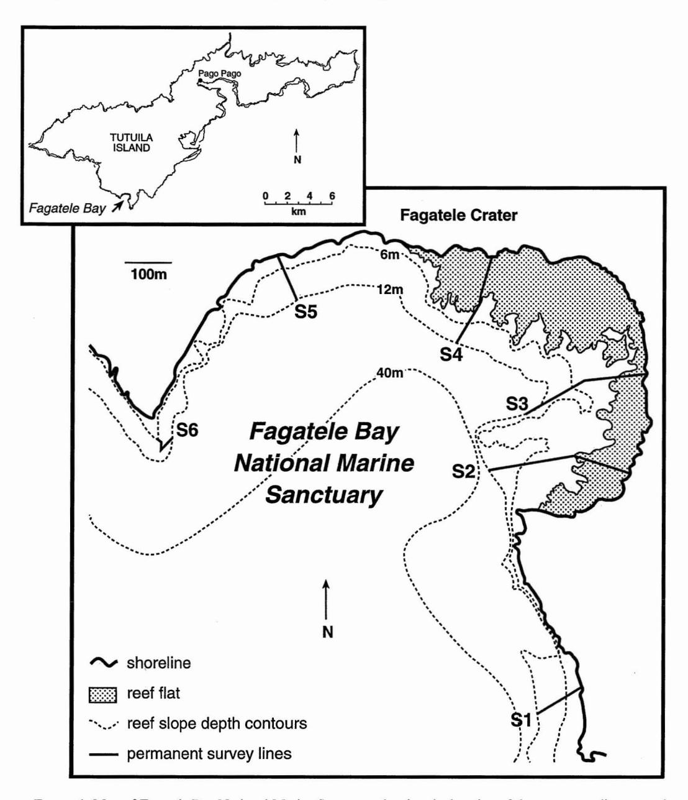
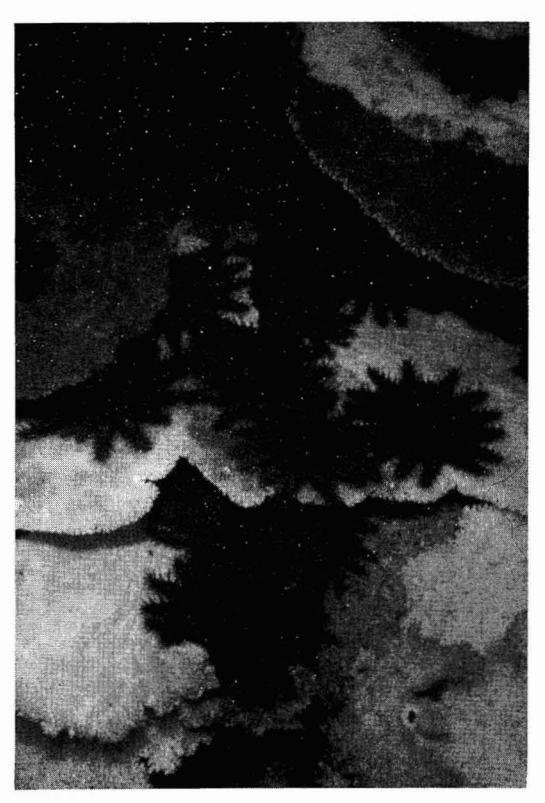
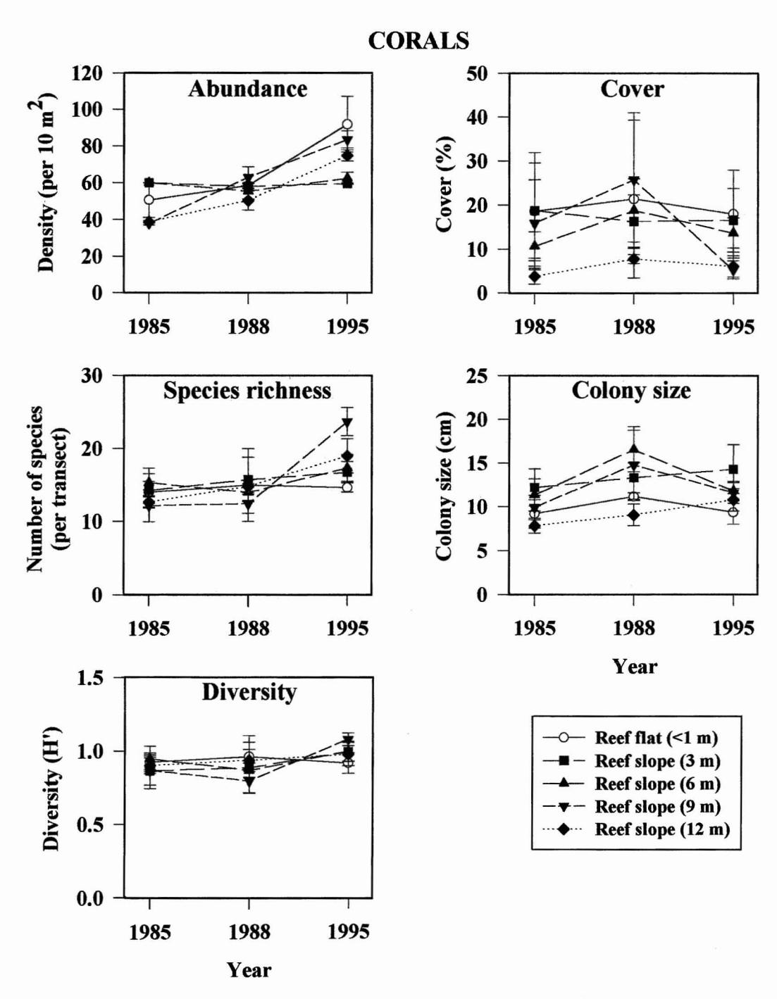
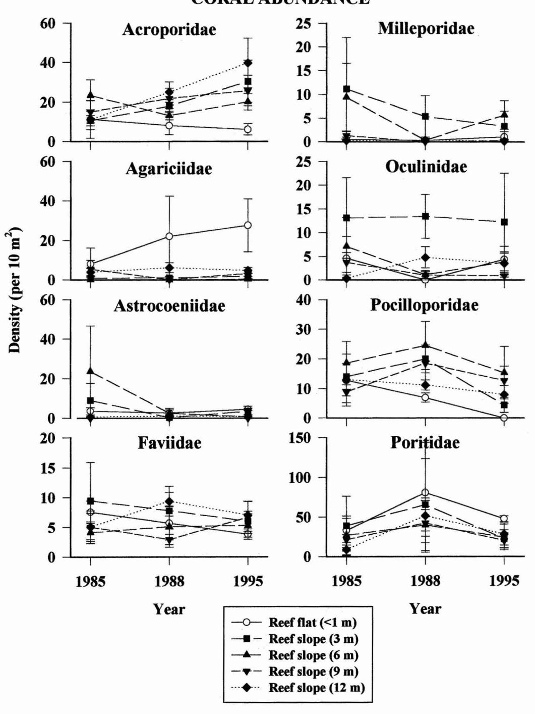
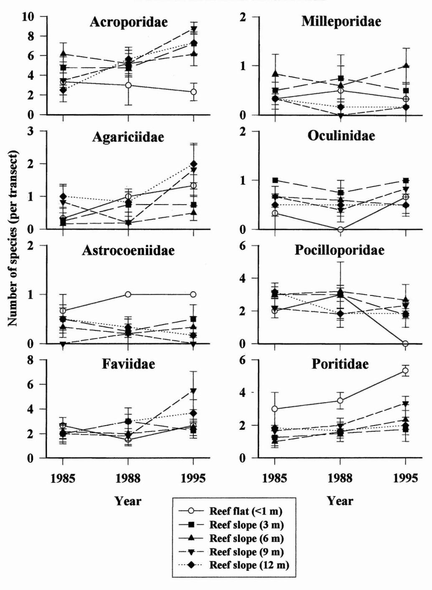
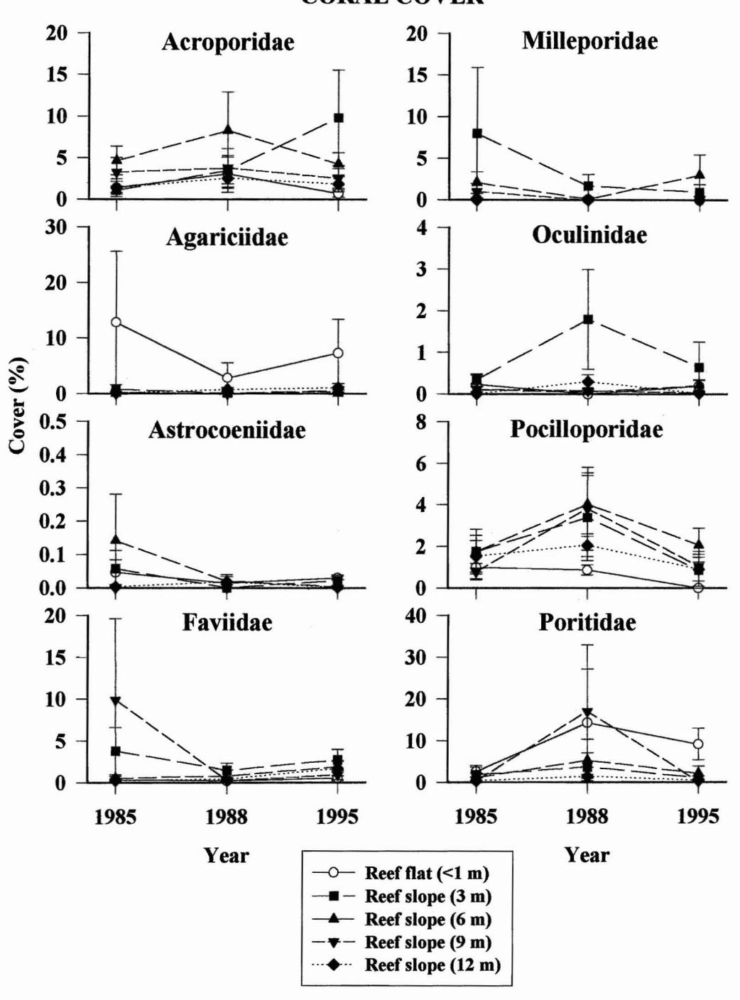
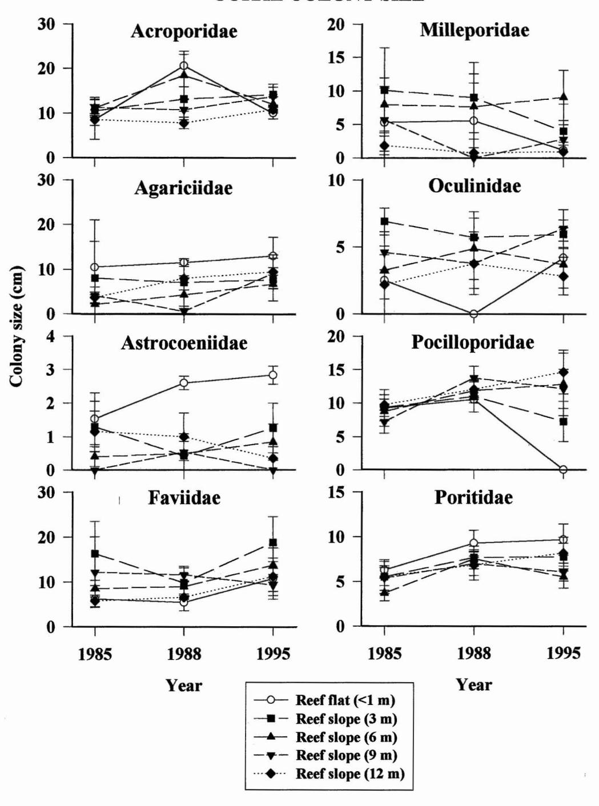
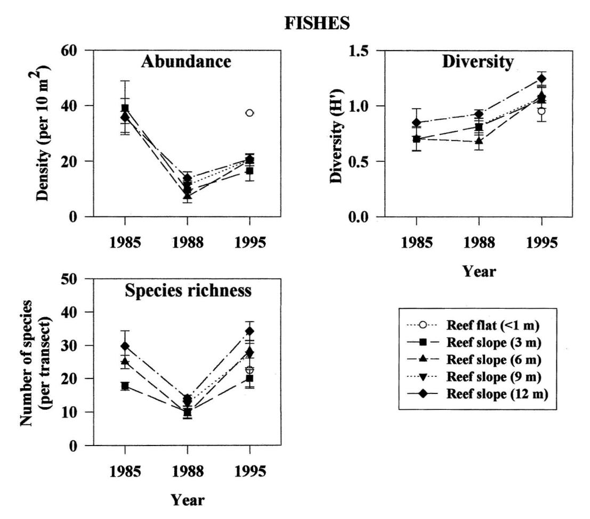
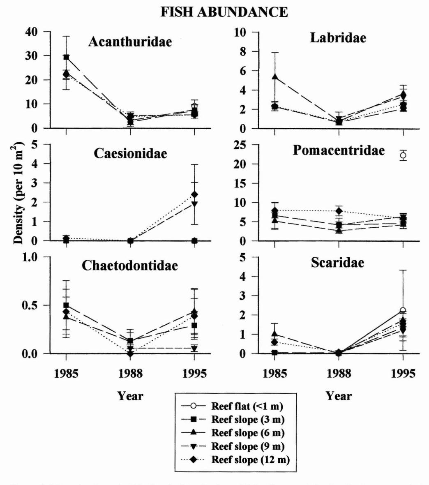
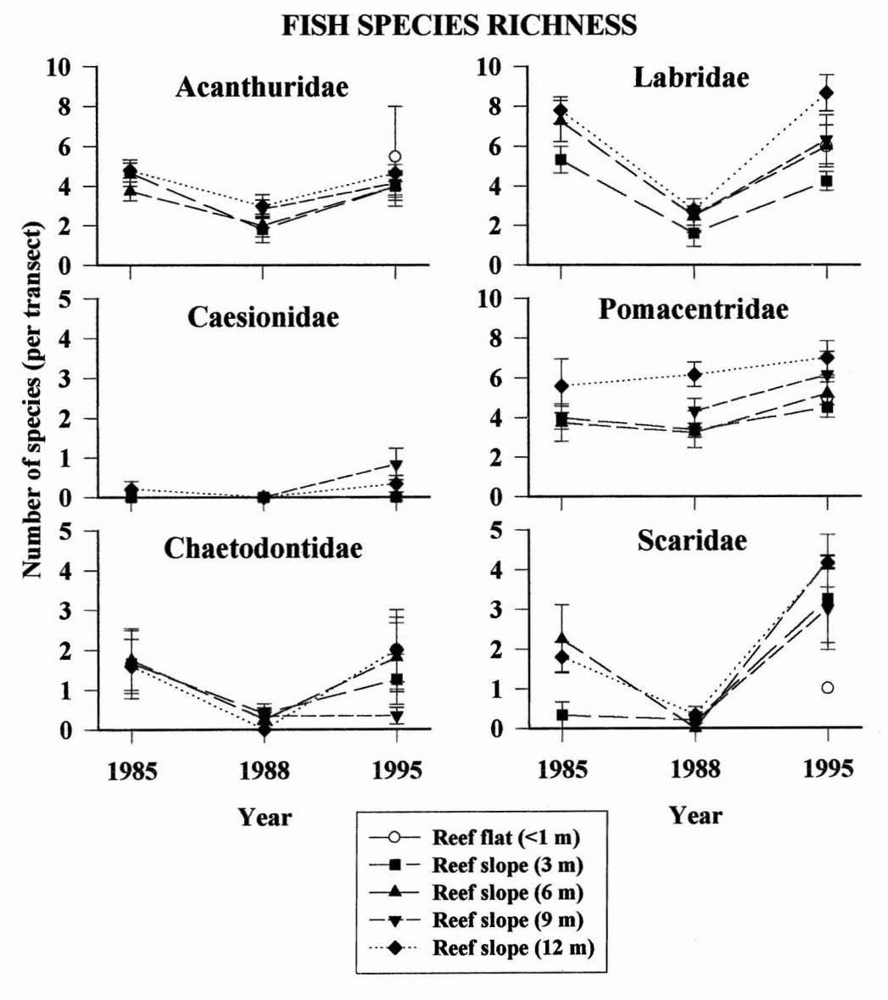

# **Twenty Years of Disturbance and Change in Fagatele Bay National Marine Sanctuary, American Samoa <sup>1</sup>**

A. L. GREEN, <sup>2</sup> C. E. BIRKELAND, <sup>3</sup> AND R. H. RANDALL<sup>3</sup>

ABSTRACT: Fagatele Bay National Marine Sanctuary contains a moderately diverse coral reef community (150 coral species, 259 fish species) that is protected from most human activities. The coral community was devastated by a crown-of-thorns starfish invasion in 1979 and has recently been affected by two major hurricanes (1990 and 1991) and a period of unusually high water temperature (1994). Long-term monitoring of the sanctuary allows for description of the effects of these disturbances in the absence of anthropogenic processes. The crown-of-thorns damaged deeper portions of the coral communities most severely, whereas the hurricanes and warm water affected shallower portions to a greater degree. Soon after these disturbances, corals started recruiting abundantly and the reefs began to recover. This is in contrast to some other areas in American Samoa, where chronic anthropogenic effects seem to have inhibited coral recruitment and reefrecovery. Fish communities were affected by the habitat degradation associated with the crown-of-thorns outbreak, but have remained relatively unchanged ever since.

CORAL REEFS ARE COMPLEX tropical ecosystems subject to perturbations from a variety of sources, including natural disasters (e.g., hurricanes) and events of undetermined cause (e.g., crown-of-thorns starfish outbreaks and coral bleaching). The effects of these disturbances on coral reef communities can range from minor to severe, depending on a variety of factors such as the previous condition of the community, the timing and intensity of the disturbance, and the physiography of the site (see review in Brown 1997). However, it is often difficult to examine the effects of these disturbances on reefs, because of the confounding influence of anthropogenic processes (e.g., sedimentation, eutrophication, and chemical pollution). Long-term monitoring of marine reserves can provide a valuable insight into the dynamics of coral

reef ecosystems in the absence of anthropogenic affects (Buddemeier 1992).

Fagatele Bay is located on Tutuila Island in American Samoa (140 22' S, 1700 40' W [Figure 1]) and was declared a National Marine Sanctuary in 1986 because of its isolation, spectacular beauty, and the pristine nature of its marine resources. The bay is a volcanic crater whose vertical cliffs and rough water conditions discourage access to the area, so both terrestrial and marine ecosystems are relatively protected from anthropogenic processes. The submerged portion of the crater is dominated by a coral reef ecosystem with a terraced structure.

In the late 1970s, Fagatele Bay comprised healthy coral reef communities characterized by high coral cover (30-50%: especially table *Acropora)* and diversity (R.H.R. and C.E.B., pers. obs.). An outbreak of the crown-ofthorns starfish devastated the coral communities in 1979, which led to a dramatic reduction in live coral cover in the bay (Figure 2 [Birkeland et al. 1987]). A long-term monitoring program was established in the sanctuary in 1985. Since then, the area has endured two major hurricanes (Ofa in 1990 and

<sup>1</sup> This work was funded in part by grant no. NA670M0108 from the National Oceanic and Atmospheric Administration. Manuscript accepted 12 February 1999.

<sup>2</sup> Great Barrier Reef Marine Park Authority, P.O. Box 1379, Townsville, Queensland, Australia 4810.

<sup>3</sup> University of Guam Marine Laboratory, VOG Station, Mangilao, Guam 96923.



FIGURE 1. Map of Fagatele Bay National Marine Sanctuary showing the location of the permanent lines at each site (SI-6); and map of Tutuila Island, American Samoa, showing the location of the sanctuary (see inset).

Val in 1991) and a coral bleaching event (in 1994), possibly as a result of unusually high water temperatures in the region at that time (N. Daschbach, pers. comm.).

The aims of this study were twofold: to

describe the coral reef communities in Fagatele Bay National Marine Sanctuary; and to examine the changes that have occurred in these communities over the last 20 yr, as a result of several major disturbances.



FIGURE 2. Crown-of-thorns starfish devastating the coral community in Fagateie Bay National Marine Sanctuary in 1979. (photo by C. Birkeland)

## MATERIALS AND METHODS

## *Study Area*

Fagatele Bay National Marine Sanctuary is located on the southwestern side of Tutuila Island (Figure 1). The bay is a small pocket of coastline (area = 0.65 km2) formed by the crater of an extinct volcano with its southwestern side open to the sea. The overall bottom topography resembles the shape of the original crater. However, shallower regions have been extensively modified by reef deposits, especially along the northeastern sector of the bay (Figure 1). Tidal range is approximately 1 m.

The reefs in the sanctuary can be divided into two principal geomorphic regions: a reef flat platform and a forereef slope (Figure 1).

On the inside portion of the bay, a shallow reef flat with a depth of < I m extends outward from the shoreline to the reef margin. At this point, the reef slope drops gradually down to >40 m in depth. In contrast, there is no reef flat platform on the outside portion of the bay, where the forereef slope drops directly from the shoreline to a depth of 6-7 m and then drops steeply down to the bottom of the bay. A detailed description of the geology and physiography of Fagatele Bay can be found in Birkeland et al. (1987).

## *Survey Design*

Permanent sites were established at each of six locations around the bay in 1985 (SI-6: Figure 1). At each site, a permanent line was marked from the reef margin to a depth of 12 m (Figure 1) using two or three large metal spikes driven into the substrate. The exact location and general description of the reef along each line is described in detail in Birkeland et al. (1987).

Corals and fishes were then surveyed quantitatively using a stratified random sampling program. Replicate transects (length = 30 m) were situated along four isobaths on the reef slope (3, 6, 9, and 12 m) perpendicular to the permanent lines and rougWy parallel to shore. Transects were also situated on the reef flat platform at three sites only (S2-4). Surveys were not done on the shallow reef slope (3 m) at Sl and S6 because reefs are only present in deeper water (::::6 m) at those sites.

The coral and fish communities in Fagatele Bay were described based on surveys done on three occasions over a period of 10 yr: the baseline survey in 1985 and two subsequent surveys in 1988 and 1995. The number of depth isobaths censused along each line varied for corals and fishes and among surveys, because of time and weather constraints (Table 1). Corals were surveyed along approximately twice as many transects as fishes in the baseline survey. With few exceptions, all transects censused in the baseline coral study were resurveyed in 1988 and 1995. In most cases, the fish transects surveyed in 1985 were also resurveyed in the

TABLE 1

SAMPLING DESIGN USED TO SURVEY CORALS AND FISHES IN FAGATELE BAY NATIONAL MARINE SANCTUARY ON THREE OCCASIONS OVER A PERIOD OF 10 YR (NUMBERS REPRESENT THE NUMBER OF REPLICATE TRANSECTS AT EACH DEPTH)

|                   | CORALS |      |      | FISHES |      |      |
|-------------------|--------|------|------|--------|------|------|
|                   | 1985   | 1988 | 1995 | 1985   | 1988 | 1995 |
| Reef flat (<1 m)  | 3      | 2    | 3    | 0      | 0    | 2    |
| Reef slope (3 m)  | 4      | 4    | 4    | 3      | 4    | 4    |
| Reef slope (6 m)  | 6      | 5    | 6    | 3      | 4    | 5    |
| Reef slope (9 m)  | 6      | 5    | 6    | 0      | 6    | 6    |
| Reef slope (12 m) | 6      | 6    | 6    | 5      | 6    | 6    |

subsequent surveys. However, the number of fish transects surveyed increased during the study from 12 to 23, so that the survey design for corals and fishes was almost equivalent in 1995. Each transect was relocated as close as possible to the transects used in previous surveys.

## Coral Survey Methods

Hard coral communities in Fagatele Bay were censused in all three surveys by the same two observers (C.E.B. and R.H.R.) using the point-quarter method described in detail by Birkeland et al. (1987). Points were selected by haphazardly throwing a hammer at 16 locations along each transect. Four corals were then sampled at each point, yielding a total of 64 corals sampled per transect. Corals were selected by choosing the closest colony to the point in each of four imaginary quadrants radiating out from the head of the hammer. Each coral was identified, its size measured (diameter in centimeters), and the distance from the sample point to the center of the colony recorded. The dimensions of the colony were also measured (usually length and width) and were later converted to estimates of cover using the appropriate areal formulas for each colony shape. These measurements were then used to calculate the following: coral density =  $(unit area)/(mean distance)^2$ and coral cover = (average areal cover of colonies) × (coral density). Two indices of community structure were calculated also: species richness = total number of species per transect and Shannon-Wiener Diversity Index:  $H' = -\sum p_i \log_{10} p_i$ , where  $p_i$  is the proportion of corals in category i.

Coral species observed but not included in the quantitative assessment were also recorded to obtain a more complete species list for the sanctuary.

## Fish Survey Methods

Fishes were censused along the transects by an experienced observer in each survey: R. Wass in 1985, S. Amesbury in 1988, and A.L.G. in 1995. Fish survey methods were the same in all three surveys with one exception: fishes were surveyed while other divers were in the water in 1988, but this was not the case in the other two surveys.

All fishes observed within 1 m on either side of the transect and 2 m above it were identified to species and counted. Holes and cracks in the reef within the transect corridor were inspected for nocturnal and secretive fishes, and the substrate was examined closely for cryptic species. The duration of the count for each transect was approximately 10 min. Species that were observed in the bay but not on the transects were also recorded to provide a more complete fish list for the sanctuary. All fish observations were made between 0900 and 1500 hours.

Quantitative fish counts were used to calculate fish density (per 10 m<sup>2</sup>) and species richness (number of species) on each transect. Fish diversity was also calculated using the Shannon-Wiener Diversity Index (see Coral Survey Methods).

### RESULTS

### Coral Communities

The coral communities in Fagatele Bay showed considerable variation over time in terms of their patterns of abundance, species richness, diversity, cover, and colony size (Figure 3). In 1985, coral abundance was



FIGURE 3. Mean ( $\pm$ SE) abundance, species richness, Shannon-Wiener diversity (H'), cover, and colony size of corals recorded at five depths over a period of 10 yr in Fagatele Bay National Marine Sanctuary (n = 2-6 transects [see Table 1], and 64 corals were sampled on each transect).

higher in shallower water (3-6 m) than in deeper water (9-12 m) on the reef slope. In contrast, coral abundance was similar at all depths in 1988 and higher in deeper water in 1995. Coral abundance on the reef flat was similar to that recorded on the reef slope in 1985 and 1988, but was slightly higher than that recorded on the reef slope in 1995.

A total of 150 hard coral species belonging to 17 families and 35 genera was recorded in the bay (Appendix 1). The most abundant families included the Poritidae, Acroporidae, Agariciidae, Astrocoeniidae, and Pocilloporidae (Figure 4). The relative abundance of families and species varied between the reef flat and the reef slope. Three families dominated the reef flats (Figure 4): Poritidae *(Porites cylindrica, P. lutea,* P. *rus,* and *Porites* sp. 2), Agariciidae *(Pavona divaricata),* and Acroporidae *(Acropora [Isopora) crateriformis).* By comparison, the reef slopes were characterized by a more mixed coral assemblage (Figure 4) including poritids *(Porites rus* and *Porites* sp. 2), pocilloporids *(Pocillopora elegans, P. eydouxi,* and *P. verrucosa),* acroporids *(Acropora crateriformis* and *A. hyacinthus),* faviids *(Echinopora hirsutissima),* oculinids *(Galaxea fascicularis),* astrocoeniids *(Stylocoeniella armata),* and milleporids *(Millepora platyphylla).*

Each coral family showed different patterns of abundance through time (Figure 4). The increase in total coral abundance on the deeper reef slope over time (9 and 12 m: Figure 3) was partly due to an increase in acroporids at those depths in 1988 and 1995 (Figure 4). In contrast, the increase in total coral abundance on the reef flat (Figure 3) was probably due to an increase in agariciids over time (Figure 4).

Coral species richness was similar at all depths in both 1985 and 1988, but was higher on the deeper reef slope in 1995 (especially at 9 m: Figure 3). Families that accounted for most of the species richness in the bay included the Acroporidae, Faviidae, Pocilloporidae, and Poritidae (Figure 5, Appendix 1). Reef flats differed from reef slopes by having fewer acroporid species and more species of poritids and astrocoeniids.

Each coral family showed different pat-

terns ofspecies richness through time (Figure 5). Some families (especially acroporids, agariciids, and faviids) showed an increase in species richness on the deeper reef slope (9- 12 m) in 1995, which contributed to the overall increase in species richness at those depths that year (Figure 3).

Coral species diversity showed little variation associated with depth or time (Figure 3). Although in a pattern similar to that of species richness, diversity was highest at 9 m in 1995.

Coral cover was variable at each depth, as evidenced by the large error bars surrounding the means (Figure 3). On the reef flat, shallow reef slope (3 m), and deep reef slope (12 m), cover showed little variation through time. In contrast, coral cover was more variable at intermediate depths (6-9 m). In 1985, cover was slightly lower at 6-9 m than it was in shallower water (3 m). By 1988, cover appeared to have increased at 6-9 m, such that the highest cover was recorded at 9 m. However by 1995, cover had decreased at 6-9 m again (especially 9 m), and there was a clear decrease in cover associated with depth.

Six families composed most of the coral cover in the bay: Acroporidae, Agariciidae, Faviidae, Milleporidae, Pocilloporidae, and Poritidae (Figure 6). Poritids, agariciids, and acroporids accounted for most of the cover on the reef flat, whereas acroporids, faviids, milleporids, pocilloporids, and poritids composed most of the cover on the reef slope. The cover of each of these families showed some variation through time. For example, the high total coral cover recorded at 9 m in 1985 and 1988 compared with that in 1995 (Figure 3) was largely due to the relatively high cover offaviids in 1985 and poritids and pocilloporids in 1988 at that depth (Figure 6).

Colony size also showed some variation through time. In both 1985 and 1995, mean colony size was similar at all four depths on the reef slope, but tended to decrease with depth (Figure 3). In contrast, colony size was highest on the reef slope at intermediate depths (6-9 m) in 1988. In all three surveys, colony size was smaller on the reef flat than at most depths on the reef slope (except

# **CORAL ABUNDANCE**



Figure 4. Mean abundance  $(\pm SE)$  of each of the dominant coral families recorded at five depths over a period of 10 yr in Fagatele Bay National Marine Sanctuary.

# **CORAL SPECIES RICHNESS**



Figure 5. Mean species richness ( $\pm$ SE) of each of the dominant coral families recorded at five depths over a period of 10 yr in Fagatele Bay National Marine Sanctuary.

# **CORAL COVER**



FIGURE 6. Mean cover  $(\pm SE)$  of each of the dominant coral families recorded at five depths over a period of 10 yr in Fagatele Bay National Marine Sanctuary.

12 m). Coral colony size varied among families, although no clear pattern was apparent through time (Figure 7). In general, mean colony size ranged from small to medium (diameter = 5-20 cm) for the Acroporidae, Agariciidae, Faviidae, Pocilloporidae, and Poritidae and tended to be smaller (diameter = 1-10 cm) for the other families.

## *Fish Communities*

A total of 259 fish species in 40 families and 114 genera was recorded in Fagatele Bay (Appendix 2). One species, *Acanthurus albipectoralis,* was a new record for American Samoa.

Fish abundance, species richness, and diversity each showed different patterns of variation through time (Figure 8). Fish abundance was much higher in 1985 than in 1988 and 1995. Fish abundance was also consistently higher at each depth in 1995 than it was in 1988. Fish abundance was similar at all depths on the reef slope in each survey, but was almost twice as high on the reef flat as on the reef slope in 1995 (Figure 8).

The most abundant families were the Acanthuridae, Pomacentridae, Labridae, Caesionidae, and Scaridae (Figure 9), with the lowest abundance of most families recorded in 1988. Acanthurids were much more abundant in 1985 than in the other years, because ofthe large number ofjuvenile *Ctenochaetus striatus* present in the bay at that time.

The relative abundance of families and species differed between the reef flat and reef slope (Figure 9). Dominant families and species on the reef slope included the Acanthuridae *(Ctenochaetus striatus, Acanthurus nigrofuscus, A. lineatus,* and *A. nigricans),* Pomacentridae *(Plectroglyphidodon lacrymatus, Chromis vanderbilti,* and *Pomacentrus brachialis),* and Labridae *(Thalassoma quinquevittatum).* The dominant families and species on the reef flat included the Pomacentridae *(Stegastes albifasciatus, Chrysiptera cyanea,* and C. *leucopoma),* Acanthuridae *(Ctenochaetus striatus, Acanthurus nigrofuscus,* and *A. triostegus),* Labridae *(Thalassoma*

*hardwicke),* and Scaridae (unidentified juveniles).

Fish species richness showed a clear pattern of variation through time (Figure 8). Species richness was similar in 1985 and 1995, but was much lower in 1988. During each survey year, the number of species tended to increase with depth on the reef slope, although this pattern was less pronounced in 1988. Species richness recorded on the reef flat in 1995 was similar to that observed on the shallow reef slope (depth = 3 m) that year.

Families that accounted for most of the species richness in the bay included Acanthuridae, Labridae, Pomacentridae, Scaridae, and Chaetodontidae (Figure 10, Appendix 2). In general, species richness of most families (except scarids) was similar in 1985 and 1995.. However, species richness of most families (especially scarids, labrids, and acanthurids) was lower in 1988 than it was in the other two years, which accounts for the low overall species richness recorded that year (see above).

Fish species diversity increased through time from 1985 to 1995 (Figure 8). Diversity was probably higher in 1995 than in 1988 because species richness was much higher although abundance was only slightly higher in 1995 compared with 1988 (Figure 8). In contrast, fish species diversity was probably higher in 1995 than in 1985 because of the dominance of juvenile acanthurids *(Ctenochaetus striatus)* in the bay in 1985 (see above). Diversity also varied with depth and was highest on the deep reefslope (12 m) and lowest on the reef flat (Figure 8).

### DISCUSSION

Fagatele Bay National Marine Sanctuary comprises a healthy and resilient coral reef community. To date, 600 species of coral, other benthic macroinvertebrates, fish, and macroalgae have been recorded in the bay (150, 140, 259, and 51, respectively [Birkeland et al. 1987, 1996, this study]). A recent comparison with 10 other locations around the island found that the coral communities

# **CORAL COLONY SIZE**



Figure 7. Mean colony size  $(\pm SE)$  of each of the dominant coral families recorded at five depths over a period of 10 yr in Fagatele Bay National Marine Sanctuary.



FIGURE 8. Mean ( $\pm$ SE) abundance, species richness, and Shannon-Wiener diversity (H') of fishes recorded at five depths over a period of 10 yr in Fagatele Bay National Marine Sanctuary (n = 0-6 transects [see Table 1]; transect area = 60 m<sup>2</sup>).

in the sanctuary were characterized by moderate species richness and cover, high abundance, and low colony size, and the fish communities were characterized by moderately high species richness and abundance (Table 2).

The coral reefs of Fagatele Bay are relatively protected from anthropogenic disturbances by their isolation and protected status (see Introduction). However, disturbances are a normal part of the dynamics of a coral reef ecosystem, and the reefs in the sanctuary have experienced several major perturbations in the last two decades (see In-

troduction). By examining the coral reef communities in Fagatele Bay over the last 10 yr, we were able to describe the patterns of variation in these communities following a crown-of-thorns starfish invasion, two hurricanes, and a period of unusually high water temperature.

The crown-of-thorns invasion in 1979 was followed by a dramatic reduction in live coral cover in the bay (see Introduction, Figure 2). Six years later, our survey showed that the coral communities appeared to be in better condition (higher abundance, higher cover, and larger colonies) in areas of strong wave



FIGURE 9. Mean abundance  $(\pm SE)$  of each of the dominant fish families recorded at five depths over a period of 10 yr in Fagatele Bay National Marine Sanctuary.

action (i.e., shallow water at  $\leq 6$  m) than in less-exposed locations (i.e., deeper water at 9–12 m: Figure 3). It is assumed that differential predation pressure by starfish was largely responsible for this pattern, because this corallivore does not maintain its position on the substrate in areas of strong surge. The exception to this general pattern was the rel-

atively high coral cover recorded at 9 m (Figure 3). This was due to a large clump of *Echinopora hirsutissima* at one site (S2), which is not a favored prey of the starfish.

Almost 10 yr after the starfish invasion (1988), the coral communities in deeper water (9–12 m) had started to recover from that event with an increase in coral abundance,



FIGURE 10. Mean species richness  $(\pm SE)$  of each of the dominant fish families recorded at five depths over a period of 10 yr in Fagatele Bay National Marine Sanctuary.

cover, and colony size (Figure 3). Coral cover and colony size had also increased at 6 m, although the coral communities at shallower depths (1-3 m) showed little change.

Since then, the sanctuary has experienced two major hurricanes (in 1990 and 1991) that appear to have affected the coral communities in shallower water ( $\leq 9$  m) to the great-

est extent. Both coral cover and colony size decreased at depths of 6–9 m from 1988 to 1995 (Figure 3), probably as a result of the hurricanes. In contrast, the coral communities in the deeper portions of the bay (12 m) appear to have escaped severe damage, because they showed an increase in coral abundance, species richness, and colony size from

### TABLE 2

CHARACTERISTICS OF THE CORAL REEF CoMMUNlTIES IN FAGATELE BAY NATIONAL MARINE SANCTUARY (nns STUDY) AND 10 OTHER LOCATIONS AROUND TUTUILA ISLAND IN 1995: INSIDE MASEFAU BAY, OUTSIDE MASEFAU BAY, AOA BAY, ONENOA BAY, FAGASA BAY, CAPE LARSEN, FAGAFUE BAY, MASSACRE BAY, FATU ROCK, AND PAGO PAGO HARBOR (FROM BIRKELAND ET AL. 1996)

| COMMUNITY MEASURE               | FAGATELE<br>BAYNMS | OTHER<br>LOCATIONS |  |
|---------------------------------|--------------------|--------------------|--|
| Corals                          |                    |                    |  |
| Mean abundance (per 10 m2)      | 60-92              | 3-26               |  |
| Species richness (per transect) | 15-24              | 10-29              |  |
| Mean cover (%)                  | 5-18               | 2-25               |  |
| Mean colony size (cm)           | 9-14               | 7-30               |  |
| Fishes                          |                    |                    |  |
| Mean abundance (per 10 m2)      | 17-37              | 10-44              |  |
| Species richness (per transect) | 20-34              | 12-40              |  |

1988 to 1995 (Figure 3). The coral communities on the reef flat and shallow reef slope (3 m) also appeared to show no apparent effect of the hurricanes, based on the parameters measured (Figure 3). However, we believe that these shallow areas were substantially affected by the hurricanes and that the results represent recovery since the hurricanes, for two reasons.

First, there have been some major changes to the physical structure of the reef as a result of large coral colonies being overturned and destroyed by the hurricanes, which were most apparent in shallow water in the inner portions of the bay (see detailed description in Birkeland et al. 1996). Second, there has been a change in the relative abundance of coral families on the shallow reef slope since the hurricanes (Figure 4). Several dominant families have increased in abundance (e.g., Acroporidae and Agariciidae), while others (e.g., Poritidae and Pocilloporidae) have decreased. The moderately small size of the acroporid and agariciid colonies recorded on the shallow reef slope in 1995 (Figure 7) indicates that these colonies may represent recovery since the hurricanes.

In the 4-yr interval between the last hurricane (1991) and the next survey (1995), the bay also experienced a coral bleaching event, possibly as a result of unusually high water temperatures in the region at that time (N. Daschbach, pers. comm.). The contribution of this event to the patterns described above is unknown, although anecdotal reports suggest that bleaching was most pronounced in the shallow, inner portions of the bay and affected some families more severely than others (especially Pocilloporidae: N. Daschbach, pers. comm.).

In the absence of chronic anthropogenic effects, coral communities can recover from these types of disturbances, and the results of our last survey show that recovery is under way in Fagatele Bay. Reef slopes have been consolidated with a lush growth of pink coralline algae (Birkeland et al. 1996) and coral recruitment is high, as evidenced by the high density and species richness of small coral colonies observed in 1995 (Table 2).

Coral communities provide important habitat for coral reef fishes, and previous studies suggest that there were some major changes in the fish communities of Fagatele Bay as a result of the habitat degradation caused by the starfish invasion in 1979 (Birkeland et al. 1987, 1994, 1996). In particular, there was a dramatic decline in small, siteattached species that are closely associated with live coral colonies (such as the damselfish *Plectroglyphidodon dickii)* and an increase in species that prefer coral rubble (Birkeland et al. 1996). In contrast, there does not appear to have been any major changes in the fish assemblages in the bay over the last 10 yr (this study).

Fish species richness was similar in 1985 and 1995, but was much lower in 1988 (Figure 8). However, this was probably due to methodological differences between surveys (see Materials and Methods) and not to an actual decline in species richness that year. In particular, the presence of other divers in the water may have caused a greater disturbance to the fish community in 1988 (especially mobile families such as scarids, labrids, and acanthurids), resulting in the lower number of species observed at that time.

In contrast to species richness, fish abundance appears to have decreased over time, with a much higher density recorded in 1985 than in the last two surveys (Figure 8). The lowest abundances were consistently recorded in 1988, which was probably due to the methodological differences between surveys (see above). However, the much higher abundances in 1985 relative to 1995 appear to be a temporary artifact caused by a recent, massive recruitment pulse of *Ctenochaetus striatus* at the time of the first survey (see Results). Observations at the time indicate that many of these juveniles were in poor condition, with sunken sides and frayed fins, and it is likely that there was a wholesale dieoff shortly after the survey was completed (Birkeland et al. 1987).

In summary, Fagatele Bay National Marine Sanctuary encompasses a healthy coral reef community, which has undergone some substantial changes over the last two decades as the result of four major disturbances. Coral reefs can show considerable robustness when exposed to acute disturbances such as crown-of-thorns outbreaks, hurricanes, and extraordinarily warm water (Wilkinson 1992), and it appears that the reefs in the sanctuary are now recovering from these perturbations. In the absence of any major disturbances in the next few years, we anticipate that the coral reef communities in the bay will continue to make a rapid recovery. This is in marked contrast to some other reefs on the island, such as in Pago Pago Harbor, that have been subjected to chronic inhibition of coral recruitment from anthropogenic influences, where recovery from disturbances is slow (Birkeland et al. 1994, 1996, Green et al. 1997).

### ACKNOWLEDGMENTS

We thank Nancy Daschbach (FBNMS) for coordinating this project, and R. Wass, S. Amesbury, B. Smith, and S. Wilkens for participating in the surveys. We are also grateful to the Department of Marine and Wildlife Resources, American Samoa, for providing logistic support and to Fale Tuilagi, Elia Henry, Terry Lem Yeun, Ray

Buckley, Dave Hano, and Fa'asega Kuresa for assisting with the fieldwork. Thanks also to Meryl Goldin, Nancy Daschbach, and Gillian Bettridge for assistance with data handling and the production of Figure 1.

## LITERATURE CITED

BIRKELAND, C. E., R. H. RANDALL, R. C. WASS, B. SMITH, and S. WILKINS. 1987. Biological resource assessment of the Fagatele Bay National Marine Sanctuary. NOAA Tech. Mem. Ser. NOS/MEMD 3. 232 pp.

BIRKELAND, C. E., R. H. RANDALL, and S. AMESBURY. 1994. Coral and reef-fish assessment of the Fagatele Bay National Marine Sanctuary. Report to National Oceanic and Atmospheric Administration, U.S. Department of Commerce. 126 pp.

BIRKELAND, C. E., R. H. RANDALL, A. L. GREEN, B. D. SMITH, and S. WILKINS. 1996. Changes in the coral reef communities of Fagatele Bay National Marine Sanctuary and Tutuila Island (American Samoa) over the last two decades. Report to National Oceanic and Atmospheric Administration, U.S. Department of Commerce. 223 pp.

BROWN, B. E. 1997. Disturbances to reefs in recent times. Pages 354-379 *in* C. Birkeland, ed. Life and death of coral reefs. Chapman & Hall, New York.

BUDDEMEIER, R. W. 1992. Corals, climate and conservation. Proceedings, 7th International Coral Reef Symposium, Guam 1:3-10.

GREEN, A. L., C. BIRKELAND, R. RANDALL, B. SMITH, and S. WILKENS. 1997. 78 years of coral reef degradation in Pago Pago Harbor: A quantitative record. Proceedings, 8th International Coral Reef Symposium, Panama 2: 1883-1888.

WILKINSON, C. R. 1992. Coral reefs of the world are facing widespread devastation: Can we prevent this through sustainable management practices? Proceedings, 7th International Coral Reef Symposium, Guam 1: 11-24.

## APPENDIX 1

CORAL SPECIES RECORDED IN FAGATELE BAY NATIONAL MARINE SANCTUARY, AMERICAN SAMOA

```
Class Hydrozoa
  Order Milleporina
       Family Milleporidae
         Millepora dichotoma Forskal, 1775
         Millepora platyphylla Hemprich & Ehrenberg, 1834
         Millepora tuberosa Boschma, 1966
         Millepora sp. 1
  Order Stylasterina
       Family Stylasteridae
         Stylaster cf. gracilis Milne Edwards & Haime, 1850
Class Anthozoa
  Order Scleractinia
    Suborder Astrocoeniina
      Family Astrocoeniidae
         Stylocoeniella armata (Ehrenberg, 1834)
      Family Pocilloporidae
         Pocillopora ankeli Sheer & Pillai, 1974
         Pocillopora damicornis (Linnaeus, 1758)
         Pocillopora danae Verril1, 1864
         Pocillopora elegans Dana, 1846
         Pocillopora eydouxi Milne Edwards & Haime, 1860
         Pocillopora ligulata Dana, 1846
         Pocillopora meandrina Dana, 1846
         Pocillopora setchelli Hoffmeister, 1929
         Pocillopora verrucosa (Ellis & Solander, 1786)
         Pocillopora sp. 1 (juvenile)
         Stylophora mordax (Dana, 1846)
      Family Acroporidae
         Acropora (Acropora) acuminata (Verrill, 1864)
         Acropora (Acropora) azurea Veron & Wal1ace, 1984
         Acropora (Acropora) cerealis (Dana, 1846)
         Acropora (Acropora) cytherea (Dana, 1846)
         Acropora (Acropora) digitifera (Dana, 1846)
         Acropora (Acropora) cf. gemmifera (Brook. 1892)
         Acropora (Acropora) humilis (Dana, 1846)
         Acropora (Acropora) hyacinthus (Dana, 1846)
         Acropora (Acropora) irregularis (Brook, 1892)
         Acropora (Acropora) loripes (Brook, 1892)
         Acropora (Acropora) millepora (Ehrenberg, 1834)
         Acropora (Acropora) monticulosa (Bruggemann, 1879)
         Acropora (Acropora) cf. nana (Studer, 1878)
         Acropora (Acropora) nasuta (Dana, 1846)
         Acropora (Acropora) nobilis (Dana, 1846)
         Acropora (Acropora) ocellata (Klunzinger, 1879)
        Acropora (Acropora) pagoensis Hoffmeister, 1925
        Acropora (Acropora) palmerae Wel1s, 1954
        Acropora (Acropora) paxilligera Dana, 1846
        Acropora (Acropora) robusta (Dana, 1846)
        Acropora (Acropora) samoensis (Brook, 1891)
        Acropora (Acropora) selago (Studer, 1878)
        Acropora (Acropora) smithi (Brook, 1893)
        Acropora (Acropora) tenuis (Dana, 1846)
        Acropora (Acropora) tutuilensis Hoffmeister, 1925
        Acropora (Acropora) valida (Dana, 1846)
        Acropora (Acropora) verweyi Veron & Wal1ace, 1984
        Acropora (Acropora) yongei Veron & Wal1ace, 1984
        Acropora (Acropora) sp. 1
        Acropora (Isopora) crateriformis (Gardiner, 1898)
```

#### APPENDIX I (continued)

```
Acropora (Isopora) palifera (Lamarck, 1816)
    Astreopora sp.
                    I
     Montipora berryi Hoffmeister, 1925
     Montipora caliculata (Dana, 1846)
     Montipora ehrenbergii Verrill, 1875
     Montipora elschneri Vaughan, 1918
     Montiporafloweri Wells, 1954
     Montiporafoveolata (Dana, 1846)
    Montipora granulosa Bernard, 1897
    Montipora grisea Bernard, 1897
    Montipora lobulata Bernard, 1897
    Montipora monasteriata (Forskal, 1775)
    Montipora tuberculosa (Lamarck, 1816)
    Montipora turgescens Bernard, 1897
    Montipora venosa (Ehrenberg, 1834)
    Montipora verrilli Vaughan, 1907
    Montipora verrucosa (Lamarck, 1816)
    Montipora sp.
                   I
    Montipora sp.
                   2
    Montipora sp.
                   3
Suborder Poritiina
  Family Poritidae
    Alveopora superficiales Pillai
                                 & Scheer, 1976
    Alveopora viridis Quoy
                            & Gaimard, 1833
    Alveopora sp.
                   I
    Goniopora somaliensis Vaughan, 1907
    Goniopora sp.
                   I
    Porites (Naporora) vaughani Crossland, 1952
    Porites (Porites) annae Crossland, 1952
    Porites (Porites) cylindrica Dana, 1846
    Porites (Porites) lichen Dana, 1846
    Porites (Porites) lobata Dana, 1846
    Porites (Porites) lutea Milne Edwards
                                           & Haime, 1860
    Porites (Porites) murrayensis Vaughan, 1918
    Porites (Porites) superfusa Gardiner, 1898
    Porites (Porites) sp.
                         I
    Porites (Porites) sp.
                         2
    Porites (Porites) sp.
                         3
    Porites (Synaraea) convexa Verrill, 1864
    Porites (Synaraea) rus (Forskal, 1775)
Suborder Fungiina
  Family Siderastreidae
    Coscinaraea columna (Dana, 1846)
    Coscinaraea sp.
                     I
    Psammocora contigua (Esper, 1797)
    Psammocora haimeana Milne Edwards
                                            & Haime, 1851
    Psammocora neirstraszi van der Horst, 1921
    Psammocora samoensis Hoffmeister, 1925
    Psammocora superficialis Gardiner, 1898
    Psammocora sp.
                     I
  Family Agariciidae
    Gardineroseris planulata (Dana, 1846)
    Pavona divaricata (Lamarck, 1816)
    Pavona duerdeni Vaughan, 1907
    Pavona maldivensis (Gardiner, 1905)
    Pavona varians Verrill, 1864
    Pavona venosa (Ehrenberg, 1834)
    Pavona sp.
                I
    Pavona sp.
               2
    Pavona sp.
               3
```

### APPENDIX 1 (continued)

Family Fungiidae *Fungia (Fungia) Jungites* (Linnaeus, 1758) *Fungia (Pleuractis) scutaria* Lamarck, 1801 *Fungia (VerrilloJungia) repanda* Dana, 1846 Suborder Faviina Family Oculinidae *Galaxea Jascicularis* (Linnaeus, 1767) Family Pectiniidae *Echinophyllia aspera* (Ellis & Solander, 1786) Family Mussidae *Acanthastrea echinata* (Dana, 1846) *Lobophyllia corymbosa* (Forskiil, 1775) *Lobophyllia costata* (Dana, 1846) *Lobophyllia hemprichii* (Ehrenberg, 1834) *Symphyllia recta* (Dana, 1846) Family Merulinidae *Merulina ampliata* (Ellis & Solander, 1786) *Merulina vaughani* van der Horst, 1921 Family Faviidae *Caulastrea Jurcata* Dana, 1846 *Cyphastrea chalcidicum* (Forskiil, 1775) *Cyphastrea serailia* (Forskiil, 1775) *Cyphastrea* sp. I *Echinopora hirsutissima* Milne Edwards & Haime, 1849 *Echinopora lamellosa* (Esper, 1795) *FaviaJavus* (Forskiil, 1775) *Favia matthaii* Vaughan, 1918 *Favia pallida* (Dana, 1846) *Favia rotumana* (Gardiner, 1899) *Favia speciosa* (Dana, 1846) *Favia stelligera* (Dana, 1846) *Favites abdita* (Ellis & Solander, 1786) *Favites* cf. *complanata* (Ehrenberg, 1834) *Favitesflexuosa* (Dana, 1846) *Favites* cf. *halicora* (Ehrenberg, 1834) *Favites pentagona* (Esper, 1794) *Favites russelli* (Wells, 1954) *Goniastrea edwardsi* Chevalier, 1971 *Goniastrea Javulus* (Dana, 1846) *Goniastrea pectinata* (Ehrenberg, 1834) *Goniastrea retiformis* (Lamarck, 1816) *Goniastrea* sp. 1 *Hydnophora exesa* (Pallas, 1766) *Hydnophora microconos* (Lamarck, 1816) *Hydnophora rigida* (Dana, 1846) *Leptastrea purpurea* (Dana, 1846) *Leptastrea transversa* Klunzinger, 1879 *Leptastrea* sp. 1 *Leptoria phrygia* (Ellis & Solander, 1786) *Montastraea annuligera* (Milne Edwards & Haime, 1849) *Montastraea curta* (Dana, 1846) *Platygyra daedalea* (Ellis & Solander, 1786) *Platygyra pini* Chevalier, 1975 Suborder Caryophylliina Family Caryophylliidae *Euphyllia glabrescens* (Chamisso & Eysenhardt, 1821) Suborder Dendrophylliina Family Dendrophylliidae *Turbinaria reniformis* Bernard, 1896

## APPENDIX 2

## FISH SPECIES RECORDED IN FAGATELE BAY NATIONAL MARINE SANCTUARY, AMERICAN SAMOA

```
Class Chondrichthyes
  Order Carcharhiniforrnes
    Family Carcharhinidae
           Carcharhinus melanopterus (Quoy & Gaimard, 1824)
    Family Hemigaleidae
           Triaenodon obesus (Ruppell, 1837)
  Order Myliobatiforrnes
    Family Myliobatidae
           Aetobatus narinari (Euphrasen, 1790)
Class Osteichthyes
  Order Anguilliforrnes
    Family Muraenidae
           Gymnothoraxjavanicus (Bleeker, 1859)
           Gymnothorax meleagris (Shaw & Nodder, 1795)
  Order Aulopiforrnes
    Family Synodontidae
           Synodus sp.
  Order Beryciforrnes
    Family Holocentridae
           Myripristis berndti (Jordan & Everrnann, 1903)
           Myripristis violacea Bleeker, 1851
           Neoniphon opercularis (Valenciennes, 1831)
           Neoniphon sammara (ForskaJ, 1775)
           Sargocentron caudimaculatum (Ruppell, 1838)
           Sargocentron diadema (Lacepede, 1801)
           Sargocentron microstoma (Gunther, 1859)
           Sargocentron spiniferum (Forskal, 1775)
           Sargocentron tiere (Cuvier, 1829)
  Order Syngnathiformes
    Family Aulostomidae
           Aulostomus chinensis (Linnaeus, 1758)
    Family Fistulariidae
           Fistularia commersonii Ruppell, 1838
  Order Perciforrnes
    Family Serranidae
      Subfamily Anthiinae
           Pseudanthias pascalus (Jordan & Tanaka, 1927)
      Subfamily Epinephelinae
           Aethaloperca rogaa (Forskal, 1775)
           Anyperodon leucogrammicus (Valenciennes, 1828)
           Cephalopholis argus (Bloch & Schneider, 1801)
           Cephalopholis leopardus (Lacepede, 1801)
           Cephalopholis urodeta Bloch & Schneider, 1801
           Epinephelus hexagonatus (Bloch & Schneider, 1801)
           Epinephelus howlandi (Gunther, 1873)
           Epinephelus merra Bloch, 1793
           Epinephelus tauvina (Forskal, 1775)
           Gracila albomarginata (Fowler & Bean, 1930)
           Plectropomus leopardus (Lacepede, 1802)
           Variola louti (Forskal, 1775)
      Subfamily Gramrnistinae
           Belonoperca chabanaudi Fowler & Bean, 1930
    Family Apogonidae
           Cheilodipterus macrodon (Lacepede, 1802)
    Family Malacanthidae
           Malacanthus latovittatus (Lacepede, 1801)
```

## APPENDIX 2 (continued)

Family Carangidae *Caranx melampygus* Cuvier, 1833 *Scomberoides lysan* (Forskal, 1775) *Trachinotis bail/oni* (Lacepede, 1801) Family Coryphaenidae *Coryphaena hippurus* Linnaeus, 1758 Family Lutjanidae *Aphareus Jurca* (Lacepede, 1802) *Aprion virescens* Valenciennes, 1830 *Lutjanus bohar* (Forskiil, 1775) *LutjanusJulvus* (Bloch & Schneider, 1801) *Lutjanus gibbus* (Forskiil, 1775) *Lutjanus kasmira* (Forskiil, 1775) *Lutjanus monostigma* (Cuvier, 1828) *Macolor macularis* Fowler, 1931 *Macolor niger* (Forskiil, 1775) Family Caesionidae *Caesio caerulaurea* Lacepede, 1801 *Caesio cuning* (Bloch, 1791) *Caesio teres* Seale, 1906 *Pterocaesio marri* Schultz, 1953 *Pterocaesio tile* (Cuvier, 1830) *Pterocaesio trilineata* Carpenter, 1987 Family Haemulidae *Plectorhinchus orientalis* (Bloch, 1793) Family Lethrinidae *Gnathodentex aurolineatus* (Lacepede, 1802) *Lethrinus harak* (Forskiil, 1775) *Monotaxis grandoculis* (Forskiil, 1775) Family Mullidae *Mulloidesflavolineatus* (Lacepede, 180I) *Mulloides vanicolensis* (Valenciennes, 1831) *Parupeneus barberinus* (Lacepede, 1801) *Parupeneus bifasciatus* (Lacepede, 1801) *Parupeneus cyclostomus* (Lacepede, 1801) *Parupeneus multifasciatus* (Quoy & Gaimard, 1825) *Parupeneus pleurostigma* (Bennett, 1830) Family Pempheridae *Pempheris oualensis* Cuvier, 1831 Family Kyphosidae *Kyphosus cinerascens* (Forskiil, 1775) *Kyphosus vaigiensis* (Quoy & Gaimard, 1825) Family Chaetodontidae *Chaetodon auriga* Forskiil, 1775 *Chaetodon bennetti* Cuvier, 1831 *Chaetodon citrinellus* Cuvier, 1831 *Chaetodon ephippium* Cuvier, 1831 *Chaetodon lunula* (Lacepede, 1803) *Chaetodon melannotus* Bloch & Schneider, 1801 *Chaetodon ornatissimus* Cuvier, 1831 *Chaetodon pelewensis* Kner, 1868 *Chaetodon quadrimaculatus* Gray, 1833 *Chaetodon rafflesi* Bennett, 1830 *Chaetodon reticulatus* Cuvier, 1831 *Chaetodon semeion* Bleeker, 1855 *Chaetodon trifascialis* Quoy & Gaimard, 1824 *Chaetodon trifasciatus* Park, 1797 *Chaetodon ulietensis* Cuvier, 1831 *Chaetodon unimaculatus* Bloch, 1787 *Chaetodon vagabundus* Linnaeus, 1758

#### APPENDIX 2 (continued)

*Forcipigerflavissimus* Jordan & McGregor, 1898 *Forcipiger longirostris* (Broussonet, 1782) *Hemitaurichthys polylepis* (Bleeker, 1857) *Heniochus chrysostomus* Cuvier, 1831 *Heniochus monoceros* Cuvier, 1831 *Heniochus varius* (Cuvier, 1829) Family Pomacanthidae *Apolemichthys trimaculatus* (Lacepede, 1831) *Centropyge bispinosus* (Giinther, 1860) *Centropyge flavissimus* (Cuvier, 1831) *Centropyge loriculus* (Giinther, 1874) *Pomacanthus imperator* (Bloch, 1787) *Pygoplites diacanthus* (Boddaert, 1772) Family Pomacentridae *Abudefdufseptemfasciatus* (Cuvier, 1830) *Abudefdufsexfasciatus* (Lacepede, 1802) *Abudefdufvaigiensis* (Quoy & Gaimard, 1825) *Amphiprion chrysopterus* Cuvier, 1830 *Amphiprion melanopus* Bleeker, 1852 *Chromis acares* Randall & SwerdlofI, 1973 *Chromis agilis* Smith, 1960 *Chromis amboinensis* (Bleeker, 1873) *Chromis atripectoralis* Welander & Schultz, 1951 *Chromis iomelas* Jordan & Seale, 1906 *Chromis margaritifer* Fowler, 1946 *Chromis vanderbilti* (Fowler, 1941) *Chromis xanthura* (Bleeker, 1854) *Chrysiptera cyanea* (Quoy & Gaimard, 1824) *Chrysiptera glauca* (Cuvier, 1830) *Chrysiptera leucopoma* (Lesson, 1830) *Dascyllus reticulatus* (Richardson, 1846) *Dascyllus trimaculatus* (Riippell, 1828) *Lepidozygus tapeinosoma* (Bleeker, 1856) *Neopomacentrus metallicus* (Jordan & Seale, 1906) *Plectroglyphidodon dickii* (Lienard, 1839) *Plectroglyphidodon johnstonianus* Fowler & Ball, 1924 *Plectroglyphidodon lacrymatus* (Quoy & Gaimard, 1824) *Plectroglyphidodon leucozonus* (Bleeker, 1859) *Plectroglyphidodon phoenixensis* (Schultz, 1943) *Pomacentrus brachialis* (Cuvier, 1830) *Pomacentrus coelestis* Jordan & Starks, 1901 *Pomacentrus vaiuli* Jordan & Seale, 1906 *Pomachromis richardsoni* (Synder, 1909) *Pristotis jerdoni* (Day, 1873) *Stegastes albifasciatus* (Schlegel & Miiller, 1839-1844) *Stegastesfasciolatus* (Ogilby, 1889) *Stegastes nigricans* (Lacepede, 1802) Family Cirrhitidae *Cirrhitus pinnulatus* (Schneider, 1801) *Paracirrhites arcatus* (Cuvier, 1829) *Paracirrhitesforsteri* (Schneider, 180I) *Paracirrhites hemistictus* (Giinther, 1874) Family Sphyraenidae *Sphyraena barracuda* (Walbaum, 1792) Family Labridae *Anampses caeruleopunctatus* Riippell, 1829 *Anampses meleagrides* Valenciennes, 1840

> *Anampses twistii* Bleeker, 1856 *Bodianus axillaris* (Bennett, 1831) *Bodianus loxozonus* (Synder, 1908)

## APPENDIX 2 (continued)

*Cheilinus chlorourus* (Bloch, 1791)

*Cheilinus digrammus* (Lacepede, 1801)

*Cheilinus oxycephalus* Bleeker, 1853

*Cheilinus trilobatus* Lacepede, 1801

*Cheilinus undulatus* Riippell, 1835

*Cheilinus unifasciatus* Streets, 1877

*Cirrhilabrus* sp.

*Coris aygula* Lacepede, 1801

*Coris gaimard* (Quoy & Gaimard, 1824)

*Epibulus insidiator* (pallas, 1770)

*Gomphosus varius* Lacepede, 1801

*Halichoeres biocellatus* Schultz, 1960

*Halichoeres hortulanus* (Lacepede, 1801)

*Halichoeres margaritaceus* (Valenciennes, 1839)

*Halichoeres marginatus* Riippell, 1835

*Halichoeres melanurus* (Bleeker, 1851)

*Halichoeres ornatissimus* (Garrett, 1863)

*Hemigymnus fasciatus* (Bloch, 1792)

*Hemigymnus melapterus* (Bloch, 1791)

*Hologymnosus doliatus* (Lacepede, 1801) *Labrichthys unilineatus* (Guichenot, 1847)

*Labroides bicolor* Fowler & Bean, 1928

*Labroides dimidiatus* (Valenciennes, 1839)

*Labroides rubrolabiatus* Randall, 1955

*Labropsis xanthonota* Randall, 1981

*Macropharyngodon meleagris* (Valenciennes, 1839)

*Novaculichthys taeniourus* (Lacepede, 1801)

*Pseudocheilinus evanidus* Jordan & Evermann, 1903

*Pseudocheilinus hexataenia* (Bleeker, 1857)

*Pseudocheilinus octotaenia* Jenkins, 1900

*Pseudodax moluccanus* (Valenciennes, 1839)

*Stethojulis bandanensis* (Bleeker, 1851)

*Stethojulis trilineata* (Bloch & Schneider, 1801)

*Thalassoma amblycephalum* (Bleeker, 1856)

*Thalassoma hardwicke* (Bennett, 1828)

*Thalassoma lutescens* (Lay & Bennett, 1839)

*Thalassoma purpureum* (Forskill, 1775)

*Thalassoma quinquevittatum* (Lay & Bennett, 1839)

*Thalassoma trilobatum* (Lacepede, 1801)

### Family Scaridae

*Bolbometopon muricatum* (Valenciennes, 1840)

*Calatomus carolinus* (Valenciennes, 1840)

*Cetoscarus bicolor* (Riippell, 1829)

*Hipposcarus longiceps* (Valenciennes, 1840)

*Scarus altipinnus* (Steindachner, 1879)

*Scarus dimidiatus* Bleeker, 1859

*Scarusforsteni* (Bleeker, 1861)

*Scarusfrenatus* Lacepede, 1802

*Scarusfrontalis* Valenciennes, 1840

*Scarus ghobban* Forskill, 1775

*Scarus globiceps* Valenciennes, 1840

*Scarus microrhinos* Bleeker, 1854

*Scarus niger* Forsklil, 1775

*Scarus oviceps* Valenciennes, 1840

*Scarus psittacus* Forskill, 1775

*Scarus pyrrhurus* (Jordan & Seale, 1906)

*Scarus rubroviolaceus* Bleeker, 1847

*Scarus schlegeli* (Bleeker, 1861)

*Scarus sordidus* Forskill, 1775

#### APPENDIX 2 (continued)

*Scarus spinus* Kner, 1868

*Scarus tricolor* Randall & Choat, 1980

Family Pinguipedidae

*Parapercis clathrata* Ogilby, 1911

*Parapercis millipunctata* (Giinther, 1860)

Family Blennidae

Tribe Nemophini

*Aspidontus taeniatus* Quoy & Gaimard, 1834

*Meiacanthus atrodorsalis* (Giinther, 1877)

Tribe Salarinii

*Cirripectes polyzona* (Bleeker, 1868)

*Cirripectes stigmaticus* Strasburg & Schultz, 1953

*Cirripectes variolosus* (Valenciennes, 1836)

*Ecsenius bicolor* (Day, 1888)

Family Gobiidae

*Valenciennea strigata* (Broussonet, 1782)

Family Microdesmidae

Subfamily Ptereleotrinae

*Nemateleotris magnifica* Fowler, 1928

*Ptereleotris evides* (Jordan & Hubbs, 1925)

*Ptereleotris heteroptera* (Bleeker, 1855)

Family Acanthuridae

Subfamily Acanthurinae

*Acanthurus achilles* Shaw, 1803

*Acanthurus albipectoralis* Allen & Ayling, 1987

*Acanthurus blochii* Valenciennes, 1835

*Acanthurus guttatus* Forster, 1801

*Acanthurus lineatus* (Linnaeus, 1758)

*Acanthurus maculiceps* (AW, 1923)

*Acanthurus mata* Cuvier, 1829

*Acanthurus nigricans* (Linnaeus, 1758)

*Acanthurus nigricauda* Duncker & Mohr, 1929

*Acanthurus nigrofuscus* (Forskal, 1775)

*Acanthurus nigroris* Valenciennes, 1835

*Acanthurus olivaceus* Bloch & Schneider, 1801

*Acanthurus pyroferus* Kittlitz, 1834

*Acanthurus thompsoni* (Fowler, 1923)

*Acanthurus triostegus* (Linnaeus, 1758)

*Acanthurus xanthopterus* Valenciennes, 1835

*Ctenochaetus binotatus* Randall, 1955

*Ctenochaetus striatus* (Quoy & Gaimard, 1825)

*Ctenochaetus strigosus* (Bennett, 1828)

*Zebrasoma scopas* (Cuvier, 1829)

*Zebrasoma veliferum* (Bloch, 1797)

Subfamily Nasinae

*Naso annulatus* (Quoy & Gaimard, 1825)

*Naso brevitrostris* (Valenciennes, 1835)

*Naso lituratus* Forster, 1801

*Naso tuberosus* Lacepede, 1802

*Naso unicornis* (Forskal, 1775)

Family Zanclidae

*Zanclus cornutus* (Linnaeus, 1758)

Family Siganidae

*Siganus argenteus* (Quoy & Gaimard, 1825)

*Siganus punctatus* (Forster, 1801)

*Siganus spinus* (Linnaeus, 1758)

Family Scombridae

*Gymnosarda unicolor* (Riippell, 1838)

## APPENDIX 2 (continued)

### Order Tetraodontiforrnes

## Family Balistidae

*Balistapus undulatus* (park, 1797)

*Balistoides conspicillum* (Bloch & Schneider, 1801)

*Balistoides viridescens* (Bloch & Schneider, 1801)

*Melichthys niger* (Bloch, 1786)

*Melichthys vidua* (Solander, 1844)

*Rhinecanthus rectangulus* (Bloch & Schneider, 1801)

*Sufflamen bursa* (Bloch & Schneider, 1801)

## Family Monacanthidae

*Aluterus scriptus* (Osbeck, 1765)

*Amanses scopas* Cuvier, 1829

*Cantherhines dumerilii* (Hollard, 1854)

*Canthe,rhines pardalis* (Riippell, 1837)

*Oxymonacanthus longirostris* (Bloch & Schneider, 1801)

*Pervagor melanocephalus* (Bleeker, 1853)

### Family Ostraciidae

*Ostracion cubicus* Linnaeus, 1758

*Ostracion meleagris* Shaw, 1796

### Family Tetraodontidae

Subfamily Tetraodontinae

*Arothron nigropunctatus* (Bloch & Schneider, 1801)

Subfamily Canthigasterinae

*Canthigaster amboinensis* (Bleeker, 1865)

*Canthigaster solandri* (Richardson, 1844)