# **STATUS OF CORAL COMMUNITIES ON THE VOLCANIC ISLANDS OF AMERICAN SAMOA**

# **A RE-SURVEY OF LONG-TERM MONITORING SITES**

DAVID FISK & CHARLES BIRKELAND

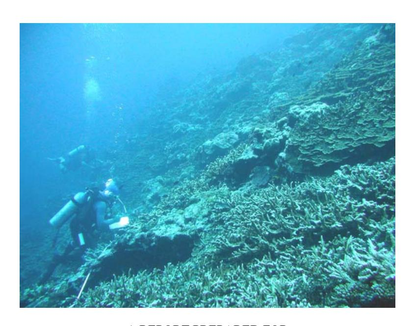

A REPORT PREPARED FOR DEPARTMENT OF MARINE AND WILDLIFE RESOURCES AMERICAN SAMOA GOVERNMENT

AUGUST 2002

(**Front Cover Photo**: Slope community at Fatumafuti at the entrance to Pago Harbour showing *Porites rus* and *Acropora austera*. Photo: Larry Basch)

## **CONTENTS**

| INTRODUCTION                                                             | <i>1</i> |
|--------------------------------------------------------------------------|----------|
| METHODS                                                                  | 1        |
| Field Surveys                                                            | 1        |
| Data Analysis                                                            | 5        |
| RESULTS                                                                  | 7        |
| Overview of 2002 Survey Coral Data compared to 1995 Survey               | 7        |
| Overview of Coral Genera and Species Composition compared to 1995 Survey | 7        |
| Individual Site Results and Summary                                      | 15       |
| TUTUILA ISLAND                                                           | 15       |
| Fagafue (Tutuila)                                                        | 15       |
| Fagasa (Tutuila)                                                         | 18       |
| Vatia (Tutuila)                                                          | 21       |
| Masefau (Tutuila)                                                        | 26       |
| Aunu'u (Tutuila)                                                         | 28       |
| Fagaitua (Tutuila)                                                       | 32       |
| Onesosopo (Tutuila)                                                      | 35       |
| Aua (Tutuila)                                                            | 37       |
| Faga'alu (Tutuila)                                                       | 40       |
| Fatumafuti (Tutuila)                                                     | 43       |
| Fagatele (Tutuila)                                                       | 46       |
| Leone (Tutuila)                                                          | 49       |
| OFU ISLAND (MANU'A GROUP)                                                | 52       |
| Asaga (Ofu)                                                              | 52       |
| OLOSEGA ISLAND (MANU'A GROUP)                                            | 55       |
| Sili (Olosega)                                                           | 55       |
| Olosega Village (Olosega)                                                | 59       |
| OFU ISLAND (MANU'A GROUP)                                                | 63       |
| Hurricane House (Ofu)                                                    | 63       |
| Ofu Village (Ofu)                                                        | 66       |
| TAU ISLAND (MANU'A GROUP)                                                | 69       |

| Faga (Tau)                                                         | 69  |
|--------------------------------------------------------------------|-----|
| Lepula (Tau)                                                       | 76  |
| Afuli (Tau)                                                        | 81  |
| Fagamalo (Tau)                                                     | 85  |
| Summary of Bleaching (March 2002)                                  | 89  |
| Taxonomic Considerations                                           | 93  |
| Summary of Temporal Comparisons                                    | 94  |
| DISCUSSION                                                         | 99  |
| Current Status of Reefs of American Samoa                          | 99  |
| Status of Coral Communities in Pago Harbour                        | 100 |
| Recommendations for Possible Future Marine National Park Additions | 101 |
| Recommendations for Future Surveys                                 | 102 |
| References                                                         | 103 |

## **LIST OF FIGURES**

| Figure 1. Size class distribution of all species from Fagafue.<br>                          | 17 |
|---------------------------------------------------------------------------------------------|----|
| Figure 2. Size class distribution of Montipora species from Fagafue<br>                     | 17 |
| Figure 3. Size class distribution of all species at Fagasa                                  | 19 |
| Figure 4. Size class distribution of Pavona venosa at Fagasa<br>                            | 20 |
| Figure 5. Size class distribution of Porites rus at Fagasa                                  | 21 |
| Figure 6. Size class distribution of all species at Vatia<br>                               | 23 |
| Figure 7. Size class distribution of Montipora grisea at Vatia                              | 23 |
| Figure 8. Size class distribution of Pavona varians at Vatia                                | 24 |
| Figure 9. Size class distribution of Leptastrea purpurea at Vatia                           | 25 |
| Figure 10. Size class distribution of Pocillopora eydouxi at Vatia<br>                      | 25 |
| Figure 11. Size class distribution of all species at Masefau<br>                            | 27 |
| Figure 12. Size class distribution of Montipora grisea at Masefau                           | 28 |
| Figure 13. Size class distribution of all species at Aunu'u                                 | 30 |
| Figure 14. Size class distribution of Montipora grisea at Aunu'u<br>                        | 30 |
| Figure 15. Size class distribution of Pocillopora eydouxi at Aunu'u                         | 31 |
| Figure 16. Size class distribution of all species at Fagaitua<br>                           | 33 |
| Figure 17. Size class distribution of Montipora grisea at Fagaitua                          | 34 |
| Figure 18. Size class distribution of Pocillopora verrucosa at Fagaitua                     | 34 |
| Figure 19. The size class distribution of all species at Onesosopo                          | 36 |
| Figure 20. The size class distribution of Montipora grisea at Onesosopo<br>                 | 37 |
| Figure 21. The size class distribution of all species at Aua                                | 39 |
| Figure 22. The size class distribution of Montipora grisea at Aua<br>                       | 39 |
| Figure 23. Size class distribution of all species at Faga'alu                               | 41 |
| Figure 24. Size class distribution of Montipora grisea at Faga'alu<br>                      | 42 |
| Figure 25. Size frequency distribution of pooled submassive Porites species at Faga'alu<br> | 42 |
| Figure 26. Size class distribution of all species at Fatumafuti<br>                         | 44 |
| Figure 27. Size class distribution of Porites rus at Fatumafuti<br>                         | 45 |
| Figure 28. Size class distribution of Pavona varians at Fatumafuti                          | 45 |
| Figure 29. Size class distribution of all species at Fagatele<br>                           | 47 |
| Figure 30. Size class distribution of Montipora grisea at Fagatele                          | 48 |
| Figure 31. Size class distribution of Porites spp at Fagatele                               | 49 |
| Figure 32. Size class distribution all species combined at Leone                            | 51 |

| Figure 33. Size class distribution of Montipora grisea at Leone<br>                            | 51 |
|------------------------------------------------------------------------------------------------|----|
| Figure 34. Size class distribution of all species at Asaga                                     | 53 |
| Figure 35. Size class distribution of Montipora grisea at Asaga<br>                            | 54 |
| Figure 36. Size class distribution of Montastarea curta at Asaga                               | 54 |
| Figure 37. Size class distribution of all species at Sili<br>                                  | 57 |
| Figure 38. Size class distribution of Galaxea fascicularis at Sili                             | 57 |
| Figure 39. Size class distribution of Montastraea curta at Sili<br>                            | 58 |
| Figure 40. Size class distribution of Goniastrea retiformis at Sili<br>                        | 58 |
| Figure 41. Size class distribution of all species at Olosega Village<br>                       | 60 |
| Figure 42. Size class distribution of Montipora grisea at Olosega Village                      | 61 |
| Figure 43. Size class distribution of Montastraea curta at Olosega Village                     | 62 |
| Figure 44. Size class distribution of Goniastrea retiformis at Olosega Village                 | 62 |
| Figure 45. Size class distribution of all species at Hurricane                                 | 64 |
| Figure 46. Size class distribution of Montipora grisea; Goniastrea retiformis; and Montastarea |    |
| curta at Hurricane<br>                                                                         | 65 |
| Figure 47. Size class distribution of Montipora nodosa, Pocillopora verrucosa, and Montipora   |    |
| foveolata at Hurricane<br>                                                                     | 65 |
| Figure 48. Size class distribution of all species at Ofu Village                               | 67 |
| Figure 49. Size class distribution of Acropora crateriformis at Ofu Village<br>                | 68 |
| Figure 50. Size class distribution of Echinopora hirsutissima at Ofu Village<br>               | 68 |
| Figure 51. Size class frequency of all species at Faga                                         | 71 |
| Figure 52. Size frequency distribution of Montipora grisea at Faga<br>                         | 71 |
| Figure 53. Size frequency distribution of Montipora danae at Faga                              | 72 |
| Figure 54. Size class distribution of all non-Montipora spp at Faga                            | 74 |
| Figure 55. Size class distribution of Astreopora listeri at Faga<br>                           | 75 |
| Figure 56. Size class distribution of Favia matthaii at Faga<br>                               | 75 |
| Figure 57. Size frequency distribution of all species from Lepula                              | 77 |
| Figure 58. Size frequency distribution of Montipora grisea from Lepula<br>                     | 78 |
| Figure 59. Size frequency distribution of all species at Lepula                                | 80 |
| Figure 60. Size frequency distribution of colonies of Montastarea curta at Lepula              | 80 |
| Figure 61. Size frequency distribution of colonies of Leptoria phrygia at Lepula<br>           | 81 |
| Figure 62. Size class distribution of coral colonies of all species at Afuli                   | 83 |
| Figure 63. Size class distribution of coral colonies from Afuli for Montipora grisea<br>       | 83 |
| Figure 64. Size class distribution of coral colonies of Astreopora listeri<br>                 | 84 |

| Figure 65. Size class distribution of coral colonies of Astreopora myriophthalma<br>      | 85 |
|-------------------------------------------------------------------------------------------|----|
| Figure 66. Size frequency distribution of colonies of all species at<br>                  | 87 |
| Figure 67. Size frequency distribution of colonies of Montipora grisea at Fagamalo        | 87 |
| Figure 68. Size frequency distribution of colonies of Porites spp at Fagamalo             | 88 |
| Figure 69. Mean percent coral cover of Tutuila Island sites surveyed in 1995 and 2002<br> | 98 |
| Figure 70. Mean percent coral cover of Manu'a Group sites surveyed in 1995 and 2002       | 98 |

## **LIST OF TABLES**

| Table 1. Summary of methods employed in the present study and the initial baseline survey.<br><br>2 |
|-----------------------------------------------------------------------------------------------------|
| Table 2. Variation in methods used in the present survey at Faga and Lepula<br><br>4                |
| Table 3. Numbers of colonies per site from 1995 and 2002<br>8                                       |
| Table 4. Genera colony numbers recorded at comparable sites and habitats in 1995 and 2002.<br><br>9 |
| Table 5. Comparison of coral species on Tutuila and the Manu'a Group from the 2002 survey11         |
| Table 6. Comparison of coral species on Tutuila and the Manu'a Group from the 1995 survey13         |
| Table 7. Rank of top 10 most abundant species from the two surveys at Fagafue<br>16                 |
| Table 8. Rank of top 10 most abundant species from the two surveys at Fagasa<br><br>18              |
| Table 9. Rank of top 10 most abundant species from the two surveys at Vatia<br>22                   |
| Table 10. Rank of top 10 most abundant species from the two surveys at Masefau<br>26                |
| Table 11. Rank of top 10 most abundant species from the two surveys at Aunu'u.<br><br>29            |
| Table 12. Rank of top 10 most abundant species from the two surveys at Fagaitua<br>32               |
| Table 13. Rank of top 10 most abundant species from the two surveys at Onesosopo<br>35              |
| Table 14. Rank of top 10 most abundant species from the two surveys at Aua<br>38                    |
| Table 15. Rank of top 10 most abundant species from the two surveys at Faga'alu<br>40               |
| Table 16. Rank of top 10 most abundant species from the two surveys at Fatumafuti<br><br>43         |
| Table 17. Rank of top 10 most abundant species from the two surveys at Fagatele<br><br>46           |
| Table 18. Rank of top 10 most abundant species from the two surveys at Leone<br>50                  |
| Table 19. Rank of the top 10 most abundant species from the two surveys at Asaga<br>52              |
| Table 20. Rank of the top 10 most abundant species from the two surveys at Sili<br><br>56           |
| Table 21. Rank of the top 10 most abundant species from the two surveys at Olosega Village<br>59    |
| Table 22. Rank of the top 10 most abundant species from the 2002 survey at Hurricane<br><br>63      |
| Table 23. Rank of the top 10 most abundant species from the two surveys at Ofu Village<br>66        |
| Table 24. Rank of the top 10 most abundant species from the two surveys at Faga<br>70               |
| Table 25. Summary of top ten ranked species of non-Montipora spp at Faga<br>76                      |
| Table 27. Summary of top ten ranked species of non-Montipora spp at Lepula<br>79                    |
| Table 28. Rank of the top 10 most abundant species from the two surveys at Afuli<br><br>82          |
| Table 29. Rank of the top 10 most abundant species from the two surveys at Fagamalo<br>86           |
| Table 30. Summary of oral bleaching observed in March 2002<br>90                                    |
| Table 31. Summary of trends described in detail for each monitoring site<br>94                      |
| Appendix 1. Raw data from the 2002 survey presented in size frequency categories<br><br>104         |

## **EXECUTIVE SUMMARY**

- A re-survey of coral communities in the American Samoa Archipelago covering the island of Tutuila and the Manu'a Group of islands (Ofu, Olosega, and Tau), was carried out during March 2002. The principle objective was to assess the status of coral communities and to provide detailed analysis of temporal change between the initial baseline coral survey of 1995 and the present survey of 2002. A second objective was to recommend areas for future consideration for inclusion into Marine National Parks.
- Overall, recovery from cyclone disturbances in the 1990s is progressing well on Tutuila and Tau Islands. However, the islands of Ofu and Olosega in the Manu'a Group have been affected by a chronic crown of thorns starfish infestation that is severely disrupting recovery processes on reef slope communities. In addition, the impact of recent bleaching events has been probably most pronounced in shallow water, with relatively lower incidence of bleaching 10 m depth in the majority of sites, particularly in the Manu'a Group.
- All surveyed sites in 2002 were restricted to the 10 m deep slope habitat only. The 1995 baseline survey utilised a larger sample size (belt width) within replicate transects, that could not be duplicated in the allocated time for the present survey due to the significant increase in colony densities. The same number of belt transects (5 per site) was used in both surveys for the Manu'a Group sites, but the number of transects per site was reduced to 3 per site on Tutuila. Consequently, sample unit size per site was 50% to 70% of the area sampled in 1995.
- Data were analysed to investigate changes in coral colony size structure, cover, and density, and to interpret community dynamics. The variation in sample effort between surveys and to a less extent, among sites in 2002, meant that pooled analyses were limited, so descriptive and statistical tools were used to interpret community dynamics during the period between the two surveys. Threats and disturbances were also interpreted from features of the coral community dynamics, which included the impacts (and current extent) of coral bleaching as well as crown of thorns starfish infestations.
- Despite the reduction in sample effort in 2002, approximately similar numbers of colonies were recorded in both surveys (10,028 colonies in 2002 compared to 12,640 colonies in 1995, resulting in higher colony density estimates at the majority of sites in 2002.
- Overall, a marked increase in species richness was observed in more than half the sites from the 2002 survey. Changes in species richness varied among sites on Tutuila between 2002 and 1995. Three of the four Pago Harbour sites recorded a reduction in species richness but this may be due to the reduction in sample effort. In contrast, six of the eight sites in the Manu'a Group recorded higher species richness

- in 2002. Overall, there was a moderate to high similarity in the most dominant species and genera in both surveys
- Six of the twelve sites on Tutuila recorded similar structural (growth form) dominance in both surveys, with the remaining sites equally split between those with moderate and low structural similarity. Five out of eight Manu'a Group sites recorded similar structural dominance between both surveys.
- A half of the sites on both Tutuila and the Manu'a Group recorded high species turnover. Two of the twelve sites on Tutuila, and three of the eight sites in the Manu'a Group, recorded both high structural similarity and high species turnover.
- The patterns in species richness, growth form dominance, and species turnover, indicate that Tutuila Island sites are far more variable in coral community dynamics than are the Manu'a Group of sites.
- Crown of thorns starfish (COTS) impacts were particularly evident in the Manu'a Group on the islands of Ofu and Olosega. The relatively recent presence of COTS on these islands were interpreted from the contrasting pattern in colony size, frequency of coral fragmentation, the nature of coral fragments, and reduction in coral cover, in comparison to most other sites on Manu'a and Tutuila. Evidence of the presence of above normal densities of starfish on these islands indicates that the full extent of their impact may not be complete at present.
- Patterns of bleaching were highly variable on the slopes at 10 m depth with higher rates of bleaching observed in the Manu'a Group (11.8% of colonies were bleached) than on Tutuila (2.3% of colonies bleached). An average of 8% of all colonies from the total survey data was bleached. Massive corals were most frequently bleached at 10m depth (eg, *Montastraea curta*, *Goniastrea retiformis*, and *Porites* cf *lutea*). Corals from five of eleven sites on Tutuila did not show signs of bleaching at 10 m depth though the situation was different in shallower water. The sites that were free of bleaching were generally the most turbid sites. Most bleaching symptoms at 10 m depth was minor with usually a pale colour being evident.
- Pago Harbour sites are of particular interest to DMWR and other government agencies due to health concerns and attempts to improve water quality. The results of the latest surveys are encouraging but equivocal. Colony density and coral cover increased in all four sites by 2002 and similar cover was recorded in the other two sites in both surveys. Overall, colony sizes were more evenly spread and there was an increase in the number of larger colonies between surveys. Two sites (Onesosopo and Aua) showed moderate and high structural similarities, respectively, with a similar dominance (low species turnover) between surveys. One site (Fatumafuti) had a noticeable reduction in species richness as well as a reduction in colony sizes, resulting in low structural similarity and high species turnover between surveys. Species richness in the Pago Harbour sites are within the range recorded from elsewhere on Tutuila, though only one of the four sites showed an increase in richness

in 2002. Coral cover was generally lower in Pago Harbour than at other Tutuila sites, except for Fagafue and Fagasa. It was concluded that two of the Pago Harbour sites (Faga'alu and Fatumafuti), which are both on the outer SW side of the Harbour, could have been (or are still) affected by unknown disturbances during the period between surveys.

• Recommendations for Marine National Park considerations include the slope communities of Aunu'u Island near Tutuila (due to the diversity of corals), and the large bay opposite this site called Fagaitua. Fagaitua has an unusual species assemblage with respect to other sites on Tutuila. Afuli, on the island of Tau, is also worthy of consideration due to the large sizes of *Porites* spp and *Diploastrea heliopora* colonies. The northern side of Tau is also noteworthy due to the relatively diverse coral community and the low threat of impact from land use practices on the adjacent landmass.

## **Coral Community Features from the 2002 survey (All photos by Larry Basch).**

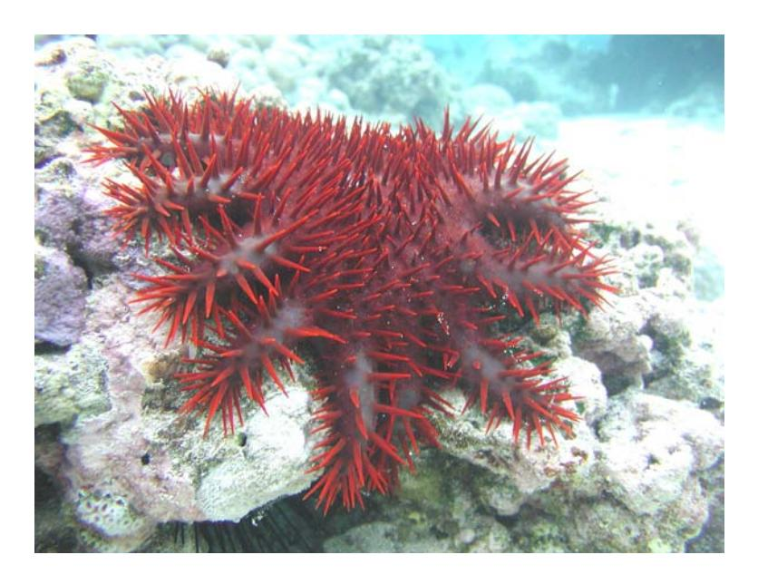

The crown of thorns starfish (COTS) *Acanthaster planci*, has had a significant impact on slope coral communities at Ofu and Olosega Islands (Manu'a Group) between the 1995 and 2002 surveys. COTS have apparently not been active elsewhere among the volcanic island reefs during the same time period.

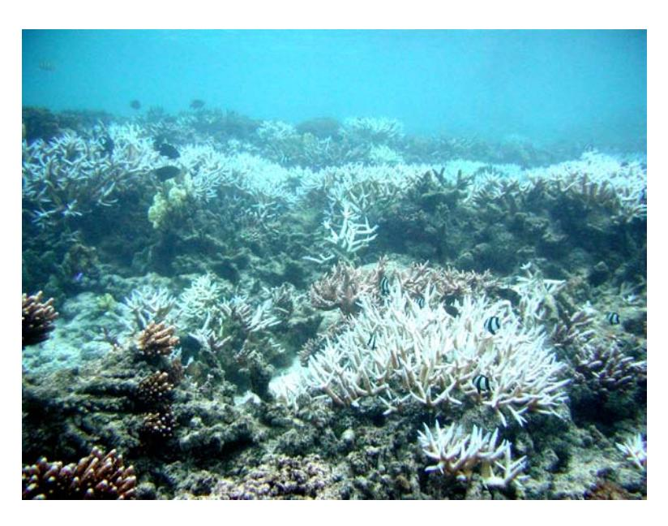

Bleached *Acropora* spp corals in the shallow lagoon at Ofu (Manu'a). Widespread bleaching was observed at most sites in March 2002. The degree of bleaching was greater in shallow water compared to the survey depth of 10 m.

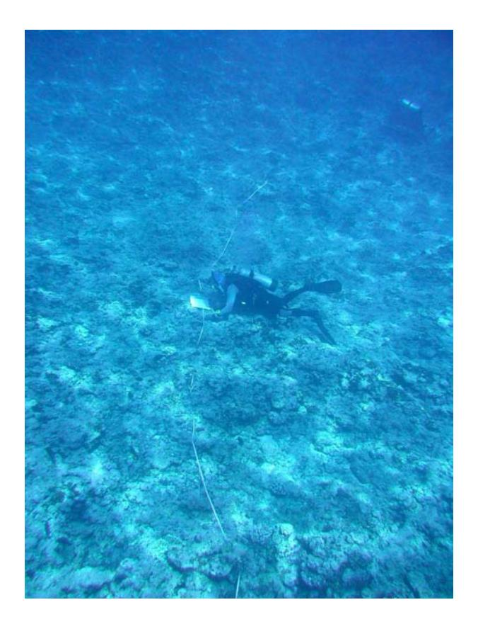

Characteristic low profile coral community at the Fagamalo site on Tau Island (Manu'a). The coral assemblage is diverse and coral cover is high at this exposed slope habitat.

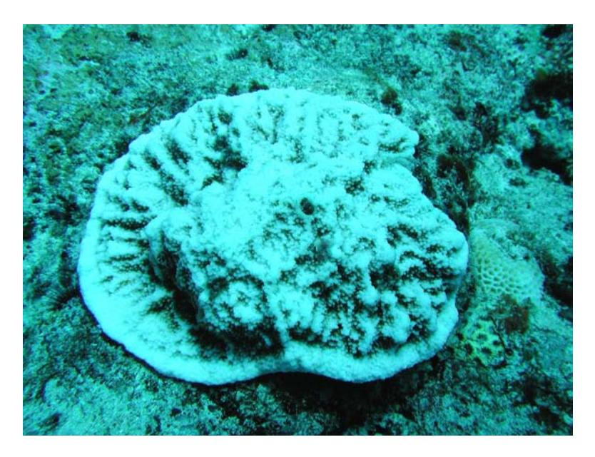

Low profile and encrusting growth forms dominated coral communities on exposed slopes such as Fagamalo (Tau). Examples are shown here of bleached colonies of *Acropora crateriformis* (centre), and of *Goniastrea retiformis* (right) and *Favia matthai* (right, below).

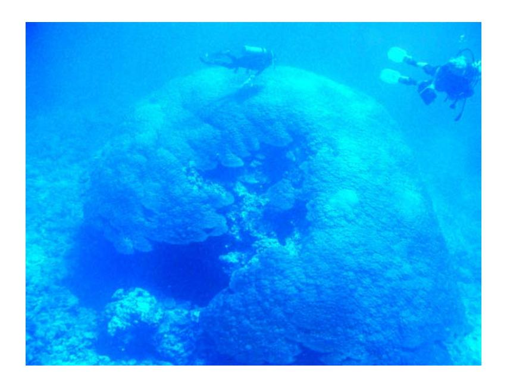

Abundant and very large massive *Porites* spp colonies as well as the unusual coral community at Afuli (Tau), makes this site worthy of consideration for inclusion in future National Park considerations.

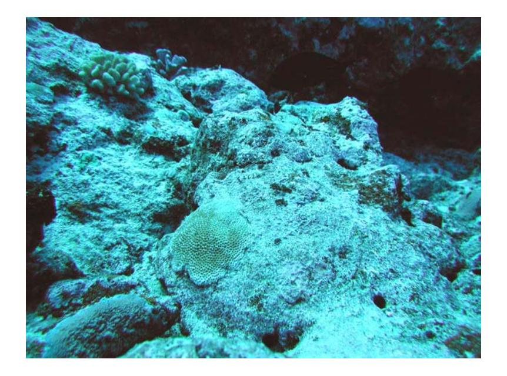

*Astreopora* spp (middle left),encrusting *Montipora* spp (lower left), and occasional *Pocillopora verrucosa* (top left) are typical of the SE slope communities at Tau Island (along with the large massive *Porites* spp, top photo).

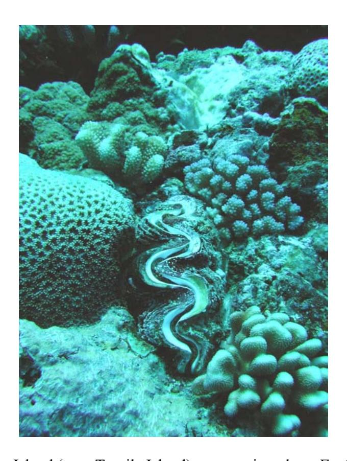

Example of Aunu'u Island (near Tutuila Island) community where *Favia matthai* (left of clam, *Tridacna maxima*), encrusting *Montipora* spp (top left), *Pocillopora eydouxi* (above left of clam), *Pocillopora verrucosa* (above right of clam), *Stylophora pistillata* (bottom right), and coralline algae (bottom left), are vying for space.

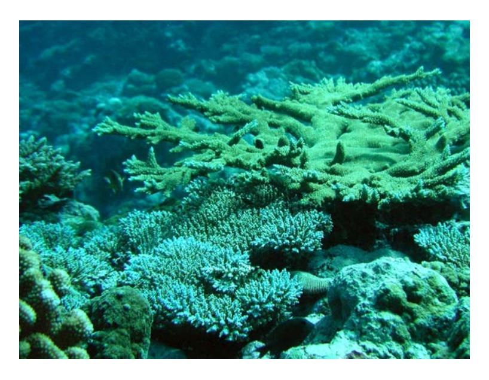

*Acropora abrotanoides* (top) and *Acropora valida* (below) at Aunu'u Island. The diverse and complex community here is recommended for inclusion in any future National Park.

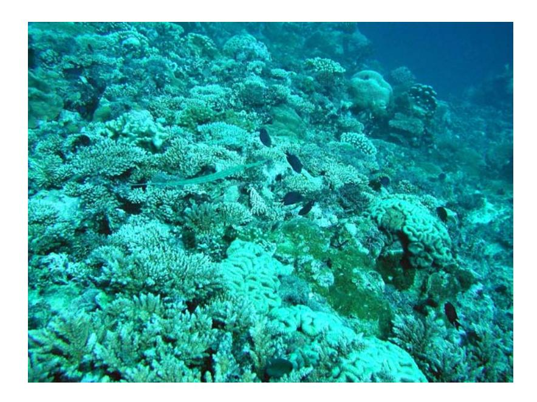

An unusual and flourishing coral assemblage at Fagaitua (Tutuila) that is recommended for inclusion in future National Park considerations. Typical species are shown : *Acropora austera* (bottom left), *Lobophyllia hemprichii* (bottom middle), and pillow shaped *Acropora valida* scattered among the community in the middle of the photo.

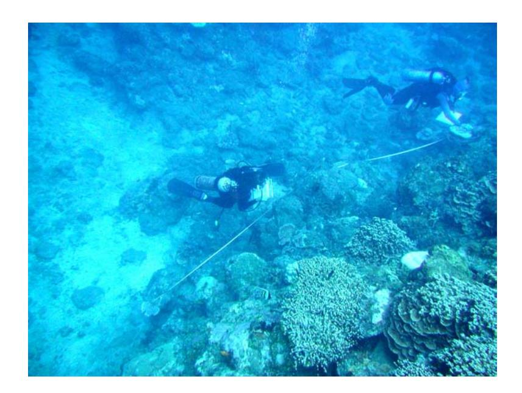

The Fagasa (Tutuila) coral community is dominated by *Porites* species, including *Porites cylindrica* (middle bottom), and *Porites rus* (bottom right).

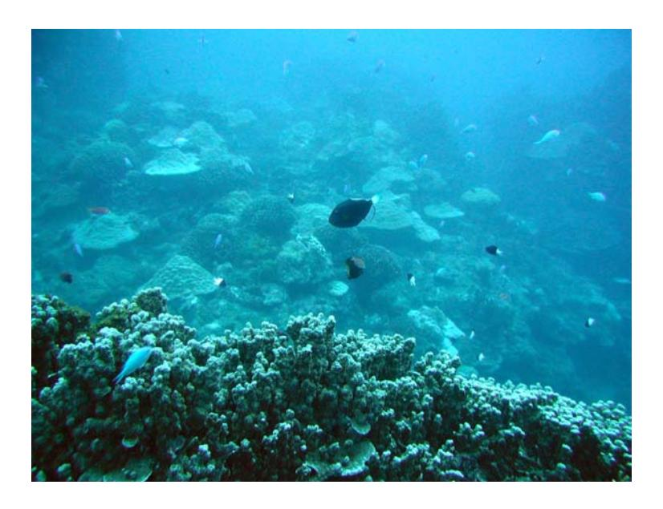

Typical Fagasa (Tutuila) turbid water coral assemblage comprising *Porites rus* (foreground) and small to moderate size massive *Porites* spp in background.

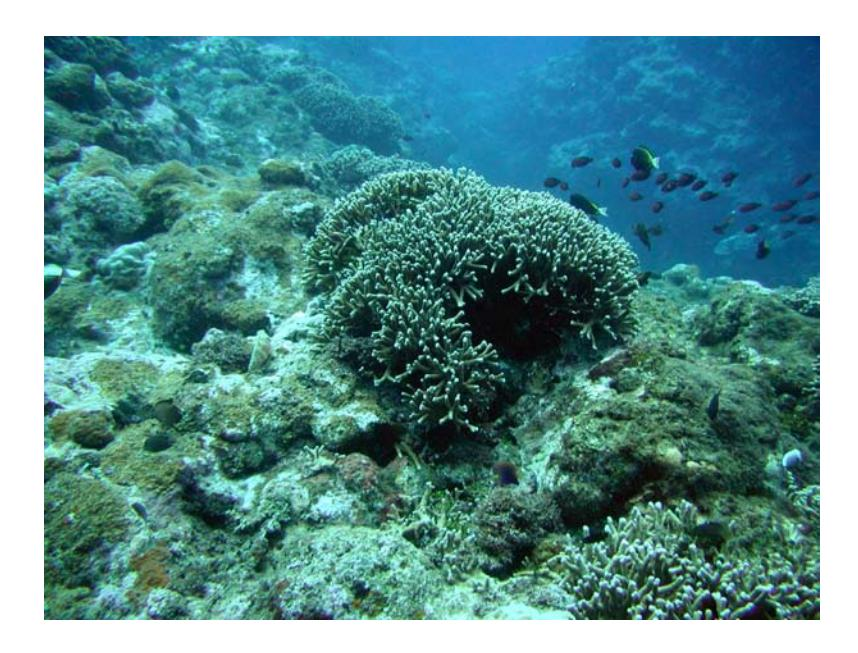

*Porites cylindrica* (middle) and encrusting *Montipora* spp (bottom left) compete for space with abundant macro algae at Fagasa (Tutuila). Prolific macro algae growth is a feature of this site due to favorable conditions of high turbidity and possible nutrients from terrestrial runoff, along with other factors.

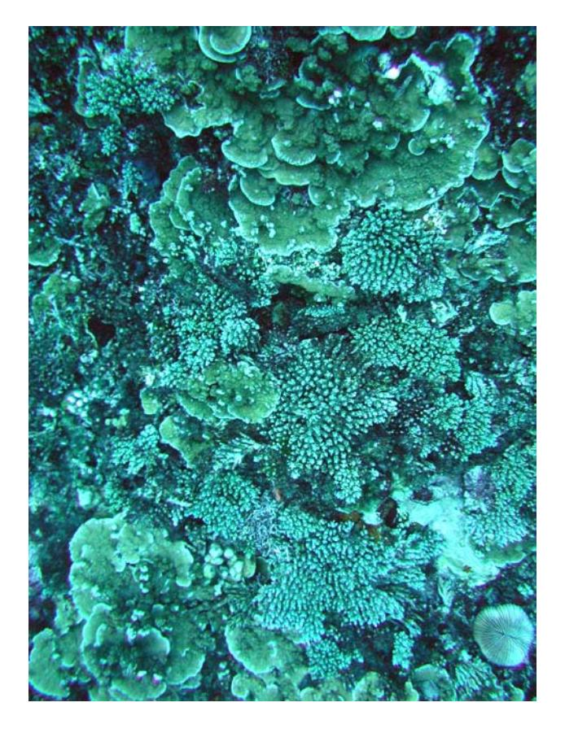

Slope community at Fatumafuti (Tutuila) at the entrance to Pago Harbour. Large stands of coral colonies are typical of this site. Photo shows encrusting *Montipora* spp (top) and *Acropora valida* (centre, bottom).

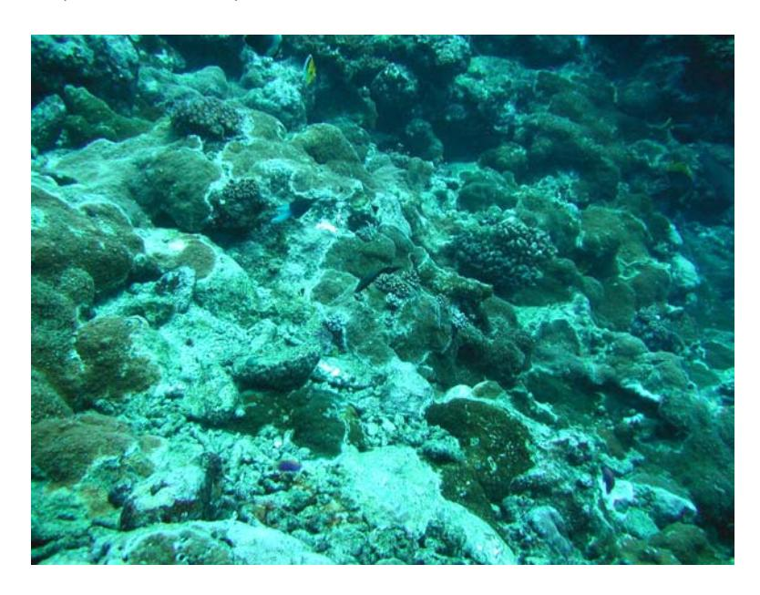

Encrusting *Montipora* spp community dominate at Faga'alu (Tutuila), which is a relatively turbid site.

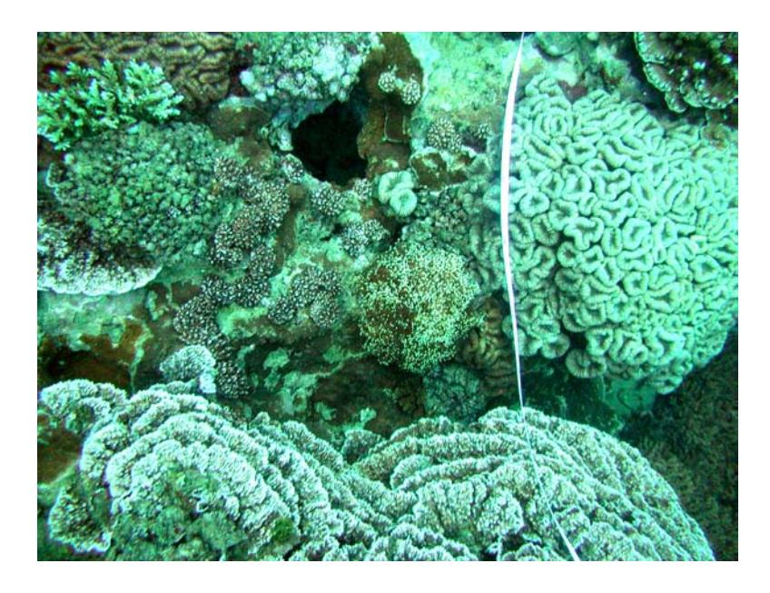

Well developed turbid water coral species are present on the inner sections of the bay at Faga'alu (Tutuila). As examples, *Oxypora lacera* (bottom), *Lobophyllia hemprichii* (middle right), are shown on the transect line.

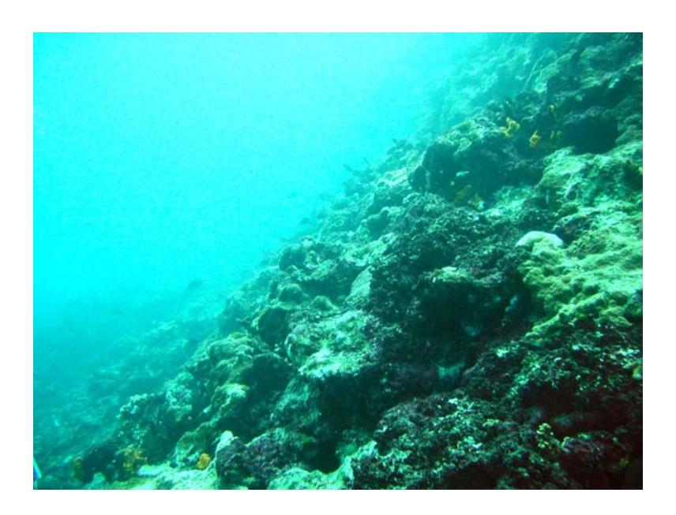

Low coral cover on the slope at Onesosopo (Pago Harbour, Tutuila). Encrusting *Montipora* spp dominate this community.

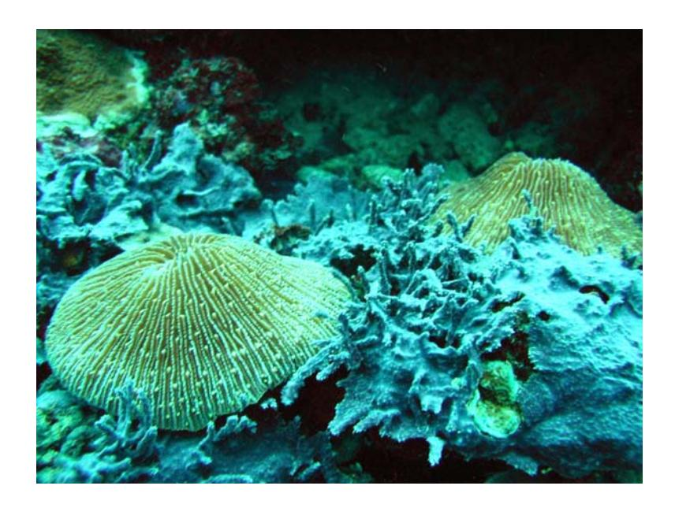

Free living *Fungia* spp amongst prolific sponge growth at Onesosopo (Tutuila). Macro invertebrates (other than coral) and filter feeding organisms are very common at inner sites in Pago Harbour, which is possibly due to high nutrient loads.

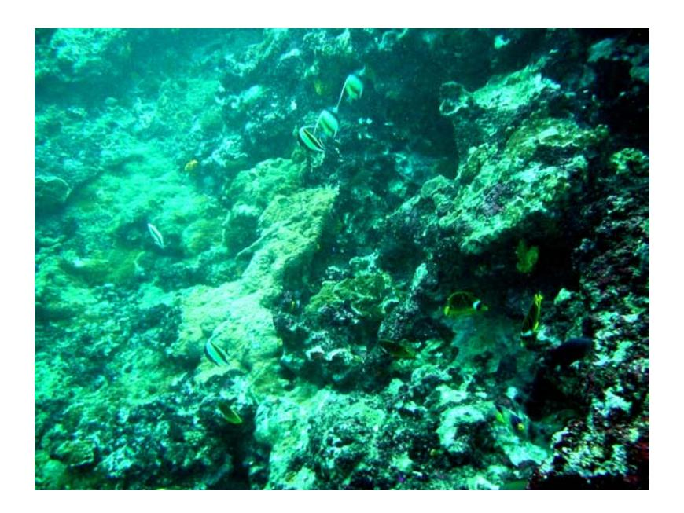

Encrusting *Montipora* spp dominate the coral slope communities at Aua (Pago Harbour, Tutuila).

## **INTRODUCTION**

The Department of Marine and Wildlife Resources conducts expert surveys of marine resources every 5 years on behalf of the American Samoa Government. These specialist surveys are part of a broad monitoring plan (Cornish and Wilson, 2002) for the Territory. and include quantitative assessments of coral, fish, crown of thorns starfish, and giant clams. A companion report by Green (2002) reviews the current status of fish, benthic habitat, clams, and crown of thorns starfish, which was conducted at the same time as the coral surveys.

The coral baseline monitoring sites were first established in October – November 1995 (Mundy 1996), and were conducted at the same time using the same transects that were used for fish, invertebrate and habitat surveys (Green 1996). In the initial baseline survey, Mundy (1996) concluded that the reefs throughout American Samoa were in a recovery phase following a combination of natural and anthropogenic disturbances, and that the communities were diverse and complex in structure. His conclusions were made from a survey of 29 sites spread throughout Tutuila Island and the Manu'a Island group, where the size, density and cover of corals were estimated.

This report focuses on the first re-survey of corals at long term monitoring sites around Tutuila Island and the islands of the Manu'a Group, and are restricted to the 10m depth reef slope sites used by Mundy (1996).

## **METHODS**

## *Field Surveys*

Quantitative surveys of hard corals were carried out during March 2002 (see Green, 2002, for maps). Delays in organising the re-survey meant that there was an approximate 6.3 year interval between the two surveys. All of the sites from the 1995 survey were not resurveyed in 2002, nor were all habitats. In contrast to Mundy's (1996) survey, no reef flat or lagoon sites were surveyed in 2002. The current survey included a total of 21 sites made up from Tutuila Island (12 sites) and the Manu'a Islands (Ofu (3 sites), Olosega (2 sites), and Tau Islands (4 sites). The site at Aunu'u Island off the SE corner of Tutuila Island is included in the Tutuila suite of sites as it is closely affiliated with this island. At all sites, surveys were conducted on the reef slope at approximately 10 m depth and in the same general location as the previous surveys in 1995 (Mundy 1996). One new site was established on Ofu Island during the current survey to augment the extensive survey work that has been carried out in the adjacent Ofu lagoon marine park (Table 1).

At 11 sites on Tutuila, three replicate 20 m belt transects, with a width of 0.25 m, were surveyed for coral species size and density (Table 1). At one site on Tutuila (Fagaitua), a 5m length of one transect was incompletely surveyed due to lack of time. In the Manu'a Group, six sites were re-surveyed using 5 replicate 20 m belt transects, with a belt width of 0.25 m. One site (Ofu Village) was re-surveyed using the same 0.5 m width in 5 replicate 20 m transects that were used in 1995, and two sites were surveyed on Tau

using variable belt widths and lengths due to the rough conditions (see Table 2 for details). The baseline survey in 1995 used five replicate belt transects with 20 m length for each transect, but the belt width was 0.5 m, which is double the present survey width used in most sites in 2002 (Table 1).

Table 1. Summary of sites and methods employed in the present study compared to the initial baseline survey of Mundy (1996). In all but one site (marked\*) the methods differed to the first 1995 baseline survey. A separate table (Table 2) below details method variations for two sites (Faga and Lepula on Tau Island) where species groups were selected for monitoring (see text for explanation). Sites are listed from the western end clockwise around each island, and the total surveyed area at each site is in brackets.

| SITE       | HABITAT   | FISK & BIRKELAND (this study) METHODS                                        | MUNDY (1996)<br>METHODS                     |
|------------|-----------|------------------------------------------------------------------------------|---------------------------------------------|
| TUTUILA IS | LAND      | •                                                                            |                                             |
| Fagafue    | Slope     | 3 x 20 m x 0.25 m Belts (15 m <sup>2</sup> )                                 | 5 x 20 m x 0.5 m Belts (50 m <sup>2</sup> ) |
| Fagasa     | Slope     | 3 x 20 m x 0.25 m Belts (15 m <sup>2</sup> )                                 | 5 x 20 m x 0.5 m Belts (50 m <sup>2</sup> ) |
| Vatia      | Slope     | 3 x 20 m x 0.25 m Belts (15 m <sup>2</sup> )                                 | 5 x 20 m x 0.5 m Belts (50 m <sup>2</sup> ) |
| Masefou    | Slope     | 3 x 20 m x 0.25 m Belts (15 m <sup>2</sup> )                                 | 5 x 20 m x 0.5 m Belts (50 m <sup>2</sup> ) |
| Anu'u Is   | Slope     | 3 x 20 m x 0.25 m Belts (15 m <sup>2</sup> )                                 | 5 x 20 m x 0.5 m Belts (50 m <sup>2</sup> ) |
| Fagaitua   | Slope     | 2 x 20 m x 0.25 m Belts<br>1 x 15 m x 0.25 m Belt<br>(13.75 m <sup>2</sup> ) | 3 x 20 m x 0.5 m Belts (30 m <sup>2</sup> ) |
| Onesosopo  | Slope     | 3 x 20 m x 0.25 m Belts (15 m <sup>2</sup> )                                 | 5 x 20 m x 0.5 m Belts (50 m <sup>2</sup> ) |
| Aua        | Slope     | 3 x 20 m x 0.25 m Belts (15 m <sup>2</sup> )                                 | 5 x 20 m x 0.5 m Belts (50 m <sup>2</sup> ) |
| Leloaloa   | Slope     | No                                                                           | 5 x 20 m x 0.5 m Belts (50 m <sup>2</sup> ) |
| Utulei     | Slope     | No                                                                           | 5 x x 0.5m Belts (50m <sup>2</sup> )        |
| Faga'alu   | Slope     | 3 x 20 m x 0.25 m Belts (15 m <sup>2</sup> )                                 | 5 x 20 m x 0.5 m Belts (50 m <sup>2</sup> ) |
| Faga'alu   | Lagoon    | No                                                                           | 5 x 20 m x 0.5 m Belts                      |
| Fatumafuti | Slope     | 3 x 20 m x 0.25 m Belts (15 m <sup>2</sup> )                                 | 5 x 20 m x 0.5 m Belts (50 m <sup>2</sup> ) |
| Fatumafuti | Reef Flat | No                                                                           | 5 x 20 m x 0.5 m Belts (50 m <sup>2</sup> ) |
| Nu'uuli    | Slope     | No                                                                           | 5 x 20 m x 0.5 m Belts (50 m <sup>2</sup> ) |
| Nu'uuli    | Reef Flat | No                                                                           | 5 x 20 m x 0.5 m Belts (50                  |

| SITE HABITAT       |            | FISK & BIRKELAND (this study) METHODS          | MUNDY (1996)<br>METHODS                       |
|--------------------|------------|------------------------------------------------|-----------------------------------------------|
|                    |            |                                                | $m^2$ )                                       |
| Fagatele           | Slope      | 3 x 20 m x 0.25 m Belts                        | 5 x 20 m x 0.5 m Belts (50                    |
|                    |            | $(15\text{m}^2)$                               | $m^2$ )                                       |
| Leone              | Slope      | 3 x 20 m x 0.25 m Belts (15                    | 5 x 20 m x 0.5 m Belts (50                    |
|                    |            | $m^2$ )                                        | $m^2$ )                                       |
| Amanave            | Slope      | No                                             | 5 x 20 m x 0.5 m Belts (50 m <sup>2</sup> )   |
| TOTAL TUTUI        | LA AREA    | 178.75 m <sup>2</sup>                          | 600 m <sup>2</sup>                            |
| SURVEYED           |            |                                                |                                               |
| OFU ISLAND (       | MANU'A GR  | OUP)                                           |                                               |
| Asaga              | Slope      | 5 x 20 m x 0.25 m Belts (25 m <sup>2</sup> )   | 5 x 20 m x 0.5 m Belts (50 m <sup>2</sup> )   |
| Hurricane          | Slope      | 5 x 20 m x 0.25 m Belts (25 m <sup>2</sup> )   | No                                            |
| Ofu Village        | Slope      | 5 x 20 m x 0.5 m Belts (50                     | 5 x 20 m x 0.5 m Belts (50                    |
| Of- W:11           | D C E1 - 4 | $m^2$ )                                        | m <sup>2</sup> )                              |
| Ofu Village        | Reef Flat  | No                                             | 5 x 20 m x 0.5 m Belts (50 m <sup>2</sup> )   |
| OLOSEGA ISLA       | AND (MANU  | 'A GROUP)                                      |                                               |
| Sili Village       | Slope      | 5 x 20 m x 0.25 m Belts (25 m <sup>2</sup> )   | 5 x 20 m x 0.5 m Belts (50 m <sup>2</sup> )   |
| Olosega Village    | Slope      | 5 x 20 m x 0.25 m Belts (25 m <sup>2</sup> )   | 5 x 20 m x 0.5 m Belts (50 m <sup>2</sup> )   |
| Olosega Village    | Reef Flat  | No                                             | 5 x 20 m x 0.5 m Belts                        |
| TAU ISLAND (1      |            |                                                |                                               |
| Faga               | Slope      | See Table 2 for details                        | 5 x 20 m x 0.5 m Belts (50 m <sup>2</sup> )   |
| Lepula             | Slope      | See Table 2 for details                        | 5 x 20 m x 0.5 m Belts (50 m <sup>2</sup> )   |
| Afuli              | Slope      | 5 x 20 m x 0.25 m Belts (25 m <sup>2</sup> )   | 5 x 20 m x 0.5 m Belts<br>(50m <sup>2</sup> ) |
| Fagamalo           | Slope      | 5 x 20 m x 0.25 m Belts<br>(25m <sup>2</sup> ) | 5 x 20 m x 0.5 m Belts (50 m <sup>2</sup> )   |
| TOTAL MANUSURVEYED | 'A AREA    | 227.5 m <sup>2</sup>                           | 200 m <sup>2</sup>                            |

Usually, two divers equally shared the coral survey effort at each site. It became apparent after we commenced the surveys, that colony densities were generally much higher than in 1995. We decided to halve the belt width and where necessary, to reduce the number of belt transects (on Tutuila mainly) to ensure we would complete sufficient sites in the allocated time, and sample sufficient colonies at each site to make meaningful comparisons.

Coral communities at several sites were not re-surveyed in this study though they were surveyed in 1995. These included : (on Tutuila) Leloaloa slope, Utulei slope, Faga'alu lagoon, Fatumafuti reef flat, Nu'uuli slope, Nu'uuli reef flat, Amanave slope; (on Manu'a) Ofu Village reef flat and Olosega reef flat.

Two sites (Faga and Lepula) on Tau Island (Manu'a Group) were not surveyed in the same way as the 1995 survey because of the very high density of colonies present, time constraints, and adverse sea conditions (Table 2). Two divers shared the survey effort, but not generally in an equal manner. As well, it was decided to survey some belt transects for all coral species and to survey additional belt transects for all non-*Montipora* spp colonies, as this genus was extremely abundant and frequently fragmented throughout the sites. Consequently, extra effort was allocated to the non-*Montipora* spp component of the community (at the expense of the *Montipora* spp component) to ensure that adequate sample numbers were obtained for colony density and size class analyses of this group. Table 2 shows the total area that was surveyed for the two sites of Faga and Lepula, and the areas surveyed for both non-*Montipora* spp and all species combined.

**Table 2. Methods used in the present survey (Fisk & Birkeland 2002) at Faga and Lepula (Tau Island, Manu'a Group) that varied from the standard replicate 20 m x 0.25 m belt transects. Note that a number of transects included data that did not include the most numerous** *Montipora* **species (see Methods). The Lepula site was re-visited on two separate dates using transects (#6, 7) that were re-deployed on the second occasion.** 

| SITE   | METHOD (Species Groups)               | AREA SURVEYED (m2<br>)      |
|--------|---------------------------------------|-----------------------------|
| Faga   | TR#4 : 5 m x 0.5 m (All spp)          | 2.5                         |
|        | TR#5 : 10 m x 0.5 m (All spp)         | 5.0                         |
|        | TR#5 : 20 m x 0.25 m (All spp)        | 5.0 (Tot. All spp = 12.5)   |
|        | TR# 1 : 5 m x 0.5 m (Non-Montipora)   | 2.5                         |
|        | TR#2 : 40 m x 0.25 m (Non-Montipora)  | 10.0                        |
|        | TR#2 : 10 m x 0.5 m (Non-Montipora)   | 5.0                         |
|        | TR#3 : 40 m x 0.25 m (Non-Montipora)  | 10.0                        |
|        | TR#3 : 10 m x 0.5 m (Non-Montipora)   | 5.0                         |
|        | TR#4 : 5 m x 0.5 m (Non-Montipora)    | 2.5                         |
|        | TR# 5 : 20 m x 0.25 m (Non-Montipora) | 5.0 (Tot. Non-Mont. = 40.0) |
|        |                                       |                             |
| Lepula | TR#7 : 10 m 0.5 m (All spp)           | 5.0                         |
|        | TR#6 : 10 m 0.5 m (All spp)           | 5.0                         |
|        | TR#6 : 20 m x 0.25 m (All spp)        | 5.0 (Tot. All spp = 15.0)   |
|        | TR#1 : 20 m x 0.25 m (Non-Montipora)  | 5.0                         |
|        | TR#2 : 20 m x 0.25 m (Non-Montipora)  | 5.0                         |
|        | TR#3 : 20 m x 0.25 m (Non-Montipora)  | 5.0                         |
|        | TR#4 : 20 m x 0.25 m (Non-Montipora)  | 5.0                         |
|        | TR#5 : 20 m x 0.25 m (Non-Montipora)  | 5.0 (Tot. Non-Mont. = 25.0) |

Each transect was surveyed by choosing usually 20-m sections of five 50-m transects that were deployed close to the substratum and parallel to the reef edge. A coral was considered to be within the transect if its centre was within the belt width. All corals within the belt were identified to species where possible, and the maximum diameter measured and recorded on the field data sheets.

Colony sizes (maximum diameter) were measured in situ to the nearest centimeter and data are presented in size categories. The same size categories that were used by Mundy (1996) were used here. These size class categories are :

```
1 = <=5cm, 
2 = >5 to <=10cm, 
3 = >10 to <=20cm, 
4 = >20 to <=40cm, 
5 = >40 to <=80cm, 
6 = >80 to <=160cm, and 
7 = >160cm.
```

Colonies that were showing signs of bleaching were noted in the field at the same time as other information was recorded.

Coral cover was estimated using the three point intercept sampling method, which produced percent cover data from 75 points per transect. Five 50-m transects were used to estimate cover at each site. Full details of the method and calculation of results are reported separately in Green (2002).

## *Data Analysis*

The change in monitoring methods between the two surveys was unavoidable and necessary to complete an adequate number of sites in the allocated time. As well, the methods differed between surveys in the Manu'a Island Group and from Tutuila Island Group. The variation in sampling methods limited the type of statistical comparisons that could be employed between the two surveys and between the two major subset groups from Manu'a and Tutuila. Comparisons between surveys were predominantly descriptive and based on within-site analyses, though broader general trends were highlighted in the overall discussion.

Within-site analyses and discussion focused on colony density, species richness, species change or turnover, and community structure (that is, dominant growth form and size class structure). It is recognised that analyses based on species presence/absence comparisons among sites and between the same sites over time are invalid when sampling effort varies. This is because rare or low abundant species are more likely to be recorded as sampling effort increases. Nonetheless, comparisons are made for each site using species richness (number of species) as a measure of diversity. The significance of species richness comparisons was only highlighted when the number of species recorded at a site in 2002 exceeded or approximately equaled that recorded in 1995 (which was

surveyed with greater sampling effort). When species richness was much lower in 2002 than in 1995, no conclusions were made from these results.

Most multivariate statistical analyses of data sets also assume that equal sample effort has been used so that presence/absence species lists represent a true comparative estimate of community composition among sites. As the sampling regime varied between sites from the Manu'a group and Tutuila, as well as within sites from these two major site groups, results would have been less significant if analyses concentrated on those sites that were sampled in the same manner. Species comparisons were only made for the top ten ranked species from each site and when the total number of colonies recorded in 2002 was similar to or greater than the colony numbers recorded in 1995. In the majority of sites, these two conditions were met. A low similarity between surveys in the top ranked species was defined when the top ten most abundant species had less than 4 species in common. A moderate similarity was defined when the top ten species lists from both surveys had four to six species in common. A high similarity between surveys was defined as both surveys having greater than six species in common.

G-statistic analyses for goodness of fit based on the pooled size frequencies from both surveys were included when the total number of sampled colonies was approximately equal in both survey times, and when other assumptions and restrictions on the use of the G-statistic were satisfied. It was assumed that survey times and the placement of belt transects from each survey were random and that the resultant data were representative of that site. The G-statistic is generated from the log-likelihood ratio, which approximates the chi-square distribution when expressed as twice this quantity (referred to as the Gstatistic, Zar 1984). It is recommended that assumptions pertaining to the chi square be adhered to for the G-test (Zar 1984). These include: no expected frequency be less than 1%, and more than 20% of all expected frequencies are greater than 5. When these conditions are not present, it is recommended that the low frequency categories be eliminated from analyses or that adjacent categories with low frequencies are combined. When a few categories could be pooled to satisfy the G-test assumptions this was carried out prior to analyses. For species where size categories had too few observations such that pooling categories would not satisfy the above conditions, analyses were not carried out. Chi-square tables were consulted after the G-statistic was calculated, with the degrees of freedom equaling the number of size categories used to calculate the Gstatistic minus 1. The null hypothesis was that the size class frequencies are the same for both survey times. The alternative hypothesis was that size class frequencies are not the same for both survey times.

Names for coral species were adopted from Wallace (1999) for *Acropora* species, and from Veron (2000) for some *Acropora* spp not included in the above reference and for all other species.

#### RESULTS

Overview of 2002 Survey Coral Data compared to 1995 Survey

The number of colonies that were surveyed in 2002 represented a very good estimate of the status of corals at all sites (Table 3). Although the sample area was less in 2002 (generally 50-70% less area than in 1995), the total number of colonies recorded per site was not dissimilar to the total recorded in 1995. A total of 10,988 colonies were recorded in transects in 2002 compared to 1995 where 12,919 colonies were recorded. The density of coral colonies was consistently higher in 2002 at all sites except at Fagaitua on Tutuila Island. Mean colony densities of pooled sites from the two island groups were higher in 2002 compared to 1995, and the overall mean density for all sites combined was higher. The range of colony densities per site was generally higher for Tutuila in 2002 (11 / m<sup>2</sup> to  $47 / \text{m}^2$ ) compared to the 1995 range of  $4 / \text{m}^2$  to  $27 / \text{m}^2$ ). In comparison, the range of densities for the Manu'a Group combined for 2002 was 9 / m<sup>2</sup> to 40 / m<sup>2</sup>, compared to 1995 (5 / m<sup>2</sup> to 21 / m<sup>2</sup>). The overall mean colony density for all sites combined from Tutuila sites was higher in 2002 ( $27 / m^2$ ) compared to 1995 ( $13 / m^2$ ). A very similar pattern of increase in density was recorded from the Manu'a Group. The overall mean colony density combined from Manu'a sites was higher in 2002 (26.8 / m<sup>2</sup>) compared to  $1995 (10.9 / \text{m}^2)$ .

Overview of Coral Genera and Species Composition compared to 1995 Survey

The total number of colonies recorded in both surveys was very similar despite less sampling effort in 2002. The similarity of number of colonies surveyed from both times allows some scope for broad comparisons of genus and species differences between the surveys.

Three genera recorded in 2002 were not recorded in 1995. These genera were: *Plesiastrea*, *Lithophyllon*, and *Euphyllia* (Table 4). Conversely, five genera recorded in 1995 were not recorded in 2002. These were: *Coeloseris*, *Gardineroseris*, *Halomitra*, *Sandalolitha*, and *Scapophyllia*. Little significance can be made of the absence of genera in 2002 as the presence or absence of genera are from taxa that represent less than 1% of the total number of colonies for any of the genera under consideration. Also, it is feasible that the lower sampling effort in 2002 may account for these differences.

Notwithstanding the above limitation on survey comparisons of taxon differences, the relative abundance of the most abundant genera pooled from all sites was similar in both surveys (Table 4). In genera representing greater than 5% of all colonies from either survey, it appears that by 2002, *Acropora* and *Goniastrea* increased in overall relative abundance, while *Pocillopora*, and possibly *Galaxea*, decreased in relative abundance.

The increase in overall relative abundance of *Montipora* in 2002 is probably a result of increased fragmentation in colonies from the Manu'a group where COTS have been recently active, in addition to new recruitment to the majority of sites throughout American Samoa.

Table 3. Numbers of colonies per site that were recorded in both 1995 and 2002. The density of colonies (total number of colonies / total sample area) are given in brackets. Note that the total sample area differed between the two surveys at all but one site (see Tables 1,2).

| SITE                           | No. Colonies (Density)        |                               |  |
|--------------------------------|-------------------------------|-------------------------------|--|
|                                | FISK &                        | MUNDY (1996)                  |  |
|                                | BIRKELAND                     |                               |  |
|                                | (this study)                  |                               |  |
| TUTUILA ISLAND                 |                               |                               |  |
| Fagafue                        | $160 (11/\text{m}^2)$         | $187 (4/\text{m}^2)$          |  |
| Fagasa                         | $285 (19/\text{m}^2)$         | $282 (6/\text{m}^2)$          |  |
| Vatia                          | 475 (32/m <sup>2</sup> )      | 1124 (22/m <sup>2</sup> )     |  |
| Masefou                        | 676 (45/m <sup>2</sup> )      | 1365 (27/m <sup>2</sup> )     |  |
| Aunu'u Is                      | $705 (47/\text{m}^2)$         | 914 (18/m <sup>2</sup> )      |  |
| Fagaitua                       | $380 (29/\text{m}^2)$         | 1276 (43/m <sup>2</sup> )     |  |
| Onesosopo                      | 305 (20/m <sup>2</sup> )      | 257 (5/m <sup>2</sup> )       |  |
| Aua                            | $167 (11/\text{m}^2)$         | $254 (5/\text{m}^2)$          |  |
| Faga'alu                       | $376 (25/\text{m}^2)$         | 711 (14/m <sup>2</sup> )      |  |
| Fatumafuti                     | 511 (34/m <sup>2</sup> )      | 598 (12/m <sup>2</sup> )      |  |
| Fagatele                       | 467 (31/m <sup>2</sup> )      | 370 (7/m <sup>2</sup> )       |  |
| Leone                          | 383 (26/m <sup>2</sup> )      | 385 (8/m <sup>2</sup> )       |  |
| Summary Tutuila Island Sites = | 4890 (27/m <sup>2</sup> )     | 7723 (13/m <sup>2</sup> )     |  |
| OFU ISLAND (MANU'A GROUP)      |                               |                               |  |
| Asaga                          | $989 (40/\text{m}^2)$         | $722 (14/m^2)$                |  |
| Hurricane                      | $959 (38/\text{m}^2)$         | N/A                           |  |
| Ofu Village                    | $457 (9/\text{m}^2)$          | 261 (5/m <sup>2</sup> )       |  |
| Summary Ofu Island Sites =     | 2405 (24/m <sup>2</sup> )     | 983 (10/m <sup>2</sup> )      |  |
| OLOSEGA ISLAND (MANU'A GROUP)  |                               |                               |  |
| Sili Village                   | $600 (24/\text{m}^2)$         | 1054 (21/m <sup>2</sup>       |  |
| Olosega Village                | 912 (36/m <sup>2</sup> )      | $800 (16/\text{m}^2)$         |  |
| Summary Olosega Island Sites = | 1512 (30/m <sup>2</sup> )     | 1854 (19/m <sup>2</sup> )     |  |
| TAU ISLAND (MANU'A GROUP)      |                               |                               |  |
| Faga                           | $413 (33/\text{m}^2)$         | $717 (14/\text{m}^2)$         |  |
| Lepula                         | 257 (17/m <sup>2</sup> )      | 661 (13/m <sup>2</sup> )      |  |
| Afuli                          | 750 (30/m <sup>2</sup> )      | 425 (8.5/m <sup>2</sup> )     |  |
| Fagamalo                       | 761 (30/m <sup>2</sup> )      | 276 (6/m <sup>2</sup> )       |  |
| Summary Tau Island Sites =     | 2181 (28/m²)                  | 2079 (10/m <sup>2</sup> )     |  |
| Summary Manu'a Group           | 6098 (26.8 / m <sup>2</sup> ) | 4916 (10.9 / m <sup>2</sup> ) |  |
| POOLED ALL SITES =             | 10,988 (27/m <sup>2</sup> )   | 12,919 (13/m <sup>2</sup> )   |  |

The coral genera *Montipora* and *Porites*, clearly dominate the coral communities of the long term monitoring sites, which is similar to the situation in 1995 (Table 4). As was the case from the baseline survey in 1995, two-thirds of all genera each represented less than 1% of the total number of coral colonies. This indicates a continuing trend towards

increased dominance by a few genera with very little change in the relative abundance of most genera.

Table 4. Summary of genera colony numbers recorded in the 2002 and 1995 surveys at comparable sites and habitats that were surveyed at both times. Each genus is expressed as the percentage of the total number of colonies and is ranked with respect to total relative abundance for each survey year. Genera with a superscript of <sup>T</sup> (Tutuila) or <sup>M</sup> (Manu'a) have only been recorded in one of these two 'island groups' indicated by the superscript in that survey time.

| GENERA 2002             | % Total | Total | GENERA 1995              | %<br>Total | Total |
|-------------------------|---------|-------|--------------------------|------------|-------|
| Montipora               | 42.3    | 4245  | Montipora                | 36.2       | 4579  |
| Porites                 | 12.0    | 1201  | Porites                  | 22.0       | 2779  |
| Acropora                | 5.5     | 551   | Pocillopora              | 5.5        | 689   |
| Pavona                  | 5.5     | 548   | Pavona                   | 5.0        | 631   |
| Goniastrea              | 4.4     | 443   | Acropora                 | 4.7        | 595   |
| Montastraea             | 4.2     | 424   | Goniastrea               | 4.0        | 509   |
| Pocillopora             | 3.8     | 380   | Galaxea                  | 3.3        | 411   |
| Galaxea                 | 3.5     | 349   | Favia                    | 2.8        | 351   |
| Leptastrea              | 3.5     | 347   | Astreopora               | 2.6        | 327   |
| Favia                   | 3.0     | 296   | Montastraea              | 2.5        | 319   |
| Astreopora              | 2.9     | 290   | Psammocora               | 2.1        | 265   |
| Psammocora              | 1.9     | 188   | Leptastrea               | 1.9        | 244   |
| Echinopora              | 1.4     | 138   | Leptoria                 | 1.6        | 196   |
| Platygyra               | 1.1     | 115   | Favites                  | 1.0        | 126   |
| Leptoria                | 1.1     | 108   | Fungia                   | 0.66       | 84    |
| Fungia                  | 0.63    | 63    | Platygyra                | 0.48       | 61    |
| Favites                 | 0.59    | 59    | Alveopora <sup>T</sup>   | 0.45       | 57    |
| Lobophyllia             | 0.38    | 38    | Cyphastrea               | 0.40       | 51    |
| Cyphastrea              | 0.33    | 33    | Echinopora               | 0.39       | 49    |
| Leptoseris <sup>T</sup> | 0.26    | 26    | Oxypora                  | 0.33       | 42    |
| Stylocoeniella          | 0.26    | 26    | Leptoseris <sup>T</sup>  | 0.26       | 33    |
| Merulina                | 0.24    | 24    | Coscinaraea              | 0.25       | 31    |
| Coscinaraea             | 0.21    | 21    | Stylocoeniella           | 0.24       | 30    |
| Alveopora <sup>T</sup>  | 0.19    | 19    | Turbinaria <sup>M</sup>  | 0.23       | 29    |
| Hydnophora              | 0.17    | 17    | Acanthastrea             | 0.21       | 26    |
| Oxypora                 | 0.14    | 14    | Millepora                | 0.20       | 25    |
| Acanthastrea            | 0.13    | 13    | Hydnophora               | 0.17       | 21    |
| Diploastrea             | 0.07    | 7     | Merulina                 | 0.13       | 16    |
| Millepora               | 0.07    | 7     | Coeloseris               | 0.07       | 9     |
| Mycedium <sup>T</sup>   | 0.07    | 7     | Diploastrea <sup>T</sup> | 0.07       | 9     |
| Oulophyllia             | 0.07    | 7     | Lobophyllia              | 0.06       | 8     |
| Echinophyllia           | 0.05    | 5     | Stylophora <sup>T</sup>  | 0.06       | 8     |
| Turbinaria              | 0.04    | 4     | Scapophyllia             | 0.05       | 6     |
| Euphyllia <sup>T</sup>  | 0.03    | 3     | Goniopora                | 0.02       | 3     |
| Caulastrea <sup>T</sup> | 0.02    | 2     | Mycedium <sup>T</sup>    | 0.02       | 3     |

| GENERA 2002   | % Total | Total | GENERA 1995     | %     | Total |
|---------------|---------|-------|-----------------|-------|-------|
|               |         |       |                 | Total |       |
| PlesiastreaM  | 0.02    | 2     | OulophylliaM    | 0.02  | 3     |
| Symphyllia    | 0.02    | 2     | EchinophylliaT  | 0.02  | 2     |
| Goniopora     | 0.01    | 1     | SandalolithaT   | 0.02  | 2     |
| LithophyllonT | 0.01    | 1     | CaulastreaT     | 0.01  | 1     |
| Pachyseris    | 0.01    | 1     | GardineroserisT | 0.01  | 1     |
| Stylophora    | 0.01    | 1     | HalomitraM      | 0.01  | 1     |
|               |         |       | Pachyseris      | 0.01  | 1     |
| Total         | 100.0   | 10026 | Total           | 100.0 | 12638 |

A total of 164 coral species and 40 genera were recorded in 2002 compared to 150 species and 42 genera from 1995 (from re-calculated species abundance lists only from sites and habitats surveyed in 1995 and 2002; Mundy 1996; Table 5). The increase in species richness in 2002 is indicative of an overall continuation of recovery of coral communities throughout the archipelago.

Six genera from the 2002 survey were recorded to be present only on Tutuila and not in the Manu'a Group, and this was the same pattern as in 1995 for four of the six genera. The genera were *Leptoseris* spp, *Alveopora* spp, *Mycedium* spp, *Caulastrea* spp, *Euphyllia* spp, and *Lithophyllon* spp. The latter two genera were in very low abundance in 2002 and were not recorded in the 1995 survey. Two genera (*Turbinaria* spp and *Plesiastrea* spp) were similarly recorded in 2002 as not being present in the survey sites around Tutuila but were present in the Manu'a Group. *Plesiastrea* spp was not recorded in the 1995 survey. *Oulophyllia* spp was only recorded from Manu'a in 1995 but it was recorded on Tutuila as well in 2002. These patterns in generic separation are interesting but not conclusive as the entire range of habitats outside the 10 m depth slope habitat were not surveyed in detail in 2002.

Comparable species lists between 2002 and 1995 also have to be treated with caution due to the difference in sample effort and the rapid attenuation of the relative abundance of species when they are ranked (Tables 5, 6). However, it is important to note the higher species richness in 2002 compared to 1995 despite the lower sampling effort. In 2002, there were 51 species (using only confirmed identifications) that were not recorded in 1995, compared to 23 species that were not recorded in 2002 but were recorded in 1995. The latter 1995 species comparison may be due to less sampling effort as most of these species were also of low occurrence in 1995.

Comparisons of the presence or absence of individual species from either Tutuila or the Manu'a Group is noted in the following two tables (Tables 5, 6). Certain species that were only recorded from one of the two 'groups' in 1995, but were subsequently recorded in both 'groups' in 2002 include : *Acanthastrea echinata*, *Acropora verweyi*, *Cyphastrea serailia*, *Diploastrea heliopora*, *Echinophyllia aspera*, *Favia laxa*, *Favia speciosa*, *Favites abdita*, *Favites flexuosa*, *Fungia horrida*, *F.scutaria*, *Galaxea astreata*, *Goniastrea retiformis*, *Montipora millepora, Porites cylindrica*, and *Porites* sp2 (Table 5).

Table 5. Summary of the presence or absence of coral species on Tutuila and the Manu'a Group from the 2002 survey. An \*asterisk indicates presence in the 2002 survey data but not in the 1995 survey data. Genera with a superscript of <sup>T</sup> (Tutuila) or <sup>M</sup> (Manu'a) refer to those species that have only been recorded in one of the two 'groups' indicated by the superscript in both 1995 and 2002 surveys.

| <b>Species 2002 (* not in 1995)</b>  | % Tot. | Total | Species 2002 (* not in 1995)            | % Tot. | Total |
|--------------------------------------|--------|-------|-----------------------------------------|--------|-------|
| Acanthastrea echinata                | 0.13   | 13    | Leptastrea bewickensis*                 | 0.20   | 20    |
| Acropora abrotanoides*               | 0.22   | 22    | Leptastrea purpurea                     | 2.62   | 263   |
| Acropora aculeus*T                   | 0.01   | 1     | Leptastrea spp                          | 0.08   | 8     |
| Acropora acuminata*M                 | 0.01   | 1     | Leptastrea transversa                   | 0.56   | 56    |
| Acropora akajimensis* <sup>T</sup>   | 0.12   | 12    | Leptoria phrygia                        | 1.08   | 108   |
| Acropora austera*                    | 0.22   | 22    | Leptoseris mycetoseroides*T             | 0.26   | 26    |
| Acropora cf hemprichii* <sup>M</sup> | 0.03   | 3     | Lithophyllon undulatum* <sup>T</sup>    | 0.01   | 1     |
| Acropora clathrata <sup>T</sup>      | 0.07   | 7     | Lobophyllia corymbosa*                  | 0.19   | 19    |
| Acropora crateriformis               | 1.20   | 120   | Lobophyllia hemprichii                  | 0.19   | 19    |
| Acropora cytherea <sup>T</sup>       | 0.01   | 1     | Merulina ampliata                       | 0.24   | 24    |
| Acropora dendrum* <sup>T</sup>       | 0.01   | 1     | Millepora cf platyphyllia* <sup>T</sup> | 0.02   | 2     |
| Acropora digitifera*                 | 0.16   | 16    | Millepora exaesa                        | 0.05   | 5     |
| Acropora divaricata <sup>T</sup>     | 0.03   | 3     | Montastraea annuligera <sup>T</sup>     | 0.01   | 1     |
| Acropora gemmifera                   | 0.15   | 15    | Montastraea curta                       | 4.02   | 403   |
| Acropora glauca* <sup>T</sup>        | 0.06   | 6     | Montastraea spp <sup>M</sup>            | 0.01   | 1     |
| Acropora globiceps*                  | 0.03   | 3     | Montastraea valenciennesi <sup>M</sup>  | 0.19   | 19    |
| Acropora humilis                     | 0.10   | 10    | Montipora aequituberculata <sup>T</sup> | 0.55   | 55    |
| Acropora hyacinthus                  | 0.14   | 14    | Montipora calcarea*                     | 0.65   | 65    |
| Acropora intermedia <sup>T</sup>     | 0.17   | 17    | Montipora caliculata*                   | 2.49   | 250   |
| Acropora latistella*                 | 0.13   | 13    | Montipora cf orientalis* <sup>T</sup>   | 0.08   | 8     |
| Acropora lutkeni* <sup>T</sup>       | 0.05   | 5     | Montipora corbettensis <sup>T</sup>     | 4.61   | 462   |
| Acropora microclados* <sup>T</sup>   | 0.01   | 1     | Montipora danae                         | 1.14   | 114   |
| Acropora microphthalma* <sup>T</sup> | 0.03   | 3     | Montipora efflorescens                  | 3.04   | 305   |
| Acropora muricata* <sup>T</sup>      | 0.03   | 3     | Montipora effusa* <sup>T</sup>          | 2.52   | 253   |
| Acropora nasuta                      | 0.07   | 7     | Montipora floweri <sup>T</sup>          | 0.19   | 19    |
| Acropora paniculata <sup>T</sup>     | 0.04   | 4     | Montipora foveolata                     | 0.41   | 41    |
| Acropora prolifera*M                 | 0.03   | 3     | Montipora grisea                        | 12.61  | 1265  |
| Acropora pulchra*M                   | 0.01   | 1     | Montipora hoffmeisteri                  | 0.95   | 95    |
| Acropora retusa* <sup>T</sup>        | 0.06   | 6     | Montipora incrassata* <sup>M</sup>      | 0.01   | 1     |
| Acropora rosaria*T                   | 0.04   | 4     | Montipora informis                      | 0.96   | 96    |
| Acropora samoensis                   | 0.08   | 8     | Montipora lobulata* <sup>M</sup>        | 0.02   | 2     |
| Acropora secale*                     | 0.16   | 16    | Montipora millepora                     | 0.09   | 9     |
| Acropora selago* <sup>T</sup>        | 0.01   | 1     | Montipora mollis* <sup>M</sup>          | 0.15   | 15    |
| Acropora spp                         | 0.75   | 75    | Montipora monasteriata                  | 0.88   | 88    |
| Acropora striata* <sup>M</sup>       | 0.03   | 3     | Montipora nodosa                        | 4.92   | 493   |
| Acropora tenuis <sup>T</sup>         | 0.02   | 2     | Montipora peltiformis*                  | 0.07   | 7     |
| Acropora valida*                     | 1.11   | 111   | Montipora spp                           | 0.43   | 43    |
| Acropora verweyi                     | 0.11   | 11    | Montipora sp. 1                         | 0.94   | 94    |
| Alveopora spp                        | 0.03   | 3     | Montipora tuberculosa                   | 0.97   | 97    |
| Alveopora spongiosa                  | 0.16   | 16    | Montipora venosa*                       | 3.19   | 320   |

| Species 2002 (* not in 1995) | % Tot. | Total | Species 2002 (* not in 1995) | % Tot. Total |     |
|------------------------------|--------|-------|------------------------------|--------------|-----|
| Astreopora cucullata*        | 0.15   | 15    | Montipora verrucosa          | 0.48         | 48  |
| Astreopora expansa*          | 0.06   | 6     | Mycedium elephantotus        | 0.03         | 3   |
| Astreopora gracilis          | 0.46   | 46    | Mycedium robokaki*           | 0.04         | 4   |
| Astreopora juv               | 0.02   | 2     | Oulophyllia bennettae*       | 0.05         | 5   |
| Astreopora listeri           | 0.79   | 79    | Oulophyllia spp              | 0.02         | 2   |
| Astreopora myriophthalma     | 1.37   | 137   | Oxypora lacera               | 0.14         | 14  |
| Astreopora ocellata          | 0.05   | 5     | Pachyseris speciosa          | 0.01         | 1   |
| Caulastrea furcata           | 0.02   | 2     | Pavona divaricata            | 0.07         | 7   |
| Coscinaraea columna          | 0.21   | 21    | Pavona duerdeni              | 0.02         | 2   |
| Cyphastrea chalcidium        | 0.06   | 6     | Pavona frondifera            | 0.04         | 4   |
| Cyphastrea micropthalma      | 0.01   | 1     | Pavona maldivensis           | 0.06         | 6   |
| Cyphastrea serailia          | 0.07   | 7     | Pavona varians               | 4.14         | 415 |
| Cyphastrea sp.               | 0.19   | 19    | Pavona venosa                | 1.14         | 114 |
| Diploastrea heliopora        | 0.07   | 7     | Platygyra daedalea           | 0.39         | 39  |
| Echinophyllia aspera         | 0.05   | 5     | Platygyra pini               | 0.58         | 58  |
| Echinopora hirsutissima      | 0.69   | 69    | Platygyra sinensis           | 0.18         | 18  |
| Echinopora lamellosa         | 0.67   | 67    | Plesiastrea versipora*       | 0.02         | 2   |
| Echinopora pacificus*        | 0.02   | 2     | Pocillopora damicornis       | 0.25         | 25  |
| Euphyllia cristata*          | 0.03   | 3     | Pocillopora danae*           | 0.01         | 1   |
| Favia favus                  | 0.09   | 9     | Pocillopora eydouxi          | 1.38         | 138 |
| Favia laxa                   | 0.18   | 18    | Pocillopora meandrina        | 0.51         | 51  |
| Favia matthaii               | 1.26   | 126   | Pocillopora spp              | 0.69         | 69  |
| Favia pallida                | 0.43   | 43    | Pocillopora verrucosa        | 0.89         | 89  |
| Favia speciosa               | 0.30   | 30    | Pocillopora woodjonesi*      | 0.07         | 7   |
| Favia stelligera             | 0.70   | 70    | Porites cf australiensis*    | 0.09         | 9   |
| faviid                       | 0.02   | 2     | Porites cf horizontalata*    | 4.00         | 401 |
| Favites cf spinosa*          | 0.01   | 1     | Porites cf lobata*           | 0.27         | 27  |
| Favites abdita               | 0.27   | 27    | Porites cf lutea             | 1.32         | 132 |
| Favites flexuosa             | 0.14   | 14    | Porites cf solida*           | 0.44         | 44  |
| Favites halicora             | 0.07   | 7     | Porites cylindrica           | 0.29         | 29  |
| Favites russelli             | 0.10   | 10    | Porites lichen               | 0.99         | 99  |
| Fungia concinna              | 0.09   | 9     | Porites napopora*            | 0.02         | 2   |
| Fungia fungites              | 0.03   | 3     | Porites rus                  | 3.71         | 372 |
| Fungia horrida               | 0.01   | 1     | Porites spp                  | 0.26         | 26  |
| Fungia molluccensis*         | 0.02   | 2     | Porites sp. 1*               | 0.03         | 3   |
| Fungia scruposa*             | 0.04   | 4     | Porites sp. 2                | 0.05         | 5   |
| Fungia scutaria              | 0.07   | 7     | Porites sp. 3*               | 0.16         | 16  |
| Fungia spp                   | 0.37   | 37    | Porites sp. 4*               | 0.04         | 4   |
| Galaxea astreata             | 0.74   | 74    | Porites vaughani*            | 0.32         | 32  |
| Galaxea fascicularis         | 2.74   | 275   | Psammocora contigua          | 0.03         | 3   |
| Goniastrea aspera*           | 0.21   | 21    | Psammocora haimeana          | 1.57         | 157 |
| Goniastrea australensis      | 0.10   | 10    | Psammocora nierstraszi*      | 0.02         | 2   |
| Goniastrea edwardsi          | 0.81   | 81    | Psammocora profundacella     | 0.23         | 23  |
| Goniastrea favulus*          | 0.43   | 43    | Psammocora superficialis     | 0.03         | 3   |
| Goniastrea pectinata         | 0.39   | 39    | Stylocoeniella armata        | 0.25         | 25  |
| Goniastrea retiformis        | 2.48   | 249   | Stylocoeniella guentheri*    | 0.01         | 1   |

| Species 2002 (* not in 1995) | % Tot. | Total | Species 2002 (* not in 1995) | % Tot. Total |       |
|------------------------------|--------|-------|------------------------------|--------------|-------|
| Goniopora sp.                | 0.01   | 1     | Stylophora mordax*           | 0.01         | 1     |
| Hydnophora exesa             | 0.11   | 11    | Symphyllia recta             | 0.02         | 2     |
| Hydnophora microconos*       | 0.03   | 3     | Turbinaria reniformis        | 0.03         | 3     |
| Hydnophora rigida            | 0.03   | 3     | Turbinaria spp               | 0.01         | 1     |
|                              |        |       | Total                        |              | 10028 |

The most relatively abundant species in both surveys did not differ substantially when data from comparable sites and habitats were compared for both surveys (Tables 5, 6). A total of eleven of the twenty-three species recording greater than 1% of the total number of colonies in 2002 were also in the same abundance grouping in 1995. *Montipora grisea*  was the most abundant species overall in both surveys (12.6% and 23.1% in 2002 and 1995, respectively). In 2002, seven other *Montipora* species recorded greater than 1% to less than 5% of the total number of colonies, compared to 1995 where three other *Montipora* species were in the same relative abundance range. Five massive species were in the same high relative abundance group (1%<Spp<5%) in 2002 compared to four massive species in the same relative abundance range in 1995. Three of these massive species were common to both surveys (*Favia matthai*, *Leptoria phrygia*, *Montastraea curta*). A number of encrusting species from the 2002 survey were in the 1995 relatively high abundance category used here, including : *Acropora crateriformis*, *Galaxea fascicularis*, *Leptastrea purpurea*, and *Pavona varians*. Other common growth forms were the submassive *Porites rus*, and the branching *Pocillopora eydouxi.*

**Table 6. Summary of the presence or absence of coral species on Tutuila and the Manu'a Group from the 1995 survey. These data are a compilation of species recorded only in comparable sites and habitats surveyed in 2002 (ie, they are a subset of the complete data recorded in 1995, see Mundy 1996). Species with an \*asterisk indicate presence in the 1995 survey data but not in the 2002 survey data. Note that detailed considerations of the relative abundance of species in 1995 to the 2002 species list can not be made due to the lower sample effort in the latter survey.** 

| Species 1995 (*not in 2002) | % Tot. | Total | Species 1995 (*not in 2002) | % Tot. Total |     |
|-----------------------------|--------|-------|-----------------------------|--------------|-----|
| Acanthastrea echinata       | 0.17   | 22    | Goniopora somaliensis*      | 0.02         | 3   |
| Acanthastrea hillae*        | 0.03   | 4     | Halomitra pileus*           | 0.01         | 1   |
| Acropora aculeusT           | 0.04   | 5     | Hydnophora exesa            | 0.06         | 7   |
| Acropora azurea*            | 0.06   | 8     | Hydnophora rigidaT          | 0.11         | 14  |
| Acropora cerialis           | 0.11   | 14    | Leptastrea purpurea         | 1.80         | 227 |
| Acropora cf. verweyi        | 0.02   | 3     | Leptastrea transversa       | 0.13         | 17  |
| Acropora clathrataT         | 0.05   | 6     | Leptoria phrygia            | 1.55         | 196 |
| Acropora crateriformis      | 1.06   | 134   | Leptoseris explanata*       | 0.03         | 4   |
| Acropora cytharea           | 0.04   | 5     | Leptoseris mycetoseroidesT  | 0.23         | 29  |
| Acropora danai*             | 0.32   | 40    | Lobophyllia hemprichii      | 0.06         | 8   |
| Acropora divaricataT        | 0.07   | 9     | Merulina ampliata           | 0.13         | 16  |
| Acropora gemmifera          | 0.34   | 43    | Millepora exaesa            | 0.20         | 25  |
| Acropora humilis            | 0.08   | 10    | Montastraea annuligeraT     | 0.01         | 1   |
| Acropora hyacinthus         | 0.17   | 22    | Montastraea curta           | 2.35         | 297 |
| Acropora monticulosa*       | 0.05   | 6     | Montastraea valenciennesiM  | 0.17         | 21  |

| Species 1995 (*not in 2002) | % Tot. | Total | Species 1995 (*not in 2002) | % Tot. Total |      |
|-----------------------------|--------|-------|-----------------------------|--------------|------|
| Acropora nana*              | 0.12   | 15    | Montipora aequituberculataT | 0.03         | 4    |
| Acropora nasuta             | 0.56   | 71    | Montipora corbettensisT     | 0.02         | 2    |
| Acropora nobilis            | 0.07   | 9     | Montipora danae             | 0.78         | 99   |
| Acropora paniculataT        | 0.01   | 1     | Montipora efflorescens      | 0.93         | 118  |
| Acropora samoensis          | 0.78   | 99    | Montipora floweri           | 0.33         | 42   |
| Acropora spp                | 0.54   | 68    | Montipora foveolata         | 0.48         | 61   |
| Acropora subulata*          | 0.05   | 6     | Montipora grisea            | 23.06        | 2915 |
| Acropora tenuis             | 0.21   | 26    | Montipora hoffmeisteri      | 1.14         | 144  |
| Alveopora allingi*          | 0.21   | 26    | Montipora informis          | 4.32         | 546  |
| Alveopora cf. spongiosaT    | 0.02   | 3     | Montipora millepora         | 0.10         | 13   |
| Alveopora spp               | 0.22   | 28    | Montipora monasteriata      | 2.77         | 350  |
| Astreopora cf. gracilis     | 0.81   | 102   | Montipora nodosa            | 0.34         | 43   |
| Astreopora listeri          | 1.44   | 182   | Montipora spp               | 0.55         | 69   |
| Astreopora myriophthalma    | 0.32   | 41    | Montipora tuberculosa       | 0.79         | 100  |
| Astreopora spp              | 0.02   | 2     | Montipora turgescens*       | 0.55         | 70   |
| Caulastrea furcataT         | 0.01   | 1     | Montipora verrucosa         | 0.02         | 3    |
| Coeloseris mayeri           | 0.07   | 9     | Mycedium elephantotusT      | 0.02         | 3    |
| Coscinaraea columna         | 0.25   | 31    | Oulophyllia crispa*         | 0.02         | 3    |
| Cyphastrea chalcidicum      | 0.28   | 36    | Oxypora lacera              | 0.33         | 42   |
| Cyphastrea microphthalma    | 0.02   | 2     | Pachyseris speciosaT        | 0.01         | 1    |
| Cyphastrea serailia         | 0.10   | 13    | Pavona clavus*              | 0.06         | 7    |
| Diploastrea heliopora       | 0.07   | 9     | Pavona divaricataT          | 0.06         | 8    |
| Distichopora spp            | 0.01   | 1     | Pavona explanulata*         | 0.04         | 5    |
| Echinophyllia aspera        | 0.02   | 2     | Pavona maldivensis          | 0.11         | 14   |
| Echinopora hirsutissima     | 0.20   | 25    | Pavona minuta               | 0.03         | 4    |
| Echinopora horrida*         | 0.15   | 19    | Pavona varians              | 3.92         | 496  |
| Echinopora lamellosa        | 0.04   | 5     | Pavona venosa               | 0.77         | 97   |
| Favia favus                 | 0.14   | 18    | Platygyra daedalea          | 0.47         | 59   |
| Favia laxa                  | 0.02   | 3     | Platygyra piniM             | 0.01         | 1    |
| Favia matthaii              | 1.26   | 159   | Platygyra sinensisM         | 0.01         | 1    |
| Favia pallida               | 0.30   | 38    | Pocillopora damicornis      | 0.47         | 60   |
| Favia speciosa              | 0.01   | 1     | Pocillopora eydouxi         | 1.79         | 226  |
| Favia spp                   | 0.06   | 7     | Pocillopora meandrina       | 1.98         | 250  |
| Favia stelligera            | 0.99   | 125   | Pocillopora spp             | 0.36         | 45   |
| Favites abdita              | 0.02   | 3     | Pocillopora verrucosa       | 0.85         | 108  |
| Favites complanata*         | 0.01   | 1     | Porites annae*              | 0.06         | 8    |
| Favites flexuosa            | 0.04   | 5     | Porites cylindrica          | 0.02         | 2    |
| Favites halicora            | 0.51   | 65    | Porites densa               | 0.12         | 15   |
| Favites russelli            | 0.40   | 50    | Porites enc                 | 1.24         | 157  |
| Favites spp                 | 0.02   | 2     | Porites lichenT             | 0.02         | 2    |
| Fungia concinna             | 0.13   | 17    | Porites lutea               | 0.44         | 56   |
| Fungia danai*               | 0.02   | 3     | Porites massive             | 0.10         | 13   |
| Fungia fungites             | 0.40   | 50    | Porites nigrescens*         | 0.15         | 19   |
| Fungia horrida              | 0.02   | 2     | Porites rus                 | 1.72         | 217  |
| Fungia repanda*             | 0.02   | 3     | Porites sp2                 | 18.11        | 2289 |
| Fungia scutaria             | 0.01   | 1     | Porites spp                 | 0.01         | 1    |

| <b>Species 1995 (*not in 2002)</b> | % Tot. | Total | <b>Species 1995 (*not in 2002)</b> | % Tot. | Total |
|------------------------------------|--------|-------|------------------------------------|--------|-------|
| Fungia spp                         | 0.06   | 8     | Psammocora contigua                | 0.05   | 6     |
| Galaxea astreata                   | 0.13   | 17    | Psammocora haimeana                | 0.09   | 11    |
| Galaxea fascicularis               | 3.12   | 394   | Psammocora profundacella           | 1.88   | 238   |
| Gardineroseris planulata*          | 0.01   | 1     | Psammocora superficialis           | 0.08   | 10    |
| Goniastrea australensis            | 0.06   | 8     | Sandalolitha robusta*              | 0.02   | 2     |
| Goniastrea edwardsi                | 2.21   | 279   | Scapophyllia cylindrica            | 0.05   | 6     |
| Goniastrea pectinata               | 0.94   | 119   | Stylocoeniella armata              | 0.24   | 30    |
| Goniastrea retiformis              | 0.20   | 25    | Stylophora pistillata*             | 0.06   | 8     |
| Goniastrea spp                     | 0.01   | 1     | Turbinaria reniformis <sup>M</sup> | 0.23   | 29    |
|                                    |        |       | Total                              |        | 12640 |

#### Individual Site Results and Summary

The presentation of site data is in the following order of islands: Tutuila, Ofu-Olosega (treated as a single 'island' though a small channel separates the two islands), and Tau. Within each island, the result from each site commences with the site closest to the NW corner of each island and progresses in a clockwise direction. Following the individual site treatments, a summary of overall trends is given.

#### **TUTUILA ISLAND**

#### Fagafue (Tutuila)

A similar colony count was recorded at Fagafue in 2002 and 1995 (160 cols cf 187 in 1995, Table 3), despite the sample area in 2002 being 30% of the area sampled in 1995 (Table 1). Consequently, there was a higher density of corals in 2002 (11 cols/m²) compared to 1995 (4 cols/m², Table 3).

The number of species recorded in 1995 was 28, which is less than the 40 species recorded in the 2002 survey. Table 7 shows a low degree of similarity among the top ten ranked species from the two surveys, indicating that species turnover has been high. The structure of the community is similar in both surveys with a dominance of encrusting forms, particularly *Montipora* spp, along with other encrusting species.

This site is shallow, protected, and very turbid, particularly at 10 m depth. At this depth, the survey area is principally at the base of a steep slope and adjacent to a sandy substrate. The high turbidity is probably due to the position of the site that is opposite a creek entrance in the small bay. There is no similarity between the surveys in the rank abundance of coral species. However, at genus level there is reasonable similarity. In 2002, the listing of *Montipora* sp.1 refers to one of the researchers in 2002 placing specimens of (probably) *M.aequituberculata* into a separate category. Though there was no similarity in the highest ranked species between the two surveys, the dominance of encrusting *Montipora* spp., submassive forms of *Porites* spp., and massive faviids, were

characteristic features of the communities at both survey times. This result suggests high turnover of species is occurring at this site though ambient environmental conditions are selecting for specific growth forms.

**Table 7. Rank of top 10 most abundant species from the two surveys at Fagafue. Species rank from 1995 is compared to the rank of the same species in 2002. Highly ranked species from the 2002 survey which were not present in the top 10 ranked species in the 1995 survey are listed at the bottom of the 2002 survey species list. FORM refers to the growth form of each species (E = encrusting; M = massive; F = foliose; S = submassive).** 

| 1995                     | FORM | RANK | 2002                       | FORM RANK |   |
|--------------------------|------|------|----------------------------|-----------|---|
| Montipora grisea         | E    | 1    |                            |           |   |
| Montipora efflorescens   | E    | 2    |                            |           |   |
| Porites sp2              | S    | 3    |                            |           |   |
| Psammocora profundacella | E    | 4    |                            |           |   |
| Stylocoeniella armata    | E    | 5    |                            |           |   |
| Montipora millepora      | E    | 6    |                            |           |   |
| Diploastrea heliopora    | M    | 7    |                            |           |   |
| Pavona venosa            | E    | 7    |                            |           |   |
| Porites rus              | S    | 7    | Porites rus                | S         | 7 |
| Leptastrea purpurea      | E    | 10   |                            |           |   |
|                          |      |      | Montipora effusa           | E         | 1 |
|                          |      |      | Montipora aequituberculata | F         | 2 |
|                          |      |      | Montipora sp. 1            | E         | 3 |
|                          |      |      | Porites lichen             | S         | 3 |
|                          |      |      | Leptoseris mycetoseroides  | F         | 5 |
|                          |      |      | Montipora informis         | E         | 5 |
|                          |      |      | Leptastrea bewickensis     | E         | 7 |
|                          |      |      | Favites abdita             | M         | 9 |
|                          |      |      | Favites halicora           | M         | 9 |

Colony size classes differed significantly between the two surveys with a higher representation of larger colony sizes (eg, the >40 cm to <160 cm dia), and a more even spread of size classes throughout the first four size categories in 2002 (Figure 1; P<0.001, G = 21.7, df = 5). In contrast, there was a clear dominance of colonies in the >10 cm to <20 cm diameter range in 1995. This indicates that growth in some species groups continued over the time period between surveys. Recruitment was probably occurring over the same time period as well, though there were indications that colony fragmentation was also common at this site.

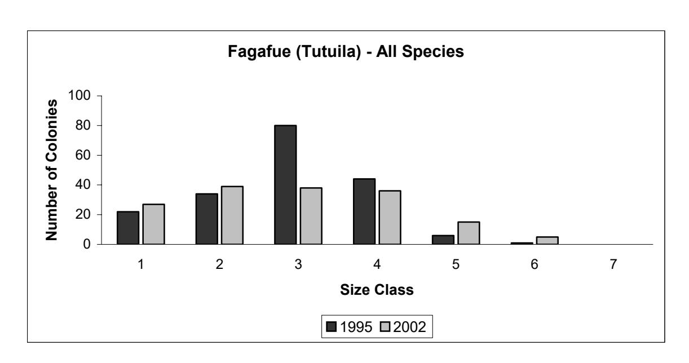

**Figure 1. Size class distribution of all species combined from the 1995 (N = 187) and 2002 (N = 160) surveys at Fagafue (Tutuila). Maximum diameter size class categories refer to the following : 1 = <=5 cm, 2 = >5 - <=10 cm, 3 = >10 - <=20 cm, 4 = >20 - <=40 cm, 5 = >40 - <=80 cm, 6 = >80 - <=160 cm, and 7 = >160 cm.** 

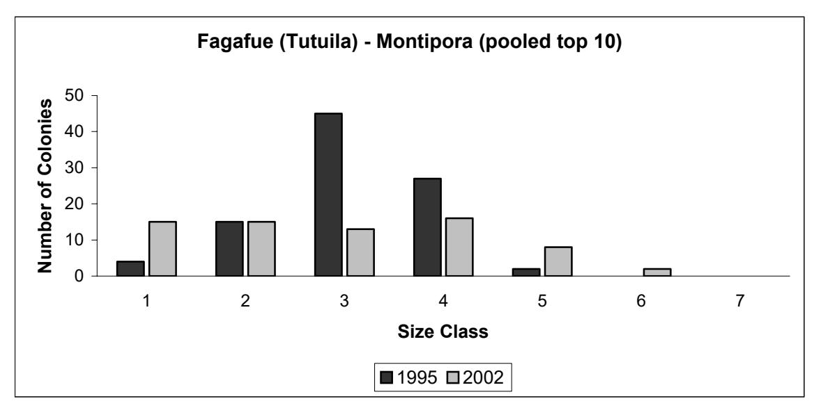

**Figure 2. Size class distribution of all** *Montipora* **species combined (top 10 ranked species) from the 1995 (N = 93) and 2002 (N = 69) surveys at Fagafue (Tutuila). Maximum diameter size class categories refer to the following : 1 = <=5 cm, 2 = >5 - <=10 cm, 3 = >10 - <=20 cm, 4 = >20 - <=40 cm, 5 = >40 - <=80 cm, 6 = >80 - <=160 cm, and 7 = >160 cm.** 

When *Montipora* spp were pooled for the two survey times (Figure 2), there was a very similar pattern of significant change to conclusions drawn from all pooled species

(P<0.001, G=27.9, df=4). As approximately 50% of all *Montipora* spp colonies were present in the top ranked species (and approx. 50% of all colonies were *Montipora* spp) in both data sets, it is clear that the dynamics of this group is contributing to the main patterns of colonies at this site.

#### **SUMMARY**

There appears to have been a major shift in the relative abundance of the highest ranked species between the two surveys. A change in the size class pattern was also evident. It is concluded that this is probably a highly dynamic site and though the community structure remained essentially unchanged, the species composition did change over time. High turnover may be a feature of this site due to the relatively high turbidity present (particularly at 10m depth). There was evidence of a shift towards larger colony sizes in the main species groups that may have been due to growth in the dominant size cohort from 1995. If this is the case, the difference in species composition may be due (in part) to differences in field identifications between the two surveys, and not from site conditions (see Taxonomic Considerations above).

#### Fagasa (Tutuila)

Approximately the same number of colonies was recorded at Fagasa in 2002 and 1995 (282 cols of 285 in 1995, Table 3), with sixty percent less sample area in 2002 (Table 3). This resulted in a higher density of corals in 2002 (19 cols/m<sup>2</sup>) compared to 1995 (6 cols/m<sup>2</sup>, Table 3).

Table 8. Rank of top 10 most abundant species from the two surveys at Fagasa. Species rank from 1995 is compared to the rank of the same species in 2002. Highly ranked species from the 2002 survey which were not present in the top 10 ranked species in the 1995 survey are listed at the bottom of the 2002 survey species list. An asterisk\* indicates ranks based on less than ten colonies per species. FORM refers to the growth form of each species (B = branching, E = encrusting, F = foliose, S = submassive, M = massive).

| 1995                      | <b>FORM</b> | RANK | 2002                      | <b>FORM</b> | RANK |
|---------------------------|-------------|------|---------------------------|-------------|------|
| Pavona venosa             | Е           | 1    | Pavona venosa             | Е           | 6    |
| Montipora grisea          | Е           | 2    | Montipora grisea          | Е           | 9*   |
| Porites rus               | S           | 3    | Porites rus               | S           | 1    |
| Montipora efflorescens    | Е           | 4    |                           |             |      |
| Porites nigrescens        | В           | 5    |                           |             |      |
| Pavona varians            | Е           | 6    | Pavona varians            | Е           | 2    |
| Porites sp2               | S           | 6    |                           |             |      |
| Porites lutea             | M           | 7    |                           |             |      |
| Psammocora profundacella  | Е           | 7    |                           |             |      |
| Pocillopora meandrina     | В           | 8*   |                           |             |      |
| Leptoseris mycetoseroides | F           | 9*   | Leptoseris mycetoseroides | F           | 8    |

| 1995                | FORM | RANK | 2002                     | FORM RANK |     |
|---------------------|------|------|--------------------------|-----------|-----|
| Leptastrea purpurea | E    | 10*  |                          |           |     |
|                     |      |      | Porites cylindrica       | B         | 3   |
|                     |      |      | Montipora                | F         | 4   |
|                     |      |      | aequituberculata         |           |     |
|                     |      |      | Montipora caliculata     | E         | 5   |
|                     |      |      | Porites lichen           | S         | 7   |
|                     |      |      | Montipora effusa         | E         | 10* |
|                     |      |      | Oxypora lacera           | F         | 10* |
|                     |      |      | Porites cf australiensis | M         | 10* |

The number of species recorded in 1995 was 39, which is greater than the 34 species recorded in the 2002 survey (Table 8). Table 8 shows a moderate degree of similarity among the top ten ranked species from the two surveys. The structure of the community is similar between the two surveys with a dominance of encrusting forms, particularly *Montipora* species. Massive, branching, and submassive *Porites* spp also have relatively high abundance in both surveys. Other structural changes include high relatively abundant folise forms in 2002 compared to 1995.

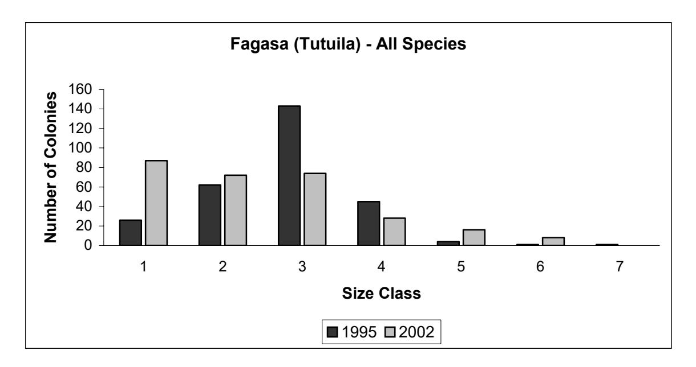

**Figure 3. Size class distribution of coral colonies of all species at Fagasa from 1995 (N = 282) and 2002 (N = 285) surveys. Maximum diameter size class categories refer to the following : 1 = <=5 cm, 2 = >5 - <=10 cm, 3 = >10 - <=20 cm, 4 = >20 - <=40 cm, 5 = >40 - <=80 cm, 6 = >80 - <=160 cm, and 7 = >160 cm.** 

The size class distribution of all species combined at Fagasa significantly changed between surveys. There was an approximately equal representation of colony sizes in the three smallest classes (<20 cm dia.) in 2002, compared to a clear dominance of >10 cm - <20 cm diameter colonies in 1995 (Figure 3; P<0.001, G = 73.4, df = 4).

The size class distribution of the abundant *Pavona venosa* at Fagasa significantly changed between surveys. There was an approximately equal representation of colony sizes in the three small to moderate size classes (>5 cm to <40 cm dia.) in 2002 compared to a clear dominance of >10 cm to <20 cm diameter colonies in 1995 (Figure 4; P<0.001, G = 73.4, df = 4).

The size class distribution of the relatively high abundant species, *Porites rus*, also changed significantly between surveys (Figure 5; 0.01<P<0.025, G = 6.3, df = 1). In 1995, this species was represented predominantly by colonies in the >10cm to <40cm diameter size range. In 2002, this species was represented by a range of sizes, including a clearly dominant small colony size (<5 cm dia.). This small size class represents a high recruitment pulse to this site.

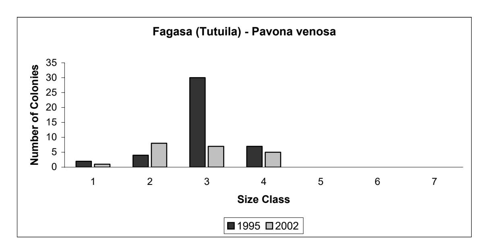

**Figure 4. Size class distribution of coral colonies of** *Pavona venosa* **at Fagasa from 1995 (N = 43) and 2002 (N = 21) surveys. Maximum diameter size class categories refer to the following : 1 = <=5 cm, 2 = >5 - <=10 cm, 3 = >10 - <=20 cm, 4 = >20 - <=40 cm, 5 = >40 - <=80 cm, 6 = >80 - <=160 cm, and 7 = >160 cm.** 

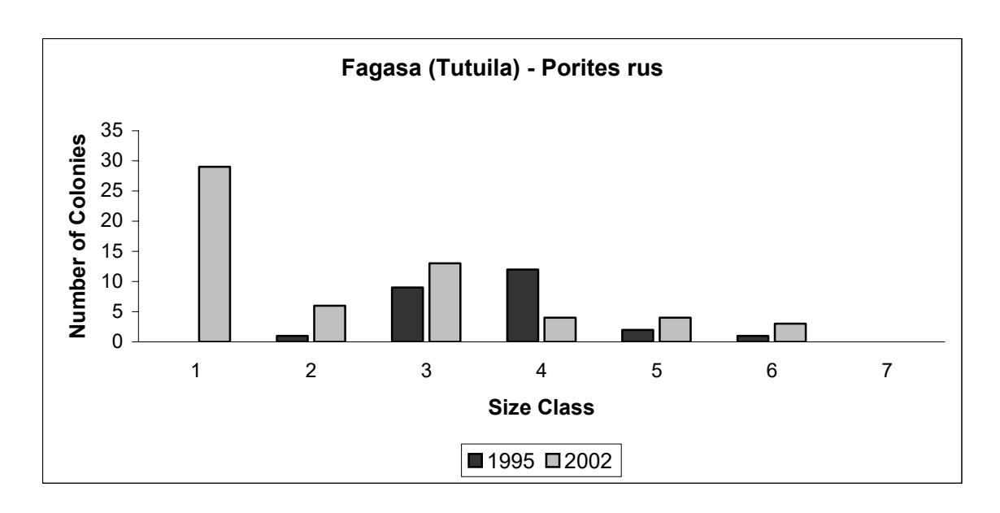

Figure 5. Size class distribution of coral colonies of *Porites rus* at Fagasa from 1995 (N = 25) and 2002 (N = 59) surveys. Maximum diameter size class categories refer to the following: 1 = <=5 cm, 2 = >5 - <=10 cm, 3 = >10 - <=20 cm, 4 = >20 - <=40 cm, 5 = >40 - <=80 cm, 6 = >80 - <=160 cm, and 7 = >160 cm.

#### **SUMMARY**

The coral community size structure has changed significantly at this site although there was little change in the dominant growth forms except for a change in *Montipora* species and greater abundance of foliose forms. The density of corals has increased between surveys but there is a greater representation of smaller colonies that are due to recruitment of a few species. This is a turbid site, situated in a large bay with a relatively small opening to the sea resulting in low water flushing with the open sea, and with a highly disturbed catchment.

#### Vatia (Tutuila)

A lower colony count was recorded at Vatia in 2002 compared to 1995 (475 cols of 1124 in 1995, Table 3). Nonetheless, a higher density of corals was recorded in 2002 (32 cols/m²) compared to 1995 (22 cols/m², Table 3).

The number of species recorded in 1995 was 58, which is less than the 53 species recorded in the 2002 survey. Table 9 shows a low degree of similarity among the top ten ranked species from the two surveys. The moderate to low species similarity of the most abundant species indicates high turnover of species is occurring. The structure of the community is very similar between the two surveys with a dominance of encrusting forms, particularly, *Montipora* spp, but with a lower abundance of branching, massive, and submassive *Porites* species.

**Table 9. Rank of top 10 most abundant species from the two surveys at Vatia. Species rank from 1995 is compared to the rank of the same species in 2002. Highly ranked species from the 2002 survey which were not present in the top 10 ranked species in the 1995 survey are listed at the bottom of the 2002 survey species list. FORM refers to the growth form of each species (B = branching, E = encrusting, M = massive, S = submassive).** 

| 1995                   | FORM | RANK | 2002                     |   | FORM RANK |
|------------------------|------|------|--------------------------|---|-----------|
| Montipora grisea       | E    | 1    | Montipora grisea         | E | 1         |
| Porites sp2            | S    | 2    |                          |   |           |
| Pavona varians         | E    | 3    | Pavona varians           | E | 3         |
| Leptastrea purpurea    | E    | 4    | Leptastrea purpurea      | E | 6         |
| Montipora efflorescens | E    | 5    |                          |   |           |
| Pocillopora eydouxi    | B    | 5    | Pocillopora eydouxi      | B | 6         |
| Montipora informis     | E    | 6    |                          |   |           |
| Montipora monasteriata | E    | 7    |                          |   |           |
| Montipora hoffmeisteri | E    | 8    |                          |   |           |
| Pocillopora meandrina  | B    | 9    |                          |   |           |
| Alveopora allingi      | M    | 10   |                          |   |           |
|                        |      |      | Montipora corbettensis   | E | 2         |
|                        |      |      | Montipora caliculata     | E | 4         |
|                        |      |      | Porites cf horizontalata | S | 5         |
|                        |      |      | Montastraea curta        | M | 7         |
|                        |      |      | Montipora effusa         | E | 7         |
|                        |      |      | Montipora nodosa         | E | 8         |
|                        |      |      | Porites rus              | S | 9         |
|                        |      |      | Psammocora haimeana      | E | 10        |

The size frequency distribution of all species combined changed significantly between the two surveys (Figure 6; P<0.001, G = 86.4, df = 4). The changes in colony size was from a dominance of >10 cm to <20 cm diameter colonies in 1995 to a more even spread of size classes up to 40 cm diameter in 2002.

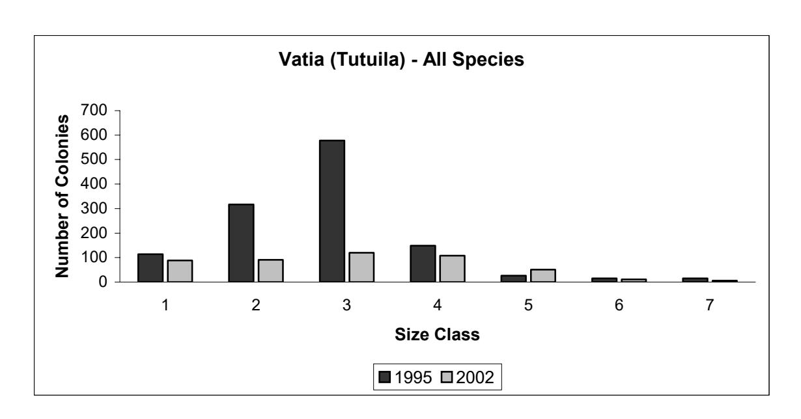

**Figure 6. Size class distribution of coral colonies of all species at Vatia from 1995 (N = 1124) and 2002 (N = 475) surveys. Maximum diameter size class categories refer to the following : 1 = <=5 cm, 2 = >5 - <=10 cm, 3 = >10 - <=20 cm, 4 = >20 - <=40 cm, 5 = >40 - <=80 cm, 6 = >80 - <=160 cm, and 7 = >160 cm.** 

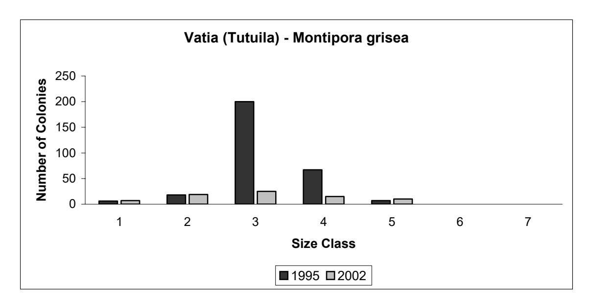

**Figure 7. Size class distribution of coral colonies of** *Montipora grisea* **at Vatia from 1995 (N = 298) and 2002 (N = 76) surveys. Maximum diameter size class categories refer to the following : 1 = <=5 cm, 2 = >5 - <=10 cm, 3 = >10 - <=20 cm, 4 = >20 - <=40 cm, 5 = >40 - <=80 cm, 6 = >80 - <=160 cm, and 7 = >160 cm.** 

The size frequency distribution of colonies of the most relatively abundant species in both surveys, *Montipora grisea*, changed significantly with a very similar pattern to the overall combined species pattern. That is, sizes changed from a dominance of >10 cm to <20cm diameter colonies in 1995 to a more even spread of size classes in 2002 (Figure 7; P<0.001, G = 50.3, df = 3).

Another relatively abundant species in both surveys was the encrusting *Pavona varians*, which also changed significantly in size class distribution from dominance of >10 cm to <20 cm diameter colonies in 1995, to colonies >20 cm to <40 cm diameter in 2002 (Figure 8; P<0.001, G = 17.3, df =1).

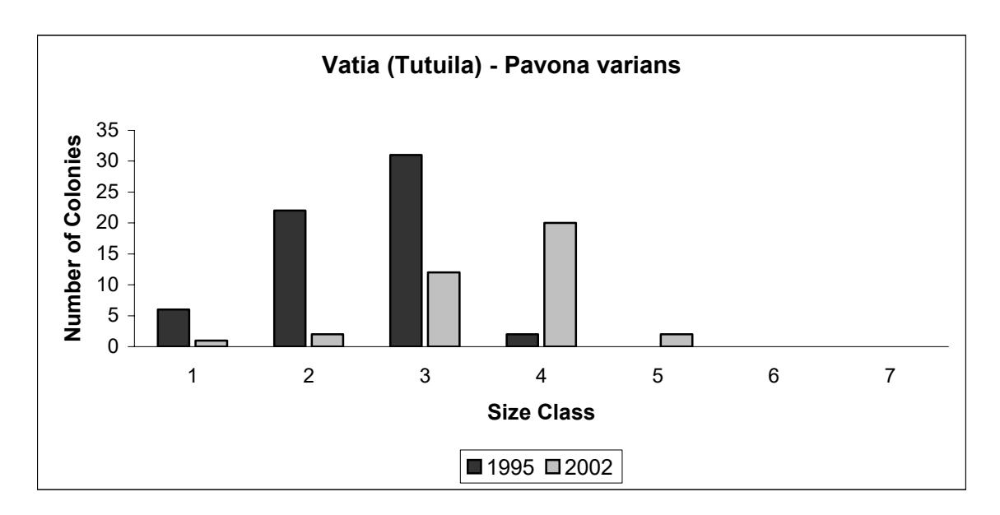

**Figure 8. Size class distribution of coral colonies of** *Pavona varians* **at Vatia from 1995 (N = 61) and 2002 (N = 37) surveys. Maximum diameter size class categories refer to the following : 1 = <=5 cm, 2 = >5 - <=10 cm, 3 = >10 - <=20 cm, 4 = >20 - <=40 cm, 5 = >40 - <=80 cm, 6 = >80 - <=160 cm, and 7 = >160 cm.** 

The abundant encrusting species, *Leptastrea purpurea*, also significantly changed size class frequencies between surveys to a more even spread of sizes up to 40 cm diameter (but with indications of a dominant <5 cm dia. class) in 2002. In contrast, there was a dominant class of >5 cm to <10 cm diameter colonies in 1995 (Figure 9; 0.01<P<0.025, G = 5.4, df = 1).

The branching coral, *Pocillopora eydouxi*, also had a similar pattern to *P. varians* with a significant size class distribution showing an increase in colony sizes, though insufficient numbers of colonies were available for analysis (Figure 10).

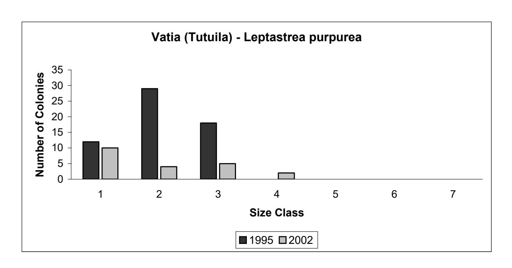

**Figure 9. Size class distribution of coral colonies of** *Leptastrea purpurea* **at Vatia from 1995 (N = 59) and 2002 (N = 21) surveys. Maximum diameter size class categories refer to the following : 1 = <=5 cm, 2 = >5 - <=10 cm, 3 = >10 - <=20 cm, 4 = >20 - <=40 cm, 5 = >40 - <=80 cm, 6 = >80 - <=160 cm, and 7 = >160 cm.** 

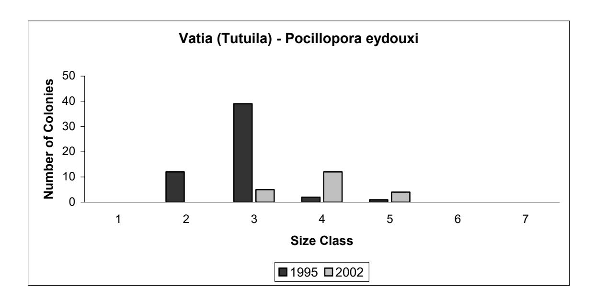

**Figure 10. Size class distribution of coral colonies of** *Pocillopora eydouxi* **at Vatia from 1995 (N = 54) and 2002 (N = 21) surveys. Maximum diameter size class categories refer to the following : 1 = <=5 cm, 2 = >5 - <=10 cm, 3 = >10 - <=20 cm, 4 = >20 - <=40 cm, 5 = >40 - <=80 cm, 6 = >80 - <=160 cm, and 7 = >160 cm.** 

#### SUMMARY

The coral community at Vatia continued to be diverse and dynamic over the period of the two surveys. Increases in colony sizes through growth, and higher colony densities through recruitment were characteristic of the site, as was the apparent turnover of species, though species richness remained high. The structure of the community remained similar between 1995 and 2002 with a dominance of encrusting forms.

#### Masefau (Tutuila)

A lower colony count was recorded at Masefau in 2002 (676 cols of 1375 in 1995, Table 3). This represented a higher density of corals in 2002 (45 cols/m²) compared to 1995 (27.3 cols/m², Table 3).

Table 10. Rank of top 10 most abundant species from the two surveys at Masefau. Species rank from 1995 is compared to the rank of the same species in 2002. Highly ranked species from the 2002 survey which were not present in the top 10 ranked species in the 1995 survey are listed at the bottom of the 2002 survey species list. FORM refers to the growth form of each species (E = encrusting, B = branching, S = submassive, ACC = Acropora corymbose).

| 1995                     | <b>FORM</b> | RANK | 2002                     | FORM | RANK |
|--------------------------|-------------|------|--------------------------|------|------|
| Porites sp2              | S           | 1    |                          |      |      |
| Montipora grisea         | Е           | 2    | Montipora grisea         | Е    | 2    |
| Montipora informis       | Е           | 3    |                          |      |      |
| Pavona varians           | Е           | 4    | Pavona varians           | Е    | 5    |
| Psammocora profundacella | Е           | 5    |                          |      |      |
| Montipora nodosa         | Е           | 6    |                          |      |      |
| Pocillopora meandrina    | В           | 6    |                          |      |      |
| Pocillopora eydouxi      | В           | 8    |                          |      |      |
| Alveopora spp            | Е           | 9    |                          |      |      |
| Galaxea fascicularis     | Е           | 10   |                          |      |      |
| Leptastrea purpurea      | Е           | 10   |                          |      |      |
|                          |             |      | Montipora corbettensis   | Е    | 1    |
|                          |             |      | Porites cf horizontalata | Е    | 3    |
|                          |             |      | Montipora caliculata     | Е    | 4    |
|                          |             |      | Porites rus              | S    | 6    |
|                          |             |      | Acropora valida          | ACC  | 7    |
|                          |             |      | Montipora effusa         | Е    | 8    |
|                          |             |      | Montipora sp. 1          | Е    | 9    |
|                          |             |      | Montipora efflorescens   | Е    | 10   |

The number of species recorded in 1995 was 36, which is less than the 46 species recorded in the 2002 survey. Table 10 shows a low degree of similarity among the top

ten ranked species from the two surveys. Nonetheless, the structure of the community is very similar between the two surveys with a dominance of encrusting forms, particularly of *Montipora* spp.

The greatest similarity between the surveys is in the very high abundance of *M.grisea* but there are only three other species from the 2002 survey that are similarly ranked in the most abundant top 10 species in the 1995 survey. There are a number of highly ranked species in 2002 that are not recorded with similar high rank in the 1995 survey, and all but one species are encrusting *Montipora* species. It is likely that there are some misidentifications of one or more closely related *Montipora* species between the two surveys. For example, there are a number of *Montipora* spp that ranked high in relative abundance in the 2002 survey, but were far less relatively abundant in the 1995 survey (See list at bottom of 2002 data column, Table 10). The other large difference is in the dominance of two *Porites* spp (*Porites* sp 2, and *P.* cf *horizontalata*) that have a submassive or encrusting growth form, respectively. Although these species were dominant in the smallest sizes (<5 cm dia, Appendix 1), making field identification difficult, it is more likely that there has been a strong change in the relative abundance of the two species between surveys.

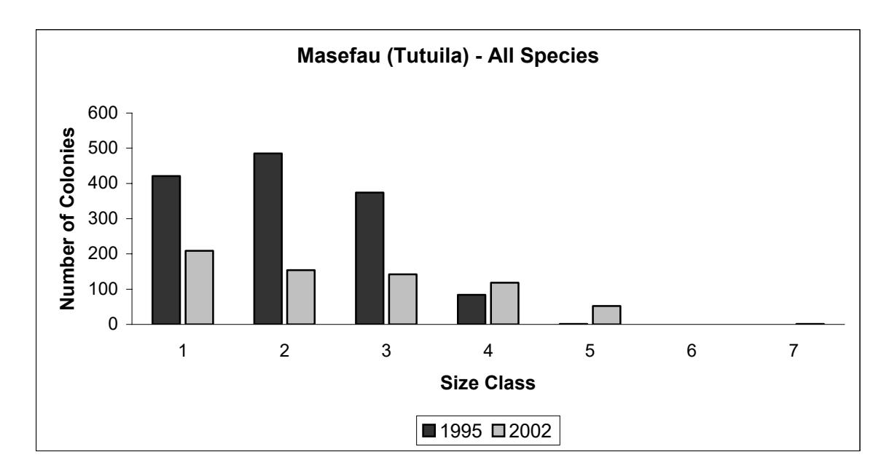

**Figure 11. Size class distribution of coral colonies of all species at Masefau from 1995 (N = 1375) and 2002 (N = 676) surveys. Maximum diameter size class categories refer to the following : 1 = <=5 cm, 2 = >5 - <=10 cm, 3 = >10 - <=20 cm, 4 = >20 - <=40 cm, 5 = >40 - <=80 cm, 6 = >80 - <=160 cm, and 7 = >160 cm.** 

The size class distribution of all species combined show a more even spread of sizes in 2002 and more relatively abundant larger colonies (>20 cm to <80 cm dia.), compared to 1995 where there was a clear dominance of sizes up to 20 cm diameter (Figure 11). This change in size classes was significant (P<0.001, G = 192.24, df = 4).

The distribution of size classes for the most relatively abundant species *Montipora* grisea, significantly changed from a dominance of 5 cm to 20 cm dia. colonies in 1995 to a more even spread of colony sizes in 2002 (Figure 12, P < 0.001, G = 29.7, df = 3). This pattern suggests that there is either continuous recruitment to the population of this species or fragmentation of colonies is occurring that is producing the smallest size classes. There is also evidence of growth to larger sizes from 1995 to 2002.

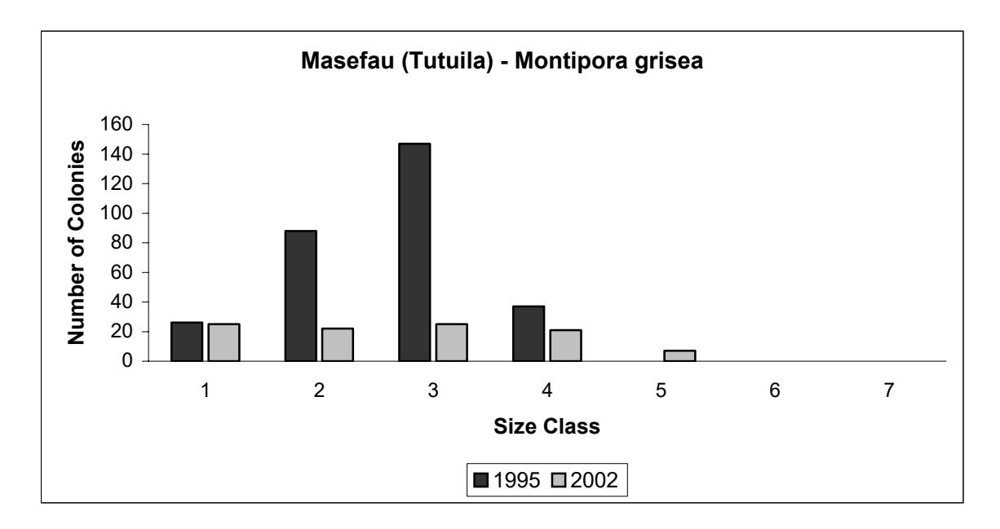

Figure 12. Size class distribution of coral colonies of *Montipora grisea* at Masefau from 1995 (N = 298and 2002 (N = 100). Maximum diameter size class categories refer to the following: 1 = <=5 cm, 2 = >5 - <=10 cm, 3 = >10 - <=20 cm, 4 = >20 - <=40 cm, 5 = >40 - <=80 cm, 6 = >80 - <=160 cm, and 7 = >160 cm.

#### **SUMMARY**

There has been an increase in species richness at Masefau between 1995 and 2002, and at the same time, there has been an increase in the density of colonies. There has been a shift towards a more even distribution of colony sizes by 2002. Also, there is high recruitment and/or fragmentation of colonies that is resulting in an abundance of small (<5 cm dia.) colonies. The community structure has remained relatively unchanged since 1995 with a clear dominance of encrusting *Montipora* species.

#### Aunu'u (Tutuila)

A relatively high colony count was recorded at Aunu'u in 2002 (705 cols of 914 in 1995, Table 3), despite the sample area in 2002 being 30% of the area sampled in 1995 (Table 1). There was a higher density of corals in 2002 (47 cols/m²) compared to 1995 (18 cols/m², Table 3).

The number of species recorded in 1995 was 56, which is marginally more than the 52 species from the 2002 survey. Table 11 shows a high degree of dissimilarity among the top ten ranked species from the two surveys. However, the structure of the community is very similar between the two surveys with a dominance of encrusting forms, particularly, *Montipora* spp, along with the prevalence of branching *Pocillopora* species.

The greatest similarity between the surveys is in the very high abundance of *M. grisea* but there are only three other species from the 2002 survey that are similarly ranked in the top 10 in the 1995 survey. There are a number of highly ranked species in 2002 that are not recorded high in the 1995 survey, and all but one species are encrusting *Montipora* species. The largest discrepancy between the surveys was in the dominance of *Montipora venosa* in the 2002 survey compared to it not being recorded in 1995. It is likely that this is a consequence of mis-identification of one or more closely related *Montipora* species between the two surveys. Note that there are a number of *Montipora* spp that ranked high in relative abundance in the 2002 survey, but were far less relatively abundant in the 1995 survey (See list at bottom of 2002 data column, Table 11). The other large difference is in the dominance of two *Porites* spp (*Porites* sp 2, and *P.* cf *horizontalata*) that have a submassive or encrusting growth form, respectively. Although the smallest sizes were dominant in these species (<5 cm dia, Appendix 1), which makes field identification difficult, it is more likely that there has been a strong change in the abundance of the two species between surveys.

**Table 11. Rank of top 10 most abundant species from the two surveys at Aunu'u. Species rank from 1995 is compared to the rank of the same species in 2002. Highly ranked species from the 2002 survey which were not present in the top 10 ranked species in the 1995 survey are listed at the bottom of the 2002 species list. FORM refers to the growth form of each species (E = encrusting, M = massive).** 

| 1995                     | FORM | RANK | 2002                     | FORM RANK |    |
|--------------------------|------|------|--------------------------|-----------|----|
| Montipora grisea         | E    | 1    | Montipora grisea         | E         | 2  |
| Porites sp2              | S    | 2    |                          |           |    |
| Pocillopora meandrina    | B    | 3    |                          |           |    |
| Montipora informis       | E    | 4    |                          |           |    |
| Leptastrea purpurea      | E    | 5    |                          |           |    |
| Psammocora profundacella | E    | 6    |                          |           |    |
| Pavona varians           | E    | 7    | Pavona varians           | E         | 5  |
| Pocillopora eydouxi      | B    | 8    | Pocillopora eydouxi      | B         | 6  |
| Montastraea curta        | M    | 9    | Montastraea curta        | M         | 10 |
| Pocillopora spp          | B    | 10   |                          |           |    |
|                          |      |      | Montipora venosa         | E         | 1  |
|                          |      |      | Porites cf horizontalata | E         | 3  |
|                          |      |      | Montipora corbettensis   | E         | 4  |
|                          |      |      | Montipora tuberculosa    | E         | 7  |
|                          |      |      | Montipora nodosa         | E         | 8  |
|                          |      |      | Montipora efflorescens   | E         | 9  |

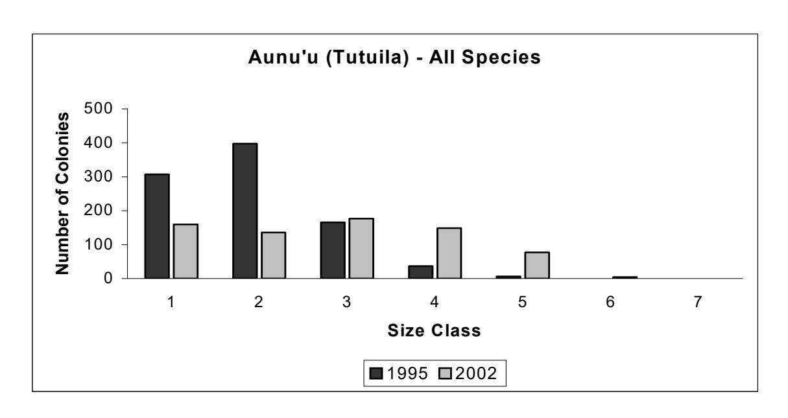

**Figure 13. Size class distribution of coral colonies of all species at Aunu'u from 1995 (N = 914) and 2002 (N = 705) surveys. Maximum diameter size class categories refer to the following : 1 = <=5 cm, 2 = >5 - <=10 cm, 3 = >10 - <=20 cm, 4 = >20 - <=40 cm, 5 = >40 - <=80 cm, 6 = >80 - <=160 cm, and 7 = >160 cm.** 

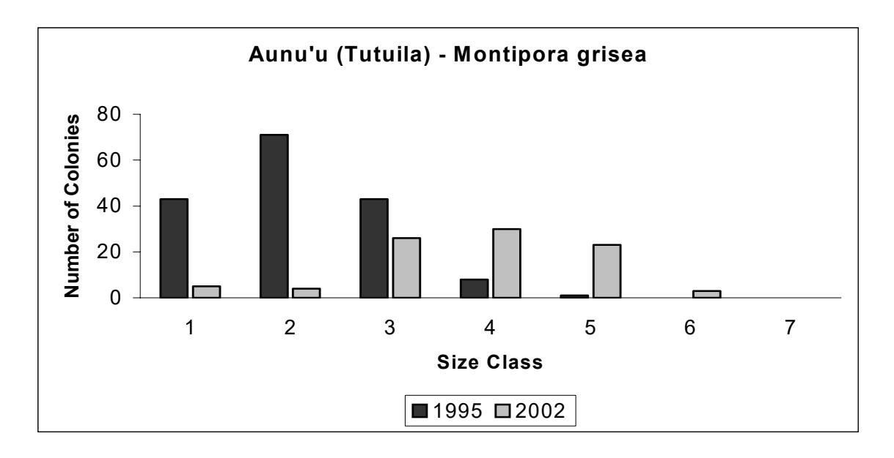

**Figure 14. Size class distribution of coral colonies of** *Montipora grisea* **at Aunu'u from 1995 (N = 166) and 2002 (N = 91). Maximum diameter size class categories refer to the following : 1 = <=5 cm, 2 = >5 - <=10 cm, 3 = >10 - <=20 cm, 4 = >20 - <=40 cm, 5 = >40 - <=80 cm, 6 = >80 - <=160 cm, and 7 = >160 cm.** 

The size class distribution of all species combined show a more even spread of sizes up to <80 cm diameter in 2002 compared to the clear dominance of sizes <10 cm diameter in 1995 (Figure 13). This change in size classes was significant (P<0.001, G = 300.5, df = 4). The size distribution of the most relatively abundant species *Montipora grisea*, shows a significant shift between 1995 and 2002 from small (dominated by >5 cm to <10 cm dia.) to larger size classes (>10 cm to <80 cm dia., Figure 14; P<0.001, G = 125.6, df = 4).

A common and relatively dominant branching growth form species, *Pocillopora eydouxi*, shows a very similar size distribution pattern to *M. grisea* with a shift towards larger colony sizes (from >5 cm to <20 cm dia in 1995, to >20 cm to <80 cm dia in 2002, Figure 15). This shift in size classes was significant (P<0.001, G = 32.7, df = 2). There also appears to have been no recent recruitment of *P. eydouxi* compared to 1995 (shown by a lack of the smallest sizes (<5 cm dia). In contrast, there were only 3 juvenile *Pocillopora* spp recorded in 2002, compared to many juvenile *P. meandrina* and unidentified *Pocillopora* species in 1995. *Pocillopora* spp tend to be fast colonisers of vacant substrate, and the evidence from the dynamics of this genus suggests that the community has quickly progressed to occupy most of the available space.

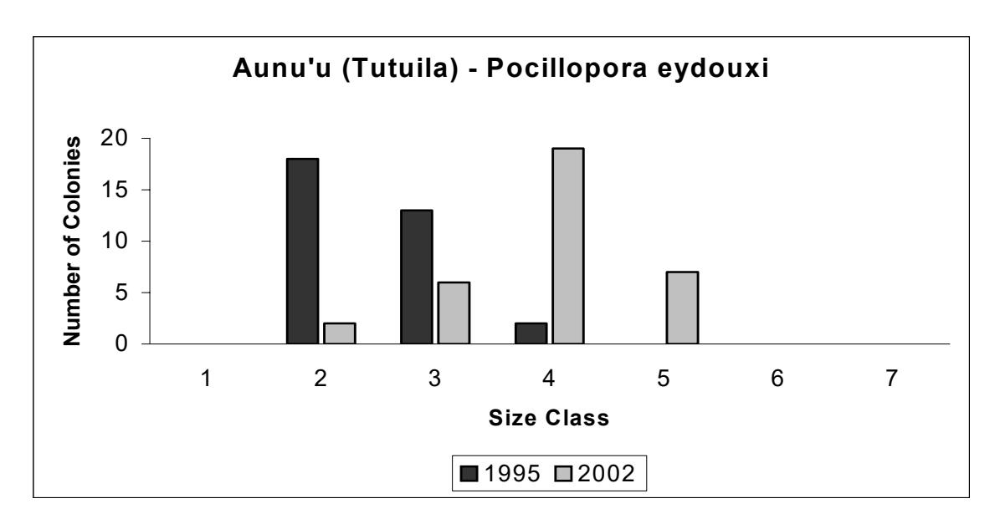

**Figure 15. Size class distribution of coral colonies of** *Pocillopora eydouxi* **at Aunu'u from 1995 (N = 33) and 2002 (N = 34). Maximum diameter size class categories refer to the following : 1 = <=5 cm, 2 = >5 - <=10 cm, 3 = >10 - <=20 cm, 4 = >20 - <=40 cm, 5 = >40 - <=80 cm, 6 = >80 - <=160 cm, and 7 = >160 cm.** 

## **SUMMARY**

Similar size class shifts to the examples given in the above figures are evident among many of the relatively dominant species at this site, indicating that the coral community has progressed to an advanced stage during the period between the two surveys. There has been little change in species richness at Aunu'u between 1995 and 2002 even though there has been an increase in the density of colonies. There has been a shift towards a more even distribution of colony sizes from 1995 to 2002. The community structure has remained relatively unchanged since 1995 with a dominance of encrusting species except for branching species becoming less relatively abundant. However, the composition of the encrusting species has shifted towards *Montipora* spp (2 species in 1995 cf to 6 species in 2002 in the top ten ranked species). The current coral community is a very healthy and flourishing one with space becoming limited.

#### Fagaitua (Tutuila)

A relatively low colony count was recorded in 2002 (380 cols in 2002 cf 1276 cols in 1995, Table 3). The survey in 1995 (Table 1) also recorded a higher density of corals (43 cols/m<sup>2</sup>) compared to 2002 (29 cols/m<sup>2</sup>, Table 3).

Table 12. Rank of top 10 most abundant species from the two surveys at Fagaitua. Species rank from 1995 is compared to the rank of the same species in 2002. Highly ranked species from the 2002 survey which were not present in the top 10 ranked species in the 1995 survey are listed at the bottom of the 2002 species list. FORM refers to the growth form of each species (ACC = Acropora corymbose, B = branching, E = encrusting, F = Foliose, M = massive, S = submassive).

| 1995                   | FORM | RANK | 2002                     | TOTAL | RANK |
|------------------------|------|------|--------------------------|-------|------|
| Porites sp 2           | S    | 1    |                          |       |      |
| Montipora grisea       | Е    | 2    | Montipora grisea         | Е     | 2    |
| Montipora informis     | Е    | 3    |                          |       |      |
| Porites spp            | E/M  | 4    |                          |       |      |
| Porites rus            | S    | 5    |                          |       |      |
| Galaxea fascicularis   | Е    | 6    | Galaxea fascicularis     | Е     | 9    |
| Hydnophora rigida      | S    | 7    |                          |       |      |
| Montipora monasteriata | Е    | 8    |                          |       |      |
| Montipora hoffmeisteri | Е    | 9    |                          |       |      |
| Pavona varians         | Е    | 9    | Pavona varians           | Е     | 7    |
| Pocillopora verrucosa  | В    | 9    | Pocillopora verrucosa    | В     | 8    |
| Montipora floweri      | Е    | 10   |                          |       |      |
| -                      |      |      | Montipora corbettensis   | Е     | 1    |
|                        |      |      | Porites cf horizontalata | S     | 3    |
|                        |      |      | Acropora valida          | ACC   | 4    |
|                        |      |      | Montipora venosa         | Е     | 5    |
|                        |      |      | Lobophyllia corymbosa    | M     | 6    |
|                        |      |      | Acropora akajimensis     | ACC   | 9    |
|                        |      |      | Echinopora lamellosa     | F     | 10*  |

In contrast, the number of species recorded in 1995 was 32, which is less than the 45 species recorded in the 2002 survey. Table 12 shows a moderately low degree of

similarity among the top ten ranked species from the two surveys. The structure of the community is not very similar in 2002 compared to 1995 with a greater mixture of growth forms in 2002 and a change in many species dominance. *Montipora* species appear to have decreased in relative dominance between 1995 and 2002, although there was no change in the high dominant *Montipora grisea* between surveys. An additional change from 1995 was in the appearance of two corymbose *Acropora* species in the top ten dominant colonies, along with an increase in total *Acropora* species from 3 in 1995 to 13 in 2002 (Appendix 1).

There is also a difference between surveys in the relative abundance of submassive *Porites* species (*Porites* sp 2 cf *Porites* cf *horizontalata*), which may be due to a difference in identification between surveys rather than a complete change in species dominance as suggested by the data.

The size class distribution of colonies from all species combined significantly changed from a dominance of smaller sizes (especially >5 cm to <10 cm dia.) to a more even spread of sizes and higher numbers of larger colonies in 2002 (Figure 16; P<0.001, G = 320.4, df = 4).

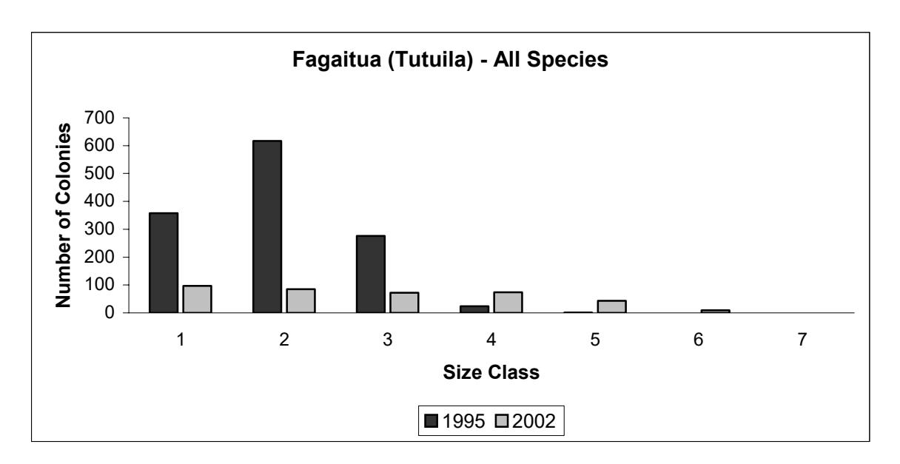

**Figure 16. Size class distribution of coral colonies of all species at Fagaitua (Tutuila) from 1995 (N = 1276) and 2002 (N = 380). Maximum diameter size class categories refer to the following : 1 = <=5 cm, 2 = >5 - <=10 cm, 3 = >10 - <=20 cm, 4 = >20 - <=40 cm, 5 = >40 - <=80 cm, 6 = >80 - <=160 cm, and 7 = >160 cm.** 

The highly dominant *Montipora grisea* demonstrated similar trends to the combined species pattern with a shift to more even and larger colony sizes in 2002 (Figure 17; P<0.001, G = 19.4, df = 2).

In addition, the branching *Pocillopora verrucosa* demonstrated a very similar pattern to the above trends (Figure 18), with a shift towards more even range of sizes and larger

colonies. Unfortunately, insufficient sample size did not allow statistical analyses for this species.

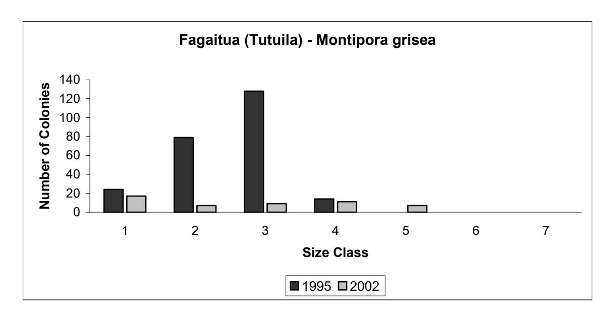

**Figure 17. Size class distribution of coral colonies of** *Montipora grisea* **at Fagaitua (Tutuila) from 1995 (N = 245) and 2002 (N = 51). Maximum diameter size class categories refer to the following : 1 = <=5 cm, 2 = >5 - <=10 cm, 3 = >10 - <=20 cm, 4 = >20 - <=40 cm, 5 = >40 - <=80 cm, 6 = >80 - <=160 cm, and 7 = >160 cm.** 

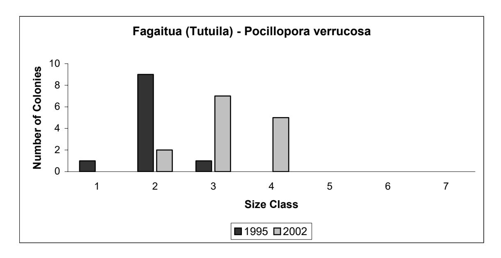

**Figure 18. Size class distribution of coral colonies of** *Pocillopora verrucosa* **at Fagaitua (Tutuila) from 1995 (N = 11) and 2002 (N = 14). Maximum diameter size class categories refer to the following : 1 = <=5 cm, 2 = >5 - <=10 cm, 3 = >10 - <=20 cm, 4 = >20 - <=40 cm, 5 = >40 - <=80 cm, 6 = >80 - <=160 cm, and 7 = >160 cm.** 

#### SUMMARY

The Fagaitua coral community has increased in species composition and in general has grown over the period between surveys. The composition of the community is moderately different to others on Tutuila with a higher number of *Acropora* species present compared to most other sites.

#### Onesosopo (Tutuila)

Relatively low colony counts were recorded in both surveys at Onesosopo (305 cols in 2002 cf 257 cols in 1995, Table 3). A higher density of corals was recorded in 2002 (20 cols/m²) compared to 1995 (5 cols/m², Table 3).

Table 13. Rank of top 10 most abundant species from the two surveys at Onesosopo. Species rank from 1995 is compared to the rank of the same species in 2002. Highly ranked species from the 2002 survey which were not present in the top 10 ranked species in the 1995 survey are listed at the bottom of the 2002 species list. An asterisk\* indicates ranks that were calculated from less than 10 colonies per species. FORM refers to the growth form of each species (B = branching, E = encrusting, F = foliose, M = massive, S = submassive).

| 1995                     | <b>FORM</b> | RANK | 2002                   | FORM | RANK |
|--------------------------|-------------|------|------------------------|------|------|
| Montipora grisea         | Е           | 1    | Montipora grisea       | Е    | 2    |
| Montipora informis       | Е           | 2    | Montipora informis     | Е    | 7    |
| Pavona varians           | Е           | 3    | Pavona varians         | Е    | 6    |
| Pocillopora damicornis   | В           | 4    | Pocillopora damicornis | В    | 5    |
| Psammocora profundacella | Е           | 5    |                        |      |      |
| Porites sp2              | S           | 6*   |                        |      |      |
| Montipora hoffmeisteri   | Е           | 7*   | Montipora hoffmeisteri | Е    | 10*  |
| Leptoseris explanata     | F           | 8*   |                        |      |      |
| Porites spp              | E/M         | 8*   |                        |      |      |
| Leptastrea purpurea      | Е           | 9*   |                        |      |      |
| Merulina ampliata        | F           | 9*   |                        |      |      |
| Pocillopora verrucosa    | В           | 9*   |                        |      |      |
| Galaxea fascicularis     | Е           | 10*  |                        |      |      |
| Montipora tuberculosa    | Е           | 10*  |                        |      |      |
|                          |             |      | Montipora effusa       | Е    | 1    |
|                          |             |      | Montipora sp. 1        | Е    | 3    |
|                          |             |      | Montipora corbettensis | Е    | 4    |
|                          |             |      | Montipora nodosa       | Е    | 5    |
|                          |             |      | Montipora monasteriata | Е    | 8    |
|                          |             |      | Pavona venosa          | Е    | 9*   |
|                          |             |      | Porites rus            | S    | 9*   |

| 1995 | FORM | RANK | 2002                   | FORM RANK |     |
|------|------|------|------------------------|-----------|-----|
|      |      |      | Montipora efflorescens | E         | 10* |
|      |      |      | Montipora floweri      | E         | 10* |

The number of species recorded in 1995 was 32, which is lower than the 40 species recorded in the 2002 survey. Table 13 shows a moderate degree of similarity among the top ten ranked species from the two surveys. However, the structure of the community is similar between the two surveys with predominantly encrusting growth forms present. Approximately half of the highly ranked species in 1995 was represented by few colonies (less than 10 colonies) so conclusive trends would be uncertain for species other than the first 4 or 5 most relatively abundant species.

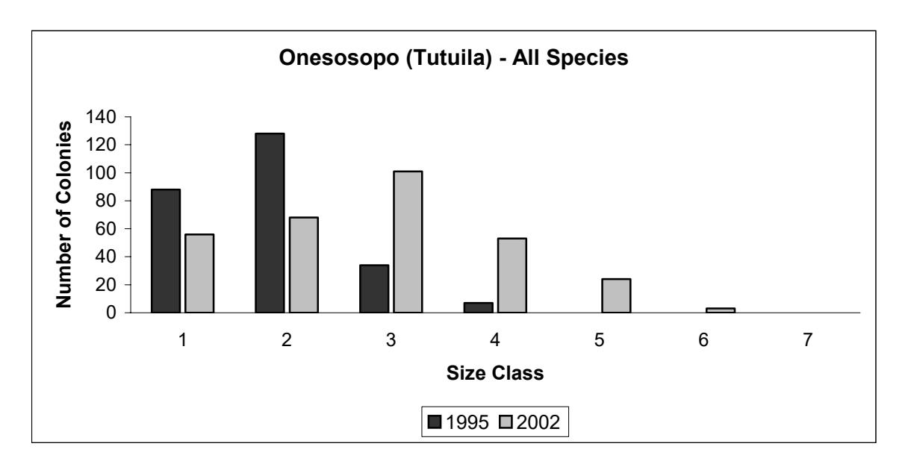

**Figure 19. The size class distribution of all species combined at Onesosopo from 1995 (N = 257) and 2002 (N = 305). Maximum diameter size class categories refer to the following : 1 = <=5 cm, 2 = >5 - <=10 cm, 3 = >10 - <=20 cm, 4 = >20 - <=40 cm, 5 = >40 - <=80 cm, 6 = >80 - <=160 cm, and 7 = >160 cm.** 

Twice as many *Montipora* species were recorded as relatively abundant in 2002 compared to 1995, including *M. effusa*, which was not recorded in 1995. This may be a case of field identification differences between surveys concerning a similar group of Montipora species that includes M*. effusa*, *M. grisea*, and *M. corbettensis*.

The size class distribution of all species combined changed significantly between surveys with a more even spread of sizes and larger colonies in 2002 compared to 1995 (Figure 19; P<0.001, G =128.4, df = 3). The dominant size class in 1995 was the >5 cm to <10 cm diameter class, whereas the dominant class in 2002 was the >10 cm to <20 cm diameter class.

The most dominant species in both surveys, *M.grisea*, showed the same trend to the combined species pattern, with a more even spread of sizes and larger colonies in 2002 compared to a dominance of >5 cm to <10 cm diameter size class in 1995 (Figure 20; P<0.001, G=40, df=2).

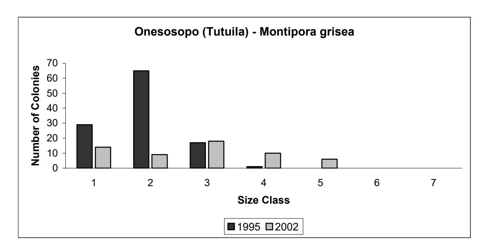

Figure 20. The size class distribution of *Montipora grisea* at Onesosopo from 1995 (N = 112) and 2002 (N = 57). Maximum diameter size class categories refer to the following: 1 = <=5 cm, 2 = >5 - <=10 cm, 3 = >10 - <=20 cm, 4 = >20 - <=40 cm, 5 = >40 - <=80 cm, 6 = >80 - <=160 cm, and 7 = >160 cm.

#### **SUMMARY**

The coral community at Onesosopo has continued to slowly recover from previous low levels. The density of colonies and species richness has increased from 1995 with moderate turnover of species. The greatest change has occurred in the number of *Montipora* species, which have increased in relative abundance between surveys.

#### Aua (Tutuila)

Relatively low colony counts were recorded in both surveys at Aua (167 cols in 2002 cf 254 cols in 1995, Table 3). With the difference in sample effort taken into account, a higher density of corals was recorded in 2002 (11 cols/m²) compared to 1995 (5 cols/m², Table 3).

The number of species recorded in 1995 was 29, which is similar to the 27 species recorded in the 2002 survey. Table 14 shows a moderate degree of similarity among the top ten ranked species from the two surveys. However, the structure of the community is very similar between the two surveys with predominantly encrusting growth forms present. Approximately a half of the highly ranked species was represented by few colonies (less than 10 colonies) so conclusive trends would be uncertain for species other than the first 4 or 5 most relatively abundant species.

There was a moderate degree of similarity in the dominant species in the coral communities between the 1995 and 2002 surveys (Table 14). The structure of the community was relatively unchanged with a similar dominance of encrusting forms, similar species richness, and low abundance of most species at both times.

**Table 14. Rank of top 10 most abundant species from the two surveys at Aua. Species rank from 1995 is compared to the rank of the same species in 2002. Highly ranked species from the 2002 survey which were not present in the top 10 ranked species in the 1995 survey are listed at the bottom of the 2002 species list. FORM refers to the growth form of each species (ACB = Acropora branching, ACC = Acropora corymbose, E = encrusting, FL = free-living, M = massive, S = submassive).** 

| 1995                     | FORM | RANK | 2002                     |   | FORM RANK |
|--------------------------|------|------|--------------------------|---|-----------|
| Montipora grisea         | E    | 1    | Montipora grisea         | E | 3         |
| Pavona varians           | E    | 2    | Pavona varians           | E | 4         |
| Montipora informis       | E    | 3    |                          |   |           |
| Oxypora lacera           | F    | 4    |                          |   |           |
| Psammocora profundacella | E    | 5    | Psammocora profundacella | E | 7         |
| Galaxea fascicularis     | E    | 6    |                          |   |           |
| Pocillopora damicornis   | B    | 6    |                          |   |           |
| Montipora monasteriata   | E    | 7    | Montipora monasteriata   | E | 2         |
| Montipora tuberculosa    | E    | 7    | Montipora tuberculosa    | E | 7         |
| Coscinaraea columna      | M    | 8    |                          |   |           |
|                          |      |      | Montipora effusa         | E | 1         |
|                          |      |      | Montipora efflorescens   | E | 5         |
|                          |      |      | Montipora nodosa         | E | 6         |
|                          |      |      | Montipora sp. 1          | E | 7         |
|                          |      |      | Montipora calcarea       | E | 8         |
|                          |      |      | Psammocora haimeana      | E | 9         |
|                          |      |      | Favites flexuosa         | M | 10        |

The size class distribution of all species shows a significant shift from a clear dominance of small sizes in 1995 (>5 cm to <10 cm dia.), to a more even spread of sizes in 2002 (Figure 21, P<0.001, G = 24.9, df = 4). This pattern was also evident in the most relatively abundant species, *Montipora grisea*, in both surveys (Figure 22; 0.10<P<0.25, G = 5.4, df = 3).

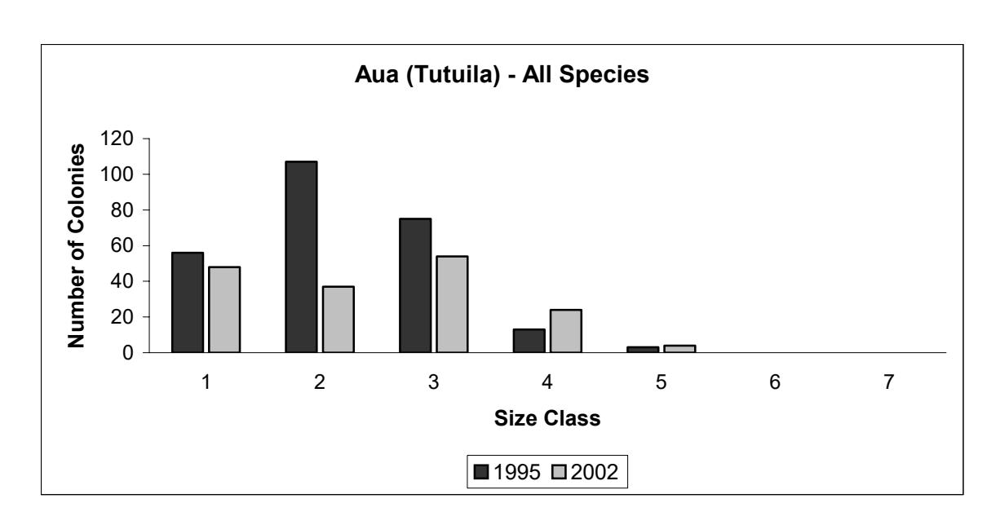

**Figure 21. The size class distribution of all species combined at Aua from 1995 (N = 254) and 2002 (N = 167). Maximum diameter size class categories refer to the following : 1 = <=5 cm, 2 = >5 - <=10 cm, 3 = >10 - <=20 cm, 4 = >20 - <=40 cm, 5 = >40 - <=80 cm, 6 = >80 - <=160 cm, and 7 = >160 cm.** 

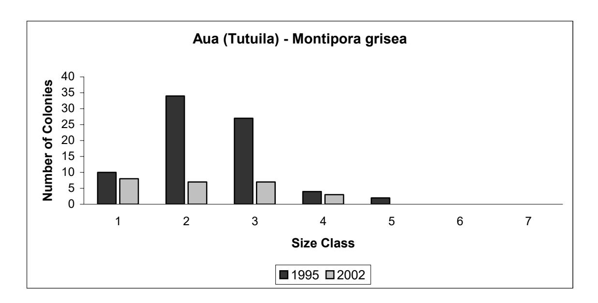

**Figure 22. The size class distribution of** *Montipora grisea* **at Aua from 1995 (N = 77) and 2002 (N = 25). Maximum diameter size class categories refer to the following : 1 = <=5 cm, 2 = >5 - <=10 cm, 3 = >10 - <=20 cm, 4 = >20 - <=40 cm, 5 = >40 - <=80 cm, 6 = >80 - <=160 cm, and 7 = >160 cm.** 

#### **SUMMARY**

Aua remains relatively unchanged except for evidence of a small increase in size of colonies between 1995 and 2002. There has been little change in community structure or species composition of the coral community between surveys.

## Faga'alu (Tutuila)

A relatively high colony count was recorded in 1995 (711 cols in 1995 compared to 376 cols in 2002, Table 15). There was a higher density of corals in 2002 (25 cols/m<sup>2</sup>) compared to 1995 (14 cols/m<sup>2</sup>, Table 3).

Table 15. Rank of top 10 most abundant species from the two surveys at Faga'alu. Species rank from 1995 is compared to the rank of the same species in 2002. Highly ranked species from the 2002 survey which were not present in the top 10 ranked species in the 1995 survey are listed at the bottom of the 2002 species list. FORM refers to the growth form of each species (B = branching, E = encrusting, E = foliose, E = free-living, E = foliose).

| 1995                     | <b>FORM</b> | RANK | 2002                     | <b>FORM</b> | RANK |
|--------------------------|-------------|------|--------------------------|-------------|------|
| Porites sp 2             | S           | 1    |                          |             |      |
| Montipora grisea         | Е           | 2    | Montipora grisea         | Е           | 2    |
| Pavona varians           | Е           | 3    | Pavona varians           | Е           | 6    |
| Montipora informis       | Е           | 4    |                          |             |      |
| Pocillopora damicornis   | В           | 5    |                          |             |      |
| Fungia fungites          | FL          | 6    |                          |             |      |
| Montipora turgescens     | Е           | 7    |                          |             |      |
| Pocillopora verrucosa    | В           | 8    |                          |             |      |
| Oxypora lacera           | F           | 9    |                          |             |      |
| Psammocora profundacella | Е           | 10   |                          |             |      |
|                          |             |      | Porites cf horizontalata | S           | 1    |
|                          |             |      | Montipora effusa         | Е           | 3    |
|                          |             |      | Montipora corbettensis   | Е           | 4    |
|                          |             |      | Porites rus              | S           | 5    |
|                          |             |      | Montipora sp. 1          | Е           | 7    |
|                          |             |      | Pavona venosa            | Е           | 8    |
|                          |             |      | Montipora caliculata     | Е           | 9    |
|                          |             |      | Montipora monasteriata   | Е           | 10   |
|                          |             |      | Montipora nodosa         | Е           | 10   |

The number of species recorded in 1995 was 45, which is more than the 41 species recorded in the 2002 survey. Table 15 shows a low degree of similarity among the top ten ranked species from the two surveys. The structure of the community was moderately similar between the two surveys with a mixture of encrusting, submassive

and branching *Pocillopora* spp forms in 1995, compared to predominantly encrusting *Montipora* spp in 2002. Submassive *Porites* spp were relatively dominant in both surveys, however, the species of *Porites* were different between surveys. Field identification differences may account for variability between *P.* cf *horizontalata* in 2002 and *P.* sp 2 in 1995, but not for the higher relative abundance of *P. rus* in 2002 (which is not easily confused in the field (Appendix 1).

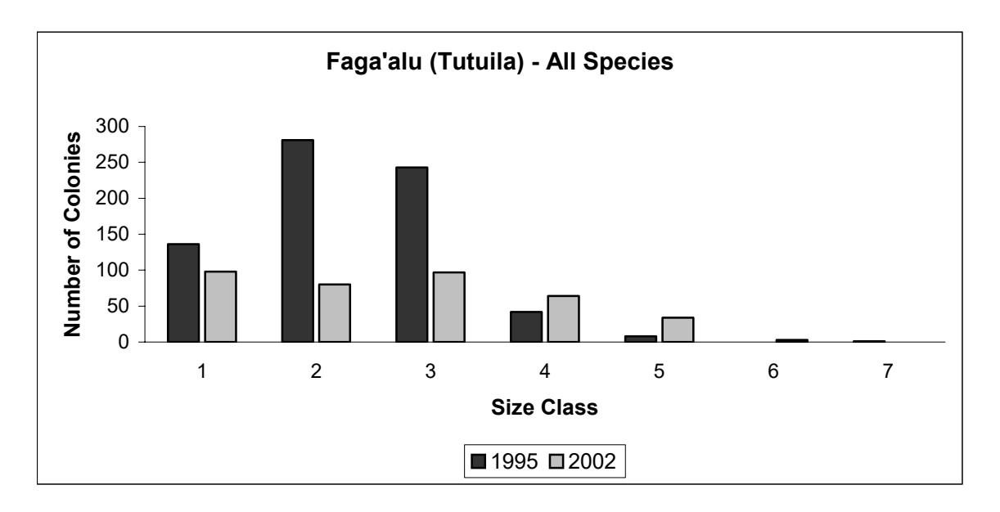

**Figure 23. Size class distribution of coral colonies of all species at Faga'alu from 1995 (N = 711) and 2002 (N = 376). Maximum diameter size class categories refer to the following : 1 = <=5 cm, 2 = >5 - <=10 cm, 3 = >10 - <=20 cm, 4 = >20 - <=40 cm, 5 = >40 - <=80 cm, 6 = >80 - <=160 cm, and 7 = >160 cm.** 

The size frequency distribution changed significantly between 1995 and 2002, with a more even spread of colony sizes in 2002 compared to the dominance of smaller size classes in 1995 (especially the >5 cm to <20 cm diameter sizes, Figure 23; P<0.001, G = 107.5, df =4).

The *Montipora grisea* size class distribution did not change significantly between surveys (Figure 24; 0.10<P<0.25, df = 2). In contrast, if the submassive *Porites* species (*P.* sp 2 in 1995 and *P.* cf *horizontalata* in 2002) were pooled, there was a significant difference in size class distributions between surveys (Figure 25; P<0.001, G = 11.7, df = 1). The change in size classes for *Porites* spp (submassive) has been from a dominance of >5 cm to <10 cm diameter (along with a high relative abundance of <5 cm diameter colonies) in 1995, to a dominance of <5 cm diameter colonies in 2002. This suggests that the field identifications for *Porites* spp were correct in both surveys and that there has been a change from one species to another between the surveys.

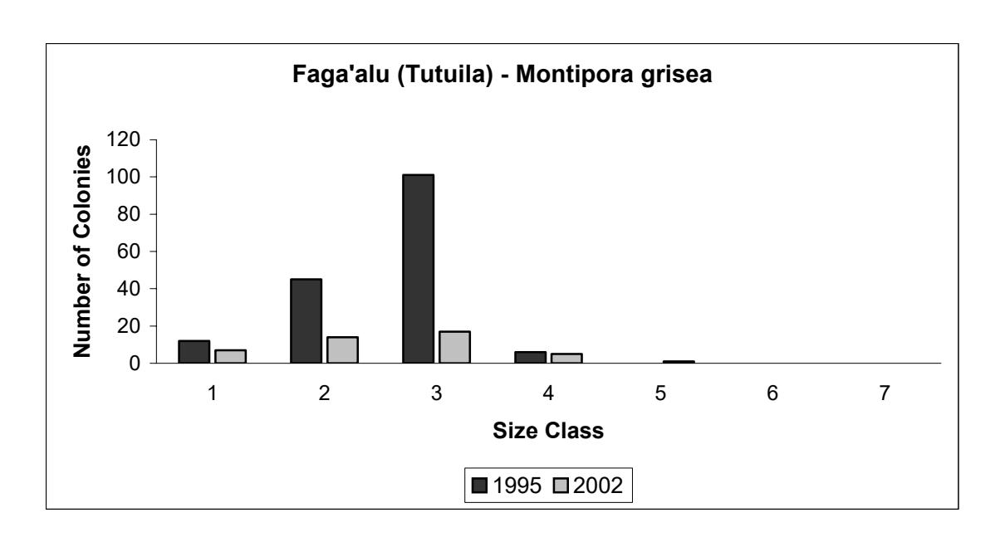

**Figure 24. Size class distribution of coral colonies of** *Montipora grisea* **at Faga'alu from 1995 (N = 164) and 2002 (N = 44). Maximum diameter size class categories refer to the following : 1 = <=5 cm, 2 = >5 - <=10 cm, 3 = >10 - <=20 cm, 4 = >20 - <=40 cm, 5 = >40 - <=80 cm, 6 = >80 - <=160 cm, and 7 = >160 cm.** 

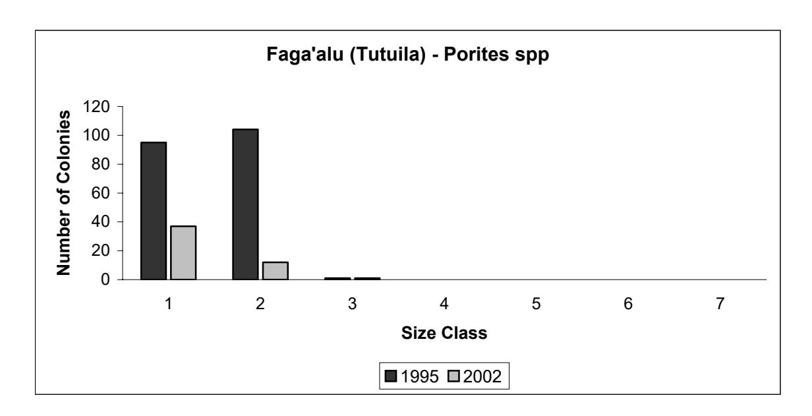

**Figure 25. Size frequency distribution of pooled submassive** *Porites* **species at Faga'alu from 1995 (***Porites* **sp 2, N = 200) and 2002 (***Porites* **cf** *horizontalata***, N = 50). Maximum diameter size class categories refer to the following : 1 = <=5 cm, 2 = >5 - <=10 cm, 3 = >10 - <=20 cm, 4 = >20 - <=40 cm, 5 = >40 - <=80 cm, 6 = >80 - <=160 cm, and 7 = >160 cm.** 

#### SUMMARY

The Faga'alu coral community has shown an increase in colony density during the period between surveys, and although the species richness is similar, there has been a high turnover and apparent replacement of individual species. This suggests that the site is in a recovery phase but is showing high turnover and species replacement.

#### Fatumafuti (Tutuila)

A relatively high colony count was recorded at Fatumafuti in 2002 (511 cols in 2002 cf 598 cols in 1995, Table 3), despite the sample area in 2002 being 30% of the area sampled in 1995 (Table 1). A higher density of corals was recorded in 2002 (34 cols/m<sup>2</sup>) compared to 1995 (12 cols/m<sup>2</sup>, Table 3).

Table 16. Rank of top 10 most abundant species from the two surveys at Fatumafuti. Species rank from 1995 is compared to the rank of the same species in 2002. Highly ranked species from the 2002 survey which were not present in the top 10 ranked species in the 1995 survey are listed at the bottom of the 2002 species list. FORM refers to the growth form of each species (ACB = Acropora branching, ACC = Acropora corymbose, B = branching non-Acropora, E = encrusting, FL = free-living, M = massive, S = submassive).

| 1995                  | FORM | RANK | 2002                   | FORM | RANK |
|-----------------------|------|------|------------------------|------|------|
| Porites sp 2          | S    | 1    |                        |      |      |
| Montipora grisea      | Е    | 2    | Montipora grisea       | Е    | 6    |
| Porites rus           | S    | 3    | Porites rus            | S    | 1    |
| Pavona varians        | Е    | 4    | Pavona varians         | Е    | 4    |
| Pocillopora meandrina | В    | 5    | Pocillopora meandrina  | В    | 10   |
| Galaxea fascicularis  | Е    | 6    |                        |      |      |
| Pocillopora eydouxi   | В    | 7    |                        |      |      |
| Fungia fungites       | FL   | 8    |                        |      |      |
| Acropora danai        | ACB  | 9    |                        |      |      |
| Montastraea curta     | M    | 9    |                        |      |      |
|                       |      |      | Acropora valida        | ACC  | 2    |
|                       |      |      | Montipora caliculata   | Е    | 3    |
|                       |      |      | Porites lichen         | S    | 5    |
|                       |      |      | Montipora corbettensis | Е    | 7    |
|                       |      |      | Acropora austera       | ACB  | 8    |
|                       |      |      | Acropora spp           | ACB  | 9    |
|                       |      |      | Montipora nodosa       | Е    | 9    |

The number of species recorded in 1995 was 33, which is less than the 46 species recorded in the 2002 survey. Table 16 shows a low degree of similarity among the top ten ranked species from the two surveys. However, the structure of the community is

very similar between the two surveys with a mixture of encrusting, submassive and *Acropora* spp forms. *Montipora* species have increased in relative dominance between 1995 and 2002.

Comparisons of pooled colony size class distribution from both surveys show a clear difference (Figure 26). In 1995, colony sizes have an even spread around the dominant >10 cm to <20 cm diameter category, whereas in 2002, there is a dominance of the smallest size class (<5 cm dia) with the relative frequency of sizes diminishing with increasing size. This shift in size class distribution was significant (P<0.001, G = 147, df = 5).

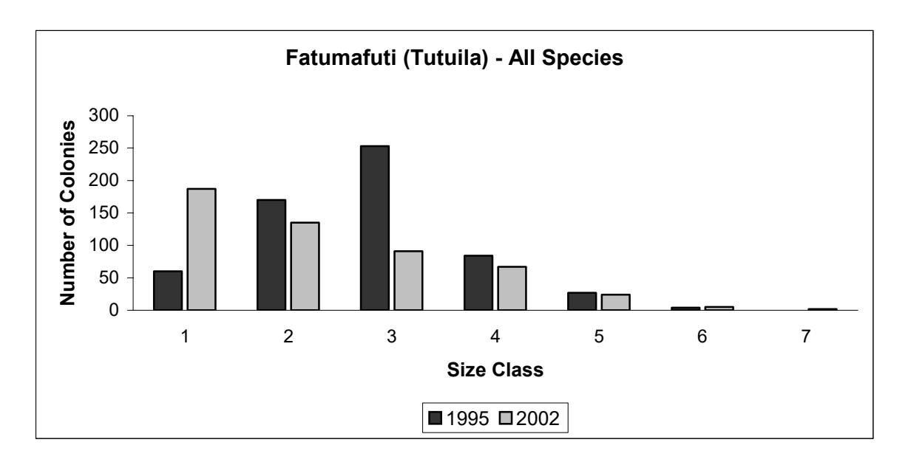

**Figure 26. Size class distribution of coral colonies of all species at Fatumafuti from 1995 (N = 598) and 2002 (N = 511 ). Maximum diameter size class categories refer to the following : 1 = <=5 cm, 2 = >5 - <=10 cm, 3 = >10 - <=20 cm, 4 = >20 - <=40 cm, 5 = >40 - <=80 cm, 6 = >80 - <=160 cm, and 7 = >160cm.** 

A similar significant shift in sizes was recorded for *Porites rus*, a relatively dominant species at both survey times (Figure 27; P<0.001, G = 625, df = 4). However, the other commonly high ranked species, *Pavona varians*, recorded a similar size distribution in both surveys but the dominant size class reduced in size in 2002 (>5 cm to <10 cm dia) compared to 1995 (>10 cm to <20 cm dia) (Figure 28). This shift in dominance was significant (0.025<P<0.05, G = 8.44, df = 3).

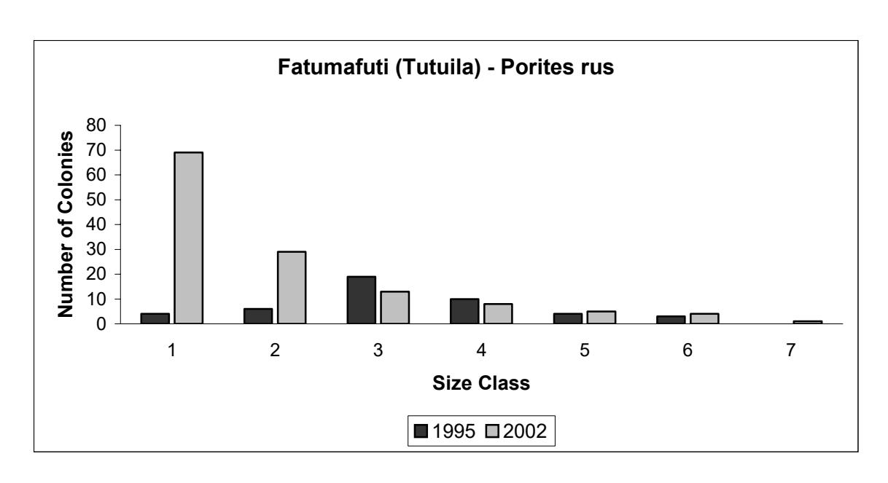

**Figure 27. Size class distribution of coral colonies of** *Porites rus* **at Fatumafuti from 1995 (N = 46) and 2002 (N = 129). Maximum diameter size class categories refer to the following : 1 = <=5 cm, 2 = >5 - <=10 cm, 3 = >10 - <=20 cm, 4 = >20 - <=40 cm, 5 = >40 - <=80 cm, 6 = >80 - <=160 cm, and 7 = >160cm.** 

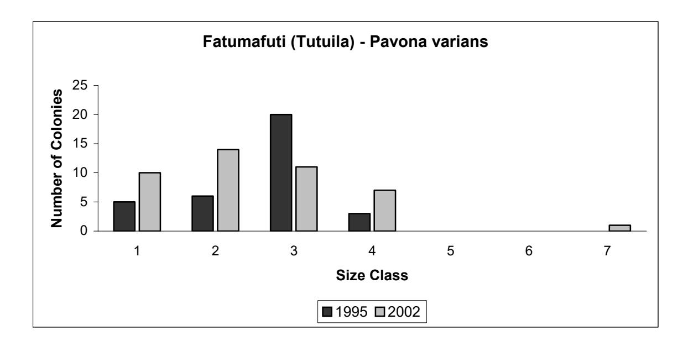

**Figure 28. Size class distribution of** *Pavona varians* **colonies for Fatumafuti from 1995 (N = 34) and 2002 (N = 43). Maximum diameter size class categories refer to the following : 1 = <=5 cm, 2 = >5 - <=10 cm, 3 = >10 - <=20 cm, 4 = >20 - <=40 cm, 5 = >40 - <=80 cm, 6 = >80 - <=160 cm, and 7 = >160 cm.** 

The coral community at this site has undergone significant dynamic changes between the two surveys. For example, in addition to the findings above, *Montipora grisea* was

relatively less abundant in 2002 compared to 1995 (Table 16, ranked 7 and 2, respectively), and there appears to be a difference in the relative abundance of a majority of highly ranked species between the two surveys. The strong shift in size class distributions (particularly the high recruitment of *P. rus*), higher colony densities, and an increase in species richness in 2002, indicate a strong change has occurred in the community.

#### **SUMMARY**

The pooled species size class patterns, species richness, colony density, show that a strong change has occurred in the dynamics of the coral community. Similarity between surveys in relative abundance was recorded for *Porites rus* and *Pavona varians*, though in the both cases, there was a significant shift in the size class distribution. Despite the change that has occurred at this site, there is also an encouraging increase in species richness.

#### Fagatele (Tutuila)

A higher colony count was recorded in 2002 (467 cols in 2002 cf 370 cols in 1995, Table 3), despite the sample area at Fagatele in 2002 being 30% of the area sampled in 1995 (Table 1). A higher density of corals was recorded in 2002 (31 cols/m²) compared to 1995 (7 cols/m², Table 3).

Table 17. Rank of top 10 most abundant species from the two surveys at Fagatele. Species rank from 1995 is compared to the rank of the same species in 2002. Highly ranked species from the 2002 survey which were not present in the top 10 ranked species in the 1995 survey are listed at the bottom of the 2002 species list. An asterisk\* shows ranks that were calculated from less than 10 colonies per species. FORM refers to the growth form of each species (ACC = Acropora corymbose, ACT = Acropora tabulate, B = branching, E = encrusting, M = massive, S = submassive).

| 1995                  | <b>FORM</b> | RANK | 2002                 | <b>FORM</b> | RANK |
|-----------------------|-------------|------|----------------------|-------------|------|
| Porites sp 2          | S           | 1    |                      |             |      |
| Montipora grisea      | Е           | 2    | Montipora grisea     | Е           | 2    |
| Pocillopora eydouxi   | В           | 3    | Pocillopora eydouxi  | В           | 8    |
| Pavona varians        | Е           | 4    | Pavona varians       | Е           | 5    |
| Pocillopora meandrina | В           | 4    |                      |             |      |
| Galaxea fascicularis  | Е           | 5*   | Galaxea fascicularis | Е           | 10   |
| Montipora danae       | Е           | 5*   |                      |             |      |
| Pavona venosa         | Е           | 5*   | Pavona venosa        | Е           | 6    |
| Porites rus           | S           | 5*   |                      |             |      |
| Stylocoeniella armata | Е           | 6*   |                      |             |      |
| Acropora hyacinthus   | ACT         | 7*   |                      |             |      |
| Montastraea curta     | M           | 7*   |                      |             |      |

| 1995                 | FORM | RANK | 2002                     |   | FORM RANK |
|----------------------|------|------|--------------------------|---|-----------|
| Acropora monticulosa | ACC  | 8*   |                          |   |           |
| Pavona maldivensis   | S    | 8*   |                          |   |           |
|                      |      |      | Montipora venosa         | E | 1         |
|                      |      |      | Montipora corbettensis   | E | 3         |
|                      |      |      | Porites cf horizontalata | S | 4         |
|                      |      |      | Porites vaughani         | M | 7         |
|                      |      |      | Montipora calcarea       | E | 8         |
|                      |      |      | Montipora efflorescens   | E | 8         |
|                      |      |      | Montipora floweri        | E | 9*        |
|                      |      |      | Montipora nodosa         | E | 9*        |
|                      |      |      | Pocillopora verrucosa    | B | 10*       |

The number of species recorded in 1995 was 28, which is less than the 46 species recorded in the 2002 survey. Table 17 shows a moderate degree of similarity among the top ten ranked species from the two surveys. However, the structure of the community is moderately similar between the two surveys with a mixture of encrusting, submassive and *Acropora* spp forms in 1995, but more encrusting *Montipora* spp and less branching *Pocillopora* spp in 2002. *Montipora* species appear to have increased in relative dominance between 1995 and 2002. Submassive *Porites* spp were relatively dominant in both surveys, however, the recorded species were different between surveys. Field identification differences may account for differences between *P.* cf *horizontalata* in 2002 and *P.* sp 2 in 1995 (Appendix 1).

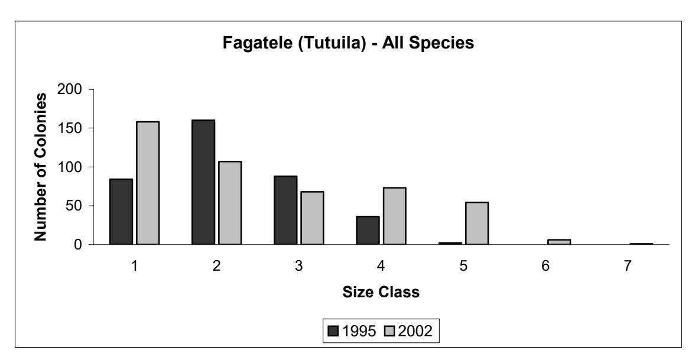

**Figure 29. Size class distribution of coral colonies of all species at Fagatele from 1995 (N = 370) and 2002 (N = 467). Maximum diameter size class categories refer to the following : 1 = <=5 cm, 2 = >5 - <=10 cm, 3 = >10 - <=20 cm, 4 = >20 - <=40 cm, 5 = >40 - <=80 cm, 6 = >80 - <=160 cm, and 7 = >160 cm.** 

The size frequency distribution of all species combined changed significantly between surveys with a more even spread of sizes among classes in 2002 and with a dominance of small sizes (<5 cm dia.; Figure 29; P<0.001, G = 107.3, df = 4). In contrast, the 1995 combined species sizes were dominated by the >5 cm to <10 cm diameter class.

The size frequency distribution of the relatively abundant *Montipora grisea* also changed significantly between surveys with a more even spread and generally larger colonies in 2002 from a dominance of smaller colonies (>5 cm to <20 cm dia.) in 1995 (Figure 30; P<0.001, G = 27.4, df = 2).

In contrast, if the submassive *Porites* species (*P.* sp 2 in 1995 and *P.* cf *horizontalata* in 2002) are pooled, there was not a significant difference in size class distributions between surveys (Figure 31; 0.25<P<0.5, G = 0.55, df = 1). The size class structure for a particular species would be expected to change if the same species was present in both surveys. This suggests that the field identifications were correct in both surveys and that there has been a shift from *Porites* sp 2 to *P.* cf *horizontalata* between the surveys.

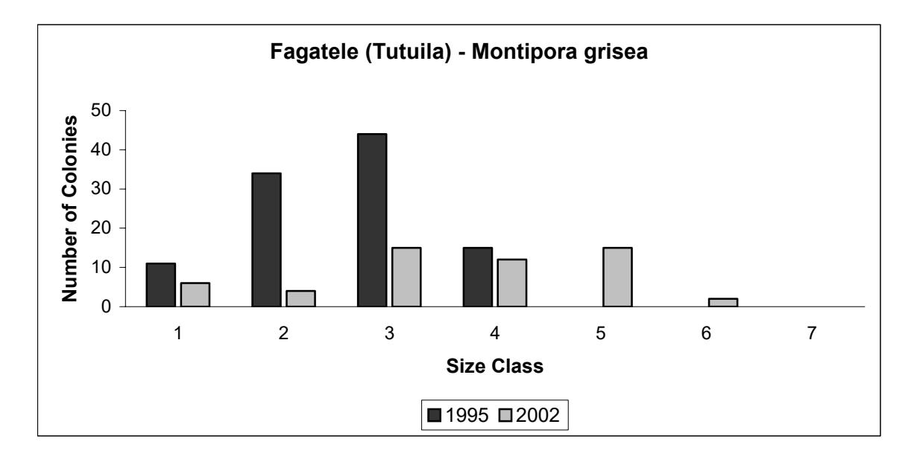

**Figure 30. Size class distribution of coral colonies of** *Montipora grisea* **at Fagatele from 1995 (N = 598) and 2002 (N = 511 ). Maximum diameter size class categories refer to the following : 1 = <=5 cm, 2 = >5 - <=10 cm, 3 = >10 - <=20 cm, 4 = >20 - <=40 cm, 5 = >40 - <=80 cm, 6 = >80 - <=160 cm, and 7 = >160 cm.** 

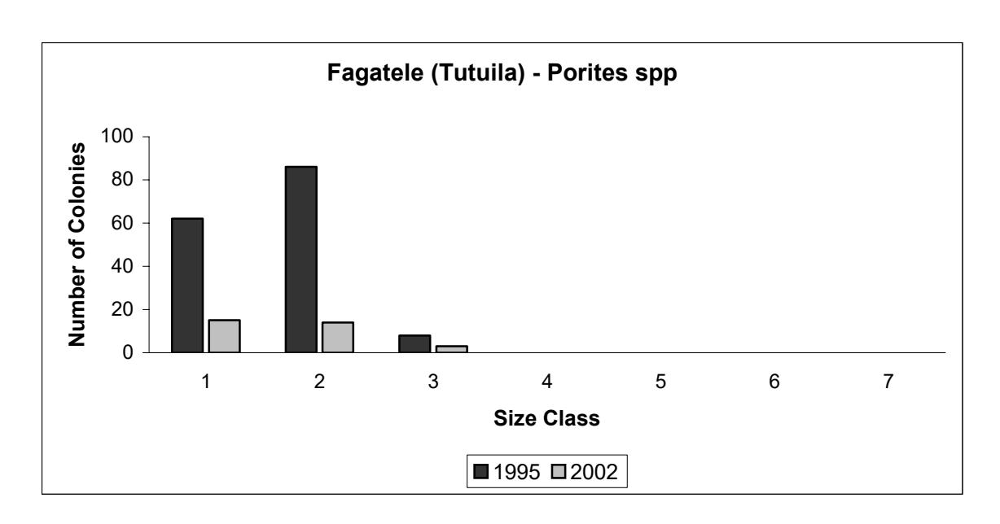

Figure 31. Size class distribution of coral colonies of *Porites* spp (submassive *P*. sp 2 in 1995 and *P*. cf *horizontalata*) at Fagatele from 1995 (N = 156) and 2002 (N = 32). Maximum diameter size class categories refer to the following: 1 = <=5 cm, 2 = >5 - <=10 cm, 3 = >10 - <=20 cm, 4 = >20 - <=40 cm, 5 = >40 - <=80 cm, 6 = >80 - <=160 cm, and 7 = >160 cm.

#### **SUMMARY**

The coral community at Fagatele has shown a large increase in colony density and species richness between the period of the two surveys. The community has continued to recover and grow with moderate species turnover. However, the structure of the community has remained similar between surveys with predominantly encrusting *Montipora* spp and submassive *Porites* spp present.

#### Leone (Tutuila)

Although the number of colonies recorded in both surveys at Leone was approximately the same (385 cols in 2002 compared to 383 cols in 1995), the density of corals was higher in 2002 (26 cols/m²) compared to 1995 (8 cols/m², Table 3).

The number of species recorded in 1995 was 32, which is more than the 26 species from the 2002 survey. The higher species richness in 1995 is probably a result of the greater sampling effort in 1995 where more relatively uncommon species would be recorded. Table 18 shows the top ten ranked species from the two surveys, where a moderate degree of similarity was recorded, due to the same relative dominance of the top 3-4 species in both surveys. *Porites sp 2* was not recorded in the 2002 survey, which could mean that there was a field identification difference with possibly *Porites lichen* and/or *Porites* of *horizontalata* (both of which were only recorded in 2002). The greatest degree

of difference is in the less abundant branching *Pocillopora* spp forms and *Acropora* spp present in 2002 compared to 1995 (Table 18; Appendix 1).

**Table 18. Rank of top 10 most abundant species from the two surveys at Leone. Species rank from 1995 is compared to the rank of the same species in 2002. Highly ranked species from the 2002 survey which are not present in the top 10 ranked species from the 1995 survey are listed at the bottom of the 2002 species list. FORM refers to the growth form of each species (E = encrusting, S = submassive, ACC = Acropora corymbose, B = branching).** 

| 1995                   | FORM | RANK | 2002                     | FORM RANK |    |
|------------------------|------|------|--------------------------|-----------|----|
| Montipora grisea       | E    | 1    | Montipora grisea         | E         | 1  |
| Porites sp2            | S    | 2    |                          |           |    |
| Acropora crateriformis | E    | 3    | Acropora crateriformis   | E         | 3  |
| Porites rus            | S    | 4    | Porites rus              | S         | 2  |
| Galaxea fascicularis   | E    | 5    | Galaxea fascicularis     | E         | 10 |
| Pavona varians         | E    | 6    | Pavona varians           | E         | 6  |
| Pocillopora eydouxi    | B    | 7    |                          |           |    |
| Acropora cerialis      | ACC  | 8    |                          |           |    |
| Pocillopora meandrina  | B    | 8    |                          |           |    |
| Pavona venosa          | E    | 9    |                          |           |    |
|                        |      |      | Montipora corbettensis   | E         | 3  |
|                        |      |      | Porites lichen           | S         | 4  |
|                        |      |      | Porites cf horizontalata | E         | 5  |
|                        |      |      | Montipora venosa         | E         | 7  |
|                        |      |      | Montipora calcarea       | E         | 8  |
|                        |      |      | Montipora informis       | E         | 9  |

The size class distribution at Leone for all species shows that a wide range of sizes were present in both surveys (Figure 32), with a difference in the dominant size class (>10 to <20 cm dia. in 1995, compared to >20 cm to <40 cm dia. in 2002). This difference in size class dominance was significant (P<0.001, G = 53.3, df = 4).

A more pronounced trend was recorded for the most relatively abundant *Montipora grisea* (Figure 33), where the size class distribution was significantly different between the two surveys (P<0.001, G = 20, df = 3). The change was to a more even spread of sizes in 2002 compared to the clear dominance of the >10 cm to <40 cm diameter colony sizes in 1995.

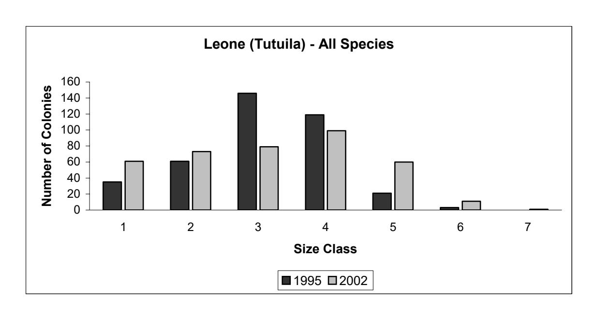

**Figure 32. Size class distribution of coral colonies all species combined at Leone from 1995 (N = 385) and 2002 (N = 383) surveys. Maximum diameter size class categories refer to the following : 1 = <=5 cm, 2 = >5 - <=10 cm, 3 = >10 - <=20 cm, 4 = >20 - <=40 cm, 5 = >40 - <=80 cm, 6 = >80 - <=160 cm, and 7 = >160 cm.** 

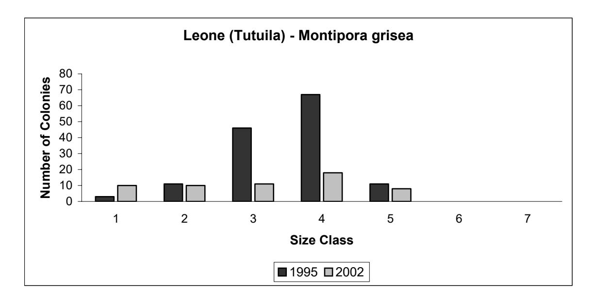

**Figure 33. Size class distribution of coral colonies of** *Montipora grisea* **at Leone from 1995 (N = 138) and 2002 (N = 57) surveys. Maximum diameter size class categories refer to the following : 1 = <=5 cm, 2 = >5 - <=10 cm, 3 = >10 - <=20 cm, 4 = >20 - <=40 cm, 5 = >40 - <=80 cm, 6 = >80 - <=160 cm, and 7 = >160 cm.** 

#### SUMMARY

The coral community at Leone appears to have undergone a reduction in abundance of branching and corymbose growth forms. This has occurred without a reduction in the most relatively dominant encrusting and submassive forms that typically have lower relief with respect to the substrate. This suggests that a physical disturbance may have occurred in the bay that was selective towards the higher relief branching forms and not the encrusting lower relief forms. In other aspects, the coral community is essentially the same as 1995 with recruitment occurring, along with a shift towards larger sizes by 2002.

#### OFU ISLAND (MANU'A GROUP)

#### Asaga (Ofu)

The density of corals at Asaga was higher in 2002 (40 cols/m²) compared to 1995 (14 cols/m², Table 3), despite the fifty percent reduction in sample area (50m² in 1995, compared to 25m² in 2002, Table 1).

The number of species recorded in 1995 was 51, which is less than the 57 species from the 2002 survey. There was a moderately similar structure and composition to the coral community at both surveys with a dominance of encrusting and massive growth forms but with species turnover occurring within these growth forms (Table 19).

Table 19. Rank of the top 10 most abundant species from the two surveys at Asaga. Species rank from 1995 is compared to the rank of the same species in 2002. Highly ranked species from the 2002 survey which are not present in the top 10 ranked species from the 1995 survey are listed at the bottom of the 2002 species list. FORM refers to the growth form of each species (E = encrusting, B = branching, M = massive).

| 1995                   | FORM | RANK | 2002                   | <b>FORM</b> | RANK |
|------------------------|------|------|------------------------|-------------|------|
| Montipora grisea       | Е    | 1    | Montipora grisea       | Е           | 1    |
| Montipora monasteriata | Е    | 2    |                        |             |      |
| Galaxea fascicularis   | Е    | 3    | Galaxea fascicularis   | Е           | 10   |
| Montastraea curta      | M    | 4    | Montastraea curta      | M           | 3    |
| Pocillopora eydouxi    | В    | 5    |                        |             |      |
| Goniastrea edwardsi    | M    | 6    | Goniastrea edwardsi    | M           | 6    |
| Montipora hoffmeisteri | Е    | 7    |                        |             |      |
| Leptoria phrygia       | M    | 8    | Leptoria phrygia       | M           | 10   |
| Goniastrea pectinata   | M    | 9    |                        |             |      |
| Leptastrea purpurea    | Е    | 10   |                        |             |      |
|                        |      |      | Montipora efflorescens | Е           | 2    |
|                        |      |      | Montipora nodosa       | Е           | 4    |
|                        |      |      | Goniastrea retiformis  | M           | 5    |

| 1995 | FORM | RANK | 2002                   | FORM RANK |    |
|------|------|------|------------------------|-----------|----|
|      |      |      | Montipora hoffmeisteri | E         | 6  |
|      |      |      | Porites cf lutea       | M         | 7  |
|      |      |      | Montipora verrucosa    | E         | 8  |
|      |      |      | Favia matthaii         | M         | 9  |
|      |      |      | Pavona varians         | E         | 9  |
|      |      |      | Psammocora haimeana    | E         | 10 |

Table 19 shows the top ten ranked species from the two surveys, where a moderate degree of similarity was recorded. A higher number of *Montipora* spp were recorded in 2002, which may be a reflection of the researcher's ability to separate similar species due to relatively larger colony sizes. Alternatively, there may be a compositional change due to crown-of-thorns (*Acanthaster planci*, COTS) predation that most likely occurred at this site over the previous few years (pers.obs.). However, the structure of the coral communities was similar in both surveys with a co-dominance of encrusting and massive forms present. Additional support for this interpretation of past disturbance is the very low abundance of *Acropora* spp in 2002 (6 colonies in total) compared to 1995 (66 colonies, Appendix 1).

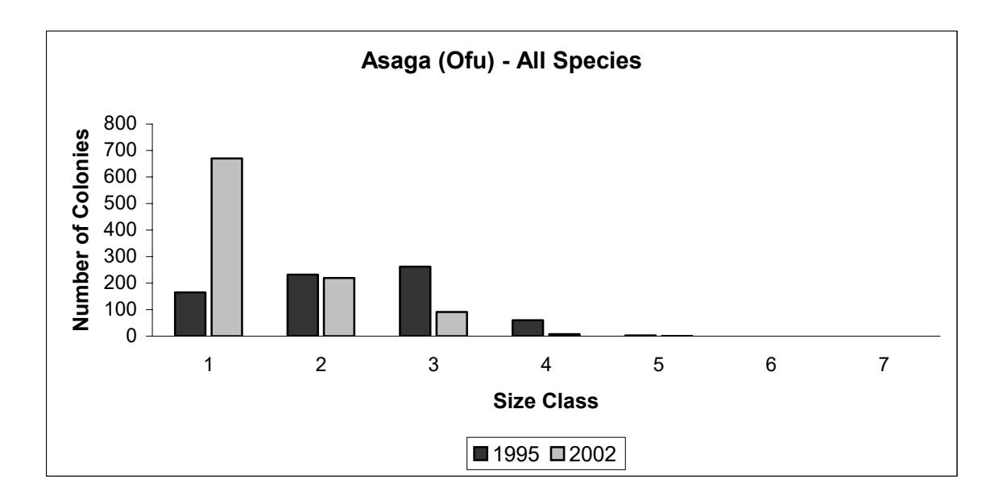

**Figure 34. Size class distribution of coral colonies of all species at Asaga from 1995 (N = 722) and 2002 (N = 989) surveys. Maximum diameter size class categories refer to the following : 1 = <=5 cm, 2 = >5 - <=10 cm, 3 = >10 - <=20 cm, 4 = >20 - <=40 cm, 5 = >40 - <=80 cm, 6 = >80 - <=160 cm, and 7 = >160 cm.** 

The size frequency of all species colonies shows a significant change between the two surveys (Figure 34; P<0.001, G = 418, df = 3). In 1995, there was an abundance of colonies of sizes up to <20 cm diameter, with a dominance of colonies in the >10 cm to <20cm diameter size range. In contrast, the dominant colony size in 2002 was <5 cm diameter.

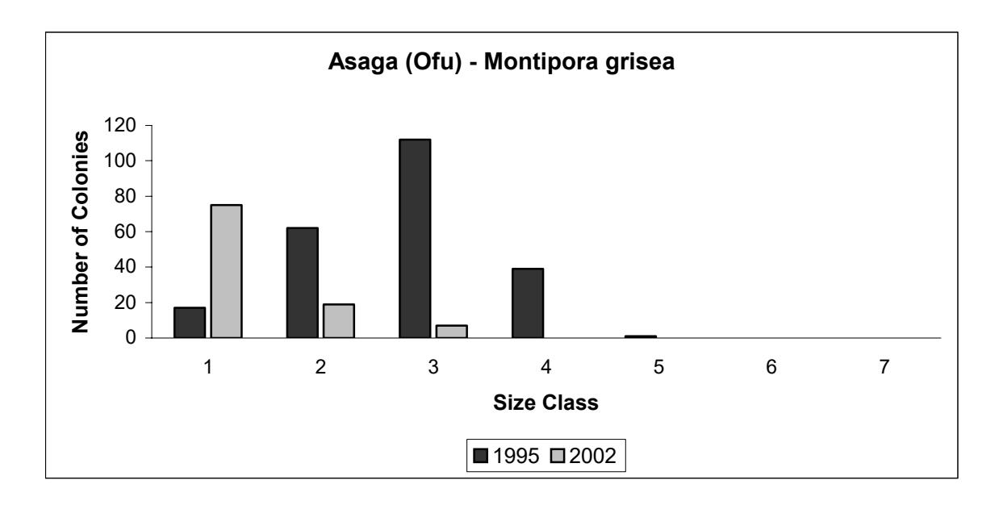

**Figure 35. Size class distribution of coral colonies of** *Montipora grisea* **at Asaga from 1995 (N = 231) and 2002 (N = 101) surveys. Maximum diameter size class categories refer to the following : 1 = <=5 cm, 2 = >5 - <=10 cm, 3 = >10 - <=20 cm, 4 = >20 - <=40 cm, 5 = >40 - <=80 cm, 6 = >80 - <=160 cm, and 7 = >160 cm.** 

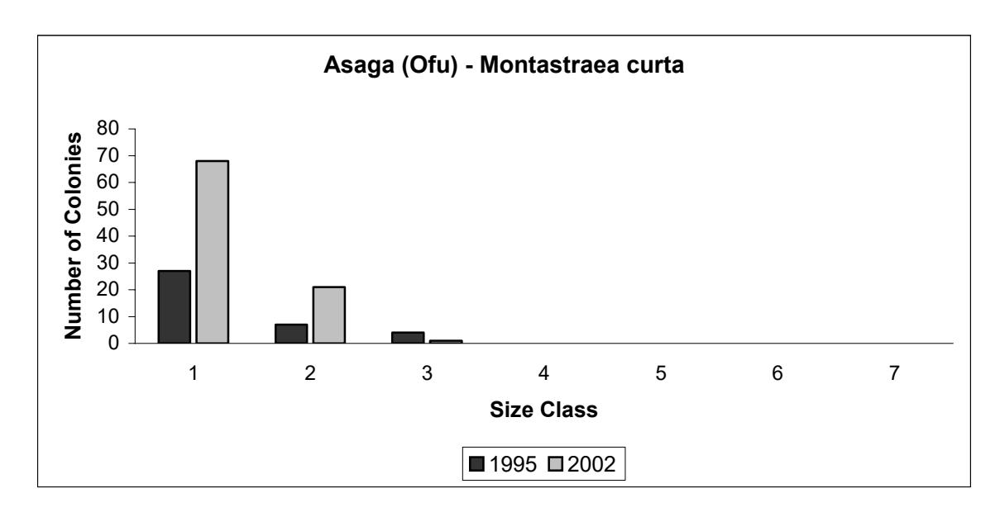

**Figure 36. Size class distribution of coral colonies of** *Montastraea curta* **at Asaga from 1995 (N = 38) and 2002 (N = 90) surveys. Maximum diameter size class categories refer to the following : 1 = <=5 cm, 2 = >5 - <=10 cm, 3 = >10 - <=20 cm, 4 = >20 - <=40 cm, 5 = >40 - <=80 cm, 6 = >80 - <=160 cm, and 7 = >160 cm.** 

The size frequency patterns for the most relatively abundant species, *Montipora grisea*, are almost identical to the combined species pattern with a significant change to smaller colonies in 2002 (Figure 35; P<0.001, G = 174.3, df = 2). This was a typical pattern for the majority of species recorded in both surveys (Appendix 1).

There were exceptions to the general pattern of change, for example, *Montastraea curta* did not show any significant change in colony size distributions between the two surveys (Figure 36, 0.5 < P < 0.75, G = 0.3, df = 1). Most colonies of *M. curta* exhibited signs of partial death and (frequently) fragmentation, which resulted in a similar size class distribution in both surveys. Partial death and fragmentation may have been due to either the effect of bleaching on this susceptible coral species and/or COTS partial feeding effects.

#### **SUMMARY**

Significant change has occurred at this site with a reduction in size of most colonies. The density of colonies has increased between 1995 and 2002, though there is a similar species composition present. Many species present in 2002 were fragments and were predominantly of species that can survive and re-grow from fragments (ie, encrusting and massive forms). Fragmentation is a common feature in these forms that have been subjected to COTS predation. There was a noticeable decline in the presence of *Acropora* spp, which is the preferred food of COTS, and although there were some A*cropora* spp colonies present in shallower water (<5 m depth, pers.obs.) this genus was noticeably absent from the survey depth range of 10 m depth. These conclusions support the field interpretation in 2002 that a major disturbance from COTS predation has affected the coral community at this site.

#### OLOSEGA ISLAND (MANU'A GROUP)

#### Sili (Olosega)

The total number of colonies recorded in 2002 (600 cols) is less than the number from 1995 (1054 cols). This reduction in number of colonies is partially due to the smaller sample area in 2002 (Table 1). Nonetheless, the density of corals at Sili (Olosega) was marginally higher in 2002 (24 cols/m²) compared to 1995 (21 cols/m², Table 3).

The number of species recorded in 1995 was 55, which is more than the 48 species recorded in the 2002 survey. Table 20 shows the top ten ranked species from the two surveys, where a high degree of similarity was recorded. The largest difference between the surveys was in the relative abundance and rank of two *Goniastrea* spp which may be a result of differences in field identification between the surveys, though this is not likely as *G. retiformis* is a very distinctive species in the field. The other major change was in the relatively higher abundance of *Porites rus* in 2002 compared to 1995. This may be due to growth and possibly recruitment of this species during the period between surveys

or may be because of a difference in placement of the transects between surveys. The latter reason is unlikely as the site is clearly defined in a position between two large bays in the reef perimeter.

**Table 20. Rank of the top 10 most abundant species from the two surveys at Sili. Species rank from 1995 is compared to the rank of the same species in 2002. Highly ranked species from the 2002 survey which are not present in the top 10 ranked species from the 1995 survey are listed at the bottom of the 2002 species list. FORM refers to the growth form of each species (ACC =** *Acropora* **corymbose, E = encrusting, M = massive, S = submassive).** 

| 1995                   | FORM | RANK | 2002                  |   | FORM RANK |
|------------------------|------|------|-----------------------|---|-----------|
| Montipora grisea       | E    | 1    | Montipora grisea      | E | 4         |
| Galaxea fascicularis   | E    | 2    | Galaxea fascicularis  | E | 2         |
| Goniastrea edwardsi    | M    | 3    | Goniastrea edwardsi   | M | 10        |
| Leptoria phrygia       | M    | 4    | Leptoria phrygia      | M | 8         |
| Pavona varians         | E    | 5    | Pavona varians        | E | 6         |
| Favia stelligera       | M    | 6    | Favia stelligera      | M | 9         |
| Montastraea curta      | M    | 6    | Montastraea curta     | M | 5         |
| Goniastrea pectinata   | M    | 7    |                       |   |           |
| Montipora monasteriata | E    | 7    |                       |   |           |
| Goniastrea retiformis  | M    | 8    | Goniastrea retiformis | M | 3         |
| Acropora nasuta        | ACC  | 9    |                       |   |           |
| Montipora informis     | E    | 10   |                       |   |           |
|                        |      |      | Porites rus           | S | 1         |
|                        |      |      | Psammocora haimeana   | E | 6         |
|                        |      |      | Goniastrea favulus    | M | 7         |
|                        |      |      | Montipora nodosa      | E | 10        |
|                        |      |      | Platygyra daedalea    | M | 10        |

The effect of recent COTS predation (pers.obs.) was evident at this site though the community structure remained approximately the same. *Acropora* spp is a preferred species of COTS and there has been a reduction in the presence of this genus from 11 in 1995 to 2 in 2002 (Appendix 1). It therefore appears that the impact of COTS was predominantly in a reduction of *Acropora* spp present, and a change in relative abundance of a few species.

However, there was a significant change in size frequency distribution of all species in Sili between 1995 and 2002 (Figure 37: P<0.001, G = 242, df =4). The change was clearly towards more smaller sizes in 2002 from a dominance of >10 cm to <20 cm diameter colonies in 1995.

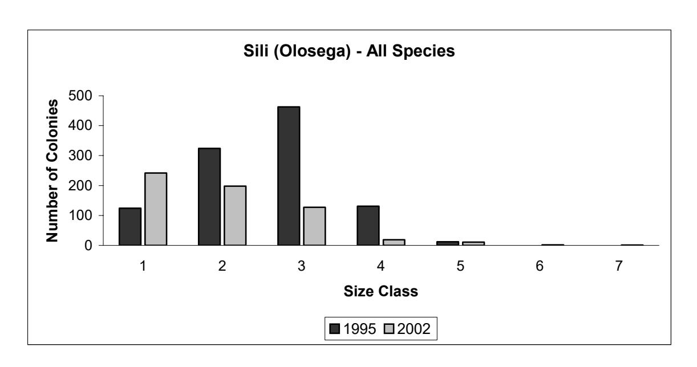

**Figure 37. Size class distribution of coral colonies of all species at Sili from 1995 (N = 1054) and 2002 (N = 600) surveys. Maximum diameter size class categories refer to the following : 1 = <=5 cm, 2 = >5 - <=10 cm, 3 = >10 - <=20 cm, 4 = >20 - <=40 cm, 5 = >40 - <=80 cm, 6 = >80 - <=160 cm, and 7 = >160 cm.** 

The relatively high abundant species, *Galaxea fascicularis*, did not show a significant change in size frequency distribution between the two surveys (Figure 38; 0.25<P<0.5, G = 0.49, df = 1).

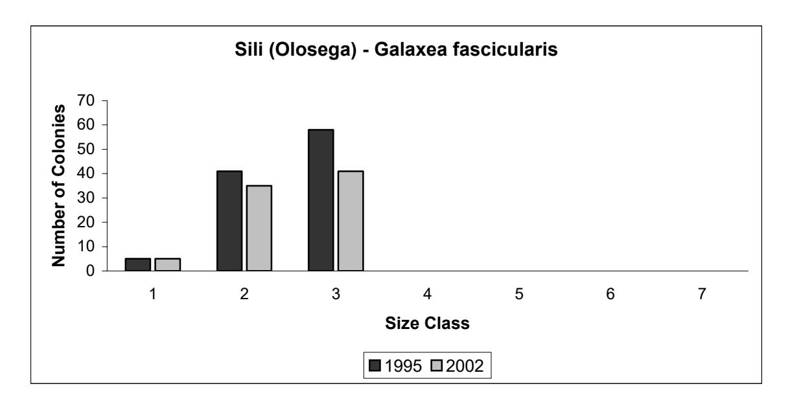

**Figure 38. Size class distribution of coral colonies of** *Galaxea fascicularis* **at Sili from 1995 (N = 104) and 2002 (N = 81) surveys. Maximum diameter size class categories refer to the following : 1 = <=5 cm, 2 = >5 - <=10 cm, 3 = >10 - <=20 cm, 4 = >20 - <=40 cm, 5 = >40 - <=80 cm, 6 = >80 - <=160 cm, and 7 = >160 cm.** 

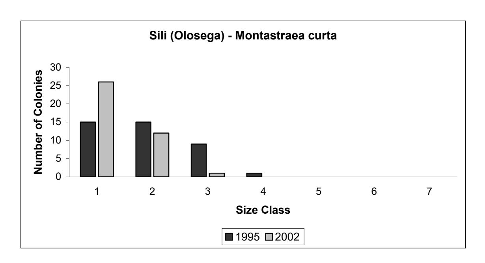

**Figure 39. Size class distribution of coral colonies of** *Montastraea curta* **at Sili from 1995 (N = 40) and 2002 (N = 39) surveys. Maximum diameter size class categories refer to the following : 1 = <=5 cm, 2 = >5 - <=10 cm, 3 = >10 - <=20 cm, 4 = >20 - <=40 cm, 5 = >40 - <=80 cm, 6 = >80 - <=160 cm, and 7 = >160 cm.** 

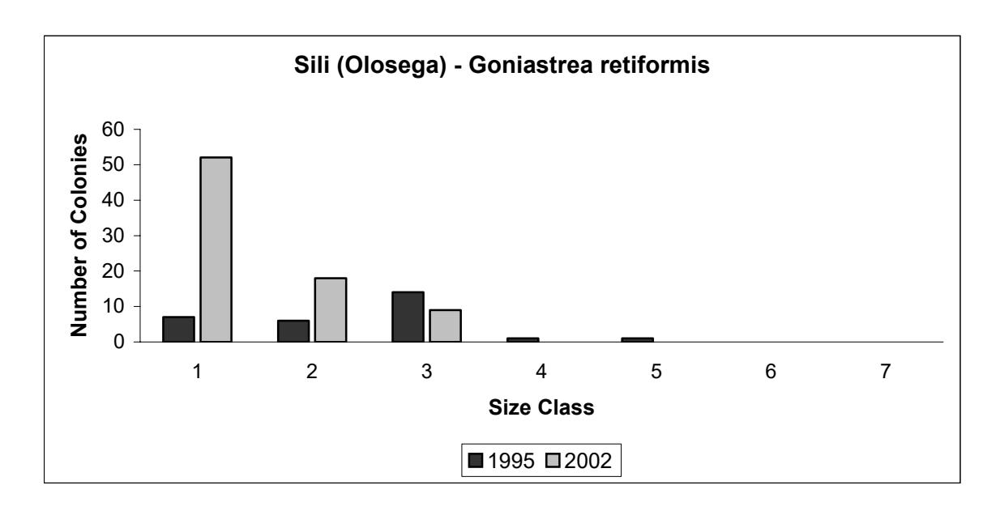

**Figure 40. Size class distribution of coral colonies of** *Goniastrea retiformis* **at Sili from 1995 (N = 29) and 2002 (N = 79) surveys. Maximum diameter size class categories refer to the following : 1 = <=5 cm, 2 = >5 - <=10 cm, 3 = >10 - <=20 cm, 4 = >20 - <=40 cm, 5 = >40 - <=80 cm, 6 = >80 - <=160 cm, and 7 = >160 cm.** 

The size frequency distribution for *Montastraea curta* colonies also showed a significant change between 1995 and 2002 (Figure 39; P<0.001, G = 6.8, df = 1). The change in size structure of the species was towards smaller colonies in 2002 (particularly the smallest size, <5 cm dia.) from generally small colonies but with a more even spread of sizes among the <5 cm to <20 cm diameter range in 1995.

The size frequency distribution for G. retiformis showed a significant change with smaller colony sizes in 2002 (dominance of <5 cm diameter colonies) compared to 1995 where the sizes were more evenly distributed (Figure 40; P<0.001, G = 15.3, df = 1).

#### **SUMMARY**

The coral community at Sili in 2002 was similar to the composition and density of colonies in 1995 with some noticeable exceptions. There were fewer *Acropora* spp colonies in the transects in 2002 which possibly would account for the reduction in species richness in 2002, though the sample area was half of that used in 1995 which would result in fewer species being recorded. There was also a reduction in colony size overall and among some of the most highly ranked species. Field observations are supported by the data from 2002 of the Sili site that shows there has been signs of impact from COTS feeding. These conclusions support the field interpretation in 2002 that a major disturbance from COTS predation has affected the coral community at this site.

#### Olosega Village (Olosega)

A higher number of colonies was recorded at Olosega in 2002 (912 cols) compared to 1995 (800 cols), despite the reduced sampling effort (Table 1). The density of corals was higher in 2002 (36 cols/m<sup>2</sup>) compared to 1995 (16 cols/m<sup>2</sup>, Table 3).

Table 21. Rank of the top 10 most abundant species from the two surveys at Olosega Village. Species rank from 1995 is compared to the rank of the same species in 2002. Highly ranked species from the 2002 survey which are not present in the top 10 ranked species from the 1995 survey are listed at the bottom of the 2002 species list. FORM refers to the growth form of each species (E = encrusting, M = massive, S = submassive).

| 1995                   | FORM | RANK | 2002                  | FORM | RANK |
|------------------------|------|------|-----------------------|------|------|
| Goniastrea edwardsi    | M    | 1    |                       |      |      |
| Montipora grisea       | Е    | 2    | Montipora grisea      | Е    | 1    |
| Galaxea fascicularis   | Е    | 3    |                       |      |      |
| Montastraea curta      | M    | 4    | Montastraea curta     | M    | 3    |
| Leptoria phrygia       | M    | 5    |                       |      |      |
| Porites rus            | S    | 6    |                       |      |      |
| Goniastrea retiformis  | M    | 7    | Goniastrea retiformis | M    | 6    |
| Turbinaria reniformis  | F    | 7    |                       |      |      |
| Montipora monasteriata | Е    | 8    |                       |      |      |

| 1995             | FORM | RANK | 2002                     | FORM RANK |    |
|------------------|------|------|--------------------------|-----------|----|
| Pavona varians   | E    | 9    |                          |           |    |
| Favia stelligera | M    | 10   |                          |           |    |
|                  |      |      | Montipora nodosa         | E         | 2  |
|                  |      |      | Psammocora haimeana      | E         | 4  |
|                  |      |      | Montipora efflorescens   | E         | 5  |
|                  |      |      | Galaxea fascicularis     | E         | 7  |
|                  |      |      | Montipora caliculata     | E         | 8  |
|                  |      |      | Leptastrea purpurea      | E         | 9  |
|                  |      |      | Astreopora myriophthalma | M         | 10 |

The number of species recorded in 1995 was 51, which is less than the 63 species from the 2002 survey. Table 21 shows the top ten ranked species from the two surveys, where a low degree of similarity was recorded. The largest discrepancy between the surveys was in the reduction in massive species in 2002 in favour of encrusting species (especially *Montipora* spp). This change in community structure was most likely due to the effects of recent COTS predation (pers.obs.). *Acropora* spp is a preferred species of COTS and there has been a reduction in the presence of this genus from 25 in 1995 to 7 in 2002 (most of the colonies in 2002 were juvenile *Acropora* spp compared to 1995 where approximately 20% of colonies were juveniles, Appendix 1).

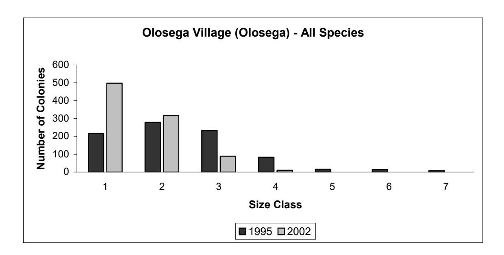

**Figure 41. Size class distribution of coral colonies of all species at Olosega Village from 1995 (N = 800) and 2002 (N = 912) surveys. Maximum diameter size class categories refer to the following : 1 = <=5 cm, 2 = >5 - <=10 cm, 3 = >10 - <=20 cm, 4 = >20 - <=40 cm, 5 = >40 - <=80 cm, 6 = >80 - <=160 cm, and 7 = >160 cm.** 

The size frequency of all species colonies shows a significant change between the two surveys (Figure 41; P<0.001, G = 220, df = 3). In 1995, there was an abundance of

colonies of sizes up to <20 cm diameter, with a dominance of colonies in the >5 cm to <10 cm diameter size range. In contrast, the dominant colony size in 2002 was <5 cm diameter (Figure 41).

The size frequency patterns for the highly relatively abundant species, *Montipora grisea*, are almost identical to the combined species pattern, with a significant change to smaller colonies in 2002 (Figure 42; P<0.001, G = 52, df = 3). This was a typical pattern for the majority of species recorded in both surveys (Appendix 1).

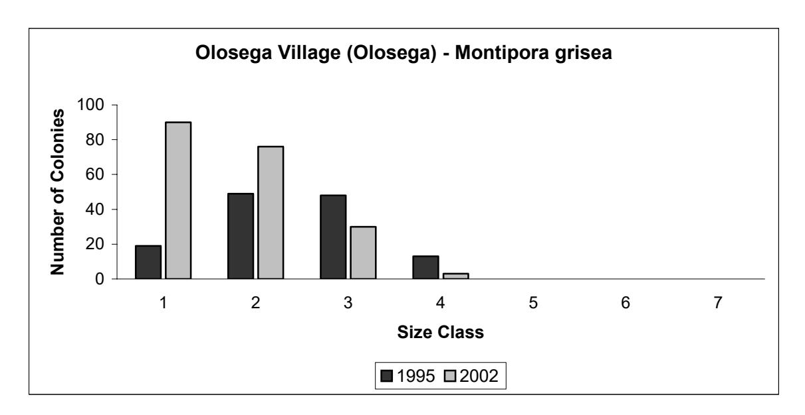

**Figure 42. Size class distribution of coral colonies of** *Montipora grisea* **at Olosega Village from 1995 (N = 129) and 2002 (N = 199) surveys. Maximum diameter size class categories refer to the following : 1 = <=5 cm, 2 = >5 - <=10 cm, 3 = >10 - <=20 cm, 4 = >20 - <=40 cm, 5 = >40 - <=80 cm, 6 = >80 - <=160 cm, and 7 = >160 cm.** 

The size frequency patterns for the more relatively abundant species, *Montastraea curta*, were significantly different in 2002 (Figure 43, 0.005<P<0.01, G = 9.96, df = 2). The change was similar to the size structure of majority of species present in 2002, that is, a shift from larger to a dominance of smaller size colonies (<5 cm diameter).

The size frequency patterns for the relatively moderate abundant species, *Goniastrea retiformis*, are almost identical to the combined species pattern and other high abundant species, with a significant change to smaller colonies in 2002 (Figure 44; P<0.001, G = 31, df = 2).

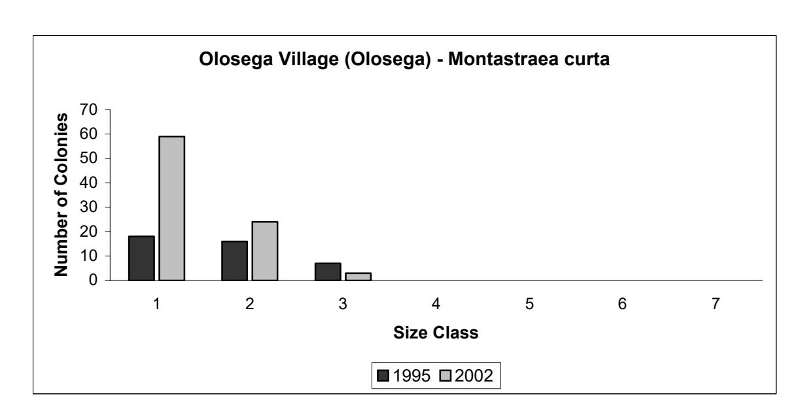

**Figure 43. Size class distribution of coral colonies of** *Montastraea curta* **at Olosega Village from 1995 (N = 41) and 2002 (N = 86) surveys. Maximum diameter size class categories refer to the following : 1 = <=5 cm, 2 = >5 - <=10 cm, 3 = >10 - <=20 cm, 4 = >20 - <=40 cm, 5 = >40 - <=80 cm, 6 = >80 - <=160 cm, and 7 = >160 cm.** 

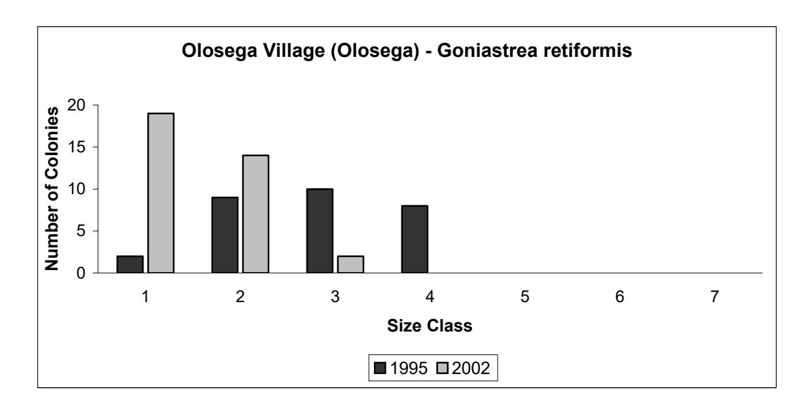

**Figure 44. Size class distribution of coral colonies of** *Goniastrea retiformis* **at Olosega Village from 1995 (N = 29) and 2002 (N = 35) surveys. Maximum diameter size class categories refer to the following : 1 = <=5 cm, 2 = >5 - <=10 cm, 3 = >10 - <=20 cm, 4 = >20 - <=40 cm, 5 = >40 - <=80 cm, 6 = >80 - <=160 cm, and 7 = >160 cm.** 

## **SUMMARY**

Significant change has occurred at this site predominantly as a result of a reduction in size of most colonies between surveys. The density of colonies has increased between 1995 and 2002, and the species composition of the most relatively abundant species has changed from encrusting and massive forms to mostly encrusting forms. Many species present in 2002 were fragments of former larger colonies and were predominantly of species that can survive and re-grow from fragments (ie, encrusting and massive forms). Fragmentation is a common feature in these forms that have been subjected to COTS predation. There was a noticeable decline in the presence of *Acropora* spp, which is the preferred food of COTS. The high number of small colonies is evidence that active coral recruitment is occurring. However, a large number of small colonies are clearly fragments as well. These conclusions support the field interpretation in 2002 that a major disturbance from COTS predation has affected the coral community at this site.

## **OFU ISLAND (MANU'A GROUP)**

## **Hurricane House (Ofu)**

This is an additional site to the original baseline sites established by Mundy (1996) that was established to obtain additional data from a southern exposure habitat. It was also chosen because it is part of the Ofu Marine National Park and it was thought that the data would complement the extensive work that has been conducted in the adjacent lagoon. The density of colonies at Hurricane was 38 cols/m2 , with 73 species making up the sample.

**Table 22. Rank of the top 10 most abundant species from the 2002 survey at Hurricane (Ofu). Species rank for the top ten species is shown for 2002 data only as this site is a new monitoring site. FORM refers to the growth form of each species (B = branching, E = encrusting, M = massive, S = submassive).** 

| 2002                  | FORM | RANK |
|-----------------------|------|------|
| Montipora grisea      | E    | 1    |
| Goniastrea retiformis | M    | 2    |
| Montastraea curta     | M    | 3    |
| Montipora nodosa      | E    | 4    |
| Pocillopora verrucosa | B    | 5    |
| Montipora foveolata   | E    | 6    |
| Psammocora haimeana   | E    | 7    |
| Leptoria phrygia      | M    | 8    |
| Pavona varians        | E    | 9    |
| Porites sp. 2         | S    | 10   |

The structure of the coral community is predominantly encrusting forms, with fewer massive and other forms such as branching and submassive species (Table 22). There was field evidence of impacts of COTS feeding at this site, which is similar to other sites at Ofu and Olosega Islands (pers.obs.).

The combined species size distribution shows a clear pattern of dominance of small colonies (particularly of the <5cm to <10cm diameter sizes, Figure 45). The highest three most relatively abundant species (*Montipora grisea*, *Goniastrea retiformis*, and *Montastraea curta*), displayed contrasting size frequency distribution patterns (Figure 46). *M. grisea* and *G. retiformis* did not have significantly different size distribution patterns with both species showing a dominance of smaller colonies in the <10 cm diameter range (0.10<P<0.25, G = 4.3, df = 3). However, comparisons of colony sizes between *M. grisea* and *M. curta* and between *G. retiformis* and *M. curta*, show significant differences (0.01<P<0.025, G = 7.8, df =2; and P<0.001, G = 35, df = 2; respectively).

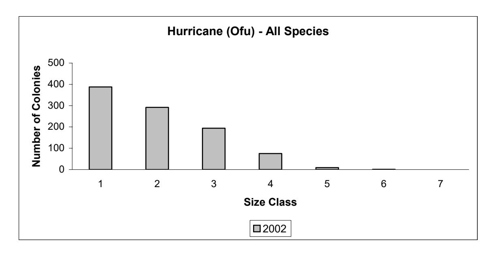

**Figure 45. Size class distribution of all species at Hurricane from the 2002 survey (N = 959). Maximum diameter size class categories refer to the following : 1 = <=5 cm, 2 = >5 - <=10 cm, 3 = >10 - <=20 cm, 4 = >20 - <=40 cm, 5 = >40 - <=80 cm, 6 = >80 - <=160 cm, and 7 = >160 cm.** 

A comparison of the next three most relatively abundant species from Table 22 (*Montipora nodosa*, *Pocillopora verrucosa*, *and Montipora foveolata*) also showed contrasting patterns. *M. nodosa* and *P. verrucosa* had approximately similar dominance of the smallest colony class (<5cm dia.) but *M. foveolata* was dominated by a larger colony size class (>5cm to <10cm diameter (Figure 47). Multiple comparisons of these three species showed a significant difference only between *P. verrucosa* and *M. foveolata* (0.001<P<0.005, G =9.54, df = 1). A comparison of colony sizes of *M. nodosa* with *P. verrucosa*, and of *M. nodosa* with *M. foveolata* did not show any significantly difference (0.05<P<0.10, G = 5.9, df = 2; 0.25<P<0.5, G = 1.94, df = 2, respectively).

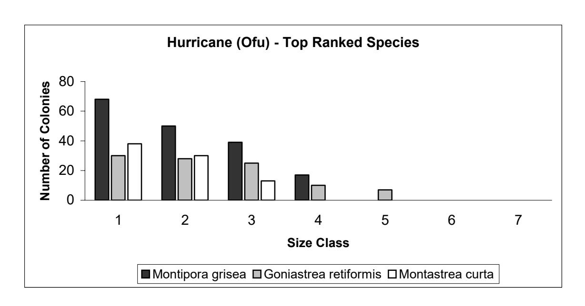

**Figure 46. Size class distribution of the top three ranked species (***Montipora grisea* **(N = 174;** *Goniastrea retiformis* **(N = 100); and** *Montastraea curta* **(N = 81) at Hurricane from the 2002 survey. Maximum diameter size class categories refer to the following : 1 = <=5 cm, 2 = >5 - <=10 cm, 3 = >10 - <=20 cm, 4 = >20 - <=40 cm, 5 = >40 - <=80 cm, 6 = >80 - <=160 cm, and 7 = >160 cm.** 

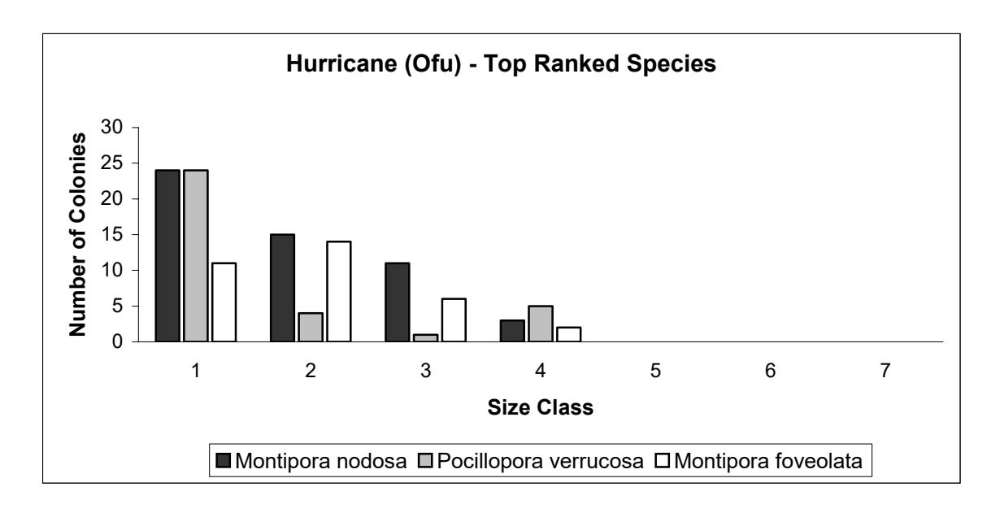

**Figure 47. Size frequency distribution of three relatively abundant species (***Montipora nodosa* **(N = 53),** *Pocillopora verrucosa* **(N = 34), and** *Montipora foveolata* **(N = 33) at Hurricane from 2002 only. Maximum diameter size class categories refer to the following : 1 = <=5 cm, 2 = >5 - <=10 cm, 3 = >10 - <=20 cm, 4 = >20 - <=40 cm, 5 = >40 - <=80 cm, 6 = >80 - <=160 cm, and 7 = >160 cm.** 

#### **SUMMARY**

This site recorded one of the highest species richness of all sites in American Samoa in 2002, and colony density was also relatively high compared to most other sites. From field observations of fragmentation and dead standing colonies, there appeared to be evidence of impacts from COTS feeding activity that was supported by the presence of a dominance of the smallest size classes in some species. The presence of dominant encrusting and massive growth forms and the interpretation of COTS impacts on the coral community are similar to conclusions from other sites on Ofu and Olosega.

#### Ofu Village (Ofu)

The number of colonies recorded in identical sample areas at Ofu Village (Table 2) was higher in 2002 (457 cols) compared to 1995 (261 cols). The density of corals was higher in 2002 (9 cols/m²) compared to 1995 (5 cols/m², Table 3).

The number of species recorded in 1995 was 31, which is less than the 41 species from the 2002 survey, with the same sample area for both surveys (Table 1). Table 23 shows the top ten ranked species from the two surveys, where a moderate to high degree of similarity was recorded. However, there was a large shift in relative abundance of species between the two surveys. Also it is important to note that species ranked greater than 5 in 1995 had less than 10 individual colonies recorded, whereas *Montipora grisea* and *Stylocoeniella armata* were the only species in 2002 to have less than 10 colonies (10 and 9 cols., respectively).

Table 23. Rank of the top 10 most abundant species from the two surveys at Ofu Village. Species rank from 1995 is compared to the rank of the same species in 2002. High ranked species from 2002 not present in the top 10 ranked species from the 1995 survey are listed at the bottom of the 2002 species list. The asterisk\* denotes ranks that were calculated from less than 10 colonies per species. FORM refers to the growth form of each species (ACB = Acropora branching, E = encrusting, F = foliose, FL = foliose, M = massive).

| 1995                    | FORM | RANK | 2002                    | FORM | RANK |
|-------------------------|------|------|-------------------------|------|------|
| Acropora crateriformis  | Е    | 1    | Acropora crateriformis  | Е    | 1    |
| Montipora grisea        | Е    | 2    | Montipora grisea        | Е    | 9*   |
| Echinopora hirsutissima | F    | 3    | Echinopora hirsutissima | F    | 2    |
| Leptoria phrygia        | M    | 4    | Leptoria phrygia        | M    | 8    |
| Echinopora horrida      | F    | 5    |                         |      |      |
| Favia stelligera        | M    | 5    |                         |      |      |
| Galaxea fascicularis    | Е    | 5    | Galaxea fascicularis    | Е    | 4    |
| Favia matthaii          | M    | 6*   |                         |      |      |
| Goniastrea retiformis   | M    | 6*   | Goniastrea retiformis   | M    | 8    |
| Pavona varians          | Е    | 6*   |                         |      |      |
| Millepora exaesa        | M    | 7*   |                         |      |      |

| 1995                     | FORM | RANK | 2002                  |   | FORM RANK |
|--------------------------|------|------|-----------------------|---|-----------|
| Platygyra daedalea       | M    | 7*   |                       |   |           |
| Montastraea curta        | M    | 8*   | Montastraea curta     | M | 7         |
| Montipora hoffmeisteri   | E    | 8*   |                       |   |           |
| Porites spp              | M    | 8*   |                       |   |           |
| Acropora samoensis       | ACB  | 9*   |                       |   |           |
| Favites halicora         | M    | 9*   |                       |   |           |
| Favites russelli         | M    | 9*   |                       |   |           |
| Fungia spp               | FL   | 9*   |                       |   |           |
| Psammocora haimeana      | E    | 9*   |                       |   |           |
| Psammocora profundacella | E    | 9*   |                       |   |           |
| Acanthastrea echinata    | M    | 10*  |                       |   |           |
|                          |      |      | Echinopora lamellosa  | F | 3         |
|                          |      |      | Galaxea astreata      | E | 5         |
|                          |      |      | Merulina ampliata     | F | 6         |
|                          |      |      | Stylocoeniella armata | E | 10*       |

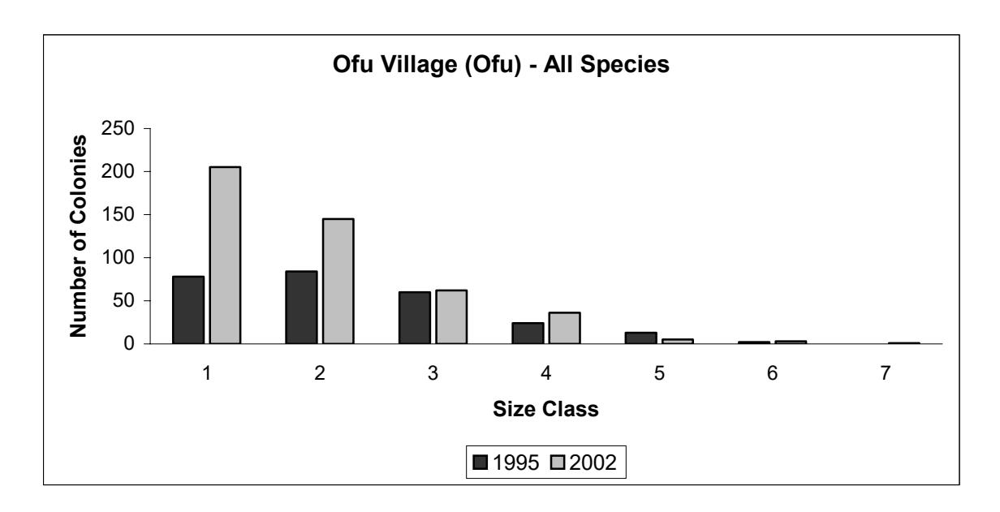

**Figure 48. Size class distribution of all species at Ofu Village from 1995 (N = 261 and 2002 (N = 457) surveys. Maximum diameter size class categories refer to the following : 1 = <=5 cm, 2 = >5 - <=10 cm, 3 = >10 - <=20 cm, 4 = >20 - <=40 cm, 5 = >40 - <=80 cm, 6 = >80 - <=160 cm, and 7 = >160 cm.** 

The size class distribution of all species combined changed significantly between 1995 and 2002 (Figure 48; P<0.001, G = 25.3, df = 4). The change in size structure was from an approximately even abundance of colonies in the smallest three size classes (from <5 cm to <20 cm dia.) in 1995, to a dominance of smaller colonies, especially those <5 cm diameter in 2002.

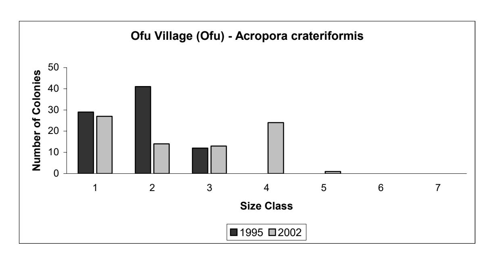

**Figure 49. Size class distribution of** *Acropora crateriformis* **at Ofu Village from 1995 (N = 82) and 2002 (N = 79). Maximum diameter size class categories refer to the following : 1 = <=5 cm, 2 = >5 - <=10 cm, 3 = >10 - <=20 cm, 4 = >20 - <=40 cm, 5 = >40 - <=80 cm, 6 = >80 - <=160 cm, and 7 = >160 cm.** 

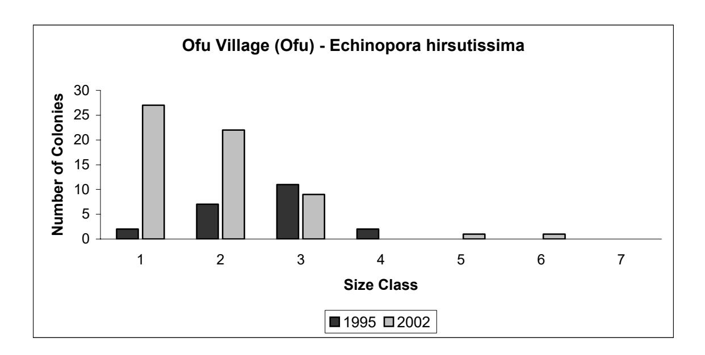

**Figure 50. Size class distribution of** *Echinopora hirsutissima* **at Ofu Village from 1995 (N = 22) and 2002 (N = 60). Maximum diameter size class categories refer to the following : 1 = <=5 cm, 2 = >5 - <=10 cm, 3 = >10 - <=20 cm, 4 = >20 - <=40 cm, 5 = >40 - <=80 cm, 6 = >80 - <=160 cm, and 7 = >160 cm.** 

The size structure of the most abundant species *Acropora crateriformis* also changed significantly between 1995 and 2002 (Figure 49; P<0.001, G = 28, df = 2). The change between surveys was from a dominance of smaller sizes in 1995 (especially <5 cm to <10 cm dia.), to larger sizes dominated by the >20 cm to <40 cm diameter class, in addition to a high dominance of recruits in the <5 cm diameter size range. This species was represented by recruits rather than smaller fragmented colonies in the 2002 small size class (<5 cm dia.), which was in contrast to many other species present (see below).

One species that was abundant in both surveys but displayed a different pattern to A. crateriformis, was Echinopora hirsutissima (Figure 50). E. hirsutissima showed a significant change in size structure from an approximately normal size distribution with the most frequent class size of >10 cm to <20 cm diameter, to a dominance of small colonies (<5 cm dia.) (P<0.001, G = 15.7, df = 2).

#### **SUMMARY**

The dynamics of the coral community at this site have been influenced by the continued presence of COTS in low densities from 1995 to 2002 (some individual starfish and recent feeding scars were observed in 2002). The predatory starfish are maintaining low coral colony sizes through their continued presence and feeding, which is also resulting in colony fragmentation. However, the effects from COTS are not the same for all species present and the slow increase in species richness indicates that recruitment of additional species to the community is occurring. As well, some species, eg, *A. crateriformis*, are showing high recruitment rates despite high mortality rates due to COTS predation. This species is highly desired food for COTS and because of its encrusting growth form, individual colonies can be fully eaten, leaving fewer fragments. This contrasts with other species, eg, *E. hirsutissima*, which has a foliose growth form that COTS are less likely to fully consume, resulting in many remnant fragments. Overall, the situation at this site is one where the coral community has been retained at a very early phase of recovery due to the continued presence and activity of COTS.

#### TAU ISLAND (MANU'A GROUP)

#### Faga (Tau)

The number of colonies at Faga was lower in 2002 (413 cols) compared to 1995 (717 cols), however, the colony density was higher in 2002 (33 cols/m<sup>2</sup>) compared to 1995 (14 cols/m<sup>2</sup>, Table 3).

The number of species recorded in 1995 was 48, which is similar to the 49 species from the 2002 survey, despite the seventy-five percent reduction in sample area (50 m<sup>2</sup> cf 12.5 m<sup>2</sup>, respectively, Table 1). Table 24 shows the top ten ranked species from the two surveys, where a moderate degree of similarity was recorded. A higher number of the most relatively abundant *Montipora* species was recorded in the 2002 survey than in 1995, though *M. grisea* ranked the highest in terms of abundance in both surveys.

Approximately the same proportion of encrusting and massive growth forms is present in both surveys.

**Table 24. Rank of the top 10 most abundant species from the two surveys at Faga. Species rank from 1995 is compared to the rank of the same species in 2002. Highly ranked species from the 2002 survey that are not present in the top 10 ranked species from the 1995 survey are listed at the bottom of the 2002 species list. FORM refers to the growth form of each species (E = encrusting, M = massive).** 

| 1995                     | FORM | RANK | 2002                     | FORM RANK |    |
|--------------------------|------|------|--------------------------|-----------|----|
| Montipora grisea         | E    | 1    | Montipora grisea         | E         | 2  |
| Montipora monasteriata   | E    | 2    |                          |           |    |
| Montipora danae          | E    | 3    | Montipora danae          | E         | 1  |
| Astreopora listeri       | M    | 4    | Astreopora listeri       | M         | 10 |
| Favia matthaii           | M    | 5    |                          |           |    |
| Porites spp              | M    | 6    |                          |           |    |
| Montastraea curta        | M    | 7    | Montastraea curta        | M         | 7  |
| Psammocora profundacella | E    | 8    |                          |           |    |
| Astreopora cf. gracilis  | M    | 9    | Astreopora gracilis      | M         | 8  |
| Leptoria phrygia         | M    | 10   |                          |           |    |
|                          |      |      | Montipora caliculata     | E         | 3  |
|                          |      |      | Porites cf lutea         | M         | 4  |
|                          |      |      | Montipora nodosa         | E         | 5  |
|                          |      |      | Astreopora myriophthalma | M         | 6  |
|                          |      |      | Montipora tuberculosa    | E         | 9  |

The size class distribution of all species combined (from transects recording all species) show a significant difference between the two survey times (Figure 51; P<0.001, G = 53.9, df = 4). The difference is due to a clear dominance of small colonies in 1995 compared to a more even spread of colony sizes among the smallest four classes in 2002.

The size frequency distribution of colonies of *M.grisea* shows a significant change in size classes between surveys (Figure 52). The change was from dominance by the smallest colony sizes (<5 cm to <20 cm dia.) in 1995, to a wider range of sizes and more larger colony sizes (>10 cm to <40 cm dia.) in 2002 (P<0.001, G = 34.7, df = 3).

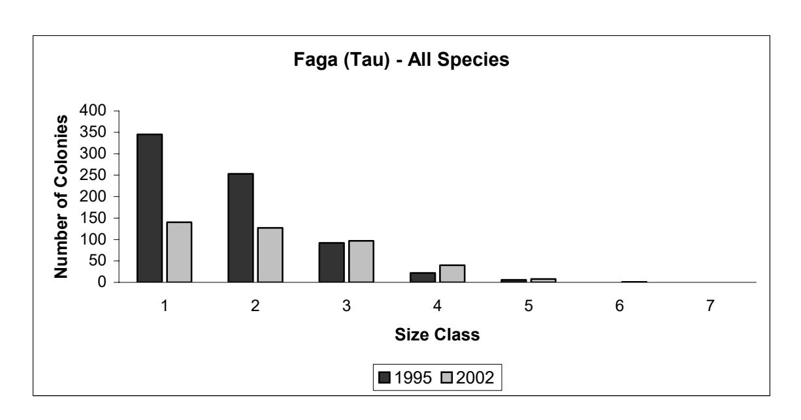

**Figure 51. Size class frequency of all species combined at Faga from transects where all species were recorded from 1995 (N = 717) and 2002 (N = 413). Maximum diameter size class categories refer to the following : 1 = <=5 cm, 2 = >5 - <=10 cm, 3 = >10 - <=20 cm, 4 = >20 - <=40 cm, 5 = >40 - <=80 cm, 6 = >80 - <=160 cm, and 7 = >160 cm.** 

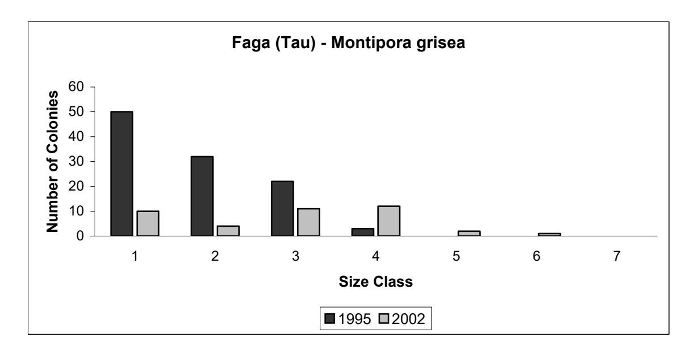

**Figure 52. Size frequency distribution of** *Montipora grisea* **at Faga from transects where all species were recorded from 1995 (N = 107) and 2002 (N = 40). Maximum diameter size class categories refer to the following : 1 = <=5 cm, 2 = >5 - <=10 cm, 3 = >10 - <=20 cm, 4 = >20 - <=40 cm, 5 = >40 - <=80 cm, 6 = >80 - <=160 cm, and 7 = >160 cm.** 

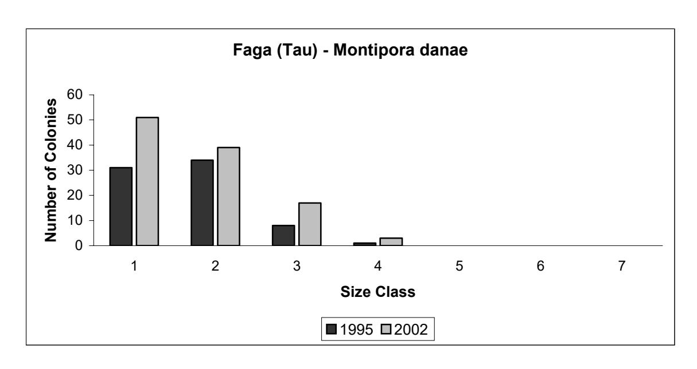

**Figure 53. Size frequency distribution of** *Montipora danae* **at Faga from 1995 (N = 107) and 2002 (N = 40). Maximum diameter size class categories refer to the following : 1 = <=5 cm, 2 = >5 - <=10 cm, 3 = >10 - <=20 cm, 4 = >20 - <=40 cm, 5 = >40 - <=80 cm, 6 = >80 - <=160 cm, and 7 = >160 cm.** 

*M.danae* did not reflect the same trend as *M. grisea*, with no significant change in colony sizes between the two survey times (Figure 53; 0.25<P<0.5, G = 2.5, df = 2). In both surveys, the most relatively abundant colony sizes were in the two smallest classes (<5 cm and >5 cm to <10 cm dia.). This may reflect a difference in competitive abilities of these two *Montipora* species, which could be due to differences in growth rates and/or differences in space occupation strategies. Space occupation strategies may include relative competitive abilities using extra-tentacular digestion of neighbouring colonies or shade tolerance, or different growth rates.

## *Non-Montipora Species Only*

Because of time constraints, sampling of species was partitioned so that approximately equal numbers of colonies representing *Montipora* spp and all other species were recorded. This was achieved by undertaking additional sampling of transects where non-*Montipora* species were only recorded. The same analytical approach was used on this subset of the data by including all non-*Montipora* spp from the inclusive (all species) sample transects above as well.

Table 25 is a summary of the top ten ranked non-*Montipora* spp. A moderate degree of similarity was recorded for this subset of species between the two survey times. The massive species, *Astreopora listeri*, *Favia matthai*, and *Montastraea curta* showed high relative abundance in both surveys. *Porites* spp also remained relatively high in abundance, assuming that the records of *Porites* spp in 1995 and *P.* cf *lutea* in 2002 were the same or very similar species*.* However, there are some striking differences in the

relative abundance of branching *Pocillopora* spp (lower relative abundance in 2002 compared to 1995), and an apparent shift to higher relative abundance of two species of *Astreopora* spp and *Goniastrea retiformis*.

**Table 25. Summary of top ten ranked species of non-***Montipora* **spp at Faga (Tau) from 1995 (N = 391) and 2002 (N = 304). Highly ranked species from the 2002 survey that are not present in the top 10 ranked species from the 1995 survey are listed at the bottom of the 2002 species list. FORM refers to colony growth form (B = branching, E = encrusting, M = massive).** 

| 1995                     | FORM | RANK | 2002                     |   | FORM RANK |
|--------------------------|------|------|--------------------------|---|-----------|
| Astreopora listeri       | M    | 1    | Astreopora listeri       | M | 3         |
| Favia matthaii           | M    | 2    | Favia matthai            | M | 1         |
| Porites spp              | M    | 3    |                          |   |           |
| Montastraea curta        | M    | 4    | Montastraea curta        | M | 7         |
| Psammocora profundacella | E    | 5    |                          |   |           |
| Astreopora cf. gracilis  | M    | 6    | Astreopora gracilis      | M | 4         |
| Leptoria phrygia         | M    | 7    | Leptoria phrygia         | M | 10        |
| Galaxea fascicularis     | E    | 8    | Galaxea fascicularis     | E | 8         |
| Goniastrea edwardsi      | M    | 8    |                          |   |           |
| Platygyra daedalea       | M    | 8    |                          |   |           |
| Pocillopora eydouxi      | B    | 9    |                          |   |           |
| Pocillopora verrucosa    | B    | 10   |                          |   |           |
|                          |      |      | Astreopora myriophthalma | M | 2         |
|                          |      |      | Goniastrea retiformis    | M | 5         |
|                          |      |      | Porites cf lutea         | M | 6         |
|                          |      |      | Favites abdita           | M | 9         |

A comparison of size class distributions of the non-*Montipora* species (combining specific non-*Montipora* transects as well as all inclusive species transect data) shows a significant change in the size structure of this suite of species between surveys (Figure 54; P<0.001, G = 217.8, df = 4). The change appears to be due to growth of colonies from a dominance of <5cm diameter colonies in 1995 to a dominance in 2002 of >5cm to <20cm diameter colonies.

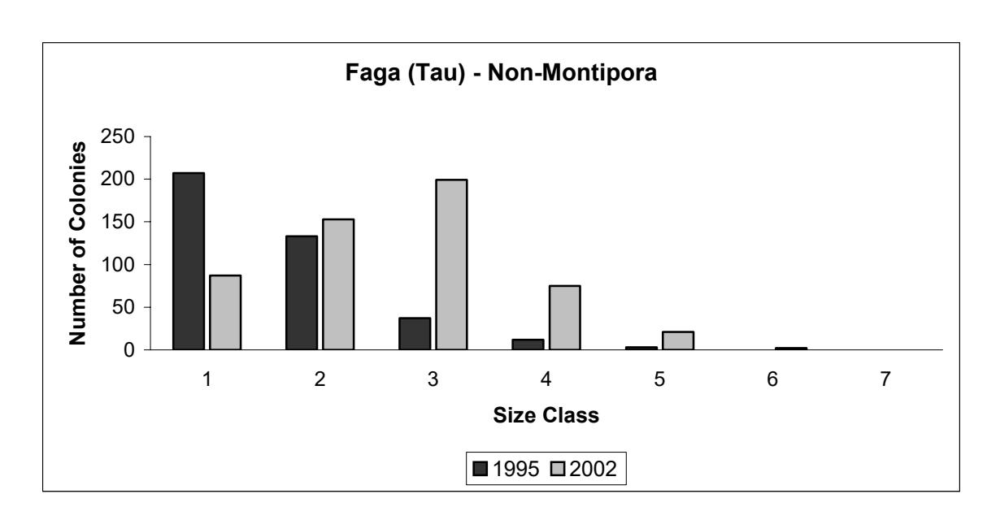

**Figure 54. Size class distribution of all non-***Montipora* **spp at Faga from 1995 (N = 391) and 2002 (N = 537). The data from 2002 includes all non-***Montipora* **spp that were recorded from the species-inclusive transects, plus the specific non-***Montipora* **spp transects (see methods for details). Maximum diameter size class categories refer to the following : 1 = <=5 cm, 2 = >5 - <=10 cm, 3 = >10 - <=20 cm, 4 = >20 - <=40 cm, 5 = >40 - <=80 cm, 6 = >80 - <=160 cm, and 7 = >160 cm.** 

Size class distributions of colonies of *Astreopora listeri* changed significantly between 1995 and 2002 (Figure 55; P<0.001, G = 15.2, df = 2), where there was a shift from small sizes in 1995 to a clear dominance of larger sizes (>10 cm to <40 cm dia.) in 2002.

*Favia matthaii* demonstrated a similar pattern to *A. listeri* with a shift from small to larger colony sizes (especially to sizes >10cm to <20cm dia.; Figure 56; P<0.001, G = 26, df = 1).

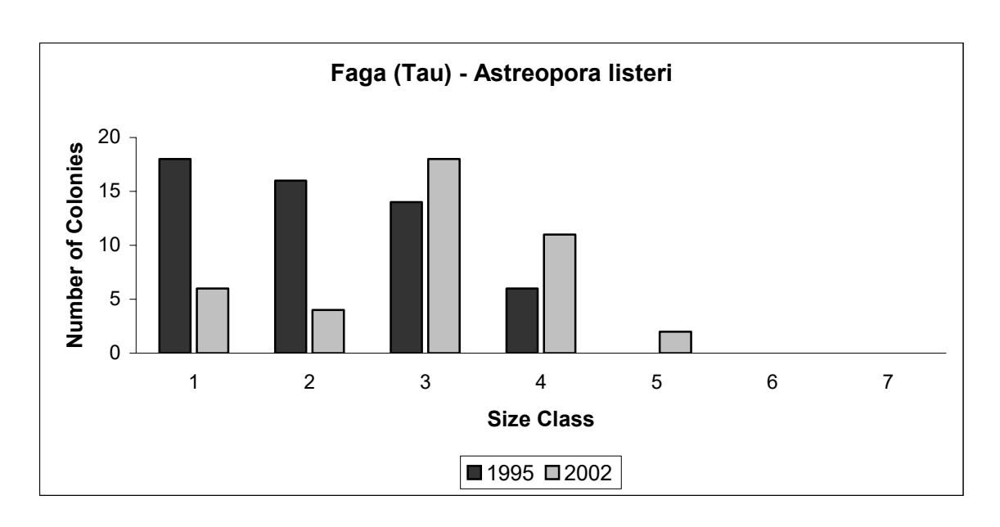

**Figure 55. Size class distribution of** *Astreopora listeri* **at Faga from 1995 (N = 54) and 2002 (N = 41). The data from 2002 includes all non-***Montipora* **spp that were recorded from the species-inclusive transects, plus the specific non-***Montipora* **spp transects (see methods for details). Maximum diameter size class categories refer to the following : 1 = <=5 cm, 2 = >5 - <=10 cm, 3 = >10 - <=20 cm, 4 = >20 - <=40 cm, 5 = >40 - <=80 cm, 6 = >80 - <=160 cm, and 7 = >160 cm.** 

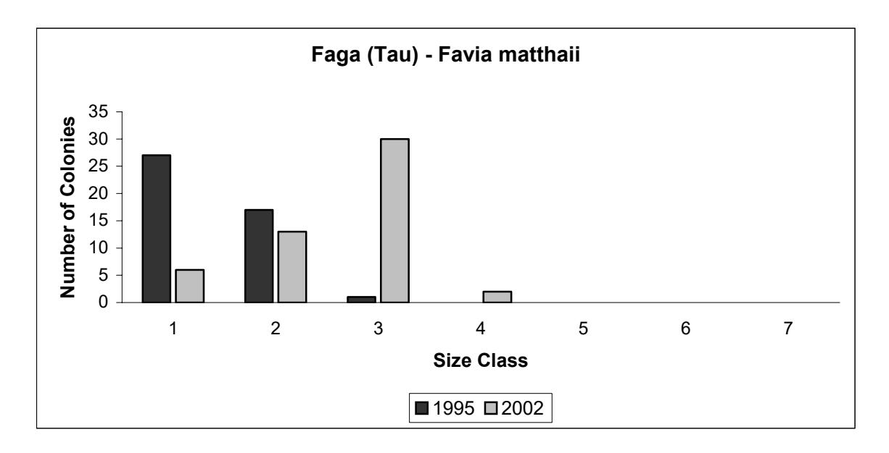

**Figure 56. Size class distribution of** *Favia matthaii* **at Faga from 1995 (N = 45) and 2002 (N = 51). The data from 2002 includes all non-***Montipora* **spp that were recorded from the species-inclusive transects, plus the specific non-***Montipora* **spp transects (see methods for details). Maximum diameter size class categories refer to the following : 1 = <=5 cm, 2 = >5 - <=10 cm, 3 = >10 - <=20 cm, 4 = >20 - <=40 cm, 5 = >40 - <=80 cm, 6 = >80 - <=160 cm, and 7 = >160 cm.** 

#### **SUMMARY**

The coral community at Faga has not changed substantially from 1995 with a continued dominance of massive and encrusting growth forms. Species turnover has resulted in changes in relative abundance and in size class frequencies of certain species. The non-*Montipora* spp have increased in size and the branching *Pocillopora* spp have become less relatively abundant over time. Overall, the coral community was very healthy and diverse with characteristic low profile coral forms (massive and encrusting) dominating this high exposure site.

## Lepula (Tau)

The number of colonies surveyed at Lepula was lower in 2002 (257 cols) compared to 1995 (661 cols). However, the density of all species of corals in belt transects at Lepula was higher in 2002 (17 cols/m²) compared to 1995 (13 cols/m², Table 3).

Table 26. Rank of the top 10 most abundant species from the two surveys at Lepula. Species rank from 1995 is compared to the rank of the same species in 2002. Highly ranked species from the 2002 survey that are not present in the top 10 ranked species from the 1995 survey are listed at the bottom of the 2002 species list. FORM refers to the growth form of each species (E = encrusting, M = massive).

| 1995                    | FORM | RANK | 2002                   | FORM | RANK |
|-------------------------|------|------|------------------------|------|------|
| Montipora grisea        | Е    | 1    | Montipora grisea       | Е    | 1    |
| Favia matthaii          | M    | 2    |                        |      |      |
| Leptoria phrygia        | M    | 3    | Leptoria phrygia       | M    | 10*  |
| Astreopora listeri      | M    | 4    |                        |      |      |
| Montastraea curta       | M    | 5    | Montastraea curta      | M    | 8    |
| Astreopora cf. gracilis | M    | 6    |                        |      |      |
| Montipora monasteriata  | Е    | 7    |                        |      |      |
| Favites halicora        | M    | 8    |                        |      |      |
| Goniastrea retiformis   | M    | 9    | Goniastrea retiformis  | M    | 6    |
| Leptastrea purpurea     | Е    | 10   |                        |      |      |
|                         |      |      | Montipora nodosa       | Е    | 2    |
|                         |      |      | Galaxea fascicularis   | Е    | 3    |
|                         |      |      | Montipora informis     | Е    | 4    |
|                         |      |      | Montipora efflorescens | Е    | 5    |
|                         |      |      | Pocillopora eydouxi    | В    | 7    |
|                         |      |      | Montipora tuberculosa  | Е    | 9*   |

The number of species recorded in 1995 was 42, which is less than the 48 species recorded in the 2002 survey, which is noteworthy when taking into account the seventy-five percent reduction in sample area (50 m<sup>2</sup> compared to 12.5 m<sup>2</sup>, respectively, Table 1).

Table 26 shows the top ten ranked species from the two surveys, where a moderate to low degree of similarity was recorded. A higher number of the most relatively ranked *Montipora* species was recorded in the 2002 survey than in 1995, though *M. grisea* ranked the highest in terms of abundance in both surveys. A higher proportion of encrusting growth forms is present in the most highly ranked species in 2002 compared to a higher proportion of massive colonies in the top ranked species in 1995.

The size frequency distribution of all colonies significantly changed between 1995 and 2002 (Figure 57; P<0.001, G = 52.2, df = 4). The change was due to relatively fewer small size colonies representing the smaller classes (<5 cm to <20 cm dia.) in 2002 compared to 1995. In addition, a corresponding relative high proportion of colonies are represented in the size classes greater than the >10 cm to <20 cm diameter class.

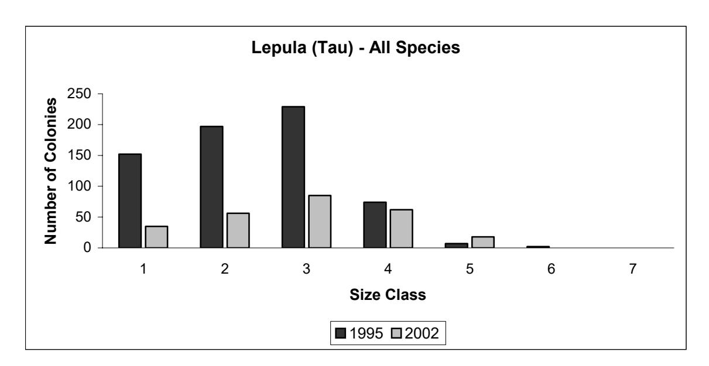

**Figure 57. Size frequency distribution of all species from Lepula from 1995 (N = 661) and 2002 (N = 257). Data from 2002 are from transects where all species were recorded (see text for details). Maximum diameter size class categories refer to the following : 1 = <=5 cm, 2 = >5 - <=10 cm, 3 = >10 - <=20 cm, 4 = >20 - <=40 cm, 5 = >40 - <=80 cm, 6 = >80 - <=160 cm, and 7 = >160 cm.** 

The most highly ranked species (*Montipora grisea*) from the inclusive species samples showed a similar trend to the combined species shift in size classes (Figure 58; P<0.001, G = 24, df = 2). However, the trend in *M. grisea* is more pronounced with a significant change from a dominance of >10 cm to <20 cm diameter colony sizes in 1995 to a more even representation of colonies and a higher abundance of larger sizes.

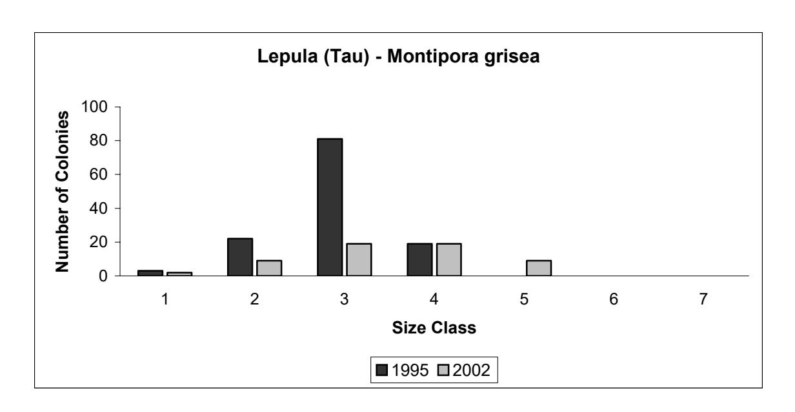

**Figure 58. Size frequency distribution of** *Montipora grisea* **from Lepula from 1995 (N = 125) and 2002 (N = 58). Data from 2002 are from transects where all species were recorded (see text for details). Maximum diameter size class categories refer to the following : 1 = <=5 cm, 2 = >5 - <=10 cm, 3 = >10 - <=20 cm, 4 = >20 - <=40 cm, 5 = >40 - <=80 cm, 6 = >80 - <=160 cm, and 7 = >160 cm.** 

*Non-Montipora Species Only* 

Because of time constraints, sampling of species was partitioned so that approximately equal numbers of colonies representing *Montipora* spp and all other species were recorded. This was achieved by undertaking additional sampling of non-*Montipora* species on transects where complete species records were not recorded. The same analytical approach was used on this subset of the data by including all non-*Montipora* spp from the inclusive sample transects above. Table 27 is a summary of the top ten ranked non-*Montipora* spp, combining all-inclusive species transect data and the non-*Montipora* species transect data.

A moderate degree of similarity was recorded for this subset of species between the two survey times. Only one massive species, *Montastraea curta*, remained at relatively high abundance in both 1995 and 2002. However, there are some striking differences in the relative abundance of two branching *Pocillopora* spp and branching *Acropora* spp (higher relative abundance in 2002 compared to 1995), and an apparent shift to higher relative abundance of two species of *Galaxea* spp and *Goniastrea retiformis*. There is evidence that there has been relatively high recruitment of these species, and the shift towards larger sizes is consistent with the relative growth rates of these species.

**Table 27. Summary of top ten ranked species of non-***Montipora* **spp at Lepula from 1995 (N = 474) and 2002 (N = 347). Highly ranked species from the 2002 survey that are not present in the top 10 ranked species from the 1995 survey are listed at the bottom of the 2002 species list. An asterisk\* indicates ranks based on less than 10 colonies. FORM refers to colony growth form (B = branching, E = encrusting, M = massive).** 

| 1995                     | FORM | RANK | 2002                  | FORM RANK |     |
|--------------------------|------|------|-----------------------|-----------|-----|
| Favia matthaii           | M    | 1    | Favia matthaii        | M         | 8   |
| Leptoria phrygia         | M    | 2    | Leptoria phrygia      | M         | 4   |
| Astreopora listeri       | M    | 3    |                       |           |     |
| Montastraea curta        | M    | 4    | Montastraea curta     | M         | 2   |
| Astreopora cf. gracilis  | M    | 5    | Astreopora gracilis   | M         | 7   |
| Favites halicora         | M    | 6    |                       |           |     |
| Goniastrea retiformis    | M    | 7    | Goniastrea retiformis | M         | 3   |
| Leptastrea purpurea      | E    | 8    | Leptastrea purpurea   | E         | 6   |
| Psammocora profundacella | E    | 9    |                       |           |     |
| Galaxea fascicularis     | E    | 10   | Galaxea fascicularis  | E         | 1   |
|                          |      |      | Galaxea astreata      | E         | 5   |
|                          |      |      | Pocillopora eydouxi   | B         | 7   |
|                          |      |      | Pocillopora verrucosa | B         | 8   |
|                          |      |      | Acropora digitifera   | ACB       | 9*  |
|                          |      |      | Platygyra daedalea    | M         | 9*  |
|                          |      |      | Goniastrea favulus    | M         | 10* |

The size frequency distributions of all non-*Montipora* species changed significantly between surveys (Figure 59; P<0.001, G = 80, df = 4). There was a clear increase in larger colony sizes by 2002 (where the dominant class was >10 cm to <20 cm diameter), from smaller dominant classes in 1995 (>5 cm to<10 cm diameter), and where relatively fewer recruits were recorded in 2002.

A moderately high ranked species, *Montastraea curta*, showed a similar trend to the combined all (non-*Montipora*) species, with a significant increase in size classes by 2002 (Figure 60; 0.005<P<0.001, G = 10.4, df = 1).

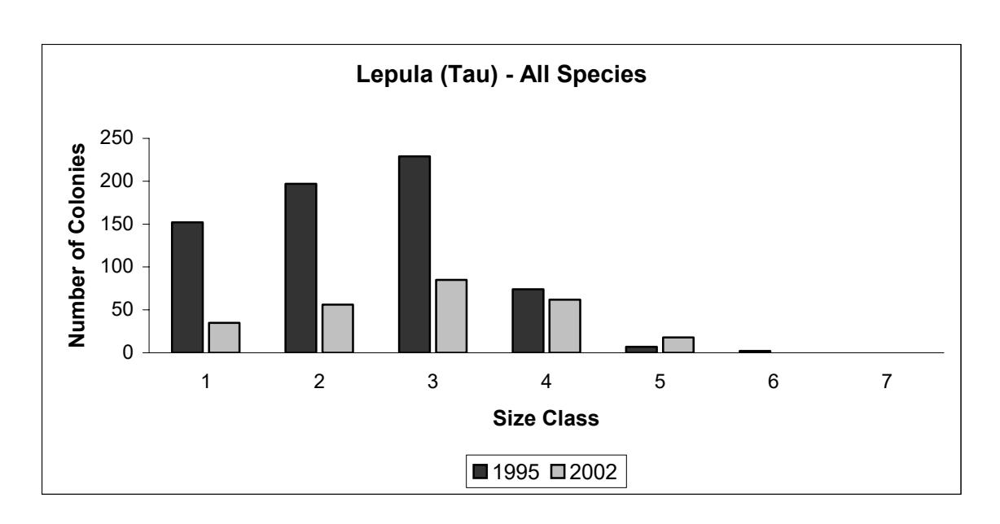

**Figure 59. Size frequency distribution of all species combined at Lepula from 1995 (N = 474) and 2002 (N = 347). Data from 2002 are pooled from transects where all species were recorded and from transects where only non-***Montipora* **species were recorded (see text for details). Maximum diameter size class categories refer to the following : 1 = <=5 cm, 2 = >5 - <=10 cm, 3 = >10 - <=20 cm, 4 = >20 - <=40 cm, 5 = >40 - <=80 cm, 6 = >80 - <=160 cm, and 7 = >160 cm.** 

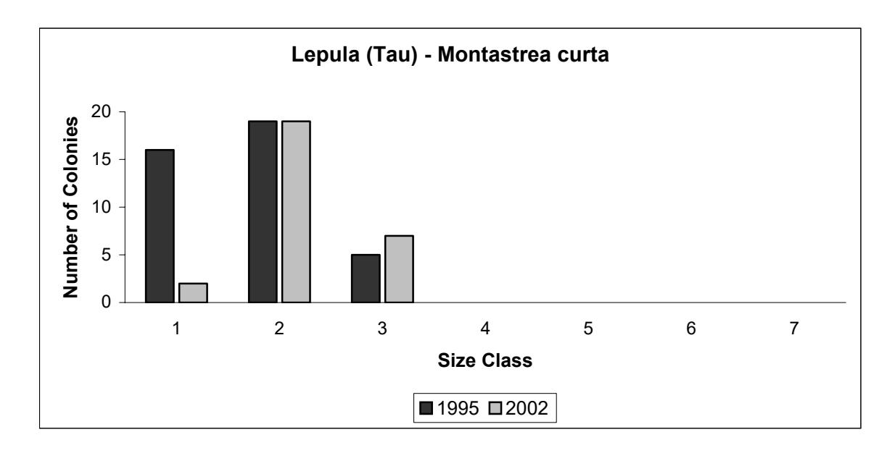

**Figure 60. Size frequency distribution of colonies of** *Montastraea curta* **at Lepula from 1995 (N = 40) and 2002 (N = 28). Data from 2002 are pooled from transects where all species were recorded and from transects where only non-***Montipora* **species were recorded (see text for details). Maximum diameter size class categories refer to the following : 1 = <=5 cm, 2 = >5 - <=10 cm, 3 = >10 - <=20 cm, 4 = >20 - <=40 cm, 5 = >40 - <=80 cm, 6 = >80 - <=160 cm, and 7 = >160 cm.** 

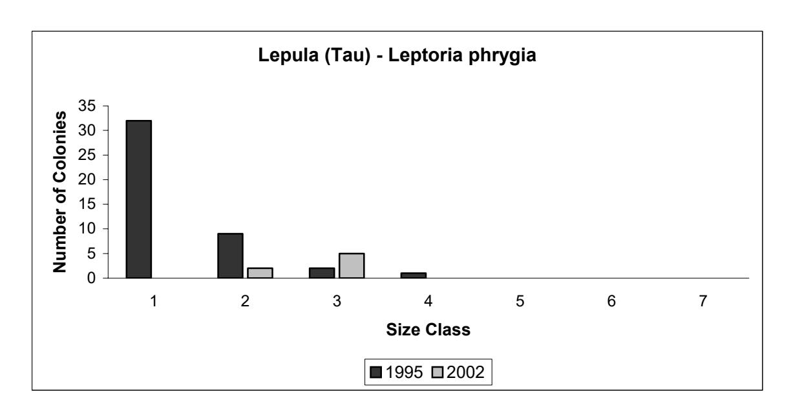

Figure 61. Size frequency distribution of colonies of *Leptoria phrygia* at Lepula from 1995 (N = 44) and 2002 (N = 15). Data from 2002 are pooled from transects where all species were recorded and from transects where only non-*Montipora* species were recorded (see text for details). Maximum diameter size class categories refer to the following: 1 = <=5 cm, 2 = >5 - <=10 cm, 3 = >10 - <=20 cm, 4 = >20 - <=40 cm, 5 = >40 - <=80 cm, 6 = >80 - <=160 cm, and 7 = >160 cm.

A more pronounced trend to the above descriptions can be seen from the size frequency graph for *Leptoria phrygia* (Figure 61). Although the trend is clear in the graph there were insufficient data from 2002 to conduct a G test.

#### **SUMMARY**

The structure of the coral community at Lepula has not changed substantially from 1995 with the continuation of dominance of massive and encrusting growth forms. However, species turnover has not remained the same with some significant shifts in relative abundance, as well as changes in size class frequencies between surveys. The non-*Montipora* spp have increased in size and the branching forms have become more relatively abundant over time. Overall, the coral community was very healthy and diverse with characteristic low profile coral forms dominating this high wave exposure site.

#### Afuli (Tau)

The number of colonies recorded in 2002 at Afuli (750 cols) was higher than in 1995 (425 cols) despite the sampling effort being lower in 2002 (Table 1). The density of corals was higher in 2002 (30 cols/m²) compared to 1995 (8.5 cols/m², Table 3). The

number of small unidentified colonies (those without species names) was relatively higher in 1995 compared to 2002 (Appendix 1).

The number of species recorded in 1995 was 44, which is less than the 68 species from the 2002 survey, despite the fifty percent reduction in sample area (50 m² compared to 25 m², respectively, Table 1). Table 28 shows the top ten ranked species from the two surveys, where a high degree of similarity was recorded. The largest difference between the surveys was in changes in rank of two *Montipora* species (*M. tuberculosa* and *M. nodosa*), and among three *Astreopora* species (*A. listeri*, *A. myriophthalma*, and *A. gracilis*).

Table 28. Rank of the top 10 most abundant species from the two surveys at Afuli. Species rank from 1995 is compared to the rank of the same species in 2002. A highly ranked species (*M. nodosa*) from the 2002 survey which was not present in the top 10 ranked species in the 1995 survey is listed at the bottom of the 2002 species list. FORM refers to the growth form of each species (E = encrusting, M = massive).

| 1995                     | <b>FORM</b> | RANK | 2002                     | <b>FORM</b> | RANK |
|--------------------------|-------------|------|--------------------------|-------------|------|
| Montipora grisea         | Е           | 1    | Montipora grisea         | Е           | 1    |
| Astreopora listeri       | M           | 2    | Astreopora listeri       | M           | 8    |
| Montipora tuberculosa    | Е           | 3    |                          |             |      |
| Leptastrea purpurea      | Е           | 4    | Leptastrea purpurea      | Е           | 3    |
| Astreopora myriophthalma | M           | 5    | Astreopora myriophthalma | M           | 4    |
| Favia matthaii           | M           | 6    | Favia matthaii           | M           | 7    |
| Montastraea curta        | M           | 6    | Montastraea curta        | M           | 5    |
| Astreopora cf. gracilis  | M           | 8    |                          |             |      |
| Montipora spp            | Е           | 9    |                          |             |      |
| Montipora foveolata      | Е           | 10   | Montipora foveolata      | Е           | 10   |
|                          |             |      | Montipora nodosa         | Е           | 2    |

The structure of the community using the top 10 ranked species remained unchanged for the two surveys. There was a dominance of encrusting and massive forms (Table 28) with the massive growth form dominated by the *Astreopora* genus. In this habitat, the massive category is not a good description of the colonies present at the site as almost all massive colonies were adopting a growth form resembling an encrusting form rather than the typical mound form.

The main change that can be detected at this site is in an increase in abundance of all size classes of colonies, along with lower abundance of the smallest sizes (Figure 62). This change in size classes was significant (P<0.001, G=26.5, df=5). As was the case in 1995, there was a dominance of small size classes in 2002, though there are individual long-lived colonies of unusually large size in the same area. This is a very distinctive community that appears to be resilient to the strong natural environmental conditions at this site.

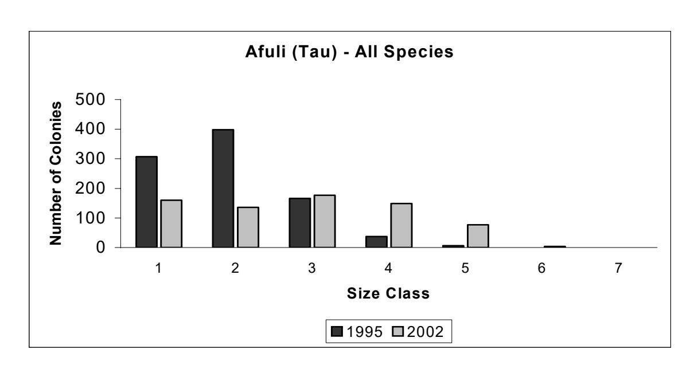

**Figure 62. Size class distribution of coral colonies of all species at Afuli from 1995 (N = 419) and 2002 (N = 750) surveys. Maximum diameter size class categories refer to the following : 1 = <=5 cm, 2 = >5 - <=10 cm, 3 = >10 - <=20 cm, 4 = >20 - <=40 cm, 5 = >40 - <=80 cm, 6 = >80 - <=160 cm, and 7 = >160 cm.** 

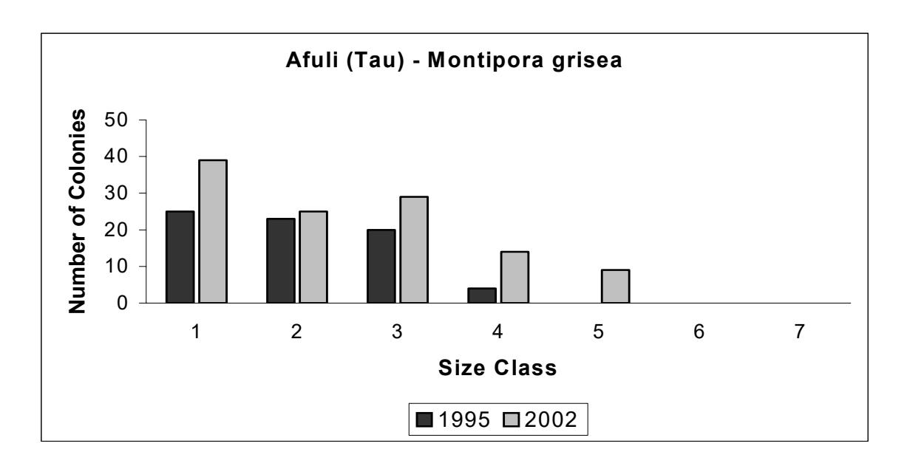

**Figure 63. Size class distribution of coral colonies from Afuli for** *Montipora grisea* **from 1995 (N = 72 ) and 2002 (N = 116). Maximum diameter size class categories refer to the following : 1 = <=5 cm, 2 = >5 - <=10 cm, 3 = >10 - <=20 cm, 4 = >20 - <=40 cm, 5 = >40 - <=80 cm, 6 = >80 - <=160 cm, and 7 = >160 cm.** 

The size class distribution of *Montipora grisea* colonies from the 1995 and 2002 surveys (Figure 63) shows a very similar pattern although there is are indications of larger

colonies being also present in 2002. This change in size class distribution was not significant (0.25<P<0.5, G = 3.83, df = 3).

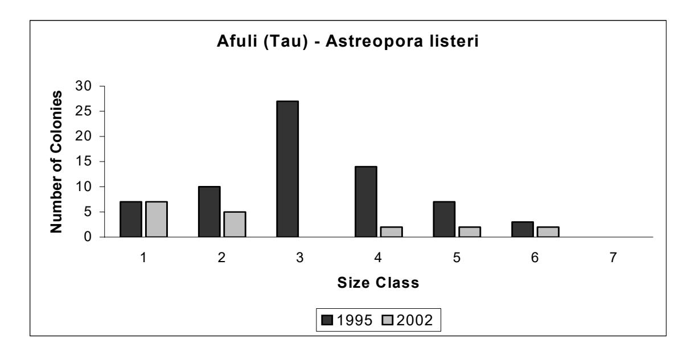

**Figure 64. Size class distribution of coral colonies of** *Astreopora listeri* **at Afuli from 1995 (N = 68) and 2002 (N = 18) surveys. Maximum diameter size class categories refer to the following : 1 = <=5 cm, 2 = >5 - <=10 cm, 3 = >10 - <=20 cm, 4 = >20 - <=40 cm, 5 = >40 - <=80 cm, 6 = >80 - <=160 cm, and 7 = >160 cm.** 

The comparative size distributions between the two surveys of *Astreopora listeri* (Figure 64) shows a marked difference due to the low presence or absence of the mid range size categories (classes 3 and 4, >10 cm to <40 cm diameter). The reason for the difference may be due to field identification discrepancies between the surveys but this is unlikely as the sizes of colonies would ensure good expression of their morphological characteristics.

In contrast to *A. listeri*, *Astreopora myriophthalma* (Figure 65) showed a similar size range distribution in both surveys with exception of an increase in the largest sizes (classes 4 - 6, >20 cm - <160 cm diameter). This change was not significant (0.1<P<0.25, G =5.49, df = 3).

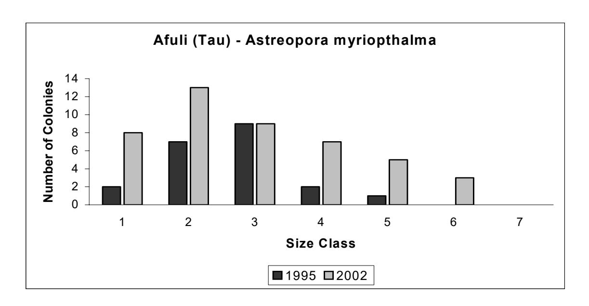

Figure 65. Size class distribution of coral colonies of *Astreopora myriophthalma* at Afuli from 1995 (N = 21) and 2002 (N = 45) surveys. Maximum diameter size class categories refer to the following: 1 = <=5 cm, 2 = >5 - <=10 cm, 3 = >10 - <=20 cm, 4 = >20 - <=40 cm, 5 = >40 - <=80 cm, 6 = >80 - <=160 cm, and 7 = >160 cm.

#### SUMMARY

The Afuli site has remained essentially unchanged in terms of species dominance during the period of the two surveys though there has been an increase in species richness. At the same time, there has been an increase in the density of colonies and a shift towards a more even distribution of colony sizes between the two surveys. Strong natural environmental conditions may be the reason for the similarity of the communities between surveys. The site is very exposed to wave action and has the appearance and composition of a robust coral community with a low growth profile relative to the substrate. The site is also renown for some extremely large colonies of *Porites* spp and *Diploastrea heliopora*. For example, one particular colony of *Porites* spp measured 4.7 m high and 8 m in diameter, with a second nearby colony measuring 6 m diameter and 4 m high. This indicates that although the site is under the influence of strong physical forces, the most suitably adapted species that can withstand these conditions can persist for potentially very long time periods.

#### Fagamalo (Tau)

The number of colonies recorded in 2002 (761 cols) at Fagamalo was higher than that recorded in 1995 (276 cols). The density of corals at Fagamalo was noticeably higher in 2002 (30 cols/m<sup>2</sup>) compared to 1995 (6 cols/m<sup>2</sup>, Table 3), despite the fifty percent reduction in sample area (50m<sup>2</sup> cf 25m<sup>2</sup>, respectively, Table 1).

**Table 29. Rank of the top 10 most abundant species from the two surveys at Fagamalo. Species rank from 1995 is compared to the rank of the same species in 2002. Highly ranked species from the 2002 survey which are not present in the top 10 ranked species from the 1995 survey are listed at the bottom of the 2002 species list. An asterisk \* denotes species rank calculated from less than 10 colonies. FORM refers to the growth form of each species (ACB = Acropora branching, B = branching, E = encrusting, M = massive).** 

| 1995                   | FORM | RANK | 2002                     |     | FORM RANK |
|------------------------|------|------|--------------------------|-----|-----------|
| Montipora grisea       | E    | 1    | Montipora grisea         | E   | 1         |
| Porites spp            | M    | 2    |                          |     |           |
| Montipora tuberculosa  | E    | 3    |                          |     |           |
| Montastraea curta      | M    | 4    | Montastraea curta        | M   | 4         |
| Goniastrea pectinata   | M    | 5    |                          |     |           |
| Astreopora listeri     | M    | 6    | Astreopora listeri       | M   | 7         |
| Leptastrea purpurea    | E    | 6    | Leptastrea purpurea      | E   | 2         |
| Favia matthaii         | M    | 7*   | Favia matthaii           | M   | 5         |
| Favia stelligera       | M    | 8*   |                          |     |           |
| Montipora nodosa       | E    | 8*   | Montipora nodosa         | E   | 3         |
| Montipora spp          | E    | 8*   |                          |     |           |
| Pavona varians         | E    | 9*   |                          |     |           |
| Pocillopora meandrina  | B    | 9*   |                          |     |           |
| Montipora hoffmeisteri | E    | 10*  |                          |     |           |
|                        |      |      | Porites cf lutea         | M   | 4         |
|                        |      |      | Montipora efflorescens   | E   | 5         |
|                        |      |      | Astreopora myriophthalma | M   | 6         |
|                        |      |      | Acropora spp             | ACB | 8         |
|                        |      |      | Porites cf solida        | M   | 9         |
|                        |      |      | Pocillopora eydouxi      | B   | 10        |
|                        |      |      | Psammocora haimeana      | E   | 10        |

The number of species recorded in 1995 was 30, which is less than the 64 species from the 2002 survey, with fifty percent less sampling area. Table 29 shows the top ten ranked species from the two surveys, where a moderate degree of similarity was recorded. The community structure has remained more or less the same except for a possible reduction in branching *Pocillopora* spp, which corresponded with an increase in *Acropora* spp recruitment in 2002.

The size frequency distribution of colonies from all species significantly differed between 1995 and 2002 (Figure 66; P<0.001, G = 80.2, df = 4). The change was due to an increase in the larger colony sizes by 2002. In addition, there was a similar high relative abundance of the smallest size class (<5 cm dia.) between the two surveys, which indicate recruitment and possibly fragmentation of larger colonies is occurring at this site.

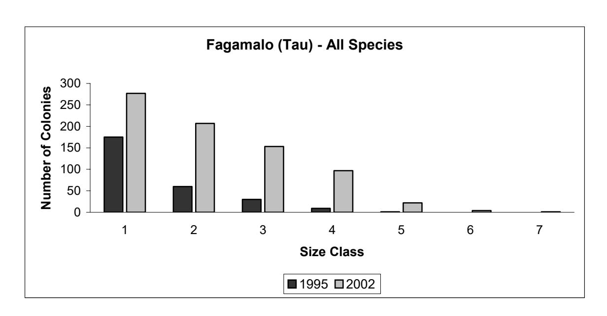

**Figure 66. Size frequency distribution of colonies of all species at Fagamalo from 1995 (N = 276) and 2002 (N = 761). Maximum diameter size class categories refer to the following : 1 = <=5 cm, 2 = >5 - <=10 cm, 3 = >10 - <=20 cm, 4 = >20 - <=40 cm, 5 = >40 - <=80 cm, 6 = >80 - <=160 cm, and 7 = >160 cm.** 

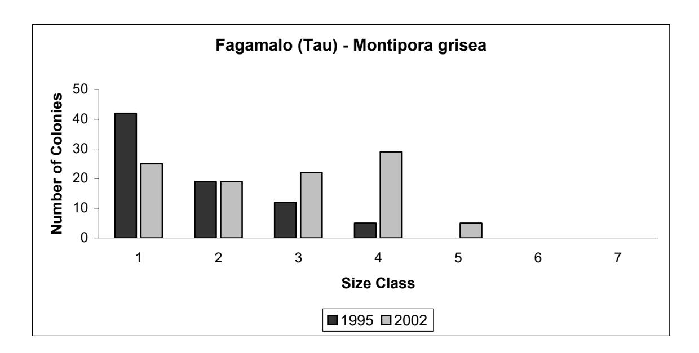

**Figure 67. Size frequency distribution of colonies of** *Montipora grisea* **at Fagamalo from 1995 (N = 78) and 2002 (N = 100). Maximum diameter size class categories refer to the following : 1 = <=5 cm, 2 = >5 - <=10 cm, 3 = >10 - <=20 cm, 4 = >20 - <=40 cm, 5 = >40 - <=80 cm, 6 = >80 - <=160 cm, and 7 = >160 cm.** 

The size class distribution of colonies of the most relatively abundant species, *Montipora grisea*, showed a clear increase in larger sizes dominated by the >20 cm to <40 cm

diameter class in 2002 (Figure 67; P<0.001, G = 29, df = 3). In 1995, the size class distribution was dominated by the smaller sized colonies, particularly the <5 cm diameter size.

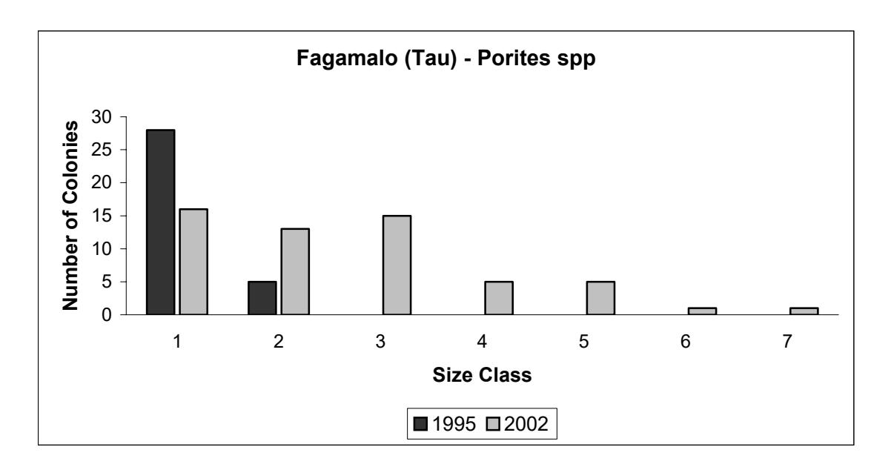

**Figure 68. Size frequency distribution of colonies of** *Porites* **spp at Fagamalo from 1995 (N = 33) and 2002 (N = 56) surveys. Colonies from 2002 include pooled species of** *P.* **cf** *lutea* **and** *P.* **cf** *solida* **that were ranked in the top ten species. Maximum diameter size class categories refer to the following : 1 = <=5 cm, 2 = >5 - <=10 cm, 3 = >10 - <=20 cm, 4 = >20 - <=40 cm, 5 = >40 - <=80 cm, 6 = >80 - <=160 cm, and 7 = >160 cm.** 

Massive *Porites* spp ranked in the top ten species from both surveys were pooled to show the clear increase in colony sizes that occurred from 1995 to 2002 (Figure 68; P<0.001, G = 28.3, df = 1). The very large sized colonies recorded in 2002 could not have grown in the period between samples and may be a result of a difference in diver records or could be due to transects being placed in a different position to the 1995 survey. The former reason may be more likely, as we tended to include very large colonies if their colony centre appeared to be approximately within the transect dimensions. In 1995, the previous researcher (Mundy 1996) may have applied a more exclusive definition to ours as to what was deemed to be inside the belt transect and what was outside it.

## **SUMMARY**

Fagamalo has shown increases in colony density and species richness during the period between the two surveys, but the overall dominance of species has only moderately changed. As well, the coral community structure has not changed with a persistent dominance of encrusting and massive species. These conclusions demonstrate a healthy expansion of the coral community but without a clear succession in species dominance.

## *Summary of Bleaching (March 2002)*

During the minor bleaching event of early 2002, bleaching of corals within the Territory was highly variable at the 10 m depth contour. In the majority of cases at 10 m depth, bleaching was minor with symptoms typically showing a pale colour without complete whitening to the tissue. At most sites, bleaching was observed in corals in shallower depths, and in a number of sites, severe bleaching (complete whitening of the tissues) was observed, particularly in *Millepora*, *Acropora* and *Montipora* species. As a general rule, if bleaching was observed at 10 m depth then it can be assumed that higher frequencies of bleaching would have been present at shallower depths, and possibly at relative proportions to the frequencies observed among corals at 10 m depth. Higher percentages of colonies at 10 m depth were bleached in the Manu'a Group of islands compared to Tutuila though bleaching was not observed at all sites (Table 30). The total percentage of bleached colonies was 7.7% (N = 5246) for both Tutuila and the Manu'a Group combined, with 11.8% of all colonies from Manu'a Group bleached (N = 1183) compared to 2.3% of colonies on Tutuila (N = 2263).

Only corals at Ofu Village on Ofu (in the Manu'a Group) did not show any signs of bleaching at the 10 m depth. The proportion of colonies with signs of bleaching varied among (pooled) island sites. At Ofu Island a total of 18% were bleached (range among sites of 0 to 26% bleached, N = 1128) compared to Olosega Island which showed 7% bleaching (range 2 to 15%, N = 675), and Tau Island 9% bleached (range 2 to 13%, N = 1180) (Table 30).

In the Manu'a Group, the most commonly bleached species was *Montastraea curta*, followed by *Porites* cf *lutea*, and *Goniastrea retiformis*. Commonly, the percentage of total colonies of *M. curta* that were bleached ranged from 17 to 88% of all colonies per site. The percentage of *Porites* cf *lutea* bleached colonies ranged from 28 to 90% of all colonies per site. The percentage of *Goniastrea retiformis* bleached colonies ranged from 22 to 43 % of all colonies.

In contrast, corals from five of the eleven sites on Tutuila did not show signs of bleaching at 10 m depth. These sites were : Fagafue (NW sector of the island); Onesosopo, Aua, and Faga'alu (all in Pago Harbour); and Fatumafuti at the entrance to Pago Harbour (SE sector). The sites where bleaching occurred at 10 m depth had percentages of total colonies with bleached symptoms ranging from 0.4% (Fagaitua) to 9% (Fagatele).

On Tutuila, *Montastraea curta* and *Porites lichen* were the most frequently bleached species. The percentage of colonies from these two species that bleached ranged from 57 to 71%, and 15 to 33% per site, respectively. The sites that were free of bleaching disturbances at 10m depth were generally the most turbid sites. Bleaching appears to be a combination of light intensity and water temperature, so sites that have relatively high turbidity will have less light penetration, leaving only the most shallow corals most likely to be affected.

**Table 30. Summary of a subset of the total data by one researcher (DF) from the 2002 survey showing the degree of bleaching that was observed in March 2002. All corals listed here were displaying symptoms of bleaching. "Total All Colonies" refers to the total of both bleached and unbleached colonies.** 

| Island | Site        | Bleached Coral Species   |    |    | Size Category |   |   |   | Total       | %        |
|--------|-------------|--------------------------|----|----|---------------|---|---|---|-------------|----------|
|        |             |                          | 1  | 2  | 3             | 4 | 5 | 6 | All<br>Cols | Bleached |
| Ofu    | Asaga       | Acropora juv             | 1  |    |               |   |   |   | 2           | 50.0     |
|        |             | Favia pallida            | 2  |    |               |   |   |   | 7           | 28.6     |
|        |             | Favia stelligera         | 1  |    |               |   |   |   | 3           | 33.3     |
|        |             | Galaxea astreata         | 1  |    |               |   |   |   | 5           | 20.0     |
|        |             | Galaxea fascicularis     |    | 1  |               |   |   |   | 9           | 11.1     |
|        |             | Goniastrea aspera        |    |    | 1             |   |   |   | 9           | 11.1     |
|        |             | Goniastrea edwardsii     | 3  |    |               |   |   |   | 14          | 21.4     |
|        |             | Goniastrea pectinata     | 1  |    |               |   |   |   | 1           | 100.0    |
|        |             | Goniastrea retiformis    | 1  | 7  | 1             |   |   |   | 34          | 26.5     |
|        |             | Leptastrea purpurea      | 1  |    |               |   |   |   | 4           | 25.0     |
|        |             | Leptoria phrygia         | 7  | 1  |               |   |   |   | 12          | 66.7     |
|        |             | Montastraea curta        | 24 | 5  | 1             |   |   |   | 34          | 88.2     |
|        |             | Montipora hoffmeisteri   | 1  |    |               |   |   |   | 36          | 2.8      |
|        |             | Montipora monasteriata   | 1  |    |               |   |   |   | 7           | 14.3     |
|        |             | Montipora nodosa         | 3  |    |               |   |   |   | 8           | 37.5     |
|        |             | Montipora verrucosa      | 13 | 3  |               |   |   |   | 23          | 69.6     |
|        |             | Pavona varians           | 1  |    |               |   |   |   | 9           | 11.1     |
|        |             | Platygyra pini           | 4  | 1  | 2             |   |   |   | 7           | 100.0    |
|        |             | Pocillopora juv          | 4  |    |               |   |   |   | 7           | 57.1     |
|        |             | Porites cf lutea         | 17 | 2  | 1             |   |   |   | 28          | 71.4     |
|        |             | Porites juv              | 1  |    |               |   |   |   | 3           | 33.3     |
|        | Asaga Total |                          | 87 | 20 | 6             |   |   |   | 428         | 26.4     |
|        | Hurricane   | Acropora crateriformis   |    |    | 1             |   |   |   | 1           | 100.0    |
|        |             | Cyphastrea chalcidium    |    | 1  |               |   |   |   | 2           | 50.0     |
|        |             | Favia stelligera         |    | 1  |               |   |   |   | 7           | 14.3     |
|        |             | Fungia juv               | 1  |    |               |   |   |   | 6           | 16.7     |
|        |             | Goniastrea aspera        |    |    | 2             |   |   |   | 5           | 40.0     |
|        |             | Goniastrea pectinata     |    | 2  |               |   |   |   | 2           | 100.0    |
|        |             | Goniastrea retiformis    | 1  | 3  | 4             | 3 | 1 |   | 54          | 22.2     |
|        |             | Leptoria phrygia         |    |    | 1             | 1 |   |   | 13          | 15.4     |
|        |             | Montastraea curta        | 16 | 10 | 4             |   |   |   | 35          | 85.7     |
|        |             | Montipora foveolata      | 1  | 2  |               |   |   |   | 18          | 16.7     |
|        |             | Montipora grisea         | 1  |    |               |   |   |   | 59          | 1.7      |
|        |             | Montipora juv            | 3  |    |               |   |   |   | 10          | 30.0     |
|        |             | Montipora nodosa         | 1  |    |               |   |   |   | 27          | 3.7      |
|        |             | Pavona varians           |    | 2  |               |   |   |   | 9           | 22.2     |
|        |             | Platygyra contorta       |    | 1  |               |   |   |   | 2           | 50.0     |
|        |             | Porites cf australiensis |    | 1  |               |   |   |   | 5           | 20.0     |
|        |             | Porites sp2              | 22 | 2  | 2             |   |   |   | 28          | 92.9     |

| Island        | Site            | Bleached Coral Species |     |    | Size Category |   |   | Total | %    |          |
|---------------|-----------------|------------------------|-----|----|---------------|---|---|-------|------|----------|
|               |                 |                        | 1   | 2  | 3             | 4 | 5 | 6     | All  | Bleached |
|               |                 |                        |     |    |               |   |   |       | Cols |          |
|               |                 | Turbinaria reniformis  |     | 1  |               |   |   |       | 2    | 50.0     |
|               | Hurricane Total |                        | 46  | 26 | 14            | 4 | 1 |       | 429  | 21.2     |
| Ofu Total     |                 |                        | 133 | 46 | 20            | 4 | 1 |       | 1128 | 18.1     |
|               | Olosega Olosega | Fungia scutaria        |     |    | 1             |   |   |       | 1    | 100.0    |
|               |                 | Montastraea curta      | 4   | 1  | 1             |   |   |       | 39   | 15.4     |
|               |                 | Porites cf lutea       |     |    | 1             |   |   |       | 1    | 100.0    |
|               |                 | Porites cf solida      |     |    | 1             |   |   |       | 3    | 33.3     |
|               | Olosega Total   |                        | 4   | 1  | 4             |   |   |       | 418  | 2.2      |
|               | Sili            | Cyphastrea serailia    | 1   |    |               |   |   |       | 3    | 33.3     |
|               |                 | Favia laxa             | 1   |    | 1             |   |   |       | 5    | 40.0     |
|               |                 | Galaxea fascicularis   |     | 1  |               |   |   |       | 32   | 3.1      |
|               |                 | Goniastrea edwardsii   | 4   |    |               |   |   |       | 10   | 40.0     |
|               |                 | Goniastrea retiformis  | 7   | 3  |               |   |   |       | 23   | 43.5     |
|               |                 | Montastraea curta      | 6   | 8  |               |   |   |       | 20   | 70.0     |
|               |                 | Montipora efflorescens |     | 1  |               |   |   |       | 2    | 50.0     |
|               |                 | Pavona venosa          | 2   | 1  | 1             |   |   |       | 6    | 66.7     |
|               |                 | Pocillopora juv        | 1   |    |               |   |   |       | 4    | 25.0     |
|               | Sili Total      |                        | 22  | 14 | 2             |   |   |       | 257  | 14.8     |
| Olosega Total |                 |                        | 26  | 15 | 6             |   |   |       | 675  | 7.0      |
| Tau           | Afuli           | Acropora austera       |     | 1  |               |   |   |       | 2    | 50.0     |
|               |                 | Favia matthaii         |     | 1  |               |   |   |       | 10   | 10.0     |
|               |                 | Favia pallida          | 1   | 1  |               |   |   |       | 8    | 25.0     |
|               |                 | Favia stelligera       |     |    | 3             | 1 |   |       | 6    | 66.7     |
|               |                 | Goniastrea aspera      |     | 2  |               |   |   |       | 2    | 100.0    |
|               |                 | Goniastrea retiformis  | 1   |    |               |   |   |       | 6    | 16.7     |
|               |                 | Leptastrea purpurea    |     | 1  |               |   |   |       | 34   | 2.9      |
|               |                 | Montastraea curta      | 6   | 10 | 1             |   |   |       | 24   | 70.8     |
|               |                 | Pocillopora eydouxi    |     |    | 1             |   |   |       | 3    | 33.3     |
|               |                 | Pocillopora juv        | 1   |    |               |   |   |       | 3    | 33.3     |
|               |                 | Pocillopora verrucosa  | 1   |    |               |   |   |       | 11   | 9.1      |
|               |                 | Porites cf lutea       | 4   | 3  |               | 1 | 1 |       | 10   | 90.0     |
|               |                 | Porites cf solida      |     |    | 1             |   |   |       | 4    | 25.0     |
|               | Afuli Total     |                        | 14  | 19 | 6             | 2 | 1 |       | 381  | 11.0     |
|               | Faga            | Montastraea curta      |     | 1  | 1             |   |   |       | 12   | 16.7     |
|               |                 | Montipora danae        |     |    | 1             |   |   |       | 110  | 0.9      |
|               |                 | Porites cf lutea       | 2   |    |               |   |   |       | 4    | 50.0     |
|               | Faga Total      |                        | 2   | 1  | 2             |   |   |       | 288  | 1.7      |
|               | Fagamalo        | Favia matthaii         | 2   |    |               |   |   |       | 16   | 12.5     |
|               |                 | Favia pallida          | 4   |    |               |   |   |       | 11   | 36.4     |
|               |                 | Goniastrea edwardsii   | 1   | 1  |               |   |   |       | 3    | 66.7     |
|               |                 | Goniastrea retiformis  | 1   |    |               |   |   |       | 5    | 20.0     |
|               |                 | Montastraea curta      | 8   | 10 |               |   |   |       | 21   | 85.7     |
|               |                 | Montipora nodosa       |     |    | 1             |   |   |       | 26   | 3.8      |
|               |                 | Platygyra pini         |     | 1  |               |   |   |       | 2    | 50.0     |

| Island        | Site               |                          |     | Size Category |    |   |   | Total | %    |          |
|---------------|--------------------|--------------------------|-----|---------------|----|---|---|-------|------|----------|
|               |                    | Bleached Coral Species   | 1   | 2             | 3  | 4 | 5 | 6     | All  | Bleached |
|               |                    |                          |     |               |    |   |   |       | Cols |          |
|               |                    | Pocillopora eydouxi      |     |               | 1  |   |   |       | 4    | 25.0     |
|               |                    | Porites cf lutea         | 6   | 3             | 2  |   |   |       | 27   | 40.7     |
|               |                    | Porites cf solida        | 3   |               |    | 1 |   |       | 6    | 66.7     |
|               |                    | Psammocora haimeana      | 1   |               |    |   |   |       | 8    | 12.5     |
|               | Fagamalo Total     |                          | 26  | 15            | 4  | 1 |   |       | 361  | 12.7     |
|               | Lepula             | Acanthastrea echinata    |     | 1             |    |   |   |       | 2    | 50.0     |
|               |                    | Fungia concinna          |     |               | 3  |   |   |       | 3    | 100.0    |
|               |                    | Montastraea curta        |     | 1             | 1  |   |   |       | 4    | 50.0     |
|               |                    | Porites cf lutea         |     | 1             |    |   |   |       | 1    | 100.0    |
|               | Lepula Total       |                          |     | 3             | 4  |   |   |       | 150  | 4.7      |
| Tau Total     |                    |                          | 42  | 38            | 16 | 3 | 1 |       | 1180 | 8.5      |
|               | Manu'a Group Total |                          | 201 | 99            | 42 | 7 | 2 | 0     | 2983 | 11.8     |
| Tutuila       | Aunu'u             | Favia stelligera         |     | 1             |    |   |   |       | 3    | 33.3     |
|               |                    | Goniastrea aspera        |     |               |    | 1 |   |       | 1    | 100.0    |
|               |                    | Montastraea curta        |     | 1             | 3  |   |   |       | 7    | 57.1     |
|               | Aunu'u Total       |                          |     | 2             | 3  | 1 |   |       | 263  | 2.3      |
|               | Fagaitua           | Montastraea curta        |     | 1             |    |   |   |       | 2    | 50.0     |
|               | Fagaitua Total     |                          |     | 1             |    |   |   |       | 225  | 0.4      |
|               | Fagasa             | Acropora paniculata      |     | 1             |    |   |   |       | 1    | 100.0    |
|               |                    | Pavona venosa            |     | 2             |    |   |   |       | 17   | 11.8     |
|               | Fagasa Total       |                          |     | 3             |    |   |   |       | 132  | 2.3      |
|               | Fagatele           | Acropora lutkeni         |     | 1             |    | 1 |   |       | 3    | 66.7     |
|               |                    | Montipora foveolata      |     |               |    |   | 1 |       | 1    | 100.0    |
|               |                    |                          |     |               |    |   |   |       |      |          |
|               |                    | Pocillopora juv          | 1   |               |    |   |   |       | 1    | 100.0    |
|               |                    | Porites cf horizontalata | 3   | 1             |    |   |   |       | 32   | 12.5     |
|               |                    | Porites cf lobata        | 5   | 1             |    |   |   |       | 6    | 100.0    |
|               |                    | Porites juv              | 3   |               |    |   |   |       | 3    | 100.0    |
|               | Fagatele Total     |                          | 12  | 3             |    | 1 | 1 |       | 189  | 9.0      |
|               | Leone              | Leptoria phrygia         |     |               |    | 1 |   |       | 1    | 100.0    |
|               |                    | Porites cf horizontalata |     | 1             | 2  |   |   |       | 21   | 14.3     |
|               |                    | Porites lichen           | 1   | 2             |    |   |   |       | 20   | 15.0     |
|               | Leone Total        |                          | 1   | 3             | 2  | 1 |   |       | 173  | 4.0      |
|               | Masefou            | Acropora rosaria         |     | 1             |    |   |   |       | 1    | 100.0    |
|               |                    | Goniastrea aspera        |     |               | 2  |   |   |       | 4    | 50.0     |
|               |                    | Pavona venosa            | 1   | 2             |    |   |   |       | 10   | 30.0     |
|               |                    | Porites lichen           | 2   | 1             |    |   |   |       | 9    | 33.3     |
|               | Masefou            |                          | 3   | 4             | 2  |   |   |       | 362  | 2.5      |
|               | Total              |                          |     |               |    |   |   |       |      |          |
|               | Vatia              | Acropora secale          |     |               |    |   | 1 |       | 1    | 100.0    |
|               |                    | Astreopora listeri       |     |               |    |   |   | 1     | 1    | 100.0    |
|               |                    | Montastraea annularis    |     |               |    | 1 |   |       | 1    | 100.0    |
|               |                    | Montastraea curta        | 1   | 2             | 2  |   |   |       | 7    | 71.4     |
|               | Vatia Total        |                          | 1   | 2             | 2  | 1 | 1 | 1     | 175  | 4.6      |
| Tutuila Total |                    |                          | 17  | 18            | 9  | 4 | 2 | 1     | 2263 | 2.3      |

| Island | Site                   | Bleached Coral Species |     |     | Size Category |    |   |   | Total | %        |
|--------|------------------------|------------------------|-----|-----|---------------|----|---|---|-------|----------|
|        |                        |                        | 1   | 2   | 3             | 4  | 5 | 6 | All   | Bleached |
|        |                        |                        |     |     |               |    |   |   | Cols  |          |
|        | Grand Total All Groups |                        | 218 | 117 | 51            | 11 | 4 | 1 | 5246  | 7.7      |

## *Taxonomic Considerations*

Identification of coral species *in situ* is inherently difficult due to the small size of many essential structural features that are necessary to positively identify so many species. As well, the variable nature of many coral species characteristics change with environmental conditions, which makes it very hard to achieve totally correct identifications all the time. Colony size and the presence or absence of environmental conditions that allow for the expression of 'average' characteristics of individuals, will mean that individual researchers will differ in their judgment of the correct species identification for a certain percentage of individual corals at any site and at any time.

It is not surprising then to have some identification differences emerge between individual researchers from each of the two surveys. We (DF and CB) spent a lot of time after hours (and when opportunities arose in the water) trying to standardise our identifications, and lengthy discussions were held to resolve most differences. It is harder to resolve identification differences between researchers that have carried out prior surveys (or for future surveys). We added additions and updates to the reference collection in the DMWR collection and our identification name was tagged with these specimens. Attempts were made to check identifications from the previous researcher (Craig Mundy) who also left some identified specimens. Unfortunately, there appeared to be inconsistencies within the DMWR collection due possibly to other researchers discarding tags attached by Mundy. This meant that certain inconsistencies could not be adequately resolved for all species. The main species groups with questions on identification consistency between the two surveys are outlined below (note that comments were made in the separate site by site comparisons above whenever there appeared to be a possible conflict over identifications between the 1995 and 2002 surveys).

The greatest discrepancies between researcher's identifications from the two surveys were in two species groups. The first group included two submassive *Porites* spp (*P.* sp 2 and *P.* cf *horizontalata*). This difference appears to be consistent across a range of sites at both the Manu'a group and Tutuila. Generally, the 1995 survey referred to *Porites* sp 2 whereas the 2002 survey referred to *Porites* cf *horizontalata*. *Porites* sp 2 refers to an undescribed species that is extremely common in the Samoan archipelago (pers.com.) and is a distinct form and description that was used by Richard H. Randall in previous surveys he conducted in American Samoa. *Porites* cf *horizontalata* is a newly described species (Veron 2000) that could superficially look like *P.* sp 2 especially when it is small, but it is quite distinctive when larger colonies are present.

The second group was a complex of encrusting *Montipora* spp that included *M. informis*, *M. corbettensis*, *M. caliculata*, *M. nodosa*, *M. efflorescens*, *M. effusa*, and *M. floweri*. All of these *Montipora* spp have small and fine skeletal characteristics that are difficult to discern. These characters are more or less present in most species and it is up to the researcher to determine what is the predominant combination of these characteristics in each individual specimen. Also, environmental conditions and colony size will mean the expression of these features will vary from site to site. However, there are consistent differences that can be described to help explain some of the temporal differences among these species at a number of sites. In 1995, *M. informis* was very commonly recorded and it is feasible that in 2002 the species *M. corbettensis* was recorded instead of *M. informis*. Similarly, *M. efflorescens* was commonly recorded in 1995 and this may have been substituted in 2002 with either *M. caliculata* and/or *M. effusa* in the 2002 survey. Both species group comparisons have very similar characteristics that would probably cause field identification difficulties.

## *Summary of Temporal Comparisons*

There was approximately an equal number of sites that recorded higher species richness and similar to lower richness between the two surveys. The variation is species richness trends could indicate that different population dynamics and natural or anthropogenic influences are occurring at these sites. This is to be expected, as the sites are widely located around each of the islands or groups with different exposures and varying degrees of influence from terrestrial runoff and other factors.

Tutuila Island sites showed an approximately equal number of sites with higher or lower species richness in 2002 compared to 1995 (Table 31). In Pago Harbour, three of the four sites recorded lower species richness in 2002 compared to 1995 but in some cases this may be due to the lower sample size in 2002. In contrast, six of the eight sites in the Manu'a Group recorded higher species richness in 2002. Tutuila is more variable with respect to species turnover and community dynamics compared to the Manu'a Group where the trend is clearly towards regeneration and increasing complexity. The pattern in the Manu'a Group may be a consequence of more substrate space being available for settlement following COTS impacts. Alternatively, it may be due to naturally higher recruitment rates compared to Tutuila and relatively greater homogeneity of site characteristics among Manu'a sites compared to Tutuila.

**Table 31. Summary of trends described in detail in the site by site treatment above.** 

| SITE           | SPP<br>RICHNESS<br>(1995 / 2002) | COLONY<br>DENSITY | COLONY<br>SIZE                                | STRUCTURE /<br>DYNAMICS                     | DISTUR<br>BANCE |
|----------------|----------------------------------|-------------------|-----------------------------------------------|---------------------------------------------|-----------------|
| TUTUILA ISLAND |                                  |                   |                                               |                                             |                 |
| Fagafue        | Higher<br>(28 / 40 spp)          | Higher            | More even<br>spread & more                    | High similarity /<br>High spp               | Turbid          |
|                |                                  |                   | large cols.                                   | turnover                                    |                 |
| Fagasa         | Lower<br>(39 / 34 spp)           | Higher            | More even<br>spread & more<br>small and large | High similarity /<br>Similar<br>dominance & | Turbid          |

| SITE                                         | SPP<br>RICHNESS<br>(1995 / 2002)    | COLONY<br>DENSITY  | COLONY<br>SIZE                                                                          | STRUCTURE /<br>DYNAMICS                                | DISTUR<br>BANCE                    |
|----------------------------------------------|-------------------------------------|--------------------|-----------------------------------------------------------------------------------------|--------------------------------------------------------|------------------------------------|
|                                              |                                     |                    | cols.                                                                                   | high recruitment                                       |                                    |
| Vatia                                        | Lower<br>(58 / 53 spp)              | Higher             | More even<br>spread & more<br>large cols<br>(some spp<br>only)                          | Moderate<br>similarity / High<br>spp turnover          | No                                 |
| Masefou                                      | Higher<br>(36 / 46 spp)             | Higher             | More even<br>spread & more<br>large cols.                                               | High similarity /<br>High spp<br>turnover              | No                                 |
| Aunu'u Is                                    | Lower<br>(56 / 52 spp)              | Higher             | More even<br>spread & more<br>large cols.                                               | High similarity /<br>Near climax?                      | No                                 |
| Fagaitua                                     | Higher<br>(32 / 45 spp)             | Higher             | More even<br>spread & more<br>large cols.                                               | Low similarity /<br>Dominance<br>change                | No                                 |
| Onesosopo<br>(Pago Harbour)                  | Higher<br>(32 / 40 spp)             | Higher             | More even<br>spread & more<br>large cols.                                               | Moderate<br>similarity /<br>Similar<br>dominance       | Turbid                             |
| Aua (Pago<br>Harbour)                        | Lower<br>(Similar)<br>(29 / 27 spp) | Higher             | More even<br>spread & more<br>large cols.                                               | High similarity /<br>Similar<br>dominance              | Turbid                             |
| Faga'alu (Pago<br>Harbour)                   | Lower<br>(Similar)<br>(45 / 41 spp) | Higher             | More even<br>spread & more<br>large cols.                                               | Moderate<br>similarity / High<br>spp turnover          | Possible<br>unknown<br>disturbance |
| Fatumafuti<br>(Pago Harbour)                 | Lower<br>(47 / 33 spp)              | Higher             | Reduction to<br>smaller cols.                                                           | Low similarity /<br>High turnover                      | Possible<br>unknown<br>disturbance |
| Fagatele                                     | Higher<br>(28 / 46 spp)             | Higher             | More even<br>spread & more<br>large cols.                                               | High similarity /<br>Similar<br>dominance              | No                                 |
| Leone                                        | Lower<br>(32 / 26 spp)              | Higher             | More even<br>spread & more<br>large cols.                                               | Low similarity /<br>High spp<br>turnover               | Possible<br>unknown<br>disturbance |
| OFU ISLAND (MANU'A GROUP)                    |                                     |                    |                                                                                         |                                                        |                                    |
| Asaga                                        | Higher<br>(51 / 57 spp)             | Higher             | Reduction to<br>smaller cols.                                                           | Moderate<br>similarity / No<br>succession              | COTS                               |
| Hurricane                                    | (2002 : 32<br>spp)                  | (38 / m2<br>)      | Encrusting<br>dominant small<br>cols. & more<br>even size<br>spread in<br>massive cols. | Similar structure<br>to other Ofu and<br>Olosega sites | COTS                               |
| Ofu Village<br>OLOSEGA ISLAND (MANU'A GROUP) | Higher<br>(31 / 41 spp)             | Slightly<br>higher | Reduction to<br>smaller cols.                                                           | High similarity /<br>No succession                     | COTS                               |

| SITE                      | SPP<br>RICHNESS<br>(1995 / 2002) | COLONY<br>DENSITY  | COLONY<br>SIZE                                                       | STRUCTURE /<br>DYNAMICS                              | DISTUR<br>BANCE               |
|---------------------------|----------------------------------|--------------------|----------------------------------------------------------------------|------------------------------------------------------|-------------------------------|
| Sili Village              | Lower<br>(55 / 48 spp)           | Slightly<br>higher | Reduction to<br>smaller sizes                                        | Moderate<br>similarity /<br>Moderate spp<br>turnover | COTS                          |
| Olosega<br>Village        | Higher<br>(51 / 63 spp)          | Higher             | Reduction to<br>smaller sizes                                        | Low similarity /<br>High spp<br>turnover             | COTS                          |
| TAU ISLAND (MANU'A GROUP) |                                  |                    |                                                                      |                                                      |                               |
| Faga                      | Similar<br>(48 / 49 spp)         | Higher             | More even<br>spread & more<br>large cols                             | High similarity /<br>High spp<br>turnover            | No<br>(High wave<br>exposure) |
| Lepula                    | Higher<br>(42 / 48 spp)          | Higher             | More even<br>spread & more<br>large cols                             | High similarity /<br>High spp<br>turnover            | No<br>(High wave<br>exposure) |
| Afuli                     | Higher<br>(44 / 68 spp)          | Higher             | More even<br>spread & more<br>large cols. and<br>high<br>recruitment | High similarity /<br>Low spp<br>turnover             | No<br>(High wave<br>exposure) |
| Fagamalo                  | Higher<br>(30 / 64 spp)          | Higher             | More even<br>spread & more<br>large cols. and<br>high<br>recruitment | High similarity /<br>High spp<br>turnover            | No<br>(High wave<br>exposure) |

Colony densities increased throughout the archipelago between 1995 and 2002, indicating community expansion through recruitment, though the contribution of fragmentation due to COTS impacts on Ofu and Olosega Islands in the Manu'a Group was also important.

Colony size trends varied greatly between the island groups, and in the case of the Manu'a Group, among the different islands. All but one of the Tutuila Island sites recorded a more even spread of colony sizes in 2002 compared to 1995, with a general increase in the number of large colonies making up the populations. The exception was Fatumafuti in Pago Harbour, which recorded an overall decrease in colony size frequencies. In the Manu'a Group, sites on Tau recorded the same trend as Tutuila with more even spread of colony size frequencies and more large colonies in 2002 compared to 1995. However, sites at Ofu and Olosega Islands recorded an overall reduction in colony size frequencies between 1995 and 2002. An additional site on Ofu Island (Hurricane) surveyed in 2002 for the first time, demonstrated similar colony frequencies to the other sites around these two islands. The trend on Ofu and Olosega is most likely a consequence of the activities of high numbers of COTS feeding in this section of the archipelago. As the two islands are separated by a very narrow and shallow stretch of water, they effectively act as a single geomorphological unit. The movement of COTS would not be hindered by the small gap between the two islands.

Trends in community structure (ie, relative dominance of growth forms) were variable on Tutuila with approximately half of the sites showing high structural similarity between the two surveys (these sites were : Fagafue, Fagasa, Masefau, (northern sector) Aunu'u (eastern sector), Aua (Pago Harbour), and Fagatele (southern sector)). The remaining six sites showed moderate to low structural similarity between surveys. Only two sites (Fagafue and Masefau) showed both high structural similarity and high species turn over. Species turnover or species replacement refers to the degree of change in the dominant species present, and is a measure of the rate of community succession. Half of the Tutuila sites (six of the twelve sites) recorded high species turnover with five of the six other sites showing moderate species turnover of the most relatively dominant species. The sites with high species turnover were in both the northern (Vatia) and southern sectors (Leone) as well as in Pago Harbour (Faga'alu and Fatumafuti). Three of the four Pago Harbour sites showed moderate to low structural similarities with two sites each showing either high species turnover or low similarity in dominance. Five of the twelve sites did not exhibit any signs of significant disturbance while a further four sites were turbid (either naturally or due to urban or rural activities). The other three Tutuila sites appeared to be showing responses to unknown disturbances (Faga'alu and Fatumafuti in Pago Harbour, and Leone in the SW sector of the island).

Sites in the Manu'a Group were relatively more homogeneous with respect to coral community structure and species turnover. Five sites in the Manu'a Group (all four sites on Tau Island and Ofu Village) exhibited high structural similarity between surveys. Two sites had moderate structural similarity (Asaga on Ofu Island, and Sili Village on Olosega Island), and one site showed low structural similarity (Olosega Village) in 2002 compared to 1995. Four of the eight sites recorded high species turnover (three on Tau (Faga, Lepula, and Fagamalo) and one on Olosega (Olosega Village)). Three sites recorded low species turnover (or no succession : Asaga and Ofu Village (Ofu Island); Afuli on Tau Island). On Olosega Island, Sili Village showed moderate species turn over. The trends in the dynamics of coral communities on Ofu and Olosega Island sites are most likely due to the activities of COTS. COTS were implicated as causing high disturbance to all coral communities on Ofu and Olosega Islands, whereas no sites on Tau were showing obvious signs from this disturbance. All of the Tau sites exhibited community characteristics that are a response to high wave exposures, with the most extreme example being the massive and coral encrusting community at Afuli.

Additional support for the above conclusions is shown from data collected at some of the sites by A. Green at the same time as the coral surveys were being carried out (using the same transect lines, see Green (2002) for more details). The Tutuila Island sites showed variable trends in percent coral cover between the two surveys (Figure 69). The largest increases in cover were recorded at Vatia, Masefau, Aunu'u, Fagaitua, and Fagatele. All of these sites (except Fagatele) are located in the eastern sectors of Tutuila (both the NE and SE exposures) in the direction of the predominant winds. Fagafue and Fagasa in the western sector of Tutuila showed smaller increases in coral cover as did the Pago Harbour site of Onesosopo. All three other Pago Harbour sites (Aua, Faga'alu, and

Fatumafuti) recorded a small increase or no change in coral cover. Leone in the western sector also recorded a small to moderate increase in coral cover.

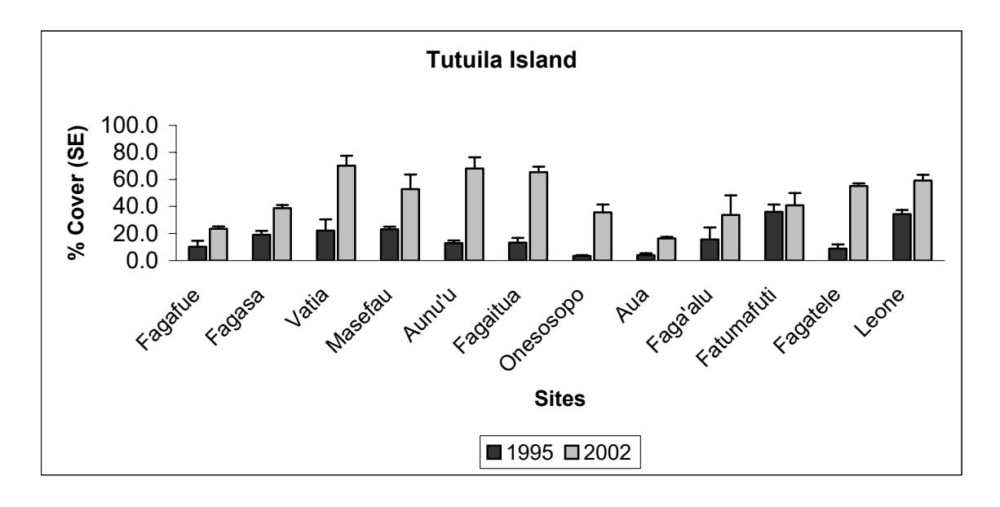

Figure 69. Mean percent coral cover (SE = standard error) of Tutuila Island sites surveyed in 1995 and 2002. Data are from Green (2002) using the 3-point transect method (and  $5 \times 50$  m transects).

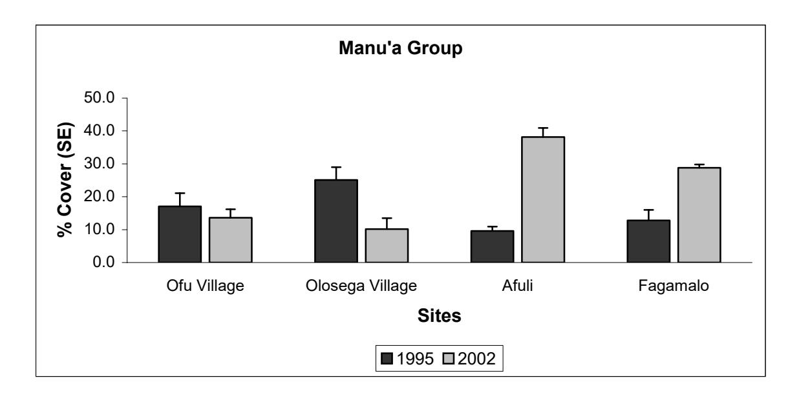

Figure 70. Mean percent coral cover (SE = standard error) of Manu'a Group sites surveyed in 1995 and 2002. Data are from Green (2002) using the 3-point transect method (and  $5 \times 50$  m transects).

Change in coral cover in the Manu'a Group was variable with similar cover or a decrease in cover recorded at Ofu Village and Olosega Village sites (respectively) where COTS

were observed or interpreted to have been active in the previous few years. In contrast, Afuli and Fagamalo on the western side on Tau Island increased in cover.

## **DISCUSSION**

*Current Status of Reefs of American Samoa* 

The 2002 survey was conducted approximately six and a half years following the initial 1995 baseline survey of Mundy (1996). Over that time, recovery from the disturbances of cyclones in the early 1990s has continued on Tutuila and on Tau Island in the Manu'a Group. However, the islands of Ofu and Olosega in the Manu'a Group have been affected by a chronic COTS population that is apparently moving around the two islands and severely disrupting recovery processes on all slope corals up to the shallow surf zone.

Where good recovery is occurring, the process is resulting in a wide range of colony sizes being present at a site with a gradual increase in the abundance of large colonies observed. At some sites, space is becoming limited, eg, at Aunu'u, where it is likely that any further succession will occur at small spatial scales as individual coral colonies compete for space, or replace individual dead colonies. Recovery is also evident from a general increase in species richness that was observed at the majority of sites, including those that have obviously been affected by recent COTS predation. This indicates that recruitment is a relatively regular process though it is not uniform throughout the archipelago. This is evident through the distinct differences in the relative prevalence of many of the predominant genera and species between Tutuila and the Manu'a Group. However, on the scale of the whole archipelago, the overall prevalence of species is not substantially different between the two survey times. That is, there is a moderately high number of commonly shared species among sites with high relative dominance in both surveys, taking into account the reduction in sample size in 2002 compared to 1995. The similarity of structural dominance of certain growth forms also supports the conclusion that overall change has not been substantial between the surveys, despite the increase in species richness and colony sizes.

The restriction of our surveys to a single depth regime may not result in a complete assessment of the status of reefs in American Samoa. For example, the recovery process may be at a less advanced stage in slope communities at depths shallower than 10 m. Incidental observations of the shallow coral communities adjacent to the monitoring sites seem to suggest that recovery is far less uniform than at 10 m depth. It was also obvious at shallower depths in a number of sites, that there were coral communities with different structure, dominance, and species composition present compared to the 10 m depth habitat. It is likely that there has been different mortality in shallow water due to recent bleaching events as observations of shallower corals during the present survey indicated a greater degree of bleaching in these corals than what was evident at 10 m depth. In particular, the relatively more abundant *Acropora* spp colonies in shallower water appeared highly susceptible to the bleaching conditions. COTS also tend to avoid the most turbulent habitats and there was evidence of higher abundance of especially

*Acropora* spp (a preferred food species of the starfish) in the shallow depths. The most recent bleaching event was in progress at the time of the current survey in March 2002, so there was an opportunity to make observations on the extent of bleaching over a wide depth and geographical range. It was clear that coral bleaching at the monitoring site depth of 10 m was more variable and selective with respect to which species were bleached and to the degree of bleaching, than what was generally happening in shallower water. Differences in turbidity seemed to be a factor in the variability of bleaching effects between sites, as was the presence of more or less susceptible coral species.

The dual processes of recovery and COTS predation are creating a large scale patchiness in the American Samoa coral communities that will result in increasingly different succession phases throughout these reefs for the next decade or longer. The final outcome of the COTS presence in the Ofu – Olosega islands has not been reached as chronic (unsustainable) numbers of starfish are present on many sections of the slope and in the lagoon on Ofu. The overall situation and prognosis is probably different for the shallower coral communities. This is because the impact of bleaching and storm events will be more severe in shallow water than at 10 m depth or deeper, whilst the impact from COTS will be less severe due to the tendency of starfish to avoid the more turbulent shallow water conditions.

The lagoon at Olosega was not surveyed so no current status is available for this habitat, though the lagoon on Ofu was assessed extensively prior to the commencement of the current slope surveys. The Ofu lagoon has very high coral cover and species diversity and COTS have been observed here. Personnel from US National Parks have been removing COTS whenever they are observed in the Ofu lagoon, though there has been no specific program developed to remove COTS (P. Craig, pers.comm.). The Ofu lagoon corals were also showing severe bleaching effects in March, though by June the corals were generally recovering though no quantitative data are available as to the degree of mortality from the bleaching event (C. Birkeland, pers.obs.).

## *Status of Coral Communities in Pago Harbour*

The status of coral communities in Pago Harbour is identified by DMWR as being of particular interest. The concern is due to the pollution pressures that are present in the surrounding coastal areas, and the need to gauge the impact of measures implemented to improve the situation of general health of communities and the quality of the water in this spectacular Harbour.

The results of the re-survey of Pago Harbour sites are encouraging but still equivocal. Colony density increased in all four sites by 2002 as did coral cover in two sites, but cover was recorded as not substantially changed in the other two sites. Overall, colony size frequencies demonstrated a more even spread of sizes and an increase in the number of larger colonies. Two sites (Onesosopo and Aua) showed moderate and high structural similarities with a similar dominance (low species turnover) between surveys. One site (Fatumafuti) showed a noticeable reduction in species richness as well as a reduction in

colony sizes, resulting in low structural similarity and high species turnover between surveys. Notwithstanding these dynamics, species richness of the re-surveyed sites is within the range recorded from elsewhere on Tutuila, though only one of the four sites showed an increase in richness in 2002. Coral cover in 2002 was generally lower in the Harbour than at other Tutuila sites, except for Fagafue and Fagasa.

It was concluded that two of the Pago Harbour sites (Faga'alu and Fatumafuti), which are both on the outer SW side of the Harbour, could have been (or are still) affected by unknown disturbances.

## *Recommendations for Possible Future Marine National Park Additions*

The DMWR staff requested that we offer some suggestions of sites that may be worthy of consideration as additions to Marine National Parks throughout the territory. A range of criteria may be used to select sites for National Park status but in terms of coral community diversity and regional significance, two sites on Tutuila stand out as possible good additions. These are two sites in the SE sector of Tutuila, one on the island of Aunu'u and the other in the large bay of Fagaitua to the west of Aunu'u. Aunu'u is located on a small island that has significant terrestrial and aquatic habitats that are recognized as being on national importance. The corals at the Aunu'u site are clearly a diverse and flourishing community with evidence that recovery potential is rapid, indicating that conditions for coral development are very good. There have been previous COTS outbreaks at Aunu'u (C. Birkeland, pers.obs.), the latest occurring in the 1970s, and the fact that this site was interpreted as one of the few Tutuila sites that is approaching an advanced succession stage is indicative of the importance of this site to coral communities.

The Fagaitua site is also significant in that it has a very different coral assemblage to most other Tutuila sites. The coral species assemblage is well developed which has also not been observed elsewhere, ie, individual species not common elsewhere are often large at this site (eg, *Lobophyllia hemprichii*). Because of the relative uniqueness of its coral assemblage, the Fagaitua site deserves consideration as a possible Marine Protected Area under National Park or other legislative jurisdictions.

In the Manu'a Group, the unusual coral assemblage at Afuli on Tau Island is also worthy of consideration due to the dominance of very large massive *Porites* spp corals on the slope. There are also a number of large *Diploastrea heliopora* colonies present amongst the unusual encrusting communities dominated by *Montipora* spp and *Astreopora* spp. Threats to the coral communities are minor as the adjacent land mass consists of steep slopes close to the shore and there is very little human disturbance in the immediate catchments and low human subsistence populations. The northern sites of Faga and Lepula on Tau also are of particular interest due to the relatively diverse coral communities present on the slope and similar low threats from land use practices in adjacent catchments.

## *Recommendations for Future Surveys*

The initial long-term monitoring design for American Samoa builds on previous work by Alison Green (Green 1996). Green (1996) was primarily surveying fish communities and their associated habitat. The basic habitat assessment describes percent cover of the major benthic components of each site and is intended to be used as an adjunct to the main objective of determining fish community dynamics. A good monitoring design will stratify within habitats to reduce the variability of the data. The decision to use a standard 10-m depth stratum was reasonable given the ambient sea conditions on most exposed areas, but it also was a good choice for describing the habitat where the most numerous and diverse fish communities were commonly located. However, in the majority of sites we surveyed, the 10-m depth contour corresponded with the approximate lower extent of where the most abundant and diverse coral communities were usually located.

In effect, the current monitoring program is not adequately assessing the full community dynamics from the range of coral assemblages that are present in American Samoa. To address this limitation, it is recommended that a sub-set of the sites included in the long term coral monitoring program be expanded to include a shallower depth stratum as well. There is a number of current long term monitoring sites where it is feasible to restrict the benthic assessment component to the basic habitat description as used by Green (1996). Sampling time can therefore be available for additional sampling effort in shallower habitats as well. This will have implications for the sharing of field time between fish and benthic assessment components, and to the overall logistics of these expensive but highly valuable surveys. Alternatively, some of the coral surveys may have to be carried out separately to the fish surveys in the future so as to address this limitation of the current design.

The frequency of expert surveys every approximately five years is adequate to record long-term trends in coral community dynamics. However, the time interval between surveys is relatively long for retrospective interpretation of reasons for observed community dynamics. Local staff should be informed in detail of the results of these surveys and encouraged to make comment on the reasons for the observed dynamics which are not always complete when surveys are done by visiting specialists from outside American Samoa. It is recommended that budget provisions be made for the return of specialists undertaking these surveys so as detailed presentations and discussions are held to ensure the best knowledge of local staff is incorporated into the reports.

## **Acknowledgements**

Thanks to the Director Ray Tulafono and staff of the Department of Marine and Wildlife Resources for their support. Thanks go especially to Flinn Curren who obtained funding and carried out much of the background organising for the field work. Alison Green contributed to the planning of background logistical requirements and her previous experience in undertaking the initial baseline survey in 1995 was beneficial to the smooth running of this field program. Leland Yandall was instrumental in organising and

implementing most of the daily logistical requirements. Staff of NPAS and FBNMS (including Peter Craig, Larry Basch, Fale Tuilagi) assisted with logistics for the field program. Larry Basch should be acknowledged for his contribution to the essential tasks of laying and retrieving transect lines and for counting giant clams. He also provided a vast reference photo library, and a number of photos are used in this report and the companion report of Alison Green.

## **References**

Cornish AS, and DT Wilson (2002). *The American Samoan Coral Reef Monitoring Program. An Integrated Long Term Monitoring Plan for the Territory*. Report to the Department of Marine and Wildlife Resources, Pago Pago, American Samoa.

Green A (1996). *Status of the Coral Reefs of the Samoan Archipelago*. Report to Department of Marine and Wildlife Resources, American Samoan Government.

Green A (2002). *Re-Survey of Fish and Macro Invertebrates in Long Term Monitoring Sites of American Samoa*. (Draft)

Mundy, C (1996). *A Quantitative Survey of the Corals of American Samoa*. Report to Department of Marine and Wildlife Resources, American Samoa Government.

Veron, JEN (2000). *Corals of the World*. Vols. 1 to 3, Australian Institute of Marine Science and CRR Qld Pty Ltd.

Wallace, CC (1999). *Staghorn Corals of the World : a revision of the coral genus Acropora*. CSIRO Collingwood, Australia, Pp. 421.

Zar, JH (1984). *Biostatistical Analysis*. Prentice-Hall International Editions, New Jersey.

**Appendix 1. Raw data from the 2002 survey presented in size frequency categories. (CAT 1 = <=5 cm; CAT 2 = >5 - <10 cm; CAT 3 = >10 - <20 cm; CAT 4 = >20 - <40 cm; CAT 5 = >40 - <80 cm; CAT 6 = >80 - < 160 cm; CAT 7 = >160 cm).** 

|              |         | DATE GROUP ISLAND | SITE             |         | TRANS SPECIES                             | N      | CAT<br>1 | CAT<br>2 | CAT<br>3 | CAT<br>4 | CAT<br>5 | CAT<br>6 | CAT<br>7 |
|--------------|---------|-------------------|------------------|---------|-------------------------------------------|--------|----------|----------|----------|----------|----------|----------|----------|
| 19-Mar<br>02 | Tutuila | Tutuila           | Fagafue          | 1       | Montipora effusa                          | 9      | 1        | 1        | 2        | 3        | 2        | 0        | 0        |
|              |         |                   |                  |         | Favites halicora                          | 4      | 0        | 0        | 0        | 3        | 1        | 0        | 0        |
|              |         |                   |                  |         | Montipora informis                        | 4      | 0        | 0        | 0        | 3        | 1        | 0        | 0        |
|              |         |                   |                  |         | Acropora secale                           | 2      | 0        | 1        | 1        | 0        | 0        | 0        | 0        |
|              |         |                   |                  |         | Montipora grisea                          | 2      | 0        | 0        | 0        | 1        | 1        | 0        | 0        |
|              |         |                   |                  |         | Acropora aculeus                          | 1      | 0        | 0        | 0        | 1        | 0        | 0        | 0        |
|              |         |                   |                  |         | Acropora paniculata                       | 1      | 0        | 0        | 1        | 0        | 0        | 0        | 0        |
|              |         |                   |                  |         | Acropora selago                           | 1      | 0        | 0        | 1        | 0        | 0        | 0        | 0        |
|              |         |                   |                  |         | Astreopora cucullata                      | 1      | 0        | 0        | 0        | 1        | 0        | 0        | 0        |
|              |         |                   |                  |         | Coscinaraea columna                       | 1      | 0        | 0        | 0        | 1        | 0        | 0        | 0        |
|              |         |                   |                  |         | Favia matthaii                            | 1      | 0        | 0        | 0        | 0        | 1        | 0        | 0        |
|              |         |                   |                  |         | Galaxea fascicularis                      | 1      | 0        | 0        | 1        | 0        | 0        | 0        | 0        |
|              |         |                   |                  |         | Montipora corbettensis                    | 1      | 0        | 0        | 1        | 0        | 0        | 0        | 0        |
|              |         |                   |                  |         | Montipora monasteriata                    | 1      | 0        | 1        | 0        | 0        | 0        | 0        | 0        |
|              |         |                   |                  |         | Montipora tuberculosa                     | 1      | 0        | 0        | 0        | 1        | 0        | 0        | 0        |
|              |         |                   |                  |         | Montipora venosa                          | 1      | 0        | 0        | 0        | 1        | 0        | 0        | 0        |
|              |         |                   |                  |         | Pavona duerdeni                           | 1      | 0        | 0        | 0        | 0        | 0        | 1        | 0        |
|              |         |                   |                  |         | Pocillopora meandrina                     | 1      | 0        | 0        | 0        | 1        | 0        | 0        | 0        |
|              |         |                   |                  | 1 Total |                                           | 34     | 1        | 3        | 7        | 16       | 6        | 1        | 0        |
| 19-Mar<br>02 | Tutuila | Tutuila           | Fagafue          | 2       | Montipora effusa                          | 7      | 4        | 1        | 0        | 2        | 0        | 0        | 0        |
|              |         |                   |                  |         | Porites lichen                            | 2      | 0        | 1        | 1        | 0        | 0        | 0        | 0        |
|              |         |                   |                  |         | Acropora juv                              | 1      | 1        | 0        | 0        | 0        | 0        | 0        | 0        |
|              |         |                   |                  |         | Acropora paniculata                       | 1      | 0        | 0        | 0        | 1        | 0        | 0        | 0        |
|              |         |                   |                  |         | Leptoseris<br>mycetoseroides              | 1      | 0        | 0        | 0        | 1        | 0        | 0        | 0        |
|              |         |                   |                  | 2 Total |                                           | 12     | 5        | 2        | 1        | 4        | 0        | 0        | 0        |
| 19-Mar<br>02 | Tutuila | Tutuila           | Fagafue          | 3       | Montipora<br>aequituberculata             | 12     | 2        | 5        | 4        | 1        | 0        | 0        | 0        |
|              |         |                   |                  |         | Montipora effusa                          | 5      | 0        | 3        | 0        | 2        | 0        | 0        | 0        |
|              |         |                   |                  |         | Acropora intermedia                       | 3      | 0        | 0        | 1        | 2        | 0        | 0        | 0        |
|              |         |                   |                  |         | Porites lichen                            | 2      | 0        | 2        | 0        | 0        | 0        | 0        | 0        |
|              |         |                   |                  |         | Montipora grisea                          | 1      | 0        | 0        | 1        | 0        | 0        | 0        | 0        |
|              |         |                   |                  |         | Montipora hoffmeisteri                    | 1      | 0        | 1        | 0        | 0        | 0        | 0        | 0        |
|              |         |                   |                  |         | Pavona venosa                             | 1      | 0        | 1        | 0        | 0        | 0        | 0        | 0        |
|              |         |                   |                  |         | Pocillopora meandrina                     | 1      | 0        | 0        | 0        | 1        | 0        | 0        | 0        |
|              |         |                   |                  |         | Porites rus                               | 1      | 0        | 1        | 0        | 0        | 0        | 0        | 0        |
|              |         |                   |                  |         | Psammocora nierstrazi                     | 1      | 0        | 1        | 0        | 0        | 0        | 0        | 0        |
|              |         |                   |                  | 3 Total |                                           | 28     | 2        | 14       | 6        | 6        | 0        | 0        | 0        |
|              |         |                   | Fagafue<br>Total |         |                                           | 74     | 8        | 19       | 14       | 26       | 6        | 1        | 0        |
| 19-Mar<br>02 | Tutuila | Tutuila           | Fagasa           | 1       | Montipora grisea                          | 7      | 0        | 4        | 1        | 1        | 1        | 0        | 0        |
|              |         |                   |                  |         | Porites rus                               | 7      | 2        | 2        | 2        | 0        | 1        | 0        | 0        |
|              |         |                   |                  |         | Montipora<br>aequituberculata             | 6      | 0        | 2        | 2        | 1        | 1        | 0        | 0        |
|              |         |                   |                  |         | Porites cf australiensis                  | 4      | 0        | 3        | 1        | 0        | 0        | 0        | 0        |
|              |         |                   |                  |         | Pavona venosa                             | 3      | 0        | 1        | 1        | 1        | 0        | 0        | 0        |
|              |         |                   |                  |         |                                           | 2      | 2        | 0        | 0        | 0        | 0        | 0        | 0        |
|              |         |                   |                  |         |                                           |        |          |          |          |          |          |          |          |
|              |         |                   |                  |         | Alveopora spongiosa                       |        |          |          |          |          |          |          |          |
|              |         |                   |                  |         | Montipora venosa                          | 2      | 1        | 1        | 0        | 0        | 0        | 0        | 0        |
|              |         |                   |                  |         | Pavona varians                            | 2      | 1        | 0        | 1        | 0        | 0        | 0        | 0        |
|              |         |                   |                  |         | Porites cf lutea                          | 2      | 0        | 0        | 2        | 0        | 0        | 0        | 0        |
|              |         |                   |                  |         | Porites cylindrica<br>Astreopora gracilis | 2<br>1 | 1<br>0   | 0<br>0   | 1<br>1   | 0<br>0   | 0<br>0   | 0<br>0   | 0<br>0   |

|              |         | DATE GROUP ISLAND | SITE            |         | TRANS SPECIES                | N   | CAT<br>1 | CAT<br>2 | CAT<br>3 | CAT<br>4 | CAT<br>5 | CAT<br>6 | CAT<br>7 |
|--------------|---------|-------------------|-----------------|---------|------------------------------|-----|----------|----------|----------|----------|----------|----------|----------|
| 19-Mar<br>02 | Tutuila | Tutuila           | Fagasa          | 2       | Porites rus                  | 10  | 6        | 0        | 3        | 1        | 0        | 0        | 0        |
|              |         |                   |                 |         | Porites lichen               | 6   | 2        | 3        | 0        | 1        | 0        | 0        | 0        |
|              |         |                   |                 |         | Leptoseris<br>mycetoseroides | 3   | 0        | 1        | 2        | 0        | 0        | 0        | 0        |
|              |         |                   |                 |         | Pavona venosa                | 3   | 0        | 1        | 0        | 2        | 0        | 0        | 0        |
|              |         |                   |                 |         | Montipora grisea             | 2   | 0        | 0        | 0        | 2        | 0        | 0        | 0        |
|              |         |                   |                 |         | Porites cf australiensis     | 2   | 0        | 1        | 1        | 0        | 0        | 0        | 0        |
|              |         |                   |                 |         | Acropora paniculata          | 1   | 0        | 1        | 0        | 0        | 0        | 0        | 0        |
|              |         |                   |                 |         | Coscinaraea columna          | 1   | 0        | 0        | 1        | 0        | 0        | 0        | 0        |
|              |         |                   |                 |         | Favia speciosa               | 1   | 0        | 0        | 1        | 0        | 0        | 0        | 0        |
|              |         |                   |                 |         | Galaxea fascicularis         | 1   | 0        | 0        | 1        | 0        | 0        | 0        | 0        |
|              |         |                   |                 |         | Montipora                    | 1   | 0        | 1        | 0        | 0        | 0        | 0        | 0        |
|              |         |                   |                 |         | aequituberculata             |     |          |          |          |          |          |          |          |
|              |         |                   |                 |         | Montipora hoffmeisteri       | 1   | 1        | 0        | 0        | 0        | 0        | 0        | 0        |
|              |         |                   |                 |         | Pavona varians               | 1   | 1        | 0        | 0        | 0        | 0        | 0        | 0        |
|              |         |                   |                 |         | Porites cf lutea             | 1   | 0        | 0        | 1        | 0        | 0        | 0        | 0        |
|              |         |                   |                 |         | Psammocora haimeana          | 1   | 0        | 0        | 0        | 1        | 0        | 0        | 0        |
|              |         |                   |                 | 2 Total |                              | 35  | 10       | 8        | 10       | 7        | 0        | 0        | 0        |
| 19-Mar<br>02 | Tutuila | Tutuila           | Fagasa          | 3       | Porites cylindrica           | 15  | 1        | 1        | 2        | 5        | 3        | 3        | 0        |
|              |         |                   |                 |         | Porites rus                  | 15  | 7        | 3        | 2        | 1        | 1        | 1        | 0        |
|              |         |                   |                 |         | Pavona venosa                | 11  | 1        | 4        | 5        | 1        | 0        | 0        | 0        |
|              |         |                   |                 |         | Porites lichen               | 8   | 6        | 2        | 0        | 0        | 0        | 0        | 0        |
|              |         |                   |                 |         | Leptoseris                   | 2   | 1        | 0        | 1        | 0        | 0        | 0        | 0        |
|              |         |                   |                 |         | mycetoseroides               |     |          |          |          |          |          |          |          |
|              |         |                   |                 |         | Montipora monasteriata       | 2   | 0        | 0        | 2        | 0        | 0        | 0        | 0        |
|              |         |                   |                 |         | Porites cf australiensis     | 2   | 0        | 0        | 0        | 1        | 1        | 0        | 0        |
|              |         |                   |                 |         | Fungia concinna              | 1   | 0        | 0        | 1        | 0        | 0        | 0        | 0        |
|              |         |                   |                 |         | Galaxea fascicularis         | 1   | 0        | 0        | 1        | 0        | 0        | 0        | 0        |
|              |         |                   |                 |         | Goniastrea aspera            | 1   | 0        | 1        | 0        | 0        | 0        | 0        | 0        |
|              |         |                   |                 |         | Montipora venosa             | 1   | 0        | 0        | 1        | 0        | 0        | 0        | 0        |
|              |         |                   |                 | 3 Total |                              | 59  | 16       | 11       | 15       | 8        | 5        | 4        | 0        |
|              |         |                   | Fagasa<br>Total |         |                              | 132 | 33       | 32       | 37       | 18       | 8        | 4        | 0        |
| 18-Mar<br>02 | Tutuila | Tutuila           | Vatia           | 1       | Porites cf horizontalata     | 26  | 10       | 10       | 5        | 1        | 0        | 0        | 0        |
|              |         |                   |                 |         | Montipora corbettensis       | 13  | 1        | 2        | 4        | 5        | 1        | 0        | 0        |
|              |         |                   |                 |         | Montipora grisea             | 8   | 1        | 3        | 3        | 1        | 0        | 0        | 0        |
|              |         |                   |                 |         | Pavona varians               | 7   | 0        | 0        | 5        | 2        | 0        | 0        | 0        |
|              |         |                   |                 |         | Pocillopora eydouxi          | 6   | 0        | 0        | 0        | 2        | 4        | 0        | 0        |
|              |         |                   |                 |         | Pocillopora meandrina        | 6   | 0        | 0        | 3        | 1        | 2        | 0        | 0        |
|              |         |                   |                 |         | Leptastrea purpurea          | 5   | 2        | 0        | 1        | 2        | 0        | 0        | 0        |
|              |         |                   |                 |         | Montastraea curta            | 5   | 1        | 2        | 2        | 0        | 0        | 0        | 0        |
|              |         |                   |                 |         | Montipora juv                | 5   | 5        | 0        | 0        | 0        | 0        | 0        | 0        |
|              |         |                   |                 |         | Montipora nodosa             | 5   | 2        | 0        | 1        | 2        | 0        | 0        | 0        |
|              |         |                   |                 |         | Psammocora haimeana          | 5   | 3        | 2        | 0        | 0        | 0        | 0        | 0        |
|              |         |                   |                 |         | Pavona venosa                | 3   | 0        | 2        | 1        | 0        | 0        | 0        | 0        |
|              |         |                   |                 |         | Cyphastrea chalcidium        | 2   | 1        | 1        | 0        | 0        | 0        | 0        | 0        |
|              |         |                   |                 |         | Galaxea astreata             | 2   | 2        | 0        | 0        | 0        | 0        | 0        | 0        |
|              |         |                   |                 |         | Galaxea fascicularis         | 2   | 0        | 0        | 1        | 1        | 0        | 0        | 0        |
|              |         |                   |                 |         | Leptastrea transversa        | 2   | 1        | 0        | 1        | 0        | 0        | 0        | 0        |
|              |         |                   |                 |         | Montipora monasteriata       | 2   | 0        | 1        | 0        | 1        | 0        | 0        | 0        |
|              |         |                   |                 |         | Acropora abrotanoides        | 1   | 0        | 0        | 0        | 0        | 0        | 1        | 0        |
|              |         |                   |                 |         | Acropora humilis             | 1   | 0        | 0        | 0        | 1        | 0        | 0        | 0        |
|              |         |                   |                 |         | Astreopora                   | 1   | 0        | 0        | 0        | 0        | 1        | 0        | 0        |
|              |         |                   |                 |         | myriophthalma                |     |          |          |          |          |          |          |          |
|              |         |                   |                 |         | Goniastrea australensis      | 1   | 0        | 0        | 0        | 0        | 1        | 0        | 0        |
|              |         |                   |                 |         | Goniastrea retiformis        | 1   | 0        | 1        | 0        | 0        | 0        | 0        | 0        |
|              |         |                   |                 |         | Leptoria phrygia             | 1   | 0        | 0        | 0        | 1        | 0        | 0        | 0        |
|              |         |                   |                 |         | Montastraea annularis        | 1   | 0        | 0        | 0        | 1        | 0        | 0        | 0        |
|              |         |                   |                 |         | Montipora efflorescens       | 1   | 0        | 0        | 0        | 1        | 0        | 0        | 0        |
|              |         |                   |                 |         | Montipora hoffmeisteri       | 1   | 1        | 0        | 0        | 0        | 0        | 0        | 0        |

|              |         | DATE GROUP ISLAND | SITE    |         | TRANS SPECIES                       | N      | CAT    | CAT    | CAT    | CAT    | CAT    | CAT    | CAT    |
|--------------|---------|-------------------|---------|---------|-------------------------------------|--------|--------|--------|--------|--------|--------|--------|--------|
|              |         |                   |         |         |                                     |        | 1      | 2      | 3      | 4      | 5      | 6      | 7      |
|              |         |                   |         | 1 Total |                                     | 113    | 30     | 24     | 27     | 22     | 9      | 1      | 0      |
| 18-Mar<br>02 | Tutuila | Tutuila           | Vatia   | 2       | Montipora corbettensis              | 7      | 0      | 2      | 2      | 1      | 1      | 0      | 1      |
|              |         |                   |         |         | Montipora grisea                    | 7      | 1      | 1      | 4      | 0      | 1      | 0      | 0      |
|              |         |                   |         |         | Pocillopora eydouxi                 | 6      | 0      | 0      | 1      | 5      | 0      | 0      | 0      |
|              |         |                   |         |         | Montipora nodosa                    | 4      | 0      | 1      | 2      | 1      | 0      | 0      | 0      |
|              |         |                   |         |         | Pavona varians                      | 4      | 0      | 0      | 0      | 4      | 0      | 0      | 0      |
|              |         |                   |         |         | Porites cf horizontalata            | 3      | 1      | 2      | 0      | 0      | 0      | 0      | 0      |
|              |         |                   |         |         | Montastraea curta                   | 2      | 0      | 0      | 2      | 0      | 0      | 0      | 0      |
|              |         |                   |         |         | Acropora abrotanoides               | 1      | 0      | 0      | 1      | 0      | 0      | 0      | 0      |
|              |         |                   |         |         | Acropora rosaria                    | 1      | 0      | 0      | 0      | 0      | 1      | 0      | 0      |
|              |         |                   |         |         | Acropora secale                     | 1      | 0      | 0      | 0      | 0      | 1      | 0      | 0      |
|              |         |                   |         |         | Astreopora listeri                  | 1      | 0      | 0      | 0      | 0      | 0      | 1      | 0      |
|              |         |                   |         |         | Leptastrea purpurea                 | 1      | 0      | 0      | 1      | 0      | 0      | 0      | 0      |
|              |         |                   |         |         | Leptastrea transversa               | 1      | 0      | 0      | 1      | 0      | 0      | 0      | 0      |
|              |         |                   |         |         | Montipora tuberculosa               | 1      | 0      | 0      | 0      | 0      | 1      | 0      | 0      |
|              |         |                   |         |         | Pocillopora meandrina               | 1      | 0      | 0      | 0      | 1      | 0      | 0      | 0      |
|              |         |                   |         | 2 Total |                                     | 41     | 2      | 6      | 14     | 12     | 5      | 1      | 1      |
| 18-Mar<br>02 | Tutuila | Tutuila           | Vatia   | 3       | Porites rus                         | 6      | 0      | 2      | 0      | 0      | 2      | 2      | 0      |
|              |         |                   |         |         | Montipora grisea                    | 4      | 0      | 2      | 2      | 0      | 0      | 0      | 0      |
|              |         |                   |         |         | Leptastrea purpurea                 | 3      | 3      | 0      | 0      | 0      | 0      | 0      | 0      |
|              |         |                   |         |         | Porites cf lutea                    | 3      | 0      | 0      | 0      | 2      | 0      | 0      | 1      |
|              |         |                   |         |         | Pocillopora verrucosa               | 2      | 0      | 0      | 0      | 2      | 0      | 0      | 0      |
|              |         |                   |         |         | Porites cf horizontalata            | 2      | 0      | 1      | 1      | 0      | 0      | 0      | 0      |
|              |         |                   |         |         | Montipora nodosa                    | 1      | 0      | 0      | 0      | 1      | 0      | 0      | 0      |
|              |         |                   |         | 3 Total |                                     | 21     | 3      | 5      | 3      | 5      | 2      | 2      | 1      |
|              |         |                   | Vatia   |         |                                     | 175    | 35     | 35     | 44     | 39     | 16     | 4      | 2      |
|              |         |                   | Total   |         |                                     |        |        |        |        |        |        |        |        |
| 18-Mar<br>02 | Tutuila | Tutuila           | Masefau | 1       | Acropora valida                     | 22     | 8      | 6      | 7      | 1      | 0      | 0      | 0      |
|              |         |                   |         |         | Montipora grisea                    | 19     | 5      | 6      | 7      | 1      | 0      | 0      | 0      |
|              |         |                   |         |         | Montipora corbettensis              | 15     | 7      | 4      | 4      | 0      | 0      | 0      | 0      |
|              |         |                   |         |         | Porites cf horizontalata            | 12     | 2      | 8      | 2      | 0      | 0      | 0      | 0      |
|              |         |                   |         |         | Porites lichen                      | 5      | 4      | 1      | 0      | 0      | 0      | 0      | 0      |
|              |         |                   |         |         | Montipora efflorescens              | 4      | 2      | 1      | 0      | 1      | 0      | 0      | 0      |
|              |         |                   |         |         | Pavona venosa                       | 4      | 1      | 2      | 0      | 1      | 0      | 0      | 0      |
|              |         |                   |         |         | Montipora nodosa                    | 3      | 1      | 0      | 2      | 0      | 0      | 0      | 0      |
|              |         |                   |         |         | Montipora monasteriata              | 2      | 0      | 0      | 1      | 1      | 0      | 0      | 0      |
|              |         |                   |         |         | Pavona frondifera                   | 2      | 1      | 1      | 0      | 0      | 0      | 0      | 0      |
|              |         |                   |         |         | Pocillopora eydouxi                 | 2      | 0      | 0      | 0      | 2      | 0      | 0      | 0      |
|              |         |                   |         |         | Porites rus                         | 2      | 0      | 1      | 1      | 0      | 0      | 0      | 0      |
|              |         |                   |         |         | Psammocora contigua                 | 2      | 0      | 2      | 0      | 0      | 0      | 0      | 0      |
|              |         |                   |         |         | Acropora juv                        | 1      | 1      | 0      | 0      | 0      | 0      | 0      | 0      |
|              |         |                   |         |         | Acropora rosaria                    | 1      | 0      | 1      | 0      | 0      | 0      | 0      | 0      |
|              |         |                   |         |         | Leptastrea purpurea                 | 1      | 0      | 0      | 1      | 0      | 0      | 0      | 0      |
|              |         |                   |         |         | Leptastrea transversa               | 1      | 0      | 0      | 1      | 0      | 0      | 0      | 0      |
|              |         |                   |         |         | Montastraea curta                   | 1      | 0      | 1      | 0      | 0      | 0      | 0      | 0      |
|              |         |                   |         |         | Pavona varians                      | 1      | 0      | 0      | 1      | 0      | 0      | 0      | 0      |
|              |         |                   |         |         | Pocillopora verrucosa               | 1      | 0      | 0      | 0      | 1      | 0      | 0      | 0      |
|              |         |                   |         |         | Psammocora haimeana                 | 1      | 1      | 0      | 0      | 0      | 0      | 0      | 0      |
|              |         |                   |         |         | Psammocora<br>superficialis         | 1      | 0      | 0      | 0      | 1      | 0      | 0      | 0      |
|              |         |                   |         | 1 Total |                                     | 110    | 39     | 35     | 27     | 9      | 0      | 0      | 0      |
|              |         | Tutuila           | Masefau | 2       | Porites cf horizontalata            | 70     | 42     | 19     | 9      | 0      | 0      | 0      | 0      |
| 18-Mar       | Tutuila |                   |         |         |                                     |        |        |        |        |        |        |        |        |
| 02           |         |                   |         |         |                                     |        |        |        |        |        |        |        |        |
|              |         |                   |         |         | Montipora grisea                    | 21     | 5      | 8      | 5      | 2      | 1      | 0      | 0      |
|              |         |                   |         |         | Montipora corbettensis              | 19     | 6      | 7      | 1      | 5      | 0      | 0      | 0      |
|              |         |                   |         |         | Alveopora spongiosa                 | 11     | 9      | 1      | 1      | 0      | 0      | 0      | 0      |
|              |         |                   |         |         | Psammocora haimeana                 | 6      | 2      | 3      | 1      | 0      | 0      | 0      | 0      |
|              |         |                   |         |         | Pavona varians<br>Goniastrea aspera | 5<br>4 | 3<br>2 | 2<br>0 | 0<br>2 | 0<br>0 | 0<br>0 | 0<br>0 | 0<br>0 |

|              |         | DATE GROUP ISLAND | SITE          |         | TRANS SPECIES                                 | N      | CAT<br>1 | CAT<br>2 | CAT<br>3 | CAT<br>4 | CAT<br>5 | CAT<br>6 | CAT<br>7 |
|--------------|---------|-------------------|---------------|---------|-----------------------------------------------|--------|----------|----------|----------|----------|----------|----------|----------|
|              |         |                   |               |         | Leptastrea purpurea                           | 3      | 2        | 0        | 1        | 0        | 0        | 0        | 0        |
|              |         |                   |               |         | Montipora nodosa                              | 2      | 1        | 0        | 0        | 0        | 1        | 0        | 0        |
|              |         |                   |               |         | Acropora akajimensis                          | 1      | 0        | 0        | 1        | 0        | 0        | 0        | 0        |
|              |         |                   |               |         | Acropora hyacinthus                           | 1      | 0        | 1        | 0        | 0        | 0        | 0        | 0        |
|              |         |                   |               |         | Fungia fungites                               | 1      | 0        | 0        | 1        | 0        | 0        | 0        | 0        |
|              |         |                   |               |         | Fungia molluccensis                           | 1      | 0        | 0        | 1        | 0        | 0        | 0        | 0        |
|              |         |                   |               |         | Galaxea fascicularis                          | 1      | 0        | 1        | 0        | 0        | 0        | 0        | 0        |
|              |         |                   |               |         | Montipora floweri                             | 1      | 0        | 0        | 0        | 1        | 0        | 0        | 0        |
|              |         |                   |               |         | Montipora tuberculosa                         | 1      | 1        | 0        | 0        | 0        | 0        | 0        | 0        |
|              |         |                   |               |         | Pavona venosa                                 | 1      | 0        | 1        | 0        | 0        | 0        | 0        | 0        |
|              |         |                   |               |         | Pocillopora juv                               | 1      | 1        | 0        | 0        | 0        | 0        | 0        | 0        |
|              |         |                   |               |         | Pocillopora meandrina                         | 1      | 0        | 0        | 0        | 1        | 0        | 0        | 0        |
|              |         |                   |               |         | Pocillopora verrucosa                         | 1      | 0        | 0        | 0        | 1        | 0        | 0        | 0        |
|              |         |                   |               |         | Porites rus                                   | 1      | 1        | 0        | 0        | 0        | 0        | 0        | 0        |
|              |         |                   |               |         | Psammocora                                    | 1      | 0        | 1        | 0        | 0        | 0        | 0        | 0        |
|              |         |                   |               |         | profundacella                                 |        |          |          |          |          |          |          |          |
|              |         |                   |               |         | Psammocora                                    | 1      | 0        | 0        | 0        | 1        | 0        | 0        | 0        |
|              |         |                   |               |         | superficialis                                 |        |          |          |          |          |          |          |          |
|              |         |                   |               | 2 Total |                                               | 159    | 77       | 46       | 23       | 11       | 2        | 0        | 0        |
| 18-Mar<br>02 | Tutuila | Tutuila           | Masefau       | 3       | Montipora corbettensis                        | 32     | 12       | 3        | 5        | 9        | 3        | 0        | 0        |
|              |         |                   |               |         | Montipora grisea                              | 30     | 7        | 6        | 5        | 9        | 3        | 0        | 0        |
|              |         |                   |               |         | Pavona varians                                | 8      | 1        | 2        | 2        | 3        | 0        | 0        | 0        |
|              |         |                   |               |         | Porites cf horizontalata                      | 7      | 4        | 2        | 1        | 0        | 0        | 0        | 0        |
|              |         |                   |               |         | Montipora efflorescens                        | 5      | 1        | 0        | 0        | 2        | 2        | 0        | 0        |
|              |         |                   |               |         | Pavona venosa                                 | 5      | 0        | 0        | 1        | 4        | 0        | 0        | 0        |
|              |         |                   |               |         | Leptastrea purpurea                           | 2      | 1        | 0        | 1        | 0        | 0        | 0        | 0        |
|              |         |                   |               |         | Pocillopora verrucosa                         | 2      | 0        | 0        | 0        | 2        | 0        | 0        | 0        |
|              |         |                   |               |         | Pocillopora eydouxi                           | 1      | 0        | 0        | 0        | 1        | 0        | 0        | 0        |
|              |         |                   |               |         | Pocillopora meandrina                         | 1      | 0        | 0        | 0        | 1        | 0        | 0        | 0        |
|              |         |                   |               | 3 Total |                                               | 93     | 26       | 13       | 15       | 31       | 8        | 0        | 0        |
|              |         |                   | Masefau Total |         |                                               | 362    | 142      | 94       | 65       | 51       | 10       | 0        | 0        |
| 16-Mar<br>02 | Tutuila | Tutuila           | Aunu'u        | 1       | Montipora grisea                              | 14     | 1        | 0        | 0        | 11       | 2        | 0        | 0        |
|              |         |                   |               |         | Montipora corbettensis                        | 7      | 0        | 0        | 0        | 5        | 2        | 0        | 0        |
|              |         |                   |               |         | Leptastrea purpurea                           | 6      | 0        | 3        | 3        | 0        | 0        | 0        | 0        |
|              |         |                   |               |         | Montipora efflorescens                        | 6      | 1        | 2        | 2        | 0        | 1        | 0        | 0        |
|              |         |                   |               |         | Pocillopora eydouxi                           | 5      | 0        | 1        | 2        | 1        | 1        | 0        | 0        |
|              |         |                   |               |         | Porites cf horizontalata                      | 5      | 2        | 3        | 0        | 0        | 0        | 0        | 0        |
|              |         |                   |               |         | Pavona varians                                | 4      | 0        | 1        | 3        | 0        | 0        | 0        | 0        |
|              |         |                   |               |         | Pocillopora meandrina                         | 4      | 0        | 0        | 4        | 0        | 0        | 0        | 0        |
|              |         |                   |               |         | Pocillopora verrucosa                         | 4      | 0        | 1        | 2        | 1        | 0        | 0        | 0        |
|              |         |                   |               |         | Montastraea curta                             | 3      | 0        | 2        | 1        | 0        | 0        | 0        | 0        |
|              |         |                   |               |         | Montipora informis                            | 3      | 0        | 0        | 0        | 2        | 1        | 0        | 0        |
|              |         |                   |               |         | Montipora tuberculosa                         | 3      | 0        | 0        | 0        | 2        | 1        | 0        | 0        |
|              |         |                   |               |         | Montipora monasteriata                        | 2      | 0        | 0        | 1        | 1        | 0        | 0        | 0        |
|              |         |                   |               |         | Acropora gemmifera                            | 1      | 0        | 0        | 0        | 0        | 1        | 0        | 0        |
|              |         |                   |               |         | Acropora hyacinthus                           | 1      | 0        | 1        | 0        | 0        | 0        | 0        | 0        |
|              |         |                   |               |         |                                               |        |          |          |          |          |          | 0        | 0        |
|              |         |                   |               |         | Acropora retusa                               | 1      | 0        | 1        | 0        | 0        | 0        |          |          |
|              |         |                   |               |         | Astreopora                                    | 1      | 0        | 0        | 1        | 0        | 0        | 0        | 0        |
|              |         |                   |               |         | myriophthalma                                 |        |          |          |          |          |          |          |          |
|              |         |                   |               |         | Favia stelligera                              | 1      | 0        | 1        | 0        | 0        | 0        | 0        | 0        |
|              |         |                   |               |         | Fungia scruposa                               | 1      | 0        | 1        | 0        | 0        | 0        | 0        | 0        |
|              |         |                   |               |         | Galaxea fascicularis                          | 1      | 0        | 0        | 1        | 0        | 0        | 0        | 0        |
|              |         |                   |               |         | Goniastrea aspera                             | 1      | 0        | 0        | 0        | 1        | 0        | 0        | 0        |
|              |         |                   |               |         | Pavona venosa                                 | 1      | 0        | 0        | 1        | 0        | 0        | 0        | 0        |
|              |         |                   |               |         | Porites cf lutea                              | 1      | 0        | 0        | 0        | 1        | 0        | 0        | 0        |
|              |         |                   |               | 1 Total |                                               | 77     | 5        | 17       | 21       | 25       | 9        | 0        | 0        |
| 16-Mar<br>02 | Tutuila | Tutuila           | Aunu'u        | 2       | Porites cf horizontalata                      | 20     | 8        | 5        | 6        | 0        | 1        | 0        | 0        |
|              |         |                   |               |         | Montipora grisea                              | 11     | 0        | 0        | 4        | 7        | 0        | 0        | 0        |
|              |         |                   |               |         | Montipora corbettensis<br>Pocillopora eydouxi | 8<br>8 | 0<br>0   | 0<br>0   | 0<br>3   | 7<br>2   | 1<br>3   | 0<br>0   | 0<br>0   |

|              |         | DATE GROUP ISLAND | SITE              |         | TRANS SPECIES                         | N      | CAT<br>1 | CAT<br>2 | CAT<br>3 | CAT<br>4 | CAT<br>5 | CAT<br>6 | CAT<br>7 |
|--------------|---------|-------------------|-------------------|---------|---------------------------------------|--------|----------|----------|----------|----------|----------|----------|----------|
|              |         |                   |                   |         | Montipora efflorescens                | 6      | 2        | 0        | 4        | 0        | 0        | 0        | 0        |
|              |         |                   |                   |         | Montastraea curta                     | 4      | 0        | 0        | 3        | 1        | 0        | 0        | 0        |
|              |         |                   |                   |         | Leptastrea purpurea                   | 3      | 1        | 0        | 2        | 0        | 0        | 0        | 0        |
|              |         |                   |                   |         | Pocillopora meandrina                 | 3      | 0        | 0        | 0        | 3        | 0        | 0        | 0        |
|              |         |                   |                   |         | Montipora informis                    | 2      | 0        | 0        | 0        | 1        | 1        | 0        | 0        |
|              |         |                   |                   |         | Montipora monasteriata                | 2      | 0        | 1        | 0        | 0        | 1        | 0        | 0        |
|              |         |                   |                   |         | Montipora tuberculosa                 | 2      | 0        | 2        | 0        | 0        | 0        | 0        | 0        |
|              |         |                   |                   |         | Pavona varians                        | 2      | 0        | 0        | 2        | 0        | 0        | 0        | 0        |
|              |         |                   |                   |         | Pocillopora verrucosa                 | 2      | 0        | 0        | 2        | 0        | 0        | 0        | 0        |
|              |         |                   |                   |         | Acropora abrotanoides                 | 1      | 0        | 0        | 0        | 0        | 0        | 1        | 0        |
|              |         |                   |                   |         | Acropora clathrata                    | 1      | 0        | 0        | 0        | 1        | 0        | 0        | 0        |
|              |         |                   |                   |         | Acropora humilis                      | 1      | 0        | 0        | 0        | 0        | 1        | 0        | 0        |
|              |         |                   |                   |         | Acropora latistella                   | 1      | 0        | 0        | 0        | 1        | 0        | 0        | 0        |
|              |         |                   |                   |         | Fungia scruposa                       | 1      | 0        | 1        | 0        | 0        | 0        | 0        | 0        |
|              |         |                   |                   |         | Goniastrea retiformis                 | 1      | 0        | 0        | 0        | 1        | 0        | 0        | 0        |
|              |         |                   |                   |         | Hydnophora microconos                 | 1      | 0        | 0        | 1        | 0        | 0        | 0        | 0        |
|              |         |                   |                   |         | Leptastrea transversa                 | 1      | 0        | 0        | 1        | 0        | 0        | 0        | 0        |
|              |         |                   |                   |         | Pavona venosa                         | 1      | 0        | 0        | 0        | 1        | 0        | 0        | 0        |
|              |         |                   |                   |         | Pocillopora juv                       | 1      | 1        | 0        | 0        | 0        | 0        | 0        | 0        |
|              |         |                   |                   |         | Psammocora haimeana                   | 1      | 0        | 0        | 0        | 0        | 1        | 0        | 0        |
|              |         |                   |                   | 2 Total |                                       | 84     | 12       | 9        | 28       | 25       | 9        | 1        | 0        |
| 16-Mar<br>02 | Tutuila | Tutuila           | Aunu'u            | 3       | Porites cf horizontalata              | 47     | 34       | 11       | 2        | 0        | 0        | 0        | 0        |
|              |         |                   |                   |         | Montipora grisea                      | 8      | 1        | 1        | 5        | 0        | 1        | 0        | 0        |
|              |         |                   |                   |         | Galaxea fascicularis                  | 6      | 0        | 2        | 4        | 0        | 0        | 0        | 0        |
|              |         |                   |                   |         | Montipora corbettensis                | 5      | 0        | 1        | 2        | 1        | 1        | 0        | 0        |
|              |         |                   |                   |         | Pocillopora eydouxi                   | 5      | 0        | 0        | 0        | 3        | 2        | 0        | 0        |
|              |         |                   |                   |         | Montipora foveolata                   | 4      | 4        | 0        | 0        | 0        | 0        | 0        | 0        |
|              |         |                   |                   |         | Montipora efflorescens                | 3      | 0        | 1        | 2        | 0        | 0        | 0        | 0        |
|              |         |                   |                   |         | Acropora glauca                       | 2      | 0        | 0        | 1        | 0        | 1        | 0        | 0        |
|              |         |                   |                   |         | Astreopora listeri                    | 2      | 0        | 0        | 0        | 2        | 0        | 0        | 0        |
|              |         |                   |                   |         | Favia stelligera                      | 2      | 0        | 1        | 0        | 1        | 0        | 0        | 0        |
|              |         |                   |                   |         | Montipora informis                    | 2      | 0        | 0        | 0        | 2        | 0        | 0        | 0        |
|              |         |                   |                   |         | Montipora nodosa                      | 2      | 1        | 1        | 0        | 0        | 0        | 0        | 0        |
|              |         |                   |                   |         | Montipora tuberculosa                 | 2      | 1        | 1        | 0        | 0        | 0        | 0        | 0        |
|              |         |                   |                   |         | Pavona varians                        | 2      | 0        | 0        | 2        | 0        | 0        | 0        | 0        |
|              |         |                   |                   |         | Pocillopora verrucosa                 | 2      | 0        | 0        | 2        | 0        | 0        | 0        | 0        |
|              |         |                   |                   |         | Acropora crateriformis                | 1      | 0        | 0        | 0        | 1        | 0        | 0        | 0        |
|              |         |                   |                   |         | Acropora humilis                      | 1      | 0        | 0        | 0        | 1        | 0        | 0        | 0        |
|              |         |                   |                   |         | Acropora nasuta                       | 1      | 0        | 0        | 0        | 1        | 0        | 0        | 0        |
|              |         |                   |                   |         | Leptastrea purpurea                   | 1      | 0        | 0        | 1        | 0        | 0        | 0        | 0        |
|              |         |                   |                   |         | Montipora monasteriata                | 1      | 0        | 0        | 0        | 1        | 0        | 0        | 0        |
|              |         |                   |                   |         | Pocillopora juv                       | 1      | 1        | 0        | 0        | 0        | 0        | 0        | 0        |
|              |         |                   |                   |         | Porites rus                           | 1      | 1        | 0        | 0        | 0        | 0        | 0        | 0        |
|              |         |                   |                   |         | Psammocora                            | 1      | 0        | 1        | 0        | 0        | 0        | 0        | 0        |
|              |         |                   |                   |         | profundacella                         |        |          |          |          |          |          |          |          |
|              |         |                   |                   | 3 Total |                                       | 102    | 43       | 20       | 21       | 13       | 5        | 0        | 0        |
|              |         |                   | Aunu'u            |         |                                       | 263    | 60       | 46       | 70       | 63       | 23       | 1        | 0        |
| 16-Mar<br>02 | Tutuila | Tutuila           | Total<br>Fagaitua | 1       | Lobophyllia corymbosa                 | 15     | 4        | 3        | 2        | 5        | 0        | 1        | 0        |
|              |         |                   |                   |         | Acropora akajimensis                  | 11     | 1        | 0        | 4        | 5        | 0        | 1        | 0        |
|              |         |                   |                   |         | Echinopora lamellosa                  | 8      | 0        | 2        | 2        | 2        | 2        | 0        | 0        |
|              |         |                   |                   |         | Montipora corbettensis                | 5      | 0        | 0        | 0        | 0        | 4        | 1        | 0        |
|              |         |                   |                   |         | Montipora grisea                      | 5      | 2        | 0        | 1        | 2        | 0        | 0        | 0        |
|              |         |                   |                   |         | Porites cf horizontalata              | 5      | 3        | 2        | 0        | 0        | 0        | 0        | 0        |
|              |         |                   |                   |         | Lobophyllia hemprichii                | 3      | 1        | 0        | 0        | 2        | 0        | 0        | 0        |
|              |         |                   |                   |         | Pocillopora verrucosa                 | 3      | 0        | 1        | 2        | 0        | 0        | 0        | 0        |
|              |         |                   |                   |         |                                       | 2      | 0        | 0        | 1        | 0        | 1        | 0        | 0        |
|              |         |                   |                   |         |                                       |        |          |          |          |          |          |          |          |
|              |         |                   |                   |         | Acropora valida                       |        |          |          |          |          |          |          |          |
|              |         |                   |                   |         | Caulastrea furcata                    | 2      | 0        | 2        | 0        | 0        | 0        | 0        | 0        |
|              |         |                   |                   |         | Pavona venosa<br>Acropora microclados | 2<br>1 | 0<br>0   | 0<br>0   | 1<br>0   | 1<br>0   | 0<br>1   | 0<br>0   | 0<br>0   |

|              |         | DATE GROUP ISLAND | SITE              |         | TRANS SPECIES             | N   | CAT<br>1 | CAT<br>2 | CAT<br>3 | CAT<br>4 | CAT<br>5 | CAT<br>6 | CAT<br>7 |
|--------------|---------|-------------------|-------------------|---------|---------------------------|-----|----------|----------|----------|----------|----------|----------|----------|
|              |         |                   |                   |         | Fungia fungites           | 1   | 0        | 1        | 0        | 0        | 0        | 0        | 0        |
|              |         |                   |                   |         | Montastraea curta         | 1   | 0        | 0        | 1        | 0        | 0        | 0        | 0        |
|              |         |                   |                   |         | Pocillopora danae         | 1   | 1        | 0        | 0        | 0        | 0        | 0        | 0        |
|              |         |                   |                   | 1 Total |                           | 66  | 12       | 11       | 14       | 18       | 8        | 3        | 0        |
| 16-Mar<br>02 | Tutuila | Tutuila           | Fagaitua          | 2       | Acropora valida           | 35  | 14       | 11       | 10       | 0        | 0        | 0        | 0        |
|              |         |                   |                   |         | Porites cf horizontalata  | 16  | 8        | 6        | 2        | 0        | 0        | 0        | 0        |
|              |         |                   |                   |         | Montipora corbettensis    | 9   | 1        | 2        | 1        | 2        | 3        | 0        | 0        |
|              |         |                   |                   |         | Pocillopora verrucosa     | 7   | 0        | 1        | 4        | 2        | 0        | 0        | 0        |
|              |         |                   |                   |         | Montipora grisea          | 4   | 1        | 2        | 0        | 0        | 1        | 0        | 0        |
|              |         |                   |                   |         | Lobophyllia corymbosa     | 3   | 0        | 1        | 1        | 1        | 0        | 0        | 0        |
|              |         |                   |                   |         | Pavona varians            | 3   | 0        | 1        | 0        | 1        | 1        | 0        | 0        |
|              |         |                   |                   |         | Montipora efflorescens    | 2   | 0        | 0        | 0        | 2        | 0        | 0        | 0        |
|              |         |                   |                   |         | Pavona venosa             | 2   | 0        | 0        | 1        | 1        | 0        | 0        | 0        |
|              |         |                   |                   |         | Acropora clathrata        | 1   | 0        | 0        | 0        | 0        | 0        | 1        | 0        |
|              |         |                   |                   |         | Acropora humilis          | 1   | 0        | 0        | 0        | 1        | 0        | 0        | 0        |
|              |         |                   |                   |         | Pocillopora juv           | 1   | 1        | 0        | 0        | 0        | 0        | 0        | 0        |
|              |         |                   |                   | 2 Total |                           | 84  | 25       | 24       | 19       | 10       | 5        | 1        | 0        |
| 16-Mar<br>02 | Tutuila | Tutuila           | Fagaitua          | 3       | Porites cf horizontalata  | 17  | 6        | 11       | 0        | 0        | 0        | 0        | 0        |
|              |         |                   |                   |         | Montipora corbettensis    | 16  | 2        | 1        | 2        | 9        | 2        | 0        | 0        |
|              |         |                   |                   |         | Montipora grisea          | 10  | 2        | 1        | 3        | 2        | 2        | 0        | 0        |
|              |         |                   |                   |         | Pavona varians            | 7   | 2        | 3        | 0        | 2        | 0        | 0        | 0        |
|              |         |                   |                   |         | Acropora austera          | 2   | 0        | 0        | 0        | 0        | 1        | 1        | 0        |
|              |         |                   |                   |         | Galaxea fascicularis      | 2   | 0        | 2        | 0        | 0        | 0        | 0        | 0        |
|              |         |                   |                   |         | Montipora efflorescens    | 2   | 0        | 0        | 1        | 1        | 0        | 0        | 0        |
|              |         |                   |                   |         | Pavona venosa             | 2   | 0        | 0        | 1        | 1        | 0        | 0        | 0        |
|              |         |                   |                   |         | Pocillopora verrucosa     | 2   | 0        | 0        | 1        | 1        | 0        | 0        | 0        |
|              |         |                   |                   |         | Acropora crateriformis    | 1   | 0        | 0        | 1        | 0        | 0        | 0        | 0        |
|              |         |                   |                   |         | Coscinaraea columna       | 1   | 0        | 0        | 0        | 0        | 1        | 0        | 0        |
|              |         |                   |                   |         | Leptastrea purpurea       | 1   | 0        | 0        | 1        | 0        | 0        | 0        | 0        |
|              |         |                   |                   |         | Leptastrea transversa     | 1   | 1        | 0        | 0        | 0        | 0        | 0        | 0        |
|              |         |                   |                   |         | Montastraea curta         | 1   | 0        | 1        | 0        | 0        | 0        | 0        | 0        |
|              |         |                   |                   |         | Montipora informis        | 1   | 0        | 0        | 1        | 0        | 0        | 0        | 0        |
|              |         |                   |                   |         | Montipora monasteriata    | 1   | 0        | 0        | 1        | 0        | 0        | 0        | 0        |
|              |         |                   |                   |         | Montipora nodosa          | 1   | 0        | 0        | 1        | 0        | 0        | 0        | 0        |
|              |         |                   |                   |         | Pocillopora eydouxi       | 1   | 0        | 0        | 0        | 1        | 0        | 0        | 0        |
|              |         |                   |                   |         | Pocillopora juv           | 1   | 1        | 0        | 0        | 0        | 0        | 0        | 0        |
|              |         |                   |                   | 3 Total |                           | 75  | 16       | 21       | 13       | 18       | 6        | 1        | 0        |
|              |         |                   | Fagaitua Total    |         |                           | 225 | 53       | 56       | 46       | 46       | 19       | 5        | 0        |
| 21-Mar<br>02 | Tutuila |                   | Tutuila Onesosopo | 1       | Montipora effusa          | 10  | 0        | 2        | 6        | 1        | 0        | 1        | 0        |
|              |         |                   |                   |         | Pavona venosa             | 4   | 2        | 2        | 0        | 0        | 0        | 0        | 0        |
|              |         |                   |                   |         | Montipora grisea          | 2   | 0        | 0        | 0        | 1        | 1        | 0        | 0        |
|              |         |                   |                   |         | Acropora paniculata       | 1   | 0        | 0        | 0        | 1        | 0        | 0        | 0        |
|              |         |                   |                   |         | Millepora cf platyphyllia | 1   | 1        | 0        | 0        | 0        | 0        | 0        | 0        |
|              |         |                   |                   |         | Montipora corbettensis    | 1   | 0        | 0        | 0        | 1        | 0        | 0        | 0        |
|              |         |                   |                   |         | Montipora floweri         | 1   | 0        | 0        | 1        | 0        | 0        | 0        | 0        |
|              |         |                   |                   |         | Montipora hoffmeisteri    | 1   | 0        | 0        | 0        | 1        | 0        | 0        | 0        |
|              |         |                   |                   |         | Montipora juv             | 1   | 1        | 0        | 0        | 0        | 0        | 0        | 0        |
|              |         |                   |                   |         | Montipora monasteriata    | 1   | 1        | 0        | 0        | 0        | 0        | 0        | 0        |
|              |         |                   |                   | 1 Total |                           | 23  | 5        | 4        | 7        | 5        | 1        | 1        | 0        |
| 21-Mar<br>02 | Tutuila |                   | Tutuila Onesosopo | 2       | Montipora grisea          | 17  | 3        | 3        | 6        | 2        | 3        | 0        | 0        |
|              |         |                   |                   |         | Montipora effusa          | 15  | 2        | 6        | 6        | 1        | 0        | 0        | 0        |
|              |         |                   |                   |         | Montipora corbettensis    | 7   | 1        | 0        | 3        | 3        | 0        | 0        | 0        |
|              |         |                   |                   |         | Montipora monasteriata    | 7   | 1        | 5        | 1        | 0        | 0        | 0        | 0        |
|              |         |                   |                   |         | Pocillopora damicornis    | 4   | 1        | 1        | 2        | 0        | 0        | 0        | 0        |
|              |         |                   |                   |         | Pavona varians            | 3   | 0        | 0        | 2        | 1        | 0        | 0        | 0        |
|              |         |                   |                   |         | Pavona venosa             | 2   | 1        | 0        | 0        | 1        | 0        | 0        | 0        |
|              |         |                   |                   |         | Porites cf horizontalata  | 2   | 0        | 1        | 1        | 0        | 0        | 0        | 0        |
|              |         |                   |                   |         | Porites rus               | 2   | 1        | 0        | 1        | 0        | 0        | 0        | 0        |
|              |         |                   |                   |         | Favites halicora          | 1   | 0        | 0        | 0        | 1        | 0        | 0        | 0        |

| 21-Mar<br>02 |         |         |                   |         | Montastraea curta                            | 1      | 0      | 1      | 0      | 0      |        |        |        |
|--------------|---------|---------|-------------------|---------|----------------------------------------------|--------|--------|--------|--------|--------|--------|--------|--------|
|              |         |         |                   |         |                                              |        |        |        |        |        | 0      | 0      | 0      |
|              |         |         |                   |         | Montipora floweri                            | 1      | 0      | 0      | 1      | 0      | 0      | 0      | 0      |
|              |         |         |                   |         | Montipora juv                                | 1      | 1      | 0      | 0      | 0      | 0      | 0      | 0      |
|              |         |         |                   |         | Pocillopora juv                              | 1      | 1      | 0      | 0      | 0      | 0      | 0      | 0      |
|              |         |         |                   |         | Porites lichen                               | 1      | 0      | 1      | 0      | 0      | 0      | 0      | 0      |
|              |         |         |                   | 2 Total |                                              | 65     | 12     | 18     | 23     | 9      | 3      | 0      | 0      |
|              | Tutuila |         | Tutuila Onesosopo | 3       | Montipora effusa                             | 21     | 5      | 6      | 4      | 3      | 3      | 0      | 0      |
|              |         |         |                   |         |                                              |        |        |        |        |        |        |        |        |
|              |         |         |                   |         | Montipora corbettensis                       | 5      | 0      | 0      | 4      | 1      | 0      | 0      | 0      |
|              |         |         |                   |         | Montipora grisea                             | 4      | 0      | 0      | 2      | 1      | 1      | 0      | 0      |
|              |         |         |                   |         | Montipora tuberculosa                        | 3      | 1      | 1      | 0      | 1      | 0      | 0      | 0      |
|              |         |         |                   |         | Montipora efflorescens                       | 2      | 0      | 0      | 1      | 1      | 0      | 0      | 0      |
|              |         |         |                   |         | Montipora floweri                            | 2      | 1      | 0      | 1      | 0      | 0      | 0      | 0      |
|              |         |         |                   |         | Montipora hoffmeisteri                       | 2      | 0      | 1      | 1      | 0      | 0      | 0      | 0      |
|              |         |         |                   |         | Pavona varians                               | 2      | 0      | 0      | 2      | 0      | 0      | 0      | 0      |
|              |         |         |                   |         | Leptastrea purpurea                          | 1      | 0      | 0      | 1      | 0      | 0      | 0      | 0      |
|              |         |         |                   |         | Lithophyllon undulatum                       | 1      | 1      | 0      | 0      | 0      | 0      | 0      | 0      |
|              |         |         |                   |         | Montipora monasteriata                       | 1      | 0      | 1      | 0      | 0      | 0      | 0      | 0      |
|              |         |         |                   |         | Pocillopora verrucosa                        | 1      | 0      | 1      | 0      | 0      | 0      | 0      | 0      |
|              |         |         |                   |         | Porites cf horizontalata                     | 1      | 0      | 1      | 0      | 0      | 0      | 0      | 0      |
|              |         |         |                   | 3 Total |                                              | 46     | 8      | 11     | 16     | 7      | 4      | 0      | 0      |
|              |         |         | Onesosopo Total   |         |                                              | 134    | 25     | 33     | 46     | 21     | 8      | 1      | 0      |
| 21-Mar<br>02 | Tutuila | Tutuila | Aua               | 1       | Montipora effusa                             | 9      | 4      | 3      | 2      | 0      | 0      | 0      | 0      |
|              |         |         |                   |         | Montipora monasteriata                       | 3      | 1      | 1      | 1      | 0      | 0      | 0      | 0      |
|              |         |         |                   |         | Montipora nodosa                             | 3      | 0      | 1      | 1      | 1      | 0      | 0      | 0      |
|              |         |         |                   |         | Astreopora ocellata                          | 1      | 0      | 0      | 1      | 0      | 0      | 0      | 0      |
|              |         |         |                   |         | Pocillopora juv                              | 1      | 1      | 0      | 0      | 0      | 0      | 0      | 0      |
|              |         |         |                   | 1 Total |                                              | 17     | 6      | 5      | 5      | 1      | 0      | 0      | 0      |
| 21-Mar<br>02 | Tutuila | Tutuila | Aua               | 2       | Montipora effusa                             | 12     | 3      | 1      | 3      | 4      | 1      | 0      | 0      |
|              |         |         |                   |         | Montipora grisea                             | 5      | 1      | 0      | 2      | 2      | 0      | 0      | 0      |
|              |         |         |                   |         | Montipora monasteriata                       | 5      | 0      | 0      | 2      | 2      | 1      | 0      | 0      |
|              |         |         |                   |         | Galaxea fascicularis                         | 1      | 0      | 0      | 1      | 0      | 0      | 0      | 0      |
|              |         |         |                   |         | Leptastrea purpurea                          | 1      | 1      | 0      | 0      | 0      | 0      | 0      | 0      |
|              |         |         |                   |         | Montipora danae                              | 1      | 1      | 0      | 0      | 0      | 0      | 0      | 0      |
|              |         |         |                   |         | Pavona varians                               | 1      | 0      | 0      | 1      | 0      | 0      | 0      | 0      |
|              |         |         |                   |         | Psammocora haimeana                          | 1      | 0      | 1      | 0      | 0      | 0      | 0      | 0      |
|              |         |         |                   | 2 Total |                                              | 27     | 6      | 2      | 9      | 8      | 2      | 0      | 0      |
| 21-Mar<br>02 | Tutuila | Tutuila | Aua               | 3       | Montipora effusa                             | 23     | 8      | 9      | 5      | 1      | 0      | 0      | 0      |
|              |         |         |                   |         | Montipora tuberculosa                        | 4      | 2      | 1      | 1      | 0      | 0      | 0      | 0      |
|              |         |         |                   |         | Pavona varians                               | 3      | 2      | 0      | 1      | 0      | 0      | 0      | 0      |
|              |         |         |                   |         | Fungia fungites                              | 1      | 0      | 0      | 1      | 0      | 0      | 0      | 0      |
|              |         |         |                   |         | Montipora grisea                             | 1      | 0      | 0      | 1      | 0      | 0      | 0      | 0      |
|              |         |         |                   |         | Montipora monasteriata                       | 1      | 1      | 0      | 0      | 0      | 0      | 0      | 0      |
|              |         |         |                   |         | Pocillopora verrucosa                        | 1      | 1      | 0      | 0      | 0      | 0      | 0      | 0      |
|              |         |         |                   |         | Psammocora                                   | 1      | 0      | 0      | 1      | 0      | 0      | 0      | 0      |
|              |         |         |                   |         | superficialis                                |        |        |        |        |        |        |        |        |
|              |         |         |                   | 3 Total |                                              | 35     | 14     | 10     | 10     | 1      | 0      | 0      | 0      |
|              |         |         | Aua Total         |         |                                              | 79     | 26     | 17     | 24     | 10     | 2      | 0      | 0      |
| 20-Mar<br>02 | Tutuila | Tutuila | Faga'alu          | 1       | Montipora grisea                             | 15     | 3      | 7      | 4      | 1      | 0      | 0      | 0      |
|              |         |         |                   |         | Pavona venosa                                | 14     | 2      | 0      | 4      | 5      | 3      | 0      | 0      |
|              |         |         |                   |         | Porites cf horizontalata                     | 13     | 10     | 2      | 1      | 0      | 0      | 0      | 0      |
|              |         |         |                   |         | Montipora effusa                             | 6      | 1      | 1      | 2      | 1      | 1      | 0      | 0      |
|              |         |         |                   |         | Leptoseris<br>mycetoseroides                 | 4      | 0      | 0      | 2      | 2      | 0      | 0      | 0      |
|              |         |         |                   |         | Lobophyllia hemprichii                       | 4      | 0      | 0      | 1      | 1      | 2      | 0      | 0      |
|              |         |         |                   |         |                                              |        |        |        |        |        |        |        |        |
|              |         |         |                   |         | Mycedium robokaki                            | 4      | 0      | 0      | 0      | 1      | 2      | 1      | 0      |
|              |         |         |                   |         |                                              |        |        |        |        |        |        |        |        |
|              |         |         |                   |         | Euphyllia cristata<br>Montipora corbettensis | 3<br>3 | 0<br>0 | 2<br>0 | 0<br>1 | 1<br>2 | 0<br>0 | 0<br>0 | 0<br>0 |

|         |         | DATE GROUP ISLAND | SITE           |              | TRANS SPECIES             | N       | CAT     | CAT     | CAT     | CAT    | CAT    | CAT    | CAT    |
|---------|---------|-------------------|----------------|--------------|---------------------------|---------|---------|---------|---------|--------|--------|--------|--------|
|         |         |                   |                |              |                           |         | 1       | 2       | 3       | 4      | 5      | 6      | 7      |
|         |         |                   |                |              | Pavona frondifera         | 2       | 0       | 1       | 1       | 0      | 0      | 0      | 0      |
|         |         |                   |                |              | Leptastrea purpurea       | 1       | 0       | 0       | 0       | 1      | 0      | 0      | 0      |
|         |         |                   |                |              | Merulina ampliata         | 1       | 0       | 0       | 0       | 0      | 1      | 0      | 0      |
|         |         |                   |                |              | Montastraea curta         | 1       | 0       | 0       | 0       | 1      | 0      | 0      | 0      |
|         |         |                   |                |              | Pavona maldivensis        | 1       | 0       | 0       | 1       | 0      | 0      | 0      | 0      |
|         |         |                   |                |              | Pavona varians            | 1       | 0       | 0       | 1       | 0      | 0      | 0      | 0      |
|         |         |                   |                |              | Pocillopora juv           | 1       | 0       | 0       | 1       | 0      | 0      | 0      | 0      |
|         |         |                   |                |              | Porites rus               | 1       | 0       | 0       | 1       | 0      | 0      | 0      | 0      |
|         |         |                   |                |              | Psammocora nierstraszi    | 1       | 0       | 0       | 0       | 1      | 0      | 0      | 0      |
|         |         |                   |                | 1 Total      |                           | 81      | 18      | 13      | 21      | 18     | 10     | 1      | 0      |
| 20-Mar  | Tutuila | Tutuila           | Faga'alu       | 2            | Porites cf horizontalata  | 19      | 17      | 2       | 0       | 0      | 0      | 0      | 0      |
| 02      |         |                   |                |              |                           |         |         |         |         |        |        |        |        |
|         |         |                   |                |              | Montipora grisea          | 12      | 1       | 2       | 6       | 2      | 1      | 0      | 0      |
|         |         |                   |                |              | Montipora effusa          | 11      | 2       | 2       | 6       | 1      | 0      | 0      | 0      |
|         |         |                   |                |              | Montipora corbettensis    | 8       | 0       | 0       | 5       | 2      | 1      | 0      | 0      |
|         |         |                   |                |              | Montipora monasteriata    | 4       | 1       | 1       | 0       | 2      | 0      | 0      | 0      |
|         |         |                   |                |              | Pavona varians            | 4       | 0       | 0       | 4       | 0      | 0      | 0      | 0      |
|         |         |                   |                |              | Fungia juv                | 3       | 3       | 0       | 0       | 0      | 0      | 0      | 0      |
|         |         |                   |                |              | Leptastrea purpurea       | 2       | 1       | 0       | 1       | 0      | 0      | 0      | 0      |
|         |         |                   |                |              | Montipora millepora       | 2       | 1       | 1       | 0       | 0      | 0      | 0      | 0      |
|         |         |                   |                |              | Acropora rosaria          | 1       | 1       | 0       | 0       | 0      | 0      | 0      | 0      |
|         |         |                   |                |              | Favia stelligera          | 1       | 0       | 0       | 0       | 1      | 0      | 0      | 0      |
|         |         |                   |                |              | Favites abdita            | 1       | 0       | 0       | 0       | 0      | 1      | 0      | 0      |
|         |         |                   |                |              | Leptoseris                | 1       | 0       | 0       | 1       | 0      | 0      | 0      | 0      |
|         |         |                   |                |              | mycetoseroides            |         |         |         |         |        |        |        |        |
|         |         |                   |                |              | Lobophyllia hemprichii    | 1       | 0       | 0       | 0       | 0      | 1      | 0      | 0      |
|         |         |                   |                |              | Millepora cf platyphyllia | 1       | 0       | 0       | 1       | 0      | 0      | 0      | 0      |
|         |         |                   |                |              | Montipora nodosa          | 1       | 0       | 1       | 0       | 0      | 0      | 0      | 0      |
|         |         |                   |                |              | Pavona venosa             | 1       | 1       | 0       | 0       | 0      | 0      | 0      | 0      |
|         |         |                   |                |              | Pocillopora verrucosa     | 1       | 0       | 0       | 1       | 0      | 0      | 0      | 0      |
|         |         |                   |                | 2 Total      |                           | 76      | 28      | 10      | 26      | 8      | 4      | 0      | 0      |
| 20-Mar  | Tutuila | Tutuila           | Faga'alu       | 3            | Porites cf horizontalata  | 18      | 10      | 8       | 0       | 0      | 0      | 0      | 0      |
| 02      |         |                   |                |              |                           |         |         |         |         |        |        |        |        |
|         |         |                   |                |              | Montipora effusa          | 7       | 0       | 3       | 2       | 1      | 1      | 0      | 0      |
|         |         |                   |                |              | Montipora monasteriata    | 4       | 0       | 2       | 2       | 0      | 0      | 0      | 0      |
|         |         |                   |                |              | Montipora grisea          | 3       | 0       | 0       | 1       | 2      | 0      | 0      | 0      |
|         |         |                   |                |              | Acropora juv              | 1       | 1       | 0       | 0       | 0      | 0      | 0      | 0      |
|         |         |                   |                |              | Acropora rosaria          | 1       | 0       | 0       | 1       | 0      | 0      | 0      | 0      |
|         |         |                   |                |              | Montipora                 | 1       | 0       | 0       | 0       | 1      | 0      | 0      | 0      |
|         |         |                   |                |              | aequituberculata          |         |         |         |         |        |        |        |        |
|         |         |                   |                |              | Montipora corbettensis    | 1       | 0       | 1       | 0       | 0      | 0      | 0      | 0      |
|         |         |                   |                |              | Montipora nodosa          | 1       | 0       | 1       | 0       | 0      | 0      | 0      | 0      |
|         |         |                   |                |              | Pavona varians            | 1       | 0       | 1       | 0       | 0      | 0      | 0      | 0      |
|         |         |                   |                |              | Pocillopora juv           | 1       | 1       | 0       | 0       | 0      | 0      | 0      | 0      |
|         |         |                   |                | 3 Total      |                           | 39      | 12      | 16      | 6       | 4      | 1      | 0      | 0      |
|         |         |                   | Faga'alu Total |              |                           | 196     | 58      | 39      | 53      | 30     | 15     | 1      | 0      |
| 20-Mar  | Tutuila | Tutuila           | Fatumafuti     | 1            | Montipora corbettensis    | 14      | 8       | 2       | 2       | 1      | 1      | 0      | 0      |
| 02      |         |                   |                |              |                           |         |         |         |         |        |        |        |        |
|         |         |                   |                |              | Pavona varians            | 9       | 4       | 4       | 0       | 1      | 0      | 0      | 0      |
|         |         |                   |                |              | Porites rus               | 29      | 20      | 6       | 2       | 1      | 0      | 0      | 0      |
|         |         |                   |                |              | Acropora austera          | 5       | 0       | 4       | 1       | 0      | 0      | 0      | 0      |
|         |         |                   |                |              | Galaxea fascicularis      | 3       | 2       | 1       | 0       | 0      | 0      | 0      | 0      |
|         |         |                   |                |              | Montipora effusa          | 3       | 2       | 0       | 1       | 0      | 0      | 0      | 0      |
|         |         |                   |                |              | Pavona venosa             | 3       | 0       | 0       | 2       | 1      | 0      | 0      | 0      |
|         |         |                   |                |              | Montipora grisea          | 2       | 1       | 0       | 0       | 1      | 0      | 0      | 0      |
|         |         |                   |                |              |                           |         |         |         |         |        |        |        |        |
|         |         |                   |                |              | Acropora juv              | 1       | 1       | 0       | 0       | 0      | 0      | 0      | 0      |
|         |         |                   |                |              | Acropora tenuis           | 1       | 0       | 0       | 1       | 0      | 0      | 0      | 0      |
|         |         |                   |                |              | Leptastrea transversa     | 1       | 0       | 0       | 1       | 0      | 0      | 0      | 0      |
|         |         |                   |                |              | Montipora monasteriata    | 1       | 0       | 0       | 0       | 1      | 0      | 0      | 0      |
|         |         |                   |                |              | Pocillopora eydouxi       | 1       | 0       | 0       | 0       | 1      | 0      | 0      | 0      |
|         |         |                   |                |              | Pocillopora verrucosa     | 1       | 0       | 1       | 0       | 0      | 0      | 0      | 0      |
| 20-Mar- | Tutuila | Tutuila           | Fatumafuti     | 1 Total<br>2 | Montipora corbettensis    | 84<br>9 | 45<br>0 | 20<br>2 | 10<br>4 | 7<br>1 | 2<br>2 | 0<br>0 | 0<br>0 |

|              |         | DATE GROUP ISLAND | SITE                         |         | TRANS SPECIES                             | N         | CAT<br>1 | CAT<br>2 | CAT<br>3 | CAT<br>4 | CAT<br>5 | CAT<br>6 | CAT<br>7 |
|--------------|---------|-------------------|------------------------------|---------|-------------------------------------------|-----------|----------|----------|----------|----------|----------|----------|----------|
| 02           |         |                   |                              |         |                                           |           |          |          |          |          |          |          |          |
|              |         |                   |                              |         | Pavona varians                            | 6         | 1        | 3        | 1        | 1        | 0        | 0        | 0        |
|              |         |                   |                              |         | Porites rus                               | 34        | 21       | 8        | 2        | 2        | 0        | 1        | 0        |
|              |         |                   |                              |         | Montipora millepora                       | 5         | 2        | 0        | 0        | 3        | 0        | 0        | 0        |
|              |         |                   |                              |         | Acropora retusa                           | 2         | 1        | 0        | 1        | 0        | 0        | 0        | 0        |
|              |         |                   |                              |         | Galaxea fascicularis                      | 2         | 0        | 2        | 0        | 0        | 0        | 0        | 0        |
|              |         |                   |                              |         | Montipora effusa                          | 2         | 1        | 1        | 0        | 0        | 0        | 0        | 0        |
|              |         |                   |                              |         | Montipora grisea                          | 2         | 1        | 0        | 1        | 0        | 0        | 0        | 0        |
|              |         |                   |                              |         | Montipora venosa                          | 2         | 2        | 0        | 0        | 0        | 0        | 0        | 0        |
|              |         |                   |                              |         | Pavona venosa                             | 2         | 0        | 0        | 1        | 1        | 0        | 0        | 0        |
|              |         |                   |                              |         | Pocillopora verrucosa                     | 2         | 0        | 0        | 2        | 0        | 0        | 0        | 0        |
|              |         |                   |                              |         | Psammocora haimeana<br>Favites russelli   | 2<br>1    | 2<br>0   | 0<br>0   | 0<br>0   | 0<br>1   | 0<br>0   | 0<br>0   | 0<br>0   |
|              |         |                   |                              |         | Fungia molluccensis                       | 1         | 0        | 0        | 1        | 0        | 0        | 0        | 0        |
|              |         |                   |                              |         | Goniastrea retiformis                     | 1         | 0        | 0        | 0        | 0        | 1        | 0        | 0        |
|              |         |                   |                              |         | Leptastrea transversa                     | 1         | 1        | 0        | 0        | 0        | 0        | 0        | 0        |
|              |         |                   |                              |         | Montastraea curta                         | 1         | 0        | 0        | 0        | 1        | 0        | 0        | 0        |
|              |         |                   |                              |         | Montipora informis                        | 1         | 0        | 0        | 1        | 0        | 0        | 0        | 0        |
|              |         |                   |                              |         | Montipora nodosa                          | 1         | 0        | 1        | 0        | 0        | 0        | 0        | 0        |
|              |         |                   |                              |         | Pocillopora meandrina                     | 1         | 0        | 0        | 1        | 0        | 0        | 0        | 0        |
|              |         |                   |                              | 2 Total |                                           | 103       | 43       | 24       | 18       | 14       | 3        | 1        | 0        |
| 20-Mar<br>02 | Tutuila | Tutuila           | Fatumafuti                   | 3       | Acropora austera                          | 13        | 3        | 5        | 2        | 1        | 1        | 1        | 0        |
|              |         |                   |                              |         | Porites rus                               | 26        | 10       | 4        | 3        | 4        | 4        | 1        | 0        |
|              |         |                   |                              |         | Acropora valida                           | 5         | 1        | 1        | 3        | 0        | 0        | 0        | 0        |
|              |         |                   |                              |         | Acropora samoensis                        | 4         | 0        | 2        | 0        | 1        | 1        | 0        | 0        |
|              |         |                   |                              |         | Acropora retusa                           | 3         | 1        | 0        | 1        | 0        | 1        | 0        | 0        |
|              |         |                   |                              |         | Montipora grisea                          | 3         | 0        | 0        | 2        | 1        | 0        | 0        | 0        |
|              |         |                   |                              |         | Pavona varians                            | 3         | 0        | 0        | 2        | 1        | 0        | 0        | 0        |
|              |         |                   |                              |         | Montipora informis<br>Montipora venosa    | 2<br>2    | 0<br>2   | 0<br>0   | 1<br>0   | 1<br>0   | 0<br>0   | 0<br>0   | 0<br>0   |
|              |         |                   |                              |         | Pavona venosa                             | 2         | 0        | 2        | 0        | 0        | 0        | 0        | 0        |
|              |         |                   |                              |         | Echinopora pacificus                      | 1         | 0        | 0        | 1        | 0        | 0        | 0        | 0        |
|              |         |                   |                              |         | Fungia horrida                            | 1         | 0        | 0        | 1        | 0        | 0        | 0        | 0        |
|              |         |                   |                              |         | Leptastrea purpurea                       | 1         | 0        | 0        | 0        | 1        | 0        | 0        | 0        |
|              |         |                   |                              |         | Montastraea curta                         | 1         | 0        | 0        | 0        | 1        | 0        | 0        | 0        |
|              |         |                   |                              |         | Montipora corbettensis                    | 1         | 0        | 0        | 1        | 0        | 0        | 0        | 0        |
|              |         |                   |                              |         | Montipora monasteriata                    | 1         | 0        | 0        | 0        | 0        | 1        | 0        | 0        |
|              |         |                   |                              |         | Montipora nodosa                          | 1         | 0        | 0        | 1        | 0        | 0        | 0        | 0        |
|              |         |                   |                              |         | Pavona maldivensis                        | 1         | 0        | 1        | 0        | 0        | 0        | 0        | 0        |
|              |         |                   |                              |         | Porites lichen                            | 1         | 1        | 0        | 0        | 0        | 0        | 0        | 0        |
|              |         |                   |                              | 3 Total |                                           | 74        | 18       | 15       | 20       | 11       | 8        | 2        | 0        |
| 17-Mar<br>02 | Tutuila | Tutuila           | Fatumafuti Total<br>Fagatele | 1       | Montipora corbettensis                    | 261<br>12 | 106<br>0 | 59<br>1  | 48<br>4  | 32<br>7  | 13<br>0  | 3<br>0   | 0<br>0   |
|              |         |                   |                              |         | Porites cf horizontalata                  | 8         | 3        | 5        | 0        | 0        | 0        | 0        | 0        |
|              |         |                   |                              |         | Montipora grisea                          | 3         | 0        | 0        | 1        | 2        | 0        | 0        | 0        |
|              |         |                   |                              |         | Montipora tuberculosa                     | 3         | 1        | 0        | 0        | 2        | 0        | 0        | 0        |
|              |         |                   |                              |         | Pavona venosa                             | 3         | 0        | 1        | 1        | 1        | 0        | 0        | 0        |
|              |         |                   |                              |         | Galaxea fascicularis<br>Montipora floweri | 2<br>2    | 0<br>0   | 2<br>1   | 0<br>1   | 0<br>0   | 0<br>0   | 0<br>0   | 0<br>0   |
|              |         |                   |                              |         | Pavona varians                            | 2         | 0        | 0        | 2        | 0        | 0        | 0        | 0        |
|              |         |                   |                              |         | Porites cf lobata                         | 2         | 2        | 0        | 0        | 0        | 0        | 0        | 0        |
|              |         |                   |                              |         | Acropora crateriformis                    | 1         | 1        | 0        | 0        | 0        | 0        | 0        | 0        |
|              |         |                   |                              |         | Acropora humilis                          | 1         | 0        | 0        | 1        | 0        | 0        | 0        | 0        |
|              |         |                   |                              |         | Acropora juv                              | 1         | 0        | 1        | 0        | 0        | 0        | 0        | 0        |
|              |         |                   |                              |         | Montipora efflorescens                    | 1         | 0        | 0        | 0        | 0        | 1        | 0        | 0        |
|              |         |                   |                              |         | Montipora foveolata                       | 1         | 0        | 0        | 0        | 0        | 1        | 0        | 0        |
|              |         |                   |                              |         | Montipora peltiformis                     | 1         | 0        | 1        | 0        | 0        | 0        | 0        | 0        |
|              |         |                   |                              |         | Pocillopora eydouxi                       | 1         | 0        | 0        | 0        | 0        | 1        | 0        | 0        |
|              |         |                   |                              |         | Pocillopora juv                           | 1         | 1        | 0        | 0        | 0        | 0        | 0        | 0        |
|              |         |                   |                              |         | Psammocora<br>profundacella               | 1         | 0        | 1        | 0        | 0        | 0        | 0        | 0        |

|              |         | DATE GROUP ISLAND | SITE           |              | TRANS SPECIES                | N        | CAT    | CAT     | CAT     | CAT     | CAT     | CAT    | CAT    |
|--------------|---------|-------------------|----------------|--------------|------------------------------|----------|--------|---------|---------|---------|---------|--------|--------|
|              |         |                   |                |              |                              |          | 1      | 2       | 3       | 4       | 5       | 6      | 7      |
|              |         |                   |                | 1 Total      |                              | 46       | 8      | 13      | 10      | 12      | 3       | 0      | 0      |
| 17-Mar<br>02 | Tutuila | Tutuila           | Fagatele       | 2            | Porites cf horizontalata     | 19       | 8      | 8       | 3       | 0       | 0       | 0      | 0      |
|              |         |                   |                |              | Montipora corbettensis       | 15       | 0      | 1       | 3       | 7       | 4       | 0      | 0      |
|              |         |                   |                |              | Acropora hyacinthus          | 4        | 1      | 2       | 0       | 1       | 0       | 0      | 0      |
|              |         |                   |                |              | Montipora grisea             | 4        | 0      | 0       | 4       | 0       | 0       | 0      | 0      |
|              |         |                   |                |              | Pavona varians               | 4        | 0      | 1       | 2       | 1       | 0       | 0      | 0      |
|              |         |                   |                |              | Porites cf lobata            | 4        | 3      | 1       | 0       | 0       | 0       | 0      | 0      |
|              |         |                   |                |              | Acropora lutkeni             | 3        | 0      | 1       | 0       | 2       | 0       | 0      | 0      |
|              |         |                   |                |              | Montipora floweri            | 3        | 0      | 0       | 0       | 3       | 0       | 0      | 0      |
|              |         |                   |                |              | Porites rus                  | 3        | 1      | 1       | 1       | 0       | 0       | 0      | 0      |
|              |         |                   |                |              | Stylocoeniella armata        | 3        | 3      | 0       | 0       | 0       | 0       | 0      | 0      |
|              |         |                   |                |              | Montipora informis           | 2        | 1      | 0       | 0       | 1       | 0       | 0      | 0      |
|              |         |                   |                |              | Montipora tuberculosa        | 2        | 0      | 0       | 0       | 1       | 1       | 0      | 0      |
|              |         |                   |                |              | Pocillopora verrucosa        | 2        | 0      | 0       | 1       | 1       | 0       | 0      | 0      |
|              |         |                   |                |              | Acropora globiceps           | 1        | 0      | 0       | 0       | 0       | 1       | 0      | 0      |
|              |         |                   |                |              | Acropora secale              | 1        | 0      | 0       | 0       | 1       | 0       | 0      | 0      |
|              |         |                   |                |              | Montipora efflorescens       | 1        | 0      | 0       | 0       | 0       | 1       | 0      | 0      |
|              |         |                   |                |              | Montipora monasteriata       | 1        | 0      | 0       | 0       | 0       | 1       | 0      | 0      |
|              |         |                   |                |              | Pocillopora eydouxi          | 1        | 0      | 0       | 0       | 1       | 0       | 0      | 0      |
|              |         |                   |                | 2 Total      |                              | 77       | 19     | 15      | 14      | 21      | 8       | 0      | 0      |
| 17-Mar<br>02 | Tutuila | Tutuila           | Fagatele       | 3            | Pavona venosa                | 16       | 10     | 4       | 1       | 1       | 0       | 0      | 0      |
|              |         |                   |                |              | Montipora corbettensis       | 13       | 0      | 2       | 2       | 6       | 3       | 0      | 0      |
|              |         |                   |                |              | Porites cf horizontalata     | 5        | 4      | 1       | 0       | 0       | 0       | 0      | 0      |
|              |         |                   |                |              | Montipora grisea             | 4        | 0      | 0       | 2       | 2       | 0       | 0      | 0      |
|              |         |                   |                |              | Pocillopora verrucosa        | 4        | 0      | 0       | 0       | 3       | 1       | 0      | 0      |
|              |         |                   |                |              | Alveopora spongiosa          | 3        | 3      | 0       | 0       | 0       | 0       | 0      | 0      |
|              |         |                   |                |              | Montipora floweri            | 3        | 0      | 0       | 0       | 3       | 0       | 0      | 0      |
|              |         |                   |                |              | Montipora peltiformis        | 3        | 3      | 0       | 0       | 0       | 0       | 0      | 0      |
|              |         |                   |                |              | Porites juv<br>Montipora juv | 3<br>2   | 3<br>2 | 0<br>0  | 0<br>0  | 0<br>0  | 0<br>0  | 0<br>0 | 0<br>0 |
|              |         |                   |                |              | Pavona varians               | 2        | 1      | 0       | 0       | 1       | 0       | 0      | 0      |
|              |         |                   |                |              | Acropora humilis             | 1        | 0      | 0       | 0       | 0       | 1       | 0      | 0      |
|              |         |                   |                |              | Acropora hyacinthus          | 1        | 0      | 0       | 0       | 0       | 1       | 0      | 0      |
|              |         |                   |                |              | Acropora nasuta              | 1        | 0      | 0       | 0       | 0       | 1       | 0      | 0      |
|              |         |                   |                |              | Leptoria phrygia             | 1        | 0      | 0       | 0       | 0       | 1       | 0      | 0      |
|              |         |                   |                |              | Pavona maldivensis           | 1        | 0      | 0       | 0       | 1       | 0       | 0      | 0      |
|              |         |                   |                |              | Pocillopora meandrina        | 1        | 0      | 0       | 0       | 1       | 0       | 0      | 0      |
|              |         |                   |                | 3 Total      |                              | 66       | 26     | 7       | 5       | 18      | 10      | 0      | 0      |
|              |         |                   | Fagatele Total |              |                              | 189      | 53     | 35      | 29      | 51      | 21      | 0      | 0      |
| 17-Mar<br>02 | Tutuila | Tutuila           | Leone          | 1            | Acropora crateriformis       | 10       | 1      | 2       | 2       | 4       | 1       | 0      | 0      |
|              |         |                   |                |              | Montipora corbettensis       | 10       | 1      | 0       | 1       | 3       | 4       | 1      | 0      |
|              |         |                   |                |              | Porites cf horizontalata     | 9        | 1      | 4       | 4       | 0       | 0       | 0      | 0      |
|              |         |                   |                |              | Porites lichen               | 8        | 1      | 4       | 3       | 0       | 0       | 0      | 0      |
|              |         |                   |                |              | Galaxea fascicularis         | 3        | 1      | 0       | 2       | 0       | 0       | 0      | 0      |
|              |         |                   |                |              | Montipora grisea             | 3        | 0      | 1       | 0       | 1       | 1       | 0      | 0      |
|              |         |                   |                |              | Montipora floweri            | 2        | 0      | 0       | 0       | 2       | 0       | 0      | 0      |
|              |         |                   |                |              | Porites rus                  | 2        | 0      | 0       | 0       | 1       | 1       | 0      | 0      |
|              |         |                   |                |              | Acropora abrotanoides        | 1        | 0      | 0       | 0       | 0       | 1       | 0      | 0      |
|              |         |                   |                |              | Coscinaraea columna          | 1        | 0      | 0       | 1       | 0       | 0       | 0      | 0      |
|              |         |                   |                |              | Favia stelligera             | 1        | 0      | 0       | 0       | 0       | 1       | 0      | 0      |
|              |         |                   |                |              | Leptoria phrygia             | 1        | 0      | 0       | 0       | 1       | 0       | 0      | 0      |
|              |         |                   |                |              | Montastraea curta            | 1        | 0      | 0       | 0       | 1       | 0       | 0      | 0      |
|              |         |                   |                |              | Montipora efflorescens       | 1        | 0      | 0       | 0       | 0       | 1       | 0      | 0      |
|              |         |                   |                |              | Pocillopora verrucosa        | 1        | 0      | 0       | 1       | 0       | 0       | 0      | 0      |
|              |         |                   |                |              | Stylocoeniella armata        | 1        | 1      | 0       | 0       | 0       | 0       | 0      | 0      |
| 17-Mar       | Tutuila | Tutuila           | Leone          | 1 Total<br>2 | Montipora corbettensis       | 55<br>12 | 6<br>0 | 11<br>1 | 14<br>1 | 13<br>5 | 10<br>5 | 1<br>0 | 0<br>0 |
| 02           |         |                   |                |              |                              |          |        |         |         |         |         |        |        |
|              |         |                   |                |              | Porites cf horizontalata     | 9        | 8      | 0       | 1       | 0       | 0       | 0      | 0      |
|              |         |                   |                |              | Acropora crateriformis       | 8        | 0      | 4       | 3       | 1       | 0       | 0      | 0      |

|              |         | DATE GROUP ISLAND | SITE           |         | TRANS SPECIES                        | N       | CAT<br>1 | CAT<br>2 | CAT<br>3 | CAT<br>4 | CAT<br>5 | CAT<br>6 | CAT<br>7 |
|--------------|---------|-------------------|----------------|---------|--------------------------------------|---------|----------|----------|----------|----------|----------|----------|----------|
|              |         |                   |                |         | Porites rus                          | 5       | 0        | 1        | 0        | 2        | 1        | 1        | 0        |
|              |         |                   |                |         | Montipora grisea                     | 4       | 0        | 1        | 0        | 2        | 1        | 0        | 0        |
|              |         |                   |                |         | Montipora floweri                    | 2       | 1        | 0        | 1        | 0        | 0        | 0        | 0        |
|              |         |                   |                |         | Montipora hoffmeisteri               | 2       | 0        | 1        | 1        | 0        | 0        | 0        | 0        |
|              |         |                   |                |         | Pavona varians                       | 2       | 0        | 0        | 0        | 2        | 0        | 0        | 0        |
|              |         |                   |                |         | Porites lichen                       | 2       | 0        | 1        | 1        | 0        | 0        | 0        | 0        |
|              |         |                   |                |         | Acropora dendrum                     | 1       | 0        | 0        | 0        | 1        | 0        | 0        | 0        |
|              |         |                   |                |         | Acropora globiceps                   | 1       | 0        | 0        | 1        | 0        | 0        | 0        | 0        |
|              |         |                   |                |         | Acropora hyacinthus                  | 1       | 0        | 1        | 0        | 0        | 0        | 0        | 0        |
|              |         |                   |                |         | Acropora muricata                    | 1       | 0        | 0        | 0        | 0        | 1        | 0        | 0        |
|              |         |                   |                |         | Favia speciosa                       | 1       | 0        | 1        | 0        | 0        | 0        | 0        | 0        |
|              |         |                   |                |         | Favites halicora                     | 1       | 0        | 0        | 0        | 0        | 1        | 0        | 0        |
|              |         |                   |                |         | Galaxea fascicularis                 | 1       | 0        | 0        | 1        | 0        | 0        | 0        | 0        |
|              |         |                   |                |         | Leptastrea transversa                | 1       | 0        | 0        | 0        | 1        | 0        | 0        | 0        |
|              |         |                   |                |         | Montipora monasteriata               | 1       | 0        | 0        | 0        | 1        | 0        | 0        | 0        |
|              |         |                   |                |         | Montipora tuberculosa                | 1       | 0        | 0        | 0        | 0        | 1        | 0        | 0        |
|              |         |                   |                |         | Pavona venosa                        | 1       | 0        | 0        | 0        | 1        | 0        | 0        | 0        |
|              |         |                   |                |         | Porites cf australiensis             | 1       | 0        | 0        | 0        | 1        | 0        | 0        | 0        |
|              |         |                   |                |         | Porites cf lutea                     | 1       | 0        | 0        | 0        | 0        | 1        | 0        | 0        |
|              |         |                   |                |         | Psammocora haimeana                  | 1       | 0        | 0        | 1        | 0        | 0        | 0        | 0        |
|              |         |                   |                |         | Psammocora<br>profundacella          | 1       | 1        | 0        | 0        | 0        | 0        | 0        | 0        |
|              |         |                   |                | 2 Total |                                      | 61      | 10       | 11       | 11       | 17       | 11       | 1        | 0        |
| 17-Mar<br>02 | Tutuila | Tutuila           | Leone          | 3       | Porites lichen                       | 10      | 6        | 4        | 0        | 0        | 0        | 0        | 0        |
|              |         |                   |                |         | Montipora grisea                     | 8       | 3        | 1        | 0        | 4        | 0        | 0        | 0        |
|              |         |                   |                |         | Montipora corbettensis               | 7       | 0        | 0        | 0        | 5        | 2        | 0        | 0        |
|              |         |                   |                |         | Porites rus                          | 6       | 0        | 1        | 1        | 4        | 0        | 0        | 0        |
|              |         |                   |                |         | Acropora crateriformis               | 4       | 0        | 1        | 1        | 2        | 0        | 0        | 0        |
|              |         |                   |                |         | Pavona varians                       | 4       | 0        | 0        | 0        | 3        | 1        | 0        | 0        |
|              |         |                   |                |         | Pocillopora eydouxi                  | 3       | 0        | 1        | 0        | 0        | 2        | 0        | 0        |
|              |         |                   |                |         | Porites cf horizontalata             | 3       | 0        | 1        | 2        | 0        | 0        | 0        | 0        |
|              |         |                   |                |         | Acropora abrotanoides                | 2       | 0        | 0        | 0        | 0        | 0        | 2        | 0        |
|              |         |                   |                |         | Lobophyllia hemprichii               | 2       | 1        | 0        | 0        | 1        | 0        | 0        | 0        |
|              |         |                   |                |         | Montipora floweri                    | 2       | 0        | 0        | 1        | 1        | 0        | 0        | 0        |
|              |         |                   |                |         | Acropora hyacinthus                  | 1       | 0        | 0        | 1        | 0        | 0        | 0        | 0        |
|              |         |                   |                |         | Favia speciosa                       | 1       | 0        | 0        | 0        | 1        | 0        | 0        | 0        |
|              |         |                   |                |         | Favia stelligera                     | 1       | 0        | 0        | 0        | 1        | 0        | 0        | 0        |
|              |         |                   |                |         | Goniastrea retiformis                | 1       | 0        | 0        | 0        | 0        | 1        | 0        | 0        |
|              |         |                   |                | 3 Total | Montipora monasteriata               | 1<br>57 | 0<br>10  | 0<br>9   | 0<br>7   | 1<br>23  | 0<br>6   | 0<br>2   | 0<br>0   |
|              |         |                   | Leone<br>Total |         |                                      | 173     | 26       | 31       | 32       | 53       | 27       | 4        | 0        |
|              |         |                   | Tutuila Total  |         |                                      | 2263    | 625      | 496      | 508      | 440      | 168      | 24       | 2        |
| 12-Mar<br>02 | Manu'a  | Ofu               | Asaga          | 1       | Goniastrea retiformis                | 20      | 7        | 10       | 3        | 0        | 0        | 0        | 0        |
|              |         |                   |                |         | Montipora verrucosa                  | 6       | 6        | 0        | 0        | 0        | 0        | 0        | 0        |
|              |         |                   |                |         | Porites cf lutea                     | 6       | 6        | 0        | 0        | 0        | 0        | 0        | 0        |
|              |         |                   |                |         | Fungia juv                           | 5       | 5        | 0        | 0        | 0        | 0        | 0        | 0        |
|              |         |                   |                |         | Montastraea curta                    | 4       | 3        | 1        | 0        | 0        | 0        | 0        | 0        |
|              |         |                   |                |         | Galaxea fascicularis                 | 3       | 0        | 1        | 2        | 0        | 0        | 0        | 0        |
|              |         |                   |                |         | Montipora juv                        | 3       | 3        | 0        | 0        | 0        | 0        | 0        | 0        |
|              |         |                   |                |         | Pocillopora juv                      | 3       | 3        | 0        | 0        | 0        | 0        | 0        | 0        |
|              |         |                   |                |         | Montipora grisea                     | 2       | 2        | 0        | 0        | 0        | 0        | 0        | 0        |
|              |         |                   |                |         | Montipora hoffmeisteri               | 2       | 2        | 0        | 0        | 0        | 0        | 0        | 0        |
|              |         |                   |                |         | Favia matthaii                       | 1       | 0        | 1        | 0        | 0        | 0        | 0        | 0        |
|              |         |                   |                |         | Goniastrea australensis              | 1       | 0        | 0        | 1        | 0        | 0        | 0        | 0        |
|              |         |                   |                |         | Montipora monasteriata               | 1       | 1        | 0        | 0        | 0        | 0        | 0        | 0        |
|              |         |                   |                |         | Pocillopora verrucosa<br>Porites juv | 1<br>1  | 0<br>1   | 0<br>0   | 0<br>0   | 1<br>0   | 0<br>0   | 0<br>0   | 0<br>0   |
|              |         |                   |                |         | Stylocoeniella armata                | 1       | 1        | 0        | 0        | 0        | 0        | 0        | 0        |
|              |         |                   |                |         |                                      |         |          |          |          |          |          |          |          |
|              |         |                   |                | 1 Total |                                      | 60      | 40       | 13       | 6        | 1        | 0        | 0        | 0        |

|              |        | DATE GROUP ISLAND | SITE  |         | TRANS SPECIES           | N   | CAT | CAT | CAT | CAT | CAT | CAT | CAT |
|--------------|--------|-------------------|-------|---------|-------------------------|-----|-----|-----|-----|-----|-----|-----|-----|
|              |        |                   |       |         |                         |     | 1   | 2   | 3   | 4   | 5   | 6   | 7   |
| 12-Mar<br>02 | Manu'a | Ofu               | Asaga | 2       | Montipora grisea        | 14  | 11  | 2   | 1   | 0   | 0   | 0   | 0   |
|              |        |                   |       |         | Montipora verrucosa     | 13  | 9   | 4   | 0   | 0   | 0   | 0   | 0   |
|              |        |                   |       |         | Montipora juv           | 7   | 7   | 0   | 0   | 0   | 0   | 0   | 0   |
|              |        |                   |       |         | Psammocora haimeana     | 7   | 6   | 1   | 0   | 0   | 0   | 0   | 0   |
|              |        |                   |       |         | Porites cf lutea        | 5   | 4   | 1   | 0   | 0   | 0   | 0   | 0   |
|              |        |                   |       |         | Goniastrea edwardsii    | 4   | 4   | 0   | 0   | 0   | 0   | 0   | 0   |
|              |        |                   |       |         | Goniastrea retiformis   | 4   | 1   | 3   | 0   | 0   | 0   | 0   | 0   |
|              |        |                   |       |         | Montastraea curta       | 4   | 4   | 0   | 0   | 0   | 0   | 0   | 0   |
|              |        |                   |       |         | Pavona varians          | 3   | 1   | 0   | 2   | 0   | 0   | 0   | 0   |
|              |        |                   |       |         | Platygyra pini          | 3   | 3   | 0   | 0   | 0   | 0   | 0   | 0   |
|              |        |                   |       |         | Favia stelligera        | 2   | 1   | 1   | 0   | 0   | 0   | 0   | 0   |
|              |        |                   |       |         | Galaxea fascicularis    | 2   | 0   | 0   | 2   | 0   | 0   | 0   | 0   |
|              |        |                   |       |         | Porites juv             | 2   | 2   | 0   | 0   | 0   | 0   | 0   | 0   |
|              |        |                   |       |         | Stylocoeniella armata   | 2   | 2   | 0   | 0   | 0   | 0   | 0   | 0   |
|              |        |                   |       |         | Acropora juv            | 1   | 1   | 0   | 0   | 0   | 0   | 0   | 0   |
|              |        |                   |       |         | Coscinaraea columna     | 1   | 0   | 1   | 0   | 0   | 0   | 0   | 0   |
|              |        |                   |       |         | Echinopora hirsutissima | 1   | 0   | 1   | 0   | 0   | 0   | 0   | 0   |
|              |        |                   |       |         | Fungia scutaria         | 1   | 0   | 1   | 0   | 0   | 0   | 0   | 0   |
|              |        |                   |       |         | Leptastrea purpurea     | 1   | 1   | 0   | 0   | 0   | 0   | 0   | 0   |
|              |        |                   |       |         | Leptoria phrygia        | 1   | 0   | 0   | 1   | 0   | 0   | 0   | 0   |
|              |        |                   |       |         | Montipora efflorescens  | 1   | 1   | 0   | 0   | 0   | 0   | 0   | 0   |
|              |        |                   |       |         | Montipora nodosa        | 1   | 1   | 0   | 0   | 0   | 0   | 0   | 0   |
|              |        |                   |       | 2 Total |                         | 80  | 59  | 15  | 6   | 0   | 0   | 0   | 0   |
| 12-Mar       | Manu'a | Ofu               | Asaga | 3       | Montipora grisea        | 28  | 22  | 3   | 3   | 0   | 0   | 0   | 0   |
| 02           |        |                   |       |         |                         |     |     |     |     |     |     |     |     |
|              |        |                   |       |         | Montipora hoffmeisteri  | 14  | 8   | 5   | 1   | 0   | 0   | 0   | 0   |
|              |        |                   |       |         | Porites cf lutea        | 13  | 10  | 1   | 1   | 1   | 0   | 0   | 0   |
|              |        |                   |       |         | Goniastrea edwardsii    | 7   | 6   | 1   | 0   | 0   | 0   | 0   | 0   |
|              |        |                   |       |         | Leptoria phrygia        | 7   | 4   | 2   | 1   | 0   | 0   | 0   | 0   |
|              |        |                   |       |         | Montastraea curta       | 7   | 4   | 3   | 0   | 0   | 0   | 0   | 0   |
|              |        |                   |       |         | Montipora monasteriata  | 4   | 2   | 2   | 0   | 0   | 0   | 0   | 0   |
|              |        |                   |       |         | Psammocora haimeana     | 4   | 2   | 2   | 0   | 0   | 0   | 0   | 0   |
|              |        |                   |       |         | Galaxea fascicularis    | 3   | 0   | 1   | 2   | 0   | 0   | 0   | 0   |
|              |        |                   |       |         | Goniastrea aspera       | 3   | 2   | 0   | 1   | 0   | 0   | 0   | 0   |
|              |        |                   |       |         | Montipora foveolata     | 2   | 1   | 1   | 0   | 0   | 0   | 0   | 0   |
|              |        |                   |       |         | Montipora millepora     | 2   | 1   | 1   | 0   | 0   | 0   | 0   | 0   |
|              |        |                   |       |         | Pocillopora verrucosa   | 2   | 2   | 0   | 0   | 0   | 0   | 0   | 0   |
|              |        |                   |       |         | Astreopora gracilis     | 1   | 1   | 0   | 0   | 0   | 0   | 0   | 0   |
|              |        |                   |       |         | Astreopora              | 1   | 0   | 1   | 0   | 0   | 0   | 0   | 0   |
|              |        |                   |       |         | myriophthalma           |     |     |     |     |     |     |     |     |
|              |        |                   |       |         | Favia matthaii          | 1   | 0   | 0   | 1   | 0   | 0   | 0   | 0   |
|              |        |                   |       |         | Favia stelligera        | 1   | 0   | 1   | 0   | 0   | 0   | 0   | 0   |
|              |        |                   |       |         | Galaxea astreata        | 1   | 1   | 0   | 0   | 0   | 0   | 0   | 0   |
|              |        |                   |       |         | Goniastrea retiformis   | 1   | 1   | 0   | 0   | 0   | 0   | 0   | 0   |
|              |        |                   |       |         | Hydnophora exesa        | 1   | 0   | 0   | 0   | 1   | 0   | 0   | 0   |
|              |        |                   |       |         | Montipora nodosa        | 1   | 0   | 1   | 0   | 0   | 0   | 0   | 0   |
|              |        |                   |       |         | Montipora verrucosa     | 1   | 1   | 0   | 0   | 0   | 0   | 0   | 0   |
|              |        |                   |       |         | Platygyra daedalea      | 1   | 0   | 0   | 1   | 0   | 0   | 0   | 0   |
|              |        |                   |       |         | Platygyra pini          | 1   | 0   | 0   | 1   | 0   | 0   | 0   | 0   |
|              |        |                   |       |         | Pocillopora juv         | 1   | 1   | 0   | 0   | 0   | 0   | 0   | 0   |
|              |        |                   |       | 3 Total |                         | 108 | 69  | 25  | 12  | 2   | 0   | 0   | 0   |
| 12-Mar<br>02 | Manu'a | Ofu               | Asaga | 4       | Montastraea curta       | 17  | 15  | 1   | 1   | 0   | 0   | 0   | 0   |
|              |        |                   |       |         | Montipora hoffmeisteri  | 16  | 14  | 2   | 0   | 0   | 0   | 0   | 0   |
|              |        |                   |       |         | Montipora grisea        | 15  | 14  | 1   | 0   | 0   | 0   | 0   | 0   |
|              |        |                   |       |         | Goniastrea aspera       | 6   | 4   | 1   | 1   | 0   | 0   | 0   | 0   |
|              |        |                   |       |         | Pavona varians          | 6   | 5   | 1   | 0   | 0   | 0   | 0   | 0   |
|              |        |                   |       |         | Psammocora haimeana     | 6   | 5   | 0   | 1   | 0   | 0   | 0   | 0   |
|              |        |                   |       |         | Goniastrea retiformis   | 5   | 1   | 4   | 0   | 0   | 0   | 0   | 0   |
|              |        |                   |       |         | Montipora nodosa        | 4   | 4   | 0   | 0   | 0   | 0   | 0   | 0   |
|              |        |                   |       |         |                         |     |     |     |     |     |     |     |     |
|              |        |                   |       |         | Acropora cf hemprichii  | 3   | 3   | 0   | 0   | 0   | 0   | 0   | 0   |

|              |        | DATE GROUP ISLAND | SITE               |         | TRANS SPECIES           | N   | CAT | CAT | CAT | CAT | CAT | CAT | CAT |
|--------------|--------|-------------------|--------------------|---------|-------------------------|-----|-----|-----|-----|-----|-----|-----|-----|
|              |        |                   |                    |         |                         |     | 1   | 2   | 3   | 4   | 5   | 6   | 7   |
|              |        |                   |                    |         | Leptoria phrygia        | 3   | 3   | 0   | 0   | 0   | 0   | 0   | 0   |
|              |        |                   |                    |         | Montipora juv           | 3   | 3   | 0   | 0   | 0   | 0   | 0   | 0   |
|              |        |                   |                    |         | Platygyra pini          | 3   | 1   | 1   | 1   | 0   | 0   | 0   | 0   |
|              |        |                   |                    |         | Porites cf lutea        | 3   | 3   | 0   | 0   | 0   | 0   | 0   | 0   |
|              |        |                   |                    |         | Astreopora gracilis     | 2   | 1   | 1   | 0   | 0   | 0   | 0   | 0   |
|              |        |                   |                    |         | Astreopora juv          | 2   | 2   | 0   | 0   | 0   | 0   | 0   | 0   |
|              |        |                   |                    |         | Goniastrea edwardsii    | 2   | 2   | 0   | 0   | 0   | 0   | 0   | 0   |
|              |        |                   |                    |         | Montipora monasteriata  | 2   | 1   | 1   | 0   | 0   | 0   | 0   | 0   |
|              |        |                   |                    |         | Montipora tuberculosa   | 2   | 1   | 1   | 0   | 0   | 0   | 0   | 0   |
|              |        |                   |                    |         | Pocillopora juv         | 2   | 2   | 0   | 0   | 0   | 0   | 0   | 0   |
|              |        |                   |                    |         | Acropora juv            | 1   | 1   | 0   | 0   | 0   | 0   | 0   | 0   |
|              |        |                   |                    |         | Galaxea astreata        | 1   | 1   | 0   | 0   | 0   | 0   | 0   | 0   |
|              |        |                   |                    |         |                         |     |     |     |     |     |     |     |     |
|              |        |                   |                    |         | Goniastrea pectinata    | 1   | 1   | 0   | 0   | 0   | 0   | 0   | 0   |
|              |        |                   |                    |         | Leptastrea purpurea     | 1   | 1   | 0   | 0   | 0   | 0   | 0   | 0   |
|              |        |                   |                    |         | Montastraea juv         | 1   | 1   | 0   | 0   | 0   | 0   | 0   | 0   |
|              |        |                   |                    |         | Stylocoeniella armata   | 1   | 1   | 0   | 0   | 0   | 0   | 0   | 0   |
|              |        |                   |                    | 4 Total |                         | 112 | 94  | 14  | 4   | 0   | 0   | 0   | 0   |
| 12-Mar<br>02 | Manu'a | Ofu               | Asaga              | 5       | Montipora grisea        | 27  | 20  | 6   | 1   | 0   | 0   | 0   | 0   |
|              |        |                   |                    |         | Astreopora              | 4   | 3   | 1   | 0   | 0   | 0   | 0   | 0   |
|              |        |                   |                    |         | myriophthalma           |     |     |     |     |     |     |     |     |
|              |        |                   |                    |         | Favia pallida           | 4   | 1   | 2   | 1   | 0   | 0   | 0   | 0   |
|              |        |                   |                    |         | Goniastrea retiformis   | 4   | 2   | 2   | 0   | 0   | 0   | 0   | 0   |
|              |        |                   |                    |         | Montipora hoffmeisteri  | 4   | 2   | 2   | 0   | 0   | 0   | 0   | 0   |
|              |        |                   |                    |         | Astreopora gracilis     | 3   | 3   | 0   | 0   | 0   | 0   | 0   | 0   |
|              |        |                   |                    |         | Galaxea astreata        | 3   | 0   | 1   | 2   | 0   | 0   | 0   | 0   |
|              |        |                   |                    |         | Montipora verrucosa     | 3   | 1   | 1   | 1   | 0   | 0   | 0   | 0   |
|              |        |                   |                    |         | Leptastrea purpurea     | 2   | 1   | 1   | 0   | 0   | 0   | 0   | 0   |
|              |        |                   |                    |         | Montastraea curta       | 2   | 0   | 2   | 0   | 0   | 0   | 0   | 0   |
|              |        |                   |                    |         | Montipora juv           | 2   | 2   | 0   | 0   | 0   | 0   | 0   | 0   |
|              |        |                   |                    |         | Montipora nodosa        | 2   | 1   | 1   | 0   | 0   | 0   | 0   | 0   |
|              |        |                   |                    |         | Cyphastrea chalcidium   | 1   | 0   | 1   | 0   | 0   | 0   | 0   | 0   |
|              |        |                   |                    |         | Galaxea fascicularis    | 1   | 0   | 1   | 0   | 0   | 0   | 0   | 0   |
|              |        |                   |                    |         | Goniastrea edwardsii    | 1   | 1   | 0   | 0   | 0   | 0   | 0   | 0   |
|              |        |                   |                    |         | Leptoria phrygia        | 1   | 1   | 0   | 0   | 0   | 0   | 0   | 0   |
|              |        |                   |                    |         | Montipora efflorescens  | 1   | 0   | 1   | 0   | 0   | 0   | 0   | 0   |
|              |        |                   |                    |         | Pocillopora juv         | 1   | 1   | 0   | 0   | 0   | 0   | 0   | 0   |
|              |        |                   |                    |         | Porites cf lutea        | 1   | 1   | 0   | 0   | 0   | 0   | 0   | 0   |
|              |        |                   |                    |         | Porites cf solida       | 1   | 0   | 1   | 0   | 0   | 0   | 0   | 0   |
|              |        |                   |                    | 5 Total |                         | 68  | 40  | 23  | 5   | 0   | 0   | 0   | 0   |
|              |        |                   | Asaga              |         |                         | 428 | 302 | 90  | 33  | 3   | 0   | 0   | 0   |
| 9-Mar<br>02  | Manu'a | Ofu               | Total<br>Hurricane | 1       | Goniastrea retiformis   | 20  | 8   | 6   | 5   | 1   | 0   | 0   | 0   |
|              |        |                   |                    |         | Montipora grisea        | 15  | 13  | 1   | 1   | 0   | 0   | 0   | 0   |
|              |        |                   |                    |         | Montastraea curta       | 12  | 10  | 2   | 0   | 0   | 0   | 0   | 0   |
|              |        |                   |                    |         | Montipora nodosa        | 9   | 6   | 1   | 2   | 0   | 0   | 0   | 0   |
|              |        |                   |                    |         | Favites halicora        | 8   | 5   | 3   | 0   | 0   | 0   | 0   | 0   |
|              |        |                   |                    |         | Astreopora              | 7   | 2   | 3   | 2   | 0   | 0   | 0   | 0   |
|              |        |                   |                    |         | myriophthalma           |     |     |     |     |     |     |     |     |
|              |        |                   |                    |         | Psammocora haimeana     | 6   | 5   | 1   | 0   | 0   | 0   | 0   | 0   |
|              |        |                   |                    |         | Porites sp2             | 5   | 3   | 1   | 1   | 0   | 0   | 0   | 0   |
|              |        |                   |                    |         | Leptoria phrygia        | 4   | 2   | 0   | 2   | 0   | 0   | 0   | 0   |
|              |        |                   |                    |         | Montastraea valciennesi | 4   | 3   | 0   | 1   | 0   | 0   | 0   | 0   |
|              |        |                   |                    |         | Pavona varians          | 4   | 3   | 1   | 0   | 0   | 0   | 0   | 0   |
|              |        |                   |                    |         | Acropora humilis        | 3   | 1   | 2   | 0   | 0   | 0   | 0   | 0   |
|              |        |                   |                    |         | Goniastrea edwardsii    | 3   | 3   | 0   | 0   | 0   | 0   | 0   | 0   |
|              |        |                   |                    |         | Montipora juv           | 3   | 3   | 0   | 0   | 0   | 0   | 0   | 0   |
|              |        |                   |                    |         | Platygyra pini          | 3   | 2   | 1   | 0   | 0   | 0   | 0   | 0   |
|              |        |                   |                    |         |                         |     |     |     |     |     |     |     |     |
|              |        |                   |                    |         | Favia favus             | 2   | 2   | 0   | 0   | 0   | 0   | 0   | 0   |
|              |        |                   |                    |         | Favia stelligera        | 2   | 1   | 1   | 0   | 0   | 0   | 0   | 0   |
|              |        |                   |                    |         | Fungia juv              | 2   | 2   | 0   | 0   | 0   | 0   | 0   | 0   |
|              |        |                   |                    |         | Galaxea astreata        | 2   | 0   | 1   | 1   | 0   | 0   | 0   | 0   |

|             |        | DATE GROUP ISLAND | SITE      |         | TRANS SPECIES                               | N      | CAT<br>1 | CAT<br>2 | CAT<br>3 | CAT<br>4 | CAT<br>5 | CAT<br>6 | CAT<br>7 |
|-------------|--------|-------------------|-----------|---------|---------------------------------------------|--------|----------|----------|----------|----------|----------|----------|----------|
|             |        |                   |           |         | Galaxea fascicularis                        | 2      | 0        | 0        | 2        | 0        | 0        | 0        | 0        |
|             |        |                   |           |         | Goniastrea aspera                           | 2      | 0        | 1        | 1        | 0        | 0        | 0        | 0        |
|             |        |                   |           |         | Montipora foveolata                         | 2      | 1        | 1        | 0        | 0        | 0        | 0        | 0        |
|             |        |                   |           |         | Pocillopora eydouxi                         | 2      | 0        | 1        | 0        | 1        | 0        | 0        | 0        |
|             |        |                   |           |         | Pocillopora verrucosa                       | 2      | 2        | 0        | 0        | 0        | 0        | 0        | 0        |
|             |        |                   |           |         | Acropora juv                                | 1      | 1        | 0        | 0        | 0        | 0        | 0        | 0        |
|             |        |                   |           |         | Cyphastrea serailia                         | 1      | 0        | 0        | 0        | 1        | 0        | 0        | 0        |
|             |        |                   |           |         | Echinophyllia aspera                        | 1      | 0        | 1        | 0        | 0        | 0        | 0        | 0        |
|             |        |                   |           |         | Favia matthaii                              | 1      | 1        | 0        | 0        | 0        | 0        | 0        | 0        |
|             |        |                   |           |         | Favia pallida                               | 1      | 1        | 0        | 0        | 0        | 0        | 0        | 0        |
|             |        |                   |           |         | Leptastrea transversa                       | 1      | 0        | 1        | 0        | 0        | 0        | 0        | 0        |
|             |        |                   |           |         | Platygyra contorta                          | 1      | 0        | 1        | 0        | 0        | 0        | 0        | 0        |
|             |        |                   |           |         | Platygyra sinensis                          | 1      | 0        | 0        | 0        | 1        | 0        | 0        | 0        |
|             |        |                   |           |         | Pocillopora juv                             | 1      | 1        | 0        | 0        | 0        | 0        | 0        | 0        |
|             |        |                   |           |         | Porites cf solida                           | 1      | 0        | 0        | 0        | 1        | 0        | 0        | 0        |
|             |        |                   |           | 1 Total |                                             | 135    | 81       | 30       | 19       | 5        | 0        | 0        | 0        |
| 9-Mar<br>02 | Manu'a | Ofu               | Hurricane | 2       | Goniastrea retiformis                       | 16     | 7        | 2        | 5        | 2        | 0        | 0        | 0        |
|             |        |                   |           |         | Leptoria phrygia                            | 4      | 0        | 0        | 4        | 0        | 0        | 0        | 0        |
|             |        |                   |           |         | Porites sp2                                 | 4      | 4        | 0        | 0        | 0        | 0        | 0        | 0        |
|             |        |                   |           |         | Pavona varians                              | 3      | 0        | 3        | 0        | 0        | 0        | 0        | 0        |
|             |        |                   |           |         | Psammocora haimeana                         | 3      | 0        | 3        | 0        | 0        | 0        | 0        | 0        |
|             |        |                   |           |         | Psammocora<br>profundacella                 | 3      | 1        | 0        | 2        | 0        | 0        | 0        | 0        |
|             |        |                   |           |         | Galaxea fascicularis                        | 2      | 0        | 1        | 1        | 0        | 0        | 0        | 0        |
|             |        |                   |           |         | Montastraea curta                           | 2      | 1        | 1        | 0        | 0        | 0        | 0        | 0        |
|             |        |                   |           |         | Montipora grisea                            | 2      | 2        | 0        | 0        | 0        | 0        | 0        | 0        |
|             |        |                   |           |         | Platygyra pini                              | 2      | 0        | 1        | 0        | 1        | 0        | 0        | 0        |
|             |        |                   |           |         | Cyphastrea serailia                         | 1      | 0        | 1        | 0        | 0        | 0        | 0        | 0        |
|             |        |                   |           |         | Favia stelligera                            | 1      | 0        | 1        | 0        | 0        | 0        | 0        | 0        |
|             |        |                   |           |         | Favites abdita                              | 1      | 0        | 1        | 0        | 0        | 0        | 0        | 0        |
|             |        |                   |           |         | Goniastrea aspera                           | 1      | 0        | 0        | 1        | 0        | 0        | 0        | 0        |
|             |        |                   |           |         | Lobophyllia hemprichii                      | 1      | 0        | 0        | 0        | 1        | 0        | 0        | 0        |
|             |        |                   |           |         | Millepora cf platyphyllia                   | 1      | 0        | 0        | 0        | 0        | 0        | 1        | 0        |
|             |        |                   |           |         | Montastraea valciennesi                     | 1      | 0        | 0        | 0        | 1        | 0        | 0        | 0        |
|             |        |                   |           |         | Montipora informis                          | 1      | 1        | 0        | 0        | 0        | 0        | 0        | 0        |
|             |        |                   |           |         | Montipora nodosa                            | 1      | 0        | 1        | 0        | 0        | 0        | 0        | 0        |
|             |        |                   |           |         | Porites cf australiensis                    | 1      | 0        | 1        | 0        | 0        | 0        | 0        | 0        |
|             |        |                   |           |         | Porites juv                                 | 1      | 1        | 0        | 0        | 0        | 0        | 0        | 0        |
|             |        |                   |           | 2 Total |                                             | 52     | 17       | 16       | 13       | 5        | 0        | 1        | 0        |
| 9-Mar<br>02 | Manu'a | Ofu               | Hurricane | 3       | Montipora foveolata                         | 6      | 2        | 2        | 2        | 0        | 0        | 0        | 0        |
|             |        |                   |           |         | Acropora intermedia                         | 5      | 0        | 0        | 5        | 0        | 0        | 0        | 0        |
|             |        |                   |           |         | Porites juv                                 | 5      | 5        | 0        | 0        | 0        | 0        | 0        | 0        |
|             |        |                   |           |         | Montipora nodosa                            | 4      | 2        | 1        | 1        | 0        | 0        | 0        | 0        |
|             |        |                   |           |         | Porites cf australiensis                    | 4      | 2        | 2        | 0        | 0        | 0        | 0        | 0        |
|             |        |                   |           |         | Goniastrea retiformis                       | 3      | 1        | 1        | 1        | 0        | 0        | 0        | 0        |
|             |        |                   |           |         |                                             |        |          | 3        | 0        | 0        | 0        | 0        | 0        |
|             |        |                   |           |         |                                             |        |          |          |          |          |          |          |          |
|             |        |                   |           |         | Montipora grisea                            | 3      | 0        |          |          |          |          |          |          |
|             |        |                   |           |         | Montipora juv                               | 3      | 3        | 0        | 0        | 0        | 0        | 0        | 0        |
|             |        |                   |           |         | Fungia juv                                  | 2      | 2        | 0        | 0        | 0        | 0        | 0        | 0        |
|             |        |                   |           |         | Psammocora haimeana                         | 2      | 1        | 1        | 0        | 0        | 0        | 0        | 0        |
|             |        |                   |           |         | Astreopora listeri                          | 1      | 0        | 0        | 0        | 1        | 0        | 0        | 0        |
|             |        |                   |           |         | Cyphastrea chalcidium                       | 1      | 0        | 1        | 0        | 0        | 0        | 0        | 0        |
|             |        |                   |           |         | Cyphastrea serailia                         | 1      | 0        | 0        | 1        | 0        | 0        | 0        | 0        |
|             |        |                   |           |         | Favia matthaii                              | 1      | 1        | 0        | 0        | 0        | 0        | 0        | 0        |
|             |        |                   |           |         | Galaxea astreata                            | 1      | 0        | 1        | 0        | 0        | 0        | 0        | 0        |
|             |        |                   |           |         | Galaxea fascicularis                        | 1      | 0        | 1        | 0        | 0        | 0        | 0        | 0        |
|             |        |                   |           |         | Goniastrea aspera                           | 1      | 0        | 1        | 0        | 0        | 0        | 0        | 0        |
|             |        |                   |           |         | Leptoria phrygia                            | 1      | 0        | 0        | 0        | 1        | 0        | 0        | 0        |
|             |        |                   |           |         | Montastraea valciennesi                     | 1      | 0        | 0        | 1        | 0        | 0        | 0        | 0        |
|             |        |                   |           |         | Montipora tuberculosa<br>Platygyra contorta | 1<br>1 | 0<br>0   | 0<br>0   | 1<br>1   | 0<br>0   | 0<br>0   | 0<br>0   | 0<br>0   |

|             |        | DATE GROUP ISLAND | SITE      |         | TRANS SPECIES                                   | N      | CAT    | CAT    | CAT    | CAT    | CAT    | CAT    | CAT    |
|-------------|--------|-------------------|-----------|---------|-------------------------------------------------|--------|--------|--------|--------|--------|--------|--------|--------|
|             |        |                   |           |         |                                                 |        | 1      | 2      | 3      | 4      | 5      | 6      | 7      |
|             |        |                   |           |         | Porites sp2                                     | 1      | 1      | 0      | 0      | 0      | 0      | 0      | 0      |
|             |        |                   |           | 3 Total |                                                 | 50     | 21     | 14     | 13     | 2      | 0      | 0      | 0      |
| 9-Mar<br>02 | Manu'a | Ofu               | Hurricane | 4       | Porites sp2                                     | 18     | 14     | 1      | 3      | 0      | 0      | 0      | 0      |
|             |        |                   |           |         | Montipora grisea                                | 14     | 1      | 8      | 4      | 1      | 0      | 0      | 0      |
|             |        |                   |           |         | Goniastrea retiformis                           | 7      | 0      | 2      | 2      | 2      | 1      | 0      | 0      |
|             |        |                   |           |         | Montastraea curta                               | 7      | 5      | 2      | 0      | 0      | 0      | 0      | 0      |
|             |        |                   |           |         | Montipora nodosa                                | 6      | 4      | 1      | 0      | 1      | 0      | 0      | 0      |
|             |        |                   |           |         | Favia stelligera                                | 3      | 2      | 1      | 0      | 0      | 0      | 0      | 0      |
|             |        |                   |           |         | Galaxea fascicularis                            | 3      | 0      | 2      | 1      | 0      | 0      | 0      | 0      |
|             |        |                   |           |         | Pocillopora verrucosa                           | 3      | 1      | 1      | 0      | 1      | 0      | 0      | 0      |
|             |        |                   |           |         | Fungia juv                                      | 2      | 2      | 0      | 0      | 0      | 0      | 0      | 0      |
|             |        |                   |           |         | Montipora foveolata                             | 2      | 0      | 1      | 1      | 0      | 0      | 0      | 0      |
|             |        |                   |           |         | Montipora informis                              | 2      | 1      | 1      | 0      | 0      | 0      | 0      | 0      |
|             |        |                   |           |         | Montipora juv                                   | 2      | 2      | 0      | 0      | 0      | 0      | 0      | 0      |
|             |        |                   |           |         | Turbinaria reniformis                           | 2      | 0      | 1      | 0      | 1      | 0      | 0      | 0      |
|             |        |                   |           |         | Acanthastrea echinata                           | 1      | 0      | 1      | 0      | 0      | 0      | 0      | 0      |
|             |        |                   |           |         | Acropora humilis                                | 1      | 0      | 0      | 1      | 0      | 0      | 0      | 0      |
|             |        |                   |           |         | Cyphastrea chalcidium                           | 1      | 0      | 1      | 0      | 0      | 0      | 0      | 0      |
|             |        |                   |           |         | Echinopora hirsutissima                         | 1      | 0      | 0      | 1      | 0      | 0      | 0      | 0      |
|             |        |                   |           |         | Favia pallida                                   | 1      | 0      | 1      | 0      | 0      | 0      | 0      | 0      |
|             |        |                   |           |         | Fungia concinna                                 | 1      | 0      | 0      | 1      | 0      | 0      | 0      | 0      |
|             |        |                   |           |         | Goniastrea aspera                               | 1      | 0      | 0      | 1      | 0      | 0      | 0      | 0      |
|             |        |                   |           |         | Goniastrea edwardsii<br>Leptoria phrygia        | 1<br>1 | 1<br>0 | 0<br>0 | 0<br>0 | 0<br>1 | 0<br>0 | 0<br>0 | 0<br>0 |
|             |        |                   |           |         | Platygyra sinensis                              | 1      | 0      | 1      | 0      | 0      | 0      | 0      | 0      |
|             |        |                   |           |         | Pocillopora juv                                 | 1      | 1      | 0      | 0      | 0      | 0      | 0      | 0      |
|             |        |                   |           |         | Stylocoeniella armata                           | 1      | 1      | 0      | 0      | 0      | 0      | 0      | 0      |
|             |        |                   |           | 4 Total |                                                 | 83     | 35     | 25     | 15     | 7      | 1      | 0      | 0      |
| 9-Mar<br>02 | Manu'a | Ofu               | Hurricane | 5       | Montipora grisea                                | 25     | 7      | 6      | 6      | 6      | 0      | 0      | 0      |
|             |        |                   |           |         | Montastraea curta                               | 14     | 2      | 6      | 6      | 0      | 0      | 0      | 0      |
|             |        |                   |           |         | Goniastrea retiformis                           | 8      | 4      | 4      | 0      | 0      | 0      | 0      | 0      |
|             |        |                   |           |         | Montipora foveolata                             | 8      | 1      | 6      | 0      | 1      | 0      | 0      | 0      |
|             |        |                   |           |         | Montipora nodosa                                | 7      | 2      | 4      | 1      | 0      | 0      | 0      | 0      |
|             |        |                   |           |         | Astreopora gracilis                             | 3      | 2      | 0      | 1      | 0      | 0      | 0      | 0      |
|             |        |                   |           |         | Astreopora                                      | 3      | 1      | 1      | 0      | 1      | 0      | 0      | 0      |
|             |        |                   |           |         | myriophthalma                                   |        |        |        |        |        |        |        |        |
|             |        |                   |           |         | Favia matthaii                                  | 3      | 1      | 1      | 1      | 0      | 0      | 0      | 0      |
|             |        |                   |           |         | Galaxea astreata                                | 3      | 2      | 1      | 0      | 0      | 0      | 0      | 0      |
|             |        |                   |           |         | Goniastrea edwardsii                            | 3      | 0      | 1      | 0      | 2      | 0      | 0      | 0      |
|             |        |                   |           |         | Leptastrea purpurea                             | 3      | 0      | 2      | 1      | 0      | 0      | 0      | 0      |
|             |        |                   |           |         | Leptoria phrygia                                | 3      | 0      | 0      | 3      | 0      | 0      | 0      | 0      |
|             |        |                   |           |         | Acropora humilis                                | 2      | 0      | 0      | 1      | 1      | 0      | 0      | 0      |
|             |        |                   |           |         | Favites abdita                                  | 2      | 0      | 2      | 0      | 0      | 0      | 0      | 0      |
|             |        |                   |           |         | Goniastrea australensis<br>Goniastrea pectinata | 2<br>2 | 0<br>0 | 2<br>2 | 0<br>0 | 0<br>0 | 0<br>0 | 0<br>0 | 0<br>0 |
|             |        |                   |           |         | Montipora juv                                   | 2      | 2      | 0      | 0      | 0      | 0      | 0      | 0      |
|             |        |                   |           |         | Pavona varians                                  | 2      | 0      | 1      | 1      | 0      | 0      | 0      | 0      |
|             |        |                   |           |         | Pocillopora juv                                 | 2      | 2      | 0      | 0      | 0      | 0      | 0      | 0      |
|             |        |                   |           |         | Pocillopora verrucosa                           | 2      | 0      | 1      | 1      | 0      | 0      | 0      | 0      |
|             |        |                   |           |         | Acropora crateriformis                          | 1      | 0      | 0      | 1      | 0      | 0      | 0      | 0      |
|             |        |                   |           |         | Acropora retusa                                 | 1      | 0      | 1      | 0      | 0      | 0      | 0      | 0      |
|             |        |                   |           |         | Astreopora listeri                              | 1      | 0      | 0      | 0      | 1      | 0      | 0      | 0      |
|             |        |                   |           |         | Favia stelligera                                | 1      | 0      | 1      | 0      | 0      | 0      | 0      | 0      |
|             |        |                   |           |         | Montipora informis                              | 1      | 0      | 1      | 0      | 0      | 0      | 0      | 0      |
|             |        |                   |           |         | Pavona maldivensis                              | 1      | 0      | 0      | 1      | 0      | 0      | 0      | 0      |
|             |        |                   |           |         | Platygyra pini                                  | 1      | 0      | 0      | 1      | 0      | 0      | 0      | 0      |
|             |        |                   |           |         | Porites cf lutea                                | 1      | 0      | 0      | 1      | 0      | 0      | 0      | 0      |
|             |        |                   |           |         | Psammocora haimeana                             | 1      | 1      | 0      | 0      | 0      | 0      | 0      | 0      |
|             |        |                   |           |         | Psammocora                                      | 1      | 0      | 0      | 0      | 1      | 0      | 0      | 0      |
|             |        |                   |           |         | profundacella                                   |        |        |        |        |        |        |        |        |
|             |        |                   |           | 5 Total |                                                 | 109    | 27     | 43     | 26     | 13     | 0      | 0      | 0      |

|             |        | DATE GROUP ISLAND | SITE            |         | TRANS SPECIES           | N   | CAT | CAT | CAT | CAT | CAT | CAT | CAT |
|-------------|--------|-------------------|-----------------|---------|-------------------------|-----|-----|-----|-----|-----|-----|-----|-----|
|             |        |                   |                 |         |                         |     | 1   | 2   | 3   | 4   | 5   | 6   | 7   |
|             |        |                   | Hurricane Total |         |                         | 429 | 181 | 128 | 86  | 32  | 1   | 1   | 0   |
| 5-Mar<br>02 | Manu'a | Ofu               | Ofu<br>Village  | 1       | Acropora crateriformis  | 7   | 2   | 1   | 0   | 4   | 0   | 0   | 0   |
|             |        |                   |                 |         | Leptoria phrygia        | 6   | 0   | 2   | 0   | 3   | 1   | 0   | 0   |
|             |        |                   |                 |         | Echinopora hirsutissima | 5   | 2   | 0   | 2   | 0   | 0   | 1   | 0   |
|             |        |                   |                 |         | Goniastrea retiformis   | 5   | 3   | 2   | 0   | 0   | 0   | 0   | 0   |
|             |        |                   |                 |         | Galaxea astreata        | 2   | 1   | 0   | 1   | 0   | 0   | 0   | 0   |
|             |        |                   |                 |         | Galaxea fascicularis    | 2   | 0   | 1   | 1   | 0   | 0   | 0   | 0   |
|             |        |                   |                 |         | Montipora juv           | 2   | 2   | 0   | 0   | 0   | 0   | 0   | 0   |
|             |        |                   |                 |         | Favites abdita          | 1   | 0   | 1   | 0   | 0   | 0   | 0   | 0   |
|             |        |                   |                 |         | Favites halicora        | 1   | 0   | 0   | 0   | 1   | 0   | 0   | 0   |
|             |        |                   |                 |         | Montipora grisea        | 1   | 0   | 0   | 1   | 0   | 0   | 0   | 0   |
|             |        |                   |                 |         | Pavona venosa           | 1   | 0   | 1   | 0   | 0   | 0   | 0   | 0   |
|             |        |                   |                 | 1 Total |                         | 33  | 10  | 8   | 5   | 8   | 1   | 1   | 0   |
| 5-Mar<br>02 | Manu'a | Ofu               | Ofu<br>Village  | 2       | Acropora crateriformis  | 31  | 9   | 4   | 10  | 8   | 0   | 0   | 0   |
|             |        |                   |                 |         | Leptoria phrygia        | 4   | 1   | 2   | 0   | 1   | 0   | 0   | 0   |
|             |        |                   |                 |         | Porites sp2             | 2   | 1   | 1   | 0   | 0   | 0   | 0   | 0   |
|             |        |                   |                 |         | Goniastrea australensis | 1   | 0   | 0   | 0   | 1   | 0   | 0   | 0   |
|             |        |                   |                 |         | Leptastrea transversa   | 1   | 1   | 0   | 0   | 0   | 0   | 0   | 0   |
|             |        |                   |                 |         | Montipora grisea        | 1   | 0   | 0   | 0   | 1   | 0   | 0   | 0   |
|             |        |                   |                 |         | Montipora informis      | 1   | 1   | 0   | 0   | 0   | 0   | 0   | 0   |
|             |        |                   |                 | 2 Total |                         | 41  | 13  | 7   | 10  | 11  | 0   | 0   | 0   |
| 5-Mar<br>02 | Manu'a | Ofu               | Ofu<br>Village  | 3       | Echinopora lamellosa    | 8   | 5   | 3   | 0   | 0   | 0   | 0   | 0   |
|             |        |                   |                 |         | Acropora crateriformis  | 6   | 5   | 1   | 0   | 0   | 0   | 0   | 0   |
|             |        |                   |                 |         | Galaxea astreata        | 6   | 1   | 4   | 1   | 0   | 0   | 0   | 0   |
|             |        |                   |                 |         | Pavona venosa           | 4   | 2   | 2   | 0   | 0   | 0   | 0   | 0   |
|             |        |                   |                 |         | Galaxea fascicularis    | 3   | 0   | 2   | 1   | 0   | 0   | 0   | 0   |
|             |        |                   |                 |         | Platygyra sinensis      | 3   | 0   | 1   | 2   | 0   | 0   | 0   | 0   |
|             |        |                   |                 |         | Porites juv             | 2   | 2   | 0   | 0   | 0   | 0   | 0   | 0   |
|             |        |                   |                 |         | Goniastrea retiformis   | 1   | 1   | 0   | 0   | 0   | 0   | 0   | 0   |
|             |        |                   |                 |         | Montastraea curta       | 1   | 1   | 0   | 0   | 0   | 0   | 0   | 0   |
|             |        |                   |                 |         | Montipora grisea        | 1   | 0   | 1   | 0   | 0   | 0   | 0   | 0   |
|             |        |                   |                 |         | Montipora informis      | 1   | 0   | 1   | 0   | 0   | 0   | 0   | 0   |
|             |        |                   |                 |         | Montipora juv           | 1   | 1   | 0   | 0   | 0   | 0   | 0   | 0   |
|             |        |                   |                 |         | Platygyra daedalea      | 1   | 0   | 0   | 1   | 0   | 0   | 0   | 0   |
|             |        |                   |                 | 3 Total |                         | 38  | 18  | 15  | 5   | 0   | 0   | 0   | 0   |
| 5-Mar<br>02 | Manu'a | Ofu               | Ofu<br>Village  | 4       | Galaxea astreata        | 12  | 4   | 6   | 2   | 0   | 0   | 0   | 0   |
|             |        |                   |                 |         | Montastraea curta       | 11  | 5   | 5   | 1   | 0   | 0   | 0   | 0   |
|             |        |                   |                 |         | Echinophyllia aspera    | 5   | 5   | 0   | 0   | 0   | 0   | 0   | 0   |
|             |        |                   |                 |         | Favia matthaii          | 5   | 2   | 3   | 0   | 0   | 0   | 0   | 0   |
|             |        |                   |                 |         | Merulina ampliata       | 5   | 3   | 2   | 0   | 0   | 0   | 0   | 0   |
|             |        |                   |                 |         | Montipora grisea        | 5   | 4   | 1   | 0   | 0   | 0   | 0   | 0   |
|             |        |                   |                 |         | Acropora juv            | 3   | 3   | 0   | 0   | 0   | 0   | 0   | 0   |
|             |        |                   |                 |         | Echinopora lamellosa    | 2   | 1   | 1   | 0   | 0   | 0   | 0   | 0   |
|             |        |                   |                 |         | Montipora danae         | 2   | 0   | 1   | 1   | 0   | 0   | 0   | 0   |
|             |        |                   |                 |         | Pavona varians          | 2   | 0   | 0   | 0   | 2   | 0   | 0   | 0   |
|             |        |                   |                 |         | Galaxea fascicularis    | 1   | 0   | 0   | 1   | 0   | 0   | 0   | 0   |
|             |        |                   |                 |         | Goniastrea retiformis   | 1   | 0   | 1   | 0   | 0   | 0   | 0   | 0   |
|             |        |                   |                 |         | Leptoria phrygia        | 1   | 0   | 1   | 0   | 0   | 0   | 0   | 0   |
|             |        |                   |                 |         | Montipora hoffmeisteri  | 1   | 1   | 0   | 0   | 0   | 0   | 0   | 0   |
|             |        |                   |                 |         | Montipora venosa        | 1   | 1   | 0   | 0   | 0   | 0   | 0   | 0   |
|             |        |                   |                 |         | Oxypora lacera          | 1   | 0   | 1   | 0   | 0   | 0   | 0   | 0   |
|             |        |                   |                 |         | Pocillopora verrucosa   | 1   | 1   | 0   | 0   | 0   | 0   | 0   | 0   |
|             |        |                   |                 | 4 Total |                         | 72  | 30  | 23  | 10  | 8   | 1   | 0   | 0   |
| 5-Mar<br>02 | Manu'a | Ofu               | Ofu<br>Village  | 5       | Echinopora lamellosa    | 47  | 33  | 10  | 2   | 0   | 0   | 1   | 1   |
|             |        |                   |                 |         | Galaxea astreata        | 9   | 3   | 4   | 2   | 0   | 0   | 0   | 0   |
|             |        |                   |                 |         | Goniastrea retiformis   | 6   | 3   | 3   | 0   | 0   | 0   | 0   | 0   |
|             |        |                   |                 |         | Merulina ampliata       | 4   | 2   | 2   | 0   | 0   | 0   | 0   | 0   |
|             |        |                   |                 |         | Leptoria phrygia        | 3   | 1   | 1   | 1   | 0   | 0   | 0   | 0   |

|             |        | DATE GROUP ISLAND    | SITE |                   | TRANS SPECIES                       | N          | CAT<br>1 | CAT<br>2 | CAT<br>3  | CAT<br>4 | CAT<br>5 | CAT<br>6 | CAT<br>7 |
|-------------|--------|----------------------|------|-------------------|-------------------------------------|------------|----------|----------|-----------|----------|----------|----------|----------|
|             |        |                      |      |                   | Acropora crateriformis              | 2          | 1        | 1        | 0         | 0        | 0        | 0        | 0        |
|             |        |                      |      |                   | Galaxea fascicularis                | 2          | 0        | 0        | 2         | 0        | 0        | 0        | 0        |
|             |        |                      |      |                   | Montastraea curta                   | 2          | 1        | 1        | 0         | 0        | 0        | 0        | 0        |
|             |        |                      |      |                   | Pavona venosa                       | 2          | 1        | 0        | 1         | 0        | 0        | 0        | 0        |
|             |        |                      |      |                   | Acropora juv                        | 1          | 1        | 0        | 0         | 0        | 0        | 0        | 0        |
|             |        |                      |      |                   | Echinopora pacifica                 | 1          | 0        | 1        | 0         | 0        | 0        | 0        | 0        |
|             |        |                      |      |                   | Fungia juv                          | 1          | 1        | 0        | 0         | 0        | 0        | 0        | 0        |
|             |        |                      |      |                   | Montipora monasteriata              | 1          | 1        | 0        | 0         | 0        | 0        | 0        | 0        |
|             |        |                      |      |                   | Platygyra pini                      | 1          | 0        | 1        | 0         | 0        | 0        | 0        | 0        |
|             |        |                      |      |                   | Platygyra sinensis                  | 1          | 0        | 1        | 0         | 0        | 0        | 0        | 0        |
|             |        |                      |      |                   | Pocillopora verrucosa               | 1          | 1        | 0        | 0         | 0        | 0        | 0        | 0        |
|             |        |                      |      |                   |                                     |            |          |          |           |          |          |          |          |
|             |        |                      |      |                   | Psammocora haimeana                 | 1          | 0        | 1        | 0         | 0        | 0        | 0        | 0        |
|             |        |                      |      |                   | Stylocoeniella armata               | 1          | 1        | 0        | 0         | 0        | 0        | 0        | 0        |
|             |        |                      |      | 5 Total           |                                     | 87         | 50       | 26       | 8         | 1        | 0        | 1        | 1        |
|             |        |                      |      | Ofu Village Total |                                     | 271        | 121      | 79       | 38        | 28       | 2        | 2        | 1        |
| 8-Mar<br>02 | Manu'a | Ofu Total<br>Olosega | Sili | 1                 | Porites rus                         | 1128<br>22 | 604<br>4 | 297<br>4 | 157<br>10 | 63<br>1  | 3<br>3   | 3<br>0   | 1<br>0   |
|             |        |                      |      |                   | Favia laxa                          | 3          | 0        | 1        | 1         | 1        | 0        | 0        | 0        |
|             |        |                      |      |                   | Goniastrea edwardsii                | 3          | 3        | 0        | 0         | 0        | 0        | 0        | 0        |
|             |        |                      |      |                   | Leptastrea transversa               | 3          | 2        | 1        | 0         | 0        | 0        | 0        | 0        |
|             |        |                      |      |                   | Echinopora hirsutissima             | 2          | 0        | 2        | 0         | 0        | 0        | 0        | 0        |
|             |        |                      |      |                   | Fungia concinna                     | 2          | 2        | 0        | 0         | 0        | 0        | 0        | 0        |
|             |        |                      |      |                   |                                     |            |          |          |           |          |          |          |          |
|             |        |                      |      |                   | Galaxea fascicularis                | 2          | 0        | 0        | 2         | 0        | 0        | 0        | 0        |
|             |        |                      |      |                   | Montastraea curta                   | 2          | 1        | 1        | 0         | 0        | 0        | 0        | 0        |
|             |        |                      |      |                   | Goniastrea retiformis               | 1          | 0        | 0        | 1         | 0        | 0        | 0        | 0        |
|             |        |                      |      |                   | Montipora efflorescens              | 1          | 0        | 1        | 0         | 0        | 0        | 0        | 0        |
|             |        |                      |      |                   | Montipora grisea                    | 1          | 0        | 1        | 0         | 0        | 0        | 0        | 0        |
|             |        |                      |      |                   | Pocillopora juv                     | 1          | 1        | 0        | 0         | 0        | 0        | 0        | 0        |
| 8-Mar       | Manu'a | Olosega              | Sili | 1 Total<br>2      | Galaxea fascicularis                | 43<br>6    | 13<br>0  | 11<br>3  | 14<br>3   | 2<br>0   | 3<br>0   | 0<br>0   | 0<br>0   |
| 02          |        |                      |      |                   |                                     |            |          |          |           |          |          |          |          |
|             |        |                      |      |                   | Platygyra daedalea                  | 5          | 3        | 1        | 1         | 0        | 0        | 0        | 0        |
|             |        |                      |      |                   | Goniastrea favulus                  | 4          | 3        | 1        | 0         | 0        | 0        | 0        | 0        |
|             |        |                      |      |                   | Goniastrea edwardsii                | 3          | 3        | 0        | 0         | 0        | 0        | 0        | 0        |
|             |        |                      |      |                   | Psammocora haimeana                 | 3          | 2        | 1        | 0         | 0        | 0        | 0        | 0        |
|             |        |                      |      |                   | Fungia juv                          | 2          | 2        | 0        | 0         | 0        | 0        | 0        | 0        |
|             |        |                      |      |                   | Pavona varians                      | 2          | 0        | 1        | 1         | 0        | 0        | 0        | 0        |
|             |        |                      |      |                   | Pavona venosa                       | 2          | 0        | 1        | 1         | 0        | 0        | 0        | 0        |
|             |        |                      |      |                   | Porites rus                         | 2          | 0        | 0        | 1         | 1        | 0        | 0        | 0        |
|             |        |                      |      |                   | Cyphastrea chalcidium               | 1          | 0        | 0        | 0         | 1        | 0        | 0        | 0        |
|             |        |                      |      |                   | Diploastrea heliopora               | 1          | 0        | 0        | 0         | 0        | 0        | 1        | 0        |
|             |        |                      |      |                   | Favia stelligera                    | 1          | 1        | 0        | 0         | 0        | 0        | 0        | 0        |
|             |        |                      |      |                   | Galaxea astreata                    | 1          | 0        | 0        | 1         | 0        | 0        | 0        | 0        |
|             |        |                      |      |                   | Goniastrea australensis             | 1          | 0        | 1        | 0         | 0        | 0        | 0        | 0        |
|             |        |                      |      |                   | Goniastrea retiformis               | 1          | 0        | 1        | 0         | 0        | 0        | 0        | 0        |
|             |        |                      |      |                   | Montipora grisea                    | 1          | 1        | 0        | 0         | 0        | 0        | 0        | 0        |
|             |        |                      |      |                   | Pocillopora juv                     | 1          | 1        | 0        | 0         | 0        | 0        | 0        | 0        |
|             |        |                      |      |                   |                                     |            |          |          |           |          |          |          | 0        |
|             |        |                      |      |                   |                                     |            |          |          |           |          |          |          |          |
| 8-Mar<br>02 | Manu'a | Olosega              | Sili | 2 Total<br>3      | Galaxea fascicularis                | 37<br>10   | 16<br>2  | 10<br>4  | 8<br>4    | 2<br>0   | 0<br>0   | 1<br>0   | 0        |
|             |        |                      |      |                   | Montastraea curta                   | 8          | 3        | 5        | 0         | 0        | 0        | 0        | 0        |
|             |        |                      |      |                   | Goniastrea retiformis               | 5          | 2        | 3        | 0         | 0        | 0        | 0        | 0        |
|             |        |                      |      |                   | Montipora grisea                    | 5          | 1        | 3        | 1         | 0        | 0        | 0        | 0        |
|             |        |                      |      |                   | Goniastrea edwardsii                | 4          | 3        | 1        | 0         | 0        | 0        | 0        | 0        |
|             |        |                      |      |                   | Porites rus                         | 4          | 1        | 2        | 0         | 0        | 0        | 1        | 0        |
|             |        |                      |      |                   | Cyphastrea serailia                 | 3          | 3        | 0        | 0         | 0        | 0        | 0        | 0        |
|             |        |                      |      |                   | Pavona venosa                       | 3          | 2        | 1        | 0         | 0        | 0        | 0        | 0        |
|             |        |                      |      |                   | Platygyra sinensis                  | 3          | 2        | 0        | 1         | 0        | 0        | 0        | 0        |
|             |        |                      |      |                   |                                     |            |          |          |           |          |          |          |          |
|             |        |                      |      |                   | Favia matthaii                      | 2          | 1        | 1        | 0         | 0        | 0        | 0        | 0        |
|             |        |                      |      |                   | Favia stelligera<br>Fungia scruposa | 2<br>2     | 0<br>0   | 1<br>2   | 1<br>0    | 0<br>0   | 0<br>0   | 0<br>0   | 0<br>0   |

|             |        | DATE GROUP ISLAND | SITE                  |         | TRANS SPECIES                      | N         | CAT<br>1 | CAT<br>2 | CAT<br>3 | CAT<br>4 | CAT<br>5 | CAT<br>6 | CAT<br>7 |
|-------------|--------|-------------------|-----------------------|---------|------------------------------------|-----------|----------|----------|----------|----------|----------|----------|----------|
|             |        |                   |                       |         | Favia pallida                      | 1         | 0        | 1        | 0        | 0        | 0        | 0        | 0        |
|             |        |                   |                       |         | Fungia concinna                    | 1         | 1        | 0        | 0        | 0        | 0        | 0        | 0        |
|             |        |                   |                       |         | Leptoria phrygia                   | 1         | 0        | 0        | 1        | 0        | 0        | 0        | 0        |
|             |        |                   |                       |         | Montipora efflorescens             | 1         | 0        | 1        | 0        | 0        | 0        | 0        | 0        |
|             |        |                   |                       |         | Montipora nodosa                   | 1         | 0        | 1        | 0        | 0        | 0        | 0        | 0        |
|             |        |                   |                       |         | Psammocora haimeana                | 1         | 1        | 0        | 0        | 0        | 0        | 0        | 0        |
|             |        |                   |                       | 3 Total |                                    | 59        | 23       | 26       | 9        | 0        | 0        | 1        | 0        |
| 8-Mar<br>02 | Manu'a | Olosega           | Sili                  | 4       | Porites rus                        | 12        | 4        | 5        | 2        | 1        | 0        | 0        | 0        |
|             |        |                   |                       |         | Galaxea fascicularis               | 8         | 0        | 4        | 4        | 0        | 0        | 0        | 0        |
|             |        |                   |                       |         | Montipora grisea                   | 7         | 6        | 1        | 0        | 0        | 0        | 0        | 0        |
|             |        |                   |                       |         | Montastraea curta                  | 5         | 3        | 2        | 0        | 0        | 0        | 0        | 0        |
|             |        |                   |                       |         | Goniastrea retiformis              | 4         | 2        | 0        | 2        | 0        | 0        | 0        | 0        |
|             |        |                   |                       |         | Favia stelligera                   | 3         | 1        | 1        | 1        | 0        | 0        | 0        | 0        |
|             |        |                   |                       |         | Psammocora haimeana                | 3         | 1        | 2        | 0        | 0        | 0        | 0        | 0        |
|             |        |                   |                       |         | Cyphastrea chalcidium              | 2         | 1        | 1        | 0        | 0        | 0        | 0        | 0        |
|             |        |                   |                       |         | Fungia concinna                    | 2         | 1        | 1        | 0        | 0        | 0        | 0        | 0        |
|             |        |                   |                       |         | Goniastrea pectinata               | 2         | 2        | 0        | 0        | 0        | 0        | 0        | 0        |
|             |        |                   |                       |         | Leptastrea transversa              | 2         | 0        | 2        | 0        | 0        | 0        | 0        | 0        |
|             |        |                   |                       |         | Leptoria phrygia                   | 2         | 1        | 0        | 1        | 0        | 0        | 0        | 0        |
|             |        |                   |                       |         | Montipora tuberculosa              | 2         | 0        | 2        | 0        | 0        | 0        | 0        | 0        |
|             |        |                   |                       |         | Coscinaraea columna                | 1         | 0        | 0        | 1        | 0        | 0        | 0        | 0        |
|             |        |                   |                       |         | Favia laxa                         | 1         | 1        | 0        | 0        | 0        | 0        | 0        | 0        |
|             |        |                   |                       |         | Favites abdita                     | 1         | 1        | 0        | 0        | 0        | 0        | 0        | 0        |
|             |        |                   |                       |         | Lobophyllia hemprichii             | 1         | 0        | 0        | 1        | 0        | 0        | 0        | 0        |
|             |        |                   |                       |         | Montipora hoffmeisteri             | 1         | 0        | 1        | 0        | 0        | 0        | 0        | 0        |
|             |        |                   |                       |         | Montipora juv                      | 1         | 1        | 0        | 0        | 0        | 0        | 0        | 0        |
|             |        |                   |                       |         | Montipora nodosa<br>Platygyra pini | 1<br>1    | 1<br>0   | 0<br>1   | 0<br>0   | 0<br>0   | 0<br>0   | 0<br>0   | 0<br>0   |
|             |        |                   |                       |         | Platygyra sinensis                 | 1         | 0        | 0        | 0        | 1        | 0        | 0        | 0        |
|             |        |                   |                       |         | Pocillopora juv                    | 1         | 1        | 0        | 0        | 0        | 0        | 0        | 0        |
|             |        |                   |                       | 4 Total |                                    | 64        | 27       | 23       | 12       | 2        | 0        | 0        | 0        |
| 8-Mar<br>02 | Manu'a | Olosega           | Sili                  | 5       | Goniastrea retiformis              | 12        | 5        | 6        | 1        | 0        | 0        | 0        | 0        |
|             |        |                   |                       |         | Galaxea fascicularis               | 6         | 0        | 3        | 3        | 0        | 0        | 0        | 0        |
|             |        |                   |                       |         | Montastraea curta                  | 5         | 3        | 2        | 0        | 0        | 0        | 0        | 0        |
|             |        |                   |                       |         | Oulophyllia bennettae              | 5         | 0        | 1        | 4        | 0        | 0        | 0        | 0        |
|             |        |                   |                       |         | Goniastrea favulus                 | 4         | 2        | 2        | 0        | 0        | 0        | 0        | 0        |
|             |        |                   |                       |         | Galaxea astreata                   | 3         | 0        | 0        | 3        | 0        | 0        | 0        | 0        |
|             |        |                   |                       |         | Porites rus                        | 3         | 1        | 1        | 1        | 0        | 0        | 0        | 0        |
|             |        |                   |                       |         | Leptastrea purpurea                | 2         | 2        | 0        | 0        | 0        | 0        | 0        | 0        |
|             |        |                   |                       |         | Leptoria phrygia                   | 2         | 0        | 1        | 1        | 0        | 0        | 0        | 0        |
|             |        |                   |                       |         | Montipora grisea                   | 2         | 0        | 2        | 0        | 0        | 0        | 0        | 0        |
|             |        |                   |                       |         | Platygyra sinensis                 | 2         | 0        | 0        | 2        | 0        | 0        | 0        | 0        |
|             |        |                   |                       |         | Favia laxa                         | 1         | 0        | 0        | 1        | 0        | 0        | 0        | 0        |
|             |        |                   |                       |         | Goniastrea pectinata               | 1         | 0        | 0        | 1        | 0        | 0        | 0        | 0        |
|             |        |                   |                       |         | Hydnophora exesa                   | 1         | 0        | 0        | 0        | 1        | 0        | 0        | 0        |
|             |        |                   |                       |         | Montipora informis                 | 1         | 0        | 0        | 1        | 0        | 0        | 0        | 0        |
|             |        |                   |                       |         | Pavona venosa                      | 1         | 0        | 1        | 0        | 0        | 0        | 0        | 0        |
|             |        |                   |                       |         | Platygyra pini                     | 1         | 0        | 1        | 0        | 0        | 0        | 0        | 0        |
|             |        |                   |                       |         | Pocillopora juv                    | 1         | 1        | 0        | 0        | 0        | 0        | 0        | 0        |
|             |        |                   |                       |         | Psammocora haimeana                | 1         | 0        | 1        | 0        | 0        | 0        | 0        | 0        |
|             |        |                   |                       | 5 Total |                                    | 54        | 14       | 21       | 18       | 1        | 0        | 0        | 0        |
| 7-Mar       | Manu'a | Olosega           | Sili Total<br>Olosega | 1       | Montipora grisea                   | 257<br>22 | 93<br>12 | 91<br>7  | 61<br>1  | 7<br>2   | 3<br>0   | 2<br>0   | 0<br>0   |
| 02          |        |                   | Village               |         | Montipora nodosa                   | 22        | 12       | 6        | 4        | 0        | 0        | 0        | 0        |
|             |        |                   |                       |         | Montipora efflorescens             | 15        | 6        | 7        | 2        | 0        | 0        | 0        | 0        |
|             |        |                   |                       |         | Montastraea curta                  | 10        | 7        | 1        | 2        | 0        | 0        | 0        | 0        |
|             |        |                   |                       |         |                                    |           |          |          |          |          |          |          |          |
|             |        |                   |                       |         |                                    |           |          |          |          |          |          |          |          |
|             |        |                   |                       |         | Pavona varians                     | 7         | 6        | 1        | 0        | 0        | 0        | 0        | 0        |
|             |        |                   |                       |         | Astreopora listeri<br>Astreopora   | 5<br>4    | 5<br>2   | 0<br>2   | 0<br>0   | 0<br>0   | 0<br>0   | 0<br>0   | 0<br>0   |

|             |        | DATE GROUP ISLAND | SITE    |         | TRANS SPECIES                             | N      | CAT<br>1 | CAT<br>2 | CAT<br>3 | CAT<br>4 | CAT<br>5 | CAT<br>6 | CAT<br>7 |
|-------------|--------|-------------------|---------|---------|-------------------------------------------|--------|----------|----------|----------|----------|----------|----------|----------|
|             |        |                   |         |         | Goniastrea australensis                   | 4      | 2        | 2        | 0        | 0        | 0        | 0        | 0        |
|             |        |                   |         |         | Leptastrea purpurea                       | 4      | 4        | 0        | 0        | 0        | 0        | 0        | 0        |
|             |        |                   |         |         | Goniastrea retiformis                     | 3      | 2        | 1        | 0        | 0        | 0        | 0        | 0        |
|             |        |                   |         |         | Montipora venosa                          | 3      | 2        | 1        | 0        | 0        | 0        | 0        | 0        |
|             |        |                   |         |         | Pocillopora juv                           | 3      | 3        | 0        | 0        | 0        | 0        | 0        | 0        |
|             |        |                   |         |         | Favia pallida                             | 2      | 1        | 0        | 1        | 0        | 0        | 0        | 0        |
|             |        |                   |         |         | Galaxea astreata                          | 2      | 0        | 0        | 2        | 0        | 0        | 0        | 0        |
|             |        |                   |         |         | Galaxea fascicularis                      | 2      | 0        | 2        | 0        | 0        | 0        | 0        | 0        |
|             |        |                   |         |         | Goniastrea edwardsii                      | 2      | 2        | 0        | 0        | 0        | 0        | 0        | 0        |
|             |        |                   |         |         | Leptoria phrygia                          | 2      | 1        | 0        | 1        | 0        | 0        | 0        | 0        |
|             |        |                   |         |         | Acropora juv                              | 1      | 1        | 0        | 0        | 0        | 0        | 0        | 0        |
|             |        |                   |         |         | Astreopora gracilis                       | 1      | 0        | 1        | 0        | 0        | 0        | 0        | 0        |
|             |        |                   |         |         | Coscinaraea columna                       | 1      | 0        | 1        | 0        | 0        | 0        | 0        | 0        |
|             |        |                   |         |         | Goniastrea favulus                        | 1      | 0        | 1        | 0        | 0        | 0        | 0        | 0        |
|             |        |                   |         |         | Platygyra daedalea                        | 1      | 1        | 0        | 0        | 0        | 0        | 0        | 0        |
|             |        |                   |         |         | Platygyra pini                            | 1      | 1        | 0        | 0        | 0        | 0        | 0        | 0        |
|             |        |                   |         |         | Platygyra sinensis                        | 1      | 0        | 1        | 0        | 0        | 0        | 0        | 0        |
|             |        |                   |         |         | Pocillopora eydouxi                       | 1      | 0        | 1        | 0        | 0        | 0        | 0        | 0        |
|             |        |                   |         |         | Porites cf solida                         | 1      | 0        | 0        | 0        | 1        | 0        | 0        | 0        |
|             |        |                   |         | 1 Total |                                           | 121    | 70       | 35       | 13       | 3        | 0        | 0        | 0        |
| 7-Mar<br>02 | Manu'a | Olosega           | Olosega | 2       | Montipora grisea                          | 15     | 8        | 7        | 0        | 0        | 0        | 0        | 0        |
|             |        |                   | Village |         | Montipora nodosa                          | 9      | 5        | 3        | 1        | 0        | 0        | 0        | 0        |
|             |        |                   |         |         | Montipora efflorescens                    | 8      | 5        | 3        | 0        | 0        | 0        | 0        | 0        |
|             |        |                   |         |         | Leptastrea purpurea                       | 6      | 4        | 2        | 0        | 0        | 0        | 0        | 0        |
|             |        |                   |         |         | Montastraea curta                         | 5      | 4        | 1        | 0        | 0        | 0        | 0        | 0        |
|             |        |                   |         |         | Montipora venosa                          | 5      | 3        | 1        | 1        | 0        | 0        | 0        | 0        |
|             |        |                   |         |         | Astreopora                                | 4      | 3        | 1        | 0        | 0        | 0        | 0        | 0        |
|             |        |                   |         |         | myriophthalma                             |        |          |          |          |          |          |          |          |
|             |        |                   |         |         | Astreopora listeri                        | 3      | 2        | 1        | 0        | 0        | 0        | 0        | 0        |
|             |        |                   |         |         | Favia matthaii                            | 3      | 2        | 1        | 0        | 0        | 0        | 0        | 0        |
|             |        |                   |         |         | Favia stelligera<br>Astreopora cucullata  | 3<br>2 | 2<br>0   | 1<br>1   | 0<br>1   | 0<br>0   | 0<br>0   | 0<br>0   | 0<br>0   |
|             |        |                   |         |         | Goniastrea retiformis                     | 2      | 2        | 0        | 0        | 0        | 0        | 0        | 0        |
|             |        |                   |         |         | Montipora verrucosa                       | 2      | 2        | 0        | 0        | 0        | 0        | 0        | 0        |
|             |        |                   |         |         | Pavona venosa                             | 2      | 0        | 1        | 1        | 0        | 0        | 0        | 0        |
|             |        |                   |         |         | Platygyra daedalea                        | 2      | 1        | 1        | 0        | 0        | 0        | 0        | 0        |
|             |        |                   |         |         | Platygyra pini                            | 2      | 0        | 0        | 2        | 0        | 0        | 0        | 0        |
|             |        |                   |         |         | Porites cf solida                         | 2      | 1        | 0        | 1        | 0        | 0        | 0        | 0        |
|             |        |                   |         |         | Porites juv                               | 2      | 2        | 0        | 0        | 0        | 0        | 0        | 0        |
|             |        |                   |         |         | Acropora digitifera                       | 1      | 1        | 0        | 0        | 0        | 0        | 0        | 0        |
|             |        |                   |         |         | Astreopora gracilis                       | 1      | 0        | 1        | 0        | 0        | 0        | 0        | 0        |
|             |        |                   |         |         | Goniastrea edwardsii                      | 1      | 1        | 0        | 0        | 0        | 0        | 0        | 0        |
|             |        |                   |         |         | Hydnophora exesa                          | 1      | 1        | 0        | 0        | 0        | 0        | 0        | 0        |
|             |        |                   |         |         | Leptoria phrygia                          | 1      | 1        | 0        | 0        | 0        | 0        | 0        | 0        |
|             |        |                   |         |         | Montastraea valciennesi                   | 1      | 0        | 1        | 0        | 0        | 0        | 0        | 0        |
|             |        |                   |         |         | Montipora incrassata                      | 1      | 0        | 1        | 0        | 0        | 0        | 0        | 0        |
|             |        |                   |         |         | Montipora juv                             | 1      | 1        | 0        | 0        | 0        | 0        | 0        | 0        |
|             |        |                   |         |         | Montipora monasteriata                    | 1      | 0        | 1        | 0        | 0        | 0        | 0        | 0        |
|             |        |                   |         |         | Montipora tuberculosa                     | 1      | 0        | 0        | 1        | 0        | 0        | 0        | 0        |
|             |        |                   |         |         | Platygyra sinensis                        | 1      | 0        | 1        | 0        | 0        | 0        | 0        | 0        |
|             |        |                   |         |         | Pocillopora eydouxi                       | 1      | 0        | 1        | 0        | 0        | 0        | 0        | 0        |
|             |        |                   |         |         | Psammocora haimeana                       | 1      | 1        | 0        | 0        | 0        | 0        | 0        | 0        |
|             |        |                   |         | 2 Total |                                           | 90     | 52       | 30       | 8        | 0        | 0        | 0        | 0        |
| 7-Mar<br>02 | Manu'a | Olosega           | Olosega | 3       | Montastraea curta                         | 15     | 13       | 2        | 0        | 0        | 0        | 0        | 0        |
|             |        |                   | Village |         | Montipora grisea                          | 14     | 9        | 5        | 0        | 0        | 0        | 0        | 0        |
|             |        |                   |         |         | Montipora nodosa                          | 8      | 6        | 2        | 0        | 0        | 0        | 0        | 0        |
|             |        |                   |         |         | Astreopora                                | 6      | 4        | 2        | 0        | 0        | 0        | 0        | 0        |
|             |        |                   |         |         |                                           |        |          |          |          |          |          |          |          |
|             |        |                   |         |         | myriophthalma                             |        |          |          |          |          |          |          |          |
|             |        |                   |         |         | Goniastrea edwardsii                      | 5      | 2        | 1        | 2        | 0        | 0        | 0        | 0        |
|             |        |                   |         |         | Montipora informis<br>Montipora verrucosa | 5<br>4 | 2<br>4   | 3<br>0   | 0<br>0   | 0<br>0   | 0<br>0   | 0<br>0   | 0<br>0   |

|             |        | DATE GROUP ISLAND | SITE    |         | TRANS SPECIES                       | N      | CAT<br>1 | CAT<br>2 | CAT<br>3 | CAT<br>4 | CAT<br>5 | CAT<br>6 | CAT<br>7 |
|-------------|--------|-------------------|---------|---------|-------------------------------------|--------|----------|----------|----------|----------|----------|----------|----------|
|             |        |                   |         |         | Acropora juv                        | 3      | 2        | 1        | 0        | 0        | 0        | 0        | 0        |
|             |        |                   |         |         | Goniastrea retiformis               | 3      | 1        | 2        | 0        | 0        | 0        | 0        | 0        |
|             |        |                   |         |         | Montipora efflorescens              | 3      | 2        | 0        | 1        | 0        | 0        | 0        | 0        |
|             |        |                   |         |         | Galaxea fascicularis                | 2      | 0        | 1        | 1        | 0        | 0        | 0        | 0        |
|             |        |                   |         |         | Leptoria phrygia                    | 2      | 2        | 0        | 0        | 0        | 0        | 0        | 0        |
|             |        |                   |         |         | Pocillopora juv                     | 2      | 2        | 0        | 0        | 0        | 0        | 0        | 0        |
|             |        |                   |         |         | Psammocora haimeana                 | 2      | 2        | 0        | 0        | 0        | 0        | 0        | 0        |
|             |        |                   |         |         | Favia matthaii                      | 1      | 1        | 0        | 0        | 0        | 0        | 0        | 0        |
|             |        |                   |         |         | Favia stelligera                    | 1      | 0        | 1        | 0        | 0        | 0        | 0        | 0        |
|             |        |                   |         |         | Favites flexuosa                    | 1      | 1        | 0        | 0        | 0        | 0        | 0        | 0        |
|             |        |                   |         |         | Leptastrea purpurea                 | 1      | 0        | 1        | 0        | 0        | 0        | 0        | 0        |
|             |        |                   |         |         | Montipora juv                       | 1      | 1        | 0        | 0        | 0        | 0        | 0        | 0        |
|             |        |                   |         |         | Pavona varians                      | 1      | 0        | 0        | 1        | 0        | 0        | 0        | 0        |
|             |        |                   |         |         | Platygyra daedalea                  | 1      | 1        | 0        | 0        | 0        | 0        | 0        | 0        |
|             |        |                   |         |         | Platygyra sinensis                  | 1      | 0        | 1        | 0        | 0        | 0        | 0        | 0        |
|             |        |                   |         |         | Porites sp2                         | 1      | 0        | 1        | 0        | 0        | 0        | 0        | 0        |
|             |        |                   |         | 3 Total |                                     | 83     | 55       | 23       | 5        | 0        | 0        | 0        | 0        |
| 7-Mar<br>02 | Manu'a | Olosega           | Olosega | 4       | Montipora grisea                    | 8      | 3        | 5        | 0        | 0        | 0        | 0        | 0        |
|             |        |                   | Village |         | Montipora efflorescens              | 7      | 2        | 4        | 1        | 0        | 0        | 0        | 0        |
|             |        |                   |         |         | Montipora nodosa                    | 7      | 3        | 3        | 1        | 0        | 0        | 0        | 0        |
|             |        |                   |         |         | Favia matthaii                      | 5      | 4        | 1        | 0        | 0        | 0        | 0        | 0        |
|             |        |                   |         |         | Goniastrea retiformis               | 4      | 3        | 1        | 0        | 0        | 0        | 0        | 0        |
|             |        |                   |         |         | Montastraea curta                   | 4      | 3        | 1        | 0        | 0        | 0        | 0        | 0        |
|             |        |                   |         |         | Goniastrea edwardsii                | 3      | 3        | 0        | 0        | 0        | 0        | 0        | 0        |
|             |        |                   |         |         | Leptastrea purpurea                 | 3      | 2        | 1        | 0        | 0        | 0        | 0        | 0        |
|             |        |                   |         |         | Favia stelligera                    | 2      | 2        | 0        | 0        | 0        | 0        | 0        | 0        |
|             |        |                   |         |         | Favites russelli                    | 2      | 1        | 1        | 0        | 0        | 0        | 0        | 0        |
|             |        |                   |         |         | Leptoria phrygia                    | 2      | 1        | 1        | 0        | 0        | 0        | 0        | 0        |
|             |        |                   |         |         | Montipora peltiformis               | 2      | 0        | 1        | 1        | 0        | 0        | 0        | 0        |
|             |        |                   |         |         | Pavona venosa                       | 2      | 0        | 1        | 1        | 0        | 0        | 0        | 0        |
|             |        |                   |         |         | Pocillopora juv                     | 2      | 2        | 0        | 0        | 0        | 0        | 0        | 0        |
|             |        |                   |         |         | Psammocora haimeana                 | 2      | 2        | 0        | 0        | 0        | 0        | 0        | 0        |
|             |        |                   |         |         | Acropora juv                        | 1      | 1        | 0        | 0        | 0        | 0        | 0        | 0        |
|             |        |                   |         |         | Astreopora<br>myriophthalma         | 1      | 1        | 0        | 0        | 0        | 0        | 0        | 0        |
|             |        |                   |         |         | Favia favus                         | 1      | 1        | 0        | 0        | 0        | 0        | 0        | 0        |
|             |        |                   |         |         | Montipora foveolata                 | 1      | 0        | 1        | 0        | 0        | 0        | 0        | 0        |
|             |        |                   |         |         | Pavona varians                      | 1      | 1        | 0        | 0        | 0        | 0        | 0        | 0        |
|             |        |                   |         |         | Platygyra pini                      | 1      | 1        | 0        | 0        | 0        | 0        | 0        | 0        |
|             |        |                   |         | 4 Total |                                     | 61     | 36       | 21       | 4        | 0        | 0        | 0        | 0        |
| 7-Mar<br>02 | Manu'a | Olosega           | Olosega | 5       | Montipora nodosa                    | 9      | 7        | 2        | 0        | 0        | 0        | 0        | 0        |
|             |        |                   | Village |         | Favia matthaii                      | 5      | 4        | 1        | 0        | 0        | 0        | 0        | 0        |
|             |        |                   |         |         | Montastraea curta                   | 5      | 3        | 2        | 0        | 0        | 0        | 0        | 0        |
|             |        |                   |         |         | Montipora grisea                    | 5      | 4        | 0        | 1        | 0        | 0        | 0        | 0        |
|             |        |                   |         |         | Galaxea fascicularis                | 4      | 1        | 2        | 1        | 0        | 0        | 0        | 0        |
|             |        |                   |         |         | Goniastrea retiformis               | 4      | 1        | 3        | 0        | 0        | 0        | 0        | 0        |
|             |        |                   |         |         | Psammocora haimeana                 | 4      | 3        | 1        | 0        | 0        | 0        | 0        | 0        |
|             |        |                   |         |         | Favia favus                         | 3      | 1        | 1        | 1        | 0        | 0        | 0        | 0        |
|             |        |                   |         |         | Montipora venosa                    | 3      | 3        | 0        | 0        | 0        | 0        | 0        | 0        |
|             |        |                   |         |         | Leptoria phrygia                    | 2      | 0        | 1        | 0        | 1        | 0        | 0        | 0        |
|             |        |                   |         |         | Montipora efflorescens              | 2      | 0        | 1        | 1        | 0        | 0        | 0        | 0        |
|             |        |                   |         |         | Montipora informis                  | 2      | 0        | 1        | 0        | 1        | 0        | 0        | 0        |
|             |        |                   |         |         | Platygyra pini                      | 2      | 1        | 1        | 0        | 0        | 0        | 0        | 0        |
|             |        |                   |         |         | Pocillopora verrucosa               | 2      | 2        | 0        | 0        | 0        | 0        | 0        | 0        |
|             |        |                   |         |         | Astreopora<br>myriophthalma         | 1      | 1        | 0        | 0        | 0        | 0        | 0        | 0        |
|             |        |                   |         |         | Coscinaraea columna                 | 1      | 0        | 0        | 1        | 0        | 0        | 0        | 0        |
|             |        |                   |         |         |                                     |        |          |          |          |          |          |          |          |
|             |        |                   |         |         |                                     |        |          |          |          |          |          |          |          |
|             |        |                   |         |         | Echinopora hirsutissima             | 1      | 0        | 1        | 0        | 0        | 0        | 0        | 0        |
|             |        |                   |         |         | Fungia scutaria<br>Galaxea astreata | 1<br>1 | 0<br>0   | 0<br>1   | 1<br>0   | 0<br>0   | 0<br>0   | 0<br>0   | 0<br>0   |

|             |        | DATE GROUP ISLAND | SITE                  |               | TRANS SPECIES           | N   | CAT | CAT | CAT | CAT | CAT | CAT | CAT |
|-------------|--------|-------------------|-----------------------|---------------|-------------------------|-----|-----|-----|-----|-----|-----|-----|-----|
|             |        |                   |                       |               |                         |     | 1   | 2   | 3   | 4   | 5   | 6   | 7   |
|             |        |                   |                       |               | Montipora danae         | 1   | 1   | 0   | 0   | 0   | 0   | 0   | 0   |
|             |        |                   |                       |               | Platygyra sinensis      | 1   | 0   | 1   | 0   | 0   | 0   | 0   | 0   |
|             |        |                   |                       |               | Plesiastrea versipora   | 1   | 0   | 1   | 0   | 0   | 0   | 0   | 0   |
|             |        |                   |                       |               | Porites cf lutea        | 1   | 0   | 0   | 1   | 0   | 0   | 0   | 0   |
|             |        |                   |                       | 5 Total       |                         | 63  | 32  | 22  | 7   | 2   | 0   | 0   | 0   |
|             |        |                   | Olosega Village Total |               |                         | 418 | 245 | 131 | 37  | 5   | 0   | 0   | 0   |
|             |        |                   |                       | Olosega Total |                         |     | 675 | 338 | 222 | 98  | 12  | 3   | 2   |
| 6-Mar<br>02 | Manu'a | Tao               | Faga                  | 4             | Montipora danae         | 46  | 22  | 15  | 6   | 3   | 0   | 0   | 0   |
|             |        |                   |                       |               | Montastraea curta       | 5   | 1   | 4   | 0   | 0   | 0   | 0   | 0   |
|             |        |                   |                       |               | Montipora tuberculosa   | 4   | 1   | 0   | 2   | 0   | 1   | 0   | 0   |
|             |        |                   |                       |               | Astreopora gracilis     | 3   | 1   | 1   | 1   | 0   | 0   | 0   | 0   |
|             |        |                   |                       |               | Astreopora              | 3   | 0   | 2   | 1   | 0   | 0   | 0   | 0   |
|             |        |                   |                       |               | myriophthalma           |     |     |     |     |     |     |     |     |
|             |        |                   |                       |               | Favites flexuosa        | 3   | 1   | 1   | 1   | 0   | 0   | 0   | 0   |
|             |        |                   |                       |               | Montipora nodosa        | 3   | 0   | 1   | 0   | 2   | 0   | 0   | 0   |
|             |        |                   |                       |               | Pocillopora eydouxi     | 3   | 0   | 0   | 2   | 1   | 0   | 0   | 0   |
|             |        |                   |                       |               | Astreopora listeri      | 2   | 1   | 0   | 1   | 0   | 0   | 0   | 0   |
|             |        |                   |                       |               | Montipora caliculata    | 2   | 0   | 1   | 0   | 1   | 0   | 0   | 0   |
|             |        |                   |                       |               | Montipora foveolata     | 2   | 0   | 0   | 0   | 2   | 0   | 0   | 0   |
|             |        |                   |                       |               | Montipora hoffmeisteri  | 2   | 0   | 0   | 1   | 1   | 0   | 0   | 0   |
|             |        |                   |                       |               | Porites cf lutea        | 2   | 2   | 0   | 0   | 0   | 0   | 0   | 0   |
|             |        |                   |                       |               | Porites cf solida       | 2   | 0   | 0   | 0   | 2   | 0   | 0   | 0   |
|             |        |                   |                       |               | Favia favus             | 1   | 0   | 1   | 0   | 0   | 0   | 0   | 0   |
|             |        |                   |                       |               | Favia matthaii          | 1   | 0   | 0   | 1   | 0   | 0   | 0   | 0   |
|             |        |                   |                       |               | Favia pallida           | 1   | 1   | 0   | 0   | 0   | 0   | 0   | 0   |
|             |        |                   |                       |               | Galaxea fascicularis    | 1   | 0   | 0   | 1   | 0   | 0   | 0   | 0   |
|             |        |                   |                       |               | Goniastrea australensis | 1   | 0   | 0   | 1   | 0   | 0   | 0   | 0   |
|             |        |                   |                       |               | Goniastrea retiformis   | 1   | 1   | 0   | 0   | 0   | 0   | 0   | 0   |
|             |        |                   |                       |               |                         |     |     |     |     |     |     |     |     |
|             |        |                   |                       |               | Leptastrea purpurea     | 1   | 0   | 0   | 1   | 0   | 0   | 0   | 0   |
|             |        |                   |                       |               | Montipora efflorescens  | 1   | 0   | 0   | 1   | 0   | 0   | 0   | 0   |
|             |        |                   |                       |               | Pavona varians          | 1   | 0   | 0   | 1   | 0   | 0   | 0   | 0   |
|             |        |                   |                       |               | Platygyra daedalea      | 1   | 0   | 0   | 1   | 0   | 0   | 0   | 0   |
|             |        |                   |                       |               | Platygyra sinensis      | 1   | 0   | 1   | 0   | 0   | 0   | 0   | 0   |
|             |        |                   |                       | 4 Total       |                         | 95  | 33  | 27  | 22  | 12  | 1   | 0   | 0   |
| 6-Mar<br>02 | Manu'a | Tao               | Faga                  | 5             | Montipora danae         | 64  | 29  | 24  | 11  | 0   | 0   | 0   | 0   |
|             |        |                   |                       |               | Montipora nodosa        | 12  | 1   | 1   | 4   | 5   | 1   | 0   | 0   |
|             |        |                   |                       |               |                         |     |     |     |     |     |     |     |     |
|             |        |                   |                       |               | Astreopora gracilis     | 11  | 1   | 4   | 6   | 0   | 0   | 0   | 0   |
|             |        |                   |                       |               | Montipora grisea        | 11  | 3   | 2   | 4   | 2   | 0   | 0   | 0   |
|             |        |                   |                       |               | Montastraea curta       | 7   | 1   | 3   | 3   | 0   | 0   | 0   | 0   |
|             |        |                   |                       |               | Montipora tuberculosa   | 7   | 2   | 2   | 3   | 0   | 0   | 0   | 0   |
|             |        |                   |                       |               | Favia matthaii          | 6   | 4   | 1   | 1   | 0   | 0   | 0   | 0   |
|             |        |                   |                       |               | Favia pallida           | 6   | 2   | 4   | 0   | 0   | 0   | 0   | 0   |
|             |        |                   |                       |               | Psammocora haimeana     | 6   | 4   | 2   | 0   | 0   | 0   | 0   | 0   |
|             |        |                   |                       |               | Astreopora listeri      | 5   | 1   | 1   | 3   | 0   | 0   | 0   | 0   |
|             |        |                   |                       |               | Astreopora              | 5   | 2   | 1   | 2   | 0   | 0   | 0   | 0   |
|             |        |                   |                       |               | myriophthalma           |     |     |     |     |     |     |     |     |
|             |        |                   |                       |               | Goniastrea retiformis   | 5   | 2   | 3   | 0   | 0   | 0   | 0   | 0   |
|             |        |                   |                       |               | Montipora foveolata     | 5   | 0   | 1   | 3   | 1   | 0   | 0   | 0   |
|             |        |                   |                       |               | Montipora hoffmeisteri  | 5   | 0   | 1   | 1   | 2   | 1   | 0   | 0   |
|             |        |                   |                       |               | Galaxea fascicularis    | 4   | 2   | 1   | 1   | 0   | 0   | 0   | 0   |
|             |        |                   |                       |               | Astreopora cucullata    | 3   | 0   | 1   | 1   | 1   | 0   | 0   | 0   |
|             |        |                   |                       |               | Galaxea astreata        | 3   | 1   | 1   | 1   | 0   | 0   | 0   | 0   |
|             |        |                   |                       |               | Pocillopora verrucosa   | 3   | 3   | 0   | 0   | 0   | 0   | 0   | 0   |
|             |        |                   |                       |               | Acropora abrotanoides   | 2   | 0   | 2   | 0   | 0   | 0   | 0   | 0   |
|             |        |                   |                       |               | Favites abdita          | 2   | 1   | 1   | 0   | 0   | 0   | 0   | 0   |
|             |        |                   |                       |               |                         |     |     |     |     |     |     |     | 0   |
|             |        |                   |                       |               | Leptoria phrygia        | 2   | 0   | 2   | 0   | 0   | 0   | 0   |     |
|             |        |                   |                       |               | Montipora efflorescens  | 2   | 0   | 2   | 0   | 0   | 0   | 0   | 0   |
|             |        |                   |                       |               | Montipora monasteriata  | 2   | 1   | 1   | 0   | 0   | 0   | 0   | 0   |
|             |        |                   |                       |               | Porites cf lutea        | 2   | 0   | 1   | 1   | 0   | 0   | 0   | 0   |
|             |        |                   |                       |               | Acropora juv            | 1   | 1   | 0   | 0   | 0   | 0   | 0   | 0   |

|       |        | DATE GROUP ISLAND | SITE       |         | TRANS SPECIES          | N       | CAT<br>1 | CAT<br>2 | CAT<br>3 | CAT<br>4 | CAT<br>5 | CAT<br>6 | CAT<br>7 |
|-------|--------|-------------------|------------|---------|------------------------|---------|----------|----------|----------|----------|----------|----------|----------|
|       |        |                   |            |         | Acropora samoensis     | 1       | 0        | 0        | 0        | 1        | 0        | 0        | 0        |
|       |        |                   |            |         | Favites flexuosa       | 1       | 0        | 0        | 1        | 0        | 0        | 0        | 0        |
|       |        |                   |            |         | Goniastrea edwardsii   | 1       | 1        | 0        | 0        | 0        | 0        | 0        | 0        |
|       |        |                   |            |         | Leptastrea transversa  | 1       | 0        | 1        | 0        | 0        | 0        | 0        | 0        |
|       |        |                   |            |         | Pavona venosa          | 1       | 1        | 0        | 0        | 0        | 0        | 0        | 0        |
|       |        |                   |            |         | Platygyra daedalea     | 1       | 0        | 0        | 1        | 0        | 0        | 0        | 0        |
|       |        |                   |            |         | Platygyra pini         | 1       | 1        | 0        | 0        | 0        | 0        | 0        | 0        |
|       |        |                   |            |         | Plesiastrea versipora  | 1       | 0        | 0        | 1        | 0        | 0        | 0        | 0        |
|       |        |                   |            | 5 Total |                        | 193     | 66       | 64       | 49       | 12       | 2        | 0        | 0        |
|       |        |                   | Faga Total |         |                        | 288     | 99       | 91       | 71       | 24       | 3        | 0        | 0        |
| 6-Mar | Manu'a | Tau               | Lepula     | 1       | Montipora grisea       | 22      | 1        | 4        | 11       | 6        | 0        | 0        | 0        |
| 02    |        |                   |            |         |                        |         |          |          |          |          |          |          |          |
|       |        |                   |            |         | Montipora informis     | 13      | 0        | 0        | 2        | 11       | 0        | 0        | 0        |
|       |        |                   |            |         | Galaxea fascicularis   | 8       | 1        | 6        | 1        | 0        | 0        | 0        | 0        |
|       |        |                   |            |         | Montipora efflorescens | 8       | 1        | 1        | 3        | 3        | 0        | 0        | 0        |
|       |        |                   |            |         | Pocillopora eydouxi    | 6       | 0        | 1        | 1        | 3        | 1        | 0        | 0        |
|       |        |                   |            |         | Goniastrea retiformis  | 5       | 1        | 3        | 1        | 0        | 0        | 0        | 0        |
|       |        |                   |            |         | Porites rus            | 4       | 1        | 0        | 2        | 0        | 1        | 0        | 0        |
|       |        |                   |            |         | Favia matthaii         | 3       | 0        | 3        | 0        | 0        | 0        | 0        | 0        |
|       |        |                   |            |         | Leptoria phrygia       | 3       | 0        | 2        | 1        | 0        | 0        | 0        | 0        |
|       |        |                   |            |         | Montastraea curta      | 3       | 1        | 1        | 1        | 0        | 0        | 0        | 0        |
|       |        |                   |            |         | Montipora nodosa       | 2       | 0        | 0        | 2        | 0        | 0        | 0        | 0        |
|       |        |                   |            |         | Pavona venosa          | 2       | 1        | 0        | 0        | 1        | 0        | 0        | 0        |
|       |        |                   |            |         |                        |         |          |          |          |          |          |          |          |
|       |        |                   |            |         | Pocillopora verrucosa  | 2       | 1        | 1        | 0        | 0        | 0        | 0        | 0        |
|       |        |                   |            |         | Acanthastrea echinata  | 1       | 0        | 1        | 0        | 0        | 0        | 0        | 0        |
|       |        |                   |            |         | Acropora secale        | 1       | 0        | 0        | 1        | 0        | 0        | 0        | 0        |
|       |        |                   |            |         | Astreopora cucullata   | 1       | 0        | 0        | 0        | 1        | 0        | 0        | 0        |
|       |        |                   |            |         | Astreopora             | 1       | 0        | 0        | 1        | 0        | 0        | 0        | 0        |
|       |        |                   |            |         | myriophthalma          |         |          |          |          |          |          |          |          |
|       |        |                   |            |         | Montipora monasteriata | 1       | 0        | 0        | 0        | 1        | 0        | 0        | 0        |
|       |        |                   |            |         | Montipora tuberculosa  | 1       | 0        | 0        | 1        | 0        | 0        | 0        | 0        |
|       |        |                   |            |         | Porites cf lutea       | 1       | 0        | 1        | 0        | 0        | 0        | 0        | 0        |
|       |        |                   |            |         | Psammocora haimeana    | 1       | 0        | 1        | 0        | 0        | 0        | 0        | 0        |
|       |        |                   |            |         | Turbinaria reniformis  | 1       | 0        | 0        | 0        | 1        | 0        | 0        | 0        |
|       |        |                   |            | 1 Total |                        | 90      | 8        | 25       | 28       | 27       | 2        | 0        | 0        |
| 6-Mar | Manu'a | Tau               | Lepula     | 2       | Montipora grisea       | 16      | 0        | 0        | 3        | 9        | 4        | 0        | 0        |
| 02    |        |                   |            |         |                        |         |          |          |          |          |          |          |          |
|       |        |                   |            |         | Goniastrea edwardsii   | 5       | 2        | 0        | 3        | 0        | 0        | 0        | 0        |
|       |        |                   |            |         | Pocillopora eydouxi    | 5       | 0        | 0        | 0        | 4        | 1        | 0        | 0        |
|       |        |                   |            |         | Acropora abrotanoides  |         |          |          |          |          |          |          |          |
|       |        |                   |            |         |                        | 3       | 2        | 1        | 0        | 0        | 0        | 0        | 0        |
|       |        |                   |            |         | Fungia concinna        | 3       | 0        | 0        | 3        | 0        | 0        | 0        | 0        |
|       |        |                   |            |         | Goniastrea retiformis  | 3       | 0        | 0        | 1        | 2        | 0        | 0        | 0        |
|       |        |                   |            |         | Galaxea astreata       | 2       | 0        | 0        | 2        | 0        | 0        | 0        | 0        |
|       |        |                   |            |         | Leptastrea purpurea    | 2       | 0        | 1        | 1        | 0        | 0        | 0        | 0        |
|       |        |                   |            |         | Leptoria phrygia       | 2       | 0        | 0        | 2        | 0        | 0        | 0        | 0        |
|       |        |                   |            |         | Montipora efflorescens | 2       | 0        | 0        | 0        | 1        | 1        | 0        | 0        |
|       |        |                   |            |         | Montipora foveolata    | 2       | 1        | 1        | 0        | 0        | 0        | 0        | 0        |
|       |        |                   |            |         | Montipora hoffmeisteri | 2       | 0        | 0        | 0        | 1        | 1        | 0        | 0        |
|       |        |                   |            |         | Acanthastrea echinata  | 1       | 0        | 0        | 1        | 0        | 0        | 0        | 0        |
|       |        |                   |            |         | Acropora globiceps     | 1       | 0        | 1        | 0        | 0        | 0        | 0        | 0        |
|       |        |                   |            |         | Acropora secale        | 1       | 0        | 0        | 0        | 1        | 0        | 0        | 0        |
|       |        |                   |            |         | Astreopora cucullata   | 1       | 0        | 0        | 0        | 1        | 0        | 0        | 0        |
|       |        |                   |            |         | Favia matthaii         | 1       | 0        | 1        | 0        | 0        | 0        | 0        | 0        |
|       |        |                   |            |         | Favia stelligera       | 1       | 0        | 0        | 0        | 1        | 0        | 0        | 0        |
|       |        |                   |            |         |                        |         |          |          |          |          |          |          |          |
|       |        |                   |            |         | Galaxea fascicularis   | 1       | 0        | 0        | 1        | 0        | 0        | 0        | 0        |
|       |        |                   |            |         | Goniastrea aspera      | 1       | 0        | 0        | 1        | 0        | 0        | 0        | 0        |
|       |        |                   |            |         | Montastraea curta      | 1       | 0        | 0        | 1        | 0        | 0        | 0        | 0        |
|       |        |                   |            |         | Montipora informis     | 1       | 0        | 0        | 0        | 0        | 1        | 0        | 0        |
|       |        |                   |            |         | Pavona varians         | 1       | 0        | 0        | 1        | 0        | 0        | 0        | 0        |
|       |        |                   |            |         | Pavona venosa          | 1       | 0        | 0        | 1        | 0        | 0        | 0        | 0        |
|       |        |                   |            | 2 Total | Pocillopora juv        | 1<br>60 | 1<br>6   | 0<br>5   | 0<br>21  | 0<br>20  | 0<br>8   | 0<br>0   | 0<br>0   |

| DATE GROUP ISLAND      | CAT<br>CAT<br>CAT                                                                       | CAT                                       |
|------------------------|-----------------------------------------------------------------------------------------|-------------------------------------------|
|                        | 4<br>5<br>6                                                                             | 7                                         |
|                        |                                                                                         |                                           |
| 11-Mar<br>Manu'a<br>02 | 0<br>0<br>0                                                                             | 0                                         |
|                        | 1<br>0<br>0                                                                             | 0                                         |
|                        | 0<br>0<br>0                                                                             | 0                                         |
|                        | 1<br>0<br>1                                                                             | 0                                         |
|                        | 0<br>2<br>0                                                                             | 0                                         |
|                        | 0<br>0<br>0                                                                             | 0                                         |
|                        | 0<br>0<br>0                                                                             | 0                                         |
|                        | 0<br>0<br>0                                                                             | 0                                         |
|                        | 0<br>0<br>0                                                                             | 0                                         |
|                        | 0<br>0<br>0                                                                             | 0                                         |
|                        | 0<br>0<br>0                                                                             | 0                                         |
|                        | 0<br>0<br>0                                                                             | 0                                         |
|                        | 1<br>0<br>0                                                                             | 0                                         |
|                        | 0<br>0<br>0                                                                             | 0                                         |
|                        | 0<br>0<br>0                                                                             | 0                                         |
|                        | 1<br>0<br>0                                                                             | 0                                         |
|                        | 0<br>0<br>0                                                                             | 0                                         |
|                        | 0<br>0<br>0                                                                             | 0                                         |
|                        | 0<br>0<br>0                                                                             | 0                                         |
|                        | 1<br>0<br>0                                                                             | 0                                         |
|                        | 0<br>0<br>0                                                                             | 0                                         |
|                        | 1<br>0<br>0                                                                             | 0                                         |
|                        | 0<br>0<br>0                                                                             | 0                                         |
|                        | 1<br>0<br>0                                                                             | 0                                         |
|                        | 1<br>0<br>0                                                                             | 0                                         |
|                        | 0<br>0<br>0                                                                             | 0                                         |
| 11-Mar<br>Manu'a<br>02 | 9<br>2<br>1<br>5<br>0<br>0                                                              | 0<br>0                                    |
|                        | 3<br>3<br>1                                                                             | 0                                         |
|                        | 2<br>0<br>0                                                                             | 0                                         |
|                        | 0<br>0<br>0                                                                             | 0                                         |
|                        | 0<br>0<br>0                                                                             | 0                                         |
|                        | 0<br>0<br>0                                                                             | 0                                         |
|                        | 0<br>0<br>0                                                                             | 0                                         |
|                        | 0<br>0<br>0                                                                             | 0                                         |
|                        | 0<br>0<br>0                                                                             | 0                                         |
|                        | 1<br>0<br>0                                                                             | 0                                         |
|                        | 0<br>0<br>0                                                                             | 0                                         |
|                        | 0<br>0<br>0                                                                             | 0                                         |
|                        | 0<br>0<br>0                                                                             | 0                                         |
|                        | 0<br>0<br>0                                                                             | 0                                         |
|                        | 0<br>0<br>0                                                                             | 0                                         |
|                        | 0<br>0<br>0                                                                             | 0                                         |
|                        | 0<br>0<br>0                                                                             | 0                                         |
|                        | 0<br>0<br>0                                                                             | 0                                         |
|                        | 0<br>0<br>0                                                                             | 0                                         |
|                        | 0<br>0<br>0                                                                             | 0                                         |
|                        | 0<br>0<br>0                                                                             | 0                                         |
|                        |                                                                                         | 0                                         |
|                        |                                                                                         | 0                                         |
|                        |                                                                                         | 0                                         |
|                        |                                                                                         | 0                                         |
|                        |                                                                                         | 0                                         |
|                        |                                                                                         | 0                                         |
|                        |                                                                                         | 0                                         |
|                        |                                                                                         |                                           |
|                        |                                                                                         | 0                                         |
| 02                     |                                                                                         | 0                                         |
| 11-Mar<br>Manu'a       | 0<br>0<br>0<br>0<br>0<br>0<br>0<br>0<br>0<br>0<br>0<br>0<br>0<br>0<br>11<br>3<br>2<br>2 | 0<br>0<br>0<br>0<br>0<br>0<br>0<br>1<br>0 |

|              |        | DATE GROUP ISLAND | SITE  |         | TRANS SPECIES               | N  | CAT<br>1 | CAT<br>2 | CAT<br>3 | CAT<br>4 | CAT<br>5 | CAT<br>6 | CAT<br>7 |
|--------------|--------|-------------------|-------|---------|-----------------------------|----|----------|----------|----------|----------|----------|----------|----------|
|              |        |                   |       |         | Leptastrea purpurea         | 13 | 6        | 4        | 2        | 1        | 0        | 0        | 0        |
|              |        |                   |       |         | Montipora nodosa            | 10 | 4        | 3        | 1        | 2        | 0        | 0        | 0        |
|              |        |                   |       |         | Porites cf lutea            | 6  | 4        | 1        | 0        | 0        | 1        | 0        | 0        |
|              |        |                   |       |         | Acropora juv                | 5  | 5        | 0        | 0        | 0        | 0        | 0        | 0        |
|              |        |                   |       |         | Montipora efflorescens      | 4  | 0        | 1        | 1        | 1        | 1        | 0        | 0        |
|              |        |                   |       |         | Astreopora gracilis         | 3  | 0        | 3        | 0        | 0        | 0        | 0        | 0        |
|              |        |                   |       |         | Favites abdita              | 3  | 3        | 0        | 0        | 0        | 0        | 0        | 0        |
|              |        |                   |       |         | Goniastrea retiformis       | 3  | 2        | 1        | 0        | 0        | 0        | 0        | 0        |
|              |        |                   |       |         | Montastraea curta           | 3  | 1        | 2        | 0        | 0        | 0        | 0        | 0        |
|              |        |                   |       |         | Pocillopora verrucosa       | 3  | 1        | 0        | 2        | 0        | 0        | 0        | 0        |
|              |        |                   |       |         | Porites cf solida           | 3  | 0        | 1        | 1        | 1        | 0        | 0        | 0        |
|              |        |                   |       |         | Astreopora<br>myriophthalma | 2  | 0        | 0        | 2        | 0        | 0        | 0        | 0        |
|              |        |                   |       |         | Leptoria phrygia            | 2  | 2        | 0        | 0        | 0        | 0        | 0        | 0        |
|              |        |                   |       |         | Montipora foveolata         | 2  | 1        | 1        | 0        | 0        | 0        | 0        | 0        |
|              |        |                   |       |         | Platygyra pini              | 2  | 2        | 0        | 0        | 0        | 0        | 0        | 0        |
|              |        |                   |       |         | Pocillopora juv             | 2  | 2        | 0        | 0        | 0        | 0        | 0        | 0        |
|              |        |                   |       |         | Acropora secale             | 1  | 0        | 0        | 0        | 1        | 0        | 0        | 0        |
|              |        |                   |       |         | Favia matthaii              | 1  | 0        | 1        | 0        | 0        | 0        | 0        | 0        |
|              |        |                   |       |         | Favia stelligera            | 1  | 0        | 0        | 1        | 0        | 0        | 0        | 0        |
|              |        |                   |       |         | Goniastrea edwardsii        | 1  | 0        | 0        | 1        | 0        | 0        | 0        | 0        |
|              |        |                   |       |         | Goniastrea pectinata        | 1  | 0        | 1        | 0        | 0        | 0        | 0        | 0        |
|              |        |                   |       |         | Lobophyllia hemprichii      | 1  | 1        | 0        | 0        | 0        | 0        | 0        | 0        |
|              |        |                   |       |         | Montipora hoffmeisteri      | 1  | 0        | 1        | 0        | 0        | 0        | 0        | 0        |
|              |        |                   |       |         | Montipora informis          | 1  | 0        | 0        | 1        | 0        | 0        | 0        | 0        |
|              |        |                   |       |         | Pavona varians              | 1  | 0        | 1        | 0        | 0        | 0        | 0        | 0        |
|              |        |                   |       |         | Porites cf lobata           | 1  | 0        | 0        | 1        | 0        | 0        | 0        | 0        |
|              |        |                   |       |         | Psammocora                  | 1  | 1        | 0        | 0        | 0        | 0        | 0        | 0        |
|              |        |                   |       |         | profundacella               |    |          |          |          |          |          |          |          |
|              |        |                   |       | 3 Total |                             | 96 | 43       | 25       | 16       | 8        | 4        | 0        | 0        |
| 11-Mar<br>02 | Manu'a | Tau               | Afuli | 4       | Montipora grisea            | 14 | 6        | 3        | 5        | 0        | 0        | 0        | 0        |
|              |        |                   |       |         | Leptastrea purpurea         | 9  | 4        | 2        | 3        | 0        | 0        | 0        | 0        |
|              |        |                   |       |         | Astreopora                  | 4  | 0        | 0        | 4        | 0        | 0        | 0        | 0        |
|              |        |                   |       |         | myriophthalma               |    |          |          |          |          |          |          |          |
|              |        |                   |       |         | Favia stelligera            | 4  | 0        | 0        | 2        | 2        | 0        | 0        | 0        |
|              |        |                   |       |         | Montastraea curta           | 4  | 3        | 1        | 0        | 0        | 0        | 0        | 0        |
|              |        |                   |       |         | Montipora nodosa            | 4  | 1        | 1        | 0        | 0        | 2        | 0        | 0        |
|              |        |                   |       |         | Montipora foveolata         | 3  | 0        | 1        |          |          |          | 0        | 0        |
|              |        |                   |       |         |                             |    |          |          | 0        | 2        | 0        |          |          |
|              |        |                   |       |         | Acropora juv                | 2  | 1        | 1        | 0        | 0        | 0        | 0        | 0        |
|              |        |                   |       |         | Astreopora gracilis         | 2  | 0        | 1        | 1        | 0        | 0        | 0        | 0        |
|              |        |                   |       |         | Favia matthaii              | 2  | 1        | 1        | 0        | 0        | 0        | 0        | 0        |
|              |        |                   |       |         |                             |    |          |          |          |          |          |          |          |
|              |        |                   |       |         | Montipora efflorescens      | 2  | 0        | 0        | 0        | 2        | 0        | 0        | 0        |
|              |        |                   |       |         | Montipora verrucosa         | 2  | 1        | 0        | 0        | 1        | 0        | 0        | 0        |
|              |        |                   |       |         | Platygyra pini              | 2  | 2        | 0        | 0        | 0        | 0        | 0        | 0        |
|              |        |                   |       |         | Porites cf lutea            | 2  | 1        | 1        | 0        | 0        | 0        | 0        | 0        |
|              |        |                   |       |         | Acanthastrea echinata       | 1  | 1        | 0        | 0        | 0        | 0        | 0        | 0        |
|              |        |                   |       |         | Acropora prolifera          | 1  | 0        | 1        | 0        | 0        | 0        | 0        | 0        |
|              |        |                   |       |         | Acropora secale             | 1  | 0        | 0        | 1        | 0        | 0        | 0        | 0        |
|              |        |                   |       |         | Astreopora cucullata        | 1  | 0        | 1        | 0        | 0        | 0        | 0        | 0        |
|              |        |                   |       |         | Coscinaraea columna         | 1  | 0        | 0        | 1        | 0        | 0        | 0        | 0        |
|              |        |                   |       |         | Favia pallida               | 1  | 0        | 1        | 0        | 0        | 0        | 0        | 0        |
|              |        |                   |       |         | Galaxea astreata            | 1  | 0        | 1        | 0        | 0        | 0        | 0        | 0        |
|              |        |                   |       |         | Goniastrea edwardsii        | 1  | 1        | 0        | 0        | 0        | 0        | 0        | 0        |
|              |        |                   |       |         | Goniastrea retiformis       | 1  | 1        | 0        | 0        | 0        | 0        | 0        | 0        |
|              |        |                   |       |         | Leptastrea transversa       | 1  | 1        | 0        | 0        | 0        | 0        | 0        | 0        |
|              |        |                   |       |         | Pavona varians              | 1  | 0        | 1        | 0        | 0        | 0        | 0        | 0        |
|              |        |                   |       |         | Platygyra sinensis          | 1  | 1        | 0        | 0        | 0        | 0        | 0        | 0        |
|              |        |                   |       |         | Pocillopora verrucosa       | 1  | 0        | 0        | 1        | 0        | 0        | 0        | 0        |
|              |        |                   |       | 4 Total |                             | 69 | 25       | 17       | 18       | 7        | 2        | 0        | 0        |
| 11-Mar<br>02 | Manu'a | Tau               | Afuli | 5       | Astreopora<br>myriophthalma | 9  | 6        | 1        | 1        | 1        | 0        | 0        | 0        |

|        |        | DATE GROUP ISLAND | SITE           |         | TRANS SPECIES           | N       | CAT     | CAT     | CAT    | CAT     | CAT    | CAT    | CAT    |
|--------|--------|-------------------|----------------|---------|-------------------------|---------|---------|---------|--------|---------|--------|--------|--------|
|        |        |                   |                |         |                         |         | 1       | 2       | 3      | 4       | 5      | 6      | 7      |
|        |        |                   |                |         | Montipora grisea        | 9       | 5       | 1       | 2      | 1       | 0      | 0      | 0      |
|        |        |                   |                |         | Montipora efflorescens  | 8       | 5       | 0       | 2      | 1       | 0      | 0      | 0      |
|        |        |                   |                |         | Montipora nodosa        | 5       | 0       | 0       | 3      | 1       | 1      | 0      | 0      |
|        |        |                   |                |         | Leptastrea purpurea     | 4       | 1       | 1       | 2      | 0       | 0      | 0      | 0      |
|        |        |                   |                |         | Pavona varians          | 4       | 1       | 0       | 2      | 1       | 0      | 0      | 0      |
|        |        |                   |                |         | Pocillopora verrucosa   | 4       | 0       | 0       | 4      | 0       | 0      | 0      | 0      |
|        |        |                   |                |         | Acropora juv            | 3       | 3       | 0       | 0      | 0       | 0      | 0      | 0      |
|        |        |                   |                |         | Favia matthaii          | 3       | 2       | 1       | 0      | 0       | 0      | 0      | 0      |
|        |        |                   |                |         | Acropora austera        | 2       | 0       | 2       | 0      | 0       | 0      | 0      | 0      |
|        |        |                   |                |         | Astreopora gracilis     | 2       | 0       | 0       | 1      | 1       | 0      | 0      | 0      |
|        |        |                   |                |         | Favia pallida           | 2       | 2       | 0       | 0      | 0       | 0      | 0      | 0      |
|        |        |                   |                |         | Goniastrea aspera       | 2       | 0       | 2       | 0      | 0       | 0      | 0      | 0      |
|        |        |                   |                |         | Leptastrea transversa   | 2       | 2       | 0       | 0      | 0       | 0      | 0      | 0      |
|        |        |                   |                |         | Montipora foveolata     | 2       | 1       | 1       | 0      | 0       | 0      | 0      | 0      |
|        |        |                   |                |         | Pocillopora eydouxi     | 2       | 0       | 0       | 1      | 1       | 0      | 0      | 0      |
|        |        |                   |                |         | Psammocora haimeana     | 2       | 1       | 1       | 0      | 0       | 0      | 0      | 0      |
|        |        |                   |                |         | Acropora abrotanoides   | 1       | 0       | 1       | 0      | 0       | 0      | 0      | 0      |
|        |        |                   |                |         | Acropora nasuta         | 1       | 0       | 0       | 0      | 1       | 0      | 0      | 0      |
|        |        |                   |                |         | Acropora prolifera      | 1       | 0       | 0       | 1      | 0       | 0      | 0      | 0      |
|        |        |                   |                |         | Astreopora cucullata    | 1       | 0       | 0       | 1      | 0       | 0      | 0      | 0      |
|        |        |                   |                |         | Astreopora listeri      | 1       | 1       | 0       | 0      | 0       | 0      | 0      | 0      |
|        |        |                   |                |         | Cyphastrea              | 1       | 0       | 0       | 1      | 0       | 0      | 0      | 0      |
|        |        |                   |                |         | micropthalma            |         |         |         |        |         |        |        |        |
|        |        |                   |                |         | Favia stelligera        | 1       | 0       | 0       | 1      | 0       | 0      | 0      | 0      |
|        |        |                   |                |         | Goniastrea edwardsii    | 1       | 1       | 0       | 0      | 0       | 0      | 0      | 0      |
|        |        |                   |                |         | Leptoria phrygia        | 1       | 1       | 0       | 0      | 0       | 0      | 0      | 0      |
|        |        |                   |                |         | Lobophyllia hemprichii  | 1       | 0       | 1       | 0      | 0       | 0      | 0      | 0      |
|        |        |                   |                |         | Montipora juv           | 1       | 1       | 0       | 0      | 0       | 0      | 0      | 0      |
|        |        |                   |                |         | Platygyra pini          | 1       | 0       | 1       | 0      | 0       | 0      | 0      | 0      |
|        |        |                   |                |         | Platygyra sinensis      | 1       | 1       | 0       | 0      | 0       | 0      | 0      | 0      |
|        |        |                   |                |         | Porites cf lutea        | 1       | 0       | 0       | 0      | 1       | 0      | 0      | 0      |
|        |        |                   |                | 5 Total |                         | 89      | 39      | 17      | 23     | 9       | 1      | 0      | 0      |
|        |        |                   | Afuli<br>Total |         |                         | 381     | 142     | 89      | 92     | 44      | 12     | 2      | 0      |
| 13-Mar | Manu'a | Tau               | Fagamalo       | 1       | Leptastrea purpurea     | 11      | 3       | 4       | 2      | 2       | 0      | 0      | 0      |
| 02     |        |                   |                |         |                         |         |         |         |        |         |        |        |        |
|        |        |                   |                |         | Porites cf lutea        | 7<br>4  | 0       | 0<br>0  | 2<br>0 | 1<br>0  | 4<br>0 | 0      | 0      |
|        |        |                   |                |         | Favia pallida           |         | 4       |         |        |         |        |        |        |
|        |        |                   |                |         |                         |         |         |         |        |         |        | 0      | 0      |
|        |        |                   |                |         | Montipora nodosa        | 4       | 3       | 0       | 0      | 1       | 0      | 0      | 0      |
|        |        |                   |                |         | Montipora grisea        | 3       | 0       | 1       | 1      | 1       | 0      | 0      | 0      |
|        |        |                   |                |         | Astreopora gracilis     | 2       | 0       | 1       | 1      | 0       | 0      | 0      | 0      |
|        |        |                   |                |         | Astreopora listeri      | 2       | 1       | 1       | 0      | 0       | 0      | 0      | 0      |
|        |        |                   |                |         | Astreopora              | 2       | 1       | 0       | 0      | 1       | 0      | 0      | 0      |
|        |        |                   |                |         | myriophthalma           |         |         |         |        |         |        |        |        |
|        |        |                   |                |         | Goniastrea edwardsii    | 2       | 1       | 1       | 0      | 0       | 0      | 0      | 0      |
|        |        |                   |                |         | Goniastrea retiformis   | 2       | 1       | 1       | 0      | 0       | 0      | 0      | 0      |
|        |        |                   |                |         | Montipora monasteriata  | 2       | 0       | 1       | 0      | 1       | 0      | 0      | 0      |
|        |        |                   |                |         | Pocillopora eydouxi     | 2       | 0       | 1       | 0      | 1       | 0      | 0      | 0      |
|        |        |                   |                |         | Pocillopora verrucosa   | 2       | 1       | 0       | 1      | 0       | 0      | 0      | 0      |
|        |        |                   |                |         | Acropora humilis        | 1       | 0       | 0       | 0      | 1       | 0      | 0      | 0      |
|        |        |                   |                |         | Acropora juv            | 1       | 1       | 0       | 0      | 0       | 0      | 0      | 0      |
|        |        |                   |                |         | Favia matthaii          | 1       | 0       | 1       | 0      | 0       | 0      | 0      | 0      |
|        |        |                   |                |         | Goniastrea australensis | 1       | 1       | 0       | 0      | 0       | 0      | 0      | 0      |
|        |        |                   |                |         | Leptastrea transversa   | 1       | 0       | 1       | 0      | 0       | 0      | 0      | 0      |
|        |        |                   |                |         | Montastraea curta       | 1       | 1       | 0       | 0      | 0       | 0      | 0      | 0      |
|        |        |                   |                |         | Montipora efflorescens  | 1       | 0       | 1       | 0      | 0       | 0      | 0      | 0      |
|        |        |                   |                |         | Montipora verrucosa     | 1       | 1       | 0       | 0      | 0       | 0      | 0      | 0      |
|        |        |                   |                |         | Platygyra pini          | 1       | 0       | 1       | 0      | 0       | 0      | 0      | 0      |
|        |        |                   |                |         | Pocillopora juv         | 1       | 1       | 0       | 0      | 0       | 0      | 0      | 0      |
|        |        |                   |                |         | Pocillopora meandrina   | 1       | 0       | 0       | 0      | 1       | 0      | 0      | 0      |
|        |        |                   |                | 1 Total | Psammocora haimeana     | 1<br>57 | 1<br>21 | 0<br>15 | 0<br>7 | 0<br>10 | 0<br>4 | 0<br>0 | 0<br>0 |

|              |        | DATE GROUP ISLAND | SITE     |         | TRANS SPECIES               | N        | CAT<br>1 | CAT<br>2 | CAT<br>3 | CAT<br>4 | CAT<br>5 | CAT<br>6 | CAT<br>7 |
|--------------|--------|-------------------|----------|---------|-----------------------------|----------|----------|----------|----------|----------|----------|----------|----------|
| 02           |        |                   |          |         |                             |          |          |          |          |          |          |          |          |
|              |        |                   |          |         | Leptastrea purpurea         | 12       | 6        | 4        | 2        | 0        | 0        | 0        | 0        |
|              |        |                   |          |         | Porites cf lutea            | 12       | 6        | 4        | 2        | 0        | 0        | 0        | 0        |
|              |        |                   |          |         | Montipora nodosa            | 9        | 1        | 1        | 4        | 3        | 0        | 0        | 0        |
|              |        |                   |          |         | Favia matthaii              | 5        | 3        | 2        | 0        | 0        | 0        | 0        | 0        |
|              |        |                   |          |         | Montipora monasteriata      | 4        | 3        | 0        | 0        | 1        | 0        | 0        | 0        |
|              |        |                   |          |         | Montipora hoffmeisteri      | 3        | 2        | 0        | 0        | 1        | 0        | 0        | 0        |
|              |        |                   |          |         | Psammocora haimeana         | 3        | 3        | 0        | 0        | 0        | 0        | 0        | 0        |
|              |        |                   |          |         | Acropora juv                | 2        | 2        | 0        | 0        | 0        | 0        | 0        | 0        |
|              |        |                   |          |         | Astreopora gracilis         | 2        | 0        | 1        | 1        | 0        | 0        | 0        | 0        |
|              |        |                   |          |         | Astreopora<br>myriophthalma | 2        | 1        | 0        | 1        | 0        | 0        | 0        | 0        |
|              |        |                   |          |         | Favia pallida               | 2        | 2        | 0        | 0        | 0        | 0        | 0        | 0        |
|              |        |                   |          |         | Leptoria phrygia            | 2        | 1        | 1        | 0        | 0        | 0        | 0        | 0        |
|              |        |                   |          |         | Montastraea curta           | 2        | 2        | 0        | 0        | 0        | 0        | 0        | 0        |
|              |        |                   |          |         | Pavona varians              | 2        | 0        | 1        | 1        | 0        | 0        | 0        | 0        |
|              |        |                   |          |         | Pocillopora verrucosa       | 2        | 0        | 0        | 2        | 0        | 0        | 0        | 0        |
|              |        |                   |          |         | Porites cf solida           | 2        | 1        | 0        | 1        | 0        | 0        | 0        | 0        |
|              |        |                   |          |         | Acropora nasuta             | 1        | 0        | 1        | 0        | 0        | 0        | 0        | 0        |
|              |        |                   |          |         | Astreopora listeri          | 1        | 1        | 0        | 0        | 0        | 0        | 0        | 0        |
|              |        |                   |          |         | Astreopora ocellata         | 1        | 1        | 0        | 0        | 0        | 0        | 0        | 0        |
|              |        |                   |          |         | Cyphastrea serailia         | 1        | 1        | 0        | 0        | 0        | 0        | 0        | 0        |
|              |        |                   |          |         | Favia favus                 | 1        | 1        | 0        | 0        | 0        | 0        | 0        | 0        |
|              |        |                   |          |         | Favia stelligera            | 1        | 0        | 0        | 1        | 0        | 0        | 0        | 0        |
|              |        |                   |          |         | Goniastrea edwardsii        | 1        | 1        | 0        | 0        | 0        | 0        | 0        | 0        |
|              |        |                   |          |         | Leptastrea transversa       | 1        | 1        | 0        | 0        | 0        | 0        | 0        | 0        |
|              |        |                   |          |         | Montastraea valciennesi     | 1        | 1        | 0        | 0        | 0        | 0        | 0        | 0        |
|              |        |                   |          |         | Montipora efflorescens      | 1        | 0        | 1        | 0        | 0        | 0        | 0        | 0        |
|              |        |                   |          |         | Montipora juv               | 1        | 1        | 0        | 0        | 0        | 0        | 0        | 0        |
|              |        |                   |          |         | Montipora tuberculosa       | 1        | 0        | 0        | 1        | 0        | 0        | 0        | 0        |
|              |        |                   |          |         | Montipora venosa            | 1        | 1        | 0        | 0        | 0        | 0        | 0        | 0        |
|              |        |                   |          |         | Montipora verrucosa         | 1        | 0        | 0        | 1        | 0        | 0        | 0        | 0        |
|              |        |                   |          |         | Pocillopora juv             | 1        | 1        | 0        | 0        | 0        | 0        | 0        | 0        |
|              |        |                   |          |         | Porites cf lobata           | 1        | 0        | 1        | 0        | 0        | 0        | 0        | 0        |
|              |        |                   |          |         | Porites juv                 | 1        | 1        | 0        | 0        | 0        | 0        | 0        | 0        |
|              |        |                   |          |         | Psammocora                  | 1        | 0        | 1        | 0        | 0        | 0        | 0        | 0        |
|              |        |                   |          |         | profundacella               |          |          |          |          |          |          |          |          |
|              |        |                   |          | 2 Total | Turbinaria juv              | 1<br>100 | 1<br>52  | 0<br>20  | 0<br>22  | 0<br>6   | 0<br>0   | 0<br>0   | 0<br>0   |
| 13-Mar<br>02 | Manu'a | Tau               | Fagamalo | 3       | Montastraea curta           | 7        | 5        | 2        | 0        | 0        | 0        | 0        | 0        |
|              |        |                   |          |         | Montipora caliculata        | 6        | 1        | 2        | 0        | 3        | 0        | 0        | 0        |
|              |        |                   |          |         | Montipora efflorescens      | 5        | 0        | 1        | 2        | 1        | 1        | 0        | 0        |
|              |        |                   |          |         | Montipora nodosa            | 5        | 2        | 1        | 1        | 1        | 0        | 0        | 0        |
|              |        |                   |          |         | Montipora grisea            | 4        | 0        | 1        | 2        | 1        | 0        | 0        | 0        |
|              |        |                   |          |         | Psammocora haimeana         | 3        | 1        | 2        | 0        | 0        | 0        | 0        | 0        |
|              |        |                   |          |         | Astreopora listeri          | 2        | 0        | 2        | 0        | 0        | 0        | 0        | 0        |
|              |        |                   |          |         | Favia pallida               | 2        | 2        | 0        | 0        | 0        | 0        | 0        | 0        |
|              |        |                   |          |         | Leptastrea purpurea         | 2        | 1        | 1        | 0        | 0        | 0        | 0        | 0        |
|              |        |                   |          |         | Montipora juv               | 2        | 2        | 0        | 0        | 0        | 0        | 0        | 0        |
|              |        |                   |          |         | Montipora monasteriata      | 2        | 0        | 0        | 1        | 1        | 0        | 0        | 0        |
|              |        |                   |          |         | Porites cf lutea            | 2        | 0        | 2        | 0        | 0        | 0        | 0        | 0        |
|              |        |                   |          |         | Acropora juv                | 1        | 1        | 0        | 0        | 0        | 0        | 0        | 0        |
|              |        |                   |          |         | Acropora nasuta             | 1        | 0        | 0        | 0        | 1        | 0        | 0        | 0        |
|              |        |                   |          |         | Acropora prolifera          | 1        | 0        | 0        | 0        | 1        | 0        | 0        | 0        |
|              |        |                   |          |         | Astreopora gracilis         | 1        | 0        | 1        | 0        | 0        | 0        | 0        | 0        |
|              |        |                   |          |         | Galaxea astreata            | 1        | 0        | 1        | 0        | 0        | 0        | 0        | 0        |
|              |        |                   |          |         | Goniastrea aspera           | 1        | 0        | 1        | 0        | 0        | 0        | 0        | 0        |
|              |        |                   |          |         | Leptoria phrygia            | 1        | 1        | 0        | 0        | 0        | 0        | 0        | 0        |
|              |        |                   |          |         | Montipora foveolata         | 1        | 1        | 0        | 0        | 0        | 0        | 0        | 0        |
|              |        |                   |          |         | Pavona varians              | 1        | 1        | 0        | 0        | 0        | 0        | 0        | 0        |
|              |        |                   |          |         | Pocillopora eydouxi         | 1        | 0        | 0        | 1        | 0        | 0        | 0        | 0        |
|              |        |                   |          |         | Pocillopora juv             | 1        | 1        | 0        | 0        | 0        | 0        | 0        | 0        |

|              |        | DATE GROUP ISLAND | SITE     |         | TRANS SPECIES                             | N      | CAT<br>1 | CAT<br>2 | CAT<br>3 | CAT<br>4 | CAT<br>5 | CAT<br>6 | CAT<br>7 |
|--------------|--------|-------------------|----------|---------|-------------------------------------------|--------|----------|----------|----------|----------|----------|----------|----------|
|              |        |                   |          |         | Pocillopora meandrina                     | 1      | 0        | 0        | 0        | 1        | 0        | 0        | 0        |
|              |        |                   |          |         | Porites cf solida                         | 1      | 0        | 0        | 0        | 1        | 0        | 0        | 0        |
|              |        |                   |          | 3 Total |                                           | 55     | 19       | 17       | 7        | 11       | 1        | 0        | 0        |
| 13-Mar<br>02 | Manu'a | Tau               | Fagamalo | 4       | Montipora grisea                          | 15     | 5        | 4        | 3        | 3        | 0        | 0        | 0        |
|              |        |                   |          |         | Favia matthaii                            | 8      | 7        | 0        | 1        | 0        | 0        | 0        | 0        |
|              |        |                   |          |         | Leptastrea purpurea                       | 7      | 0        | 5        | 2        | 0        | 0        | 0        | 0        |
|              |        |                   |          |         | Montipora nodosa                          | 5      | 0        | 2        | 1        | 2        | 0        | 0        | 0        |
|              |        |                   |          |         | Porites cf lutea                          | 5      | 1        | 1        | 3        | 0        | 0        | 0        | 0        |
|              |        |                   |          |         | Montastraea curta                         | 4      | 2        | 2        | 0        | 0        | 0        | 0        | 0        |
|              |        |                   |          |         | Acropora juv                              | 3      | 3        | 0        | 0        | 0        | 0        | 0        | 0        |
|              |        |                   |          |         | Astreopora<br>myriophthalma               | 3      | 0        | 3        | 0        | 0        | 0        | 0        | 0        |
|              |        |                   |          |         | Montipora efflorescens                    | 3      | 0        | 2        | 0        | 0        | 1        | 0        | 0        |
|              |        |                   |          |         | Montipora hoffmeisteri                    | 3      | 2        | 0        | 0        | 1        | 0        | 0        | 0        |
|              |        |                   |          |         | Porites cf solida                         | 3      | 3        | 0        | 0        | 0        | 0        | 0        | 0        |
|              |        |                   |          |         | Acropora abrotanoides                     | 2      | 0        | 0        | 2        | 0        | 0        | 0        | 0        |
|              |        |                   |          |         | Astreopora cucullata                      | 2      | 0        | 0        | 1        | 1        | 0        | 0        | 0        |
|              |        |                   |          |         | Goniastrea retiformis                     | 2      | 2        | 0        | 0        | 0        | 0        | 0        | 0        |
|              |        |                   |          |         | Acropora secale                           | 1      | 0        | 0        | 0        | 1        | 0        | 0        | 0        |
|              |        |                   |          |         | Astreopora gracilis                       | 1      | 0        | 0        | 1        | 0        | 0        | 0        | 0        |
|              |        |                   |          |         | Astreopora listeri                        | 1      | 0        | 1        | 0        | 0        | 0        | 0        | 0        |
|              |        |                   |          |         | Favia pallida                             | 1      | 1        | 0        | 0        | 0        | 0        | 0        | 0        |
|              |        |                   |          |         | Galaxea fascicularis                      | 1      | 0        | 0        | 1        | 0        | 0        | 0        | 0        |
|              |        |                   |          |         | Leptastrea transversa                     | 1      | 0        | 0        | 1        | 0        | 0        | 0        | 0        |
|              |        |                   |          |         | Montipora caliculata                      | 1      | 0        | 0        | 1        | 0        | 0        | 0        | 0        |
|              |        |                   |          |         | Montipora tuberculosa                     | 1      | 0        | 0        | 0        | 1        | 0        | 0        | 0        |
|              |        |                   |          |         | Pavona varians                            | 1      | 0        | 0        | 1        | 0        | 0        | 0        | 0        |
|              |        |                   |          |         | Pocillopora juv                           | 1      | 1        | 0        | 0        | 0        | 0        | 0        | 0        |
|              |        |                   |          |         | Pocillopora verrucosa                     | 1      | 0        | 1        | 0        | 0        | 0        | 0        | 0        |
|              |        |                   |          |         | Porites juv                               | 1      | 1        | 0        | 0        | 0        | 0        | 0        | 0        |
|              |        |                   |          | 4 Total |                                           | 77     | 28       | 21       | 18       | 9        | 1        | 0        | 0        |
| 13-Mar<br>02 | Manu'a | Tau               | Fagamalo | 5       | Montipora grisea                          | 13     | 3        | 6        | 3        | 1        | 0        | 0        | 0        |
|              |        |                   |          |         | Leptastrea purpurea                       | 7      | 1        | 1        | 4        | 1        | 0        | 0        | 0        |
|              |        |                   |          |         | Montastraea curta                         | 7      | 0        | 7        | 0        | 0        | 0        | 0        | 0        |
|              |        |                   |          |         | Acropora juv                              | 3      | 2        | 0        | 1        | 0        | 0        | 0        | 0        |
|              |        |                   |          |         | Astreopora<br>myriophthalma               | 3      | 3        | 0        | 0        | 0        | 0        | 0        | 0        |
|              |        |                   |          |         |                                           |        |          |          |          |          |          |          |          |
|              |        |                   |          |         | Montipora foveolata                       | 3      | 0        | 0        | 3        | 0        | 0        | 0        | 0        |
|              |        |                   |          |         | Montipora nodosa                          | 3      | 0        | 0        | 2        | 1        | 0        | 0        | 0        |
|              |        |                   |          |         | Astreopora cucullata                      | 2      | 0        | 1        | 1        | 0        | 0        | 0        | 0        |
|              |        |                   |          |         | Astreopora listeri                        | 2      | 1        | 0        | 1        | 0        | 0        | 0        | 0        |
|              |        |                   |          |         | Astreopora ocellata                       | 2      | 2        | 0        | 0        | 0        | 0        | 0        | 0        |
|              |        |                   |          |         | Favia matthaii                            | 2      | 2        | 0        | 0        | 0        | 0        | 0        | 0        |
|              |        |                   |          |         | Favia pallida                             | 2      | 2        | 0        | 0        | 0        | 0        | 0        | 0        |
|              |        |                   |          |         | Leptastrea transversa                     | 2      | 2        | 0        | 0        | 0        | 0        | 0        | 0        |
|              |        |                   |          |         | Montipora juv                             | 2      | 2        | 0        | 0        | 0        | 0        | 0        | 0        |
|              |        |                   |          |         | Montipora venosa                          | 2      | 1        | 0        | 1        | 0        | 0        | 0        | 0        |
|              |        |                   |          |         | Pavona varians                            | 2      | 1        | 1        | 0        | 0        | 0        | 0        | 0        |
|              |        |                   |          |         | Acropora secale                           | 1      | 0        | 0        | 1        | 0        | 0        | 0        | 0        |
|              |        |                   |          |         | Cyphastrea serailia                       | 1      | 0        | 0        | 1        | 0        | 0        | 0        | 0        |
|              |        |                   |          |         | Favia stelligera                          | 1      | 0        | 0        | 1        | 0        | 0        | 0        | 0        |
|              |        |                   |          |         | Goniastrea aspera                         | 1      | 0        | 0        | 1        | 0        | 0        | 0        | 0        |
|              |        |                   |          |         | Goniastrea retiformis                     | 1      | 1        | 0        | 0        | 0        | 0        | 0        | 0        |
|              |        |                   |          |         | Leptastrea bewickensis                    | 1      | 0        | 1        | 0        | 0        | 0        | 0        | 0        |
|              |        |                   |          |         | Montipora efflorescens                    | 1      | 0        | 0        | 1        | 0        | 0        | 0        | 0        |
|              |        |                   |          |         | Montipora hoffmeisteri                    | 1      | 0        | 0        | 1        | 0        | 0        | 0        | 0        |
|              |        |                   |          |         | Platygyra pini                            | 1      | 1        | 0        | 0        | 0        | 0        | 0        | 0        |
|              |        |                   |          |         | Pocillopora eydouxi                       | 1      | 0        | 0        | 1        | 0        | 0        | 0        | 0        |
|              |        |                   |          |         | Pocillopora juv                           | 1      | 1        | 0        | 0        | 0        | 0        | 0        | 0        |
|              |        |                   |          |         | Pocillopora verrucosa<br>Porites cf lutea | 1<br>1 | 0<br>0   | 0<br>0   | 0<br>1   | 1<br>0   | 0<br>0   | 0<br>0   | 0<br>0   |

|              |         | DATE GROUP ISLAND       | SITE   |                 | TRANS SPECIES                                                           | N        | CAT<br>1 | CAT<br>2 | CAT<br>3 | CAT<br>4 | CAT<br>5 | CAT<br>6 | CAT<br>7 |
|--------------|---------|-------------------------|--------|-----------------|-------------------------------------------------------------------------|----------|----------|----------|----------|----------|----------|----------|----------|
|              |         |                         |        |                 | Psammocora haimeana                                                     | 1        | 1        | 0        | 0        | 0        | 0        | 0        | 0        |
|              |         |                         |        |                 | Psammocora<br>profundacella                                             | 1        | 1        | 0        | 0        | 0        | 0        | 0        | 0        |
|              |         |                         |        | 5 Total         |                                                                         | 72       | 27       | 17       | 24       | 4        | 0        | 0        | 0        |
|              |         |                         |        | Fagamalo Total  |                                                                         | 361      | 147      | 90       | 78       | 40       | 6        | 0        | 0        |
|              |         | Tau Total               |        |                 |                                                                         | 892      | 303      | 209      | 219      | 131      | 28       | 2        | 0        |
|              |         |                         |        |                 |                                                                         |          |          |          |          |          |          |          |          |
|              |         | Manu'a Total            |        |                 |                                                                         | 2983     | 1344     | 819      | 545      | 230      | 37       | 7        | 1        |
|              |         |                         |        |                 |                                                                         |          |          |          |          |          |          |          |          |
|              |         |                         |        |                 | Additional Transects Conducted at Lepula & Faga (Tau) For non-Montipora |          |          |          |          |          |          |          |          |
|              | species |                         |        |                 |                                                                         |          |          |          |          |          |          |          |          |
|              |         |                         |        |                 |                                                                         |          |          |          |          |          |          |          |          |
| 11-Mar<br>02 | Manu'a  | Tau                     | Lepula | 1               | Galaxea fascicularis                                                    | 6        | 0        | 1        | 4        | 1        | 0        | 0        | 0        |
|              |         | (Non-Montipora species) |        | (20mx0.2<br>5m) | Leptoria phrygia                                                        | 6        | 0        | 3        | 2        | 0        | 1        | 0        | 0        |
|              |         |                         |        |                 | Galaxea astreata                                                        | 4        | 1        | 2        | 1        | 0        | 0        | 0        | 0        |
|              |         |                         |        |                 | Pocillopora damicornis                                                  | 3        | 2        | 1        | 0        | 0        | 0        | 0        | 0        |
|              |         |                         |        |                 | Acropora crateriformis                                                  | 3        | 0        | 0        | 0        | 3        | 0        | 0        | 0        |
|              |         |                         |        |                 | Goniastrea retiformis                                                   | 3        | 1        | 0        | 0        | 2        | 0        | 0        | 0        |
|              |         |                         |        |                 | Montastraea curta                                                       | 3        | 0        | 2        | 1        | 0        | 0        | 0        | 0        |
|              |         |                         |        |                 | Pocillopora woodjonesi                                                  | 2        | 1        | 1        | 0        | 0        | 0        | 0        | 0        |
|              |         |                         |        |                 | Psammocora haimeana                                                     | 2        | 0        | 2        | 0        | 0        | 0        | 0        | 0        |
|              |         |                         |        |                 | Goniastrea edwardsi                                                     | 2        | 0        | 0        | 1        | 1        | 0        | 0        | 0        |
|              |         |                         |        |                 | Pocillopora verrucosa                                                   | 1        | 0        | 0        | 0        | 1        | 0        | 0        | 0        |
|              |         |                         |        |                 | Pocillopora eydouxi                                                     | 1        | 0        | 0        | 0        | 1        | 0        | 0        | 0        |
|              |         |                         |        |                 | Acropora digitifera                                                     | 1        | 0        | 0        | 0        | 1        | 0        | 0        | 0        |
|              |         |                         |        |                 | Astreopora gracilis                                                     | 1        | 0        | 0        | 1        | 0        | 0        | 0        | 0        |
|              |         |                         |        |                 | Pavona varians                                                          | 1        | 0        | 1        | 0        | 0        | 0        | 0        | 0        |
|              |         |                         |        |                 | Pavona venosa                                                           | 1        | 0        | 0        | 0        | 1        | 0        | 0        | 0        |
|              |         |                         |        |                 |                                                                         |          |          |          |          |          |          |          |          |
|              |         |                         |        |                 | Favites halicora                                                        | 1        | 0        | 0        | 1        | 0        | 0        | 0        | 0        |
|              |         |                         |        |                 | Goniastrea pectinata                                                    | 1        | 0        | 0        | 1        | 0        | 0        | 0        | 0        |
|              |         |                         |        |                 | Goniastrea favulus                                                      | 1        | 0        | 0        | 1        | 0        | 0        | 0        | 0        |
|              |         |                         |        |                 | Turbinaria reniformis                                                   | 1        | 0        | 0        | 0        | 1        | 0        | 0        | 0        |
|              |         |                         |        |                 | Turbinaria sp.                                                          | 1        | 0        | 0        | 0        | 1        | 0        | 0        | 0        |
| 11-Mar<br>02 | Manu'a  | Tau                     | Lepula | 1 Total<br>2    | Galaxea fascicularis                                                    | 45<br>15 | 5<br>0   | 13<br>11 | 13<br>4  | 13<br>0  | 0<br>0   | 0<br>0   | 0<br>0   |
|              |         | (Non-Montipora species) |        | (20mx0.2        | Goniastrea retiformis                                                   | 8        | 0        | 1        | 5        | 2        | 0        | 0        | 0        |
|              |         |                         |        | 5m)             |                                                                         |          |          |          |          |          |          |          |          |
|              |         |                         |        |                 | Acropora digitifera                                                     | 5        | 0        | 1        | 4        | 0        | 0        | 0        | 0        |
|              |         |                         |        |                 | Platygyra daedalea                                                      | 5        | 1        | 2        | 1        | 1        | 0        | 0        | 0        |
|              |         |                         |        |                 | Pavona varians                                                          | 4        | 0        | 2        | 1        | 1        | 0        | 0        | 0        |
|              |         |                         |        |                 | Leptastrea purpurea                                                     | 4        | 1        | 2        | 1        | 0        | 0        | 0        | 0        |
|              |         |                         |        |                 | Pocillopora meandrina                                                   | 3        | 0        | 1        | 1        | 1        | 0        | 0        | 0        |
|              |         |                         |        |                 | Astreopora gracilis                                                     | 3        | 0        | 0        | 3        | 0        | 0        | 0        | 0        |
|              |         |                         |        |                 | Galaxea astreata                                                        | 3        | 2        | 1        | 0        | 0        | 0        | 0        | 0        |
|              |         |                         |        |                 | Montastraea curta                                                       | 3        | 0        | 3        | 0        | 0        | 0        | 0        | 0        |
|              |         |                         |        |                 |                                                                         |          |          |          |          |          |          |          |          |
|              |         |                         |        |                 | Pocillopora damicornis                                                  | 2        | 2        | 0        | 0        | 0        | 0        | 0        | 0        |
|              |         |                         |        |                 | Pocillopora woodjonesi                                                  | 2        | 0        | 0        | 0        | 2        | 0        | 0        | 0        |
|              |         |                         |        |                 | Goniastrea edwardsi                                                     | 2        | 0        | 0        | 1        | 1        | 0        | 0        | 0        |
|              |         |                         |        |                 | Leptastrea transversa                                                   | 2        | 0        | 0        | 1        | 1        | 0        | 0        | 0        |
|              |         |                         |        |                 | Fungia spp                                                              | 2        | 0        | 0        | 2        | 0        | 0        | 0        | 0        |
|              |         |                         |        |                 | Pocillopora verrucosa                                                   | 1        | 0        | 0        | 0        | 1        | 0        | 0        | 0        |
|              |         |                         |        |                 | Acropora spp                                                            | 1        | 0        | 1        | 0        | 0        | 0        | 0        | 0        |
|              |         |                         |        |                 | Astreopora                                                              | 1        | 0        | 0        | 1        | 0        | 0        | 0        | 0        |
|              |         |                         |        |                 | myriophthalma                                                           |          |          |          |          |          |          |          |          |
|              |         |                         |        |                 | Astreopora listeri                                                      | 1        | 0        | 1        | 0        | 0        | 0        | 0        | 0        |
|              |         |                         |        |                 | Psammocora haimeana                                                     | 1        | 0        | 0        | 1        | 0        | 0        | 0        | 0        |
|              |         |                         |        |                 | Favia stelligera                                                        | 1        | 1        | 0        | 0        | 0        | 0        | 0        | 0        |
|              |         |                         |        |                 | Favia matthaii                                                          | 1        | 0        | 0        | 1        | 0        | 0        | 0        | 0        |
|              |         |                         |        |                 |                                                                         |          |          |          |          |          |          |          |          |
|              |         |                         |        | 2 Total         | Goniastrea favulus                                                      | 1<br>71  | 0<br>7   | 1<br>27  | 0<br>27  | 0<br>10  | 0<br>0   | 0<br>0   | 0<br>0   |

|              |        | DATE GROUP ISLAND       | SITE   |                 | TRANS SPECIES          | N  | CAT | CAT | CAT | CAT | CAT | CAT | CAT |
|--------------|--------|-------------------------|--------|-----------------|------------------------|----|-----|-----|-----|-----|-----|-----|-----|
|              |        |                         |        |                 |                        |    | 1   | 2   | 3   | 4   | 5   | 6   | 7   |
| 11-Mar<br>02 | Manu'a | Tau                     | Lepula | 3               | Galaxea fascicularis   | 11 | 0   | 5   | 6   | 0   | 0   | 0   | 0   |
|              |        | (Non-Montipora species) |        | (20mx0.2<br>5m) | Montastraea curta      | 7  | 0   | 6   | 1   | 0   | 0   | 0   | 0   |
|              |        |                         |        |                 | Astreopora gracilis    | 5  | 0   | 2   | 2   | 1   | 0   | 0   | 0   |
|              |        |                         |        |                 | Astreopora             | 5  | 0   | 2   | 1   | 2   | 0   | 0   | 0   |
|              |        |                         |        |                 | myriophthalma          |    |     |     |     |     |     |     |     |
|              |        |                         |        |                 | Goniastrea favulus     | 5  | 1   | 2   | 2   | 0   | 0   | 0   | 0   |
|              |        |                         |        |                 | Leptastrea purpurea    | 5  | 2   | 1   | 1   | 1   | 0   | 0   | 0   |
|              |        |                         |        |                 | Acropora valida        | 4  | 0   | 0   | 2   | 2   | 0   | 0   | 0   |
|              |        |                         |        |                 | Astreopora listeri     | 4  | 0   | 1   | 2   | 1   | 0   | 0   | 0   |
|              |        |                         |        |                 | Favia matthai          | 4  | 0   | 3   | 1   | 0   | 0   | 0   | 0   |
|              |        |                         |        |                 | Porites lutea          | 4  | 0   | 1   | 3   | 0   | 0   | 0   | 0   |
|              |        |                         |        |                 | Acropora gemmifera     | 3  | 0   | 0   | 1   | 2   | 0   | 0   | 0   |
|              |        |                         |        |                 | Galaxea astreata       | 3  | 0   | 2   | 1   | 0   | 0   | 0   | 0   |
|              |        |                         |        |                 | Goniastrea retiformis  | 3  | 0   | 1   | 2   | 0   | 0   | 0   | 0   |
|              |        |                         |        |                 | Leptoria phrygia       | 3  | 0   | 1   | 2   | 0   | 0   | 0   | 0   |
|              |        |                         |        |                 | Pocillopora verrucosa  | 3  | 0   | 1   | 1   | 1   | 0   | 0   | 0   |
|              |        |                         |        |                 | Fungia fungites        | 2  | 1   | 0   | 1   | 0   | 0   | 0   | 0   |
|              |        |                         |        |                 | Pavona duerdeni        | 2  | 0   | 0   | 1   | 0   | 1   | 0   | 0   |
|              |        |                         |        |                 | Platygyra daedalea     | 2  | 0   | 1   | 1   | 0   | 0   | 0   | 0   |
|              |        |                         |        |                 | Platygyra pini         | 2  | 1   | 1   | 0   | 0   | 0   | 0   | 0   |
|              |        |                         |        |                 | Pocillopora eydouxi    | 2  | 0   | 0   | 1   | 1   | 0   | 0   | 0   |
|              |        |                         |        |                 | Acropora abrotanoides  | 1  | 0   | 0   | 0   | 1   | 0   | 0   | 0   |
|              |        |                         |        |                 | Acropora akajimensis   | 1  | 0   | 0   | 1   | 0   | 0   | 0   | 0   |
|              |        |                         |        |                 | Acropora glauca        | 1  | 0   | 0   | 0   | 1   | 0   | 0   | 0   |
|              |        |                         |        |                 | Acropora intermedia    | 1  | 0   | 0   | 0   | 0   | 1   | 0   | 0   |
|              |        |                         |        |                 | Acropora juv           | 1  | 1   | 0   | 0   | 0   | 0   | 0   | 0   |
|              |        |                         |        |                 | Acropora nasuta        | 1  | 0   | 0   | 1   | 0   | 0   | 0   | 0   |
|              |        |                         |        |                 | Coscinaraea columna    | 1  | 0   | 0   | 1   | 0   | 0   | 0   | 0   |
|              |        |                         |        |                 | Favia favites          | 1  | 0   | 0   | 1   | 0   | 0   | 0   | 0   |
|              |        |                         |        |                 | Favia speciosa         | 1  | 0   | 0   | 1   | 0   | 0   | 0   | 0   |
|              |        |                         |        |                 | Favites abdita         | 1  | 0   | 0   | 1   | 0   | 0   | 0   | 0   |
|              |        |                         |        |                 | Goniastrea edwardsii   | 1  | 0   | 0   | 1   | 0   | 0   | 0   | 0   |
|              |        |                         |        | 3 Total         |                        | 90 | 6   | 30  | 39  | 13  | 2   | 0   | 0   |
| 11-Mar<br>02 | Manu'a | Tau                     | Lepula | 4               | Montastraea curta      | 11 | 2   | 7   | 2   | 0   | 0   | 0   | 0   |
|              |        | (Non-Montipora species) |        | (20mx0.2<br>5m) | Galaxea fascicularis   | 10 | 0   | 5   | 5   | 0   | 0   | 0   | 0   |
|              |        |                         |        |                 | Galaxea astreata       | 4  | 0   | 2   | 2   | 0   | 0   | 0   | 0   |
|              |        |                         |        |                 | Favia matthaii         | 4  | 0   | 1   | 3   | 0   | 0   | 0   | 0   |
|              |        |                         |        |                 | Leptoria phrygia       | 4  | 1   | 0   | 2   | 1   | 0   | 0   | 0   |
|              |        |                         |        |                 | Pocillopora woodjonesi | 3  | 0   | 0   | 1   | 2   | 0   | 0   | 0   |
|              |        |                         |        |                 | Acropora digitifera    | 3  | 1   | 2   | 0   | 0   | 0   | 0   | 0   |
|              |        |                         |        |                 | Goniastrea retiformis  | 3  | 3   | 0   | 0   | 0   | 0   | 0   | 0   |
|              |        |                         |        |                 | Leptastrea purpurea    | 3  | 0   | 3   | 0   | 0   | 0   | 0   | 0   |
|              |        |                         |        |                 | Pocillopora eydouxi    | 2  | 0   | 0   | 0   | 2   | 0   | 0   | 0   |
|              |        |                         |        |                 | Astreopora listeri     | 2  | 0   | 0   | 1   | 1   | 0   | 0   | 0   |
|              |        |                         |        |                 | Psammocora haimeana    | 2  | 1   | 1   | 0   | 0   | 0   | 0   | 0   |
|              |        |                         |        |                 | Pavona varians         | 2  | 0   | 0   | 2   | 0   | 0   | 0   | 0   |
|              |        |                         |        |                 | Favites complanata     | 2  | 0   | 2   | 0   | 0   | 0   | 0   | 0   |
|              |        |                         |        |                 | Platygyra daedalea     | 2  | 0   | 1   | 1   | 0   | 0   | 0   | 0   |
|              |        |                         |        |                 | Pocillopora meandrina  | 1  | 0   | 1   | 0   | 0   | 0   | 0   | 0   |
|              |        |                         |        |                 | Acropora crateriformis | 1  | 0   | 0   | 1   | 0   | 0   | 0   | 0   |
|              |        |                         |        |                 | Acropora gemmifera     | 1  | 0   | 0   | 1   | 0   | 0   | 0   | 0   |
|              |        |                         |        |                 | Acropora paniculata    | 1  | 0   | 0   | 0   | 1   | 0   | 0   | 0   |
|              |        |                         |        |                 | Acropora spp           | 1  | 0   | 0   | 0   | 0   | 0   | 1   | 0   |
|              |        |                         |        |                 | Astreopora             | 1  | 0   | 0   | 1   | 0   | 0   | 0   | 0   |
|              |        |                         |        |                 |                        |    |     |     |     |     |     |     |     |
|              |        |                         |        |                 | myriophthalma          |    |     |     |     |     |     |     |     |
|              |        |                         |        |                 | Astreopora gracilis    | 1  | 0   | 0   | 1   | 0   | 0   | 0   | 0   |
|              |        |                         |        |                 | Porites lutea          | 1  | 0   | 0   | 1   | 0   | 0   | 0   | 0   |
|              |        |                         |        |                 | Goniopora spp          | 1  | 1   | 0   | 0   | 0   | 0   | 0   | 0   |

| Favia stelligera<br>1<br>0<br>0<br>1<br>0<br>0<br>0<br>Favia pallida<br>1<br>0<br>1<br>0<br>0<br>0<br>0<br>Favites halicora<br>1<br>0<br>1<br>0<br>0<br>0<br>0<br>Favites russelli<br>1<br>0<br>1<br>0<br>0<br>0<br>0<br>Goniastrea edwardsi<br>1<br>0<br>0<br>0<br>1<br>0<br>0<br>Fungia spp<br>1<br>0<br>0<br>1<br>0<br>0<br>0<br>4 Total<br>73<br>9<br>28<br>26<br>9<br>0<br>1<br>11-Mar<br>Manu'a<br>Tau<br>Lepula<br>5<br>Galaxea fascicularis<br>14<br>1<br>5<br>8<br>0<br>0<br>0<br>02<br>(Non-Montipora species)<br>(20mx0.2<br>Goniastrea retiformis<br>8<br>0<br>0<br>4<br>4<br>0<br>0<br>5m)<br>Pocillopora eydouxi<br>6<br>0<br>1<br>1<br>3<br>1<br>0<br>Pocillopora verrucosa<br>5<br>0<br>2<br>0<br>3<br>0<br>0<br>Turbinaria reniformis<br>5<br>0<br>2<br>1<br>2<br>0<br>0<br>Montastraea curta<br>4<br>0<br>1<br>3<br>0<br>0<br>0<br>Acropora abrotanoides<br>3<br>0<br>0<br>3<br>0<br>0<br>0<br>Acropora gemmifera<br>3<br>0<br>0<br>1<br>2<br>0<br>0<br>Acropora secale<br>3<br>0<br>0<br>3<br>0<br>0<br>0<br>Acropora nasuta<br>2<br>0<br>0<br>1<br>1<br>0<br>0<br>Fungia concinna<br>2<br>0<br>0<br>2<br>0<br>0<br>0<br>Goniastrea australensis<br>2<br>0<br>1<br>1<br>0<br>0<br>0<br>Leptoria phrygia<br>2<br>0<br>0<br>2<br>0<br>0<br>0<br>Acropora austera<br>1<br>0<br>0<br>1<br>0<br>0<br>0<br>Acropora clathrata<br>1<br>0<br>0<br>0<br>0<br>0<br>1<br>Acropora humilis<br>1<br>0<br>0<br>1<br>0<br>0<br>0<br>Acropora microclados<br>1<br>0<br>0<br>1<br>0<br>0<br>0<br>Acropora retusa<br>1<br>0<br>0<br>0<br>1<br>0<br>0<br>Astreopora gracilis<br>1<br>0<br>0<br>1<br>0<br>0<br>0<br>Favia matthaii<br>1<br>0<br>1<br>0<br>0<br>0<br>0<br>Fungia fungites<br>1<br>0<br>0<br>1<br>0<br>0<br>0<br>Goniastrea favulus<br>1<br>0<br>0<br>1<br>0<br>0<br>0<br>Hydnophora exaesa<br>1<br>0<br>0<br>0<br>1<br>0<br>0<br>Leptastrea transversa<br>1<br>0<br>0<br>1<br>0<br>0<br>0<br>Pavona duerdeni<br>1<br>0<br>0<br>0<br>1<br>0<br>0<br>Pocillopora meandrina<br>1<br>0<br>0<br>1<br>0<br>0<br>0<br>Psammocora haimeana<br>1<br>0<br>1<br>0<br>0<br>0<br>0<br>5 Total<br>73<br>1<br>14<br>38<br>18<br>1<br>1<br>6-Mar<br>Manu'a<br>Tau<br>Faga<br>1<br>Acropora samoensis<br>3<br>0<br>0<br>1<br>1<br>1<br>0<br>02<br>(Non-Montipora species)<br>(5mx0.5<br>Astreopora cucullata<br>1<br>0<br>0<br>1<br>0<br>0<br>0<br>m)<br>Astreopora gracilis<br>5<br>0<br>0<br>1<br>2<br>1<br>1<br>Astreopora listeri<br>4<br>0<br>0<br>1<br>3<br>0<br>0<br>Favia matthai<br>2<br>0<br>1<br>1<br>0<br>0<br>0<br>Favia stelligera<br>1<br>0<br>1<br>0<br>0<br>0<br>0<br>Goniastrea australensis<br>2<br>0<br>1<br>1<br>0<br>0<br>0<br>Goniastrea favulus<br>1<br>0<br>1<br>0<br>0<br>0<br>0<br>Goniastrea retiformis<br>1<br>0<br>0<br>1<br>0<br>0<br>0<br>Leptoria phyrygia<br>1<br>0<br>0<br>1<br>0<br>0<br>0<br>Montastraea curta<br>2<br>0<br>1<br>1<br>0<br>0<br>0<br>Platygyra pini<br>1<br>0<br>1<br>0<br>0<br>0<br>0<br>1 Total<br>24<br>0<br>6<br>9<br>6<br>2<br>1<br>6-Mar<br>Manu'a<br>Tau<br>Faga<br>2a<br>Pocillopora woodjonesi<br>1<br>0<br>0<br>0<br>1<br>0<br>0<br>02<br>(Non-Montipora species)<br>(20mx0.2<br>Astreopora<br>1<br>0<br>0<br>0<br>1<br>0<br>0<br>5m)<br>myriophthalma<br>Galaxea fascicularis<br>1<br>0<br>1<br>0<br>0<br>0<br>0<br>Galaxea astreata<br>1<br>1<br>0<br>0<br>0<br>0<br>0<br>Favia matthaii<br>1<br>0<br>0<br>0<br>1<br>0<br>0<br>Favites halicora<br>1<br>0<br>0<br>1<br>0<br>0<br>0 |  | DATE GROUP ISLAND | SITE | TRANS SPECIES       | N | CAT<br>1 | CAT<br>2 | CAT<br>3 | CAT<br>4 | CAT<br>5 | CAT<br>6 | CAT<br>7 |
|--------------------------------------------------------------------------------------------------------------------------------------------------------------------------------------------------------------------------------------------------------------------------------------------------------------------------------------------------------------------------------------------------------------------------------------------------------------------------------------------------------------------------------------------------------------------------------------------------------------------------------------------------------------------------------------------------------------------------------------------------------------------------------------------------------------------------------------------------------------------------------------------------------------------------------------------------------------------------------------------------------------------------------------------------------------------------------------------------------------------------------------------------------------------------------------------------------------------------------------------------------------------------------------------------------------------------------------------------------------------------------------------------------------------------------------------------------------------------------------------------------------------------------------------------------------------------------------------------------------------------------------------------------------------------------------------------------------------------------------------------------------------------------------------------------------------------------------------------------------------------------------------------------------------------------------------------------------------------------------------------------------------------------------------------------------------------------------------------------------------------------------------------------------------------------------------------------------------------------------------------------------------------------------------------------------------------------------------------------------------------------------------------------------------------------------------------------------------------------------------------------------------------------------------------------------------------------------------------------------------------------------------------------------------------------------------------------------------------------------------------------------------------------------------------------------------------------------------------------------------------------------------------------------------------------------------------------------------------------------------------------------------------------------------------------------------------------------------------------------------------------------------------------------------------------------------------------------------------------------------------------------------------------------------------------------------------------------------------------------------------------------------------------------------------------------------------|--|-------------------|------|---------------------|---|----------|----------|----------|----------|----------|----------|----------|
|                                                                                                                                                                                                                                                                                                                                                                                                                                                                                                                                                                                                                                                                                                                                                                                                                                                                                                                                                                                                                                                                                                                                                                                                                                                                                                                                                                                                                                                                                                                                                                                                                                                                                                                                                                                                                                                                                                                                                                                                                                                                                                                                                                                                                                                                                                                                                                                                                                                                                                                                                                                                                                                                                                                                                                                                                                                                                                                                                                                                                                                                                                                                                                                                                                                                                                                                                                                                                                                  |  |                   |      |                     |   |          |          |          |          |          |          | 0        |
|                                                                                                                                                                                                                                                                                                                                                                                                                                                                                                                                                                                                                                                                                                                                                                                                                                                                                                                                                                                                                                                                                                                                                                                                                                                                                                                                                                                                                                                                                                                                                                                                                                                                                                                                                                                                                                                                                                                                                                                                                                                                                                                                                                                                                                                                                                                                                                                                                                                                                                                                                                                                                                                                                                                                                                                                                                                                                                                                                                                                                                                                                                                                                                                                                                                                                                                                                                                                                                                  |  |                   |      |                     |   |          |          |          |          |          |          | 0        |
|                                                                                                                                                                                                                                                                                                                                                                                                                                                                                                                                                                                                                                                                                                                                                                                                                                                                                                                                                                                                                                                                                                                                                                                                                                                                                                                                                                                                                                                                                                                                                                                                                                                                                                                                                                                                                                                                                                                                                                                                                                                                                                                                                                                                                                                                                                                                                                                                                                                                                                                                                                                                                                                                                                                                                                                                                                                                                                                                                                                                                                                                                                                                                                                                                                                                                                                                                                                                                                                  |  |                   |      |                     |   |          |          |          |          |          |          | 0        |
|                                                                                                                                                                                                                                                                                                                                                                                                                                                                                                                                                                                                                                                                                                                                                                                                                                                                                                                                                                                                                                                                                                                                                                                                                                                                                                                                                                                                                                                                                                                                                                                                                                                                                                                                                                                                                                                                                                                                                                                                                                                                                                                                                                                                                                                                                                                                                                                                                                                                                                                                                                                                                                                                                                                                                                                                                                                                                                                                                                                                                                                                                                                                                                                                                                                                                                                                                                                                                                                  |  |                   |      |                     |   |          |          |          |          |          |          | 0        |
|                                                                                                                                                                                                                                                                                                                                                                                                                                                                                                                                                                                                                                                                                                                                                                                                                                                                                                                                                                                                                                                                                                                                                                                                                                                                                                                                                                                                                                                                                                                                                                                                                                                                                                                                                                                                                                                                                                                                                                                                                                                                                                                                                                                                                                                                                                                                                                                                                                                                                                                                                                                                                                                                                                                                                                                                                                                                                                                                                                                                                                                                                                                                                                                                                                                                                                                                                                                                                                                  |  |                   |      |                     |   |          |          |          |          |          |          | 0        |
|                                                                                                                                                                                                                                                                                                                                                                                                                                                                                                                                                                                                                                                                                                                                                                                                                                                                                                                                                                                                                                                                                                                                                                                                                                                                                                                                                                                                                                                                                                                                                                                                                                                                                                                                                                                                                                                                                                                                                                                                                                                                                                                                                                                                                                                                                                                                                                                                                                                                                                                                                                                                                                                                                                                                                                                                                                                                                                                                                                                                                                                                                                                                                                                                                                                                                                                                                                                                                                                  |  |                   |      |                     |   |          |          |          |          |          |          | 0        |
|                                                                                                                                                                                                                                                                                                                                                                                                                                                                                                                                                                                                                                                                                                                                                                                                                                                                                                                                                                                                                                                                                                                                                                                                                                                                                                                                                                                                                                                                                                                                                                                                                                                                                                                                                                                                                                                                                                                                                                                                                                                                                                                                                                                                                                                                                                                                                                                                                                                                                                                                                                                                                                                                                                                                                                                                                                                                                                                                                                                                                                                                                                                                                                                                                                                                                                                                                                                                                                                  |  |                   |      |                     |   |          |          |          |          |          |          | 0        |
|                                                                                                                                                                                                                                                                                                                                                                                                                                                                                                                                                                                                                                                                                                                                                                                                                                                                                                                                                                                                                                                                                                                                                                                                                                                                                                                                                                                                                                                                                                                                                                                                                                                                                                                                                                                                                                                                                                                                                                                                                                                                                                                                                                                                                                                                                                                                                                                                                                                                                                                                                                                                                                                                                                                                                                                                                                                                                                                                                                                                                                                                                                                                                                                                                                                                                                                                                                                                                                                  |  |                   |      |                     |   |          |          |          |          |          |          | 0        |
|                                                                                                                                                                                                                                                                                                                                                                                                                                                                                                                                                                                                                                                                                                                                                                                                                                                                                                                                                                                                                                                                                                                                                                                                                                                                                                                                                                                                                                                                                                                                                                                                                                                                                                                                                                                                                                                                                                                                                                                                                                                                                                                                                                                                                                                                                                                                                                                                                                                                                                                                                                                                                                                                                                                                                                                                                                                                                                                                                                                                                                                                                                                                                                                                                                                                                                                                                                                                                                                  |  |                   |      |                     |   |          |          |          |          |          |          | 0        |
|                                                                                                                                                                                                                                                                                                                                                                                                                                                                                                                                                                                                                                                                                                                                                                                                                                                                                                                                                                                                                                                                                                                                                                                                                                                                                                                                                                                                                                                                                                                                                                                                                                                                                                                                                                                                                                                                                                                                                                                                                                                                                                                                                                                                                                                                                                                                                                                                                                                                                                                                                                                                                                                                                                                                                                                                                                                                                                                                                                                                                                                                                                                                                                                                                                                                                                                                                                                                                                                  |  |                   |      |                     |   |          |          |          |          |          |          | 0        |
|                                                                                                                                                                                                                                                                                                                                                                                                                                                                                                                                                                                                                                                                                                                                                                                                                                                                                                                                                                                                                                                                                                                                                                                                                                                                                                                                                                                                                                                                                                                                                                                                                                                                                                                                                                                                                                                                                                                                                                                                                                                                                                                                                                                                                                                                                                                                                                                                                                                                                                                                                                                                                                                                                                                                                                                                                                                                                                                                                                                                                                                                                                                                                                                                                                                                                                                                                                                                                                                  |  |                   |      |                     |   |          |          |          |          |          |          | 0        |
|                                                                                                                                                                                                                                                                                                                                                                                                                                                                                                                                                                                                                                                                                                                                                                                                                                                                                                                                                                                                                                                                                                                                                                                                                                                                                                                                                                                                                                                                                                                                                                                                                                                                                                                                                                                                                                                                                                                                                                                                                                                                                                                                                                                                                                                                                                                                                                                                                                                                                                                                                                                                                                                                                                                                                                                                                                                                                                                                                                                                                                                                                                                                                                                                                                                                                                                                                                                                                                                  |  |                   |      |                     |   |          |          |          |          |          |          | 0        |
|                                                                                                                                                                                                                                                                                                                                                                                                                                                                                                                                                                                                                                                                                                                                                                                                                                                                                                                                                                                                                                                                                                                                                                                                                                                                                                                                                                                                                                                                                                                                                                                                                                                                                                                                                                                                                                                                                                                                                                                                                                                                                                                                                                                                                                                                                                                                                                                                                                                                                                                                                                                                                                                                                                                                                                                                                                                                                                                                                                                                                                                                                                                                                                                                                                                                                                                                                                                                                                                  |  |                   |      |                     |   |          |          |          |          |          |          | 0        |
|                                                                                                                                                                                                                                                                                                                                                                                                                                                                                                                                                                                                                                                                                                                                                                                                                                                                                                                                                                                                                                                                                                                                                                                                                                                                                                                                                                                                                                                                                                                                                                                                                                                                                                                                                                                                                                                                                                                                                                                                                                                                                                                                                                                                                                                                                                                                                                                                                                                                                                                                                                                                                                                                                                                                                                                                                                                                                                                                                                                                                                                                                                                                                                                                                                                                                                                                                                                                                                                  |  |                   |      |                     |   |          |          |          |          |          |          | 0        |
|                                                                                                                                                                                                                                                                                                                                                                                                                                                                                                                                                                                                                                                                                                                                                                                                                                                                                                                                                                                                                                                                                                                                                                                                                                                                                                                                                                                                                                                                                                                                                                                                                                                                                                                                                                                                                                                                                                                                                                                                                                                                                                                                                                                                                                                                                                                                                                                                                                                                                                                                                                                                                                                                                                                                                                                                                                                                                                                                                                                                                                                                                                                                                                                                                                                                                                                                                                                                                                                  |  |                   |      |                     |   |          |          |          |          |          |          | 0        |
|                                                                                                                                                                                                                                                                                                                                                                                                                                                                                                                                                                                                                                                                                                                                                                                                                                                                                                                                                                                                                                                                                                                                                                                                                                                                                                                                                                                                                                                                                                                                                                                                                                                                                                                                                                                                                                                                                                                                                                                                                                                                                                                                                                                                                                                                                                                                                                                                                                                                                                                                                                                                                                                                                                                                                                                                                                                                                                                                                                                                                                                                                                                                                                                                                                                                                                                                                                                                                                                  |  |                   |      |                     |   |          |          |          |          |          |          | 0        |
|                                                                                                                                                                                                                                                                                                                                                                                                                                                                                                                                                                                                                                                                                                                                                                                                                                                                                                                                                                                                                                                                                                                                                                                                                                                                                                                                                                                                                                                                                                                                                                                                                                                                                                                                                                                                                                                                                                                                                                                                                                                                                                                                                                                                                                                                                                                                                                                                                                                                                                                                                                                                                                                                                                                                                                                                                                                                                                                                                                                                                                                                                                                                                                                                                                                                                                                                                                                                                                                  |  |                   |      |                     |   |          |          |          |          |          |          | 0        |
|                                                                                                                                                                                                                                                                                                                                                                                                                                                                                                                                                                                                                                                                                                                                                                                                                                                                                                                                                                                                                                                                                                                                                                                                                                                                                                                                                                                                                                                                                                                                                                                                                                                                                                                                                                                                                                                                                                                                                                                                                                                                                                                                                                                                                                                                                                                                                                                                                                                                                                                                                                                                                                                                                                                                                                                                                                                                                                                                                                                                                                                                                                                                                                                                                                                                                                                                                                                                                                                  |  |                   |      |                     |   |          |          |          |          |          |          | 0        |
|                                                                                                                                                                                                                                                                                                                                                                                                                                                                                                                                                                                                                                                                                                                                                                                                                                                                                                                                                                                                                                                                                                                                                                                                                                                                                                                                                                                                                                                                                                                                                                                                                                                                                                                                                                                                                                                                                                                                                                                                                                                                                                                                                                                                                                                                                                                                                                                                                                                                                                                                                                                                                                                                                                                                                                                                                                                                                                                                                                                                                                                                                                                                                                                                                                                                                                                                                                                                                                                  |  |                   |      |                     |   |          |          |          |          |          |          | 0        |
|                                                                                                                                                                                                                                                                                                                                                                                                                                                                                                                                                                                                                                                                                                                                                                                                                                                                                                                                                                                                                                                                                                                                                                                                                                                                                                                                                                                                                                                                                                                                                                                                                                                                                                                                                                                                                                                                                                                                                                                                                                                                                                                                                                                                                                                                                                                                                                                                                                                                                                                                                                                                                                                                                                                                                                                                                                                                                                                                                                                                                                                                                                                                                                                                                                                                                                                                                                                                                                                  |  |                   |      |                     |   |          |          |          |          |          |          | 0        |
|                                                                                                                                                                                                                                                                                                                                                                                                                                                                                                                                                                                                                                                                                                                                                                                                                                                                                                                                                                                                                                                                                                                                                                                                                                                                                                                                                                                                                                                                                                                                                                                                                                                                                                                                                                                                                                                                                                                                                                                                                                                                                                                                                                                                                                                                                                                                                                                                                                                                                                                                                                                                                                                                                                                                                                                                                                                                                                                                                                                                                                                                                                                                                                                                                                                                                                                                                                                                                                                  |  |                   |      |                     |   |          |          |          |          |          |          | 0        |
|                                                                                                                                                                                                                                                                                                                                                                                                                                                                                                                                                                                                                                                                                                                                                                                                                                                                                                                                                                                                                                                                                                                                                                                                                                                                                                                                                                                                                                                                                                                                                                                                                                                                                                                                                                                                                                                                                                                                                                                                                                                                                                                                                                                                                                                                                                                                                                                                                                                                                                                                                                                                                                                                                                                                                                                                                                                                                                                                                                                                                                                                                                                                                                                                                                                                                                                                                                                                                                                  |  |                   |      |                     |   |          |          |          |          |          |          | 0        |
|                                                                                                                                                                                                                                                                                                                                                                                                                                                                                                                                                                                                                                                                                                                                                                                                                                                                                                                                                                                                                                                                                                                                                                                                                                                                                                                                                                                                                                                                                                                                                                                                                                                                                                                                                                                                                                                                                                                                                                                                                                                                                                                                                                                                                                                                                                                                                                                                                                                                                                                                                                                                                                                                                                                                                                                                                                                                                                                                                                                                                                                                                                                                                                                                                                                                                                                                                                                                                                                  |  |                   |      |                     |   |          |          |          |          |          |          |          |
|                                                                                                                                                                                                                                                                                                                                                                                                                                                                                                                                                                                                                                                                                                                                                                                                                                                                                                                                                                                                                                                                                                                                                                                                                                                                                                                                                                                                                                                                                                                                                                                                                                                                                                                                                                                                                                                                                                                                                                                                                                                                                                                                                                                                                                                                                                                                                                                                                                                                                                                                                                                                                                                                                                                                                                                                                                                                                                                                                                                                                                                                                                                                                                                                                                                                                                                                                                                                                                                  |  |                   |      |                     |   |          |          |          |          |          |          | 0        |
|                                                                                                                                                                                                                                                                                                                                                                                                                                                                                                                                                                                                                                                                                                                                                                                                                                                                                                                                                                                                                                                                                                                                                                                                                                                                                                                                                                                                                                                                                                                                                                                                                                                                                                                                                                                                                                                                                                                                                                                                                                                                                                                                                                                                                                                                                                                                                                                                                                                                                                                                                                                                                                                                                                                                                                                                                                                                                                                                                                                                                                                                                                                                                                                                                                                                                                                                                                                                                                                  |  |                   |      |                     |   |          |          |          |          |          |          | 0        |
|                                                                                                                                                                                                                                                                                                                                                                                                                                                                                                                                                                                                                                                                                                                                                                                                                                                                                                                                                                                                                                                                                                                                                                                                                                                                                                                                                                                                                                                                                                                                                                                                                                                                                                                                                                                                                                                                                                                                                                                                                                                                                                                                                                                                                                                                                                                                                                                                                                                                                                                                                                                                                                                                                                                                                                                                                                                                                                                                                                                                                                                                                                                                                                                                                                                                                                                                                                                                                                                  |  |                   |      |                     |   |          |          |          |          |          |          | 0        |
|                                                                                                                                                                                                                                                                                                                                                                                                                                                                                                                                                                                                                                                                                                                                                                                                                                                                                                                                                                                                                                                                                                                                                                                                                                                                                                                                                                                                                                                                                                                                                                                                                                                                                                                                                                                                                                                                                                                                                                                                                                                                                                                                                                                                                                                                                                                                                                                                                                                                                                                                                                                                                                                                                                                                                                                                                                                                                                                                                                                                                                                                                                                                                                                                                                                                                                                                                                                                                                                  |  |                   |      |                     |   |          |          |          |          |          |          | 0        |
|                                                                                                                                                                                                                                                                                                                                                                                                                                                                                                                                                                                                                                                                                                                                                                                                                                                                                                                                                                                                                                                                                                                                                                                                                                                                                                                                                                                                                                                                                                                                                                                                                                                                                                                                                                                                                                                                                                                                                                                                                                                                                                                                                                                                                                                                                                                                                                                                                                                                                                                                                                                                                                                                                                                                                                                                                                                                                                                                                                                                                                                                                                                                                                                                                                                                                                                                                                                                                                                  |  |                   |      |                     |   |          |          |          |          |          |          | 0        |
|                                                                                                                                                                                                                                                                                                                                                                                                                                                                                                                                                                                                                                                                                                                                                                                                                                                                                                                                                                                                                                                                                                                                                                                                                                                                                                                                                                                                                                                                                                                                                                                                                                                                                                                                                                                                                                                                                                                                                                                                                                                                                                                                                                                                                                                                                                                                                                                                                                                                                                                                                                                                                                                                                                                                                                                                                                                                                                                                                                                                                                                                                                                                                                                                                                                                                                                                                                                                                                                  |  |                   |      |                     |   |          |          |          |          |          |          | 0        |
|                                                                                                                                                                                                                                                                                                                                                                                                                                                                                                                                                                                                                                                                                                                                                                                                                                                                                                                                                                                                                                                                                                                                                                                                                                                                                                                                                                                                                                                                                                                                                                                                                                                                                                                                                                                                                                                                                                                                                                                                                                                                                                                                                                                                                                                                                                                                                                                                                                                                                                                                                                                                                                                                                                                                                                                                                                                                                                                                                                                                                                                                                                                                                                                                                                                                                                                                                                                                                                                  |  |                   |      |                     |   |          |          |          |          |          |          | 0        |
|                                                                                                                                                                                                                                                                                                                                                                                                                                                                                                                                                                                                                                                                                                                                                                                                                                                                                                                                                                                                                                                                                                                                                                                                                                                                                                                                                                                                                                                                                                                                                                                                                                                                                                                                                                                                                                                                                                                                                                                                                                                                                                                                                                                                                                                                                                                                                                                                                                                                                                                                                                                                                                                                                                                                                                                                                                                                                                                                                                                                                                                                                                                                                                                                                                                                                                                                                                                                                                                  |  |                   |      |                     |   |          |          |          |          |          |          | 0        |
|                                                                                                                                                                                                                                                                                                                                                                                                                                                                                                                                                                                                                                                                                                                                                                                                                                                                                                                                                                                                                                                                                                                                                                                                                                                                                                                                                                                                                                                                                                                                                                                                                                                                                                                                                                                                                                                                                                                                                                                                                                                                                                                                                                                                                                                                                                                                                                                                                                                                                                                                                                                                                                                                                                                                                                                                                                                                                                                                                                                                                                                                                                                                                                                                                                                                                                                                                                                                                                                  |  |                   |      |                     |   |          |          |          |          |          |          | 0        |
|                                                                                                                                                                                                                                                                                                                                                                                                                                                                                                                                                                                                                                                                                                                                                                                                                                                                                                                                                                                                                                                                                                                                                                                                                                                                                                                                                                                                                                                                                                                                                                                                                                                                                                                                                                                                                                                                                                                                                                                                                                                                                                                                                                                                                                                                                                                                                                                                                                                                                                                                                                                                                                                                                                                                                                                                                                                                                                                                                                                                                                                                                                                                                                                                                                                                                                                                                                                                                                                  |  |                   |      |                     |   |          |          |          |          |          |          | 0        |
|                                                                                                                                                                                                                                                                                                                                                                                                                                                                                                                                                                                                                                                                                                                                                                                                                                                                                                                                                                                                                                                                                                                                                                                                                                                                                                                                                                                                                                                                                                                                                                                                                                                                                                                                                                                                                                                                                                                                                                                                                                                                                                                                                                                                                                                                                                                                                                                                                                                                                                                                                                                                                                                                                                                                                                                                                                                                                                                                                                                                                                                                                                                                                                                                                                                                                                                                                                                                                                                  |  |                   |      |                     |   |          |          |          |          |          |          | 0        |
|                                                                                                                                                                                                                                                                                                                                                                                                                                                                                                                                                                                                                                                                                                                                                                                                                                                                                                                                                                                                                                                                                                                                                                                                                                                                                                                                                                                                                                                                                                                                                                                                                                                                                                                                                                                                                                                                                                                                                                                                                                                                                                                                                                                                                                                                                                                                                                                                                                                                                                                                                                                                                                                                                                                                                                                                                                                                                                                                                                                                                                                                                                                                                                                                                                                                                                                                                                                                                                                  |  |                   |      |                     |   |          |          |          |          |          |          | 0        |
|                                                                                                                                                                                                                                                                                                                                                                                                                                                                                                                                                                                                                                                                                                                                                                                                                                                                                                                                                                                                                                                                                                                                                                                                                                                                                                                                                                                                                                                                                                                                                                                                                                                                                                                                                                                                                                                                                                                                                                                                                                                                                                                                                                                                                                                                                                                                                                                                                                                                                                                                                                                                                                                                                                                                                                                                                                                                                                                                                                                                                                                                                                                                                                                                                                                                                                                                                                                                                                                  |  |                   |      |                     |   |          |          |          |          |          |          | 0        |
|                                                                                                                                                                                                                                                                                                                                                                                                                                                                                                                                                                                                                                                                                                                                                                                                                                                                                                                                                                                                                                                                                                                                                                                                                                                                                                                                                                                                                                                                                                                                                                                                                                                                                                                                                                                                                                                                                                                                                                                                                                                                                                                                                                                                                                                                                                                                                                                                                                                                                                                                                                                                                                                                                                                                                                                                                                                                                                                                                                                                                                                                                                                                                                                                                                                                                                                                                                                                                                                  |  |                   |      |                     |   |          |          |          |          |          |          |          |
|                                                                                                                                                                                                                                                                                                                                                                                                                                                                                                                                                                                                                                                                                                                                                                                                                                                                                                                                                                                                                                                                                                                                                                                                                                                                                                                                                                                                                                                                                                                                                                                                                                                                                                                                                                                                                                                                                                                                                                                                                                                                                                                                                                                                                                                                                                                                                                                                                                                                                                                                                                                                                                                                                                                                                                                                                                                                                                                                                                                                                                                                                                                                                                                                                                                                                                                                                                                                                                                  |  |                   |      |                     |   |          |          |          |          |          |          | 0        |
|                                                                                                                                                                                                                                                                                                                                                                                                                                                                                                                                                                                                                                                                                                                                                                                                                                                                                                                                                                                                                                                                                                                                                                                                                                                                                                                                                                                                                                                                                                                                                                                                                                                                                                                                                                                                                                                                                                                                                                                                                                                                                                                                                                                                                                                                                                                                                                                                                                                                                                                                                                                                                                                                                                                                                                                                                                                                                                                                                                                                                                                                                                                                                                                                                                                                                                                                                                                                                                                  |  |                   |      |                     |   |          |          |          |          |          |          | 0        |
|                                                                                                                                                                                                                                                                                                                                                                                                                                                                                                                                                                                                                                                                                                                                                                                                                                                                                                                                                                                                                                                                                                                                                                                                                                                                                                                                                                                                                                                                                                                                                                                                                                                                                                                                                                                                                                                                                                                                                                                                                                                                                                                                                                                                                                                                                                                                                                                                                                                                                                                                                                                                                                                                                                                                                                                                                                                                                                                                                                                                                                                                                                                                                                                                                                                                                                                                                                                                                                                  |  |                   |      |                     |   |          |          |          |          |          |          | 0        |
|                                                                                                                                                                                                                                                                                                                                                                                                                                                                                                                                                                                                                                                                                                                                                                                                                                                                                                                                                                                                                                                                                                                                                                                                                                                                                                                                                                                                                                                                                                                                                                                                                                                                                                                                                                                                                                                                                                                                                                                                                                                                                                                                                                                                                                                                                                                                                                                                                                                                                                                                                                                                                                                                                                                                                                                                                                                                                                                                                                                                                                                                                                                                                                                                                                                                                                                                                                                                                                                  |  |                   |      |                     |   |          |          |          |          |          |          | 0        |
|                                                                                                                                                                                                                                                                                                                                                                                                                                                                                                                                                                                                                                                                                                                                                                                                                                                                                                                                                                                                                                                                                                                                                                                                                                                                                                                                                                                                                                                                                                                                                                                                                                                                                                                                                                                                                                                                                                                                                                                                                                                                                                                                                                                                                                                                                                                                                                                                                                                                                                                                                                                                                                                                                                                                                                                                                                                                                                                                                                                                                                                                                                                                                                                                                                                                                                                                                                                                                                                  |  |                   |      |                     |   |          |          |          |          |          |          | 0        |
|                                                                                                                                                                                                                                                                                                                                                                                                                                                                                                                                                                                                                                                                                                                                                                                                                                                                                                                                                                                                                                                                                                                                                                                                                                                                                                                                                                                                                                                                                                                                                                                                                                                                                                                                                                                                                                                                                                                                                                                                                                                                                                                                                                                                                                                                                                                                                                                                                                                                                                                                                                                                                                                                                                                                                                                                                                                                                                                                                                                                                                                                                                                                                                                                                                                                                                                                                                                                                                                  |  |                   |      |                     |   |          |          |          |          |          |          | 0        |
|                                                                                                                                                                                                                                                                                                                                                                                                                                                                                                                                                                                                                                                                                                                                                                                                                                                                                                                                                                                                                                                                                                                                                                                                                                                                                                                                                                                                                                                                                                                                                                                                                                                                                                                                                                                                                                                                                                                                                                                                                                                                                                                                                                                                                                                                                                                                                                                                                                                                                                                                                                                                                                                                                                                                                                                                                                                                                                                                                                                                                                                                                                                                                                                                                                                                                                                                                                                                                                                  |  |                   |      |                     |   |          |          |          |          |          |          | 0        |
|                                                                                                                                                                                                                                                                                                                                                                                                                                                                                                                                                                                                                                                                                                                                                                                                                                                                                                                                                                                                                                                                                                                                                                                                                                                                                                                                                                                                                                                                                                                                                                                                                                                                                                                                                                                                                                                                                                                                                                                                                                                                                                                                                                                                                                                                                                                                                                                                                                                                                                                                                                                                                                                                                                                                                                                                                                                                                                                                                                                                                                                                                                                                                                                                                                                                                                                                                                                                                                                  |  |                   |      |                     |   |          |          |          |          |          |          | 0        |
|                                                                                                                                                                                                                                                                                                                                                                                                                                                                                                                                                                                                                                                                                                                                                                                                                                                                                                                                                                                                                                                                                                                                                                                                                                                                                                                                                                                                                                                                                                                                                                                                                                                                                                                                                                                                                                                                                                                                                                                                                                                                                                                                                                                                                                                                                                                                                                                                                                                                                                                                                                                                                                                                                                                                                                                                                                                                                                                                                                                                                                                                                                                                                                                                                                                                                                                                                                                                                                                  |  |                   |      |                     |   |          |          |          |          |          |          | 0        |
|                                                                                                                                                                                                                                                                                                                                                                                                                                                                                                                                                                                                                                                                                                                                                                                                                                                                                                                                                                                                                                                                                                                                                                                                                                                                                                                                                                                                                                                                                                                                                                                                                                                                                                                                                                                                                                                                                                                                                                                                                                                                                                                                                                                                                                                                                                                                                                                                                                                                                                                                                                                                                                                                                                                                                                                                                                                                                                                                                                                                                                                                                                                                                                                                                                                                                                                                                                                                                                                  |  |                   |      |                     |   |          |          |          |          |          |          | 0        |
|                                                                                                                                                                                                                                                                                                                                                                                                                                                                                                                                                                                                                                                                                                                                                                                                                                                                                                                                                                                                                                                                                                                                                                                                                                                                                                                                                                                                                                                                                                                                                                                                                                                                                                                                                                                                                                                                                                                                                                                                                                                                                                                                                                                                                                                                                                                                                                                                                                                                                                                                                                                                                                                                                                                                                                                                                                                                                                                                                                                                                                                                                                                                                                                                                                                                                                                                                                                                                                                  |  |                   |      |                     |   |          |          |          |          |          |          | 0        |
|                                                                                                                                                                                                                                                                                                                                                                                                                                                                                                                                                                                                                                                                                                                                                                                                                                                                                                                                                                                                                                                                                                                                                                                                                                                                                                                                                                                                                                                                                                                                                                                                                                                                                                                                                                                                                                                                                                                                                                                                                                                                                                                                                                                                                                                                                                                                                                                                                                                                                                                                                                                                                                                                                                                                                                                                                                                                                                                                                                                                                                                                                                                                                                                                                                                                                                                                                                                                                                                  |  |                   |      |                     |   |          |          |          |          |          |          | 0        |
|                                                                                                                                                                                                                                                                                                                                                                                                                                                                                                                                                                                                                                                                                                                                                                                                                                                                                                                                                                                                                                                                                                                                                                                                                                                                                                                                                                                                                                                                                                                                                                                                                                                                                                                                                                                                                                                                                                                                                                                                                                                                                                                                                                                                                                                                                                                                                                                                                                                                                                                                                                                                                                                                                                                                                                                                                                                                                                                                                                                                                                                                                                                                                                                                                                                                                                                                                                                                                                                  |  |                   |      |                     |   |          |          |          |          |          |          | 0        |
|                                                                                                                                                                                                                                                                                                                                                                                                                                                                                                                                                                                                                                                                                                                                                                                                                                                                                                                                                                                                                                                                                                                                                                                                                                                                                                                                                                                                                                                                                                                                                                                                                                                                                                                                                                                                                                                                                                                                                                                                                                                                                                                                                                                                                                                                                                                                                                                                                                                                                                                                                                                                                                                                                                                                                                                                                                                                                                                                                                                                                                                                                                                                                                                                                                                                                                                                                                                                                                                  |  |                   |      |                     |   |          |          |          |          |          |          | 0        |
|                                                                                                                                                                                                                                                                                                                                                                                                                                                                                                                                                                                                                                                                                                                                                                                                                                                                                                                                                                                                                                                                                                                                                                                                                                                                                                                                                                                                                                                                                                                                                                                                                                                                                                                                                                                                                                                                                                                                                                                                                                                                                                                                                                                                                                                                                                                                                                                                                                                                                                                                                                                                                                                                                                                                                                                                                                                                                                                                                                                                                                                                                                                                                                                                                                                                                                                                                                                                                                                  |  |                   |      |                     |   |          |          |          |          |          |          | 0        |
|                                                                                                                                                                                                                                                                                                                                                                                                                                                                                                                                                                                                                                                                                                                                                                                                                                                                                                                                                                                                                                                                                                                                                                                                                                                                                                                                                                                                                                                                                                                                                                                                                                                                                                                                                                                                                                                                                                                                                                                                                                                                                                                                                                                                                                                                                                                                                                                                                                                                                                                                                                                                                                                                                                                                                                                                                                                                                                                                                                                                                                                                                                                                                                                                                                                                                                                                                                                                                                                  |  |                   |      |                     |   |          |          |          |          |          |          | 0        |
|                                                                                                                                                                                                                                                                                                                                                                                                                                                                                                                                                                                                                                                                                                                                                                                                                                                                                                                                                                                                                                                                                                                                                                                                                                                                                                                                                                                                                                                                                                                                                                                                                                                                                                                                                                                                                                                                                                                                                                                                                                                                                                                                                                                                                                                                                                                                                                                                                                                                                                                                                                                                                                                                                                                                                                                                                                                                                                                                                                                                                                                                                                                                                                                                                                                                                                                                                                                                                                                  |  |                   |      |                     |   |          |          |          |          |          |          | 0        |
|                                                                                                                                                                                                                                                                                                                                                                                                                                                                                                                                                                                                                                                                                                                                                                                                                                                                                                                                                                                                                                                                                                                                                                                                                                                                                                                                                                                                                                                                                                                                                                                                                                                                                                                                                                                                                                                                                                                                                                                                                                                                                                                                                                                                                                                                                                                                                                                                                                                                                                                                                                                                                                                                                                                                                                                                                                                                                                                                                                                                                                                                                                                                                                                                                                                                                                                                                                                                                                                  |  |                   |      |                     |   |          |          |          |          |          |          | 0        |
|                                                                                                                                                                                                                                                                                                                                                                                                                                                                                                                                                                                                                                                                                                                                                                                                                                                                                                                                                                                                                                                                                                                                                                                                                                                                                                                                                                                                                                                                                                                                                                                                                                                                                                                                                                                                                                                                                                                                                                                                                                                                                                                                                                                                                                                                                                                                                                                                                                                                                                                                                                                                                                                                                                                                                                                                                                                                                                                                                                                                                                                                                                                                                                                                                                                                                                                                                                                                                                                  |  |                   |      |                     |   |          |          |          |          |          |          | 0        |
|                                                                                                                                                                                                                                                                                                                                                                                                                                                                                                                                                                                                                                                                                                                                                                                                                                                                                                                                                                                                                                                                                                                                                                                                                                                                                                                                                                                                                                                                                                                                                                                                                                                                                                                                                                                                                                                                                                                                                                                                                                                                                                                                                                                                                                                                                                                                                                                                                                                                                                                                                                                                                                                                                                                                                                                                                                                                                                                                                                                                                                                                                                                                                                                                                                                                                                                                                                                                                                                  |  |                   |      | Goniastrea edwardsi | 1 | 0        | 0        | 1        | 0        | 0        | 0        | 0        |
| Goniastrea favulus<br>1<br>0<br>1<br>0<br>0<br>0<br>0                                                                                                                                                                                                                                                                                                                                                                                                                                                                                                                                                                                                                                                                                                                                                                                                                                                                                                                                                                                                                                                                                                                                                                                                                                                                                                                                                                                                                                                                                                                                                                                                                                                                                                                                                                                                                                                                                                                                                                                                                                                                                                                                                                                                                                                                                                                                                                                                                                                                                                                                                                                                                                                                                                                                                                                                                                                                                                                                                                                                                                                                                                                                                                                                                                                                                                                                                                                            |  |                   |      |                     |   |          |          |          |          |          |          | 0        |

|             |                         | DATE GROUP ISLAND | SITE |                 | TRANS SPECIES               | N  | CAT<br>1 | CAT<br>2 | CAT<br>3 | CAT<br>4 | CAT<br>5 | CAT<br>6 | CAT<br>7 |
|-------------|-------------------------|-------------------|------|-----------------|-----------------------------|----|----------|----------|----------|----------|----------|----------|----------|
|             |                         |                   |      |                 | Platygyra daedalea          | 1  | 0        | 0        | 1        | 0        | 0        | 0        | 0        |
|             |                         |                   |      |                 | Platygyra pini              | 1  | 0        | 0        | 1        | 0        | 0        | 0        | 0        |
|             |                         |                   |      | 2a Total        |                             | 10 | 1        | 2        | 4        | 3        | 0        | 0        | 0        |
| 6-Mar<br>02 | Manu'a                  | Tau               | Faga | 2b              | Acropora digitifera         | 1  | 0        | 0        | 0        | 1        | 0        | 0        | 0        |
|             | (Non-Montipora species) |                   |      | (20mx0.2<br>5m) | Astreopora<br>myriophthalma | 2  | 0        | 0        | 1        | 1        | 0        | 0        | 0        |
|             |                         |                   |      |                 | Favia matthaii              | 1  | 0        | 0        | 1        | 0        | 0        | 0        | 0        |
|             |                         |                   |      |                 | Favites halicora            | 1  | 0        | 0        | 1        | 0        | 0        | 0        | 0        |
|             |                         |                   |      |                 | Goniastrea favulus          | 2  | 1        | 1        | 0        | 0        | 0        | 0        | 0        |
|             |                         |                   |      |                 | Leptoria phrygia            | 1  | 0        | 1        | 0        | 0        | 0        | 0        | 0        |
|             |                         |                   |      |                 | Montastraea curta           | 1  | 1        | 0        | 0        | 0        | 0        | 0        | 0        |
|             |                         |                   |      | 2b Total        |                             | 9  | 2        | 2        | 3        | 2        | 0        | 0        | 0        |
| 6-Mar<br>02 | Manu'a                  | Tau               | Faga | 2c              | Acropora samoensis          | 1  | 0        | 0        | 0        | 1        | 0        | 0        | 0        |
|             | (Non-Montipora species) |                   |      | (10mx0.5<br>m)  | Astreopora gracilis         | 4  | 0        | 1        | 2        | 1        | 0        | 0        | 0        |
|             |                         |                   |      |                 | Astreopora listeri          | 4  | 0        | 0        | 3        | 1        | 0        | 0        | 0        |
|             |                         |                   |      |                 | Astreopora<br>myriophthalma | 2  | 0        | 0        | 1        | 1        | 0        | 0        | 0        |
|             |                         |                   |      |                 | Cyphastrea chalcidium       | 2  | 0        | 0        | 2        | 0        | 0        | 0        | 0        |
|             |                         |                   |      |                 | Favia matthai               | 4  | 0        | 1        | 3        | 0        | 0        | 0        | 0        |
|             |                         |                   |      |                 | Favia pallida               | 1  | 0        | 0        | 1        | 0        | 0        | 0        | 0        |
|             |                         |                   |      |                 | Favites abdita              | 3  | 0        | 0        | 3        | 0        | 0        | 0        | 0        |
|             |                         |                   |      |                 | Galaxea astreata            | 1  | 0        | 0        | 1        | 0        | 0        | 0        | 0        |
|             |                         |                   |      |                 | Galaxea fascicularis        | 4  | 0        | 3        | 1        | 0        | 0        | 0        | 0        |
|             |                         |                   |      |                 | Goniastrea edwardsii        | 2  | 2        | 0        | 0        | 0        | 0        | 0        | 0        |
|             |                         |                   |      |                 | Goniastrea favulus          | 1  | 0        | 0        | 0        | 1        | 0        | 0        | 0        |
|             |                         |                   |      |                 | Goniastrea retiformis       | 3  | 3        | 0        | 0        | 0        | 0        | 0        | 0        |
|             |                         |                   |      |                 | Leptoria phrygia            | 4  | 0        | 2        | 0        | 1        | 1        | 0        | 0        |
|             |                         |                   |      |                 | Montastraea curta           | 9  | 0        | 7        | 2        | 0        | 0        | 0        | 0        |
|             |                         |                   |      |                 | Montastraea                 | 1  | 0        | 0        | 1        | 0        | 0        | 0        | 0        |
|             |                         |                   |      |                 | valenciennesi               |    |          |          |          |          |          |          |          |
|             |                         |                   |      |                 | Pocillopora verrucosa       | 2  | 0        | 1        | 1        | 0        | 0        | 0        | 0        |
|             |                         |                   |      |                 | Porites lutea               | 1  | 0        | 0        | 0        | 1        | 0        | 0        | 0        |
|             |                         |                   |      |                 | Sandalolitha robusta        | 2  | 0        | 1        | 0        | 1        | 0        | 0        | 0        |
|             |                         |                   |      | 2c Total        |                             | 51 | 5        | 16       | 21       | 8        | 1        | 0        | 0        |
| 6-Mar<br>02 | Manu'a                  | Tau               | Faga | 3a              | Acropora lutkeni            | 2  | 0        | 0        | 0        | 1        | 1        | 0        | 0        |
|             | (Non-Montipora species) |                   |      | (10mx0.5<br>m)  | Acropora prostrata          | 1  | 0        | 0        | 1        | 0        | 0        | 0        | 0        |
|             |                         |                   |      |                 | Acropora sarmentosa         | 1  | 0        | 0        | 1        | 0        | 0        | 0        | 0        |
|             |                         |                   |      |                 | Astreopora cucullata        | 1  | 0        | 0        | 0        | 0        | 1        | 0        | 0        |
|             |                         |                   |      |                 | Astreopora gracilis         | 2  | 0        | 0        | 1        | 0        | 1        | 0        | 0        |
|             |                         |                   |      |                 | Astreopora listeri          | 6  | 1        | 0        | 2        | 2        | 1        | 0        | 0        |
|             |                         |                   |      |                 | Astreopora<br>myriophthalma | 7  | 0        | 0        | 6        | 1        | 0        | 0        | 0        |
|             |                         |                   |      |                 | Coscinaraea columna         | 1  | 0        | 1        | 0        | 0        | 0        | 0        | 0        |
|             |                         |                   |      |                 | Favia favulus               | 1  | 0        | 0        | 1        | 0        | 0        | 0        | 0        |
|             |                         |                   |      |                 | Favia matthai               | 8  | 1        | 1        | 6        | 0        | 0        | 0        | 0        |
|             |                         |                   |      |                 | Favia speciosa              | 1  | 0        | 0        | 0        | 1        | 0        | 0        | 0        |
|             |                         |                   |      |                 | Favites abdita              | 4  | 1        | 2        | 1        | 0        | 0        | 0        | 0        |
|             |                         |                   |      |                 | Favites flexuosa            | 1  | 0        | 0        | 0        | 1        | 0        | 0        | 0        |
|             |                         |                   |      |                 | Galaxea astreata            | 2  | 0        | 2        | 0        | 0        | 0        | 0        | 0        |
|             |                         |                   |      |                 | Galaxea fascicularis        | 2  | 0        | 1        | 1        | 0        | 0        | 0        | 0        |
|             |                         |                   |      |                 | Goniastrea australensis     | 3  | 0        | 1        | 1        | 1        | 0        | 0        | 0        |
|             |                         |                   |      |                 | Goniastrea edwardsii        | 1  | 0        | 1        | 0        | 0        | 0        | 0        | 0        |
|             |                         |                   |      |                 | Goniastrea favulus          | 1  | 0        | 1        | 0        | 0        | 0        | 0        | 0        |
|             |                         |                   |      |                 | Goniastrea retiformis       | 7  | 0        | 2        | 0        | 3        | 2        | 0        | 0        |
|             |                         |                   |      |                 | Leptoria phrygia            | 2  | 1        | 0        | 1        | 0        | 0        | 0        | 0        |
|             |                         |                   |      |                 | Lobophyllia hemprichii      | 1  | 0        | 0        | 0        | 1        | 0        | 0        | 0        |
|             |                         |                   |      |                 | Montastraea curta           | 3  | 0        | 2        | 1        | 0        | 0        | 0        | 0        |
|             |                         |                   |      |                 | Platygyra sinensis          | 1  | 0        | 0        | 1        | 0        | 0        | 0        | 0        |

|             |                         | DATE GROUP ISLAND | SITE |                 | TRANS SPECIES               | N  | CAT | CAT | CAT | CAT | CAT | CAT | CAT |
|-------------|-------------------------|-------------------|------|-----------------|-----------------------------|----|-----|-----|-----|-----|-----|-----|-----|
|             |                         |                   |      |                 |                             |    | 1   | 2   | 3   | 4   | 5   | 6   | 7   |
|             |                         |                   |      |                 | Pocillopora eydouxi         | 1  | 0   | 0   | 0   | 1   | 0   | 0   | 0   |
|             |                         |                   |      |                 | Porites cylindrica          | 1  | 0   | 0   | 1   | 0   | 0   | 0   | 0   |
|             |                         |                   |      |                 | Porites lutea               | 2  | 0   | 0   | 2   | 0   | 0   | 0   | 0   |
|             |                         |                   |      | 3a Total        |                             | 63 | 4   | 14  | 27  | 12  | 6   | 0   | 0   |
| 6-Mar<br>02 | Manu'a                  | Tau               | Faga | 3b              | Pocillopora eydouxi         | 1  | 0   | 0   | 1   | 0   | 0   | 0   | 0   |
|             | (Non-Montipora species) |                   |      | (20x0.25<br>m)  | Pocillopora woodjonesi      | 3  | 0   | 1   | 1   | 1   | 0   | 0   | 0   |
|             |                         |                   |      |                 | Acropora digitifera         | 2  | 1   | 1   | 0   | 0   | 0   | 0   | 0   |
|             |                         |                   |      |                 | Astreopora<br>myriophthalma | 3  | 0   | 0   | 1   | 2   | 0   | 0   | 0   |
|             |                         |                   |      |                 | Porites lutea               | 1  | 0   | 0   | 0   | 1   | 0   | 0   | 0   |
|             |                         |                   |      |                 | Pavona varians              | 1  | 0   | 0   | 1   | 0   | 0   | 0   | 0   |
|             |                         |                   |      |                 | Galaxea fascicularis        | 1  | 0   | 0   | 1   | 0   | 0   | 0   | 0   |
|             |                         |                   |      |                 | Galaxea astreata            | 1  | 1   | 0   | 0   | 0   | 0   | 0   | 0   |
|             |                         |                   |      |                 | Favia stelligera            | 1  | 0   | 0   | 1   | 0   | 0   | 0   | 0   |
|             |                         |                   |      |                 | Favia matthaii              | 5  | 0   | 1   | 3   | 1   | 0   | 0   | 0   |
|             |                         |                   |      |                 | Favia pallida               | 2  | 0   | 1   | 1   | 0   | 0   | 0   | 0   |
|             |                         |                   |      |                 | Favia speciosa              | 1  | 0   | 0   | 1   | 0   | 0   | 0   | 0   |
|             |                         |                   |      |                 | Goniastrea favulus          | 3  | 0   | 2   | 1   | 0   | 0   | 0   | 0   |
|             |                         |                   |      |                 | Platygyra pini              | 2  | 0   | 0   | 1   | 1   | 0   | 0   | 0   |
|             |                         |                   |      |                 | Montastraea curta           | 4  | 0   | 1   | 3   | 0   | 0   | 0   | 0   |
|             |                         |                   |      |                 | Leptastrea purpurea         | 1  | 0   | 1   | 0   | 0   | 0   | 0   | 0   |
|             |                         |                   |      | 3b Total        |                             | 32 | 2   | 8   | 16  | 6   | 0   | 0   | 0   |
| 6-Mar<br>02 | Manu'a                  | Tau               | Faga | 3c              | Pocillopora meandrina       | 2  | 0   | 0   | 2   | 0   | 0   | 0   | 0   |
|             | (Non-Montipora species) |                   |      | (20mx0.2<br>5m) | Acropora digitifera         | 2  | 0   | 2   | 0   | 0   | 0   | 0   | 0   |
|             |                         |                   |      |                 | Acropora latistella         | 1  | 0   | 0   | 0   | 1   | 0   | 0   | 0   |
|             |                         |                   |      |                 | Acropora abrotanoides       | 1  | 0   | 0   | 0   | 0   | 1   | 0   | 0   |
|             |                         |                   |      |                 | Astreopora<br>myriophthalma | 3  | 0   | 0   | 0   | 2   | 1   | 0   | 0   |
|             |                         |                   |      |                 | Astreopora gracilis         | 2  | 0   | 0   | 1   | 1   | 0   | 0   | 0   |
|             |                         |                   |      |                 | Astreopora listeri          | 2  | 0   | 1   | 1   | 0   | 0   | 0   | 0   |
|             |                         |                   |      |                 | Galaxea fascicularis        | 2  | 0   | 1   | 1   | 0   | 0   | 0   | 0   |
|             |                         |                   |      |                 | Symphyllia recta            | 1  | 0   | 1   | 0   | 0   | 0   | 0   | 0   |
|             |                         |                   |      |                 | Favia matthaii              | 3  | 0   | 0   | 3   | 0   | 0   | 0   | 0   |
|             |                         |                   |      |                 | Favia pallida               | 3  | 0   | 1   | 2   | 0   | 0   | 0   | 0   |
|             |                         |                   |      |                 | Favites halicora            | 1  | 0   | 0   | 1   | 0   | 0   | 0   | 0   |
|             |                         |                   |      |                 | Goniastrea retiformis       | 2  | 1   | 1   | 0   | 0   | 0   | 0   | 0   |
|             |                         |                   |      |                 | Goniastrea edwardsi         | 1  | 0   | 0   | 1   | 0   | 0   | 0   | 0   |
|             |                         |                   |      |                 | Platygyra daedalea          | 1  | 0   | 1   | 0   | 0   | 0   | 0   | 0   |
|             |                         |                   |      |                 | Platygyra pini              | 1  | 0   | 0   | 1   | 0   | 0   | 0   | 0   |
|             |                         |                   |      |                 | Montastraea curta           | 3  | 0   | 0   | 3   | 0   | 0   | 0   | 0   |
|             |                         |                   |      |                 | Cyphastrea spp              | 1  | 0   | 0   | 0   | 1   | 0   | 0   | 0   |
|             |                         |                   |      | 3c Total        |                             | 32 | 1   | 8   | 16  | 5   | 2   | 0   | 0   |