# **Results of the Territorial Monitoring Program of American Samoa for 2006, Benthic Portion**

By Douglas Fenner, Ph.D.

Coral Reef Monitoring Ecologist Department of Marine & Wildlife Resources (DMWR) American Samoa

2008

Report to DMWR, the Coral Reef Advisory Group (CRAG), and NOAA

Supported by a NOAA Coral Reef Monitoring Grant, part of the Coral Reef Initiative

### Contents

| Acknowledgements           | 3  |
|----------------------------|----|
| Abstract                   | 3  |
| Invertebrates              | 4  |
| Methods                    | 4  |
| Invertebrates              | 7  |
| Results                    | 7  |
| Benthic cover              | 7  |
| Coral lifeforms            | 17 |
| Coral genera               | 23 |
| Coral species              | 26 |
| Biodiversity dive data     | 38 |
| Non-point pollution impact | 49 |
| Bleaching                  | 51 |
| Major disturbances         | 53 |
| Coral disease              | 54 |
| Coral taxonomy             | 54 |
| Invertebrates              | 54 |
| Recommendations            | 56 |
| References                 | 57 |

## Acknowledgements

Thank you to boat captains, Lemuelu Kitiona and Mika Letuane. Thanks also to Ekueta Schuster for filling tanks and other support. Special thanks go to the Fagatele Bay Marine Sanctuary including Nancy Dashbach and Bill Kiene, for the use of the Sanctuary boat when the DMWR boat was not available.

# **Abstract**

The 11 core transect sites at 9 m depth on Tutuila were resurveyed in 2006. The results are almost identical to those of 2005, and the benthic communities continue to appear to be healthy. Crustose calcareous algae had the most benthic cover, followed by corals, followed in turn by turf algae, and brown macroalgae was essentially non-existant. The cover of visible crustose calcareous algae (CCA) was higher on the north side than the south side, and turf algae was higher on the south side than on the north. Coral cover did not differ between north and south sites. Zonation on the north side is such that CCA and mixed corals dominates shallow water, and in deeper water mixed corals dominate. On the south side, CCA and mixed corals dominate deeper than on the north, and below that zone, plate corals and *Halimeda* algae often dominate. A few locations are dominated at shallow or medium depths by a single species of coral. The average amounts of different types of benthic cover was almost identical to that for the previous year; changes were tiny and due to random effects. Several other studies have reported quantitative data on benthic cover on Tutuila in recent years, and all agree that CCA dominates the reefs, and coral cover is close to 28%, even though they differ in methods and sites. Other studies also found the same differences between the north and south sides in algal cover. The coral cover was slightly higher than has been reported by an SPC (Secretariat of the Pacific Community) PROCFISH study of reefs in several South Pacific countries. It was also higher than that found in the South Pacific and the Indo-Pacific as a whole by a recently published study. And it is vastly better than the less than 10% average cover now being reported from the Caribbean. However, it is only about half the coral cover estimated before the 1978 crown-of-thorns starfish outbreak when they ate most of the coral on the island. The cover level recorded then was higher than generally reported elsewhere, and there are several considerations that suggest that the estimates should be treated with caution. The live coral index was much higher than reported by the SPC PROCFISH study for other South Pacific reefs, and very close to that reported last year by this program. The corals in transects were dominated by encrusting corals, with columnar second. The amount of the different coral lifeforms was almost identical to that last year. The most common genus was *Montipora*, followed by *Pavona* and then *Porites*. The number of genera per site was about 10 and was the same as last year. Encrusting *Montipora* spp. was the most common species, followed by *Porites rus* and *Pavona varians*, in that order. There were two additional sites this year, one of which was in an area where there were large areas of *Lobophyllia hemprichii* at medium depths. When those sites are added, encrusting *Montipora* spp. is the most common species, followed by *Porites rus*, *Lobophyllia hemprichii*, and *Pavona varians*, in that order. When the core 11 sites are compared with last year, the abundances of different species are unchanged. Like other diverse ecosystems, most coral species are rare in American Samoa. If the log of the abundances of species is plotted against the log of the order of

abundance of the species, the points fall near a straight line. Several measures of species diversity, including number of species (S), species richness (Margalef d), Shannon-Wiener diversity (H'), Evenness (J), and Simpson's diversity index (D) all showed no change in diversity from last year. Further, all of these indices were highly correlated with each other. In the biodiversity search dives, a total of 147 species were found compared to 152 last year. About 70 species were found per site, which is insignificantly greater than last year. The number of species found at each site in the biodiversity dives did not correlate with the number of species found in the transects at the same sites. *Porites rus* had the highest abundance rating, followed by encrusting *Montipora* spp. and then *Pavona varians*. *Porites rus* had a much higher abundance rating this year than last, for unknown reasons. The abundance ratings for the different species correlated well with the ratings from last year, except for *Porites rus*. The abundance ratings of the species correlates well with their prevalence (percent of sites in which the species was found). Because most species have a single lifeform, the lifeforms of the most abundant species were determined, and from that the most abundant lifeform in the biodiversity dives was columnar, followed by encrusting, branching, and massive, in that order. A variety of diversity measures were tested to see if they correlated with human population density, but no significant correlations were found. Monitoring of bleaching in backreef pools continued, and the staghorn corals bleached this summer as in previous summers. Extreme low tides early in the year continued to kill corals on the reef flats. Coral disease is reported in a separate report.

#### **Invertebrates**

Very few diurnal, non-cryptic macroinvertebrates were recorded, in part because targeted searching was not used. The most common species was a small burrowing urchin, followed by a small orange sponge and a thin grey encrusting sponge. Other invertebrates were rare. This was very similar to the results for 2005. It is not clear why there are so few diurnal non-cryptic macroinvertebrates on reef slopes.

The report is 58 pages long and contains 68 figures.

# **Methods**

The 11 core sites are shown in the map below.

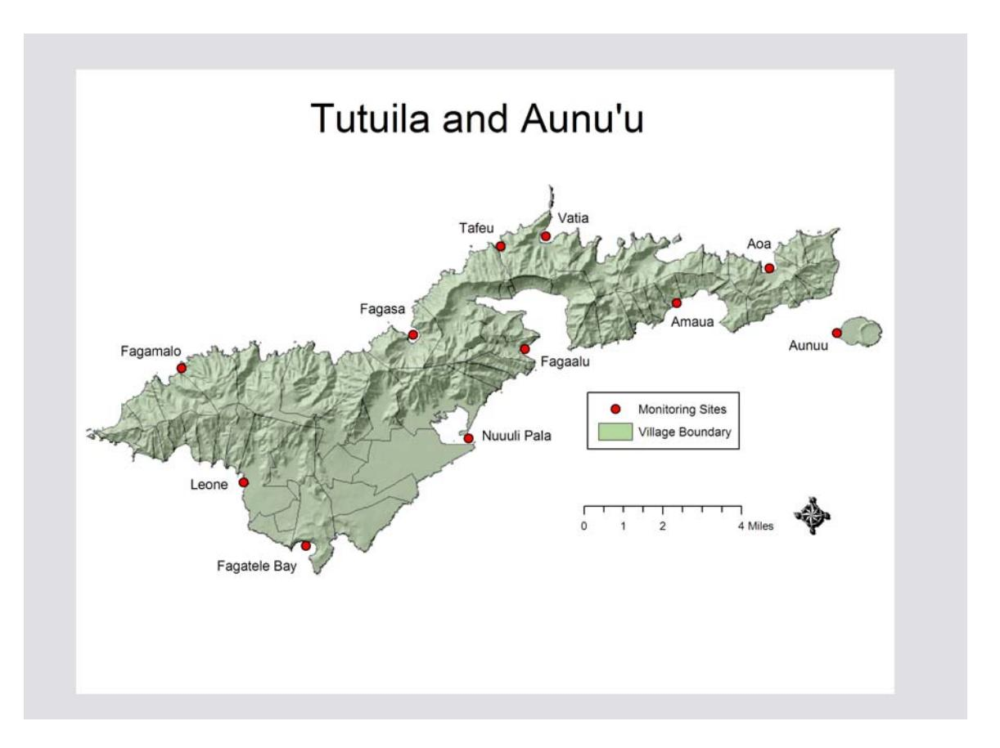

 The benthic methods were very similar to in 2005, with a couple small changes. In the core monitoring, two 50-m tapes were laid on a depth contour between 8 and 10 m deep. A space between them of about 15 m was kept. Benthic categories were recorded under each 0.5 m point on the tape. Benthic categories included live coral, dead coral, dead coral with algae, crustose calcareous algae, branching coralline algae, fleshy macroalgae, turf algae, rock, sand, rubble, soft coral, and sponge. Corals were identified to lifeform, genus, and species when possible, and if the macroalgae was *Halimeda* that was recorded. Soft corals were recorded to genus when possible. Lifeforms included encrusting, massive, foliose, branching, columnar, submassive, mushroom, *Millepora*, *Acropora* branching, *Acropora* table, *Acropora* digitate, and *Acropora* encrusting. Horizontal visibility was recorded using the tape on some transects. Two tapes were done on the first dive, and an additional two tapes were done on the second dive. Invertebrates were recorded on a return pass. Sites were re-located using the GPS and markers as indicated in the 2005 report. One day was required for each site. The supplemental biodiversity monitoring was done by making a search from the bottom of the reef upward to as near to the crest as could be safely reached, recording all coral species found and estimates of abundances. Abundances were estimated on the DAFOR scale, Dominant, Abundant, Frequent, Occasional, Rare. The same 11 core sites on Tutuila as recorded in 2005 were repeated, which are shown in the map above.

 Changes include the rugosity measurements which were omitted, because a third team member was not available and when included it lengthened dive times to the point where

running out of air was a distinct possibility, thus reducing the margin of safety. Further, it appears that the measurement depends primarily on exactly where the chain falls, and that changes in rugosity caused by coral growth will take quite a few years before they would be detectable. A hurricane could make changes in rugosity quickly by removing corals, and if significant hurricane damage occurs, the rugosity measurements can be repeated. Until changes in coral cover or other rugosity changes are apparent, repeating the measurement of rugosity is not worth the increased risk of running out of air.

 More care was taken to be sure to record dead corals which were covered with calcareous algae, instead of just recording the calcareous algae, in order to have an accurate measure of dead corals and the "live coral index." Two sites were added, Fatumafuti as a practice site for which only 2 transects were done, and Amaua E due to the lack of a GPS unit and an inaccurate visual estimate of the location.

 The original selection of sites was based on a desire for a rough balance between sites on the north and south, east and west, to include some good reef sites, and to monitor reefs not bare basalt substrates on points. The approach was not a formal stratified random design. The addition of Amaua E allows baseline data to be taken for a very different coral community than the other sites, dominated by a coral that does not dominate any of the other sites, that is, *Lobophyllia hemprichii*. It is, however, common on the reef slope along much of the SE coast. If something happened to this community, such as having that species heavily impacted by disease or bleaching or some other disturbance, and there was no baseline, we would not be able to monitor the change. There is one disease that has only been seen in this species.

Dates of collection of data are shown in Table 1.

Table 1. Dates of collection of benthic transect and biodiversity data for each site.

|            | Transects | Biodiversity |
|------------|-----------|--------------|
| Fagamalo   | 11/30/06  | 6/18/07      |
| Fagasa     | 9/19/06   | 2/8/07       |
| Tafeu      | 9/20/06   | 2/8/07       |
| Vatia      | 12/1/06   | 4/23/07      |
| Aoa        | 11/24/06  | 4/23/07      |
| Aunu'u     | 10/17/06  | 2/12/07      |
| Amaua      | 11/28/06  | 2/12/07      |
| Faga'alu   | 9/21/06   | 2/7/07       |
| Nu'uuli    | 10/18/06  | 2/7/07       |
| Fagatele   | 10/4/06   | 2/9/07       |
| Leone      | 7/11/06   | 2/9/07       |
| Fatumafuti | 6/30/06   |              |
| Amaua E    | 7/13/06   |              |

#### **Invertebrates**

Diurnal non-cryptic macroinvertebrates were recorded in a half-meter wide belt along each of the 50 m transect tapes used for the point-intercept benthic transects. Only those invertebrates visible as the diver swam above the belt were recorded. The recorder did not search under any ledges, rubble, or algae, nor did he search between the branches of corals such as *Pocillopora* that frequently harbor large numbers of commensals. Hard and soft corals were not recorded as they were recorded in the point-intercept transects. The thin light grey sponge *Dysidea* sp. was recorded, although it had not been recorded in 2005. Many if not most invertebrate species on reefs are nocturnal and/or cryptic, and specific searching strategies are necessary to find them, though some like sponges and tunicates are sessile and cannot hide during the daytime. Night searches and targeted searches in specific niches would reveal many more invertebrates, but night diving is logistically much too difficult and dangerous in American Samoa, and time does not allow targeted search strategies. Targeted searching between coral branches reveals large numbers of commensal crabs on *Pocillopora* colonies (e.g., Brainard, et al. 2007). The results should not be interpreted as accurate representations of total invertebrate populations, which it is not, but rather a restricted but repeatable monitoring strategy.

# **Results**

 For background information on the coral reefs of American Samoa, see Wells (1988), Craig (2005), Craig et al. (2005), Sabater and Tofaeono (2006) and Whalen and Fenner (2006).

### Benthic Cover

 There were no major disturbances on the reefs of American Samoa since the previous collection of monitoring data in 2005. The reef benthos on slopes continues to appear to be in good condition, and no changes were visually apparent. Benthic data from transects for the 11 core sites plus two additional sites (Amaua E and Fatumafuti) that were added this year are presented in Fig. 1.

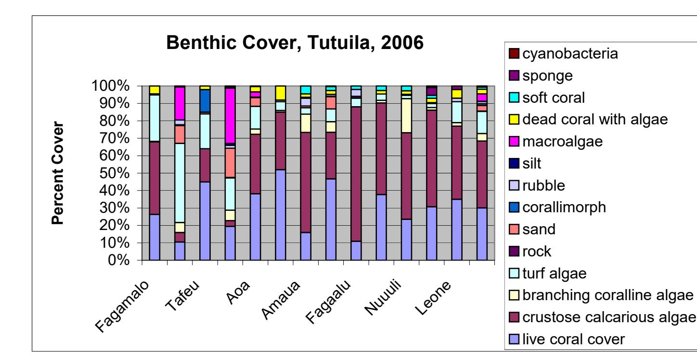

Fig. 1

 The mean for all sites is shown on the right hand bar. Crustose calcareous algae was the most common type of benthic cover, with live coral second, and turf algae a distant third. Turf is a better term than filamentous algae, since some of the turf is thin branching algae that is not actually filaments that are made of strings of single cells. Fleshy macroalgae was a very minor part of the benthic cover. This supports the view that the reef slopes of Tutuila are healthy, dominated by crustose calcareous algae and corals. Crustose calcareous algae binds together loose rubble, making a firm substrate capable of supporting coral settlement and growth. It also releases chemicals that act like flypaper to attract the larvae of corals to settle. Calcareous algae covers new surfaces in American Samoa very quickly, stabilizes rubble, and attracts coral larvae to settle, making possible a succession from dead coral produced by disturbances through crustose calcareous algae to recovered coral communities. The term "crustose calcareous algae" is broader than crustose coralline algae, because there are some crustose calcareous algae that are not actually coralline algae. Further, the reader is reminded that only the top visible layer was recorded, and the nature of what was under the green macroalgae *Halimeda* was not recorded, nor what was under plate corals, overhangs, etc. Coralline algae are common on the upper surfaces of such cryptic habitats, so the present data do not reflect its total abundance, and places where it was not recorded are not necessarily lacking in it. Brown macroalgae have been identified as dominating surfaces on some reefs elsewhere which have lost all herbivores. The brown macroalgae competes with corals, shading them, abrading them, and making it more difficult for coral larvae to settle and restore coral communities. Most of the fleshy macroalgae on American Samoan reefs are *Halimeda*, a green calcarious alga which is slow growing and has not

been reported to cause problems. Likely it is a natural part of the reefs in American Samoa and not a cause for concern.

 Sites are ordered in Figure 1 from left to right beginning with Fagamalo on the northwest of Tutuila, and proceeding clockwise around the island. Thus, the sites on the left in Figure 1, from Fagamalo to Aoa, are on the north side of Tutuila, and sites from Amaua to Leone are on the south side of Tutuila. It appears from Figure 1 that there are differences between the north and south sides of the island. Figure 2 shows a comparison of the means for the north and south sides of the island.

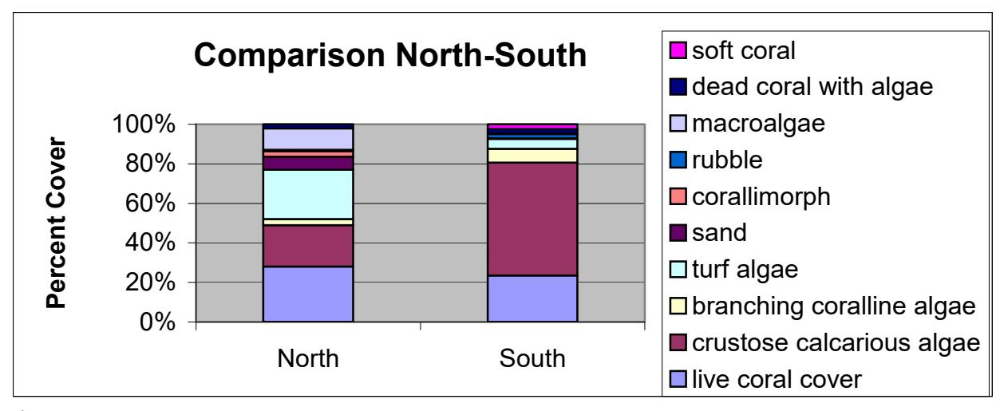

Fig. 2.

The South side has much more visible crustose calcareous algae than the north, and the north has much more turf algae than the south. In addition, there is a little more live coral on the north than south, and quite a bit more fleshy macroalgae on the north than south. Figure 3 shows the same data with error bars.

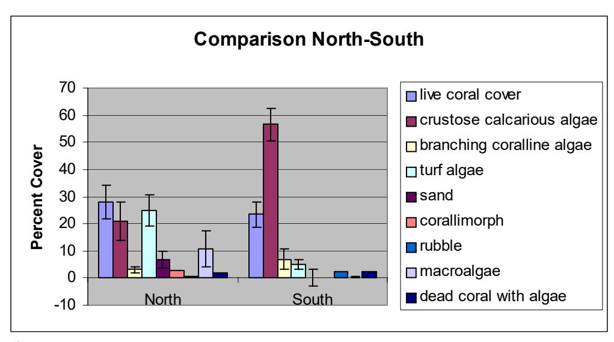

Fig. 3.

 The error bars clearly show that the difference in visible crustose calcareous algae between north and south is real, as is the difference in turf algae. The error bars for coral overlap, indicating that difference is not significant and likely not real. The macroalgae difference is real as well.

 The differences in algae are similar to that reported in the last annual report, for 2005 (Whalen and Fenner, 2006). Turf algae in 2006 was more common in sites on the north side of Tutuila than the south side (t = 3.29, p < .022), and visible calcareous algae was more common on the south side than the north side (t = 3.84, p < .005). Figure 4 shows this pattern in the same way it was shown in the 2005 report.

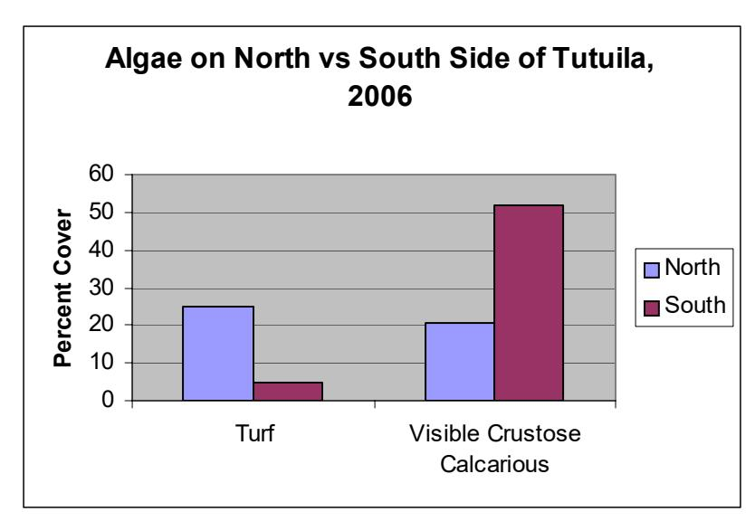

Fig. 4.

 This pattern may be a result of the pattern of exposure to wave surge. During about half the year, trade winds blow steadily out of the southeast, putting much more wave energy along the south coast than the north coast. During the other half of the year, wind patterns are variable and usually light. Hurricanes usually hit the north side harder, perhaps accounting for the more precipitous cliffs, and the restriction of reefs to bays, as they may remove most living coral from points. A hurricane hits on the average about once in five years, so most years do not have a hurricane strike. Thus, wave energy is greater on the average on the south than the north. Coralline algae requires that its surfaces be clean of sediment and overgrowing algae. Waves clean the coralline algae of sediment, encouraging its growth. Casual observation reveals that on some north side slopes there is high visible crustose calcareous algae cover near the reef crest, but it decreases rapidly with depth and ends at a depth above the transect depth of about 8.5-9 m. On the south side, crustose calcareous algae appears to extend into deeper water than on the north, extending to about 12-15 m at some sites, and much deeper at others. A graph illustrating these informal observations is presented in Figure 5.

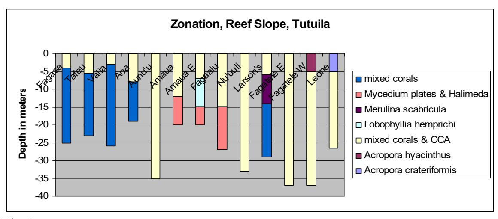

Fig. 5.

There are some areas where single species dominate particular depth zones. So for instance, *Lobophyllia hemprichii* dominates mid depths on reef slopes at Amaua E and nearby areas on the SE coast of Tutuila. *Merulina scabricula* dominates mid depths in Larson's Bay. There is an unusually large accumulation of *Pachyseris rugosa* in one part of Fagatele Bay, the largest the author has seen anywhere. *Acropora hyacinthus* dominates shallow slopes in the western part of Fagatele Bay. *Acropora crateriformis* dominates shallow water at Leone and Asili on the southwest of the island. On some southeast and central south sites such as Amaua and Fagaalu, *Mycedium* plates and *Halimeda* dominate deeper slopes.

The cover of individual sites was similar to in 2005, but there were some small changes at individual sites as seen in Figure 6.

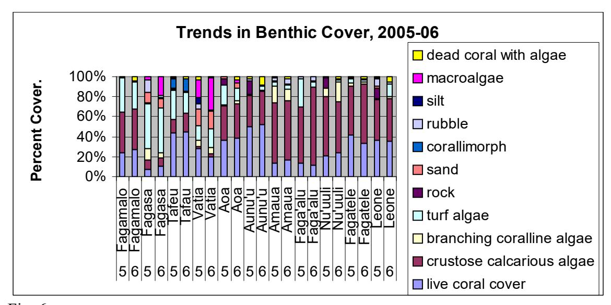

Fig. 6.

As can be seen in the figure, for most sites the cover is more similar to the cover on the same site a year ago than to the cover on other sites. The mean cover of all 11 sites changed little from 2005 to 2006 as can be seen in Figure 7.

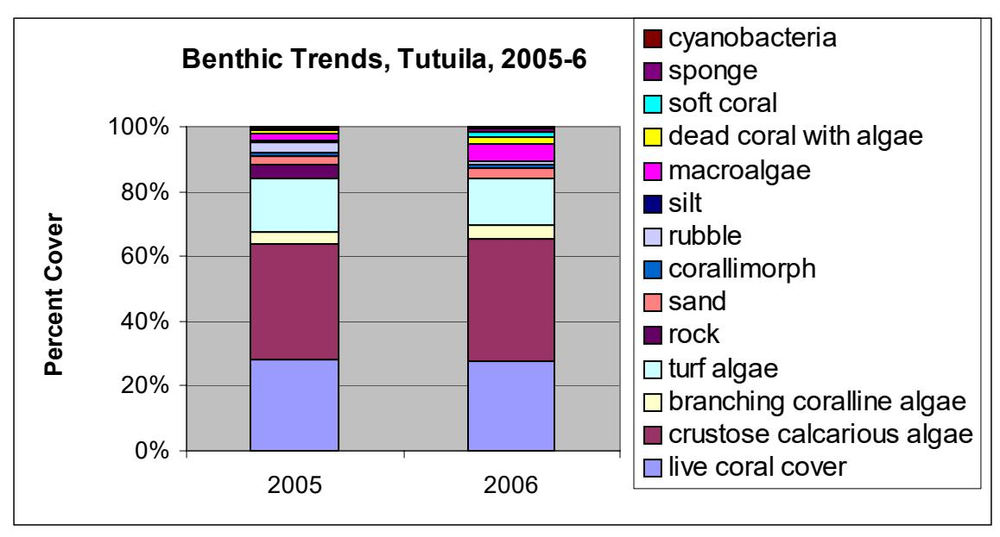

Fig. 7.

 Benthic cover in all categories changed by less than 3.6%, with coral cover decreasing by just 0.2%. It should be kept in mind that transect locations are only relocated within a few meters at best, and even if they were relocated exactly and the tape placed at exactly the same location, wave surge moves the tape back and forth and points on the tape will not be at the same location as in previous years. The variation in the location of the tape is well more than the size of most corals or other benthic items. Thus, if anything it is surprising that the numbers for 2006 are so close to those for 2005. None of the differences should be taken as evidence of any change at all, even the 3.6% difference is remarkably close to no difference. In fact, the very small differences found supports the view that the average for all 11 sites for the whole island may be quite sensitive to changes, so that the program may be able to detect rather small changes in the average for the whole island. The variation at any one site is larger because the sample is smaller, and the variation for any one of the four transects at a site would be greatest of all. Thus, the program should be able to detect rather small changes that occur all around the island, but would require larger changes at an individual site to be able to reliably detect it. Many management concerns are likely to be questions of whether the reefs as a whole are improving or deteriorating, and the question of whether there are highly localized changes could be much less important. Of course, at a small enough scale, we know that the community is naturally dynamic, with changes on a small scale that are frequent and large. But that is not a concern for management, while an overall deterioration of the reefs of Tutuila would certainly be. No deterioration of the reefs of American Samoa was detected by this monitoring program from 2005 to 2006.

 The coral cover is very close to the 27% cover found for 24 different sites by Sabater and Tafaeo (2006). The mean of five recent studies for coral cover was 28% as shown in

Figure 8. Most studies agree that coralline or calcareous algae cover is high, with the average of five studies being 41% (Figure 8). All studies also agree that turf or filamentous algal cover is less than coral and coralline or calcareous algae. Each study collected data from different sites, so any agreement indicates that these are general features of Tutuila reefs.

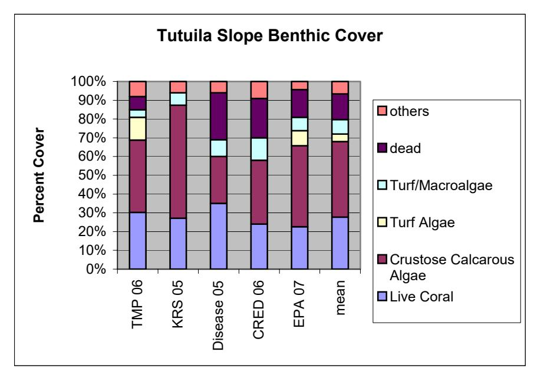

Fig. 8.

 An older study, Green (2002), reported an average of 45% coral cover, which is higher than more recent studies have reported. The same author reported much lower coral cover of only about 18% in 1996 (Green, 2002). Figure 9 presents long term monitoring data from Tutuila reef slopes from a variety of studies. This graph builds on a graph presented in Craig et al. (2005). The two points from this report and Waylen and Fenner (2006) have been added on the right, and a point added on the left from an unpublished study by Wass (1982). The Wass study just reported estimates of coral cover for several areas, and the point was computed as a mean of those estimates. It appears to be the only existing data that reflects coral cover before the crown-of-thorns outbreak in the late 1970's which was reported to have eaten most of the live coral. The large drop in coral cover that followed is very likely due to that outbreak. The swings in coral cover since that time are likely due to a series of hurricanes and mass bleaching events, with recovery between events. Long term studies often show that reefs cycle between natural destructive disturbances and recovery (e.g., Connell et al. 2004). The term "resilience" refers to a reef's ability to recover after such disturbances. Reefs that receive chronic destructive human impacts are likely to have reduced resilience in the face of natural disturbances. At this point, it appears that the benthic communities of the reefs of American Samoa have good resilience. Clear oceanic water, strong wave surge, high coralline/calcareous algae cover, little fleshy macroalgae, and a fish community dominated by detritivorous and herbivorous fish, may all contribute to that resilience.

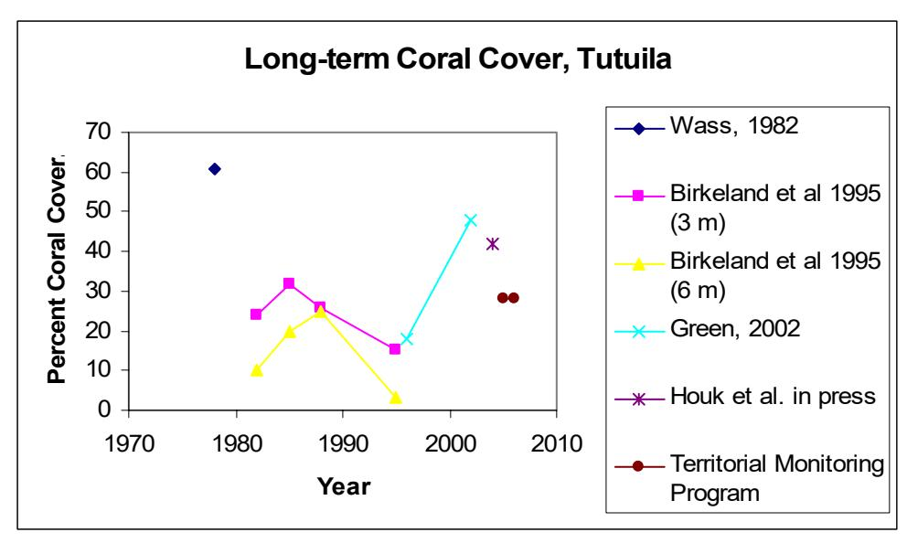

Fig. 9.

 The comments made about the coral cover in the 2005 report (Whalen and Fenner, 2006) continue to hold. Although live coral cover is not exceptionally high, it is higher than reported for reef slopes by the PROCFISH program of the Secretariat of the South Pacific (SPC) for several Pacific Island countries. It is also higher than a recent study (Bruno and Selig, 2007) reported for the South Pacific, and for the entire Pacific, and much higher than the current average coral cover for the Caribbean (Gardiner, et al 2003), as can be seen in Figure 10. Mean coral cover on reefs in the Great Barrier Reef are now about 25% (Bellwood, et al, 2004), so coral cover here is higher than there as well. It should be borne in mind that coral cover varies greatly between different reefs on the GBR, as well as over time for some reefs.

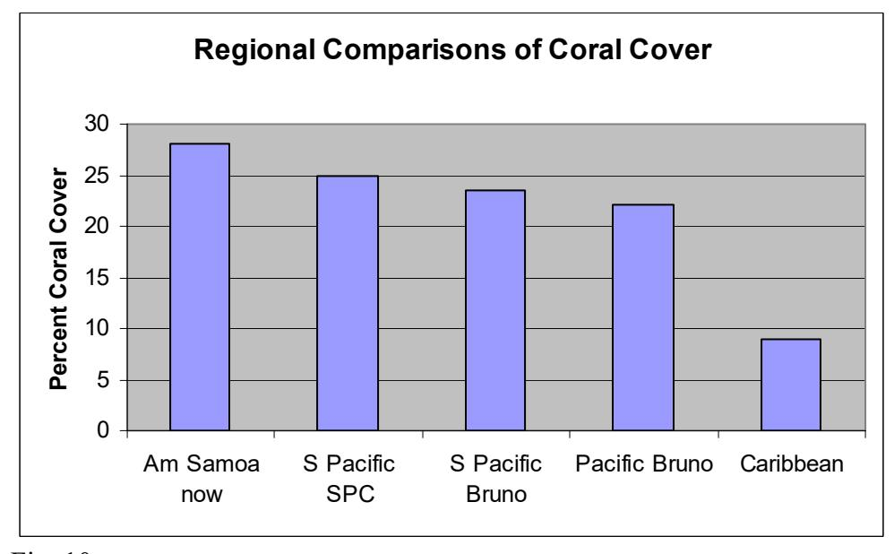

Fig. 10.

 PROCFISH has also reported a live coral index, produced by dividing the live coral cover by all coral cover (alive and dead). As reported in the 2005 report, the live coral index here is much higher than PROCFISH reported for other Pacific islands. In 2006, extra care was taken to be sure that all standing dead coral was correctly recorded in transects, even if they are covered with other organisms that would otherwise be recorded in other categories, such as crustose calcareous algae or turf algae. The result was a very slight decrease in the live coral index, which probably more accurately represents the true situation. The live coral cover here remains much higher than reported by PROCFISH for other Pacific islands, and it is always long dead coral covered with algae, not newly killed corals (which are white or light colored and not covered with other organisms which have settled). If in the future something kills significant amounts of coral, this index, shown in Figure 11, will pick it up.

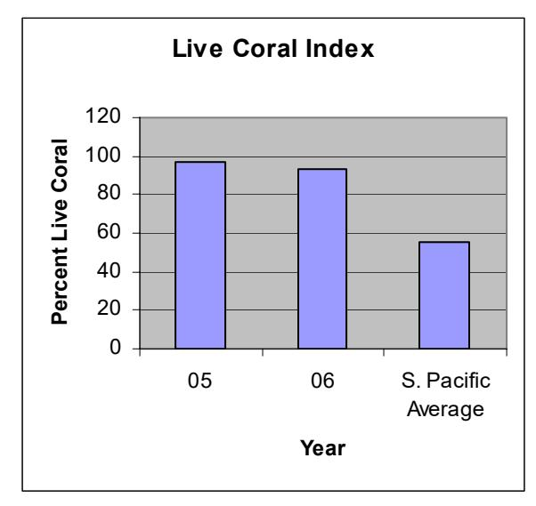

Fig. 11.

 The percentage cover of crustose calcareous algae recorded increased very slightly from 2005 to 2006 in this study. G. Aeby found in benthic data collected by the coral disease program and by Birkeland et al. in 1987 that crustose calcareous algae decreased steadily from 1987 to 2006. Further, in the coral disease program data, crustose calcareous algae cover decreased at each of seven sites, so the overall decrease is not due to monitoring different sites in different years. The CRED program also recorded a decrease in calcareous algae from 2004 to 2006. The cause of the discrepancy between those studies and the present study is not clear. A decrease in crustose calcareous algae could be a cause for concern, since crustose calcareous algae promote the recruitment of corals and is probably a contributor to reef resilience. However, if it was replaced by coral it might not be a concern. Any change in crustose calcareous algae cover is not visually obvious, it appears to remain very abundant in many locations, particularly near the reef crest.

 The present coral cover in American Samoa is slightly better than the average for other locations in the South Pacific, better than the average for the Pacific, and much

better than the average for the Indo-Pacific. In addition, the live coral index in American Samoa is much better than the average in the South Pacific found by PROCFish. However, coral cover is not nearly as good as it once was in American Samoa, or the average was in the whole Pacific, or the average was in the Caribbean (Figure 12). However, Bruno and Selig ( 2007) reported that coral cover in the South Pacific has not changed significantly since records began to be taken (which was not long ago). The South Pacific is the only part of the Pacific they found had not had decreasing coral cover. In addition, there are several reasons for caution in considering the estimates from Wass (1988). The average of the estimates he reported (63%) is unusually high for Pacific reefs (Bruno and Selig, 2007). Further, reefs may naturally cycle between disturbance and recovery, and Wass (1982) may have estimated coral cover at a peak in the cycle, plus he may have picked reefs with good coral for his fish studies. Wass's cover percentages were not actual measurements, and visual estimates of coral cover can be difficult. Some areas like Fagatele Bay now appear about as good as they did before the crown-of-thorns outbreak (C. Birkeland, personal comm.)

 In a sense, for American Samoa, compared to other reefs in our region the glass is half full, but compared to regional reefs in the past it is also half empty. The drop in coral cover in American Samoa appears to be due to specific disturbance events, the Crown-of-Thorns outbreak in 1978, several hurricanes (especially 1990 and 1991, but also 2004 and 2005), and mass coral bleaching (especially in 1994 and 2003, but also 1991 and 2002). Hurricanes are natural, though in the future they may increase in intensity with global warming. Crown-of-Thorns outbreaks may be natural, but the 1978 outbreak might have been aided by nutrient runoff that could have been increased by human activities. Mass coral bleaching is caused by high water temperatures, which have been increasing and will increase much more in the future due to global warming. There is strong agreement in the scientific community that the earth is warming and much or most of global warming is due to human-produced greenhouse gas emission, primarily CO2. The fact that the reefs were not taken over by brown macroalgae, but rather have been recovering, supports the view that the benthic communities of reef slopes are relatively resilient and not greatly impacted by local human activities. A major caveat is that obviously this is not the case in the harbor, other bays such as Vatia, Fagasa, and Fagaalu, or near the mouths of streams that pass through inhabited areas.

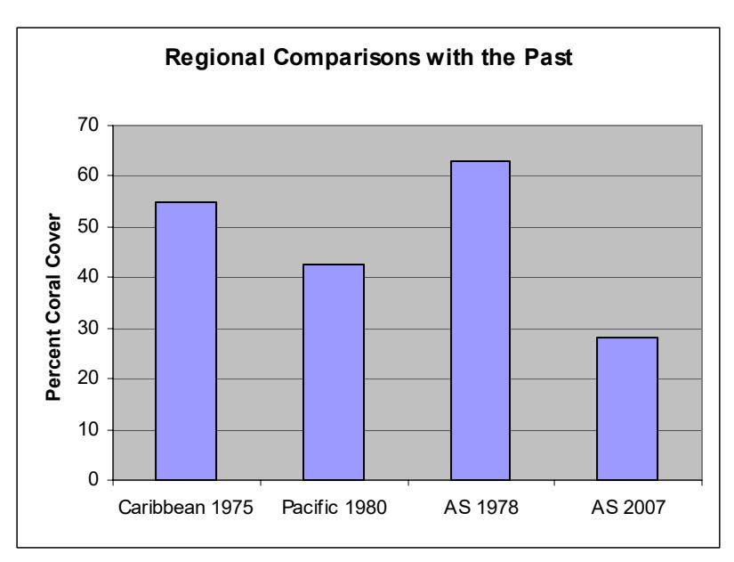

Fig. 12.

### Coral Lifeforms

 In transects, the "lifeform" of each coral is recorded, as well as the genus and species when possible. Even if future personnel cannot record corals to species, they can easily record them to lifeform. Lifeforms are actually important for some things, such as the vulnerability to hurricane damage, which likely depends more on the shape of the coral (delicate vs robust) than the genus or species. It may even be important for bleaching, with massive corals more resistant than branching corals, and disease, with table corals having the greatest vulnerability. In Figure 13, the lifeforms for corals at all 13 sites recorded this year are shown.

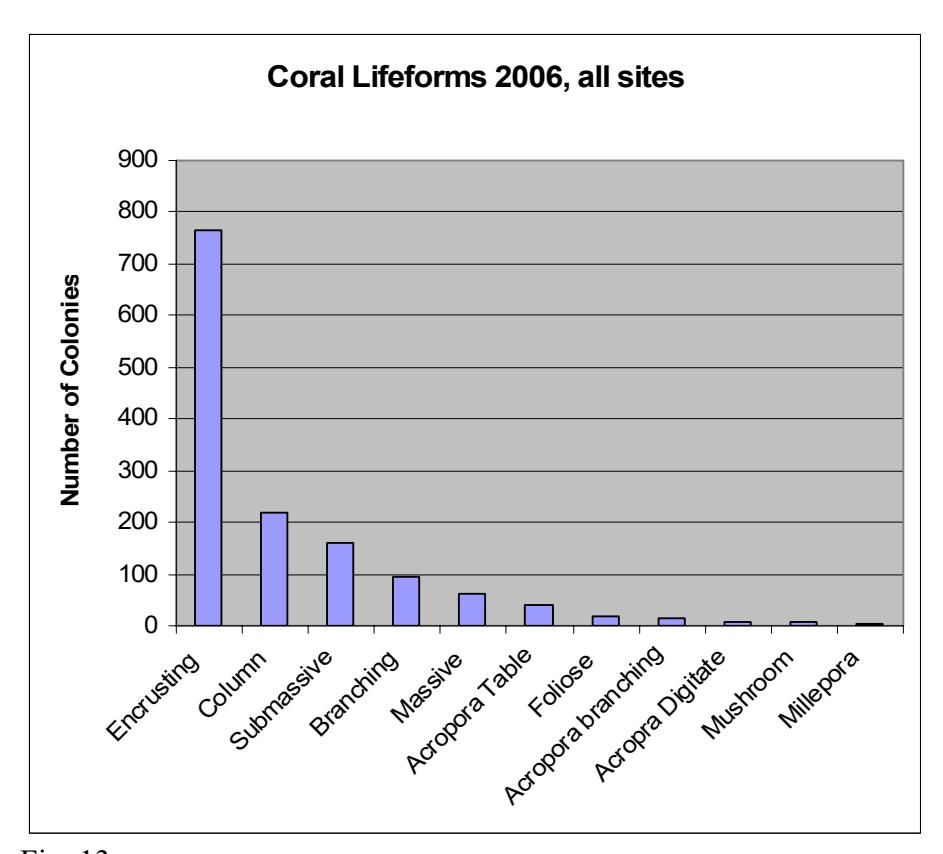

Fig. 13.

As reported before (Whaylen and Fenner, 2004), encrusting corals are the most common coral lifeform on Tutuila reef slopes. However, submassive corals are the third most common lifeform, unlike in 2005. Figure 14 shows the lifeforms for just the 11 core sites monitored in both 2005 and 2006. As can be seen in the graph, submassive corals are not even one of the 10 most common lifeforms at these 11 sites. The difference between these two graphs comes entirely from one new site, Amaua E. That site is dominated at mid depths by a submassive coral species, *Lobophyllia hemprichii*. A submassive coral appears to be massive (a round dome) but actually is formed of branches close together that appear to make a nearly solid dome. This coral is so common at 9 m depth at that one site that it appears as the third most common lifeform in all 13 sites combined, even though it is rare at the other sites. *Lobophyllia hermprichii* is susceptible to a disease that appears not to infect other corals, "*Lobophyllia* tissue loss" (Aeby et al. 2006), and thus could be affected when other species are not affected.

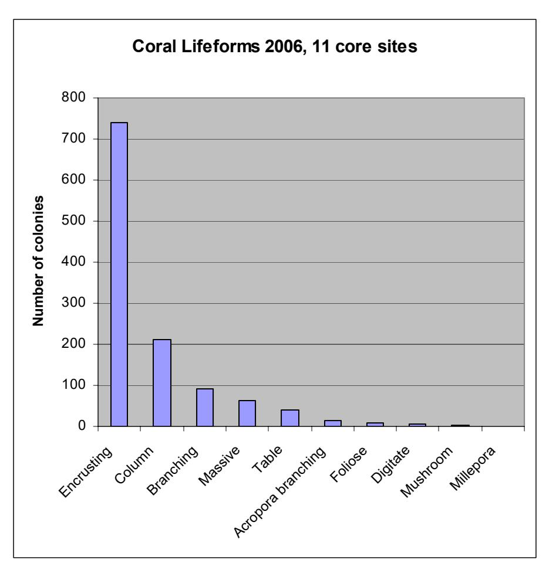

Fig. 14.

When the lifeforms of just the 11 sites are compared, the 2006 results are almost identical to those for 2005 (Figure 15).

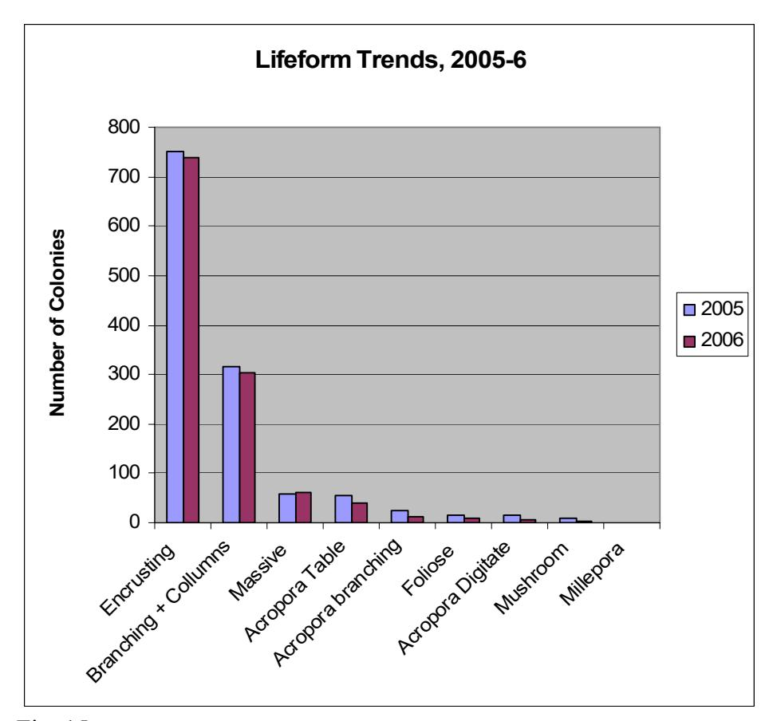

Fig. 15.

The abundance of the different lifeforms as shown in Figure 13 for 2006 correlated highly with that for 2005 (r = .9997, p < .001), as shown in Figure 16. This is strong support the view that there was little or no change in the lifeform abundances.

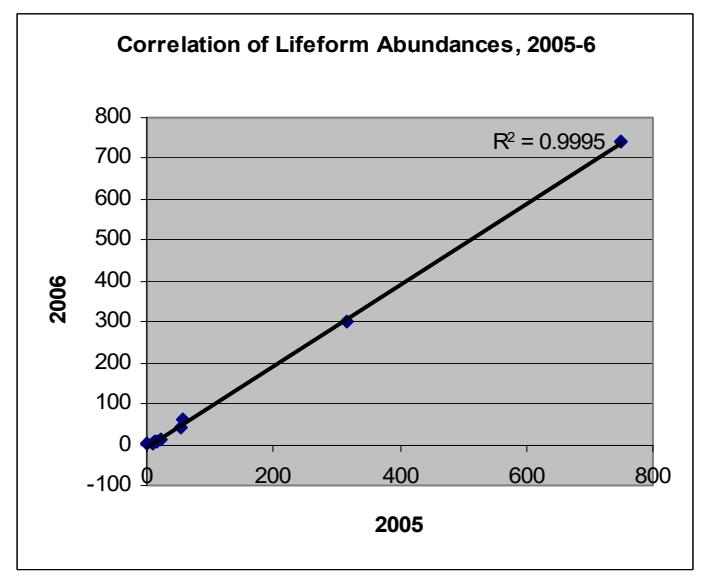

Fig. 16.

 Figure 17 shows the abundance of the different lifeforms in the different sites. The encrusting lifeform was the most common lifeform at each site, except Amaua East, where submassive was the most common by far. Amaua East stands out as being very different from the other sites. This is due to the abundance of a single species of coral there, *Lobophyllia hemprichii*.

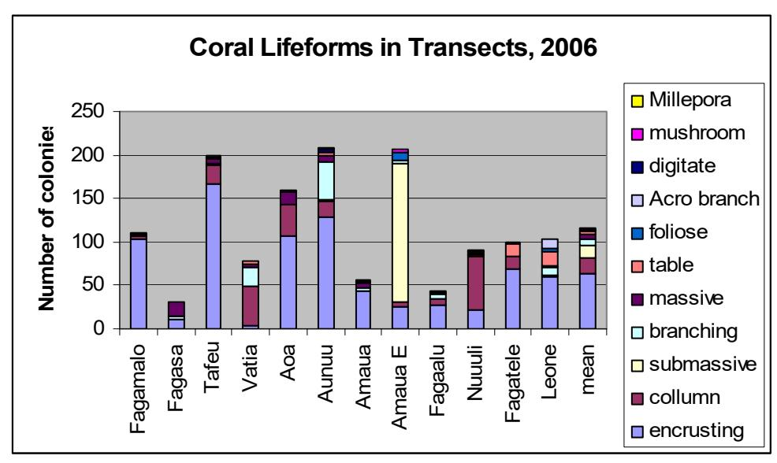

Fig. 17.

Trends in lifeforms are shown in Figure 18.

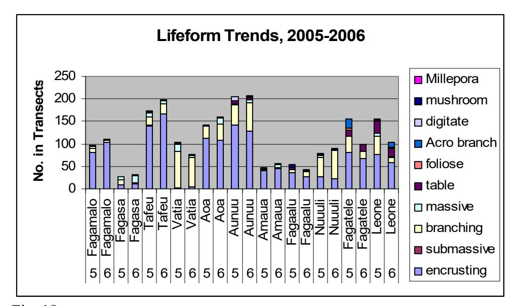

Fig. 18.

Changes from 2005 to 2006 were small, except at Fagatele and Leone, where decreases in non-encrusting corals are unexplained.

Figure 19 shows the number of different lifeforms at the different sites.

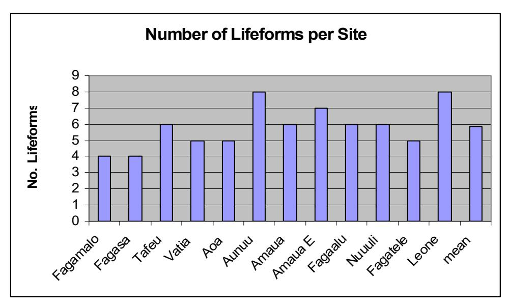

Fig. 19.

The number of lifeforms in a transect is relatively small, averaging just under six. Lifeforms don't correspond one to one with species, since a single lifeform has several to many species that have that lifeform, and a single species can have different lifeforms, sometimes within the same colony. A good example of the latter is *Porites rus*, which forms combinations of plates and columns, almost all colonies having some of both, and often it is not obvious which predominates. *P. rus* is a common coral, and it was arbitrarily recorded as columns in all transects. The number of lifeforms in transects at a site does correlate with the number of species at that site, r = .6517, p < .01, as seen in Figure 20.

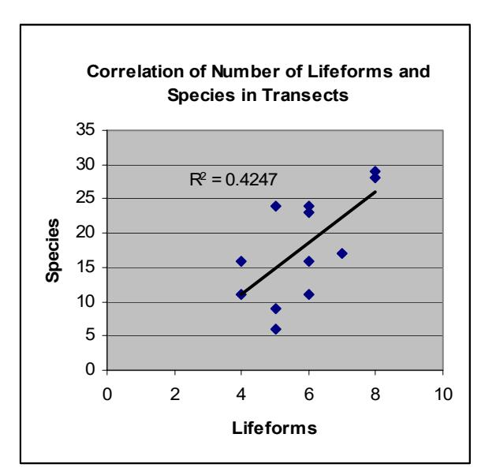

Fig. 20.

However, the number of lifeforms does not correlate with species diversity, H', r = .3261, p > .1.

 Green (2002) reported coral lifeforms for 1996 and 2002 at Tutuila. As shown in Figure 21, encrusting corals first increased in cover then slightly decreased, while massive corals increased slightly and then greatly decreased. Branching corals increased and then remained constant. The categories reported by Green (2002) were somewhat different than in this study (the present data was shown in the Green categories for this graph), and the categories may not have been defined the same as in the present study. Thus, changes between 2002 and 2005 could have been due in part to changes in the way categories were defined. The changes in massive corals could be largely explained by a change in definition, however that seems like a category that would be unlikely to confused with other categories, except when massives are very low and almost encrusting.

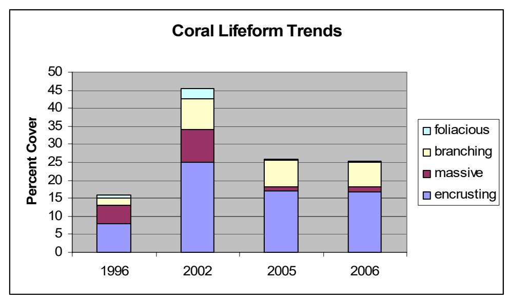

Fig. 21.

### Coral Genera

 A total of 25 coral genera were recorded in transects in the 11 core sites in 2006, and 32 genera in the all 13 sites in 2006. A total of 29 genera were recorded in the 11 core sites in 2005. The most common genus was *Montipora*, followed closely by *Porites*, and then *Pavona* and *Acropora* followed with less cover. Figure 22 shows the mix of coral genera at the different sites. There was a high level of variation between sites, both in abundance of corals and in which genera were common. *Montipora* dominated Aoa, Tafeu, and Aunu'u, and was the most common coral at Fagamalo and Fagatele. *Acropora* was most common at Leone where it was not quite as abundant as *Montipora*, and was also present at Fagatele and Aunu'u, but was rare elsewhere. *Porites* dominated Vatia, Nu'uuli, and Fagasa.

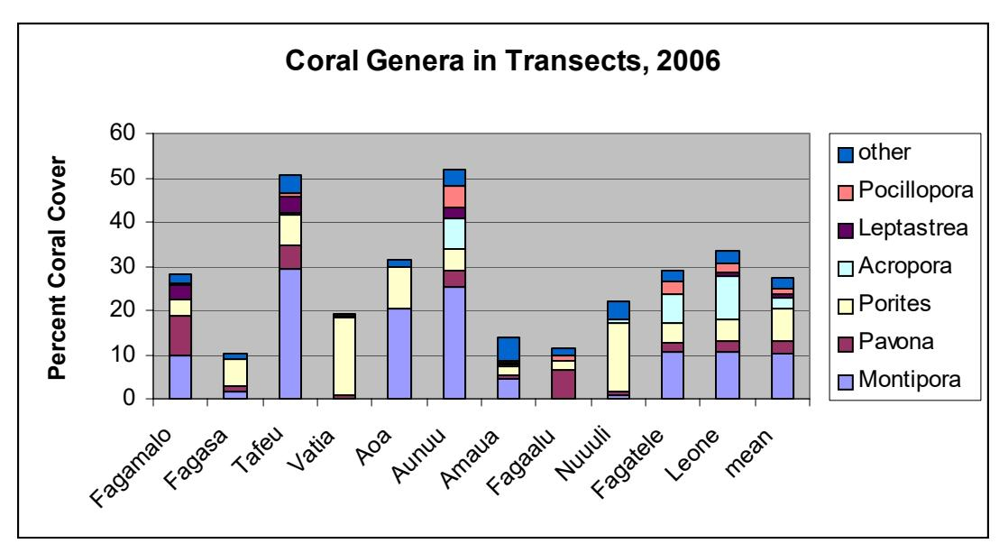

Fig. 22.

Figure 23 shows trends in diversity at individual sites between 2005 and 2006.

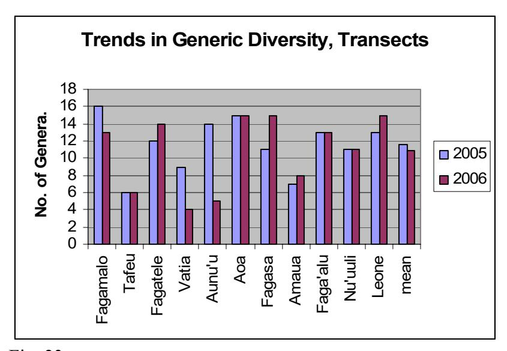

Fig. 23.

The diversity in transects in 2006 was not significantly correlated with that in 2005, r = .5521, p > .05, as can be seen in Figure 24.

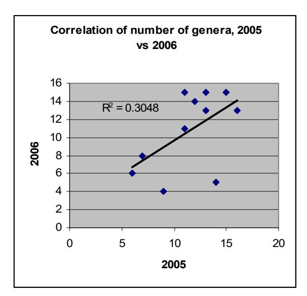

Fig. 24.

 Munday (1996) and Fisk and Birkeland (2002) reported coral genera for Tutuila, from belt transects. They recorded the number of colonies of different genera in a belt 1 m wide, which is a different method from that used here. In Figure 25, trends in coral genera are presented using the data from these two studies plus the 2005 and 2006 data from this monitoring program. *Montipora* was the most common genus in all the studies, with *Porites* second. For 2006, the data was plotted separately for the core 11 sites to be comparable with 2005, and for the full 13 sites to show all the data. For the full 13 sites, *Lobophyllia* is much larger than for any of the other studies, because one site was included (Amaua East) where it is very common at 9 m depth.

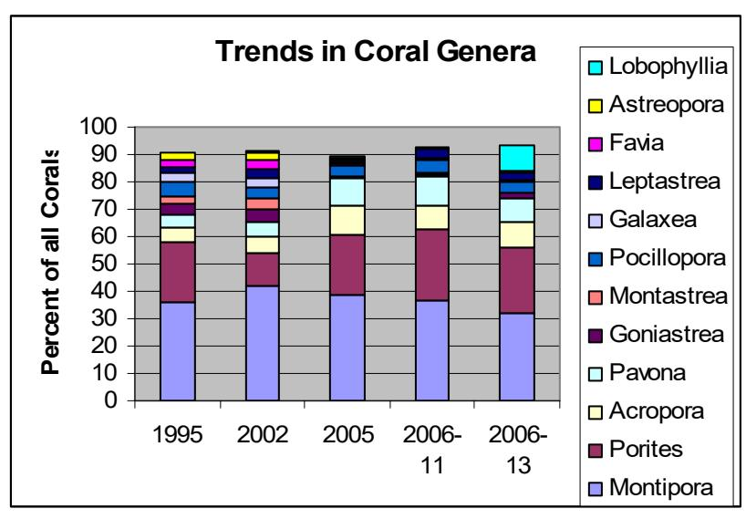

Fig. 25.

# **Coral Species**

A total of 77 coral species were recorded in transects in all 11 core sites in 2006, and a total of 85 coral species in transects in all 13 sites in 2006. A total of 70 coral species were found in transects in the 11 core sites in 2005. The most common coral species recorded in transects was an encrusting species of *Montipora*, as it was in 2005. Further, the second most common species was *Porites rus* and the third *Pavona varians*, just as in 2005 (Figure 26).

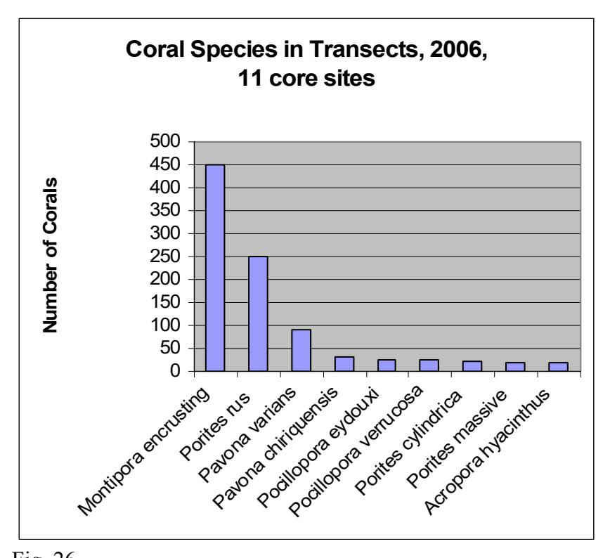

Fig. 26.

When all 13 sites are included, *Lobophyllia hemprichii* which did not even appear on the previous figure appears as the third most common coral species (Figure 27). This species has a submassive lifeform, and the cause of this difference is explained in the section above on lifeforms.

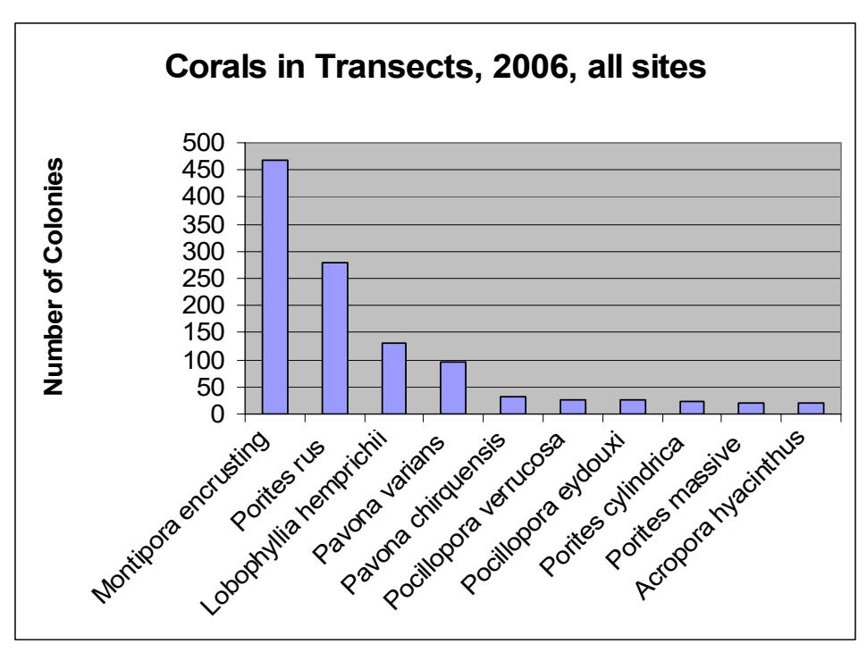

Fig. 27.

The abundance of the different common coral species changed little from 2005 to 2006, as can be seen in Figure 28. The differences between years are due to random variation (two tail paired t-test, p = .9244). In 2005, *Pavona chiriquensis* was not distinguished from *Pavona varians*. *P. chiriquensis* is a newly described species that has not been distinguished from *P. varians* (and thus included in counts of *P. varians*) until recently. It was distinguished in Figures 26 and 27, but was combined with *P. varians* in Fig 26 as in 2005 to facilitate comparison. Collection of a specimen of *P. chiriquensis* will be necessary to confirm the identity of this species.

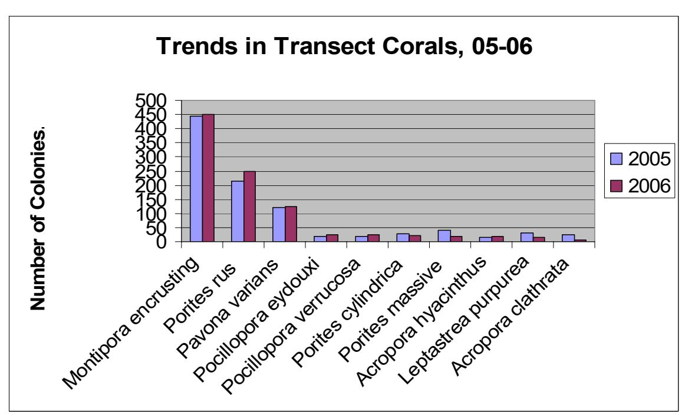

Fig. 28.

The number of corals of different species in the transects in 2006 was highly correlated with that found in 2005 (r = .9949, p < .001), as shown in Figure 29. This strongly supports the view that there were no changes in the abundances of the most common coral species.

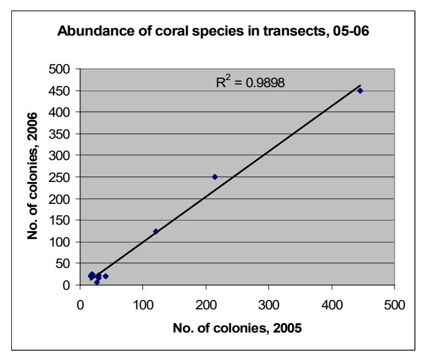

Fig. 29.

Fisk and Birkeland (2002) reported on the coral species which they recorded in belt transects around Tutuila, and Munday (1996) reported similar data earlier. This is a different method, where all corals in a 1 m wide belt across the reef are counted and

recorded by species. Fisk and Birkeland (2000) found considerable differences in the species these two studies recorded, that may have been due to differences in coral species identification by the two teams. Coral species identification is especially difficult and differences between people in how they identify corals are often considerable. The data from all of these studies and the present studies were plotted for the most common species found in the most recent studies. They were plotted by the percentage of the total amount of coral found, which was the type of data given in Fisk and Birkeland (2002). This is shown in Figure 30. All studies agree that encrusting *Montipora* is the most common, but the first two studies reported much smaller amounts of the other species. This is most likely due to the difference in the methodology, not in the coral community.

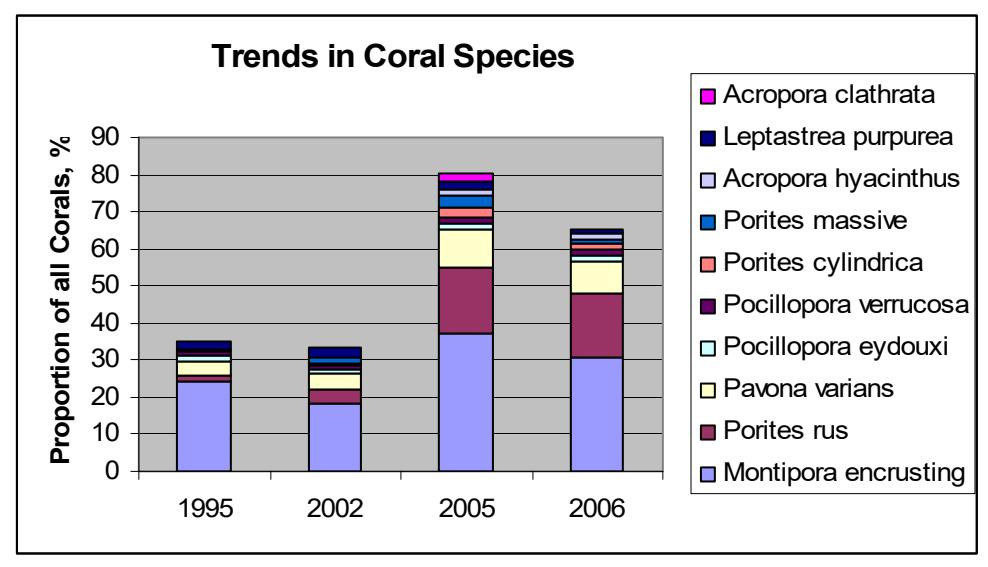

Fig. 30.

 These analyses are based only on the most common coral species. If all coral species in the transects are plotted, it can be seen that most species are rare (Figure 31). It is commonly said that in diverse ecosystems most species are rare, so this ecosystem appears to have that property. It should also be noted that although most coral species are rare in this data set, a few are common and dominate the coral community.

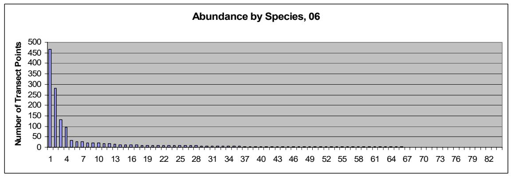

Fig. 31.

 In the 2005 data, a relationship was found between the abundance of individual coral species and the order from most common to least common (Whaylen and Fenner, 2006), as in Figure 29 above. When the data was plotted on a log-log graph, it produced a straight line. This means that the relationship between the two variables is a power relationship. When the present data was graphed the same way, it also produced a straight line on a log-log plot (Figure 32). The two variables are tightly correlated when plotted this way, r = .9825 (p < .0001). Although this type of plot was pioneered by E. P. Odum (1971), he found a log relationship (for various terrestrial organisms). Why this relationship differs from what he found is not clear, but this is the second year when the data clearly fit a power relationship, not a log relationship.

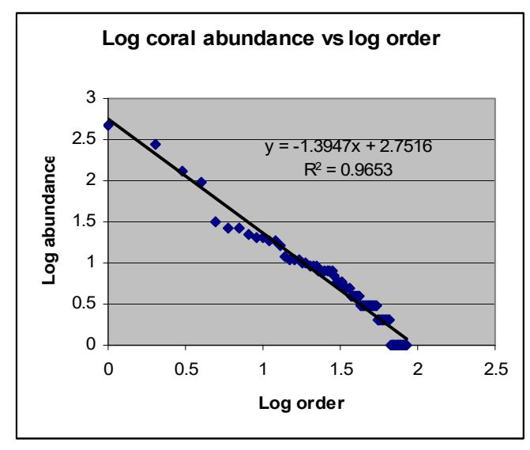

Fig. 32.

 A total of 85 coral species were found in all transects combined, with 77 in the 11 core sites compared to 69 in the core sites in 2005. Figure 33 shows the mixture of coral species at each site.

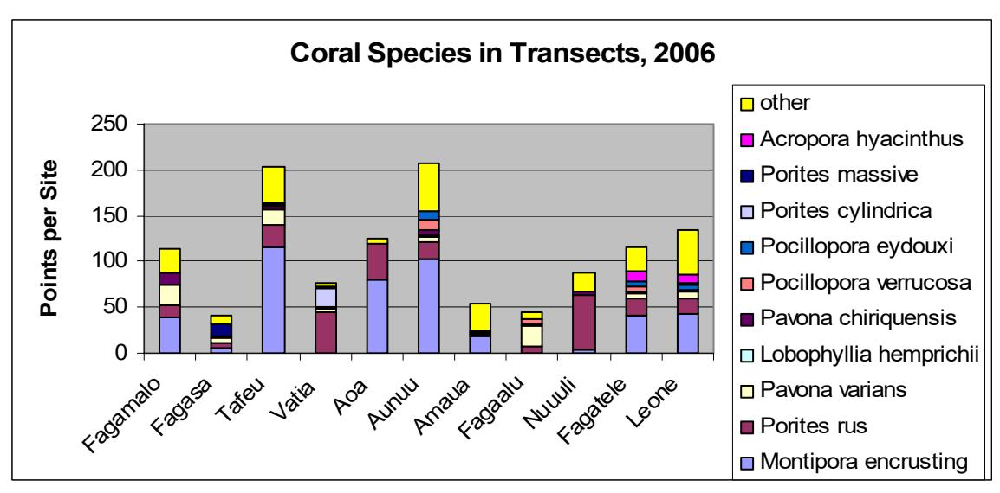

Fig. 33.

Figure 34 shows the number of coral species found in transects at each site, for both 2005 and 2006. At most sites, the number of coral species was similar in 2006 to that found in 2005, but at Aoa the number of species recorded decreased sharply. Although the mean number of coral species recorded was slightly less, this difference was much too small to be significant (two tail paired t test, p = .629). Thus this is not a real change but random variation.

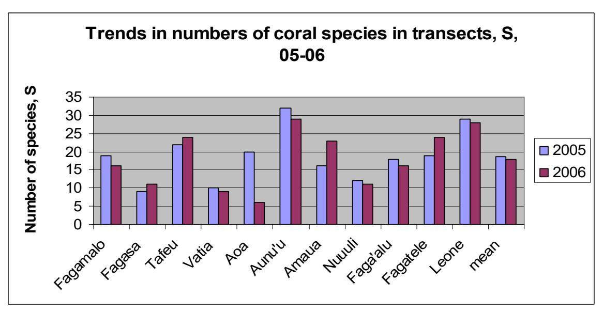

Fig. 34.

The number of coral species found in transects in 2005 was well correlated with the number in 2006 (r = .7514, p < .01) as can be seen in Figure 35. Thus, there was little change in the number of species found in transects from 2005 to 2006.

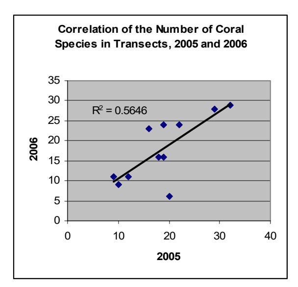

Fig. 35.

The number of species found is often referred to as "species richness" as opposed to "diversity." There is an index of species richness, Margalef d, where  $d = (S-1)/\ln N$ , where S is the number of species and N is the number of individuals. Figure 36 shows this index of species richness for both 2005 and 2006. The slight decline in the mean was not significant (two tailed paired t test, p = .696). Thus this is not a real decline, but random variation.

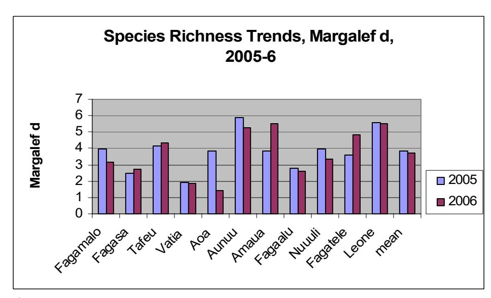

Fig. 36.

The number of coral species found in transects in 2005 was correlated with the number found in 2006 (r = .6962, p < .02). Figure 37 shows this correlation.

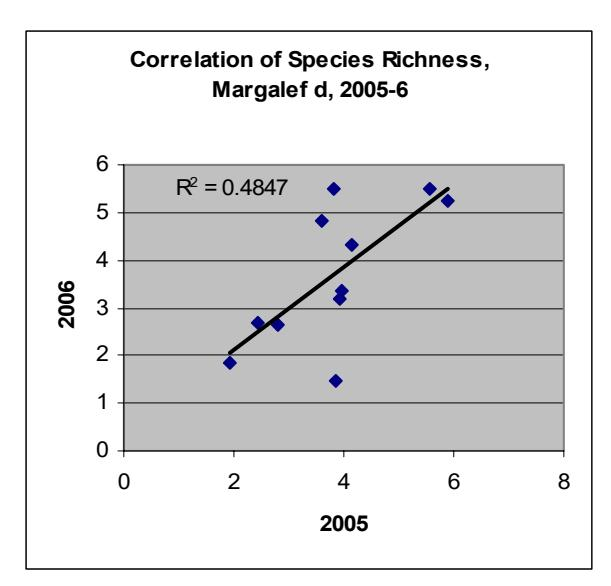

Fig. 37.

 The number of species S in transects was highly correlated with the Margalef d measure of species richness (r = .9681, p < .001) as shown in Figure 38.

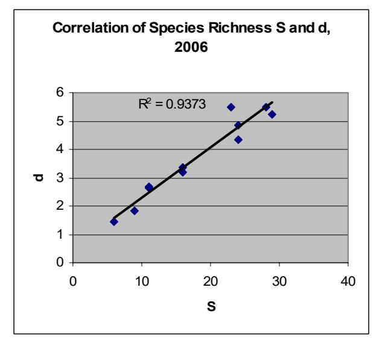

Fig. 38.

 There are two commonly used indices of diversity, H' and D. H' is the Shannon-Wiener diversity index where H' = -Σpi(lnpi). pi is the proportion of all the colonies that are of species i. Figure 39 shows H' at each of the sites for both 2005 and 2006. The mean H' was slightly smaller in 2006 than 2005, but this was far from significant (two tailed paired t test, p = .696), so it was due to chance variation and is not real. Thus there is no overall trend in coral diversity measured by H'.

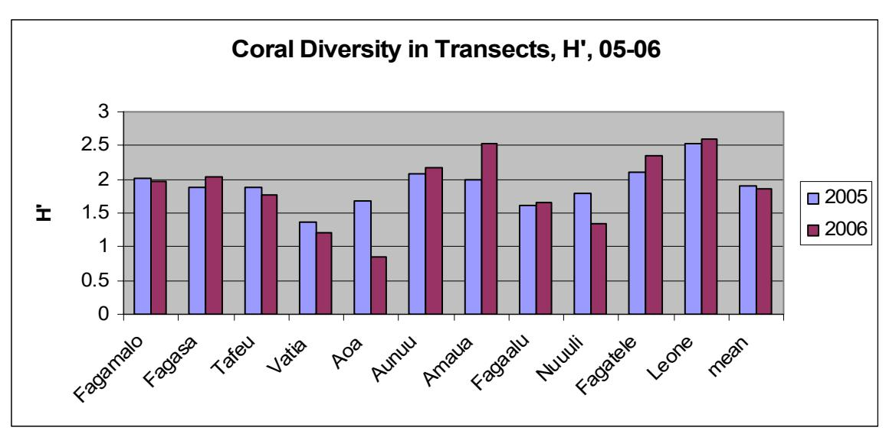

Fig. 39.

 The diversity index H' can also be computed on the entire transect data set at once. The resulting H' measure is not the same as the mean of the H' measures for each of the individual sites, because H' is affected by sample size, particularly for small size samples. When H' is computed based on the entire data sets for 2005 and 2006, there is a small increase in H', as seen in Figure 40. This is the opposite direction from that shown by the mean H', which is consistent with the view that these differences are just random variation. It can also be seen that the H' for the full data set is slightly over 2.5, while the mean H' for each of the transect sites was less than 2.0, demonstrating how H' is sensitive to sample size and increases with increasing sample size.

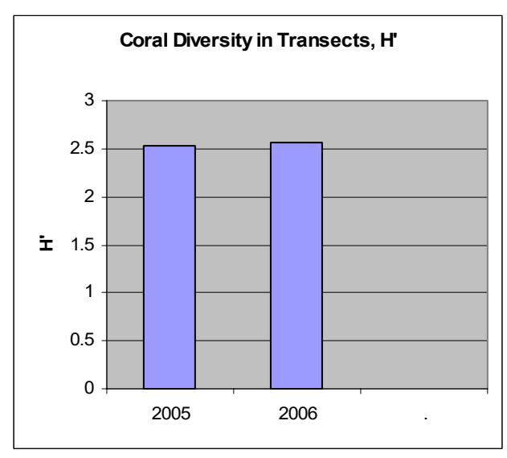

Fig. 40.

 Coral diversity at sites, as measured by H', was correlated between 2005 and 2006 (r = .809, p < .01), as shown in Figure 41.

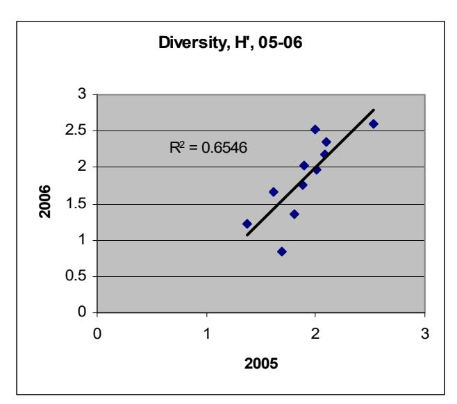

Fig. 41.

 The number of coral species in transects, S, was correlated with the diversity index, H', (r = .7894, p < .01), as seen in Figure 42.

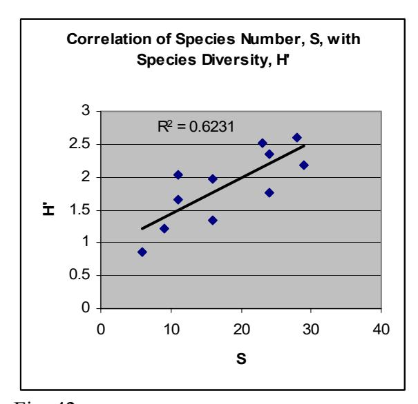

Fig. 42.

 The Shannon-Wiener diversity index H' has two components. One component is the number of species, S, so that the diversity index increases as the number of species increases, as intuition would indicate. The second component is evenness, so if there is a fixed number of species, the diversity index is small if one species is very common and all other species are rare, and large if all species are equally abundant. Evenness can be measured by the index J, where J = H'/H'max. H'max is the maximum possible value of H for a specified number of species, which will be when they are all exactly equally abundant. When J is calculated for the transect data from 2005 and 2006, Evenness (J) is generally between about 0.5 and 0.8, as seen in Figure 43. The mean J declined very slightly but not significantly (paired t test, p = .7015).

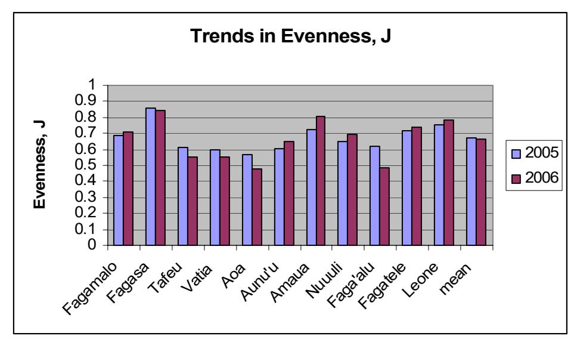

Fig. 43.

The evenness (J) recorded in 2006 correlated highly with that found in 2005 for the same sites as shown in Figure 44 (r = .8853, p < .01).

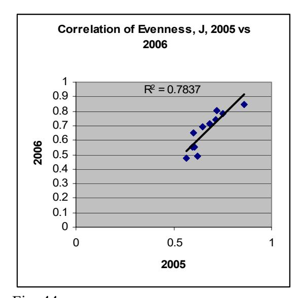

Fig. 44.

Another index of species diversity is Simpson's  $D=1/\Sigma p_i^2$ . This index is less sensitive to the number of rare colonies, and so is preferred by some workers (e.g., Connell et al. 2004). Figure 45 shows this index for each site and the mean. The mean increased slightly from 2005 to 2006, but this was far from significant (two tailed paired t test, p=.510), and thus is just random variation. It is not clear why Amaua showed such a large increase in D, even though it did not show a large increase in H' (Figure 39).

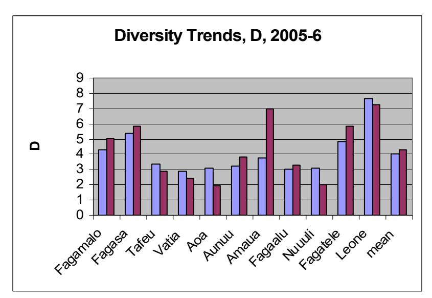

Fig. 45.

Simpson's D can also be calculated on the whole data set. When it is calculated on the whole data set (Figure 46), it is over 5, while if it is calculated for individual sites, the mean is about 4 (Figure 45). Simpson's D is sensitive to sample size as is H', so it increases with increasing sample sizes, particularly at small sample sizes. When D was calculated in the whole data set (Figure 46) it decreased slightly from 2005 to 2006, but when it was calculated for each site the mean increased slightly from 2005 to 2006 (Figure 45). This is consistent with the view that these changes are random variation, and no real trend was found.

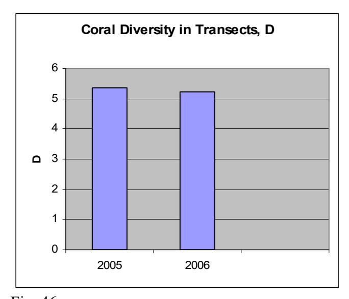

Fig. 46.

The diversity index D was correlated between values in 2005 and 2006 (r = .7920, p < .01), as seen in Figure 47.

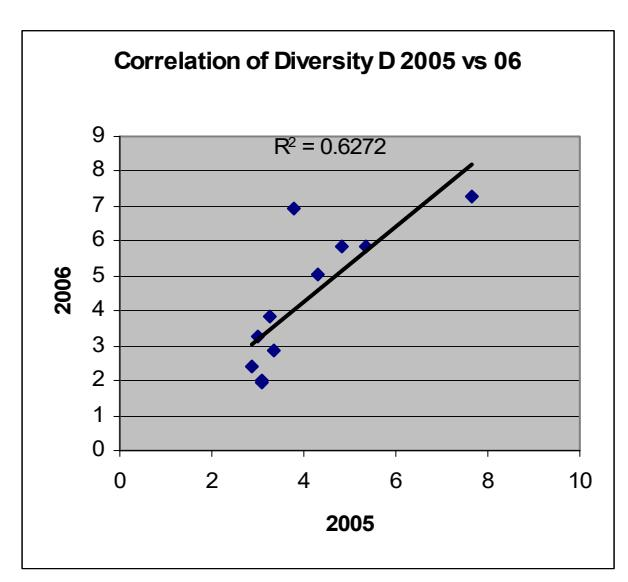

Fig. 47.

For 2006, H' and D were highly correlated (r = .9102, p < .001), as seen in Figure 48.

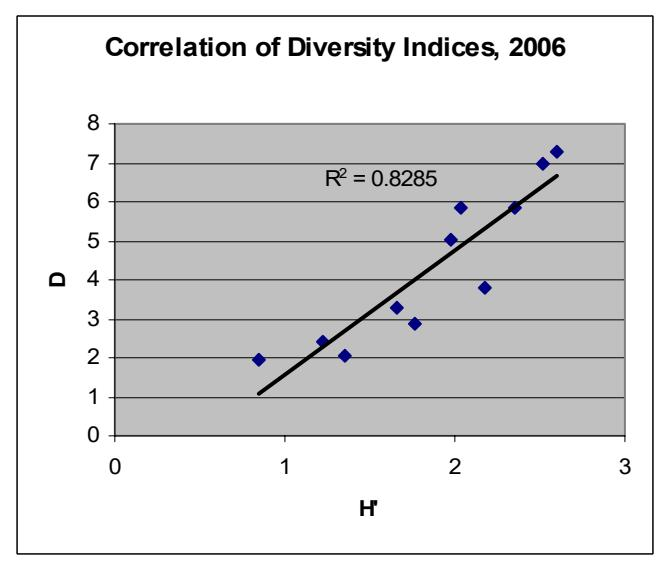

Fig. 48.

# Biodiversity Dive Data

 In the biodiversity dives, a total of 147 coral species were found in 2006, compared to 152 in 2005. A total of 182 species were found in the two years combined. These are much larger figures than the figures for transects. Transects cover a very small part of the bottom, just 100 points at one depth for each transect. The biodiversity dives cover a much larger area, with many more corals observed, at a wide range of depths from the base of the slope to near the crest. The primary reason for doing the biodiversity dives is to gather data on a much larger sample of corals over a much wider range. Figure 49

presents the number of coral species found at each site in 2006, as well as 2005, so trends can be seen. The slight increase in the mean was just significant with a paired samples t test (t = 2.36, p < .04).

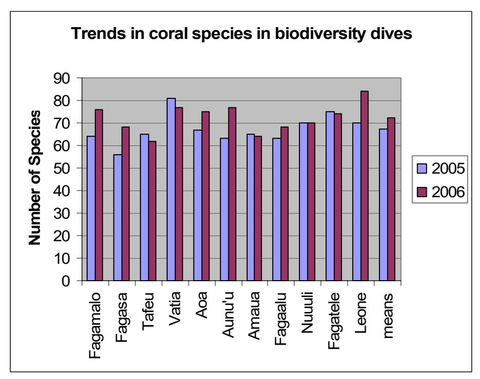

Fig. 49.

 The correlation between the number of species found in biodiversity dives in 2005 with that in 2006 was relatively small and not significant (r = .4128, p > .1), as seen in Figure 50.

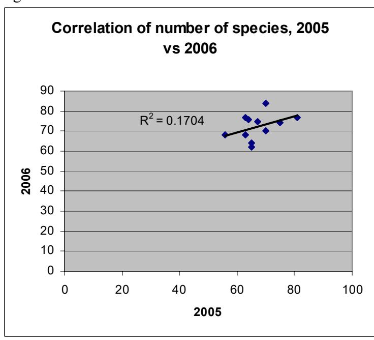

#### Fig. 50.

 The correlation between the number of coral species found on transects at a site, S, and the number of species found in the biodiversity dive at the same site was extremely small and not significant (r = .111, p > .2), as seen in Figure 51. This seems a bit surprising, since both should be measures of local diversity. But the number of coral species found in transects is probably heavily influenced by chance factors depending on the location of the tape, and there is relatively little variance in the number of species found in biodiversity dives. Still, the number of species in a transect correlates well with the diversity indices for the same transects.

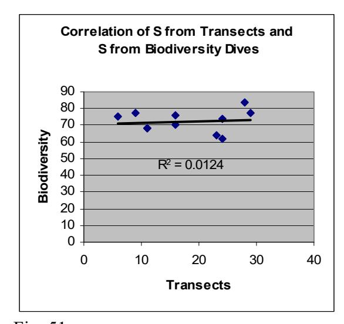

Fig. 51.

 The number of species in biodiversity dives is also not correlated with the diversity index, H', from transects at the same sites, shown in Figure 52 (r = .2093, p > .2). Clearly the biodiversity dives are measuring something different from transects at the same sites. Perhaps this is telling us that diversity measured in a very thin line at one depth tells us little about the number of species in the whole site.

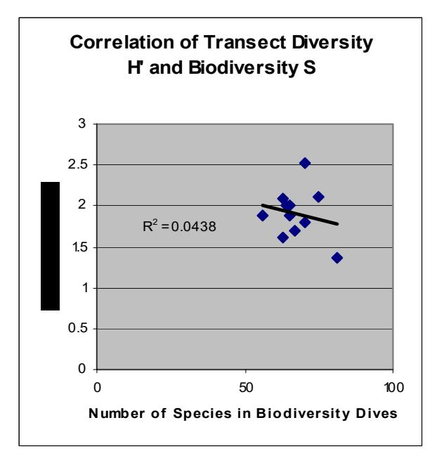

Fig. 52.

 The diversity index H' was computed from the abundance ratings from the biodiversity dives, although these are ordinal numbers not cardinal numbers. The H' for each site was relatively high, of the order of 4, which reflects the fact that the ratings are more like a logarithm and so appear to show much more evenness between species, which increases the H' diversity measure. There was a very small and insignificant correlation between the H' from the biodiversity dives and the H' from the transects, as shown in Figure 53 (r = .1281, p > .2).

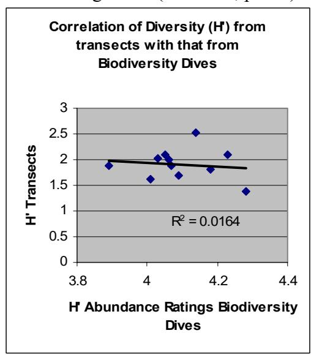

Fig. 53.

Thus, all measures are consistent in indicating that the species richness and diversity measures from transects do not correlate with measures from the biodiversity dives.

Trends in the mean abundance ratings of more common species from the biodiversity dives from 2005 to 2006 can be seen in Figure 54. Although there appears to be some similarity in the ratings between the two years, there are also differences.

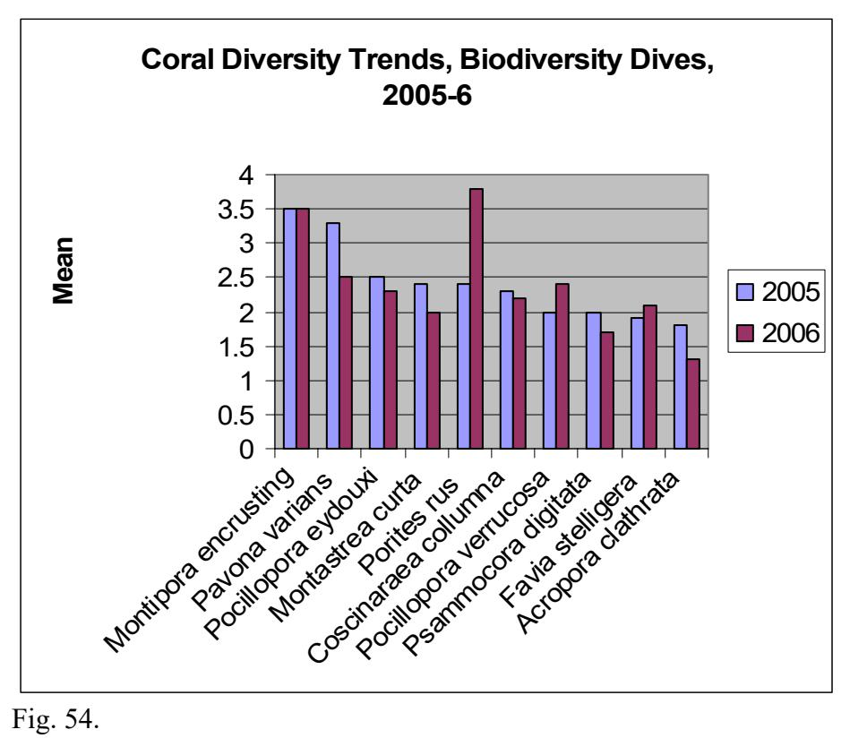

Fig. 54.

The mean ratings of all coral species recorded in 2005 and 2006 were highly significantly correlated (r = .8364, p < .001), as can be seen in Figure 55.

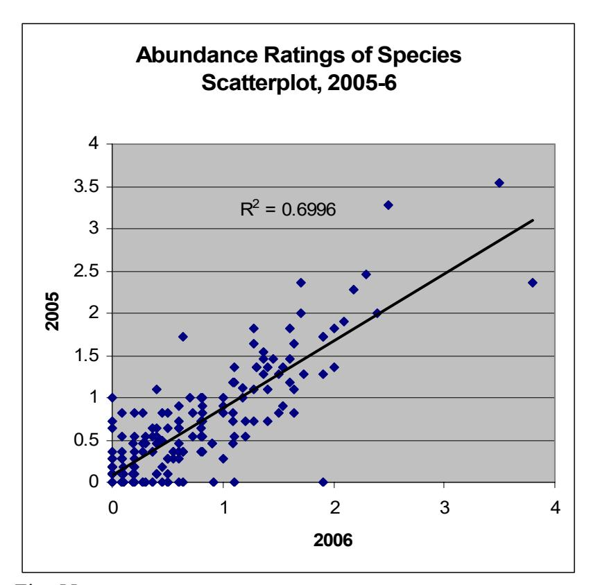

Fig. 55.

 If the mean abundance ratings are plotted for all species recorded, in order of their abundance, the graph in Figure 56 is produced. This curve is best fit by a log function, which produces an extremely good fit (r = .993), while a power function does not produce as good a fit (r = .8592), nor does a linear function (r = .9066).

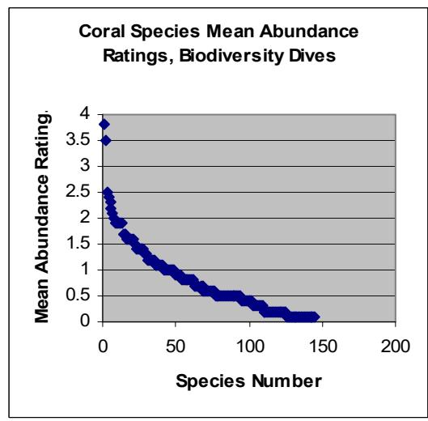

Fig. 56.

 If the mean abundance rating is plotted against the base 10 log of the species number, a straight line is produced as seen in Figure 57. The correlation is very high and highly

significant (r = .9930, p < .0001). This is the same finding as in 2005, and as stated in the 2005 report supports the view that the abundance ratings are on a roughly logarithmic scale, and may be more accurate than it might seem.

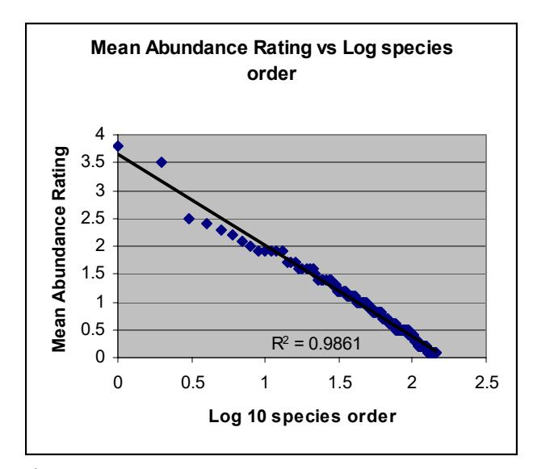

Fig. 57.

 The mean abundance rating of species in the biodiversity dives correlates well with the percentage of sites that have at least one sighting of that coral species, which could be called prevalence, as seen in Figure 58 (r = .9122, p < .0001). Thus, prevalence could be used as a reasonable proxy for abundance, except when prevalence is high (perhaps above 80%).

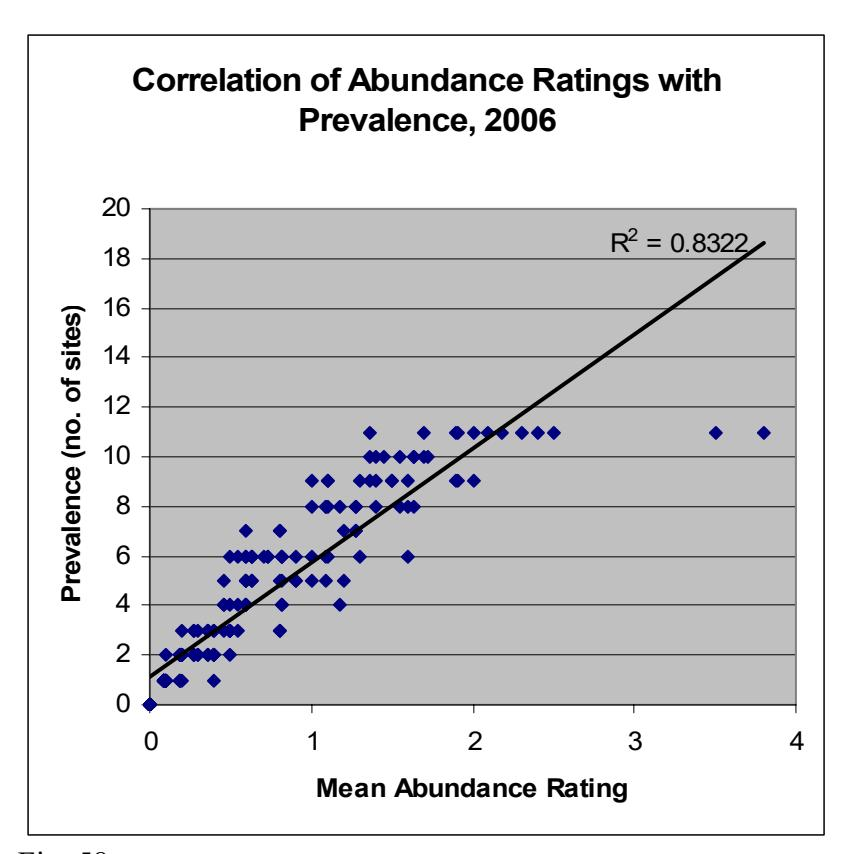

Fig. 58.

 It is also possible to ask if the abundance ratings of individual species in the biodiversity surveys correlate with their abundance in transects. Indeed, these two were correlated significantly, r = .5076, p < .0001. The relationship is curvilinear as can be seen in Figure 59, and most of the correlation comes from just a few points for the more abundant coral species.

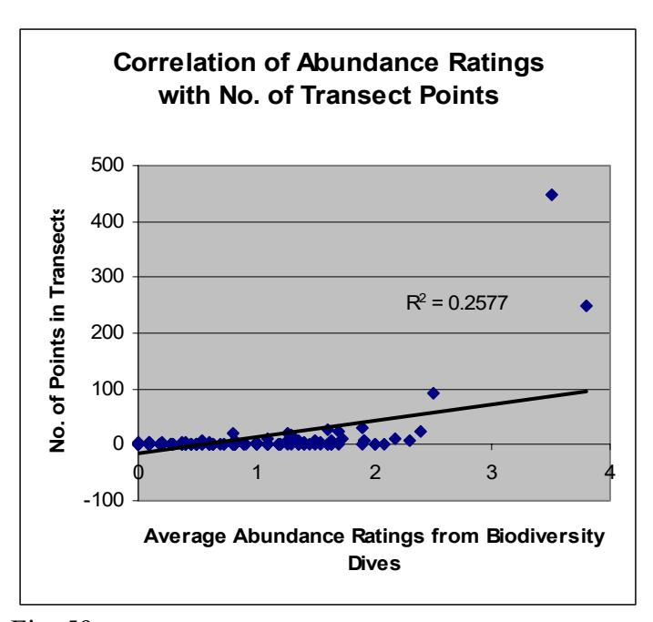

Fig. 59.

 The abundance ratings from biodiversity dives is even more strongly correlated with the log of the number of points in transects (actually the log of the number plus 1 so the log of zero values can be calculated), r = .6902, p < .0001, as shown in Figure 60.

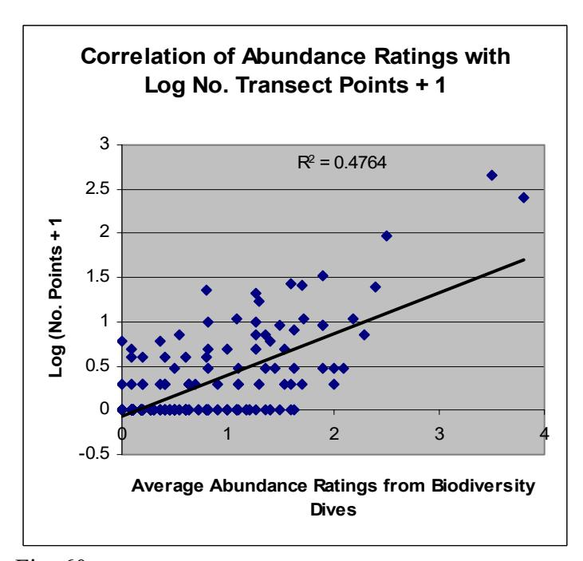

Fig. 60.

 Although the lifeform of corals is not recorded in the biodiversity dives, most species have only one lifeform, or a dominant lifeform. Thus, it is possible to deduce the

lifeforms from the biodiversity species lists. However, the DAFOR ratings are not additive, so it is not possible to add the scores of different species. The best that can be done is to take the mean score of the highest-scoring species. This will approximate the score that would be given if lifeforms had been scored directly if one species receives a much higher score than other species. The DAFOR scale may approximate a log scale. If it were a log scale, then the original numbers could be produced by raising the base to the power of the DAFOR scale number. Perhaps the most conservative method is to use the highest scoring species. When that is done, Figure 61 is produced. Columnar and encrusting corals are clearly the dominant lifeforms.

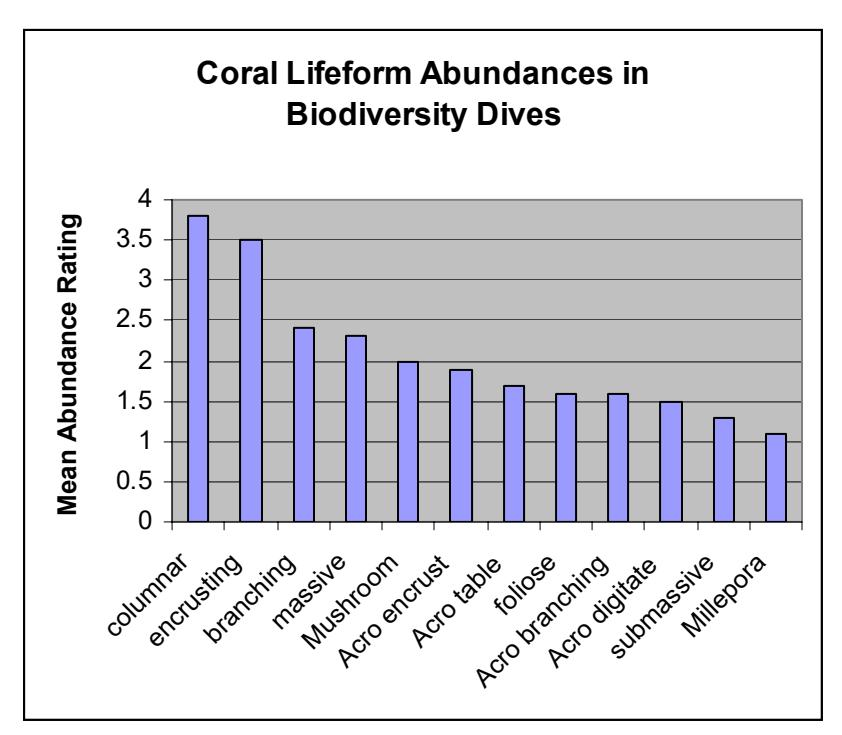

Fig. 61.

Once again, the DAFOR ratings produce much smaller differences between different categories than an absolute scale as was found for the lifeforms in transects, shown in Figure 13. If the two graphs are combined the result is shown in Figure 62. Surprisingly, in the biodiversity dives, the columnar lifeform is slightly more highly rated than the

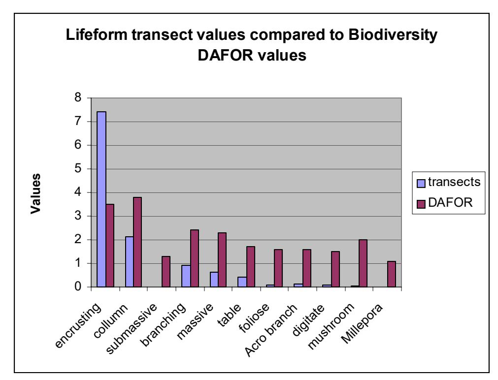

Fig. 62.

encrusting lifeform. Almost all columnar colonies are Porites rus, which has a column and plate morphology. Figure 21 shows clearly that the DAFOR scale gives smaller differences between different lifeforms. The order of abundance of the different categories is not exactly the same, yet it appears that the two might be somewhat correlated. Figure 63 shows the correlation between these two variables, which was r = .7483, p < .01. Thus, the two lifeform measuring systems produce similar results. The differences between them are likely due to the fact that the transects are done only in a very narrow depth band, while the biodiversity dives cover a wide range of depths, and thus the two are recording from somewhat different populations.

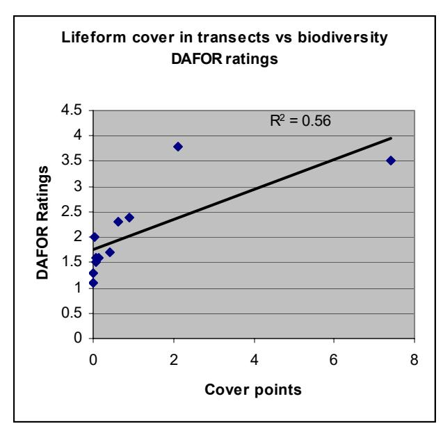

Fig. 63.

 Thus, although none of the diversity measures for transects and biodiversity dives are correlated, the abundance ratings of individual species and lifeforms from biodiversity dives are significantly correlated with the abundance of those species and lifeforms in transects. So the abundances of coral species in the two different techniques are correlated, but the diversities of individual sites measured by the two different techniques are not correlated. Although the two different techniques attempt to measure the diversity at the same site, transect tapes measure points along a long horizontal line at one depth, while the biodiversity dives measure diversity in an area that extends from the bottom to the top of the reef, but does not extend nearly as far horizontally as the transect tapes do. Thus, they measure different areas, and apparently measure somewhat different things at the different sites. It was part of the original intention of the design of the monitoring program to supplement the transect data with the biodiversity data, knowing that the biodiversity dives would cover a larger area and a much wider depth range, but produce less quantitative abundance measures. The biodiversity dives are done because they provide additional information that compliments or supplements the transect information, not because they measure the same thing. The biodiversity dives sample a much larger area, giving data on a larger part of the reef, and with the larger sample are able to provide information about species too rare to be recorded in the transects, which provide a smaller sample of coral species and thus tend to include only the more common species. The biodiversity dive data provides greater area and taxonomic coverage for corals, but less quantitative accuracy. In addition, observations during the biodiversity dives can detect major changes that affect the reef at depths other than the 9m depth where transects are done.

# Non-Point Pollution Impact

 Peter Hoek has led a program with the American Samoa Environmental Protection Agency (ASEPA) to develop biocriteria on coral reefs to detect the effects of humans on coral reef communities. In our report on our 2005 data, we reported that we did not find significant correlations between coral cover at our 11 core sites and the human impact ratings which EPA had designated for different areas of the islands (Whaylen and Fenner, 2005). In the 2006 data, the percentage of coral cover also did not show a significant correlation with impact ratings, r = .3969, p > .1. This is shown in Figure 64.

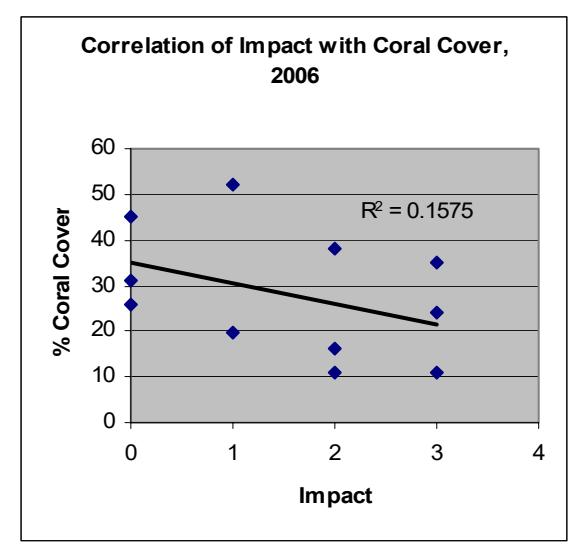

Fig. 64.

 Turf algae also did not show a correlation with human impact, r = .2649, p > .1, and there was no correlation with algae cover, r = .0714, p > .1. All three decreased with increasing impact. The hypothesis that human impact was damaging the reefs would predict decreasing coral cover with increasing impact, but increasing turf or macro algae with impact. The first fits the hypothesis, but the other two do not.

 Houk et al. (2005) did not find evidence of human impact on coral cover, but did report evidence of impact on diversity measures. In the present study, correlations were run with each of four diversity measures for the transect data and two for the biodiversity data, with the impact ratings. None the correlations were even close to being significant. Houk et al. (2005) divided their sites into those with "constructional" reefs and "framework" reefs, and those with sand between corals. Vatia falls into the latter category. Constructional means that the reef is solid with no cavities, while framework means that the reef has cavities. In their study, all their north side sites were constructional, and all but one of their south side sites were framework. So for this study, north side sites were considered constructional except for Vatia, and south side sites were considered framework. Sites were divided into constructional and framework, and correlations with impact calculated. Table 1 presents these results.

| Variable correlated with Impact       | Correlation | Significance |
|---------------------------------------|-------------|--------------|
| No. of species (S) in transects, 2005 | r = 0.0115  | p > .2       |
| Ditto, constructional only            | r = 0.597   | p > .1       |
| Ditto, framework only                 | r = 0.067   | p > .2       |
| No. of species (S) in transects, 2006 | r = .0482   | p > .2       |

| Ditto, constructional only (north minus  | r = 0.748   | p > .1 |
|------------------------------------------|-------------|--------|
| Vatia)                                   |             |        |
| Ditto, framework only (south side)       | r = 0.143   | p > .2 |
| Species richness (d) in transects, 2005  | r = 0.0173  | p > .2 |
| Species richness (d) in transects, 2006  | r = 0.1044  | p > .2 |
| Diversity (H') in transects, 2005        | r = 0.007   | p > .2 |
| Diversity (H') in transects, 2006        | r = 0.0943  | p > .2 |
| Ditto, constructional only               | r = 0.2     | p > .2 |
| Ditto, framework only                    | r = 0.166   | p > .2 |
| Evenness (J) in transects, 2005          | r = 0.1546  | p > .2 |
| Evenness (J) in transects, 2006          | r = 0.0374  | p > .2 |
| Diversity (D) in transects, 2005         | r = 0.1697  | p > .2 |
| Diversity (D) in transects, 2006         | r = 0.0141  | p > .2 |
| Live Coral Index, 2006                   | r = -0.1212 | p > .2 |
| No. of species (S) in biodiversity, 2005 | r = 0.1612  | p > .2 |
| No. of species (S) in biodiversity, 2006 | r = 0.1667  | p > .2 |
| Ditto, constructional only               | r = 0.049   | p > .2 |
| Ditto, framework only                    | r = 0.003   | p > .2 |

### **Bleaching**

 Although 2006 was just the second year of collecting reef slope monitoring data, it was the third year of collecting coral bleaching data in the back reef pools. Bleaching was recorded in two pools, one at the airport and one at Alofau. These pools were dredged in the reef flat to provide material for building the platform for the airport runway, and for extending the land for the village of Alofau. Bleaching was recorded only among staghorns, *Acropora muricata* (= *A. formosa*), *A. nobilis* and *A. pulchra*. Both pools are co-dominated by *Acropora muricata* and *Porites cylindrica*, but the latter has not been observed to bleach. Bleaching was recorded by visual estimation of the percent bleached during a one-hour swim. For more background information on bleaching in American Samoa, see Whalen and Fenner (2006).

 Staghorns in the two backreef pools bleached again beginning late October 2005 at Alofau and mid-November at the airport, and extending to early June 2006 at both sites (Figure 62, 63). A three-week period in February, 2006 of unusually heavy cloud cover and rain resulted in a marked decrease in bleaching of staghorns at the airport. Following the end of the cloudy rainy period, bleaching returned at the airport (Figure 65). Bleaching was not interrupted by the cloudy period at Alofau (Figure 66).

 Bleaching returned in October at Alofau, and in December at the airport. Bleaching was intense at Alofau by the end of the year (Figure 66), but had just begun at the airport (Figure 65). Bleaching at Alofau is more intense in the deeper pool, and less intense in the shallower areas, for unknown reasons (Figure 66). At times, the water is warmer near the surface than deeper, suggesting bleaching should be greater in shallow water. Similarly, in the airport bleaching is generally more intense in the outer part of the pool and less in the inner area closer to the runway. These areas at the airport do not differ noticeably in depth.

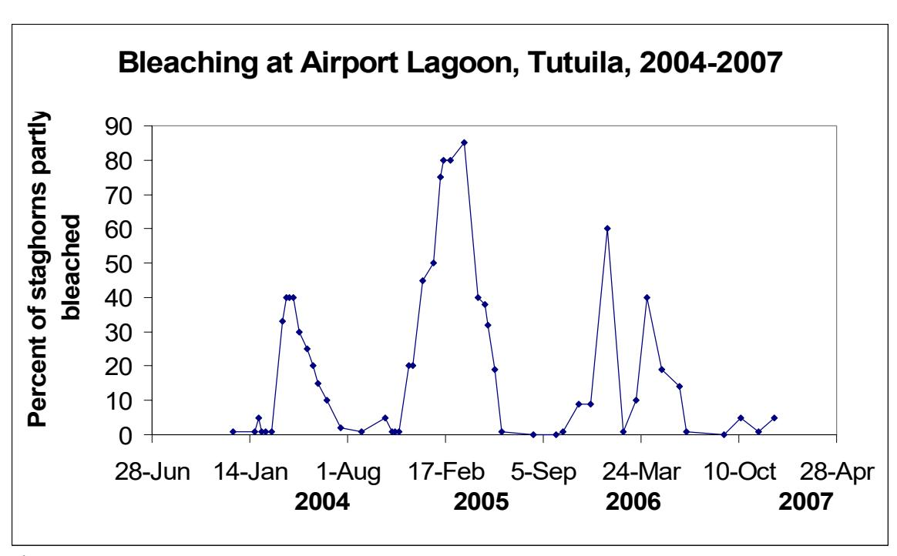

Fig. 65.

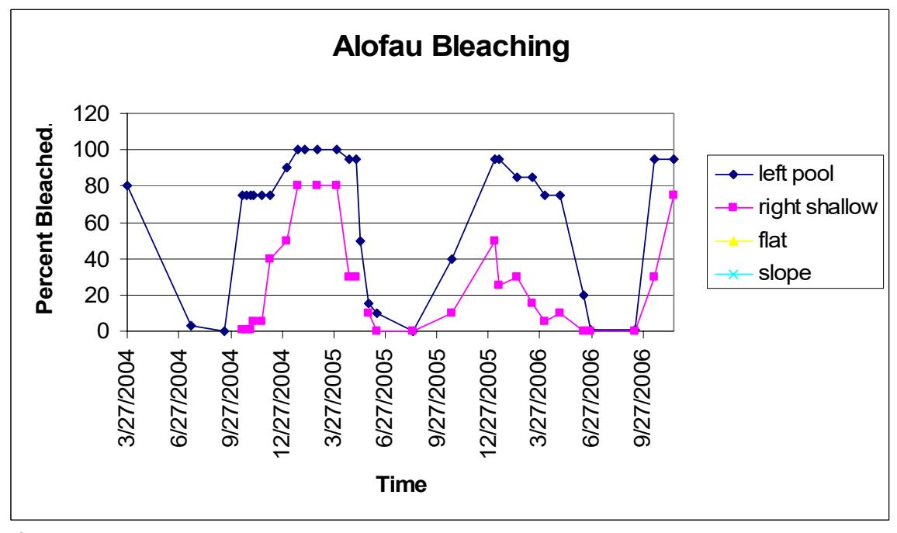

Fig. 66.

 At the time of writing in 2007, staghorn bleaching in the pools is tapering off. Late 2006 and early 2007 is the fourth summer in a row that this program has documented staghorn bleaching in these pools. Further, bleaching on reef slopes was reported for the previous two summers, so staghorn in the pools almost certainly bleached then as well. Thus, they have bleached for at least 6 years in a row, quite possibly more. In Alofau,

they are spending less time recovered than bleached. Bleaching on reef slopes during this period has been very light and scattered.

 Bleaching very likely slows or stops growth, and has been reported to block sexual reproduction for a year, likely due to the loss of energy reserves. Thus, these corals are likely growing less and not reproducing at all (other than asexually by fragmentation). Bleaching is very likely to having a chronic negative impact on these coral populations. Mass coral bleaching has been predicted to become an annual summer event in coming decades due to global warming, and these staghorns appear to be the first multi-species population in the world exhibiting annual summer bleaching (*Oculina patigonica* in Israel and *Favia fragum* in Florida exhibit annual summer and fall bleaching, respectively, but only of the one species at a location). Further, after at least six consecutive summers of bleaching, there is no sign of any increase in resistance to bleaching. The "adaptive bleaching hypothesis" says that bleaching occurs so corals can acquire new more resistant strains of zooxanthellae. These records give no indication that these corals have acquired more resistant zooxanthellae.

#### **Major Disturbances**

 There were no hurricanes, mass bleaching events, disease outbreaks, or crown-ofthorns starfish outbreaks in 2006. Extreme low tides continued in one week of each month early in the year. Additional reef flat coral mortality appears to have been caused, primarily in the bushy staghorn, *Acropora aspera*. Most patches of this species are now completely dead, and some of the branches have broken and are now rubble. However, in places where it grows in depressions in the reef flat, it appears healthy. Live *A. aspera* remain in Onososopo, Alofau, Matu'u, Faga'itua, and other locations. In addition, lumps of crustose calcareous algae on reef flats were observed to have been killed. Normally, unless repeated exposure occurs, calcareous algae recovers or resettles quickly. Quantitative measures of reef flats were not taken in 2006, but have already been taken in 2007 at the time of writing, and will be incorporated into the report for 2007.

 Corals were checked in Faga'alu Bay after the end of the 3 week period of monsoonal rains in late February and early March, 2006. This bay is frequently seen after rainstorms with a very large sediment plume in the waters of the bay, usually on the ava side where water flows outward. The stream that feeds the bay carries large quantities of fine silt following rain storms. Some staghorn corals were recently dead, still white. Observation revealed that the dead staghorn was in water at least 10 feet deep, and staghorn near the surface was healthy. Depressions in the upper surfaces of massive corals had up to about 1 cm very fine silt accumulated, which had killed the coral tissue underneath it. A visual estimate was that about 40% of the living staghorns may have been killed, though the highly patchy nature of the coral and the deaths made estimation difficult; later estimates were lower. All backreef pools were checked, and there were small amounts of dead staghorn in the airport and Nu'uuli pools, and no dead staghorns in any other pools. The explanation that best fit the observations was that the combination of heavy cloud cover and thick suspended silt in the water reduced light so much that deeper corals were killed.

#### **Coral Disease**

 For information on coral disease monitoring in American Samoa, see the report by Aeby, Work and Fenner (2006).

#### **Coral Taxonomy**

 Progress has been slow on this topic, as it has been considered to be of lower priority than collecting monitoring data. Monitoring data must be collected on a timely basis, while coral taxonomy work can be done any time. See Whalen and Fenner (2006) for a discussion of how many coral species may be in the territory, and the number of new coral sightings. During 2006, about half of the DMWR coral collection has been examined to confirm species identifications. All known literature giving lists of coral species in the territory have now been summarized in a single table. The results of 13 reports are included, including from one (Coles et al. 2003) that summarizes the results of 16 other studies. Currently, about 436 names have been applied to corals in American Samoa, about 365 of which are currently valid names. This study has observed about 250 species, some of which have not previously been reported. Some of the 365 valid names have probably been applied incorrectly, but since only three studies (Hoffmeister, 1925; Lamberts, 1983; and an unpublished study by Richard Randall) have collected reference collections, there is no way to determine whether many of those 365 names were applied correctly, except when the species can be found and collected currently to verify species. Once all corals in the DMWR collection are identified, all species that have been observed which are not in the collection will need to be collected to verify those species. That has not yet begun but hopefully will begin in 2007 or perhaps 2008.

# **Invertebrates**

 Very few invertebrates were recorded in the belt transects. The most common was a small burrowing sea urchin that is most common on smooth carbonate surfaces and occurs in dense groups, *Echinostrephus molaris*. Second most common was the small massive orange sponge, *Stylissa* sp., and third most common is the thin light grey encrusting sponge *Dysidea* sp. There were smaller numbers of Didemnid sea squirts which are quite small, *Didemnum molle*, and giant clams. This can be seen in Figure 67.

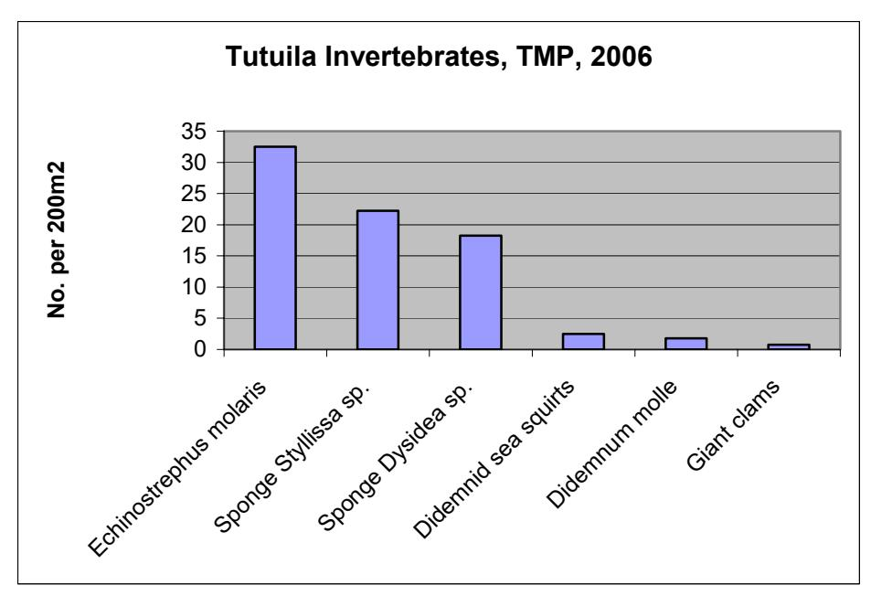

Fig. 67.

As in last year's survey, no crown-of-thorns starfish, triton shells, or lobsters were recorded in the belt transects. A variety of other invertebrates were recorded in very low numbers. Figure 68 compares the results from 2006 with those in 2005. The sponge *Dysidea* sp., the Didemnid sea squirts and *Didemnum molle* were not looked for in 2005, so none were recorded. For the other species, the results were similar in 2006 to that in 2005.

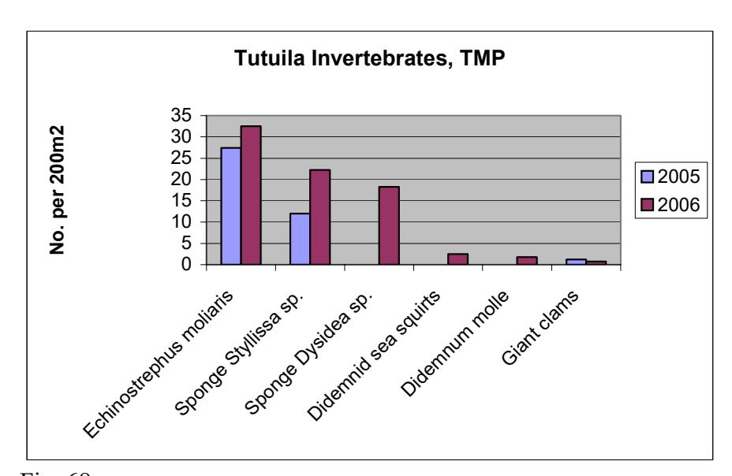

Fig. 68.

It is not entirely clear why there are so few diurnal non-cryptic macroinvertebrates in American Samoa.

### **Recommendations for the Future**

 Reef flats are exposed to very different stresses and disturbances than reef slopes, and have very different biological communities. The results of monitoring slopes cannot be extrapolated to the reef flats. For instance, extreme low tides have killed much of the coral on the reef flats but had no effects on the reef slopes. Further, terrestrial influences such as sediment runoff and gleaning are much greater on the reef flats than the slopes. Reef flats are just as much a part of the reefs as the slopes. Reef flat monitoring is urgently needed. At the time of writing, reef flat monitoring data collection has almost been completed for 2007, so it will be part of the 2007 data and report. Reef flats in the harbor are a special case. Reefs in the harbor have been damaged over the years, by dredging and probably by cannery effluent and other runoff. There is a need to survey harbor reefs to assess damage and have a baseline to monitor recovery or further damage. Baseline data has already been taken for 2007 at the time of writing of this report.

 Reef slopes in American Samoa show zonation. Slope communities at some sites vary strongly with depth. Some disturbances can have differential effects on different depths on the slopes as well, so for instance hurricanes commonly damage shallow areas more than deep areas, and bleaching may affect one depth more than another. Because there is zonation of the communities and disturbances can affect different depths to different degrees, the results at 9m depth cannot be fully extrapolated to other depths. It appears that a transect laid at a shallower depth, and a transect laid at a deeper depth may reveal more about zonation and be able to detect changes that are not detected at the 9 m depth. At the time of writing, recording of transects at 4.5m and 18 m depth for 2007 have begun.

 Some sites have unique communities or dominant corals. Some disturbance events such as disease, hurricanes, crown-of-thorns or bleaching, affect different species to very different degrees. For instance, the two most common coral diseases in American Samoa, white syndrome and growth anomaly, are much more common on *Acropora* than other genera, and more common on table *Acropora* than other *Acropora*. Hurricanes usually damage delicate branching and foliose species far more than massive species. *Acropora* and *Millepora* are more sensitive to bleaching than other corals. Insofar as it is possible, it would be good to monitor these unique communities, in case a disturbance damages one of them while leaving other communities unscathed. This year the site at Amaua E. was added with the dominant coral *Lobophyllia hemprichii*. In the future, a site at the west side of Fagatelle Bay should be added that would include the dominant stand of *Acropora hyacinthus*, and a site at the mouth of Vatia Bay should be added where there is a diverse community of *Acropora* tables and staghorns. *Acropora* is particularly sensitive to bleaching, hurricanes, disease, and crown-of-thorns, and this community may be unusual in American Samoa, particularly at this relatively shallow depth.

 There should be a renewed effort to expand the monitoring program to the Manu'a Islands of Ofu-Olosega and Ta'u. This has not been possible so far due to the late hiring of the second team member (B. Carroll) in 2006, and the difficulty of logistics in this remote location. However, if a larger vessel is acquired, this would greatly facilitate beginning monitoring in the Manu'a islands.

 Bleaching should be recorded on reef flats and reef slopes as well as in the backreef pools, to verify that there is little bleaching there concomitant with the bleaching in the pools. Such recording has begun at the beginning of 2007 at Alofau. It would also be good to record the growth of staghorn to see if they grow less when bleached than when not bleached. Tags to do this have been attached at the time of this writing.

### **References**

Aeby, G., Work, T., and Fenner, D. 2006. Coral and crustose coralline algae disease on the reefs of American Samoa. Report to Coral Reef Advisory Group, American Samoa Government. 25 pp.

Bellwood, D. R., T. P. Hughes, C. Folke, and M. Nystrom. 2004. Confronting the coral reef crisis. Nature 429: 827-833.

Brainard, R., Asher, J., Gove, J., Helyer, J., Kenyon, J., Mancini, F., Miller, J., Myhre, S., Nadon, M., Rooney, J., Schroeder, R., Smith, E., Vargas-Angel, B., Vogt, S., Vroom, P., Balwani, S., Ferguson, S., Hoeke, R., Lammers, M., Lundlblad, E., Maragos, J., Moffitt, R., Timmers, M., and Vetter, O. 2007. Coral reef ecosystem monitoring report for American Samoa: 2002-2006. NOAA Special Report NMFS PIFSC.

Bruno, J. F., Selig, E. R. 2007. Regional decline of coral cover in the Indo-Pacific: timing, extent, and subregional comparisons. Public Library of Science, Biology 2(8): e711. doi:10.1371/.journal.pone.0000711

Coles, S. L., Reath, P. R., Skelton, P. A., Bonito, V., DeFelice, R. C., Basch, L. 2003. Final report prepared for the U.S. Fish and Wildlife Service, Fagatele Bay Marine Sanctuary, National Park of American Samoa and American Samoa Department of Marine and Natural Resources. Bishop Museum Technical Report No. 26. Honolulu.

Connell, J. H., Hughes, T. P., Wallace, C. C., Tanner, J. E., Harms, K. E., and Kerr, A. M. 2004. A long-term study of competition and diversity of corals. Ecological Monographs 74: 179-210.

Craig, P. 2005. Natural History Guide to American Samoa, 2nd Edition. National Park of American Samoa, Dept. Marine & Wildlife Resources, and American Samoa Community College, Pago Pago. 96 pages.

Craig, P., DiDonato, G., Fenner, D., Hawkins, C. 2005. The state of coral reef ecosystems of American Samoa. PP. 312-337 in Waddell, J. E. (ed.), The State of Coral Reef Ecosystems of the United States and Pacific Freely Associated States: 2005. NOAA Technical Memorandum NOS NCCOS 11. NOAA/NCCOS Center for Coastal Monitoring and Assessment's Biogeography Team. Silver Spring, MD. 522 pp

Gardner TA, Cote IM, Gill JA, Grant A, Watkinson AR (2003) Long-term region-wide declines in Caribbean corals. Science 301: 958-960.

Houk, P., Didonato, G., Iguel, J., Van Woesik, R. 2005. Assessing the effects of nonpoint source pollution on American Samoa's coral reef communities. Environmental Monitoring Assessment 107:11-27

Hoffmeister, J. E. 1925. Some corals from American Samoa and the Fiji Islands. Papers from the dept marine biology of the Carnegie Institute of Washington. 22: 1- 84.

Lamberts, A. E. 1983. An annotated check list of the corals of American Samoa. Atoll Research Bulletin 264: 1-19.

Sabater MG and Tofaeono S. 2006. Spatial variation in biomass, abundance, and species composition of "key reef species" in American Samoa. Revised Edition. Biological Report Series no 2006-2. Department of Marine and Wildlife Resources, Pago-Pago, American Samoa 96799.

Wells, S. 1988. Coral Reefs of the World, Vol. 3, Central and Western Pacific. UNEP, IUCN. 329 pp.

Whaylen, L. and Fenner, D. 2006. Report of 2005 American Samoa coral reef monitoring program (ASCRMP), expanded edition. Report to the Department of Marine and Wildlife Resources and Coral Reef Advisory Group, American Samoa. 64 pp.