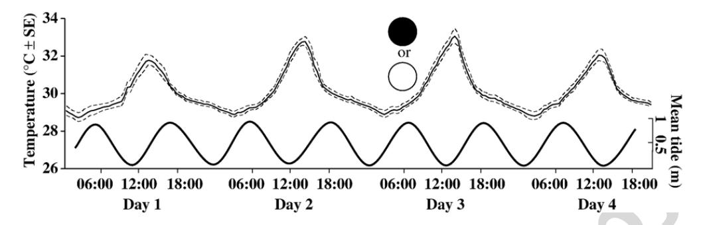
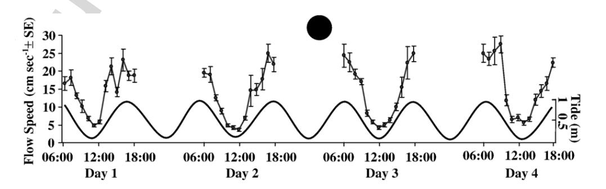
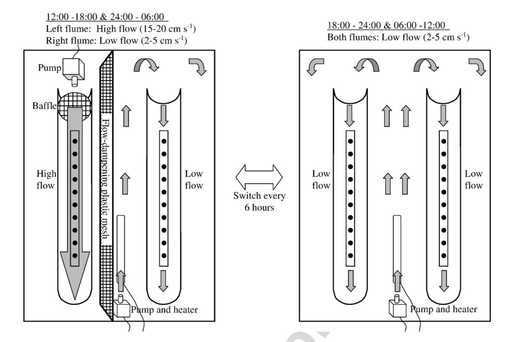
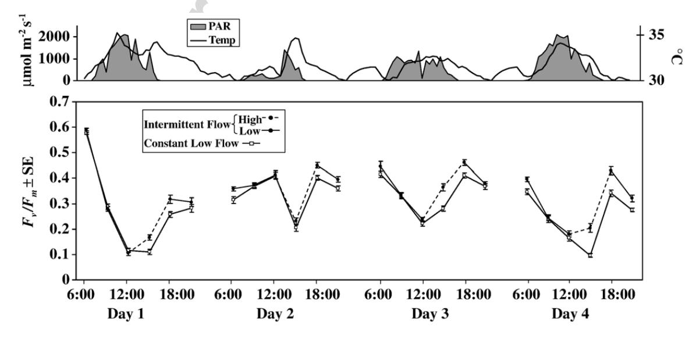
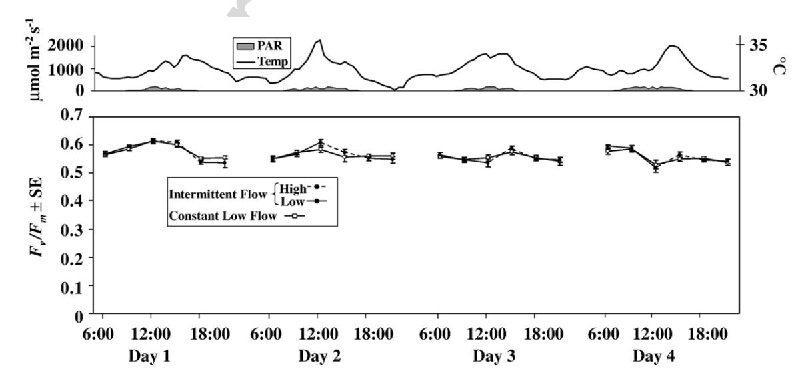
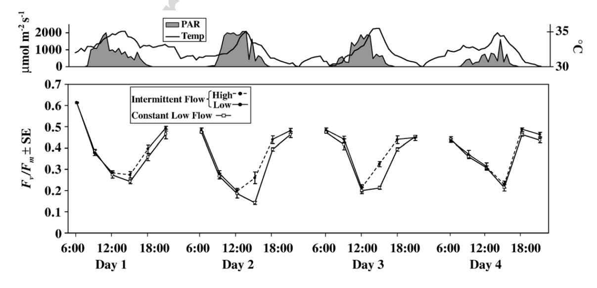
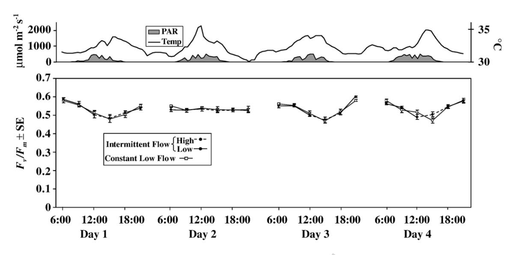
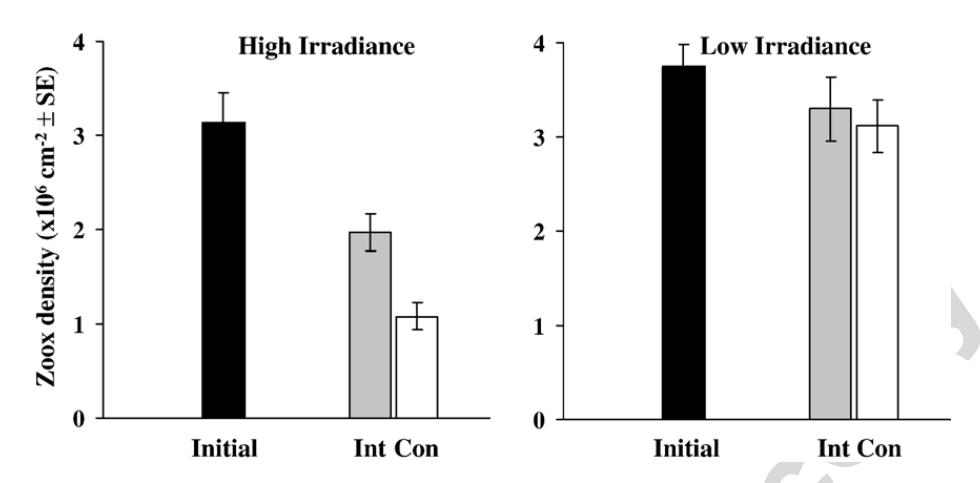
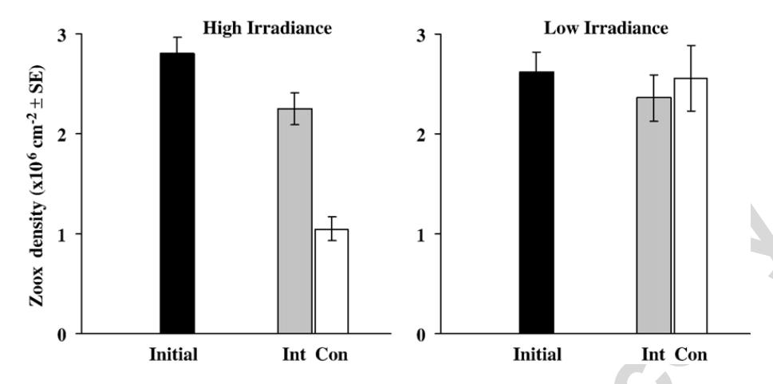

**This article was originally published in a journal published by Elsevier, and the attached copy is provided by Elsevier for the author's benefit and for the benefit of the author's institution, for non-commercial research and educational use including without limitation use in instruction at your institution, sending it to specific colleagues that you know, and providing a copy to your institution's administrator.**

**All other uses, reproduction and distribution, including without limitation commercial reprints, selling or licensing copies or access, or posting on open internet sites, your personal or institution's website or repository, are prohibited. For exceptions, permission may be sought for such use through Elsevier's permissions site at:**

**<http://www.elsevier.com/locate/permissionusematerial>**

Journal of Experimental Marine Biology and Ecology 341 (2007) 282-294

Journal of
EXPERIMENTAL
MARINE BIOLOGY
AND ECOLOGY

www.elsevier.com/locate/jembe

# Effects of intermittent flow and irradiance level on back reef Porites corals at elevated seawater temperatures

Lance W. Smith \*, Charles Birkeland

Hawai'i Cooperative Fishery Research Unit (U.S. Geological Survey), Zoology Department, University of Hawai'i at Mānoa, Honolulu, HI 96822, United States

Received 8 June 2006; received in revised form 26 August 2006; accepted 28 October 2006

#### **Abstract**

Corals inhabiting shallow back reef habitats are often simultaneously exposed to elevated seawater temperatures and high irradiance levels, conditions known to cause coral bleaching. Water flow in many tropical back reef systems is tidally influenced, resulting in semi-diurnal or diurnal flow patterns. Controlled experiments were conducted to test effects of semi-diurnally intermittent water flow on photoinhibition and bleaching of the corals *Porites lobata* and *P. cylindrica* kept at elevated seawater temperatures and different irradiance levels. All coral colonies were collected from a shallow back reef pool on Ofu Island, American Samoa. In the high irradiance experiments, photoinhibition and bleaching were less for both species in the intermittent high-low flow treatment than in the constant low flow treatment. In the low irradiance experiments, there were no differences in photoinhibition or bleaching for either species between the flow treatments, despite continuously elevated seawater temperatures. These results suggest that intermittent flow associated with semi-diurnal tides, and low irradiances caused by turbidity or shading, may reduce photoinhibition and bleaching of back reef corals during warming events.

© 2006 Elsevier B.V. All rights reserved.

Keywords: Bleaching; Coral; Intermittent flow; Irradiance; Photoinhibition; Temperature

# 1. Introduction

Coral bleaching refers to the loss of endosymbiotic dinoflagellates (zooxanthellae) from the coral host, but can also include the loss of photosynthetic pigments within individual zooxanthellae. Since the 1980s, extensive coral bleaching has become increasingly common, usually as a consequence of elevated seawater temperatures in conjunction with high irradiances of solar radiation (Dunne and Brown, 2001; Jokiel, 2004). Exposure to high irradiance levels leads to a lower

E-mail address: lancesmi@hawaii.edu (L.W. Smith).

bleaching threshold temperature and quicker bleaching compared to corals exposed to lower irradiance levels (Lesser and Farrell, 2004; Robison and Warner, 2006). Even in the absence of elevated seawater temperatures, supra-optimal irradiance levels reduce the function of reaction centers in Photosystem II (PS II) and cause oxidative stress (Gorbunov et al., 2001; Lesser, 1997), a process known as photoinhibition (Osmond, 1994). Water flow increases mass transfer of inorganic nutrients (Atkinson and Bilger, 1992) and dissolved gases across the diffuse boundary layer between the water column and the coral tissue, thereby likely reducing oxidative stress and limiting photoinhibition (Lesser et al., 1994), which in turn may prevent or minimize coral bleaching (Finelli et al., 2006; Nakamura et al., 2005).

\* Corresponding author. Tel.: +1~808~956~8350; fax: +1~808~956~4238.

Tropical back reef systems occur between the reef crest and the shoreline's upper intertidal zone, thus include a wide diversity of habitats such as coastal margins, lagoons, mangroves, seagrass beds, and others (Dahlgren and Marr, 2004). Corals occurring in shallow back reef areas are often simultaneously exposed to seawater temperatures of 32-36 °C and supra-optimal irradiances, especially during mid-day spring low tides (Coles, 1997; Craig et al., 2001). Water flow in many tropical back reef systems is tidally influenced, resulting in a strong semi-diurnal component to flow patterns (Kraines et al., 1998; Storlazzi et al., 2004). For example, velocities dropped to zero at low tide every 12.4 h, interspersed with maximum velocities  $(8-12 \text{ cm s}^{-1})$  on the rising and falling tides over a three day period in a back reef lagoon within a fringing coral reef system (Kraines et al., 1998). Constant water flow benefits coral survival (Jokiel, 1978), calcification (Dennison and Barnes, 1988), and photosynthesis (Lesser et al., 1994), while reducing photoinhibition and bleaching (Nakamura et al., 2005). However, effects of intermittent water flow on photoinhibition and bleaching of corals exposed to elevated seawater temperatures and high irradiances have not been investigated.

Elevated seawater temperatures and high irradiances usually occur together, and their synergistic effects on coral bleaching are well established (Jones and Hoegh-Guldberg, 2001). But since seawater temperatures change more slowly than irradiance levels, warming events followed by cloudy weather or sudden increases in turbidity may result in simultaneous elevated seawater temperatures and reduced irradiances. Field observations of minimal bleaching despite warming events have been attributed to reduced irradiances from cloud cover (Mumby et al., 2001) or turbidity (Phongsuwan, 1998), and laboratory experiments have shown greater photoinhibition and bleaching of corals kept at elevated temperatures when exposed to high irradiances than low irradiances (Lesser and Farrell, 2004). However, elevated seawater temperatures reduce photosystem function in isolated reef coral zooxanthellae kept in the dark (Warner et al., 1996) or at low irradiance (Warner et al., 1999). Effects of elevated seawater temperatures at different irradiance levels are particularly relevant to corals in shallow back reef systems, where seawater temperatures are often elevated and irradiance levels can rapidly fluctuate with changing weather conditions as well as the rise and fall of turbidity from runoff and tidal flushing (Dahlgren and Marr, 2004). Hence, a series of experiments was designed to test effects of intermittent water flow and irradiance level on photoinhibition and bleaching of

common back reef *Porites* corals exposed to elevated seawater temperatures.

#### 2. Methods

2.1. Field observations, species selection, and experimental system

The fringing coral reef on the south coast of Ofu Island, American Samoa, lies mostly within the National Park of American Samoa and includes a series of back reef pools. Temperatures at 1 m low tide depth (shaded,  $\approx 10$  cm above substrate) in the pools have been continuously recorded every 30 min since 1999 with Onset Tidbit® (1999–2003) or Water Temp Pro® (2004–present) loggers. During the summer, seawater temperatures are regularly 32-35 °C 1 m below the surface, with daily fluctuations of up to 6 °C. The longterm local summer mean temperature is a useful baseline for estimating bleaching thresholds (Jokiel, 2004). Based on the 1999-2006 temperature data, local summer (Nov-Mar) mean temperature in the back reef pools was 29.4 °C. Maximum low tide pool depth in the back reef pool is 1.5 m and turbidity is usually low, resulting in high irradiances during sunny weather, though turbidity sporadically increases following storms (Smith and Birkeland, 2003). Approximately 80 species of scleractinian corals occur in the back reef area (Craig et al., 2001), and no major bleaching events were observed during or following the summer seasons in 2002 - 2006.

Initial field observations indicated that seawater temperature maxima result from mid-day spring low tides when isolation of the back reef pools by the emergent reef crest reduces mixing and facilitates warming. However, spring high tides result in strong flows associated with relatively great tidal range, thus observations suggested that spring tides produce a pattern of elevated seawater temperatures at the mid-day low tide followed by strong flows at high tide a few hours later. These observations were quantified by analyzing the 1999-2006 temperature data collected during summer-time spring tides, and collecting flow velocity data during a spring tide period. Mean seawater temperatures during the first spring tide of the year from 1999 to 2006 show peaks several degrees above the local summer mean of 29.4 °C (Fig. 1). Flow velocities were measured each hour from 06:00 to 18:00 near the temperature logger by injecting fluoresceine dye 10 cm above the substrate (n=5 dye releases within 5 min of the top of the hour) and timing its progress along a meter stick. Flow showed a strong semi-diurnal pattern,

Fig. 1. Mean seawater temperatures and tidal height at the study site during the 4-day period coinciding with first spring tide in January from 1999 to 2006 (full or new moon always between midnight and noon of Day 3).

alternating from approximately 5 cm s-1 at low tide to 25 cm s-1 at high tide (Fig. 2).

Based on observed elevated seawater temperatures, semi-diurnally intermittent water flow, and lack of coral bleaching in the back reef pools, we hypothesized that intermittent flow reduces photoinhibition and bleaching of corals during periods of elevated seawater temperatures and high irradiance levels at this site. To test the hypothesis, experiments were conducted in a running seawater system on Ofu Island designed to provide elevated seawater temperatures, semi-diurnally fluctuating water flow, and different irradiance levels to roughly simulate back reef conditions during summer-time spring low tides. The common back reef coral species, *Porites lobata* and *P. cylindrica*, were selected for the experiments because together they make up 39% of live coral cover within the back reef pools (Craig et al., 2001).

A 100-l capacity water table 1 m in length and 60 cm in width was used for four experiments; (1) *P. lobata* at high irradiance, (2) *P. lobata* at low irradiance, (3) *P. cylindrica* at high irradiance, and (4) *P. cylindrica* at low irradiance. Each experiment lasted four days and consisted of two flow treatments, intermittent high-low flow vs. constant low flow, while elevated seawater temperatures were constantly maintained. Effects of flow treatments on photoinhibition of the coral replicates during the experiments were determined with a

Walz Diving Pulse-Amplitude Modulation fluorometer (Diving-PAM®, Walz, Effeltrich, Germany). Effects of flow treatments on bleaching of the coral replicates were evaluated with visual ratings and zooxanthella densities at the end of the experiments.

# 2.2. Water flow, seawater temperature and irradiance

Intermittent high-low flow and constant low flow treatments were provided in flumes measuring 70 cm in length by 10 cm in diameter (Fig. 3). A 12 V  $2000 \, \mathrm{l} \, \mathrm{hr}^{-1}$ bilge pump was placed between the flumes to provide circulation throughout the water table. This pump also maintained flow speeds of 2–5 cm s-1 at all times in the constant low flow flume, and from 18:00 to 24:00 and 06:00-12:00 in the intermittent high-low flow flume. A 12 V 4000 1 hr-1 bilge pump was placed in front of the intermittent high-low flow flume, and turned on from 24:00 to 06:00 and 12:00-18:00 every day to provide a flow rate of 15–20 cm s-1 at these times. Flow speeds in the flumes were measured at each of the 10 coral replicate positions within each flume with a mechanical flow meter (Gurley Precision Instruments Model 625A Pygmy Flow Meter®), and calibrated by baffling and flume adjustments to obtain the desired flow speeds. A double layer of plastic mesh (7 mm mesh Vexar®) was placed between the flumes during

Fig. 2. Hourly flow speeds and tidal height at the study site from 06:00 to 18:00 during spring tide, March 2006.

Fig. 3. The water table and submerged flumes containing coral replicates used for flow treatments (arrows indicate flow). Intermittent high-low flow was provided in the left flume by switching equipment every 6 h, as shown in the diagram, while constant low flow was provided in the right flume.

high flow to prevent an increase in flow speed in the constant low flow flume (Fig. 3). A depth of 10 cm was maintained over the upper surfaces of the coral replicates. A flow-through rate of approximately 100 1 hr-1 was maintained, with some adjustment as needed for temperature control.

When mean seawater temperatures are continuously 1–2 °C or more above the local summer mean (29.4 °C in Ofu back reef pools), corals are at risk of thermal bleaching (Jokiel, 2004). Seawater temperatures were allowed to fluctuate diurnally between 30 and 36 °C in order to provide a mean temperature of 31.5–32.5 °C (2-3 °C > local summer mean) and to simulate natural temperatures in shallow back reef pools during conditions that are thought to lead to bleaching. Seawater temperature was controlled with a 100 W submersible heater (Rena Cal Top Light®) and flow rate adjustments. Seawater temperatures were measured every 30 min in the water table with an Onset Water Temp Pro® temperature logger. Homogenous seawater temperature was maintained throughout the water table during high flow (Fig. 3, left) by circulation generated by the two pumps through the plastic mesh separating the two flow treatments, and during low flow by circulation generated by the small pump (Fig. 3, right). These design features also maintained homogenous salinity throughout the water table during rainy periods.

Maximum irradiances in the upper 1 m of coral reef waters are typically  $1800-2300 \, \mu \text{mol quanta m}^{-2} \, \text{s}^{-1}$  of photosynthetically active radiation (PAR) at mid-day during clear weather (Brown, 1997; Lesser and Farrell, 2004). PAR was measured with the quantum sensor on the fluorometer at 10 cm depth within the flumes in the water table at noon on five sunny days before the experiment. Maximum PAR values were 1800-1950 µmol quanta  $m^{-2}$  s-1, thus ambient solar radiation at 10 cm depth was used for the high irradiance experiments. Knitted neutraldensity polyethylene shade cloth (heavy, black, 90% EnviroCept® and 73% Cal-Pac®) was used to reduce solar radiation to approximately 10% (P. lobata) and 27% (P. cylindrica) of ambient for the low irradiance experiments. Before the experiments, PAR was measured at each of the 20 coral replicate positions in the two flumes at 09:00, 12:00, and 15:00 to verify homogenous PAR among all positions regardless of sun aspect. During the experiments, PAR was measured within the flumes at 10 cm depth every 30 min during daylight hours with the quantum sensor on the fluorometer. The quantum sensor was calibrated with a light meter (Li-Cor LI-192SA®).

## 2.3. Coral replicates

All coral replicates were obtained from back reef colonies with upward-facing surfaces at approximately

1 m low tide depth. Although the back reef pools are dominated by massive *Porites* colonies, distinguishing among the approximately six species is difficult. Of the several dozen colonies found at the appropriate depth, only five colonies could be positively identified as P. lobata based on corallite skeletal characteristics (Veron, 2000). For the two *P. lobata* experiments, six cores measuring 13 mm in diameter and approximately 3 cm in length were drilled from the upward-facing surface of each of the five source colonies. The 30 cylindrical cores were transferred to the water table, glued to nylon bolts with marine epoxy (Z-spar®), labeled by source colony and replicate number, and placed upright in the bottom of the water table under the same shade cloth used for the low irradiance experiment (10% ambient). The cores were acclimated for 2 weeks at ambient seawater temperature under the shade cloth, after which coral tissue had grown several mm down the sides of the exposed skeleton.

On the evening before Day 1 of each experiment, the 30 transplants were separated into three groups of 10 (initial, and two treatment groups) by randomly selecting two transplants from each of the five source colonies for each group. Then the initial group was preserved for laboratory analysis by freezing to  $-80\,^{\circ}\text{C}$ , the flumes were set up in the water table, the remaining two groups of experimental transplants were mounted in the flumes, and the shade cloth was removed for the high irradiance experiments. *P. lobata* replicates were mounted upright such that the tissue surface faced upward at 10 cm depth. The position of each replicate in each flume was changed daily so replicates did not occupy the same position throughout the experiments. The replicates were placed in the middle of the flumes

where irradiance and flow conditions are most homogeneous. The same process was used for collection and preparation of *P. cylindrica*, with the following exceptions: (1) for each of the two experiments, a single 3 cm branch was taken from each of 30 source colonies to provide 30 coral transplants of roughly the same size and shape; (2) the branches were acclimated for only 3 days under 27% ambient shade cloth because tissue healing was not necessary (the broken base of each branch was covered with marine epoxy); and (3) branches were mounted horizontally such that tissue on one side of each branch faced upward at 10 cm depth in the middle of the flumes.

# 2.4. Photoinhibition, bleaching and statistics

Photochemical efficiency of zooxanthellae in the tissue of the coral replicates was assessed with chlorophyll fluorescence using PAM fluorometry (Schreiber et al., 1986). Corals were dark-adapted for 20 min prior to fluorometry measurements (Jones et al., 1998) using a double cover of opaque plastic and canvas that completely darkened the water table while maintaining flow treatments. The opaque plastic was then removed, flow pumps turned off, and fluorometry measurements taken underneath the canvas cover in order to maintain reduced irradiance during measuring. Minimum  $(F_0,$ using 3 µs pulses of light emitting diode) and maximum (Fm, using a saturation pulse) fluorescence of each replicate were measured with the fluorometer (measuring intensity=6, saturation intensity=10, saturation width=0.8 s, gain=2, damping=2, distance between optic and sample=5 mm).  $F_{\rm o}$  and  $F_{\rm m}$  were used to calculate  $F_{\rm v}/F_{\rm m}$ , the ratio of variable fluorescence ( $F_{\rm v}$ ,

Fig. 4. Seawater temperature and PAR (top), and  $F_v/F_m$  (bottom) of the two flow treatment groups, for the *P. lobata* high irradiance experiment.

Table 1a Repeated measures 4-way ANOVA (flow treatment, source colony, day, hour) for photochemical efficiency  $(F_v/F_m)$  of *P. lobata* at the two irradiance levels (high and low)

| Repeated measures 4-way ANOVA | df  | N        | MS       |        | F     |       | p     |  |
|----------------------------------|-----|----------|----------|--------|-------|-------|-------|--|
|                                  |     | High     | Low      | High   | Low   | High  | Low   |  |
| Flow                             | 1   | 0.138244 | 0.000502 | 109.65 | 0.34  | 0.000 | 0.593 |  |
| Source                           | 4   | 0.001188 | 0.001149 | 0.94   | 0.77  | 0.522 | 0.598 |  |
| Day                              | 3   | 0.322626 | 0.020862 | 230.09 | 23.91 | 0.000 | 0.000 |  |
| Hour                             | 20  | 0.184531 | 0.009116 | 131.60 | 10.45 | 0.000 | 0.000 |  |
| Flow × Source                    | 4   | 0.001261 | 0.001497 | 0.90   | 1.72  | 0.464 | 0.146 |  |
| Flow×Day                         | 3   | 0.004757 | 0.000243 | 3.39   | 0.28  | 0.018 | 0.841 |  |
| Flow×Hour                        | 20  | 0.004744 | 0.001122 | 3.38   | 1.29  | 0.000 | 0.183 |  |
| Error                            | 424 | 0.001402 | 0.000872 |        |       |       |       |  |

where  $F_{\rm v}=F_{\rm m}-F_{\rm o}$ ). Dark-adapted  $F_{\rm v}/F_{\rm m}$ , or photochemical efficiency, is a measure of the maximum quantum yield of photosystem II, thus a decrease in  $F_{\rm v}/F_{\rm m}$  in response to high irradiance indicates photoinhibition (Franklin et al., 1996). Dark-adapted  $F_{\rm v}/F_{\rm m}$  of each replicate was measured at 06:00, 09:00, 12:00, 15:00, 18:00, and 21:00 daily. Flume measuring order was randomly determined, and  $F_{\rm v}/F_{\rm m}$  was taken with a single measurement on the upward-facing surface of each replicate.

On the evening of Day 4 of each experiment, visible bleaching of each replicate was rated as high, moderate, or none (Berkelmans and Willis, 1999). The bleaching categories were based on the green section of a standardized coral color chart (Coral Health Chart, www. CoralWatch.org), where shades B1 and B2=heavy bleaching, shades B3 and B4=moderate bleaching, and shades B5 and B6=no bleaching. The eight groups of final replicates (four experiments × two flow treatments per experiment) were frozen to –80 °C, along with the four initial groups, for zooxanthella densities. Only

the upward-facing half of the *P. cylindrica* replicates were kept for this purpose. From each of the six *P. lobata* groups, one replicate from each source colony was used for zooxanthella densities, and from each of the six *P. cylindrica* groups, five replicates were randomly chosen (*n*=5 per group). Tissue was obtained for the counts by using a 5 mm diameter cork bore to remove a 3 mm thick sample from the center of each replicate. The samples were decalcified with acetic acid, centrifuged, the supernatant discarded, and the zooxanthellae resuspended in 5 ml of filtered seawater. Eight sub-samples were taken from each sample for haemocytometer counts, and the mean normalized to the sample area to obtain an estimate of zooxanthellae density per cm2 for each replicate.

Statistical analyses were performed with SAS 9.1 and Minitab 13.1. For each of the two *P. lobata* experiments (high and low irradiance levels), a repeated measures 4-way analysis of variance (ANOVA) was used to test effects of flow treatment, source colony, day, and hour on  $F_v/F_m$ . For the two *P. cylindrica* experiments, a repeated

Fig. 5. Seawater temperature and PAR (top), and  $F_V/F_m$  (bottom) of the two flow treatment groups, for the *P. lobata* low irradiance experiment.

Table 1b Repeated measures 3-way ANOVA (flow treatment, day, hour) for photochemical efficiency  $(F_v/F_m)$  of P. cylindrica at the two irradiance levels (high and low)

| Repeated Measures 3-way ANOVA | df  | N        | MS       |        | F     |       | p     |  |
|----------------------------------|-----|----------|----------|--------|-------|-------|-------|--|
|                                  |     | High     | Low      | High   | Low   | High  | Low   |  |
| Flow                             | 1   | 0.045280 | 0.000039 | 8.16   | 0.03  | 0.010 | 0.867 |  |
| Day                              | 3   | 0.080271 | 0.000757 | 62.89  | 0.71  | 0.000 | 0.546 |  |
| Hour                             | 20  | 0.267841 | 0.018108 | 209.84 | 17.03 | 0.000 | 0.000 |  |
| Flow × Day                       | 3   | 0.003524 | 0.000151 | 2.76   | 0.14  | 0.042 | 0.934 |  |
| Flow×Hour                        | 20  | 0.002871 | 0.000737 | 2.25   | 0.69  | 0.002 | 0.833 |  |
| Error                            | 414 | 0.001276 | 0.001063 |        |       |       |       |  |

measures 3-way ANOVA was used to test effects of flow treatment, day, and hour on  $F_{\rm v}/F_{\rm m}$ . Source colony was not a factor in the *P. cylindrica* experiments because a single coral replicate was collected from each colony. Paired *t*-tests were used to compare zooxanthella densities of transplants sampled from the intermittent high-low flow and constant low flow treatments at the end of each experiment. All data were assessed for normality and homogeneity of variances prior to testing.

#### 3. Results

## 3.1. P. lobata photoinhibition

Mean seawater temperature over the 4-day period for the high irradiance experiment was 31.5 °C, or 2.1 °C > local summer mean. Seawater temperatures closely followed PAR, and photochemical efficiencies (darkadapted  $F_{\rm v}/F_{\rm m}$ ) of both treatments were inversely related to PAR (Fig. 4), as occurs naturally on shallow reefs (Brown et al., 1999).  $F_{\rm v}/F_{\rm m}$  was greater for the intermittent high-low flow treatment than the

constant low flow treatment over the 4-day experimental period (repeated measures 4-way ANOVA: Flow  $F_{1.424}$ =109.65, p<0.001, Table 1a, Fig. 4), thus indicating less photoinhibition in the intermittent high-low flow treatment than the constant low flow treatment.  $F_{\rm v}/F_{\rm m}$ was also affected by day and hour (Day  $F_{3,424}$ =230.09, p < 0.001; Hour  $F_{20,424} = 131.60$ , p < 0.001, Table 1a), but not by source colony (Source  $F_{4,424}=0.94$ , p=0.522, Table 1a). Interactions between flow and day, and between flow and hour (Flow × Day  $F_{3,424} = 3.39$ , p = 0.018; Flow × Hour  $F_{20.424} = 3.38$ , p < 0.001, Table 1a), reflect greater variation in  $F_v/F_m$  between days and between hours than in  $F_{\rm v}/F_{\rm m}$  between the flow treatments. These effects and interactions are expected because; (1) natural variability of PAR during the 4 day period caused high variability in  $F_v/F_m$  by day; and (2) the diurnal pattern of photochemical efficiency caused high variability in  $F_v/F_m$  by hour (Fig. 4). There was no interaction between flow and source colony (Flow × Source  $F_{4,424}$  = 0.90, p = 0.464, Table 1a).

When flow was changed for the intermittent flow treatment in the high irradiance experiment,  $F_v/F_m$ 

Fig. 6. Seawater temperature and PAR (top), and  $F_v/F_m$  (bottom) of the two flow treatment groups, for the *P. cylindrica* high irradiance experiment.

Fig. 7. Seawater temperature and PAR (top), and  $F_v/F_m$  (bottom) of the two flow treatment groups, for the *P. cylindrica* low irradiance experiment.

responded within three hours, even during seawater temperature and PAR maxima between 12:00 and 15:00. After flow was changed from low to high at 12:00 each day,  $F_{\rm v}/F_{\rm m}$  was greater for the intermittent flow treatment than the constant flow treatment at 15:00 (3 of the 4 days) and 18:00 (all 4 days). On Day 2, a rainstorm kept PAR <200 µmol quanta m-2 s-1 until 13:30, and  $F_{\rm v}/F_{\rm m}$  was not different between the treatments at 15:00. In addition, after flow was changed from high to low at 06:00 each day,  $F_{\rm v}/F_{\rm m}$  was the same for the two treatments at 09:00 and 12:00. Likewise, after flow was changed from high to low at 18:00 each day, the difference in  $F_{\rm v}/F_{\rm m}$  between the two treatments decreased at 21:00 (Fig. 4). Over the 4-day period, the intermittent high-low flow treatment resulted in a mean daily loss in  $F_{\rm v}/F_{\rm m}$  of 43% from 06:00

Table 2 Bleaching ratings (% per category per group) for initial and final coral replicate groups (n=10 per group) at the two irradiance levels (high and low) for the two species

| Bleaching     | Hig     | h irradian | ce | Low irradiance |        |     |  |
|---------------|---------|------------|----|----------------|--------|-----|--|
| category      | Initial | Final*     |    | Initial        | Final* |     |  |
|               |         | Int Con    |    |                | Int    | Con |  |
| P. lobata     |         |            |    |                |        |     |  |
| None          | 100     | 60         | 0  | 100            | 70     | 80  |  |
| Moderate      | 0       | 30         | 30 | 0              | 30     | 20  |  |
| Heavy         | 0       | 10         | 70 | 0              | 0      | 0   |  |
| P. cylindrica |         |            |    |                |        |     |  |
| None          | 100     | 30         | 0  | 100            | 100    | 100 |  |
| Moderate      | 0       | 70         | 10 | 0              | 0      | 0   |  |
| Heavy         | 0       | 0          | 90 | 0              | 0      | 0   |  |

\* Final groups consist of replicates from the two flow treatments, intermittent high-low flow (Int) and constant low flow (Con).

to 15:00, compared to 55% for the constant low flow treatment.

Mean seawater temperature over the 4-day period for the low irradiance experiment was 31.9 °C, or 2.5 °C > local summer mean.  $F_{\rm v}/F_{\rm m}$  results from this experiment contrast sharply with those from the high irradiance experiment: Although mean seawater temperature for the low irradiance experiment was higher than for the ambient irradiance experiment, there was no difference in  $F_{\rm v}/F_{\rm m}$  between the two flow treatments (Flow  $F_{1,424}$ =0.34, p=0.593, Table 1a, Fig. 5), and no effect of source colony (Source  $F_{4,424}$ =0.77, p=0.598, Table 1a). The effects of day and hour on  $F_{\rm v}/F_{\rm m}$  (Day  $F_{3,424}$ =23.91, p<0.001; Hour  $F_{20,424}$ =10.45, p<0.001, Table 1a), and the lack of interactions, reflect natural variability by day and hour, and the absence of flow effects, respectively (Fig. 5).

Table 3a Mean zooxanthella densities ( $\times 10^6$  cm-2) for initial and final groups (n=5 per group) at the two irradiance levels (high and low)

| Group                       | High irr | adiance | Low irradiance |      |
|-----------------------------|----------|---------|----------------|------|
|                             | Mean     | SE      | Mean           | SE   |
| P. lobata                   |          |         |                |      |
| Initial                     | 3.14     | 0.31    | 3.75           | 0.24 |
| Final *: int. high-low flow | 1.97     | 0.19    | 3.30           | 0.34 |
| Final *: constant low flow  | 1.08     | 0.14    | 3.12           | 0.28 |
| P. cylindrica               |          |         |                |      |
| Initial                     | 2.81     | 0.18    | 2.60           | 0.21 |
| Final *: int. high-low flow | 2.25     | 0.16    | 2.36           | 0.23 |
| Final*: constant low flow   | 1.05     | 0.12    | 2.56           | 0.33 |

\* Final groups consist of replicates from the two flow treatments (intermittent high-low flow and constant low flow).

Fig. 8. Initial and final zooxanthella densities for *P. lobata*, showing effects of intermittent high-low (Int) and constant low (Con) flow treatments (*n*=5 per group) at high (left) and low (right) irradiance levels.

## 3.2. P. cylindrica photoinhibition

Mean seawater temperature over the 4-day period for the high irradiance experiment was 32.2 °C, or 2.8 °C > local summer mean. Results were similar to the P. lobata high irradiance experiment:  $F_v/F_m$  was greater for the intermittent high-low flow treatment than the constant low flow treatment over the 4-day experimental period (repeated measures 3-way ANOVA: Flow  $F_{1,414}$ =8.16, p=0.010, Table 1b, Fig. 6).  $F_v/F_m$  was also affected by day and hour (Day  $F_{3.414}=62.89$ , p < 0.001; Hour  $F_{20.414} = 209.84$ , p < 0.001, Table 1b). As with the P. lobata high irradiance experiment, interactions between flow and day, and between flow and hour, are expected. On Day 4, cloudy weather kept PAR <700  $\mu$ mol quanta m $^{-2}$  s $^{-1}$  until 14:00, and  $F_{\rm v}/F_{\rm m}$ was not different between the treatments at 15:00. As with P. lobata, after flow was changed from high to low at 06:00 each day,  $F_{\rm v}/F_{\rm m}$  was the same for the two treatments at 09:00 and 12:00 (Fig. 6). Over the 4-day period, the intermittent high-low flow treatment resulted in a mean daily loss in  $F_v/F_m$  of 46% from 06:00 to 15:00, compared to 59% for the constant low flow treatment.

Mean seawater temperature over the 4-day period for the low irradiance experiment was 32.3 °C, or 2.9 °C >local summer mean. Once again, the *P. cylindrica* results mirror the *P. lobata* results, in that  $F_{\nu}/F_{\rm m}$  results

Table 3b Paired *t*-test results for zooxanthella densities of coral replicates from intermittent high-low flow vs. constant low flow treatment groups

|               | High irradiance |      |       | Low irradiance |       |       |
|---------------|-----------------|------|-------|----------------|-------|-------|
|               | n               | T    | p     | n              | T     | p     |
| P. lobata     | 5               | 3.58 | 0.023 | 5              | 1.13  | 0.323 |
| P. cylindrica | 5               | 4.29 | 0.013 | 5              | -0.42 | 0.695 |

from the low irradiance experiment contrast sharply with those from the high irradiance experiment: Although mean seawater temperature for the low irradiance experiment was higher than for the high irradiance experiment, there was no difference in  $F_{\rm v}/F_{\rm m}$ between the two flow treatments (repeated measures 3way ANOVA: Flow  $F_{1,414}=0.03$ , p=0.867, Table 1b). However, unlike the P. lobata low irradiance experiment, there was no difference by day in  $F_{\rm v}/F_{\rm m}$  during the P. cylindrica low irradiance experiment (Day  $F_{3,414}$ =0.71, p=0.546, Table 1b), though there was by hour (Hour  $F_{20.414}$ =17.03, p<0.001, Table 1b). As with the P. lobata low irradiance experiment, there were no significant interactions (Table 1b). The effects of day on  $F_{\rm v}/F_{\rm m}$ , hour on  $F_{\rm v}/F_{\rm m}$ , and the lack of interactions, reflect natural variability by hour, a coincidental uniformity of conditions by day, and the absence of flow effects, respectively (Fig. 7).

### 3.3. Bleaching

The coral transplants removed after the acclimation periods (the four initial groups) did not show any visible signs of bleaching when evaluated with the standardized coral color chart (Coral Health Chart, www.CoralWatch. org). At the end of the high irradiance experiments for both species, more coral replicates from the constant low flow treatment were heavily bleached than from the intermittent high-low flow treatment. At the end of the *P. lobata* low irradiance experiment, some replicates were moderately bleached in both flow treatments, but most replicates in both flow treatments showed no signs of bleaching. At the end of the *P. cylindrica* low irradiance experiment, there was no sign of bleaching in any of the replicates in either flow treatment (Table 2). Thus, the bleaching categories suggested more

Fig. 9. Initial and final zooxanthella densities for *P. cylindrica*, showing effects of intermittent high-low (Int) and constant low (Con) flow treatments (*n*=5 per group) at high (left) and low (right) irradiance levels.

zooxanthellae loss had occurred in the low flow treatment than the intermittent high-low flow treatment during the high irradiance experiments for both species, but not during the low irradiance experiments.

These observations were confirmed with zooxanthella densities: Initial mean zooxanthella densities for both *P. lobata* experimental experiments were  $3-4 \times 10^6$ cells cm-2 (Table 3a, Fig. 8). At the end of the high irradiance experiment, mean zooxanthellae density was higher in the intermittent high-low flow treatment than in the constant low flow treatment (paired t-test, p=0.023, Table 3b). Thus, less bleaching occurred in the intermittent high-low flow treatment than in the constant low flow treatment (Fig. 8). In the low irradiance experiment, no differences were found between the two flow treatments (paired t-test, p=0.323, Table 3b). Similar results were found for P. cylindrica: Initial mean densities for both experiments were between 2.5 and  $3 \times 10^6$  cells cm-2 (Table 3a, Fig. 9). At the end of the high irradiance experiment, mean zooxanthellae density was higher in the intermittent high-low flow treatment than in the constant low flow treatment (paired *t*-test, p=0.013, Table 3b). Thus, less bleaching occurred in the intermittent high-low flow treatment than in the constant low flow treatment (Fig. 9). In the low irradiance experiment, no differences were found between the two flow treatments (t-test, p = 0.695, Table 3b).

## 4. Discussion

The rates at which inorganic nutrients and dissolved gases move between the water column and the coral surface affect many physiological processes of hermatypic corals (Atkinson and Bilger, 1992; Patterson and Sebens, 1989). These small molecules move through the

boundary layer by passive diffusion down concentration gradients, a process known as mass transfer (Cussler, 1984). The thickness of the diffusion-limiting boundary layer that covers coral surfaces is inversely related to water velocity, thus increasing velocity reduces boundary layer thickness, thereby increasing mass transfer rates (Nakamura and van Woesik, 2001). This mechanism explains benefits of increased water flow reported for coral survival (Jokiel, 1978), calcification (Dennison and Barnes, 1988), and photosynthesis (Lesser et al., 1994). That is, increased flow likely resulted in quicker diffusion of reactive oxygen species out of the coral tissue (increasing survival), calcium ions into the coral tissue (increasing calcification), and carbon into the coral tissue (increasing photosynthesis). Likewise, recent studies suggest increased flow reduces oxidative stress associated with elevated temperatures and supraoptimal irradiances by hastening dissipation of reactive oxygen species (Finelli et al., 2006), thereby minimizing bleaching (Nakamura et al., 2005), or facilitating recovery from bleaching (Nakamura et al., 2003). Thus, reduction of oxidative stress is the most likely explanation for the quicker recovery of  $F_v/F_m$  in the intermittent flow treatment than the low flow treatment between noon and 18:00 (Figs. 4 and 6).

Water flow in back reef coral habitats is typically highly variable at the semi-diurnal (Kraines et al., 1998) or diurnal (Genovese and Witman, 2004) temporal scales, or some combination thereof (Storlazzi et al., 2004). Back reef corals are more likely than corals in other habitats to be exposed to the dual stressors of elevated seawater temperatures and high irradiances, hence this study was conducted to investigate effects of semi-diurnally intermittent flow under these conditions on photoinhibition and bleaching of corals. The finding that intermittent water motion reduces photoinhibition

and bleaching of P. lobata and P. cylindrica, even if seawater temperatures and irradiances remain high, supports the hypothesis that "flow-mediated enhancement of mass transfer" may reduce coral mortality when such conditions occur on reefs (Nakamura et al., 2005). The experimental design may have underestimated the beneficial effect of intermittent high-low flow in the high irradiance experiments because of unrealistic duration of the low flow component of the intermittent flow treatment, and high photoinhibition in response to a sudden increase in irradiance (light shock). In the Ofu back reef and similar systems, the duration of minimal flow periods is <2 h rather than the 6 h used in the experiment. That is, a more realistic intermittent treatment would be 10 h high flow periods interspersed with 2 h low flow periods, which likely would have resulted in an even greater difference in photoinhibition and bleaching between the intermittent high-low and constant low flow treatments at high irradiances. Also, the use of quite low irradiance for acclimation (10% and 27% ambient) followed by high irradiances (ambient) may have resulted in severe photoinhibition, or light shock, during the high irradiance experiments. That is, these conditions may have caused severe photoinhibition regardless of flow conditions, thereby minimizing differences between the flow treatment had acclimation occurred more gradually.

There are two distinct levels of photoinhibition: Dynamic photoinhibition (photoprotection) is the reversible inactivation of reaction centers in PS II in order to dissipate excess light energy, whereas chronic photoinhibition (photoinactivation) occurs when continued high irradiance levels produce excessive reactive oxygen species that overwhelm the antioxidant defense systems, causing irreversible damage to PS II (Jones and Hoegh-Guldberg, 2001; Lesser and Farrell, 2004; Osmond, 1994). The failure of  $F_v/F_m$  to fully recover at night to previous levels is an indication that PS II may have been damaged by chronic photoinhibition (Gorbunov et al., 2001). In the high irradiance experiments, chronic photoinhibition was demonstrated by the  $F_v/F_m$ and bleaching results in both flow treatments: Maximum  $F_{\rm v}/F_{\rm m}$  occurred at 06:00 on Day 1, then never fully recovered to those levels at 06:00 on the following days (Figs. 4 and 6). Because dynamic photoinhibition is a form of photoprotection that does not cause permanent photosystem damage, it is not likely to cause bleaching (Gorbunov et al., 2001), thus the bleaching results indicate chronic photoinhibition in both flow treatments (Fig. 8). However, there was less chronic photoinhibition and bleaching in the intermittent high-low flow treatments than the constant low flow treatments in both high irradiance experiments. In the low irradiance experiments, some dynamic photoinhibition is suggested by the daily reductions in  $F_{\rm v}/F_{\rm m}$  for *P. cylindrica* (Fig. 7), but not for *P. lobata* (Fig. 5). Overall, the low irradiance experiments resulted in minimal if any photoinhibition, no bleaching, and no differences between the flow treatments.

The low irradiance experiments were carried out at mean seawater temperatures of 2.5–3 °C > local summer mean (29.4 °C) and temperatures were continuously above the local summer mean for the four day duration of the experiments, but no photosystem damage (Figs. 5 and 7) or bleaching (Figs. 8 and 9) occurred, regardless of flow treatment. Few studies have been done on effects of elevated temperatures on photosystem function or bleaching of corals at low irradiances. In an experiment conducted on isolated and in hospite zooxanthellae of five coral species kept at low irradiance (170 µmol quanta m-2 s-1),  $F_v/F_m$  of the isolated zooxanthellae declined more at 34 °C than at 26 °C after 3 h, but there was no difference in  $F_v/F_m$  of in hospite zooxanthellae between the two temperature treatments (Bhagooli and Hidaka, 2003). Isolated zooxanthellae from the reef coral Oculina diffusa kept at low irradiance (14:10 h cycles of 90 µmol quanta m-2 s-1 and darkness) had approximately 20% lower  $F_{\rm v}/F_{\rm m}$  than zooxanthellae held at 32 °C than those at 26 °C after four days (Warner et al., 1999), but isolated zooxanthellae are more sensitive to elevated temperatures than in hospite zooxanthellae (Bhagooli and Hidaka, 2003). Colonies of the reef coral Montastraea faveolata bleached at high (maxima of  $\sim 2000 \ \mu mol \ quanta \ m^{-2} \ s^{-1}$ ) but not low (maxima of  $\sim$  550  $\mu$ mol quanta m-2 s-1) irradiances after eight days at elevated seawater temperatures (Lesser and Farrell, 2004). In contrast, high irradiances (maxima of  $\sim 2000 \, \mu \text{mol}$  quanta m-2 s-1) resulted in chronic photoinhibition and bleaching of the reef coral Stylophora pistillata after only 48 h at normal seawater temperatures (Jones and Hoegh-Guldberg, 2001). That is, reduced photosystem function and coral bleaching occur more slowly in response to elevated seawater temperatures and low irradiances than in response to supra-optimal irradiances and normal temperatures. Thus, the four day periods used for this experiment may have been too brief to determine if flow affects photosystem function and bleaching of corals exposed to elevated seawater temperatures and reduced irradiances.

Porites species are common and often dominant members of back reef coral communities (Veron, 2000). For example, in the Ofu back reef pools, the two most abundant reef coral taxa are *Porites cylindrica* (27% of live coral cover) and massive *Porites* species (12% live

coral cover, including *P. lobata* (Craig et al., 2001). The tissue of *Porites* species is deeper-seated in the skeleton, thus better shaded from high irradiances than in Acropora species and Pocillopora species, a characteristic that may contribute to relatively less bleaching of Porites species (Hoegh-Guldberg and Salvat, 1995). Observations of bleaching events suggest that relative bleaching rates among taxa may also be related to colony morphology. For example, in most locations, the 1998 bleaching event resulted in light to moderate bleaching of massive colonies, such as massive Porites species and faviids, in contrast to the heavy bleaching of branching colonies, such as branching *Porites* species, Acropora species, and Pocillopora species (Loya et al., 2001). In the high irradiance experiments, intermittent high-low flow reduced photoinhibition and bleaching in both the massive P. lobata and the branching P. cylindrica. Therefore, though this experiment was conducted on two *Porites* species, the results may be broadly applicable to species in other genera with massive morphologies similar to P. lobata (e.g., Goniastrea and Diploastrea species), and branching morphologies similar to P. cylindrica (e.g., some Pocillopora species and Acropora species).

# Acknowledgements

We thank P. Craig of the National Park of American Samoa for the seawater temperature data and logistical support, L. Basch of the National Park Service in Honolulu and C. Hawkins of the American Samoa Coral Reef Advisory Council for arranging funding, D. Barshis, G. Garrison, J. Malae, M. Malae, G. Piniak, M. Schmaedick, and F. Tuilagi for field assistance, A. Apprill, L. Hollingsworth, M. Kaneshiro, and R. Kinzie for laboratory assistance, and J. Zamzow for statistical advice. [SS]

# References

- Atkinson, M.J., Bilger, R.W., 1992. Effects of water velocity on phosphate uptake in coral reef-flat communities. Limnol. Oceanogr. 37, 273–279.
- Berkelmans, R., Willis, B.L., 1999. Seasonal and local spatial patterns in the upper thermal limits of corals on the inshore Central Great Barrier Reef. Coral Reefs 18, 219–228.
- Bhagooli, R., Hidaka, M., 2003. Comparison of stress susceptibility of in hospite and isolated zooxanthellae among five coral species. J. Exp. Mar. Biol. Ecol. 291, 181–197.
- Brown, B.E., 1997. Adaptations of reef corals to physical environmental stress. Adv. Mar. Biol. 31, 221–299.
- Brown, B.E., Ambarsari, I., Warner, M.E., Fitt, W.K., Dunne, R.P., Gibb, S.W., Cummings, D.G., 1999. Diurnal changes in photochemical efficiency and xanthophyll concentrations in

- shallow water reef corals: evidence for photoinhibition and photoprotection. Coral Reefs 18, 99–105.
- Coles, S.L., 1997. Reef corals occurring in a highly fluctuating temperature environment at Fahal Island, Gulf of Oman (Indian Ocean). Coral Reefs 16, 269–272.
- Craig, P., Birkeland, C., Belliveau, S., 2001. High temperatures tolerated by a diverse assemblage of shallow-water corals in American Samoa. Coral Reefs 20, 185–189.
- Cussler, E.L., 1984. Diffusion: Mass Transfer in Fluid Systems. Cambridge University Press, New York, NY.
- Dahlgren, C., Marr, J., 2004. Back reef systems: important but overlooked components of tropical marine ecosystems. Bull. Mar. Sci. 75, 145–152.
- Dennison, W.C., Barnes, D.J., 1988. Effect of water motion on coral photosynthesis and calcification. J. Exp. Mar. Biol. Ecol. 115, 67–77.
- Dunne, R.P., Brown, B.E., 2001. The influence of solar radiation on bleaching of shallow water reef corals in the Andaman Sea, 1993–1998. Coral Reefs 20, 201–210.
- Finelli, C.M., Helmuth, B.S.T., Pentcheff, N.D., Wethey, D.S., 2006. Water flow influences oxygen transport and photosynthetic efficiency in corals. Coral Reefs 25, 47–57.
- Franklin, L.A., Seaton, G.G.R., Lovelock, C.E., Larkum, A.W.D., 1996. Photoinhibition of photosynthesis on a coral reef. Plant Cell Environ. 19, 825–836.
- Genovese, S.J., Witman, J.D., 2004. Wind-mediated diel variation in flow speed in a Jamaican back reef environment: effects on ecological processes. Bull. Mar. Sci. 75, 281–293.
- Gorbunov, M.Y., Kolber, Z.S., Lesser, M.P., Falkowski, P.G., 2001. Photosynthesis and photoprotection in symbiotic corals. Limnol. Oceanogr. 46, 75–85.
- Hoegh-Guldberg, O., Salvat, B., 1995. Periodic mass-bleaching and elevated sea temperatures: bleaching of outer reef slope communities in Moorea, French Polynesia. Mar. Ecol. Prog. Ser. 121, 181–190.
- Jokiel, P.L., 1978. Effects of water motion on reef corals. J. Exp. Mar. Biol. Ecol. 35, 87–97.
- Jokiel, P.L., 2004. Temperature stress and coral bleaching. In: Rosenberg, E., Loya, Y. (Eds.), Coral Health and Disease. Springer-Verlag, Heidelberg, pp. 401–425.
- Jones, R.J., Hoegh-Guldberg, O., 2001. Diurnal changes in the photochemical efficiency of the symbiotic dinoflagellates (Dinophyceae) of corals: photoprotection, photoinactivation and the relationship to coral bleaching. Plant Cell Environ. 24, 89–99.
- Jones, R.J., Hoegh-Guldberg, O., Larkum, A.W.L., Schreiber, U., 1998. Temperature-induced bleaching of corals begins with impairment of dark metabolism in zooxanthellae. Plant Cell Environ. 21, 1219–1230.
- Kraines, S., Yanagi, T., Isobe, M., Komiyama, H., 1998. Wind-wave driven circulation on the coral reef at Bora Bay, Miyako Island. Coral Reefs 17, 133–143.
- Lesser, M.P., 1997. Oxidative stress causes coral bleaching during exposure to elevated temperatures. Coral Reefs 16, 187–192.
- Lesser, M.P., Farrell, J.H., 2004. Exposure to solar radiation increases damage to both host tissues and algal symbionts of corals during thermal stress. Coral Reefs 23, 367–377.
- Lesser, M.P., Weis, V.M., Patterson, M.R., Jokiel, P.L., 1994. Effects of morphology and water motion on carbon delivery and productivity in the reef coral, *Pocillopora damicornis* (Linnaeus): diffusion barriers, inorganic carbon limitation, and biochemical plasticity. J. Exp. Mar. Biol. Ecol. 178, 153–179.
- Loya, Y., Sakai, K., Yamazato, K., Nakano, Y., Sambali, H., van Woesik, R., 2001. Coral bleaching: the winners and the losers. Ecol. Lett. 4, 122–131.

- Mumby, P.J., Chisholm, J.R.M., Edwards, A.J., Andrefouet, S., Jaubert, J., 2001. Cloudy weather may have saved Society Island reef corals during the 1998 ENSO event. Mar. Ecol. Prog. Ser. 222, 209–216
- Nakamura, T., van Woesik, R., 2001. Water-flow rates and passive diffusion partially explain differential survival of corals during the 1998 bleaching event. Mar. Ecol. Prog. Ser. 212, 301–304.
- Nakamura, T., Yamasaki, H., van Woesik, R., 2003. Water flow facilitates recovery from bleaching in the coral *Stylophora* pistillata. Mar. Ecol. Prog. Ser. 256, 287–291.
- Nakamura, T., van Woesik, R., Yamasaki, H., 2005. Photoinhibition of photosynthesis is reduced by water flow in the reef-building coral *Acropora digitifera*. Mar. Ecol. Prog. Ser. 301, 109–118.
- Osmond, C.B., 1994. What is photoinhibition? Some insights from comparisons of shade and sun plants. In: Baker, N.R., Bowyer, J.R. (Eds.), Photoinhibition of Photosynthesis from Molecular Mechanisms to the Field. Bios Scientific Publishers, Oxford, pp. 1–24.
- Patterson, M.R., Sebens, K.P., 1989. Forced convection modulates gas exchange in chidarians. PNAS 86, 8833–8836.
- Phongsuwan, N., 1998. Extensive coral mortality as a result of bleaching in the Andaman Sea in 1995. Coral Reefs 17, 70.
- Robison, J.D., Warner, M.E., 2006. Differential impacts of photoacclimation and thermal stress on the photobiology of four

- different phylotypes of *Symbiodinium* (Pyrrhophyta). J. Phycol. 42, 568–579.
- Schreiber, U., Schliwa, U., Bilger, W., 1986. Continuous recording of photochemical and non-photochemical chlorophyll fluorescence quenching with a new type of modulation fluorometer. Photosynth. Res. 10, 51–62.
- Smith, L.W., Birkeland, C., 2003. Managing NPSA's Coral Reefs in the Face of Global Warming: Research Project Report for Year 1. Hawai'i Cooperative Fishery Research Unit, Zoology Department, University of Hawai'i at Manoa, Honolulu, p. 52.
- Storlazzi, C.D., Ogston, A.S., Bothner, M.H., Field, M.E., Presto, M.K., 2004. Wave- and tidally-driven flow and sediment flux across a fringing coral reef: Southern Molokai, Hawaii. Cont. Shelf Res. 24, 1397–1419.
- Veron, J.E.N., 2000. Corals of the World, Volumes 1–3. Australian Institute of Marine Science, vol. 1. Odyssey Publishing. 382 pp.
- Warner, M.E., Fitt, W.K., Schmidt, G.W., 1996. The effects of elevated temperature on the photosynthetic efficiency of zooxanthellae in hospite from four different species of reef coral: a novel approach. Plant Cell Environ. 19, 291–299.
- Warner, M.E., Fitt, W.K., Schmidt, G.W., 1999. Damage to Photosystem II in symbiotic dinoflagellates: a determinant of coral bleaching. PNAS 96, 8007–8012.