#### REPORT

# Phenotypic plasticity for skeletal growth, density and calcification of *Porites lobata* in response to habitat type

L. W. Smith · D. Barshis · C. Birkeland

Received: 21 November 2006 / Accepted: 2 March 2007 / Published online: 12 April 2007 © Springer-Verlag 2007

**Abstract** A reciprocal transplant experiment (RTE) of the reef-building coral Porites lobata between shallow (1.5 m at low tide) back reef and forereef habitats on Ofu and Olosega Islands, American Samoa, resulted in phenotypic plasticity for skeletal characteristics. Transplants from each source population (back reef and forereef) had higher skeletal growth rates, lower bulk densities, and higher calcification rates on the back reef than on the forereef. Mean annual skeletal extension rates, mean bulk densities, and mean annual calcification rates of RTE groups were  $2.6-9.8 \text{ mm year}^{-1}$ ,  $1.41-1.44 \text{ g cm}^{-3}$ , and  $0.37-1.39 \text{ g cm}^{-2} \text{ year}^{-1}$  on the back reef, and 1.2-4.2 mm year-1, 1.49-1.53 g cm-3, and 0.19-0.63 g cm-2 year-1 on the forereef, respectively. Bulk densities were especially responsive to habitat type, with densities of transplants increasing on the high energy forereef, and decreasing on the low energy back reef. Skeletal growth and calcification rates were also influenced by source population, even though zooxanthella genotype of source colonies did not vary between sites, and there was a transplant site x source population interaction for upward linear extension. Genetic differentiation may explain the source population effects, or the experiment may have been too brief for phenotypic plasticity of all skeletal characteristics to be fully expressed. Phenotypic plasticity for skeletal characteristics likely enables P. lobata colonies to

Communicated by Environment Editor K. Fabricius.

L. W. Smith (☒) · D. Barshis · C. Birkeland Hawai'i Cooperative Fishery Research Unit, US Geological Survey (USGS), Zoology Department, University of Hawai'i at Mānoa, Honolulu, HI 96822, USA e-mail: lancesmi@hawaii.edu assume the most suitable shape and density for a wide range of coral reef habitats.

**Keywords** Phenotypic plasticity · Skeletal growth · Density · Calcification · *Porites lobata* 

#### Introduction

The massive reef-building scleractinian coral Porites lobata is frequently a dominant species in back reef margins (Veron 2000; Craig et al. 2001) and fringing coral reefs (Dollar 1982; Jokiel et al. 2004) of the Indo-Pacific. Colonies may live for over 500 years, attaining diameters of >6 m (Lough and Barnes 1997; Fenner 2005). Skeletal characteristics, such as linear extension, density, and calcification, vary along environmental gradients. Skeletal extension rates of P. lobata and other massive Porites species increase with increasing seawater temperatures along latitudinal gradients (Grigg 1982; Lough and Barnes 2000), with increasing solar irradiance along depth (Grigg 2006) or turbidity (Lough and Barnes 1992) gradients, and with decreasing water motion along hydraulic energy gradients (Scoffin et al. 1992). Generally, skeletal extension rates of P. lobata and other massive Porites species are higher in the summer than in the winter, higher in larger than in smaller colonies, and the rates of upward growth are higher than lateral growth (Lough et al. 1999; Lough and Barnes 2000). Skeletal density refers to the specific gravity of the skeletal material plus enclosed voids, also known as bulk density (Bucher et al. 1998). In P. lobata and other massive Porites species, skeletal extension rates and bulk density are inversely related (Lough et al. 1999; Lough and Barnes 2000).

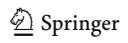

Calcification rate is the mass of calcium carbonate (CaCO3) a coral colony deposits per unit area per unit time, and is calculated as the product of skeletal extension and bulk density. Because of the inverse relationship of massive *Porites* skeletal extension rate and bulk density, only considering one or the other can lead to misleading conclusions regarding calcification rates. That is, increasing extension rates or bulk densities do not necessarily indicate increasing calcification rates (Dodge and Brass 1984; Lough and Barnes 1992). However, in massive Porites, rates of calcification and extension are strongly linked, thus higher calcification rates are associated with higher seawater temperatures (Lough and Barnes 2000), higher solar irradiance (Lough and Barnes 1992; Grigg 2006), and lower water motion (Scoffin et al. 1992). Likewise, as with extension rates, calcification rates are typically higher on upward than lateral surfaces in these species (Lough et al. 1999; Lough and Barnes 2000).

Phenotypic variability, such as colony morphological variability in zooxanthellate corals, may be caused by the environment (Foster 1979), by genetic differences between individuals or populations (Willis and Ayre 1985), or by both (Via and Lande 1985). Phenotypic plasticity refers to environmental control of morphological variability, and a reaction norm represents the relationship between the phenotype and the environment (Stearns 1989; Doughty and Resnick 2004). Phenotypic plasticity confers broad adaptability to the range of environmental conditions encountered by sessile organisms (Bradshaw 1965). For example, in zooxanthellate corals, phenotypic plasticity across depths for colony shape in P. sillimaniani (Muko et al. 2000) and for corallite shape in two faviids (Todd et al. 2004) may function to maximize absorption of available light.

Though colony morphological variability of massive *Porites* species is well known (Dollar 1982; Grigg 1982; Scoffin et al. 1992; Veron 2000), the sources of the variability (environment, genetic, or both) have not been reported for these species. The morphology of *P. lobata* colonies on the reefs of Ofu and Olosega Islands, American Samoa (Fig. 1), varies by habitat type. In the back reef pools (<3 m depth), colonies are hemispherical or domeshaped until they attain 2–3 m in diameter, after which they become micro-atolls up to 8 m diameter as the limit of upward growth is reached but lateral growth continues. On the shallow forereef (<3 m depth), colonies are flat or encrusting, up to 4 m diameter but <0.5 m thick.

We hypothesized that the morphological variability of *P. lobata* at this site is produced by phenotypic plasticity for skeletal growth rate, with greater upward linear extension in the relatively low energy back reef than on the high energy forereef. To test this hypothesis, a reciprocal transplant experiment of *P. lobata* was carried out between

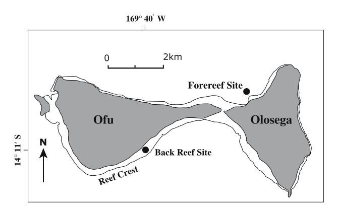

Fig. 1 Map of study area, showing back reef and forereef reciprocal transplant sites

back reef and forereef sites (Fig. 1), along with zooxanthella genotyping of source colonies at the beginning and end of the experiment. The purpose of the experiment was to determine if skeletal growth rate variability of *P. lobata* at this site is environmental, genetic, or both (environmental control indicates phenotypic plasticity). Bulk densities of the transplants were also measured in order to calculate calcification rates.

### Materials and methods

Study area and species selection

The study area was a pair of small volcanic islands, Ofu and Olosega, in American Samoa (14°11'S, 169°40'W). The islands are separated by a channel approximately 100 m wide and 3 m deep (Fig. 1). Narrow fringing reefs surround the islands, with shallow (<3 m low tide depth) back reef pools occurring where the reef is widest. Water motion in the back reef is semi-diurnally intermittent, typically alternating between >20 cm s-1 at high tide to <5 cm s-1 at low tide (Smith and Birkeland 2007). During midday low tides, limited mixing and high solar irradiance combine to warm the back reef waters, producing daily fluctuations in seawater temperature of up to 4–5°C (Smith 2004). In addition, the smoother water surface associated with reduced water motion at low tide in the back reef increases transmission of irradiance into the water column (Kirk 1994). Frequent storms and high rainfall cause sporadically high turbidity and low salinity in the back reef (Smith and Birkeland 2003). In contrast, the shallow (<3 m low tide depth) forereef is a more stable environment. Breaking waves create consistently very high water motion, moderating seawater temperature and irradiance transmission. The water motion, as well as distance from shore, prevents rapid changes in turbidity and salinity relative to the back reef.

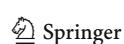

Diversity of reef-building corals is highest in the larger back reef pools, dominated by massive Porites microatolls, P. cylindrica, and Acropora species (Craig et al. [2001\)](#page-7-0). Diversity and abundance of corals is lower on the shallow forereefs, where robust branching species and encrusting species are prevalent (Fisk and Birkeland [2002](#page-7-0)). At least five massive Porites species occur in the study area; P. lobata, P. lutea, P. australiensis, P. mayeri and P. solida, and some skeletal growth characteristics may vary by species (Lough et al. [1999](#page-7-0)). P. lobata, a gonochoric spawner, was selected for this experiment because gross colony morphology varies between habitats (back reef and forereef), it is common elsewhere in the Indo-Pacific, and it can be distinguished from other massive Porites species by surface morphology and corallite skeletal characteristics (Veron [2000](#page-8-0); Fenner [2005](#page-7-0)).

# Reciprocal transplant experimental design

Porites lobata was reciprocally transplanted between a back reef site on southeastern Ofu and a forereef site on northwestern Olosega (Fig. [1](#page-1-0)) for a 6 month period between August 2004 and February 2005. The RTE design utilized four replicate groups that were transplanted within and between the two sites: From the back reef to the back reef (Native 1, N1), from the back reef to the forereef (Translocated 1, T1), from the forereef to the forereef (Native 2, N2), and from the forereef to the back reef (Translocated 2, T2). Comparison of the Native and Translocated groups quantifies variability by transplant site (N1 vs. T1, N2 vs. T2) and by source population (N1 vs. T2, N2 vs. T1). Variability by transplant site indicates environmental control (phenotypic plasticity), and variability by source population indicates genetic control, assuming the absence of confounding factors. A reaction norm links a Native group to its corresponding Translocated group (N1 and T1, N2 and T2), and the two reaction norms together illustrate the interplay of environmental and genetic control on each skeletal characteristic (Schluter [2000](#page-7-0); DeWitt and Scheiner [2004](#page-7-0)).

# Coral transplantation

Porites lobata source colonies were identified based on surface morphology and corallite skeletal characteristics (Veron [2000;](#page-8-0) Fenner [2005](#page-7-0)). Only three colonies could be positively identified as P. lobata on the shallow forereef site, thus six source colonies (three per site) were utilized for the RTE. A pneumatic drill was used to remove eight 35 mm diameter, 50 mm-long cores from each source colony; four cores for the native site, and four cores for the translocation site, thus providing 12 cores in each of the

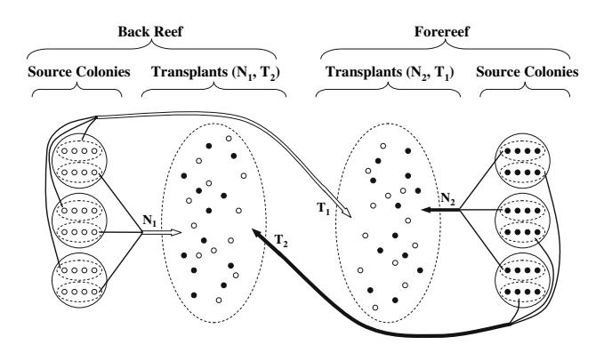

Fig. 2 Reciprocal transplant experimental (RTE) design, showing transplant sites, source populations, and source colonies the four RTE groups

four RTE groups (Fig. 2). Holes were filled with marine epoxy, and tissue grew over the epoxy within 6 months.

To minimize confounding factors associated with variability in source colony characteristics, transplant size, transplant shape, handling stress, micro-environmental conditions, competition, predation, and disease, the following procedure was used for coral transplantation: (1) Source colonies were >10 m from one another to reduce the likelihood of selecting clones, except for two source colonies on the forereef that were 5 m apart; (2) The tops of all source colonies were at 1–2 m low tide depth, and transplant cores were removed from the center portion of the tops of the source colonies; (3) Transplants were approximately the same length, weight, and shape, and were handled and transported in the same manner; (4) Transplant cores were removed from source colonies in the morning and transplanted in the late afternoon; (5) Within each transplant site (forereef or back reef), individual transplant attachment sites were prepared by drilling shallow 35 mm holes in dead coral substrate at 1.5 m low tide depth; (6) The two groups to be transplanted within each site (the N and T groups) were mixed, then each transplant was randomly assigned an individual attachment site; (7) Transplants were attached with Sea Goin' Poxy Putty marine epoxy no less than 25 cm apart, mapped, and photographed, and; (8) All transplants were surveyed for survival in September 2004 and February 2005. Those with bleaching, overgrowth, or other tissue death were considered mortalities and removed from the experiment because of potential effects on skeletal results. During each survey, all surviving transplants were checked for signs of competition, predation or disease.

## Skeletal measurements

Skeletal growth rates of the transplants were determined with the buoyant weight method to measure percentage

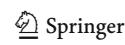

562 Coral Reefs (2007) 26:559–567

increase in skeletal mass (Jokiel et al. 1978), and the alizarin dye method to measure linear extension (Barnes 1970). Transplants were removed from source colonies early in the morning, placed in plastic bags of dissolved alizarin (100 mg l-1) anchored to the back reef substrate, left for 6 h, transferred to a nearby weighing station, buoyant weighed (Ohaus Dial-O-Gram mechanical balance, accurate to 0.01 g), and finally transplanted near the end of the day. All transplants were removed from source colonies, stained, weighed and transplanted on 20th and 21st August 2004. On 20th and 21st February 2005, surviving transplants were removed without fracturing the skeleton, cleaned by removing epoxy and encrusting organisms by hand and by removing tissue with bleach, buoyant weighed, sliced with a band saw, sanded to reveal the alizarin mark, and linear extension measured.

Both upward and lateral extension rates of the transplants were measured. Upward linear extension of each transplant was determined from the mean of four measurements taken in the central one-third of the upward facing surface of each sliced transplant. The alizarin stain mark was up to a few millimeters thick, thus the measurements were made from the upper boundary of the mark. Lateral linear extension was also determined from the mean of four measurements: Slicing each transplant dorso-ventrally revealed the well-stained, undamaged upper surface of the original core, as well as the lightly-stained straight vertical surfaces created by drilling through the skeleton. A pair of horizontal measurements was made on each corner starting from the upper and lower boundaries of the upper stain mark, and the mean of these four measurements used to calculate lateral growth for each transplant. The results were used to estimate annual upward and lateral extension rates  $(mm year^{-1}).$ 

Bulk density (g cm-3) was measured by first air-drying the 35 surviving transplants for 6 months, then grinding each transplant to a 5-6 cm3 block. All alizarin-stained skeleton and post-RTE skeletal material was removed, thus the blocks were obtained from the central portion of the pre-RTE cores. The blocks were dried at 60°C for 24 h before weighing. To determine bulk density at the end of the RTE, dry weight was taken of each block (DWclean). The blocks were dipped in molten paraffin wax kept at 110-115°C to form a water-tight barrier, then dry weight was again taken of each block (DWwax). Buoyant weight of each waxed block was measured in distilled water at 20°C with specific gravity 1.00 g cm-3 (BWwax). Total enclosed volume ( $V_{\text{enclosed}}$ ) and bulk density were then calculated for each block using the equations (Bucher et al. 1998):

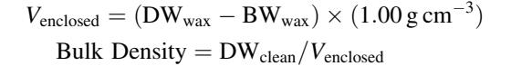

Annual calcification rate, or the mean mass of CaCO3 deposited per unit area per year (g cm-2 year-1), was estimated for each surviving transplant as the product of annual linear extension and bulk density. Annual linear extension was estimated by doubling the 6-month extension results. Extension rate results were assumed to be representative of mean annual values because the 6-month RTE period was evenly split between the cool and warm seasons. Bulk density results were assumed to be representative of mean annual values because the blocks were large enough to encompass at least 2 years of density bands. Calcification was calculated for upward and lateral skeletal growth.

## Source colony zooxanthella typing

To infer spatial and temporal patterns in symbiont genotypes of the transplants, zooxanthella types were determined of all source colonies at the beginning and end of the RTE. A zooxanthella sample was taken using a 13 mm punch from the top of each source colony at the beginning and end of the experiment in August 2004 and February 2005. Samples were preserved in 95% EtOh, and total DNA extracted using established methods (Baker et al. 1997). Symbiont DNA was amplified using partial large subunit ribosomal DNA (LSU rDNA) primers 24D15F4 and 24D23R1, and the resultant products identified and assigned to clades with restriction fragment length polymorphism (RFLP) analysis using enzymes TaqI and Hhal (Baker et al. 1997; Baker 2001). In addition, denaturinggradient gel electrophoresis (DGGE) was used for a finerscale genotype analysis to search for spatial and temporal differences not detected by RFLP.

## Statistical analysis

Statistical analyses were performed with Minitab 14. All data were assessed for normality and homogeneity of variances (Levene's test) prior to testing. A three-way analysis of variance (ANOVA) was used to test effects of transplant site, source population, and source colony on six skeletal characteristics (mass increase, upward linear extension, lateral linear extension, bulk density, upward calcification, and lateral calcification) of the surviving transplants. Because the six tests are dependent, *p*-values of <0.05 were adjusted by a factor of six to obtain final *p*-values (Bonferroni correction). Interaction of factors was tested when relative magnitudes of variable means were not uniform (Sokal and Rohlf 1981).

#### Results

Transplant survival was 67–100% for the RTE groups on the back reef (12/12 for  $N_1$  and 8/12 for  $T_2$ ), and 50–75% for those on the forereef (6/12 for  $N_2$  and 9/12 for  $T_1$ ). No signs of competition, predation or disease were observed on any of the surviving transplants in 2004 or 2005, suggesting that skeletal characteristics were not affected by these environmental factors. Skeletal growth rate results were consistent for skeletal mass, upward extension, and lateral extension (Fig. 3). Transplant site affected all three measures of skeletal growth rate, indicating environmental control or phenotypic plasticity. Source population also affected skeletal growth rate, suggesting genetic control (Table 1). In addition, the contrasting environmental responses in upward extension of translocated corals  $(T_1)$ decreased much more than  $T_2$  increased) led to a transplant site x source population interaction (Table 1), as illustrated by the converging reaction norms on the forereef (Fig. 3b).

Mean bulk densities were higher on the forereef than the back reef for all RTE groups (Fig. 4a). Transplant site affected bulk density, but source population did not (Table 2), thus indicating environmental but not genetic control. The sloping, nearly overlapping reaction norms (Fig. 4a) illustrate that the bulk density differences between the sites were likely attributable to phenotypic plasticity alone. Extension results strongly influenced calcification estimates, with upward and lateral calcification both affected by transplant site and source population (Table 2). As with linear extension, these results indicate a combination of environmental and genetic control, though in this case the converging reaction norms on the forereef for upward calcification (Fig. 4b) do not represent a significant interaction (Table 2). Because multiple transplants were obtained from each source colony, effects of source colony were included in the analyses, but none of the skeletal characteristics were affected by source colony (Tables 1, 2).

Fig. 3 Skeletal growth rate results (*upper*) and reaction norms (*lower*) for *Porites lobata*, **a** mass increase, **b** upward linear extension, and **c** lateral linear extension. Transplant groups:  $N_1$  = native, back reef;  $T_1$  = translocated, back to forereef;  $N_2$  = native, forereef;  $T_2$  = translocated, fore to back reef

|                         |       |        |        |       | 50141 |                                | . 10100 | 14414   | ,     |    |         | <i>a.</i> 10, 0 | r opis    | 0010  |
|-------------------------|-------|--------|--------|-------|-------|--------------------------------|---------|---------|-------|----|---------|-----------------|-----------|-------|
|                         | o M   | ogg In | 0#0000 | /o/ \ |       | h Hay                          | rond Ev | tanaian | (mm)  |    | O L ate | anol Exst       | maian (   |       |
|                         | a Ma  | ass in | crease | (70)  | _     | <b>b</b> Upward Extension (mm) |         |         |       |    |         | eral Exte       | ension (i | nm)   |
|                         | $N_1$ | $T_1$  | $N_2$  | $T_2$ |       | $N_1$                          | $T_1$   | $N_2$   | $T_2$ | _  | $N_1$   | $T_1$           | $N_2$     | $T_2$ |
| $\overline{\mathbf{X}}$ | 31.4  | 19.5   | 4.2    | 8.1   | _     | 4.9                            | 2.1     | 0.6     | 1.3   | =' | 3.4     | 1.8             | 1.0       | 1.6   |
| SE                      | 2.7   | 1.8    | 1.0    | 3.0   |       | 0.4                            | 0.3     | 0.2     | 0.3   |    | 0.2     | 0.1             | 0.2       | 0.1   |

9.8

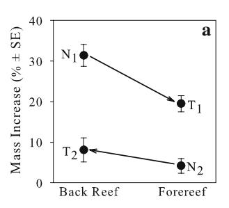

Annual Extension (mm)

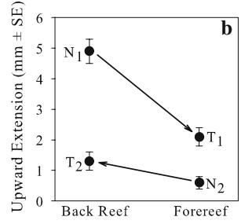

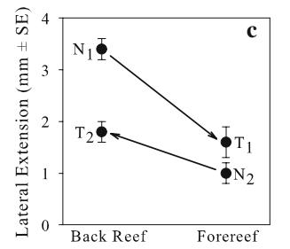

3.6

2.0

6.8

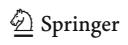

The spatial (LaJeunesse et al. 2004) and temporal (Baker et al. 2004) variability of zooxanthella type, and dependence of coral skeletal growth rates on zooxanthella type (Little et al. 2004), pose potential confounding factors for coral RTEs. However, the zooxanthella analyses showed no differences in zooxanthella type of the source colonies by transplant site, source population, or season: The six *P. lobata* source colonies each contained RFLP genotypes C1 and C3, and DGGE genotype C15, both at the beginning and end of the experiment. Thus, assuming source colony zooxanthella type was representative of the transplants, the patterns in skeletal growth resulting from the RTE cannot be explained by zooxanthella type.

## Discussion

This study demonstrates that variability in skeletal characteristics of *P. lobata* between shallow (1.5 m at low tide) habitats on Ofu and Olosega Islands is at least partially a function of phenotypic plasticity. That is, regardless of source population, skeletal growth rates, bulk densities and calcification rates of each transplant group responded to the transplant site environment (Tables 1, 2), indicating environmental control. Competition, predation and disease did not appear to affect the transplants, thus variability in skeletal characteristics was likely a response to physical differences between the back reef and forereef habitats.

Mean annual upward linear extension (Fig. 3) and calcification rates (Fig. 4) for all RTE groups were lower than reported from a density band study of 35 massive *Porites* colonies from the same latitude (14°S) collected from 3–5 m depth in back reefs on the Great Barrier Reef (upward extension = 13.9 mm year-1, calcification = 1.64 g cm-2 year-1) (Lough et al. 1999). In a study of *P. lobata* skeletal growth along a depth gradient in Hawai'i, linear extension was less at 3 m than 6 m, possibly due to high levels of solar ultraviolet radiation, increased turbidity, or episodic

2.6

Table 1 Three-way ANOVA (transplant site, source population, source colony) for skeletal growth rates, measured by percentage of mass increase (MI), upward linear extension in mm (UpEx), and lateral linear extension in mm (LtEx)

|                   | df | MS      |       |       | F     |       |       | p      |        |        |  |
|-------------------|----|---------|-------|-------|-------|-------|-------|--------|--------|--------|--|
|                   |    | MI      | UpEx  | LtEx  | MI    | UpEx  | LtEx  | MI     | UpEx   | LtEx   |  |
| Transplant site   | 1  | 499.88  | 24.37 | 13.60 | 8.52  | 22.95 | 29.68 | 0.042a | 0.001a | 0.001a |  |
| Source population | 1  | 3095.28 | 55.58 | 18.43 | 52.74 | 52.34 | 40.22 | 0.001a | 0.001a | 0.001a |  |
| Source colony     | 2  | 18.82   | 1.91  | 0.78  | 0.32  | 1.80  | 1.71  | 0.728  | 0.184  | 0.199  |  |
| Site · population | 1  | 123.77  | 8.59  | 0.66  | 2.11  | 8.09  | 1.44  | 0.157  | 0.048a | 0.240  |  |
| Error             | 29 | 58.69   | 1.06  | 0.46  |       |       |       |        |        |        |  |

a Bonferroni-corrected

Table 2 Three-way ANOVA (transplant site, source population, source colony) for skeletal bulk density (BkDn) in g cm–3, and upward (UpCa) and lateral calcification (LtCa) in g cm–2 year–1

|                   | df | MS     |       |       | F     |       |       | p      |        |        |  |
|-------------------|----|--------|-------|-------|-------|-------|-------|--------|--------|--------|--|
|                   |    | BkDn   | UpCa  | LaCa  | BkDn  | UpCa  | LaCa  | BkDn   | UpCa   | LaCa   |  |
| Transplant site   | 1  | 0.0811 | 1.765 | 0.689 | 12.68 | 20.56 | 17.33 | 0.006a | 0.001a | 0.001a |  |
| Source population | 1  | 0.0041 | 4.482 | 1.124 | 0.63  | 52.23 | 28.28 | 0.432  | 0.001a | 0.001a |  |
| Source colony     | 2  | 0.0094 | 0.141 | 0.049 | 1.47  | 1.65  | 1.24  | 0.247  | 0.210  | 0.304  |  |
| Site · population | 1  | 0.0003 | 0.604 | 0.121 | 0.05  | 7.04  | 3.06  | 0.827  | 0.078a | 0.091  |  |
| Error             | 29 | 0.0064 | 0.086 | 0.040 |       |       |       |        |        |        |  |

a Bonferroni-corrected

Fig. 4 Skeletal density and calcification results (upper) and reaction norms (lower) for P. lobata, a bulk density, b upward calcification (Up Calc), and c lateral calcification (Lat Calc). Transplant groups: N1 = native, back reef; T1 = translocated, back to forereef; N2 = native, forereef; T2 = translocated, fore to back reef

| a |  |  |  |  | b |  |  |  | c |  |  |  |  |
|---|--|--|--|--|---|--|--|--|---|--|--|--|--|
|   |  |  |  |  |   |  |  |  |   |  |  |  |  |
|   |  |  |  |  |   |  |  |  |   |  |  |  |  |
|   |  |  |  |  |   |  |  |  |   |  |  |  |  |

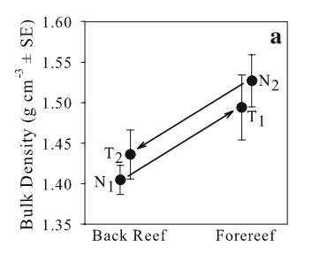

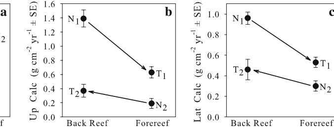

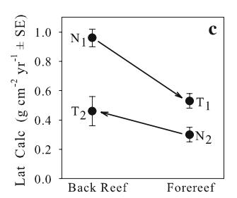

sedimentation (Grigg [2006](#page-7-0)). Thus, skeletal growth and calcification rates of all RTE groups were likely inhibited by physical factors associated with shallow depths. In addition, skeletal growth and calcification of RTE groups on the forereef (N2, T1) may have been reduced by very high water motion from sporadic large ocean swells and storms. In a density band study of P. lobata from Hawai'i, colonies from depths less than 10 m in areas exposed to waves showed frequent interruptions in skeletal growth (Grigg [1982\)](#page-7-0).

Mean bulk densities of all RTE groups were 1.405– 1.527 g cm–3 (Fig. 4). These values fall within the upper range of bulk densities of massive Porites from 3–5 m deep back reef margins on the Great Barrier Reef (Lough and Barnes [2000](#page-7-0)), and are similar to those of P. lobata from 10 m depth in the Northwest Hawaiian Islands (Grigg [1982](#page-7-0)). Phenotypic plasticity for bulk density occurred oppositely of skeletal growth rate, with higher density associated with lower growth (Figs. [3](#page-4-0), 4). Within individual massive Porites colonies, bulk density varies seasonally, producing density bands (Knutson et al. [1972](#page-7-0)). However, density bands are laid down within the tissue layer on the outermost layer of the skeleton (Barnes and Lough [1993](#page-7-0)), whereas the skeletal blocks used for density

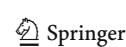

measurements in this study were at least 1 cm below the tissue layer. This is the first report of bulk density changes in the skeleton underneath the tissue of Porites species. Such secondary infilling occurs in the bases of many branching coral species as a skeletal-strengthening adaptation (Hughes [1987\)](#page-7-0), thus the increase in bulk density of transplants placed on the forereef may function to reduce the likelihood of breakage in the face of very high water velocities.

The greater effect of source population than transplant site on skeletal growth rates, and the transplant site · source population interaction for upward linear extension (Table [1\)](#page-5-0), suggest genetic differentiation of the two populations. In optimal growth environments, massive Porites colonies grow more quickly along the upward (vertical) than the lateral (horizontal) axis (Lough et al. [1999](#page-7-0)), a pattern displayed by transplants from the back reef source population at both transplant sites. However, transplants from the forereef source population had greater lateral than upward extension at both transplant sites (Fig. [3](#page-4-0)b, c). Although all source colonies and transplants were at the same depth (1.5 m low tide), underwater irradiance may differ between the back reef and forereef because of contrasting water motion patterns. The smoother water surface associated with reduced water motion at low tide on the back reef likely allows greater irradiance transmission into the water column than on the forereef, where breaking waves and high velocities maintain a roughened water surface that reduces irradiance transmission (Kirk [1994\)](#page-7-0). Upward extension at 1.5 m depth requires mechanisms to absorb, reflect or fluoresce ultraviolet radiation (Hoegh-Guldberg and Jones [1999;](#page-7-0) Corredor et al. [2000](#page-7-0)), thus selection may be occurring in the back reef for such mechanisms.

Many population structure studies of broadcast spawning corals have found panmixia at within-reef (<10 km) spatial scales (Benzie et al. [1995;](#page-7-0) Ayre and Hughes 2000, 2004; Ridgway et al. [2001](#page-7-0)). Others have found small-scale population structure, though evidence suggests it resulted from disturbance events, rather than selection (Whitaker [2004](#page-8-0); Magalon et al. [2005](#page-7-0)). On Olosega Island, the north-facing forereef site is frequently hit by tropical cyclones approaching from the northwest (JTWC [2006](#page-7-0)), whereas the south-facing backreef site is relatively protected from cyclones by Ofu Island (Fig. [1](#page-1-0)). Thus, genetic differentiation of the two populations could occur if a large storm reduced the forereef population to a small number of individuals but did not affect the back reef population, causing a population bottleneck on the forereef (Hedrick [2005](#page-7-0)).

Alternatively, the brevity of the experiment (6 months) may be a confounding factor, falsely implying genetic differentiation between the transplanted populations when in fact they are both part of a single panmictic population. The utilization of skeletal mass increase and linear extension to quantify phenotypic responses to different environments may require longer than 6 months to obtain accurate results. That is, skeletal response to changing conditions is not immediate (Buddemeier and Kinzie [1976](#page-7-0); Potts [1984](#page-7-0)). Thus running the RTE for at least 1 year may have allowed skeletal growth rates of the translocated groups to fully adjust to the new environments, potentially resulting in greater environmental control, as occurred with bulk density (Fig. [4a](#page-5-0)).

This study demonstrated phenotypic plasticity of P. lobata for skeletal characteristics (growth rate, bulk density, calcification rate) between back reef and forereef habitats. Plasticity may contribute to colony morphological variability observed in this species, especially on small spatial scales where genetic differentiation is unlikely, such as from rounder to flatter colonies with depth (Grigg [2006](#page-7-0)) and higher hydraulic energy (this study). Such colony morphological plasticity is thought to be adaptive, as the flatter shape maximizes absorption of dwindling light at depth (Muko et al. [2000\)](#page-7-0) and may increase colony stability in high water velocities. For broadcast spawning corals such as P. lobata, larvae settle in a wide range of environments, and plasticity provides the capacity for the colony to grow into the most suitable shape and density for that particular environment (Warner [1996](#page-8-0); Marfenin [1997\)](#page-7-0). Subsequently, P. lobata can grow and compete in many habitat types, likely contributing to this species' broad range and often high abundance on Pacific coral reefs.

Acknowledgments We thank P. Craig of the National Park of American Samoa for logistical and technical support, L. Basch of the National Park Service in Honolulu and C. Hawkins of the American Samoa Coral Reef Advisory Council for assisting with funding, the US Geological Survey's National Resources Preservation and Global Climate Change Research Programs, the American Museum of Natural History's Lerner-Gray Fund, the University of Hawai'i Arts and Sciences Council, and the University of Hawai'i Zoology Department's Edmondson Fund for funding, E. Brown, D. Fenner, G. Garrison, C. Kellogg, J. Malae, M. Malae, G. Piniak, M. Schmaedick, F. Tuilagi, and J. Zamzow for field assistance, and A. Baker, Ku'ulei Rodgers, and H. Wirshing for laboratory assistance.

# References

Ayre DJ, Hughes TP (2000) Genotypic diversity and gene flow in brooding and spawning corals along the Great Barrier Reef, Australia. Evolution 54:1590–1605

Ayre DJ, Hughes TP (2004) Climate change, genotypic diversity and gene flow in reef-building corals. Ecol Lett 7:273–278

Baker AC (2001) Ecosystems: reef corals bleach to survive change. Nature 411:765–766

Baker AC, Rowan R, Knowlton N (1997) Symbiosis ecology of two Caribbean acroporid corals. In: Proc 8th Int Coral Reef Symp 2:1295–1300

566 Coral Reefs (2007) 26:559–567

Baker AC, Starger CJ, McClanahan TR, Glynn PW (2004) Coral reefs: Corals' adaptive response to climate change. Nature 430:741

- Barnes DJ (1970) Coral skeletons: An explanation of their growth and structure. Science 170:1305–1308
- Barnes DJ, Lough JM (1993) On the nature and causes of density banding in massive coral skeletons. J Exp Mar Biol Ecol 167:91– 108
- Benzie JAH, Haskell A, Lehman H (1995) Variation in the genetic composition of coral (Pocillopora damicornis and Acropora palifera) populations from different reef habitats. Mar Biol 121:731–739
- Bradshaw AD (1965) Evolutionary significance of phenotypic plasticity in plants. Adv Genet 13:115–155
- Bucher D, Harriott V, Roberts L (1998) Skeletal bulk density, microdensity and porosity of acroporid corals. J Exp Mar Biol Ecol 228:117–135
- Buddemeier RW, Kinzie RA III (1976) Coral growth. Oceanogr Mar Biol Annu Rev 14:183–225
- Corredor JE, Bruckner AW, Muszynski FZ, Armstrong RA, Garcia R, Morell JM (2000) UV-absorbing compounds in three species of Caribbean zooxanthellate corals: Depth distribution and spectral response. Bull Mar Sci 67:821–830
- Craig P, Birkeland C, Belliveau S (2001) High temperatures tolerated by a diverse assemblage of shallow-water corals in American Samoa. Coral Reefs 20:185–189
- DeWitt TJ, Scheiner SM (2004) Phenotypic variation from single genotypes. In: DeWitt TJ, Scheiner SM (eds) Phenotypic Plasticity: Functional and conceptual approaches. Oxford University Press, New York, pp 1–9
- Dodge RE, Brass GW (1984) Skeletal density, extension and calcification of the reef coral Montastrea annularis: St Croix, US Virgin Islands. Bull Mar Sci 34:288–307
- Dollar SJ (1982) Wave stress and coral community structure in Hawaii. Coral Reefs 1:71–81
- Doughty P, Resnick DN (2004) Patterns and Analysis of Adaptive Phenotypic Plasticity in Animals. In: DeWitt TJ, Scheiner SM (eds) Phenotypic Plasticity: Functional and Conceptual Approaches. Oxford University Press, New York, pp 126–150
- Fenner D (2005) Corals of Hawai'i. Mutual Publishing, Honolulu
- Fisk D, Birkeland C (2002) Status of coral communities in American Samoa: A re-survey of long-term monitoring sites. Department of Marine and Wildlife Resources, Pago Pago
- Foster AB (1979) Phenotypic plasticity in the reef corals Montastrea annularis and Siderastrea sideria. J Exp Mar Biol Ecol 39:25– 54
- Grigg RW (1982) Darwin Point: A threshold for atoll formation. Coral Reefs 1:29–34
- Grigg RW (2006) Depth limit for reef building corals in the Au'au Channel, S.E. Hawai'i. Coral Reefs 25:77–84
- Hedrick PW (2005) Genetics of Populations. Jones and Bartlett Publishers, Sudbury
- Hoegh-Guldberg O, Jones RJ (1999) Photoinhibition and photoprotection in symbiotic dynoflagellates from reef-building corals. Mar Ecol Prog Ser 183:73–86
- Hughes TP (1987) Skeletal density and growth form of corals. Mar Ecol Prog Ser 35:259–266
- Jokiel PL, Maragos JE, Franzisket L (1978) Coral growth: buoyant weight technique. In: Stoddart DR, Johannes RE (eds) Coral Reefs: Research Methods. UNESCO, Paris, pp 529–541
- Jokiel PL, Brown EK, Friedlander AM, Rodgers SK, Smith WR (2004) Hawai'i Coral Reef Assessment and Monitoring Program: Spatial patterns and temporal dynamics in coral reef communities. Pac Sci 58:159–174

JTWC (2006) Joint Typhoon Warning Center individual cyclone maps, South Pacific Region. [http://www.australiasevereweather.](http://www.australiasevereweather.com/cyclones/) [com/cyclones/](http://www.australiasevereweather.com/cyclones/)

- Kirk JTO (1994) Light and Photosynthesis in Aquatic Ecosystems. Cambridge University Press, Cambridge
- Knutson DW, Buddemeier RW, Smith SV (1972) Coral chronometers: seasonal growth bands in reef corals. Science 177:270–272
- LaJeunesse TC, Bhagooli R, Hidaka M, De Vantier LM, Done TJ, Schmidt GW, Fitt WK, Hoegh-Guldberg O (2004) Closely related Symbiodinium spp. differ in relative dominance in coral reef host communities across environmental, latitudinal, and biogeographic gradients. Mar Ecol Prog Ser 284:147–161
- Little AF, van Oppen MJH, Willis BL (2004) Flexibility in algal symbioses shapes growth in reef corals. Science 304:1492–1494
- Lough JM, Barnes DJ (1992) Comparisons of skeletal density variations in Porites from the central Great Barrier Reef. J Exp Mar Biol Ecol 155:1–25
- Lough JM, Barnes DJ (1997) Several centuries of variation in skeletal extension, density and calcification in massive Porites colonies from the Great Barrier Reef: A proxy for seawater temperature and a background of variability against which to identify unnatural change. J Exp Mar Biol Ecol 211:29–67
- Lough JM, Barnes DJ (2000) Environmental controls on the massive coral Porites. J Exp Mar Biol Ecol 245:225–243
- Lough JM, Barnes DJ, Devereux MJ, Tobin BJ, Tobin S (1999) Variability in growth characteristics of massive Porites on the Great Barrier Reef. CRC Reef Research Technical Report No. 28, Australian Institute of Marine Science, Townsville
- Magalon H, Adjeroud M, Veuille M (2005) Patterns of genetic variation do not correlate with geographical distance in the reefbuilding coral Pocillopora meandrina in the South Pacific. Mol Ecol 14:1861–1868
- Marfenin NN (1997) Adaptation capabilities of marine modular organisms. Hydrobiologia 355:153–158
- Muko S, Kawasaki K, Sakai K, Takasu F, Shigesada N (2000) Morphological plasticity in the coral Porites sillimaniani and its adaptive significance. Bull Mar Sci 66:225–239
- Potts DC (1984) Natural selection in experimental populations of Reef-building corals (Scleractinia). Evolution 38:1059–1078
- Ridgway T, Hoegh-Guldberg O, Ayre DJ (2001) Panmixia in Pocillopora verrucosa from South Africa. Mar Biol 139:175–181
- Schluter D (2000) The Ecology of Adaptive Radiation. Oxford University Press, Oxford
- Scoffin TP, Tudhope AW, Brown BE, Chansang H, Cheeney RF (1992) Patterns and possible environmental controls of skeletogenesis of Porites lutea, South Thailand. Coral Reefs 11:1–11
- Smith LW (2004) Influence of water motion on resistance of corals to high temperatures: Evidence from a field transplant experiment. In: Proc 10th Int Coral Reef Symp 1:724–728
- Smith LW, Birkeland C (2003) Managing NPSA's Coral Reefs in the Face of Global Warming: Research Project Report for Year 1. Hawai'i Cooperative Fishery Research Unit, Zoology Department, University of Hawai'i at Manoa, Honolulu
- Smith LW, Birkeland C (2007) Effects of intermittent flow and irradiance level on back reef Porites corals at elevated seawater temperatures. J Exp Mar Biol Ecol 341:282–294
- Sokal RR, Rohlf FJ (1981) Biometry. W.H. Freeman and Company, New York
- Stearns SC (1989) The evolutionary significance of phenotypic plasticity. Bioscience 39:436–445
- Todd PA, Ladle RJ, Lewin-Koh NJI, Chou LM (2004) Genotype x environment interactions in transplanted clones of the massive corals Favia speciosa and Diploastrea heliopora. Mar Ecol Prog Ser 271:167–182

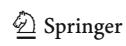

Coral Reefs (2007) 26:559–567 567

- Veron JEN (2000) Corals of the World, Volumes 1–3. Australian Institute of Marine Science, Odyssey Publishing
- Via S, Lande R (1985) Genotype-environment interaction and the evolution of phenotypic plasticity. Evolution 39:505–522
- Warner RR (1996) Evolutionary ecology: how to reconcile pelagic dispersal with local adaptation. Coral Reefs 16:S115–S120
- Whitaker K (2004) Non-random mating and population genetic subdivision of two broadcast corals at Ningaloo Reef, Western Australia. Mar Biol 144:593–603
- Willis BL, Ayre DJ (1985) Asexual reproduction and genetic determination of growth form in the coral Pavona cactus: Biochemical genetic and immunogenic evidence. Oecologia 65:516–525

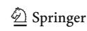