# **Results of the Territorial Monitoring Program of American Samoa for 2007, Benthic Portion.**

By Douglas Fenner, Ph.D.

Coral Reef Monitoring Ecologists Department of Marine & Wildlife Resources (DMWR) American Samoa

2008

Report to DMWR, the Coral Reef Advisory Group (CRAG), and NOAA

Supported by a NOAA Coral Reef Monitoring Grant, part of the Coral Reef Initiative

## Contents

| Acknowledgements                 | 3  |
|----------------------------------|----|
| Abstract                         | 3  |
|                                  |    |
| Methods                          | 5  |
| Results                          | 7  |
| Benthic                          | 7  |
| Reef Slopes                      | 7  |
| Bioerosion and indicator species | 19 |
| Individual sites                 | 20 |
| Coral diversity in transects     | 32 |
| Lifeforms                        | 32 |
| Generic and species diversity    | 35 |
| Reef flats                       | 43 |
| Coral lifeforms               | 48 |
| Coral genera                     | 52 |
| Coral species                    | 53 |
| Non-point pollution              | 55 |
| Coral recruitment                | 56 |
| Harbor                           | 59 |
| Bleaching                        | 65 |
| Invertebrates                    | 67 |
| Water clarity                 | 69 |
| Species                          | 72 |
| Recommendations                  | 73 |
| References                       | 73 |

## Acknowledgements

Thank you to boat captains, Lemuelu Kitiona and Mika Letuane. Thanks also to Ekueta Schuster for filling tanks and other support. Special thanks go to the Bill Kiene of the Fagatele Bay National Marine Sanctuary, for the use of the Sanctuary boat when the DMWR boat was not available.

## **Abstract**

One new site was added in the northwest, at Masacre Bay.

 The mean benthic cover for all 12 sites was unchanged from 2005 to 2007. All differences between years of all benthic categories were less than 3%, and due to random chance. Thus, there was no loss of corals, but also no evidence of increase in corals. This does not provide support for the view that the reefs are actively recovering from previous disturbances, rather, they appear to be in a stable equilibrium. As in previous years, crustose calcareous algae (CCA) had much higher average cover on the south side than the north side, and higher turf cover on the north than the south. However, the new site at Masacre Bay was much more like that on the south, with high CCA cover and lower turf cover, illustrating that the rule is not absolute. The live coral index declined slightly from 2005 to 2007, however it remains much higher than the average for the South Pacific, and the decline may have been from more careful recording or from random effects. All dead corals are old and covered with algae, usually coralline algae. Coral cover on Tutuila was lower than reported at four remote unpopulated atolls in the Line and Phoenix Islands, but more than at two populated atolls in the Line Islands. The amount of coral plus CCA cover was much higher than on the two populated atolls in the Line Islands, and nearly that of the unpopulated atoll in the Line Is. When coral cover + CCA is plotted as one variable, and turf + fleshy macroalgae plotted as a second variable, Fagasa and Vatia stand out as being quite different from the other sites in having low values of the first, and high values of the second. This suggests that these two sites may be more heavily impacted than other sites. Both appear to have significant sediment impact. Trends for the three years were examined for each site. Fagamalo had a modest increase in coral cover and a decrease in CCA. Fagasa had a modest increase in coral cover, a decrease in turf, and an increase in fleshy macroalgae. Tafeu had an increase in the corallimorph *Rhodactis* sp. (a large polyp related to corals that does not have a skeleton) and a decrease in turf. Vatia had an increase in fleshy macroalgae and a decrease in exposed sand. In 2007 the macroalga *Dictyota* appeared suddenly in large quantities, growing over *Halimeda,* sand and live coral. This species had not been recorded previously at any transect at any site in any year. It is one of the types of algae that have grown over reefs in the Caribbean. Changes at Aoa, Aunuu, and Amaua were small and not systematic. Fagaalu had a decrease in turf from 2005 to 2006, but no change since then. Nuuuli had an increase in branching coralline algae (BCA) and a decrease in CCA recorded. Likely the decrease in CCA was due to it being covered by BCA, and it is still there under the BCA. Fagatele had a decrease in coral cover from the first to the second year that may have been due to a change in the placement of the transect tapes. In 2007 a small amount of the encrusting ascidian *Diplosoma simile* appeared in the transects. This species is capable of growing over corals and killing them. There was a report that it became quite common in one area of the bay, but then

receded in the following year. There was little change at Leone. Changes in the mean cover of coral lifeforms in the transects at the 11 sites were small, with a slight reduction in the amount of encrusting corals and increase in the branching (including columnar) corals. There was a slight decrease in *Montipora* (which is usually encrusting) and slight increase in *Porites* over the three years. There was little change in coral species other than a small decrease in encrusting *Montipora*. The number of coral species in transects did not change over the three years, nor did the diversity measure, H'. Monitoring of reef flats was begun for the first time this year. Outer reef flats were dominated by turf, and turf was the most common cover item on the inner reef flat. Coral cover was higher on the outer reef flat than the inner, but turf was higher on the inner flat than the outer. There was slightly more CCA on the outer flat than inner. When comparing the reef flat with the slope, the slope had higher coral cover and much higher CCA cover than the flat, but much less turf. A cohort of juvenile table corals (*Acropora hyacinthus*) were observed. They were most common near the reef crest on both the reef flat and reef slope. They were most common at Fagasa, where transects revealed 0.8 colonies per m2 . They were abundant enough that if they all survive to maturity they will produce near 100% coral cover in some areas. In most places they are much less common than Fagasa. Sizes were measured and the distributions are essentially unimodal, suggesting a single recruitment event. They appear to be about 3 years old. Transects were also taken at several sites in the harbor on the outer reef flat or on rock walls. Coral cover was highest near the mouth of the harbor where it reached high maximum levels (over 60%), but decreased to zero near the head of the harbor. A small oyster is abundant near the waterline on rock walls in the harbor, so estimates of the oyster cover were made for several sites in the harbor. Oyster cover was high near the head of the harbor and low at the mouth of the harbor. Oysters are filter feeders feeding on plankton and may be a good bioindicator of plankton concentrations. Visibility was then measured in the harbor with a Secci disc. Clarity was low near the head of the harbor, and high near the mouth. Plankton concentrations are high at the head of the harbor, probably because of nutrient inputs and very limited flushing, and low near the mouth of the harbor where flushing is much better. Conditions near the head of the harbor apparently are still not good enough to support coral. Coral bleaching monitoring continued, and mass coral bleaching of staghorns in backreef pools was recorded for the fourth year in a row. At Alofau, these staghorns spend almost the entire year bleached, with only a short period of recovery. So far, most corals recover each year. The bleaching record at the airport pool follows the sea surface temperature (SST) very closely. There continue to be relatively few visible invertebrates.

 In general, spatial patterns of benthic cover, both between sites (along the shore) and in distance from shore (inner reef flat, outer flat, slope) showed strong variation and clear patterns, while temporal patterns (changes over time) at the same location had little or no variation at some sites, and strong changes at only a few sites, with no overall average changes. Thus there are strong spatial variations, but little or no temporal variation so far.

Results were illustrated with 89 figures. The report is 77 pages long.

## **Methods**

The 11 core sites are shown in the map below. All are on Tutuila and nearby Aunu'u.

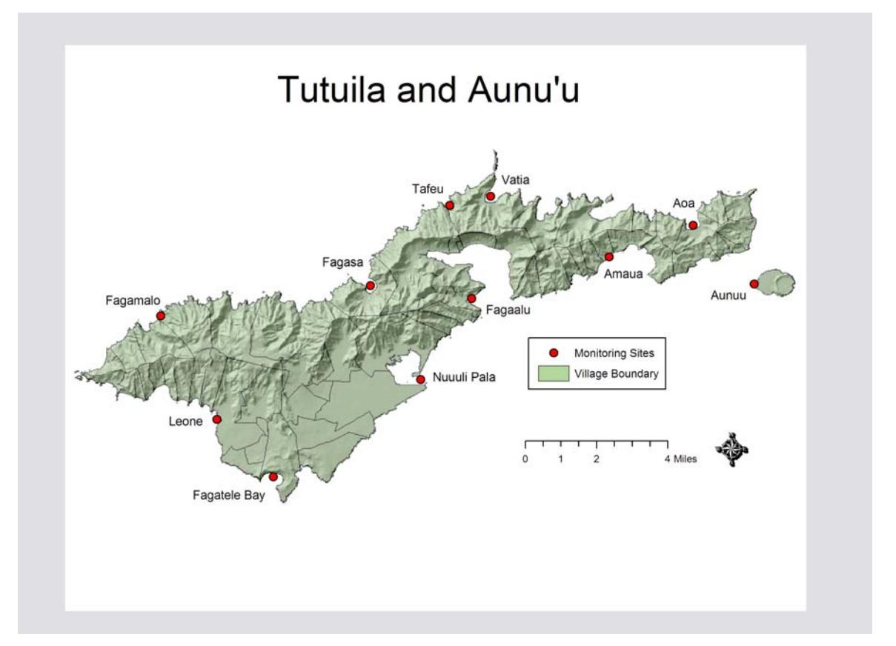

 The benthic methods were the same as in 2006, with a few minor changes. In the core monitoring, two 50-m tapes were laid on a depth contour between 8 and 10 m deep. A space between them of about 15 m was kept. Benthic categories were recorded under each 0.5 m point on the tape. Benthic categories included live coral, dead coral, dead coral with algae, crustose calcareous algae, branching coralline algae, fleshy macroalgae, turf algae, rock, sand, rubble, soft coral, and sponge. "Branching coralline algae" included a soft feathery species that was the most common in that category. That species is *Cheilosporum spectabile*. Corals were identified to lifeform, genus, and species when possible, and if the macroalgae was *Halimeda* or *Dictyot*a, that was recorded. Soft corals were recorded to genus when possible. Lifeforms included encrusting, massive, foliose, branching, columnar, submassive, mushroom, *Millepora*, *Acropora* branching, *Acropora* table, *Acropora* digitate, and *Acropora* encrusting. Horizontal visibility was recorded using the tape. Two transect tapes were done on the first dive, and an additional two tapes were done on the second dive. Invertebrates were recorded on a return pass. Sites were re-located using the GPS and markers as indicated in the 2005 report. One day was required for each site. The same 11 core sites on Tutuila as recorded in 2005 were repeated, which are shown in the map above.

Changes include the rugosity measurements which were omitted, because a third team ember was not available and when included it lengthened dive times to the point where nning out of air was a distinct possibility, thus reducing the margin of safety. Further, appears that the measurement depends primarily on exactly where the chain falls, and at changes in rugosity caused by coral growth will take quite a few years before they ould be detectable. A hurricane could make changes in rugosity quickly by removing orals, and if significant hurricane damage occurs, the rugosity measurements can be peated. Until changes in coral cover or other rugosity changes are apparent, repeating e measurement of rugosity is not worth the increased risk of running out of air. In ddition, the biodiversity measures were not repeated this year, due to the completion of onitoring being greatly delayed by inclement weather and mechanical problems with oats. It will be resumed next year. m ru it th w c re th a m b

In addition to the 11 core sites, one site was added at Masacre Bay on the northwest. he two sites on the south (Amaua E and Funamafuti) that were added last year were not peated due to the lack of time. It is hoped that Amaua E can be added on a regular asis in the future. T re b

ates of collection of data are shown in Table 1. D

able 1. Dates of collection of benthic transect data for each site, reef slope. T

|             | Transects |
|-------------|-----------|
| Fagamalo    | 3/6/08    |
| Fagasa      | 1/24/08   |
| Tafeu       | 2/28/08   |
| Vatia       | 2/27/08   |
| Aoa         | 2/25/08   |
| Aunu'u      | 6/4/07    |
| Amaua       | 5/18/07   |
| Faga'alu    | 6/8/07    |
| Nu'uuli     | 5/14/07   |
| Fagatele    | 6/25/07   |
| Leone       | 11/28/07  |
| Masacre Bay | 2/26/08   |

Table 2. Dates of collection of reef flat transect data for each site.

| Fagamalo       | 3/29/07 |
|----------------|---------|
| Fagasa         | 4/9/07  |
| Vatia          | 4/13/07 |
| Aoa            | 4/20/07 |
| Aunu'u         | 5/16/07 |
| Alofau         | 2/5/07  |
| Amaua          | 3/18/07 |
| Faga'alu       | 2/16/07 |
| Faga'alu schoo | 5/907   |

| Matu'u     | 4/17/07 |
|------------|---------|
| Faganeanea | 4/17/07 |
| Nu'uuli    | 4/3/07  |
| Fagatele   | 3/23/07 |
| Leone      | 2/17/07 |
| Aua        | 5/8/07  |
| Fagatogo   | 4/19/07 |
| Utelei     | 2/6/07  |
| Leloaloa   | 4/27/07 |
| Onesosopo  | 5/8/07  |

## Results

## **Benthic**

For background information on the coral reefs of American Samoa, see Wells (1988), Craig (2005), Craig et al. (2005), Sabater and Tofaeono (2006, 2007), Whalen and Fenner (2006), Fenner (2008), Fenner et al. (2008), Birkeland et al. (2008), and Brainard et al. (2008).

## **Reef Slopes**

In addition to the 11 sites done in previous years, one new site was added, Masacre Bay, to improve geographic balance. Figure 1 presents the results for all 12 sites. As in the past, sites in this graph are ordered from left to right beginning with Fagamalo on the northwest corner of the island, and proceeding clockwise around the island. So the sites from Fagamalo to Aoa on the left of the graph are on the north side, and sites from Amaua to Leone on the right side are on the south side of the island.

Figure 1.

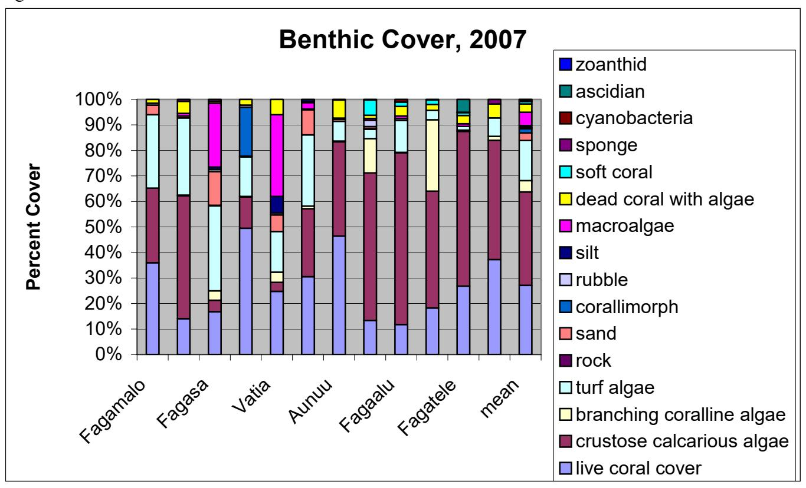

Figure 2 below re-graphs the data presented in Figure 1, to facilitate comparisons etween sites for the same cover variable, and adds standard error error bars to allow the ader to determine which differences are significant. If the error whiskers of two bars do ot overlap, the difference is significant, if they do overlap the difference is not gnificant. b re n si

igure 2. F

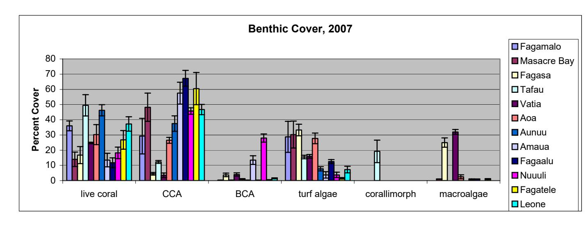

There are many differences in Figure 2 that are significant, as well as others that are not significant. In Figure 1 it is obvious that there are many differences between sites, and Figure 2 allows one to determine which of these differences are significant. Many are, which means that there is a great deal of real spatial variation in benthic cover around Tutuila.

 The new site, Masacre Bay, has relatively high crustose calcareous algae cover, more typical of south side sites than north side sites. In spite of this, the averages for the north and south sides were very similar to that in previous years, with more crustose calcareous algae on the south side, and more turf algae on the north side. Also, fleshy macroalgae were more common on the north than south, and branching coralline algae were more common on the south than on the north, as seen in Figure 3.

Figure 3.

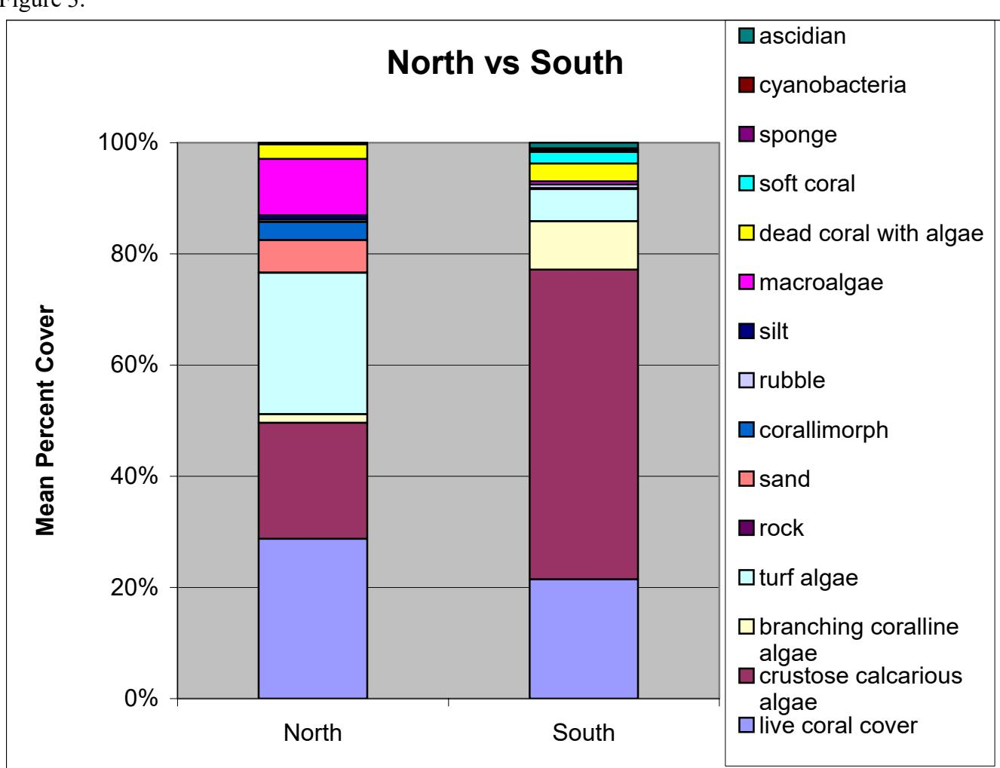

The differences in crustose calcareous algal cover and turf on the north and south sides are shown in Figure 4. As stated before, this difference may be associated with differences in wave energy on the north and south. For over half the year, wind and aves come steadily from the east, so that wave action is greater on the south side due to eason roughly January to April, wind and waves w the angle of the island. For the shorter s

are more variable and the north side may receive as much or more wave energy than the south, though wave action during this season may also be less. Crustose coralline algae have been said to do best when their surfaces are kept clean of sediment and other algae However, more recent information indicates that some crustose coralline algae are like to be fou . ly nd underneath turfs as well as under macroalgae such as *Halimeda*. For this reason, the difference seen in Figure 3 should be referred to as a difference in visible crustose calcareous algae, since there may be more that is hidden and not recorded in these surveys.

Figure 4.

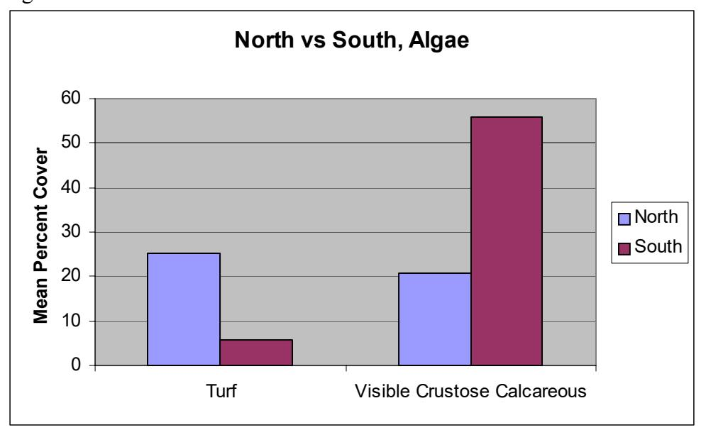

 This is the third year of the Territorial Monitoring Program of American Samoa. Mean benthic cover for the 11 core sites that were repeated each of the three years is presented in Figure 4. As seen in Figure 5, the changes over the three years of the mean cover are remarkably small. Mean coral cover varied by less than 0.4%, and no trend is apparent, with less than 0.1% change between 2005 and 2007. The largest differences of any benthic category were less than 3%. Perhaps the closest to a trend would be in fleshy macroalgae, which increased slightly from 2005 to 2006.

Figure 5.

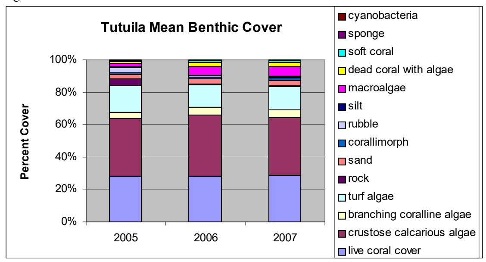

Figure 6 is a re-graphing of the same data, presented in a different format, with standard error bars added. Only the most abundant biological categories are included.

Figure 6.

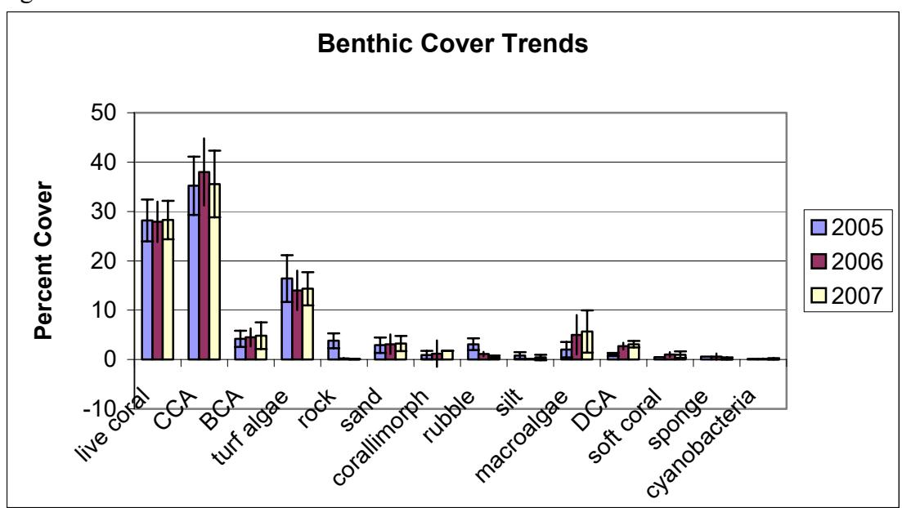

The standard error bars allow one to examine the data for significant differences- if the bars overlap the difference is not significant, if they do not overlap the difference is significant. Figure 5 above shows that changes over time were rarely significant. Changes in coral cover, crustose calcareous algae, branching coralline algae, corallimorph, fleshy macroalgae, soft coral, sponge, and cyanobacteria were not significant. Rock and rubble were significantly higher in the first year than later, but this is likely due to a shift in recording to recording the turf cover on the rock and rubble.

Dead coral with algae had a significant increase, but this was likely due to more careful recording.

 One view of coral reefs is that some disturbance events, such as hurricanes, are natural and that coral reefs have adapted to them over millions of years. If a hurricane hits Tutuila an average of about once in 5 years, 300,000 hurricanes would have hit it in the 1.5 million years the island has been in existence. This view requires that coral reefs recover from disturbances. The natural state of affairs might be that after each disturbance kills coral, the corals recover over the following years or decades, until a new disturbance comes along. Thus reefs would repeatedly cycle between disturbance and recovery. The reefs of Tutuila have been exposed to a series of disturbances in recent decades, with a crown-of-thorns starfish outbreak in 1978 that killed most of the coral, hurricanes in 1981, 1987, 1990, 1991, 2004 and 2005, and mass coral bleaching in 1994, 2002 and 2003. Craig et al. (2005) interpreted the ups and downs of coral cover recorded in the long-term monitoring programs by Birkeland and Green as being due to periodic disturbance and recovery. Coral cover was estimated to be about 63% before the 1978 starfish outbreak (Wass, 1982), but is only 28% now. This view suggests that reefs on Tutuila are likely to be in a recovery stage. On the Great Barrier Reef, individual reefs n in Australia, are considered signs that the reefs are resilient, that is, they ck after destructive events. Although coral cover in Tutuila is much better than after the crown-of-thorns outbreak, it is not nearly as high as that estimated before the outbreak. It is not clear why coral cover is not presently increasing. Perhaps reefs here are not as resilient as some have thought. that have been damaged by storms show strong recovery over about a decade, with increases of coral cover of about 5% a year (Emslie et al. in press). But Tutuila shows no sign presently of increasing coral cover. Rapid recovery from disturbance events, such as those show bounce ba

 As reported in the 2006 report for this program (Fenner 2008), an analysis of data from a coral disease program by Dr. Greta Aeby had found a decrease over time in the percent cover of crustose calcareous algae in Tutuila. The data in Figure 4 do not reveal such a trend in the present data. This does not appear to be a problem.

 The Secretariat of the South Pacific (SPC) PROCFISH program devised a "live coral index" that consists of the live coral cover divided by all cover, alive plus dead. Figure 5 shows the trend in this index over the three years, plus the average for the South Pacific countries included in the PROCFISH program. Figure 7 shows a slight downward trend in the live coral index, but even the lowest value is much higher than the

Figure 7.

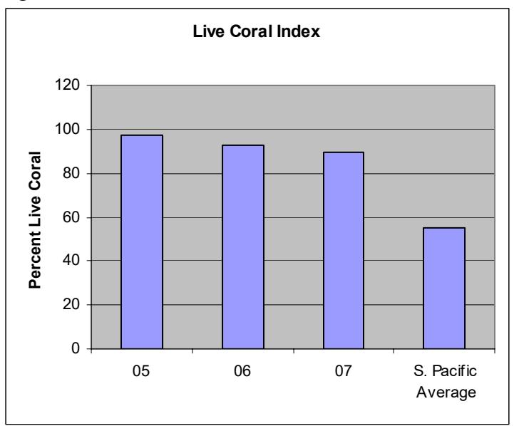

South Pacific average. The slight decrease over the three years may be a result of a lowering threshold for the definition of dead coral. All of the coral recorded as dead are long dead, partly eroded and covered with crustose calcareous algae and/or turf algae. Deciding what is reef and what is long dead coral is not always simple, as branches slowly erode down to shorter stumps and begin to blend in with the rough features of the reef. Since none of the recorded dead corals are newly dead, there appears to be no caus for concern over the slight decrease in the recorded index. The index, however, should e t be a sensitive measure of the loss of living corals, and should be more sensitive than jus the amount of live coral cover.

bject to natural sediment runoff (van Woesik and Done, 1997). Thus it appears to be a seful index of non-point pollution (Risk et al. 2001). Gomez et al. (1994a,b) used a mortality index to measure the amount of recently killed coral on a reef. The index is a ratio of dead coral to dead plus live coral. Thus, it is exactly the additive inverse of the Live Coral Index used by PROCFISH. The mortality index has been used to distinguish reefs in Indonesia subjected to pollution from reefs not subjected to pollution (Edinger et al. 1998). Reefs in that study subjected to pollution had a mean index of 0.48 (so 48% of all corals were dead), while reference reefs had an index of 0.25 (= 0.75 live coral index, lower than here). This index has also been used to distinguish reefs subjected to anthropogenic sediment runoff from reefs su u

Gomez et al. (l994a) were well aware of the limitations of using live coral cover as n index of reef health. They state "Despite its wide use, however, coral cover is not lways a reliable measure of reef health." Maragos (1997) states that " it seems that coral over is only useful as an indicator of reef health when it is monitored at the same sites ver time in habitats where coral cover is expected to be high (in the absence of stress)." hat is because different reefs have different "natural" amounts of coral cover, for a ariety of reasons including the amount of suitable substrate available. They don't state explicitly, but a "live coral index" or "coral mortality index" largely overcomes this roblem, by reporting what proportion of all coral is dead. If an area has low natural oral cover, but all coral recorded is alive, then the coral community is relatively healthy. a a c o T v it p c

However, if a reef has high coral cover but much of it is dead, then the coral community is relatively unhealthy. Gomez et al. (1994a) reported that 48% of 844 sites in the Philippines have at least half of the coral cover already dead (coral mortality index of at least 50%). Although they do not give a mean coral mortality index for the sites, this indicates that reefs there were on the average much less healthy than they are currently in American Samoa.

 One of the major problems in interpreting such data or comparing different studies is the criteria for "dead coral." When coral dies, a process starts in which it is partly eroded, partly reduced to rubble or sand, and partly consolidated into the reef. Dead corals become covered with filamentous algae within days, may later become covered with coralline algae, and are bioeroded and consolidated into reef rock over time. Thus, initially they are very easy to recognize as dead corals, distinct from reef rock, but over time they slowly transition from dead coral into reef rock. The amount of dead coral that is recorded heavily depends on what the criterion is for distinguishing dead coral from reef rock is, and it is not an easy distinction since it is a continuum with no sharp demarcation. In this monitoring program, when the outline of a coral could be distinguished it was generally recorded as dead coral, even though it was virtually always le at n covered with some combination of crustose calcareous algae and turf. It is not possib this point to estimate the amount of time the coral has been dead, though coral that is still near-white has been dead for a very short period of time, weeks or less. It appears that in areas where crustose calcareous algae dominate, they will dominate dead surfaces withi about 6 months of death. In spite of all this, in American Samoa on reef slopes currently there are extremely few recently dead (near-white) coral colonies, so few that in most years not even a single colony was counted. There are some dead corals where the outline of the colony is clear but it is covered with crustose calcareous algae and/or turf algae, and there are relatively few such corals that are badly enough eroded to be intermediate between recognizable coral and reef rock (that is virtually always covered with crustose calcareous algae and/or turf). Thus, the figures for live coral index for the second and subsequent years of the program are likely to be pretty accurate. It is much less certain whether figures from other locations are comparable, since the criteria for recognizing dead coral are not reported, and it is not reported whether there are many colonies that are partly eroded and intermediate between well-preserved dead coral and reef rock. The situation in backreef pools and reef flats is likely to be different; approximately half of all the staghorn coral in some of the backreef pools is dead standing coral covered with turf and/or crustose calcareous algae, and there are patches of collapsed rubble (which is older, likely over 5 years old) from staghorn as well. There is little dead coral of other species in the pools.

 Another limitation to the live coral index is that when a disturbance event occurs, the live coral index will show it clearly due to the dead coral, but with time the dead coral will become much less obvious and at some point will no longer be recorded as dead coral. If live coral doesn't recover during this period, the index would indicate recovery when no such recovery had occurred. This can be seen easily by examining the live coral cover. On the other hand, if the live coral cover recovers rapidly, the reef could return to normal health even though there is a lot of dead coral present and the live coral index does not indicate full recovery. So it appears that live coral cover is still needed in conjunction with the index to interpret the recovery of the reef.

A recent publication (Sandin et al. 2008) reports on four atolls in the northern Line Islands. These atolls range from Kingman which has no inhabitants and no history of fishing, to Kiritimati which currently has a population of 5000 which fish actively. Kingman has a fish community dominated by top predators, Palmyra has fewer top predators, Tabaueran less, and Kiritimati very few. Jarvis Island is in an area of high level of ocean productivity that stretches east-west, and Howland and Baker are in the same high productivity area but not in as high productivity area as Howland and Baker. American Samoa is in a low productivity area. Kingman has the highest coral cover and Kiritimati the least, as shown in Figure 8. Figure 8 also show coral cover at Jarvis, Howland, and Baker, all of which are uninhabited and unfished and in the same general geographic area (Jarvis is in the Line Is.). The figure shows that all of the unfished atolls have higher coral cover than all of the fished atolls and islands. Tutuila has higher coral cover than Kiritimati, Tabuaeran, and Palmyra, though it definitely has more fishing than Palmyra.

Figure 8.

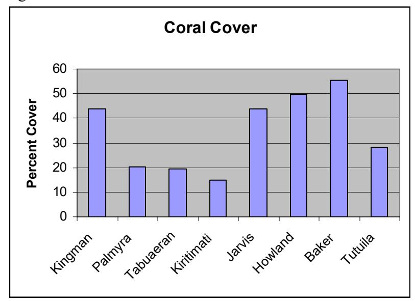

Sandin et al. (2008) also present data on a combination of benthic covers. They combined coral and crustose calcareous algae (CCA) in a single category. Coral and CCA appear to represent a measure of a healthy coral reef, as opposed to reefs with high fleshy macroalgae and turf algae. The reported the levels of the coral + CCA variable for their study islands and Tutuila are presented in Figure 9. The graph shows a strong decrease

Figure 9.

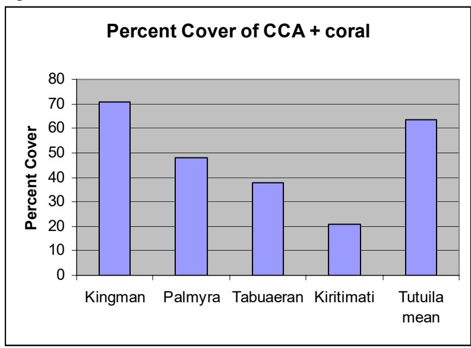

in this combined variable from the most pristine reef at Kingman to the most impacted reef in the Line Islands at Kiritimati. The mean for Tutuila sites in the present data set are shown by the bar on the right. The mean for Tutuila is almost as high as for the most pristine reef in the Line Islands. It appears that this may be a useful index of benthic coral reef health, and if so it suggests that Tutuila benthic health is relatively good. Coral cover alone suggests that Tutuila benthic health may be intermediate. The 2006 report (Fenner, 2008) compared Tutuila coral cover to averages for the Pacific and South Pacific, and found it slightly better than the averages. Also, Tutuila coral cover was much better than present Caribbean coral cover. But it was not as high has past Pacific or Caribbean cover, nor as high as estimates of past coral cover in Tutuila. Thus, Tutuila coral cover seemed to be at an intermediate level, which would be consistent with the present analysis. However, the new combined variable of coral + CCA suggests Tutuila may have a relatively healthy benthic community. Perhaps the combined variable gives a measure of the overall health and resilience, while the coral cover alone indicates where the reefs are in the recovery process from a series of disturbance events, beginning with the Crown-of-Thorns outbreak in 1978 and continuing with periodic hurricanes and mass coral bleaching.

 The combined index of coral + CCA for each site, along with a second combined category, for fleshy macroalgae and turf algae, are presented in Figure 10. Fagatele, Leone,

Figure 10.

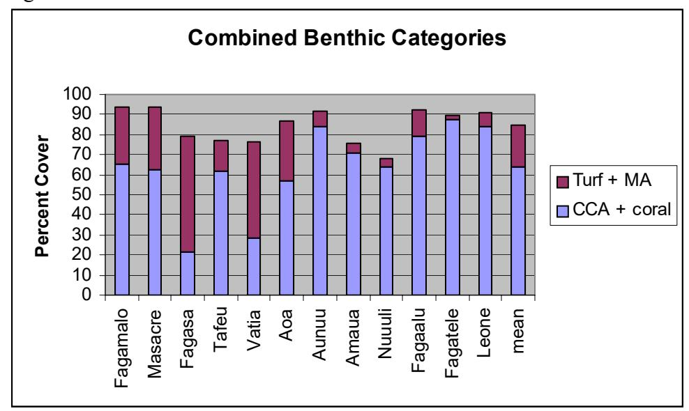

and Aunuu have the highest levels of the CCA + coral variable, and Fagasa and Vatia have the lowest levels. Fagasa and Vatia have the highest levels of the turf + fleshy macroalgae variable, and Fagatele, Nuuuli, and Amaua have the lowest levels of turf + fleshy macroalgae. Figure 11 shows that these two variables are strongly correlated, r .9044, p < .001. Because the total maximum cover is 100% and together these variables provide a large proportion of the cover, they are by necessity correlated. Yet a casual examination of Figure 10 reveals that there is enough cover by other categories that correlation need not be so tight. Further, these two variables need not together provid most of the reef cover. So perhaps the correlation is not a simple result of the 100% ceiling. = the e

Figure 11.

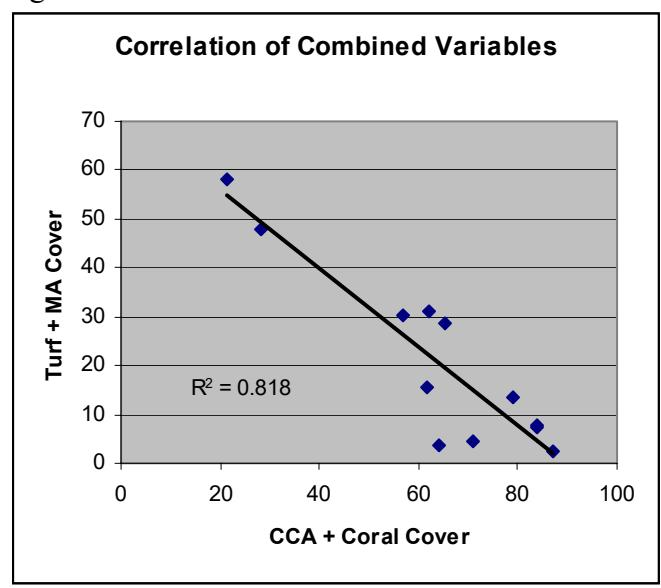

Figure 10 also indicates that the northern sites on the left of the graph are different from the southern sites on the right side of the graph. This can be seen clearly in Figure 12.

Figure 12.

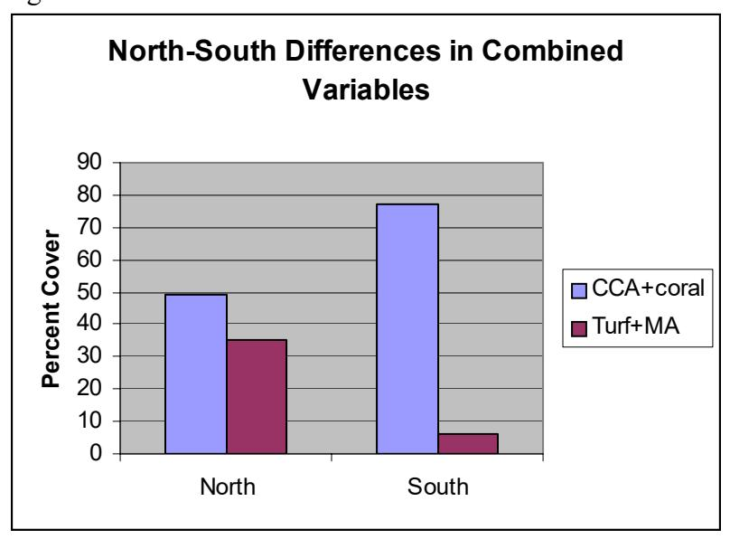

Figure 12 shows that there was more CCA + coral on the south side than the north, and more turf + fleshy macroalgae on the north side than the south. This is largely driven b the differences in CCA and turf, as seen in Figure 3. Mean coral cover is actually slightl higher on the north side than the south side as seen in that figure. It should be borne in mind that these results are for 8 m depth, and patterns may be different at different depths. y y

rican Samoa EPA has rated different watersheds on Tutuila according to the density of the human population and watershed size. Watersheds where categorized in several categories from pristine to most heavily impacted. Human impact might affect the amount of "good" benthic cover (crustose calcareous algae + coral) versus "bad" benthic cover (turf + macroalgae). Figure 13 shows the correlation between watershed rating and the ratio of "good" benthic cover to total "good + bad" (CCA + coral/ (CCA + coral + turf + MA). The correlation was very low (r = 0.111) and not significant (p < .2). Ame

Figure 13

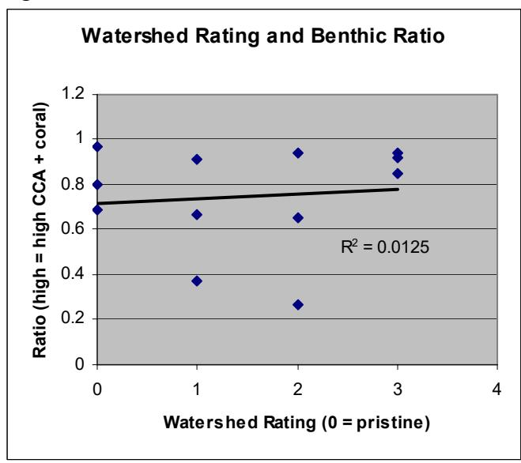

### **Bioerosion and indicator species**

 Bioerosion is when organisms erode the calcium carbonate that makes up the reef. the second largest amount of bioerosion (Bellwood et al. 2003). They are not ommon here. Most sea urchins are uncommon to rare on the reefs of American Samoa, to e rganisms and organic material that they filter out of the water (as do the boring ivalves). Areas with large nutrient inputs from humans such as sewage, such as some donesian reefs and the Florida Keys, have large amounts of boring sponges. Such reefs re often covered with a "snow" of white silt composed of the microscopic chips of alcium carbonate excavated and expelled by boring sponges. This white silt is ommonly trapped in the turf algae on rock surfaces. The author photographed such snow" in the Florida Keys, and has observed it in the Caribbean and Philippines. owever, boring sponges (*Cliona* or *Siphonodyction*) have not been reported from merican Samoa among the 45 species of sponges found in an intensive survey for troduced species which concentrated work in Pago Pago harbor (Coles et al. 2003). ago Pago harbor has turbid green water indicating phytoplankton fueled by nutrient There are a variety of organisms that cause bioerosion on coral reefs, such as parrotfish, sea urchins, boring bivalves (clams) and boring sponges. The largest parrotfish, bumphead parrotfish (*Bolbometopon muricatum*) erode far more reef than any other parrotfish, by biting off chunks of live coral and coral rock. They are very rare in American Samoa. Other parrotfish do some eroding, with *Chlorurus microrhinos* causing c except in some very specific areas, such as a narrow zone of outer reef flat in Nuuuli. The one abundant urchin, *Echinostrephus molaris*, is a small urchin that erodes a cylindrical burrow about 2 cm diameter that it lives in. Boring bivalves often burrow in living massive corals, and can be easily seen protruding for some species (e.g., *Andara* and *Spondyllus*) or detected by paired siphon holes in the surface of the coral. They wer not seen and are presumed very rare. Boring sponges can cause large amounts of bioerosion of reef material. Further, boring sponges are filter feeders that feed on small o b In a c c " H A in P

input that is not flushed out of the harbor. The harbor is also reported to have a dense sponge community in deep water, including some sponges as large as small cars (Paul Brown, personal communication). Although the harbor would be the most likely place to find boring sponges, no species of *Cliona* or *Siphonodyction* was reported from there (Coles et al. 2003). The author has not observed or photographed boring sponges anywhere in American Samoa. Further, reef slopes do not have a coating of the white "snow" between corals, and the turf algae appears to be clean of such silt.

 This evidence appears to be consistent with the view that boring sponges are rare or absent in American Samoa, and that bioerosion is particularly low in American Samoa. Further, it is consistent with the observations that many filter feeders are uncommon to rare in American Samoa, and the reef slopes have relatively clear water. The harbor shows strong signs of eutrophication, with green water, abundant filter feeding oysters, and a deep community of large sponges.

 Risk et al. (2001) proposes another measure of nutrient input to reefs. This is the amount of "coral associates." They define coral associates as organisms living on the surfaces of corals, such as sponges, polychaetes, bivalves, tunicates and hydroids. Almost all of these are filter feeders. They are visible on the surface and can easily be ounted on corals such as massive *Porites*. For instance, in the New Caledonia lagoon, on many massive *Porites* colonies. However, in merican Samoa, the author has never seen bivalves on massive *Porites* colonies, nor te ucus , c large boring bivalves are prominent A sponges, tunicates, and hydroids. The filter feeding polychaete *Spirobranchus gigantea* does occur on massive *Porites* in American Samoa, but is rare. This is consistent with low nutrient inputs to American Samoa reefs. However, the vermetid mollusk, *Dendropoma gigantea* is common. Vermatids live in the surface of corals, and secre mucus threads that get spread into nets. The nets catch plankton. However, this m gets draped on the coral surface and probably pulls coral mucus in with it when the animal pulls the net it to eat it. Thus, it is probably not primarily a filter feeder (Fenner in preparation).

f hen in ssay When corals die, they are very rapidly colonized by turf algae. Within a few days o death on the reef flat, corals turn light yellow, then in about a week or two green, t a few more weeks, black. Jacobson (2008) reports that when disease kills coral in the Marshall Islands at Majuro where there is considerable nutrient runoff the dead surface turns almost black from turf algae. However, away from nutrients, at Arno Atoll, the surface turns a golden yellow due to the growth of diatoms. This may be a rough a of nutrient conditions on a reef. The fact that dead corals on the reef flats turn green and then black within weeks suggests significant nutrient inputs on the reef flats. Observations need to be made on outer banks of killed coral surfaces to see if they turn golden yellow. Outer banks are much farther from the nutrient runoff from land than the reef flats are, and they are in water that is clearer than on the reef slopes.

### **Individual Sites**

s at time, Now that three years of data are available, it is possible to start looking for trend individual monitoring sites. We will now look at each of the 11 core sites, one at a starting at Fagamalo in the northwest and moving clockwise around the island as in Figure 1. Figure 14 presents the trends in Fagamalo.

Figure 14.

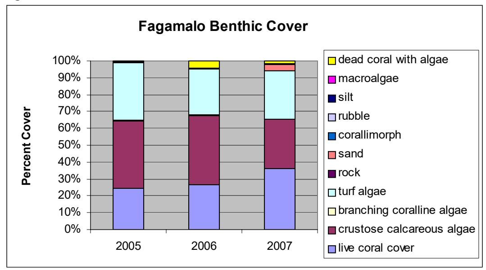

Fagamalo had an increase in coral cover over the three years of 12%, while crustose calcareous algae decreased by 11%, and turf algae decreased by 5%. Examination of standard error bars indicates that only the increase in coral cover from 2006 to 2007 is significant, the other differences are not significant. It should be born in mind that the sample for an individual site (400 points in 4 transects) is much smaller than for the me of all sites for the island (4400 points in 44 transects for the 11 core sites). As a result, random effects will be much larger for individual sites than for the whole island, and the ability to detect real changes is much less. Transect tapes cannot be returned to the exac same location year after year, even by using stakes, as the exact route taken in laying the tape will vary, and surge often moves the tape back and forth more than the diameter of an t most coral colonies, in spite of the best attempts to secure the tape. The result is an irreducible minimal level of random variation. Some monitoring programs seek to maximize the randomness of the placement of recording points, by randomizing the placement of transects, or by the randomizing of point placement on a video belt recording by programs such as Point Count. We have attempted to keep the random variation from year to year modest by trying to place transects as close to the same location as possible year after year.

Benthic cover over the three years at Fagasa are shown in Figure 15.

Figure 15.

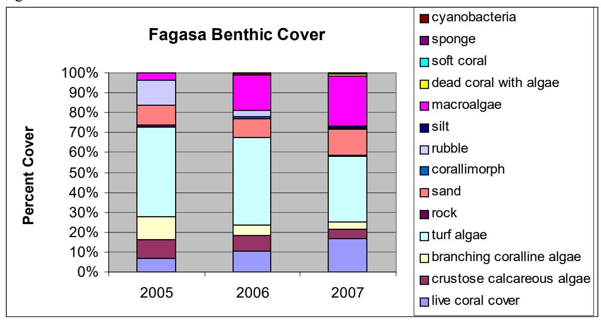

Figure 14 shows an increase in coral cover of 10%, a decrease in turf of 12%, a decre of crustose calcareous algae of 5%, a decrease of branching coralline algae of 7.5%, a decrease in rubble of 12%, and an increase in fleshy macroalgae of 21.5%. The increas in coral from 2005 to 2007 was significant, as was the decrease in crustose calcareous algae and branching coralline algae. Turf algae was significantly less in 2007 than in the previous two years, and the increase in fleshy macroalgae from 2005 to 2006 was significant. ase e

Benthic cover at Tafeu is shown in Figure 16. There was a slight increase in coral

Figure 16.

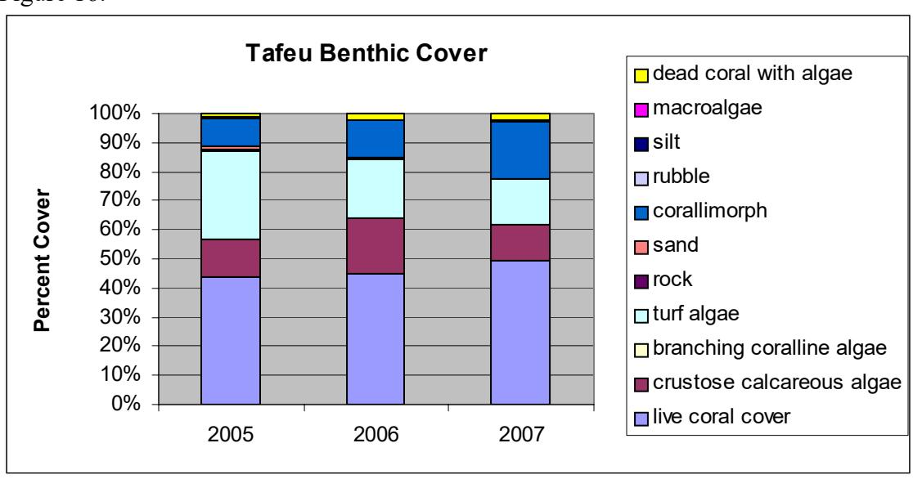

over of 6%, a decrease in turf algae of 14%, and an increase in corallimorph of 10%. he decrease in turf from 2005 to 2007 was significant, but the changes in coral and orallimorph cover were not. The corallimorph, *Rhodactis* sp., forms clones that spread to c T c

cover more area, and seem to prefer to cover unoccupied substrate. This species is shown in Figure 17. It is far more common at Tafeu at the survey depth (8 m) than any of the other sites surveyed in this program. It is eaten traditionally, but must be cooked to remove toxicity (Madrigal, 1999). It appears that over the three years in Tafeu it has expanded into areas of turf algae, so although it is expanding, it is not expanding at the expense of live coral, which actually increased. *Rhodactis* has adaptations to withstand high illuminance in shallow areas, and forms patches on reef flats in the Red Sea (Kuguru et al. 2007). In Tafeu as well as Vatia, it forms large patches on the slope, in shallow to medium depths. *Rhodactis* can develop powerful short stinging tentacles along their edge for attacking hard corals (Langmead and Chadwick-Furman, 1999a). They are able to grow over zoanthids, hydrozoan corals, sponges, and encrusting macroalgae, and damage or grow over hard corals with small polyps that are low on the aggressive hierarchy in hard corals. Contact with corals can induce the development of the short stinging tentacles on the edge of the large corallimorph polyps. However, *Platygyra* corals can attack and severely damage the *Rhodactis* polyps. Thus, *Rhodactis* seems to be in the middle of the hard coral aggression hierarchy (Langmead and Chadwick-Furman, 1999a). They reproduce asexually by division, and can double in numbers in one year (Chadwickafeu. n of the corallimorph at Tafeu is a result of human activities, rather it appears innocuous at this point, but it should be tracked in future years. Furman and Spegiel, 2000). Work et al. (2008) documented the spread of *Rhodactis howseii* around a shipwreck in Palmyra until it dominated a large area. The presence of the same species around steel buoys at Palmyra supported the view that iron enrichment may have been responsible. Tafeu appears to be the most pristine of all of the core sites, surrounded by cliffs and with no people living in its watershed. Further, it has the highest coral cover of any of the sites. It is present in significant quantities in Vatia Bay as well, which has a significant human population in the watershed and less flushing than T There may be some natural iron runoff from the island; orange streaks can be viewed on cliffs running down from cracks where freshwater emerges. Thus, it seems unlikely that the expansio natural and

Figure 17. The corallimorph, *Rhodactis* sp. (mata-malu)

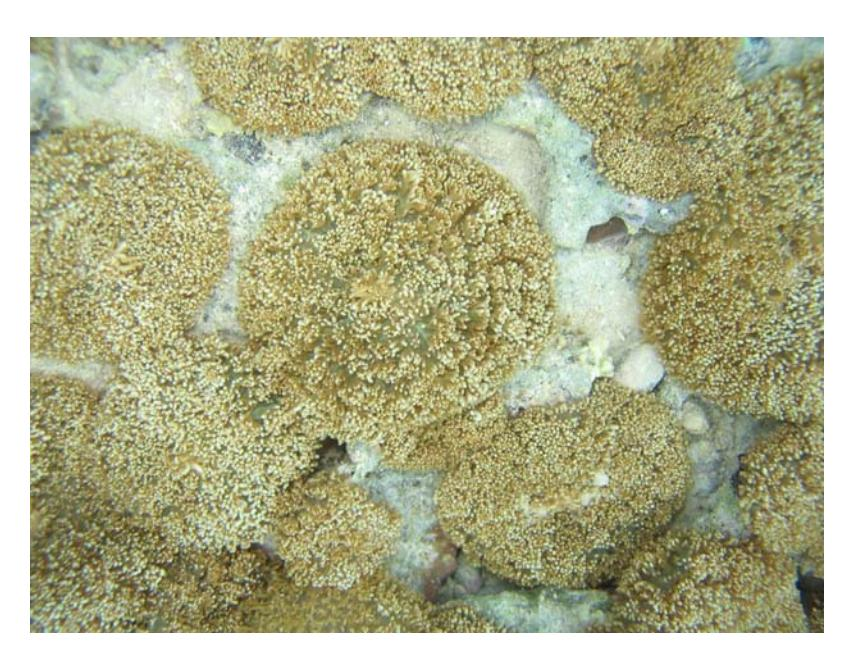

 Benthic cover at Vatia is presented in Figure 18. Coral cover has decreased by less than 4% over the three years, and since the decrease has not been monotonic, this may be random variation in transect placement. While turf has remained relatively constant, fleshy macroalgae has increased by 15%, while sand has decreased by 10%, though most of these changes occurred in different years, with the increase in fleshy macroalgae occurring first, and the decrease in sand second. The increase in macroalge from 2005 to 2006 is significant, as is the decrease in sand from 2006 to 2007. For the first two years, the macroalgae consisted of *Halimeda* green calcareous algae, but in 2007, there was a sudden appearance of a significant amount of *Dictyota* brown macroalgae. This is shown Figure 18. In Figure 18, the fleshy macroalgae category is divided into *Halimeda* and *ictyota*. Not a single point of *Dictyota* was recorded in the first two years, and in 2007 suddenly had 15% cover. It was observed growing over live corals and *Halimeda*, and robably over sand as well. Although coral cover decreased over the three years by early 4%, it actually increased between the last two years when the *Dictyota* appeared y 5%. From the graph it appears in *D* it p n b

Figure 18.

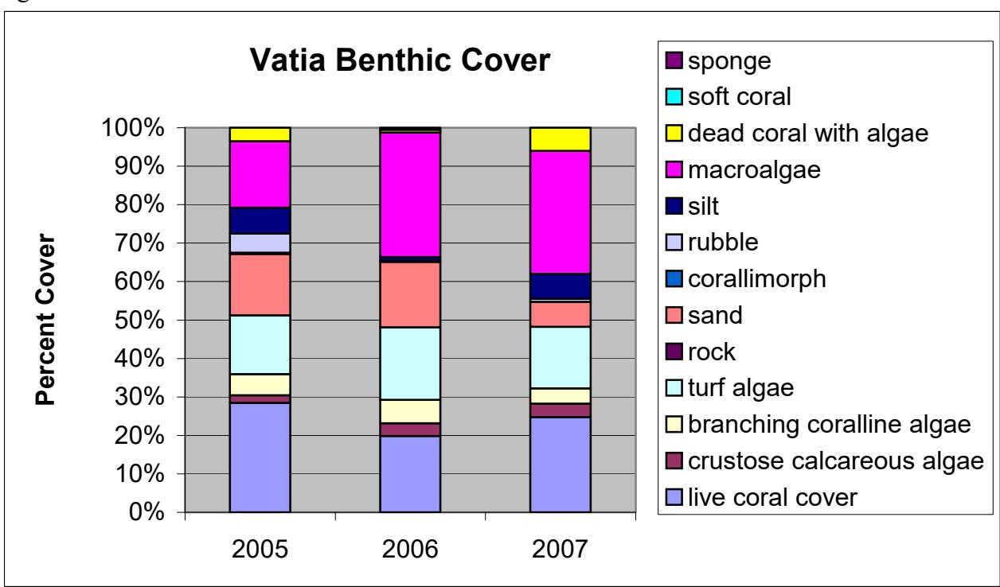

that it may primarily be growing over sand. A photo of *Dictyota* is shown in Figure 20.

Figure 19.

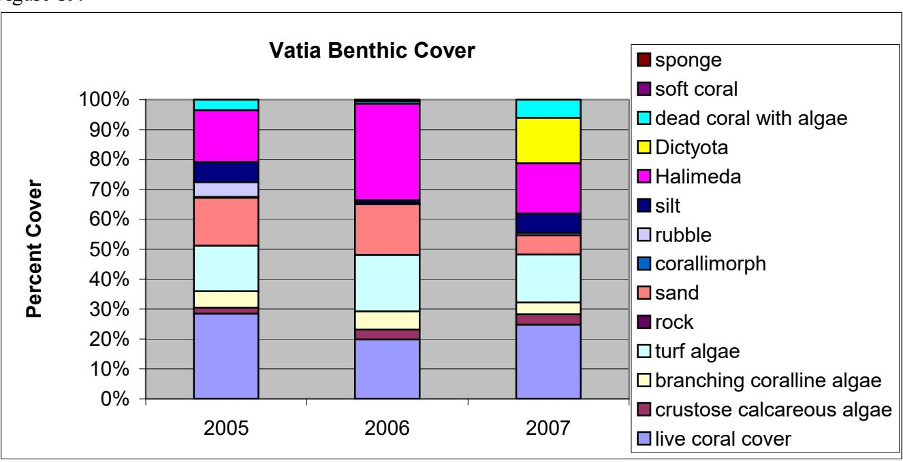

Figure 20. The brown macroalga, *Dictyota* sp.

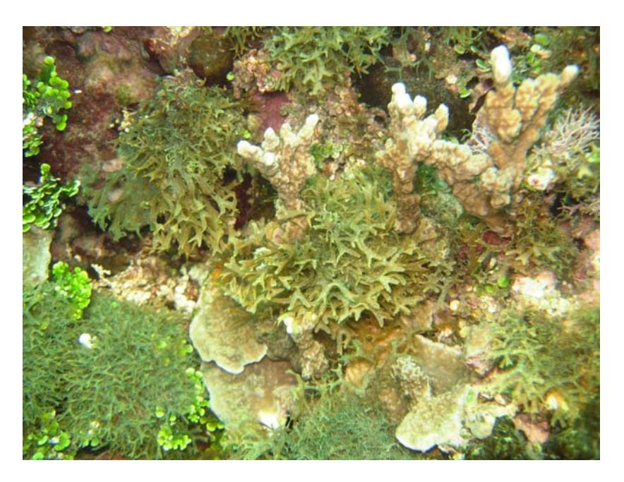

*Dictyota* is one of the types of brown algae that have overgrown newly dead corals in e Caribbean as the phase shift from corals to algae occurred there, so it is a cause for 2006 it was taken at the beginning of December, and in 2005 at the f April. Mike King reports a bloom of *Dictyota* in the Nuuuli (Coconut Point) pool, which he first saw in January, 2007. It is possible that it appears annually around January which would account for why it was not seen in December 2006, but it would have to disappear before April for it to not have been seen in April, 2005. The fact that it has not been reported before suggests that this is its first appearance. The National Parks monitoring program has apparently recorded it at several sites, apparently beginning in 2007. If it was found at remote sites which have no people in their watershed, then it would be unlikely to be due to human activities. th concern. The cause of the sudden appearance of *Dictyota* is not immediately obvious. Some brown algae including *Dictyota* can be seasonal. The transect in 2007 was taken in February, in beginning o

 Another possibility is that conditions such as herbivory or nutrients may have changed in a way that has encouraged or allowed the growth. *Dictyota* is chemically defended and tough with cellulose, and so avoided by most fish. Further, Vatia is a Communty-based MPA. It seems unlikely that populations of herbivorous fish there have declined recently. About a year ago, Mike King discovered that high active phosphate detergent was being imported and sold here. Since then the Governor has issued an executive order banning the import, but apparently stocks are still being sold. Vatia is a narrow bay with little circulation or flushing. The monitoring site on the west side shows signs that it is protected from wave action, by the abundance of *Porites cylindrica*, as well as by the lack of surge on dives there. Further, the sand between corals is grey with a large silt component, apparently from land runoff. This is the only te with significant sand on a slope. If there was much wave action like on the outer oast, the wave surge would quickly re-suspend the silt, and it would move the sand ownslope and off the reef. On outer reef slopes, wave surge resuspends silt and move si c d

sand downslope depositing it on the shelf, which is why sand is rarely if ever seen on uter reef slopes here. It could be that the increased nitrogen from laundry detergent has accumulated in the bay's water and fueled a bloom of *Dictyota* in Vatia. o

 During snorkeling on the reef slope on the east side of Vatia Bay in the vicinity of the survey sight, it became clear that there are many areas with the *Rhodactis* sp. corallimorph on the slope above the transect depths, in shallower water. It is comparable in abundance to the amount in Tafeu, just at a shallower depth. The *Rhodactis* was observed growing over living corals. According to Paul Brown (personal comm.) enough light passes through the corallimorph that the coral does not die. The corallimorph is very powerfully attached to the substrate underneath it, but only attaches in the center of each individual polyp. Coral should be examined to determine whether it dies where the corallimorph attaches.

 Benthic cover in Aoa over the three years is shown in Figure 21. Coral cover decreased by 6% over the three years, crustose calcareous algae decreased 7.5%, turf increased by 8.5%, and sand increased by 8%. The coral cover change was not

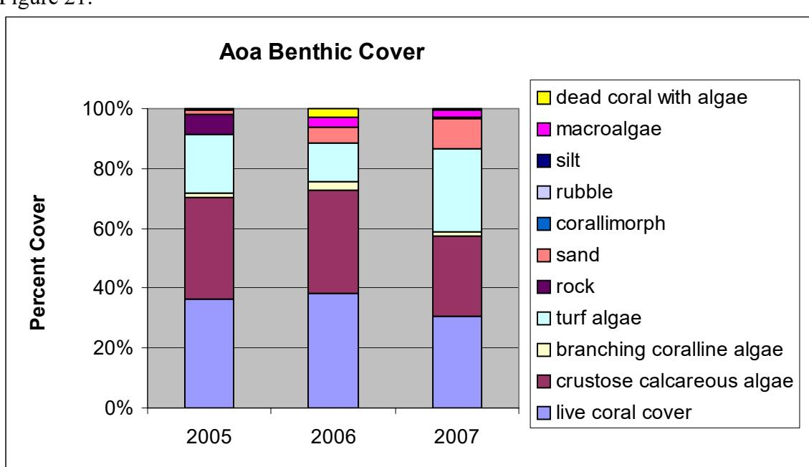

Figure 21.

antly significant, crustose calcareous algae was significantly less in 2007, turf was signific more in 2007 than 2006 (but not more than 2005), and sand was significantly more in 2007 than 2005.

s rock d ock Benthic cover in Aunu'u over the three years is shown in Figure 22. Coral cover decreased slightly by less than 4% over the three year period, crustose calcareous algae increased by 5%, turf increased by 5%, dead coral with algae increased by 5%, and rock decreased by 13%. It is quite possible that a light green surface that was recorded a in 2005 was recorded as turf in 2006 and 2007. All but the very most recently expose surfaces have enough turf growth to have a green color, even if the turf itself is not obvious, and in later years have been recorded as turf. The changes in coral and CCA were not significant, but there was a significant increase in turf from 2005 to 2007. R

decreased significantly from 2005, and dead coral with algae increased significantly from 2005 to 2006.

Figure 22.

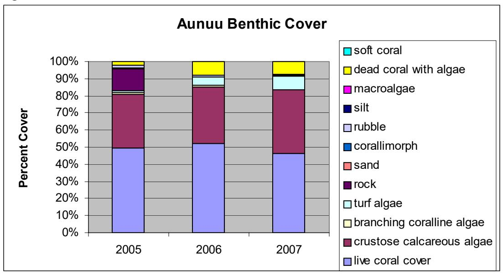

Benthic cover in Amaua over the three years is presented in Figure 23. All changes

Figure 23.

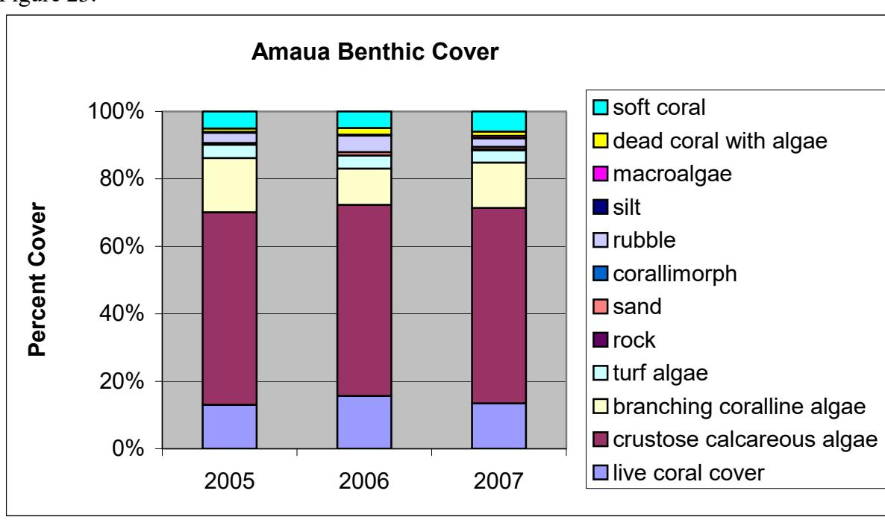

were very small and due to random variation.

Benthic cover over the three years at Fagaalu are presented in Figure 24. Crustose calcareous algae increased by 12% over the three years, but there was considerable annual variation. Turf algae decreased by 15% over the same period, and again there was

significant annual variation. Coral cover was very steady. Between 2005 and 2006 there was a significant increase in CCA and a significant decrease in turf.

Figure 24.

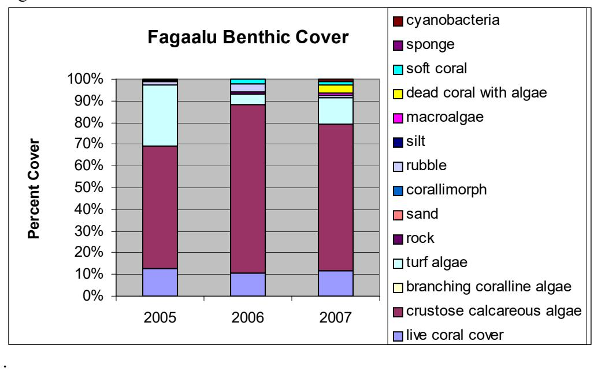

Benthic cover over the three years at Nu'uuli are presented in Figure 25. Crustose lgae decreased by 15% over the three years, while branching coralline algae increased by 20%, and rock decreased by 9%. The decrease in CCA from 2005 to 2006 was just significant, and the increase in branching coralline algae was significant. The decrease in rock was significant. It appears that branching coralline algae may be calcareous a

Figure 25.

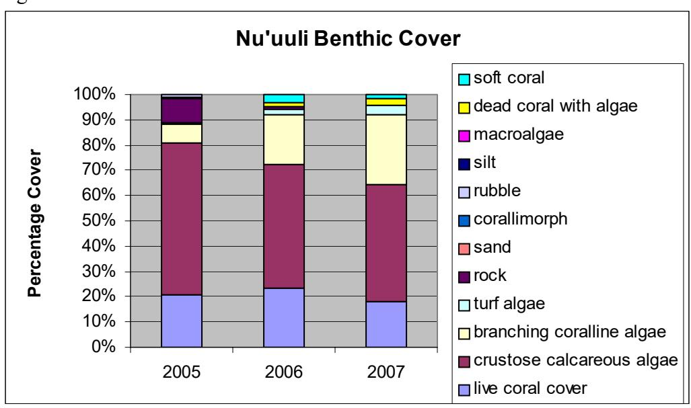

expanding over rock and crustose coralline algae. Coral was relatively steady, so it does not appear to be growing over coral. Branching coralline algae is not known to be a

problem. Most of the branching coralline algae at Nu'uuli is a soft feathery red algae, probably *Cheilosporum spectabile*, which may not be significantly calcified.

Benthic cover at Fagatele Bay over the three year period is presented in Figure 26. over recorded decreased by 14% over the three year period. However, at the time of writing, the data for 2008 has just been recorded and the coral cover percentage is nearly that of the first year. It appears that the transect location in 2006 and 2007 may have been shifted enough to record lower coral cover. Thus, the apparent decrease in coral does not appear to be a cause for any concern. Crustose calcareous algae increased by 14%. The increase in CCA was not significant. In 2007, there was 5% cover by an encrusting colonial ascidian (sea squirt), *Diplosoma simile*, shown in Figure 27. This change was significant. This species was reported by William Kiene to have had increased cover in another area of Fagatele Bay at about this time, but he reported that it decreased afterwards. This species is known to grow in between the bases of corals, and the author has noticed that it is fairly common at the reef flat in Utelei as well as Fagatele. It has been reported to be able to grow over corals and kill them. In the data for 2008 just collected, this ascidian did not appear in the transects. It does not appear to be a problem at this time, but will be watched. The coral c

Figure 26.

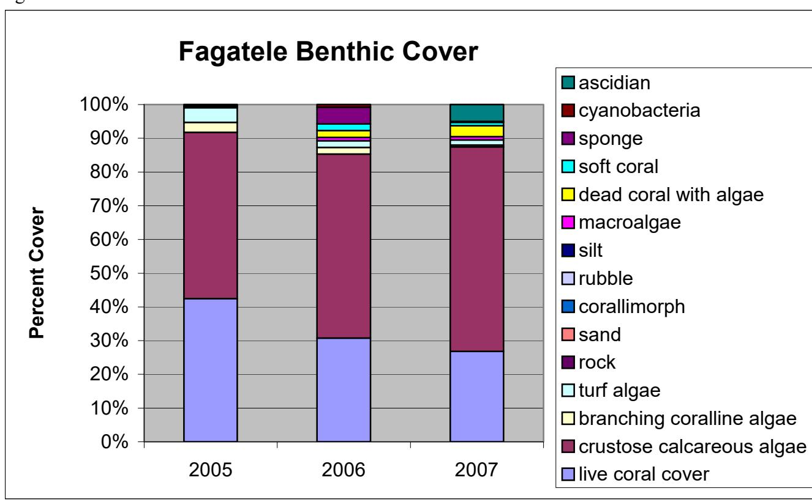

Figure 27. The compound ascidian, *Diplosoma simile*.

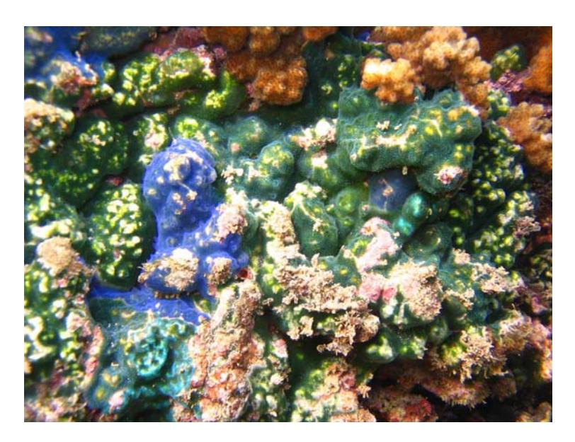

Benthic cover in Leone over the three years is presented in Figure 28. Coral cover increased by just 1.5%, crustose calcareous algae increased by 6%, turf increased by 7%, rock decreased by 10% and rubble decreased by 8%. The increase in turf and the decreases of rock and rubble were significant, but the coral and CCA changes were not. Probably some rock and rubble were scored as turf after the first year. The increase in dead coral with algae from 2005 to 2006 was significant, probably because it was being recorded more carefully.

Figure 28.

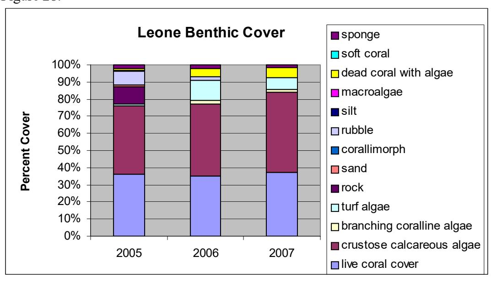

#### **Coral Diversity in Transects**

#### Lifeforms

Corals within transects were recorded both by lifeform, and by genus and species (where possible), as in previous years. The abundance of different lifeforms in the 12 sites is shown in Figure 29.

Figure 29.

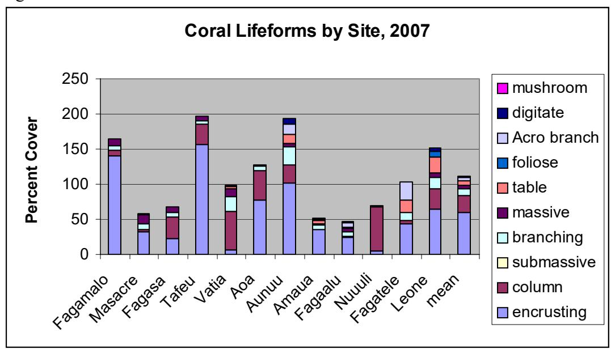

At most sites, the most common lifeform was encrusting, though at Nuuuli, column was the most common lifeform. This is because at Nuuuli the species *Porites rus*, which has a column and plate lifeform, was the most common coral. *P. rus* is always scored as column in this program, to keep from having to try to guess with each colony whether the column or the plate portion is the larger part of the colony (a time consuming and inaccurate process).

The lifeforms in all of the sites combined is presented in Figure 30. Encrusting is the most common lifeform, followed by column, branching, massive, and table in that order. This is consistant with the casual observation that encrusting corals are very common on most of Tutuila reefs.

Figure 30.

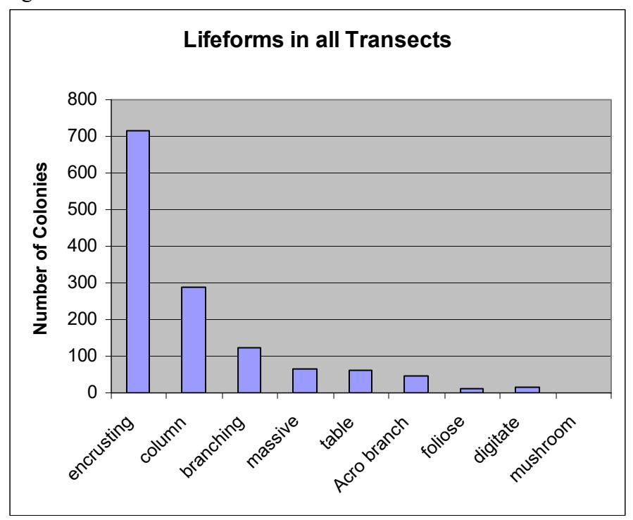

 Figure 31 presents trends in the abundance of lifeforms in transects over the three years of the monitoring program to date. Only the 11 core sites are included in this graph. Changes have been relatively minor, with slightly less encrusting and slightly more branching plus columns in 2007 than in previous years.

Figure 31.

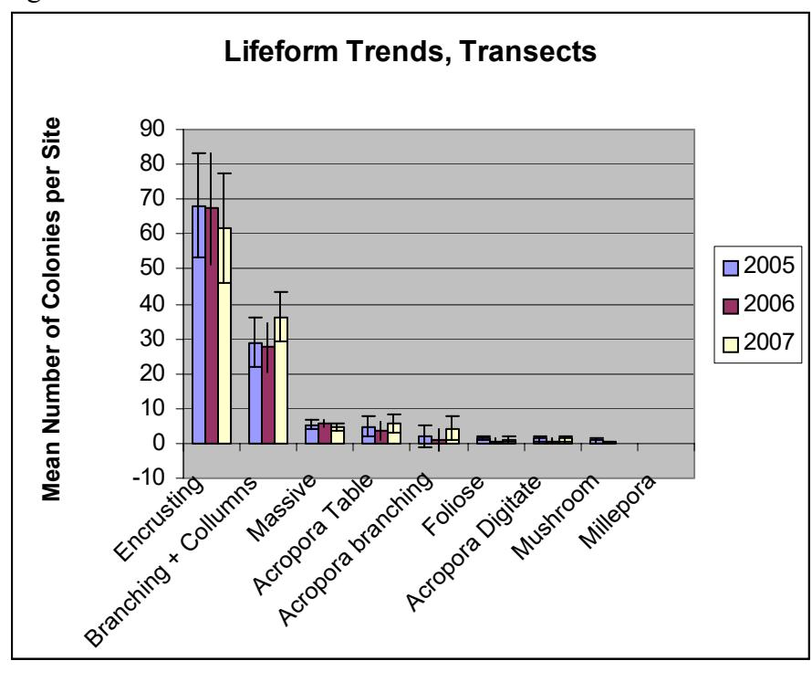

The standard error bars on the graph above show that there were no significant changes over time.

The same data on trends is presented in a different fashion in Figure 32.

Figure 32.

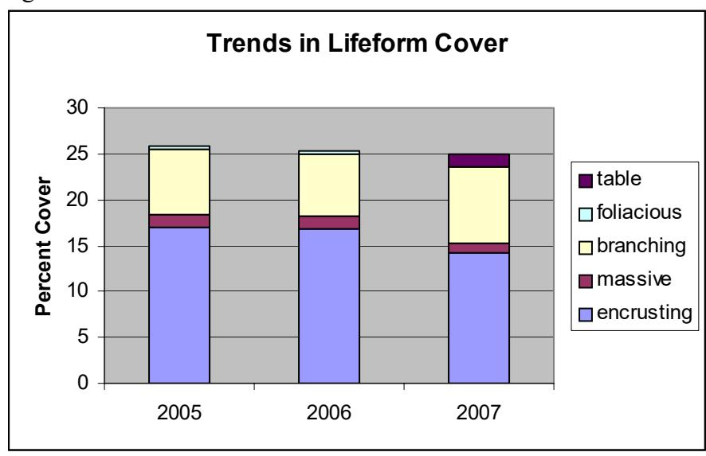

Here, the decrease in encrusting coral cover can be seen to be compensated by an increase in tables and branching corals. This seems unlikely to be a long-term trend.

The number of lifeforms at each of the sites is presented in Figure 33.

Figure 33.

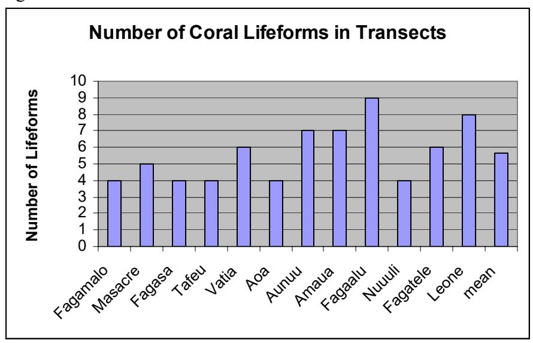

Trends in the number of lifeforms are presented in Figure 34.

Figure 34.

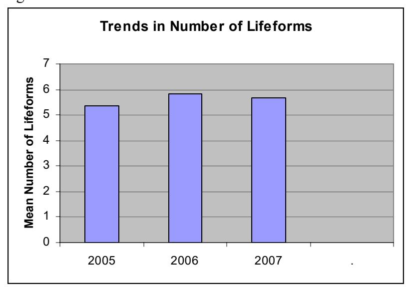

There was a slight increase in the number of lifeforms from 2005 to 2006, but this does not appear to be a trend.

## **Generic and Species Diversity**

The cover of the different coral genera at each site is presented in Figure 35.

Figure 35.

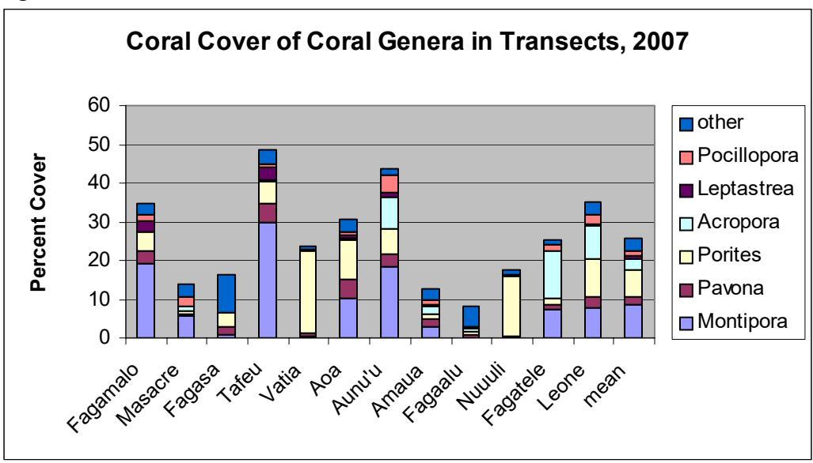

Fagamalo, Tafeu, and Aunu'u were dominated by *Montipora*, while Vatia and Nuuuli were dominated by *Porites* and Fagatele was dominated by *Acropora*. The mean shows that *Montipora* had the most cover on average, followed by *Porites*, in turn followed by *Acropora*. There is a lot of variety between sites. Fagatele is the only site dominated by *Acropora*, though Leone and Aunu'u have fairly good *Acropora* populations. Otherwise, *Acropora* is rare. Vatia and Nuuuli are dominated by *Porites*, with all other genera rare. Tafeu and Fagamalo are dominated by *Montipora*, and it is the most common genus in Aunu'u. *Acropora* also dominates reef crests, particularly on the south side of the island (as *A. nana*), co-dominates back reef pools with *Porites cylindrica*, and dominates some backreef areas such as the western part of Fagaitua and Anasosopo. There is also an area heavily dominated by *Acropora* at the mouth of Vatia bay. At times there have been large patches of *A. aspera* dominating reef flats, but when exceptionally low tides occur they kill this species.

Figure 36 shows that the most common coral genus in transects was *Montipora*, followed by *Porites*, *Acropora*, and *Pavona*, in that order. Almost all *Montipora* is encrusting in Tutuila.

Figure 36.

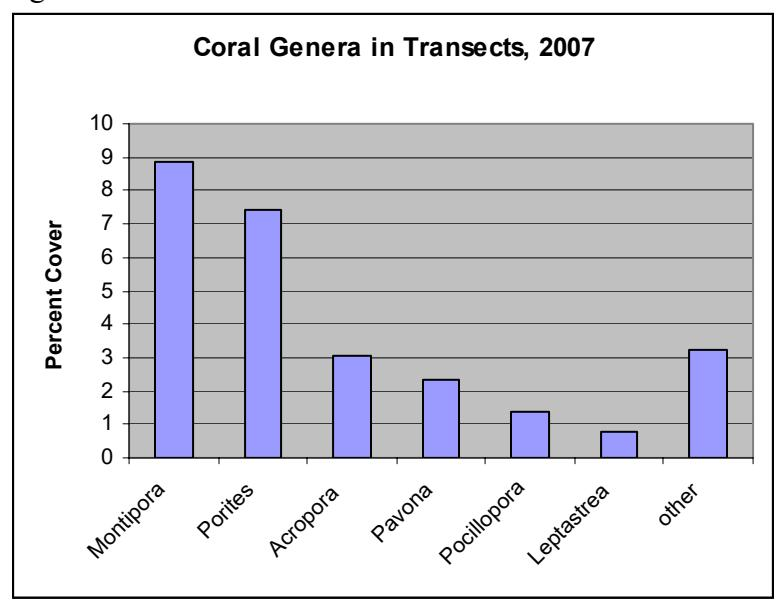

 Figure 37 shows the trends in coral genera over the three years. There was a slight decrease in the amount of *Montipora* in 2007, but slight increases in other genera compensated for this. None of the differences were significant.

Figure 37.

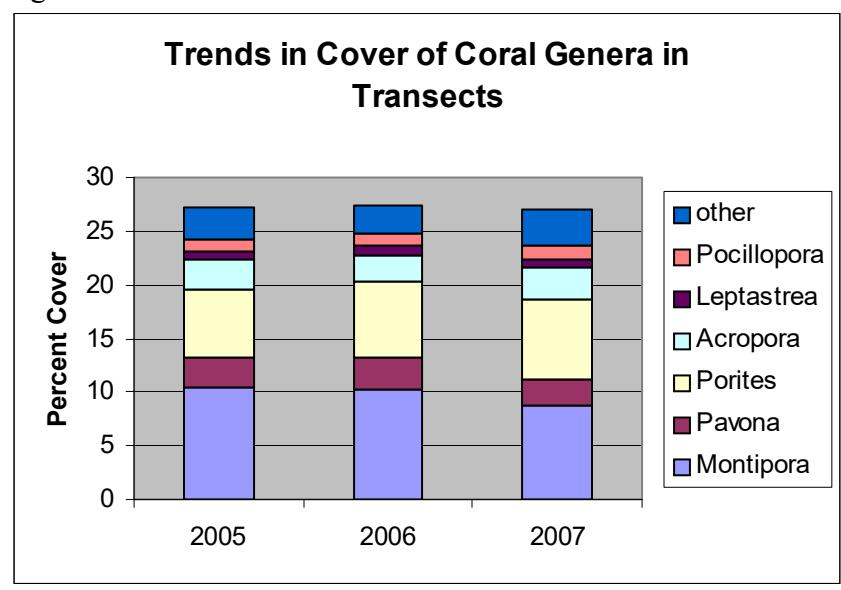

Figure 38 presents the number of coral genera in transects at each of the sites. Leone ad the highest number of genera, followed by Tafeu, and Fagasa and Fagaalu had the west number of genera. h lo

Figure 38.

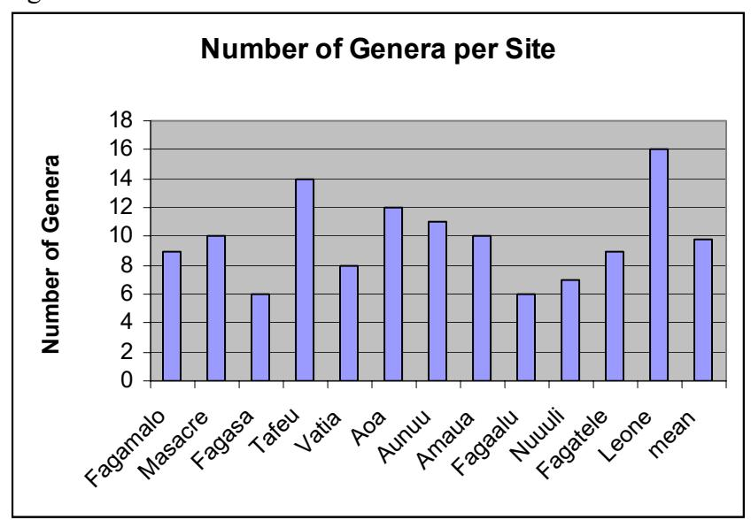

Figure 39 presents trends in the number of coral genera in transects. There was a fairly minor decrease in the number of coral genera, which was not significant.

Figure 39.

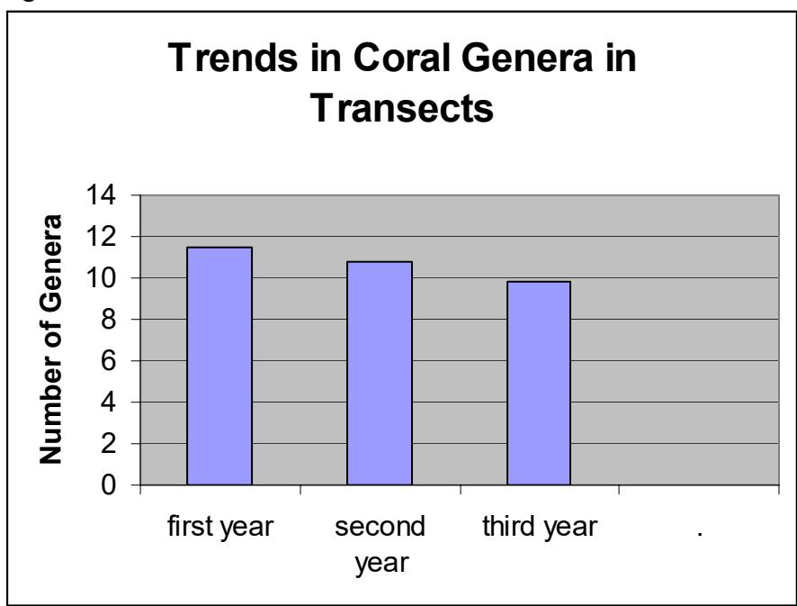

Figure 40 shows the cover of the most common coral species in the transects at each site. The graph shows that encrusting *Montipora* dominated Fagamalo, Tafeu, and Aunu'u. *Porites rus* dominated Vatia, Nuuuli, and Fagasa. Although Figure 34 showed that the genus *Acropora* dominated Fagatele, this graph does not show dominance by any

one *Acropora* species in Fagatele. No other species dominated any sites. Figure 39 presents the trends in coral species in transects. As with the genera, there was a slight decrease in *Montipora* encrusting between 2006 and 2007, but little other change. None of the changes were significant.

Figure 40.

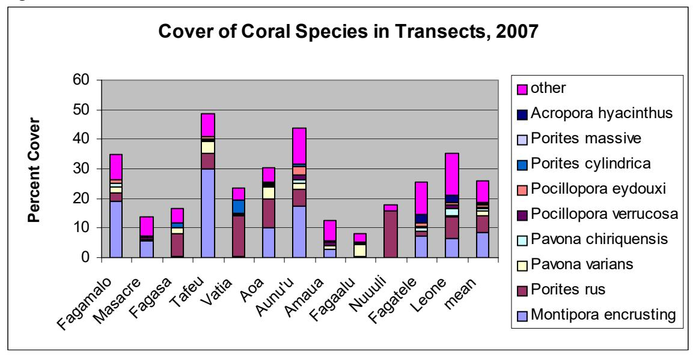

Encrusting *Montipora*, which others have considered *Montipora grisea*, but which the author has yet to verify, was the most common species, followed by *Porites rus* and *Pavona varians*, in that order, as shown in Figure 41.

Figure 41.

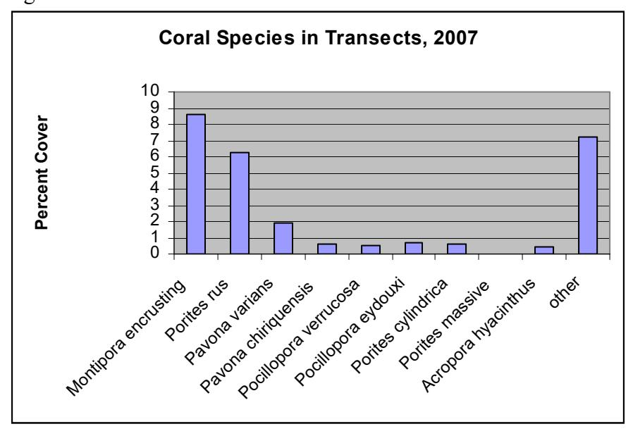

Figure 42 shows trends in the coral species in transects. Encrusting *Montipora* dominated the coral community each year, with *Porites rus* the second most common species, followed by *Pavona varians*. Changes were minor wit a decrease in encrusting *Montipora* in 2007 being the largest change. These changes are not likely to be due to real changes in the coral cover.

Figure 42.

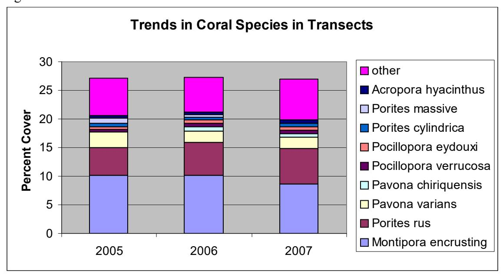

Figure 43 presents the number of coral species at each site. Leone had the highest

Figure 43.

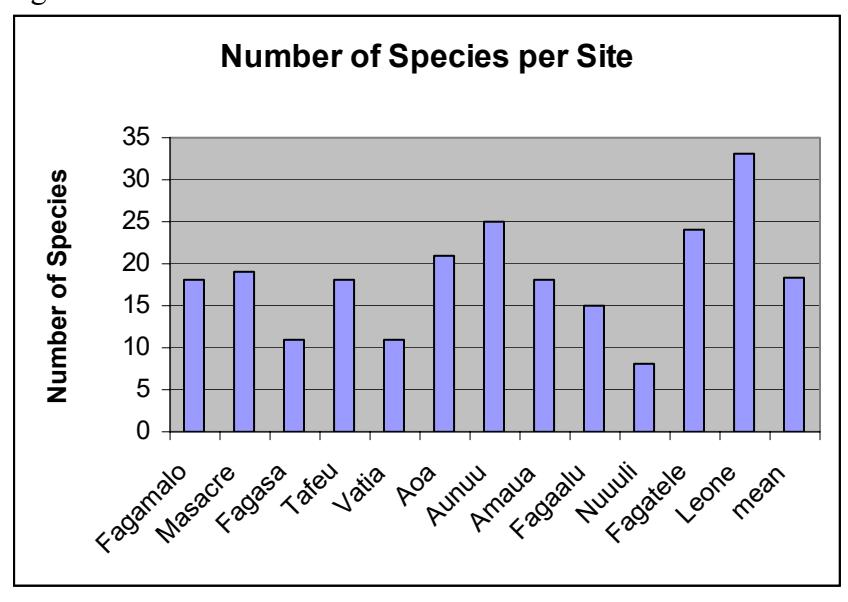

number of coral species, followed by Aunuu and Fagatele. Nuuuli had the lowest n of species, follwed by Fagasa and Vatia. umber

 Figure 44 presents trends in the number of coral species. There was no trend in the number of species, supporting the view that the apparent downward trend in genera in Figure 38 is due to random chan ce.

Figure 44.

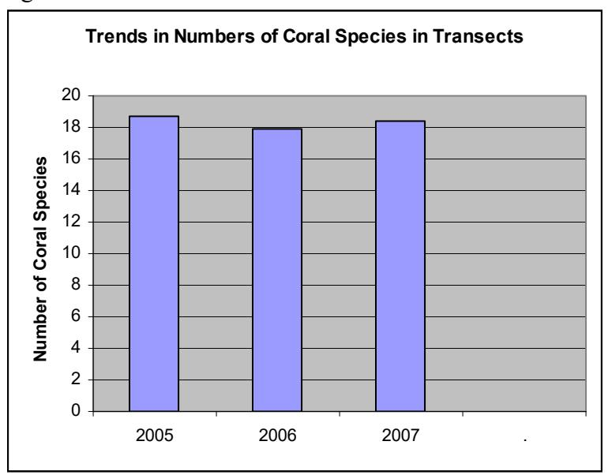

Different sites differ greatly in the amount of coral recorded in transects. It could be ber of coral species is higher at sites with high coral cover simply because re coral colonies. The diversity could be the same, but the corals just closer together. If the number of coral species were calculated for a standard number of colonies, the number of coral species might be similar between sites. In Figure 43, the number of coral species per point of coral in the transects was shown. Figure 45 shows that the num there are mo

Figure 45.

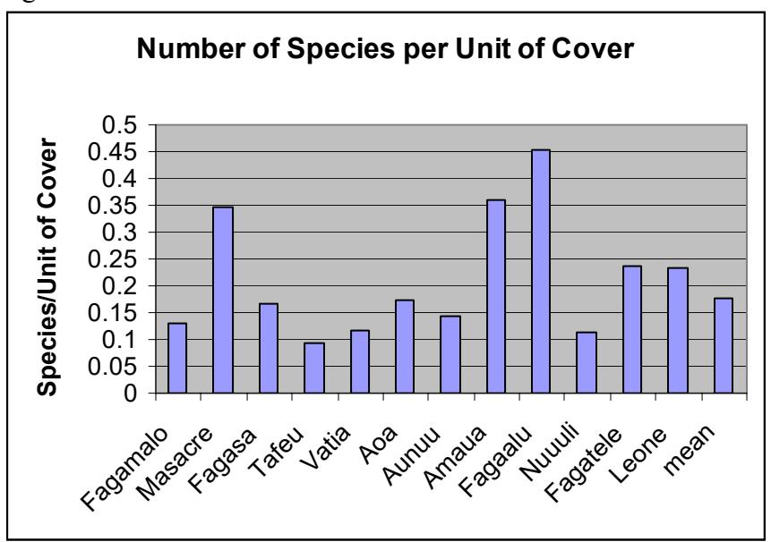

that the number of species per unit of cover is actually not similar between sites. Fagaalu has the highest number of species per unit of cover, Amaua second, and Masacre Bay third. Fagaalu, Amaua and Masacre Bay all have low coral cover as can be seen in Figure 36, but so does Fagasa, but it doesn't have a high number of species per unit of cover. In any case, it is clear that it is not true that all sites have similar numbers of coral species per unit of coral area. Interestingly, although Leone, Fagatele, and Aunuu had high numbers of coral species, none of them had a high number of species per unit area.

The coral species diversity measure, H', is presented for sites in Figure 46. Leone, Fagatele, and Amaua had the highest coral species diversity. Nuuuli had by far the lowest diversity, because almost all the coral there was one species, *Porites rus*.

Figure 46.

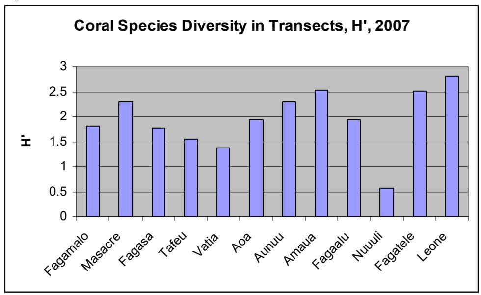

Trends in coral species diversity as measured by H' are shown in Figure 47.

Figure 47.

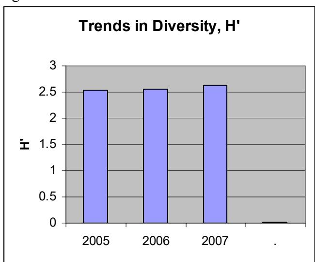

There was a very slight increasing trend in diversity, but that was not significant and so just due to chance.

### **Reef Flats**

Reef flat data was taken from all reef flats corresponding to the core 11 monitoring sites for the first time in 2007, except Tafeu which cannot be accessed from land easily (and crossing the crest can be hazardous). These were supplemented by transects taken at Matu'u and Faganeanea on the south central coast. Coral cover tended to be better near

the reef crest, so at least one transect was taken near the reef crest. At some sites, a transect was also taken back from the reef crest. The transect near the crest was called the "outer" transect and the transect farther from the crest was called the "inner" transect. Transect locations were chosen to be near the slope sites, and specified by landmarks, given in the methods section.

Figure 48 shows reef flat cover on "outer" transects, along with the mean.

Figure 48.

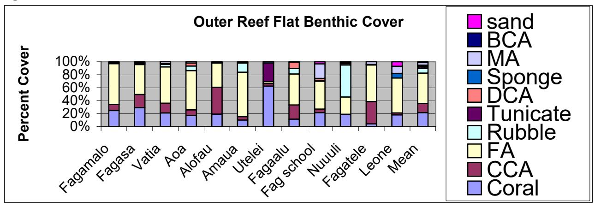

As can be seen from the graph, the most abundant benthic category was turf algae, with a mean of nearly 47% cover, followed by coral with 21% cover and coralline algae with 15% cover. Utelei was different from other sites, with 63% coral cover and 29% tunicate cover. This is probably because Utelei is inside the harbor.

Figure 49 shows benthic cover on the "inner" reef flats.

Figure 49.

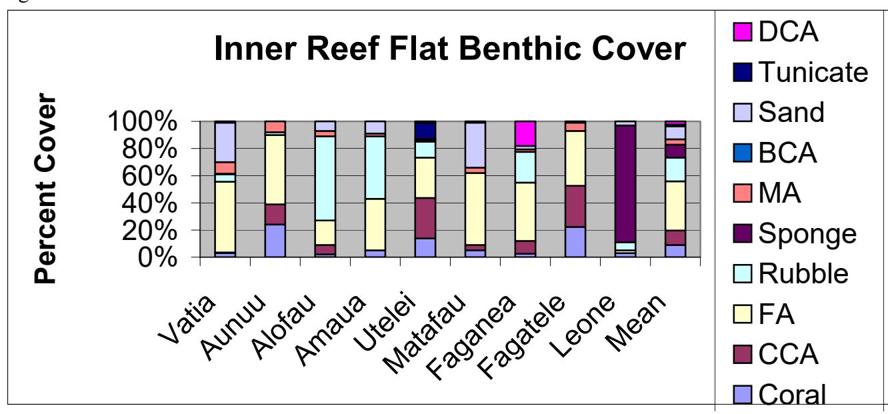

As can be seen from the graph there was more variability between sites for the inner flat than the outer reef flat. Leone was particularly unusual, completely dominated by a thin grey encrusting sponge. The amount of rubble was particularly variable between sites. reef

 The mean cover on the out er and inner reef flats is compared in Figure 50. Coral cover was gnificantly higher on outer reef flat than inner, while rubble and sponge cover were he inner than outer reef flat, but neither was significant. Sand was significantly higher in the inner reef flat. The difference in mean sponge cover was driven completely by the high sponge cover at Leone, and so that difference wasn't significant. cover was significantly higher on the outer reef flat than the inner reef flat, turf si greater on t

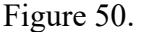

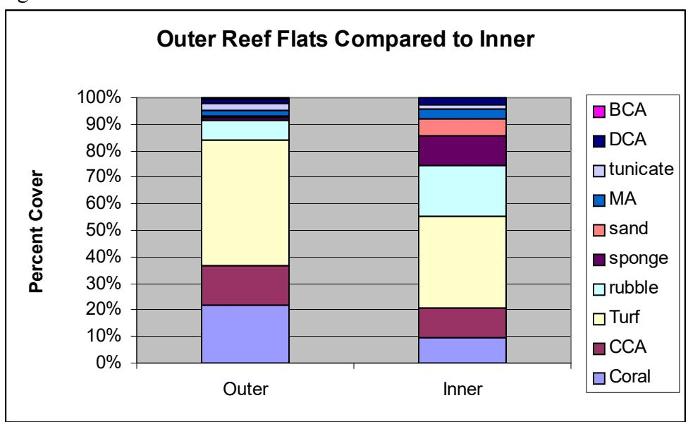

 Figure 51 compares benthic cover on the reef flats to cover on the reef slopes. Coral cover increased strongly with distance from shore, from inner to outer reef flat to reef slope. CCA also increased, particularly from outer reef flat to slope. Turf increased from inner to outer reef flat, then decreased sharply on the reef slope. Rubble decreased with distance from shore, from inner to outer flat to slope. Coral cover was significantly greater on the slope than both reef flat areas, as was CCA. Turf was significantly less on the slope than both reef flat areas, as was rubble.

Figure 51.

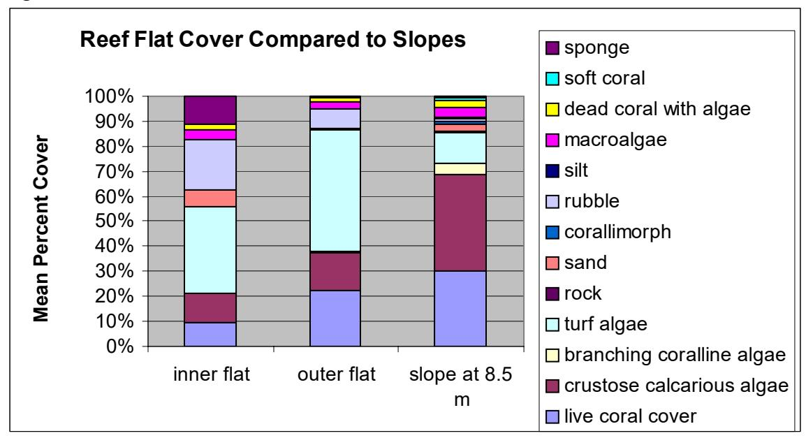

 There were very little differences in cover on outer reef flats on the north and south sides, as seen in Figure 52. Turf algae had less cover on the South than the North, and rubble had more cover on the South than the North. For inner reef flats, there was data from only one northern site, Vatia, so North-South comparisons would not be meaningful.

Figure 52.

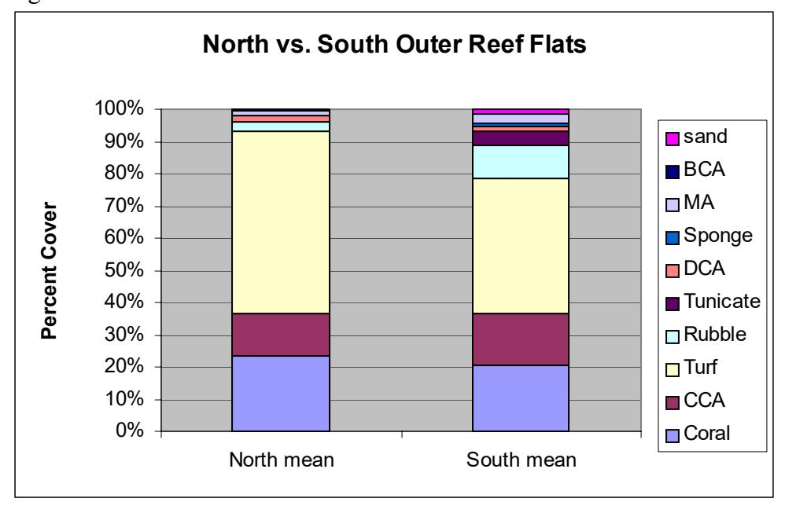

In 2004, Zoe Andrews gathered transect data from the benthic communities on the reef flats and pools of Tutuila, resulting in a master's thesis (Andrews, 2004). A

summary of the results appeared in Fenner et al. (2008). A graph of the results from that publication are presented in Figure 53.

Figure 53. From Fenner, et al. 2008.

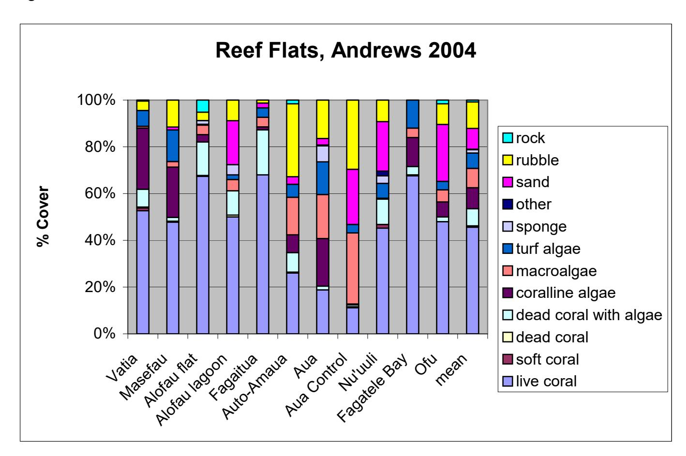

In independent Samoa, the only coral reef monitoring is of reef flats in front of MPAs. The reef flats there are generally different from the reef flats on Tutuila. Some are much wider, on the order of 0.5-1 km wide, and many are deeper, around 0.5-1 m deep. In some areas they are sandy or rubble-bottomed, with patchy coral. In Figure 54, averages are presented for the Andrews data for Tutuila, the present data for outer and inner reef flats on Tutuila, and data for Upolou, Savai'I, and Manono in independent Samoa from Samuelu and Solofa (2007).

Figure 54.

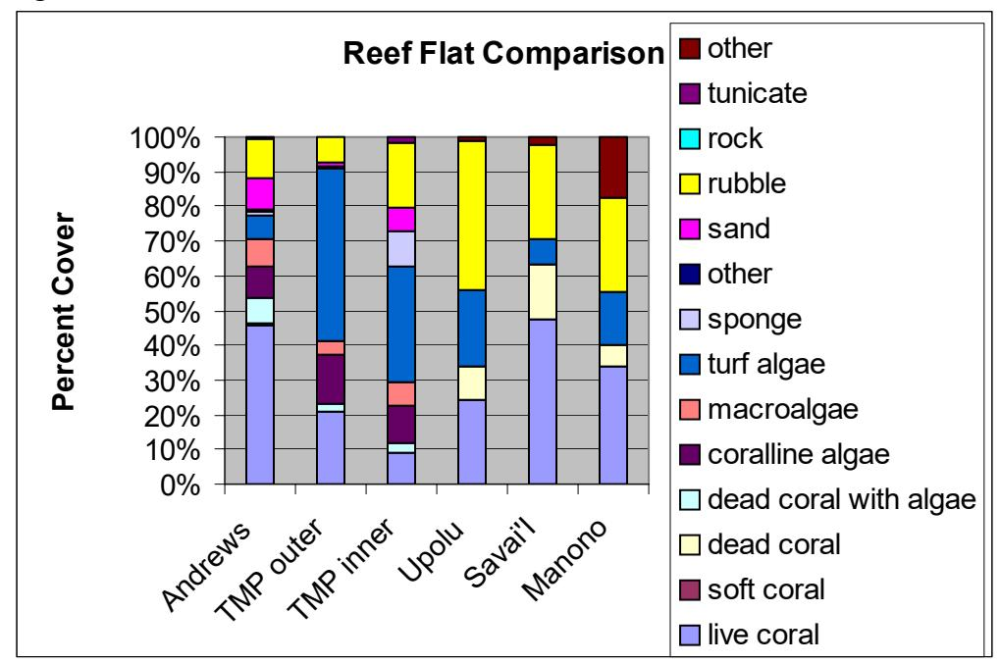

Substrates on reef flats are very patchy, and because there is no slope, the location of transects is not constrained in one dimension, and transects can vary in location in two dimensions instead of one as on the reef slope. The results heavily depend on the location of the transects, both the site and the exact location on the reef flat in two dimensions. As a result, variation is generally high both between sites within a program on an island, and between programs and islands. In particular, the Territorial Monitoring Program (TMP, the present study) found lower coral cover on the reef flats of Tutuila than the Andrews study, and much higher turf algae. This is almost certainly due to the differences in the locations of the transects. In the Andrews study, some transects were in backreef pools, which were dredged to provide material for villages, and a portion of those pools have sandy substrate. Sponge had more cover in the inner transects in the present study than any of the other locations or studies, simply because Leone was included, where the inner reef flat is nearly 100% covered with encrusting sponge. For the sites in independent Samoa, the categories used were somewhat different, with one category for algae which may include macroalgae, turf, and coralline algae, and one category for abiotic which would include sand, rubble, and rock. The data for algae and abiotic for independent Samoa were put in rubble and turf algae, to make them comparable to the American Samoa data, but they may in fact have included other categories.

#### **Coral Lifeforms**

Figure 55 shows coral lifeforms on the outer reef flats by site. Reef flats are dominated by encrusting and branching corals. Utelei, which had unusually high coral cover, was dominated by branching corals, so the mean cover of branching corals was greater than that of encrusting corals. Six sites were dominated by branching corals, and

Figure 55.

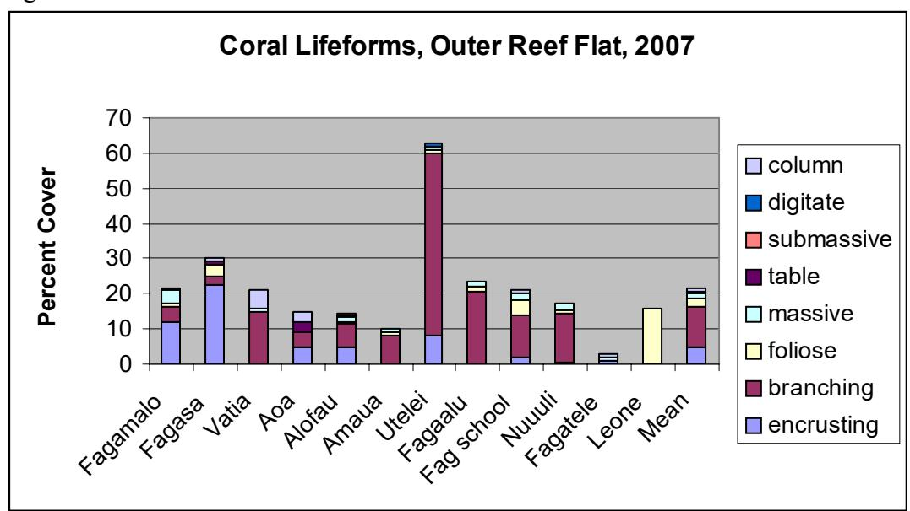

two sites were dominated by encrusting corals. One site (Leone) was dominated by foliose corals. The dominant species of coral there was *Pavona frondifera*, which could be called foliose or perhaps submassive. Figure 56 shows more of the details in the cover of the different lifeforms.

Figure 56.

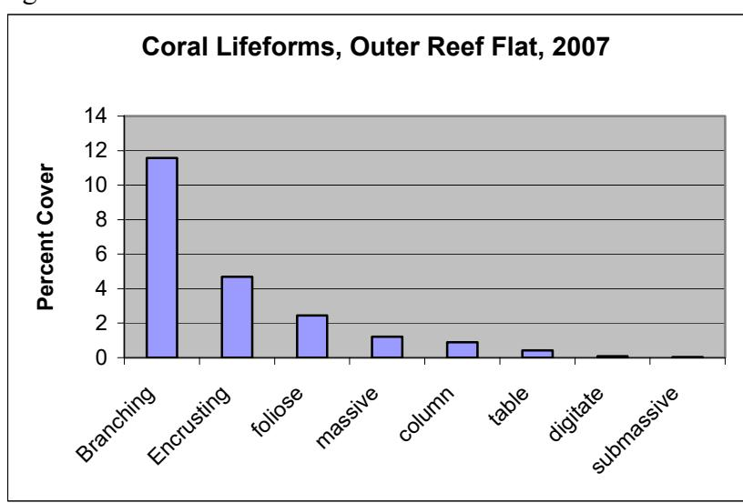

Figure 57 shows the coral lifeforms on the inner reef flat by sites. There was high variation between sites.

Figure 57.

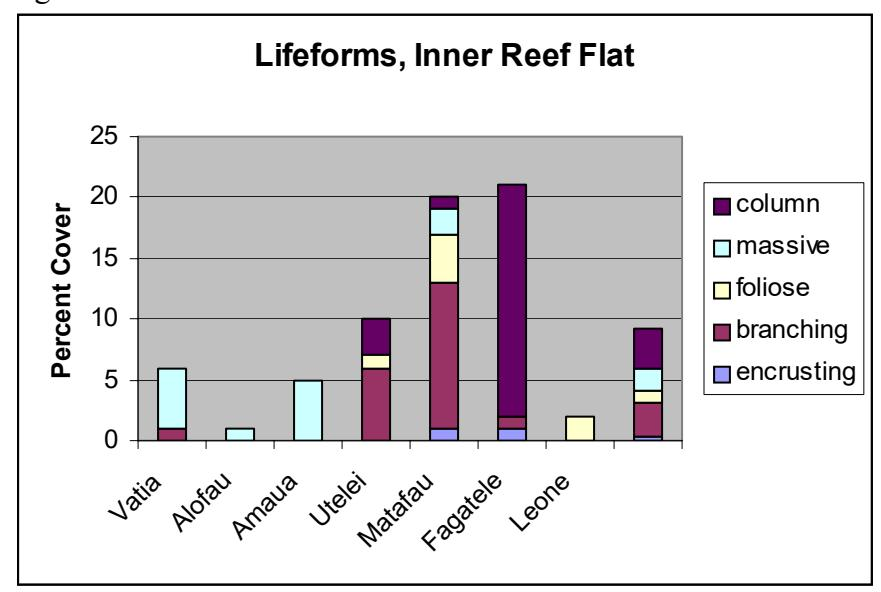

Figure 58 compares the lifeforms on the outer and inner reef flats. Outer reef flats had much more branching and encrusting coral cover than inner reef flats, but otherwise they were similar.

Figure 58.

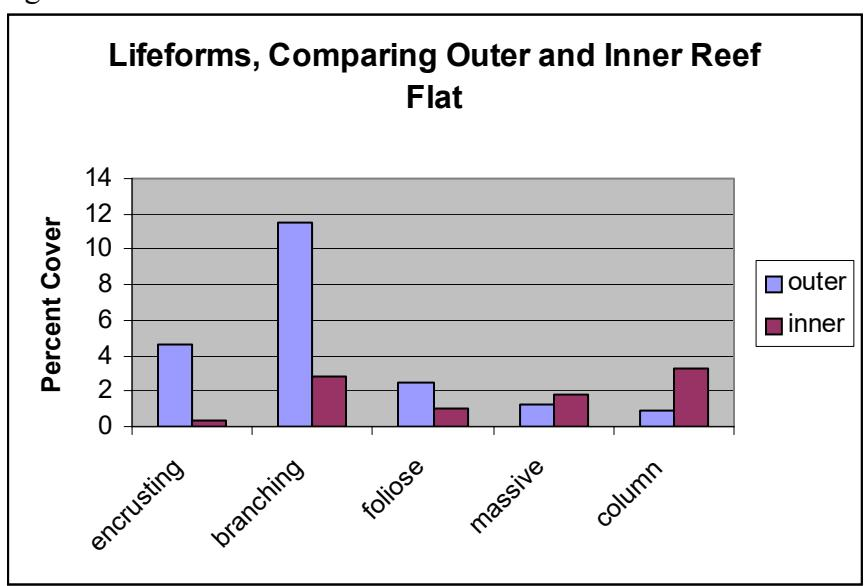

The cover of lifeforms on the reef flats was quite different from that on the reef slopes. Figure 59 compares the lifeform cover on reef flats with that on reef slopes. Encrusting corals had much less cover on reef flats than on slopes, while branching corals had much more cover on outer reef flats than on slopes or inner reef flats.

Figure 59.

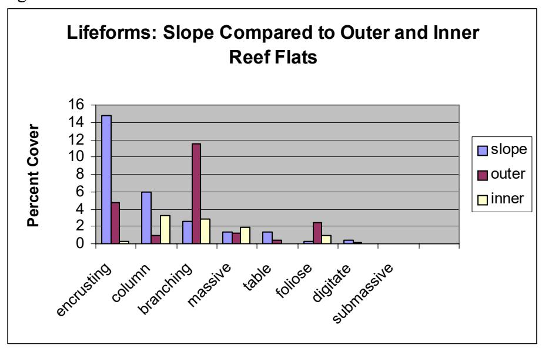

The coral lifeforms on outer and inner reef flats in American Samoa is compared to that reported for independent Samoa in Figure 60. The pattern is quite different, with a higher diversity of lifeforms on reef flats in Samoa, due to more evenness between different lifeforms. Likely this would be reflected in species as well, though species have not been reported from Samoa yet.

Figure 60.

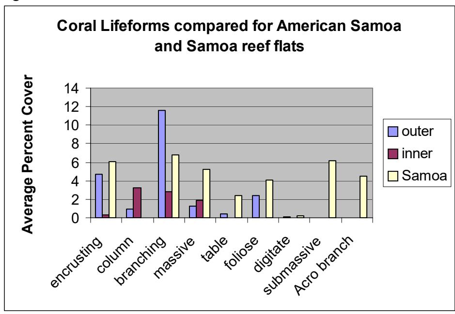

**Coral Genera** 

Figure 61 shows the cover of corals on the outer reef flat by site. *Acropora* is the most genus that has the most cover, but it only dominates one site. *Montipora* is the second most common genus, which also dominates one site. Utelei was unusual in having a large amount of *Pocillopora*, while Leone was unusual in being dominated by *Payona*.

Figure 61.

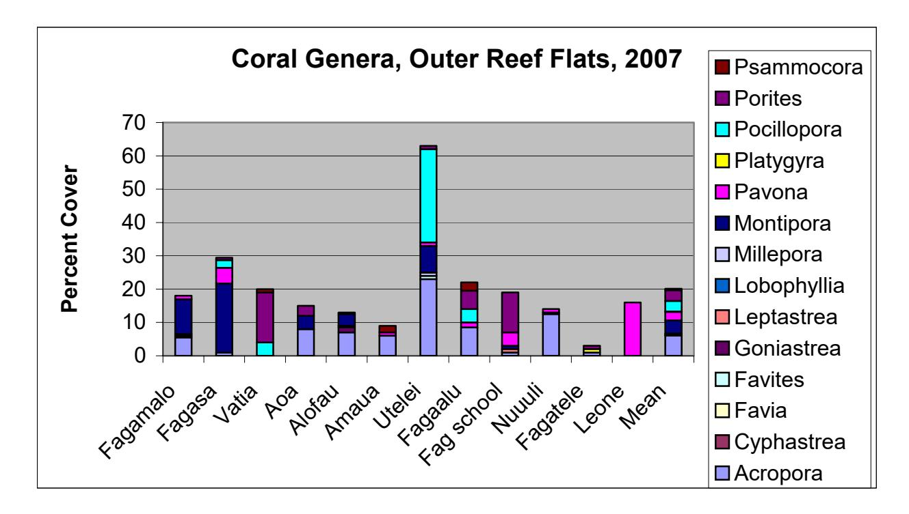

Figure 62 shows coral genera on the inner reef flats. *Porites* was the dominant genus.

Figure 62.

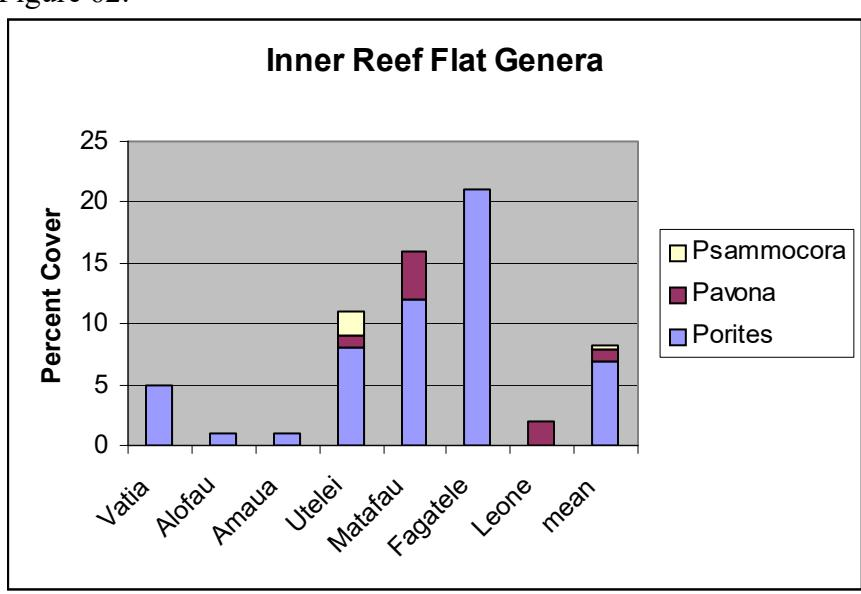

Figure 63 compares the genera of outer and inner reef flats. Slopes had more *Montipora* than the reef flats, and inner reef flats had less of everything except *Porites*.

Figure 63.

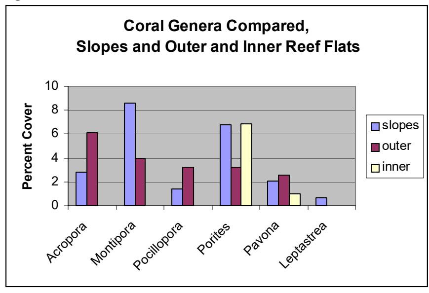

### **Coral Species**

Figure 64 shows the cover of different coral species on the outer reef flats. The

Figure 64.

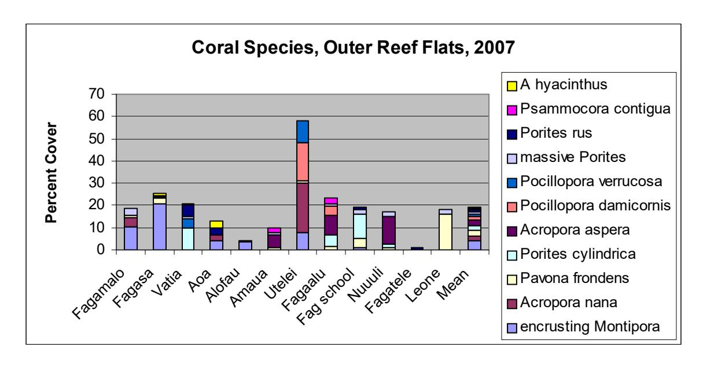

encrusting *Montipora* species had the most cover, but no one species had a majority of the mean cover. One site was dominated by encrusting *Montipora*, and one site was

dominated by *Pavona frondens*. Utelei was dominated by *Acropora nana* and *Pocillopora damicornis*.

Figure 65 presents the coral species on the inner reef flat. There were only five common species on the inner reef flats.

Figure 65

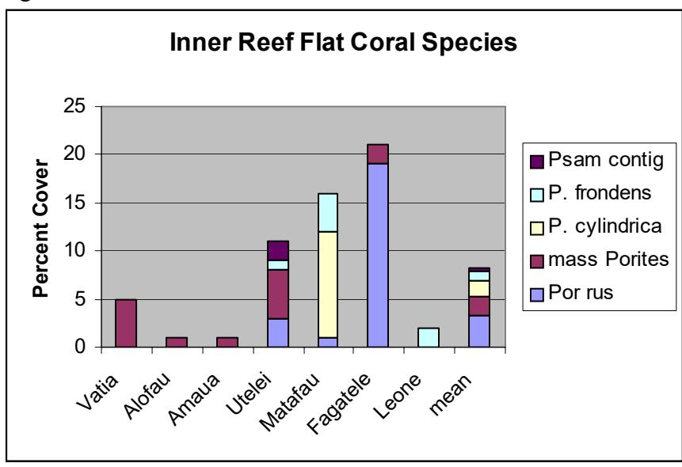

Figure 66 compares the species on the outer and inner reef flats. There were 11 common coral species on the outer reef flat, but only five on the inner reef flat. Encrusting *Montipora* is replaced as the most common species on the outer reef flat by *Porites rus* on the inner reef flat.

Figure 66

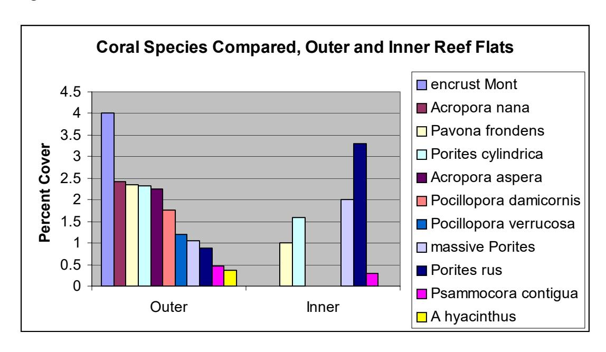

Figure 67 compares the cover of coral species for slopes and outer and inner reef flats.

Figure 67.

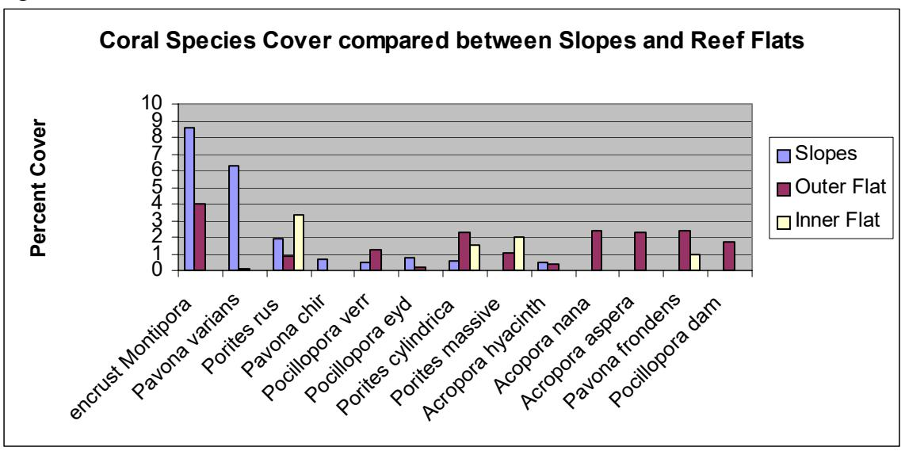

Encrusting *Montipora* and *Pavona varians* had more cover on slopes than flats, and *Porites cylindrica*, *Acropora nana*, *Acropora aspera*, *Pavona frondens*, and *Pocillopora damicornis* had more cover on outer reef flats than slopes. *Porites rus* had more cover on inner reef flats than outer flats or slopes.

Thus, it is clear that the coral communities on the reef flats are quite different from those on the slopes.

#### **Non-Point Pollution**

In continuation of the work presented in the 2006 report on the correlation between various variables and the America Samoa Environmental Protection Agency impact ratings for different watersheds, the correlation with the live coral index was computed again. The results are shown in Figure 68. The correlation was r=0.2121, p<.2, thus it was not significant.

Figure 68.

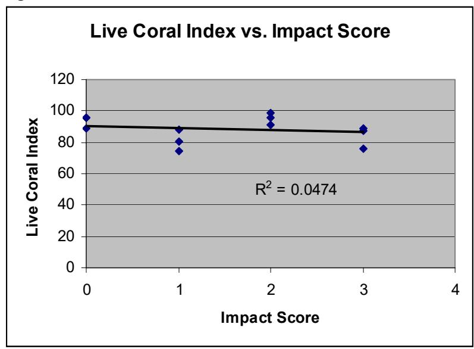

#### **oral Recruitment C**

y urface were present, and only on the highest points of colonies. A used to measure colony densities in October or November, 2007. rs of colonies were also measured. Small fragments of the *P.*  e rded in two frames, and the results are shown in Figure 69. Two sets of coral recruits were found and monitored. One was of *Pocillopora damicornis* on dead surfaces of *Porites cylindrica* that were exposed to air and sun just offshore of the southwest side (park) of Fagaalu Bay. This was the only place which this recruitment event was seen. The upper tips of *P. cylindrica* branches had been killed b low tides a couple of years earlier, and had eroded to a nearly flat smooth surface. Only patches of this dead s ¼ m2 rebar frame was The maximum diamete *cylindrica* also survived, and were measured as well. The *P. damicornis* were clearly sexual recruits, while the *P. cylindrica* were clearly asexual recruits from tiny surviving patches of tissue on the original colonies. Recruits were counted in six placements of th frame. An average of 28.8 *P. cylindrica* colonies were counted per square meter, and an average of 107.2 colonies of *P. damicornis* were counted per square meter. Sizes of *P. damicornis* were reco

Figure 69.

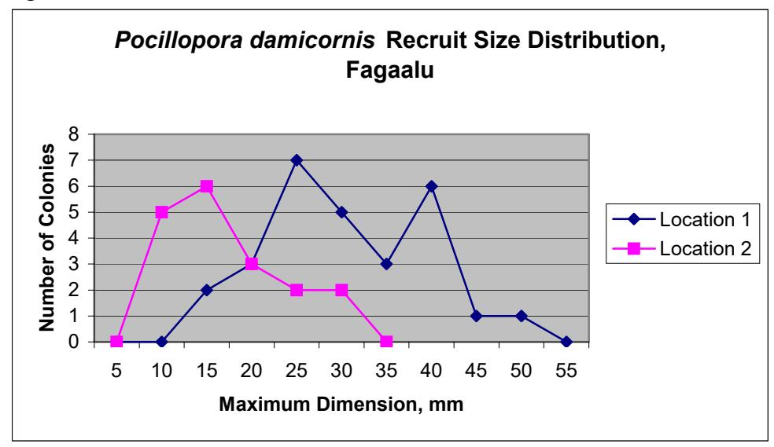

*P. damicornis* is relat *amicornis* broods lar ively common in Fagaalu Bay near the recruitment sites. *P.*  vae, which it releases through much of the year, on a lunar cycle. *d* The larvae are likely to be competent to settle soon after release. So this recruitment event is likely to be from locally produced larvae.

no dult colonies in this area and very few on most reef flats. In some places near the reef rest there may be small numbers of stumps of dead table corals, indicating that some olonies lived in those areas at some time previously. The maximum base diameter, eight, and table diameter of 36 colonies were measured. Figure 70 shows the istribution of base diameters that was recorded. The modal diameter was 6 cm. The second set of recruits is of the table coral, *Acropora hyacinthus*. The recruits can be seen on many reefs and some reef flats. They appear to be most common near the reef crest, both on the reef slope and on the reef flat. On the reef flat, they are most common within about 1 m of the reef crest where there is a sharp break between the reef flat and slope, as in Fagasa. On the slope they are usually most common in the upper meter or two of the slope, but small numbers of colonies are deeper. They are more common on some reefs than other reefs, but almost all are in the same size range. They were most common at Fagasa among all the areas observed. Two 50 m transect tapes were placed on the reef crest or outer edge of the reef flat at Fagasa, and the number of colonies within 0.5 m of both sides of the tape were counted. A total of 41 colonies were counted within the 50 m2 area of the first belt transect, and 43 in the second. Thus, there was an average of 0.84 colonies/m2. In areas they were close enough together that if they reach maturity they will be overlapping and provide near 100% coral cover. There were a c c h d

Figure 70.

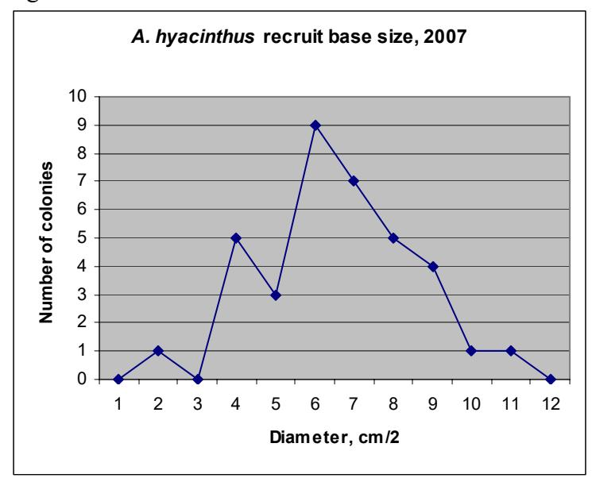

The distribution of heights is shown in Figure 71. The modal stem height was 4 cm.

Figure 71.

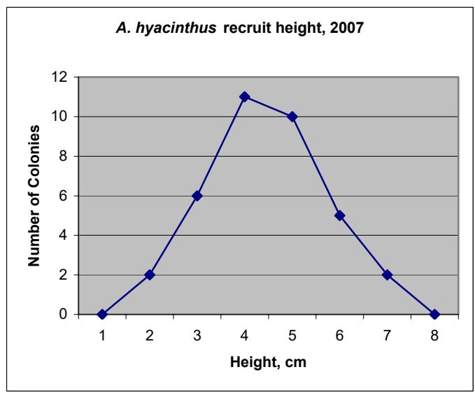

The distribution of table top diameters is shown in Figure 72.

Figure 72.

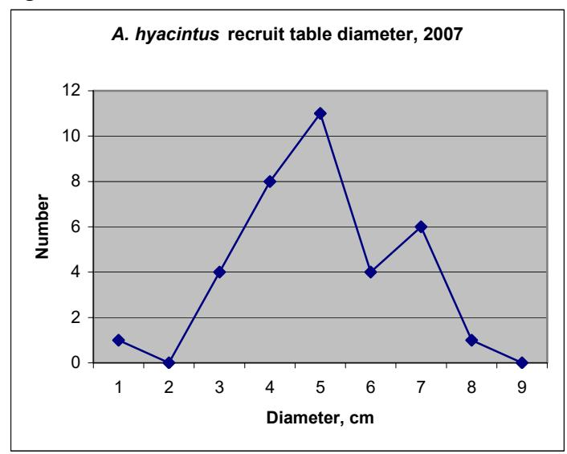

he modal table top diameter was 5 cm. Photographs in Wallace (1999) indicate that ecember 26, 2007. So far, 100% of the colonies are still alive. It is likely that future primarily be in the diameter of the table top. The size distributions appear to be interpretable as a single peak and thus a single recruitment pulse. Continuing these measurements on an annual basis should reveal how rapidly these corals grow, and hopefully show whether additional recruitment events occur. This recruitment event may increase the number of table corals on the reefs, and may be part of a continuing recovery process following a long series of disturbance events. T these colonies were likely to be about 3 years old at the time of measurement, on D growth will

## **Harbor**

 In addition to the reef flats at the core monitoring sites, seven sites were done in the harbor. The same procedure was followed as on the core sites, except where a reef flat did not exist. At the Fagatogo site, the transect was taken along the shoreline rock wall at the same depth, about 2 feet. Toward the head of the harbor from the marina on the south side, rocks do not extend on the shore below low tide, but there is an offshore bank. That bank is partly sand and partly *Halimeda* algae, but it has some lumps of rock. The rock has very low coral cover and so the cover was taken as zero without running a transect pe. On the north side just toward the head of the harbor from the ASPA parking lot, the es could be found nywhere. The rocks were covered with a layer of sediment, probably trapped in lamentous algae. There were a few encrusting sponges but no other benthic life. There very little wave action at any of these sites. There is considerable wave action at the ef flat site just seaward from the cannery, and the outer harbor sites. ta rock wall is similar to that at Fagatogo, but only 2 coral coloni a fi is re

Figure 73 shows the major types of benthic cover at the sites studied on the South side f the harbor. o

Figure 73.

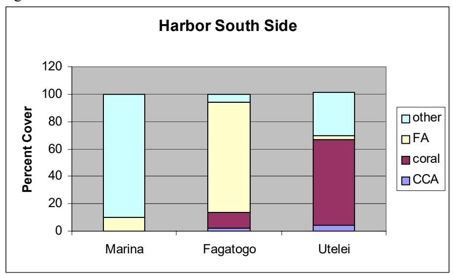

Figure 74 shows benthic cover at the sites studied on the North side of the harbor.

Figure 74.

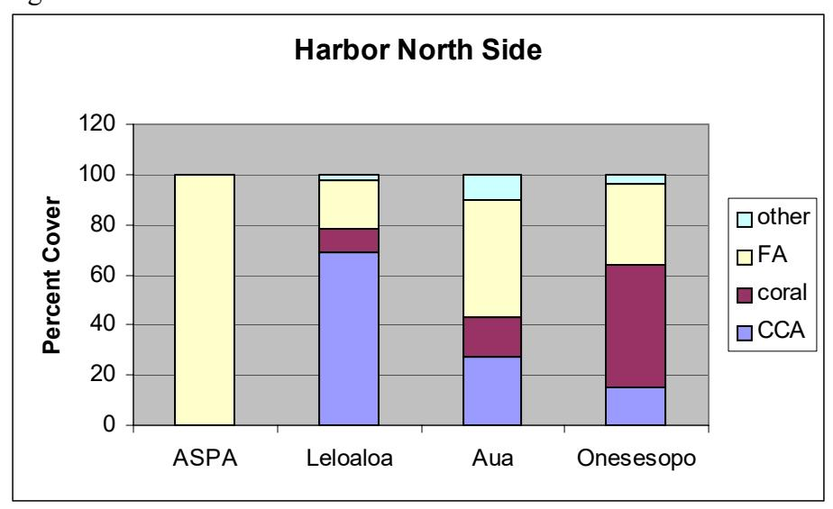

As can be seen from the graphs, there is a trend of increasing coral cover toward the mouth of the harbor, which on the north side primarily replaces crustose calcareous algae, while on the South side it appears to replace turf algae and other things.

 Figure 75 shows the coral cover as a function of distance from the head of the h with the left line for the South side and the right line for the North side. Coral cover is clearly a strong function of distance from the head of the harbor. When the data is plotted as a function of the distance from the mouth of the harbor, the r arbor, esult is similar th side. The canneries and ship yards are on the north side, and the cargo ort and fuel port are on the south side. The distance from the mouth of the harbor is learly a strong variable, with wave action, currents, flushing and water quality greatest (Figure 76). In both cases, coral cover at the same location is lower on the north side than on the sou p c

near the mouth of the harbor and least at the head of the harbor. On top of that primary gradient, the north side shows less coral cover than the south side. The canneries released large amounts of organic effluents on the north side up to 1991. Nutrient levels in the harbor waters fell quickly after the cannery stopped releasing effluents near the canneries (Craig et al. 2005, Figure 11.9). The lower coral cover on the north side of the harbor may have been produced at least partly by the cannery effluent. The corals on the rock wall at Fagatogo are almost all *Pocillopora damicornis*, a tough pioneering species, and few appeared to be adult size. There were a few colonies of other species. It appears as though this community may be increasing in colony size and cover.

Figure 75.

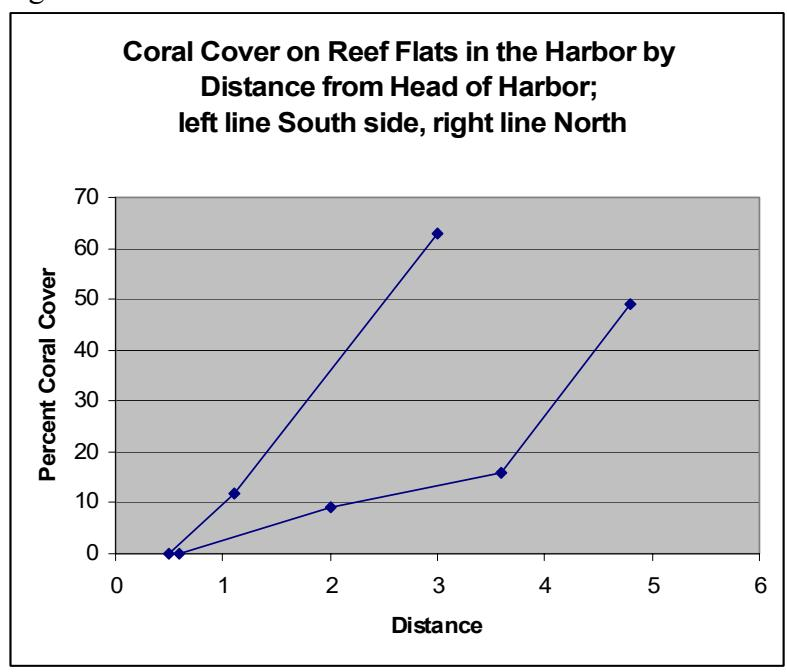

Figure 76.

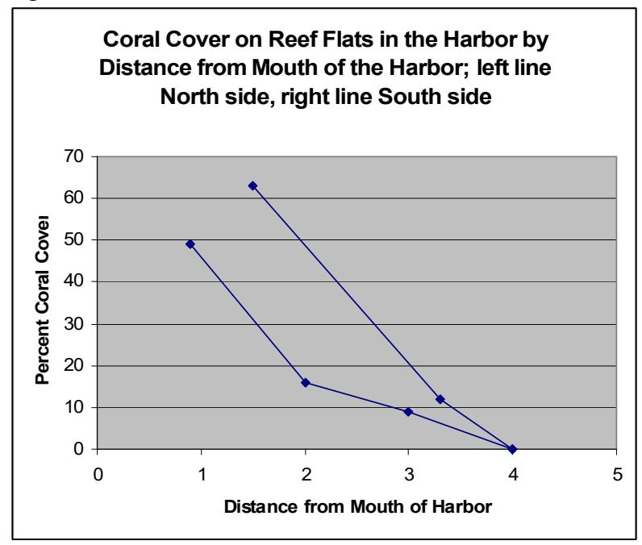

A small oyster (*Sacrostrea cucculata*) can be seen attached to hard surfaces around the low tide line at some locations in the harbor. They can quickly foul any hard surface in the harbor near the water line, such as a boat hull, with near 100% cover. Oysters are filter feeders which feed on plankton. Thus, these oysters have the potential to be a bioindicator of average plankton populations over a period of time. Casual observation suggested that there might be patterns of oyster abundance within the harbor, so population abundances were observed at several locations. An attempt to record cover with a point intercept technique failed, as the tape could not easily be placed and kept within the narrow band on the large basalt blocks used to line shorelines. Thus, points frequently missed the oysters that were present. Instead, a scale of estimates was used with 3 = abundant, 2 = common, 1 = uncommon and 0 when none were sighted. The results are presented in Figures 77 and 78, plotted by the distance from the head of the harbor, plotted on the left. Oyster density was highest near the head of the harbor and fell off towards the mouth of the harbor in a strong gradient.

Figure 77.

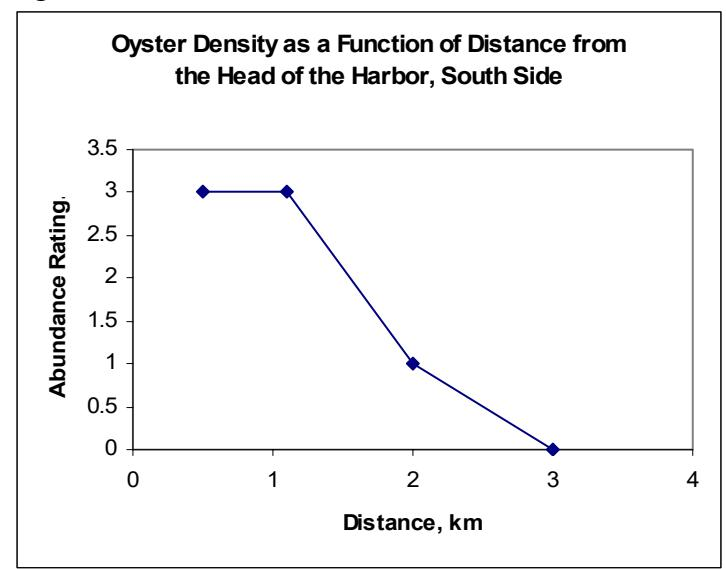

Figure 78.

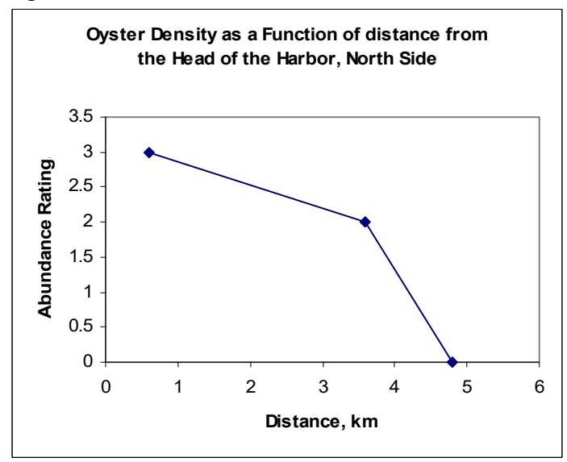

Oyster density is likely to be a bioindicator of plankton density. This was examined y measuring water transparency in the harbor using a Secci disk. The disc was lowered om the surface until the disc was no longer visible. The results can be seen in Figure 9. Turbidity of the water was highest near the head of the harbor and lowest near the outh. Although Turbidity can be caused by a variety of things other than plankton, ch as suspended silt, the fact that the pattern is the same as with the oysters supports the iew that the turbidity reflects plankton densities. Plankton itself is commonly a ioindicator of nutrient levels, with higher plankton levels where nutrient levels are igher. Nutrient levels within the harbor dropped suddenly in 1992, right after the annery effluent release point was moved to near the harbor mouth for the pipe and utside the harbor for the ship-borne high level waste (Craig et al. 2005). However, the b fr 7 m su v b h c o

present data indicates that nutrient levels within the harbor are still higher than outside the harbor, and are high enough to produce a plankton bloom and dense populations of a filter feeder. Further, coral on reef flats which is abundant near the harbor mouth is absent near the head of the harbor. Around the turn of the century, there were living coral reefs near the head of the harbor, but dredging and filling has destroyed all of the reefs near the head of the harbor. However, there are areas of rock substrate suitable for coral settlement, particularly on the north side of the inner harbor, which have no corals. That these rocks are suitable substrate for corals is demonstrated by the rock wall in Fagatago, which has a coral community, which appears to be increasing in size and density.

Figure 79.

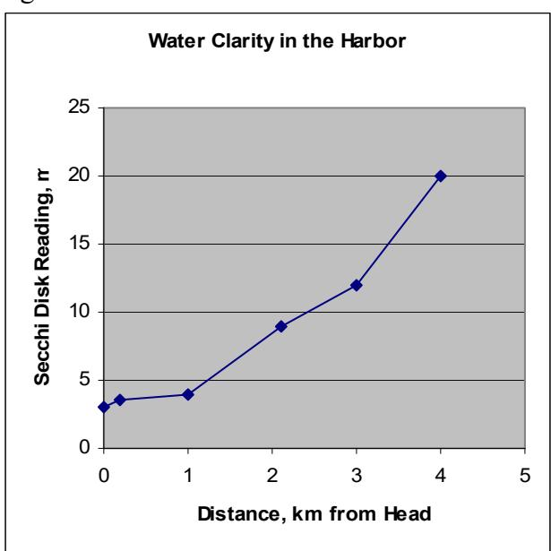

 In late June and early July, 2007, reports came in of colored water in the harbor. Investigation revealed dark reddish-brown water at the head of the harbor. A sample revealed that the colored water contained many swimming dinoflagellates. A sample was provided to Don Vargo, and Fred Brooks identified it as *Ceratium fuscus*. "Red Tides" re caused by dinoflagellates and are often quite toxic to fish or other marine life at e of at in res a concentrations in which they do not color the water red. This species is not reported to b toxic, and no dead or abnormal fish were observed, nor were there reports of irritation by humans. Some observers reported that the color had come and gone repeatedly previously, and one or two more periods of colored water were observed, always at the head of the harbor. It is not known why these blooms occurred, and indeed the causes such plankton blooms are not well understood. However, they require sufficient nutrients for their growth. The turbid green water at the head of the harbor indicates that phytoplankton is abundant there due to high nutrient levels. Mike King has found th recent years, high active phosphate laundry detergent has been imported by local sto from Asia because it is cheaper. He found high levels in streams below people doing laundry and low levels above. Don Vargo also thought that fertilizers were being used on the new soccer field at the head of the harbor. Other typical nutrient sources are

piggeries. Whatever nutrients wash into the head of the harbor are likely to accumulate there, because there is so little flushing. Flushing is greatest near the mouth of the harbor, and decreases with distance inside the harbor, so anything that is washed into head of the harbor accumulates there. the

 Reef flat data was also taken in Fagaalu Bay. During heavy rainstorms, a large amount of silt laden very brown water is released by Fagaalu Stream into Fagaalu Bay. During periods of normal wave action, waves coming over the crest pump water inwa along the south (park) side of the bay, and then out the ava (pass) near the north (sch side of th rd ool) e bay. Thus, the highly turbid water from the stream during storms usually ows out on the north side. Intuition suggested that the reef flat at the small park near intersection on the north side near the stream mouth was likely covered with a thick layer of fine silt with nothing left alive on the flat. Surprisingly, the reef flat in that area is a calcareous sand bank, with some brown silt content. Although predominantly light grey, it has areas of light brown. When lifted into the water, a plume of brown to black silt is left in the water. But the predominant material is white calcareous sand. There are a few lumps of rock, which are partly dead, but have some live corals (massive *Porites*) on them, which look reasonably healthy. Nearer to the school, the bottom suddenly turns to rock. At the crest, this rock has considerable coral cover, and the coral appears healthy, and there are a variety of species. In between the corals there is lumpy rock, some of which shows signs of having been live coral some time in the past, but not recently. The rock is covered with brown silt trapped in filamentous algae. There are also clumps of *Halimeda* algae, with a dusting of silt. Inward from the reef flat the bottom is almost completely dead lumps with just a few corals. Wave action is minor. It appears that sediment has killed a large number of corals, particularly away from the reef crest. However, there are a surprising number of healthy looking coral colonies left near the reef crest, perhaps because the wave action there can remove enough sediment that they can survive. fl the hospital

#### **leaching B**

 Bleaching of staghorn corals (*Acropora muricata, A. pulchra and A. nobilis*) in backreef pools at the airport and Alofau were begun in late 2003, and continued in 2007. Figure 80 shows bleaching at the airport backreef pool.

Figure 80.

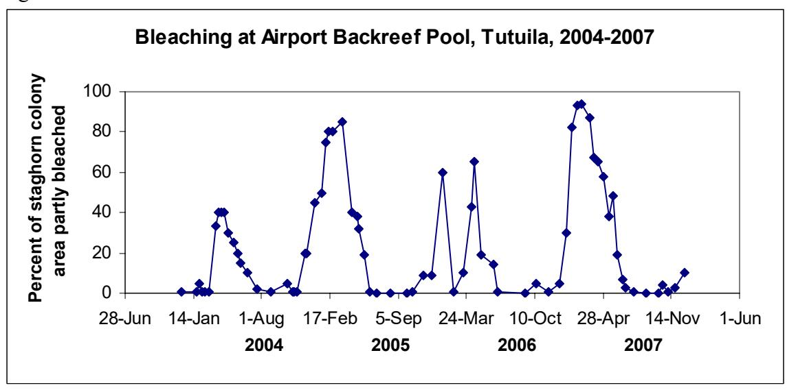

s at Mass coral bleaching of staghorn corals has continued to occur in the backreef pool every summer. Four summers of mass bleaching have been recorded, and bleaching on reef slopes was reported in the previous two years, so it has occurred every summer for least six summers and quite possibly longer than that.

e 81 Staghorn bleaching was also recorded in the backreef pool at Alofau, and Figur presents a graph of the results.

Figure 81.

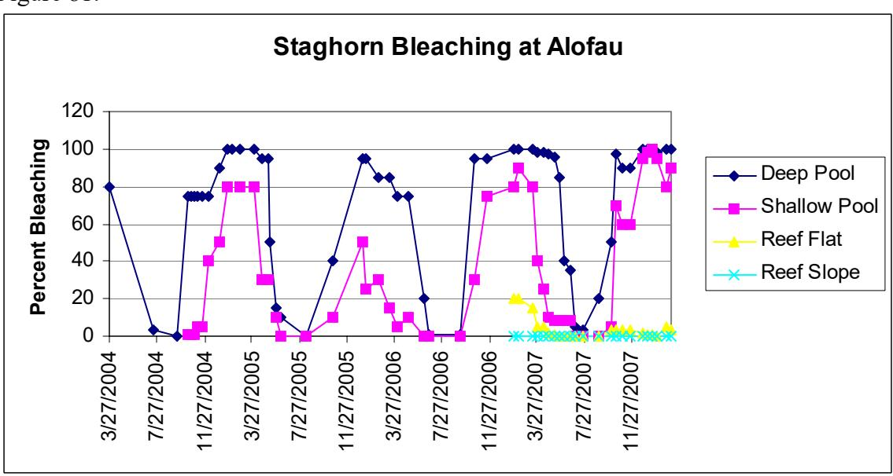

taghorn bleaching is more intense at Alofau than the airport, particularly in the deep ool. The staghorn corals in the deep pool barely finish recovering from one year's leaching when they start to bleach in the next year's bleaching. If bleaching becomes more intense with global warming, staghorns in the deep pool could remain bleached S p b

year-round. There has been little bleaching on the reef flat, where wave surge moves the water more and pumps new cooler water over the flat from the cooler, deeper ocean. And there has been essentially no bleaching on the reef slope during the recording period. However, mass coral bleaching on the reef slopes were reported in 1994, 2002 and 2003. Additional mass coral bleaching events on the slopes are sure to come in the future.

 The staghorn species that bleach in the back reef pools are *Acropora muricata* (=*formosa*), *A. nobilis* (?=*intersepta*) and *A. pulchra*. Other *Acropora* species are rare in the pools, but tend to bleach with the staghorns. The pools are dominated by *A. muricata* and the finger coral, *Porites cylindrica*. *P. cylindrica* has not bleached, except a small spot in Fagaalu on the northeast side of the bay. The fire coral *Millepora dichotoma* bleaches in the airport pool during the same period as the staghorns, and some years *M. exesa* bleaches as well. This is the first reported annual summer mass coral bleaching of a multi-species community.

 Bleaching is produced primarily by high water temperatures, exacerbated by high light levels. Scott Heron of NOAA plotted sea surface temperatures for an area near to the airport, on the bleaching graph for the airport. The result is shown in Figure 82.

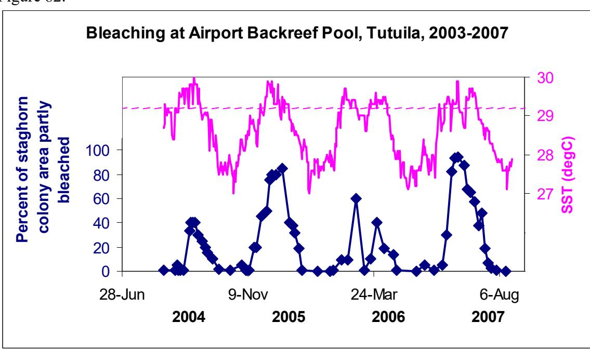

Figure 82.

The correlation between the water temperatures and bleaching intensity is striking. Particularly striking is the notch in temperatures in 2006 that corresponded to a notch in bleaching at the same time. It appears that coral bleaching follows the water temperature on virtually a week by week basis.

## **Invertebrates**

p As in past years, there were very few non-cryptic, diurnal invertebrates recorded. Those that were common enough to record are presented in Figure 83. The orange lum

sponge, *Stylissa* sp., was the most common invertebrate recorded, followed by the thin grey encrusting sponge *Dysdea* sp., followed by the small burrowing urchin, *Echinostrephus moliaris*. Alpheid (snapping) shrimp, as evidenced by their groove-shaped burrows was next, followed by a small black feather-shaped hydroid, the compound ascidian, *Diplosoma simile*, and a small compound didemnid ascidian. Giant clams were even less common than any of these, with just 0.4 clams/100m2. No crown-of-thorns starfish, lobsters, or Triton shells were recorded.

Figure 83.

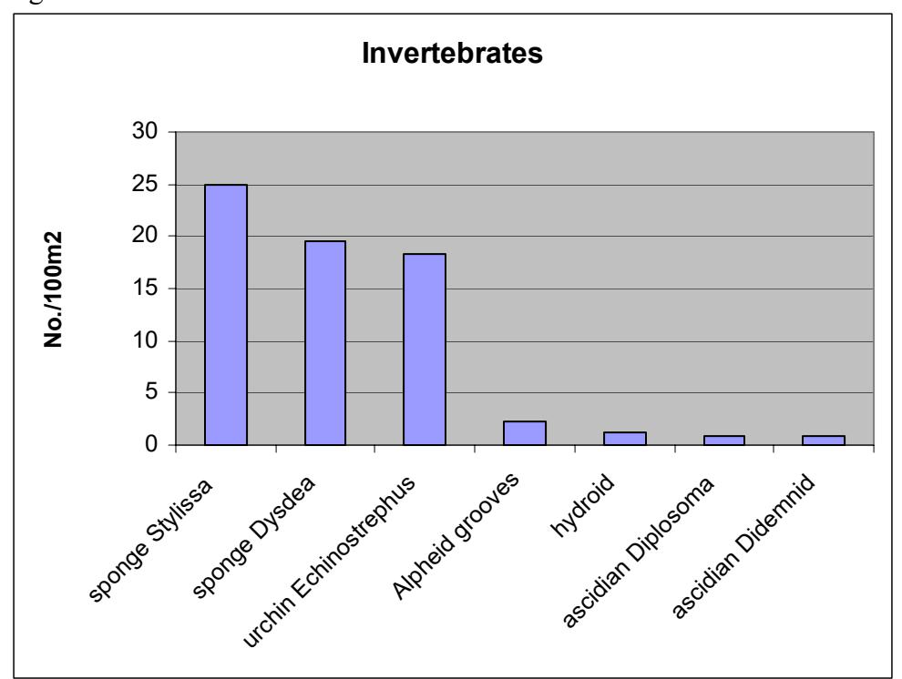

Figure 84 shows trends in the invertebrates recorded. The burrowing urchin, *Echinostrephus moliaris*, has increased slightly. The orange lump sponge, *Stylissa* sp. has increased dramatically, as has the encrusting sponge, *Dysidea* sp. *Dysidea* was not recorded in the first year, even though it was present. It is not entirely clear whether the recorded increases are real, or just improvements in the recognition of these species. *Stylissa* sp. is a rather obvious sponge, but most of the other invertebrates require a search image to find or recognize, and likely recording accuracy has been improving. The Alpheid grooves and hydroid were recorded for the first time this year, just because they were recognized and a search image formed for the first time. Because the branches of *Pocillopora* colonies are not searched, hermit crabs, commensal crabs such as *Trapezia* sp. and limpets are not recorded, as they are in the NOAA CRED monitoring. Also, small commensal crabs are common between the branches of digitate *Acropora*, but require dedicated searching to find.

Many invertebrates are nocturnal and cryptic during the daytime. The logistic difficulties and safety issues of diving at night make it prohibitive at this time, but it may be possible to do a night dive from the shore at Alofau safely. If there are many cryptic

nocturnal invertebrates, the daytime monitoring will grossly underestimate their abundance. However, sessile invertebrates like sponges and ascidians that are transects are small and rare compared to some other locations such as the Philippines Caribbean, so it is not entirely a difference produced by the nocturnal behavior of species. On the other hand, the known diversity of invertebrates here is high, for example 800 species of mollusks are presently known (Fenner et al. 2008), though they are rarely seen in daytime transects. counted in or some

Figure 84.

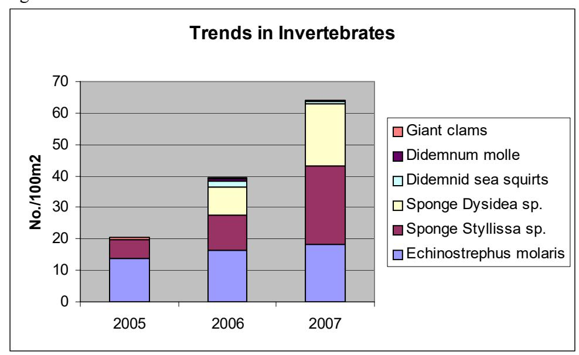

## **Water Clarity**

 Water clarity was measured horizontally by stretching a transect tape straight, horizontally at 9m deep. Figure 85 shows water clarity at each site at 8 m depth. Fagasa had much lower visibility than most other sites.

Figure 85.

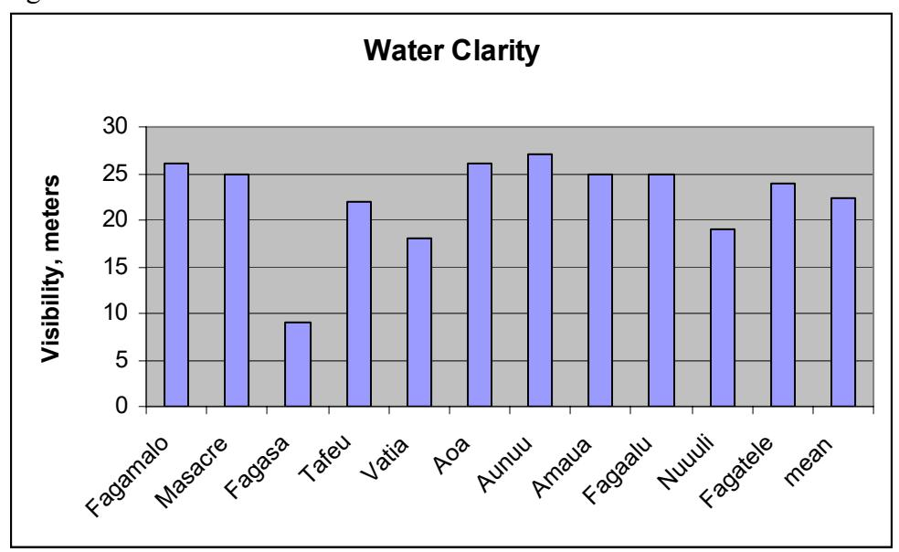

Figure 86 presents trends in water quality. Insufficient readings were taken in 2006 to have a meaningful measure. Readings in 2005 were primarily taken by Secci disk. One drawback to using a Secci disk is that sometimes the disc could still be seen at the bottom near the reef, so the reading had to be taken farther out. Visibility probably increases with distance from shore. In addition, water clarity can change rapidly due to the amount of runoff. It is probably too early to tell if the decrease in recorded water quality reflects any real change.

Figure 86.

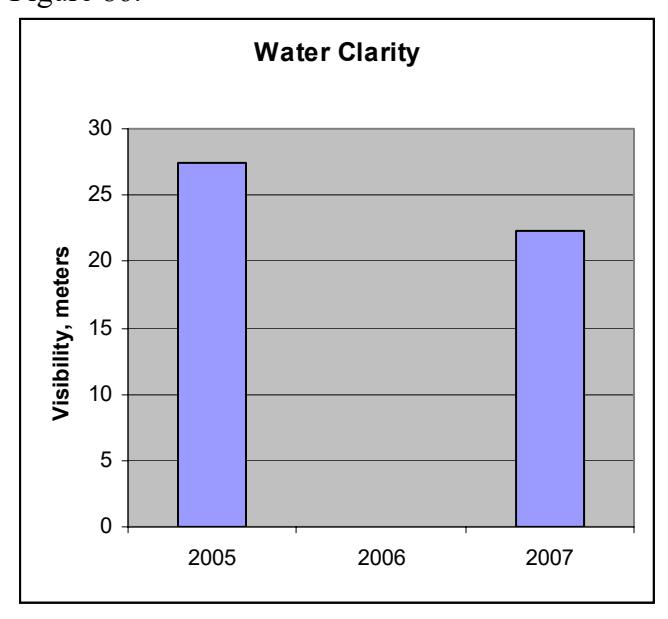

Sediment is well known to have a damaging effect on coral reefs, by killing corals. Corals can clean themselves of small amounts of sediment, but when it gets beyond a

certain level they die. Different corals may have different thresholds. Turbid water cuts light and thus energy and the ability to make food, for corals. Figure 87 shows the correlation between water clarity and coral cover.

Figure 87.

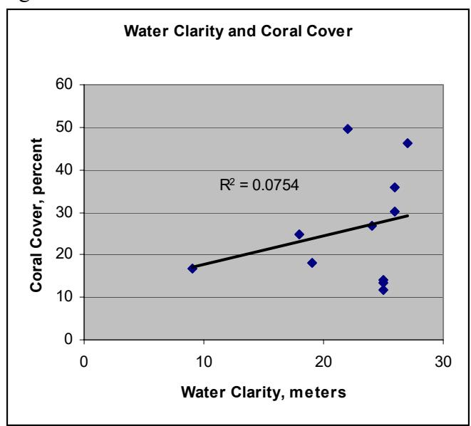

For these two variables, r = .2746, p > .1 , so this is not a significant correlation. Figur 88 shows the relationship between water clarity and coral + CCA cover. Both coral and e

Figure 88.

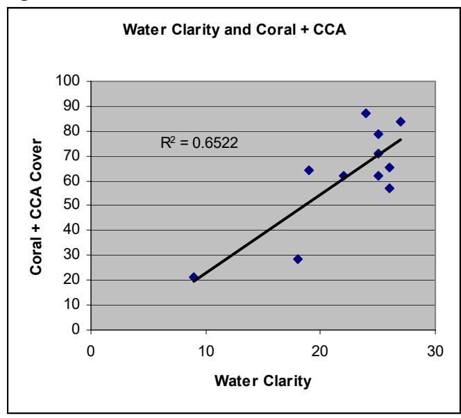

CCA may be affected by sediment, in fact CCA ma be more sensitive than coral, since it an't clean itself. This correlation is strong, with r = .8076, p < .01, so it is significant. d f y c However, the correlation depends on the two points on the lower left, if they are remove the correlation drops to only r = .2540, p > .1, so it is not significant. The correlation o

water quality with CCA alone is r = .5873, p >.05 , so it is intermediate in strength but also not significant. The strongest and only significant relationship is between wate clarity and coral + CCA. Still, it depends on just tw r o points, so it needs to be confirmed future years. in

## **Species**

 Tentative identifications of three additional species of algae were made. One is a brown colored foliose alga that makes flexible but brittle thin horizontal plates about 3 inches in diameter, which is very common on some lower reef slopes, particularly on the southeast coast of Tutuila, below about 10 or 12 m depth. It may be the species illustrated in Figure 3.6.1d on pages 121 of Brainard et al. (2008), identified there as a species of the red calcified alga *Peyssonnelia*. Photos appear to match photos of *Peyssonnelia bornetii* in Payri et al. (2000). It is not shown in either Skelton (2003) or Littler and Litter (2003), but it is recorded in the list of species by Skelton (2003). A photo of the live alga is presented in Figure 89.

Figure 89.

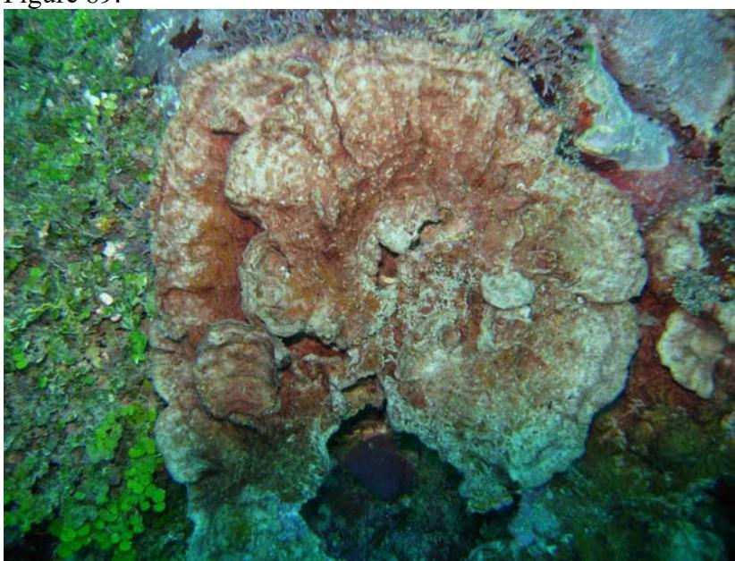

 A second species was observed and collected by Maloy Sabater on one of the outer banks. It is a brown alga, with irregularly size and shaped flat stipes up to perhaps 20 cm long, and covered the bottom in one area. It matches a photo in Payri et al. (2000) of a brown alga, *Spatoglossum solierii*, which is not previously reported from American Samoa.

 A golden alga (chrysophyte) has been observed periodically, primarily on shallow rubble beds, such as in Alofau. It is sometimes called the "Golden Noodle Algae," *Chrysocystis fragilis.* Cells are embedded in a gelatinous matrix, and colonies are fragile and easily disintegrate. It is known from Guam and Hawaii but not known widely otherwise. This is the first report of it for American Samoa. It is illustrated in Figure 90. Figure 90.

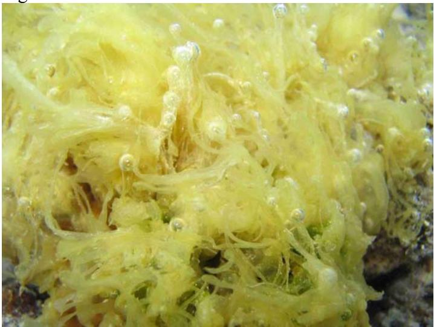

In 2005, two researc Hawaii Undersea Laboratory (HURL) of NOAA visited on a ship carrying h submersibles. D. Fenner joined Dr. Dawn Wright for two dives. On the shelf seaward of Taema Banks, the outer part of the shelf at about 70-90 m had many thin discs on it. Samples were collected, and they were identified as giant Foraminifera, of the genus *Cycloclypea*. These are the largest of all forams, and typically live in deep water where their fragile skeleton will not be broken by wave surge. However, they must have light because they host symbiotic algae (Song et al. 1994).

## **Recommendations**

**Benthic** – The corallimorph, *Rhodactis* sp. at Tafeu should be watched in future years, though it does not appear to present a threat to corals. The encrusting ascidian, *Diplosoma simile*, should be monitored in Fagatele Bay as well as elsewhere. The spatial extent of the brown macroalga *Dictyota* needs to determined at Vatia and elsewhere on the north shore, and it should be monitored in different seasons to see if it is seasonal.

## **References**

Andrews, Z. 2004. Evaluation of the effects of community-based fisheries management on coral reef communities of American Samoa. Masters of Science Thesis, University of Wales, Bango, UK.

in Bellwood, D. R., Hoey, A. S. and Choat, J. H. 2003. Limited functional redundancy high diversity systems: resilience and ecosystem function on coral reefs. Ecology Letters 6: 281-285

Birkeland, C., Craig, P., Fenner, D., Smith, L. W., Kiene, W. E. and Riegl, B. 2008. Ch. 20: Geologic setting and ecological functioning of coral reefs in American Samoa. Pages 741-765 in B. Riegl and R. Dodge, Coral Reefs of the USA, Springer.

- Brainard, R., Asher, J., Gove, J., Helyer, J., Kenyon, J., Mancini, F., Miller, J., Myhre, S., Nadon, M., Rooney, J., Schroeder, R., Smith, E., Vargas-Angel, B., Vogt, S., Vroom, P., Balwani, S., Ferguson, S., Hoeke, R., Lammers, M., Lundlblad, E., Maragos, J., Moffitt, R., Timmers, M., and Vetter, O. 2008. Coral reef ecosystem monitoring report for American Samoa: 2002-2006. NOAA Special Report NMFS PIFSC.
- Craig, P. 2005. Natural History Guide to American Samoa, 2nd Edition. National Park of American Samoa, Dept. Marine & Wildlife Resources, and American Samoa Community College, Pago Pago. 96 pages.
- Craig, P., DiDonato, G., Fenner, D., Hawkins, C. 2005. The state of coral reef ecosystems of American Samoa. PP. 312-337 in Waddell, J. E. (ed.), The State of Coral Reef Ecosystems of the United States and Pacific Freely Associated States: 2005. NOAA Technical Memorandum NOS NCCOS 11. NOAA/NCCOS Center for Coastal ent's Biogeography Team. Silver Spring, MD. 522 pp Monitoring and Assessm
- Edinger, E. N., J. Jompa, G. V. Limmon, W. Widjatmoko, and M. J. Risk. 1998. Reef degradation and coral biodiversity in Indonesia: effects of land-based pollution, destructive fishing practices and changes over time. Marine Pollution Bulletin 8: 617- 630.
- sturbance. Marine Emslie, M. J., A. J. Cheal, H. Sweatman, and S. Delean. in press. Recovery, succession, and convergence of coral and reef fish communities following di Ecology Progress Series
- enner, D. 2008. Results of the territorial monitoring program of American Samoa for F 2006, benthic portion. Report to the Department of Marine & Wildlife Resources, the Coral Reef Advisory Group, and NOAA.
- abater, R. Schroeder, E. Smith, C. Tuitle, A. Tagarino, S. Vaitautolu, E. Vaoli, B. d P. Vroom. 2008. Status of the coral reefs of American Samoa. .E. Waddell and A.M. Clarke (eds.), The State of Coral Reef Ecosystems Fenner, D., M. Speicher, S. Gulick, G. Aeby, S. Cooper Alleto, B. Carroll, E. DiDonato, G. DiDonato, V. Farmer, J. Gove, P. Houk, E. Lundblad, M. Nadon, F. Riolo, M. S Vargas-Angel, an pp 307-331. In J of the United States and Pacific Freely Associated States: 2008. NOAA Technical Memorandum NOS NCCOS 73. NOAA/ NCCOS Center for Coastal Monitoring and Assessment's Biogeography Team. Silver Spring, MD. 569 pp.
- Bangkok Thailand, May 1994. Australian Institute of Marine Science. Gomez, ED, Alino, PM, Licuanan WRY, and Yap HT. 1994a. Pages 57-76 in: Wilkinson, CR, Sudara, S, and Chou LM (eds.) Proceedings, Third ASEAN-Australia Symposium on Living Coastal Resources, Vol. 1: Status Reviews. Chulalongkorn University,
- Gomez, E. D., Alino, P. M., Yap, H. T., and Licuanan, W. Y. 1994b. A review of the status of Philippine reefs. Marine Pollution Bulletin 29: 62-68.

Jacobson, D. M. 2008. A four year fine-scale study of a coral disease outbreak in the Marshall Islands. Poster, 11th International Coral Reef Symposium.

Kuguru, B., Winters, G., Beer, S., Santos, S.R., Chadwick, N.E. 2007. Adaptation strategies of the corallimorpharian *Rhodactis rhodostoma* to irradiance and temperature. arine Biology 151: 1287-1298. M

Role in competition for space. Marine iology 134: 479-489. Langmead, O., Chadwick-Furman, N.E. 1999a. Marginal tentacles of the corallimorpharian *Rhodactis rhodostoma*. 1. B

Langmead, O., Chadwick-Furman, N.E. 1999b. Marginal tentacles of the corallimorpharian *Rhodactis rhodostoma*. 2. Induced development and long-term effects on coral competitors. Marine Biology 134: 491-500.

ittler, D. S. and Littler, M. M. 2003. South Pacific Reef Plants, a diver's guide to the L plant life of South Pacific coral reefs. Offshore Graphics, Inc, Washington, D. C. 331 pp.

igal, L. G. 1999. Field guide of shallow water marine invertebrates of American amoa. American Samoa Government, Dept. of Education. 132 pp. Madr S

.W. f Coral Reefs in the Pacific. University of Hawaii Sea Grant ollege Program. Maragos, J.E. 1997. Coral reef health in the Central Pacific. Pages 3-29 in Grigg, R and C. Birekland, Status o C

t Payri, C., de N'Yeurt A., and Orempuller, J. 2000. Algae of French Polynesia. Au Ven des Iles, Tahiti. 320pp.

Risk, M. J., Heikoop, J. M., Edinger, E. M., and Erdmann, M. V. 2001. The assessment "toolbox": community-based reef evaluation methods coupled with geochemical techniques to identify sources of stress. Bulletin of Marine Science 69: 443-458.

Sabater MG and Tofaeono S. 2006. Spatial variation in biomass, abundance, and species composition of "key reef species" in American Samoa. Revised Edition. Biological Report Series no 2006-2. Department of Marine and Wildlife Resources, Pago-Pago, American Samoa 96799.

biomass : Sabater MG and Tofaeono S. 2007. Effects of scale and benthic composition on and trophic group distribution of reef fishes in American Samoa. Pacific Science 61 (4) 503-520.

amuelu, J. I., and A. Solofa. 2007. Samoa. Pages 115-146 in Sulu, R. Status of coral S reefs in the Southwest Pacific: 2004. IPS Publications, University of the South Pacific.

Sandin, S., A., Smith, J. E., DeMartini, E. E., Dinsdale, E. A., Donner, S. D., Friedlander, ., Knowlton, N., ala, E. 2008. Baselines and degradation of coral reefs in the Northern Line Islands. A. M., Konotchick, T., Malay, M., Maragos, J. E., Obura, D., Pantos, O., Paulay, G., Richie, M., Rohwer, M., Schroeder, R. E., Walsh, S., Jackson, J. B. C S PLOS One 3(2): 1-11.

American Samoa. Report to the Department of Marine Wildlife Resources, American Samoa. 103 pp. Skelton, P.A. 2003. Seaweeds of &

ing ns from finite element analysis. Paleobiology 20: 14-26. Song, Y., Black, G., Lipps, J. H. 1994. Morphological optimization in the largest liv foraminifera: implicatio

n the southern Van Woesik, R., and T. Done. 1997. Coral communities and reef growth i Great Barrier Reef. Coral Reefs 16: 103-115.

allace, C. C. 1999a. Staghorn corals of the world, a revision of the genus *Acropora*. W CSIRO Publ., Collingwood, Australia. 422 pages.

s, R.C. 1982. Characterization of inshore Samoan fish communities. Department of arine and Wildlife Resources Biological Report Series 6, Government of American Was M Samoa. Pago Pago, American Samoa. 27 pp.

ells, S. 1988. Coral Reefs of the World, Vol. 3, Central and Western Pacific. UNEP, W IUCN. 329 pp.

enner, D. 2006. Report of 2005 American Samoa coral reef onitoring program (ASCRMP), expanded edition. Report to the Department of Marine Whaylen, L. and F m and Wildlife Resources and Coral Reef Advisory Group, American Samoa. 64 pp.

aragos JE. 2008. Phase shift from a corallimorph-dominated Work, TM, Aeby GS, M reef associated with a shipwreck on Palmyra atoll. PloS ONE 3(8): 1-5.