# **Long term monitoring of Fagatele Bay National Marine Sanctuary, Tutuila Island, American Samoa: results of surveys conducted in 2007/8, including a re-survey of the historic Aua Transect**

Douglas Fenner Alison Green Charles Birkeland Cheryl Squair Benjamin Carroll

2008

Report prepared for:

U.S. Department of Commerce American Samoa Government National Oceanic and Atmospheric Administration Department of Commerce National Ocean Service Environment Division Office of National Marine Sanctuaries

# **Executive Summary**

### Corals:

- The main finding of our survey of the corals in Fagatele Bay is that they are still resilient (capable of recovering from damage) and doing quite well. The abundance and population density of corals (14.5 colonies per m2 ) and the living coral cover (64%) in Fagatele Bay in August 2007 are typical of very healthy reefs. We encountered 94 species within the areas specifically within our transects, a small part of Fagatele Bay. A total of 164 species of corals were previously recorded from Fagatele Bay, but this latest survey found yet another four species not previously recorded: *Acropora formosa, Montipora hispida*, *Fungia concinna* and *Fungia klunzingeri*, bringing the total number of species in Fagatele Bay to 168. The number of species in Fagatele Bay is not yet decreasing.
- The size distribution of coral colonies in Fagatele Bay also indicates a healthy situation with a few large colonies and an abundance of smaller colonies, indicating a healthy recruitment. However, some of the smaller colonies are of species that do not usually grow large, e.g., *Porites* sp. 2 and *Galaxea fascicularis*. The numerical pattern of relative abundance of species, the relative abundance of coral species representing the different families of corals, and the population densities of corals along the depth distribution are all fairly constant between 2004 and 2007, indicating that the population has reached a temporary equilibrium as a relatively healthy coral community. The proportion of corals in the smallest size category (< 5 cm diameter) has decreased and the proportion in the higher size classes have increased since 1995, showing that the coral community has grown in size distribution over the past decade.
- The corals in Pago Pago Harbor were surveyed both along the permanent transect in front of Aua village and also in front of the Sadie's by the Sea Hotel. There has been successful recruitment and growth of some colonies of *Acropora hyacinthus* at both sites. The coral cover typical of a fully normal and healthy reef community has returned to the area of the Aua transect wherever there are solid substrata, i.e., on the reef crest and on large coral blocks on the reef flat. The dominant species on the Aua reef crest is *Acropora nana* because of a major successful recruitment in 1999.
- Surveys of Fagatele Bay should be shifted back to March/April for a better chance of having enough days with good sea state to get the surveys accomplished.

### Benthic Communities

- Percent cover of all algae has decreased from a high in 1985. Diversity also appears to have decreased. No obvious patterns are apparent in this survey year with respect to depth or position with FBMS. *Hydrolithon onkodes* appears to be the most common species of crustose coralline algae in FBMS and this is similar to what was reported in 1985.
- Higher coral cover and lower turf cover at the Aua site compared with the Rainmaker site appear to indicate that the sites are recovering at different rates. The high

 Benthic communities at Fagasa appear to represent typical high disturbance communities with moderate coral cover, high encrusting algal species, moderate turf/fleshy algae species.

### Fish communities

- Changes in fish communities over time may be partly due to changes in coral communities as a result of habitat destruction by cots, hurricanes etc. This mostly affects small specialized species that are closely associated with *Acropora* and *Pocillopora* corals (eg. *Plectroglyphidon dicki* – see Green 2002).
- Changes in density (particularly peaks in abundance in 1985 and 2001) were primarily due to surgeonfishes (see Fig 10, Green et al 2005). These pulses are associated with mass recruitment events of *C. striatus* (Birkeland et al 1987; Green et al 2005).
- Coral reef fish communities in FB and elsewhere around Tutuila are still showing signs of overfishing. Several large species that are characteristic of unfished reefs in the Indo-Pacific remain conspicuous by their absence or small size. They include species such as maori wrasse (*Chelinus undulatus*), sharks, and larger species of serranids and scarids, all of which are known to be particularly vulnerable to fishing.

### CONTENTS

| EXECUTIVE SUMMARY2                                            |  |
|---------------------------------------------------------------|--|
| CONTENTS4                                                     |  |
| INTRODUCTION5                                                 |  |
| METHODS5                                                      |  |
| Survey techniques- Fagatele Bay National Marine Sanctuary5    |  |
| Corals5                                                       |  |
| Benthic6                                                      |  |
| Reef Fishes7                                                  |  |
| Survey techniques- Pago Pago Harbor8                          |  |
| Survey techniques- The Aua Transect8                          |  |
| Survey techniques- Historic fish transects around Tutuila8    |  |
| Data analysis9                                                |  |
| RESULTS10                                                     |  |
| Fagatele Bay National Marine Sanctuary10                      |  |
| Corals in Fagatele Bay- 2007/810                              |  |
| Trends in Fagatele Bay coral populations 2004-2007/814        |  |
| Benthic Cover in Fagatle Bay18                                |  |
| Fish in Fagatele Bay- 2007/823                                |  |
| Trends in Fagatele Bay fish populations 2004-2007/825         |  |
| Reefs around Tutuila26                                        |  |
| Corals in Pago Pago Harbor 200726                             |  |
| Trends in coral populations in Pago Pago Harbor 2004-2007/826 |  |
| Benthic Cover in Pago Pago Harbor29                           |  |
| The Aua Transect30                                            |  |
| Fagasa Bay Benthic Data33                                     |  |
| Historic Fish Transects 2004-200734                           |  |
| DISCUSSION38                                                  |  |
| Fagatele Bay National Marine Sanctuary38                      |  |
| Coral communities in Fagatele Bay38                           |  |
| Corals in Pago Pago Harbor39                                  |  |
| Fish communities in Fagatele Bay40                            |  |
| REFERENCES41                                                  |  |
| APPENDIX 1 – Coral Data 2007/8 (Fagatele Bay)44               |  |
| APPENDIX 2- Benthic Species Data57                            |  |

### **INTRODUCTION**

The coral reefs of American Samoa have suffered many destructive events in the last few decades, including a major outbreak of the corallivorous starfish *Acanthaster planci*, several hurricanes varying from devastating to relatively mild, periods of high water temperature, and exposure during unusually low tides (Birkeland et al 1996, 2003, 2004, 2008, Green 1996, 1997, 2002, Green et al 1999). The reefs in some locations, such as Pago Pago Harbor, have also been subjected to chronic human influences including sedimentation, eutrophication, pollution and overfishing (Birkeland et al, 1996, 2003, 2004, Green 1996, 1997, 2002, Green et al 1997). As a direct result of these disturbances, the reefs of Fagatele Bay National Marine Sanctuary (FBMNS) and other locations around Tutuila Island have undergone some major changes in the last 30 years (Birkeland et al 1996, 2003, 2008, Green et al 1997, 2005). Of particular concern have been the physical and biological changes to the coral communities in some locations.

Coral communities provide important habitat for reef fishes and changes in their condition may have important consequences for the associated fish fauna. The coral reef communities of Fagatele Bay and other sites around Tutuila have been the subjects of a long term monitoring program since the late 1970's, supported by the Fagatele Bay National Marine Sanctuary program. The purpose of the ongoing monitoring of coral reef communities is to document the recovery, or further decline, of coral and fish communities in Fagatele Bay, and elsewhere around Tutuila, and to determine if reef communities have changed substantially since the combined effects of *A. planci* outbreaks and hurricanes that devastated American Samoa reefs in the past 30 years.

The results of the monitoring program have been used to describe the changes in the coral and fish communities of American Samoa during the 26 years from 1978-2004 (Birkeland et al 1987, 1994, 1996, 2003, 2004, Green et al 1999). This report documents the results from surveys in Fagatele Bay National Marine Sanctuary conducted in November, 2007 and May, 2008.

In 1917, Alfred Mayor established the permanent transect across the reef flat in front of Aua village and it has become the oldest long-term coral-reef quantitative transect in the Pacific Ocean. In August 2007, with our assistance, the U.S. Geodetic Survey established an official benchmark at the offshore end of the transect. We replicated another survey of the corals and other aspects of the benthic community on its 90th year.

### **METHODS**

### **Survey techniques – Fagatele Bay National Marine Sanctuary**

### *Corals*

From 1985 to 2001, corals were surveyed using point-quarter method (Birkeland et al 1987). In 2004, the coral survey method was changed to belt transects because they produce a much larger sample in an equivalent time period than the point-quarter method (Green et al 2005). This method is also directly compatible with archipelago-wide surveys (Mundy, 1996; Fisk

and Birkeland, 2002). Belt transect methods were used to survey coral communities in 2007/2008.

We recorded all corals whose center occurred in a 0.5 m wide belt transect laid perpendicular to four of the six permanent transect lines in FBNMS (Transects 2-5, Figure 1). Transect tapes were 20 m long, but on occasion dive time did not allow the completion of the full 20 m. When that happened, the length that was recorded was noted and the area adjusted accordingly. Each coral was identified to species, and the maximum diameter measured. Corals were then categorized into one of seven size classes based on the maximum diameter of the colony; <5cm, 5-10cm, 10-20cm, 20-40cm, 40-80cm, 80-160cm, and >160cm. We collected data at Sites 2 to 5, at 3, 6, 9, and 12 m depth. Weather and time did not allow collecting data on transects 1 and 6. Coral data were collected in November, 2007 by Charles Birkeland and Douglas Fenner, and May, 2005 by Douglas Fenner.

### *Benthos*

Few benthic surveys have been conducted in Fagatele Bay and for those that have been undertaken, methods, sampling intensity and time of year have all varied. These differences make it very difficult to draw conclusions about changes over time, especially for the algae, which are typically seasonal and show changes in diversity and biomass throughout the year. Therefore the goal in this survey was to provide data that could be easily compared to previous studies and in particular, the study undertaken by Green et al in 2004, where benthic organisms were identified to functional form. Consequently, for the purposes of this study, benthic organisms were also identified to functional form. Additionally, macroalgae were identified to the lowest taxonomic level possible, with the exception of crustose coralline algae (CCA) and turf.

Benthic surveys were undertaken for Fagatele Bay, Pago Pago Harbor (at Rainmaker and Aua) and for Fagasa (at Cape Larsen and Sita Bay). Following the method established by Green et al (2004), forty-eight points were sampled along the 30 m fish belt transects. The substrate under the tape was identified every two meters and the substrate at a point approximately 1 m on either side of, and perpendicular to the tape at 1m was also identified (NB: except at Fagasa, where three 30 m transects were laid end to end, for a total of 144 points per transect). The benthos was classified into one of the following 23 categories:

Corals (branching, digitate, encrusting, foliaceous, massive, mushroom, plate) Macroalgae (encrusting, blue green, Halimeda, macroalgae, crustose coralline algae - CCA) Invertebrate (ascidian, clam, hydrozoan, soft coral, sponge, urchin, zooanthid); and Non-living (crevice/hole; reef matrix, rubble, sand)

Additionally, macroalgae were identified to the lowest level possible. For species that could not be identified in the field, representative voucher samples were collected. Representative samples of CCA were collected in the vicinity of the transects, when the surveys were complete. Coralline algae require extensive laboratory analysis in order to make definitive identifications. Tentative identifications of specimens collected in this survey are included in the report and final identifications will be will be submitted as an addendum when they are complete. Cheryl Squair collected the benthic data.

### *Reef Fishes*

Reef fishes were surveyed using the same underwater visual census techniques used in previous surveys: 30 x 2m belt transects laid perpendicular to the four permanent transect lines in FBNMS (Transects 2-5, Figure 1). This method is described in detail by Birkeland et al. (1987, 1994). In addition to recording fish species and abundance on each transect as in all previous surveys, fish sizes have also been recorded since 1998.

Due to bad weather and limited boat access, only one of the permanent transect lines (Transect 2, depths 3, 6, 9, 12 and 18m) was surveyed by Alison Green in November 2007 (this report). The remaining permanent transect lines will be surveyed by Ben Carroll, and results of these surveys will be provided when they have been completed. Alison Green also conducted the fish surveys in 1995, 1998 and 2001, while two other observers conducted the surveys in 1985 and 1988 (Richard Wass and Steve Amesbury respectively).

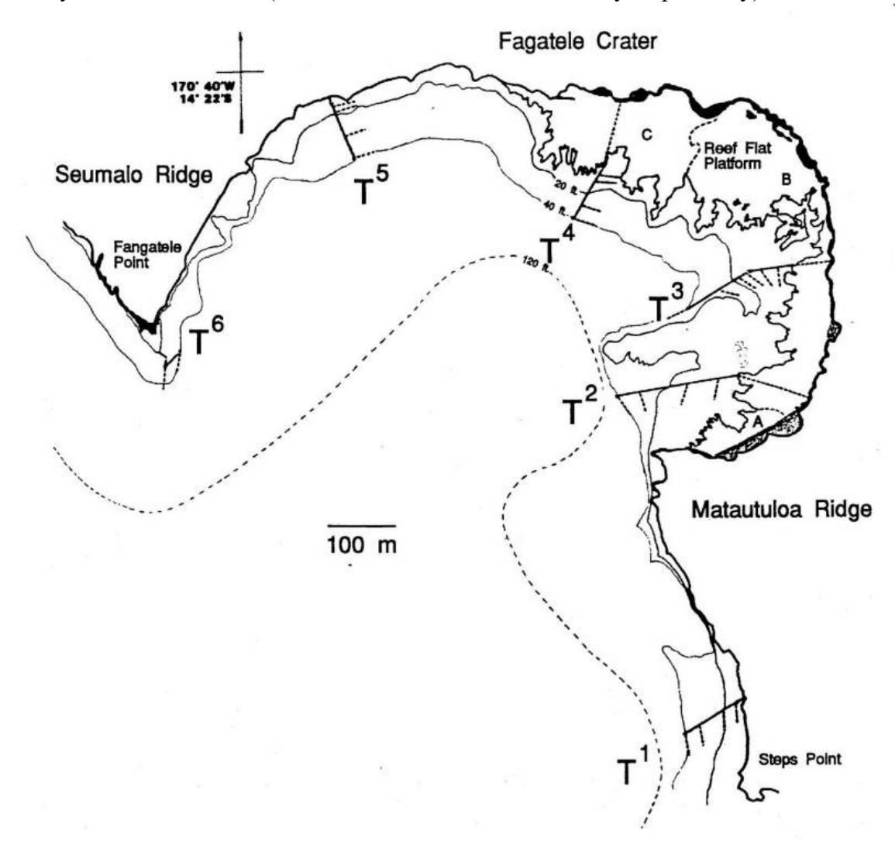

Figure 1. Map of Fagatele Bay showing six permanent transects (T1 – T6) and the approximate locations of the coral and fish surveys at each depth along each transect. The locations of three reef flat sites (A-C) are also indicated.

#### Survey techniques – Pago Pago Harbor

The two sites in Pago Pago Harbor (Rainmaker Hotel and Aua, Figure 2), which provide useful information for management (Birkeland et al 2004), were resurveyed in 2007 in conjunction with the Fagatele Bay surveys. At these two sites, corals were surveyed at 3 m and 6 m depths on the reef slope. Survey methods were as described above, with corals surveyed in a single 30 x 0.5 m belt transect at each depth and with each colony identified to species and categorized into one of seven size classes.

#### The Aua Transect

The methods are described in detail in Green et al. (1997). The corals were counted in 0.25 m2 quadrats that were tossed haphazardly within about 10 m to either side of the transect, with an equal number of quadrats on each side, within a set of zones between the shore and the reef crest. The transect now began 91 m from shore because this was now the seaward extent of the burrow pit.

### Survey techniques – Historic fish transects around Tutuila

Fish communities were surveyed on the reef slope at each of three sites (Fagatele Bay 12 m, Sita Bay 5-6 m and Cape Larsen 8-9 m) on eight occasions from 1977 to 2007. These sites were initially surveyed as part of an assessment of the impacts of the crown-of-thorns starfish, *Acanthaster planci* (see Birkeland et al. 1987, 2003). We have continued to survey these sites as part of the Fagatele Bay surveys, because they form the oldest continuous survey data for coral reef fishes from American Samoa. One large transect (100 m x 2 m) was surveyed at each site from 1977 to 2001, because they were originally designed as part of a different project (see Wass 1982). In 2004, survey methods were modified to include three replicate 30m x 2m transects at each site, rather than a continuous 100 m x 2 m transect. This allowed us to survey a similar area, while introducing replication into the survey design. The exact location of the start of each of the transects is described in Birkeland et al. (1987), and GPS co-ordinates were recorded at each site in 2004 to facilitate relocation (Appendix 1, Green et al 2004). Alison Green conducted the fish surveys in 1995, 1998, 2001, 2004 and 2007, while two other observers conducted the surveys in 1977 and 1985 (Richard Wass) and 1988 (Steve Amesbury).

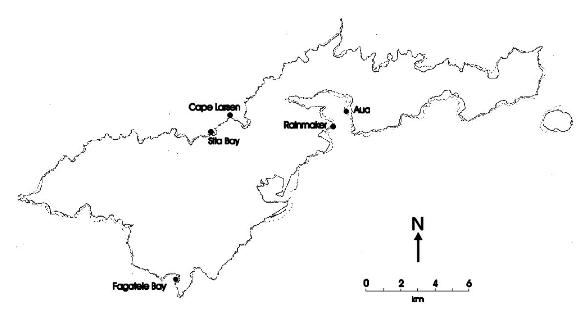

Figure 2. Map of Tutuila showing the location of Fagatele Bay National Marine Sanctuary, the two coral survey sites in Pago Pago Harbour (Rainmaker and Aua), and the location of the three historic fish transects around the island (Cape Larsen, Sita Bay and Fagatele Bay).

### **Data analysis**

Coral data from Fagatele Bay and the two sites in Pago Pago Harbor were summarized to determine the abundance and percent coral cover at each depth. Percent cover was calculated according to Mundy (1996), based on using the maximum diameter as the diameter of a circle, and using the mid-point of each size class.

Percent cover was calculated from benthic data by dividing the number of points of a given category, by the total number of points on the transect and multiplying by 100. To allow for comparison between years, data were grouped into the above categories, even where more detailed information was available.

Fish data from Fagatele Bay and the three historic fish transects (Fagatele Bay, Cape Larsen and Sita Bay) were summarised to determine the relative abundance and species richness at each site and each depth. Fish data from the historic transects were also converted to density estimates (no. individuals per hectare) to make the data among years more comparable (to adjust for the change in sampling area in the 2004 surveys), and to match international standards for fish survey data.

Long term trends in coral and fish communities in Fagatele Bay, Pago Pago Harbour and other sites around Tutuila were compared from 1977-1985 to 2007.

Fish size data in Fagatele Bay are only available for the three most recent surveys (2001, 2004 and 2007). These data will be summarised at the family level to determine the size-frequency of four important fisheries families over the last seven years once all the data have been collected: Acanthuridae (surgeonfishes), Scaridae (parrotfishes), Lujanidae (snappers) and Serranidae (groupers, see Green 2002 for further details). Size frequency of two important fisheries species will also be compared over the last seven years: *Cephalopholis argus* (Family Serranidae) and *Ctenochaetus striatus* (Family Acanthuridae).

### **RESULTS**

# **Fagatele Bay National Marine Sanctuary**

*Corals in Fatatele Bay: 2007/8*

A total of 2417 coral colonies belonging to 94 species were recorded during surveys in Fagatele Bay in 2007/8. The most common coral in the bay (531 colonies) was *Galaxea fascicularis*. Three other species were common in the bay and were represented by more than 200 colonies each, including *Montipora grisea* (368 colonies), *Porites lichen* (213 colonies), and *Porites rus* (227 colonies). Most species (67 of 94 species) were numerically rare, and represented by less than 20 colonies (Table 1). In diverse ecosystems, most species are rare. This pattern is similar to that in the 2004 survey.

Coral cover was relatively high in Fagatele Bay based on the belt transect data (64.1% cover, Table 1). However, the numerically abundant corals did not always have the highest percent cover. For example, although *Galaxea fascicularis* was the most abundant coral in Fagatele Bay, it covered only 2.1% of the area surveyed. In contrast, we recorded only 10 colonies of *Acropora clathrata*, but it covered 12.7% of the area surveyed. *Acropora hyacinthus*, *Montipora grisea*, and *Pocillopora eydouxi* each had 5-10% cover in the bay (Table 1).

Table 1. Total number of colonies and percent cover of each coral species recorded in Fagatele Bay and Pago Pago Harbor sites in 2007/8.

|                        | Fagatele Bay |         | Pago Pago Harbor |         |
|------------------------|-----------------|---------|---------------------|---------|
| Species                | Abundance       | % Cover | Abundance           | % Cover |
| Acropora abrotanoides  | 3               | 0.7     |                     |         |
| Acropora austera       | 18              | 0.4     |                     |         |
| Acropora azurea        | 35              | 0.7     |                     |         |
| Acropora cerealis      | 2               | 0.05    |                     |         |
| Acropora clathrata     | 10              | 12.7    |                     |         |
| Acropora crateriformis | 64              | 3.0     |                     |         |
| Acropora cytherea      | 6               | 0.8     |                     |         |
| Acropora digitate      | 4               |         |                     |         |
| Acropora divaricata    | 7               | 0.2     |                     |         |
| Acropora formosa       | 1               | 0.01    |                     |         |
| Acropora gemmifera     | 4               | 0.1     |                     |         |
| Acropora humilis       | 6               | 0.05    |                     |         |
| Acropora hyacinthus    | 49              | 7.5     |                     |         |
| Acropora "juvenile"    | 3               | 0.001   |                     |         |
| Acropora loripes       | 1               | 0.04    |                     |         |
| Acropora nana          | 12              | 0.09    |                     |         |

| Acropora nobilis 26 3.5 Acropora pagoensis 16 0.3 Acropora palifera 13 0.4 3 0.2 Acropora paniculata Acropora samoensis 4 0.06 Acropora valida 1 0.001 Acropora spp. 6 0.7 3 0.09 Alveopora sp. 12 0.005 Astreopora microphthalma 1 0.04 1 0.005 Caulastrea furcata 3 0.2 Coscinaraea collumna 1 0.04 Cyphastrea seralia 2 0.2 1 0.0006 Diploastrea heliopora 3 14.1 Echinopora gemmacea 5 0.8 Echinopora hirsutissima 2 0.04 Echinopora lamellosa 3 0.06 Favia pallida 1 0.15 Favia stelligera 2 0.8 Favites abdita 2 0.02 Favites complanata 12 0.3 Fungia concinna 2 0.01 Fungia fungites 3 0.01 6 0.09 Fungia klunzingeri 1 0.01 Fungia scutaria 1 0.01 Galaxea astreata 5 0.15 1 0.0006 Galaxea fascicularis 531 2.1 3 0.02 Gardinoseris planulata 2 0.7 Goniastrea retiformis 44 3.0 Goniastrea sp. 1 0.04 Hydnophora exesa 37 3.5 Hydnophora microconos 0.1 Hydnophora rigida 10 0.06 Leptastrea purpurea 5 0.08 Leptastrea transversa 1 0.04 1 0.09 Leptoria phrygia 0.04 1 0.0006 Leptoseris mycetoseroides 2 0.005 Lobophyllia hemprichii 2 0.04 Merulina ampliata 2 0.08 Merulina scabricula 5 0.2 Millepora dichotoma 8 0.8 Millepora exaesa 2 0.1 Millepora platyphylla 4 0.1 Millepora sp. 9 1.7 Montastrea annuligera 4 0.2 | Acropora nasuta | 10 | 0.5 |  |
|-----------------------------------------------------------------------------------------------------------------------------------------------------------------------------------------------------------------------------------------------------------------------------------------------------------------------------------------------------------------------------------------------------------------------------------------------------------------------------------------------------------------------------------------------------------------------------------------------------------------------------------------------------------------------------------------------------------------------------------------------------------------------------------------------------------------------------------------------------------------------------------------------------------------------------------------------------------------------------------------------------------------------------------------------------------------------------------------------------------------------------------------------------------------------------------------------------------------------------------------------------------------------------------------------------------------------------------------------------------------------------------------------------------------------------------------------------------------------------------------------------------------------------------------------------------------------------------------------------------------------------------------------------------------------------------------------|-----------------|----|-----|--|
|                                                                                                                                                                                                                                                                                                                                                                                                                                                                                                                                                                                                                                                                                                                                                                                                                                                                                                                                                                                                                                                                                                                                                                                                                                                                                                                                                                                                                                                                                                                                                                                                                                                                                               |                 |    |     |  |
|                                                                                                                                                                                                                                                                                                                                                                                                                                                                                                                                                                                                                                                                                                                                                                                                                                                                                                                                                                                                                                                                                                                                                                                                                                                                                                                                                                                                                                                                                                                                                                                                                                                                                               |                 |    |     |  |
|                                                                                                                                                                                                                                                                                                                                                                                                                                                                                                                                                                                                                                                                                                                                                                                                                                                                                                                                                                                                                                                                                                                                                                                                                                                                                                                                                                                                                                                                                                                                                                                                                                                                                               |                 |    |     |  |
|                                                                                                                                                                                                                                                                                                                                                                                                                                                                                                                                                                                                                                                                                                                                                                                                                                                                                                                                                                                                                                                                                                                                                                                                                                                                                                                                                                                                                                                                                                                                                                                                                                                                                               |                 |    |     |  |
|                                                                                                                                                                                                                                                                                                                                                                                                                                                                                                                                                                                                                                                                                                                                                                                                                                                                                                                                                                                                                                                                                                                                                                                                                                                                                                                                                                                                                                                                                                                                                                                                                                                                                               |                 |    |     |  |
|                                                                                                                                                                                                                                                                                                                                                                                                                                                                                                                                                                                                                                                                                                                                                                                                                                                                                                                                                                                                                                                                                                                                                                                                                                                                                                                                                                                                                                                                                                                                                                                                                                                                                               |                 |    |     |  |
|                                                                                                                                                                                                                                                                                                                                                                                                                                                                                                                                                                                                                                                                                                                                                                                                                                                                                                                                                                                                                                                                                                                                                                                                                                                                                                                                                                                                                                                                                                                                                                                                                                                                                               |                 |    |     |  |
|                                                                                                                                                                                                                                                                                                                                                                                                                                                                                                                                                                                                                                                                                                                                                                                                                                                                                                                                                                                                                                                                                                                                                                                                                                                                                                                                                                                                                                                                                                                                                                                                                                                                                               |                 |    |     |  |
|                                                                                                                                                                                                                                                                                                                                                                                                                                                                                                                                                                                                                                                                                                                                                                                                                                                                                                                                                                                                                                                                                                                                                                                                                                                                                                                                                                                                                                                                                                                                                                                                                                                                                               |                 |    |     |  |
|                                                                                                                                                                                                                                                                                                                                                                                                                                                                                                                                                                                                                                                                                                                                                                                                                                                                                                                                                                                                                                                                                                                                                                                                                                                                                                                                                                                                                                                                                                                                                                                                                                                                                               |                 |    |     |  |
|                                                                                                                                                                                                                                                                                                                                                                                                                                                                                                                                                                                                                                                                                                                                                                                                                                                                                                                                                                                                                                                                                                                                                                                                                                                                                                                                                                                                                                                                                                                                                                                                                                                                                               |                 |    |     |  |
|                                                                                                                                                                                                                                                                                                                                                                                                                                                                                                                                                                                                                                                                                                                                                                                                                                                                                                                                                                                                                                                                                                                                                                                                                                                                                                                                                                                                                                                                                                                                                                                                                                                                                               |                 |    |     |  |
|                                                                                                                                                                                                                                                                                                                                                                                                                                                                                                                                                                                                                                                                                                                                                                                                                                                                                                                                                                                                                                                                                                                                                                                                                                                                                                                                                                                                                                                                                                                                                                                                                                                                                               |                 |    |     |  |
|                                                                                                                                                                                                                                                                                                                                                                                                                                                                                                                                                                                                                                                                                                                                                                                                                                                                                                                                                                                                                                                                                                                                                                                                                                                                                                                                                                                                                                                                                                                                                                                                                                                                                               |                 |    |     |  |
|                                                                                                                                                                                                                                                                                                                                                                                                                                                                                                                                                                                                                                                                                                                                                                                                                                                                                                                                                                                                                                                                                                                                                                                                                                                                                                                                                                                                                                                                                                                                                                                                                                                                                               |                 |    |     |  |
|                                                                                                                                                                                                                                                                                                                                                                                                                                                                                                                                                                                                                                                                                                                                                                                                                                                                                                                                                                                                                                                                                                                                                                                                                                                                                                                                                                                                                                                                                                                                                                                                                                                                                               |                 |    |     |  |
|                                                                                                                                                                                                                                                                                                                                                                                                                                                                                                                                                                                                                                                                                                                                                                                                                                                                                                                                                                                                                                                                                                                                                                                                                                                                                                                                                                                                                                                                                                                                                                                                                                                                                               |                 |    |     |  |
|                                                                                                                                                                                                                                                                                                                                                                                                                                                                                                                                                                                                                                                                                                                                                                                                                                                                                                                                                                                                                                                                                                                                                                                                                                                                                                                                                                                                                                                                                                                                                                                                                                                                                               |                 |    |     |  |
|                                                                                                                                                                                                                                                                                                                                                                                                                                                                                                                                                                                                                                                                                                                                                                                                                                                                                                                                                                                                                                                                                                                                                                                                                                                                                                                                                                                                                                                                                                                                                                                                                                                                                               |                 |    |     |  |
|                                                                                                                                                                                                                                                                                                                                                                                                                                                                                                                                                                                                                                                                                                                                                                                                                                                                                                                                                                                                                                                                                                                                                                                                                                                                                                                                                                                                                                                                                                                                                                                                                                                                                               |                 |    |     |  |
|                                                                                                                                                                                                                                                                                                                                                                                                                                                                                                                                                                                                                                                                                                                                                                                                                                                                                                                                                                                                                                                                                                                                                                                                                                                                                                                                                                                                                                                                                                                                                                                                                                                                                               |                 |    |     |  |
|                                                                                                                                                                                                                                                                                                                                                                                                                                                                                                                                                                                                                                                                                                                                                                                                                                                                                                                                                                                                                                                                                                                                                                                                                                                                                                                                                                                                                                                                                                                                                                                                                                                                                               |                 |    |     |  |
|                                                                                                                                                                                                                                                                                                                                                                                                                                                                                                                                                                                                                                                                                                                                                                                                                                                                                                                                                                                                                                                                                                                                                                                                                                                                                                                                                                                                                                                                                                                                                                                                                                                                                               |                 |    |     |  |
|                                                                                                                                                                                                                                                                                                                                                                                                                                                                                                                                                                                                                                                                                                                                                                                                                                                                                                                                                                                                                                                                                                                                                                                                                                                                                                                                                                                                                                                                                                                                                                                                                                                                                               |                 |    |     |  |
|                                                                                                                                                                                                                                                                                                                                                                                                                                                                                                                                                                                                                                                                                                                                                                                                                                                                                                                                                                                                                                                                                                                                                                                                                                                                                                                                                                                                                                                                                                                                                                                                                                                                                               |                 |    |     |  |
|                                                                                                                                                                                                                                                                                                                                                                                                                                                                                                                                                                                                                                                                                                                                                                                                                                                                                                                                                                                                                                                                                                                                                                                                                                                                                                                                                                                                                                                                                                                                                                                                                                                                                               |                 |    |     |  |
|                                                                                                                                                                                                                                                                                                                                                                                                                                                                                                                                                                                                                                                                                                                                                                                                                                                                                                                                                                                                                                                                                                                                                                                                                                                                                                                                                                                                                                                                                                                                                                                                                                                                                               |                 |    |     |  |
|                                                                                                                                                                                                                                                                                                                                                                                                                                                                                                                                                                                                                                                                                                                                                                                                                                                                                                                                                                                                                                                                                                                                                                                                                                                                                                                                                                                                                                                                                                                                                                                                                                                                                               |                 |    |     |  |
|                                                                                                                                                                                                                                                                                                                                                                                                                                                                                                                                                                                                                                                                                                                                                                                                                                                                                                                                                                                                                                                                                                                                                                                                                                                                                                                                                                                                                                                                                                                                                                                                                                                                                               |                 |    |     |  |
|                                                                                                                                                                                                                                                                                                                                                                                                                                                                                                                                                                                                                                                                                                                                                                                                                                                                                                                                                                                                                                                                                                                                                                                                                                                                                                                                                                                                                                                                                                                                                                                                                                                                                               |                 |    |     |  |
|                                                                                                                                                                                                                                                                                                                                                                                                                                                                                                                                                                                                                                                                                                                                                                                                                                                                                                                                                                                                                                                                                                                                                                                                                                                                                                                                                                                                                                                                                                                                                                                                                                                                                               |                 |    |     |  |
|                                                                                                                                                                                                                                                                                                                                                                                                                                                                                                                                                                                                                                                                                                                                                                                                                                                                                                                                                                                                                                                                                                                                                                                                                                                                                                                                                                                                                                                                                                                                                                                                                                                                                               |                 |    |     |  |
|                                                                                                                                                                                                                                                                                                                                                                                                                                                                                                                                                                                                                                                                                                                                                                                                                                                                                                                                                                                                                                                                                                                                                                                                                                                                                                                                                                                                                                                                                                                                                                                                                                                                                               |                 |    |     |  |
|                                                                                                                                                                                                                                                                                                                                                                                                                                                                                                                                                                                                                                                                                                                                                                                                                                                                                                                                                                                                                                                                                                                                                                                                                                                                                                                                                                                                                                                                                                                                                                                                                                                                                               |                 |    |     |  |
|                                                                                                                                                                                                                                                                                                                                                                                                                                                                                                                                                                                                                                                                                                                                                                                                                                                                                                                                                                                                                                                                                                                                                                                                                                                                                                                                                                                                                                                                                                                                                                                                                                                                                               |                 |    |     |  |
|                                                                                                                                                                                                                                                                                                                                                                                                                                                                                                                                                                                                                                                                                                                                                                                                                                                                                                                                                                                                                                                                                                                                                                                                                                                                                                                                                                                                                                                                                                                                                                                                                                                                                               |                 |    |     |  |
|                                                                                                                                                                                                                                                                                                                                                                                                                                                                                                                                                                                                                                                                                                                                                                                                                                                                                                                                                                                                                                                                                                                                                                                                                                                                                                                                                                                                                                                                                                                                                                                                                                                                                               |                 |    |     |  |
|                                                                                                                                                                                                                                                                                                                                                                                                                                                                                                                                                                                                                                                                                                                                                                                                                                                                                                                                                                                                                                                                                                                                                                                                                                                                                                                                                                                                                                                                                                                                                                                                                                                                                               |                 |    |     |  |
|                                                                                                                                                                                                                                                                                                                                                                                                                                                                                                                                                                                                                                                                                                                                                                                                                                                                                                                                                                                                                                                                                                                                                                                                                                                                                                                                                                                                                                                                                                                                                                                                                                                                                               |                 |    |     |  |
|                                                                                                                                                                                                                                                                                                                                                                                                                                                                                                                                                                                                                                                                                                                                                                                                                                                                                                                                                                                                                                                                                                                                                                                                                                                                                                                                                                                                                                                                                                                                                                                                                                                                                               |                 |    |     |  |
|                                                                                                                                                                                                                                                                                                                                                                                                                                                                                                                                                                                                                                                                                                                                                                                                                                                                                                                                                                                                                                                                                                                                                                                                                                                                                                                                                                                                                                                                                                                                                                                                                                                                                               |                 |    |     |  |
|                                                                                                                                                                                                                                                                                                                                                                                                                                                                                                                                                                                                                                                                                                                                                                                                                                                                                                                                                                                                                                                                                                                                                                                                                                                                                                                                                                                                                                                                                                                                                                                                                                                                                               |                 |    |     |  |
|                                                                                                                                                                                                                                                                                                                                                                                                                                                                                                                                                                                                                                                                                                                                                                                                                                                                                                                                                                                                                                                                                                                                                                                                                                                                                                                                                                                                                                                                                                                                                                                                                                                                                               |                 |    |     |  |
|                                                                                                                                                                                                                                                                                                                                                                                                                                                                                                                                                                                                                                                                                                                                                                                                                                                                                                                                                                                                                                                                                                                                                                                                                                                                                                                                                                                                                                                                                                                                                                                                                                                                                               |                 |    |     |  |

| Montastrea curta         | 21   | 0.3    |      |       |
|--------------------------|------|--------|------|-------|
| Montipora efflorescens   | 57   | 1.0    | 1    | 0.02  |
| Montipora foveolata      | 4    | 0.02   |      |       |
| Montipora grisea         | 368  | 5.6    | 80   | 1.0   |
| Montipora hispida        | 1    | <0.001 |      |       |
| Montipora informis       | 5    | 0.1    | 3    | 0.006 |
| Montipora nodosa         | 14   | 0.15   |      |       |
| Montipora tuberculosa    | 5    | 0.8    | 4    | 0.01  |
| Montipora turgescens     | 9    | 0.2    |      |       |
| Montipora venosa         | 137  | 0.5    |      |       |
| Montipora sp.            | 1    | 0.04   |      |       |
| Pavona divaricata        |      |        | 29   | 0.2   |
| Pavona maldivensis       | 3    | 0.08   |      |       |
| Pavona varians           | 76   | 1.4    | 78   | 4.8   |
| Pavona varians "colines" | 1    | 0.04   |      |       |
|                          |      |        |      |       |
| Pavona venosa            | 21   | 0.1    |      |       |
| Platygyra dadaelea       | 3    | 0.02   |      |       |
| Platygyra sinensis       | 1    | 0.04   |      |       |
| Pocillopora damicornis   | 5    | 0.01   | 53   | 0.3   |
| Pocillopora eydouxi      | 87   | 4.1    | 2    | 0.03  |
| Pocillopora meandrina    | 4    | 0.1    |      |       |
| Pocillopora verrucosa    | 53   | 0.5    | 26   | 0.5   |
| Pocillopora woodjonesi   | 9    | 0.5    |      |       |
| Porites annae            | 2    | 0.0005 |      |       |
| Porites cylindrica       | 14   | 0.2    |      |       |
| Porites lichen           | 213  | 1.3    |      |       |
| Porites "mound"          | 13   | 0.07   | 2    | 0.1   |
| Porites rus              | 227  | 2.3    | 10   | 0.4   |
| Porites sp.              | 6    | 0.003  |      |       |
| Porites sp. 2            | 75   | 0.2    |      |       |
| Porites vaughani         | 7    | 0.006  |      |       |
| Psammocora contigua      | 1    | 0.01   | 32   | 0.8   |
| Psammocora sp. 1         | 1    | 0.04   |      |       |
| Psammocora hameana       | 3    | 0.01   | 3    | 0.09  |
| Psammocora nierstraszi   |      |        | 1    | 0.09  |
| Psammocora profundacella | 5    | 0.09   | 40   | 0.2   |
| Stylocoeniella armata    | 7    | 0.004  |      |       |
| Symphyllia radians       |      |        | 1    | 0.006 |
| Total number of colonies | 2417 |        | 401  |       |
| Total number of species  | 94   |        | 31   |       |
| Overall coral cover      | 64.1 |        | 26.8 |       |
|                          |      |        |      |       |

There were six species of coral recorded in Fagatele Bay in 2007/8 that had not been recorded in the bay previously. The nomenclature used in previous surveys was continued in this survey. Species recorded for the first time in Fagatele Bay in 2007/8 are:

Family Acroporidae

Acropora formosa

Montipora hispida

Family Fungiidae
Fungia concinna
Fungia klunzingeri

At the family level, Fagatele Bay coral communities were dominated by Acroporiids (905 colonies). Oculinids (536 colonies), Poritiids (569 colonies), Faviids (112 colonies), and Pocilloporiids (158 colonies) were also an important component of the coral communities. This is the same pattern as in the 2004 survey.

The density of corals (number of colonies per square meter) varied across transects and depths (Table 3). We recorded an average of 14.5 colonies/m2 across all transects and depths compared to 15.3 colonies/m2 recorded in 2004 (Green et al, 2005). The highest density (40.8 colonies/m2) was at 6 m depth on transect 3. The lowest density was (4.9 colonies/m2) was at 12 m depth on transect 5. This is the same pattern as in the 2004 survey.

Coral cover recorded in Fagatele Bay in 2007/8 ranged from 27.1% at 12 m on Transect 3 to 108.0 at 3 m deep on Transect 4 (Table 4). Note that due to the nature of the calculation of coral cover based on the largest diameter, areas are likely to be somewhat overestimated and total cover can exceed 100%. A full summary of all data from the 2007/8 survey of Fagatele Bay, including the number of colonies in each size class and estimates of percent cover for each species, is presented in Appendix 3.

Table 2. Total number of colonies of each coral family recorded in surveys in Fagatele Bay and Pago Pago Harbor in 2007/8.

|                 | Fagatele Bay |         | Pago Pago | Harbor  |
|-----------------|--------------|---------|-----------|---------|
| Family          | Abunance     | % cover | Abundance | % cover |
| Acroporiidae    | 905          | 40.4    | 84        | 1.2     |
| Agariciidae     | 103          | 1.7     | 109       | 5.7     |
| Astrocoeniidae  | 7            | 0.04    | 0         | 0       |
| Dendrophyliidae | 0            | 0       | 0         | 0       |
| Faviidae        | 112          | 6.2     | 6         | 14.1    |
| Fungiidae       | 7            | 0.04    | 6         | 0.09    |
| Merulinidae     | 49           | 3.8     | 5         | 0.2     |
| Milleporidae    | 0            |         | 23        | 2.8     |
| Mussidae        | 2            | 0.04    | 1         | 0.006   |
| Oculinidae      | 536          | 2.3     | 4         | 0.02    |
| Pectiniidae     | 0            | 0       | 0         | 0       |

| Pocilloporiidae    | 160 | 5.2 | 81 | 0.9 |
|--------------------|-----|-----|----|-----|
| Poritiidae         | 569 | 4.2 | 15 | 0.5 |
| Siderastreidae     | 11  | 0.1 | 76 | 1.2 |
| Total no. families | 11  |     | 11 |     |

In general, Fagatele Bay coral communities are dominated by small colonies (<20 cm diameter). Almost one third (32.3%) of corals in Fagatele Bay were in size class 2 (5-10 cm), and less than 1% were over 80 cm diameter (see Table 5). In general, recruitment (gauged as number of colonies <5 cm diameter) was highest in shallow water at all sites. However, a confounding factor is that the most common species, *Galaxea fascicularis*, only grows to a maximum of about 20 cm in diameter here, and it is most common in shallow water. *Alveopora* sp. and *Porites* sp. 2 also are small, rarely growing larger than about 10 cm. *Porites rus* also frequently produces clusters of many small colonies.

### Trends in Fagatele Bay coral populations 2004-2007/8

Coral communities on the reef slope showed a decrease in coral cover (Table 4) from 2004 to 2007/8, consistent with the community having largely recovered from previous disturbances and having reached equilibrium. A graph of the change in coral cover since 1985 shows a period of rapid increase in coral cover, and a smaller decrease in the present survey (Figure 3).

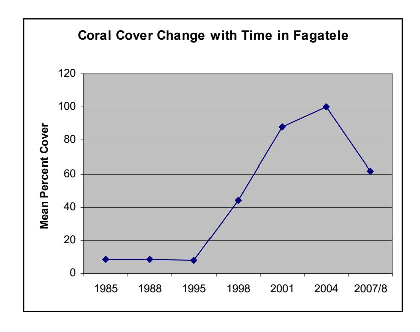

Figure 3. Coral cover change from 1985 to 2007/8 in Fagatele Bay

Coral density varied considerably among years and sites. Of the 14 transects surveyed, seven showed increases in density and seven showed decreases. Most of these changes were not dramatic, but Transect 3 at 6 m depth increased from 25.8 to 40.8 colonies/m2 and Transect 5 at 6 m increased from 7.7 to 21.6 colonies/m2. Most of the changes likely represent variation in the exact sampling site between the two years.

Coral colony size distributions for 1995, 2004 and 2007/8 are compared in Figure 4. The proportion of corals in the smallest size category (<5 cm) decreased over this period, and the proportion of corals in categories 3-5 increased. This supports the view that corals were growing in size during this period.

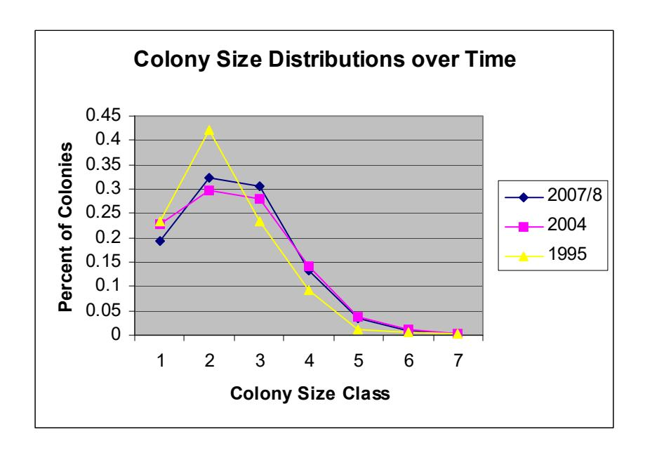

Figure 4. Coral colony size distributions over time from 1995 to 2007/8.

Table 3. Density of hermatypic corals (number of colonies per m2 ) in Fagatele Bay National Marine Sanctuary from surveys conducted in 1984-2008. Data from 1984-2004 are from Green et al (2005).

|           |   | Permanent | Transect | Number |      |   |
|-----------|---|-----------|----------|--------|------|---|
| Depth     | 1 | 2         | 3        | 4      | 5    | 6 |
| Reef Flat |   |           |          |        |      |   |
| 1985      |   | 7.2       | 9.1      | 8.8    |      |   |
| 1988      |   | 3.6       | 25.4     |        |      |   |
| 1995      |   | 7.2       | 11.2     | 20.8   |      |   |
| 1998      |   | 0.6       | 2.2      | 2.6    |      |   |
| 2001      |   |           | 19.6     |        |      |   |
| 2004      |   |           | 25.7     | 24.0   |      |   |
| 2007/8    |   |           |          |        |      |   |
| 3 m       |   |           |          |        |      |   |
| 1985      |   | 2.0       | 23.3     | 3.2    | 15.4 |   |
| 1988      |   | 8.0       | 33.4     | 6.2    | 10.3 |   |
| 1995      |   | 13.6      | 12.6     | 3.4    | 4.6  |   |
| 1998      |   | 7.7       | 11.0     | 11.0   | 4.1  |   |

| 2001   |      | 24.6 | 14.2 | 29.9 | 5.0  |      |
|--------|------|------|------|------|------|------|
| 2004   |      | 16.4 | 17.4 | 11.4 | 10.3 |      |
| 2007/8 |      | 19.2 |      | 19.9 |      |      |
| 6 m    |      |      |      |      |      |      |
| 1985   | 6.8  | 2.5  | 34.5 | 1.4  | 3.7  | 20.4 |
| 1988   |      | 3.4  | 25.2 | 2.6  | 5.2  | 8.3  |
| 1995   | 8.8  | 6.0  | 14.3 | 6.2  | 5    | 6.6. |
| 1998   |      | 7.1  | 10.7 | 12.2 | 4.7  |      |
| 2001   |      | 15.2 | 22.2 | 37.3 | 7.9  |      |
| 2004   |      | 21.6 | 25.8 | 13.7 | 7.7  |      |
| 2007/8 |      | 10.2 | 40.8 | 15.7 | 21.6 |      |
| 9 m    |      |      |      |      |      |      |
| 1985   | 10.0 | 3.3  | 9.3  | 3.2  | 6.7  | 5.7  |
| 1988   | 11.9 | 5.5  | 15.3 | 3.4  | 9.6  |      |
| 1995   | 9.1  | 11.0 | 8.6  | 1.0  | 7.0  | 5.8  |
| 1998   |      | 15.1 |      | 19.6 | 14.4 | 10.9 |
| 2001   | 16.9 | 20.3 | 14.9 | 15.1 | 13.7 | 9.3  |
| 2004   | 20.9 | 17.8 | 23.1 | 13.1 | 7.9  | 13.2 |
| 2007/8 |      | 13.0 | 9.4  | 14.5 | 11.3 |      |
| 12 m   |      |      |      |      |      |      |
| 1985   | 10.4 | 2.6  | 2.3  | 2.3  | 3.2  | 7.1  |
| 1988   | 7.1  | 17.1 | 14.8 | 14.7 | 5.8  | 8.1  |
| 1995   | 7.8  | 14.7 | 14.5 | 7.1  | 5.6  | 7.1  |
| 1998   |      | 10.9 | 16.7 | 7.3  |      | 20.6 |
| 2001   | 9.6  | 37.4 | 9.7  | 24.4 | 18.1 | 15.7 |
| 2004   | 18.3 | 11.1 | 14.4 | 10.6 | 4.1  | 10.0 |
| 2007/8 |      | 9.6  | 9.9  | 15.1 | 11.0 |      |

Table 4. Percent cover of substrata by hermatypic corals in Fagatele Bay National Marine Sanctuary from surveys conducted in 1985-2007/8. Data from 1995, 1998 and 1995 are from Birkeland et al 2003.

|           |   | Permanent | Transect | Number |      |   |
|-----------|---|-----------|----------|--------|------|---|
| Depth     | 1 | 2         | 3        | 4      | 5    | 6 |
| Reef flat |   |           |          |        |      |   |
| 1985      |   | 4.0       | 45.2     | 6.6    |      |   |
| 1988      |   | 3.5       | 43.4     |        |      |   |
| 1995      |   | 5.0       | 37.6     | 11.4   |      |   |
| 1998      |   | 0.9       | 2.2      | 1.3    |      |   |
| 2001      |   |           | 12.2     |        |      |   |
| 2004      |   |           | 49.3     | 32.6   |      |   |
| 2007/8    |   |           |          |        |      |   |
| 3 m       |   |           |          |        |      |   |
| 1985      |   | 1.1       | 25.6     | 2.2    | 46.2 |   |
| 1988      |   | 7.3       | 31.8     | 6.1    | 15.8 |   |
| 1995      |   | 16.9      | 37.0     | 5.6    | 7.3  |   |

| 1998   |       | 19.4  | 18.3  | 20.1  | 18.6  |       |
|--------|-------|-------|-------|-------|-------|-------|
| 2001   |       | 69.9  | 17.0  | 54.5  | 37.1  |       |
| 2004   |       | 44.6  | 40.1  | 137.6 | 34.6  |       |
| 2007/8 |       | 59.8  |       | 108.0 |       |       |
| 6 m    |       |       |       |       |       |       |
| 1985   | 17.1  | 1.2   | 11.8  | 0.9   | 12.9  | 20.2  |
| 1988   |       | 2.3   | 32.4  | 4.0   | 17.9  | 37.6  |
| 1995   | 26.5  | 13.8  | 21.0  | 7.4   | 8.0   | 5.8   |
| 1998   |       | 14.6  | 9.5   | 33.1  | 17.2  |       |
| 2001   |       | 60.9  | 90.7  | 82.6  | 27.1  |       |
| 2004   |       | 88.1  | 128.1 | 95.9  | 69.1  |       |
| 2007/8 |       | 47.4  | 88.3  | 73.7  | 46.0  |       |
| 9 m    |       |       |       |       |       |       |
| 1985   | 10.5  | 64.4  | 2.3   | 2.4   | 11.7  | 4.5   |
| 1988   | 31.6  | 3.9   | 6.9   | 2.8   | 7.6   |       |
| 1995   | 12.7  | 10.9  | 3.5   | 1.9   | 0.7   | 2.4   |
| 1998   |       | 40.2  |       | 59.5  | 43.3  | 19.7  |
| 2001   | 53.4  | 131.1 | 87.5  | 95.0  | 90.0  | 35.0  |
| 2004   | 66.0  | 92.8  | 69.9  | 85.1  | 110.7 | 31.1  |
| 2007/8 |       | 34.8  | 76.3  | 72.4  | 36.7  |       |
| 12 m   |       |       |       |       |       |       |
| 1985   | 10.7  | 0.9   | 0.8   | 1.0   | 1.3   | 8.4   |
| 1988   | 10.9  | 7.2   | 5.2   | 6.5   | 5.6   | 10.9  |
| 1995   | 14.3  | 8.2   | 2.5   | 9.3   | 0.4   | 0.7   |
| 1998   |       | 47.3  | 82.3  | 145.3 |       | 34.9  |
| 2001   | 33.8  | 88.9  | 189.9 | 63.7  | 99.4  | 100.6 |
| 2004   | 147.0 | 116.6 | 90.3  | 67.7  | 202.3 | 37.1  |
| 2007/8 |       | 82.6  | 27.1  | 47.2  | 59.3  |       |

Table 5. Total number of colonies in each of seven size classes from transects in Fagatele Bay and Pago Pago Harbor in 2007/8. Size classes are based on the maximum diameter of the colony; Size Class 1 = <5 cm, Size Class 2 = 5-10 cm, Size Class 3 = 10-20 cm, Size Class 4 = 20-40 cm, Size Class 5 = 40-80 cm, Size Class 6 = 80-160 cm, Size Class 7 = > 160 cm.

|          |       |    |     | Size | Class |   |   |   |
|----------|-------|----|-----|------|-------|---|---|---|
| Transect | Depth | 1  | 2   | 3    | 4     | 5 | 6 | 7 |
| Fagatele | Bay   |    |     |      |       |   |   |   |
| 2        | 3 m   | 32 | 91  | 101  | 27    | 6 | 2 | 0 |
|          | 6 m   | 32 | 25  | 25   | 11    | 8 | 1 | 0 |
|          | 9 m   | 18 | 38  | 47   | 23    | 3 | 0 | 1 |
|          | 12 m  | 14 | 32  | 31   | 15    | 3 | 1 | 0 |
|          |       |    |     |      |       |   |   |   |
| 3        | 3 m   |    |     |      |       |   |   |   |
|          | 6 m   | 71 | 143 | 138  | 49    | 4 | 1 | 2 |

|           | 9 m    | 38  | 61  | 50  | 19  | 5  | 1  | 0  |
|-----------|--------|-----|-----|-----|-----|----|----|----|
|           | 12 m   | 38  | 51  | 48  | 14  | 8  | 0  | 0  |
|           |        |     |     |     |     |    |    |    |
| 4         | 3 m    | 58  | 35  | 53  | 33  | 18 | 2  | 0  |
|           | 6 m    | 40  | 60  | 29  | 17  | 7  | 3  | 1  |
|           | 9 m    | 34  | 72  | 80  | 25  | 6  | 1  | 0  |
|           | 12 m   | 53  | 72  | 61  | 32  | 8  | 1  | 0  |
|           |        |     |     |     |     |    |    |    |
| 5         | 3 m    |     |     |     |     |    |    |    |
|           | 6 m    | 48  | 83  | 54  | 26  | 5  | 0  | 0  |
|           | 9 m    | 9   | 28  | 32  | 34  | 7  | 2  | 1  |
|           | 12 m   | 11  | 39  | 33  | 13  | 4  | 4  | 6  |
|           |        |     |     |     |     |    |    |    |
| Total FB  |        | 496 | 830 | 782 | 338 | 92 | 19 | 11 |
|           |        |     |     |     |     |    |    |    |
| PagoPago  | Harbor |     |     |     |     |    |    |    |
| Aua       | 3 m    | 23  | 33  | 39  | 6   | 1  | 0  | 0  |
|           | 6 m    | 18  | 25  | 14  | 8   | 0  | 1  | 0  |
| Rainmaker | 3 m    | 49  | 23  | 20  | 9   | 1  | 0  | 1  |
|           | 6 m    | 32  | 59  | 29  | 17  | 4  | 3  | 0  |
|           |        |     |     |     |     |    |    |    |
| Total     |        | 122 | 140 | 88  | 40  | 6  | 4  | 1  |
| PPH       |        |     |     |     |     |    |    |    |

### *Benthic Cover in Fagatele Bay*

Approximately 9 species of algae in 7 genera were recorded from the 14 transects (Table 6). The assemblage is very similar to that recorded from the 1995 survey, though algal diversity has decreased since then. Macroalgae were generally encrusting (e.g. CCA, Peysonnelia spp. or Lobophora spp.), with few turf or fleshy species other than Halimeda occurring on the transects and this was the same for both 2004 and 2007 survey years. Approximately 5 species of CCA (Appendix 2) were identified and these species are similar to those identified by Wilkins in 1995 (Birkeland et al, 2003).

Surveys showed that corals and macroalgae form the bulk of the fish habitat at all depths and transects, which was the case in the 2004 study (Tables 6, 7). Coral cover ranged from 14.6% to 55.3%, while macroalgae cover ranged from 17.8 - 83.3 %. Macroinvertebrate cover ranged from 0.0 – 27.1% and non-living surfaces ranged from 0.0 – 4.4%.

A number of general trends were noted between the survey years. Coral cover varied, with some transects showing an increase from 2004, while others showed a decrease. Changes in percent cover of coral are roughly inversely correlated with changes in percent cover of macroalgae (Fig. 5). Macroalgal cover generally increased, as did invertebrate cover (Table 7). Overall, there was a marked decrease in the percent cover of non-living surfaces (Table 7). In a 1985 survey conducts by Birkeland et al (1987), a weak trend was seen with macroalgae and particularly CCA, decreasing in percent cover with depth (Figs. 7, 8). This

trend is not evident in the subsequent surveys in 1995, 2004 and 2007. However, Figures 7 and 8 show that the abundance of algae has generally decreased over time, since 1985, when Fagatele was still recovering from the major crown-of thorns outbreak in 1978 (Birkeland 1982).

Table 6. Benthic cover in Fagatele Bay

|               |                          |       |       |       |       |       |       |       |       |       | ,     |       |       |       |       |
|---------------|--------------------------|-------|-------|-------|-------|-------|-------|-------|-------|-------|-------|-------|-------|-------|-------|
|               |                          |       | 2     | 2     |       |       | 3     |       |       |       | 1     |       |       | 5     |       |
|               |                          | 3     | 6     | 9     | 12    | 6     | 9     | 12    | 3     | 6     | 9     | 12    | 6     | 9     | 12    |
| Corals        | branching                | 14.6% | 16.7% | 6.3%  | 6.3%  | 8.9%  | 10.4% | 4.2%  | 0.0%  | 6.3%  | 6.4%  | 0.0%  | 6.3%  | 10.4% | 6.3%  |
|               | digitate                 | 12.5% | 8.3%  | 4.2%  | 4.2%  | 0.0%  | 0.0%  | 2.1%  | 4.2%  | 0.0%  | 19.1% | 0.0%  | 0.0%  | 2.1%  | 6.3%  |
|               | encrusting               | 16.7% | 6.3%  | 10.4% | 25.0% | 20.0% | 4.2%  | 6.3%  | 33.3% | 16.7% | 14.9% | 25.0% | 10.4% | 6.3%  | 8.3%  |
|               | foliose                  | 2.1%  | 2.1%  | 0.0%  | 0.0%  | 0.0%  | 0.0%  | 0.0%  | 10.4% | 4.2%  | 4.3%  | 0.0%  | 0.0%  | 0.0%  | 0.0%  |
|               | massive                  | 2.1%  | 0.0%  | 0.0%  | 2.1%  | 13.3% | 0.0%  | 0.0%  | 2.1%  | 6.3%  | 0.0%  | 4.2%  | 4.2%  | 0.0%  | 0.0%  |
|               | mushroom                 | 0.0%  | 0.0%  | 0.0%  | 0.0%  | 0.0%  | 0.0%  | 0.0%  | 0.0%  | 0.0%  | 0.0%  | 2.1%  | 0.0%  | 0.0%  | 0.0%  |
|               | plate                    | 0.0%  | 4.2%  | 2.1%  | 10.4% | 8.9%  | 4.2%  | 2.1%  | 2.1%  | 0.0%  | 10.6% | 0.0%  | 4.2%  | 12.5% | 29.2% |
| Macroalgae    | encrusting - brown       | 0.0%  | 2.1%  | 2.1%  | 6.3%  | 0.0%  | 0.0%  | 0.0%  | 0.0%  | 0.0%  | 0.0%  | 0.0%  | 0.0%  | 0.0%  | 0.0%  |
| •             | encrusting - red         | 8.3%  | 10.4% | 4.2%  | 10.4% | 6.7%  | 16.7% | 16.7% | 4.2%  | 16.7% | 8.5%  | 14.6% | 12.5% | 12.5% | 8.3%  |
| •             | blue-greens              | 0.0%  | 0.0%  | 2.1%  | 0.0%  | 0.0%  | 2.1%  | 0.0%  | 0.0%  | 0.0%  | 0.0%  | 4.2%  | 0.0%  | 0.0%  | 0.0%  |
| •             | Halimeda spp.            | 0.0%  | 0.0%  | 2.1%  | 2.1%  | 0.0%  | 0.0%  | 4.2%  | 0.0%  | 0.0%  | 0.0%  | 0.0%  | 0.0%  | 0.0%  | 8.3%  |
|               | macroalgae               | 0.0%  | 0.0%  | 0.0%  | 0.0%  | 0.0%  | 0.0%  | 2.1%  | 0.0%  | 0.0%  | 0.0%  | 0.0%  | 0.0%  | 0.0%  | 0.0%  |
|               | turf                     | 2.1%  | 4.2%  | 0.0%  | 2.1%  | 0.0%  | 0.0%  | 0.0%  | 4.2%  | 6.3%  | 0.0%  | 0.0%  | 0.0%  | 0.0%  | 0.0%  |
|               | geniculate CCA           | 0.0%  | 2.1%  | 6.3%  | 2.1%  | 0.0%  | 0.0%  | 0.0%  | 0.0%  | 0.0%  | 0.0%  | 0.0%  | 0.0%  | 0.0%  | 0.0%  |
|               | crustose coralline algae | 35.4% | 33.3% | 60.4% | 27.1% | 11.1% | 60.4% | 60.4% | 12.5% | 37.5% | 34.0% | 45.8% | 54.2% | 54.2% | 33.3% |
| Invertebrates | ascidian                 | 0.0%  | 0.0%  | 0.0%  | 0.0%  | 11.1% | 0.0%  | 0.0%  | 8.3%  | 0.0%  | 0.0%  | 0.0%  | 0.0%  | 0.0%  | 0.0%  |
| •             | clam                     | 0.0%  | 0.0%  | 0.0%  | 0.0%  | 0.0%  | 0.0%  | 0.0%  | 0.0%  | 0.0%  | 0.0%  | 0.0%  | 0.0%  | 0.0%  | 0.0%  |
| •             | hydrozoan                | 0.0%  | 0.0%  | 0.0%  | 0.0%  | 0.0%  | 0.0%  | 0.0%  | 0.0%  | 0.0%  | 0.0%  | 0.0%  | 0.0%  | 0.0%  | 0.0%  |
| •             | soft coral               | 4.2%  | 4.2%  | 0.0%  | 0.0%  | 2.2%  | 0.0%  | 2.1%  | 0.0%  | 2.1%  | 0.0%  | 2.1%  | 0.0%  | 2.1%  | 0.0%  |
|               | sponge                   | 0.0%  | 0.0%  | 0.0%  | 0.0%  | 13.3% | 0.0%  | 0.0%  | 18.8% | 4.2%  | 2.1%  | 0.0%  | 0.0%  | 0.0%  | 0.0%  |
|               | urchin                   | 0.0%  | 0.0%  | 0.0%  | 0.0%  | 0.0%  | 0.0%  | 0.0%  | 0.0%  | 0.0%  | 0.0%  | 0.0%  | 0.0%  | 0.0%  | 0.0%  |
|               | zooanthid                | 0.0%  | 0.0%  | 0.0%  | 0.0%  | 0.0%  | 0.0%  | 0.0%  | 0.0%  | 0.0%  | 0.0%  | 0.0%  | 8.3%  | 0.0%  | 0.0%  |
|               | other                    | 2.1%  | 4.2%  | 0.0%  | 0.0%  | 0.0%  | 0.0%  | 0.0%  | 0.0%  | 0.0%  | 0.0%  | 0.0%  | 0.0%  | 0.0%  | 0.0%  |
| Non-Living    | crevice/hole             | 0.0%  | 2.1%  | 0.0%  | 0.0%  | 0.0%  | 0.0%  | 0.0%  | 0.0%  | 0.0%  | 0.0%  | 0.0%  | 0.0%  | 0.0%  | 0.0%  |
| •             | reef matrix              | 0.0%  | 0.0%  | 0.0%  | 0.0%  | 4.4%  | 2.1%  | 0.0%  | 0.0%  | 0.0%  | 0.0%  | 2.1%  | 0.0%  | 0.0%  | 0.0%  |
| •             | rubble                   | 0.0%  | 0.0%  | 0.0%  | 0.0%  | 0.0%  | 0.0%  | 0.0%  | 0.0%  | 0.0%  | 0.0%  | 0.0%  | 0.0%  | 0.0%  | 0.0%  |
| •             | sand                     | 0.0%  | 0.0%  | 0.0%  | 2.1%  | 0.0%  | 0.0%  | 0.0%  | 0.0%  | 0.0%  | 0.0%  | 0.0%  | 0.0%  | 0.0%  | 0.0%  |

Table 7. 2007-2004 Fagatele Benthic Percent Cover Comparison Summary

| Transect                           |      |      | 2    |      |      |      |      | 3    |      |      |      |      | 4    |      |      |      |      | 5    |      |      |
|------------------------------------|------|------|------|------|------|------|------|------|------|------|------|------|------|------|------|------|------|------|------|------|
| Depth                              | 3    | 6    | 9    | 12   | 18   | 3    | 6    | 9    | 12   | 18   | 3    | 6    | 9    | 12   | 18   | 3    | 6    | 9    | 12   | 18   |
| Sub-total CORALS 2007           | 47.9 | 37.5 | 22.9 | 47.9 | -    | -    | 51.1 | 18.8 | 14.6 | -    | 52.1 | 33.3 | 55.3 | 31.3 | -    | -    | 25.0 | 31.3 | 50.0 | _    |
| Sub-total CORALS 2004           | 39.6 | 35.4 | 50.0 | 45.8 | 41.7 | 54.2 | 72.9 | 39.6 | 45.8 | 54.2 | 20.8 | 54.2 | 47.9 | 50.0 | 33.3 | 31.3 | 39.6 | 33.3 | 33.3 | 35.4 |
| Sub-total MACROALGAE 2007       | 45.8 | 52.1 | 77.1 | 50.0 | -    | _    | 17.8 | 79.2 | 83.3 |      | 20.8 | 60.4 | 42.6 | 64.6 | -    | _    | 66.7 | 66.7 | 50.0 | _    |
| Sub-total MACROALGAE 2004       | 41.7 | 50.0 | 45.8 | 37.5 | 25.0 | 35.4 | 20.8 | 50.0 | 41.7 | 22.9 | 70.8 | 41.7 | 41.7 | 45.8 | 62.5 | 56.3 | 60.4 | 62.5 | 62.5 | 37.5 |
| Sub-total INVERTEBRATES 2007 | 6.3  | 8.3  | 0.0  | 0.0  | _    | _    | 26.7 | 0.0  | 2.1  | _    | 27.1 | 6.3  | 2.1  | 2.1  | _    | _    | 8.3  | 2.1  | 0.0  | _    |
| Sub-total INVERTEBRATES 2004 | 14.6 | 2.1  | 2.1  | 0.0  | 0.0  | 6.3  | 0.0  | 2.1  | 2.1  | 0.0  | 4.2  | 0.0  | 0.0  | 0.0  | 0.0  | 6.3  | 0.0  | 0.0  | 0.0  | 0.0  |
| Sub-total NON- LIVING 2007      | 0.0  | 2.1  | 0.0  | 2.1  | _    | -    | 4.4  | 2.1  | 0.0  | -    | 0.0  | 0.0  | 0.0  | 2.1  | -    | _    | 0.0  | 0.0  | 0.0  | -    |
| Sub-total NON- LIVING 2004      | 4.2  | 12.5 | 2.1  | 16.7 | 33.3 | 4.2  | 6.3  | 8.3  | 10.4 | 22.9 | 4.2  | 4.2  | 10.4 | 4.2  | 4.2  | 6.3  | 0.0  | 4.2  | 4.2  | 27.1 |

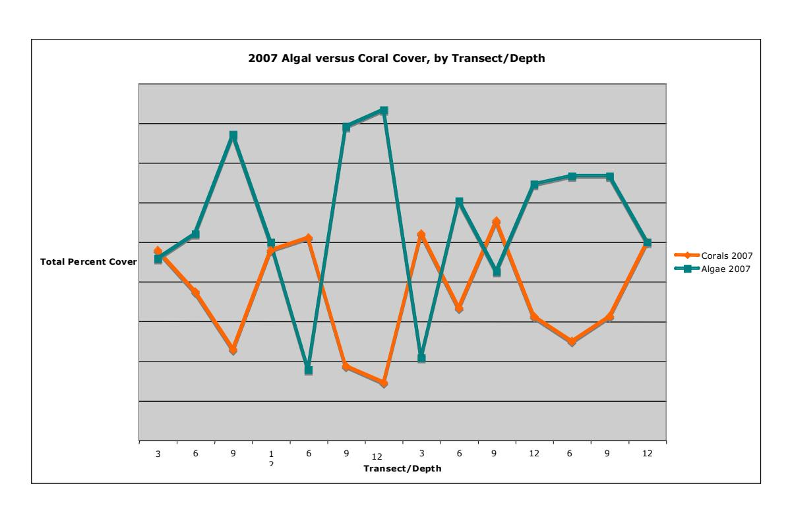

Figure 5. Relationship between coral cover and algal cover, for 2007.

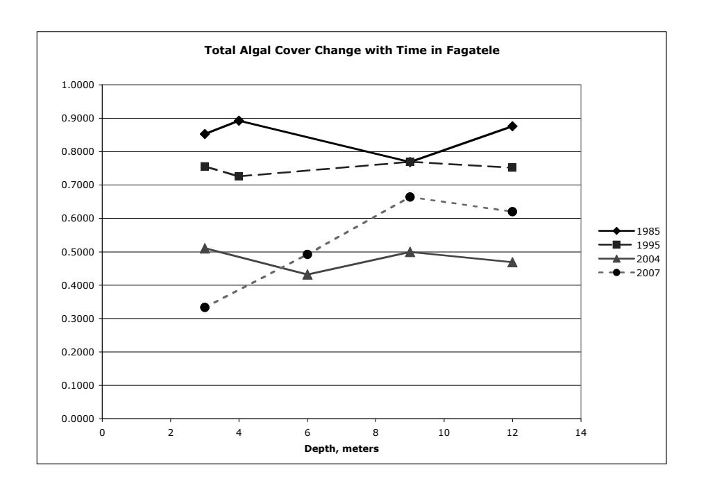

Figure 6. Change in total algal cover over time from 1985 to 2007.

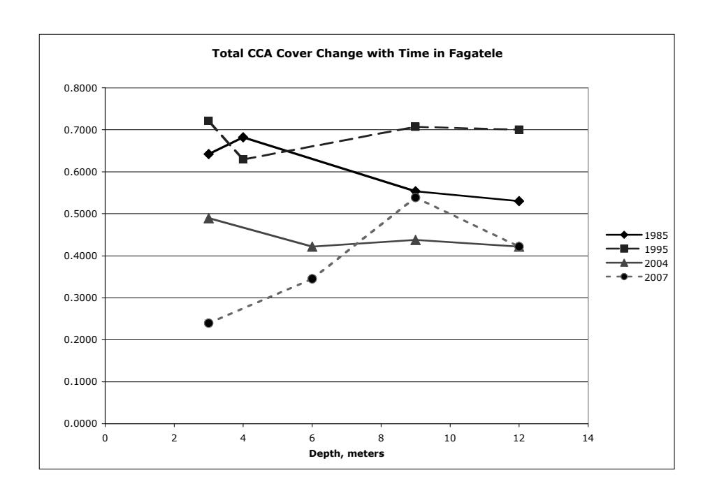

Figure 7. Change in total crustose coralline algal (CCA) cover over time from 1985 to 2007.

### *Fish in Fagatele Bay –2007/8*

A total of 426 fish belonging to 13 families and 58 species were recorded during surveys of Transect 2 in Fagatele Bay in November 2007 (Table 8). The fish communities on the reef slope were dominated by five species: one acanthurid - *Ctenochaetus striatus* (n=133), a scarid - *Chlorurus sordidus* (n=55) and three pomacentrids - *Plectroglyphidodon dickii* (n=32), *Pomacentrus vaiuli* (n=35) and *Chromis iomelas* (n=24) (Table 8).

Table 8. Fish communities on the reef slope in Fagatele Bay recorded in November, 2007.

|                |                           |    |    | Transect 2 Depth (m) |    |    |
|----------------|---------------------------|----|----|-------------------------|----|----|
| Family         | Species                   | 3  | 6  | 9                       | 12 | 18 |
| Acanthuridae   | Acanthurus nigricans      | 0  | 3  | 0                       | 2  | 0  |
|                | Acanthurus nigrofuscus    | 4  | 1  | 0                       | 2  | 2  |
|                | Ctenochaetus cyanocheilus | 3  | 1  | 5                       | 1  | 0  |
|                | Ctenochaetus striatus     | 33 | 31 | 21                      | 24 | 24 |
|                | Naso lituratus            | 1  | 1  | 1                       | 0  | 0  |
|                | Zebrasoma scopas          | 1  | 3  | 2                       | 5  | 4  |
|                | Zebrasoma veliferum       | 0  | 0  | 1                       | 0  | 0  |
| Balistidae     | Balistapus undulatus      | 0  | 0  | 1                       | 0  | 0  |
|                | Melichthys vidua          | 0  | 0  | 1                       | 1  | 1  |
| Chaetodontidae | Chaetodon lunula          | 0  | 0  | 0                       | 0  | 1  |
|                | Chaetodon pelewensis      | 0  | 0  | 0                       | 0  | 1  |
|                | Chaetodon reticulates     | 1  | 2  | 0                       | 0  | 0  |

|               | Chaetodon trifascialis                          | 0  | 0   | 0  | 1  | 0  |
|---------------|-------------------------------------------------|----|-----|----|----|----|
|               | Chaetodon ulietensis                            | 1  | 0   | 0  | 0  | 0  |
|               | Heniochus chrysostomus                          | 0  | 0   | 0  | 0  | 2  |
|               | Heniochus varius                                | 0  | 0   | 0  | 0  | 1  |
| Cirrhitidae   | Paracirrhites arcatus                           | 1  | 0   | 1  | 1  | 0  |
|               | Paracirrhites hemistictus                       | 0  | 0   | 0  | 0  | 1  |
| Labridae      | Epibulus insidiator                             | 0  | 0   | 1  | 0  | 0  |
|               | Gomphosus varius                                | 1  | 1   | 1  | 1  | 0  |
|               | Labrichthys unilineatus                         | 0  | 1   | 2  | 0  | 0  |
|               | Labroides dimidiatus                            | 0  | 0   | 0  | 2  | 0  |
|               | Labroides pectoralis                            | 0  | 1   | 0  | 0  | 0  |
|               | Oxycheilinus diagrammus                         | 0  | 0   | 0  | 1  | 0  |
|               | Pseudocheilinus hexataenia                      | 0  | 1   | 0  | 1  | 0  |
|               | Thalassoma hardwicke                            | 0  | 2   | 0  | 0  | 0  |
|               | Thalassoma quinquevittatum                      | 11 | 0   | 0  | 0  | 0  |
| Lethrinidae   | Monotaxis grandoculis                           | 0  | 2   | 0  | 0  | 0  |
| Lutjanidae    | Lutjanus fulvus                                 | 0  | 0   | 0  | 0  | 1  |
| Monacanthidae | Oxymonacanthus longirostris                     | 0  | 2   | 0  | 2  | 0  |
| Mullidae      | Mulloides vanicolensis                          | 0  | 1   | 0  | 0  | 0  |
|               | Parupeneus bifasciatus                          | 0  | 0   | 0  | 1  | 1  |
|               | Parupeneus cyclostomus                          | 0  | 1   | 1  | 0  | 0  |
| Pomacanthidae | Centropyge flavissimus                          | 1  | 0   | 2  | 0  | 0  |
|               | Pygoplites diacanthus                           | 0  | 0   | 0  | 1  | 0  |
| Pomacentridae | Chromis acares                                  | 0  | 0   | 0  | 0  | 1  |
|               | Chromis agilis                                  | 0  | 1   | 0  | 0  | 0  |
|               | Chromis alpha                                   | 0  | 0   | 0  | 0  | 1  |
|               | Chromis iomelas                                 | 0  | 4   | 10 | 4  | 6  |
|               | Chromis weberi                                  | 0  | 0   | 0  | 0  | 1  |
|               | Chromis xanthura                                | 0  | 2   | 0  | 0  | 1  |
|               | Dascyllus reticulates                           | 3  | 0   | 0  | 0  | 0  |
|               | Plectroglyphidodon dickii Plectroglyphidodon | 5  | 25  | 0  | 1  | 1  |
|               | johnstonianus                                   | 0  | 0   | 0  | 0  | 2  |
|               | Plectroglyphidodon lacrymatus                   | 7  | 1   | 0  | 5  | 0  |
|               | Pomacentrus brachialis                          | 0  | 2   | 0  | 1  | 0  |
|               | Pomacentrus vaiuli                              | 0  | 0   | 2  | 2  | 21 |
| Scaridae      | Calotomus carolinus                             | 0  | 0   | 1  | 1  | 0  |
|               | Chlorurus japanensis                            | 0  | 0   | 2  | 0  | 0  |
|               | Chlorurus sordidus                              | 10 | 27  | 2  | 6  | 10 |
|               | Scarus frenatus                                 | 0  | 0   | 1  | 0  | 1  |
|               | Scarus globiceps                                | 1  | 0   | 0  | 0  | 0  |
|               | Scarus oviceps                                  | 0  | 3   | 3  | 2  | 0  |
|               | Scarus psittacus                                | 0  | 0   | 0  | 2  | 0  |
|               | Scarus rubroviolaceus                           | 0  | 0   | 0  | 1  | 0  |
|               | Scarus spinus                                   | 1  | 0   | 1  | 0  | 0  |
| Serranidae    | Cephalopholis argus                             | 0  | 0   | 1  | 0  | 2  |
|               | Cephalopholis urodeta                           | 0  | 0   | 0  | 2  | 0  |
| TOTAL         |                                                 | 85 | 119 | 63 | 73 | 86 |

### *Trends in Fagatele Bay fish communities 1985-2007 on Transect 2*

Abundance of reef fishes has fluctuated over time (Figure 8). Fish abundance was high in 1985, declined in 1988, slowly increased from 1994 to 2001, and then declined again from 2004 to 2007.

Species richness has also fluctuated from 1985 to 2007 with no significant long term declines apparent (Figure 9).

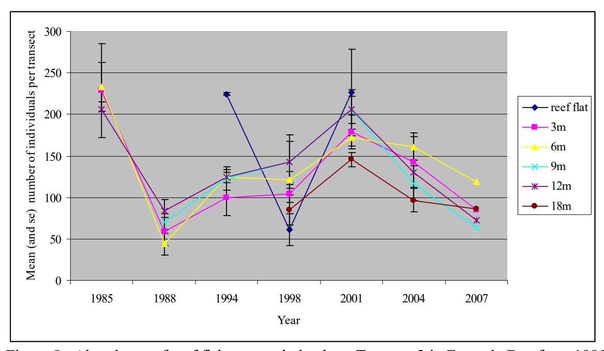

Figure 8. Abundance of reef fishes at each depth on Transect 2 in Fagatele Bay from 1985 to 2007. Symbols refer to different depths on the reef flat and reef slope (3m, 6m, 9m, 18m).

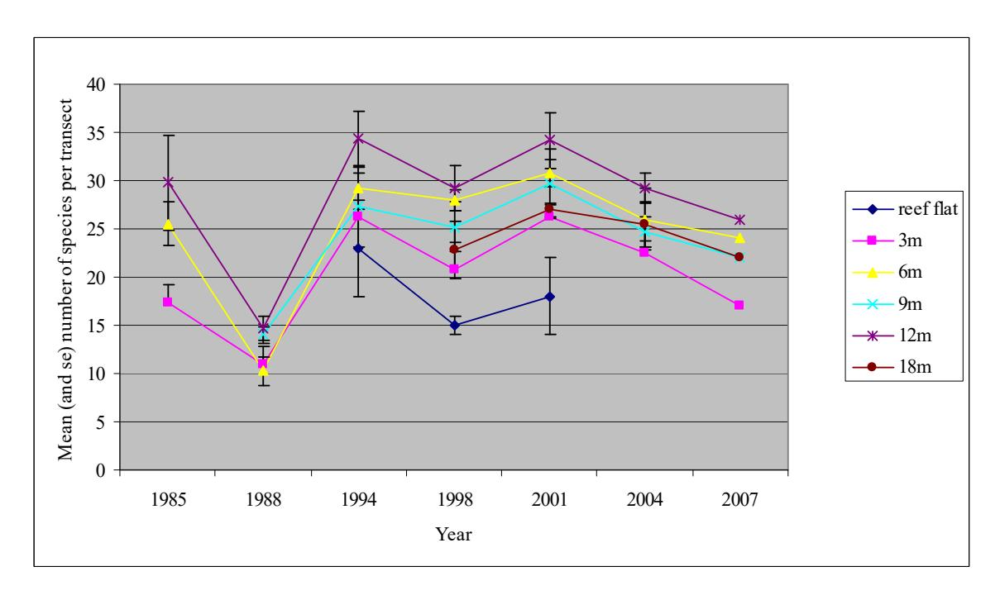

Figure 9. Species richness of reef fishes at each depth on Transect 2 in Fagatele Bay from 1985 to 2007. Symbols refer to different depths on the reef flat and reef slope (3m, 6m, 9m, 18m).

#### **Reefs Around Tutuila**

### Corals in Pago Pago Harbor –2007

A total of 401 coral colonies belonging to 30 species were recorded in the surveys at the two sites in Pago Pago Harbor in 2007. The most common coral was *Montipora grisea* (80 colonies) closely followed by *Pavona varians* (78 colonies). Only five other species were abundant (represented by >20 colonies); *Pocillopora damicornis* (53 colonies), *Psammocora profundacella* (40 colonies), *Psammocora contigua* (32 colonies), *Pavona divaricata* (29 colonies), and *Pocillopora verrucosa* (26 colonies). All other species (n = 24) were rare (<11 colonies) (Table 1).

Average cover in Pago Pago Harbor was only 19.4%, and only two species contributed substantially to the coral cover in the harbor. *Diploastrea heliopora* represented 14.1% cover and *Pavona varians* represented 4.8% cover in the area surveyed. All other species combined represented just 0.5% cover. Average coral cover was highest at 6 m at Rainmaker (21.7%), and lowest at 3m at Aua (15.5%).

Coral density in Pago Pago harbor was also low. The highest density was at 3 m depth at Aua (11.2 colonies/m²) and lowest at 3 m depth at Rainmaker (4.4 colonies/m²) (Table 9). Overall, 30.4% of corals in Pago Pago Harbor were <5 cm in diameter and 82.7% were <20 cm in diameter, compared to 34% and 92% in 2004. A full summary of all data from the 2007 survey of Pago Pago Harbor, including numbers of colonies in each size class and estimates of percent cover for each species, is provided in Appendix 4.

#### Trends in coral populations in Pago Pago Harbor 2004-2007

Coral populations at Rainmaker were mixed, with a decrease in colony density at 3 m and an increase at 6 m depth. The density at 6 m was the best since 1982. At Aua there were strong increases in colony density at both 3 m and 6 m to densities comparable to those in 2001 (Tables 9 and 10).

Coral colony sizes for coral colonies in Pago Pago Harbor are compared in Figure 10 between 2004 and 2007. A slightly lower proportion of all the colonies were in Size Category 1 (< 5 cm diameter) while a slightly higher proportion of all colonies were in Size Category 2 in 2007 than in 2004.

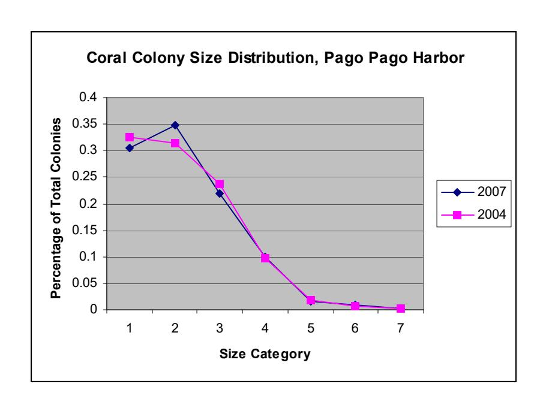

Figure 10. Coral colony size distributions in Pago Pago Harbor from 2004 and 2007.

Table 9. Density of hermatypic corals (number of colonies per m2 ) at two sites in Pago Pago Harbor from surveys conducted 1982-2007. Data for 1982, 1985, 1988, and 1995 are from Birkeland et al 2003. Data for 1998 and 2001 are from Birkeland et al 2004. Data for 2004 are from Green et al 2005.

| Location  | Depth | Year | Number of colonies per m2 |
|-----------|-------|------|------------------------------|
|           |       |      |                              |
| Rainmaker | 3 m   | 1982 | 4.69                         |
|           |       | 1985 | 8.25                         |
|           |       | 1888 | 7.54                         |
|           |       | 1995 | 9.23                         |
|           |       | 1998 | -                            |
|           |       | 2001 | 8.02                         |
|           |       | 2004 | 11.8                         |
|           |       | 2007 | 4.43                         |
| Rainmaker | 6 m   | 1982 | 11.58                        |
|           |       | 1985 | 0.84                         |
|           |       | 1888 | 0.25                         |
|           |       | 1995 | 2.95                         |
|           |       | 1998 | 2.28                         |
|           |       | 2001 | 2.25                         |
|           |       | 2004 | 2.6                          |
|           |       | 2007 | 5.8                          |
| Aua       | 3 m   | 1982 | -                            |
|           |       | 1985 | -                            |
|           |       | 1888 | -                            |
|           |       | 1995 | -                            |

|     |     | 1998 | 8.7   |
|-----|-----|------|-------|
|     |     | 2001 | 20.04 |
|     |     | 2004 | 1.7   |
|     |     | 2007 | 11.2  |
| Aua | 6 m | 1982 | -     |
|     |     | 1985 | -     |
|     |     | 1988 | -     |
|     |     | 1995 | -     |
|     |     | 1998 | 20.26 |
|     |     | 2001 | 10.96 |
|     |     | 2004 | 1.7   |
|     |     | 2007 | 7.6   |

Table 10. Percent cover of substrata by hermatypic corals at two sites in Pago Pago Harbor, Tutuila Island from surveys conducted in 1982-2007. Data from 1982, 1985, 1988 and 1995 from Birkeland et al, 2003. Data for 1998 and 2001 are from Birkeland et al 2004, and data from 2004 are from Green et al, 2005.

| Location  | Depth | Year | % Coral Cover |
|-----------|-------|------|---------------|
| Rainmaker | 3 m   | 1982 | 6.65          |
|           |       | 1985 | 11.38         |
|           |       | 1988 | 3.2           |
|           |       | 1995 | 12.04         |
|           |       | 1998 | -             |
|           |       | 2001 | 5.33          |
|           |       | 2004 | 12.8          |
|           |       | 2007 | 19.7          |
| Rainmaker | 6 m   | 1982 | 27.72         |
|           |       | 1985 | 19.19         |
|           |       | 1988 | 18.7          |
|           |       | 1995 | 3.06          |
|           |       | 1998 | 2.99          |
|           |       | 2001 | 47.28         |
|           |       | 2004 | 50.1          |
|           |       | 2007 | 21.7          |
| Aua       | 3 m   | 1982 | -             |
|           |       | 1985 | -             |
|           |       | 1988 | -             |
|           |       | 1995 | -             |
|           |       | 1998 | 31.81         |
|           |       | 2001 | 37.67         |
|           |       | 2004 | 19.1          |
|           |       | 2007 | 15.5          |
| Aua       | 6 m   | 1982 | -             |
|           |       | 1985 | -             |
|           |       | 1988 | -             |

| 1995 | -     |
|------|-------|
| 1998 | 26.7  |
| 2001 | 60.31 |
| 2004 | 7.1   |
| 2007 | 20.6  |

### *Benthic Cover in Pago Pago Harbor*

Coral cover ranged from 11.4% at Rainmaker to 32.2% at Aua, while macroalgae cover ranged from 45.8% at Rainmaker to 63.6% at Aua (Table 11). The Rainmaker site is located at the back of Pago Pago Harbor, where circulation generally appears more restricted compared with the Aua site. Turbidity is high at the Rainmaker site with corresponding low light levels. Sediment is easily disturbed and remains suspended in water column for a long time (> 2 hours). These conditions generally favor more shade-loving species, such as some species of red algae, and discourage organisms with higher light requirements, such as coral and many species of algae. The low coral and algal cover and high non-living cover at the Rainmaker site may, in part, result from the high turbidity at the site.

 While algal cover increases from Rainmaker to Aua, it is important to note that the increase is largely in percent cover of CCA, which increase from 22% at Rainmaker to 54% at Aua and turf algae decrease from approximately 20% at Rainmaker to 6% at Aua. A decrease in percent cover of turf algae often indicates a change to a healthier oligotrophic environment and a concomitant increase in grazer biomass.

Table 11. Benthic Cover in Pago Pago Harbor

|               |                    | Aua- 3 m | Aua - 6 m | Aua Total | Rainmaker – 3 m | Rainmaker – 6 m | Rainmaker Total |
|---------------|--------------------|----------|-----------|-----------|-----------------|-----------------|-----------------|
| Corals        | branching          | 10.4%    | 4.2%      | 7.3%      | 4.2%            | 2.1%            | 3.1%            |
|               | digitate           | 0.0%     | 2.1%      | 1.0%      | 0.0%            | 0.0%            | 0.0%            |
|               | encrusting         | 33.3%    | 12.5%     | 22.9%     | 6.3%            | 4.2%            | 5.2%            |
|               | corals foliose     | 0.0%     | 0.0%      | 0.0%      | 0.0%            | 0.0%            | 0.0%            |
|               | corals massive     | 0.0%     | 0.0%      | 0.0%      | 6.3%            | 0.0%            | 3.1%            |
|               | corals mushroom    | 0.0%     | 0.0%      | 0.0%      | 0.0%            | 0.0%            | 0.0%            |
|               | corals plate       | 2.1%     | 0.0%      | 1.0%      | 0.0%            | 0.0%            | 0.0%            |
| Macroalgae    | encrusting algae   | 0.0%     | 6.3%      | 3.1%      | 4.2%            | 0.0%            | 2.1%            |
|               | blue-greens        | 0.0%     | 0.0%      | 0.0%      | 0.0%            | 0.0%            | 0.0%            |
|               | Halimeda spp.      | 0.0%     | 0.0%      | 0.0%      | 0.0%            | 2.1%            | 1.0%            |
|               | macroalgae         | 6.3%     | 6.3%      | 6.3%      | 27.1%           | 14.6%           | 19.8%           |
|               | geniculate CCA     | 0.0%     | 0.0%      | 0.0%      | 0.0%            | 0.0%            | 0.0%            |
|               | crustose coralline | 41.7%    | 66.7%     | 54.2%     | 22.9%           | 20.8%           | 21.9%           |
| Invertebrates | ascidian           | 0.0%     | 0.0%      | 0.0%      | 0.0%            | 0.0%            | 0.0%            |
|               | clam               | 2.1%     | 0.0%      | 1.0%      |                 |                 |                 |
|               | hydrozoan          | 0.0%     | 0.0%      | 0.0%      |                 |                 |                 |
|               | soft coral         | 2.1%     | 0.0%      | 1.0%      | 0.0%            | 0.0%            | 0.0%            |
|               | sponge             | 0.0%     | 0.0%      | 0.0%      | 0.0%            | 0.0%            | 0.0%            |
|               | urchin             | 0.0%     | 0.0%      | 0.0%      |                 |                 |                 |
|               | zooanthid          | 0.0%     | 0.0%      | 0.0%      | 0.0%            | 0.0%            | 0.0%            |
|               | other              | 2.1%     | 0.0%      | 1.0%      | 0.0%            | 0.0%            | 0.0%            |
| Non-living    | crevice/hole       | 0.0%     | 2.1%      | 1.0%      | 0.0%            | 0.0%            | 0.0%            |
|               | reef matrix        | 2.1%     | 0.0%      | 1.0%      | 0.0%            | 2.1%            | 1.0%            |
|               | rubble             | 0.0%     | 0.0%      | 0.0%      | 12.5%           | 18.8%           | 15.6%           |
|               | sand               | 0.0%     | 0.0%      | 0.0%      | 16.7%           | 35.4%           | 26.0%           |

### *The Aua Transect*

Long- term monitoring shows that coral density has changed dramatically over time along the Aua transect (Fig. 11). In 1917, corals were recorded along the entire reef flat, with the highest density recorded on the outer reef flat and crest as were evident in Mayor's (1924) photographs. The excavation of a burrow pit in the 1950s removed nearly all corals from the inner 91 m since that time.

Density was lowest in 1995 and 1998, but there has been a significant recovery of coral communities on the reef crest and outer reef flat in during the past 15 years. The corals were few in 1995-1998, but starting with a massive recruitment of *Acropora nana* in 1999, density has remained high on the outer part of the transect with solid substrata, but low on the rubble sections of the middle part of the transect and essentially non existent in the burrow pit.

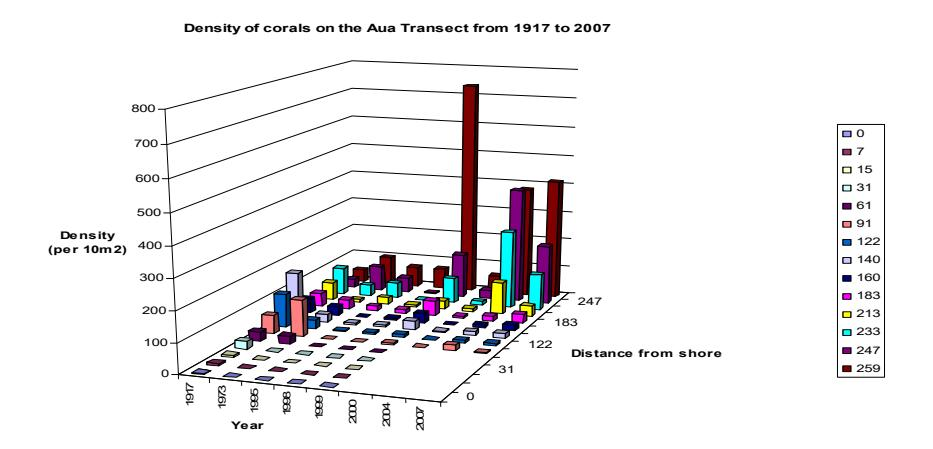

Figure 11. Density of corals from 1917 to 2007 from the shore to the reef crest.

Along with increased coral population density, the living coral cover has also returned (Fig. 12), but the coral species diversity is now slightly lower (Fig. 13). There used to be a variety of *Acropora* species on the reef crest, but Acropora nana now dominates nearly exclusively. In 1917, there was high coral cover on the outer reef flat, mostly *Porites cylindrica* and *Pocillopora* spp. Now the reef flat is mostly rubble with only a few colonies of *Acropora formosa* starting to be established. The *Acropora formosa* colonies on the rubble are quite healthy, as are the other species living on widely separated large immobile blocks among the rubble. The coral colonies are healthy as long as they are not toppled over because of being attached to unstable substrata. The *Acropora formosa* are able to gain stability by lodging of their relatively extensive branches. Pavona and Millepora sometimes form coraliths, or unattached free-rolling fragments of substrata with living coral on all sides.

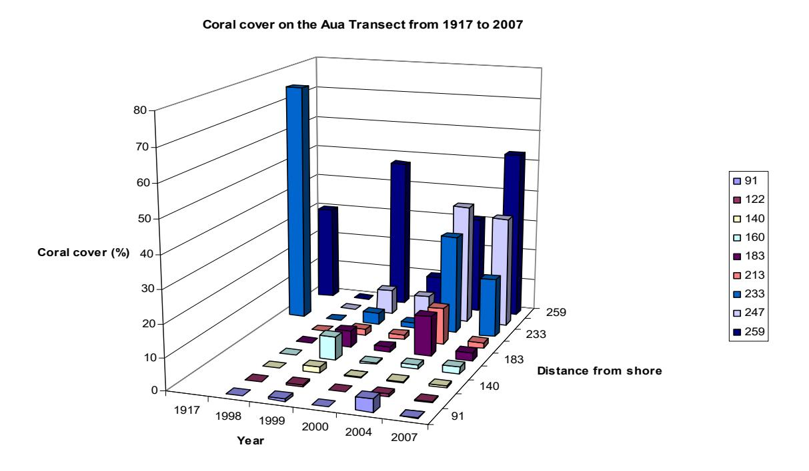

Figure 12. Living coral cover through time along the Aua quantitative permanent transect.

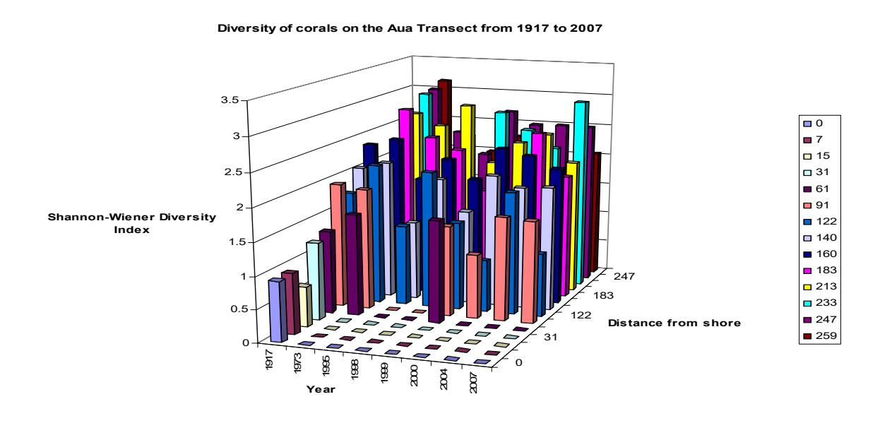

Figure 13. Species diversity of corals along the Aua transect from 1917 to 2007.

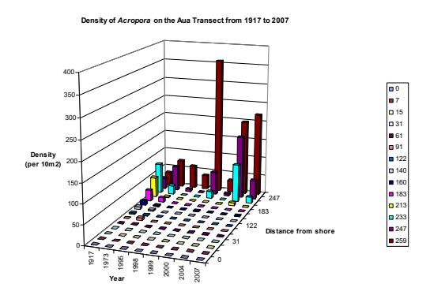

1917 1973 1995 1998 1999 2000 2004 180 **Density (per 10m2) Distance from shore Density of** *Pocillopora* **on the Aua Transect from 1917 to 2007**

15

160

247

Figure 14. Density of *Acropora* colonies. Figure 15. Density of *Pocillopora* colonies.

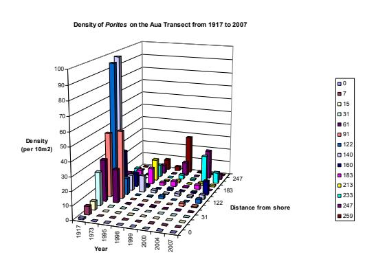

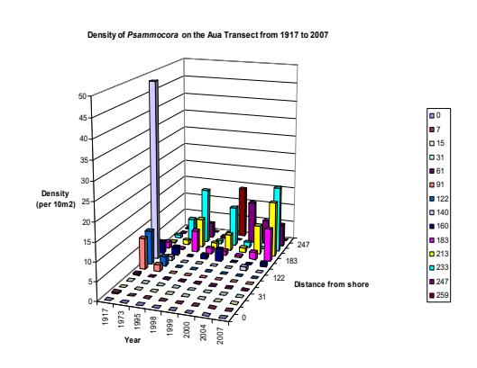

Figure 16. Density of *Porites* colonies. Figure 17. Density of *Psammocora* colonies.

### *Fagasa Bay Benthic Data*

Cape Larsen had a lower percent coral (11%) and higher percent algae (81%) compared with Sita Bay (coral = 17%; algae = 53%), however there was a much higher percentage of nonliving surfaces at Sita Bay (29.9%) compared with Cape Larsen (3.5%) (Table 12). A closer examination of the algae shows that both sites have substantial turf algae (22% at Cape Larsen versus 15% at Sita Bay), however CCA cover is much higher at Cape Larsen (46%) compared with Sita Bay (22%). Both sites have low cover of invertebrates (4.2% at Cape Larsen compared with 0% at Sita Bay). The higher percentage of turf algae may support a higher fish biomass, however the high algae cover may indicate an area of high disturbance.

Table 12. Benthic Cover at Fagasa

| Percent Cover of Species at Fagasa |           |             |          |  |  |  |  |  |  |
|------------------------------------|-----------|-------------|----------|--|--|--|--|--|--|
|                                    |           | Cape Larsen | Sita Bay |  |  |  |  |  |  |
| Corals                             | branching | 0.0%        | 0.7%     |  |  |  |  |  |  |
|                                    | digitate  | 0.0%        | 0.0%     |  |  |  |  |  |  |

|               | encrusting         | 8.3%  | 16.0% |
|---------------|--------------------|-------|-------|
|               | foliose            | 0.0%  | 0.0%  |
|               | massive            | 2.1%  | 0.0%  |
|               | mushroom           | 0.0%  | 0.0%  |
|               | corals plate       | 0.7%  | 0.7%  |
| Macroalgae    | encrusting         | 12.5% | 8.4%  |
|               | blue-greens        | 0.0%  | 0.0%  |
|               | Halimeda spp.      | 0.0%  | 1.4%  |
|               | Macroalgae         | 22.9% | 18.8% |
|               | geniculate CCA     | 0.0%  | 2.1%  |
|               | crustose coralline | 45.8% | 22.2% |
| Invertebrates | ascidian           | 0.0%  | 0.0%  |
|               | clam               | 0.0%  | 0.0%  |
|               | hydrozoan          | 0.0%  | 0.0%  |
|               | soft coral         | 0.0%  | 0.0%  |
|               | sponge             | 0.7%  | 0.0%  |
|               | urchin             | 0.0%  | 0.0%  |
|               | zooanthid          | 0.7%  | 0.0%  |
|               | other              | 2.8%  | 0.0%  |
|               |                    |       |       |
| Non-living    | crevice/hole       | 0.7%  | 2.8%  |
|               | reef matrix        | 0.7%  | 0.0%  |
|               | rubble             | 0.0%  | 22.9% |
|               | sand               | 2.1%  | 4.2%  |
|               |                    |       |       |

### *Historic Fish Transects 2004-2007*

The number and species of fish recorded at the three historic fish transect sites at Fagatele Bay, Sita Bay and Cape Larsen are presented in Table 13.

Density of reef fishes has fluctuated dramatically over time from 1977 to 2007 at these three sites around Tutuila (Figure 18). Density was high in 1977, increased in 1985, declined in 1988 and then steadily increased to 2004 before declining again in 2007.

Species richness also fluctuated from 1977 to 2007 with no significant long term declines from 1985 to 2007 apparent (Figure 19).

Density and species richness were both lower in 1988 than other years, due to sampling issues (see Discussion).

Table 13. The number of each species of reef fish recorded on each of three transects at each of three sites around Tutuila in November 2007.

|                |                            |    | Cape Larsen |    | Fagatele Bay |    |    | Sita Bay |    |    |
|----------------|----------------------------|----|-------------|----|--------------|----|----|----------|----|----|
| Family         | Species                    | T1 | T2          | T3 | T1           | T2 | T3 | T1       | T2 | T3 |
| Acanthuridae   | Acanthurus achilles        |    |             | 1  |              |    |    |          |    |    |
|                | Acanthurus guttatus        |    |             |    |              |    |    |          | 4  |    |
|                | Acanthurus lineatus        |    | 1           |    |              |    |    |          |    |    |
|                | Acanthurus nigricans       | 4  | 4           | 1  |              | 3  | 2  |          |    | 1  |
|                | Acanthurus nigrofuscus     | 6  | 4           | 6  | 6            | 1  | 2  |          | 1  | 3  |
|                | Acanthurus nigroris        |    |             | 2  |              |    |    |          |    |    |
|                | Ctenochaetus cyanocheilus  |    |             |    | 1            | 2  | 1  |          |    |    |
|                | Ctenochaetus striatus      | 20 | 22          | 23 | 16           | 24 | 24 | 28       | 30 | 23 |
|                | Naso lituratus             |    | 2           | 1  |              |    |    |          | 1  | 2  |
|                | Zebrasoma scopas           |    |             |    | 6            | 3  | 5  |          |    |    |
| Balistidae     | Balistapus undulatus       |    |             |    |              |    |    |          |    | 1  |
|                | Melichthys vidua           |    |             | 3  | 1            |    | 1  |          |    | 2  |
|                | Sufflamen bursa            |    | 1           |    |              |    |    |          |    |    |
| Caesionidae    | Caesio caerulaurea         |    |             |    | 2            |    |    |          |    |    |
| Chaetodontidae | Chaetodon ephippium        |    | 2           | 2  |              |    |    | 1        |    |    |
|                | Chaetodon lunula           |    |             |    |              |    |    |          |    | 1  |
|                | Chaetodon ornatissimus     |    |             |    |              |    |    |          |    | 2  |
|                | Chaetodon pelewensis       |    | 3           | 1  |              |    |    |          |    |    |
|                | Chaetodon reticulatus      | 2  |             | 1  | 1            | 1  |    | 2        |    |    |
|                | Chaetodon trifascialis     |    |             |    |              |    | 1  |          |    |    |
|                | Forcipiger flavissimus     | 3  | 3           | 1  |              |    |    |          |    |    |
| Cirrhitidae    | Paracirrhites arcatus      |    |             |    |              | 1  | 1  |          | 1  |    |
|                | Paracirrhites forsteri     |    |             |    |              |    |    |          |    | 1  |
| Haemulidae     | Plectorhinchus vittatus    |    |             |    |              |    |    |          |    | 1  |
| Kyphosidae     | Kyphosus spp.              |    |             |    |              |    |    |          |    | 1  |
| Labridae       | Anampses twistii           |    | 1           |    |              |    |    |          |    |    |
|                | Bodianus axillaris         | 2  | 1           |    |              |    |    | 5        |    |    |
|                | Cheilinus trilobatus       |    |             | 1  |              |    |    |          | 1  |    |
|                | Coris gaimard              | 1  |             |    |              |    |    |          |    |    |
|                | Gomphosus varius           |    |             |    |              | 1  | 1  |          | 1  |    |
|                | Halichoeres hortulanus     |    | 1           | 1  |              | 1  |    | 2        | 1  |    |
|                | Halichoeres marginatus     | 1  | 1           |    |              |    |    |          |    |    |
|                | Halichoeres ornatissimus   | 1  |             |    |              |    |    |          |    |    |
|                | Hemigymnus fasciatus       |    |             |    | 1            | 1  |    |          |    |    |
|                | Labrichthys unilineatus    |    |             |    |              | 1  |    |          |    |    |
|                | Labroides bicolor          |    | 1           |    |              |    |    | 1        | 1  |    |
|                | Labroides dimidiatus       |    | 1           | 1  |              |    | 2  |          | 1  | 2  |
|                | Labroides rubrolabiatus    |    |             |    |              |    |    |          |    | 1  |
|                | Oxycheilinus diagrammus    |    |             |    |              |    | 1  |          |    |    |
|                | Pseudocheilinus hexataenia |    |             |    |              | 1  | 1  |          | 1  |    |
|                | Thalassoma hardwicke       |    |             |    | 1            |    |    | 2        | 2  | 1  |
|                | Thalassoma lutescens       |    |             |    |              | 1  |    |          |    |    |
|                | Thalassoma quinquevittatum |    | 1           | 1  |              |    |    |          | 1  |    |
| Lethrinidae    | Monotaxis grandoculis      | 1  |             |    |              |    |    |          |    | 1  |
| Lutjanidae     | Aphareus furca             | 1  | 1           |    |              |    |    |          |    | 1  |
|                | Lutjanus fulvus            |    |             |    |              |    |    |          | 1  | 1  |

|                | Macolor macularis                |     | 1   |     |    |    |    |     |    |     |
|----------------|----------------------------------|-----|-----|-----|----|----|----|-----|----|-----|
| Monacanthidae  | Oxymonacanthus longirostris      |     |     |     |    |    | 2  |     |    |     |
| Mullidae       | Mulloides vanicolensis           |     |     |     |    |    |    |     |    | 2   |
|                | Parupeneus bifasciatus           |     |     |     |    |    | 1  |     |    |     |
|                | Parupeneus cyclostomus           |     |     |     |    |    |    |     | 1  |     |
|                | Parupeneus multifasciatus        |     |     |     |    |    |    | 5   |    |     |
| Pomacanthidae  | Centropyge bispinosus            |     |     |     |    | 1  |    |     |    |     |
|                | Centropyge flavissimus           |     | 3   | 2   |    | 1  |    |     | 1  | 1   |
|                | Pomacanthus imperator            |     | 1   |     |    |    |    |     |    |     |
|                | Pygoplites diacanthus            |     | 1   |     |    | 1  | 1  | 1   | 1  | 1   |
| Pomacentridae  | Chromis acares                   |     | 11  |     |    | 7  |    |     |    |     |
|                | Chromis iomelas                  | 1   |     |     | 8  | 7  | 4  |     | 2  |     |
|                | Chromis margaritifer             | 19  | 23  | 10  | 2  |    |    |     | 8  | 11  |
|                | Chromis xanthura                 |     | 3   |     | 1  |    |    |     |    | 2   |
|                | Chrysiptera taupou               | 26  | 25  | 46  |    |    |    | 79  | 12 | 9   |
|                | Plectroglyphidodon dickii        |     |     |     |    |    | 1  |     |    | 2   |
|                | Plectroglyphidodon johnstonianus |     |     |     |    | 2  |    |     |    |     |
|                | Plectroglyphidodon lacrymatus    | 1   |     |     | 1  | 4  | 5  |     |    | 9   |
|                | Pomacentrus brachialis           | 5   | 7   |     | 4  | 6  | 1  |     |    |     |
|                | Pomacentrus vaiuli               | 4   | 5   | 8   | 8  | 4  | 2  | 1   | 4  | 3   |
| Scaridae       | Calotomus carolinus              |     |     |     | 1  | 1  | 1  |     |    |     |
|                | Chlorurus japanensis             | 6   | 9   | 1   |    | 1  |    | 6   | 18 | 19  |
|                | Chlorurus sordidus               |     | 12  |     | 5  |    | 6  | 1   |    |     |
|                | Scarus forsteni                  | 6   | 3   | 1   |    |    |    |     |    |     |
|                | Scarus frenatus                  |     | 1   |     |    |    |    |     |    | 1   |
|                | Scarus ghobban                   | 1   |     |     |    |    |    |     |    |     |
|                | Scarus niger                     | 2   |     |     |    |    |    |     |    |     |
|                | Scarus oviceps                   |     |     |     | 2  | 2  | 2  |     |    |     |
|                | Scarus psittacus                 |     |     |     |    |    | 2  |     |    |     |
|                | Scarus rubroviolaceus            | 3   | 2   | 1   |    |    | 1  |     |    | 2   |
| Serranidae     | Cephalopholis argus              |     |     |     | 1  |    |    |     |    |     |
|                | Cephalopholis urodeta            | 1   | 2   |     |    |    | 2  |     | 2  |     |
|                | Epinephelus hexagonatus          |     |     | 1   |    |    |    |     |    |     |
| Tetraodontidae | Canthigaster solandri            | 2   |     |     |    |    |    | 3   |    | 2   |
| Zanclidae      | Zanclus cornutus                 |     |     |     | 1  |    |    |     |    |     |
| TOTAL          |                                  | 119 | 159 | 116 | 69 | 78 | 73 | 137 | 96 | 109 |

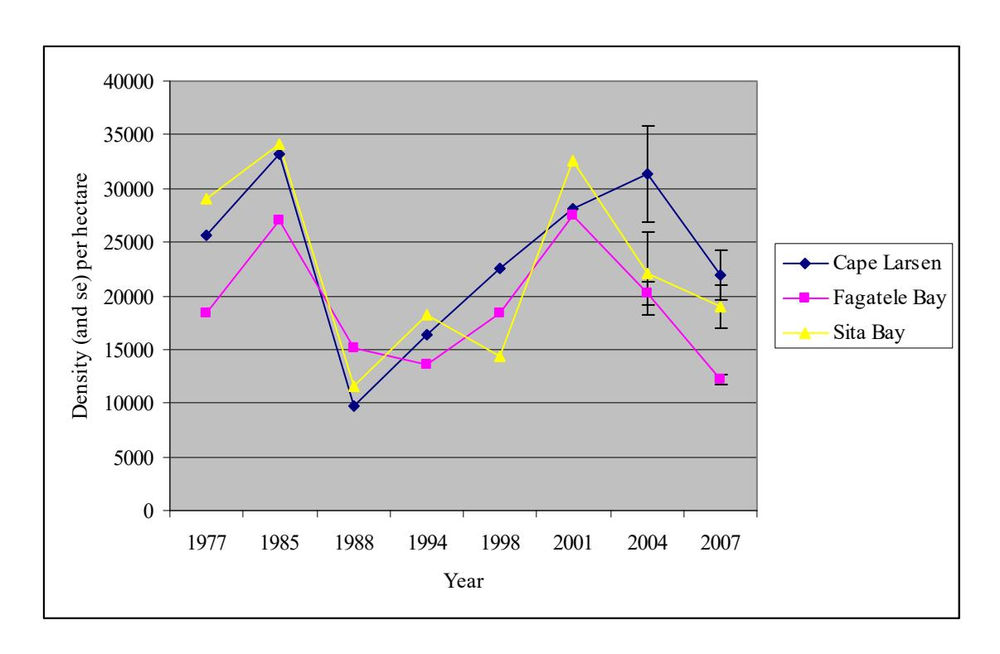

Figure 18. Density of reef fishes from 1977 to 2007 at three sites around Tutuila.

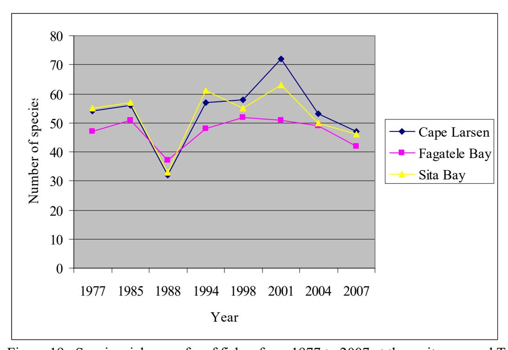

Figure 19. Species richness of reef fishes from 1977 to 2007 at three sites around Tutuila.

### **DISCUSSION**

### **Fagatele Bay National Marine Sanctuary**

### *Coral Communities in Fagatele Bay*

The main conclusion from our survey of the corals in Fagatele Bay is that they are still resilient and doing quite well. "Resilience" is the ability to recover from damage. The corals of American Samoa have been subjected to a major crown-of-thorns outbreak (1978), hurricanes (1981, 1987, 1990, 1991, 2004, 2005), bleaching from extraordinarily warm water (1994, 2002, 2003), and extreme low tides (1998, 2005), but results from our survey indicate that the coral communities are back to normal. The abundance and population density of corals (14.5 colonies per m2 ) and the living coral cover (64%) are typical of very healthy reefs. ReefBase considers reefs with 30% living coral cover as relatively healthy. In diverse ecosystems, most species are rare, and yet 94 species were common enough to be encountered within our transect areas. Obviously, in Fagatele Bay the common species are not dominating the reef community to the exclusion of less common species. The 94 species on our transects indicate a truly diverse coral community. The distribution of relative abundances matched the 2004 survey of Fagatele Bay, which indicates the system to be stable.

A total of 164 species of corals are known from Fagatele Bay from previous surveys, but this latest survey found yet another four species not previously recorded: *Acropora formosa, Montipora hispida*, *Fungia concinna* and *Fungia klunzingeri*, bringing the total number of species in Fagatele Bay to 168. The number of species in Fagatele Bay is not yet decreasing. The size distribution of coral colonies in Fagatele Bay also indicates a healthy situation with a few large colonies and an abundance of smaller colonies, indicating a healthy recruitment. However, some of the smaller colonies are of species that do not usually grow large, e.g., *Porites* sp. 2 and *Galaxea fascicularis*.

The numerical pattern of relative abundance of species, the relative abundance of coral species representing the different families of corals, and the population densities of corals along the depth distribution are all fairly constant between 2004 and 2007, indicating that the population has reached a temporary equilibrium as a relatively healthy coral community. The proportion of corals in the smallest size category (< 5 cm diameter) has decreased and the proportion in the higher size classes have increased since 1995, showing that the coral community has grown in size distribution over the past decade.

This basic resilience of the coral reefs in Fagatele Bay influenced by multiple disturbance factors is in stark contrast to the coral reefs of the western Atlantic, where the rate of reef degradation has been continuous since the late 1970s (Gardner et al. 2003, Lang 2003). It is possible that the resilience of American Samoan reefs in general is in part because of the distance from continents. All the reefs in the western Atlantic are closely bordered by North and South American continents. From the north, the Mississippi River has dumped an average of 1.6 million metric tons of fixed nitrogen and 100,000 metric tons of phosphate per year into the western Atlantic and from the south the Orinoco has dumped comparable amounts. Likewise, the western Atlantic gets hundreds of tons of microbe-infected dust from North African soil (Garrison et al. 2003). Although atmospheric CO2 concentration has increased globally, much more has been taken up in the North Atlantic and very little is being taken up in the Pacific near American Samoa because of differences in regional physical oceanography (Sabine et al. 2004).

### *Corals in Pago Pago Harbor*

The pipe discharging the wastewater outflow from the two main tuna canneries was constructed to extend out to the entrance of Pago Pago harbor in 1992. Since that time, the coral communities have definitely been improving at the Aua Transect and at the Rainmaker (now Sadies By the Sea) Hotel. There has been successful recruitment and growth of some colonies of *Acropora hyacinthus* at both sites.

The coral cover typical of a fully normal and healthy reef community has returned to wherever there are solid substrata, i.e., on the reef crest and on large coral blocks on the reef flat. The dominant species is *Acropora nana* because of a major massive recruitment. *Pocillopora eydouxi, P. verrucosa, P. damicornis, Pavona divaricata, Porites cylindrica* and some large mound *Porites* are fairly common on the solid substrata.

On the inner reef flat that is still blanketed by rubble, the coral cover remains small even though the few corals that are there appear in fine health. On the rubble, there are currently a few *Acropora formosa* colonies braced in the sand, a few coraliths of *Montipora* spp. and *Millepora* spp., occasional *Stylaraea punctata* attached to rubble, and a number of species growing attached to large stable rocks.

Alfred Mayor of the Carnegie Institute in Washington DC established a transect for a quantitative study of the corals across a reef flat from the shore to the reef crest in 1917. The transect was well within the protected waters of Pago Pago harbor, near the village of Aua, and was covered by branching corals, with *Porites cylindrica* dominant from about 15 m from shore to 160 m and with *Acropora* spp. dominant on the outer 100 m (Mayor 1924; Green et al. 1997). Substantial urban development began in Pago Pago after World War II. In the 1950s, two tuna canneries were constructed and began operation, a fuel dump at Aua contributed pollutants to the seawater, and the inner 90 m of Mayor's Aua transect was dredged for road construction materials, contributing a plume of sedimentation over the transect for several years. The canneries poured large quantities of wastewater into the harbor continuously and this lower water quality was a chronic problem for about four decades. Art Dahl and Austin Lamberts (1977) resurveyed the Aua transect in 1973 and recorded that the reef flat between the solid pavement of the reef crest and the excavated pit near shore was converted from a community of branching corals to a blanket of loose rubble.

In 1992, the canneries extended the wastewater outflow pipes to the outer harbor, beyond the Aua transect, where water flow is stronger. After 1992, the corals showed successful recruitment and growth. The living coral cover and species richness all increased substantially wherever there was solid substratum, to about the levels recorded by Mayor in 1917. The population density of corals on solid substrata is even higher than in 1917, although the living coral cover is comparable, so the average colony size is probably smaller now. On the inner reef flat that is still blanketed by rubble, the coral cover remains small even though the few corals that are there appear in fine health. On the rubble, there are currently a few *Acropora formosa* (= *A. muricata*) colonies braced in the sand, a few coraliths of *Montipora* spp. and *Millepora* spp., occasional *Stylaraea punctata* attached to rubble, and a number of species growing attached to large stable rocks.

The coral reef communities in American Samoa are still generally resilient and will recover readily from acute disturbances such as hurricanes, bleaching events, and predation by *Acanthaster planci*. The record of 90 years on Mayor's Aua transect has shown that chronic disturbances such as a continuous input of pollution might keep the corals from recovering for decades, but the corals can promptly return if the chronic disturbance is ended, so long as there is solid substratum available. However, where the substratum is loose rubble, recovery will take decades until the substratum can be solidified or until the corals can eventually form a self-reinforcing aggregation.

### *Fish communities*

.

- Could only do limited assessment because only 1/6th of survey has been completed. A more detailed analysis will be provided when all of the surveys have been completed.
- Changes in fish communities over time is partly due to changes in coral communities as a result of habitat destruction by cots, hurricanes etc. This mostly affects small specialized species that are closely associated with *Acropora* and *Pocillopora* corals (eg. *Plectroglyphidon dicki* – see Green 2002).
- Changes in density (particularly peaks in abundance in 1985 and 2001) were primarily due to surgeonfishes (see Fig 10, Green et al 2005). These pulses are associated with mass recruitment events of *C. striatus* (Birkeland et al 1987; Green et al 2005).
- Coral reef fish communities in FB and elsewhere around Tutuila are still showing signs of overfishing. Several large species that are characteristic of unfished reefs in the Indo-Pacific remain conspicuous by their absence or small size. They include species such as maori wrasse (*Chelinus undulatus*), sharks, and larger species of serranids and scarids, all of which are known to be particularly vulnerable to fishing (Green 2002).
- The particularly low abundance and species richness in 1988 is believed to be due partly to a difference in methodology that year, since surveys were completed while other divers were in the vicinity (this has been avoided in other years: see Birkeland et al 2003). The apparent decline in fish abundance in Fagatele Bay and other sites around Tutuila since 2001 may be partly due to seasonal variation in abundance, since surveys were conducted in September 2004 and November 2007 rather than during the recruitment season in March, as was the case in previous surveys. The surveys were moved to late summer to avoid this recruitment season, which makes fish counting more difficult because of the large number of ephemeral juveniles at that time (particularly *C. striatus*). The addition of size estimates to the methods in the last few surveys will allow for the interpretation of this confounding effect using the size structure of the fish populations in future.
- Surveys should be moved back to March better weather then.

### **REFERENCES**

- Birkeland, C. 1982. Terrestrial runoff as a cause of outbreaks of *Acanthaster planci* (Echinodermata: Asteroidea). Mar. Biol. 69:175-185
- Birkeland, C., Belliaveau, S. A. 2000. Resurvey of the Aua Transect after the ship removal. Report to the National Oceanic and Atmospheric Administration, U.S. Department of Commerce. 2pp.
- Birkeland, C., Craig, P.,Fenner, D.,Smith, L.,Keine,W.E., and Riegl, B. 2008. Geologic setting and ecological functioning of coral reefs in American Samoa. Pages 737 – 761 In B. Riegl and R.E. Dodge (eds.) Coral Reefs of the USA. Springer, NY. 803 pp.
- Birkeland, C., Randall, R., Wass, R., Smith, B., Wilkins, S. 1987. Biological resource assessment of the Fagatele Bay National Marine Sanctuary. NOAA Technical Memorandum NOS MEMD 3. 232pp.
- Birkeland, C., Randall, R., Amesbury, S. 1994. Coral and reef-fish assessment of the Fagatele Bay National Marine Sanctuary. Report to the National Oceanic and Atmospheric Administration, U.S. Department of Commerce. 126pp.
- Birkeland, C., Randall, R.H., Green, A. L., Smith, B.D., Wilkins, S. 1996. Changes in the coral reef communities of the Fagatele Bay National Marine Sanctuary and Tutuila Island (American Samoa) over the last two decades. Report to the National Oceanic and Atmospheric Administration, U.S. Department of Commerce. 225 pp.
- Birkeland, C., Randall, R.H., Green, A. L., Smith, B.D., Wilkins, S. 1996. Changes in the coral reef communities of the Fagatele Bay National Marine Sanctuary and Tutuila Island (American Samoa), 1982-1995. Fagatele Bay National Marine Sanctuary Series 2003-1.
- Birkeland, C., Green, A., Mundy, C., Miller, K. 2004. Long term monitoring of Fagatele Bay National Marine Sanctuary and Tutuila Island (American Samoa) 1985 to 2001: summary of surveys conducted in 1998 and 2001. Report to the National Oceanic and Atmospheric Administration, U.S. Department of Commerce. 158 pp.
- Dahl, A. L., and Lamberts, A.D. 1977. Environmental impact on a Samoan coral reef: a resurvey of Mayor's 1917 transect. Pacific Science 31: 209-319.
- Fisk, D., and Birkeland, C. 2002. Status of coral communities in American Samoa. A resurvey of long-term monitoring sites. Report to the Department of Marine and Wildlife Resources, P.O. Box 3730, Pago Pago, American Samoa 96799. 134pp.
- Gardner, T.A., I.M. Côté, J.A. Gill, A. Grant, and A.R. Watkinson. 2003. Long-term regionwide declines in Caribbean corals. Science 301: 958-960

Garrison, V.H., E.A. Shinn, W.T. Foreman, D.W. Griffin, C.W. Holmes, C.A. Kellogg, M.S. Majewski, L.L. Richardson, K.B. Ritchie, and G.W. Smith. 2003. African and Asian dust: from desert soils to coral reefs. BioScience 53: 469-480

Green, A. L. 1996. Status of the coral reefs of the Samoan Archipelago. Report to the Department of Marine and Wildlife Resources, P.O. Box 3730, Pago Pago, American Samoa 96799. 120 pp.

Green, A.L. 2002. Status of the coral reefs on the main volcanic islands of American Samoa: a resurvey of long term monitoring sites (benthic communities, fish communities, and key macroinvertebrates). A report prepared for the Department of Marine and Wildlife Resources, P.O. Box 3730, Pago Pago, American Samoa 96799. 135 pp.

Green, A.L., Birkeland, C.E., and Randall, R.H. 1999. Twenty years of disturbance and change in Fagatele Bay National Marine Sanctuary, American Samoa. Pacific Science 53(4): 376-400.

Green, A.L., Birkeland, C., Randall, R.H., Smith, B.D., Wilkins, S. 1997. 78 years of coral reef degradation in Pago Pago Harbour: a quantitative record. Proc. 8th Int. Coral Reef Symp. 2: 1883-1888.

Green, A., Miller, K., and C. Mundy. 2005. Long term monitoring of Fagatele Bay National Marine Sanctuary, Tutuila Island, American Samoa: results of surveys conducted in 2004, including a re-survey of the historic Aua Transect.

Krebs, C. J. 1999. Ecological Methodology. 2nd ed. Addison, Wesley, Longman, Menlo Park, California. 620 pp.

Lang, J.C. (ed.) 2003. Status of coral reefs in the western Atlantic: results of initial surveys, Atlantic and Gulf Rapid Reef Assessment (AGRRA) Program. Atoll Research Bulletin, Smithsonian Institution, Washington, DC. 496 p.

Mayor, A. 1924. Structure and ecology of Samoan reefs. Papers from the Department of Marine Biology, Carnegie Institution of Washington 19: 1-25, pl. 1-8.

Mundy, C. 1996. A quantitative survey of the corals of American Samoa. Report to the Department of Marine and Wildlife Resources, P.O. Box 3730, Pago Pago, American Samoa 96799. 24 pp.

Page, M. 1998. The biology, community structure, growth and artisinal catch of parrotfishes of American Samoa. Report to the Department of Marine and Wildlife Resources, P.O. Box 3730, Pago Pago, American Samoa 96799, 87 pp.

Peshut, P. 2003. Monitoring demonstrates management success to improve water quality in Pago Pago Harbor, American Samoa. In: Wilkinson, C., Green, A., Almany, J., Dionne, S. Monitoring Coral Reef Marine Protected Areas. A Practical Guide on How Monitoring Can

Support Effective Management of MPAs. Australian Institute of Marine Science and the IUCN Marine Program, Townsville, Australia, 68 pp.

Sabine, C.L., R.A. Feely, N. Gruber, R.M. Key, K. lee, J.L. Bullister, R. Wanninkhof, C.S. Wong, D.W.R. Wallace, B. Tilbrook, F.J. Millero, T.-H. Peng, A. Kozyr, T. Ono, and A.F. Rios. 2004. The oceanic sink for anthropogenic CO2. Science 305: 367-371

Wass, R.C. 1982. Characterization of the inshore Samoan reef fish communities. Report to the Department of Marine and Wildlife Resources, P.O. Box 3730, Pago Pago, American Samoa 96799, 48pp.

APPENDIX 2 – Coral Data 2007/8 (Fagatele Bay)

| Fagatele Bay          | Size |    |    |    |   |   |   |         |           |
|-----------------------|------|----|----|----|---|---|---|---------|-----------|
| Transect 2 – 3 m      | 1    | 2  | 3  | 4  | 5 | 6 | 7 | % cover | abundance |
| Acropora austera      |      |    |    | 1  |   |   |   |         | 1         |
| Acropora azurea       | 2    | 3  | 4  | 4  |   |   |   |         | 13        |
| Galaxea fascicularis  | 4    | 26 | 25 | 2  |   |   |   |         | 57        |
| Montipora grisea      | 2    | 5  | 4  |    |   |   |   |         | 11        |
| Montipora turgescens  |      |    |    | 1  |   |   |   |         | 1         |
| Pavona varians        |      |    | 1  |    |   |   |   |         | 1         |
| Pocillopora eydouxi   |      |    |    |    | 1 | 1 | 2 |         | 4         |
| Pocillopora verrucosa | 1    | 2  | 4  |    |   |   |   |         | 7         |
| Porites sp.           | 1    |    |    |    |   |   |   |         | 1         |
| Porites rus           |      | 6  | 1  | 2  | 1 |   |   |         | 10        |
| Porites sp. 2         | 1    | 6  | 1  |    |   |   |   |         | 8         |
| Totals                | 11   | 48 | 40 | 11 | 2 | 2 |   |         | 114       |

| Fagatele Bay           | Size |    |    |    |   |   |   |         |           |
|------------------------|------|----|----|----|---|---|---|---------|-----------|
| Transect 2 – 6 m       | 1    | 2  | 3  | 4  | 5 | 6 | 7 | % cover | abundance |
| Acropora abrotanoides  |      |    |    |    |   | 1 |   |         | 1         |
| Acropora crateriformis |      |    | 1  |    | 1 |   |   |         | 2         |
| Acropora hyacinthus    |      |    | 1  |    |   |   |   |         | 1         |
| Acropora nobilis       |      |    | 3  |    |   |   |   |         | 3         |
| Acropora sp.           |      |    | 2  |    | 2 |   |   |         | 4         |
| Alveopora sp.          | 6    | 1  |    |    |   |   |   |         | 7         |
| Echinopora lamellosa   |      |    | 2  | 1  |   |   |   |         | 3         |
| Fungia concinna        |      | 1  |    |    |   |   |   |         | 1         |
| Galaxea fascicularis   |      | 1  |    |    |   |   |   |         | 1         |
| Montipora grisea       | 3    | 5  | 8  | 4  | 2 |   |   |         | 21        |
| Montipora turgescens   |      |    |    |    | 1 |   |   |         | 1         |
| Pavona varians         |      |    | 1  | 1  |   |   |   |         | 2         |
| Pocillopora eydouxi    | 2    | 2  | 1  | 1  | 1 |   |   |         | 7         |
| Pocillopora verrucosa  |      | 1  | 3  | 1  |   |   |   |         | 5         |
| Pocillopora sp.        |      | 1  |    |    |   |   |   |         | 1         |
| Porites rus            | 10   | 5  | 2  | 2  | 1 |   |   |         | 22        |
| Porites sp.            | 3    | 1  |    |    |   |   |   |         | 4         |
| Porites sp. 2          | 17   | 9  | 7  | 1  |   |   |   |         | 17        |
| Psammocora sp.         |      |    |    | 1  |   |   |   |         | 1         |
| Totals                 | 32   | 25 | 25 | 11 | 8 | 1 |   |         | 103       |

| Fagatele Bay          | Size |    |    |    |   |   |   |         |           |
|-----------------------|------|----|----|----|---|---|---|---------|-----------|
| Transect 2 – 9 m      | 1    | 2  | 3  | 4  | 5 | 6 | 7 | % cover | abundance |
| Acropora austera      |      |    | 5  | 1  |   |   |   |         | 6         |
| Acropora humilis      |      | 2  | 1  |    |   |   |   |         | 3         |
| Acropora hyacinthus   |      |    | 1  |    |   |   |   |         | 1         |
| Acopora pagoensis     |      |    | 1  | 1  |   |   |   |         | 2         |
| Acropora sp.          | 1    | 1  | 1  | 1  | 1 |   |   |         | 5         |
| Alveopora sp.         | 1    |    |    |    |   |   |   |         | 1         |
| Cyphastrea seralia    |      |    |    | 1  |   |   |   |         | 1         |
| Fungia scutaria       |      |    | 1  |    |   |   |   |         |           |
| Galaxea astreata      | 1    | 1  |    |    | 1 |   |   |         | 3         |
| Galaxea fascicularis  |      | 3  |    |    |   |   |   |         | 3         |
| Goniastrea sp.        |      |    |    | 1  |   |   |   |         | 1         |
| Hydnophora exesa      |      |    |    |    | 1 |   |   |         | 1         |
| Leptastrea transversa |      |    |    | 1  |   |   |   |         | 1         |
| Montastrea annuligera | 1    |    | 1  | 1  |   |   |   |         | 3         |
| Montastrea curta      |      |    | 1  |    |   |   |   |         | 1         |
| Montipora grisea      | 2    | 8  | 14 | 5  |   |   |   |         | 30        |
| Montipora informis    |      |    |    |    | 1 |   |   |         | 1         |
| Montipora sp.         |      |    |    | 1  |   |   |   |         | 1         |
| Pavona varians        | 1    |    | 4  |    |   |   |   |         | 5         |
| Pocillopora eydouxi   |      |    | 1  | 1  |   |   |   |         | 2         |
| Pocillopora meandrina |      |    |    | 1  |   |   |   |         | 1         |
| Pocillopora verrucosa |      | 1  |    | 1  |   |   |   |         | 2         |
| Porites rus           | 7    | 18 | 14 | 7  |   |   |   |         | 47        |
| Porites sp. 2         | 4    | 4  | 1  |    |   |   |   |         | 9         |
| Totals                | 18   | 38 | 47 | 23 | 3 | 0 | 1 |         | 131       |

| Fagatele Bay           | Size |    |    |    |   |   |   |         |           |
|------------------------|------|----|----|----|---|---|---|---------|-----------|
| Transect 2 – 12 m      | 1    | 2  | 3  | 4  | 5 | 6 | 7 | % cover | abundance |
| Acropora austera       |      |    | 1  |    |   |   |   |         | 1         |
| Acropora crateriformis |      |    | 1  |    |   |   |   |         | 1         |
| Acropora cytherea      | 1    | 1  |    |    |   | 1 |   |         | 3         |
| Acropora humilis       |      | 1  |    |    |   |   |   |         | 1         |
| Acropora nobilis       | 3    | 7  | 6  | 1  |   |   |   |         | 17        |
| Coscinarea columna     |      |    |    | 1  |   |   |   |         | 1         |
| Fungia conncina        |      | 2  |    |    |   |   |   |         | 2         |
| Fungia fungites        | 1    |    | 1  |    |   |   |   |         | 2         |
| Galaxea astreata       |      | 1  |    |    |   |   |   |         | 1         |
| Galaxea fascicularis   | 1    |    | 6  |    |   |   |   |         | 7         |
| Hydnophora exesa       |      |    |    |    | 1 |   |   |         | 1         |
| Leptoseris             |      | 2  |    |    |   |   |   |         | 2         |
| mycetoseroides         |      |    |    |    |   |   |   |         |           |
| Montipora grisea       | 3    | 10 | 12 | 7  | 1 |   |   |         | 33        |
| Montipora informis     |      |    |    | 1  |   |   |   |         | 1         |
| Pavona maldivensis     |      |    |    | 1  |   |   |   |         | 1         |
| Pavona varians         | 1    | 2  | 1  | 2  |   |   |   |         | 6         |
| Pocillopora damicornis |      | 1  |    |    |   |   |   |         | 1         |
| Pocillopora edouxi     |      |    |    | 1  |   |   |   |         | 1         |
| Pocillopora verrucosa  |      |    | 2  |    |   |   |   |         | 2         |
| Porites rus            | 1    | 1  | 1  |    |   |   |   |         | 1         |
| Porites sp. 2          | 1    | 3  |    |    | 1 |   |   |         | 5         |
| Psammocora haimeana    | 1    | 1  |    |    |   |   |   |         | 2         |
| Stylocoeniella armata  | 1    |    |    |    |   |   |   |         | 1         |
| Totals                 | 14   | 32 | 31 | 15 | 3 | 1 |   |         | 96        |

| Fagatele Bay           | Size |     |     |    |   |   |   | % cover | abundance |
|------------------------|------|-----|-----|----|---|---|---|---------|-----------|
| Transect 3 – 6 m       | 1    | 2   | 3   | 4  | 5 | 6 | 7 |         |           |
| Acropora austera       |      | 1   | 2   | 6  |   |   |   |         | 9         |
| Acropora azurea        | 1    | 2   | 3   | 7  | 1 |   |   |         | 14        |
| Acropora crateriformis | 1    | 1   | 5   | 6  | 2 |   |   |         | 15        |
| Acropora divaricata    |      |     | 3   | 4  |   |   |   |         | 7         |
| Acropora gemmifera     |      |     |     | 1  |   |   |   |         | 1         |
| Acropora hyacinthus    |      |     |     | 1  |   |   |   |         | 1         |
| Acropora nana          |      | 5   | 7   |    |   |   |   |         | 12        |
| Acropora pagoensis     |      |     |     | 4  |   |   |   |         | 4         |
| Caulastrea furcata     |      | 1   |     |    |   |   |   |         | 1         |
| Galaxea fascicularis   | 48   | 79  | 65  | 4  |   |   |   |         | 196       |
| Montipora efflorescens |      | 5   | 4   | 1  |   |   |   |         | 10        |
| Montipora grisea       |      | 11  | 17  | 12 |   |   |   |         | 40        |
| Montipora hispida      | 1    |     |     |    |   |   |   |         | 1         |
| Montipora tuberculosa  |      |     | 1   | 1  | 1 | 1 |   |         | 4         |
| Pavona varians         |      |     | 2   |    |   |   |   |         | 2         |
| Pavona venosa          |      |     |     | 1  |   |   |   |         | 1         |
| Pocillopora eydouxi    |      |     | 1   |    |   |   |   |         | 1         |
| Pocillopora verrucosa  |      | 1   |     |    |   |   |   |         | 1         |
| Porites lichen         | 20   | 32  | 24  |    |   |   |   |         | 76        |
| Porites "mound"        |      |     |     |    |   |   | 2 |         | 2         |
| Porites rus            |      | 5   | 4   | 1  |   |   |   |         | 10        |
| Totals                 | 71   | 143 | 138 | 49 | 4 | 1 | 2 |         | 408       |

| Fagatele Bay           | Size |    |    |    |   |   |   | % cover | abundance |
|------------------------|------|----|----|----|---|---|---|---------|-----------|
| Transect 3 – 12 m      | 1    | 2  | 3  | 4  | 5 | 6 | 7 |         |           |
| Acropora clathrata     |      |    |    |    | 4 |   |   |         | 4         |
| Acropora hyacinthus    | 2    | 1  |    |    |   |   |   |         | 3         |
| Favia pallida          |      |    |    |    | 1 |   |   |         | 1         |
| Favites abdita         |      |    | 1  |    |   |   |   |         | 1         |
| Favites complanata     |      | 1  | 3  | 1  |   |   |   |         | 5         |
| Galaxea fascicularis   | 1    | 6  | 16 |    |   |   |   |         | 23        |
| Montastrea curta       | 1    |    | 1  | 1  |   |   |   |         | 3         |
| Montipora efflorescens |      | 2  |    |    |   |   |   |         | 2         |
| Montipora foveolata    |      | 1  | 1  |    |   |   |   |         | 2         |
| Montipora grisea       | 3    | 9  | 9  | 1  |   |   |   |         | 22        |
| Montipora informis     |      |    |    | 1  |   |   |   |         | 1         |
| Montipora nodosa       | 1    |    |    |    |   |   |   |         | 1         |
| Montipora tuberculosa  |      |    |    | 1  |   |   |   |         | 1         |
| Montipora venosa       | 1    | 9  | 6  |    |   |   |   |         | 16        |
| Pavona varians         | 4    | 3  | 5  | 3  | 1 |   |   |         | 16        |
| Platygyra sinensis     |      |    |    | 1  |   |   |   |         | 1         |
| Pocillopora eydouxi    |      | 1  | 1  | 4  | 2 |   |   |         | 8         |
| Pocillopora verrucosa  |      | 1  |    | 1  |   |   |   |         | 2         |
| Porites annae          | 2    |    |    |    |   |   |   |         | 2         |
| Porites "mound"        | 1    | 4  | 1  |    |   |   |   |         | 6         |
| Porites rus            | 1    | 2  | 2  |    |   |   |   |         | 5         |
| Porites sp.            | 2    |    |    |    |   |   |   |         | 2         |
| Porites sp. 2          | 17   | 10 | 2  |    |   |   |   |         | 29        |
| Stylocoeniella armata  | 3    | 2  | 1  |    |   |   |   |         | 6         |
| Totals                 | 38   | 51 | 48 | 14 | 8 |   |   |         | 159       |

| Fagatele Bay           | Size |    |    |    |    |   |   | % cover | abundance |
|------------------------|------|----|----|----|----|---|---|---------|-----------|
| Transect 4 – 3 m       | 1    | 2  | 3  | 4  | 5  | 6 | 7 |         |           |
| Acropora crateriformis | 3    | 4  | 9  | 9  | 7  |   |   |         | 32        |
| Galaxea fascicularis   | 1    |    | 2  |    |    |   |   |         | 3         |
| Goniastrea retiformis  | 1    | 6  | 6  | 9  | 8  | 2 |   |         | 32        |
| Montipora grisea       |      |    |    | 1  |    |   |   |         | 1         |
| Pavona venosa          | 12   | 2  | 5  |    |    |   |   |         | 19        |
| Pocillopora damicornis |      | 1  |    |    |    |   |   |         | 1         |
| Pocillopora eydouxi    |      |    | 2  |    | 1  |   |   |         | 3         |
| Pocillopora verrucosa  |      |    | 1  |    |    |   |   |         | 1         |
| Porites cylindrica     | 3    | 2  | 2  | 4  |    |   |   |         | 11        |
| Porites lichen         | 35   | 20 | 25 | 7  | 2  |   |   |         | 89        |
| Porites rus            |      |    |    | 1  |    |   |   |         | 1         |
| Psammocora             |      |    | 1  | 2  |    |   |   |         | 3         |
| profundacella          |      |    |    |    |    |   |   |         |           |
| Stylocoeniella armata  | 3    |    |    |    |    |   |   |         | 3         |
| Totals                 | 58   | 35 | 53 | 33 | 18 | 2 |   |         | 199       |

| Fagatele Bay           | Size |    |    |    |    |   |   | % cover | abundance |
|------------------------|------|----|----|----|----|---|---|---------|-----------|
| Transect 4 – 6 m       | 1    | 2  | 3  | 4  | 5  | 6 | 7 |         |           |
| Acropora crateriformis |      |    | 2  | 3  |    | 1 |   |         | 6         |
| Acropora cytherea      |      |    |    |    | 1  |   |   |         | 1         |
| Acropora hyacinthus    |      | 2  |    |    |    |   |   |         | 2         |
| Acropora nasuta        | 1    | 1  |    | 2  |    |   |   |         | 4         |
| Acropora nobilis       |      |    | 2  |    | 2  | 1 | 1 |         | 6         |
| Acropora palifera      |      | 1  |    | 2  |    |   |   |         | 3         |
| Acropora samoensis     |      | 1  |    | 1  |    |   |   |         | 2         |
| Caulastrea furcata     |      |    | 1  |    |    | 1 |   |         | 2         |
| Echinopora gemmacea    |      |    |    | 1  |    |   |   |         | 1         |
| Merulina ampliata      | 1    | 3  |    | 1  |    |   | 1 |         | 5         |
| Montastraea curta      | 2    | 9  | 3  | 1  |    |   | 2 |         | 15        |
| Montipora efflorescens | 2    | 3  | 3  | 2  | 3  |   | 2 |         | 13        |
| Montipora grisea       |      |    | 2  |    |    |   |   |         | 2         |
| Montipora informis     |      | 2  |    |    |    |   |   |         | 2         |
| Montipora nodosa       | 6    | 9  | 1  |    |    |   | 6 |         | 16        |
| Montipora venosa       | 1    | 1  | 3  |    |    |   | 1 |         | 5         |
| Pavona varians         |      |    |    | 1  |    |   |   |         | 1         |
| Pavona varians         |      |    |    |    |    |   |   |         |           |
| "collines"             |      |    | 1  |    |    | 1 |   |         | 2         |
| Platygyra daedalea     |      |    | 1  |    |    |   |   |         | 1         |
| Pocillopora damicornis | 3    |    |    |    |    |   |   |         | 3         |
| Pocillopora eydouxi    |      | 1  | 2  | 1  |    |   |   |         | 4         |
| Porites cylindrica     |      |    | 3  |    |    |   |   |         | 3         |
| Porites lichen         | 16   | 24 | 3  | 2  |    |   |   |         | 45        |
| Porites rus            |      | 1  | 1  |    |    |   |   |         | 2         |
| Porites vaughani       | 5    | 2  |    |    |    |   |   |         | 7         |
| Porites sp. 2          | 3    |    |    |    |    |   |   |         | 3         |
| Psammocora             |      |    |    |    |    |   |   |         |           |
| profundacella          |      |    | 1  |    |    |   |   |         | 1         |
| Totals                 | 40   | 60 | 29 | 29 | 17 | 7 | 3 | 1       |           |

| Fagatele Bay           | Size |    |    |    |   |   |   | % cover | abundance |
|------------------------|------|----|----|----|---|---|---|---------|-----------|
| Transect 4 – 9 m       | 1    | 2  | 3  | 4  | 5 | 6 | 7 |         |           |
| Acropora formosa       |      |    | 1  |    |   |   |   |         | 1         |
| Acropora palifera      |      | 2  | 4  |    | 1 |   |   |         | 7         |
| Alveopora sp.          | 4    |    |    |    |   |   |   |         | 4         |
| Echinopora gemmacea    |      | 1  | 1  |    |   |   |   |         | 2         |
| Galaxea astreata       | 1    |    |    |    |   |   |   |         | 1         |
| Galaxea fascicularis   | 6    | 20 | 29 |    |   |   |   |         | 55        |
| Leptastrea purpurea    |      |    |    | 1  |   |   |   |         | 1         |
| Montipora efflorescens |      | 1  | 1  | 2  |   | 1 |   |         | 5         |
| Montipora foveolata    | 1    |    | 1  |    |   |   |   |         | 2         |
| Montipora grisea       | 4    | 17 | 19 | 14 | 1 |   |   |         | 55        |
| Montipora turgescens   |      | 1  | 1  |    |   |   |   |         | 2         |
| Pavona varians         | 1    | 3  | 1  | 1  | 1 |   |   |         | 7         |
| Pavona venosa          | 8    | 7  | 3  |    |   |   |   |         | 18        |
| Pocillopora eydouxi    |      |    |    | 3  | 1 |   |   |         | 4         |
| Pocillopora verrucosa  |      |    | 4  |    |   |   |   |         | 4         |
| Porites lichen         | 1    | 2  |    |    |   |   |   |         | 3         |
| Porites rus            | 5    | 11 | 14 | 4  | 1 |   |   |         | 35        |
| Porites sp. 2          | 3    | 6  | 1  |    |   |   |   |         | 10        |
| Psammocora             |      |    |    |    |   |   |   |         |           |
| profundacella          |      | 1  |    |    |   |   |   |         | 1         |
| Totals                 | 34   | 72 | 80 | 25 | 6 | 1 |   |         | 218       |

| Fagatele                | Size |    |    |    |   |   |   | % cover | abundance |
|-------------------------|------|----|----|----|---|---|---|---------|-----------|
| Transect 4 – 12 m       | 1    | 2  | 3  | 4  | 5 | 6 | 7 |         |           |
| Acropora azurea         | 1    |    |    | 3  |   |   |   |         | 4         |
| Acropora crateriformis  |      |    |    | 1  |   |   |   |         | 1         |
| Acropora palifera       |      |    |    | 3  |   |   |   |         | 3         |
| Acropora valida         |      |    | 1  |    |   |   |   |         | 1         |
| Alveopora sp.           | 1    |    |    |    |   |   |   |         | 1         |
| Cyphastrea serailia     |      |    |    |    | 1 |   |   |         | 1         |
| Echinopora gemmacea     |      |    |    |    | 1 |   |   |         | 1         |
| Echinopora hirsutissima |      |    |    | 2  |   |   |   |         | 2         |
| Favia stelligera        |      |    |    |    | 1 | 1 |   |         | 2         |
| Fungia klunzingeri      |      |    | 1  |    |   |   |   |         | 1         |
| Galaxea fascicularis    | 2    | 13 | 13 |    |   |   |   |         | 28        |
| Goniastrea retiformis   | 2    |    |    |    |   |   |   |         | 2         |
| Hydnophora exesa        | 6    |    |    | 2  |   |   |   |         | 8         |
| Leptastrea purpurea     |      |    |    | 1  |   |   |   |         | 1         |
| Merulina ampliata       |      |    |    | 1  |   |   |   |         | 1         |
| Montastrea curta        |      |    | 1  | 1  |   |   |   |         | 2         |
| Montipora efflorescens  |      | 1  | 1  | 1  |   |   |   |         | 3         |
| Montipora grisea        | 11   | 21 | 16 | 8  | 2 |   |   |         | 58        |
| Montipora nodosa        | 3    |    |    | 1  |   |   |   |         | 4         |
| Montipora turgescens    |      |    | 2  | 1  | 1 |   |   |         | 4         |
| Montipora venosa        |      |    |    |    | 1 |   |   |         | 1         |
| Lobophyllia hemprichii  |      | 1  |    | 1  |   |   |   |         | 2         |
| Pavona maldivensis      |      |    | 1  | 1  |   |   |   |         | 2         |
| Pavona varians          | 6    | 4  | 3  | 2  |   |   |   |         | 15        |
| Porites rus             | 15   | 30 | 19 | 3  | 1 |   |   |         | 68        |
| Pories sp. 2            | 6    | 2  | 3  |    |   |   |   |         | 11        |
|                         | 53   | 72 | 61 | 32 | 8 | 1 |   |         | 227       |

| Fagatele Bay           | Size |    |    |    |   |    |   | % cover | abundance |
|------------------------|------|----|----|----|---|----|---|---------|-----------|
| Transect 5 – 6 m       | 1    | 2  | 3  | 4  | 5 | 6  | 7 |         |           |
| Acropora abrotanoides  |      |    |    | 1  |   |    |   |         | 1         |
| Acropora cerealis      |      |    | 1  |    |   |    |   |         | 1         |
| Acropora crateriformis |      |    | 1  |    |   |    |   |         | 1         |
| Acropora hyacinthus    |      | 3  | 1  |    |   |    |   |         | 4         |
| Favites complanata     |      | 2  | 2  | 2  | 1 |    |   |         | 7         |
| Favites abdita         |      |    | 1  |    |   |    |   |         | 1         |
| Galaxea fascicularis   | 18   | 35 | 15 |    |   | 18 |   |         | 68        |
| Goniastrea retiformis  |      |    | 2  | 1  | 1 |    |   |         | 4         |
| Montastrea curta       |      |    | 1  | 2  |   |    |   |         | 3         |
| Montipora efflorescens | 2    | 5  | 3  | 1  |   | 2  |   |         | 11        |
| Montipora grisea       |      | 1  | 1  | 2  |   |    |   |         | 4         |
| Montipora venosa       | 28   | 33 | 11 |    |   | 28 |   |         | 72        |
| Platygyra daedalea     |      | 1  | 1  |    |   |    |   |         | 2         |
| Pocillopora eydouxi    |      | 1  | 9  | 9  | 1 |    |   |         | 20        |
| Pocillopora verrucosa  |      | 2  | 3  | 2  |   |    |   |         | 7         |
| Pocillopora woodjonesi |      |    | 2  | 5  | 2 |    |   |         | 9         |
| Porites "mound"        |      |    |    | 1  |   |    |   |         | 1         |
|                        | 48   | 83 | 54 | 26 | 5 | 48 |   |         | 216       |

| Fagatele Bay          | Size |    |    |    |   |   |   | % cover | abundance |
|-----------------------|------|----|----|----|---|---|---|---------|-----------|
| Transect 5 – 9 m      | 1    | 2  | 3  | 4  | 5 | 6 | 7 |         |           |
| Acropora azurea       |      |    | 2  |    |   |   |   |         | 2         |
| Acropora gemmifera    |      |    | 1  | 1  |   |   |   |         | 2         |
| Acropora hyacinthus   |      | 6  | 5  | 2  | 5 | 2 | 1 |         | 21        |
| Acropora nasuta       |      |    |    | 1  |   |   |   |         | 1         |
| Acropora "juvenile"   | 1    |    |    |    |   |   |   |         | 1         |
| Acropora spp.         |      |    |    | 1  | 1 |   |   |         | 2         |
| Galaxea fascicularis  | 2    | 5  | 2  |    |   |   |   |         | 9         |
| Hydnophora microconos |      |    |    | 3  |   |   |   |         | 3         |
| Montastrea annuligera |      |    |    | 1  |   |   |   |         | 1         |
| Montastraea curta     |      |    | 1  | 1  |   |   |   |         | 2         |
| Montipora grisea      | 1    | 7  | 5  | 4  |   |   |   |         | 17        |
| Montipora nodosa      |      | 1  |    | 1  |   |   |   |         | 2         |
| Montipora turgescens  |      |    | 1  |    |   |   |   |         | 1         |
| Montipora venosa      | 1    |    |    |    |   |   |   |         | 1         |
| Pavona varians        |      | 1  | 3  | 7  | 1 |   |   |         | 12        |
| Pavona venosa         | 1    |    |    |    |   |   |   |         | 1         |
| Pocillopora eydouxi   | 1    | 4  | 5  | 8  |   |   |   |         | 18        |
| Pocillopora meandrina |      |    | 1  | 2  |   |   |   |         | 3         |
| Pocillopora verrucosa | 1    | 3  | 3  | 1  |   |   |   |         | 8         |
| Porites "mound"       |      |    | 1  |    |   |   |   |         | 1         |
| Porites rus           |      |    | 1  | 1  |   |   |   |         | 2         |
| Porites sp. 2         | 1    | 1  |    |    |   |   |   |         | 2         |
| Psammocora haimeana   |      |    | 1  |    |   |   |   |         | 1         |
| Totals                | 9    | 28 | 32 | 34 | 7 | 2 | 1 |         | 113       |

| Fagatele Bay           | Size |    |    |    |   |   |   | % cover | abundance |
|------------------------|------|----|----|----|---|---|---|---------|-----------|
| Transect 5 – 12 m      | 1    | 2  | 3  | 4  | 5 | 6 | 7 |         |           |
| Acropora austera       |      |    |    | 1  |   |   |   |         | 1         |
| Acropora cerealis      |      |    |    | 1  |   |   |   |         | 1         |
| Acropora clathrata     |      |    |    | 1  |   |   | 5 |         | 6         |
| Acropora hyacinthus    | 3    | 2  |    |    | 3 | 3 |   |         | 11        |
| Acropora gemmifera     |      |    | 1  |    |   |   |   |         | 1         |
| Acropora loripes       |      |    |    | 1  |   |   |   |         | 1         |
| Acropora pagoensis     |      | 4  | 4  | 2  |   |   |   |         | 10        |
| Acropora paniculata    |      |    | 2  |    | 1 |   |   |         | 3         |
| Acropora samoensis     |      |    | 2  |    |   |   |   |         | 2         |
| Acropora sp.           |      | 1  |    |    |   |   |   |         | 1         |
| Fungia fungites        |      | 1  |    |    |   |   |   |         | 1         |
| Galaxea fascicularis   |      | 1  | 1  |    |   |   |   |         | 2         |
| Hydnophora exesa       | 1    | 10 | 12 | 2  |   | 1 | 1 |         | 27        |
| Hydnophora rigida      | 5    | 3  | 1  | 1  |   |   |   |         | 10        |
| Montastrea curta       |      | 3  |    |    |   |   |   |         | 3         |
| Montipora efflorescens | 1    |    |    |    |   |   |   |         | 1         |
| Montipora grisea       | 1    | 9  | 2  |    |   |   |   |         | 12        |
| Montipora nodosa       |      | 1  | 1  |    |   |   |   |         | 2         |
| Pavona varians         |      |    | 2  | 2  |   |   |   |         | 4         |
| Pocillopora eydouxi    |      | 1  | 1  | 2  |   |   |   |         | 4         |
| Pocillopora verrucosa  |      | 2  | 1  |    |   |   |   |         | 3         |
| Porites rus            |      | 1  | 3  |    |   |   |   |         | 4         |
| Totals                 | 11   | 39 | 33 | 13 | 4 | 4 | 6 |         | 110       |

APPENDIX 2. BENTHIC SPECIES DATA

|                            |    |    | 2  |         |    | 3  |    |    |    | 4  |    |    | 5  |    | Fagatele Bay Total |
|----------------------------|----|----|----|---------|----|----|----|----|----|----|----|----|----|----|--------------------------|
|                            | 3  | 6  | 9  | 12      | 6  | 9  | 12 | 3  | 6  | 9  | 12 | 6  | 9  | 12 |                          |
| Cyanophyta (blue-green)    |    |    |    |         |    |    |    |    |    |    |    |    |    |    |                          |
| blue-greens                |    |    | 1  |         |    | 1  |    |    |    |    | 2  |    |    |    | 4                        |
| Chlorophyta (green)        |    |    |    |         |    |    |    |    |    |    |    |    |    |    |                          |
| Halimeda sp.               |    |    | 1  | 1       |    |    | 2  |    |    |    |    |    |    | 4  | 8                        |
|                            |    |    |    |         |    |    |    |    |    |    |    |    |    |    |                          |
| Rhodophyta (red)           |    |    |    |         |    |    |    |    |    |    |    |    |    |    |                          |
| Peysonnelia sp.wine        | 3  | 4  |    |         |    | 1  | 3  |    | 1  | 1  |    | 1  |    | 2  | 16                       |
| Peysonnelia sp orange      | 1  |    | 1  | 1       | 3  | 5  | 5  | 1  | 4  | 2  | 2  | 5  | 6  | 2  | 38                       |
| Peysonnelia spp.           |    | 1  | 1  | 4       |    |    |    |    |    |    |    |    |    |    | 6                        |
| Peysonnelia sp tan         |    |    |    |         |    | 1  |    |    | 3  | 1  | 5  |    |    |    | 1                        |
| Peysonnelia sp pink        |    |    |    |         |    | 1  |    | 1  |    |    |    |    |    |    | 2                        |
| Geniculate Coralline Algae |    |    |    |         |    |    |    |    |    |    |    |    |    |    |                          |
| geniculate CCA             |    | 1  | 3  | 1       |    |    | 1  |    |    |    |    |    |    |    | 6                        |
| Crustose Coralline Algae   |    |    |    |         |    |    |    |    |    |    |    |    |    |    |                          |
| crustose coralline         | 17 | 16 | 29 | 13      | 5  | 29 | 29 | 6  | 18 | 16 | 22 | 26 | 26 | 16 | 268                      |
| Hydrolithon cf. onkodes    |    | X  |    | X       |    |    |    | X  |    |    |    |    |    |    |                          |
| Hydrolithon cf. samoense   |    |    |    | X       |    |    |    | X  |    | X  |    |    |    |    |                          |
| Lithophyllum sp.           |    | X  |    |         |    |    |    |    |    | X  |    |    |    |    |                          |
| Neogoniolithon sp.         |    |    |    |         |    |    |    | X  |    |    |    |    |    |    |                          |
| Titanoderma sp.            |    |    |    |         |    |    |    | X  |    |    |    |    |    |    |                          |
| Phaeophyta (brown)         |    |    |    |         |    |    |    |    |    |    |    |    |    |    |                          |
| brown encrusting algae     |    | 1  | 1  | 3       |    |    |    |    |    |    |    |    |    |    | 5                        |
| Turf                       | 1  | 2  |    | 1       |    |    |    | 2  | 3  |    |    |    |    |    | 9                        |
| Corals                     |    |    |    |         |    |    |    |    |    |    |    |    |    |    |                          |
| corals branching           | 7  | 8  | 3  | 3       | 4  | 5  | 2  |    | 3  | 3  |    | 3  | 5  | 3  | 49                       |
| corals digitate            | 6  | 4  | 2  | 2       |    |    | 1  | 2  |    | 9  |    |    | 1  | 3  | 3                        |
| corals encrusting          | 8  | 3  | 5  | 12      | 9  | 2  | 3  | 16 | 8  | 7  | 12 | 5  | 3  | 4  | 97                       |
| corals foliose             | 1  | 1  |    |         |    |    |    | 5  | 2  | 2  |    |    |    |    | 11                       |
| corals massive             | 1  |    |    | 1       | 6  |    |    | 1  | 3  |    | 2  | 2  |    |    | 16                       |
| corals mushroom            |    |    |    |         |    |    |    |    |    |    | 1  |    |    |    | 1                        |
| corals plate               |    | 2  | 1  | 5       | 4  | 2  | 1  | 1  |    | 5  |    | 2  | 6  | 14 | 43                       |
|                            |    |    |    |         |    |    |    |    |    |    |    |    |    |    |                          |
| Invertebrates              |    |    |    |         |    |    |    |    |    |    |    |    |    |    |                          |
| ascidian                   |    |    |    |         | 5  |    |    | 4  |    |    |    |    |    |    | 9                        |
| other                      | 1  | 2  |    |         |    |    |    |    |    |    |    |    |    |    | 3                        |
| soft coral                 | 2  | 2  |    |         | 1  |    | 1  |    | 1  |    | 1  |    | 1  |    | 9                        |
| sponge                     |    |    |    |         | 6  |    |    | 9  | 2  | 1  |    |    |    |    | 18                       |
| zooanthid                  |    |    |    |         |    |    |    |    |    |    |    | 4  |    |    | 4                        |
| Non-Living                 |    |    |    |         |    |    |    |    |    |    |    |    |    |    |                          |
| crevice/hole               |    | 1  |    |         |    |    |    |    |    |    |    |    |    |    | 1                        |
|                            |    |    |    |         |    |    |    |    |    |    |    |    |    |    |                          |
| rubble                     |    |    |    |         |    |    |    |    |    |    |    |    |    |    |                          |
| reef matrix                |    |    |    |         | 2  | 1  |    |    |    |    | 1  |    |    |    | 4                        |
| sand Grand Total        | 48 | 48 | 48 | 1 48 | 45 | 48 | 48 | 48 | 48 | 47 | 48 | 48 | 48 | 48 | 1 668                 |