# 20

## Geologic Setting and Ecological Functioning of Coral Reefs in American Samoa

Charles Birkeland, Peter Craig, Douglas Fenner, Lance Smith, William E. Kiene, and Bernhard Riegl

#### 20.1 Introduction

American Samoa is rich in coral reefs and all islands are more or less fringed by coral reefs. Although structurally not part of the Samoan chain, political American Samoa includes Rose Atoll , a true atoll , and Swains Island . The coral reefs of American Samoa are integrated into a national protected areas system with the National Park of American Samoa (US Department of Interior) managing some coral reefs on the north coast of Tutuila near Vatia and along the shores of southern Ofu , and southeastern Ta'u , while the National Marine Sanctuary Program (US Department of Commerce) manages Fagatele Bay .

Although debated among historians, many believe that the Samoan Islands were originally inhabited as early as 1000 bc. Thus, the division between American and independent Samoa is very recent and pre-Western history of both Samoan groups is inextricably linked. The Manu'a Islands (Ofu , Olosega, Ta'u ) of American Samoa have one of the oldest histories of Polynesia, and the Tuimanu'a title, formerly held by the highest chief of the Manu'a islands, is considered the oldest chiefly title. The title's name is obviously derived from the islands' name and its prestige is because the Manu'a Islands were, at least according to Samoan oral tradition, the first islands settled in Polynesia. During the Tongan occupation of Samoa, Manu'a was the only island group that remained independent because of the familial relationship between the Tuimanu'a and the Tuitonga, who was descended from a former Tuimanu'a. The islands of Tutuila

and Aunu'u were culturally connected to Upolu Island in what is now independent Samoa. Still today, all the Samoan Islands are politically connected through the chieftain system and through family connections.

Samoa was not reached by European explorers until the eighteenth century. Early Western contact did not get off to a good start because of a battle in the eighteenth century between French explorers and islanders in Tutuila , which earned the Samoans a fierce reputation. In March 1889, a German naval force shelled a village in Samoa and also destroyed some American property. An impending battle between three American warships, ready to open fire on the three German ships, was made moot by an intervening typhoon – which sank both the German and American fleets. After an outbreak of tribal warfare led the British to lose interest in Samoa, Americans and Germans divided the islands in the Treaty of Berlin in June 1899. Western Samoa went to Germany, and eastern Samoa became American Samoa . The US Navy quickly built a coaling station in Pago Pago harbor for its Pacific Squadron and appointed a local Secretary. The Navy secured a Deed of Cession of Tutuila in 1900 and a Deed of Cession of Manu'a in 1904. In 1914, New Zealand occupied German Samoa, which then became British and, finally, independent in January 1962.

Samoans were at times at odds with the colonial governments, which led to the creation of the Mau movements (Mau meaning "opinion" or "testimony" in Samoan), essentially non-violent resistance movements which were largely suppressed. In

1940, the port of Pago Pago became a training and staging area for the US Marine Corps. During the war years, the United States built roads, airstrips, docks and medical facilities, exposing island residents to the American way of life and causing some major damage to the coral reefs.

After the war, American Samoan chiefs led an attempt to incorporate American Samoa , but this was defeated in Congress. This led to the creation of a local legislature, the American Samoan Fono which meets in the village of Fagatogo, the official capital of the territory. The Navy -appointed governor was replaced by a locally elected one, and American Samoa is now self-governing under a constitution of July 1967.

#### 20.2 Geographic Setting

American Samoa is situated in the south Pacific Ocean on the Pacific Plate , the largest of the world's tectonic plates. Like other archipelagoes on the Pacific Plate (e.g., Hawaiian, Society, Marquesa, Tuamotu, and Caroline Islands), the Samoan Islands are being carried along the path traveled by the plate, moving from southeast towards the northwest at about 7 cm/ year. The Samoan Islands are presently about 14° S and fall in the path of the South Equatorial Current, so the broad-scale water movement is from the east towards the west through Samoa . The greatest coralreef diversity lies far downstream from Samoa, to the west. There are over 500 species of reef-building corals in the southwest Pacific, about 288 in American Samoa, a little over 100 in the Society Islands, and less than 50 on the Pacific coast of the Americas. This pattern of intermediate diversity in American Samoa is also observed in other taxonomic groups such as echinoderms and coral-reef fishes.

The Samoan Islands are not only upstream from the centers of diversity, but they are also relatively isolated and distant from other island groups in comparison with islands of the western Atlantic . This isolation may contribute to the apparently special resilience of the coral communities. The coral populations of American Samoa have been severely affected by large-scale acute disturbances such as outbreaks of the coral-eating crown-of-thorns starfish *Acanthaster planci* , hurricanes , and bleaching in response to seawater warming. When allowed a 15-year interval between disturbances, the coral

communities have recovered (Fig. 20.1). This is in contrast to the western Atlantic where there has been a continual degradation of coral reef systems for a half a century (Gardner et al. 2003). The relatively small area of the tropical western Atlantic allows broadscale events on continents to affect the whole region (Hallock et al. 1993; Garrison et al. 2003). The nutrients (Hallock et al. 1993), pollutants (Garrison et al. 2003), and diseases (Lessios et al. 1984) can disperse across the entire region. American Samoan reefs have managed to maintain resilience by receiving disturbances only as acute events and being largely isolated from nearby big land masses. Overfishing, however, has been chronic and so the fish communities have not been as resilient as the corals (Zeller et al. 2006, 2007).

### 20.3 Geologic Setting of American Samoan Coral Reefs

The Samoan Islands are part of a roughly 3,000 km long chain of islands, seamounts, shallow banks and atolls (Fig. 20.2). The US territory of American Samoa consists of five high islands, one low island and one atoll. As with other archipelagoes on the Pacific Plate in which the islands are formed over melting anomalies, believed to be caused by mantle plumes also called hot spots (Morgan 1971), island ages generally decrease from oldest in the northwest to youngest in the southeast as the plate moves over the hotspot and continues towards the northwest. The Samoan Islands are situated in the South Pacific Superswell – South Pacific Isotopic and Thermal Anomaly (SOPITA) region (McNutt and Fisher 1987), with an unusually shallow seafloor that is likely caused by anomalously hot and buoyant asthenosphere (Koppers et al. 1998; Dickinson 1998, 2001).

The volcanic features of this chain are oriented in a pattern consistent with an origin caused by movement of the Pacific plate over a hotspot (Natland 1980; Menard 1986). However, superficially observed, the age and size progression appears backward if compared with the Hawaiian, Caroline, and Society Islands. The northwestern end of the Samoan chain had originally been considered to be located near Savai'i , an active volcano, while the southeastern end of the chain is marked by Rose Atoll . In the other mentioned lineaments, submerged volcanic edifices, drowned or capped by atolls, occur on the northwestern

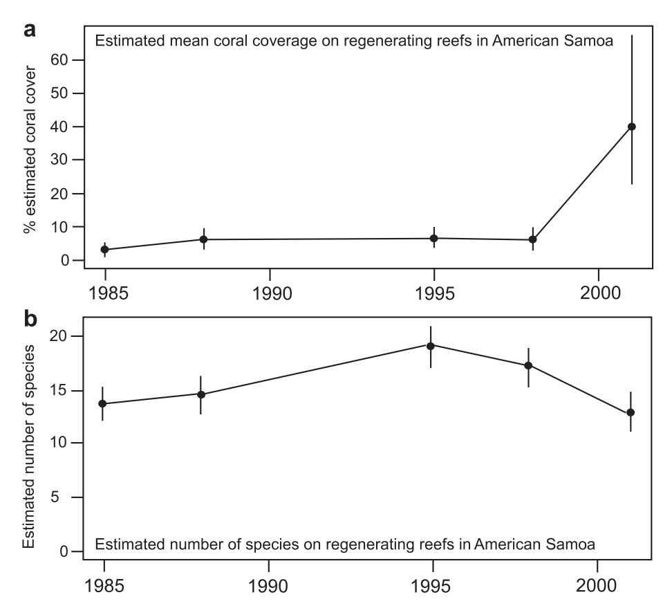

Fig. 20.1. McArdle (2003) analysed the data from most of the reports listed in Section 16.10. The response of Samoan reefs to disturbance is a 15-year recovery from large-scale acute factors (e.g., Colgan 1987 for Guam and Sano 2000 for Iriomote Island). During the first decade or so, numerous small corals recruit to the area but a superficial view of the area looks as if recovery is not occurring and one could fear that there has been a phase shift. However, each of the abundant but tiny recruits start growing and the coral communities spring back remarkably rapidly in the final half a decade (cf. Table 13 in Colgan 1987 and Table 1 in Sano 2000). The decrease of local (within transect) diversity has been speculated to be a result of competition for space

ends of the chains – and not in the southeastern, as Rose atoll does. Since the Pacific Plate is rigid and drifts in a westerly or northwesterly direction, this arrangement appears anomalous (Menard 1986) and the origin of the Samoan chain as a hotspot trace has been disputed. Thus at one end of the chain would be the inactive Rose atoll while the other end would be characterized by the active volcanism at Savai'i – which is exactly opposite to the situation observed in the other lineaments. However, to the west of Rose atoll is situated Vailulu'u submarine volcano (originally called Rockne volcano, then Fa'afafine; Johnson 1984; Hart et al. 1999), which has been identified as the active Samoan hotspot (Hart et al. 2000) and which is the true southeastern extreme of the Samoan chain. Rose atoll does not form part of the Samoan chain as such. It is possible that the plume center that is now apparently situated at Vailulu'u has migrated NE over the past 40 Ma (million years, Fig. 20.3; Hart et al. 2004) but there is controversy over how much of the relative motion of the Pacific Plate is due to movement of the plate versus drift of the hotspot itself and there is a possibility that the apparent motion of the mantle plume may be due to other factors, like true polar wander (P. Wessel, personal communication 2007). Recent paleomagnetic evidence suggests true polar wander, rather than plume migration, to have caused the apparent

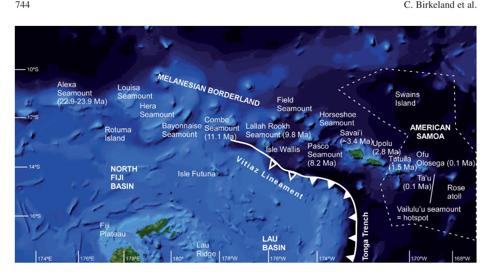

Fig. 20.2. American Samoa is situated in the Samoan Chain, a linear hotspot trace originating at Vailulu'u Seamount (the active hotspot) and extending through the Manu'a group (Ofu , Olosega and Ta'u ) to Tutuila . The largest volcanic edifices in the Samoan group, Upolu and Savai'i , also the largest islands, are part of western Samoa . The Samoan Chain then abruptly changes into a series of seamounts extending via Pasco, Lallah Rookh, Waterwich and Combe until Alexa Seamount in the west. The southern portion of the Pacific Plate is subducted into the Tonga Trench, which turns into a transform fault called the Vitiaz Lineament. Stresses associated with flexural warping of the Pacific plate at the plate boundary are generally considered responsible for the rejuvenated volcanism at Savai'i/Upolu and the unusual appearance of the Samoan Chain with the presently active volcanoes in the west, not the east. Rose Atoll is the only seamount with a carbonate cap and is not part of the Samoan hotspot trail. Ages of volcanic edifices based on Keating (1992), Hart et al. (2004), Clouard and Bonneville (2005). EEZ boundary of American Samoa (broken white line) is only approximate and for orientation

displacement of the plume in the Hawaiian–Emperor chain, so it is possible that this is the mechanism observed in Samoa as well (see also Chapter 13, Rooney et al.). In general, a lively scientific debate exists regarding the plume hypothesis and which melting anomalies really represent mantle plumes, whether these really exist or what exact mechanism is involved (e.g., papers in Foulger et al. 2005). Further to the northwest of Vailulu'u are, as would be expected, young islands with tholeiitic lavas of the shield-building phase (like Ta'u , Ofu , Olosega, <1 Ma in age). The larger and older western Samoan Islands are characterized by alcalic basalts of secondary, younger activity (Fig. 20.4), which is also shown by series of cinder cones along the islands' axis and flows originating from there. In the Hawaiian Islands , this phase of rejuvenated volcanism relative to the shield-building volcanism is seen largely as an effect of crustal loading (see Chapter 11 Fletcher et al., and Chapter 13, Rooney et al.). In Samoa , however, renewed volcanism has been linked to flexural warping of the Pacific Plate (Menard 1986; Natland 2004). The northwestern Samoa Islands are situated only 100–150 km from a flexural upwarp (the trench forebulge) that is maintained at the bend where the Pacific Plate changes from subduction in the Tonga trench to the transform fault of the Vitiaz Lineamant (Fig. 20.2). This upwarp may be the cause of a 300 km rift that is observed along the Samoan islands (in particular Savai'i and Upolu ), manifested by an almost linear series of craters striking parallel to the islands' axes (Fig. 20.4).

While the original explanation for the renewed volcanism in Samoa saw it as a response to Pacific Plate flexure associated with subduction in the Tonga Trench (Menard 1986; Wright and White 1986; Natland 2004), Hart et al. (2004) in contrary believe that volcanism in western Samoa is rejuvenated

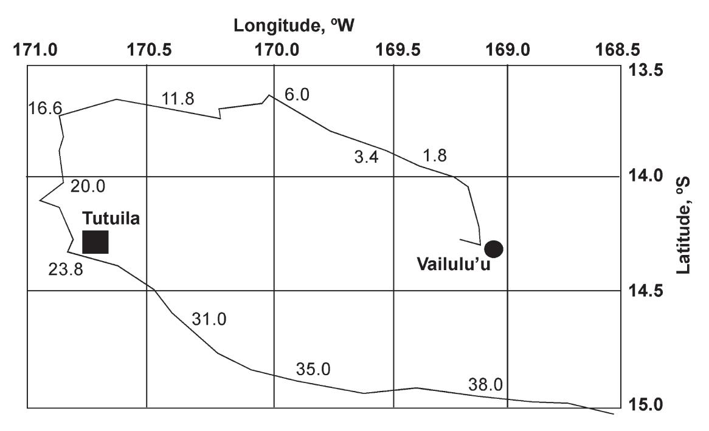

Fig. 20.3. Backtracked potential surface motion of the Samoan plume over the last 40 MY derived from a mantle dynamics model of Steinberger (2000, 2002) and Steinberger et al. (2004), taken from Hart et al. (2004). (By permission of Elsevier Ltd.) However, rather than plume migration, other mechanisms, like polar wander, may have caused the apparent displacement of the plume on the plate (see also Chapter 13, Rooney et al.)

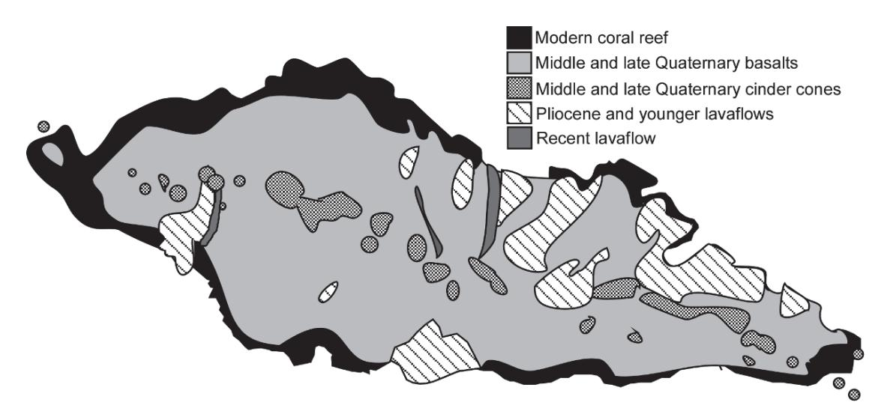

Fig. 20.4. Generalized geologic map of Upolu in Western Samoa. (From Stearns 1944; Keating 1992; modified by permission of the Geological Society of America and Springer) showing the linear arrangement of most recent volcanism (Middle and late Quaternary cinder cones) along the central axis of the island. The situation is similar at Savai'i . The steep side of the island has a fringing reef, the less steeply sloping side of the island has a barrier reef that initiated on the drowned edge of the island as it was subducted. (Modified from Stearns 1944, by permission of the Geological Society of America). The situation in Tutuila was not dissimilar with a drowned barrier reef (due to the island's rapid submergence) along the southern coast – presently only fringing reefs are developed

due to the islands approaching another hotspot that has formed seamounts along other lineaments. From the large western Samoan Islands, a series of seamounts extends further west and follows the general Samoan lineament. Aging and geochemical data suggest that seamounts as far away as Combe and Alexa have Samoan pedigree which suggests that all the islands and seamounts west of and including Vailulu'u were formed from the same single hotspot (Hart et al. 2004; Fig. 20.2).

The Samoan Island chain thus resembles the Hawai'i/Emperor Chain as described in Chapters 11 (Fletcher et al.) and 13 (Rooney et al.) inasmuch as it also ends in a linear seamount chain.

Several significant differences exist between the Samoan and Hawaiian Chains. In Hawai'i , the active mantle plume is situated underneath the emergent island of Hawai'i and has created a much bigger volcanic edifice than the Samoan hotspot at Vailulu'u, which is not emergent. A similarity with the Hawaiian chain is volcanism at the still submerged Lo'ihi (see Chapter 13, Rooney et al.). Hawaiian Islands progressively diminish in size towards the west, and with the exception of subsidence and emergence due to flexural volcano loading (Dickinson 2001) and some rejuvenated volcanism, generally sink progressively deeper. In Samoa , islands get bigger towards the west (Fig. 20.5), with abundant renewed volcanism in particular at Savai'i and Upolu . From then, the Samoan Islands brusquely give way to a seamount chain. No gentle progression of sinking is observed. Between the Hawaiian and the Emperor Seamount chain , an approximately 45 degree offset in direction is indication for either a change in direction of the Pacific Plate at between 43 Ma (Dalrymple and Clague 1976; Patriat and Achache 1984) and 50 Ma (Sharp and Clague (2006); see Chapter 13; Rooney et al.) or a southward drift of the Hawaiian hotspot prior to that time (Norton 1995). As mentioned earlier, there is a possibility that the Samoan hotspot has not been stable (Fig. 20.3), and may have, in a more complicated motion than the Hawaiian hotspot, drifted in a clockwise movement from its initiation at 40 to 16.6 Ma in a northwesterly direction, and then in an easterly, then southeasterly and finally northwesterly direction again (Steinberger 2002). Steinberger et al. (2004) suggest that motion of hotspots is influenced by plume-distortion due to global mantle flow, but controversy remains. Whether due to hotspot migration or polar wander, in both the Samoan and Hawaiian chains the apparent position of the hotspot has not remained stable which caused a deviation of volcanic edifices from a strictly linear trend.

The islands of American Samoa are therefore mostly basaltic and have virtually no subaerial carbonate cover. Ta'u is a young, shield volcanic island that has been modified by erosion, collapse and renewed volcanism , situated 48 km from Vailulu'u. The main shield volcano that built Ta'u was the Lata Shield, within which a caldera was formed that now forms the southern coastline of the island. Smaller satellite shields were formed later (Stearns 1944; Stice and McCoy 1968; Izuka 2005). About nine miles from Ta'u are Ofu and Olusega , which are also surrounded by coral reefs. These two islands are in reality part of the same volcanic edifice – only separated by a narrow straits – which is also made up by a complex of volcanic cones and is a shield volcano.

Tutuila is the largest (137 km2 ) and most populated island (55,000 in 2004) in American Samoa . It was built by several hot-spot shield volcanoes in the Pliocene to Holocene and was at the active center at about 2 Ma (Hart et al. 2004). Much of the island consists of a ridge of steep mountains that rise from sea level to about 710 m. The area of gentlest morphology is the Tafuna–Leone Plain at Tutuila's SW coast, with about 200 m relief. The plain was formed by volcanic eruptions during the Holocene that covered parts of a pre-existing barrier reef (Stearns 1944). Coral reefs covered by very young extrusive rocks also occur elsewhere in the Samoan chain (Keating 1992). While within the Samoan Chain the island elongations, vent alignments and rift zones strike mostly ESE, Tutuila is aberrant in that it strikes ENE (Walker and Eyre 1995). Based on the observation that Tutuila is approximately in line with the North Fiji Fracture Zone (Vitiaz Lineament, Fig. 20.2), Walker (1999) speculates that strike-slip motion occurred at the time of activity in the fracture zone (1.54–1.03 Ma; McDougall 1985) coinciding with the positioning of Tutuila over the hot spot . The strain associated with this motion would have aided in shaping the island, suggested by en-echelon dyke complexes in the Masefau and Fagaitua areas. Modern volcanism in southern Tutuila, associated with the Leone lavas that cover the former barrier reef, is aligned approximately perpendicular to these earlier rift zones. Although Tutuila is a young

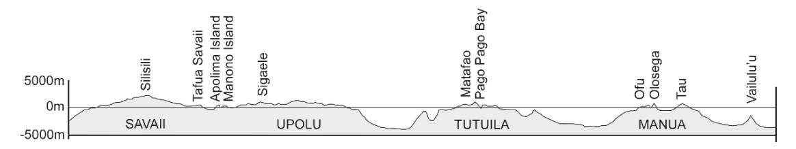

Fig. 20.5. Different to the situation in the Hawaiian Islands , the islands along the Samoan Chain increase in size towards the west, due to rejuvenated volcanism at Upolu and Savai'i in association either with lithospheric flexure or appraoch to another hotspot . West of Savai'i the chain continues as seamounts, east of the Manu'a group, is the active hotspot (Modified from Stearns 1944, by permission of Geological Society of America)

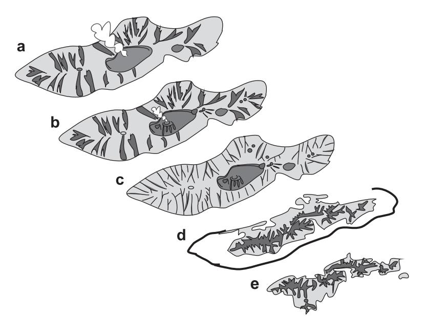

Fig. 20.6. Stages in the evolution of Tutuila as envisaged by Stearns (1944). (**a**) The building phase during the final extrusion of primitive olivine basalts, (**b**) final stage during extrusion of trachyte and differentiated lavas, (**c**) cessation of volcanism and beginning of stream erosion, (**d**) subsidence and growth of a barrier reef on the subsided margin, (**e**) further subsidence and submergence of the barrier reef, extrusion of the Leone volcanics (Modified from Stearns 1944, by permission of Geological Society of America)

island (~1.5 million years), it has already submerged faster than the reefs can grow (Fig. 20.6), leaving former barrier reefs as submerged offshore banks (e.g., Taema Bank off the mouth of Pago Pago Bay, Nafanua Bank as a westward extension of Aunu'u Island, as well as a number of other banks north of Tutuila). These banks are covered by diverse communities of living corals, but the reef formation was slower than sea-level rise. Holocene sea-level history of Tutuila is complex, since it lies on the one hand near the crest of flexural upwarp of Savai'i , but also within the cone of flexural subsidence of Ta'u (Dickinson 2001).

Rose Atoll (Fig. 20.7) is situated at 14°32' S 168°08' W, 240 km ESE of Tutuila at the extreme eastern end of the Samoa Islands. It has a surface area of 640 ha, its lagoon is only 2 km wide with a land area (Rose and Sand Islands) of 0.2 km2 , and therewith it is one of the smallest atolls of the world (Rodgers et al. 2003). These are pure

carbonate islands and have no outcrops of basalts (however, loose pieces of basalt were found on Rose atoll . Whether these really derive from there or not is a point of discussion; Mayor 1924b; Rodgers et al. 2003). Rose Atoll was discovered by Louis de Freycinet on 21 October 1819 on his voyage around the world on the *Uranie* and *Physicienne*. He named it for his wife, who made the voyage with him. Rose Atoll's position outside the Samoan hotspot trail (Hart et al. 2004) and its obvious older age than the hot spot to the west suggest that structurally it is not a part of the Samoan islands. A rich literature exists for this faraway place (Rodgers et al. 1993). Besides being of geologic interest, Rose Atoll is also the home to many giant clams, ~97% of American Samoa 's entire population (Green and Craig 1999).

The northernmost island of the Territory of American Samoa is Swains Island (Fig. 20.2), which is situated approximately 320 km north of the Samoan hot spot track and is geologically part

of the Tokelau volcanic chain. It is about 2 km long with a central fresh water lake that is cut off from the ocean.

#### 20.4 Climate and Oceanography

In general, the oceanographic conditions are excellent for coral growth which may contribute to the resilience of corals on the forereefs. The average of nearshore Secchi disk readings are 27.4 m (Whaylen and Fenner 2006) and hermatypic corals and green algae can thrive to depths of at least 50 m in Fagatele Bay National Marine Sanctuary. The water temperature is usually around 28°C on the forereef (Fig. 20.8), although locally, in shallow pools on the backreef, the water temperatures can reach 35°C and fluctuate through a range of 6°C in a few hours. The tidal range is about 1 m.

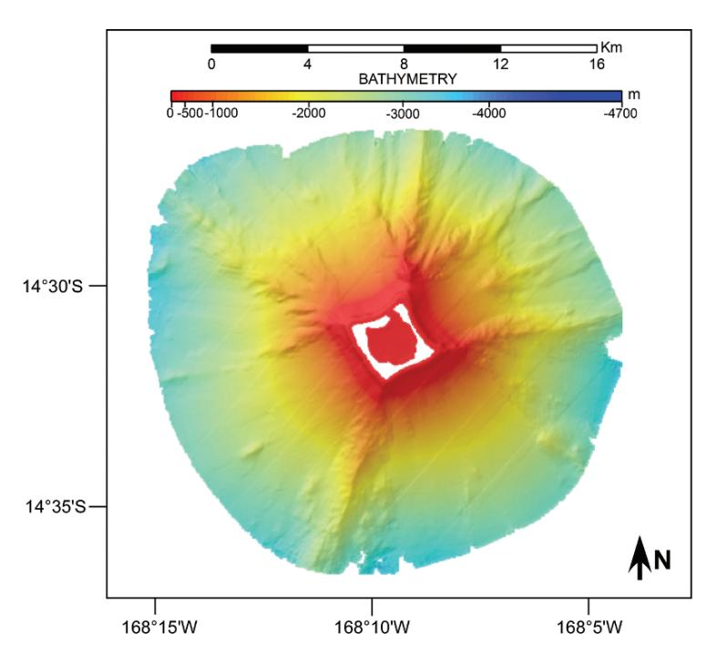

Fig. 20.7. Bathymetry of Rose Atoll as provided by NOAA bathymetry (Image courtesy NOAA Pacific Islands Mapping Center)

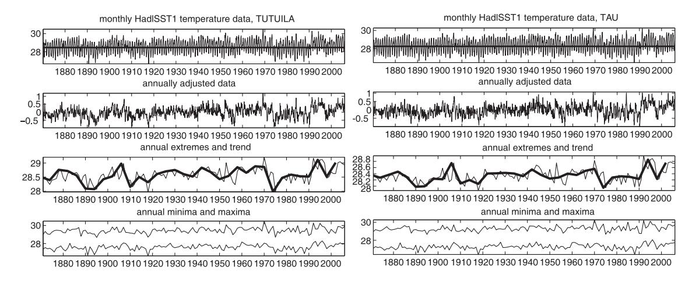

Fig. 20.8. Synthetic Hadley Center HadlSST sea surface temperature for the 1 × 1° tiles centered in Tutuila and Ta'u from 1870 to 2006 (Crown Copyright. Used by permission of Hadley Center, UK)

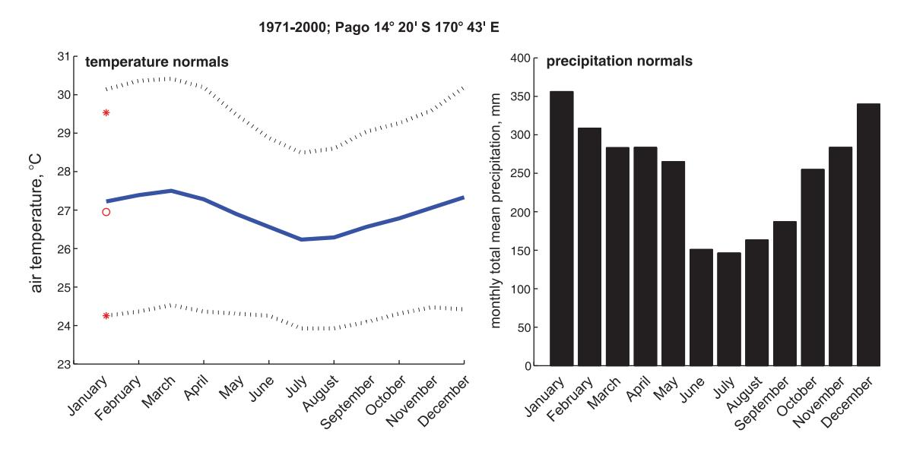

Fig. 20.9. Atmospheric temperature record and precipitation at Pago Pago airport, Tutuila. (NOAA , National Climatic Data Center.) Normals are uninterrupted measurements for three consecutive decades. Original data were translated into metric units. Lines in temperature graph represent monthly means, red circle annual mean, stars annual means of minima and maxima

The climate is characteristic of the tropics with high humidity (averages about 80%) and warm air temperatures (21–32°C). Rainfall averages about 5 m/year (Fig. 20.9) and so careless land management often leads to large-scale runoff of sediment and rubbish onto the reefs after heavy rains.

### 20.5 History of Biological Research

Quantitative surveys of coral reefs in American Samoa began 90 years ago in Pago Pago Harbor (Mayor 1924a) with transects set up at Aua and

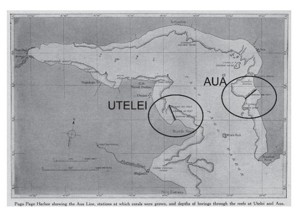

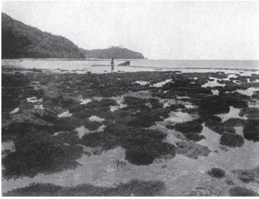

Fig. 20.10. Two scans from Mayor (1924a). Left panel: The map showing Mayor's and Cary's transects. Right panel: *Acropora* exposed on the intertidal near the Aua transect line (Reprinted from Mayor 1924a, with permission of the Carnegie Institution , Washington, DC)

Utulei by Alfred Mayor in 1917 (Fig. 20.10). The transect at Aua was evaluated for ecology, the other primarily for drilling cores . Aua was resurveyed in 1973 (Dahl and Lamberts 1977), 1980 (Dahl 1981), 1995 (Green et al. 1997a), 1999 (Birkeland and Green 1999), 2000 (Birkeland and Belliveau 2000), and 2002 (Green 2002), and is now being resurveyed at every opportunity. Alfred Mayor reported rich coral communities on the reefs around Aua and his photographs show abundant *Acropora* colonies exposed at low tide (Fig. 20.10) at the outer end of the transect (Mayor 1924a). Whereas the reefs on the outer coast are renowned for their resilience, the reefs within Pago Pago Harbor began to succumb to chronic stress with the establishment of two tuna canneries in the inner harbor that began operation in 1956. A chronology of major events affecting coral reefs in American Samoa , and transect surveys of corals and their reports, are given in Section 16.10. Alfred Mayor also studied rates of growth of scleractinians and Lewis Cary studied growth of alcyonaceans between 1917 and 1920.

Lewis Cary (1931) also began surveys in 1917. His transects at Utulei were across the harbor from Mayor's Aua transect (Fig. 20.10). Cornish and DiDonato (2004) repeated Cary's transects to the extent that they still existed in 2002 (Fig. 20.11). Cary also obtained a series of limestone core samples 85, 175, and 280 m from shore along Transect 1 to basalt bedrock at 20, 40 and 40 m, respectively. Alcyonaceans were prevalent along Cary's transects and 75% of the reef flat pavement was composed of compacted spicules deposited by the hermatypic alcyonaceans. *Sinularia polydactyla* (Fig. 20.12a) is a major hermatypic reef-building species of soft coral in some locations in the Pacific, and Cary's reef cores at Utulei showed that the compacted spicules of *S. polydactyla* (presumably Cary's *Sclerophytum densum*) formed a major portion of the 40 m thick reef structure. Cornish and DiDonato (2004) pointed out that the reclamation of the reef for construction and mortality of the alcyonaceans due to pollution from the canneries and other human activities has made the reef framework substantially more vulnerable to erosion.

Surveys of corals and reef fishes around American Samoa became a regular endeavor starting in 1979 with the 1978/79 outbreak of *Acanthaster planci*  (Fig. 20.12b). The Government of American Samoa Department of Marine and Wildlife Resources sponsored surveys of corals and fishes around American Samoa in 1979, 1982, 1985, 1988, 1991, 1995, 1996, 1997, 1998, 2001, 2002 (Fig. 20.13) and 2005. A reef at Ofu was surveyed in 1993 and 2000, Swains Island in 1996, Rose Atoll in 1997 (Wegmann and Holzwarth 2007).

In April 1985, upon decision by the Government of American Samoa and the US Department of Commerce Marine Sanctuary Program to estab-

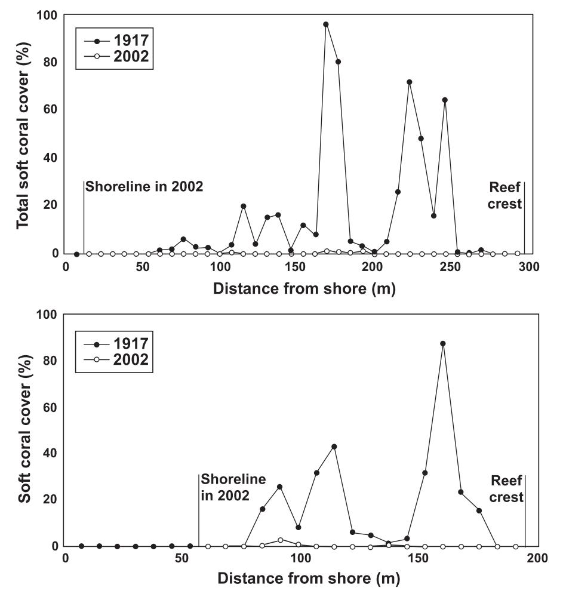

Fig. 20.11. Changes in soft coral cover in line 1 and in line 5 between 1917 and 2002 in the Utelei transect (From Cornish and DiDonato 2004, with permission of Elsevier Science)

lish a National Marine Sanctuary at Fagatele Bay , permanent transect markers were established in Fagatele Bay. Surveys of corals and fishes were performed in 1985, 1988, 1995, 1998, 2001 and 2004. Another survey is planned for August 2007 and it is expected that they be repeated every third year.

To study acclimatization and adaptation of corals to climate change , monitoring of the wide range of water temperatures in small shallow backreef pools on Ofu island was begun in 1999. In this area, temperatures could fluctuate daily by 6°C (Fig. 20.14), yet about 80 species of corals appeared to be in good health (Craig et al. 2001). This diverse community of Ofu lagoon corals appears to be also resilient to wide daily fluctuations in pH (Fig. 20.15) and dissolved oxygen (Fig. 20.16) and thus may offer some insight into mechanisms of corals to respond to ocean acidification and other global changes in the physical environment. The National Park Service, in Cooperation with the USGS, the University of Hawaii, the Rosenstiel School of Marine and Atmospheric Science, and Stanford University, set up an itinerant marine laboratory in the American Samoa National Park on Ofu for long term studies of biochemical, physiological and genetic mechanisms of coral adjustment to climate change.

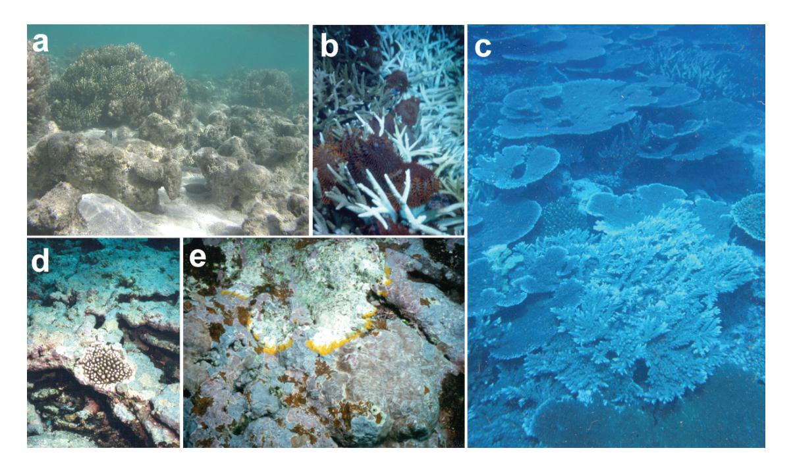

Fig. 20.12. (**a**) The hermatypic alcyonacean *Sinularia polydactyla* forming solid reef framework. (Picture from the the Piti Bombholes, Guam , since the species is by far not as common now as when encountered by Mayor and Carey.) (**b**) Phalanx of *Acanthaster planci* thoroughly removing living coral tissue from the coral community on the western coast of Aunu'u island in 1979. (**c**) A complex system of acroporid corals competing for space on the western forereef slope of Aunu'u Island. (**d**) Crustose coralline algae in Fagatele Bay , American Samoa , enhances coral recovery and reef community resilience by binding the loose substrata after a hurricane . (**e**) Coralline Lethal Orange Disease (CLOD), a bacterial film that move across living coralline algae and leaving bare calcium carbonate in its wake

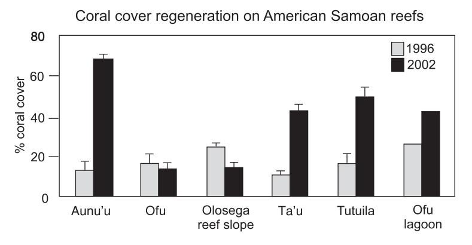

Fig. 20.13. Mean living coral cover (+/− se) on some of the islands of American Samoa during recovery following two hurricanes and a major coral bleaching event in the early 1990s (Data from Birkeland et al. 2004)

#### 20.6 Biodiversity

The total number of scleractinian coral species names in the technical reports of the transect surveys to date is 337, but removal of synonymies and unidentified species reduce the number of names to 329. This number of coral species fits what would be expected along the west to east reduction in diversity across the Pacific. Fagatele Bay National Marine Sanctuary is only one

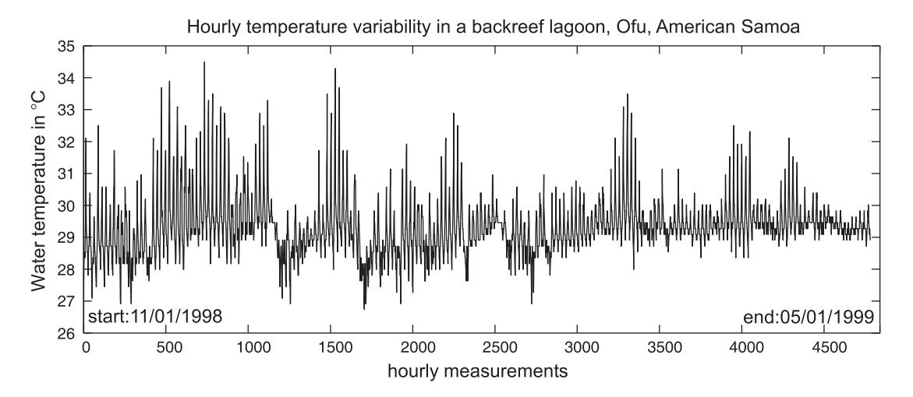

Fig. 20.14. Fluctuating hourly seawater temperatures in the backreef lagoons at Ofu Island, American Samoa (Data communicated by Craig et al. 2001)

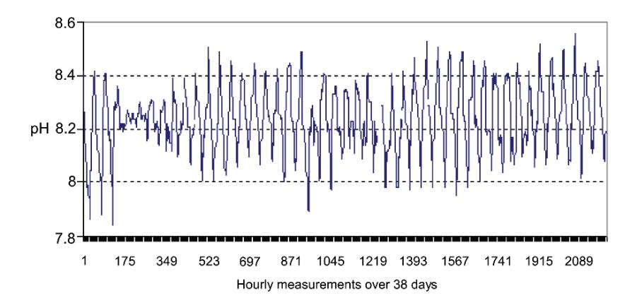

Fig. 20.15. Fluctuating hourly seawater pH measurements in the backreef lagoons of Ofu Island

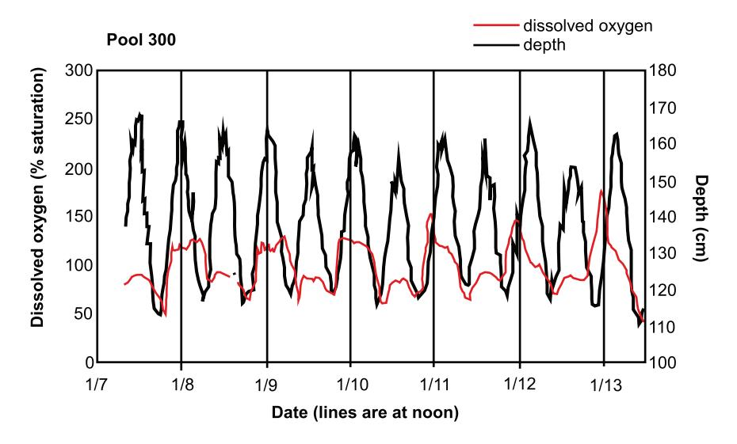

Fig. 20.16. Fluctuating levels of dissolved oxygen in seawater measurements in the backreef lagoons of Ofu Island

 quarter square mile (66 ha, or 0.66 km2) in area, but hosts 200 species of coral and 271 species of reef fish.

Stony (scleractinian) corals appear to have spread eastward across the Pacific more effectively than have the soft (octo-) corals. Whaylen and Fenner (2006) report ten genera of octocorals (with *Cladiella* being by far the most prevalent), two genera of antipatharians (black corals), three genera of zoanthids, and three genera of coralliomorpharia. Coles et al. (2003) report about 20 species of octocorals, 5 anemones, and 6 zoanthids. Although octocorals are an order of magnitude less diverse than the scleractinians (in striking contrast to the smaller, more continental western Atlantic ), *Sinularia polydactyla* nevertheless is (or was half a century ago) a major reef builder. While Cary (1931) found *Nephthya flexile* to be abundant in areas protected from wave action, and particularly well fitted to withstand sedimentation, it now seems to be extinct in American Samoa .

Echinoderm species richness also decreases from west to east across the tropical Pacific. From Indonesia to the Marshall Islands to American Samoa , respectively, the number of coral-reef crinoid species are 91, 6, 6; asteroids 66, 17, 11; ophiuroids 142, 42, 23; echinoids 43, 17, 10; holothuroids 141, 23, 16 (Birkeland 1989).

About 945 species of reef-associated fishes are known from American Samoa (Fig. 20.17). This is consistent with the gradient in decreasing diversity from west to east across the central Pacific (Allen 2003).

Coles et al. (2003) pointed out that the large-scale usage of docking facilities in Pago Pago Harbor for cargo offloading and delivery of tuna to the canneries, plus cleaning of large vessel hulls at the dry-dock facilities, makes reefs in Pago Pago Harbor and American Samoa in general susceptible to introduction of nonindigenous marine species. Although about 17 nonindigenous and 11 cryptogenic (uncertain origin, but with indications of being introduced) species were found in Pago Pago Harbor, only two introduced species, an ectoproct and a polychaete, were found outside the harbor (Coles et al. 2003). This is in striking contrast to Hawaii where 343 marine introduced species (including 287 invertebrates, 20 fishes, 24 algae and 12 flowering plants) have been found (http:// www2.bishopmuseum.org/HBS/invertguide/index. htm). On Hawaiian coral reefs, introduced species have been causing substantial ecological damage from the intertidal to depths of over 100 m on the forereef slopes. It is tempting to speculate that the species diversity on coral reefs of American Samoa outside Pago Pago Harbor in comparison to Hawaii somehow leads to resistance against invasion by introduced species.

## 20.7 Zonation and Community Patterns

On a scale larger than depth zonation, differences exist in distributions of some reef organisms on differently exposed sides of the islands. Whaylen and

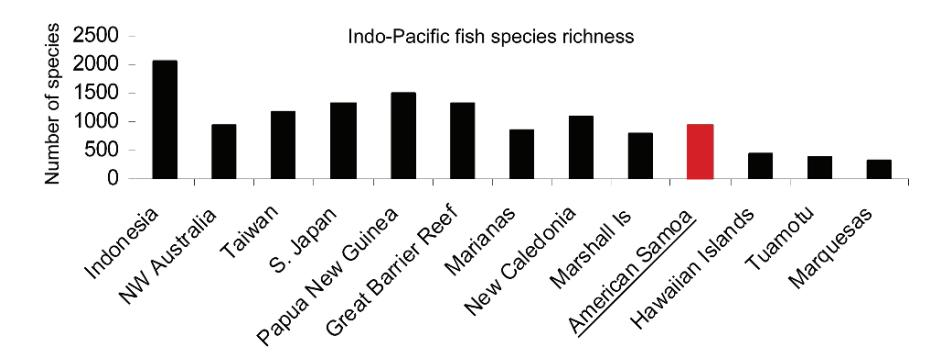

Fig. 20.17. The number of fish species near American Samoa in comparison with the number of fish species near other locations (The data are from Allen 2003)

Fenner (2006) and Sabater and Tofaeono (2006) found significantly more cover of crustose coralline algae on the south coast of Tutuila than on the north coast and conversely, filamentous algae was more prevalent on the north coast. Also Rose Atoll has already been noted by Mayor (1924b) as having an exceptionally well-developed shallow calcareous algae ridge largely made up by *Porolithon* sp. He noted that Rose Atoll had the densest growth of calcareous algae he had encountered anywhere, so much that it could be called a "*Lithothamnion*-atoll rather than a coral atoll" (Mayor 1924b, p. 77). Swains Island , on the other hand, shows the dominance of corals as so often observed elsewhere in American Samoa (Fig. 20.18).

### 20.8 Effects of Human Activities and Conservation Issues

The American Samoa Environmental Protection Agency ranked the watersheds on Tutuila in terms of influence of human activities. Whaylen and Fenner (2006) assessed the correlations between human activities and living coral cover at 35 sites from the combined data from their own surveys and the surveys of Sabater and Tofaeono (2006) and found no significant correlation. Likewise, they did not find a correlation between human activities and either crustose coralline algal cover or filamentous algal cover. On an island-wide scale, human activities are not correlated with the patterns of distribution of the benthic communities, partially because the effects of human activities are confounded or masked by the major effects of natural disturbances such as hurricanes , bleaching from thermal and UV stress, and predation by *Acanthaster planci* .

#### 20.8.1 Land Management

On a smaller scale, there are very obvious effects of human activities. The reef flats onto which the rivers empty at the base of watersheds can be damaged from chronic sedimentation. About the only coral now residing on the heavily sedimented reef flat at the mouth of Amanave Bay is *Leptastrea purpurea*, although the structure of the reef is made up of skeletons of a diverse array of corals which attest to healthier reef conditions in the past. Fagasa Bay is silty and the coral cover is very low (6.8%). The crustose coralline algal cover is also low (9.5%), but the filamentous algal cover is especially high (45%; Whaylen and Fenner 2006). Luxuriant and diverse coral reefs existed in Pago Pago Harbor a century ago, but reefs of the inner harbor were obliterated in the 1920s to allow construction of a US naval base. About

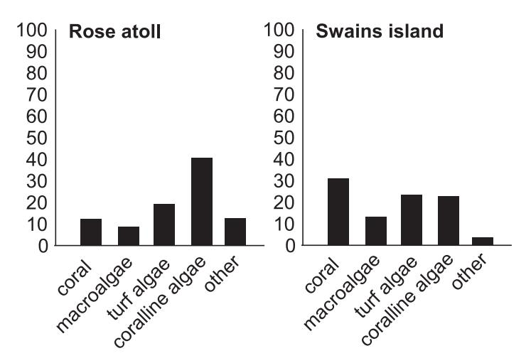

Fig. 20.18. Benthic cover on Rose Atoll and Swains Island , showing the preponderance of coralline algae on Rose Atoll (Data redrawn from Vroom et al. 2006)

95% of the reefs in the inner harbor have been buried in silt (Wass 1983). In the 1940s, further inshore areas were dredged for landfill and the inner Utulei reef was filled for development of a tank farm and to widen the coastal road. In 1956, the first of two tuna canneries began operation on the north shore of the inner harbor. Untreated sewage , polluted streams, and untreated waste from the two canneries caused the death of most corals in the inner harbor and corals in the mid to outer harbor were also not doing well. In 1992, the tuna canneries extended wastewater outflow pipes to the outer harbor where dilution is stronger. In the late 1990s, coral colonies began to be observed growing in the inner harbor and *Acropora hyacinthus* was observed recruiting and growing near the Rainmaker Hotel at the boundary of the inner and outer harbor (Green 2002).

#### 20.8.2 Fishing Pressure

The 945 species of reef fishes in American Samoa are slightly more than would be expected at the longitude of the islands on the west to east gradient in numbers of coral-reef fish species (Fig. 20.17). This could indicate that the full array of habitats necessary to provide the necessary conditions for the life history stages for reef fishes is still in operation. The lack of habitat could lead to local extinction and so the wealth of species indicates that the critical habitats are still represented.

Although the number of species of reef fishes in American Samoa is as great as would be expected, their biomass is remarkably low (Figs. 20.19 and 20.20). Commercial fishing has been in effect for a few decades as the human population grew and residents began to earn a salary and purchase more of their food at the market. Before 1994, most commercial fishing was done by handlines, nets or spearfishing by free diving. From 1994 to 2002, the commercial fishermen used underwater lights and scuba to harvest sleeping fish. The commercial catch increased 15-fold (Fig. 20.21) until eloquent protests at public hearings compelled the Governor to issue an executive order to stop night fishing with scuba until the matter could be discussed and new regulations developed.

The biomass of fish species selected for surveying averaged 56 g/m2 with a range of 29–114 g/m2 , or 56 mt/km2 (0.56 mt/ha). The typical biomass of fishes (Fig. 19) on the western tropical Atlantic coral reefs was 160–200 mt/km2 (Randall 1963; Munro 1983) and on Pacific coral reefs 93– 239 mt/km2 (Goldman and Talbot 1976; Williams and Hatcher 1983). However, this low biomass on American Samoan reefs is at a level characteristic of areas heavily fished (Fig. 20.20).

The number of species and abundance of coralreef fishes are not noticeably different than what might be expected for central Pacific reefs, but the scarcity of larger fishes in recent years is striking (Figs. 20.22 and 20.23). Large serranids were seen and caught more regularly in the 1980s than they

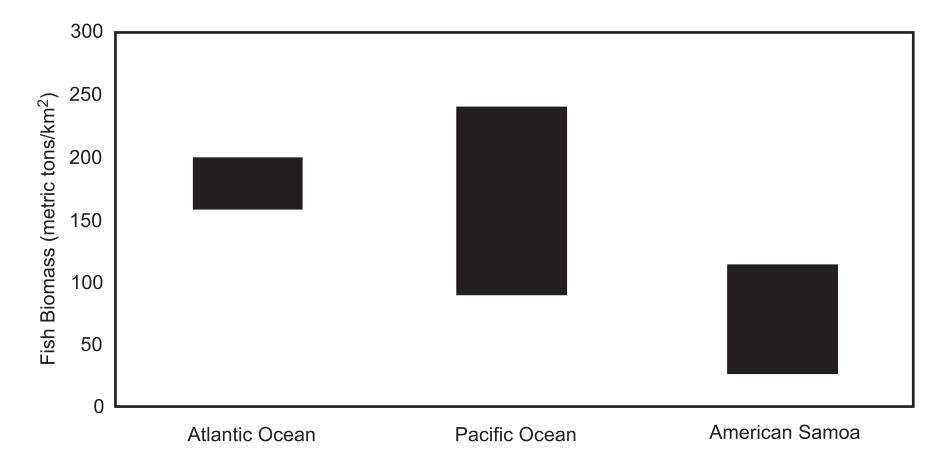

Fig. 20.19. The biomass of fishes on American Samoan reefs in comparison with the biomass of fishes typical of the Atlantic and Pacific reefs from literature from 1983 or prior times

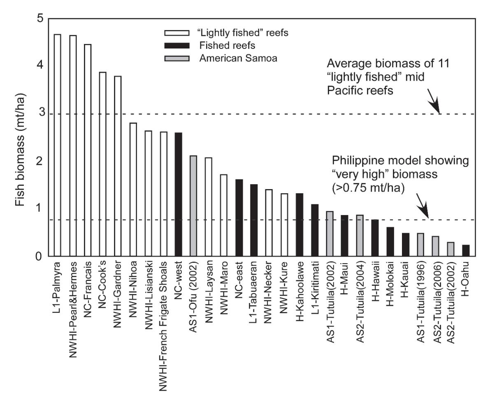

Fig. 20.20. Biomass of coral-reef fishes on selected central Pacific islands. (Data sources: NWHI – Northwest Hawaiian Island and H – main Hawaiian Island (Friedlander and DeMartini 2002; A. Friedlander, personal communication), LI - Line Is. (Stevenson et al. 2007), NC – New Caledonia (Letourneur et al. 2000), AS1 – American Samoa (Green 2002), AS2 – American Samoa (R. Brainard, personal communication, 2007), line for Philippine model (Hilomen et al. 2000)

are now (C. Birkeland personal observation, 1979, early 1980s). In a survey of 11 sites in 2005, only four individual *Cheilinus undulatus* were seen with a mean length of 64 cm, the largest individual being only 110 cm, about half of the maximum attainable size. Only a single shark, a whitetip reef shark *Triaenodon obesus*, was observed.

The extraordinarily low biomass of fishes and scarcity of large fishes might be explained by fishing pressure on the larger fishes. The shallow fringing reefs are all accessible close to shore. Samoans have been fishing the reefs of American Samoa for about 3,300 years. Artisanal fishers can severely exploit and degrade fisheries resources, especially the larger fishes, shortly after prehistoric arrival (Jennings and Polunin 1997, Wing and Wing 2001).

Motivation to manage requires a realistic perception of the state of the resources, and so the shifting baseline is one of the more powerful phenomena undermining responsible programs. A recent (18 June 2007) issue of the Samoan News reported a statement from a scientist that the American Samoan "fisheries are clearly sustainable, and marine protected areas for management purposes are not

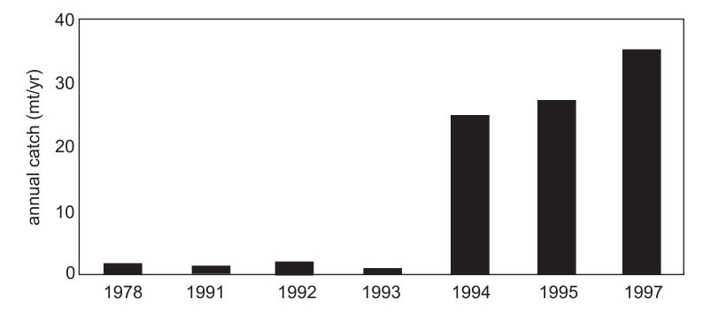

Fig. 20.21. Estimated annual harvest of parrotfishes on Tutuila Island from 1978 to 1997 (Page 1998)

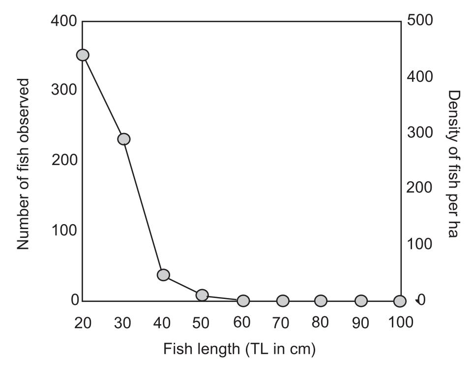

Fig. 20.22. Lengths and densities of standing stocks of targeted fish (>19 cm, species combined) at 17 sites on Tutuila Island in 2002 (Modified from data from Green 2002)

needed as the fisheries are replenishing themselves." This statement must be based on a view that the low biomass and scarcity of large fishes are the natural characteristics of reef communities of American Samoa . When monitoring of resources begins after stocks have been substantially reduced, the perception of what is natural can be lowered several fold. For a heuristic example of how the scale of assessment can potentially alter our perceptions, Hilomen et al. (2000) summarized the findings of fish biomass on 227 transects from throughout the Philippine Archipelago. In this report, Hilomen et al. (2000) strongly emphasized that the condition of the majority of coral-reef fish stocks in the Philippines are very poor. They were aware of the true situation. But in presenting their findings, they

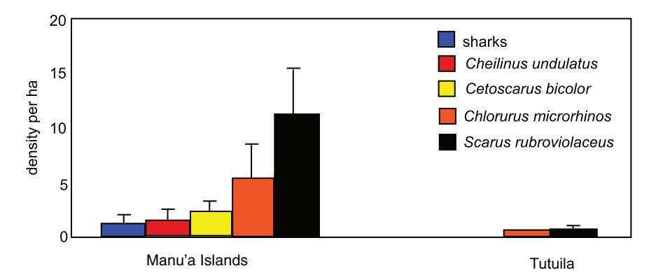

Fig. 20.23. Mean density (+/− se) of large reef fishes on Tutuila and in the Manu'a Islands in 2002 (Modified from data from Green 2002)

categorized the top 11% in the "high" (0.35–0.75 mt/ ha) to "very high" (> 0.75 mt/ha) relative to the range of conditions within the Philippines. These top 11% were indeed high or very high within the context of present day Philippines reef fish stocks, but the high or very high levels of biomass were one nineth or one fourth the average level for lightly fished areas (Fig. 20.20). One of the very high sites in the Philippines had a stock of 2.20 mt/ha and so the reefs of the Philippines probably have potential for higher standing stocks if the fishing pressure were released. Hilomen et al. (2000) clearly expressed the dire state of overfishing in the Philippines, but we believe that if the levels of biomass characterized as "high" or "very high" in terms of the spread of the data at hand were taken out of context, this could facilitate a shifting baseline in general perception.

#### 20.9 Present Status of Reef Health

The coral communities on American Samoa are a rich mosaic of patches in various stages of recovery from an array of disturbances such as crown-of-thorns predation, hurricanes , blastfishing, ship groundings, and bleaching from warm-water stress (Section 20.10). On the outer reef slopes, disturbances have generally been acute, and recovery started soon after the event (Green et al. 1999). Some localized and welldefined areas experience chronic stresses, such as sedimentation at the mouths of rivers or in the backs of bays (Houk et al. 2005), and have not been recovering for decades. If unusual seawater warming becomes more frequent, widespread and of longer duration, and if the increased atmospheric carbon leads to seawater acidification, the coral communities on the forereef might start to lose their resilience.

The capacity of coral communities on forereefs to recover from disturbances is probably partially a result of the ability of crustose coralline algae to bind loose rubble into a stable substratum (Fig. 20.12d). Crustose coralline algae seem especially prevalent on the forereefs of American Samoa . Six years after the 1979 outbreak of *Acanthaster planci* , the coralline algae generally covered about 57% of the forereef slope, with about 65% cover at 3 and 5 m depths (Birkeland et al. 1987). Other algae covered about 21% of the substrata. Living coral cover averaged 12.6%, but was patchily distributed during this period of recovery, with results of 30 m transects within Fagatele Bay at any one time ranging from 0.9% to 64.4%.

Recent surveys have found that the reefs are still in similar condition, but further along in recovery from more recent disturbance events, i.e., damaging hurricanes in 1990 and in 1991, and serious bleaching in 1994. Whaylen and Fenner (2006) and Sabater and Tofaeono (2006) found 28% and 27% coral cover on 11 and 24 sites (for a total of 35 different sites) around Tutuila . Whaylen and Fenner (2006) reported an average 35% cover by crustose coralline algae and concluded that in recent times, the prevalence of living corals and crustose coralline algae, and the scarcity of macroalgae (2% cover at

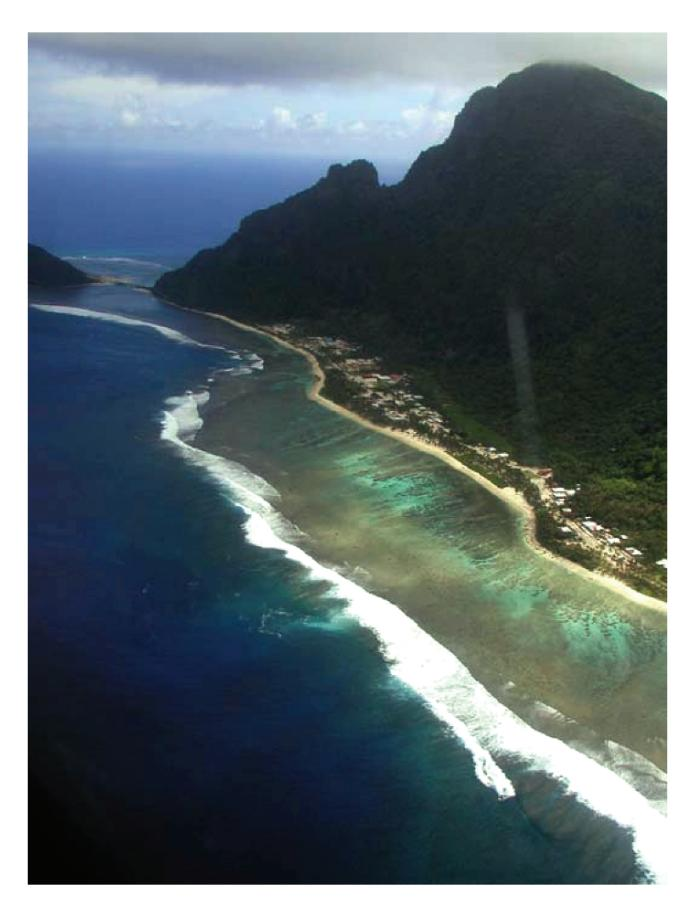

Fig. 20.24. Coastal community on Olosega. The human populations are concentrated along the coast because of the steep terrain on American Samoa

11 sites) indicated that the coral reef community is presently in good health. In most other areas, especially forereef sites, the reefs of American Samoa are still resilient compared to those of the western Atlantic (Gardner et al. 2003; Pandolfi et al. 2003).

While coral diseases are common on American Samoan reefs, especially neoplasms or "tumors" and white syndromes, they presently do not appear to have a substantial effect on the coral populations to date. However, increasing water temperature, sedimentation and pollution might stress corals and weaken their resistance and coral disease may become a more serious factor in the future if climate change becomes more influential.

Not only corals, but also crustose coralline algae are infected by at least two diseases that are especially common in Fagatele Bay National Marine Sanctuary: a bacterium – Coralline Lethal Disease (CLOD) and a fungus – "lichen-like" black crust disease . CLOD grabs attention as a bright orange band followed by a white patch (Fig. 20.12e). Despite the fact that CLOD is frequently noticed, the crustose coralline algae appear to grow fast enough to replace any surface killed by CLOD. At the present time, CLOD and the fungal disease do not appear to be a threat.

Uncontrolled human population growth can interact synergistically with the steep topography of the islands (Fig. 20.24) and the rainfall to exacerbate environmental problems (Craig et al. 2001). Since rainfall averages 5 m/year in the mountainous areas in which most of the land has a slope greater than 70%, heavy rains can cause erosion and deliver spectacular amounts of debris , garbage and sediment onto the reefs of Pago Pago and other watersheds. Mayor (1924a) reported on torrential rains that delivered silt that blanketed

the reefs and killed a substantial number of corals. Wells (1988) described significant portions of reefs in Pago Pago, Faga'ita, and Leone Bays as having been buried under sediment. Organic pollution and untreated sewage have also locally affected reefs around American Samoa (Wells 1988). The greatest threats, however, may ultimately arise from climate change and acidification of ocean waters, while increased input of sediment and pollution from increased population growth may reduce the vitality and resilience of corals and increase their vulnerability to succumbing to disease .

While corals on the forereef appear resilient, the fish populations do not appear to recover their normal size distributions. Although the diversity and abundance of fishes may be as expected, the biomass is only about a quarter of that on a lightly fished coral reef (Fig. 20.20) and very few large individuals are seen. The apex predators are very rare. With increased human population density and advances in technology, overfishing may have become a chronic problem.

## 20.10 A Chronology of Major Events and Surveys of Coral Reefs in American Samoa

**1917–1920**: Alfred A. Mayor established the permanent Aua transect in Pago Pago Harbor and also described the reefs of the other islands, including Rose Atoll (Mayor 1924a, b)

**1920:** Louis Cary surveyed soft corals and the massive reef they constructed at Utelei in Pago Pago Harbor (Cary 1931)

**1920s**: Destruction of coral reefs on southern shore of inner Pago Pago Harbor by construction of naval base

**1938**: Outbreak of *Acanthaster planci* 

**1940s**: Fill over inner Utulei Reef for tank farm

**1950s:** One third of Mayor's Aua transect destroyed by sand excavation for road construction at Aua

**1954**: Construction of first tuna cannery

**1960s**: Fill over start of Cary Transects 1 and 5 for widening of coastal road

**1963**: Construction of second tuna cannery

**1973**: First resurvey of Mayor's transect (Dahl and Lamberts 1977)

**1977–1979**: Outbreak of crown-of-thorns starfish *Acantha-ster planci* 

**1979**: Survey of *Acanthaster* and corals around Tutuila (Birkeland et al. 1985, 1987; Dahl 1981)

**1981**: Tropical cyclone Esau

**1985**: Fagatele Bay National Marine Sanctuary officially established by US Department of Commerce and American Samoa Department of Commerce. Quantitave baseline established for coral-reef monitoring (Birkeland et al. 1987)

**1987**: Tropical cyclone Tusi hits Manu'a Islands hard **1988**: Resurvey of Fagatele Bay NMS (Birkeland et al. 1994)

**1990**: Tropical cyclone Ofa hits Tutuila hard

**1991**: Tropical cyclone Val hits Tutuila hard – nine ships grounded on Pago Pago reefs

**1991, 1992**: Coastal resources inventory (Maragos et al. 1994).

**1992**: Extension of industrial wastewater discharge pipe from canneries from inner Pago Pago Harbor to the outer harbor

**1993**: Surveys on Ofu for the National Park of American Samoa (Hunter et al. 1993)

**1994–2002**: Commercial fishing at night with scuba banned by Governor's Executive Order in 2002

**1994**: Major coral bleaching associated with unusually warm seawater

**1995–1997**: Surveys in Fagatele Bay , Mayor's transect, and the rest of American Samoa including Swains Island and Rose Atoll (Birkeland et al. 1996; Mundy 1996; Green 1996a, b; Green et al. 1997a, b)

**1998**: Extreme low tides kill exposed corals

**1998**: Surveys of Swains Island (Page and Green 1998)

**1998–2001**: Numerous surveys on Tutuila (Green and Hunter 1998; Birkeland and Green 1999; Birkeland et al. 2004)

**2000**: Nine ships finally removed from Pago Pago reefs. Prior and after the removal, resurveys of Mayor's Aua transect (Birkeland and Green 1999; Birkeland and Belliveau 2000)

**2002**: Minor coral bleaching associated with unusually warm seawater

**2002**: Numerous coral reef surveys (Fisk and Birkeland 2002; Green 2002; Cornish and DiDonato 2004) of Tutuila and Manu'a islands

**2002**: Surveys for introduced marine species (Coles et al. 2003) at Tutuila and Manu'a islands

**2003**: Major coral bleaching associated with unusually warm seawater

**2004**: Tropical cyclone Heta

**2004**: Resurvey of Fagatele Bay NMS and Mayor's Aua transect (Green et al. 2005)

**2005**: Extreme low tides kill exposed corals

**2005**: Tropical cyclone Olaf hits Manu'a Islands hard

**2007**: Resurvey of Fagatele Bay NMS

#### References

- Allen GR (2003) Reef fishes of Milne Bay Province, Papua New Guinea. Pages 46–55. In: Allen GR, Kinch JP, McKenna SA, Seeto P (eds) A rapid marine biodiversity assessment of Milne Bay Province, Papua New Guinea – Survey II (2000). RAP Bulletin of Biological Assessment 29. Conservation International, Washington, DC, 172 pp
- Birkeland C, Randall RH, Amesbury SS (1985) Coral and reef-fish assessment of the Fagatele Bay National Marine Sanctuary. Report to NOAA , 126 pp
- Birkeland C, Randall RH, Wass R, Smith BD, Wilkens S (1987) Biological resource assessment of the Fagatele Bay National Marine Sanctuary. NOAA Technical Memorandum NOS MEMD 3, 232 pp
- Birkeland C (1989) The influence of echinoderms on coral-reef communities . In: Jangoux M, Lawrence JM (eds) Echinoderm Studies 3. Balkema, Rotterdam, The Netherlands, pp 1–79
- Birkeland C, Randall RH, Amesbury, SS (1994) Coral and reef-fish assessment of the Fagatele Bay National Marine Sanctuary. Report to the National Oceanic and Atmospheric Administration US Department of Commerce, 126 pp
- Birkeland C, Randall RH, Green AL, Smith BD, Wilkins S (1996) Changes in the coral reef communities of Fagatele Bay National Marine Sanctuary and Tutuila Island (American Samoa ) over the last two decades. Report to the National Oceanic and Atmospheric Administration, US Department of Commerce, 225 pp
- Birkeland C, Green AL (1999) Resurvey of the Aua Transect prior to the ship removal. Report to the National Oceanic and Atmospheric Administration, 10 pp
- Birkeland C, Belliveau SA (2000) Resurvey of the Aua Transect After the Ship Removal. Report to the National Oceanic and Atmospheric Administration US Department of Commerce, 2 pp
- Birkeland C, Green AL, Mundy C, Miller K (2004) Long term monitoring of Fagatele Bay National Marine Sanctuary and Tutuila Island (American Samoa ) 1985 to 2001: summary of surveys conducted in 1998 and 2001. Report to the National Oceanic and Atmospheric Administration, US Department of Commerce, 158 pp
- Cary LR (1931) Studies on the coral reefs of Tutuila , American Samoa , with special reference to the

- Alcyonaria. Papers from the Tortugas Laboratory, Carnegie Instit Wash 37:53–98
- Clouard V, Bonneville A (2005) Ages of seamounts, islands and Plateaus on the Pacific plate. In: Foulger GR, Natland JR, Presnall DC, Anderson DL (eds) Plates, plumes and paradigms. Geol Soc Am Spec Pap 381, pp 71–90
- Coles SL, Reath PR, Skelton PA, BonitoV, DeFelice RC, Basch L (2003) Introduced marine species in Pago Pago Harbor, Fagatele Bay and the National Park Coast, American Samoa . Bishop Museum Technical Report No 26, Honolulu , HI, 182 pp
- Colgan MW (1987) Coral recovery on Guam (Micronesia ) after catastrophic predation by *Acanthaster planci* : a study of community development. Ecology 68:1592–1605
- Cornish AS, DiDonato EM (2004) Resurvey of a reef flat in American Samoa after 85 years reveals devastation to a soft coral (Alcyonacea) community. Mar Pollut Bull 48:768–777
- Craig PC, Birkeland C, Belliveau S (2001) High temperatures tolerated by a diverse assemblage of shallow-water corals in American Samoa . Coral Reefs 20:185–189
- Dahl AL (1981) Monitoring coral reefs for urban impact. B Mar Sci 31:544–551
- Dahl AL, Lamberts AE (1977) Environmental impact on a Samoan coral reef: a resurvey of Mayor's 1917 transect. Pac Sci 31:209–319
- Dalrymple GB, Clague DA (1976) Age of the Hawaiian– Emperor bend. Earth Planet Sci Lett 31:313–329
- Dickinson WR (1998) Geomorphology and geodynamics of the Cook-Austral island-seamount chain in the Saouth Pacific Ocean : implications for hotspots and plumes. Int Geol Rev 40:1039–1075
- Dickinson WR (2001) Paleoshoreline record of relative Holocene sea levels on Pacific islands. Earth-Sci Rev 55:191–234
- Fisk D, Birkeland C (2002) Status of coral communities in American Samoa . A re-survey of long-term monitoring sites. Report to the Department of Marine and Wildlife Resources, Government of American Samoa , 134 pp
- Foulger GR, Natland JR, Presnall DC, Anderson DL (2005) Plates, plumes and paradigms. Geol Soc Am Spec Pap 381, 881 pp
- Friedlander AM, DeMartini EE (2002) Contrasts in density, size, and biomass of reef fishes between the northwestern and the Main Hawaiian Islands : the effects of fishing down apex predators. Mar Ecol Prog Ser 230:253–264
- Gardner TA, Côté IM, Gill JA, Grant A, Watkinson A (2003) Long-term region-wide declines in Caribbean corals. Science 301:958–960
- Garrison VH, Shinn EA, Foreman WT, Griffin DW, Holmes CW, Kellogg CA, Majewski MS, Richardson

- LL, Ritchie KB, Smith GW (2003) African and Asian dust: from desert soils to coral reefs. BioScience 53:469–480
- Goldman B, Talbot FH (1976) Aspects of the ecology of coral reef fishes. In: Jones OA, Endean R (eds) Biology and Geology of Coral Reefs III. Biology 2. Academic, New York, pp 125–254
- Green AL (1996a) Status of the coral reefs of the Samoan Archipelago. Report to the Department of Marine and Wildlife Resources, Government of American Samoa , 120 pp
- Green AL (1996b) Coral reefs of Swains Island , American Samoa . Report to the Department of Marine and Wildlife Resources, Government of American Samoa , 2 pp
- Green AL, Birkeland CE, Randall RH, Smith BD, Wilkins S (1997) 78 years of coral reef degradation in Pago Pago Harbour: a quantitative record. Proc 8th Int Coral Reef Sym 2:1883–1888
- Green AL, Burgett J, Molina M, Palawski D, Gabrielson P (1997) The impact of a ship grounding and associated fuel spill at Rose Atoll National Wildlife Refuge , American Samoa . A Report to the US Fish and Wildlife Service , Honolulu , HI, 60 pp
- Green AL, Hunter C (1998) A preliminary survey of the coral reef resources in the Tutuila Unit of the National Park of American Samoa . Final Report to the US National Park Service, American Samoa , 42 pp
- Green A, Craig P (1999) Population size and structure of giant clams at Rose Atoll , an important refuge in the Samoan Archipelago. Coral Reefs 18:205–212
- Green AL, Birkeland CE, Randall RH (1999) Twenty years of disturbance and change in Fagatele Bay National Marine Sanctuary, American Samoa . Pac Sci 53:376–400
- Green AL (2002) Status of coral reefs on the main volcanic islands of American Samoa : a resurvey of long term monitoring sites (benthic communities, fish communities, and key invertebrates). Report to Department of Marine and Wildlife Resources, Pago Pago , American Samoa , 135 pp
- Green AL, Miller K, Mundy C (2005) Long term monitoring of Fagatele Bay National Marine Sanctuary. Tutuila Island, American Samoa : results of surveys conducted in 2004, including a re-survey of the historic Aua transect. Report to US Department of Commerce and American Samoa Government, 93 pp
- Hallock P, Müller-Karger FE, Halas JC (1993) Coral reef decline. Natl Geogr Res Explor 9:358–378
- Hart SR, Staudigel H, Kurz MD, Blusztajn J, Workman R, Saal A, Koppers A, Hauri EH Lyons S (1999) Fa'afafine volcano: the active Samoan hotspot . Trans Am Geophys Union (Eos) 46, F1102, Suppl [abs]
- Hart SR, Staudigel H, Koppers AAP, Blustajn J, Baker ET, Workman R, Jackson M, Hauri E, Kurz M, Sims K,

- Fornari D, Saal A, Lyons S (2000) Vailulu'u undersea volcano: the new Samoa . Geochem Geophys Geosyst GC0000108: 1–13
- Hart SR, Coetzee M, Workman RK, Blustajn J, Johnson KTM, Sinton JM, Steinberger B, Hwakins JW (2004) Genesis of the Western Samoa seamount province: age, geochemical fingerprint and tectonics. Earth Planet Sc Lett 227:37–56
- Hilomen VV, Nañola CL, Dantis AL (2000) Status of Philippine reef fish communities. In: Licuanan WY, ED Gomez (eds) Philippine coral reefs, reef fishes, and associated fisheries : status and recommendations to improve their management. GCRMN Report Appendix B, 154 pp
- Houk P, Didonato G, Iguel J, Van Woesik R (2005) Assessing the effects of non-point source pollution on American Samoa 's coral reef communities . Environ Monitor Assess 107:11–27
- Hunter CL, Friedander AM, Magruder WM, Meier KZ (1993) Ofu reef survey: baseline assessment and recommendations for long-term monitoring of the proposed National Park, Ofu, American Samoa . Final report to the US National Park Service, American Samoa , 92 pp
- Izuka S (2005) Reconaissance of the hydrogeology of Ta'u , American Samoa . US Geol Surv Invest Rep 2004–5240, 20 pp
- Jennings S, Polunin NVC (1997) Impacts of predator depletion by fishing on the biomass and diversity of non-target reef fish communities. Coral Reefs 16:71–82
- Johnson RH (1984) Exploration of three submarine volcanoes in the South Pacific . Res Rep Nat Geogr Soc 16:405–420
- Keating BH (1992) The geology of the Samoan Islands. In: Keating BH, Bolton BR (eds) Geology and Offshore Mineral Resources of the Central Pacific Basin. Circum-Pacific Council for Energy and Mineral Resources Earth Science Series 14. Springer, New York, pp 127–178
- Koppers AAP, Staudigel H, Wijbrans JR, Pringle MS (1998) The Magellan seamount trail: implications for Cretaceous hotspot volcanism and absolute Pacific plate motion. Earth Planet Sc Lett 163:53–68
- Lessios HA, Robertson DR, Cubit JD (1984) Spread of *Diadema* mass mortality through the Caribbean . Science 226:335–337
- Letourneur Y, Kulbicki M, Labrosse P (2000) Fish stock assessment of the northern New Caledonia lagoons: 1 – Structure and stocks of coral reef fish communities. Aquat Living Res 13:65–76
- Maragos JE, Hunter CL, Meier KZ (1994) Reefs and corals observed during the 1991–1992 American Samoa coastal resources inventory. Report to the Department of Marine and Wildlife Resources, American Samoa , 50 pp

- Mayor AG (1924a) Structure and ecology of Samoan reefs. Carnegie Inst Pub 340:1–25
- Mayor AG (1924b) Rose Atoll , American Samoa . Carnegie Inst Pub 340:73–91
- McArdle (2003) Report: Statistical Analyses for Coral Reef Advisory Group, American Samoa , 142 pp
- McDougall I (1985) Age and evolution of the volcanoes of Tutuila , American Samoa . Pac Sci 39:311–320
- McNutt MK, Fisher KM (1987) The South Pacific Superswell . In: Keating B, Fryer P, Batiza R, Boehlert G (eds) Seamounts, Islands and Atolls, Amer Geophys Union, Washington, DC, pp 25–34
- Menard HW (1986) Islands. HW Freeman, New York, 205 pp
- Morgan WJ (1971) Convection plumes in the lower mantle. Nature 230:42–43
- Mundy C (1996) A quantitative survey of the corals of American Samoa . Report to the Department of Marine and Wildlife resources, Government of American Samoa , 24 pp
- Munro JL (ed) (1983) Caribbean coral reef fishery resources. ICLARM Studies and Reviews 7, 276 pp
- Natland J (1980) The progression of volcanism in the Samoan linear volcanic chain. Am J Sci 280- A:709–735
- Natland JH (2004) The Samoan Chain: a shallow lithospheric fracture system. www.mantleplumes.org
- Norton IO (1995) Plate motions in the Pacific: the 43 Ma non event. Tectonics 14:1080–1094
- Page M (1998) The biology, community structure, growth and artisanal catch of parrotfishes of American Samoa . Report to the Department of Marine and Wildlife Resources, Government of American Samoa , 78 pp
- Page M, Green A (1998) Status of the coral reefs of Swains Island 1998. Report to the Department of Marine and Wildlife Resources, Government of American Samoa , 9 pp
- Pandolfi JM, Bradbury RH, Sala E, Hughes TP, Bjorndal KA, Cooke RG, McArdle D, McClenachan L, Newman MJH, Paredes G, Warner RR, Jackson JBC (2003) Global trajectories of the long-term decline of coral reef ecosystems. Science 301:955–958
- Patriat P, Achache J (1984) India-Eurasia collision chronology has implications for crustal shortening and driving mechanism of plate. Nature 311:615–621
- Randall JE (1963) An analysis of the fish populations of artificial and natural reefs in the Virgin islands. Carib J Sci 3:31–47
- Rodgers KA, McAllan IAW, Cantrell C, Ponwith BJ (1993) Rose Atoll : an annotated bibliography. Tech Reps Austral Mus 9, 37 pp
- Rodgers KA, Sutherland FL, Hoskin PWO (2003) Basalts from Rose Atoll , American Samoa . Rec Aus Mus 55:141–152

- Sabater M, Tofaeono S (2006) Spatial variations in biomass , abundance and species composition of key reef species in American Samoa . Report to the Department of Marine and Wildlife Resources, Government of American Samoa , 54 pp
- Sano M (2000) Stability of reef fish assemblages: responses to coral recovery after catastrophic predation by *Acanthaster planci* . Mar Ecol Progr Ser 198:121–130
- Sharp WD, Clague DA (2006) 50-Ma initiation of Hawaii-Emperor bend records major change in Pacific plate motion. Science 313:1281–1284
- Stearns HT (1944) Geology of the Samoan Islands. Geol Soc Am Bull 55:1279–1332
- Steinberger B (2000) Plumes in a convecting mantle; models and observations for individual hotspots. J Geophys Res 105:11127–11152
- Steinberger B (2002) Motion of the Easter hot spot relative to Hawaii and Louiseville hotspots. Geochem Geophys Geosyst 3(11): 8503, doi:10.1029/2002GC000334
- Steinberger B, Sutherland R, O'Connell (2004) Prediction of Emperor–Hawaii seamount locations from a revised model of plate motion and mantle flow. Nature 430:167–173
- Stevenson C, Katz LS, Micheli F, Block B, Heiman KW, Perle C, Weng K, Dunbar R, Witting J (2007) High apex predator biomass on remote Pacific islands. Coral Reefs 26:47–51
- Stice GD, McCoy FW Jr (1968) The geology of the Manua Islands, Samoa : Pac Sci 22: 427–457.
- Vroom PS, Page KN, Kenyon JC, Brainard RE (2006) Algae-dominated reefs. Am Sci 94:430–437
- Walker GPL (1999) Volcanic rift zones and their intrusion swarms. J Volcanol Geotherm Res 94:21–34
- Walker GPL, Eyre PR (1995) Dike complexes in American Samoa . J Volcanol Geotherm Res 69:241–254
- Wass RC (1983) The shoreline fishery of American Samoa – past and present. In: UNESCO (ed) Marine and coastal processes in the Pacific: ecological aspects of coastal zone management. Papers presented at a UNESCO seminar held at Motupore Island Research Centre, University of Papua New Guinea, 14–17 July 1980, pp 51–83
- Wegmann A, Holzwarth S (2007) Rose Atoll National Wildlife Refuge Research Compen dium. Report to the US Fish and Wildlife Service , 93pp
- Wells SM (1988) Coral Reefs of the World 3: Central and Western Pacific. UNEP and IUNC, Cambridge, 329 pp
- Whaylen L, Fenner D (2006) Report of 2005 American Samoan Coral Reef Monitoring Program (ASCRMP), Expanded Edition. Report for Department of Marine and Wildlife Resources and Coral Reef Advisory Group, 64 pp
- Williams DMcB, Hatcher A (1983) Structure of fish communities on outer slopes of inshore, mid-shelf and

- outer shelf reefs of the Great Barrier Reef. Mar Ecol Progr Ser 10:239–250
- Wing SR, Wing ES (2001) Prehistoric fisheries in the Caribbean . Coral Reefs 20:1–8
- Wright E, White WM (1986) The origin of Samoa : new evidence from Sr, Nd and Pb isotopes. Earth Planet Sc Lett 81:151–162
- Zeller D, Booth S, Craig P, Pauly D (2006) Reconstruction of coral reef fisheries catches in American Samoa , 1950–2002. Coral Reefs 25:144–152
- Zeller D, Booth S, Pauly D (2007) Fisheries contributions to GDP: underestimating small-scale fisheries in the Pacific. Mar Res Econom 21: 355–374