# **Results of the Territorial Monitoring Program of American Samoa for 2008, Benthic Section.**

By Douglas Fenner, Ph.D.

Coral Reef Monitoring Ecologist Department of Marine & Wildlife Resources (DMWR) American Samoa

2009

Report to DMWR, the Coral Reef Advisory Group (CRAG), and NOAA

Supported by a NOAA Coral Reef Monitoring Grant, part of the Coral Reef Initiative

## Contents

| Acknowledgements           | 2   |
|----------------------------|-----|
| Abstract                   | 3   |
| Methods                    | 6   |
| Results                    | 10  |
| Reef Slopes                | 11  |
| Individual Sites           | 18  |
| Corals in Transects        | 22  |
| Lifeforms                  | 22  |
| Genera                     | 29  |
| Species                    | 36  |
| Species Diversity          | 42  |
| Reef Flats                 | 46  |
| Outer Flats                | 46  |
| Trends at Individual Sites | 50  |
| Corals on outer reef flats | 53  |
| Lifeforms                  | 53  |
| Genera                     | 56  |
| Species                    | 58  |
| Inner Reef Flats           | 61  |
| Individual Sites           | 64  |
| Comparisons                | 67  |
| Depth and Zonation         | 69  |
| Coral Lifeforms            | 75  |
| Genera                     | 77  |
| Species                    | 79  |
| Invertebrates              | 83  |
| Water Clarity              | 93  |
| Non-Point Pollution        | 95  |
| Baselines                  | 98  |
| Crown-of-thorns            | 98  |
| Red Tides in the Harbor    | 99  |
| Seagrass                   | 100 |
| Major Disturbances         | 100 |
| Table Coral Recruitment    | 101 |
| Cloth Rags                 | 104 |
| Species                    | 104 |
| References                 | 106 |
|                            |     |

# Acknowledgements

Thank you to boat captain Mika Letuane. Thanks also to Ekueta Schuster for filling tanks and other support, and for DMWR enforcement for the use of their giant pickup to pull the boat over the very steep pass to the boat ramp at Fagasa on the north side of Tutuila. Special thanks go to the Fagatele Bay National Marine Sanctuary, for the use of the Sanctuary boat when the DMWR boat was not available.

# **Abstract**

 Benthic communities remain relatively healthy with moderate live coral cover, low macroalgae and no recently dead coral, and a small increase in live coral cover in 2008. Core transects were repeated on 12 sites around Tutuila at 8 m depth on the reef slope. Benthic cover categories including coral species, and invertebrates, were recorded. Similar data were also recorded on reef flats at 12 sites, most of which corresponded with the reef slope sites. Data was recorded separately on outer and inner reef flats at some of the sites. Also, recording continued on the reef slopes at 4 and 18 m using the same methods as at 8 m, and all sites on the south side of Tutuila finished (plus one on the north side). Baseline data was taken at 4 m depth in a particularly rich stand of table corals in the middle of Fagatele Bay, and at 16 m on Taema Banks near the green navigation buoy. The Fagatele Bay site had nearly 75% live coral cover, but the Taema site had about 26% cover. For the 12 core sites the mean coral cover was 30.5%, and for the original 11 sites 32.4%, slightly higher than the 27-28% seen in the previous three years. This small increase in coral might be a real increase that is continuing recovery from a series of disturbances, the most damaging of which was the 1978 crown-of-thorns outbreak. Or it could be due to some slightly changed transect locations. The Key Reef Species Program has also recorded an increase in coral. But annual changes have been smaller in this program than in the previous long-term monitoring by Birkeland and Green. The larger amount of crustose calcareous algae on the south side than on the north continued as in previous years, and shows no trend. A comparison of the western and eastern halves of the island show more turf on the western half, but this is because the three sites with the highest turf are all on the northwest part of the island. Combined categories of turf + macroalgae, and CCA + coral, show no trends over the four years of the program. The Live Coral Index was very slightly higher than in 2007, ending a slight decreasing trend that was likely due to increasing attention to recording older dead standing coral skeletons covered with algae. But the live coral index continues to be at high levels, higher than the average for the Pacific, supporting the view that our reefs are healthy. The increase in corallimorph at Tafeu that was recorded in Tafeu as happening in 2007 at the expense of turf stabilized in 2008 with little change. In Nu'uuli, an increase in branching coralline algae that occurred between 2005 and 2007 at the expense of crustose calcareous algae (which was probably overgrown but still there and healthy) stabilized with no change in 2008. Changes at other sites were very small and likely not real. Examination of coral lifeforms revealed that there was more encrusting coral on the north side than on the south, which was the major cause of the higher coral cover on the north than the south. There were more table corals on the north than the south. Encrusting continued to be the most common coral lifeform, followed by column, branching, table, and massive in that order. There was a small increase in the amount of branching lifeform corals in 2007 and 2008, and table corals increased in the same way. There was more *Montipora* on the north side than south, which accounts for the larger amount of encrusting coral on the north than south because almost all *Montipora* is

encrusting. There was more *Porites* on the north than south, but more *Acropora* on the south than north. *Montipora* was the most common genus, followed by *Porites, Acropora, Pavona, Pocillopora* and *Leptastrea*, in that order. There were no dramatic changes in relative generic composition of the coral over the four years of the program. Over the four years, *Porites* cover increased, while *Acropora* increased in the last two years. Encrusting *Montipora* species was more common on the north side than south, while *Porites rus* was a little more common on the north than south. There was no trend in the number of coral species in transects over time, but there were more coral species on the south side than north side, and this was stable over the four years of the program. Encrusting *Montipora* species remained the most common species, followed by *Porites rus*, and *Pavona varians*, in that order, there was no change in the relative proportion of the different species over the four years of the program. The total *Porites rus* cover increased slightly over the four years, while massive *Porites* decreased. *Montipora turgescens* is the only species to show a consistent downward trend over the four years of the program. The Shannon-Weaver diversity index (H') was higher on the south than the north, just as the number of coral species was higher on the south than north. Evenness (J) was also higher on the south than north, though the difference was smaller. There was no trend over the four years of species diversity (H'), evenness (J), and the difference in diversity between north and south and the difference in evenness. Outer reef flats had just over 20% coral cover, with turf dominating. Utulei (Gataivai) was very unusual with very high coral cover. There was a slight decrease in turf from 2007 to 2008. The north side had more turf than the south side on the outer reef flat, as was the case in 2007. The live coral index remained high for outer reef flats. There were considerable changes in the benthic categories recorded at individual sites on the outer reef flats, because of the difficulty of relocating them accurately and the small number of transects so far. Branching was the most common coral lifeform on the outer reef flats, followed by encrusting, and foliose in that order. This was the same order as in 2007. The proportion of different genera was the same as in 2007, with *Acropora* most common, followed by *Pocillopora*, *Montipora*, *Porites*, and *Pavona*, in that order. The north side had more encrusting *Montipora*, *Acropora hyacinthus*, and *Porites cylindrica* on the outer reef flat, while the south side had more *Pocillopora verrucosa*, *Acropora aspera*, *Pavona frondifera*, and *Pocillopora damicornis*. Overall on the outer reef flat, encrusting Montipora sp. were the most common, followed by *Pocillopora verrucosa, Acropora aspera, Pavona frondifera, Pocillopora damicornis, Acropora hyacinthus, Porites rus*, and *Porites cylindrica*, in that order. There was a small increase in the Shannon-Weaver diversity index (H') on outer reef flats, which is likely to not be real. Inner reef flats were dominated by turf, with rubble the second most common category. There was an increase in rubble recorded from 2007 to 2008, but it was likely due to a small shift in transect locations. The live coral index declined slightly but continues to be high. The live coral index was low in Faganeanea in both 2007 and 2008, because low tides had killed coral on the reef flat there in earlier years. Outer reef flats had more coral and less turf than inner reef flats. Trends in benthic cover on the inner reef flat at individual sites was variable, likely due to small changes in transect locations. In Leone, however, there was a massive decrease in sponge cover from nearly 90% to about 20%. It appeared that the encrusting grey sponge that had covered nearly everything had largely disintegrated. It was replaced by turf and rubble, which was probably underneath the sponge in the

previous year. At 4 m depth, the sites on the south side plus Fagasa on the north averaged about 34% coral cover, with crustose coralline algae being the dominant cover category. At 18 m deep, coral covered about 34% on the average with coralline algae covering slightly less. When cover is compared across all zones, it is lowest on the inner reef flat, rises to the outer flat and then 4 m depth, then stays steady at 8 m and 18 m depths. Coralline algae is greatest at 4 m depth and decreases with increasing depth, but is much less on the reef flat. Turf is greatest on the reef flat, but is steady at low levels on the slope. Rubble is greatest on the inner flat, followed by outer flat, and very small amounts are on the slope at all depths. The live coral index is high in all zones, but increases from inner reef flat to outer reef flat to slope, where it is constant and high at all depths. Coral cover was particularly high at Faga'alu at 18 m depth, about 63%, while it was low at shallower depths where coralline algae grows on dead rubble that appears to be from staghorn. At Fagatele, coral cover decreases with depth and is replaced by coralline algae. Overall, branching lifeform corals are most abundant on the outer reef flat, foliose corals are most abundant at 18 m, and column is most abundant at 8 m. *Acropora* is most common at 4 m depth, *Montipora* most common at 8 m depth, *Porites* most common at 8 m, *Mycedium* most common at 18 m, and *Isopora* most common at 4 m. For invertebrates, there were more kinds of invertebrates recorded on north sites (at 8 m) than on the south. The small urchin *Echinostrephus* was the most common invertebrate, followed by barnacles in coral, mysid shrimp, the orange sponge *Stylissa*, the encrusting sponge *Dysdea*, tiny orange didemnid sea squirt colonies, *Atriolum robustum*, tiny white didemnid colonies, and the colonial ascidian *Diplosoma simile*. The total abundance of invertebrates recorded has risen steadily and sharply over the years, as more kinds were recognized and added to what was recorded. Actual abundance has likely remained constant. The abundance of invertebrates on the inner and outer reef flats, and the slopes at 4 m and 18 m is also reported. Non-cryptic, diurnal macroinvertebrates are not only uncommon at 8 m depth on the slope, they are also uncommon on the reef flat and at 4 m and 18 m on the slope. There appears to be a small increase in invertebrate abundance with distance from the shoreline. Individual invertebrates show different abundance patterns across the zones. The small urchin *Echinostrephus molaris* was most common on the outer reef flat followed by 4 m, then 8m, and not found at 18 m. The sponge *Styllisa* was found only on the reef slope, but roughly evenly with depth. The chitons that produce structures in the crustose calcareous algae are present only on the outer reef flat or crest. The sea cucumber *Stichopus chloronotus* was found only on the inner reef flat. The sponge *Dysdea* was most common on the upper reef slope, and not present at 18 m or on the reef flat. Alpheid shrimp cracks were only common at 8 m deep. Water visibility was greater in the south than the north. There was no consistent trend in visibility over the years. Attempts to find correlations between the impact ratings of watersheds and benthic variables were once again unsuccessful at finding any significant correlations. If non-point pollution has effects on reef slope benthic communities, they are small. The average coral cover reported from many relatively pristine reefs is between 35 and 40%, so while the present coral cover is slightly less than this, the 63% estimated before crown-of-thorns may be an unusually high level due to a lack of disturbances for many years. There is published evidence that crown-of-thorns outbreaks are caused by nutrient runoff, and that reefs in no-take MPA's have fewer outbreaks. The timing of red tide events in the harbor is

documented. The locations of some seagrass beds are documented. A minor coral death event in the airport pool is documented, but the cause remains unknown. Young *Acropora hyacinthu*s table corals were re-surveyed near the reef crest at Fagasa where they are particularly abundant. The table tops grew from an average of 7.6 cm diameter in 2007 to 20.3 cm in 2008, and no mortality was seen. A group of the table coral recruits on the outer reef flat of Fagasa were found to have rags caught on them. They were removed without significant damage to the corals. A small hydroid that is brown because it hosts zooxanthellae was found to be common on shallow rubble in places, and the paired siphon openings of the boring bivalve *Lithophaga zittelliana* were photographed. It is rare in American Samoa.

The results are illustrated with 145 figures, and the report is 108 pages long.

# **Methods**

The original 11 core sites are shown in the map below. All are on Tutuila and nearby Aunu'u.

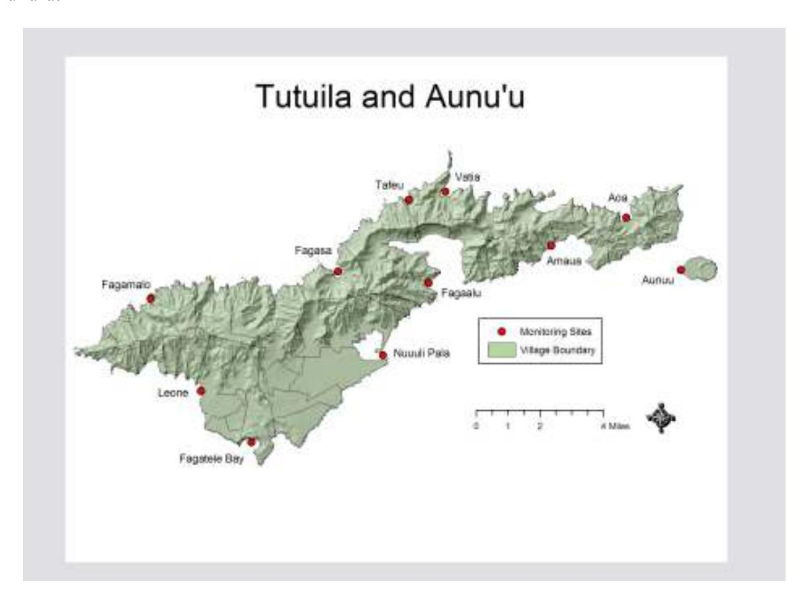

 The benthic methods were the same as in 2007, with a few minor changes. In the core monitoring, four 50-m tapes were laid on a depth contour between 8 and 10 m deep. A space between them of about 15 m was kept. Benthic categories were recorded under each 0.5 m point on the tape. Benthic categories included live coral, dead coral, dead coral with algae, crustose calcareous algae, branching coralline algae, fleshy macroalgae, turf algae, rock, sand, rubble, soft coral, and sponge. "Branching coralline algae" included a soft feathery species that was the most common in that category. That species is *Cheilosporum spectabile*. Corals were identified to lifeform, genus, and species when possible, and if the macroalgae was *Halimeda* or *Dictyot*a, that was recorded. Soft corals were recorded to genus when possible. Lifeforms included encrusting, massive, foliose, branching, columnar, submassive, mushroom, *Millepora*, *Acropora* branching, *Acropora* table, *Acropora* digitate, and *Acropora* encrusting. Horizontal visibility was recorded using the tape. Two transect tapes were done on the first dive, and an additional two tapes were done on the second dive. Invertebrates were recorded on a return pass. Sites were re-located using the GPS and markers as indicated in the 2005 report. One day was required for each site. The same 11 core sites on Tutuila as recorded in 2005 were repeated, which are shown in the map above, plus a site in Masacre Bay on the northwest coast.

 As in 2007, the rugosity measurements which were omitted, because a third team member was not available and when included it lengthened dive times to the point where running out of air was a distinct possibility, thus reducing the margin of safety. Further, it appears that the measurement depends primarily on exactly where the chain falls, and that changes in rugosity caused by coral growth will take quite a few years before they would be detectable. A hurricane could make changes in rugosity quickly by removing corals, and if significant hurricane damage occurs, the rugosity measurements can be repeated. Until changes in coral cover or other rugosity changes are apparent, repeating the measurement of rugosity is not worth the increased risk of running out of air. In future years it is hoped that an additional team member can record the rugosity measure.

 When laying the tape, the primary consideration is to keep the tape between 8 m and 9 m deep. The tape is passed along the sides of projections, including live corals such as *Pocillopora* and table corals, which usually have an overhanging side. If it is passed around first one side of one projection and then the other side of another, it is anchored securely from wave action moving it either way at that point. An attempt is made to anchor the tape in this fashion as often as possible, but in some areas there is little to anchor the tape on. A continuing problem is what to do about clefts in the reef. A cleft that is narrow and deep is crossed straight to an anchoring point on the other side. If it is large, then the tape may be laid along one side of it, going up toward shallower water but staying at 8-9 m depth, and then when the bottom rises to that depth, crossing to the other side and continuing on that side out of the canyon. The principle problem with that is finding an anchoring point near the head of the canyon that can hold the tape at the head. The tape is read at each point by reading the substrate under the point at the time at which the diver is directly above the point. A string and weight are not used, as surge and the movement of the tape in the surge makes that a much more difficult procedure. If the tape is stretched between two points far apart and the surge is heavy, the tape can move a meter or more in either direction with each wave. This opens up an opportunity for bias, as the point on the tape sweeps across a variety of benthic patches. If the point on the bottom is recorded that is first seen from a vertical viewpoint, then bias is minimized. An attempt is made to minimize bias in laying the tape by choosing a route based on depth and anchoring points for the tape, not the substrate.

 The direct observation underwater of what is under points makes it easier to identify species, and so allows greater taxonomic resolution than video techniques.

 In addition to the 11 core sites, one site was added at Masacre Bay on the northwest in 2007; that was continued in 2008.

Dates of collection of data are shown in Table 1.

Table 1. Dates of collection of benthic transect data for each site, reef slope.

| Location | Date     |
|----------|----------|
| Fagamalo | 11/12/08 |
| Masacre  | 2/10/09  |
| Fagasa   | 12/17/08 |
| Tafeu    | 8/26/08  |
| Vatia    | 2/26/09  |
| Aoa      | 1/20/08  |
| Aunu'u   | 3/27/08  |
| Amaua    | 3/25/08  |
| Faga'alu | 3/26/08  |
| Nu'uuli  | 3/??/08  |
| Fagatele | 3/12/08  |
| Leone    | 5/29/08  |

Table 2. Dates of collection of reef flat transect data for each site.

| Location   | Date     |
|------------|----------|
| Fagasa     | 1/29/09  |
| Vatia      | 2/4/09   |
| Aoa        | 2/6/09   |
| Alofau     | 12/22/08 |
| Amaua      | 1/2/09   |
| Faga'alu   | 12/24/08 |
| Faga'alu   |          |
| school     |          |
| Faganeanea |          |
| Nu'uuli    | 12/31/08 |
| Fagatele   | 12/15/08 |
| Leone      | 12/19/08 |
| Utulei     | 1/13/09  |

 Transect data was taken on reef flats at the same locations as in 2007, except sites in the inner harbor were not repeated. The reef flat sites correspond in most cases to the sites on the slopes, to make possible a complete picture of the zonation across the reef flat and down the slope. Reef flat is not normally safely accessible at Tafeu, but it is easily accessible at Alofau. Reef flat is only safely accessible at Aunu'u during unusually calm weather, conditions were very marginal when data was taken in 2007. Transect locations have not yet been recorded by GPS. Probably that will be best done at low tide by walking. Transect data was taken in 2008 as in 2007 during high tide when conditions

allowed. This appears to be better than by walking at low tide, but can be difficult. Locations are re-located by landmarks on the shore and in the water. Generally, one or two tapes were taken near the reef crest, designated "outer reef flat" and a tape was taken farther in if it appeared to be different, which was called the "inner reef flat." The method was similar to the transects on the slopes, 50 m tape, substrate and biota recorded under the same point every half meter, and invertebrates recorded in a half meter wide belt on the return. Limited time during low tide and during calmer weather periods has so far limited the number of tapes per site, but they will be expanded.

Table 4. Approximate Coordinates of reef flat monitoring locations.

| Fagamalo | 140 17' 55.76"S 1700 48' 50.58"W |
|----------|----------------------------------------|
| Fagasa   | 140 17' 13.61"S 1700 43' 23.85"W |
| Vatia    | 140 14' 15.46"S 1700 40' 17.59"W       |
| Aoa      | 140 15" 31.70"S 1700 35' 19.48"W |
| Aunu'u   | 140 14' 02.62"S 1700 33' 42.44"W |
| Alofau   | 140 16' 39.01"S 1700 36' 24.48"W |
| Amaua    | 140 1700 16' 45"S 37' 20"W    |
| Faga'alu | 140 7' 37.67"S 1700 40' 36.02"W  |
| Nu'uuli  | 140 1700 19' 20'S 41' 35'W    |
| Fagatele | 140 21' 55.52"S 1700 45' 42.38"W |
| Leone    | 140 20' 25.97"S 1700 47' 23.82"W |

 Work was also begun in 2007 to survey the benthic communities at 4 m and 18 m depth at each of the 12 core sites. It was deemed a lower priority than collecting the annual core 8 m deep data, and so when weather, boat problems, boat driver shortages, etc occurred, there was not time to complete it. It was continued in 2008 to complete the data set for 4 m and 18 m. Zonation is readily apparent at many sites. Further, disturbances can easily affect one zone and not another, because a disease may afflict only one or a few species, or hurricane wave surge may only damage corals in shallow water or only damage delicate corals that are found in one zone but not another, or bleaching may kill one kind of coral that lives in one zone but not the coral in a different zone. It is important to get a baseline of different depths and different zones, so when a disturbance occurs, it is possible to measure the effects even if they are not apparent at 8 m depth. 4 m was chosen as half way between 8 m and the surface. In some locations like Nu'uuli, data at 4 m can only be taken in calm weather, and even in moderate weather it is near the limits of capability for a diver. Shallower transects would not be safe in most years. 18 m was chosen as about twice as deep than the 8 m transect (which is actually set between 8 and 10 m deep, mostly set between 8 and 9 m deep, and so nominally probably best referred to as 8.5 m deep), and deep enough to be in a deep zone that is different from the 8 m zone. At most sites the reef extends down below 18 m, but often not much farther before it joins the shelf. For those sites where the reef does not extend to 18 m, the tapes are placed as deep as the reef extends.

 The methods for 4 m and 18 m transects are similar to that at 8 m. However, in each dive, first one tape is done at 18 m, and then one at 4 m. A single tape is used, and the diver completely finishes at 18 m and picks up the tape before moving to 4 m depth. The 4 m depth is a perfect safety stop depth, and with the time there makes it a safe dive. Although two tapes at 18 m done consecutively would run some risk of running out of no-deco time or even air, done with first one 18m tape and then a second 4 m transect it is safe. In one day, one such dive is done and then a one hour lunch break is taken between the two dives. In the second dive, there is less time allowed at 18 m, but still enough to complete it safely. The diver wears a spare air on all dives. The rest of the method is the same, 50 m tape, data taken at half meter points, half meter wide belt invertebrates on the way back. It takes one day to get a total of two tapes done at 18 m and two at 4 m. The strategy was to get one day of data from each site before doing a second day, but there are too few days when it has been possible to dive, and even one day at each site has not been possible in a year. If more days of diving could be done, four tapes at each site would be preferred. However, with two tapes per site/depth, the main features of the zonation should be apparent.

Table 5. Dates of data collection for 4 m and 18 m transects.

| Location | Date            |
|----------|-----------------|
| Fagasa   | 2/2/09          |
| Aunu'u   | 5/2/08          |
| Amaua    | 5/6/08          |
| Faga'alu | 1/29/08         |
| Nu'uuli  | 4/3/07, 5/23/08 |
| Fagatele | 4/2/07, 12/4/08 |
| Leone    | 4/2/07          |

 Monitoring of bleaching continues as before, with visual estimates of the amount of staghorn bleached in different areas of the airport and Alofau pools, about biweekly. The reef flat and slope are also recorded at Alofau each time data is taken.

Juvenile table corals near the reef crest at Alofau were re-surveyed on 9/8/08.

# **Results**

 For background information on the coral reefs of American Samoa, see Wells (1988), Craig et al. (2005), Sabater and Tofaeono (2006, 2007), Whaylen and Fenner (2006), Fenner (2008a,b), Fenner et al. (2008), Birkeland et al. (2008), and Brainard et al. (2008), and Craig (2009).

## **Reef Slopes**

In addition to the 11 core sites that have been monitored since 2005, data was taken from Masacre Bay as in 2007. Also, a site in the middle of the shoreline of Fagatele Bay was surveyed that had very high table coral cover. This was done to gain a baseline for that community, so that when and if a disturbance damages it, the change can be measured. The best table coral community was relatively shallow, at only 4 m depth, so the transect was done there. In addition, one transect tape was done near to the green buoy on Taema Banks, because that area has a significant number of table corals, which appear to dominate. The minimum depth there is about 16 m depth, and it is nearly flat with just low undulations. The results of all these transect sites can be seen in Figure 1. The shallow site in mid-Fagatele did indeed have very high coral cover, nearly 75% live coral cover. The site at Taema Banks had moderate coral cover, about 26%. The mean live coral cover for all sites was 33%, a bit higher than in the past, but the very high coral cover on the mid-Fagatele site biases the comparison to the past. A second mean is provided, for the 12 core sites, which had a mean of 30.5%, closer to the cover reported in previous years. Among core sites, Aunu'u and Tafeu continued to have the highest coral cover, now joined by Aoa, which did not have as high coral cover in previous years.

Figure 1.

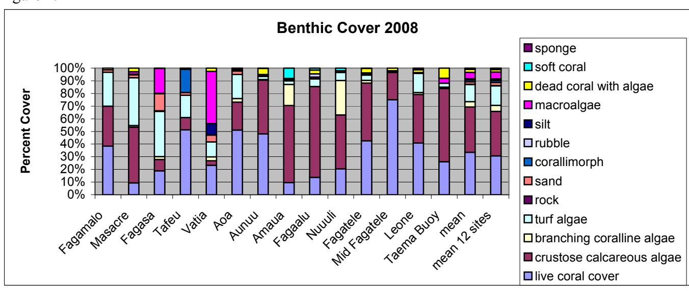

Trends in benthic cover over the four years of the program so far are shown in Figure 2. Only the core 11 sites were included in this analysis. Changes in all categories appear to be small and unsystematic. The primary emerging pattern is one of stability. There was a small increase in live coral cover, from 28.3% in 2007 to 32.4% in 2008. A repeated measures ANOVA on log transformed data found that the increase in coral cover was significant (p < .001). Statistical tests assume that sampling is random, though with a repeated measures ANOVA clearly it does not assume that sampling in the repeated dimension is random. It would seem that this small a change might easily be produced by slightly changed transect locations. The Key Reef Species program also found an increase in 2008, suggesting that the increase may be real. The reefs might still

11

be recovering from the major disturbance in 1978 when crown-of-thorns starfish ate most of the coral. There have been a series of more moderate disturbances since then, including hurricanes (Ofa in 1990, Val in 1991, and Heta in 2004) and bleaching (1994, 2002, 2003) so corals may be recovering from them as well. There has been significant recruitment of the table coral *Acropora hyacinthus* in recent years, but that is concentrated near the reef crest, and not a single recruit of that species has been recorded in the reef slope transects.

Figure 2.

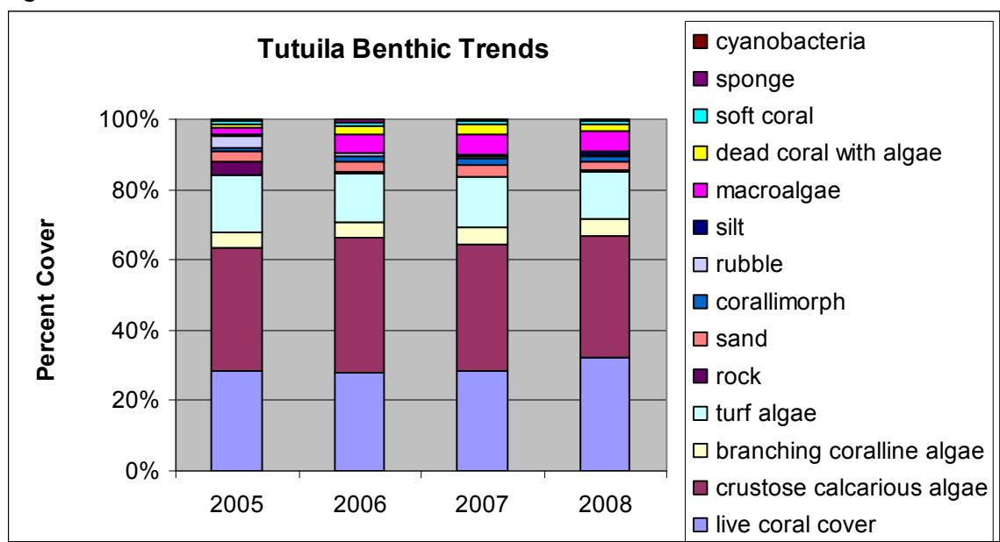

 Côté et al. (2006) have reported the average rate of change of coral cover, based on data from many studies, for a variety of areas, including the Pacific, Indian Ocean, Red Sea, Caribbbean, and global reefs. The total change in coral cover in the four years of the Territorial Monitoring Program was an increase of 15%. Figure 3 compares that change with average changes in different areas reported by Côté et al. (2006). Coral cover has been decreasing globally, though that decrease has been smallest in the Pacific. On Tutuila, however, coral cover has increased (as seen in Figure 2). The sample size of just four years for Tutuila is small, and most of the increase occurred in just the last year. However, the Key Reef Species program has also recorded increases in coral cover (D. Ochavillo, personal comm.), supporting the view that these increases are real. This information is consistent with the view that reefs are relatively healthy on Tutuila. Voluminous world-wide data in 18 categories from Reef Check summarized by Wilkinson (2006), gives the Pacific Islands one of the highest scores for healthy reefs, only slightly below that of Australia. It gives Atlantic reefs the lowest score (tied with the Arabian Gulf). This is consistent with the other lines of evidence that indicate that Pacific reefs are relatively healthy, and Atlantic (mainly Caribbean) reefs are among the most degraded. This also supports the view that Tutuila reefs are relatively healthy.

Figure 3. The rate of change of coral cover reported for regions by Wilkinson (2006) and reported in the Territorial Monitoring Program for Tutuila.

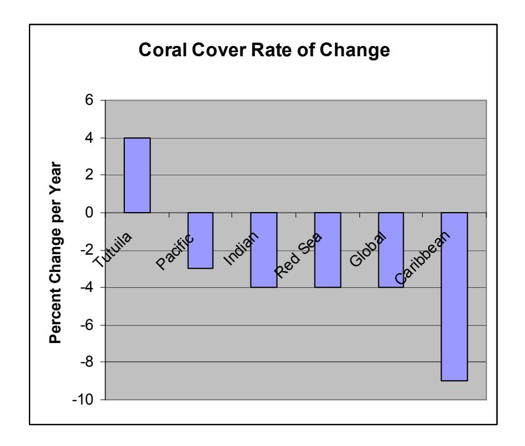

 Figure 4 shows coral cover over time with different studies such as the Birkeland and Green long term monitoring projects, and the present project. The dates of major disturbances are shown below the x-axis. It appears that major disturbances may have caused the loss of coral cover during some periods, and a lack of major disturbances have allowed considerable improvements in other periods. There have been no major disturbances since Hurricane Heta in January, 2004, and now coral cover has started to increase slightly. Clearly a graph like Figure 3 for the time span shown on this graph would also show a slight increase from start to finish. However, picking any two points on this graph would produce very different results depending on which two points were chosen.

Figure 4.

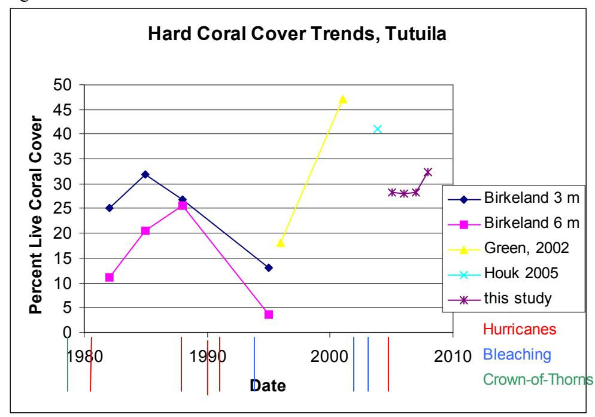

 As in previous years, there were strong differences between the north and south shores, as shown in Figure 5. Visible crustose calcareous algae is much more abundant on the south side than the north as was found before. Coral cover is more abundant on the

Figure 5.

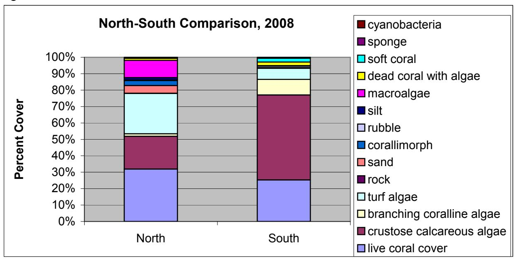

north, as is turf algae and macroalgae. Branching coralline algae is more common on the south side. Sand and corallimorphs were also more common on the north than south. As explained in previous years, for about half the year winds and waves come steadily from the east-southeast, and for the rest of the year winds and waves are changeable. Because of the orientation of Tutuila going from northeast to southwest, waves from the east southeast strike the island on the south coast. Crustose calcareous algae grows best when it is not smothered by sediment or other algae. The continuous wave surge on the south coast for half the year re-suspends sediment that settles on surfaces, producing favorable conditions for coralline algae. This may be why crustose coralline algae is more common on the south side. The differences in visible crustose calcareous algae and turf algae are presented in Figure 6.

Figure 6.

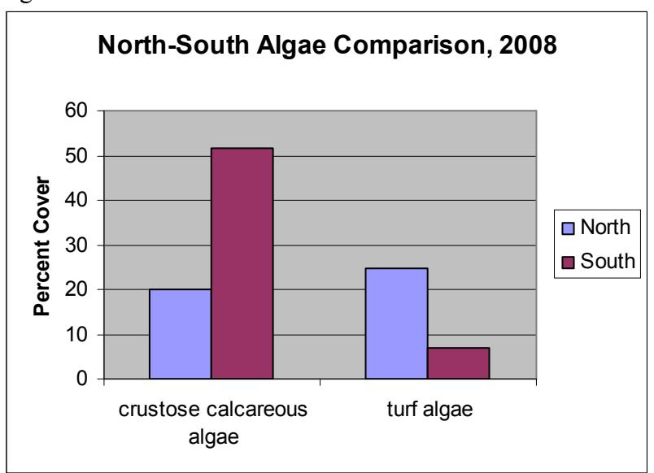

 Trends in benthic cover on the north coast compared to the south coast is shown in Figure 7. The North data is shown on the left, and South data on the right. The north-south differences are clearly stable over the time period covered, with the north side continuing to have more turf and macroalgae, and the south side continuing to have more coralline algae and branching coralline algae.

 The difference between the north and south coasts in algae has also been found in the "Key Reef Species" program of DMWR (Sabater and Tafaeono, 2007) as noted in previous annual reports of this monitoring program. In addition, Houk and Musberger (2008) have reported a very similar finding. Instead of distinguishing north and south side sites, they distinguish "consolidated" and "framework" reefs. Consolidated reefs are solid, without holes or other spaces within the reef, while framework reefs have various internal spaces available. (A third category, "intermixed sand and reef patches" applies to Vatia.) All of their sites on the north side of the island were consolidated, and all but one of their sites on the south side were framework. They reported the same differences in algae for these two categories as reported here, corresponding to north and south sides. Thus, three different programs have now replicated this difference.

Figure 7.

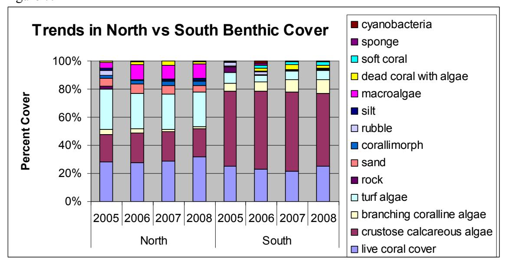

 A new comparison this year is between the western and eastern ends of Tutuila. Because Tutuila is relatively long and thin, there are obvious north and south coasts. West and East coasts are very very short, and there are no transects on either of these. However, it is possible to compare the western and eastern halves of the island, even though they are both composed of sections of north and south coast. Figure 8 compares the western and eastern sites. Most categories are essentially identical between the west and east ends of the island, such as live coral cover, crustose calcareous algae, and branching coralline algae. However, there are some differences, most notably turf algae,

Figure 8.

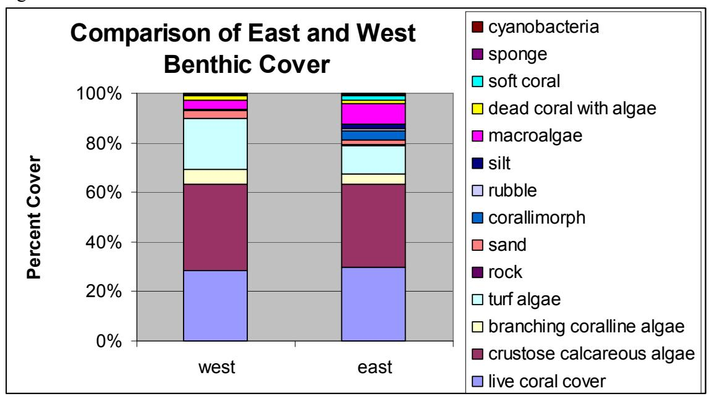

which is greater in the west and less in the east. Also, macroalgae is slightly more in the east than the west, as is corallimorph. Examination of Figure 1 shows that the sites with high turf cover (Fagamalo, Masacre, and Fagasa) are all in the northwest. When they are combined with other sites on the north they make the mean for the north larger than the south, and when combined with other western sites make the mean for the west larger than the east. But only the northwest has high levels of turf. For macroalgae, Vatia in the northeast had much higher macroalgae than any other site, which is why the mean for the east (and for the north, assisted by a more modest amount of macroalgae at Fagasa) was higher than for the east (or south). Similarly, Tafeu was the only site with corallimorphs, so it makes the mean for the east higher than the west, and the mean for the north higher than for the south.

 Another index of reef health that has been proposed it the amount of "good" cover consisting of coral plus crustose calcareous algae, and the amount of "bad" cover, consisting of turf plus macroalgae. Trends in these combined variables can be seen in Figure 9. CCA plus coral has high cover, and turf plus macroalgae has low cover, and both of these were stable over the four years of the program so far.

Figure 9.

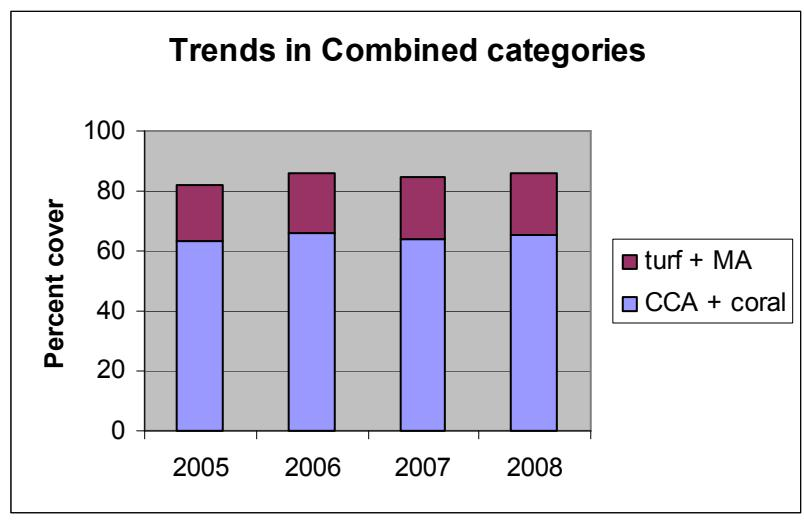

 An important measure of reef health is the proportion of corals which are alive. The Secretariat of the Pacific Community (SPC) PROCFish program has reported a live coral index, which is the percent of all corals which are alive. The reported an average of 55% of all corals alive from South Pacific Countries. Figure 10 shows that values for American Samoa are much higher than the South Pacific average. American Samoa values appear to show small, unsystematic changes. There have been no major disturbances during the four years of this monitoring program which could have caused significant coral deaths and thus major changes in the live coral index.

Figure 10.

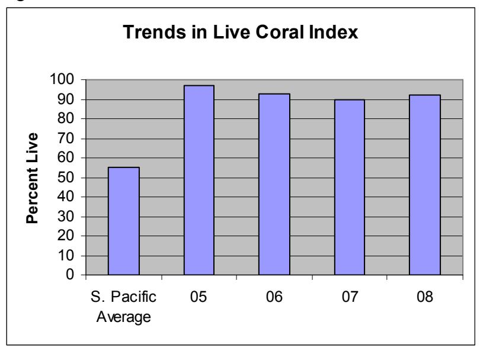

 Now that there are four years of data in this monitoring program, trends over time can be evaluated for individual monitoring sites.

## **Individual Sites**

 In Fagamalo, there was little change from 2007 to 2008, with a slight increase in coral and coralline algae cover, and decrease in turf. Figure 11 shows that both 2005 and 2006 had lower coral cover than 2007 and 2008. It appears that a GPS malfunction moved our transect location in 2007, which was discovered in 2008.

Figure 11.

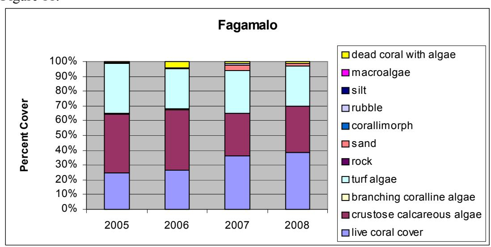

 In Tafeu, cover in most categories changed little if any from 2007, as seen in Figure 12. The overall trends from 2005 saw a decrease in turf in the first 3 years, and an increase in the corallimorph coverage in the first three years, but those trends did not continue from 2007 to 2008. As reported in the 2007 report, the corallimorph, *Rhodactis* sp., has been reported to have grown to have covered a million square meters around a metal shipwreck in Palmyra (Work, Aeby, and Maragos, 2008). The corallimorph can kill corals by stinging or grow over living corals, killing them in the process. For the moment, the situation appears stable in Tafeu.

Figure 12.

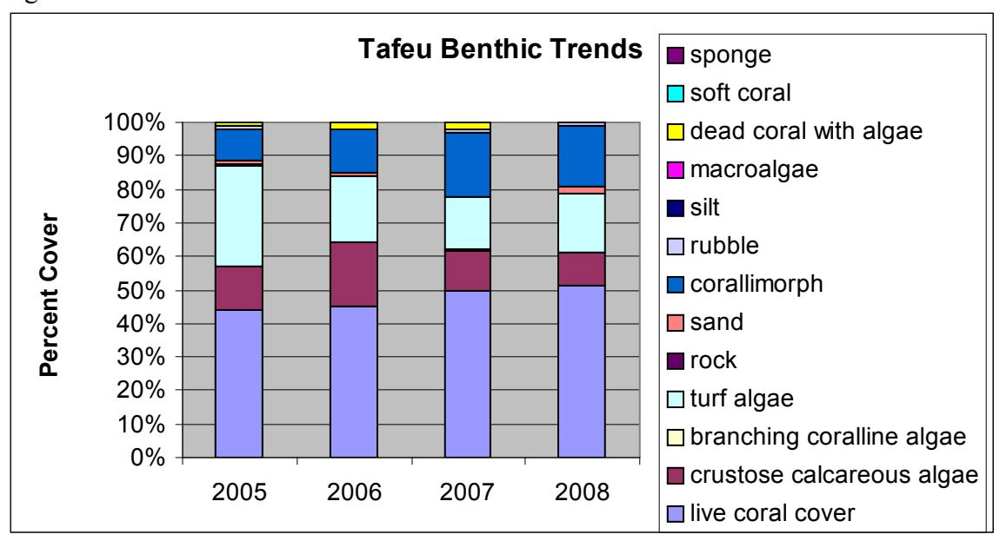

 In Aunu'u, coral cover has been particularly stable over the four years, but coralline alga has increased a small amount over the four years, as seen in Figure 13. Figure 13.

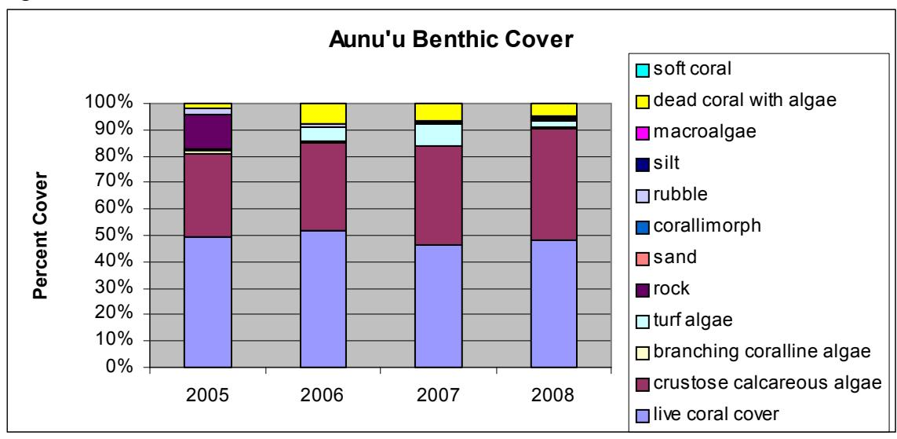

 In Amaua, coral has been fairly stable at low levels, increasing slightly in 2006, then decreasing since then until 2008, as seen in Figure 14. There is no observable loss of coral there, and the changes are small and likely to be due to small differences in the exact location of the transect tapes.

Figure 14.

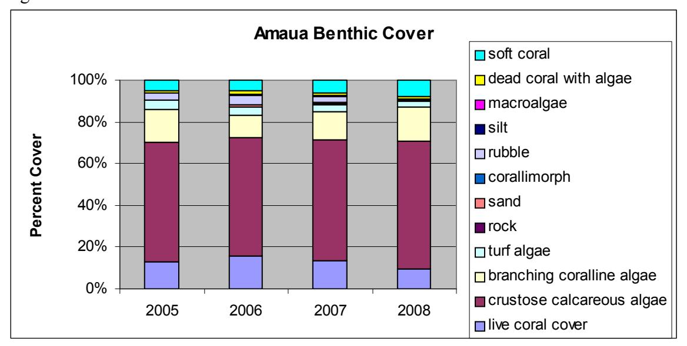

 In Faga'alu, coral cover has remained steady at low levels, as seen in Figure 15. Coralline algae increased from 2005 to 2006, but has been relatively steady since. No observable change correlates with that, so likely it is due to small changes in the location of the transects.

Figure 15.

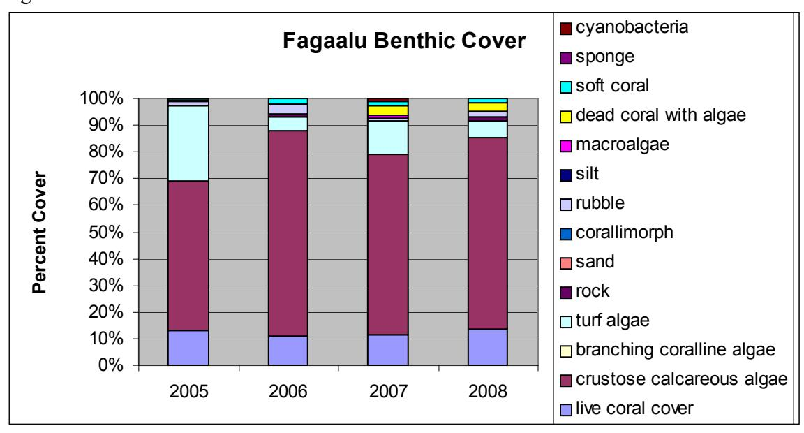

 In Nu'uuli, coral cover has been very steady over the four years (Figure 16). In contrast, branching coralline algae has increased in cover, and crustose calcareous algae has decreased. Most likely, the branching coralline algae is growing over the crustose calcareous algae, hiding it.

Figure 16.

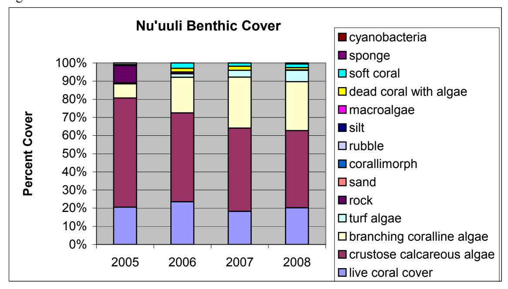

 In Fagatele, coral cover has returned to the level recorded in the first year (Figure 17). The lower levels recorded in 2006 and 2007 are likely due to slightly different tape locations, and no changes were observed that could account for that change. Crustose calcareous algae changed in the exact opposite pattern.

Figure 17.

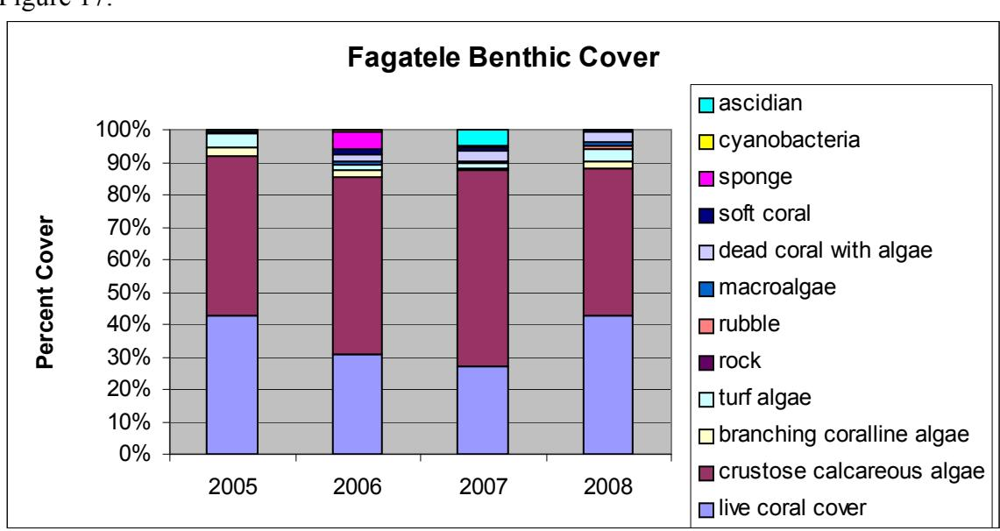

 In Leone, coral cover increased very slightly from that in 2007 (Figure 18). Overall, coral cover appears quite stable, and the small changes are likely random and not real. Crustose coralline algae cover decreased to the levels seen in 2005 and 2006. Again, this is unlikely to be a real change on the reef.

**Leone Benthic Trends** 0% 10% 20% 30% 40% 50% 60% 70% 80% 90% 100% 2005 2006 2007 2008 **Percent Cover** sponge soft coral dead coral with algae macroalgae silt rubble corallimorph sand rock turf algae branching coralline algae crustose calcareous algae live coral cover

Figure 18.

## **Corals in Transects**

 When corals are recorded in the transects, their lifeform, genus, and species are recorded where possible.

### **Lifeforms**

 Coral lifeforms recorded in the transects at each site are shown in Figure 19. Encrusting corals dominate most sites, except Vatia and Nu'uuli, which are dominated by columnar lifeform corals. The columnar lifeform is almost entirely made up of a single species, *Porites rus*, which produces columns growing up from nearly horizontal plates, so in effect a mixture of columnar and foliose lifeforms. The columnar lifeform was chosen somewhat arbitrarily for this species as its dominant lifeform.

Figure 19.

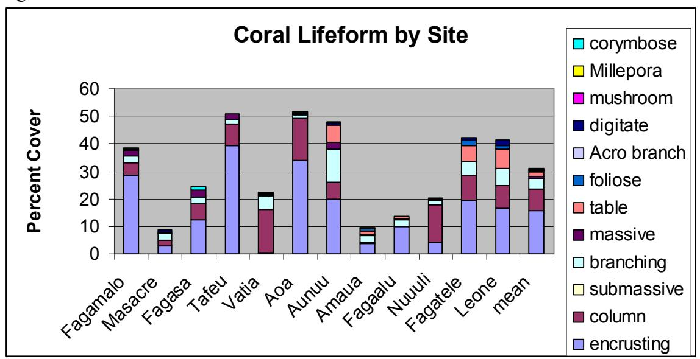

Figure 20 shows a comparison of the coral lifeforms on the north and south sides of the island. Total coral cover was higher on the north than the south, as shown in Figure 2. Encrusting coral cover was higher on the north than the south side as well. Columnar coral is very slightly higher on the north than south, while table corals clearly have more cover on the south than on the north and branching has slightly more cover on the south than the north. But the primary difference is more encrusting coral on the south than the north.

Figure 20.

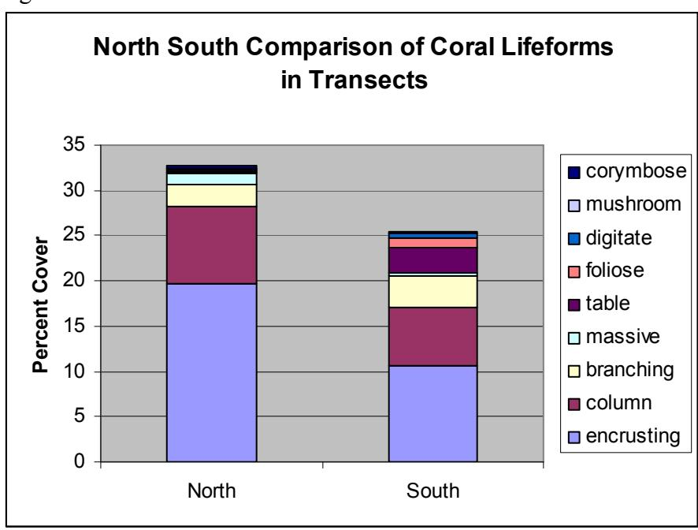

Figure 21 shows the trends in the mean number of lifeforms per site. There was a small increase in the number of lifeforms recorded.

Figure 21.

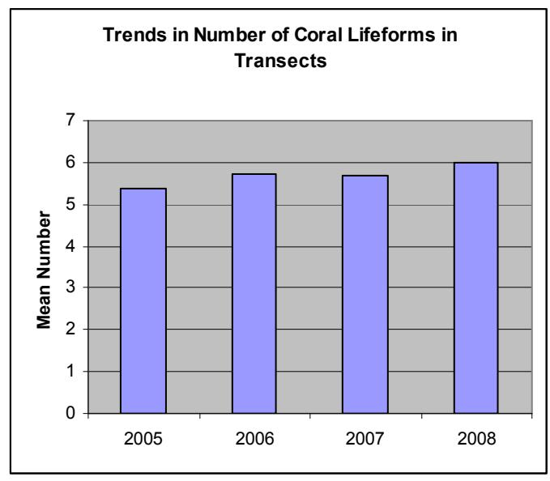

Figure 22 shows trends in the number of lifeforms recorded in transects over the four

Figure 22.

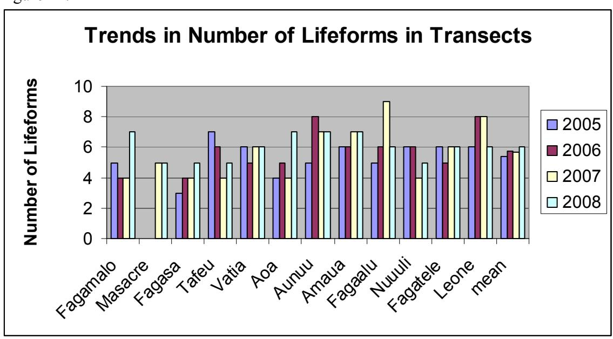

years of monitoring. There were no consistent trends, but individual sites did show some consistent differences with other sites.

Figure 23 shows the average amount of cover of each of the different lifeforms in the

Figure 23.

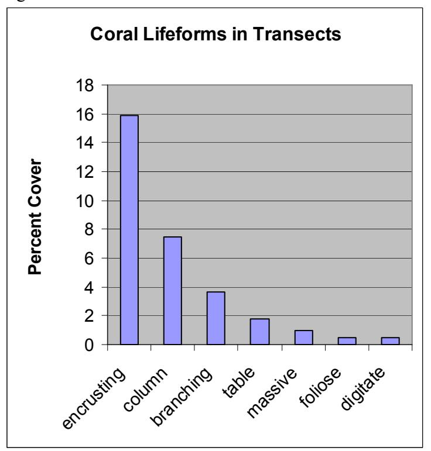

12 sites. This clearly shows that encrusting is the dominant lifeform, followed by columnar, branching, table, and massive. Submassive is also a common lifeform, but is found in abundance only in certain areas, primarily on the southeast of the island, and at particular depths. It appears to be most common around 15 m deep. In 2006, an extra site in Amaua was located in such an area, and an abundance of submassive corals was recorded.

Figure 24 shows that there has been little trend in lifeforms over the four years monitoring has been carried out so far. Encrusting has remained the dominant lifeform. In the first two years, the columnar lifeform was recorded as a type of branching, and in the second two years these two lifeforms were distinguished, as can be seen in the figure. There were no clear trends in lifeforms over the four years.

Figure 24.

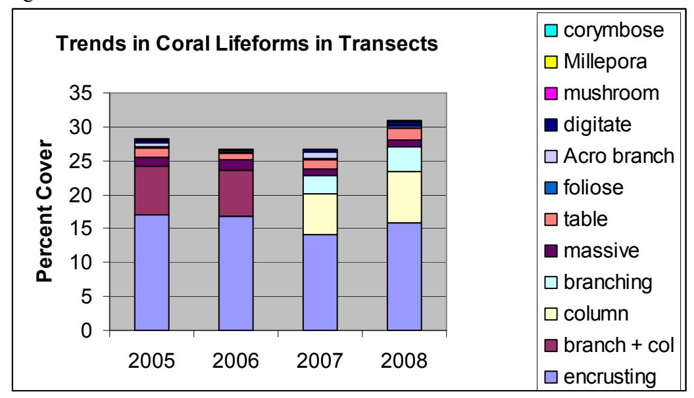

 In Figure 25, the trend for the encrusting lifeform can easily be seen, there was no overall trend over time for the encrusting lifeform. For the columnar life form and branching, there was a change in the way corals were recorded from 2006 to 2007, so columnar corals were included in branching in 2005 and 2006, but recorded separately from branching in 2007 and 2008. Of course they can always be recombined. When recombined, they produce the graph seen in Figure 23. In Figure 23 it is clear that there was an increasing trend for the combined branching and columnar category. Figure 25 shows that from 2007 to 2008, there was an increase in the abundance of both the branching and columnar lifeforms.

Figure 25.

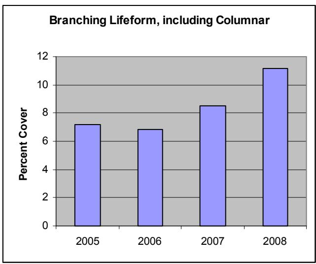

 Trends in *Acropora* Table corals are shown in Figure 26. Table corals initially decreased in cover, then increased. Since only 2008 is higher than the value for 2005, it is not certain that the apparent upward trend in the later years is real. There has been significant recruitment of the table *Acropora hyacinthus*, however this recruitment is centered on the reef crest, and there are few if any recruits at the depth of these transects. Further, the recruits are small enough to cover a miniscule area, except where they are common at the crest. Thus new recruits cannot be the cause of this apparent increase in table cover. Tables grow relatively rapidly, so growth of existing tables could be the cause, though that should produce moderate gains every year unless something such as disease caused partial or complete mortality of some tables. Significant mortality was not noticed or recorded.

Figure 26.

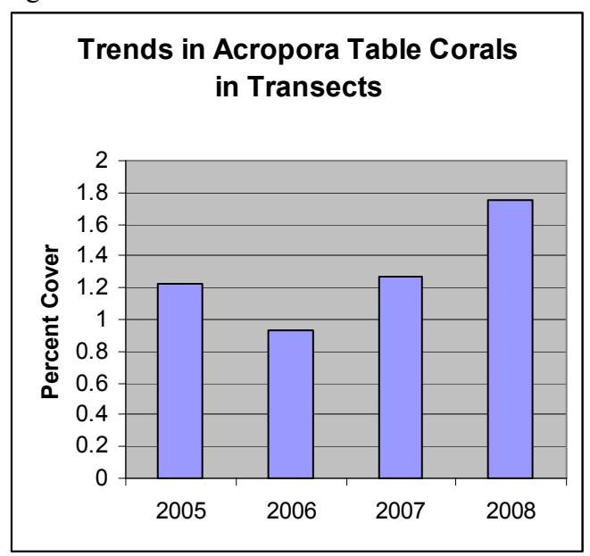

 Figure 27 shows trends in massive corals. They show an increase from 2005 to 2006, and a decrease thereafter. Interestingly, this is the mirror opposite of that seen for table corals. It could be that small changes in the transect tape location put the tape over more of one life form and less of the other. Massive corals are slow growing and increases cannot happen rapidly. No mortality was observed or recorded to account for the decrease in later years. The amount of cover is small, so the amount recorded relies on relatively few points, which would accentuate the apparent magnitude of random effects. It seems highly likely that these changes are not real.

Figure 27.

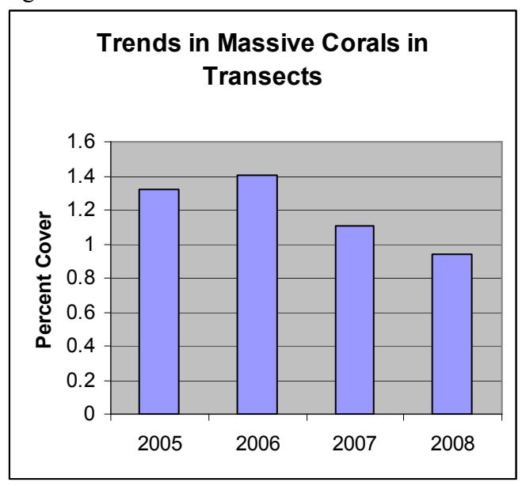

Figure 28 shows trends in the foliose corals in transects. The trends are very similar to that for table corals shown in Figure 25.

Figure 28.

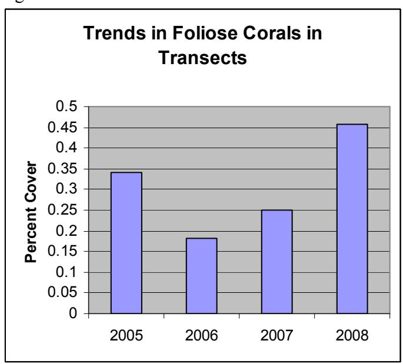

 Figure 29 shows trends in digitate corals in transects. The trends are very similar to the trends for foliose corals as shown in Figure 26, and table corals shown in Figure 24. Why all of these lifeforms should show similar trends is not obvious. Most likely it is some kind of artifact of transect placement, rather than real changes.

Figure 29.

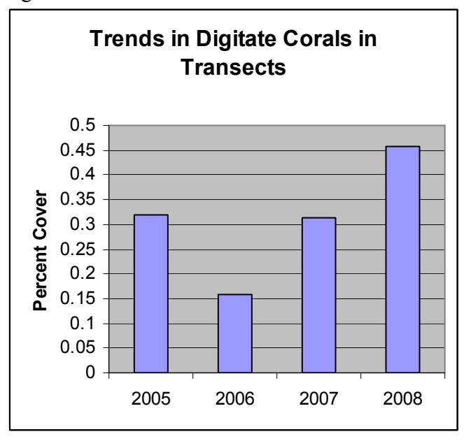

#### Genera

Coral genera in transects for the different sites is shown in Figure 30. At most sites, *Montipora* is the most common genus, but in Vatia and Nu'uuli, *Porites* is the most common genus. *Pavona* is the most common genus in Faga'alu. *Acropora* has a significant presence only at Aunu'u, Fagatele, and Leone.

Figure 30.

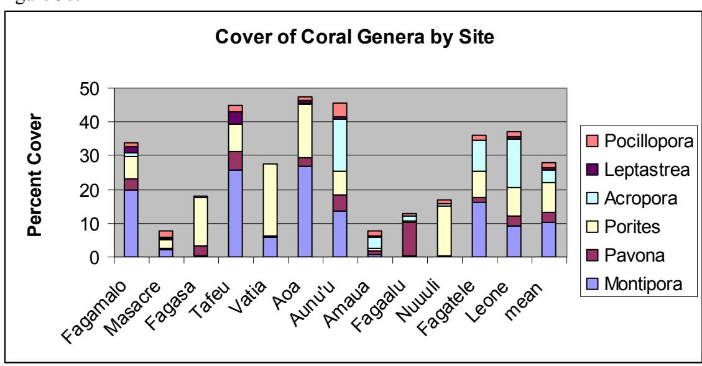

Figure 31 shows a comparison of the coral cover by genera on the north and south sides of the island. Total coral cover is higher on the north side of the island compared to

the south side, as shown in Figure 1. Figure 31 shows that there is higher *Montipora* and *Porites* cover on the north side of the island than the south. *Acropora* had much higher cover on the south side than the north, with almost no *Acropora* cover on the north. *Pavona* had very slightly more cover on the south than north. The causes of these differences are not obvious. The higher *Montipora* cover fits with the fact that Figure 19 shows more encrusting corals on the north than the south, and the higher *Acropora* on the south side fits with the higher table cover on the south seen in Figure 19.

Figure 31.

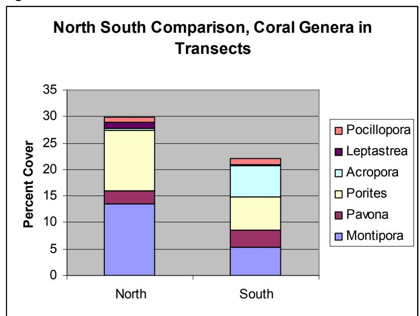

 Figure 32 shows the trends in the number of genera per site. There was little if any consistent trend over the four years.

Figure 32.

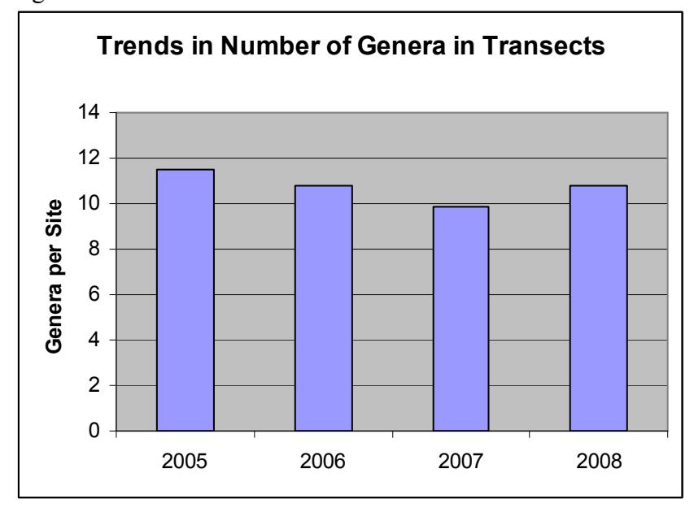

Figure 33 shows the trends in the number of coral genera in transects at each site. There were no consistent trends over time, but there were some consistent differences between sites, with lower diversity at Fagasa, Faga'alu, and Vatia. Fagasa and Faga'alu have low coral cover which could be why there are fewer genera, but Vatia does not have low coral cover. Vatia Bay is highly protected and has a different coral community than other sites.

Figure 33.

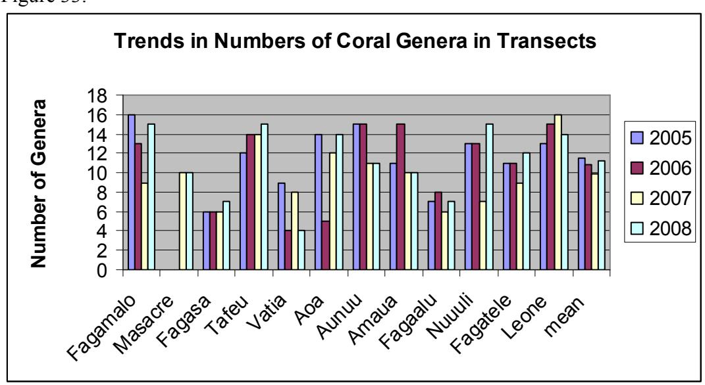

Figure 34 shows the percent cover of different coral genera in transects. *Montipora* has the greatest cover, followed by *Porites*, *Acropora*, *Pavona*, *Pocillopora*, and *Leptastrea*.

Figure 34.

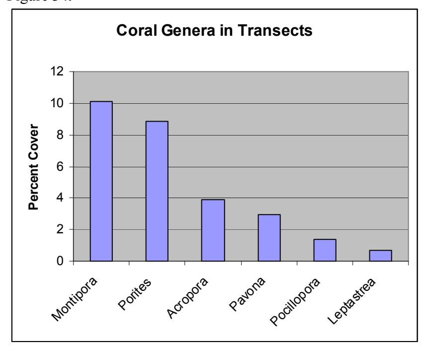

Figure 35 shows the trends over years in the cover of the five most abundant genera. It appears that the main genera are fairly stable over time.

Figure 35.

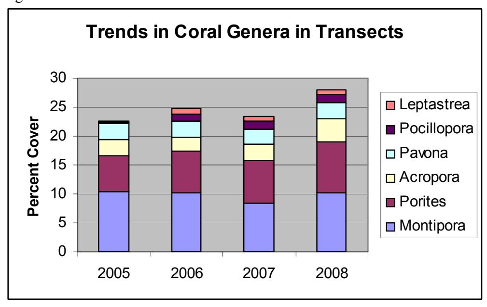

 The trend in *Montipora* can be seen relatively clearly in Figure 35, but the trends in other genera can be more clearly seen in individual graphs, such as Figure 36, which shows the trend in *Porites*. Figure 36 shows a steady increase in the cover of *Porites*. It is not yet clear why that might be the case, though *Porites rus*, the main *Porites* species, seems to be a weedy species capable of rapid asexual reproduction by fragmentation. It is also possible that this is just random fluctuation.

Figure 36.

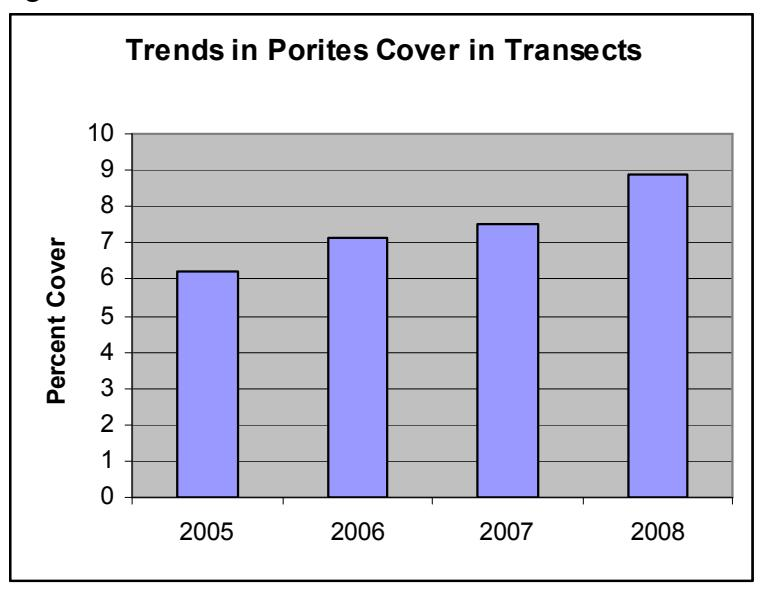

Figure 37 shows the trend in *Acropora* cover. There appears to be no overall trend in the first three years, but in 2008 there was an increase. If that trend continues in future years

Figure 37.

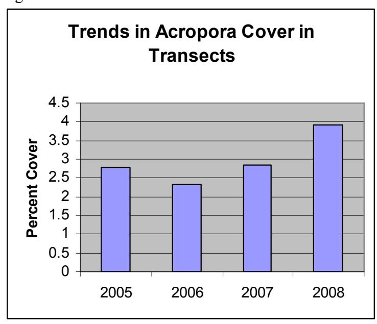

then it will become apparent that it is real. There has been recent recruitment of *Acropora hyacinthus* tables, but that is centered on the reef crest and is only abundant enough to detect in some areas, so it is not the cause of this trend.

 Figure 38 shows trends in *Pavona*. There appears to be no systematic trend in *Pavona* cover.

Figure 38.

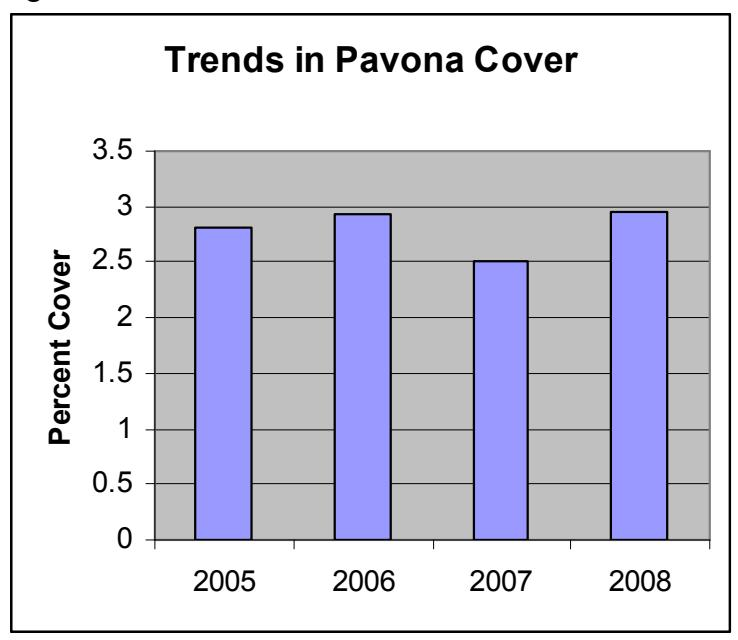

 Figure 39 shows trends in *Pocillopora* cover. There is no apparent trend over the last three years, however much lower cover was recorded in the first year than subsequent years. The cause for that is not apparent, but is very unlikely to reflect a real change in cover since it would require an unrealistically high rate of growth of those corals, followed by no further growth.

Figure 39

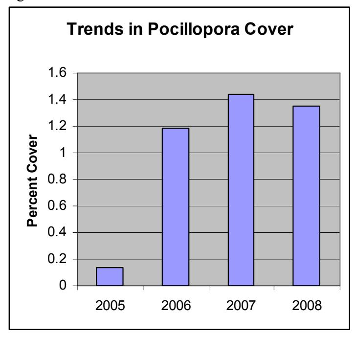

Figure 40 shows trends in *Leptastrea* cover. It shows a possible small downward

Figure 40.

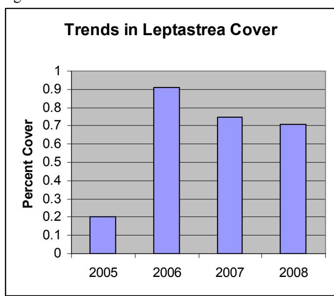

trend over the last three years, but a much lower level in the first year, much as *Pocillopora* shows in Figure 39. For the same reasons, the low level in the first year is highly likely to be some sort of artifact.

#### **Species**

Figure 41 shows coral species by site. Encrusting *Montipora* was the most common species, followed by *Porites rus*. Encrusting *Montipora* was uncommon at some sites, such as Fagasa, Vatia, Amaua, Faga'alu, and Nu'uuli. *Porites rus* was the most abundant coral at Fagasa, Vatia, and Nu'uuli.

Figure 41.

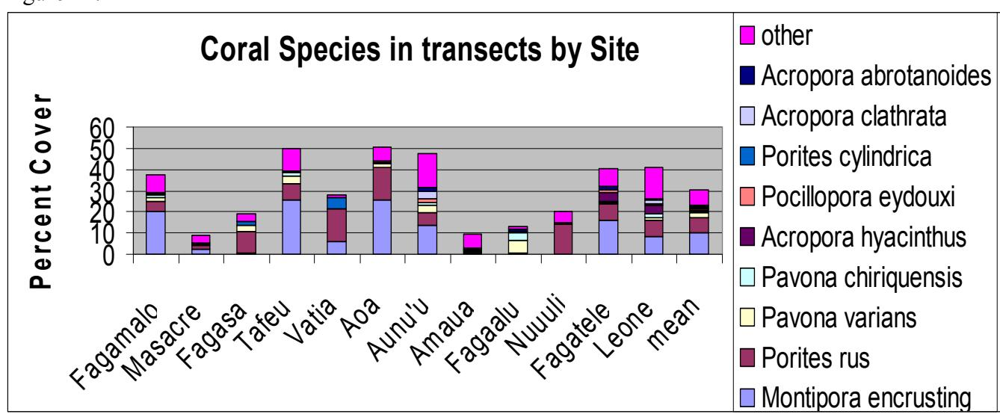

Figure 42 shows a comparison of coral species in transects on the north and south sides of the island. *Montipora* encrusting is more common on the north side of the island, consistent with the finding of more *Montipora* on the north side shown in Figure 30 and more encrusting coral on the north shown in Figure 20. There was more *Porites rus* on the north than the south, which is consistent with more *Porites* shown on the north in Figure 31, and more columnar coral on the north shown in Figure 19. There was more *Acropora hyacinthus* on the south, which is consistent with more *Acropora* on the south shown in Figure 31 and more table coral on the south shown in Figure 20.

Figure 42.

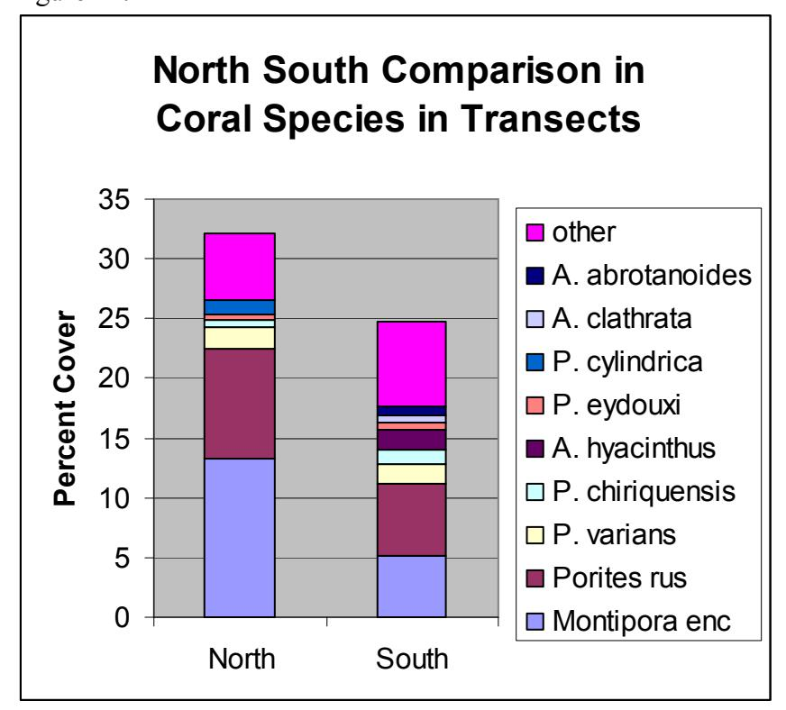

 Figure 43 shows trends in the number of coral species in transects. It shows a slight decrease followed by a slight increase. The differences between years are small and likely due to random effects.

Figure 43

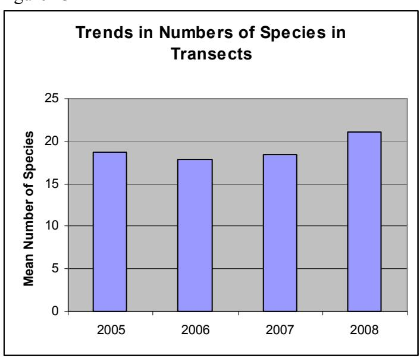

Figure 44 shows trends in the number of coral species in transects by site. Fagasa and Vatia consistently had the lowest numbers of coral species (followed by Faga'alu and Nu'uuli), while Aunu'u and Leone consistently had the highest numbers of coral species, closely followed by Fagatele and Tafeu.

Figure 44.

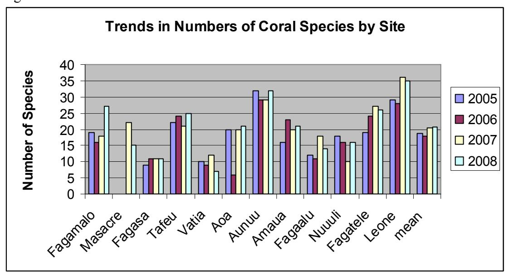

Figure 45 shows the mean number of coral species in transects on the north side of the island compared to the south side, over the four years of monitoring. The south side consistently has more coral species in transects than the north side. Since the sites were not randomly chosen, this could be due to which sites were chosen. Although the same could be said of the North-South difference in algae, the same effect was found by Sabater and Tofaeono (2007) using a completely different set of sites, so it is highly likely to be real.

Figure 45.

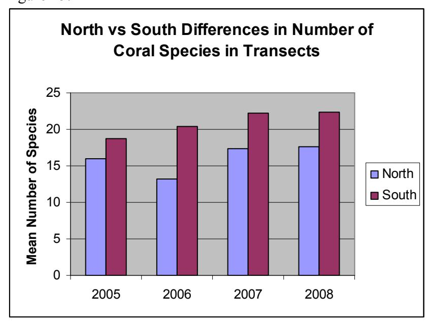

Figure 46 shows the mean coral species cover in transects. Encrusting *Montipora* and *Porites rus* are by far the most common species.

Figure 46.

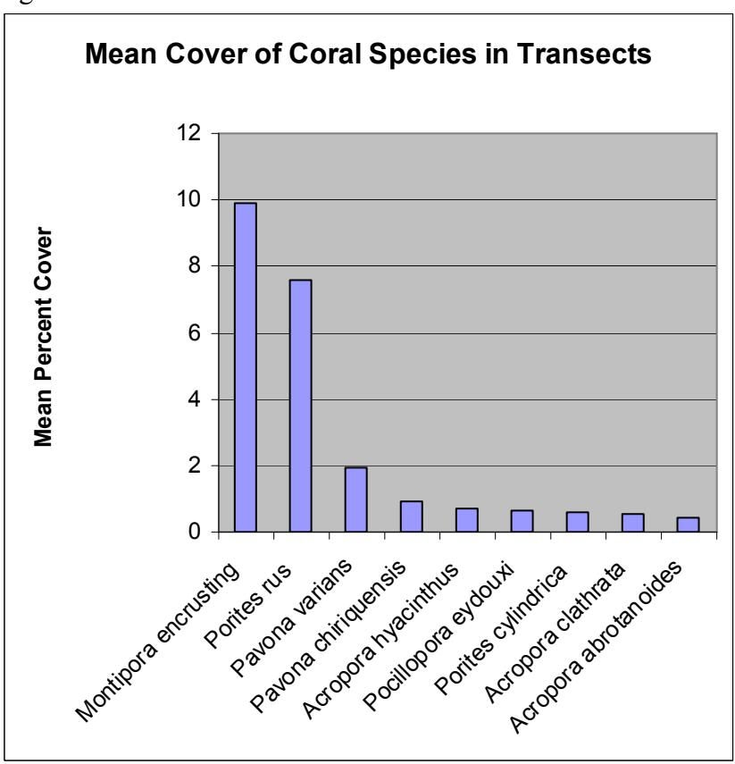

 Figure 47 shows trends in coral species in transects, which shows that most coral species are relatively stable over time. The lack of a consistent trend in encrusting *Montipora* can easily be seen in Figure 45. *Porites rus* appears to have increased some,

Figure 47.

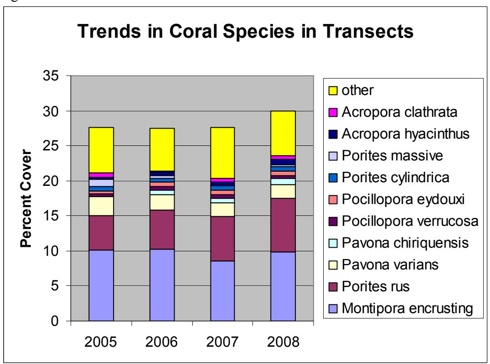

which can more easily be seen in Figure 48. This increasing trend is very similar

Figure 48.

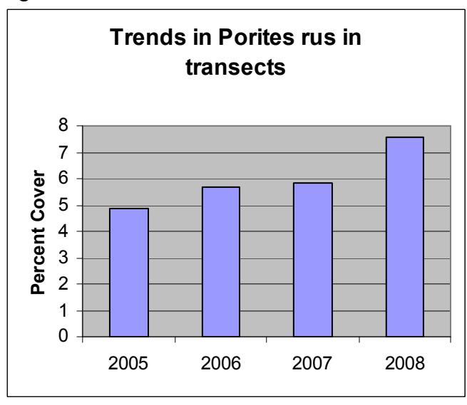

to that for the genus *Porites* as a whole (Figure 35), as well as the columnar lifeform (Figure 22). This makes sense because *Porites rus* is the most common species of *Porites* and almost the only columnar lifeform.

 Figure 49 shows trends for *Pavona varians*. There was no consistent trend over time for *Pavona varians*.

Figure 49.

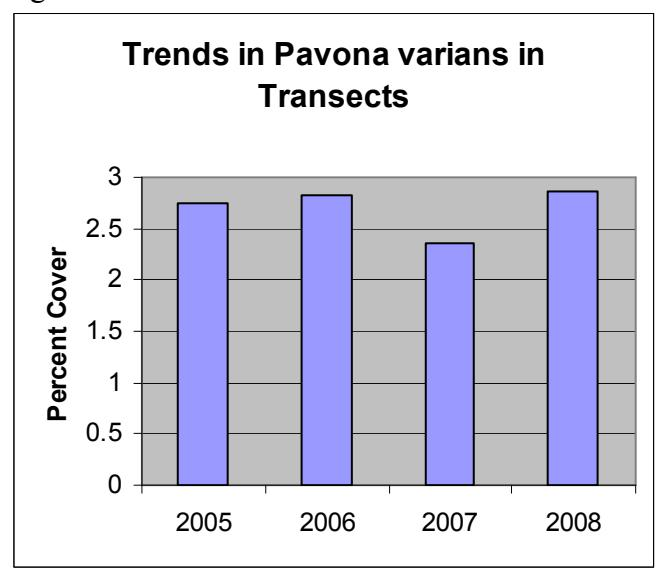

 Figure 50 shows trends for massive *Porites*. There appears to be a large downward trend over time. The cause of this is not readily apparent. No increase in dead *Porites* was noticed or recorded. It may be that it is such a small part of the community that random effects are relatively large.

Figure 50.

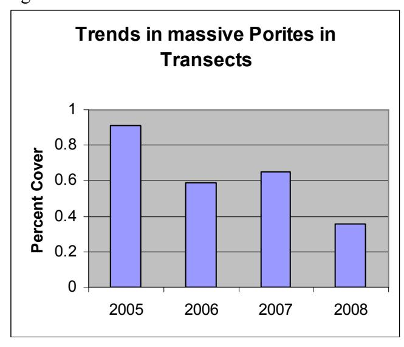

 A visual search was made of a table of the data for all 107 species of coral that appeared in the transect data over the four years of monitoring. All of those species that were not included in Figure 47 were rarer than the rarest species in that graph (and were included in "other"). Among those species, only one, *Montipora turgescens*, had a consistent downward trend, as shown in Figure 51. This species, like most species, had very low cover, so random effects should be very large. In a large number of species like this 107, a few are likely to show trends just by chance variation. The downward trend of *Montipora turgescens* is shown since a strong downward trend of any species could be a cause for concern. However, there appears to be no cause for concern among any of the coral species.

Figure 51.

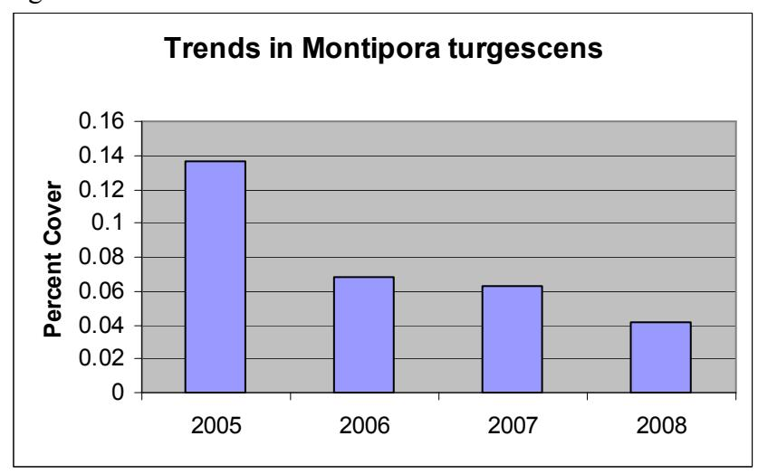

#### **Species Diversity**

 There are a variety of quantitative indices of species diversity. Typically, they all correlate highly and produce similar results, such as was found in the 2006 report (Fenner, 2008a). The Shannon-Weaver diversity index (H) as modified for percent cover (H') instead of numbers of individuals, is the most commonly used diversity index, and has been used each year in these reports. Figure 50 shows the trends in the Shannon-Weaver index. Figure 52 shows that this index has been quite steady over the four years of monitoring.

Figure 52.

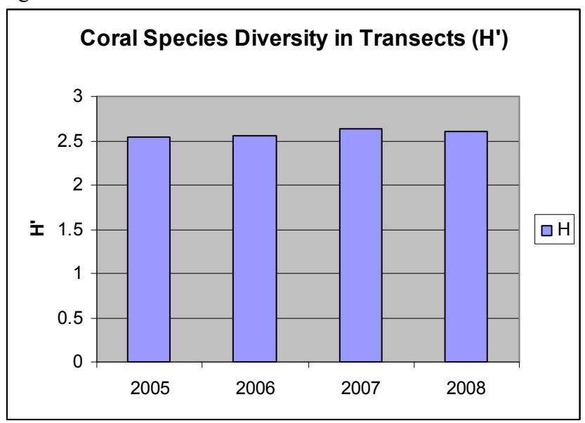

Figure 53 shows trends in coral species diversity in transects by individual sites.

Figure 53.

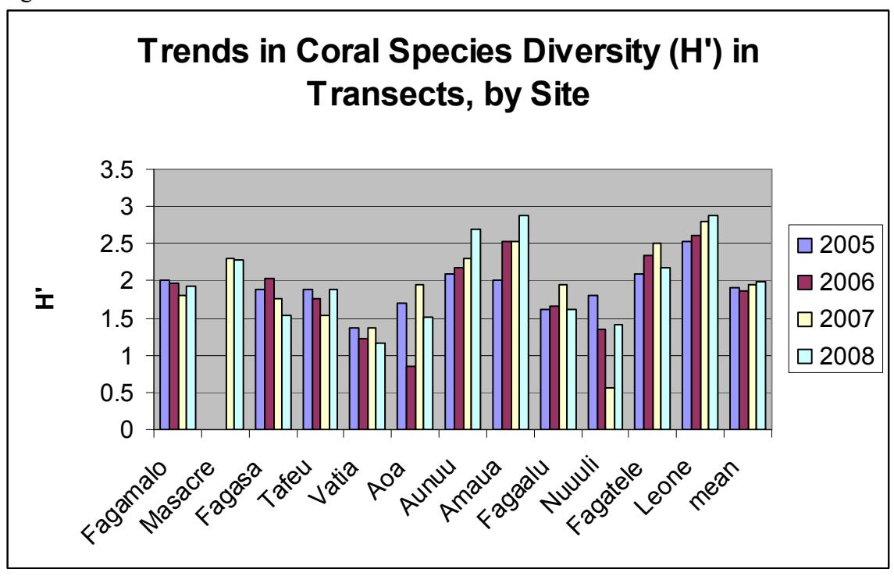

The graph shows that there were consistent differences over the four years in diversity between sites, with Vatia, Nu'uuli, Aoa and Faga'alu having the lowest and Leone, Fagatele, Amaua, and Aunu'u having the highest. Leone and Aunu'u are a couple of the sites with the highest cover, and Faga'alu and Nu'uuli are a couple sites with some of the

lowest cover. Perhaps the diversity is correlated with coral cover. Figure 54 shows a scattergram of coral cover against diversity (H'), using the mean of all four years of data for both variables (mean of two years for Masacre Bay). The correlation was very small (r = 0.1249) and not significant (p > 0.2)

Figure 54.

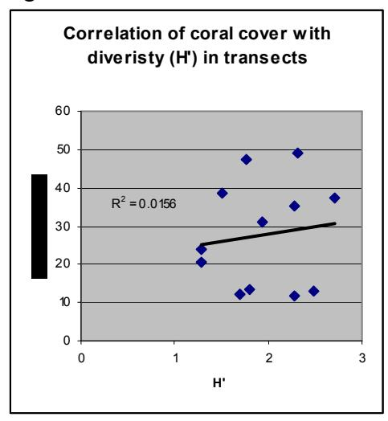

 The coral diversity data was also examined for a difference between the north and south sides. Figure 55 shows the trends in coral diversity on the north and south sides of the island. The south side had a higher coral diversity each year than the north side. Diversity on the south side showed no trend over time, but on the north there appears to be a slight upward trend.

Figure 55.

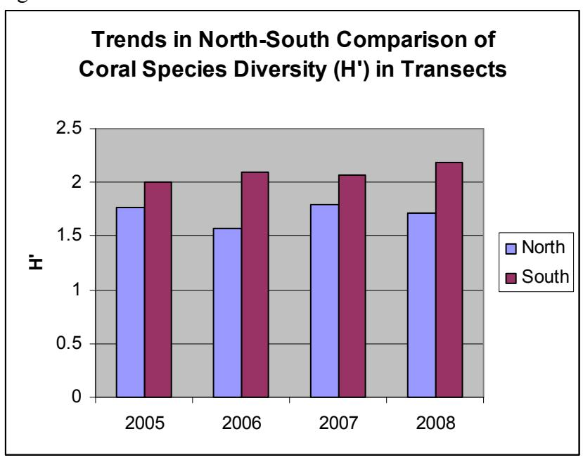

Figure 56 presents the trends in coral species evenness (J) in transects. Evenness

Figure 56.

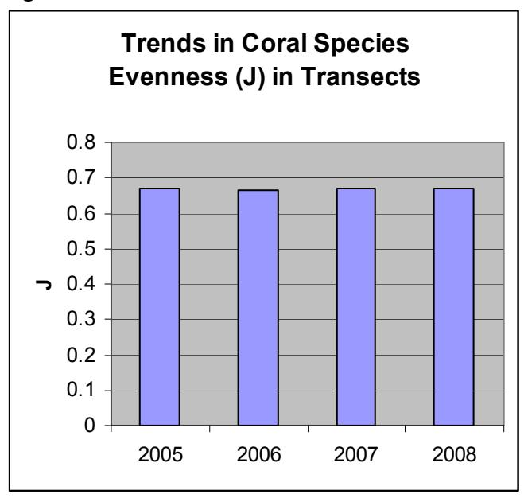

was very constant.

Figure 57 presents trends in coral species evenness (J) in transects, by site.

Figure 57.

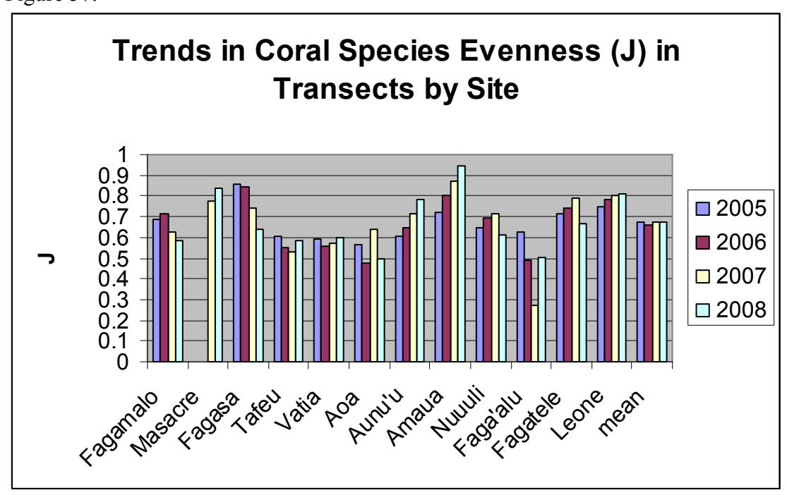

There were consistent differences between some of the sites, with Faga'alu having the lowest evenness, and Amaua, Fagasa, Leone, and Fagatele having the greatest evenness.

Figure 58 shows trends in the coral species evenness (J) for the north and south sides

Figure 58.

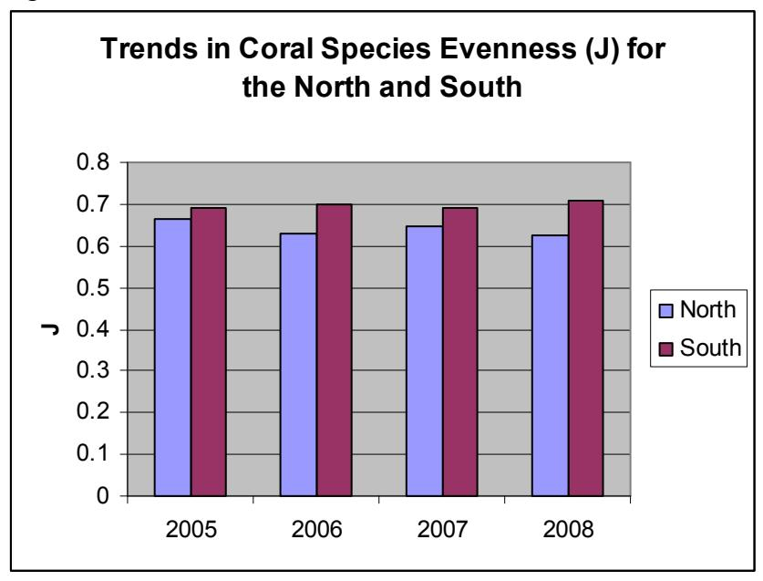

of the island. The south side consistently had a little higher evenness than the north side. The cause of this difference is not obvious.

## **Reef Flats Outer Flats**

 Figure 59 shows benthic cover on the outer reef flat at each of the sites recorded. For most sites, turf was the most abundant component of the benthic community on the outer reef flats.

Figure 59.

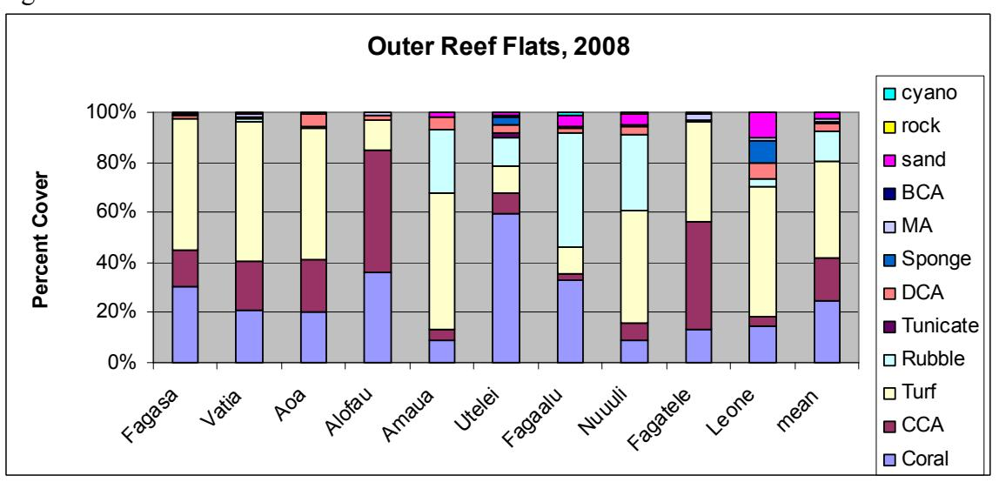

Trends in the benthic cover for outer reef flats are shown in Figure 60. There was

Figure 60.

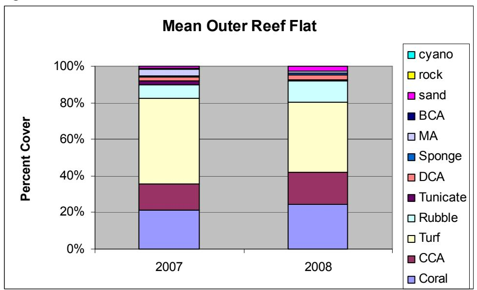

an increase in the amount of rubble cover, and small increases in the amount of crustose calcareous algae and coral cover, balanced by a decrease in the amount of turf cover. But turf remains the dominant cover component, and coral cover remains just slightly more than 20%.

 Figure 61 presents a comparison of benthic cover on the outer reef flat on the north side of the island with the south side of the island. The amount of coral and crustose

Figure 61.

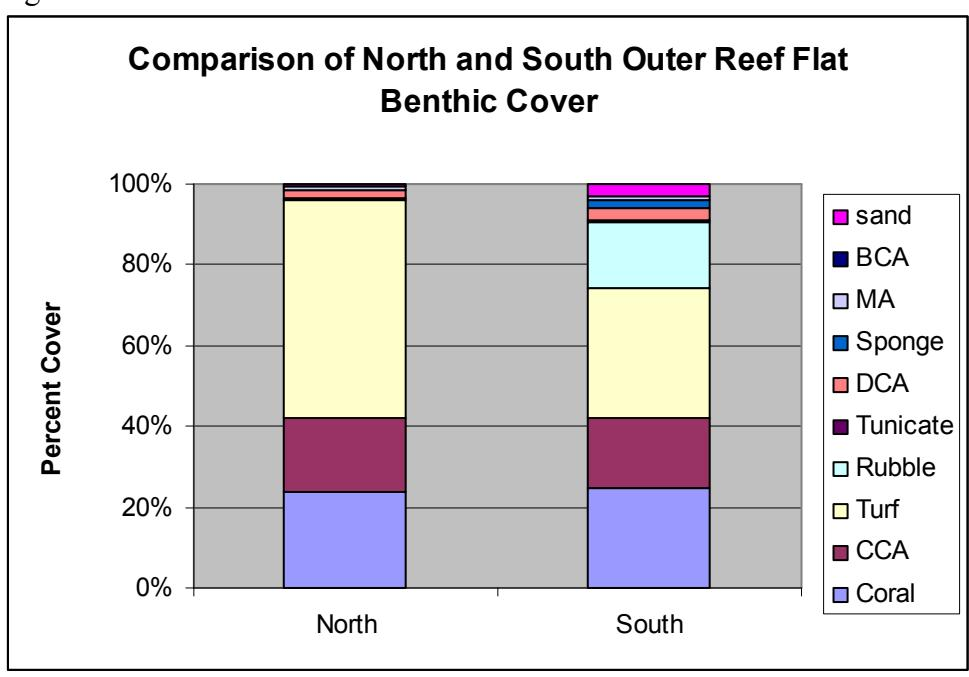

calcareous algae cover on the north and south outer reef flats was almost exactly the same, but there was more turn cover on the north than south, and more rubble cover on the south than north. The cause of these differences is not obvious.

 Figure 62 presents trends in the benthic cover of outer reef flats on the north and south sides of the island. Coral cover has been steady while crustose calcareous algae

Figure 62.

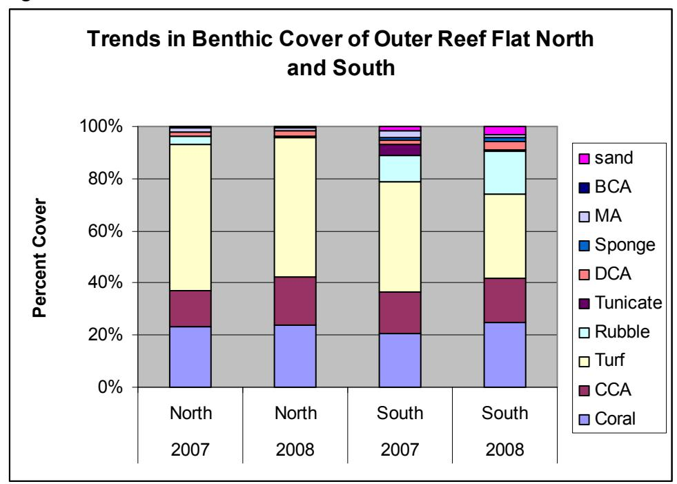

has increased a small amount on both sides of the island, rubble increased on the south, and turf decreased on the south.

 Figure 63 presents the trends in the live coral index for the outer reef flats. The live coral index is the cover of live coral divided by the cover of live plus dead coral.

Figure 63.

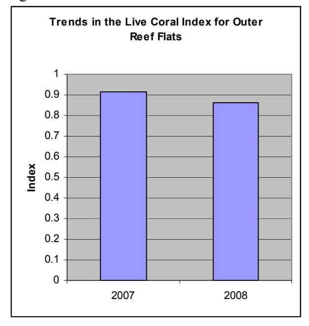

The live coral index was high, but decreased slightly in the two years of reef flat monitoring.

Figure 64 shows the trends in live coral index on outer reef flats for individual sites.

Figure 64.

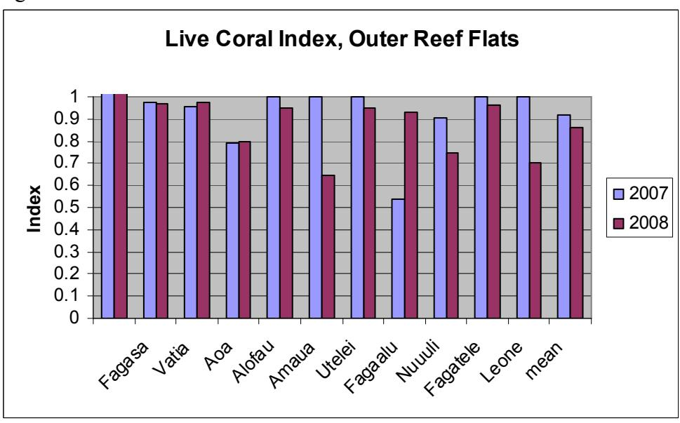

#### **Trends in Benthic Cover on Outer Reef Flats at Individual Sites**

 In Alofau, the level of coral cover recorded on the outer reef flat increased, and the amount of turf decreased, as seen in Figure 65. No observable changes corresponded to this change, so it is likely to be due to a small change in the location of the transects.

Figure 65.

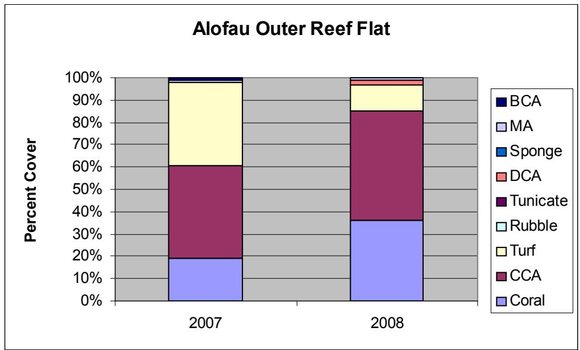

 In Amaua, coral cover was very steady as shown in Figure 66, but rubble increased at the expense of turf. It is most likely that the tape was in a slightly different location.

Figure 66.

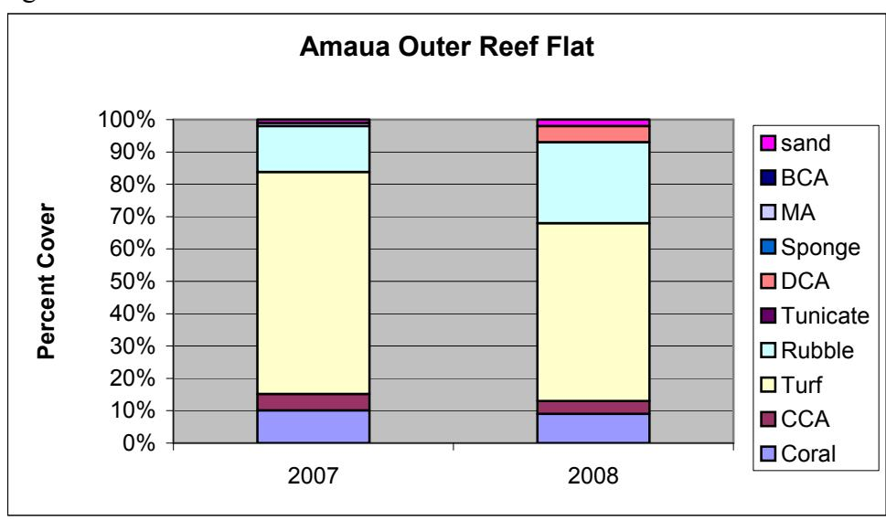

 In Faga'alu, a large increase in the coral cover was recorded, a large increase in the rubble, and a large decrease in the turf, as seen in Figure 67. This is highly likely to be due to different tape locations. At the tape near the rock, there are large clumps of the bushy coral, *Acropora aspera*, with dead areas of the coral and rubble, all in a very patchy arrangement. Near shore, the tape is located at the nearest light pole, but there are two poles that appear nearly equally close, and it appears that this year the tape was placed next to the one farther into the bay. A way of distinguishing the light poles from the water needs to be developed.

Figure 67.

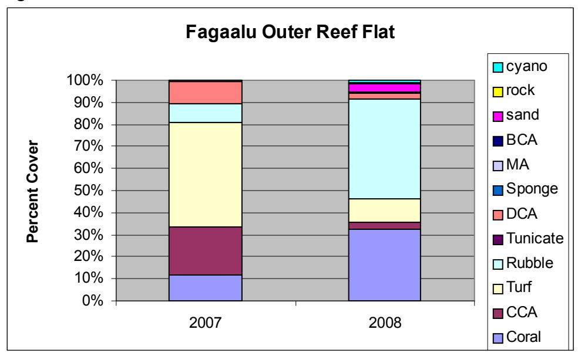

 In Nu'uuli, there was a decrease in coral and rubble cover recorded, and an increase in turf, as seen in Figure 68. It seems most likely this is due to a small change in the location of the tapes, as there were no observable changes to account for it. If the coral had been killed by low tide, the amount of dead coral with algae should have increased correspondingly, but it did not.

Figure 68.

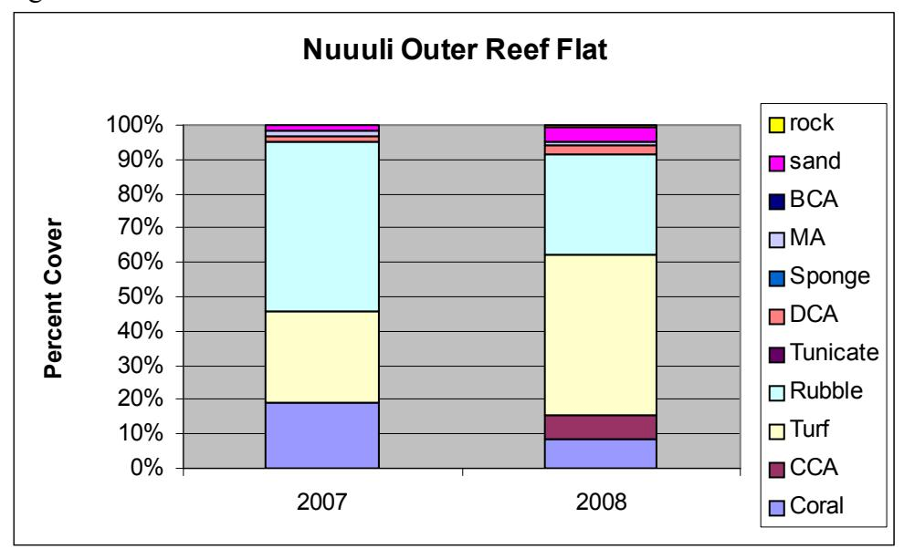

 At Fagatele, there was an increase in coral cover and CCA, and a corresponding decrease in turf, as seen in Figure 69. There were no observable features that could account for the changes, and most likely they are due to small changes in tape location.

Figure 69.

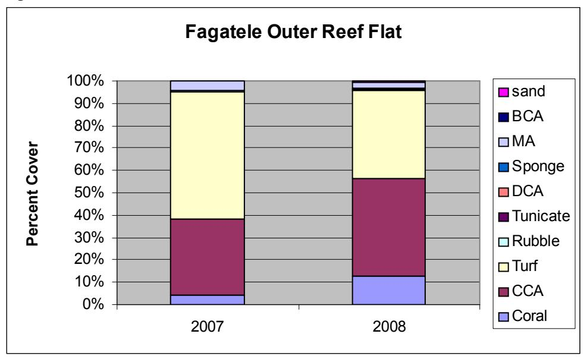

 In Leone, there were only minor changes in the figures recorded for the outer reef flat (Figure 70). These are unlikely to be real changes for the most part. The tops of some corals (*Pavona frondens*) were dead in places, from low tides, and this likely accounts for the increase in dead coral with algae.

Figure 70.

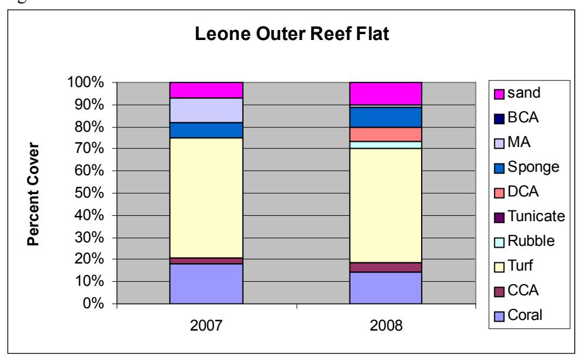

#### **Corals in Transects on Outer Reef Flats**

#### Lifeforms

Figure 71 shows the cover of different coral lifeforms in the transects on outer reef flats. Branching is the most common lifeform, followed by encrusting. There is

Figure 71.

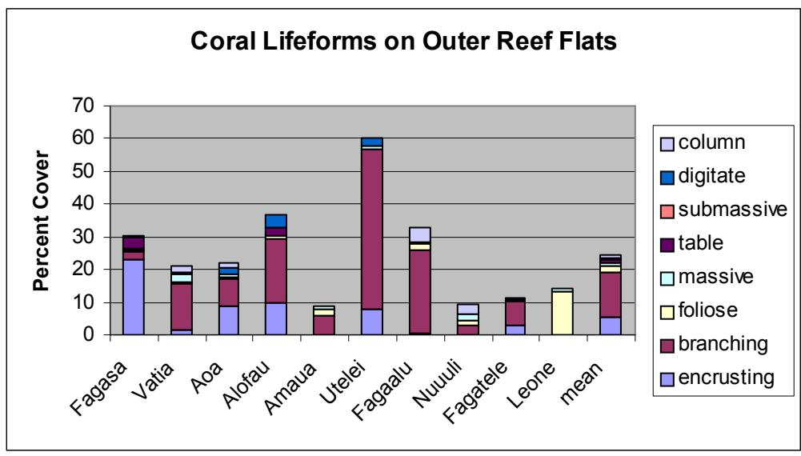

considerable variation between different sites. One site, Leone, is dominated by foliose coral. The fact that branching is most common contrasts with the reef slopes, where encrusting is the dominant lifeform.

In Figure 72, the coral lifeforms are compared for the north vs. south sides of the island. Encrusting corals are more common on the north side of the island than the south, and branching corals are more common on the south side than the north side. The pattern for encrusting corals is the same as on the reef slope, as can be seen in Figure 17, but on the slope there were only a slightly greater amount of branching on the south side than north.

Figure 72.

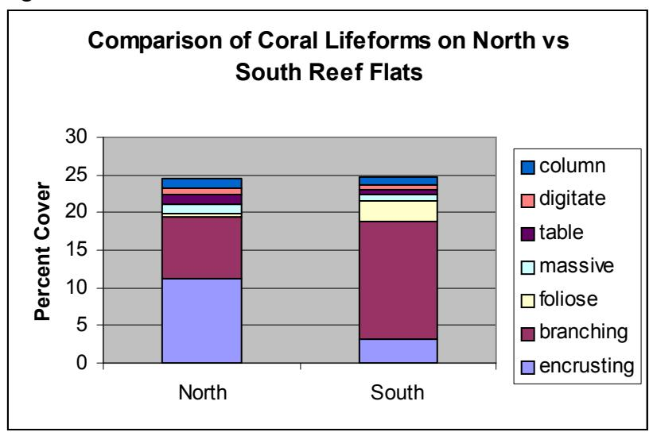

Figure 73 gives trends in the number of lifeforms in individual transects, plus the mean, for the two years that transects on the reef flat have been done. Although there

Figure 73.

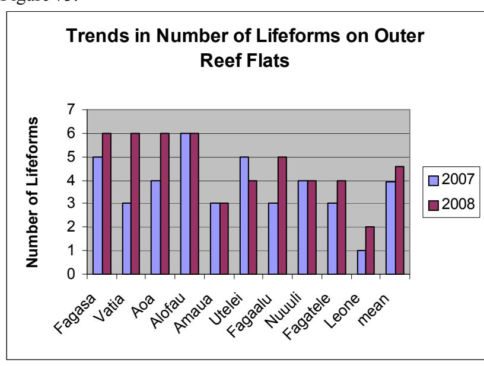

was a small increase in the mean number of lifeforms, the variation at individual sites was fairly large.

Figure 74 shows the overall amounts of different lifeforms on the outer reef flats.

Figure 74.

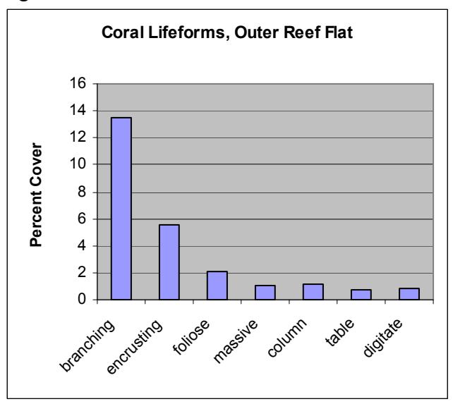

Branching was the most common lifeform, followed by encrusting, while on the reef slope encrusting is the most common lifeform and branching is third.

Figure 75 shows trends in the coral lifeforms on the outer reef flat over the two years they have been recorded. There was a little more branching and encrusting coral cover

Figure 75.

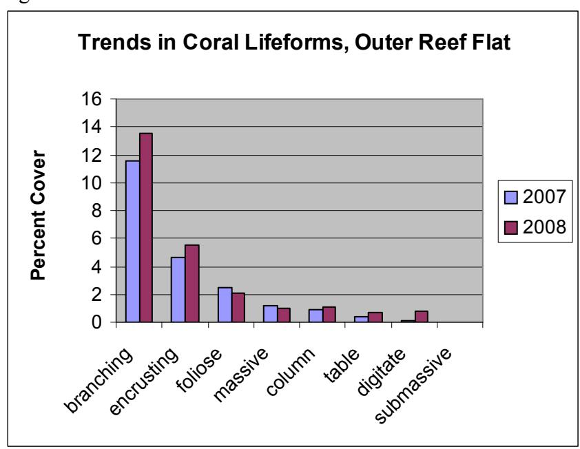

in 2008 than in 2007, but little change in other lifeforms.

#### Genera

The percent cover of different genera on outer reef flats at each site are shown in Figure 76. There is considerable variation between sites, but *Acropora* had the most

Figure 76.

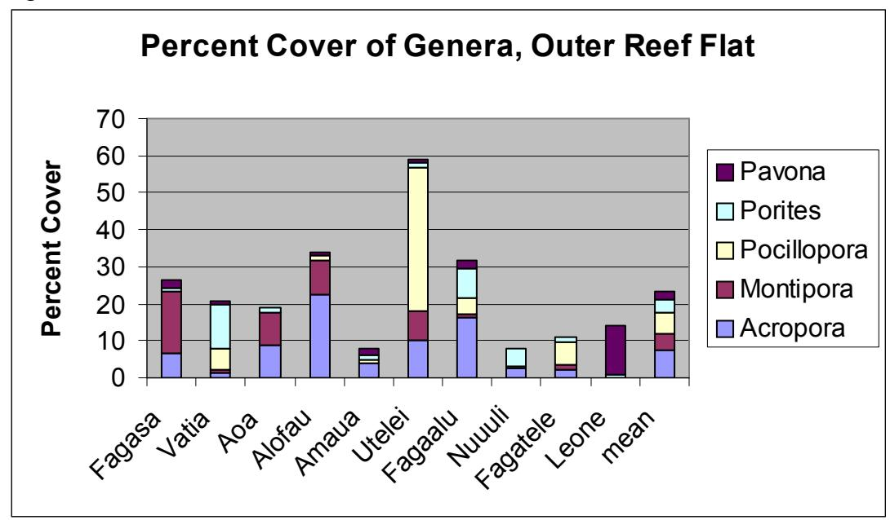

cover overall. Utulei was unusual in being dominated by *Pocillopora*, but Utulei is unusual in being within the harbor. Leone was unusual in being dominated by *Pavona*. Fagasa, Aoa and Alofau have quite a bit of *Montipora* but little *Porites*, while Vatia, Faga'alu, and Nu'uuli have quite a bit of *Porites* and little *Montipora*. Utulei have a lot of *Pocillopora* but little of the other two genera.

Figure 77 shows a comparison of the coral genera on the outer reef flat at sites on the North and South sides of the island. There was more *Pocillopora* cover in 2008 than

Figure 77.

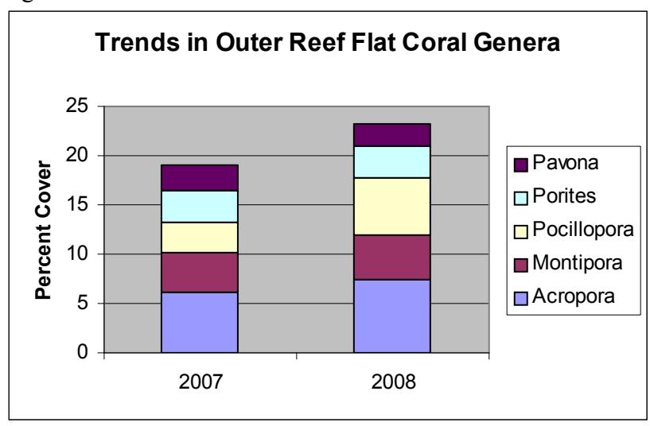

2007, and very slightly more *Acropora* cover.

 Figure 78 shows the trends in the cover of coral genera on outer reef flats at individual sites. Most sites were fairly consistent in composition over the two years of data collection.

Figure 78.

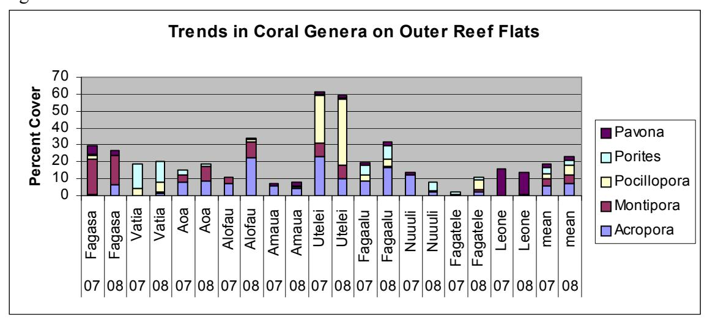

Figure 79 shows trends in the number of coral genera on the outer reef flat at each site.

Figure 79.

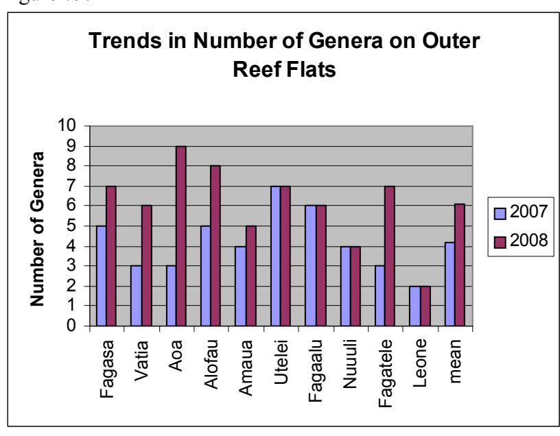

There was an increase in the mean number of coral genera per site, but variation between sites was fairly large.

Figure 80 shows the cover of coral genera on outer reef flats. *Acropora* was the

Figure 80.

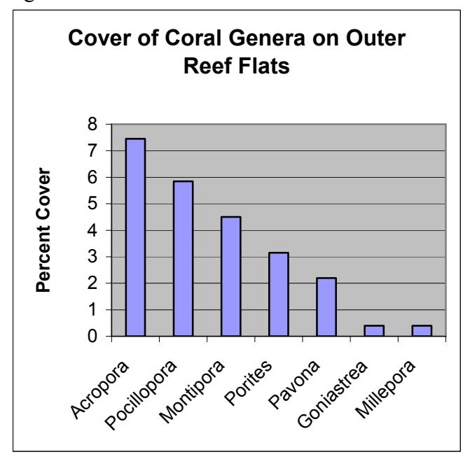

most common genus, followed by *Pocillopora*, then *Montipora*, *Porites*, and *Pavona*. This is quite different from the reef slopes, where *Montipora* is the most common genus, followed by *Porites*, then *Acropora*, *Pavona*, and *Pocillopora* (Figure 31).

#### **Species**

The cover of different coral species on the outer reef flat at individual sites is shown in Figure 81. *Montipora* encrusting and *Pocillopora verrucosa* had the highest average

Figure 81.

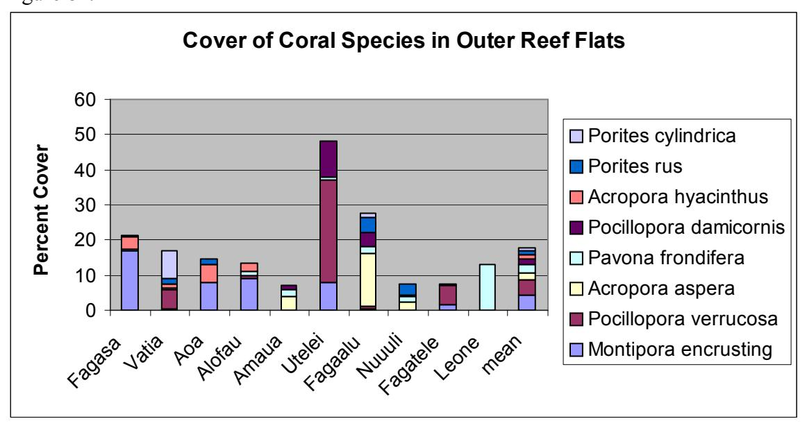

cover, but variations between sites was high. Most of the *Pocillopora verrucosa* was at Utulei, which was an unusual site of high coral cover inside the harbor. Leone was also unusual in having high *Pavona frondifera* cover.

Figure 82 shows a comparison of the coral species cover on the North vs. South sides of the island, on outer reef flats. There was more encrusting *Montipora*,

Figure 82.

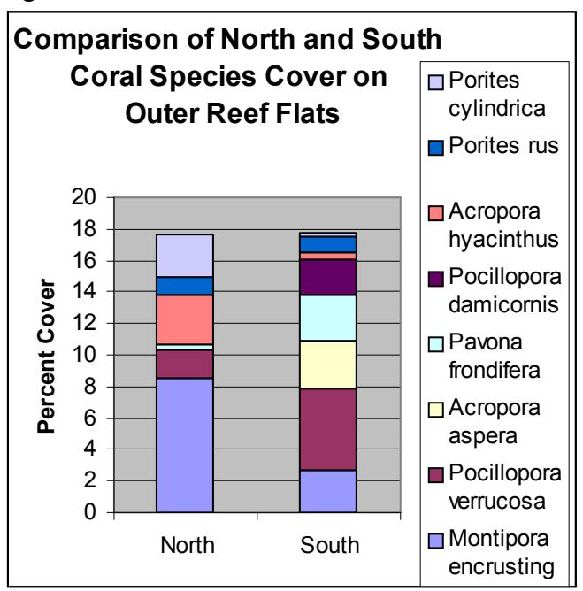

Acropora hyacinthus, and Porites rus on the North side, and Pocillopora verrucosa, Acropora aspera, Pavona frondifera, and Pocillopora damicornis on the South side.

Figure 83 shows trends in the number of coral species by site on the outer reef flats. Figure 83.

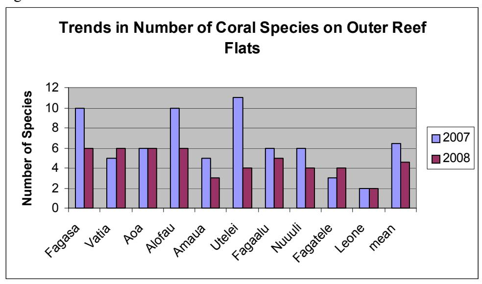

Figure 84 presents the cover of the most common coral species on the outer reef flats.

Figure 84.

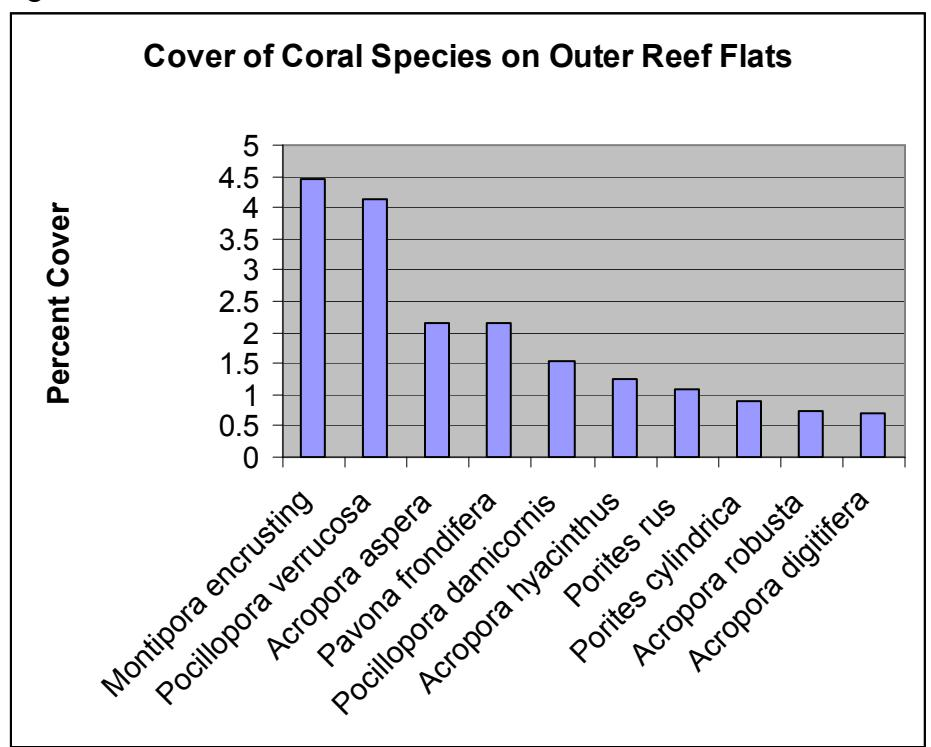

Montipora encrusting had the most cover, followed by Pocillopora verrucosa, Acropora aspera, Pavona frondifera, Pocillopora damicornis, and so on. The reason Acropora aspera is third, while in Figure 77 Acropora is the first genus, is because there are four Acropora species that are common, which add to make the genus the number one genus.

Figure 85 shows the trends in the Shannon-Weaver diversity index for the corals on the outer reef flats. It shows an increase in diversity, but it is not clear why this should be, but it seems unlikely to be a major change in the coral community structure.

Figure 85.

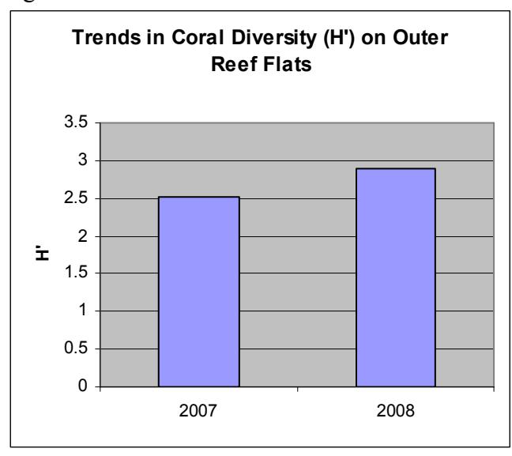

## **Inner Reef Flats**

Benthic cover on the inner reef flats are shown in Figure 86. There was

Figure 86.

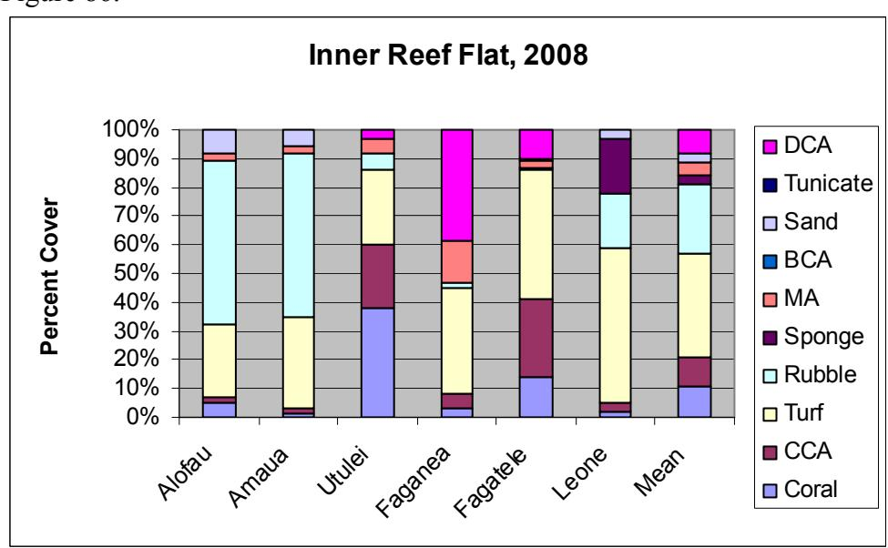

great variation between sites. All but one site had low coral cover, the single exception being Utulei inside Pago Pago Harbor.

Trends in benthic cover on inner reef flats is shown in Figure 87. Rubble

Figure 87.

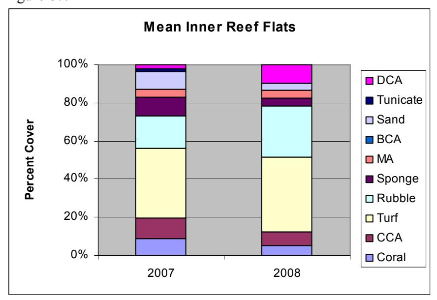

and dead coral with algae increased in cover, while coral, crustose calcareous algae, sponge, and sand decreased in cover, but most changes were not large, and there were only six sites where inner reef flat cover was recorded. So most of these changes may be due to random factors.

 Trends in the live coral index are shown in Figure 88. There was a decrease in the index, although the index is still relatively high. The index was unusually low at

Figure 88.

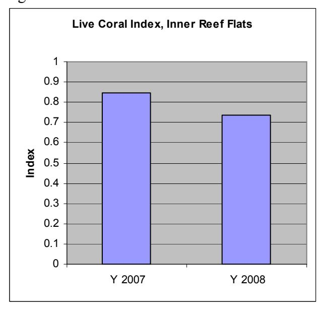

Faganeanea, as shown in Figure 89. In Faganeanea, the transect had been deliberately

Figure 89.

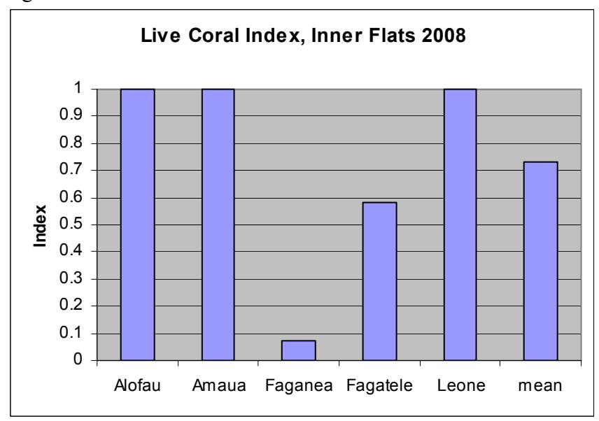

run over an area of live branching coral, *Acropora aspera* in 2007. When the author began work in 2004, there were a number of large patches of live *Acropora aspera* on the reef flats of the south side of Tutuila. Low tides each year exposed these corals to the air and killed them, and the Faganeanea patch was one of the few left with some life coral in 2006. By 2008 most of them were dead as well. Transects at the other sites did not traverse such patches and thus could not monitor them. Fagatele also had a fairly low live coral index in 2008 on the inner reef flat. At Fagatele, there was more live coral on the inner reef flat than outer reef flat in 2007, but by the time transects were laid for 2008, a low tide event had killed much of that inner reef flat coral.

 Trends in the benthic cover of individual sites on the inner reef flat are shown in Figure 90. A small decline is seen for Faganeanea, but a much larger decline for Fagatele. Figure 90.

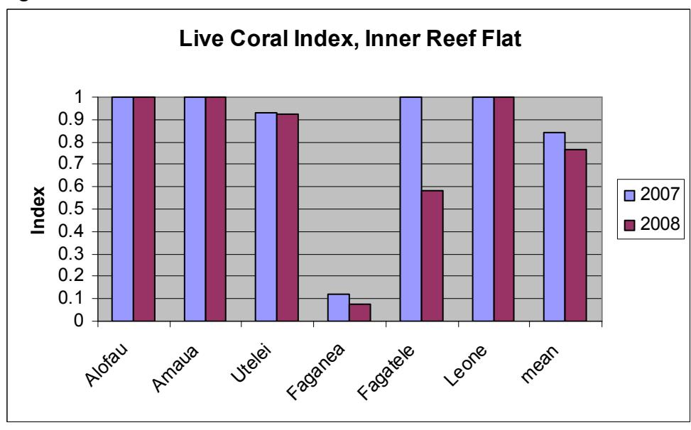

Figure 91 presents a comparison of the benthic cover on the inner and outer reef flats.

Figure 91.

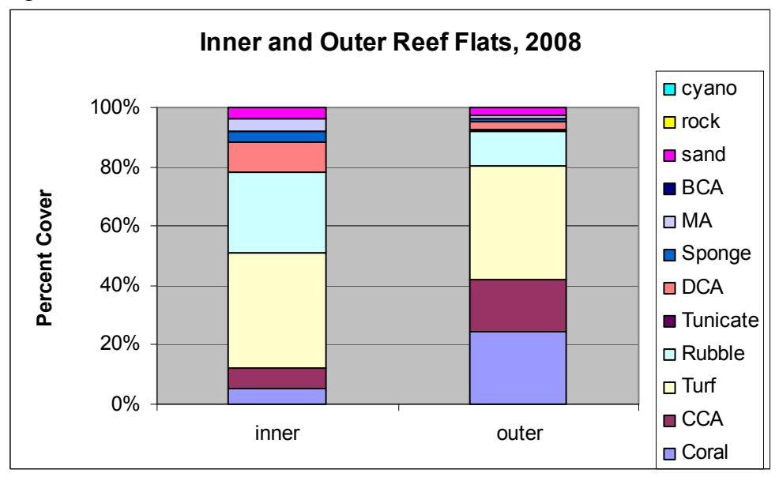

The outer reef flat had much more coral cover and more crustose calcareous algae cover, while the inner reef flat had more rubble and dead coral with algae. The outer reef flat probably has more wave surge. That wave surge should help to clean off the surfaces of crustose calcareous algae, which is favorable for growth of those species. Breaking waves can also keep corals wet during low tide events, allowing them to survive on the outer reef slope during low tide events which corals on the inner flat cannot survive because they are exposed for too long during the low tide event. This was directly observed in Gataivai (Utulei) next to the sewage pipeline.

## **Trends at Individual Sites in Benthic Cover on Inner Reef Flats**

 At Alofau, changes were minor as seen in Figure 92, with a slight increase in turf that is likely a random fluctuation.

Figure 92.

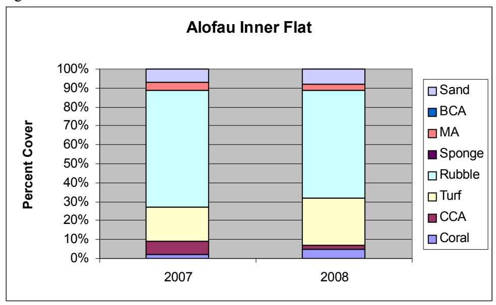

 In Amaua, changes on the inner reef flat were also very slight as seen in Figure 93, with slightly more rubble replaced by more turf. Again, this is not likely to be real.

Figure 93.

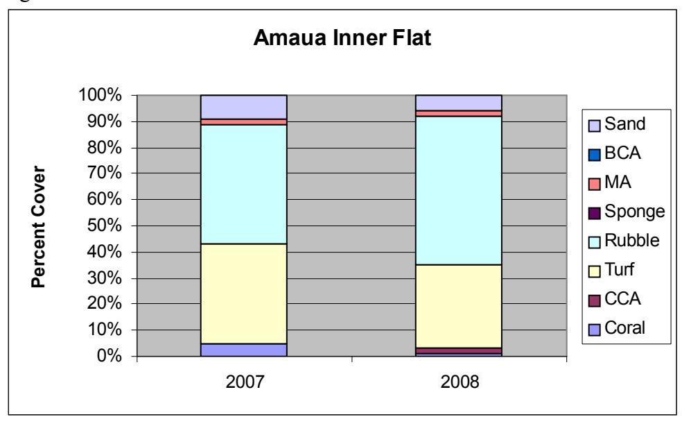

 In Faganeanea, there was a considerable increase in dead coral with algae, a decrease in turf, and rubble was replaced by macroalgae, as seen in Figure 94. This is an area where low tides have killed most of the *Acropora aspera*, but it was already dead in 2007. The changes recorded are likely due to a small shift in the location of the tape.

Figure 94.

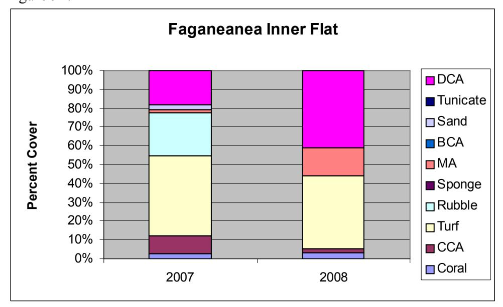

 In Fagatele, there was a decrease in coral cover and an increase in dead coral with algae on the inner reef flat, as seen in Figure 95. Also, there was a decrease in coralline algae and an increase in turf on the inner reef flat. There was quite a bit of damage to coral from low tides, the tops of many corals were dead and growing turf algae. So the decrease in life coral and the increase in dead coral with algae were due to low tides. The other differences are likely to be random and not real.

Figure 95.

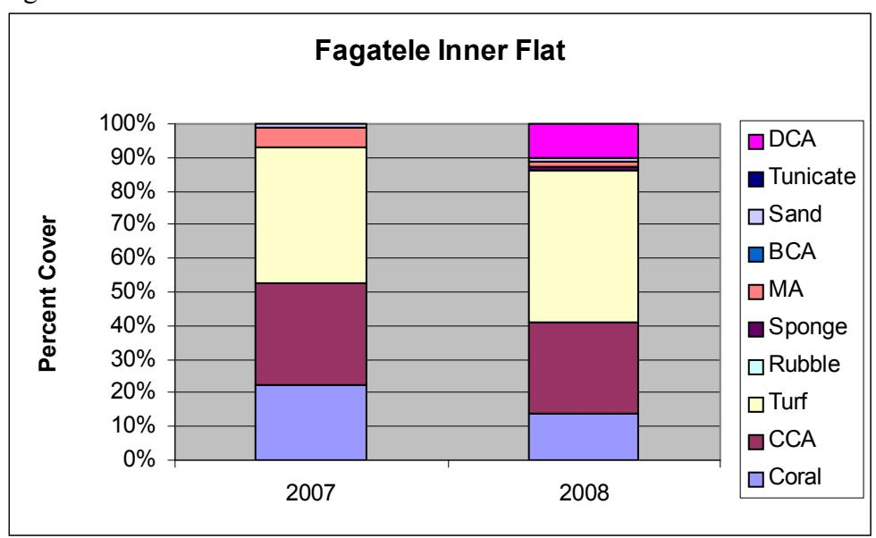

 At Leone, there was a huge decrease in the amount of sponge cover on the inner reef flat, as seen in Figure 96. This was easily observable, there appeared to be no place where the sponge was continuous as it was in 2007. Where the sponge was gone, turf

was present, as can be seen in the graph, turf shot up. Rubble increased as well. The rubble and rock substrate were hidden under the thin sponge layer in 2007, but the loss of most of the sponge cover revealed the rubble and rock with filamentous algae that had been underneath it. The turf may have grown just since the sponge uncovered the rock, that is not clear. Apparently the high sponge cover was a relatively ephemeral event.

**Leone Inner Flat** 0% 10% 20% 30% 40% 50% 60% 70% 80% 90% 100% 2007 2008 **Percent Cover** Sand BCA MA Sponge Rubble Turf CCA Coral

Figure 96.

#### **Corals**

 There were too few corals in the transects on the inner reef flat for analyses to be meaningful.

#### **Comparisons**

 Reef flat communities are quite different from reef slope communities, and are exposed to different disturbances. Low tides can expose and kill corals on the reef flat but not the reef slope, as can trampling from gleaners. Crown-of-Thorns starfish have soft bodies which have a limit to how much wave surge they can withstand, and thus are excluded from the reef crest and perhaps the outer reef flat. Thus it is important to monitor both the reef flat and slope.

 Figure 97 shows a comparison of the outer and inner reef flats to each other and to the reef slope at 8.5 m depth. Live coral cover increases from the inner reef flat to the outer reef flat to the slope. Crustose calcareous algae is very slightly more on the outer reef flat

Figure 97.

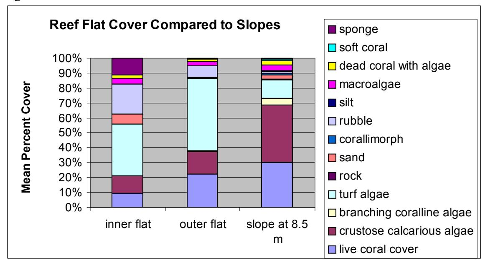

than inner, and much greater on the reef slope. Turf is greatest on the outer reef flat, slightly less on the inner flat, and much less on the slope. Rubble cover is greatest on the inner reef flat, less on the outer flat, and non-existent on the slope. Sponge cover was greatest on the inner flat and non-existent on the outer flat and slope.

 Figure 98 shows the same data with error bars on the columns. Each of the differences in coral cover are significant, as are the differences in turf and rubble. The slope has significantly more crustose calcareous algae than the reef flats, but outer and inner reef flats are not significantly different. The reef flat may have less coral and crustose calcareous algae because exposure to low tides kill them. The outer reef flat may have more coral than the inner reef flat because during low tides, waves can keep the coral wet and alive. Just this effect was seen one year at Utulei. The reef flat may have more turf cover because the turf withstands exposure to air and can colonize dead coral and calcareous algae.

Figure 98.

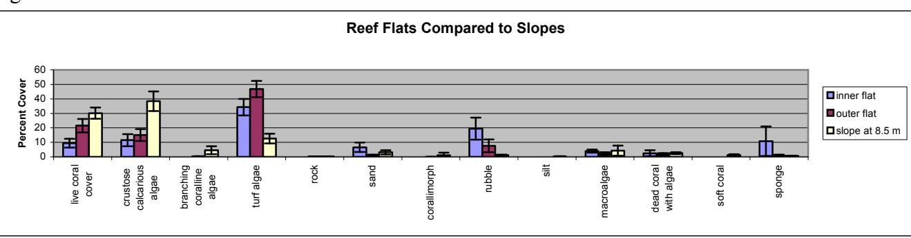

### Depth and Zonation

Due to difficulties in getting boat operators to be available, difficulties with mechanical problems with boats, dangerous weather periods, and the need for attendance at frequent local meetings, it has been difficult to collect data at 18m and 4m depths, in addition to the core data taken at 8 m depth. At this point, 18m and 4m data has been gathered from all south side sites, but only one north side site (north side sites require the additional logistics of borrowing a giant truck with hitch and a driver to pull the boat over very steep mountain passes to the north side). Data from the south side and the one north site will be presented here, and in future year(s) data will be acquired from the north side, hopefully.

In Figure 99, benthic cover is shown for all of the south side sites plus Fagasa on the North side. Crustose calcareous algae was the most abundant bottom cover, with coral second, though there was considerable variation between sites. The one site on the north,

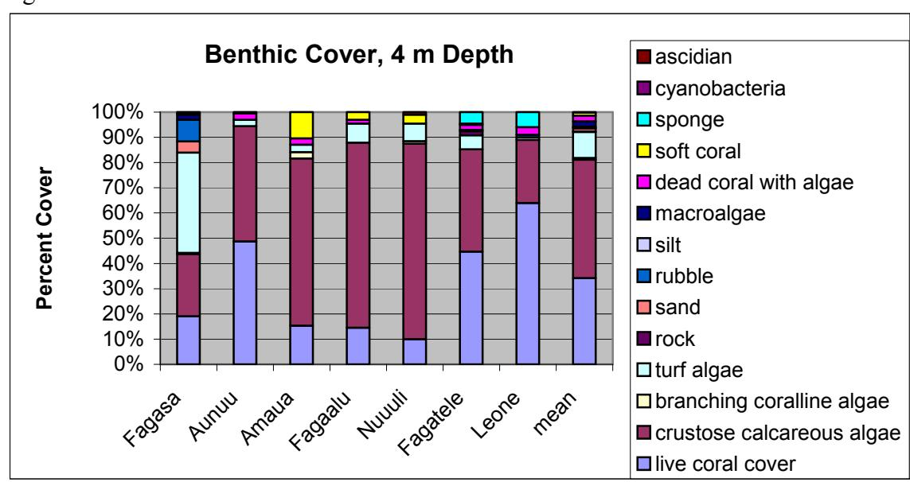

Figure 99.

Fagasa, had much more turf algae than all other sites, suggesting that North sites may have more turf and less crustose calcareous algae than south side sites, as was found at 8 m depth. About 85 % of all cover on the south side was crustose calcareous algae plus coral.

Figure 100 shows the benthic cover at 18 m deep for each of the south side sites plus Fagasa on the north. Coral and crustose calcareous algae have roughly equal cover,

Figure 100.

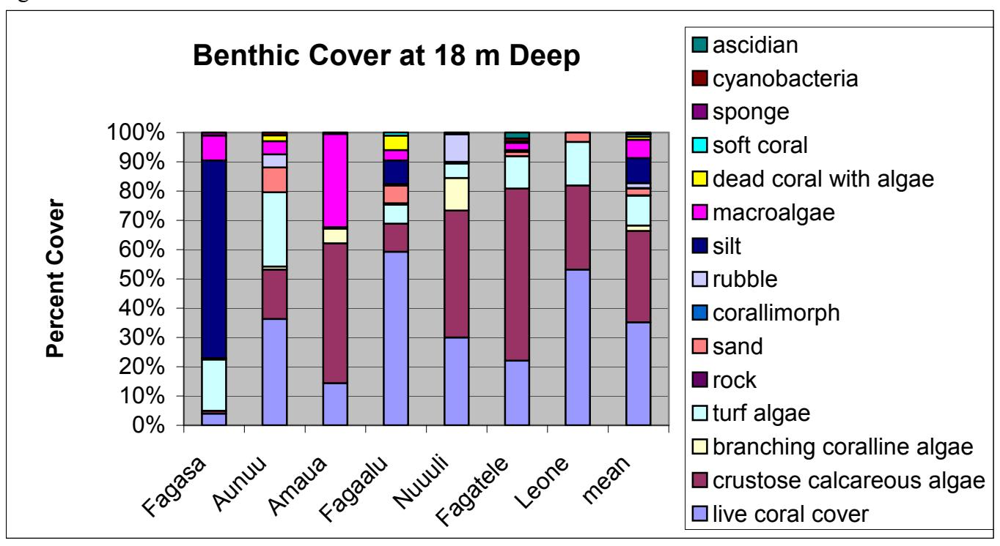

at any one site one or the other often dominates. Turf and macroalgae cover smaller areas. Amaua was the only site with much macroalgae, most of which was the normally harmless *Halimeda*. Fagasa was quite different, because 18 m was below the steep rock slope, and was on a gentle silt/sand slope with some lumps of rock with coral on it. Thus, silt dominated heavily at Fagasa, with turf second and coral only covering a very small amount.

Figure 101 compares benthic cover at 18 m, 8 m, 4 m, outer reef flat and inner reef Figure 101.

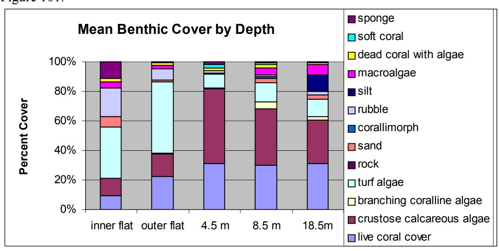

flat. Coral increased from the inner flat to the outer flat to 4.5 m deep, but then did not change with further depth down on the reef slope. Crustose calcareous algae increased slightly from inner flat to outer flat then jumped to much larger levels for 4.5 m, and then decreased somewhat with depth from there. This fits with the view that crustose calcareous algae thrives best in heavy water motion, probably because it removes fouling sediment. Turf increased from inner reef flat to outer reef flat, and then decreased to much lower levels at 4.5 m and increased only slightly if at all down the reef slope. Rubble was greatest on the inner reef flat, decreasing on the outer reef flat and reaching very low levels at all depths on the slopes. Sponge was highest on the inner flat, and virtually non-existent everywhere else. The sponge abundance on the inner reef flat is entirely due to one site, Leone (where it has subsequently decreased).

 Figure 102 presents the Live Coral Index for all positions on the reef flats and reef slope. The live coral index is lowest on the inner reef flat and increases to the outer reef flat and to the reef slope, where it remains nearly constant at high values down the slope. The lower values of the index on the reef flats is probably related to the low tide events which frequently kill coral on the reef flat.

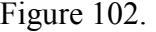

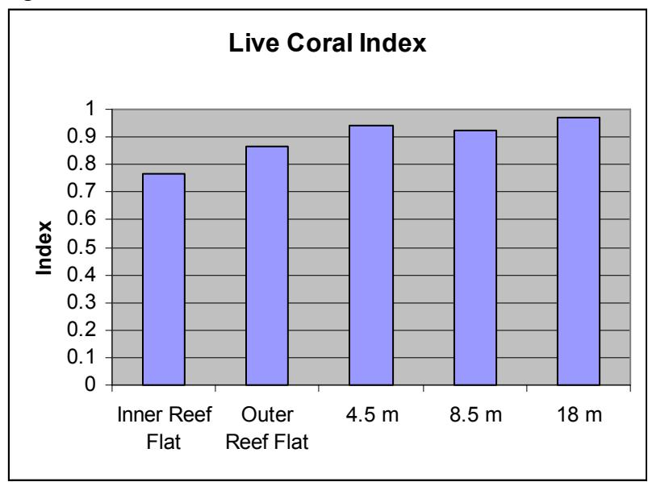

 At Aunu'u, coral cover increases considerably from the reef flat to the 4 m depth, and then declines somewhat with increasing depth to 18 m depth, as shown in Figure 103. CCA increases dramatically from the reef flat to 4 meter depth and then decreases with increasing depth to 18 m depth. Turf dominates the reef flat but nearly disappears at 4 m depth, and then increases with depth to 18 m depth. Overall, the Aunu'u reef surveyed has some of the highest coral cover of any of the 12 sites, and has high coral diversity at all depths, not being dominated by any one lifeform, genus, or species.

Figure 103.

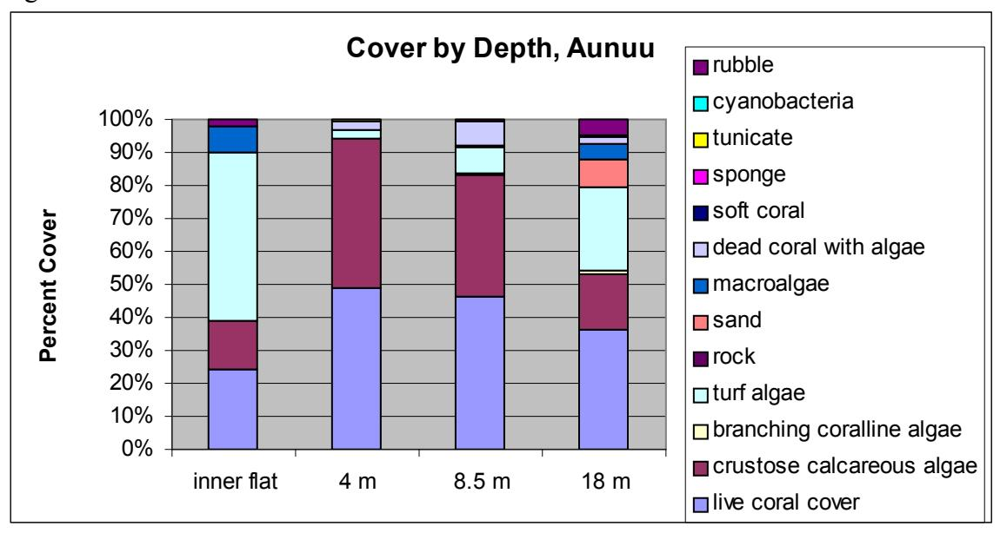

 At Amaua, coral cover is low at all depths, lowest on the inner flat and rising to the highest at 4 m depth, as shown in Figure 104. Crustose calcareous algae dominates on the reef slope, with the highest cover at 4 m depth, decreasing with depth to 18 m. On the reef flat, there is little or no crustose calcareous algae, but the flat has abundant turf algae. Turf algae is most abundant on the outer flat, but there is little of it on the slope. Rubble is abundant on the inner flat but much less abundant on the outer flat and nearly absent on the slope. Macroalgae is abundant on the lower slope at 18 m, but a very minor component in shallower water. There is a community on the lower reef slope that is quite distinct from that on the upper reef slope, with plate corals and *Halimeda* green algae and *Peyssonnelia bornetti* between the corals. The dividing line between the two communities is fairly sharp and is around 10-12 m deep, though the transition depth varies along the reef.

Figure 104.

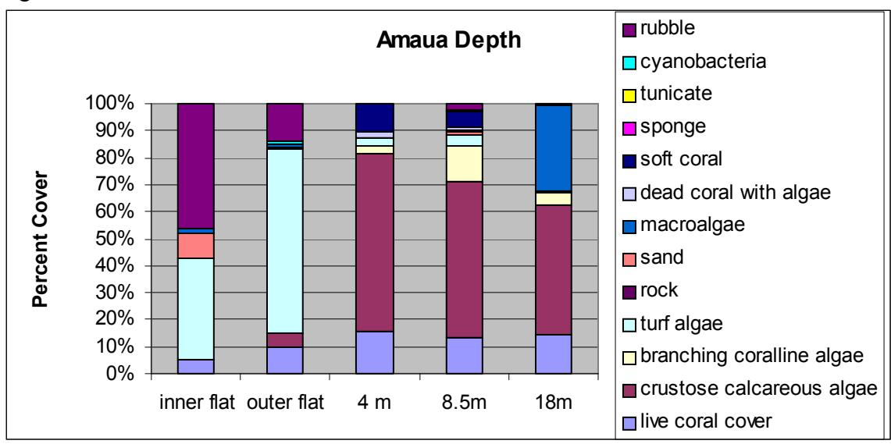

 At Faga'alu, coral cover is fairly low except at 18 m depth, where it is very high, as shown in Figure 105. Coralline algae dominate at 4 m and 8.5 m depths, and turf dominates the outer reef flat. The upper slope is dominated by consolidated rubble that is primarily from thick branching *Acropora*, possibly *Acropora nobilis*. The rubble is covered with coralline algae, with a few corals. It has not changed visibly since 2005. Clearly at some point there was an *Acropora* bed on the upper slope, likely with high coral cover. The *Acropora* must have been killed at least several years before 2005 to be completely collapsed into rubble and consolidated with coralline algae by 2005. The cause of the death of this bed is also not obvious. *Acropora* is among the most sensitive genera to bleaching, hurricanes, disease, and is a preferred food of crown-of-thorns starfish. The lower reef slope is dominated by plating (foliose) corals, which are abundant. Whatever major disturbance killed the *Acropora*, it had no effect on the foliose corals in deeper water. The fact that these delicate foliose corals survived suggests it may not have been a hurricane that did the damage. It is also not clear why there is no sign of an increase in coral cover (Figure 12) that would indicate recovery was underway.

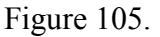

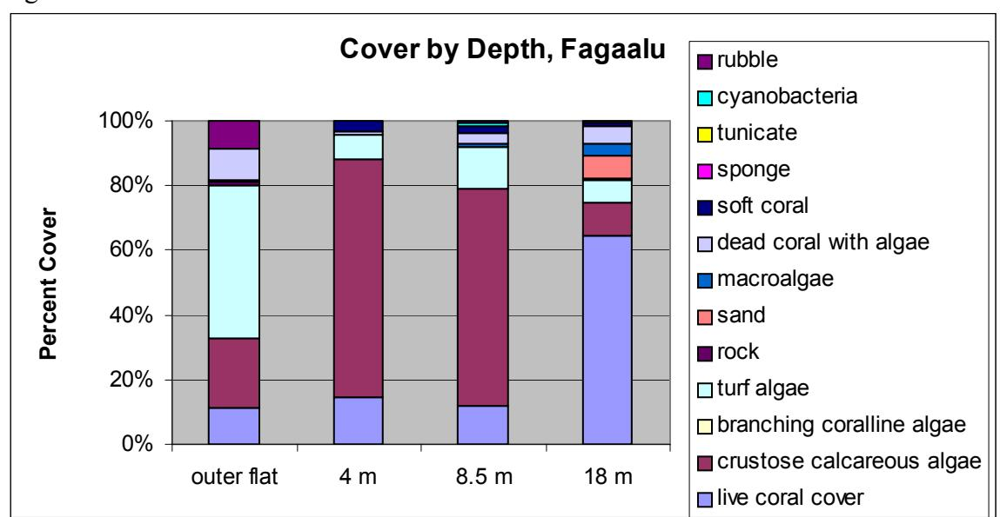

 At Nu'uuli, coral cover is lowest at 4.5 m, increases with depth, and is also higher on the reef flat, as shown in Figure 106. Crustose calcareous algae dominate the upper reef slope at 4.5 m, and decrease with depth. The outer flat had abundant rubble, and much more turf than the reef slope. Branching coralline algae is most common at 8.5 m, followed by 18.5 m.

Figure 106.

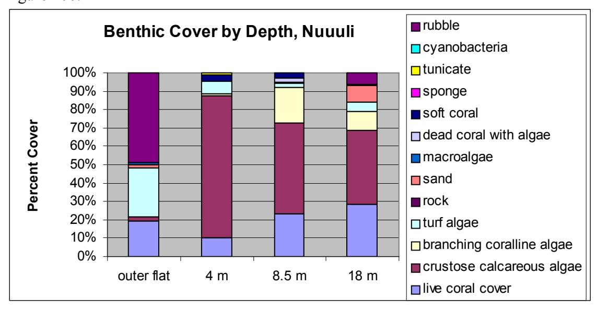

 At Fagatele, coral cover is highest at 4 m depth, and decreases with increasing depth to 18 m depth, as shown in Figure 107. Coral cover is low on the outer reef flat, but higher on the inner reef flat. Crustose calcareous algae cover is highest at 18 m and decreases with decreasing depth, but is also fairly abundant on the reef flat. Turf algae is abundant on the reef flat and most abundant on the outer reef flat: it is uncommon on the reef slope.

Figure 107.

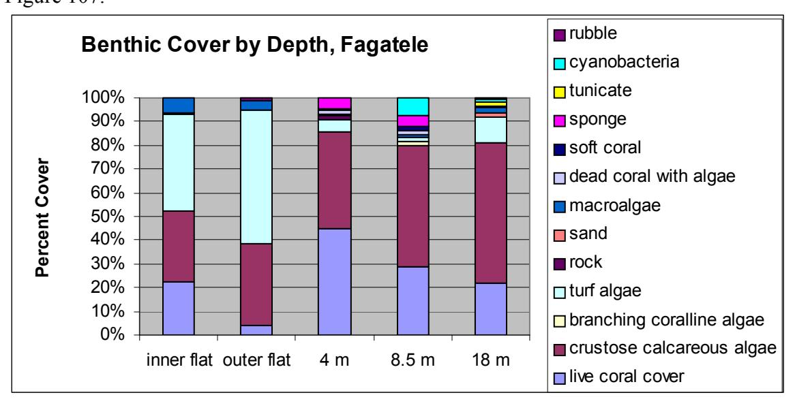

 In Leone, coral cover is highest at 4 m depth, and lowest on the slope at 8.5 m, with 18 m intermediate, as shown in Figure 108. There was little coral on the reef flat, but more on the outer flat than the inner. Turf was abundant on the outer reef flat but uncommon elsewhere. A thin encrusting sponge totally dominated the inner reef flat.

Figure 108.

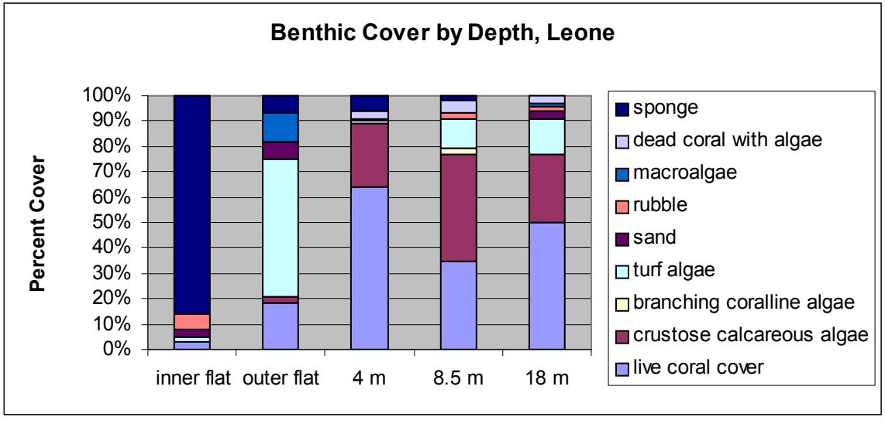

#### **Coral Lifeforms**

 Figure 109 shows coral lifeform cover at 4 m depth. Encrusting corals were a significant part of the community at only four of the seven sites. Leone had by far the highest coral cover, which was mainly composed of foliose coral, *Isopora crateriformis* (which is encrusting in the center but foliose around the edges).

Figure 109.

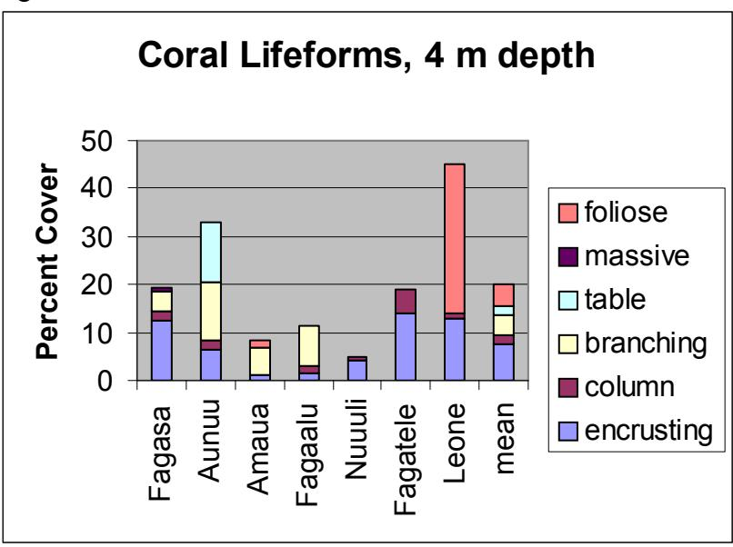

Figure 110 shows the coral lifeforms at 18 m depth. Encrusting corals were an important component of the community at most locations. At Faga'alu, foliose corals

Figure 110.

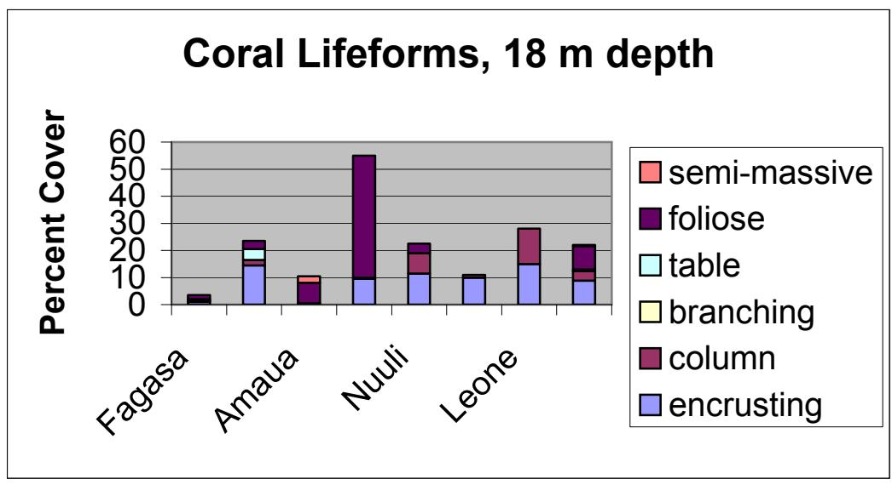

were the dominant lifeform at 18 m depth, and had very high coral cover. The total coral cover at Faga'alu at 18 m depth is the highest of any location on the reef slope, at any depth.

Figure 111 shows the lifeforms at different depths. Encrusting corals dominate in

Figure 111.

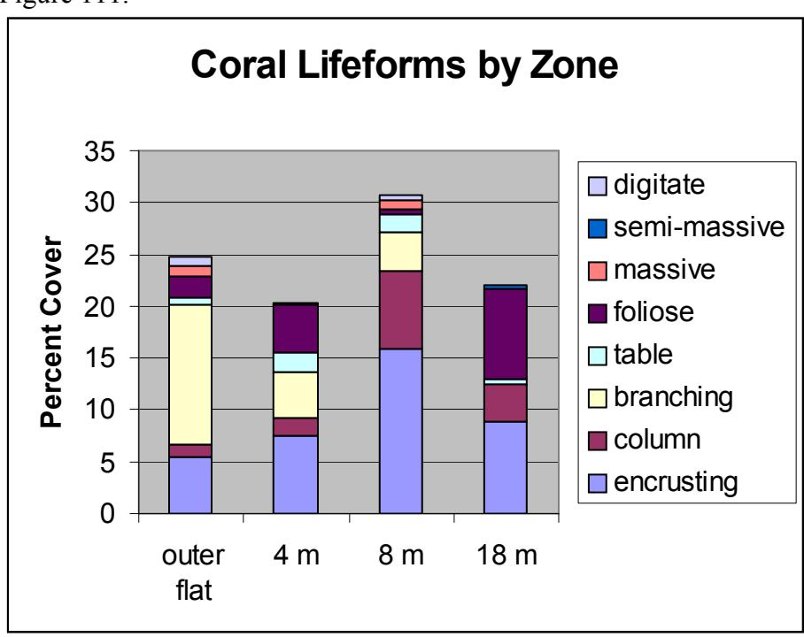

most zones, but branching dominates on the outer reef flat. There was insufficient coral on the inner reef flat to warrant analysis.

#### Coral Genera

Figure 112 presents the live cover of different coral genera on transects at 4 m depth, at each of the sites that have had data recorded so far. There is considerable variation

Figure 112.

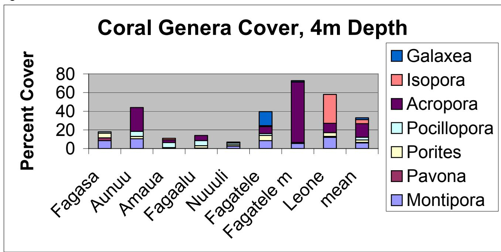

between sites. "Fagatele m" refers to the site at 4 m depth in the middle of the shoreline of Fagatele Bay, which has unusually high cover of coral tables, which are all *Acropora*. Leone was dominated at 4 m depth by *Isopora crateriformis*. *Isopora crateriformis* is most common at about 4 m depth at Leone, and is uncommon at 8 m depth and rare or non-existent at 18 m depth. Marlowe Sabater reports that it is also abundant at Asili, to the west of Leone. It is also fairly common (but not dominant) in Fagatele Bay closer to shore than where the 4 m transect was located, at perhaps 2-3 m depth. Thus, it seems to be most common on the SW quadrant of the island, for unknown reasons. This coral used to be considered Acropora, subgenus Isopora (so Acropora crateriformis). There are several things that distinguish the *Isopora* from *Acropora*. *Isopora* have more than one axial corallite or many corallites on a branch end that is not very distinct. The root "Iso" means the same, referring to the corallites at branch ends being the same as on branch sides. Also, they brood larvae instead of broadcasting eggs and sperm (Wallace, et al. 2007). Most sites have a fair bit of *Montipora*, yet it doesn't dominate as much as it does at 8 m depth. Aunu'u is dominated by *Acropora*, and *Galaxea* is the most common genus at Fagatele.

Figure 113 shows coral cover of genera in transects at 18 m depth. Again there is great variation between sites. At 18 m, Faga'alu has very high coral cover, dominated by

plates of *Mycedium*. Although Aunu'u and Leone have significant amounts of *Montipora*, the other sites do not. The most common thing at Leone is *Porites*, and at Nu'uuli there is quite a bit of *Diploastrea*. Thus, the composition of coral genera at 18 m is quite different from that at 8 m or 4 m. Similar amounts of coral cover can mask quite different coral communities.

Figure 113.

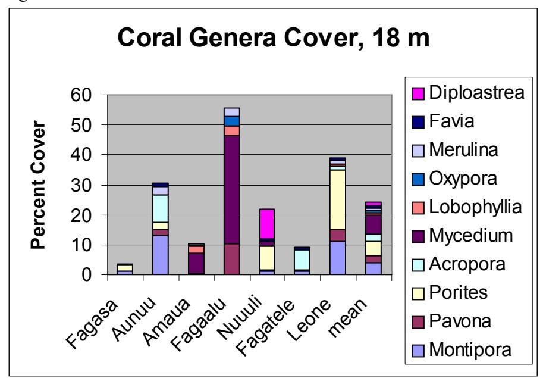

Figure 114 shows the mean live coral cover of different genera at different reef zones on the reef flat and down the reef slope.

Figure 114.

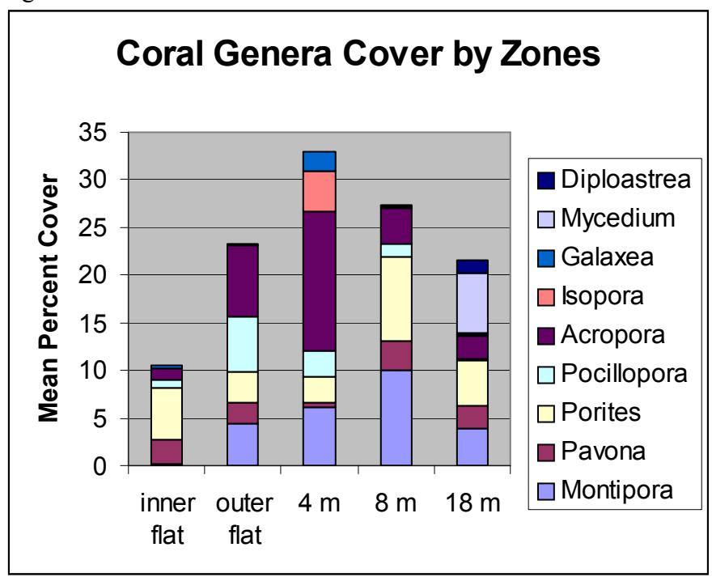

## **Coral Species**

Figure 115 shows the live coral cover of different coral species at 4 m depth. Figure 115.

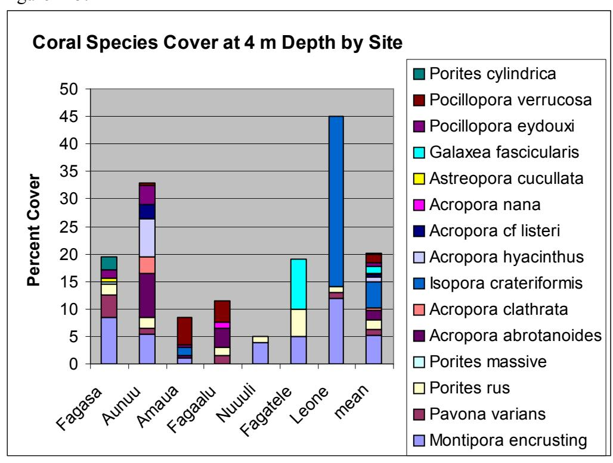

There is considerable variation between sites in the abundance of different species, though encrusting *Montipora* was a significant component at several sites. *Isopora crateriformis* dominated Leone, as mentioned in the section on genera.

Figure 116 shows coral cover for different species in transects at 18 m deep.

Figure 116.

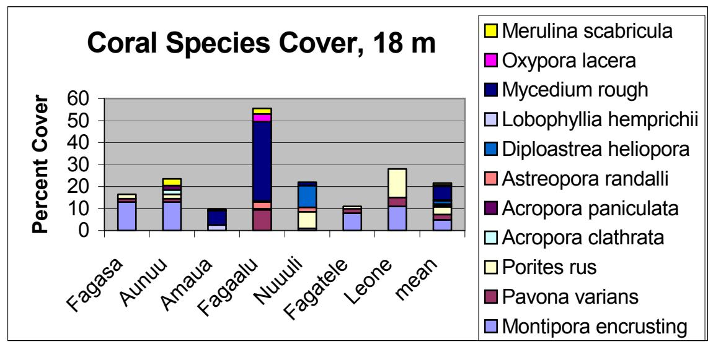

Again, there is considerable variation, but encrusting *Montipora* dominates several sites. As noted in the section on genera, *Mycedium* dominates Faga'alu at 18 m, but here it is noted that the species is not obvious, although only one species appears to be common. It is notable that Figure 115 shows 15 species are common at at least one site at 4 m depth, while only 11 species are common at at least one site at 18 m depth.

Figure 117 shows a comparison of the common species at each of the zones across the reef flat and down the reef slope. Encrusting *Montipora* is a major component at all zones except the inner reef flat, and it is most common at 8 m depth on the slope. *Porites rus* is an important component, except on the outer reef flat and 4 m depth on the slope. *Isopora crateriformis* was an important component of the community at 4 m depth on the slope, though only at certain locations. *Acropora hyacinthus* was also important at 4 m depth. Recruits of this species are most common close to the reef crest. At the site in the middle of the shoreline at Fagatele, the transects were placed at 4 m depth because that was the depth at which *A. hyacinthus* was most common. It appears in visual observations that *A. hyacinthus* is most common in shallow water at sites around Tutuila.

One thing that should be kept in mind when considering this graph is that the comparison is not really equal, there was only one site on the north included in the data for 4 m depth and 8 m depth. Hopefully, the north shore data can be completed in 2009, and a better comparison by depth can then be produced.

Figure 117.

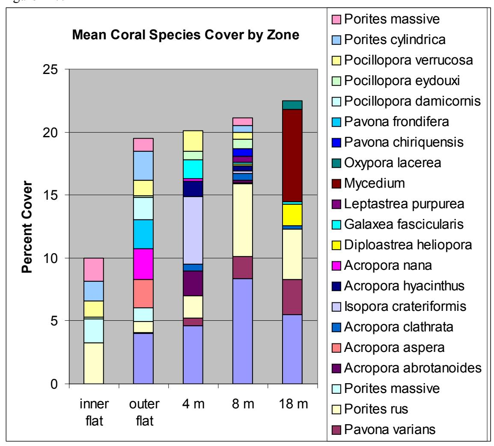

 Corals may show differences in diversity between zones as well. The number of coral species recorded per tape (100 points) is shown in Figure 118. The number of species (also called species richness) is lowest on the inner reef flat, and rises to the outer reef flat and then the upper slope, and then declines slightly with increasing depth. This indicates a strong decrease in species richness across the reef flat towards shore. The number of species per single tape had to be used instead of the total per site, since at 8m data from four tapes were taken, while at 4 m and 18 m only two tapes were taken, and on the reef flat one or two tapes were taken at different sites. It is also worth noting that the number of species is not a linear function of the number of tapes, rather it would be a negatively accelerating rising curve, thus dividing the number of species found in four tapes would not produce the number of species found in one tape (because some or many of the species found in two different tapes are the same). There is a further more serious problem, and that is that the number of species found depends on the number of coral colonies sampled. For instance, if only one colony is recorded in a tape, only one species

Figure 118.

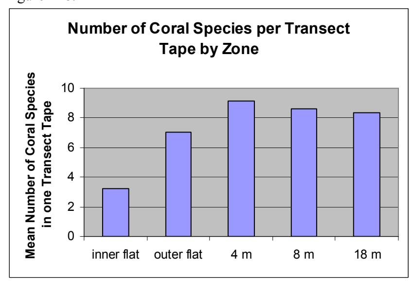

will be recorded, no matter how many species are on the site. If you add colonies to your sample, the number of species is likely to increase because not all the additional colonies will be the same species as those already sampled (though many may be). If the number of coral species depends on the number of coral colonies in a sample, then the number of coral species may correlate with the amount of coral cover. Figure 119 shows the correlation between the number of coral species and coral cover in the different zones. As can be seen in the graph, the correlation is very high, r = .9858.

Figure 119.

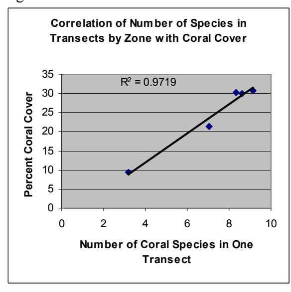

Thus, the percent coral cover almost accounts for almost all the variation in the number of coral species in transects. It appears that virtually all of the differences in the number of coral species are accounted for by the amount of coral cover, indicating that there are no differences in coral diversity between zones.

 Another way to look for diversity differences between zones is by using a diversity index, such at the Shannon-Weaver diversity index, H.' Figure 120 shows the H' diversity index across reef zones. The graph shows a low diversity on the inner reef flat,

Figure 120.

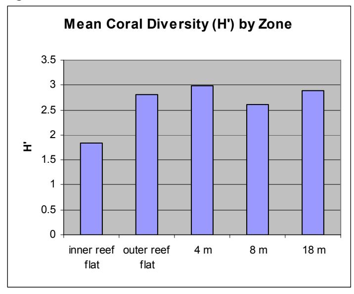

with higher and roughly equal diversity in all other zones. This diversity index has the advantage that it is not affected by sample size except at very low sample sizes. It is possible that the number of corals recorded on the inner reef flat is so small that the index was reduced due to the small sample size. The fact that coral cover accounts for all the variation in the species richness indicates that the inner reef flat actually isn't less diverse than the other zones, and thus supports the suggestion that the lower H' on the inner reef flat is due to the small sample size.

# **INVERTEBRATES**

 Figure 121 shows the number of different kinds of invertebrates other than hard coral recorded at each of the sites. It appears that the number of kinds of invertebrates is lower on the south than the

Figure 121.

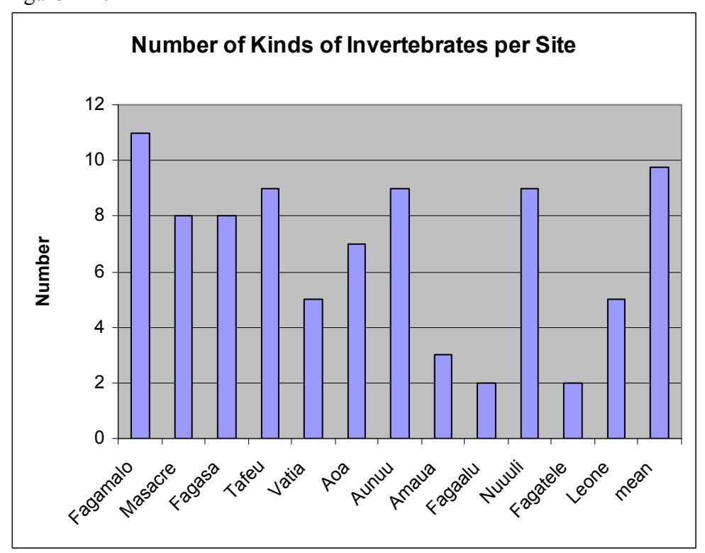

north. Figure 122 compares the mean number of kinds of invertebrates on the North compared to the South side.

Figure 122.

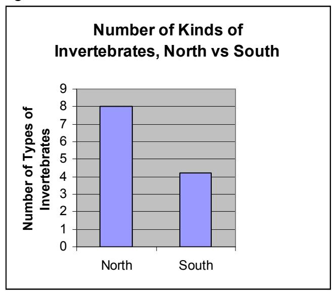

Figure 123. shows the number of invertebrate individuals at each of the sites. It is not

Figure 123.

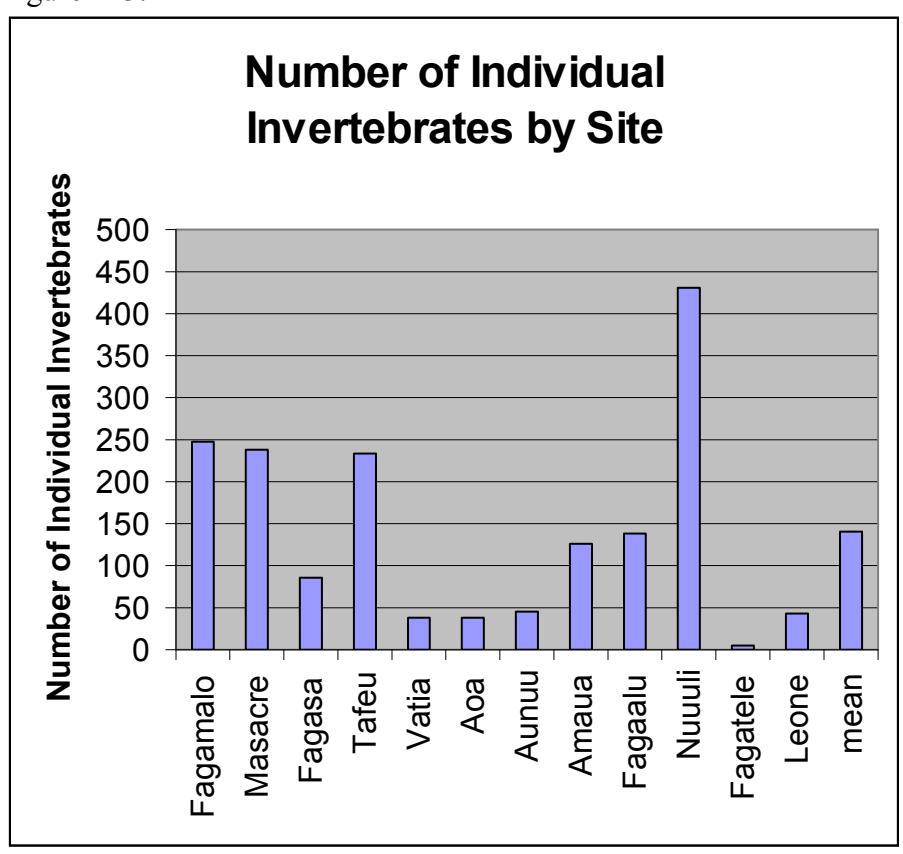

at all clear why Nu'uuli should have so many more invertebrates than Fagatele, for instance.

 The mean number of individuals of each kind of invertebrate are shown in Figure 124. Alpheid grooves are grooves in corals that are occupied by Alpheid snapping shrimp. The shrimp are never visible. Alpheids were actually the most numerous of all the invertebrates, even though they hadn't been noticed and recorded in previous years.

Figure 124.

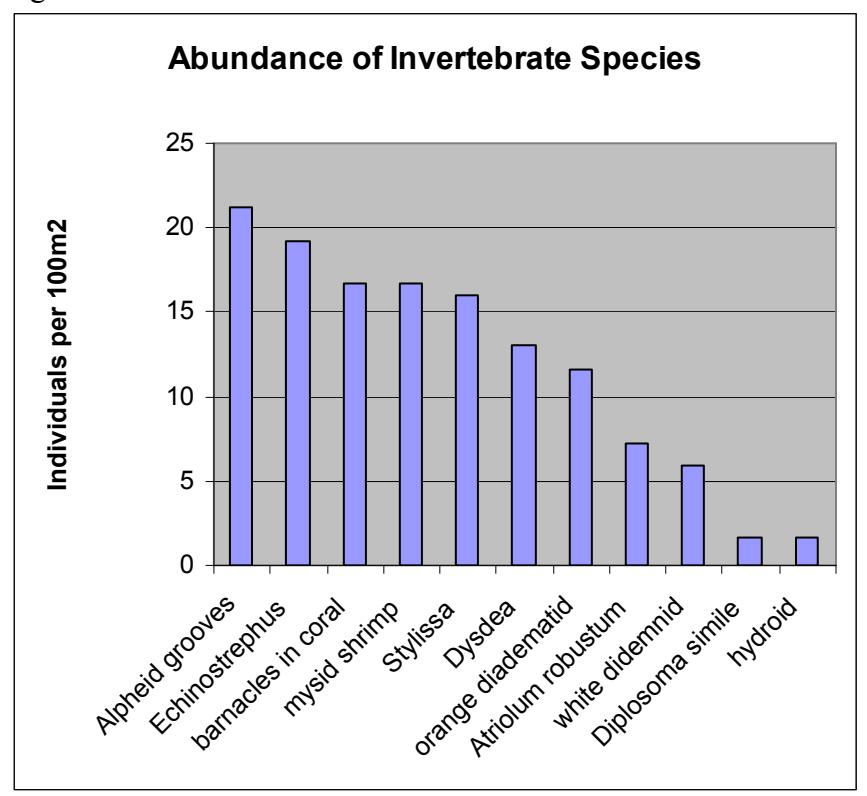

Trends in invertebrates can be seen in Figure 125. The steady increase in the number of invertebrates counted is likely due to increasing practice recording invertebrates in the belt. The number recorded heavily depends upon the search images used, and the many different invertebrates each require a different search image, and they all have to be searched for simultaneously. The increase in total number in 2008 was primarily due to a large increase in the number of Didemnid sea squirts and Alpheid grooves recorded, two kinds of invertebrates that were not looked for previously. It may be that moving more slowly along the transect, with a master list of all categories, might increase the number of kinds and individuals recorded. However, with the limited dive time, this is not really feasible without adding extra dives, which given the difficulty getting dives due to weather, personnel, etc, would risk getting no invertebrate data at all. But in sum, although there is a strong increasing trend in invertebrates recorded, there was no obvious increase in their abundance observed, and the increase is likely due to better recording, not an actual increase.

Figure 125.

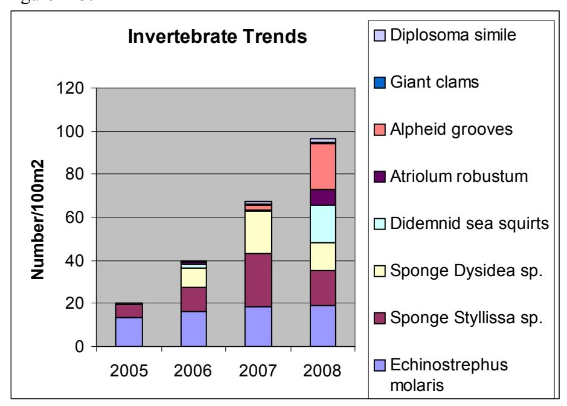

Invertebrates were also recorded on the reef flats, using the same transects as were used for benthic cover. Figure 126 shows the invertebrates on outer reef flats.

Figure 126.

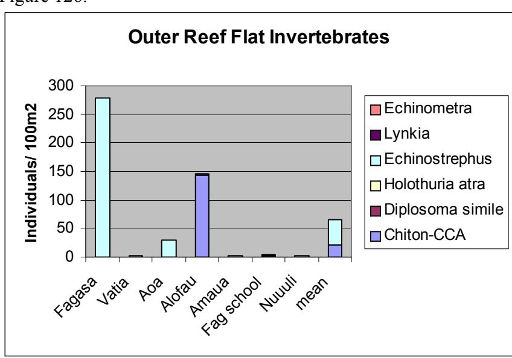

Most outer reef flats have few invertebrates, but a couple had significant numbers, with the small urchin *Echinostrephus* at Fagasa, and boxwork formations in the encrusting coralline algae produced by chitons common at Alofau.

The number of different kinds of invertebrates at outer reef sites is shown in Figure 127.

Figure 127.

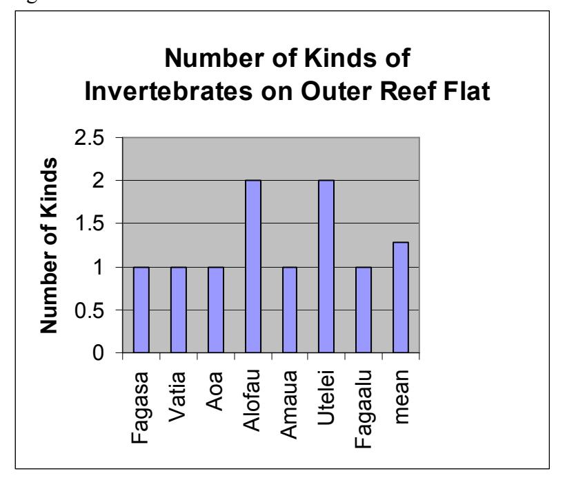

The number of kinds of invertebrates on most outer reef flats was low.

Invertebrates on inner reef flats at a few locations are shown in Figure 128.

Figure 128.

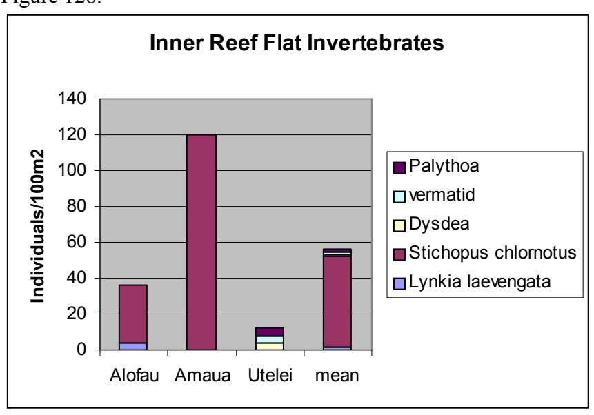

The invertebrates on inner reef flats were dominated by the black sea cucumber, *Stichopus chlornotus*. Other invertebrates were quite uncommon. At most reef flat sites, both outer and inner, typically only about one invertebrate species was recorded.

The number of kinds of invertebrates on inner reef flats is shown in Figure 129.

Figure 129.

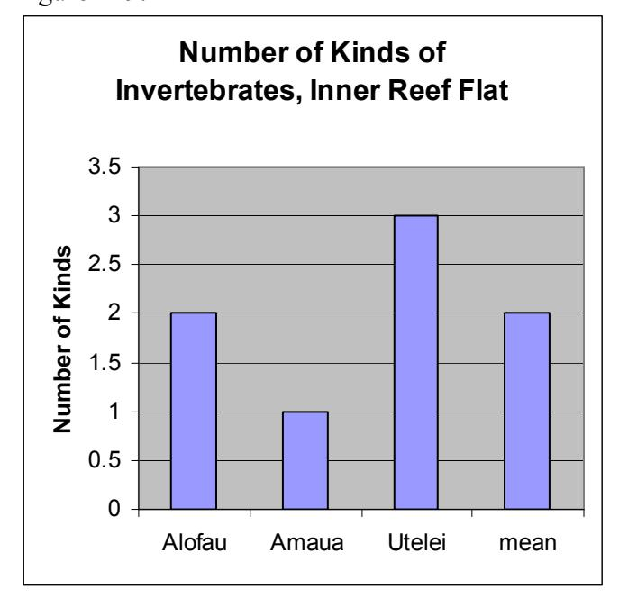

The number of kinds of invertebrates on inner reef flats was more than on outer reef flats, but still low.

Invertebrates 4 m deep on the slope are shown in Figure 130.

Figure 130.

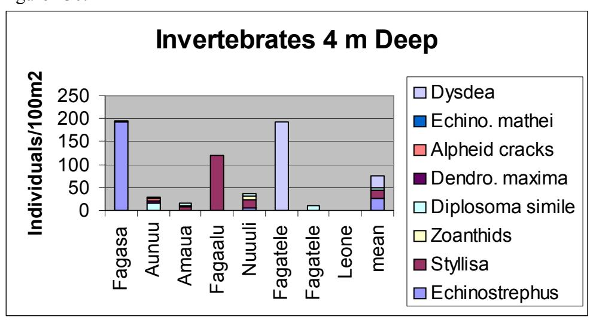

There were large differences between locations in the invertebrate community, with the small urchin *Echinostrephus* dominating Fagasa, the sponge *Styllisa* dominating Faga'alu, and the encrusting sponge *Dysdea* dominating Fagatele.

The number of kinds of invertebrates on the slope at 4 m deep is shown in Figure 131.

Figure 131.

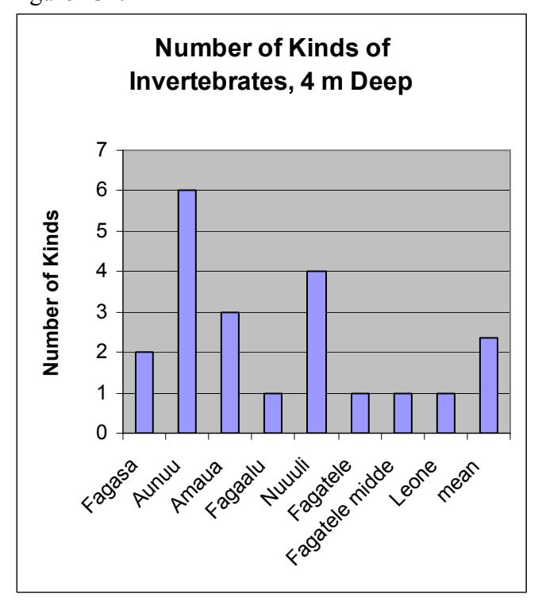

Aunu'u had the most different kinds of invertebrates of any site at 4 m depth, though Fagamalo had more at 8 m depth than Aunu'u (Figure 114).

Invertebrates at 18 m deep are shown in Figure 132.

Figure 132.

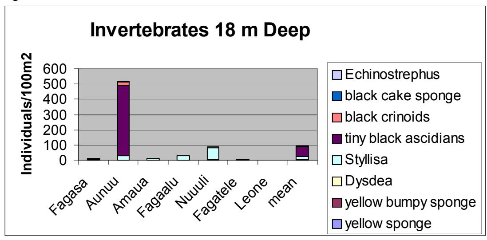

Aunu'u had many more invertebrates than any other site, because it had a large number of tiny black ascidian colonies.

The number of different kinds of invertebrates at 18 m deep is shown in Figure 133.

Figure 133.

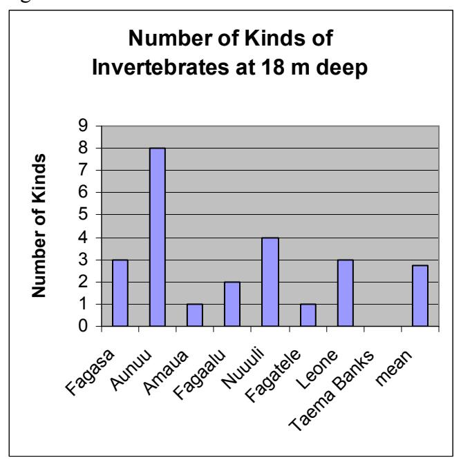

Once again, Aunu'u has the most kinds of invertebrates as well. Recall that it also had a relatively high diversity of corals at 18 m.

Figure 134 shows the abundance of invertebrates in each of the zones on the reefs.

Figure 134.

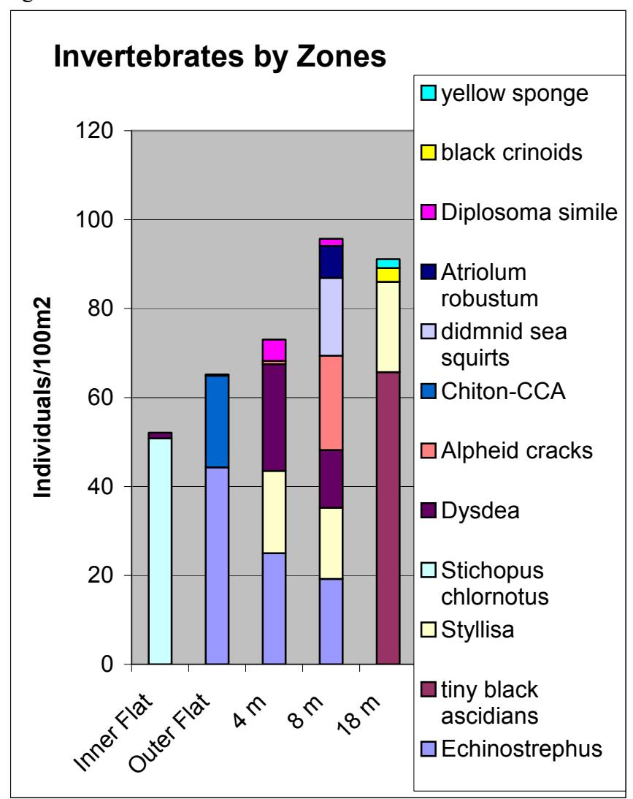

The small urchin *Echinostrephus molaris* was most common on the outer reef flat, followed by 4 m, then 8 m, and not found at 18 m. The large amount on the outer reef flat was not obvious during snorkeling, and may be due to the sample size. The tiny black ascidians were only found in one area at 18 m depth, but were so numerous there that they were the most abundant numerically of all invertebrates. Their coverage and biomass, however, are tiny. The sponge *Styllisa* was clearly found only on the reef slope, but found roughly evenly with depth. *Stichopus chloronotus*, however, was found only on the inner reef flat. The sponge *Dysdea* was most common on the upper reef slope, and not present at 18 m or on the reef flat. It is encrusting and may have photosynthetic symbionts. Alpheid shrimp cracks were only common on the mid-slope. The chiton formations in crustose calcareous algae were only found on the outer reef flat and crest, at some locations. Didemnid sea squirts were only found mid-slope.

 In general, Figure 134 shows that the scarcity of non-cryptic diurnal macroinvertebrates is not restricted to the 8 m depth of the core monitoring program, instead it is widespread. It appears that the total amount of invertebrates may increase with distance from the shoreline. Individual invertebrate species have different patterns of zone occupancy.

Figure 135 gives the numbers of different kinds of invertebrates in each of the zones.

Figure 135.

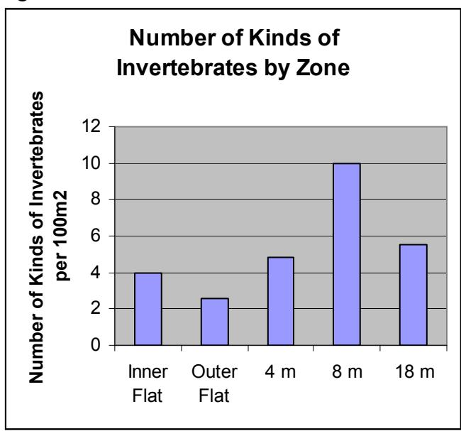

The number of kinds of invertebrates are given per 100 m2 to equate between the different numbers of transects in different zones. The number of kinds of invertebrates was highest at 8 m deep.

## **Water clarity**

 Water clarity, measured by horizontal visibility using the transect tape, is shown for each site in Figure 1356. Visibility was not measured in Fagamalo in 2008.

Figure 136.

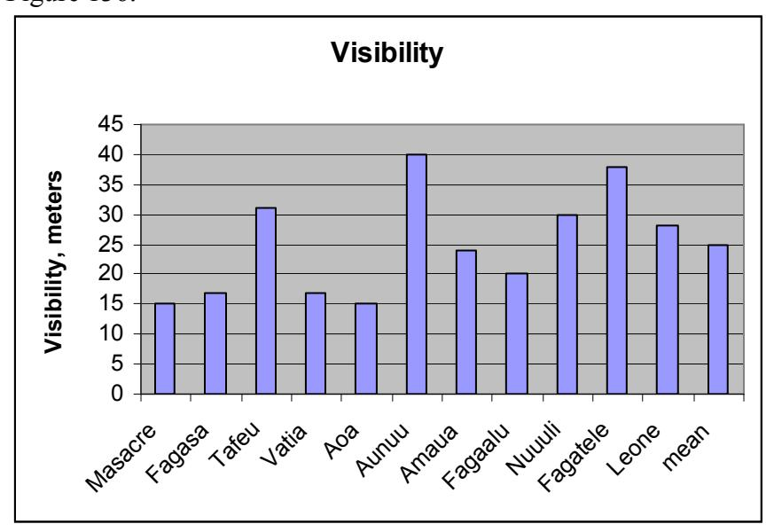

It appears in Figure 136 above that water visibility may be higher on the south side than on the north side. Mean visibility for North and South sides are compared in Figure 137 below.

Figure 137.

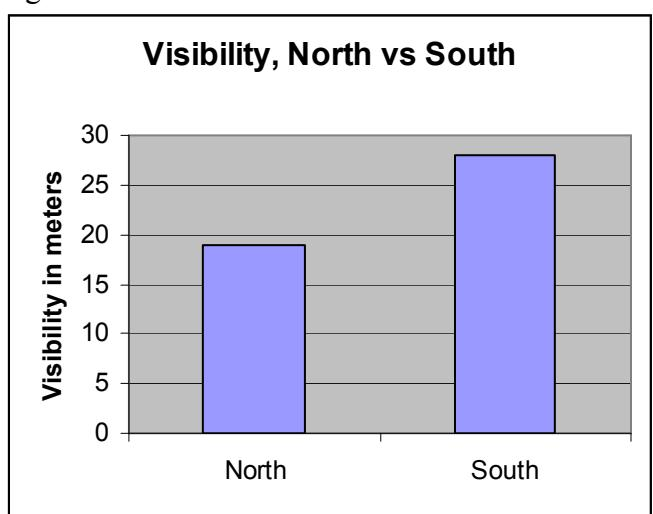

The mean visibility was indeed higher on the South than the North side, but a possible confounding variable is the fact that all sites on the north are in bays, while not all sites on the south are in bays. Visibility may be reduced inside bays, as was documented for Pago Pago harbor in the 2007 report (Fenner, 2008b). If sites outside bays had been included on the north side, it seems likely that visibility could well average as high on the north side as on the south.

 Trends in visibility are shown in Figure 138. There appears to be little or no reliable overall trend. The higher value in 2005 may have been in part because a secchi disc was used for some sites that year.

Figure 138.

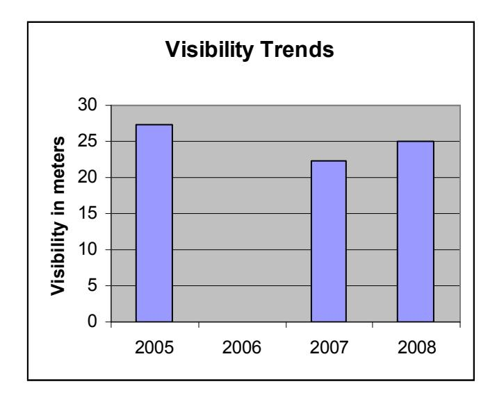

## **Non-point pollution effects**

 In previous reports in this series, a number of different variables have been correlated with impact categories assigned by the American Samoa Environmental Protection Agency to different watersheds. Impact was measured by human population density. The monitoring sites in this program range from the least to the most impact category, and are roughly equally distributed between categories. In previous years, none of the variables examined showed a significant correlation with impact rating.

 In Figure 139, the correlation between coral species richness in the transects with impact is shown, with r = 0.182 , p > .05.

Figure 139.

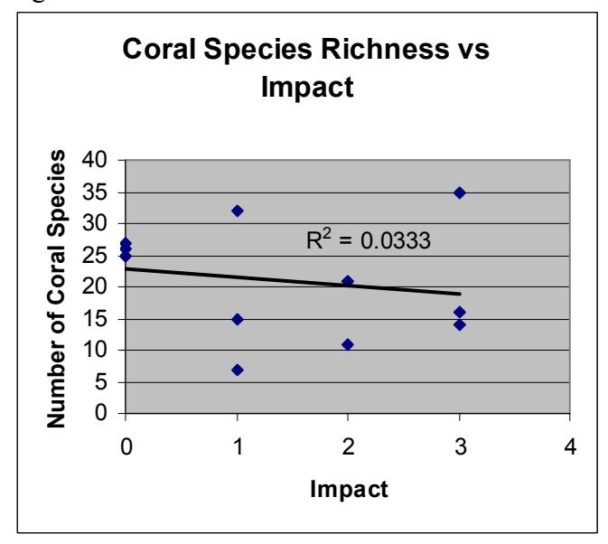

Hoek and Musburger (2008) divide reefs up into three categories: consolidated, framework, and mixed sand and corals. All of their north side sites were consolidated, and all but one of their south side sites were framework. Vatia was a site of mixed sand and corals. Framework reefs are reefs in which dead corals can be seen in the reef, with holes between them, while a consolidated reef has no discernable dead corals in the reef, nor any holes. North sites in the present study are consolidated, and south sites are framework. Hoek and Musburger (2008) find significant correlations between diversity and non-point pollution proxies like impact, when the reefs are divided into these three categories. So correlations were done separately for north and south sides, but with Vatia omitted.

Figure 140 shows the correlation between impact and species richness for the north side. The correlation is r = 0.7437, p > .05. Although not significant, the N was very small, and the correlation was large enough to suggest that it might be significant with a larger N. However, the correlation depends on just one data point (at zero impact), and other correlations did not suggest that they might be significant with a larger N.

Figure 140.

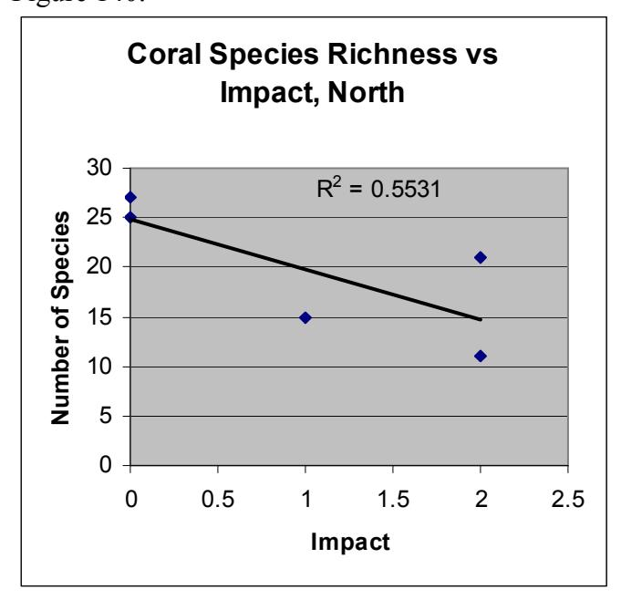

In Figure 141, the correlation is shown for species richness with impact on the South.

Figure 141.

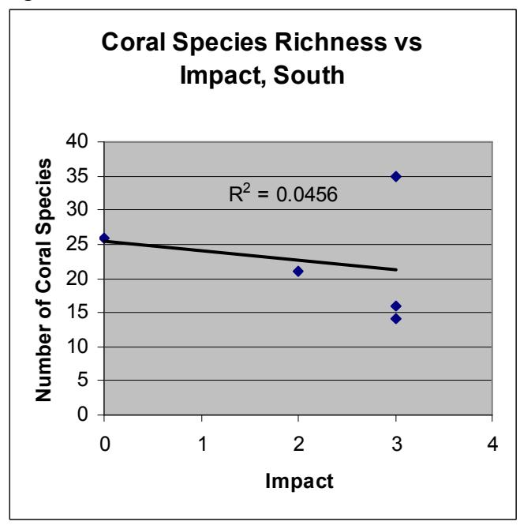

The correlation was r = 0.214, p > .05. Although no real support for the hypothesis that non-point pollution has effects on the diversity of corals on the reef slopes has been found in this program, the exact variables that were used by Hoek have not been replicated. What can be concluded, though, is the phenomenon does not seem to have great generality or robustness.

## **Baselines**

 The 2007 report presented comparisons between the average live coral cover found in American Samoa (27%) and that in other places and other times. The only record for American Samoa before a crown-of-thorns starfish outbreak in 1978, is data from Wass (1982) who gave estimates of coral cover for several sites. Those estimates average 63%. McManus et al (1995) collated coral cover reports from as many near-pristine coral reefs as they could find information on. The average coral cover on those reefs was 40%. Miller et al. (2008) report coral cover on six remote U.S. Pacific islands and reefs, and report an average coral cover of 35%. Coral reefs have been found to undergo repeated cycles of natural disturbance (such as hurricane) followed by recovery. A survey of many pristine reefs would include reefs in all stages of recovery, so the average would be less than the asymptotic maximum that can be reached long after the last disturbance. Photographs of reefs being eaten by crown-of-thorns starfish in American Samoa in 1978 show lush growths of table and staghorn *Acropora*. *Acropora* is among the most vulnerable corals to most major disturbances, such as crown-of-thorns starfish (it is preferred prey), bleaching, and hurricanes (delicate structures are easily damaged). Thus, the 63% live coral cover recorded in 1978 is likely to be an unusually high coral cover for American Samoa. Average coral cover is more likely to be in the 35-40% range. This is still higher than the current coral cover, so it is consistent with the conclusions drawn from the 63% coral cover reported before the outbreak in 1978, that recovery is not yet complete. However, 63% is probably an unrealistically high goal to set for the reefs of American Samoa. If 35-40% cover is a more realistic goal for coral cover, then our goal should be to have coral cover increase by about 8-13%.

#### **Algae, Nutrients, and crown of thorns starfish**

 If the observed blooms of brown macroalgae near shore and in a narrow bay are caused by increased nutrients, there is a second major threat. That threat is of a crownof-thorns outbreak. Birkeland (1982; 1989) hypothesized that increased nutrient runoff from high islands produced by unusually heavy rains following dry spells can fuel plankton blooms. Plankton blooms in turn could provide food for the pelagic larvae of crown-of-thorns starfish. In outbreaks, these starfish appear suddenly as large numbers of adults on reefs. The newly settled larval starfish live in holes in the reef and cannot be seen. Eventually as they grow they begin to come out at night and feed on corals. Only as adults are they visible by day. It takes about 3 years for them to grow to the point that they stay out during the day. Birkeland was able to show that outbreaks don't occur on low islands (where there would not be nutrient runoff) and there is a correlation between outbreaks and unusual rainstorms following dry periods, with a lag of three years. Recently, the information was reviewed for the outbreaks on the Great Barrier Reef, and strong evidence supporting each of the links in the logical chain were found except one for which evidence is lacking (Brodie et al. 2005). Clearly, if terrestrial nutrient runoff increases substantially, it could fuel plankton blooms that could feed starfish larvae. Thus, there is some risk with increasing nutrient runoff of encouraging a crown-of-thorns outbreak. The last outbreak, in 1978, ate almost all corals on the reefs except on the reef crest where the starfish cannot withstand the heavy wave surge (the only other known

outbreak was in 1938 (Flanigan and Lamberts, 1981). Thus, an outbreak has very serious consequences for the reef. However, water on the reef slopes remains relatively clear with no obvious signs of a plankton bloom. An EPA study documented ocean oligotrophic nutrient levels on the reef slopes, though the sampling wasn't done to coincide with major runoff events. The harbor, however, still has dense plankton as documented in the 2007 report. It appears likely that significant additional increases in nutrient runoff on the slopes would be required to produce a plankton bloom sufficient to have a major risk of a crown-of-thorns outbreak, but any increase likely carries with it some amount of increased risk.

 In another recent study, Sweatman (2008) found that there were fewer crown-ofthorns outbreaks on the middle reefs of the Great Barrier Reefs which were in no-take areas than in reefs where fishing is allowed. The link between fishing and crown-ofthorns is not known for sure, but the fishing on these reefs targets groupers exclusively. He speculates that removal of predatory fish could lead to increases of smaller fish such as wrasses that might eat the juvenile crown-of-thorns hiding in reef holes. However, this should predict fewer starfish in areas with fishing.

#### **Red Tides in the Harbor**

 A series of red tides have been observed in the harbor. They involve a clear rust-red discoloration of the water, usually in patches, which change in location with time during the event. They are produced by the dinoflagellate protist (single cell) algae, *Ceratium furca*. No dead fish have been sighted during these events, nor smell or irritation reported by people. They appear to be non-toxic. Most of the red tides are visible in the inner harbor from about Fagatogo to the head of the harbor. The dates when the author observed red tides are:

June 20, 2007 Aug 15, 2007 Sept 22, 2007 Feb 26, 2009-April 18, 2009 Mike King reported seeing red tide in the harbor in 2000.

The cause of the red tides is not known. One possibility is nutrients. Although nutrient levels in the harbor have decreased since the cannery wastes have been diverted to the mouth of the harbor (Craig et al. 2005), the harbor waters are still green and quite turbid at the head of the harbor. This indicated high phytoplankton levels in the inner harbor, with are due to nutrient inputs and low levels of flushing. Small oysters along the shoreline feed on the plankton and are a good bioindicator of the plankton, and are most abundant in the inner harbor. The phytoplankton as measured by water transparency, is an even more direct bioindicator of nutrients. It is likely that the red tide events are fueled by the nutrients. High levels of nitrogen are correlated with patches of red tide (Don Vargo, personal comm.). Recent increases in nutrient inputs include fertilizer applied to a soccer field in Pago Pago, and the use of high-phosphate detergent imported from Asia. The governor signed and Executive Order banning the import of such

detergents, but enforcement has initially been lacking. The details of the red tide story are given in the 2007 report (Fenner, 2008b).

#### Brown Algae

 When data was gathered from Vatia (2/26/09), the author snorkeled on the west side of the bay to see if the *Dictyota* brown algae that is so common on the east side was also common on the west side. Indeed it was.

#### **Seagrass**

 The only seagrass observed by the author was *Halophila* sp. This seagrass produces very small blades, perhaps 2 cm long and 1 cm wide, on widely dispersed stolons. It takes careful observation to even see a seagrass bed, and because of the small size and low density of the grass, it does not appear to be habitat for any other organisms. It was observed at Faga'alu in front of the park, starting at the shoreline in very shallow water and going down on sand to perhaps 3-5 m depth. It was also observed in Alofau on the sand bed near shore out to a depth of 1-2 m. In Alofau, a species of *Caulerpa* is in the same sandy area, and careful observation is needed to distinguish the two. The author also observed seagrass on a sandy bed at the base of the reef in Fagatele at about 30 m depth. Thus it has a depth range of at least 0-30 m. It was also seen near the shore in the deeper area ("borrow pit") of the Aua transect, and on the sand on the reef flat at Matafau School. It is likely to be many other places, but it would require careful survey of sand beds to find it. Two species of *Halophila* are reported and illustrated in Skelton (2003). Ellison (2009) reports that there are three species of seagrass in American Samoa, but the source of the information for the third species (*Syringodium isoetifolium*) is not clear, as the author has not seen it or heard of it locally. Upolu, (independent) Samoa, has larger seagrass (*Cymodocea serratulata* and/or *Syringodium isoeiifolium*) at the eastern end (species from Ellison, 2009).

#### **Major Disturbances**

 On May 18, 2008, observation of the airport backreef pool to record bleaching revealed that there was a large amount of white staghorns in the outer part of the pool. Subsequent observation revealed that the white coral was almost entirely dead, not just bleached. By one week later the grey-green color of filamentous algae growing on it was obvious, and by two weeks it was sufficiently dark grey to be less obvious. Thus, the death would have had to have occurred between May 18 and the previous data when it was checked, April 27. The fact that it was still very white on May 18, but filamentous algae was obvious within a few days indicates that it likely died just a few days before May 18. The area was visually assessed and the dead coral was about 22% of the staghorn coral in that outer portion of the pool. The inner portion of the pool had no dead coral. Further, nearly all coral that was not killed was a healthy dark brown. It was the end of the bleaching season and the amount of bleaching was in the process of rapidly decreasing. This event occurred at a time of unusually calm weather, with no wind most days, and waves had been decreasing to the point that they were unusually small and very little if any water would have been pumped over the crest into the pool and there would have been no current in the pool. There had been a period of about 2 weeks of unusually calm weather preceding the event. Calm conditions are known to contribute to bleaching. However, it was at a time when the corals were recovering from bleaching, and no newly bleached corals were found. The corals would have had to bleach and die completely in a very short period, too short to seem realistic. Another possibility is that the lack of wave action would have meant that no new water would have been flowing through the pool bringing oxygen. Cloudy weather would have meant that the corals would have produced lower amounts of oxygen in the day, and at night oxygen levels might have fallen low. Perhaps low oxygen kills in an all-or nothing fashion that could account for the pattern. A similar phenomenon happened in 2006 when three weeks of cloudy weather and still conditions lead to heavy silt runoff and arrested circulation in Faga'alu Bay. Staghorns there died at that time around the bases of clumps, so it wasn't due to fresh water, which floats. In the 2006 report the deaths were attributed to sediment. The clouds decreased light levels, and sediment would have decreased the light reaching coral further, and decreased it most for deep corals. This cannot be used to explain the coral deaths in the airport pool this year because the water is clear- there is no sediment input. Low oxygen levels might be able to explain both. However, oxygen levels have been recorded in the backreef pools at Ofu, and they don't go especially low even at night at low tide when there is no wave input into the pools. However, this was during a period when every 12 hours at high tide there was oxygenated water coming in from waves. More investigation will be required to reach firm conclusions about the cause of these deaths.

#### **Table Coral Recruitment**

 In 2007, data was presented in the annual report on *Acropora hyacinthus* table recruits at Fagasa. They were most common near the crest, mostly on the reef flat near the crest but also on the upper reef slope near the crest. Additional visual survey in 2008 revealed that the juvenile tables are quite patchy at Fagasa, with some areas having none, and other areas having so many that they are running into each other or overlapping. Figure 142 shows some of these tables in a densely populated area.

Figure 142.

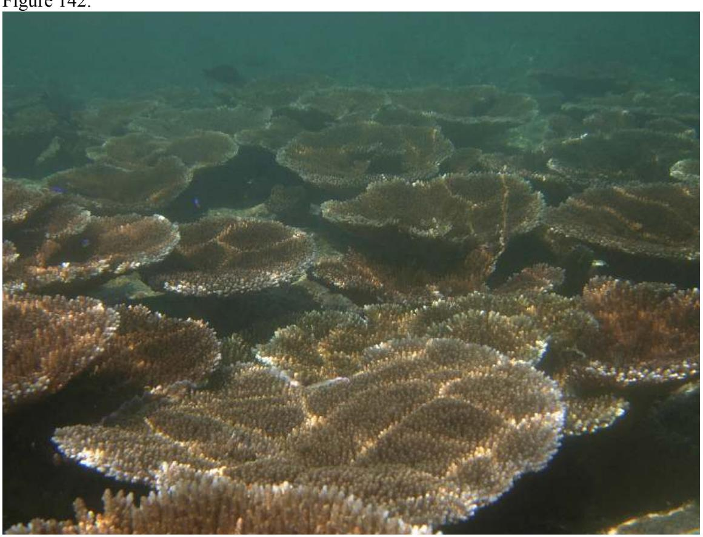

 The diameter of the table tops, the diameter of the bases, and the height of the columns were all measured in 2007. In 2008, the diameter of the table tops were re-measured. Most had reached a stage in their growth at which further growth occurs only in the diameter of the table top. Figure 143 shows a size distribution of a sample of these young tables in 2008.

Figure 143.

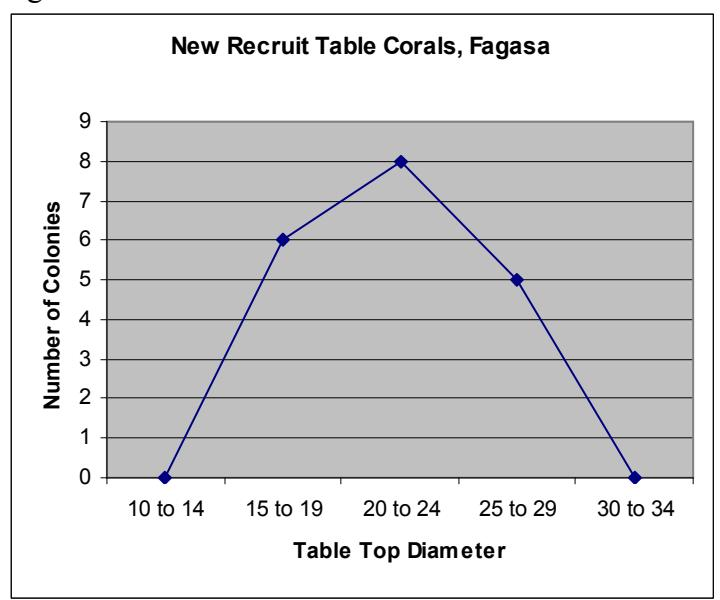

 The mean diameter of table tops increased from 7.6 cm in 2007 to 20.3 cm in 2008. Figure 144 shows this increase.

Figure 144.

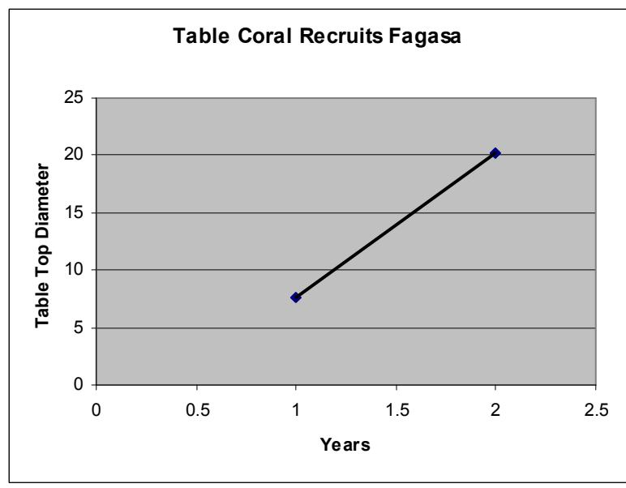

 Figure 144 should not be used to extrapolate back to zero, since the colony begins on the substrate, and the table top starts to grow only after first the base grows to full size and then the column grows up to the level at which the top starts to grow.

 There are a few new recruits that are clearly from the last year or two, so while there was a peak period of recruitment, some recruitment continues. Also, these tables are probably now large enough to be reproducing themselves. There are smaller numbers of recruits of this species near the reef crest of other sites, but so far Fagasa has the most the author knows of. The colonies on the reef crest might be vulnerable to unusually low tides, if the tide is low enough and there is little enough waves so that they dry out. However, their position near the crest may protect them from some low tide events, since waves may keep them wet even when they are above the water level. In one spot at Fagasa, there are a few dead tables. They appear to be dead for several years, and the cause of death is not clear. Since some of the juvenile tables are on the upper reef slope, they will be immune to low tide events. They are, however, vulnerable to hurricanes, mass bleaching events, disease, and crown-of-thorns. No disease has been noticed on any of these colonies yet.

#### **Cloth rags on young table corals**

When I was collecting transect data on the outer edge of the reef flat at Fagasa last week, I found that the recruitment pulse of *Acropora hyacinthus* table corals which is particularly dense there, is continuing to grow well, modal diameter of the table top was 8 cm last year, 20 cm this year. In some spots a few are running into each other already and in a year or two many will run into each other or start to overlap. In one area, they must be a year older, are about 30 cm diameter. All looking healthy, except for some that had pieces of cloth caught on them. Clearly rubbish, almost all cloth, a few had fishing line or a small piece of net caught on them, one had Christmas tree light wire (!) I would estimate about 3 dozen corals, all clustered in one area. Even in that area, they were a minority of colonies. I photographed them with the cloth on them, then removed the cloth, ended up with a big wad of rag cloth. I think I got all of them. I was able to get the cloth off without damaging the corals further. Damage to the corals appeared to be quite minor, a bit of bleaching in some parts. A few colonies without cloth had some dead areas around the edge of the small table, which I'm suspicious may have been from cloth that is no longer there. I think it is likely all will recover. I didn't try to remove the fishing line, since pulling on it would rip up the coral. I should be able to find the spot the area next year to monitor how they do in the coming year.

 It is only on rather rare occasions that I see plastic caught on corals, though it does happen.

#### **Species**

 There is an organism that is fairly common on rock rubble in shallow water, which appears to be a brown fuzz, shown in Figure 145. Closer examination reveals tall thin polyps wit a tuft of tentacles at the end. Under the dissecting microscope they can be seen to have many tentacles, so they are not octocorals. They do not appear to match any Anthozoan group, but rather look like hydroids. They match the photo and description of the hydroid *Myronoema* shown in Colin & Arneson (1995). They say that the color is due to zooxanthellae. They are in the Plumariidae.

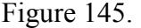

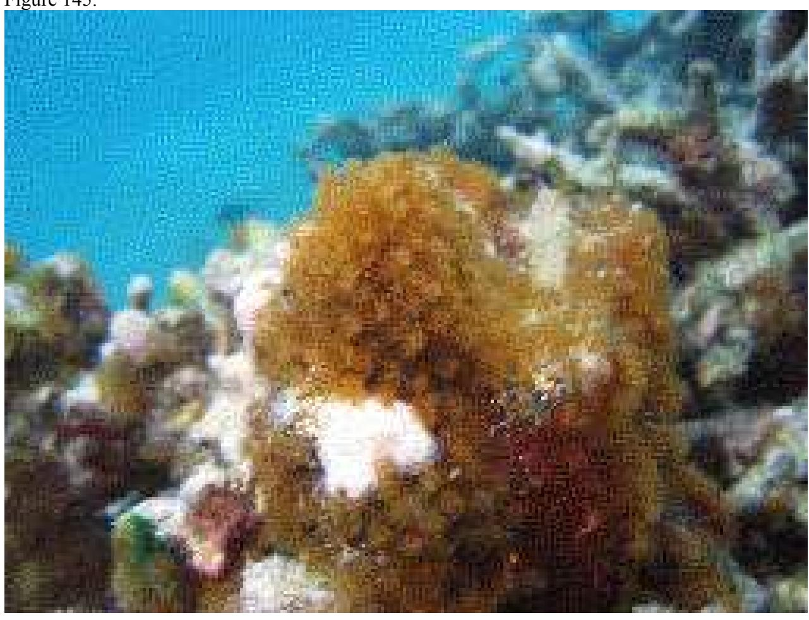

 Another hydroid that has been seen here is the tiny white dots along the edge of grooves in corals that are produced by alpheid (snapping) shrimp. The hydroid is *Rhizogeton* sp.? according to Colin and Arneson (1995).

 One colony of massive *Porites*, one encrusting *Hydnophora*, and one *Pocillopora* were found with the small paired siphon openings that are typical of the boring bivalve, *Lithophaga zittelliana* as shown in Colin and Arneson (1995; p. 911). Each was photographed. These are the only examples of this species found in five years of work in American Samoa by D. Fenner. *L. nigra* and *L. sp.* were reported by Coles et al. (2003).

# **References**

Birkeland, C (1982) Terrestrial runoff as a cause of outbreaks of *Acanthaster planci*  (Echinodermata: Asteroidea). Marine Biology 69: 175-185.

Birkeland, C (1989) The Faustian traits of the crown-of-thorns starfish. American Scientist 77: 154-163.

Birkeland, C., Craig, P., Fenner, D., Smith, L. W., Kiene, W. E. and Riegl, B. 2008. Ch. 20: Geologic setting and ecological functioning of coral reefs in American Samoa. Pages 741-765 in B. Riegl and R. Dodge, Coral Reefs of the USA, Springer.

Brodie, J., Fabricius, K., De'ath, G., and K. Okaji. 2005. Are increased nutrient inputs responsible for more outbreaks of crown-of-thorns starfish? An appraisal of the evidence. Marine Pollution Bulletin 51: 266-278.

Brainard, R., Asher, J., Gove, J., Helyer, J., Kenyon, J., Mancini, F., Miller, J., Myhre, S., Nadon, M., Rooney, J., Schroeder, R., Smith, E., Vargas-Angel, B., Vogt, S., Vroom, P., Balwani, S., Ferguson, S., Hoeke, R., Lammers, M., Lundlblad, E., Maragos, J., Moffitt, R., Timmers, M., and Vetter, O. 2008. Coral reef ecosystem monitoring report for American Samoa: 2002-2006. NOAA Special Report NMFS PIFSC.

Coles, S. R., Reath, P. R., Skelton, P. A., Bonito, V., DeFelice R. C., Basch, L. 2003. Introduced marine species in Pago Pago Harbor, Fagatele Bay, and the National Park Coast, American Samoa. Bishop Museum Technical Report No. 26. 182 pp.

Colin P. L. and Arneson C. 1995. Tropical Pacific Invertebrates. Coral Reef Press, Beverly Hills, Ca. 296 pp.

Connell JH (1978) Diversity in tropical rain forests and coral reefs. Science 199: 1302- 1309.

Connell JH, Hughes TP, Wallace CC (1997) A 30-year study of coral abundance, recruitment, and disturbance at several scales in space and time. Ecological Monographs 67: 461-488.

Craig, P. 2009. Natural History Guide to American Samoa, 3rd Edition. National Park of American Samoa, Dept. Marine & Wildlife Resources, and American Samoa Community College, Pago Pago. 130 pages.

Craig, P., DiDonato, G., Fenner, D., Hawkins, C. 2005. The state of coral reef ecosystems of American Samoa. PP. 312-337 in Waddell, J. E. (ed.), The State of Coral Reef Ecosystems of the United States and Pacific Freely Associated States: 2005. NOAA Technical Memorandum NOS NCCOS 11. NOAA/NCCOS Center for Coastal Monitoring and Assessment's Biogeography Team. Silver Spring, MD. 522 pp

Donahue, S. and 26 others. 2008. The state of coral reef ecosystems of the Florida Keys. Pages 161-187 in J.E. Waddell and A.M. Clarke (eds.), The State of Coral Reef Ecosystems of the United States and Pacific Freely Associated States: 2008. NOAA Technical Memorandum NOS NCCOS 73. NOAA/ NCCOS Center for Coastal Monitoring and Assessment's Biogeography Team. Silver Spring, MD. 569 pp.

Ellison, J.C. 2009 Wetlands of the Pacific Island region. Wetlands Ecology and Management 17:169-206.

Fenner, D. 2008a. Results of the territorial monitoring program of American Samoa for 2006, benthic section. Report to the Department of Marine & Wildlife Resources, the Coral Reef Advisory Group, and NOAA.

Fenner, D. 2008b. Results of the territorial monitoring program of American Samoa for 2007, benthic portion. Report to the Department of Marine & Wildlife Resources, the Coral Reef Advisory Group, and NOAA.

Fenner, D., M. Speicher, S. Gulick, G. Aeby, S. Cooper Alleto, B. Carroll, E. DiDonato, G. DiDonato, V. Farmer, J. Gove, P. Houk, E. Lundblad, M. Nadon, F. Riolo, M. Sabater, R. Schroeder, E. Smith, C. Tuitle, A. Tagarino, S. Vaitautolu, E. Vaoli, B. Vargas-Angel, and P. Vroom. 2008. Status of the coral reefs of American Samoa. pp 307-331. In J.E. Waddell and A.M. Clarke (eds.), The State of Coral Reef Ecosystems of the United States and Pacific Freely Associated States: 2008. NOAA Technical Memorandum NOS NCCOS 73. NOAA/ NCCOS Center for Coastal Monitoring and Assessment's Biogeography Team. Silver Spring, MD. 569 pp.

Flanigan, JM and AE Lamberts (1981) *Acanthaster* as a recurring phenomenon in Samoan history. Atoll Research Bulletin 255: 59-61

Houk, P, Musburger, C 2008 Assessing the effects of non-point source pollution on American Samoa's coral reef communities. Report to American Samoa Environmental Protection Agency. 45 pp.

Lewis, J.B. 2004. Has random sampling been neglected in coral reef faunal surveys? Coral Reefs 23: 192-194.

McManus, J.W., Vallejo, B., Meñez and Coronado, G. (1995) ReefBase: an international database on coral reefs. In: Marine/Coastal Biodiversity in the Tropical Region (workshop proceedings). East-West Center, Honolulu.

Miller, J., Maragos, J., Brainard, R., Asher, J., Vargas-Angel, B., Kenyon, J., Schroeder, R., Richards, B., Nadon M., Vroom P., Hall, A., Keenan E., Timmers M., Gove J., Smith E., Weiss J., Lundblad E., Ferguson S., Lichowski F., and Rooney J. 2008. State of coral reef ecosystems of the Pacific remote island areas. Pp. 353-386. In: J.E. Waddell and A.M. Clarke (eds.), The State of the Coral Reef Ecosystems of the United States and Pacific Freely Associated States: 2008. NOAA Technical Memorandum NOS NCCOS

73. NOAA/NCCOS Center for Coastal Monitoring and Assessment's Biogeography Team. Silver Spring, MD. 569pp.

NOAA (National Oceanic and Atmospheric Administration). 2005. Atlas of the Shallow-water Benthic Habitats of American Samoa, Guam, and the Commonwealth of the Northern Mariana Islands. NOAA Technical Memorandum NOS NCCOS 8, Biogeography Team. Silver Spring, MD. 126 pp.

Sabater MG and Tofaeono S. 2007. Effects of scale and benthic composition on biomass and trophic group distribution of reef fishes in American Samoa. Pacific Science 61 (4) : 503-520.

Skelton, P. 2003. Seaweeds of American Samoa. Report to Dept. Marine & Wildlife Resources, American Samoa. International Ocean Institute and Ocean Research and Development Associates. Townsville, Australia. 103 pp.

Wallace, C.C., C.A. Chen, H. Fukami, and P.R. Muir. 2007. Recognition of separate genera within *Acropora* based on new morphological, reproductive and genetic evidence from *Acropora togianensis*, and elevation of the subgenus *Isopora* Studer, 1878 to genus (Scleractinia: Astrocoeniidae; Acroporidae). Coral Reefs 26: 231- 239.

Wass, R.C. 1982. Characterization of inshore Samoan fish communities. Department of Marine and Wildlife Resources Biological Report Series 6, Government of American Samoa. Pago Pago, American Samoa. 27 pp.

Wells, S. 1988. Coral Reefs of the World, Vol. 3, Central and Western Pacific. UNEP, IUCN. 329 pp.

Whaylen, L. and Fenner, D. 2006. Report of 2005 American Samoa coral reef monitoring program (ASCRMP), expanded edition. Report to the Department of Marine and Wildlife Resources and Coral Reef Advisory Group, American Samoa. 64 pp.

Work, T. M., Aeby, G. S., and Maragos, J. E. 2008. Phase shift from a coral to a corallimorph-dominated reef associated with a shipwreck on Palmyra Atoll. PloS One 3: 1-5.