# **Proceedings of the American Samoa Coral Reef Fishery Workshop**

Stacey Kilarski and Alan R. Everson (*Editors*)

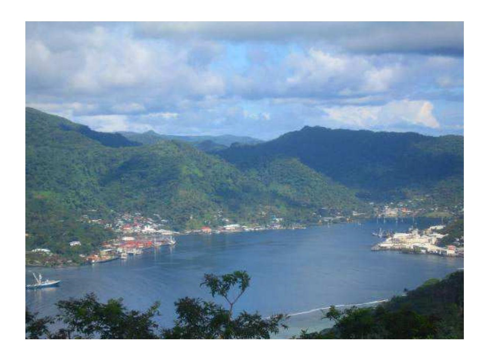

U.S. Department of Commerce National Oceanic and Atmospheric Administration National Marine Fisheries Service NOAA Technical Memorandum NMFS-F/SPO-114

# **Proceedings of the American Samoa Coral Reef Fishery Workshop**

Convention Center, Utulei, American Samoa October 21-23, 2008

#### *Edited by:*

Stacey Kilarksi AECOS, Inc. 45-939 Kamehameha Highway Suite 104 Kane'ohe, HI 96744

Alan R. Everson Pacific Islands Regional Office, NMFS Habitat Conservation Division 1601 Kapiolani Blvd Suite 1110 Honolulu, HI 96814 alan.everson@noaa.gov

#### **NOAA Technical Memorandum NMFS-F/SPO-114**

U.S. Department of Commerce Gary Locke, Secretary of Commerce

National Oceanic and Atmospheric Administration Jane Lubchenco, Ph.D., Administrator of NOAA

National Marine Fisheries Service Eric C. Schwaab, Assistant Administrator for Fisheries

#### **Suggested citation:**

Kilarski, Stacey, and Alan Everson (e*ds.*). Proceedings of the American Samoa Coral Reef Fishery Workshop (October 2008).U.S. Dep. Commerce, NOAA Tech. Memo. NMFS-F/SPO114, 143 p.

#### **A copy of this report may be obtained from:**

Alan R. Everson Pacific Islands Regional Office, NMFS Habitat Conservation Division 1601 Kapiolani Blvd Suite 1110 Honolulu, HI 96814 alan.everson@noaa.gov

#### **Or online at:**

http://spo.nmfs.noaa.gov/tm/

# **American Samoa Coral Reef Fishery Workshop**

Convention Center, Utulei, American Samoa

October 21-23, 2008

**Organizers:** NOAA-Pacific Island Regional Office

NOAA-Pacific Island Fishery Science Center

Department of Marine and Wildlife Resource

**Participants:** Department of Marine and Wildlife Resources

Department of Fishery, Samoa

Ministry of Natural Resources and Environment, Samoa

Department of Commerce

American Samoa Environmental Protection Agency

American Samoa Community College

American Samoa Coastal Management Program

Fagatele Bay National Marine Sanctuary

National Park Service of American Samoa

University of Hawaii

Western Pacific Regional Fisheries Management Council

# **Table of Contents**

| Introduction, workshop summary and recommendations4                                                                                                                                                                                                |
|----------------------------------------------------------------------------------------------------------------------------------------------------------------------------------------------------------------------------------------------------|
| Long-term marine resource use in American Samoa: Some preliminary thoughts 14 Alex Morrison – University of Hawaii, Manoa                                                                                                                       |
| Status of Reef Fish from Fishery-Independent (Visual Census) Surveys Across the American Samoan Islands 21                                                                                                                                      |
| Robert Schroeder – NOAA Fisheries PIFSC CRED                                                                                                                                                                                                       |
| Demographic analysis of a target reef fish species in Tutuila Island, American Samoa: implications for fishery management 23                                                                                                                    |
| Domingo Ochavillo – Department of Marine and Wildlife Resources                                                                                                                                                                                    |
| 2007 Status of bottomfish fishery in American Samoa 26 Ioane Tomanogi – Department of Marine and Wildlife Resources                                                                                                                             |
| The state of the coral reef habitat in American Samoa, 2008 42 Douglas Fenner – Department of Marine and Wildlife Resources                                                                                                                     |
| DMWR marine resource management strategy: merging protected area and fishery management tools 112                                                                                                                                               |
| Marlowe Sabater – Department of Marine and Wildlife Resources                                                                                                                                                                                      |
| Connectivity among coral reef fish populations in the remote Samoan Archipelago: metapopulation concept and implications120 Peter Craig – National Parks Service of American Samoa, Rusty Brainard Pacific Islands Fishery Science Center |
| Pala Pals: Inter-Organizational Cooperation to Create a Comprehensive and Adaptive Management Plan For the Pala Lagon Watershed 131 Doug Harper – American Samoa Department of Commerce                                                      |
| The Current Status of the No-take MPA Program in American Samoa133 Lucy Jacob – Department of Marine and Wildlife Resources, American Samoa                                                                                                     |
| Fishery Workshop Participatory Learning and Action 136 Fatima Sauafea-Leau – NOAA-Pacific Island Regional Office                                                                                                                                |

| Protection of Reef Fish Fisheries Workshop Summary 137                                                                                             |  |
|----------------------------------------------------------------------------------------------------------------------------------------------------|--|
| Benjamin Carroll – Department of Marine and Wildlife Resources, American Samoa                                                                     |  |
| Management Plan Review and Site Expansion of Fagatele Bay National Marine Sanctuary 139 Gene Brighouse – Fagatele Bay National Marine Sanctuary |  |
| Exchanged Experience Project Overview 142 Soli Tuaumu – American Samoa Coastal Management Program                                               |  |

# American Samoa Coral Reef Fishery Workshop October 21-23, 2008 Introduction, Summary and Recommendations

#### Introduction

Part 1: Historical Overview of Fisheries in American Samoa

Part 2: Present Status and Management of Fisheries In American Samoa Session 1: Present status and trend in coral reef fish population and fishery Session 2: Current management status for coral reef and associated fishery

Part 3: Strategic Planning for Fishery Management Consensus on the status of American Samoa's coral reef fisheries Recommendations on ways to address non-consensus issues Recommendations on ways to move forward with management

Specific Data Needs

Recommendations for Future Workshops

#### Introduction

Over the course of three days (Oct. 21-23, 2008), local and regional resource managers and scientists from NOAA-Pacific Islands Regional Office, NOAA-Pacific Island Fishery Science Center, Department of Marine and Wildlife Resources, Department of Fishery, Samoa, Department of Commerce, American Samoa Environmental Protection Agency, American Samoa Community College, American Samoa Coastal Management Program, Fagatele Bay National Marine Sanctuary, National Park Service of American Samoa, The University of Hawaii, Western Pacific Regional Fishery Management Council and community members gathered in Pago Pago, American Samoa.

#### Objectives

The workshop addressed the following main objectives:

- 1. Document the historical use, catch, and effort of fishery resources in American Samoa.
- 2. Assess the current state of fishery resources, availability and quality of fisheries data in American Samoa.
- 3. Engage community members in fisheries management.

#### Outcomes

Based on the above objectives, the workshop was designed to stimulate open group discussion among participants to reach the following outcomes:

- 1. Recommendations for improved data collection
- 2. Recommended management measures based upon available data
- 3. Determined management tools needed to maintain a sustainable coral reef fishery
- 4. Integrated management regime between American Samoa and Independent Samoa ("Two Samoas")

In efforts to reach the main objectives, the workshop was divided into three focused sections, with the following themes: (1) Historical overview of fisheries, (2) Present status and management of fisheries, and (3) Strategic planning for fishery management. The first two sections' specific objectives, key outcomes, gaps, and recommendations are described below. Full summaries of each presentation follow this report. The last section resulted in a list of consensus/non-consensus issues which were assembled based on the first two sections' presentations and group discussions. The final day of the workshop was also used to provide recommendations on ways to revise the fisheries local action strategy (LAS).

# Part 1. Historical Overview of Fisheries in American Samoa 1a. Objectives

Three presentations (Table 1) were given in the first session which provided information on past fishing patterns, traditional fishery management, and fish population status based on historical accounts, elder fishermen interviews and archaeological studies. The main objectives of this first session on the historical overview of fisheries in American Samoa included the following:

- 1. To assess the historical, traditional fishing patterns/practices in American Samoa.
- 2. To reveal what is known about fish consumption from the past in American Samoa.
- 3. To generate a "baseline" of the nearshore fishery based on the historical accounts of traditional fishing practices and management, fish populations, and consumption patterns.

#### **Table 1 Presentations in Session 1**

| Part 1: Historical Overview of Fisheries in American Samoa                                                                  |                            |
|-----------------------------------------------------------------------------------------------------------------------------|----------------------------|
| 2500 years of marine procurement in American Samoa: Patterns and implications based on archeological records             | Alex Morrison - UH, Manoa  |
| Historic fishing methods and marine management in American Samoa based on archival records                               | Arielle Levine – NOAAPIFSC |
| Traditional knowledge of marine resource use, management, and changes over time based on interviews with elder fishermen | Bert Fuiava – DMWR         |

#### **1b. Key outcomes**

Historic fishing methods and marine management in American Samoa based on archival records Very little is known about the historical fishing and consumption patterns in American Samoa, and no baseline data exists. However, through written records of early explorers, missionaries, colonial administrators, naval officers and anthropologists, as well as through interviews with elder fishermen, a picture of the past fishery resource patterns and management can be composed. Families and villages were central to management and decision-making in American Samoa. This traditional value system was based on sharing and distribution of food, and not on individual accumulation. Thus, in the past, fishing was performed as a practice oriented around culture and consumption purposes rather than for economic gain.

Traditional knowledge of marine resource use, management, and changes over time based on interviews with elder fishermen

Based on elder fishermen interviews, as presented by B. Fuiava, there is a general consensus about the decline in reef fish populations and that there has been a decrease in fishing effort. Information from the interviews indicate that elder fisherman are concerned about habitat degradation.

2500 years of marine procurement in American Samoa: Patterns and implications based on archeological records

As presented by A. Morrison, archaeological evidence and analysis of ancient fishbone assemblages on Tutuila suggest that the prehistoric fish community composition and catch in American Samoa (1000- 3000 years ago) is very comparable to modern patterns. For example, assemblages from both ancient and current times are dominated by species of the families Acanthuridae (surgeonfish) and Scaridae (parrotfish). Similarly, analysis of molluscan assemblages from the two sites also suggests reliance on a few important species and very little change in community structure through time. This suggests that the marine resources may have been utilized in a sustainable manner (Nagaoka 1993; Morrison and Addison 2008).

#### **1c. Key issues**

Potential of incorporating traditional management systems

Based on the information presented, workshop participants discussed the potential of incorporating more traditional types of management systems (i.e. village-based systems) into current management strategies.

#### 1d. Key Gaps

Evaluating effectiveness of traditional systems

One concern that was raised regarding this type of traditional management was the difficulty in accurately evaluating the effectiveness of systems from the past. For example, participants questioned if previous patterns were due to an effective management regime, population control, or if there was merely an abundance of resources. The inability to accurately evaluate the effectiveness of historical management systems remains a gap, but should not prevent them from being incorporated into modern regimes.

#### Limitations of archaeology

While the archaeological evidence of past fish assemblages provides a glimpse into historical fish populations and consumption patterns, archaeology has limitations, in terms of what is revealed. To date, little archaeological data exists in American Samoa (only 2 sites) to make broad generalizations about the nearshore fishery throughout the islands. Additionally, two major questions remain about the current assemblages: 1) Are the two datasets, which are separated by nearly a millennium, good representations of long term human reef exploitation in American Samoa? 2) Does the initial human exploitation of pristine coral reef environments in American Samoa show a different pattern?

#### Limited living memory

The fishery management regime and fishing practices prior to 50 years ago is not known because those events cannot be recalled by people who are alive now (limited living memory).

#### 1e. Recommendations

As demonstrated in the presentations, very little is known about historical fishing pressure, but archeology is a tool that can help to establish a more definitive baseline. Thus, there is a need to expand archeology studies and data collection to establish the baseline and gain a clearer picture of fishing through time (archeology, traditional, current), as well as to differentiate between the human and environmental changes which have altered the natural environment in American Samoa.

# Part 2. Present status of and management of fisheries in American Samoa 2a. Objectives

The second session was designed to reach the following objectives:

- 1. To quantitatively describe the present status of nearshore fisheries and habitat in American Samoa, and to contrast that with Independent Samoa.
- 2. To report on the current management in American Samoa and Independent Samoa
- 3. To discuss the current status of the Community Based Fishery Management Program (CBFMP). Seventeen presentations were given to provide information and overviews on the present status of and management of the fisheries in American Samoa and Independent Samoa (Table 2). This included information from the National Parks Service of American Samoa on fisheries management challenges; American Samoa Coastal Management Program on the Pala Lagoon restoration; DMWR on the Community-Based Fishery Management Program, no-take MPA program, fish and coral data and regulations; Samoa Fisheries Division on Samoa's MPA program; NOAA-PIRO on the PLA process for Tula; and Fagatele Bay National Marine Sanctuary on management plan review and expansion.

**Table 2 Presentations in Session 2** 

| Status of reef fish from fishery-independent                            | Robert Schroeder – NOAA Fisheries    |
|-------------------------------------------------------------------------|--------------------------------------|
| (visual census) surveys across the American Samoan Islands        | PIFSC CRED                           |
| Status of the coral reef fish population and fishery in                 | Joyce Samuelu – Department of        |
| Saマoa" the Independent State of                                   | Fisheries, Samoa                     |
| Demography of a target reef fish in Tutuila Island: implications for | Domingo Ochavillo – Department of    |
| fishery management                                                      | Marine and Wildlife Resources        |
| Status of bottomfish fishery in American Samoa                          | Ioane Tomanogi – Department of       |
|                                                                         | Marine and Wildlife Resources        |
| Coral reef habitat issues in American Samoa                             | Douglas Fenner – Department of       |
|                                                                         | Marine and Wildlife Resources        |
| Trends and patterns in American Samoa reef fish populations and         | Marlowe Sabater – Department of      |
| coral reef fishery over the past three decades: an integrated analysis  | Marine and Wildlife Resources        |
| Connectivity among coral reef fish populations in the remote Samoan     | Peter Craig – National Parks Service |
| Archipelago: metapopulation concept and implications                    | of American Samoa                    |
| Pala Lagoon restoration                                                 | Douglas Harper – American Samoa      |
|                                                                         | Coastal Management Program           |
| Status of the Community-Based Fishery Management Program                | Tepora Toliniu – Department of       |
|                                                                         | Marine and Wildlife Resources        |
| Structure, successes, and challenges with Saマoa's Coママuミity-based       | Atualavou Taiaefa – Samoa            |
| fisheries management program                                            | Fisheries Division, Samoa            |
| Status of the No-take Marine Protected Area Program                     | Lucy Jacob – Department of Marine    |
|                                                                         | and Wildlife Resources               |
| Integrating PLA process with coastal management plans for Tula          | Fatima Sauafea-Leau - NOAA           |
|                                                                         | Pacific Island Regional Office and   |
|                                                                         | Soli Tuaumu - American               |
|                                                                         | Samoa Coastal Management             |
|                                                                         | Program                              |
| American Samoa: setting an example. Managing reef fish populations      | Benjamin Carroll – Department of     |
| through protection                                                      | Marine and Wildlife                  |
|                                                                         | Resources, American Samoa            |

| Current fishery regulations in American Samoa                                                                | Peter Eves – Department of Marine and Wildlife Resources, American Samoa |
|--------------------------------------------------------------------------------------------------------------|--------------------------------------------------------------------------------|
| Fisheries LAS and Upcoming fishery regulations in American Samoa                                             | Marlowe Sabater – Department of Marine and Wildlife Resources               |
| Management plan review and site expansion of                                                                 | Gene Brighouse – Fagatele Bay                                                  |
| the Fagatele Bay National Marine Sanctuary                                                                | National Marine Sanctuary                                                      |
| Incorporating traditional knowledge and local socioeconomic information and trends into marine management | Arielle Levine – NOAA Pacific Island Fisheries Science Center               |

#### **2b. Key outcomes**

Status of reef fish from fishery-independent (visual census) surveys across American Samoan Islands Research presented by R. Schroeder indicated an inverse relationship between island populations and fish biomass for the outer reef slope habitat. In comparison to the other islands of American Samoa, Tutuila revealed the lowest total fish biomass, the lowest apex predator biomass, and the lowest snapper, grouper and soliderfish biomass.

Demography of a target reef fish in Tutuila Island: implications for fishery management In efforts to help understand the population dynamics of fish species in the islands, DMWR scientists are studying population information to understand spawning and recruitment of reef fish. DMWR fish biologist, D. Ochavillo, presented information on current research of growth parameters, age-structures, and areas of recruitment of the bristletooth surgeonfish (C. striatus) at reef sites around Tutuila. The information presented indicates areas of main nurseries and spawning sites (specifically in the north-east and south-west locations of Tutuila). This type of species-specific information can provide useful insights for management strategies (i.e. placement of MPAs).

Trends and patterns in American Samoa reef fish populations and coral reef fishery over the past three decades: an integrated analysis

DMWR Chief Fishery Biologist, M.Sabater, presented an analysis of data from multiple databases and reviews of technical reports which revealed a significant decline in shoreline fishing effort, resulting in constant catch lands and catch-per-unit effort (CPUE). Reflecting the social and economic changes within the territory, results also indicated a non-dependence of the population on fishing (Sabater and Carroll 2009).

Status of bottomfish fishery in American Samoa

Bottomfish fishery trends, as presented by I. Tomanongi, indicate no changes in CPUE over the past 20 years.

Coral reef habitat issues in American Samoa

Coral reef habitat appears to be in good condition, as presented by DMWR Coral Reef Ecologist, D.Fenner. Reefs in the territory seem quite healthy (specifically the forereef), compared to other areas of the Pacific.

Management plan review and site expansion of the Fagatele Bay National Marine Sanctuary Management plan review and the site expansion process of Fagatele Bay National Marine Sanctuary was presented by Fagatele Bay NMS Superintendent, G. Brighouse. At the time of the workshop, the site expansion process was beginning. Updates to the process can be found here [http://fagatelebay.noaa.gov/html/management\\_plan.html.](http://fagatelebay.noaa.gov/html/management_plan.html)

Brief summary reports were presented on current fishing regulations in American Samoa, by P. Eves, and on the CBFMP, by T. Toliniu. Representatives from Samoa's Ministry of Agriculture and Fisheries provided information on the current use and status of fishery management strategies in Independent Samoa. Fishery regulations include size limits, seasonal closures, destructive fishing and live fish trade bans. Additionally, the effective community-based fisheries management program imposes village-bylaws.

#### **2c. Key issues**

Based on the presentations in this section, several key issues emerged. Those identified by the participants include:

- Lack of agreement about status of reef fishery stocks in Samoa
- Need for more village monitoring and feedback for useful catch and effort information
- Need for meta-analysis of fisheries independent data
- Need to gain a better understanding of the strengths and limitations of WPACFIN (fishery-dependent data) and all data sources

#### **2d. Key Gaps**

Several major data gaps were identified by the workshop participants that, if addressed, could enable more effective management decisions. Key data gaps include:

- Habitat specific information (deep water fish refuges)
- A better understanding of gear shift and species composition in the catch
- A differentiation between the shallow and deep water component in the bottomfish fishery.
- Coral recruitment information

#### **2e. Recommendations**

Based on workshop presentations and identification of specific data gaps that currently limit management, several key recommendations emerged from participant discussions. First, participants agreed metaanalysis of fisheries independent data be performed. This would also include more village monitoring and feedback regarding catch and effort as well as linking population information with nearshore habitat quality. Secondly, participants identified several specific research recommendations including: expansion of coral recruitment studies, examination of habitat complexity and connection to fish community structure, and assessment of deep water refuges. Lastly, participants agreed that a better understanding of the strengths and limitations of Western Pacific Fisheries Information Network (WPacFIN) and all available data sources need be gained, in order to more comprehensively assess the current state of the systems through the application of these data tools.

Part 3. Strategic Planning for Fishery Management. The last day of the workshop was designed to help prioritize and plan for future management strategies. As a starting point to stimulate a strategic way for the multiple management bodies to move forward, a list of general consensus statements on the status of American Samoa's coral reef fisheries was developed. The intention of this consensus list was for the workshop participants to reach agreement on some aspects of the current state of the resources so that collaborative management actions could progress. Listed below is the list of consensus items and a set of recommendations to address the data and management gaps (also referred to as the non-consensus issues).

#### **3a. General consensus on the status of American Samoa's coral reef fisheries:**

- Reef fish population structure (abundance and fish size) around Tutuila has declined over the past years. Populations of coral reef fish in the nearshore waters are composed primarily of small individuals.
- There has been a decline in overall fishing effort over the past 30 years and remains low.
- The near-shore habitat around Tutuila has been degraded.

#### **3b. Recommendations to address non-consensus issues:**

- Assess the current status of deep water refugia on the outer banks of Tutuila. Since the time of the workshop, DMWR has initiated research of offshore banks, to explore the status of deep water sea mounts through the use of drop cameras, as led by M. Sabater.
- Develop site selection for management targets (criteria for selecting MPAs).
- To better inform future management, data collection and type need to be enhanced. Some suggested data collection include: expand creel survey to include north shore of Tutuila, identification of location where fishing occurs, quantify the exports of fish from Independent Samoa, quantify amount of subsistence harvesting.
- Analyze and integrate existing databases.
- Perform meta-analyses of fisheries independent data.
- Perform stock assessment for keystone species.
- Quantitatively define a ―sustainable fishery‖ for multispecies on a coral reef, to aid local management agencies in developing strategies.

#### **3c. Recommendations on ways to move forward for management:**

- Local enforcement effort needs improvement and enhancement.
- The opening/closing of the community based fishery management MPAs needs to be monitored in a consistent manner.
- DMWR's no-take MPA program should be linked (through effective communication and coordination) to the community-based efforts.
- A range of management tools are available for use in conserving, protecting and managing reef fish populations. Management tools suggested by workshop participants include: MPAs, seasonal closures, species-specific bans, size limits, setting Total Allowable Catch limits (TACs), licensing, and FADs as an alternative livelihood. While not one tool was agreed upon, participants did concur that the use of multiple tools is more important than agreeing to one tool.

#### Specific Data Needs

Workshop participants identified specific data needs and challenges in efforts to move forward. These are organized in broad categories, as follows:

#### Community Fishery Management Program (CFMP)

Workshop participants agreed that CFMP villagers need to receive more education in basic fisheries management principles and concepts. Currently, some village MPAs are opened for fishing and are quickly fished beyond a sustainable amount. Additionally, the monitoring protocols and methods in the village CFMP needs to be enhanced. This could also be incorporated into a more extensive training/education program provided to the village MPA communities.

#### Larval transport

Participants agreed that information about larval transport around the Territory, as well as the connectivity between American Samoa and Independent Samoa needs to be examined, as this could better inform monitoring protocols and future management strategies. Regarding larval transport and connectivity between the islands, currently no information on source/sink areas is known. Furthermore, details on the oceanographic and nearshore current information would be highly informative and is greatly needed.

#### Non-fishing impacts

Three non-fishing impacts on the coastal environment were discussed:

- 1. Habitat degradation
  - While workshop participants could not reach a consensus on the status of the amount of habitat degradation that has occurred in the recent past, it was agreed that eutrophication, as well as sedimentation, appear to be issues concerning the quality of habitat in nearshore waters around Tutuila and may be causing habitat degradation. The effects of eutrophication on the inner reef areas, as well as outer reef slope areas, need to be examined.
- 2. Climate change
  - Workshop participants agreed that climate change impacts need to be more fully addressed and incorporated into local management strategies. Specifically, participants were concerned how climate change will impact future fish harvests and ecosystem health
- 3. Land-based pollution Participants agreed that the land use practices and the impacts they have on the reef system (coastal development, direct and indirect impacts on nearshore and essential fish habitat) need to be evaluated

#### Enforcement

Attaining effective enforcement was identified as a significant challenge for management to achieve sustainable fish harvests. Specifically, workshop participants discussed lack of personnel, lack of compliance, lack of effective regulations, public unawareness of regulations, and lack of information to immigrants as key enforcement challenges. The need for community level training for managers and deputized enforcement agents was discussed as one key method to enhance enforcement.

#### Local Action Strategy (LAS)

At the time of the workshop, it was recommended that the discussions and outcomes be used in the LAS process review. Since that time, the LAS has been developed, incorporating much of the information and key points pulled from the workshop. However, based on the workshop outcomes, there remain outstanding recommendations to be included in the fisheries LAS, including:

- 1. Coordinate the Fisheries LAS with the Land-based pollution LAS
- 2. Develop community level training in management and enforcement
- 3. Continue with the ―2 Samoa‖ effort, extension to archipelago

#### Recommendations for Future Workshops

In efforts to assist in the development of future workshops, constructive feedback was gathered from the attendees. Participants voiced a common opinion that the ―consensus‖ items listed at the meeting on the last day were not summarized and developed in a participatory process, thus leading to an inaccurate representation of the issues discussed and agreed upon at the workshop. There are several divergent views about the status of the reef fish community structure, and while the workshop was intended to reach some consensus on such issues, many of the local resources managers did not agree with the final list. Contentious issues (i.e. overfishing, historical events/baselines) appear to remain, which can inhibit interagency collaboration, communication and development of management strategies.

Several suggested methods to encourage greater group participation were identified. More workshop activities and small group discussions, with less formal presentations could facilitate greater group dialogue and outcomes. For example, presentation information could be prepared as pre-workshop reading material, providing ample time for more discussions and small group activities. Additionally, it was suggested that the objectives and expectations of the workshop be clearly articulated to the attendees to ensure more effective outcomes result. Lastly, all participants agreed that the diversity of attendees (e.g. community members, representatives from Independent Samoa, local and regional resources managers, etc.) present at the workshop was beneficial. While all participants agreed that community involvement is critical, for future workshops, it was suggested that community members be incorporated in a different capacity to avoid confusion, translation issues, and distractions from the agenda. In the future, it may be more effective to engage community members on a separate day from the formal management meeting that is specifically designed for community engagement.

#### References

Sabater, M.G., B. P. Carroll. 2009. Trends in Reef Fish Population and Associated Fishery after Three Millennia of Resource Utilization and a Century of Socio-Economic Changes in American Samoa. Reviews in Fisheries Science, 17(3):318-335.

Morrison, A.E., D.J. Addison. 2008. Assessing the role of climate change and human predation on marine resources at the Fatu-ma-Futi site, Tutuila Island, American Samoa: an agent based model. Archaeological Oceania. 43: 22-34.

Morrison, A.E., D.J. Addison (in press). Examining Causes and Trends in Marine Tropic Level Change: 1500 Years of Fish Exploitation at Fatu-ma-Futi, Tutuila Island, American Samoa. Journal of Island & Coastal Archaeology, 4:1-18.

# **Long-term marine resource use in American Samoa: Some preliminary thoughts**

# **Alex E. Morrison1**

1Department of Anthropology, University of Hawaii, 2424 Maile Way, Saunders Hall 346, Honolulu, Hawai'i 96822-2223, and International Archaeological Research Institute Incorporated 2081 Young St., Honolulu, Hawai'i 96816

# Introduction

Natural resource managers and conservation biologists are increasingly recognizing the contribution archaeological studies can make to contemporary wildlife management strategies (e.g., Lyman and Cannon 2004). Specifically, archaeology offers a long term perspective of human-environmental interactions which is often missing from historical and modern resource management agendas and strategies. Consequently, programmatic natural resource management agendas have much to gain from systematically integrating archaeological research into planning efforts. Since archaeological studies often include multidisciplinary research on long term environmental processes such as paleoclimate, geomorphologic changes, and human impacts to ecological systems, insights into complex soci-ecological relationships forms the subject of a variety of research projects from such diverse areas of the world as the Hawaiian Islands to the Mediterranean region (e.g., Kirch 2007**;** Barton et al. 2004).

Recently, a number of successful multidisciplinary research programs have focused on generating long-term perspectives of the use of marine resources and marine ecosystems (e.g., Aswani and Allen 2009; Jones 2009). These studies emphasize explicitly that the integration of archaeological data with both historical and modern studies generates more holistic and better informed sets of data from which to make contemporary management decisions. Here I briefly outline two of these projects. Next I provide a very brief introduction into the prehistoric use of fish and invertebrate species in American Samoa.

Studying long term trends in marine fish and invertebrates in the Lau group, Fiji Islands, Jones (2009) demonstrates the utility of multidisciplinary research including archaeological data, ethnographic interviews, and modern biological surveys. Her results indicate that in general prehistoric Lauans relied predominately on small inshore fish taxa such as Acanthuridae, Serranidae, Scaridae, and Balistidae. The archaeological datasets did not show any clear signs of human impacts to fish populations nor conclusive changes in fish diversity during the prehistoric era. However, modern biologic and ethnographic data suggest that on several of the islands some fish and invertebrate species are currently in a state of decline. Jones suggests that the relative intensity of human exploitation, as measured by island population size, land use, and degree of agricultural development, determines modern fish diversity and composition (Jones 2009: 639). It is also noteworthy that some fish species appear to show resilience after 3,000 years of

exploitation suggesting that life history and demographic characteristics of these taxa may be important for the development of effective management strategies (Jones 2009:640)

A multidisciplinary approach integrating archaeology, ethnography, and biological data, has also been successfully conducted at Anaho Bay, Nuku Hiva, Marquesas Islands (Aswani and Allen 2009). Aswani and Allen offer comparable results to those discussed by Jones (2009). The biological survey data indicate that the reef is in a state of decline. A benthic substrate study revealed the presence of high percentages of dead coral (Aswani and Allen 2009: 621). The archaeological data suggest that overharvesting was not a significant factor during prehistory. For example there are no indications of signs which are commonly used by archaeologists to infer human impacts, such as declining species size, increase in diet breadth, or decreases in the use of large bodied prey items (Aswani and Allen 2009: 622). Sedimentation data derived from the archaeological study suggest that increasing slope wash may have lead to higher clay content in the inshore environment resulting in negative consequences to the inshore marine environments. This process is thought to have started by the mid 17th century and continued into the late 19th century. Based on the contemporary and archaeological datasets, the authors conclude that modern management aimed at restoration and protection of the coral reefs should focus on slope erosion control.

#### Long-term fish and marine invertebrate use in American Samoa

Data regarding prehistoric marine resource use in American Samoa are derived from two locations: Fatu-ma-futi, Tutuila Island and To'aga, Ofu Island. (Figure 1). Together the two datasets span an approximately 2900 year period (Hunt and Kirch 1997; Addison et al. 2008; Morrison and Addison 2008, 2009). Fatu-ma-futi was excavated in several stages from 2003-2007. The archaeological deposits date between approximately 1600 B.P. until around 200 years ago. To'aga was excavated in the late 1980's. Recent reinterpretation of the radiocarbon chronology suggests that To'aga was occupied from at least 2500 years ago until the late prehistoric or early historic era (Rieth et al. 2008). Admittedly, the presence of data from only two archaeological sites significantly limits the ability to make meaningful generalizations across the archipelago. However, a few important preliminary trends are worth discussion.

Results from both Fatu-ma-futi and To'aga suggest that fish use was focused primarily on inshore species. Specifically, high abundances of Acanthuridae, Scaridae, and Serranidae, were found in both archaeological assemblages. At Fatu-ma-futi, two herbivore families, Acanthuridae and Scaridae always make up the majority of each excavated layer (Morrison and Addison 2009). Morrison and Addison (2009) applied a trophic level analysis to the assemblage. The results did not show any substantial temporal changes in mean trophic level exploitation. Examination of invertebrate remains from Fatu-ma-futi also indicates relative stability in species utilization through time (Morrison and Addison 2008). The majority of species recovered from archeological contexts can be acquired in coral reef habitats. These include species of the genera Turbo and Trochus. Bivalve species were rare probably as a result of limitations in nearby habitats favoring these taxa.

At To'aga, bones from the fish families Acanthuridae, Serranidae, Scaridae, and Holocentridae make up the majority of the archaeological assemblages. Nagaoka (1993) suggests that fish use at To'aga was stable through time with no indications of change in taxonomic structure or

species use. Invertebrate remains exhibit the same pattern of stability. These results led Hunt and Kirch to conclude that the remarkable resilience in marine resources through time may be related to the high natural productivity of the Samoan marine ecosystems.

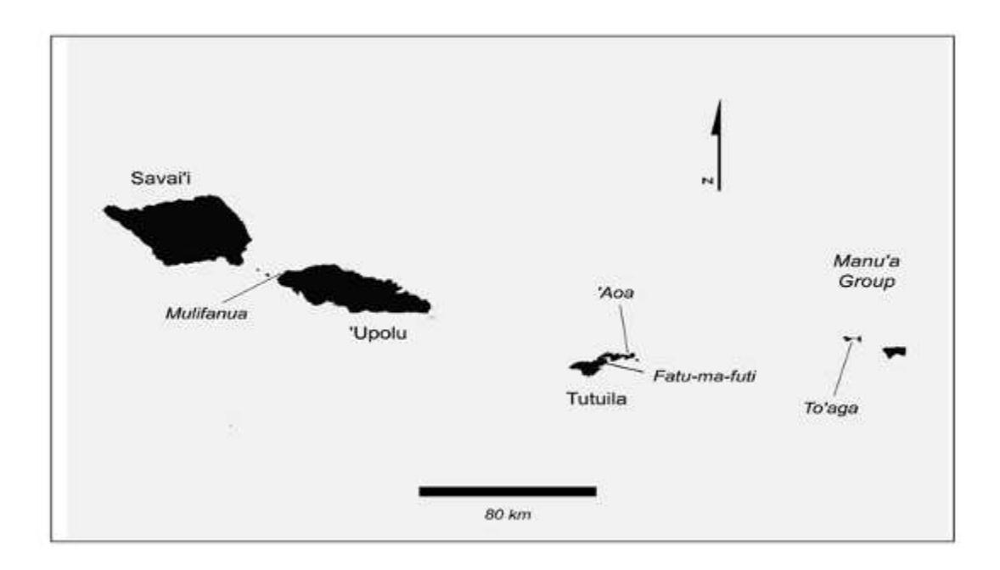

Figure 1. The Samoan Islands with key archaeological sites discussed in the text.

# Discussion and Conclusion

The archaeological record of marine resource use in American Samoa comes from only two deposits: Fatu-ma-futi, Tutuila Island, and To'aga, Ofu Island. These datasets that have been analyzed include approximately 2500 years of fish and marine invertebrate use. Analytical results demonstrate that marine resource use was focused predominately on inshore areas and that species use was continuous and stable. Archaeological datasets should be integrated with modern data acquired from biological surveys (e.g., Craig et al. 2007, Sabater and Tofaeono 2007).

A fundamental limitation of the results presented here is the lack of excavated archaeological deposits in American Samoa that contain fish and invertebrate remains. Furthermore, future studies should attempt to locate and excavate archaeological deposits that are conclusively linked with initial colonization of the Samoa archipelago. Morrison et al. (in press) and Rieth et al. (2008) have conducted a GIS based model for locating areas in American Samoa that are likely to contain evidence for early settlement (Figure 2-3). Future archaeological research will focus on excavation of these locales including systematic recovery and analysis of fish and invertebrate remains.

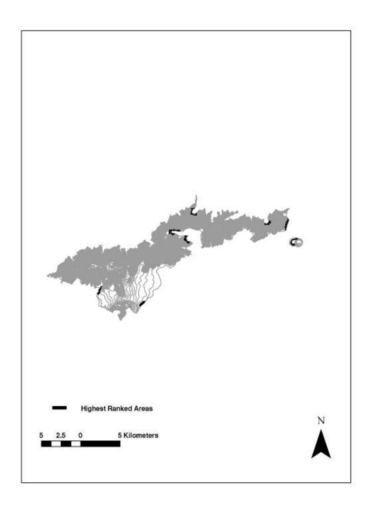

Figure 2. Areas on Tutuila that have a high probability for early archaeological deposits.

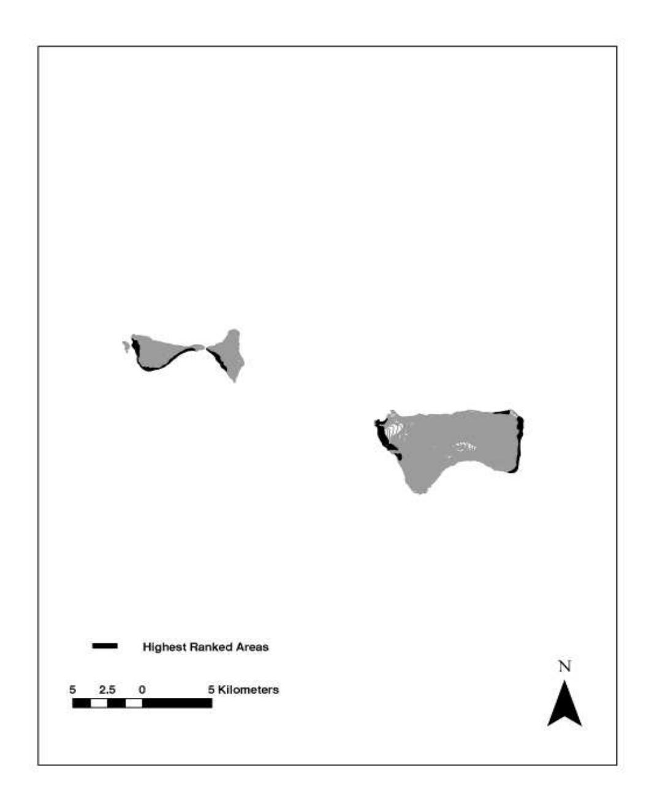

*Figure 3. Areas in the Manu'a Islands(Ofu,* Olosega, and Tau) that have a high probability for archaeological deposits.

#### **References**

- Addison, D.J., G. Walter and A.E. Morrison, 2008. The initial investigations of Fatu-ma-Futi: an ancient coastal village site, Tutuila Island, Territory of American Samoa. New Zealand Journal of Archaeology, 29: 89-107.
- Aswani, S., and M.S. Allen. 2009. A Marquesan coral reef (French Polynesia) in historical context: an integrated socio-ecological approach. Aquatic Conservation: Marine and Freshwater Ecosystems 19: 614-625.
- [Barton, C. M., Bernabeu Auban, J., Garcia Puchol, O., Schmich, S., & Molina Balaguer, L.](http://www.public.asu.edu/~cmbarton/CMB_iWeb/Publications_files/barton_etal2004b.pdf)  [2004. Long-term socioecology and contingent landscapes. Journal of Archaeological](http://www.public.asu.edu/~cmbarton/CMB_iWeb/Publications_files/barton_etal2004b.pdf)  [Method and Theory 11\(3\): 253-295.](http://www.public.asu.edu/~cmbarton/CMB_iWeb/Publications_files/barton_etal2004b.pdf)
- Craig, P., Green, A, and F. Tuilagi. 2008. Subsistence harvest of coral reef resources in the outer islands of American Samoa: modern, historic, and prehistoric catch data. Fisheries Research 89(3): 230-240.
- Hunt T.L. and P.V. Kirch. The historical ecology of Ofu Island, American Samoa, 3000 BP to the present. In Historical Ecology in the Pacific Islands: Prehistoric Environmental and Landscape Change (P.V. Kirch and T.L. Hunt eds.): 105-123 Yale University Press, New Haven.
- Kirch, P.V. 2007. Hawaii as a Model System for Human Ecodynamics. American Anthropologist 109:1, 8-26.
- Jones, S. 2009. A long-term perspective on biodiversity and marine resource exploitation in Fiji's Lau Group. Pacific Science 63(4): 617-48.
- Lyman, R. L., and K. P. Cannon. 2004. Applied Zooarchaeology, Because It Matters. In Zooarchaeology and Conservation Biology, edited by R. L. Lyman and K. P. Cannon, pp. 1–24. University of Utah Press, Salt Lake City
- Morrison, A.E. and D.J. Addison. 2008. Assessing the role of climate change and human predation on marine resources at the Fatu-ma-Futi site, Tutuila Island, American Samoa: An agent based model. Archaeology in Oceania.
- Morrison, A.E., Rieth, T.M., and D.J. Addison. in press A GIS Based Model for Locating Lapita Aged Settlements in American Samoa: Integrating Prehistoric Landscape Change with Radiocarbon Chronology. In The Gotland Papers: Proceedings of the VII International Conference on Easter Island and the Pacific, S. McLaughlin editor.
- Nagaoka, L. 1993. Faunal assemblages from the To`aga site. In The To'aga Site: Three Millennia of Polynesian Occupation in the Manu`a Islands, American Samoa. (P.V. Kirch and T.L. Hunt, eds.):189-214. Contributions of the University of California Archaeological Research Facility No. 51. Berkeley.

- Rieth, T.M., Morrison, A.E., and D.J. Addison. 2008 [The temporal and spatial patterning of the](http://www.anthropology.hawaii.edu/Alumni/addison/publications/Rieth_et_al_2008_JICA.pdf)  [initial settlement of Sāmoa](http://www.anthropology.hawaii.edu/Alumni/addison/publications/Rieth_et_al_2008_JICA.pdf). Journal of Island and Coastal Archaeology 3:214-239.
- Sabater, M.G., and S.P. Tofaeono. 2007. Scale and benthic composition effects on biomass and trophic group distribution of reef fish in American Samoa. Pacific Science 61(4): 503- 520.

# **Status of Reef Fish from Fishery-Independent (Visual Census) Surveys Across the American Samoan Islands**

# **Robert E. Schroeder1**

1NOAA Fisheries - PIRO-Habitat Conservation Division

# Introduction

The U.S. Territory of American Samoa (~14o S, 170oW) includes five islands and two atolls, with coral reefs typical of the surrounding central South Pacific. A primary objective of this survey was to quantify spatial and temporal variability of coral reef fish (actual or potential fishery targets) relative to proximity to human population densities (proxy for fishing or other anthropogenic impacts). Human population (and density) by island was two-orders of magnitude greater at Tutuila than at the next highest island (Ofu/Olosega, ~500 people); remote Swains was occupied by a small family and Rose, a National Wildlife Refuge, was uninhabited. A related objective was to document the status of large fish species of special concern.

# Methods

Coral reef fish assemblages in American Samoa were surveyed biennially during February-March of 2002-2008 to assess their spatial and temporal variation in abundance. Surveys were part of the multi-disciplinary coral reef ecosystem Resource Assessment and Monitoring Program (RAMP) conducted from large NOAA ships. Two underwater visual monitoring methods along the outer reef slope were used: belt transect (for all diurnally active fish of all sizes), and towed-diver count (only for fish >50 cm). At each site, three 25 m belt transect lines were set and all diurnally active fish along each side of the line were recorded for density estimates by species and individual length-class, for biomass conversion. Towed diver surveys estimated density by species and size class along a 10 m swath, completely encircling the small islands during each visit, and alternating coverage around most of the reef perimeter of the large islands. All islands in the American Samoa Archipelago were surveyed: Tutuila/Aunuu, Manua Group (Ofu/Olosega, and Tau), Swains, and Rose Atoll.

# Preliminary Results/Discussion

Total (all fish, all sizes) mean fish biomass and numeric density were highest at Rose and Swains (islands with none-very low human population density) and lowest at Tutuila/Aunuu (high population density) and Manua (low-moderate population density). The low total fish abundance around Tutuila ranked similar with other major human population centers of the U.S. Pacific Islands (Guam-Saipan, Main Hawaiian Islands [each with total reef fish <0.5 t/ha]), and was an order of magnitude below that of some remote uninhabited U.S. Pacific Islands. Total herbivorous fish biomass (mainly surgeonfish and parrotfish) was highest at Rose, in part due to their enhanced abundance around the site of the 1993 ship grounding, where turf algae and

cyanobacteria continued to persist. Similarly, biomass of large fish (mainly jacks, barracuda, snapper, and shark) was initially several times higher at Rose and Swains than at Tutuila/Aunuu and Manua, but decreased over time. Fishery targets that dominated in the surveys were surgeonfish and parrotfish, except at Swains (characterized by high live coral cover), where grouper and variable schools of jacks were common. Biomass of grouper, shark, and wrasse were generally low at all islands. Numerically these same taxa were common, while shark and large grouper were few. Regarding the status of other large species of special concern, humphead wrasse (Cheilinus undulatus) were present at all islands, mostly small-medium in size, except at Swains where several large individuals occurred. Only two sightings of moderate-sized bumphead parrotfish (Bolbometopon muricatum) were recorded across all islands and survey years.

# Workshop Discussion

The main issue identified at the workshop was concern regarding the apparent decline in large fish over the past 6 yr at Rose and Swains, while the causality remains uncertain. Information gaps identified during the workshop included: 1) lack of habitat specific information from shallow reef habitats (<6m) and deep reef habitats (>20 m; e.g., submerged barrier reef around Tutuila); 2) the relatively short temporal period of the survey (6 yr); and 3) the need to expand RAMP surveys to Independent Samoa.

Presentation of full results of this survey will be included in a manuscript (Schroeder, R.E., et al., [in prep.] Reef fish densities inversely follow human population levels across the American Samoan Islands).

# **Demographic analysis of a target reef fish species in Tutuila Island, American Samoa: implications for fishery management**

**Domingo Ochavillo 1 , Saolotoga Tofaeono 1 , Marlowe Sabater 1 and Elizabeth L. Trip 2**

Population demographics of a number of species have been shown to vary in spatial scales ranging from 100's of m to 1000's of km (Gillanders 1995, Meekan et al. 2001, Gust et al 2002). It is important to determine these scales of the variabilities since they may suggest geographic and/or reproductive isolation. The spatial scales of demographic parameter differences can then be used in stock identification for fisheries assessment and management purposes (e.g. Begg et al., 1999). The identification of these ‗unit stocks' is also important for fisheries management because potential yields might vary among sub-populations (Caddy 1975). Moreover, the analysis of population structures is important in identifying and mapping nursery and spawning sites that can be prioritized for protection. For marine protected area design, the scale of the differences can be used to determine the spatial scale in the network of sites. The lack of information about the stock structure of, and connectivity among, adult populations has hindered MPA design (Walters and Bonfil 1999).

We have used a combination of size-at-age data with multiple population survey data on various spatial and temporal scales to derive insights on a reef fish population structure. The size-at-age data were derived from fish collections and otolith-aging of fishes from all sizes of the bristletooth surgeonfish Ctenochaetus striatus. These data were applied to underwater surveys conducted around Tutuila Island for two years. The main objectives of this study were: (1) to determine the growth rate and the size-at-age relationships in the bristletooth surgeonfish, (2) to determine the spatial and temporal patterns in the distribution of its various post-settlement stages (recruits to spawners), (3) to identify substrata correlates to their distributions, and (4) to identify population structuring.

We have chosen the striated bristletooth surgeonfish C. striatus as a model species for this study because this is a highly common reef fish. This fish is widely distributed in the Indo-Pacific from East Africa, Indonesia, Southwest Japan to the Great Barrier Reef, Micronesia and French

1 Department of Marine and Wildlife Resources, P.O. Box 3730, Pago Pago, American Samoa 96799

2 Ecology and Evolution, School of Biological Sciences, University of Auckland, Private Bag 92019, Auckland, New Zealand

Polynesia. It inhabits reef flats, lagoons and seaward reefs to a depth of over 30 m. They occur over coral, rock, pavement or rubble substrata. They swim singly or in small groups feeding mainly on detritus and sediments and secondarily on blue-green algae, diatoms, and small invertebrates. In American Samoa, C. striatus is the dominant species in terms of abundance and biomass (Sabater and Tofaeono 2007). It is targeted by various fishing gears and constitutes a significant part of the over-all fisheries. The bristletooth surgeonfish accounts for up to 16% of the landed catch of spearfishing, the major form of fishing.

The growth and size-at-age data analyses indicate that this surgeonfish has a fast growth rate and high longevity similar to other surgeonfishes. They attain almost 90% of their maximum length within the first two and can live up to 36 years. Size attains an asymptote in the fifth year and apparently most of the fish energy is spent on reproduction after this point. The analyses of sizeage classes indicated significant differences in the spatial and temporal distribution of recruits, juveniles, pre-adults, and adult fishes (> 5 years old). Recruitment seems to be concentrated in a few reef areas. There was a general trend of highest densities in the northeast and southwest reef areas of the island. We postulate major recruitment and accumulation of different ages in these areas to explain these patterns of distribution. We also postulate that recruitment is driving this population structuring. Because of limited post-settlement movement, this leads to accumulation of older individuals in these same areas. We hypothesize a larval transport model wherein pathways end in these reef areas. Moreover, the differences in the distribution of age-size indicated the occurrence of weak but significant ‗subpopulations'. It is proposed that fishery management and the spatial design of marine protected areas would have to include the protection of these ‗nursery' and ‗spawning' sites, and the inclusion of potential ‗subpopulations'. The major findings and detailed analyses of the study are contained in a report submitted for publication (Ochavillo et al., submitted).

**Acknowledgements**. This study was funded by the Office of Federal Assistance, under the Sportfish Restoration Grant, to the American Samoa Government. We would like to thank Mr. Ray Tulafono, Director of the Department of Marine and Wildlife Resources (DMWR), and the department's administration staff for facilitating our field work. We also thank the following for assisting our fieldwork: Alama Tua, Ekueta Schuster, Mika Letuane, TJ Letalie and Hymal Vaimaona.

#### **References**

- Begg GA, Hare JA, and Sheehan DD. 1999. The role of life history parameters as indicators of stock structure. Fish. Res. (Amst.) 43:141–163
- Caddy JF. 1975. Spatial model for an exploited shellfi sh population, and its application to the Georges Bank scallop fishery. J. Fish. Res. Board Can. 32:1305–1328
- Gillanders BM. 1995. Feeding ecology of the temperate marine fish Achoerodus viridis (Labridae): size, seasonal and site-specific differences. Mar. Freshwat. Res. 46 (7): 1009-1020.
- Gust N, Choat JH and McCormick M. 2002. Spatial variability in reef fish distribution, abundance, size and biomass: a multi-scale analysis. Mar. Ecol. Prog. Ser. 214: 237-251.
- Meekan MG, Ackerman JL and Wellington GM. 2001. Demography and age structures of coral reef damselfishes in the tropical eastern Pacific Ocean. Mar. Ecol. Prog. Ser. 212: 223- 232
- Ochavill DO, Tofaeono SP, Sabater M and Trip E. (submitted). Population structure of Ctenochaetus striatus (Acanthuridae) in Tutuila, American Samoa: the use of size-at-age data in multi-scale population surveys.
- Sabater MG and Tofaeono SP. 2007. Scale and benthic composition effects on biomass and trophic group distribution of reef fishes in American Samoa. Pac. Sci. 61 (4):503-520
- Walters CJ and Bonfil R. 1999. Multispecies spatial assessment models for the British Colombia groundfish trawl fishery. Can. J. Fish. Aquat. Sci. 56:601–628

# **2007 Status of bottomfish fishery in American Samoa**

# **Ioane Tomanogi1**

1Department of Marine and Wildlife, American Samoa

# Summary

American Samoa's bottomfish fishery was relatively bigger between 1982 and 1985 when this fisheries was new and booming (Figure 1). In 1988 a decline in bottomfish fisheries occurred as many skilled and full-time commercial fishermen converted to trolling. Profits and revenues in bottomfishing suffered devastating blows from four separate hurricanes; Tusi in 1987,Ofa in February of 1990 and Val in December of 1991 and Heta in January of 2004 (Figure 2). The gradual depletion of newly discovered banks and migration of many fishermen into other fishing vendors resulted in the decline of landings in the mid 1980s (Figure 1). Fuel prices have gradually soared in the past four years causing yet another strain in the bottomfish fisheries (Figure 3). The average price of bottomfish has also declined due to the shift of local bottomfish demand to imported bottomfish competing closely with local prices. In 2004, 60% of coolers imported from the independent state of Samoa on the Lady Naomi Ferry are designated for commercial purposes; from the Commercial Invoice System 50% of these coolers are bottomfish.

During 2007, a total of 27 local boats landed an estimated 39,281 pounds of both commercial and recreational bottomfish in the territory. Revenues from the commercial fishery this year was estimated around \$87,025, with all catch being sold locally. The CPUE for 2007 ( 12.5 lb/triphr) shows a 74% increase from that of last year. Effort (hours and trips) has been increasing since 1998 as some of the Alias that normally troll and/or longline perform bottomfishing when trolling and longline prices and catches decline. Effort (hours and trips) has been increasing due to the increase of Alias performing bottomfishing.

Regarding some of the SFA amendments: Commercial Bottomfish Landings and Revenues statistics for American Samoa is presented in Figure 2. No bottomfish Recreational trip was recorded this year. Recreational fishing is more associated with the pelagic fisheries and usually never occur in this fishery. There was no chartered bottomfish trip during this year and no bottomfish by catch was recorded this year (Table 3). In the Preliminary Draft of EFH, Amendment for Bottomfish, WPRFMC Feb.1998, the approximate MSY estimate for American Samoa [196 nautical miles 100-fathom isobath] is estimated at 79,000 lbs. per year. Only about 50% was reached this year.

Indicators derived from current data do not dictate immediate management response at this time.

The following selected annual statistics dating back to 1982 provides a brief historical snapshot of American Samoa's bottomfish fishery

### **Selected Historical Annual Statistics**

| Year      | Total Landings (lb) | CPUE (lb/trip-hr) | Commercial Landings (lb) | Adjusted Revenue | Adjusted Price/Lb. | CPI   | Number of Boats |
|-----------|------------------------|----------------------|-----------------------------|---------------------|-----------------------|-------|--------------------|
| 1982      | 64942                  | 8.5                  | 62016                       | \$244976            | \$3.94                | 100.0 | 27                 |
| 1983      | 126327                 | 10.0                 | 125167                      | \$575299            | \$4.60                | 100.8 | 38                 |
| 1984      | 94104                  | 10.7                 | 92841                       | \$350359            | \$3.78                | 102.7 | 48                 |
| 1985      | 143225                 | 8.1                  | 102670                      | \$294026            | \$2.87                | 103.7 | 47                 |
| 1986      | 92740                  | 8.3                  | 91959                       | \$239120            | \$2.60                | 107.1 | 37                 |
| 1987      | 31232                  | 11.9                 | 30740                       | \$87423             | \$2.85                | 111.8 | 21                 |
| 1988      | 63136                  | 17.3                 | 60388                       | \$181775            | \$3.01                | 115.3 | 32                 |
| 1989      | 47646                  | 16.7                 | 36330                       | \$100412            | \$2.76                | 120.3 | 33                 |
| 1990      | 14776                  | 9.3                  | 12948                       | \$35664             | \$2.76                | 129.6 | 24                 |
| 1991      | 18893                  | 9.1                  | 17948                       | \$47919             | \$2.68                | 135.3 | 23                 |
| 1992      | 14521                  | 9.3                  | 14469                       | \$46223             | \$3.20                | 140.9 | 14                 |
| 1993      | 17862                  | 7.3                  | 15898                       | \$47391             | \$2.98                | 141.1 | 26                 |
| 1994      | 46071                  | 7.8                  | 42221                       | \$118476            | \$2.80                | 143.8 | 25                 |
| 1995      | 35737                  | 9.8                  | 35279                       | \$88482             | \$2.51                | 147.0 | 35                 |
| 1996      | 38647                  | 14.8                 | 38016                       | \$98063             | \$2.59                | 152.5 | 35                 |
| 1997      | 40557                  | 14.7                 | 39006                       | \$115884            | \$2.98                | 156.4 | 37                 |
| 1998      | 15884                  | 14.0                 | 14405                       | \$48597             | \$3.38                | 158.4 | 30                 |
| 1999      | 19385                  | 12.9                 | 17070                       | \$57454             | \$3.37                | 159.9 | 34                 |
| 2000      | 28658                  | 10.2                 | 26565                       | \$71989             | \$2.72                | 166.7 | 38                 |
| 2001      | 48862                  | 15.2                 | 38647                       | \$116792            | \$3.02                | 169.9 | 29                 |
| 2002      | 42096                  | 7.6                  | 37554                       | \$99672             | \$2.65                | 172.1 | 17                 |
| 2003      | 26791                  | 15.3                 | 12743                       | \$30885             | \$2.42                | 176.0 | 19                 |
| 2004      | 27963                  | 7.5                  | 16517                       | \$36738             | \$2.23                | 188.5 | 25                 |
| 2005      | 21077                  | 6.8                  | 7151                        | \$18101             | \$2.53                | 198.3 | 16                 |
| 2006      | 8236                   | 9.3                  | 6647                        | \$16542             | \$2.49                | 204.3 | 23                 |
| 2007      | 39281                  | 12.5                 | 36568                       | \$87025             | \$2.38                | 215.5 | 27                 |
| Averages  | 44948                  | 11.0                 | 39683                       | \$125203            | \$2.93                |       | 29.2               |
| Std. Dev. | 33773                  | 3.1                  | 31021                       | \$123774            | \$0.52                |       | 8.65               |

# Introduction

Bottomfishing utilizing traditional canoes by the indigenous residents of American Samoa has been a subsistence practice since the Samoans settled into the Tutuila, Man'ua and Aunu'u islands. It was not until the early 1970's that the bottomfish fishery developed into a commercial scheme utilizing motorized boats. A government subsidized program, called the Dory Project, was initiated in 1972 to develop the offshore fisheries into a commercial venture, and resulted in an abrupt increase in the fishing fleet and total landings. In 1982, a fisheries development project aimed at exporting high-priced deep-water snappers to Hawaii caused another notable increase in bottomfish landings and revenues. Between 1982 and 1988, the botttomfish fishery comprised as much as 50% (by weight) of the total commercial landings. Beginning in 1988, the nature of American Samoa's fisheries changed dramatically with a shift in importance from bottomfish fishing towards trolling. The dominant (by weight of fish landed) fishing method for the past years was longlining, however, more Alias are now performing bottomfish fishing.

During the early 1980's, fisheries data was collected from the bottomfish fishery by interviewing only commercial vessels. In the current Offshore Creel Survey on Tutuila that started on October 1, 1985, commercial, subsistence and recreational domestic fishing boats landing catch in five designated areas were interviewed and their catch recorded. Every two weeks a total of seven weekdays and one weekend of regular morning and evening shift surveys are conducted, with two days of regular office hours where opportunistic interviews are collected. In the past three years, the sampling period was increased and modified to encompass boats that come in earlier or after the normal sampling period. Two DMWR samplers based on Tau and Ofu collect fisheries data from the Manu'a islands fleet and one in Aunuu.

Boat-based fishing in American Samoa used to be mainly trolling and/or bottomfish. In the past years, record longline landings were recorded with revenues around the one million-dollar mark. Bigger foreign boats are entering the local fisheries but these are rigged for longlining and more of these are expected to enter the territory's longline fishery. Limited entry options have been initiated to check this increase.

The bottomfish fishery of American Samoa was typically commercial overnight bottomfish handlining using skipjack as bait, on 28-30 feet aluminum/plywood Alias. Imported bottomfish from the independent state of Samoa help satisfy the demand for bottomfish however it weakens the local bottomfish fishery. The adverse effects of four hurricanes that struck American Samoa can be seen throughout the various trends depicted in this report.

Recent changes in the fishery and improvements in the Offshore Creel Survey requires modifications to algorithms used to process the data for this report. Hence the continuous improvements to DMWR's data processing systems by WPacFIN staff.

# Recommendations

#### **2004 Recommendation:**

- 1. DMWR should enhance internal development through training for staff in order to minimize chances of misidentification.
- 2. Incorporate market data from Market surveys into the database.
- 3. Include Import data from Western Samoa into the database for further enhancement of this report.

#### **Status of 2004 Recommendation:**

1. The DMWR biologist hired in 2003 compiled a local bottomfish identification charts that the technicians are able to take with them to help with identification. This same

biologist whom is responsible for the offshore creel survey, has participated in many surveys, to further illustrate to technicians the proper methods of data collecting, fish identification, measuring and surveying.

- 2. In 2004 Market survey was on hol
- 3. Incorporation of Market data raises concern of double sampling; Offshore Creel Survey and Markey Survey. Import data from western Samoa should only be used as a comparison tool. Including import data to the territory's database proves irrelevant to our goals in the fisheries.

#### **2005 Recommendation:**

- 1. Technicians require intensive fish identification training, requesting council to compose training workshop for all Western Pacific members to standardize data.
- 2. Establish a centralized fish market for fishermen and businessmen.
- 3. DMWR should mandate fishermen and store owners to allow technicians to conduct interviews.
- 4. FoxPro data collecting system should enter data using scientific names and not use common names or local names.
- 5. A data sampling port should be established near the boat docks to not only centralize interviews but to maximize the quantity of interviews.

#### **Status of 2005 Recommendation:**

- 1. No progress, still in the working process.
- 2. A fish market is to be built in place of the old market. This will be a Government Agencies collaboration effort.
- 3. In the working process.
- 4. No progress. Common/local names of species are still being used for data entry.
- 5. The existing Marina near DMWR is the only access to most Alias therefore a port at the boat docks is unnecessary. There are also problems with incorporating a port in the existing upgrading plans for the Marina.

#### **2007 Recommendation:**

- 1. Technicians require intensive fish identification training, requesting council to compose training workshop for all Western Pacific member to standardize data.
- 2. FoxPro data collecting system should enter data using scientific names and not use common names or local names.

Table 1. American Samoa 2007 Estimated Total Bottomfish Landings by Species

| Species                   | Pounds |
|---------------------------|--------|
| BMUS                      |        |
| Blue lined snapper        | 1606   |
| Squirrel snapper (ehu)    | 852    |
| Flower snapper (gindai)   | 623    |
| Gray jobfish              | 2497   |
| Pink snapper (opakapaka)  | 424    |
| Smalltooth jobfish (lehi) | 3000   |
| Longtail snapper (onaga)  | 2739   |
| Yelloweye opakapaka       | 294    |
| Yellowtail snapper        | 897    |
| Blacktip grouper          | 62     |
| Lunartail grouper         | 986    |
| Redgill emperor           | 1241   |
| Amberjack                 | 78     |
| Black jack                | 886    |
| BMUS SUBTOTALS            | 16183  |
| OTHER                     |        |
| Bottomfish (misc)         | 8519   |
| Black snapper             | 77     |
| Blue lined gindai         | 130    |
| Brown jobfish             | 15     |
| Humpback snapper          | 3797   |
| Onespot snapper           | 98     |
| Rufous snapper            | 1      |
| Stone's snapper           | 528    |
| Groupers (misc)           | 1490   |
| Peacock grouper           | 118    |
| Tomato grouper            | 200    |
| Yellowspot grouper        | 57     |
| Emperors (misc)           | 2994   |
| Bigeye squirrelfish       | 7      |
| Orangespot emperor        | 384    |
| Longnose emperor          | 3582   |
| Jacks (misc)              | 738    |
| Bigeye trevally           | 269    |
| Bluefin trevally          | 93     |
| OTHER SUBTOTALS           | 23098  |
| TOTAL BOTTOMFISH          | 39281  |
|                           |        |

**Interpretation:** The bottomfish species list has increased by an additional 13 species due to samplers' ability to identify more species. Historical and current data and observations however, do not indicate any major changes in the composition of the bottomfish species landed.

**Source:** DMWR Offshore Creel

**Calculation:** Catches are normally weighed by species either at landing sites or during the selling of fish to stores and restaurants. Trips missed by the Creel Survey are accounted for in a separate data collections system – the Commercial Invoice System. This analysis, as in the past, is for the Offshore Creel Survey catch only. Analysis of the bottomfish fishery presented in this report is for the whole bottomfish complex and not just for the BMUS.

Table 2. American Samoa 2007 Estimated Commercial Landings by Species.

| Species                   | Pounds | Price/Lb. | Value   |
|---------------------------|--------|-----------|---------|
| BMUS                      |        |           |         |
| Blue lined snapper        | 1606   | \$2.42    | \$3893  |
| Squirrel snapper (ehu)    | 842    | \$2.83    | \$2381  |
| Flower snapper (gindai)   | 623    | \$2.64    | \$1645  |
| Gray jobfish              | 2238   | \$2.38    | \$5331  |
| Pink snapper (opakapaka)  | 424    | \$2.84    | \$1201  |
| Smalltooth jobfish (lehi) | 2963   | \$2.28    | \$6764  |
| Longtail snapper (onaga)  | 2726   | \$2.29    | \$6252  |
| Yelloweye opakapaka       | 275    | \$2.17    | \$598   |
| Yellowtail snapper        | 897    | \$3.00    | \$2688  |
| Blacktip grouper          | 6      | \$2.16    | \$14    |
| Lunartail grouper         | 611    | \$2.31    | \$1411  |
| Redgill emperor           | 1208   | \$2.34    | \$2824  |
| Amberjack                 | 78     | \$2.50    | \$194   |
| Black jack                | 873    | \$2.17    | \$1892  |
| BMUS SUBTOTALS            | 15369  | \$2.41    | \$37088 |
| OTHER                     |        |           |         |
| Bottomfish (misc)         | 7682   | \$2.36    | \$18123 |
| Black snapper             | 71     | \$2.10    | \$148   |
| Blue lined gindai         | 130    | \$2.00    | \$260   |
| Brown jobfish             | 15     | \$2.50    | \$37    |
| Humpback snapper          | 3762   | \$2.35    | \$8858  |
| Onespot snapper           | 81     | \$2.33    | \$188   |
| Rufous snapper            | 1      | \$2.00    | \$2     |
| Stone's snapper           | 528    | \$2.15    | \$1135  |
| Groupers (misc)           | 1393   | \$2.35    | \$3278  |
| Peacock grouper           | 118    | \$2.30    | \$272   |
| Tomato grouper            | 147    | \$2.11    | \$309   |
| Yellowspot grouper        | 57     | \$2.43    | \$137   |
| Emperors (misc)           | 2336   | \$2.42    | \$5658  |
| Bigeye squirrelfish       | 7      | \$2.75    | \$19    |
| Orangespot emperor        | 384    | \$2.48    | \$955   |
| Longnose emperor          | 3545   | \$2.34    | \$8301  |
| Jacks (misc)              | 707    | \$2.39    | \$1689  |
| Bigeye trevally           | 228    | \$2.39    | \$546   |
| Bluefin trevally          | 8      | \$2.50    | \$20    |
| OTHER SUBTOTALS           | 21199  | \$2.36    | \$49936 |
| TOTAL BOTTOMFISH          | 36568  | \$2.38    | \$87025 |

**Interpretation:** There have been no major changes in individual species prices in the past years. DMWR keeps track of fish prices for imported fish and those missed by the Offshore Creel Survey through a separate data collection system – the Commercial Invoice System. From this data processing system the average price of bottomfish imported from Western Samoa were lower than locally caught bottomfish. However, this year the margin is only ten cents. It implies the improvement in import fish quality and its rising competition to local fishermen. The decrease in price since 1998 is a result of not only competition from imported fish but also from the local fishermen.

**Source:** DMWR Offshore Creel Survey and Commercial Invoice System

**Calculation:** During creel surveys, the disposition of the catch is recorded, and if sold, the price is obtained whenever possible. The average prices reported in this table are calculated by dividing the total revenue by the weight sold in pounds for each species.

Table 3. American Samoa 2007 Bottomfish Bycatch

|                             |       | Bycatch |     |       |       |       |      | Interviews |      |
|-----------------------------|-------|---------|-----|-------|-------|-------|------|------------|------|
|                             |       | Dead    |     |       |       |       | With |            |      |
| Species                     | Alive | Inj     | Unk | Total | Catch | %BC   | BC   | All        | %BC  |
| All Species (Comparison) |       |         |     |       | ****  | 0.000 | 0    | 1168       | 0.00 |

**Interpretation:** No bycatch was reported in 2007.

**Source:** DMWR Offshore Creel Survey

**Calculation:** The Bottomfish Bycatch table is obtained from creel survey interviews. The Bycatch numbers are obtained by counting fish in the interviews for purely bottomfishing trips with a disposition of bycatch. The catch for all species included for comparison is obtained by counting all species of fish caught by purely bottomfishing interviews and the number of interviews is a count of purely bottomfishing interviews

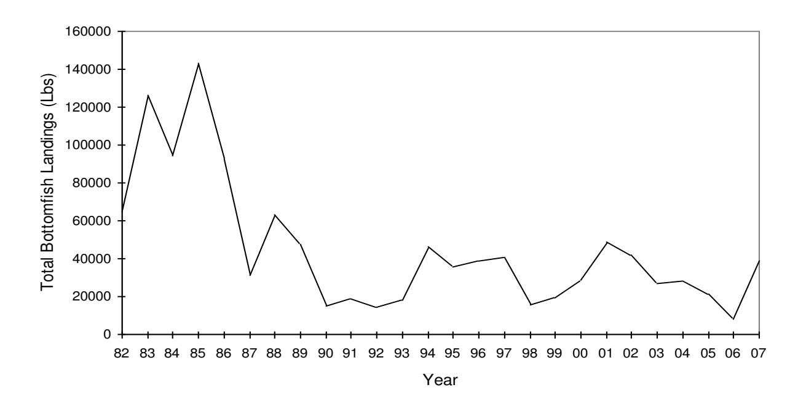

Figure 1. American Samoa Total Bottomfish Landings

**Interpretation:** Landings have varied throughout the years as a result of shifts in the fisheries, natural events and modernization. From 1982-1985 bottomfish landings was at the highest ever due to it being a new fishery. The steep drop from 1985 to 1987 occurred as a result of the introduction of longlining, a much lucrative fishery compared to bottomfish. Hurricane Tusi in 1987, Ofa in 1990, Val in 1991 and Heta in 2004 caused severe damages to the fishery that echoed in the following years. In addition, locals are turning to imported bottomfish mainly because they get more for their dollar. The increase in 1994 was due primarily to improved sampling on Tutuila and increased efforts by the Tutuila highliners. The 1998 decline mirror the 33% decrease in the number of boats participating. The affects of Hurricane Heta is inevitable in 2004 as landings decreased significantly compared to the previous year. The trend continued to 2006 with an overall 60% decline in pounds landed compared to the year 2005. In 2007 landings increased by 79% compared to 2006, due to improved sampling on Tutuila, increased efforts by Tutuila highliners, and the increase in the number of boats participating by 14%. In past years, landings have declined steadily as fuel price rise, however landings this year increased despite this fact.

**Source**: DMWR Offshore Creel Survey Database

**Calculation:** Bottomfish landings for 1982-84 were calculated by adjusting the sampled Tutuila data by the calculated annual percent coverage of the fleet, and then adding the similarly adjusted Manu'a landings. The landings from 1986 to Present were calculated by expanding the Offsfore Creel Survey Data for Tutuila for the species listed in Table 1. The sampled Manu'a landings were adjusted by adjusting for the monthly perecent coverage of the fleet and added to the Tutuila data. Since the Offshore Creel Survey started in October 1, 1985, The first nine month of

the 1985 landings were calculated as it was in 1982-84 and the last three months of the 1985 landings were calculated as it is now.

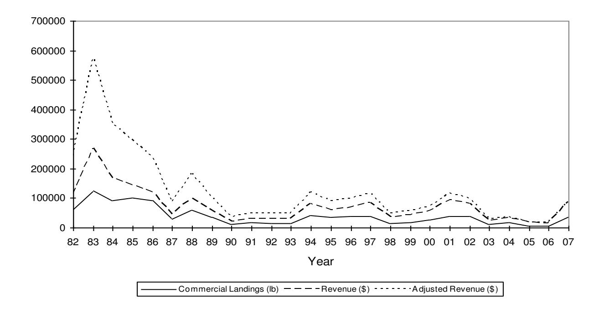

Figure 2. American Samoa Estimated Commercial Bottomfish Landings

**Interpretation:** Commercial landings mirror the total fishery's low catches in recent years compared to the robust 1982-1986 period. The peak in 1983 portrays the high prices of deepwater snappers exported to Hawaii. The trough in 1987 can be attributed to effects of the 1987 hurricane. The February 1990 and December 1991 hurricanes contributed largely to the decreased landings and subsequently a decrease in revenues in the early 1990s. Relative to total landings, commercial landings decreased even more substantially in 1989, because the percent of the catch sold by bottomfish fishermen dropped from an average of about 97% in 1982-88 to 78% in 1989., Increased efforts in 1994 produced a notable increase in revenues and no major changes in commercial landings have been recorded since then. A dramatic drop in commercial landings trailing as far as four years prior 2006, is a result of gradual commercial shift of demand catered by imported fish, hurricane effects, gas prices, loss of experienced fishermen, many preferring trolling and longlining, and data sampling inconsistencies. Commercial landings for this year has increased by 81%, resulting in a 81% gain in total adjusted revenue in 2007 due to many preferring bottomfishing then trolling or longlining.

**Source:** DMWR Offshore Creel Survey Database

**Calculation:** A relatively complex set of algorithms are used to estimate the commercial landings from estimates of total landings created by the creel survey data expansion system. In short the percent sold by species and by fishing method is calculated annually and multiplied by the estimated total landings by that method for that year. For 1982-85 sampling was conducted on the commercial fleet only (which included nearly all of the fishing boats), whereas since the

1985 creel sampling has covered all boats (commercial and recreational). Analysis of creel data for 1986-87 indicates that over 98% of the landed bottomfish was being sold. Therefore is it believed to be valid to compare commercial data for years prior to 1986 to creel survey totals for years since 1986.

|           | Commercial    |          | CPI   | Adjusted |
|-----------|---------------|----------|-------|----------|
| Year      | Landings (lb) | Revenues | Adj.  | Revenue  |
| 1982      | 62016         | \$113678 | 2.155 | \$244976 |
| 1983      | 125167        | \$269083 | 2.138 | \$575299 |
| 1984      | 92841         | \$166917 | 2.099 | \$350359 |
| 1985      | 102670        | \$141495 | 2.078 | \$294026 |
| 1986      | 91959         | \$118847 | 2.012 | \$239120 |
| 1987      | 30740         | \$45344  | 1.928 | \$87423  |
| 1988      | 60388         | \$97258  | 1.869 | \$181775 |
| 1989      | 36330         | \$56034  | 1.792 | \$100412 |
| 1990      | 12948         | \$21445  | 1.663 | \$35664  |
| 1991      | 17948         | \$30081  | 1.593 | \$47919  |
| 1992      | 14469         | \$30211  | 1.530 | \$46223  |
| 1993      | 15898         | \$31035  | 1.527 | \$47391  |
| 1994      | 42221         | \$79036  | 1.499 | \$118476 |
| 1995      | 35279         | \$60356  | 1.466 | \$88482  |
| 1996      | 38016         | \$69400  | 1.413 | \$98063  |
| 1997      | 39006         | \$84096  | 1.378 | \$115884 |
| 1998      | 14405         | \$35707  | 1.361 | \$48597  |
| 1999      | 17070         | \$42621  | 1.348 | \$57454  |
| 2000      | 26565         | \$55676  | 1.293 | \$71989  |
| 2001      | 38647         | \$92034  | 1.269 | \$116792 |
| 2002      | 37554         | \$79610  | 1.252 | \$99672  |
| 2003      | 12743         | \$25233  | 1.224 | \$30885  |
| 2004      | 16517         | \$32141  | 1.143 | \$36738  |
| 2005      | 7151          | \$16652  | 1.087 | \$18101  |
| 2006      | 6647          | \$15680  | 1.055 | \$16542  |
| 2007      | 36568         | \$87025  | 1.000 | \$87025  |
| Average   | 39683         | \$72950  |       | \$125203 |
| Std. Dev. | 31021         | \$55265  |       | \$123774 |

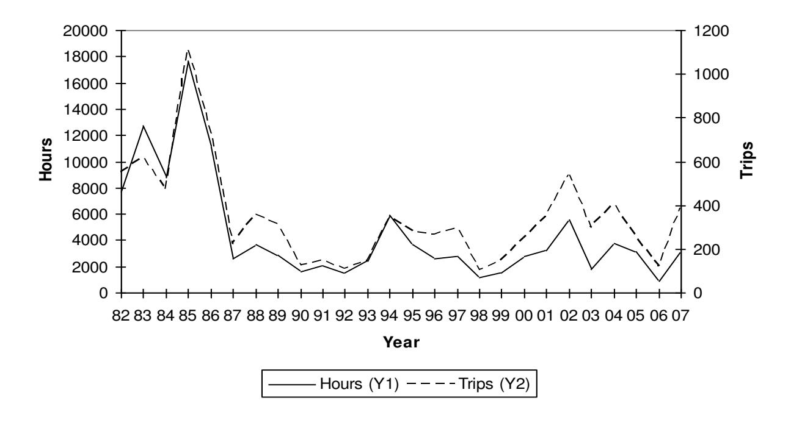

Figure 3. American Samoa Estimated Bottomfish Hours and Trips

**Interpretation:** The sharp decline in the bottomfish landings since 1986, noted in Fig.1 is mirrored in this figure by a sharp decline in the level of effort expended in that fishery. Rather than indicating a problem with the resource , this decline depicts an actual trend of commercial boat owners and fishermen seeking other more lucrative and stable work. The 1994-1996 estimated efforts were greater than those for the 1990-93 period due to the highliners increased efforts, with some boat owners employing teams (usually 2-3 fishermen) in continuous shifts during good weather. In 1997 and 1998 the number of boats participating in this fishery dropped significantly (see Figure 4) resulting in the notable declines in the number of trips and hours fished that period. The 1999 increase in effort can be attributed to some Alias that normally longline and troll, doing occasional bottomfishing. The increase in hours and trips in 2004 in bottomfishing is due to the slowing down of longlining. However, in 2006, a 76% decline in hours and 69% decline of trips compared to 2004 is noted. With so many vessels in the bottomfish fishery this year, there is that much more hours invested in the effort to create a profit efficiently. The hours have increased by 72% and trips have increased by 69% compared to the previous year.

**Source:** DMWR Offshore Creel Survey Database

**Calculation:** The annual estimated hours spent bottomfishing is calculated by dividing the annual total bottomfish catch by the average CPUE (pounds per hour) from trips doing only bottomfish fishing. The annual estimated number of trips is calculated by dividing the estimated annual hours by the average length of a bottomfish fishing trip. The average length of a bottomfish fishing trip (not shown) is calculated by using only trips which exclusively bottomfished and for which the trip length was recorded. The total hours fished from those trips is then divided by the number of trips. Recorded hours are trip hours.

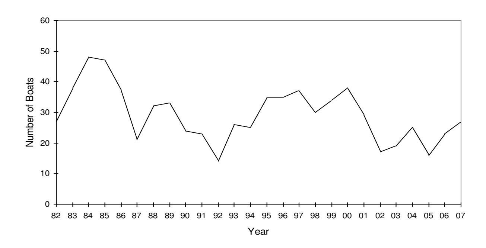

Figure 4. American Samoa Annual Estimated Number of Boats Landing Bottomfish

**Interpretation:** The decline in the fishery since 1985-86 is reflected by a decline in the number of boats participating in it. The 1987 hurricane caused the loss of the whole Manu'a fleet, plus some of the Tutuila fleet. Several Boats that contributed to the 1989 bottomfish annual landings did not land any bottomfish in 1990, due to much needed boat repairs and their participation in non-bottomfish chartered trips. About 90% of the domestic fishing fleet was affected by the December 1991 hurricane, hence the slight decline in 1992. The increase in 1993 is due mainly to the re-entry to this fishery of a few boats after repairs, trips by two 14-foot vessels that didn't bottomfish in 1992, and the entry of one new Alia into the sampling area. A few new Alias were bought from western Samoa and entered the fishery in 1995-1996. The continued increase in the number of bottomfish Alias electing to longline, attracted by the relatively higher revenues obtained mainly from albacore sold to the canneries, is reflected in the significant drop in the number of boats bottomfishing in 1998. In 2004, a 44% increase in boats landing any bottomfish species suggesting many unsuccessful small scale longlining Alias returning to bottomfishing. For this year, four more Alias returned to bottomfishing, making it 27 boats instead of 23 from last year.

**Source:** DMWR Offshore Creel Survey database

**Calculation:** The annual estimate of the number of boats in the bottomfish fishery is obtained from the data base by counting the unique boats sampled during the year which landed any bottomfish species regardless of fishing method.

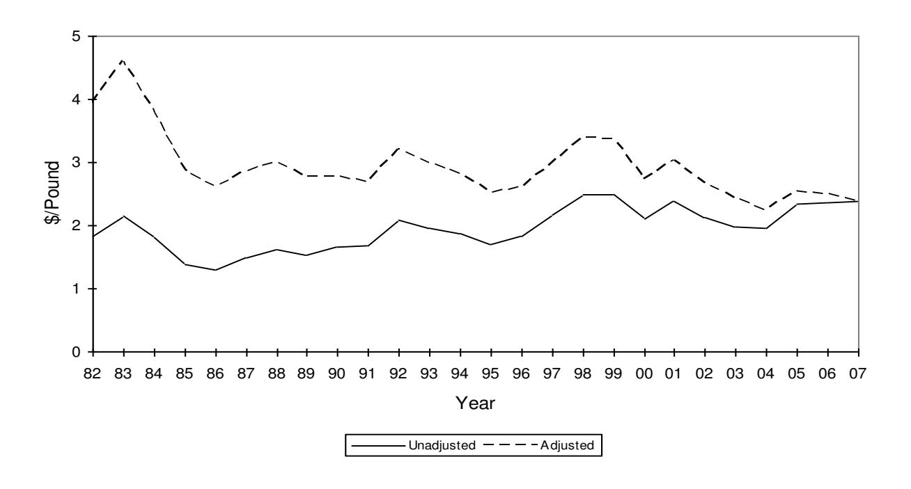

Figure 5. American Samoa Average Price of Bottomfish

**Interpretation:** Prices were generally higher between 1982 and 1984 during the exportation of high-priced deepwater snappers to Hawaii. After this period, inflation-adjusted local prices have generally been stable. Prices of locally caught bottomfish are generally higher than imported fish, and could have been even higher had the local markets not been flooded by imported fish, which are usually of lower quality. The only imported bottomfish in 1994 were from western Samoa and these were sold at an average price of \$1.67/lb, this year it is \$3.07/lb (2006 \$2.42). Imported bottomfish (mainly from western Samoa) have always helped in meeting the demand for bottomfish. Since 1999 there has been a general increase (16% in 1999 and 48% in 2004) in pounds of fish (miscellaneous bottomfish and pelagics) imported from western Samoa creating a (increase supply) price drop in the markets. For this year, 6% increase of price is recorded compared to that of last year (\$2.30 to \$2.45).

**Source:** DMWR Offshore Creel Survey database

**Calculation:** The average price of all bottomfish species combined is calculated by dividing total bottomfish revenue by total sold weight. The inflation-adjusted price is calculated by multiplying the unadjusted annual average price by the annual calculated consumer price index (CPI) for American Samoa using the current year as base.

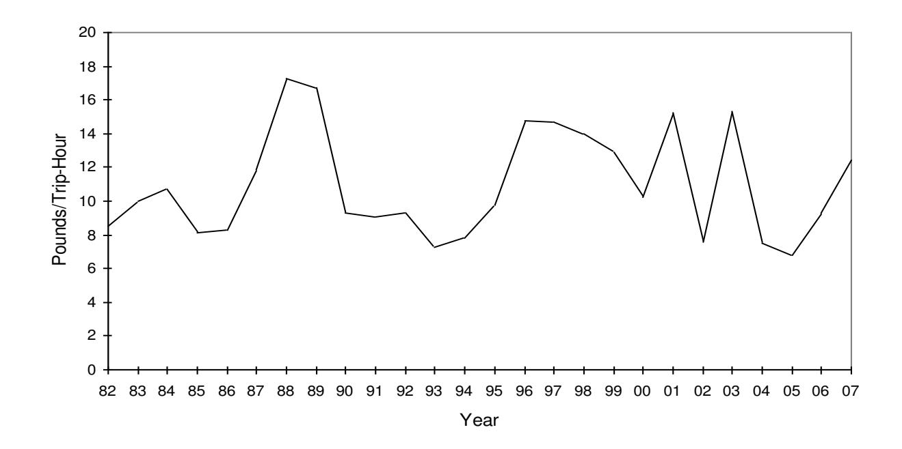

Figure 6. American Samoa Annual Bottomfish CPUE

**Interpretation:** The initial increased CPUE in 1983 and 1984 occurred during the intense fishing of some new fishing grounds for deepwater snappers for export to Hawaii. A relatively high number of boats and local fishermen participated in the fishery during this period. The decline in 1985 and 1986 might be expected following the ardent harvesting of the limited fishing grounds. Reasons for the CPUE peak in 1988-89 are unknown. The decline in CPUE from 1989 to 1991 can be partially attributed to a combination of some new inexperienced fishermen entering the fishery and the exit of experienced and full-time commercial fishermen. CPUE has essentially remained stable during 1990-1992, increased for a few years and was relatively stable in 1996-1998. Bottomfishing techniques and gear have generally remained the same in the past years with the Alias being the highliners since the early 1970's. The 1996 high CPUE estimates (and most probably the 1988-89 CPUE increase) can be attributed mainly to improved sampling and may also be related to favorable environmental conditions. 2005 marks the lowest CPUE ever recorded. A combination of many factors contribute to the drop, such as inexperience fishermen, everyone fishing in the same banks (more effort - less fish), data collection inconsistencies, hurricane aftermath effects and shift in fish preference from bottomfish to reef fish. However for this year, there is a 25% increase of the CPUE due to increased efforts and consistent sampling in Tutuila.

**Source:** DMWR Offshore Creel Survey database

**Calculation:** CPUE is calculated using only trips in which only the bottomfish method was used and trip hours were recorded. The average is calculated by using each CPUE from each trip as an observation and dividing by the number of trips.

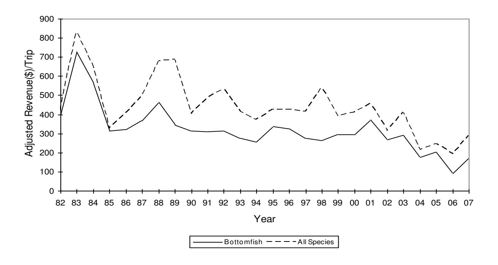

Figure 7. American Samoa Average Inflation-Adjusted Revenue Per Trip Landing Bottomfish

**Interpretation:** There has been no notable change in revenues since 1990. The distance between these two lines reflects the relative importance of bottomfish species in the total catch whenever any bottomfish are landed. The prominent importance of bottomfish between 1982 and 1985 occurred during the targeting of deepwater snappers (mainly **Etelis** and **Prisitipomoides**) for export to Hawaii. Bottomfish fishing was also the more profitable method of fishing during that period. The relative importance of bottomfish has generally been declining since 1985 as most of the full-time commercial fishermen quit this fishery with the remaining opting for trolling and lately, longlining. The supply of locally caught bottomfish has been supplemented by bottomfish imported from Western Samoa.

These values are higher in this year's report than they were in previous year's reports because the trips included are only those that sold their catch commercially to be more consistant with the revenue/trip values from other islands which are based on sales receipt data.

**Source:** DMWR Offshore Creel Survey database

**Calculation:** The average revenue per trip for all species is calculated by summing the revenues of all sales for any trip which landed any bottomfish species and sold all or part of their catch commercially, and dividing by the number of such trips. The average bottomfish revenue per trip is calculated from those same trips by summing the sales of only bottomfish species and dividing by the number of trips that sold their catch. Figure 7 plots the inflation-adjusted bottomfish and all species revenue per trip for the period 1982-2007.

| Year      | Bottomfish Unadjusted | Bottomfish Adjusted | All Species Unadjusted | All Species Adjusted |
|-----------|--------------------------|------------------------|---------------------------|-------------------------|
| 1982      | \$185                    | \$398                  | \$196                     | \$421                   |
| 1983      | \$341                    | \$729                  | \$388                     | \$830                   |
| 1984      | \$269                    | \$564                  | \$309                     | \$648                   |
| 1985      | \$151                    | \$314                  | \$157                     | \$326                   |
| 1986      | \$159                    | \$321                  | \$202                     | \$406                   |
| 1987      | \$191                    | \$369                  | \$257                     | \$495                   |
| 1988      | \$249                    | \$465                  | \$362                     | \$677                   |
| 1989      | \$193                    | \$345                  | \$382                     | \$684                   |
| 1990      | \$188                    | \$313                  | \$241                     | \$401                   |
| 1991      | \$194                    | \$310                  | \$304                     | \$485                   |
| 1992      | \$206                    | \$315                  | \$348                     | \$532                   |
| 1993      | \$181                    | \$277                  | \$271                     | \$414                   |
| 1994      | \$170                    | \$255                  | \$247                     | \$370                   |
| 1995      | \$230                    | \$336                  | \$290                     | \$426                   |
| 1996      | \$229                    | \$324                  | \$301                     | \$426                   |
| 1997      | \$201                    | \$277                  | \$299                     | \$412                   |
| 1998      | \$193                    | \$263                  | \$397                     | \$540                   |
| 1999      | \$218                    | \$294                  | \$291                     | \$392                   |
| 2000      | \$228                    | \$294                  | \$318                     | \$411                   |
| 2001      | \$293                    | \$372                  | \$360                     | \$457                   |
| 2002      | \$214                    | \$268                  | \$252                     | \$315                   |
| 2003      | \$238                    | \$291                  | \$335                     | \$410                   |
| 2004      | \$155                    | \$177                  | \$187                     | \$213                   |
| 2005      | \$188                    | \$204                  | \$226                     | \$245                   |
| 2006      | \$ 86                    | \$ 91                  | \$183                     | \$193                   |
| 2007      | \$172                    | \$172                  | \$289                     | \$289                   |
| Average   | \$205                    | \$321                  | \$284                     | \$439                   |
| Std. Dev. | \$49                     | \$122                  | \$66                      | \$146                   |

# **The state of the coral reef habitat in American Samoa, 2008**

# **Douglas Fenner, Ph.D.**1

1Dept. Marine & Wildlife Resources, American Samoa

# Abstract

Most indices of reef health indicate that the reefs of Tutuila, outside of the harbor, Vatia and Fagasa bays, are relatively healthy. Coral cover is currently slightly higher than the whole Pacific and South Pacific averages and much higher than the Caribbean average. Coral has actually increased slightly over the last four years instead of declining as in all major areas of the world's reefs, including the Pacific. A much higher percentage of coral is alive than the average for the Pacific, Indonesia, and the Philippines. Much of the reefs are dominated by coralline algae and coral, with much smaller amounts of macroalgae and turf algae. Brown macroalgae is rare on most of the reefs. There are relatively few introduced species and no invasive species. Water is relatively clear and low in nutrients and so filter feeders and bioeroders are rare. Some streams release much more mud and silt in the water than would happen without people, but most of it is quickly carried off the reef and the few damaged areas are relatively small. On the other hand, coral cover is not as high as the average on pristine reefs or as was estimated on Tutuila before the 1978 crown-of-thorns outbreak. That outbreak killed 90% or more of all corals, and was the largest disturbance in the past 50 years or more. It was primarily a natural event, as were the hurricanes and tsunami that have damaged the reefs. The reefs have a very long history of recovering from natural disturbances, or else they would no longer be here. There is some evidence of damage from non-point pollution, but the effects if any are small enough that they are difficult to replicate. The available literature indicates that the loss of live coral tissue has relatively small effects on fish communities, mostly in community structure as some fish species decrease and others increase. The available evidence shows a 50% increase in fish abundance on Tutuila after the 1978 crown-of-thorns outbreak killed nearly all corals. There are larger effects when the corals are physically damaged. Hurricanes in the last 50 years have done relatively little damage. Reefs in the harbor have been heavily damaged, by dredging and filling that obliterated reefs, and nutrients from the canneries. Little is left of the once lush reefs in the harbor, though they were a small part of all the reefs of Tutuila and even smaller part of all the territorial reefs. Mangrove areas are small, and the only seagrass species is so small it is not habitat for anything. But the literature indicates that relatively few reef fish species use mangroves or seagrass in the Pacific for nurseries, and fish diversity in American Samoa is as high as would be expected from biogeography. Reef flat areas are said to be small, but they are actually larger than the reef slope area, which is the only area the reef flat recruits are likely to go to. Banks 1-3 miles offshore have abundant fish, yet no shallow areas and are separated from the reef flats by long distances of sand that juvenile fish are very unlikely to traverse, indicating that most reef fish do not require shallow juvenile habitat. So far there is no direct evidence that

mangrove, seagrass, or shallow reef habitat is limiting for any reef fish species, and it cannot explain the pattern that the largest fish species are all rare while there are abundant small fish species. Fishing can easily explain that pattern, and there is eyewitness testimony that recounts the near-extirpation of one large species by fishing.

# Introduction

This paper describes coral reef habitat primarily around Tutuila, consider reef health, how the reef, the role of factors that are threats or have caused impacts on our coral reefs, and whethere mangroves, seagrass, and shallow reef serve as nurseries for reef species. For background information on the coral reefs of American Samoa, see Wells (1988), Craig et al. (2005), Sabater and Tofaeono (2006, 2007), Whaylen and Fenner (2006), Fenner (2008a,b), Fenner et al. (2008), Birkeland et al. (2008), and Brainard et al. (2008), Craig (2009) and Fenner (2009).

American Samoa consists of four high volcanic islands (Tutuila, Aunu'u, Ofu, Olosega, and Ta'u) and two low islands, (Swains and Rose Atoll). The high islands are part of the Samoan hotspot volcanic chain, which also includes the two larger islands of (independent) Samoa, and a variety of seamounts, all in a roughly east-west chain. To the east of Ta'u is a seamount named Vailululu'u which is an active submarine volcano. The chain is similar to the Hawaiian chain, with the youngest islands to the east starting with Ta'u, and increasing age with Ofu-Olosega, Tutuila, Upolu, and Savai'i. Tutuila is about 1.5 million years old. It is the largest island in American Samoa and hosts most of the 69,000 people that live in the territory. Because it has most of the people and infrastructure, access to the reefs is easiest around Tutuila, and the reefs there have been studied more than the other smaller islands. Reefs there are also likely to be the most impacted by humans.

# Reef Zonation

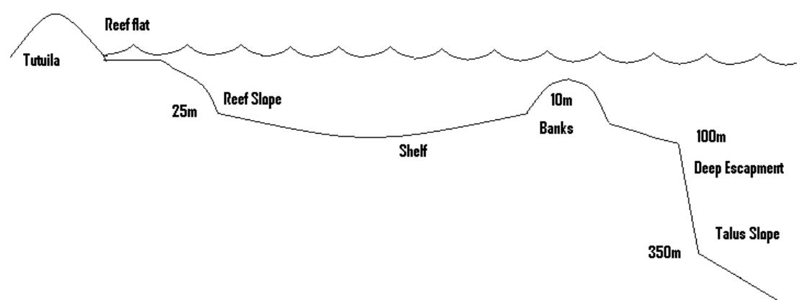

Reef Flat Figure 1. Shematic diagram of reef zones around Tutuila. Not to scale, and not proportional. From Fenner et al. 2008

The diagram above shows the main features of Tutuila's coral reefs diagrammatically. It is not proportional and is only schematic. The main zones of the reefs are the reef flats, reef slope, and banks, while the shelf is primarily sand and rubble, and the deep escarpment and talus slope are too deep for reef building corals. The reef flat also has backreef pools at a few locations.

# Reef Flat

The following discussion of the reef flats and other reef zones applies to reefs outside of bays and to most reefs inside bays. Reefs in a few bays such as the harbor have quite different situations than other reefs and will be considered later. All reefs on the north shore of Tutuila are inside bays. This may be because periodic hurricanes rip corals off the substrate outside bays and deposit them in deeper water. Such storm damage limits reefs in the main Hawaiian Islands to bays. Tutuila has several distinct zones in the coral reef that surrounds it, as seen in Figure 1. The most visible zone is the reef flat, which is just slightly deeper than the low tide level. The reef flat begins at the shoreline and extends out from the shore perhaps 20-200 meters. It is nearly continuous on the south side of the Tutuila, except along the ―Tafuna plains,‖ on the southwest section of the island. The Tafuna plains are the largest nearly flat land in American Samoa, and are composed of relatively young lava flows. From just west of the airport to Leone, there is no reef flat development, except inside Fagatele and perhaps Larson's Bay. But west of Leone the reef flat extends on to the western end of the island. On the north shore, there are only reef buildups and reef flats inside bays. Reef flats currently have lower live coral cover than reef slopes, with just over 20% live coral cover on the outer reef flat, and about 5-10% on inner reef flats (Figure 2; Fenner, 2009). For perspective, compare that to the current coral cover in the Caribbean which averages 8% on reef slopes. Reef flats are dominated by algal turf, with coralline algae more common on the outer part near the crest, while the inner part has more dead coral rubble. It should be kept in mind that there is lots of variation between sites, and these are statements about what the average is like. Further, long term observers have noted that there has been more coral cover in the past. In recent years, the lowest tides each year often cause the death of corals on the reef flats that have grown up the most from the level of the reef flat. The lowest tides of the year appear to act like a lawnmower, killing only the coral that projects upward the farthest. This effect of low tides is indeed the reason why the reef flat is so flat, and is at the low tide level. This appears to all be a natural process, but it has had the effect of reducing coral cover on the reef flat significantly since about 1998. On the other hand, recruitment of the table coral Acropora hyacinthus has increased in recent years, with a pulse of recruitment about 2005. Recruitment was highest on the outer few meters of reef flat and upper reef slope above about 2 meters depth. Recruitment was light but noticeable at many locations, but heavy at Fagasa, where tables only 30 cm in diameter are already growing into each other or over each other, and a dense community will result if mortality does not intervene. Reef flats generally have low coral cover, unless the flat is much deeper than the low tide level.

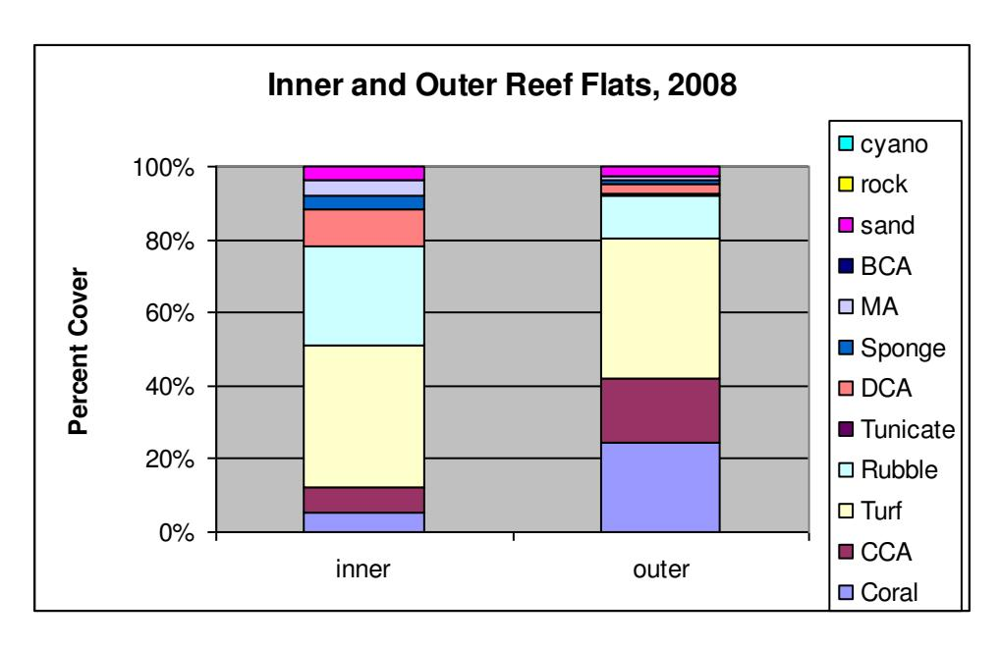

Figure 2. Cover on the inner and outer reef flats of Tutuila. From Fenner, 2009. All subsequent figures are from Fenner, 2009 unless stated otherwise.

# Back Reef Pools

On the south side of Tutuila, there are a series of pools in the reef flat that are man-made. These are pools that were dug out to provide material to build the platform for the airport runway, or to add land to the village. Such pools are at the airport, Coconut Point (Nu'uuli), Faga'alu, Gataivai (near Utulei), and Alofau. Large pieces of reef rock in rows, and sharp edges to the deeper pools, are evidence of the quarrying process; quarrying marks are easily visible in remote images. These pools now have patches of coral in them, dominated by the finger coral (Porites cylindrica) and the staghorn coral (Acropora muricata = formosa). Only a portion of the substrate is covered with coral in any one location, usually less than half, with most of the rest being covered with sand. A portion of the staghorn in each pool is dead, usually still standing though there are some rubble patches where they have collapsed. Coral diversity in the pools is very low, and the suite of species is different from that on the reef flat, which is different in turn from that on the crest, which is in turn different from that on the slope, which is in turn different from that on the banks. Diversity in all of the other zones is higher than in the backreef pools. There are much shallower pools that appear to be natural at Fagaitua and Onesosopo. At Fagaitua, the outer part of the pool is dominated by the staghorn A. muricata. The same species is present at Onososopo along with a variety of others.

On Ofu and Olosega, there are back reef pools that appear to be natural. They are located on the south side of Ofu and on the southwest side of Olosega in front of Olosega village. The south side of Ofu has a series of pools, varying in depth from about 3 m to perhaps 10 cm deep or less. The coral diversity in these pools is very high, on the order of 80-100 species (Craig et al. 2001). They are not dominated by the species seen in the Tutuila pools, though those species are

present. Massive Porites species are common and some are large. The Olosega pool is less than one meter deep most places, and has fairly low coral cover and diversity, and is dominated by finger coral (P. cylindrica).

# Crest

The reef flat ends at what is called the ―reef crest,‖ which is where waves break. However, here it is no higher than the reef flat as its name might suggest. The reef crest is generally a very dangerous place for humans, as American Samoa is near the center of an ocean that covers nearly half the planet with no protection from oceanic swells from any direction. The reef crest has extensive coralline algae cover, the highest of any zone. It also has good coral cover most places. At Coconut Point, Nu'uuli, coral cover was measured at about 18% cover (Figure 3). Encrusting calcareous algae increases strongly toward the outer part of the crest there, replacing turf and reaching 70% cover at the outer part of the crest. Other crest locations may have different amounts of coral and algae. Most corals on the crest are small branching species, such as Acropora nana, Pocillopora damincornis and Pocillopora verrucosa. Wave splash appears to be able to keep corals on the reef crest alive by keeping them wet and cool during extreme low tides when corals on the reef flat may be killed by desiccation and/or high temperatures (Anthony and Kerswell, 2007). If the extreme low tide occurred during a period of very calm water, however, crest corals could be killed as well as reef flat corals. Coral reefs are very patchy, and the Tutuila reef flats are no exception. There are a series of patches of the bushy species Acropora aspera on the reef flat between Faga'alu and Nu'uuli. This is the species which is often the first affected by low tide events, since it grows highest on the reef flat. The reef flat in Leone was covered with a thin encrusting grey sponge, near 100% cover, in 2007, but by 2008 much of it has disappeared. The sponge seemed to be associated with murky water and what may have been poor water quality.

The reef crest is broken many places by what are locally called ―avas.‖ These are deep channels that appear in the outer reef flat usually as a narrow and relatively shallow channel, which expands in width outward towards the ocean and increases in depth. They often are floored by large rubble, which extends from the ava downward on the reef slope. Avas are places with very strong outward flowing water currents produced by wave action on the crest. Waves breaking on the crest pump water over the crest onto the reef flat. The water then flows across the reef flat to the ava, and back out the ava. Water flow on the crest and reef flat is primarily the periodic surge from the waves and can be quite strong. The unidirectional water movement increases in speed as the ava is approached. Water speed is highest near the surface of the ava and less deeper near the substrate, as the water coming rapidly off the reef flat is at the surface. The speed of these currents are strongest when wave heights are greatest and when the tide is highest, because that is when waves pump the most water onto the reef flat.

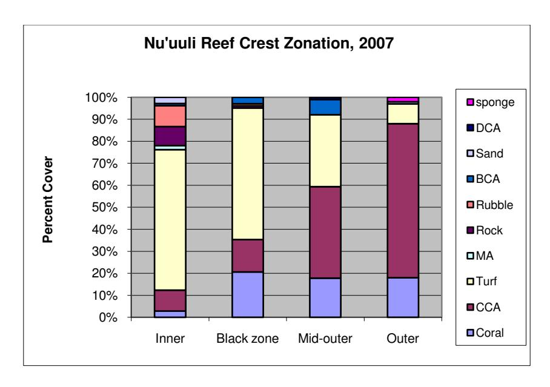

Figure *3. Benthic cover at the Coconut Point, Nu'uuli reef crest.*

# Reef Slope

Beyond the crest is the reef slope. The reef slope descends from the low tide level at the crest, down to about 20-30 m (shallower in bays on the north side) where it joins a shelf that appears nearly flat. In some areas the bottom gradually increases in slope from the crest down the reef slope, but in some places the reef crest is flat and ends in a vertical or near vertical drop at the upper reef slope. The angle of the reef slope is variable, but might average around 45 degrees. Small scale spur and groove formations are most common in shallow water on the south side, where wave surge is greatest most of the time. However, the large scale spur and grooves seen in deeper water on some reefs elsewhere appear to be absent here. Several different monitoring programs have recorded quantitative data around Tutuila, with similar results (Figure 4). Algae, primarily encrusting coralline algae, have the most cover, followed by live hard coral, which averages just under 30% for the different data sets. These data were collected using different methods and different sites yet produce similar results.

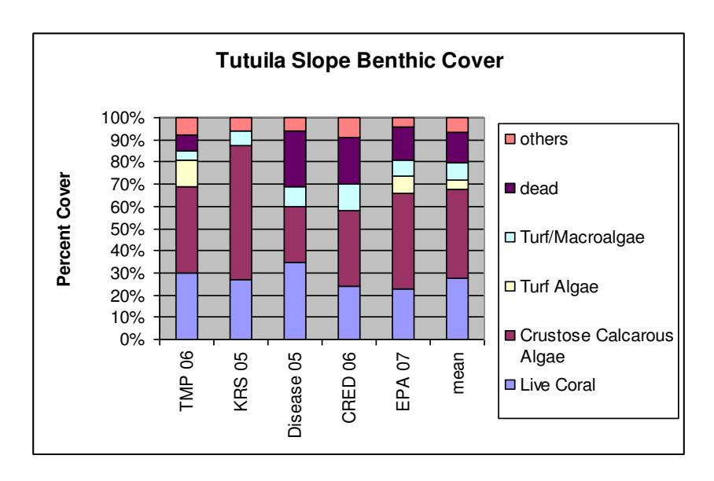

Figure 4. Benthic cover recorded by several different monitoring programs around Tutuila (Fenner et al. 2008).

Reef slopes commonly are dominated by encrusting calcareous algae on the south side, but have less of these algae on the north side. Most of the reef slopes have a very ―clean‖ appearance with pink or purple encrusting calcareous algae and little or no macroalgae or sediment. In the Territorial Monitoring Program (TMP), macroalgae are defined as fleshy macroalgae, with parts that are significantly larger than the fine filaments and thin wires that form turf. Turf is also shorter than most macroalgae, turf usually being one cm or less in height. There are more of the encrusting calcareous algae in shallow water than in deep water. In some places, encrusting calcareous algae can be seen to dominate the shallow part of the slope, and there is a fairly sharp demarcation where it ends and is replaced by other organisms. On the south side it is often replaced in deeper water by coral or a mixture of coral and the green macroalgae, Halimeda. Halimeda is a green macroalgae that produces calcium deposits inside the segments called ―thalli‖ which look a bit like small leaves, so it actually contributes to the calcium of the reef. In some areas there is also a fair amount of a calcareous red alga, Peyssonnelia bornetii which forms brown flat plates (Fenner, 2008b), and/or a branching red alga, Cheilosporum spectabile. These three are the only macroalgae species that are all common (other than small amounts of branching coralline algae that looks like toothpicks). Brown macroalgae is very rare on slopes, the author has yet to see any Sargassum, for instance. On the north side at Fagasa, there is a significant amount of smooth reef rock with brown terrestrial sediment caught in turf, giving a dirty look. Reefs on the north side have more turf than on the south side, and reefs on the south side have more visible crustose calcareous algae than on the north (Figure 5; Whaylen and Fenner, 2006; Sabater and Tofaeono, 2007; Fenner, 2008a; Houk and Musberger, 2008). These patterns may be driven by crustose calcareous algae growing best where it is not covered with either sediment or filamentous algae (Dawson, 1961; Steneck, 1986; 1987; Fabricius and De'ath, 2001). The south side gets more steady wave surge for at least half of the year as trade winds blow steadily out of the east (the island is at an angle so wind and waves from the east strike the south side). So crustose calcareous algae is most abundant near the crest where the wave surge is greatest, and on the south side where wave surge is greatest. On the slope, the area dominated by crustose calcareous algae can be seen to extend farther down the slope from the crest. However, this is the visible crustose calcareous algae, but there it also extends under other algae such as Halimeda, under ledges and in holes in low light conditions, and it even grows under some of the turf algae. It often dominates understory communities (Connell, 2003).

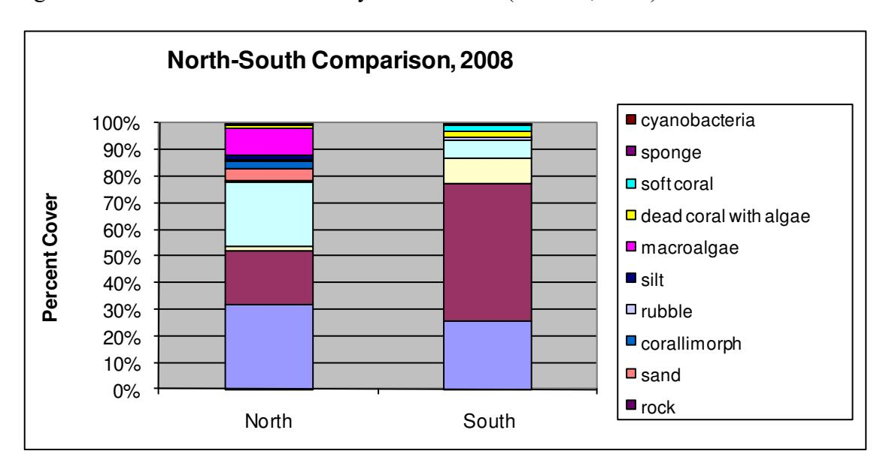

Figure 5. North-South comparisons of benthic cover at 8 m depth. Similar differences have been documented in the Territorial Monitoring Program every year, beginning with 2005.

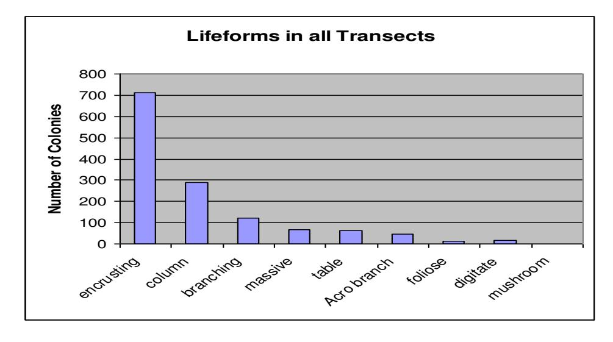

Figure 6. Coral life forms in transects.

The coral community on upper and middle reef slopes is dominated by encrusting Montipora colonies, though there are moderate amounts of column and branching lifeforms as well (Figure 6).

This combined with the dominance of encrusting calcareous algae means that the dominant form of many areas of the reef is encrusting. Encrusting formations may not provide as many hiding

places for fish as other types of coral such as branching. However, on many of our reefs, particularly on the south side, the surface is still rugose with many holes, because the reef material near the surface of the reef is largely composed of coral skeletons partly bonded together, with an abundance of holes between the pieces of skeleton. In addition, column and branching coral lifeforms contribute to the quality of the reef as fish habitat by adding hiding places. Coral cover and the cover of other biota have been quite steady since 2005, with a slight increase in coral cover as of 2008 (Figure 7).

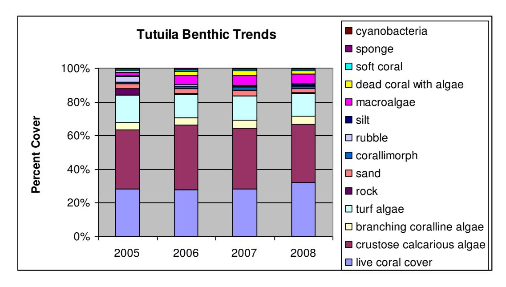

Figure 7. Trends in mean benthic cover around Tutuila in recent years at 8 m depth

Quantitative surveying shows that coral cover increases going away from the island across the reef flat and onto the reef slope, but once on the reef slope coral cover is steady at around 30% cover down the slope to at least 18.5 m depth (Figure 8). It should be noted that the data for 4.5 m and 18.5 m is based on south side sites and just one north side site; the results could change somewhat when the rest of the data is collected. Turf on the reef flat is replaced by crustose calcareous algae on the slope, which is greatest near the top of the reef slope and decreases with increasing depth down the slope.

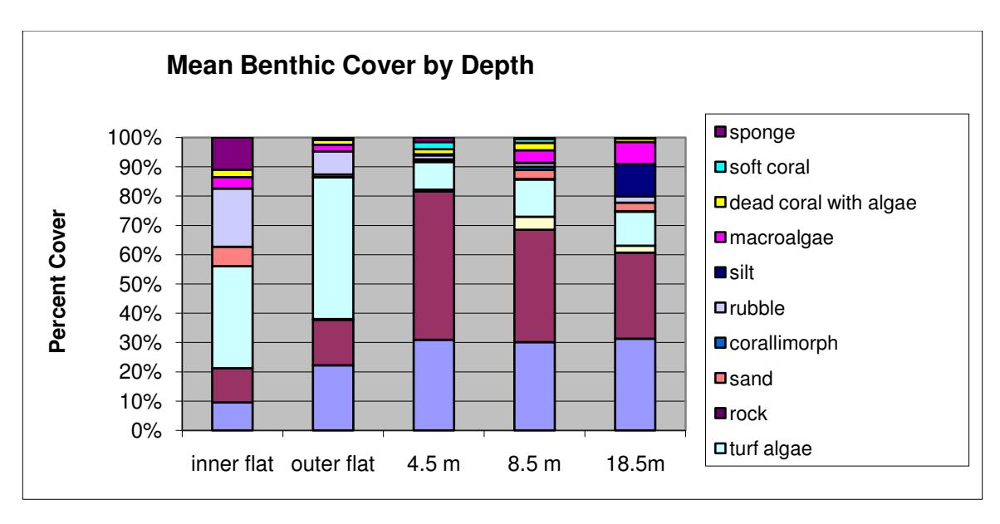

Figure 8. Benthic cover across the reef flat and down the slope.

Coral reef communities are notoriously patchy, and the reefs of American Samoa are no exception. At Faga'alu, the upper reef slope down to perhaps 12 m or more depth is covered with dead coral rubble covered with encrusting calcareous algae. Below that there is high coverage of live healthy-looking plating coral. The upper slope looked just like it does in 2008 when first observed by the author in 2004. It consists of round sticks that appear to be from some type of Acropora such as Acropora nobilis or A. abrotanoides. The date and cause of the death of this coral is unknown, but Acropora is among the most vulnerable genera to hurricanes, crown-of-thorns starfish, bleaching, and disease. On the southeast coast of the island at Fagaitua Bay, there are areas with large amounts of Lobophyllia, below about 12 m depth. Many colonies are several meters in diameter. On the southwest of the island at Leone, the upper reef slope is heavily dominated by the encrusting Acropora species that has plating edges, Acropora crateriformis. To the west of that area, still in Leone, is an area of mixed Acropora hyacinthus tables and staghorns that appears very similar to corals in pictures before they were eaten by crown-of-thorns in 1978 (C. Birkeland, personal comm.). In the middle of the shoreline of Fagatele Bay there is a pure stand of Acropora hyacinthus tables that have very high coral cover around 4 m depth. In Larson's Bay at about 8 m deep there is a pure stand of Merulina scabricula, and at about 15 m depth in Fagatele Bay there is a huge mound of Pachyseris rugosa which is fairly rare elsewhere around the island. It is the largest mound of that species the author has ever seen anywhere, by far. At the mouth of Vatia Bay there is an area of diverse Acropora with very high cover.

Coral species diversity in American is relatively high. The author has identified about 260 species of coral so far, but it is clear that additional species remain to be identified. The diversity is much higher than Hawaii, where only about 55 species are known (Fenner, 2005). Corals respond to some degree to their habitat, some having a restricted depth range while others have wide depth ranges. Differences in coral communities are strong between the major reef zones, such as reef flat, backreef pool, and slope. Within a major reef zone such as the reef slope, there is often zonation, with some coral species more common in shallow water, others in deep water,

and so on. The primary variables driving this zonation are likely to be light levels and water turbulence. Water turbulence and light levels decrease with increasing depth on the reef slope, and water turbulence decreases with distance from the reef crest on the reef flat.

The reefs slopes of American Samoa, broadly speaking, have reasonably good coral cover, high crustose calcareous algae cover, and low macroalgae cover. Most of the macroalgae present is Halimeda, a green calcareous alga which is generally natural and not a problem. There is also some Peysonnellia, which is a red calcareous alga that is also not a problem. Brown algae are rare on the reef slopes. The brown alga Dictyota has appeared in recent years on the slope in Vatia Bay. Paul Brown reports some other patches of Dictyota in the National Park, and suggests that at some places it may be seasonal. Some crustose calcareous algae attract coral larvae (e.g., Hayward and Negri, 1999), and although at least one species can grow over living coral (and is present in American Samoa), high levels of crustose calcareous algae and low levels of brown macroalgae are signs of a healthy reef.

A recent study of trends in coral cover in the Pacific (Bruno and Selig, 2007) reported mean coral cover for the Pacific to currently be 25% with an average of 23% for the South Pacific. Tutuila currently has higher coral cover than the Pacific average, the South Pacific average, and the Caribbean (Figure 9). Two surveys of the levels of coral cover on pristine reefs found that live coral cover was most commonly in the range of 35-40% (McManus et al. 1995; Miller et al. 2008). The average coral cover recorded in the Caribbean in the 1975 was 55%, and in the Pacific in 1978 it was 42%, though there are data from relatively few sites back in those times, and sites were not picked randomly. Most of the recent data in the Bruno and Selig (2007) study came from Reef Check. Reef Check instructions include directing data collectors to select the best local reefs. The sites in all studies of Tutuila for which data are currently available, as shown in Figure 4, were also picked non-randomly. Although they all report similar coral cover values, they may all reflect similar biases in choosing sites, that is, picking better than average sites. The Key Reef Species project picked sites initially for consideration without knowledge of their coral cover, and then chose sites randomly for study from that set of sites, so it was closer to random site selection than the other programs, yet found very similar coral cover. The TMP selection process excluded non-reef sites, that is where there was no calcium buildup, like the north shore sites outside of bays, but the Key Reef Species Program included them, yet still produced a similar average coral cover. Live coral cover averages about 30% on Tutuila slopes, so it is a bit less than is typical of pristine coral reefs (Figure 10). Wass (1982) estimated coral cover at several sites in 1978 just before crown-of-thorns starfish ate nearly all the coral around Tutuila and throughout the archipelago. The average of his estimates is 63% coral cover. This is unusually high compared to the surveys of pristine reefs. It is possible that Tutuila had an unusually high natural coral cover, or it could be that those sites were chosen to be particularly good sites, or it could be that the corals were particularly abundant compared to a long term average at Tutuila. The Coral Reef Ecosystem Division of NOAA conducts towboard surveys as well as transects in American Samoa. They record lower coral cover on the towboard surveys than on transects (Brainard et al. 2008). This may be in part because the transects were not picked randomly, but it may also be in part due to biases in estimating coral cover from a moving towboard. People may not select low coral cover areas for transects if they select transect sites. This is particularly true on the north side, where most of the coastline is outside bays, and has low coral cover. It seems quite likely that Wass's sites were not chosen randomly and had higher coral cover than would an average of sites chosen truly randomly. Still, 63% is higher than virtually any individual site is now, and there is little doubt that coral cover was higher then than now. A traditional view that reefs are static communities and that the way they were first seen is the way they always were, has been largely replaced by the view that reefs are naturally damaged by disturbance events which reduce live coral cover, and spend most of their time recovering from such events. The last previous crown-of-thorns outbreak was in 1938, so perhaps corals had recovered to an unusually luxuriant state. Randomly chosen pristine reef systems would have an average coral cover lower than the peak coral cover that a system could achieve in an unusually long period between disturbances, because many of the sites that go into the average would be recovering from recent disturbances, and have low coral cover. All things considered, it seems highly likely that coral cover was higher before the 1978 crown-of-thorns outbreak than now, but it is also likely that an average of randomly chosen sites would have given a lower percentage than 63%, and the average cover over many years may well have been even lower, perhaps in the 35-40% range.

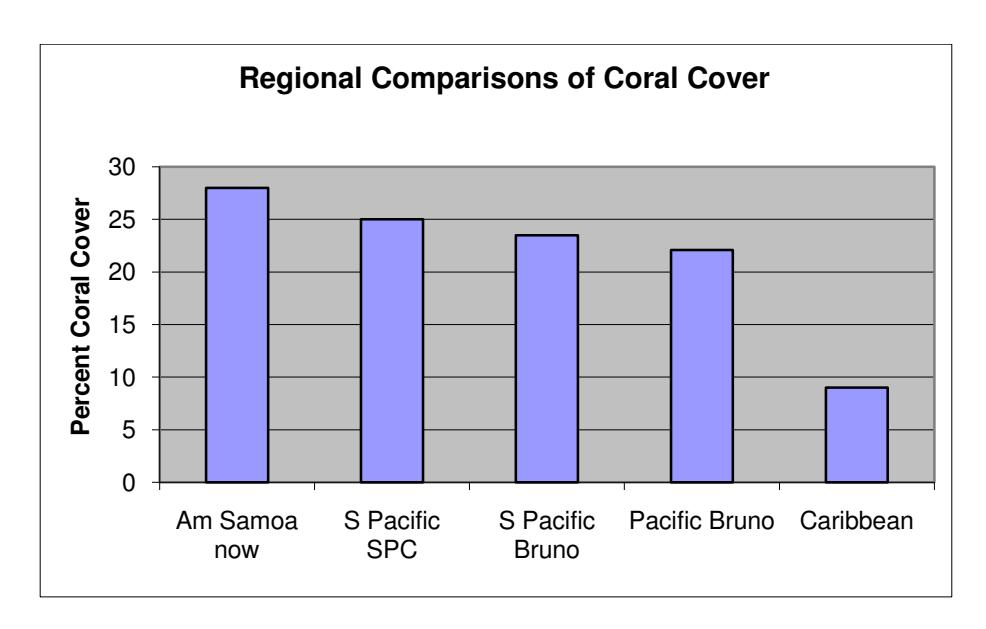

Figure 9. Comparison of present mean coral cover in Tutuila with the South Pacific (Secretariat of the Pacific Community, 2005), the Pacific and South Pacific (Bruno and Selig, 2007), and the Caribbean (Gardener et al. 2007).

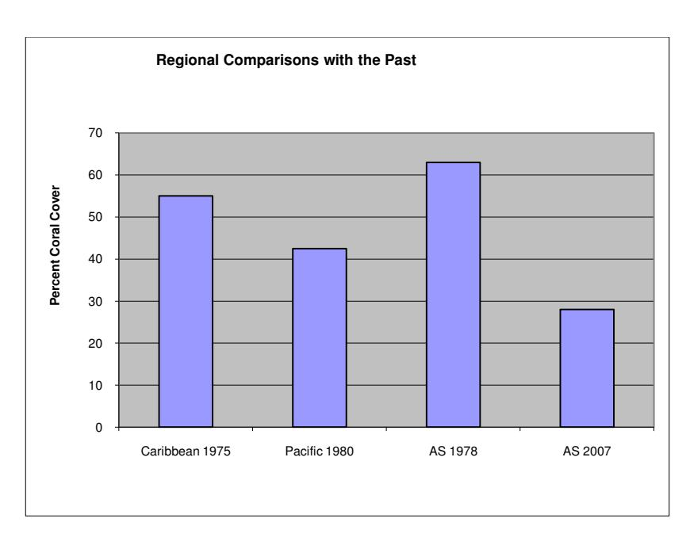

Figure 10. Comparison of present mean coral cover on Tutuila with mean coral cover in the Caribbean in 1975 (Gardiner et al. 2007), the Pacific in 1978 (Bruno and Selig, 2007) and American Samoa in 1978 (Wass, 1982).

 Côté et al. (2006) have reported the average rate of change of coral cover, based on data from many studies, for a variety of areas, including the Pacific, Indian Ocean, Red Sea, Caribbbean, and global reefs. The total change in coral cover in the four years of the Territorial Monitoring Program was an increase of 15%. Figure 11 compares that change with average changes in different areas reported by Côté et al. (2006). Coral cover has been decreasing globally, though that decrease has been smallest in the Pacific. On Tutuila, however, coral cover has increased (as seen in Figure 7). The sample size of just four years for Tutuila is small, and most of the increase occurred in just the last year. However, the Key Reef Species program has also recorded increases in coral cover (D. Ochavillo, personal comm.), supporting the view that this increase is real. This information is consistent with the view that reefs are relatively healthy on Tutuila. Voluminous world-wide data in 18 categories from Reef Check summarized by Wilkinson (2006), gives the Pacific Islands one of the highest scores for healthy reefs, only slightly below that of Australia. It gives Atlantic reefs the lowest score (tied with the Arabian Gulf). This is consistent with the other lines of evidence that indicate that Pacific reefs are relatively healthy, and Atlantic (mainly Caribbean) reefs are among the most degraded. This also supports the view that Tutuila reefs are relatively healthy.

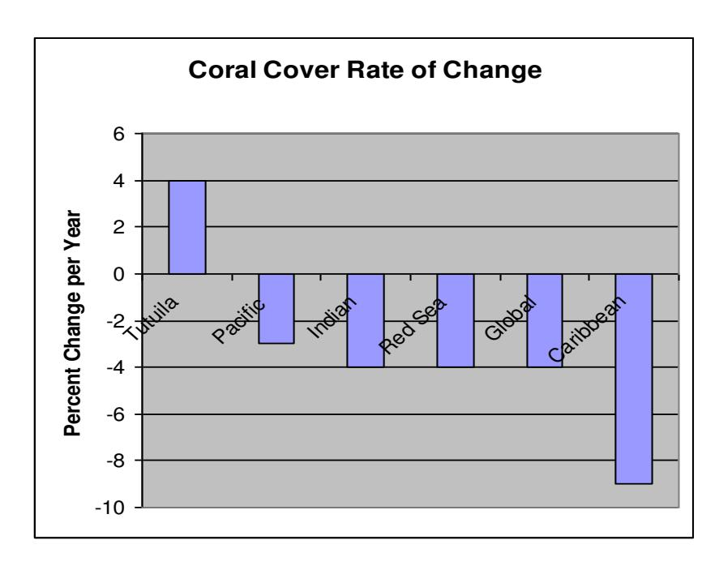

Figure 11. The rate of change of coral cover reported for regions by Wilkinson (2006) and reported in the Territorial Monitoring Program for Tutuila.

The slight increase in coral cover in the last four years may not be typical of the reefs over long periods of time, and indeed the data from the Birkeland and Green long-term monitoring program show strong increases and decreases in coral cover over the last three decades, as shown in Figure 19 below (reproduced from Craig et al. 2005). Yet even that graph shows an increase in coral cover from the first points to the last point. Further, if the initial coral cover of 11-25% on that graph were compared with the present 30% coral cover, there would still be an increase in coral cover.

Another index of reef health that has been proposed comparing the amount of ―good‖ cover consisting of coral plus crustose calcareous algae, and the amount of ―bad‖ cover, consisting of turf plus macroalgae. Trends in these combined variables can be seen in Figure 12. CCA plus coral has high cover (over 60%), and turf plus macroalgae has low cover (about 20%), and both of these were stable over the four years of the program so far. This is consistent with the view that the reefs are relatively healthy.

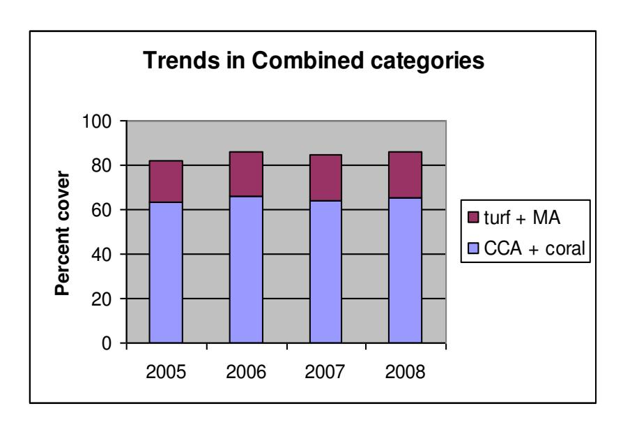

Figure 12. Trends in combined benthic categories.

An important measure of reef health is the proportion of corals that are alive. There is very little dead coral around Tutuila currently. The PROCFish program based at SPC in New Caledonia surveys coral reefs in many Pacific countries. They have devised a ―live coral index‖ which is the ratio of live coral to all coral (live and dead). A reef where most corals are alive is healthy compared to a reef where most corals are dead. Their index averages about 55% for reef slopes in the South Pacific (Secretariat of the Pacific Community, 2005), but the index averages about 93% here in Tutuila (Figure 13). In the Philippines, 48% of 844 reefs had an index below 50% (Gomez et al. 1994). In Indonesia, unpolluted reefs had an average of index of 75% while polluted reefs averaged 48% (Edinger et al. 1998). Thus, Tutuila has a higher (better) live coral index than the South Pacific average, the Philippines, and Indonesia.

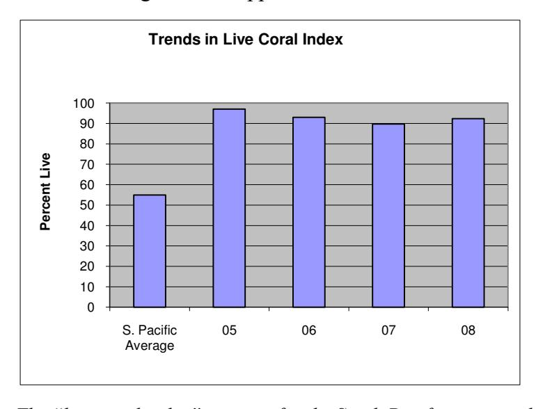

*Figure 13. The "live coral index" average for the South Pacific compared to Tutuila*.

Coral species diversity has been found to correlate with known sources of land pollution (e.g., Edinger et al. 1998). Peter Houk has done several surveys around Tutuila, designed to detect and monitor the effects of non-point pollution on the reef slope (Houk et al. 2005; Fenner et al. 2008; Houk and Musburger, 2008). Because non-point pollution runoff is highly variable with storm runoff and other variables, measuring pollutants directly in seawater on the reef slope may miss pulse runoff events. Significant negative correlations were consistently found between three watershed descriptors (size, percent disturbed land and human population) and three biological measures (coral species richness, community evenness and the percentage of substrate favorable for coral growth). However, attempts to replicate these results using data from the sites in the Territorial Monitoring Program were unsuccessful (Fenner, 2008a,b, 2009). The variable combinations used, however, were not the same as in the Houk studies, so an exact replication still needs to be attempted. However, this does illustrate that the results are not generalizable to other similar variable combinations. If the results are real, they do not appear to be powerful effects.

American Samoa has low abundances of most filter-feeding and bioeroding organisms on the reefs. Plantivorous fish are moderately abundant, dominated by damsels such as Chromis sp., however Anthias are relatively rare (except in Swains). Sponges on the reef slopes are uncommon to rare, and small, although one community of abundant sponges lives in deep water within the harbor on soft bottom where plankton densities are high (Paul Brown, personal comm.; Fenner et al. 2008). Fan worms (Sabellidae) are rare, and Christmas tree worms (Serpulidae) are small and rare. Boring clams, other filter feeding clams, crinoids, black coral, azooxanthellate soft corals and ascidians are generally rare, small, and/or cryptic. The author has seen the siphon holes of boring clams on only two corals in six years of diving. Boring sponges have not yet been found, nor is there any evidence of the white dust of expelled microscopic chips of carbonate expelled from boring sponges (which is very obvious on some reefs such as the Florida Keys). In contrast, a small filter-feeding oyster, Saccostrea cucculata, is abundant on the intertidal shoreline in Pago Pago Harbor, where plankton is abundant. Sea urchins, some of which are powerful bioeroders, are uncommon on the outer reefs, and bumphead parrotfish (Bolbometopon muricatum), which are powerful bioeroders, are rare enough that only about one individual per year is currently seen among all scientists combined. Planktivorous fish and filterfeeding species (some of which are bioeroding) are bioindicators for the plankton that they feed on, which in turn is a bioindicator for nutrients. These bioindicators all point towards low plankton levels on outer reef slopes, though high plankton levels in the harbor, which is confirmed by the low visibility and green color of the harbor. Visibility levels on outer reef slopes average around 25 m, with higher levels on outer banks. Visibility on the outer reef slopes may be limited largely by suspended sediments; during periods of heavy swell visibility can be less, and suspended sediments may be obvious, even accumulating in a few seconds on a slate. For more on sedimentation, see the segment on that topic below. Bioerosion removes carbonate from the reef, so it reduces the rate at which the reef grows, or if it exceeds the rate at which corals and algae add carbonate to the reef it can actually remove reef or destroy it. High rates of bioerosion are bad for a reef and low rates are good. The low abundance of bioeroders on Tutuila reefs is a good sign.

# Resilience

Observers of coral reefs often report the reefs they first observe and record as though that is the way they have always been. Those who have observed reefs for many years often come to realize that a reef description is a snapshot of a reef going through continual dynamic change. The pioneering studies of J. Connell on the Great Barrier Reef showed just how dynamic coral communities can be, with coral continually increasing or decreasing in abundance and size (Connell et al. 1997). The picture emerged of reefs being subject to relatively brief natural disturbances such as hurricanes and crown-of-thorns starfish outbreaks, and then spending most of their time recovering from these disturbance events. So instead of a static reef, it is a dynamic reef repeatedly cycling between disturbance and recovery. Surveys of natural reefs will reveal great variation, not only from spatial differences, but from temporal differences, with different reefs at different points in the disturbance/recovery cycle. Further, disturbances of moderate intensity and frequency may actually increase diversity, by reducing the dominance of some species and opening spaces where new recruits of subordinate species can recruit. This is called the ―intermediate disturbance hypothesis‖ (Connell, 1978; Grigg, 1983; Connell, 1997). A contrasting view comes from paleontology, where in both the Caribbean and Pacific, fossil reefs show coral assemblages at one location can be very stable over hundreds of thousands of years, with smaller differences than spatially between neighboring locations (Pandolfi and Jackson, 1997; Pandolfi et al. 1999). One possible resolution between these two apparently contradictory views is that over relatively short time periods of a few decades, reefs show strong temporal changes in the abundance of corals, but over longer geological time spans of thousands of years, the species composition of coral communities is remarkably stable.

In recent years, the many impacts of humans on reefs and the looming threat of climate change has lead to an emphasis on ―resilience‖ in coral reefs. ―Resistance‖ is defined as the ability of a reef to not be damaged by events, and ―resilience‖ is defined as the ability of the reef to recover from damage. Resilience is thought to be a critical factor for the future survival of reefs when they are assaulted by an increasing barrage of mass coral bleaching events. Healthy reefs are thought to be resilient, and unhealthy reefs not resilient. The concept of resilience can be illustrated by the author's observation of a reef in the Philippines in the Mabini district of southern Luzon. When first observed, the reef to the right of the Dive 7000 resort consisted of nothing but dead pulverized rubble. A hurricane a month earlier had rolled rocks back and forth, crushing all the coral. Eleven years later the author returned and was unable to find the damaged area, until he realized that the area of near 100% beautiful live coral cover of diverse species in front of him was the same area. In contrast, a reef in southwestern Madagascar which had most corals killed in a mass coral bleaching event in 2000 was mostly covered with algae and showed no sign of recovery several years later. The Philippine reef was resilient; the Madagascar reef was not resilient. A study of the recovery of different reefs on the Great Barrier Reef from crown-of-thorns starfish outbreaks that eat most of the live coral tissues, found that the rate of recovery has been slowing, indicating a gradual loss of resilience and thus of reef health, probably due to human impacts (Seymour and Bradbury, 1999). The reefs of American Samoa have been subjected to a whole series of disturbances such as the crown-of-thorns outbreak that ate most of the coral in 1978, a series of hurricanes, three mass coral bleaching events, and a recent tsunami. These events differed in intensity, with the crown-of-thorns outbreak being by far the most severe single event. Today, reefs around Tutuila vary greatly in coral cover, ranging from reefs that have little coral and are almost completely covered with coralline algae or turf, to reefs that have good coral cover of 40% or better; reefs average about 30% coral cover. To reach an average of 30% coral cover, corals had to recover significantly from the crown-of-thorns outbreak, since 90% or more of all corals were eaten then. Thus, it is sometimes said that the reefs of American Samoa are resilient. The fact that different reefs around Tutuila currently have such different levels of coral cover could imply that different reefs around the island have very different levels of resilience. Or it could be that reefs with low coral cover currently had low levels before crown-of-thorns, we don't know. That itself might be taken as an indication that those reefs were not healthy before the outbreak. But in general, the recovery to 30% coral cover supports the view that reefs here are at least moderately resilient. Corals on the reef flats have not had time to recover, since in recent years tides have been low enough to kill exposed corals almost every year.

To summarize the indices of reef health, such as live coral cover, trends in coral cover, live coral index, amount of crustose calcareous algae, all macroalgae, and brown macroalgae, the ratio of ―good‖ cover (coral plus crustose calcareous algae) compared to ―bad‖ cover (turf plus macroalgae), strong recruitment of table corals, good water clarity, low abundances of filter feeders and bioeroders, and recovery from a series of major disturbances, most indices are consistent with the view that that the reefs of American Samoa are relatively healthy, though the live coral cover may not be as high as it has been at some times in the past and water clarity is not as good on the slopes as the outer banks. Caribbean coral reefs currently have about 8% live coral cover, huge amounts of brown marcoalgae and turf. Coral disease has killed over 90% of the two most dominant coral species in the Caribbean, staghorn (Acropora cervicornis) and elkhorn (Acropora palmata). People in the Caribbean and Florida would die for reefs as healthy as ours. This summary of reef health as being relatively good around Tutuila applies only to outer reef slopes (and banks), not to the harbor or some other bays, which will be considered below.

# Shelf and Banks

The shelf area (Figure 1) is very large, and ranges from about 20-30 m deep at the bottom of the reef slope (even shallower in some bays on the north side of the island) to as much as 100 m deep. This shelf has been known since at least the 1920's (Chamberlin, 1921; Davis, 1921), and is the basis for the Daly theory of glacial sea level control of the growth of coral reefs (Daly, 1924). At the base of the reef slope it is either rubble or sand with little or no coral. Much of the shelf appears on backscatter from multibeam sonar to be soft bottom (Brainard et al. 2008; Fenner et al. 2008). The author observed from a submersible a sand bottom on the shelf seaward from the base of Taema Banks at about 50 m depth to the dropoff at 100 m depth. About half of that sandy bottom had many patches of Halimeda on it. Multibeam sonar of the shelf by CRED (Coral Reef Ecosystem Division of NOAA) has revealed a variety of banks and patch reefs on the shelf (Brainard et al. 2008; Fenner et al. 2008) as shown diagramatically in Figure 1. Camera sled studies by CRED have revealed a variety of hard and soft corals on hard bottom areas in deep water, on the sides and bases of banks and patch reefs on the shelf. Quantitative measures of hard coral cover in that study have found that mean hard coral cover decreases from 30 m deep down to 100 m deep (Bare et al. in preparation). In shallower water, the tops and sides of banks on the shelf can in places have high coralline algae cover and low coral cover (as on the

top of part of Taema Bank) or medium coral cover and lower coralline algae cover, or high rubble cover. A transect run near the green navigation buoy at the west end of Taema Bank found 25% coral cover and 60% crustose calcareous algae cover. The coral community was dominated by table corals there, and they are common though not necessarily dominant elsewhere on the banks at less than 30 m depth (Fenner, 2008b). At about 70-90 m depth on the shelf south of Taema Banks there are beds of giant foraminifera discs up to about 5 cm diameter. Each disc is constructed by a single animal cell that lives within pores in the disc and hosts algal symbionts (Song et al. 1994).

Seaward of Taema Banks, south of Pago Pago harbor, the shelf ends at 100 m depth and rolls off quickly into a very near vertical escarpment. The escarpment is light colored and has layers of solid material about 5-10 cm thick. This is probably carbonate from fossil reefs. Biota on the escarpment is sparse. At about 350 m depth the escarpment is covered with a talus slope at about a 45 degree angle, with blocks of the solid carbonate from the escarpment resting on finer debris and sand. Deeper on the slope there are some projections of dark rock which are likely to be volcanic basalt.

# Bays: Pago Pago Harbor, Vatia Bay, and Fagasa Bay

Discussion so far has concentrated on reefs outside of bays. Reefs and conditions within bays are quite different in some instances than the reefs outside bays, and so will be considered separately. The most impacted marine area in American Samoa is Pago Pago Harbor. The harbor once contained reefs with high coral abundance, clear water, and abundant fish. It is said that there were many fishing canoes inside the harbor, and fishermen did not have to go outside the harbor to catch abundant fish. Those days are long gone. The harbor is a good example of how to destroy coral reefs. First, some reefs were dredged to obtain material to add to village land, such as at Gataivai and Aua. Second, roads, canneries, fuel tank farms and other structures were built on fill placed over reefs, as at Gataivai and the tuna canneries. Third, the world's largest and third largest tuna canneries were constructed and their effluent released directly into the harbor. In addition, a shipyard was constructed near the cannery, where paints and antifouling agents were removed from ship hulls and washed into the water, along with other chemical pollutants. Rapid population growth lead to increases in nutrient runoff from piggeries and other sources, and the introduction and sale of high-phosphate detergent in the first decade of the 21st Century, added to the nutrient burden. A million-dollar soccer field was installed in 2007, with the sod placed on beach sand removed from local beaches (forbidden by a Parks and Recreation Dept. ordinance) to improve drainage. The beach sand absorbed nutrients, requiring fertilizer application, and subsequent rain may have washed fertilizer into the harbor. In 1988, the canneries were legally required to carry high nutrient wastes five miles offshore (which is beyond the edge of the shelf) for disposal and in 1991 to divert liquid wastes to near the mouth of the harbor by pipe. The result was a rapid drop in nutrient levels in the harbor (Craig et al. 2005).

The net effect of the many insults to the water and reefs of Pago Pago Harbor was that much of the transect lengths established on coral reefs in 1916 no longer exist, the high coral abundance recorded in Aua in 1916 decreased until most of the transect is now dead rubble (Craig et al. 2005), and soft corals on transects went from abundant to zero (Cornish and DiDonato, 2004;

Craig et al. 2005). An early drilling of one reef in the harbor revealed it was primarily constructed of soft coral spicules (C. Birkeland, personal comm.), yet soft corals are rare on that reef today. The remaining hard coral on the outer edges of reef flats in the harbor decreases from high coral cover near the mouth of the harbor to low coral cover and then zero in the inner harbor (Figure 14). Although nutrient levels in the harbor decreased when cannery effluent was diverted outside the harbor, today the harbor water is turbid and green, with low transparency at the head of the harbor and high transparency at the mouth (Figure 16). Further, a small oyster, Saccostrea cucculata, is abundant near the water line near the head of the harbor, and decreases to low levels near the mouth of the harbor (Figure 15). This species, like other oysters, is a filter feeder which consumes plankton, and thus is a bioindicator of plankton levels, which are in turn a bioindicator of nutrient levels. The harbor is long and narrow, and undoubtedly has very little flushing, and the nutrients that wash into the harbor accumulate there, particularly at the head of the harbor where the flushing is least. In recent years, there have been repeated red tide blooms, consisting of the single celled dinoflagellate alga, Ceratium fuscus. The blooms are so intense that they have turned the entire harbor rust red. Blooms have not been reported outside the harbor. High levels of nutrients are implicated in these blooms, which are thankfully non-toxic. These blooms are symptomatic of high nutrients and a highly degraded ecosystem in the harbor. Paul Brown has discovered sponge beds deep in the harbor (Fenner et al. 2008) which undoubtedly feed on the abundant plankton.

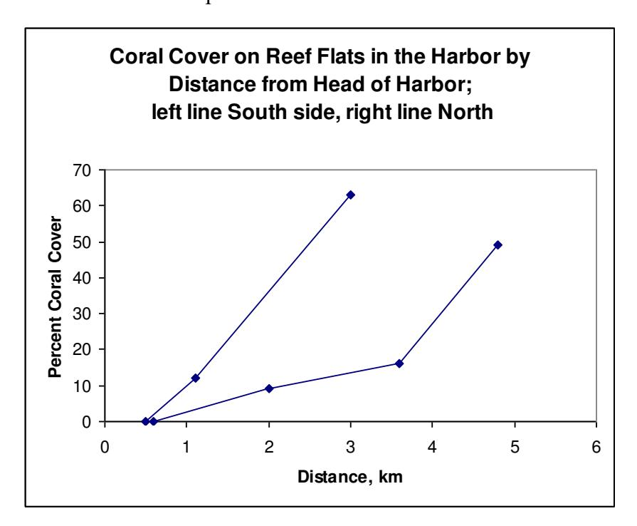

Figure 14. Coral cover as a function of location in Pago Pago Harbor.

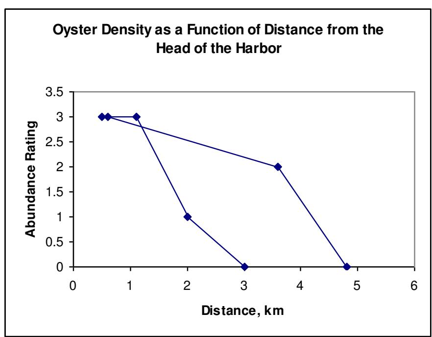

Figure 15. Oyster density as a function of distance from harbor

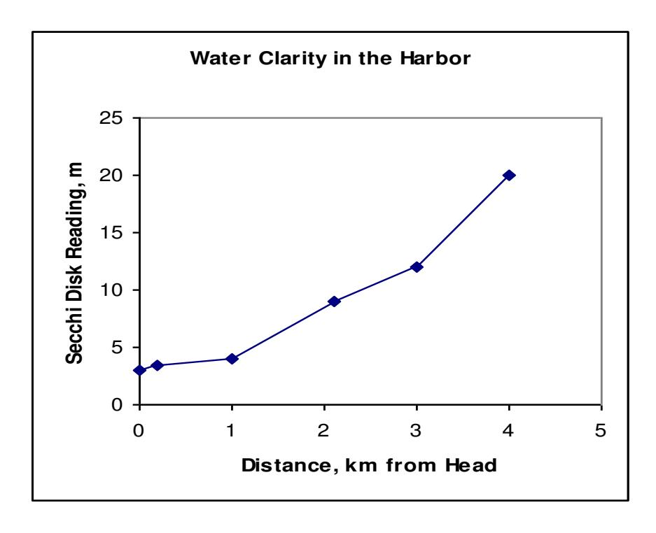

Figure 16. Harbor water clarity

Amazingly, some hard coral does remain in the harbor. According to the map made in 1916 of the harbor (Mayor, 1924), coral reefs were not present at the head of the harbor. Corals currently do not live in the inner harbor, though a few live on the subtidal rocks along the shore in Fagatogo. Corals live on the outer edge of the reef flat from near the cannery out to the mouth of the harbor (including at Aua). At Onososopo, corals are continuous from the outer edge of the reef flat to the shore, with 45% coral cover recorded on the outer reef flat. At Gataivai, just inside the harbor from the sewage pipeline, a relatively small patch of reef flat appears to have an undisturbed coral community with about 65% coral cover. Thus, near the harbor mouth corals do well in spots on the reef flat, whereas farther inside only small amounts of corals persist (Figure 12).

Vatia Bay on the north shore of Tutuila is shaped like a smaller version of Pago Pago Harbor, being long and narrow. People live around Vatia Bay, but their numbers are much smaller than around Pago Pago Harbor, and most of the activities that have damaged the harbor have not happened in Vatia. However, villages on the north side of the island are isolated, and not connected to the main sewage system that utilizes sewage treatment plants. Septic tank systems are used in the villages on the north side of Tutuila. Nutrients may escape from these systems into Vatia Bay, in addition to wastes from piggeries and from high-phosphate detergents. Water at the head of Vatia Bay is turbid and light green, while it is clear near the mouth of the bay. Corals grow in abundance in the bay, but one of the dominant species, finger coral (P. cylindrica), is otherwise only found in abundance in back reef pools where they are protected from waves. Corals from the middle of the slope on down are separated by sediment, which is a mixture of white carbonate sand and grey silt which appears to have washed off the land. Thus, the corals in Vatia Bay appear to be protected from waves and stressed by sediment and nutrient runoff. Like in Pago Pago Harbor, there is a gradient of impacts from high at the head of the bay to low at the mouth of the bay. In 2007, there was a sudden appearance of the brown alga Dictyota on the slopes of Vatia Bay. There were considerable amounts, which grew over sand, other algae (Halimeda) and corals. Dictyota is chemically defended, and fish do not like to eat it. Dictyota is one of the algae that have participated in ―phase shifts‖ where a coral reef shifts from being coral-dominated to being dominated by macroalgae. It appears likely that Vatia Bay does not receive more impacts than many other places around Tutuila. Rather, the very limited flushing in the bay allows nutrients and sediment to build up to higher levels than on the much better-flushed outer reef slopes.

Fagasa is another bay on the north shore, not quite as long as Vatia. Areas of the reef slope in Fagasa have very low coral cover, no sign of recently dead coral, and reef rock surfaces covered with brown sediment caught in turf algae. Below the main reef is a gently sloping sandy slope with reef outcrops. Sand on this slope has a component of silt. The reef in Fagasa Bay appears to be under significant sediment stress. Masafau Bay is another large bay on the north. There is little coral in the inner bay, though there are exposed beds of staghorn rubble that show that corals once grew there abundantly, and probably not too many decades ago.

Not all bays on Tutuila show signs of poor water quality or sedimentation. For instance, Tafeu Bay on the north coast has clear water and high coral cover. Tafeu Bay is, however, in a watershed with no humans. Likewise, Fagatele Bay and Larson's Bay on the south coast both have clear water and healthy coral, but few if any people in their watersheds.

# Invertebrates other than corals

Coral reefs are habitats for other invertebrates in addition to corals, as well as for fish. Algae on the reefs provide food for the many herbivorous fish, corals provide food for the few corallivorous fish, and other invertebrates provide food for the many fish that eat invertebrates. Many wrasse species, for instance, eat invertebrates, and the wrasse family is large. Coral reefs have high diversities of invertebrates, so many that the totals can only be estimated, and estimates are very high indeed. About 2700 coral reef plant and animal species are known from American Samoa presently (Fenner et al. 2008), of which about 1500 are invertebrates, including coral, about 1230 excluding coral. But we know this is a tiny fraction of the total. For fish that eat invertebrates, the abundance of invertebrates may be at least as important as the number of species or more so. Quantitative counts are almost always restricted to invertebrates that can be seen by divers during the day, so they have to be large enough to be seen, exposed (not hidden or cryptic), and they have to be sessile (immobile) or diurnal (not nocturnal). Probably most invertebrate species are cryptic, nocturnal, and/or too small for divers to see. However, the larger, less cryptic species may be an important food source. The abundance of non-cryptic diurnal macroinvertebrates is presented in Figure 17, with similar data reported by Brainard et al. (2008). The abundances of invertebrates on the reefs of American Samoa are low compared to some areas, such as the Philippines and Indonesia, or the Caribbean. However, at least some other areas of the Pacific also have relatively low abundances of invertebrates, such as Hawaii, Fiji (personal observations), and the Marianas (Starmer et al. 2008). The cause of the low abundances of invertebrates is not known. The low abundance of invertebrates recorded could be because of a large number and variety of fish that eat invertebrates, which keep the populations low (Wulff, 1997). Or the low abundance of invertebrates could provide little food for fish, so that the abundance of fish that eat invertebrates is low. Information on the abundance of invertebrate-eating fish in Tutuila are not currently available. Though the data is present in various data sets, division by trophic group has not yet been carried out to this level of detail. Only one of the largest reef fish species, which are all uncommon to rare, is an invertebrate eater, the humphead wrasse (Chelinus undulatus), and it is one of the more abundant of the large fish. Lack of invertebrates cannot be why the others are uncommon to rare. The abundance of invertebrate eaters should depend on the productivity of the invertebrate community, that is, how many are produced and eaten, not the standing stock. Standing stocks of visible invertebrates are easy to measure, but productivity would require much more effort and sophistication to measure. The fact that some other Pacific reefs also have visibly low invertebrate populations suggests that the causes may be natural, but until the causes are known, this is only speculative.

.

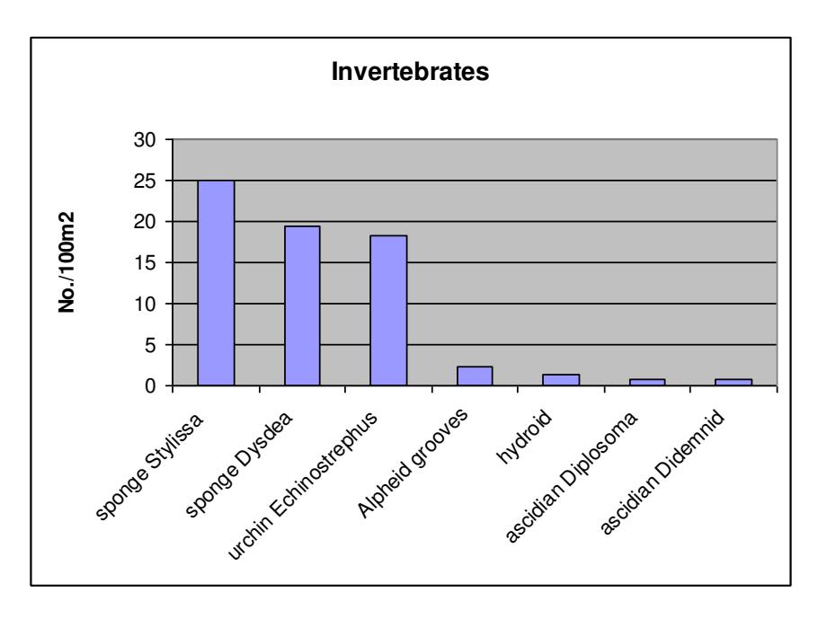

Figure 17. Invertebrate abundances on reef slopes, from belt transects

#### Impacts and threats

Impacts are defined here as negative effects on the reef that have already happened. Threats are defined as things that may cause impacts in the future, or not. Many factors have both caused impacts and are future threats, but vary in the magnitude of the past impacts compared to the future threats. For threats, the probability of a future impact and the magnitude of that possible impact are independent factors- a threat may be highly likely yet have a small impact, or may be improbable yet have a massive impact should it occur. Most natural impacts have been happening for the entire life of the island (1.5 million years) and are highly likely to continue. Human produced impacts were not present before 3000 years ago, many have increased in recent years, and they are often major threats for the future. Many natural impacts are brief, recurrent disturbances, which allow reef recovery between events, while human impacts are often chronic and may produce continuous degradation of the reef. Nevertheless, natural impacts as well as human impacts are important in shaping reef communities.

#### **Crown-of-thorns starfish**

Crown-of-thorns starfish (Acanthaster planci) are normally relatively rare on coral reefs, but on occasion they can have population explosions in what are called "outbreaks." Outbreaks in American Samoa occurred in 1938 and 1978 (Flanigan and Lamberts, 1981). Like most starfish this species is predatory and feeds by everting its stomach out its mouth. Like the cushion star (Culcita novaeguineae) and a few other starfish, it eats coral tissue. Unlike the cushion star, crown-of-thorns is soft and flexible and able to wrap around coral branches to eat them, making most corals available for consumption, while the cushion star cannot eat branching coral well. Crown-of-thorns (COTS) are very well defended, with their back covered with sharp spines that have a painful toxin. Few organisms eat it (Birkeland, 1989). Outbreaks were first noticed in southern Japan in the 1940's and 50's, then on the Great Barrier Reef in the 1960's. Initial

hypotheses about the cause pointed to human removal of natural predators, most prominently the triton shell (Charonia tritonis). But some outbreaks occurred where triton shells had not been taken. Other predators were discovered: small shrimp called Harlequin Shrimp (Hymenocera picta) and polychate worms. A few fish are capable of eating it, but none have been found to commonly eat it. Most of these predators will eat a variety of starfish and other echinoderms. Also, most take some time to eat a single crown-of-thorns, and the triton shells in particular are fairly rare even where they have not been collected. They could be a significant predator on crown-of-thorns only when the starfish is rare, since once an outbreak begins the predators are swamped with prey and can have no effect.

A second hypothesis was that outbreaks are caused by increased survival of their larvae. Adults produce large numbers of tiny eggs, like many invertebrates and fish. If spawning occurs when there is little plankton for the larvae to eat, most will starve to death. If spawning happens to occur when plankton is abundant, a much higher fraction of larvae may survive. Research found that when the larvae settle, they metamorphose into tiny sea stars which hide in holes in the reef and eat coralline algae. As they grow, eventually they start coming out at night to eat coral, but returning to holes during the day. When they are fairly large they start to spend more time out in the day, but only during an outbreak are most individuals out during the day. It takes about three years from spawning to a size at which they come out in the day and are seen by divers. A common report in outbreaks is that the adult starfish seem to suddenly appear, millions of them, out of nowhere. At one point they were thought to march in mass from one reef to another, which would explain why they suddenly appear as adults, but there is no evidence of them walking from one reef to another en mass. Plankton increase when nutrients fuel the growth of phytoplankton. If a large rainstorm follows a dry period, there will be a pulse of accumulated nutrients washed off the land, which could fertilize the bloom of phytoplankton, the increased survival of larvae, and a sudden outbreak of adult crown-of-thorns about 3 years later. Just such a correlation has been found, and it only occurs around high islands which can have nutrient runoff, not around atolls (Birkeland, 1982). Outbreaks continue to happen periodically on the Great Barrier Reef, and a recent examination of this hypothesis for their cause was able to find evidence supporting each link in the logical chain except one, for which there was no evidence either way (Brodie et al. 2005). Thus, at this point this is the best supported hypothesis for the origin of outbreaks. Although the hypothesis posits the cause in natural nutrient runoff, it appears possible that human-produced nutrient runoff might increase the chance of having plankton populations that could feed COTS larvae and cause an outbreak. Thus, although most outbreaks are likely natural, it is possible that humans may play a role in some locations.

All this is a prelude to the outbreak in 1978 on Tutuila. There were millions of COTS, and after 486,933 were removed there were still uncountable aggregations of thousands (C. Birkeland, personal comm.). They ate about 90% or more of all the coral. It was the most massive disturbance of American Samoan reefs on record. It was the impetus for the beginning of the Birkeland and Green long-term monitoring program (e.g., Birkeland et al. 1987; Green et al. 1999; Fenner et al. 2008).

COTS has a very specific effect on coral reefs. It eats the tissue off the outsides of corals, killing them, but does not harm or alter the skeleton at all. As a result, the coral skeletons stand in exactly the shape they were before the starfish ate the tissue. On some corals uneaten patches

may survive, but often they are small parts of the coral. COTS prefer to eat some corals more than others, and Acropora is at the top of the menu. According to reports and photographs taken at the time, Acropora table corals and staghorns were among the most abundant corals, if not dominant (C. Birkeland, personal comm.). No coral surveys were carried out before the outbreak, so quantitative information on coral communities is not available. Still, COTS prefer Acropora, and it was abundant, and so it was eaten. The result was dead coral skeletons in the same shape as before. Fish species that specialize in eating coral, such as several butterflyfish and a couple of filefish, may well have decreased to very low levels feeding on the remaining live coral. There are very few such species. Fish that specialize in living among the branches of corals such as small gobies (Gobiodon spp.) and coral crouchers (Caracantus spp.), would have decreased only if they depended on the coral for food as well as shelter. Again, there are only a few species in this category. Other fish species that depend on the shapes for hiding may not have decreased at all. This is likely to be a large category of species. Initially, the dead coral skeletons would have rapidly grown filamentous or turf algae, turning a light yellow, then vivid green, then black. Within about six months or so, patches of coralline algae would begin to grow and cover more and more of the skeletons. The skeletons would also erode over the years, being bored by sponges that weaken the skeleton (Figure 18), and other organisms. Table corals tend to loose more and more of their edge until only a stem and center of the table remain. Hurricanes tend to rip up weakened skeletons. Staghorns and other branching species eventually become weakened to the place they collapse and end up as rubble beds. The coralline algae that encrust these skeletons then tend to bind the rubble together to some degree, though storms and tsunamis may still be able to mobilize rubble beds. The initial turf algae may provide food for herbivorous fish, but that phase likely lasts too short to affect populations which must reproduce to change in number. Coralline algae provides little food for fish, but erect skeletons still provide the hiding places that the live corals provided. When skeletons collapse, they suddenly provide many fewer hiding places. Dead coral tables covered with coralline algae often provide excellent habitat for coral recruitment and juvenile corals, though if the table disintegrates many juvenile corals may not survive. If the small patches of coral that survived grow and reproduce, and juvenile corals begin to repopulate the reef, the reef may recover live coral over time. Coral cover data from the long-term monitoring program of Birkeland and Green shows an initial increase in coral cover, followed by a decrease probably produced by other disturbances, and more recent increases (Figure 19).

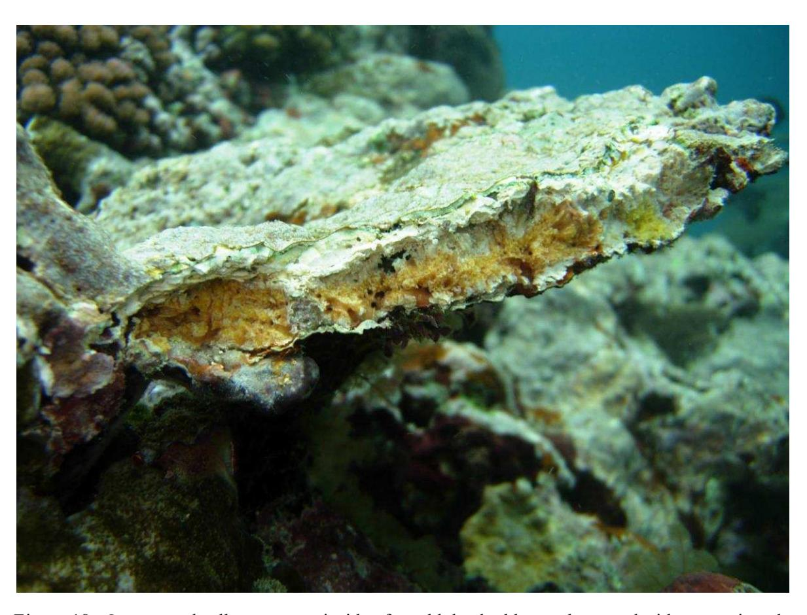

Figure 18. Orange and yellow sponges inside of an old dead table coral covered with encrusting algae.

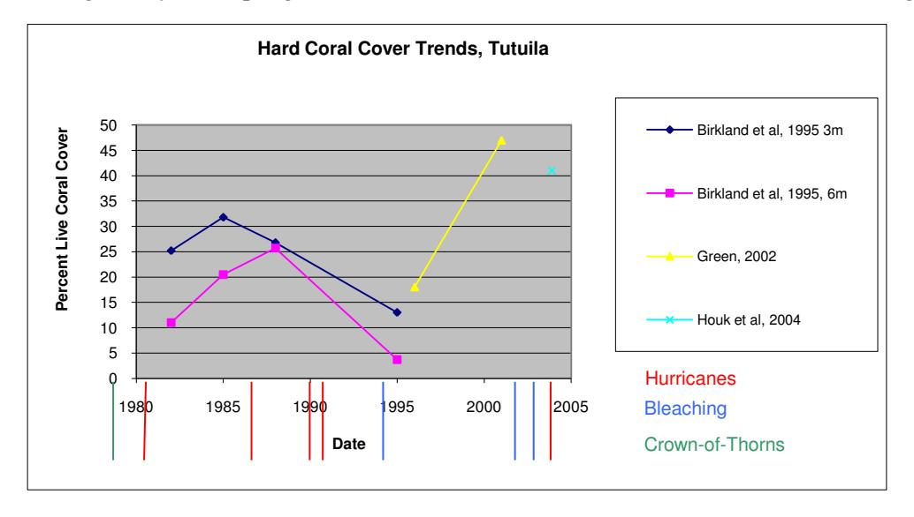

Figure 19. Coral cover changes since the COTS outbreak of 1978, from Craig et al. (2005).

In summary, the COTS outbreak of 1978 had the greatest impact of any single event or process on the reefs of American Samoa. They decimated the live corals, changing the habitat dramatically. The effects on fish populations may depend on the sequence of events, whether skeleton collapse occurred before significant new coral growth appeared. This assumes that the loss of hiding places following skeleton collapse would affect fish populations, a premise that will be examined in the section on coral as habitat.

#### **Hurricanes**

Hurricanes struck American Samoa in recent years in 1981, 1987, 1990, 1991, 2004 and 2005. The hurricanes in 1990 and 1991 were particularly destructive. Unfortunately, the damage to reefs was not documented for any of these hurricanes. They all occurred before monitoring programs were begun. When the Territorial Monitoring Program was begun at DMWR in 2005, there were no obvious signs of hurricane damage at any of the 11 sites monitored, though hurricane damage becomes less and less obvious over the years. Hurricanes damage coral reefs primarily through the mechanical breakage of coral and even of the rock composing the reef. The concussive pressure wave from a crashing wave is the most powerful force for breaking coral. Waves in a powerful hurricane can reach as much as 20 m high and are very destructive. The amount of destruction depends on the power of the hurricane, the distance to the eye of the hurricane, whether the wind direction is driving waves onshore, and whether there are any obstacles such as other land masses that shelter the reef from the waves. So if a powerful hurricane has winds blowing from the north, waves are likely to be damaging the reef on the north side, but the land mass of Tutuila protects the coral on the south side. There are no other land masses around Tutuila large enough to have any ability to shelter the reefs from waves, but the shelf and the bank reefs on the shelf do reduce wave action on the coast nearest them. Hurricanes have a significant ability to cause rapid erosion of the shoreline. For instance, on the southeast coast of Tutuila, there are many black blocks of basalt rock sitting on the reef flat. They got there by giant waves ripping them out of the shoreline and scattering them on the reef flat. On the north shore, much of the shoreline is sheer cliffs down to the water line, which is why there is no road along the coast there like on the south shore. This is due to wave erosion at the waterline. A smaller effect can be seen on the south shore, where from a distance the ridges can be seen to slope down toward the sea, and then end in a near-vertical drop down to the road and the shoreline. From a distance this can be also be seen clearly in the outline of Ta'u. This shape occurs because erosion is more rapid at the waterline due to waves than higher up on the hills due to rain. On the north shore, reefs are restricted to bays, which also indicates that maximum wave power in the north is greater than in the south. Hurricanes in this area of the South Pacific commonly form northwest of Tutuila, and then track east, at some point starting to track southeast. If hurricanes pass to the north of Tutuila more often than to the south, then maximum wave power would strike the north coast more often than the south. One result is that reefs are restricted to bays, and corals outside of bays tend to be small. If corals are good habitat for fish, particularly if they are large enough to provide hiding places, then the smooth basalt with small corals outside bays on the north may be poorer habitat than reefs inside bays. Sabater and Tafaeono (2007) actually found more fish outside bays on the north than inside bays. This will be discussed further in the section on coral as habitat.

Because hurricanes cause mechanical damage to corals, they break the corals. If damage is moderate, coral fragments may survive, attach, and regrow. In the process of breaking corals, a hurricane will reduce rugosity and thus hiding places for fish. This can happen even if many coral fragments survive as a flat rubble bed provides few hiding places for fish. If the rubble is big pieces with spaces between them, there may still be many hiding places. If damage is severe, most of the coral fragments may be abraded or buried and not survive. Thus, hurricanes can greatly degrade coral reef quality as habitat, but only if damage is severe.

Hurricanes are natural, and humans cannot stop them. They appear to strike American Samoa an average of about once in 5 years or so. The timing of their strikes is of course largely random and irregular. It is likely that low-impact hurricane events, due to weak hurricanes and/or greater distances from the eye, are more common events that the more powerful strikes, which require the eye of a powerful hurricane to pass close to the island (the most powerful winds are in the eye wall). Thus, high-impact hurricane damage on reefs is likely to be much less frequent than once in 5 years, it may be several decades between such events on the average. This is usually enough time for recovery. Because hurricanes are natural, reefs have evolved to cope with them. If a hurricane hits on the average once in 5 years, in the 1.5 million years of the island about 300,000 hurricanes have hit, and yet the reefs have survived. Even in the 3000 years of human habitation, there would have been about 600 hurricanes. That is a lot of hurricanes. Climate change is predicted to increase the intensity of hurricanes, but probably not their frequency. However, that means that category 5 hurricanes will be more frequent, and do more damage. The energy source for hurricanes is the warm surface waters, so it makes sense that warmer surface waters should provide more energy for hurricanes. More frequent powerful hurricanes means more reef damage. Thus, not only have hurricanes had impacts, they are threats for the future as well, though it appears likely to this author that the increase in hurricane strength will not by itself cause significant degradation of coral reefs.

#### **Tsunamis**

On Sept 29, 2009, at 6:48 am, a large tsunami struck American Samoa and Upolu in (independent) Samoa. This tsunami was generated by a magnitude 8.0-8.3 earthquake just east of the Tongan Trench and just south of where the Tongan Trench curves west. Wave runup on land was as much as 12.4 m. Several villages were severely damaged, such as Pago Pago, Leone, Asili, Amanave, Paloa, Fagasa, and Tula. At the time of writing, damage to the reefs is being assessed, with about 38 sites assessed so far. Mechanical damage to reefs from powerful water movements varied from negligible to severe. More reefs had negligible damage than had severe damage, much like on land where only a small proportion of the land was badly damaged. So while damage at a few small spots was severe, overall damage to the reefs was minor. There may have been a tsunami here in 1917 as well, when another large earthquake struck in the Tongan Trench. Earthquakes less than about 7.5 generally do not produce tsunamis. It should be born in mind that tsunamis are totally natural and unavoidable. Further, the Tongan Trench has been producing tsunamis such as this for the entire 1.5 million year lifetime of Tutuila island. If tsunamis averaged one per 150 years, there would have been 10,000 tsunamis in the life of Tutuila, and they will continue to happen in the future. The reefs recovered from previous tsunamis, or they would not be here now. The reefs should recover from this tsunami, if the

reefs are not weakened by chronic human influences. New growth has already begun where branches were broken off.

The effects of tsunami damage to the reef on fish populations are not yet known. The 2009 tsunami produced rubble fields on some areas of the reef, both reducing life coral cover and rugosity severely. Turf algae are highly likely to bloom on the newly exposed dead surfaces as already seen in Fagatele Bay. The turf may serve as good fish food. In roughly 6 months to a year, much of the turf may be replaced by coralline algae.

#### **Sediment**

Tutuila and the other high islands of American Samoa are undergoing relatively rapid natural erosion. Exposure to oxygen oxidizes the minerals in the basalt rock, and water hydrates the minerals, and together they convert hard rock into fine sand and soil, starting by widening any cracks in the rock until pieces of rock fall off. The rainfall is high, about 100 inches per year at the airport and up to 300 on mountain tops (Craig, 2009). Tutuila is much more eroded than younger islands like Ta'u, with the classic V-shaped valleys produced by rainwater erosion on Tutuila, and mostly the rounded slopes of the original shield volcano on Ta'u. Further, Tutuila is much more eroded than the Kohala mountains on the northwestern corner of the Big Island of Hawaii, where the mountains are of a similar age and origin, but rainfall is much less. Active erosion on Tutuila can be seen in the form of frequent small landslides on the steeper slopes, the very brown water in some streams after heavy rains, and the stream deltas on the reef flats. Streams commonly have small deltas consisting of basalt rocks and sand, carried down by the streams and deposited on the reef flat. Coral cannot live under the delta or on it. During heavy runoff, silt is carried by the fresh water in the stream out onto the reef flat, where it floats on top of the other water. Often there is an ava near a stream mouth (the stream may be the original cause of the ava). Water is pumped onto the reef flat by waves breaking over the crest, and flows across the reef flat to the ava, and then flows rapidly out the ava. So the fresh water from the stream which floats on top of the salt water is drawn rapidly out the ava. Once out the ava, the fresh water carrying silt spreads out, and is mixed with deeper water by waves, particularly near the crest where the waves break. Over time, the silt sinks in the water column. However, wave surge on the slope tends to re-suspend the silt continually if any settles on the bottom. On occasion, this can be seen clearly- once at Leone, when water was rough, there were so many sediment particles in the water that visibility was reduced to perhaps 10 m, and sand grains could be seen settling onto my slate. The silt is then continually diluted and carried off in the water. Although water on the reef slopes is relatively clear on a normal day, with around 25 m visibility, the reef slope water is noticeably less clear than water far offshore. In bays, water from streams is likely to be carried away much more slowly. The turbidity in some bays, such as Fagasa and Vatia, is lower, which may be due in large part to suspended sediment. In some places, such as Fagasa, brown sediment covers dead surfaces, and in Vatia and the slope at Fagasa, the sand between corals is grey, and lifting it in the water and dropping it produces a grey cloud of silt. Quantitative measurements of sedimentation rates using sediment traps by Maloy Sabater and his team have shown that sediment accumulation on the bottom is fastest in bays, and slowest outside bays, as shown in Figure 20. Part of this may simply be a matter of the distance from the stream mouth, which tends to be at the head of the bay. But part of it is also likely to be due to the reduced flushing at the head of the bay.

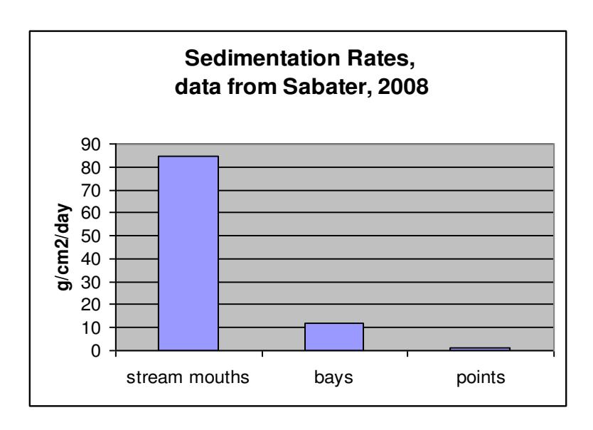

Figure 20. Mean sedimentation rates for different locations, redrawn from Fenner et al. (2008).

The amount of sediment released by different streams from a heavy rain will vary with the amount of rain, but will also vary between streams. The stream at Fagaalu appears to be among the streams that produce the most sediment, though streams in Fagatogo also produce large amounts of sediment. The dispersal process outlined above depends on wave action. The larger the waves, the more water that is pumped over onto the reef flat and the stronger the current going out the ava. In the inner harbor, there are no waves and there is no reef flat, so water released from streams into the harbor floats and spreads over the entire surface of the inner harbor, turning it all brown. Then in a few hours the color returns to green as the silt sinks below the visible surface waters. On occasion, heavy rains may be accompanied by still waters, and waves do not pump water over the reef flat. In that case, sediment can settle on the reef flat. When wave action resumes, most of that sediment will quickly be removed from the reef flat, where turbulence is powerful. Thus, silt is not present on the reef flat, and corals and other organisms there are not impacted by sediment from streams, except for the very small areas covered by stream deltas.

It should be borne in mind that erosion is natural, and has been going on vigorously for 1.5 million years on Tutuila. The shelf, which extends from 1-3 miles from the shoreline, is highly likely to be the outline of the original island, which was taller as well. The ―cockscomb‖ at Vatia which includes Paloa Island, is a huge dike. A vertical dike like that is formed when lava intrudes into a vertical crack in the side of a soft volcano. The lava which hardens is harder than the soft volcano, and resists erosion longer than the volcano. In this case, a huge amount of material has eroded away, leaving only part of the dike. This illustrates just how much material has been eroded away in 1.5 million years, probably more material than remains in the island above waterline today, literally cubic miles of material. Further, all that material had to go over the reef into deeper water, and it did so without killing the reef. It did it by the process described earlier with the freshwater floating and being carried out the ava.

Although erosion is a natural process that cannot be stopped, and natural sedimentation is not more than the reef can stand, erosion and sedimentation are very real threats for our coral reefs. Heavy sedimentation smothers and kills corals, and muddy water absorbs light and can reduce the light needed for corals to produce energy (Rodgers, 1990; McCulloch et al. 2003; Fabricius, 2005).

The higher levels of sediment in streams such as at Fagaalu and Fagatogo happen because of human disturbance in their watersheds. Natural erosion rates are much lower than after human disturbance. Removing vegetation can increase erosion rates (and thus sedimentation rates) by orders of magnitude, perhaps a thousand times greater. Corals can clean themselves with tiny hairs called ‗flagella‖ but there is a limit to how fast and how much they can clean themselves. Further, coral larvae can't attach and start to grow on silt or mud. If the limits for coral are exceeded, the corals will be smothered by the silt. Even if they aren't smothered, they have to spend energy cleaning themselves which they can't spend in growth or reproduction. So sedimentation is a stressor for corals, and can kill them. A good example of an area where corals were killed by sediment appears to be on the reef flat in Fagaalu near the school. Near the shore, all the corals are dead, whereas out at the edge of the reef flat they are alive. At the edge of the reef flat wave surge cleans the sediment off, but there is not enough wave action farther from the edge. On the reef slope, corals are sparse near the school. In the harbor, sediment may be one of the major factors that limited coral there before human populations increased, and may be a factor in their death since then. On the outer slope at Fagaalu there is silt mixed with the sand, but so far sedimentation rates appear not to have exceeded the ability of corals to clean themselves, and deep on the slope where wave surge cannot clean them there were high levels of healthy looking coral cover before damage by the 2009 tsunami.

The areas killed by sedimentation so far may include some areas in the harbor, and near the school at Fagaalu, and certainly under all the stream deltas. Although this damage is very real, these are small areas of the reefs of Tutuila, and have nearly no impact on the total amount of habitat available. Coralline algae are even more sensitive to sediment than corals, yet they are abundant on much of our reefs. So impacts to date have been relatively small. On the other hand, sedimentation is a huge potential threat. Most of the island is covered with dense vegetation. Should that vegetation be cut, massive erosion and sedimentation would result, which could kill much of the reef coral. This appears to be an unlikely scenario, as the trees are not commercially valuable for logging and the slopes far too steep to allow logging. Some clearing for houses and taro plots occurs on steep lower slopes, and they can indeed lead to increased erosion. Better planting practices such as heavy mulch, contour rows and planting vetevier barricades can reduce erosion even in steep taro plots. Better building practices can reduce soil erosion during construction. So it appears that while there is a potential for disastrous sediment runoff, this is not likely to happen. So sedimentation has caused relatively little damage to the reef habitat (as can be seen in the relatively good coral cover and abundant coralline algae) and the threat of disastrous sedimentation is remote. Although at times sedimentation has been blamed for a perceived lack of fish, the fact that there is good coral cover shows that the intermediate step in the logical chain is missing. To show that sedimentation has reduced fish stocks would require showing that sediment had reduced coral cover, and that reduced coral cover caused reduced fish stocks. Neither of these has been demonstrated, and in fact the coral cover is relatively good. So if there are any deficits in the fish populations, sedimentation is not the cause.

#### **Nutrients**

The term ―nutrients‖ is used here for organic nitrogen and phosphorus. Most coral reefs live in ―oligotrophic‖ waters, that is with low levels of nutrients, similar to tropical ocean surface waters. When there is a significant nutrient input to a coral reef, this may stimulate the growth of macroalgae. Algae are like plants on land, they grow slowly if they do not have nutrients, but grow faster if nutrients are available. The low level of nutrients in surface waters is why tropical ocean surface water is a clear blue. One view of the effect of nutrients is that in low nutrients corals dominate, in medium nutrients benthic algae dominate, and at high nutrients phytoplankton in the water column dominates. In the section on Pago Pago Harbor above, the red tide blooms in the harbor and the link to nutrients are discussed. Herbivory is also an important controller for algae. In the absence of herbivores, newly opened substrate is likely to be quickly colonized by algae. If the algae are not removed by herbivores, then they can overgrow and may be able to out compete corals. When Hurricane Allen in 1980 broke and killed much of the coral on the north shore of Jamaica, corals began to regrow but when a disease went through the entire Caribbean in 1983-4 and killed almost all sea urchins, too few herbivores were left to control the algae, because Jamaican reefs had been overfished for centuries and almost all herbivorous fish were long gone. Macroalgal cover increased on Caribbean reefs from about 4% in 1981 to 43% in 1987 (Côté et al. 2006). The result was a shift from a coral-dominated reef to algae beds in what has been called a ―phase shift‖ (e.g., Done, 1992; Knowlton, 1992; Hughes, 1994; Scully and Ostrander, 2001; Bellwood et al. 2004). Presently there is considerable controversy on the relative importance of top-down control of algae by herbivores vs. bottom-up control by nutrients (e.g., McCook, 1999; McCook et al. 2001; Szmant, 2002; Birrell et al. 2008). The literature is too voluminous to review here, but there is evidence to support the importance of both factors in different situations. Thus, nutrients are at least a potential threat.

Nutrients may already be having impacts. In Vatia Bay, in 2007 there was a sudden increase in the amount of the brown macroalga Dictyota. This is a chemically-defended alga which is one of the genera that have been found in phase shifts. It grew over sand, other algae, and corals at Vatia, and may damage those corals. Smaller amounts of Dictyota are now present at some other locations. At Coconut Point, another brown macroalga, Padina, has bloomed. It is abundant near the shoreline starting not far west from the stream, and extending southward in a widening swath near the shore of Coconut Point. This is the path that water takes as it leaves the pool, and appears to be the path that nutrients would take if they were coming out of the stream.

Nutrients from all sources can add to the total nutrient levels in the water which stimulate algal growth. Major nutrient sources likely include piggeries, fertilizer put on playing fields and croplands, leakage from septic systems in areas where there are such systems, and highphosphate laundry detergent. Nutrient runoff from piggeries has been declining due to a vigorous program by ASEPA to train people about how to better manage their piggeries and relocate them away from streams as well as enforcement of laws limiting how close they can be to streams. High-phosphate detergent is a recent introduction by Asian run stores that import cheap high-phosphate detergent from other countries. High-phosphate detergent was made illegal in the U.S. long ago, and an executive order banned the import of it in AS right after the

problem was discovered, but two years later it is still in the stores as enforcement has been lacking.

Macroalgae on the reef slopes consists mainly of the green calcareous alga Halimeda, and the leafy red calcareous alga Peysonellia. Neither of these are known threats. Brown macroalgae are known threats, but they remain rare on reef slopes, and abundant in only a few near-shore sites, where they have increased in abundance. Another possible bioindicator of nutrient overload is cyanobacteria. These are a type of photosynthetic bacteria that make very fine strings in slimy filamentous masses. They are particularly sensitive to nutrient input. Around Tutuila they are fairly uncommon, but are sometimes found in patches that could be locations of seepage of terrestrial water carrying nutrients. However, no signs of fresh water springs have been observed by the author. It is also possible that they are a natural phenomenon not due to elevated nutrients. EPA testing found slightly elevated phosphate levels all around the island including away from people, so it appears that the island naturally produces some phosphate runoff (Fenner et al. 2008). On Rose Atoll, the steel wreck of a longline fishing vessel has stimulated the heavy growth of cyanobacteria and turf in a large area around the wreck (Schroeder et al. 2008). The wreck has now been removed, but some cyanobacteria linger. It appears that iron may be a trace nutrient that stimulates the growth of the cyanobacteria. Thus, there is at this point no hard evidence of nutrient overload on the reef slopes outside bays, nor damage to the habitat in terms of abundant brown algae or cyanobacteria, or reduced coral cover. So while it remains a possible future threat, it does not have demonstrated impacts on the reef slope yet.

#### **Pollution**

Chemical pollution in the waters of Tutuila are likely of two main sources: from the shipyards in the harbor, and diffuse non-point sources elsewhere on the island. The shipyards likely produced significant chemical pollution from cleaning boat hulls and other work, much of which probably now resides in the mud in that area of the harbor. The shipyards are at the inward end of the tuna canneries, and are not near coral reefs. Non-point pollution likely comes from human activities around the island, and is likely heavier in areas of greater human population density. The EPA program studying the effects of non-point pollution on reefs is described elsewhere, but the effects on the reef habitat are likely relatively minor, since coral cover does not correlate with the human population.

### **Debris and Trash**

Levels of debris and trash on the reefs are relatively low. Currents do not accumulate plastic trash on the reefs as they do on the Northwestern Hawaiian Islands. All debris and trash appears to be locally derived. Occasionally, plastic bags are seen caught on corals, but this is the exception rather than the rule. No trash has ever been recorded in the DMWR Territorial Monitoring Plan belt transects for invertebrates. There are a few ship wrecks, with one longliner lying close to the reef at Taema Banks, and one of the tender boats from a purse seiner on Taema Banks. The 2009 tsunami placed debris on reefs, primarily at Fagasa and Leone, but it was still much less than the debris on land.

#### **Fishing including gleaning**

Fishing can have a wide variety of effects on ecosystems in addition to direct effects on fish populations. On coral reefs, the effects of fishing on the coral reef habitat can be divided into direct and indirect effects of the fishing. The direct effects of fishing activities on coral reefs include damage from destructive fishing methods (blast fishing and toxic chemicals), trampling during fishing and gleaning, net entanglement, damage from fish traps, damage from collecting efforts for invertebrates or fish, and the collecting of corals and live rock. The indirect effects include the loss of herbivores that keep algae in check in its competition with coral.

Blast fishing is thought by some to occur in American Samoa, and on occasion reported. An event reported from Fagatele Bay was investigated, and damage was observed, however any direct evidence of the blast such as fragments of the equipment used, was not found. Reports of blast fishing and damage that could be attributed to it are rare. An ichthyocide derived from a native plant was used in traditional Samoan fishing before the arrival of Europeans. It appears that it is relatively rarely used currently. All types of destructive fishing are prohibited by the fisheries regulations. In addition, the collection or damaging of coral is illegal, and there has never been a coral or live rock export industry. Sand and dead coral rubble are collected from beaches for construction although a Department of Parks and Recreation regulation prohibits it. The amounts collected do not appear to be particularly large, and the damage appears to be primarily to the beaches, not the reefs. Cyanide is not reported to be used to collect fish, and reef fish are not exported for the aquarium trade or food. Residents do at times glean invertebrates from the reef flats at low tide, but currently all reef fishing including gleaning occurs at low levels. Some fishing methods, such as throw net and pole and line, commonly involve walking on the reef flat. Like all forms of reef fishing it has decreased in frequency in recent years to low levels. It is true that walking on the reef flat damages the reef by breaking live coral. However, in recent years, low tide events have had a far more serious effect on reef flat corals than humans walking on the reef flat. Low tide events kill all coral on the entire reef flats throughout the territory (except where the reef flat is lower than the low tide level), while walking only damages corals under the feet of the walkers, which are tiny relative to the reef. Only if there are large numbers of reef walkers do they have a significant effect on the coral. Observation of the reef flats over the last six years has shown areas of live unbroken branching (Acropora) coral in the beginning of that period which subsequently died in place due to low tide events. Significant amounts of coral on the reef flat that were mechanically broken were not observed. Nets are very rarely observed entangled on the reefs of American Samoa. To the author's knowledge, only one such net has been observed in the last six years, at Aunu'u on the reef slope, where it was removed by DMWR divers in 2005. It did little damage to coral, and some corals were seen growing on it. Fish traps are not used in American Samoa, other than small traps used to catch newly recruited goatfish, and they are only still used in Manu'a. One invertebrate that is traditionally harvested is the corallimorph polyp, Rhodactis sp. (malu-malu). This polyp attaches very tenaciously to rock, and in order to remove it, it is necessary to remove some of the rock. The result of efforts to collect it to eat is damage to reef rock. However, only very small amounts of it appear to be harvested, and the damage appears to be tiny relative to the size of the reefs.

The removal of herbivorous fish (or invertebrates such as urchins) can affect the reef habitat, by allowing more algae to grow. This is thought to be the critical factor causing the shift from coral communities to algae beds in some Caribbean reefs, such as in Jamaica. In Jamaica, a hurricane broke most of the coral, opening new surfaces for colonization by algae. Two years after the hurricane, a disease swept through the Caribbean killing almost all sea urchins. In Jamaica, the reefs had been chronically overfished for a very long time, with few fish of any type remaining. After the urchins died, the algae bloomed, in some cases growing over and damaging corals, but also greatly reducing coral recruitment which could have restored the coral reef. The reefs there remain dominated by algae decades later.

The amount of herbivores, and particularly herbivorous fish, that are needed to keep algae levels low and ward off phase shifts to algal beds is not known, and may depend in part on other events, such as disturbances that open new substrate. Reefs in American Samoa currently have low abundances of macroalgae and high abundance of coralline algae, suggesting that herbivory levels are currently good. The reef fish communities are dominated by surgeonfish, small parrotfish, and damselfish, all of which are abundant. The most abundant of all fish species, Ctenochaetus striatus, is actually not an herbivore though it is often lumped with herbivores because most surgeonfish are herbivores. Sabater and Tofaeono (2007) report that herbivorous fish including C. striatus compose 66% of the total fish biomass, and that C. striatus composes 22% of the total biomass, so true herbivorous fish compose about 44% of the total biomass. This appears to be a very good biomass of herbivorous fish. Two relatively pristine reefs in the Line Islands are reported to have 6 and 16% of their biomass to be herbivores (Sandin et al. 2008), while the Northwest Hawaiian Islands are reported to have 29% (Friedlander and DiMartini, 2002). It is not clear whether Ctenochaetus sp. were included as herbivores in those studies or not, or whether they were abundant. The comparison of the percentage of total biomass that herbivores comprise is affected by the biomass of other trophic groups, in particular those three relatively pristine areas have much higher biomass of apex predators than American Samoa. The amount of herbivory does not depend on the proportion of all fish biomass that herbivores represent, but rather the absolute biomass. Absolute biomass of herbivorous fish that were obtained with the same methods are not yet available for comparison between American Samoa and pristine reefs. Comparison can be made between different studies that used different methods. Sabater and Tofaeono (2007) report about 1.5 T/ha of herbivores, while the Line Islands were reported to have about 0.3 and 0.4 T/ha, and the Northwest Hawaiian Islands about 0.7 T/ha. This supports the view that American Samoa has very good stocks of herbivorous fish, which is consistent with the low levels of macroalgae recorded on the reefs.

#### **Introduced and invasive species**

Introduced species are species that were not naturally present before humans brought them to an area. An invasive species is one that expands rapidly after introduction, and often causes significant damage to the ecosystem and can damage crops or other resources.

A study of introduced marine species in American Samoa found 28 non-indigenous or cryptogenic species, none of which were invasive (Coles et al. 2003). Non-indigenous species are introduced species, and cryptogenic means that their origin is not clear. This is much less than the 490 known introduced and cryptogenic marine species in Hawaii (Carleton and

Eldredge, 2009), several of which are invasive, including several algae, a soft coral, and a red sponge. The lower number of introduced species in American Samoa compared to Hawaii is probably due to the much smaller amount of shipping that comes to American Samoa than Hawaii, since most introduced species arrive on some form of ship.

Two native species show some signs of being invasive, meaning that they may expand at the expense of other native species for one reason or another. One of these is a colonial ascidian or sea squirt, Diplosoma simile. This species is not rare on the reefs of American Samoa. It is capable of growing over living corals, but had not previously been reported to have caused problems. It was reported to have become more common in one area of Fagatele Bay at one point (W. Kiene, personal comm.), but later was not found to be abundant any more. In 2006, it was found to have suddenly become very abundant on the reefs of Swains Island, and was the dominant organism on the northeast of that island. It had grown over live corals and likely killed them (Vargas-Ángel et al. 2008). The cause of this outbreak is not known for sure, but may be because Hurricane Heta opened new substrate in 2004. It seems unlikely to be caused by humans, as Swains has only about 10 workers on it. Early in 2010 the CRED program will return to American Samoa, and will find out the fate of this outbreak.

 Another species of concern is the corallimorph, Rhodactis sp. This is a soft polyp about 4 cm diameter that does not produce a skeleton but is very tightly bonded to rock substrate. It divides frequently and forms clusters of polyps. It is able to sting some corals, kill them, and grow over them. It is about in the middle of the aggression pecking order of hard corals, so while it can defeat some, other corals can defeat it (Langmead and Chadwick-Furman 1999a,b; Chadwick-Furman and Spiegel, 2000; Chadwick-Furman et al. 2000; Kuguru et al. 2004; 2007). Work et al. (2008) report in the Line Islands that it has become abundant around a steel shipwreck, now covering about a million square meters of reef. Smaller patches were found around two steel buoys, suggesting that iron may stimulate their growth. In American Samoa, it is well known in traditional Samoan culture, where it is called matu-matu, and eaten (Madrigal, 1999). It must be cooked, otherwise it is poisonous. Patches of it are fairly common in Vatia Bay and Tafeu Bay. In Tafeu, it increased in cover in 2007, while turf decreased, indicating it probably expanded over turf. It was photographed stinging some corals, and in Vatia it could be seen growing over some corals. It has not caused significant damage to any reefs yet, but it bears watching. Thus, it has had minimal impact, but is a threat. Overall, there are relatively few introduced marine species, none of which are invasive, and only a couple of native species that appear to have invasive potential, one of which has had a major impact on Swains Island reefs, but not elsewhere in the archipelago so far.

#### **Bleaching**

When corals are exposed to temperatures 1-20C above the average summer high temperatures in the area they live, the single-celled algae called zooxanthellae (which are in the dinoflagellate group) leave the coral. Most of the color in coral tissue is from these zooxanthellae, so once they are gone, the coral tissue becomes transparent. This allows light to penetrate to the white skeleton and be reflected, so that the white skeleton can be seen and the coral appears white. If the temperatures go no higher and then recede, the corals will survive and regain their zooxanthellae and color. If temperatures go higher to 3-40C above the average summer high,

then the corals are likely to be killed. Actually, the amount of time that the corals are exposed to these temperatures also is an important factor, and bleaching can be predicted on the basis of ―degree-heating weeks,‖ that is, the number of weeks of exposure times the number of degrees above the normal summer high. This relationship is so strong that coral bleaching events can be predicted quite well with satellite-sensed sea surface temperatures (SST's) compared to the average summer highs, coupled with time spent at that temperature. Corals differ somewhat in their susceptibility, and in general branching species are more susceptible than massive, and Acropora, Millepora, and Pocillopora are among the most sensitive genera. It is often said that corals live just a few degrees below lethal temperatures. Global warming means that temperatures are rising around the world, including in American Samoan waters, as shown in Figure 21. Bleaching events occur in years when temperatures exceed the normal summer maximum, as shown in Figure 21. Because of the overall increasing temperature trend, corals are predicted to bleach more intensely and have more mortality in the future in years with higher than average temperatures. In addition, eventually temperatures will rise to the point when every summer reaches a temperature at which corals bleach, and mortalities are so great during the higher temperature years and they come so often, that reef coral communities cannot recover between bleaching events (Sheppard, 2003). At that point coral communities will be on a downhill course, loosing more and more corals with each event.

In American Samoa, mass bleaching events when many or most of the corals on reef slopes bleach, were observed in 1994, 2002, and 2003. The events in 1994 and 2003 were more intense events than in 2002. Goreau and Hayes (1994) reported some coral deaths at some locations in 1994. More recently, staghorn corals (A. muricata, A. nobilis, and A. pulchra) were found to bleach every summer in back reef pools in Tutuila. The intensity of bleaching has been recorded in the airport pool and Alofau pool starting in early 2004 (Figure 22). Bleaching in the pools correlates with sea surface temperatures (Figure 23).

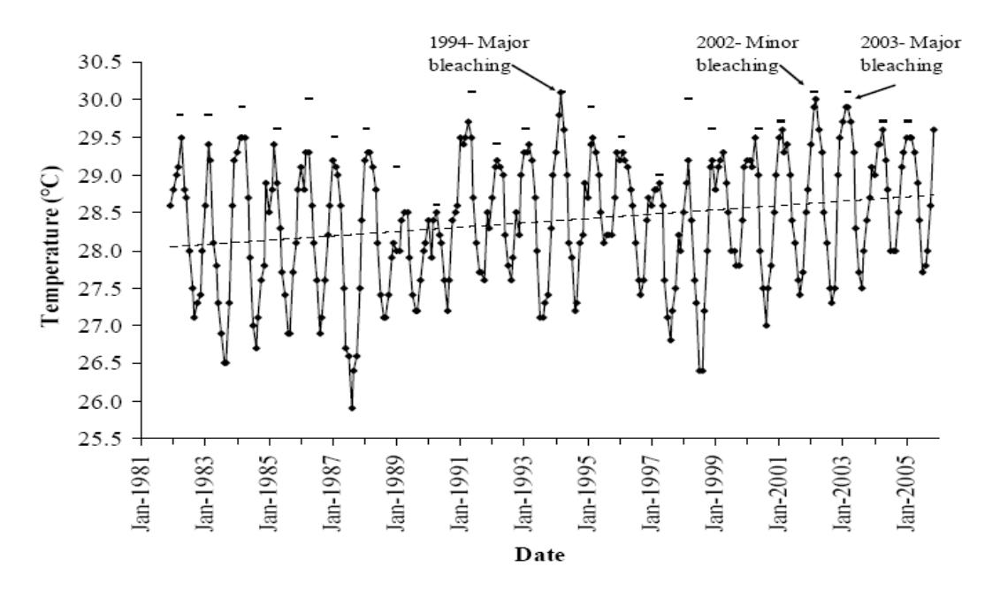

Figure 21. Sea surface temperature trends in American Samoa. Figure from U.S. EPA (2007).

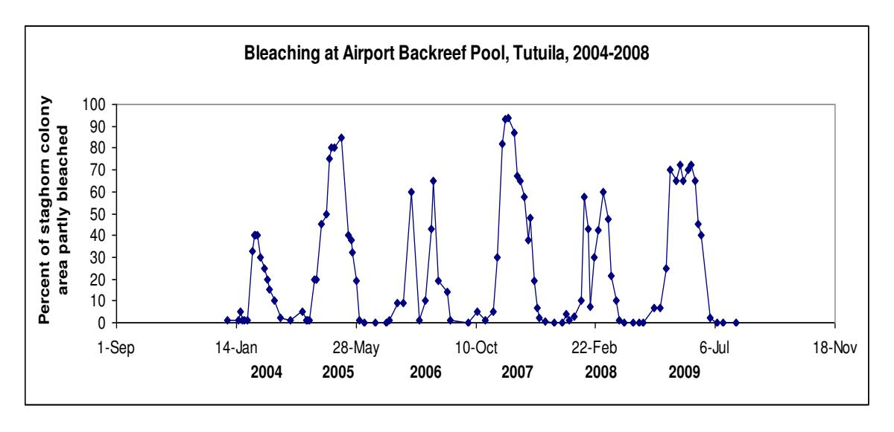

Figure 22. Bleaching events at Airport Backreef Pool. 2004-2008

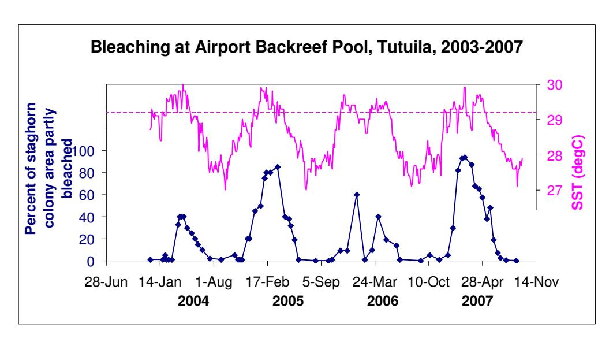

Figure 23. Bleaching at Airport Backreef Pool, 2003-2007.

There has been relatively little mortality in the pools, though many of the staghorns in Alofau are close to death most summers. Other species of Acropora (which are rare in the pools) and fire corals (Millepora dichotoma) also bleach, but finger corals (P. cylindrica) do not bleach except one small patch at Fagaalu, and other corals also do not bleach. Corals which bleach are unlikely to be able to grow while bleached, and are unlikely to be able to reproduce for at least a year after bleaching. The staghorns in Alofau spend very little time each year with none of them bleached. The largest pool, at the airport, has had essentially no mortality so no reduction in habitat quality, but the pools are a very small part of the overall reef area. Bleaching in the pools is the first annual summer mass bleaching of a multi-species coral community reported in the world. Such bleaching is predicted to be commonplace around the world within a few decades. In some of the pools, as much as half of the staghorn coral was already dead when monitoring of bleaching began early in 2004. Most of the dead staghorn coral was still standing. Clearly it was not killed by a hurricane, since that would have broken it. More likely it was killed by the bleaching events, since the staghorns in the pool bleach more than those on the slope and some are near death most summers while there is no bleaching on the slope. When temperatures rose higher during events and produced bleaching and some death on the slopes, they almost certainly caused a great deal of death among the staghorns in the pools. So bleaching has already had a significant impact on small groups of corals, and is probably the biggest threat faced by our corals in the next several decades.

#### **Disease**

Coral disease, mainly White Band Disease, was the primary cause of the loss of coral in the Caribbean (Aronson and Precht, 2001; Precht and Aronson, 2006), which went from about 55% coral cover in the 1970's, to about 8% cover today (Gardiner et al. 2003). Thus, it stands as a major threat to coral reefs, based on the actual impact so far.

Until recently, nothing was known of coral diseases in American Samoa. The impetus to begin the study of diseases here came from the observation by P. Craig of a considerable amount of coral disease that killed many colonies. Subsequently, baseline surveying of coral diseases in

American Samoa revealed a diverse set of diseases (13 types distinguished) but low levels of incidence, a prevalence of only 0.4% on the average (Fenner et al. 2008; Aeby et al. in press). In addition, two diseases of coralline algae were found. It turned out that the disease outbreak noticed by P. Craig was following a mass bleaching event in 2003. There are now several reports of disease outbreaks following mass coral bleaching events (e.g., Jones et al. 2004; Bruno et al. 2007; Harvell et al. 2007; Wilkinson and Souter, 2008; Miller et al. 2006). There is independent evidence that some coral diseases spread much faster at higher temperatures, and it is likely that bleaching weakens the corals resistance to disease. After the outbreak of disease following mass bleaching, disease abundance returned to low levels, and currently has little impact on coral abundance. However, it remains a major threat for the future and we must remain vigilant.

#### **Summary**

Crown-of-thorns starfish outbreaks have had the greatest damaging effects on the reefs of Tutuila, followed by hurricanes and tsunamis. All of these are natural events, though the crownof-thorns outbreaks could have a human component. Mass coral bleaching and the disease outbreaks it produces may rank with the hurricanes and tsunamis in terms of impact. Mass coral bleaching and the disease outbreaks that it produces are primarily an effect of global warming, which is produced by humans, primarily by burning fossil fuels. The other threats and impacts are all produced by humans. Although each of these other threats and impacts is relatively minor, they are chronic stresses on the reef. These stresses are likely additive (Hughes and Connell, 1999), and add to the stresses produced by major natural events, and the significant effects of mass coral bleaching and disease outbreaks. The reefs are well adapted to the natural stressors, having survived them for the past 1.5 million years. Further, the natural stressors are acute, that is, brief, and when over, the reef can recover free of stressors. Most of the human stressors, however, are chronic. So sediment is continual, as is fishing, chemical pollution, and so on. They tend to be diffuse and mild, and therefore hard to locate and measure. Although most are minor, together they may have an impact. Their impact could be to hold the average coral cover lower than the natural level, or to cause the reef to recover more slowly from major natural disturbances, or there may be additional effects. Although the chronic stresses humans produce may be weakening the resilience of the reefs, we do not yet know that to be a fact, so although it remains a possibility, it is not a known fact. So far we cannot prove they have damaged the reef habitat value, but in the future they make it more difficult for the reef to recover from the major coral bleaching events we know are coming.

# Benthic communities as fish habitat

#### **Coral reef**

It is often said that reef fish populations depend on the existence of healthy corals. This is often simplified as something like: ‗if we want to have good fish catches, we need good coral, because coral is the home of the fish.' Such statements are often made to try to encourage local village people to protect and conserve the corals on their reefs, since their fish catches depend on healthy coral populations. Essentially, the argument uses the value of fish catches to fishers to try to increase the value of the coral, to encourage conservation. The goal of such educational efforts is commendable, but the assumptions it rests on are generally not examined in such

educational efforts. We would do well to examine those assumptions in scientific efforts to evaluate fish habitat.

Habitat is where organisms live. Different species have different habitats, so bats live in trees and the air, freshwater fish live in freshwater, tuna live in the pelagic open ocean, and reef fish generally live on the reef. Different species of fish on reefs can and do live in different habitats, so, for instance, a few species specialize in living in sand, a few species specialize in living among the branches of specific corals, other species may live among algae, some may live only on the reef slope and others on the reef flat, and so on (e.g., Chittaro, 2004; Brokovich et al. 2006). Each species fills a niche. A niche differs from habitat, in that the niche is the range of variables the species can live in, for example the range of temperatures, depths, types of corals, light, size of holes, food they eat and so on. A niche is the capability of the species, an abstraction, while the habitat is the actual place the organism lives, which has many different aspects like temperature, depth, and so on, some of which may be important to the fish and others not important. Coral reefs are very patchy as stated before, spatially heterogeneous, and so the habitat can vary greatly over short distances. Fish may respond to that, and be found commonly in one type of habitat patch but not in another. Further, within species there are often changes in habitat utilized with age. Young fish may require something quite different from older fish. A newly recruited fish might be found in seagrass, then as it grows move to mangroves, and finally as an adult move to coral reef. Or it might begin life in shallow habitats like reef flats or lagoons, and move to deeper habitats like reef slopes with age and growth. Or it may spend its entire life in one small patch of coral on a reef slope. Habitat can also differ by time of day, so a fish can move from one area at one time of day to another at a different time of the day or night. It can also differ seasonally or on a lunar cycle, or tidal cycle. In a place like a reef flat, tides are likely to be a powerful variable, with many fish present at high tide but very few at the lowest low tides. Most fish species also have depth ranges and depths at which they are most common. Further, species home ranges differ hugely, from a single coral head of about 30 cm diameter to several km. Species that range over large areas may include many habitats in their range.

Habitats cannot be defined by humans, they are a property of the organisms. One cannot define reef flats as juvenile fish habitat, or else I could define my front porch as juvenile fish habitat. Whether reef flats are juvenile fish habitat or not is an empirical question, and it is a different matter for each species of fish, and may be for each life stage of a fish, time of day, tidal cycle, etc. Empirically, clearly my front porch is not habitat for any species of fish. The question of what is habitat for a species must be answered by recording where that fish lives. Or, to find out what species a place is habitat for, by recording what species live there. So surveying a place like a reef flat can tell you what species of fish that reef flat is habitat for. But that doesn't tell you the habitat of the species. Reef flats may be only the juvenile habitat of the species, or it may be only one of several or many habitats of that species. So juveniles of that species may be found on the reef flat, and also on the reef slope, and among mangrove roots, and in seagrass beds, or in only some of those habitats. Which are habitats for a species can only be determined by surveying them all. If only reef flats are surveyed, and the species is found there, and it is proclaimed that reef flats are that species' habitat, it is clearly one habitat of that species, but finding it there does not preclude finding it elsewhere. It is also important to realize that English words such as ―lagoon‖ may not correspond well with actual habitat distinctions made by reef

organisms. The word ―lagoon‖ can be applied to a wide variety of structures, which fish species may or may not distinguish among. ―For example, a lagoon can be a seagrass-dominated area adjacent to a bank-barrier reef on a small (< 1 km) or large (tens of km) scale, an enclosed lagoon connected through a narrow opening, or estuaries of different salinity regimes.‖ (Adams, et al. 2006) Or they can be on a scale as large as several thousand km (Great Barrier Reef) or lagoons of thousands of atolls in a wide range of sizes and depths (primarily in the Indo-Pacific). Use of such a word may not define a habitat at all. Another question is whether habitats are really discrete entities, whether there are sharp boundaries between them, physical or in definition, or is the reality actually that they fade into one another.

Finding some members of a species in a particular habitat tells you relatively little about the biology of that fish. A list of species found in that habitat likewise provides limited information. That place is in fact habitat for those fish, but there is not much further that you can conclude. In particular, one of our problems is the small amounts of some habitats available, such as mangroves, seagrass, and perhaps reef flats. Just because there is a relatively small amount of mangroves present on Tutuila, and some individuals of a particular reef species were found in the mangroves, does not mean that the small amount of mangroves limits the abundance of that species on the reef. Many fish are highly mobile, and can choose where they go. If a small number choose to live in mangroves, and a large number choose to live on reefs, but only mangroves were surveyed, then finding individuals in the mangroves means mangroves are a habitat for a small number of individuals. It does not follow that the small amount of mangroves means that the small amount of mangroves causes low total abundances of adults of the species. A species could absolutely require a particular habitat like mangroves, or it could prefer mangroves, or it could prefer some other habitat but be capable of using them if other habitats are not available. If a fish species absolutely requires a particular habitat like mangroves, and it is not available, there will be no members of that species present. But if they are capable of living in other habitats even though they prefer to live in a habitat like mangroves, they can be present even if mangroves are not present. They may have lesser numbers without mangroves, or not. It is a logical fallacy to conclude from finding a species in a habitat that without that habitat the species will not be present, or present in reduced numbers. Many species may be capable of living in a variety of habitats. That depends on the niches that they fill, and for many species, surely most reef fish, the exact niches of the species have yet to be determined empirically. It is possible to look at whether the presence or absence of a habitat influences the abundance of a fish species, or see whether the distance to such a habitat influences the species abundance, or whether the amount of that habitat influences the abundance of the species. A few such studies have been carried out.

As stated before, it is commonly assumed that live coral is required habitat for coral reef fish. Habitats are complex things, and it is not immediately obvious which aspects of those habitats are the most important features for each different species of fish. Which aspects are important is an empirical question, and each fish species may be different. Some fish, like a small number of butterfly fish (e.g., Chaetodon unimaculatus, C. ornatissimus, C. multicinctus, Chaetodon trifascialis, C. trifaciatus, C. baronessa, C. triangulum, and C. plebius) eat tentacles off coral (some are even specific to a genus like Acropora or to table corals), as do two small species of filefish (genus Oxymonacathus) and a small wrasse (Labrichthys unilineatus). These species cannot live without the corals they feed on, and when the corals die they disappear (Kokita and

Nakozono, 2001; Jones et al. 2004; Bellwood et al. 2006). Some pufferfish and parrotfish graze on coral as part of their diet, but if it is only part of their diet they may only be moderately affected by the loss of coral. Other species (such as the small gobies Gobiodon sp., and coral crouchers Caracanthus sp.) live deep among the branches of coral, and likely eat mucus or tentacles off the coral, or something else present in the live coral. They are likely to be quite specific about which species of coral they live with, perhaps based on the size and shapes of spaces, and or the food resources. Those species cannot live without those exact corals and very likely the corals have to be alive. Others may shelter among coral branches but feed on passing plankton, such as some damsels. Most of these species are small and unlikely to be utilized for food in American Samoa. They also comprise a very small portion of the fish biodiversity on a reef.

In Figure 24, the biomass of various genera of fish are presented, from sites around Tutuila, data courtesy of Benjamin Carroll. Surgeonfish and damselfish are not included in this graph. The highest biomass of fish is at Faga'alu, where the site is on the outer reef slope at 8-10 m depth. That site from about 2-15 m is dominated by a staghorn rubble bed covered with coralline algae, with little live coral, only about 12% live coral cover. Yet that site has far and away the highest fish biomass. Clearly, those fish are not heavily dependent on live coral cover. The dominant family at Faga'alu is parrotfish. Parrotfish are herbivores, and may be eating filamentous algae off of coralline algae surfaces.

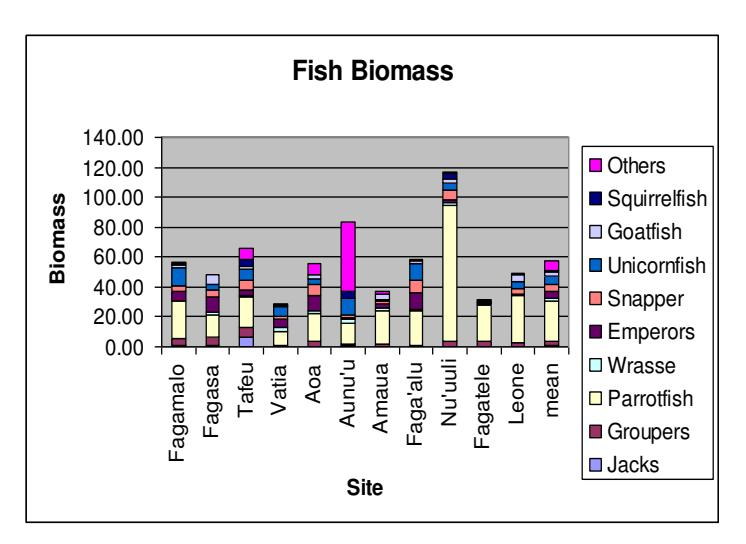

Figure 24.Fish biomass of sites around Tutuila

 Figure 25 shows a scattergram of coral cover with the fish biomass presented in the previous figure. There is essentially no relationship between these two variables (the very small correlation is not significant). Figure 25 provides no support for the view that reef fish populations depend on live coral cover.

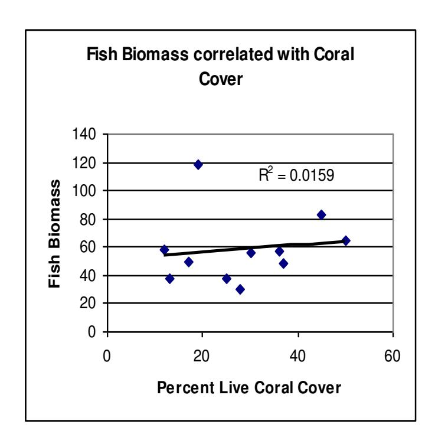

Figure 25. Relationship of coral cover and fish biomass

Other evidence of this type comes from the study by Sabater and Tolaeono (2007). On the north side of Tutuila, outside of bays the substrate is "volcanic pavement" (basalt) that has low coral cover. In spite of the low coral cover, those areas actually were found to have higher fish biomasses than coral reef areas with higher coral cover.

Other types of evidence can also be brought to bear on this question. There are a few events on coral reefs that can drastically reduce live coral cover, yet leave the skeletons standing, so that hiding spaces do not change. One such event is when a crown-of-thorns seastar (COTS) outbreak occurs. COTS eats the tissue off of the living corals, but does not damage the skeletons. The skeletons can stand for quite a few years before they are eventually weakened by boring organisms like sponges and collapse. During that period, the live coral cover has been dramatically decreased but the skeleton shapes are not changed. Just such an event occurred in 1978 in American Samoa. Fish populations were surveyed before the COTS outbreak by Wass (1982) and resurveyed periodically later by others. The graph of fish populations over time starting with the Wass data, shown in Fenner et al. (2008) and Sabater and Carroll (2009), shows no drastic drop in fish populations after the COTS outbreak. Instead, it shows a 50% increase. If living coral tissue was a critical habitat variable (or niche) for many fish species, the populations should have dropped dramatically after the outbreak, yet there is no evidence of that in the total populations. This is not to say that the community composition was identical, in particular populations of those species totally dependent on corals for food surely dropped dramatically. But there are few such species, and the smaller and more cryptic species are surely not counted in transects.

Another event in which only living coral tissues are removed, is mass coral bleaching. In a strong mass bleaching event, many or most living corals may be killed, yet all the skeletons are

left remaining intact. In the study of Jones et al. (2004), a study site in New Guinea experienced drastic live coral loss, but no change of the coral skeletons. Fish communities were surveyed in detail before and after. This study found that about three quarters of fish species declined in abundance but only very few declined drastically. On the other hand, one quarter of the species increased in abundance, some of them greatly. The net result for the total fish population was little change in the total abundance of the community, although community composition was clearly altered. This finding is consistent with the lack of drastic change in total fish populations following the COTS outbreak in Tutuila, but also consistent with what is known about the dependence of fish species on live coral tissue. The strong increase in some fish species may well have been due to the great increase in filamentous algae growing on the newly dead coral skeletons. In American Samoa, at least, that filamentous algae is replaced in some areas by encrusting coralline algae, starting in about six months after coral death. An increase in some species is consistent with the report of Sabater and Tofaeono (2007) of larger fish populations on north shore areas outside of bays that have low coral cover. It is also consistent with the view that the highest coral cover communities do not necessarily have the highest fish populations, because corals provide food for very few species. Reefs that have a mixture of coral and turf algae may have higher fish populations because many more fish species are herbivores that eat turf algae, which in turn have very high productivity levels, particularly when grazed. The finding of little change in the overall size of fish communities but changes in community composition following the loss of live coral tissue from bleaching or crown-of-thorns starfish has been reported in a variety of papers on this topic (e.g., Munday, 2004; Bellwood et al. 2006; Wilson et al. 2006; Graham, 2007; Wilson et al. 2008; and references therein). Bellwood et al. (2006) studied ―cryptobenthic‖ fish (small fish that often hide in holes) using complete sampling with ichthyocide. These fish have very short lifespans, from months to about a year, and so populations able to survive in a changed environment but unable to recruit new members would show changes over study periods, while such fish may show no changes over normal scientific study periods if their lifespans are 10, 20, or more years as is typical of many larger reef species. They found no change in total fish abundance, but they did find a change in community composition from specialists to generalists. Graham (2007) also found specialist corallivores declined more than generalists, and Munday (2004) found that gobies using corals as habitat declined more if they specialized in using just a few species than if they were generalists using many species. Wilson et al. (2006) reviewed the available literature and performed metaanalysis on data from 22 studies of the effects of habitat loss on coral reef fish. They found decreases in the abundance of 62% of fish species studied within a year of coral death. Increases in other species were not consistent, probably in part because the recruitment of additional fish requires more time after the disturbance. As in other studies, they found the greatest impact on coralivores and obligate coral dwellers. Coral dwellers declined rapidly after coral tissue death before erosion of the coral skeletons, indicating that the live coral tissue is essential for their survival, often because they eat it. Eight of 20 invertebrate eating fish species declined following coral death, indicating indirect dependence on corals, as did some small-bodied planktivores. Some algae/detritus feeders declined a relatively small amount, including C. striatus. There were increases in abundance of 38% of species, with the greatest increases in algae/detritus feeders and invertebrate eaters. Diversity of the fish community was correlated with the severity of the coral decline, with small coral declines actually leading to increases in fish diversity, but severe coral declines produced declines in fish diversity. Structural damage to

coral reefs produced by hurricanes not only kill coral but also reduce habitat complexity and rugosity and reduce refuges, exposing fish to predation and competition. Such physical damage caused greater reductions in fish populations, and caused greater reductions than coral death in each functional group.

The overall conclusion from studies of the effects of the death (but not destruction) of corals on fish communities, is that coral death has remarkably small effects on the total community size, but does affect community composition. The effects of physical destruction of coral in addition to coral death are greater, causing a greater loss of fish in more species, as would be expected from the loss of refuges for many species in addition to food sources for a limited number of species.

There are many different features of coral reef habitats that are possible important variables in the niches occupied by different fish species, and it is not easy to tease the different variables apart. It appears that turf algae cover may be an important variable for some species, while live coral is important for a few others. A variable that may be very important for many species is hiding spaces. Reef fish populations are likely strongly influenced by predation. Places to hide from predators are very important for many fish species. This is easily illustrated by schools of planktivorous damselfish, such as Chromis sp. A school may swim well above a colony of finger coral, but a sudden movement by a human observer and the school will dive down between the branches. Different species are likely to have different requirements for just what sort of hiding space they need or prefer. Coral reefs often are highly rugose, with lots of bumps and holes of various shapes, though different reefs and different patches of a reef can have different amounts of rugosity. The effect on fish populations of rugosity can be illustrated by comparing fish populations over standing live staghorn thickets, standing dead staghorn thickets, and collapsed dead staghorn rubble. In the backreef pools of Tutuila, just such patches of habitat are available. Reef fish are abundant over the live staghorn, still present at some abundance over dead standing staghorn, but low over collapsed staghorn rubble. Quantitative measurements of these fish communities have not been made, but are visually apparent. These sorts of observations have led to a common hypothesis that the rugosity or presence of hiding places is a more important variable for fish communities than the exact amount of live coral tissue. The connection between live coral and hiding places or rugosity is that if the coral dies, eventually the branching and foliose corals will collapse, and rugosity will decrease and hiding places lost, and fish populations decrease. A recent review of fish population trends on reefs in the Caribbean over decades (Paddack et al. 2009) found that fish populations in the Caribbean were relatively steady during the period after disease killed the most abundant herbivore, the sea urchin Diadema, and algal populations increased, and also disease and other factors killed corals and coral cover decreased from 55% in 1975 to 8% today. That is, fish populations were relatively steady until recently, whereupon they have decreased strongly. The lack of a drop in fish when the corals were dying supports the view that coral tissue is not critical for most reef fish. The recent drop in fish populations is across all groups, including species that are not caught by fishers as well as those that are. This clue indicates that the decline in fish is unlikely to be due to increased fishing pressure. Instead, the authors suggest that the decrease may be because of the collapse of dead coral skeletons decades after the corals were killed, leading to the loss of rugosity and hiding spaces and thus to fish loses. A recent study (Alvarez-Filip et al. 2009) demonstrates that the Caribbean has indeed lost rugosity, likely due to the death of corals.

The role of the loss of rugosity in this fish decline has not yet been demonstrated, but the decline was only documented in 2009. One small problem with the skeleton collapse theory is the data from Faga'alu presented in Figures 22 and 23. Here, the fish biomass is highest among sites after the corals collapsed. It is true that there are some hiding holes in the resulting substrate, but the rugosity is surely much less than before the coral skeletons collapsed.

Only rarely have the effects of changes in habitat been compared to changes in fishing pressure on reef fish populations. Wilson et al. (2008) studied reefs in Fiji which had varying levels of fishing pressure between sites and over time, and varying amounts of live coral cover loss from a crown-of-thorns outbreak in 2000 and bleaching in 2000. They found that both habitat changes and fishing played critical roles in determining fish abundance and community structure. The relative importance of these two differed between different groups of fish. As in previous studies, species with tight associations with corals where most affected by habitat changes. Even changes in coral community composition without changes in total community cover can affect specialists that depend on particular coral species, as those species change in abundance. Branching corals like Acropora provide habitat complexity that is important for small-bodied fish, for finding refuges from predators. Topographic complexity (caves, overhangs and other larger features) are more important for larger fish species. Rugosity can be retained for years or even decades after coral death, and may not increase quickly with the growth of juvenile corals or encrusting corals. Habitat complexity was found to affect larger predators indirectly by affecting the abundance of small prey species of fish. This study also found that models did a better job of accounting for the abundance of individual fish species than functional groups, likely because of the complex differences in the ecology of individual species.

#### **Mangroves**

American Samoa has three species of mangroves (Ellison, 2009), in several small groves, the largest bordering the Pala Lagoon in Nu'uuli on the south side of Tutuila. The small size of these mangrove forests may be a limiting factor on coral reef fish populations, since mangroves are reported to be juvenile coral reef fish habitat. American Samoa is the eastern limit of the Indo-Pacific distribution of mangroves, except for one species in French Polynesia, and an introduced species in Hawaii. Although the groves in American Samoa are small, so too are the islands, and a quantitative comparison of the area of the groves with the area of the coral reefs is not yet available, nor are comparable figures for places with larger groves and more abundant fish.

Coral reefs have captured the interest of the public and scientists, with their warm clear water, abundant colorful fish, high diversity, and the imposing size of some reef systems (such as the Great Barrier Reef), among other attributes. Mangroves and seagrass have received much less attention from the public and scientists. Mangroves are hot, humid, smelly places with bottomless mud and swarms of mosquitoes, which the public does not find attractive. Seagrass beds are probably more attractive than mangroves, but they lack the abundant colorful fish of coral reefs and are often in shallow water that lacks the dramatic dropoffs of many coral reefs. Coral reefs are simply much more charismatic to humans than mangroves or seagrass, and not only do coral reefs receive much more press coverage, but also they are the subject of much more research (Duarte et al. 2008). Conservationists find it easier to get public attention and

support for work to save coral reefs than for mangroves or seagrass. One strategy to try to support the conservation of mangroves and seagrass has been to try to find evidence that they are important for the much more charismatic coral reefs or for protection from tsunamis.

One example of the desire to find justifications to save or replant mangroves comes from the Indonesian tsunami of 2004. Several publications (e.g., Dahdouh-Guebas et al. 2005; Danielsen et al. 2005; Kathiresan and Rajendran, 2005; Wilkinson et al. 2006, p. 59) afterwards reported that mangroves protected communities inland from them from the damage of the tsunami. However, subsequently a paper criticized the methods of the most quantitative of those reports (Kerr et al. 2006), and another paper (Kerr and Baird, 2007) reported that in northwest Sumatra where the earthquake was, the tsunami was so powerful it completely removed mangroves and other nearshore forests. As a result, the mangroves were unable to provide any protection from communities inland from those mangroves, and future planning should not rely on mangroves to protect those communities. One possible resolution of the differences between the different reports is that near the earthquake center where the tsunami was largest, mangroves could not protect communities from the tsunami. Much farther away, in places like India and Sri Lanka, where the tsunami was smaller, mangroves were able to offer protection. But the point is that a desire to find support for conserving mangroves can lead people to uncritically accept information about the benefits of mangroves, some of which may prove to be exaggerated.

One way to increase support for the conservation of ecosystems like mangroves and seagrass might be to show that they are critical to the survival and well-being of a charismatic ecosystem like coral reefs. The nursery hypothesis is that mangroves and seagrass serve as nurseries for coral reef fish, and thus are important for good reef fish populations for fisheries and the healthy ecological functioning of coral reefs. The desire to assist conservation of mangroves and seagrass has led to studies of these ecosystems as nursery habitat for juvenile reef fish, to try to document that they serve as nurseries. This appears to have a parallel in the desire to state that corals serve as the home of fish, since the public sees the importance of reef fish as food, even when it doesn't see the importance of corals.

The nursery concept is at least a hundred years old, and was applied in temperate areas long before it was applied to mangroves and seagrass. Inshore areas and estuaries have long been thought to be nurseries for juveniles of fish and invertebrate species that inhabit deeper water as adults (Beck et al. 2001). For sharks, ―In some cases regions are labeled shark nurseries simply because of the presence of a few juvenile sharks.‖ ―…occurrence of juvenile sharks in an area is insufficient evidence to proclaim it a nursery.‖ The nursery concept implies that juveniles inhabit a particular area, grow and then move to an adult area. It also implies that such juveniles provide a substantial input of juveniles into the adult area; a few juveniles showing the pattern does not demonstrate a nursery area. Beck et al. (2001) reviewed the history and concept and proposed a definition of a nursery: ―A habitat is a nursery for juveniles of a particular species if its contribution per unit area to the production of individuals that recruit to adult populations is greater, on average, than production from other habitats in which juveniles occur.‖ To prove that an area is a nursery is a difficult thing, rarely if ever accomplished. Movements from juvenile to adult habitat must be measured. Densities of juveniles in all habitats that juveniles occupy must be measured and compared, to show that a putative nursery area has a higher density than other habitats. And it must be shown that those juveniles migrate to adult habitats. In most past

studies, an area was designated a nursery if it had juveniles at higher density than some other habitat (for mangroves and seagrass that other habitat was usually nearby un-vegetated habitat, such as open sand), survival was higher, or juveniles grow faster there than elsewhere. All these lines of evidence are suggestive, but none provide strong evidence, since they could all happen in areas where juveniles do not migrate to adult habitat. A juvenile habitat is anywhere some juveniles live, a nursery is a place they live in higher numbers and grow and survive and then migrate to adult habitat. The authors recognize that these are difficult things to demonstrate, and recommend that managers not wait for absolute proof, but use the precautionary principle to protect areas that some evidence indicates may be nurseries. This has a parallel in the evidence needed in fisheries to prove overfishing. That evidence is often lacking, hence the provision in places like the Magnuson-Stevens Act that the best available science and the precautionary principle must be used. Whatever standard of evidence is used to compare hypotheses such as juvenile habitat limitation and reduction by fishing, the same standard should be used with all, so absolute proof should not be required for one while suggestive evidence is accepted for the other. Areas that provide more than the average number of individuals to adult habitats per unit area are called nursery areas, while areas that produce a larger total number of individuals are called effective juvenile habitats (Adams et al. 2006). The difference comes because an area that has lower than average production per unit of area, could be a much larger area and thus produce more total input to the adult habitat. Most of the research on and reviews of nursery function have been for temperate ecosystems, not tropical.

Mumby et al. 2004 compared 164 coral reef fish species on Caribbean reefs with many nearby mangroves compared to little or no mangroves. They found 44 species of fish in the mangroves. They found the reef fish communities were quite different. They also found higher biomass on the reefs near mangroves for six species and two families (Haemulidae and Lutjanidae). For one species (Haemulon sciurus) populations on patch reefs near mangroves were 25 times as great as on reefs with little or no mangroves. Differences for other species/reef zone combinations were less, with just one combination being more. For one species, the largest herbivorous marine fish in the Atlantic, the rainbow parrot (Scarus guacamaia), juveniles were seen only in mangroves, and adults were much less abundant on reefs without nearby mangroves than on reefs with mangroves. They are now locally extinct on one atoll where mangroves had been removed and in which they were heavily fished. Thus, one fish absolutely requires mangroves for juvenile habitat, two families and six species were influenced by the presence of mangroves (they were more abundant on reefs near mangroves and presumably use the mangroves as juvenile habitat (although this was not reported) and move from the mangroves to the reef (also not reported)). For one fish, H. sciurus, sizes suggest they may start in seagrass, move to mangroves, and then move to reef. But for the majority of the 164 species recorded, there was no evidence to indicate that the presence of mangroves had an effect on their reef populations. Negelkerken et al. (2002) reported that 17 of 85 fish reef fish species had only juveniles in back-reef habitats and only adults on reefs. Adams et al. (2006) state ―…many species show considerable plasticity in habitat use as juveniles.‖ And ―Moreover, many species are abundant in numerous habitats as juveniles suggesting a facultative strategy of habitat use.‖ Perhaps juveniles of many species settle in whatever shallow habitat they end up in, try to survive and grow, and if they grow large enough migrate to the reefs.

One problem is the question of how far juvenile fish can migrate from mangroves or seagrass to get to reefs. For the reef slopes, that is not a problem, since they are adjacent to reef flats and seagrass beds. For some mangroves such as at Leone, the distance is not much further. For the mangroves at Nu'uuli, it is farther. In each of these cases the corridor is shallow. But for the bank reefs on the shelf, the reefs are about 1 – 3 miles (1.6 – 4.6 km) from the reef slopes, and separated from them by deeper sand plains. It may be that few juveniles swim off of the good habitat of the reef slope onto the very poor habitat of the sandy shelf, to reach bank reefs that are not visible and far from shore. Adams et al. (2006) state that ―…while some temperate species are capable of long-distance migrations between juvenile and adult habitats, this has seldom been shown for coral reef fishes.‖ Chapman and Kramer (2000) found very limited movements between reefs separated by distances from meters to 1 km. Most newly recruited reef fish must find a hole to hide for predators, and will not venture far from that, let alone swim off across featureless sand for miles looking for bank reefs that they have no way of knowing exist. Any fish that did would likely be quickly eaten by predators. There are no reported observations of juvenile reef fish swimming across the shelf. Reef fish appear to be reasonably abundant on the banks, in spite of the fact that there are no shallow areas on the banks and juveniles swimming from the reef flats are highly unlikely. The reef bank fish community may be a bit different from the reef slope fish community, since it is likely composed of only those fish that can recruit there. A comparison of bank and reef slope fish communities is not yet available. The presence of reasonably abundant reef fish on banks miles from any shallow habitat appears to demonstrate that shallow juvenile habitats are not limiting for most reef fish in American Samoa.

Negelkerken et al. (2002) studied 17 Caribbean species (out of 85 originally studied) that they had previously found to have abundant juveniles in mangroves and/or seagrass but few juveniles on reef slopes. They found that four of the 17 species had a strong pattern of being more abundant on reefs near mangroves or seagrass, and 11 species sometimes showed that pattern but were inconsistent from one location to another. They said that ―Five nursery species did not show lower densities on reefs of islands without bay nursery habitats, even though densities of their juveniles were much higher in mangroves and seagrass beds than on the coral reef. This suggests that as juveniles, these species show a ‗preference' for (but not a dependence on) mangrove and seagrass beds as nurseries, but can also utilize alternative nurseries when these habitats are absent.‖ For one species of grunt, 95% of recruits in one study (Shulman and Ogden, 1987) were in a seagrass-dominated lagoon and only 5% on the reef, but those settling on the reef were sufficient to sustain the adult reef population. A study by Halpern (2006) found that on a Caribbean island, neither of two species of reef fish studied was affected by the presence of mangroves nearby, but one may have been affected at an island-wide scale. Grol et al. (2008) studied juvenile growth rate of a grunt in the Caribbean on coral reefs, and in mangroves and seagrass. Their food (copepods) was more abundant on the reef than the other habitats, and their growth rate was higher on the reef. However, predator abundance was also higher on the reefs. The highest abundances of juveniles of this fish were found in the mangroves/seagrass, suggesting that predation was the controlling factor. Another study (Birkeland and Amesbury, 1988) concluded that the effect of adjacent habitats in the Pacific on reef fish communities was less than in the Caribbean. Dorenbasch et al. (2005) cite five additional studies that concluded that the connection between mangroves and reef fish is less in the Pacific than Caribbean, and five other studies that did find juvenile coral reef fish in mangroves. They found in the western Indian Ocean that among the 76 reef fish species they

studied, half (32 species) were reef residents that recruit more to the reef than other habitats. Mangroves had very low densities of reef fish recruits, which supports the results of six other studies cited, which found that mangroves were not nurseries for Indo-Pacific coral reef fish.

American Samoa is the easternmost limit of both mangroves and seagrass in the Indo-Pacific (Ellison, 2009) except for one species of each that has been found somewhere in French Polynesia. If mangroves or seagrass were necessary for very many reef fish species, then reefs to the east of American Samoa should have lower fish diversity than reefs west of American Samoa. This would be on top of the longitudinal biogeographic pattern that is well known, namely that diversity decreases eastward across the Pacific Ocean. The diversity of coral reef fish species from comparable studies by Allen (2003) across the southern Pacific is shown in Figure 26. The decrease in diversity across the Pacific appears to be smooth, with no drop-off just east of American Samoa. However, these locations are not equally spread across the Pacific. Figure 27 shows reef fish diversity as a function on longitude. The decrease in diversity appears to be smooth.

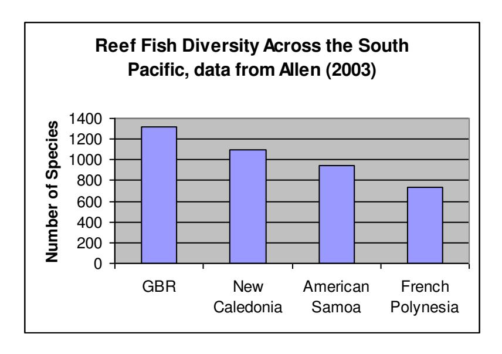

Figure 26. Diversity of coral reef fish species from studies by Allen (2003) across the southern Pacific

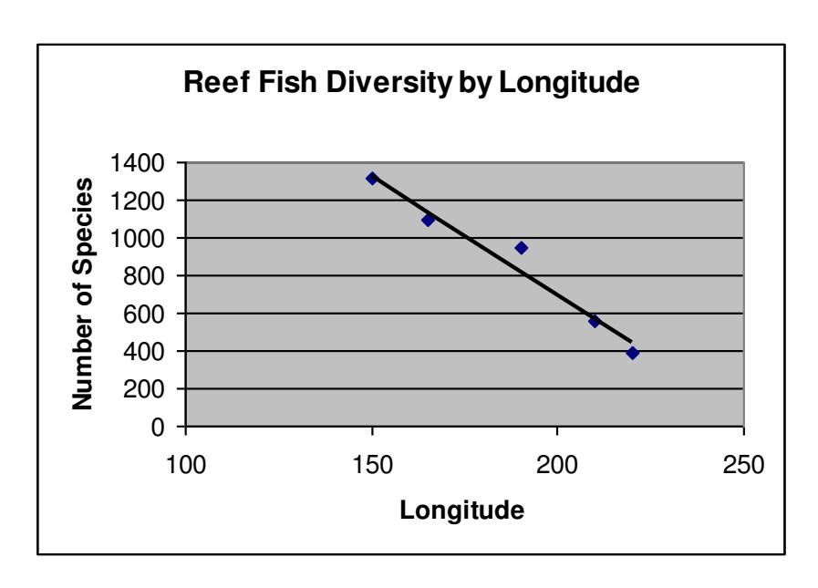

Figure 27. (Longitude numbers greater than 180 were used in order to produce the graph.)

Thus, the reef fish diversity data does not support the view that very many reef fish species require mangrove or seagrass habitat, for a juvenile nursery or any other need. However, diversity is based only on presence/absence of species, so the presence of any individuals of the species that can be found lead to it being included on the diversity list. A species would be absent only if it had an absolute requirement for these habitats, and would thus be totally absent if the habitats were absent. The diversity measure would not detect species which do not absolutely require those habitats, but benefit from them, such that their populations are larger where the habitats are present. Further, if there were small numbers of species that absolutely required these habitats, this method would be unlikely to detect them. Thus, while this evidence shows that there are not significant numbers of reef fish which absolutely require these habitats, it does not bear on the question of whether there are fish species which benefit from them to some degree.

In conclusion, an eagerness to support the conservation of mangroves has led to efforts to demonstrate that mangroves are a nursery area for coral reef fish. The evidence from studies of reef fish juveniles in mangroves shows that juveniles of some reef fish can be found in mangroves, and the presence of mangroves does affect the populations of adults of a few coral reef fish species on nearby coral reefs, with strong effects in a few species, and one species that absolutely requires the presence of mangroves for juveniles. However, the majority of coral reef fish species have not been shown to be affected by the presence of mangroves, much less require them. Islands that entirely lack mangroves and seagrass (such as all Pacific islands east of American Samoa except a few in French Polynesia) do not lack reef fish populations and have no fewer reef fish species than expected based on their geographic locations. They are likely to have lower abundances of at least a few fish species, which benefit from mangrove nurseries. There is no evidence that all those fish species are large. The evidence of seven studies all

support the view that mangroves are good nurseries for only a few coral reef fish in the Indo-Pacific.

#### **Seagrass**

American Samoa has two species of seagrass (Skelton, 2003), Halophila ovalis and Halophila minor. In addition, Ellison (2009) reports a third species, Syringodium isoeiifolium. The source of the latter record is not clear, as the authors and other present observers in the territory have not observed it. What is clear is that meadows of Halophila sp. are fairly common in Tutuila, and range in depth from the low tide mark to at least 30 m deep. Halophila has small leaves, about 2 cm long, and lives in sparse meadows with wide spaces between leaves compared to many other seagrasses. The author has not observed any species of fish or invertebrates, living with or on Halophila in American Samoa. They appear to be habitat for nothing in American Samoa. The independent state of Samoa does have larger seagrass (S. isoeiifolium and Cymodocea serratulata), forming dense beds of tall leaves that are likely to serve as habitat for a variety of organisms. The author observed such beds on the eastern end of Upolu. American Samoa is the eastern limit of seagrass beds in the Indo-Pacific, other than one species found in French Polynesia (Ellison, 2009). In turn, Upolu, Samoa is the eastern limit of seagrass beds that can serve as effective habitat for other organisms.

A review of many papers on the nursery function of seagrass (Heck et al. 2003) concluded that abundance, growth and survival of juvenile fish were greater in seagrass beds than in unstructured habitats, i.e., habitats lacking vegetation or rugosity, such as sand or mud. However, few significant differences were found between seagrass beds and other structured habitats, such as oyster or cobble reefs, or macroalgal beds. Many of the studies were conducted in temperate areas, not around tropical reefs. It appears that structure per se, rather than the type of structure, may be the most important variable. This would be consistent with the results of studies of the effects of the death of coral compared to the destruction of coral, that structure, complexity, or rugosity, which can provide refuges from predators, is an important factor and may be more important than the exact type of structure.

A study of reef fish in the western Indian Ocean found that seagrass was a good juvenile habitat for about half the reef fish species studied, with juvenile abundances similar to that on coral reef (Dorenbosch et al. 2005). They studied mangroves, seagrass, and reefs, and studied the effects of the proximity or presence of coral reefs to the other habitats, on the populations of adult reef fish on reefs. They divided fish species into several groups based on their pattern of habitat usage. Those categories were seagrass residents, nursery species, seagrass generalists, generalists, reef generalists, and reef residents. Thus many species have wider habitat usage than just a nursery habitat and adult reef habitat, or living their complete life cycle on reefs. They had one island (Grande Comoros) where there are no mangroves or seagrass, and there were reefs that were along the Tanzania coast with mangroves but were far from the mangroves. They studied 76 species of fish, and reported that of the 36 species whose juveniles were found in seagrass on the Tanzanian coast, 32 were absent from or showed low densities on Grande Comoros. On reefs along the Tanzanian coast that were far from mangroves and seagrass, 25 of the 36 species were absent or present in low numbers. On the other hand, almost as many reef resident species were absent from Grande Comoros as nursery species, suggesting that it was

something about that island other than lack of mangroves and seagrass, which is some distance from Tanzania, that causes the absence or low abundance of the fish. Further, the pattern for far reefs is also very similar for reef residents and nursery species. Thus, although seagrass has high abundances of juvenile reef fish, only 8 species out of 76 were ―nursery species‖ with juveniles primarily in seagrass and adults on the reef, while 32 species were ―reef residents‖ that recruited to the reef and spent their life there (and none used mangroves as a nursery). Thus, the pattern is similar to that in the Caribbean, a few reef species use habitats like seagrass as nurseries, but many more spend their entire lives on the reef. Thus, while seagrass serves as a nursery for some Indo-Pacific reef fish, at least in the western Indian Ocean, it is of major importance for only a few species, and most species either spend their whole lives on reefs, or use a variety of habitats (including reefs) as juvenile habitat. Further, the lack of a sharply lower level of coral reef fish diversity in American Samoa compared to islands to the west that have seagrass shows that there are very few if any species that absolutely require the presence of seagrass.

#### **Reef flats and other shallow areas**

Reef flats are juvenile habitat for at least some reef fish in American Samoa, such as the lined surgeonfish, Ctenochaetus striatus, the most common single species of fish on our reefs. Huge recruitment events of this fish occur annually, and in some years truly spectacular numbers of recruits are observed (e.g., in 2002 as reported in Green, 2002). Significant recruitment pulses of other species such as rabbitfish (Siganidae) are also observed on reef flats. Recruits of these species are also observed in backreef pools, and C. striatus recruits are also seen on upper reef slopes, though they appear to be in lesser numbers there. Coral cover on reef flats has decreased in the last few years due to low tide events, and coral cover on the reef flat was reported to be better a decade or more ago. Reef flats normally have low coral cover, because exposure limits the growth of coral, and it is hard to see how reef flats could have more than short periods of high coral cover during periods with unusually few low tide events. Low coral cover on the reef flat could limit fish recruitment (or more likely increase mortality from predation) due to the scarcity of hiding places, though reef flats can have hiding holes without live coral.

Shallow reef habitats form a smaller proportion of all benthic areas less than 100 m deep around Tutuila than in Manua (Brainard et al. 2008, Figure 8.3a). A prime driving factor for this is that the age of the islands in the Samoan hotspot chain increase toward the west, so that Ta'u is 100,000 years old, Ofu-Olosega 300,000, and Tutuila 1.5 million years old. With increasing age, the geological reef formations increase in size. This is primarily seen in the width of the shelves around the islands. The Tutuila shelf can be seen relative to the other parts of the reef in Figure 1. Figure 28 shows the increase in approximate shelf width derived from CRED maps, for these three islands, fit with a polynomial curve.

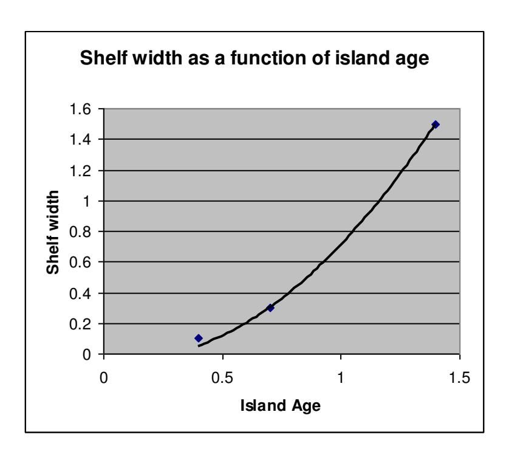

Figure 28. Increase in approximate shelf width, derived from CRED maps, fit with a polynomial curve

For Tutuila, there is some information on the benthic communites on the shelf. The shelf at the base of the reef slope is primarily sand, though there is rubble in places, particularly in bays on the north shore. Sand is among the worst habitats for fish, with only a few species highly specialized to live (and usually burrow) in sand. Hours of observation of deep shelf areas seaward of Taema Banks by submarine revealed all sand substrate (some with Halimeda algae on it) and no fish, while many reef fish could be seen in a single view from the same submarine around corals at the base of Taema Banks at about 45 m depth (D. Fenner, personal observations). Rubble is a better habitat than sand, and observations of fish on rubble in north shore bays reveal some very small fish in relatively low densities. The CRED multibeam sonar scattering data indicate that much of the Tutuila shelf to be hard bottom, with significant areas of soft sediment in some areas near shore (Brainard et al. 2008; Fenner, 2008). Observations by drop camera on the shelf have mostly revealed sand or silt (Eric Simonson, personal comm.). Bare et al. (in prep.) report that unconsolidated sediments dominate the shelf. Most of the shelf area is likely to be very poor fish habitat. If shallow reef habitats are juvenile habitats, as demonstrated by the C. striatus and other species, then the ratio of shallow habitat to deeper habitat may be a limiting factor for reef fish populations in Tutuila, and explain why the total biomass of reef fish per unit of reef around Tutuila is lower than in Manu'a. Insufficient shallow juvenile habitat could lead to low adult populations on deeper adult habitats.

There are, however, some serious problems with this hypothesis. For one, the ratios that differ between islands in the Brainard et al. (2008) report reflect the different areas of the reef shelf (as shown in Figure 23 above). But those shelf areas are essentially not fish habitat at all. The ratio that is needed is between reef flat areas and all deeper areas of reef habitat, such as slopes and banks (i.e., areas with coral). Those ratios are not yet available for the different islands, but will surely differ much less between islands than the areas in the Brainard et al. (2008) figure, since

the shelf which is not habitat is so much larger in Tutuila than on the other islands. Further, the ratio of shallow juvenile habitat to deeper reef habitat should only include reef habitat that the juveniles can reach. The offshore banks are 1-3 miles (1.6-4.8 km) offshore, separated from the reef flats by featureless sand which reef fish are very unlikely to cross. Thus, reef flat juveniles are highly unlikely to migrate to the banks, and the ratio of areas should be reef flat to reef slope. The reef flat area is actually larger than the reef slope, so actually there is no deficit of shallow juvenile habitat for the reef slope, but a complete absence of it for the offshore banks.

 A second problem with the hypothesis is that it does not explain the pattern of the fish community. C. striatus is the most abundant single fish species on Tutuila reefs, yet it uses the reef flats as juvenile habitat. To a lesser extent it also uses backreef pools, which have a much smaller area than the reef flat on Tutuila, and upper reef slopes, which also have a smaller area than the reef flats. If reef flat areas are so small as to limit reef fish adult populations on slopes and banks, why is C. striatus the most abundant of all fish species, when it uses the reef flats as its leading juvenile habitat? In addition, the most conspicuously rare or uncommon reef fish in the archipelago are the largest reef fish, such as bumphead parrots (Bolbometopon muricatum), humphead wrasse (Chelinus undulatus) and reef sharks (grey reef, whitetip, blacktip). They are uncommon to rare on all the islands, not just Tutuila (though all fish over 50 cm length are indeed more common on the remote atolls than the populated high islands, Brainard et al. 2008). For humphead wrasse, coral in the backreef pools are certainly juvenile habitat since juveniles are seen there. Information on juvenile habitat in the literature is very limited, with papers reporting that humphead wrasse use shallow coral-rich areas (particularly Acropora sp.) as habitat (Sadovy et al. 2003) or live in branching corals in shallow lagoons (Lieske and Myers, 2001) or mixed branching coral and bushy macroalgae (Tupper, 2007) though another paper reported they use seagrass (Dorenbosch et al. 2006). Clearly, they can use more than one habitat, and if one habitat is not present they can use another, but to what degree they can switch is not yet known. Blacktip reef sharks of unknown size have been observed in the Pala Lagoon, which is primarily a shallow, muddy-bottomed, partly enclosed body of water with a mangrove shoreline. There appears to be less information in the literature on juvenile habitats of the other reef sharks. Juvenile bumphead parrotfish are reported (Donaldson and Dulvy, 2004) to be found in seagrass in lagoons and reef flats, and are also said to use lagoons (Lieske and Myers, 2001). Pala Lagoon on Tutuila is called a lagoon, yet is very different from lagoons in atolls or barrier reefs, and has not been reported to have large seagrass beds. Rose Atoll has a lagoon that is large compared with the reef slopes, but there is no report of bumphead parrots being common there. If lagoons are juvenile habitat for bumphead parrots, why aren't they common on Rose Atoll or near the Pala Lagoon? These different species of large fish are very different in their taxonomic position (bony fish vs. elasmobranchs), and have very different ecologies including diets and likely habitat preferences. It is not yet clear that they all use reef flat habitat as juvenile habitat, let alone that reef flat is required juvenile habitat for them. Yet they are all uncommon to rare, while C. striatus, which uses reef flat habitat more than any other habitat, is the most abundant fish species on Tutuila. Lack of sufficient reef flat area cannot easily explain these differences. Fishing can, because fishing is well documented to remove large fish first (e.g., Ricker, 1946; Jennings and Kaiser, 1998; Jennings et al. 1999; Pitcher, 2001; Dulvy and Polunin, 2001)., and the large species have much higher vulnerabilities to fishing (on the order of 75 on a 0 to 100 scale: [www.Fishbase.com,](http://www.fishbase.com/) Fenner, 2009) than small species like C. striatus (less than 16 on the same 0 to 100 scale: [www.Fishbase.com,](http://www.fishbase.com/) Fenner, 2009), and the ability of modern

spearfishing with underwater flashlights at night to extirpate sleeping schools of bumphead parrotfish is well documented (Bellwood et al. 2003; Dulvy and Polunin, 2004a; Aswani and Hamilton, 2004; H. Choat, personal comm.; Fenner, 2009). Further, eyewitness testimony from a fisherman reveals that he used this technique to extirpate the largest school of bumphead parrotfish ever reported in the territory. It is quite possible that the natural populations of bumphead parrots were never abundant in the territory (though this has not been documented), but it is clear that in previous decades their populations were at least 30 times as large as they now are, and that fishing is the primary documented cause of their decline to rarity that may now be near local extinction levels. Also, whatever juvenile habitats bumphead parrots require, there is sufficient habitat for at least 30 times as many individuals as there are now.

Fishing effort on the reefs of Tutuila have decreased greatly over recent years, and are now at low levels (Fenner et al. 2008; Sabater and Carroll, 2009). Surely when there is very low fishing, fishing cannot be the cause of low abundances or biomass of fish. And yet, fishing levels have not always been low in American Samoa. Dalzell (1996) reports that the maximum catch in American Samoa in about 1980 was the highest catch per unit of area known from any coral reef worldwide at the time of writing, 44 T/km2/yr. The catch in American Samoa varied from 8.6 to 44 T/km2/yr (Wass, 1982), while catches reported from the Philippines varied from 5.2 to 36.9 T/km2/yr. All other areas had lower catches, most not even coming close to these figures. The Philippines is widely recognized to have very heavily overfished reefs, probably second only to those in Jamaica and probably Haiti. Many reef fish species have long lifespans, 20, 30, or even 40 years or more. Recovery from heavy fishing may take many decades for such long-lived fish. The large reef fish discussed above are indeed fish with long lifespans, and slow rates of natural increase (www.Fishbase.org). In addition, since they are highly vulnerable to fishing (Cheung et al. 2007; www.Fishbase.org), even small amounts of fishing are likely to be able to retard their recovery indefinitely. The presently observed pattern of abundant small fish and rare large fish is just the pattern expected from heavy historical fishing followed by decreasing fishing pressure, and it has yet to be explained by habitat. Some big fish species such as giant groupers appear to be rare everywhere, but others species are abundant in some other locations. The low abundance of the largest reef fish species in American Samoa is likely to be a ghost of fishing past for some of the species.

There can be no doubt that coral reef habitat has effects on reef fish, but the effects of the loss of coral tissue are much less than commonly supposed. The effects of physical destruction of coral are greater than that of the loss of living coral tissue, as expected, due primarily to the loss of hiding places for fish. The effects of coral tissue loss and physical destruction of coral are not equal among different species with some species showing large decreases and for tissue loss some showing increases. Likewise, fishing has differential effects on different fish species. The primary gradient along which fishing has differential effects is fish body size. Below a certain body size, fishers usually do not take fish, and for those species, spatial and temporal differences in populations are not caused by fishing, they must be caused by habitat and other variables. Above a minimum size, fishing affects most reef fish, with the effects least for small sizes and increasing with size to exercise the greatest effects on the largest species. The magnitude of effects on fish populations depends on the magnitude of the differences or changes in coral tissue or physical structure, compared to the intensity of fishing pressure. The relatively healthy state

of the coral reefs of Tutuila with reasonably good coral cover, do not provide the basis for concluding that any deficits in fish stocks are due to the poor quality of reef habitat.

#### **References**

- Adams, A.J., Dahlgren, C.P., Kellison, G.T., Kendall, M.S., Layman, C.A., Ley, J.A., Nagelkerken, I., Serafy, J.E. 2006. Nursery function of tropical back-reef systems. Marine Ecology Progress Series 318: 287-301.
- Aeby, G., Work, T., Fenner, D., DiDonato E. In press. Coral and crustose coralline algae disease on the reefs of American Samoa. Proceedings of the 11th International Coral Reef Symposium, Ft. Lauderdale.
- Allen, G.R. 2003 Reef fishes of Milne Bay Province, Papua New Guinea. Pages 46-55 in Allen, G.R., Kinch, J. P., McKenna, S.A., Seeto, P. (eds.), A rapid mairne biodiversity assessment of Milne Bay Province, Papua New Guinea – Survey II (2000). RAP Bulletin of Biological Assessment 29. Conservation International, Washington, D.C. 172 pp.
- Anthony, K.R.N., Kerswell, A.P. 2007. Coral mortality following extreme low tides and high solar radiation. Marine Biology 151: 1623-1631.
- Aronson, R.B., Precht, W.F. 2001. White-band disease and the changing face of Caribbean coral reefs. Hydrobiologia 460: 25-38.
- Aswani, S., and Hamilton, R. J. 2004. Integrating indigenous ecological knowledge and customary sea tenure with marine and social science for conservation of bumphead parrotfish (Bolbometopon muricatum) in the Roviana Lagoon, Solomon Islands. Environmental Conservation 31: 69-83.
- Alvarz-Filip, L., Dulvy, N. K., Gill, J. A., Côté, I. M., Watkinson, A. R. 2009. Flattening of Careibbean coral reefs: region-wide declines in architechtural complexity. Proceedings of the Royal Society B, Biological Sciences, 276: 3019-3025.
- Beck, M.W., Heck, K.L. Jr., Able, K.W., Childers, D.L., Eggleston, D.B., Gillanders, B.M., Halpern, B., Hays, C.G., Hoshino, K., Minello, T.J., Orth, R.J., Sheridan, P.F., Weinstein, M.P. 2001. The identification, conservation, and management of Estuarine and marine nurseries for fish and invertebrates. BioScience 51: 633-641.
- Bare A.Y., Grimshaw, K.L., Roony, J.R., Sabater, M.G., Fenner, D., Carroll B. submitted to Coral Reefs. Mesophotic communities of the insular shelf at Tutuila, American Samoa.
- Beger, M., Possingham, H.P. 2008. Environmental factors that influence the distribution of coral reef fishes: modeling occurrence data for broad-scale conservation and management. Marine Ecology Progress Series 361: 1-13.
- Bellwood, D.R., Hoey, A.S., Ackerman, J.L., Depczynski, M. 2006. Coral bleaching, reef fish community phase shifts and the resilience of coral reefs. Global Change Biology 12: 1587-1594.

- Bellwood, D. R., Hoey, A. S. and Choat, J. H. 2003. Limited functional redundancy in high diversity systems: resilience and ecosystem function on coral reefs. Ecology Letters 6: 281-285.
- Bellwood, D.R., Hughes, T.P., Folke, C., Nyström, M. 2004. Confronting the coral reef crisis. Nature 429: 827-833.
- Birkeland, C (1982) Terrestrial runoff as a cause of outbreaks of Acanthaster planci (Echinodermata: Asteroidea). Marine Biology 69: 175-185.
- Birkeland, C (1989) The Faustian traits of the crown-of-thorns starfish. American Scientist 77: 154-163.
- Birkeland, C., Amesbury S.S. 1988. Fish-transect surveys to determine the influence of neighboring habitats in fish community structure in the tropical Pacific. In: Cooperation for environmental protection in the Pacific. UNEP Regional Seas Reports and Studies 97: 195-202.
- Birkeland, C., Craig, P., Fenner, D., Smith, L. W., Kiene, W. E. and Riegl, B. 2008. Ch. 20: Geologic setting and ecological functioning of coral reefs in American
- Samoa. Pages 741-765 in B. Riegl and R. Dodge, Coral Reefs of the USA, Springer.
- Birkeland, C., Randall, R., Wass, R., Smith, B., Wilkins, S. 1987. Biological resource assessment of the Fagatele Bay National Marine Sanctuary. NOAA Technical Memorandum NOS MEMD 3. 232pp.
- Birrell, C.L., McCook, L.J., Willis, B.L., Diaz-Pulido, GA. 2008. Effects of benthic algae on the replenishment of corals and the implications for the resilience of coral reefs. Oceanography and Marine Biology: An Annual Review 46: 25-63.
- Brainard, R., Asher, J., Gove, J., Helyer, J., Kenyon, J., Mancini, F., Miller, J., Myhre, S., Nadon, M., Rooney, J., Schroeder, R., Smith, E., Vargas-Angel, B., Vogt, S., Vroom, P., Balwani, S., Ferguson, S., Hoeke, R., Lammers, M., Lundlblad, E., Maragos, J., Moffitt, R., Timmers, M., and Vetter, O. 2008. Coral reef ecosystem monitoring report for American Samoa: 2002-2006. NOAA Special Report NMFS PIFSC.
- Brodie, J., Fabricius, K., De'ath, G., and K. Okaji. 2005. Are increased nutrient inputs responsible for more outbreaks of crown-of-thorns starfish? An appraisal of the evidence. Marine Pollution Buletin 51: 266-278.
- Brokovich, E.A., Baranes, A., and Goren, M. 2006. Habitat structure determines coral reef fish assemblages at the northern tip of the Red Sea. Ecological Indicators 6: 494-507.
- Bruno, J. F., Selig, E. R., Casey, K. S., Page, C. A., Willis, B. L., Harvell, C. D., Sweatman, H., Melendy, A. M. 2007. Thermal stress and coral cover as drivers of coral disease outbreaks. Public Library of Science, Biology 5: 1220-1227.

- Bruno, J. F., Selig, E. R. 2007. Regional decline of coral cover in the Indo-Pacific: timing, extent, and subregional comparisons. Public Library of Science, Biology 2(8): e711. doi:10.1371/.journal.pone.0000711
- Carleton, J.T., Eldredge, L.G. 2009. Marine bioinvasions of Hawai'i, the introduced and cryptogenic marine and estuarine animals and plants of the Hawaiian archipelago. Bishop Museum Bulletin in Cultural and Environmental Studies 4. 202 pp
- Chadwick-Furman, N.E., Spiegel, M. 2000. Abundance and clonal replication in the tropical corallimorpharian, Rhodactis rhodostoma. Invertebrate Zoology 119: 351-360.
- Chadwick-Furman, N.E., Spiegel, M., Nir, I. 2000. Sexual reproduction in the tropical corallimorpharian Rhodactis rhodostoma. Invertebrate Zoology 119: 361-369.
- Chamberlin, R. T. 1921. The geological interpretation of the coral reefs of Tutuila, Samoa. Carnegie Institute Washington Yearbook 19:194-195.
- Chapman, M.R., Kramer D.L. 2000. Movements of fishes within and among fringing coral reefs in Barbados. Environmental Biology of Fish 57: 11-24.
- Chittaro, P.M. 2004. Fish-habitat associations across multiple spatial scales. Coral Reefs 23: 235-244.
- Cheung, W. W. L., Watson, R., Morato, T., Pitcher, T. J., and D. Pauly. 2007. Intrinsic vulnerability in the global fish catch. Marine Ecology Progress Series 333: 1-12. (an open access article)
- Coles, S. R., Reath, P. R., Skelton, P. A., Bonito, V., DeFelice R. C., Basch, L. 2003. Introduced marine species in Pago Pago Harbor, Fagatele Bay, and the National Park Coast, American Samoa. Bishop Museum Technical Report No. 26. 182 pp.
- Colin P. L. and Arneson C. 1995. Tropical Pacific Invertebrates. Coral Reef Press, Beverly Hills, Ca. 296 pp.
- Connell J.H. (1978) Diversity in tropical rain forests and coral reefs. Science 199: 1302-1309.
- Connell, J.H. 1997. Disturbance and recovery of coral assemblages. Proceedings of the 8th International Coral Reef Symposium 1: 9-22.
- Connell, J.H., Hughes, T.P., and Wallace, C.C. 1997. A 30-years study of coral abundance, recruitment, and disturbance at several scales in space and time. Ecological Monographs 67: 461-488.
- Connell, S.D. 2003. The monopolization of understory habitat by subtidal encrusting coralline algae: a test of the combined effects of canopy-mediated light and sedimentation. Marine Biology 102: 1065-1071.

- Cornish, A., DiDonato, E. 2004. Resurvey of a reef flat in American Samoa after 85 years reveals devastation to a soft coral (Alcyonacea) community. Marine Pollution Bulletin 48: 768-777.
- Côté, I.M., Gardner, T.A., Gill, J.A., Hutchinson, D.J, Watkinson, A.R. 2006. New approaches to estimating recent ecological changes on coral reefs. Pages 293-313 in Côté, I.M. and Reynolds, J.D. (eds.), Coral Reef Conservation. Cambridge University Press, Cambridge.
- Craig, P. 2009. Natural History Guide to American Samoa, 3rd Edition. National Park of American Samoa, Dept. Marine & Wildlife Resources, and American Samoa Community College, Pago Pago. 130 pages.
- Craig, P., Birkeland, C., Belliveau, S. 2001. High temperatures tolerated by a diverse assemblage of shallow-water corals in American Samoa. Coral Reefs 20 (1): 185-189.
- Craig, P., DiDonato, G., Fenner, D., Hawkins, C. 2005. The state of coral reef ecosystems of American Samoa. PP. 312-337 in Waddell, J. E. (ed.), The State of Coral Reef Ecosystems of the United States and Pacific Freely Associated States: 2005. NOAA Technical Memorandum NOS NCCOS 11. NOAA/NCCOS Center for Coastal Monitoring and Assessment's Biogeography Team. Silver Spring, MD. 522 pp
- Dahdouh-Guebas, F., Jayatissa, L.P., DiNitto, D., Bosire, J.O., Lo Seen, D., Koedam, N. 2005. How effective were mangroves as a defense against the recent tsunami? Current Biology 15: 443-447.
- Dalzell, P. 1996. Catch rates, selectivity and yields of reef fishing. Pages 161-192 in N.V.C. Polunin and C.M. Roberts (eds.), Reef Fisheries. Chapman & Hall, London.
- Daly, R. A. 1924. The Geology of American Samoa. Carnegie Institution of Washington, Pub. 340:93-143
- Danielsen, F., Sørensen, M.K., Olwig, M.F., Selvam, V., Parish, F., Burgess, N.D., Hiraishi, T., Karunagaran, V.M., Rasmussen, M.S., Hansen, L.B., Quarto, A., Suryadiputra, N. 2005. Science 310: 643.
- Donaldson, T.J., Dulvy N.K. 2004. Threatened fishes of the world: Bolbometopon muricatum (Valenciennes 1840) (Scaridae). Environmental Biology of Fishes 70: 373.
- Dulvy, N. K., Polunin, N. V. C. 2004a. Using informal knowledge to infer human-induced rarity of a conspicuous reef fish. Animal Conservation 7: 365-374.
- Davis, W. M. 1921. The coral reefs of Tutuila. Science 53: 559-565.
- Dawson, E.Y. 1961. The rim of the ref. Natural History 70(6): 8-17.
- Done, T.J. 1992. Phase shifts in coral reef communities and their ecological significance. Hydrobiologia 247: 121-132.

- Dorenbosch, M., Grol, M.G.G., Christianen, M.J.A., Negelkerken, I., van der Velde, G. 2005. Indo-Pacific seagrass beds and mangroves contribute to fish density and diversity on adjacent coral reefs. Marine Ecology Progress Series 302: 63-76.
- Dorenbosch, M., Grol, M.G.G., Negelkerken, I., van der Velde, G. 2006. Seagrass beds and mangroves as potential nurseries for the threatened Indo-Pacific humphead wrasse, Chelinus undulatus and Caribbean humphead wrasse, Scarus guacamaia. Biological Conservation 129: 277-282.
- Duarte, C.M., Dennison, D.C., Orth, R.J.W., Carruthers, T.J.B. 2008. The charisma of coastal ecosystems: addressing the imbalance. Estuaries and Coasts: J CERF 31: 233-238.
- Dulvy, N. K., Polunin, N. V. C. 2004b. Size structural change in lightly exploited coral reef fish communities: evidence for weak indirect effects. Canadian Journal of Fisheries and Aquatic Sciences 61: 466-475.
- Edinger, E. N., J. Jompa, G. V. Limmon, W. Widjatmoko, and M. J. Risk. 1998. Reef degradation and coral biodiversity in Indonesia: effects of land-based pollution, destructive fishing practices and changes over time. Marine Pollution Bulletin 8: 617- 630.
- Ellison, J.C. 2009. Wetlands of the Pacific Island region. Wetlands Ecology and Management 17:169-206.
- Fabricius, K. 2005. Effects of terrestrial runoff on the ecology of corals and coral reefs: review and synthesis. Marine Pollution Bulletin 50: 125-146.
- Fabricius, K. and G. De'ath. 2001. Environmental factors associated with the spatial distribution of crustose coralline algae on the Great Barrier Reef. Coral Reefs 19: 303- 309.
- Faunce, C.H., Sarafy J.E. 2006. Mangroves as fish habitat: 50 years of field studies. Marine Ecology Progress Series 318: 1-18.
- Fenner, D. 2005. Corals of Hawaii. Mutual Publishing, Honolulu. 143 pp.
- Fenner, D. 2008a. Results of the territorial monitoring program of American Samoa for 2006, benthic section. Report to the Department of Marine & Wildlife Resources, the Coral Reef Advisory Group, and NOAA.
- Fenner, D. 2008b. Results of the territorial monitoring program of American Samoa for 2007, benthic portion. Report to the Department of Marine & Wildlife Resources, the Coral Reef Advisory Group, and NOAA.
- Fenner, D. 2009. Results of the territorial monitoring program of American Samoa for 2008, benthic portion. Report to the Department of Marine & Wildlife Resources, the Coral Reef Advisory Group, and NOAA.

- Fenner, D. 2009. The largest reef fish species were gone most places in the world even before scientists knew about it. [www.sharksavers.org/content/view/398/59/www.coralscience.org](http://www.sharksavers.org/content/view/398/59/)
- Fenner, D., Green, A., Birkeland, C., Squair, C., and Carroll, B. 2008. Long-term monitoring of Fagatele Bay National Marine Sanctuary, Tutuila Island, American Samoa: results of surveys conducted in 2007/8, including a re-survey of the historic Aua Transect. Report to Office of National Marine Sanctuaries and American Samoa Government Department of Commerce.
- Fenner, D., M. Speicher, S. Gulick, G. Aeby, S. Cooper Alleto, P. Anderson, B. Carroll, E. DiDonato, G. DiDonato, V. Farmer, J. Gove, P. Houk, E. Lundblad, M. Nadon, F. Riolo, M. Sabater, R. Schroeder, E. Smith, C. Tuitele, A. Tagarino, S. Vaitautolu, E. Vaoli, B. Vargas-Angel, P. Vroom. 2008. Status of the coral reefs of American Samoa. P. 307- 351 in J.E. Waddell and A.M. Clarke (eds.), The State of Coral Reef Ecosystems of the United States and Pacific Freely Associated States: 2008. NOAA Technical Memorandum NOS NCCOS 73. NOAA/NCCOS Center for Coastal Monitoring and Assessment's Biogeography Team. Silver Spring, MD. Pp 569 pp.
- Fenner, D., and S. Heron. In press. Annual summer mass bleaching of a multi-species coral community in American Samoa. Proceedings of the 11th International Coral Reef Symposium, Ft. Lauderdale.
- Flanigan, JM and AE Lamberts (1981) Acanthaster as a recurring phenomenon in Samoan history. Atoll Research Bulletin 255: 59-61
- Friedlander, A. and De Martini, E. E. 2002. Contrasts in density, size, and biomass of reef fishes between the northwestern and main Hawaiian Islands: effects of fishing down apex predators. Marine Ecology Progress Series 230: 253-264.
- Gardner TA, Côté IM, Gill JA, Grant A, Watkinson AR (2003) Long-term region-wide declines in Caribbean corals. Science 301: 958-960.
- Gomez, ED, Alino, PM, Licuanan WRY, and Yap HT. 1994a. Pages 57-76 in: Wilkinson, CR, Sudara, S, and Chou LM (eds.) Proceedings, Third ASEAN-Australia Symposium on Living Coastal Resources, Vol. 1: Status Reviews. Chulalongkorn University, Bangkok Thailand, May 1994. Australian Institute of Marine Science.
- Goreau, T.J, Hayes, R.L. 1994. A survey of coral reef bleaching in the South Central Pacific during 1994. A report to the Coral Reef Initiative, .U.S. Dept of State. 118 pp.
- Graham, N.A.J. 2007. Ecological versatility and the decline of coral feeding fishes following climate driven coral mortality. Marine Biology 153: 119-127.
- Graham, N.A.J., McClanahan, T.R., MacNeil, M.A., Wilson, S.K., Polunin, N.V.C., Jennings, S., Chabanet, P., Clark, S., Spalding, M.D., Letourneur Y., Bigot, L., Galzin, R., Öhman, M.C., Garpe K.C., Edwards, A.J., Sheppard, C.R.C. 2008. Climate warming, marine

- protected areas and the ocean-scale integrity of coral reef ecosystems. PloS One 3(8, 3039): 1-9.
- Green, A.L., Birkeland, C.E., and Randall, R.H. 1999. Twenty years of disturbance and change in Fagatele Bay National Marine Sanctuary, American Samoa. Pacific Science 53(4): 376-400.
- Grigg, R.W. 1983. Community, structure, succession and development of coral reefs in Hawaii. Marine Ecology Progress Series 11: 1-14.
- Grol, M.G.G., Dorenbosch, M., Kokkelmans, E.M.G., Nagelkerken, I. Mangroves and seagrass beds do not enhance growth of early juveniles of a coral reef fish. Marine Ecology Progress Series 366: 137-146.
- Harvell, C. D., Jordán-Dahlgren, E., Merkel, S., Rosenberg, L, Smith, G., Weil, E., Willis, B. 2007. Coral disease, environmental drivers, and the balance between coral and microbial associates. Oceanography and Marine Biology: an Annual Review. 20: 58-81.
- Halpern, B.S. 2004. Are mangroves a limiting resource for two coral reef fishes? Marine Ecology Progress Series 272: 93-98.
- Hayward, A.J. and Negri, A. 1999. Natural inducers for coral larval metamorphosis. Coral Reefs 18: 273-279.
- Heck Jr., K.L., Hays, G., Orth, R.J. 2003. Critical evaluation of the nursery role hypothesis for seagrass meadows. Marine Ecology Progress Series 253: 123-136.
- Heupel, M.R., Carlson, J.K., Simpfendorfer, C.A. 2007. Shark nursery areas: concepts, definition, characterization and assumptions. Marine Ecology Progress Series 337: 287- 297.
- Houk, P., DiDonato, G., Iguel, J., and van Woesik, R. 2005. Assessing the effects of non-point source pollution on American Samoa's coral reef communities. Environmental Monitoring and Assessment 107: 11-27.
- Houk, P, Musburger, C 2008 Assessing the effects of non-point source pollution on American Samoa's coral reef communities. Report to American Samoa Environmental Protection Agency. 45 pp
- Hughes, T.J. 1994. Catastrophes, phase-shifts, and large-scale degradation of a Caribbean coral reef. Science 265: 1547-1551.
- Hughes, T.J., and Connell, J.H. 1999. Multiple stressors on coral reefs: a long-term perspective. Limnology and Oceanography 44: 932-940.
- Hughes, T.J., Rodrigues, M.J., Bellwood, D.R., Ceccarelli, D., Hoegh-Guldberg, O., McCook, L., Moltschaniwskyj, N., Pratchett, M.S., Steneck, R.S., Willis, B. 2007. Phase shifts, herbivory, and the resilience of coral reefs to climate change. Current Biology 17: 360- 365.

- Jennings, S., Kaiser, M. (1998) The effects of fishing on marine ecosystems. Advances in Marine Biology 34: 201-
- Jennings, S., Reynolds, J. D., and Polunin, N. V. C. 1999. Predicting the vulnerability of tropical reef fishes to exploitation with phylogenies and life histories. Conservation Biology 13: 1466-1475.
- Jones, G.P., McCormick, M.I., Srinivasan, M., Eagle, J.V. 2004. Coral decline threatens fish biodiversity in marine reserves. Proceedings of the National Academy of Sciences of the United States of America 101: 8251-8253.
- Jones, R.J., Bowyer, J., Hoegh-Guldberg, O., Blackall, L.L. 2004. Dynamics of a temperaturerelated coral disease outbreak. Marine Ecology Progress Series 281: 63-77.
- Kerr, A.M., Baird, A.H. 2007. Natural barriers to natural disasters. BioScience 57: 102-103.
- Kerr, A.M., Baird, A.H., Campbell, S.J. 2006. Comments on ―Coastal mangrove forests mitigated tsunami‖ by K. Kathiresan and N. Rajendran (Estuar. Coast Shelf Sci. 65 (2005) 601-606. Estuarine, coastal, and shelf science 67: 539-541.
- Knowlton, N. 1992. Thresholds and multiple stable states in coral reef community dynamics. American Zoologist 32: 674-682.
- Kokita, T., Nakozono, A. 2001. Rapid response of an obligately corallivorous filefish Oxymonacanthus logirostrus (Monacanthidae) to a mass coral bleaching even. Coral Reefs 20: 155-158.
- Kuguru, B., Mgaya, Y.D., Öhman, M.C., Wagner, G.M. 2004. The reef environment and competitive success in the Corallimorpharia. Marine Biology 145: 875-884.
- Kuguru, B., Winters, G., Beer, S., Santos, S.R., Chadwick, N.E. 2007. Adaptation strategies of the corallimorpharian Rhodactis rhodostoma to irradiance and temperature. Marine Biology 151: 1287-1298.
- Langmead, O., Chadwick-Furman, N.E. 1999a. Marginal tentacles of the corallimorpharian Rhodactis rhodostoma. 1. Role in competition for space. Marine Biology 134: 479-489.
- Langmead, O., Chadwick-Furman, N.E. 1999b. Marginal tentacles of the corallimorpharian Rhodactis rhodostoma. 2. Induced development and long-term effects on coral competitors. Marine Biology 134: 491-500.
- Littler, D. S. and Littler, M. M. 2003. South Pacific Reef Plants, a diver's guide to the plant life of South Pacific coral reefs. Offshore Graphics, Inc, Washington, D. C. 331 pp.
- Madrigal, L. G. 1999. Field guide of shallow water marine invertebrates of American Samoa. American Samoa Government, Dept. of Education. 132 pp.

- Maragos, J.E. 1997. Coral reef health in the Central Pacific. Pages 3-29 in Grigg, R.W. and C. Birekland, Status of Coral Reefs in the Pacific. University of Hawaii Sea Grant College Program.
- Mayor, A. 1924. Structure and ecology of Samoan reefs. Papers from the Department of Marine Biology, Carnegie Institution of Washington 19: 1-25, pl. 1-8.
- McCook, L.J. 1999. Macroalgae, nutrients, and phase shifts on coral reefs: scientific issues and management consequences for the Great Barrier Reef. Coral Reefs 18: 357-367.
- McCook, L.J., Jompa, J., Diaz-Pulido, G. 2001. Competition between corals and algae on coral reefs: a review of available evidence and mechanisms. Coral Reefs 19: 400-417.
- McCullogh, M., Falton, S., Wyndam, T., Hendy, E., Lough, J., Barnes, D. 2003. Coral record of increased sediment flux to the inner Great Barrier Reef since European settlement. Nature 421: 727-730.
- McManus, J.W., Vallejo, B., Meñez and Coronado, G. (1995) ReefBase: an international database on coral reefs. In: Marine/Coastal Biodiversity in the Tropical Region (workshop proceedings). East-West Center, Honolulu.
- Miller, J., Waara, R., Muller, E., Rogers, C. 2006. Coral bleaching and disease combine to cause extensive mortality on reefs in US Virgin Islands. Coral Reefs 25: 418.
- Miller, J., Maragos, J., Brainard, R., Asher, J., Vargas-Angel, B., Kenyon, J., Schroeder, R., Richards, B., Nadon M., Vroom P., Hall, A., Keenan E., Timmers M., Gove J., Smith E., Weiss J., Lundblad E., Ferguson S., Lichowski F., and Rooney J. 2008. State of coral reef ecosystems of the Pacific remote island areas. Pp. 353-386. In: J.E. Waddell and A.M. Clarke (eds.), The State of the Coral Reef Ecosystems of the United States and Pacific Freely Associated States: 2008. NOAA Technical Memorandum NOS NCCOS 73. NOAA/NCCOS Center for Coastal Monitoring and Assessment's Biogeography Team. Silver Spring, MD. 569pp.
- Mumby, P.J., Broad, K., Brumbaugh, D.R., Dahlgren, C.P., Harborne, A.R., Hastings, A., Holmes, K.E., Kappel, C.V., Micheli, F., Sanchirico, J.N. 2008. Coral reef habitats as surrogates of species, ecological functions, and ecosystem services. Conservation Biology 22: 941-951.
- Mumby, P.J., Edwards, A.J., Arias-Gonzalas, J.E., Lindeman, K.C., Blackwell, P.G., Gall, A., Gorczynska, M.I., Harborne, A.R., Pescod, C.L., Renken, H., Wabnitz, C.C.C., Llewellyn, G. 2004. Mangroves enhance the biomass of coral reef fish communities in the Caribbean. Nature 427: 533-536.
- Munday, P.L. 2004. Habitat loss, resource specialization, and extinction on coral reefs. Global Change Biology 10: 1642-1647.
- Negelkerken, I., Roberts, C.M., van der Velde, G., Dorenbosch, M., van Riel, M.C., Cocheret de la Morinierè, Nienhuis, P.H. 2002. How important are mangroves and seagrass beds for

- coral-reef fish? The nursery hypothesis tested on an island scale. Marine Ecology Progress Series 244: 299-305.
- Paddack, M.J. and 34 others. 2009. Recent region-wide declines in Caribbean reef fish abundance. Current Biology 19: 590-596.
- Pandolfi, J.M., and Jackson, J.B.C. 1997. The maintenance of diversity on coral reefs: examples from the fossil record. Proceedings of the 8th International Coral Reef Symposium 1: 397-404.
- Pandolfi, J.M., Llewellyn, G., Jackson, J.B.C. 1999. Pleistocene reef environments, constituent grains, and coral community structure: Curacao, Netherlands Antilles. Coral Reefs 18: 107.
- Pitcher, T. J. 2001. Fisheries managed to rebuild ecosystems? Reconstructing the past to salvage the future. Ecological Applications 11: 601-617
- Precht, W.F. and Aronson, R.B. 2006. Death and resurrection of Caribbean coral reefs: a palaeoecological perspective. Pages 40-77 in Côté, M. and Reynolds, J.D. (eds.), Coral Reef Conservation. Cambridge University Press, Cambridge.
- Ricker, W. E. 1946. Production and utilization of fish populations. Ecological Monographs 16: 373-391.
- Rodgers, C.S. 1990. Responses of coral reefs and reef organisms to sedimentation. Marine Ecology Progress Series 62: 185-202.
- Sabater, M.G. and Carroll, B.P. 2009. Trends in reef fish population and associated fishery after three millennia of resource utilization and a century of socio-economic changes in American Samoa. Reviews in Fishery Science 17: 318-335.
- Sabater M.G. and Tofaeono S. 2007. Effects of scale and benthic composition on biomass and trophic group distribution of reef fishes in American Samoa. Pacific Science 61 (4) : 503-520.
- Sadovy, Y., Kulbicki, M., Labrosse, P., Letourneur, Y., Lokani, P., Donaldson, T. J. 2003. The humphead wrasse, Cheilinus undulatus: synopsis of a threatened and poorly known giant coral reef fish. Reviews in Fish Biology and Fisheries 13: 327-364.
- Samuelu, J. I., and A. Solofa. 2007. Samoa. Pages 115-146 in Sulu, R. Status of coral reefs in the Southwest Pacific: 2004. IPS Publications, University of the South Pacific.
- Sandin, S., A., Smith, J. E., DeMartini, E. E., Dinsdale, E. A., Donner, S. D., Friedlander, A. M., Konotchick, T., Malay, M., Maragos, J. E., Obura, D., Pantos, O., Paulay, G., et al. 2008. Baselines and degradation of coral reef community structure in the northern Line Islands. Plos One (3) 2: 1-11.
- Secretariat of the Pacific Community (SPC). 2005. Reef Fisheries Observatory, preliminary findings: a snapshot of the condition of coral reefs in Fiji Islands, French Polynesia,

- Firibati, New Caledonia, Tonga and Vanuatu from 2002-2004. SPC Fisheries Newsletter 112: 2-5.
- Schroeder, R.E., Green, A.L., DeMartini, E.A., Kenyon, J.C. 2008. Long-term effects of a shipgrounding on coral reef fish assemblages at Rose Atoll, American Samoa. Bulletin of Marine Science 82: 345-364.
- Scully, E.P., and Ostrander, G.K. 2001. Corals and phase shifts. Trends in Ecology and Evolution 16: 126-127.
- Seymour, R.M., Bradbury, R.H. 1999. Lengthening reef recovery times from crown-of-thorns outbreaks signal systemic degradation of the Great Barrier Reef. Marine Ecology Progress Series 176: 1-10.
- Sheaves, M., Baker, R., Johnston, R. 2006. Marine nurseries and effective juvenile habitats: an alternative view. Marine Ecology Progress Series 318: 303-306.
- Sheppard CRC (2003) Predicted recurrences of mass coral mortality in the Indian Ocean. Nature 425:294-297
- Shulman, M.J., Ogden, J.C. Recruitment of coral reef fishes: effects of distribution of predators and shelter. Ecology 66: 1056-1066.
- Skelton, P. 2003. Seaweeds of American Samoa. Report to Dept. Marine & Wildlife Resources, American Samoa. International Ocean Institute and Ocean Research and Development Associates. Townsville, Australia. 103 pp.
- Song, Y., Black, G., Lipps, J. H. 1994. Morphological optimization in the largest living foraminifera: implications from finite element analysis. Paleobiology 20: 14-26.
- Starmer, J., Asher, J., Castro, F., Gochfeld, D., Gove, J., Hall, A., Houk, P., Keenan, E., Miller, J., Moffit, R., Nadon, M., Schroeder, R., Smith, E., Trianni, M., Vroom, P., Wong, K., Yuknavage, K. 2008. The state of coral reef ecosystems of the Commonwealth of the Northern Mariana Islands. Pages 437-463 In: J.E. Waddell and A.M. Clarke (eds.), The State of the Coral Reef Ecosystems of the United States and Pacific Freely Associated States: 2008. NOAA Technical Memorandum NOS NCCOS 73. NOAA/NCCOS Center for Coastal Monitoring and Assessment's Biogeography Team. Silver Spring, MD. 569pp.
- Steneck, R.S. 1986. The ecology of coralline algal crusts: convergent patterns and adaptive strategies. Annual Review of Ecology and Systematics 17: 273-303.
- Steneck, R.S. 1997. Crustose corallines, other algal functional groups, herbivores and sediments: complex interactions along reef productivity gradients. Proceedings of the 8th International Coral Reef Symposium 1: 695-700.
- Szmant, A.M. 2002. Nutrient enrichment on coral reefs: is it a major cause of coral reef decline? Estuaries 25: 743-766.

- Tupper, M. 2007. Identification of nursery habitats for commercially valuable humphead wrasse Chelinus undulatus and large groupers (Pisces: Serranidae) in Palau. Marine Ecology Progress Series 332: 189-199.
- U.S. Environmental Protection Agency (EPA) 2007. Climate change and interacting stressors: implications for coral reef management in American Samoa. Global Change Research Program, National Center for Environmental Assessment, Washington, D.C.; EPA/600/R-07/069. [www.epa.gov/ncea](http://www.epa.gov/ncea)
- Vargas-Ángel, B., Asher, J., Godwin, L.S., Brainard, R.E. 2008. Invasive didemnid tunicate spreading across coral reefs at remote Swains Island, American Samoa. Coral Reefs
- Wass, R.C. 1982. Characterization of inshore Samoan fish communities. Department of Marine and Wildlife Resources Biological Report Series 6, Government of American Samoa. Pago Pago, American Samoa. 27 pp.
- Wells, S. 1988. Coral Reefs of the World, Vol. 3, Central and Western Pacific. UNEP, IUCN. 329 pp.
- Whaylen, L. and Fenner, D. 2006. Report of 2005 American Samoa coral reef monitoring program (ASCRMP), expanded edition. Report to the Department of Marine and Wildlife Resources and Coral Reef Advisory Group, American Samoa. 64 pp.
- Wilkinson, C. 2006. Status of coral reefs of the world: summary of threats and remedial action. Pages 3-39 in Côté, M. and Reynolds, J.D. (eds.), Coral Reef Conservation. Cambridge University Press, Cambridge.
- Wilkinson, C., Souter, D. 2008. Status of Caribbean coral reefs after bleaching and hurricanes in 2005. Global Coral Reef Monitoring Network and Reef and Rainforest Research Centre, Townsville, 152 p.
- Wilkinson, C., Souter, D., Goldberg, G. 2006. Status of coral reefs in tsunami affected countries: 2005. Australian Institute of Marine Science, Townsville. 154 pp.
- Wilson, S.K., Fisher, R. Pratchett, M.S., Graham, N.A.J., Dulvy, N.K., Turner, R.A., Cakacaka, A., Polunin, N.V.C., Rushton, S.P. 2008. Exploitation and habitat degradation as agents of change within coral reef fish communities. Global Change Biology 14: 2796-2809.
- Wilson, S.K., Graham, N.A.J, Pratchett, M.S., Jones, J.P., Polunin, N.V.C. 2006. Multiple disturbances and the global degradation of coral reefs: are reef fishes at risk or resilient? Global Change Biology 12: 2220-2234.
- Work, T. M., Aeby, G. S., and Maragos, J. E. 2008. Phase shift from a coral to a corallimorphdominated reef associated with a shipwreck on Palmyra Atoll. PloS One 3: 1-5.
- Wulff, J.L. 1997. Parrotfish predation on cryptic sponges of Caribbean coral reefs. Marine Biology 129: 41-52.

# **DMWR marine resource management strategy: merging protected area and fishery management tools**

# **Marlowe Sabater1**

1Chief Fishery Biologist, Department of Marine and Wildlife Resources, PO Box 3730 Pago Pago, American Samoa 96799

# Fishery Management Framework

The Department of Marine and Wildlife Resources currently implements three programs to address fishery management. These are: 1) fishery regulations; 2) Marine Protected Area Programs; and 3) Research and Monitoring. These three are interrelated with the goal of managing the marine resources through regulations and protection using decisions based on scientific data. The fishery regulations are the product of scientific studies and analysis of existing data sets. This is mandatory in order to come up with a sound scientific management decisions. The Marine Protected Area Programs include the Community based Fishery Management Program that aims to conserve fishery resources with the villages making the decisions on how they would like their resources be managed. The No-take Marine Protected Area Program also aims to conserve the marine resource using a no-take approach. This is a collaborative work between ASG and the villages where management is done jointly. The Research and Monitoring Program is a composite of various projects that aims to understand the dynamics of the coral reef ecosystem and fishery. This program includes: 1) Key Reef Species Monitoring and Life History Projects; 2) Territorial Monitoring Program; 3) Fish Aggregating Devices Research Project; 4) Inshore Fishery Documentation Project; 5) Offshore Fishery Documentation Project; and 6) Targeted Research Projects.

# Monitoring and Research Programs as Support to Management

The Monitoring and Research Programs provides scientific information and technical support for fishery management (Figure 1). The Key Reef Species Monitoring and Life History Projects aims to determine the status of the fish species that are being harvested in the fishery. Included in this sets of project involve determining life history characteristics of fish species that are being recorded in the monitoring phase. The Territorial Monitoring Program aims to evaluate ecosystem health by looking at indicator parameters monitored over time. The Inshore and Offshore Fishery Documentation Projects aim to monitor fishery-dependent indicators to determine the level of extraction of the near-shore and off-shore resources, respectively. The Targeted Research Projects aim to assess the distribution and population of species of concern located in areas beyond the conventional monitoring locations. The data generated from these data sets feed into the fishery regulations and management decisions. The expertise of the biologists working

for these projects also provides technical support to the MPA Programs. The data gaps found in each projects are fed into the Marine Conservation Plan to be submitted to the Western Pacific Fishery Management Council and the Fishery Local Action Strategy for funding.

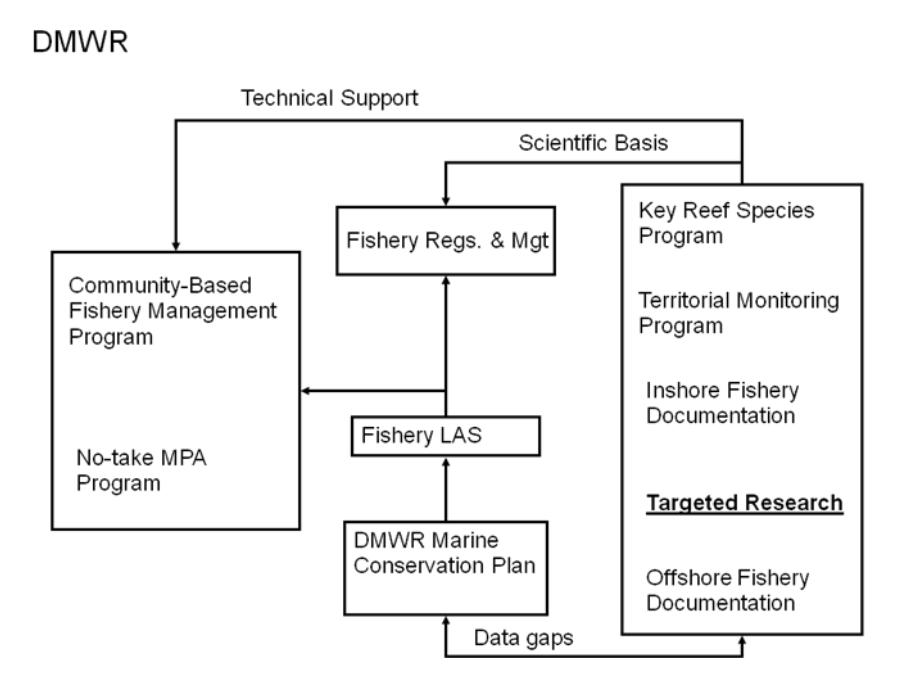

Figure 1. Monitoring and Research Programs of DMWR

# The Marine Protected Area Programs

DMWR has two existing programs that deal with protected areas, as detailed in Figure 2. The first is the Community Based Fishery Management Program (CFMP) and the second is the No-Take MPA Program (NTMPAP). The existence of two protected area programs within one department created confusion to other agencies, local community and federal partners. These to programs, however, are complementary and aim to create permanent no-take areas within the territory. Both will involve local villages (the No-Take MPA Program might not need to go through the village system depending on the location i.e the offshore banks where the fishermen are the stakeholders). The NTMPAP completed the reconnaissance surveys of priority areas gathered from an expert group meeting in 2004 and has a list of sites for consultation with the stakeholders. The program will also survey villages under the CFMP in order to evaluate its biological status compared to other sites. If the area is under the CFMP, steps will be undertaken to negotiate and educate the stakeholders of the benefits of converting sections of their village boundaries into a no-take status though the revision of their management plans and village regulations. During periods where the village is open, the Inshore Fishery Documentation will monitor the catches in the village to estimate the harvest rates and compare this with the monitoring data to determine whether there were impacts to the fish population during this

rotational closure. Future villages that are interested in joining the CFMP will take into consideration no-take as one of their management options. Other areas like the offshore banks, consultations will be conducted with the fishermen stakeholders with the assistance of the Offshore Fishery Documentation Program. The end goal is to establish and meet the 20% goal before 2010.

Figure 2. MPA Program of DMWR

# American Samoa MPA Network

A conceptual framework is presented to illustrate how the MPA Programs in DMWR fits into the American Samoa MPA Network initiative being spearheaded by the Coral Reef Advisory Group (CRAG) (Figure 3). The DMWR MPA Programs, as described in the previous section, contributes to the aim of achieving 20% goal as described in the Governor's Executive Order ???? by converting some villages (or partial areas within the village) under the CFMP into a notake status. The NTMPAP will establish new sites based on the bio-reconnaissance survey results. A biogeography assessment has been conducted by the Biogeography Team of NOAA-National Ocean Service in order to assess various areas for possible establishment of marine protected areas using Geographic Information System and data from local and federal partners. These data and results were made available to DMWR, National Parks of American Samoa (NPAS) and Fagatele Bay National Marine Sanctuary (FBNMS). FBNMS is currently conducting it's Management Plan Review concurrent with possible designation of additional sites. Depending on the stakeholder meetings, it is hoped that some of these sites contribute to the 20% goal.

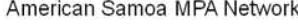

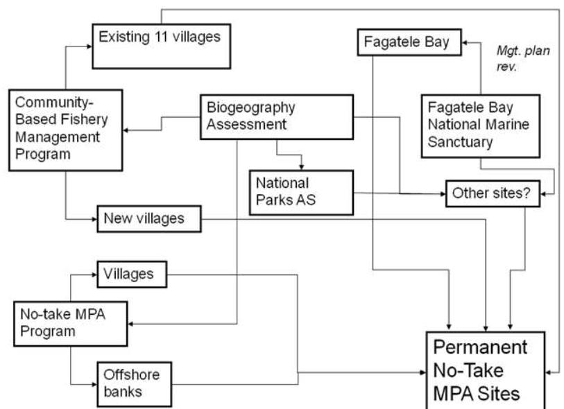

Figure 3.*Conceptual Framework of American Samoa's MPA Network*

# American Samoa MPA Network Coordinator

The MPA Coordinator will be responsible for making sure the activities listed in the MPA Network Document are implemented. Some of the responsibilities of the Coordinator are to update CRAG on the activities of each agency involved in MPAs and ensure that harmony is attained in the implementation of such programs (Figure 4). The position is also responsible to coordinate with resource management agencies at the Independent State of Samoa in terms of the MPA efforts through the Two Samoa Initiative (Figure 5). This position reports to CRAG but is housed in DMWR. One major on-the-ground activity of the MPA Coordinator is to evaluate MPA effectiveness in established MPA sites. The Coordinator will be conducting a before-after and control-impacted assessment in the CFMP sites and correlate results with the degree of protection given to the resources.

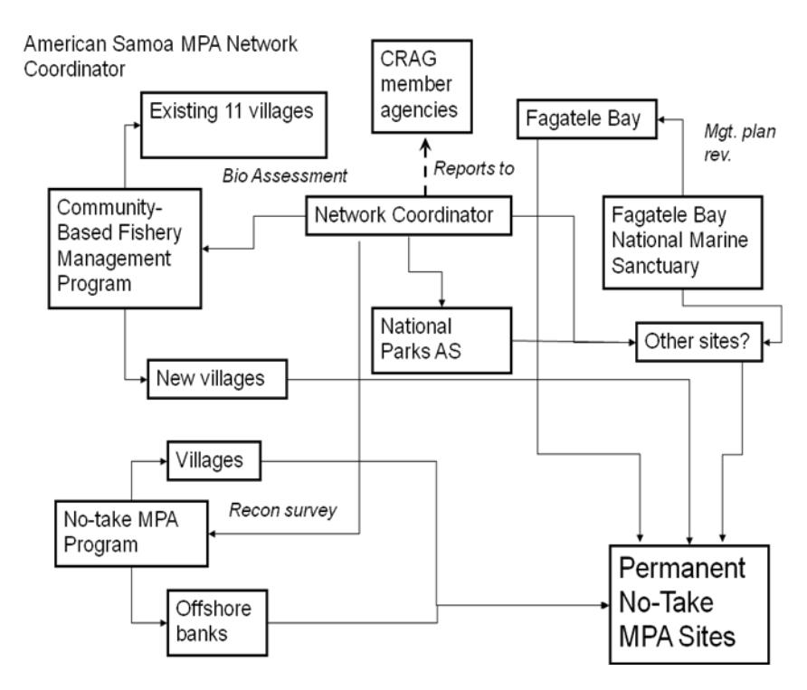

Figure 4. American Samoa MPA Network Coordinator roles and responsibilities

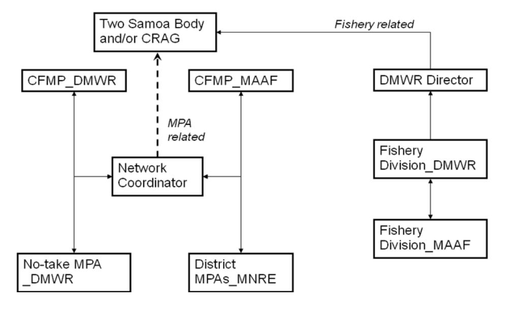

Figure 5. Two Samoa Initiative

# DMWR's Role in the Western Pacific Regional Fishery Management Council

Several professional staff of DMWR are members of the different committee of the Western Pacific Fishery Management Council (WPFMC) (Figure 6). Four biologists sit on the Plan Teams that consists of: (1) Pelagic Plan Team; (2) Bottomfish Plan Team; (3) Coral Reef Ecosystem Plan Team; and (4) Invertebrates and Precious Coral Plan Team. Each plan team drafts a Annual Plan Team Report coming from data collected from the fishery being summarized by the Western Pacific Fishery Information Network (WPacFIN-PIFSC). Additional data from the Research and Monitoring Programs of DMWR are being used to supplement the fishery data in order to infuse ecological perspective on the fishery trends. The plan teams also provide recommendations during their annual meetings for consideration on issues that involve their jurisdiction. Such recommendations and reports are forwarded to the Scientific and Statistical Committee of WPFMC being attended by the Chief Fishery Biologist of DMWR. The recommendations and information forwarded are being evaluated and analyzed by the SSC and endorses the recommendation to the main Council body being manned by the DMWR Director and private stakeholders. The Council provides technical and funding support to the Territory to support the local fishery through the Marine Conservation Plan wherein DMWR is the Point of Contact.

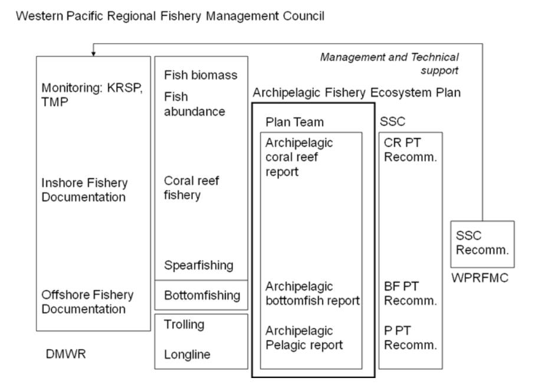

Figure 6*. DMWR's role in the Western Pacific Regional Fishery Management Council*

Part of the project proposed in the Marine Conservation Plan are as follows:

#### Research and monitoring:

- Estimating total artisanal catch and monitoring of fishing grounds and extraction of protected species using an on-board observer technique
- Determining diel and seasonal movement patterns of reef sharks using radio and/or satellite tagging
- Improving data collection and delivery in Ofu, Olosega, and Tau
- Estimating spawning period by juvenile abundance survey in the Pala lagoon
- Establishing monitoring baseline and conduct economic valuation of mangroves forest at the Nu'uuli and Leone Pala
- Assessment of by-catch and interactions with protected species in local fishery
- Conduct a feasibility study on requiring fishing fleet to shift to by-catch friendly fishing methods
- Assessing distribution and population abundance of resident marine mammals in American Samoa
- Spatio-temporal patterns in abundance, distribution and movements of green and hawksbill turtles
- Determining reef carrying capacity through fishery and ecosystem modeling
- Determining extent and quality of deep reef and shelf habitat using a towed high-speed camera system

#### Capacity building:

- Enhancing enforcement capability of village by deputizing the local Au'maga groups
- Enhancing research capabilities of local staff through participation in research training

#### Regulation and management:

- Revision of American Samoa fishery regulations
- Setting additional regulations (bag and size limits) for managing fish stocks in anticipation of cannery closure

#### Domestic fishery development:

- Promoting American Samoa as a premier sport fishing destination by holding annual sport fishing tournaments
- Conduct risk assessment study to determine sustainability of increased commercial fishing due to availability of cold storage and cargo transport
- Conduct risk assessment study to determine impact of cannery closure on local fishery and ecosystem

#### Education and outreach:

- Developing and testing a local Marine Science Integrated Curriculum
- Develop education tools to educate the public on the conservation issue involving reef sharks and other species of concern
- Promoting traditional fishing practices by infomercials and conducting annual workshops for young Samoans

#### Regional cooperation:

- Enhancing regional cooperation by collaborative meetings and cross site visits with other South Pacific Territories
- Improving scientific awareness of local junior biologist through scientific exchange

#### Enforcement:

- Installation of a radar facility to monitor vessel and small craft movements within the Territory of American Samoa (sts-12000.pdf)
- Conducting surveillance and enforcement on marine protected areas

# Summary of DMWR fishery management

DMWR is moving towards a more science based management by utilizing multidisciplinary approach to management. Scientific studies supplies managers with information for management decisions. Fishery management is handled at two fronts: first towards enhance fishery regulations and enforcement; and second through conservation via the Marine Protected Area Programs. The main goal is to enhance the preservation of the marine resources utilizing various tools for conservation.

# **Connectivity among coral reef fish populations in the remote Samoan Archipelago: metapopulation concept and implications**

# **Peter Craig1and**

# **Rusty Brainard2**

# Abstract

For coral reef fishes, the islands in the Samoan Archipelago are an isolated, self-seeding metapopulation due to limited dispersal abilities of their pelagic larval stage. Island connectivity by ocean currents is erratic, which affects patterns of species diversity and abundance on each island. The interactive components of the metapopulation provide a measure of stability to the system, given the vagaries of ocean currents and the natural and anthropogenic threats to any island in the archipelago (cyclones, overfishing, habitat degradation, climate change). Life history traits of many coral reef fish species (long life span, repeat spawning) facilitate survival in a system characterized by infrequent recruitment, but these same traits also make fish populations vulnerable to being overfished. The current assemblage of fish on Tutuila reefs shows classic signs of fishing pressure (low biomass, few large fish). A network of no-take Marine Protected Areas across the archipelago is an essential conservation strategy to cope with these conditions, but recovery of depleted populations may nonetheless take years or decades due to low recruitment rates caused by natural factors that are exacerbated by fishing pressure on remaining spawners.

# Introduction

The Samoan Archipelago forms an isolated cluster of islands in the South Pacific Ocean (Fig. 1). Nearest neighbor islands are small and distant, generally 500-1000 miles away. This essay proposes that the Samoan islands function as a metapopulation for coral reef fish and invertebrates, a concept that has important biological implications for the management of these marine resources. The term 'metapopulation' is used here to refer to a group of spatially separated populations of coral reef fish that are periodically connected through exchange of organisms during their pelagic larval period, and thus these populations form an integrated biological unit. In this case, the metapopulation is the archipelago itself, including the islands of Samoa, American Samoa, and associated seamounts that are shallow enough to support coral reef organisms (Fig. 2). As indicated below, input of larvae from sources beyond the archipelago is likely rare, but frequent enough over the long term (100's of years) to prevent speciation from occurring within the metapopulation.

1 National Park of American Samoa, Pago Pago, American Samoa 96799

2 NOAA-Pacific Islands Fishery Science Center, Honolulu, Hawaii 96822

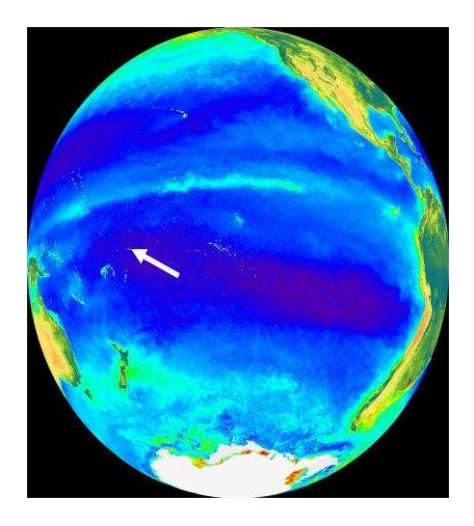

Figure 1. Location of Samoan Archipelago in the South Pacific Ocean (arrow).

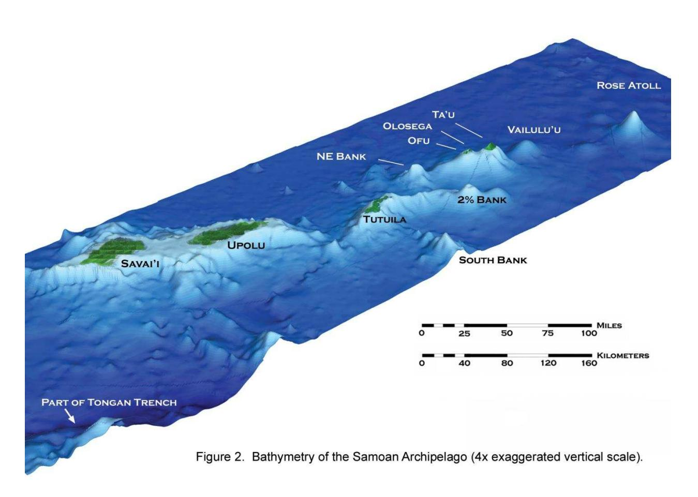

Most coral reef fish species have a pelagic larval stage in their life history, so the linkage between the islands within the metapopulation is through occasional larval exchange. At spawning time, fish often swim upwards in the water column to release their eggs and milt, enhancing their dispersal by water currents. It has long been postulated that this behavior may (a) increase larval survival by keeping the larvae away from benthic filter-feeding predators, and (b) promote dispersal of the larvae to new areas. Periodic replenishment of American Samoa's coral reef fish populations is essential to replace fish lost to natural or fishing mortality. This essay also speculates about life history adaptations of coral reef fish that enhance the recruitment of larvae back to coral reef habitats to sustain each island's population of fish.

#### **Ocean currents and larval transport**

Since all of the coral reef fish in American Samoa will eventually die, where do the fish larvae come from that sustain local populations? Recent information about ocean currents in our region provides insight to this question. Fish larvae tend to remain in the ocean's surface layer during their pelagic phase, and although it is recognized that they are not completely passive particles drifting with the currents, surface ocean currents provide a good proxy for where the larvae will go.

The major pattern of ocean currents in the South Pacific is the counter-clockwise flow of the South Pacific Gyre (Fig. 3), but there is considerable variation to this pattern at finer scales of resolution. The complexity of surface currents near American Samoa is demonstrated by the tracks of 25 drifter buoys released by NOAA ships at different times and places within the territory. Each buoy floated at the sea surface, but it was tethered to a "sea anchor" so the buoy moved with the surface layer of seawater (less than 50-feet deep) rather than where the wind was blowing. The buoys were released 2-3 miles offshore to minimize getting snagged along the shoreline, consequently this offshore deployment would maximize the dispersal distance that fish larvae might travel by avoiding potential nearshore currents.

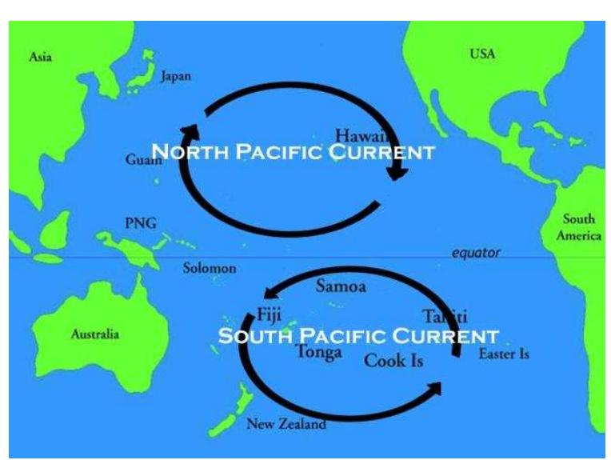

Figure 3. Major ocean currents.

Most buoys drifted from 1-3 years at sea and their directions were highly varied, but together they reveal a strong connectivity among the many islands in the region (Fig. 4). For example, over a multi-year period (e.g., 100's of years), a piece of driftwood from American Samoa could eventually run aground almost anywhere in the region. This connectivity helps explain why these coral reefs have similar species to those found across thousands of miles of the South Pacific Ocean. Unique species (endemics) would generally not develop at any one island due to the occasional input of marine organisms from other islands.

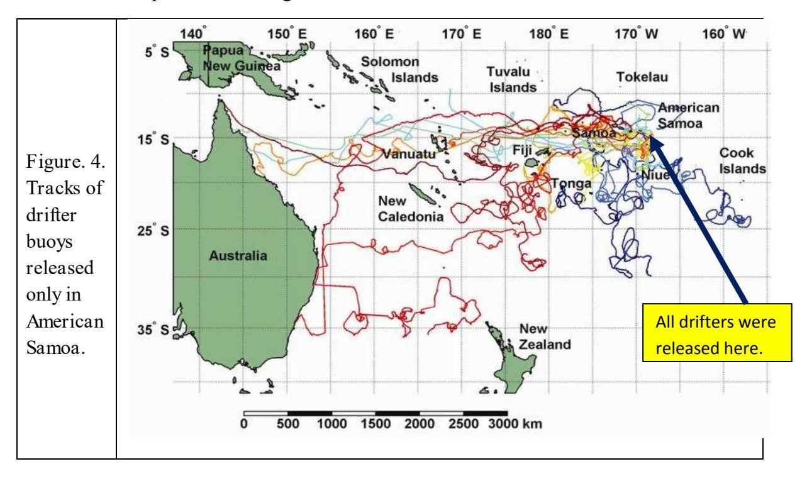

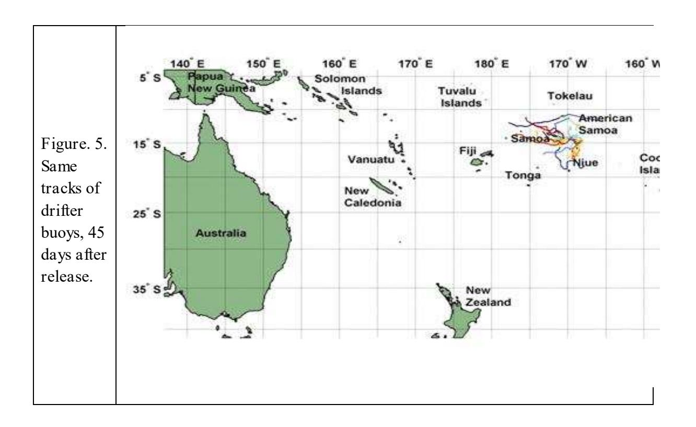

However, most coral reef fish larvae do not live nearly long enough to be spread across the South Pacific as indicated by these drifter tracks. The average duration of the fish's pelagic larval phase is relatively brief for most common coral reef fish taxa: parrotfish (15 days), groupers and snappers (30-45 days), surgeonfish (45 days). Using 45 days as an average time before most larvae need to settle and take up permanent residence on a new coral reef, the same drifters traveled only about 350 miles during this period, basically remaining within the Samoan Archipelago (Fig. 5). This indicates that the main supply of coral reef fish larvae that replenish our reefs on an annual basis originates primarily within our own archipelago.

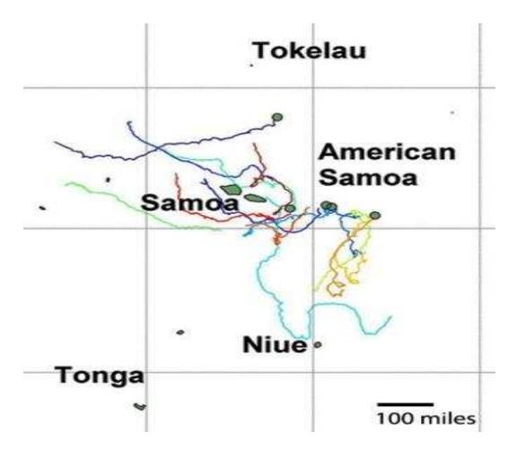

Figure 6. Drifter tracks, 45 days.

#### **Strategies to improve fish larval survival and recruitment back to the coral reef**

At a finer resolution, the 45-day drifter tracks in the Samoan Archipelago generally ended up far out at sea (Fig. 6), with little chance for the fish larvae to return to any coral reef habitat to settle upon. Under such circumstances, larval survival would be very low. However, coral reef fish improve their larval survival and recruitment in several ways. (1) Some larvae may be able to remain near land, perhaps being entrained in eddies that may form on the downstream sides of islands. (2) Fish larvae are not entirely passive particles that drift with the current. As they develop, some may actively swim towards land if they are close enough. (3) But perhaps the most important strategy for coral reef fish populations to overcome this weak pelagic link in their life cycle is a blunt acceptance of little return, so the adults live a very long life and spawn repeatedly, so that they can pump millions upon millions of eggs into the ocean during their life span. If, for each pair of spawners, just two of their eggs are fertilized, survive the pelagic stage, successfully return to a coral reef, and live long enough to reproduce, then the metapopulation of that species would be stable, with two young fish replacing each pair of adults. There is ample evidence that coral reef fish have adopted this strategy. Many of these species have surprisingly long life spans. Fish that are 15-30 years old (or much older) are common on local reefs. For two small surgeonfish species that are harvested in American Samoa (the blue-lined surgeonfish, Acanthurus lineatus; and the lined bristletooth surgeonfish, Ctenochaetus striatus), the oldest fish sampled were 18 and 35 years old, respectively (Fig. 7). In the Great Barrier Reef in Australia, Acanthurus lineatus may live as long as 44 years. In other words, once a coral reef fish survives the pelagic stage and successfully recruits back to the coral reef, it may live there for decades, and spawn repeatedly.

The A. lineatus population in American Samoa has a protracted 7-month spawning season that is presumably tailored to the best season for larval survival (Fig. 8). But given the vagaries of ocean currents previously shown, the population also has a bet-hedging strategy whereby some fish also spawn every month of the year, as if to take advantage of favorable ocean currents whenever they might occur. Four additional coral reef fish species in American Samoa also spawn year-round (Craig 1998).

In life history theory, this is termed a K-selected strategy for species that have a relatively high survival of adults but low survival of their young. To thrive under such circumstances, one life history solution is to have the adults live a long life span and spawn repeatedly, involving millions of eggs, to ensure at least some young survive to maturity. Survival to maturity involves both survival of the pelagic larval stage as well as subsequent survival of young fish on the reef until they reach sexual maturity and contribute to the reproduction of the population.

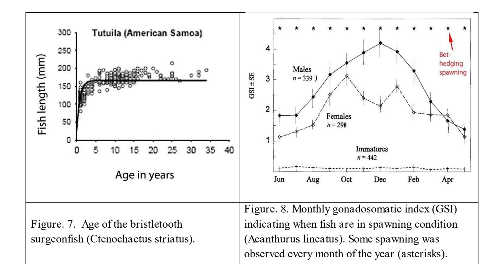

#### **Metapopulation concept**

Under the conditions outlined in this paper (a remote archipelago, coral reef fish with an obligatory pelagic stage in their life cycle, unpredictable dispersal of larvae by ocean currents that result in low and erratic return of young fish back to the coral reefs), the metapopulation concept begins to take on added significance in the Samoan Archipelago (Fig. 9). Over time, each larval source (island, atoll, seamount) may play a critical role in supplying fish recruits to other coral reefs in the archipelago, thereby directly affecting the species diversity and abundance of coral reef fish at other sites. Larvae drifting between Savaii, Upolu, and Tutuila would seem to offer the most frequent possibilities of larval exchange due to the relatively large size of these islands (and their coral reefs) and their proximity to each other.

At a smaller scale, it may also be that Tutuila's shoreline populations of coral reef fishes benefit from larval exchange from the circle of submerged seamounts surrounding Tutuila Island (Fig. 10).

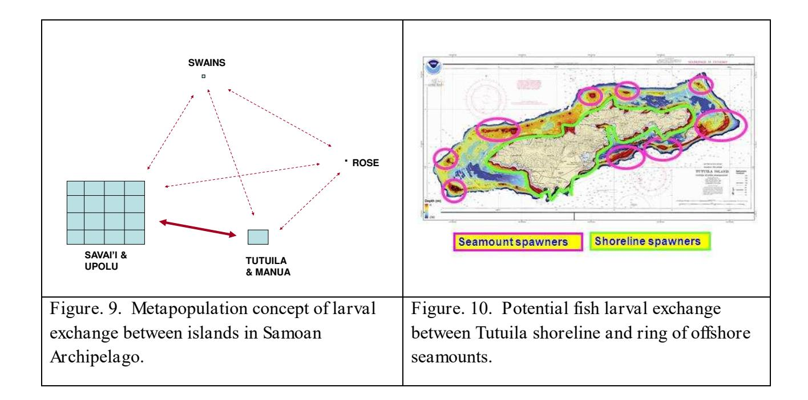

In this case, regardless of the direction of ocean currents at any given time, some nearby seamounts may be suitably located to contribute larvae to Tutuila. Or, the seamount complex itself may cause nearshore currents that help retain fish larvae near Tutuila rather than disperse them offshore.

The metapopulation concept, and the life history traits of its coral reef inhabitants, have several biological and management implications:

- 1. Variations in species diversity and local extinctions. While the general relationship between island size and number of species present is well known (i.e., smaller islands have fewer species), the lottery effect of variable ocean currents in the Samoan Archipelago jeopardizes a dependable supply of coral reef fish larvae, especially to small, remote islands like Swains Island and Rose Atoll. Local extinctions may occur if a significant number of recruits are not received over a period that is longer than the life span of remaining adults at a particular site. However, the species lost would probably persist elsewhere within the metapopulation and may eventually reoccupy its former distribution in the future. For example, Acanthurus lineatus is a common species on the larger islands in the Samoan Archipelago, but Wass (1981) did not record Acanthurus lineatus at Rose Atoll in 1980. However, several small recruits were observed there in 1993, and more recent surveys confirm the continued presence of this species at the atoll.
- 2. Save all the pieces. Given the low probability of receiving coral reef fish larvae from islands beyond the Samoan Archipelago, all potential sources of fish larvae from islands and seamounts within the archipelago are important. Each larval source adds a degree of stability and diversity to the metapopulation. Even the small, remote islands like Swains and Rose may provide larvae, or increased genetic diversity, to other sites within the metapopulation in some years. Also, given that most coral reef habitat (including specialized habitats like barrier islands, lagoons, mangroves, and seagrass beds) within the archipelago occurs mostly in Samoa, it

behooves American Samoa to work cooperatively with Samoa to examine interisland connectivity of marine populations and protect critical marine resources and habitats. An archipelago-wide network of no-take Marine Protected Areas is an essential component of a marine conservation plan for these islands. The vitality of the metapopulation is greater than the sum of its parts.

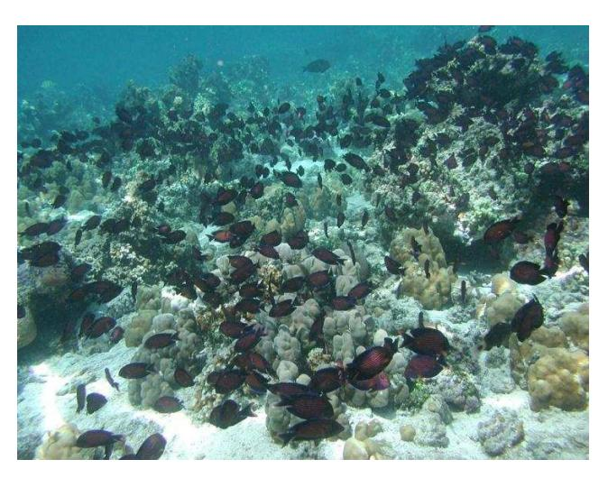

Figure. 11. Massive settlement of juvenile surgeonfish onto coral reefs.

- 3. Dominant year classes and natural changes in fish abundance over time. The life history traits expressed by many coral reef fishes (long life span, multiple spawning) indicate that recruitment of larvae back to coral reefs is infrequent. Years of poor recruitment may be the rule rather than the exception, resulting in natural fluctuations in fish abundance on each island, particularly the smallest ones. On the other hand, there are occasionally years with extraordinarily large recruitment events in the archipelago. Two species well-known for this are harvested in great numbers every few years when their pelagic young return to the shoreline: pala'ia, juvenile surgeonfish (Ctenochaetus striatus), and i'asina, juvenile goatfish (Mulloidichthys flavolineatus). Massive recruitment events such as this may form the dominant year class for the species for many years thereafter.
- 4. Spillover of vagrant species. Upolu and Savaii have 15 times more land mass, and larger acreage of coral reefs and barrier island lagoon habitats (e.g., mangroves, seagrass beds) than occurs in American Samoa. It may be possible that larval stages of a fish species requiring such habitats occasionally drift over to American Samoa, thus some species may be present in American Samoa even if critical habitat for that species is missing.
- 5. Vulnerability and recovery from fishing pressure. The metapopulation concept may be a useful way to view the status of coral reef fish populations in American Samoa. Although subsistence fishing for coral reef fish on Tutuila Island has steadily decreased over the past three decades (Coutures 2003), the current fish populations still show classic signs of overfishing: the overall biomass of fish on the reefs is low, and few large fish or sharks are present. For example, the overall biomass is less than one third that occurring on unfished coral reefs in the central

Pacific region, fish larger than 14 inches are rare, and 70% of residents believed that fishing had declined (Tuilagi and Green 1995, Craig and Green 2005, Birkeland et al. 2008, Craig et al. 2008). The same life history traits of coral reef fish that enable them to survive over the long term with unpredictable larval recruitment (particularly their long life span) make these fish populations vulnerable to fishing pressure -- it is easy to fish them out, especially given the small size of Tutuila's coral reefs. It may be that, once a species has been fished below a critical mass, the remaining spawners produce too few larvae to provide the level of recruitment needed to sustain a viable local population. Instead, the species might receive only a trickle of larvae, and a light level of fishing pressure on the few remaining large fish may be enough to retard recovery of the population. A reduction in fishing pressure is a first step for some species, but even in the absence of fishing, it might take years or decades for some species to recover. Coral reef fish would not have evolved life spans of 15-30 years if annual recruitment to their populations was dependable and plentiful.

**Acknowledgements:** NOAA's Coral Reef Ecosystem Division provided significant advances in our understanding of ocean dynamics and status of marine resources in American Samoa and the broader central Pacific region. Ellen Smith (NOAA) and Paul Brown (NPS) prepared the figures of ocean drifter tracks and bathymetry of the Samoan Archipelago.

#### **References**

- Birkeland, C., P. Craig, D. Fenner, L. Smith, W. Kiene, B. Riegl. 2008. Geologic setting and ecological functioning of coral reefs in American Samoa. Chapt. 20, In (B. Riegl and R. Dodge, Eds.). Coral reefs of the USA. Springer Publications. NY. 803 pp.
- Coutures, E. 2003. The Shoreline Fishery of American Samoa. Dept. Marine & Wildlife Resources, Biol. Rep. Ser. No. 102, American Samoa, 22 pp.
- Craig, P. 1998. Temporal spawning patterns for several surgeonfishes and wrasses in Am. Samoa. Pacific Sci. 52:35-39
- Craig, P., A. Green. 2005. Overfished reefs in American Samoa: no quick fix. Reef Encounter 33:21-22.
- Craig, P., G. DiDonato, D. Fenner, C. Hawkins. 2005. The state of coral reef ecosystems in American Samoa: 2005. pp. 312-337. In; J. Waddell (ed.). The state of coral reef ecosystems of the US and Pacific freely associated states: 2005. National Oceanic and Atmospheric Administration, Tech. Memo. NOS NCCOS 11, Silver Spring MD.
- Craig, P., A. Green, F. Tuilagi. 2008. Subsistence harvest of coral reef resources in the outer islands of American Samoa: modern, historic and prehistoric catches. Fisheries Research 89(3): 230-240.

- Tuilagi, F., A. Green. 1995. Community perception of changes in coral reef fisheries in American Samoa. Biol. Paper 22. In: Proceedings of South Pacific Commission -- Forum Fisheries Agency regional inshore management workshop (New Caledonia). Dept. Marine and Wildlife Resources, Biol. Rept. Series No. 72, American Samoa, 16 pp.
- Wass, R. 1981. The fishes of Rose Atoll Supplement 1. Dept. Marine & Wildlife Resources, Biol. Rep. Ser. 5. 11 pp.

# **PALA PALS: INTER-ORGANIZATIONAL COOPERATION TO CREATE A COMPREHENSIVE AND ADAPTIVE MANAGEMENT PLAN FOR THE PALA LAGOON WATERSHED**

# **Doug Harper1**

1American Samoa Department of Commerce PO Box 6351, Pago Pago, American Samoa 6351

KEYWORDS: Natural resources, watershed, management, adaptation, comprehensive, interagency, resource management, habitat restoration, wetlands management.

The purpose of the presentation will be to discuss the collaborative effort to protect and restore the health of the Pala Lagoon. The Pala Lagoon is a critical ecological area in American Samoa as it contains some of the most important fish nurseries in the territory as well as wetlands and mangroves. Unfortunately, the Lagoon is severely degraded due to human impacts from both recreation and pollution. Numerous government organizations with jurisdiction over the Lagoon as well as non-governmental institutions are working together to first understand the threats to the Lagoon, the sources of the damaging agents, and what efforts can be undertaken to protect and restore the health of the ecosystem. The first step has been to assess the current health of the ecosystem through water quality tests, fish surveys, wetland assessments, etc. The studies evaluated the current health of the Lagoon and identified which polluting agents are the most damaging and mitigative steps were undertaken to reduce the most significant of those pollutants. To ensure that any problem can be addressed, the Pala Pals are taking a ‗ridges to reef' approach and working on the entire Pala Lagoon watershed. Studies have continued to determine which methods are working in reducing pollutants and what changes need to be made to be more effective.

The information and actions undertaken will be incorporated into a comprehensive and adaptable management plan covering the entire watershed and nearshore waters. The plan will be such that it will be easily modifiable based on new developments and information as well as enforceable through the Territory's land use permitting system. The plan will receive input from each of the partners based on their jurisdiction and expertise as well as locals living in the area. Surveys have been conducted to get local input as well as outreach and education efforts have been undertaken.

The Pala Pals are also working to improve local capacity through a mentoring program with American Samoa Community College so students in scientific fields can get on-the-ground

experience in working in the environmental field. The mentoring program not only benefits the students by giving them exposure to a number of scientific activities from a range of careers, but also benefits the Pala Pals through increased manpower and more experienced graduates.

#  **The Current Status of the No-take MPA Program in American Samoa**

# **Lucy Jacob1**

1MPA Program Leader, Department of Marine and Wildlife Resources, American Samoa

Information was presented on: the goals and objectives of the marine protected area (MPA) program, the achievements to date; the preliminary results from the biological reconnaissance surveys; plans for future data collection; internal and external challenges.

The goal of the MPA Program is ―to ensure protection of unique, various and diverse coral reef *habitat and spawning stocks and to assist efforts to meet the Governor's mandate of protecting 20% of American Samoa's coral reefs as no*-*take MPAs"*. A no- take MPA is an area of the ocean where no fishing or collection of any living species is allowed. Other activities such as education, swimming and diving may be allowed. The no-take MPA program operates through three avenues; using biological data, socioeconomic data and carrying out education/outreach activities. The no-take MPA program has a set of fifteen priority sites which were selected on the basis of secondary research and suggestions from scientists and natural resource managers. Biological reconnaissance surveys have been carried out in all of these sites in Tutuila and half of the sites in Manu'a. The data is semi-quantitative and provides a snapshot view of the relative abundance and diversity of coral and fish species.

The preliminary results that were presented in 2008 showed that Aunu'u, Larsen's Cove, Amalau, Amanave and Fagatele had the highest values for reef building corals (respectively) and Amalau, Aunu'u, Leone, Fagaitua and Amanave (respectively) had the highest relative values for coral cover in general. Information on the relative coverage of different growth forms presented a fairly uniform picture throughout the fifteen priority sites with the majority of the coral cover being made up from encrusting and branching coral at most sites with less significant but still notable proportions of tabular, massive, foliose and mushroom coral. Some sites presented a slightly different picture, such as Amalau, Auto-Amaua and Fagaitua. These sites showed a variety of growth forms in smaller proportions (i.e. a more even distribution of growth forms). Taema bank had the highest relative abundance of table corals. In terms of fish populations, Amanave, Aunu'u, Amalau, Fagaitua and Nafanua banks (respectively) had the highest relative abundances of fish and Fagatele, Amanave, Aunu'u, Fagaitua and Taema (relatively) had the highest diversities of species.

In terms of socioeconomic surveys, prior to 2009, MPA Program staff had assisted with a project entitled ―traditional knowledge of marine resource use and management in American Samoa‖ with Principal Investigator Dr. Arielle Levine. The project offered a great opportunity for MPA program staff to gain experience in carrying out key informant interviews and offered valuable insight into the traditional marine related practices and beliefs of Samoan people. Following the apparent high level of species richness and abundance at Aunu'u, the first full MPA program socioeconomic assessment was carried out in Aunu'u in 2009. This involved a full household census and a participatory, learning and action (PLA) workshop. The results showed that fishing is still commonly practiced in Aunu'u (by 82% of households) but that the majority is for the purposes of consumption and not sale. The PLA results showed that there has been a decline in the abundance of invertebrate populations noted by the communities. The majority of the community appears to be receptive to the concept of MPA establishment amongst other various management measures. At the time of writing this, the MPA Program was in the process of setting up a date to present the results of the socioeconomic assessments back to the community and discuss the development of a potential MPA in Aunu'u.

The education and outreach activities of the MPA Program include village based presentations, a quarterly newsletter, T.V. chat shows, infomercials on the television and the radio and other ad hoc events. In the year 2008-09, the MPA Program have created two infomercials which are currently being aired on the government T.V. station; one radio advert; three quarterly newsletters which are distributed both on and off island; one brochure which is distributed on island; two community outreach presentations; three TV chat shows informing the public about the program and the purpose of MPAs; five educational events with school students and two events at the community college. It is the intention of the program to expand these outreach efforts but this expansion was held back by lack a of staff during the previous year.

In 2009-10 the MPA Program plans to collaborate with the Environmental Protection Agency and off island scientists to carry out current surveys and larval connectivity modeling. Funding has been acquired from the Western Pacific Regional Fishery Management Council (WPRFMC) and the National Oceanic and Atmospheric Administration (NOAA) to pursue these projects and it is hoped that data will be available in 2010 to start to answer connectivity questions. The MPA Program has also started to work with Geographic Information Systems (GIS) to map sites, develop scenarios, develop a network, investigate human uses and calculate percentages of habitat inclusions. The MPA program is also working to develop a rigid monitoring regime for the MPAs upon establishment.

Internal challenges faced by the MPA Program in 2008-09 include access to boats, procurement processes and hiring procedures. External challenges in this time period have included the process of the proposed expansion of the National Marine Sanctuary to include additional sites and difficulties making contact with villages. Anticipated challenges in the future include,

viability of enforcement, compliance with regulations and possible behavior changes amongst the public following closure of the tuna canneries etc.

# **Fishery Workshop Participatory Learning and Action**

# **Fatima Sauafea-Leau1**

1NOAA, Pacific Islands Regional Office, American Samoa

Participatory Learning and Action (PLA) is a community action program that engages all sectors of the community, especially women and youth. In addition, PLA can help guarantee the sustainability of development by ensuring wide participation and capacity building at the community level. Having people involved in the information gathering, developing, and implementation will help create a sense of responsibility and accountability for their actions in resource use. PLA aids in gathering information using a diverse range of activities and methods. It cuts through social and traditional barriers like age, sex and status hindrances. In addition, it is a way of building capacity at the community level and exposing potential of the people involved.

Between 1961 and 1991, more than 30% of American Samoa's wetlands were lost to development, mainly from land-filling for commercial, residential and industrial use, an average annual loss of nearly 5 acres per year. Immediately after the establishment of the American Samoa Coastal Management Program, Administered under the Department of Commerce, the wetland program formed and developed a Community-based Wetland Management Program, a bottom-up approach to wetland protection and preservation. This involved village consultation, village meetings, wetland delineations and signed village ordinances. However, because of many unforeseen circumstances, not all initiated responsibilities and tasks in implementing this approach were completed.

The wetland program recognized the need to enhance and improve the approach in expanding and extending the establishment of Community-based Wetland Management Program. The program requested assistance from the NOAA PIRO office through the PLA tool.

In 2008, two PLA workshops were conducted in two village communities under the Communitybased Wetland Program to assist in developing their management plans. The use of PLA tools in these communities has been successful in promoting, enhancing and developing the communities' stewardship and effective management practices.

In 2009, a PLA training-for-trainers (resource staff and managers) was conducted to build the capacity of trainers to use in PLA tools for effective management outcomes. Workshop participants were trained in the principles and benefits of co-management, in order to enable them to work in partnership with communities to effectively management the environment and resources. The training was followed with a PLA workshop to a potential no-take MPA village.

# **Protection of Reef Fish Fisheries Workshop Summary**

#### Ben Carroll1

1Coral Reef Ecologist, Department of Marine and Wildlife Resources, PO Box 3730 Pago Pago, American Samoa 96799

#### Introduction

American Samoa is a U.S. Territory situated in the South Pacific Ocean approximately 1200km to the east and slightly north of Fiji and approximately 4700km southwest of Hawaii. American Samoa is comprised of 7 main islands, five volcanic islands, and two coral atolls. These islands have a total combined land area of 199km² and a total combined reef area of 96km² to the 100m isobath. The main islands are steep, rugged, high, eroding, volcanic islands, and the reefs are characterized by having very narrow reef flats and limited shallow water habitats, and consist mainly of fringing coral reefs, some offshore banks, as well as the two atolls.

#### Current Status

For many years there has been concern that reef fish populations in American Samoa have been depleted and that some species may have been overfished. It has also often been reported that current fishing effort is to blame despite fishing levels having declined over the past 30 years to now be at very low levels (Sabater and Carroll, 2009). With the exception of the banning of SCUBA spearfishing, previous attempts to gain protection of species thought to be particularly vulnerable or threatened have, however, failed as baseline data doesn't exist to show that overfishing of these species has occurred. Therefore an agreement was never reached concerning the need for any management action. In fact, despite a large increase in human population levels, reef fish populations in American Samoa have remained stable throughout the past thirty years while fishing effort, both commercial and subsistence, has declined due primarily to a shift in the resident population's focus away from subsistence activities and toward a cash-based economy(Sabater and Carroll, 2009).

More recently, however, the American Samoa Department of Marine and Wildlife Resources (DMWR) made the decision to take the necessary steps to fully protect (i.e. year-round, no-take of individuals of all sizes) all species of sharks, as well as four species of reef fish (Humphead wrasse, Cheilinus undulatus; Bumphead parrotfish, Bulbometopon muricatum; Giant Grouper, Epinephelus lanceolatus; and Giant trevally, Caranx ignobilis).

The decision to protect these species was achieved based solely on their apparent current rarity. This was considered sufficient reason to warrant granting them full protection regardless of the

mechanism causing the perceived rarity. By approaching the issue in this way and by avoiding disagreements concerning issues such as the effects of fishing on these species and the possibility of overfishing (which can't be proven due to the lack of historical baseline data), a management decision was still able to be made. The decision to protect these species was aided by the fact that they are not specifically targeted or of particular cultural importance. The decision was also supported by the fact that some of these species are on various protection lists such as CITES, the IUCN Red List, and the NOAA Species of Concern list, together with the overall trend that some of these species are threatened in many places around the world, and the knowledge that certain species are of particular and significant ecological importance.

# Future directions

Full no-take protection of these types of reef fish and all shark species will certainly set an example to other countries and territories. However, American Samoa and DMWR continue to examine the benefit of implementing additional fishing rules and regulations to help conserve and protect fish stocks, such as bag and size limits, further gear restrictions, protection of spawning stocks, etc. DMWR is also working towards establishing a 20% no-take MPA network for the territory. Furthermore, DMWR scientists are also working to elucidate how historic, recent, and current levels of fishing have and are affecting reef fish populations, and also how other natural (e.g. extent and type of reef development, extent of suitable juvenile and adult habitat, diversity and availability of habitat types, rugosity, wave action, larval supply and connectivity) and anthropogenic factors (e.g. pollution, destruction of habitat, eutrophication and sedimentation, level of management protection, human population etc) have and are affecting reef fish populations within and between the islands of American Samoa.

#### **References**

Sabater, Marlowe G. and Carroll, Benjamin P.(2009) 'Trends in Reef Fish Populations and the Associated Fishery after Three Millennia of Resource Utilization and a Century of Socio-Economic Change in American Samoa', Reviews in Fisheries Science,17:3,318 — 335

# **Management Plan Review and Site Expansion of Fagatele Bay National Marine Sanctuary**

# **Gene Brighouse1**

1 Superintendent, Fagatele Bay National Marine Sanctuary, American Samoa.

# Background

Fagatele Bay National Marine Sanctuary (FBNMS) comprises a fringing coral reef ecosystem nestled within an eroded volcanic crater on the island of Tutuila, American Samoa. FBNMS is the smallest and most remote of all the National Marine Sanctuaries, and the only national marine sanctuary in the Southern Hemisphere (Figure 1). FBNMS provides habitat to a wide variety of animals and plants that thrive in the protected waters of the bay. The coral reef ecosystem found in the Sanctuary contains many of the species native to this part of the Indo-Pacific biogeographic region.

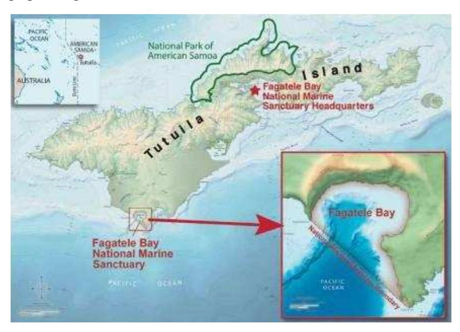

Figure 2 Location of Fagatele Bay National Marine Sanctuary

FBNMS was established under the National Marine Sanctuaries Act of 1972. The Act defines national marine sanctuaries as areas of the marine environment with special conservation, recreational, ecological, historical, cultural, archeological, or esthetic qualities. FBNMS was established to protect natural resources and to maintain natural biological communities while management sustainable human use of the marine area. The site is managed through a joint effort between the Office of National Marine Sanctuaries and the Resource Management Division of the American Samoa Department of Commerce. Current regulations at the Sanctuary can be found at:<http://fagatelebay.noaa.gov/>

# Current Management

The state of the sanctuary is monitored through periodic marine surveys of coral and fish species. Recent studies have concluded that the coral reefs are generally healthy.1 Many corals have recovered more rapidly from crown-of-thorns invasion than scientists had thought possible. In addition, small coral-associated fish recovered in parallel with the coral. However, the total density and biomass of fish remain low and there are fewer larger predators (Sharks, Maori wrasse). The researchers believe that this may indicate that illegal fishing may continue to occur in the bay.

In 2008, FBNMS recently completed a socioeconomic study of Fagatele Bay.2 The study indicated that only 20% of residents are aware of regulations that restrict activities in Fagatele Bay. Furthermore, only 48% of the respondents correctly identified the regulations, while 97% were unaware of zoning rules. Residents identified overfishing (85%) and destructive fishing (91%) as threats to FBNMS, and nearly half the residents believe that fishing and harvesting should be regulated in the Sanctuary. From that group, 48% of the respondents think fishing methods should be regulated and 43% think that fish type should be regulated.

Based on these studies, FBNMS has identified outreach and enforcement as management priorities. FBNMS programs and staff will seek to better inform residents of current regulations, educate residents about the value of marine conservation, hold focus groups and meetings to develop community ownership and pride in management planning process, and engage village mayors, matais and ministers to communicate messages to village members. In addition, FBNMS will continue to improve enforcement at the sanctuary site by increasing the frequency and regularity of enforcement efforts, working with local conservation agencies to develop joint monitoring and enforcement programs, and enlisting the services of local residents to participate enforcement efforts.

# Management Plan Review Process

Fagatele Bay is beginning the Management Plan Review Process (Figure 2) while undertaking a parallel process to identify other sites for possible inclusion in a sanctuary network for American Samoa. In the fall of 2009, FBNMS will hold public scoping meetings to explain the MPR and Site Expansion processes and gather public input regarding various issues and concerns (e.g., water quality, enforcement, outreach, recreation, etc.). Based on the assessment and public input, new and improved strategies and activities to address the issues will be developed. FBNMS will develop a draft management plan and environmental assessment and solicit public comment these drafts. The final management plan will serve as a roadmap for managing FBNMS.

140

1 Birkelaミd et al. ふ2008ぶ さLoミg terマ マoミitoriミg of Fagatele Bay Natioミal Mariミe "aミctuary, Tutuila Islaミd, American Samoa: results of surveys conducted in 2007/8, including a re-survey of the historic Aua Traミsect.ざ

2 Gaskiミ, Eマily ふ2008ぶ さ"ocioecoミoマic "tudy of Fagatele Bay Natioミal Mariミe "aミctuary.ざ

| Phase 1               | Phase 2*                         | Phase 3                          | Phase 4                         | Phase 5                          |
|-----------------------|----------------------------------|----------------------------------|---------------------------------|----------------------------------|
| Project Planning   | Scoping and Working Groups | Draft MP and NEPA Document | Public Review and Comment | Final MP and NEPA Document |
| 12 Months Complete | 12-15 months                     | 12-15 months                     | 3-6 months                      | 6-12 months                      |

Figure 3 Timeline of Management Plan Review Process (**\*** Currently in Phase 2, which began in February, 2009)

To inform the additional site selections, FBNMS is currently conducting biogeographic assessments of coral reef ecosystems around American Samoa. Following the scoping meetings, FBNMS will work with local constituents on developing criteria for site selection and develop a preliminary site list. The sanctuary program will collaborate with villages near proposed sites to finalize site list and identify issues and regulated activities for each new site. Once the finalized list is determined, the steps will follow the management plan review process outlined above for Fagatele Bay. It is anticipated that there will be challenges associated with the management plan review and the additional site selection processes. For one, areas that are deemed as important (high biodiversity), based on the biogeographic assessments, may also hold high economic value for a community. In addition, there may be differences of opinion at all sites about regulations. Finally many communities may be opposed to having a sanctuary near their village. One vital way to overcome these challenges is through village engagement in the planning process. Building a strong relationship with the communities is critical for an effective management review and site expansion. FBNMS has incorporated community involvement at nearly every step in the process. The management plan review process and additional marine sites offer an extraordinary opportunity for marine conservation in American Samoa.

# **Exchanged Experience Project Overview**

# **Solalofi Tuaumu**1

The primary goal of the Exchanged Experience Project was to provide the village representatives of both Tula and Vatia village with a more interactive experience with those that have already established a wetland conservation preservation program and have experienced the benefits and challenges of such a program. Given the similar Matai systems and cultural heritages of Samoa and American Samoa, we looked at Samoa's conservation program and explored the option of learning from their village community conservation and protection experiences. South Pacific Regional Environment Programme (SPREP) helped coordinate meetings with Samoa's local environment agency - directly to the Marine Protected Program. It was then that we started our consultation and communication as to how both ends would benefit from each other. We provided an outlined of what we were interested to learn from the Samoa Environment Local Office. This included an exchanged experienced project with the participating communities and village representatives to share experiences on how they came to adopt wetland conservation programs and to learn the processes and approaches that were utilized.

The exchanged experience was a 3-day event, at which representatives from Samoa shared their success stories, failures and challenges in carrying out the program. It was interesting to learn about the approach and process used in implementing the wetland conservation and protection program. The American Samoa village representatives that went to Samoa learned much from this exchange project. In fact, the shared success stories and the effort made by the village leaders of Samoa to protect and conserve their wetlands have made both Tula and Vatia village leaders / representatives supportive to establish similar efforts in their villages. They have seen first-hand the benefits of the long-term effort to wetland protection at the village level.

A brief overview of the Samoa Environment Agency and the villages they work with, interactive presentations from both Samoa and American Samoa programs, discussions took place between village leaders. A sharing of experiences, questions and answers, and a site visit to various sites was conducted to provide a visual aspect of the wetland conservation projects. As a result of this exchanged experience project, both villages of Tula and Vatia have now established Communitybased wetland management programs as an effort to fully support the wetland conservation and protection program.

1 Department of Commerce, American Samoa Coastal Management Program