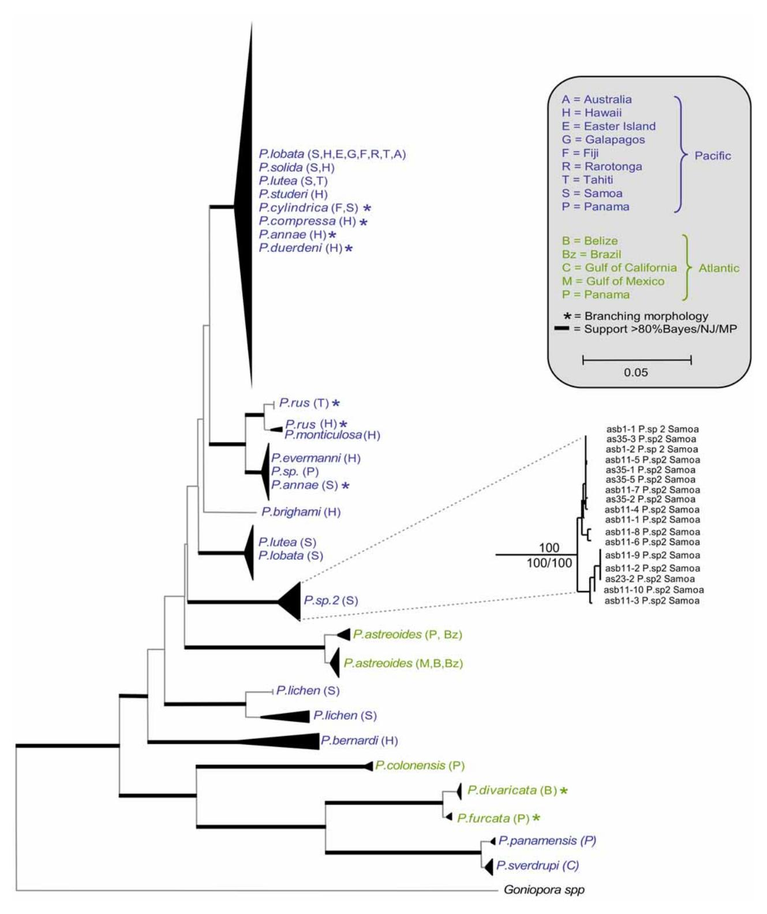
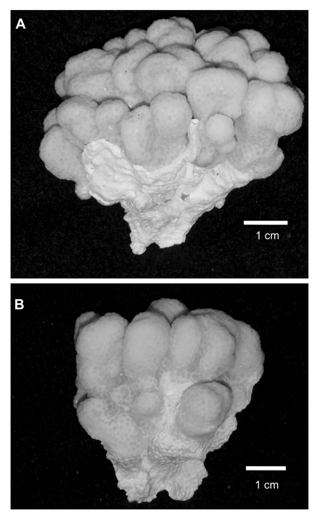
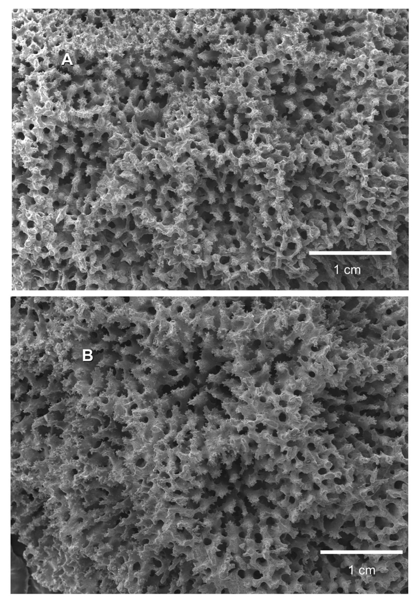
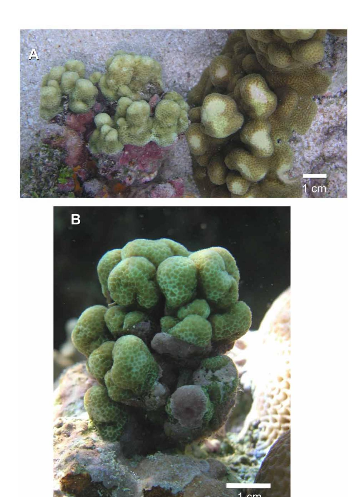

# *Porites randalli***: a new coral species (Scleractinia, Poritidae) from American Samoa**

### ZAC H. FORSMAN1 & CHARLES BIRKELAND2

*1 Hawaii Institute of Marine Biology, University of Hawaii, Kaneohe HI, 96744. E-mail: zac@hawaii.edu*

# **Abstract**

A new species of scleractinian coral, *Porites randalli* **spec. nov**. (Scleractinia, Poritidae), previously known as *Porites* sp. 2, is described from American Samoa. *P. randalli* typically forms small pale green colonies that are usually <5 cm in diameter, with a surface reticulated with small (0.5 cm–2 cm) nubbins or protuberances. Colonies have been observed between 1–12 m depths in a variety of reef habitats and are among the most common corals in American Samoa. Corallites are approximately 1 mm in diameter and are sunken with a visible ring of pali. The columella is either lacking or small, with 1,2 or no radii, six pali (five large and a small one on the dorsal septum). Corallite walls rise gradually with concentric rows of denticles. *Porites randalli* **spec. nov.** is an example of cryptic diversity; it is a small coral that at first glance can be overlooked or mistaken for a young colony of other species.

**Key words:** Cnidaria, Scleractinia, *Porites*, Poritidae, new species, American Samoa

# **Introduction**

*Porites randalli* **spec. nov**. (previously known as *Porites* sp. 2) is among the most common corals in American Samoa. The first intensive survey of corals around American Samoa took place in 1985 (Birkeland *et al.* 1987). Studies prior to this (e.g. Mayor 1924, Hoffmeister 1925) focused on larger "adult" colonies, and had no descriptions or photographs of corals similar to *P. randalli.* In 1985 and all subsequent surveys that included smaller corals (cf. Previous records), *Porites* sp. 2 was seen to be prevalent. Surveys indicate it is sometimes the most common coral in Fagatele Bay National Marine Sanctuary, Fatumafuti, Faga'alu, Fagaitua, and Masefau and has been the second most common coral at Aunu'u and Vatia on Tutuila (Birkeland et al 1987, Mundy 1996, Fisk & Birkeland 2002). Extensive analyses by McArdle (2003) of the coral surveys performed on Tutuila over the decades found that *Porites* sp. 2 was uniformly distributed among the depths surveyed (1 m – 12 m). McArdle also determined that *Porites* sp. 2 was very rare in areas with polluted waters (e.g. Pago Pago Harbor), but abundant in clear water (e.g. Fagatele Bay).

This previously undescribed species is abundant and ubiquitous on the volcanic islands of American Samoa (Tutuila, Aunu'u, Ofu, Olosega, and Ta'u), yet it has never been reported elsewhere. *P. randalli* **spec. nov**. is morphologically distinct from similar species in the region (*P. annae, P. lichen*) at both the colony and corallite levels, and is genetically distinct according to nuclear (ITS; NCBI # FJ416519-22) and mitochondrial (COI; NCBI# FJ423966, Putative mitochondrial control region; NCBI#FJ427368) markers (Forsman *et al.* 2009; Figure 1).

*Porites randalli* **spec. nov**. may be important for monitoring and understanding climate change as it is unusually susceptible to coral bleaching. In a survey during 2002, there was a period of bleaching from unusually warm seawater and 92.9% of the *P. randalli* **spec. nov**. were bleached (Fisk and Birkeland 2002). *P. randalli* **spec. nov**. appears to be particularly sensitive because the average for all coral colonies was only

*2 Hawaii Cooperative Fishery Research Unit, U.S. Geological Survey, University of Hawaii at Manoa, Honolulu, HI, 96822*

7.7% (n=5246). On the other hand, *P. randalli* **spec. nov**. is able to acclimatize to repeated exposure to warm water for durations of a few hours each. In the shallow pools on the reef flat, *P. randalli* **spec. nov**. does not bleach during daily temperature fluctuations of 6° C (28–34° C) (Craig *et al.* 2001).

**FIGURE 1.** Bayesian tree modified from Figure 1 in Forsman *et al.* 2009. Significant clades are collapsed to conserve space. The base of the triangles are proportionate to the number of sequences sampled, the height of the triangle is proportionate to the genetic divergence within the clade (the *Porites* sp. 2 clade is expanded). Thick black lines represent clade support values higher than 80% for Baysean, Neighbor Joining, and Maximum Parsimony methods. See Forsman *et al.* 2009 for complete details.

## Materials and methods

Colonies were photographed in situ, and collected 30 March 2006 at approximately 1–2 m depth from Ofu Island (10.75'S, 169° 39.10'W) in American Samoa. Specimens were collected by snorkel and by scuba, bleached in sodium hypochlorite solution for 24 hours, and photographed on a Zeiss dissecting microscope mounted with a digital camera. Portions of the skeleton were mounted on stubs and sputter-coated with gold particles for imaging with a Hitachi S-800 Field Emission Scanning Electron Microscope operated at 15KV with a WD of 20 mm. The distance from the midpoint of a corallite wall to the center of a lateral pair pali (other pali were variable and difficult to discern), and the longest axis along a corallite from the midpoint of each wall was measured for ten corallites for each specimen from digital images calibrated with a scale in ImageJ V.1.40 (the holotype and paratype-1 were measured from SEM images, paratype 2–5 were measured from light microscopy images).

## **Systematic Account**

Family Poritidae Gray, 1842

Genus Porites Link, 1807

**Porites randalli spec. nov.** (figs. 1–3)

**Material examined.** Holotype: Bishop museum (SC 4161), Ofu, American Samoa. Collector: Charles Birkeland. Colony 5 x 5 cm (figs. 2A, 3A)

Paratypes: 1—Bishop museum (SC 4162) Ofu, American Samoa. Collector: Daniel Barshis. Colony 2 x 3 cm (fig. 3B-SEM image of genetic sample AS13 from Forsman *et al.* 2009)

- 2—Florida Museum of Natural History (UF Cnidaria 5429), Ofu, American Samoa. Collector: Charles Birkeland. Colony 4 x 5 cm (fig. 2B)
- 3—Museum of Tropical Queensland (G62293), Ofu, American Samoa. Collector: Charles Birkeland. Colony 4 x 6 cm
- 4—Smithsonian National Museum of Natural History (USNM 1129921), Ofu, American Samoa. Collector: Charles Birkeland. Colony 2 x 5 cm
- 5—Smithsonian National Museum of Natural History (USNM 1129922), Ofu, American Samoa. Collector: Charles Birkeland. Colony 4 x 4 cm

**Description.** The corallites averaged 1.16 mm ( $\pm$  0.067 SE) in longest diameter to the midpoint of each wall (min 0.59, max 1.69, n=60 from 6 individuals), with an average distance between corallites of 1.13 mm ( $\pm$  0.12 SE, min 0.73, max 1.51). The corallites appear more shallow than most *Porites*, tending to be hexagonal with the ring of pali sunken relative to the wall. The average distance from the center of the corallite wall to the center of the lateral pair pali was 0.39 mm ( $\pm$  0.017 SE). The columella were small but generally present, with 1,2 or no radii, six pali (five large pali and a small one on the dorsal septum). The dorsal septum tended to be shorter than other septa, and the ventral triplet was either fused or irregular.

The corallite walls were perforate, rising gradually next to a concentric row of denticles with 1–2 trabecular rings forming the corallite wall. The 12 wedge-shaped septa became narrow near the pali. The septa extended approximately half way from the corallite wall to the columella. Living colonies are small (typically <5 cm in diameter, rarely approaching 10 cm) usually pale green, or occasionally brown, or blue, with a surface reticulated with small (0.5 cm–2 cm) protuberances.

**FIGURE 2.** *Porites randalli* **spec. nov**. A: Holotype (SC 4161); B: Paratype (USNM 1129921)

**FIGURE 3.** *Porites randalli* **spec. nov**. SEM image showing corallite details. A: Holotype (SC 4161); B: Paratype and genetic sample # AS13 (-)

**FIGURE 4.** *Porites randalli* **spec. nov**.: Photographs of living colonies. A. *P. randalli* (left), next to *P. lichen* (right). B: Close up of whole *P. randalli* colony.

**Diagnosis.** *Porites randalli* is easily distinguished in the field from other species of *Porites*. Most colonies of *Porites* are either mound-shaped or have finger-shaped branches. When these two groups are put aside, those that are left are in a distinct third type of colony morphology that is nodular, with fused or anastomozing columnar knobs or nodes. All but three of these with anastomozing columns in the central Pacific are in the group *Synaraea* with usually small corallites (0.5 – 0.7 mm diameter) that are separated into groups by coenosteal ridges and can resemble *Montipora* in the field (*Synaraea* was placed in a separate subgenus by Verrill (1864), but Forsman *et al.* (2009) showed the group to be closely related and nested within *Porites*).

**Affinities.** The three *Porites* species in the central Pacific that have similar corallites and with colonies formed into anatomosing columnar nodules are *Porites randalli*, *Porites lichen* and *Porites annae*. *P. lichen* and *P. annae* generally form larger colonies, often or usually have laminar bases. *Porites randalli* is usually less than 5 cm diameter and rarely as large as 10 cm, nearly always with knobs rising directly from the substratum without a laminar base. *P. randalli* typically has shallow corallites while the corallites of *P. lichen* appear to be deeper with sharper walls and those of *P. annae* appear to be slightly larger and separated by thickened walls. Although color is somewhat variable and may not be a reliable taxonomic character for *Porites*, *Porites randalli* is usually a pale green (occasionally brown or blue), *P. lichen* is usually a bright greenish or brownish yellow and *P. annae* is usually a pale greenish brown.

The genus *Porites* has a complex history of taxonomic confusion with many synonyms. There are as many as 270 extant species named (Don Potts pers. comm.), with only about 52 currently considered valid (Veron 2000). Of these species, the description of *P. purpurea* Gardiner 1898 (later synonymized with *P. lichen* by Wells 1954), was one of the most likely candidates for close affinity with *P. randalli*. However, the color was described as deep purple and the photograph in Bernard 1905 of one of the three existing specimens was of a colony 12 cm tall, larger and more pointed and cone-shaped than ever observed in *P. randalli.* The description of skeletal microstructure was also more consistent with *P. lichen* (Bernard 1905).

**Previous records.** *Porites* sp. 2: Birkeland *et al.* 1987, 1994, 1996, 2003, 2004; Craig *et al.* 2001; Fisk & Birkeland 2002; Fenner *et al.* 2008; Green *et al.* 1997, 1999, 2005; Mundy 1996; Forsman *et al.* 2009; McArdle 2003.

**Etymology.** The specific epithet "randalli" was chosen to honor Richard H. Randall, who labeled it "*Porites* sp. 2" during survey work that he has performed since 1979 on the hundreds of coral species that occur in American Samoa.

**Habitat and distribution.** In surveys during 1985 and 1995, *Porites* sp. 2 was the most abundant coral at many survey sites in American Samoa. The total number of coral colonies recorded from 140 species in the survey of 1995 was 12,640. There were 2,289 recordings of *Porites* sp. 2 in 1995 which comprised over 18% of the individual colonies out of the total for 140 species. *P. randalli* **spec. nov**. occurred rather uniformly at all surveyed depths (ranging from 1 to 12 m) in a variety of habitats that tend to have clear water, including shallow pools and fore reef environments.

*Porites randalli* has been found at nearly all sites surveyed on the islands of American Samoa (Birkeland *et al.* 1987, Mundy 1996) including Fagatele Bay, Leone, Amanave, Massacre Bay, Fagafue, Sita Bay, Cape Larsen, Fagasa, Vatia, Masefau, Aoa, Onenoa, Matuli Point, Auasi, Fagaitua, Onenoa, Leloaloa, Rainmaker Hotel, Faga'alu, Fatumafuti Rock, and Nu'uuli on Tutuila Island, Fagamalo, Faga and Lepula on Ta'u Island, and on Aunu'u Island, Ofu Island and Olosega Island. However, *Porites randalli* was not found at the surveys sites studied by Mayor (Aua and Utelei).

# **Discussion**

Many workers have recognized the distinctive colony and corallite-level characteristics of *Porites randalli* **spec. nov**., which was previously known as *Porites* sp. 2. Recent genetic work indicates that *P. randalli* is distinct from congeners with a similar appearance in the region (Forsman *et al.* 2009). Skeletal morphology in this genus is known to be phenotypically plastic (Muko 2000) and evolves rapidly (Forsman *et al.* 2009). Nevertheless, the distinctive size and unique morphology of *P. randalli* **spec. nov**. does not overlap or approach any other known congeneric species currently considered valid (Veron 2000). *Porites randalli* **spec. nov**. is an example of a relatively small coral that can be easily overlooked in the field, and can be confused at first glance with a morphotype or young colony of *P. annae* or *P. lichen*. Perhaps after this species is formally described, it will be found in other geographic locations, and initiate a closer examination of small corals that may otherwise be overlooked.

# **Acknowledgements**

We wish to commend the Government of American Samoa's Coral Reef Advisory Group and Department of Marine and Wildlife Resources, and the NOAA Marine Sanctuaries Program, in their continual sponsorship of monitoring of their marine resources. We thank Daniel J. Barshis for assistance, and Gustav Paulay and Carden Wallace for suggestions that improved the manuscript. ZHF was supported by funding from the National Oceanic and Atmospheric Administration, Center for Sponsored Coastal Ocean Research, under awards # NA04NOS4260172 to the University of Hawaii for the Hawaii Coral Reef Initiative. The use of trade, firm, or corporation names in this publication is for the convenience of the reader. Such use does not constitute an official endorsement or approval by the U.S. Government of any product or service to the exclusion of others that may be suitable.

# **References**

- Birkeland, C., Green, A.L., Mundy, C. & Miller, K. (2004) Long term monitoring of Fagatele Bay National Marine Sanctuary and Tutuila Island (American Samoa) 1985 to 2001: summary of surveys conducted in 1998 and 2001. *Report to the National Oceanic and Atmospheric Administration, U.S. Department of Commerce*, 158 pp.
- Birkeland, C., Randall, R.H. & Amesbury, S.S. (1994) Coral and reef-fish assessment of the Fagatele Bay National Marine Sanctuary. *Report to the National Oceanic and Atmospheric Administration, U.S. Department of Commerce*. 126 pp.
- Birkeland, C., Randall, R.H., Green, A.L., Smith, B.D. & Wilkins, S. (1996) Changes in the coral reef communities of Fagatele Bay National Marine Sanctuary and Tutuila Island (American Samoa) over the last two decades. *Report to the National Oceanic and Atmospheric Administration, U.S. Department of Commerce*, 225 pp.
- Birkeland, C., Randall, R.H., Green, A.L., Smith, B.D. & Wilkins, S. (2003) Changes in the coral reef communities of Fagatele Bay National Marine Sanctuary and Tutuila Island (American Samoa), 1982–1995. *Fagatele Bay National Marine Sanctuary Science,* (*Series 2003*–*1*).
- Birkeland, C., Randall, R.H., Wass, R., Smith, B.D. & Wilkens, S. (1987) Biological resource assessment of the Fagatele Bay National Marine Sanctuary. *NOAA Technical Memorandum NOS MEMD 3*. 232 pp.
- Bernard, H.M. (1905) The family Poritidae II. The genus *Porites* part I. *Porites* of the Indo-Pacific region. *Catalog of the Madreporarian Corals in the British Museum (Natural History),* 5, 1–303.
- Craig, P., Birkeland, C. & Belliveau, S.A. (2001) High temperatures tolerated by a diverse assemblage of shallow water corals. *Coral Reefs*, 20, 185–189.
- Fenner, D., Green, A., Birkeland, C., Squair, C. & Carroll, B. (2008) Long term monitoring of Fagatele Bay National Marine Sanctuary, Tutuila island, American Samoa: results of surveys conducted in 2007/8, including a re-survey of the historic Aua Transect. *Report to the Department of Marine and Wildlife Resources, Government of American Samoa and to the Office of National Marine Sanctuaries, National Oceanic and Atmospheric Administration*. 57 pp.
- Fisk, D. & Birkeland, C. (2002) Status of coral communities in American Samoa. A re-survey of long-term monitoring sites. *Report to the Department of Marine and Wildlife Resources, Government of American Samoa*. 134 pp.
- Forsman, Z.H., Barshis, D., Hunter, C.L. & Toonen, R.J. (2009) Shape-shifting corals: Molecular markers show morphology is evolutionarily plastic in *Porites*. *BMC Evolutionary Biology*, 9, 45.
- Gardiner, J.S. (1898) On the perforate corals collected by the author in the South Pacific. *Proceedings of the Zoological Society of London*, (2), 257–276.
- Gray, J.E. (1842) Pocilloporidae in 'Synopsis Br. Mus.' (44th ed.)
- Green, A.L., Birkeland, C.E. & Randall, R.H. (1999) Twenty years of disturbance and change in Fagatele Bay National

- Marine Sanctuary, American Samoa. *Pacific Science* 53, 376– 400.
- Green, A.L., Birkeland, C.E., Randall, R.H., Smith, B.D. & Wilkins, S. (1997) 78 years of coral reef degradation in Pago Pago Harbour: a quantitative record. *Proceedings of the 8th International Coral Reef Symposium*, 2,1883–1888.
- Green, A.L., Miller, K. & Mundy, C. (2005) Long term monitoring of Fagatele Bay National Marine Sanctuary. Tutuila Island, American Samoa: results of surveys conducted in 2004, including a re-survey of the historic Aua transect. *Report to US Department of Commerce and American Samoa Government*. 93 pp.
- Hoffmeister, J.E. (1925) Some corals from American Samoa and the Fiji Islands. *Papers from the Department of Marine Biology of the Carnegie Institution of Washington*, V. Carnegie Institution of Washington, Washington, XXII+90 pp.+pl. 1–23.
- Link, H.F. (1807) Bescheibung der Naturalein. *Sammlungen der Universaitat Rostock*, 3, 161–165.
- Mayor, A.G. (1924) Structure and ecology of Samoan reefs. *Carnegie Institute of Washington Publications*, 340, 1–25.
- McArdle, B. (2003) Report: Statistical analyses for Coral Reef Advisory Group, American Samoa. 142 pp.
- Muko, S., Kawasaki, K., Sakai, K., Tasku, F. & Sigesada, N. (2000) Morpological plasticity in the coral *Porites sillimani* and its adaptive significance. *Bulletin of Marine Science,* 2000, 66, 225–239.
- Mundy, C. (1996) A quantitative survey of the corals of American Samoa. *Report to Department of marine and Wildlife Resources*, American Samoa Government.
- Veron, J.E.N. (2000) *Corals of the world, Vol. 3*. Australian Institute of Marine Science, Townsville, 490 pp.
- Verrill, A.E. (1864) List of the polyps and corals sent by the Museum of Comparative Zoölogy to other institutions in exchange, with annotations. *Bull of the Mus of Comp Zoölogy at Harvard College*, 1, 29–60.
- Wells, J.W. (1954) Recent corals of the Marshall Islands. *Professional Papers of the U.S. Geological Survey*, 260–I, 385–486.