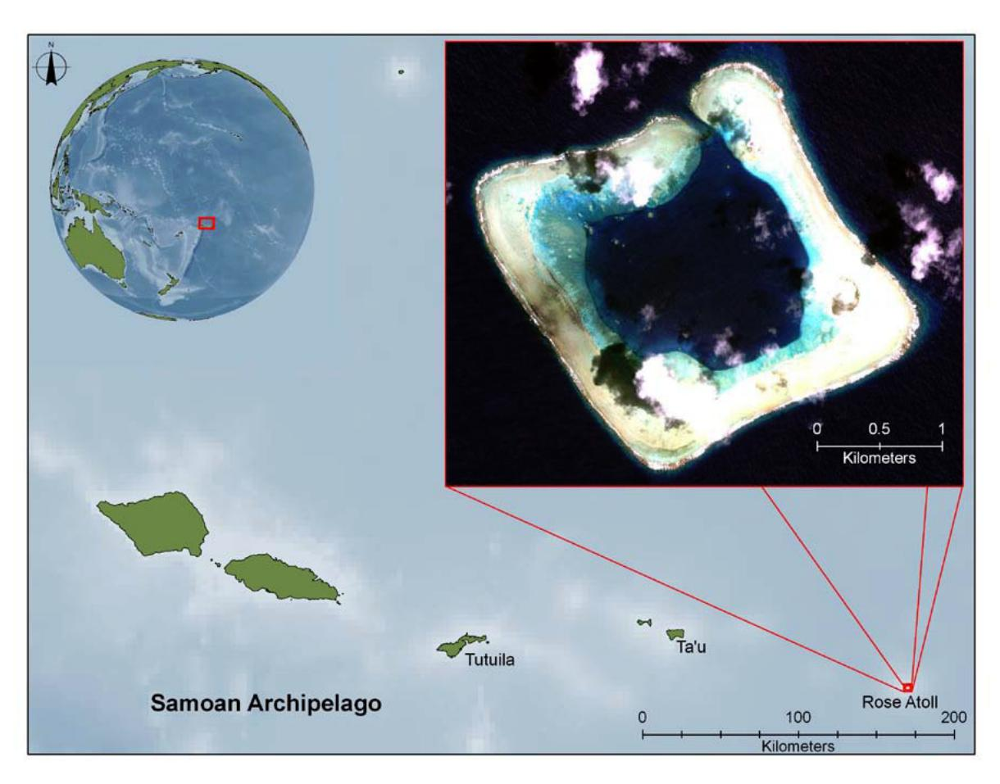
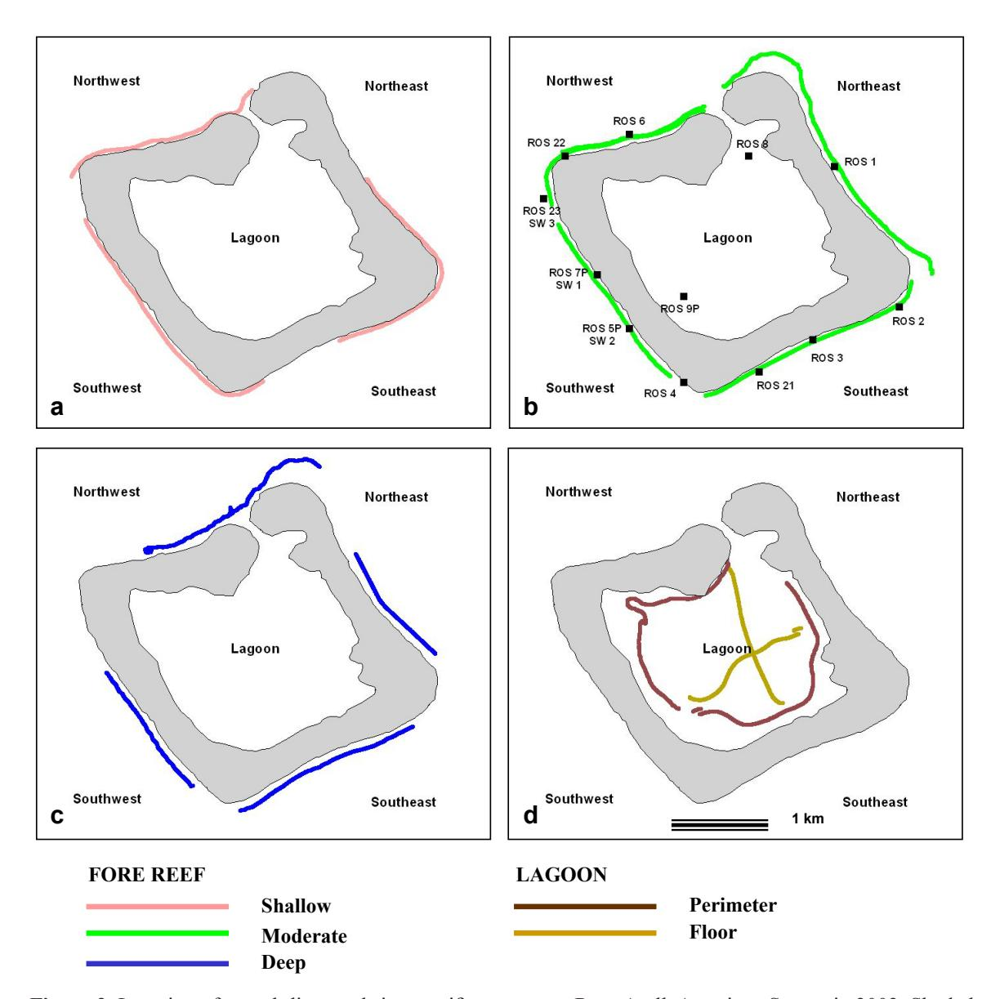
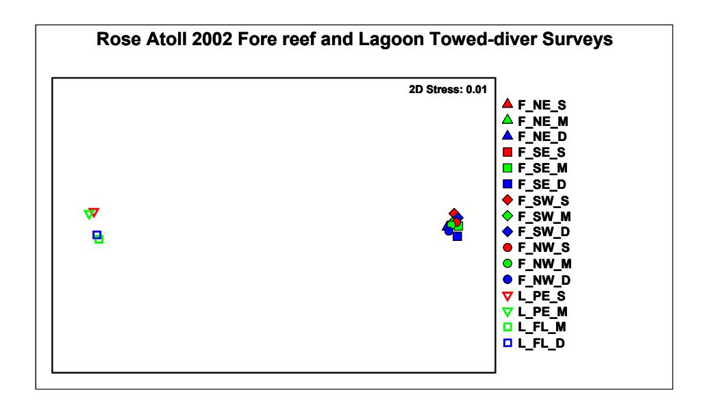
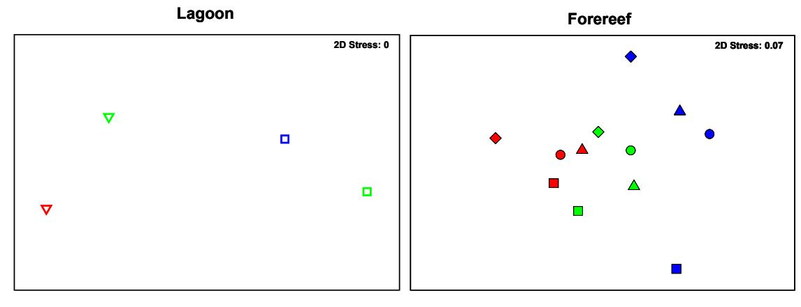
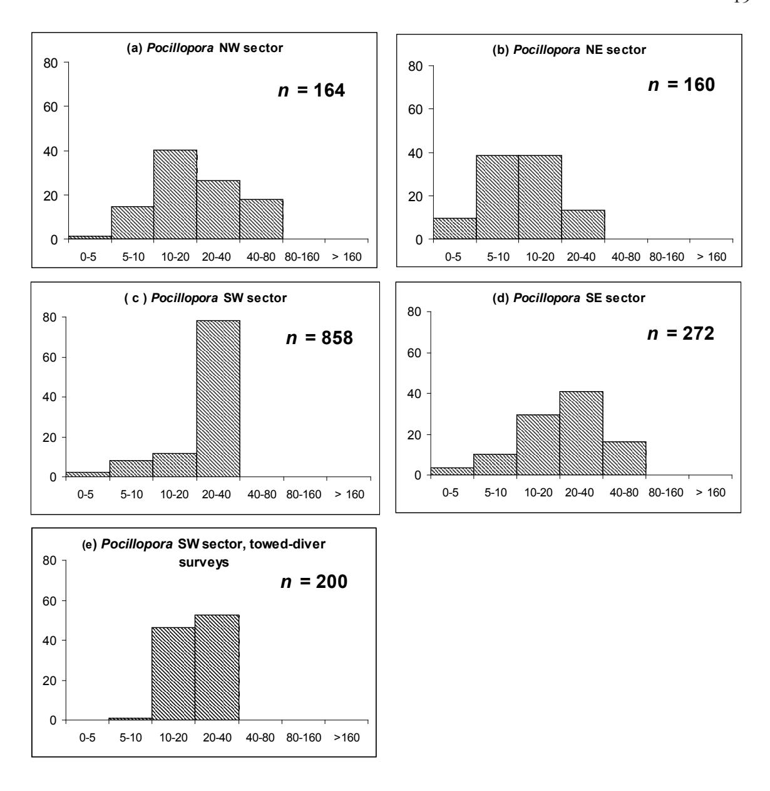

#### **ATOLL RESEARCH BULLETIN**

**NO. 586**

# **CHARACTERIZATION OF CORAL COMMUNITIES AT ROSE ATOLL, AMERICAN SAMOA**

 **BY** 

**JEAN C. KENYON, JAMES E. MARAGOS, AND SUSAN COOPER**

**ISSUED BY NATIONAL MUSEUM OF NATURAL HISTORY SMITHSONIAN INSTITUTION WASHINGTON, D.C., U.S.A. DECEMBER 2010**

**Figure 1**. Location of Rose Atoll within the Samoan Archipelago in the central South Pacific. Inset, upper right, shows IKONOS satellite imagery of the atoll.

# CHARACTERIZATION OF CORAL COMMUNITIES AT ROSE ATOLL, AMERICAN SAMOA

BY

JEAN C. KENYON, 1 JAMES E. MARAGOS, 2 AND SUSAN COOPER 1

#### **ABSTRACT**

To manage resources and interpret ecosystem changes, reef managers benefit from access to the best available scientific data and analyses. Scientific knowledge of the coral communities at Rose Atoll in the central South Pacific has grown since the first visit by scientists in 1839, as has anthropogenic damage, most notably that from a ship grounding and accompanying chemical release in 1993. Given the challenges of operating in this remote, uninhabited location, marine survey activity since that time largely focused on the areas most heavily impacted by the grounding events. Here, we apply multivariate statistical analyses to data acquired in 2002 and 2004 from several complementary survey methods that operate at different scales of spatial and taxonomic resolution to characterize the coral communities at Rose Atoll in relationship to strata defined by habitat, geographic sector, and depth zone. The southeast sector of the fore reef is distinguished from other fore-reef sectors in several analyses, which likely reflects the response of the benthic biota to prevailing trade-wind-driven seas and large waves arriving from the southeast. The southwest fore-reef sector is also distinguished in several analyses; recovery of corals after injury from the vessel grounding on the southwest arm of the fore reef is documented and the special role of pocilloporids in the recovery is highlighted. Coral diversity at Rose Atoll is low compared to larger high volcanic islands to the west in the Samoan Archipelago but is high compared to adjacent atolls and reef islands to the north and east (Tokelau and southern Line Islands) where data are available. We provide a list of 143 anthozoan and hydrozoan corals observed at Rose Atoll during survey activities since 1994. Our spatially widespread surveys that generate independent metrics of benthic cover and coral abundance collectively provide the most comprehensive description of coral communities at Rose Atoll produced to date, which can serve as an important baseline in assessing the direction and pace of future changes.

&lt;sup>1 Joint Institute for Marine and Atmospheric Research, University of Hawaii and NOAA Pacific Islands Fisheries Science Center Coral Reef Ecosystem Division, 1125B Ala Moana Blvd., Honolulu, Hawaii 96814, USA; Email: Jean.Kenyon@noaa.gov

&lt;sup>2 Pacific/Reefs National Wildlife Refuge Complex, U.S. Fish and Wildlife Service, 300 Ala Moana Blvd., Honolulu, Hawaii 96813, USA

#### INTRODUCTION

Rose Atoll (14°32'S, 168°08'W) is an uninhabited atoll located at the far eastern end of the Samoan Archipelago in the central South Pacific (Fig. 1). The 6.5 km2 atoll (Spalding et al., 2001) is diamond-shaped, with the outer perimeter reef slopes roughly facing the northeast, southeast, southwest, and northwest. A single, narrow pass at the north-northwest side of the atoll barrier connects the lagoon with oceanic waters beyond the outer reef. Jacob Roggeveen was the first European to record seeing the atoll in 1722 (Rodgers et al., 1993), but a Samoan name for one of the two sandy islands in the lagoon, Muliava, the end of the reef, suggests Samoans knew of the atoll well before its European discovery. The current traditional Samoan name for Rose is Nu'u O Manu, meaning "village of the sea birds". During his visit in 1899, the French explorer Louis de Freycinet named the atoll "Rose" after his wife. On 7 October 1839, members of the United States Exploring Expedition were the first scientists to land on the atoll, making general observations of the reef, lagoon, islets, coral structure, flora and fauna, and large "boulders of vesicular lava ...seen on the coral reef". Relatively little of the available literature concerning Rose Atoll deals with its coral reefs. Of 297 citations prepared by Rodgers et al. (1993), fewer than 20 pertain to the corals or reef structure. Early literature, including that by Mayor (1924), Hoffmeister (1925), Setchell (1924), Lamberts (1983) and Itano (1988) collectively reported 11 species belonging to 9 genera of reef corals.

In 1974, Rose Atoll was designated and managed as a National Wildlife Refuge by the United States Fish and Wildlife Service (USFWS) with the American Samoa Government (ASG) serving as co-Trustee. On 6 January 2009, Presidential Proclamation 8337 issued by President George W. Bush established the Rose Atoll Marine National Monument, consisting of approximately 13,451 square miles of emergent and submerged land and waters of and around Rose Atoll jointly managed by the USFWS, National Oceanic and Atmospheric Administration (NOAA) and the ASG.

Until 1993, Rose Atoll was considered one of the most remote, smallest, and least disturbed atoll ecosystems in the world (UNEP/IUCN, 1988), but on 14 October 1993, the Taiwanese longliner *Jin Shiang Fa* ran hard aground on the southwest-facing ocean reef. Over the next 6 weeks the ship broke apart, releasing a massive load of ammonia. diesel fuel, and lube oil and scattering debris across the reef slope, reef flat, and into the lagoon (Maragos, 1994). A series of debris removal efforts ordered by the USFWS and conducted between 1993 and 2007 removed all visible debris resulting from the wreck. Monitoring efforts to characterize impacts of the grounding were initiated by USFWS in 1994 and by American Samoa's Department of Marine and Wildlife Resources in 1995 (Maragos, 1994; Green, 1996; Green et al., 1997), in the course of which extensive coral bleaching unrelated to the ship grounding was noted in 1994 and 52 new records were added to the existing coral species inventory (Maragos, 1994). Because of the inherent challenges of conducting marine operations in so remote a location, these monitoring efforts focused on the areas most heavily impacted by the grounding, breakup, and removal of the vessel. From 1999 to 2005, 20 permanently marked transects were established to monitor coral and giant clams and resurveyed by the USFWS through 2007. In 2002, additional monitoring activities were initiated at Rose Atoll by the NOAA Pacific Islands Fisheries Science Center's Coral Reef Ecosystem Division (PIFSC CRED) as part of a larger multidisciplinary effort to assess and monitor coral reef ecosystems in the U.S. Pacific Islands (Brainard et al., 2008). Broad-scale towed-diver surveys were initiated to provide a spatial assessment of the composition and condition of shallow-water (< 28 m) benthic habitats as well and site-specific surveys were conducted to assess species composition, abundance, percent cover, size distribution, and general health of salient benthic organisms including corals.

The main aims of the present study are to (1) describe the community structure of the shallow-water (< 28 m) corals at Rose Atoll, based on atoll-wide surveys conducted in 2002 and 2004 and site-specific surveys conducted in 2004, (2) provide an updated species lists of anthozoan and hydrozoan corals based on surveys conducted between 1994 and 2007, and (3) present evidence of coral recovery along the fore-reef axis that was most heavily impacted by the 1993 vessel grounding and its aftermath. In describing community structure, we applied survey methods that operate at different scales of spatial and taxonomic resolution to generate independent metrics of community abundance. For each method and metric we applied statistical analyses developed for use with multivariate ecological data to determine spatial differences and their underlying taxonomic basis. The summarized results are then discussed within the context of natural and anthropogenic disturbances, including prevailing oceanographic wave regimes, persistent effects from the vessel grounding, and coral bleaching. Our study, which is the first to conduct a detailed and spatially comprehensive multivariate analysis of the coral communities at Rose Atoll, serves as an important baseline from the early years of the 21st century, which can serve as an important and useful standard for future generations of scientists, managers, and other stakeholders.

#### **MATERIALS AND METHODS**

#### Benthic Surveys

Towed-diver surveys were conducted in 2002 (23–26 February) and 2004 (8–11 February) according to the methods of Kenyon et al. (2006) (Fig. 2). During the 2002 surveys, a digital video camera inside an underwater housing with a wide-angle port was used to continuously record benthic imagery. During the 2004 surveys, a digital still camera (Canon EOS-10D, EF 20 mm lens) in a customized housing with strobes was used to photograph the benthos automatically at 15-sec intervals.

Site-specific belt-transect surveys to assess coral colony abundance and size class were conducted along two 25-m-long transect lines by two divers (J. Kenyon and J. Maragos) from 8 to 11 February 2004 according to the general methods described by Maragos et al. (2004) for the 2002 Rapid Ecological Assessments. Ten sites were surveyed on the fore reef and 2 on hard-bottom pinnacles on the perimeter of the lagoon (Fig. 2). Site ROS-7P was the closest location to the longline fishing vessel grounding in 1993 (Maragos, 1994; Green, 1996; Green et al., 1997). Each coral whose colony center fell within a 1-m-wide strip on each side of the lines was classified to genus and its maximum diameter binned into one of seven size classes (Mundy, 1996): 0–5 cm, 5–10 cm, 10–20 cm, 20–40 cm, 40–80 cm, 80–160 cm, or >160 cm. To determine percent cover of benthic components, 12 (35 cm x 50 cm) photoquadrats were concurrently

**Figure 2**. Location of towed-diver and site-specific surveys at Rose Atoll, American Samoa in 2002. Shaded gray area represents the reef flat. Fore-reef track lines are color coded according to the average depth of the complete towed-diver survey, though more than one depth zone may have been sampled during the survey.

photographed with a Sony DSC P-9 digital still camera with spatial reference to the same two 25-m transect lines: 3 photoquadrats at randomly selected points along each transect and 3 at points 3 m perpendicular from each random point in the direction of shallower water (i.e., 6 photoquadrats per transect; Preskitt et al., 2004; Vroom et al., 2005). Locations of site-specific surveys were determined on the basis of (1) maximizing spatial coverage within the allotted number of survey days; (2) establishing depths that allowed three dives per day per diver; (3) building a data time-series for the expanse of fore reef impacted by the vessel grounding; (4) working within constraints imposed by other shipsupported operations; and (5) sea conditions.

 Species lists of anthozoan corals, hydrozoan corals, and miscellaneous anthozoans were compiled in the course of field surveys conducted between 1994 and 2007. Corals were identified *in situ* to species (by the second author). Photographs were also taken *in situ* for most species to verify taxonomic assignments and to resolve uncertainties using published guidebooks. In rare circumstances, samples of some corals were also collected to assist in identifications.

# Data Extraction and Analysis

Habitat digital videotapes recorded during towed-diver surveys in 2002 were sampled at 30-sec intervals (interframe distance ~ 24 m) and quantitatively analyzed for benthic percent cover by a single analyst (J. Kenyon) using the methods of Kenyon et al. (2006). Digital photographs recorded in 2004 were sampled at 30-sec intervals and quantitatively analyzed for benthic percent cover by a single analyst (C. Wilkinson) using point-count software (Coral Point Count with Excel Extension; Kohler and Gill, 2006) and using 50 stratified random points per frame. For both survey years, benthic classification categories included macroalgae, coralline red algae, turf algae, non-coral macroinvertebrates, sand, rubble, and pavement. In 2002, corals were classified as *Pocillopora*, *Porites*, *Montipora*, *Acropora*, faviids, and other taxa. In 2004, corals were classified morphologically rather than taxonomically as massive, branching, encrusting, columnar, plating, and free-living. Laser-projected dots on the imagery were used to calibrate image size and to calculate average benthic area in captured frames. Survey distances were calculated using a global positioning system (GPS) and ArcView GIS 3.3. The depth of each captured frame was determined by matching the time stamp of the image with that of temperature/pressure data recorded by an SBE 39 recorder (Sea-Bird Electronics, Inc.) mounted on the habitat towboard. For statistical analysis, each frame was categorized in one of 16 strata defined *a priori* by the concatenation of 3 factors: habitat (fore reef or lagoon), sector (northeast, southeast, southwest, or northwest for the fore-reef habitat; perimeter or floor for the lagoon habitat) and depth zone (shallow [< 9.1 m], moderate [9.1–18.2 m], or deep [18.2–27.3 m]). Thus, frames from towed-diver surveys that spanned more than one sector or depth zone were parsed into separate strata using the time stamp that linked GPS position and depth to recorded imagery. Depth data were not available for 3 tow surveys because of equipment malfunction, so all frames from each such tow survey were assigned to a single depth zone based on the divers' notes.

In August 1995, 22 months after the longliner grounding, accompanied by a major fuel and chemical spill that killed off many reef organisms on the shallow southwest fore

reef (Maragos, 1994), Green (1996) surveyed five 50-m transects consecutively placed along the linear axis of the southwest fore reef at each of three sites (SW1 = ROS 7P; SW2 = ROS 5P; SW3 = ROS 23, Fig. 2b). To examine coral recovery since that time, those portions of the 2002 towed-diver survey videotapes along the southwest fore reef that most closely corresponded spatially to Green's transects were identified and summarized for coral cover (*n* = 11 frames for each site). From a contiguous series of laser-calibrated still frames within that portion of the tow that best corresponds to Green's (1996) transects at site SW1 (the grounding site), the maximum diameter and area (in planar view) were computed for 200 *Pocillopora* colonies whose dimensions fit entirely within the frames.

Photoquadrats were analyzed for benthic percent cover by a single analyst (S. Cooper) using Coral Point Count with Excel Extensions (Kohler and Gill, 2006) and using one hundred stratified random points per digital image. Corals were identified to genus, while macroalgae, turf algae, coralline red algae, and cyanobacteria were lumped into functional groups. Each photoquadrat was categorized in a stratum according to the same factors defined for the towed-diver survey frames. Site locations and tracks of towed-diver surveys georeferenced with nondifferentially corrected GPS units (Garmin® model 12) were mapped using ArcView GIS 3.3.

Statistical analyses were conducted using PRIMER-E®, version 6 (Clarke and Warwick, 2001; Clarke and Gorley, 2006). Benthic percent cover data from each toweddiver survey frame were treated as individual replicates within a stratum. Two separate matrices were created for 2002 data. One matrix included percent cover data of all benthic categories to examine differences in overall benthic composition among the strata. A second matrix included only coral data, standardized as percent of total coral cover, to examine differences in coral relative abundance among the strata. Square-root transformations were performed on the data matrices to lessen the influence of prevalent benthic components and to increase the weight of rare benthic components, and Bray-Curtis resemblance matrices were created from transformed data. To explore atoll-wide spatial distributional patterns, one-way analyses of similarity (ANOSIM; maximum permutations = 9999) were conducted on each matrix to determine if differences existed among strata. When ANOSIM detected global differences, *R* values from pair-wise tests were examined to determine where major differences existed. SIMPER (similarity percentages routine) analyses using nontransformed data explored the contribution of individual benthic components or coral groups to the dissimilarities.

To visually depict the relationships of strata to each other based on benthic community structure, data were averaged by stratum, and a Bray-Curtis similarity matrix (with square-root transformations) was generated to create a cluster diagram (group average cluster mode) and nonmetric multidimensional scaling (nMDS) ordinations (number of restarts = 50).

All 2004 site-specific photoquadrat and coral belt-transect surveys were conducted within the moderate-depth zone. Percent cover data from each photoquadrat image were treated as individual replicates within a stratum. Treatment of 2004 photoquadrat percent cover data was similar to that described for 2002 towed-diver survey percent cover data. To explore the relative abundance of coral taxa using colony abundance rather than percent cover as a metric, colony counts by taxon were standardized for each transect at each site, and each transect was treated as an individual replicate within a stratum. A square-root transformation was performed on the standardized data to lessen the influence of prevalent taxa and increase the weight of rare taxa, and a Bray-Curtis resemblance matrix was created. One-way ANOSIM was conducted to determine if spatial differences existed among the 5 moderate-depth strata in the relative number of coral colonies of different taxa, and *R* values in pair-wise tests were examined to determine where major differences existed. SIMPER analysis on nontransformed data subsequently explored average similarities and dissimilarities among samples and the contribution of individual taxa to the dissimilarities.

To examine differences in size-class structure among the moderate-depth strata of the three most numerically abundant genera, *Pocillopora*, *Montastrea*, and *Montipora*, the number of colonies of each genus was standardized and then cumulated for each transect at each site and a resemblance matrix based on Euclidean distance was created for each genus. A one-way ANOSIM was conducted for each genus to determine if the size-class distributions differed among strata.

Quantitative site-specific coral and photoquadrat surveys were not conducted in 2002, and corals in the 2004 towed-diver survey imagery were categorized morphologically rather than taxonomically. Therefore, to examine change in total coral cover between 2002 and 2004 in the moderate-depth strata in which all the 2004 site-specific surveys were conducted, a single matrix with 2002 and 2004 data was created with total coral cover for each moderate-depth frame from towed-diver surveys. A Bray-Curtis resemblance matrix was produced with square-root-transformed data, and a two-way crossed ANOSIM was conducted with year and strata as factors.

#### RESULTS

#### **Towed-diver Surveys**

2002 Survey Effort. Survey effort can be assessed by the distance or area surveyed or by the area of the number of frames sampled and analyzed. The distance between frames sampled at 30-sec intervals from benthic tow imagery depends on the tow speed; the average interframe distance ranged from 17.7 m to 27.0 m (mean = 23.6 m, n = 18 tows). The average benthic area captured in laser-scaled frames was 1.385 m² (SE = 0.09 m², n = 909 frames). Towed divers surveyed 32.8 km of benthic habitat (Table 1, Fig. 2), from which 1367 frames were analyzed. Given the 3:4 aspect ratio of the captured frames and extrapolating to the total number of consecutive, nonoverlapping still frames that compose the benthic imagery, this benthic analysis area (1367 frames x 1.385 m²/frame = 1893 m²) samples a total survey area of 44,543 m² (Table 1).

Because tow speed varies between and within tows, and because frames are sampled every 30 sec regardless of tow speed, the ranking of relative survey effort in the six habitat sectors by each of the two metrics (distance/area surveyed and area of sampled frames) is not congruent. Of the two metrics, the total area of sampled frames is the more meaningful indicator of relative survey effort in this study because percent cover data are derived from analysis of sampled frames. In 2002, survey effort on the fore reef was relatively even among the northeast (NE), southeast (SE), and southwest (SW) sectors (331, 341, and 360 m2 analyzed, respectively), but somewhat greater on the northwest

Table 1. Survey effort, coralline algal and coral cover, and average similarity of benthic composition in sampled frames from towed-diver surveys conducted at Rose Atoll, 2002. Shallow: < 9.1 m; Moderate: 9.1–18.2 m; Deep: 18.2–27.3 m

|           |                    |          |           |          |           |                     |              |             |         |         | Proportion of total coral cover |          |       |            |
|-----------|--------------------|----------|-----------|----------|-----------|---------------------|--------------|-------------|---------|---------|---------------------------------|----------|-------|------------|
|           |                    | Distance | Area      |          | Area      | coralline Mean % | Mean % total |             |         |         |                                 |          |       |            |
|           |                    | surveyed | surveyeda | # Frames | analyzeda | algal cover         | coral cover  |             |         |         |                                 |          | Other | Average    |
| Sector    | Depth Zone         | (m)      | (m2)      | Analyzed | (m2)      | (SE)                | (SE)         | Pocillopora | Porites | Faviids | Montipora                       | Acropora | coral | Similarity |
|           | HABITAT: FORE REEF |          |           |          |           |                     |              |             |         |         |                                 |          |       |            |
| ALL       | ALL                | 24532    | 33339     | 1049     | 1453      | 48.4 (0.7)          | 22.6 (0.6)   | 33.6        | 17.7    | 6.2     | 3.4                             | 2.0      | 37.1  | 48.4       |
| NE        | ALL                | 5282     | 7178      | 239      | 331       | 42.5 (1.2)          | 26.2 (1.1)   | 31.9        | 16.4    | 13.1    | 3.4                             | 4.0      | 31.1  | 48.9       |
|           | Shallow            |          |           | 72       | 100       | 48.9 (2.0)          | 28.0 (2.3)   | 51.1        | 21.6    | 9.5     | 3.1                             | 6.0      | 8.7   | 53.3       |
|           | Moderate           |          |           | 102      | 141       | 44.9 (2.0)          | 25.0 (1.6)   | 31.7        | 14.4    | 1.4     | 0.2                             | 4.1      | 48.1  | 53.7       |
|           | Deep               |          |           | 65       | 90        | 29.8 (1.6)          | 26.2 (2.1)   | 9.6         | 13.2    | 34.8    | 8.7                             | 1.5      | 32.3  | 56.0       |
| SE        | ALL                | 7478     | 10163     | 246      | 341       | 53.3 (1.3)          | 23.0 (1.0)   | 26.2        | 5.3     | 1.9     | 3.1                             | 1.8      | 61.7  | 61.2       |
|           | Shallow            |          |           | 105      | 145       | 65.3 (1.6)          | 16.2 (1.0)   | 57.2        | 5.4     | 3.9     | 10.2                            | 2.2      | 21.1  | 67.3       |
|           | Moderate           |          |           | 57       | 79        | 56.8 (1.3)          | 13.2 (0.9)   | 47.4        | 6.3     | 1.0     | 0.2                             | 4.7      | 40.4  | 73.8       |
|           | Deep               |          |           | 84       | 116       | 35.9 (1.4)          | 38.2 (1.6)   | 4.9         | 5.0     | 1.0     | 0.0                             | 0.9      | 88.3  | 70.8       |
| W S    | ALL                | 4748     | 6453      | 260      | 360       | 51.8 (1.5)          | 20.7 (1.2)   | 51.7        | 17.8    | 4.5     | 4.3                             | 0.5      | 21.2  | 52.5       |
|           | Shallow            |          |           | 104      | 144       | 63.4 (2.5)          | 22.5 (1.1)   | 82.0        | 1.7     | 1.0     | 8.2                             | 0.0      | 7.1   | 64.7       |
|           | Moderate           |          |           | 84       | 116       | 44.7 (2.1)          | 21.1 (2.4)   | 43.5        | 28.7    | 4.6     | 2.3                             | 1.5      | 19.5  | 51.9       |
|           | Deep               |          |           | 72       | 100       | 43.3 (2.3)          | 17.7 (2.6)   | 7.3         | 32.4    | 10.9    | 0.0                             | 0.0      | 49.4  | 58.3       |
| W N    | ALL                | 7024     | 9546      | 304      | 421       | 47.4 (1.7)          | 20.9 (1.0)   | 26.5        | 29.8    | 4.7     | 3.0                             | 1.5      | 34.5  | 42.7       |
|           | Shallow            |          |           | 131      | 181       | 63.5 (2.1)          | 17.0 (1.2)   | 56.4        | 14.8    | 4.6     | 5.7                             | 2.0      | 16.5  | 61.6       |
|           | Moderate           |          |           | 76       | 105       | 45.8 (2.5)          | 20.5 (2.1)   | 23.9        | 25.1    | 10.0    | 2.8                             | 2.7      | 35.6  | 46.0       |
|           | Deep               |          |           | 97       | 134       | 27.1 (2.9)          | 26.4 (2.2)   | 2.2         | 45.6    | 1.6     | 0.8                             | 0.4      | 49.3  | 33.0       |
|           | HABITAT: LAGOON    |          |           |          |           |                     |              |             |         |         |                                 |          |       |            |
| ALL       | ALL                | 8244     | 11204     | 318      | 440       | 0.3 (0.1)           | 0.4 (0.2)    | 0.0         | 0.0     | 96.7    | 0.0                             | 0.0      | 3.3   | 44.9       |
| Floor     | ALL                | 2994     | 4069      | 118      | 163       | 0.04 (0.04)         | 0.9 (0.4)    | 0.0         | 0.0     | 96.6    | 0.0                             | 0.0      | 3.4   | 74.3       |
|           | Moderate           |          |           | 39       | 54        | 0.13 (0.13)         | 2.6 (1.3)    | 0.0         | 0.0     | 96.4    | 0.0                             | 0.0      | 3.6   | 64.9       |
|           | Deep               |          |           | 79       | 109       | 0                   | 0.1 (0.1)    | 0.0         | 0.0     | 100.0   | 0.0                             | 0.0      | 0.0   | 80.0       |
| Perimeter | ALL                | 5250     | 7135      | 200      | 277       | 0.4 (0.2)           | 0.1 (0.1)    | 0.0         | 0.0     | 100.0   | 0.0                             | 0.0      | 0.0   | 60.4       |
|           | Shallow            |          |           | 135      | 187       | 0.6 (0.4)           | 0.1 (0.1)    | 0.0         | 0.0     | 100.0   | 0.0                             | 0.0      | 0.0   | 64.5       |
|           | Moderate           |          |           | 65       | 90        | 0                   | 0.1 (0.1)    | 0.0         | 0.0     | 100.0   | 0.0                             | 0.0      | 0.0   | 55.9       |

aArea is based on average area of laser-scaled frames sampled at 30-sec intervals.

(NW) sector (421 m2) (Table 1). Survey effort was equal at moderate and deep depths on the fore reef (441 and 440 m2 analyzed, respectively), but somewhat greater at shallow depths (570 m2). In the lagoon, survey effort was 1.7 times greater along the perimeter than the floor (277 and 163 m2, respectively). There were no deep-perimeter or shallow-floor strata in the lagoon.

Spatial Analyses of Benthic Cover and Composition. Percent cover estimates of benthic components derived from analysis of towed-diver survey imagery exhibited 48% average similarity among all fore-reef samples (n = 1049) and 45% average similarity among all lagoon samples (n = 318) (Table 1), but average dissimilarity between fore-reef and lagoon samples was 97%. Average similarity within the 12 fore-reef strata ranged from 33% to 74%, with the lowest similarity found among deep northwest (NW\_D) samples and the highest among moderate-depth southeast (SE\_M) samples. Coralline algae dominated all fore-reef sectors, accounting for ~ 50% of mean benthic cover, with its lowest cover in each sector found in the deep zone. Lagoon benthos exhibited higher within-stratum similarities, ranging from 56% in moderate-depth perimeter (PE\_M) samples to 80% in moderate-depth floor (FL\_M) samples. Unconsolidated rubble dominated the lagoon perimeter, and sand dominated the lagoon floor (73% and 83% of cover, respectively).

One-way ANOSIM of towed-diver survey data in 2002 revealed percent cover of benthic components to be significantly different among the 16 strata (global R=0.549, p=0.0001). In pair-wise tests, the major differences were found between the lagoon and fore reef ( $R \ge 0.786$  for all 48 lagoon, fore-reef strata pair-wise tests). Of the 66 tests involving pairs of fore-reef strata, 4 had moderately large R values ( $R \ge 0.673$ ) indicating spatial separation of benthic components; the deep SE (SE\_D) stratum was the most unlike other fore-reef strata (Table 2, Fig. 3). Of the 6 tests involving pairs of lagoon strata, the largest R values ( $R \ge 0.659$ ) were associated with the shallow perimeter (PE\_S) and the 2 floor strata (FL\_M and FL\_D)(Table 2). SIMPER revealed that coralline algae, sand, and rubble each drove  $\sim 25\%$  of the average dissimilarity between the fore-reef and lagoon habitats. Rubble and sand were found to drive the average dissimilarity among strata in the lagoon, whereas on the fore reef the three algal functional groups (coralline, turf, and macroalgae) and the coral genus *Pocillopora* drove the average dissimilarity among strata.

Spatial Analyses of Coral Cover and Composition. Mean total coral cover on the fore reef was 22.6% (SE 0.6, n = 1049) and 0.4% (SE 0.2, n = 318) in the lagoon (Table 1). Estimates of coral relative abundance derived from analysis of towed-diver survey imagery exhibited 34% average similarity among all fore-reef samples and 0.93% average similarity among all lagoon samples, but average dissimilarity between fore-reef and lagoon samples was 99.6% (data not shown).

Mean total coral cover in the 4 fore-reef sectors ranged from 20.7% in the SW to 26.2% in the NE. At shallow depths (< 9.1 m) on the fore reef, total coral cover ranged from 16.2% in the SE to 28.0% in the NE. At moderate depths (9.1 m -18.2 m), the low and high ends of the range of mean total coral cover were also found in the SE (13.2%) and NE (25.0%), respectively. At deep depths (18.2 m - 27.3 m), however, the lowest

Table 2. Pair-wise groups with large *R* values (≥ 0.600) determined by ANOSIM with towed-diver and site-specific survey data. F = fore reef, L = lagoon, NE = northeast, SE = southeast, SW = southwest, NW = northwest, S = shallow, M = moderate, D = deep. Not included are the remaining 44 lagoon, fore-reef strata comparisons from towed-diver surveys, all of which had *R* values ≥ 0.806 for "all benthos" pair-wise tests and 35 of which had *R* values ≥ 0.607 for "coral relative abundance" pair-wise tests. All site-specific surveys (photoquadrats and colony counts) were in the moderatedepth zone.

|                |                    |       | To          | wed-diver surveys |                |       | Photoquadrats | Colony Counts  |       |
|----------------|--------------------|-------|-------------|-------------------|----------------|-------|---------------|----------------|-------|
|                |                    |       |             |                   | Coral relative |       |               | Coral relative |       |
|                |                    |       | All benthos |                   | abundance      |       | All benthos   | abundance      |       |
| m Stratu    | m Stratu        | R     | p           | R                 | p              | R     | p             | R              | p     |
| M NE_ F_ | M W_ N F_ |       |             |                   |                |       |               | 0.893          | *0.07 |
| D NE_ F_ | W_S F_S         | 0.673 | 0.0001      | 0.603             | 0.0001         |       |               |                |       |
| D NE_ F_ | D F_SE_         | 0.743 | 0.0001      |                   |                |       |               |                |       |
| M F_SE_     | M W_ N F_ |       |             |                   |                |       |               | 0.708          | 0.03  |
| D F_SE_     | W_S F_S         | 0.765 | 0.0001      | 0.778             | 0.0001         |       |               |                |       |
| D F_SE_     | D W_ F_S     | 0.739 | 0.0001      |                   |                |       |               |                |       |
| D F_SE_     | M F_SE_         |       |             | 0.614             | 0.0001         |       |               |                |       |
| L_PE_S         | M L_FL_         | 0.659 | 0.0001      |                   |                |       |               |                |       |
| L_PE_S         | D L_FL_         | 0.687 | 0.0001      |                   |                |       |               |                |       |
| M L_PE_     | M NE_ F_     | 0.920 | 0.0001      | 0.878             | 0.0001         | 0.886 | 0.0001        | 0.893          | *0.07 |
| M L_PE_     | M F_SE_         | 0.935 | 0.0001      | 0.895             | 0.0001         | 0.942 | 0.0001        | 0.917          | 0.03  |
| M L_PE_     | M W_ F_S     | 0.927 | 0.0001      | 0.683             | 0.0001         | 0.885 | 0.0001        | 0.927          | 0.03  |
| M L_PE_     | M W_ N F_ | 0.894 | 0.0001      |                   |                | 0.892 | 0.0001        | 0.865          | 0.03  |

\* Although the large *R* values associated with these comparisons indicate strong separation in coral composition between these strata, they are not associated with a low *p* value because there were only 15 possible permutations (few replicates in both groups).

Figure 3. Nonmetric multidimensional scaling (nMDS) ordination depicting relationships of benthic **Figure 3.** Nonmetric multidimensional scaling (nMDS) ordination depicting relationships of benthic communities based on percent cover data derived from towed-diver surveys. Each symbol represents the average of data derived from analysis of imagery captured at 30-sec intervals. F = forereef, L = lagoon, NE = northeast, SE = southeast, SW = southwest, NW = northwest, S = shallow, M = moderate, D = deep

mean total coral cover was found in the SW (17.7%) and the highest was found in the SE (38.2%). Hence, on the fore reef the lowest coral cover at shallow and moderate depths and the highest cover in the deepest zone were found in the SE sector. There was no trend between mean total coral cover and increasing depth. In the lagoon, mean total coral cover was highest at moderate depths on the lagoon floor (2.6%) and consistently extremely low (0.1%) in the 3 other strata.

Average similarity of coral composition within the 12 fore-reef strata ranged from 23% to 83% (data not shown), with the lowest similarity found among moderate-depth northwest (NW\_M) samples and the highest among SE\_D samples. One-way ANOSIM revealed relative abundance of coral to be significantly different among the 16 strata (global *R* = 0.435, *p* = 0.0001). Of the 48 lagoon, fore-reef strata pair-wise tests, *R* ≥ 0.607 in 40 tests, indicating major differences between the fore-reef and lagoon habitats; in the remaining 8 lagoon, fore-reef pair-wise tests, all of which included the NW\_M or deep southwest (SW\_D) strata, 0.428 < *R* < 0.522, indicating weaker separation in coral relative abundance among these strata. Of the 66 tests involving fore-reef strata pairs, 3 had moderately large *R* values (*R* ≥ 0.603, *p* = 0.0001) (Table 2), indicating spatial separation of coral groups; the SE\_D and shallow SW (SW\_S) strata were the most unlike other fore-reef strata. Differences in coral relative abundance among all lagoon strata were negligible (-0.005 < *R* < 0.026), with the very small negative *R* value associated with the PE\_S and PE\_M comparison indicating the similarities across these strata were slightly higher than those within the strata. SIMPER revealed that *Pocillopora* and "other coral" together accounted for ~ 75% of the average dissimilarity between the fore-reef and lagoon habitats, and that these groups also drove the average dissimilarity among strata on the fore reef. Of the 5 taxa identified in the towed-diver survey imagery, *Pocillopora* accounted for the highest proportion of mean total coral cover on the fore reef overall as well as in 3 of the 4 habitat sectors (Table 1). *Pocillopora* dominated the shallow-depth zone in all fore-reef sectors, and its contribution to the coral fauna consistently diminished with depth in all sectors. The highest relative abundance of *Pocillopora* was found on the SW sector.

Only in the NW sector was the contribution of *Pocillopora* to total percent coral cover exceeded, by *Porites*, the next most abundant identified taxon throughout the forereef sectors (Table 1). The greatest contribution by faviids to total coral cover on the fore reef was found in the NE sector. *Montipora* and *Acropora* each accounted for < 4.5% of the total coral cover in all fore-reef sectors. Other taxa accounted for ~ 37% of the total coral cover on the fore reef, with contributions to individual sectors ranging from 21.2% in the SW to 61.7% in the SE. Faviids dominated the lagoon coral fauna, accounting for > 96% of the sparse cover, and were the taxa exclusively found on the lagoon perimeter.

*Coral recovery along the southwest fore reef.* Live coral cover computed from segments of the towed-diver survey that most closely corresponded to belt transects conducted by Green (1996) along the southwest fore reef was three to seven times higher than that recorded in 1995 (Table 3). *Pocillopora* accounted for 56% of the live coral cover. Average maximum colony diameter of *Pocillopora* colonies (*n* = 200) was 21.1 cm (SE 0.4), (Fig. 4e), and average planar area was 280.9 cm2 (SE 10.0).

*2004 Survey Effort*. Towed divers surveyed 40.5 km of benthic habitat, from which 1938 frames were analyzed. Survey effort on the fore reef was relatively even among the NE, SE, SW, and NW sectors (525, 489, 472, and 515 m2 , respectively).

Table 3. Comparison of coral cover at 3 sites on the southwest fore reef at Rose Atoll impacted by a 1993 vessel grounding and surveyed by Green (1996) in 1995 and by towed divers in 2002.

| Site (Green, 1996/current study) | % coral cover (SE), Green (1996) | % live coral cover (SE), towed-diver survey (2002) |
|----------------------------------------|----------------------------------|----------------------------------------------------|
| SW 1/ROS-7P                            | 1.9 (0.8)                        | 13.3 (2.7)                                         |
| SW 2/ROS-5P                            | 6.1 (2.6)                        | 23.4 (8.6)                                         |
| SW 3/ROS-23                            | 7.2 (1.4)                        | 20.4 (4.2)                                         |

Survey effort was greatest at moderate depths (888  $\text{m}^2$ ), with less effort in the shallow and deep depths (660 and 454  $\text{m}^2$ , respectively). In the lagoon, survey effort along the perimeter was more than twice that of the floor (463 and 220  $\text{m}^2$ , respectively).

Temporal Comparison of Mean Total Coral Cover. Mean total coral percent cover did not vary significantly across strata at moderate depths between 2002 and 2004 (global R = 0.0001, p = 0.511).

Species Inventory of Corals and other Anthozoans

A total of 143 species of stony, soft, and hydrozoan corals and four other anthozoans were recorded between 1994 and 2007 (Table 4). Within the class Anthozoa, four taxonomic orders are represented. Within the stony coral order Scleractinia, 13 families containing 37 genera and 137 species are represented.

Site-specific Surveys: Photoquadrats

Spatial Analyses of Benthic Cover and Composition. All photoquadrat surveys were conducted in the moderate-depth zone. Percent cover estimates of benthic components from analysis of photoquadrat imagery exhibited 69% average similarity among all fore-reef samples (n = 120) and 62% average similarity among all lagoon samples (n = 24), but average dissimilarity between fore-reef and lagoon samples was 86%. Average similarity within the 4 fore-reef strata ranged from 67% to 72%, with the lowest similarity found among NE samples and the highest among SE samples. Coralline algae dominated all fore-reef sectors, ranging from 55% cover in the NE sector to 67% in the SE sector. Pavement covered with turf algae dominated the lagoon pinnacles (73% of cover).

One-way ANOSIM revealed percent cover of benthic components to be significantly different among the 5 sectors at moderate depths (global R = 0.412, p = 0.0001). Of the 10 pair-wise tests,  $R \ge 0.885$  for the 4 comparisons between the lagoon perimeter pinnacles and the 4 fore-reef sectors (Table 2), indicating the major differences in benthic composition were found between habitats. Within the fore-reef habitat, 0.039  $\le R \le 0.231$  for all pair-wise comparisons, indicating weak separation in benthic composition among the 4 sectors. SIMPER tests on untransformed data revealed that

Table 4. Scleractinian corals, octocorals, hydrozoan corals, and other Anthozoa at Rose Atoll from 1994 to 2007 and Ta'u Island from 2004 surveys and photos. Species assignments follow Veron et al. (1977) and Veron (2000) except where there were conflicts with Hoeksema (1989) and Wallace (1999), or contrary preferences of the authors (+). The species in parenthesis were considered junior synonyms by the above authorities. T = at Ta'u and Rose; T\* = only at Ta'u; all others only at Rose.

| authorities. T = at Ta'u and Rose; T* = only at Ta'u; all others only at Rose. |                                 |                                |  |
|--------------------------------------------------------------------------------|---------------------------------|--------------------------------|--|
| SCLERACTINIA                                                                   | Echinophyllia aspera            | Lobophyllia corymbosa          |  |
| Acanthastrea echinata-T                                                        | Echinopora lamellosa- T         | L. hataii- T*                  |  |
| A. sp T*                                                                       | Favia favus                     | L. robusta- T*                 |  |
| Acropora abrotanoides- T*                                                      | F. matthaii- T                  | L. hemprichii (costata)- T     |  |
| A. aspera                                                                      | F. maxima                       | Merulina ampliata              |  |
| A. cerealis                                                                    | F. pallida- T                   | M. scabricula- T*              |  |
| A. digitifera                                                                  | F. rotumana                     | Montastrea annuligera- T       |  |
| A. exquisita                                                                   | F. sp T                         | M. curta- T                    |  |
| A. gemmifera- T                                                                | F. speciosa- T                  | M. valenciennesi- T*           |  |
| A. globiceps- T                                                                | F. stelligera- T                | Montipora aequituberculata     |  |
| A. granulosa- T                                                                | Favites abdita- T*              | M. angulata                    |  |
| A. humilis- T                                                                  | F. flexuosa- T                  | M. calcarea                    |  |
| A. kirstyae                                                                    | F. halicora- T                  | M. caliculata- T*              |  |
| A. latistella                                                                  | F. russelli- T                  | M. danae- T                    |  |
| A. longicyathus                                                                | F. sp T                         | M. efflorescens- T             |  |
| A. loripes (rosaria)- T                                                        | Fungia concinna                 | M. ehrenbergii- T*+            |  |
| A. nana                                                                        | F. fungites- T*                 | M. foliosa                     |  |
| A. nasuta                                                                      | F granulosa                     | M. foveolata- T                |  |
| A. paniculata- T                                                               | F. horrida- T* (danai, valida)  | M. hoffmeisteri- T             |  |
| A. retusa- T                                                                   | F. repanda- T                   | M. incrassata                  |  |
| A. samoensis- T                                                                | F. scutaria- T                  | M. informis- T                 |  |
| A. selago                                                                      | Galaxea fascicularis- T         | M. lobulata                    |  |
| A. sp T                                                                        | Goniastrea australensis- T*     | M. millepora- T*               |  |
| A. squarrosa                                                                   | G. pectinata- T                 | M. nodosa                      |  |
| A. tenuis (africana)                                                           | G. retiformis- T                | M. peltiformis- T              |  |
| A. tutuilensis- T* +                                                           | G.sp T*                         | M. sp. [bright blue]- T        |  |
| A. valida                                                                      | Goniopora somaliensis- T        | M. sp T*                       |  |
| Alveopora verrilliana- T                                                       | Herpolitha limax                | M. spumosa                     |  |
| Astreopora cucullata                                                           | Hydnophora exesa- T             | M. tuberculosa- T              |  |
| A. gracilis- T*                                                                | Isopora brueggemanni- T         | M. undata                      |  |
| A. listeri- T                                                                  | I. palifera                     | M. venosa- T                   |  |
| A. myriophthalma- T                                                            | Leptastrea bewickensis          | M. verrucosa- T                |  |
| A. ocellata                                                                    | L. pruinosa- T                  | Oulophyllia crispa- T          |  |
| A. sp T*                                                                       | L. purpurea- T                  | Pavona chiriquiensis- T +      |  |
| Barabattoia laddi                                                              | L. sp. [small round calices]- T | P. clavus- T                   |  |
| Coeloseris mayeri- T                                                           | L. transversa- T*               | P. explanulata- T              |  |
| Coscinaraea columna- T                                                         | Leptoria phrygia- T*            | P. maldivensis                 |  |
| C. exesa- T                                                                    | Leptoseris explanata- T*        | P. minuta- T                   |  |
| C. sp T*                                                                       | L. foliosa                      | P. varians- T                  |  |
| Cycloseris fragilis (patelliformis) +                                          | L. incrustans                   | P. venosa- T                   |  |
| Cyphastrea chalcidicum- T                                                      | L. mycetoseroides- T            | Platygyra daedalea (esperi)- T |  |
| C. decadia                                                                     | L. scabra                       | P. lamellina- T                |  |
| C. microphthalma- T                                                            | L. sp. [small round calices]- T | P. ryukyuensis                 |  |
| C. serailia                                                                    | L. sp. A                        | P. sinensis- T*                |  |
| Diploastrea heliopora- T*                                                      | L. yabei                        | Pocillopora brevicornis +      |  |
|                                                                                |                                 |                                |  |

#### Table 4. continued

*P. meandrina*- T *Stylocoeniella armata*

*Porites australiensis*- T *S. recta*- T\* *Heteractis magnifica*

*P. rus*- T *T. stellulata*- T *Zoanthus* sp. *P. solida*- T

*P. superfusa* + *Cladiella* sp.- T

*P. nierstraszi*

SCLERACTINIA *P. profundacella*- T HYDROZOA

*P. eydouxi*- T *Scapophyllia cylindrica*- T *Stylaster* sp.

*P. verrucosa*- T *Stylophora pistillata* Actiniaria

*P. lichen Turbinaria frondens*- T *H. malu*- T\* *P. lobata*- T *T. mesenterina* Zoanthidea

*P.* sp.- T\* OCTOCORALLIA

*P. vaughani Lobophytum* sp.- T *Psammocora contigua Sarcophyton* sp.- T *P. haimeana Sinularia* sp.- T

*P. damicornis Sandalolitha robusta*- T\* *Millepora platyphylla*- T

*P. molokensis S. guentheri* OTHER ANTHOZOA

*P.* sp. *Symphyllia agaricia Cryptodendrum adhaesivum*

*P. lutea*- T *T. reniformis*- T *Palythoa tuberculosa*- T

coralline algae, macroalgae, turf algae, and cyanobacteria drove ~ 90% of the average dissimilarity between the lagoon and the fore-reef sectors and ~ 75% of the average dissimilarity among fore-reef sectors.

*Spatial Analyses of Coral Cover and Composition*. Mean total coral cover on the fore reef was 10.0% (SE 0.9, *n* = 120) and 10.3% (SE 3.0, *n* = 24) on the lagoon perimeter pinnacles. Mean total coral cover in the 4 fore-reef sectors ranged from 7.4% in the NW to 11.7% in the SE (Table 5)**.** Estimates of coral relative abundance derived from analysis of photoquadrat imagery exhibited 27% average similarity among all fore-reef samples and 40% average similarity among all lagoon samples, but average dissimilarity between fore-reef and lagoon samples was 87%.

Ten scleractinian and 2 alcyonacean genera (the octocorals *Sinularia* and *Sarcophyton*) were recorded in the photoquadrats (Table 5). Average similarity of coral relative abundance within the 4 fore-reef strata ranged from 16% to 45% (Table 5), with the lowest similarity found among SE samples and the highest among SW samples. Oneway ANOSIM revealed relative abundance of coral taxa to be significantly different among the 5 strata (global *R* = 0.157, *p* = 0.0001). Of the 10 pair-wise tests, the largest *R* values (0.423 ≤ *R* ≤ 0.456) were found for the comparisons between the lagoon perimeter pinnacles and the 4 fore-reef sectors, indicating the strongest differences in coral composition were found between habitats. Within the fore-reef habitat, - 0.027 ≤*R* ≤ 0.152 for all pair-wise comparisons, indicating weak separation in coral composition among the 4 sectors, with the very small negative *R* value associated with the NE and NW comparison indicating the similarities across the strata were slightly higher than those within the strata. SIMPER revealed that *Montipora*, *Pocillopora* and *Favia* together accounted for ~ 73% of the average dissimilarity between the fore-reef and lagoon

Table 5. Relative abundance of coral genera, expressed as percent of mean total coral cover, derived from photoquadrat imagery at Rose Atoll, 2004. NE = northeast, SE = southeast, SW = southwest, NW = northwest, PE = perimeter. All surveys were in the moderate-depth zone.

|                          |            | Fore Reef  |           |           | Lagoon     |
|--------------------------|------------|------------|-----------|-----------|------------|
| Genus                    | NE         | SE         | SW        | NW        | PE         |
| Acanthastrea             | 0.0        | 3.2        | 0.0       | 0.0       | 0.0        |
| Acropora                 | 0.0        | 6.5        | 0.0       | 5.9       | 0.0        |
| Favia                    | 0.0        | 5.5        | 5.1       | 0.0       | 26.4       |
| Fungia                   | 0.0        | 0.0        | 0.2       | 0.0       | 0.0        |
| Leptastrea               | 0.0        | 0.0        | 0.0       | 5.7       | 0.0        |
| Montastrea               | 21.3       | 2.9        | 10.9      | 19.2      | 0.0        |
| Montipora                | 21.5       | 18.0       | 17.2      | 26.4      | 56.0       |
| Pavona                   | 1.3        | 13.7       | 0.0       | 0.0       | 0.0        |
| Pocillopora              | 55.8       | 24.9       | 63.6      | 35.5      | 0.0        |
| Porites                  | 0.0        | 6.1        | 2.7       | 6.5       | 16.4       |
| Sarcophyton              | 0.0        | 0.0        | 0.0       | 0.8       | 1.2        |
| Sinularia                | 0.0        | 19.2       | 0.0       | 0.0       | 0.0        |
|                          |            |            |           |           |            |
| Mean (SE) coral cover, % | 10.8 (2.2) | 11.7 (1.9) | 9.7 (1.4) | 7.4 (1.9) | 10.3 (3.0) |
| Average Similarity       | 34.7       | 16.1       | 44.8      | 20.4      | 40.4       |

habitats, whereas *Pocillopora*, *Montipora*, and *Montastrea* together accounted for ~ 74% of the average dissimilarity among fore-reef sectors.

*Pocillopora* accounted for the highest proportion of total coral percent cover in all fore-reef sectors but was absent from the lagoon samples (Table 5). The highest relative abundance of *Pocillopora* was found in the SW sector. *Montipora* accounted for the highest proportion of total coral cover in the lagoon and was the next most dominant genus in all fore-reef sectors except the SE, where the octocoral *Sinularia* accounted for slightly more of the total coral cover. *Montastrea* also accounted for a substantial proportion (> 10%) of the total coral cover on the fore reef except for the SE sector, where the contribution of *Pavona* was substantial. *Favia* and *Porites* were most abundant on the lagoon perimeter pinnacles but accounted for a low proportion of the total coral cover on the fore reef. *Acanthastrea*, *Acropora*, *Fungia*, *Leptastrea*, and the octocoral *Sarcophyton* all accounted for < 10% of the total coral cover in all strata.

Site-specific Surveys: Coral Belt Transects

*Coral Colony Relative Abundance.* All belt-transect surveys were conducted in the moderate-depth zone. A total of 4404 colonies belonging to at least 21 scleractinian and 3 octocoral genera were recorded in belt-transects (Table 6). Estimates of coral relative abundance derived from colony counts exhibited 58% average similarity among

Table 6. Relative abundance of coral genera, expressed as percent of total number of coral colonies, derived from belt-transect surveys at Rose Atoll, 2004. NE = northeast, SE = southeast, SW = southwest, NW = northwest, PE = perimeter. All surveys were in

the moderate-depth zone.

|                           |      |      | Fore Reef |      | Lagoon |
|---------------------------|------|------|-----------|------|--------|
| Genus                     | NE   | SE   | SW        | NW   | PE     |
| Acropora                  | 11.5 | 4.4  | 3.4       | 2.5  | 1.8    |
| Astreopora                | 0.4  | 0.1  | 0.0       | 0.0  | 15.0   |
| Coscinaraea               | 0.0  | 1.2  | 0.1       | 0.6  | 0.0    |
| Cyphastrea                | 0.4  | 1.2  | 0.7       | 1.1  | 0.8    |
| Echinophyllia             | 0.0  | 0.1  | 0.0       | 0.0  | 0.0    |
| Favia                     | 7.5  | 4.9  | 1.8       | 2.7  | 31.0   |
| Favites                   | 0.0  | 0.1  | 0.2       | 0.4  | 0.0    |
| Fungia                    | 0.4  | 0.1  | 0.2       | 0.4  | 0.0    |
| Goniopora                 | 0.0  | 0.0  | 0.0       | 0.4  | 0.0    |
| Hydnophora                | 0.0  | 0.4  | 0.1       | 0.0  | 0.0    |
| Leptastrea                | 0.0  | 0.0  | 0.0       | 0.2  | 3.2    |
| Leptoseris                | 8.0  | 1.9  | 0.2       | 0.0  | 0.0    |
| Lobophyllia/Symphyllia    | 0.0  | 0.8  | 0.0       | 0.0  | 0.0    |
| Merulina/Scapophyllia     | 0.0  | 0.0  | 0.0       | 0.0  | 0.2    |
| Montastrea                | 19.5 | 26.1 | 12.8      | 36.2 | 1.9    |
| Montipora                 | 3.5  | 10.2 | 8.1       | 19.6 | 24.9   |
| Pavona                    | 2.2  | 14.5 | 0.1       | 0.8  | 0.3    |
| Platygyra                 | 0.0  | 0.0  | 0.0       | 0.0  | 0.2    |
| Pocillopora               | 35.5 | 29.9 | 70.2      | 31.2 | 0.0    |
| Porites                   | 2.2  | 2.1  | 1.7       | 3.2  | 19.7   |
| Psammacora                | 0.4  | 1.9  | 0.4       | 0.8  | 1.1    |
| Octocorals                | 8.2  | 0.0  | 0.0       | 0.0  | 0.0    |
|                           |      |      |           |      |        |
| Total colonies enumerated | 451  | 910  | 1222      | 524  | 1297   |
| Average similarity        | 79.4 | 65.7 | 62.2      | 75.1 | 45.4   |

all fore-reef samples and 45% average similarity among all lagoon samples, but average dissimilarity between fore-reef and lagoon samples was 82%. Average similarity within the 4 fore-reef strata ranged from 62% to 79% (Table 6), with the lowest similarity found among SW samples and the highest among NE samples.

One-way ANOSIM revealed relative abundance of coral taxa to be significantly different among the 5 strata (global *R* = 0.639, *p* = 0.0001). The greatest difference in the taxonomic distribution of coral colonies was found between the lagoon perimeter pinnacles and the fore-reef habitat (*R* ≥ 0.857 for all 4 pair-wise tests, Table 2). Large *R*

values, indicative of spatial differences in relative abundances of different coral taxa, were also characteristic of the NW sector in comparison to both the NE and SE sectors (Table 2). SIMPER revealed that *Pocillopora, Favia, Porites,* and *Montipora* together accounted for ~ 70% of the average dissimilarity between the fore-reef and lagoon habitats, but the contribution of coral taxa to the average dissimilarities among fore-reef sectors was variable.

*Pocillopora* accounted for the highest proportion of total coral colonies in all forereef sectors except the NW but was absent from the lagoon samples (Table 6). The highest relative abundance of *Pocillopora* was found in the SW sector. *Montastrea* was the next most abundant genus on the fore reef. *Pavona* accounted for a substantial proportion (> 10%) of the total number of colonies in the SE sector. All other taxa accounted for < 10% of the total number of colonies in all fore-reef strata. *Favia, Montipora, Porites,* and *Astreopora* each contributed a substantial proportion of the total number of colonies on the lagoon perimeter pinnacles.

*Coral Size-class Distributions*. No pocilloporids were recorded at the lagoon perimeter pinnacles (Table 6). Size-class distributions of *Pocillopora* varied significantly among the 4 fore-reef sectors (global *R* = 0.302, *p* = 0.05) (Fig. 4). In pair-wise tests, the largest *R* values were associated with the comparisons involving the SW sector (*R* ≥ 0.556, *p* = 0.029 for all 3 pair-wise tests). Inspection of size-class histograms for the 4 fore-reef sectors (Fig. 4a–d) reveals that at SW sites the majority (78.2%) of colonies were in the 20-40 cm size class, and colonies > 40 cm maximum diameter were absent. By comparison, the histograms at other fore-reef sectors were more variably distributed, with relatively greater proportions of colonies in smaller (< 20 cm) and larger (> 40 cm) size classes.

Inspection of size-class histograms for the 5 moderate-depth strata in which *Montastrea* colonies were tallied (Fig. 5) suggests that the population on the lagoon pinnacles was more strongly skewed towards smaller size classes than fore-reef sector populations, but this trend was not statistically significant (*R* = 0.137, *p* = 0.16). Similarly, although the size-class histograms for the 5 moderate-depth strata in which *Montipora* colonies were tallied (Fig. 6) suggests that the population on the SE fore reef was more strongly skewed towards larger size classes than other populations, this trend was not statistically significant (*R* = 0.139, *p* = 0.11).

#### **DISCUSSION**

Towed-diver and site-specific surveys operate on different scales of spatial coverage and taxonomic resolution. Towed divers surveyed 16 strata that included three depth zones, whereas site-specific methods surveyed 5 strata, all in moderate depths. Moreover, the 2 site-specific methods used in this study (photoquadrats and belt transects) to assess coral relative abundance generate two different metrics, percent cover and colony abundance. Accordingly, the results derived from these diverse methods and metrics show some degree of congruency and some degree of discordance in regards to spatial patterns of benthic cover and composition, coral cover and composition, and degree of similarity among samples within the strata.

**Figure 4.** Size-class (cm) distributions of *Pocillopora* at moderate depths in fore-reef sectors at Rose Atoll, American Samoa. (a–d) site-specific belt-transect surveys, (e) towed-diver surveys. The *x*-axis is maximum diameter (cm); the *y*-axis is percent of colonies enumerated in each genus.

Both towed-diver and photoquadrat surveys showed that coralline algae dominated all fore-reef sectors, with both methods indicating that, at moderate depths, its cover was greatest in the SE sector. Other investigators (Mayor, 1924; Maragos, 1994; Green, 1996; Green and Craig, 1999) have noted the dominant crustose coralline algae on the outer fore reef. Depth-stratified towed-diver surveys additionally revealed that coralline algal cover decreased with increasing depth. In considering all benthic components, both methods found that the highest average similarities among fore-reef samples (61% and 72%, respectively) were in the SE sector at moderate depths. The prevailing trade winds at Rose Atoll blow from the southeast (Green et al., 1997). Modeled significant wave-height data for Rose Atoll (Coral Reef Ecosystem Division, unpubl. data) show that large wave heights (~ 3 m) typically occur during the austral winter months from the south and southeast compared to smaller wave heights (~ 2 m) of more varied directionality during the summer months. The higher cover of coralline algae at moderate depths on the SE exposure than at moderate depths on other fore-reef exposures is reflected in the high average similarity among SE samples (Table 1) and likely reveals the reef's response to physical disturbance by higher-energy winter waves. The reduction of coralline algal cover at deeper depths on all fore-reef exposures is consistent with reduced physical disturbance by waves at greater depths. The major differences in benthic composition occurred primarily between the fore-reef and lagoon habitats; photoquadrat surveys only revealed weak separation among the 4 fore-reef sectors at moderate depths, but depth-stratified towed-diver surveys revealed that the deep SE fore-reef stratum was most unlike other fore-reef strata (Fig. 3).

Estimates of coral cover on the fore reef derived from imagery recorded during towed-diver surveys are 2 to 3 times greater than those derived from photoquadrat imagery, with the exception of the SE sector. While the capacity to distinguish among coral taxa in photoquadrats is superior to that in towed-diver survey imagery, the much larger area analyzed from towed-diver surveys suggests that this method generates the more accurate estimate of total coral cover over broad spatial scales. On the fore reef, results from towed-diver surveys indicated that the lowest total coral cover at shallow and moderate depths (13–16%) and the highest cover in the deep zone (38%) occurred in the SE sector. The low coral cover at shallow and moderate depths in this sector likely reflects a pruning effect of large winter waves that arrive primarily from the SE. Conversely, photoquadrat estimates of coral cover on the lagoon perimeter are an order of magnitude greater than those derived from analysis of towed-diver survey imagery. However, photoquadrat surveys on the lagoon perimeter were conducted at 2 hard-bottom pinnacles, while towed divers surveyed substrate in the lagoon that largely consisted of rubble and sand, i.e., substrate that does not support coral populations.

In considering the relative abundance of corals using percent cover as a metric, towed-diver surveys found the highest average similarity among samples (83.2%) in the deep SE sector, while photoquadrat surveys found the highest average similarity (44.8%) in the SW sector. In considering the relative abundance of corals using the number of colonies of different taxa as a metric, belt-transect surveys found the highest average similarity among samples (79.4%) in the NE sector and the lowest average similarity (62.2%) in the SW sector. Percent cover (derived from photoquadrats) and colony abundance (derived from belt transects) are two independent metrics of coral relative abundance. A taxon with a large number of small colonies may not contribute greatly to

total coral cover but may account for a substantial proportion of the total number of colonies in a coral assemblage. Both percent cover and colony abundance are important metrics. Percent cover, along with growth morphology, shapes the physical structure of the benthic environment experienced by organisms such as fish and other invertebrates (Jones et al., 2004; Idjadi and Edmunds, 2006), while colony abundance influences density-dependent processes including disease transmission by infectious vectors, the probability of fertilization during sexual reproduction, and habitation for commensal organisms that occupy different coral taxa.

All three methods showed that the major differences in coral composition occurred primarily between the fore-reef and lagoon habitats. Photoquadrat surveys only found weak separation among the 4 moderate-depth fore-reef strata in percent cover by coral of different taxa, but belt-transect surveys found strong differences distinguishing the NW from the NE and SE moderate-depth fore-reef strata in abundance of coral colonies of different taxa (Table 6). Depth-stratified towed-diver surveys revealed that the deep SE and shallow SW fore-reef strata were most unlike other fore-reef strata with regards to coral composition.

Of the 43 genera of anthozoan corals documented at Rose Atoll (Table 4), 12 genera were recorded in photoquadrats (Table 4) and at least 22 in belt transects (Table 6). All three methods revealed the high abundance of the genus *Pocillopora* in the forereef habitat and its absence in the lagoon. In towed-diver surveys, *Pocillopora* accounted for a third of the total coral cover on the fore reef (Table 1). In photoquadrat assessments, *Pocillopora* dominated the coral fauna in all sectors (Table 5), accounting for 39.4% of the total coral cover at the fore-reef sites combined. In belt-transect surveys of colony abundance, *Pocillopora* accounted for the highest proportion of total coral colonies in all moderate-depth fore-reef sectors except the NW (Table 6). Moreover, all three methods found that *Pocillopora* had the highest relative abundance in the SW sector, where its size-class distribution determined from belt transects was most unlike histograms characterizing this genus in other fore-reef sectors (Figs. 4a–d). Pocilloporids are fastgrowing corals that are among the first to colonize available substrate (Grigg and Maragos, 1974; Bailey-Brock et al., 1994). Percent cover data from segments of the 2002 tow that most closely corresponded to transects conducted 22 months after a ship grounding and chemical spill yielded estimates for live coral that were several times greater that those reported by Green (1996) (Table 3). The comparison to published growth rates for *Pocillopora meandrina* (Polachek, 1978; Bailey-Brock et al., 1994) and *P. verrucosa* (Clark and Edwards, 1995) suggests that pocilloporid colonies of their average dimensions in 2002 are ~ 8.4 years old. This age extrapolates back to recruitment in October to November 1993, shortly after the vessel grounding that initially affected the entire southwest side of the atoll (Maragos, 1994; Green, 1996; Green et al., 1997). The particular predominance of *Pocillopora* along the SW sector therefore likely reflects ongoing recovery by corals in the wake of the ship grounding. However, the low proportion of pocilloporid colonies < 10 cm maximum diameter in the SW sector (Fig. 4c,e) suggests reduced recruitment since 1998, which may be due to proliferation and increasing spread of opportunistic algae and cyanobacteria along this sector since the vessel grounding (Green et al., 1997; Schroeder et al., 2008) and consequent scarcity of available substrate. *Pocillopora* was the major contributor (43%–51%) to the high average dissimilarity in coral composition between the shallow SW fore reef and all other fore-reef strata evidenced from towed-diver surveys, and the high average similarity among photoquadrat samples in the SW fore-reef sector was driven primarily (91%) by *Pocillopora*.

Other important components of the fore-reef coral fauna appeared to have a more patchy distribution. In towed-diver surveys, *Porites* accounted for a substantial proportion (> 10%) of total coral cover in most strata except those in the SE, but this genus was not highly represented in site-specific surveys. Conversely, *Montipora* did not contribute greatly to percent cover estimates in towed-diver surveys but was an important component of the coral fauna at specific sites, particularly in regards to percent cover (Table 5), as colonies not uncommonly exceeded 40-cm maximum diameter (Fig. 6). Though not distinguished from other faviids in towed-diver surveys, *Montastrea* also factored highly in structuring coral assemblages documented at specific sites, though its importance is somewhat better reflected in colony abundance than percent cover because of the smaller colony sizes typifying this genus (Fig. 5). *Pavona*, also not distinguished in towed-diver surveys, was most highly abundant on the SE fore reef as manifested by both percent cover (Table 5) and colony abundance (Table 6). *Acropora*, which is often an abundant component of tropical and subtropical coral reef assemblages (Wallace, 1999) was not determined by any method or metric to be very abundant at Rose Atoll. The remaining scleractinian genera documented at Rose Atoll (Table 4) were not distinguished in towed-diver survey imagery and were relatively minor components of the fore-reef coral fauna when recorded at specific sites (Tables 5,6). Visual estimates of live coral cover made by Maragos (1994) at 3 sites along the southwest fore reef ranged from 1% to 20%, also suggesting a patchy distribution of live coral.

In the lagoon, *Montipora*, *Favia*, and *Porites* dominated the perimeter hardbottom pinnacles both in terms of percent cover and colony abundance (Tables 5,6). *Astreopora* colonies were locally abundant as well, particularly at site ROS-9P near the southwest back reef of the lagoon (Fig. 2). Towed-divers primarily surveyed unconsolidated substrate along the lagoon perimeter and floor that is not conducive to coral growth; faviids dominated the sparse coral fauna (Table 1). Our assessments of live coral cover along the perimeter of lagoon (0.1%) and lagoon floor (0.9%) (Table 1) agree with those visually estimated by Maragos (1994) at 3 sites within each lagoon habitat, <1% and < 1-5%, respectively. Coral recruitment in the lagoon appears to be low. Although samples collected in February 2002 from several *Acropora* colonies on hardbottom substrate were highly fecund with dark orange oocytes (J. Kenyon, unpubl. data), an indication of sexual reproductive maturity and imminent spawning, only one coral recruit was seen on 3 cohorts of recruitment plates consecutively deployed between February 2002 and March 2008 adjacent to site ROS-9P (Kenyon, 2009).

Maragos (1994) noted widespread bleaching of numerous species of scleractinian corals in several environments at Rose Atoll in March 1994 to depths of 20 m. Concurrent widespread bleaching at Tutu'ila, approximately 300 km to the northwest (Fig. 1), suggested the bleaching was a regional phenomenon rather than the result of local perturbations caused by the ship grounding and chemical spill. Nonetheless, bleaching was most pronounced along the southwest fore reef, and its severity increased slightly when moving towards the wreckage (Maragos, 1994), a sign that stress to corals from the shipwreck may have contributed to the severity of the event. Though quantitative observations of the severity and geographical extent of bleaching at Rose

Atoll could not be made during the 1994 event, qualitative snorkeling observations revealed that most of the outside perimeter of the atoll reef was consistently bleached to depths of 20 m (J.E.Maragos, pers. comm.). Although the extent of subsequent mortality is unknown due to a hiatus in scientific surveys after 1994, our observations from 2002 and 2004 in the present study may represent coral populations in the early stages of recovery not only from the ship grounding but from the bleaching event a decade earlier (National Marine Fisheries Service, 2002). Moreover, about 20 species and several genera of stony corals observed during the 1994 reconnaissance were not again seen during the 2002 surveys, and some of the missing species have not yet been observed again to 2007.

Rose Atoll supports at least 147 species and 47 genera of corals and other cnidarians based on extensive multiple diving surveys conducted between 1994 and 2007. These consist of 137 species and 37 genera of scleractinian stony corals; 2 species and 2 genera of hydrozoan stony corals; 4 species and 4 genera of soft octocorals; 2 species and 2 genera of anemones; and 2 species and 2 genera of zoanthid soft corals (Table 4). These numbers are high compared to neighboring atolls and reef islands in Tokelau to the north and the southern Line Islands to the east (J.E. Maragos, unpubl. data), but much lower than the largest island in American Samoa to the west (Tutu'ila) (Fenner, 2008). The nearest island to Rose Atoll is Ta'u, a larger steep-sided, square shaped volcanic island, 135 km to the west. Based on surveys limited to only 12 Ta'u sites in 2004, a total of 110 species and 41 genera of corals and other cnidarians were reported or photographed on coral reef habitats. These consisted of 103 species and 34 genera of scleractinian stony corals, one species and genus of hydrozoan stony corals, 4 species and 4 genera of soft octocorals; one species and genus of anemones; and one species and genus of zoanthid soft corals (Table 4).

Despite its larger size, fewer species of cnidarians were reported at Ta'u Island compared to those at Rose Atoll to date. Of interest is that 27 cnidarian species and 3 genera reported to date at Ta'u were not reported at Rose, and 67 cnidarian species and 9 genera reported to date at Rose were not reported at Ta'u. Most of these "missing" species and genera are less common, and it is likely that many of these would eventually be reported with additional surveys, especially at Ta'u. The much greater survey effort at Rose is likely responsible for the larger species totals there. In addition Rose is an atoll with lagoon and patch reef habitats that support additional species of corals, while the Ta'u shallow water reef habitat is limited to steep volcanic slopes.

As the number of reports of degrading coral reefs increases in response to local and global stressors (e.g., Knowlton, 2001; Hughes et al., 2003; Pandolfi, 2005; Hoegh-Guldberg et al., 2007) it becomes increasingly urgent to establish detailed descriptive baselines by which the direction and pace of future trajectories can be assessed. Our application of multivariate statistical analyses to survey data collected at different scales of spatial and taxonomic resolution has discerned spatial variation, underlain by taxonomic differences, that provides a baseline for future surveys that may range in their capacity for spatial coverage and the metrics generated.

# **ACKNOWLEDGMENTS**

This work is part of an interdisciplinary effort by the NOAA Pacific Islands Fisheries Science Center Coral Reef Ecosystem Division (CRED) to assess and monitor coral-reef ecosystems in the U.S. Pacific in collaboration with marine scientists at the U.S. Fish and Wildlife Service. We thank the officers and crew of the NOAA Ships *Townsend Cromwell* and *Oscar Elton Sette* for logistic support and field assistance. Rusty Brainard and Molly Timmers assisted in the collection of towed-diver survey data; Kimberly Page and Nancy Daschbach collected photoquadrat data; Casey Wilkinson analyzed imagery from 2004 towed-diver surveys; Peter Vroom provided helpful guidance in the application of CPCe to photoquadrat analysis and of PRIMER-E® routines to statistical analyses. Kerry Grimshaw provided Figure 1. Permission to work at Rose Atoll was granted by the Pacific Remote Islands Wildlife Refuge Complex, U.S. Fish and Wildlife Service, Department of the Interior. Funding from NOAA's Coral Reef Conservation Program and from the U.S. Fish and Wildlife Service supported this work.

## **REFERENCES**

Bailey-Brock, J., R. Brock R, and A. Kam

 1994. Coral growth on a sunken vessel serving as an artificial reef in Hawaii. *Bull. Mar. Sci.* 55:1326.

Brainard, R., J. Asher, J. Gove, J. Helyer, J. Kenyon, F. Mancini, J. Miller, S. Myhre, M. Nadon, J. Rooney, R. Schroeder, E. Smith, B. Vargas-Angel, S. Vogt, and P. Vroom. 2008. *Coral Reef Ecosystem Monitoring Report for American Samoa: 2000- 2006*. Pacific Islands Fisheries Science Center, PIFSC Special Publication, SP-08- 002, 472 pp.

Clarke, K.R. and R.M. Warwick

 2001. Change in Marine Communities: An Approach to Statistical Analysis and Interpretation, 2nd ed. PRIMER-E, Plymouth, England.

Clarke, K.R. and R.N. Gorley

2006. PRIMER v6: User Manual/Tutorial. PRIMER-E, Plymouth, England.

Clark, S. and A.J. Edwards

 1995. Coral transplantation as an aid to reef rehabilitation: evaluation of a case study in the Maldive Islands. *Coral Reefs* 14 (4):201–213.

Fenner, D.

 2008. Results of the Territorial monitoring program of American Samoa for 2006, benthic portion. Department of Marine and Wildlife Resources Biological Report Series, Pago Pago, American Samoa, 58 pp.

- Green, A.L.
- 1996. Status of the coral reefs of the Samoan Archipelago. Department of Marine and Wildlife Resources Biological Report Series, Pago Pago, American Samoa, 125 pp.
- Green, A.L., J. Burgett, M. Molina, D. Palawski, and R. Gabrielson 1997. The impact of a ship grounding and associated fuel spill at Rose Atoll National Wildlife Refuge, American Samoa. U.S. Fish and Wildlife Service Report, Honolulu, 60 pp.
- Green, A.L. and P. Craig
- 1999. Population size and structure of giant clams at Rose Atoll, an important refuge in the Samoan Archipelago. *Coral Reefs* 18:205–211.
- Grigg, R.W. and J.E.Maragos
- 1974. Recolonization of hermatypic corals on submerged lava flows in Hawaii. *Ecology* 55:387–395.
- Hoegh-Guldberg, O., P.J. Mumby, A.J. Hooten, R.S. Steneck, P. Greenfield, E. Gomez, C.D. Harvell, P.F. Sale, A.J. Edwards, K. Caldeira, N. Knowlton, C.M. Eakin, R. Iglesias-Prieto, N. Muthiga, R.H. Bradbury, A. Dubi, and M.E. Hatziolos 2007. Coral reefs under rapid climate change and ocean acidification. *Science* 318:1737-1742.

#### Hoeksema, B.W.

 1989. Taxonomy, phylogeny and biogeography of mushroom corals (Scleractinia: Fungiidae). Zoologishe Verhandelingen. Uitgegeven Door Het Rijksmuseum Van Natuurijke Historie te Leiden. No. 254. Leiden, 295 pp.

#### Hoffmeister, J.E.

- 1925. Some corals from American Samoa and the Fiji Islands. Carnegie Institution, Washington Publication 343.
- Hughes, T.P., A.H. Baird, D.R. Bellwood, M. Card, S.R. Connolly, C. Folke, R. Grosberg, O. Hoegh-Guldberg, J.B.C. Jackson, J. Kleypas, J.M.Lough, P. Marshall, M. Nyström, S.R. Palumbi, J.M. Pandolfi, B. Rosen, and J. Roughgarden. 2003. Climate change, human impacts, and the resilience of coral reefs. Science 301:929–933.

#### Idjadi, J.A. and P.J. Edmunds

 2006. Scleractinian corals act as facilitators for other invertebrates on a Caribbean reef. *Mar. Biol. Prog. Ser.* 319:117–127.

#### Itano, D.

 1988. Rose Island Trip Report, February 24–28, 1988. Memorandum to Refuge Manager, U.S. Fish and Wildlife Service, Honolulu, Hawaii, 6 pp.

Jones, G.P., M.I. McCormick, M. Srinivasan, and J.V. Eagle 2004. Coral decline threatens fish biodiversity in marine reserves. *Proc. Natl. Acad. Sci. USA* 103:8425–8253.

#### Kenyon, J.C.

 2009. Coral recruits to settlement plates at remote locations in the U.S. Pacific. *Proc 11th Int Coral Reef Symp, Ft. Lauderdale* 415-419.

Kenyon, J.C., R.E. Brainard, R.K. Hoeke, F.A. Parrish, and C.B. Wilkinson 2006. Towed-diver surveys, a method for mesoscale spatial assessment of benthic reef habitat: a case study at Midway Atoll in the Hawaiian Archipelago*. Coast. Manage.* 34(3):339–349.

#### Knowlton, N.

2001. The future of coral reefs. *Proc. Natl. Acad. Sci. USA* 98:5419–5425.

# Kohler, K.E. and S.M. Gill

 2006. Coral Point Count with Excel extensions (CPCe): A Visual Basic program for the determination of coral and substrate coverage using random point count methodology. *Computers & Geosciences* 32:1259–1269.

#### Lamberts, A.E.

 1983. An annotated checklist of the corals of American Samoa. *Atoll Research Bulletin* 264, 20 pp.

## Maragos, J.E.

 1994. Reef and coral observations on the impact of the grounding of the longliner *Jin Shiang Fa* at Rose Atoll, American Samoa. Report prepared for U.S. Fish and Wildlife Service, Pacific Island Office, Honolulu, Hawaii, 27 pp.

Maragos, J.E., D.C. Potts, G.S. Aeby, D. Gulko, J.C. Kenyon, D. Siciliano, and D. Vanravenswaay

 2004. 2000-2002 Rapid ecological assessment of corals on the shallow reefs of the Northwestern Hawaiian Islands. Part 1: Species and distribution. *Pac. Sci.*  58(2):211–230.

#### Mayor, A.

 1924. Rose Atoll, American Samoa. Carnegie Institution of Washington Publications 340:73–79.

#### Mundy, C.

 1996. A quantitative survey of the corals of American Samoa. Department of Marine and Wildlife Resources Biological Report Series, Pago Pago, American Samoa, 31 pp.

- National Marine Fisheries Service
- 2002. NOAA Ship *Townsend Cromwell*. Cruise Report No. CR-02-01. Pacific Islands Fisheries Science Center, Honolulu, Hawaii, 93 pp.
- Pandolfi, J.M., J.B.C. Jackson, N. Baron, R.H. Bradbury, H.M. Guzman, T.P. Hughes, C.V. Kappel, F. Micheli, J.C. Ogden, H.P. Possingham, and E. Sala 2005. Are U.S. coral reefs on the slippery slope to slime? *Science* 307:1725–1726.

## Polacheck, T.

1978. Growth and survival of some Hawaiian corals. *Pac. Sci*. 32(1):99–100

#### Preskitt, L.B., P.S. Vroom, and C.M. Smith

 2004. A rapid ecological assessment (REA) quantitative survey method for benthic algae using photo quadrats with SCUBA. *Pac. Sci.* 58(2):201–209.

# Rodgers, K.A., I.A. McAllan, C. Cantrell, and B.J. Ponwith

 1993. Rose Atoll: an annotated bibliography. *Tech. Rep. Aust. Mus.* Sydney 9:1– 37.

#### Schroeder, R.E., A.L. Green, E.E. DeMartini, and J.C. Kenyon

 2008. Long-term effects of a ship-grounding on coral reef fish assemblages at Rose Atoll, American Samoa. *Bull. Mar. Sci.* 82:345–364.

# Setchell, W.A.

 1924. American Samoa. Part III. Vegetation of Rose Atoll. Carnegie Institution of Washington Publication 341:225–261.

## Spalding, M.D., C. Ravilious, and E.P. Green

 2001. World Atlas of Coral Reefs. UNEP World Conservation Monitoring Centre, 424 pp.

#### UNEP/IUCN

 1988. Coral Reefs of the World. Vol. 3: Central and Western Pacific. UNEP Regional Seas Directories and Bibliog. IUCN, Gland, Switzerland and Cambridge, UK/UNEP, Nairobi, Kenya, 329 pp.

#### Veron, J.E.N., M. Pichon, and M. Wijsman-Best

 1977. Scleractinia of Eastern Australia, Part II. Families Faviidae, Trachyphyllidae. Australian Institute of Marine Science Monograph Series Volume 3. Australian Government Publishing Service, Canberra, 233 pp.

#### Veron, J.E.N,

 2000. Corals of the World. Vols. 1-3. Australian Institute of Marine Science and CRR Qld. Pty Ltd., Townsville, Queensland, Australia.

 2005. Spatial heterogeneity of benthic community assemblages with an emphasis on reef algae at French Frigate Shoals, Northwestern Hawaiian Islands. *Coral Reefs* 24:574–581. Vroom, P.S., K.S.Page, K.A. Peyton, and J.K. Kukea-Shultz

#### Wallace, C.

 1999. Staghorn corals of the world: a revision of the coral genus *Acropora*. CSIRO, Australia, 421 pp.