#### NOAA Technical Memorandum NMFS‐PIFSC‐27

September 2011

#### Status Review Report of 82 Candidate Coral Species Petitioned Under the U.S. Endangered Species Act

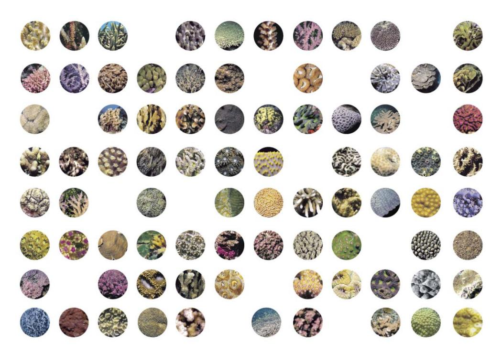

Russell E. Brainard, Charles Birkeland, C. Mark Eakin, Paul McElhany, Margaret W. Miller, Matt Patterson, and Gregory A. Piniak

#### Pacific Islands Fisheries Science Center

National Marine Fisheries Service National Oceanic and Atmospheric Administration U.S. Department of Commerce

#### **About this document**

The mission of the National Oceanic and Atmospheric Administration (NOAA) is to understand and predict changes in the Earth's environment and to conserve and manage coastal and oceanic marine resources and habitats to help meet our Nation's economic, social, and environmental needs. As a NOAA line office, the National Marine Fisheries Service (NMFS) conducts or sponsors research and monitoring programs to improve the scientific basis for conservation and management decisions. The NMFS strives to make information about the purpose, methods, and results of its scientific studies widely available.

NMFS' Pacific Islands Fisheries Science Center (PIFSC) uses the **NOAA Technical Memorandum NMFS** series to achieve timely dissemination of scientific and technical information that is of high quality but inappropriate for publication in the formal peer-reviewed literature. The contents are of broad scope, including technical workshop proceedings, large data compilations, status reports and reviews, lengthy scientific or statistical monographs, and more. NOAA Technical Memoranda published by the PIFSC, although informal, are subjected to extensive review and editing and reflect sound professional work. Accordingly, they may be referenced in the formal scientific and technical literature.

A **NOAA Technical Memorandum NMFS** issued by the PIFSC may be cited using the following format:

Brainard, R.E., C. Birkeland, C.M. Eakin, P. McElhany, M.W. Miller, M. Patterson, and G.A. Piniak. 2011. Status review report of 82 candidate coral species petitioned under the U.S. Endangered Species Act. U.S. Dep. Commer., NOAA Tech. Memo., NOAA-TM-NMFS-PIFSC-27, 530 p. + 1 Appendix.

#### **For further information direct inquiries to**

Chief, Scientific Information Services Pacific Islands Fisheries Science Center National Marine Fisheries Service National Oceanic and Atmospheric Administration U.S. Department of Commerce 2570 Dole Street Honolulu, Hawai`i 96822-2396

Phone: 808-983-5386 Fax: 808-983-2902

Cover: Photographs courtesy of JEN Veron and MG Stafford-Smith, Coral ID 2002.

#### Pacific Islands Fisheries Science Center

National Marine Fisheries Service National Oceanic and Atmospheric Administration U.S. Department of Commerce

### Status Review Report of 82 Candidate Coral Species Petitioned Under the U.S. Endangered Species Act

Russell E. Brainard1, Charles Birkeland2, C. Mark Eakin3, Paul McElhany4, Margaret W. Miller5, Matt Patterson6, Gregory A. Piniak7

1Pacific Islands Fisheries Science Center National Marine Fisheries Service 2570 Dole Street, Honolulu, Hawai'i 96822-2396

2U.S. Geological Survey Hawai`i Cooperative Fishery Research Unit Honolulu, Hawai`i 96822

3Center for Satellite Applications and Research NOAA Coral Reef Watch 1335 East West Hwy, Silver Spring, Maryland 20910-3226

4Northwest Fisheries Science Center National Marine Fisheries Service 2725 Montlake Boulevard East, Seattle, Washington 98112

5Southeast Fisheries Science Center National Marine Fisheries Service 75 Virginia Beach Drive, Miami, Florida 33149-1099

6South Florida / Caribbean Inventory & Monitoring Network National Park Service 18001 Old Cutler Road Suite 419, Miami, Florida 33157

7National Centers for Coastal Ocean Science National Ocean Service 101 Pivers Island Road Beaufort, North Carolina 28516

NOAA Technical Memorandum NMFS-PIFSC-27

The use of trade, firm, or corporation names in this publication does not constitute an official endorsement or approval of any product or service to the exclusion of others that may be suitable.

#### **ACKNOWLEDGMENTS**

Many subject matter experts graciously offered their time and expertise when called upon by the Biological Review Team (BRT), particularly early in the process of initiating this status review of the 82 candidate coral species. While the technical input from each of the subject matter experts is greatly appreciated, some deserve particular recognition. Jean Kenyon (formerly with the University of Hawai`i Joint Institute for Marine and Atmospheric Research-NOAA Coral Reef Ecosystem Division and currently with the United States Fish and Wildlife Service [USFWS], Honolulu, Hawai`i) researched and prepared presentations about the process used to arrive at the list of petitioned species, and did extensive research into the distribution records of the Pacific coral species. Zac Forsman provided informative and timely updates on developments in the field of molecular systematics of corals. Charles Veron and Mary Stafford-Smith graciously gave permission for use of the photos from Coral ID, a CD set available from the Australian Institute of Marine Science that was very helpful as a centralized source of relevant information about the 82 candidate coral species.

Subject matter experts who gave presentations at workshops, or participated in phone consultations, in which they shared their expertise with the BRT include the following in alphabetical order:

Marlin Atkinson, University of Hawai`i (UH) Hawai`i Institute of Marine Biology (HIMB), Kāne`ohe, Hawai`i

Eric Brown, National Park Service, Molokai, Hawai`i

Steve Coles, Hawai`i Biological Survey, Honolulu, Hawai`i

Dick Feely, NOAA Pacific Marine Environmental Laboratory, Seattle, Washington

Douglas Fenner, Dept. Marine & Wildlife Resources, American Samoa

Mike Field, U.S. Geological Survey, Santa Cruz, California

Zac Forsman, UH HIMB, Kāne`ohe, Hawai`i

Ronald Hoeke, UH Joint Institute for Marine and Atmospheric Research [JIMAR]-NOAA Coral Reef Ecosystem Division (CRED), Honolulu, Hawai`i

Paul Jokiel, UH HIMB, Kāne`ohe, Hawai`i

Jean Kenyon, UH JIMAR-CRED, USFWS, Honolulu, Hawai`i

Chris Langdon, University of Miami, Miami, Florida

Lynn Maguire, Duke University, Durham, North Carolina

Jim Maragos, USFWS, Honolulu, Hawai`i

Richard H. Randall, University of Guam, Mangilao, Guam

Bernardo Vargas-Ángel, UH JIMAR-CRED, Honolulu, Hawai`i

Three reviewers from the Center for Independent Experts provided very thorough independent external peer reviews and comments that greatly improved the manuscript:

Terry Hughes, Australian Research Council Centre of Excellence for Coral Reef Studies, James Cook University, Townsville, Australia

John McManus, Rosentiel School of Marine and Atmospheric Science, University of Miami, Miami, Florida Bernhard Riegl, Nova Southeastern University, Florida

The BRT acknowledges the exceptional assistance of Mariska Weijerman (UH JIMAR-CRED) and Matt Dunlap (UH JIMAR-CRED) with coordinating weekly meetings by phone, video, and web meetings, 3 in-person week-long workshops in Honolulu and Seattle, meeting notes, NOAA Wiki administration, preparation of drafts of coral individual species accounts (ISA's), voting tabulation, document preparation, formatting, and editing. Mariska Weijerman performed much of the email coordinating, cheerleading, and occasional gentle reprimanding necessary to get such a large document to the finish line. Mariska also managed the Endnote library and the cross-country sharing of what grew to be 2000+ citations. Matt Dunlap and Chelsey Lahiff (Pacific Islands Regional Office [PIRO]) tracked down and consolidated all available PDF files for these citations. Megan Moews and Joyce Miller (UH JIMAR-CRED) attended weekly Corals BRT meetings and provided input learned from their participation as Endangered Species Act coordinators in prior and simultaneous Pacific Islands Fisheries Science Center (PIFSC) status review processes (false killer whale and bumphead parrotfish). Amanda Toperoff (UH JIMAR-CRED) prepared and presented a standard operating procedure guide to the BRT for document-sharing on the NOAA Wiki site, and prepared numerous graphs and figures that greatly enhanced the look of the final document, including ISA voting result figures, coral life history diagrams, and the front cover. Rodney Withall (UH JIMAR-CRED) coordinated BRT meetings and took meeting notes for several weeks during Matt and Mariska's absence. Kathryn Dennis (UH JIMAR-CRED) assisted with editing and formatting of the final document.

Karen Sender (PIFSC) gave patient instruction on use and administration of the NOAA Wiki site for document sharing, editing, security, and version control. The BRT would also like to thank Francine Fiust, Audrey Rivero, and Jerry Wetherall of the Pacific Islands Fisheries Science Center editorial staff for their comments and suggestions, in addition to a quick turnaround for such a large document.

The BRT thanks many more for timely responses to our inquiries and for sharing access to photos, data, pre-prints of publications, and general expertise. Dave Burdick from the Government of Guam for photo permissions, Esther Peters of George Mason University for input on coral disease, Thad Murdoch of the Bermuda Zoological Society and Samantha dePutron of the Bermuda Institute of Ocean Sciences for information about the coral fauna of Bermuda, Chris Caldow and Sarah Hile from the NOAA Biogeography Branch, Marcia Creary from CARICOMP, Daniel Mauricio Rozo Garzon, Sven Zea, and Raul Navas from the Instituto de Investigaciones Marinas y Costeras in Santa Marta, Columbia, Judy Lang and Ken Marks from Atlantic Gulf Rapid Reef Assessment, Beth Polidoro of the IUCN Species Programme, Elizabeth (Liz) White of the CITES Species database, UNEP World Conservation Monitoring Centre, Mark Chiappone of the University of North Carolina-Wilmington and Key Largo, FL, Rob Ruzicka of Florida Marine Research Institute, Dwight Gledhill from NOAA's Atlantic Oceanographic and Meteorological Laboratory, Andrew Baird from the Australian Research Council Center of Excellence for Coral Reef Studies, James Cook University, Joshua Voss of the Harbor Branch Oceanographic Institute, William Fischer of the U.S. Environmental Protection Agency, William "Jeff" Miller and Andrea Atkinson from the National Park Service, Todd LaJeunnese of The Pennsylvania State University, and Jennifer Smith of the Scripps Institution of Oceanography, University of California San Diego.

Finally, the BRT would like to thank the various NOAA resource managers and General Counsel who patiently provided guidance to the scientists on the BRT about the many nuances of the U.S. Endangered Species Act, including Jennifer Moore (NMFS Southeast Regional Office [SERO]), Marta Nammack (NMFS Office of Protected Resouces), Lance Smith (NMFS PIRO), Jon Drake (NMFS Northwest Regional Office), Sarah Garvin (NMFS SERO), Elena Onaga (NMFS PIRO Office of the General Counsel), and Cheryl Scannell (NMFS SERO Office of the General Counsel).

#### **CONTENTS**

| LIST OF    | FIGURES                                                 | xi     |
|------------|---------------------------------------------------------|--------|
| LIST OF    | TABLES                                                  | xxx    |
| ACRON      | YMS                                                     | xxxi   |
| EXECUT     | TIVE SUMMARY                                            | xxxiii |
| 1. Introdu | action                                                  | 1      |
| 1.1        | Scope and Intent of 82 Corals Status Review Report      | 2      |
| 1.1.       | 1 Background on the Endangered Species Act              | 2      |
| 1.1.       | 2 Candidate species/Species of Concern listing          | 3      |
| 1.1.       | 3 The "species" question                                | 3      |
| 1.2        | The Petition                                            | 3      |
| 2. Genera  | al Background on Corals and Coral Reefs                 | 5      |
| 2.1        | Taxonomy and Distribution                               | 5      |
| 2.1.       | 1 Taxonomy and morphology of scleractinian corals       | 5      |
| 2.1.       | 2 Species delineation and uncertainty in corals         | 6      |
| 2.1.       | 3 Evolutionary history of corals reefs                  | 7      |
| 2.2        | Biology                                                 | 8      |
| 2.2.       | 1 Reproduction and recruitment                          | 8      |
| 2.2.       | 2 Nutrition                                             | 10     |
| 2.2.       | 3 Calcification and reef building                       | 11     |
| 2.2.       | 4 Clonality and genetics                                | 11     |
| 2.3        | Ecology of Coral Reef Ecosystems                        | 12     |
| 2.3.       | 1 Ecosystem roles of coral reefs                        | 12     |
| 2.3.       | 2 Habitat requirements of corals and reefs              |        |
| 2.3.       | 3 Global habitat condition                              | 14     |
| 2.3.       | 4 Phase shifts                                          | 14     |
| 2.3.       | 5 Resilience of corals and coral reefs                  |        |
| 2.4        | Status and Recent Ecological History of Caribbean Reefs |        |
| 2.5        | Contrasts between Caribbean and Indo-Pacific Reefs      | 16     |
| 2.6        | Status and Ecological History of Eastern Pacific Reefs  | 17     |
| 3. Threats | s to Coral Species                                      | 19     |
| 3.1        | Human Population                                        | 19     |
| 3.1.       | 1 Human population status and trends                    | 19     |
| 3.1.       | 2 Consumption status and trends                         | 23     |
| 3.2        | Global Climate Change and Large-scale Threats           | 25     |

| 3.2.1 Atmospheric CO 2 and emissions trends        | 26  |
|---------------------------------------------------------------|-----|
| 3.2.2 Ocean warming                                           | 28  |
| 3.2.3 Ocean acidification                                     | 36  |
| 3.2.4 Sea-level rise (slow and/or rapid)                      | 46  |
| 3.2.5 Changing ocean circulation                              | 48  |
| 3.2.6 Changing storm tracks and intensities                   | 50  |
| 3.2.7 African and Asian dust                                  | 50  |
| 3.2.8 Changes in insolation                                   | 51  |
| 3.2.9 Summary of global changes and their impacts             | 52  |
| 3.3 Local Threats to Coral Species                            | 52  |
| 3.3.1 Land-based sources of pollution                         | 52  |
| 3.3.2 Disease                                                 | 64  |
| 3.3.3 Predation                                               | 66  |
| 3.3.4 Reef fishing—trophic cascades                           | 70  |
| 3.3.5 Direct habitat impacts and destructive fishing practice | s71 |
| 3.3.6 Ornamental trade                                        | 73  |
| 3.3.7 Natural physical damage                                 | 75  |
| 3.3.8 Human-induced physical damage                           | 78  |
| 3.3.9 Aquatic invasive species                                | 79  |
| 3.3.10 Summary of local changes and their impacts             | 82  |
| 3.4 Interactive and Unapparent Threats on Coral Populations . | 84  |
| 3.5 Summary of Threats                                        | 85  |
| 4. Demographic and Spatial Factors in Evaluation of Risk      | 87  |
| 4.1 Overview                                                  | 87  |
| 4.2 Abundance and Productivity of Corals                      | 89  |
| 4.3 Spatial Structure of Corals                               | 90  |
| 4.4 Diversity in Corals                                       | 91  |
| 4.5 Critical Risk Threshold                                   | 91  |
| 4.5.1 Critical Risk Threshold and depensatory processes       | 93  |
| 4.5.2 Critical Risk Threshold and sexual reproduction         | 98  |
| 5. Methods                                                    | 99  |
| 5.1 Overview                                                  | 99  |
| 5.2 The Species Question                                      | 99  |
| 5.3 Data Review                                               | 99  |
| 5.4 Defining Extinction Risk                                  | 100 |

| 5.5 A       | ssessing the Critical Risk Threshold                                                | 100 |
|-------------|-------------------------------------------------------------------------------------|-----|
| 5.6 B       | RT Voting                                                                           | 101 |
| 5.7 S       | trengths and Limitations of the Approach                                            | 102 |
| 6. Individu | al Species Accounts—Western Atlantic                                                | 104 |
| 6.1 G       | enus Agaricia (Family Agariciidae)                                                  | 104 |
| 6.1.1       | Agaricia lamarcki Milne Edwards and Haime, 1851                                     | 104 |
| 6.2 G       | enus Mycetophyllia (Family Mussidae)                                                | 109 |
| 6.2.1       | Mycetophyllia ferox Wells, 1973                                                     | 109 |
| 6.3 G       | enus <i>Dendrogyra</i> (Family Meandrinidae)                                        | 113 |
| 6.3.1       | Dendrogyra cylindrus Ehrenberg, 1834                                                | 113 |
| 6.4 G       | enus Dichocoenia                                                                    | 118 |
| 6.4.1       | Dichocoenia stokesi Milne Edwards and Haime, 1848                                   | 118 |
| 6.5 G       | enus Montastraea (Family Faviidae)                                                  | 123 |
| 6.5.1       | Montastraea faveolata Ellis and Solander, 1786                                      | 129 |
| 6.5.2       | Montastraea franksi Gregory, 1895                                                   | 132 |
| 6.5.3       | Montastraea annularis Ellis and Solander, 1786                                      | 135 |
| 7. Individ  | ual Species Accounts—Indo-Pacific Species                                           | 138 |
| 7. 1 G      | enus Millepora (Class Hydrozoa; Order Milleporina; Family Milleporidae)             | 138 |
| 7.1.1       | Millepora foveolata Crossland, 1952                                                 | 138 |
| 7.1.2       | Millepora tuberosa Boschma, 1966                                                    | 142 |
| 7.2 G       | enus Heliopora (Class Anthozoa; Order Helioporacea; Family Helioporidae)            | 147 |
| 7.2.1       | Heliopora coerulea Pallas, 1766                                                     | 147 |
| 7.3 G       | enus <i>Pocillopora</i> (Class Anthozoa; Order Scleractinia; Family Pocilloporidae) | 153 |
| 7.3.1       | Pocillopora danae Verrill, 1864                                                     | 156 |
| 7.3.2       | Pocillopora elegans Dana, 1864                                                      | 161 |
| 7.4 G       | enus Seriatopora                                                                    | 168 |
| 7.4.1       | Seriatopora aculeata Quelch, 1886                                                   | 168 |
| 7.5 G       | enus Acropora (Family Acroporidae)                                                  | 172 |
| 7.5.1       | Acropora aculeus Dana, 1846                                                         | 176 |
| 7.5.2       | Acropora acuminata Verrill, 1864                                                    | 180 |
| 7.5.3       | Acropora aspera Dana, 1846                                                          | 184 |
| 7.5.4       | Acropora dendrum Bassett-Smith, 1890                                                | 189 |
| 7.5.5       | Acropora donei Veron and Wallace, 1984                                              | 193 |
| 7.5.6       | Acropora globiceps Dana, 1846                                                       | 197 |

| 7.5.7    | Acropora horrida Dana 1846                                                                             | . 201 |
|----------|--------------------------------------------------------------------------------------------------------|-------|
| 7.5.8    | Acropora jacquelineae Wallace, 1994                                                                    | . 205 |
| 7.5.9    | Acropora listeri Brook, 1893                                                                           | . 209 |
| 7.5.10   | Acropora lokani Wallace, 1994                                                                          | . 213 |
| 7.5.10   | Acropora lokani Wallace, 1994                                                                          | . 213 |
| 7.5.11   | Acropora microclados Ehrenberg, 1834                                                                   | . 217 |
| 7.5.12   | Acropora palmerae Wells, 1954                                                                          | . 221 |
| 7.5.13   | Acropora paniculata Verrill, 1902                                                                      | . 225 |
| 7.5.14   | Acropora pharaonis Milne Edwards and Haime, 1860                                                       | . 229 |
| 7.5.15   | Acropora polystoma Brook, 1891                                                                         | . 233 |
| 7.5.16   | Acropora rudis Rehberg, 1892                                                                           | . 241 |
| 7.5.17   | Acropora speciosa Quelch, 1886                                                                         | . 245 |
| 7.5.18   | Acropora striata Verrill, 1866                                                                         | . 249 |
| 7.5.19   | Acropora tenella Brook, 1892                                                                           | . 253 |
| 7.5.20   | Acropora vaughani Wells, 1954                                                                          | . 257 |
| 7.5.21   | Acropora verweyi Veron and Wallace, 1984                                                               | . 261 |
| 7.6 Ger  | nus Anacropora                                                                                         | . 266 |
| 7.6.1    | Anacropora puertogalerae Nemenzo, 1964.                                                                | . 266 |
| 7.6.2    | Anacropora spinosa Rehberg, 1892                                                                       | . 270 |
| 7.7 Ger  | nus Astreopora                                                                                         | . 274 |
| 7.7.1    | Astreopora cucullata Lamberts, 1980                                                                    | . 274 |
| 7.8 Ger  | nus Isopora                                                                                            | . 278 |
| 7.8.1    | Isopora crateriformis Gardiner, 1898.                                                                  | . 278 |
| 7.9 Ger  | nus Montipora                                                                                          | . 288 |
| 7.9.1    | Montipora angulata Lamarck, 1816                                                                       | . 290 |
| 7.9.2    | Montipora australiensis Bernard, 1897                                                                  | . 294 |
| 7.9.3    | Montipora calcarea Bernard, 1897                                                                       | . 298 |
| 7.9.4    | Montipora caliculata Dana, 1846                                                                        | . 302 |
| 7.9.5    | Montipora dilatata Dana, 1846, Montipora flabellata Dana, 1846, and Montipora turgescens Bernard, 1897 | . 306 |
| 7.9.6    | Montipora lobulata Bernard, 1897                                                                       | . 311 |
| 7.9.7    | Montipora patula (/verrili) Bernard, 1897                                                              | .315  |
| 7.10 Ger | nus Alveopora (Family Poritidae)                                                                       | . 319 |
| 7.10.1   | Alveopora allingi Hoffmeister, 1925                                                                    | . 319 |
| 7.10.2   | Alveopora fenestrata Lamarck, 1816                                                                     | . 323 |
| 7.10.3   | Alveopora verrilliana Dana, 1872                                                                       | . 327 |

| 7.11 Genus Porites                                         | 331 |
|------------------------------------------------------------|-----|
| 7.11.1 Porites horizontalata Hoffmeister, 1925             | 331 |
| 7.11.2 Porites napopora Veron, 2000                        | 335 |
| 7.11.3 Porites nigrescens Dana, 1846                       | 339 |
| 7.11.4 Porites pukoensis Vaughan, 1907                     | 343 |
| 7.12 Genus <i>Psammocora</i> (Family Siderastreidae)       | 349 |
| 7.12.1 Psammocora stellata Verrill, 1866                   | 349 |
| 7.13 Genus Leptoseris (Family Agariciidae)                 | 353 |
| 7.13.1 Leptoseris incrustans Quelch, 1886                  | 353 |
| 7.13.2 Leptoseris yabei Pillai and Scheer, 1976            | 357 |
| 7.14 Genus Pachyseris                                      | 361 |
| 7.14.1 Pachyseris rugosa Lamarck, 1801                     | 361 |
| 7.15 Genus Pavona                                          | 365 |
| 7.15.1 Pavona bipartita Nemenzo, 1980                      | 365 |
| 7.15.2 Pavona cactus Forskål, 1775                         | 369 |
| 7.15.3 Pavona decussata Dana, 1846                         | 373 |
| 7.15.4 Pavona diffluens Lamarck, 1816                      | 377 |
| 7.15.5 Pavona venosa (Ehrenberg, 1834)                     | 381 |
| 7.16 Genus Galaxea (Family Oculinidae)                     | 385 |
| 7.16.1 Galaxea astreata Lamarck, 1816                      | 385 |
| 7.17 Genus <i>Pectinia</i> (Family Pectiniidae)            | 389 |
| 7.17.1 Pectinia alcicornis Saville-Kent, 1871              | 389 |
| 7.18 Genus Acanthastrea (Family Mussidae)                  | 393 |
| 7.18.1 Acanthastrea brevis Milne Edwards and Haime, 1849   | 393 |
| 7.18.2 Acanthastrea hemprichii Ehrenberg, 1834             | 397 |
| 7.18.3 Acanthastrea ishigakiensis Veron, 1990              | 401 |
| 7.18.4 Acanthastrea regularis Veron, 2000                  | 405 |
| 7.19 Genus Barabattoia (Family Faviidae)                   | 409 |
| 7.19.1 Barabattoia laddi Wells, 1954                       | 409 |
| 7.20 Genus Caulastrea                                      | 413 |
| 7.20.1 Caulastrea echinulata Milne Edwards and Haime, 1849 | 413 |
| 7.21 Genus Cyphastrea                                      | 417 |
| 7.21.1 Cyphastrea agassizi Vaughan, 1907                   | 417 |
| 7.21.2 Cyphastrea ocellina Dana, 1864                      | 421 |
| 7.22 Genus <i>Euphyllia</i> (Family Caryophyllidae)        | 425 |

| 7.22.1 Euphyllia cristata Chevalier, 1971                                        | 425 |
|----------------------------------------------------------------------------------|-----|
| 7.22.2 Euphyllia paraancora Veron, 1990                                          | 429 |
| 7.22.3 Euphyllia paradivisa Veron, 1990                                          | 433 |
| 7.23 Genus <i>Physogyra</i>                                                      | 437 |
| 7.23.1 Physogyra lichtensteini Saville-Kent, 1871                                | 437 |
| 7.24 Genus <i>Turbinaria</i> (Family Dendrophylliidae)                           | 441 |
| 7.24.1 Turbinaria mesenterina (Lamarck, 1816)                                    | 441 |
| 7.24.2 Turbinaria peltata (Esper, 1794)                                          | 445 |
| 7.24.3 Turbinaria reniformis Bernard, 1896                                       | 449 |
| 7.24.4 Turbinaria stellulata Lamarck, 1816                                       | 453 |
| 8. Synthesis of Risk Assessments: Taxonomic, Regional, and Threat-based Patterns | 457 |
| REFERENCES                                                                       | 462 |
| Appendix: Millepora boschmai (de Weerdt and Glynn, 1991)                         | A-1 |

#### **LIST OF FIGURES**

| Figure ES-1. Example histogram showing the distribution of points to estimate the likelihood that the status of Pavona diffluens will fall below the Critical Risk Threshold (the species is of such low abundance, or so spatially fragmented, or at such reduced diversity that extinction is extremely likely) by 2100 xxxiv                                  |
|------------------------------------------------------------------------------------------------------------------------------------------------------------------------------------------------------------------------------------------------------------------------------------------------------------------------------------------------------------------------|
| Figure ES-2. Summary of votes tallied across Critical Risk Threshold likelihood categories for all 82 candidate coral species ranked by mean likelihood xxxv                                                                                                                                                                                                        |
| Figure ES-3. Number of coral species mean with likelihood scores (total = 82 scores) in each risk likelihood category. xxxviii                                                                                                                                                                                                                                      |
| Figure 2.1.1. Schematic view of the anatomy of a coral polyp (corallite) (Sumich, 1996) 6                                                                                                                                                                                                                                                                              |
| Figure 2.2.1. Diversity of coral life cycle showing different life history stages for broadcast spawners versus brooders, as well as asexual fragmentation 9                                                                                                                                                                                                        |
| Figure 3.1.1. World population from 1800 to 2100 based on UN 2004 projections (red, orange, green) and U.S. Census Bureau historical estimates (black) and assessments (blue) 21                                                                                                                                                                                    |
| Figure 3.1.2. Recent world and regional trends in (left) human population abundance and (right) human population density from 1960 through 2009 22                                                                                                                                                                                                                  |
| Figure 3.1.3. Approximate number of people living within 10 km of the coast and 30 km of a coral reef per km2 of reef. 23                                                                                                                                                                                                                                        |
| Figure 3.1.4. Recent world and regional trends in (left) CO2 emissions and (right) per capita CO2 emissions from 1960 through 2009 24                                                                                                                                                                                                                               |
| Figure 3.1.5. Recent world and regional trends in percent (left) land area in agriculture and (right) forest area over the 1960–2009 period 24                                                                                                                                                                                                                      |
| Figure 3.2.1. Time series of atmospheric CO2, often referred to as the "Keeling Curve", measured at Mauna Loa Observatory, Hawai`i over the 1958–2010 period (Tans and Keeling, 2010) 27                                                                                                                                                                            |
| Figure 3.2.2. (Left panel) Global average atmospheric concentrations of carbon dioxide over a 250-year period from 1750 to 2000. The light blue line indicates actual direct atmospheric measurements. The colored dots indicate data gathered from ice cores; each color represents a different ice core sampling site. Data from Robert A. Rohde and the 27 |
| Figure 3.2.3. Observed and projected CO2 emission growth rates in percent per year (McMullen and Jabbour, 2009; Raupach et al., 2007) 28                                                                                                                                                                                                                            |
| Figure 3.2.4. Global analysis of reef area affected by thermal stress, by region and globally, during the years 1998– 2007 30                                                                                                                                                                                                                                       |
| Figure 3.2.5. The impacts of ocean warming on various coral life history stages, including adult mortality, fecundity, and fragmentation, fertilization, pelagic planula, settlement, polyp development, and juvenile growth 30                                                                                                                                     |
| Figure 3.2.6. Global map of reef areas affected by thermal stress during the years 1998–2007 31                                                                                                                                                                                                                                                                        |
| Figure 3.2.7. Global map of reef areas expected to suffer coral bleaching from thermal stress during the decades of the 2030s and 2050s 33                                                                                                                                                                                                                          |

| Figure 3.2.8. Predicted phytoplankton response to increased temperature in ocean surface waters in the tropics and mid latitudes 35                                                                                                                                                                                                                                                                                                                                                                                                                               |
|----------------------------------------------------------------------------------------------------------------------------------------------------------------------------------------------------------------------------------------------------------------------------------------------------------------------------------------------------------------------------------------------------------------------------------------------------------------------------------------------------------------------------------------------------------------------|
| Figure 3.2.9. Monte Carlo projections of fractional change in coral cover assuming in situ temperatures from 1 m and 20 m depths at Pearl and Hermes Atoll in the Northwestern Hawaiian Islands over the next 100 years derived from the Coral Mortality and Bleaching Output (COMBO) model (from Hoeke et al., 2011) 35                                                                                                                                                                                                                                       |
| Figure 3.2.10. Projected changes in ocean chemistry as a result of increased atmospheric CO2 (Wolf-Gladrow et al., 1999) 36                                                                                                                                                                                                                                                                                                                                                                                                                                       |
| Figure 3.2.11. Seawater carbon chemistry and calcification equilibria 37                                                                                                                                                                                                                                                                                                                                                                                                                                                                                             |
| Figure 3.2.12. Relationship between saturation state and the formation of calcium carbonate in seawater 37                                                                                                                                                                                                                                                                                                                                                                                                                                                           |
| Figure 3.2.13. Time series of atmospheric CO2 at Mauna Loa (ppmv) and surface ocean pH and pCO2 (µatm) at Ocean Station Aloha in the subtropical North Pacific Ocean 38                                                                                                                                                                                                                                                                                                                                                                                           |
| Figure 3.2.14. (Top and middle rows) Model-based decadal mean aragonite saturation state at the sea surface, centered around the years 1875, 1995, 2050, and 2095 (from the National Center for Atmospheric Research Community Climate System Model, version 3 or NCAR CCSM-3). (Bottom left) Global Ocean Data Analysis Project (GLODAP)-based aragonite saturation state at the sea surface, nominally for 1995. (Bottom right) The difference between the GLODAP-based and CCSM-based 1995 fields; note the different color scale of this plot. 39 |
| Figure 3.2.15. The impacts of ocean acidification from increasing atmospheric CO2 to various coral life history stages, including adult growth, fecundity, and fragmentation, fertilization, settlement, polyp development, and juvenile growth 40                                                                                                                                                                                                                                                                                                             |
| Figure 3.2.16. Plot of calcification rate vs. atmospheric CO2 expressed as a percentage of the preindustrial rate for a variety of corals and coral reefs during various studies (Langdon and Atkinson, 2005) 41                                                                                                                                                                                                                                                                                                                                                  |
| Figure 3.2.17. Model projection of reduction in the resilience of Caribbean forereefs as coral growth rate declines by 20% 44                                                                                                                                                                                                                                                                                                                                                                                                                                     |
| Figure 3.2.18. The impacts of sea-level rise to various coral life history stages, including adult mortality and fragmentation, settlement, polyp development, and juvenile growth, mostly as a result of increased sedimentation and decreased water quality (reduced light availability) from coastal innundation 47                                                                                                                                                                                                                                         |
| Figure 3.2.19. The impacts of changes in ocean circulation to various coral life history stages, including adult mortality and fragmentation, pelagic planula, polyp development, and juvenile growth 49                                                                                                                                                                                                                                                                                                                                                          |
| Figure 3.3.1. The impacts of sedimentation stress to various coral life history stages, including adult fecundity and fragmentation, settlement, and juvenile growth 55                                                                                                                                                                                                                                                                                                                                                                                           |
| Figure 3.3.2. The impacts of nutrient stresses to various coral life history stages, including adult mortality, fecundity, and fragmentation, settlement, and juvenile growth 57                                                                                                                                                                                                                                                                                                                                                                                  |
| Figure 3.3.3. The impacts of toxins to various coral life history stages, including adult fecundity, fertilization, possibly adult mortality and fragmentation, and juvenile growth 60                                                                                                                                                                                                                                                                                                                                                                            |
| Figure 3.3.4. The impacts of salinity stress to various coral life history stages, including adult mortality and fragmentation, fertilization, pelagic planulae, and juvenile growth 62                                                                                                                                                                                                                                                                                                                                                                           |
| Figure 3.3.5. Global analysis of risk to coral reefs, by region and globally, to the impacts of watershed-based pollution. 63                                                                                                                                                                                                                                                                                                                                                                                                                                     |

| Figure 3.3.6. The impacts of disease to various coral life history stages, including adult mortality and fragmentation and juvenile growth 65                                                                                                                                                                                                                                                                                                                             |  |
|------------------------------------------------------------------------------------------------------------------------------------------------------------------------------------------------------------------------------------------------------------------------------------------------------------------------------------------------------------------------------------------------------------------------------------------------------------------------------|--|
| Figure 3.3.7. The impacts of predation stress by corallivorous fish and invertebrates to various coral life history stages, including adult mortality and fragmentation, pelagic planulae, polyp development, and juvenile growth 67                                                                                                                                                                                                                                      |  |
| Figure 3.3.8. The impacts of fishing stress (fishing or destructive fishing practices) to various coral life history stages, including adult mortality and fragmentation, settlement, polyp development, and juvenile growth, many of which are via indirect effects on trophic cascades and habitat structure 71                                                                                                                                                      |  |
| Figure 3.3.9. Global analysis of risk to coral reefs, by region and globally, posed by fishing and destructive fishing practices 73                                                                                                                                                                                                                                                                                                                                       |  |
| Figure 3.3.10. The impacts of ornamental trade to various coral life history stages, including adult mortality and juvenile growth 74                                                                                                                                                                                                                                                                                                                                     |  |
| Figure 3.3.11. The aggregate impacts of both natural and human-induced physical damages to various coral life history stages, including adult mortality and fragmentation, settlement, polyp development, and juvenile growth 76                                                                                                                                                                                                                                          |  |
| Figure 3.3.12. Global analysis of risk to coral reefs, by region and globally, to the impacts of coastal development 79                                                                                                                                                                                                                                                                                                                                                      |  |
| Figure 3.3.13. The impacts of invasive species to various coral life history stages, including adult mortality and fragmentation, settlement, polyp development, and juvenile growth 80                                                                                                                                                                                                                                                                                   |  |
| Figure 3.3.14. Global analysis of risk to coral reefs, by region, to an integrated local threat index 84                                                                                                                                                                                                                                                                                                                                                                     |  |
| Figure 3.5.1. Global analysis of risk to coral reefs, by region and globally, to the four categories of local threat plus an integrated local threat and local threat plus thermal stress 86                                                                                                                                                                                                                                                                              |  |
| Figure 4.1.1. A conceptual "viability curve" illustrating the relationship between abundance and productivity. The y axis indicates population abundance for adults of a hypothetical species, and the x-axis indicates population productivity in terms of the number of offspring per adult if the population is very small. A single-colored curve shows combinations of abundance and productivity with the same extinction risk (McElhany et al., 2007). 88 |  |
| Figure 4.5.1. In a damaged ecosystem (illustrated in panel on the right) increased distances between patches can lead to recruitment failure (Nakamura et al., 2011) 94                                                                                                                                                                                                                                                                                                   |  |
| Figure 4.5.2. Number of successful recruits for population replenishment (area above the dotted line) declines as harvesting or ecological disturbances reduce the abundance of reproductive adults (Figure from Steneck, 2006). 95                                                                                                                                                                                                                                    |  |
| Figure 4.5.3. Probability of overpredation in relation to coral cover and healing time from lesions from bites of predators (Jayewardene et al., 2009) 96                                                                                                                                                                                                                                                                                                                 |  |
| Figure 4.5.4. Predator-prey functional response types (Holling, 1959) 96                                                                                                                                                                                                                                                                                                                                                                                                     |  |
| Figure 4.5.5. Macroalgae overgrowing corals on an overfished reef in western Maui 97                                                                                                                                                                                                                                                                                                                                                                                         |  |
| Figure 5.5.1. Scale and categories used by the BRT to evaluate risk hypotheses 100                                                                                                                                                                                                                                                                                                                                                                                           |  |
| Figure 5.6.1. Example histogram showing distribution of points to estimate the likelihood that the status of Pavona diffluens will fall below the Critical Risk Threshold (the species is of such low abundance, or so spatially fragmented, or at such reduced diversity that extinction is extremely likely) by 2100 101                                                                                                                                             |  |

| Figure 6.1.1. Agaricia lamarcki photos copied from Veron and Stafford-Smith 104                                                                                                                                                                                                                      |  |
|------------------------------------------------------------------------------------------------------------------------------------------------------------------------------------------------------------------------------------------------------------------------------------------------------|--|
| Figure 6.1.2. Agaricia lamarcki distribution from IUCN copied from http://www.iucnredlist.org 105                                                                                                                                                                                                    |  |
| Figure 6.1.3. Agaricia lamarcki distribution copied from Veron and Stafford-Smith (2002) 105                                                                                                                                                                                                         |  |
| Figure 6.1.4. Distribution of points to estimate the likelihood that the status of Agaricia lamarcki falls below the Critical Risk Threshold (the species is of such low abundance or so spatially fragmented or at such reduced diversity that extinction is extremely likely) by 2100 108    |  |
| Figure 6.2.1. Mycetophyllia ferox photos from National Park Service and corallite plan from Veron and Stafford-Smith (2002) 109                                                                                                                                                                   |  |
| Figure 6.2.2. Mycetophyllia ferox distribution from IUCN copied from http://www.iucnredlist.org 110                                                                                                                                                                                                  |  |
| Figure 6.2.3. Mycetophyllia ferox distribution from Veron and Stafford-Smith (2002) 110                                                                                                                                                                                                           |  |
| Figure 6.2.4. Distribution of points to estimate the likelihood that the status of Mycetophyllia ferox falls below the Critical Risk Threshold (the species is of such low abundance or so spatially fragmented or at such reduced diversity that extinction is extremely likely) by 2100 112  |  |
| Figure 6.3.1. Dendrogyra cylindrus photos and corallite plan copied from Veron and Stafford-Smith (2002) 113                                                                                                                                                                                         |  |
| Figure 6.3.2. Dendrogyra cylindrus colony with rapidly progressing partial mortality characteristic of white plague disease 113                                                                                                                                                                   |  |
| Figure 6.3.3. Dendrogyra cylindrus distribution from IUCN copied from http://www.iucnredlist.org 114                                                                                                                                                                                                 |  |
| Figure 6.3.4. Dendrogyra cylindrus distribution from Veron and Stafford-Smith (2002) 114                                                                                                                                                                                                             |  |
| Figure 6.3.5. Distribution of points to estimate the likelihood that the status of Dendrogyra cylindrus falls below the Critical Risk Threshold (the species is of such low abundance or so spatially fragmented or at such reduced diversity that extinction is extremely likely) by 2100 117 |  |
| Figure 6.4.1. Dichocoenia stokesi photos and corallite plan copied from Veron and Stafford-Smith (2002) 118                                                                                                                                                                                       |  |
| Figure 6.4.2. Dichocoenia stokesi colony with partial mortality characteristic of white plague disease 118                                                                                                                                                                                           |  |
| Figure 6.4.3. Dichocoenia stokesi distribution from IUCN copied from http://www.iucnredlist.org 119                                                                                                                                                                                                  |  |
| Figure 6.4.4. Dichocoenia stokesi distribution from Veron and Stafford-Smith (2002) 119                                                                                                                                                                                                              |  |
| Figure 6.4.5. Distribution of points to estimate the likelihood that the status of Dichocoenia stokesi falls below the Critical Risk Threshold (the species is of such low abundance or so spatially fragmented or at such reduced diversity that extinction is extremely likely) by 2100 122  |  |
| Figure 6.5. Examples of declining abundance of Montastraea annularis complex in different regions of the Caribbean in the recent past 125                                                                                                                                                         |  |
| Figure 6.5.1. Montastraea faveolata photo (left) from Veron and Stafford-Smith (2002) and (right) polyp view 129                                                                                                                                                                                     |  |
| Figure 6.5.2. Montastraea faveolata distribution from IUCN copied from http://www.iucnredlist.org 129                                                                                                                                                                                             |  |

| Figure 6.5.3. Distribution of points to estimate the likelihood that the status of Montastraea faveolata falls below the Critical Risk Threshold (the species is of such low abundance or so spatially fragmented or at such reduced diversity that extinction is extremely likely) by 2100 131  |  |
|--------------------------------------------------------------------------------------------------------------------------------------------------------------------------------------------------------------------------------------------------------------------------------------------------------|--|
|                                                                                                                                                                                                                                                                                                        |  |
| Figure 6.5.4. Montastraea franksi photo (left) from Veron and Stafford-Smith (2002) and (right) from http://sanctuaries.noaa.gov/pgallery/pgflower/living/living_2.html 132                                                                                                                         |  |
| Figure 6.5.5. Montastraea franksi distribution from IUCN copied from http://www.iucnredlist.org 133                                                                                                                                                                                                    |  |
| Figure 6.5.6. Distribution of points to estimate the likelihood that the status of Montastraea franksi falls below the Critical Risk Threshold (the species is of such low abundance or so spatially fragmented or at such reduced diversity that extinction is extremely likely) by 2100 134    |  |
| Figure 6.5.7. Montastraea annularis sensu stricto photo (middle) and corallite plan from Veron and Stafford-Smith (2002) 135                                                                                                                                                                        |  |
| Figure 6.5.8. Montastraea annularis distribution from IUCN copied from http://www.iucnredlist.org 135                                                                                                                                                                                                  |  |
| Figure 6.5.9. Montastraea annularis distribution from Veron and Stafford-Smith (2002) 136                                                                                                                                                                                                              |  |
| Figure 6.5.10. Distribution of points to estimate the likelihood that the status of Montastraea annularis falls below the Critical Risk Threshold (the species is of such low abundance or so spatially fragmented or at such reduced diversity that extinction is extremely likely) by 2100 137 |  |
| Figure 7.1.1. Millepora foveolata images from (top; type specimen) Crossland (1952) and (bottom) Randall and Cheng (1984) 138                                                                                                                                                                       |  |
| Figure 7.1.2. Millepora foveolata distribution from IUCN copied from http://www.iucnredlist.org 139                                                                                                                                                                                                    |  |
| Figure 7.1.3. Distribution of points to estimate the likelihood that the status of Millepora foveolata falls below the Critical Risk Threshold (the species is of such low abundance, or so spatially fragmented, or at such reduced diversity that extinction is extremely likely) by 2100 141  |  |
| Figure 7.1.4. Millepora tuberosa photos from David Burdick copied from GuamReefLife.com 142                                                                                                                                                                                                            |  |
| Figure 7.1.5. Millepora tuberosa distribution from IUCN copied from http://www.iucnredlist.org 143                                                                                                                                                                                                     |  |
| Figure 7.1.6. Distribution of points to estimate the likelihood that the status of Millepora tuberosa falls below the Critical Risk Threshold (the species is of such low abundance, or so spatially fragmented, or at such reduced diversity that extinction is extremely likely) by 2100 145   |  |
| Figure 7.2.1. Colonies of Heliopoa coerulea copied (three on the left) from Veron (2000) and (one to the right) provided by the BRT 147                                                                                                                                                             |  |
| Figure 7.2.2. Heliopora coerulea distribution from IUCN copied from http://www.iucnredlist.org 148                                                                                                                                                                                                     |  |
| Figure 7.2.3. Heliopora coerulea distribution from Veron (2000) 148                                                                                                                                                                                                                                    |  |
| Figure 7.2.4. Nearly complete bleaching of all coral species except Heliopora coerulea at Koh Racha Yai about 1-hour boat ride south of Phuket, Thailand 150                                                                                                                                        |  |
| Figure 7.2.5. Distribution of points to estimate the likelihood that the status of Heliopora coerulea falls below the Critical Risk Threshold (the species is of such low abundance, or so spatially fragmented, or at such reduced                                                              |  |
| diversity that extinction is extremely likely) by 2100 152                                                                                                                                                                                                                                             |  |

| Figure 7.3.1. Pocillopora danae photos and corallite plan from Veron (2000) 156                                                                                                                                                                                                                                                         |  |
|-----------------------------------------------------------------------------------------------------------------------------------------------------------------------------------------------------------------------------------------------------------------------------------------------------------------------------------------|--|
| Figure 7.3.2. Pocillopora danae distribution from IUCN copied from http://www.iucnredlist.org 157                                                                                                                                                                                                                                       |  |
| Figure 7.3.3. Pocillopora danae distribution from Veron (2000) 157                                                                                                                                                                                                                                                                      |  |
| Figure 7.3.4. Distribution of points to estimate the likelihood that the status of Pocillopora danae falls below the Critical Risk Threshold (the species is of such low abundance, or so spatially fragmented, or at such reduced diversity that extinction is extremely likely) by 2100 160                                     |  |
| Figure 7.3.5. Pocillopora elegans photos and corallite plan from Veron (2000) 161                                                                                                                                                                                                                                                       |  |
| Figure 7.3.6. Pocillopora elegans distribution from IUCN copied from http://www.iucnredlist.org 162                                                                                                                                                                                                                                     |  |
| Figure 7.3.7. Pocillopora elegans distribution from Veron (2000) 162                                                                                                                                                                                                                                                                    |  |
| Figure 7.3.8. Distribution of points to estimate the likelihood that the status of Pocillopora elegans from the eastern Pacific falls below the Critical Risk Threshold (the species is of such low abundance, or so spatially fragmented, or at such reduced diversity that extinction is extremely likely) by 2100 165          |  |
| Figure 7.3.9. Distribution of points to estimate the likelihood that the status of Pocillopora elegans from the central and Indo-Pacific falls below the Critical Risk Threshold (the species is of such low abundance, or so spatially fragmented, or at such reduced diversity that extinction is extremely likely) by 2100 167 |  |
| Figure 7.4.1. Seriatopora aculeata photos from Veron (2000) 168                                                                                                                                                                                                                                                                         |  |
| Figure 7.4.2. Seriatopora aculeata distribution from IUCN copied from http://www.iucnredlist.org 168                                                                                                                                                                                                                                    |  |
| Figure 7.4.3. Seriatopora aculeata distribution from Veron (2000) 169                                                                                                                                                                                                                                                                   |  |
| Figure 7.4.4. Distribution of points to estimate the likelihood that the status of Seriatopora aculeata falls below the Critical Risk Threshold (the species is of such low abundance, or so spatially fragmented, or at such reduced diversity that extinction is extremely likely) by 2100 171                                  |  |
| Figure 7.5.1. Acropora aculeus photos from Veron (2000) 176                                                                                                                                                                                                                                                                             |  |
| Figure 7.5.2. Acropora aculeus distribution from IUCN copied from http://www.iucnredlist.org 177                                                                                                                                                                                                                                     |  |
| Figure 7.5.3. Acropora aculeus distribution from Wallace (1999) 177                                                                                                                                                                                                                                                                     |  |
| Figure 7.5.4. Acropora aculeus distribution from Veron (2002) 177                                                                                                                                                                                                                                                                       |  |
| Figure 7.5.5. Distribution of points to estimate the likelihood that the status of Acropora aculeus falls below the Critical Risk Threshold (the species is of such low abundance, or so spatially fragmented, or at such reduced diversity that extinction is extremely likely) by 2100 179                                      |  |
| Figure 7.5.6. Acropora acuminata photo and coralite plan from Veron (2000) 180                                                                                                                                                                                                                                                          |  |
| Figure 7.5.7. Acropora acuminata distribution from IUCN copied from http://www.iucnredlist.org 180                                                                                                                                                                                                                                      |  |
| Figure 7.5.8. Acropora acuminata distribution copied from Wallace (1999) 181                                                                                                                                                                                                                                                            |  |
| Figure 7.5.9. Acropora acuminata distribution from Veron (2000) 181                                                                                                                                                                                                                                                                     |  |

| Figure 7.5.10. Distribution of points to estimate the likelihood that the status of Acropora acuminata falls below the Critical Risk Threshold (the species is of such low abundance, or so spatially fragmented, or at such reduced diversity that extinction is extremely likely) by 2100 183 |  |
|-------------------------------------------------------------------------------------------------------------------------------------------------------------------------------------------------------------------------------------------------------------------------------------------------------|--|
| Figure 7.5.11. Acropora aspera photos copied from (color) Veron (2000) and (black and white) corallite plan from Wallace (1999) 184                                                                                                                                                                |  |
| Figure 7.5.12. Acropora aspera distribution from IUCN copied from http://www.iucnredlist.org 185                                                                                                                                                                                                      |  |
| Figure 7.5.13. Acropora aspera distribution from Veron (2000) 185                                                                                                                                                                                                                                     |  |
| Figure 7.5.14. Distribution of points to estimate the likelihood that the status of Acropora aspera falls below the Critical Risk Threshold (the species is of such low abundance, or so spatially fragmented, or at such reduced diversity that extinction is extremely likely) by 2100 188    |  |
| Figure 7.5.15. Acropora dendrum photos and corallite plan from Veron (2000) 189                                                                                                                                                                                                                       |  |
| Figure 7.5.16. Acropora dendrum distribution from IUCN copied from http://www.iucnredlist.org 190                                                                                                                                                                                                     |  |
| Figure 7.5.17. Acropora dendrum distribution from Veron (2000) 190                                                                                                                                                                                                                                    |  |
| Figure 7.5.18. Distribution of points to estimate the likelihood that the status of Acropora dendrum falls below the Critical Risk Threshold (the species is of such low abundance, or so spatially fragmented, or at such reduced diversity that extinction is extremely likely) by 2100 192   |  |
| Figure 7.5.19. Acropora donei photos and corallite plan from Veron (2000) 193                                                                                                                                                                                                                         |  |
| Figure 7.5.20. Acropora donei distribution from IUCN copied from http://www.iucnredlist.org 194                                                                                                                                                                                                       |  |
| Figure 7.5.21. Acropora donei distribution from Veron (2000) 194                                                                                                                                                                                                                                      |  |
| Figure 7.5.22. Distribution of points to estimate the likelihood that the status of Acropora donei falls below the Critical Risk Threshold (the species is of such low abundance, or so spatially fragmented, or at such reduced diversity that extinction is extremely likely) by 2100 196     |  |
| Figure 7.5.23. Acropora globiceps photos and corallite plan from Veron (2000) 197                                                                                                                                                                                                                     |  |
| Figure 7.5.24. Acropora globiceps distribution from IUCN copied from http://www.iucnredlist.org 198                                                                                                                                                                                                   |  |
| Figure 7.5.25. Acropora globiceps distribution from Veron (2000) 198                                                                                                                                                                                                                                  |  |
| Figure 7.5.26. Distribution of points to estimate the likelihood that the status of Acropora globiceps falls below the Critical Risk Threshold (the species is of such low abundance, or so spatially fragmented, or at such reduced diversity that extinction is extremely likely) by 2100 200 |  |
| Figure 7.5.27. Acropora horrida photos and corallite plan from Veron (2000) 201                                                                                                                                                                                                                       |  |
| Figure 7.5.28. Acropora horrida distribution from IUCN copied from http://www.iucnredlist.org 202                                                                                                                                                                                                     |  |
| Figure 7.5.29. Acropora horrida distribution from Veron (2000) 202                                                                                                                                                                                                                                    |  |
| Figure 7.5.30. Distribution of points to estimate the likelihood that the status of Acropora horrida falls below the Critical Risk Threshold (the species is of such low abundance, or so spatially fragmented, or at such reduced diversity that extinction is extremely likely) by 2100 204   |  |

| Figure 7.5.31. Acropora jacquelineae photos and corallite plan from Veron (2000) 205                                                                                                                                                                                                                     |  |
|----------------------------------------------------------------------------------------------------------------------------------------------------------------------------------------------------------------------------------------------------------------------------------------------------------|--|
| Figure 7.5.32. Acropora jacquelineae distribution from IUCN copied from http://www.iucnredlist.org 206                                                                                                                                                                                                |  |
| Figure 7.5.33. Acropora jacquelineae distribution from Veron (2000) 206                                                                                                                                                                                                                                  |  |
| Figure 7.5.34. Distribution of points to estimate the likelihood that the status of Acropora jacquelineae falls below the Critical Risk Threshold (the species is of such low abundance, or so spatially fragmented, or at such reduced diversity that extinction is extremely likely) by 2100 208 |  |
| Figure 7.5.35. Acropora listeri photos and corallite plan from Veron (2000) 209                                                                                                                                                                                                                          |  |
| Figure 7.5.36. Acropora listeri distribution from IUCN copied from http://www.iucnredlist.org 210                                                                                                                                                                                                        |  |
| Figure 7.5.37. Acropora listeri distribution from Veron (2000) 210                                                                                                                                                                                                                                       |  |
| Figure 7.5.38. Distribution of points to estimate the likelihood that the status of Acropora listeri falls below the Critical Risk Threshold (the species is of such low abundance, or so spatially fragmented, or at such reduced diversity that extinction is extremely likely) by 2100 212      |  |
| Figure 7.5.39. Acropora lokani photos and corallite plan from Veron (2000) 213                                                                                                                                                                                                                           |  |
| Figure 7.5.40. Acropora lokani distribution from IUCN copied from http://www.iucnredlist.org 214                                                                                                                                                                                                         |  |
| Figure 7.5.41. Acropora lokani distribution from Veron (2000) 214                                                                                                                                                                                                                                        |  |
| Figure 7.5.42. Distribution of points to estimate the likelihood that the status of Acropora lokani falls below the Critical Risk Threshold (the species is of such low abundance, or so spatially fragmented, or at such reduced diversity that extinction is extremely likely) by 2100 216       |  |
| Figure 7.5.43. Acropora microclados photos and corallite plan from Veron (2000) 217                                                                                                                                                                                                                      |  |
| Figure 7.5.44. Acropora microclados distribution from IUCN copied from http://www.iucnredlist.org 218                                                                                                                                                                                                 |  |
| Figure 7.5.45. Acropora microclados distribution from Veron (2000) 218                                                                                                                                                                                                                                   |  |
| Figure 7.5.46. Distribution of points to estimate the likelihood that the status of Acropora microclados falls below the Critical Risk Threshold (the species is of such low abundance, or so spatially fragmented, or at such reduced diversity that extinction is extremely likely) by 2100 220  |  |
| Figure 7.5.47. Acropora palmerae photos and corallite plan from Veron (2000) 221                                                                                                                                                                                                                         |  |
| Figure 7.5.48. Acropora palmerae distribution from IUCN copied from http://www.iucnredlist.org 222                                                                                                                                                                                                       |  |
| Figure 7.5.49. Acropora palmerae distribution from Veron (2000) 222                                                                                                                                                                                                                                      |  |
| Figure 7.5.50. Distribution of points to estimate the likelihood that the status of Acropora palmerae falls below the Critical Risk Threshold (the species is of such low abundance, or so spatially fragmented, or at such reduced diversity that extinction is extremely likely) by 2100 224     |  |
| Figure 7.5.51. Acropora paniculata photos and corallite plan from Veron (2000) 225                                                                                                                                                                                                                       |  |
| Figure 7.5.52. Acropora paniculata distribution from IUCN copied from http://www.iucnredlist.org 226                                                                                                                                                                                                     |  |
| Figure 7.5.53. Acropora paniculata distribution from Veron (2000) 226                                                                                                                                                                                                                                    |  |

| Figure 7.5.54. Distribution of points to estimate the likelihood that the status of Acropora paniculata falls below the Critical Risk Threshold (the species is of such low abundance, or so spatially fragmented, or at such reduced diversity that extinction is extremely likely) by 2100 228 |  |
|--------------------------------------------------------------------------------------------------------------------------------------------------------------------------------------------------------------------------------------------------------------------------------------------------------|--|
| Figure 7.5.55. Acropora pharaonis photos and corallite plan from Veron (2000) 229                                                                                                                                                                                                                      |  |
| Figure 7.5.56. Acropora pharaonis distribution from IUCN copied from http://www.iucnredlist.org 230                                                                                                                                                                                                 |  |
| Figure 7.5.57. Acropora pharaonis distribution from Veron (2000) 230                                                                                                                                                                                                                                   |  |
| Figure 7.5.58. Distribution of points to estimate the likelihood that the status of Acropora pharaonis falls below the Critical Risk Threshold (the species is of such low abundance, or so spatially fragmented, or at such reduced diversity that extinction is extremely likely) by 2100 232  |  |
| Figure 7.5.59. Acropora polystoma photos and corallite plan from Veron (2000) 233                                                                                                                                                                                                                      |  |
| Figure 7.5.60. Acropora polystoma distribution from IUCN copied from http://www.iucnredlist.org 234                                                                                                                                                                                                    |  |
| Figure 7.5.61. Acropora polystoma distribution from Veron (2000) 234                                                                                                                                                                                                                                   |  |
| Figure 7.5.62. Distribution of points to estimate the likelihood that the status of Acropora polystoma falls below the Critical Risk Threshold (the species is of such low abundance, or so spatially fragmented, or at such reduced diversity that extinction is extremely likely) by 2100 236  |  |
| Figure 7.5.63. Acropora retusa photos and corallites from Veron (2000) 237                                                                                                                                                                                                                             |  |
| Figure 7.5.64. Acropora retusa distribution from IUCN copied from http://www.iucnredlist.org 238                                                                                                                                                                                                       |  |
| Figure 7.5.65. Acropora retusa distribution from Veron (2000) 238                                                                                                                                                                                                                                      |  |
| Figure 7.5.66. Distribution of points to estimate the likelihood that the status of Acropora retusa falls below the Critical Risk Threshold (the species is of such low abundance, or so spatially fragmented, or at such reduced diversity that extinction is extremely likely) by 2100 240     |  |
| Figure 7.5.67. Acropora rudis photos from Veron (2000) 241                                                                                                                                                                                                                                             |  |
| Figure 7.5.68. Acropora rudis distribution from IUCN copied from http://www.iucnredlist.org 241                                                                                                                                                                                                        |  |
| Figure 7.5.69. Acropora rudis distribution from Veron (2000) 242                                                                                                                                                                                                                                       |  |
| Figure 7.5.70. Distribution of points to estimate the likelihood that the status of Acropora rudis falls below the Critical Risk Threshold (the species is of such low abundance, or so spatially fragmented, or at such reduced diversity that extinction is extremely likely) by 2100 244      |  |
| Figure 7.5.71. Acropora speciosa photos fromVeron (2000) 245                                                                                                                                                                                                                                           |  |
| Figure 7.5.72. Acropora speciosa distribution from IUCN copied from http://www.iucnredlist.org 245                                                                                                                                                                                                     |  |
| Figure 7.5.73. Acropora speciosa distribution from Veron (2000) 246                                                                                                                                                                                                                                    |  |
| Figure 7.5.74. Distribution of points to estimate the likelihood that the status of Acropora speciosa falls below the Critical Risk Threshold (the species is of such low abundance, or so spatially fragmented, or at such reduced diversity that extinction is extremely likely) by 2100 248   |  |
| Figure 7.5.75. Acropora striata photos from Veron (2000) 249                                                                                                                                                                                                                                           |  |
|                                                                                                                                                                                                                                                                                                        |  |

| Figure 7.5.76. Acropora striata distribution from IUCN copied from http://www.iucnredlist.org 249                                                                                                                                                                                                          |  |
|------------------------------------------------------------------------------------------------------------------------------------------------------------------------------------------------------------------------------------------------------------------------------------------------------------|--|
| Figure 7.5.77. Acropora striata distribution from Veron (2000) 250                                                                                                                                                                                                                                         |  |
| Figure 7.5.78. Distribution of points to estimate the likelihood that the status of Acropora striata falls below the Critical Risk Threshold (the species is of such low abundance, or so spatially fragmented, or at such reduced diversity that extinction is extremely likely) by 2100 252     |  |
| Figure 7.5.79. Acropora tenella photos from Veron (2000) 253                                                                                                                                                                                                                                               |  |
| Figure 7.5.80. Acropora tenella distribution from IUCN copied from http://www.iucnredlist.org 253                                                                                                                                                                                                          |  |
| Figure 7.5.81. Acropora tenella distribution from Veron (2000) 254                                                                                                                                                                                                                                         |  |
| Figure 7.5.82. Distribution of points to estimate the likelihood that the status of Acropora tenella falls below the Critical Risk Threshold (the species is of such low abundance, or so spatially fragmented, or at such reduced diversity that extinction is extremely likely) by 2100 256        |  |
| Figure 7.5.83. Acropora vaughani photos and corallite plan from Veron (2000) 257                                                                                                                                                                                                                           |  |
| Figure 7.5.84. Acropora vaughani distribution from IUCN copied from http://www.iucnredlist.org 258                                                                                                                                                                                                         |  |
| Figure 7.5.85. Acropora vaughani distribution from Veron (2000) 258                                                                                                                                                                                                                                        |  |
| Figure 7.5.86. Distribution of points to estimate the likelihood that the status of Acropora vaughani falls below the Critical Risk Threshold (the species is of such low abundance, or so spatially fragmented, or at such reduced diversity that extinction is extremely likely) by 2100 260       |  |
| Figure 7.5.87. Acropora verweyi photos from Veron (2000) 261                                                                                                                                                                                                                                               |  |
| Figure 7.5.88. Acropora verweyi distribution from IUCN copied from http://www.iucnredlist.org 262                                                                                                                                                                                                          |  |
| Figure 7.5.89. Acropora verweyi distribution from Wallace (1999) 262                                                                                                                                                                                                                                       |  |
| Figure 7.5.90. Acropora verweyi distribution from Veron (2000) 262                                                                                                                                                                                                                                         |  |
| Figure 7.5.91. Distribution of points to estimate the likelihood that the status of Acropora verweyi falls below the Critical Risk Threshold (the species is of such low abundance, or so spatially fragmented, or at such reduced diversity that extinction is extremely likely) by 2100 264        |  |
| Figure 7.6.1. Anacropora puertogalerae photos from Veron (2000) 266                                                                                                                                                                                                                                        |  |
| Figure 7.6.2. Anacropora puertogalerae distribution from IUCN copied from http://www.iucnredlist.org 266                                                                                                                                                                                                   |  |
| Figure 7.6.3. Anacropora puertogalerae distribution from Veron (2000) 267                                                                                                                                                                                                                                  |  |
| Figure 7.6.4. Distribution of points to estimate the likelihood that the status of Anacropora puertogalerae falls below the Critical Risk Threshold (the species is of such low abundance, or so spatially fragmented, or at such reduced diversity that extinction is extremely likely) by 2100 269 |  |
| Figure 7.6.5. Anacropora spinosa photos from Veron (2000) 270                                                                                                                                                                                                                                              |  |
| Figure 7.6.6. Anacropora spinosa distribution from IUCN copied from http://www.iucnredlist.org 270                                                                                                                                                                                                      |  |
| Figure 7.6.7. Anacropora spinosa distribution from Veron (2000) 271                                                                                                                                                                                                                                        |  |

| Figure 7.6.8. Distribution of points to estimate the likelihood that the status of Anacropora spinosa falls below the Critical Risk Threshold (the species is of such low abundance, or so spatially fragmented, or at such reduced diversity that extinction is extremely likely) by 2100 272    |  |
|---------------------------------------------------------------------------------------------------------------------------------------------------------------------------------------------------------------------------------------------------------------------------------------------------------|--|
| Figure 7.7.1. Astreopora cucullata photos from Veron (2000) 274                                                                                                                                                                                                                                         |  |
| Figure 7.7.2. Astreopora cucullata distribution from IUCN copied from http://www.iucnredlist.org 274                                                                                                                                                                                                    |  |
| Figure 7.7.3. Astreopora cucullata distribution from Veron (2000) 275                                                                                                                                                                                                                                   |  |
| Figure 7.7.4. Distribution of points to estimate the likelihood that the status of Astreopora cucullata falls below the Critical Risk Threshold (the species is of such low abundance, or so spatially fragmented, or at such reduced diversity that extinction is extremely likely) by 2100 277  |  |
| Figure 7.8.1. Isopora crateriformis copied from (upper two photos) Veron (2000) and (lower two photos) Wallace (1999) 278                                                                                                                                                                            |  |
| Figure 7.8.2. Isopora crateriformis distribution from IUCN copied from http://www.iucnredlist.org 279                                                                                                                                                                                                   |  |
| Figure 7.8.3. Isopora crateriformis distribution from Wallace (1999) 279                                                                                                                                                                                                                                |  |
| Figure 7.8.4. Isopora crateriformis distribution from Veron (2000) 279                                                                                                                                                                                                                                  |  |
| Figure 7.8.5. Distribution of points to estimate the likelihood that the status of Isopora crateriformis falls below the Critical Risk Threshold (the species is of such low abundance, or so spatially fragmented, or at such reduced diversity that extinction is extremely likely) by 2100 282 |  |
| Figure 7.8.6. Isopora cuneata copied from (upper two photos) Veron (2000) and (lower two photos) Wallace (1999). 283                                                                                                                                                                                    |  |
| Figure 7.8.7. Isopora cuneata distribution from IUCN copied from http://www.iucnredlist.org 284                                                                                                                                                                                                         |  |
| Figure 7.8.8. Isopora cuneata distribution from Wallace (1999) 284                                                                                                                                                                                                                                      |  |
| Figure 7.8.9. Isopora cuneata distribution from (Veron 2000) 284                                                                                                                                                                                                                                        |  |
| Figure 7.8.10. Distribution of points to estimate the likelihood that the status of Isopora cuneata falls below the Critical Risk Threshold (the species is of such low abundance, or so spatially fragmented, or at such reduced diversity that extinction is extremely likely) by 2100 287      |  |
| Figure 7.9.1. Montipora angulata photos and corallite plan from Veron (2000) 290                                                                                                                                                                                                                        |  |
| Figure 7.9.2. Montipora angulata distribution from IUCN copied from http://www.iucnredlist.org 290                                                                                                                                                                                                      |  |
| Figure 7.9.3. Montipora angulata distribution from Veron (2000) 291                                                                                                                                                                                                                                     |  |
| Figure 7.9.4. Distribution of points to estimate the likelihood that the status of Montipora angulata falls below the Critical Risk Threshold (the species is of such low abundance, or so spatially fragmented, or at such reduced diversity that extinction is extremely likely) by 2100 293    |  |
| Figure 7.9.5. Montipora. australiensis photos and corallite plan from Veron (2000) 294                                                                                                                                                                                                                  |  |
| Figure 7.9.6. Montipora australiensis distribution from IUCN copied from http://www.iucnredlist.org 294                                                                                                                                                                                                 |  |
| Figure 7.9.7. Montipora australiensis distribution from Veron (2000) 295                                                                                                                                                                                                                                |  |

| Figure 7.9.8. Distribution of points to estimate the likelihood that the status of Montipora australiensis falls below the Critical Risk Threshold (the species is of such low abundance, or so spatially fragmented, or at such reduced diversity that extinction is extremely likely) by 2100 296                   |  |
|-----------------------------------------------------------------------------------------------------------------------------------------------------------------------------------------------------------------------------------------------------------------------------------------------------------------------------|--|
| Figure 7.9.9. Montipora calcarea photos and corallite plan from Veron (2000) 298                                                                                                                                                                                                                                            |  |
| Figure 7.9.10. Montipora calcarea distribution from IUCN copied from http://www.iucnredlist.org 299                                                                                                                                                                                                                         |  |
| Figure 7.9.11. Montipora. calcarea distribution from Veron (2000) 299                                                                                                                                                                                                                                                       |  |
| Figure 7.9.12. Distribution of points to estimate the likelihood that the status of Montipora calcarea falls below the Critical Risk Threshold (the species is of such low abundance, or so spatially fragmented, or at such reduced diversity that extinction is extremely likely) by 2100 301                       |  |
| Figure 7.9.13. Montipora caliculata photos and corallite plan from Veron (2000) 302                                                                                                                                                                                                                                         |  |
| Figure 7.9.14. Montipora caliculata distribution from IUCN copied from http://www.iucnredlist.org 302                                                                                                                                                                                                                       |  |
| Figure 7.9.15. Montipora caliculata distribution from Veron (2000) 303                                                                                                                                                                                                                                                      |  |
| Figure 7.9.16. Distribution of points to estimate the likelihood that the status of Montipora caliculata falls below the Critical Risk Threshold (the species is of such low abundance, or so spatially fragmented, or at such reduced diversity that extinction is extremely likely) by 2100 305                     |  |
| Figure 7.9.17. Montipora dilatata photos and corallite plan from Veron (2000) 306                                                                                                                                                                                                                                           |  |
| Figure 7.9.18. Montipora flabellata photos and corallite plan from Veron (2000) 306                                                                                                                                                                                                                                         |  |
| Figure 7.9.19. Montipora dilatata/flabellata/turgescens distribution (subsumed as distribution of Montipora turgescens as Montipora dilatata and Montipora flabellata are described as Hawaiian endemics) from IUCN copied from http://www.iucnredlist.org 307                                                        |  |
| Figure 7.9.20. Montipora dilatata/flabellata/turgescens distribution (subsumed as distribution of Montipora turgescens as Montipora dilatata and Montipora flabellata are described as Hawaiian endemics) from Veron (2000) 307                                                                                          |  |
| Figure 7.9.21. Distribution of points to estimate the likelihood that the status of Montipora dilatata/flabellata/turgescens falls below the Critical Risk Threshold (the species is of such low abundance, or so spatially fragmented, or at such reduced diversity that extinction is extremely likely) by 2100 309 |  |
| Figure 7.9.22. Montipora lobulata photos and corallite plan from Veron (2000) 311                                                                                                                                                                                                                                           |  |
| Figure 7.9.23. Montipora lobulata distribution from IUCN copied from http://www.iucnredlist.org 311                                                                                                                                                                                                                         |  |
| Figure 7.9.24. Montipora lobulata distribution from Veron (2000) 312                                                                                                                                                                                                                                                        |  |
| Figure 7.9.25. Distribution of points to estimate the likelihood that the status of Montipora lobulata falls below the Critical Risk Threshold (the species is of such low abundance, or so spatially fragmented, or at such reduced diversity that extinction is extremely likely) by 2100 314                       |  |
| Figure 7.9.26. Montipora patula photos and corallite plan from Veron (2000) 315                                                                                                                                                                                                                                             |  |
| Figure 7.9.27. Montipora patula distribution from (left) IUCN copied from http://www.iucnredlist.org and (right) Veron (2000) 315                                                                                                                                                                                        |  |

| Figure 7.9.28. Montipora verrilli distribution from (left) IUCN copied from http://www.iucnredlist.org and (right) Veron (2000) 316                                                                                                                                                                                           |  |
|----------------------------------------------------------------------------------------------------------------------------------------------------------------------------------------------------------------------------------------------------------------------------------------------------------------------------------|--|
| Figure 7.9.29. Distribution of points to estimate the likelihood that the status of Montipora patula/verrilli falls below the Critical Risk Threshold (the species is of such low abundance, or so spatially fragmented, or at such reduced diversity that extinction is extremely likely) by 2100 318                     |  |
| Figure 7.10.1. Alveopora allingi photos and corallite plan from Veron (2000) 319                                                                                                                                                                                                                                                 |  |
| Figure 7.10.2. Alveopora allingi distribution from IUCN copied from http://www.iucnredlist.org 320                                                                                                                                                                                                                               |  |
| Figure 7.10.3. Alveopora allingi distribution from Veron (2000) 320                                                                                                                                                                                                                                                              |  |
| Figure 7.10.4. Distribution of points to estimate the likelihood that the status of Alveopora allingi falls below the Critical Risk Threshold (the species is of such low abundance, or so spatially fragmented, or at such reduced diversity that extinction is extremely likely) by 2100 322                             |  |
| Figure 7.10.5. Alveopora fenestrata photos and corallite plan from Veron (2000) 323                                                                                                                                                                                                                                              |  |
| Figure 7.10.6. Alveopora fenestrata distribution from IUCN copied from http://www.iucnredlist.org 324                                                                                                                                                                                                                            |  |
| Figure 7.10.7. Alveopora fenestrata distribution from Veron (2000) 324                                                                                                                                                                                                                                                           |  |
| Figure 7.10.8. Distribution of points to estimate the likelihood that the status of Alveopora fenestrata falls below the Critical Risk Threshold (Critical Risk Threshold; the species is of such low abundance, or so spatially fragmented, or at such reduced diversity that extinction is extremely likely) by 2100 326 |  |
| Figure 7.10.9. Alveopora verrilliana photos and corallite plan from Veron (2000) 327                                                                                                                                                                                                                                             |  |
| Figure 7.10.10. Alveopora verrilliana distribution from IUCN copied from http://www.iucnredlist.org 328                                                                                                                                                                                                                          |  |
| Figure 7.10.11. Alveopora verrilliana distribution from Veron (2000) 328                                                                                                                                                                                                                                                         |  |
| Figure 7.10.12. Distribution of points to estimate the likelihood that the status of Alveopora verrilliana falls below the Critical Risk Threshold (the species is of such low abundance, or so spatially fragmented, or at such reduced diversity that extinction is extremely likely) by 2100 330                        |  |
| Figure 7.11.1. Porites horizontalata photos and corallite plan (Veron, 2000) 331                                                                                                                                                                                                                                                 |  |
| Figure 7.11.2. Porites horizontalata distribution from IUCN copied from http://www.iucnredlist.org 332                                                                                                                                                                                                                           |  |
| Figure 7.11.3. Porites horizontalata distribution from Veron (2000) 332                                                                                                                                                                                                                                                          |  |
| Figure 7.11.4. Distribution of points to estimate the likelihood that the status of Porites horizontalata falls below the Critical Risk Threshold (the species is of such low abundance, or so spatially fragmented, or at such reduced diversity that extinction is extremely likely) by 2100 334                         |  |
| Figure 7.11.5. Porites napopora photos and corallite plan from Veron (2000) 335                                                                                                                                                                                                                                                  |  |
| Figure 7.11.6. Porites napopora distribution from IUCN copied from http://www.iucnredlist.org 336                                                                                                                                                                                                                                |  |
| Figure 7.11.7. Porites napopora distribution from Veron (2000); however, see "Distribution" paragraphs 336                                                                                                                                                                                                                       |  |

| Figure 7.11.8. Distribution of points to estimate the likelihood that the status of Porites napopora falls below the Critical Risk Threshold (the species is of such low abundance, or so spatially fragmented, or at such reduced diversity that extinction is extremely likely) by 2100 338                 |  |
|---------------------------------------------------------------------------------------------------------------------------------------------------------------------------------------------------------------------------------------------------------------------------------------------------------------------|--|
| Figure 7.11.9. Porites nigrescens photos and corallite plan from Veron (2000) 339                                                                                                                                                                                                                                   |  |
| Figure 7.11.10. Porites nigrescens distribution from IUCN copied from http://www.iucnredlist.org 340                                                                                                                                                                                                                |  |
| Figure 7.11.11. Porites nigrescens distribution from Veron (2000) 340                                                                                                                                                                                                                                               |  |
| Figure 7.11.12. Distribution of points to estimate the likelihood that the status of Porites nigrescens falls below the Critical Risk Threshold (the species is of such low abundance, or so spatially fragmented, or at such reduced diversity that extinction is extremely likely) by 2100 342              |  |
| Figure 7.11.13. Porites pukoensis photos and corallite plan from Veron (2000) 343                                                                                                                                                                                                                                   |  |
| Figure 7.11.14. Porites pukoensis distribution from IUCN copied from http://www.iucnredlist.org 344                                                                                                                                                                                                                 |  |
| Figure 7.11.15. Porites pukoensis distribution copied from Veron and Stafford-Smith (2002) and agrees with Veron (2000) 344                                                                                                                                                                                      |  |
| Figure 7.11.16. Porites lobata distribution from IUCN copied from http://www.iucnredlist.org 346                                                                                                                                                                                                                    |  |
| Figure 7.11.17. Distribution of points to estimate the likelihood that the status of Porites Clade 1 forma pukoensis falls below the Critical Risk Threshold (the species is of such low abundance, or so spatially fragmented, or at such reduced diversity that extinction is extremely likely) by 2100 347 |  |
| Figure 7.11.18. Distribution of points to estimate the likelihood that the status of Porites pukoensis falls below the Critical Risk Threshold (the species is of such low abundance, or so spatially fragmented, or at such reduced diversity that extinction is extremely likely) by 2100 348            |  |
| Figure 7.12.1. Psammocora stellata photos and corallite plan from Veron (2000) 349                                                                                                                                                                                                                                  |  |
| Figure 7.12.2. Psammocora stellata distribution from IUCN copied from http://www.iucnredlist.org 350                                                                                                                                                                                                                |  |
| Figure 7.12.3. Psammocora stellata distribution from Veron (2000) 350                                                                                                                                                                                                                                               |  |
| Figure 7.12.4. Distribution of points to estimate the likelihood that the status of Psammocora stellata falls below the Critical Risk Threshold (the species is of such low abundance, or so spatially fragmented, or at such reduced diversity that extinction is extremely likely) by 2100 352              |  |
| Figure 7.13.1. Leptoseris incrustans photos and corallite plan from Veron (2000) 353                                                                                                                                                                                                                                |  |
| Figure 7.13.2. Leptoseris incrustans distribution from IUCN copied from http://www.iucnredlist.org 354                                                                                                                                                                                                              |  |
| Figure 7.13.3. Leptoseris incrustans distribution from Veron (2000) 354                                                                                                                                                                                                                                             |  |
| Figure 7.13.4. Distribution of points to estimate the likelihood that the status of Leptoseris incrustans falls below the Critical Risk Threshold (the species is of such low abundance, or so spatially fragmented, or at such reduced diversity that extinction is extremely likely) by 2100 356            |  |
| Figure 7.13.5. Leptoseris yabei photos and corallite plan from Veron (2000) 357                                                                                                                                                                                                                                     |  |
| Figure 7.13.6. Leptoseris yabei distribution from IUCN copied from http://www.iucnredlist.org 358                                                                                                                                                                                                                   |  |

| Figure 7.13.7. Leptoseris yabei distribution from Veron (2000) 358                                                                                                                                                                                                                                   |  |
|------------------------------------------------------------------------------------------------------------------------------------------------------------------------------------------------------------------------------------------------------------------------------------------------------|--|
| Figure 7.13.8. Distribution of points to estimate the likelihood that the status of Leptoseris yabei falls below the Critical Risk Threshold (the species is of such low abundance, or so spatially fragmented, or at such reduced diversity that extinction is extremely likely) by 2100 360  |  |
| Figure 7.14.1. Pachyseris rugosa photos from Veron (2000) 361                                                                                                                                                                                                                                        |  |
| Figure 7.14.2. Pachyseris rugosa distribution from IUCN copied from http://www.iucnredlist.org 361                                                                                                                                                                                                   |  |
| Figure 7.14.3. Pachyseris rugosa distribution from Veron (2000) 362                                                                                                                                                                                                                                  |  |
| Figure 7.14.4. Distribution of points to estimate the likelihood that the status of Pachyseris ruogsa falls below the Critical Risk Threshold (the species is of such low abundance, or so spatially fragmented, or at such reduced diversity that extinction is extremely likely) by 2100 364 |  |
| Figure 7.15.1. Pavona bipartita photos and corallite plan from Veron (2000) 365                                                                                                                                                                                                                      |  |
| Figure 7.15.2. Pavona bipartita distribution from IUCN copied from http://www.iucnredlist.org 366                                                                                                                                                                                                    |  |
| Figure 7.15.3. Pavona bipartita distribution from Veron (2000) 366                                                                                                                                                                                                                                   |  |
| Figure 7.15.4. Distribution of points to estimate the likelihood that the status of Pavona bipartita falls below the Critical Risk Threshold (the species is of such low abundance, or so spatially fragmented, or at such reduced diversity that extinction is extremely likely) by 2100 368  |  |
| Figure 7.15.5. Pavona cactus photos and corallite plan from Veron (2000) 369                                                                                                                                                                                                                         |  |
| Figure 7.15.6. Pavona cactus distribution from IUCN copied from http://www.iucnredlist.org 370                                                                                                                                                                                                       |  |
| Figure 7.15.7. Pavona cactus distribution from Veron (2000) 370                                                                                                                                                                                                                                      |  |
| Figure 7.15.8. Distribution of points to estimate the likelihood that the status of Pavona cactus falls below the Critical Risk Threshold (the species is of such low abundance, or so spatially fragmented, or at such reduced diversity that extinction is extremely likely) by 2100 372     |  |
| Figure 7.15.9. Pavona decussata photos and corallite plan from Veron (2000) 373                                                                                                                                                                                                                      |  |
| Figure 7.15.10. Pavona decussata distribution from IUCN copied from http://www.iucnredlist.org 374                                                                                                                                                                                                   |  |
| Figure 7.15.11. Pavona decussata distribution from Veron (2000) 374                                                                                                                                                                                                                                  |  |
| Figure 7.15.12. Distribution of points to estimate the likelihood that the status of Pavona decussata falls below the Critical Risk Threshold (the species is of such low abundance, or so spatially fragmented, or at such reduced diversity that extinction is extremely likely) by 2100 376 |  |
| Figure 7.15.13. Pavona diffluens photos and corallite plan from Veron (2000) 377                                                                                                                                                                                                                     |  |
| Figure 7.15.14. Pavona diffluens distribution from IUCN copied from http://www.iucnredlist.org 378                                                                                                                                                                                                   |  |
| Figure 7.15.15. Pavona diffluens distribution from from Veron (2000) 378                                                                                                                                                                                                                             |  |
| Figure 7.15.16. Distribution of points to estimate the likelihood that the status of Pavona diffluens falls below the Critical Risk Threshold (the species is of such low abundance, or so spatially fragmented, or at such reduced diversity that extinction is extremely likely) by 2100 380 |  |

| Figure 7.15.17. Pavona venosa photos and corallite plan from Veron (2000) 381                                                                                                                                                                                                                              |  |
|------------------------------------------------------------------------------------------------------------------------------------------------------------------------------------------------------------------------------------------------------------------------------------------------------------|--|
| Figure 7.15.18. Pavona venosa distribution from IUCN copied from http://www.iucnredlist.org 382                                                                                                                                                                                                            |  |
| Figure 7.15.19. Pavona venosa distribution from Veron (2000) 382                                                                                                                                                                                                                                           |  |
| Figure 7.15.20. Distribution of points to estimate the likelihood that the status of Pavona venosa falls below the Critical Risk Threshold (the species is of such low abundance, or so spatially fragmented, or at such reduced diversity that extinction is extremely likely) by 2100 384          |  |
| Figure 7.16.1. Galaxea astreata photos from Veron (2000) 385                                                                                                                                                                                                                                               |  |
| Figure 7.16.2. Galaxea astreata distribution from IUCN copied from http://www.iucnredlist.org 386                                                                                                                                                                                                          |  |
| Figure 7.16.3. Galaxea astreata distribution from Veron (2000) 386                                                                                                                                                                                                                                         |  |
| Figure 7.16.4. Distribution of points to estimate the likelihood that the status of Galaxea astreata falls below the Critical Risk Threshold (the species is of such low abundance, or so spatially fragmented, or at such reduced diversity that extinction is extremely likely) by 2100 388     |  |
| Figure 7.17.1. Pectinia alcicornis photos from Veron (2000) 389                                                                                                                                                                                                                                            |  |
| Figure 7.17.2. Pectinia alcicornis distribution from IUCN copied from http://www.iucnredlist.org 389                                                                                                                                                                                                       |  |
| Figure 7.17.3. Pectinia alcicornis distribution from Veron (2000) 390                                                                                                                                                                                                                                      |  |
| Figure 7.17.4. Distribution of points to estimate the likelihood that the status of Pectinia alcicornis falls below the Critical Risk Threshold (the species is of such low abundance, or so spatially fragmented, or at such reduced diversity that extinction is extremely likely) by 2100 392     |  |
| Figure 7.18.1. Acanthastrea brevis photos and corallite plan from Veron (2000) 393                                                                                                                                                                                                                         |  |
| Figure 7.18.2. Acanthastrea brevis distribution from IUCN copied from http://www.iucnredlist.org 394                                                                                                                                                                                                       |  |
| Figure 7.18.3. Acanthastrea brevis distribution from (Veron, 2000) 394                                                                                                                                                                                                                                     |  |
| Figure 7.18.4. Distribution of points to estimate the likelihood that the status of Acanthastrea brevis falls below the Critical Risk Threshold (the species is of such low abundance, or so spatially fragmented, or at such reduced diversity that extinction is extremely likely) by 2100 396     |  |
| Figure 7.18.5. Acanthastrea hemprichii photos and corallite plan copied from Veron and Stafford-Smith (2002) 397                                                                                                                                                                                           |  |
| Figure 7.18.6. Acanthastrea hemprichii distribution from IUCN copied from http://www.iucnredlist.org 398                                                                                                                                                                                                   |  |
| Figure 7.18.7. Acanthastrea hemprichii distribution from Veron (2000) 398                                                                                                                                                                                                                                  |  |
| Figure 7.18.8. Distribution of points to estimate the likelihood that the status of Acanthastrea hemprichii falls below the Critical Risk Threshold (the species is of such low abundance, or so spatially fragmented, or at such reduced diversity that extinction is extremely likely) by 2100 400 |  |
| Figure 7.18.9. Acanthastrea ishigakiensis photos and corallite plan copied from Veron and Stafford-Smith (2002) 401                                                                                                                                                                                        |  |
| Figure 7.18.10. Acanthastrea ishigakiensis distribution from IUCN copied from http://www.iucnredlist.org 401                                                                                                                                                                                               |  |
| Figure 7.18.11. Acanthastrea ishigakiensis distribution from Veron (2000) 402                                                                                                                                                                                                                              |  |

| Figure 7.18.12. Distribution of points to estimate the likelihood that the status of Acanthastrea ishigakiensis falls below the Critical Risk Threshold (the species is of such low abundance, or so spatially fragmented, or at such reduced diversity that extinction is extremely likely) by 2100 404 |  |
|----------------------------------------------------------------------------------------------------------------------------------------------------------------------------------------------------------------------------------------------------------------------------------------------------------------|--|
| Figure 7.18.13. Acanthastrea regularis photos and corallite plan copied from Veron and Stafford (2002) 405                                                                                                                                                                                                     |  |
| Figure 7.18.14. Acanthastrea regularis distribution from IUCN copied from http://www.iucnredlist.org 406                                                                                                                                                                                                       |  |
| Figure 7.18.15. Acanthastrea regularis distribution from Veron (2000) 406                                                                                                                                                                                                                                      |  |
| Figure 7.18.16. Distribution of points to estimate the likelihood that the status of Acanthastrea regularis falls below the Critical Risk Threshold (the species is of such low abundance, or so spatially fragmented, or at such reduced diversity that extinction is extremely likely) by 2100 408     |  |
| Figure 7.19.1. Barabattoia laddi photos and corallite plan copied from Veron and Stafford-Smith (2002) 409                                                                                                                                                                                                     |  |
| Figure 7.19.2. Barabattoia laddi distribution from IUCN copied from http://www.iucnredlist.org 410                                                                                                                                                                                                             |  |
| Figure 7.19.3. Barabattoia laddi distribution from Veron (2000) 410                                                                                                                                                                                                                                            |  |
| Figure 7.19.4. Distribution of points to estimate the likelihood that the status of Barabattoia laddi falls below the Critical Risk Threshold (the species is of such low abundance, or so spatially fragmented, or at such reduced diversity that extinction is extremely likely) by 2100 412           |  |
| Figure 7.20.1. Caulastrea echinulata photos from Veron and Stafford-Smith (2002) 413                                                                                                                                                                                                                           |  |
| Figure 7.20.2. Caulastrea echinulata distribution from IUCN copied from http://www.iucnredlist.org 413                                                                                                                                                                                                         |  |
| Figure 7.20.3. Caulastrea echinulata distribution from Veron (2000) 414                                                                                                                                                                                                                                        |  |
| Figure 7.20.4. Distribution of points to estimate the likelihood that the status of Caulastrea echinulata falls below the Critical Risk Threshold (the species is of such low abundance, or so spatially fragmented, or at such reduced diversity that extinction is extremely likely) by 2100 416       |  |
| Figure 7.21.1. Cyphastrea agassizi photos from Veron (2000) 417                                                                                                                                                                                                                                                |  |
| Figure 7.21.2. Cyphastrea agassizi distribution from IUCN copied from http://www.iucnredlist.org 417                                                                                                                                                                                                           |  |
| Figure 7.21.3. Cyphastrea agassizi distribution from Veron (2000) 418                                                                                                                                                                                                                                          |  |
| Figure 7.21.4. Distribution of points to estimate the likelihood that the status of Cyphastrea agassizi falls below the Critical Risk Threshold (the species is of such low abundance, or so spatially fragmented, or at such reduced diversity that extinction is extremely likely) by 2100 420         |  |
| Figure 7.21.5. Cyphastrea ocellina photos from Veron (2000) 421                                                                                                                                                                                                                                                |  |
| Figure 7.21.6. Cyphastrea ocellina distribution from IUCN copied from http://www.iucnredlist.org 421                                                                                                                                                                                                           |  |
| Figure 7.21.7. Cyphastrea ocellina distribution from Veron (2000) 422                                                                                                                                                                                                                                          |  |
| Figure 7.21.8. Distribution of points to estimate the likelihood that the status of Cyphastrea ocellina falls below the Critical Risk Threshold (the species is of such low abundance, or so spatially fragmented, or at such reduced diversity that extinction is extremely likely) by 2100 424         |  |
| Figure 7.22.1. Euphyllia cristata photos and corallite plan from Veron (2000) 425                                                                                                                                                                                                                              |  |

| Figure 7.22.2. Euphyllia cristata distribution from IUCN copied from http://www.iucnredlist.org 425                                                                                                                                                                                                        |  |
|------------------------------------------------------------------------------------------------------------------------------------------------------------------------------------------------------------------------------------------------------------------------------------------------------------|--|
| Figure 7.22.3. Euphyllia cristata distribution from Veron (2000) 426                                                                                                                                                                                                                                       |  |
| Figure 7.22.4. Distribution of points to estimate the likelihood that the status of Euphyllia cristata falls below the Critical Risk Threshold (the species is of such low abundance, or so spatially fragmented, or at such reduced diversity that extinction is extremely likely) by 2100 427      |  |
| Figure 7.22.5. Euphyllia paraancora photos and corallite plan from Veron (2000) 429                                                                                                                                                                                                                        |  |
| Figure 7.22.6. Euphyllia paraancora distribution from IUCN copied from http://www.iucnredlist.org 430                                                                                                                                                                                                      |  |
| Figure 7.22.7. Euphyllia paraancora distribution from Veron (2000) 430                                                                                                                                                                                                                                     |  |
| Figure 7.22.8. Distribution of points to estimate the likelihood that the status of Euphyllia paraancora falls below the Critical Risk Threshold (the species is of such low abundance, or so spatially fragmented, or at such reduced diversity that extinction is extremely likely) by 2100 432    |  |
| Figure 7.22.9. Euphyllia paradivisa photos and corallite plan from Veron (Veron, 2000) 433                                                                                                                                                                                                                 |  |
| Figure 7.22.10. Euphyllia paradivisa distribution from IUCN copied from http://www.iucnredlist.org 433                                                                                                                                                                                                     |  |
| Figure 7.22.11. Euphyllia paradivisa distribution from Veron (2000) 434                                                                                                                                                                                                                                    |  |
| Figure 7.22.12. Distribution of points to estimate the likelihood that the status of Euphyllia paradivisa falls below the Critical Risk Threshold (the species is of such low abundance, or so spatially fragmented, or at such reduced diversity that extinction is extremely likely) by 2100 436   |  |
| Figure 7.23.1. Physogyra lichtensteini photos from Veron (2000) 437                                                                                                                                                                                                                                        |  |
| Figure 7.23.2. Physogyra lichtensteini distribution from IUCN copied from http://www.iucnredlist.org 437                                                                                                                                                                                                   |  |
| Figure 7.23.3. Physogyra lichtensteini distribution from Veron (2000) 438                                                                                                                                                                                                                                  |  |
| Figure 7.23.4. Distribution of points to estimate the likelihood that the status of Physogyra lichtensteini falls below the Critical Risk Threshold (the species is of such low abundance, or so spatially fragmented, or at such reduced diversity that extinction is extremely likely) by 2100 439 |  |
| Figure 7.24.1. Colonies of Turbinaria mesenterina copied from Veron (2000) 441                                                                                                                                                                                                                             |  |
| Figure 7.24.2. Turbinaria mesenterina distribution from IUCN copied from http://www.iucnredlist.org 441                                                                                                                                                                                                    |  |
| Figure 7.24.3. Turbinaria mesenterina distribution copied from Veron (2000) 442                                                                                                                                                                                                                            |  |
| Figure 7.24.4. Distribution of points to estimate the likelihood that the status of Turbinaria mesenterina falls below the Critical Risk Threshold (the species is of such low abundance, or so spatially fragmented, or at such reduced diversity that extinction is extremely likely) by 2100 444  |  |
| Figure 7.24.5. Colonies of Turbinaria peltata copied from Veron (2000) 445                                                                                                                                                                                                                                 |  |
| Figure 7.24.6. Turbinaria peltata distribution from IUCN copied from http://www.iucnredlist.org 445                                                                                                                                                                                                        |  |
| Figure 7.24.7. Turbinaria peltata distribution from Veron (2000) 446                                                                                                                                                                                                                                       |  |

| Figure 7.24.8. Distribution of points to estimate the likelihood that the status of Turbinaria peltata falls below the Critical Risk Threshold (the species is of such low abundance, or so spatially fragmented, or at such reduced diversity that extinction is extremely likely) by 2100 448     |  |
|-----------------------------------------------------------------------------------------------------------------------------------------------------------------------------------------------------------------------------------------------------------------------------------------------------------|--|
| Figure 7.24.9. Colonies of Turbinaria reniformis copied from Veron (2000) 449                                                                                                                                                                                                                             |  |
| Figure 7.24.10. Turbinaria reniformis distribution from IUCN copied from http://www.iucnredlist.org 449                                                                                                                                                                                                   |  |
| Figure 7.24.11. Turbinaria reniformis distribution from Veron (2000) 450                                                                                                                                                                                                                                  |  |
| Figure 7.24.12. Distribution of points to estimate the likelihood that the status of Turbinaria reniformis falls below the Critical Risk Threshold (the species is of such low abundance, or so spatially fragmented, or at such reduced diversity that extinction is extremely likely) by 2100 452 |  |
| Figure 7.24.13. Colonies of Turbinaria stellulata from (Veron and Stafford-Smith, 2002) 453                                                                                                                                                                                                               |  |
| Figure 7.24.14. Turbinaria stellulata distribution from IUCN copied from http://www.iucnredlist.org 454                                                                                                                                                                                                   |  |
| Figure 7.24.15. Turbinaria stellulata distribution from Veron (2000) 454                                                                                                                                                                                                                                  |  |
| Figure 7.24.16. Distribution of points to estimate the likelihood that the status of Turbinaria stellulata falls below the Critical Risk Threshold (the species is of such low abundance, or so spatially fragmented, or at such reduced diversity that extinction is extremely likely) by 2100 456 |  |
| Figure 8.1. Summary of votes tallied across Critical Risk Threshold likelihood categories for all 82 candidate coral species ranked by mean likelihood 458                                                                                                                                             |  |
| Figure 8.2. Number of coral species mean likelihood scores (total = 82 scores) that fall in each likelihood bin 461                                                                                                                                                                                       |  |

#### **LIST OF TABLES**

| Table ES.1. Summary of votes tallied in each risk likelihood category (colored columns), mean (and standard error, SE) likelihood of falling below the Critical Risk Threshold by 2100, and mean likelihood range for each of the 82                                                                                 |
|-------------------------------------------------------------------------------------------------------------------------------------------------------------------------------------------------------------------------------------------------------------------------------------------------------------------------|
| candidate coral species ranked by mean likelihood as determined by the BRTxxxvi                                                                                                                                                                                                                                         |
| Table 2.5.1. Summary of regional coral diversity 17                                                                                                                                                                                                                                                                     |
| Table 3.1.1. Years of occurrence and years elapsed for human population to reach each additional billion people 20                                                                                                                                                                                                      |
| Table 3.1.2. Countries assigned to each of five regions (Indian Ocean, Caribbean, Southeast Asia, Pacific, and Middle East) for regional trend analyses 22                                                                                                                                                           |
| Table 3.2.1. Annual mean SST anomaly averaged across each ocean province (from Donner, 2009 Table 1) 29                                                                                                                                                                                                                 |
| Table 3.2.2. Summary studies exposing corals to manipulated seawater carbon chemistry (or related treatments) 42                                                                                                                                                                                                        |
| Table 3.3.1. Comparative immunity ranks and life-history traits compiled for seven scleractinian coral families 66                                                                                                                                                                                                      |
| Table 3.3.2. Summary of local reef threats as described by Reefs at Risk Revisited (Burke et al., 2011) 83                                                                                                                                                                                                              |
| Table 3.5.1. Summary of proximate threats considered by the BRT in assessing extinction risks to the 82 candidate coral species 86                                                                                                                                                                                   |
| Table 7.5.1. Summary tables for quotas and exports of Acropora spp. as reported to CITES (CITES, 2010) 175                                                                                                                                                                                                              |
| Table 8.1. Summary of votes tallied in each risk likelihood category (colored columns), mean (and standard error, SE) likelihood of falling below the Critical Risk Threshold by 2100, and mean likelihood range for each of the 82 candidate coral species ranked by mean likelihood as determined by the BRT458 |

#### **ACRONYMS**

AAAS American Association for the Advancement of Science

AGGRA Atlantic and Gulf Rapid Reef Assessment AIMS Australian Institute of Marine Science

AR4 Fourth Asessment Report (Intergovernmental Panel on Climate Change)

BRT Biological Review Team

CARICOMP Caribbean Coastal Marine Productivity Program

CBD Center for Biological Diversity CCA Crustose Coralline Algae

CCSM Community Climate System Model

CDIAC Carbon Dioxide Information Analysis Center

CITES Convention on International Trade in Endangered Species

CNMI Commonwealth of the Northern Marianas Islands COMBO Coral Mortality and Bleaching Output (model)

COTS Crown-of-thorns Seastar CRED Coral Reef Ecosystem Division

CREMP Coral Reef Evaluation and Monitoring Project

CRT Critical Risk Threshold

DDT Dichlorodiphenyltrichloroethane

DESA Department of Economic and Social Affairs (United Nations)

DIC Dissolved Organic Carbon DNA Deoxyribonucleic Acid ENSO El Niño Southern Oscillation ESD Endangered Species Division

FKNMS Florida Keys National Marine Sanctuary

FR Federal Register GBR Great Barrier Reef GDP Gross Domestic Product GIS Geographic Information System GLODAP Global Ocean Data Analysis Project

HI Hawai`i

IPAT Impact=Population+Affluence+Technology (model)

IPCC Intergovernmental Panel on Climate Change

ISA Individual Species Account ITS Internal Transcribed Spacer

IUCN International Union for Conservation of Nature JIMAR Joint Institute for Marine and Atmospheric Research

LBSP Land-Based Sources of Pollution

NCAR National Center for Atmospheric Research NCCOS National Centers for Coastal Ocean Science

NMFS National Marine Fisheries Service

NOAA National Oceanic and Atmospheric Administration

NOS National Ocean Service NPS National Park Service

NTU Nephelometric Turbidity Units NWFSC Northwest Fisheries Science Center

OA Ocean Acidification OGC Office of General Counsel PDF Portable Document Format

PIFSC Pacific Islands Fisheries Science Center

PIRO Pacific Islands Regional Office

RCUH Research Corporation of the University of Hawai`i

RRR Reefs at Risk Revisited

RSMAS Rosenstiel School of Marine and Atmospheric Sciences

SD Standard Deviation

SE Standard Error

SEFSC Southeast Fisheries Science Center

SERO Southeast Regional Office

SRES Special Report on Emissions Scenarios

SST Sea Surface Temperature UK United Kingdom UN United Nations

UNEP United Nations Environment Programme

UNESCO United Nations Educational Scientific and Cultural Organization

USA United States of America

USFWS United States Fish and Wildlife Service USGS United States Geological Service USVI United States Virgin Islands

UV Ultraviolet

WDCGG World Data Centre for Greenhouse Gases

#### **EXECUTIVE SUMMARY**

On October 20, 2009, the Center for Biological Diversity petitioned the National Marine Fisheries Service (NMFS) to list 83 coral species as threatened or endangered under the U.S. Endangered Species Act. The petition was based on a predicted decline in available habitat for the species, citing anthropogenic climate change and ocean acidification as the lead factors among the various stressors responsible for the potential decline. The NMFS identified 82 of the corals as candidate species, finding that the petition provided substantive information for a potential listing of these species. The NMFS established a Biological Review Team (BRT) to prepare this Status Review Report that examines the status of these 82 candidate coral species and evaluates extinction risk for each of them. This document makes no recommendations for listing, as that is a separate evaluation to be conducted by the NMFS.

The BRT considered two major factors in conducting this review. The first factor was the interaction of natural phenomena and anthropogenic stressors that could potentially contribute to coral extinction. After extensive review of available scientific information, the BRT considers ocean warming, disease, and ocean acidification to be the most influential threats in posing extinction risks to the 82 candidate coral species between now and the year 2100. Threats of local origin but having widespread impact, such as sedimentation, nutrient enrichment, and fishing, were considered of medium importance in determining extinction risks. It is acknowledged that many other threats (e.g., physical damage from storms or ship groundings, invasive species or predator outbreaks, collection and trade) also negatively affect corals, often acutely and dramatically, but generally at relatively small local scales. These local threats were considered to be of limited scope and not deemed to contribute appreciably to the risk of species extinction, except in those special cases where species have restricted geographic or habitat ranges or species have already undergone precipitous population declines such that these local threats further contribute to depensatory processes that can magnify extinction risks (e.g., feedback-loops whereby individual survival decreases with smaller population size). The BRT acknowledges that local and global threats operate on different time scales and, though there is high confidence in the general progression of some key global threats, such as ocean warming and ocean acidification, there is much less certainty in the timing and spatial patterns of these threats. There is also substantial uncertainty in the abilities of the 82 candidate coral species to tolerate or adapt to each of the threats examined, as well as uncertainty in the dynamics of multiple simultaneous stresses. The BRT specifically identified increasing human population levels and the intensity of their collective human consumption as the root drivers of almost all global and local threats to coral species. In evaluating future threat impacts, the BRT attempted to project current trends, without assumptions of future policy changes or technological advances that could potentially alter the projections used in this analysis.

The second major factor was the fundamental ecological character of each candidate coral species—particularly life history, taxonomy, and abundance. Corals have complex life cycles and a taxonomy based on variable skeletal morphologies. Both of these complicate assessment of species status and extinction risk. Planktonic larval phases, cryptic settlement, long post-settlement periods with high mortality, and external fertilization are characteristics of many coral species. A lack of adequate data on many aspects of life history makes it difficult to determine the population dynamics of corals throughout their ranges with confidence. In addition, the increasing availability of genetic analyses of coral populations in many cases calls into question the morphology-based classifications traditionally used to separate nominal coral species. Even if species are assumed to be identifiable in the field, it is often difficult to distinguish separate colonies, and there is no way to distinguish genetic individuals in the field (i.e., many colonies may be genetically identical clones). These limitations make it challenging to assess accurate population demographics for most species. Coral reef monitoring data offer some insights, but are often reported at the genus level or are not optimized for relatively rare species. As a result of these demographic and monitoring limitations, species-level abundance and trend data were virtually non-existent for most of the 82 candidate coral species under consideration.

In the absence of species-specific abundance and trend information, BRT members relied heavily upon the best available information on the spatial extent of the species ranges and on their understanding of the likely impacts of the suite of threats on each of the individual coral populations over the period until 2100. The lack of adequate information on complex coral ecology and interactions between threats made the assessment of extinction risk for each of the 82 nominal coral species extremely challenging and uncertain.

The BRT chose to evaluate extinction risk as the likelihood of a species status falling below a Critical Risk Threshold by the year 2100, a time frame over which climate projections are readily available and have been sufficiently vetted through extensive scientific peer review to be deemed to have reasonable reliability. The Critical Risk Threshold describes a condition where the species is of such low abundance, or so spatially fragmented, or at such reduced genetic and/or genotypic diversity that extinction is extremely likely. Assessment of the Critical Risk Threshold took into consideration depensatory processes, environmental stochasticity, and catastrophic events. Following extensive discussion about each candidate coral species, the likelihood of the status of the species falling below the Critical Risk Threshold by 2100 was anonymously estimated by each BRT member assigning ten points to eight "risk likelihood categories" linked to probabilities; points were summed across the seven BRT members for each risk likelihood category. After further discussion and a second round of anonymous voting for each of the 82 candidate coral species, the likelihood of the species status falling below the Critical Risk Threshold was expressed as a histogram of the percentage of likelihood points for each risk category and an estimate of the mean likelihood was calculated (Fig. ES-1). After completing at least two rounds of separate voting for each of the 82 candidate coral species, the BRT discussed the relative rankings of the species in a comparative sense to identify potential outliers that needed further consideration and an additional closed vote was taken when warranted by this analysis or discovery of new information.

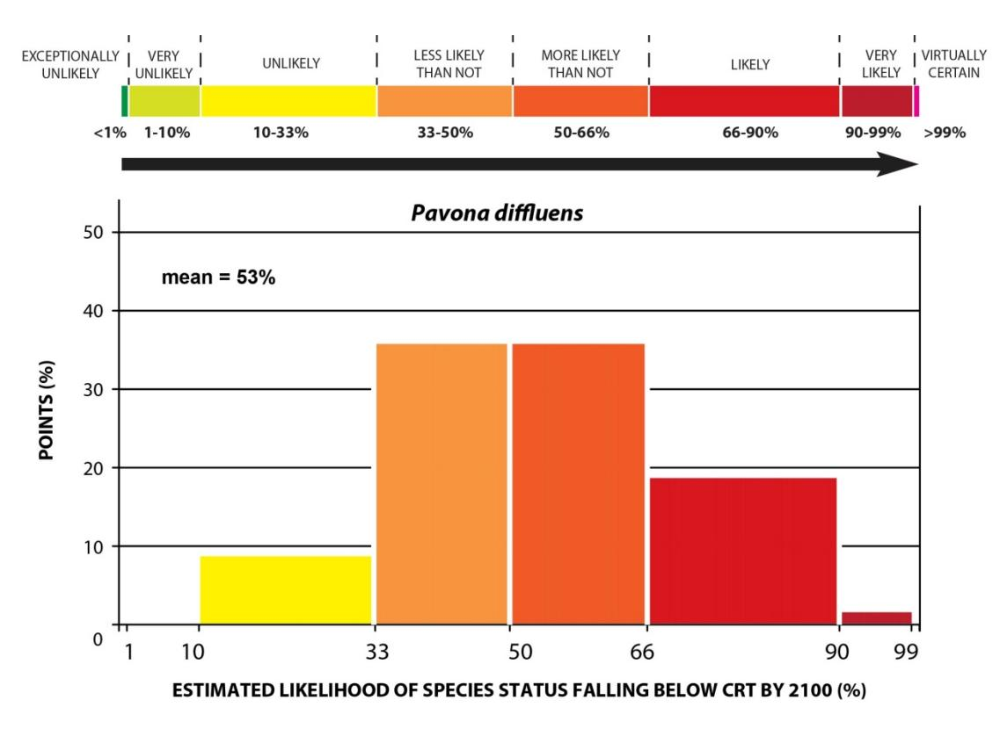

Figure ES-1. Example histogram showing the distribution of points to estimate the likelihood that the status of *Pavona diffluens* will fall below the Critical Risk Threshold (the species is of such low abundance, or so spatially fragmented, or at such reduced diversity that extinction is extremely likely) by 2100.

This process yielded a list of the 82 candidate coral species ranked by the mean likelihood of falling below the Critical Risk Threshold by 2100 (Fig. ES-2, Table ES-1). Given the myriad uncertainties described above, this list must be understood as a qualitative ranking, not supporting fine parsing among species whose mean scores differ by only a few points. While the mean likelihood of a species status falling below the Critical Risk Threshold by 2100 is an important indicator of the extinction risk, the broad distribution of points in these histograms highlights the high level of uncertainty in these estimates of Critical Risk Threshold likelihood by the BRT members. Both the mean likelihood scores and the uncertainty should be considered in the application of these estimates.

That said, certain patterns in the Critical Risk Threshold likelihood estimates are notable. Caribbean species were estimated to have relatively high likelihoods of falling below their Critical Risk Thresholds by 2100, with five of the seven candidate species from that region ranked in the top seven overall. This reflects the relatively small and restricted geographic extent of these species, pervasive and demonstrated impacts of both local and global threats, and the significant, well-documented declines of corals throughout the Caribbean region. Other candidate species determined by

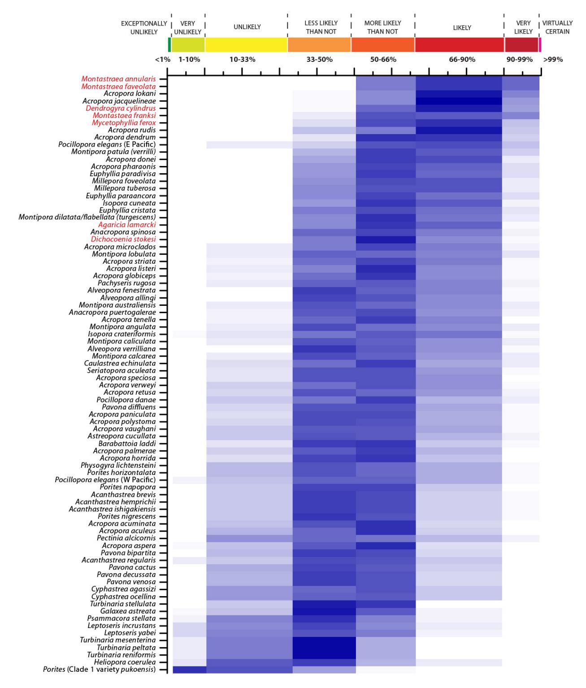

Figure ES-2. Summary of votes tallied across Critical Risk Threshold likelihood categories for all 82 candidate coral species ranked by mean likelihood. The x-axis indicates the percent likelihood of a species status falling below the Critical Risk Threshold. Darkness of color scales to the proportion of votes in each risk category for each species. Red text is used for Caribbean species names and black text is used for Indo-Pacific species names. See the Individual Species Accounts (chapters 6 and 7) for the distribution of votes in each likelihood category.

Table ES-1. Summary of votes tallied in each risk likelihood category (colored columns), mean (and standard error, SE) likelihood of falling below the Critical Risk Threshold by 2100, and mean likelihood range for each of the 82 candidate coral species ranked by mean likelihood as determined by the BRT. The SE was calculated by taking the standard deviation of the seven mean voting scores of the BRT members. Mean likelihood range is the mean range of the likelihood estimates of the seven BRT voters. For example, an individual voter spreading votes in categories between "unlikely" and "more likely than not" would have an individual range of 56%. Three voters with a 33% range, one with a 56% range, and three with a 66% range would produce an average likelihood range of 50.4%. Red text is used for Caribbean species names and black text is used for Indo-Pacific species names. Species listed in parentheses were not petitioned per se, but were incorporated based on best available taxonomic information (see Sections 7.3.2, 7.8, 7.10.4 for discussions of taxonomic issues within Pocillopora, Montipora, and Porites respectively).

| SPECIES # OF VOTES IN EACH RISK LIKELIHOOD CATEGORY |    |      |       |       |       |       |       |     | MEAN LIKELI- HOOD (%) | SE OF BRT MEANS (%) | MEAN LIKELIHOOF RANGE (%) |
|-----------------------------------------------------|----|------|-------|-------|-------|-------|-------|-----|--------------------------|------------------------|------------------------------|
|                                                     | <1 | 1-10 | 10-33 | 33-50 | 50-66 | 66-90 | 90-99 | >99 | 2                        | 88                     | MEA                          |
| Montastraea annularis                               | 0  | 0    | 0     | 0     | 19    | 29    | 22    | 0   | 78                       | 6.9                    | 45.4                         |
| Montastraea faveolata                               | 0  | 0    | 0     | 0     | 19    | 29    | 22    | 0   | 78                       | 6.9                    | 45.4                         |
| Acropora lokani                                     | 0  | 0    | 0     | 1     | 17    | 34    | 18    | 0   | 77                       | 8.1                    | 50.1                         |
| Acropora jacquelineae                               | 0  | 0    | 0     | 1     | 17    | 37    | 15    | 0   | 76                       | 7.3                    | 50.1                         |
| Dendrogyra cylindrus                                | 0  | 0    | 0     | 1     | 22    | 33    | 14    | 0   | 74                       | 6.6                    | 48.9                         |
| Montastraea franksi                                 | 0  | 0    | 0     | 3     | 25    | 24    | 18    | 0   | 74                       | 9                      | 47.9                         |
| Mycetophyllia ferox                                 | 0  | 0    | 0     | 5     | 26    | 30    | 9     | 0   | 70                       | 8.2                    | 50                           |
| Acropora rudis                                      | 0  | 0    | 0     | 9     | 19    | 34    | 8     | 0   | 70                       | 11.2                   | 49                           |
| Acropora dendrum                                    | 0  | 0    | 0     | 4     | 30    | 29    | 7     | 0   | 69                       | 5.6                    | 55                           |
| Pocillopora elegans (E Pacific)                     | 0  | 0    | 3     | 7     | 25    | 26    | 9     | 0   | 67                       | 13                     | 53.4                         |
| Montipora patula (verrilli)                         | 0  | 0    | 0     | 11    | 28    | 24    | 7     | 0   | 66                       | 9.9                    | 50.1                         |
| Acropora donei                                      | 0  | 0    | 0     | 13    | 28    | 26    | 3     | 0   | 64                       | 8.2                    | 52.6                         |
| Acropora pharaonis                                  | 0  | 0    | 0     | 15    | 27    | 23    | 5     | 0   | 64                       | 8.9                    | 55                           |
| Euphyllia paradivisa                                | 0  | 0    | 0     | 15    | 28    | 22    | 5     | 0   | 63                       | 9.6                    | 50.3                         |
| Millepora foveolata                                 | 0  | 0    | 0     | 16    | 26    | 25    | 3     | 0   | 63                       | 9.8                    | 50.3                         |
| Millepora tuberosa                                  | 0  | 0    | 0     | 17    | 25    | 25    | 3     | 0   | 63                       | 10.1                   | 50.3                         |
| Euphyllia paraancora                                | 0  | 0    | 0     | 17    | 27    | 21    | 5     | 0   | 63                       | 10.4                   | 50.3                         |
| Isopora cuneata                                     | 0  | 0    | 0     | 15    | 29    | 24    | 2     | 0   | 62                       | 8.5                    | 51.3                         |
| Euphyllia cristata                                  | 0  | 0    | 0     | 19    | 26    | 21    | 4     | 0   | 62                       | 10.5                   | 50.3                         |
| Montipora dilatata/flabellata (turgescens)          | 0  | 0    | 0     | 17    | 30    | 20    | 3     | 0   | 61                       | 7.3                    | 56.1                         |
| Agaricia lamarcki                                   | 0  | 0    | 0     | 17    | 29    | 23    | 1     | 0   | 61                       | 6.3                    | 54.9                         |
| Anacropora spinosa                                  | 0  | 0    | 0     | 22    | 27    | 19    | 2     | 0   | 59                       | 7.5                    | 54.9                         |
| Dichocoenia stokesi                                 | 0  | 0    | 0     | 19    | 33    | 17    | 1     | 0   | 59                       | 5.1                    | 58.3                         |
| Acropora microclados                                | 0  | 0    | 3     | 19    | 27    | 19    | 2     | 0   | 58                       | 11                     | 60.3                         |
| Montipora lobulata                                  | 0  | 0    | 3     | 23    | 22    | 18    | 4     | 0   | 58                       | 11.9                   | 57.1                         |
| Acropora striata                                    | 0  | 0    | 2     | 21    | 27    | 19    | 1     | 0   | 58                       | 8.4                    | 58.1                         |
| Acropora listeri                                    | 0  | 0    | 3     | 18    | 31    | 17    | 1     | 0   | 58                       | 6.7                    | 64.9                         |
| Acropora globiceps                                  | 0  | 0    | 2     | 21    | 29    | 17    | 1     | 0   | 57                       | 8.1                    | 58.1                         |
| Pachyseris rugosa                                   | 0  | 0    | 3     | 23    | 24    | 18    | 2     | 0   | 57                       | 10.8                   | 57.1                         |
| Alveopora fenestrata                                | 0  | 0    | 0     | 28    | 23    | 18    | 1     | 0   | 57                       | 8.5                    | 52.6                         |
| Alveopora allingi                                   | 0  | 0    | 0     | 27    | 25    | 17    | 1     | 0   | 57                       | 8.7                    | 52.6                         |
| Montipora australiensis                             | 0  | 0    | 3     | 25    | 22    | 17    | 3     | 0   | 57                       | 12                     | 53.7                         |
| Anacropora puertogalerae                            | 0  | 0    | 2     | 24    | 26    | 16    | 2     | 0   | 57                       | 8.1                    | 60.1                         |
| Acropora tenella                                    | 0  | 0    | 2     | 22    | 28    | 18    | 0     | 0   | 57                       | 7.7                    | 58.1                         |
| Montipora angulata                                  | 0  | 0    | 3     | 26    | 21    | 17    | 3     | 0   | 57                       | 11.9                   | 53.7                         |
| Isopora crateriformis                               | 0  | 1    | 4     | 20    | 24    | 20    | 1     | 0   | 57                       | 14.2                   | 51.3                         |
| Montipora caliculata                                | 0  | 0    | 3     | 25    | 23    | 16    | 3     | 0   | 57                       | 11.6                   | 53.7                         |
| Alveopora verrilliana                               | 0  | 0    | 0     | 29    | 24    | 16    | 1     | 0   | 56                       | 9                      | 49.1                         |
| Montipora calcarea                                  | 0  | 0    | 3     | 26    | 23    | 15    | 3     | 0   | 56                       | 11.6                   | 53.7                         |
| Caulastrea echinulata                               | 0  | 0    | 5     | 21    | 28    | 13    | 3     | 0   | 56                       | 9.6                    | 62.6                         |
| Seriatopora aculeata                                | 0  | 0    | 4     | 25    | 25    | 15    | 1     | 0   | 55                       | 10.3                   | 59.1                         |

| SPECIES                                      |    | # OF VOTES IN EACH RISK LIKELIHOOD CATEGORY |     |      |       |      |     |     |    |                        | MEAN LIKELIHOOD RANGE (%) |
|----------------------------------------------|----|------------------------------------------------|-----|------|-------|------|-----|-----|----|------------------------|------------------------------|
|                                              | <1 | 1-10                                           |     | -    | 50-66 | 2000 |     | >99 |    | SE OF BRT MEANS (%) |                              |
| Acropora speciosa                            | 0  | 0                                              | 4   | 25   | 25    | 16   | 0   | 0   | 55 | 10.1                   | 54.4                         |
| Acropora verweyi                             | 0  | 0                                              | 7   | 21   | 25    | 16   | 1   | 0   | 54 | 11.5                   | 59.1                         |
| Acropora retusa                              | 0  | 0                                              | 6   | 25   | 22    | 15   | 2   | 0   | 54 | 13.2                   | 55.7                         |
| Pocillopora danae                            | 0  | 0                                              | 8   | 20   | 28    | 11   | 3   | 0   | 54 | 13.7                   | 52.3                         |
| Pavona diffluens                             | 0  | 0                                              | 6   | 25   | 25    | 13   | 1   | 0   | 53 | 12                     | 61.4                         |
| Acropora paniculata                          | 0  | 0                                              | 5   | 26   | 26    | 12   | 1   | 0   | 53 | 9.4                    | 49.9                         |
| Acropora polystoma                           | 0  | 0                                              | 6   | 26   | 25    | 12   | 1   | 0   | 53 | 9.9                    | 61                           |
| Acropora vaughani                            | 0  | 0                                              | 8   | 24   | 24    | 13   | 1   | 0   | 52 | 11.2                   | 61                           |
| Astreopora cucullata                         | 0  | 0                                              | 8   | 25   | 24    | 11   | 2   | 0   | 52 | 9.2                    | 59                           |
| Barabattoia laddi                            | 0  | 0                                              | 4   | 28   | 29    | 8    | 1   | 0   | 52 | 12.6                   | 51.                          |
| Acropora palmerae                            | 0  | 0                                              | 7   | 24   | 28    | 11   | 0   | 0   | 52 | 8.8                    | 60                           |
| Acropora horrida                             | 0  | 0                                              | 5   | 27   | 29    | 9    | 0   | 0   | 52 | 6.8                    | 56.                          |
| Physogyra lichtensteini                      | 0  | 0                                              | 10  | 25   | 22    | 12   | 1   | 0   | 51 | 11.4                   | 62.                          |
| Porites horizontalata                        | 0  | 0                                              | 10  | 25   | 22    | 12   | 1   | 0   | 51 | 11.7                   | 62.                          |
| Pocillopora elegans (W Pacific)              | 0  | 2                                              | 9   | 23   | 23    | 12   | 1   | 0   | 50 | 14.6                   | 56.                          |
| Porites napopora                             | 0  | 0                                              | 8   | 27   | 27    | 8    | 0   | 0   | 50 | 9.1                    | 57.                          |
| Acanthastrea brevis                          | 0  | 0                                              | 8   | 28   | 26    | 7    | 1   | 0   | 50 | 9.1                    | 57.                          |
| Acanthastrea hemprichii                      | 0  | 0                                              | 8   | 28   | 26    | 7    | 1   | 0   | 50 | 9.1                    | 57.                          |
| Acanthastrea ishigakiensis                   | 0  | 0                                              | 8   | 28   | 26    | 7    | 1   | 0   | 50 | 7                      | 59.                          |
| Porites nigrescens                           | 0  | 0                                              | 8   | 29   | 25    | 7    | 1   | 0   | 50 | 8.9                    | 57.                          |
| Acropora acuminata                           | 0  | 0                                              | 9   | 25   | 30    | 6    | 0   | 0   | 49 | 8.5                    | 56.                          |
| Acropora aculeus                             | 0  | 0                                              | 11  | 22   | 30    | 7    | 0   | 0   | 49 | 11.8                   | 51                           |
| Pectinia alcicornis                          | 0  | 0                                              | 16  | 22   | 20    | 10   | 2   | 0   | 48 | 15.6                   | 58.                          |
| Acropora aspera                              | 0  | 1                                              | 9   | 24   | 31    | 5    | 0   | 0   | 48 | 9.3                    | 57.                          |
| Pavona bipartita                             | 0  | 0                                              | 10  | 28   | 26    | 6    | 0   | 0   | 48 | 10.9                   | 47.                          |
| Acanthastrea regularis                       | 0  | 3                                              | 8   | 26   | 25    | 8    | 0   | 0   | 48 | 15                     | 46.                          |
| Pavona cactus                                | 0  | 0                                              | 12  | 27   | 24    | 7    | 0   | 0   | 47 | 10.7                   | 47.                          |
| Pavona decussata                             | 0  | 0                                              | 11  | 28   | 25    | 6    | 0   | 0   | 47 | 10.7                   | 50.                          |
| Pavona venosa                                | 0  | 0                                              | 11  | 28   | 25    | 6    | 0   | 0   | 47 | 12                     | 48.                          |
| Cyphastrea agassizi                          | 0  | 0                                              | 15  | 22   | 25    | 8    | 0   | 0   | 47 | 13.8                   | 51.                          |
| Cyphastrea ocellina                          | 0  | 0                                              | 15  | 23   | 24    | 8    | 0   | 0   | 47 | 13.7                   | 51.                          |
| Turbinaria stellulata                        | 0  | 0                                              | 8   | 33   | 29    | 0    | 0   | 0   | 46 | 5.9                    | 40.                          |
| Galaxea astreata                             | 0  | 1                                              | 9   | 34   | 24    | 2    | 0   | 0   | 45 | 7.5                    | 51.                          |
| Psammacora stellata                          | 0  | 2                                              | 18  | 30   | 18    | 2    | 0   | 0   | 41 | 9.2                    | 58.                          |
| Leptoseris incrustans                        | 0  | 6                                              | 17  | 27   | 17    | 3    | 0   | 0   | 39 | 10.3                   | 61.                          |
| Leptoseris yabei                             | 0  | 6                                              | 18  | 25   | 19    | 2    | 0   | 0   | 39 | 11.1                   | 57.                          |
| Turbinaria mesenterina                       | 0  | 3                                              | 19  | 36   | 12    | 0    | 0   | 0   | 37 | 9.5                    | 45.                          |
| Turbinaria peltata                           | 0  | 3                                              | 19  | 36   | 12    | 0    | 0   | 0   | 37 | 9.5                    | 45.                          |
| Turbinaria reniformis                        | 0  | 3                                              | 19  | 36   | 12    | 0    | 0   | 0   | 37 | 9.5                    | 45.                          |
| Heliopora coerulea                           | 0  | 4                                              | 24  | 28   | 11    | 3    | 0   | 0   | 37 | 11.1                   | 54.                          |
| Porites (Clade 1 forma pukoensis*)           | 0  | 30                                             | 25  | 14   | 1     | 0    | 0   | 0   | 19 | 8.3                    | 43.                          |
| all votes summed                             | 0  | 65                                             | 494 | 1750 | 1981  | 1209 | 241 | 0   |    |                        |                              |
| frequency of species per likelihood bin      | 0  | 13                                             | 57  | 80   | 82    | 77   | 57  | 0   |    |                        |                              |
| percentage of species per likelihood bin (%) | 0  | 16                                             | 70  | 98   | 100   | 94   | 70  | 0   |    |                        |                              |
| mean likelihood score frequency              | 0  | 0                                              | 1   | 25   | 46    | 10   | 0   | 0   |    |                        |                              |

\* see species account Porites pukoensis for details

the BRT to have relatively high extinction risk also tended to have highly restricted geographic ranges, documented declines in abundance or low population sizes, and/or were extremely vulnerable to one or more threats. In contrast, lower risk candidate coral species tended to have wide geographic and habitat distributions, tolerance to marginal environmental conditions, and/or known tolerance of important threats. Among the 82 candidate coral species, the mean estimated likelihood of a species status falling below the Critical Risk Threshold by 2100 ranged from 78% ("likely" to fall below the Critical Risk Threshold by 2100) to 19% ("unlikely" to fall below the Critical Risk Threshold by 2100). The overall mean likelihood of falling below the Critical Risk Threshold by 2100 was 55% across all 82 candidate coral species, thereby falling into the "more likely than not (50%–66%)" risk likelihood category (the mode was also in this category). The distribution of mean likelihood scores across the 8 risk likelihood categoies for all 82 candidate coral species (Fig. ES-3) shows that the mean likelihood scores for 26 of the 82 species were in the 'less likely than not' (25) or 'unlikely' (1) risk likelihood categories and 56 of the 82 species were in the 'more likely than not' (46) and 'likely' (10) risk likelihood categories. The overall uncertainty was high with the mean range of votes for all 82 of the candidate coral species spanning 53.75% (SD 12.73) of the total likelihood range. In simplified terms, the BRT concluded, albeit with high uncertainty, that the status of most of the 82 candidate coral species are "more likely than not" to fall below the Critical Risk Threshold by 2100 under the assumption of status quo policies and technologies.

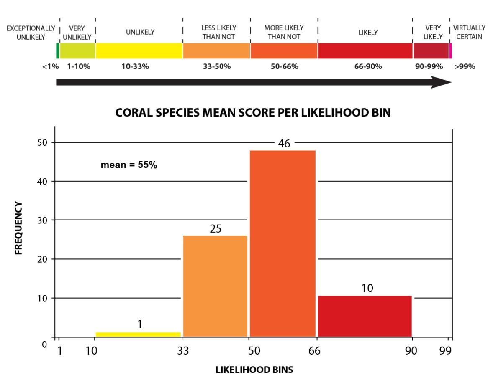

Figure ES-3. Number of coral species mean with likelihood scores (total = 82 scores) in each risk likelihood category. The overall mean of the mean likelihood scores of all 82 species is 55%.

#### **1. INTRODUCTION**

On October 20, 2009, the National Marine Fisheries Service (NMFS) received a petition from the Center for Biological Diversity (CBD) to list 83 species of coral as either threatened or endangered under the U.S. Endangered Species Act. Eight of these species are found in the western Atlantic/Caribbean (indicated by (C) in the list below), and the remaining 75 species are found in the Pacific and Indian Oceans (Indo-Pacific). In alphabetical order, the 83 species included in the petition (using Cairns et al (1999) for the spelling of the species names) are:

| Acanthastrea brevis        | Astreopora cucullata      | Montipora dilatata      |
|----------------------------|---------------------------|-------------------------|
| Acanthastrea hemprichii    | Barabattoia laddi         | Montipora flabellata    |
| Acanthastrea ishigakiensis |                           | Montipora lobulata      |
| Acanthastrea regularis     | Caulastrea echinulata     | Montipora patula        |
| Acropora aculeus           | Cyphastrea agassizi       | Mycetophyllia ferox (C) |
| Acropora acuminata         | Cyphastrea ocellina       |                         |
| Acropora aspera            |                           | Oculina varicosa (C)    |
| Acropora dendrum           | Dendrogyra cylindrus (C)  |                         |
| Acropora donei             |                           | Pachyseris rugosa       |
| Acropora globiceps         | Dichocoenia stokesi (C)   |                         |
| Acropora horrida           |                           | Pavona bipartita        |
| Acropora jacquelineae      | Euphyllia cristata        | Pavona cactus           |
| Acropora listeri           | Euphyllia paraancora      | Pavona decussata        |
| Acropora lokani            | Euphyllia paradivisa      | Pavona diffluens        |
| Acropora microclados       |                           | Pavona venosa           |
| Acropora palmerae          | Galaxea astreata          |                         |
| Acropora paniculata        |                           | Pectinia alcicornis     |
| Acropora pharaonis         | Heliopora coerulea        |                         |
| Acropora polystoma         |                           | Physogyra lichtensteini |
| Acropora retusa            | Isopora crateriformis     |                         |
| Acropora rudis             | Isopora cuneata           | Pocillopora danae       |
| Acropora speciosa          |                           | Pocillopora elegans     |
| Acropora striata           | Leptoseris incrustans     |                         |
| Acropora tenella           | Leptoseris yabei          | Porites horizontalata   |
| Acropora vaughani          |                           | Porites napopora        |
| Acropora verweyi           | Millepora foveolata       | Porites nigrescens      |
|                            | Millepora tuberosa        | Porites pukoensis       |
| Agaricia lamarcki (C)      |                           |                         |
|                            | Montastraea annularis (C) | Psammocora stellata     |
| Alveopora allingi          | Montastraea faveolata (C) |                         |
| Alveopora fenestrata       | Montastraea franksi (C)   | Seriatopora aculeata    |
| Alveopora verrilliana      |                           |                         |
|                            | Montipora angulata        | Turbinaria mesenterina  |
| Anacropora puertogalerae   | Montipora australiensis   | Turbinaria peltata      |
| Anacropora spinosa         | Montipora calcarea        | Turbinaria reniformis   |
|                            | Montipora caliculata      | Turbinaria stellula     |
|                            |                           |                         |

The petition states that all of these species are classified as vulnerable (76 species), endangered (6 species: *Acropora rudis*, *Anacropora spinosa*, *Montipora dilatata*, *Montastraea annularis*, *M. faveolata*, *Millepora tuberosa*) or critically endangered (1 species: *Porites pukoensis*) by the International Union for Conservation of Nature (IUCN). *Montipora dilatata* and *Oculina varicosa* are also on the NMFS Species of Concern list. The petition also purports that all of these species occur in U.S. waters.

The NMFS issued a 90-day finding (National Marine Fisheries Service, 2010), wherein the petition was determined to contain substantial information for all of the petitioned species except *Oculina varicosa* (see the 90-day finding for information included in the petition). Thus, the NMFS initiated a status review of the remaining 82 species of corals; *O. varicosa* will not be considered further. The NMFS Pacific Islands Regional Office (PIRO) and the Southeast Regional Office (SERO) requested that the NMFS Pacific Islands Fisheries Science Center (PIFSC) and the Southeast Fisheries Science Center (SEFSC) form a Biological Review Team (BRT) to review the status of the 82 candidate coral species. The PIFSC and SEFSC Directors then issued invitations for participation on the BRT.

The NMFS requested the BRT to assess the status of each candidate coral species and the degree of threat to each of the species with regard to the factors listed under Section 4 of the U.S. Endangered Species Act of 1973 (16 *United States* Code 1531-1544, 87 Statute 884), without making recommendations about whether any of the 82 candidate coral species should be listed as threatened or endangered. This Status Review Report provides the BRT's evaluation of the status of each of the 82 candidate coral species and the risk of extinction faced by each using the best available scientific and commercial data and analyses, including the best available climate change and ocean acidification scenarios.

#### **1.1 Scope and Intent of 82 Corals Status Review Report**

In May 2010, the NMFS convened the 82-Corals BRT, including experts in the fields of coral biology and ecology, physical oceanography, climate change, and population dynamics to prepare a Status Review Report of the 82 candidate coral species as mandated by the U.S. Endangered Species Act. This Status Review Report includes a determination of the risk of extinction for each of the 82 candidate coral species out to the year 2100 based on an evaluation of the best available information and data including the following topics: (1) long-term trends in abundance throughout the species' ranges; (2) potential factors for any declines of the species throughout their ranges (human population and consumption, climate change, ocean acidification, overharvesting, natural predation, disease, habitat loss, etc.); (3) historical and current range, distribution, and habitat use of the species; (4) historical and current estimates of the species' population sizes and available habitats; and (5) knowledge of various life history parameters (size/age at maturity, fecundity, length of larval stage, larval dispersal dynamics, etc.). In evaluating the risks of extinction, the BRT did not make any assumptions about future policy changes or technological advances that could potentially alter the projections used in this analysis.

#### **1.1.1 Background on the Endangered Species Act**

The purposes of the U.S. Endangered Species Act are to provide a means to conserve ecosystems on which endangered species and threatened species depend, to provide a program for the conservation of endangered and threatened species, and to take appropriate steps to recover a species. The U.S. Fish and Wildlife Service (USFWS) and the NMFS share responsibility for administering the Endangered Species Act; the NMFS is responsible for determining whether marine, estuarine or anadromous species, subspecies or distinct population segments are threatened or endangered under the Endangered Species Act. To be considered for listing under the Endangered Species Act, a group of organisms must constitute a "species."

The U.S. Endangered Species Act and a 1996 joint USFWS-NMFS policy (U.S. Fish and Wildlife Service and National Marine Fisheries Service, 1996) provide the following definitions and criteria for designation of a population or group of populations:

> *"the term species includes any subspecies of fish or wildlife or plants, and any distinct population segment of any species of vertebrate fish or wildlife which interbreeds when mature."*

> *"endangered species" is defined as "any species which is in danger of extinction throughout all or a significant portion of its range."*

> "*threatened species" is defined as "any species which is likely to become an endangered species within the foreseeable future throughout all or a significant portion of its range."*

The NMFS must base its determinations on whether to list species solely on the best available scientific and commercial information. The status of each species is evaluated by estimating the risk of extinction and determining whether the species is an endangered species or a threatened species based on any of the following factors in Section 4(a)(1) of the U.S. Endangered Species Act:

- A. The present or threatened destruction, modification or curtailment of its habitat or range;
- B. Overutilization for commercial, recreational, scientific or educational purposes;
- C. Disease or predation;
- D. Inadequacy of existing regulatory mechanisms; or
- E. Other natural or manmade factors affecting the continued existence of the species.

The purpose of this Status Review Report is to provide important information about the status and risk of extinction for each of the 82 candidate coral species for use in making these listing determinations. This Status Review Report does not assess the inadequacy of existing regulatory mechanisms (listing factor D above).

#### **1.1.2 Candidate species/Species of Concern listing**

Each of the 82 coral species included in this Status Review Report are considered to be candidate species under the U.S. Endangered Species Act. "Candidate species" refers to (1) species that are the subject of a petition to list and for which the NMFS has determined that listing may be warranted pursuant to Endangered Species Act Section 4(b)(3)(A), and (2) species for which the NMFS has determined, following a status review, that listing is warranted (whether or not they are the subject of a petition). Further, of the 82 candidate coral species considered in this Status Review Report, only *Montipora dilatata* has previously been identified as a Species of Concern under the Endangered Species Act (National Marine Fisheries Service, 2004). A "species of concern" identifies species about which NMFS has some concerns regarding status and threats, but for which insufficient information is available to indicate a need to list the species under the Endangered Species Act. For example, *Montipora dilatata* was identified as a Species of Concern in 2004 based on the species being very rare, endemic to a small geographic area (Hawai`i), and subject to the following factors for decline: (1) vulnerability to coral bleaching; (2) fresh water kills and exposure at extreme low tide; (3) habitat degradation and modification as a result of sedimentation, pollution, and alien alga invasion; and (4) damage by anchors, fish pots, swimmers, and divers.

#### **1.1.3 The "species" question**

When conducting Status Review Reports, BRTs need to determine whether the nominal candidate species in question are in fact "species" as defined by the U.S. Endangered Species Act. Corals are marine invertebrates, not vertebrate species; therefore, individual coral species may not be subdivided into distinct population segments for the purposes of the Endangered Species Act (U.S. Fish and Wildlife Service and National Marine Fisheries Service, 1996). Although scientists have begun using genetic tools to reexamine coral taxonomic issues and identify coral populations, these data are still relatively sparse and generally do not exist across the full geographic ranges for any coral species. For each of the 82 candidate corals considered in this Status Review Report, the status of each species must be considered throughout their entire ranges when evaluating extinction risks. The best available literature relevant to each of the candidate coral species in this petition is examined in Chapter 2 and within the individual species accounts (Chapters 6 and 7).

#### **1.2 The Petition**

The purpose of this Status Review Report is to provide important information about the status and risk of extinction for each of the 82 candidate coral species for use by the NMFS in making listing determinations under the U.S. Endangered Species Act. *The purpose of this Status Review Report is not to evaluate the validity of the specific assertions in the Petition or to provide alternative recommendations for other coral species to be considered for listing.* However, a brief summary of the Petition is provided here for context.

The petition included descriptions of the morphology, life history, habitat, distribution, and loss estimates over 30 years (20 years into the past and 10 years into the future) for each of 83 petitioned coral species, threats facing each species, and descriptions of the status of coral reef ecosystems of the western Atlantic/Caribbean and Indo-Pacific areas. The petition asserted that each of the 83 petitioned coral species have suffered population reductions of at least 30% over a 30-year period, relying on information from the IUCN. The petition stated that the majority of coral species included in this petition occur in similar habitats in either the western Atlantic/Caribbean or Indo-Pacific basins and face the same threats. Eight of the petitioned species occur in the western Atlantic/Caribbean, and 75 occur in the Indo-Pacific. The wider Caribbean, according to the petitioner, had the largest proportion of corals classified as being in one of the high extinction risk categories by the IUCN. The petitioner asserted that the Caribbean region suffered massive losses of corals in response to climate-related bleaching and mortality events of 2005, including a record-breaking series of 26 tropical storms and elevated ocean water temperatures. Further, the petitioner asserted that the U.S. Virgin Islands lost 51.5% of live coral cover, and that Florida, Puerto Rico, the Cayman Islands, St. Maarten, Saba, St. Eustatius, Guadeloupe, Martinique, St. Barthelemy, Barbados, Jamaica, and Cuba suffered bleaching of over 50% of coral colonies, citing Carpenter et al. (2008).

The petition described factors that it asserted have led to the current status of these corals, as well as threats that it asserted the species currently face, categorizing them under the Section 4(a)(1) factors. The petition focused on habitat threats, asserting that the habitats of the 83 petitioned coral species, and indeed all reef-building coral species, are under threat from several processes linked to anthropogenic greenhouse gas emissions, including increasing seawater temperatures, increasing ocean acidification, increasing storm intensities, changes in precipitation, and sea-level rise. The petition also asserted that these global habitat threats are exacerbated by local habitat threats posed by ship traffic, dredging, coastal development, pollution, and agricultural and land-use practices that increase sedimentation and nutrient loading. The petition asserted that this combination of habitat threats has already affected coral reef ecosystems on a global scale, and that these threats are currently accelerating in severity such that the quantity and quality of coral reef ecosystems are likely to be greatly reduced in the next few decades.

The petitioner cited Gardner et al. (2003) in asserting that, over the three decades prior to the 2005 events, Caribbean reefs had already suffered an 80% decline in hard coral cover, from an average of 50% to an average of 10% throughout the region. The abundance and trend information presented by the petitioner for each species was limited to an estimate of the percentage loss of its habitat and/or population over a 30-year period (including 20 years into the past and 10 years into the future), as assessed by the IUCN. However, the petition also asserted that these corals face significant threats. To support this assertion, the petitioner cited Alvarez-Filip et al. (2009) in noting the dramatic decline of the threedimensional complexity of Caribbean reefs over the past 40 years, resulting in a phase shift from a coral-dominated ecosystem to fleshy macroalgal overgrowth in reef systems across the Caribbean.

The petitioner noted that, in the NMFS (2008) critical habitat designation for elkhorn (*Acropora palmata*) and staghorn (*Acropora cervicornis*) corals in the Atlantic, the NMFS identified chronic overfishing of herbivorous species and the die-off of 95% of the long-spined sea urchins (*Diadema antillarum*) across the region in the early 1980s as primary factors in this ecological shift (National Marine Fisheries Service, 2008). Based on that same critical habitat designation, the petitioner concluded that "in the absence of grazing pressure from herbivorous fish and urchins, fast growing algae, macroalgae, and other epibenthic organisms easily outcompete coral larvae by preempting available space, producing toxic metabolites that inhibit larval settlement, and trapping excess sediment in algal turfs." The petitioner cited Gledhill et al. (2008) in asserting that ocean acidification led to a decrease in mean sea surface aragonite saturation state in the greater Caribbean region between 1996 and 2006. The petitioner stated that Hoegh-Guldberg et al. (2007) found marked reductions in resilience accompanied by increased grazing requirements to facilitate reef recovery after modeling the effects of a 20% decline in coral growth rate in response to ocean acidification on a Caribbean forereef.

The petitioner cited Bruno and Selig (2007) in stating that 75% of the world's coral reefs can be found in the Indo-Pacific, which, as cited in the petition, stretches from the Indonesian island of Sumatra in the west to French Polynesia in the east. Further, the petitioner cited the same source, saying that as recently as 1000 to 100 years ago, this region probably averaged about 50% coral cover, but 20%–50% of that total has been lost since the 1980s. The petitioner asserted, citing again Bruno and Selig (2007), that this reduced coral cover was relatively consistent across 10 subregions of the Indo-Pacific in 2002–2003. The petitioner suggested that although these corals have recovered in the past (Colgan, 1987), anthropogenic stressors are increasing the frequency and intensity of mortality events and interfering with the natural ability of coral communities to recover (McClanahan et al., 2004a; Pandolfi et al., 2003). The petitioner cited Sheppard (2003) in explaining that the future of Indian Ocean reefs was a particular concern because over 90% of corals on many shallow water reefs died in 1998 in response to elevated sea surface temperatures, and because average temperatures in the Indian Ocean are expected to rise above 1998 levels within a few decades. The petitioner cited the same source in concluding that as elevated sea surface temperatures and associated climate-induced mass mortality events occur more frequently, it becomes less likely that there will be enough time between events for Indian Ocean reefs to recover.

#### **2. GENERAL BACKGROUND ON CORALS AND CORAL REEFS**

#### **2.1 Taxonomy and Distribution**

#### **2.1.1 Taxonomy and morphology of scleractinian corals**

Stony corals are marine invertebrates in the phylum Cnidaria (Coelenterata) that secrete a calcium carbonate skeleton. Cnidaria is the only phylum that is diploblastic (i.e., two-tissue layers); all higher taxa are triploblastic (three-tissue layers) and thus contain a true mesoderm. The phylum is named Cnidaria because organisms use cnidae (capsules containing nematocysts) for prey capture and self-defense. Organisms in the phylum can be solitary (one polyp) or colonial (many polyps).

Among other groups, the Cnidaria include fire corals (class Hydrozoa, order Milleporina), the blue coral (class Anthozoa, order Helioporacea = Coenothecalia), and true stony corals (class Anthozoa, order Scleractinia). Members of these three orders are represented among the 82 candidate coral species considered in this Status Review Report. The scleractinian corals, along with dinosaurs and mammals, evolved in the middle of the Triassic Era (208–250 million years prior to present [Ma]). The individual building unit in a colony is termed a polyp: a column with mouth and tentacles on the upper side (Fig. 2.1.1), lying above a skeleton of calcium carbonate (usually aragonite but sometimes calcite). Corals in the family Fungiidae exist only as solitary polyps, but the other families exploit the ability to form complex colonies. The rapid calcification rates of these organisms have been linked to the mutualistic association with single-celled dinoflagellate algae, zooxanthellae, found in the gastrodermal cells of coral tissues (Goreau et al., 1979). Scleractinian corals can be hermatypic (significant contributors to the reef-building process) or ahermatypic. The largest colonial members of the Scleractinia help produce the carbonate structures known as coral reefs in shallow tropical and subtropical seas around the world. Massive and branching stony corals are the primary framework builders and a major source of calcium carbonate production of coral reefs. Corals provide substrata for colonization by benthic organisms, construct complex protective habitats for a high diversity of other reef-associated species, including commercially important invertebrates and fishes, and serve as food resources for a variety of animals.

One species under consideration in this petition, the blue coral *Heliopora coerulea*, is of the subclass Octocorallia. Octocorals are generally soft-bodied and distinguished by polyps always having eight tentacles, rather than the multiples of six that characterize stony corals. Blue coral is the only octocoral that forms an aragonite skeleton. *Heliopora coerulea* is the only member of its family and its order known to occur on coral reefs.

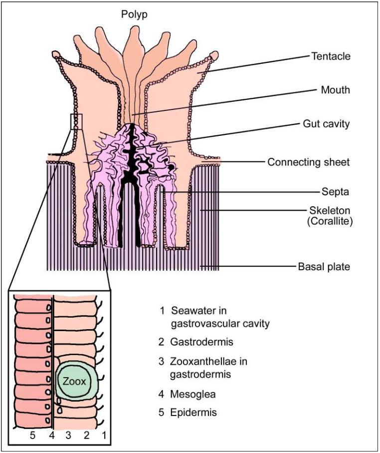

Figure 2.1.1. Schematic view of the anatomy of a coral polyp (corallite) (Sumich, 1996).

#### **2.1.2 Species delineation and uncertainty in corals**

The U.S. Endangered Species Act defines a species as a group of organisms that "interbreeds when mature." The classical biological species concept, in addition to interbreeding (i.e., sharing a common gene pool), requires also that the group be reproductively isolated from other such groups (i.e., their common gene pool is separate and distinct from others). Until the relatively recent development of genetic sequencing techniques, biologists have lacked the capacity to directly quantify reproductive pools or the differentiation of gene pools when identifying and categorizing organisms in the ocean. Rather, classical taxonomy has relied on the similarity and differences in morphological traits (i.e., how does the organism look?) to infer interbreeding and reproductive isolation. Indeed, it is widely known that the sum of an organism's traits (i.e., phenotype) is determined to a greater or lesser extent by the environment under which it lives, in combination with its genetic composition. Corals are, in fact, especially plastic in their skeletal morphology depending on the environmental conditions under which they live. The degree of environmental vs. genetic determination of morphological characteristics, hence, will determine the degree to which morphologically classified species designations will accurately reflect "true" biological species (i.e., interbreeding and reproductively isolated groups).

The tools of genetic and genomic science have now progressed to the point that they allow direct characterization of connectedness vs. isolation of gene pools. It is not surprising, therefore, that morphological taxonomies have been shown to poorly reflect the genetic species status within many coral genera. Such genetic studies, while advancing rapidly, greatly lag behind what would be required for confident application of the biological species concept to many groups of corals. This presents a challenge in applying the Endangered Species Act. Recent work has begun to elucidate these complex situations in several of the genera addressed in this Status Review Report, specifically *Psammocora* (Benzoni et al., 2010), *Montipora* (Forsman et al., 2010; Van Oppen et al., 2004), *Pocillopora* (Combosch et al., 2008; Pinzón and LaJeunesse, 2011; Souter, 2010), *Seriatopora* (Flot et al., 2008), and *Porites* (Forsman et al., 2009). These studies have yielded contrasting patterns both within and among genera. Some nominal (morphologically defined) species have been congruent with genetically distinct and monophyletic groups ["true" biological species such as some of the Hawaiian *Montipora* addressed by Forsman et al. (2010)], but such findings appear to be in the minority. Other studies have contained multiple lineages (i.e., previously undescribed species adding to diversity) or found nominal species to be genetically indistinguishable (e.g., within newly described clades within the genera *Montipora. Pocillopora,* and *Porites*). In some cases, morphologically defined species have borne no direct mapping on genetic species (Pinzón and LaJeunesse, 2011). Where genetic studies have been available, the BRT has attempted to incorporate them into assessments of extinction risk. In some cases, this has involved subsuming a nominal species (morpho-species) from the petition list into a larger clade when genetic studies have not been able to distinguish among them (e.g., *Montipora dilatata/flabellata/turgescens* and *Porites* Clade 1 forma *pukoensis*). In one case (*Pocillopora elegans*), the BRT has identified likely differentiation within a nominal species, chosen to parse it, and has estimated a Critical Risk Threshold (CRT) for each of these two divisions (eastern Pacific and western/central Pacific which show different reproductive modes, hence likely precluding interbreeding amongst them). In the absence of specific genetic studies, the BRT has treated the remaining nominal species as true species and assessed the likelihood of a species status falling below a Critical Risk Threshold by 2100 according to the information available, recognizing that future genetic studies may render others of these to be inappropriate as biological species.

Another aspect of our general understanding of coral phylogenetics is the concept that the evolutionary history of corals is particularly marked by reticulate processes, meaning that individual lineages show repeated cycles of divergence and convergence via hybridization (Veron, 1995). This potential for hybridization and introgression has been argued to be a characteristic potentially conveying adaptive capacity in some coral species, as an important mechanism of diversification (Vollmer and Palumbi, 2002; Willis et al., 2006) and potential adaptation to changing environments (Richards et al., 2008b)—which could be crucial to species viability in an era of rapidly changing climate and ocean chemistry. It is worth noting that for corals and other taxa with reticulate evolution, the species concept generally applied in the Endangered Species Act is less relevant than for easily distinguished, non-interbreeding vertebrate species. Nonetheless, for the purposes of Endangered Species Act application, the BRT has attempted to distinguish between a "good" species, which has a "hybrid history" (sensu Richards, 2009)—meaning it may display genetic signatures of interbreeding and backcrossing in its evolutionary history (Combosch et al., 2008)—and a "species" that is composed entirely of hybrid individuals. Best information indicates that, while several of the petitioned *Acropora* spp. have "hybrid histories", there is no evidence to suggest any of them are hybrid species (all individuals of a species being F1 hybrids) as was determined in the previous status review of three petitioned Caribbean *Acropora* spp. In that previous review, *Acropora prolifera* was determined to exist only as hybrid individuals [i.e., all individuals were F1 hybrids (Vollmer and Palumbi, 2002)] and therefore not eligible for listing under the U.S. Endangered Species Act. In contrast, *Acropora cervicornis*, was considered a "good" species though it displays genetic signatures of introgression or backcrossing with *Acropora prolifera* (Vollmer and Palumbi, 2007).

#### **2.1.3 Evolutionary history of corals reefs**

While coral reefs have been established for an estimated 240 million years, they have disappeared from the fossil record at least five times. These mass extinction events have resulted primarily from disruptions in the carbon cycle (acidification) on which these calcifying species heavily depend (Veron, 2008). Although many individual coral lineages persisted through these catastrophic events, Earth was rendered relatively "reefless" and it took millions of years for coral reef ecosystems to reestablish themselves following these mass extinction events. This geologic-scale pattern illustrates the potential that coral reef ecosystems may functionally cease to exist without all individual coral species going extinct. This is an important consideration in assessing species' extinction risk. Current coral reef ecosystems started to develop about 10 million years after the mass extinction at the end of the Cretaceous era (65 Ma), when ~ 33% of all families and ~ 70% of all genera are believed to have gone completely extinct (Veron, 2008). From the little information available, it appears that extensive coral reefs with a low level of diversity (less than 5 scleractinian species; Montaggioni and Braithwaite, 2009) were present as soon as 3–4 million years after the Cretaceous–Tertiary boundary with a substantial increase in diversity from the mid-to-late Eocene. Since the Eocene, coral reefs have developed to the high levels of biological diversity observed in reefs of the modern record. Reefs have often moved through time with changes in sea level. Today's reef ecosystems are less than 10,000 years old as they are found on shallow seafloors that were dry land during the last glacial period (Siddall et al., 2003).

#### **2.2 Biology**

#### **2.2.1 Reproduction and recruitment**

The distribution and abundance of scleractinian corals reflect patterns of larval recruitment, asexual reproduction via fragmentation, mortality, and regenerative capabilities (Richmond and Hunter, 1990). Figure 2.2.1 illustrates generalized aspects of coral life histories, their complex stages, and alternative strategies. Interspecific differences in the mechanisms of recruitment, dispersal, and mortality are likely important in determining the species composition of reef corals in different environments; such differences reflect the differential allocation of energy to the basic life history functions of growth (growth rate and rigidity of the skeleton), reproduction (fecundity, mode of larval dispersal, recruitment success), and colony maintenance (intra- and inter-specific interactions, competitive ability, and regeneration) (Bak and Engel, 1979; Connell, 1973; Good et al., 2005; Szmant, 1986).

Although extensive research has been conducted on the diverse reproductive strategies employed by scleractinian corals (Fadlallah, 1983; Richmond and Hunter, 1990; Szmant, 1986), many individual species' reproductive modes remain poorly described. Many stony coral species employ both sexual and asexual propagation. Sexual reproduction in corals occurs through gametogenesis (i.e., development of gametes) within the polyps near the base of the mesenteries. Some coral species have separate sexes (gonochoric), while others are hermaphroditic. Fertilization can occur internally or externally, referred to as "brooding" or "broadcasting/spawning" strategies, respectively (see Fig. 2.2.1). Brooding is a relatively more common strategy in the Atlantic, where nearly 50% of the species are brooders, compared to less than 20% of species in the Indo-Pacific (Baird et al., 2009). Edinger and Risk (1995) speculated that this pattern in the Atlantic was driven by lower rates of extinction of brooders relative to broadcast spawners during the Caribbean Oligocene-Miocene extinction event. In contrast, Glynn and Colley (2008), based on the converse predominance of broadcast spawning species in the eastern Pacific coral fauna, suggest that broadcasters may have greater survivorship in the diverse habitats and extreme fluctuations in environmental conditions characteristic of this region.

Embryonic development culminates with the development of larvae called planulae. For brooding corals, most of the larval development period takes place within the mother colony. With the exception of *Isopora* larvae, brooded larvae contain zooxanthellae and can supplement maternal energy stores (i.e., lipids) with photosynthetic products from these symbionts (i.e., they are "autotrophic"). Generally, brooded larvae are competent to settle shortly after release from the mother colony and may either live for a short time in the plankton (relative to most broadcast larvae) or crawl away from the mother colony. Broadcast spawners, in contrast, undergo fertilization and the entire larval development period (one to several weeks) is outside the parent colonies, much of it with larvae adrift in the ocean. Eggs released by broadcast spawning species from the genera *Anacropora*, *Montipora*, *Porites*, and *Pocillopora* also contain zooxanthellae (and autotrophic capacity), whereas all other spawned larvae (as well as brooded *Isopora* larvae) are "lecithotrophic" and only acquire zooxanthellae after settlement and metamorphosis (Richmond, 1988). There is little evidence to suggest that any coral larvae actually feed (Graham et al., 2008). In either mode of larval development, planula larvae presumably experience considerable mortality (up to 90% or more) from both intrinsic (e.g., developmental abnormalities or energy limitation) and extrinsic (e.g., predation or environmental stress) factors, prior to settlement and metamorphosis (Goreau et al., 1981). In laboratory cultures, Graham et al. (2008) quantified the survival of larvae from five broadcast-spawning coral species and identified three intrinsic survival phases: a bottleneck of high initial rates of mortality, followed by a low, approximately constant rate of mortality, and finally, progressively increasing mortality after approximately 100 days.

High mortality rates early in the larval period decrease the likelihood that larvae transported away from their natal reef will survive to reach nearby reefs, and thus decrease connectivity at regional scales. The importance of connectivity in population persistence is discussed further in Chapter 4, Section 4.6.

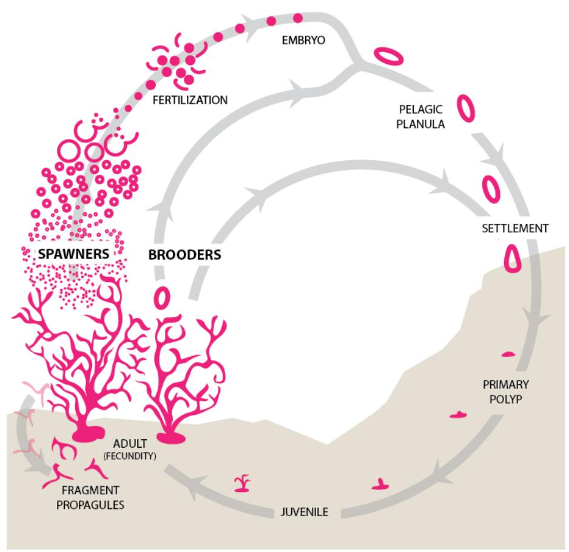

Figure 2.2.1. Diversity of coral life cycle showing different life history stages for broadcast spawners versus brooders, as well as asexual fragmentation. Coral life cycles are replete with vulnerable stages. Spawners have more extensive stages (and bottlenecks) that occur in the water column (fertilization and larval development with at least several days development time to competency). Brooders have internal fertilization (either selfed or with sperm that transits from a nearby colony) and larval development takes place inside the mother colony–hence fewer processes that occur in the water column. Some brooders have "crawl away" larvae that settle in immediate proximity to the parent while others have larvae that can swim for hours to a couple of days. Establishment of fragments from adult colonies is an important asexual mode of reproduction for many coral species. Post-settlement benthic stages are extremely vulnerable and poorly known, given their extremely small size and, in many species, slow growth rates, with the transition from primary polyp to a visible juvenile taking from 3 to 12 months. The transition from visible juvenile to reproductive adult may range from 1 to several (5–10) years. Diagram prepared by Amanda Toperoff, NOAA PIFSC.

Because coral larvae are relatively poor swimmers, their dispersal distances will largely depend on the duration of the pelagic phase and the speed and direction of water currents transporting the larvae (Scheltema, 1986). Brooded planulae can settle shortly (hours) after release (Carlon and Olson, 1993), but can have extended competency periods of 30–100 days (Harrigan, 1972; Richmond, 1987; 1988). Spawned larvae can have much longer competency periods—for example, Graham et al. (2008) documented maximum larval lifespans ranging from 195 days (*Favia pallida*) to 244 days (*Montastraea magnistellata)*. The observed extended periods of competency suggest that the potential for long-term dispersal of coral larvae may be substantially greater than previously thought. This may partially explain the large geographic ranges of many species (Hughes et al., 2002), although local retention of larvae is certainly possible (Black et al., 1991; Vollmer and Palumbi, 2007). Detection of increasing mortality rates late in larval life suggests that energy reserves do not reach critically low levels until approximately 100 days after spawning (Graham et al., 2008), although conditions of physiological stress likely increase energy demands of larvae and energy limitation may lead to mortality or poor habitat choice (Vermeij et al., 2006).

In general, on proper stimulation, coral larvae, whether brooded by parental colonies or developed in the water column, settle and metamorphose on appropriate substrates. Some evidence indicate that chemical cues from crustose coralline algae, microbial films, and/or other reef organisms (Gleason et al., 2009; Morse et al., 1996; Morse et al., 1994; Negri et al., 2001) and acoustic cues from reef environments (Vermeij et al., 2010) stimulate settlement behaviors. Initial calcification ensues with the forming of the basal plate. Buds formed on the initial corallite develop into daughter corallites. In some species, it appears that there is virtually no limit to colony size beyond structural integrity of the colony skeleton, as polyps apparently can bud indefinitely. Once larvae are able to settle onto appropriate hard substrata, metabolic energy is diverted to colony growth and maintenance. Because newly settled corals barely protrude above the substratum, juveniles need to reach a certain size to limit damage or mortality from threats such as grazing, sediment burial, and algal overgrowth (Bak and Elgershuizen, 1976; Birkeland, 1977; Sammarco, 1985). Post-settlement mortality can also approach 100% (Harriott, 1985) over the first year for some species and/or habitats. Spatial and temporal patterns of coral recruitment have been intensively studied (Baggett and Bright, 1985; Bak and Engel, 1979; Birkeland, 1977; Chiappone and Sullivan, 1996; Hughes et al., 1999b; Rogers et al., 1984; Sammarco and Andrews, 1989). Biological and physical factors that have been shown to affect spatial and temporal patterns of coral recruitment include substratum availability and community structure (Birkeland, 1977), grazing pressure (Rogers et al., 1984; Sammarco, 1985), fecundity, mode, and timing of reproduction (Harriott, 1985; Richmond and Hunter, 1990), behavior of larvae (Goreau et al., 1981; Lewis, 1974), hurricane disturbance (Hughes and Jackson, 1985), physical oceanography (Baggett and Bright, 1985; Fisk and Harriott, 1990), the structure of established coral assemblages (Harriott, 1985; Lewis, 1974), and chemical cues (Morse et al., 1988). Relatively few studies, however, have examined variation in coral recruitment over larger spatial scales (10–100 km) or among different structural types of reefs (Fisk and Harriott, 1990; Harriott and Fisk, 1987; Hughes et al., 1999b; Hughes and Connell, 1999; Wallace and Bull, 1981). In many studies of western Atlantic reefs, a proxy measure of recruitment success has been the quantification of juvenile coral densities, with juvenile corals defined as newly settled and metamorphosed corals visible underwater to the unaided eye ranging up to 4 cm in maximum diameter (Bak and Engel, 1979). Newly settled corals are visible in the field at approximately 5-10 mm in diameter and, for a range of Caribbean species, colonies approaching 4 cm in diameter are approximately 1-2 vears old (Van Moorsel, 1988).

Besides sexual reproduction, many coral species also reproduce asexually. Asexual reproduction most commonly involves fragmentation, where colony pieces or fragments are dislodged from larger colonies to establish new colonies (Highsmith, 1982), although the budding of new polyps within a colony can also be considered asexual reproduction. The successful recruitment of fragments depends greatly on species and habitat conditions, and low survivorship of fragments implies that it is not necessarily an adaptive "strategy" for reproduction (Smith and Hughes, 1999). Fragmentation can occur during storms (Highsmith, 1982; Porter et al., 1981; Tunnicliffe, 1981), with susceptibility to mechanical breakage of colony branches influenced by the boring activities of sponges and lithophagus bivalves. Fragmentation is common and can be the dominant means of propagation in many species of branching corals (Adjeroud and Tsuchiya, 1999; Bak and Criens, 1982; Davis, 1977; Gilmore and Hall, 1976; Hughes, 1985; Hunter, 1993; Tunnicliffe, 1981). Asexual production of brooded larvae, yielding dispersing planulae that are genetically identical to the parent colony has also been shown for a few scleractinian species (Ayre and Resing, 1986). Accelerating development of genetic tools will likely continue to detect colonies with the same genotype (implying one was produced asexually from the other) within more species.

#### 2.2.2 Nutrition

Reef-building scleractinian corals are active in more than one trophic level simultaneously (mixotrophy) and many act as plants during the day and as animals during the night or some combination of the two at any time. The high gross primary productivity of coral reef ecosystems in oligotrophic environments is maintained by advection processes (i.e., import of nutrients from other habitats; Atkinson, 1992), nutrient recycling (Szmant-Froelich, 1985), and mixotrophy (ability to derive nutritional needs both from photosynthesis of symbionts and from prey) of corals. During the daylight hours, corals can be considered (as holobionts) to function as primary producers. For some species, up to 100% of the daily caloric needs of coral colonies can be provided by photosynthetically fixed carbon translocated from the mutualistic intracellular symbiotic dinoflagellates (Muscatine et al., 1981). However, neither the coral nor the dinoflagellates (zooxanthellae) can actually grow on the energy-rich, nitrogen-poor "junk food" (Falkowski et al., 1984) from photosynthesis that satisfies their caloric needs for maintenance but does not provide needed nutrients. For some corals, advection and uptake of organic sources (dissolved free amino acids) from the water provides 24% and inorganic sources (NH4+ and NO3) 74% of the daily nitrogen requirements (Bythell, 1990; Grover et al., 2008). At night, many corals extend their tentacles and feed on zooplankton. These prey provide nitrogen and other nutrients and so predation

on zooplankton can reduce the uptake of free amino acids (Al-Moghrabi et al., 1993) and ammonium (D'Elia and Cook, 1988) by corals.

Excess production of fixed carbon by zooxanthellae can be stored as lipids by some corals, providing as much as 10%—40% of total biomass (Grottoli et al., 2004; Stimson, 1987). This stored supply of lipids can serve as a reserve for some corals during periods of bleaching (Rodrigues et al., 2008) and indeed, lipid stores can provide a better predictor of mortality risk for bleaching corals than chlorophyll-a concentrations (Anthony et al., 2007; Grottoli et al., 2004). These energy reserves can be maintained following bleaching when the coral shifts from relying on production of zooxanthellae to predation on zooplankton (Grottoli et al., 2006). It is generally assumed that corals with large polyps tend to be more heterotrophic (feeding on zooplankton) while those with smaller polyps tend to be more autotrophic (the holobiont relying more directly on photosynthesis). Corals with relatively large polyps such as *Montastraea cavernosa* are known to prey upon a diverse assortment of holoplankters and meroplankters (Porter, 1976).

#### 2.2.3 Calcification and reef building

The biodiversity of coral reef ecosystems and high rates of primary production in wide geographic regions with relatively nutrient-poor waters are, to a great extent, the result of the structures built by corals and other calcifying reef organisms (Lewis, 1981). Coral reefs have been defined or characterized in numerous ways on the basis of rigidity, location, framework elements, sediments, and biological diversity. To that end, Fagerstrom (1987) listed several definitive characteristics of coral reefs:

- A rigid framework is present;
- The skeletons of other calcareous microstructures are abundant;
- Structures have positive topographic relief;
- Framework organisms have rapid growth rates; and
- Taxonomic diversity is high, with several ecological functional groups.

Scleractinian corals build reef structures by combining calcium and carbonate ions derived from seawater into aragonite (or calcite) crystals that form their skeletons. Because carbonate (CO32-) ions are rare in seawater equilibrium, this process requires metabolic energy (Cohen and Holcomb, 2009). Corals bring bicarbonate (HCO3-) from seawater into internal extracellular compartments where the corals physiologically maintain elevated pH that allows the conversion of bicarbonate to carbonate ions for precipitation as calcium carbonate crystals. This effective rapid deposition of calcium carbonate material allows the formation of coral reef skeletons that are often then bound together by cementation (external to the corals) to form coral reefs. The coral skeletons are predominantly composed of aragonite (Stanley, 2006), while reef cements are composed of aragonite and high-magnesium calcite (Rasser and Riegl, 2002). The effectiveness of scleractinian corals at calcifying is directly related to their mutualism with zooxanthellae, either through energetic subsidies from photosynthesis (Pearse and Muscatine, 1971), changes in carbonate equilibrium resulting from photosynthesis (Goreau, 1959), or the removal of phosphate that inhibits calcification (Simkiss, 1964).

It is also important, for the purposes of this Status Review Report, to emphasize that many corals populate nonstructural coral communities (e.g., Riegl, 1999; Semon, 2007), whereby their abundance or growth rates may be too low to accrete reef structure and/or antecedent substrates may be non-carbonate (e.g., volcanic or sandstone).

#### 2.2.4 Clonality and genetics

Most corals are clonal, colonial invertebrates, which distinguishes them from many species that have been considered for listing under the U.S. Endangered Species Act. Colony growth occurs by the addition of new polyps. By the same token, colonies can exhibit partial mortality whereby a subset of the polyps in a colony die, but the colony persists. Colonial species present a special challenge in determining the appropriate unit to evaluate for status (i.e., abundance).

In addition, new coral colonies, particularly in branching species, can be added to a population by fragmentation (breakage from an existing colony of a branch that reattaches to the substrate and grows) as well as by sexual reproduction (see above, and Fig. 2.2.1). Fragmentation results in multiple, genetically identical colonies (ramets) while sexual reproduction results in the creation of new genotypes (or genets). Thus, in corals, the term "individual" can be interpreted as the polyp, the colony, or the genet (Hughes et al., 1992).

In clonal species, there are multiple levels of genetic diversity. Because a coral colony can proliferate by fragmentation, there may be many colonies on a reef, but only one or a few genets; that is, most or all of the colonies may have originated from fragments of a single colony. They share the same genotype, as do identical twins. The first level of analysis of any population genetic study of a highly clonal species would be to determine how many genetically distinct individuals (genets) are represented by the individual colonies found, whether on a given reef or throughout its range. This is termed the "genotypic diversity" and simply indicates the number of genetic individuals. Genotypic diversity is influenced by the relative contribution of sexual vs. asexual reproduction in a population. Because fragmentation (asexual) and sexual reproduction occur simultaneously and to varying degrees in clonal species populations, genotypic diversity can vary widely, even at small spatial scales (Ayre and Hughes, 2000; Baums et al., 2006; Hunter, 1993). Single clones may dominate or exclusively occupy areas of tens to hundreds of square meters. At the other extreme, virtually every colony at this scale might consist of genetically distinct individuals that recruited via sexual reproduction. If there is low genotypic diversity within individual stands and/or across the region, it might suggest that a clonal species' status is under much greater extinction risk than would be judged from its overall abundance. The importance of genotypic diversity is discussed in Chapter 4, Section 4.4: "Diversity in Corals."

The next level of analysis concerns the "genetic diversity" at the genet level. The diversity measured at this level is directly comparable to what would be commonly measured in a vertebrate, for example. Genetic diversity describes the number of variants (alleles) of each gene that are present in the population and how these variants are distributed among individuals. Processes such as genetic drift, inbreeding, and selection all influence genetic diversity. Both aspects, genotypic and genetic diversity, are important to consider when assessing extinction risk.

Although scientists are increasingly applying genetic tools to understand the structure of coral populations, this line of research is still in relative infancy. This lack of information, combined with the clonal nature of corals, has profound implications for the consideration of species in an Endangered Species Act petition. For example, a BRT examining the status of killer whales may know all individuals within a population, all of which are genotypically unique, and a salmonid petition may be relatively easily constrained by species boundaries. This is not possible for corals, for which the definitions of a species and a population are to some degree open questions. Therefore, this BRT assessed each candidate coral species based upon the best assessment of range, distribution, abundance, and taxonomy of the species at the time of this Status Review Report (see Section 2.1.2: "Species delineation and uncertainty in corals").

#### **2.3 Ecology of Coral Reef Ecosystems**

#### **2.3.1 Ecosystem roles of coral reefs**

A coral reef is a complex three-dimensional structure providing habitat, food, and shelter for numerous marine species and, as such, fostering exceptionally high biodiversity. Scleractinian corals are the primary purveyors of this architectural structure, and thus are foundational species for these generally productive ecosystems. It has been estimated that coral reef ecosystems harbor around one third of all marine species even though they only make up 0.2% in area of the marine environment (Knowlton et al., 2010; Veron et al., 2009). While scleractinian coral species themselves constitute on the order of less than 1000 species worldwide (so far described), existing estimates for reefassociated species range between 1 and 9 million species (Knowlton et al., 2010; Small et al., 1998). It is estimated that between 7.2% and 53.6% of coral reef-associated species have highly restricted ranges (Roberts et al., 2002). Such vulnerable endemics tend to be clustered in geographic centers of endemism, the ten richest of which cover about 16% of the world's coral reefs but include about half of the restricted-range species (Roberts et al., 2002). Coral reefs are crucial in supporting the high diversity and abundance of these marine organisms and in maintaining a genetic bank for future generations.

Coral reefs serve the following essential functional roles: primary production and recycling of nutrients in relatively oligotrophic seas (Hatcher, 1990), calcium carbonate deposition yielding reef construction, sand production, modification of near-field or local water circulation patterns, and habitat for secondary production, including fisheries (Moberg and Folke, 1999). These functional roles yield important ecosystem services in addition to direct economic benefits to human societies (Moberg and Folke, 1999) such as traditional and cultural uses, food security, tourism, and potential biomedical compounds (Bruckner, 2002). Coral reefs protect shorelines, coastal ecosystems, and coastal inhabitants from high seas, severe storm surge, and tsunamis. Although it is difficult to put monetary values on coral reefs as their intrinsic value is priceless, the goods and services they provide have been estimated at between \$172 billion to \$375 billion (U.S.) per year (Costanza et al., 1997; Martínez et al., 2007). It has been estimated that coral reefs

provide net economic benefits of \$360 million a year in Hawai`i with an overall asset value estimated at nearly \$10 billion (Cesar and Beukering, 2004).

In summary, society relies heavily, both in ecological and economic terms, upon the goods and services provided by coral reef ecosystems. The majority of the ecological functions are dependent on the complex and dynamic interactions between networks of species, such as microbes, plants, herbivores, top predators, and corallivorous predators. However, calcifying coral species are the foundation species in building and maintaining the architectural structures that define coral reef ecosystems.

#### **2.3.2 Habitat requirements of corals and reefs**

Coral reefs are formed on solid substrate but only within the narrow range of suitable environmental conditions that allows the deposition rates of corals and other reef calcifiers to exceed the rates of physical, chemical, and biological erosion. Environmental conditions needed to sustain coral reef habitats include relatively narrow ranges of temperature, salinity, turbidity, pH, and light (Kleypas, 1997). At regional and site levels, temperature is a particularly important limiting factor for tropical and subtropical scleractinian corals. Corals occur in a fairly wide temperature range across geographic locations (at least 18°C–32o C), accomplished via either adaptation (genetic changes) or acclimatization (physiological or phenotypic changes). Though there are exceptions, reef corals tend not to thrive in areas with mean temperatures outside a fairly narrow range (typically 25°C–30°C). Short-term exposures (days) to temperature increases of a few degrees (i.e., 3°C–4°C increase above climatological mean maximum summer temperature) or long-term exposures (several weeks) to minor temperature increases (i.e., 1°C–2°C above mean maximum summer temperature) can cause significant thermal stress and mortality to most coral species (Berkelmans and Willis, 1999; Jokiel and Coles, 1990). Such temperature thresholds are variable in both time (e.g., season) and geographic location (i.e., latitude and longitude) and may be nonlinear. For example, in the Arabian Gulf, where corals have adapted to one of the lowest ambient winter temperatures recorded in reef areas, coral mortality occurred when on four consecutive days the water temperature dropped to 11.5°C and stayed at 13°C for 30 days but corals were not damaged at sites where temperature was 12.5°C for 2 days and mean temperatures were 14°C for 5 days (Coles and Fadlallah, 1991). In such locations and other high latitude reefs, such as the Northwestern Hawaiian Islands (Hoeke et al., 2006), corals have adapted to tolerate significant seasonal cycles of temperature of 10°C in magnitude and greater. However, despite adaptation to extremely high summer (and low winter) temperatures, corals in such areas bleach when their normal maximum and minimum temperature tolerances are exceeded. For example, bleaching occurred in the Arabian Gulf in 1996, 1998, and 2002 when temperatures remained warmer than 35°C–36o C for greater than three weeks (Riegl, 2002), and in 2010 corals bleached and died in both the Red Sea and Arabian Gulf (news reports). Over shorter time periods (hours to days), corals have commonly survived water temperatures exceeding the mean maximum temperatures for their area and exposure. For instance, corals in relatively enclosed shallow waters in American Samoa have been shown to survive temperature increases to 35°C, well above the maximum monthly mean (Craig et al., 2001).

Other factors influencing the habitat suitability for corals are light (Yentsch et al., 2002) and water quality (Szmant, 2002), both affected by nutrient enrichment, sedimentation/turbidity, and pollutants. Reef-building corals require light for photosynthetic performance of endosymbionts, though different zooxanthellae strains are specialized to different light regimes. A study on the Great Barrier Reef on the influence of siltation and nutrient enrichment on benthic assemblages revealed that turbid inshore waters can support a high diversity of corals (80% of the hard coral species known to occur in the Great Barrier Reef were recorded) but 50% of the species present at the least nutrient-enriched environment were missing (Fabricius et al., 2005). Within this study, the moderately-resilient, long-lived and relatively bleaching-insensitive families Agariciidae, Mussidae, and Faviidae, and the pioneer family Pocilloporidae were relatively tolerant of poor water quality (Fabricius et al., 2005). Sediments, nutrients and other pollutants can also impair the recruitment of corals (Fabricius, 2005).

Depth distributions of corals are generally limited by light (Graus and Macintyre, 1989; Titlyanov and Latypov, 1991; Yentsch et al., 2002). Each of the 82 candidate coral species are found on shallow tropical and subtropical reefs in depths of less than 30 m (within the upper photic zone), although some may find refugia in deeper or mesophotic reefs. As most research has thus far been conducted in these relatively shallow waters, data on depth distributions for most species are incomplete. Carpenter et al. (2008) reviewed depth distribution data for 845 coral species and listed 49% of those species where depth data were available (681 species) as restricted to shallow water (≤ 20 m) habitats. However, this number is likely an overestimate as mesophotic (depth of 30–150 m) reef research is still in its infancy, and it is possible that many more coral species also occur in these deeper mesophotic habitats. Only recently have scientists begun investigating mesophotic coral ecosystems and gained a greater appreciation for the extent of coral reefs in mesophotic depths (Kahng et al., 2010; see recent special issue in the journal Coral Reefs vol 29, no2; Lesser et al., 2009). This has led to the hypothesis that mesophotic reefs may provide refugia habitat and replenishment potential for presumably more vulnerable shallow reef populations of taxa that can occupy both shallow and mesophotic reef habitats (Bongaerts et al., 2010; Lesser et al., 2009). However, this potential remains mostly hypothetical, and threats and conditions of shallow reef systems are much better characterized. Clearly, at least some of the 82 candidate species occur in mesophotic as well as shallow habitats (Garcia-Sais, 2010; Kuhlmann, 1983), though there is very limited specific knowledge of species abundances or of the extent of their distribution in mesophotic reefs, primarily due to operational challenges and costs associated with working at these depths.

Waves and currents are additional environmental conditions influencing coral habitat and distribution as corals have species-specific tolerances (Dollar, 1982; Geister, 1977a; Graus and Macintyre, 1989). The hydrodynamic conditions that influence coral reefs vary over a broad range of spatial scales from regional (thousands of km) to local (sub-meter), with flows dependent on surface gravity waves (seas and swell), tides, wind, topographic and equatorial upwelling, and large-scale thermohaline circulation. Water motion influences the growth, mortality, and reproductive rate of each species adapted to a specific hydrodynamic zone; for example, in Hawai`i *Pocillopora meandrina* is restricted to high surge or wave energy habitats (Jokiel, 1978). Recent research also suggests that water motion may provide protection to corals by increasing their thermal tolerance to bleaching (Lenihan et al., 2008; Nakamura and Yamasaki, 2005), likely by facilitating diffusion of toxic metabolites and providing increased food supply.

#### **2.3.3 Global habitat condition**

There is broad scientific consensus that coral reef ecosystems are being rapidly degraded worldwide (Bellwood et al., 2004; Bruno and Selig, 2007; Wilkinson, 2008). Although scientists debate the relative importance of the many different causes of coral reef degradation (fishing, pollution, disease, climate change), it is clear that in many locations coral cover has decreased dramatically over the past few decades. Coral reefs are at the receiving end of watersheds and are, therefore, subject to multiple threats from both land-conversion in those watersheds and from any coastal development which allows easier land-based access to exploitable marine resources (e.g., Waddell, 2005). Coral reef ecosystems have also deteriorated in response to climate change. Over the last few decades, concerns have primarily focused on increases in water temperature and resulting mass coral bleaching and disease epizootics. More recently, additional attention has been given to the effects of ocean acidification on marine calcifying organisms (Hoegh-Guldberg et al., 2007; Veron, 2008). Current projections about global increases in atmospheric carbon dioxide concentrations and water temperature predict a significant loss of corals and other calcifying marine organisms, resulting in reduced diversity of reef communities and a reduced resilience of corals to local stressors (Hoegh-Guldberg et al., 2007). These threats will be described more fully in the next chapter.

#### **2.3.4 Phase shifts**

Coral reefs are described as space-limited systems and, thus, it is thought that competition for space is an important structuring factor. Some types of reef benthic organisms (e.g., macroalgae) have higher growth rates and, hence, potentially greater competitive ability than corals. When disturbances such as disease, predation, or physical damage cause mortality of corals, new habitat (space) becomes available to populations of non-reef-building organisms, such as soft corals, zoanthids or, more often, fast-growing macroalgae (Aronson and Precht, 2006). In extreme cases, "phase shifts" can change the community structure from coral-dominance to macroalgae-dominance (Bellwood et al., 2004; Done, 1992; Hughes, 1994). Such phase shifts may be persistent and difficult to reverse (Mumby et al., 2007b; Sutherland, 1974), as macroalgal occupation of reef space severely impedes recruitment of corals via alleopathy and sediment binding as well as direct occupation of space (Birrell et al., 2008; Kuffner et al., 2006; McCook et al., 2001). Phase shifts may be reversible in theory (Mumby, 2009) and in practice (Ayre and Hughes, 2000; Diaz-Pulido et al., 2009; Hughes et al., 2007; Idjadi et al., 2006), via enhanced grazing, coral growth and/or recruitment. Over the past several decades many reefs, primarily in the Caribbean, have been described as undergoing phase shifts which are attributed to loss of macroalgal control via reduced grazing, to some extent increased nutrient resources for the algae, and/or simply massive increases in available space resources because of widespread coral mortality (Aronson and Precht, 2006; Hughes, 1994; Hughes et al., 2007; Williams et al., 2001). At least at some Jamaica sites, reported phaseshift reversals have been observed as short-lived with a repeated coral cover collapse in association with the 2005 mass coral bleaching event and subsequent predation (Quinn and Kojis, 2008). There is some semantic debate as to what constitutes "macroalgal dominance," whether many reefs are habitat limited, and whether phase shifts are pervasive on global scales (Bruno et al., 2009; Vroom et al., 2006).

In some locations, such as Hawai`i, proliferation of invasive exotic macroalgal species is an added driver of phase shifts (Conklin and Smith, 2005). On some degraded reefs around O`ahu Island, populations of herbivorous fishes have been severely reduced by fishing (Friedlander et al., 2008). The resulting low grazer populations have almost certainly contributed to those reefs' vulnerability to algal blooms (Williams et al., 2007).

Coral reef phase shifts have also been described in which scleractinian corals are replaced by other invertebrates rather than by macroalgae (Aronson et al., 2004; Work et al., 2008) and, at times, have been precipitated by acute anthropogenic disturbances such as shipwrecks (Hatcher, 1984; Work et al., 2008) or by hurricanes (Hughes, 1994; Rogers and Miller, 2006).

#### **2.3.5 Resilience of corals and coral reefs**

While the term 'resilience' has appeared in the ecological literature with various shades of meaning (for some review and discussion see Beisner et al., 2003; Moss et al., 2010), the following more or less vernacular definitions will be intended within this Status Review Report. Resilience is the capacity of a reef or population to recover1 from damage by a major disturbance such as a disease outbreak or tropical storm; in other words, its capacity to "bounce back" from a disturbance rather than assuming an alternate (phase-shifted) state. The term resistance is somewhat different, indicating that the organism or population in question can experience a stressor (e.g., a storm or exposure to a pathogen) without measurable detriment. Resilience is affected by the frequency, intensity, and nature of a disturbance, as well as the life history and status of the organisms involved. Natural communities, including coral reefs, are resilient as there are many descriptions in the literature of rapid natural recovery following disturbances (e.g., storm damage). Based on their high biological diversity, coral reef ecosystems likely have increased functional redundancy, which is expected to provide increased resilience compared with less diverse ecosystems. However, this capacity of organisms and natural systems can by degraded by sequential, chronic, and multiple disturbances, physiological stress, and general environmental deterioration (Nyström et al., 2000). This loss of resilience can also lead to phase shifts. Loss of resilience may take many forms including increased disease susceptibility, impaired reproduction and recruitment, loss of functional diversity/redundancy in communities, and reduced individual growth rates. The complex sexual reproductive cycles of scleractinian corals include many vulnerable stages (Fig. 2.2.1) that environmental stress and disturbance can impair (Ritson-Williams et al., 2009); see discussions on depensation in Sections 4.5 and 4.6.

#### **2.4 Status and Recent Ecological History of Caribbean Reefs**

The Caribbean basin is geographically small and partially enclosed, biologically well-connected, and has relatively high human population densities with a long history of disturbances from human activities to coral reef systems across the basin (Mora, 2008; Roberts, 1997). Fishing has affected Caribbean reefs since prior to European contact (Jackson, 1997; Wing and Wing, 2001). A series of basin-scale disturbances, beginning in the early 1980s, has led generally to an altered community state and an apparent loss of resilience in Caribbean reefs. Massive, Caribbean-wide mortality events, apparently from disease conditions, of both the keystone grazing urchin *Diadema antillarum* (Lessios, 1988) and the dominant branching coral species *Acropora palmata* and *Acropora cervicornis* (Aronson and Precht, 2001) spread throughout the Caribbean and precipitated widespread and radical changes in reef community structure (see Section 2.3.4 above on phase shifts). It is likely that the keystone status of *Diadema* (i.e., the overarching importance of *Diadema* grazing on early 1980s Caribbean reefs) was a result of long-term overexploitation of reef fish (Hay, 1984; Knowlton, 1992) and represented an aspect of resilience whereby urchins had functionally substituted for the loss of herbivorous fish. In addition, continuing coral mortality from periodic acute events such as hurricanes, disease outbreaks, and mass bleaching events has added to the depauperate state of Caribbean coral populations (Aronson et al., 2002; Bruckner and Hill, 2009; Miller et al., 2009; Wilkinson and Souter, 2008) and yielded a remnant coral community with increased dominance by weedy brooding species (Aronson et al., 2004; Green et al., 2008).

None of these three important keystone species (*Acropora palmata*, *Acropora cervicornis*, *and Diadema antillarum*) have shown much recovery over decadal time scales. While *Diadema* is now attaining higher densities in some regions of the Caribbean with consequent improvements in reef status (Aronson and Precht, 2000; Carpenter and Edmunds, 2006), its recovery has taken multiple decades and has not yet reached all areas (Chiappone et al., 2002). Nowhere have *Diadema* densities reached levels comparable to pre-dieoff abundances. The two *Acropora* spp. corals have failed to recover at anything like a regional scale, resulting in their Endangered Species Act listing as threatened in 2006. In addition, coral growth rates have been declining over decades. The rate of calcification in *Diploria labyrinthiformis* in

1 The term 'recover' here is meant in the ecological sense (i.e., an organism, population, or community naturally moving back toward the pre-disturbance state), not in the U.S. Endangered Species Act statutory sense.

Bermuda has decreased by over 25% since 1959 (Cohen et al., 2008), *Acropora palmata* branch extension rates have declined substantially in Curacao (Bak et al., 2009), and juvenile coral growth rates among all species in the U.S. Virgin Islands over the past decade are substantially lower than reported in previous literature (Edmunds, 2007). Caribbeanwide meta-analyses have suggested that the current combination of disturbances, stressful environmental factors, and potentially depensatory states have yielded poor resilience, even to natural disturbances such as hurricanes (Gardner et al., 2005). These wide-scale changes in coral populations and communities have affected habitat complexity (Alvarez-Filip et al., 2009) and may have already begun feeding back in reduced overall reef-fish abundances (Paddack et al., 2009).

In combination, these regional factors were considered by the BRT to contribute to elevated estimates of extinction risk for Caribbean species.

#### **2.5 Contrasts between Caribbean and Indo-Pacific Reefs**

The history of diversification and extinction of reef-building corals, starting several million years after the Paleocene-Eocene Thermal Maximum in the early Cenozoic (about 50 Ma), differed greatly among the Indo-Pacific, the eastern Pacific, and the wider Caribbean. In the Indo-Pacific, coral diversity has been substantially increasing since the Eocene (56 to 34 Ma), while the number of hermatypic coral genera has decreased by almost half in the Atlantic, and reefs and hermatypic corals may have periodically been eliminated altogether in the eastern Pacific. Although there were a few endemic genera in the wider Caribbean (e.g., *Mussa, Isophyllia*, and *Manicina*, while *Agaricia, Mycetophyllia, Dendrogyra, Diploria, Colpophyllia* and others thought of as Caribbean corals were inherited from the ancient Tethys Sea), there has been a general decrease in numbers of genera, especially during two major periods of extinctions. Fukami et al. (2004) have discovered that some of the representatives of different genera in the greater Caribbean are more closely related to each other than they are to their respective congeners in the Pacific, suggesting that some of the genera considered cosmopolitan might be represented by cryptic endemic genera in the Caribbean. Both coral reefs and the number of genera of corals decreased in the late Oligocene, about 24 Ma. The second episode of extinction occurred as carbonate deposition increased and reefs flourished, between 2 and 1 Ma (O'Dea et al., 2007). Of 48 genera of Caribbean hermatypic corals, 23 went extinct in the Cenozoic but are still extant and widespread in the Indo-Pacific (Indian and Pacific Oceans; Paulay, 1997). The eastern Pacific has generally been a region of marginal conditions for coral reefs throughout the Cenozoic. Corals now known only in the Caribbean were found in the eastern Pacific until they all went extinct sometime in the Pliocene (5.4 to 2.4 Ma). Although the provenance of sandy and hard rock habitat fauna in the eastern Pacific is still the western Atlantic (Paulay, 1997), the origin of coral-reef fauna has been the central Pacific since sea level stabilized about 5000 years ago (Dana, 1975; Paulay, 1997).

The Indo-Pacific is enormous and hosts much greater coral diversity than the much smaller Caribbean region (approximately 700 described species compared with 65 described Caribbean species; Table 2.5.1). Size and diversity, as well as some vast expanses of ocean area with only very local, spatially limited, direct human influences, may have provided substantial buffering of Indo-Pacific corals from most of the assaults and declines manifest across the Caribbean. While the reef communities in the wider Caribbean have lost resilience (see Section 2.4), the reefs in the central Pacific, e.g., American Samoa (Birkeland et al., 2008), Moorea (Adjeroud et al., 2009), Fiji (Lovell and Sykes, 2008), Palau (Golbuu et al., 2007), and the Northwestern Hawaiian Islands (Kenyon et al., 2006) appear to remain resilient to date despite major bleaching events, tropical cyclones, and crown-of-thorns seastar (*Acanthaster planci*) predation outbreaks. However, consensus is building that these buffering factors simply have put the Indo-Pacific on a slower journey down a similar road of decline rather than a qualitatively different trajectory (Bruno and Selig, 2007; Done et al., 2008; Galloway et al., 2009; Pandolfi et al., 2003). Indeed, recent meta-analysis of overall coral status throughout the region has indicated that substantial loss of coral cover has already occurred in most subregions of the Indo-Pacific and as of 2002–2003 stand at around 20% live cover (Bruno and Selig, 2007).

Table 2.5.1. Summary of regional coral diversity. Eastern Pacific numbers from Glynn and Ault (2000) but genera and species reduced by 1 each as Siderastrea glynni is probably introduced from the Caribbean (Forsman et al., 2005). The other numbers are from Paulay (1997).

| Reef-building corals | Indo-Pacific | East Pacific | West Atlantic | East Atlantic |
|----------------------|--------------|--------------|---------------|---------------|
| Genera               | 91           | 10           | 25            | 8             |
| Species              | ~700         | 40           | 65            | 14            |

The vast size of the Indo-Pacific region has had at least four additional major effects on the biota. First, while diseases in the wider Caribbean, such as those effecting *Diadema antillarum* (see Section 2.4) and commercial sponges have spread throughout the region within a year, epizootics such as pearl oyster mortality have stayed within Pacific archipelagoes because of the degree of separation of archipelagoes in the basin. Second, the geologic record shows several major bouts of extinction in the western Atlantic during the Cenozoic, but none are known in the Indo-Pacific. At the Oligocene-Miocene boundary (21–27 Ma) and another in the Pliocene-Pleistocene (~ 1.6 Ma), more than 20 genera of corals went extinct in the western Atlantic that are still abundant in the Pacific (relictual endemics, e.g., *Stylocoeniella*, *Pocillopora, Stylophora, Astreopora, Alveopora, Goniopora, Coscinarea, Psammocora, Gardineroseris, Pavona*, G*alaxea, Hydnophora, Caulastrea, Diploastrea, Favites, Goniastrea, Leptoria, Platygyra, Trachyphyllia, Euphyllia, Heteropsamia, Turbinaria*) (Edinger and Risk, 1995). It seems the relatively small western Atlantic has always been more vulnerable to mass extinctions than the huge water mass of the west-central Pacific. Third, the distance between archipelagoes facilitates endemism. The greatest numbers of endemic scleractinian species (31) are found in the center of diversity (the Coral Triangle), but the greatest proportions of endemic scleractinians are found in the more remote archipelagoes (20% of Hawaiian scleractinian nominal species are endemic). Fourth, while the wider Caribbean is a relatively homogeneous region, there is a striking gradient in diversity in the Pacific, declining from west to east. For example, the Coral Triangle hosts 581 species, 81 genera, and 16 families of reef-building scleractinians (Veron, 2000), while French Polynesia (Society, Tuamotus, Australs and Gambier Archipelagoes) hosts 163 species, 38 genera and 13 families and the far eastern Pacific (Easter Island, Fanning Island, Galapagos, Malpelo, Clipperton, Cocos, Revillagigedo, and the coast from Mexico to Ecuador) hosts 49 species, 12 genera, and 7 familes (Glynn et al., 2007).

#### **2.6 Status and Ecological History of Eastern Pacific Reefs**

The eastern Pacific Ocean consists of two primary reef domains: the coastal reefs and nearshore islands, and the offshore islands. These reefs exist from Mexico in the north to Ecuador in the south, and from the coast out to the remote Revillagigedo, Clipperton, Cocos, Malpelo, and Galápagos Islands. All are spatially separated from the reefs of the Indo-West Pacific such that there is little connectivity across the Pacific, isolating the eastern Pacific coral reefs (Glynn, 1982; Glynn and Ault, 2000). Unlike the well-studied Caribbean, much less work has been done on corals and coral reefs of the eastern Pacific and this region was long considered to be lacking of significant coral reef communities, diversity, and structure (Durham, 1966; Stoddart, 1969; Yonge, 1940). More recent work has characterized the corals and coral reefs of the region, describing the significant coral reef resources that exist in the eastern Pacific, while at the same time indicating their high potential for ecosystem transition from one stable state to another and loss of species as discussed below**.** 

In his pioneering work on coral reefs of the eastern Pacific since the 1970s, Glynn and colleagues described the general characteristics of eastern Pacific reefs (Cortes, 1993; Glynn, 1976) and their growth (Glynn and Macintyre, 1977), the first observation of regional-scale mass coral bleaching (in that case related to the 1982/1983 El Niño) (Glynn, 1984), and the first case of a probable extinction of a coral species in recent history (De Weerdt and Glynn, 1991). Those studies have revealed an environment that may be one of the least hospitable to reef development and coral biodiversity (Glynn, 1997), even to the point of an almost complete lack of Quaternary fossil reefs (Cortes, 1993). Eastern Pacific reefs and coral populations are hindered from recovery by their extreme spatial separation and distance from source populations of coral diversity (Glynn, 1982; Glynn and Ault, 2000). Durham (1966) even postulated that extinction at the level of genera has been common in the eastern Pacific. Glynn (1997) has documented that since 1980 six of the 40 known reef-building scleractinian and hydrocoral species in the eastern Pacific have possibly become extinct or locally extirpated (Table 2.1 in Glynn, 1997).

After separation from the Caribbean around 3.5 Ma (Cortes, 1993), it is quite likely that earthquakes and fluctuating climate and sea level eliminated extant coral reefs in the eastern tropical Pacific and prevented formation of new ones until the Holocene (Cortes, 1993). Severe climate swings continue to be a hindrance to reef growth today, with major losses of coral cover and even reef loss from Mexico to the Galápagos Islands (Glynn, 1984; 1988a; 1990; 2000; Glynn and Ault, 2000; Glynn et al., 2001; Reyes-Bonilla et al., 2002). Additionally, climatic variability not only has killed corals in recent decades, it has resulted in major loss of reef structure. This has come about through temperature variability (both extreme upwelling and high temperatures during El Niño), storm events, and changes in the abundance, distribution, and behavior of both corallivores and bioeroders (Eakin, 2001; Eakin and Glynn, 1996; Glynn, 1988b; 1990; Reaka-Kudla et al., 1996). After disturbance, eastern Pacific reefs have been among the slowest in the world to recover (Baker et al., 2008; Graham et al., 2011). Additionally, the naturally low calcium carbonate saturation state of eastern Pacific Ocean waters has made these reefs among the most fragile and subject to bioerosion in the world (Manzello, 2010; Manzello et al., 2008). Compared to the Atlantic, the eastern Pacific contains approximately one third as many genera and about half the species (manifestation of vulnerability in this region; Table 2.5.1), less reef area, and a high susceptibility to strong climate variability. For these reasons, the BRT determined corals limited to the eastern Pacific were likely at even higher risk of extinction than those in the Caribbean, based on these regional attributes. Only one candidate coral was limited to the eastern tropical Pacific, that being the broadcast spawning eastern Pacific *Pocillopora elegans*, which the BRT identified as likely a different species from the genetically distinct and brooding central and western Pacific *Pocillopora elegans*. The only other candidate species with a range that extends into the eastern Pacific is *Psammocora stellata*; however, the eastern Pacific is believed to be only a small part of its range.

#### **3. THREATS TO CORAL SPECIES**

#### **3.1 Human Population**

This chapter describes a multitude of threats or stressors that affect coral populations and contribute varying degrees of extinction risk. The common root or driver of most, possibly all, of these threats is the number of humans populating the planet and the level of human consumption of natural resources, both of which are increasing in most areas around the globe. The combination of increasing numbers of humans and their persistently rising per capita resource demands are directly responsible for escalating atmospheric CO2 buildup and associated impacts, both direct (e.g., ocean warming, ocean acidification, and sea-level rise) and indirect (influential in the increased prevalence of many coral diseases, decreased ability of corals to deposit calcium carbonate skeletons, increased energy for storms, and the potential of increased input and resuspension of coastal sediments by changing precipitation patterns or sea-level rise). Increased human population and consumption of natural resources are also root causes for increases in fishing (particularly of herbivores) at many locations around the globe, for massive inputs of nutrients (eutrophication), toxic pollutants, and sediments into many coastal waters, and for the spread of invasive species. A recent study by Mora (2008) specifically attributed variation in condition of several reef guilds, including coral mortality, to adjacent human population densities across the Caribbean; similar effects have been correlated with watershed development indices (Oliver et al., 2011). Coral reefs, along with other natural systems, are continuing to deteriorate around the world, despite the committed efforts of international, national, and local governments and more than 450 nongovernmental organizations worldwide to better manage and conserve coral reefs (Wilkinson and Souter, 2008; Burke et al., 2011). The BRT's evaluation of the current status of the 82 candidate coral species includes consideration of existing observable trends in threats to corals. Trends in human population size and resource demands, which are the ultimate drivers of both global and local threats, were important factors in our assessment of whether the key proximate threats (e.g., climate change, sedimentation, etc.) will increase or decline over the next century.

The relationship between human population size, consumption, and environmental impact has been described using the equation I=PAT, where "I" is the environmental impact, "P" is the human population size, "A" is population affluence, and "T" is technology (Commoner et al., 1971; Ehrlich and Holdren, 1970; 1972; Ehrlich and Holdren, 1971). While more elaborate versions of the model have been developed (Rosa et al., 2004; York et al., 2003), even in this simple form the model is useful as a heuristic framework for understanding the effect of people on the environment. Anthropogenic stressors, which include human-caused climate change and a diverse array of local direct impacts, are a function of the number of people there are, the amount of natural resources each of them use ("affluence"), and the technologies used to extract and consume the resources. However, the relationship may not be strictly multiplicative as described in the IPAT equation, and quantifying terms like "affluence" or "technology" in a common currency have proven to be challenging. In many regions and demographic sectors, the growth of consumption is emerging as the dominant factor increasing anthropogenic pressure on the environment. While world population has grown at a rate of 1.2% per year in recent decades, globally averaged income per person has grown at a rate of 1.4% per year (World Bank, 1999). Assuming income is directly related to consumption, consumption growth has already surpassed human population growth in our rising demand for resources and deleterious environmental outcomes. Population and consumption combined determine the level of human demand for natural resources, but the way in which demand is satisfied—the chosen technologies—is also crucial. As a general rule, most technologies that were sustainable when first introduced became unsustainable as human population densities and consumption levels increased (Harrison and Pearce, 2000).

#### **3.1.1 Human population status and trends**

The number of humans in proximity to coral reefs is a key predictor of Caribbean reef status (Mora, 2008) and human population distribution is a primary indicator of local threats to coral reefs worldwide (Burke et al., 2011). The BRT examined the trends in human population abundance at both the global scale, which affects global threats from carbon emissions, and at regional scales, which more often affects local threats to corals.

The current human population (Feb. 4, 2011) around the globe is estimated to be 6.9 billion (U.S. Census Bureau). Human population has experienced continuous growth since around the year 1400, with dramatic increases since the Industrial Revolution (Table 3.1.1). Whereas it took all of human history until 1804 for world human population to reach one billion, the second billion was achieved in only 123 years (1927), the third billion in 33 years (1960), the fourth billion in 14 years (1974), the fifth billion in only 13 years (1987), and the sixth billion in 12 years (1999) (Population Reference Bureau, 2010). During the 20th century alone, the world saw the largest increase in its population in human history (from 1.65 billion to 6 billion) because of medical advances and massive increases in agricultural productivity through the mid-1900s, and decline of the mortality rate in many countries.

Table 3.1.1. Years of occurrence and years elapsed for human population to reach each additional billion people. For instance, the human population first reached 1 billion in 1804 and 2 billion in 1927, so it took 123 more years to reach second billion. Source: Population Reference Bureau 2010.

**World population estimates milestones**  Population (in billions) 1 2 3 4 5 6 7 8 9 Year 1804 1927 1960 1974 1987 1999 2011 2025 2045–50 Years elapsed 123 33 14 13 12 12 14 20–25

The highest rates of human population growth occurred briefly during the 1950s, then for a longer period during the 1960s and 1970s (Population Reference Bureau, 2010). The growth rate peaked at 2.2% in 1963, and declined to 1.1% by 2009. Annual births have dropped to 140 million since their peak at 173 million in the late 1990s and are expected to remain nearly constant, while deaths number 57 million per year and are expected to increase to 90 million per year by 2050. Current projections show a steady decline in the population growth rate (Fig. 3.1.1), with the population expected to reach between 8 and 10.5 billion between the year 2040 and 2050 (DESA, 2009).

Global human population is projected to reach seven billion by late 2011, and around eight billion by 2025. By 2045– 2050, the world's population is currently projected to reach around 9 billion, with alternative scenarios ranging from 7.4 billion to 10.6 billion (DESA, 2003; 2004; U.S. Census Bureau, 2010). For the purposes of this Status Review Report, the BRT assumed continued declines in growth rates and middle-of-the-road projections of around 9–11 billion people by the year 2100, but recognizing the uncertainties of these projections. This range of human population projections was used to qualitatively inform the BRT of potential future changes in the levels of certain anthropogenic threats.

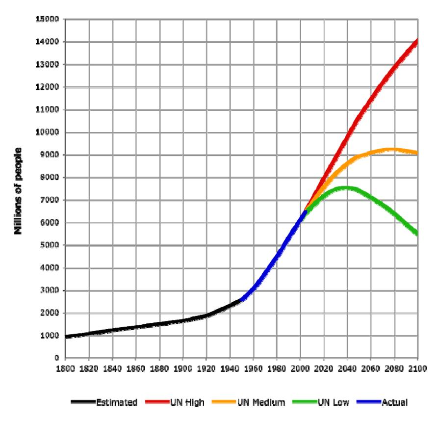

Figure 3.1.1. World population from 1800 to 2100 based on UN 2004 projections (red, orange, green) and U.S. Census Bureau historical estimates (black) and assessments (blue).

While global trends in human population provide indications of global impacts, regional trends in human population provide indications of pressures on regional and local scales. The BRT examined the recent human population abundance time series developed by assigning country-scale human population data to five large geographic regions (Indian Ocean, Caribbean, Southeast Asia, Pacific, and Middle East) that surround and influence the 82 candidate coral species addressed in this Status Review Report (Table 3.1.2). The BRT recognized that data summarized at the country scale probably do not precisely reflect trends in population immediately adjacent to and influencing the 82 candidate coral species examined here, and that it would be useful to examine human population abundance in areas closest to corals as was done in Mora (2008) and Burke et al. (2011). However, time-series data at that scale were not available and the BRT believes that even these regional population scale trends are informative for this review. Between 2005 and 2009, the human population living within 10 km of the coast increased 30% faster than the global average (Burke et al., 2011), suggesting that country-scale data likely underestimate the rate at which the human population in proximity to corals is increasing.

Based on data from the World Bank, human population abundance and density have increased in all five regions since 1960 (Fig. 3.1.2), with the greatest human population densities and increases in population density in the Southeast Asia and Indian Ocean regions. There, current human population densities are 4–5 times greater than the global average and probably suggest the greatest local human-induced effects to corals and coral reefs. In the areas in closest proximity to coral reefs, the Southeast Asian, Indian Ocean and Middle East regions have the highest densities of people per reef area (Fig. 3.1.3; Burke et al., 2011). Since people and their consumption are the root drivers of each of the proximate threats discussed throughout the remainder of this chapter, these trend data suggest increasing risks to corals and coral reefs.

Table 3.1.2. Countries assigned to each of five regions (Indian Ocean, Caribbean, Southeast Asia, Pacific, and Middle East) for regional trend analyses. Note that Mexico, and China were excluded from the analysis because the vast majority of the area of these counties is not adjacent to coral habitats. The States of Florida and Hawai`i were included in the human population abundance and density trends for the Caribbean and Pacific regions, respectively. However, these states were excluded from CO2 emission and landuse analysis (Figs. 3.1.4 and 3.1.5) because state-specific data were not available. Also note that for this analysis the Pacific region does not include countries in the eastern Pacific. Regions and countries are color-coded to match accompanying trend analyses shown in Figures 3.1.2, 3.1.4, and 3.1.5.

| Indian Ocean | Caribbean                | Southeast Asia | Pacific                        | Middle East          |
|--------------|--------------------------|----------------|--------------------------------|----------------------|
| Kenya        | Belize                   | Thailand       | Papua New Guinea               | Egypt, Arab Rep.     |
| Mozambique   | Colombia                 | Malaysia       | Marshall Islands               | Saudi Arabia         |
| Madagascar   | Venezuela, RB            | Vietnam        | Kiribati                       | Sudan                |
| Seychelles   | Aruba                    | Philippines    | Vanuatu                        | Eritrea              |
| Mauritius    | Netherlands Antilles     | Singapore      | Fiji                           | Djibouti             |
| Maldives     | Trinidad and Tobago      | Japan          | Samoa                          | Somalia              |
| India        | Cayman Islands           | Cambodia       | Tonga                          | Yemen, Rep.          |
| Tanzania     | Jamaica                  |                | French Polynesia               | Oman                 |
| Myanmar      | Haiti                    |                | Solomon Islands                | United Arab Emirates |
| Indonesia    | Dominican Republic       |                | Micronesia, Fed. Sts.          | Qatar                |
| Comoros      | Bahamas, The             |                | Palau                          | Kuwait               |
| Mayotte      | Puerto Rico              |                | Guam                           | Iran, Islamic Rep.   |
|              | Bermuda                  |                | New Caledonia                  | Pakistan             |
|              | Virgin Islands (U.S.)    |                | Tuvalu                         | Jordan               |
|              | Antigua and Barbuda      |                | Northern Mariana Islands | Israel               |
|              | St. Kitts and Nevis      |                | Hawai`i                        |                      |
|              | Dominica                 |                |                                |                      |
|              | St. Lucia                |                |                                |                      |
|              | Barbados                 |                |                                |                      |
|              | St. Vincent / Grenadines |                |                                |                      |
|              | Grenada                  |                |                                |                      |
|              | Florida                  |                |                                |                      |

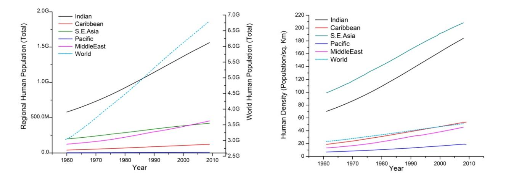

Figure 3.1.2. Recent world and regional trends in (*left*) human population abundance and (*right*) human population density from 1960 through 2009. The regional estimates are based on totals for countries listed above (Table 3.1.2), using data from the World Bank online database (World Bank, 2011).

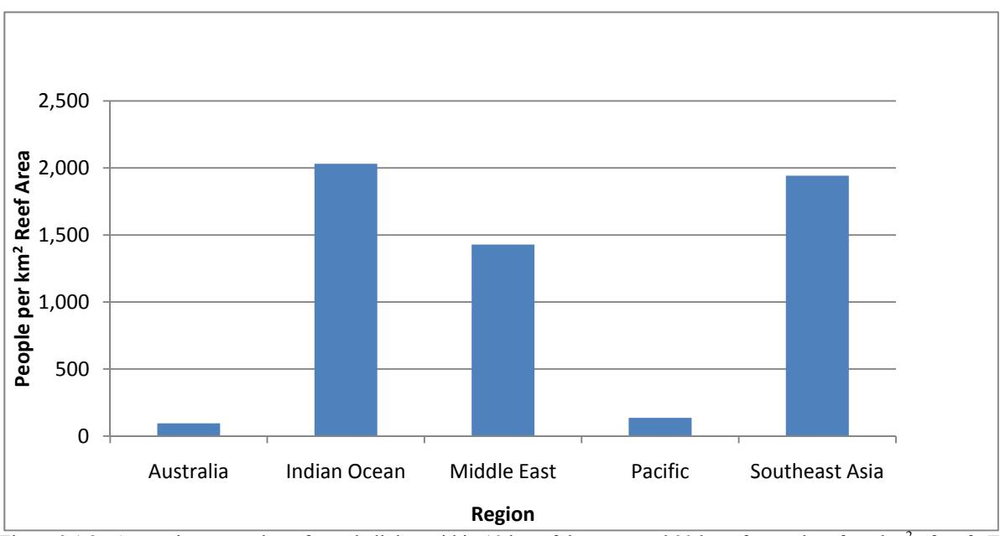

Figure 3.1.3. Approximate number of people living within 10 km of the coast and 30 km of a coral reef per km2 of reef. This gives a measure of the population density relative to nearby reefs. Figure constructed from data in Figures 1.1 and 2.1 in Burke et al. (2011).

#### **3.1.2 Consumption status and trends**

As the human population continues to increase and the demand for development, infrastructure, and services increases, associated indirect outcomes to corals and coral reefs will occur. Population increases will exert additional pressure on many different types of natural resource consumption. As population increases, the demand for food and materials will continue to increase since people around the globe must be fed, housed, and clothed. Hypothetically, the intensifying use of land and natural resources could, at some point, exceed the capacity of the ecosystems to sustain human needs and lead to resource depletion. In this review, the BRT examined several trends in consumption of resources that affect the sustainability of the 82 candidate coral species. Trends in consumption rates need to be considered at several spatial scales. As described in Section 3.2, per-capita emission of CO2 and its influences, such as ocean warming and acidification, are key threats that should be considered on a global scale. Other threats, such as land-based sources of pollution (Section 3.3.1) and reef fishing (Section 3.3.4.), need to be considered at more regional and local scales.

Total global CO2 emissions and global per-capita CO2 emissions have both been increasing exponentially since the 1960s (Fig. 3.1.4). Of the five regions examined here, the Indian Ocean, Southeast Asia, and Middle East regions have the highest total CO2 emissions. Per-capita CO2 emissions are greatest in the Southeast Asia region, followed by the Middle East and Caribbean regions. Not surprisingly, the Pacific region has both the lowest total CO2 emissions and per-capita CO2 emissions. With total human population, total global CO2 emissions, and per-capita CO2 emissions all increasing, the associated threats to corals and coral reefs are likewise increasing. Although climate change and ocean acidification are driven largely by the total global CO2 concentrations (see Section 3.2), it is informative to look at regional changes in total and per-capita CO2 emissions as integrators of human population and affluence. Global and regional CO2 emission trends are integrative indicators of industrial development and human consumption of natural resources that directly or indirectly affect corals and coral reefs (e.g., road development, production of toxics). Using CO2 emissions as one indicator of net human consumption, many of the regions influencing the candidate coral species have average per-capita consumption and rates of increase in per-capita consumption substantially greater than the global means.

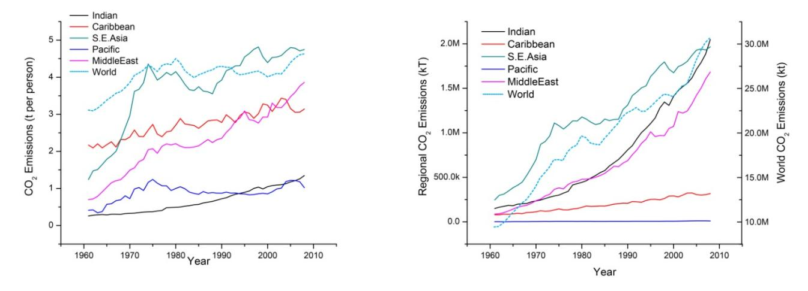

Figure 3.1.4. Recent world and regional trends in (*left*) CO2 emissions and (*right*) per capita CO2 emissions from 1960 through 2009. The regional estimates are based on totals for countries listed above (Table 3.1.2), using data from the World Bank online database (World Bank, 2011).

Land-use patterns provide another important indicator and predictor of coral reef status. Large fractions of agricultural land and conversion of natural lands have been associated with numerous negative consequences to coral reefs (Burke et al., 2011; Mora, 2008). The loss of forest cover is also associated with increased sedimentation, which can negatively affect coral reefs (Section 3.3). The Mora (2008) and Burke et al. (2011) papers provide relatively fine-scaled analyses of these changes in relation to human consumption; however, these analyses are largely static snapshots. Figure 3.1.5 show global and regional trends in percent agricultural land area and total forest land area, respectively. The most striking increase in agricultural lands and decrease in forested land area occurred in the Indian Ocean region. The increase in agricultural land area and decrease in forest land area suggests that land-based threats to corals will continue into the future.

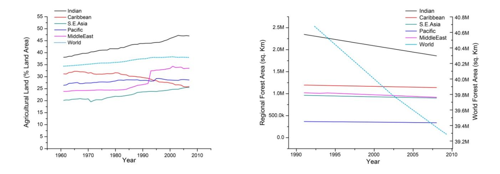

Figure 3.1.5. Recent world and regional trends in percent (*left*) land area in agriculture and (*right*) forest area over the 1960–2009 period. The regional estimates are based on totals for countries listed above (Table 3.1.2), using data from the World Bank online database (World Bank, 2011).

#### **3.2 Global Climate Change and Large-scale Threats**

Corals have evolved during the last 240 million years under a naturally varying climate. Recent climate changes resulting primarily from anthropogenic greenhouse gas emissions likely are the most abrupt since the corals first evolved. The recent anthropogenic changes, both global and broadly distributed local impacts, have been referred to as a new geological era, the "Anthropocene" (Crutzen, 2002; Zalasiewicz et al., 2008; Zalasiewicz et al., 2010), and the associated biodiversity changes have been predicted to be the sixth global mass extinction event (Thomas et al., 2004a). The BRT's concern in evaluating the effects of climate change on coral reefs generally and on the 82 candidate coral species, in particular, is the rapid increase in atmospheric concentrations of greenhouse gases that in turn are increasing the radiative forcing of the global climate system (IPCC, 2007d) and altering ocean carbonate chemistry (ocean acidification).

The Fourth Assessment Report (AR4) of the Intergovernmental Panel on Climate Change (IPCC) determined the following factors of key importance to corals and coral reefs (IPCC, 2007b):

- Atmospheric CO2 has increased rapidly from its preindustrial level of 280 ppm to over 390 ppm.
- The earth's system has already warmed, on average, close to 0.74°C globally over the last century.
- This warming is unusual in at least the last 1300 years.
- Most of that warming is the result of anthropogenic causes, primarily greenhouse gas emissions.
- Greenhouse gas emissions are expected to continue increasing.
- Warming is likely to accelerate.
- The planet is already committed to at least another 1.0°C of global warming from past emissions.
- Globally-averaged temperatures are expected to rise at least 0.2°C per decade for the next few decades with the rise in the latter half of the century to be determined by societal actions (or lack thereof) to control CO2 emissions.
- At our current emission levels, the earth's climate is expected to warm 4°C (likely range 2.4°C–6.4°C) by the end of this century.
- In addition to the warming trend, other changes are anticipated, including more variable and extreme temperatures and precipitation and changes in wind and storm patterns and ocean circulation.
- Carbon dioxide (CO2) increases have not only warmed the climate system but also are changing ocean chemistry (acidification).

The analyses and synthesis of information developed for the IPCC AR4 (IPCC, 2007b) are the most thoroughly documented and reviewed assessments of future climate ever issued and represent the best available scientific information on potential future changes in the earth's climate system. As with any projections of the future, the IPCC AR4 predictions have their limitations. The IPCC used a range of future greenhouse gas emissions scenarios (SRES) (Nakićenović et al., 2000) to develop general, circulation model-based projections of future climate under clearly stated assumptions about socioeconomic factors that will influence greenhouse gas emissions. While variability was found among the different climate models and even greater variability was introduced by the various greenhouse gas scenarios, emission rates in recent years have met or exceeded levels found in the worst-case scenarios, the A2 and fossil fuel intensive A1FI scenarios. As discussed in subsequent sections of this chapter, warming-induced coral bleaching and disease have already resulted in dramatic declines in many coral species on coral reefs around the world.

The IPCC Fourth Assessment Working Group I Report (IPCC, 2007b) provided projections on many of the environmental variables considered in this Status Review Report. These included ocean and atmospheric warming, changes in ocean stratification and circulation, sea-level rise, ocean acidification, and tropical storm frequency and intensity. Additionally, Working Group 2 (IPCC, 2007c) addressed some of the effects of these physical and chemical projections on corals and coral reefs, including bleaching, disease, and changes in calcification. Anthropogenic CO2 has a long residence time in the atmosphere and is only slowly removed by ocean absorption and other processes. The IPCC AR4 climate models projected out warming of the atmosphere and oceans to year 2100, with the projections largely being dependent on CO2 emission scenarios that are largely determined by human behavior—the part of the system that imparts the greatest uncertainty in the IPCC scenarios. Ocean warming and changes in other physical and chemical parameters, such as storms, sea level, and acidification, between now and 2050 are largely driven by greenhouse gases that have already been emitted. Accordingly, much less variability is found among models and scenarios during that time frame than the 2050–2100 period. From 2050 to 2100 the results of the AR4 model projections diverge. However, the variability is not primarily driven by differences among models. There is a larger variation among the various IPCC emission scenarios (representing human behavior options) than among the climate model projections for each scenario. In recent years humans appear to be following the path that results in the highest levels of emissions considered during the AR4.

The IPCC AR4 summarized the differences in certainty between the first and second halves of this century (Meehl et al., 2007): "There is close agreement of globally-averaged surface air temperature (SAT) multi-model mean warming for the early 21st century for concentrations derived from the three non-mitigated IPCC *Special Report on E mission Scenarios* (SRES: B1, A1B and A2) scenarios (including only anthropogenic forcing). . . this warming rate is affected little by different scenario assumptions or different model sensitivities, and is consistent with that observed for the past few decades. . . Possible future variations in natural forcing (e.g., a large volcanic eruption) could change those values somewhat, but about half of the early 21st century warming is committed in the sense that it would occur even if atmospheric concentrations were held fixed at year 2000 values. By mid-century (2046–2065), the choice of scenario becomes more important for the magnitude of multi-model globally-averaged surface air temperature warming. . . About a third of that warming is projected to be due to climate change that is already committed. By late century (2090– 2099), differences between scenarios are large, and only about 20% of that warming arises from climate change that is already committed."

While these projections are cause for substantial concern about the condition of corals in the future, the BRT was most strongly influenced by observations that corals have been bleaching and dying under ocean warming that has already occurred. Additionally, the earth is already "committed" to warming that is expected to exceed 1.0°C in globally averaged temperature (IPCC, 2007b) and more than 0.5°C in most ocean waters around coral reefs (Donner, 2009) (see Section 3.2.2 for details). Given such increases, temperatures are likely to exceed the tolerances for many corals. Unfortunately for corals, there are no indications that major reductions in greenhouse gas emissions will occur in the near to mid-term future (decades) through national or international policies or major changes in the global fossil fuel economy. Thus the AR4 SRES worst-case IPCC CO2 emissions scenarios will most likely occur (see Section 3.2.1). With this in mind, the IPCC has established new emission pathways for the upcoming fifth assessment report that include a scenario with much higher emissions than those used in AR4 (Gaffney, 2010; Moss et al., 2010).

The BRT determined that ocean warming and related impacts of climate change have already created a clear and present threat to many corals, that this will continue in the future, and that this could be assessed with sufficient certainty out to 2100. Therefore, the threat posed by the most optimistic scenarios of emissions in the 21st century and even the threat posed by committed warming and other climatic changes represent a plausible extinction risk to the 82 candidate coral species. Even worse for corals, ample evidence indicates that emissions will follow a trajectory that will have major consequences for corals. The following section describes the major global changes and impacts considered to pose a potential risk to the 82 candidate coral species. The degree of risk varies among species and regions; this variation is considered in the individual species assessments (Chapters 6 and 7).

#### **3.2.1 Atmospheric CO2 and emissions trends**

The atmospheric concentration of the dominant greenhouse gas, CO2, has steadily increased from ~ 280 ppm at the start of the Industrial Revolution to over 390 ppm by 2009 (WDCGG, 2010; Figs. 3.2.1, 3.2.2)—the highest concentration of the last 800,000 years (Luthi et al., 2008; Fig. 3.2.2; Petit et al., 1999) and probably the last 20 million years (Pearson and Palmer, 2000). Rates of human-induced CO2 emissions are also accelerating, rising from 1.5 ppm per year during 1990–1999 to 2.0 ppm per year during 2000–2007 (Canadell et al., 2007; Raupach et al., 2007). These rising emissions have been most strongly driven by global income growth and global population growth (IPCC, 2007a) and exceed rates seen during the past 720,000 years, including during glacial-interglacial transitions (Hoegh-Guldberg et al., 2007; Luthi et al., 2008). While many international, national, and local initiatives have sought to reduce the growth in greenhouse gas emissions, recent emissions growth and an apparent lack of significant international political action to control emissions to date have resulted in an acceleration of CO2 emissions at or above the worst-case scenario used in the IPCC's Third and Fourth Assessment Reports (Fig. 3.2.3). These increased emissions have led to and will continue to exacerbate the climate change effects described in the following sections.

The timing of anthropogenic CO2 enrichment of the atmosphere is especially important as the Earth is already at naturally high CO2 conditions found during interglacial periods. It is unlikely that the Earth will transition into the next glacial period for quite some time, as that cycle is driven by slow changes in the planet's orbital characteristics that are strongly reinforced by atmospheric greenhouse gases. While earlier studies indicated that, were it not for anthropogenic greenhouse gases, the atmosphere should already be cooling back toward the next glacial period (Imbrie and Imbrie, 1980), more recent work indicates that orbital forcing alone is sufficient to continue the current interglacial for tens of thousands of years into the future. However, anthropogenic CO2 is likely to prolong the current interglacial period (Archer and Ganopolski, 2005; Berger and Loutre, 2002), perhaps to 500,000 years (Archer and Ganopolski, 2005). This means that humans are controlling both anthropogenic CO2 and the climate system to a much greater degree than are changes in orbital forcing.

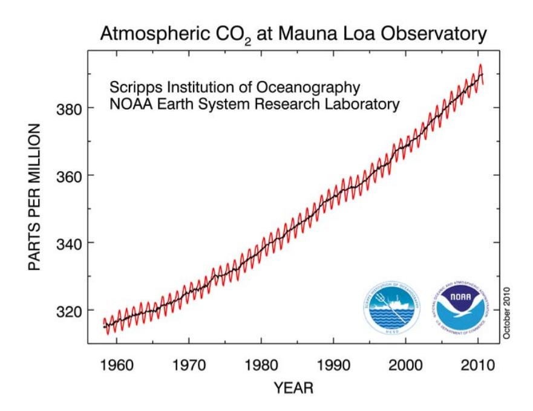

Figure 3.2.1. Time series of atmospheric CO2, often referred to as the "Keeling Curve", measured at Mauna Loa Observatory, Hawai`i over the 1958–2010 period (Tans and Keeling, 2010).

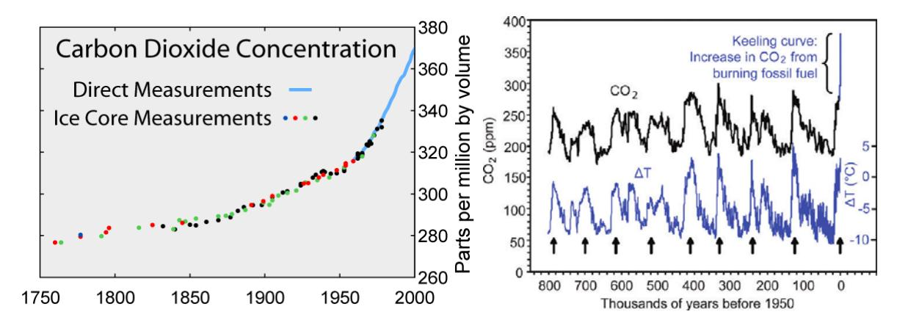

Figure 3.2.2. (*Left panel*) Global average atmospheric concentrations of carbon dioxide over a 250-year period from 1750 to 2000. The light blue line indicates actual direct atmospheric measurements. The colored dots indicate data gathered from ice cores; each color represents a different ice core sampling site. Data from Robert A. Rohde and the Global Warming Art project. (*Right panel*) Atmospheric CO2 and temperature data derived from Antarctic ice core measurements. Arrows mark 100,000-year cycles. Data from Luthi et al., 2008. The "Keeling Curve" (see Fig. 3.2.1) is the vertical segment appended to the ice core data at the upper right.

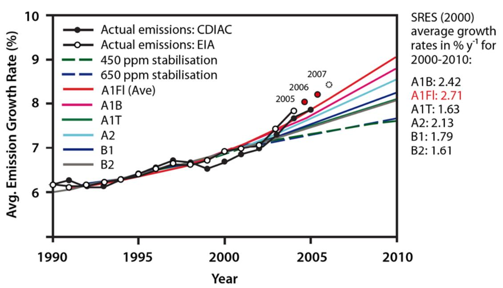

Figure 3.2.3. Observed and projected CO2 emission growth rates in percent per year (McMullen and Jabbour, 2009; Raupach et al., 2007). The black lines with circles show actual emission rates estimated with two different methods. The solid colored lines show alternative climate model estimates, and the dashed lines show estimates of emission rates required to stabilize CO2 emissions at a given value. Anthropogenic CO2 emissions increased by 38% since 1990. The actual emissions growth rate for 2000–2007 exceeded the highest predicted growth rates for the decade 2000–2010 in the emissions scenarios of the IPCC Special Report on Emissions Scenarios (SRES) (Nakićenović et al., 2000). This makes current trends in emissions higher than the worst-case (A1FI) IPCC-SRES scenario.

#### **3.2.2 Ocean warming**

It is well documented that the Earth's temperature has increased during the previous century to levels that had not been reached in over 1,000 years (Chapman and Davis, 2010; IPCC, 2007b). As a result of rising atmospheric greenhouse gases, average global surface air temperatures have already warmed by ~ 0.74°C during the century from 1906 to 2005 (IPCC, 2007b). The rate of warming has also increased from 0.07°C per decade over the past 100 years to 0.13°C per decade for the most recent 50 years (IPCC, 2007b), including increases of up to 0.2°C–0.4°C per decade in waters around many coral reefs (Strong et al., 2008). In particular, the decades of the 1980s and 1990s exhibited a rapid temperature rise to levels above the average for the previous millennium. This average value is the mean of many local measurements, some of which of course are much higher than the average. The global trend in average temperature is reflected in a number of long-term records of sea surface temperature (SST). More important than the global average temperature from a coral perspective, the frequency of warm-season temperature extremes increased during the previous two decades and is inducing more frequent episodes of mass coral bleaching and associated mortality (Eakin et al., 2009).

As rapid as the warming in the previous century has been, the warming in the 21st century is predicted to be greater, even if emissions of anthropogenic greenhouse gases were to cease today (IPCC, 2007b). This "committed" warming is greater than 1.0°C globally averaged temperature (IPCC, 2007b) and greater than 0.5°C in most ocean waters around coral reefs (Table 3.2.1; Donner, 2009). Of course, CO2 emissions continue to rise, currently at or exceeding the worstcase scenarios used in the IPCC AR4 assessment (Fig. 3.2.3), and the stabilization of atmospheric CO2 levels is considered unlikely for several decades at least. This worst-case, fossil-fuel-intensive A1FI scenario assumes no substantial changes in emission policies or technologies. At that rate of CO2 emissions, a further temperature increase in waters around coral reefs of 2.8°C–3.6°C is expected during this century, depending on the ocean basin. At a minimum, ocean temperatures around coral reefs will rise more than 1°C this century, but this would require drastic changes in greenhouse gas emissions across the globe. While significant CO2 emission reduction would decrease both the ultimate amount and rate of global warming and effects on corals, thus far little movement toward reducing emissions has occurred through international agreements or U.S. legislation. Therefore, reductions are considered unlikely in the short term. Even the most aggressive actions to reduce emissions will only slow ocean warming, not prevent it. Natural forces put into place by anthropogenic climate change will continue to influence coral reefs for at least 1000 years (Solomon et al., 2009).

Table 3.2.1. Annual mean SST anomaly averaged across each ocean province (from Donner, 2009 Table 1). The columns show global circulation model results of warming to which the Earth is already committed and warming expected from emission scenarios used for the 2001 and 2007 reports of the IPCC (IPCC, 2007b; Nakićenović et al., 2000).

| Region          | SST anomal | SST anomaly 2030–2039 |     |     |      |        |     | )99 |     |      |
|-----------------|------------|-----------------------|-----|-----|------|--------|-----|-----|-----|------|
|                 | Commit     | B1                    | A1b | A2  | A1f1 | Commit | B1  | A1b | A2  | A1f1 |
| Caribbean       | 0.4        | 0.8                   | 0.9 | 0.9 | 1.1  | 0.6    | 1.5 | 2.4 | 2.7 | 3.4  |
| Middle East     | 0.4        | 0.9                   | 1.0 | 0.9 | 1.1  | 0.6    | 1.6 | 2.5 | 3.0 | 3.5  |
| W Indian        | 0.4        | 0.7                   | 8.0 | 8.0 | 1.0  | 0.6    | 1.4 | 2.2 | 2.8 | 3.4  |
| C Indian        | 0.4        | 0.7                   | 0.9 | 0.8 | 1.0  | 0.6    | 1.4 | 2.3 | 2.9 | 3.5  |
| W Australia     | 0.3        | 8.0                   | 0.9 | 0.8 | 1.0  | 0.5    | 1.3 | 2.1 | 2.8 | 3.4  |
| SE Asia         | 0.3        | 0.7                   | 8.0 | 0.8 | 8.0  | 0.5    | 1.3 | 2.1 | 2.7 | 3.2  |
| GBR+Melanesia   | 0.4        | 0.6                   | 8.0 | 0.8 | 1.0  | 0.5    | 1.2 | 2.1 | 2.7 | 3.3  |
| Micronesia      | 0.4        | 0.5                   | 8.0 | 0.7 | 1.1  | 0.5    | 1.4 | 2.5 | 3.0 | 3.6  |
| Central Pacific | 0.4        | 0.6                   | 8.0 | 0.7 | 1.1  | 0.6    | 1.4 | 2.5 | 3.0 | 3.6  |
| Polynesia       | 0.3        | 0.6                   | 0.6 | 0.7 | 0.9  | 0.4    | 1.1 | 1.9 | 2.3 | 2.8  |
| East Pacific    | 0.4        | 0.8                   | 0.9 | 0.9 | 1.1  | 0.6    | 1.5 | 2.4 | 2.8 | 3.5  |
| All tropics     | 0.3        | 0.6                   | 0.7 | 0.6 | 0.8  | 0.5    | 1.1 | 1.8 | 2.3 | 2.8  |

Working Group 2 of the IPCC (IPCC, 2007b) assessed the impact this is likely to have on coral reefs, determining that:

"Corals are vulnerable to thermal stress and have low adaptive capacity. Increases in sea surface temperature of about 1-3°C are projected to result in more frequent coral bleaching events and widespread mortality, unless there is thermal adaptation or acclimatisation by corals."

In addition, they concluded that ocean acidification would likely reduce coral growth rates, and the likely increase in the intensity of tropical cyclone activity would increase damage from breakage. While there have been a few limited areas where further review has indicated a need to back off from some of the AR4 estimates of future change (e.g., rate of glacier loss in Himalayas) (IPCC, 2010), most research since the IPCC AR4 has shown that, if anything, the 2007 report was optimistic (McMullen and Jabbour, 2009).

A recent independent global analysis of threats to coral reefs (Burke et al., 2011) found that thermal stress, while regionally variable, has indeed influenced corals in all reef regions around the globe (Fig. 3.2.4). Bleaching and mortality of adult coral colonies have been the most visible signs of the effects of climate change, but it is also likely that ocean warming will have detrimental effects on virtually every life history stage of reef corals (Fig. 3.2.5) as impaired fertilization, developmental abnormalities, mortality, and impaired settlement success of larval phases have all been documented (Negri et al., 2007; Polato et al., 2010; Randall and Szmant, 2009a; Randall and Szmant, 2009b).

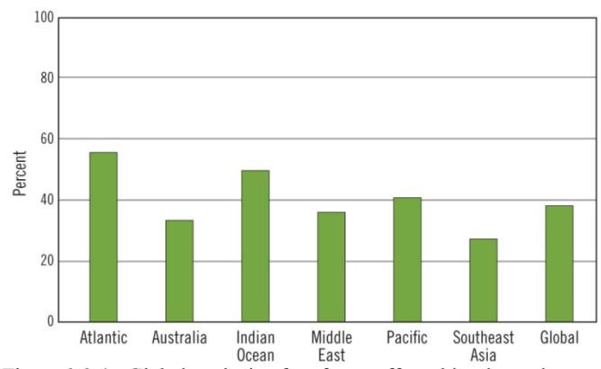

Figure 3.2.4. Global analysis of reef area affected by thermal stress, by region and globally, during the years 1998–2007. Risk was assessed through a GIS-based analysis of risk compiled from NOAA data. For details on methods, please see the original publication. Used with permission from Reefs at Risk Revisited (Burke et al., 2011).

Figure 3.2.5. The impacts of ocean warming on various coral life history stages, including adult mortality, fecundity, and fragmentation, fertilization, pelagic planula, settlement, polyp development, and juvenile growth. Warming ocean temperatures have already had significant effects on corals, leading to the potential extinction of at least one species [see Individual Species Account for *Millepora boschmai* (Appendix) and Glynn et al. (2001)]. The overall contribution of ocean warming to extinction risk for the 82 candidate coral species was determined to be **high** by the BRT. Diagram prepared by Amanda Toperoff, NOAA-PIFSC.

#### *3.2.2.1 Coral bleaching*

High temperatures are a significant cause of coral bleaching, the expulsion of the coral's symbiotic zooxanthellae in response to stress. While corals can withstand mild to moderate bleaching, severe, repeated or prolonged bleaching can lead to colony mortality. Many coral physiological processes are optimized to the local long-term seasonal and interannual variations in temperature experienced by the corals, and an increase of only 1°C–2°C above the normal local seasonal maximum can induce bleaching (Fitt and Warner, 1995). Bleaching is best predicted by using an index of accumulated thermal stress above a locally established threshold (Atwood et al., 1992; Eakin et al., 2009). Most coral species are susceptible to bleaching, but this susceptibility varies among taxa (Marshall and Baird, 2000; McClanahan et al., 2007).

While coral bleaching patterns are complex, with several species exhibiting seasonal cycles in symbiotic dinoflagellate density (Fitt et al., 2000), there is general agreement that thermal stress has led to accelerated bleaching and mass mortality during the past 25 years (Brown, 1997a; Eakin et al., 2009). In particular, during the years 1983, 1987, 1995, 1998, and 2005, widespread thermal stress resulting in coral bleaching was documented throughout various parts of the world (Eakin et al., 2009; Eakin et al., 2010; Wilkinson and Souter, 2008; Williams and Bunkley-Williams, 1990). A recent analysis of global-scale thermal stress and reported bleaching events for the 10-year period from 1998 to 2007 (Fig. 3.2.6) shows that this is a widespread threat that has already had significant effects on most coral reefs around the world (Burke et al., 2011). Although some recovery occurred in the Caribbean from the 1987 bleaching event (Fitt et al., 1993) and the 1995 event, the 1998 and 2005 bleaching events resulted in high mortality rates at a number of reefs (Eakin et al., 2010; Goreau et al., 2000; Wilkinson and Souter, 2008). Some areas of the Indian Ocean and Southeast Asia that were showing signs of recovery from a mass bleaching event in 1998 (Wilkinson, 2004) recently experienced another extensive mass bleaching in 2010 (Gillis, 2010).

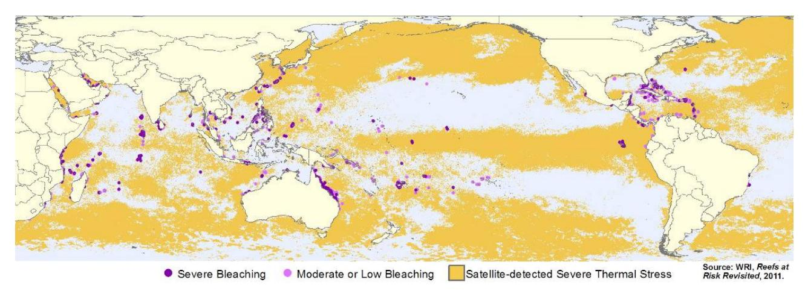

Figure 3.2.6. Global map of reef areas affected by thermal stress during the years 1998–2007. Risk was assessed through a GISbased analysis of risk compiled from NOAA data. For details on methods, please see the original publication. Source: Reefs at Risk Revisited (Burke et al., 2011).

The repeat of global-scale mass coral bleaching in 2010 demonstrates an important concern about thermal bleaching: at what point do thermal stress events occur too frequently for reefs to have sufficient time to recover? A comparison of the recent and accelerating thermal stress events with the slow recovery rate of most reefs (Baker et al., 2008), suggests that this critical frequency may have already been exceeded. Donner et al. (2005) estimated the adaptation rate that corals must achieve to keep up with anticipated rates of temperature rise this century to be approximately 0.2°C per decade. On most reefs, the rate of warming in the past two decades has exceeded this adaptation threshold (Penaflor et al., 2009; Strong et al., 2008).

Models have provided us with important perspectives on the consequenses of future warming on corals. Using global climate models, predictions can be made about the future frequency of thermal events exceeding the bleaching threshold for a given area (Fig. 3.2.7). Hoegh-Guldberg (1999) conducted an early analysis for many regions around the world and predicted that continued ocean warming will result in bleaching episodes as severe as the 1998 event commonly within 15 years and annually in about 40 years. This analysis assumed that the 1998 bleaching did not select for more temperature tolerant genotypes (see below and Baker et al., 2004; Maynard et al., 2008). For many coral species to survive anticipated ocean warming, corals and their zooxanthellae will likely need to undergo significant adaptation and/or acclimation (Baskett et al., 2009a; Baskett et al., 2009b; Donner, 2009). Two recent modeling studies have also investigated the long-term vulnerability of reefs to mortality resulting from bleaching and other thermal-stress-related disturbances. Models used by Edwards et al. (2010) for the Caribbean and Thompson and Dolman (2010) for the Great Barrier Reef both predict that anticipated levels of bleaching and related mortality are likely to result in significant declines in coral reefs. A recent model study by Hoeke et al (2011) suggests substantially increased coral mortality and reduced coral growth in the Hawaiian Archipelago over the next 100 years under combined ocean warming and acidification conditions projected using multiple (20) IPCC AR4 models forced by middle-of-the-road CO2 emission scenarios. Demographic models used by Hernández-Pacheco et al. (2011) predict that bleaching events severe enough to cause mortality are likely to cause continued declines in the population of *Montastraea annularis* if they occur more frequently than once every 17 years (6% probability). This is a troubling statistic for the three species of Caribbean *Montastraea* that are candidates for protection under the U.S. Endangered Species Act as the Caribbean has been hit by six such events since 1985, a return frequency of less than 5 years (Eakin et al., 2010).

Potentially, corals will be able to adapt to rising temperatures. Buddemeier and Fautin (1993) proposed that bleaching may be an adaptive mechanism that allows corals to acquire more thermally tolerant symbionts. The evidence for adaptation was reviewed by Coles and Brown (2003), who determined that previous modeling efforts had not sufficiently taken into account the variability in bleaching response and the potential for adaptation. Baker (2001) found experimental evidence of symbiont switching and documented a rise in the abundance of thermally tolerant symbionts on reefs that recently had bleached (Baker et al., 2004). They concluded that bleaching may lead to reefs that are more resistant to future thermal stress, "resulting in significantly longer extinction times for surviving corals." Many corals have been found to host multiple lines of dinoflagellate symbionts and may show local variability in the abundance of thermally tolerant symbionts that correspond with local temperatures (Oliver and Palumbi, 2010). Unfortunately, longer-term studies of corals after bleaching have indicated that such symbiont switching may be transient (LaJeunesse et al., 2009; Thornhill et al., 2006). Even where such switches persist, this sort of adaptation is unlikely to impart more than a 1.5°C change in bleaching thresholds (Baskett et al., 2009a). Thus, corals are unlikely to adapt sufficiently to prevent further widespread bleaching or mortality. However, even 1.5°C of adaptation provides some capacity for sustaining reefs in the face of warming likely to exceed 2°C during the 21st century (Donner, 2009). Using the Coral Mortality and Bleaching Model (COMBO), Hoeke et al. (2011) included simulations where the coral heat stress mortality threshold was allowed to "adapt" at a rate of 1.0°C per century (0.1°C per decade). Their results suggested that even with that level of adaptation, modeled Hawaiian corals still suffered extensive mortality from the combined effects of ocean warming and acidification over the next 100 years. Some coral species may adapt sufficiently to avoid extinction during this period, but this is speculative. In addition to adaptation, it is also possible that the geographical range of corals will change in response to increased temperatures (see Section 3.2.2.4). However, in many cases corals will not be able to adapt to acute events as demonstrated by the potential extinction of at least one species [see Individual Species Assessment for *Millepora boschmai* (Appendix) and Glynn et al. (2001).

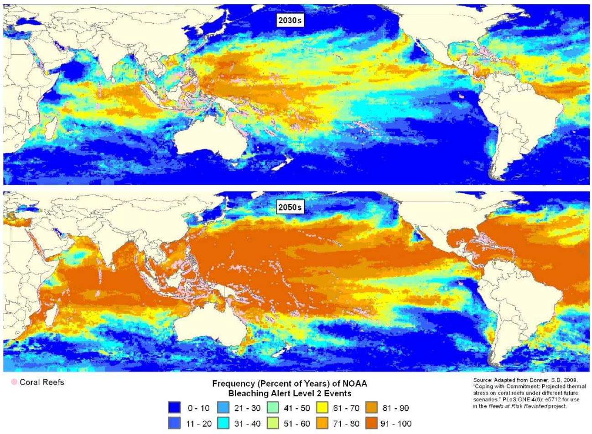

Figure 3.2.7. Global map of reef areas expected to suffer coral bleaching from thermal stress during the decades of the 2030s and 2050s. Risk was assessed through a GIS-based analysis of risk compiled from model data using the IPCC A1B "business as usual" scenario. For details on methods, please see the original publication. Source: Reefs at Risk Revisited (Burke et al., 2011) adapted from Donner (Donner, 2009).

As noted above, corals and reefs can potentially recover from bleaching (Baker et al., 2008), if given sufficient time. Zooxanthellae populations can recover from remnant populations in the coral host or through the acquisition of new symbionts (although new acquisitions are not always stable; Coffroth et al., 2010). Corals that have substantial energy reserves or heterotrophic capacity may be able to withstand the temporary loss of zooxanthellae (Grottoli et al., 2006) at least, if the corals recover after a couple of months. However, for other corals, loss of zooxanthellae causes starvation, resulting in a significant energy deficit. This translates into less energy available for growth, reproduction, and disease resistance (Baird and Marshall, 2002; Cantin et al., 2010; Ward et al., 2000).

Most of the scientific literature about coral bleaching recognizes temperature as a primary driver of bleaching, but it is also recognized that other factors play important roles. Irradiance, particularly in the ultraviolet (UV) range (Gleason and Wellington, 1993), is perhaps as important as temperature and may be a limiting factor in the dispersal of coral larvae (Wellington and Fitt, 2003). It is important to note, though, that most of the projected increase in UV radiation as a result of ozone depletion will happen well outside the tropics and that only cloud cover changes will likely have a major effect on UV irradiance in the tropics. Because there remains great scientific uncertainty in the parameterizations of water vapor and clouds in current generation climate models, the capability to confidently predict such changes through modeling is minimal. Indications also show that elevated CO2 (Anthony et al., 2008) can lead to coral bleaching. Microbial infection was observed to cause bleaching in the Mediterranean coral *Oculina patagonica* during warm seasons (Kushmaro et al., 1996; Kushmaro et al., 1997; Rosenberg and Ben-Haim, 2002).

Multiple climate change effects are likely to interact, especially considering the long-term consequences of repeated thermal stress. A recent modeling study predicted that Caribbean coral reefs can maintain their community structure and function under levels of hurricane damage levels expected this century if other factors remain constant, but anticipated levels of bleaching and related mortality were predicted to cause significant coral reef declines (Edwards et al., 2010). A similar modeling study by Thompson and Dolman (2010) predicted that current rates of recovery were sufficient to compensate for current rates of cyclone and crown-of-thorns seastar damage, but current rates of coral bleaching have resulted in significant declines in acroporid-dominated reefs. Studies have also shown that bleaching thresholds in some species may be influenced by ocean acidification (Anthony et al., 2008) and nutrients (Carilli et al., 2009a; Carilli et al., 2009b; Wooldridge, 2009b; Wooldridge and Done, 2009). It is likely that these stressors are acting in combination to reduce thermal thresholds to bleaching, increase mortality, and slow recovery.

#### *3.2.2.2. Potential impacts on disease and reproduction*

Increased seawater temperature also may act synergistically with coral diseases to reduce coral health and survivorship (Bruno et al., 2007). Although partially a result of increased surveys to assess disease, observations of the number and severity of coral disease outbreaks over recent decades have shown a significant increase (Harvell et al., 2007). Coral disease outbreaks often have either accompanied or immediately followed bleaching events (Brandt and McManus, 2009; Jones et al., 2004; Lafferty et al., 2004; Miller et al., 2009; Muller et al., 2008). Outbreaks also follow seasonal patterns of high seawater temperatures (Sato et al., 2009; Willis et al., 2004). There are likely many causes of such relationships. To date, these have been identified to include (a) high summer temperatures that increase pathogen virulence or decrease host resistance (Ward et al., 2007) or reduce the antibiotic activity of the host coral's microbial flora (Ritchie, 2006), and (b) the potential of interactions of both winter and summer temperatures on these processes (Heron et al., 2010). The latter is especially important as analyses of global warming patterns indicate that low temperatures during winter months are increasing more rapidly than high temperatures during summer months (IPCC, 2007c). Investigation of potential links comparing temperature anomalies and trends with coral disease has enhanced our understanding of the impacts of ocean warming on coral reefs, particularly when coupled with the observed and predicted increases in the frequency of coral bleaching episodes.

In addition to coral bleaching, mounting evidence suggests that warming temperatures can have direct impacts on early life stages of corals. Studies have shown detrimental effects of anomalously warm temperatures on early life stages of *Acropora millepora* with abnormal embryonic development at 32°C and complete fertilization failure at 34°C (Negri and Heyward, 2000). Fertilization for four other Pacific coral species was less sensitive in this study. In addition to abnormal embryonic development (Lundgren and Hillis-Starr, 2008; Miller, 2002; Polato et al., 2010; Randall and Szmant, 2009a), larval survivorship and settlement success have been shown to be impaired in Caribbean brooding (Randall and Szmant, 2009b) and broadcasting (Lundgren and Hillis-Starr, 2008; Randall and Szmant, 2009a; Voolstra et al., 2009) coral species at temperatures as low as 30°C–32°C. Lastly, the rate of larval development for spawning species is appreciably accelerated at warmer temperatures (Polato et al., 2010; Randall and Szmant, 2009a), which suggests that total dispersal distances could also be reduced, further decreasing the likelihood of potential replenishment of extirpated areas. Similarly accelerated development may occur after corals settle, leading to more rapid growth of coral recruits (Coles, 1985).

#### *3.2.2.3. Changes to water column stratification (less mixing, less nutrients)*

As warmer water is less dense, ocean warming is and will continue causing increased stratification of the upper ocean. This increased stratification results in decreased vertical mixing of both heat (warmer water down and cooler water up) and nutrients, leaving surface waters warmer and less nutrient-enriched (Behrenfeld et al., 2006). Satellite observations of ocean color have been used to demonstrate decreases in tropical and mid-latitude ocean productivity that correspond with warming and stratification (Behrenfeld et al., 2006; Doney, 2006; Fig. 3.2.8). Polovina et al. (2008) showed that since 1998 the least productive oceanic habitats, the oligotrophic gyres in four of the world's major oceans (North Pacific, South Pacific, North Atlantic, and South Atlantic), have been expanding at average rates between 0.8% per year and 4.3% per year. While the implications for corals and coral reefs of increases in warming-induced stratification have not yet been well studied, it is likely that these changes will both exacerbate the temperature effects described above (e.g., increase bleaching and decrease recovery) and decrease the overall net productivity of coral reef ecosystems (e.g., fewer nutrients) throughout the tropics and subtropics. As one indication of the potential impacts to corals of increased upper ocean stratification, the Hoeke et al. (2011) model simulations for corals in the Hawaiian Archipelago over the next 100 years suggested that even the small differences in temperature (< 0.2°C) between the surface and a depth of 20 m substantially would reduce the rate of heat stress-induced coral mortality for deeper corals (Fig. 3.2.9).

Figure 3.2.8. Predicted phytoplankton response to increased temperature in ocean surface waters in the tropics and mid-latitudes. Phytoplankton are typically nutrient-limited, and satellite data tie reduced biological productivity to upper-ocean warming, reduced stratification, and reduced nutrient supply. Adapted from Doney (2006) by Amanda Toperoff, NOAA PIFSC.

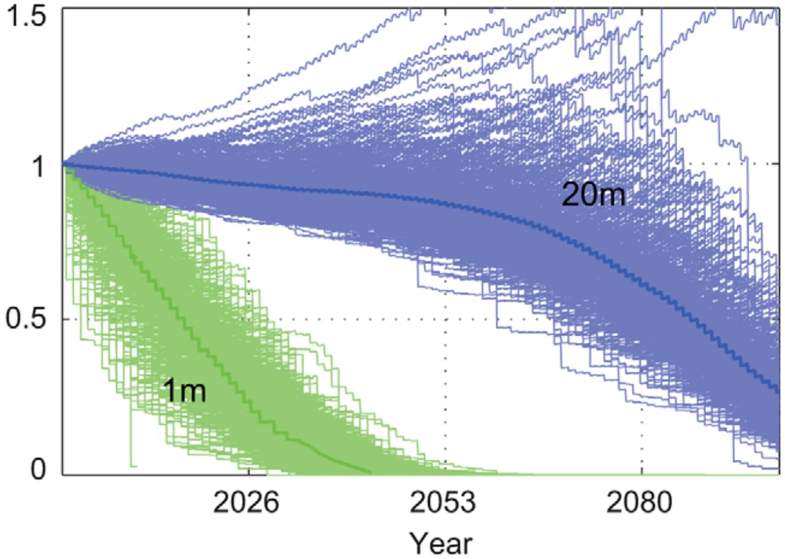

Figure 3.2.9. Monte Carlo projections of fractional change in coral cover assuming in situ temperatures from 1 m and 20 m depths at Pearl and Hermes Atoll in the Northwestern Hawaiian Islands over the next 100 years derived from the Coral Mortality and Bleaching Output (COMBO) model (from Hoeke et al., 2011). In this particular simulation, the corals were assumed to have no temperature adaptation to episodic mortality and calcification was assumed to be reduced by 30% from ocean acidification.

#### *3.2.2.4 The potential for range shifts and biogeographic expansion*

Rising ocean temperatures also bring a potential opportunity for range expansion or biogeographic redistributions of many of the candidate corals. Fossil evidence exists of past expansions and contractions in these species' ranges in the Caribbean (e.g., along southeast Florida coast and Flower Garden Banks; Precht and Aronson, 2004; Precht and Miller, 2007), and Australia (Greenstein and Pandolfi, 2008), which coincide with past climate fluctuations and sea-level stands (Precht et al., 2008; Precht and Aronson, 2004). Clemente et al. (2010) reported the recent discovery of a species of *Millepora* in the Canary Islands, at a latitude 11° north of their previous northernmost limit in the eastern Atlantic Ocean. More recently, Yamano et al. (2011) studied nine species of corals in Japan for which survey records were sufficient to detect possible range extensions. They found that in the past 80 years, four of the nine coral species had significantly (and in some cases, rapidly) expanded their range northward in the Japanese Archipelago with no apparent change in their southern range. These included three species of *Acropora* and *Pavona decussata,* the latter being one of the candidate species. Two of the acroporids extended their northward range as much as 13–14 km within a decade. One other acroporid, as well as species of *Caulastrea, Favia, Hydnophora, and Lithophyllon* did not exhibit range changes. Thus, rising ocean temperatures may be expanding tolerable habitats of some corals poleward. Although poleward expansion offers the possibility for thermal refuge for corals, additional habitat requirements and stressors such as lower carbonate saturation state (see Section 3.2.3) and light availability may limit this potential (Kleypas, 1997; Kleypas et al., 1999b). Any range expansion of individual coral species does not imply that reefs will necessarily follow. Buddemeier et al. (2004) argued that such migrations would likely be impeded because human activities—such as coastal development, fishing, pollution, agriculture, and other impacts—have altered the coastal areas where future reefs might otherwise form.

#### **3.2.3 Ocean acidification**

As CO2 concentration has increased in the atmosphere, a corresponding change has occurred in the partial pressures of CO2 in the surface ocean, resulting in reduced pH (i.e., acidification) and reduced availability of carbonate ions (Fig. 3.2.9).

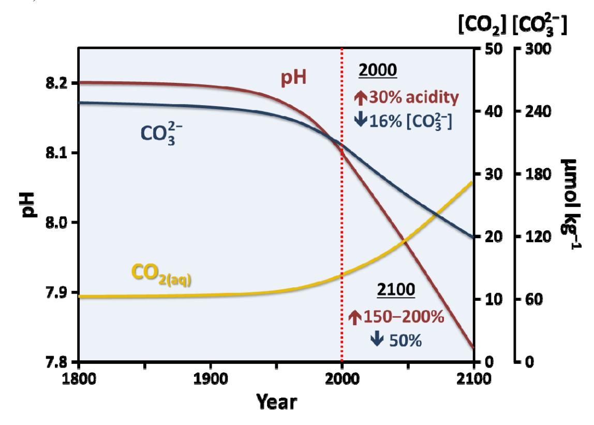

Figure 3.2.10. Projected changes in ocean chemistry as a result of increased atmospheric CO2 (Wolf-Gladrow et al., 1999).

The dynamics of carbonate chemistry in seawater (shown in Fig. 3.2.10) are frequently summarized by the calcium carbonate saturation state (Ω). At saturation state values less than one, calcium carbonate tends to dissolve into calcium and carbonate ions. At saturation states above about 20, calcium carbonate will spontaneously precipitate (something that naturally happens only occasionally in very few places in the ocean). At saturation states between 1 and 20, organisms can create calcium carbonate shells or skeletons using a physiological calcifying mechanism and the expenditure of energy (Fig. 3.2.11). Different mineralogical forms of calcium carbonate have different solubilities, that is, different saturation states under the same pH conditions. The mineral forms in decreasing order of solubility are amorphous, high magnesium calcite, aragonite, low magnesium calcite. Most coral species, including the candidate species, produce skeletal structures composed of the relatively soluble aragonite that serve as the foundation of coral reefs. Crustose coralline algae, which are also important reef builders that often bind or cement unconsolidated reef components together and provide good settlement habitat for corals, generally produce the even more soluble high magnesium calcite. Many studies have indicated that coral reefs need external seawater saturation states at today's levels or greater to thrive (see Kleypas et al., 2006; Kleypas and Langdon, 2006 for reviews; Royal Society, 2005) and that reductions in saturation state may have already reduced coral calcification and/or reef growth in some locations (see Section 3.2.3.1). It is also generally agreed that rising atmospheric CO2 has the potential to reduce saturation state enough to slow calcification in most corals (Langdon and Atkinson, 2005) and increase bioerosion, and may even result in the net erosion of coral reefs if saturation states reduce sufficiently (Hoegh-Guldberg et al., 2007). One study concluded that reefs will start dissolving once atmospheric CO2 reaches the equivalent of a doubling of preindustrial levels (i.e., 560 ppm; Silverman et al., 2009).

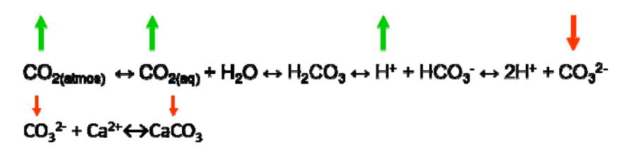

Figure 3.2.11. Seawater carbon chemistry and calcification equilibria. The upper equation shows changes in seawater chemistry from increased atmospheric CO2. The system dynamics are such that as atmospheric CO2 increases, oceanic CO2 increases, ocean hydrogen ion concentrations increase (lower pH) and carbonate ion concentrations decrease. The lower equation shows the calcification equation (formation of calcium carbonate). As carbonate concentrations decrease, calcification becomes more energetically costly.

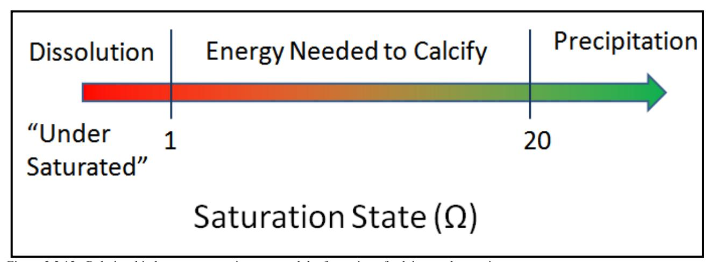

Figure 3.2.12. Relationship between saturation state and the formation of calcium carbonate in seawater.

Although CO2 levels in the surface waters of the ocean are, on average, generally in equilibrium with the lower atmosphere, there is considerable temporal (Fig. 3.2.12) and spatial variation (Fig. 3.2.13 over a broad range of time (diel to decadal) and space (reef to globe) scales. Five factors generally determine modern oceanic CO2 levels: (1) the rise in atmospheric CO2 driven primarily by human activity (see Figs. 3.2.1 and 3.2.12); (2) seasonal variability in atmospheric CO2 primarily driven by the northern hemisphere seasons (see Fig. 3.2.12); (3) thermodynamic relationships in CO2 absorption (i.e., solubility of gases is higher in colder water); (4) local sources of oceanic CO2 such as upwelling; and, (5) local biological processes of photosynthesis, respiration, and calcification. These factors drive not only changes in surface ocean CO2 through time, but spatial variability as well. In addition, the aragonite saturation state varies greatly within and across coral reefs and through diel cycles. Much of this variability is driven by photosynthesis, respiration, and calcification by marine organisms. As a result, corals live in an environment that not only is influenced by long, slow changes, but also is highly variable on short time-scales. Additionally, because of biological processes, temperature effects, and ocean circulation patterns, deeper waters tend to have higher CO2 levels (lower pH) than surface waters.

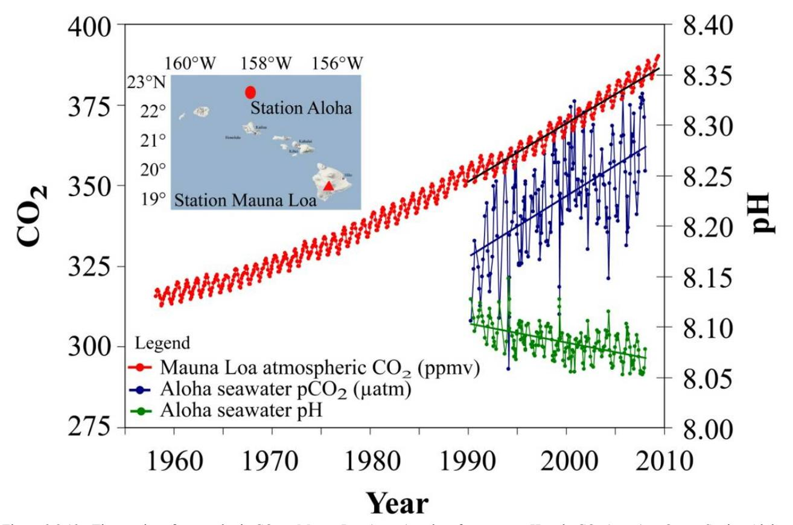

Figure 3.2.13. Time series of atmospheric CO2 at Mauna Loa (ppmv) and surface ocean pH and pCO2 (µatm) at Ocean Station Aloha in the subtropical North Pacific Ocean. The station Aloha series has the same slope of increasing CO2 as seen at Mauna Loa, but the absolute value is lower because of local primary productivity. Figure from Feely et al. 2009 with permission.

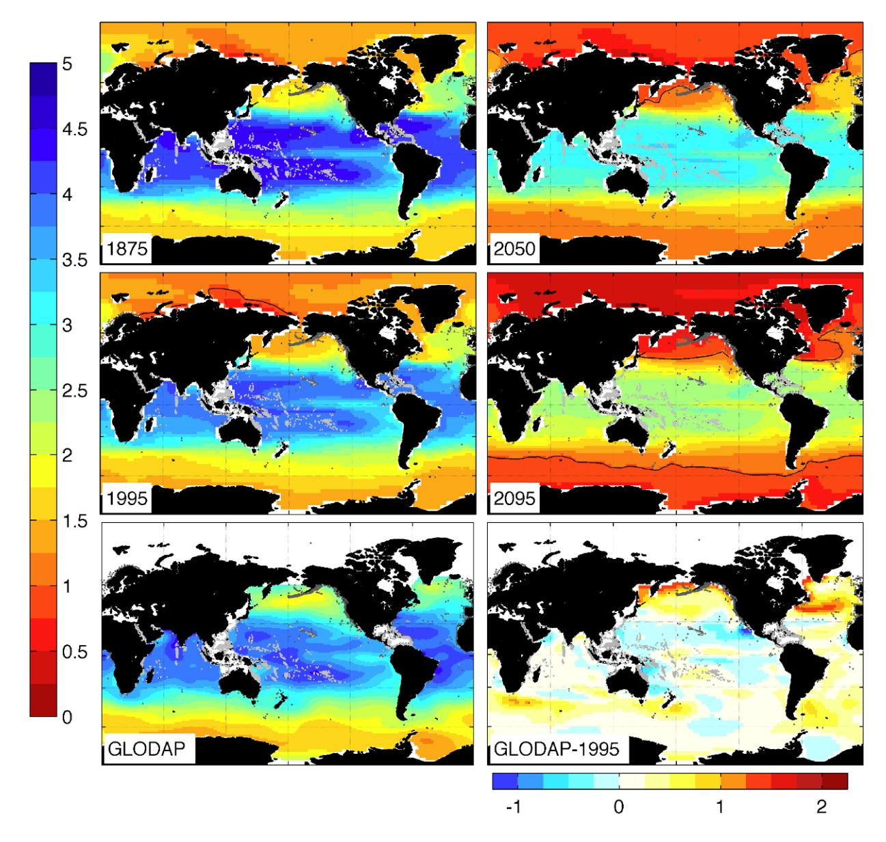

Figure 3.2.14. (*Top and middle rows* ) Model-based decadal mean aragonite saturation state at the sea surface, centered around the years 1875, 1995, 2050, and 2095 (from the National Center for Atmospheric Research Community Climate System Model, version 3 or NCAR CCSM-3). (*Bottom left*) Global Ocean Data Analysis Project (GLODAP)-based aragonite saturation state at the sea surface, nominally for 1995. (*Bottom right*) The difference between the GLODAP-based and CCSM-based 1995 fields; note the different color scale of this plot. Deep coral reefs are indicated by darker gray dots; shallow-water coral reefs are indicated with lighter gray dots. White areas indicate regions with no data (Feely et al., 2009).

The changes in ocean carbon chemistry discussed above can substantially reduce coral calcification and reef cementation and may affect many stages of the coral life cycle (Fig. 3.2.14).

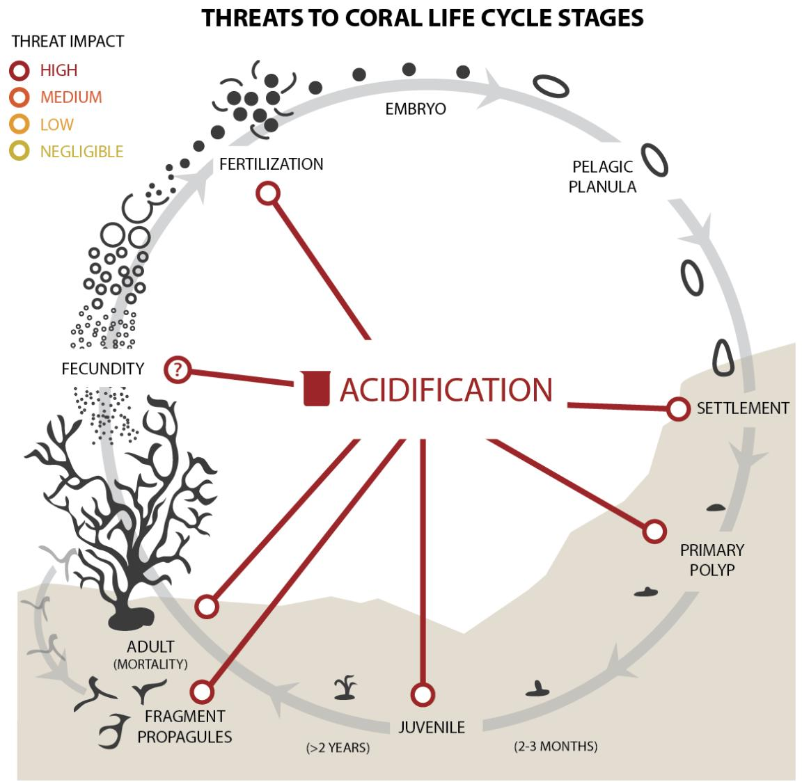

Figure 3.2.15. The impacts of ocean acidification from increasing atmospheric CO2 to various coral life history stages, including adult growth, fecundity, and fragmentation, fertilization, settlement, polyp development, and juvenile growth. The overall contribution of ocean acidification to extinction risk for the 82 candidate coral species was determined to be **medium-high** by the BRT. Diagram prepared by Amanda Toperoff, NOAA-PIFSC.

#### *3.2.3.1 Reduced calcification*

Numerous laboratory and mesocosm experiments have shown a relationship between elevated pCO2 and decreased calcification rates in corals and other CaCO3 secreting organisms (Barker and Elderfield, 2002; Doney et al., 2009; Table 3.2.2; Riebesell et al., 2000). In an early analysis, Kleypas et al. (1999a) calculated that coral calcification could be reduced by 30% in the tropics by the middle of the 21st century. Subsequent studies continued to show similar results; corals grown during laboratory experiments that doubled atmospheric CO2 manifested an 11% to 37% reduction in calcification (Gattuso et al., 1999; Langdon et al., 2003; Marubini et al., 2003). A variety of laboratory studies conducted on corals and coral reef organisms (Langdon and Atkinson, 2005) shows that most corals exhibit declining calcification rates (Fig. 3.2.15) with rising pCO2, declining pH, and declining carbonate saturation state, although the rate and mode of decline can vary among species. Increased pCO2 slows the laboratory growth rate of *Acropora cervicornis* (Renegar and Riegl, 2005). A study by Schneider and Erez (2006) found that declining saturation state caused a similar reduction in calcification in a Red Sea congener, *Acropora eurystoma*. They showed that *Acropora eurystoma* calcification has already declined by 20% since preindustrial times, and is likely to decline by 35% more with the doubling of atmospheric CO2 expected by the mid-21st century. These findings are consistent with estimates for other branching corals (Langdon and Atkinson, 2005) and with atmospheric CO2 increases in the IPCC AR4 assessment (IPCC, 2007b). However, all experiments do not show declining calcification as saturation state is lowered. Other laboratory studies have shown that even under conditions representing a tripling of preindustrial CO2 levels (~ 780 ppmv) for 6 months, some corals (*Astrangia poculata*) still calcified normally when provided with sufficient food supplies (Holcomb et al., 2010).

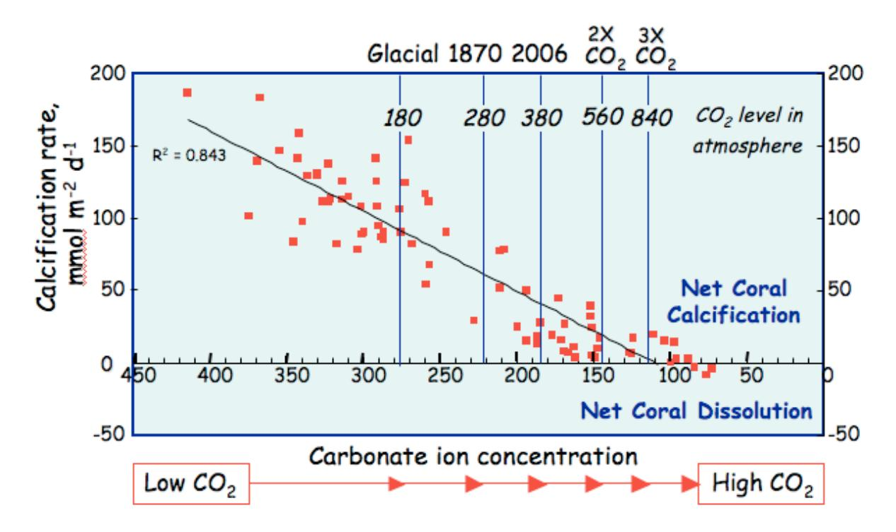

Figure 3.2.16. Plot of calcification rate vs. atmospheric CO2 expressed as a percentage of the preindustrial rate for a variety of corals and coral reefs during various studies (Langdon and Atkinson, 2005). The regression is a linear model showing declining calcification with increasing atmospheric CO2. Note: recent studies indicate that responses within a species may be nonlinear (De Putron et al., 2010; Ries et al., 2010).

Such laboratory studies have documented a range of coral responses to ocean acidification, in part because of variations in laboratory manipulations, and in part from processes that may vary in the field. For example, the Holcomb et al. (2010) study found that coral calcification rates were not significantly affected by moderately-elevated nutrients at ambient CO2 and were negatively affected by elevated CO2 at ambient nutrient levels. However, the corals reared under both elevated nutrients and elevated CO2 calcified at rates that did not significantly differ from those of corals reared under ambient conditions. This suggested that elevated CO2 (reduced saturation state) may only impair the calcification response in corals that are nutrient limited. Under nutrient-enriched conditions, corals may have the ability to use more dissolved inorganic carbon and maintain their calcification rates. This may point out a protection, whereby high nutrient regimes may impart some protection to corals in future acidified seas. Alternatively, the level of acidification tested could account for differences in observed results, as some corals may have what amounts to a threshold response to ocean acidification. For example, the coral *Oculina arbuscula* had minimal changes in skeletal accretion at aragonite saturation states from 2.6 to 1.6, but a major reduction in accretion at a saturation state of 0.8 (Ries et al., 2010).

Table 3.2.2. Summary studies exposing corals to manipulated seawater carbon chemistry (or related treatments). The studies used different methods for carbon manipulation, treatment levels, species response measurement methods and different treatment co-factors (e.g., temperature, nutrients). These differences are important and it is necessary to understand these differences when interpreting this table, which only summarizes a few key findings. Response symbols denote net result of increasing atmospheric CO2 on organisms, where appropriate. Candidate species are shown in bold.

| Species                        | Response to elevated CO 2 /lower pH (or other carbon system manipulation as indicated)                                                                           | Life- Stage Tested | Re- sponse | Source                     |
|--------------------------------|-----------------------------------------------------------------------------------------------------------------------------------------------------------------------------|--------------------------|---------------|----------------------------|
| Caribbean                      | -                                                                                                                                                                           |                          |               |                            |
| Acropora cervicornis           | Reduced growth rate                                                                                                                                                         | Adult                    | $\downarrow$  | Renegar and Riegl, 2005    |
| Acropora cervicornis           | Switch from aragonite to calcite in simulated Cretaceous seawater                                                                                                           | Adult                    | n/a           | Ries et al., 2006          |
| Acropora palmata               | Reduced fertilization success, reduced settlement (on treatment- conditioned substrates), reduced post-settlement growth                                                 | Recruits                 | <b>↓</b>      | Albright et al., 2010      |
| Porites astreoides             | No effect on settlement, negative effect on post settlement skeletal growth                                                                                                 | Recruits                 | -, ↓          | Albright et al., 2008      |
| Porites astreoides             | Non-linear reduction of calcification by recruits                                                                                                                           | Recruits                 | $\downarrow$  | De Putron et al., 2010     |
| Favia fragum                   | Minor reduction in calcification when fed                                                                                                                                   | ?                        | $\downarrow$  | Cohen and Holcomb, 2009    |
| Favia fragum                   | Non-linear reduction of calcification by recruits                                                                                                                           | Recruits                 | $\downarrow$  | De Putron et al., 2010     |
| Oculina arbuscula              | Non-linear reduction in adult skeletal accretion, only "minimally impaired" until below saturation                                                                          | Adult                    | <b>\</b>      | Ries et al., 2010          |
| Pacific                        |                                                                                                                                                                             |                          |               |                            |
| Madracis auretenra             | No effect of reduced [carbonate] or lower pH on calcification when [bicarbonate] is kept high                                                                               | ?                        | ?             | Al-Moghrabi et al., 1993   |
| Pocillopora damicornis         | Still able to recruit                                                                                                                                                       | Recruits                 | -             | Jokiel et al., 2008        |
| Stylophora pistillata          | Decreased calcification (note: manipulated Ca, not CO 2 )                                                                                                        |                          | $\downarrow$  | Gattuso et al., 1998       |
| Stylophora pistillata          | Decreased calcification at high temperatures, no effect on calcification at normal temperatures, increased photosynthesis                                                   |                          | <b>↓</b>      | Reynaud et al., 2003       |
| Acropora digitifera            | No effect on larval survivorship, reduced post-settlement growth, slower zoox infection                                                                                     | Larvae                   | -,↓           | Suwa et al., 2010          |
| Acropora digitifera            | Depressed larval metabolism and metamorphosis                                                                                                                               | Larvae                   | $\downarrow$  | Nakamura et al., 2011      |
| Acropora eurystoma             | Reduced calcification                                                                                                                                                       |                          | <b>\</b>      | Schneider and Erez, 2006   |
| Acropora intermedia            | Increased bleaching, productivity increase at moderate CO 2 increase but decrease at highest CO 2 , slight negative calcification,                    | Adult                    | <b>\</b>      | Anthony et al., 2008       |
| Acropora tenuis                | Reduced larval survivorship,                                                                                                                                                | Larvae                   | $\downarrow$  | Suwa et al., 2010          |
| Acropora verweyi               | Lower calcification rate, altered crystal structure                                                                                                                         | Adult                    | <b>↓</b>      | Marubini et al., 2003      |
| Montipora capitata             | Decreased calcification and linear extension, no change in gamete production                                                                                                | Adult                    | ↓, -          | Jokiel et al., 2008        |
| Montipora digitata             | Switch from aragonite to calcite in simulated Cretaceous seawater                                                                                                           | Adult                    | n/a           | Ries et al., 2006          |
| Montipora verrucosa (capitata) | Increased net production (in low nutrient), decreased calcification with added HCl                                                                                          | Adult                    | <b>\</b>      | Langdon and Atkinson, 2005 |
| Astrangia poculata             | Nutrient dependent decrease in calcification                                                                                                                                | Adult                    | $\downarrow$  | Holcomb et al., 2010       |
| Porites compressa              | Increased net production (in low nutrient), decreased calcification with added HCl                                                                                          | Adult                    | <b>\</b>      | Langdon and Atkinson, 2005 |
| Porites cylindrica             | Switch from aragonite to calcite in simulated Cretaceous seawater                                                                                                           | Adult                    | n/a           | Ries et al., 2006          |
| Porites lobata                 | Slight increase in bleaching at highest CO 2 , decreased productivity with CO 2 , slight negative calcification effect, interactions with temperature | Adult                    | <b>\</b>      | Anthony et al., 2008       |
| Porites lutea                  | Lower calcification rate                                                                                                                                                    | Adult                    | <b>↓</b>      | Ohde and Hossain, 2004     |
| Pavona cactus                  | Lower calcification rate                                                                                                                                                    | Adult                    | <b>↓</b>      | Marubini et al., 2003      |
| Galaxea fascicularis           | Increased calcification with increased Ca (note: manipulated Ca, not $\mathrm{CO}_2$ )                                                                                      | Adult                    | n/a           | Marshall and Clode, 2002   |
| Galaxea fascicularis           | Lower calcification rate                                                                                                                                                    | Adult                    | <b>↓</b>      | Marubini et al., 2003      |
| Turbinaria reniformis          | Lower calcification rate, altered crystal structure                                                                                                                         | Adult                    | <b>↓</b>      | Marubini et al., 2003      |
| Other Coral                    | •                                                                                                                                                                           |                          | 1             |                            |
| Tropical 25 genera of coral    | Decreased calcification, no change in community net production                                                                                                              | Adult                    | <b>\</b>      | Langdon et al., 2003       |
| Red Sea coral reef community   | Calcification increased with saturation state and temperature                                                                                                               | Adult                    | <b>\</b>      | Silverman et al., 2007     |
| Cladiella sp. (soft coral)     | No carbon manipulation but illustrates relationship of tissue                                                                                                               | Adult                    | n/a           | Tentori and Allemand,      |

| Species                          | Response to elevated CO2/lower pH (or other carbon system manipulation as indicated) | Life Stage Tested | Re sponse | Source                   |
|----------------------------------|-----------------------------------------------------------------------------------------|-------------------------|--------------|--------------------------|
|                                  | damage to calcification                                                                 |                         |              | 2006                     |
| Lophelia pertusa (cold water) | Reduced calcification rate (but still positive net calcification)                       | Adult                   |             | Maier et al., 2009       |
| Non-Coral                        |                                                                                         |                         |              |                          |
| Crustose coralline algae         | Negative effect on productivity, net dissolution                                        | Adult                   |             | Anthony et al., 2008     |
| Crustose coralline algae         | Significant reduction in cover                                                          | Recruit and Adult    |             | Jokiel et al., 2008      |
| Crustose coralline algae         | Significant reduction in cover                                                          | Recruit and Adult    |             | Kuffner et al., 2007     |
| Crustose coralline algae         | Decreased calcification/high mortality with temperature                                 | Adult                   |             | Martin and Gattuso, 2009 |

In addition to the variability of results, two aspects of these calcification studies limit the degree to which they could be applied directly to the deliberations of the BRT in evaluating extinction risks. First, most of the 82 candidate coral species have yet to be subjected to acidification studies. This means that the BRT mostly had to rely on work performed on other species in the same genus or family or use the general patterns seen across the few corals that had been tested. Secondly, these laboratory and mesocosm-type experiments have provided only days to months for the corals to acclimatize to the experimental conditions and have used varied techniques (usually addition of acid or dissolved CO2). However, experiments to date have shown no ability for corals to acclimate or adapt to changes in pH or saturation state, and one of the few experiments to test both acid addition and pCO2 elevation showed comparable results from both manipulations (De Putron et al., 2010). The response of most corals has been a reduction in calcification, with others being relatively unaffected. Those species that are affected have not shown patterns of acclimatization with the limited exposure times tested to date.

Field studies of the historic growth rates of corals during the last century have also shown variability in results. Recent field studies have shown a decline in linear extension rates in *Porites* spp. from the Great Barrier Reef (De'ath et al., 2009); and Thailand (Tanzil et al., 2009), and of *Acropora palmata* in Curaçao (Bak et al., 2009). Although these studies have suggested that acidification may have already begun significantly reducing growth of some species of coral on some reefs, there is some debate in the community about whether or not the observed reductions in coral growth were indeed caused by acidification. In either case, reductions in coral growth have not been shown for all corals at all reefs, as no effect was seen in *Montastraea faveolata* in Florida (Helmle et al., 2011). This suggests that all corals may not be affected to the same degree or that local factors may be ameliorating the saturation states on reefs. Other studies concluded that some corals are calcifying more, not less, despite changes in atmospheric CO2 levels (Bessat and Buigues, 2001; Lough and Barnes, 1997). However, the Lough and Barnes (1997) study has largely been superceded by Lough's later work with De'ath (2009). Bessat and Buiges (2001) suggested that corals from Moorea responded positively to small increases in temperature that negated any decrease because of elevated CO2.

Reduced calcification rates in corals have been hypothesized to manifest in three different possible modes:

- 1. Corals may grow slower as the reduced aragonite saturation state slows calcification and skeletal extension.
- 2. Corals may grow at a normal rate, which may reduce skeletal density because the extension rate is faster than the calcification rate. This would result in corals that are more fragile and more easily broken.
- 3. Corals may divert energy from other processes such as tissue growth or reproduction to maintain calcification rates.

Evidence from numerous studies of calcifying organisms (Langdon and Atkinson, 2005) has suggested that corals affected by reduced saturation state may primarily experience reduced growth (Cohen and Holcomb, 2009), although many uncertainties remain.

While many of the effects of reduced aragonite saturation state have yet to be directly demonstrated in most of the 82 candidate coral species, reduced calcification and slower growth will likely result in slower recovery from breakage, whether natural (hurricanes and storms) or anthropogenic (breakage from vessel groundings, anchors, fishing gear, etc.) or mortality from a variety of disturbances. It also is likely to make it more difficult for corals to keep up with rising sea level. Additionally, slower growth likely implies even higher rates of mortality for newly settled corals that are vulnerable to overgrowth competition, sediment smothering, and incidental predation until they reach a refuge at larger colony size. Reduced calcification and slower growth suggests it may take more time to reach reproductive size after successful recruitment or fragmentation. Further, ocean acidification is likely to interact with other stressors. Work on Pacific *Acropora* spp. suggests that acidification may reduce the threshold at which bleaching occurs, increasing the threat posed by bleaching (Anthony et al., 2008).

Many other important reef species will be significantly influenced by reduced seawater carbonate saturation state. Recent community mesocosm studies (Jokiel et al., 2008; Kuffner et al., 2007) showed dramatic declines (86%) in the growth rate of crustose coralline algae and other reef organisms (250% decline for rhodoliths) and an increase in the growth of fleshy algae at CO2 levels expected later this century. The fleshy algae increase presumably occurs because plant species that have an inefficient carbon capturing mechanism can have elevated rates of photosynthesis with increased CO2. Such decreases in growth of crustose coralline algae, coupled with rapid growth of fleshy algae, would presumably result in less available habitat and more competition for settlement and recruitment of new coral colonies. It has been suggested that these indirect mechanisms (i.e., impacts on reef plants) may account for observed reduced settlement success of coral larvae in elevated CO2 conditions rather than direct effects of reduced saturation state on metamorphosis/calcification (Albright et al., 2008). Modeling studies have estimated the rates of grazing by herbivores that are required to maintain conditions suitable for coral recruitment and the coral dominance of reef ecosystems (Mumby et al., 2007a). The rates of herbivory necessary to maintain conditions needed for coral recruitment would have to increase as atmospheric CO2 increases (Hoegh-Guldberg et al., 2007; Fig. 3.2.16).

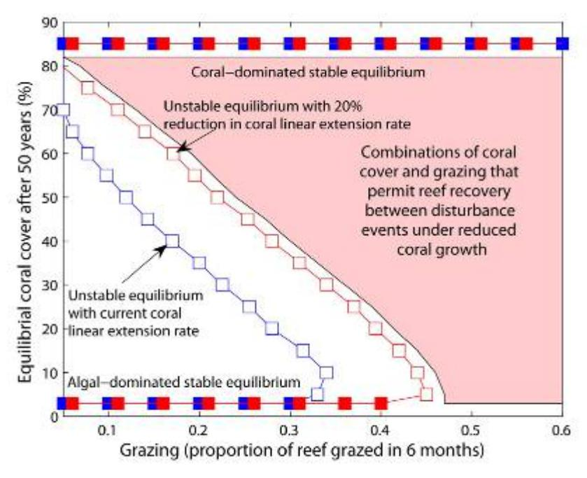

Figure 3.2.17. Model projection of reduction in the resilience of Caribbean forereefs as coral growth rate declines by 20%. Reef recovery is only feasible above or to the right of the unstable equilibria (open squares). The "zone of reef recovery" (pink) is, therefore, more restricted under reduced coral growth rate and reefs require higher levels of grazing to exhibit recovery trajectories (Hoegh-Guldberg et al., 2007, using model from Mumby et al., 2007a; Mumby et al., 2007b).

Additionally, rising atmospheric CO2 and the resulting reduced carbonate saturation state may reduce the growth rate and recruitment of long-spiny sea urchins (*Diadema antillarum)*, thereby deterring recovery of this important keystone species, which declined dramatically during the 1983 mass mortality event in the Caribbean. Ries et al. (2009) found that urchins differ in their response to ocean acidification, with some species decreasing and others having hyperbolic growth responses. Slower recovery of *Diadema antillarum* will keep down grazing rates and increase algal competition for benthic space, especially at sites where the density of other herbivores, such as parrotfishes, have been reduced by fishing. All of this is likely to occur in concert with potential enhancement of growth by some fleshy macroalgae (Kuffner et al., 2007).

#### *3.2.3.2. Increased erosion*

Another major potential consequence of ocean acidification (falling carbonate saturation state) is a reduction in the structural stability of corals and coral reefs, which result both from increases in bioerosion and decreases in reef cementation. Naturally low saturation states of waters in the eastern Pacific Ocean have resulted in some of the highest rates of bioerosion documented globally (Eakin, 1996; 2001; Glynn, 1988b; Reaka-Kudla et al., 1996) and in poorly cemented (Glynn and Macintyre, 1977; Manzello et al., 2008), unstable, and fragile reef frameworks. These reefs have rapidly crossed the tipping point from net deposition of calcium carbonate framework to net erosion after the severe coral bleaching during the 1983 El Niño warming (Eakin, 1996; 2001; Glynn, 1988b). Low saturation state seawater decreases the rate of the basic biogeochemical processes that create the cements that infill reefs, such as the crustose coralline algae discussed in Section 3.2.3.1 (Jokiel et al., 2008; Kuffner et al., 2007). As atmospheric CO2 rises globally, new reef formations may calcify more slowly and become more fragile, thereby resembling existing conditions observed for eastern Pacific reefs. This would impede reef growth and decrease the ability of coral reefs to recover from habitat damage resulting from disturbances such as hurricanes, vessel groundings, and anchoring. Many important bioeroders, such as boring sponges, use acidic processes that may be enhanced at lower oceanic pH levels. This may increase biochemical erosion of the reef framework but has yet to be tested. Recent work has shown that topographic complexity has already been reduced in Caribbean coral reefs (Alvarez-Filip et al., 2009), probably as a result of coral mortality and subsequent breakage/erosion of dead skeletons. This topographic flattening reduces shelter habitat for herbivores, thereby further increasing ecosystem impacts. Corals themselves may be able to persist and maintain some level of physiological function in the absence of a carbonate skeleton (Fine and Tchernov, 2007), but a lack of accretion and increased erosion would essentially eliminate coral reefs and much of the ecosystem goods and services they provide. This could begin as early as mid-century when doubling of preindustrial CO2 concentrations are predicted (Silverman et al., 2009).

Finally, it has been hypothesized that reduced pH and increased dissolved CO2 may influence coral diseases. However, far too little is known about most coral diseases to estimate this effect, and no studies to date have tested such potential relationships.

#### *3.2.3.3 Effects on reproduction (fertilization, settlement, recruitment, juvenile growth)*

Despite early work by Edmondson that showed coral larvae can sometimes settle under acidified conditions but vary in their ability to calcify (Edmondson, 1929; 1946), until recently little attention has been directed at the potential effects of ocean acidification on early life stages of corals (Fig. 3.2.14). Ocean acidification can affect non-calcifying stages of organisms through the effects of low pH on their development and physiology (Pörtner et al., 2004). Given the plethora of demographic bottlenecks in the early life stages of corals, the energy-limited state (i.e., lecithotrophic) of most spawned larvae prior to the onset of post-settlement calcification, and the complex, poorly-understood cues that affect larval settlement, it is plausible to expect that basic changes in carbon chemistry may be influential in coral recruitment. Published studies on a few coral species have begun to support these suppositions. More sophisticated manipulations than Edmondson's have shown that post-settlement and juvenile corals show consistent inhibition of calcification and skeletal growth under reduced carbonate saturation state (Albright et al., 2008; Albright et al., 2010; Cohen et al., 2009; Kurihara, 2008; Suwa et al., 2010). Fertilization success of the spawning coral *Acropora palmata* is significantly reduced at increased CO2 levels projected for within this century. While this impairment was not detectable at optimal sperm concentrations, the relative reduction of fertilization success was greater at the lower sperm concentrations that are more typically realized in nature (Albright et al., 2010). Thus, ocean acidification may exacerbate Allee effects in broadcast spawning corals.

In contrast, some studies now suggest that reduced carbonate saturation state (as low as < 1) has little effect on survivorship during the pelagic larval stage (Suwa et al., 2010). Also, no significant impacts were observed on spawning of *Montipora capitata* and settlement of *Pocillopora damicornis* (brooded) larvae during a 6-month mesocosm experiment with treatment saturation state of 1–2 (Jokiel et al., 2008), although the low number of replicates provided insufficient statistical power to effectively detect potential differences. In contrast, a recent study found that larvae of *Acropora digitifera* responded to reduced pH with reduced metabolism and suppressed metamorphosis, perhaps as a response to increased short-term survival under acute stress (Nakamura et al., 2011). The result of this may reduce longterm larval survival, recruitment, and connectivity under chronically reduced pH.

Effects of low pH on corals may increase again after settlement. Settlement assays conducted with *Porites astreoides* larvae and substrates conditioned at ambient saturation states did not show a significant effect of lowered pH (Albright et al., 2008), while assays with *Acropora palmata* larvae on substrates conditioned in high-CO2 treatments showed more than a 50% reduction in settlement success (Albright et al., 2010). This suggests that acidification may influence settlement more by indirect alterations of the benthic community, which provides settlement cues, than by direct physiological disruption. Kuffner et al. (2007) and Jokiel et al. (2008) have both reported the radical reduction in colonization and growth of crustose coralline algae in mesocosm experiments in moderate ocean acidification treatments (ca. 2100 in the IS92a "business-as-usual" emission scenario, IPCC, 1992). This would not only reduce reef accretion and cementation, but it might also reduce the presence of important cues for larval settlement.

#### **3.2.4 Sea-level rise (slow and/or rapid)**

#### *3.2.4.1 Sea-level rise—processes and predictions*

The IPCC Fourth Assessment Report (AR4) (IPCC, 2007b) concluded that sea level will continue to rise because of thermal expansion and the melting of both land and sea ice as direct consequences of increases in atmospheric greenhouse gases. The most often quoted range for the next century does not include the potentially largest component: the melting and sliding of the Greenland and Antarctic ice sheets. As stated in the summary for policy makers: "Models used to date do not include uncertainties in climate-carbon cycle feedback nor do they include the full effects of changes in ice sheet flow, because a basis in published literature is lacking." This means that the IPCC projection of a 0.3–0.6 m sea level rise by 2100 (A1FI scenario) should be considered a minimum amount as it omits the potentially largest component of sea-level rise. However, as evidence accrues that suggests that the Greenland and Antarctic ice sheets are much more dynamic and vulnerable than previously thought, more recent studies have increased the estimated rates for sea-level rise (Overpeck et al., 2006; Rahmstorf et al., 2009; Shepherd and Wingham, 2007; Thomas et al., 2004b). It now appears most likely that sea-level rise over the 21st century will be at least 1–2 m (Cabioch et al., 1998; Overpeck and Weiss, 2009), with sea-level rise of 4 m less likely but not out of the question by 2100 (Rahmstorf et al., 2009). The IPCC went on to conclude that an additional 4–6 m rise would be likely if polar land-ice melting is similar to that seen during the last interglacial period, 125,000 years ago, and 7 m is possible if the Greenland ice sheet melts completely. At current rates of anthropogenic greenhouse gas increases, it is not a question of if these sea levels will be reached, but perhaps when (McMullen and Jabbour, 2009; Milne et al., 2009). Sea-level rise has consistently exceeded the worstcase scenario (A1FI) from IPCC estimates (Rahmstorf et al., 2009). The best estimates of the rates of sea-level rise attributed to ice melting and thermal expansion during this century are between 0.8 and 2.0 m (Pfeffer et al., 2008).

#### *3.2.4.2 Impacts to corals and coral reefs*

An increase in sea level (or increased depth via subsidence) provides accommodation space for corals living near the sea surface, which corals can potentially fill through vertical growth. However, it is likely to affect multiple stages of a coral's life history and the BRT ranked it as a low-medium overall threat (Fig. 3.2.17). Depending on the rate and amount of sea-level rise, reefs may be able to keep up or catch up—but rapid rises can lead to reef drowning (Neumann and Macintyre, 1985). Rapid rises in sea level could affect many of the candidate coral species by both submerging them below their common depth range and, more likely, by degrading water quality through coastal erosion and potentially severe sedimentation or enlargement of lagoons and shelf areas. Blanchon and Shaw (1995) argued that a sustained sealevel rise of more than 14 mm per year is likely to displace the very rapidly-growing Caribbean elkhorn coral *Acropora palmata* from its framework-building depth range (0 to 5 m) into its remaining habitat range (5 to 10 m) where a mixed framework is likely to develop. Many corals that inhabit the relatively narrow zone near the ocean surface have rapid growth rates when healthy, which historically has allowed them to keep up with sea-level rise during the past periods of rapid climate change associated with deglaciation and warming (Blanchon et al., 2009; Church et al., 2001; Thomas et al., 2004b). Recent work in the Yucatan region of Mexico by Blanchon et al. (2009) indicated that during the warming that led to the last interglacial period, *Acropora palmata* was able to keep up with the first 3 m of rapid sea-level rise. Continued sea-level rise led to the demise of the original forereef crests, and *Acropora palmata* began to grow again at a more inland site as sea level rose a total of 6 m over 50–100 years. Even at the most rapid trajectories of sea-level rise, it is likely that many of these corals would be capable of keeping up (growing upward) if conditions were otherwise suitable for growth. However, rapid growth is likely to be hindered if the corals are stressed by other factors. In contrast, corals that predominantly inhabit wider depth ranges are less likely to suffer negative effects from sea-level rise—provided that water quality does not seriously deteriorate, which could limit light in the deeper portions of some species' depth ranges.

Sea-level rise may cause decreased water quality via shoreline erosion and flooding of shallow banks and lagoons. The threat of these processes can be assessed on a site-by-site basis, using criteria such as the geological character of the shoreline and topography. Where topography is low and/or shoreline sediments are easily eroded, corals may be severely stressed by degrading water quality, heavy levels of sedimentation, and potential release of toxic contaminants as sea-level rise proceeds. Greater inundation of reef flats can erode residual soils and lagoon deposits (Adey et al., 1977; Lighty et al., 1978) and produce greater sediment transport (Hopley and Kinsey, 1988). Flooded shelves and banks may alter the temperature or salinity of seawater to extremes that can then affect corals during offshore flows. This process has been termed reefs that "are shot in the back by their own lagoons" by Neumann and Macintyre (1985). Although this process could be widespread, many coral reefs will have areas, particularly mid-ocean low islands and atolls and windward sides of rocky islands, where erosion and lagoon formation will be minimal. However, Blanchon et al. (2009) showed that ocean warming and sea level rise leading up to the last interglacial period resulted in either smothering and burial of lagoon corals or a transition of coral communities to a more sediment-tolerant assemblage. The new coral communities included slower-growing species most able to withstand sediment backwash during shoreline retreat. Hence, rapid sea-level rise may result in either loss of corals or changes in community structure and composition of corals, most likely to slower growing forms.

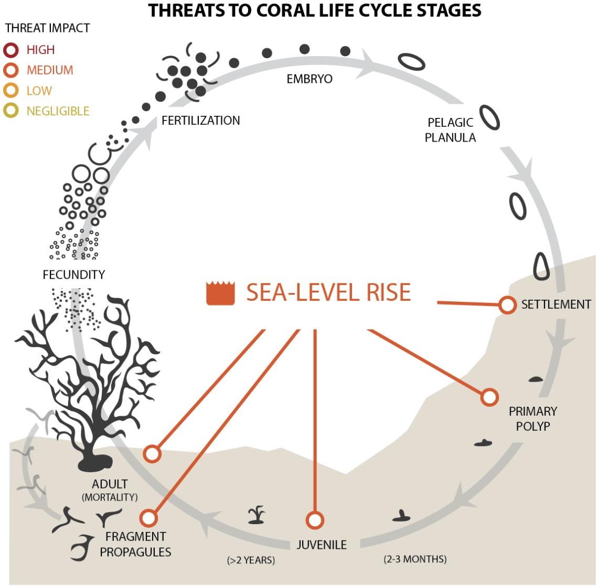

Figure 3.2.18. The impacts of sea-level rise to various coral life history stages, including adult mortality and fragmentation, settlement, polyp development, and juvenile growth, mostly as a result of increased sedimentation and decreased water quality (reduced light availability) from coastal innundation. The overall contribution of sea-level rise to the extinction risk of the 82 candidate coral species was determined to be **low-medium** by the BRT. Diagram prepared by Amanda Toperoff, NOAA PIFSC.

Previously, coral reefs have responded to post-glacial sea-level rise with rapid growth followed by reef retreat to follow shoreline retreat. This requires that corals have access to unobstructed framework that will serve as the substrate for new reef growth. In many areas, human response to rapid sea-level rise is likely to result in "hardening"—coastal construction designed to protect critical human infrastructure from advances of the sea into coastal communities. Under such scenarios, it is not unlikely that societies will strive to protect human development and coastal infrastructure, even if this results in the destruction or degradation of coral reefs. The result of these human actions will be to magnify the impacts that sea-level rise will have on corals and coral reefs in the affected coastal areas.

In summary, sea-level rise may provide candidate coral species with access to some new habitats by raising water levels above existing reef flats and by shoreward migration of coastlines. However, hardening of shorelines is likely to delay the progression of coastlines, and coastal inundation will likely release new sediments and pollutants into coastal reef waters, making some of these new habitats inhospitable to many coral species, as reported in fossil records (Blanchon et al., 2009). Other factors, including a lack of suitable new habitat or limited success in sexual recruitment, could also impair the ability of corals to keep up with sea-level rise. The influence of rising sea level on the 82 candidate coral species is likely to have mixed responses for the respective species depending on their depth preferences, sedimentation tolerances, growth rates, and the nearshore topography. Reductions in growth rate attributed to local stressors, bleaching, infectious disease, ocean acidification may prevent the species from keeping up with sea-level rise. Therefore, this threat is ranked as low to medium for all regions throughout these species' ranges (Fig. 3.2.17).

#### **3.2.5 Changing ocean circulation**

In addition to their fundamental influences on heat storage and transport for the global climate system, ocean currents directly and significantly influence coral reef ecosystems through many important processes, including larval transport and recruitment dynamics (connectivity), nutrient enrichment (biomass productivity), heating and cooling (bleaching), and control of the basic biogeochemical processes, such as respiration, photosynthesis, and calcification (Fig. 3.2.18). The major components of ocean currents influencing coral reefs are wind-driven surface ocean currents, the large-scale density-driven thermohaline circulation of the ocean interior, tidal currents, and wave-driven nearshore currents.

The dominant, basin-scale wind-driven surface gyres are clockwise in the northern hemisphere and counterclockwise in the southern hemisphere in response to the Coriolis effect of the earth's rotation. Many coral reefs are located in areas dominated by easterly trade winds. Being primarily wind-driven, the surface currents will respond to climate changeinduced alterations in surface wind patterns across the tropics. As a result, these surface ocean currents are highly variable over a broad range of spatial and temporal scales, most notably seasonal and interannual time scales associated with the El Niño-Southern Oscillation (ENSO). ENSO events can influence larval availability and productivity of corals and other coral reef organisms. In reef regions that warm during El Niño (such as French Polynesia; Lo-Yat et al., 2011), El Niño leads to less productivity and a lower larval supply. The mean tropical atmospheric circulation is a largescale zonal (east–west) overturning of air across the equatorial oceans—driven by convection to the west and subsidence to the east—known as the Walker circulation (Ries et al., 2006). Vecchi et al. (2006) examined changes in tropical Pacific circulation since the mid-19th century, using both observations and a suite of global climate model experiments and found a weakening of this Walker circulation. The size of this weakening trend is consistent with theoretical predictions and is accurately reproduced by climate model simulations that indicate it is largely a result of anthropogenic climate forcing (Vecchi et al., 2006). According to their climate model, the weakened surface winds have altered the thermal structure and circulation of the tropical Pacific Ocean. Ocean-color remote sensing has shown an expansion of zones of low productivity (oligotrophic waters) in most extra-tropical ocean areas, and this has been attributed to these circulation changes (Polovina et al., 2008). However, in another comparison of climate observations to models, Wentz et al. (2007) found that global and tropical ocean winds have been increasing over the last 20 years (though slower in the tropics), in contrast to models that indicate winds will weaken. Along with these changes in winds, models and observations both show an increase in atmospheric water vapor and precipitation (Wentz et al., 2007). Although these findings suggest that tropical wind-driven ocean currents will continue changing, the details about future directions and speeds of these surface currents remain insufficiently understood to adequately predict the potential influences to coral reefs generally or to the 82 candidate coral species in particular.

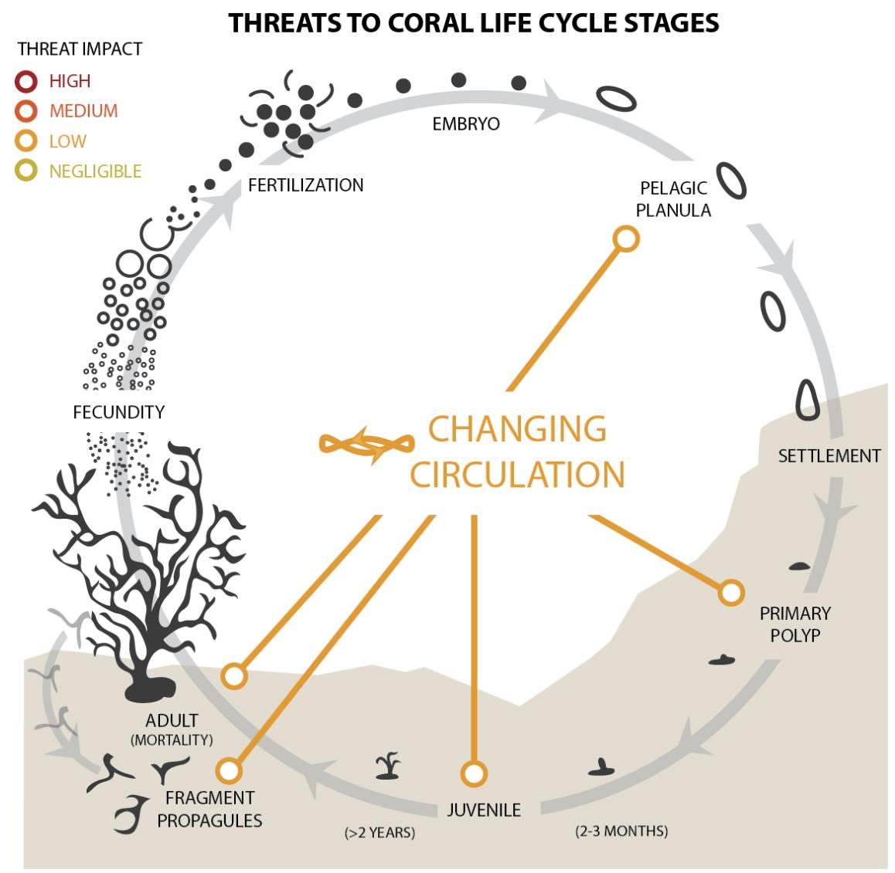

Figure 3.2.19. The impacts of changes in ocean circulation to various coral life history stages, including adult mortality and fragmentation, pelagic planula, polyp development, and juvenile growth. The overall contribution of changes in ocean circulation to the extinction risks of the 82 candidate coral species was determined to be **low** by the BRT. Diagram prepared by Amanda Toperoff, NOAA PIFSC.

As for the density-driven thermohaline circulation of the ocean interior, many general circulation models of the coupled ocean–atmosphere system predict that anthropogenic warming will lead to a potential weakening of Atlantic Thermohaline Circulation (Latif et al., 2000) through surface warming and freshening in high latitudes. Some models even suggest that sufficiently strong greenhouse gas forcing may result in a complete breakdown of the Thermohaline Circulation (Rahmstorf, 2002). In contrast, other climate models indicate that warming may lead to large-scale tropical air-sea interactions similar to those seen during present-day El Niño events, leading to anomalously high salinities in the tropical Atlantic that would be advected into the North Atlantic sinking region, counteracting local warming and freshening (Latif et al., 2000). The conflicting patterns of circulation under future warming makes it difficult to assess the likelihood of various future circulation scenarios, mainly owing to poorly constrained model parameterizations and uncertainties in the response of ocean currents to greenhouse warming (McMullen and Jabbour, 2009). Analyses of previous abrupt climate changes help resolve some of these problems (Rahmstorf, 2002). Data and models both suggest that abrupt climate change during the last glaciation originated through changes in the Atlantic Thermohaline Circulation in response to small changes in the hydrological cycle (McMullen and Jabbour, 2009). Atmospheric and oceanic responses to these changes were then transmitted globally through a number of complex feedbacks. The paleoclimatic data and the model results also indicate that the Thermohaline Circulation is only stable under the current mean climate state (McMullen and Jabbour, 2009), which itself is undergoing dynamic global changes.

The BRT recognizes that rising atmospheric greenhouse gas concentrations and climate change may result in abrupt changes in basin-scale circulation patterns. Such changes could have significant and far-reaching global consequences. For example, connectivity between reefs is essential in terms of providing larvae to foster recovery from disturbance as well as long-term gene flow. However, while it appears likely that changes in ocean circulation patterns will occur, too much uncertainty in the modeling of ocean circulation in a changing climate remains to adequately incorporate the range of these potential changes into the risk assessments of the 82 candidate coral species.

#### **3.2.6 Changing storm tracks and intensities**

The IPCC consensus did not determine whether anthropogenic climate effects will change the average number of tropical cyclones, but they did anticipate a likely increase in tropical cyclone intensity (IPCC, 2007b): "Based on a range of models, it is *likely* that future tropical cyclones (typhoons and hurricanes) will become more intense, with larger peak wind speeds and more heavy precipitation associated with ongoing increases of tropical sea surface temperatures. There is less confidence in projections of a global decrease in numbers of tropical cyclones. The apparent increase in the proportion of very intense storms since 1970 in some regions is much larger than simulated by current models for that period." Updated research continues to support this IPCC assessment (Knutson et al., 2008).

Under natural conditions, hurricane damage is one of many forms of disturbance that corals have experienced for millennia. However, other anthropogenic stresses to coral reef ecosystems (bleaching, sedimentation, eutrophication, ocean acidification, etc.) have reduced the ability of some coral reefs to return to their mean pre-disturbance state or condition by slowing coral recruitment, growth, and reducing fitness (Nyström et al., 2000). Already, bleaching and tropical storm disturbances have caused successive and substantial losses of elkhorn and staghorn coral cover in the Florida Keys (Miller et al., 2002; Williams et al., 2008a). Tropical storms can bring benefits to reefs if the storms pass far enough away to not inflict damage, but close enough to cool waters through enhanced wave-induced vertical mixing and reduce bleaching risk (Manzello et al., 2007; Szmant and Miller, 2005). Historically, tropical storms likely fostered propagation of elkhorn and staghorn coral thickets through fragmentation, but recent observations from periods of frequent hurricanes in the Florida Keys document a lack of successful recruitment of fragments and a severe population decline (Williams et al., 2008a). A recent modeling study out to 2099 predicted that Caribbean coral reefs are likely to maintain their community structure and function under any expected level of hurricane activity, at least under (perhaps unlikely) conditions with high herbivory and minimal thermal bleaching (Edwards et al., 2010).

Buddemeier et al. (2004) argued that there is little evidence for projected changes in storm frequency and there is no agreement on an increase of storm intensity with projected global climate change. However, there is general agreement that hurricane frequency increased in the mid-1990s, after a 30-year lull in activity, back to levels experienced earlier in the 20th century. Goldenberg et al. (2001), in evaluating various studies comparing hurricane frequency changes and global climate change, stated that the data are as of yet inconclusive. Some models indicate that tropical cyclones in the Pacific might increase in intensity by 5% to 12% (Knutson et al., 2001), although that study did not address the applicability of their results to other ocean basins. Others have highlighted the uncertainty in concluding that regional hurricane frequencies are not yet predictable (Henderson-Sellers et al., 1998). That study also concluded that intensities will likely remain the same or increase at a modest 10% to 20%, stating that these predicted changes are small compared with natural variations. Still others modeling the effects of greenhouse gas-induced warming have found that the frequency of storms would be significantly reduced (Bengtsson et al., 1996). Although there is no clear evidence for or against future changes in storm frequency associated with global climate change (2004), there is greatest agreement that climate change will increase tropical storm intensity (Knutson et al., 2008). Any change in frequency would affect the time available for coral recovery from storm damage, although other anthropogenic changes (acidification, sediment stress, etc.) could also change the length of time corals require to recover from storm disturbances. All things considered, the BRT determined changes in tropical storm frequency and intensity to represent a low but uncertain level of threat to the extinction risks for the 82 candidate coral species.

#### **3.2.7 African and Asian dust**

Scientists have long known that dust clouds travel long distances. Soils found on many Caribbean islands may have been substantially enriched with iron from African dust (Garrison et al., 2003), and studies show that essential nutrients in Hawaiian rainforests are transported via dust from Asia (Kurtz et al., 2001). Hundreds of millions of tons of dust transported annually from Africa and Asia to the Americas may be adversely affecting coral reefs and other downwind ecosystems (Garrison et al., 2003). Viable microorganisms, macro- and micronutrients, trace metals, and an array of organic contaminants carried in the dusty air masses and deposited in the oceans and on land could affect coral reefs worldwide. Shinn et al. (2000) proposed that atmospheric dust transported largely from Africa has severely affected Caribbean coral-reef organisms by acting as a vector for pathogens such as *Aspergillus sydowii*, a fungus known to affect two sea fans *(Gorgonia ventalina* and *Gorgonia flabellum)* (Geiser et al., 1998). Recent research, however, found that of seven species of *Aspergillus* present in dust samples collected from Mali and St. Croix in the U.S. Virgin Islands, *Aspergillus sydowii* was not present (Rypien et al., 2008). Several other studies that examined the fungal biota of African dust also did not detect *Aspergillus sydowii*, although several other species of *Aspergillus* were present (Griffin et al., 2003; Kellogg et al., 2004; Shinn et al., 2003; Weir-Brush et al., 2004). These data taken in conjunction with recent molecular evidence, suggest that African dust as a source of the marine pathogen *Aspergillus sydowii* should be considered unlikely (Rypien et al., 2008). To date, the identified *(Serratia marcescens)* or suspected *(Vibrio charcharia)* pathogens of elkhorn and staghorn corals have not been identified among the microbes in dust (Griffin et al., 2002). Therefore, the BRT ranked the threat posed by African and Asian dust as negligible for all areas throughout the ranges of the 82 candidate coral species, and left unabated, this threat is not expected to significantly increase the extinction risk for any of these species. There is also no well-established connection between anthropogenic climate change and future levels of African or Asian dust.

#### **3.2.8 Changes in insolation**

Since the late 1950s, a global network of solar radiation measurements at the Earth's surface have revealed that the energy provided by the sun at the Earth's surface has undergone considerable variations over the past decades, with associated impacts on climate (Ohmura, 2009; Wild, 2009). Wild (2009) reported that solar radiation at the Earth's surface decreased by 2% per decade between the 1950s and 1990 and increased from 1985 to the present (Wild, 2009); he coined the two phrases "global dimming" and "global brightening" to describe these trends.

No evidence shows that solar radiation reaching the upper atmosphere has changed. Instead, changes in surface irradiance appear to have been the result of light absorption in the atmosphere. However, it is unclear how much global dimming/brightening can be attributed to clouds and water vapor, aerosols, and interactions between clouds and aerosols, as aerosols can influence the "brightness" and lifetime of the clouds by providing cloud condensation nuclei. The investigation of these relationships is complicated by the fact that insufficient—if any—observational data are available on how clouds and aerosol loadings have been changing over the past decades. Another unresolved question is what happens over the oceans, as barely any high-quality insolation data are available from over water or even on islands. A further challenge is to incorporate the effects of global dimming/brightening more effectively in climate models, to better understand their effect on climate change. Modeling and attribution studies indicate that global dimming attributed to increased aerosols masked the actual temperature rise—and therefore climate change—until well into the 1980s (Streets et al., 2006). Moreover, the studies also show that the models used in the IPCC Fourth Assessment Report (IPCC, 2007b) do not fully capture the measured effects of global dimming/brightening (Wild and Liepert, 2010). This is probably because of a limited understanding of the processes causing global dimming/brightening and the considerable uncertainties about historical levels of anthropogenic pollutants used as model input (Wild and Liepert, 2010). Also problematic was the limited quality of insolation data prior to the 1990s (Wild, 2009).

If aerosols and their interactions with clouds were the primary cause of dimming, a large part of current brightening is related to legislation and policies that have reduced air pollution. Therefore, brightening is likely a restoration of insolation levels that would have existed without industrial pollution. Global dimming/brightening have thus far resulted in changes in insolation at the ocean surface of about 2% per decade (Wild, 2009). As light is absorbed exponentially with depth in seawater, with attenuation dependent on the wavelength of light and water column characteristics such as turbidity, colored dissolved organic matter, and plankton, it is anticipated, although far from certain, that these relatively small changes surface insolation will likely have minimal effect on corals. That said, it is well understood that corals and coral reefs, and most marine life, are dependent on and are sensitive to incoming solar radiation to drive photosynthesis and heat flux into the ocean. Unfortunately, the current state of our knowledge about future changes in surface solar radiation and the ecological responses of such changes remain too uncertain for the BRT to effectively incorporate into analyses about the Critical Risk Thresholds for the 82 candidate coral species.

#### **3.2.9 Summary of global changes and their impacts**

Rising atmospheric CO2, and its concomitant impacts on the oceanic environment, has already contributed to the deterioration of coral reefs and coral species populations globally (Hoegh-Guldberg et al., 2007; Wilkinson, 2008). By the early 1980s, atmospheric CO2 levels had risen from preindustrial levels of about 280 ppm to in excess of 340 ppm. Thermal stress began causing mass coral bleaching events in the 1980s and became a global problem in the 1990s. By the 1990s, the return frequency of mass bleaching in parts of the Caribbean was exceeding the ability of many reefs and coral species to recover from bleaching and disease effects (Eakin et al., 2010), and the combination of stressors were decreasing coral reef architectural structure (Alvarez-Filip et al., 2009). Coral disease outbreaks first began in some locations in the Caribbean Sea in the 1970s (Bak and Criens, 1982; Gladfelter, 1982) and were followed by major outbreaks across the entire Caribbean Sea (Aronson and Precht, 2001). Presently, atmospheric CO2 levels exceed 390 ppm and this high concentration likely has contributed to the decline of many coral reefs through processes described herein. Human activities are releasing CO2 into the atmosphere rapidly and this rate is expected to increase, exceeding worst case scenarios used in modeling future climate change (IPCC, 2007b; WDCGG, 2010).

Some experts have suggested that atmospheric CO2 levels must be reduced to those found in the 1970s (below 340 ppm and perhaps as low as 320 ppm) to maintain healthy coral growth over the long term (Veron et al., 2009). Because natural rates of CO2 sequestration are much slower than rates of anthropogenic CO2 increase, there are significant time lags between changes in atmospheric CO2 levels and stabilization of temperature and ocean pH. Due to these delays, many of the ecological effects of anthropogenic CO2 increases will not be evident for many years. This fact may cause governments to postpone remedial actions and further extend the time during which conditions are unfavorable to corals and coral reefs (Medina-Elizalde et al., 2002).

During this century, rising atmospheric CO2 will continue to induce thermal stress and ocean acidification, which likely represent severe threats to the long-term growth and survival of many coral species and coral reefs more generally. This global stressor will likely influence, to varying degrees, many or most of the 82 candidate coral species throughout all or most of their ranges. However, the severity of ocean acidification has only become apparent within the last decade. There is still much that we need to know to understand how this threat will affect the particular species under consideration and various other important components of the reef ecosystem. Based on our current knowledge and projections for the future, acidification is ranked as medium-high for all areas throughout the ranges of the candidate coral species. The severity of this threat to the growth and recruitment of corals will make it more difficult for them to recover as their populations are affected from other threats, such as bleaching. Thermal stress and associated bleaching and disease are already causing widespread coral mortality events and may have caused the first recent coral extinction (Glynn et al., 2001). Effects of bleaching vary with region, species, and prior exposure, and corals may have some modest capacity to adapt or acclimate to changing thermal conditions. However, field observations and models both predict that the frequency and severity of bleaching is increasing, inducing greater mortality and allowing less time for recovery. Between the direct (e.g., bleaching) and indirect (e.g., infectious disease) effects of rising temperatures, climate change has already had negative consequences on many coral species, and this is expected to continue and accelerate as atmospheric CO2 continues to rise. The highly certain threat of continued warming to the 82 candidate coral species is, therefore, considered high for most regions where these corals are known to occur. The combined direct and indirect effects of rising temperature, including increased incidence of disease and ocean acidification, both resulting primarily from anthropogenic increases in atmospheric CO2, are likely to represent the greatest risks of extinction to all or most of the candidate coral species over the next century.

#### **3.3 Local Threats to Coral Species**

#### **3.3.1 Land-based sources of pollution**

A decade ago, it was estimated that 58% of the world's coral reefs were potentially threatened by human activities such as coastal development, resource exploitation, and land-based and marine pollution (Bryant et al., 1998). A more recent assessment indicated that the situation has continued to deteriorate, as coastal human populations and their collective consumption of natural resources have continued to increase unabated (Burke et al., 2011). Human activities in coastal watersheds introduce sediment, nutrients, chemical contaminants, and other pollutants into the ocean by various mechanisms, including river discharge, surface runoff, groundwater seeps, and atmospheric deposition. Humans introduce sewage into coastal waters through direct discharge, treatment plants, and septic leakage, each bringing nutrients and microbial contamination. Agricultural runoff brings additional nutrients from fertilizers, as well as harmful chemicals such as pesticides. Elevated sediment levels are generated by poor land-use practices. Industry is a major source of chemical contaminants, especially heavy metals and hydrocarbons.

Several seminal review papers have described the effects of coastal pollution on coral reefs and provide a more detailed treatment of the topic than space allows here. These works include the effects of sewage (Pastorok and Bilyard, 1985), sedimentation (Rogers, 1990), nutrient enrichment (Dubinsky and Stambler, 1996; Szmant, 2002), terrestrial runoff (Fabricius, 2005), and contaminants (Peters et al., 1997). Many of these water quality parameters and their consequent biological effects co-occur in the field, making it difficult to definitively establish causative mechanisms (Fabricius, 2005). The situation is further confounded by the fact that some pollutants have both direct and indirect effects, while others may be beneficial in small amounts but are detrimental at elevated levels.

The BRT acknowledges that these factors interact in complex ways and considered the holistic nature of threats in the species evaluations. All land-based sources of pollution were considered to act at primarily local and sometimes regional levels, with direct linkages to human population and resource consumption, as well as land use, within the local and regional areas. These linkages are logically presumed (e.g., in predictive or correlative modeling studies such as Bryant et al., 1998; Burke et al., 2011; Mora, 2008), but also supported by correlational and retrospective studies of both threat dosage of and coral response to land-based sources of pollution (Carilli et al., 2009a; Dinsdale et al., 2008; McCulloch et al., 2003) and landscape development (Oliver et al., 2011). Overall, pollution poses substantial extinction risks primarily to species with limited geographic and habitat distributions. Local stresses can be sufficiently severe to cause local extirpation or interact with global stresses to alter extinction risks. For clarity of presentation, four classes of pollutants/stressors are examined below: sedimentation, nutrients, toxins, and salinity.

#### *3.3.1.1 Sedimentation*

There are two basic types of sediments that influence coral reefs: those that are terrestrially derived and those that are generated in situ through erosion and the skeletal material of calcifying organisms (corals, mollusks, *Halimeda,* foraminifera, etc.). Delivery of terrestrial sediment is likely to be the most pervasive sediment stress that corals experience, though dredging, beach re-nourishment, and winds and seas that remobilize in situ sediments can also result in important stresses to corals in some areas. Terrestrial sediments are also likely to have greater impacts than marine sediments because of their physical and chemical characteristics. Terrestrial sediments tend to be both finer (more easily resuspended) and darker (more light-absorbing); consequently terrestrial sediments reduce light more effectively than marine sediments when suspended in the water column (Te, 1997). The high iron content of some terrestrial sediments may serve as fertilizers to certain components of some coral reef systems. Terrestrial sediments are also often associated with harmful organic compounds, heavy metals, nutrients or harmful bacteria (Bastidas et al., 1999; Hodgson, 1990; Jokiel et al., 2004). These associated constituents, combined with grain size and organic content, are primary factors in determining sedimentation stress in corals (Weber et al., 2006).

Exposure, including both the amount of sediment and the duration of the sediment stress, are also primary factors in determining the effects of sediments on corals (Philipp and Fabricius, 2003). Sediments are delivered during episodic events such as storms that create turbid plumes that may persist for several days (Storlazzi et al., 2009; Wolanski et al., 2003). In some reef systems, prevailing ocean swells and tidal currents flush out and remove sediment deposits from the reefs over periods of weeks or months (Larcombe et al., 1995; Storlazzi et al., 2009; Wolanski et al., 2005), while major storms and associated swell can move large amounts of sediment during pulse events in a matter of hours or days (Dollar and Grigg, 2004; Hubbard, 1986; 1992). In areas dominated by trade winds rather than longer period ocean swell, fine sediments may be repeatedly resuspended but not transported out of the system, repeatedly disturbing the same reef for years or decades (Ogston et al., 2004; Presto et al., 2006; Storlazzi et al., 2004). However, increases in sediment supply would not result in greater turbidity or sediment deposition on reefs where these processes are controlled more by local hydrodynamics than sediment inputs (Larcombe et al., 2001; Larcombe and Woolfe, 1999).

The most common direct effect of sediment (Fig. 3.3.1) is deposition on the coral surface, as sediment settles out from the water column and is greatly affected by varying characteristics of both the coral colonies and the sediment. Corals can passively reject settling sediments, based on colony morphology or actively displace sediment by ciliary action or mucus production (Bak and Elgershuizen, 1976; Dallmeyer et al., 1982; Lasker, 1980; Stafford-Smith, 1993; Stafford-Smith and Ormond, 1992), both requiring energetic expenditures by the corals. Corals with large calices tend to be better at actively rejecting sediment (Stafford-Smith and Ormond, 1992). Some coral species can tolerate complete burial for several days (Rice and Hunter, 1992). If the corals are unsuccessful in removing the sediments, they can become smothered and die (Golbuu et al., 2003; Riegl and Branch, 1995; Rogers, 1983). The ability of solitary *Fungia* sp. to survive sediment burial is size-specific (Gilmour, 2002), and massive Caribbean corals show high rates of partial mortality in sediment-affected areas (Nugues and Roberts, 2003), although this may simply reflect a tendency for small colonies to show total rather than partial mortality (Dudgeon et al., 2010).

In addition to direct mortality, sediment can induce sublethal effects, such as those revealed histologically as cellular/structural disruptions (Vargas-Ángel et al., 2007), reduced tissue thickness (Flynn et al., 2006), polyp swelling, zooxanthellae loss, and excess mucus production (Marszalek, 1981). Active removal of sediment deposited on the coral surface comes at an energetic cost—respiration increases, photosynthetic efficiency decreases, and photosynthesis/ respiration ratio decreases (Anthony and Connolly, 2004; Dallmeyer et al., 1982; Philipp and Fabricius, 2003; Riegl and Branch, 1995; Te, 2001; Telesnicki and Goldberg, 1995; Weber et al., 2006). Suspended sediment can reduce the amount of light in the water column, making less energy available to the coral for photosynthesis and growth (Anthony and Hoegh Guldberg, 2003; Bak, 1978; Rogers, 1979) or restricting the corals to shallower waters than might otherwise be the case (Yentsch et al., 2002). Sediment impedes fertilization of spawned gametes (Gilmour, 1999; Humphrey et al., 2008) and reduces both larval settlement and survival of recruits and juveniles (Birrell et al., 2005; Fabricius et al., 2003; Fukami et al., 2004; Hunte and Wittenberg, 1992). Thus, corals may be forced to rely more heavily on asexual recruitment as larger (fragment) propagules should be less vulnerable to sediment smothering than larvae (Highsmith, 1982).

The net effects of sediment impacts at coral community levels are reductions in coral cover and shifts toward more sediment-tolerant species assemblages (Acevedo et al., 1989; Brown et al., 1990; Fig. 3.3.1; Cortes and Risk, 1985; Dodge and Vaisnys, 1977; Loya, 1976). Some of these communities can have relatively high coral cover or diversity and can withstand very high rates of short-term sediment accumulation (Larcombe et al., 2001). Species that are more sediment-tolerant tend to be those that are more efficient sediment rejecters (Stafford-Smith, 1993) or those that can shift to a greater reliance on heterotrophy, such as sediment ingestion (Anthony, 1999; Anthony and Fabricius, 2000; Anthony and Larcombe, 2000; Mills et al., 2004), and are often species that can tolerate a wide range of environmental conditions. These community-level changes are generated by direct and indirect effects, from sediment settling to the seafloor or turbid conditions in the water column.

It is difficult to quantitatively predict the extinction risks posed by sediment stresses. Human activity has resulted in quantified increases in sediment inputs to the Great Barrier Reef over the past century and a half (McCulloch et al., 2003), as has likely occurred elsewhere. Continued increases in human populations in coastal areas, combined with poor land-use practices, will likely increase sediment delivery to other coastal and high island coral reef areas. Nearshore sediment levels will likely increase, possibly greatly, with projected sea level rise (see Section 3.2.4.2). Greater inundation of reef flats can erode soils at the shoreline and resuspend lagoon deposits (Adey et al., 1977; Lighty et al., 1978), thereby producing greater terrestrially-derived sediment transport (Hopley and Kinsey, 1988). Combined, this potentially leads to leeward reefs being "shot in the back by their own lagoons" (Neumann and Macintyre, 1985) as they are flooded with turbid lagoon waters or buried by off-bank sediment transport (see also Section 3.2.4.2). For example, fossil records indicate a 2–3 m sea-level rise may have enhanced wave energy and sediment flux, eroding and burying corals in lagoonal reefs in Mexico at the time of the last interglacial period, although it can also lead to a change in coral community structure with more sediment-tolerant species (Blanchon et al., 2009). Alternatively, turbid areas could serve to enhance coral survival. Over geologic time, turbid inshore habitats have been continually available, providing continuity and refugia for scleractinian corals during non-reef periods (Potts and Jacobs, 2000). Some evidence indicate that bleaching-induced mortality may be lower in turbid areas (Brown, 2007; Goreau et al., 2000; Jokiel and Brown, 2004), as corals in these areas may host more stress-tolerant zooxanthellae (LaJeunesse et al., 2010) or more stresstolerant species may be more predominant in sediment-prone reef areas. However, sediment stress and turbidity can also induce bleaching (Philipp and Fabricius, 2003; Rogers, 1979). Increased pigment levels in corals adapted to turbidity can also predispose them to greater tissue temperatures when environmental conditions are conducive to bleaching (Fabricius, 2006). Considering all of the above information, the BRT assessed the overall extinction risks of the 82 candidate coral species based on sedimentation stress to be low to medium.

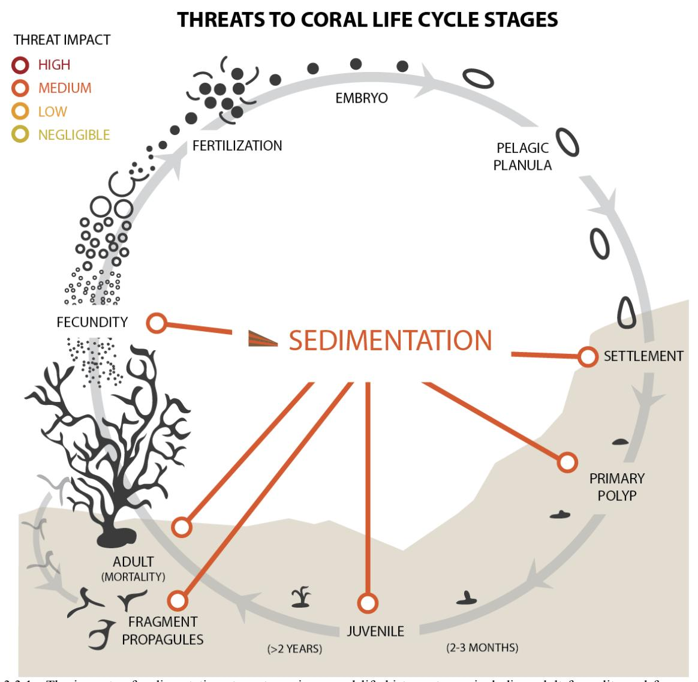

Figure 3.3.1. The impacts of sedimentation stress to various coral life history stages, including adult fecundity and fragmentation, settlement, and juvenile growth. The overall contribution of sedimentation to extinction risk for the 82 candidate coral species was determined to be low-medium by the BRT. Diagram prepared by Amanda Toperoff, NOAA-PIFSC.

#### *3.3.1.2 Nutrients*

Nutrients are chemicals that organisms need to live and grow or substances used in an organism's metabolism which must be acquired from the surrounding environment. This makes the availability of nutrients highly influential in the function and status of organisms and ecosystems, as too few nutrients is limiting but too many nutrients can result in detrimental ecological imbalances. The traditional view of coral reefs is that they thrive in nutrient-poor oceanic waters because of the tight recycling between the host coral and its symbiotic zooxanthellae (Muscatine and Porter, 1977). While oceanic surface waters might indeed be oligotrophic, there are multiple sources of natural nutrients to coral reefs, such as in situ nitrogen fixation (Wiebe et al., 1975) and delivery of nutrient-enriched deep water by topographic and internal wave-induced upwelling (Leichter et al., 1996; Wolanski and Delesalle, 1995) and by reef endo-upwelling (Rougerie and Wauthy, 1993). These natural sources may account for more material (nitrogen and phosphorus) than estimates of anthropogenic sources (wastewater plus stormwater) in highly developed areas such as the Florida Keys (Leichter et al., 2003). As was briefly discussed in Section 3.2.2.3, predicted ocean warming is expected to cause increased stratification of the upper ocean which will decrease vertical mixing of both heat (warmer water down and cooler water up) and nutrients, leaving surface waters warmer and less nutrient-enriched (Behrenfeld et al., 2006).

Natural mechanisms for delivering nutrients to coral reef areas are sometimes enriched by anthropogenic activities. Although groundwater inputs are highly variable, they can be significantly nitrogen-enriched (D'Elia et al., 1981; Paytan et al., 2006). Groundwater was estimated to supply 5%–35% of the nitrogen inputs to reefs in Ishigaki, while atmospheric deposition was generally < 1% (LaJeunesse et al., 2004b). Atmospheric nitrogen deposition was estimated to supply ~ 20% of the nitrogen necessary for growth of reef macroalgae in the Bahamas where surrounding waters are oligotrophic and anthropogenic input is low, nitrogen deposition rates in more populated Florida, however, were about four times higher (Barile and Lapointe, 2005). The main vectors of anthropogenic nutrients are point-source discharges (such as rivers or sewage outfalls) and surface runoff from modified watersheds. The majority of these nutrient sources may also bring other stressors (e.g., sediments, turbidity, contaminants), which are discussed in other sections of this document.

When nutrient levels rise in coral reef systems, plant growth can be expected to increase and this can result in ecological imbalances and changes in community structure. This may be particularly the case when herbivory has been reduced, as by disease or fishing on herbivorous fishes. Elevated nutrients affect corals through two main mechanisms—direct impacts on coral physiology, and indirect effects through nutrient-stimulation of other community components, such as macroalgal turfs and seaweeds, and filter feeders, that compete with corals for space on the reef.

Direct effects of nutrients on corals are mediated by the symbiotic relationships between the corals and their zooxanthellae. Excessive nutrient enrichment can disrupt the symbiosis (Dubinsky and Stambler, 1996), thereby affecting metabolic processes, coral growth, and reproductive success. Fast-growing branching corals may be more susceptible to internal nutrient effects than slower-growing massive corals (Maté, 1997; Schlöder and D'Croz, 2004). Increased nutrient levels generally lead to an increase in zooxanthellae density and/or chlorophyll content (Hoegh-Guldberg and Smith, 1989b; Muscatine et al., 1989a), which stimulates photosynthesis (Marubini and Davies, 1996). However, this supplemental energy is retained more by the symbionts for their own propagation, while the energy transferred to the coral host declines (Falkowski et al., 1993). These uneven distributions of energy may even increase the susceptibility of corals to high temperatures, thus increasing bleaching (Wooldridge, 2009a; Wooldridge and Done, 2009). Laboratory manipulations with elevated nitrogen and phosphorus have shown decreased calcification, sometimes with greater reduction in combination than either alone (Ferrier-Pages et al., 2000; Marubini and Davies, 1996). Nutrients may enhance linear extension but reduce skeletal density, making corals more prone to breakage or erosion (Koop et al., 2001; Tomascik, 1990; Tomascik and Sander, 1985).

Elevated nutrient levels are generally detrimental to coral reproduction, although the stage at which effects occur may be both species-specific and nutrient-specific. In general, elevated nutrient levels have been found to inhibit gamete development, shift towards more male gametes, reduce fertilization success, reduce larval settlement, and thus increase reliance on asexual reproduction (Harrison and Ward, 2001; Loya et al., 2004; Rinkevich and Loya, 1979b; Tomascik and Sander, 1987b; Ward and Harrison, 2000). When elevated nutrients do not reduce fertilization on their own, they may do so in concert with other factors such as salinity (Humphrey et al., 2008) or affect a different portion of the reproductive cycle than was tested (Loya and Kramarsky-Winter, 2003). Coral reproductive mode may also modulate nutrient response; for example, the brooding coral *Pocillopora damicornis* ceased planula production after several months of ammonium enrichment, but the broadcast spawner *Montipora capitata* (whose eggs contain zooxanthellae) showed no reduction in fecundity (Cox and Ward, 2002) under the same conditions. Reefs in eutrophic waters have been shown to have lower densities of juveniles (Tomascik, 1991), possibly as a result of lowered post-settlement survivorship.

Corals may have some capacity to physiologically adapt to long-term nutrient conditions in aquaria (Atkinson et al., 1995; Yuen et al., 2008), but in the field, the more important effects are likely to be indirect, namely stimulation of noncoral components of the reef system and alteration of the competitive balance on the reef. Nutrient enrichment can stimulate the production of particulate matter such as plankton, leading to an increase in sponges, zoanthids, and other filter feeders (Bell, 1991; Costa et al., 2008). As the most destructive bioeroding organisms are filter-feeders, increased nutrients may increase productivity in bioeroders and shift reefs from net accretion to net erosion (Hallock and Schlager, 1986).

More commonly, increased growth rates of free-living reef algae (e.g., turfs and seaweeds) might be expected to yield higher abundances and overgrowth of reef substrates. Indeed, the widespread increase in seaweed abundance on coral reefs in many populated areas has often been attributed to nutrient enrichment (Bell, 1991; Lapointe, 1997). However, experimental nutrient addition in some reef systems has not resulted in algal overgrowth (Grigg, 1995; Miller et al., 1999; Thacker et al., 2001) because of the control of macroalgal standing stock by herbivores. A recent meta-analysis comparing nutrient and herbivory effects indicates that herbivores generally have stronger control of algal abundance on tropical reefs than nutrient enrichment, and nutrient effects are often detectable only under conditions of reduced herbivory (Burkepile and Hay, 2006). Nonetheless, the role of nutrient enrichment in reef community phase-shifts remains controversial (Hughes et al., 1999a; Lapointe, 1999; Szmant, 2002).

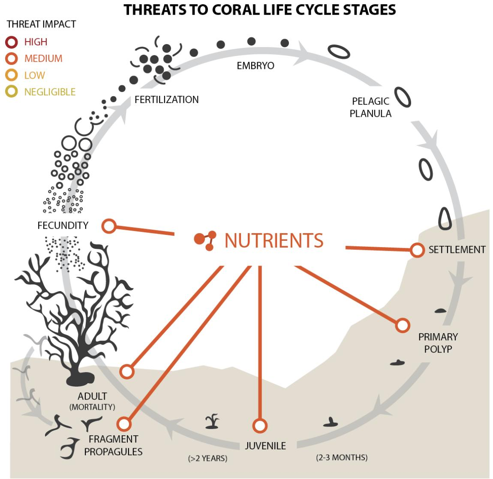

Figure 3.3.2. The impacts of nutrient stresses to various coral life history stages, including adult mortality, fecundity, and fragmentation, settlement, and juvenile growth. The overall contribution of nutrients (eutrophication) to extinction risk for the 82 candidate coral species was determined to be **low-medium** by the BRT. Diagram prepared by Amanda Toperoff, NOAA-PIFSC.

The mechanisms of direct competition between algae and corals are reasonably well-defined (Jompa and McCook, 2003; McCook et al., 2001), but less-apparent mechanisms involving allelopathy and microbial stimulation on both adult and larval corals are also beginning to be realized (Kuffner et al., 2006; Rasher and Hay, 2010; Smith et al., 2006). However, the effects on corals vary with the functional form of algae or often on the species within that functional form. For example, coral larvae settle at high rates in algal turfs and crustose coralline algae and at lower but variable rates when in contact with fleshy macroalgae (*Laurencia* and *Hypnea* differed substantially in the degree to which they inhibited coral settlement; Diaz-Pulido et al., 2010). Coral species likely also vary in their susceptibility to macroalgal inhibition, but this has rarely been a focus of experimental studies (Nugues et al., 2004a).

Ultimately, the net effects of nutrient enrichment and associated stresses on coral populations are a reduction in coral cover, shifts in coral community composition, and, under at least some conditions (e.g., reduced herbivory and/or restricted hydrodynamic circulation), increased algal biomass (Lapointe et al., 2010; Nairn, 1993; Tomascik and Sander, 1987a; Wielgus et al., 2004). Perhaps the best known example of deleterious effects of increased nutrient levels is sewage discharge directly into Kāne`ohe Bay, Hawai`i, where eutrophication in an enclosed basin with relatively long residence time led to outbreaks of the bubble alga *Dictyosphaeria cavernosa* and reduction in coral cover throughout much of the bay; the system recovered, but incompletely, after the sewage was diverted (Hunter and Evans, 1995; Maragos et al., 1985).

Establishing nutrient concentration thresholds to indicate eutrophic water quality may have little validity (McCook, 1999), but the evidence suggests that chronically elevated nutrient levels, particularly in the common modern conditions of reduced herbivory or in particular geographic locations with restricted water circulation, may alter reef function enough to cause changes in coral communities (Fabricius, 2005). However, extrapolating from community changes to extinction risk of individual species is complicated by poorly understood interactive effects. For example, bleaching, reductions in herbivory, and increased sediment stress can exacerbate even low-level nutrient inputs (Szmant, 2002), while eutrophication can slow recovery of corals from both natural and anthropogenic disturbances (Wielgus et al., 2003). Distance from shore or from human populations is not always a useful predictor of nutrient impacts either. Nearshore patch reefs in the Florida Keys have elevated nutrients and turbidity, but had higher coral cover, higher growth rates, lower partial mortality, and population size structures with more larger colonies than offshore reefs that had undergone greater recent degradation as a result of bleaching and disease (Lirman and Fong, 2007). Coral skeletons from Australia's Great Barrier Reef and the Flower Garden Banks in the Gulf of Mexico show evidence of runoff events (Deslarzes and Lugo-Fernandez, 2007; Isdale et al., 1998), although nutrient effects, per se, were not quantified. Excess nutrients are patchily distributed, and their multiple layers of indirect effects are contingent on many local environmental factors, such as hydrodynamics. For the purposes of this review, the BRT considers excess nutrients to produce low-tomedium extinction risks for the 82 candidate coral species.

#### *3.3.1.3 Toxins and contaminants*

As is the case with the other pollutant stressors (with which they co-occur), toxins and bioactive contaminants may be delivered to coral reefs via either point or non-point sources. Several reviews have been conducted on contaminants, including heavy metals, synthetic organics, and petroleum products (Howard and Brown, 1984; Loya and Rinkevich, 1980; Pait et al., 2007; Peters et al., 1997). However, the analytical ability to detect contaminants sheds little insight on the ecological effects that contaminants might have on corals. A substantial body of literature documents bioaccumulation of contaminants, and over the previous decade scientists have developed sophisticated molecular techniques as biomarkers (Downs et al., 2005; Morgan et al., 2005). The presence or constituent changes in a biomarker under exposure to a toxicant stress may provide some mechanistic understanding of the organismal response, but only if these mechanisms are well established in basic physiology and traditional dose-response experiments. Instead, effects to corals to date have most often been inferred from environmental correlations.

Records of heavy metals in skeletal material are primarily useful for evaluating the effects of long-term chronic exposures, such as contaminated sediment and runoff. For example, skeletal heavy metals were correlated with reduced coral growth rates near areas of coastal development in Jordan (Al-Rousan et al., 2007), rum refineries in Barbados (Runnalls and Coleman, 2003), tin smelter effluent in Thailand (Howard and Brown, 1987), and effects of agriculture and development on marine reserves along the Mesoamerican Reef (Carilli et al., 2010; Carilli et al., 2009b). Metals can be transported at long distances by ocean circulation, affecting even "pristine" reefs (Guzmán and García, 2002). Heavy metals bioaccumulate in coral host tissues and are most heavily concentrated in the zooxanthellae (Reichelt-Brushett and McOrist, 2003). Tissue body burden may far exceed concentrations found in skeletal material (Bastidas and Garcia, 1997; McConchie and Harriott, 1992), and the contaminants in tissues are in a position to more directly affect coral physiology. However, it is difficult to generalize responses to metal contamination because effects can be speciesspecific or moderated by exposure history. For example, when exposed to copper *Acropora cervicornis* and *Montastraea faveolata* accumulated the metal in their tissues but *Pocillopora damicornis* did not, while only *Acropora cervicornis* and *Pocillopora damicornis* showed reduced photosynthesis and growth (Bielmyer et al., 2010).

Elevated levels of iron have resulted in expulsion of zooxanthellae from *Porites lutea*, but corals exposed to daily runoff enriched with iron had a reduced response, suggesting that corals may be capable of adapting somewhat to exposure (Harland and Brown, 1989). And although bleaching is a generalized stress response, heavy metals can directly induce coral mortality in the absence of bleaching (Mitchelmore et al., 2007).

Other demonstrated sublethal effects of heavy metals include induction of heat shock proteins (Venn et al., 2009) and oxidative enzymes (Yost et al., 2010). However, the most significant effect might be disruption of coral reproductive processes. Concentrations at which reproductive effects occur vary with both metal type and coral species, but copper, zinc, nickel, lead, and cadmium have been shown to inhibit coral fertilization (Heyward, 1988; Reichelt-Brushett and Harrison, 1999; 2000; 2005) and nickel has been shown to cause mortality of larval and inhibit settlement (Goh, 1991).

While most heavy metal effects to corals are relatively chronic, effects to corals of petroleum products can be low-level chronic (drilling activities) or acute events (oil spills). There have been relatively comprehensive reviews of the effects of oiling on coral reefs (Knap et al., 1983; Loya and Rinkevich, 1980; Peters et al., 1997). As with most stressors, these effects have been context-dependent. Weathered oil is likely to be less injurious to coral reefs than fresh crude oil (Ballou et al., 1989), and vegetable oils are less toxic than mineral oils (Mercurio et al., 2004). Some studies show dispersants have little effect on corals, while others show that the effects of oil and dispersants combined are greater than either alone (Negri and Heyward, 2000) or that some dispersants are more toxic than others (Shafir et al., 2007). Drilling effects may be relatively confined (Hudson et al., 1982), but spills and seeps have more pervasive effects. Hydrocarbons produce a range of lethal and sublethal effects on corals that vary with severity of exposure. For example, oil concentrations were correlated with coral mortality in the Bahia las Minas event in Panama (Burns and Knap, 1989), and decreases in coral cover and diversity (Guzmán et al., 1991). Chronic oiling in the Red Sea increased mortality and reduced coral reproduction (Rinkevich and Loya, 1977), while short-term exposure or dispersed oil may show little residual effect on growth (Dodge et al., 1984). Corals have relatively high lipid content, which facilitates rapid uptake of hydrocarbons into coral tissues; but detoxification and depuration can be slow (Gassman and Kennedy, 1992; Kennedy et al., 1992; Solbakken et al., 1984). Exposure to drilling mud reduced calcification rates and protein concentrations in *Acropora cervicornis* (Kendall et al., 1983). In studies to date, oiling reduced photosynthesis, induced bleaching (Cook and Knap, 1983; Mercurio et al., 2004), and altered the lipid biochemistry of corals (Burns and Knap, 1989).

Oiling impaired gonad development in both brooding (Peters et al., 1981; Rinkevich and Loya, 1979a) and spawning corals (Guzmán and Holst, 1993). Crude oil inhibited metamorphosis (Te, 1991) and, to a lesser degree, fertilization (Negri and Heyward, 2000); some corals may abort reproduction by releasing planulae upon contact with oil (Loya and Rinkevich, 1979). Reproductive impairment has been exacerbated by the use of dispersants (Epstein et al., 2000; Negri and Heyward, 2000). Field surveys of chronically oiled sites suggest that coral recruitment and survival can also be impaired (Bak, 1987).

Pesticides and antifoulants are specifically engineered to induce mortality of invertebrates and enter coastal environments through terrestrial surface runoff and numerous boating activities, including being scraped off hulls during vessel groundings. Corals have been shown to bioaccumulate pesticides such as lindane, heptachlor, chlordane, and dichlorodiphenyltrichloroethane (DDT) (Glynn et al., 1989). Adult corals are usually not directly affected by herbicides (Peters et al., 1997); however, zooxanthellae have been shown to be affected at very low concentrations (ng/L) (Jones, 2005). Irgarol inhibited coral photosynthesis (Jones and Kerswell, 2003; Owen et al., 2002), while diuron was more toxic than atrazine (Jones et al., 2003) and 2,4-D (Råberg et al., 2003). Additionally, pesticides can significantly inhibit coral reproductive processes, inhibiting fertilization, settlement, and/or metamorphosis (Markey et al., 2007). High levels of diuron prohibited settlement of spawned, but not brooded, coral larvae; however, settled corals bleached and underwent polyp-bailout (Negri et al., 2005). Tributyl tin from ship hulls has been documented in coral reef areas (Inoue et al., 2004). Tributyl tin is not as toxic to fertilization as other heavy metals, but it has inhibited coral settlement and metamorphosis (Negri and Heyward, 2001; Negri et al., 2002).

In some coral reef areas, cyanide is used for fish collection. Cyanide exposure causes coral mortality, while sublethal effects include behavioral responses (polyp retraction, mucus expulsion), decreased zooxanthellae density, altered protein expression, tissue degradation, increased respiration, decreased photosynthesis, and bleaching (Cervino et al., 2003; Jones and Hoegh-Guldberg, 1999; Jones and Steven, 1997). Although the harmful effects of cyanide have come from direct application, low levels of accidentally introduced chemicals can also affect corals. For example, UV filters in sunscreens have promoted viral infection and induced coral bleaching when applied in very high concentrations (Danovaro et al., 2008). Endocrine disruptors from human sources have been documented in coral reef areas (Kawahata et al., 2004); such compounds have been shown to reduce coral growth and fecundity, and increase tissue thickness (Tarrant et al., 2004).

The general effects of contaminants on coral communities are reductions in coral growth, coral cover, and coral species richness (Keller and Jackson, 1991; Loya and Rinkevich, 1980; Pait et al., 2007) and a shift in community composition to more tolerant species (Rachello-Dolmen and Cleary, 2007). Often, these changes are attributed to "pollution" or "contamination" so it is difficult to attribute changes to particular causes, particularly since toxins are often associated with other stresses, like sedimentation and runoff. It is also logical to assume that contaminants may have harmful effects in combinations that would not be evident by exposure to an individual substance. Furthermore, contaminant effects are species-specific. Bioaccumulation may be correlated with growth morphology and polyp size (Scott, 1990), and brooded coral larvae may be less exposed to contaminants than spawned gametes, which must fertilize and develop in the water column (Peters et al., 1997). While it is impossible at current levels of knowledge to quantitatively characterize and prioritize the level of threat that contaminants pose, the ability of contaminants to impair coral reproduction is not a negligible factor in locations where elevated toxins exist, particularly when other stresses are contributing to depensatory population effects. Furthermore, even if urban and industrial contaminants in coastal waters are each only local, recent findings suggest that they are fragmenting and isolating populations (Puritz and Toonen, 2011), which could limit connectivity and cause depensatory effects. Therefore, the BRT considers contaminants, despite their primarily local sources and direct impacts, to pose low, but not negligible, extinction risks to the 82 candidate coral species.

Figure 3.3.3. The impacts of toxins to various coral life history stages, including adult fecundity, fertilization, possibly adult mortality and fragmentation, and juvenile growth. The overall contribution of toxins to extinction risk for the 82 candidate coral species was determined to be **low** by the BRT. However, it is also clear that there is much to be learned about diffuse and combined effects of toxins and this assessment might require revision with improved future understanding. Diagram prepared by Amanda Toperoff, NOAA-PIFSC.

#### *3.3.1.4 Salinity impacts*

Many coral reefs are primarily influenced by open-ocean seawater conditions, creating relatively stable salinity conditions over the long term (Coles and Jokiel, 1992). Nevertheless, nearshore coastal corals can experience extreme salinity changes. Evaporation during extreme droughts and during windy, hot conditions on shallow banks can produce hypersaline waters (Kosaki, 1989; Porter et al., 1999), while hyposaline water is released into the coastal zone following heavy rain events (cyclones or monsoons) and can persist for several weeks or longer (Berkelmans and Willis, 1999; Lirman et al., 2003). For coastal reefs, rain events drive coastal runoff or groundwater inputs, both of which can bring other associated stresses (see above sections on nutrients, sediment, and toxins). Additionally, some corals inhabit what are essentially estuarine environments and must cope with tidally varying salinity changes. Coral responses to salinity are, in part, controlled by behaviors, such as polyp retraction and mucus production (Manzello and Lirman, 2003; Muthiga and Szmant, 1987) and osmoregulation via control of ions, free amino acids, glycerol, and osmotically active particles by the coral and its associated zooxanthellae (Mayfield and Gates, 2007).

High and low salinity can influence corals during many life stages (Fig. 3.3.4). Severe rain events can produce catastrophic local coral bleaching, but mortality may occur primarily in shallow depths (low salinity water is less dense, creating haloclines) and corals vary in their susceptibility to hyposaline events. For example, a single storm in 1987 reduced the salinity in parts of Kāne`ohe Bay, Hawai`i to 15 parts per thousand (ppt), causing mass mortality to *Pocillopora damicornis* and *Montipora verrucosa* at depths of ~ 2 m. *Cyphastrea ocellina* persisted, while *Fungia scutaria* and *Porites compressa* showed rapid tissue regeneration despite appearing dead (Jokiel et al., 1993). Similarly, Cyclone Joy and the wet season that followed it caused widespread mortality of reef organisms to depths of 1.3 m in the Keppel Islands on the Great Barrier Reef (windward reefs and those away from the Fitzroy River plume were unaffected). *Acropora* and pocilloporids suffered highest mortality; massive *Porites*, *Montipora*, and *Galaxea* partially bleached but recovered; *Leptastrea*, *Cyphastrea*, *Goniastrea*, and *Turbinaria* were among the least affected species (Van Woesik, 1991; Van Woesik et al., 1995). Nakano et al. (2009) observed a similar response in Thailand, where a 1995 flood did not affect massive *Porites* but primarily bleached *Pocillopora* and *Acropora*. Hyposaline water-induced bleaching following Hurricane Flora in Jamaica was greatest in *Millepora*, *Montastrea annularis* complex and *Manicina*, while *Siderastrea*, *Stephanocoenia*, and *Diploria* were the most resistant (Goreau, 1964).

These species-specific differences have also been reflected in sublethal responses. *Porites furcata* (Manzello and Lirman, 2003) and *Turbinaria reniformis* (Faxneld et al., 2010) maintained autotrophic capabilities (photosynthesis/respiration ratio > 1) in variable salinities, while photosynthesis/respiration ratios in *Porites lutea* were less affected by salinity than in *Pocillopora damicornis* (Moberg et al., 1997). *Montipora* and *Galaxea* bleached more easily at 17 ppt than *Porites* and *Platygyra* (Nakano et al., 2009), although only *Porites* showed no mortality. *Porites* in both the Atlantic and Pacific have tolerated salinity ranges of 20–45 ppt (Manzello and Lirman, 2003; Marcus and Thorhaug, 1981), while *Siderastrea* species in Florida have commonly been exposed to salinity extremes (10–37 ppt; Lirman and Manzello, 2009) and have acclimated to salinities as high as 42 ppt (Muthiga and Szmant, 1987).

A general response of corals to salinity decrease is the formation of mucus and tissue swelling (Coffroth, 1985; Downs et al., 2009; Van Woesik et al., 1995). Physiologically, low salinity has had little effect on respiration, but reduced photosynthesis (Alutoin et al., 2001; Downs et al., 2009; Kerswell and Jones, 2003; Lirman and Manzello, 2009; Moberg et al., 1997). Muthiga and Szmant (1987) found a salinity change of 10 ppt was necessary to induce respiration and photosynthetic changes in *Siderastrea siderea*. However, even small changes in salinity disrupted detoxification and endocrine pathways and induced oxidative stress in *Stylophora pistillata* (Downs et al., 2009). Histologically, hyposaline conditions induced cell lysis, degradation and loss of zooxanthellae, and gonad damage (Downs et al., 2009; Van Woesik et al., 1995). Hypersaline conditions can also stress corals. Periodic density cascading of hypersaline waters may exacerbate temperature-driven bleaching (Dennis and Wicklund, 1993). High salinity has also stimulated expression of carbonic anhydrase and oxidative enzymes such as thioredoxin (Edge et al., 2005). High salinity reduced photosynthesis, but not to the degree that low salinities have (Lirman and Manzello, 2009).

Low salinity reduces fertilization success of broadcast-spawned coral gametes (Richmond, 1993). The effect of low salinity was found to be highly nonlinear; a salinity reduction of 5 ppt caused developmental abnormalities in *Acropora millepora* larvae, while no fertilization at all occurred at salinities ≤ 28 ppt (Humphrey et al., 2008). Reduced salinity increased mobility and mortality of *Montastrea faveolata* planulae, reduced planktonic duration, reduced selectivity of settlement substrate, and reduced the size of settled planulae (Vermeij et al., 2006). Low salinities also reduced settlement and caused abnormal skeletal development in Pacific brooding corals, although *Pocillopora* was more sensitive than *Cyphastrea* (Edmondson, 1929; 1946).

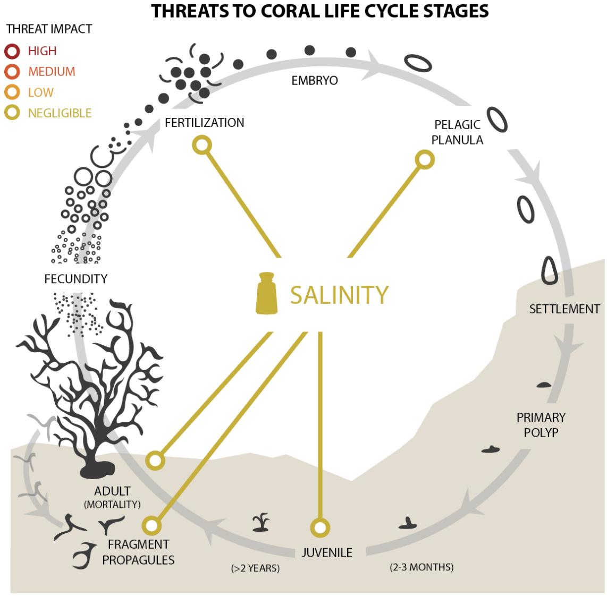

Figure 3.3.4. The impacts of salinity stress to various coral life history stages, including adult mortality and fragmentation, fertilization, pelagic planulae, and juvenile growth. The overall contribution of salinity stress to extinction risk for the 82 candidate coral species was determined to be **negligible** by the BRT. Diagram prepared by Amanda Toperoff, NOAA-PIFSC.

Most salinity stresses to corals are driven by rainfall, or the lack thereof. The short-term salinity tolerance range of corals is suggested to be 18–52 ppt (Coles and Jokiel, 1992). Short-term changes of less than 10 ppt are likely to have minimal or reversible effects (Hoegh-Guldberg and Smith, 1989a; Muthiga and Szmant, 1987). Climate change is expected to produce an increase in precipitation in many areas while reducing it in others. The general expected pattern is for wet areas/periods to become wetter, dry areas/periods to become drier, and precipitation to become more episodic (IPCC, 2007b). This would primarily be interpreted as a potential increase in the frequency and/or occurrence of hypersaline/hyposaline events. In some areas, coral spawning is cued by temperature changes from monsoon seasons (Ayre and Hughes, 2000; Guest et al., 2005b); increased rainfall during spawning could reduce coral reproduction. In coastal areas, increased rainfall could result in more runoff events with multiple stresses whose actions are difficult to predict. For example, the 1987 flood in Kāne`ohe Bay produced an additive effect; the freshwater kill was followed by a huge nutrient-driven phytoplankton bloom (Jokiel et al., 1993). Laboratory studies have documented the interaction of salinity with other stressors. *Turbinaria reniformis* tolerated low salinity and increased nitrate, but a temperature increase produced a synergistic effect, causing mortality in all cases (Faxneld et al., 2010). Similarly, low salinity reduced the ability of *Montipora verrucosa* to tolerate high temperatures (Coles and Jokiel, 1978). In contrast, effects can be antagonistic—low salinity and elevated copper both reduced photosynthesis in *Porites lutea*, but together they had no effect (Alutoin et al., 2001).

Some evidence show that seawater salinity increased slightly in the Florida Keys from 1981 to 1988 as a result of evaporation (Halley et al., 1994). Extended droughts can produce salinities of 40–70 ppt in reef lagoons (Walton Smith, 1941), and corals exist in hypersaline waters in areas such as the Red Sea (Falkowski et al., 1984). Short-term meteorological events can produce pycnoclines, exposing the benthos to warm, hypersaline waters for several days to a few weeks (Kosaki, 1989). Hypersaline waters are undersaturated in aragonite and have been hypothesized to enhance dissolution of skeletal carbonates (Sun, 1992); if this applies to living corals as well it could exacerbate the effects of ocean acidification, but that remains to be tested. Given the spatial and temporal uncertainty in predicting weather and that remote reefs would be more likely to experience salinity changes in relative isolation (i.e., a reduction in other terrestrial runoff stressors), the BRT considered salinity effects to be a local and negligible overall contribution to extinction risk for the 82 candidate coral species.

The recent Reefs at Risk Revisited report (Burke et al., 2011) provided a global analysis of risk to coral reefs, by region and globally, to the impacts of watershed-based pollution (Fig. 3.3.5). While the watershed-based threats categorized in their analysis do not map perfectly with those discussed in the land-based sources of pollution threats section of this Status Review Report (Section 3.3.1), which included separation discussions about the threats to corals from sedimentation (Section 3.3.1.1), nutrients (Section 3.3.1.2), toxins and contaminants (Section 3.3.1.3), and salinity (Section 3.3.1.4), it is instructive to note the similarities of their independently derived analysis of these threats integrated together by region (Fig. 3.3.5).

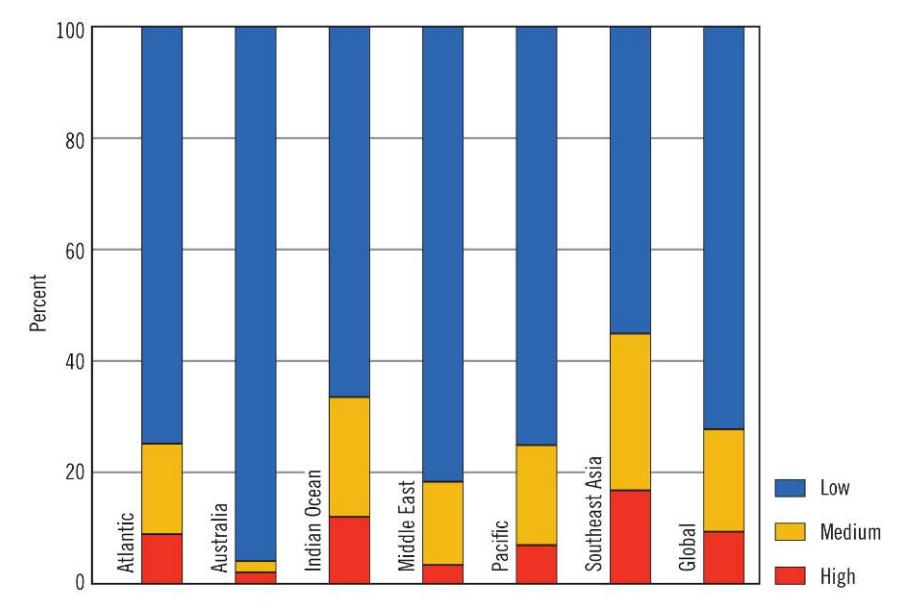

Figure 3.3.5. Global analysis of risk to coral reefs, by region and globally, to the impacts of watershed-based pollution. Risk was assessed through a GIS-based analysis of risk compiled from all available sources and categorized as low, medium or high threat to reefs in the region. For details on methods and a full description of threats included in this risk category, please see the original publication. From Reefs at Risk Revisited (Burke et al., 2011).

#### **3.3.2 Disease**

Disease is broadly defined as "any impairment that interferes with or modifies the performance of normal functions, including responses to environmental factors such as nutrition, toxicants, and climate; infectious agents; inherent or congenital defects, or combinations of these factors" (Wobeser, 1981). A disease state results from a complex interplay of factors including the cause or agent (e.g., a pathogen, an environmental toxicant, a genetic defect), the host, and the environment. In this case, the host is a complex holobiont that includes the coral animal, dinoflagellate, and microbial symbionts. For the purposes of this Status Review Report for the 82 candidate coral species, the effects that the BRT incorporates and ranks as "coral disease" are those characterized as presumed infectious diseases or those attributable to poorly-described autogenous malfunctions (e.g., genetic defects) and often associated with acute tissue loss. Other manifestations of broad-sense disease, such as coral bleaching or toxicological effects, are incorporated in other threat sections (e.g., toxins, acidification, warming).

Coral disease is a common and devastating threat affecting most or all coral species in various life stages (Fig. 3.3.6) and in all regions to some degree. For the most part, it is an "emergent" threat, not really recognized prior to the devastating effects on Caribbean *Acropora* spp. beginning in the early 1980s (Aronson and Precht, 2001; Bak and Criens, 1982; Gladfelter, 1982; Porter, 1974). Since that time, rapid increases in the description of new diseases affecting corals, pervasive delirious outcomes throughout the Caribbean region, and growing recognition of impacts on corals in the Indo-Pacific basin have followed (Bruno et al., 2007; Galloway et al., 2009; Green and Bruckner, 2000; Harvell et al., 2007; Sutherland et al., 2004). At least two of the 82 candidate species (*Dichocoenia stokesi* and *Montastraea annularis* complex) have experienced documented dramatic, and likely unrecoverable, declines in local populations (up to 60% in one year) from disease, either alone or in conjunction with major bleaching events (Bruckner and Hill, 2009; Miller et al., 2009; Richardson and Voss, 2005).

The scientific understanding of disease etiology in corals remains very poor, despite more than over a decade of concentrated scientific attention (Richardson, 1998; Sutherland et al., 2004). However, some general patterns of biological susceptibility are beginning to emerge. Increased research attention to the processes of immunity in corals suggests that basic invertebrate mechanisms such as melanin-containing granular cells and phenoloxidase activity, are present and predictable patterns of basal immune capacity across coral families corresponding with trade-offs with other life history traits may exist (Table 3.3.1; Palmer et al., 2010). A recent meta-analysis by Diaz and Madin (2011) analyzed species-level disease occurrence on Australia's Great Barrier Reef corals in relation to their ecological and biogeographic traits. They concluded that while many ecological factors were significantly correlated when examined alone, predator diversity, geographic range size, and characteristic local abundance were the most important collective predictors of disease potential (a measure of presence/absence, not severity) across coral species.

A primary question that remains poorly answered is: What is the contribution of local anthropogenic stressors (e.g., runoff or sewage) to increased coral disease impacts? A few correlative studies show significant local correlations with low water quality (Kaczmarsky, 2006; Kaczmarsky et al., 2005). Additional experimental studies suggest that more subtle aspects of local anthropogenic impacts may result in disease-like coral mortality. Smith et al. (2006) showed that experimental incubation of coral fragments with macroalgal thalli could result in coral mortality, which was, in turn preventable with the addition of antibiotics. These authors have suggested that leached organic matter from macroalgal biomass may trigger expanded microbial growth leading to coral mortality, and this effect might be an important factor in reefs that have undergone phase-shifts to high macroalgal standing stock. This possibility is consistent with results of Kline et al. (2006) showing that the experimental addition of organic carbon in lab tanks induced coral mortality while the addition of inorganic nutrients (nitrate, ammonia, phosphate) did not, and, consistent with Hodgson's (1990) findings, tissue loss and mortality from sediment applications could be ascribed to microbial activity rather than the sediment per se. These studies point out the complicated trophic and ecosystem imbalances that are likely contributing to coral disease effects on modern coral reefs—simple explanations involving a single virulent pathogen do not appear likely.

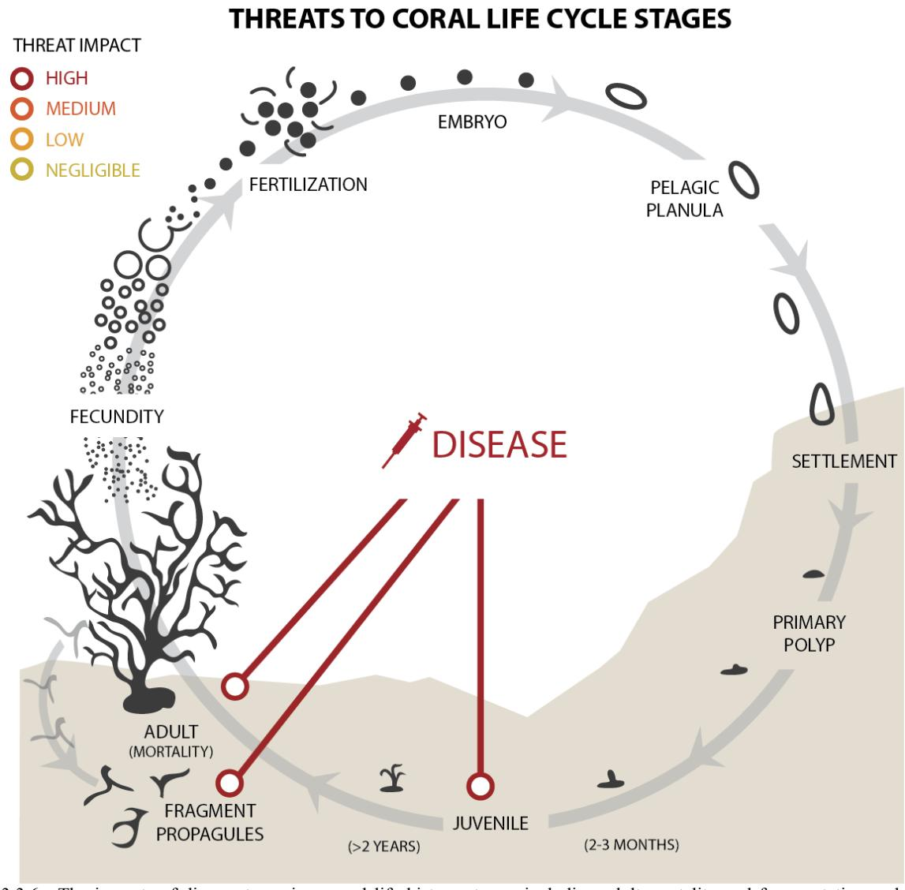

Figure 3.3.6. The impacts of disease to various coral life history stages, including adult mortality and fragmentation and juvenile growth. The overall contribution of disease to extinction risk for the 82 candidate coral species was determined to be **high-medium** by the BRT. Diagram prepared by Amanda Toperoff, NOAA-PIFSC.

In contrast, many examples showed no correlation between coral disease effects and local water quality (Jordan-Dahlgren et al., 2005) or that disease outbreaks occur in geographic areas remote from human population and land-based pollution (Aeby, 2005; Aronson and Precht, 2001; Bruckner and Hill, 2009; Miller et al., 2006a; Miller and Williams, 2007). Such patterns are consistent with increasing manifestation of diseases in both marine and terrestrial systems being linked with ocean warming climatic conditions (Harvell et al., 2002). Mounting evidence indicates that warming temperatures and coral bleaching responses are linked with increased coral disease prevalence, outbreaks, and mortality (Bruno et al., 2007; Jones et al., 2004; Maynard et al., 2010; McClanahan et al., 2009; Muller et al., 2008). Some coral diseases have been found to manifest peaks in prevalence and rate of progressions during summer periods of high temperatures (Boyett et al., 2007; Patterson et al., 2002; Sato et al., 2009), while others are influenced by more complex temperature patterns, including both winter and summer extremes (Heron et al., 2010). Increased temperatures may invoke increased virulence of pathogens, decreased resistance of hosts (e.g., Mydlarz et al., 2010; Ritchie, 2006) or both. In a related manner, the expanding coral disease threat has been suggested to result from opportunistic pathogens (i.e., ones that are not generally virulent) that become damaging only in situations where the host integrity is compromised by physiological stress and/or immune suppression (Lesser et al., 2007).

Table 3.3.1. Comparative immunity ranks and life-history traits compiled for seven scleractinian coral families. Table adapted from Palmer (2010). This ranking is consistent with the hypothesis that physiological investment in immunity represents trade-offs with investment in other life-history traits.

| Family         | Immunity Rank     | Predominant Growth Form | Extension Rate   | Reproductive Output |
|----------------|-------------------|----------------------------|------------------|---------------------|
| Acroporidae    | Low               | Branching                  | High             | Intermediate/High   |
| Pocilloporidae | Low               | Branching                  | High             | Intermediate/High   |
| Faviidae       | Intermediate/High | Massive                    | Intermediate/Low | Intermediate/High   |
| Mussidae       | Intermediate/High | Massive                    | Low              | Intermediate/High   |
| Fungiidae      | High              | Solitary                   | -                | High                |
| Poritidae      | High              | Massive                    | Low              | Low                 |

Coral diseases have already contributed to major population declines in many coral species in many locations, including some of the candidate species. Overall, disease represents a high-medium threat in terms of posing extinction risk to the 82 candidate coral species. The BRT understands from the best available information that the emerging disease threats most likely result from a combination of both local stressors and climate change. Coral disease outbreaks and substantial coral mortality have already resulted from disease effects directly linked to warm-temperature bleaching events. In some cases, such as the Caribbean *Montastraea* spp., widespread outbreaks of disease in combination with warming water temperatures and bleaching have already been manifested as a high threat, whereas disease is believed to represent a moderate but likely increasing threat (by 2100) to most of the other 82 species.

#### 3.3.3 Predation

Predation on some coral genera, especially Acropora, Montipora, Pocillopora, and Porites in the Pacific and Montastraea, Acropora and some species of Porites in the Atlantic, by many corallivorous species of fish and invertebrates (e.g., snails and seastars) is a chronic, though occasionally acute, energy drain and threat to corals (Cole et al., 2008; Rotian and Lewis, 2008) and has been identified for most coral life stages (Fig. 3.3.7). So far, 128 species of fish spread across 11 families have been found to prey on corals, with a third of the species relying on corals for more than 80% of their diet (Cole et al., 2008). In Hawai'i, Jayewardene et al. (2009) found 117 bites per m2 on *Pocillopora*, 69 bites per m2 on the branching *Porites compressa* and 4 bites per m2 on the massive *Porites lobata*. Territorial corallivorous chaetodontids consume between 400 and 700 bites per hour from tabular Acropora (Gochfeld, 2004; Tricas, 1985). Corallivorous chaetodontids can be quite numerous, occurring at average densities of 50–70 fish per 1000 m2. Unlike chaetodontids that eat polyps out of their calices, scarids remove significant amounts of skeleton as they feed. Individual adult bumphead parrotfish, Bolbometopon muricatum, have been estimated to remove 12.7-15 kg per m2 of living coral skeleton per year (Bellwood et al., 2003). This has been calculated to be 2.3 m3 or approximately 5.7 metric tons of structural reef carbonate per year for each adult (Bellwood et al., 2003). Schools of Bolbometopon can consist of 30 to 50 fish or substantially larger and so a school of three or four dozen could remove up to 285 metric tons of reef framework per year over the area cruised by the school. In the Caribbean, a large population of parrotfishes (with most of the effect coming from Sparisoma viride) can remove 4 kg per m2 per year (Bruggemann et al., 1994).

Several experimental field studies have demonstrated that the distribution of corals was directly limited by predation of corallivorous fishes and invertebrates (Grottoli-Everett and Wellington, 1997; Kosaki, 1989; Littler et al., 1989; Miller and Hay, 1998; Wellington, 1982). Predation of corals by fishes and invertebrates is normally considered negative, but triggerfish and pufferfish have been shown to disperse coral fragments during feeding, potentially helping corals spread by asexual reproduction (Guzmán, 1991). Some predators also affect the distribution of corals by preferentially consuming coral species or forms that are the faster growing and thereby superior competitors for space (e.g., *Acropora, Montipora, Pocillopora*, and branching *Porites*). For example, Cox (1986) found that by reducing the growth of the superior competitor (e.g., *Montipora capitata*), predators allow the more slowly growing coral (*Porites compressa*) to prevail.

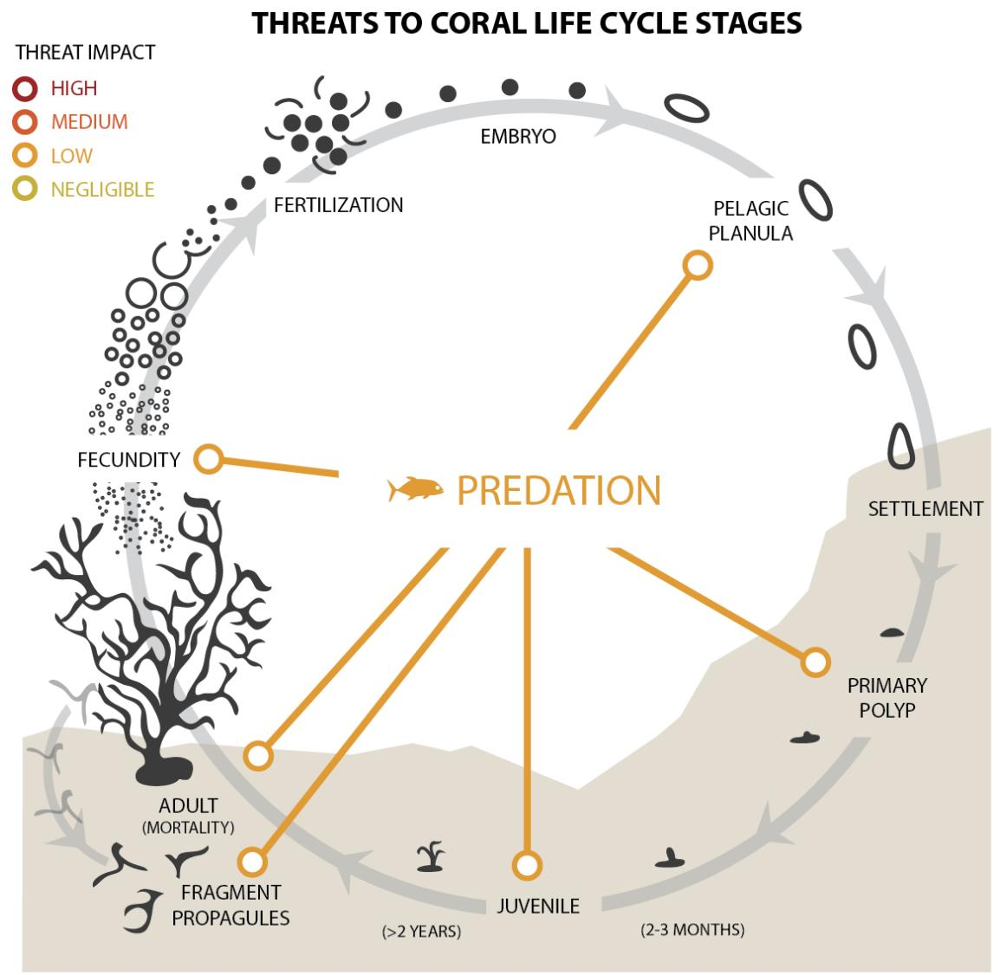

Figure 3.3.7. The impacts of predation stress by corallivorous fish and invertebrates to various coral life history stages, including adult mortality and fragmentation, pelagic planulae, polyp development, and juvenile growth. The overall contribution of predation stress to extinction risk for the 82 candidate coral species was determined to be **low** by the BRT. Diagram prepared by Amanda Toperoff, NOAA-PIFSC.

Large aggregations of crown-of-thorns seastars (*Acanthaster planci*), termed outbreaks, are among the most significant biological disturbances that occur on coral reefs (Moran, 1986). *Acanthaster planci* can reduce living coral cover to less than 1% during outbreaks (Birkeland and Lucas, 1990; Colgan, 1987), change coral community structure (Birkeland and Lucas, 1990; Branham et al., 1971; Pratchett, 2007), promote algal colonization (Moran, 1986; Moran et al., 1985), and affect fish population dynamics (Hart and Klumpp, 1996; Hart et al., 1996; Williams, 1986). The specific causative mechanisms that drive outbreak formation remain unknown with considerable debate about whether outbreaks in recent decades are more of a human-induced phenomenon as a result of sedimentation and urbanization (Brodie et al., 2005), runoff (Birkeland, 1982; Fabricius et al., 2010) or fishing (Dulvy et al., 2004) or primarily a naturally occurring phenomenon.

#### *3.3.3.1 Depensatory effects of predation*

In undisturbed conditions, the distribution of corals is affected by predation by fishes and invertebrates (Neudecker 1979; Wellington 1982; Cox 1986). Although observed distribution is often considered to represent the status quo, the realized niches of the affected corals may be only a minor fraction of what their fundamental niches and their realized niches might be in suboptimal environments. However, if the living coral cover is substantially reduced by natural or anthropogenic disturbances, the effects of predation become more substantive even if the rate of predation does not change. Over-predation can lead to significant coral declines when the rate of coral predation relative to the rate of healing or population replenishment of the prey crosses a threshold beyond which the process of predation becomes depensatory, i.e., could produce positive-feedback effects, preventing the recovery of coral populations. Jayewardene et al. (2009) showed with field experiments that the effects of chronic and frequent predation on corals by fishes are usually inconsequential but become depensatory once the coral population decreases below a threshold (< 5% living cover in that study). Even with stable rates of coral predation, once a severe disturbance lowers the living coral cover below a threshold, predation by corallivorous invertebrates (Glynn, 1985b; Knowlton et al., 1990) or fishes (Guzmán and Robertson, 1989; McClanahan et al., 2005b; Rotjan et al., 2006) can hinder or even prevent the recovery of the coral populations. Once a coral population is severely reduced, populations of obligate corallivores might also eventually decline, thereby reducing predation pressure (Cole et al., 2008). Nevertheless, in the short term, fish and invertebrate obligate corallivore populations generally respond more slowly than the corals to the environmental stresses leading to predator concentration on reduced coral prey populations (Glynn, 1985a; Guzmán and Robertson, 1989; Knowlton et al., 1990). Predator concentration, in combination with the facultative corallivores, can accelerate the decline of stressed or disturbed coral communities as the ratio of predator to prey increases.

Eggs and larvae of corals are also intensely preyed upon by various reef fish species (Pratchett et al., 2001; Westneat and Resing, 1988). Several species of butterflyfishes (chaetodontid) prey on the larvae of *Heliopora coerulea* which are brooded on the surface of the colony (Villanueva and Edwards, 2010). *Heliopora coerulea* evolved around 130 Ma, but chaetodontid predators of coral larvae evolved less than 50 Ma (Bellwood et al., 2009) and *Heliopora coerulea* do not appear to have evolved adequate defenses. It has been suggested that this is possibly because no accidental mutational pathway for change in these corals which have large larvae and a solid colony skeleton has occurred. The large larvae are conspicuous, rich in energy with 41% dry weight lipid (Harii et al., 2007) and the butterflyfishes apparently take a serious toll on larval survival. However, as long as the reproductive population remains large enough, only a small portion of the brooded, benthic "crawl-away" larvae of *Heliopora coerulea* need to survive predation in order to maintain local populations.

Consumption of coral larvae in their pelagic stage is also a major trophic pathway (McCormick, 2003; Pratchett et al., 2001). Pratchett et al. (2001) reported 36 species of reef fish consuming coral propagules released during mass coral spawning. Stomach content analyses of three reef fish species (*Pomacentrus moluccensis*, *Abudefduf whitleyi*, and *Caesio cunning*) revealed that both *Pomacentrus moluccensis* and *Abudefduf whitleyi* feed almost exclusively on coral propagules during mass coral spawning, thereby providing direct evidence that reef fish benefit from mass coral spawning and revealing a potentially significant trophic link between scleractinian corals and reef fish. Although there has been a strong theoretical interest in establishing networks of marine protected areas to promote larval subsidies from upstream populations, recent quantitative field studies have shown that the larval supply is generally more local and selfseeding than theoretically predicted, despite the current speeds and the potential longevity of the larval stage in the life history (Warner and Cowen, 2002). Steneck (2006) explained how the size of the "dispersal kernel" or the distance over which larvae can subsidize downstream populations is determined by the effective population size of the source population. In theory, if predation on either the source population or the dispersing larvae reduces the number of coral recruits below a sustainable threshold, then predation becomes depensatory and positive feedback will propel the sink prey population towards local extirpation. That said, the arrival of even a few larvae over great distances may be important for reestablishment following local extirpation on a reef.

#### *3.3.3.2 Synergistic effects of predation*

Although the abundance of fresh bites by corallivorous fishes on the preferred corals is often impressive, these lesions usually heal. Healing time increases nonlinearly with lesion size (Van Woesik, 1998), but Jayewardene (2010) showed with laboratory experiments that regeneration of tissue over lesions was efficient and even very small fragments (1-cm tall) would heal without suppressing the growth of the coral. However, if healing is slowed by environmental stress, chronic predation can become the proximal cause of colony mortality (Jayewardene et al., 2009; Wellington, 1982).

In response to chronic and intense chaetodontid predation, coral polyps may remain withdrawn for long periods of time, and eventually the polyps can increase nematocyst density (Gochfeld, 2004). Hypothetically, both of these reactions can entail an energetic cost to the coral. It seems reasonable that as the coral populations decline and predation becomes more focused and intense, the energetic cost to the corals will become greater, healing of lesions might become slower, and the fecundity of the colony may be reduced. This interaction between concentration of predation and population size of the corals can become a positive feedback and depensatory once a threshold is crossed.

Important synergies of corallivory relate to the potential for coral predators to become vectors of disease transmission which could exacerbate mortality rates. A few experiments have demonstrated this potential for gastropod, polychaete, and fish corallivores (Aeby and Santavy, 2006; Nugues and Bak, 2009; Sussman et al., 2003; Williams and Miller, 2005). Anecdotal reports of corallivores preferentially targeting diseased tissue (Miller and Williams, 2007) emphasize that this phenomenon requires much further research.

#### 3.3.3.3 Outbreaks of predators

Although predation is usually a chronic energy drain on corals (Jayewardene et al., 2009), acute massive outbreaks of some invertebrate corallivores can occasionally increase their population by up to 5 orders of magnitude in a single season. The gastropod *Drupella cornus* increased from 100 to 200 snails per km² of reef to 1–2 million per km² of reef and Ayling and Ayling (1987) calculated there were about 500 million *Drupella cornus* in Ningaloo Marine Park in western Australia. Birkeland and Lucas (2007) compiled reports on outbreaks of *Acanthaster planci*, with populations sometimes increasing within a few months from observations of about 10 per year to removal through a bounty system of greater than half a million per year. In some areas, such as the Great Barrier Reef, these outbreaks have commonly been considered to be caused by land-based nutrient runoff that result in phytoplankton blooms which, in turn, provide food for the larvae of the predators and facilitate abundant recruitment (Birkeland, 1982; Fabricius et al., 2010). Fishing on the predators of corallivores also has been suggested to contribute to these outbreaks. Recent increases in nutrient runoff, particularly input of fixed nitrogen into coastal waters from increased agricultural activities, coastal construction, and fishing on potential predators of corallivores are all contributing to changes on coral reefs. In some instances, these factors may be contributors to the recorded increases in the frequency of outbreaks of *Acanthaster planci*.

While chronic predation may structure communities and reduce the distribution of some of the preferred prey coral species (Gray, 1998; Grottoli-Everett and Wellington, 1997; Kosaki, 1989; Littler et al., 1989; Miller and Hay, 1998; Wellington, 1982), the less preferred coral prey are not as affected and their population prevalence might even be enhanced (Cox, 1986). During acute outbreaks, predators may feed more indiscriminately across coral species rather than focusing on preferred coral prey, sometimes nearly clearing living coral cover over large areas. The 1967 outbreak of *Acanthaster planci* around Guam depleted nearly all corals (except for a few *Diploastrea heliopora* and *Heliopora coerulea*) from 38 km along the west and northwest coast of the island (Chesher, 1969). The 1979 outbreak of *Acanthaster planci* around Palau cleared corals from 13 km² of reef habitat (Birkeland, 1982). It is reasonable to consider that the supply of coral planulae in the plankton might be spread too thin over such a large area to effectively reseed the reef (i.e., above the threshold of depensation discussed above), and so recovery might take decades or depend on an external supply of larvae. Even though these outbreaks are acute and local, if they become more frequent because of nutrient input, fishing or other factors, then their effects might accumulate over time because of the potential slow recovery. As these large areas accumulate, the decrease in supply of coral larvae and reduced topographic complexity could become depensatory factors on a large scale.

#### 3.3.3.4 Apex predators

Corals are also thought to be indirectly affected by human removal of large apex predators. Reefs with larger predatory fishes may have large herbivore populations (Mumby et al., 2007b; Stevenson et al., 2007) which, in turn, maintain low macroalgal cover. Low macroalgal cover improves the chances for successful coral recruitment. This three-level process is called a trophic cascade effect of removal of top predators (see Section 3.3.4). Likewise, balistid, tetraodontid, and labrid fishes might control invertebrate corallivores such as gastropods (McClanahan, 1994) and *Acanthaster* (Dulvy et al., 2004). Therefore, apex predators are probably important for indirectly controlling macroalgae, which facilitates coral recruitment, and corallivores. Apex predators are often the prime targets of fishers and are easily depleted from coral reef ecosystems. Hence, they are now generally common only around remote Pacific islands and atolls where fishing pressure is slight (Sandin et al., 2008; Stevenson et al., 2007; Williams et al. 2011) and, possibly, also in other remote areas of the Indian Ocean and near Papua New Guinea.

Although large populations of herbivores are generally considered good for coral recruitment, the experimental results of Miller and Hay (1998) indicated that in some areas, herbivores can consume corals as well, to the extent of limiting the distribution of some species of corals and determining coral community structure (Sammarco, 1980).

#### 3.3.3.5 Summary of predation threats

Predation on corals is normally chronic and frequent, thereby affecting the distribution of corals. Assuming the usual community structure of corals as the status quo, then the effects of predation on corals can be considered inconsequential. However, if outbreaks of corallivores or some other large-scale disturbances occur, such as cyclones,

disease or bleaching, by which the living coral cover is decreased below a threshold, predation can have positive feedback or depensatory effects in which the impacts of predation increase exponentially and inversely to the population density of the coral. This can prevent recovery or increase extinction risk. The increased focus of predation on the fewer remaining colonies can energetically cost the coral in defensive reactions and could result in a reduced rate of healing and/or fecundity or reduced resistance to stressors and/or disease. As human population densities increase in coral reef regions, it is almost certain that fishing pressures will likewise increase and that nutrient runoff into coastal waters will increase with land being cleared of native vegetation for agricultural or urban development. Nutrient runoff from land stimulates phytoplankton blooms which provide food for the larvae of invertebrate corallivores and facilitate abundant recruitment of corallivores and so can cause outbreaks of these predators (Birkeland, 1982; Fabricius et al., 2010). Fishing on the predators of corallivores may also contribute to outbreaks. As predation on corals becomes more frequent, the decrease in coral reproductive stock and larval production and the reduced topographic complexity could become depensatory factors on a large scale. Taking into consideration each of these direct and indirect effects of predation, which predominantly occur over local to regional scales, the BRT considered the overall global extinction risk posed by predation to be low.

#### 3.3.4 Reef fishing—trophic cascades

Fundamental differences in ecosystem-level processes between coral reef and pelagic fisheries are evident. Oceanographic processes, such as wind-driven vertical mixing or equatorial upwelling of nutrients (i.e., "bottom-up"), are often the key driving forces in open-ocean pelagic ecosystems, while species interactions such as predation (i.e., "top-down") are often the major controlling factors in coral-reef ecosystems. Fishing does not influence the process of upwelling, but on coral reefs, fishing or use of destructive fishing practices, can have large-scale, long-term ecosystem-level effects that can change ecosystem structure ("phase shifts"). Removal of biomass from coral reef systems by fishing alters trophic interactions that are particularly important in structuring coral reef ecosystems (e.g., Dulvy et al., 2004). Evidence from certain geographic locations shows that removal of fishing pressure in marine no-take reserves can lead to increased coral recruitment (e.g., the Bahamas, Mumby et al., 2007a).

Fisheries management strategies for coral reef ecosystems often include efforts to maintain resilience by trying to sustain populations of herbivorous fish, especially the larger scarine herbivorous wrasses, including parrotfish. On topographically complex reefs, population densities can average well over a million herbivorous fishes per km² and standing stocks can reach 45 metric tons per km² (Williams and Hatcher, 1983). In the Caribbean, parrotfishes can graze at rates of over 150,000 bites per m² per day (Carpenter, 1986) and thereby remove up to 90%–100% of the daily primary production of the reefs (Hatcher, 1997). Under these conditions of topographic complexity with substantial populations of herbivorous fishes, as long as the cover of living coral is high and resistant to being affected by environmental changes, it is very unlikely that the algae will take over and dominate the substratum.

When herbivorous fish populations are reduced but adult coral colonies maintain their resistance to physiological damage by climate change and human activities, coral-reef communities can persist. However, if herbivorous fish populations are heavily fished and high mortality of coral colonies occurs, then algae can grow rapidly and inhibit the replenishment of coral populations. Ecosystems can then shift into an alternative stable state (Mumby et al., 2007b). Although algae can have negative effects on adult coral colonies, the ecosystem-level effects of algae are primarily to inhibit coral recruitment (Fig. 3.3.8). Filamentous algae can prevent the colonization of the substratum by planula larvae by creating sediment traps that obstruct access to hard substrata for attachment. Macroalgae can suppress the successful colonization of the substratum by corals through occupation of the available space, by shading, abrasion, chemical poisoning (Rasher and Hay, 2010), and infection with bacterial disease (Nugues et al., 2004b).

With the increased scale and ubiquity of stress on adult coral colonies by human activities, e.g., ocean warming, acidification, sedimentation, anchor damage, trampling, dynamiting and other harmful fishing practices, etc., efforts to maintain population levels of herbivorous reef fishes as a strategy to enhance coral population replenishment have been increasingly important and challenging. There is often a strong cultural motivation in modern society to seek and catch the largest fishes. For parrotfishes, the effect of grazing by individuals > 20 cm in length is substantially greater than that of smaller fish (Bruggemann et al., 1996; Ong and Holland, 2010). Up to 75 individual parrotfishes with lengths of about 15 cm are needed to have the same effect on reducing algae and promoting coral recruitment as a single individual 35 cm in length (Lokrantz et al., 2008). Species richness of the herbivorous fish population is also necessary to enhance coral populations. Because of differences in their feeding behaviors, several species of herbivorous fishes with complementary feeding behaviors can have a substantially greater positive effect than a similar biomass of a single species on reducing the standing stock of macroalgae, of increasing the cover of crustose coralline algae (which

facilitates coral recruitment), and increasing live coral cover (Burkepile and Hay, 2008; Russell, 1992). Even if grazing pressure is relatively constant, the species responsible for algal removal may vary temporally (Wellington, 1982). In an ecosystem approaches to fisheries management sense, one strategy to sustain resilient coral communities would be to protect large individuals of multiple species of herbivorous fishes. To a limited degree, coral reefs can compensate for the removal of herbivorous fish by an increase in other herbivorous organisms. For example, reefs in Jamaica remained high-coral, low-algal systems despite high fishing pressure because of the extremely high abundance of grazing *Diadema* urchins, but became macroalgal dominated after the 1983 die-off of *Diadema* (Hughes, 1994 and references therein).

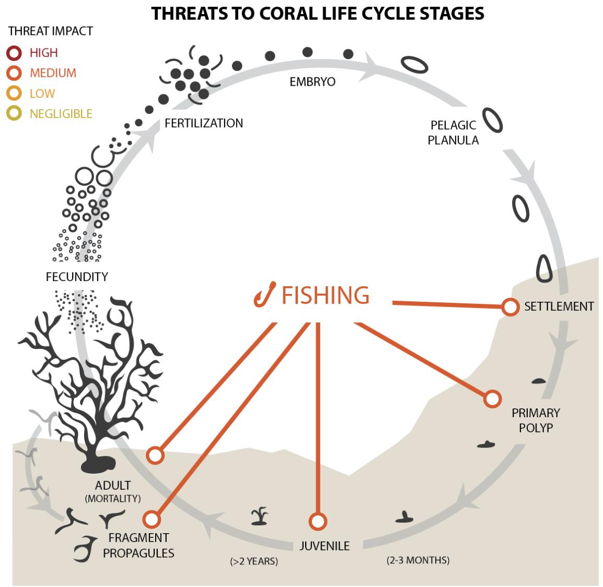

Figure 3.3.8. The impacts of fishing stress (fishing or destructive fishing practices) to various coral life history stages, including adult mortality and fragmentation, settlement, polyp development, and juvenile growth, many of which are via indirect effects on trophic cascades and habitat structure. The overall contribution of fishing stress to extinction risk for the 82 candidate coral species was determined to be **medium** by the BRT. Diagram prepared by Amanda Toperoff, NOAA-PIFSC.

Fishing also can have further consequences on coral mortality via trophic cascades. Corallivores may be released from population control by predation when their predators are reduced by fishing (e.g., Burkepile and Hay, 2007). In addition, Raymundo and colleagues (2009) found significantly lower frequency of coral disease in fishery reserves than in adjacent unprotected reefs across seven marine reserves in the Philippines. They also reported that coral disease prevalence was negatively correlated with several parameters of reef fish diversity across these sites and positively correlated with chaetodontid abundance. Hence, retaining functionally-diverse reef fish communities was closely linked with improved coral health in that study and are consistent with the hypothesis that corallivorous chaetodontids are released from predation by targeted fishes outside of reserves, yielding increased transmission of disease from one coral colony to another as they move around and take bites from each coral colony as suggested by Aeby and Santavy (2006).

The ultimate drivers of increased fishing on coral reefs in both tropical developing countries and wealthy tropical and subtropical countries are increases in human population densities and per capita net consumption. In less developed tropical countries, increases in tropical human population densities are greatest in the coastal regions. The rate of destructive effects to coral reefs by reef fisheries can exceed the rate of human population growth because the number of job opportunities per capita and the amount of open farmland and other terrestrial resources substantially decreases with tropical coastal population growth. As terrestrial resources become overutilized, coastal fringing reefs become "welfare resources" (McManus, 1997; McManus et al., 1992). People naturally turn towards near shore fishing because reefs represent "easy entry" resources as traditional fishing rights break down. Compared to starting a livelihood or obtaining food for families in heavily-populated coastal land areas, very little capital investment is required for people to gather shells by hand or fish with a handline from a bamboo raft (McManus, 1997; McManus et al., 1992).

In more developed and wealthy countries, fishing down the food web and modifying the trophic structure of reef communities is also a direct result of the increase in human population densities (Williams et al., 2008c). For example, Hawai`i has more than 260,000 recreational fishers (http://hawaii.gov/dlnr/dar/hmrfs.html) and fishing has reduced the density of apex predators in the populated main Hawaiian Islands to about 3% of levels in the uninhabited and relatively unfished shallow reefs of the Northwestern Hawaiian Islands (Friedlander and DeMartini, 2002; Williams et al., 2011). In the Florida Keys, more than 50,000 recreational fishers were reported to have reduced populations of spiny lobster (*Panulirus argus*) by 80%–90% in the 2-day sport season (Eggleston et al., 2008).

#### **3.3.5 Direct habitat impacts and destructive fishing practices**

Fishing activities also have direct impacts on coral colonies and habitats when various gear or fishing practices interact directly with reef substrates. While the effects of fish removal are largely reversible on decadal or shorter time scales (as evidenced by growing literature on recovery in many fisheries reserves), habitat degradation, particularly loss of threedimensional architectural structure, is a much more potent threat to long-term recovery of reef fish stocks (De Putron et al., 2010; Fox et al., 2003; Syms and Jones, 2000). Both active and derelict fishing gear can destroy benthic structure and habitats, kill reef-building organisms, and entangle benthic and mobile fauna, including endangered species (Donohue et al., 2001). As an example of the amounts of derelict fishing gear affecting coral reefs, Dameron et al. (2007) estimated that at least 52 metric tons of derelict fishing gear recruit each year from distant fisheries (thousands of kilometers away) and become entangled on reefs of the remote Northwestern Hawaiian Islands. Various ecological effects occur when traps and bottom trawls are deployed, but deleterious effects may also occur when large numbers of anglers use hook-and-line gear to fish (Jennings and Lock, 1996). Trawls dislodge and abrade corals, while stationary gear such as traps damage corals and other sessile fauna via movement during even mild storm events (Lewis et al., 2009) and during gear retrieval in adverse conditions. Storms can mobilize traps and cause buoy lines to snare branching corals.

Fishers in some parts of the world employ explosives or toxic chemicals such as sodium hypochlorite and sodium cyanide to harvest fish and invertebrates (Campbell, 1977; Edinger et al., 1998; McManus, 1997). These practices, wellknown in parts of Southeast Asia and the western Pacific, are not as well documented in Caribbean waters. The consequences of these practices to corals are described in Sections 3.3.1.3 and 3.3.6. Dynamite blast fishing disturbs extant colonies while destroying reef frameworks, slowing recovery of coral populations in these areas (Fox et al., 2003).

In contrast to earlier days when fishing gear represented a substantial investment, technological advances have provided humans with the ability to manufacture traps, monofilament gill nets, larger nets and fishing lines inexpensively. The modern, efficient production of these devices makes them essentially disposable; they can be abandoned if retrieving them becomes overly time-consuming or expensive. Abandoned synthetic fishing gear can continue "ghost fishing" or habitat destruction for decades. The decreased manufacturing cost and efficient rapid production, in combination with the increased longevity of the synthetic materials in the ocean (i.e., technology), lead to an increasing accumulation of materials that abrade and dislodge corals. The increasing demand for protein by growing human populations has accelerated the production of synthetic fishing gear and accumulation of derelict gear, resulting impacts to coral reefs. While effects of destructive fishing practices can be locally severe, the BRT considered their overall contribution to global extinction risk to the 82 candidate coral species to be low.

The recent Reefs at Risk Revisited report (Burke et al., 2011) provided a global analysis of risk to coral reefs, by region and globally, to the impacts of fishing and destructive fishing practices (Fig. 3.3.9). While the threats posed by fishing and destructive fishing categorized in that report do not map perfectly with those discussed here in the sections on Reef fishing—trophic cascades (3.3.4) or on Direct habitat impacts and destructive fishing practices (3.3.5), the analysis of these threats by region is similar (Fig. 3.3.9).

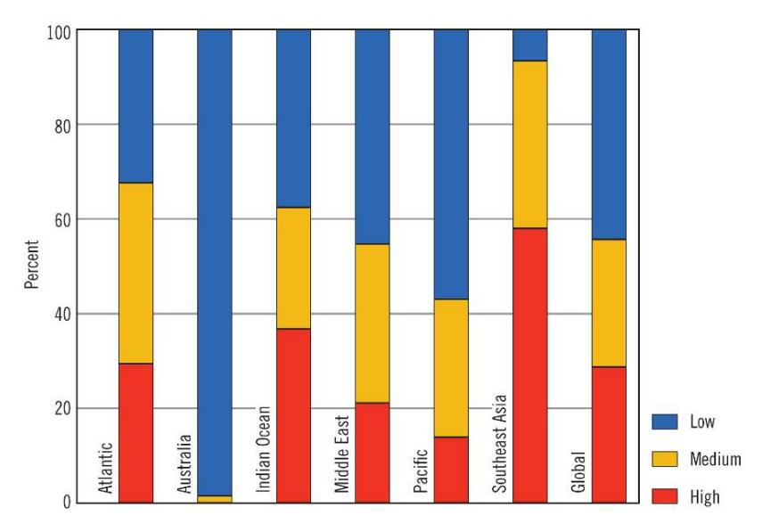

Figure 3.3.9. Global analysis of risk to coral reefs, by region and globally, posed by fishing and destructive fishing practices. Risk was assessed through a GIS-based analysis of risk compiled from all available sources and categorized as low, medium or high threat to reefs in the region. For details on methods and a full description of threats included in this risk category, please see the original publication. From Reefs at Risk Revisited (Burke et al., 2011).

#### 3.3.6 Ornamental trade

Ornamental trade of various kinds removes or destroys adult and juvenile reef corals (Fig. 3.3.10). Globally, 1.5 million live stony coral colonies are reported to be collected from at least 45 countries each year. Of these, the United States is the largest consumer of live corals (64%) and live rock (95%) for the aquarium trade (Ruiz et al., 1999; Tissot et al., 2010). The imports of live corals taken directly from coral reefs (not from aquaculture) increased by 600% between 1988 and 2007, while the global trade in live coral increased by nearly 1500% (CITES, 2010; Tissot et al., 2010). It is estimated that 30 to 50 metric tons of red and black corals, and 2000 metric tons of stony corals, are exported each year within the ornamental trade (CITES, 2010; Tissot et al., 2010). Much of the harvest of stony corals is highly destructive, removing and discarding large amounts of live coral that go unsold and damaging reef habitats around live corals. The result is destruction of much more coral and reef area than that which is exported (Bruckner et al., 2001).

Globally, it is estimated that the number of aquarium fishes taken from coral reefs is about 20 times the number of live corals taken (Tissot et al. 2010). As an illustrative example of increases in the aquarium trade, the number of coral-reef fishes collected from just the leeward coast of Hawai'i Island for the aquarium trade increased from 90,000 in 1973 to 422,823 in 1995 (Tissot and Hallacher, 2003). It should be noted that the collection of reef fishes and/or invertebrates can be as harmful to corals and coral-reef structures as the collection of corals directly if destructive methods are used. From the reefs of Kāne'ohe Bay, Hawai'i, the average number of feather-duster worms (*Sabellastarte sanctijosephi*) collected per year for the aquarium trade was reported to be 43,143 (Friedlander et al., 2008). As each feather duster worm is obtained by breaking away the coral, the total coral and habitat damage can be significant. Although illegal, cyanide continues to be used in many parts of the Indo-Pacific for collecting reef fishes. According to the World Wildlife Fund, six thousand divers in the tropical Pacific inject an estimated 150,000 kg of sodium cyanide onto about 33 million coral heads each year, although this includes the food fish trade as well as the aquarium trade. According to three precautionary estimates, the reef-degrading capacity of the cyanide fishery for food fish on Indonesia's coral reefs amounts to a loss of live coral cover of 0.047, 0.052 and 0.060 m² per 100 m² of reef per year (Mous et al., 2000). Sodium cyanide can cause bleaching and mortality in corals (Jones and Steven, 1997). In addition to these direct impacts of aquarium trade removals, there are mounting concerns, given the exponential growth in the total market, of

potential trophic cascade effects from loss of small invertebrates whose ecological functions within the reef community remain inadequately characterized (Rhyne et al., 2009).

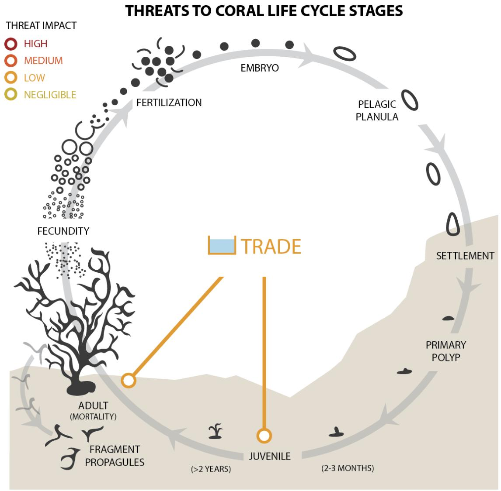

Figure 3.3.10. The impacts of ornamental trade to various coral life history stages, including adult mortality and juvenile growth. The overall contribution of ornamental trade to extinction risk for the 82 candidate coral species was determined to be **low** by the BRT. Diagram prepared by Amanda Toperoff, NOAA-PIFSC.

Since stony corals are predominantly sessile and most are externally fertilized (~ 75%), sustainability of spawning populations depends partly on maintaining sufficient colony densities to ensure that gamete dilution is not too great to support successful external fertilization. Although brooders have internal fertilization, sperm can be diluted in the water column for non-hermatypic species. There may be thousands of colonies of a particular species in an archipelago, but as their density is reduced by collection (as with any other source of adult mortality), the chances of successful fertilization and successful larval production decline (Coma and Lasker, 1997; Levitan et al., 2004), perhaps to some threshold level which has not been quantified. There have not been sufficient studies to date to determine these threshold levels definitively, but preliminary studies have suggested that threshold distances are probably in the general range of 10 m (Coma and Lasker, 1997; Lacks, 2000). We cannot dismiss the possibility that when dilution substantially decreases the probability of fertilization, the occasional larva might be insufficient for replenishing the population subjected to the occasional threats of predation, competition, and the aquarium trade. For example, *Heliopora coerulea* have crawl-away brooded larvae. The local communities can replenish themselves if they have local reproductive stock, but they cannot replenish themselves from distant populations kilometers away—so it is especially important that the collectors in the aquarium trade leave colonies in close proximity.

The economics of the collection of marine fauna for luxury items, such as aquaria and ornaments, involves a detrimental positive feedback in that the more rare an item becomes, the more valuable and intensively collected it becomes. Some jurisdictions, such as Fiji, have apparently harvested for the aquarium trade those corals most sustainable and not harvested more vulnerable species, such as *Heliopora coerulea*. Commercial interest in coral harvest was high enough that several papers in the 1980s applied traditional fishery-based sustainable harvest models to evaluate the potential maximum sustainable yield for coral populations (Grigg, 1984; Ross, 1984). More recent work has focused on consumptive pressures (Tissot et al., 2010) and sustainable practices (Harriott, 2003).

Enforcement of rules in the aquarium trade is not easy because of difficulty with species identification of corals. The websites of the aquarium trade often have misidentified photographs, and species that are difficult to distinguish are often reported at the genus level. This makes it problematic to accurately track the species that are traded and even more difficult to understand the potential population-level effects of collections. The tracking issues are sufficiently confused that there have been reports of active trade in specimens of both extinct genera and those collected from exceptionally deep waters (80–2300 m) that are outside the range of typical collection practices (Green and Shirley, 1999). Monitoring transshipment is an additional problem. Ornamental coral (live and dead) and fish may be shipped from one country to another for declaration, increasing errors in tracking trade and in estimating effects on wild populations.

Over the past few decades trade has focused increasingly on live coral specimens for recreational aquaria rather than for jewelry or other ornamental uses (Green and Shirley, 1999). Because of difficulties in tracking and enforcement, concerns are often raised that permitting the export of cultured dead or life corals may increase pressure on the trade in non-cultured corals. Collection of some coral reef animals for trade has caused virtual extirpation of local populations, major changes in age structure, and promotion of collection practices that destroy reef habitats (Tissot et al., 2010). Most often, this is the case for reef-associated organisms (fish, cryptic invertebrates, etc.), but documented declines to reef corals themselves also occur. For example, surveys in the Philippines showed significant decreases in the abundance and colony size of targeted coral species; this was particularly problematic in that the size of corals targeted for collection was smaller than the minimum reproductive size for several of the species of interest (Ross, 1984). Overall, collection for the coral trade can have significant local effects on reefs as a whole and targeted coral species in particular. However, these effects are minor compared to those from land-based pollution, fishing, and climate change (Green and Shirley, 1999). The BRT concurred and assumed coral trade to be a low extinction risk in this evaluation.

#### **3.3.7 Natural physical damage**

Coral reefs must endure physical damage from many different sources and threats acting over a range of spatial and temporal scales. Extreme wave events, such as those generated by severe tropical or extratropical cyclones and tsunamis, are naturally occurring processes that are typically viewed as acute disturbances. Direct physical effects from vessel groundings and coastal construction activities, such as dredging, mining, and drilling, are somewhat analogous to storm damage in that they are relatively discrete events, although they generally occur over much smaller spatial scales than do storms or tsunamis. Other human-induced disturbances, such as those caused by tourism and recreational events and marine debris, can have pervasive, chronic physical consequences. The relationships between injury interval and time required for reef recovery are the primary factors in evaluating equilibrium of the system (Connell, 1978).

The frequency and intensity of storms are projected to change with climate change (see Section 3.2.6). Severe storms are often major stressors to reef systems, but their effects tend to occur over relatively local to regional scales and they are likely to have relatively little importance in terms of extinction risk. For the purposes of this Status Review Report, the BRT considered storm events to have the potential to significantly reshape the zonation of coral communities at a local scale, particularly when storms return at frequent intervals. However, the effects of tropical cyclones are generally dwarfed by the outcomes of other stressors acting over larger spatial scales and longer temporal scales (Gardner et al., 2005). While the BRT recognizes that these physical impacts can have significant effects on species with limited geographic ranges or contribute to local extirpations of widespread species, the overall contribution to extinction risk is considered low and primarily acts on life stages from settlement to adulthood (Fig. 3.3.11).

Prevailing hydrodynamic regimes (waves, currents, tides) are critical in determining coral colony morphology and benthic community composition (Kaandorp, 1999; Storlazzi et al., 2005). Partial mortality of coral colonies increases their vulnerability to bioerosion (Scoffin et al., 1997), which increases the porosity of coral skeletons and makes them more prone to breakage (Chamberlain, 1978). The relationship between seasonal wave energy and coral skeletal strength controls the spatial zonation of coral reefs, particularly the distribution of species (Graus and Macintyre, 1989; Storlazzi et al., 2005). Substrate strength can be a greater contributor to breakage than colony strength per se (Madin, 2005), and colony morphology has a significant effect on whether colonies become dislodged (Madin and Connolly, 2006). Dislodged or fragmented colonies that are loose generally incur mortality (Woodley et al., 1981) or become projectiles that inflict further damage to the reef (Massel and Done, 1993)—while colonies that reattach to the substrate can contribute to coral population as asexual "recruits" (Highsmith, 1982). Preliminary stabilization of loose fragments and other rubble is accomplished by reductions in wave energy and biological growth, while rigid binding is accomplished by cementation and calcifying marine organisms (Rasser and Riegl, 2002). If conditions are favorable and species are fast-growing, coral fragments can begin to stabilize within a few weeks of a storm (Glynn et al., 1998).

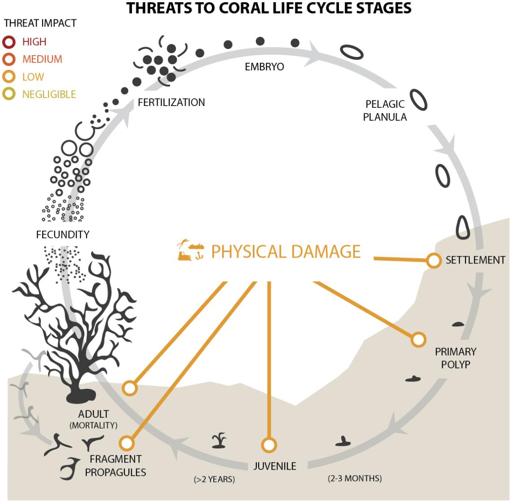

Figure 3.3.11. The aggregate impacts of both natural and human-induced physical damages to various coral life history stages, including adult mortality and fragmentation, settlement, polyp development, and juvenile growth. The overall contribution of physical damages to extinction risk for the 82 candidate coral species was determined to be low by the BRT. Diagram prepared by Amanda Toperoff, NOAA-PIFSC.

A large body of literature describes the effects of waves generated by tropical and extratropical cyclones on coral reefs, and several excellent reviews highlight tsunami effects (Stoddart, 1997; Wilkinson et al., 2006). Storms generally produce destructive waves for many hours or days at a time and often bring significant rainfall, while tsunamis add additional disturbance in the form of earthquakes and debris generated from coastal inundation. For the purposes of this review, the BRT considers tsunami and cyclone effects to fundamentally be big-wave events and therefore somewhat comparable, although of different wave frequencies. Damage is typically patchy, depending on depth, wave exposure, and the existing biological community. Big-wave events generate coral fragments, and massive corals that are a century or older can be toppled (Bries et al., 2004). Storm waves and tsunamis can move massive amounts of sediment (Chavanich et al., 2005; Hubbard, 1992), abrading or burying corals in some parts of a reef (Woodley et al., 1981) while exposing previously buried substrates in others (Bries et al., 2004) and introducing anthropogenic and natural debris to coral reefs. Storm-induced fragmentation can enhance asexual reproduction in branching corals (Fong and Lirman, 1995; Lirman, 2000) but reduce the topographic complexity of reefs (Edmunds, 2002). Tropical cyclones often produce significant rain events, with the potential to produce hyposaline conditions that cause corals to bleach (Goreau, 1964; Van Woesik, 1991).

A well-documented example is Hurricane Allen in 1980 (Woodley et al., 1981), the first tropical cyclone to directly hit Jamaica in four decades. The storm produced substantial damage to some coral reef areas, but it was predicted to have little long-term effect on the reef because the return period of storms was longer than the time estimated for reef recovery (Graus et al., 1984). However, delayed mortality from predation, disease, or algal outbreaks exacerbated the storm effects and prolonged recovery (Knowlton et al., 1981). Macroaglal blooms following the 1983 mass mortality of *Diadema* further reduced coral cover (Hughes, 1994) and the subsequent passage of Hurricane Gilbert in 1988 delayed recovery still further (Oliver, 1992). A meta-analysis of monitoring data in the Caribbean found that coral cover at tropical cyclone-impacted sites was reduced by an average of 17% in the year following a storm, with no evidence of recovery for at least 8 years (Gardner et al., 2005). However, tropical cyclone damage is extremely patchy, depending on depth, wave exposure, the existing biological community, and previous disturbance history. For example, hurricane effects were highly variable at Buck Island National Park following the passage of Hurricane Hugo, as sites within a few hundred meters of each other showed substantial variability in coral mortality (Sammarco, 1980) and subsequent recovery (Bythell et al., 2000). Storm effects at landscape scales have been observed to be consistent with the intermediate disturbance hypothesis (Connell, 1978), although that may not hold for deeper reefs (Sussman et al., 2003). Coral cover and diversity in Belize were highest at sites of intermediate disturbance (Aronson and Precht, 1995), whereas landscape-scale coral community composition at Buck Island was stable over a decade despite hurricane impacts (Bythell et al., 2000).

Cyclone distribution is nonrandom in space and time. The return time of hurricanes in Central America was twice as long as that in Florida from 1980 to 2001 (Gardner et al., 2005). In the Lesser Antilles, hurricanes primarily strike Guadeloupe and Dominica, but rarely hit Trinidad, Tobago, and Grenada (Treml et al., 1997). Hindcast models of wave energy from historical cyclone tracks along the Great Barrier Reef predict that the northern portions of the Reef have lower risk of damage than elsewhere in the system (Puotinen, 2007). However, changing climate could induce changes in storm tracks, exposing normally-sheltered reefs to significant wave events. Deep reefs may provide some refuge from tropical cyclone effects (Lugo-Fernández and Gravois, 2010)—as may reefs within about 5 degrees of the equator, since cyclones rarely form or move within those latitudes, where the Coriolis force is weakest (Gray, 1998). Remote locations may benefit from storms via increased larval dispersal (Lugo-Fernández and Gravois, 2010).

Storms may or may not be increasing in frequency—over the last half of the 20th century, cyclone frequency has decreased in the Atlantic (Landsea et al., 1996) but increased in the western North Pacific (Chan and Shi, 1996). However, tropical storms do appear to be increasing in intensity (Emanuel, 2005; Webster et al., 2005), potentially increasing the severity of storm impacts to coral reefs. Recurrent storms become multiple stressors, and even a single storm event can be a multiple stressor with both short- and long-term effects (Hughes and Connell, 1999). The ability of corals to recover from acute events is reduced by chronic stresses (Connell et al., 1997). Increased bioerosion on eutrophic reefs and predicted reductions in skeletal density with ocean acidification could make reefs more vulnerable to physical storm damage (Hallock, 1988; Hallock and Schlager, 1986). A combination of stronger storms and slower recovery times would be expected to increase the effects of cyclones, even in the absence of more frequent storms. However, management actions could enhance resilience to storms—for example, reefs with conserved herbivory may be better able to maintain coral populations despite frequent tropical cyclone disturbances (Edwards et al., 2010).

#### **3.3.8 Human-induced physical damage**

Humans are quite effective at modifying nearshore coastal environments. In tropical areas, this often includes inflicting physical damage on coral reefs through both intentional use and accidents. These impacts have been reviewed across a variety of spatial scales (Chabanet et al., 2005). Reefs are affected by a diverse array of coastal construction activities, including land reclamation, airport and harbor construction, and mining for building materials (see (Maragos, 1993) for a regional review). Mining for building material removes both live coral and reef framework, which reduces coral cover and reduces fish habitat (Dulvy et al., 1995). Mining changes the topographic structure and creates low-resistance channels in the reef that increase coastal erosion and make the coast more vulnerable to extreme wave events such as tsunamis (Dulvy et al., 1995; Fernando et al., 2005). Construction activities can have indirect effects as well—for example, dredging is often associated with turbidity effects that harm corals or slow coral growth (Dodge and Vaisnys, 1977; Eakin et al., 1994), while drilling rigs can create a halo of coral loss around the rig (Hudson et al., 1982).

Coastal construction and development are intentional actions, offering the potential to "rescue" corals in the affected zone prior to the impact; however, this is a costly endeavor. Vessel groundings and other accidental injuries do not offer the same possibilities. Large-vessel groundings physically destroy or injure corals in ways similar to cyclones, but also turn the reef framework into rubble (Hudson and Diaz, 1988). Vessel anchors can also cause similar types of damage to corals (Rogers and Garrison, 2001); the effects are often smaller in scale but more frequently inflicted. Grounded vessels can release harmful chemicals into the reef environment (Hawkins et al., 1991) and leave behind antifouling paint that inhibits the ability of corals to recruit into the injury (Jones, 2007; Negri et al., 2002). Injuries from groundings and anchor deployments can take decades or centuries to recover (Riegl, 2001; Rogers and Garrison, 2001), or induce phase-shifts to non-coral communities (Hatcher, 1984; Work et al., 2008). Managers can reduce the potential for groundings or anchor injuries through establishing protected areas or installing aids to navigation. For example, the Florida Keys National Marine Sanctuary (FKNMS) was established in 1990, and a major impetus for the legislation was the three large-vessel groundings that occurred in an 18-day period in 1989. The FKNMS has observed a decrease in large-vessel groundings since its inception, but smaller impacts from recreational and fishing vessels are still a persistent problem. Over the last decade, there have been on average ~ 500 reported vessel groundings per year within the FKNMS. Of these, about 85% have been in seagrass-dominated habitats while the remainder have impacted shallow coral reef and hard bottom habitats (FKNMS, unpubl. data).

Recreational and fishing activities can result in "accidental" physical injuries as well. The physical effects of dynamite "blast fishing" are similar to those of groundings (Riegl, 2001); the harmful effects of fishing are evaluated in more detail in Section 3.3.4. Marine debris such as derelict fishing gear, from large commercial nets to fish traps to recreational fishing line, can cause coral damage; these effects are considered more explicitly in Section 3.3.5. Tourists and recreational users can cause substantial physical injury from trampling and scuba diving. Branching corals are most vulnerable to these sorts of unintentional breakage (Hawkins and Roberts, 1992). Where trampling does not induce mortality, it can still reduce coral growth (Rodgers et al., 2003) and/or resuspend sediment that can stress corals (Neil, 1990). Tourist and recreational damage can lead to a reduction in overall colony size (Hawkins and Roberts, 1993) or alter community structure (Kay and Liddle, 1989). Vulnerability to damage may vary by reef zone (Hawkins and Roberts, 1993); for example, little damage would be expected if fragile corals are located deeper than snorkeling depth (Meyer and Holland, 2008). Some reefs may be able to withstand high usage levels (Hawkins and Roberts, 1992) while in others damage depends on the level of human use (Rodgers and Cox, 2003). Increasing tourism and recreational use can potentially be managed by evaluating "carrying capacity" for reef sites and limiting access accordingly (Hawkins and Roberts, 1997).

The recent Reefs at Risk Revisited report (Burke et al., 2011) provided a global analysis of risk to coral reefs, by region and globally, to the impacts of coastal development (Fig. 3.3.12). While the coastal development threats categorized in their analysis do not map perfectly with the human-induced physical damage threats discussed in this section, it is instructive to note the similarities of their independently derived conclusions.

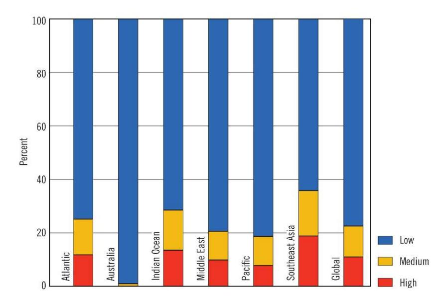

Figure 3.3.12. Global analysis of risk to coral reefs, by region and globally, to the impacts of coastal development. Risk was assessed through a GIS-based analysis of risk compiled from all available sources and categorized as low, medium or high threat to reefs in the region. For details on methods and a full description of threats included in this risk category, please see the original publication. From Reefs at Risk Revisited (Burke et al., 2011).

#### **3.3.9 Aquatic invasive species**

Although the introduction of nonindigenous species is seen as one of the largest threats to global biodiversity (Vitousek et al., 1997), less is known about invasion ecology of coral reefs. In other marine environments, alien species have been shown to have major negative effects on the receiving communities where they often outcompete native species, reduce species diversity, change community structure, reduce productivity and disrupt food web functioning by altering energy flow among trophic levels (Carlton, 1996; 2002; Grosholz, 2002; Ruiz et al., 2000; Ruiz et al., 1999; Stachowicz and Byrnes, 2006; Williams, 2007). The lack of information regarding effects of species introductions on coral reefs suggests that invasive species have not been well studied or that there have been few successful invasions in these systems (Coles and Eldredge, 2002). There is a need to understand the role of invasive species in the decline of coral reef ecosystem health in order to effectively manage and restore these systems in the face of global change and the full suite of stressors.

#### *3.3.9.1 Introduced marine invertebrates*

Introduced marine invertebrate species, along with their associated diseases and symbionts, are spreading throughout the tropical seas. This is substantially increasing the number of marine invertebrate species in some harbors, especially in the more isolated archipelagoes, and this tends to homogenize marine biogeography.

The transportation of introduced marine invertebrate species is most often by ship, either on the hull or in the ballast water, and the alien species usually become associated with the ship when it is at rest. This means the departure and arrival of the introduced species is most often in protected ports or harbors, and so introduced marine invertebrates tend to be from backwaters. For example, in Guam there are 79 species of introduced marine invertebrates in Apra Harbor, but only 23% have been found outside the harbor, and those few that have made it outside the harbor have to date been ecologically inconsequential on the open coast coral reefs (Paulay et al., 2002). Guam has 276 reef-building coral species (Paulay et al., 2002); within Apra Harbor, there are well-developed reefs with a rich coral fauna and some of the highest coral cover on Guam. Even within the harbor, the 79 introduced species generally tend to occupy artificial substrata (Paulay et al., 2002). Hawai`i has only about a quarter of the number of coral species as Guam and some invasive invertebrates have been found in some of the sheltered reef waters. The bright red sponge *Mycale armata* has become predominant on coral reefs in parts of Kāne`ohe Bay and the small introduced barnacle *Chthamalus proteus* has compressed the niches of three other alien barnacle species. In Hawai`i, there are 287 introduced marine invertebrate species, but a large portion of these are found in Pearl Harbor and relatively few have become established on the waveexposed outer reefs (Eldredge and Smith, 2001). It has been suggested that reefs with a diverse indigenous assemblage are difficult to invade. There has been no evidence to date of invasive species influencing coral reproduction or larval stages, so their effects are limited to life stages from settlement to adulthood (Fig. 3.3.13).

Figure 3.3.13. The impacts of invasive species to various coral life history stages, including adult mortality and fragmentation, settlement, polyp development, and juvenile growth. The overall contribution of invasive species to extinction risk for the 82 candidate coral species was determined to be **low** by the BRT. Diagram prepared by Amanda Toperoff, NOAA-PIFSC.

#### *3.3.9.2 Introduced corals*

The only known case of a major invasion of an alien species of coral affecting community structure is that of *Carijoa riisei*, an octocoral. The breeding stock of *Carijoa riisei* probably arrived in Pearl Harbor, Hawai`i, attached to the hull of a ship. Marine biological surveys were conducted in the 1930s and 1940s that included studies of the fouling communities of Pearl Harbor, but *Carijoa riisei* was absent from these surveys (Kahng, 2006). It was first recorded on O`ahu in 1966 (Kahng, 2006) and in Pearl Harbor in 1972 (Kahng and Grigg, 2005). Surveys of the black coral industry up to 1998 did not report *Carijoa riisei* (Kahng, 2006), but by 2001 it was found in deep offshore waters overgrowing antipatharians (black corals) in Au`au Channel (between Lana`i and Maui) on a large scale (Kahng and Grigg, 2005). The ultimate outcome of this invasion of an introduced octocoral is an increase in the number of species. *Carijoa riisei* uses the commercially valuable black corals *Antipathes dichotoma* and *Antipathes grandis* as substrata, smothering them and seriously affecting the \$30 million precious coral industry in Hawai`i. *Carijoa riisei* has a major effect on black coral populations between the depths of 70 and 105 m. *Carijoa riisei* is sensitive to direct sunlight above 70 m and especially above 40 m where it is only found on underhangs and other shaded locations. Below 105-m depth in the Au`au Channel is a thermocline, a drop from 26°C to 22°C, and below this *Carijoa riisei* is less prevalent and aggressive. The final outcome is that the number of species increased by one octocoral along with associates, and the two black corals experienced reduction in abundance between the depths of 70 m and 105 m.

Other cases of introduced corals have also indicated increased species numbers, but these other cases have not induced major changes in community structure. A very small population of *Siderastrea siderea* has established itself from the Caribbean to just beyond the Pacific entrance of the Panama Canal. Originally thought to be a new species, *Siderastrea glynni* (Budd and Guzman, 1994), it does not appear to have spread and has been found only in the Gulf of Panama (Maté, 2003a), but it has since been determined to be genetically identical to *Siderastrea siderea* (Forsman et al., 2005). The azooxanthellate scleractinian *Tubastrea coccinea* became established in the western Atlantic in the 1940s and is now very abundant and widespread, especially on artificial substrata (Fenner and Banks, 2004). *Tubastrea micrantha* has just become established on one oil rig near Louisiana. *Tubastraea micrantha* will probably also spread, but it is possible that both *Tubastrea* species will tend to occupy artificial substrata and not invade coral reefs to a major extent. Both *Tubastraea coccinea* and *Tubastraea tagusensis* invaded the geographic region south of the Amazon in the 1980s and have recently extended their ranges 130 km farther to the southwest in Brazil (Mantelatto et al., 2011). *Tubastraea coccinea* and *Tubastraea tagusensis* are usually found on vertical substrata and underhangs, but can appear to dominate rocky substrata on which reef-building scleractinians *Madracis decactis* and the endemic *Mussimilia hispida* are found (Mantelatto et al. 2011).

#### *3.3.9.3 Introduced algae*

In some cases, alien species introductions are not accidental. Some of the algal species that have become invasive in Hawai`i were introduced deliberately for aquaculture because of their characteristics of rapid growth and productivity. These characteristics, desirable for culturing, clearly increase the potential invasiveness of such species by making them potential competitive dominants. The red carrageenan-producing algae *Eucheuma denticulatum* and *Kappaphycus* spp. were intentionally introduced to Kāne`ohe Bay and Honolulu Harbor in the 1970s for experimental aquaculture (Eldredge, 1994) and introduced to many other areas around the tropics (Castelar et al., 2009). *Eucheuma* in particular has become highly invasive in Hawai`i where it overgrows and kills reef-building corals and reduces species diversity and habitat complexity. Recent reports suggest that this species has also become invasive on other tropical reefs in the central Pacific where it has also been intentionally introduced. *Kappaphycus alvarezii* introduced into southern India for mariculture has been documented overgrowing and killing *Acropora* spp. corals (Chandrasekaran et al., 2008).

Alien algal impacts on corals are best documented in Hawai`i and different species show different patterns of spread. Three invasive red algal species *Gracilaria salicornia*, *Hypnea musciformis*, and *Eucheuma denticulatum* are known to form extensive, destructive blooms and have been observed overgrowing reef-building corals in Kāne`ohe Bay, the south shore of O`ahu Island including the Waikiki area, and the south shore of Moloka'i Island, which harbors some of Hawai`i's most intact and expansive coral reef ecosystems (Eldredge and Smith, 2001; Rodgers and Cox, 1999; Russell, 1992; Russell and Balazs, 1994; Smith et al., 2004a; Smith et al., 2002). The red alga *Gracilaria salicornia* was most likely an accidental introduction via the shipping industry in the 1950s. Later in the 1970s this species was transported to O`ahu and Moloka'i (Eldredge, 1994) for experimental aquaculture and while it is still restricted to these three islands it has spread extensively within each island, most notably O`ahu where it is the single most dominant species in Waikiki and parts of Kāne`ohe Bay and evidence suggests that it is continuing to spread (Smith et al., 2004a). *Hypnea musciformis* was initially introduced to O`ahu and can now be found around all of the main Hawaiian Islands aside from Hawai`i (as of 2003) but is most abundant around the Maui Island where it forms large, often mono-specific blooms. This species seems to be restricted to shallow reef flat and back reef habitats and appears to be associated with reduced water quality (Smith et al., 2006).

The most widespread of the various invasive algae is the red alga *Acanthophora spicifera* which was initially introduced to O`ahu Island via hull fouling. This species has now been found across all of the main Hawaiian Islands and seems to be restricted mostly to shallow water habitats, although recent deeper water populations have been identified around Maui Island. This species is one of the most preferred food resources for herbivorous fishes in Hawai`i and so it is likely to be less abundant where herbivores are common (Conklin, 2007).

Most healthy coral reef ecosystems are dominated by reef-building corals and crustose coralline algae since most of the turf and macroalgal production is consumed by grazers (fish and urchins); diverse algal assemblages are restricted to areas that are relatively inaccessible to herbivores (Carpenter, 1986; Carpenter, 1983). However, numerous natural and anthropogenic impacts can allow algae to proliferate and gain a competitive advantage over the slower growing corals (Hughes et al., 1999a; Lapointe, 1999). Fishing of herbivorous fishes and/or the addition of inorganic nitrogen and phosphorus can both act to increase the abundance of algae on reefs but individual algal species are likely to respond differently to changes in nutrient levels and grazing pressure (Miller et al., 1999; Smith et al., 2001; Thacker et al., 2001). Herbivores will have the strongest top-down control on species of algae that are preferred food sources; nutrient enrichment will have the greatest bottom-up control on algae that are able to rapidly take up and assimilate nutrients. Additionally, numerous physical variables affect the abundance and distribution of different species of algae such as light, temperature, salinity, flow and substratum type.

#### *3.3.9.4 Introduced fish: lionfish in the Caribbean*

Two species of lionfish have become an emergent exotic invasive marine fish, species that have taken hold in the South Atlantic and Caribbean during the past decade with massive increases in distribution and density (http://fl.biology.usgs.gov/lionfish\_progression/lionfish\_progression.html). The Indo-Pacific lionfishes, *Pterois volitans*  and *Pterois miles,* were first documented in South Florida waters as early as 1992 with the unintentional release of at least six lionfish from a home aquarium into Biscayne Bay during Hurricane Andrew (Courtenay, 1995). It is likely that additional isolated releases by aquarium owners have also occurred following the documented 1992 release, since lionfishes are among the most sought-after aquarium species (Balboa, 2003) and can become unwanted aquarium inhabitants that consume other aquarium life. Widely-distributed early sightings suggest multiple introductions and the source of the current, successful expansion of lionfish is unclear. Since then, lionfish have rapidly and successfully spread throughout western Atlantic waters, from the southern Caribbean to as far north as Rhode Island (although winter sea temperatures appear to restrict over-wintering success to areas south of Cape Hatteras, North Carolina). Currently, two of the largest known lionfish populations occur in North Carolina (Whitfield et al., 2007) and the Bahamas (Government of the Bahamas 2005), although lionfish are now being reported from all nations and reef areas of the Caribbean and Gulf of Mexico except for the southern Lesser Antilles USGS (USGS, 2010).

As of 2009 (Schofield, 2009), lionfish had become established along the U.S. Atlantic coast from Cape Hatteras, North Carolina to Miami, Florida (since 2002), in Bermuda (2004), Bahamas (2005), Turks and Caicos (2008) and the Cayman Islands (2009), the Greater Antilles: Cuba (2007), Jamaica (2008), Hispañola (2008) and Puerto Rico (2009), the northern Lesser Antilles only from St. Croix (2008), and Central and South America: Mexico, Honduras and Costa Rica (2009). Since that time, lionfish have been sighted in the Gulf of Mexico: northern Yucatan peninsula (December 2009), Dry Tortugas National Park (June 2010), Key West (July 2010), the west coast of peninsular Florida (Manatee and Pinellas counties; beginning August 2010), Pensacola (Florida) as well as the Alabama and Louisiana coasts; the Lesser Antilles: St. Croix, St. Thomas and St. John (including Virgin Islands National Park), Barbuda, Saba and Sint Maarten in July 2010, Aruba, Bonaire and Curacao (Netherlands Antilles) in 2009; and the Caribbean coast of Central and South America: Belize, Nicaragua, Panamá, Columbia and Venezuela.

Lionfish are ambush predators; studies suggest that there is very little that these fish will not eat (Raloff, 2006). These fish appear to be feeding primarily on the same food items as the commercially and ecologically important snappergrouper complex within the coral reef environment, as well as juvenile parrotfish (Raloff, 2006) and strongly impair recruitment of native fishes (Albins and Hixon, 2008). Trophic impacts of lionfish may be relatively greater than those of native predators since they are not recognized by native prey that hence fail to display appropriate avoidance behaviors (Anton et al., 2010).

The impacts of lionfish on reef food webs or on corals are unknown at this early stage of their invasion, but in the absence of natural predators, these invasive species have a potential to precipitate significant changes in the coral reef fish complex, with unknown cascading impacts to the corals. Lionfish are potentially exacerbating trophic cascade effects, especially through the loss of herbivores and their control of algal growth.

#### **3.3.10 Summary of local changes and their impacts**

The activities of human societies in local areas, as well as natural phenomena, have contributed to observed coral population declines in many if not all human-inhabited regions of the world. Although they are natural phenomena, storms, predation, and to some extent disease are recognized as having potential depensatory effects as coral populations decline. In many locations, the impacts of these threats are acute and severe, and many of the individual local threats described in the previous sections are present across such wide geographic areas and at such intensities that their impacts are in some sense not "local" at all, but rather regional or even global.

A very recent independent global analysis of threats to coral reefs, Reefs at Risk Revisited (Burke et al., 2011), was released subsequent to the BRT's original evaluation. Their analyses ranked risks from different threats on a geographic basis, based on characteristics such as human population, development (size of adjacent cities, ports, hotels, etc), and agricultural and watershed status (deforestation, river drainage, etc.). While the threats categorized in their analysis do not map perfectly to those used in this Status Review Report, it is instructive to consider the three local threat rankings and drivers in their analyses (Table 3.3.2) as one way to extrapolate the sometimes-dramatic impacts of local anthropogenic stressors to a global threat ranking. Figure 3.3.14 also shows how Reefs at Risk Revisited (Burke et al., 2011) ranked their index of integrated local threats for various regions around the world.

Table 3.3.2. Summary of local reef threats as described by Reefs at Risk Revisited (Burke et al., 2011).

| RRR local threat       | Components and drivers      | % of reefs ranked | Future trend | Corresponding          |
|------------------------|-----------------------------|-------------------|--------------|------------------------|
|                        | (Burke et al. 2011)         | Med or High risk  |              | Status Review       |
|                        |                             |                   |              | Threat                 |
| Fishing* and        | Human population         | >55%              | Increase     | Fishing: Trophic    |
| Destructive Fishing | growth, lack of alternative |                   |              | Cascade, Fishing:   |
| Practices              | livelihoods, poor        |                   |              | Habitat Impacts        |
|                        | management                  |                   |              |                        |
| Coastal Development    | Construction, Sewage,    | < 25%             | Increase     | Human Physical      |
|                        | Tourism (Hotels,         |                   |              | Disturbance, Land   |
|                        | Airports), sea ports, size  |                   |              | Based Sources of |
|                        | of nearby cities            |                   |              | Pollution              |
| Watershed-based        | Deforestation, erosion,  | <30%              | Increase     | Land Based Sources     |
| pollution              | sedimentation,              |                   |              | of Pollution           |
|                        | agricultural pollution      |                   |              |                        |

\* Burke et al. use the term "overfishing". We instead use the more general term fishing as the capture and removal of fish from the ecosystem.

Based on increases in human populations, Reefs at Risk Revisited (Burke et al. 2011) estimated that the overfishing threat has increased the most (of the local threats) over the past decade. The disproportionately faster growth of human population in coastal regions means that these anthropogenic local threats are expected to continue growing into the future.

The Reefs at Risk Revisited (Burke et al. 2011) report was published when the BRT was nearing completion of this report. After reviewing that document, the BRT chose not to change risk evaluations for any of the 82 candidate coral species based on the Reefs at Risk Revisited (Burke et al. 2011) analyses. However, the BRT decided to provide some of the information on the regional to global assessments of Burke et al. as they relate to the threats discussed by the BRT. Overall, the ranking of the local anthropogenic threats by Reefs at Risk Revisited (Burke et al. 2011) was consistent with the BRT's conclusions that local anthropogenic threats (fishing, LBSP, physical damage) are of medium to low importance in posing extinction risk to the 82 candidate coral species. The Reefs at Risk Revisited (Burke et al. 2011) analyses did not assess coral disease (assessed as a **high** extinction threat in this Status Review Report) as a separate threat because of uncertainty and complexity in its drivers.

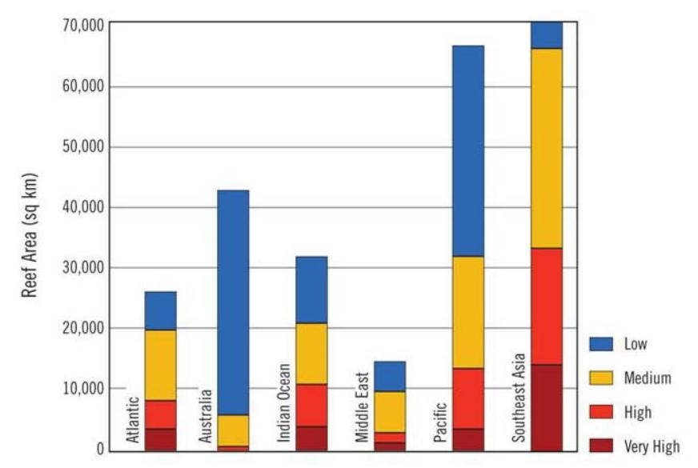

Figure 3.3.14. Global analysis of risk to coral reefs, by region, to an integrated local threat index. Risk was assessed through a GISbased analysis of risk compiled from all available sources and categorized as low, medium or high threat to reefs. For details on methods and a full description of threats included, please see the original publication. Used with permission from Reefs at Risk Revisited (Burke et al., 2011).

#### **3.4 Interactive and Unapparent Threats on Coral Populations**

Scientific knowledge of most of the individual threats discussed in this chapter is not nearly as precise or as extensive as preferred. More concerning, the synergistic and cumulative effects of these threats are even less well understood. Some documentation of patterns and experimental research indicate that the cumulative or interactive effects of multiple individual threats can be greater than their sum, but certain threats can also ameliorate each other (Darling and Côté, 2008). It is also clear that some of these threats are novel (e.g., contaminants outside the species' evolutionary experience), occur in new and severe combinations or change at unprecedented rates (e.g., atmospheric CO2). Although the term "synergy" may be ambiguously applied in the coral literature (Dunne, 2010), it is clear that multiple stressors affect corals simultaneously, whether the effects are cumulative (the sum of individual stresses) or interactive (e.g., synergistic or antagonistic).

One example of such interactive threats involves the growing evidence that degraded water quality can lower the thermal bleaching threshold for corals. That is, bleaching is more likely to occur at lower temperatures when corals are experiencing physiological stress from poor water quality. Evidence for this comes from both spatial and temporal comparisons in both the Caribbean and Indo-Pacific basins (Carilli et al., 2009a; Carilli et al., 2009b; Wooldridge, 2009b; Wooldridge and Done, 2009) and at least one mechanism to incorporate the combination of these stressors has been proposed (Wooldridge, 2009a). Another interactive effect involving bleaching is a similar increase in sensitivity to high temperatures as a result of ocean acidification (Anthony et al., 2008), perhaps through increased photo-acclimation (Crawley et al., 2010). Another example involves the linked effects of fishing, coral predation, and disease. It is likely that in some cases, the removal of apex predators by fishing leads to release of some coral predators such as butterflyfish (Raymundo et al., 2009). Butterflyfishes affect corals both directly by preying on polyps, but also indirectly by vectoring disease conditions (Aeby and Santavy, 2006). Hence, the influence of disease on a given coral population may be exacerbated when fishing causes an increase in butterflyfish populations, or potentially other disease-vectoring corallivores. Not all interactive effects are negative; for example, although corals are commonly stressed by sediment, there is some suggestion that turbidity and colored dissolved organic materials in the water column may provide some shelter from bleaching, presumably by reducing ultraviolet radiation (Goreau et al., 2000). However, this is neither a reliable, nor well-tested attribute of bleaching resistance (West and Salm, 2003).

Unapparent effects are another complexity in assessing the individual and overall extinction risks to coral species. A great portion of coral life history is difficult or nearly impossible to observe directly (spawning, fertilization, planktonic planulae, settlement, and early years of the post-settlement period). Our limited understanding of these threats comes from supposition and limited laboratory experiments (Negri et al., 2007; Vermeij et al., 2006) with virtually no opportunity to validate laboratory-based results in natural coral reef systems. For example, post-settlement growth or mortality rates can, with difficulty, be measured in the lab with and without experimental stressors, but very few examples with comparable field data exist. Hughes et al. (2000) measured the relationship between spatio-temporal variation in fecundity and recruitment by acroporids. They found that declines in coral fecundity and spawning have a disproportionate effect on recruitment. Similarly, while field manipulations have shown that elevated nutrients can reduce coral fecundity, there are no known approaches to quantify what the effect of that reduced fecundity would mean for coral recruitment. The specific threats and their relative importance in these cryptic life history phases are essentially invisible in terms of population assessment and, hence, impossible to apply with confidence in assessing extinction risk.

Additional examples of these effects are discussed in the threat accounts elsewhere in this chapter. It is logical to conclude that these interactive and often unapparent effects of stressors will combine to pose larger and less predictable threats than the sum of any individual stressors independently. The BRT acknowledges that unpredictable and sudden shifts in the population status for specific coral species have occurred and continue to be likely. However, the expectation is that the vast majority of such "surprises" will have negative consequences for coral populations. A notable exception is the interaction of fishing and bleaching on Kenyan coral reefs—fishing reduced coral cover by 51% and bleaching by 74%, but the two effects were either antagonistic or weakly additive in combination (Darling et al., 2010).

#### **3.5 Summary of Threats**

A range of threats, both natural and anthropogenic, and some that fall somewhat in between are described in varying levels of detail throughout this chapter, depending on both the level of risk they are projected to pose to coral extinction and the amount of relevant information available. While local threats such as fishing and land-based pollution are recognized as responsible for much of the coral decline that has been observed in the past, the best scientific information suggests that widespread coral disease effects and thermally-induced coral bleaching that have already devastated coral populations are manifestations of global climate change. The BRT considers ocean warming, ocean acidification, and disease to be overarching and influential in posing extinction risk to each of the 82 candidate coral species. These impacts are or are expected to become ubiquitous, and pose direct population disturbances (mortality and/or impaired recruitment) in varying degrees to each of the candidate coral species. There is also a category of threats (some of which have been responsible for great coral declines in the past) that the BRT considers important to coral reef ecosystems but of medium influence in posing extinction risk because their effects on coral populations are largely indirect and/or local to regional in spatial scale. This category includes fishing, sea level rise, and water quality issues related to sedimentation and eutrophication. Threats can be locally acute, but because they affect limited geographic areas, are considered to be of minor overall importance in posing extinction risk. Examples in this category are physical damage from storms or ship groundings, predator outbreaks, or collection for the ornamental trade. These types of threats, although minor overall, can be important in special cases, such as for species that have extremely narrow geographic ranges and/or at severely depleted population levels. Table 3.5.1 summarizes the proximate threats ordered by estimated importance for extinction risk. The discussion of threats in this chapter was organized by logical theme, not estimated importance. The recent Reefs at Risk Revisited (Burke et al., 2011) report summarized their assessment of reef threats and is provided below (Fig. 3.5.1).

It is critical to note that although the BRT has necessarily separated stresses for clarity of presentation, in nature it is much more common for multiple stressors to affect reefs simultaneously (Hughes et al., 2003; Hughes and Connell, 1999). Untangling the effects of interactive stressors is not trivial (Dunne, 2010), and stressors may interact in linear or nonlinear and positive or negative ways (Carilli et al., 2010; Darling et al., 2010; Porter et al., 1999). Further, stressor effects are often species-specific. Consequently, it may be difficult to attribute specific causes for observed biological changes in the absence of long-term observations, or to scale up interactive effects from the laboratory to field scenarios.

Table 3.5.1. Summary of proximate threats considered by the BRT in assessing extinction risks to the 82 candidate coral species. The ultimate factor for each of these proximate threats, excepting natural physical damage and changes in insolation, is growth in human population and consumption of natural resources. The table is ordered by the BRT estimate of the threat's importance for extinction risk. Insolation was noted by the BRT to be particularly uncertain in the predictions of whether and with what intensity it would occur (while corals response to light is reasonably well understood).

| Section | Scale  | Proximate Threat                  | Importance          |
|---------|--------|-----------------------------------|---------------------|
| 3.2.1   | Global | Ocean Warming                     | High                |
| 3.3.2   | Local  | Disease                           | High                |
| 3.2.2   | Global | Ocean Acidification               | Med-High            |
| 3.3.4   | Local  | Reef Fishing—Trophic Effects      | Medium              |
| 3.3.1   | Local  | Sedimentation                     | Low-Medium          |
| 3.3.1   | Local  | Nutrients                         | Low-Medium          |
| 3.2.3   | Global | Sea-Level Rise                    | Low-Medium          |
| 3.3.1   | Local  | Toxins                            | Low                 |
| 3.2.4   | Global | Changing Ocean Circulation        | Low                 |
| 3.2.5   | Global | Changing Storm Tracks/Intensities | Low                 |
| 3.3.3   | Local  | Predation                         | Low                 |
| 3.3.5   | Local  | Reef Fishing—Habitat Impacts      | Low                 |
|         |        | /Destructive Fishing Practices    |                     |
| 3.3.6   | Local  | Ornamental Trade                  | Low                 |
| 3.3.7   | Local  | Natural Physical Damage           | Low                 |
| 3.3.8   | Local  | Human-induced Physical Damage     | Negligible-Low      |
| 3.3.9   | Local  | Aquatic Invasive Species          | Negligible-Low      |
| 3.3.1   | Local  | Salinity                          | Negligible          |
| 3.2.6   | Local  | African/Asian Dust                | Negligible          |
| 3.2.7   | Global | Changes in Insolation             | Probably Negligible |

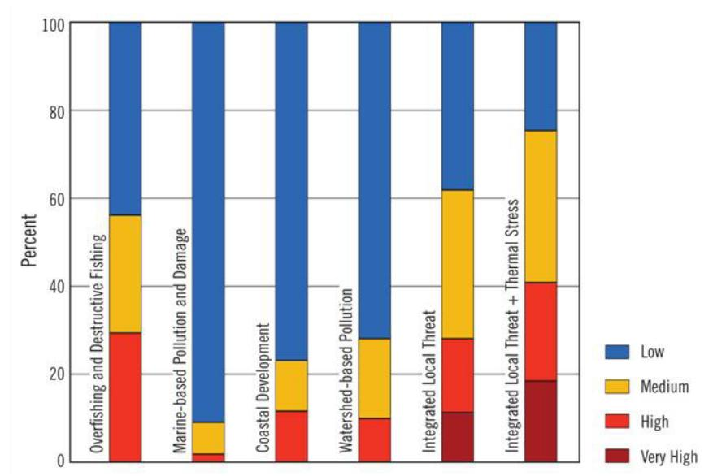

Figure 3.5.1. Global analysis of risk to coral reefs, by region and globally, to the four categories of local threat plus an integrated local threat and local threat plus thermal stress. Risk was assessed through a GIS-based analysis of risk compiled from all available sources and categorized as low, medium or high threat to reefs. For details on methods and a full description of threats included in each risk category, please see the original publication. Used with permission from Reefs at Risk Revisited (Burke et al., 2011).

#### **4. DEMOGRAPHIC AND SPATIAL FACTORS IN EVALUATION OF RISK**

#### **4.1 Overview**

Species extinction risk can be evaluated by considering two separate, but related, types of information: (1) information about the dynamics and distribution of the species itself, and (2) information about threats confronting the species, including their intensity, trends and responses of the species to them (Crawford and Rumsey, 2009). This chapter evaluates information associated with the recent condition and distribution of a species itself. An approach that has been applied to listing and recovery of Pacific salmon under the U.S. Endangered Species Act (McElhany et al., 2000) is based on general conservation biology principles and provides a useful framework for considering the extinction risks to the 82 candidate coral species. The approach entails evaluating the following four species parameters at a variety of spatial scales: (1) abundance, (2) productivity, (3) spatial structure, and (4) diversity.

The initial step in applying this approach involves identifying the population units for analysis. In this context, a "population" is defined as a unit that is "relatively demographically isolated" and is the most biologically appropriate unit for many types of abundance and trend analyses (McElhany et al., 2000). The overall species status is a function of the status of the individual populations and groups of connected populations. Two key challenges in applying this method to corals are the general lack of information for identifying these population units and their colonial and fragmenting nature that leads to multiple genetically identical "individuals." As a consequence, status and trend data have typically been reported at the scales of the original studies, which were frequently either smaller or larger than a demographic population. In very few cases have studies considered the actual number and demographics of distinct genets (Ayre and Hughes, 2000; Baums et al., 2005; 2006; Connell et al., 2004).

While there were generally insufficient data to define population structures for each of the 82 candidate coral species, it was still useful to consider species condition in terms of abundance, productivity, spatial structure, and diversity. All else being equal, a species with high abundance is at less extinction risk than a population at low abundance because small populations are more vulnerable to the negative impacts of environmental fluctuations, genetic problems, catastrophic events, and other issues. Higher productivity is perhaps a more important indicator of low extinction risk. Productivity is defined here as the tendency of the population to increase in abundance if perturbed to low numbers and is often expressed as "recruits per spawner" at very low levels of adult population density, although the term "recruit" can be difficult to apply in the case of corals, which reproduce both sexually and asexually (see Section 2.2.1). This is the productivity definition commonly used in fisheries and is a direct measure of population resilience (Mangel et al., 2010). This definition is distinct from the concept of "primary productivity" used for photosynthetic organisms (such as a coral-algal-microbial holobiont) to describe the conversion of sunlight and carbon dioxide into organic compounds for organismal growth and reproduction. It is useful to note that productivity (sensu fisheries) is often a better indicator of extinction risk than overall abundance—a large population can be quite vulnerable if it lacks resilience and, conversely, a relatively small population can be robust if it has high productivity (Fig. 4.1.1). This is one of the reasons it can be difficult to predict a species vulnerability to extinction based on its current abundance (another reason being potential "extinction debt," discussed below).

The life-history strategy and pattern of productivity can affect extinction risk. Species that are short-lived with high productivity (classic "r-selected" species; MacArthur and Wilson, 1967) might show great variability in abundance driven by short-term environmental fluctuations but are relatively resistant to extinction as long as mean productivity remains high and they do not experience too many bad seasons relative to the required recovery interval. Species that are long-lived with relatively low or episodic productivity (classic "k-selected" species) may show relatively stable adult populations in the face of environmental fluctuations but are quite vulnerable to extinction if adult survival declines or if productivity declines below the already naturally low levels. The relatively low levels of successful reproduction in some long-lived coral species, where partial mortality regularly occurs, may not keep pace if adult mortality increases substantially (Soong and Lang, 1992; Szmant-Froelich, 1985). Species with this strategy are described as displaying a "storage effect" as they carry over reproductive potential across multiple breeding seasons (Edmunds, 2002; Warner and Chesson, 1985). Many of the 82 candidate coral species have this long-lived, low or episodic productivity life-history strategy making them highly vulnerable to trends of increased mortality or catastrophic mortality events. Because abundance and productivity have such interactive effects on extinction risk (Fig. 4.1.1) and because they are often both estimated from the same time series data, the BRT addressed these two parameters together. Trends in abundance represent a "realized" productivity (McElhany et al., 2000) and are also considered in this chapter. Trend data can be very informative when evaluating extinction risk. However, extrapolating from trend information requires an assumption that the biological and environmental processes that operated in the recent past will continue into the future (the "stationarity assumption"). If directional changes, phase shifts, catastrophic events, or other features are expected in the future that are not captured in the time frame in which the existing trends were determined, these types of data provide less confidence as a basis for estimating extinction risk. In the case of an expected increase in anthropogenic threats, the stationarity assumption is violated and a simple extrapolation of historic trend data will tend to underestimate risk.

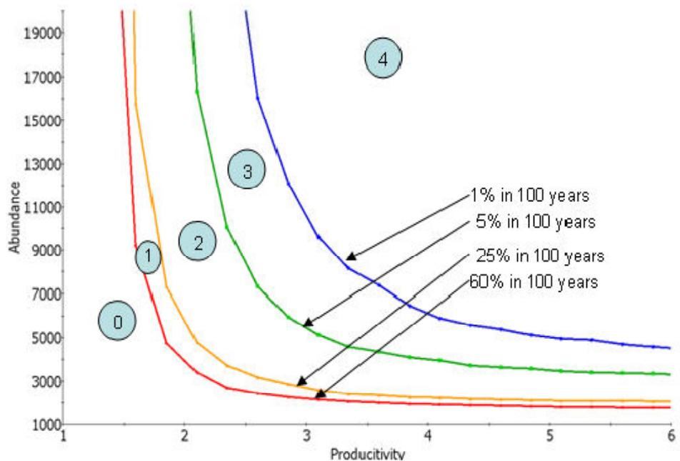

Figure 4.1.1. A conceptual "viability curve" illustrating the relationship between abundance and productivity. The *y*-axis indicates population abundance for adults of a hypothetical species, and the *x*-axis indicates population productivity in terms of the number of offspring per adult if the population is very small. A single-colored curve shows combinations of abundance and productivity with the same extinction risk (McElhany et al., 2007).

Spatial structure is important at a variety of spatial scales. At small spatial scales within the range of a single population, issues of gamete density and other Allee effects can have significant impacts on population persistence (Allee effects are discussed more extensively in the section below on Critical Risk Thresholds). At larger spatial scales, geographic distribution becomes important for "spreading the risk" among multiple populations. A larger geographic range can buffer a population or a species from correlated environmental fluctuations or catastrophic events. A large geographic range also provides a hedge against large-scale directional environmental change (e.g., climate change) because it is more likely that some areas of the range will be less affected by the threat. However, isolation of populations in wideranging species can reduce gene flow and the potential for larval connectivity, reducing the likelihood of recovery from mortality events. Thus, a robust spatial structure includes a wide geographic range, with substantial connectivity maintaining proximity of populations and individuals within the range.

Diversity affects species viability across spatial scales, from genotypic diversity within a single population to morphological variation over the entire species range. In this context, "diversity" describes both genetic variation and phenotypic variation; both influence population viability, but in different ways. Within a population, diversity helps buffer against environmental fluctuations. At all spatial scales, genetic diversity provides the raw material for evolutionary response (i.e., adaptation) to directional environmental change (e.g., climate change). Based on their colonial nature, ability to resume growth following partial colony mortality (often forming multiple new colonies), and ability to produce new colonies by fragmentation, corals may exist in large numbers on a reef but have very little genotypic diversity. While high abundance still reduces the risk of extinction for coral populations, a lack of diversity may limit the ability of corals to outcross during sexual reproduction or may reduce or preclude fertilization in species that do not self-fertilize. In an extreme case all colonies of a coral species on a particular reef would be clones of the same sex in a gonochoric species, and the coral might be numerically abundant but sexual reproduction would be impossible. The limited number of genotypes also suggests that many "individuals" in the population are vulnerable to the same environmental threats (e.g., a specific disease), and an event that would be a minor reduction in a more genotypically diverse population could be catastrophic in one that is genotypically depauperate.

In evaluating the extinction risk for the 82 candidate coral species, the BRT applied the concept of a "Critical Risk Threshold (CRT)." The Critical Risk Threshold describes a condition where the species is of such low abundance, or so spatially disrupted, or at such reduced diversity that extinction is extremely likely. In the final section of this chapter, the key factors that influence the Critical Risk Threshold are summarized.

#### **4.2 Abundance and Productivity of Corals**

Information related to coral abundance and productivity can be divided into six types: (1) qualitative abundance estimates, (2) quantitative species abundance estimates, (3) time series of species-specific percent cover, (4) time series of percent cover at the genus level, (5) estimates of changes in percent cover based on extrapolation and expert opinion, and (6) estimates of juvenile recruitment. Unfortunately, very few abundance, productivity, or trend data were available for the 82 candidate coral species at the time of the review. Most of the data that did exist failed to adequately elucidate the effects of global threats on a species across its entire range. Relevant information for each species was presented in the individual species accounts (Chapters 6 and 7). Here, an overview of the information considered for this analysis is presented.

Qualitative abundance estimates (e.g., "common" or "rare") for the candidate species were available from several sources. The sources most commonly used by the BRT were Veron (2000), Carpenter (2008), and online IUCN species accounts (IUCN, 2010). These estimates provided relatively little information for evaluating extinction risk. While it is true that, in general, "rare" species are more vulnerable than common ones, some species are naturally rare and have likely persisted in that rare state for tens of thousands of years or longer. Classifying a species as "common" does not necessarily indicate it has a low risk. For example, the Caribbean *Montastraea* species considered in this Status Review Report were listed as "common" (Veron, 2000), yet trend information indicated substantial declines and relatively high risk. Indeed, it is likely that naturally "rare" species have intrinsic characteristics that maintain viability at lower abundance that depleted "common" species (i.e., those which have declined to low abundance) lack. However, naturally rare species may generally be at greater risk of extinction than naturally more common species when confronted with anthropogenic threats (Magurran, 2009). Presence and absence data are another type of qualitative abundance data; these are useful for establishing the potential range of a species. If repeated over time, presence/absence surveys can provide some quantitative indication of trend (i.e., change in frequency of occurrence).

Quantitative abundance estimates were available for only a few of the candidate coral species. Richards (Richards, 2009; Richards et al., 2008b) estimated total effective population size (Wright, 1931) for a number of Pacific *Acropora* species based on extrapolation from local surveys and an assumption that effective population size was a fixed percentage of census size. These data suffered from substantial uncertainties based on small survey sample sizes relative to the scale of the extrapolation, uncertainties in estimating the extent and quality of reef habitat, and uncertainties about the relationships between census counts and effective population sizes. The Richards data are also limited in that they do not inform changes over time. However, the data are useful in helping to distinguish among the different species of *Acropora*, particularly given the limitations in coral cover data that could show trends (see below).

The most informative data are time series observations of species-specific abundance (most commonly percent cover), because these data provide direct evidence of temporal changes in the focal species. Unfortunately, these data were less common than one might expect. The majority of the 82 candidate coral species occur in the Indo-Pacific (75), but many literature reports and long-term monitoring programs reported coral percent cover only to genus level or morphological group (e.g., branching, massive, encrusting) within a genus because of the substantial diversity within many genera and difficulties in field identification among congeners. These genus-level data were considerably less informative for evaluating the extinction risks to species and generally were not included as part of the BRT individual species accounts in Chapters 6 and 7. In the Caribbean, most of the candidate coral species were too rare to document meaningful trends (e.g., *Dendrogyra cylindrus*), commonly identified only to genus (*Mycetophyllia* and *Agaricia* spp.) or potentially misidentified as different species (e.g,. *Montastraea annularis* complex). Time-series data were available for the candidate *Montastraea* species partially because they make up such a predominant part of live coral cover. Even for these species, the time-series observations at the species level were often of very shortshort duration (they were not separated as sibling species until the early 1990s and many surveys continue to report them as *Montastraea annularis*  complex) and cover a very limited portion of the species range (e.g., the time-series only monitors a subsection of a single national park).

The IUCN report (IUCN, 2010) and the accompanying publication in Science (Carpenter et al., 2008) were the primary analyses referenced in the petition to list 83 corals. That work relied on extrapolating species-specific extinction risks from estimates of total coral cover and habitat types at very broad geographic scales. The uncertainties introduced by this extrapolation were substantial. The regional estimates of status and change in coral cover often were based on nonquantitative expert opinion, which does not necessarily make them wrong, just uncertain. Perhaps a greater source of uncertainty in that analysis was the assumption that the trends in individual species would be the same as that estimated for overall change in total coral cover. It is not apparent that individual species would always increase or decrease in direct proportion to the overall change in coral cover within a given habitat type; the diverse ecology and life history of the range of candidate coral species would seem to suggest otherwise. The problem is exacerbated by the potential mismatch between the broad spatial scale of the total coral cover estimates and the actual geographic distribution and microhabitat requirements of individual species. Although the expert panel approach used by IUCN may provide a general picture of changes in total coral cover, it would not necessarily provide a very precise estimate of trends in individual species.

For some of the candidate *Montastraea* species, data were available on juvenile recruitment (summarized in Edmunds et al., 2011). These data provided valuable information on rates of successful sexual reproduction and the potential for the species to replace itself. Interpreting recruitment data can be challenging because recruitment may be naturally episodic for some species, which will require many years or decades of observation to detect trends in population dynamics (Edmunds and Elahi, 2007). Individuals from species with a mean life expectancy of many decades may only need to successfully replace themselves infrequently to maintain a stable population.

#### **4.3 Spatial Structure of Corals**

As discussed in Chapter 3 on the threats facing the 82 candidate coral species, the impacts of climate change and ocean acidification are of central importance in evaluating the Critical Risk Threshold. The BRT considered a broad geographic distribution across a variety of habitats and microhabitats within a reef to be a significant buffer against the potential impacts of ocean warming and acidification. At large spatial scales, broad latitudinal distributions were considered important as a buffer against ocean warming, as it indicates a relatively wide thermal tolerance and a potential ability to persist through thermal anomalies and as thermal isoclines shift poleward. High-latitude reefs may serve as either refugia or climate-change hot spots (Riegl, 2003), and corals may have the potential to expand their latitudinal distributions with ocean warming (Precht and Aronson, 2004; Yamano et al., 2011). However, the BRT determined that insufficient data existed to adequately address potential range changes at the level of the candidate coral species. Additionally, there are limits to latitudinal buffering as entire ecosystems shift in response to climate change and other factors, so geographic range is only a limited predictor of extinction risk. Additionally, studies on the range of habitats suitable for reef development indicate that factors other than temperature, such as light availability (Kleypas, 1997) or aragonite saturation state (Guinotte et al., 2003), will likely limit the potential of poleward expansion. Finally, local microhabitat variability has been considered to provide potential refugia (Fabricius et al., 2004; Skirving et al., 2010) or a range of conditions that might provide for greater genetic adaptation within a species (Barshis et al., 2010; Baskett et al., 2009a). Although it is only a limited predictor, estimates of current geographic range were among the few pieces of information available for many of the candidate species and, therefore, were of relatively high influence in the BRT's evaluation of Critical Risk Thresholds2 .

Data on the geographic distributions of the 82 candidate coral species were obtained from four main sources: (1) IUCN maps (www.iucnredlist.org), (2) Veron's survey of corals (Veron, 2000), (3) an evaluation of the U.S. distribution of candidate coral species (Kenyon et al., 2010b), and (4) personal communication of observations from BRT members, BRT-solicited subject matter experts, and other researchers with direct knowledge of the candidate coral species. BRT members expressed considerable uncertainty and skepticism regarding some of the reported species distributions. Much of this uncertainty arose from basic taxonomic uncertainty among the corals (discussed in Section 2.1) and the difficulty

It should be noted that, while the Individual Species Accounts in Chapters 6 and 7 include an assessment of the species' occurrence in U.S. waters, it was the species' global range of occurrence, not U.S. occurrence, that was considered as a factor in estimating the extinction risk for the candidate species. The U.S. Endangered Species Act requires extinction risk for invertebrates to be assessed range-wide.

in identifying species in the field. Where questions arose, they are discussed in the individual species accounts (Chapters 6 and 7).

#### **4.4 Diversity in Corals**

Genetic and phenotypic diversity help buffer a species against negative effects of environmental variability. In general, a species with high diversity is more likely to have some individuals with traits suitable for altered local conditions at a particular place and time than a population with reduced diversity. Phenotypic diversity can be important even in the absence of clear genetic diversity as it indicates a certain plasticity that may allow for persistence in multiple environments and habitats; loss of the ability to produce certain phenotypes may result in increased risk. Genetic diversity is important as the raw material for evolutionary change in response to environments with directional change (e.g., from climate shifts). Loss of this genetic diversity could be considered an increased risk factor (e.g., Hughes and Stachowicz, 2004).

Unfortunately, few data are available about diversity within the 82 candidate coral species. In many cases, the species themselves have not even been unambiguously identified (see Section 2.1), much less any analyses of within-species variability. However, as described in Section 4.2, estimates of effective population size are available for some species of *Acropora* (Richards, 2009). Small effective population size can infer relatively low genetic diversity or potential population genetic bottlenecks, such as inbreeding and mutation accumulation (Lynch et al., 1995). As described above, there is considerable uncertainty regarding these estimates of effective population size in corals generally, and the candidate species in particular. However, even after considering the uncertainty, these analyses suggest low effective population sizes for the rarer species (Richards, 2009)—much lower than might be suspected, given their relatively large geographic ranges. These effective population size estimates are discussed in the appropriate individual species accounts (Chapters 6 and 7).

Another piece of relevant information regarding within-species diversity of corals (and further reducing estimated effective population size below census size) is the level of asexual reproduction. Scleractinian corals can reproduce either sexually by dispersal of gametes or clonally by asexual fragmentation. Although survival often depends on fragment size, fragmentation can be extremely important in supporting local abundance, or in recovering from physical damage, such as storms. Asexual reproduction simply creates more copies of the same genotypes, and these clones may help a species survive disturbances in the short term. However, the loss of genetic diversity resulting from a lack of sexual reproduction could reduce the long-term viability of a species (Honnay and Bossuyt, 2005). In the *Monastraea annularis* complex, successful replacement of adults through sexual reproduction is not common and levels of recruitment from asexual fragmentation have rarely been determined (Edmunds et al., 2011; Foster et al., 2007). It is unclear whether the levels of sexual reproduction and recruitment are changing in the *Monastraea annularis* complex. Detecting trends is difficult because sexual reproduction and recruitment are assumed to be episodic, since it has never been observed at an appreciable level (Edmunds et al., 2011), with supposed long, irregular (and therefore largely unobserved) intervals between successful recruitment events. Whatever the trend, the overall levels of larval recruitment are very low (Edmunds et al., 2011), leading to potential concerns about low levels of diversity.

Finally, reef-building corals are functional holobionts and there is substantial diversity of the symbiotic zooxanthellae and microbial components. The BRT did not formally address this level of diversity in the species analyses, as it is beyond the scope of the petition. However, the BRT acknowledges that the ability to host, for example, multiple clades of zooxanthellae may provide the ability to adapt to different environmental conditions and addressed this in individual species accounts when relevant information was available. This is clearly a complex issue that remains poorly understood. While genetic variability among zooxanthellae has been found across reefs, among reefs, and geographically (Baker et al., 2001; Fabricius et al., 2004; LaJeunesse, 2002; LaJeunesse et al., 2004a; LaJeunesse et al., 2003), the ability (or lack thereof) to either incorporate new zooxanthellae or retain them after stress events may control adaptation (Coffroth et al., 2010; LaJeunesse et al., 2010; LaJeunesse et al., 2009; Thornhill et al., 2006).

#### **4.5 Critical Risk Threshold**

Absolute extinction is often defined as occurring when there are zero individuals of a particular species alive. Prior to that end point, a species may be considered "functionally extinct" where extinction is inevitable, although some individuals may still be alive. For example, if the only individuals left are male, the species will go extinct—it is only a matter of time. In the case of corals, a clonal colony can potentially survive for decades or centuries and functional extinction could occur well before absolute extinction. It may not always be apparent when a species is functionally extinct. For example, a species may contain both males and females but they may be somehow genetically incompatible individuals (e.g., cannot self-fertilize, or both carry the same recessive lethal alleles) or they may be so far apart physically that natural reproduction is impossible. The species also may have entered some other "extinction vortex" where absolute extinction is inevitable or very likely because of depensatory feedback loops. In a depensatory feedback loop, individual survival decreases with smaller population size, so that as the population gets smaller, more individuals die or fail to reproduce leading to an even smaller population size and even lower survival and reproduction, until eventually, and perhaps after a long time, reaching extinction.

The BRT distinguishes between situations where extinction is inevitable, which the BRT calls functional extinction, and situations where extinction is extremely likely because of depensatory feedback or other processes that the BRT refers to as "critical risk." Some researchers have used the term functional extinction in situations the BRT would describe as critical risk (e.g., Sekercioglu et al., 2004). The distinction is important because, according to the BRT's definition, a functionally extinct population is doomed, whereas there may be potential for recovery of a population at critical risk. Successful recovery of a species considered at critical risk may require significant management intervention, occurrence of unusually favorable natural conditions, or both. The BRT's task did not include estimating or predicting possible future changes or effects of changes that could foster recovery, but such conditions could occur. The BRT, therefore, used the more inclusive concept of critical risk, but in practice it is likely difficult to distinguish between a functionally extinct species and one at critical risk. Because of this difficulty, the BRT evaluated the likelihood of the species falling below a "Critical Risk Threshold" (CRT) within a specified period of time, rather than the likelihood of the species becoming absolutely or functionally extinct.

Extinction thresholds may also be difficult to detect because of "extinction debt." The term extinction debt was originally coined to describe a phenomenon observed in a specific multispecies meta-population model where extinction of competitively dominant, but poorly dispersing species is predicted to occur at a substantial time lag after a habitat destruction event (Loehle and Li, 1996; Tilman et al., 1994). Extinction debt has been broadened from the original specific meta-population model to describe the general situation where delayed extinction represents an ecological "debt" to be paid in the future for current habitat destruction (Kuussaari et al., 2009). Analyses suggest that long-lived corals may be vulnerable to extinction debt (Stone et al., 1996), making detection of risk extremely challenging since apparently healthy but patchy coral populations may in fact be headed toward inevitable extinction within a few generations because of habitat destruction (or resultant recruitment failure). Extinction debt theory also predicts that competitively dominant and often quite abundant species are particularly vulnerable to delayed extinction as compared to rare species that are less-effective competitors, but good dispersers.

In modeling extinction risk based on projections from abundance time series, it is common to estimate the probability of a population declining to a "Quasi-extinction Threshold" rather than absolute extinction (Engen and Sæther, 2000; Ginzburg et al., 1982; Holmes et al., 2005; Jenouvrier et al., 2009). The Quasi-extinction Threshold corresponds to a low abundance (or high rate of decline) considered to represent a situation of conservation concern or an abundance where processes outside the scope of those included in the model become important (e.g., demographic stochasticity). Although there is no uniform way of setting Quasi-extinction Thresholds, values in the literature vary considerably depending on prevailing conservation concerns, model structure, and the life history/historical abundance of the species in question (Ellner et al., 2002). While the conceptual bases for describing Quasi-extinction Threshold and Critical Risk Threshold are similar, the BRT has chosen to not use the term Quasi-extinction Threshold because of its association with a particular type of modeling and because it is often applied at the population scale. Quantitative population and productivity data were available for very few of the 82 candidate coral species, making such modeling problematic, dubious, or even impossible in cases with no data. The BRT's application of the Critical Risk Threshold concept was not restricted to a quantitative model and was applied at the species, rather than population, scale.

The BRT defined a Critical Risk Threshold as a condition where the species is of such low abundance, or so spatially disrupted, or at such reduced diversity that extinction is extremely likely within a defined timeframe. The Critical Risk Threshold level is influenced particularly by the effects of depensatory processes, environmental stochasticity, and catastrophic events. Depensatory processes include reproductive failure from low density of reproductive corals and the effects of genetic processes, such as inbreeding. Environmental stochasticity results from "normal" levels of environmental variation, whereas catastrophes result from severe, sudden, and chronic, but new (e.g., climate change), deleterious environmental events. The BRT did not define Critical Risk Threshold as a single abundance number, density, spatial distribution or trend value, but rather as a qualitative description encompassing multiple metrics. Critical Risk Thresholds vary among species based on life-history parameters and other characteristics.

#### **4.5.1 Critical Risk Threshold and depensatory processes**

Several key depensatory processes affect extinction risks in corals. This section describes the depensatory processes that were taken into account by the BRT in determining Critical Risk Thresholds for each of the 82 candidate coral species. The first is **fertilization**. Most coral species, including all of the candidate species, are sessile and cannot move closer to each other for spawning, and when they release their spawn into the water column, ocean currents dilute the gametes as they are transported to downstream locations. Experimental studies have indicated a level of proximity among colonies that is required for a reasonable chance of fertilization. For broadcast-spawning corals, these studies have indicated that eggs must be released within a relatively short distance (2–5 m) of a spawning male for successful fertilization to occur (Lacks, 2000; D. Levitan, Florida State University, FL, pers. comm., March 2010). It is not clear the extent to which these experimental studies on a few individual species can be extended to all corals, particularly since it is known that many naturally rare species occur at lower densities than the limits found in these studies. Considering the diversity and heterogeneity of coral reefs and the distances among corals of the same species in nature, the results of these studies seem unrealistically small. It has been pointed out by Oliver and Babcock (1992) and Coma and Lasker (1997) that many aspects of the natural histories of scleractinian corals and octocorals are adaptations of sessile colonies to maximize the potential for successful fertilization. Synchronous spawning, buoyant gamete bundles that accumulate at the sea surface, and timing of spawning during periods of low water motion (Van Woesik, 2010) might result from selective pressure for gamete concentration and may increase the distance at which spawning can be successful. Nevertheless, dilution and dispersion by ocean currents makes it reasonable that sessile coral colonies must be within a few tens of meters of a colony of another compatible parent (e.g., opposite sex for gonochoric species and/or different genotype for any coral) for successful fertilization to occur. Levitan et al. (2004) argued that the genetic isolation among species of *Montastraea* involves separation in time of spawning by 2 hours even though gametes are viable for as long as 6 hours. The dilution and dispersion by ocean currents within the 2-hour time difference effectively separates these species. If populations of coral colonies become less densely distributed, their effective population sizes decrease substantially even though the absolute numbers of colonies might remain high.

Second, **fecundity** affects fertilization success, population recovery, and population connectivity. In a synergistic interaction among threats, the initial number of gametes spawned influences the rate at which sufficient dilution and dispersion of gametes occurs. However, anthropogenic physical disturbance, chemical pollution, and other factors reduce the fecundity of corals by decreasing the size distribution of corals and by reducing the energy available for producing gametes. Fertilization reportedly decreases after pollution and bleaching events (Omori et al., 2001). As colonies become more sparsely distributed with smaller size distributions, lower fecundity per polyp, and potentially reduced fitness of the gametes produced, the fecundity of the population decreases and the probability or rate of fertilization decreases. Gardner et al. (2003) analyzed data from 263 sites across the wider Caribbean and found an 80% decline in coral cover (which might be taken as a proxy for population fecundity) from 1977 to 2001. Studies that monitored coral recruitment from 1977 to 1993 in Jamaica (Hughes and Tanner, 2000) and 1979 to 2004 in Curaçao (Bak et al., 2005) indicated a substantial decline in coral recruitment over the same three decades. Declining coral cover (low population fecundity) thus could lower production of planulae, leading to lower coral recruitment, which would provide lower replenishment of adult colonies and thereby further decrease population fecundity and production of planulae—a positive feedback process that accelerates population decline over the geographic area.

Third, declining corals are influenced by **disrupted metapopulation processes**. Depensatory processes can reduce interconnections among populations by three mechanisms: (1) increased distances among populations, (2) establishment of toxic barricade waters, and (3) decreased fecundity. For fish, the maintenance of local populations is often dependent on frequent arrival of dispersed larvae (Cowen et al., 2006; Steneck, 2006). As coral populations are extirpated by habitat damage, disease, bleaching events or other factors, the distance between the remaining populations increases (Fig. 4.5.1). Thus, it is less likely that the remaining populations can exchange larvae needed for maintenance or adaptation. This can lead to further loss of populations, creating even greater interpopulation distance leading to a depensatory spiral and possibly further local extirpations. Populations do not need to be completely extirpated to have reduced connectivity. Lowered population fecundity also reduces the probability of sufficient larvae recruiting to a reef with a depleted population (Cowen et al., 2006; Steneck, 2006). As fecundity decreases, the distance at which a population can effectively provide larvae to rescue other populations decreases (Fig. 4.5.2). Thus, drops in fecundity and connectivity are synergistic. Also, anthropogenic runoff and effluents can act as barriers to larval dispersal, effectively isolating populations of normally high gene-flow species (Puritz and Toonen, 2011). This can reduce connectivity, causing or reinforcing the depensatory effects of habitat fragmentation. Genetic isolation by human coastal populations is "most likely caused by larval mortality from the substantial contemporary augmentation of freshwater, particulate and/or pollutant load" (Puritz and Toonen, 2011). Even if the geographic distance among populations does not change, the effective distance among populations can be changed by altered ocean circulation patterns, such as are projected to result from climate change (see Section 3.2.5).

The particular life history strategy of a coral species can affect vulnerability to disrupted metapopulation processes, however, it is not readily apparent whether brooding or broadcasting species are most at risk. Brooding larvae are capable of almost immediate settlement and most successful settlement appears to in close proximity to spawning locations. However, the fact that most brooders have zooxanthellae implies that they may be capable of distant dispersal. So, while brooders predominantly settle near their parents, they are also capable of some long distance settlement. Brooding corals may be favored on semi-isolated reefs because of extended larval competency periods (Harriott, 1992). Although this suggests that brooders should be less vulnerable to extinction as well as having lower species origination rates (Johnson et al., 1995), preferential survival of brooders during the Oligocene/Miocene extinction in the Caribbean may have been more as a result of enhanced survival of brooded lecithotrophic larvae than extended larval competency (Edinger and Risk, 1995). Brooders may also have reduced genetic variability, especially if they are capable of self-fertilization. However, the trade-off for brooders may be improved larval survival because of the increased likelihood that they will settle in a compatible environment. This advantage may be reduced as the climate changes giving broadcasting species an advantage in environments where reefs and coral communities span a wider range of environmental conditions (Glynn and Colley, 2008).

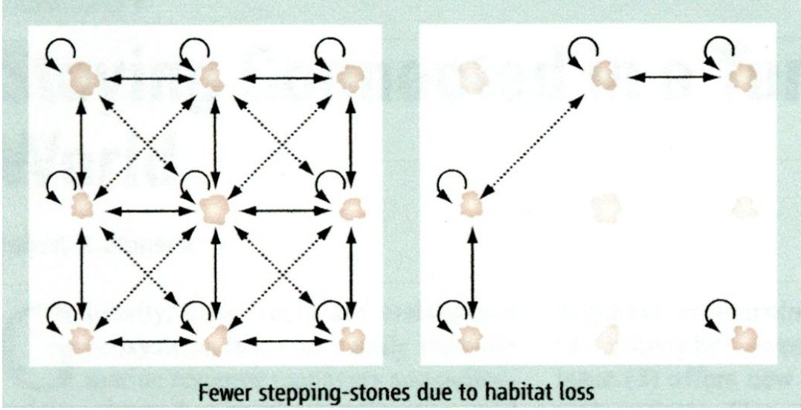

Figure 4.5.1. In a damaged ecosystem (illustrated in panel on the right) increased distances between patches can lead to recruitment failure (Nakamura et al., 2011).

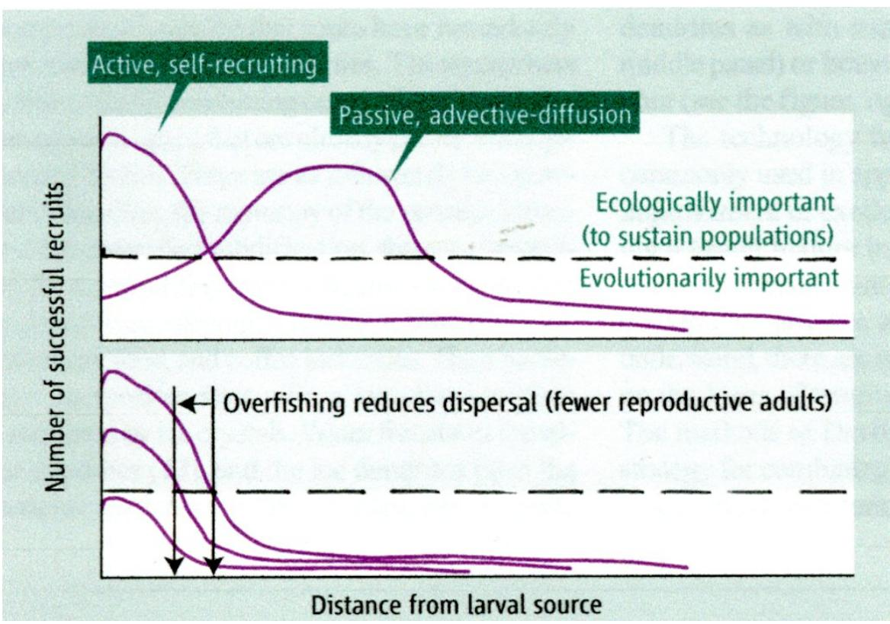

Figure 4.5.2. Number of successful recruits for population replenishment (area above the dotted line) declines as harvesting or ecological disturbances reduce the abundance of reproductive adults (Figure from Steneck, 2006).

The fourth process is **predation**. While predation on corals most often results in only partial mortality, the probability of overpredation (a second predation event before the first has healed or lost individuals are replaced) decreases exponentially with increased coral abundance and increases linearly with increased healing time (Fig. 4.5.3). As with fertilization, fecundity, and connectivity, the probability of escaping overpredation increases with colony abundance and individual size (Jayewardene et al., 2009). Pollution and climate change can potentially increase the healing time (Fisher et al., 2007) required for lesions resulting from predator bites and these factors can thereby reduce the threshold time required to reach overpredation (Fig. 4.5.3). On a healthy coral reef, the frequency of predation on corals can be intense, but the corals are able to sustain their population (Jayewardene et al., 2009); however, as coral populations decrease the predators focus on the few remaining colonies and predation becomes depensatory. This scenario assumes a Type II predator-prey functional response (Holling, 1959), where predators consume more prey per capita when the prey are at low density (Fig. 4.5.4). This effect has been observed on coral reefs during crown-of-thorns seastar predation outbreaks after mass-bleaching events (Glynn, 1985a). This is likely to occur if the predators have no alternative prey and there is some handling time for processing prey or it can occur as a result of predator concentration.

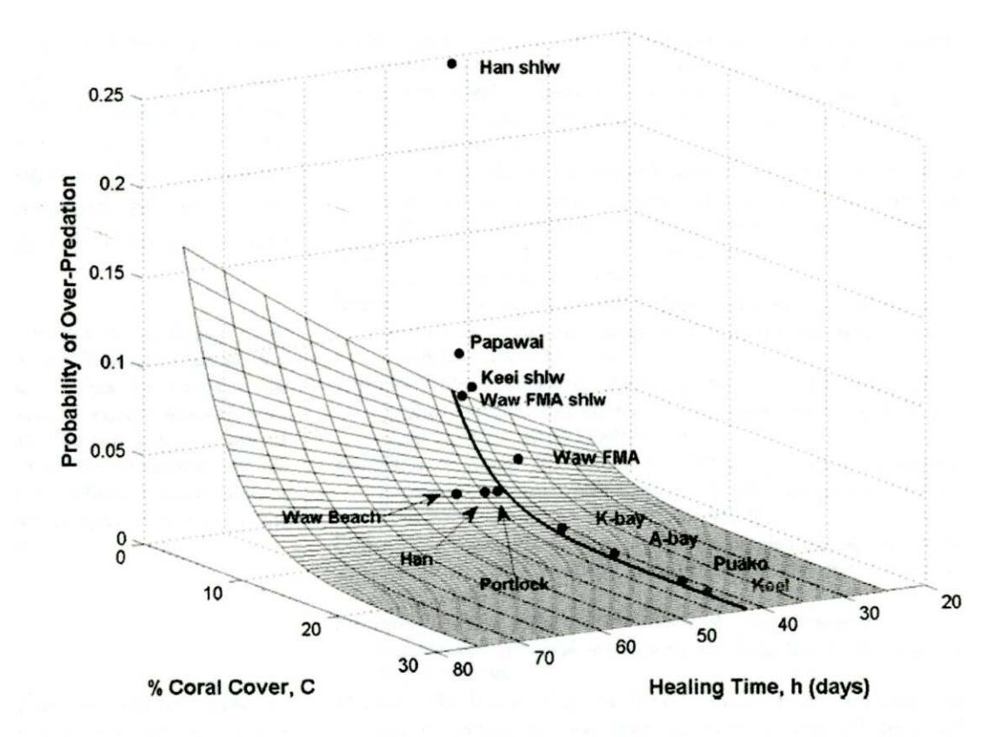

Figure 4.5.3. Probability of overpredation in relation to coral cover and healing time from lesions from bites of predators (Jayewardene et al., 2009).

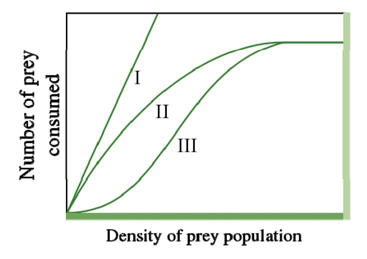

Figure 4.5.4. Predator-prey functional response types (Holling, 1959).

Fifth, **macroalgal phase shifts** (Fig. 4.5.5) impair adult and early life stages of corals (see Section 2.3.4. "Phase shifts**."**). Just as predators can outpace the recovery abilities of prey at low population levels, once algae cover more space than the herbivore populations can effectively graze, the process becomes depensatory. This is because the algal population can expand making it even less likely that the algae can be controlled by herbivores (Williams et al., 2001), yielding reduced recruitment habitat for coral larvae. Macroalgae further impair coral populations by many mechanisms (McCook et al., 2001). Some seaweed species have allelopathic effects on both coral adults and settling larvae. Some filamentous algae create sediment traps that make hard substrata inaccessible to settling larvae or smothers recently established recruits (Birrell et al., 2005). Macroalgal thalli can cause bleaching and death to coral tissue in direct contact

(Rasher and Hay, 2010) and can reduce coral larval settlement in their vicinity (Kuffner et al., 2006). Other lab experiments show that macroalgal tissues impair corals not in direct contact, presumably by stimulating enhanced microbial loads by leaking carbon (Smith et al., 2006). Some algae may also trigger disease when in direct contact with coral (Nugues et al., 2004b). These mechanisms all represent potentially depensatory pathways as corals become more rare.

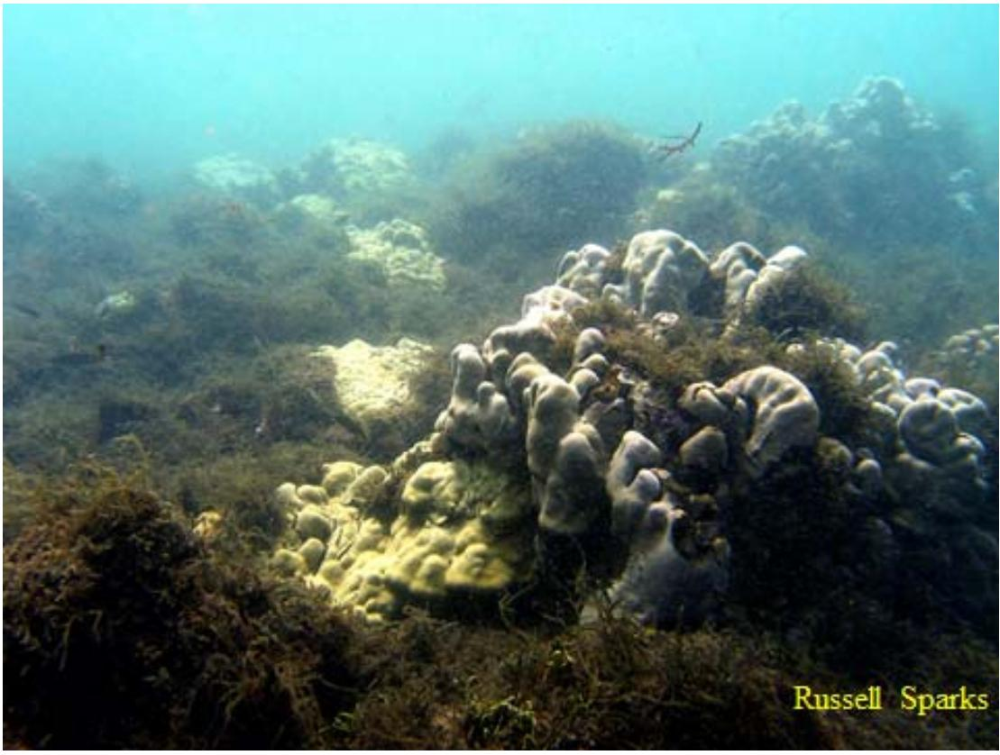

Figure 4.5.5. Macroalgae overgrowing corals on an overfished reef in western Maui.

The sixth process on coral reefs is **bioerosion and its resultant decrease in topographic complexity**. As corals are killed by episodic disturbances such as large waves from cyclones, large-scale predation by crown-of-thorns seastars or mass-bleaching events, large areas of carbonate skeleton are cleared of living coral tissue, facilitating increased bioerosion. Partial colony mortality increases the vulnerability of corals to bioerosion (Scoffin et al., 1997). Bleaching can also result in greater concentration of bioeroding organisms, intensifying the destructive process (Glynn, 1988b; Reaka-Kudla et al., 1996) and even push reefs from net growth into a state of net erosion (Johnson et al., 1995). Bioerosion is self-reinforcing because it weakens the skeleton and makes the coral more vulnerable to wave action and other stressors. When damaged by wave action, detached corals can become projectiles that can affect other corals and facilitate further bioerosion, a depensatory process. As the three-dimensional topographic complexity is reduced to a more two-dimensional framework or rubble, the amount of habitat for herbivorous fishes is reduced. Algae also do better on unstable substrata than do corals, further reducing the ability of corals to occupy space.

The seventh process, **decreasing colony size,** is depensatory as the size distribution of corals becomes smaller through slower growth and partial mortality, effects that can be caused by human activities and climate change. As the colonies become smaller, the potential area of contact on their circumferences becomes greater relative to the living surface area of the corals. For example, sediment stress (Nugues and Roberts, 2003), bleaching and fishing (McClanahan et al., 2008), and disease (Richardson and Voss, 2005) can all reduce coral colony size through partial mortality of large colonies or recruitment of small colonies after mass mortalities. However, mortality and reproduction are sizedependent in corals. For example, small corals are less susceptible to disease but more prone to total mortality if they become infected (Nugues, 2002). Larger colonies have larger eggs and more eggs per polyp (Hall and Hughes, 1996; Nozawa et al., 2006; Villinski, 2003), and most corals have a minimum physical size at which they are capable of reproduction (Soong and Lang, 1992; Szmant-Froelich, 1985). The minimum reproductive size could lead to loss of sexual reproduction in damaged populations. However, there are some circumstances in which small colony sizes are advantageous. For example, smaller colonies of *Oculina patagonica* appear less vulnerable to bleaching than larger colonies (Shenkar et al., 2005). Size-structured population models indicate that coral colony size dynamics can increase population extinction risk as a consequence of small decreases in recruitment rate (Sweatman et al., 2011).

While normally not considered depensatory, there are cases where **disease** can be considered the eighth and final depensatory process. In most cases, higher host density leads to an increase in disease likelihood. For example, in one case, relatively high (30% cover) density has been found as a requisite condition for disease outbreak prediction (Heron et al., 2010). However, there are potential cases where low density can lead to increased risk of disease. Raymundo et al. (2009) observed a higher frequency of diseases on corals of heavily fished reefs than in marine reserves. They hypothesized that intensive fishing may have removed the apex predators, releasing some of their prey, corallivorous chaetodontids, to become more abundant and transmit more coral disease as they fed. As the corals became less abundant, the released corallivores focused on the few remaining colonies and the spread of disease became depensatory. This is a complex, four-way, nonlinear interaction that illustrates the complexity of understanding depensatory processes.

#### **4.5.2 Critical Risk Threshold and sexual reproduction**

Several of the depensatory processes described above could result in the loss of successful sexual reproduction within the species. Sexual reproduction plays an important role in maintaining genetic and genotypic diversity, which can be advantageous in heterogeneous environments (Becks and Agrawal, 2010). The BRT considers a species that has lost the ability for successful recruitment of sexually produced progeny to be below the Critical Risk Threshold, even if it can still reproduce asexually. The BRT does not expect that species will lose the ability to produce gametes but rather through a depensatory process (or processes), sexual reproduction results in no new recruits that enter the population. A species in this situation would likely be far along an extinction trajectory. This issue is of some concern in species such as those of the *Montastraea annularis* complex that show very low levels of successful sexual reproduction (Edmunds et al., 2011; Hughes and Tanner, 2000).

#### **5. METHODS**

#### **5.1 Overview**

In evaluating the 82 candidate coral species, the BRT first assessed whether the taxonomic units in the candidate list were, in fact, "species" as described in the U.S. Endangered Species Act. Next, to estimate extinction risk for each of the candidate species, the BRT relied on a data review and expert evaluation. The data review included an evaluation of the relevant aspects of the biology and ecology of the species and an evaluation of the threats as documented in the published literature. The expert evaluation involved BRT members considering the likelihood that the species status will fall below the Critical Risk Threshold by the year 2100. The key information used and determinations made by the BRT are included in the individual species assessments in Chapters 6 and 7.

The Critical Risk Threshold describes a condition where a species is of such low abundance, or so spatially fragmented, or at such reduced diversity, that extinction is extremely likely. The reasons for evaluating Critical Risk Threshold rather than risk of absolute extinction are discussed below and in Chapter 4. The BRT used a voting process to assess the likelihood that the status of a species would fall below the Critical Risk Threshold. The voting process captured the uncertainty in the mind of each team member about the true likelihood. Each member judged the plausibility of a discrete set of likelihood levels and allocated votes or "likelihood points" to each possible level based on a weighing of the best available science. After several rounds of anonymous voting and discussion, votes of the members were combined to reach a final BRT determination on extinction risk.

#### **5.2 The Species Question**

The BRT first examined the taxonomy of each of the 82 candidate coral "species." In many cases, the taxonomic boundaries for the species on the candidate list were unclear. For each "species" on the list, the BRT selected one of the following options:

- 1. Accept the nominal species designation as listed in the petition,
- 2. Describe alternative potential species designations and provide the risk evaluation on each of the alternatives along with an indication of the species designation deemed most likely by the BRT, or
- 3. Accept an alternative species designation based on the best available information and provide the risk evaluation on that new designation.

The default was to select option 1 and accept the species designation in the petition. This option does not necessarily imply strong support for the species designation; it was simply selected in the absence of compelling contradictory information. Recent molecular analyses have suggested substantial revisions are necessary for many of the coral species designations that have been based on traditional morphology-based taxonomy (see Section 2.1.2 and description of taxonomic issues in the individual species accounts in Chapters 6 and 7 for additional discussion). It is anticipated that future research will likely result in taxonomic reclassifications of some of the candidate coral species considered in the Status Review Report.

#### **5.3 Data Review**

The evaluation of extinction risk was based on a compilation of the best available information on the biology and ecology of and the threats to both corals in general (Chapters 2–4) and the candidate species or related species in particular (Chapters 6 and 7). As part of the data collection effort, the NMFS solicited and received public comments about published and unpublished data that were useful in augmenting the BRT's examination of Critical Risk Threshold. The species-level biological data collection effort included information related to taxonomy of the candidate species, life history characteristics relevant to extinction risk (e.g., growth form, mode of reproduction, preferred habitat, depth range), geographic range of the species, trends in abundance or percent cover, vulnerability to threats, evolutionary and geologic history, and other relevant factors. Much of the desired species-specific information was largely unavailable for the majority of the candidate species. When biologically justified, the BRT extrapolated characteristics of the genus, related taxa, or taxa with similar physiological or habitat characteristics. This extrapolation introduced additional uncertainty into the analyses, as there are numerous examples in the literature in which ecological or physiological traits are not consistent across species within a genus. In some cases, essentially no species-specific information was available other than the taxonomic species description and some questionable geographic range maps.

The threat information provided generally in Chapter 3 and specifically for each of the 82 candidate coral species in Chapters 6 and 7 addressed both the current trajectories of the threats and consequences of the threats on the species. In terms of extinction risk, the top three threats identified by the BRT were ocean warming, disease, and ocean acidification—although other, usually local, factors (e.g., fishing, land-based sources of pollution, sera-level rise, predation, trade) were also important in many instances. As with the species-level biological information, in most cases there was no species-level information on how the individual threats would affect particular candidate coral species. The BRT evaluated how these threats would affect corals in general, focusing on studies of taxa related to those on the list of candidate species.

#### **5.4 Defining Extinction Risk**

Another key issue was the definition of "risk" used for the evaluation. Predicting risk of absolute extinction (i.e., when there will be zero living members of a species) is notoriously challenging (Coulson et al., 2001). Especially in typicallyclonal organisms like corals, where colonies can be very long-lived (many hundreds of years), a species may be functionally unviable long before the last colony dies. As discussed in Chapter 4, problems associated with low density may render a species at severely elevated risk well before extinction. Rather than try to predict risk of absolute extinction, the BRT estimated the likelihood that a population would fall below a Critical Risk Threshold within a specified period of time. The Critical Risk Threshold was not quantitatively defined. Rather, the BRT defined the Critical Risk Threshold as a condition where a species is of such low abundance, or so spatially disrupted, or at such reduced diversity, that the species was at extremely high risk of extinction with little chance for recovery. See Chapter 4 for a discussion of the factors that contribute to defining the Critical Risk Threshold. Uncertainty about the population level at which the Critical Risk Threshold would be reached contributed to the overall uncertainty of the analysis.

There is no formal definition in the U.S. Endangered Species Act for the term "foreseeable future" as used in the legal description of "threatened". However, agency policy guidance recommends linking the time horizon for the risk evaluation to the timeframe over which it is possible to scientifically predict the impact of the threats (U.S. Department of Interior, 2009). Both the petition and the BRT determined that climate change and ocean acidification probably pose significant extinction risk threat to corals. The year 2100 was used as the time horizon for this risk evaluation because this century was the timeframe over which the BRT had access to reasonable, scientifically vetted predictions of key threats and their impacts (see Chapter 3). In particular, the BRT determined that the Intergovernmental Panel on Climate Change (IPCC) collection of CO2 emissions scenarios and climate models provided projections with adequate confidence to the year 2100 to reasonably support their use in evaluating Critical Risk Thresholds for the candidate coral species. Much of the scientific information available on the potential impacts of ocean acidification on corals has likewise been based on IPCC CO2 emission scenarios and model projections.

#### **5.5 Assessing the Critical Risk Threshold**

The BRT evaluated the likelihood of each candidate coral species falling below the Critical Risk Threshold by the year 2100. Likelihood was defined using a 0%–100% scale divided into the following eight qualitative categories: exceptionally unlikely (< 1%), very unlikely (1%–10%), unlikely (10%–33%), less likely than not (33%–50%), more likely than not (50%–66%), likely (66%–90%), very likely (90%–99%), and virtually certain (> 99%) (Fig. 5.5.1). These category boundaries and labels are based on those used by the IPCC for summarizing conclusions about climate change research (IPCC, 2007b; Pew Center on Global Climate Change, 2007). This system of qualitative categories was used in the evaluation to emphasize the lack of precision in the analysis—the BRT had no quantitative way to distinguish between, for example, a 58% and 59% likelihood and did not intend to imply more precision than existed. The BRT described this as evaluating the "likelihood" of the risk hypothesis because the category labels are in terms of whether something is qualitatively likely. The BRT is not using the term "likelihood" to denote a quantitative statistical probability, but rather in a common, colloquial sense. Although these category labels (e.g., "less likely than not") provide a reasonable description of the **likelihood** of some event, it is critical to emphasize that the labels do not describe what risk is **acceptable**.

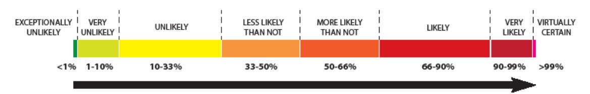

Figure 5.5.1. Scale and categories used by the BRT to evaluate risk hypotheses.

#### **5.6 BRT Voting**

To estimate the likelihood of each of the 82 candidate coral species status falling below the Critical Risk Threshold by 2100, the BRT used a voting process that incorporated uncertainty within and among the seven BRT members. Each BRT member was allotted ten "likelihood points" to allocate among the eight risk categories. Each member's anonymous allocation of likelihood points reflected their perceptions of the status of projected population trends and threats to a given species, and the uncertainty therein, for each particular candidate coral species. These allocations indicated the member's judgment of the plausibility of each risk category. If BRT members were highly certain that the likelihood fell within a specific category (e.g., "likely"), they could place all ten points in that category. If the BRT members were less certain, they could distribute the ten likelihood points among multiple risk categories. For example, two points on "unlikely," three points on "less likely than not," three points on "more likely than not" and two points on "likely" would indicate high uncertainty about the risk likelihood in the mind of the BRT member. Points could be distributed asymmetrically (e.g., eight point on "more likely than not" and two points on "likely") or among many risk categories. To summarize results, the points from all seven BRT members were summed in each category and presented in a histogram for each species (e.g., Fig. 5.6.1). The cumulative point distributions were used to estimate the mean likelihoods (%). This type of voting approach has been used by other BRTs evaluating extinction risk (Good et al., 2005).

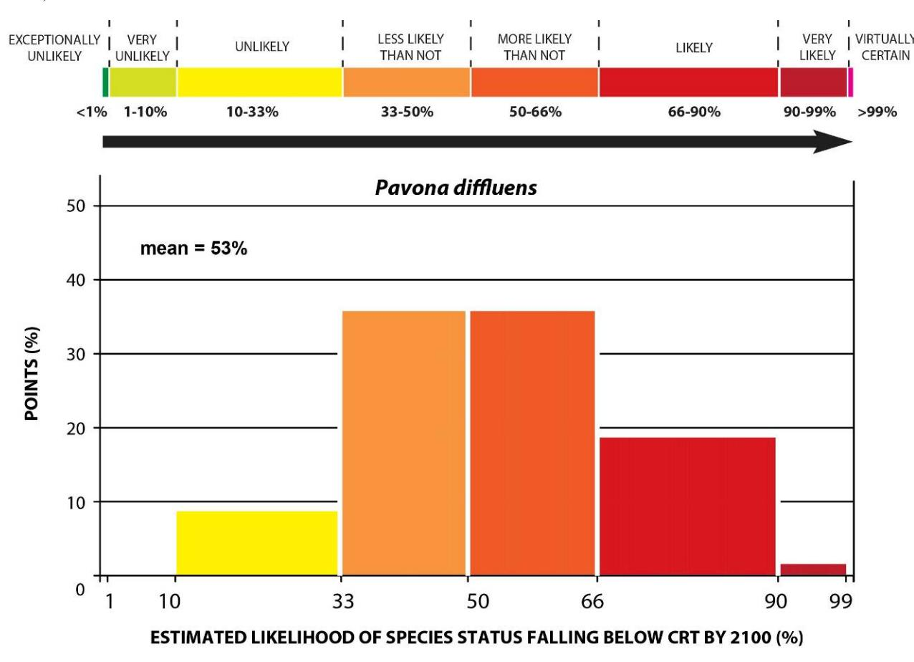

Figure 5.6.1. Example histogram showing distribution of points to estimate the likelihood that the status of *Pavona diffluens* will fall below the Critical Risk Threshold (the species is of such low abundance, or so spatially fragmented, or at such reduced diversity that extinction is extremely likely) by 2100.

For each of the 82 candidate coral species, all of the pertinent and best available scientific information acquired by the BRT was presented and discussed openly among the BRT members. At the conclusion of each of those discussions about the available information, each BRT member anonymously voted by allocating their ten likelihood points among the eight risk likelihood categories for each candidate coral species. After this initial round of voting, the points were tallied and presented back to the BRT members as a group for discussion about the voting results and the key risk factors that influenced the point distribution for the particular candidate coral species. While the confidentiality of each individual BRT member's allocations of likelihood points was maintained, the voting results were presented in a manner that allowed the BRT members to observe the spread (uncertainty) of points by identifying each BRT member by a code number. Following these discussions, a second round of anonymous voting was performed for the individual species to allow each BRT member to take into account the key factors expressed by the other BRT members. Although generally only minor adjustments were made between these voting rounds, there were some rare instances where these intervening discussions about voting factors among the BRT members led to substantial revisions in allocations of likelihood points during the second round of voting (e.g., one BRT member had taken into consideration some factor that was not considered by another BRT member). Following the second vote of each individual species, likelihood points were again tallied and presented in aggregate form to the entire BRT for further discussion.

After completing the voting for all of the 82 candidate coral species, the BRT presented and discussed the relative rankings of the species in a comparative sense to identify potential outliers that needed further consideration. If any single BRT member requested another round of voting for a particular species, then additional voting was performed. For the vast majority of the 82 candidate coral species, the BRT agreed that the outcomes of the second vote were final. For a few of the candidate coral species, additional factors or important new information or data that became available in the weeks (or months) following the second vote that the BRT agreed warranted reconsideration. In some cases, this included new information on the taxonomic validity of the species. In those instances, the new information was shared and discussed amongst the BRT members prior to conducting additional anonymous rounds of voting. In each of those instances, BRT members were provided with copies of their prior votes for the species in question. In summary, all voting was always anonymous and each of the 82 candidate coral species were discussed and voted on at least twice.

In addition to voting on the 82 candidate species, the BRT considered the one coral species that has been reported to have potentially gone extinct in recent years. *Millepora boschmai* is a species of hydrocoral potentially limited to the eastern Pacific that may have already gone extinct as a result of thermal-stress induced bleaching. While not a candidate species, the BRT determined that it would provide a valuable test of an extreme case to provide context for interpreting the voting results of the candidate species. An individual species account, including risk assessment voting and discussion of risk factors, for *Millepora boschmai* is provided in the Appendix.

#### **5.7 Strengths and Limitations of the Approach**

The BRT recognized that the approaches used in developing this Status Review Report have numerous inherent limitations, many resulting from the exceptional scarcity of species-specific information about the taxonomy, abundance, distribution, life history, and responses to threats of the 82 candidate coral species as reported in Chapters 2–7. In addition, the U.S. Endangered Species Act required an ambitious and challenging timeline for completion of the Status Review Report following submission of the Petition. Some of the limitations and strengths of the process included:

#### Limitations

- The expert-based approach was subjective.
- Links between available information and conclusions were not readily transparent.
- "Rules" used by BRT members were not explicit, and hence not repeatable.
- The Federal Advisory Committee Act necessitated that the BRT consist of Federal experts—the pool of qualified and available individuals was limited.
- The short, ambitious deadline was challenging for evaluation of 82 candidate species with global range and limited data.

While the BRT recognized the above limitations to the approach used, the BRT also acknowledged the many noteworthy strengths or advantages of the approach.

#### Strengths

- All available relevant information was considered.
- The approach was relatively expeditious (i.e., timely).
- The approach explicitly considered uncertainty about all information.
- The approach could be applied in cases with limited information.
- The approach did not require consensus (but it was generally reached).
- The result represented an aggregate result of experts with varying perceptions of risk to the species.

In establishing the approaches used for this Status Review Report, the BRT investigated many other alternatives, including many that have been used in the development of other Status Review Reports for other candidate species. One alternative approach would be to use a more structured method explicitly linking the available information to the final conclusion. This would have involved a combination of quantitative and qualitative scoring with links among them. However, there was a striking paucity of information available for most of the 82 candidate coral species under consideration here and it was difficult to quantitatively (or even qualitatively) capture the interactive and synergistic effects of multiple stressors. A structured, explicit approach such as this one would likely have been less expeditious and was considered unlikely to result in either a better risk evaluation or better incorporation of uncertainty into the risk evaluation.

#### **6. Individual Species Accounts—Western Atlantic**

#### **6.1 Genus** *Agaricia* **(Family Agariciidae)**

**6.1.1** *Agaricia lamarcki* **Milne Edwards and Haime, 1851** 

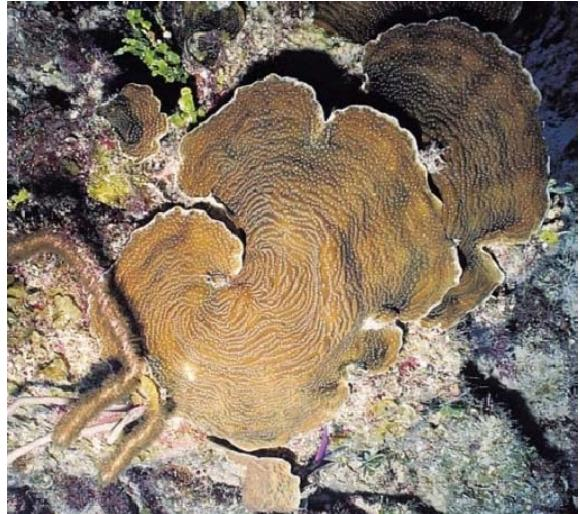

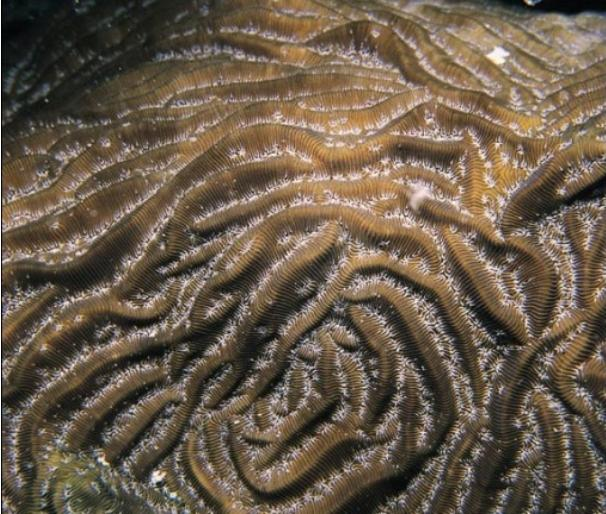

Figure 6.1.1. *Agaricia lamarcki* photos copied from Veron and Stafford-Smith (2002).

#### **Characteristics**

*Agaricia lamarcki* has flat, unifacial or encrusting platy colonies that are commonly arranged in whorls. Corallites are in concentric valleys with centers that are widely spaced. Septo-costae clearly alternate in size. Colonies are brown in color, usually with pale margins. Mouths are characteristically white and star-shaped (Veron, 2000).

#### **Taxonomy**

**Taxonomic issues**: None. *Agaricia lamarcki* is similar to *Agaricia grahamae*, which lacks white mouths and has evenly sized septo-costae (Veron, 2000).

**Family:** Agariciidae.

**Evolutionary and geologic history**: *Agaricia lamarcki* is fairly common in recent fossil assemblages. However, it has not been identified from the late Pleistocene in fossil assemblages in the Cayman Islands (Hunter and Jones, 1996).

#### **Global Distribution**

The range of *Agaricia lamarcki* is restricted to the west Atlantic where it is found throughout the Caribbean; however, it is not known from Bermuda (IUCN, 2010).

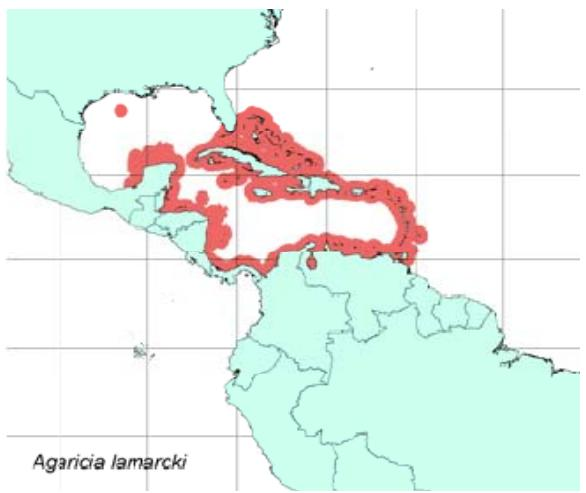

Figure 6.1.2. *Agaricia lamarcki* distribution from IUCN copied from http://www.iucnredlist.org.

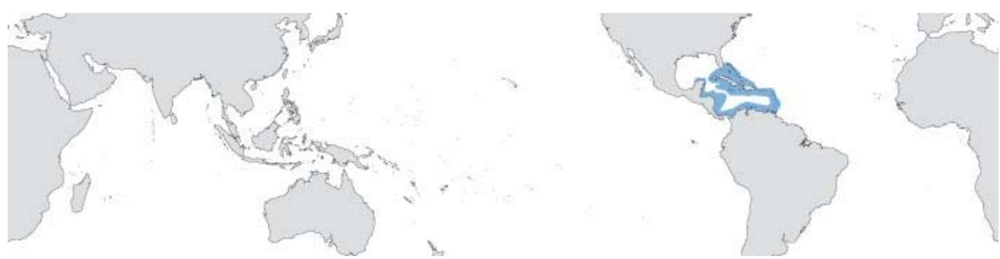

Figure 6.1.3. *Agaricia lamarcki* distribution copied from Veron and Stafford-Smith (2002).

#### **U.S. Distribution**

According to both the IUCN Species Account and the CITES database, *Agaricia lamarcki* is found in Florida, Puerto Rico, the U.S. Virgin Islands, and at Flower Garden Banks (IUCN, 2010).

A search of published and unpublished records of occurrence in U.S. waters indicates that *Agaricia lamarcki* has been reported in Florida (Goldberg, 1973), Puerto Rico (Acevedo et al., 1989; Garcia-Sais, 2010; Morelock et al., 2001), and the Virgin Islands (Rogers et al., 1984; Smith et al., 2010). Bright (1984) identified *Agaricia* at Flower Garden Banks only to genus, although it has been reported in low abundance at the site (Caldow et al., 2009).

Within federally protected waters, *Agaricia lamarcki* has been recorded from the following areas:

- Flower Garden Banks National Marine Sanctuary
- Florida Keys National Marine Sanctuary
- Biscayne National Park
- Dry Tortugas National Park
- Virgin Islands National Park/Monument
- Navassa Island National Wildlife Refuge
- Buck Island National Monument

#### **Habitat**

**Habitat**: *Agaricia lamarcki* is common in areas with reduced light or at depth (Acevedo et al., 1989). It can occur in shallow reef environments (Veron, 2000). It also inhabits reef slopes and walls and can be one of the most abundant corals on deep reefs (Humann, 1993).

**Depth range**: *Agaricia lamarcki* has been reported in water depths ranging from 10 to 76 m (Carpenter et al., 2008; Ghiold and Smith, 1990) and 3 to 50 m (Humann, 1993). Although *Agaricia lamarcki* can rarely be found in shaded areas in shallow waters, it primarily occurs at deeper depths. The IUCN Red List review emphasized a need for additional information on the population status and recovery potential for this species in deeper waters (IUCN, 2010). *Agaricia lamarcki* has often been found on mesophotic reefs in Curaçao, Florida, Jamaica, and the U.S. Virgin Islands (Ghiold and Smith, 1990). However, coral specimens collected on a recent mesophotic coral cruise at Pulley Ridge, Florida, suggest that corals, such as *Agaricia,* that appear live from video images may actually be covered with algae rather than live coral tissue (J. Voss, Florida Atlantic Univ., Fort Pierce, FL. pers. comm., August 2010).

#### **Abundance**

*Agaricia lamarcki* has been reported to be common (Veron, 2000). On reefs at 30–40 m depths in the Netherlands Antilles, *Agaricia lamarcki* has increased (Bak and Nieuwland, 1995) or shown no decline in abundance from 1973 to 1992 (Bak et al., 2005), even though other non-agariciid corals on the same deep reefs have decreased. It is not known whether this relative stability at depth holds across the full range of the species.

#### **Life History**

The specific reproductive strategy of *Agaricia lamarcki* is presently unknown, but its congeners are primarily gonochoric brooders (Delvoye, 1988; Van Moorsel, 1983). The larvae have been reported to primarily settle at relatively deep water depths (26–37 m), although the species has been found in shallow water (Bak and Engel, 1979). Congeneric larvae are known to use chemical cues from crustose coralline algae to mediate settlement (Morse et al., 1988). The species has low recruitment rates—as an example, only 1 of 1074 *Agaricia* recruits in a survey at the Flower Garden Banks may have been *Agaricia lamarcki* (Shearer and Coffroth, 2006). Net sexual recruitment over a decade can be negligible, with reproduction primarily via fission (Hughes and Jackson, 1985). It is a relatively long-lived species, with a half-life of 17 years (Hughes, 1996) and some colonies living more than a century (Hughes and Jackson, 1985).

*Agaricia lamarcki* deposits a relatively dense skeleton (Hughes, 1987) and is reported to be moderately susceptible to physical breakage during severe storms (Aronson et al., 1993). Maximum size for *Agaricia lamarcki* is up to ~ 2 m in diameter (Humann, 1993), with radial growth rates in Jamaica ranging from 0 to 1.4 cm per year (average growth rate of ~ 5 mm per year), but growing a bit more slowly at depths greater than 20 m (Hughes and Jackson, 1985). Respiration rates have been reported to be relatively high (~ 3.5 L O2 per mg per hr) compared to other shallower species, which may be related to zooxanthellae density (Davies, 1980). Photosynthesis by *Agaricia lamarcki* zooxanthellae is sufficient to exceed the coral's metabolic needs, even at depths in excess of 30 m (Porter et al., 1989).

Mortality of *Agaricia lamarcki* is size-specific (range 10%–25%), with high (22%–90%) rates of partial mortality (Hughes and Jackson, 1985). Partial mortality can be induced by interactions with algae (Nugues and Bak, 2006). Sponges can induce partial mortality, as well as cause sublethal stresses such as declines in zooxanthellae concentration, pigment concentration, and tissue condition (Porter and Targett, 1988).

In the Virgin Islands (Rogers et al., 1984) and Curaçao (Bak and Luckhurst, 1980), the overall life history characteristics of *Agaricia lamarcki* have been reported to be roughly parallel to those of *Montastraea annularis*—that is, based on low overall recruitment rates, high survival, and high partial mortality. However, in Jamaica *Agaricia lamarcki* had faster growth, higher recruitment, and lower mortality rates than *Montastraea annularis* at the same site and depth (Hughes and Jackson, 1985).

#### **Threats**

**Thermal stress:** *Agaricia lamarcki* has been reported to be susceptible to bleaching at elevated temperatures (Ghiold and Smith, 1990), via direct loss of zooxanthellae as well as decreased pigment content (Porter et al., 1989). In laboratory studies in Jamaica, *Agaricia lamarcki* tolerated temperatures up to 32°C (Fitt and Warner, 1995), but had virtually complete disruption of photosynthesis occur at 32°C–34°C (Warner et al., 1996). Cold stress has also produced bleaching (Bak et al., 2005). Although bleaching can often be extensive, it may not induce mortality in *Agaricia lamarcki* (Aronson and Precht, 2000; Aronson et al., 1998; Porter et al., 1989).

**Acidification:** No specific research has addressed the effects of acidification on the genus *Agaricia*. However, most corals studied have shown negative relationships between acidification and growth (Table 3.2.2), and acidification is likely to contribute to reef destruction in the future (Hoegh-Guldberg et al., 2007; Silverman et al., 2009). While ocean acidification has not been demonstrated to have caused appreciable declines in coral populations so far, the BRT considers it to be a significant threat to corals by 2100 (Albright et al., 2010; Hoegh-Guldberg et al., 2007; Langdon and Atkinson, 2005; Manzello, 2010; Silverman et al., 2009).

**Disease:** *Agaricia lamarcki* was not observed to suffer disease in the Florida Keys in 1996–1998 (Porter et al., 2001), although prior observations in Florida showed that the species may suffer from white plague (Richardson, 1998). *Agaricia lamarcki* also has been vulnerable to white plague disease in Colombia (Garzon-Ferreira et al., 2001) and St. Lucia (Nugues, 2002). Ciliate infections have been documented in *Agaricia lamarcki* (Croquer et al., 2006), and tumors may also affect this species (UNEP, 2010). The ecological and population impacts of disease have not been established for *Agaricia lamarcki*.

**Predation**: Predation effects on *Agaricia lamarcki* are unknown.

**Land-based sources of pollution (LBSP):** The effects of LBSP on the genus *Agaricia* are largely unknown. LBSPrelated stresses (nutrients, sediment, toxins, and salinity) often act in concert rather than individually and are influenced by other biological (e.g., herbivory) and hydrological factors. Collectively, LBSP stresses are unlikely to produce extinction at a global scale; however, they may pose significant threats at local scales and reduce the resilience of corals to bleaching (Carilli et al., 2009a; Wooldridge, 2009b).

*Agaricia* sp. typically have small calices and are not efficient sediment rejecters (Hubbard and Pocock, 1972). *Agaricia lamarcki*'s platy morphology could make it sediment-susceptible. Vertical plates of *Agaricia* shed more sediment than horizontally-oriented ones (Bak and Elgershuizen, 1976), and fine sediment suspended in hurricanes can cause much higher mortality in platy corals than hemispherical or non-flat morphologies (Bak, unpublished data; Bak et al., 2005).

**Collection/Trade:** Some corals in this genus are involved in international trade, especially *Agaricia agaricites* (CITES, 2010). However, only light trade has been recorded for *Agaricia lamarcki*. From 2000 to 2005, gross exports averaged fewer than 10 pieces of coral (CITES, 2010).

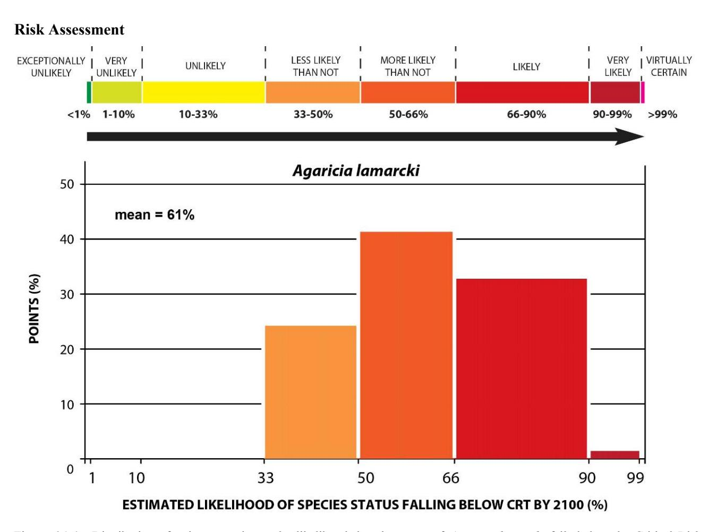

Figure 6.1.4. Distribution of points to estimate the likelihood that the status of *Agaricia lamarcki* falls below the Critical Risk Threshold (the species is of such low abundance or so spatially fragmented or at such reduced diversity that extinction is extremely likely) by 2100.

Factors that increase the extinction risk (higher likelihood of falling below the Critical Risk Threshold) for *Agaricia lamarcki* include the widespread decline in environmental conditions in the Caribbean and the potential losses of this species to disease. When bleaching occurs for this species, effects can be severe; the species also likely has limited sediment tolerance. A factor that reduces extinction risk (decrease the likelihood of falling below the Critical Risk Threshold) is that it occurs primarily at great depth, where disturbance events are less frequent. Despite low rates of sexual recruitment, the species is relatively persistent compared to other deep corals.

The overall likelihood that *Agaricia lamarcki* will fall below the Critical Risk Threshold by 2100 was estimated to be in the "more likely than not" risk category with a mean likelihood of 61% and a standard error (SE) of 6% (Fig. 6.1.4). This SE was calculated by taking the standard deviation of the seven mean voting scores of the BRT members and shows the coherence among the BRT. This is one of the lowest SE of the mean values for any species, showing a greater degree of confidence in the *Agaricia lamarcki* status estimate than for most other species considered. However, the overall range of votes was still fairly large (33%–99%; Fig. 6.1.4) with a moderate average range of likelihood estimates of the seven BRT voters (55%).

#### **6.2 Genus** *Mycetophyllia* **(Family Mussidae)**

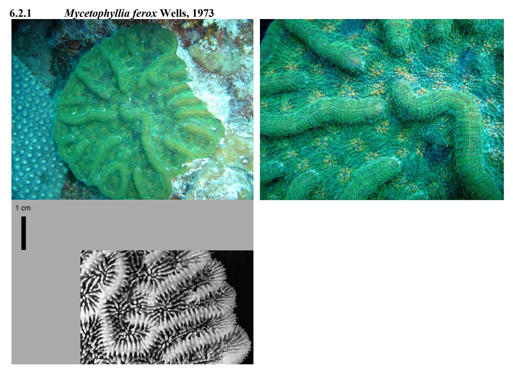

Figure 6.2.1. *Mycetophyllia ferox* photos from National Park Service and corallite plan from Veron and Stafford-Smith (2002).

#### **Characteristics**

*Mycetophyllia ferox* consists of encrusting laminar plates. Colonies are thin, weakly attached plates with interconnecting, slightly sinuous narrow valleys. Corallite centers are usually in single rows. Columellae are rudimentary or absent. Colonies are most commonly greys and browns in color with valleys and walls of contrasting colors (Veron, 2000). Maximum colony size is 50 cm (Veron, 2000).

#### **Taxonomy**

**Taxonomic issues**: None. *Mycetophyllia ferox* is similar to *Mycetophyllia danaana*, which has longer, wider, and more widely spaced valleys (Veron, 2000).

**Family:** Mussidae.

**Evolutionary and geologic history**: *Mycetophyllia ferox* has been dated to at least the late Pleistocene in fossil records in Grand Cayman (Hunter and Jones, 1996).

#### **Global Distribution**

The range of *Mycetophyllia ferox* is restricted to the west Atlantic. There it has been reported to occur throughout most of the Caribbean, including the Bahamas, but it is not present in the Flower Garden Banks or around the waters of Bermuda. E-mail correspondence with S. dePutron (Bermuda Institute of Ocean Sciences, St. George's. pers. comm., May 2010) and T. Murdoch (Bermuda Zoological Society, Flatts. pers. comm.., May 2010) confirmed the absence of *Mycetophyllia ferox* in Bermuda.

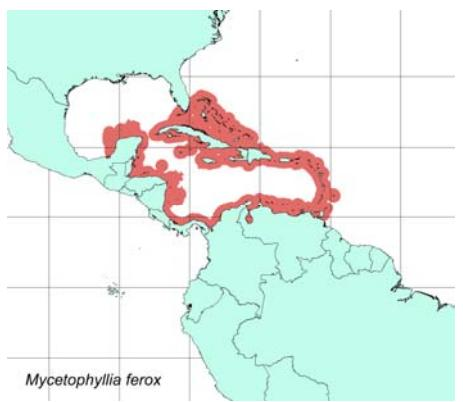

Figure 6.2.2. *Mycetophyllia ferox* distribution from IUCN copied from http://www.iucnredlist.org.

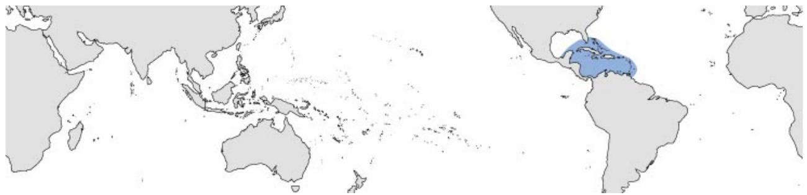

Figure 6.2.3. *Mycetophyllia ferox* distribution from Veron and Stafford-Smith (2002).

#### **U.S. Distribution**

According to both the IUCN Species Account and the CITES species database, *Mycetophyllia ferox* occurs throughout the U.S. waters of the western Atlantic but has not been reported from Flower Garden Banks (Hickerson et al., 2008).

Within federally protected waters, *Mycetophyllia ferox* has been recorded from the following areas:

- Dry Tortugas National Park
- Virgin Island National Park/Monument
- Florida Keys National Marine Sanctuary
- Navassa Island National Wildlife Refuge
- Biscayne National Park
- Buck Island Reef National Monument

#### **Habitat**

**Habitat:** *Mycetophyllia ferox* has been reported to occur in shallow reef environments (Veron, 2000).

**Depth range**: *Mycetophyllia ferox* has been reported in water depths ranging from 5 to 30 m (Carpenter et al., 2008).

#### **Abundance**

*Mycetophyllia ferox* is usually uncommon (Veron, 2000) or rare according to published and unpublished records, indicating that it constitutes < 0.1% species contribution (percent of all colonies censused) and occurs at densities < 0.8 colonies per 10 m2 in Florida (Wagner et al., 2010) and at 0.8 colonies per 100 m transect in Puerto Rico sites sampled by the Atlantic and Gulf Rapid Reef Assessment (AGRRA database online at http://www.agrra.org). Recent monitoring data (e.g., since 2000) from Florida (National Park Service permanent monitoring stations), La Parguera Puerto Rico, and St. Croix (USVI/NOAA Center for Coastal Monitoring and Assessment randomized monitoring stations) show *Mycetophyllia ferox* cover to be consistently less than 1%, with occasional observations up to 2% and no apparent temporal trend (available online at http://www8.nos.noaa.gov/biogeo\_public/query\_habitat.aspx).

Dustan (1977) suggests that *Mycetophyllia ferox* was much more abundant in the upper Florida Keys in the early mid-1970s (the methods are not well described for that study) than current observations, but that it was highly affected by disease. This could be interpreted as a substantial decline. Long-term CREMP monitoring data in Florida on species presence/absence from fixed sites (stations) show a dramatic decline; for 97 stations in the main Florida Keys, occurrence had declined from 20 stations in 1996 to 4 stations in 2009; in Dry Tortugas occurrence had declined from 8 out of 21 stations in 2004 to 3 stations in 2009 (R. Ruzicka and M. Colella, Florida Marine Research Institute, St. Petersburg, FL. pers. comm., Oct 2010).

#### **Life History**

*Mycetophyllia ferox* is hermaphroditic and a brooder. Egg size has been estimated in Puerto Rico to be 300 µm, and polyps produce 96 eggs per cycle on average (Szmant, 1986). Their larvae contain zooxanthellae that can supplement maternal provisioning with energy sources provided by their photosynthesis (Baird et al. 2009), i.e., they are autotrophic. Colony size at first reproduction is > 100 cm2 (Szmant, 1986). Recruitment of this species appears to be very low, even in studies from the 1970s (Dustan, 1977, reported zero settlement).

#### **Threats**

**Temperature stress**: No bleached *Mycetophyllia ferox* colonies were observed in wide-scale surveys during the 2005 mass coral bleaching event in Florida (Wagner et al., 2010) or Barbados (Oxenford et al., 2008), although the number of colonies was small (two in Barbados; Oxenford et al., 2008).

**Acidification**: No specific research has addressed the effects of acidification on the genus *Mycetophyllia*. However, most corals studied have shown negative relationships between acidification and growth (Table 3.2.2), and acidification is likely to contribute to reef destruction in the future (Hoegh-Guldberg et al. 2007, Silverman et al. 2009). While ocean acidification has not been demonstrated to have caused appreciable declines in coral populations so far, the BRT considers it to be a significant threat to corals by 2100 (Albright et al., 2010; Hoegh-Guldberg et al., 2007; Langdon and Atkinson, 2005; Manzello, 2010; Silverman et al., 2009).

**Disease:** *Mycetophyllia ferox* has been reported to be susceptible to acute and subacute white plague and Dustan (1977) reported dramatic impacts from this disease to the population in the upper Florida Keys in the mid-1970s. He also reported that the rate of disease progression was positively correlated with water temperature and measured rates of disease progression up to 3 mm per day.

**Predation:** *Mycetophyllia ferox* has not been susceptible to predation (E. Peters, George Mason University, Fairfax, VI. pers. comm., July 2010).

**Land-based sources of pollution:** *Mycetophyllia ferox* appeared to be absent at fringing reef sites impacted by sewage pollution (Tomascik and Sander, 1987a). LBSP-related stresses (nutrients, sediment, toxins, and salinity) often act in concert rather than individually and are influenced by other biological (e.g., herbivory) and hydrological factors. Collectively, LBSP stresses are unlikely to produce extinction at a global scale; however, they may pose significant threats at local scales and reduce the resilience of corals to bleaching (Carilli et al., 2009a; Wooldridge, 2009b).

**Collection/Trade:** *Mycetophyllia ferox* is not reported to be an important species for trade. In 2000, 10 pieces of *Mycetophyllia ferox* were exported; only 2 in 2003; and 5 in 2007, according to CITES Trade Database, UNEP World Conservation Monitoring Centre, Cambridge, UK (CITES, 2010).

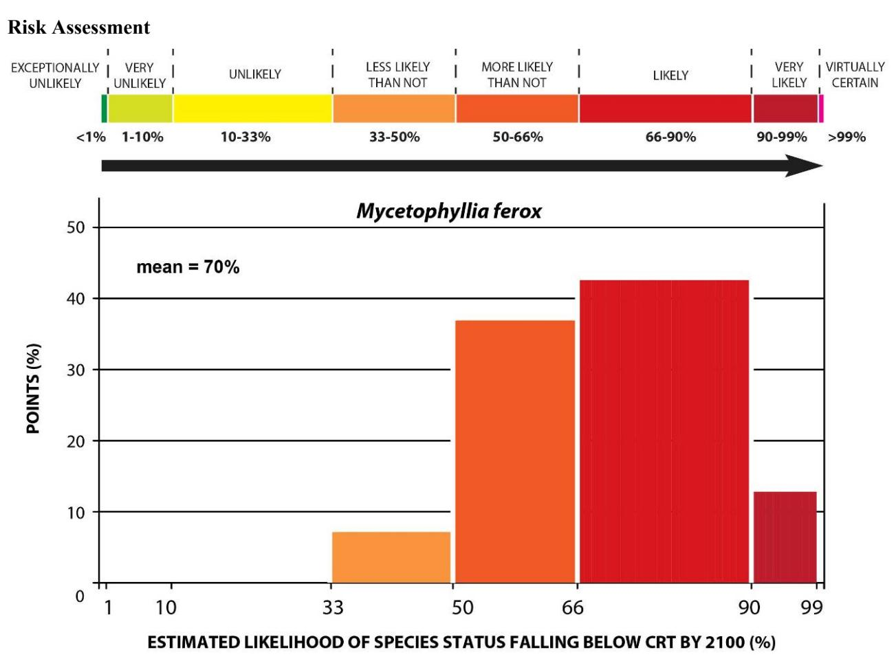

Figure 6.2.4. Distribution of points to estimate the likelihood that the status of *Mycetophyllia ferox* falls below the Critical Risk Threshold (the species is of such low abundance or so spatially fragmented or at such reduced diversity that extinction is extremely likely) by 2100.

Factors that increase the potential extinction risk (higher likelihood of falling below the Critical Risk Threshold) for *Mycetophyllia ferox* include disease, rare abundance, and observed declines in abundance. Limited available information suggests that this species suffered substantial population declines in the Florida Keys and elsewhere in recent decades, primarily as a result of coral disease, and these declines have made this species extremely rare.

The overall likelihood that *Mycetophyllia ferox* will fall below the Critical Risk Threshold by 2100 was estimated to be in the "likely" risk category with a mean likelihood of 70% and a standard error (SE) of 8% (Fig. 6.2.4). This SE was calculated by taking the standard deviation of the seven mean voting scores of the BRT members and shows the coherence among the BRT. The uncertainty of the BRT is reflected in the range of votes of 33%–99% (Fig. 6.2.4) and the average range of likelihood estimates of the seven BRT voters (50%). The range of votes reflects the uncertainty among BRT members based on recent monitoring data showing declines in the Florida Keys and elsewhere in the Caribbean.

#### **6.3 Genus** *Dendrogyra* **(Family Meandrinidae)**

#### **6.3.1** *Dendrogyra cylindrus* **Ehrenberg, 1834**

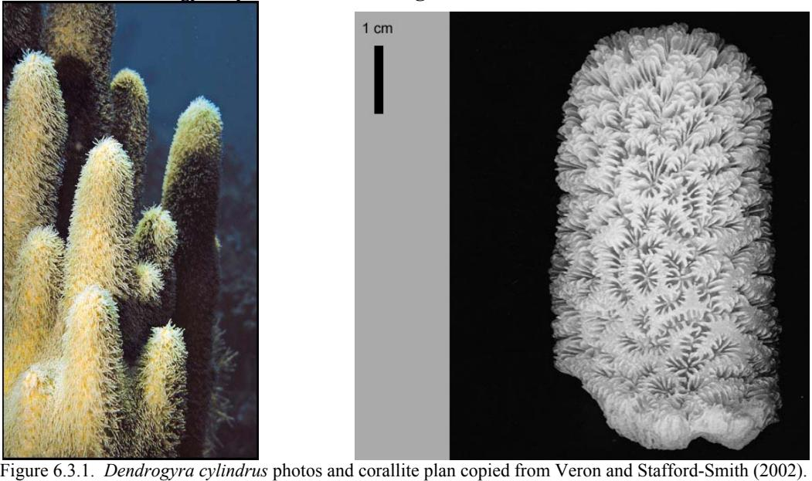

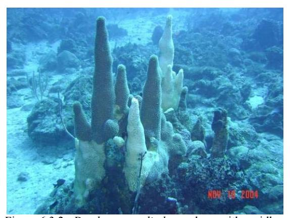

Figure 6.3.2. *Dendrogyra cylindrus* colony with rapidly progressing partial mortality characteristic of white plague disease. Photo: NOAA Southeast Fisheries Science Center.

#### **Characteristics**

*Dendrogyra cylindrus* colonies have encrusting bases on which cylindrical columns are developed that may reach 2 m in height. Valleys are meandroid. Septo-costae are thick, in two alternating orders; they do not join at the tops of valleys and thus leave a neat groove along the tops of walls. Tentacles remain extended during the day giving columns a furry appearance. Colonies are generally grey-brown in color (Veron, 2000).

#### **Taxonomy**

Taxonomic issues: None.

**Family:** Meandrinidae.

**Evolutionary and geologic history**: *Dendrogyra cylindrus* is reported to have appeared very recently in the fossil record (Edinger and Risk, 1995) following the Pliocene (~ 1.5 Million years ago [Ma]). *Dendrogyra cylindrus* is the only species within its genus, perhaps posing greater evolutionary importance since extinction of this species would constitute extinction of a genus.

#### **Global Distribution**

*Dendrogyra cylindrus* is restricted to the west Atlantic where it is present throughout the greater Caribbean but is one of the Caribbean genera absent from the southwest Gulf of Mexico (Tunnell, 1988). A single known colony in Bermuda is reported to be in poor condition (T. Murdoch, Bermuda Zoological Society, Flatts, pers. comm.., May 2010).

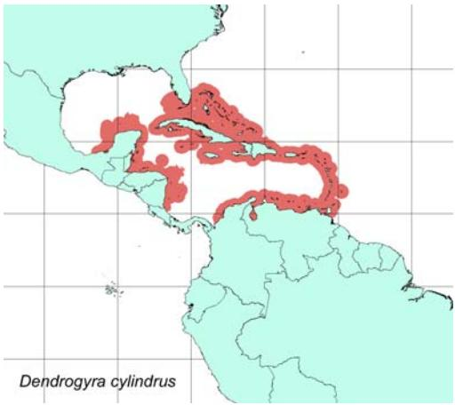

Figure 6.3.3. *Dendrogyra cylindrus* distribution from IUCN copied from http://www.iucnredlist.org.

Figure 6.3.4. *Dendrogyra cylindrus* distribution from Veron and Stafford-Smith (2002).

#### **U.S. Distribution**

*Dendrogyra cylindrus* has been reported in the waters of south Florida and the U.S. Caribbean but appears to be absent from the Flower Garden Banks. Within federally protected U.S. waters, the species has been recorded from the following areas:

- Florida Keys National Marine Sanctuary
- Navassa National Wildlife Refuge
- Dry Tortugas National Park
- Virgin Islands National Park/Monument
- Biscayne National Park NPS
- Buck Island National Monument

#### **Habitat**

**Habitat:** Dendrogyra cylindrus inhabits most reef environments (Veron, 2000), but in the Florida Keys it appears to be absent in nearshore hard bottoms, nearshore patch reefs, and backreef environments and more common on forereef spurand-groove habitats (Chiappone, 2010).

**Depth range**: Dendrogyra cylindrus has been reported in water depths ranging from 2 to 25 m (Carpenter et al., 2008).

#### Abundance

Dendrogyra cylindrus is reported to be uncommon but conspicuous (Veron 2000) with isolated colonies scattered across a range of habitat types. Colonies are often known as landmarks by local divers. Overall colony density throughout south Florida was estimated to be ~ 0.6 colonies per 10 m² (Wagner et al. 2010). Overall colony density in Providencia, Columbia, was 172 (SE 177) colonies per km² (Acosta and Acevedo, 2006). Dendrogyra cylindrus is common in the geologic record of some Pleistocene reefs (Hunter and Jones, 1996), but it is likely that Dendrogyra cylindrus is a naturally rare species in modern times. Recent monitoring data (e.g., since 2000) from La Parguera, Puerto Rico, and St. Croix, USVI (NOAA Center for Coastal Monitoring and Assessment, randomized monitoring stations) have shown that Dendrogyra cylindrus cover was consistently less than 1% with individual observations up to 4% but with no apparent temporal trend, although trends would be difficult to detect with such low cover values (available online at http://www8.nos.noaa.gov/biogeo public/query habitat.aspx).

#### **Life History**

Dendrogyra cylindrus is characterized as a gonochoric spawner (Szmant, 1986), although no descriptions of its spawning or larval ecology have been made. The combination of gonochoric spawning reproductive mode with persistently low population densities poses somewhat of a paradox, since this combination is expected to yield very little potential for successful fertilization and, hence, larval supply. Indeed, no juveniles of this species were encountered from surveys of 566 sites in the Florida Keys during 1999–2009 (Chiappone, 2010), neither in larval settlement studies in the U.S. Virgin Islands in the early 1980s (Rogers et al., 1984), nor in juvenile surveys in the mid-1970s in the Netherlands Antilles (Bak and Engel, 1979). Dendrogyra cylindrus is effective in propagation by fragmentation, and rare aggregations of colonies (Hudson and Goodwin, 1997) likely result from this asexual reproductive mode following storms or other physical disturbances.

Annual growth rates of 12-20 mm per year in linear extension have been reported in the Florida Keys (Hudson and Goodwin, 1997), but growth rates of  $\sim 0.8$  cm per year have been reported elsewhere in the Caribbean (Acosta and Acevedo, 2006; Hughes, 1987). Partial mortality rates have been size-specific but generally low (Acosta and Acevedo, 2006). Feeding clearance rates are low relative to most other Caribbean corals (Lewis, 1976), but *Dendrogyra cylindrus* has a relatively high photosynthetic rate and stable isotope values suggest it receives substantial amounts of photosynthetic products translocated from its zooxanthellae (Muscatine et al., 1989b).

#### **Threats**

**Thermal stress**: There are conflicting characterizations of bleaching susceptibility of *Dendrogyra cylindrus* in the literature. The species was bleaching-resistant during the 1983 mass bleaching event in Florida (Jaap, 1985). Characterizations of the 2005 mass bleaching event in southern Florida and in the U.S. Virgin Islands noted that no bleached *Dendrogyra cylindrus* colonies were observed (Clark et al., 2009; Wagner et al., 2010). In contrast, Oxenford et al. (2008) report that 100% of the 15 colonies they observed in Barbados during the 2005 mass bleaching event were bleached. Although bleaching of most coral species varies in time and space, understanding the susceptibility of *Dendrogyra cylindrus* is further confounded by the species' rarity and, hence, low sample size in any given survey.

Dendrogyra cylindrus is among the species that are known to be sensitive to cold shock in the Caribbean (Muscatine et al., 1991), potentially serving as a stress to this species in areas prone to cold winter temperatures such as the Florida Keys. Dendrogyra cylindrus hosts clade B zooxanthellae in Mexico (LaJeunesse, 2002), Belize, and Barbados (Finney et al., 2010). Zooxanthellae in clade B do not grow well at high temperatures (Kinzie et al., 2001), but in the field, corals with this clade may be relatively bleaching-resistant (McField, 1999). Experimental studies suggest clade B is more bleaching-resistant than clade C but less resistant than clade A (Warner et al., 2006).

**Acidification:** No specific research has addressed the effects of acidification on the genus *Dendrogyra*. However, most corals studied have shown negative relationships between acidification and growth (Table 3.2.2), and acidification is likely to contribute to reef destruction in the future (Hoegh-Guldberg et al. 2007, Silverman et al. 2009). While ocean acidification has not been demonstrated to have caused appreciable declines in coral populations so far, the BRT considers it to be a significant threat to corals by 2100 (Albright et al., 2010; Hoegh-Guldberg et al., 2007; Langdon and Atkinson, 2005; Manzello, 2010; Silverman et al., 2009).

**Disease:** *Dendrogyra cylindrus* colonies have been affected by black-band disease (Ward et al., 2006). More extensive impacts to these rare populations likely occur from white plague, which can cause rapid tissue loss (Miller et al., 2006b). The large colony size suggests that individual colonies are less likely to suffer complete mortality from a given disease exposure, but low colony density in this species suggests that even small degrees of mortality increase extinction risk.

**Predation:** The corallivorous fireworm, *Hermodice carunculata*, has been observed on diseased colonies of *Dendrogyra cylindrus* (Miller et al., 2006b), but, generally, predation is not observed to cause noticeable mortality on this species, despite its rarity.

**Land-based sources of pollution (LBSP):** Sediment stress is a complicated response; most sediment effects are negative (Fabricius, 2005; Rogers, 1990), although some corals are sediment-tolerant. Bak and Elgershuizen (1976) found that the rate of sand removal from *Dendrogyra cylindrus* tissues in laboratory conditions was intermediate among 19 Caribbean coral species tested.Along a eutrophication gradient in Barbados, *Dendrogyra cylindrus* was found at only a single site—one of those farthest removed from pollution (Tomascik and Sander, 1987a).

Overall, LBSP-related stresses (nutrients, sediment, toxins, and salinity) often act in concert rather than individually and are influenced by other biological (e.g., herbivory) and hydrological factors. Collectively, LBSP stresses are unlikely to produce extinction at a global scale; however, they may pose significant threats at local scales and reduce the resilience of corals to bleaching (Carilli et al., 2009a; Wooldridge, 2009b).

**Collection/Trade:** Overall trade reports (CITES database) indicate very low rates of international trade of *Dendrogyra cylindrus* (exception of anomalous report of 6000 pieces imported by Portugal from Mozambique in 1996). It is possible that historical curio collecting of *Dendrogyra cylindrus* may have significantly reduced populations off Florida (Colin, 1978).

#### **Risk Assessment**

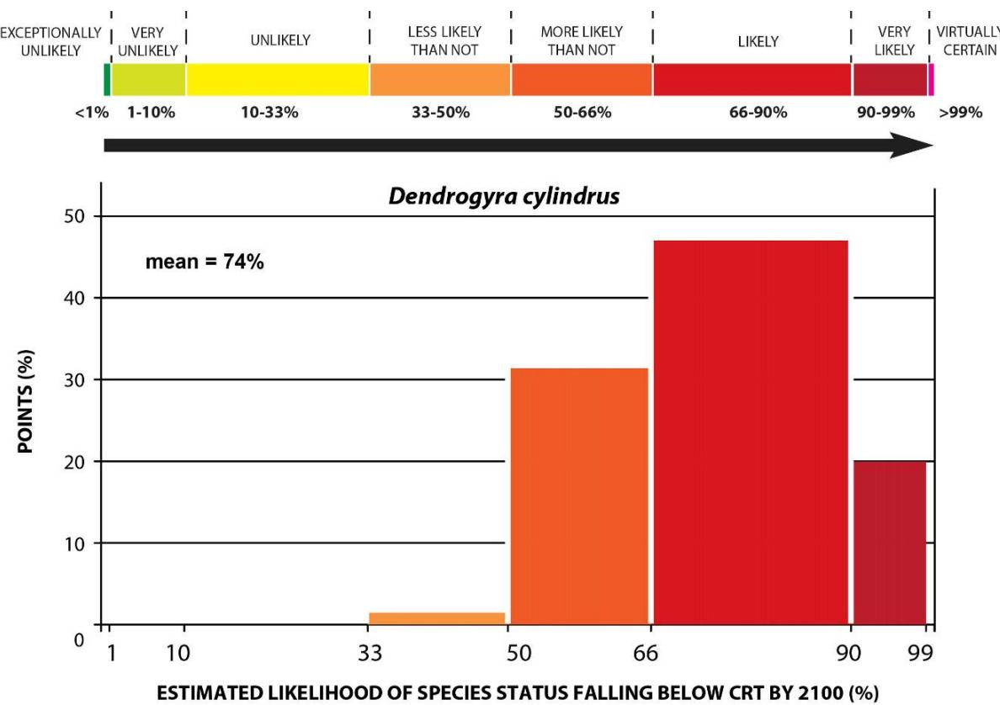

Figure 6.3.5. Distribution of points to estimate the likelihood that the status of *Dendrogyra cylindrus* falls below the Critical Risk Threshold (the species is of such low abundance or so spatially fragmented or at such reduced diversity that extinction is extremely likely) by 2100.

The most important factors influencing the relatively high extinction risk (higher likelihood of falling below the Critical Risk Threshold) of *Dendrogyra cylindrus* included the overall low population density and low population size combined with a gonochroic spawning reproductive mode, corresponding lack of observed sexual recruitment, and susceptibility to observed disease mortality. The BRT recognizes that, given the apparent naturally rare status of this species, some undescribed adaptations to low population density may exist in this species (particularly with regard to overcoming fertilization limitation between spawned gametes from gonochoric parent colonies that are at great distance from one another). Nonetheless, the pervasiveness of threats characterizing the Caribbean region was deemed to represent substantial extinction risk given this species' low population size.

The overall likelihood that *Dendrogyra cylindrus* will fall below the Critical Risk Threshold by 2100 was estimated to be in the "likely" risk category with a mean likelihood of 74% and a standard error (SE) of 6.6% (Fig. 6.3.5). This SE was calculated by taking the standard deviation of the seven mean voting scores of the BRT members and shows the degree of coherence among the BRT. The degree of uncertainty of the BRT is reflected in the range of votes of 33%–99% (Fig. 6.3.5) and the average range of likelihood estimates of the seven BRT voters (48.9%). The overall wide range of votes reflects the uncertainty among BRT members inherent in rigorously surveying a species that is historically rare.

#### **6.4 Genus** *Dichocoenia*

#### **6.4.1** *Dichocoenia stokesi* **Milne Edwards and Haime, 1848**

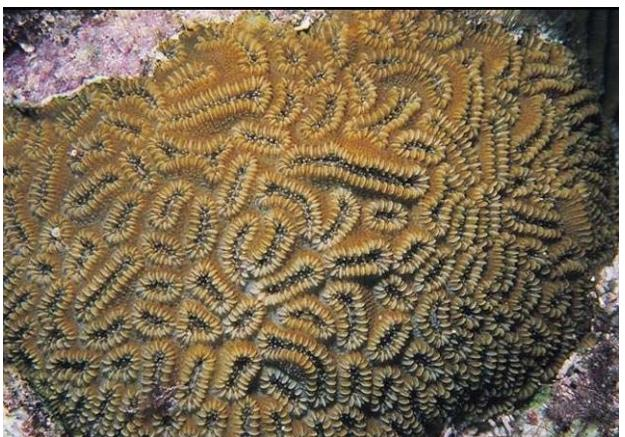

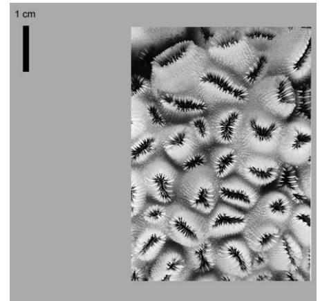

Figure 6.4.1. *Dichocoenia stokesi* photos and corallite plan copied from Veron and Stafford-Smith (2002).

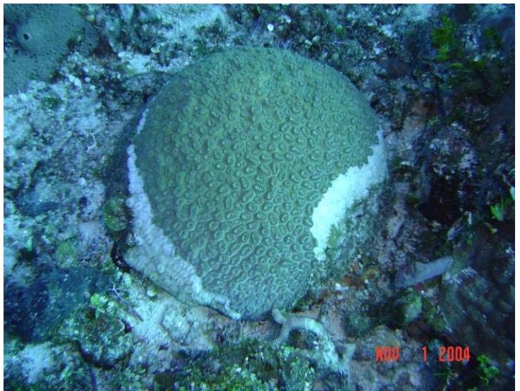

Figure 6.4.2. *Dichocoenia stokesi* colony with partial mortality characteristic of white plague disease. Photo from NOAA Southeast Fisheries Science Center.

#### **Characteristics**

*Dichocoenia stokesi* colonies are either massive and spherical or form thick, submassive plates (Veron, 2000). The corallites of this species are evenly spaced and either plocoid or ploco-meandroid, and the septocostae are usually in two neatly alternating orders (Veron, 2000). Although sometimes green, they are usually orange-brown with white septocostae.

#### **Taxonomy**

**Taxonomic issues**: Colonies of *Dichocoenia stokesi* from lower reef slopes or shaded habitats have markedly smaller corallites than those from more exposed environments and are usually identified as *Dichocoenia stellaris* (Wells, 1973). The petition cites the IUCN species account in differentiating these two species; hence, this Status Review Report addresses *Dichocoenia stokesi*.

**Family:** Meandrinidae.

**Evolutionary and geologic history**: The genus *Dichocoenia* dates from at least the Oligocene Era in the Caribbean region (Edinger and Risk, 1995).

#### **Global Distribution**

*Dichocoenia stokesi* is restricted to the west Atlantic where it occurs throughout the Caribbean, the Gulf of Mexico, Florida (including the Florida Middle Grounds), the Bahamas, and Bermuda (IUCN Species account). S. dePutron (Bermuda Institute of Ocean Sciences, St. George's. pers. comm., May 2010) confirmed the presence of *Dichocoenia stokesi* in Bermuda and categorized its abundance as rare. T. Murdoch (Bermuda Zoological Society, Flatts. pers. comm.. May 2010) also confirmed its occurrence as rare and added that it is mainly found on forereefs at depths of 10– 27 m where he noticed it being partially-to-fully bleached.

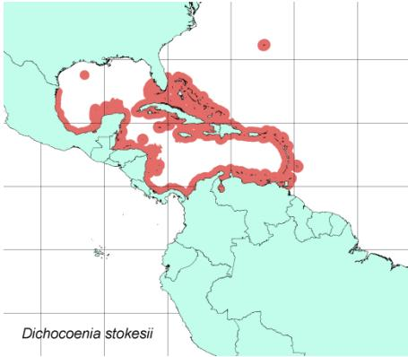

Figure 6.4.3. *Dichocoenia stokesi* distribution from IUCN copied from http://www.iucnredlist.org

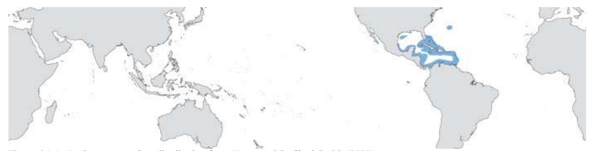

Figure 6.4.4. *Dichocoenia stokesi* distribution from Veron and Stafford-Smith (2002).

#### **U.S. Distribution**

*Dichocoenia stokesi* occurs throughout U.S. waters in the western Atlantic, including the Gulf of Mexico, Florida, Puerto Rico, and the Virgin Islands. Within federally protected U.S. waters, the species has been recorded from the following areas:

- Florida Keys National Marine Sanctuary
- Flower Garden Banks National Marine Sanctuary
- Navassa National Wildlife Refuge
- Dry Tortugas National Park
- Biscayne National Park
- Virgin Islands National Park/Monument
- Buck Island National Monument

#### **Habitat**

**Habitat:** *Dichocoenia stokesi* is found in most reef environments within its range (Veron, 2000)*,* including both backreef and forereef environments, rocky reefs, lagoons, spur-and-groove formations, channels, and occasionally at the base of reefs (IUCN Species Account). When found in exposed reefs at depths less than 20 m, its hemispherical heads are more abundant than usual (IUCN, 2010).

**Depth range**: *Dichocoenia stokesi* has been reported in water depths ranging from 2 to 72 m (Carpenter et al., 2008). This considerable depth range suggests the potential for deep refugia, but it is not likely that it attains high abundance at deeper depths.

#### Abundance

Dichocoenia stokesi is usually uncommon (Veron, 2000). The overall colony density of Dichocoenia stokesi averaged across all habitat types in the south Florida region was ~ 1.6 colonies per 10 m², making it the ninth most abundant coral species in this region (Wagner et al., 2010). Substantial population declines have been reported from a bay in Curaçao (80% decline between 1961 and 1992; Debrot et al., 1998) and the upper Florida Keys (see disease description below). There have been no obvious trends in the abundance of Dichocoenia stokesi in monitoring of randomized stations at La Parguera, Puerto Rico, St. John, nor St Croix USVI with less than 1.5% cover at most sites (NOAA-Center for Coastal Monitoring and Assessment; http://www8.nos.noaa.gov/biogeo\_public/query\_habitat.aspx\_)

#### **Life History**

Reproductive characteristics of *Dichocoenia stokesi* have been described from a histological study of populations in southeast Florida (Hoke, 2007). This species is predominantly a gonochoric spawner with an overall sex ratio of 2:1 (male:female), but a small portion of hermaphroditic colonies ( $\sim$  18%) were observed in this population. Mean egg size is reported at 312.2  $\mu$ m (SD 40) and fecundity as 1138 eggs per cm² per year. Minimum colony size at reproduction was found to be 160 cm² in this population and two potential spawning events per annum were inferred: one in late August/early September and a second in October.

Bak and Engel (1979) reported very low densities of *Dichocoenia* juveniles (approximately 1% of total juvenile colonies). However, reports of juveniles of *Dichocoenia stokesi* have been relatively common compared to most other scleractinian corals in the Florida Keys with mean juvenile densities among 566 sites surveyed during 1999–2009 averaging 0.11 per m2, but reaching densities as high as 1 juvenile per m2 in certain habitats (Chiappone, 2010).

The annual growth rate of *Dichocoenia stokesi* has been reported to increase 2–7 mm per year in diameter and increase 2–5.2 mm per year in height (Vaughn, 1915).

The mounding morphology and large corallite diameter of *Dichocoenia stokesi* enhance turbulence near the surface of colonies (Gardella and Edmunds, 2001). This should, in turn, enhance mass transfer, which affects photosynthesis and respiration in *Dichocoenia stokesi* (Gardella and Edmunds, 1999) as well as prey capture and nutrient uptake. Thresholds for uptake of inorganic nitrogen in *Dichocoenia stokesii* have been reported to be fairly low (150 nM; Davis and Jones, 1997), giving it a potential advantage in nutrient-poor conditions.

#### **Threats**

**Thermal stress**: Although *Dichocoenia stokesi* is susceptible to bleaching (loss of zooxanthellae), it showed the lowest bleaching response (of species observed to bleach) in the south Florida region (Wagner et al., 2010), and in Barbados it ranked 16th of 21 species in bleaching prevalence (Oxenford et al., 2008) during the 2005 Caribbean mass-bleaching event. It was also observed to be bleaching-tolerant in the U.S. Virgin Islands during the same event (Clark et al., 2009). Hence, this species is regarded to be at relatively low threat from temperature-induced bleaching. *Dichocoenia stokesi* hosts clade B zooxanthellae (Correa et al., 2009; LaJeunesse, 2002). Zooxanthellae in clade B do not grow well at high temperatures (Kinzie et al., 2001), but in the field corals with this clade may be relatively bleaching-resistant (McField, 1999). Experimental studies suggest clade B is more bleaching-resistant than clade C, but less resistant than clade A (Warner et al., 2006).

**Acidification**: No specific research has addressed the effects of acidification on the genus *Dichocoenia*. However, most corals studied have shown negative relationships between acidification and growth (Table 3.2.2), and acidification is likely to contribute to reef destruction in the future (Hoegh-Guldberg et al. 2007, Silverman et al. 2009). While ocean acidification has not been demonstrated to have caused appreciable declines in coral populations so far, the BRT considers it to be a significant threat to corals by 2100 (Albright et al., 2010; Hoegh-Guldberg et al., 2007; Langdon and Atkinson, 2005; Manzello, 2010; Silverman et al., 2009).

**Disease**: *Dichocoenia stokesi* has been reported to be highly susceptible to white plague (see Fig. 6.4.2), with infection increasing with temperature (Borger and Steiner, 2005). An outbreak event for this disease in the Florida Keys had demonstrable impact at the local population level, yielding mortality of 75% of colonies across several reef sites, substantial shifts in population structure, and essentially no recovery over a 7-year follow-up period (Richardson and Voss, 2005). This species has also been reported to be susceptible to black-band disease (Sutherland et al., 2004), ciliate infection (Croquer et al., 2006), and dark-spot syndrome (Borger and Steiner, 2005). However, disease susceptibility appears to be variable (Borger and Steiner, 2005); for example, *Dichocoenia stokesi* was minimally affected during a 1998 outbreak in St. Lucia that caused widespread mortality in *Montastraea faveolata* and other species (Nugues, 2002).

**Predation**: *Dichocoenia stokesi* is minimally affected by predation. It can be heavily bioeroded, particularly by bivalves (Highsmith, 1981), and lose substantial amounts of tissue to sponge overgrowth (Hill, 1998).

**Land-based sources of pollution (LBSP):** One laboratory study has shown that *Dichocoenia stokesi* displays physiological stress at turbidity levels that are within allowable levels as regulated by the State of Florida for coastal construction projects. While light levels and photosynthesis were not affected, respiration levels and mucous production were significantly higher at turbidity levels as low as 14–16 NTU, and P:R fell below 1 at 28–30 NTU (Telesnicki and Goldberg, 1995). An earlier laboratory study examining oil/sediment rejection indicated that *Dichocoenia stokesi* was intermediate (of 19 Caribbean coral species examined) in the rate of sediment removal from its tissues (Bak and Elgershuizen, 1976).

LBSP-related stresses (nutrients, sediment, toxins, and salinity) often act in concert rather than individually and are influenced by other biological (e.g., herbivory) and hydrological factors. Collectively, LBSP stresses are unlikely to produce extinction at a global scale; however, they may pose significant threats at local scales and reduce the resilience of corals to bleaching (Carilli et al., 2009a; Wooldridge, 2009b).

**Collection/Trade:** Collection and trade are not considered a threat to Dichocoenia stokesi (CITES, 2010).

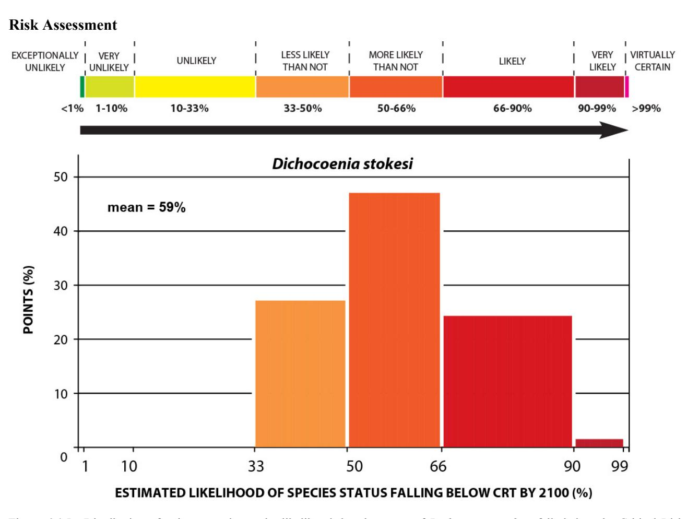

Figure 6.4.5. Distribution of points to estimate the likelihood that the status of *Dichocoenia stokesi* falls below the Critical Risk Threshold (the species is of such low abundance or so spatially fragmented or at such reduced diversity that extinction is extremely likely) by 2100.

Factors that increase the potential extinction risk (higher likelihood of falling below the Critical Risk Threshold) for *Dichocoenia stokesi* include its documented population-level impacts from disease. Factors that reduce potential extinction risk (decrease the likelihood of falling below Critical Risk Threshold) are its relatively high abundance and persistence across many habitat types, including nearshore and mesophotic reefs. Residency in a wide range of habitat types suggests the species has a wide tolerance to environmental conditions and, therefore, better capacity to deal with changing environmental regimes.

The overall likelihood that *Dichocoenia stokesi* will fall below the Critical Risk Threshold by 2100 was estimated to be in the "more likely than not" risk category with a mean likelihood of 59% and a standard error (SE) of 5.1% (Fig. 6.4.5). This SE was calculated by taking the standard deviation of the seven mean voting scores of the BRT members and shows the highest degree of coherence among the BRT for any of the 82 candidate species. The uncertainty of the BRT is reflected in the range of votes of 33%–99% (Fig. 6.4.5) and the relatively high average range of likelihood estimates of the seven BRT voters (58.3%). The overall moderate extinction risk estimate placed it at lower risk than most other western Atlantic candidates.

#### **6.5 Genus** *Montastraea* **(Family Faviidae)**

#### **Montastraea annularis complex**

#### **Taxonomic Issues**

The nominal *Montastraea annularis* (Ellis and Solander, 1786) has historically been one of the primary reef framework builders of the western Atlantic and Caribbean. *Montastraea annularis* and its related species seem to have originated prior to the Caribbean coral extinction at the end of late Pliocene to early Pleistocene (~ 2.5 Ma; Budd and Klaus, 2001). Its depth range is from 1 m to over 30 m, and has historically been considered a highly plastic species with multiple growth forms ranging from columnar, to massive, to platy. In the early 1990s, Knowlton, Weil, and colleagues suggested the partitioning of these growth forms into separate species, resurrecting previously described monikers, *Montastraea faveolata* and *Montastraea franksi.* These three sibling species were differentiated on the basis of morphology, depth range, ecology, and behavior (Weil and Knowton, 1994). Subsequent reproductive and genetic studies have generally supported this partitioning, although with some interesting details. *Montastraea faveolata* is the most genetically distinct, while *Montastraea annularis* and *Montastraea franksi* are less so (Fukami et al., 2004; Lopez et al., 1999). Similarly, hybrid-crossing experiments show the same pattern with *Montastraea annularis* and *Montastraea franksi* showing greater success of hybrid crosses than either with *Montastraea faveolata* (Levitan et al., 2004; Szmant et al., 1997). Isolation between *Montastraea annularis* and *Montastraea franksi* is enhanced by the timing of spawning; *Montastraea franksi* spawns 1–2 hours earlier than the other two. Meanwhile, Fukami et al. (2004) showed some degree of geographic variation in these reproductive and genetic traits with a lesser degree of separation in the Bahamas than in Panama.

While there now is reasonable acceptance that these represent three valid species, long-term monitoring data sets and previous ecological studies did not distinguish among them. Currently, intermediate forms (especially in northern sections of the range) complicate the collection of monitoring data into three species, and so modern monitoring data sets often still group them as "*Montastraea annularis* complex" or "*Montastraea annularis* sensu lato.*"* The BRT has estimated Critical Risk Thresholds separately for each species, but much of the information available is for the complex as a whole.

#### **Abundance and Trends**

The *Montastraea annularis* complex has historically been a dominant species on Caribbean coral reefs, characterizing the so-called "buttress zone" and "annularis zone" in the classical descriptions of Caribbean reefs (Goreau, 1959). Goreau describes *Montastraea annularis* complex as "very abundant" in these zones and constitutes "by far the commonest and often the only fossil framework coral to be found in exposures of the Pliocene Era and more recent coastal reef limestones of northern Jamaica" (Goreau, 1959). There is ample evidence that it has declined dramatically throughout its range, but perhaps at a slower pace than its fast-paced Caribbean colleagues, *Acropora palmata* and *Acropora cervicornis*. While the latter began their rapid declines in the early-to-mid-1980s, declines in *Montastraea annularis* complex have been much more obvious in the 1990s and 2000s, most often associated with combined disease and bleaching events. It should be noted that, given the dramatically low productivity of the *Montastraea annularis* complex (low growth and extremely low recruitment), any substantial declines in adult populations would suggest increased extinction risk since their capacity for population recovery is extremely limited. Figure 6.5 shows only recent trends in aspects of the *Montastraea annularis* complex abundance at select locations, and additional supporting information on longer-term trends is described below. In most cases where examined, additional demographic changes accompany these instances of declining abundance (e.g., size structure of colonies, partial mortality, etc).

In Florida, the percent cover data from four fixed sites have shown the *Montastraea annularis* complex to have declined in absolute cover from 5% to 2% in the Lower Keys between 1998 and 2003 (Fig. 6.5A) and was accompanied by 5– 40% colony shrinkage and virtually no recruitment (Smith et al., 2008). Earlier studies from the Florida Keys indicated a 31% decline of *Montastraea annularis* complex absolute cover between 1975 and 1982 (Dustan and Halas, 1987) at Carysfort Reef and > 75% decline (from over 6% cover to less than 1%) across several sites in Biscayne National Park between the late 1970s and 1998–2000 (Dupont et al., 2008). Taken together, these data imply extreme declines in the Florida Keys (80%–95%) between the late 1970s and 2003, and it is clear that further dramatic losses occurred in this region during the cold weather event in January 2010.

Similar declines have also been documented for relatively remote Caribbean reefs. At Navassa Island National Wildlife Refuge, percent cover of *Montastraea annularis* complex on randomly sampled patch reefs declined from 26% in 2002 to 3% in 2009 (Fig. 6.5B), following disease and bleaching events in this uninhabited oceanic island (Miller and Williams, 2007). Additionally, two offshore islands west of Puerto Rico (Mona and Desecheo; Fig. 6.5C) showed reductions in live colony counts of 24% and 32% between 1998/2000 and 2008 (Bruckner and Hill, 2009). At Desecheo, this demographic decline of one-third corresponded to a decline in *Montastraea annularis* complex cover from over 35% to below 5% across 4 sites. Taken together, decadal-scale declines across these remote islands in the central Caribbean constitute over 85% of the populations.

In the U.S. Virgin Islands, recent data from the U.S. National Park Service Inventory and Monitoring Program (Fig. 6.5D) across six sites at fixed stations show a decline of *Montastraea annularis* complex from just over 10% cover in 2003 to just over 3% cover in 2009 following mass bleaching and disease impacts in 2005 (Miller et al., 2009). This degree of recent decline was preceded by a decline from over 30% *Montastraea annularis* complex cover to ~ 10% between 1988 and 2003 as documented by Edmunds and Elahi (2007). Similarly, percent cover of *Montastraea annularis* complex in a marine protected area in Puerto Rico declined from 49% to 8% between 1997 and 2009 (Hernández-Pacheco et al., 2011). Taken together, these data suggest an 80%–90% decline in *Montastraea annularis* complex over the past two decades in the main U.S. Caribbean territories.

While Bak and Luckhurst (1980) indicated stability in *Montastraea annularis* complex cover across depths in Curaçao during a 5-year study in the mid-1970s, this region has also manifested *Montastraea annularis* complex declines in recent years. Bruckner and Bruckner (2006) documented an 85% increase in the partial mortality of *Montastraea annularis* complex colonies across three reefs in western Curaçao between 1998 and 2005 (Fig. 6.5E), approximately twice the level for all other scleractinian species combined. These authors noted that *Montastraea franksi* fared substantially better than the other two complex species in this study. It is likely that *Montastraea annularis* complex populations in Curaçao have fared better than other Caribbean regions but are not immune to losses.

*Montastraea annularis* complex declines in additional locations can be noted. For example, at Glovers Reef, Belize (McClanahan and Muthiga, 1998) documented a 38%–75% decline in relative cover of *Montastraea annularis* complex across different reef zones between 1975 and 1998, and a further 40% decline in relative cover has occurred since then (Huntington et al., in review). In contrast, *Montastraea annularis* complex populations have shown stable status at sites in Columbia between 1998 and 2003 (Rodriguez-Ramirez et al., 2010), although demographic changes in *Montastraea annularis* complex at both degraded and less-degraded reefs imply some degree of population decline in this region (Alvarado-Chacon and Acosta, 2009).

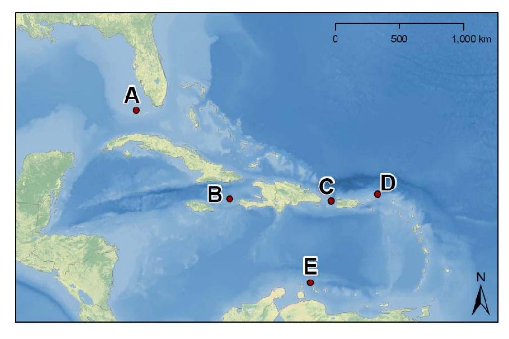

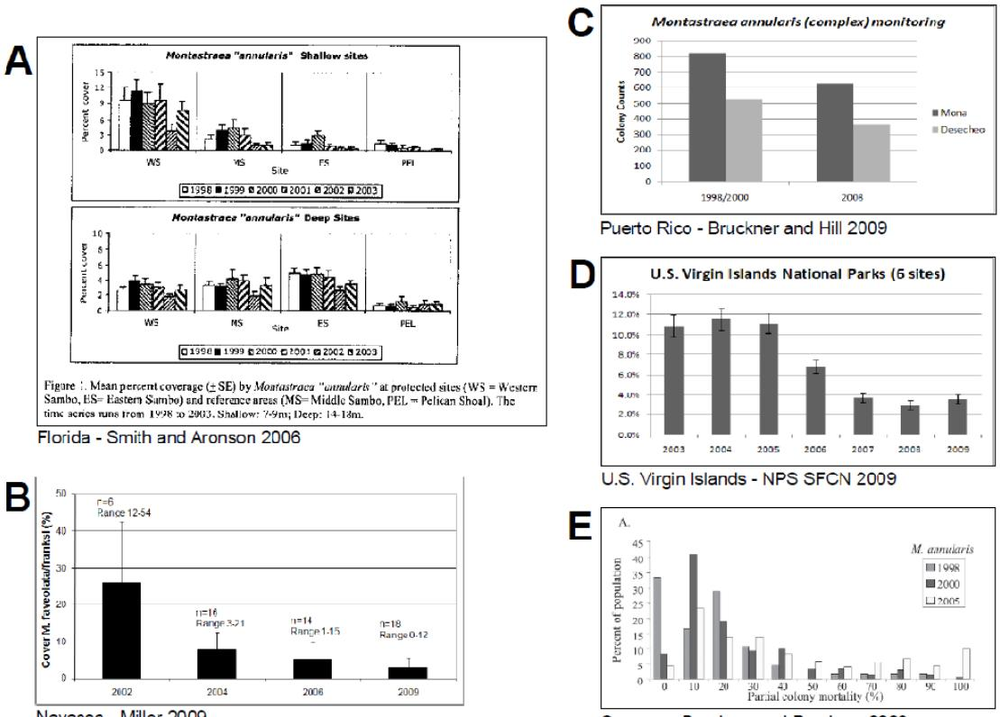

Figure 6.5. Examples of declining abundance of *Montastraea annularis* complex in different regions of the Caribbean in the recent past. A) data from Smith and Aronson (Smith et al., 2006) based on haphazard video transects at two depths at 4 sites in the lower Florida Keys; B) unpublished data from haphazard photo quadrats at randomly selected patch reefs at Navassa Island National Wildlife Refuge (described in (Miller et al., 2005)); C) declines in colony abundance in fixed plots at two offshore islands in Puerto Rico between 1998/2000 and 2008 (Bruckner and Hill, 2009); D) cover data from video transects of six fixed sites in Virgin Islands National Park (unpublished data, National Park Service, South Florida/Caribbean Network); E) increasing proportion of population across three sites in western Curaçao manifesting high levels of partial mortality (Bruckner and Bruckner, 2006) which is accompanied by a lack of recruitment.

#### **Life History**

All three of the *Montastraea annularis* complex species are hermaphroditic broadcast spawners, with spawning concentrated on nights 6–8 following the new moon in late summer (Levitan et al., 2004). Fertilization success measured in the field was generally below 15% but was highly linked to the number of colonies observed spawning at the same time (Levitan et al., 2004). Minimum size for reproduction was found to be 83 cm2 in Puerto Rico whether as an intact adult or as a remnant fragment of an older colony (Szmant-Froelich, 1985). Szmant-Froelich (1985) estimated this to correspond to 4–5 years of age, and *Montastraea annularis* typically exhibit a linear growth of ~ 1 cm per year (Gladfelter et al., 1978), but increased appreciation for the slow rate of growth of post-settlement stages suggest this age for minimum reproductive size may be an underestimate (M.W. Miller, Southeast Fisheries Science Center, Miami, FL. pers. obs., October 2010). Eggs (~ 310 to 340 µm among the three species; Szmant et al., 1997) and larvae are small and post-settlement growth rates are very slow, both of which may contribute to extremely low post-settlement survivorship, even lower than other Caribbean broadcasters, such as the threatened Caribbean *Acropora palmata* (Szmant and Miller, 2005). There may be a depth-related fecundity cost arising from morphological differences in polyp spacing (Villinski, 2003), suggesting the spatial distribution of colonies may influence population fecundity on a reef.

Successful recruitment by *Montastraea annularis* complex species have seemingly always been rare events. Hughes and Tanner reported the occurrence of only a single recruit for these species over 18 years of intensive observation of 12 m2 of reef in Discovery Bay, Jamaica (Hughes and Tanner, 2000) while myriad other recruitment studies from throughout the Caribbean also report them to be negligible to absent (Bak and Engel, 1979; Rogers et al., 1984). Edmunds (2011) asserted that the large, rare, replenishing recruitment hypothesized to operate in these species have never actually been documented on any Caribbean reef since the initiation of quantitative ecological study in the 1960s. Overall recruitment by these species is so low that Edmunds (2011) based an entire publication on the detection of at most nine additional juvenile colonies (constituting a "recruitment pulse") along the south shore of St. John, USVI in 2008–2009. However, this "recruitment pulse" was limited in spatial extent (Edmunds et al., 2011). *Montastraea* juveniles also have higher mortality rates than larger colonies (Smith et al., 2006). Despite their generally massive form, at least the lobate form (*Montastraea annularis* sensu stricto) is capable of some degree of fragmentation/fission and clonal reproduction. Foster et al. (2007) detected 8% of *Montastraea annularis* genotypes were represented by multiple ramets (up to 14 ramets or separate colonies of the same genotypes) across three sites in Belize.

In St. Croix, growth rates of *Montastraea annularis* were measured along a depth gradient from 3 m to 40 m (Hubbard and Scaturo, 1985). There was a sharp decline in growth rate at a depth of around 15 m with growth rates of 0.7–0.9 cm per year in water depths < 12 m and 0.20 cm per year in depths below 18–20 m. Growth rates, measured as extension rates, in shallow waters (< 15 m) varied between 0.43 and 1.23 cm per year and in deeper waters (> 18 m) between 0.06 and 0.29 cm per year. Also, growth rates were consistently higher in the clear waters of Cane Bay than those at the more turbid and sediment rich waters of Salt River confirming the controlling factors for growth rate of light and sediment load (Hubbard and Scaturo, 1985). Long-term analyses of coral cores have typically shown seasonal variation in growth and a general reduction in *Montastraea* growth rates over the past century, although the reduction may have stabilized over the past few decades (Carricart-Ganivet et al., 2000; Dodge and Lang, 1983; Hudson et al., 1994).

#### **Threats**

Because they have traditionally been common and are one of the main reef builders in the Caribbean, *Montastraea annularis* complex species have been the frequent subject of research attention, including responses to and impacts of environmental threats. This body of work is briefly summarized here, but it should be noted that a large body of work exists for these species.

**Thermal stress**: Published reports of individual bleaching surveys have consistently indicated that *Montastraea annularis* complex is highly-to-moderately susceptible to bleaching (Brandt, 2009; Bruckner and Hill, 2009; Oxenford et al., 2008; Wagner et al., 2010). The species complex is polymorphic with respect to zooxanthellae. Depending on depth and other environmental conditions, colonies can contain clade A, B, C, D, but composition of symbiont assemblages in at least some areas changes in response to bleaching (Rodríguez-Román et al., 2006; Thornhill et al., 2006). Bleaching has been shown to prevent gametogenesis in *Montastraea annularis* complex colonies in the following reproductive season after recovering normal pigmentation (Mendes and Woodley, 2002; Szmant and Gassman, 1990) and leave permanent records in coral growth records (Leder et al., 1991; Mendes and Woodley, 2002). Given the rapidly developing genomic tools for this species complex, cellular and transcriptomic mechanisms for bleaching and thermal stress are being elucidated for this species complex (Desalvo et al., 2008). In addition, certain aspects of geographic and genetic variability in the molecular responses to thermal stress have been described (Polato et al., 2010), which may enable more accurate predictions of potential evolutionary adaptation to warming. Particularly well-documented mortalities in these species following severe mass-bleaching in 2005 highlight the immense impact that thermal stress events and their aftermath can have on *Montastraea annularis* complex populations (Miller et al., 2009). Using demographic data collected in Puerto Rico over 9 years straddling the 2005 bleaching event (Hernández-Pacheco et al., 2011) showed that demographic transitions (vital rates) for *Montastraea annularis* were substantially altered by the 2005 mass thermal bleaching event. Size-based transition matrix models based on these measured vital rates showed that population growth rates were stable (λ not significantly different from 1) in the pre-bleaching period (2001–2005) but declined to λ = 0.806 one year after and to 0.747 two years after the bleaching event. Although population growth rate returned to λ = 1 the following year, simulation modeling of different bleaching probabilities predicted extinction of a population with these dynamics within 100 years at a bleaching probability between 10 and 20%, i.e., once every 5 to 10 years (Hernández-Pacheco et al., 2011). Cervino (2004) also showed that higher temperatures (over experimental treatments from 20°C–31°C) resulted in faster rates of tissue loss and higher mortality in yellow-band affected *Montastraea annularis* complex. Recent work in the Mesoamerican reef system indicated that *Montastraea faveolata* had reduced thermal tolerances in locations and over time (Carilli et al., 2010) with increasing human populations, implying increasing local threats (Carilli et al., 2009a).

**Acidification:** The only study conducted regarding the impact of acidification on this genus is a field study (Helmle et al., 2011) that did not find any change in *Montastraea faveolata* calcification in field-sampled colonies from the Florida Keys up through 1996. However, most corals studied have shown negative relationships between acidification and growth (Table 3.2.2), and acidification is likely to contribute to reef destruction in the future (Hoegh-Guldberg et al. 2007, Silverman et al. 2009). While ocean acidification has not been demonstrated to have caused appreciable declines in coral populations so far, the BRT considers it to be a significant threat to corals by 2100 (Albright et al., 2010; Hoegh-Guldberg et al., 2007; Langdon and Atkinson, 2005; Manzello, 2010; Silverman et al., 2009). Preliminary experiments testing effects of acidification on fertilization and settlement success of *Montastraea annularis* complex (Albright et al., unpublished data) show results that are consistent with the significant impairments demonstrated for *Acropora palmata* (Albright et al., 2010).

**Disease***:* Both Bruckner and Hill (2009) and Miller et al. (2009) demonstrated profound population declines for *Montastraea annularis* complex from disease impacts, both with and without prior bleaching. Both white-plague and so-called yellow-band diseases can invoke this type of population level decline. Disease outbreaks can persist for years in a population—*Montastraea annularis* colonies suffering from yellow-band in Puerto Rico in 1999 still manifest similar disease signs 4 years later, with a mean tissue loss of 60% (Bruckner and Bruckner, 2006).

**Predation:** *Montastraea annularis* complex does not suffer from catastrophic outbreaks of predators, such as the effects of *Acanthaster planci* on *Acropora* stands in the Pacific. While *Montastraea annularis* complex can host large populations of corallivorous snails, they rarely display large feeding scars that are apparent on other coral prey, possibly related to differences in tissue characteristics or nutritional value (Baums et al., 2003). However, low-level predation can have interactive effects with other stressors. For example, predation by butterflyfish can serve as a vector to facilitate infection of *Montastraea faveolata* with black-band disease (Aeby and Santavy, 2006). Parrotfishes are also known to preferentially target *Montastraea annularis* complex in so-called "spot-biting" which can leave dramatic signs in some local areas (Bruckner et al., 2000; Rotjan and Lewis, 2006), and chronic parrotfish biting can impede colony recovery from bleaching (Rotjan et al., 2006).

Although it is not predation per se, *Montastraea* colonies have often been infested by other pest organisms. Bioeroding sponges (Ward and Risk, 1977) and territorial damselfishes, *Stegastes planifrons*, can cause tissue loss and skeletal damage. Damselfish infestation of *Montastraea annularis* complex appears to have increased in areas where their preferred, branching coral habitat has declined because of loss of Caribbean *Acropora* spp. (Precht et al., 2010).

**Land-based sources of pollution (LBSP):** Large, massive, long-lived colonies of *Montastraea annularis* complex lend themselves to retrospective studies of coral growth in different environments so there is a relatively large amount known or inferred regarding relationships of water quality to *Montastraea annularis* complex growth and status. For example, Tomascik (1990) found an increasing average growth (linear extension) rate of *Montastraea annularis* with improving environmental conditions on fringing reefs in Barbados. Tomascik also found a general pattern of decreasing growth rates within the past 30 years at each of the 7 fringing reefs and contributed this decrease to the deterioration of water quality along the west coast of Barbados. Torres and Morelock (2002) noted a similar decline in *Montastraea annularis*

growth at sediment-impacted reefs in Puerto Rico. Density and calcification rate increased from high to low turbidity and sediment load, while extension rate followed an inverse trend (Carricart-Ganivet and Merino, 2001). Eakin et al. (1994) demonstrated declines in *Montastraea annularis* linear extension during periods of construction in Aruba.

Downs et al. (2005) suggested that localized toxicant exposure may account for a localized mortality event of *Montastraea annularis* complex in Biscayne National Park, based on analyses of a suite of cellular biomarkers that yielded signatures of oxidative stress and xenobiotic detoxification response. Meanwhile, *Montastraea annularis* complex was shown to have somewhat lesser sensitivity to copper exposure in laboratory assays than *Acropora cervicornis* and *Pocillopora damicornis* (Bielmyer et al., 2010). *Montastraea faveolata* induces cytochrome p450 and antioxidant enzymes under acute exposure to benzo(a)pyrene (Ramos and Garcia, 2007), but effects of chronic long-term exposure are not known. *Montastraea annularis* skeletons are among those that incorporate toxic heavy metals, making them useful in documenting long-term contamination of reef sites (Medina-Elizalde et al., 2002; Runnalls and Coleman, 2003).

Nutrient-related runoff has also been deleterious to *Montastraea annularis* complex. Elevated nitrogen reduced respiration and calcification in *Montastraea annularis* and stimulated zooxanthellae populations (Marubini and Davies, 1996). Fecal coliform microorganisms were among the bacterial communities associated with *Montastraea* in the Florida Keys (Lipp et al., 2002), suggesting potential sewage impacts to the corals. Elevated nutrients increased the rate of tissue loss in *Montastraea franksi* and *Montastraea faveolata* affected by yellow-band disease (Bruno et al., 2003). Chronic nutrient elevation can produce bleaching and partial mortality in *Montastraea annularis*, whereas anthropogenic dissolved organic carbon kills corals directly (Kuntz et al., 2005).

Overall, LBSP-related stresses (nutrients, sediment, toxins, and salinity) often act in concert rather than individually and are influenced by other biological (e.g., herbivory) and hydrological factors. Collectively, LBSP stresses are unlikely to produce extinction at a global scale; however, they may pose significant threats at local scales and reduce the resilience of corals to bleaching (Carilli et al., 2009a; Wooldridge, 2009b).

**Collection/Trade**: *Montastraea annularis* complex species have a very low occurrence in the CITES trade databases (CITES, 2010). Hence, collection/trade is not considered to be a significant threat to *Montastraea annularis* complex species.

**6.5.1** *Montastraea faveolata* **Ellis and Solander, 1786** 

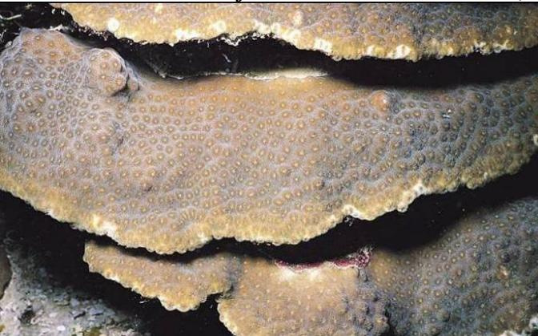

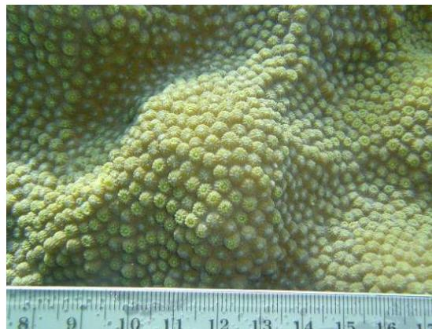

 Figure 6.5.1. *Montastraea faveolata* photo (*left*) from Veron and Stafford-Smith (2002) and (*right*) polyp view. Photo from the NOAA Southeast Fisheries Science Center.

#### **Characteristics**

*Montastraea faveolata* grows in heads or sheets, the surface of which may be smooth or have keels or bumps. Septa are highly exsert and the skeleton is much less dense than in the other two *Montastraea* species (Weil and Knowton, 1994). Colony diameter can reach up to 10 m with a height of 4–5 m (Szmant et al., 1997). Common colors are grey, green, and brownish (Szmant et al., 1997).

#### **Taxonomy**

**Taxonomic issues**: See Section 6.5: "Genus *Montastraea*." Veron (2000) does not list *Montastraea faveolata* separately from the *Monatstraea annularis* complex.

**Family:** Faviidae.

**Evolutionary and geologic history**: The *Montastraea* genus arose in the Oligocene ~ 30 Ma (Edinger and Risk, 1995).

#### **Global Distribution**

The range of *Montastraea faveolata* is restricted to the west Atlantic. According to both the IUCN Species Account and the CITES species database, *Montastraea faveolata* occurs throughout the Caribbean, including Bahamas, Flower Garden Banks and the entire Caribbean coastline, but there are no records from Bermuda. S. dePutron (Bermuda Institute of Ocean Sciences, St. George's. pers. comm., May 2010) confirmed the presence of *Montastraea faveolata* in Bermuda and categorized its abundance as common. T. Murdoch (Bermuda Zoological Society, Flatts. pers. comm., May 2010) also confirmed its occurrence but listed it as rare and added that it has probably suffered a substantial loss from the 1995 yellow-band outbreak*.*

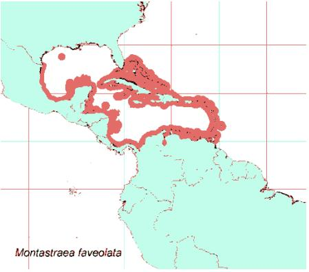

Figure 6.5.2. *Montastraea faveolata* distribution from IUCN copied from http://www.iucnredlist.org.

#### **U.S. Distribution**

*Montastraea faveolata* is common throughout the U.S. waters of the west Atlantic and greater Caribbean region and is present within federally protected waters, including:

- Flower Garden Banks National Marine Sanctuary
- Florida Keys National Marine Sanctuary
- Dry Tortugas National Park
- Virgin Island National Park/Monument
- Biscayne National Park
- Navassa Island National Wildlife Refuge
- Buck Island Reef National Monument

#### **Habitat**

**Habitat:** *Montastraea faveolata* has been reported in most reef habitats, often the most abundant coral between 10 and 20 m in forereef environments.

**Depth range**: *Montastraea faveolata* has been reported in water depths ranging from 0.5 m to 40 m (Carpenter et al., 2008; Weil and Knowton, 1994). *Montastraea* spp. are a common, often dominant component of Caribbean mesophotic reefs (Smith et al., 2010), suggesting the potential for deep refugia.

#### **Abundance**

See Section 6.5: "Genus *Montastraea*."

#### **Life History**

See Section 6.5: "Genus *Montastraea.*"

In many life history characteristics, including growth rates, tissue regeneration, egg size, *Montastraea faveolata* is considered to be intermediate between its two sister species (Szmant et al., 1997).

#### **Threats**

See Section 6.5: "Genus *Montastraea.*"

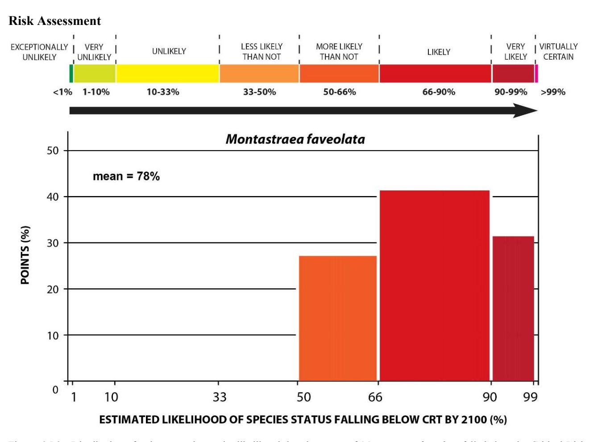

Figure 6.5.3. Distribution of points to estimate the likelihood that the status of *Montastraea faveolata* falls below the Critical Risk Threshold (the species is of such low abundance or so spatially fragmented or at such reduced diversity that extinction is extremely likely) by 2100.

Factors that increase the potential extinction risk (higher likelihood of falling below the Critical Risk Threshold) for *Montastraea faveolata* were its extremely low productivity (growth and recruitment) documented dramatic recent declines and its restriction to the highly disturbed/degraded wider Caribbean region. All these factors combine to yield a very high estimated extinction risk.

The overall likelihood that *Montastraea faveolata* will fall below the Critical Risk Threshold by 2100 was estimated to be in the "likely" risk category with a mean likelihood of 78% and a standard error (SE) of 7% (Fig. 6.5.3). This SE was calculated by taking the standard deviation of the seven mean voting scores of the BRT members and shows the coherence among the BRT. The uncertainty of the BRT is reflected in the range of votes of 50%–99% (Fig. 6.5.3) and the average range of likelihood estimates of the seven BRT voters (45%). This overall range of votes (spanning only three risk categories) was small relative to most of the other candidate species.

#### **6.5.2** *Montastraea franksi* **Gregory, 1895**

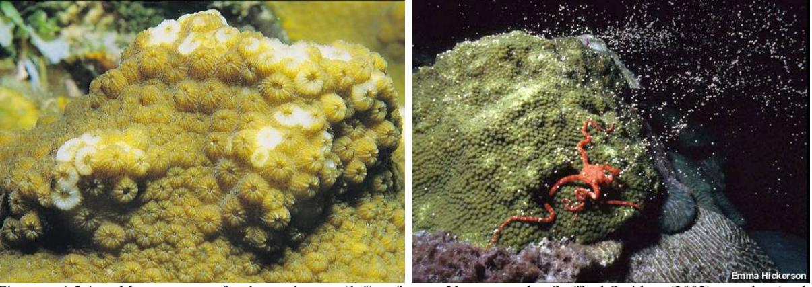

 Figure 6.5.4. *Montastraea franksi* photo (*left*) from Veron and Stafford-Smith (2002) and (*right*) from http://sanctuaries.noaa.gov/pgallery/pgflower/living/living\_2.html.

#### **Characteristics**

*Montastraea franksi* is distinguished by large, unevenly-arrayed polyps that give the colony its characteristic irregular surface. Colony form is variable, and the skeleton is dense with poorly developed annual bands (Weil and Knowton, 1994). Colony diameter can reach up to 5 m with a height of up to 2 m (Szmant et al., 1997). Common colors are green, grey, and brown (Szmant et al., 1997).

#### **Taxonomy**

**Taxonomic issues**: See Section 6.5: "Genus *Montastraea*." Veron (2000) does not list *Montastraea franksi* separately from the *Montastraea annularis* complex.

**Family:** Faviidae.

**Evolutionary and geologic history:** The *Montastraea* genus arose in the Oligocene ~ 30 Ma (Edinger and Risk, 1995).

#### **Global Distribution**

*Montastraea franksi* is found throughout the Caribbean Sea, including in the Bahamas, Bermuda, and Flower Garden Banks. The range is restricted to the west Atlantic and there is no range fragmentation.

According to both the IUCN Species Account and the CITES species database, *Montastraea franksi* occurs throughout the Caribbean, including the Bahamas, Flower Garden Banks, Bermuda, and the entire Caribbean coastline. S. dePutron (Bermuda Institute of Ocean Sciences, St. George's. pers. comm., May 2010) confirmed the presence of *Montastraea franksi* in Bermuda and categorized its abundance as dominant. T. Murdoch (Bermuda Zoological Society, Flatts. pers. comm., May 2010) also confirmed its occurrence but listed it as common and added that it has definitely suffered a substantial loss from the 1995 yellow-band outbreak*.*

Figure 6.5.5. *Montastraea franksi* distribution from IUCN copied from http://www.iucnredlist.org.

#### **U.S. Distribution**

*Montastraea franksi* is widely distributed throughout U.S. waters of the west Atlantic and greater Caribbean, including Florida and the Flower Garden Banks.

Within federally protected waters, *Montastraea franksi* has been recorded from the following areas:

- Flower Garden Banks National Marine Sanctuary
- Florida Keys National Marine Sanctuary
- Dry Tortugas National Park
- Virgin Island National Park/Monument
- Biscayne National Park
- Navassa Island National Wildlife Refuge
- Buck Island Reef National Monument

#### **Habitat**

**Habitat:** *Montastraea franksi* occupies most reef environments (Carpenter et al., 2008).

**Depth range**: *Montastraea franksi* has been reported from water depths ranging from 5 m to 50 m (Bongaerts et al., 2010; Carpenter et al., 2008; Weil and Knowton, 1994). *Montastraea* spp. are a common, often dominant component of Caribbean mesophotic reefs (Smith et al., 2010), suggesting the potential for deep refugia. *Montastraea franksi* tends to have a deeper distribution than the other two species in the *Montastraea annularis* complex (Szmant et al., 1997).

#### **Abundance**

*Montastraea franksi* has been reported as common (Veron, 2000). See Section 6.5: "Genus *Montastraea*."

#### **Life History**

See Section 6.5: "Genus *Montastraea*."

The growth rate for *Montastraea franksi* is reported to be slower, and spawning is reported to be about 1 hour earlier than for *Montastraea annularis* and *Montastraea faveolata* (Szmant et al., 1997).

#### **Threats**

See Section 6.5: "Genus *Montastraea*."

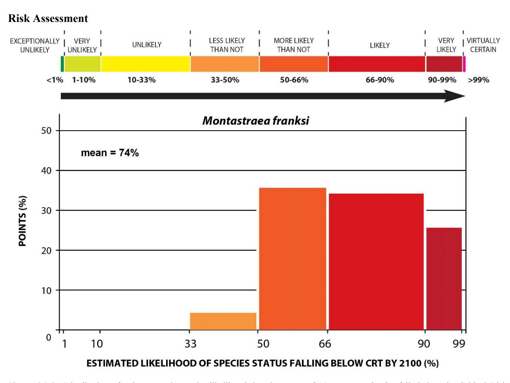

Figure 6.5.6. Distribution of points to estimate the likelihood that the status of *Montastraea franksi* falls below the Critical Risk Threshold (the species is of such low abundance or so spatially fragmented or at such reduced diversity that extinction is extremely likely) by 2100.

Factors that increase the potential extinction risk (higher likelihood of falling below the Critical Risk Threshold) for *Montastraea franksi* were its extremely low productivity (growth and recruitment), documented dramatic recent declines, and its restriction to the highly disturbed/degraded wider Caribbean region. All of these factors combine to yield a very high estimated extinction risk. It had a marginally lower risk estimate than the other two *Montastraea annularis* complex species because of its greater distribution in deep and mesophotic depth habitats, which are expected to experience lesser exposure to some surface-based threats.

The overall likelihood that *Montastraea franksi* will fall below the Critical Risk Threshold by 2100 was estimated to be in the "likely" risk category with a mean likelihood of 74% and a standard error (SE) of 9% (Fig. 6.5.6). This SE was calculated by taking the standard deviation of the seven mean voting scores of the BRT members and shows the coherence among the BRT. The uncertainty of the BRT is reflected in the range of votes of 33%–99% (Fig. 6.5.6) and the average range of likelihood estimates of the seven BRT voters (48%).

#### **6.5.3** *Montastraea annularis* **Ellis and Solander, 1786**

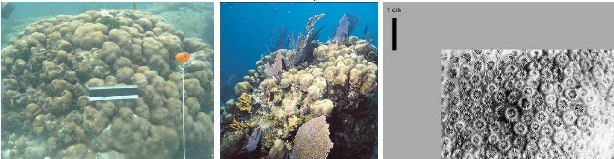

 Figure 6.5.7. *Montastraea annularis sensu stricto* photo (middle) and corallite plan from Veron and Stafford-Smith (2002). Large colony photo (*left*) from NOAA Southeast Fisheries Science Center.

#### **Characteristics**

*Montastraea annularis* colonies grow in columns that exhibit rapid and regular upward growth. In contrast to the other species, margins on the sides of columns are typically senescent (Weil and Knowton, 1994). Live colony surfaces usually lack ridges or bumps. Corallites on tops of columns are closely packed, uniformly distributed, and evenly exsert, with maximum diameters of mature corallites typically 2.1–2.6 mm.

#### **Taxonomy**

**Taxonomic issues**: See Section 6.5: "Genus *Montastraea*."

**Family:** Faviidae.

**Evolutionary and geologic history**: The *Montastraea* genus arose in the Oligocene ~ 30 Ma (Edinger and Risk, 1995).

#### **Global Distribution**

*Montastraea annularis* has a range restricted to the west Atlantic. It can be found throughout the Caribbean, Bahamas, and Flower Garden Banks (Veron, 2000, IUCN), but may be absent from Bermuda (Weil and Knowton, 1994). S. dePutron (Bermuda Institute of Ocean Sciences, St. George's. pers. comm., May 2010) confirmed the presence of *Montastraea anuularis* in Bermuda and categorized its abundance as rare; T. Murdoch (Bermuda Zoological Society, Flatts, pers. comm., May 2010) had not seen this species in Bermuda*.*

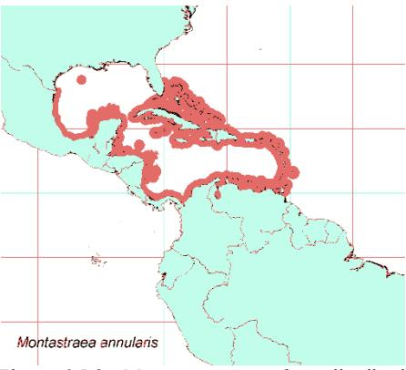

Figure 6.5.8. *Montastraea annularis* distribution from IUCN copied from http://www.iucnredlist.org.

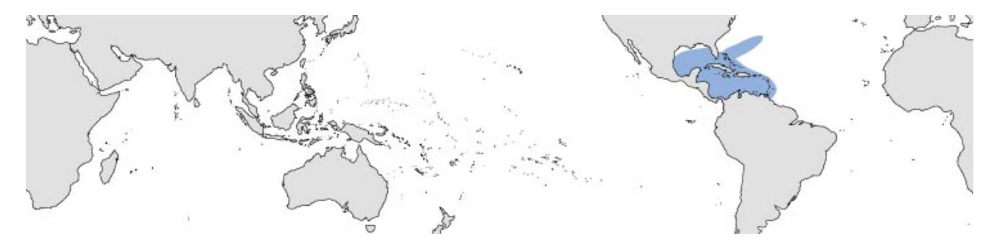

Figure 6.5.9. *Montastraea annularis* distribution from Veron and Stafford-Smith (2002).

#### **U.S. Distribution**

*Montastraea annularis* is common throughout U.S. waters of the west Atlantic and greater Caribbean, including Florida and the Gulf of Mexico, within its range including federally protected waters in the following areas:

- Flower Garden Bank Sanctuary
- Dry Tortugas National Park
- Virgin Island National Park/Monument
- Biscayne National Park
- Florida Keys National Marine Sanctuary
- Navassa National Wildlife Refute
- Buck Island Reef National Monument

#### **Habitat**

**Habitat:** *Montastraea annularis* is reported from most reef environments (Veron, 2000).

**Depth range**: *Montastraea annularis* has been reported in water depths ranging from 0.5 m to 20 m (Szmant et al., 1997); while *Montastraea* spp. are a common, often dominant component of Caribbean mesophotic reefs (Smith et al., 2010), suggesting the potential for deep refugia. However, *Montastraea annularis* sensu stricto is generally described with a shallower distribution (Szmant et al., 1997).

#### **Abundance**

*Montastraea annularis* has been reported to be common (Veron 2000). See Section 6.5: "Genus *Montastraea*."

#### **Life History**

See Section 6.5: "Genus *Montastraea*." *Montastraea annularis* is reported to have slightly smaller egg size and potentially smaller size/age at first reproduction that the other two members of the *Montastraea annularis* complex (reviewed in Szmant et al., 1997).

#### **Threats**

See Section 6.5: "Genus *Montastraea*."

#### **Risk Assessment**

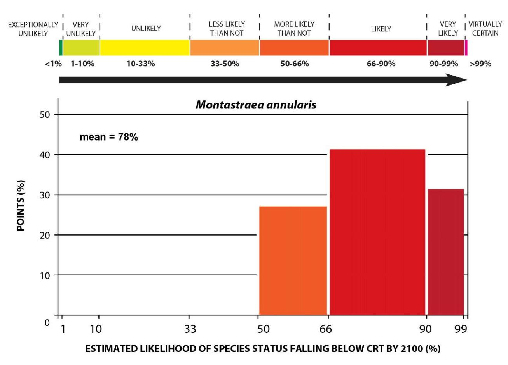

Figure 6.5.10. Distribution of points to estimate the likelihood that the status of *Montastraea annularis* falls below the Critical Risk Threshold (the species is of such low abundance or so spatially fragmented or at such reduced diversity that extinction is extremely likely) by 2100.

Factors that increase the potential extinction risk (higher likelihood of falling below the Critical Risk Threshold) for *Montastraea annularis* include very low productivity (growth and recruitment), documented dramatic declines in abundance, its restriction to the degraded reefs of the wider Caribbean region, and its preferential occurrence in shallow habitats (yielding potentially greater exposure to surface-based threats). All these factors combine to yield very high estimated extinction risk.

The overall likelihood that *Montastraea annularis* will fall below the Critical Risk Threshold by 2100 was estimated to be in the "likely" risk category with a mean likelihood of 78% and a standard error (SE) of 7% (Fig. 6.5.10). This SE was calculated by taking the standard deviation of the seven mean voting scores of the BRT members and shows the coherence among the BRT. The uncertainty of the BRT is reflected in the range of votes of 50%–99% (Fig. 6.5.10) and the average range of likelihood estimates of the seven BRT voters (45%). This overall range of votes (spanning only three categories) was small relative to most of the other candidate species.

#### **7. Individual Species Accounts—Indo-Pacific Species**

#### **7. 1 Genus** *Millepora* **(Class Hydrozoa; Order Milleporina; Family Milleporidae)**

**7.1.1** *Millepora foveolata* **Crossland, 1952** 

Figure 7.1.1. *Millepora foveolata* images from (*top*; type specimen) Crossland (1952) and (*bottom*) Randall and Cheng (1984).

#### **Characteristics**

Colonies of *Millepora foveolata* form thin encrusting laminae that adhere closely to the underlying substrata. The coenosteum between the pores on colony surfaces exposed to insolation (light) swell upward into low ridges (foveolations) around individual pores or groups of pores (Randall and Cheng, 1984). Living colonies are yellowish, ranging from pale pinkish-yellow to yellowish-beige in shaded or cryptic areas, grading towards a brighter yellow as the area becomes more exposed to light (Randall and Cheng, 1984).

#### **Taxonomy**

**Taxonomic issues**: None. The foveolations of *Millepora foveolata* clearly distinguish this encrusting yellow species. *Millepora foveolata* is sometimes confused with the similarly encrusting *Millepora exaesa*, which lacks ridges and has more prominent nodules.

**Family:** Milleporidae.

**Evolutionary and geologic history**: The genus *Millepora* has been found in the fossil record for the Cretaceous (about 70 Ma; Rehfeld and Ernst, 1998), so the genus is known to have survived the warm seawater and high concentrations of atmospheric CO2 in the Cretaceous (Quan et al., 2009; Zeebe, 2001) and the Paleocene-Eocene Thermal Maximum (55.8 Ma; Zachos et al., 2003). Rapid ocean acidification occurred during the Paleocene-Eocene Thermal Maximum (Zachos et al., 2005). Although some species of *Millepor*a survived the extraordinarily warm seawater during the Cretaceous and the Paleocene-Eocene Thermal Maximum, it is not evidence that species of *Millepora* could survive those conditions again. However, it does provoke interest in investigating the biology of *Millepora* for how it may have persisted. In the harsh physical environments of shallow reef flat pools in American Samoa, *Millepora* spp. are the first to bleach and die but seem to have a special aptitude for recovering by successful recruitment of new colonies (C. Birkeland, USGS, Honolulu, HI, pers. observ., 5 March 2002).

#### **Global Distribution**

*Millepora foveolata* has been reported on the southern coast of Taiwan, the Philippines, the Northern Marianas but not the Southern Marianas which includes Guam, Rota, Tinian, Saipan, etc. (Randall, 1995), Palau, and the Great Barrier Reef in Australia. The type specimen is from the Great Barrier Reef (Crossland, 1952). It is not known from Indonesia (Razak and Hoeksema, 2003).

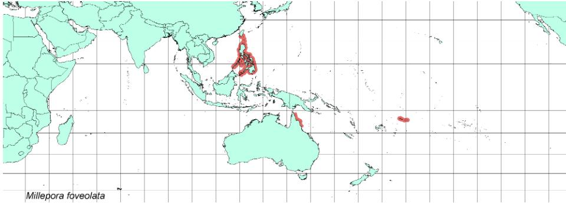

Figure 7.1.2. *Millepora foveolata* distribution from IUCN copied from http://www.iucnredlist.org.

#### **U.S. Distribution**

*Millepora foveolata* is found in the Northern Mariana Islands (Randall, 1995). According to the IUCN Species Account, *Millepora foveolata* occurs in American Samoa, but no reference in support of its occurrence is provided. However, moderately extensive surveys since 1979 have not found it in American Samoa. *Millepora foveolata* has not been recorded in federally protected waters (Kenyon et al., 2010b).

#### **Habitat**

**Habitat:** Specimens of *Millepora foveolata* have been collected from the forefront reef slope on the upper surface of buttress ridges (Randall and Cheng, 1984).

**Depth range**: *Millepora foveolata* has been reported in water depths ranging from at least 1 m to 8 m.

#### **Abundance**

Abundance of *Millepora foveolata* has been reported mostly as occasional (Randall and Cheng, 1984).

#### **Life History**

Hydrozoan corals of the genus *Millepora* are the only reef-building corals with medusae as part of their life history. *Millepora* spp. are gonochoric and reproduction is seasonal (Lewis, 2006). Medusae are in separate sexes and sexual reproduction takes place in the medusa stage. The milleporid medusae of some species live for only a few hours. The gametes of some milleporids can become mature in 20 to 30 days, more rapidly than for many scleractinians.

Branching and columnar forms of *Millepora* are subject to fragmentation and may use this mechanism to reproduce asexually; unlike scleractinian corals, the survival of *Millepora* fragments may not be size-dependent (Lewis, 1991).

#### **Threats**

**Thermal Stress**: Although there is not much species-specific information about the response of *Millepora foveolata* to thermal stress, the genus *Millepora* has been called a bleaching "loser" (Loya et al., 2001). *Millepora* species are ranked as the most susceptible to bleaching in response to high seawater temperatures of any of the 40 genera or other categories of hermatypic corals in the Great Barrier Reef (Marshall and Baird, 2000). The genus has been reported to be highly susceptible to bleaching in the western Indian Ocean (McClanahan et al., 2007) and appears to have experienced local extirpations in the tropical eastern Pacific (Glynn and de Weerdt, 1991). Low bleaching occurred in *Millepora* in Moorea during the 1991 event (Gleason, 1993), but elevated temperatures can also kill *Millepora* even in the absence of bleaching (McClanahan, 2004). At elevated temperatures, congener *Millepora dichotoma* showed decreased zooxanthellae density, changes in chlorophyll concentrations, and decreased calcification (Abramovitch-Gottlib et al., 2003).

*Millepora* spp. are among the first to bleach and die, but they also seem to have a special aptitude for recovering by recruiting new colonies. *Millepora* survived the extraordinarily warm seawater during the Cretaceous and the Paleocene-Eocene Thermal Maximum (see Evolutionary and Geologic History, above).

**Acidification:** No specific research has addressed the effects of acidification on the genus *Millepora*. However, most corals studied have shown negative relationships between acidification and growth (Table 3.2.2), and acidification is likely to contribute to reef destruction in the future (Hoegh-Guldberg et al., 2007; Silverman et al., 2009). While ocean acidification has not been demonstrated to have already caused appreciable declines in coral populations so far, the BRT considers it to be a significant threat to corals by 2100.

**Disease:** The ecological and population effects of disease on the genus *Millepora* are unknown. *Millepora* have been observed with a > 20% prevalence of skeleton-eroding-band disease in the Red Sea (Winkler et al., 2004). There are reports of black-band disease on *Millepora* on the Great Barrier Reef (Willis et al., 2004) and white plague in Florida (Richardson et al., 1998). Few other reports exist for the Pacific, and Caribbean congeners have been observed with a small number of diseases (Sutherland et al., 2004).

**Predation:** *Millepora* species are known to be preyed on by the crown-of-thorns seastar *Acanthaster planci*, although they are less preferred prey than acroporids and perhaps most scleractinians (Colgan, 1987). *Millepora* spp. are also preyed on by the polychaete *Hermodice carunculata* (Witman, 1988), the nudibranch mollusk *Phyllidia*, and filefish of the genera *Alutera* and *Cantherhines* (Lewis, 1989).

**Land-based sources of pollution (LBSP):** The specific effects of LBSP stresses are poorly known for *Millepora foveolata*. Although *Millepora* species tend to favor relatively clear water with low rates of sedimentation, they were reported to be among the last 17 out of 42 genera to drop out along a gradient of increasing rate of sedimentation (Randall and Birkeland, 1978). *Millepora* also showed increased relative abundance and colony size on sedimentimpacted reefs in Kenya (McClanahan and Obura, 1997). Though little is known about effects of nutrients on Pacific *Millepora*, Caribbean congeners were found to decrease in percent cover on eutrophic reefs in Barbados (Tomascik and Sander, 1987a).

LBSP-related stresses (nutrients, sediment, toxins, and salinity) often act in concert rather than individually and are influenced by other biological (e.g., herbivory) and hydrological factors. Collectively, LBSP stresses are unlikely to produce extinction at a global scale; however, they may pose significant threats at local scales (particularly important for species with limited range) and reduce the resilience of corals to bleaching (Carilli et al., 2009a; Wooldridge, 2009b).

**Collection/Trade:** The genus *Millepora* has been involved in international trade from Indonesia, Solomon Islands, and Fiji with reported exports between 200 and 3000 pieces per year in the years 2000–2008 (CITES, 2010). Reported exports from Vietnam, Malaysia, and Tonga were < 1000 pieces per year in the same time period.

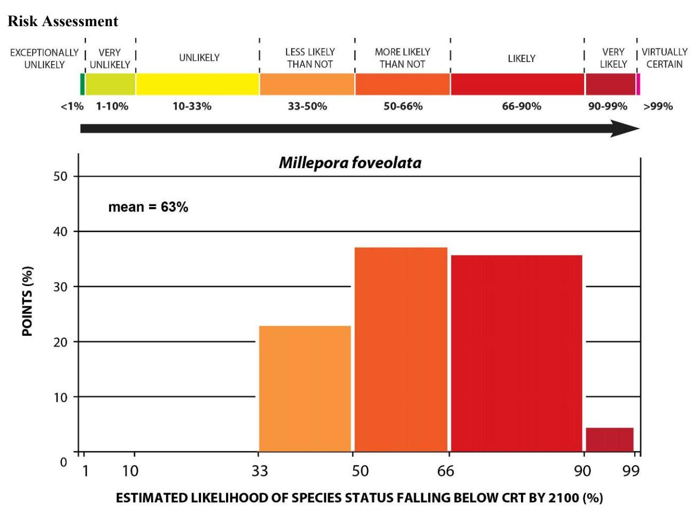

Figure 7.1.3. Distribution of points to estimate the likelihood that the status of *Millepora foveolata* falls below the Critical Risk Threshold (the species is of such low abundance, or so spatially fragmented, or at such reduced diversity that extinction is extremely likely) by 2100.

Factors that increase the potential extinction risk (higher likelihood of falling below the Critical Risk Threshold) for *Millepora foveolata* include a relatively narrow geographic range and a generic susceptibility to bleaching in response to unusually warm seawater. The high bleaching rate is the primary threat of extinction for *Millepora foveolata*. *Millepora* species are especially susceptible to seawater warming and among the first to bleach, with by far the greatest rate of mortality. Factors that potentially reduce the extinction risk (decrease the likelihood of falling below the Critical Risk Threshold) are that *Millepora foveolata* is inconspicuous and therefore could potentially be more common than previously observed, and this species probably shares the generic trait of having an exceptional aptitude for larval recruitment and population replenishment.

The overall likelihood that *Millepora foveolata* will fall below the Critical Risk Threshold by 2100 was estimated to be in the "more likely than not" risk category with a mean likelihood of 63% and a standard error (SE) of 9.8% (Fig. 7.1.3). This SE was calculated by taking the standard deviation of the seven mean voting scores of the BRT members and shows the coherence among the BRT. The uncertainty of the BRT is reflected in the range of votes of 33%–99% (Fig. 7.1.3) and the average range of likelihood estimates of the seven BRT voters (50.3%). The overall wide range of votes reflects the uncertainty among BRT members inherent in the lack of adequate ecological and demographic information for *Millepora foveolata*.

#### **7.1.2** *Millepora tuberosa* **Boschma, 1966**

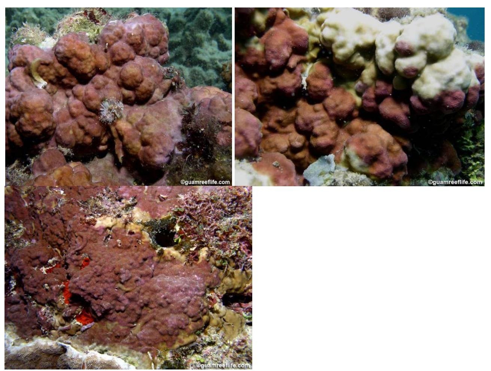

Figure 7.1.4. *Millepora tuberosa* photos from David Burdick copied from GuamReefLife.com.

#### **Characteristics**

Colonies of *Millepora tuberosa* form thin (about 1 mm at encrusting peripheral margins) to moderately thick (3 cm or more in the central regions of larger colonies) encrusting laminae that closely adhere to the underlying substrata (Randall and Cheng, 1984). They are always encrusting and so do not make vertical plates or branches, although they can be nodular or lumpy, especially when they encrust rubble. *Millepora tuberosa* is often found as small colonies (5–30 cm diameter) but can be found having diameters greater than a meter (Randall and Cheng, 1984). Living colonies are distinctive purplish-red or wine-colored and so a person surveying corals could inadvertently misidentify *Millepora tuberosa* colonies as crustose coralline algae.

#### **Taxonomy**

**Taxonomic issues**: *Millepora tuberosa* is sometimes synonymized with *Millepora exaesa* (Razak and Hoeksema, 2003). However, R. Randall (Univ. Guam, Mangilao, pers. comm., June 2010) and D. Fenner (Dept. Marine and Wildlife Resources, Tutuila, pers. comm., June 2010) have suggested that museum specimens might be causing confusion because the living specimens look very different. The living wine-colored *Millepora tuberosa* tend to be found on open coasts and tend to be more encrusting and with more rounded or lumpy nodules. The bright yellow *Millepora exaesa* are usually found on the backreef slopes and tend to have short knobby branches growing vertically upward. When the two species are found intermixed in lagoonal habitats in Micronesia (Yap and Chuuk), they can be readily distinguished by form and color (Randall and Cheng, 1984).

**Family:** Milleporidae.

**Evolutionary and geologic history**: The genus *Millepora* has been found in the fossil record for the Cretaceous (about 70 Ma; Rehfeld and Ernst, 1998), so the genus is known to have survived the warm seawater and concentrations of atmospheric CO2 in the Cretaceous (Quan et al., 2009; Zeebe, 2001) and the Paleocene-Eocene Thermal Maximum (55.8 Ma; Zachos et al., 2003). Rapid acidification of the oceans occurred during the Paleocene-Eocene Thermal Maximum (Zachos et al., 2005). Although the species of *Millepor*a survived the extraordinarily warm seawater during the Cretaceous and the Paleocene-Eocene Thermal Maximum, it is not evidence that species of *Millepora* could survive those conditions again; however, it provokes interest in investigating the biology of *Millepora* for how it may have persisted. In the harsh physical environments of shallow reef flat pools in American Samoa, *Millepora* spp. are the first to bleach and die, but seem to have a special aptitude for recovering by successful recruitment of new colonies (C. Birkeland, USGS, Honolulu, HI, pers. observ., 5 March 2002).

#### **Global Distribution**

*Millepora tuberosa* is occasionally common in portions of the western Pacific (Taiwan, Mariana lslands, Caroline Islands) and is found in American Samoa (D. Fenner, Dept. Marine and Wildlife Resources, Tutuila, pers. comm., April 2010; Birkeland, 1987). The range appears quite disjunct, but this could be an identification artifact. Randall and Cheng (1984) suggest that it might be more widespread, but that it gets confused with *Millepora exaesa*. The type specimens were described from Mauritius (Boschma, 1966), but the color of the species while living was not included in the original description. It might be found at a number of archipelagoes between the Marianas and American Samoa but not noticed because it resembles crustose coralline algae to persons surveying corals who have not been familiarized with *Millepora tuberosa*.

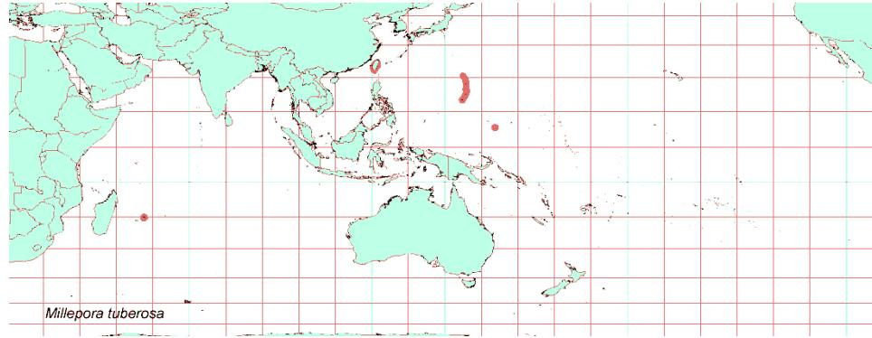

Figure 7.1.5. *Millepora tuberosa* distribution from IUCN copied from http://www.iucnredlist.org.

#### **U.S. Distribution**

*Millepora tuberosa* is found in American Samoa (Birkeland, 1987; D. Fenner, Dept. Marine and Wildlife Resources, Tutuila, pers. comm., April 2010) and the Mariana Islands (including Guam). A search of published and unpublished records of occurrence in U.S. waters indicates *Millepora tuberosa* and *Millepora exaesa* have been reported from Tutuila, Ofu-Olosega, and Tau in American Samoa (Birkeland, unpubl. data; Coles et al., 2003; CRED, unpubl. data), Guam, and the Commonwealth of the Northern Mariana Islands (Burdick, unpubl. data; CRED, unpubl. data; Randall, 2003). No substantiated published or unpublished reference supporting its occurrence in the U.S. minor outlying islands could be identified.

Within federally protected waters, *Millepora tuberosa* has been recorded from the following areas (Kenyon et al., 2010b):

- National Park of American Samoa, Tutuila and Ofu Island units
- Fagatele Bay National Marine Sanctuary, Tutuila

#### **Habitat**

**Habitat:** *Millepora tuberosa* has been reported to occupy a variety of habitats, including the forereef and lagoonal areas.

**Depth range**: *Millepora tuberosa* has been reported in water depths ranging from at least 1 m to 12 m.

#### **Abundance**

Abundance of *Millepora tuberosa* has most often been reported as occasional, but R. Randall (Univ. Guam, Mangilao, pers. comm., June 2010) has observed it as predominant in an area of lagoonal reef in southwest Guam near the Agat Boat Harbor.

#### **Life History**

Hydrozoan corals of the genus *Millepora* are the only reef-building corals with medusae as part of their life history. *Millepora* are gonochoric and reproduction is seasonal (Lewis, 2006). Medusae are in separate sexes and sexual reproduction takes place in the medusa stage. The milleporid medusae of some species live for only a few hours. The gametes of some milleporids can become mature in 20 to 30 days, more rapidly than for many scleractinians.

Branching and columnar forms of *Millepora* are subject to fragmentation, and may utilize this mechanism to reproduce asexually; unlike scleractinian corals, the survival of *Millepora* fragments may not be size-dependent (Lewis, 1991). However, this strategy is not likely to be significant for *Millepora tuberosa*, which is encrusting and less prone to fragmentation.

#### **Threats**

**Thermal Stress**: Although there is not much species-specific information about the response of *Millepora tuberosa* to thermal stress, the genus *Millepora* has been called a bleaching "loser" (Loya et al., 2001). *Millepora* species are ranked as the most susceptible to bleaching in response to high seawater temperatures of any of the 40 genera or other categories of hermatypic corals in the Great Barrier Reef (Marshall and Baird, 2000). The genus is also highly susceptible to bleaching in the western Indian Ocean (McClanahan et al., 2007) and has caused local extirpations in the tropical eastern Pacific (Glynn and de Weerdt, 1991). Low bleaching occurred in *Millepora* in Moorea during the 1991 event (Gleason, 1993), but elevated temperatures can also kill *Millepora* even in the absence of bleaching (McClanahan, 2004). At elevated temperatures, congener *Millepora dichotoma* showed decreased zooxanthellae density, changes in chlorophyll concentrations, and decreased calcification (Abramovitch-Gottlib et al., 2003).

Although *Millepora* spp. are the first to bleach and die, they also seem to have a special aptitude for recovering by recruiting new colonies. *Millepora* survived the extraordinarily warm seawater during the Cretaceous and the Paleocene-Eocene Thermal Maximum.

**Acidification:** No specific research has addressed the effects of acidification on the genus *Millepora*. However, most corals studied have shown negative relationships between acidification and growth (Table 3.2.2), and acidification is likely to contribute to reef destruction in the future (Hoegh-Guldberg et al., 2007; Silverman et al., 2009). While ocean acidification has not been demonstrated to have already caused appreciable declines in coral populations so far, the BRT considers it to be a significant threat to corals by 2100.

**Disease:** The ecological and population effects of disease on the genus *Millepora* are unknown. *Millepora* have been observed with a > 20% prevalence of skeleton-eroding band disease in the Red Sea (Winkler et al., 2004). There are reports of black-band disease on *Millepora* on the Great Barrier Reef (Willis et al., 2004) and white plague in Florida (Richardson et al., 1998). Few other reports exist for the Pacific, and Caribbean congeners have been observed with a small number of diseases (Sutherland et al., 2004).

**Predation:** *Millepora* species are known to be preyed on by the crown-of-thorns seastar, *Acanthaster planci*, although they are less preferred prey than acroporids and perhaps most scleractinians (Colgan, 1987). *Millepora* spp. are also preyed upon by the polychaete *Hermodice carunculata* (Witman, 1988), the nudibranch mollusk *Phyllidia*, and filefish of the genera *Alutera* and *Cantherhines* (Lewis, 1989).

**Land-based sources of pollution (LBSP):** The specific effects of LBSP stresses are poorly known for *Millepora tuberosa*. Although *Millepora* species tend to favor relatively clear water with low rates of sedimentation, they are among the last 17 out of 42 genera to drop out along a gradient of increasing rate of sedimentation (Randall and Birkeland, 1978). *Millepora* also showed increased relative abundance and colony size on sediment-impacted reefs in Kenya (McClanahan and Obura, 1997). Although little is known about effects of nutrients on Pacific *Millepora*, Caribbean congeners were found to decrease in percent cover on eutrophic reefs (Tomascik and Sander, 1987a).

LBSP-related stresses (nutrients, sediment, toxins, and salinity) often act in concert rather than individually and are influenced by other biological (e.g., herbivory) and hydrological factors. Collectively, LBSP stresses are unlikely to produce extinction at a global scale; however, they may pose significant threats at local scales (particularly important for species with limited range) and reduce the resilience of corals to bleaching (Carilli et al., 2009a; Wooldridge, 2009b).

**Collection/Trade:** The genus *Millepora* has been involved in international trade from Indonesia, Solomon Islands, and Fiji with reported exports between 200 and 3000 pieces per year in the years 2000–2008 (CITES, 2010). Reported exports from Vietnam, Malaysia, and Tonga were < 1000 pieces per year in the same time period.

# **Risk Assessment**

Figure 7.1.6. Distribution of points to estimate the likelihood that the status of *Millepora tuberosa* falls below the Critical Risk Threshold (the species is of such low abundance, or so spatially fragmented, or at such reduced diversity that extinction is extremely likely) by 2100.

Factors that increase the potential extinction risk (higher likelihood of falling below the Critical Risk Threshold) for *Millepora tuberosa* include a relatively narrow geographic range and a generic susceptibility to bleaching in response to unusually warm seawater. The high bleaching rate is the primary generic threat of extinction for *Millepora tuberosa*. *Millepora* species are especially susceptible to seawater warming and among the first to bleach, with by far the greatest rate of mortality. Factors that potentially reduce the extinction risk (decrease the likelihood of falling below the Critical Risk Threshold) are that *Millepora tuberosa* can be mistaken for crustose coralline algae and might be more common than previously observed, and this species probably shares the generic trait of having an exceptional aptitude for larval recruitment and population replenishment.

The overall likelihood that *Millepora tuberosa* will fall below the Critical Risk Threshold by 2100 was estimated to be in the "more likely than not" risk category with a mean likelihood of 63% and a standard error (SE) of 10.1% (Fig. 7.1.6). This SE was calculated by taking the standard deviation of the seven mean voting scores of the BRT members and shows the coherence among the BRT. The uncertainty of the BRT is reflected in the range of votes of 33%–99% (Fig. 7.1.6) and the average range of likelihood estimates of the seven BRT voters (50.3%). The overall wide range of votes reflects the uncertainty among BRT members inherent in the lack of adequate ecological and demographic information for *Millepora tuberosa* and the particular concern about potential misidentification in this species.

#### **7.2.1** *Heliopora coerulea* **Pallas, 1766**

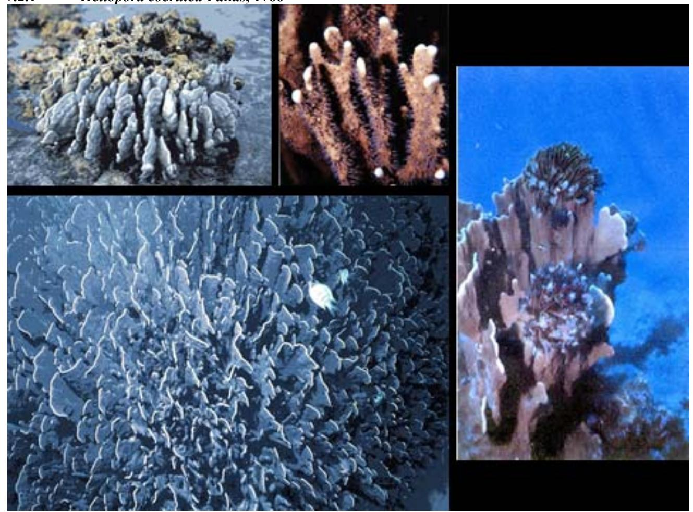

Figure 7.2.1.Colonies of *Heliopoa coerulea* copied (*three on the left*) from Veron (2000) and (*one to the right*) provided by the BRT.

#### **Characteristics**

Colonies of *Heliopoa coerulea* most often have rather massive castellate blades. This is the only species of the subclass Octocorallia known to produce a large aragonite skeleton. They can form or contribute to microatoll structures when near the ocean surface. *Heliopora* can dominate large areas, but the colonies are very patchily distributed. The polyps each have eight pinnate tentacles. Polyps live in tubes within the skeleton and are connected by a thin superficial coenenchyme. When a blade is broken to see the inner skeleton, it is always a striking blue. The skeleton can remain blue even in fossils of *Heliopora* millions of years old. The external appearance of living colonies can also be lighter blue or greenish, but perhaps most often brownish because of the color of the living coenenchyme. The polyps and planulae are white.

#### **Taxonomy**

**Taxonomic issues:** None. *Heliopora coerulea* is the only representative of the order Helioporacea (= Coenothecalea) on coral reefs. There are three known species of the genus *Epiphaxum* (family Lithotelestidae, Helioporacea) in the deep sea (two in the Caribbean Sea and one in the Indo-West Pacific), but they are not large or dominant. Like *Heliopora coerulea, Epiphaxum* spp. were found back in the Cretaceous Era and have apparently changed little since (Lozouet and Molodtsova, 2008).

**Family:** Helioporidae.

**Evolutionary and geologic history:** *Heliopora coerulea* is surely the oldest species of coral, with its fossil record extending 130 million years unchanged, back to the early Cretaceous (about 70 Ma; Colgan, 1984) when it originated in the Tethys Sea in southern Europe. Numerous other species names are associated with *Heliopora* in the paleontological literature, but there are no statistically significant differences in the skeletal structures; therefore, they are all considered synonymous. It is generally agreed that *Heliopora coerulea* probably has changed biochemically and genetically over 130 million years and it, therefore, is considered a chronospecies.

#### **Global Distribution**

*Heliopora coerulea* has been extinct in the Atlantic but in the Pacific has become very broadly distributed both longitudinally, from east Africa and the Red Sea to American Samoa, and latitudinally, from South Africa and the Great Barrier Reef to the Ryukyu Islands near Japan. The extent of distributions into the higher latitudes on the east and west coasts of Australia are indicated substantially differently in maps from the IUCN Red List and from Veron 2000. *Heliopora coerulea* does not occur in the Arabian Gulf and the North Arabian Sea (B. Riegl, National Coral Reef Institute, Dania, FL. pers. comm. 26 November, 2010).

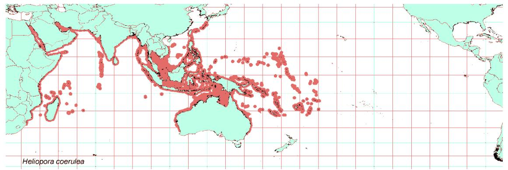

Figure 7.2.2. *Heliopora coerulea* distribution from IUCN copied from http://www.iucnredlist.org.

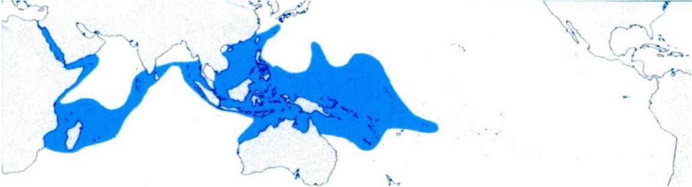

Figure 7.2.3. *Heliopora coerulea* distribution from Veron (2000).

#### **U.S. Distribution**

*Heliopora coerulea* is found in the American Samoa Archipelago but not on the main island of Tutuila. It is found in the Manu'a Islands (about 65 miles east of Tutuila) and on South Bank (37 miles south of Tutuila). It is also found in the Mariana Islands and throughout the Caroline and Marshall Islands.

A search of published and unpublished records of occurrence in U.S. waters indicates *Heliopora coerulea* has been reported from Ofu-Olosega, Tau, Swains, and South Bank in American Samoa (Coles et al., 2003; Fisk and Birkeland, 2002; Lamberts, 1983; Lovell and McLardy, 2008; Maragos et al., 1994; National Park Service, 2009), Guam (Amesbury et al., 1999; Burdick, unpubl. data) and the Commonwealth of the Northern Mariana Islands (CRED, unpubl. data).

Within federally protected waters, *Heliopora coerulea* has been recorded from the following areas (Kenyon et al., 2010b):

- National Park of American Samoa, Ofu Island unit
- War in the Pacific National Historical Park, Guam
- Marianas Trench Marine National Monument (Asuncion, Maug)

#### **Habitat**

**Habitat:** *Heliopora coerulea* has been reported to occur in areas of very high abundance on shallow reef crests (0–1.2 m) where it has sometimes been referred to as the "*Heliopora* zone" (Wells, 1954), but populations have also been reported as common on the forereef slopes (Zann and Bolton, 1985). *Heliopora* can also live in marginal backwater turbid environments (C. Birkeland, University of Hawai`i, HI, pers. comm. November 2010).

**Depth range:** *Heliopora coerulea* have been reported in water depths ranging from near 0 to 60 m, most abundant at 0– 1.2 m and between 6 m and 10 m, but still common at 20 m (Zann and Bolton, 1985). Specimens have been dredged from 60 m in Funafuti (Gardiner, 1898).

#### **Abundance**

*Heliopora coerulea* have been reported to be dominant in shallow water and to form extensive 10 km long stands in a "*Heliopora* zone" (0–1.2 m at low tide) on Ishigaki (Japan), Banda Aceh (Indonesia) and on a number of atolls in Micronesia. *Heliopora* can also be abundant and dominant to at least 20 m (Zann and Bolton, 1985). *Heliopora* averaged 15%–20% of all corals down to 20 m in southern Tarawa and up to 40% of all corals in the southwestern sector (Zann and Bolton, 1985).

#### **Life History**

*Heliopora coerulea* colonies have separate sexes. The mature eggs are large (> 800 μm diameter). There appears to be a lunar or semi-lunar periodicity in reproductive behavior with brooding of larvae beginning around either full or new moon (Babcock, 1990). Fertilization and development begin internally, but the planula larvae are brooded externally on the surface of the colony under the tentacles of the polyps for 6 to 14 days before leaving (Babcock, 1990). The planulae average 3.7 mm in length and are mostly benthic. The larvae lack zooxanthellae and have a relatively low lipid content (54% dry weight), both factors providing more energy for most scleractinian larvae (Harii et al., 2002). Furthermore, the relatively low lipid content reduces the potential buoyancy of the larvae. Both reduced energy and reduced buoyancy tend to make the larvae of *Heliopora coerulea* benthic "crawl-away" larvae, although they could potentially be kept in the water column by turbulence. Although the competency period of *Heliopora coerulea* is reported to be 30 days, 40% of the larvae crawl onto the substrata within the first hour of leaving the adult colony (Harii et al., 2002). Even when dispersed in the water column, settlement occurs within a few hundred meters of the parent colony (Harii and Kayanne, 2003). This is a likely explanation for the tendency of *Heliopora* to have a strongly clumped distribution and apparently low dispersal tendencies.

The relatively large eggs and larvae in combination with small polyps restrict the fecundity of *Heliopora* to one or two planulae per polyp per reproductive cycle (Babcock, 1990).

*Heliopora coerulea* apparently does not grow rapidly. Two weeks after settlement, one polyp divided into two and the skeleton turned blue (Harii and Kayanne, 2003).

Although scleractinian corals deposit aragonitic calcium carbonate skeletons, the skeleton of *Heliopora coerulea* also contains magnesium carbonate. The concentration of MgCO3 in *Heliopora* skeletons increases as temperatures decrease (Velimirov, 1980).

Field observations of coral interactions showed *Heliopora coerulea* to be the weakest competitor of all corals in Taiwan, as it was killed by all corals that physically touched it (Dai, 1990). However, it is still observed to be able to dominate large areas across a broad depth range (Zann and Bolton, 1985).

#### **Threats**

**Temperature increase:** *Heliopora coerulea* is one of the most resistant of corals to temperature stress and bleaching. The species did not bleach in Majuro in 1992 or in Guam in 1994 (Paulay and Benayahu, 1999). During the severe seawater warming of 1997–1998, Kayanne et al (2002) noted that while 100% of the *Pavona*, 77% of the *Acropora*, 66% of the *Montipora*, 53% of the branching *Porites,* and 23% of the massive *Porites* died, "*Heliopora coerulea* was the least susceptible to bleaching and maintained almost constant coverage before and after the bleaching." No *Heliopora coerulea* were damaged. "In 1999, *Heliopora coerulea* reproduced normally, suggesting that this species can tolerate high water temperatures without detriment to its reproduction in the following year" (Harii and Kayanne, 2003). Likewise in June 2010, there was a major bleaching of corals in the Indian Ocean. Coauthor Mark Eakin observed nearly complete bleaching of all coral species except *Heliopora coerulea* south of Phuket, Thailand in June 2010 (Fig. 7.2.4).

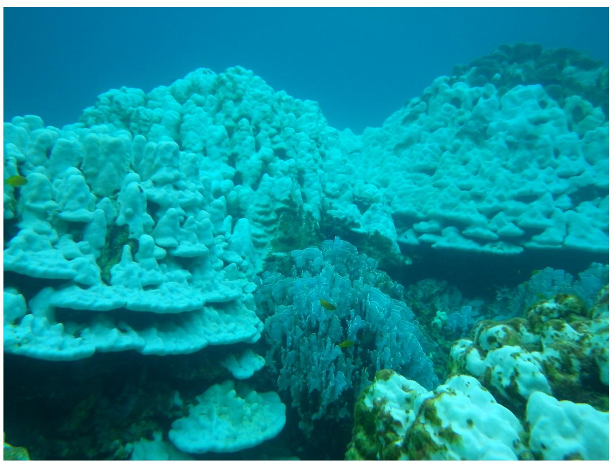

Figure 7.2.4. Nearly complete bleaching of all coral species except *Heliopora coerulea* at Koh Racha Yai about 1-hour boat ride south of Phuket, Thailand. Photo by Mark Eakin (NOAA Coral Reef Watch, Silver Spring, MD, 24 June 2010).

*Heliopora coerulea* may have suffered significantly from bleaching in Java during the 1982-1983 El Niño event, although some of the observed declines were also attributed to anthropogenic impacts (Brown et al., 1990). *Heliopora coerulea* has been found to predominantly contain stress-resistant clade D zooxanthellae (LaJeunesse et al., 2010).

*Heliopora coerulea* or its ancestors survived during the extraordinarily warm temperatures of the Cretaceous (Zeebe, 2001) and the Paleocene-Eocene Thermal Maximum (Quan et al., 2009).

**Acidification:** No specific research has addressed the effects of acidification on the genus *Heliopora*. However, most corals studied have shown negative relationships between acidification and growth (Table 3.2.2), and acidification is likely to contribute to reef destruction in the future (Hoegh-Guldberg et al., 2007; Silverman et al., 2009). While ocean acidification has not been demonstrated to have already caused appreciable declines in coral populations so far, the BRT considers it to be a significant threat to corals by 2100. *Heliopora coerulea* seemed to have survived the rapid acidification of the oceans at the Paleocene-Eocene Thermal Maximum (Zachos et al., 2005).

**Disease:** *Heliopora coerulea* has been identified as a potential host for *Porites* ulcerative white-spot disease (Kaczmarsky, 2006), but disease does not appear to pose a substantial threat to this species.

**Predation:** Adult colonies of *Heliopora coerulea* appear to be avoided by crown-of-thorns seastar (*Acanthaster planci*), fireworms, and corallivorous molluscs and fishes. However, the larvae being brooded on the outer surface of colonies are intensely preyed on by several species of butterflyfishes (chaetodontids; Villanueva and Edwards, 2010).

**Land-based sources of pollution (LBSP):** Sediment does not seem to be a significant threat to *Heliopora coerulea*. Although it has been reported to be able to live in marginal backwater turbid environments, field studies of the distribution of 159 species of corals in relation to rates of sedimentation along gradients from river mouths to the open forereefs in two bays in Guam (Randall and Birkeland, 1978) indicated that *Heliopora coerulea* tends to favor relatively clear water with low rates of sedimentation. Although it bleached during short-term (< 20 h) sediment burial, *Heliopora coerulea* recovers within a month (Wesseling et al., 1999). *Heliopora coerulea* has been successfully maintained in high-nutrient, low-pH water in aquarium settings (Atkinson et al., 1995), suggesting it can tolerate at least some nutrient enrichment.

LBSP-related stresses (nutrients, sediment, toxins, and salinity) often act in concert rather than individually and are influenced by other biological (e.g., herbivory) and hydrological factors. Collectively, LBSP stresses are unlikely to produce extinction at a global scale; however, they may pose significant threats at local scales (particularly important for species with limited range) and reduce the resilience of corals to bleaching (Carilli et al., 2009a; Wooldridge, 2009b).

**Collection/Trade:** The aquarium trade has been reported to be removing 1.5 million live stony corals per year from the wild. *Heliopora coerulea* has been reported as one of the top 10 species traded between 1985 and 1997 (Bruckner, 2001). A small specimen can sell for \$75 (e.g., www.freshmarine.com. Accessed November 2010).

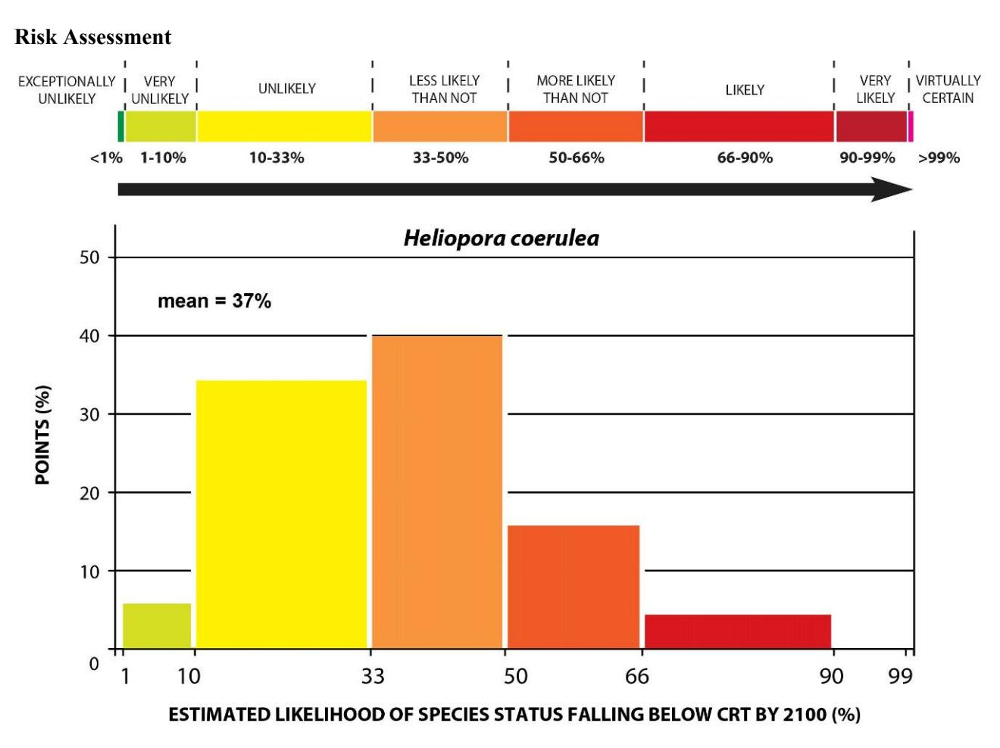

Figure 7.2.5. Distribution of points to estimate the likelihood that the status of *Heliopora coerulea* falls below the Critical Risk Threshold (the species is of such low abundance, or so spatially fragmented, or at such reduced diversity that extinction is extremely likely) by 2100.

Factors that increase the potential extinction risk (higher likelihood of falling below the Critical Risk Threshold) for *Heliopora coerulea* include predation on the externally brooded larvae and harvesting. Heavy use in the aquarium trade implies potential for local extirpation for *Heliopora coerulea* with benthic larvae and very limited tendencies for population replenishment by larvae from populations more than a kilometer away. If collectors reduce a local population to levels below the Critical Risk Threshold, extirpation is possible as the population is unlikely to be replenished with larvae from another population. The following factors reduce potential extinction risk (decrease likelihood of falling below the Critical Risk Threshold): *Heliopora coerulea* is one of the species most resistant to thermal stress; adult colonies of *Heliopora coerulea* are not favored by predators such as *Acanthaster planci*, corallivorous gastropods or fishes; and *Heliopora coerulea* occupies a broad depth range, a variety of habitat types, and is broadly distributed latitudinally and longitudinally. It is obviously able to dominate some coral communities from the low-tide level down to at least 20 m. Broad distribution is considered to reduce extinction risk, as it is more likely that stresses or catastrophes can be avoided in at least some locations.

The overall likelihood that *Heliopora coerulea* will fall below the Critical Risk Threshold by 2100 was estimated to be in the "less likely than not" risk category with a mean likelihood of 37% and a standard error (SE) of 11% (Fig. 7.2.5). This SE was calculated by taking the standard deviation of the seven mean scores of the BRT members and shows the coherence among the BRT. The uncertainty of the BRT is reflected in the range of votes of 1%–90% (Fig. 7.2.5) and the average range of likelihood estimates of the seven BRT voters (54%). The overall wide range of votes reflects the uncertainty among BRT members inherent in the lack of adequate ecological and demographic information for *Heliopora coerulea*.

#### **7.3 Genus** *Pocillopora* **(Class Anthozoa; Order Scleractinia; Family Pocilloporidae)**

#### **Characteristics**

Corals of genus *Pocillopora* are submassive-to-branching readily identified by prominent verrucae. While fossils of *Pocillopora* show that it was previously in the Caribbean until the Pilo-Pleistocene Era (Budd et al., 1994), it is found today in the entire Indo-Pacific region from Africa to the Americas. Many species of the genus are broadly distributed while numerous regional endemics have been described. Morphological plasticity has made identification problematic in some cases (Veron, 2000).

#### **Taxonomic Issues**

*Pocillopora* is known to be morphologically plastic, and multiple sympatric species frequently exhibit seemingly continuous intergradation of skeletal characteristics. *Pocillopora*, especially those found in the eastern Pacific, have been among the earliest coral taxa to be analyzed using modern genetic analysis tools. Chavez-Romo et al. (2008) and Combosch et al. (2008) both interpreted the variability and intergradation of eastern Pacific pocilloporids as cases of introgressive hybridization. The Chavez-Romo et al. (2008) study was limited to the Mexican Pacific only, finding exclusive genotypes in the northern and southern parts of the study and evidence of hybridization in the region between these zones. Combosch et al. (2008) provide data that support the hypothesis that the eastern Pacific pocilloporids are indeed genetically isolated from those elsewhere in the Indo-Pacific and that there appears to be one-way gene flow into *Pocillopora damicornis* from one or both of congeners in the eastern Pacific, *Pocillopora eydouxi* and *Pocillopora elegans*. However, these studies both assume that the species descriptions of pocilloporids in the eastern Pacific, based on morphological and ecological characteristics, are valid. A more recent paper by Pinzón and LaJeunesse (2011) completely questions the validity of classical species descriptions of pocilloporids in the eastern Pacific, finding distinct genetic clades that do not correspond with the classical species. Their work shows that clade 1 and 3 species exist among colonies identified morphologically as *Pocillopora damicornis, Pocillopora elegans*, and *Pocillopora capitata* in Panama. Only *Pocillopora eydouxi* is found to exist entirely within clade 3 in Panama, although individuals identified as *Pocillipora eydouxi* exist entirely within clade 1 in Mexico. Similar work in the western Indian Ocean (Souter, 2010; Souter et al., 2009) demonstrates similar issues in *Pocillopora* there. However, one distinct issue has long been identified as a concern over the identification of eastern Pacific pocilloporids as conspecifics of corals found elsewhere in the Pacific and in the Indian Ocean: the eastern Pacific corals are broadcast spawners while elsewhere they are brooders (Chavez-Romo and Reyes-Bonilla, 2007; Glynn et al., 1991).

In summary, three features were considered the most important by the BRT in resolving taxonomic issues among the candidate pocilloporid species: (1) taxonomic uncertainties among morphologically identified species in the eastern Pacific; (2) the distinctly different reproductive pattern of eastern Pacific pocilloporids (broadcast spawning) when compared to the pattern in the central Pacific (brooding); and (3) the evidence of low gene flow between the eastern Pacific and the Indo-Pacific pocilloporids. Most importantly, distinct reproductive modes (brooding vs. broadcasting) seems to preclude interbreeding as required in the U.S. Endangered Species Act species definition. Also, the restricted habitats in the eastern Pacific and high threat of thermally induced bleaching (Glynn, 1990) suggested that pocilloporids in the eastern Pacific are at greater risk than elsewhere in their ranges. Based on these factors, it was determined by the BRT that the corals classically identified as *Pocillopora elegans* in the eastern Pacific are most likely members of at least two different genetic clades that include corals identified as other pocilloporids. However, the eastern Pacific *Pocillopora elegans* (and congeners) are genetically separate from those found in the Indo-Pacific. Therefore, the BRT determined that corals identified as *Pocillopora elegans* in the eastern Pacific were a distinct species from corals identified as *Pocillopora elegans* in the central and western Pacific. The BRT evaluated and reported the extinction risk of these two as separate species. *Pocillopora danae* is not found in the eastern Pacific and was considered a valid species for the purpose of this review. While recent genetic work places all pocilloporid taxonomy based solely on morphology and ecology into question, there was no particular information available that would allow the BRT to synonymize *Pocillopora elegans* from the Indo-western Pacific or *Pocillopora danae* with other pocilloporids.

#### **Life History**

The genus *Pocillopora* has one of the most diverse sets of life history strategies among corals. According to Baird et al. (2009), all studies of reproduction found *Pocillopora* were hermaphrodites, but some are brooders and others broadcast spawners. In fact, the presence of spawning and brooding in corals identified morphologically as *Pocillopora damicornis* and *Pocillopora elegans,* but from different parts of the geographic range has been considered by the BRT as sufficient to suspect that *Pocillopora elegans*, is most likely two separate species. As with most branching corals, asexual reproduction by fragmentation is common (Glynn and Colley, 2008).

In the eastern Pacific, *Pocillopora damicornis* and *Pocillopora elegans* are both inferred to be hermaphroditic broadcast spawners, based on the disappearance of mature gametes after the full moon (Glynn et al., 1991). In that study, conducted between 1984 and 1990, corals were most reproductively active in the more thermally stable (less-upwelling) environments of Costa Rica and the Gulf of Chiriqui (Panama) where 32% to 90% of colonies contained gametes. In the moderately varying thermal conditions of the Galapagos Islands, 16% to 40% of colonies contained gametes, and in the pronounced seasonal upwelling environment of the Pearl Islands (Panama) only 6% to 18% contained gametes. Yearround reproduction occurred in Costa Rica and the Gulf of Chiriqui, whereas reproduction was confined to warm periods in the seasonally varying environments of the Galapagos Islands and the Gulf of Panama. Larvae contain zooxanthellae that can supplement maternal provisioning with energy sources provided by their photosynthesis (Glynn and Colley, 2008). While frequent gamete maturation was observed during the study period 1984 to 1990, the relatively low rates of larval recruitment occurring on eastern Pacific coral reefs disturbed by the 1982-83 El Niño suggested that the recovery of important frame-building coals could be prolonged (Glynn and Colley, 2008).

In the western end of the distribution of *Pocillopora*, broadcast spawning is also common. *Pocillopora verrucosa* has been identified as a hermaphroditic spawner in South Africa (Kruger and Schleyer, 1998) and the Maldives (Sier and Olive, 1994). Sexuality and reproductive mode have been determined for 5 other species of *Pocillopora*, all of which are hermaphroditic broadcast spawners in the western Pacific (Baird et al., 2009). *Pocillopora damicornis* in the western Pacific is also known to brood larvae that may be sexually or asexually produced (Harii et al., 2002; Stoddart, 1983; Ward, 1992). In three *Pocillopora* species studied, the minimum size ranges from 6 to 16 cm, and the estimated age ranges from 1 to 5 years (Harrison and Wallace, 1990).

However, in the central Pacific, i.e., Micronesia, Hawai`i, and Australia, *Pocillopora damicornis* has been reported to be a brooder, planulating throughout the year (Richmond, 1987). Numerous studies have considered various aspects of the larval biology of these planulae as they are easy to study. The candidate species *Pocillopora elegans* has also been identified as a brooder in Micronesia (Stimson, 1978). Larval longevity has not been determined for broadcast-spawning species in this genus, but brooded larvae of Hawaiian *Pocillopora damicornis* have an observed competency period of more than 100 days (Harii et al., 2002; Richmond, 1988). The larvae of all *Pocillopora* species studied (six, including one spawner) contain zooxanthellae that can supplement maternal provisioning with energy sources provided by their photosynthesis (Baird et al., 2009), i.e., they are autotrophic. This is one of only four coral genera known to have maternally provided zooxanthellae in the eggs. The larvae of all *Pocillopora* species studied (six, including one spawner) contain zooxanthellae that can supplement maternal provisioning with energy sources provided by their photosynthesis (Baird et al., 2009).

#### **Threats**

**Temperature stress:** *Pocillopora* are widely recognized as being prone to expelling their zooxanthellae when the water becomes anomalously warm. In a series of field assessments, Marshall and Baird (2000) identified *Pocillopora damicornis* as having a "severe" response to increased water temperature, only matched by acroporids. McClanahan et al. (2007) surveyed thousands of corals of 39 genera and found *Pocillopora* to be among the most sensitive, with only 7 genera ranking higher and just below *Acropora* and branching *Porites*. Warming events, including the 1982-1983 El Niño, demonstrated the susceptibility of the pocilloporid corals that dominate reefs and coral communities of the eastern tropical Pacific Ocean (Glynn, 1984; 1990). Susceptibility of *Pocillopora* to thermal stress has not only been seen in the field, but demonstrated in controlled, laboratory experiments (Berkelmans and Willis, 1999; Glynn, 1990; Hueerkamp et al., 2001; Jokiel and Coles, 1977). Even if bleaching is only temporary, physiological stress and decrease in nutrition are likely to have the synergistic effects of lowered fecundity and increased susceptibility to disease (Bruno et al., 2007; Muller et al., 2008; Whelan et al., 2007).

**Acidification:** One recent study (Manzello, 2010) compared growth rates of *Pocillopora elegans* and *Pocillopora damicornis* in the eastern Pacific and attributed the 25%–30% decline in growth over the past 30 years to acidification. Additionally, the extension rate of pocilloporids within the eastern Pacific declined nonlinearly along a saturation state gradient (Manzello, 2010). This major decrease in growth is despite the already-existing low aragonite saturation state seen naturally in reef waters of the eastern Pacific Ocean (Abramovitch-Gottlib et al., 2003). While the dominance of pocilloporids in the eastern Pacific might have been thought to imply a degree of tolerance to acidification, they may have been living close to a threshold for skeletal deposition. Brooding *Pocillopora damicornis* in Hawai`i were found to settle successfully in aquaria with reduced saturation state (Jokiel et al., 2008). Work with other corals has shown that impacts are not limited to extension as acidification impairs fertilization and settlement success in *Acropora palmata* (Albright et al., 2010), and contributes to reef destruction (Hoegh-Guldberg et al., 2007; Silverman et al., 2009). The BRT considers it to be a significant threat to corals by 2100.

**Disease:** Like most corals, infectious diseases have been found in corals of the genus *Pocillopora.* However, pocilloporids are not particularly vulnerable to most of the diseases known to affect scleractinian corals. Aeby (Aeby, 2006) identified *Pocillopora* as the genus least affected by disease in the Northwestern Hawaiian Islands. Pocilloporids on the Great Barrier Reef have been identified occasionally with the more common diseases (Willis et al., 2004), while in Zanzibar they were found to be susceptible to an especially destructive bacterium (Ben-Haim and Rosenberg, 2002). However, the limited number of reports of disease in pocilloporids suggests that infectious disease may not be a major threat to members of this genus.

**Predation:** *Pocillopora* species are among the most commonly consumed coral genera by crown-of-thorns seastar, *Acanthaster planci* (Glynn, 1976). However, *Pocillopora* are defended from *Acanthaster* predation by two mutualistic crustacean symbionts: a crab and a snapping shrimp, often forming protective barriers around unprotected species (Glynn, 1976). Because smaller colonies lack these symbionts, *Acanthaster* often target young colonies, potentially reducing recruit success. Additionally, *Pocillopora* has been identified as preferred prey for corallivorous invertebrates such as the asteroid *Culcita novaeguineae* (Glynn and Krupp, 1986), the gastropod *Jenneria pustulata* (Glynn, 1976), and corallivorous fishes (Cole et al., 2008).

**Land-based sources of pollution (LBSP):** Like most corals, *Pocillopora* are generally found in clear waters. McClanahan and Obura (1997) identified *Pocillopora* as sediment-intolerant in the western Indian Ocean. In contrast, *Pocillopora* has often been found in relatively turbid waters in the eastern Pacific and were considered potentially sediment-tolerant from an examination of data from Guam (Randall and Birkeland, 1978; Rogers, 1990). However, excess sedimentation has been identified as the cause of reef collapse in Costa Rica (Cortés, 1990; Randall and Birkeland, 1978; Rogers, 1990). Clearly, while some *Pocillopora* may show a degree of sediment tolerance, the distribution of corals of this genus is often sediment-limited.

*Pocillopora* have been reported to be particularly susceptible to mortality from freshwater runoff (Van Woesik et al., 1995), as well as physiological and reproductive impacts from elevated nutrients (Cox and Ward, 2002; Koop et al., 2001; Villanueva et al., 2006).

LBSP-related stresses (nutrients, sediment, toxins, and salinity) often act in concert rather than individually and are influenced by other biological (e.g., herbivory) and hydrological factors. Collectively, LBSP stresses are unlikely to produce extinction at a global scale; however, they may pose significant threats at local scales (particularly important for species with limited range) and reduce the resilience of corals to bleaching (Carilli et al., 2009a; Wooldridge, 2009b).

**Collection/Trade:** No trade information on *Pocillopora* was listed on the CITES Trade Database, UNEP World Conservation Monitoring Centre (CITES, 2010). However, *Pocillopora* is frequently seen for sale as curios (M. Eakin, NOAA Coral Reef Watch, Silver Spring, MD, pers. comm., February 2011).

**7.3.1** *Pocillopora danae* **Verrill, 1864** 

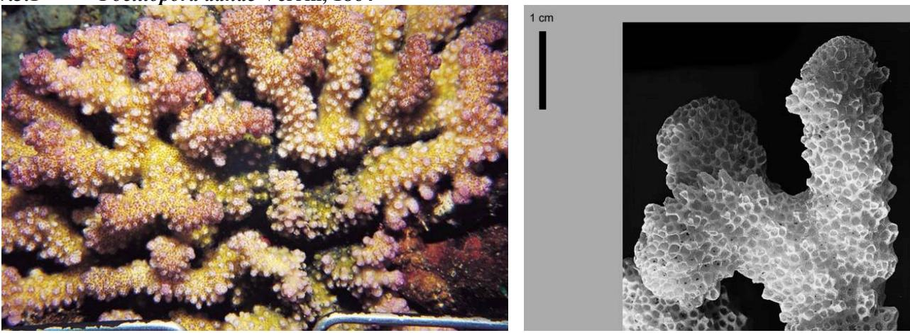

Figure 7.3.1. *Pocillopora danae* photos and corallite plan from Veron (2000).

#### **Characteristics**

Colonies of *Pocillopora danae* may be greater than 1 m across and are composed of irregular, mostly prostrate branches that tend to form a three-dimensional tangle. Verrucae are widely spaced and irregular in size, although they remain distinct from branches. Colonies are usually cream, brown or pink in color (Veron, 2000).

#### **Taxonomy**

**Taxonomic issues:** The genus *Pocillopora* is known to be morphologically plastic, and multiple sympatric species frequently exhibit seemingly continuous intergradation of skeletal characteristics. *Pocillopora* in the eastern Pacific and western Indian Ocean have been analyzed using modern genetic analysis tools (Chávez-Romo et al., 2008; Combosch et al., 2008; Pinzón and LaJeunesse, 2011; Souter et al., 2009), showing a complex story of variability, intergradation, introgressive hybridization, and distinct clades that do not correspond to classical morphological species. However, such work has yet to be performed on *Pocillopora danae. Pocillopora danae* is similar to *Pocillopora verrucosa*, which has more compact branches and less irregular verrucae. See also *Pocillopora damicornis* (Vaughan 1918, cited in Veron 2000). No synonyms and no known interbreeding. While recent genetic work places all pocilloporid taxonomy based solely on morphology and ecology into question, there was no particular information available to identify taxonomic problems with *Pocillopora danae*.

**Family:** Pocilloporidae.

**Evolutionary and geologic history:** The genus *Pocillopora* was found in the Caribbean Sea as recently as the late Pleistocene (0.13–0.01 Ma; Geister, 1977b) and are widespread from the western Indian Ocean to the eastern Pacific Ocean.

#### **Global Distribution**

*Pocillopora danae* has a somewhat broad longitudinal and latitudinal range. It has been reported throughout the western Pacific and a small part of the central Pacific, the Great Barrier Reef, and around Sri Lanka (Veron, 2000). However, *Pocillopora danae* has also been identified as part of the fauna at Easter Island (Egana and Disalvo, 1982) and the Red Sea (Schuhmacher, 1977) in ecological papers.

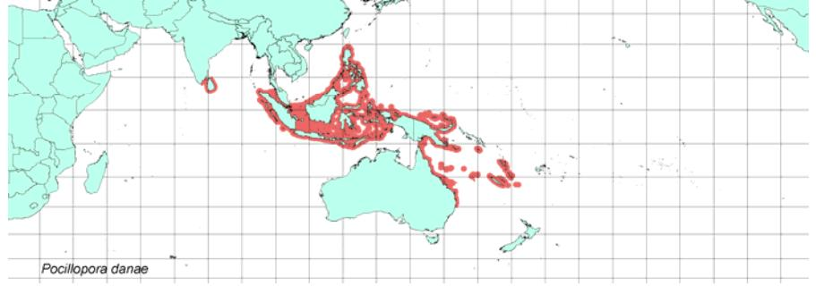

Figure 7.3.2. *Pocillopora danae* distribution from IUCN copied from http://www.iucnredlist.org.

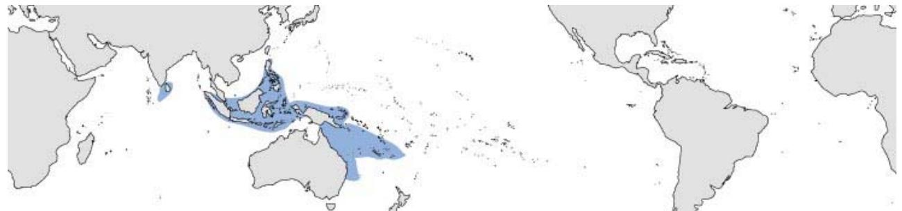

Figure 7.3.3. *Pocillopora danae* distribution from Veron (2000).

#### **U.S. Distribution**

According to the IUCN Species Account, *Pocillopora danae* has been recorded in the Northern Mariana Islands. The CITES species database lists its occurrence in American Samoa.

A search of published and unpublished records of occurrence in U.S. waters indicates *Pocillopora danae* has been recorded at Tutuila and Ofu-Olosega in American Samoa (Birkeland, unpubl. data; Coles et al., 2003; Lamberts, 1983; Lovell and McLardy, 2008; National Park Service, 2009), Guam (Amesbury et al., 1999; Burdick, unpubl. data; Randall, 2003), the Commonwealth of the Northern Mariana Islands(CRED, unpubl. data), Howland and Baker Islands, Jarvis Island, and Kingman Reef (CRED, unpubl. data), and Palmyra Atoll (Williams et al., 2008b).

Within federally protected waters, *Pocillopora danae* has been recorded from the following areas (Kenyon et al., 2010b)::

- Pacific Remote Islands Marine National Monument (Howland, Baker, Jarvis, Palmyra, Kingman)
- National Park of American Samoa, Ofu Island unit
- War in the Pacific National Historical Park, Guam
- Marianas Trench Marine National Monument (Asuncion, Maug, Farallon de Pajaros)

#### **Habitat**

**Habitat:** *Pocillopora danae* has been reported on partly protected reef slopes (Veron, 2000).

**Depth range**: *Pocillopora danae* has been reported in water depths ranging from 1 m to 15 m (Carpenter et al., 2008).

#### **Abundance**

Abundance of *Pocillopora danae* has usually been reported to be uncommon (Carpenter et al., 2008; Veron, 2000).

#### **Life History**

The reproductive characteristics of *Pocillopora danae* have not been determined (Baird et al., 2009). However, sexuality and reproductive mode have been determined for five other species of *Pocillopora*, all of which are hermaphroditic broadcast spawners in the western Pacific (Baird et al., 2009). *Pocillopora damicornis* in the western Pacific is also known to brood larvae that may be sexually or asexually produced (Harii et al., 2002; Stoddart, 1983; Ward, 1992). The minimum size and estimated age at first reproduction have not been determined for this species. However, for three other *Pocillopora* species, the minimum size ranges from 6 to 16 cm, and the estimated age ranges from 1 to 5 years (Harrison and Wallace, 1990). Although specific observations have not been published for this species, the larvae of all other *Pocillopora* species studied (six) contain zooxanthellae that can supplement maternal provisioning with energy sources provided by their photosynthesis (Baird et al., 2009), i.e., they are autotrophic. Larval longevity has not been determined for broadcast-spawning species in this genus, but larvae of the congener *Pocillopora damicornis*, which brood larvae, have an observed competency period of more than 100 days (Richmond, 1988).

#### **Threats**

For each of these possible threats, see also Section 7.3: *Pocillopora* for additional genus level information.

**Temperature stress**: Studies have shown that *Pocillopora* are widely recognized as being prone to expelling their zooxanthellae when the water becomes anomalously warm. In a series of field assessments, Marshall and Baird (2000) identified *Pocillopora damicornis* as showing a "severe" response to increased water temperature, only matched by acroporids. McClanahan et al. (2007) surveyed thousands of corals of 39 genera and found *Pocillopora* to be among the most sensitive to bleaching, with only 7 genera ranking higher and just below *Acropora* and branching *Porites*. Warming events, including the 1982-83 El Niño, demonstrated the susceptibility of the pocilloporid corals that dominate reefs and coral communities of the eastern tropical Pacific Ocean (Glynn, 1984; 1990). Susceptibility of *Pocillopora* to thermal stress has not only been seen in the field, but demonstrated in controlled, laboratory experiments (Berkelmans and Willis, 1999; Glynn and D'Croz, 1990; Hueerkamp et al., 2001; Jokiel and Coles, 1977). Even if bleaching is only temporary, physiological stress and decrease in nutrition are likely to have the synergistic effects of lowered fecundity and increased susceptibility to disease (Bruno et al., 2007; Muller et al., 2008; Whelan et al., 2007).

**Acidification:** No specific research has addressed the effects of acidification on *Pocillopora danae*. However, studies on other pocilloporids have indicated impacts of acidification. One recent study (Manzello, 2010) compared growth rates of *Pocillopora elegans* and *Pocillopora damicornis* in the eastern Pacific and attributed the 25%–30% decline in growth over the past 30 years to acidification. Additionally, the extension rate of pocilloporids within the eastern Pacific declined nonlinearly along a saturation state gradient (Manzello, 2010). This major decrease in growth is despite the already-existing low aragonite saturation state seen naturally in reef waters of the eastern Pacific Ocean (Manzello et al., 2008). While the dominance of pocilloporids in the eastern Pacific might have been thought to imply a degree of tolerance to acidification, they may have been living close to a threshold for skeletal deposition. Brooding *Pocillopora damicornis* in Hawai`i were found to settle successfully in aquaria with reduced saturation state (Jokiel et al., 2008). Work with other corals has shown that impacts are not limited to extension as acidification impairs fertilization and settlement success in *Acropora palmata* (Albright et al., 2010), and contributes to reef destruction (Hoegh-Guldberg et al., 2007; Silverman et al., 2009). The BRT considers it to be a significant threat to corals by 2100.

**Disease:** There have been a medium number of disease reports for the genus *Pocillopora* (UNEP, 2010): chronic skeletal growth anomalies, including hyperplasia and neoplasia, subacute black-band disease, yellow-band disease, tissue loss, and pigmentation response including pink-line syndrome, and acute tissue necrosis including white- band disease (B. Vargas-Ángel, CRED, Honolulu, HI, pers. comm., September 2010; CRED, unpubl. data). Effects on reproduction are unknown. Synergy with other threats is largely unknown except with bleaching in east Pacific (1982- 83, 1997-98 ENSO east Pacific). Aeby (2006) identified *Pocillopora* as the genus least affected by disease in the Northwestern Hawaiian Islands. Pocilloporids on the Great Barrier Reef have been identified occasionally with the more common diseases (Willis et al., 2004), while in Zanzibar this genus was found to be susceptible to an especially destructive bacterium (Ben-Haim and Rosenberg, 2002). However, the limited number of reports of disease in pocilloporids indicates that infectious disease is not a major threat to members of this genus.

**Predation:** *Pocillopora* species are among the most commonly consumed coral genera by crown-of-thorns seastar, *Acanthaster planci* (Glynn, 1976). However, *Pocillopora* are defended from *Acanthaster* predation by two mutualistic crustacean symbionts: a crab and a snapping shrimp, often forming protective barriers around unprotected species (Glynn, 1976). Because smaller colonies lack these symbionts, *Acanthaster* often target young colonies, potentially reducing recruit success. Additionally, *Pocillopora* also has been identified as preferred prey for corallivorous invertebrates such as the asteroid *Culcita novaeguineae* (Glynn and Krupp, 1986) and the gastropod *Jenneria pustulata*  (Glynn, 1976) and corallivorous fishes (Cole et al., 2008).

**Land-based sources of pollution (LBSP):** McClanahan and Obura (1997) identified *Pocillopora* as sedimentintolerant in the western Indian Ocean. In contrast, *Pocillopora* has often been found in relatively turbid waters in the eastern Pacific and were considered potentially sediment-tolerant by Rogers (1990) and from an examination of data from Guam (Randall and Birkeland, 1978). However, excess sedimentation has been identified as the cause of reef collapse in Costa Rica (Cortés, 1990). Clearly, while some *Pocillopora* may have shown a degree of sediment tolerance, the distribution of corals of *Pocillopora* has often been found to be sediment-limited.

LBSP-related stresses (nutrients, sediment, toxins, and salinity) often act in concert rather than individually and are influenced by other biological (e.g., herbivory) and hydrological factors. Collectively, LBSP stresses are unlikely to produce extinction at a global scale; however, they may pose significant threats at local scales (particularly important for species with limited range) and reduce the resilience of corals to bleaching (Carilli et al., 2009a; Wooldridge, 2009b).

**Collection/Trade:** No trade information on *Pocillopora* was listed on the CITES Trade Database, UNEP World Conservation Monitoring Centre (CITES, 2010). However, *Pocillopora* is frequently seen for sale as curios (Mark Eakin NOAA Coral Reef Watch, Silver Spring, MD, pers. comm., February 2011).

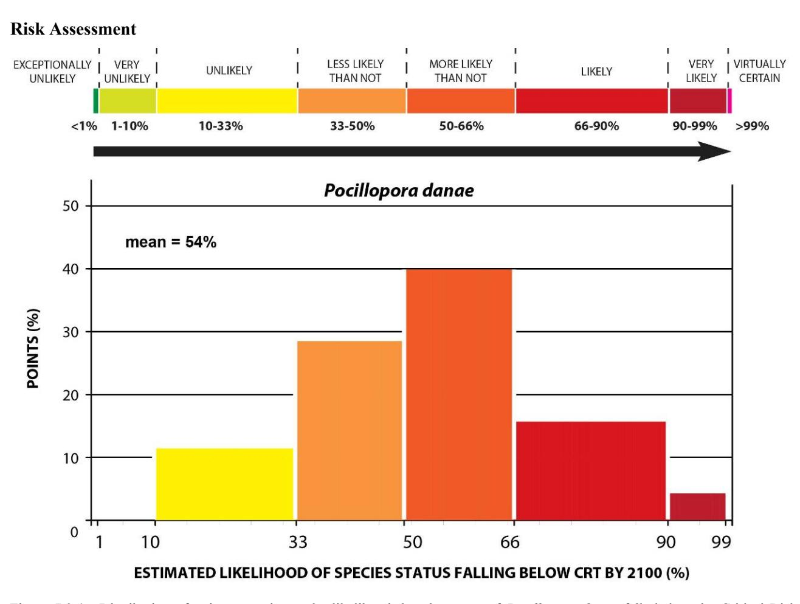

Figure 7.3.4. Distribution of points to estimate the likelihood that the status of *Pocillopora danae* falls below the Critical Risk Threshold (the species is of such low abundance, or so spatially fragmented, or at such reduced diversity that extinction is extremely likely) by 2100.

Factors that increase the potential extinction risk (higher likelihood of falling below the Critical Risk Threshold) for *Pocillopora danae* include its relatively high bleaching susceptibility and that its small colonies are common prey of crown-of-thorns seastars. The high bleaching rate of pocilloporid corals is the primary known threat of extinction for *Pocillopora danae*. Factors that reduce potential extinction risk (decrease the likelihood of falling below the Critical Risk Threshold) are the somewhat wide geographic distribution range, including the Coral Triangle, quite common abundance where found, and potentially high disease resistance.

The overall likelihood that *Pocillopora danae* will fall below the Critical Risk Threshold by 2100 was estimated to be in the "more likely than not" risk category with a mean likelihood of 54% and a standard error (SE) of 14% (Fig. 7.3.4). This SE was calculated by taking the standard deviation of the seven mean voting scores of the BRT members and shows the coherence among the BRT. The uncertainty of the BRT is reflected in the range of votes of 10%–99% (Fig. 7.3.4) and the mean range of votes of 52%—the latter calculated by averaging the range of likelihood estimates from each of the seven BRT voters. The overall wide range of votes reflects the uncertainty among BRT members inherent in the lack of adequate ecological and demographic information for *Pocillopora danae*.

#### **7.3.2** *Pocillopora elegans* **Dana, 1864**

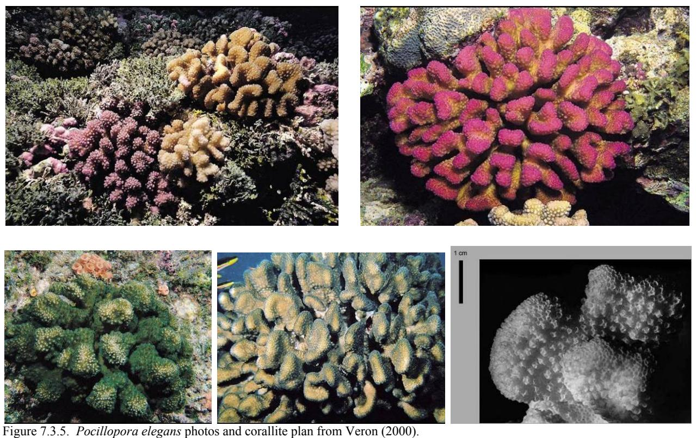

#### **Characteristics**

Colonies of *Pocillopora elegans* are usually compact clumps composed of uniform, thick, primarily upright branches with flattened ends. Verrucae are uniform, rounded and smooth. Colonies are cream, brown-green or pink in color (Veron, 2000).

#### **Taxonomy**

**Taxonomic issues:** See Section 7.3 Genus *Pocillopora* for additional information. *Pocillopora* has been reported to be morphologically plastic, and multiple sympatric species frequently exhibit seemingly continuous intergradation of skeletal characteristics. A variety of taxonomic and systematic issues plague the clear discrimination of some species within the genus. In particular, there continue to be questions about the separation of *Pocillopora elegans and Pocillopora verrucosa*. Reyes-Bonilla (2002) determined that the two species were likely inseparable, and this determination was followed in Glynn et al. (2007) where the name *Pocillopora verrucosa* was used.

*Pocillopora*, especially those found in the eastern Pacific, have been analyzed using modern genetic analysis tools. Chavez-Romo et al. (2008) and Combosch et al. (2008) both interpreted the variability and intergradation of eastern Pacific pocilloporids as cases of introgressive hybridization. Combosch et al. (2008) provided data supportive of genetic isolation between eastern Pacific pocilloporids and those elsewhere in the Pacific and Indian Oceans and an apparent one-way gene flow into *Pocillopora damicornis* from one or both of congeners in the eastern Pacific, *Pocillopora eydouxi* and *Pocillopora elegans*. However, these studies both assume that the species descriptions of pocilloporids in the eastern Pacific, based on morphological and ecological characteristics, are valid. A more recent paper by Pinzón and LaJeunesse (2011) completely questions the validity of classical species descriptions of pocilloporids in the eastern Pacific, finding distinct genetic clades that do not correspond with the classical species. Their work shows that clade 1 and 3 species exist among colonies identified morphologically as *Pocillopora damicornis, Pocillopora elegans*, and *Pocillopora capitata* in Panama. Only *Pocillopora eydouxi* is found to exist entirely within clade 3 in Panama, although individuals identified as *Pocillopora eydouxi* exist entirely within clade 1 in Mexico. Similar work in the western Indian Ocean (Souter, 2010; Souter et al., 2009) demonstrated similar issues in *Pocillopora* there. However, one distinct issue has long been identified as a concern over the identification of eastern Pacific pocilloporids as conspecifics of corals found elsewhere in the Pacific and in the Indian Ocean: the eastern Pacific corals are broadcast spawners, while elsewhere they are brooders (Glynn et al., 1991). Thus, *Pocillopora elegans* in these two regions are not only geographically isolated but unlikely to interbreed because of completely different reproductive modes.

**Family:** Pocilloporidae.

**Evolutionary and geologic history**: The genus *Pocillopora* was found in the Caribbean Sea as recently as the late Pleistocene (1.8–0.01 Ma; Geister, 1977b) and are widespread fron the western Indian Ocean to the eastern Pacific Ocean. DeWeerdt and Glynn (1991) discussed the strong affinity of the eastern Pacific coral fauna with the Indo-Pacific as being either due to massive Eocene and Pleistocene extinctions in the eastern Pacific followed by reintroduction of Indo-West Pacific species by long-distance dispersal, or survival of some coral populations in eastern Pacific refugia after the closure of the Isthmus of Panama, providing the source for recolonization of places close enough to these refugia (see (Rosen, 1988) for a review of the different theories). The past extinctions of eastern Pacific corals are of particular relevance to eastern Pacific pocilloporids.

#### **Global Distribution**

The global distribution of *Pocillopora elegans* is rather fragmented; it is found in the central Indo-Pacific, the Marianas and central Pacific and along the coastline of the eastern tropical Pacific and the Galapagos Islands (Veron, 2000; Wells, 1954).

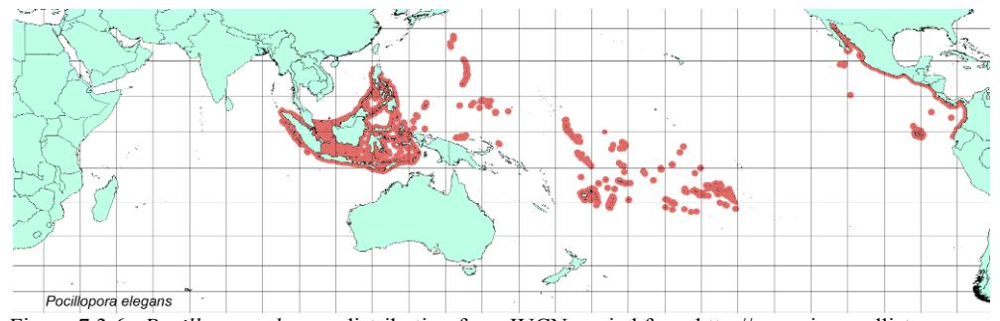

Figure 7.3.6. *Pocillopora elegans* distribution from IUCN copied from http://www.iucnredlist.org.

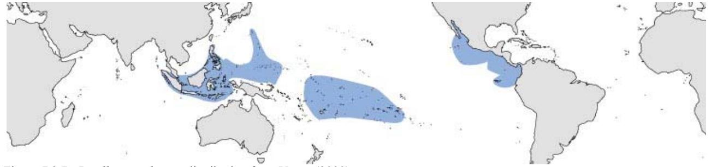

Figure 7.3.7. *Pocillopora elegans* distribution from Veron (2000).

#### **U.S. Distribution**

According to both the IUCN Species Account and the CITES species database, *Pocillopora elegans* has been recorded in American Samoa and the Northern Mariana Islands. The IUCN Species Account also lists its occurrence in the U.S. minor outlying islands.

A search of published and unpublished records of occurrence in U.S. waters indicates *Pocillopora elegans* has been recorded at Tutuila and Ofu-Olosega in American Samoa (Birkeland, unpubl. data; Coles et al., 2003; Lovell and McLardy, 2008; National Park Service, 2009), Guam (Amesbury et al., 1999; Burdick, unpubl. data; Randall, 2003), Commonwealth of the Northern Mariana Islands, Johnston Atoll, Howland and Baker Islands, Jarvis Island and Kingman Reef (CRED, unpubl. data), and Palmyra Atoll (Williams et al., 2008b).

Within federally protected waters, *Pocillopora elegans* has been recorded from the following areas (Kenyon et al., 2010b)::

- Pacific Remote Islands Marine National Monument (Johnston, Howland, Baker, Jarvis, Palmyra, Kingman, Wake)
- National Park of American Samoa, Tutuila Island unit
- Fagatele Bay National Marine Sanctuary, Tutuila
- Rose Atoll Marine National Monument
- Marianas Trench Marine National Monument (Asuncion, Maug, Farallon de Pajaros)

#### Habitat

Habitat: Pocillipora elegans has been reported from shallow reef environments (Veron, 2000).

**Depth range**: *Pocillipora elegans* has been reported in water depths ranging from 1 m to 20 m (Carpenter et al., 2008); however, it has been found at a depth of 60 m, suggesting the potential for deep refugia.

#### Abundance

Abundance of *Pocillipora elegans* has been reported to be locally common in some regions of the central Indo-Pacific and the far eastern Pacific (Carpenter et al., 2008; Veron, 2000).

#### Life History

In the eastern Pacific, *Pocillopora elegans* was inferred to be a hermaphroditic broadcast spawner, based on the disappearance of mature gametes after the full moon (Glynn et al., 1991). However, that study did not directly observe spawning and little evidence shows successful recruitment through sexual propagation (Glynn and Ault, 2000; Glynn et al., 1991). Year-round reproduction occurred in Costa Rica and the Gulf of Chiriqui, whereas reproduction was confined to warm periods in the seasonally varying environments of the Galapagos Islands and the Gulf of Panama. Larvae contain zooxanthellae that can supplement maternal provisioning with energy sources provided by their photosynthesis (Glynn and Colley, 2008). While frequent gamete maturation was observed during the study period 1984 to 1990, the relatively low rates of larval recruitment occurring on eastern Pacific coral reefs disturbed by the 1982-83 El Niño suggested that the recovery of important frame-building corals could be prolonged (Glynn and Colley, 2008).

During the strong El Niño conditions in the eastern Pacific experienced during the 1997-1998 ENSO colonies of *Pocillopora elegans* continued reproductive activity throughout severe bleaching episodes in the eastern Pacific (Colley et al., 2006). In the Galapagos Islands, this species displayed an enhanced effect on gametogenesis during moderate warming episodes but diminished activity with prolonged +2°C to +4°C temperature anomalies (Colley et al., 2006).

The minimum size and estimated age at first reproduction have not been determined for this species. However, for three other *Pocillopora* species, the minimum size ranges from 6 to 16 cm, and the estimated age ranges from 1 to 5 years (Harrison and Wallace, 1990). Larval longevity has not been determined for broadcast-spawning species in this genus, but larvae of the congener *Pocillopora damicornis*, which broad larvae, have an observed competency period of more than 100 days (Harii et al., 2002; Richmond, 1988).

Asexual reproduction by fragmentation is common in eastern Pacific populations of *Pocillopora elegans* (Glynn and Colley, 2008).

#### **Threats**

For each of these possible threats, see also Section 7.3: *Pocillopora* for additional genus level information.

**Temperature stress**: *Pocillopora* are widely recognized as being prone to expelling their zooxanthellae when the water becomes anomalously warm. In a series of field assessments, Marshall and Baird (2000) identified *Pocillopora damicornis* as having a "severe" response to increased water temperature, only matched by acroporids. McClanahan et al. (2007) surveyed thousands of corals of 39 genera and found *Pocillopora* to be among the most sensitive, with only 7 genera ranking higher and just below *Acropora* and branching *Porites*. Warming events, including the 1982-1983 El Niño, demonstrated the susceptibility of the pocilloporid corals that dominate reefs and coral communities of the eastern tropical Pacific Ocean (Glynn, 1984; 1990). Susceptibility of *Pocillopora* to thermal stress has not only been seen in the

field, but demonstrated in controlled, laboratory experiments (Berkelmans and Willis, 1999; Glynn and D'Croz, 1990; Hueerkamp et al., 2001; Jokiel and Coles, 1977). Even if bleaching is only temporary, physiological stress and decrease in nutrition are likely to have the synergistic effects of lowered fecundity and increased susceptibility to disease (Bruno et al. 2007, Whelan et al. 2007, Muller et al. 2008).

**Acidification:** One recent study (Manzello, 2010) compared growth rates of *Pocillopora elegans* and *Pocillopora damicornis* in the eastern Pacific and attributed the 25%-30% decline in growth over the past 30 years to acidification. Additionally, the extension rate of pocilloporids within the eastern Pacific declined nonlinearly along a saturation state gradient (Manzello, 2010). This major decrease in growth is despite the already-existing, low aragonite saturation state seen naturally in reef waters of the eastern Pacific Ocean (Manzello et al., 2008). While the dominance of pocilloporids in the eastern Pacific might have been thought to imply a degree of tolerance to acidification, they may have been living close to a threshold for skeletal deposition. Brooding *Pocillopora damicornis* in Hawai`i were found to settle successfully in aquaria with reduced saturation state (Jokiel et al., 2008). Work in other corals has shown that impacts are not limited to extension as acidification impairs fertilization and settlement success in *Acropora palmata* (Albright et al., 2010) and contributes to reef destruction (Hoegh-Guldberg et al., 2007; Silverman et al., 2009). The BRT considers it to be a significant threat to corals by 2100.

**Disease:** There have been a medium number of disease reports for the genus *Pocillopora* (UNEP, 2010). Disease reports included chronic skeletal growth anomalies, including hyperplasia and neoplasia, subacute black-band disease, yellow-band disease, tissue loss, and pigmentation response including pink-line syndrome, and acute tissue necrosis white-band disease (B. Vargas-Ángel, CRED, Honolulu, HI, pers. comm., September 2010; CRED, unpubl. data). Effects on reproduction are unknown. Synergy with other threats is largely unknown except with bleaching in the eastern Pacific (1982-83, 1997-98 ENSO East Pacific). Aeby (2006) identified *Pocillopora* as the genus least affected by disease in the Northwestern Hawaiian Islands. Pocilloporids on the Great Barrier Reef have been identified occasionally with the more common diseases (Willis et al., 2004), while in Zanzibar they were found to be susceptible to an especially destructive bacterium (Ben-Haim and Rosenberg, 2002). However, the limited number of reports of disease in pocilloporids indicates that infectious disease is not a major threat to members of this genus.

**Predation:** *Pocillopora* species are among the most commonly consumed coral genera by crown-of-thorns seastar, *Acanthaster planci* (Glynn, 1976). However, *Pocillopora* are defended from *Acanthaster* predation by two mutualistic crustacean symbionts: a crab and a snapping shrimp, often forming protective barriers around unprotected species (Glynn, 1976). Because smaller colonies lack these symbionts, *Acanthaster* often target young colonies, potentially reducing recruit success. Additionally, *Pocillopora* also has been identified as preferred prey for corallivorous invertebrates such as the asteroid *Culcita novaeguineae* (Glynn and Krupp, 1986) and the gastropod *Jenneria pustulata*  (Glynn, 1976), and corallivorous fishes (Cole et al., 2008).

**Land-based sources of pollution (LBSP):** McClanahan and Obura (1997) identified *Pocillopora* as sedimentintolerant in the western Indian Ocean. In contrast, *Pocillopora* has often been found in relatively turbid waters in the eastern Pacific and were considered potentially sediment-tolerant by Rogers (1990) and from an examination of data from Guam (Randall and Birkeland, 1978). However, excess sedimentation has been identified as the cause of the collapse of a predominately *Pocillopora* spp. reef in Costa Rica (Cortés, 1990). Clearly, while some *Pocillopora* may have shown a degree of sediment tolerance, the distribution of corals of the genus *Pocillopora* has often been found to be sediment-limited.

LBSP-related stresses (nutrients, sediment, toxins, and salinity) often act in concert rather than individually and are influenced by other biological (e.g., herbivory) and hydrological factors. Collectively, LBSP stresses are unlikely to produce extinction at a global scale; however, they may pose significant threats at local scales (particularly important for species with limited range) and reduce the resilience of corals to bleaching (Carilli et al., 2009a; Wooldridge, 2009b).

**Collection/Trade:** No trade information on *Pocillopora* was listed on the CITES Trade Database, UNEP World Conservation Monitoring Centre (CITES 2010). However, *Pocillopora* is frequently seen for sale as curios (Mark Eakin NOAA Coral Reef Watch, Silver Spring, MD, pers. comm., February 2011).

#### **Risk Assessment**

The nominal candidate species, *Pocillopora elegans,* was split into two probable species based on three features considered the most important by the BRT in resolving taxonomic issues among the candidate pocilloporid species: (1) taxonomic uncertainties among morphologically identified species in the eastern Pacific; (2) the distinctly different reproductive pattern of eastern Pacific pocilloporids; and, (3) the evidence of low gene flow between the eastern Pacific and other Pacific and Indian Ocean pocilloporids. These latter two factors appear to preclude interbreeding as required in the U.S. Endangered Species Act definition of a species. Also, the restricted habitats in the eastern Pacific and high threat of thermally induced bleaching (Glynn, 1990) suggested that pocilloporids in the eastern Pacific are at greater risk than elsewhere in their ranges. Based on these factors, it was determined by the BRT that the corals classically identified as *Pocillopora elegans* in the eastern Pacific are most likely members of at least two different genetic clades that include corals identified as other pocilloporids. However, the eastern Pacific *Pocillopora elegans* (and congeners) are genetically separate from those found elsewhere in the Pacific and Indian Oceans. Therefore, the BRT determined that corals identified as *Pocillopora elegans* in the eastern Pacific were a distinct species from corals identified as *Pocillopora elegans* in the central and Indo-Pacific. For the purposes of this Status Review Report, the BRT evaluated and reported the extinction risk of these two as separate species. Further molecular genetic analysis will be required to determine if further subdivisions are warranted within the two allopatric species. If this BRT determination is in error (i.e., all corals currently identified as *Pocillopora elegans* are actually members of the same species), the risk would be similar to or less than the likelihood of falling below the Critical Risk Threshold for the central and Indo-Pacific species.

#### **Eastern Pacific Pocillopora elegans**

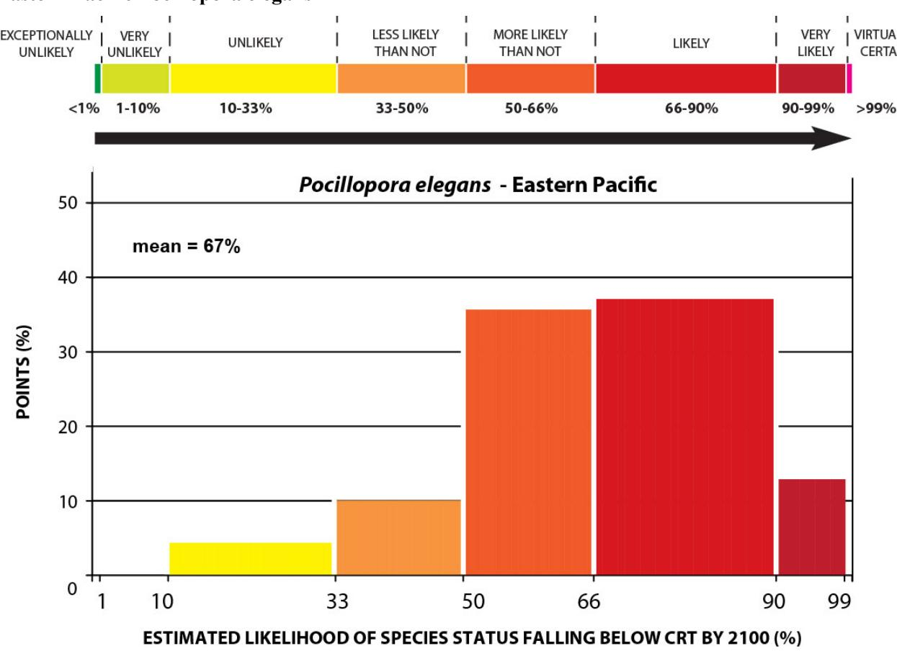

Figure 7.3.8. Distribution of points to estimate the likelihood that the status of *Pocillopora elegans* from the eastern Pacific falls below the Critical Risk Threshold (the species is of such low abundance, or so spatially fragmented, or at such reduced diversity that extinction is extremely likely) by 2100.

Factors that increase the potential extinction risk (higher likelihood of falling below the Critical Risk Threshold) for *Pocillopora elegans* (eastern Pacific) include its relatively high bleaching susceptibility, its susceptibility to crown-ofthorns seastar predation, and its susceptibility to acidification impacts. The high bleaching rate of pocilloporid corals is the primary known threat of extinction for *Pocillopora elegans* (eastern Pacific). While it is one of the dominant species in the eastern Pacific, the eastern Pacific taxon has a very restricted range in an environment where impacts of both bleaching and acidification have been shown to be high. In particular, severe losses after bleaching, slow recovery, and little evidence of successful recruitment through sexual propagation particularly threaten these corals. The impacts of bleaching and acidification are expected to increase with anthropogenic climate change. Because of repeated thermal stress and limited coral reef habitats, corals endemic to the eastern tropical Pacific are especially at risk. In a discussion of *Millepora boschmai*, a hydrocoral presumed to have gone extinct in recent decades, de Weerdt and Glynn (1991) discussed the risk posed to any coral endemic to the eastern Pacific:

> "Elements of the eastern Pacific reef coral fauna, consisting of several small, geographically isolated populations in a highly varying environment, would seem to be especially vulnerable to extinction (Carlton et al., 1991; Diamond, 1984; Leigh, 1981; MacArthur, 1972; MacArthur and Wilson, 1967; Morain, 1984; Simberloff, 1976; Vermeij, 1978). ENSO events, which started about 2.8 million years ago after the rise of the Panama Isthmus (Colgan, 1990), and have since then occurred continuously but unpredictably (Colgan, 1990; Glynn, 1990), probably contribute to the poor development of eastern Pacific coral reefs (Glynn, 1990). Range reductions, which affected the hydrocoral *Millepora platyphylla* and possibly three scleractinian species (Colgan, 1990; Glynn, 1990), may therefore have occurred regularly in the eastern Pacific since the onset of said events. If *Millepora boschmai* was endemic to the Gulf of Chiriqui prior to its disappearance, recovery of the species seems highly unlikely, but this can only be ascertained in due time."

Factors that reduce potential extinction risk (decrease the likelihood of falling below the Critical Risk Threshold) are the species' quite common abundance where found, and potentially high disease resistance.

The overall likelihood that eastern Pacific *Pocillopora elegans* will fall below the Critical Risk Threshold by 2100 was estimated to be in the "likely" risk category with a mean likelihood of 67% and a standard error (SE) of 13% (Fig. 7.3.8). This SE was calculated by taking the standard deviation of the seven mean voting scores of the BRT members and shows the coherence among the BRT. The uncertainty of the BRT is reflected in the range of votes of 10%–99% (Fig. 7.3.8) and the mean range of votes of 53%—the latter calculated by averaging the range of likelihood estimates from each of the seven BRT voters. The overall wide range of votes reflects the uncertainty among BRT members inherent in the lack of adequate ecological and demographic information for this species. However, the number of votes cast at the high end of the liklihood range demonstrates that the BRT considered eastern Pacific *Pocillopora elegans* to be much more at risk than its congeners across the remainder of the Indo-Pacific to the west.

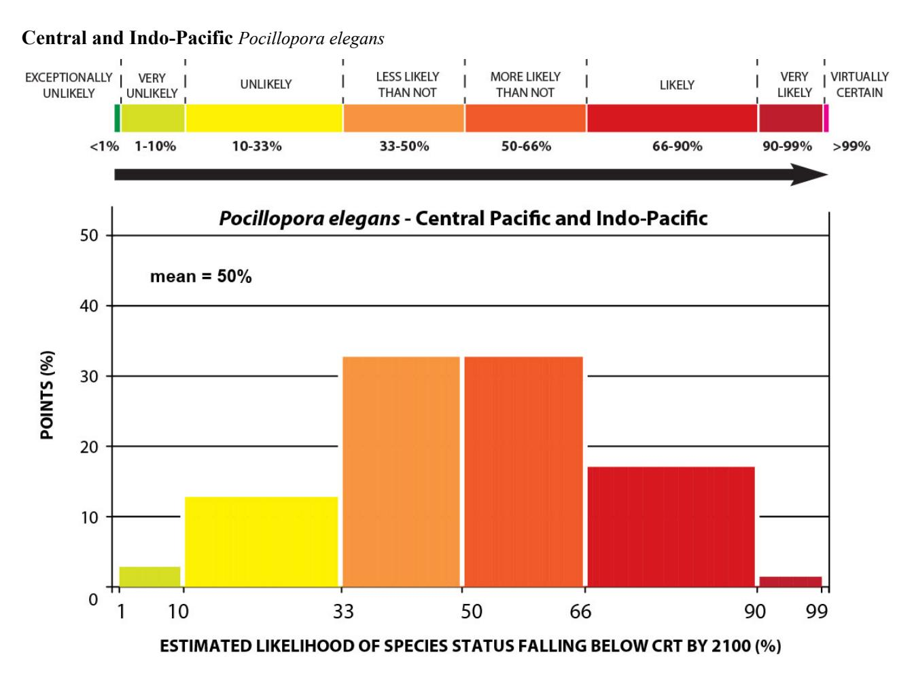

Figure 7.3.9. Distribution of points to estimate the likelihood that the status of *Pocillopora elegans* from the central and Indo-Pacific falls below the Critical Risk Threshold (the species is of such low abundance, or so spatially fragmented, or at such reduced diversity that extinction is extremely likely) by 2100.

Factors that increase the potential extinction risk (higher likelihood of falling below the Critical Risk Threshold) for *Pocillopora elegans* (central and Indo-Pacific) include its relatively high bleaching susceptibility, its susceptibility to crown-of-thorns seastar predation, and its susceptibility to acidification impacts. The high bleaching rate of pocilloporid corals is the primary known threat of extinction for *Pocillopora elegans*. Factors that reduce potential extinction risk (decrease the likelihood of falling below the Critical Risk Threshold) are the species' somewhat wide geographic distribution range including the Coral Triangle, quite common abundance where found, and potentially high disease resistance.

The overall likelihood that *Pocillopora elegans* from the central Pacific and Indo-Pacific will fall below the Critical Risk Threshold by 2100 was estimated to be "as likely as not" with a mean likelihood of 50% and a standard error (SE) of 15% (Fig. 7.3.9). This SE was calculated by taking the standard deviation of the seven mean voting scores of the BRT members and shows the coherence among the BRT. The uncertainty of the BRT is reflected in the range of votes of 1%–99% (Fig. 7.3.9) and the mean range of votes of 57%—the latter calculated by averaging the average range of likelihood estimates from each of the seven BRT voters. The overall wide range of votes reflects the uncertainty among BRT members inherent in the lack of adequate ecological and demographic information for *Pocillopora elegans* (central and Indo-Pacific).

#### **7.4 Genus** *Seriatopora*

#### **7.4.1** *Seriatopora aculeata* **Quelch, 1886**

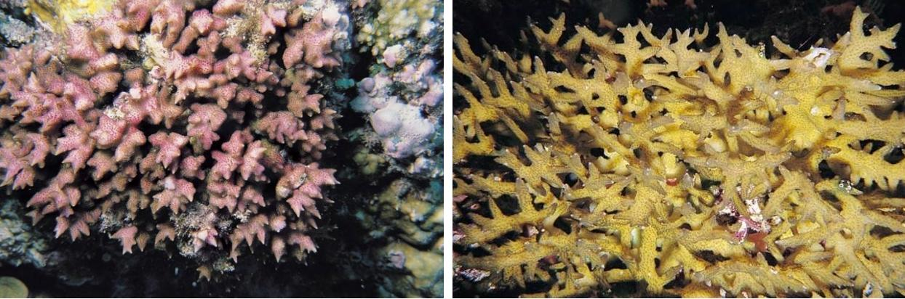

Figure 7.4.1. *Seriatopora aculeata* photos from Veron (2000).

#### **Characteristics**

Colonies of *Seriatopora aculeata* have thick, short, tapered branches, usually in fused clumps. Their corallites are irregularly distributed, and tentacles are commonly extended during the day. Colonies are pink or cream in color (Veron, 2000).

#### **Taxonomy**

**Taxonomic issues**: The taxonomic status of the genus *Seriatopora* is somewhat uncertain; mitochondrial DNA shows four sequence clusters that do not correspond well to morphological species identifications (Flot et al., 2008). The few *Seriatopora aculeata* samples that were included clustered together and overlapped with *Seriatopora hystrix*. Similar species *Seriatopora stellata* and *Seriatopora hystrix* can have similar branching structures in shallow, exposed reef flats (Veron, 2000). This phenotypic plasticity could account for some of the taxonomic uncertainty in the genus. Additional genetic research is required to resolve the status of the genus *Seriatopora*; for the purposes of this status review the BRT considered this to be a valid species.

**Family:** Pocilloporidae.

**Evolutionary and geologic history**: The genus *Seriatopora* first appeared in the Indo-Pacific in the Miocene (23–5.3 Ma) (Veron, 1986).

#### **Global Distribution**

*Seriatopora aculeata* has a relatively confined distribution. It has been reported primarily from the Indo-Pacific, including Australia, Fiji, Indonesia, Japan, and Papua New Guinea. However, it is also reported from Madagascar. It was recently found in Bikini (Richards et al., 2008a), despite not being recorded in previous surveys there (Wells, 1954).

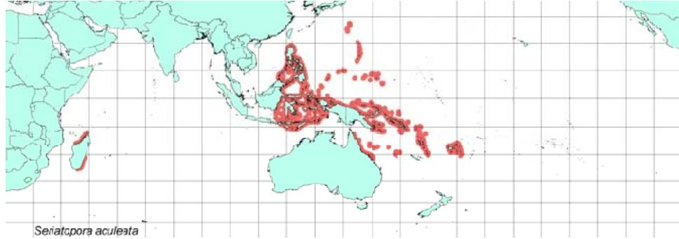

Figure 7.4.2. *Seriatopora aculeata* distribution from IUCN copied from http://www.iucnredlist.org.

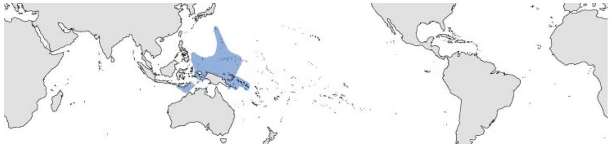

Figure 7.4.3. *Seriatopora aculeata* distribution from Veron (2000).

#### **U.S. Distribution**

According to the IUCN Species Account, *Seriatopora aculeata* has been recorded in the Northern Mariana Islands. The CITES species database does not list its occurrence in U.S. waters.

A search of published and unpublished records of occurrence in U.S. waters indicates *Seriatopora aculeata* has been reported from Guam (Burdick, unpubl. data; Randall, 2003). Veron (2000) lists the species in the Marianas; however, the Marianas reference is likely an error based on geographic location of photographic evidence (Kenyon et al., 2010b). G. Paulay (University of Florida, Gainesville, FL, pers. comm., 28 February 2010) indicates a number of photos submitted by him to Veron from Palau, the Cook Islands, and other locations in the Pacific were mistakenly attributed to Guam (similar to the *errata* later acknowledged by Veron (2002) for *Acanthastrea regularis* and *Porites napopora*).

*Seriatopora aculeata* has not been recorded from federally protected U.S. waters (Kenyon et al., 2010b).

#### **Habitat**

**Habitat:** *Seriatopora aculeata* has been reported to occupy shallow reef environments (Veron, 2000).

**Depth range**: *Seriatopora aculeata* has been reported in water depths ranging from 3 m to 40 m (Carpenter et al., 2008).

#### **Abundance**

Abundance of *Seriatopora aculeata* has been reported as uncommon (Veron, 2000).

#### **Life History**

The reproductive characteristics of *Seriatopora aculeata* have not been determined, but its congeners are hermaphroditic brooders (Rinkevich and Loya, 1979a; Shlesinger and Loya, 1985; Yamazato et al., 1991). The larvae of the other *Seriatopora* species studied contain zooxanthellae, leading to the development of autotrophic larvae that can supplement maternal provisioning with energy sources provided by their photosynthetic symbionts (Baird et al., 2009). The minimum size and estimated age at first reproduction have not been determined for *Seriatopora aculeata*. However, for the congener *Seriatopora hystrix*, the minimum diameter is 8 cm and the estimated age at first reproduction is 1–2 years (Stimson, 1978). Larval longevity has not been determined in this genus. *Seriatopora hystrix* can undergo polyp bailout during environmentally stressful conditions and successfully reattach (though at low rates) to the substrate (Sammarco, 1982); however, this potential mode of asexual reproduction has not been documented for *Seriatopora aculeata*.

#### **Threats**

**Thermal stress:** Although there is not much species-specific information about the response of *Seriatopora aculeata* to thermal stress, the genus *Seriatopora* are highly susceptible to bleaching across regions, including Micronesia (Paulay and Benayahu, 1999), the Great Barrier Reef (Marshall and Baird, 2000), and the western Indian Ocean (McClanahan et al., 2007).

**Acidification:** No specific research has addressed the effects of acidification on the genus *Seriatopora*. However, most corals studied have shown negative relationships between acidification and growth (Table 3.2.2), and acidification is likely to contribute to reef destruction in the future (Hoegh-Guldberg et al., 2007; Silverman et al., 2009). While ocean acidification has not been demonstrated to have already caused appreciable declines in coral populations so far, the BRT considers it to be a significant threat to corals by 2100.

**Disease:** Susceptibility and impacts of disease on *Seriatopora aculeata* are not known. However, there is ample evidence that diseases can have devastating regional impacts on individual coral species (e.g., Aronson and Precht, 2001; Bruckner and Hill, 2009)) and there is evidence that these impacts are occurring in more taxa and at a broader geographic scale (Sutherland et al., 2004).

**Predation:** The specific effects of predation are poorly known for *Seriatopora aculeata*. The genus *Seriatopora* is known to be susceptible to predation by snails (Cumming, 1999) and the crown-of-thorns seastar, *Acanthaster planci* (Weber and Woodhead, 1970).

**Land-based sources of pollution (LBSP):** The specific effects of LBSP stresses are largely unknown for *Seriatopora aculeata*. LBSP-related stresses (nutrients, sediment, toxins, and salinity) often act in concert rather than individually and are influenced by other biological (e.g., herbivory) and hydrological factors. Collectively, LBSP stresses are unlikely to produce extinction at a global scale; however, they may pose significant threats at local scales (particularly important for species with limited range) and reduce the resilience of corals to bleaching (Carilli et al., 2009a; Wooldridge, 2009b).

**Collection/Trade:** The genus *Seriatopora* has been heavily traded (CITES, 2010), primarily from Fiji and Indonesia (and occasionally the Philippines and Taiwan). Many records are at the genus level; trade was heavy in the mid-1980s (exceeding 134,000 pieces in 1987). Congeneric species *Seriatopora hystrix* is the most heavily exploited species, although *Seriatopora caliendrum* is also exported. The only record for *Seriatopora aculeata* is for four pieces from Indonesia in 2008.

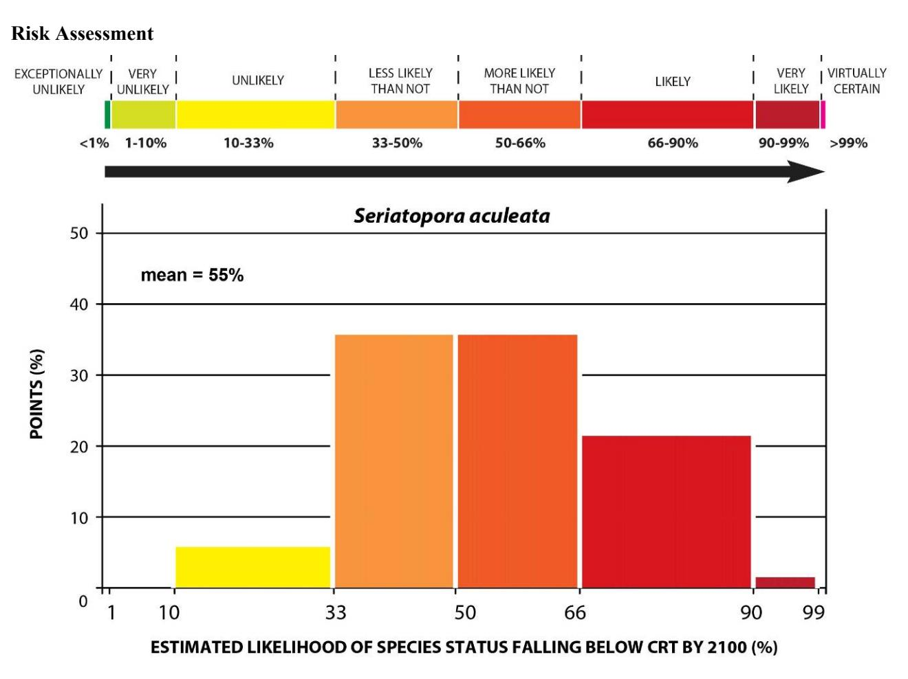

Figure 7.4.4. Distribution of points to estimate the likelihood that the status of *Seriatopora aculeata* falls below the Critical Risk Threshold (the species is of such low abundance, or so spatially fragmented, or at such reduced diversity that extinction is extremely likely) by 2100.

The primary factor that increases the potential extinction risk (higher likelihood of falling below the Critical Risk Threshold) for *Seriatopora aculeata* is its high bleaching susceptibility. The genus *Seriatopora* is heavily traded, but not often identified to species. Heavy use in the aquarium trade implies the potential for local extirpation for this usually uncommon species. The primary factor that reduces potential extinction risk (decrease the likelihood of falling below the Critical Risk Threshold) is that *Seriatopora aculeata* has a moderate range latitudinally (if additional genetic work determines *Seriatopora aculeata* and *Seriatopora hystrix* to be the same species, the range and abundance would increase and further reduce risk).

The overall likelihood that *Seriatopora aculeata* will fall below the Critical Risk Threshold by 2100 was estimated to be in the "more likely than not" risk category with a mean likelihood of 55% and a standard error (SE) of 10% (Fig. 7.4.4). This SE was calculated by taking the standard deviation of the seven mean voting scores of the BRT members and shows the coherence among the BRT. The uncertainty of the BRT is reflected in the range of votes of 10%–99% (Fig. 7.4.4) and the average range of likelihood estimates of the seven BRT voters (59%). The overall wide range of votes reflects the uncertainty among BRT members inherent in the lack of adequate ecological and demographic information for *Seriatopora aculeata*. The BRT considered this a valid species for evaluation purposes, but uncertainty over the taxonomic status of species within this genus and may also have contributed to the spread of votes.

#### **7.5 Genus** *Acropora* **(Family Acroporidae)**

#### **Acroporidae**

Worldwide, *Acropora* are usually among the first corals to show substantial losses in times of stress (Riegl, 2002). Species of *Acropora* tend to have particularly high vulnerability to predation, disease, sedimentation, and high temperatures (discussed separately below). Although the earliest fossils of *Acropora* that have been found were from the late Paleocene (54 Ma) and ancestors of 9 of the 20 *Acropora* species groups existed in the Eocene (49–34 Ma), the impressive diversification of the genus *Acropora* is thought to have occurred in the southwestern Pacific very recently, within the past 2 million years (Wallace and Rosen, 2006; Wood, 1999). *Acropora palmata* became a dominant component of western Atlantic reefs about 0.5 Ma. The Ice Ages have been especially good for the formation of coral reefs, and apparently the diversification of *Acropora*, because of low levels of atmospheric CO2 and because it was a time in which the Mg/Ca ratio of seawater supported the aragonitic mineralogy of coral skeletons (Ries et al., 2006; Stanley, 2006).

During times when environmental conditions are favorable to coral growth, winning in competition for space might have a greater selective advantage than ability to withstand a stressful physical environment. By the Principle of Allocation (Cody, 1966), phenotypes have to allocate limited resources between competing physiological processes. This involves trade-offs. If *Acropora* is selected to grow very rapidly to overtop other corals, then it might be cutting costs in complex biochemical defenses against predation, chemicals or infection, such as heat-shock proteins, antioxidants, and innate immunity (Palmer et al., 2010), thereby reducing its ability to resist environmental stresses. *Acropor*a species became a dominant component of reefs in the later Neogene (23 Ma to present) by their rapid growth, outcompeting for space by growing upward and overtopping. This rapid growth was achieved by maintaining lower tissue and energetic reserves than slower-growing corals do. The tissue layer of *Acropora* species is 1.0–1.9 mm thick, while massive corals generally have tissues 2.8–4.0 mm thick (Loya et al., 2001). The percent nitrogen in the tissues of *Acropora* was found to be 1.55–1.81 while the percent nitrogen in six genera of massive corals was 2.66–4.65 (Rotjan, 2007). The percent carbon in *Acropora* was 11.74–11.83 while the percent carbon in six genera of massive corals was 19.01–27.59 (Rotjan, 2007). High energetic reserves help corals withstand or recover from bleaching (Grottoli et al., 2004; Rodrigues and Grottoli, 2007; Rodrigues et al., 2008), so the thin, nutrient-poor tissues of *Acropora* may be a handicap in that regard. The rates of growth of branching corals, especially *Acropora*, are more directly affected by the physical environment (Gladfelter et al., 1978) while the growth of massive corals is controlled to a greater degree by their own physiology (Smith et al., 2008). Similarly, while skeletons of massive corals are usually deposited as dense layers (dissepiments) beneath each polyp, *Acropora* can grow an order of magnitude faster by having an axial polyp deposit a highly porous skeleton. Acroporids are apparently focused on rapid growth, overtopping, and competition for space, with a cost in resources for withstanding harsh physical environmental factors.

The Pacific Acroporids are a particularly speciose and ecologically important group of corals and, as such, have been the subject of extensive taxonomic, as well as ecological research. This extensive taxonomic attention has included several authoritative taxonomic revisions, the work of Wallace (1999) providing the best example. In the course of such revisions, old species names are often subsumed (or renamed), a process known as synonomizing. Hence, in the future treatment of such species, it will be noted that it is 'synonymous' with additional (generally obsolete) species names. In these cases, the term synonmy does not indicate current taxonomic uncertainty, rather, it indicates that authoritative taxonomic revision has occurred in the past.

Another manifestation of the special attention given to this speciose group is the recent work of Richards (2009) which has undertaken ecological and genetic comparison of naturally rare and very common species within the *Acropora* genus. Several useful constructs of Richards' analysis were considered extensively by the BRT in assessing extinction risk among the candidate *Acropora*. These useful constructions included a ranking of 114 species by geographic range size and a nuanced description of rarity for each species that incorporated global distribution, local distribution (frequency of occurrence at sites within individual localities), and local abundance. Richards articulates the latter characterization of rarity for each as one of eight Occupancy Types, with Types 1 and 2 representing high risk of global and local extinction, respectively, because of low abundance *combined with* restricted range. The other six Occupancy Types (3-8) are characterized by some combination of higher abundance and/or greater distribution which yields lower expected extinction risk (Richards, 2009). These Richards Occupancy Types are listed in the appropriate species' assessments below.

#### **Life History**

*Acropora* are sessile colonies that spawn their gametes into the water column, and the azooxanthellate larvae can survive in the planktonic stage from 4 to 209 days (Graham et al., 2008). This has allowed many *Acropora* species to have very wide geographic ranges, both longitudinally and latitudinally (Wallace, 1999). However, sessile colonies must be within a few meters of each other to have reasonable success in fertilization (Coma and Lasker, 1997). Vollmer and Palumbi (2007), using DNA sequence data, determined that *Acropora cervicornis* in the Caribbean have limited realized gene flow despite long-distance dispersal potential. Although spawners with long larval lives can eventually become distributed over broad geographic areas, as is typical for *Acropora*, the year-by-year replenishment of populations requires local source populations. All species of the genus *Acropora* studied to date are simultaneous hermaphrodites (Baird et al., 2009), with a gametogenic cycle in which eggs develop over a period of about 9 months and testes over about 10 weeks (Babcock et al., 1986; Szmant, 1986; Wallace, 1985). Fecundity in *Acropora* colonies is generally described as ranging from 3.6 to 15.8 eggs per polyp (Kenyon, 2008; Wallace, 1999). Mature eggs of species of *Acropora* are large when compared with those of other corals, ranging from 0.53 to 0.90 mm in mean diameter (Wallace, 1999). For five *Acropora* species examined by Wallace (1985), the minimum reproductive size ranged from 4 to 7 cm, and the estimated ages ranged from 3 to 5 years.

*Acropora* spp. release gametes as egg-sperm bundles that float to the sea surface, each polyp releasing all its eggs and sperm in one bundle. Fertilization takes place after the bundles break open at the sea surface. Sperm concentrations of 106 ml-1 have been found to be optimal for fertilization in the laboratory, and concentrations of this order have been recorded in the field during mass spawning events. Self-fertilization, although possible, is infrequent. Gametes remain viable and achieve high fertilization rates for up to 8 hours after spawning (Kenyon, 1994). Embryogenesis takes place over several hours, and further development leads to a planula that is competent to settle in 4 to 5 days after fertilization. *Acropora* spp. can show a high degree of hybridization (Kenyon, 1994; Richards et al., 2008b; Van Oppen et al., 2002; Van Oppen et al., 2000), which can complicate taxonomic classification but allow persistence of the genus if the hybrids are reproductively viable.

As sessile spawners with planktonic larvae, the Critical Risk Threshold assessments for *Acropora* species must weigh the broad distributions that provide replicated opportunities for potential escape from local disturbances against the necessity to have colonies in close enough proximity to have successful fertilization of enough eggs to replenish the attrition of the spawning stock. If the effective population size (i.e., the number of genotypes [might be substantially less than the number of colonies in highly clonal species] close enough for successful fertilization) becomes too low to replenish the population, then the positive-feedback depensatory processes begin. It is worth noting that Edinger and Risk (1995) concluded that brooding corals survived the harsh environmental conditions better than did the spawners in the western Atlantic during the major extinctions of the Oligocene-Miocene transition period. Many *Acropora* have branching morphologies, making them potentially susceptible to fragmentation. Fragment survival can increase coral abundance in the short-term but does not contribute new genotypes (or evolutionary opportunities) to the population.

#### **Threats**

**Thermal Stress:** The genus *Acropora* is widely recognized as being particularly prone to expelling their zooxanthellae when the water becomes anomalously warm. In a series of field assessments, Marshall and Baird (2000) noted that 14 of the 22 species of *Acropora* showed a "severe" response to increased water temperature. The others were "mixed" and possibly "severe" with them also. McClanahan et al. (2007) surveyed thousands of corals of 39 genera and found *Acropora* to be among the most sensitive to anomalously warm waters, with only 5 genera ranking higher. Branching *Acropora* tended to be more severely affected than tabular *Acropora* (Floros et al., 2004; Loya et al., 2001), although this was not always the case (Marshall and Baird, 2000). In addition, bleaching-induced mortality can be severe; *Acropora* in the southeastern Arabian Gulf suffered > 90% mortality during the 1996 bleaching event (Riegl, 1999). However, remnants of *Acropora vaughani* deep inside the reef framework survived after the 1998 mass bleaching event (Riegl and Piller, 2001), providing for potentially accelerated recovery. A modeling study by Riegl and Purkis (2009) emphasized the importance of larval connectivity in promoting recovery of coral populations following repeated bleaching events and predicted that mass bleaching mortality events must remain infrequent (< 15 years) to avoid *Acropora* spp. collapse in Arabian Gulf reef communities.

Even if bleaching is only temporary, physiological stress and the decrease in nutrition are likely to have the synergistic effects of lowered fecundity and increased susceptibility to disease (Bruno et al., 2007; Muller et al., 2008; Whelan et al., 2007). Fertilization and larval stages of *Acropora* spp. have also been shown to be particularly vulnerable to anomalously warm temperatures, displaying reduced fertilization, developmental abnormalities and reduced larval survivorship (Negri et al., 2007; Randall and Szmant, 2009a).

**Acidification**: Acidification can have a variety of effects on *Acropora.* While increased CO2 (increased acidity) does not appear to affect the survival of *Acropora* larvae, fertilization, settlement, rate of zooxanthellae acquisition, and postsettlement growth are all significantly impaired (Albright et al., 2010; Suwa et al., 2010). Elevated CO2 also induces bleaching in *Acropora*, even more so than temperature increases (Anthony et al., 2008). CO2 enrichment to 600–790 ppm enhanced maximum photosynthetic rates in *Acropora formosa* (Crawley et al., 2010), but elevated CO2 levels had no effect on photosynthesis or respiration in *Acropora eurystoma* (Schneider and Erez, 2006). Moderate increases in CO2 may enhance *Acropora* productivity, which falls back to zero at high CO2 (Anthony et al., 2008). More consistently, elevated CO2 tends to decrease *Acropora* growth and calcification rates (Anthony et al., 2008; Gattuso et al., 1998; Renegar and Riegl, 2005; Schneider and Erez, 2006), primarily as a result of carbonate ion concentration rather than pH or total inorganic carbon levels (Schneider and Erez, 2006). Although other coral taxa may experience a similar overall reduction in calcification based on CO2, *Acropora* show a greater reduction in the mineral density of its skeletal crystals (Marubini et al., 2003).

Decadal-scale reductions in growth rates of the Caribbean congener, *Acropora palmata*, in Curaçao have been attributed to acidification (Bak et al., 2009).

**Disease**: *Acropora* are vulnerable to most of the diseases known to affect scleractinian corals and are more commonly affected by acute and lethal conditions (e.g., "white diseases") than some other taxa. The greatest losses of corals to diseases throughout the western Atlantic have been *Acropora palmata* and *Acropora cervicornis* (Aronson and Precht, 2001). By drastically reducing the population fecundity, the depensatory effects of disease mortality can act synergistically with the depensatory effects of low colony density impairing successful fertilization, with both factors operating by positive feedback. As an example from Eastern Dry Rocks Reef in the Florida Keys: "During the 7 years of the photostation survey, living cover of *Acropora palmata* decreased by 98% [from white pox]. Coral recruitment was not observed within the photostation during the 7-year survey (Patterson et al., 2002). Other examples of diseases impacting *Acropora* include: black-band disease in Australia (Miller, 1996), skeleton-eroding band disease in Jordan (Winkler et al., 2004), a fungal disease in Kenya (McClanahan et al., 2004b), a yellow-band disease in the Arabian Gulf (Korrubel and Riegl, 1998; Riegl, 2002), and white-band disease in Saudi Arabia (Antonius, 1985).

**Predation:** *Acropora* species are preferred prey of most corallivorous invertebrate predators, e.g., *Acanthaster planci*, *Drupella* spp., *Quoyula monodonta*, *Coralliophila abbreviata*, and *Hermodice carunculata*. Of 14 species of corallivorous butterflyfishes on the Great Barrier Reef, 11 preferred *Acropor*a and at least one chaetodontid fed exclusively on *Acropora* (Motta, 1989). Of 14 species of corallivorous butterflyfishes on the Great Barrier Reef, 11 preferred *Acropor*a and at least one chaetodontid fed exclusively on *Acropora* (Motta, 1989). Chaetodontids with territories consume between 400 and 700 bites per hour from tabular *Acropora* (Gochfeld, 2004; Tricas, 1985) and corallivorous chaetodontids can occur at average densities of 50–70 fish per 1000 m2 . This intense predation appears to have been sustainable under the environmental conditions of the Pleistocene (2.6 M to 12,000 years ago) that were favorable to the growth of *Acropora* colonies. In view of the relatively low nitrogen and carbon in the tissue of *Acropora* in combination with its preference as prey by such a disparate group of corallivores, it is reasonable to assume that *Acropora* species do not invest a major portion of metabolic energy in biochemical or structural defenses against predation. Their defense against both competitors and predators appears to be rapid growth.

However, it has been shown that when a living coral population is substantially reduced by natural or anthropogenic disturbances to below a threshold (< 5% cover), the risk of overpredation produces a positive-feedback depensatory effect (Jayewardene et al., 2009). Even with the rates of predation staying the same as in the stable reef community, once a severe disturbance lowers the living coral cover below a threshold, predation by corallivorous invertebrates (Glynn, 1985a; 1990; Knowlton et al., 1990) or fishes (Guzmán and Robertson, 1989; McClanahan et al., 2005b; Rotjan et al., 2006) can seriously impede or even prevent the recovery of the coral populations. The depensatory effects of predation can act synergistically with the depensatory effects of colonies being too spread out for successful fertilization.

**Land-based sources of pollution (LBSP):** In clear water, *Acropora* colonies of a number of species have been reported to be living apparently well at 60-m depth and deeper (Bare et al., 2010). But *Acropora* colonies can be restricted by turbid waters. Experiments by Rogers (1979) showed *Acropora* to be the most sensitive to shading (a proxy for turbidity) of the genera she tested. In two communities composed of a total of 159 species of stony corals that extended from forereef slopes into turbid bays up to the mouths of rivers in Guam, colonies of *Acropora* were among the first to drop out (Randall and Birkeland, 1978). Certain *Acropora* growth forms are effective at passive sediment rejection (Stafford-Smith and Ormond, 1992)—for example, cylindrical branching or perforated tabular forms. However, the cylindrical form of branching *Acropora* and the perforated form of tabular *Acropora* possibly reduce the vulnerability of adult colonies to sediment per se, but *Acropora* are not particularly adept at actively removing sediment (Hubbard and Pocock, 1972), and Rogers (1983) found *Acropora* to be most vulnerable of the genera she studied.

As with most corals, adult colonies of *Acropora* have been reported to be especially affected by sedimentation during reproduction. Turbidity and coating by sediment decrease the metabolic energy available to corals by reducing the light available for photosynthesis by the zooxanthellae and increasing energy needed for the removal of sediment by the coral animal through mucus production and ciliary action. These decreases in metabolic energy reduce the fecundity of the coral (Tomascik and Sander, 1987b). Lateritic soils are typical of tropical islands. The iron in lateritic ("red") soils and other chemicals in runoff interfere with synchronization among colonies, egg-sperm recognition and interactions, fertilization, and embryological development (Richmond et al., 2006). Sediment, toxins, and elevated nutrients all reduce fertilization success, survival, and settlement of *Acropora* larvae (Gilmour, 1999; Humphrey et al., 2008; Reichelt-Brushett and Harrison, 2000; Ward and Harrison, 2000). The recruitment of larvae is inhibited by sediment covering signals for substratum recognition, covering the appropriate hard surface, and burying the newly settled corals if they are temporarily given the chance to settle. Sediment particles, specifically lateritic red clay and mud particles, serve as nuclei for bacterial and microfaunal aggregations in organically rich materials that settle on the reef substrata and contribute to the biological oxygen demand on reef surfaces at night (Richmond et al., 2006). By reducing success in fecundity, fertilization, larval settlement, and survival of juveniles, sedimentation and associated turbidity have depensatory effects (Birrell et al., 2005).

#### **Collection/Trade**

As a whole, *Acropora* are heavily traded (Table 7.5.1). However, trade quotas or reported exports are generally listed only at the genus level, making assessment of species-level threat difficult. Export records are available for *Acropora striata*, *Acropora tenella*, and *Acropora vaughani*.

Table 7.5.1. Summary tables for quotas and exports of Acropora spp. as reported to CITES (CITES, 2010).

| Quotas by Country (pieces of corals)  | 2000  | 2001  | 2002  | 2003   | 2004   | 2005   | 2006   | 2007   | 2008   |
|------------------------------------------|-------|-------|-------|--------|--------|--------|--------|--------|--------|
| Fiji                                     |       |       |       | 48180  |        | 96930  |        | 96360  | 72270  |
| Indonesia                                | 6300  | 7000  | 5500  | 24500  | 24500  | 18000  | 48000  | 40000  | 18000  |
| Exports by Country (pieces of corals) | 2000  | 2001  | 2002  | 2003   | 2004   | 2005   | 2006   | 2007   | 2008   |
| Fiji                                     | 61664 | 67554 | 82411 | 51070  | 102400 | 52340  | 43187  | 42232  | 31428  |
| Indonesia                                | 56124 | 45903 | 51550 | 62151  | 132246 | 173870 | 238872 | 268305 | 157649 |
| Malaysia                                 | 0     | 0     | 0     | 722    | 2491   | 1668   | 1833   | 6946   | 5053   |
| Solomon Islands                          | 1849  | 3146  | 2128  | 12388  | 17868  | 14733  | 28840  | 17450  | 16940  |
| Tonga                                    | 16884 | 16318 | 16461 | 406595 | 13649  | 20444  | 26461  | 14838  | 12074  |
| Vietnam                                  | 45861 | 22047 | 2818  | 4642   | 3237   | 13     | 4      | 21     | 10     |

#### **7.5.1** *Acropora aculeus* **Dana, 1846**

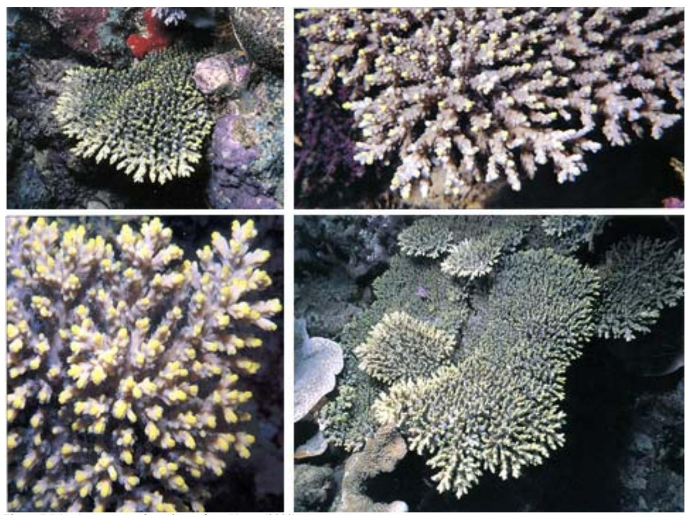

Figure 7.5.1. *Acropora aculeus* photos from Veron (2000).

#### **Characteristics**

*Acropora aculeus* forms flattened corymbose colonies to about 40 cm in diameter (Wallace, 1999). It is typically flattopped, clumping, or tabular, with colonies formed by horizontal branches that protrude short slender vertical branches. Colonies are usually a pale grey-green in color but can be bright blue-green or yellow. The tips of the branches can be yellow, lime-green, pale blue or brown (Veron, 2000).

#### **Taxonomy**

**Taxonomic issues**: None, but *Acropora aculeus* can be confused with *Acropora latistella,* which also has a broad depth and geographic range.

**Family:** Acroporidae.

**Evolutionary and geologic history**: No fossil records of *Acropora aculeus* have been reported (Wallace, 1999).

#### **Global Distribution**

*Acropora aculeus* has a relatively broad range, having the 15th largest range of 114 *Acropora* species examined (Richards, 2009), extending from east Africa, the Comorros, and Seychelles in the Indian Ocean all the way to Pitcairn Island in the southeastern Pacific Ocean. Latitudinally, it has been reported from Japanese waters in the northern hemisphere across the southern Great Barrier Reef and Mozambique in the southern hemisphere.

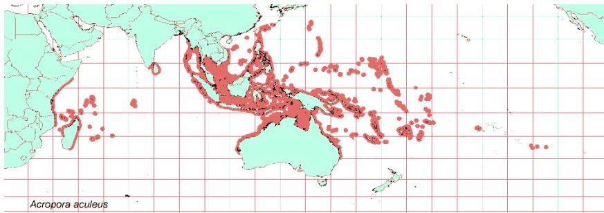

Figure 7.5.2. *Acropora aculeus* distribution from IUCN copied from http://www.iucnredlist.org.

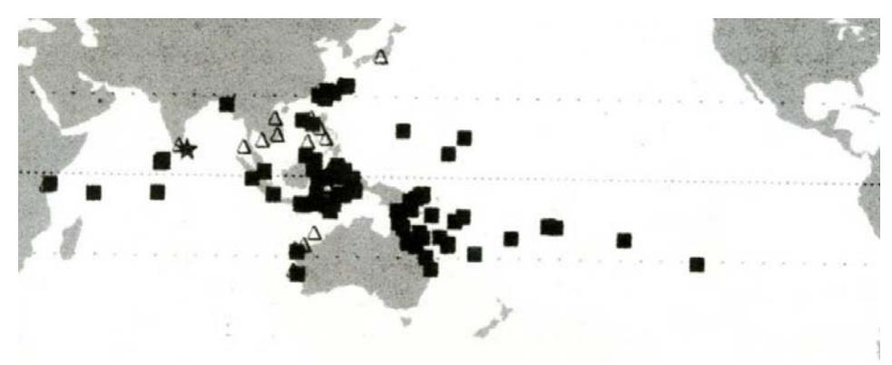

Figure 7.5.3. *Acropora aculeus* distribution from Wallace (1999). The black squares are specimen-based records in *Acropora* database at the Museum of Tropical Queensland, the stars are type localities of senior and junior synonyms, and the black triangles are taken from records in the literature. When the triangles are open (not black), the records from the literature are possibly misidentifications.

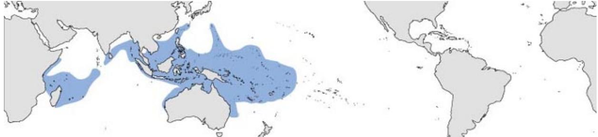

Figure 7.5.4. *Acropora aculeus* distribution from Veron (2002).

#### **U.S. Distribution**

According to both the IUCN Species Account and the CITES species database, *Acropora aculeus* occurs in American Samoa, the Northern Mariana Islands, and the U.S. minor outlying islands.

A search of published and unpublished records of occurrence in U.S. waters indicates *Acropora aculeus* has been reported from Tutuila and Ofu-Olosega in American Samoa (Birkeland, unpubl. data; Lamberts, 1983; Lovell and McLardy, 2008; Mundy, 1996; National Park Service, 2009), Guam (Burdick, unpubl. data; Randall, 2003; Wallace, 1999), Palmyra Atoll (Williams et al., 2008b), Kingman Reef, and Wake Atoll (CRED, unpubl. data).

Within federally protected waters, *Acropora aculeus* has been recorded from the following areas (Kenyon et al., 2010b):

- Pacific Remote Islands Marine National Monument (Palmyra, Kingman, Wake)
- National Park of American Samoa, Ofu Island unit

#### **Habitat**

*Acropora aculeus* has a broad depth range. It is particularly abundant in shallow lagoons and is common in most habitats where it is protected from direct wave action.

**Depth range**: *Acropora aculeus* has been reported in water depths ranging from low tide to at least 20 m (Wallace, 1999).

#### **Abundance**

Abundance of *Acropora aculeus* has been reported as generally common and locally abundant, especially in the central Indo-Pacific (Veron, 2000).

#### **Life History**

*Acropora aculeus* is a hermaphroditic spawner that is a participant in mass broadcast spawning in some localities (Babcock et al., 1986; Babcock et al., 1994). Growth is determinate or sometimes semideterminate (Wallace, 1985). For more genus level information, see Section 7.5: Genus *Acropora*.

#### **Threats**

For each of these possible threats, see also Section 7.5: Genus *Acropora* for additional genus level information.

**Thermal stress:** The genus *Acropora* is consistently ranked among the coral genera most severely susceptible to bleaching (Marshall and Baird, 2000; McClanahan et al., 2007; McClanahan et al., 2005a), although the genus may have differential responses across regions during mass bleaching mortalities (McClanahan et al., 2004a). *Acropora aculeus* tolerates high temperatures in back-reef pools in Ofu, American Samoa (Craig et al., 2001), although it is not abundant and acroporids still bleach in these pools (Fenner and Heron, 2008). Most acroporids in the Great Barrier Reef host clade C zooxanthellae, but *Acropora aculeus* hosts clade D (LaJeunesse et al., 2004a) as well as clade C (Van Oppen et al., 2001). As *Acropora aculeus* bleaches via loss of zooxanthellae (Hoegh-Guldberg, 1994) and corals preferentially expel clade C during bleaching (Rowan et al., 1997), the presence of clade D could either confer bleaching resistance or simply indicate stressful conditions. In any case, *Acropora aculeus* has moderately high bleaching susceptibility relative to other acroporids on the Great Barrier Reef (Done et al., 2003) and, as a whole, bleaching presents a high risk to this species.

**Acidification:** No specific research has addressed the effects of acidification on *Acropora aculeus,* but experiments on acidification impacts have demonstrated negative effects on *Acropora* calcification (Anthony et al., 2008; Marubini et al., 2003; Renegar and Riegl, 2005; Schneider and Erez, 2006) and productivity (Anthony et al., 2008; Crawley et al., 2010), as well as impaired fertilization and settlement success in *Acropora palmata* (Albright et al., 2010) and reduced growth and zooxanthellae uptake in juveniles (Suwa et al., 2010)*.* In general, most corals studied have shown negative relationships between acidification and growth (Table 3.2.2), and acidification is likely to contribute to reef destruction in the future (Hoegh-Guldberg et al. 2007, Silverman et al. 2009). While ocean acidification has not been demonstrated to have already caused appreciable declines in coral populations so far, the BRT considers it to be a significant threat to corals by 2100.

**Disease:** Susceptibility and impacts of disease on *Acropora aculeus* are not known, although in general *Acropora* species are moderately to highly susceptible to disease. Additionally, ample evidence show that diseases can have devastating regional impacts on individual coral species (Aronson and Precht, 2001; Bruckner and Hill, 2009), and there is evidence that these impacts are occurring in more taxa and at a broader geographic scale (Sutherland et al., 2004, Green and Bruckner 2000).

**Predation (COTS, snails, other):** Most *Acropora* are preferentially consumed by crown-of-thorns seastars, *Acanthaster planci* (Colgan, 1987) and by corallivorous snails (B. Vargas-Ángel, CRED, Honolulu, HI, pers. comm., September 2010.). When predation occurs, it can have significant effects—corymbose corals (including *Acropora aculeus*) with lesions from *Drupella* predation suffer 33%–54% mortality within 3 months (Cumming, 2002). Predation may, therefore, present a moderate risk at local scales but would be unlikely to lead to extinction.

**Land-based sources of pollution (LBSP):** The specific effects of LBSP stresses are largely unknown for *Acropora aculeus*. LBSP-related stresses (nutrients, sediment, toxins, and salinity) often act in concert rather than individually,and are influenced by other biological (e.g., herbivory) and hydrological factors. Collectively, LBSP stresses are unlikely to produce extinction at a global scale; however, they may pose significant threats at local scales (particularly important for species with limited range) and reduce the resilience of corals to bleaching (Carilli et al., 2009a; Wooldridge, 2009b).

C**ollection/Trade:** As a whole, the genus *Acropora* has been heavily involved in international trade with 50,000– 270,000 reported exported pieces per year from Indonesia (CITES, 2010). As the species in this genus can be difficult to distinguish by nonexperts, it is possible that *Acropora aculeus* could be affected.

#### **Risk Assessment**

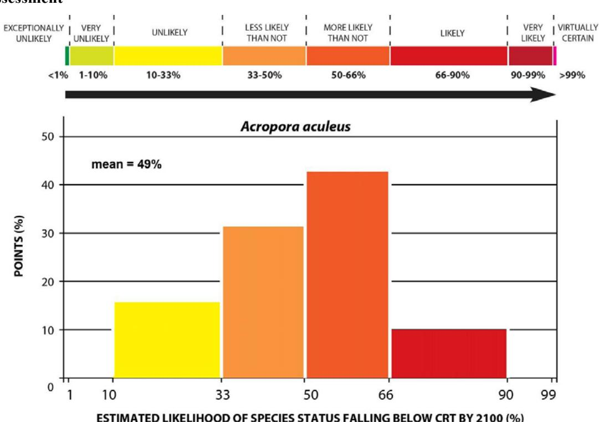

Figure 7.5.5. Distribution of points to estimate the likelihood that the status of *Acropora aculeus* falls below the Critical Risk Threshold (the species is of such low abundance, or so spatially fragmented, or at such reduced diversity that extinction is extremely likely) by 2100.

Factors that increase the potential extinction risk (higher likelihood of falling below the Critical Risk Threshold) for *Acropora aculeus* include the relatively high susceptibility of the genus *Acropora* to common threats (bleaching, acidification, disease, predation, and pollution). The high bleaching rate of acroporid corals is the primary known threat of extinction for *Acropora aculeus*. Factors that reduce potential extinction risk (decrease the likelihood of falling below the Critical Risk Threshold) include the very wide geographic range, the broad depth range, the fact that it is often common and sometimes abundant, and the somewhat broad range of suitable habitats for *Acropora aculeus*. Vulnerability of *Acropora aculeus* may be somewhat ameliorated by the fact that it is known to occur in deeper water than many other acroporids and perhaps experiences disturbances (e.g. bleaching, storms, etc.) less frequently. These characteristics tend toward species persistence (Richards, 2009).

The overall likelihood that *Acropora aculeus* will fall below the Critical Risk Threshold by 2100 was estimated to be in the "less likely than not" risk category with a mean likelihood of 49% and a standard error (SE) of 12% (Fig. 7.5.5). This SE was calculated by taking the standard deviation of the seven mean voting scores of the BRT members and shows the coherence among the BRT. The uncertainty of the BRT is reflected in the range of votes of 10%–90% (Fig. 7.5.5) and the average range of likelihood estimates of the seven BRT voters (51%). The overall wide range of votes reflects the uncertainty among BRT members inherent in the lack of adequate ecological and demographic information for *Acropora aculeus*.

#### **7.5.2** *Acropora acuminata* **Verrill, 1864**

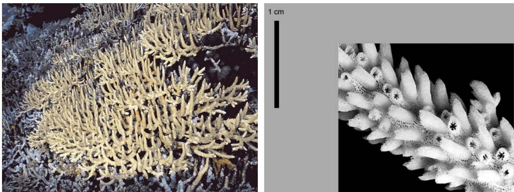

Figure 7.5.6. *Acropora acuminata* photo and coralite plan from Veron (2000).

#### **Characteristics**

Colonies of *Acropora acuminata* typically form a tabular base of fused horizontal branches that turn upward and taper to points. Colonies are most often pale or bright brown or blue.

#### **Taxonomy**

**Taxonomic issues**: None. *Acropora acuminata* was originally called *Madrepora nigra*, probably because drying specimens turn black (Wallace, 1999; Wells, 1954).

**Family:** Acroporidae.

**Evolutionary and geologic history**: No fossil records of *Acropora acuminata* have been reported (Wallace, 1999).

#### **Global Distribution**

*Acropora acuminata* has a very broad range, having the fifth most extensive range of 114 *Acropora* species examined (Richards, 2009), extending longitudinally from the Red Sea all the way to Pitcairn Island in the southeastern Pacific. Its total range covers 110 million km2 . It extends latitudinally from Taiwan in the northern hemisphere across the Great Barrier Reef in the southern hemisphere. It can be very common in the center of its range (e.g., Indonesia), but it can be uncommon in the outer parts of its range (Wallace, 1999).

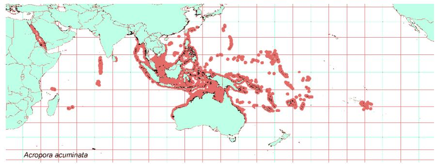

Figure 7.5.7. *Acropora acuminata* distribution from IUCN copied from http://www.iucnredlist.org.

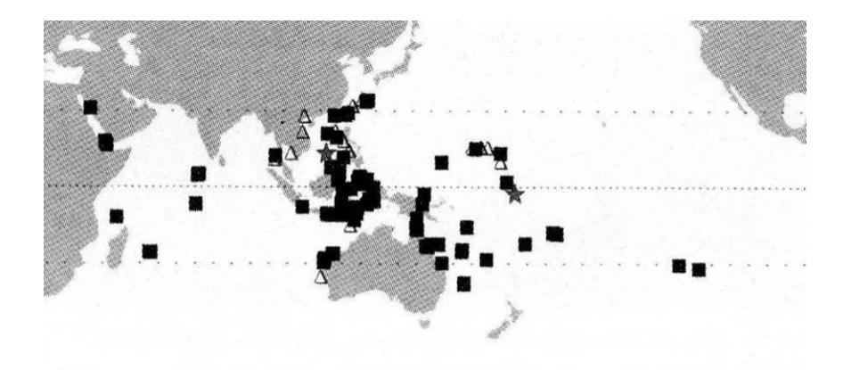

Figure 7.5.8. *Acropora acuminata* distribution copied from Wallace (1999). The black squares are specimen-based records in Worldwide Acropora database at the Museum of Tropical Queensland, the stars are type localities of senior and junior synonyms, and the black triangles are taken from records in the literature. When the triangles are open (not black), the records from the literature are possibly misidentifications.

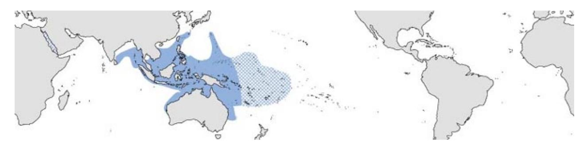

Figure 7.5.9. *Acropora acuminata* distribution from Veron (2000).

#### **U.S. Distribution**

According to both the IUCN Species Account and the CITES species database, *Acropora acuminata* occurs in American Samoa, the Northern Mariana Islands, and the U.S. minor outlying islands.

A search of published and unpublished records of occurrence in U.S. waters indicates *Acropora acuminata* has been reported from Tutuila and Ofu-Olosega in American Samoa (Coles et al., 2003; Fisk and Birkeland, 2002; Lovell and McLardy, 2008; Maragos et al., 1994; National Park Service, 2009), Guam (Burdick, unpubl. data; Randall, 2003), Howland and Baker Islands, Kingman Reef, Wake Atoll (CRED, unpubl. data), and Palmyra Atoll (Williams et al., 2008b).

Within federally protected waters *Acropora acuminata* has been recorded from the following areas (Kenyon et al., 2010b):

- Pacific Remote Islands Marine National Monument (Howland, Baker, Palmyra, Kingman, Wake)
- National Park of American Samoa, Ofu Island unit
- Fagatele Bay National Marine Sanctuary, Tutuila

**Depth range**: *Acropora acuminata* is not well known, although it has been reported in waters ranging from 15 to 20 m (IUCN, 2010).

#### **Abundance**

Abundance of *Acropora acuminata* has been reported to occasionally live in extensive clumps with dimensions of several meters (Wallace, 1999).

#### **Life History**

Like most of its congeners, *Acropora acuminata* is a broadcast spawner (Baird et al., 2002). However, it may achieve some degree of reproductive isolation in some locations by not spawning synchronously with the majority of its congeners (Baird et al., 2010; Carroll et al., 2006). Growth is determinate (Wallace, 1999). For more genus level information, see Section 7.5: Genus *Acropora*.

#### **Threats**

For each of these possible threats, see Section 7.5: Genus *Acropora* for additional genus level information.

**Thermal stress:** Although there is not much species-specific information about the response of *Acropora acuminata* to thermal stress, the genus *Acropora* are consistently ranked among the coral genera most severely susceptible to bleaching (Marshall and Baird, 2000; McClanahan et al., 2007; McClanahan et al., 2005a), although the genus may have differential responses across regions during mass bleaching mortalities (McClanahan et al., 2004a). Bleaching-induced mortality can be severe—*Acropora* in the southeastern Arabian Gulf suffered > 90% mortality during the 1996 bleaching event (Riegl, 1999). Bleaching poses a substantial risk to this species.

**Acidification:** No specific research has addressed the effects of acidification on *Acropora acuminata,* but experiments on acidification have demonstrated negative effects on *Acropora* calcification (Anthony et al., 2008; Marubini et al., 2003; Renegar and Riegl, 2005; Schneider and Erez, 2006), productivity (Anthony et al., 2008; Crawley et al., 2010), fertilization and settlement success in *Acropora palmata* (Albright et al., 2010), reduced growth and zooxanthellae uptake in juveniles (Suwa et al., 2010), and reduced growth in *Acropora palmata* from Curaçao (Bak et al., 2009). In general, most corals studied have shown negative relationships between acidification and growth (Table 3.2.2), and acidification is likely to contribute to reef destruction in the future (Hoegh-Guldberg et al., 2007; Silverman et al., 2009). While ocean acidification has not been demonstrated to have already caused appreciable declines in coral populations so far, the BRT considers it to be a significant threat to corals by 2100.

**Disease:** Susceptibility and impacts of disease on *Acropora acuminata* are not known, although in general *Acropora* species are moderately to highly susceptible to disease. Additionally, ample evidence show that diseases can have devastating regional impacts on individual coral species (e.g., Aronson and Precht, 2001; Bruckner and Hill, 2009), and there is evidence that these impacts are occurring in more taxa and at a broader geographic scale (Sutherland et al., 2004, Green and Bruckner 2000).

**Predation:** *Acropora acuminata* is the only acroporid known to not be preferred as prey by the crown-of-thorns seastar, *Acanthaster planci*. Large clumps of colonies of *Acropora acuminata* were bypassed when *Acanthaster planci* devastated the coral communities on Guam in the late 1960s (R. Randall, Univ. Guam, Mangilao, pers. comm., June 2010). *Acanthaster planci* will eat *Acropora acuminata* if there are no other corals to prey on, but *Acropora acuminata* are among the last to be preyed upon. Predation therefore seems a minor risk, even at local levels.

**Land-based sources of pollution (LBSP):** The specific effects of LBSP stresses are largely unknown for *Acropora acuminata*. LBSP-related stresses (nutrients, sediment, toxins, and salinity) often act in concert rather than individually and are influenced by other biological (e.g., herbivory) and hydrological factors. Collectively, LBSP stresses are unlikely to produce extinction at a global scale; however, they may pose significant threats at local scales (particularly important for species with limited range) and reduce the resilience of corals to bleaching (Carilli et al., 2009a; Wooldridge, 2009b).

C**ollection/Trade:** As a whole, the genus *Acropora* has been heavily involved in international trade with 50,000– 270,000 reported exported pieces per year from Indonesia (CITES, 2010). As the species in this genus can be difficult to distinguish by nonexperts, it is possible that *Acropora acuminata* could be affected.

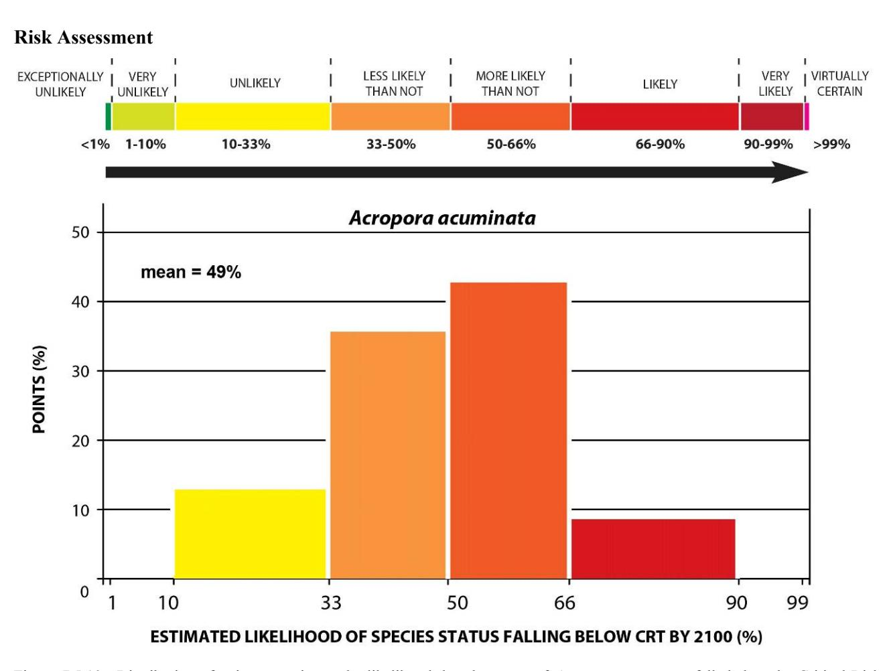

Figure 7.5.10. Distribution of points to estimate the likelihood that the status of *Acropora acuminata* falls below the Critical Risk Threshold (the species is of such low abundance, or so spatially fragmented, or at such reduced diversity that extinction is extremely likely) by 2100.

Factors that increase the potential extinction risk (higher likelihood of falling below the Critical Risk Threshold) for *Acropora acuminata* include the relatively high susceptibility of the genus *Acropora* to common threats (bleaching, acidification, disease, predation, and pollution). The high bleaching rate of acroporid corals is the primary known threat of extinction for *Acropora acuminata*. Factors that reduce the potential extinction risk (decrease the likelihood of falling below the Critical Risk Threshold) for *Acropora acuminata* include the very wide geographic range, the fact that it is often common and sometimes abundant, and the somewhat broad range of habitats that *Acropora acuminata* finds acceptable, including habitats with turbid waters and habitats with clear waters. Additionally, it is less preferred as prey by *Acanthaster planci* than are other members of the genus *Acropora*.

The overall likelihood that *Acropora acuminata* will fall below the Critical Risk Threshold by 2100 was estimated to be in the "less likely than not" risk category with a mean likelihood of 49% and a standard error (SE) of 8.5% (Fig. 7.5.10). This SE was calculated by taking the standard deviation of the seven mean voting scores of the BRT members and shows the coherence among the BRT. The uncertainty of the BRT is reflected in the range of votes of 10%–90% (Fig. 7.5.10) and the average range of likelihood estimates of the seven BRT voters (57%). The overall wide range of votes reflects the uncertainty among BRT members inherent in the lack of adequate ecological and demographic information for this species. The uncertainty shown in the range of votes also stems from the tension between the relatively high extinction risk of *Acropora* as a genus vs. the potential for *Acropora acuminata* to be among the less vulnerable species of that genus.

#### **7.5.3** *Acropora aspera* **Dana, 1846**

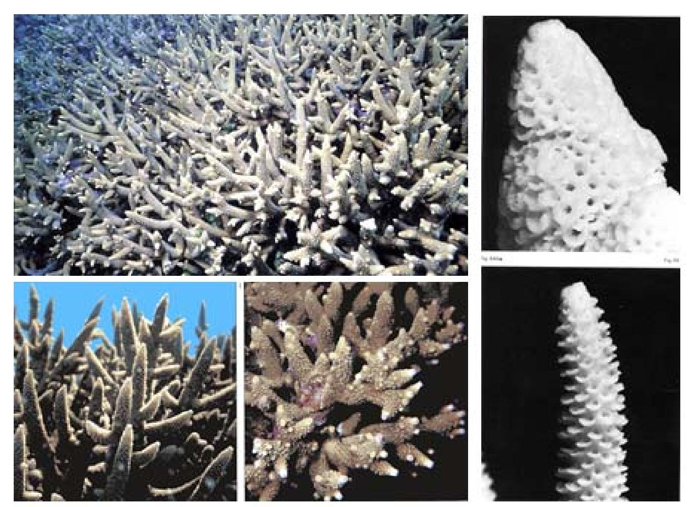

Figure 7.5.11. *Acropora aspera* photos copied from (*color*) Veron (2000) and (*black and white*) corallite plan from Wallace (1999).

#### **Characteristics**

*Acropora aspera* typically forms arborescent to caespitose-corymbose clumps of thick, relatively stout branches. The thickness and stoutness of the branches can vary considerably, depending on their exposure to wave energy. Taller colonies can be found in shallow protected habitats. Branches tend to be of relatively even length. The low, sprawling colonies can appear corymbose because of the even length of the branches or height of the colonies (Wallace, 1999). The clumps can sometimes be extensive, forming large uninterrupted stands.

On exposed forereefs, *Acropora aspera* colonies can be caespitose-corymbose with stout, tapering, highly anastomosed branches and short, thick secondary branches with crowded radial corallites of relatively uniform size (see upper black and white photograph above; Wallace 1999). In shallow protected waters, *Acropora aspera* can form micro-atolls. In deeper protected waters, *Acropora aspera* can form arborescent colonies with sturdy branches that seldom anastomose. In protected waters, the radial corallites are less crowded than in exposed habitats. In areas of reduced light (e.g., shallow, turbid lagoons or deeper reef slopes), the branches are relatively thin and the corallites are relatively small and widely spaced (see lower black and white photograph above; Wallace 1999).

*Acropora aspera* colonies are pale brown, beige, or pale blue-grey, green or cream (Randall and Myers, 1983).

#### **Taxonomy**

Taxonomic issues: None.

**Family:** Acroporidae

**Evolutionary and geologic history**: Fossil records of *Acropora aspera* have been reportedly found from the Pleistocene (1.8–0.01 Ma; Wallace, 1999).

#### **Global Distribution**

*Acropora aspera* has a relatively broad range, having the 46th largest range of 114 *Acropora* species examined (Richards, 2009), extending longitudinally from the Red Sea (Antonius et al., 1990) and Oman (Wallace, 1999) to Samoa (eastcentral Pacific Ocean). It extends latitudinally from Japanese waters in the northern hemisphere across the Great Barrier Reef in the southern hemisphere.

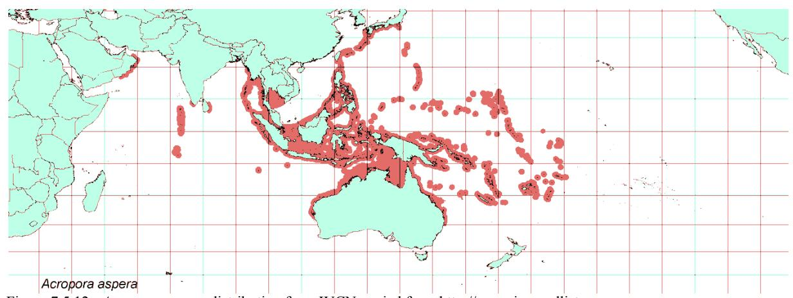

Figure 7.5.12. *Acropora aspera* distribution from IUCN copied from http://www.iucnredlist.org.

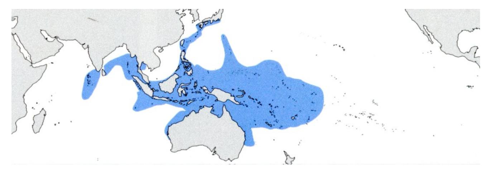

Figure 7.5.13. *Acropora aspera* distribution from Veron (2000).

#### **U.S. Distribution**

According to both the IUCN Species Account and the CITES species database, *Acropora aspera* occurs in American Samoa, the Northern Mariana Islands, and the U.S. minor outlying islands.

A search of published and unpublished records of occurrence in U.S. waters indicates *Acropora aspera* has been reported from Tutuila and Ofu-Olosega in American Samoa (Birkeland, unpubl. data; Lamberts, 1983; Mundy, 1996), Guam (Amesbury et al., 1999; Burdick, unpubl. data; Randall, 2003; Wallace, 1999), Palmyra Atoll (Williams et al., 2008b), and Kingman Reef (CRED, unpubl. data).

- Within federally protected waters, *Acropora aspera* has been recorded from the following areas (Kenyon et al., 2010b):
- Pacific Remote Islands Marine National Monument (Palmyra, Kingman)
- National Park of American Samoa, Ofu Island unit
- Rose Atoll Marine National Monument
- War in the Pacific National Historical Park, Guam

#### **Habitat**

**Habitat**: *Acropora aspera* has been reported to occupy a broad range of habitats and its colony structure varies substantially with habitat (Wallace, 1999), as described above in "Characteristics."

**Depth range**: *Acropora aspera* has been reported in water depths ranging from low tide to at least 10 m (Veron, 2000).

#### **Abundance**

Abundance of *Acropora aspera* has been reported as sometimes locally common (Veron, 2000). *Acropora aspera* can occasionally live in extensive clumps with dimensions of several meters.

#### **Life History**

*Acropora aspera* is a hermaphroditic spawner (Babcock et al., 1994; Simpson, 1985). While it is a participant in mass broadcast spawning in some localities, asynchronyous gamete development on the Great Barrier Reef (Baird and Marshall, 2002) and New Caledonia (Baird et al., 2010) may provide a degree of reproductive isolation, although *Acropora aspera* has been shown to hybridize with other acroporids (Van Oppen et al., 2002). Gamete development in *Acropora aspera* may be aborted in years with storm impacts (Bothwell, 1981). Asexual reproduction can account for the majority of *Acropora aspera* population structure in certain areas and can lead to local dominance (Birkeland et al., 1979; Bothwell, 1981; Highsmith, 1982).

As noted above, *Acropora aspera* has multiple growth forms. Growth varies with the influence of monsoon season, and skeletal extension, accretion, and density are all influenced by wave energy (Brown et al., 1985). Growth is indeterminate. *Acropora aspera* has been utilized for a range of laboratory studies, including nitrogen metabolism (Crossland and Barnes, 1974; 1977; Streamer, 1980), calcification (Barnes, 1982; Barnes and Crossland, 1982; Crossland and Barnes, 1974), and lipid metabolism (Crossland et al., 1980). For more genus level information, see Section 7.5: Genus *Acropora*.

#### **Threats**

For each of these possible threats, see also Section 7.5: Genus *Acropora* for additional genus level information.

**Thermal stress:** *Acropora* are consistently ranked among the coral genera most severely susceptible to bleaching (Marshall and Baird, 2000; McClanahan et al., 2007; McClanahan et al., 2005a), although the genus may have differential responses across regions during mass bleaching mortalities (McClanahan et al., 2004a). *Acropora aspera* is among the most bleaching-susceptible of the acroporids on the Great Barrier Reef (Done et al., 2003), where it harbors primarily clade C2 zooxanthellae (Van Oppen et al., 2001). It suffered 65% mortality in Fiji during the 2000 event (Cumming et al., 2002), but was one of the few species in good condition in Okinawa 5–10 months after the 1998 event (Stimson et al., 2002). The species can also suffer substantial mortality during cold-water bleaching events (Hoegh-Guldberg et al., 2005).

*Acropora aspera* contains green fluorescent proteins, but elevated temperatures reduce their effectiveness in this species, making it hypersensitive to bleaching (Dove, 2004). Other researchers have found that thermal history enhances photoprotection and reduces bleaching in *Acropora aspera* (Middlebrook et al., 2008). However, when it bleaches, *Acropora aspera* can experience reduced fecundity (Ward et al., 2000).

Although range expansion was not directly considered in this analysis, corals in the *Acropora aspera* group had a broader range in Australia during the Pleistocene than today and are predicted to potentially expand southward as temperatures increase (Greenstein and Pandolfi, 2008).

**Acidification:** No specific research has addressed the effects of acidification on *Acropora aspera,* but experiments on acidification impacts have demonstrated negative effects on *Acropora* calcification (Anthony et al., 2008; Marubini et al., 2003; Renegar and Riegl, 2005; Schneider and Erez, 2006) and productivity (Anthony et al., 2008; Crawley et al., 2010), as well as impaired fertilization and settlement success in *Acropora palmata* (Albright et al., 2010) and reduced growth and zooxanthellae uptake in juveniles (Suwa et al., 2010), In general, most corals studied have shown negative relationships between acidification and growth (Table 3.2.2), and acidification is likely to contribute to reef destruction in the future (Hoegh-Guldberg et al. 2007, Silverman et al. 2009). While ocean acidification has not been demonstrated to have already caused appreciable declines in coral populations so far, the BRT considers it to be a significant threat to corals by 2100.

**Disease:** Susceptibility and impacts of disease on *Acropora aspera* are not known, although in general *Acropora* species are moderately to highly susceptible to disease. *Acropora aspera* experiences subacute black-band disease (UNEP, 2010), as well as ciliate infections (Antonius and Lipscomb, 2000). The ecological and population impacts of disease have not been established for this species. Bacterial communities on the surface of *Acropora aspera* also change as a result of bleaching, which potentially makes it more susceptible to disease (Ainsworth and Hoegh-Guldberg, 2009).

**Predation:** Most *Acropora* are preferentially consumed by crown-of-thorns seastars, *Acanthaster planci* (Colgan, 1987) and by corallivorous snails (B. Vargas-Ángel, CRED, Honolulu, HI, pers. comm., September 2010). *Acropora aspera* is a preferred prey of *Acanthaster planci* (Sonoda and Paul, 1993) and, when killed, is rapidly overgrown by algae (Belk and Belk, 1975).

**Land-based sources of pollution (LBSP):** Toxins and nutrients have been reported to have deleterious effects on *Acropora aspera*. Cyanide (used for fish collection in some areas) significantly reduced the photosynthetic performance and induced bleaching in *Acropora aspera* (Jones and Hoegh-Guldberg, 1999). Although there was temporal variability, *Acropora aspera* produced smaller, fewer eggs and had reduced testes development when exposed to nitrogen, while phosphorus produced fewer but larger eggs (Ward and Harrison, 2000). *Acropora aspera* appears to have mixed susceptibility to runoff. The species was found to be relatively tolerant of silty/turbid water in the South China Sea (Latypov and Dautova, 2005), but suffered complete mortality when exposed to hyposaline waters during a 1991 flood in the Keppel Islands, Australia (Van Woesik, 1991).

LBSP-related stresses (nutrients, sediment, toxins, and salinity) often act in concert rather than individually and are influenced by other biological (e.g., herbivory) and hydrological factors. Collectively, LBSP stresses are unlikely to produce extinction at a global scale; however, they may pose significant threats at local scales (particularly important for species with limited range) and reduce the resilience of corals to bleaching (Carilli et al., 2009a; Wooldridge, 2009b).

C**ollection/Trade:** As a whole, the genus *Acropora* has been heavily involved in international trade with 50,000– 270,000 reported exported pieces per year from Indonesia (CITES, 2010). As the species in this genus can be difficult to distinguish by nonexperts, it is possible that *Acropora aspera* could be affected.

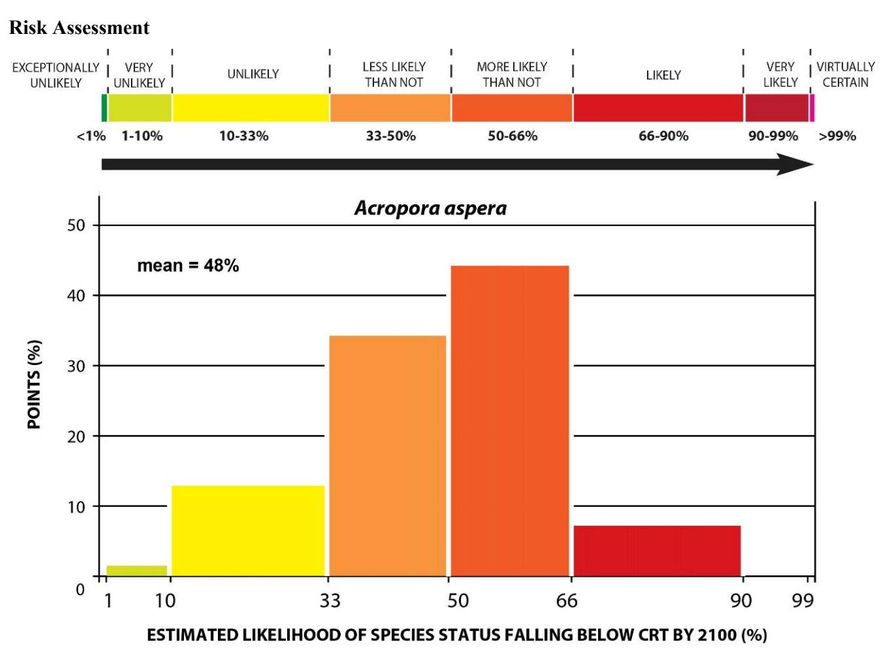

Figure 7.5.14. Distribution of points to estimate the likelihood that the status of *Acropora aspera* falls below the Critical Risk Threshold (the species is of such low abundance, or so spatially fragmented, or at such reduced diversity that extinction is extremely likely) by 2100.

Factors that increase the potential extinction risk (higher likelihood of falling below the Critical Risk Threshold) for *Acropora aspera* include the relatively high susceptibility of the genus *Acropora* to common threats (bleaching, acidification, disease, predation, and pollution). The high bleaching rate of acroporid corals is the primary known threat of extinction for *Acropora aspera*. Factors that reduce the potential extinction risk (decrease likelihood of falling below the Critical Risk Threshold) for *Acropora aspera* are the wide geographic range, it is often common and sometimes abundant, and the somewhat broad range of habitats that *Acropora aspera* finds acceptable, including its ability to grow in a variety of morphologies that are conditioned to the habitat characteristics. These characteristics tend toward species persistence.

The overall likelihood that *Acropora aspera* will fall below the Critical Risk Threshold by 2100 was estimated to be in the "less likely than not" risk category with a mean likelihood of 48% and a standard error (SE) of 9% (Fig. 7.5.14). This SE was calculated by taking the standard deviation of the seven mean voting scores of the BRT members and shows the coherence among the BRT. The uncertainty of the BRT is reflected in the range of votes of 1%–90% (Fig. 7.5.14) and the average range of likelihood estimates of the seven BRT voters (58%). The overall wide range of votes reflects the uncertainty among BRT members inherent in the lack of adequate ecological and demographic information for *Acropora aspera*.

#### **7.5.4** *Acropora dendrum* **Bassett-Smith, 1890**

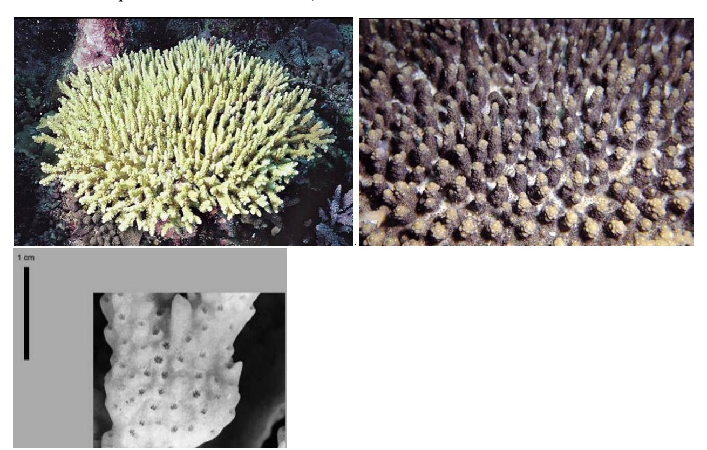

Figure 7.5.15. *Acropora dendrum* photos and corallite plan from Veron (2000).

#### **Characteristics**

Colonies of *Acropora dendrum* are usually 0.5–1 m across and are corymbose plates with widely-spaced, tapering branchlets. Their axial corallites are small. Radial corallites are immersed or nearly so, giving branchlets a smooth appearance. Colonies are pale brown or cream in color (Veron, 2000). Maximum colony size is 100 cm. Determinate growth.

#### **Taxonomy**

**Taxonomic issues**: None. *Acropora dendrum* is most similar to *Heteropora appressa* and *Acropora microclados*. Wallace (1999) reported that *Acropora dendrum* is "poorly characterized and may indeed be a 'phantom' species, being made up from specimens that cannot be allocated to other species." However, the BRT treats it as a nominal species (for taxonomic discussion see Section 2.1.2). There is no location recorded where it is common or even more abundant than a rare species Wallace (1999).

**Family**: Acroporidae.

**Evolutionary and geologic history**: No fossil records of *Acropora dendrum* have been reported (Wallace, 1999).

#### **Global Distribution**

The IUCN Red List reports *Acropora dendrum* from the northern Indian Ocean, the central Indo-Pacific, east and west coasts of Australia, Southeast Asia, Japan and the East China Sea. Other reports are from the oceanic west Pacific and Palau (Randall, 1995) and Vanuatu, Tonga, and Samoa (IUCN, 2010).

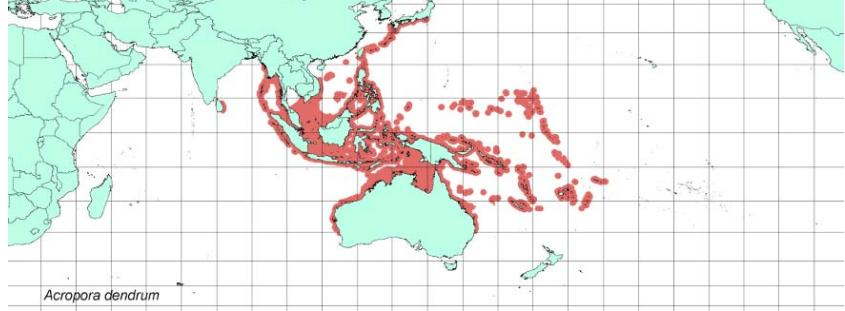

Figure 7.5.16. *Acropora dendrum* distribution from IUCN copied from http://www.iucnredlist.org.

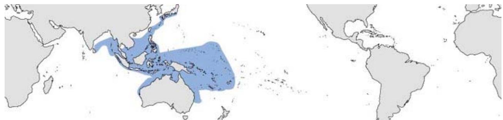

Figure 7.5.17. *Acropora dendrum* distribution from Veron (2000).

#### **U.S. Distribution**

According to the IUCN Species Account, *Acropora dendrum* occurs in American Samoa, but no supporting reference is given. The CITES species database includes Samoa as a country of occurrence but distinguishes American Samoa from Samoa in other species accounts. *Acropora dendrum* is not listed as occurring in American Samoa in Lovell and McLardy (2008).

Fenner reported tentative identification of *Acropora dendrum* at Tutuila, American Samoa, with three photographs of two colonies, but no voucher sample. Branches tapered slightly. One colony had sub-immersed radial corallites at the bases of branches with reduced cochlearform or labellate radial corallites on the upper parts of branches. The axial corallites looked fairly large, perhaps 3 mm diameter. Branches appeared to be about 4–7 mm diameter. In the other colony, branches appeared to be a bit thinner, and more of the radial corallites appeared to be lying flat against each other. The axial corallites in the first colony appeared about 1 mm larger than the description of the species by Wallace (1999), but otherwise the photos appear to be a fairly good match.

*Acropora dendrum* was not observed elsewhere in American Samoa by Fenner during dedicated surveys conducted at 38 sites off Ofu-Olosega, Tau, Rose Atoll, Swains, and South Bank in March 2010 (CRED, unpubl. data). The occurrence of *Acropora dendrum* in American Samoa remains uncertain.

No other published or unpublished data sources indicate the occurrence of *Acropora dendrum* elsewhere in U.S. waters.

#### **Habitat**

**Habitat**: *Acropora dendrum* has been reported to occupy upper reef slopes (Veron, 2000).

**Depth range**: *Acropora dendrum* has been reported in water depths ranging from 5 m to 20 m (Carpenter et al., 2008).

#### **Abundance**

Abundance of *Acropora dendrum* has been reported as uncommon or rare (Veron, 2000; Veron and Wallace, 1984).

#### **Life History**

*Acropora dendrum* is a hermaphroditic spawner (Mezaki et al., 2007; Wallace, 1985) with lecithotrophic larvae (Baird et al., 2009). For more genus level information, see Section 7.5: Genus *Acropora.*

#### **Threats**

For each of these possible threats, see also Section 7.5: *Genus Acropora* **for additional genus level information**.

**Thermal stress:** Although there is not much species-specific information about the response of *Acropora dendrum* to thermal stress, the genus *Acropora* are consistently ranked among the coral genera most severely susceptible to bleaching (Marshall and Baird, 2000) though the genus may have differential responses across regions during mass bleaching mortalities (McClanahan et al., 2004a).

**Acidification:** No specific research has addressed the effects of acidification on *Acropora dendrum*, but experiments on acidification impacts have demonstrated negative effects on *Acropora* calcification (Anthony et al., 2008; Marubini et al., 2003; Renegar and Riegl, 2005; Schneider and Erez, 2006) and productivity (Anthony et al., 2008; Crawley et al., 2010), as well as impaired fertilization and settlement success in *Acropora palmata* (Albright et al., 2010), and reduced growth and zooxanthellae uptake in juveniles (Suwa et al., 2010)*.* In general, most corals studied have shown negative relationships between acidification and growth (Table 3.2.2), and acidification is likely to contribute to reef destruction in the future (Hoegh-Guldberg et al. 2007, Silverman et al. 2009). While ocean acidification has not been demonstrated to have already caused appreciable declines in coral populations so far, the BRT considers it to be a significant threat to corals by 2100.

**Disease:** Susceptibility and impacts of disease on *Acropora dendrum* are not known, although in general *Acropora* species are moderately to highly susceptible to disease. Additionally, ample evidence show that diseases can have devastating regional impacts on individual coral species (Aronson and Precht, 2001; Bruckner and Hill, 2009), and there is evidence that these impacts are occurring in more taxa and at a broader geographic scale (Sutherland et al., 2004, Green and Bruckner 2000).

**Predation:** The specific effects of predation are poorly known for *Acropora dendrum*. Most *Acropora* are preferentially consumed by crown-of-thorns seastars, *Acanthaster planci* (Colgan, 1987) and by corallivorous snails (B. Vargas-Ángel, CRED, Honolulu, HI, pers. comm., September 2010).

**Land-based sources of pollution (LBSP):** The specific effects of LBSP stresses are largely unknown for *Acropora dendrum*. LBSP-related stresses (nutrients, sediment, toxins, and salinity) often act in concert rather than individually and are influenced by other biological (e.g., herbivory) and hydrological factors. Collectively, LBSP stresses are unlikely to produce extinction at a global scale; however, they may pose significant threats at local scales (particularly important for species with limited range) and reduce the resilience of corals to bleaching (Carilli et al., 2009a; Wooldridge, 2009b).

**Collection/Trade:** As a whole, the genus *Acropora* has been heavily involved in international trade with 50,000– 270,000 reported exported pieces per year from Indonesia (CITES, 2010).

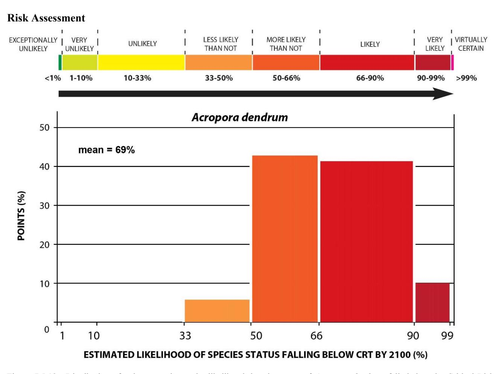

Figure 7.5.18. Distribution of points to estimate the likelihood that the status of *Acropora dendrum* falls below the Critical Risk Threshold (the species is of such low abundance, or so spatially fragmented, or at such reduced diversity that extinction is extremely likely) by 2100.

Factors that increase the potential extinction risk (higher likelihood of falling below the Critical Risk Threshold) for *Acropora dendrum* include the relatively high susceptibility of the genus *Acropora* to common threats (bleaching, acidification, disease, predation, and pollution) and the Richards' Occupancy Type 2 (see Section 7.5: Genus *Acropora*), with broad north–south distribution from Japan to southern Great Barrier Reef and east–west distribution from the South Pacific to the northern Indian Ocean, small local distribution, and small local and abundance, characteristics tending toward making this species potentially vulnerable to local extinction (Richards, 2009). The high bleaching rate of acroporid corals is the primary known threat of extinction for *Acropora dendrum*.(Richards, 2009). Factors that reduce the potential extinction risk (decrease likelihood of falling below the Critical Risk Threshold) for *Acropora dendrum* were the wide geographic range, its moderate depth range (5–20 m), it is often common and sometimes abundant, and the somewhat broad range of habitats that *Acropora aspera* finds acceptable, including its ability to grow in a variety of morphologies that are conditioned to the habitat characteristics.

The overall likelihood that *Acropora dendrum* will fall below the Critical Risk Threshold by 2100 was estimated to be in the "likely" risk category with a mean likelihood of 69% and a standard error (SE) of 6% (Fig. 7.5.18). This SE was calculated by taking the standard deviation of the seven mean voting scores of the BRT members and shows the coherence among the BRT. The uncertainty of the BRT is reflected in the range of votes of 33%–99% (Fig. 7.5.18) and the average range of likelihood estimates of the seven BRT voters (55%). The overall wide range of votes reflects the uncertainty among BRT members inherent in the lack of adequate ecological and demographic information for *Acropora dendrum.*

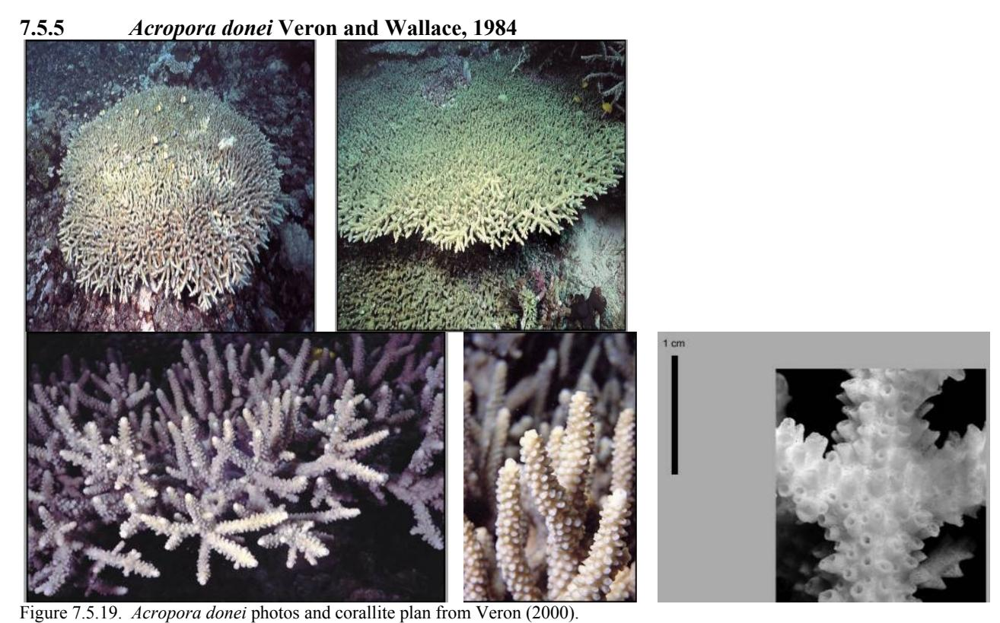

#### **Characteristics**

Colonies of *Acropora donei* are table-like, up to 2 m in diameter, and consist of masses of fused horizontal branches. Their peripheral branches are all horizontal; those towards the colony center have upturned ends. All branches have blunt ends and are neatly arranged. Radial corallites are usually in two sizes, the larger of which have flaring lips. The coenosteum is coarse, giving a rough appearance to branches. Colonies are green, white, cream, rarely pale brown in color (Veron, 2000).

#### **Taxonomy**

**Taxonomic issues**: None.*Acropora donei* is similar to *Acropora yongei*, which has similar corallites but does not have upturned branches. (Veron, 2000).

**Family**: Acroporidae.

**Evolutionary and geologic history**: No fossil records of *Acropora donei* have been reported (Wallace, 1999).

#### **Global Distribution**

The global distribution of *Acropora donei* (IUCN) has been reported from the northern Indian Ocean, the central Indo-Pacific, Australia, Southeast Asia, the oceanic west Pacific, Yemen, and Japan. *Acropora donei* has a relatively broad range overall, having the 44th largest range of 114 *Acropora* species examined (Richards, 2009).

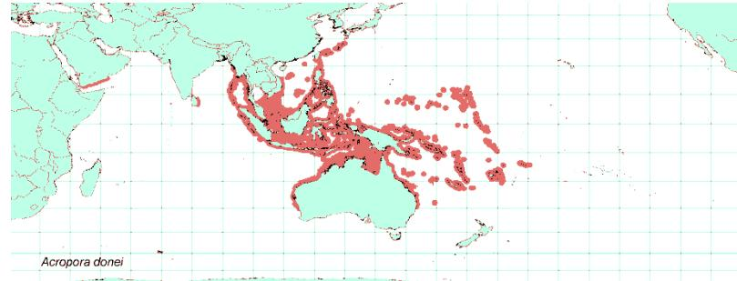

Figure 7.5.20. *Acropora donei* distribution from IUCN copied from http://www.iucnredlist.org.

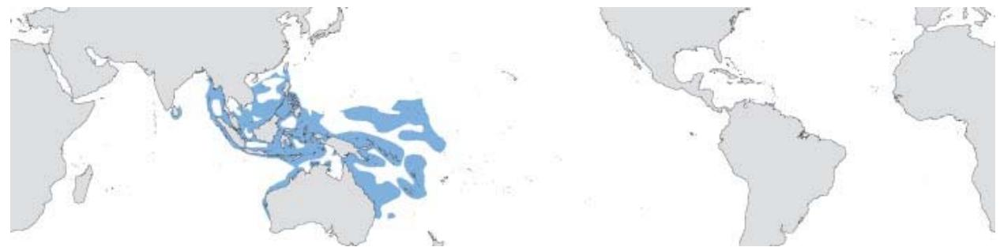

Figure 7.5.21. *Acropora donei* distribution from Veron (2000).

#### **U.S. Distribution**

According to both the IUCN Species Account and the CITES species database, *Acropora donei* occurs in American Samoa. A search of published and unpublished records of occurrence in U.S. waters indicates *Acropora donei* has been reported from Tutuila and Ofu-Olosega in American Samoa (Coles et al., 2003; Lovell and McLardy, 2008; National Park Service, 2009).

Within federally protected waters, *Acropora donei* has been recorded from the following areas (Kenyon et al., 2010b):

National Park of American Samoa, Ofu Island unit

#### **Habitat**

**Habitat**: *Acropora donei* has been reported to occupy in subtidal areas on upper reef slopes or submerged reefs, apparently restricted to shallow fringing reefs and upper reef slopes where *Acropora* diversity is high (Veron, 2000).

**Depth range**: *Acropora donei* has been reported in water depths ranging from 5 m to 20 m (Carpenter et al., 2008).

#### **Abundance**

Abundance of *Acropora donei* has been reported as uncommon but distinctive (Veron, 2000).

#### **Life History**

*Acropora donei* is a hermaphroditic spawner (Baird et al., 2002; Hayashibara et al., 1993) with lecithotrophic larvae (Baird et al., 2009) and may develop asynchronously in some areas (Guest et al., 2005b). For more genus level information, see Section 7.5: Genus *Acropora*.

#### **Threats**

For each of these possible threats, see also Section 7.5: *Genus Acropora* for additional genus level information.

**Thermal stress**: Although there is not much species-specific information about the response of *Acropora donei* to thermal stress, the genus *Acropora* are consistently ranked among the coral genera most severely susceptible to bleaching (Marshall and Baird, 2000; McClanahan et al., 2007; McClanahan et al., 2005a), although the genus may have differential responses across regions during mass bleaching mortalities (McClanahan et al., 2004a).

**Acidification**: No specific research has addressed the effects of acidification on *Acropora donei*, but experiments on acidification impacts have demonstrated negative effects on *Acropora* calcification (Anthony et al., 2008; Marubini et al., 2003; Renegar and Riegl, 2005; Schneider and Erez, 2006) and productivity (Anthony et al., 2008; Crawley et al., 2010), as well as impaired fertilization and settlement success in *Acropora palmata* (Albright et al., 2010), and reduced growth and zooxanthellae uptake in juveniles (Suwa et al., 2010). Most corals studied have shown negative relationships between acidification and growth (Table 3.2.2), and acidification is likely to contribute to reef destruction in the future (Hoegh-Guldberg et al., 2007; Silverman et al., 2009). While ocean acidification has not been demonstrated to have already caused appreciable declines in coral populations so far, the BRT considers it to be a significant threat to corals by 2100.

**Disease**: *Acropora* species are moderately to highly susceptible to disease (UNEP, 2010). Susceptibility and impacts of disease on *Acropora donei* are not known. However, ample evidence show that diseases can have devastating regional impacts on individual coral species, particularly acroporids (e.g., Aronson and Precht, 2001; Bruckner and Hill, 2009), and there is evidence that these impacts are occurring in more taxa and at a broader geographic scale (Sutherland et al., 2004; Green and Bruckner, 2000).

**Predation**: The specific effects of predation are poorly known for *Acropora donei*. Most *Acropora* are preferentially consumed by crown-of-thorns seastars (*Acanthaster planci*) (Colgan, 1987) and by corallivorous snails (B. Vargas-Ángel, CRED, Honolulu, HI, pers. comm., September 2010).

**Land-based sources of pollution (LBSP):** The specific effects stresses are largely unknown for *Acropora donei*. LBSP-related stresses (nutrients, sediment, toxins, and salinity) often act in concert rather than individually and are influenced by other biological (e.g., herbivory) and hydrological factors. Collectively, LBSP stresses are unlikely to produce extinction at a global scale; however, they may pose significant threats at local scales (particularly important for species with limited range) and reduce the resilience of corals to bleaching (Carilli et al., 2009a; Wooldridge, 2009b).

**Collection/Trade**: As a whole, the genus *Acropora* has been heavily involved in international trade with 50,000– 270,000 reported exported pieces per year from Indonesia (CITES, 2010).

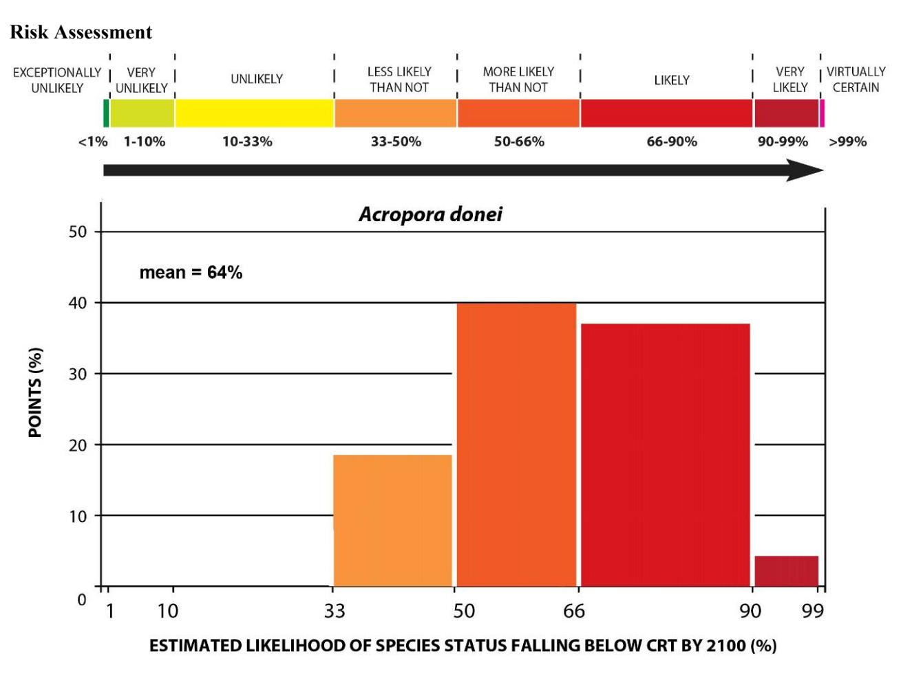

Figure 7.5.22. Distribution of points to estimate the likelihood that the status of *Acropora donei* falls below the Critical Risk Threshold (the species is of such low abundance, or so spatially fragmented, or at such reduced diversity that extinction is extremely likely) by 2100.

Factors that increase the potential extinction risk (higher likelihood of falling below the Critical Risk Threshold) for *Acropora donei* include the relatively high susceptibility of the genus *Acropora* to common threats (bleaching, acidification, disease, predation, and pollution) and the Richards occupancy estimate of 2 (see Section 7.5: "Genus *Acropora*"), small local distributions and small local abundances—these characteristics tend toward species local extinction (Richards, 2009), and the fact that it is also a distinctive species and therefore unlikely to be overlooked during surveys. The high bleaching rate of acroporid corals is the primary known threat of extinction for *Acropora donei*. Factors that reduce the potential extinction risk (decrease likelihood of falling below the Critical Risk Threshold) for *Acropora donei* were the moderate geographic and depth ranges.

The overall likelihood that *Acropora donei* will fall below the Critical Risk Threshold by 2100 was estimated to be in the "more likely than not" risk category with a mean likelihood of 64% and a standard error (SE) of 8% (Fig. 7.5.22). This SE was calculated by taking the standard deviation of the seven mean voting scores of the BRT members and shows the coherence among the BRT. The uncertainty of the BRT is reflected in the range of votes of 33%–99% (Fig. 7.5.22) and the average range of likelihood estimates of the seven BRT voters (53%). The overall wide range of votes reflects the uncertainty among BRT members inherent in the lack of adequate ecological and demographic information for *Acropora donei*.

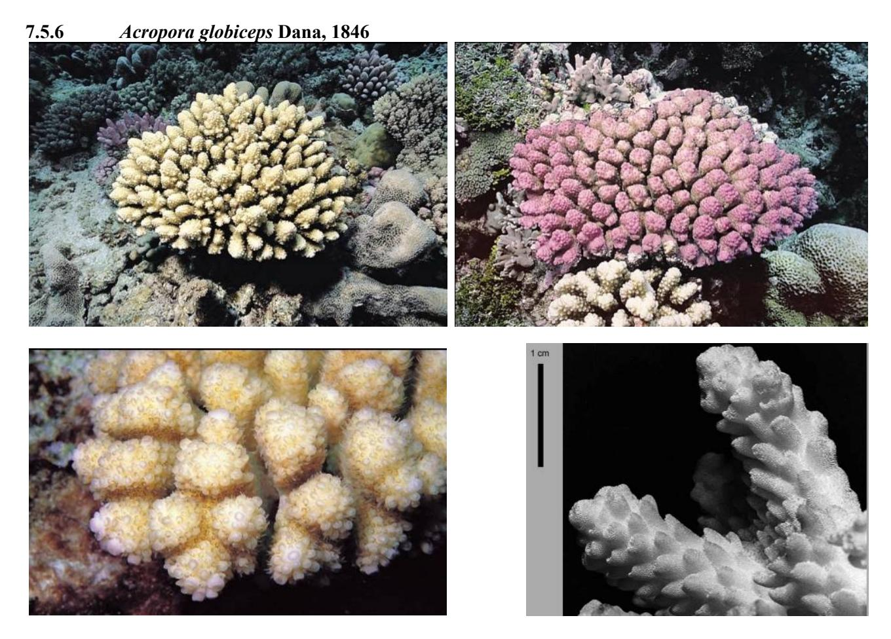

Figure 7.5.23. *Acropora globiceps* photos and corallite plan from Veron (2000).

#### **Characteristics**

Colonies of *Acropora globiceps* are digitate and usually small. The size and appearance of branches depend on degree of exposure to wave action but are always short and closely compacted. Colonies exposed to strong wave action have pyramid-shaped branchlets. Corallites are irregular in size, those on colonies on reef slopes are tubular, and those on reef flat colonies are more immersed. Axial corallites are small and sometimes indistinguishable. Radial corallites are irregular in size and are sometimes arranged in rows down the sides of branches. Colonies are uniform blue (which may photograph purple) or cream in color (Veron, 2000).

#### **Taxonomy**

**Taxonomic issues**: None. *Acropora globiceps* is similar to *Acropora gemmifera*, which has radial corallites increasing in size down the sides of branches. Colonies exposed to strong wave action have a growth-form similar to that of *Acropora monticulosa*. Corallites are similar to those of *Acropora secale* and *Acropora retusa* (Veron, 2000).

**Family**: Acroporidae.

**Evolutionary and geologic history**: Fossil records of *Acropora globiceps* have been reported from the Pleistocene (0.01–1.8 Ma) from Niue (Wallace, 1999).

#### **Global Distribution**

*Acropora globiceps* has been reported from the central Indo-Pacific, the oceanic west Pacific, and the central Pacific (IUCN, 2010). There are reports from the Great Barrier Reef (D. Fenner, Dept. Marine and Wildlife Resources, Tutuila, pers. comm., April 2010, not shown on maps), the Philippines, Andaman Islands, Polynesia, and Micronesia (IUCN, 2010) and Pitcairn (Wallace, 1999). It has been reported as common and relatively widespread longitudinally but restricted latitudinally and has a narrow depth range. *Acropora globiceps* has the 88th largest (26th smallest) range of 114 *Acropora* species examined (Richards, 2009).

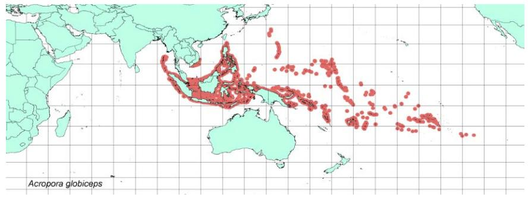

Figure 7.5.24. *Acropora globiceps* distribution from IUCN copied from http://www.iucnredlist.org.

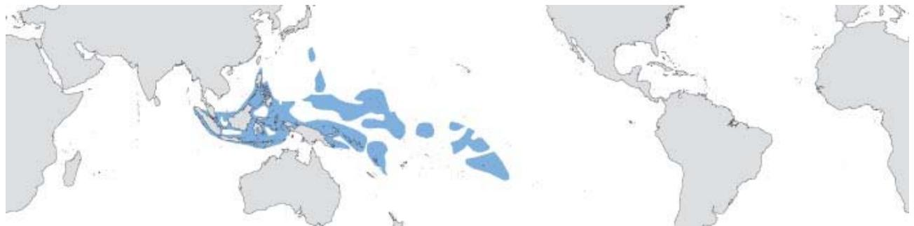

Figure 7.5.25. *Acropora globiceps* distribution from Veron (2000).

#### **U.S. Distribution**

According to both the IUCN Species Account and the CITES species database, *Acropora globiceps* occurs in American Samoa, the Northern Mariana Islands, and the U.S. minor outlying islands.

A search of published and unpublished records of occurrence in U.S. waters indicates *Acropora globiceps* has been reported from Tutuila, Ofu-Olosega, Tau, Rose Atoll, and South Bank in American Samoa (Birkeland, unpubl. data; Coles et al., 2003; CRED, unpubl. data; Kenyon et al., 2010a; Lovell and McLardy, 2008), Guam (Burdick, unpubl. data; Wallace, 1999), Palmyra Atoll (Williams et al., 2008b), and Kingman Reef (CRED, unpubl. data).

Within federally protected waters, *Acropora globiceps* has been recorded from the following areas (Kenyon et al., 2010b):

- Pacific Remote Islands Marine National Monument (Palmyra, Kingman)
- National Park of American Samoa, Ofu Island unit
- Rose Atoll Marine National Monument

#### **Habitat**

**Habitat**: *Acropora globiceps* has been reported from intertidal, upper reef slopes and reef flats (Veron, 2000).

**Depth range:** *Acropora globiceps* has been reported in water depths ranging from 0 m to 8 m (Veron, 2000).

#### **Abundance**

Abundance of *Acropora globiceps* has been reported as common (Veron, 2000).

#### **Life History**

*Acropora globiceps* is a hermaphroditic spawner with lecithotrophic larvae (Baird et al., 2009). For more genus level information, see Section 7.5: Genus *Acropora*.

#### **Threats**

For each of these possible threats, see also Section 7.5: *Genus Acropora* for additional genus level information.

**Thermal stress:** Although there is not much species-specific information about the response of *Acropora globiceps* to thermal stress, the genus *Acropora* are consistently ranked among the coral genera most severely susceptible to bleaching (Marshall and Baird, 2000; McClanahan et al., 2007; McClanahan et al., 2005a), although the genus may have differential responses across regions during mass bleaching mortalities (McClanahan et al., 2004a).

**Acidification:** No specific research has addressed the effects of acidification on *Acropora globiceps*, but experiments on acidification impacts have demonstrated negative effects on *Acropora* calcification (Anthony et al., 2008; Marubini et al., 2003; Renegar and Riegl, 2005; Schneider and Erez, 2006) and productivity (Anthony et al., 2008; Crawley et al., 2010), as well as impaired fertilization and settlement success in *Acropora palmata* (Albright et al., 2010) and reduced growth and zooxanthellae uptake in juveniles (Suwa et al., 2010). Most corals studied have shown negative relationships between acidification and growth (Table 3.2.2), and acidification is likely to contribute to reef destruction in the future (Hoegh-Guldberg et al. 2007, Silverman et al. 2009). While ocean acidification has not been demonstrated to have caused appreciable declines in coral populations so far, the BRT considers it to be a significant threat to corals by 2100.

**Disease:** There is little species-specific information, although in general *Acropora* species are moderately to highly susceptible to disease. Susceptibility and impacts of disease on *Acropora globiceps* are not known. However, ample evidence show that diseases can have devastating regional impacts on individual coral species (e.g., (Aronson and Precht, 2001; Bruckner and Hill, 2009)), and there is evidence that these impacts are occurring in more taxa and at a broader geographic scale (Green and Bruckner, 2000; Sutherland et al., 2004).

**Predation:** The specific effects of predation are poorly known for *Acropora globiceps*. Most *Acropora* are preferentially consumed by crown-of-thorns seastars (*Acanthaster planci*) (Colgan, 1987) and by corallivorous snails (B. Vargas-Ángel, CRED, Honolulu, HI, pers. comm., September 2010).

**Land-based sources of pollution (LBSP):** The specific effects of LBSP stresses are largely unknown for *Acropora globiceps*. LBSP-related stresses (nutrients, sediment, toxins, and salinity) often act in concert rather than individually,and are influenced by other biological (e.g., herbivory) and hydrological factors. Collectively, LBSP stresses are unlikely to produce extinction at a global scale; however, they may pose significant threats at local scales (particularly important for species with limited range) and reduce the resilience of corals to bleaching (Carilli et al., 2009a; Wooldridge, 2009b).

**Collection/Trade:** As a whole, the genus *Acropora* has been heavily involved in international trade with 50,000– 270,000 reported exported pieces per year from Indonesia (CITES, 2010).

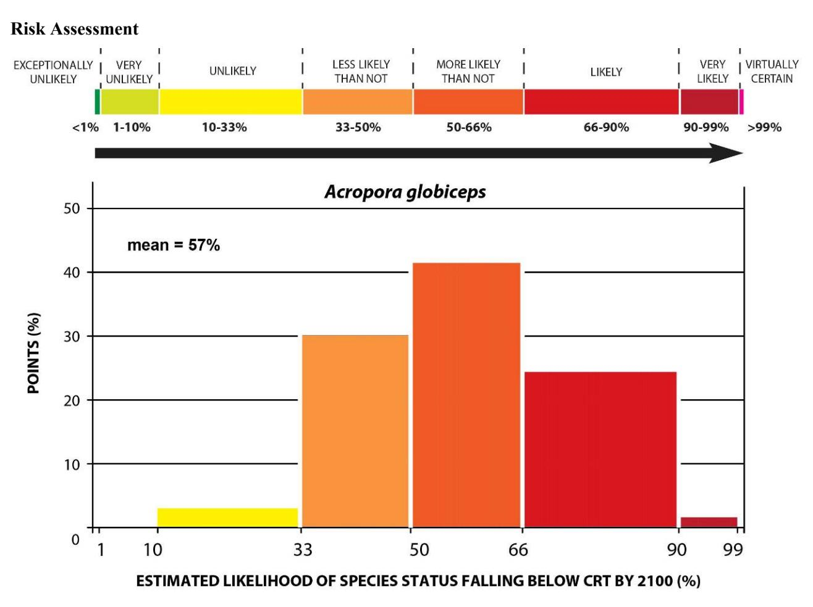

Figure 7.5.26. Distribution of points to estimate the likelihood that the status of *Acropora globiceps* falls below the Critical Risk Threshold (the species is of such low abundance, or so spatially fragmented, or at such reduced diversity that extinction is extremely likely) by 2100.

Factors that increase the potential extinction risk (higher likelihood of falling below the Critical Risk Threshold) for *Acropora globiceps* include the relatively high susceptibility of the genus *Acropora* to common threats (bleaching, acidification, disease, predation, and pollution), its restricted depth range (0-8 m), and narrow geographic and latitudinal distribution. The high bleaching rate of acroporid corals is the primary known threat of extinction for *Acropora globiceps*. Factors that reduce the potential extinction risk (decrease likelihood of falling below the Critical Risk Threshold) for *Acropora globiceps* were the reports of common abundance and persistence in intertidal habitats, suggesting potentially increased physiological tolerance. Wide geographic range was considered to decrease extinction risk, since it makes the species more likely to escape stresses or catastrophes in at least some locations.

The overall likelihood that *Acropora globiceps* will fall below the Critical Risk Threshold by 2100 was estimated to be in the "more likely than not" risk category with a mean likelihood of 57% and a standard error (SE) of 8% (Fig. 7.5.26). This SE was calculated by taking the standard deviation of the seven mean voting scores of the BRT members and shows the coherence among the BRT. The uncertainty of the BRT is reflected in the range of votes of 10%–99% (Fig. 7.5.26) and the average range of likelihood estimates of the seven BRT voters (58%). The overall wide range of votes reflects the uncertainty among BRT members inherent in the lack of adequate ecological and demographic information for *Acropora globiceps*.

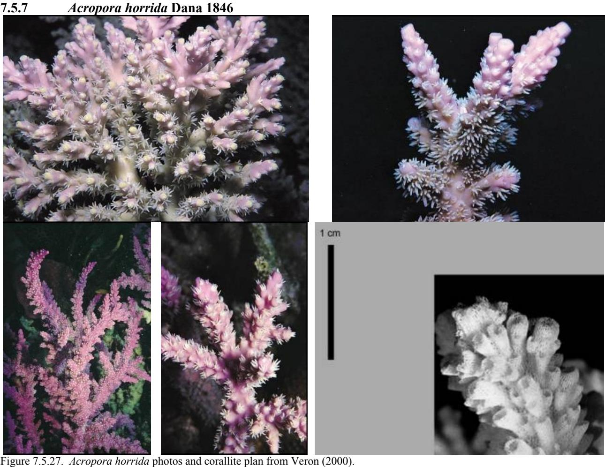

#### **Characteristics**

Colonies of *Acropora horrida* are usually open branched, becoming bushy on upper reef slopes and in shallow lagoons. Main branches of colonies in turbid water have irregular branchlets; those in shallow clear water have compact branchlets, giving colonies a bushy appearance. Corallites are irregular and the surface of branches is rough. Tentacles are usually extended during the day. Colonies are usually pale blue (which may photograph pink or purple), sometimes dark blue or pale yellow or brown. Polyps are pale blue or white (Veron, 2000).

#### **Taxonomy**

**Taxonomic issues**: *Acropora horrida* is similar to *Acropora tortuosa*, and also to *Acropora vaughani*, which has widely-spaced corallites and a smooth coenosteum (Veron, 2000).

**Family**: Acroporidae.

**Evolutionary and geologic history**: Fossil records of *Acropora horrida* dating back to the Pliocene (1.8–5.3 Ma) were reported from Papua New Guinea (Wallace, 1999).

#### **Global Distribution**

*Acropora horrida* has been reported to have large longitudinal and latitudinal ranges. Reported ranges include the Red Sea and the Gulf of Aden, the southwest and northwest Indian Ocean, the Arabian/Iranian Gulf, the northern Indian Ocean, the central Indo-Pacific, east and west coasts of Australia, Southeast Asia, Japan and the East China Sea, the oceanic west Pacific, and the central Pacific (IUCN, 2010). It is found in Palau (Randall, 1995) and the Line Islands (Wallace, 1999). *Acropora horrida* has a very broad range overall, having the 14th largest range of 114 *Acropora* species examined (Richards, 2009).

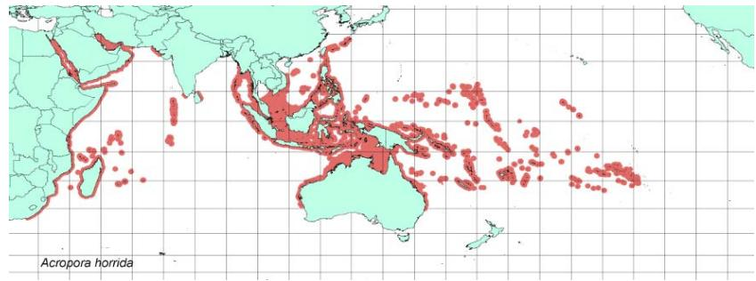

Figure 7.5.28. *Acropora horrida* distribution from IUCN copied from http://www.iucnredlist.org**.**

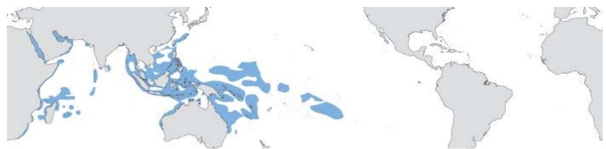

Figure 7.5.29. *Acropora horrida* distribution from Veron (2000).

#### **U.S. Distribution**

According to both the IUCN Species Account and the CITES species database, *Acropora horrida* occurs in American Samoa. The IUCN Species Account also notes its occurrence in the U.S. minor outlying islands but the CITES database does not.

A search of published and unpublished records of occurrence in U.S. waters indicates *Acropora horrida* has been reported from Tutuila and Ofu-Olosega in American Samoa (Lovell and McLardy, 2008; National Park Service, 2009). No reference supporting its occurrence in the U.S. minor outlying islands, as reported in the IUCN Species Account, has been identified.

Within federally protected waters, *Acropora horrida* has been recorded from the following areas (Kenyon et al., 2010b):

National Park of American Samoa, Ofu Island unit

#### **Habitat**

**Habitat**: *Acropora horrida* has been reported to occupy fringing reefs with turbid water (Veron 2000), subtidal, sheltered habitats, protected deepwater flats, lagoons, and sandy slopes (Wallace, 1999).

**Depth range**: *Acropora horrida* has been reported in water depths ranging from 5 m to -20 m (Carpenter et al., 2008).

#### **Abundance**

Abundance of *Acropora horrida* has been reported as usually uncommon (Veron, 2000).

#### **Life History**

*Acropora horrida* is a hermaphroditic spawner (Babcock et al., 1994; Baird et al., 2002; Kenyon, 1995) with lecithotrophic larvae (Baird et al., 2009), although spawning may be asynchronyous in some areas (Baird et al., 2002). Mean egg size for *Acropora horrida* has been recorded as 0.64 mm and mean polyp fecundity has been recorded as 9.0 eggs per polyp (Wallace, 1999). This species did not spawn on the central Great Barrier Reef during the major multispecies spawning events in early summer 1981-1983. Colonies of this species in which gametogenesis did not proceed to completion differed from those in which it did in two ways: they were in deeper water and they underwent chronic fragmentation and partial burial. It is possible that their resources were at all times allocated to extension in preference to sexual reproduction (Wallace, 1985). For more genus level information, see Section 7.5 "Genus *Acropora*."

#### **Threats**

For each of these possible threats, see also Section 7.5: *Genus Acropora* for additional genus level information.

**Thermal stress:** Although there is not much species-specific information about the response of *Acropora horrida* to thermal stress, the genus *Acropora* are consistently ranked among the coral genera most severely susceptible to bleaching (Marshall and Baird, 2000; McClanahan et al., 2007; McClanahan et al., 2005a), although the genus may have differential responses across regions during mass bleaching mortalities. *Acropora horrida* is thought to have been locally extirpated in the Arabian Gulf after the 1996 and 1998 bleaching events (Riegl 2002). That said, *Acropora horrida* is considered less susceptible to bleaching than other *Acropora* spp (Done et al., 2003).

**Acidification:** No specific research has addressed the effects of acidification on *Acropora horrida*, but experiments on acidification impacts have demonstrated negative effects on *Acropora* calcification (Anthony et al., 2008; Marubini et al., 2003; Renegar and Riegl, 2005; Schneider and Erez, 2006) and productivity (Anthony et al., 2008; Crawley et al., 2010), as well as impaired fertilization and settlement success in *Acropora palmata* (Albright et al., 2010), and reduced growth and zooxanthellae uptake in juveniles (Suwa et al., 2010). Most corals studied have shown negative relationships between acidification and growth (Table 3.2.2), and acidification is likely to contribute to reef destruction in the future (Hoegh-Guldberg et al., 2007; Silverman et al., 2009). While ocean acidification has not been demonstrated to have caused appreciable declines in coral populations so far, the BRT considers it to be a significant threat to corals by 2100.

**Disease:** Susceptibility and impacts of disease on *Acropora horrida* are not known, although in general *Acropora* species are moderately to highly susceptible to disease. Ample evidence show that diseases can have devastating regional impacts on individual coral species (e.g., (Aronson and Precht, 2001; Bruckner and Hill, 2009)), and there is evidence that these impacts are occurring in more taxa and at a broader geographic scale (Sutherland et al., 2004, Green and Bruckner 2000).

**Predation:** The specific effects of predation are poorly known for *Acropora horrida*. Most *Acropora* are preferentially consumed by crown-of-thorns seastars (*Acanthaster planci*) (Colgan, 1987) and by corallivorous snails (B. Vargas-Ángel, Honolulu, HI, pers. comm., September 2010).

**Land-based sources of pollution (LBSP):** The specific effects of LBSP-related stresses are largely unknown for *Acropora horrida.* LBSP-related stresses (nutrients, sediment, toxins, and salinity) often act in concert rather than individually and are influenced by other biological (e.g., herbivory) and hydrological factors. Collectively, LBSP stresses are unlikely to produce extinction at a global scale; however, they may pose significant threats at local scales (particularly important for species with limited range) and reduce the resilience of corals to bleaching (Carilli et al., 2009a; Wooldridge, 2009b).

**Collection/Trade:** As a whole, the genus *Acropora* has been heavily involved in international trade with 50,000– 270,000 reported exported pieces per year from Indonesia and 30,000–100,000 pieces from Fiji (CITES, 2010).

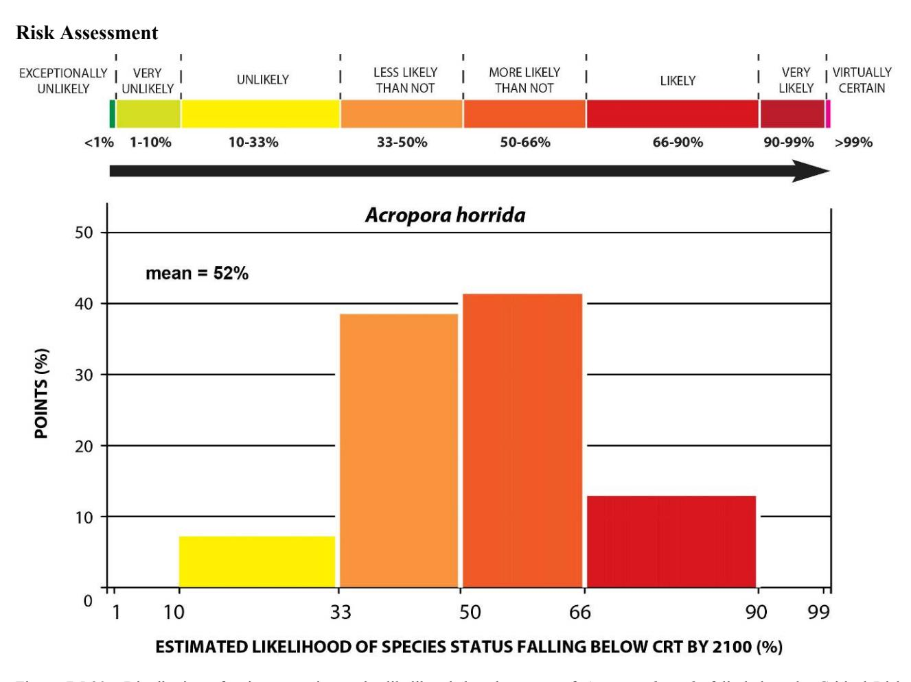

Figure 7.5.30. Distribution of points to estimate the likelihood that the status of *Acropora horrida* falls below the Critical Risk Threshold (the species is of such low abundance, or so spatially fragmented, or at such reduced diversity that extinction is extremely likely) by 2100.

Factors that increase the potential extinction risk (higher likelihood of falling below the Critical Risk Threshold) for *Acropora horrida* include the relatively high susceptibility of the genus *Acropora* to common threats (bleaching, acidification, disease, predation, and pollution). The high bleaching rate of acroporid corals is the primary known threat of extinction for *Acropora horrida*. Factors that reduce the potential extinction risk (decrease likelihood of falling below the Critical Risk Threshold) for *Acropora horrida* were the very broad longitudinal and latitudinal distributions, Richards' occupancy estimate of 6 (see Section 7.5: Genus *Acropora*), with large local distributions and small local abundance—these characteristics tend toward species persistence (Richards, 2009), tolerance for turbid water, and it is considered less susceptible to bleaching than other *Acropora* species.

The overall likelihood that *Acropora horrida* will fall below the Critical Risk Threshold by 2100 was estimated to be in the "more likely than not" risk category with a mean likelihood of 52% and a standard error (SE) of 7% (Fig. 7.5.30). This SE was calculated by taking the standard deviation of the seven mean voting scores of the BRT members and shows the coherence among the BRT. The uncertainty of the BRT is reflected in the range of votes of 10%–90% (Fig. 7.5.30) and the average range of likelihood estimates of the seven BRT voters (57%). The overall wide range of votes reflects the uncertainty among BRT members inherent in the lack of ecological and demographic information. The uncertainty shown in the range of votes stems also from the tension between the relatively high risk of *Acropora* as a genus versus the potential for *Acropora horrida* to be among the less vulnerable species of that genus.

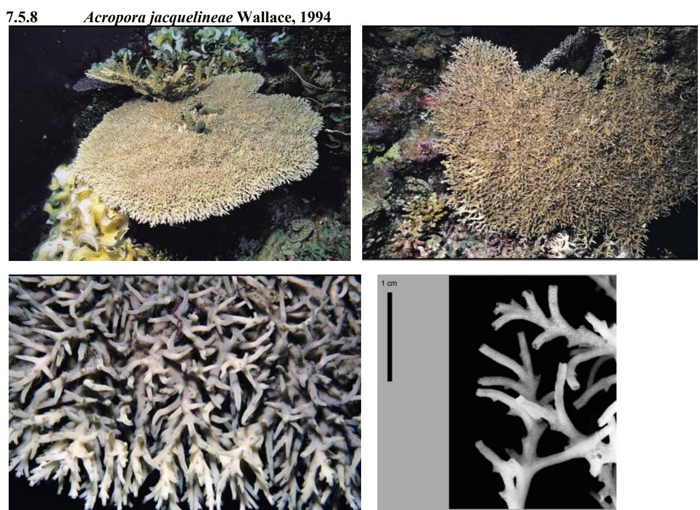

Figure 7.5.31. *Acropora jacquelineae* photos and corallite plan from Veron (2000).

#### **Characteristics**

Colonies of *Acropora jacquelineae* are flat plates up to 1 m in diameter. Viewed from above, plates are covered with a mass of fine delicately-curved axial corallites giving an almost moss-like appearance. There is almost no development of radial corallites. Colonies are uniform grey-brown or pinkish in color (Veron, 2000).

#### **Taxonomy**

**Taxonomic issues**: Genetic analyses among 35 *Acropora* spp. examining variation in both mitochondrial (mt control region) and nuclear (PaxC) markers indicates that *Acropora jacquelineae* is polyphyletic for the mitochondrial marker, but monophyletic for the nuclear marker (Richards et al., 2008b). This pattern, along with evidence of some allele sharing with other species, is consistent with *Acropora jacquelineae* having a complex, reticulate evolutionary history including introgression, but does not provide strong evidence that it consititues a 'hybrid species' as is shown for other *Acropora* spp. in Richards' analysis (Richards et al., 2008b), none of which are candidate coral species considered in this Status Review Report. Hence, the BRT considered *Acropora jacquelineae* as a valid species. *Acropora jacquelineae* is similar to *Acropora paniculata* which has larger corallites (Veron, 2000).

**Family**: Acroporidae.

**Evolutionary and geologic history**: No fossil records of *Acropora jacquelineae* have been reported (Wallace, 1999).

#### **Global Distribution**

*Acropora jacquelineae* has been reported from the central Indo-Pacific (IUCN, 2010). It has been found in Indonesia and Papau New Guinea (Richards et al., 2008b). It has also been recorded in the Philippines, American Samoa, Suluwesi, and Papau New Guinea (D. Fenner, Dept. Marine and Wildlife Resources, Tutuila, pers. comm., April 2010). *Acropora jacqulineae* has a fairly limited range overall, having the 22nd smallest range of 114 *Acropora* species examined (Richards, 2009).

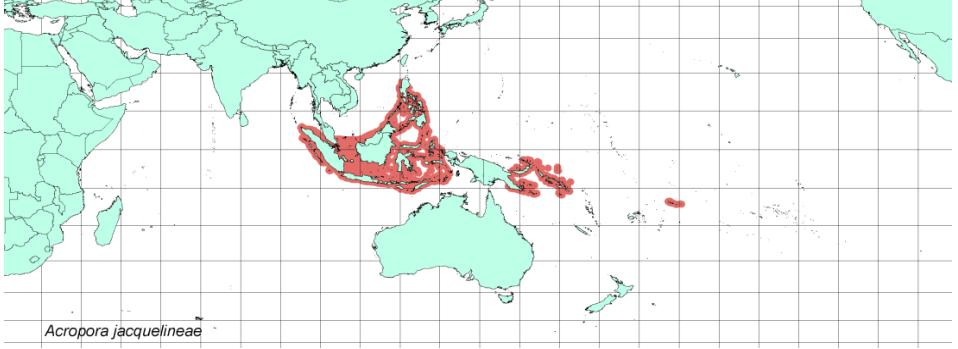

Figure 7.5.32. *Acropora jacquelineae* distribution from IUCN copied from http://www.iucnredlist.org.

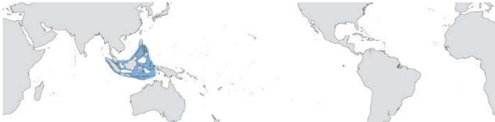

Figure 7.5.33. *Acropora jacquelineae* distribution from Veron (2000).

#### **U.S. Distribution**

According to the IUCN Species Account, *Acropora jacquelineae* occurs in American Samoa, with the supporting reference given as Fenner (pers. comm.). The CITES species database does not include any record of occurrence in U.S. waters. *Acropora jacquelineae* is not listed as occurring in American Samoa in Lovell and McLardy (2008).

D. Fenner (Dept. Marine and Wildlife Resources, Tutuila, pers. comm., April 2010) reports *Acropora jacquelineae* in American Samoa at Tutuila. Visual identifications are supported by photographs (2) and a sample. This species is similar to *Acropora granulosa* and *Acropora speciosa* but has thinner corallites than either. A sample was collected and fits the description of *Acropora jacquelineae* in all aspects including corallite diameter. So far it has only been found at Faga'alu, Tutuila, where it was found in water around depths of 20–25 m and was relatively rare. The tsunami of 29 September 2009 caused extensive damage at this site at these depths. No search for this species has been conducted since the tsunami.

This species was not observed elsewhere in American Samoa by Fenner during dedicated surveys conducted at 38 sites off Ofu-Olosega, Tau, Rose Atoll, Swains, and South Bank in March 2010 (CRED, unpubl. data). No other published or unpublished data sources indicate the occurrence of *Acropora jacquelineae* elsewhere in U.S. waters.

*Acropora jacquelineae* has not been recorded from federally protected waters.

#### **Habitat**

**Habitat**: *Acropora jacquelineae* has been reported to occupy subtidal, walls, ledges on walls, and shallow reef slopes protected from wave action (Veron, 2000; Wallace, 1999).

**Depth range**: *Acropora horrida* has been reported in water depths ranging from 10 m to 35 m (Carpenter et al., 2008; Wallace, 1999).

#### **Abundance**

Abundance of *Acropora horrida* has been reported as uncommon (Veron, 2000).

#### **Life History**

*Acropora jacquelineae* is a hermaphroditic spawner (Baird et al., 2002) with lecithotrophic larvae (Baird et al., 2009). For more genus level information, see Section 7.5: Genus *Acropora*.

#### **Threats**

For each of these possible threats, see also Section 7.5: Genus *Acropora* for additional genus level information.

**Thermal stress:** Although there is not much species-specific information about the response of *Acropora jacquelineae*  to thermal stress, the genus *Acropora* are consistently ranked among the coral genera most severely susceptible to bleaching (Marshall and Baird, 2000; McClanahan et al., 2007; McClanahan et al., 2005a). However, the genus may have differential responses across regions during mass bleaching mortalities (McClanahan et al., 2004a). For more genus level information, see Section 7.5: Genus *Acropora*.

**Acidification:** No specific research has addressed the effects of acidification on *Acropora jacquelineae,* but experiments on acidification have demonstrated negative effects on *Acropora* calcification (Anthony et al., 2008; Marubini et al., 2003; Renegar and Riegl, 2005; Schneider and Erez, 2006) and productivity (Anthony et al., 2008; Crawley et al., 2010), as well as impaired fertilization and settlement success in *Acropora palmata* (Albright et al., 2010), and reduced growth and zooxanthellae uptake in juveniles (Suwa et al., 2010). Most corals studied have shown negative relationships between acidification and growth (Table 3.2.2), and acidification is likely to contribute to reef destruction in the future (Hoegh-Guldberg et al., 2007; Silverman et al., 2009). While ocean acidification has not been demonstrated to have already caused appreciable declines in coral populations so far, the BRT considers it to be a significant threat to corals by 2100.

**Disease:** Susceptibility and impacts of disease on *Acropora jacquelineae* are not known, although in general *Acropora* species are moderately to highly susceptible to disease. Additionally, ample evidence show that diseases can have devastating regional impacts on individual coral species (e.g., Aronson and Precht, 2001; Bruckner and Hill, 2009) and evidence also show that these impacts are occurring in more taxa and at a broader geographic scale (Sutherland et al., 2004; Green and Bruckner, 2000).

**Predation:** The specific effects of predation are poorly known for *Acropora jacquelineae*. Most *Acropora* are preferentially consumed by crown-of-thorns seastars (*Acanthaster planci*) (Colgan, 1987) and by corallivorous snails (B. Vargas-Ángel, CRED, Honolulu, HI, pers. comm., September 2010).

**Land-based sources of pollution (LBSP):** The specific effects of LBSP stresses are largely unknown for *Acropora jacquelineae*. LBSP-related stresses (nutrients, sediment, toxins, and salinity) often act in concert rather than individually and are influenced by other biological (e.g., herbivory) and hydrological factors. Collectively, LBSP stresses are unlikely to produce extinction at a global scale; however, they may pose significant threats at local scales (particularly important for species with limited range) and reduce the resilience of corals to bleaching (Carilli et al., 2009a; Wooldridge, 2009b).

**Collection/Trade:** As a whole, the genus *Acropora* has been heavily involved in international trade with 50,000– 270,000 reported pieces being exported per year from Indonesia (CITES, 2010).

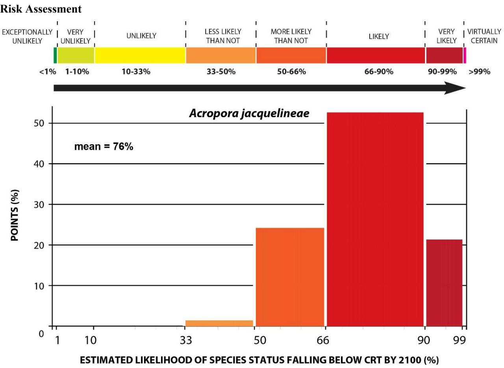

Figure 7.5.34. Distribution of points to estimate the likelihood that the status of *Acropora jacquelineae* falls below the Critical Risk Threshold (the species is of such low abundance, or so spatially fragmented, or at such reduced diversity that extinction is extremely likely) by 2100.

Factors that increase the potential extinction risk (higher likelihood of falling below the Critical Risk Threshold) for *Acropora jacquelineae* include the relatively high susceptibility of the genus *Acropora* to common threats (bleaching, acidification, disease, predation, and pollution), a small effective population size (of the few species with actual data), limited range, restricted latitudinal range, Richards occupancy estimate of 1 (see Section 7.5: Genus *Acropora*) with a small global distribution, small local distributions, and small local abundances—these characteristics tend toward species extinction (Richards, 2009) and its genetic uncertainty with potential introgression (Richards, 2009). The high bleaching rate of acroporid corals is the primary known threat of extinction for *Acropora jacquelineae*.

The overall likelihood that *Acropora jacquelineae* will fall below the Critical Risk Threshold by 2100 was estimated to be in the "likely" risk category with a mean likelihood of 76% and a standard error (SE) of 7% (Fig. 7.5.34). This SE was calculated by taking the standard deviation of the seven mean voting scores of the BRT members and shows the coherence among the BRT. The uncertainty of the BRT is reflected in the range of votes of 33%–99% (Fig. 7.5.34) and the average range of likelihood estimates of the seven BRT voters (50%). The overall range of votes reflects the uncertainty among BRT members inherent in the lack of ecological and demographic information. Although the range of votes is somewhat broad, more than half of the votes were for "likely."

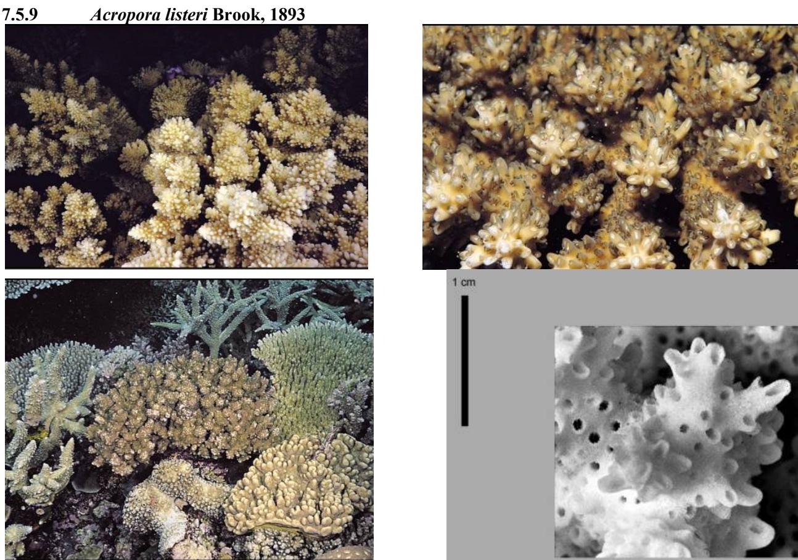

Figure 7.5.35. *Acropora listeri* photos and corallite plan from Veron (2000).

#### **Characteristics**

Colonies of *Acropora listeri* are irregular clumps or corymbose plates with thick branches of highly irregular length and shape. Branches may be tapered (in wave-washed habitats), conical, dome-shaped or globular (in less-exposed habitats), depending upon the degree of formation of axial corallites. One or more axial corallites may occur on branch ends or, commonly, there are no axial corallites. Radial corallites are irregularly immersed to tubular and often have slit-like openings and pointed rims, giving colonies a spiny appearance. Colonies are cream or brown in color (Veron, 2000).

#### **Taxonomy**

**Taxonomic issues**: None. "Like *Acropora polystoma*, this species is not easily identified in the field and it appears to be restricted to reef edge situations" (Wallace, 1999). *Acropora listeri* is similar to *Acropora polystoma*, which has welldefined axial corallites; it does not form dome-shaped or globular branches and has less irregular radial corallites. It is also similar to *Acropora lutkeni* (Veron, 2000).

**Family**: Acroporidae.

**Evolutionary and geologic history**: Fossil records of *Acropora listeri* have been reported from the Pleistocene (1.8– 0.01 Ma) from Niue (Wallace, 1999).

#### **Global Distribution**

*Acropora listeri* has been reported from the Red Sea and the Gulf of Aden (questionable according to Veron 2000), the northern Indian Ocean, the central Indo-Pacific, east and west coasts of Australia, Southeast Asia, Japan and the East China Sea, the oceanic west Pacific, and the central Pacific (IUCN, 2010). It has also been found in Mauritius (Wallace, 1999). *Acropora listeri* has a very broad range overall, having the 13th largest range of 114 Acropora species examined (Richards, 2009).

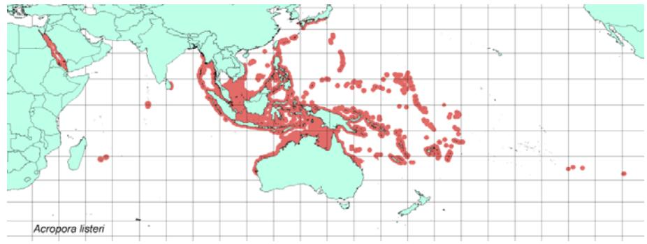

Figure 7.5.36. *Acropora listeri* distribution from IUCN copied from http://www.iucnredlist.org.

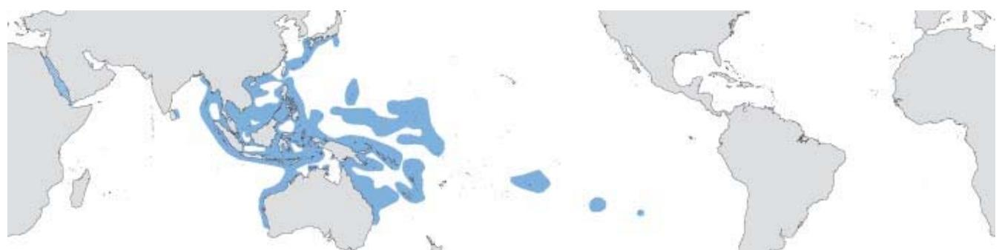

Figure 7.5.37. *Acropora listeri* distribution from Veron (2000).

#### **U.S. Distribution**

According to both the IUCN Species Account and the CITES species database, *Acropora listeri* occurs in American Samoa and the Northern Mariana Islands. The IUCN Species Account also notes its occurrence in the U.S. minor outlying islands but the CITES database does not.

A search of published and unpublished records of occurrence in U.S. waters indicates *Acropora listeri* has been reported from Tutuila in American Samoa (Coles et al., 2003; National Park Service, 2009), and Guam (Wallace, 1999). No reference supporting its occurrence in the U.S. minor outlying islands, as reported in the IUCN Species Account, has been identified.

Within federally protected waters, *Acropora listeri* has been recorded from the following areas (Kenyon et al., 2010b):

National Park of American Samoa, Tutuila Island unit

#### **Habitat**

**Habitat**: *Acropora listeri* has been reported from subtidal shallow reef edges, upper reef slopes, and in strong wave action (Veron, 2000; Wallace, 1999).

**Depth range**: *Acropora listeri* has been reported in water depths ranging from near the surface to 15 m (Veron, 2000).

#### **Abundance**

Abundance of *Acropora listeri* has been reported as uncommon (Veron, 2000).

#### **Life History**

*Acropora listeri* is a hermaphroditic spawner (Baird et al., 2010; Harrison et al., 1984) with lecithotrophic larvae (Baird et al., 2009). For more genus level information, see Section 7.5: Genus *Acropora*.

#### **Threats**

For each of these possible threats, see also Section 7.5: *Genus Acropora* for additional genus level information.

**Thermal stress:** Although there is not much species-specific information about the response of *Acropora listeri* to thermal stress, the genus *Acropora* are consistently ranked among the coral genera most severely susceptible to bleaching (Marshall and Baird, 2000; McClanahan et al., 2007; McClanahan et al., 2005a). However, the genus may have differential responses across regions during mass bleaching mortalities (McClanahan et al., 2004a). *Acropora listeri* has moderate to high bleaching susceptibility among *Acropora* (Done et al., 2003).

**Acidification:** No specific research has addressed the effects of acidification on *Acropora listeri*, but experiments on acidification have demonstrated negative effects on *Acropora* calcification (Anthony et al., 2008; Marubini et al., 2003; Renegar and Riegl, 2005; Schneider and Erez, 2006) and productivity (Anthony et al., 2008; Crawley et al., 2010), as well as impaired fertilization and settlement success in *Acropora palmata* (Albright et al., 2010) and reduced growth and zooxanthellae uptake in juveniles (Suwa et al., 2010)*.* Most corals studied have shown negative relationships between acidification and growth (Table 3.2.2), and acidification is likely to contribute to reef destruction in the future (Hoegh-Guldberg et al., 2007; Silverman et al., 2009). While ocean acidification has not been demonstrated to have already caused appreciable declines in coral populations so far, the BRT considers it to be a significant threat to corals by 2100.

**Disease:** In general, *Acropora* species are moderately to highly susceptible to disease. Specific susceptibility and impacts of disease on this species are not known. However, ample evidence show that diseases can have devastating regional impacts on individual coral species, particularly acroporids (e.g., Aronson and Precht, 2001; Bruckner and Hill, 2009), and there is evidence that these impacts are occurring in more taxa and at a broader geographic scale (Sutherland et al., 2004; Green and Bruckner, 2000).

**Predation:** The specific effects of predation are poorly known for *Acropora listeri*. Most *Acropora* are preferentially consumed by crown-of-thorns seastars (*Acanthaster planci*) (Colgan, 1987) and by corallivorous snails (B. Vargas-Ángel, CRED, Honolulu, HI, pers. comm., September 2010).

**Land-based sources of pollution (LBSP):** The specific effects of LBSP stresses are largely unknown for *Acropora listeri*. LBSP-related stresses (nutrients, sediment, toxins, and salinity) often act in concert rather than individually, and are influenced by other biological (e.g., herbivory) and hydrological factors. Collectively, LBSP stresses are unlikely to produce extinction at a global scale; however, they may pose significant threats at local scales (particularly important for species with limited range) and reduce the resilience of corals to bleaching (Carilli et al., 2009a; Wooldridge, 2009b).

**Collection/Trade:** As a whole, the genus *Acropora* has been heavily involved in international trade with 50,000– 270,000 reported exported pieces per year from Indonesia (CITES, 2010).

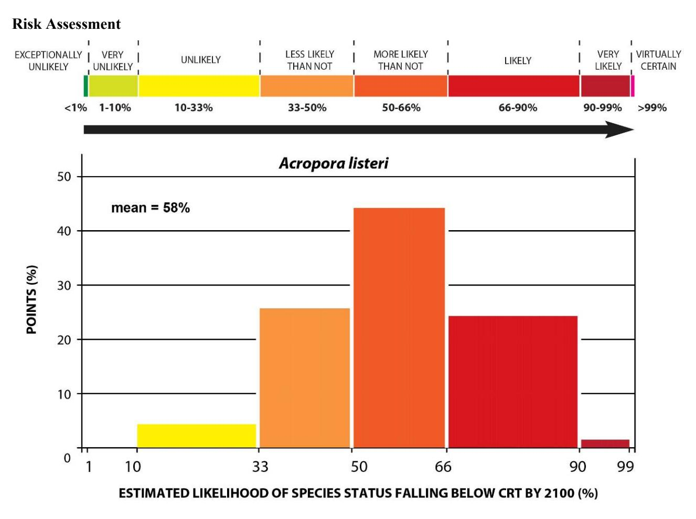

Figure 7.5.38. Distribution of points to estimate the likelihood that the status of *Acropora listeri* falls below the Critical Risk Threshold (the species is of such low abundance, or so spatially fragmented, or at such reduced diversity that extinction is extremely likely) by 2100.

Factors that increase the potential extinction risk (higher likelihood of falling below the Critical Risk Threshold) for *Acropora listeri* include the relatively high susceptibility of the genus *Acropora* to common threats (bleaching, acidification, disease, predation, and pollution), a Richards' Occupancy Type 2 (see Section 7.5: Genus *Acropora*) with large global distribution, limited local distribution, uncommon local abundance—these characteristics tend toward species local extinction (Richards, 2009). The high bleaching rate of acroporid corals is the primary known threat of extinction for *Acropora listeri*. Factors that reduce the potential extinction risk (decrease likelihood of falling below the Critical Risk Threshold) for *Acropora listeri* were the broad longitudinal and latitudinal distributions, moderate depth range (0 m-15 m), and tolerance for high-energy environments.

The overall likelihood that *Acropora listeri* will fall below the Critical Risk Threshold by 2100 was estimated to be in the "more likely than not" risk category with a mean likelihood of 58% and a standard error (SE) of 7% (Fig. 7.5.38). This SE was calculated by taking the standard deviation of the seven mean voting scores of the BRT members and shows the coherence among the BRT. The uncertainty of the BRT is reflected in the very wide range of votes of 10%– 99% (Fig. 7.5.38) and the average range of likelihood estimates of the seven BRT voters (65%). The overall range of votes reflects the uncertainty among BRT members inherent in the lack of ecological and demographic information for *Acropora listeri*.

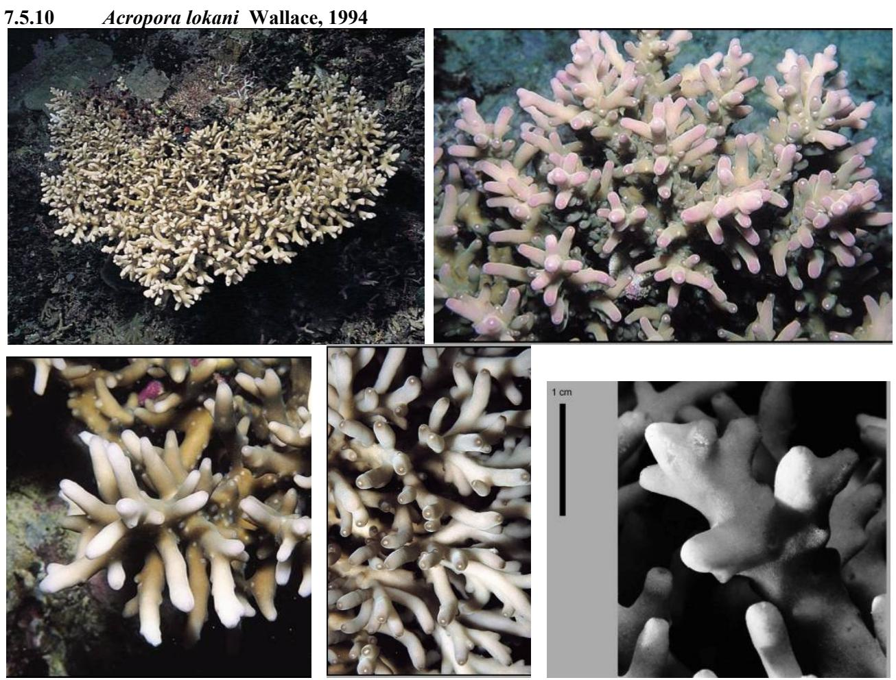

Figure 7.5.39. *Acropora lokani* photos and corallite plan from Veron (2000).

#### **Characteristics**

Colonies of *Acropora lokani* are composed of robust horizontal main branches that usually diverge. Short upright branchlets diverge from main branches. Axial corallites and incipient axial corallites radiate from branchlets and are tubular in shape and large. Radial corallites are small and pocket shaped. Colonies are cream, brown or blue (which may photograph pink) in color (Veron, 2000).

#### **Taxonomy**

**Taxonomic issues**: None. *Acropora lokani* is similar to *Acropora caroliniana* which has smaller corallites and *Acropora granulosa* (Veron, 2000).

**Family:** Acroporidae.

**Evolutionary and geologic history**: No fossil records of *Acropora lokani* have been reported (Wallace, 1999).

#### **Global Distribution**

*Acropora lokani* has been reported from the central Indo-Pacific (IUCN, 2010). It is found in Southeast Asia (Richards et al., 2008b), Fiji, American Samoa (D. Fenner, Dept. Marine and Wildlife Resources, Tutuila, pers. comm., April 2010 but see below), Pohnpei, Solomons (IUCN, 2010), Raja Ampat, Coral Sea and the Great Barrier Reef (D. Fenner, pers. comm., April 2010). *Acropora lokani* has a relatively small range overall, having the 33rd smallest range of 114 *Acropora* species examined (Richards, 2009).

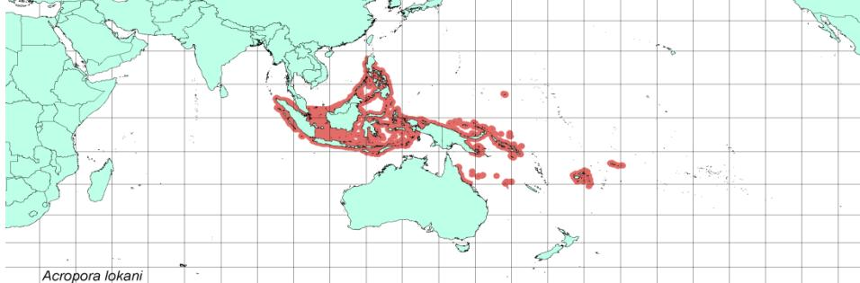

Figure 7.5.40. *Acropora lokani* distribution from IUCN copied from http://www.iucnredlist.org.

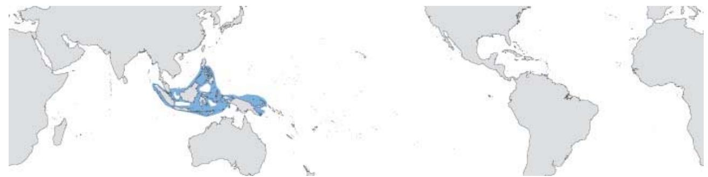

Figure 7.5.41. *Acropora lokani* distribution from Veron (2000).

#### **U.S. Distribution**

According to the IUCN Species Account, *Acropora lokani* occurs in American Samoa, with the supporting reference given as Fenner (pers. comm.). The CITES species database does not include any record of occurrence of *Acropora lokani* in U.S. waters. *Acropora lokani* is not listed as occurring in American Samoa in Lovell and McLardy (2008).

Fenner corrected his personal communication to the IUCN and now reports that he has not found *Acropora lokani* in American Samoa (D. Fenner, Dept. of Marine and Wildlife Resources, Tutuila, pers. comm., April 2010). An observed and photographed colony at Tutuila is *Acropora carolineana*, originally misidentified as *Acropora lokani*. *Acropora lokani* as described in Wallace (1994; 1999) has bifurcating branchlets, while *Acropora carolineana* as described in Wallace (1999) and Veron and Wallace (1984) has branchlets radiating in a Christmas-tree-like pattern on a central branchlet. The photos clearly show radiating branchlets and, thus, the species is *Acropora carolineana*. Veron (2000) shows *Acropora lokani* having the radiating branchlets, and *Acropora carolineana* not having them, in error, leading to the original error in identification.

This species was not observed elsewhere in American Samoa by Fenner during dedicated surveys conducted at 38 sites off Ofu-Olosega, Tau, Rose Atoll, Swains, and South Bank in March 2010 (CRED, unpubl. data). No other published or unpublished data sources indicate the occurrence of *Acropora lokani* elsewhere in U.S. waters.

#### **Habitat**

**Habitat**: *Acropora lokani* have been reported to occupy sheltered lagoon patch reefs and, shallow reef environments (Veron, 2000; Wallace, 1999).

**Depth range**: *Acropora lokani* has been reported in water depths ranging from 8 m to 25 m (Veron, 2000).

#### **Abundance**

Abundance of *Acropora lokani* has been reported as uncommon (Carpenter et al., 2008), but sometimes common (Veron, 2000).

#### **Life History**

*Acropora lokani* is assumed to be a hermaphroditic spawner with lecithotrophic larvae (Baird et al., 2009). For more genus level information, see Section 7.5: Genus *Acropora*.

#### **Threats**

For each of these possible threats, see also Section 7.5: Genus *Acropora* for additional genus level information.

**Thermal stress:** Although there is not much species-specific information about the susceptibility of *Acropora lokani* to thermal stress, the genus, *Acropora* are consistently ranked among the coral genera most severely susceptible to bleaching (Marshall and Baird, 2000; McClanahan et al., 2007; McClanahan et al., 2005a). However, the genus may have differential responses across regions during mass bleaching mortalities (McClanahan et al., 2004a).

**Acidification:** No specific research has addressed the effects of acidification on *Acropora lokani*, but experiments on acidification have demonstrated negative effects on *Acropora* calcification (Anthony et al., 2008; Marubini et al., 2003; Renegar and Riegl, 2005; Schneider and Erez, 2006) and productivity (Anthony et al., 2008; Crawley et al., 2010), as well as impaired fertilization and settlement success in *Acropora palmata* (Albright et al., 2010) and reduced growth and zooxanthellae uptake in juveniles (Suwa et al., 2010). Most corals studied have shown negative relationships between acidification and growth (Table 3.2.2), and acidification is likely to contribute to reef destruction in the future (Hoegh-Guldberg et al., 2007; Silverman et al., 2009). While ocean acidification has not been demonstrated to have already caused appreciable declines in coral populations so far, the BRT considers it to be a significant threat to corals by 2100.

**Disease:** Susceptibility and impacts of disease on *Acropora lokani* are not known, although in general *Acropora* species are moderately to highly susceptible to disease. However, ample evidence show that diseases can have devastating regional impacts on individual coral species, particularly acroporids (e.g., Aronson and Precht, 2001; Bruckner and Hill, 2009), and there is evidence that these impacts are occurring in more taxa and at a broader geographic scale (Sutherland et al., 2004; Green and Bruckner, 2000).

**Predation:** The specific effects of predation are poorly known for *Acropora lokani*. Most *Acropora* are preferentially consumed by crown-of-thorns seastars (*Acanthaster planci*) (Colgan, 1987) and by corallivorous snails (B. Vargas-Ángel, CRED, Honolulu, HI, pers. comm., September 2010).

**Land-based sources of pollution (LBSP):** The specific effects of LBSP stresses are largely unknown for *Acropora lokani*. LBSP-related stresses (nutrients, sediment, toxins, and salinity) often act in concert rather than individually and are influenced by other biological (e.g., herbivory) and hydrological factors. Collectively, LBSP stresses are unlikely to produce extinction at a global scale; however, they may pose significant threats at local scales (particularly important for species with limited range) and reduce the resilience of corals to bleaching (Carilli et al., 2009a; Wooldridge, 2009b).

**Collection/Trade:** As a whole, the genus *Acropora* has been heavily involved in international trade with 50,000– 270,000 reported exported pieces per year from Indonesia (CITES, 2010).

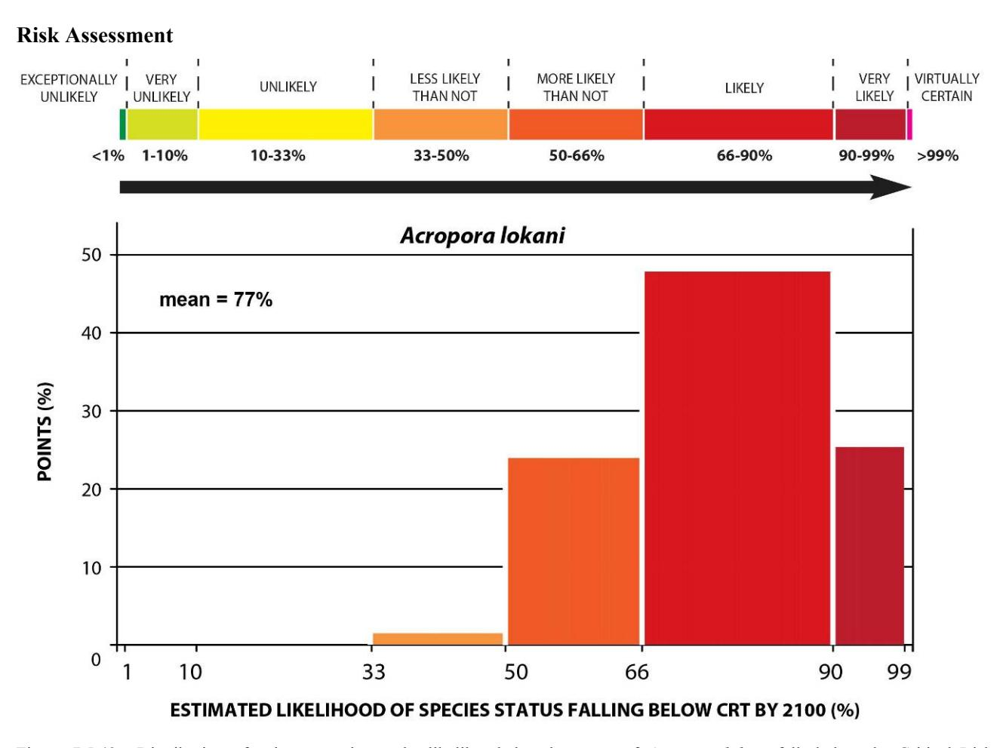

Figure 7.5.42. Distribution of points to estimate the likelihood that the status of *Acropora lokani* falls below the Critical Risk Threshold (the species is of such low abundance, or so spatially fragmented, or at such reduced diversity that extinction is extremely likely) by 2100.

Factors that increase the potential extinction risk (higher likelihood of falling below the Critical Risk Threshold) for *Acropora lokani* include the relatively high susceptibility of the genus *Acropora* to common threats (bleaching, acidification, disease, predation, and pollution), the smallest effective population size of ones with actual data, limited geographic and restricted latitudinal range, Richards occupancy estimate of 1 (see Section 7.5: *Genus Acropora*) with a small global distribution, small local distributions, and small local abundances—these characteristics tend toward Genus *Acropora* species extinction (Richards, 2009). The high bleaching rate of acroporid corals is the primary known threat of extinction for *Acropora lokani*.

The overall likelihood that *Acropora lokani* will fall below the Critical Risk Threshold by 2100 was estimated to be in the "likely" risk category with a mean likelihood of 77% and a standard error (SE) of 8% (Fig. 7.5.42.). A substantial ~ 25% portion of the vote was "very likely." This SE was calculated by taking the standard deviation of the seven mean voting scores of the BRT members and shows the coherence among the BRT. The uncertainty of the BRT is reflected in the range of votes of 33%–99% (Fig. 7.5.42) and the average range of likelihood estimates of the seven BRT voters (50%). The overall wide range of votes reflects the uncertainty among BRT members inherent in the lack of adequate ecological and demographic information for *Acropora lokani*. Although the range of votes is somewhat broad, few votes were cast on the less likely end of the scale.

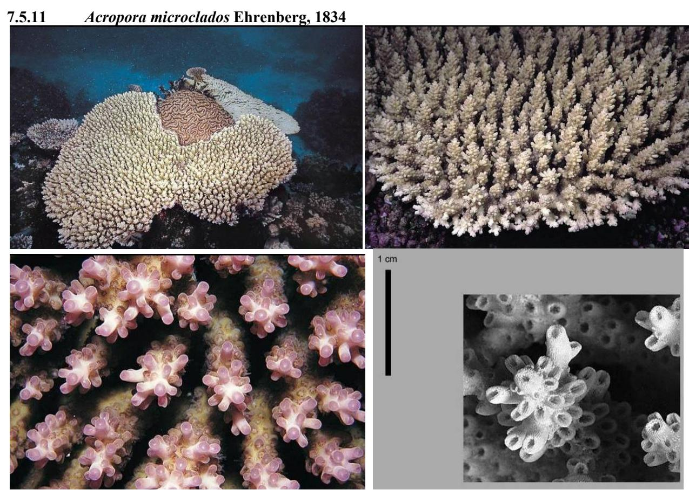

 Figure 7.5.43. *Acropora microclados* photos and corallite plan from Veron (2000).

#### **Characteristics**

Colonies of *Acropora microclados* are corymbose plates up to approximately 1 m across, with short, uniform, evenlyspaced, tapered branchlets up to 10 mm thick at the base. Axial corallites are tubular and conspicuous. Incipient axial corallites are common. Radial corallites are irregular, mostly tubular and appressed, with sharp-edged nariform openings. Colonies are usually a distinctive pale pinkish-brown in color but are occasionally other colors. Pale grey tentacles are often extended during the day (Veron, 2000; Veron and Wallace, 1984). Determinate growth.

#### **Taxonomy**

**Taxonomic issues**: None. *Acropora microclados* is most similar to *Acropora massawensis*, which forms prostrate colonies and has less tubular radial corallites, *Acropora lamarcki*, which has less exsert and less tubular radial corallites, and *Acropora macrostoma*, which does not have nariform corallite openings (Veron and Wallace, 1984).

**Family:** Acroporidae.

**Evolutionary and geologic history**: No fossil records of *Acropora microclados* have been reported (Wallace, 1999).

#### **Global Distribution**

*Acropora microclados* has been reported across a wide distribution ranging from the Red Sea, the central and western Indian Ocean, to the central Indo-Pacific, west and east coasts of Australia, Southeast Asia, Japan and the East China Sea (Veron, 2000; Veron and Wallace, 1984). J. Maragos (USFWS, Honolulu, HI, pers. comm., April 2010) has confirmed its presence in the central Pacific. *Acropora microclados* has a broad range overall, having the 20th largest range of 114 *Acropora* species examined (Richards, 2009).

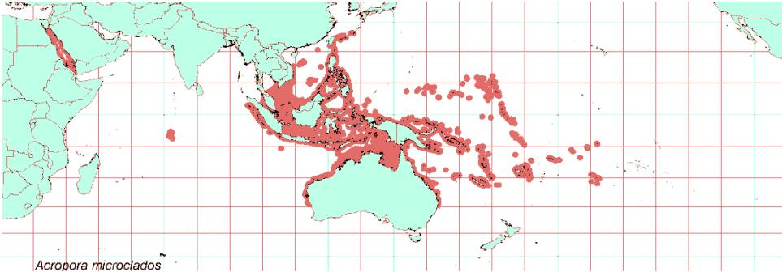

Figure 7.5.44. *Acropora microclados* distribution from IUCN copied from http://www.iucnredlist.org**.**

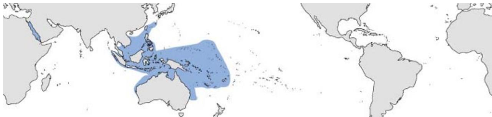

Figure 7.5.45. *Acropora microclados* distribution from Veron (2000).

#### **U.S. Distribution**

According to both the IUCN Species Account and the CITES species database, *Acropora microclados* occurs in the Northern Mariana Islands. The CITES database also notes its occurrence in American Samoa but the IUCN Species Account does not.

A search of published and unpublished records of occurrence in U.S. waters indicates *Acropora microclados* has been reported from Tutuila in American Samoa (Lovell and McLardy, 2008; National Park Service, 2009) and from Guam (Wallace, 1999). It has also been reported from Jarvis Island, Kingman Reef, and Baker Island and may occur at Wake Atoll (CRED, unpubl. data)}.

Within federally protected waters, *Acropora microclados* has been recorded from the following areas (Kenyon et al., 2010b):

- Pacific Remote Islands Marine National Monument (Baker, Jarvis, Kingman)
- National Park of American Samoa, Tutuila Island unit

#### **Habitat**

**Habitat**: *Acropora microclados* have been reported to occur on upper reef slopes (Veron, 2000) and subtidal reef edges (Carpenter et al., 2008).

**Depth range**: *Acropora microclados* has been reported in water depths ranging from 5 m to 20 m (Carpenter et al., 2008).

#### **Abundance**

Abundance of *Acropora microclados* has been reported as uncommon (Veron, 2000; Veron and Wallace, 1984).

#### **Life History**

*Acropora microclados* is a hermaphroditic spawner (Baird et al., 2010; Baird et al., 2002; Guest et al., 2005b; Hanafy et al., 2010; Hayashibara et al., 1993) with lecithotrophic larvae (Baird et al., 2009). For more genus level information, see Section 7.5: Genus *Acropora*.

#### **Threats**

For each of these possible threats, see also Section 7.5: Genus *Acropora* for additional genus level information.

**Thermal stress:** Although there is not much species-specific information about the response of *Acropora microclados*  to thermal stress, the genus *Acropora* are consistently ranked among the coral genera most severely susceptible to bleaching (Marshall and Baird, 2000; McClanahan et al., 2005a; McClanahan et al., 2007). However, the genus may have differential responses across regions during mass bleaching mortalities (McClanahan et al., 2004a). *Acropora microclados* may be less prone to bleaching than other *Acropora* (Done et al., 2003). For more genus level information, see Section 7.5: Genus *Acropora*.

**Acidification:** No specific research has addressed the effects of acidification on *Acropora microclados*, but experiments on acidification have demonstrated negative effects on *Acropora* calcification (Anthony et al., 2008; Marubini et al., 2003; Renegar and Riegl, 2005; Schneider and Erez, 2006) and productivity (Anthony et al., 2008; Crawley et al., 2010), as well as impaired fertilization and settlement success in *Acropora palmata* (Albright et al., 2010) and reduced growth and zooxanthellae uptake in juveniles (Suwa et al., 2010). Most corals studied have shown negative relationships between acidification and growth (Table 3.2.2), and acidification is likely to contribute to reef destruction in the future (Hoegh-Guldberg et al., 2007; Silverman et al., 2009). While ocean acidification has not been demonstrated to have already caused appreciable declines in coral populations so far, the BRT considers it to be a significant threat to corals by 2100.

**Disease:** Susceptibility and impacts of disease on *Acropora microclados* are not well understood, although in general *Acropora* species are moderately to highly susceptible to disease. Medium to high level of traces of subacute dark spots disease for *Acropora microclados* have been reported (UNEP, 2010). Effects on reproduction include reduced fecundity (Sutherland et al. 2004). Ample evidence show that diseases can have devastating regional impacts on individual coral species (e.g., Aronson and Precht, 2001; Bruckner and Hill, 2009), and there is evidence that these impacts are occurring in more taxa and at a broader geographic scale (Sutherland et al., 2004; Green and Bruckner 2000).

**Predation:** The specific effects of predation are poorly known for *Acropora microclados*. Most *Acropora* are preferentially consumed by crown-of-thorns seastars, *Acanthaster planci* (Colgan, 1987) and by corallivorous snails (B. Vargas-Ángel, CRED, Honolulu, HI, pers. comm., September 2010).

**Land-based sources of pollution (LBSP):** The specific effects of LBSP stresses are largely unknown for *Acropora microclados*. LBSP-related stresses (nutrients, sediment, toxins, and salinity) often act in concert rather than individually and are influenced by other biological (e.g., herbivory) and hydrological factors. Collectively, LBSP stresses are unlikely to produce extinction at a global scale; however, they may pose significant threats at local scales (particularly important for species with limited range) and reduce the resilience of corals to bleaching (Carilli et al., 2009a; Wooldridge, 2009b).

**Collection/Trade:** As a whole, the genus *Acropora* has been heavily involved in international trade with 50,000– 270,000 reported exported pieces per year from Indonesia and 30,000–100,000 pieces from Fiji (CITES, 2010).

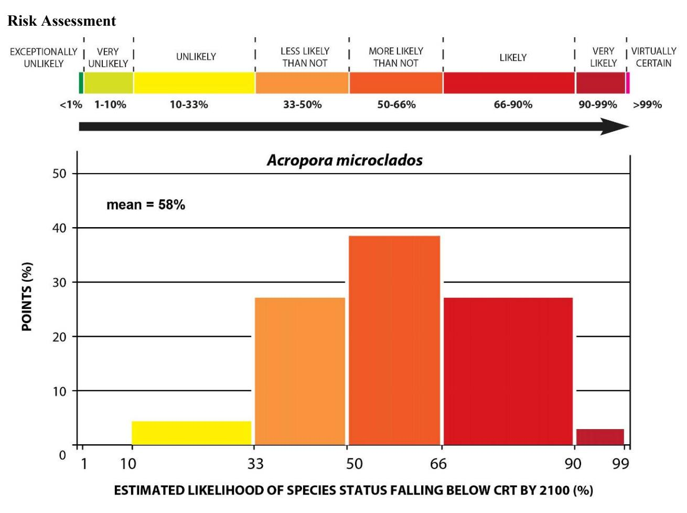

Figure 7.5.46. Distribution of points to estimate the likelihood that the status of *Acropora microclados* falls below the Critical Risk Threshold (the species is of such low abundance, or so spatially fragmented, or at such reduced diversity that extinction is extremely likely) by 2100.

Factors that increase the potential extinction risk (higher likelihood of falling below the Critical Risk Threshold) for *Acropora macroclados* include the relatively high susceptibility of the genus *Acropora* to common threats (bleaching, acidification, disease, predation, and pollution), a Richards' Occupancy Type 2 (see Section 7.5: Genus *Acropora*), with broad global distribution, limited local distribution, uncommon local and abundance—these characteristics tend toward making this species potentially vulnerable to local extinction (Occupancy Type 2; Richards, 2009). The high bleaching rate of acroporid corals is the primary known threat of extinction for *Acropora macroclados*. Factors that reduce the potential extinction risk (decrease likelihood of falling below the Critical Risk Threshold) for *Acropora macroclados* were the moderate longitudinal and latitudinal distributions and depth range (5 m-20 m).

The overall likelihood that *Acropora macroclados* will fall below the Critical Risk Threshold by 2100 was estimated to be in the "more likely than not" risk category with a mean likelihood of 58% and a standard error (SE) of 11% (Fig. 7.5.46). This SE was calculated by taking the standard deviation of the seven mean voting scores of the BRT members and shows the coherence among the BRT. The uncertainty of the BRT is reflected in the very wide range of votes of 10%–99% (Fig. 7.5.46) and the average range of likelihood estimates of the seven BRT voters (60%). The wide overall range of votes reflects the uncertainty among BRT members inherent in the lack of ecological and demographic information.

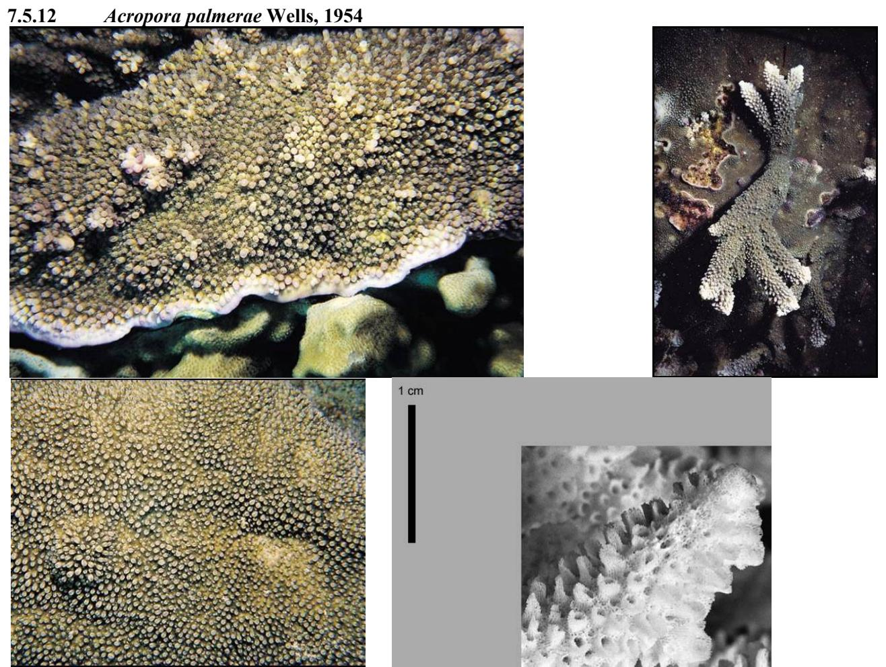

Figure 7.5.47. *Acropora palmerae* photos and corallite plan from Veron (2000).

#### **Characteristics**

Colonies of *Acropora palmerae* are encrusting with or without short, irregularly shaped branches. Colonies seldom exceed 1 m across. Axial corallites, if formed, are conspicuous. Radial corallites are mostly rasp-like but are of variable size and face different directions. Colonies are greenish- or pinkish-brown in color (Veron, 2000).

#### **Taxonomy**

**Taxonomic issues**: There is doubt as to whether *Acropora palmerae* is a separate species or a strong-water form of *Acropora robusta* (Wallace, 1999); however, in the absence of genetic information, the BRT considered it a valid species for the purposes of this Status Review Report (see discussion in Section 2.1.2 on taxonomic issues). It is like the encrusting base of *Acropora robusta* but does not form large branches. Small colonies of these species may be inseparable. Also similar to *Acropora pinguis*, which may also be encrusting but forms thick tapered branches (Veron and Wallace, 1984).

**Family:** Acroporidae.

**Evolutionary and geologic history**: Fossil records of *Acropora palmerae* have been reported from the Holocene (up to 10,000 years ago) from the Ryukyu Islands (Wallace, 1999).

#### **Global Distribution**

*Acropora palmerae* has been reported from the northern Indian Ocean, central Indo-Pacific, west and east coasts of Australia, Southeast Asia, Japan and the East China Sea, and the oceanic west Pacific (Veron, 2000). *Acropora palmerae* has a relatively moderate range overall, having the 52nd largest range of 114 *Acropora* species examined (Richards, 2009).

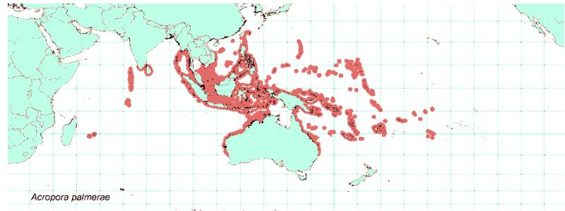

Figure 7.5.48. *Acropora palmerae* distribution from IUCN copied from http://www.iucnredlist.org.

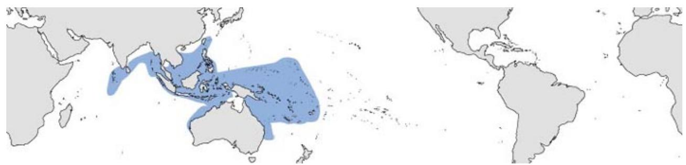

Figure 7.5.49. *Acropora palmerae* distribution from Veron (2000).

#### **U.S. Distribution**

According to both the IUCN Species Account and the CITES species database, *Acropora palmerae* occurs in American Samoa and the Northern Mariana Islands.

A search of published and unpublished records of occurrence in U.S. waters indicates *Acropora palmerae* has been reported from Tutuila and Ofu-Olosega in American Samoa (Birkeland, unpubl. data; Coles et al., 2003; Lamberts, 1983; Lovell and McLardy, 2008; Maragos et al., 1994; National Park Service, 2009), Guam and the Commonwealth of the Northern Mariana Islands (Burdick, unpubl. data; CRED, unpubl. data; Randall, 2003; Wallace, 1999), and Wake Atoll (CRED, unpubl. data).

Within federally protected waters, *Acropora palmerae* has been recorded from the following areas (Kenyon et al., 2010b):

- Pacific Remote Islands Marine National Monument (Wake)
- National Park of American Samoa, Ofu Island unit
- Fagatele Bay National Marine Sanctuary, Tutuila

#### **Habitat**

**Habitat:** *Acropora palmerae* has been reported to occupy reef flats exposed to strong wave action and lagoons (Veron, 2000) and intertidal, subtidal, shallow, reef tops, reef flats, and reef edges (Carpenter et al., 2008).

**Depth range**: *Acropora palmerae* has been reported in water depths ranging from 5 m to 20 m (Carpenter et al., 2008).

#### **Abundance**

Abundance of *Acropora palmerae* has been reported as uncommon (Carpenter et al., 2008; Veron, 2000).

#### **Life History**

*Acropora palmerae* is a hermaphroditic spawner (Baird et al., 2002; Dai et al., 1992) with lecithotrophic larvae (Baird et al., 2009). For more genus level information, see Section 7.5: Genus *Acropora*.

#### **Threats**

For each of these possible threats, see also Section 7.5: Genus *Acropora* for additional genus level information.

**Thermal stress:** Although there is not much species-specific information about the response of *Acropora palmerae* to thermal stress, the genus *Acropora* are consistently ranked among the coral genera most severely susceptible to bleaching (Marshall and Baird, 2000; McClanahan et al., 2007; McClanahan et al., 2005a). However, the genus may have differential responses across regions during mass bleaching mortalities (McClanahan et al., 2004a).

**Acidification:** No specific research has addressed the effects of acidification on *Acropora palmerae*, but experiments on acidification impacts have demonstrated negative effects on *Acropora* calcification (Anthony et al., 2008; Marubini et al., 2003; Renegar and Riegl, 2005; Schneider and Erez, 2006) and productivity (Anthony et al., 2008; Crawley et al., 2010), as well as impaired fertilization and settlement success in *Acropora palmata* (Albright et al., 2010) and reduced growth and zooxanthellae uptake in juveniles (Suwa et al., 2010). Most corals studied have shown negative relationships between acidification and growth (Table 3.2.2), and acidification is likely to contribute to reef destruction in the future (Hoegh-Guldberg et al., 2007; Silverman et al., 2009). While ocean acidification has not been demonstrated to have already caused appreciable declines in coral populations so far, the BRT considers it to be a significant threat to corals by 2100.

**Disease:** Susceptibility and impacts of disease on *Acropora palmerae* are not known, although in general *Acropora* species are moderately-to-highly susceptible to disease. However, ample evidence show that diseases can have devastating regional impacts on individual coral species (e.g., Aronson and Precht, 2001; Bruckner and Hill, 2009), and there is evidence that these impacts are occurring in more taxa and at a broader geographic scale (Sutherland et al., 2004; Green and Bruckner, 2000).

**Predation:** The specific effects of predation are poorly known for *Acropora palmerae*. Most *Acropora* are preferentially consumed by crown-of-thorns seastars (*Acanthaster planci*) (Colgan, 1987) and by corallivorous snails (B. Vargas-Ángel, CRED, Honolulu, HI, pers. comm., September 2010).

**Land-based sources of pollution (LBSP):** The specific effects of LBSP stresses are largely unknown for *Acropora palmerae*. LBSP-related stresses (nutrients, sediment, toxins, and salinity) often act in concert rather than individually and are influenced by other biological (e.g., herbivory) and hydrological factors. Collectively, LBSP stresses are unlikely to produce extinction at a global scale; however, they may pose significant threats at local scales (particularly important for species with limited range) and reduce the resilience of corals to bleaching (Carilli et al., 2009a; Wooldridge, 2009b).

**Collection/Trade:** As a whole, the genus *Acropora* has been heavily involved in international trade with 50,000– 270,000 reported exported pieces per year from Indonesia (CITES, 2010).

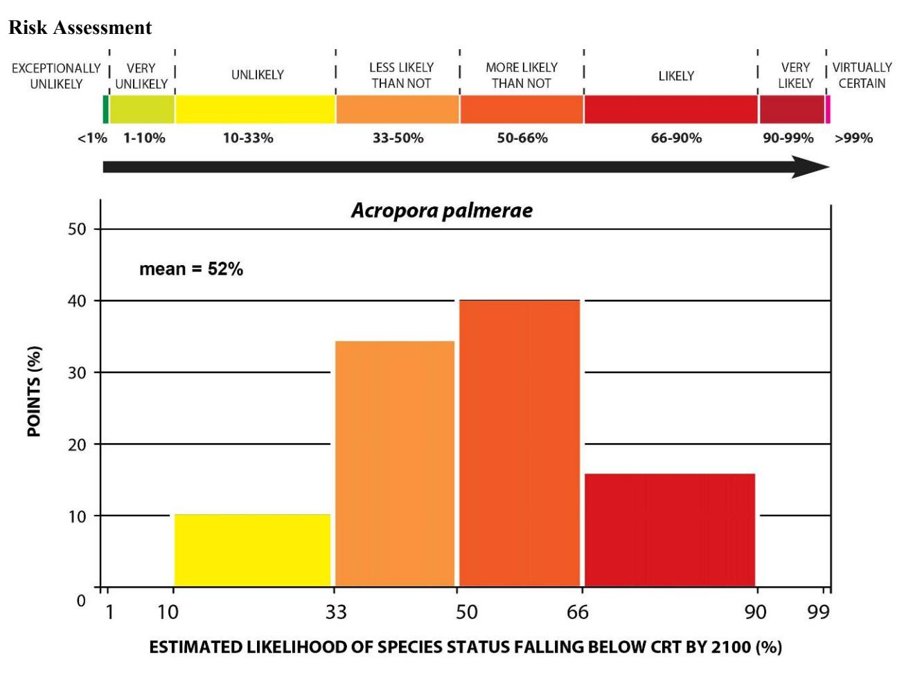

Figure 7.5.50. Distribution of points to estimate the likelihood that the status of *Acropora palmerae* falls below the Critical Risk Threshold (the species is of such low abundance, or so spatially fragmented, or at such reduced diversity that extinction is extremely likely) by 2100.

Factors that increase the potential extinction risk (higher likelihood of falling below the Critical Risk Threshold) for *Acropora palmerae* include the relatively high susceptibility of the genus *Acropora* to common threats (bleaching, acidification, disease, predation, and pollution) and uncommon abundance. The high bleaching rate of acroporid corals is the primary known threat of extinction for *Acropora palmerae*. Factors that reduce the potential extinction risk (decrease likelihood of falling below the Critical Risk Threshold) for *Acropora palmerae* were the moderate geographic and depth distributions, tolerance for high-energy and intertidal habitats, and the potential for higher than reported abundance based on species uncertainty, i.e., it could be a strong-water form of the more common *Acropora robusta*. Wide geographic distribution was considered to reduce extinction risk by increasing the likelihood that the species would evade stresses and/or catastrophes in at least some locations.

The overall likelihood that *Acropora palmerae* will fall below the Critical Risk Threshold by 2100 was estimated to be in the "more likely than not" risk category with a mean likelihood of 52% and a standard error (SE) of 9% (Fig. 7.5.50). This SE was calculated by taking the standard deviation of the seven mean voting scores of the BRT members and shows the coherence among the BRT. The uncertainty of the BRT is reflected in the wide range of votes of 10%–90% (Fig. 7.5.50) and the average range of likelihood estimates of the seven BRT voters (60%). The overall range of votes reflects the uncertainty among BRT members about the species taxonomy and the lack of ecological and demographic information for *Acropora palmerae*.

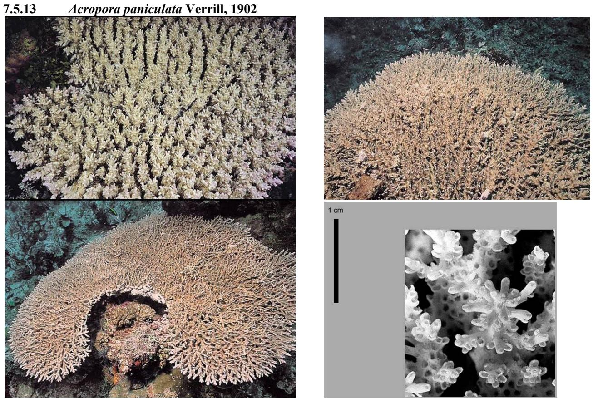

Figure 7.5.51. *Acropora paniculata* photos and corallite plan from Veron (2000).

#### **Characteristics**

Colonies of *Acropora paniculata* are large plates or tables that are 25 mm thick and frequently greater than 1 m across. Branchlets are short and compact. Axial and incipient axial corallites crowd the upper surface and are long, thin and tubular. Radial corallites are immersed on lower branchlets. Colonies are cream, grey or blue in color (Veron, 2000). Maximum colony size is 200 cm. Determinate growth.

#### **Taxonomy**

**Taxonomic issues**: None. *Acropora paniculata* is similar to *Acropora jacquelineae*, which has finer corallites, and *Acropora cytherea*, which forms thinner plates and has branchlets which do not terminate in masses of tubular corallites (Veron and Wallace, 1984). It is quite similar to *Acropora cytherea*, but more delicate in structure (Wallace, 1999).

**Family:** Acroporidae.

**Evolutionary and geologic history:** No fossil records of *Acropora paniculata* have been reported (Wallace, 1999).

#### **Global Distribution**

*Acropora paniculata* has been reported across a wide distribution ranging from the Red Sea and Indian Ocean (Chagos), to the west and central Pacific with some range discrepancies between IUCN and Veron (IUCN, 2010; Veron, 2000). Also observed in Hawai`i (J. Maragos, USFWS, Honolulu, HI, pers. comm., April 2010), Rodrigues (Fenner et al., 2004) and Society Islands (Wallace, 1999). *Acropora paniculata* has a moderately broad range overall, having the 40th largest range of 114 *Acropora* species examined (Richards, 2009).

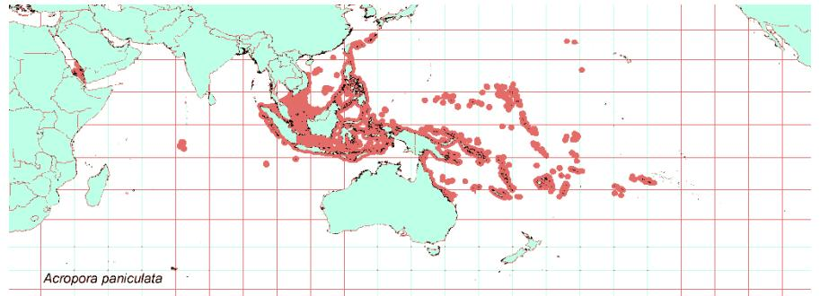

Figure 7.5.52. *Acropora paniculata* distribution from IUCN copied from http://www.iucnredlist.org.

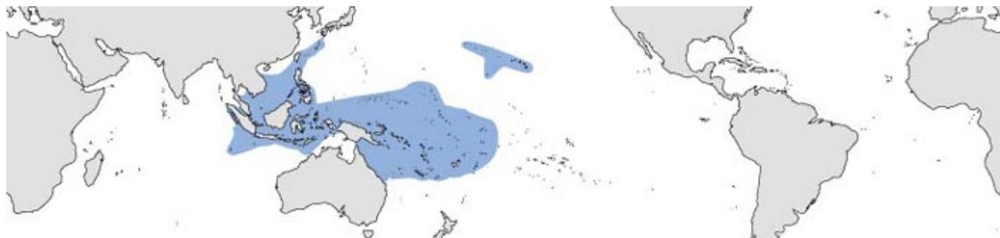

Figure 7.5.53. *Acropora paniculata* distribution from Veron (2000).

#### **U.S. Distribution**

According to both the IUCN Species Account and the CITES species database, *Acropora paniculata* occurs in American Samoa and minor U.S. outlying islands. The CITES species database also notes its occurrence in Hawai`i but the IUCN Species Account does not.

A search of published and unpublished records of occurrence in U.S. waters indicates *Acropora paniculata* has been reported from Tutuila, Ofu-Olosega, Tau, and Rose Atoll in American Samoa (Birkeland, unpubl. data; Coles et al., 2003; Kenyon et al., 2010a; Lamberts, 1983; Lovell and McLardy, 2008; Maragos et al., 1994; Mundy, 1996; National Park Service, 2009), the Commonwealth of the Northern Mariana Islands (CRED, unpubl. data), the Northwestern Hawaiian Islands (Fenner, 2005; Maragos et al., 2004; Veron, 2000), Johnston Atoll, Kingman Reef (CRED, unpubl. data; Maragos and Jokiel, 1986), and Palmyra Atoll (Williams et al., 2008b).

Within federally protected waters, *Acropora paniculata* has been recorded from the following areas (Kenyon et al., 2010b):

- Papahānaumokuākea Marine National Monument (French Frigate Shoals)
- Pacific Remote Islands Marine National Monument (Johnston, Palmyra, Kingman)
- National Park of American Samoa, Ofu Island unit
- Rose Atoll Marine National Monument
- Marianas Trench Marine National Monument (Maug)

#### **Habitat**

**Habitat:** *Acropora paniculata* has been reported to occupy upper reef slopes, just subtidal, reef edges, and sheltered lagoons (Carpenter et al., 2008).

**Depth range**: *Acropora paniculata* has been reported in water depths ranging from 10 m to 35 m (Carpenter et al., 2008).

#### **Abundance**

Abundance of *Acropora paniculata* has been reported as uncommon to rare on most reefs (Veron, 2000); however, common in Papua New Guinea (Wallace, 1999).

#### **Life History**

*Acropora paniculata* is a hermaphroditic spawner (Kenyon, 1995) with lecithotrophic larvae (Baird et al., 2009). For more genus level information, see Section 7.5: Genus *Acropora*.

#### **Threats**

For each of these possible threats, see also Section 7.5: Genus *Acropora* **for additional genus level information.**

**Thermal stress:** Although there is not much species-specific information about the response of *Acropora paniculata* to thermal stress, the genus *Acropora* are consistently ranked among the coral genera most severely susceptible to bleaching (Marshall and Baird, 2000; McClanahan et al., 2007; McClanahan et al., 2005a).. However, the genus may have differential responses across regions during mass bleaching mortalities (McClanahan et al., 2004a).

**Acidification:** No specific research has addressed the effects of acidification on *Acropora paniculata*, but experiments on acidification impacts have demonstrated negative effects on *Acropora* calcification (Anthony et al., 2008; Marubini et al., 2003; Renegar and Riegl, 2005; Schneider and Erez, 2006) and productivity (Anthony et al., 2008; Crawley et al., 2010), as well as impaired fertilization and settlement success in *Acropora palmata* (Albright et al., 2010) and reduced growth and zooxanthellae uptake in juveniles (Suwa et al., 2010). Most corals studied have shown negative relationships between acidification and growth (Table 3.2.2), and acidification is likely to contribute to reef destruction in the future (Hoegh-Guldberg et al., 2007; Silverman et al., 2009). While ocean acidification has not been demonstrated to have already caused appreciable declines in coral populations so far, the BRT considers it to be a significant threat to corals by 2100.

**Disease:** Susceptibility and impacts of disease on *Acropora paniculata* are not known, although in general *Acropora* species are moderately to highly susceptible to disease. However, ample evidence show that diseases can have devastating regional impacts on individual coral species (e.g., Aronson and Precht, 2001; Bruckner and Hill, 2009), and there is evidence that these impacts are occurring in more taxa and at a broader geographic scale (Sutherland et al., 2004, Green and Bruckner, 2000).

**Predation:** The specific effects of predation are poorly known for *Acropora paniculata*. Most *Acropora* are preferentially consumed by crown-of-thorns seastars (*Acanthaster planci*) (Colgan, 1987) and by corallivorous snails (B. Vargas-Ángel, CRED, Honolulu, HI, pers. comm., September 2010).

**Land-based sources of pollution (LBSP):** The specific effects of LBSP stresses are largely unknown for *Acropora paniculata*.. LBSP-related stresses (nutrients, sediment, toxins, and salinity) often act in concert rather than individually and are influenced by other biological (e.g., herbivory) and hydrological factors. Collectively, LBSP stresses are unlikely to produce extinction at a global scale; however, they may pose significant threats at local scales (particularly important for species with limited range) and reduce the resilience of corals to bleaching (Carilli et al., 2009a; Wooldridge, 2009b).

**Collection/Trade:** As a whole, the genus *Acropora* has been heavily involved in international trade with 50,000– 270,000 reported exported pieces per year from Indonesia (CITES, 2010).

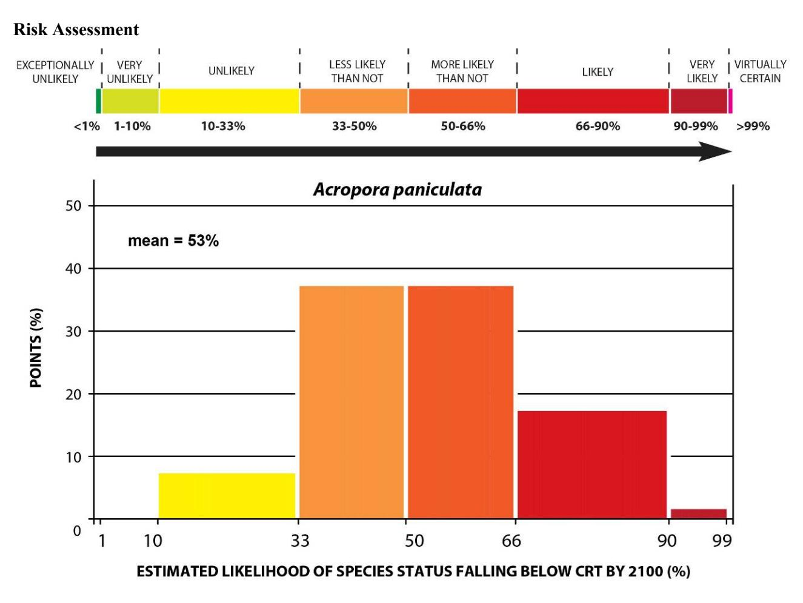

Figure 7.5.54. Distribution of points to estimate the likelihood that the status of *Acropora paniculata* falls below the Critical Risk Threshold (the species is of such low abundance, or so spatially fragmented, or at such reduced diversity that extinction is extremely likely) by 2100.

Factors that increase the potential extinction risk (higher likelihood of falling below the Critical Risk Threshold) for *Acropora paniculata* include the relatively high susceptibility of the genus *Acropora* to common threats (bleaching, acidification, disease, predation, and pollution). The high bleaching rate of acroporid corals is the primary known threat of extinction for *Acropora paniculata*. Factors that reduce the potential extinction risk (decrease likelihood of falling below the Critical Risk Threshold) for *Acropora paniculata* were a moderately wide geographic distribution range, presence in deepwater habitats, and being common in Papua New Guinea although rare elsewhere. *Acropora paniculata* fits Richards' occupancy Type 8 (see Section 7.5: *Genus Acropora*), with broad global distribution, broad local distribution, and low local abundance—these characteristics tend toward species persistence (Richards, 2009)—although it was mostly uncommon throughout its range. Risk was also reduced by this species' extension to mesophotic depths (35m) which suggests it can be buffered somewhat from surface-based threats.

The overall likelihood that *Acropora paniculata* will fall below the Critical Risk Threshold by 2100 was estimated to be in the "more likely than not" risk category with a mean likelihood of 53% and a standard error (SE) of 9% (Fig. 7.5.54). This SE was calculated by taking the standard deviation of the seven mean voting scores of the BRT members and shows the coherence among the BRT. The uncertainty of the BRT is reflected in the very wide range of votes of 10%– 99% (Fig. 7.5.54) and the average range of likelihood estimates of the seven BRT voters (50%). The wide overall wide range of votes reflects the uncertainty among BRT members inherent in the lack of adequate ecological and demographic information for this species. The uncertainty shown in the range of votes stems largely from the tension between the relatively high extinction risk of *Acropora* as a genus vs. the potential for *Acropora paniculata* to be among the less vulnerable species of that genus.

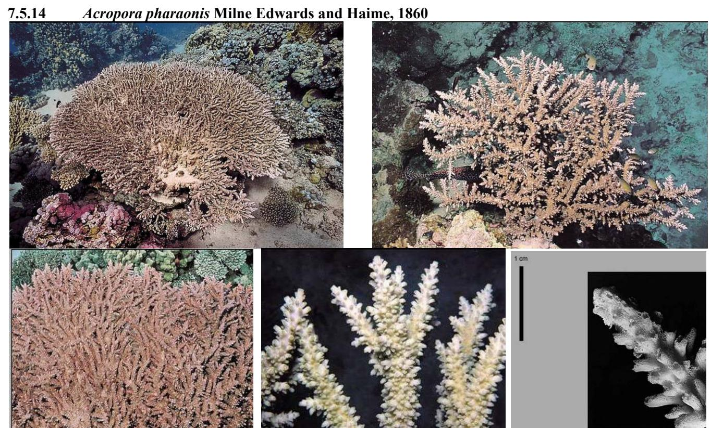

Figure 7.5.55. *Acropora pharaonis* photos and corallite plan from Veron (2000).

#### **Characteristics**

Colonies of *Acropora pharaonis* are large horizontal tables or irregular clusters of horizontal or upright interlinked contorted branches. Branches are pointed and have short branchlets that link main branches. Axial corallites are small and incipient axial corallites are abundant giving branches a spiky surface. Radial corallites are laying flat against each other, with nariform openings. Colonies are grey-brown in color, usually with pale branch tips (Veron, 2000).

#### **Taxonomy**

**Taxonomic issues**: None. *Acropora pharaonis* is similar to *Acropora clathrata,* which has more highly-fused branches without abundant incipient axial corallites, and *Acropora plumosa*, which has larger and more open branches with less development of branchlets without abundant incipient axial corallites (Wallace, 1999).

**Family:** Acroporidae.

**Evolutionary and geologic history**: No fossil records of *Acropora pharaonis* have been reported (Wallace, 1999).

#### **Global Distribution**

*Acropora pharaonis* has a disjoint distribution. It has been reported in some places in the Indo-Pacific, the Red Sea, the Gulf of Aden, the Indian Ocean, the Arabian/Iranian Gulf, and the northern Indian Ocean (Veron, 2000). D. Fenner (Dept. Marine and Wildlife Resources, Tutuila, pers. comm., April 2010) also found *Acropora pharaonis* in New Caledonia, American Samoa, and Fiji. There is some doubt about Pacific records (IUCN, 2010), and Cocos-Keeling (Wallace, 1999). *Acropora pharaonis* has a relatively limited range overall, having the 14th smallest range of 114 *Acropora* species examined (Richards, 2009).

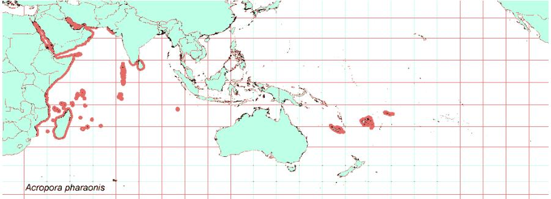

Figure 7.5.56. *Acropora pharaonis* distribution from IUCN copied from http://www.iucnredlist.org.

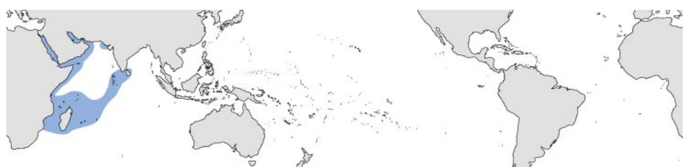

Figure 7.5.57. *Acropora pharaonis* distribution from Veron (2000).

#### **U.S. Distribution**

According to the IUCN Species Account, *Acropora pharaonis* occurs in American Samoa, with the supporting reference given as Fenner (pers. comm.). The IUCN Species Account also indicates "there is some doubt about Pacific records (E. Lovell, pers. comm.)." The CITES species database does not include any record of occurrence in U.S. waters. *Acropora pharaonis* is not listed as occurring in American Samoa in Lovell and McLardy (2008).

Fenner reported *Acropora pharaonis* in American Samoa at Tutuila (CRED, unpubl. data). It has only been found so far at Leone, where it was very rare. One sample has been collected from American Samoa, but no photographs were acquired. *Acropora pharaonis* was originally described from the Red Sea, and Wallace (1999) concluded that it is only known from the Red Sea. Although there are about 10 records in the literature from the Indian Ocean, Wallace does not consider them to be *Acropora pharaonis*. Veron (2000) reported *Acropora pharaonis* from the western Indian Ocean as well as the Red Sea. Fenner has reported it from both New Caledonia and Fiji. From all three locations, it resembled Veron's (2000) pictures from Madagascar in the Indian Ocean (volume 1, page 297, Figures 7 and 8). In those photos and in American Samoa, New Caledonia and Fiji, branches are separated. In Fiji, there has often been a central stock with radiating branches at the top of the stalk, like the outline of some of the Red Sea colonies that are somewhat vaseshaped with branches not tightly fused into a table (Sheppard and Sheppard, 1991). Branches were very rough in appearance as they were covered with radial corallites and incipient axials of a wide variety of lengths. Radial and incipient axial corallites had little or no traces of septa. All aspects of the sample from American Samoa, as well as Fiji and New Caledonia, match the species description in Wallace (1999).

*Acropora pharaonis* was not observed elsewhere in American Samoa by Fenner during dedicated surveys conducted at 38 sites off Ofu-Olosega, Tau, Rose Atoll, Swains, and South Bank in March 2010. No other published or unpublished data sources indicate the occurrence of *Acropora pharaonis* elsewhere in U.S. waters.

*Acropora pharaonis* has not been recorded from federally protected waters.

#### **Habitat**

**Habitat:** *Acropora pharaonis* has been reported to occupy sheltered reef slopes (Veron, 2000) and lagoons (Carpenter et al., 2008).

**Depth range**: *Acropora pharaonis* has been reported in water depths ranging from 5 m to 25 m (Carpenter et al., 2008).

#### **Abundance**

Abundance of *Acropora pharaonis* has been reported as common (Veron, 2000).

#### **Life History**

*Acropora pharaonis* is a hermaphroditic spawner (Hanafy et al., 2010; Shlesinger and Loya, 1985) with lecithotrophic larvae (Baird et al., 2009). Shlesinger et al (1998) indicated polyp fecundity was high, with an estimated 20 eggs per polyp, based on histological sections. For more genus level information, see Section 7.5: Genus *Acropora*.

#### **Threats**

For each of these possible threats, see also Section 7.5: Genus *Acropora* for additional genus level information.

**Thermal stress:** Although there is not much species-specific information about the response of *Acropora pharaonis* to thermal stress, the genus *Acropora* are consistently ranked among the coral genera most severely susceptible to bleaching (Marshall and Baird, 2000; McClanahan et al., 2007; McClanahan et al., 2005a). However, the genus may have differential responses across regions during mass bleaching mortalities (McClanahan et al., 2004a). It was reported that *Acropora pharaonis* was locally extirpated in the SE Arabian Gulf after the combined impacts of the 1996, 1998 bleaching events (Riegl, 2002).

**Acidification:** No specific research has addressed the effects of acidification on *Acropora pharaonis*, but experiments on acidification have demonstrated negative effects on *Acropora* calcification (Anthony et al., 2008; Marubini et al., 2003; Renegar and Riegl, 2005; Schneider and Erez, 2006) and productivity (Anthony et al., 2008; Crawley et al., 2010), as well as impaired fertilization and settlement success in *Acropora palmata* (Albright et al., 2010) and reduced growth and zooxanthellae uptake in juveniles (Suwa et al., 2010)*.* Most corals studied have shown negative relationships between acidification and growth (Table 3.2.2), and acidification is likely to contribute to reef destruction in the future (Hoegh-Guldberg et al., 2007; Silverman et al., 2009). While ocean acidification has not been demonstrated to have already caused appreciable declines in coral populations so far, the BRT considers it to be a significant threat to corals by 2100.

**Disease:** There are a medium-to-high number of disease reports specifically for *Acropora pharaonis* (UNEP, 2010). This species experiences acute white-band disease/white plague diseases and subacute black-band and yellow-band disease. Effects on reproduction include reduced fecundity (Sutherland et al., 2004). Ample evidence show that diseases can have devastating regional impacts on individual coral species (e.g., Aronson and Precht, 2001; Bruckner and Hill, 2009), and there is evidence that these impacts are occurring in more taxa and at a broader geographic scale (Sutherland et al., 2004, Green and Bruckner, 2000).

**Predation:** The specific effects of predation are poorly known for *Acropora pharaonis*. Most *Acropora* are preferentially consumed by crown-of-thorns seastars (*Acanthaster planci*) (Colgan, 1987) and by corallivorous snails (B. Vargas-Ángel, CRED, Honolulu, HI, pers. comm., September 2010).

**Land-based sources of pollution (LBSP):** The specific effects of LBSP stresses are largely unknown for *Acropora pharaonis*. LBSP-related stresses (nutrients, sediment, toxins, and salinity) often act in concert rather than individually and are influenced by other biological (e.g., herbivory) and hydrological factors. Collectively, LBSP stresses are unlikely to produce extinction at a global scale; however, they may pose significant threats at local scales (particularly important for species with limited range) and reduce the resilience of corals to bleaching (Carilli et al., 2009a; Wooldridge, 2009b).

**Collection/Trade**: As a whole, the genus *Acropora* has been heavily involved in international trade with 50,000– 270,000 reported exported pieces per year from Indonesia (CITES, 2010).

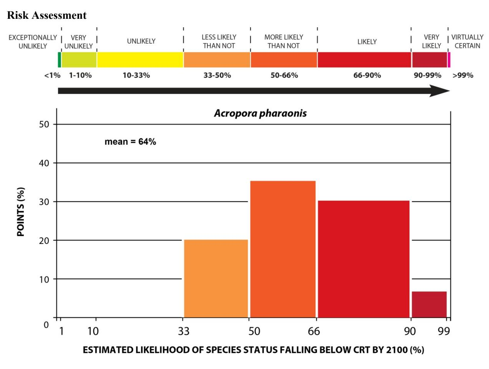

Figure 7.5.58. Distribution of points to estimate the likelihood that the status of *Acropora pharaonis* falls below the Critical Risk Threshold (the species is of such low abundance, or so spatially fragmented, or at such reduced diversity that extinction is extremely likely) by 2100.

Factors that increase the potential extinction risk (higher likelihood of falling below the Critical Risk Threshold) for *Acropora pharaonis* include the relatively high susceptibility of the genus *Acropora* to common threats (bleaching, acidification, disease, predation, and pollution), the restricted geographic range to potentially only the Red Sea or western Indian Ocean, and the affinity for sheltered habitats. The high bleaching rate of acroporid corals is the primary known threat of extinction for *Acropora pharaonis* The disjoint distribution of *Acropora pharaonis* makes this concern greater since it suggests the potential for repopulating local extirpations of either section of the range would be reduced. Factors that reduce the potential extinction risk (decrease likelihood of falling below Critical Risk Threshold) for *Acropora pharaonis* were its moderate depth range (5 m–25 m) and its relatively common abundance levels.

The overall likelihood that *Acropora pharaonis* will fall below the Critical Risk Threshold by 2100 was estimated to be in the "more likely than not" risk category with a mean likelihood of 64% and a standard error (SE) of 9% (Fig. 7.5.58). This SE was calculated by taking the standard deviation of the seven mean voting scores of the BRT members and shows the coherence among the BRT. The uncertainty of the BRT is reflected in the range of votes of 33%–99% (Fig. 7.5.58) and the average range of likelihood estimates of the seven BRT voters (55%). The overall wide range of votes reflects the uncertainty among BRT members inherent in the lack of adequate ecological and demographic information, particularly uncertainty of reports from American Samoa, Fiji, and New Caledonia.

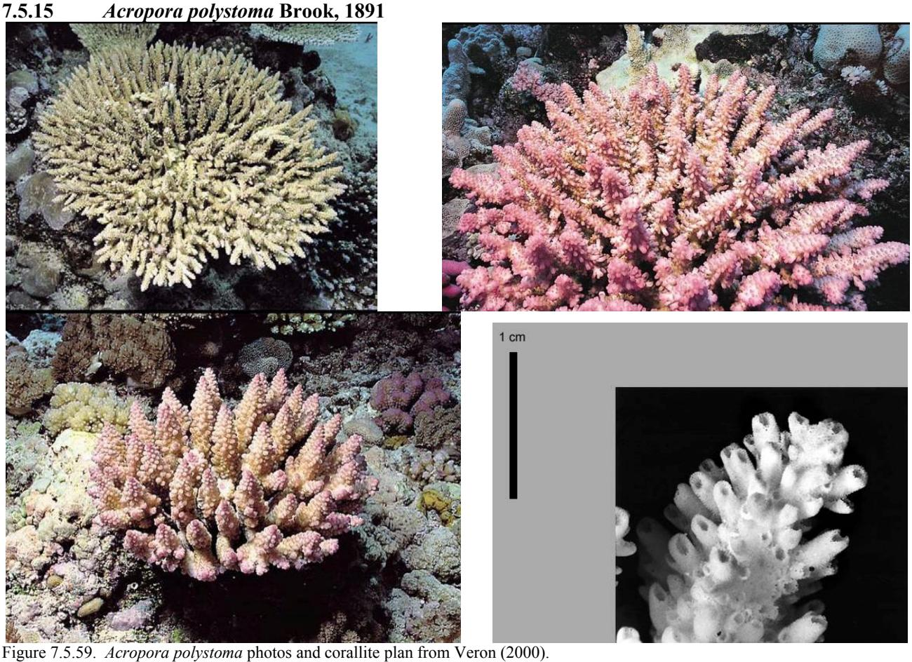

#### **Characteristics**

Colonies of *Acropora polystoma* are irregular clumps or corymbose plates with tapered branches of similar length and shape. Axial corallites are small and exsert. Radial corallites are usually arranged in rows down the sides of the branchlets. They are irregularly immersed to tubular, giving colonies a spiny appearance. The maximum colony size is 80 cm and it has a semi-determinate growth. Colonies are cream, blue (which may photograph pink) or yellow in color (Veron, 2000; Veron and Wallace, 1984).

#### **Taxonomy**

**Taxonomic issues**: None. *Acropora polystoma* is most similar to *Acropora massawensis* and *Acropora listeri* (Veron and Wallace, 1984).

**Family:** Acroporidae.

**Evolutionary and geologic history**: No fossil records of *Acropora polystoma* have been reported (Wallace, 1999).

#### **Global Distribution**

*Acropora polystoma* has been reported to have a wide distribution ranging from the Red Sea, and southwest and central Indian Ocean (Mauritius and Chagos) to the central Indo-Pacific, west and east coasts of Australia, Southeast Asia, west Pacific, Japan, Samoa and the Cook Islands (Veron, 2000). It is also found in the central Pacific (J. Maragos, USFWS, Honolulu, HI, pers. comm.,, April 2010). *Acropora polystoma* has a relatively broad range overall, having the 29th largest range of 114 *Acropora* species examined (Richards, 2009).

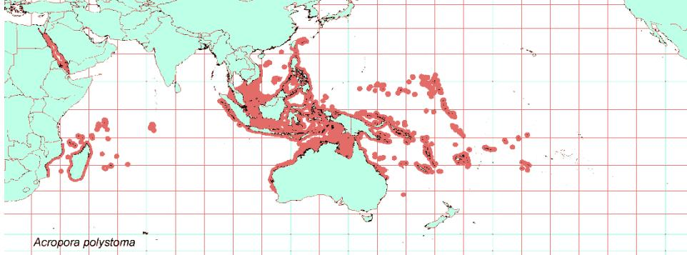

Figure 7.5.60. *Acropora polystoma* distribution from IUCN copied from http://www.iucnredlist.org.

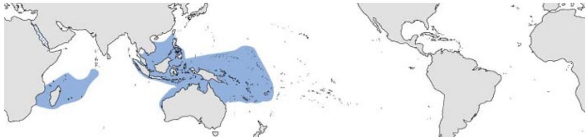

Figure 7.5.61. *Acropora polystoma* distribution from Veron (2000).

#### **U.S. Distribution**

According to both the IUCN Species Account and the CITES species database, *Acropora polystoma* occurs in American Samoa. The CITES species database also notes its occurrence in minor outlying islands but the IUCN Species Account does not.

A search of published and unpublished records of occurrence in U.S. waters indicates *Acropora polystoma* has been reported from Ofu-Olosega in American Samoa (Birkeland, unpubl. data; Maragos et al., 1994; National Park Service, 2009), Guam (Burdick, unpubl. data), Johnston Atoll and Howland Island (CRED, unpubl. data), and Palmyra Atoll (Williams et al., 2008b).

Within federally protected waters, *Acropora polystoma* has been recorded from the following areas (Kenyon et al., 2010b):

- Pacific Remote Islands Marine National Monument (Howland, Baker, Palmyra)
- National Park of American Samoa, Ofu Island unit

#### **Habitat**

**Habitat**: *Acropora polystoma* has been reported to occupy upper reef slopes exposed to strong wave action (Veron, 2000) and intertidal, just subtidal, shallow, reef tops, reef edges, and high current areas (Carpenter et al., 2008).

**Depth range**: *Acropora polystoma* has been reported in water depths ranging from 3 m to 10 m (Carpenter et al., 2008).

#### **Abundance**

Abundance of *Acropora polystoma* has been reported as uncommon (Carpenter et al., 2008; Veron, 2000).

#### **Life History**

*Acropora polystoma* is a hermaphroditic spawner (Baird et al., 2010; Carroll et al., 2006; Kenyon, 2008; Wilson and Harrison, 2003) with lecithotrophic larvae (Baird et al., 2009). For more genus level information, see Section 7.5: Genus *Acropora*.

#### **Threats**

For each of these possible threats, see also Section 7.5: Genus *Acropora* for additional genus level information.

**Thermal stress:** Although there is not much species-specific information about the response of *Acropora polystoma* to thermal stress, the genus *Acropora* are consistently ranked among the coral genera most severely susceptible to bleaching (Marshall and Baird, 2000; McClanahan et al., 2007; McClanahan et al., 2005a). However, the genus may have differential responses across regions during mass bleaching mortalities (McClanahan et al., 2004a).

**Acidification:** No specific research has addressed the effects of acidification on *Acropora polystoma*, but experiments on acidification have demonstrated negative effects on *Acropora* calcification (Anthony et al., 2008; Marubini et al., 2003; Renegar and Riegl, 2005; Schneider and Erez, 2006) and productivity (Anthony et al., 2008; Crawley et al., 2010), as well as impaired fertilization and settlement success in *Acropora palmata* (Albright et al., 2010) and reduced growth and zooxanthellae uptake in juveniles (Suwa et al., 2010). Most corals studied have shown negative relationships between acidification and growth (Table 3.2.2), and acidification is likely to contribute to reef destruction in the future (Hoegh-Guldberg et al., 2007; Silverman et al., 2009). While ocean acidification has not been demonstrated to have already caused appreciable declines in coral populations so far, the BRT considers it to be a significant threat to corals by 2100.

**Disease:** A medium-to-high number of species-specific disease reports indicate that *Acropora polystoma* experiences severe white-band/white-plague disease (UNEP, 2010). Effects on reproduction include reduced fecundity (B. Vargas-Ángel, CRED, Honolulu, HI, pers. comm., September 2010). Ample evidence show that diseases can have devastating regional impacts on individual coral species (e.g., Aronson and Precht, 2001; Bruckner and Hill, 2009), and there is evidence that these impacts are occurring in more taxa and at a broader geographic scale (Sutherland et al., 2004, Green and Bruckner 2000).

**Predation:** The specific effects of predation are poorly known for *Acropora polystoma*. Most *Acropora* are preferentially consumed by crown-of-thorns seastars, *Acanthaster planci* (Colgan, 1987) and by corallivorous snails (B. Vargas-Ángel, CRED, Honolulu, HI, pers. comm., September 2010).

**Land-based sources of pollution (LBSP):** The specific effects of LBSP stresses are largely unknown for *Acropora polystoma*. LBSP-related stresses (nutrients, sediment, toxins, and salinity) often act in concert rather than individually and are influenced by other biological (e.g., herbivory) and hydrological factors. Collectively, LBSP stresses are unlikely to produce extinction at a global scale; however, they may pose significant threats at local scales (particularly important for species with limited range) and reduce the resilience of corals to bleaching (Carilli et al., 2009a; Wooldridge, 2009b).

**Collection/Trade:** As a whole, the genus *Acropora* has been heavily involved in international trade with 50,000– 270,000 reported exported pieces per year from Indonesia (CITES, 2010). The little species-specific information that is available suggests *Acropora polystoma* has experienced some traffic in trade from maricultured specimens in Indonesia. In 2005, export quotas were 2600 pieces (Table 7.5.1).

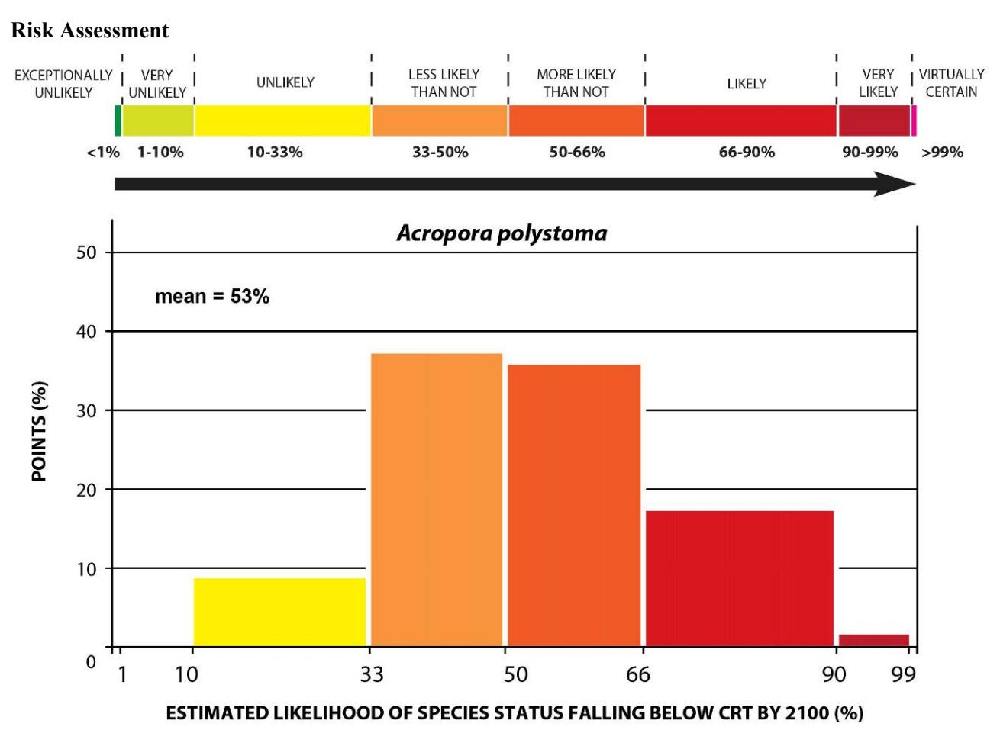

Figure 7.5.62. Distribution of points to estimate the likelihood that the status of *Acropora polystoma* falls below the Critical Risk Threshold (the species is of such low abundance, or so spatially fragmented, or at such reduced diversity that extinction is extremely likely) by 2100.

Factors that increase the potential extinction risk (higher likelihood of falling below the Critical Risk Threshold) for *Acropora polystoma* include the relatively high susceptibility of the genus *Acropora* to common threats (bleaching, acidification, disease, predation, and pollution), a relatively restricted depth range (< 10 m), and generally uncommon abundance. The high bleaching rate of acroporid corals is the primary known threat of extinction for *Acropora polystoma.* Factors that reduce the potential extinction risk (decrease likelihood of falling below Critical Risk Threshold) were the wide geographic range and the fact that it is found in intertidal areas (indicating potentially enhanced physiological stress tolerance).

The overall likelihood that *Acropora polystoma* will fall below the Critical Risk Threshold by 2100 was estimated to be in the "more likely than not" risk category with a mean likelihood of 53% and a standard error (SE) of 10% (Fig. 7.5.62). This SE was calculated by taking the standard deviation of the seven mean voting scores of the BRT members and shows the coherence among the BRT. The uncertainty of the BRT is reflected in the range of votes of 10%–99% (Fig. 7.5.62) and the average range of likelihood estimates of the seven BRT voters (61%). The overall wide range of votes reflects the uncertainty among BRT members inherent in the lack of adequate ecological and demographic information for this species.

#### **7.5.16.** *Acropora retusa* **Dana, 1846**

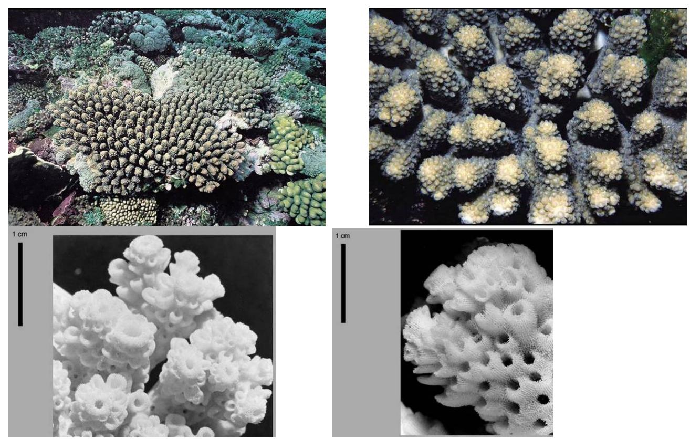

Figure 7.5.63. *Acropora retusa* photos and corallites from Veron (2000).

#### **Characteristics**

Colonies of *Acropora retusa* are flat plates with short thick digitate branchlets. Corallites have thick rounded walls and wide openings. Axial corallites are indistinct. Radial corallites are laying flat against each other, becoming nariform near branch ends. Colonies are brown in color. (Veron, 2000; Veron and Wallace, 1984).

#### **Taxonomy**

**Taxonomic issues**: None. *Acopora retusa* is reported to be similar to *Acropora branchi*, which occupies the same habitat, is distinguished by having highly fused basal branches and exsert axial corallites. See also *Acropora gemmifera*, which has longer branchlets and more exsert basal radial corallites and *Acopora monticulosa*, which has corallites in rows. (Veron, 2000; Veron and Wallace, 1984).

**Family**: Acroporidae.

**Evolutionary and geologic history**: No fossil records of *Acropora retusa* have been reported (Wallace, 1999).

#### **Global Distribution**

*Acropora retusa* has a wide distribution longitudinally ranging from the Red Sea, Madagascar, South Africa, and Chagos in the Indian Ocean to the central Indo-Pacific, the Solomons, and in the central Pacific all the way east to Pitcairn (Veron, 2000; Veron and Wallace, 1984). Its range is restricted to shallow water. *Acropora retusa* has a relatively moderate range overall, having the 52nd largest range of 114 *Acropora* species examined (Richards, 2009).

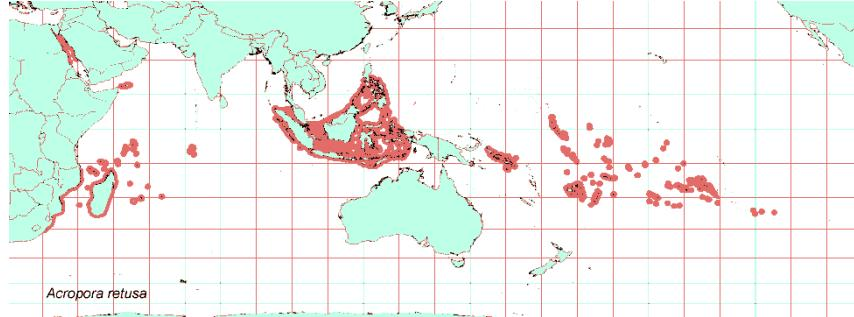

Figure 7.5.64. *Acropora retusa* distribution from IUCN copied from http://www.iucnredlist.org.

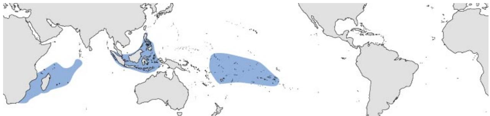

Figure 7.5.65. *Acropora retusa* distribution from Veron (2000).

#### **U.S. Distribution**

According to both the IUCN Species Account and the CITES species database, *Acropora retusa* occurs in American Samoa. The IUCN Species Account also notes its occurrence in minor outlying islands but the CITES species database does not.

A search of published and unpublished records of occurrence in U.S. waters indicates *Acropora retusa* has been reported from Tutuila, Ofu-Olosega, Tau, and Rose Atoll in American Samoa (Birkeland, unpubl. data; Kenyon et al., 2010a; Lovell and McLardy, 2008; National Park Service, 2009), Johnston Atoll, Howland Island, and Kingman Reef (CRED, unpubl. data).

Within federally protected waters, *Acropora retusa* has been recorded from the following areas (Kenyon et al., 2010b):

- Pacific Remote Islands Marine National Monument (Johnston, Howland, Kingman)
- National Park of American Samoa, Ofu Island unit
- Rose Atoll Marine National Monument

#### **Habitat**

**Habitat**: *Acropora retusa* has been reported to occupy upper reef slopes and tidal pools (Veron, 2000; Veron and Wallace, 1984).

**Depth range**: *Acropora retusa* has been reported in water depths ranging from 1 m to 5 m (Carpenter et al., 2008).

#### **Abundance**

Abundance of *Acropora retusa* has been reported as common in South Africa and, uncommon elsewhere (Veron, 2000; Veron and Wallace, 1984).

#### **Life History**

*Acopora retusa* is a hermaphroditic spawner (Carroll et al., 2006) with lecithotrophic larvae (Baird et al., 2009). For more genus level information, see Section 7.5: Genus *Acropora*.

#### **Threats**

For each of these possible threats, see also Section 7.5: Genus *Acropora* for additional genus level information.

**Thermal stress: Al**though there is not much species-specific information about the response of *Acropora retusa* to thermal stress, the genus *Acropora* are consistently ranked among the coral genera most severely susceptible to bleaching (Marshall and Baird, 2000; McClanahan et al., 2007; McClanahan et al., 2005a). However, the genus may have differential responses across regions during mass bleaching mortalities.

**Acidification:** No specific research has addressed the effects of acidification on *Acropora retusa*, but experiments on acidification have demonstrated negative effects on *Acropora* calcification (Anthony et al., 2008; Marubini et al., 2003; Renegar and Riegl, 2005; Schneider and Erez, 2006) and productivity (Anthony et al., 2008; Crawley et al., 2010), as well as impaired fertilization and settlement success in *Acropora palmata* (Albright et al., 2010),and reduced growth and zooxanthellae uptake in juveniles (Suwa et al., 2010). Most corals studied have shown negative relationships between acidification and growth (Table 3.2.2), and acidification is likely to contribute to reef destruction in the future (Hoegh-Guldberg et al., 2007; Silverman et al., 2009). While ocean acidification has not been demonstrated to have already caused appreciable declines in coral populations so far, the BRT considers it to be a significant threat to corals by 2100.

**Disease:** Susceptibility and impacts of disease on *Acropora retusa* are not known, although *Acropora* species are moderately to highly susceptible to disease. However, ample evidence show that diseases can have devastating regional impacts on individual coral species (e.g., Aronson and Precht, 2001; Bruckner and Hill, 2009), and there is evidence that these impacts are occurring in more taxa and at a broader geographic scale (Sutherland et al., 2004, Green and Bruckner, 2000).

**Predation:** The specific effects of predation are poorly known for *Acropora retusa*. Most *Acropora* are preferentially consumed by crown-of-thorns seastars (*Acanthaster planci*) (Colgan, 1987) and by corallivorous snails (B. Vargas-Ángel, CRED, Honolulu, HI, pers. comm., September 2010).

**Land-based sources of pollution (LBSP):** The specific effects of LBSP stresses are largely unknown for *Acropora retusa*. LBSP-related stresses (nutrients, sediment, toxins, and salinity) often act in concert rather than individually, and are influenced by other biological (e.g., herbivory) and hydrological factors.. Collectively, LBSP stresses are unlikely to produce extinction at a global scale; however, they may pose significant threats at local scales (particularly important for species with limited range) and reduce the resilience of corals to bleaching (Carilli et al., 2009a; Wooldridge, 2009b).

**Collection**: As a whole, this genus is heavily involved in international trade with 50,000–270,000 reported exported pieces per year from Indonesia (CITES, 2010).

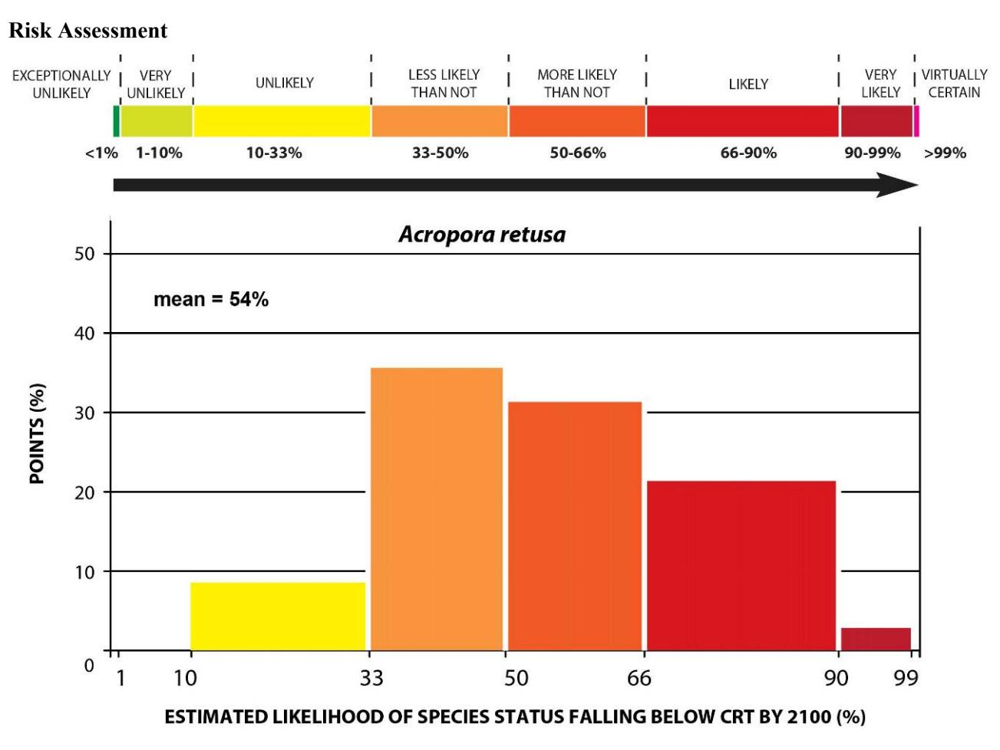

Figure 7.5.66. Distribution of points to estimate the likelihood that the status of *Acropora retusa* falls below the Critical Risk Threshold (the species is of such low abundance, or so spatially fragmented, or at such reduced diversity that extinction is extremely likely) by 2100.

Factors that increase the potential extinction risk (higher likelihood of falling below Critical Risk Threshold) for *Acropora retusa* include the relatively high susceptibility of the genus *Acropora* to common threats (bleaching, acidification, disease, predation, and pollution) and its restriction to shallow depths (suggesting potentially greater exposure to surface-based threats). The high bleaching rate of acroporid corals is the primary known threat of extinction for *Acropora retusa*. Factors that reduce the potential extinction risk (decrease likelihood of falling below Critical Risk Threshold) for *Acropora retusa* were the wide geographic range and its occurrence in tidal pools (suggesting high physiological stress tolerance).

The overall likelihood that *Acropora retusa* will fall below the Critical Risk Threshold by 2100 was estimated to be in the "more likely than not" risk category with a mean likelihood of 54% and a standard error (SE) of 14% (Fig. 7.5.66). This SE was calculated by taking the standard deviation of the seven mean voting scores of the BRT members and shows the coherence among the BRT. The uncertainty of the BRT is reflected in the range of votes of 10%–99% (Fig. 7.5.66) and the average range of likelihood estimates of the seven BRT voters (56%). The overall wide range of votes reflects the uncertainty among BRT members inherent in the lack of adequate ecological and demographic information for *Acropora retusa*.

**7.5.16** *Acropora rudis* **Rehberg, 1892** 

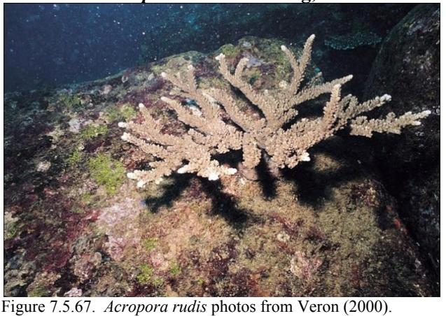

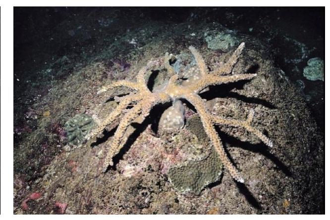

#### **Characteristics**

Colonies of *Acropora rudis* are arborescent with large, tapered, prostate branches, reaching a maximum size of 50 cm (Wallace, 1999). Upper branch surfaces have radial corallites while lower surfaces are smooth. Corallites vary in size, as large as 4 mm, but openings are small. The coenosteum is smooth and dense. Colonies are dark tan in color with pale branch tips (Veron, 2000).

#### **Taxonomy**

**Taxonomic issues**: None. *Acropora rudis* is similar to *Acropora hemprichii* and *Acropora variolosa* (Veron, 2000). Wallace's revision of *Acropora* taxonomy describes an *Acropora rudis* group (Wallace, 1999), which also includes *Acropora austera*, *Acropora variolosa*, and *Acropora hemprichii*.

**Family:** Acroporidae.

**Evolutionary and geologic history:** The *Acropora rudis* group is the oldest living *Acropora* lineage (Wallace, 1999).

#### **Global Distribution**

*Acropora rudis* has been reported to have a relatively restricted range overall, having the 90th largest range (24th smallest range) of 114 *Acropora* species examined (Richards, 2009). Reports indicate that it is primarily restricted to the Indian Ocean and Red Sea, as it is found in Bangladesh, Indonesia, the Seychelles, Sri Lanka, Thailand (Wallace, 1999), Mauritius (Fenner et al., 2004), and India (Raghuram and Venkataraman, 2005). However, recent reports place *Acropora rudis* in the Pacific, in New Caledonia (D. Fenner, Dept. Marine and Wildlife Resources, Tutuila, pers. comm., April 2010) and the Samoas. *Acropora rudis* often has a restricted distribution in the archipelagoes in which it is found (Wallace et al., 2001).

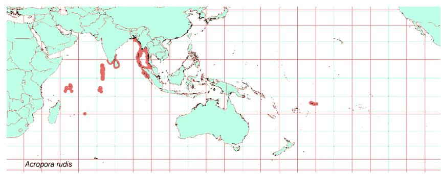

Figure 7.5.68. *Acropora rudis* distribution from IUCN copied from http://www.iucnredlist.org.

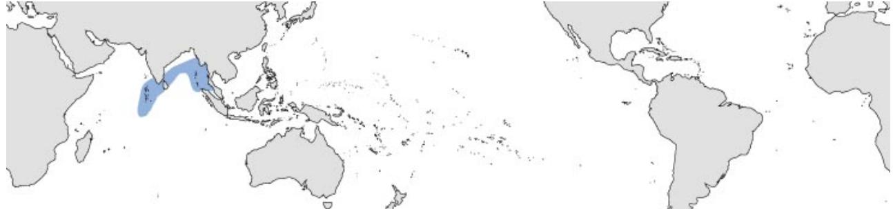

Figure 7.5.69. *Acropora rudis* distribution from Veron (2000).

#### **U.S. Distribution**

According to the IUCN Species Account, *Acropora rudis* occurs in American Samoa, with the supporting reference given as Fenner (pers. comm.). The CITES species database does not include any record of occurrence in U.S. waters.

Fenner reports *Acropora rudis* in American Samoa at Tutuila (CRED, unpubl. data). However, *Acropora rudis* is not listed as occurring in American Samoa in Lovell and McLardy (2008), and this species was not observed elsewhere in American Samoa by Fenner during dedicated surveys conducted at 38 sites off Ofu-Olosega, Tau, Rose Atoll, Swains, and South Bank in March 2010 (CRED, unpubl. data).

Within federally protected waters, *Acropora rudis* has been recorded from the following areas (Kenyon et al., 2010b):

Fagatele Bay National Marine Sanctuary (Kenyon et al., 2010).

#### **Habitat**

**Habitat**: *Acropora rudis* has been reported to occupy shallow to deep rocky foreshores (Veron, 2000) and may be restricted to fringing reefs (Richards, 2009 ; Wallace et al., 2001).

**Depth range**: *Acropora rudis* has been reported in water depths ranging from 3 m to 15 m (Carpenter et al., 2008).

#### **Abundance**

Abundance of *Acropora rudis* has been reported as uncommon (Veron, 2000); however, it has been noted to comprise as much as half of the *Acropora* in some areas (Rajasuriya, 2002).

#### **Life History**

Life history parameters are not well described for *Acropora rudis*. However, the similar species *Acropora hemprichii* is a hermaphroditic broadcast spawner (Babcock et al., 1986; Baird et al., 2009; Shlesinger et al., 1998), as are all other acroporids studied to date (Baird et al., 2009). For more genus level information, see Section 7.5: Genus *Acropora*.

#### **Threats**

For each of these possible threats, see also Section 7.5: Genus *Acropora* for additional genus level information.

**Thermal stress: Al**though there is not much species-specific information about the response of *Acropora rudis* to thermal stress, the genus *Acropora* are consistently ranked among the coral genera most severely susceptible to bleaching (Marshall and Baird, 2000; McClanahan et al., 2007; McClanahan et al., 2005a). However, the genus may have differential responses across regions during mass bleaching mortalities (McClanahan et al., 2004a).

**Acidification:** No specific research has addressed the effects of acidification on *Acropora rudis*, but experiments on acidification have demonstrated negative effects on *Acropora* calcification (Anthony et al., 2008; Renegar and Riegl, 2005; Schneider and Erez, 2006) and productivity (Anthony et al., 2008), as well as impaired fertilization and settlement success in *Acropora palmata* (Albright et al., 2010) and reduced growth and zooxanthellae uptake in *Acropora* juveniles (Suwa et al., 2010). Most corals studied have shown negative relationships between acidification and growth (Table 3.2.2), and acidification is likely to contribute to reef destruction in the future (Hoegh-Guldberg et al., 2007; Silverman et al., 2009). While ocean acidification has not been demonstrated to have already caused appreciable declines in coral populations so far, the BRT considers it to be a significant threat to corals by 2100.

**Disease:** There is little species-specific information, although in general *Acropora* species are moderately to highly susceptible disease. *Acropora rudis* experiences skeletal growth anomalies, black-band disease, pigmentation response, skeleton-eroding band, tissue necrosis, and white-band/white-plague diseases (UNEP, 2010). The ecological and population impacts of disease have not been established for this species. However, ample evidence show that diseases can have devastating regional impacts on individual coral species (e.g., Aronson and Precht, 2001; Bruckner and Hill, 2009) and there is some evidence that these impacts are occurring on a trend of increasing taxonomic and geographic scale (Green and Bruckner, 2000; Sutherland et al., 2004).

**Predation:** The specific effects of predation are poorly known for *Acropora rudis*. Most *Acropora* are preferentially consumed by crown-of-thorns seastars, *Acanthaster planci* (Colgan, 1987) and by corallivorous snails (B. Vargas-Ángel, CRED, Honolulu, HI, pers. comm., September 2010).

**Land-based sources of pollution (LBSP):** The specific effects of LBSP stresses are largely unknown for *Acropora rudis*. Its highly branched growth form would likely enhance passive sediment rejection, making *Acropora rudis* unlikely to be susceptible to the effects of direct sediment deposition. Indirect effects of sedimentation (light reduction, energetic cost of rejection, effects of sediment-associated nutrients and contaminants) are unknown. LBSP-related stresses (nutrients, sediment, toxins, and salinity) often act in concert rather than individually and are influenced by other biological (e.g., herbivory) and hydrological factors. Collectively, LBSP stresses are unlikely to produce extinction at a global scale; however, they may pose significant threats at local scales (particularly important for species with limited range) and reduce the resilience of corals to bleaching (Carilli et al., 2009a; Wooldridge, 2009b).

**Collection/Trade:** As a whole, the genus *Acropora* has been heavily involved in international trade with 50,000– 270,000 reported exported pieces per year from Indonesia (CITES, 2010). As the species in the genus *Acropora* can be difficult to distinguish by nonexperts, it is possible that *Acropora rudis* could be impacted. However, no trade quotas or reported exports are listed for this particular species.

#### **Risk Assessment**

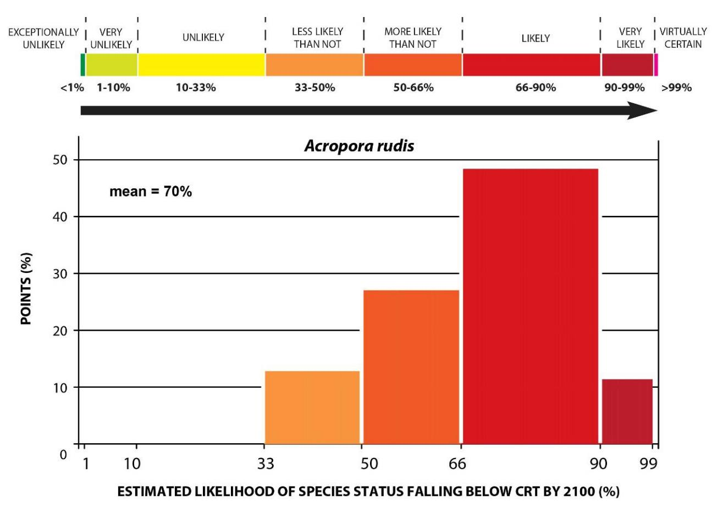

Figure 7.5.70. Distribution of points to estimate the likelihood that the status of *Acropora rudis* falls below the Critical Risk Threshold (the species is of such low abundance, or so spatially fragmented, or at such reduced diversity that extinction is extremely likely) by 2100.

Factors that increase the potential extinction risk (higher likelihood of falling below the Critical Risk Threshold) for *Acropora rudis* include the relatively high susceptibility of the genus *Acropora* to common threats (bleaching, acidification, disease, predation, and pollution) and a particularly narrow and somewhat disjunct biogeogaphic range with limited latitudinal extent. No specific factors are known at this time that notably reduced the potential extinction risk estimate (decrease likelihood of falling below the Critical Risk Threshold) for *Acropora rudis*.

The overall likelihood that *Acropora rudis* will fall below the Critical Risk Threshold by 2100 was estimated to be in the "likely" risk category with a mean likelihood of 70% and a standard error (SE) of 11% (Fig. 7.5.70). This SE was calculated by taking the standard deviation of the seven mean voting scores of the BRT members and shows the coherence among the BRT. The uncertainty of the BRT is reflected in the range of votes of 33%–99% (Fig. 47.5.70) and the average range of likelihood estimates of the seven BRT voters (49%). The overall wide range of votes reflects the uncertainty among BRT members inherent in the lack of adequate ecological and demographic information for *Acropora rudis*.

#### **7.5.17** *Acropora speciosa* **Quelch, 1886**

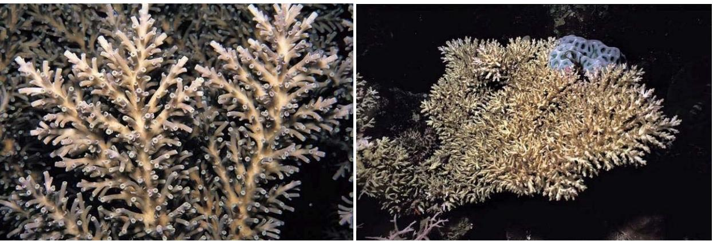

Figure 7.5.71. *Acropora speciosa* photos fromVeron (2000).

#### **Characteristics**

Colonies of *Acropora speciosa* form thick cushions or bottlebrush branches. They have large and elongate axial corallites; radial corallites are small and tubular or pocketed. Colonies are cream in color with delicately colored branch tips (Veron, 2000)**.**

#### **Taxonomy**

**Taxonomic issues**: None. *Acropora speciosa* is similar to *Acropora echinata* (which does not form cushions) and *Acropora granulosa* (Veron, 2000). Taxonomically, it belongs to the *Acropora loripes* group (Wallace, 1999).

**Family**: Acroporidae.

**Evolutionary and geologic history**: No species-specific geologic information has been found for *Acropora speciosa*. *Acropora speciosa* is genetically related to *Acropora vaughani* and *Acropora caroliniana* (Richards, 2009).

#### **Global Distribution**

*Acropora speciosa* has been reported to have a moderately broad range overall, having the 63rd largest range of 114 *Acropora* species examined (Richards, 2009). It has been reported in Fiji, Indonesia, Papua New Guinea, Australia, the Philippines, Polynesia, and Micronesia.

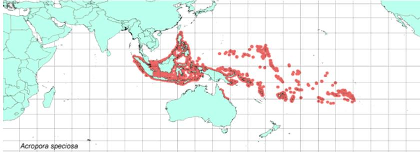

Figure 7.5.72. *Acropora speciosa* distribution from IUCN copied from http://www.iucnredlist.org.

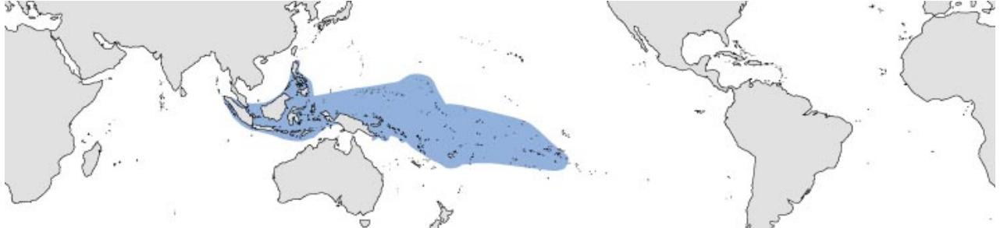

Figure 7.5.73. *Acropora speciosa* distribution from Veron (2000).

#### **U.S. Distribution**

The CITES database does not list *Acropora speciosa* as occurring in U.S. waters. The IUCN database lists it in American Samoa, and U.S. minor outlying islands.

The IUCN lists the supporting reference as Fenner (pers. comm.). Fenner reports *Acropora speciosa* in American Samoa at Tutuila at around 20 m depth, where its abundance was characterized as "occasional." The area where it was found was heavily impacted by the tsunami of 29 September 2009, and it has not been searched for since then.

*Acropora speciosa* is not listed as occurring in American Samoa in Lovell and McLardy (2008). This species was not observed elsewhere in American Samoa by Fenner during dedicated surveys conducted at 38 sites off Ofu-Olosega, Tau, Rose Atoll, Swains, and South Bank in March 2010 (CRED, unpubl. data).

Within federally protected waters, *Acropora speciosa* has been recorded from the following areas (Kenyon et al., 2010b):

Pacific Remote Islands Marine National Monument (Kingman Atoll)

#### **Habitat**

**Habitat**: *Acropora speciosa* has been reported to occupy protected environments with clear water and high diversity of *Acropora* (Veron, 2000) and steep slopes or deep, shaded waters (IUCN, 2010).

**Depth range**: *Acropora speciosa* has been reported in water depths ranging from 12 m to 30 m (Carpenter et al., 2008) and 15 m to 40 m (Richards, 2009). It is found in mesophotic assemblages in American Samoa (Bare et al., 2010), suggesting the potential for deep refugia.

#### **Abundance**

Abundance of *Acropora speciosa* has been reported as uncommon (Veron, 2000).

#### **Life History**

Although species-specific research on the life history of *Acropora speciosa* has been limited, it has been assumed to be a hermaphroditic spawner with lecithotrophic larvae (Baird et al., 2009). For more genus level information, see Section 7.5: Genus *Acropora*.

#### **Threats**

For each of these possible threats, see also Section 7.5: *Genus Acropora* for additional genus level information.

**Thermal stress:** Although there is not much species-specific information about the response of *Acropora speciosa* to thermal stress, the genus *Acropora* are consistently ranked among the coral genera most severely susceptible to bleaching (Marshall and Baird, 2000; McClanahan et al., 2007; McClanahan et al., 2005a). However, the genus may have differential responses across regions during mass bleaching mortalities (McClanahan et al., 2004a).

**Acidification:** No specific research has addressed the effects of acidification on *Acropora speciosa*, but experiments on acidification have demonstrated negative effects on *Acropora* calcification (Anthony et al., 2008; Renegar and Riegl, 2005; Schneider and Erez, 2006) and productivity (Anthony et al., 2008), as well as impaired fertilization and settlement success in *Acropora palmata* (Albright et al., 2010) and reduced growth and zooxanthellae uptake in *Acropora* juveniles (Suwa et al., 2010). Most corals studied have shown negative relationships between acidification and growth (Table 3.2.2), and acidification is likely to contribute to reef destruction in the future (Hoegh-Guldberg et al., 2007; Silverman et al., 2009). While ocean acidification has not been demonstrated to have already caused appreciable declines in coral populations so far, the BRT considers it to be a significant threat to corals by 2100.

**Disease:** There is little species-specific information, although in general *Acropora* species are moderately to highly susceptible to disease. *Acropora speciosa* experiences skeletal growth anomalies, black-band disease, pigmentation response, skeleton-eroding band, tissue necrosis, and white-band/white-plague diseases (UNEP, 2010). The ecological and population impacts of disease have not been established for this species. However, ample evidence show that diseases can have devastating regional impacts on individual coral species(e.g., Aronson and Precht, 2001; Bruckner and Hill, 2009), and there is some evidence that these impacts are occurring on a trend of increasing taxonomic and geographic scale (Green and Bruckner, 2000; Sutherland et al., 2004).

**Predation:** The specific effects of predation are poorly known for *Acropora speciosa*. Most *Acropora* are preferentially consumed by crown-of-thorns seastars, *Acanthaster planci*, (Colgan, 1987) and by corallivorous snails (B. Vargas-Ángel, CRED, Honolulu, HI, pers. comm., September 2010).

**Land-based sources of pollution (LBSP)**: The specific effects of LBSP stresses are largely unknown for *Acropora speciosa*. LBSP-related stresses (nutrients, sediment, toxins, and salinity) often act in concert rather than individually and are influenced by other biological (e.g., herbivory) and hydrological factors. Collectively, LBSP stresses are unlikely to produce extinction at a global scale; however, they may pose significant threats at local scales (particularly important for species with limited range) and reduce the resilience of corals to bleaching (Carilli et al., 2009a; Wooldridge, 2009b).

**Collection/Trade:** As a whole, the genus *Acropora* has been heavily involved in international trade with 50,000– 270,000 reported exported pieces per year from Indonesia traded (CITES, 2010). As the species in this genus can be difficult to distinguish by nonexperts, it is possible that *Acropora speciosa* could be impacted. However, no trade quotas or reported exports are listed for this particular species.

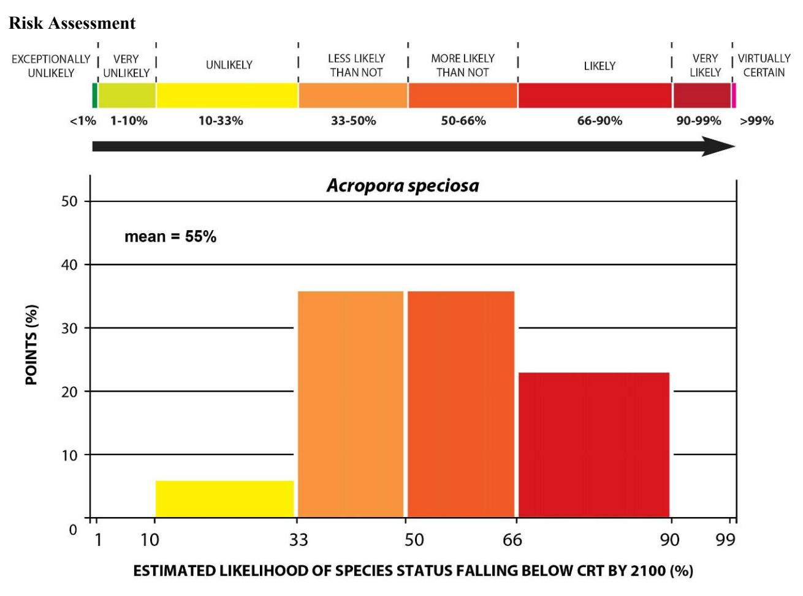

Figure 7.5.74. Distribution of points to estimate the likelihood that the status of *Acropora speciosa* falls below the Critical Risk Threshold (the species is of such low abundance, or so spatially fragmented, or at such reduced diversity that extinction is extremely likely) by 2100.

Factors that increase the potential extinction risk (higher likelihood of falling below the Critical Risk Threshold) for *Acropora speciosa* include the relatively high susceptibility of the genus *Acropora* to common threats (bleaching, acidification, disease, predation, and pollution). Factors that reduce the potential extinction risk (lower likelihood of falling below the Critical Risk Threshold) for *Acropora speciosa* include its fits broad global distribution, broad local distribution, and high local abundance—these characteristics tend toward species persistence (Occupancy Type 8: Richards, 2009). Vulnerability of this species was considered to be be somewhat ameliorated by the fact that it occurs in deeper water than many acroporids and perhaps experiences disturbances and surface-based threats less frequently.

The overall likelihood that *Acropora speciosa* will fall below the Critical Risk Threshold by 2100 was estimated to be in the "more likely than not" risk category with a mean likelihood of 55% and a standard error (SE) of 10% (Fig. 7.5.74). This SE was calculated by taking the standard deviation of the seven mean voting scores of the BRT members and shows the coherence among the BRT. The uncertainty of the BRT is reflected in the range of votes of 10%–90% (Fig. 7.5.74) and the average range of likelihood estimates of the seven BRT voters (54%). The overall wide range of votes reflects the uncertainty among BRT members inherent in the lack of adequate ecological and demographic information for this species.

#### **7.5.18** *Acropora striata* **Verrill, 1866**

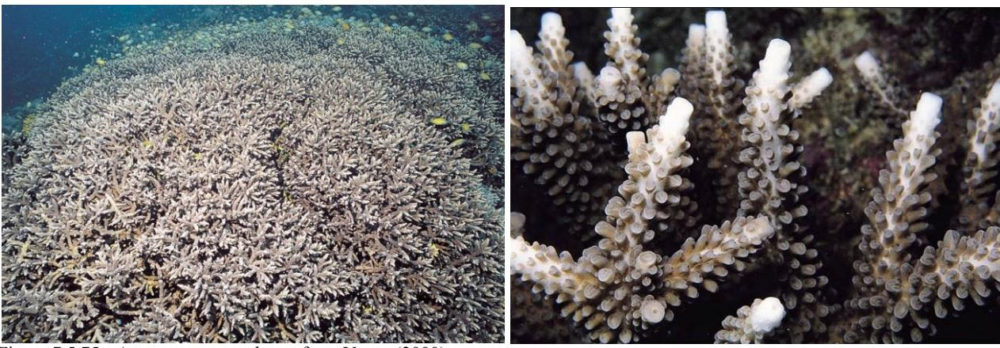

Figure 7.5.75. *Acropora striata* photos from Veron (2000).

#### **Characteristics**

Colonies of *Acropora striata* form dense thickets with short cylindrical branches. They have small axial corallites and irregular radial corallites. Exsert corallites have prominent lower lips. Colonies are grey-brown in color with white branch tips and white coenosteum; coloration is distinctive in Japan only (Veron, 2000).

#### **Taxonomy**

**Taxonomic issues**: None. *Acropora striata* is similar to *Acropora tumida* (which has radial corallites along branches and without prominent lower lips), *Acropora sekiseiensis*, and *Acropora parahemprichii* (Veron, 2000). Taxonomically, it belongs to the *Acropora seleago* group (Wallace, 1999).

**Family:** Acroporidae.

**Evolutionary and geologic history**: *Acropora* is the most diverse extant coral genus (Veron, 2000). Some Acropora species are known from the Eocene (49–34 Ma), with extensive diversification in the central Indo-Pacific over the last 2 million years (Wallace and Rosen, 2006). No fossil records of *Acropora striata* have been reported.

#### **Global Distribution**

*Acropora striata* has been reported to have a moderately broad range overall, having the 54th largest range of 114 *Acropora* species examined (Richards, 2009). However, there is conflicting information on the range of this species. The IUCN Red List range map does not list the species in Australia (IUCN, 2010), but CITES personal communication from Dr. Carden Wallace indicates that it does., However, an earlier reference specifically asserts *Acropora striata* is not found in Australia (Wallace et al., 1991). The species has also been reported to occur in Mozambique (Riegl, 1996), while others think this may be unlikely (IUCN, 2010).

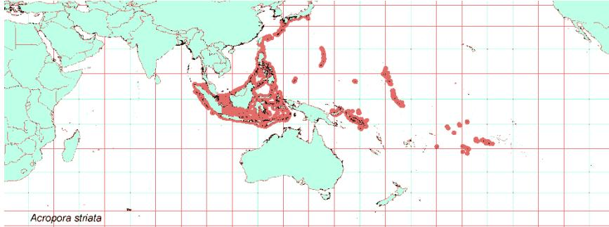

Figure 7.5.76. *Acropora striata* distribution from IUCN copied from http://www.iucnredlist.org.

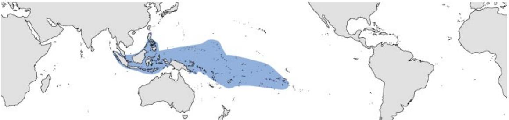

Figure 7.5.77. *Acropora striata* distribution from Veron (2000).

#### **U.S. Distribution**

According to the IUCN Species Account, *Acropora striata* occurs in U.S. minor outlying islands. The CITES species database does not list its occurrence in U.S. waters.

A search of published and unpublished records of occurrence in U.S. waters indicates *Acropora striata* has been reported from Ofu Lagoon in American Samoa (Birkeland, unpubl. data), Guam (Burdick, unpubl. data; Randall, 2003), Commonwealth of the Northern Mariana Islands, and Kingman Reef (CRED, unpubl. data).

Within federally protected waters, *Acropora striata* has been recorded from the following areas (Kenyon et al., 2010b):

- Pacific Remote Islands Marine National Monument (Kingman)
- National Park of American Samoa, Ofu Island unit

#### **Habitat**

**Habitat**: *Acropora striata* has been reported to occupy shallow rocky foreshores and shallow reef flats (Veron, 2000).

**Depth range**: *Acropora striata* has been reported in water depths ranging from 10 m to 25 m (Carpenter et al., 2008).

#### **Abundance**

Abundance of *Acropora striata* has been reported as rare overall but may be locally dominant in some areas in Japan (Veron, 2000).

#### **Life History**

Early reproductive studies suggest *Acropora striata* is a brooder, releasing planulae during the winter new moon in Enewetak (Stimson, 1978). More recent work shows *Acropora striata* to be a simultaneous hermaphroditic spawner; in Moorea, gamete release peaks in October (Carroll et al., 2006). Egg size and fecundity have not been specifically determined for this species, but fecundity in *Acropora* colonies is in the range of 3.6 to 15.8 eggs per polyp (Kenyon, 2008; Wallace, 1999).

Larval development and settlement have been reported to take 5–10 days, but larvae are competent for 31 days (Carroll et al., 2008). Spawning may be asynchronyous with other *Acropora* species. While different individuals of a given species spawn at different times, *Acropora striata* lacked pigmented eggs prior to the Australian secondary spawning season in November 2007 (Rosser and Baird, 2008).

For more genus level information, see Section 7.5: Genus *Acropora*.

*Acropora striata* has been reported to have indeterminate growth, reaching a maximum size of 200 cm (Wallace, 1999). Growth can be fairly rapid; outplants in Moorea (depth = 4 m–6 m) averaged an 8% increase in mass after 5 weeks (Boyer et al., 2009).

#### **Threats**

For each of these possible threats, see also Section 7.5: Genus *Acropora* for additional genus level information.

**Thermal stress:** Although there is not much species-specific information about the response of *Acropora striata* to thermal stress, the genus *Acropora* are consistently ranked among the coral genera most severely susceptible to bleaching (Marshall and Baird, 2000; McClanahan et al., 2007; McClanahan et al., 2005a). However, the genus may have differential responses across regions during mass bleaching mortalities (McClanahan et al., 2004a).

**Acidification:** No specific research has addressed the effects of acidification on *Acropora striata,* but experiments on acidification have demonstrated negative effects on *Acropora* calcification (Anthony et al., 2008; Renegar and Riegl, 2005; Schneider and Erez, 2006) and productivity (Anthony et al., 2008), as well as impaired fertilization and settlement success in *Acropora palmata* (Albright et al., 2010) and reduced growth and zooxanthellae uptake in juveniles (Suwa et al., 2010). Most corals studied have shown negative relationships between acidification and growth (Table 3.2.2), and acidification is likely to contribute to reef destruction in the future (Hoegh-Guldberg et al., 2007; Silverman et al., 2009). While ocean acidification has not been demonstrated to have already caused appreciable declines in coral populations so far, the BRT considers it to be a significant threat to corals by 2100.

**Disease:** There is little species-specific information, although in general *Acropora* species are moderately to highly susceptible to disease. *Acropora striata* experiences skeletal growth anomalies, black-band disease, pigmentation response, skeleton-eroding band, tissue necrosis, and white-band/white-plague disease (UNEP, 2010). The ecological and population impacts of disease have not been well established for this species. However, ample evidence show that diseases can have devastating regional impacts on individual coral species (e.g., Aronson and Precht, 2001; Bruckner and Hill, 2009), and there is some evidence that these impacts are occurring on a trend of increasing taxonomic and geographic scale (Green and Bruckner, 2000; Sutherland et al., 2004).

**Predation:** The specific effects of predation are poorly known for *Acropora striata*. Most *Acropora* are preferentially consumed by crown-of-thorns seastars, *Acanthaster planci*, (Colgan, 1987) and by corallivorous snails (B. Vargas-Ángel, CRED, Honolulu, HI, pers. comm., September 2010).

**Land-based sources of pollution (LBSP):** The specific effects of LBSP stresses are largely unknown for *Acropora striata*. LBSP-related stresses (nutrients, sediment, toxins, and salinity) often act in concert rather than individually, and are influenced by other biological (e.g., herbivory) and hydrological factors. Collectively, LBSP stresses are unlikely to produce extinction at a global scale; however, they may pose significant threats at local scales (particularly important for species with limited range) and reduce the resilience of corals to bleaching (Carilli et al., 2009a; Wooldridge, 2009b).

**Collection/Trade:** As a whole, the genus *Acropora* has been heavily involved in international trade with 50,000– 270,000 reported exported pieces per year from Indonesia (CITES, 2010). As the species in this genus can be difficult to distinguish by non experts, it is possible that *Acropora striata* could be impacted. However, little species-specific information is available in the international trade databases. The only record for *Acropora striata* is for the year 2000, when three pieces were exported (CITES, 2010).

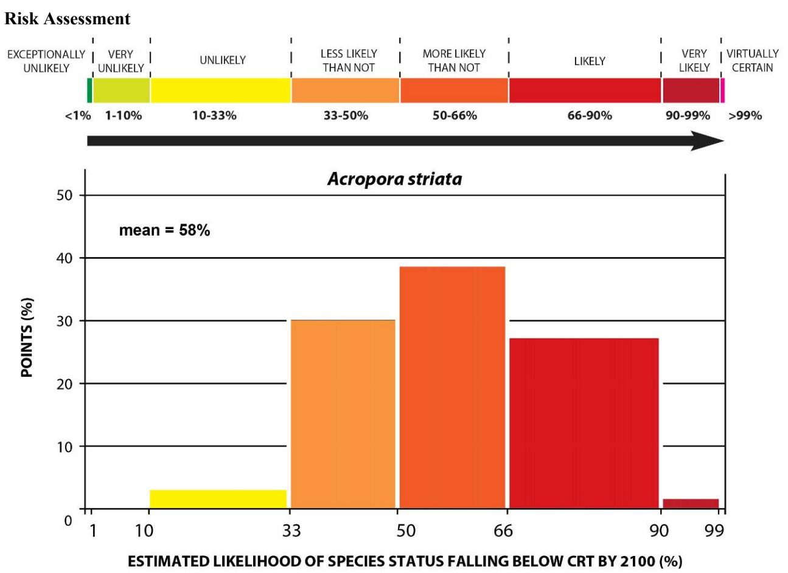

Figure 7.5.78.Distribution of points to estimate the likelihood that the status of *Acropora striata* falls below the Critical Risk Threshold (the species is of such low abundance, or so spatially fragmented, or at such reduced diversity that extinction is extremely likely) by 2100.

Factors that increase the potential extinction risk (higher likelihood of falling below the Critical Risk Threshold) for *Acropora striata* include that its genus has high susceptibility to common threats (bleaching, acidification, disease, predation, and pollution), its relatively narrow latitudinal distribution, and its mostly rare abundance. Factors that reduce the potential extinction risk (decrease likelihood of falling below the Critical Risk Threshold) for *Acropora striata* include its relatively broad global distribution, broad local distribution, and high local abundance—these characteristics tend toward species persistence (Occupancy Type 8:Richards, 2009).

The overall likelihood that *Acropora striata* will fall below the Critical Risk Threshold by 2100 was estimated to be in the "more likely than not" risk category with a mean likelihood of 58% and a standard error (SE) of 8% (Fig. 7.5.78). This SE was calculated by taking the standard deviation of the seven mean voting scores of the BRT members and shows the coherence among the BRT. The uncertainty of the BRT is reflected in the range of votes of 10%–99% (Fig. 7.5.78) and the average range of likelihood estimates of the seven BRT voters (58%). The overall wide range of votes reflects the uncertainty among BRT members inherent in the lack of adequate ecological and demographic information for *Acropora striata*.

#### **7.5.19** *Acropora tenella* **Brook, 1892**

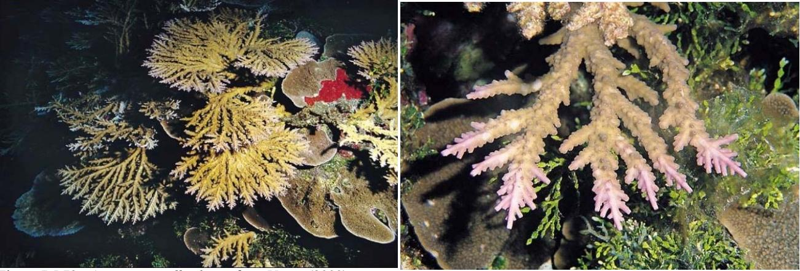

Figure 7.5.79. *Acropora tenella* photos from Veron (2000).

#### **Characteristics**

*Acropora tenella* has been reported to have horizontal, platy, caespitose colonies with flattened branches. The branches have usually had a central ridge, with little branch fusion. Colonies are reported to have distinct axial and radial corallites; radial corallites are scattered over branch surfaces but only occur laterally on old branches. Colonies are cream color with blue/white tips (Veron, 2000).

#### **Taxonomy**

**Taxonomic issues**: None. *Acorpoa tenella* is similar to *Acropora pichoni*, which has highly fused branches that are less elongate and more platy (Veron, 2000). Taxonomically, it belongs to the *Acropora elegans* group (Wallace, 1999).

**Family:** Acroporidae.

**Evolutionary and geologic history**: *Acropora* is the most diverse extant coral genus (Veron, 2000). Species are known from the Eocene (49–34 Ma), with extensive diversification in the central Indo-Pacific over the last 2 million years (Wallace and Rosen, 2006). *Acropora tenella* is genetically related to *Acropora chesterfieldensis* and *Acropora pichoni*  (Richards, 2009).

#### **Global Distribution**

*Acropora tenella* has been reported to have a moderately broad range overall, having the 72nd largest range of 114 *Acropora* species examined (Richards, 2009). Known records for *Acropora tenella* have originated primarily from the central Indo-Pacific, Japan, the East China Sea, and Southeast Asia.

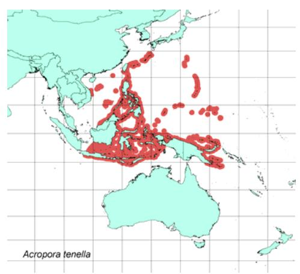

Figure 7.5.80. *Acropora tenella* distribution from IUCN copied from http://www.iucnredlist.org.

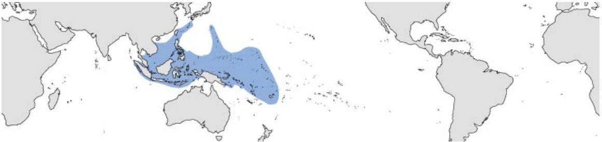

Figure 7.5.81. *Acropora tenella* distribution from Veron (2000).

#### **U.S. Distribution**

The CITES species database does not include any record of occurrence of this species in U.S. waters. The IUCN database lists *Acropora tenella* as occurring in the Marianas Archipelago. Veron (2000) also lists this species in the Marianas, but that is a result of a misidentification of the origin of photographic records (Kenyon et al. 2010). G. Paulay (University of Florida, Gainesville, FL, pers. comm., 28 February 2010) indicates a number of photos submitted by him to Veron from Palau, the Cook Islands, and other locations in the Pacific were mistakenly attributed to Guam (similar to the *errata* later acknowledged by Veron (2002) for *Acanthastrea regularis* and *Porites napopora*).

*Acropora tenella* has not been recorded from federally protected U.S. waters.

#### **Habitat**

**Habitat**: *Acropora tenella* has been reported to occupy lower slopes below 40 m (Veron, 2000), protected slopes and shelves as deep as 70 m (Richards, 2009), apparently specialized to calm, deep conditions (Wallace et al., 2000).

**Depth range**: *Acropora tenella* has been reported in water depths ranging from 25 m to 70 m (Carpenter et al., 2008). *Acropora tenella* is known primarily from mesophotic habitats, suggesting the potential for deep refugia.

#### **Abundance**

Abundance of *Acropora tenella* has been reported as locally common in some locations (Veron, 2000).

#### **Life History**

*Acropora tenella* is assumed to be a hermaphroditic spawner with lecithotrophic larvae (Baird et al., 2009). *Acropora tenella* reaches a maximum size of 150 cm (Wallace, 1999). For more genus level information, see Section 7.5: Genus *Acropora*.

#### **Threats**

For each of these possible threats, see also Section 7.5: *Genus Acropora* for additional genus level information.

**Thermal stress:** Although there is not much species-specific information about the response of *Acropora tenella* to thermal stress, the genus *Acropora* are consistently ranked among the coral genera most severely susceptible to bleaching (Marshall and Baird, 2000; McClanahan et al., 2007; McClanahan et al., 2005a). However, the genus may have differential responses across regions during mass bleaching mortalities (McClanahan et al., 2004a).

**Acidification:** No specific research has addressed the effects of acidification on *Acropora tenella*, but experiments on acidification have demonstrated negative effects on *Acropora* calcification (Anthony et al., 2008; Renegar and Riegl, 2005; Schneider and Erez, 2006) and productivity (Anthony et al., 2008), as well as impaired fertilization and settlement success in *Acropora palmata* (Albright et al., 2010) and reduced growth and zooxanthellae uptake in juveniles (Suwa et al., 2010). Most corals studied have shown negative relationships between acidification and growth (Table 3.2.2), and acidification is likely to contribute to reef destruction in the future (Hoegh-Guldberg et al., 2007; Silverman et al., 2009). While ocean acidification has not been demonstrated to have already caused appreciable declines in coral populations so far, the BRT considers it to be a significant threat to corals by 2100.

**Disease:** In general, *Acropora* species are moderately to highly susceptible to disease. *Acropora tenella* experiences skeletal-growth anomalies, black-band disease, pigmentation response, skeleton-eroding band, tissue necrosis, and white-band/white-plague diseases (UNEP, 2010). The ecological and population impacts of disease have not been established for *Acropora tenella*. However, ample evidence indicate that diseases can have devastating regional impacts on individual coral species (e.g., Aronson and Precht, 2001; Bruckner and Hill, 2009), and there is some evidence that these impacts are occurring on a trend of increasing taxonomic and geographic scale (Green and Bruckner, 2000; Sutherland et al., 2004).

**Predation:** The specific effects of predation are poorly known for *Acropora tenella*. Most *Acropora* are preferentially consumed by crown-of-thorns seastars, *Acanthaster planci*, (Colgan, 1987) and by corallivorous snails (B. Vargas-Ángel, CRED, Honolulu, HI, pers. comm., September 2010).

**Land-based sources of pollution (LBSP):** The specific effects of LBSP stresses are largely unknown for *Acropora tenella*. LBSP-related stresses (nutrients, sediment, toxins, and salinity) often act in concert rather than individually and are influenced by other biological (e.g., herbivory) and hydrological factors. Collectively, LBSP stresses are unlikely to produce extinction at a global scale; however, they may pose significant threats at local scales (particularly important for species with limited range) and reduce the resilience of corals to bleaching (Carilli et al., 2009a; Wooldridge, 2009b).

**Collection/Trade:** As a whole, this genus *Acropora* has been heavily involved in international trade with 50,000– 270,000 reported exported pieces per year from Indonesia (CITES, 2010). As the species in this genus can be difficult to distinguish by nonexperts, it is possible that *Acropora tenella* could be impacted. However, little species-specific information is available in the trade databases. In 1998, 123 pieces were exported from Fiji to the United States (CITES, 2010).

#### **Risk Assessment**

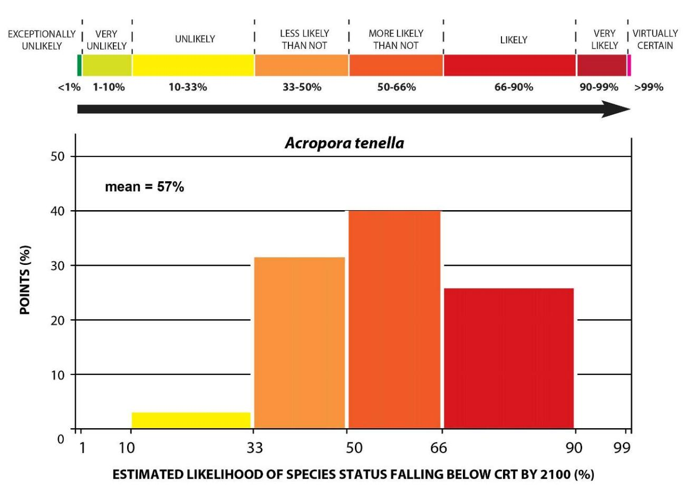

Figure 7.5.82. Distribution of points to estimate the likelihood that the status of *Acropora tenella* falls below the Critical Risk Threshold (the species is of such low abundance, or so spatially fragmented, or at such reduced diversity that extinction is extremely likely) by 2100.

Factors that increase the potential extinction risk (higher likelihood of falling below Critical Risk Threshold) for *Acropora tenella* include that its genus has high susceptibility to common threats (bleaching, acidification, disease, predation, and pollution). *Acropora tenella* fits Richards' Occupancy Type 2 (see Section 7.5: Genus *Acropora*), with moderate latitidinal and longitudinal distribution but locally restricted in both distribution and abundance, making this species potentially vulnerable to local extinction (Richards, 2009). A factor that reduces the potential extinction risk (lower likelihood of falling below the Critical Risk Threshold) for *Acropora tenella* was that the broad distribution makes extinction unlikely across its full range. Additionally, *Acropora tenella* is known exclusively from deep waters, where it potentially experiences less frequent disturbance than other acroporids and is more remote from surface-based environmental variability and threats.

The overall likelihood that *Acropora tenella* will fall below the Critical Risk Threshold by 2100 was estimated to be in the "more likely than not" risk category with a mean likelihood of 57% and a standard error (SE) of 8% (Fig. 7.5.82). This SE was calculated by taking the standard deviation of the seven mean voting scores of the BRT members and shows the coherence among the BRT. The uncertainty of the BRT is reflected in the range of votes of 10%–90% (Fig. 7.5.82) and the average range of likelihood estimates of the seven BRT voters (58%). The overall wide range of votes reflects the uncertainty among BRT members inherent in the lack of adequate ecological and demographic information for this species. The wide range of votes also reflects the uncertainty in reconciling an occupancy type that is susceptible to local extinction with the fact that disturbance may be relatively rare given very broad geographical distribution and occurrence in mesophotic habitats of *Acropora tenella*.

**7.5.20** *Acropora vaughani* **Wells, 1954** 

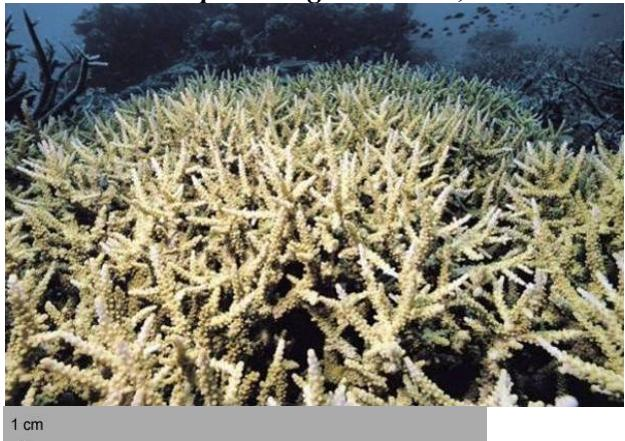

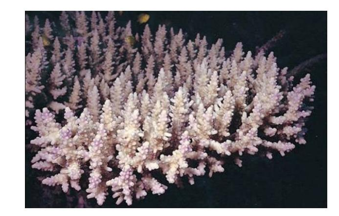

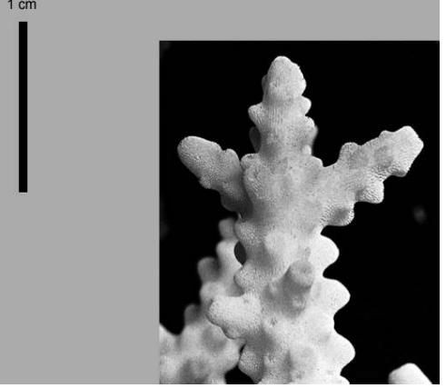

Figure 7.5.83. *Acropora vaughani* photos and corallite plan from Veron (2000).

#### **Characteristics**

*Acropora vaughani* has been reported to have open-branched, bushy, arborescent colonies. The main branches may have compact branchlets, lending to a bushy appearance. Colonies have abundant incipient axial corallites, but radial corallites are widely spaced and variable. They have fine, smooth coenosteum. Colonies are uniform blue, cream or pale brown in color (Veron, 2000).

#### **Taxonomy**

**Taxonomic issues**: None. *Acropora vaughani* is morphologically similar to *Acropora horrida*, *Acropora tortuosa*, and *Acropora rufus*. *Acropora austera* is similar in shape but has larger, more compact radial corallites (Veron, 2000). Taxonomically, it belongs to the *Acropora horrida* group (Wallace, 1999). Genetically related to *Acropora speciosa, Acropora micropthalma,* and *Acropora valida* (Richards, 2009).

**Family:** Acroporidae.

**Evolutionary and geologic history**: Fossil records of *Acropora vaughani* have been reported from the Pliocene (5.6–3 Ma) and Pleistocene (1.8–0.01 Ma) (Wallace, 1999). *Acropora* is the most diverse extant coral genus (Veron, 2000). Species are known from the Eocene (49–34 Ma), with extensive diversification in the central Indo-Pacific over the last 2 million years (Wallace and Rosen, 2006).

#### **Global Distribution**

Reported ranges of *Acropora vaughani* have been somewhat disjunct, with disagreements over whether the species exists in Australia, the Red Sea, and southwest Indian Ocean. *Acropora vaughani* has been reported to have a relatively broad range overall, having the 34th largest range of 114 *Acropora* species examined (Richards, 2009).

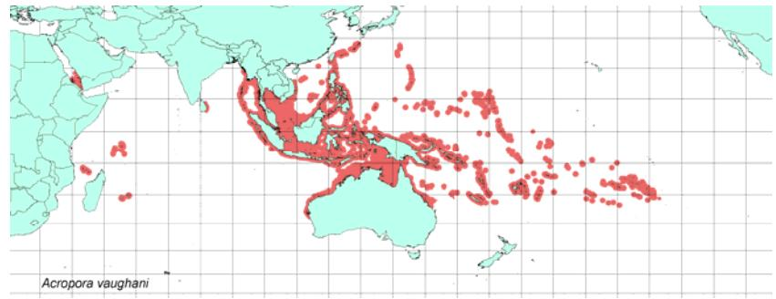

Figure 7.5.84. *Acropora vaughani* distribution from IUCN copied from http://www.iucnredlist.org.

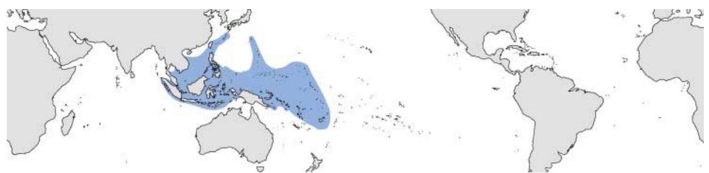

Figure 7.5.85. *Acropora vaughani* distribution from Veron (2000).

#### **U.S. Distribution**

According to the IUCN Species Account, *Acropora vaughani* occurs in American Samoa and U.S. minor outlying islands. The IUCN Species Account also lists its occurrence in the Northern Mariana Islands, but the CITES species database does not.

A search of published and unpublished records of occurrence in U.S. waters indicates *Acropora vaughani* has been reported from Tutuila, Ofu-Olosega, and Swains in American Samoa (Birkeland, unpubl. data; CRED, unpubl. data; Fisk and Birkeland, 2002; Lovell and McLardy, 2008; Maragos et al., 1994; National Park Service, 2009), Guam (Burdick, unpubl. data; Randall, 2003), Howland and Baker Islands (CRED, unpubl. data), and Palmyra Atoll (Williams et al., 2008b),.

Within federally protected waters, *Acropora vaughani* has been recorded from the following areas (Kenyon, 2010):

- Pacific Remote Islands Marine National Monument (Howland, Baker, Palmyra, Kingman)
- National Park of American Samoa, Ofu Island unit

#### **Habitat**

**Habitat**: *Acropora vaughani* has been reported to occupy fringing reefs with turbid water (Veron, 2000), protected lagoons and sandy slopes (IUCN, 2010), or protected subtidal waters (Richards, 2009).

**Depth range**: *Acropora vaughani* has been reported in water depths ranging from low tide levels (Piller and Riegl, 2003) to 20 m (IUCN, 2010) or to 30 m (Richards, 2009).

#### **Abundance**

Abundance of *Acropora vaughani* has been reported as uncommon (Veron, 2000).

#### **Life History**

*Acropora vaughani* is a hermaphroditic spawner with lecithotrophic larvae (Baird et al., 2009). It is one of several *Acropora* that achieve reproductive isolation by spawning earlier in the evening than other species (Fukami et al., 2003). *Acropora vaughani* has been used in rehabilitation and transplantation studies (Lindahl, 2003), which implies they have a high growth and/or low mortality rate. For more genus level information, see Section 7.5: Genus *Acropora*.

#### **Threats**

For each of these possible threats, see also Section 7.5: Genus *Acropora* for additional genus level information.

**Thermal stress:** Although there is not much species-specific information about the response of *Acropora vaughani* to thermal stress, the genus *Acropora* are consistently ranked among the coral genera most severely susceptible to bleaching (Marshall and Baird, 2000; McClanahan et al., 2007; McClanahan et al., 2005a). However, the genus may have differential responses across regions during mass bleaching mortalities (McClanahan et al., 2004a). Bleachinginduced mortality can be severe—*Acropora* in the southeastern Arabian Gulf suffered > 90% mortality during the 1996 bleaching event (Riegl, 1999). However, cryptic remnants of *Acropora vaughani* survived after the 1998 mass bleaching event (Riegl and Piller, 2001), contributing to potentially accelerated recovery.

**Acidification:** No specific research has addressed the effects of acidification on *Acropora vaughani*, but experiments on acidification have demonstrated negative effects on *Acropora* calcification (Renegar and Riegl, 2005; Anthony et al., 2008; Schneider and Erez, 2006) and productivity (Anthony et al., 2008), as well as impaired fertilization and settlement success in *Acropora palmata* (Albright et al., 2010) and reduced growth and zooxanthellae uptake in juveniles (Suwa et al., 2010). Most corals studied have shown negative relationships between acidification and growth (Table 3.2.2), and acidification is likely to contribute to reef destruction in the future (Hoegh-Guldberg et al., 2007; Silverman et al., 2009). While ocean acidification has not been demonstrated to cause appreciable declines in coral populations so far, the BRT considers it to be a significant threat to corals by 2100.

**Disease:** There is little species-specific information, although in general *Acropora* species are moderately to highly susceptible to disease. *Acropora vaughani* experiences skeletal-growth anomalies, black-band disease, pigmentation response, skeleton-eroding band, tissue necrosis, and white-band/white plague diseases (UNEP, 2010). The ecological and population impacts of disease have not been established for this species. However, ample evidence indicate that diseases can have devastating regional impacts on individual coral species (e.g., Aronson and Precht, 2001; Bruckner and Hill, 2009), and there is some evidence that these impacts are occurring on a trend of increasing taxonomic and geographic scale (Sutherland et al., 2004; Green and Bruckner, 2000).

**Predation:** The specific effects of predation are poorly known for *Acropora vaughani*. Most *Acropora* are preferentially consumed by crown-of-thorns seastars, *Acanthaster planci*, (Colgan, 1987) and by corallivorous snails (B. Vargas-Ángel, CRED, Honolulu, HI, pers. comm., September 2010).

**Land-based sources of pollution (LBSP):** The specific effects of LBSP stresses are largely unknown for *Acropora vaughani*, although the species has been alleged to have disappeared from Jakarta Bay between 1920 and 2005 based on heavy coastal development (Van der Meij et al., 2010).LBSP-related stresses (nutrients, sediment, toxins, and salinity) often act in concert rather than individually and are influenced by other biological (e.g., herbivory) and hydrological factors. Collectively, LBSP stresses are unlikely to produce extinction at a global scale; however, they may pose significant threats at local scales (particularly important for species with limited range) and reduce the resilience of corals to bleaching (Carilli et al., 2009a; Wooldridge, 2009b).

**Collection/Trade:** As a whole, the genus *Acropora* has been heavily involved in international trade with 50,000– 270,000 reported exported pieces per year from Indonesia (CITES, 2010). As the species in this genus can be difficult to distinguish by nonexperts, it is possible that *Acropora vaughani* could be impacted. The species-specific information that is available suggests *Acropora vaughani* has some involvement in trade. From 1989-2002, gross export averaged 2181 pieces, primarily originating in Fiji, Indonesia, the Philippines, and Vietnam (CITES, 2010).

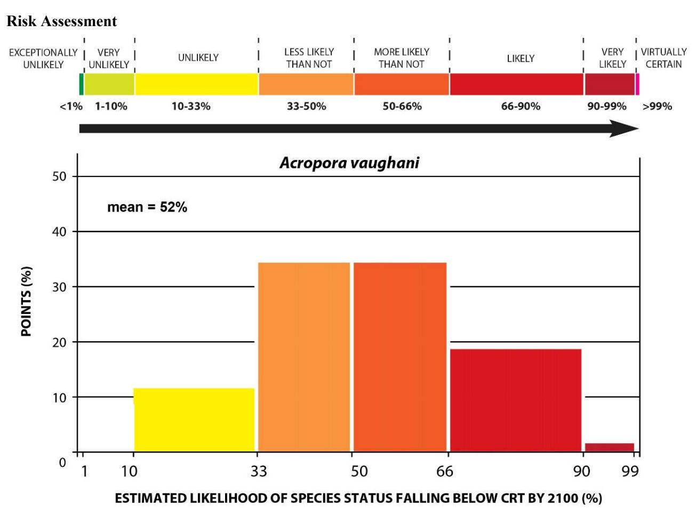

Figure 7.5.86. Distribution of points to estimate the likelihood that the status of *Acropora vaughani* falls below the Critical Risk Threshold (the species is of such low abundance, or so spatially fragmented, or at such reduced diversity that extinction is extremely likely) by 2100.

Factors that increase the potential extinction risk (higher likelihood of falling below Critical Risk Threshold) for *Acropora vaughani* include the relatively high susceptibility of the genus *Acropora* to common threats (bleaching, acidification, disease, predation, and pollution), and *Acropora vaughani* has documented (though small) traffic in the aquarium trade (suggesting desirability in the marketplace). Factors that reduce the potential extinction risk (lower likelihood of falling below Critical Risk Thredhold) were that *Acropora vaughani* fits occupancy model 8 (see Section 7.5: Genus *Acropora*), with broad global distribution, broad local distribution, and high local abundance—these characteristics tend toward species persistence (Richards, 2009). The wide range of habitats occupied by *Acropora vaughani,* its use in restoration and replantation, and its known recovery after bleaching events via tissue remnants from within the reef framework (Riegl and Piller, 2001) suggests a relatively high tolerance to physiological stressors and a degree of resilience.

The overall likelihood that *Acropora vaughani* will fall below the Critical Risk Threshold by 2100 was estimated to be in the "more likely than not" risk category with a mean likelihood of 52% and a standard error (SE) of 11% (Fig. 7.5.86). This SE was calculated by taking the standard deviation of the seven mean voting scores of the BRT members and shows the coherence among the BRT. The uncertainty of the BRT is reflected in the range of votes of 10%–99% (Fig. 7.5.86) and the average range of likelihood estimates of the seven BRT voters (61%). This uncertainty is revealed by this species having one of the highest SE of the mean probabilities (see Table 8.1). The overall wide range of votes reflects the uncertainty among BRT members inherent in the lack of adequate ecological and demographic information for *Acropora vaughani,* different interpretations of the species' habitat (is it protected or stressful?), and difficulty in reconciling large observed mortalities with factors that tend towards persistence (occupancy type and observed cryptic refugia).

#### **7.5.21** *Acropora verweyi* **Veron and Wallace, 1984**

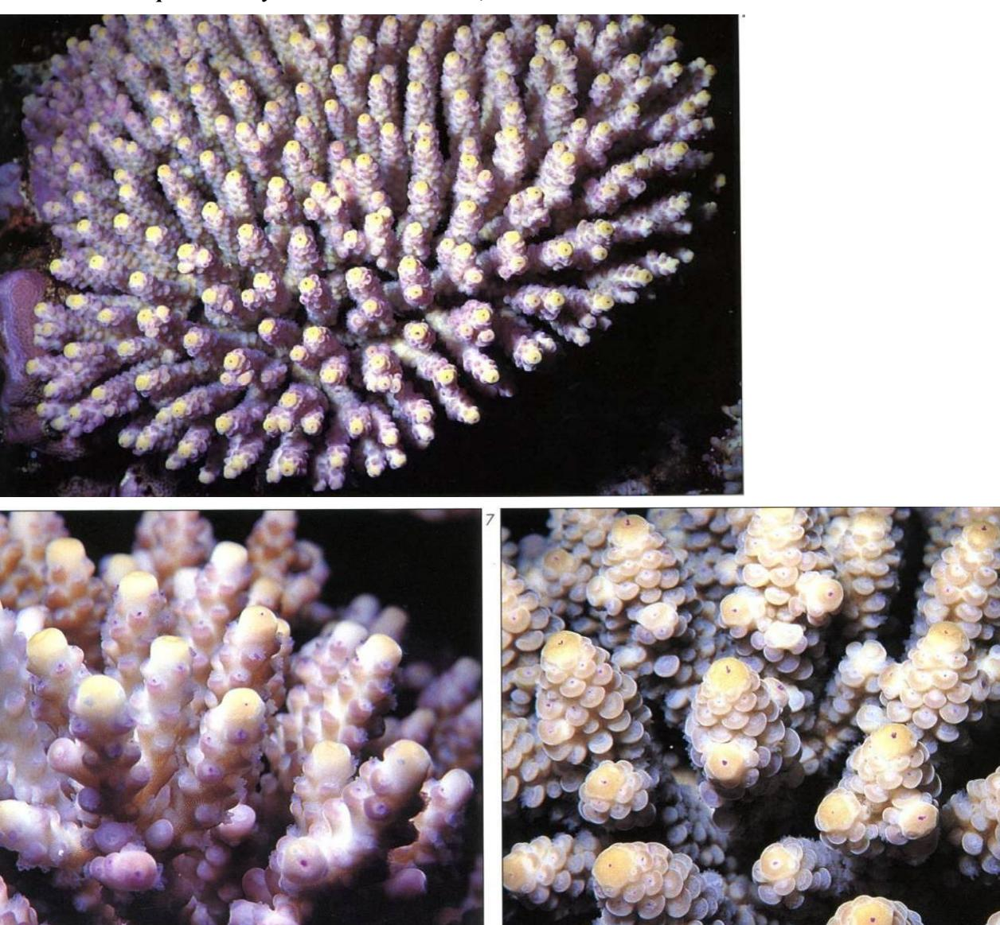

Figure 7.5.87. *Acropora verweyi* photos from Veron (2000).

#### **Characteristics**

*Acropora verweyi* has been reported to typically form corymbose clumps with noticeably rounded or bulb-like calices. Colonies are nearly always a creamy-brown in color with yellow axial corallites (Veron, 2000).

#### **Taxonomy**

Taxonomic issues: No taxonomic issues regarding *Acropora verweyi* have been reported.

**Family:** Acroporidae.

**Evolutionary and geologic history**: No fossil records of *Acropora verweyi* have been reported (Wallace, 1999).

#### **Global Distribution**

*Acropora verweyi* has been reported to have a relatively broad range, having the 16th largest range of 114 *Acropora* species examined (Richards, 2009), extending from east Africa, the Comorros and Seychelles in the Indian Ocean all the way to Pitcairn Island in the southeastern Pacific Ocean. Latitudinally, it has been reported from Japanese waters in the northern hemisphere across the Great Barrier Reef and southern Africa in the southern hemisphere. Despite this very broad range, Wallace (1999) believes it is not found in the central Indonesian Archipelago. She suggests this absence from a large area in the center of its range might be a result of the scarcity of shallow reef flats in this region.

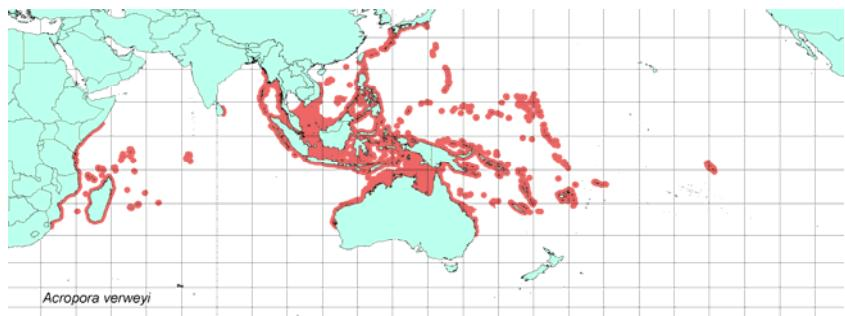

Figure 7.5.88. *Acropora verweyi* distribution from IUCN copied from http://www.iucnredlist.org.

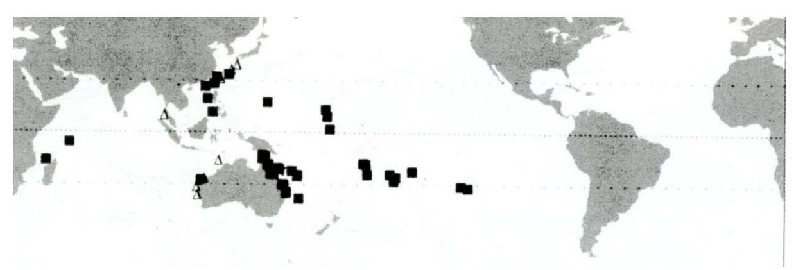

Figure 7.5.89. *Acropora verweyi* distribution from Wallace (1999). The black squares are specimen-based records in the *Acropora* database at the Museum of Tropical Queensland, the stars are type localities of senior and junior synonyms, and the black triangles are taken from records in the literature. When the triangles are open (not black), the records from the literature are possibly misidentifications.

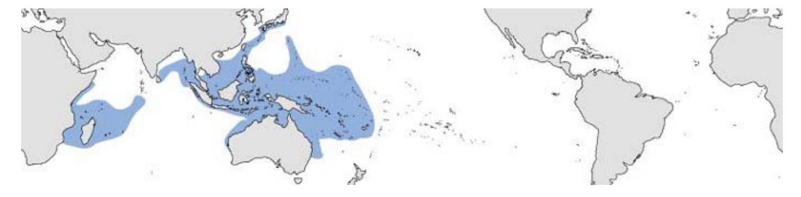

Figure 7.5.90. *Acropora verweyi* distribution from Veron (2000).

#### **U.S. Distribution**

According to both the IUCN Species Account and the CITES database, *Acropora verweyi* occurs in American Samoa and the Northern Mariana Islands.

A search of published and unpublished records of occurrence in U.S. waters indicates *Acopora verweyi* has been reported from Howland and Baker Islands (CRED, unpubl. data), Tutuila and Ofu-Olosega in American Samoa (Birkeland, unpubl. data; Coles et al., 2003; Fisk and Birkeland, 2002; Lovell and McLardy, 2008; National Park Service, 2009), Guam (Burdick, unpubl. data; Wallace, 1999), the Commonwealth of the Northern Mariana Islands, Jarvis Island, and Kingman Reef (CRED, unpubl. data), and Palmyra Atoll (Williams et al., 2008b).

Within federally protected waters, Acopora verweyi has been recorded from the following areas (Kenyon, 2010):

- Pacific Remote Islands Marine National Monument (Howland, Baker, Jarvis, Palmyra, Kingman)
- National Park of American Samoa, Ofu Island unit
- Marianas Trench Marine National Monument (Maug)

#### Habitat

Acropora verweyi "...seems to be an exclusively shallow-water species" (Wallace, 1999). It lives on upper reef slopes or other parts of the reef where circulation is good (Veron and Wallace, 1984).

**Depth range**: *Acropora verweyi* has been reported to be an exclusively shallow-water species (Wallace, 1999), living in depths ranging from low tide to at least 10 m.

#### Abundance

Abundance of *Acropora verweyi* has been reported as generally common—but can be locally abundant, especially in the western Indian Ocean (Veron, 2000).

#### **Life History**

*Acropora verweyi* is a hermaphroditic spawner that is a participant in mass broadcast spawning in some localities (Guest et al., 2005a; Kenyon, 2008). Growth is semi-indeterminate (Wallace, 1999) and increases at high light (400 μmol/m²/s¹) and temperatures (29°C) (Reynaud et al., 2004). For more genus level information, see Section 7.5: Genus *Acropora*.

#### **Threats**

For each of these possible threats, see also Section 7.5: Genus Acropora for additional genus level information.

**Thermal stress:** Although there is not much species-specific information about the response of *Acropora verweyi* to thermal stress, the genus *Acropora* are consistently ranked among the coral genera as most severely susceptible to bleaching (Marshall and Baird, 2000; McClanahan et al., 2007; McClanahan et al., 2005a). However, the genus may have differential responses across regions during mass bleaching mortalities (McClanahan et al., 2004a). Bleaching-induced mortality can be severe—*Acropora* in the southeastern Arabian Gulf suffered > 90% mortality during the 1996 bleaching event (Riegl, 1999). *Acropora verweyi* tolerates high temperatures in back-reef pools in Ofu, American Samoa (Craig et al., 2001), although it is not abundant and acroporids still bleach in these pools (Fenner et al., 2008). Bleaching reports for *Acropora verweyi* vary in severity; the species was relatively resistant in Moorea during the 1991 event (Gleason, 1993) but bleached heavily in Guam in 1994 (Paulay and Benayahu, 1999). As with all *Acropora*, bleaching is a substantial risk for *Acropora verweyi*.

Acidification: Reduced carbonate concentrations decrease calcification rates in *Acropora verweyi* (Marubini et al., 2003). Although the overall magnitude of calcification was similar to the other coral species tested, *Acropora verweyi* showed reductions in mineral density that other species did not—potentially making it more susceptible to bioerosion or breaking waves. Experiments on acidification have demonstrated negative effects on *Acropora* calcification (Renegar and Riegl, 2005); (Anthony et al., 2008; Schneider and Erez, 2006) and productivity (Anthony et al., 2008), as well as impaired fertilization and settlement success in *Acropora palmata* (Albright et al., 2010) and reduced growth and zooxanthellae uptake in juveniles (Suwa et al., 2010). In general, most corals studied have shown negative relationships between acidification and growth (Table 3.2.2), and acidification is likely to contribute to reef destruction in the future (Hoegh-Guldberg et al., 2007; Silverman et al., 2009). While ocean acidification has not been demonstrated to have caused appreciable declines in coral populations so far, the BRT considers it to be a significant threat to corals by 2100.

**Disease:** Susceptibility and impacts of disease on this species are not known, although in general *Acropora* species are moderately to highly susceptible to disease. Additionally, ample evidence indicate that diseases can have devastating

regional impacts on individual coral species (e.g., Aronson and Precht, 2001; Bruckner and Hill, 2009), and there is evidence that these impacts are occurring in more taxa and at a broader geographic scale (Sutherland et al., 2004, Green and Bruckner, 2000).

**Predation:** The specific effects of predation are poorly known for *Acropora verweyi*. Most *Acropora* are preferentially consumed by crown-of-thorns seastars, *Acanthaster planci*, (Colgan, 1987) and by corallivorous snails (B. Vargas-Ángel, CRED, Honolulu, HI, pers. comm., September 2010).

**Land-based sources of pollution (LBSP):** The specific effects of LBSP stresses are largely unknown for *Acropora verweyi*. It is absent from areas of anthropogenic impact in the Red Sea (Ammar et al., 2007), and is susceptible to sediment-induced mortality (Blakeway, 2005). LBSP-related stresses (nutrients, sediment, toxins, and salinity) often act in concert rather than individually and are influenced by other biological (e.g., herbivory) and hydrological factors. Collectively, LBSP stresses are unlikely to produce extinction at a global scale; however, they may pose significant threats at local scales (particularly important for species with limited range) and reduce the resilience of corals to bleaching (Carilli et al., 2009a; Wooldridge, 2009b).

C**ollection/Trade:** As a whole, the genus *Acropora* has been heavily involved in international trade with 50,000– 270,000 reported exported pieces per year from Indonesia (CITES, 2010). As the species in this genus can be difficult to distinguish by nonexperts, it is possible that *Acropora verweyi* could be affected.

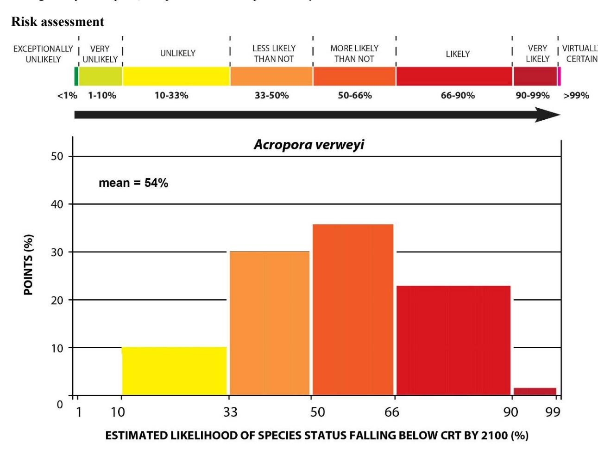

Figure 7.5.91. Distribution of points to estimate the likelihood that the status of *Acropora verweyi* falls below the Critical Risk Threshold (the species is of such low abundance, or so spatially fragmented, or at such reduced diversity that extinction is extremely likely) by 2100.

Factors that increase the potential extinction risk (higher likelihood of falling below Critical Risk Threshold) for *Acropora verweyi* include the relatively high susceptibility of the genus *Acropora* to common threats (bleaching, acidification, disease, predation, and pollution) and limited depth range (0–10 m). Factors that reduce the potential extinction risk (lower likelihood of falling below Critical Risk Threshold) for *Acropora verweyi* were the very wide latitudinal and longitudinal geographic range, the observations of occasional resistance to thermal stress in shallow backreef pools, and its relatively common abundance. The very wide geographic range was considered to reduce extinction risk as it increases the likelihood the species will evade stressors or catastrophes in at least some locations.

The overall likelihood that *Acropora verweyi* will fall below the Critical Risk Threshold by 2100 was estimated to be in the "more likely than not" risk category with a mean likelihood of 54% and a standard error (SE) of 11.5% (Fig. 7.5.91). This SE was calculated by taking the standard deviation of the seven mean voting scores of the BRT members and shows the coherence among the BRT. The uncertainty of the BRT is reflected in the range of votes of 10%–99% (Fig. 7.5.91) and the average range of likelihood estimates of the seven BRT voters (59%). The overall wide range of votes reflects the uncertainty among BRT members inherent in the lack of adequate ecological and demographic information for *Acropora verweyi*.

#### **7.6 Genus** *Anacropora*

**7.6.1 Anacropora puertogalerae Nemenzo, 1964**

Figure 7.6.1. *Anacropora puertogalerae* photos from Veron (2000).

#### **Characteristics**

Colonies of *Anacropora puertogalerae* have compact branches, typically less than 13 mm in diameter and tapering. They have widely-spaced corallites, often with thin spines underneath. Colonies are pale brown in color, occasionally with white tips (Veron, 2000).

#### **Taxonomy**

**Taxonomic issues**: None. *Anacropora puertogalerae* is morphologically similar to *Anacropora spinosa* and *Anacropora forbesi* which has rounded branch tips and less developed spines (Veron, 2000).

**Family:** Acroporidae.

**Evolutionary and geologic history:** Morphologic taxonomy has been unable to resolve whether *Anacropora* are recently derived from *Montipora* or from *Acropora*, but genetic evidence supports the former view (Fukami et al., 2000).

#### **Global Distribution**

*Anacropora puertogalerae* has been reported throughout the Indo-Pacific, on the Great Barrier Reef in Australia, Fiji, Indonesia, Japan, and other areas.

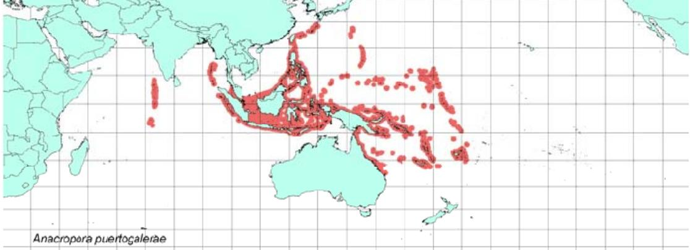

Figure 7.6.2. *Anacropora puertogalerae* distribution from IUCN copied from http://www.iucnredlist.org.

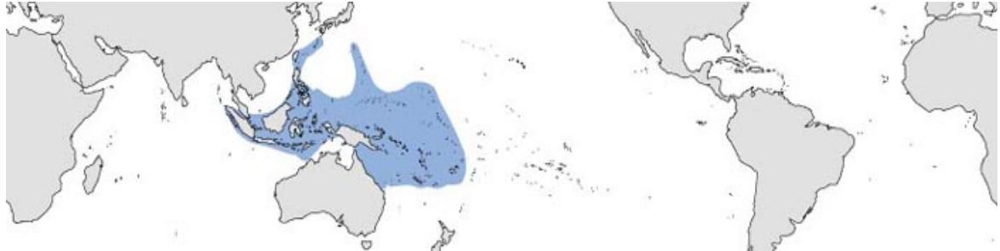

Figure 7.6.3. *Anacropora puertogalerae* distribution from Veron (2000).

#### **U.S. Distribution**

According to the IUCN Species Account, *Anacropora puertogalerae* has been reported to occur in the Northern Mariana Islands, but no supporting references were given. The CITES species database does not include any record of occurrence in U.S. waters. However, the Marianas record is likely an error based on a geographical error regarding photographic records (Kenyon et al., 2010b). G. Paulay (University of Florida, Gainesville, FL. pers. comm., 28 February 2010) indicates a number of photos submitted by him to Veron from Palau, the Cook Islands, and other locations in the Pacific were mistakenly attributed to Guam (similar to the *errata* later acknowledged by Veron (2002) for *Acanthastrea regularis* and *Porites napopora*).

*Anacropora puertogalerae* has not been recorded in federally protected U.S. waters.

#### **Habitat**

**Habitat**: *Anacropora puertogalerae* has been reported to occupy shallow reef environments (Veron, 2000), though it has also been found separated from reefs (Veron, 1995).

**Depth range**: *Anacropora puertogalerae* has been reported in water depths ranging from 5 m to 20 m (Carpenter et al., 2008).

#### **Abundance**

Abundance of *Anacropora puertogalerae* has been reported as uncommon (Veron, 2000) but can form large thickets in the Philippines (IUCN, 2010).

#### **Life History**

*Anacropora puertogalerae* has been reported to be a simultaneous hermaphrodite (Bermas, 1996) and a broadcast spawner. Clonal structure suggests the species also reproduces by fragmentation (Ablan et al., 1997). No observations of the time of spawning have been reported in published literature. The minimum size and age of first reproduction have not been determined for any members of the genus *Anacropora* (Harrison and Wallace, 1990). Planula larvae contain zooxanthellae that can supplement maternal provisioning with energy sources provided by their photosynthesis (Baird et al., 2009), i.e., they are autotrophic. Larval longevity has not been determined in the genus *Anacropora*.

Growth of *Anacropora puertogalerae* has been reported to be primarily via linear extension (Bermas, 1996), although colonies can reach a maximum size of 300 cm diameter (Veron and Wallace, 1984).

#### **Threats**

**Thermal stress:** Although there is not much species-specific information about the response of *Anacropora puertogalerae* to thermal stress, the bleaching susceptibility in the genus *Anacropora* seems to be variable. In 1998 in Palau, the genus had total mortality in some areas but was unaffected in others (Bruno et al., 2001). However, as a family acroporids are generally bleaching-susceptible.

**Acidification:** No specific research has addressed the effects of acidification on the genus *Anacropora*. However, experiments on acidification impacts have demonstrated negative effects on other members of the family Acroporidae, including reduced *Acropora* calcification (Anthony et al., 2008; Renegar and Riegl, 2005; Schneider and Erez, 2006) and productivity (Anthony et al., 2008) and, in *Acropora palmata,* impaired fertilization and settlement success (Albright et al., 2010). In general, most corals studied have shown negative relationships between acidification and growth (Table 3.2.2), and acidification is likely to contribute to reef destruction in the future (Hoegh-Guldberg et al., 2007; Silverman et al., 2009). While ocean acidification has not been demonstrated to have caused appreciable declines in coral populations so far, the BRT considers it to be a significant threat to corals by 2100.

**Disease:** Susceptibility and impacts of disease on *Anacropora puertogalerae* are not known. However, ample evidence indicate that diseases can have devastating regional impacts on individual coral species (e.g., Aronson and Precht, 2001; Bruckner and Hill, 2009), and there is evidence that these impacts are occurring in more taxa and at a broader geographic scale (Green and Bruckner, 2000; Sutherland et al., 2004).

**Predation:** *Anacropora puertogalerae* have been reported to be preyed on by wrasses, in proportion to availability (Cole et al., 2010). However, population-level effects remain unknown.

**Land-based sources of pollution (LBSP):** Some *Anacropora* species appear resistant to sediment and nutrients while others are susceptible (Mohammed and Mohammed, 2005). LBSP-related stresses (nutrients, sediment, toxins, and salinity) often act in concert rather than individually and are influenced by other biological (e.g., herbivory) and hydrological factors. Collectively, LBSP stresses are unlikely to produce extinction at a global scale; however, they may pose significant threats at local scales (particularly important for species with limited range) and reduce the resilience of corals to bleaching (Carilli et al., 2009a; Wooldridge, 2009b).

**Collection/Trade:** Trade in the genus *Anacropora* has been reported to be negligible, with only 14 pieces reported in export over the last decade (CITES, 2010). No species-specific export records exist for *Anacropora puertogalerae*.

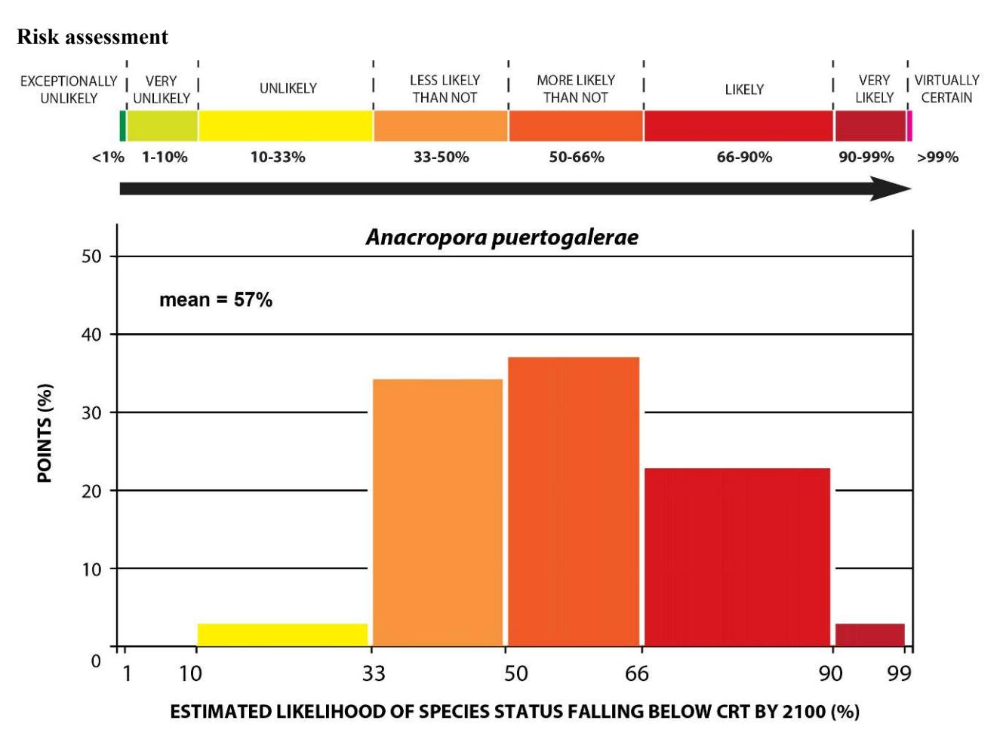

Figure 7.6.4. Distribution of points to estimate the likelihood that the status of *Anacropora puertogalerae* falls below the Critical Risk Threshold (the species is of such low abundance, or so spatially fragmented, or at such reduced diversity that extinction is extremely likely) by 2100.

Factors that increase the potential extinction risk (higher likelihood of falling below Critical Risk Threshold) for *Anacropora puertogalerae* are that the high susceptibility to threats common to members of the genus *Acropora* (bleaching, disease, and predation) are generally considered appropriate to species in the confamilial genus *Anacropora* as well. A factor that reduces potential extinction risk (decrease the likelihood of falling below Critical Risk Threshoild) was that *Anacropora puertogalerae* has a somewhat broad range.

The overall likelihood that *Anacropora puertogalerae* will fall below the Critical Risk Threshold by 2100 was estimated to be in the "more likely than not" risk category with a mean likelihood of 57% and a standard error (SE) of 8% (Fig. 7.6.4). This SE was calculated by taking the standard deviation of the seven mean voting scores of the BRT members and shows the coherence among the BRT. The uncertainty of the BRT is reflected in the range of votes of 10%–99% (Fig. 7.6.4) and the average range of likelihood estimates of the seven BRT voters (60%). The overall wide range of votes reflects the uncertainty among BRT members inherent in the lack of adequate ecological and demographic information for this *Anacropora puertogalerae*.

**7.6.2** *Anacropora spinosa* **Rehberg, 1892** 

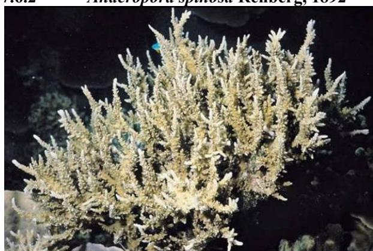

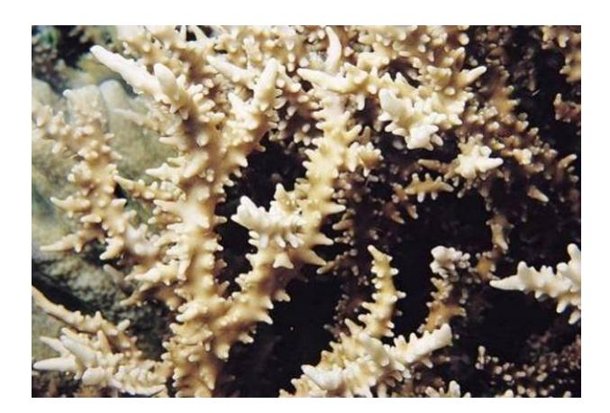

Figure 7.6.5. *Anacropora spinosa* photos from Veron (2000).

#### **Characteristics**

Colonies of *Anacropora spinosa* have compact branches, less than 10 mm in diameter and tapering. They have elongate, crowded, irregular corallites that are not strongly tapered but still have spines beneath. Colonies are pale brown in color, occasionally with white tips (Veron, 2000).

#### **Taxonomy**

**Taxonomic issues**: None. *Anacropora spinosa* is morphologically similar to *Anacropora puertogalerae,* which has thicker branches and more elongate, is less crowded, and has tapered spines (Veron, 2000).

**Family:** Acroporidae.

**Evolutionary and geologic history**: Morphologic taxonomy has been unable to resolve whether *Anacropora* were most recently derived from *Montipora* or from *Acropora*, but genetic evidence supports the former view (Fukami et al., 2000).

#### **Global Distribution**

*Anacropora spinosa* has been reported primarily in the Indo-Pacific, in Indonesia, Japan, and the Philippines. Unlike *Anacropora puertogalerae*, it has not been reported in Australia. However, there have been reports of *Anacropora spinosa* from Egypt (Mohammed and Mohammed, 2005).

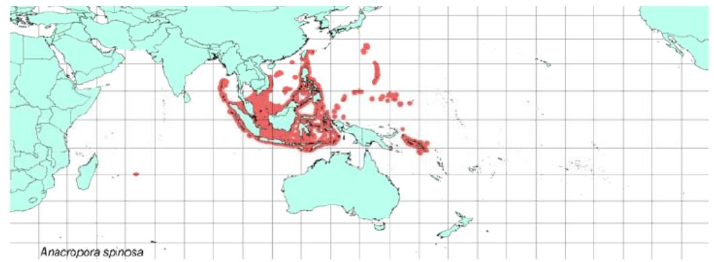

Figure 7.6.6. *Anacropora spinosa* distribution from IUCN copied from http://www.iucnredlist.org.

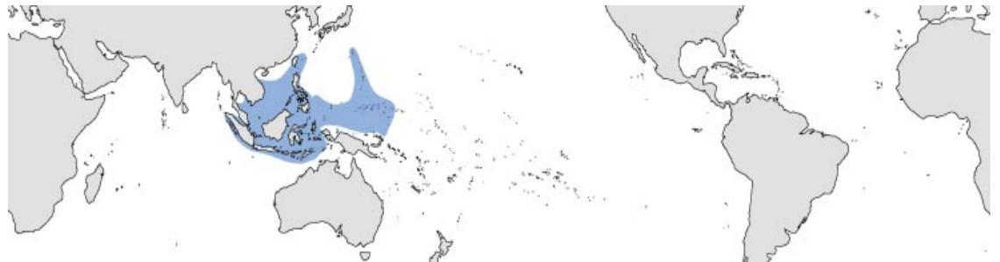

Figure 7.6.7. *Anacropora spinosa* distribution from Veron (2000).

#### **U.S. Distribution**

The CITES database does not list *Anacropora spinosa* in U.S. waters, although the IUCN species account lists it in the Northern Marianas. Veron (Veron, 2000) also lists it in the Marianas; however, the Marianas record is likely an error based on a geographical error regarding photographic records (Kenyon et al., 2010). G. Paulay (University of Florida, Gainesville, FL, pers. comm., 28 February 2010) indicates a number of photos submitted by him to Veron from Palau, the Cook Islands, and other locations in the Pacific were mistakenly attributed to Guam (similar to the *errata* later acknowledged by Veron (2002) for *Acanthastrea regularis* and *Porites napopora*).

*Anacropora spinosa* has not been recorded in federally protected U.S. waters.

#### **Habitat**

**Habitat**: *Anacropora spinosa* has been reported to occupy shallow reef environments (Veron, 2000), generally in clear or slightly turbid water and on soft substrates of lower reef slopes (IUCN, 2010). *Anacropora spinosa* has also been found separated from reefs (Veron, 1995).

**Depth range**: *Anacropora spinosa* has been reported in water depths ranging from 5 m to 15 m (Carpenter et al., 2008).

#### **Abundance**

Abundance of *Anacropora spinosa* has been reported as uncommon (Veron, 2000) but may occur in extensive tracts in certain areas (Wood, 1983).

#### **Life History**

*Anacropora spinosa* has been reported to be a simultaneous hermaphrodite that broadcast spawns mature gametes (Baird et al., 2009). No observations of the time of spawning have been reported in published literature. The minimum size and age of first reproduction have not been determined for any members of the genus *Anacropora* (Harrison and Wallace, 1990). Planula larvae contain zooxanthellae that can supplement maternal provisioning with energy sources provided by their photosynthesis (Baird et al., 2009), i.e., they are autotrophic. Larval longevity has not been determined in this genus.

#### **Threats**

**Thermal stress:** Although there is not much species-specific information about the response of *Anacropora spinosa* to thermal stress, the bleaching susceptibility in the genus *Anacropora* seems to be variable. In 1998 in Palau, the genus had total mortality in some areas but was unaffected in others (Bruno et al., 2001). However, as a family, acroporids are generally bleaching-susceptible.

**Acidification:** No specific research has addressed the effects of acidification on the genus *Anacropora*. However, experiments on acidification impacts have demonstrated negative effects on other members of the family Acroporidae, including reduced *Acropora* calcification (Anthony et al., 2008; Renegar and Riegl, 2005; Schneider and Erez, 2006) and productivity (Anthony et al., 2008) and, in *Acropora palmata,* impaired fertilization and settlement success (Albright et al., 2010). In general, most corals studied have shown negative relationships between acidification and growth (Table 3.2.2), and acidification is likely to contribute to reef destruction in the future (Hoegh-Guldberg et al., 2007; Silverman et al,. 2009). While ocean acidification has not been demonstrated to have caused appreciable declines in coral populations so far, the BRT considers it to be a significant threat to corals by 2100.

**Disease:** Susceptibility and impacts of disease on *Anacropora spinosa* are not known. However, ample evidence indicates that diseases can have devastating regional impacts on individual coral species (e.g., Aronson and Precht, 2001; Bruckner and Hill, 2009), and there is evidence that these impacts are occurring in more taxa and at a broader geographic scale (Green and Bruckner, 2000; Sutherland et al., 2004).

**Predation:** *Anacropora spinosa* have been reported to be preyed on by wrasses, in proportion to availability (Cole et al., 2010). However, population-level effects remain unknown.

**Land-based sources of pollution (LBSP):** *Anacropora spinosa* was found in Egypt to be not vulnerable to sedimentation or macroalgal interactions, in contrast to congener *Anacropora forbesi* (Mohammed and Mohammed, 2005). LBSP-related stresses (nutrients, sediment, toxins, and salinity) often act in concert rather than individually and are influenced by other biological (e.g., herbivory) and hydrological factors. Collectively, LBSP stresses are unlikely to produce extinction at a global scale; however, they may pose significant threats at local scales (particularly important for species with limited range) and reduce the resilience of corals to bleaching (Carilli et al., 2009a; Wooldridge, 2009b).

**Collection/Trade:** Trade in the genus *Anacropora* has been reported to be negligible, with only 14 pieces reported in export over the last decade (CITES, 2010). The only known export of *Anacropora spinosa* was a single specimen from Indonesia in 2005.

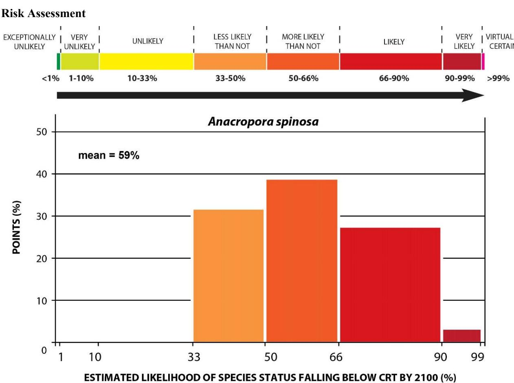

Figure 7.6.8. Distribution of points to estimate the likelihood that the status of *Anacropora spinosa* falls below the Critical Risk Threshold (the species is of such low abundance, or so spatially fragmented, or at such reduced diversity that extinction is extremely likely) by 2100.

Factors that increase the potential extinction risk (higher likelihood of falling below Critical Risk Threshold) for *Anacropora spinosa* are that the high susceptibility to threats common to members of the genus *Acropora* (bleaching, disease, and predation) are generally considered appropriate to species in the confamilial genus *Anacropora* as well. A factor that reduces potential extinction risk (decrease the likelihood of falling below Critical Risk Threshold) was that *Anacropora spinosa* has a moderately broad range, although it is more restricted and disjunct that its congener *Anacropora puertogalerae*.

The overall likelihood that *Anacropora spinosa* will fall below the Critical Risk Threshold by 2100 was estimated to be in the "more likely than not" risk category with a mean likelihood of 59% and a standard error (SE) of 8% (Fig. 7.6.8). This SE was calculated by taking the standard deviation of the seven mean voting scores of the BRT members and shows the coherence among the BRT. The uncertainty of the BRT is reflected in the range of votes of 33%–99% (Fig. 7.6.8) and the average range of likelihood estimates of the seven BRT voters (55%). The overall wide range of votes reflects the uncertainty among BRT members inherent in the lack of adequate ecological and demographic information for *Anacropora spinosa*.

#### **7.7 Genus** *Astreopora*

**7.7.1** *Astreopora cucullata* **Lamberts, 1980** 

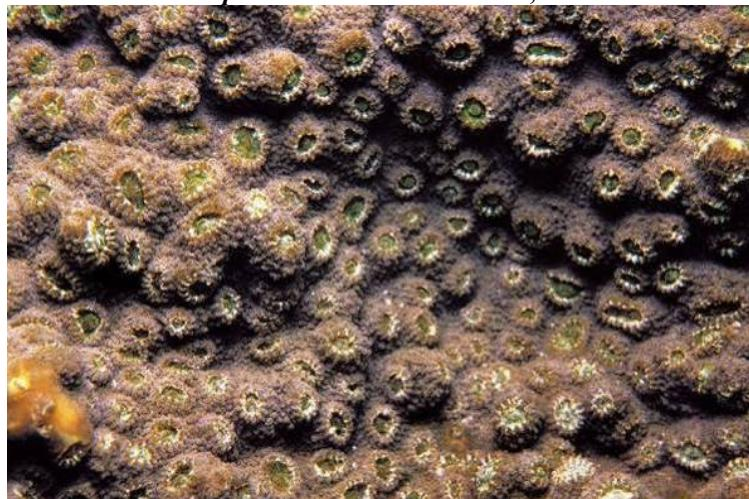

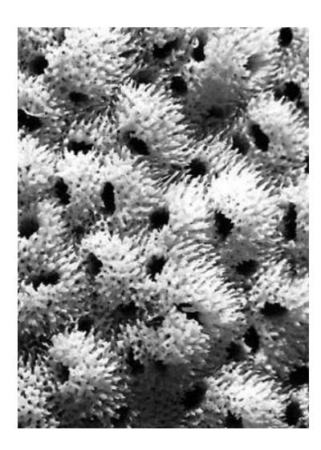

Figure 7.7.1. *Astreopora cucullata* photos from Veron (2000).

#### **Characteristics**

*Astreopora cucullata* has thick or encrusting platy colonies. They have irregular corallites that are immersed on concave surfaces but exsert on convex surfaces. The corallites are inclined, often with elliptical openings, and have papillae that may form a hood over the opening (Veron, 2000). Coenosteum forms distinctive hoods that can obscure parts of the calices (Lamberts, 1982). Colonies are pale brown or cream in color (Veron, 2000), tan or rust-colored (Lamberts, 1980).

#### **Taxonomy**

**Taxonomic issues**: None. *Astreopora cucullata* is similar to *Astreopora scabra* (Veron, 2000). Type specimen collected from Aua, Tutuila, American Samoa, on a slope at 3 m depth (Lamberts, 1980).

**Family:** Acroporidae.

**Evolutionary and geologic history**: *Astreopora* was the first of the genera in this family to occur, first appearing in the late Cretaceous (about 70 Ma) (Wells and Moore, 1956). The genus was formerly present in the Caribbean (Budd et al., 1992) but is now extinct.

#### **Global Distribution**

*Astreopora cucullata* has a broad distribution. Primarily it is found in the Indo-Pacific, including eastern Australia, Fiji, Indonesia, Japan, the Philippines, and Papua New Guinea. It may also be found in the Red Sea (IUCN, 2010).

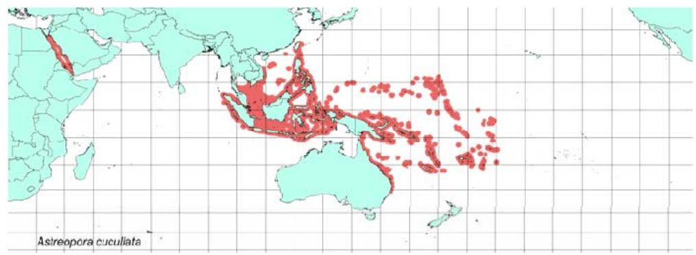

Figure 7.7.2. *Astreopora cucullata* distribution from IUCN copied from http://www.iucnredlist.org.

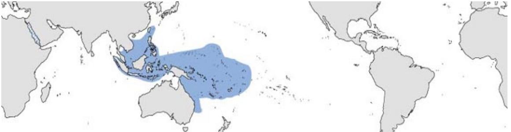

Figure 7.7.3. *Astreopora cucullata* distribution from Veron (2000).

#### **U.S. Distribution**

According to both the IUCN Species Account and the CITES species database, *Astreopora cucullata* occurs in American Samoa. The IUCN Species account lists it occurrence in the U.S. minor outlying islands, but the CITES species database does not.

A search of published and unpublished records of occurrence in U.S. waters indicates *Astreopora cucullata* has been reported from Tutuila, Ofu-Olosega, Tau, and Rose Atoll in American Samoa (Birkeland, unpubl. data; Coles et al., 2003; CRED, unpubl. data; Kenyon et al., 2010a; Lamberts, 1983; Maragos et al., 1994).

Within federally protected waters, *Astreopora cucullata* has been recorded from the following areas (Kenyon, 2010):

- National Park of American Samoa, Ofu Island unit
- Rose Atoll Marine National Monument

#### **Habitat**

**Habitat:** *Astreopora cucullata* has been reported to occupy protected reef environments (Veron, 2000).

**Depth range**: *Astreopora cucullata* has been reported in water depths ranging from 5 m to 15 m (Carpenter et al., 2008). The original species description noted it was only found at reef edges (Lamberts, 1980).

#### **Abundance**

Abundance of *Astreopora cucullata* has been reported as rare (Veron, 2000).

#### **Life History**

Reproductive characteristics of *Astreopora cucullata* have not been determined (Baird et al., 2009). However, the congeners *Astreopora gracilis*, *Astreopora myriophthalma*, and *Acropora listeri* are hermaphroditic broadcast spawners (Babcock et al., 1986; Babcock et al., 1994; Dai et al., 1992). The minimum size and age of first reproduction have not been determined for any members of the genus *Astreopora* (Harrison and Wallace, 1990). Although observations of larvae have not been published for this species, the larvae of *Astreopora myriophthalma* do not contain zooxanthellae that can supplement maternal provisioning with energy sources provided by their photosynthesis (Baird et al., 2009), i.e., they are lecithotrophic. Larval longevity has not been determined in the genus *Astreopora*.

Growth rates are unknown, but colonies can be as large as 1 m across (Lamberts, 1980).

#### **Threats**

**Thermal stress: Al**though there is not much species-specific information about the response of *Astreopora cucullata* to thermal stress, the genus Congeners can be bleaching-susceptible (ex: Goreau and Hayes, 1994), although overall *Astreopora* are less susceptible to bleaching than other genera within the acroporid family (Marshall and Baird, 2000) and often survive when they do bleach (McClanahan et al., 2004a).

**Acidification:** No specific research has addressed the effects of acidification on the genus *Astreopora*. However, most corals studied have shown negative relationships between acidification and growth (Table 3.2.2), and acidification is likely to contribute to reef destruction in the future (Hoegh-Guldberg et al., 2007; Silverman et al., 2009). While ocean acidification has not been demonstrated to have caused appreciable declines in coral populations so far, the BRT considers it to be a significant threat to corals by 2100.

**Disease:** Susceptibility and impacts of disease on *Astreopora cucullata* are not known. Congeners have contracted a fungal disease in Kenya (McClanahan et al., 2004b), and *Astreopora myriophthalma* was infected with black-band disease at a polluted site in Jordan (Al-Moghrabi, 2001). Ample evidence indicate that diseases can have devastating regional impacts on individual coral species (e.g., Aronson and Precht, 2001; Bruckner and Hill, 2009), and there is evidence that these impacts are occurring in more taxa and at a broader geographic scale (Green and Bruckner, 2000; Sutherland et al., 2004).

**Predation**: The specific effects of predation are unknown for *Astreopora cucullata*.

**Land-based sources of pollution (LBSP):** The specific effects of LBSP stresses are largely unknown for *Astreopora cucullata*. LBSP-related stresses (nutrients, sediment, toxins, and salinity) often act in concert rather than individually,and are influenced by other biological (e.g., herbivory) and hydrological factors. Collectively, LBSP stresses are unlikely to produce extinction at a global scale; however, they may pose significant threats at local scales (particularly important for species with limited range) and reduce the resilience of corals to bleaching (Carilli et al., 2009a; Wooldridge, 2009b).

**Collection/Trade**: Trade in the genus *Astreopora* has been reported to be light and sporadic (CITES, 2010). A single *Astreopora cucullata* export was reported from Saudia Arabia in 1999.

#### **Risk Assessment**

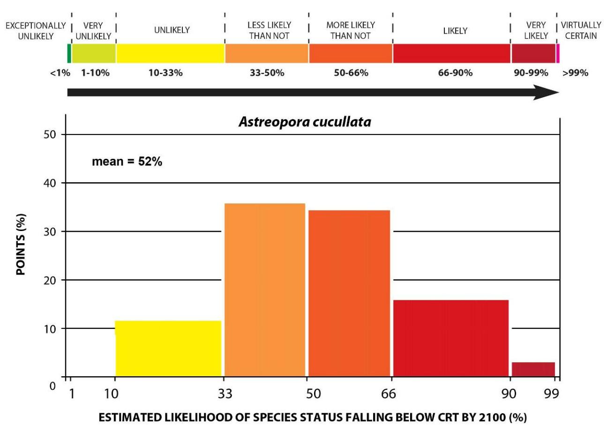

Figure 7.7.4. Distribution of points to estimate the likelihood that the status of *Astreopora cucullata* falls below the Critical Risk Threshold (the species is of such low abundance, or so spatially fragmented, or at such reduced diversity that extinction is extremely likely) by 2100.

Factors that increase the potential extinction risk (higher likelihood of falling below the Critical Risk Threshold) for *Astreopora cucullata* are its rarity and that it belongs to a family that is highly susceptible to stress (bleaching, acidification, disease, predation, and pollution). Factors that reduce the potential extinction risk (lower likelihood of falling below the Critical Risk Threshold) are that is has a widespread distribution and appears to be less vulnerable to bleaching than other species in its family. The genus also survived the Cretaceous extinction.

The overall likelihood that *Astreopora cucullata* will fall below the Critical Risk Threshold by 2100 was estimated to be in the "more likely than not" risk category with a mean likelihood of 52% and a standard error (SE) of 9% (Fig. 7.6.8). This SE was calculated by taking the standard deviation of the seven mean voting scores of the BRT members and shows the coherence among the BRT. The uncertainty of the BRT is reflected in the range of votes of 10%–99% (Fig. 7.7.4) and the average range of likelihood estimates of the seven BRT voters (59%).

#### **7.8 Genus** *Isopora*

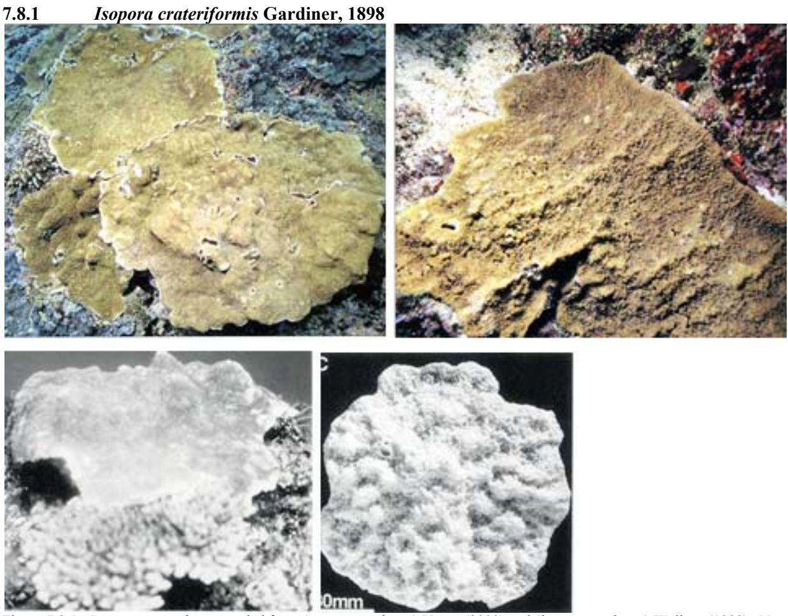

Figure 7.8.1. *Isopora crateriformis* copied from (*upper two photos*) Veron (2000) and (*lower two photos*) Wallace (1999). Note in lower left photo that *Isopora crateriformis* is overgrowing and outcompeting the alcyonacean (soft coral) *Sinularia* sp.

#### **Characteristics**

*Isopora crateriformis* forms flattened solid encrusting plates sometimes referred to as "cowpies." They can sometimes be over a meter in diameter. Colonies are brown in color (Veron, 2000).

#### **Taxonomy**

**Taxonomic issues**: None.

**Family:** Acroporidae.

**Evolutionary and geologic history:** Two extinct species of *Isopora* first appeared in the southern Caribbean fossil records about 5.9–4.6 Ma at the Miocene-Pliocene boundary, co-occurring with the extinct *Acropora saludensis* (Budd and Wallace, 2008). *Acropora palmata* first appeared in the early Pliocene (5.6–3 Ma) where it was found to co-occur with the two *Isopora* species and *Acropora cervicornis*. The *Isopora* species and two *Acropora* species were found in roughly equal numbers. *Isopora* also appeared in the fossil record in the Pacific in the Pliocene. *Isopora* went extinct in the Caribbean about 3–1 Ma (Budd and Wallace, 2008).

*Isopora* was formerly classified as a subgenus of *Acropora* based on morphology, but *Isopora* is thought to have evolved from *Astreopora* (Randall, 1981). Although it was formerly classified as a subgenus of *Acropora,* based on morphology, *Isopora* has recently been considered a separate genus (Wallace et al., 2007), based on its significant genetic distance from *Acropora* (Fukami et al., 2000) and differences in its reproductive strategy (Kojis, 1986).

#### **Global Distribution**

Wallace (1999, cf Fig.7.8.3) and Veron (2000, cf Fig. 7.8.4) consider *Isopora crateriformis* to be found in areas stretching from Sumatra to American Samoa. Although *Isopora crateriformis* and *Isopora cuneata* are definitely distinct species, the two species can be very difficult to distinguish in the field when they are in the form of flat encrusting plates. One wonders if distributional records for *Isopora crateriformis* on the African coast and offshore islands based on field surveys might need to be confirmed.

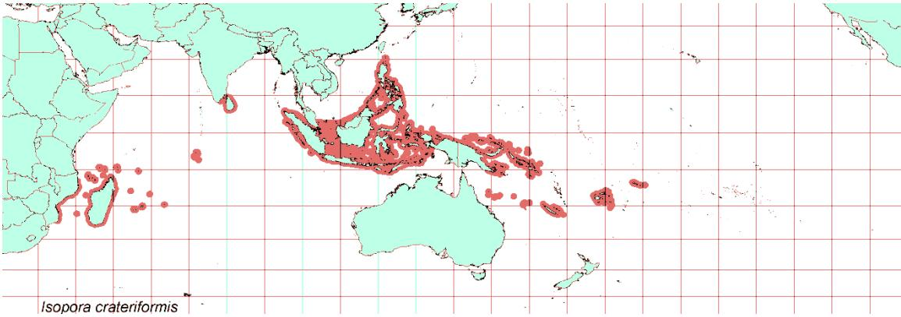

Figure 7.8.2. *Isopora crateriformis* distribution from IUCN copied from http://www.iucnredlist.org.

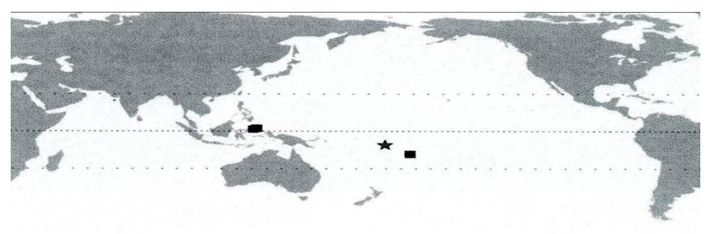

Figure 7.8.3. *Isopora crateriformis* distribution from Wallace (1999).

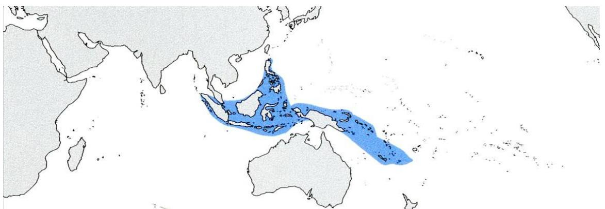

Figure 7.8.4. *Isopora crateriformis* distribution from Veron (2000).

#### **U.S. Distribution**

According to both the IUCN Species Account and the CITES species database, *Isopora crateriformis* occurs in American Samoa.

A search of published and unpublished records of occurrence in U.S. waters indicates *Isopora crateriformis* has been reported from Tutuila, Ofu-Olosega, and Tau in American Samoa (Birkeland, unpubl. data; Coles et al., 2003; CRED, unpubl. data; Fisk and Birkeland, 2002; Hoffmeister, 1925; Lamberts, 1983; Lovell and McLardy, 2008; Maragos, 1994; Mundy, 1996; National Park Service, 2009).

Within federally protected waters, *Isopora cratiformis* has been recorded from the following areas (Kenyon et al., 2010b):

- National Park of American Samoa, Tutuila, and Ofu Island units
- Fagatele Bay National Marine Sanctuary, Tutuila

#### **Habitat**

*Isopora crateriformis* is found most commonly in shallow, high-wave energy environments.

**Depth range**: *Isopora craterformis* has been reported in water depths ranging from low tide commonly to at least 12 m (Birkeland, 1987). The species was recently reported (as *Acropora crateriformis*) on mesophotic reefs (< 50 m depth) in American Samoa (Bare et al., 2010).

#### **Abundance**

Abundance of *Isopora craterformis* has been reported as sometimes common and occasionally locally abundant. *Isopora craterformis* has been reported as common in Indonesia (Veron, 2000) and as one of the most prevalent corals in American Samoa (Birkeland, 1987).

#### **Life History**

*Isopora crateriformis* is most likely a simultaneous hermaphroditic brooder as is the closely related *Isopora cuneata* (Bothwell, 1981). *Isopora cuneata* planulae lack zooxanthellae, and in some areas the species can undergo several seasonal cycles of larval production (Kojis, 1986). Its brooding life history allows *Isopora* spp. to locally dominate recruitment at Lord Howe Island, Australia; colonies of this genus also dominate the adult population there, suggesting brooding may drive community structure in remote areas (Harriott, 1992; 1995). *Isopora cuneata* is not prone to asexual reproduction via fragmentation, based on its semi-encrusting morphology (Bothwell, 1981). The species shows moderate gene flow (Mackenzie et al., 2004) but little potential for large-scale dispersal (Ayre and Hughes, 2004),

For additional family level information, see Section 7.5: Genus *Acropora*.

#### **Threats**

For each of these possible threats, see also Section 7.5: Genus *Acropora* for additional family level information.

**Thermal stress: Al**though there is not much species-specific information about the response of *Isopora craterformis* to thermal stress, members of the family Acroporidae are consistently ranked among the coral genera as most severely susceptible to bleaching (Marshall and Baird, 2000; McClanahan et al., 2007; McClanahan et al., 2005a). However, the genera may have differential responses across regions during mass bleaching mortalities (McClanahan et al., 2004a). *Isopora crateriformis* tolerates high temperatures in shallow back-reef pools in American Samoa (Craig et al., 2001), but it is not abundant and acroporids do bleach in these habitats (Fenner and Heron, 2008). Although *Isopora crateriformis* was relatively resistant to bleaching in Fiji in 2000 (Lovell, 2000), bleaching poses a high risk to this family at a global scale.

**Acidification:** No specific research has addressed the effects of acidification on *Isopora crateriformis*. However, experiments on acidification impacts have all demonstrated negative effects on other members of the family Acroporidae, including reduced *Acropora* calcification (Anthony et al., 2008; Marubini et al., 2003; Renegar and Riegl, 2005; Schneider and Erez, 2006) and productivity (Anthony et al., 2008) and, in *Acropora palmata*, impaired fertilization and settlement success (Albright et al., 2010) In general, most corals studied have shown negative relationships between acidification and growth (Table 3.2.2), and acidification is likely to contribute to reef destruction in the future (Hoegh-Guldberg et al., 2007; Silverman et al., 2009). While ocean acidification has not been demonstrated to have already caused appreciable declines in coral populations so far, the BRT considers it to be a significant threat to corals by 2100.

**Disease:** There is no species-specific information, although in general acroporid species are moderately to highly susceptible to disease. The ecological and population impacts of disease have not been established for this species. However, ample evidence indicate that diseases can have devastating regional impacts on individual coral species (e.g., (e.g., Aronson and Precht, 2001; Bruckner and Hill, 2009)), and there is evidence that these impacts are occurring in more taxa and at a broader geographic scale (Sutherland et al., 2004; Green and Bruckner, 2000).

**Predation:** Susceptibility of *Isopora crateriformis* to predation is inferred from the fact that most acroporids have been reported to be preferentially consumed by crown-of-thorns seastars, fish, and gastropods.

**Land-based sources of pollution: (LBSP):** The specific effects of LBSP stresses are largely unknown for *Isopora crateriformis*. LBSP-related stresses (nutrients, sediment, toxins, and salinity) often act in concert rather than individually and are influenced by other biological (e.g., herbivory) and hydrological factors. Collectively, LBSP stresses are unlikely to produce extinction at a global scale; however, they may pose significant threats at local scales (particularly important for species with limited range) and reduce the resilience of corals to bleaching (Carilli et al., 2009a; Wooldridge, 2009b).

C**ollection/Trade:** CITES treats *Isopora* as *Acropora* and has included data on export under the genus *Acropora*. As a whole, this genus is heavily involved in international trade with 50,000–270,000 reported exported pieces per year from Indonesia (CITES, 2010).

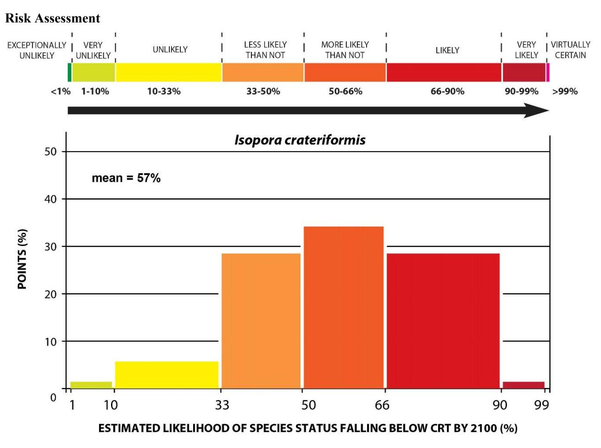

Figure 7.8.5.Distribution of points to estimate the likelihood that the status of *Isopora crateriformis* falls below the Critical Risk Threshold (the species is of such low abundance, or so spatially fragmented, or at such reduced diversity that extinction is extremely likely) by 2100.

Factors influencing the voting results towards a higher likelihood of falling below Critical Risk Threshold were the high susceptibility to threats inferred to be common to members of the family Acroporidae, which includes special attractiveness to corallivores, vulnerability to bleaching from unusually warm water, and susceptibility to disease. Factors that reduce the potential extinction risk (lower likelihood of falling below Critical Risk Threshold) were its prevalence in areas of heavy wave action, as water motion can reduce bleaching vulnerability. Reduced risk also indicates that *Isopora crateriformis* is often common and sometimes the dominant coral or at least the dominant acroporid coral (Birkeland et al., 1987). It is also found across a wide depth range from just below low tide to mesophotic depths, which allows the potential for buffering from surface-based threats.

The overall likelihood that *Isopora crateriformis* will fall below the Critical Risk Threshold by 2100 was estimated to be in the "more likely than not" risk category with a mean likelihood of 57% and a standard error (SE) of 14% (Fig. 7.8.5). This SE was calculated by taking the standard deviation of the seven mean voting scores of the BRT members and shows the coherence among the BRT. The uncertainty of the BRT is reflected in the range of votes of 1%–99% (Fig. 7.8.5) and the average range of likelihood estimates of the seven BRT voters (51%). The overall wide range of votes reflects the uncertainty among BRT members inherent in the lack of adequate ecological and demographic information for this species.

#### **7.8.2** *Isopora cuneata* **Dana, 1846**

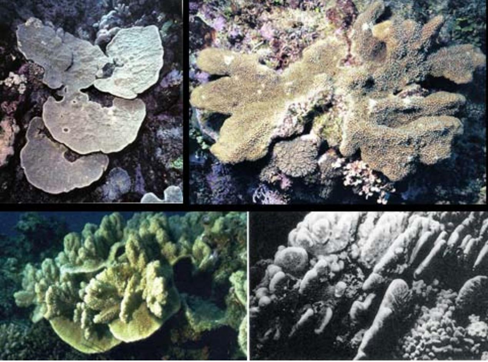

Figure 7.8.6. *Isopora cuneata* copied from (*upper two photos*) Veron (2000) and (*lower two photos*) Wallace (1999).

#### **Characteristics**

*Isopora cuneata* can form flattened solid encrusting plates like *Isopora crateriformis* but usually also forms "Mohawk" ridges parallel to the main wave motion or short flattened blades. Colonies are brown or pale cream (Veron, 2000).

#### **Taxonomy**

Taxonomic issues: None.

**Family:** Acroporidae.

**Evolutionary and geologic history**: Two extinct species of *Isopora* first appeared in the southern Caribbean fossil records about 5.9–4.6 Ma at the Miocene-Pliocene boundary, co-occurring with the extinct *Acropora saludensis* (Budd and Wallace, 2008). *Acropora palmata* first appeared in the early Pliocene (5.6–3 Ma), where it was found to co-occur with the two Isopora species and Acropora cervicornis. The *Isopora* species and two *Acropora* species were found in roughly equal numbers. *Isopora* also appeared in the fossil record in the Pacific in the Pliocene. *Isopora* went extinct in the Caribbean about 3–1 Ma (Budd and Wallace, 2008).

*Isopora* was formerly classified as a subgenus of *Acropora* based on its morphology. *Isopora* is thought to have evolved from *Astreopora* (Randall, 1981). Although it was formerly classified as a subgenus of *Acropora,* based on morphology, *Isopora* has recently been considered a separate genus (Wallace et al., 2007), based on its significant genetic distance from *Acropora* (Fukami et al., 2000) and differences in its reproductive strategy (Kojis, 1986).

#### **Global Distribution**

The IUCN (Fig. 7.8.7) and Veron (2000, cf Fig. 7.8.8 below) consider *Isopora cuneata* to be found from the coast of eastern Africa to the central Pacific. Although *Isopora cuneata* is definitely a distinct species from *Isopora palifera*, the two species can be very difficult to distinguish in the field, especially if they are not both present together at a site (Ayre et al., 1991; Veron, 2000; Wallace, 1999). One wonders if distributional records for *Isopora cuneata* on the African coast and offshore islands, based on field surveys, might need to be confirmed (cf. Fig. 6.13.8). *Isopora palifera* exists at Bassas da India and on the southeast African mainland down to northern KwaZulu Natal. *Isopora cuneata* is not proven to exist there (Riegl, 1995).

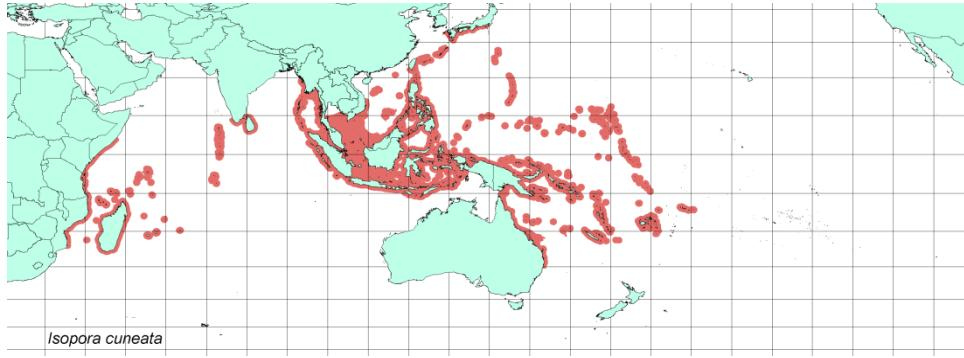

Figure 7.8.7. *Isopora cuneata* distribution from IUCN copied from http://www.iucnredlist.org.

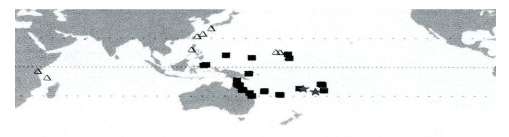

Figure 7.8.8. *Isopora cuneata* distribution from Wallace (1999). The black squares are specimen-based records in the *Acropora* database at the Museum of Tropical Queensland, the stars are type localities of senior and junior synonyms, and the black triangles are taken from records in the literature. When the triangles are open (not black), the records from the literature are possibly misidentifications.

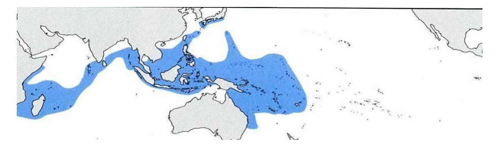

Figure 7.8.9. *Isopora cuneata* distribution from (Veron, 2000).

#### **U.S. Distribution**

According to both the IUCN Species Account and the CITES species database, *Isopora cuneata* occurs in American Samoa and the Northern Mariana Islands. The CITES species database also lists it for the U.S. minor outlying islands.

A search of published and unpublished records of occurrence in U.S. waters indicates *Isopora cuneata* has been reported from Tutuila and Ofu-Olosega in American Samoa (Birkeland, unpubl. data; Coles et al., 2003; CRED, unpubl. data; Lovell and McLardy, 2008; Maragos et al., 1994; National Park Service, 2009), and Palmyra Atoll (Williams et al., 2008b).

In Veron (2000) (Volume 1, page 185) the distribution map for this species includes a photo taken by Gustav Paulay labeled "Guam." However, G. Paulay (Univ. of Florida, Gainesville, FL, pers. comm., 28 February 2010) indicates a number of photos submitted by him to Veron from Palau, the Cook Islands, and other locations in the Pacific were mistakenly attributed to Guam (similar to the *errata* later acknowledged by Veron (2002) for *Acanthastrea regularis* and *Porites napopora*). Consequently, there are no substantiated records of its occurrence in the Mariana Archipelago.

Within federally protected waters, *Isopora cuneata* has been recorded from the following areas (Kenyon, 2010):

- Pacific Remote Islands Marine National Monument (Howland, Palmyra)
- National Park of American Samoa, Ofu Island unit

#### **Habitat**

*Isopora cuneata* is found most commonly in shallow, high-wave energy environments. Although it is occasionally found on sheltered reef slopes and backreef lagoons, it is more typical of reef crests and inner reef flats (Ayre et al., 1991).

**Depth range**: *Isopora cuneata* has been reported in water depths ranging from low tide to 15 m (Wallace, 1999).

#### **Abundance**

Abundance of *Isopora cuneata* has been reported as generally common and occasionally locally abundant (Veron, 2000). *Isopora cuneata* is by far the most predominant of acroporids on some areas of the Great Barrier Reef (Ayre et al., 1991; Bradbury and Young, 1983).

#### **Life History**

*Isopora cuneata* is a simultaneous hermaphroditic brooder (Bothwell, 1981). The planulae lack zooxanthellae, and in some areas the species can undergo several seasonal cycles of larval production (Kojis, 1986). Its brooding life history allows *Isopora* spp. to locally dominate recruitment at Lord Howe Island, Australia; colonies of this genus also dominate the adult population there, suggesting brooding may drive community structure in remote areas (Harriott, 1992; 1995). *Isopora cuneata* is not prone to asexual reproduction via fragmentation, based on its semi-encrusting morphology (Bothwell, 1981). The species shows moderate gene flow (Mackenzie et al., 2004) but little potential for large-scale dispersal (Ayre and Hughes, 2004). For additional information regarding the confamilial genus *Acropora*, see Section 7.5: Genus *Acropora*.

#### **Threats**

For each of these possible threats, see also Section 7.5: Genus *Acropora* for additional information on confamilial genus *Acropora*.

**Thermal stress:** Although there is not much species-specific information about the response of *Isopora cuneata* to thermal stress, members of the family Acroporidae are consistently ranked among the corals most severely susceptible to bleaching (Marshall and Baird, 2000; McClanahan et al., 2007; McClanahan et al., 2005a). However, the genera may have differential responses across regions during mass bleaching mortalities (McClanahan et al., 2004a)*. I sopora cuneata* has intermediate bleaching susceptibility relative to other acroporids (Done et al., 2003) but showed severe losses in a 2006 mass bleaching event in the Marshall Islands, with only shaded bases of colonies surviving (Beger et al., 2008)*. Isopora cuneata* was a common species in the *Acropora palifera* zone of the Chagos, but *Isopora cuneata* was nearly completely eliminated in 1998 and has not yet regenerated (Sheppard et al., 2002). Bleaching poses a high risk to this species at a global scale.

**Acidification:** No specific research has addressed the effects of acidification on *Isopora cuneata*. However, experiments on acidification impacts have all demonstrated negative effects on other members of the family Acroporidae, including reduced *Acropora* calcification (Anthony et al., 2008; Marubini et al., 2003; Renegar and Riegl, 2005; Schneider and Erez, 2006) and productivity (Anthony et al., 2008) and, in *Acropora palmata,* impaired fertilization and settlement success (Albright et al., 2010). In general, most corals studied have shown negative relationships between acidification and growth (Table 3.2.2), and acidification is likely to contribute to reef destruction in the future (Hoegh-Guldberg et al., 2007; Silverman et al., 2009). While ocean acidification has not been demonstrated to have already caused appreciable declines in coral populations so far, the BRT considers it to be a significant threat to corals by 2100.

**Disease:** There is no species-specific information, although in general acroporid species are moderately to highly susceptible to disease. The ecological and population impacts of disease have not been established for this species. However, ample evidence indicate that diseases can have devastating regional impacts on individual coral species (e.g., Aronson and Precht, 2001; Bruckner and Hill, 2009), and there is evidence that these impacts are occurring in more taxa and at a broader geographic scale (Sutherland et al., 2004; Green and Bruckner, 2000).

**Predation:** Susceptibility of the family Acroporidae to predation stems from reports that most *Acropora* spp. have been preferentially consumed by crown-of-thorns seastars (COTS). In addition to COTS, *Acropora* spp. have been reported to be favored prey of the gastropods *Drupella* spp. and other corallivorous snails.

**Land-based sources of pollution:** Nutrient enrichment and sedimentation pose a low threat, but contaminant effects are unknown. Competition with algae significantly reduces growth rates of *Isopora cuneata* (Tanner, 1995). At highlatitude Lord Howe Island, *Isopora cuneata* was found to host five types of C zooxanthellae, with an ability to host specialized types in turbid environments (Wicks et al., 2010). The species is also capable of photo-adapting to low light environments by increasing zooxanthellae density altering photosynthetic mechanisms (dark reaction enzymes or electron transport rates) (Thinh, 1991).

LBSP-related stresses (nutrients, sediment, toxins, and salinity) often act in concert rather than individually and are influenced by other biological (e.g., herbivory) and hydrological factors. Collectively, LBSP stresses are unlikely to produce extinction at a global scale; however, they may pose significant threats at local scales (particularly important for species with limited range) and reduce the resilience of corals to bleaching (Carilli et al., 2009a; Wooldridge, 2009b).

C**ollection/Trade:** CITES treats *Isopora* as *Acropora* and has included data on export under the genus *Acropora*. As a whole, this genus is heavily involved in international trade with 50,000–270,000 reported exported pieces per year from Indonesia (CITES, 2010).

#### **Risk Assessment**

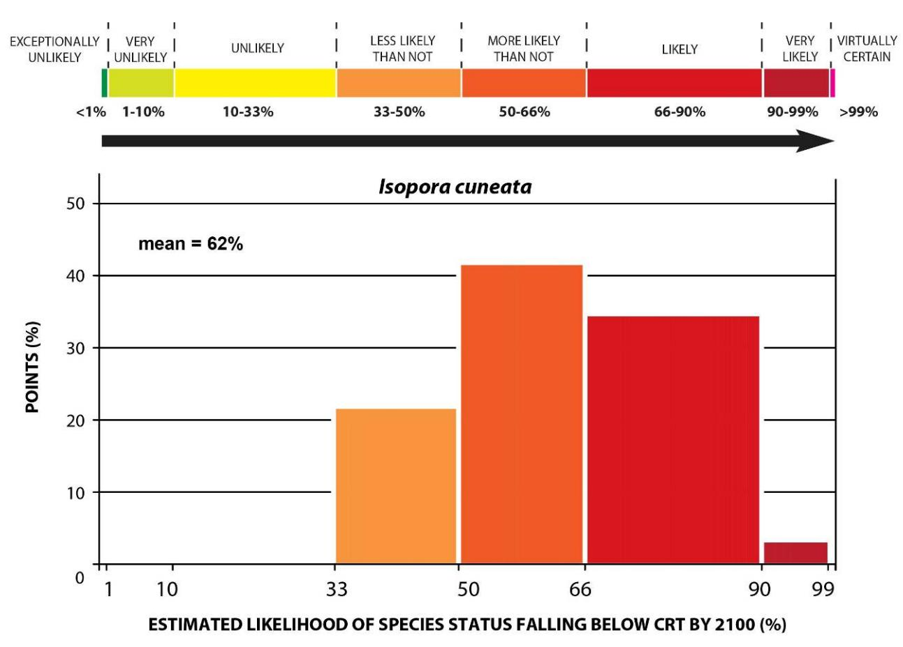

Figure 7.8.10. Distribution of points to estimate the likelihood that the status of *Isopora cuneata* falls below the Critical Risk Threshold (the species is of such low abundance, or so spatially fragmented, or at such reduced diversity that extinction is extremely likely) by 2100.

Factors that increase the potential extinction risk (higher likelihood of falling below the Critical Risk Threshold) for *Isopora cuneata* are the high susceptibility to threats inferred to be common to members of the family Acroporidae, which includes special attractiveness to corallivores, vulnerability to bleaching from unusually warm water, and susceptibility to disease. Factors that reduce the potential extinction risk (lower likelihood of falling below the Critical Risk Threshold) were its prevalence in areas of heavy wave action, as water motion may reduce bleaching vulnerability. Reduced risk also indicates that *Isopora cuneata* is often common and sometimes the dominant coral or at least the dominant acroporid coral Bradbury, 1983 #1509; Ayre, 1991 #1508}. These characteristics tend toward species persistence (Richards, 2009).

The overall likelihood that *Isopora cuneata* will fall below the Critical Risk Threshold by 2100 was estimated to be in the "more likely than not" risk category with a mean likelihood of 62% and a standard error (SE) of 8.5% (Fig. 7.8.10). This SE was calculated by taking the standard deviation of the seven mean voting scores of the BRT members and shows the coherence among the BRT. The uncertainty of the BRT is reflected in the range of votes of 33%–99% (Fig. 7.8.10) and the average range of likelihood estimates of the seven BRT voters (51%). The overall wide range of votes reflects the uncertainty among BRT members inherent in the lack of adequate ecological and demographic information for *Isopora cuneata*.

#### **7.9 Genus** *Montipora*

#### **Taxonomic Issues**

Taxonomy within the genus *Montipora* has long been challenging, with species designations based largely on the arrangement and size of protrusions between corallites (e.g., "papillae" are smaller than corallites while "verrucae" are larger) and by colony form (laminar, encrusting, massive, and branching); Veron (2000) categorizes the 75 *Montipora* species into 12 "growth groups" according to these characters. Van Oppen et al. (2004) note that there is often little congruence between these morphological groups and clades derived from nuclear and/or mitochondrial genetic sequencing which they attribute to interspecific hybridization, phenotypic plasticity, and/or homoplasy of growth characteristics. Recent work by Forsman et al. (2010) presents detailed genetic and morphometric analyses of seven Hawaiian *Montipora* species that demand careful evaluation relative to the status and consequent estimated extinction risk of several of the candidate *Montipora* species. Specifically, results of this recent study provide important information that the BRT has deemed to alter the species status and, hence, the estimates of extinction risk for *Montipora dilatata, Montipora flabellata,* and *Montipora patula*.

Forsman et al. (2010) analyzed genetic and microskeletal characteristics from 71 colonies representing seven *Montipora* species collected from throughout the Hawaiian Archipelago, including specimens of three of the candidate species and with a special focus on the endemic and very rare *Montipora dilatata*. They sequenced a suite of genetic markers including five mitochondrial and two nuclear genes. Analyses of the mitochondrial Control Region (mtCR) yielded four strongly supported clades, each separated from the others by 3–7 fixed nucleotide differences. One of these clades included the two rare endemic species *Montipora dilatata* and *Montipora flabellata*, along with the widely distributed *Montipora turgescens;* a second clade grouped *Montipora patula* with *Montipora verrilli;* while *Montipora capitata* and *Montipora incrassata* each formed a distinct clade. The additional mitochondrial markers and the ITS (multicopy nuclear) markers all resolved the same four clades, while the single copy ATPs ß gene yielded a discordant tree based on high allelic diversity among individuals. A classification of 19 micromorphological measurements also failed to find any distinctions amongst *Montipora dilatata, Montipora flabellata*, and *Montipora turgescens*, or between *Montipora patula* and *Montipora verrilli*. Forsman et al. (2010) also compared the mtCR sequences from the Hawaiian corals in their study to those from other *Montipora* species collected from Indonesia and the Great Barrier Reef (Van Oppen et al., 2004) and suggest that their four clades likely include additional *Montipora* species from outside Hawai`i. For example, the Hawaiian *Montipora patula/verrilli* samples shared their identical mtCR haplotype with non-Hawaiian species, including *Montipora altasepta*, *Montipora hispida*, *Montipora peltiformis*, and *Montipora aequituberculata*. These authors conclude that concurrence of the mitochondrial and ITS trees with the micromorphological groupings provide strong support for several species complexes. The nominal species within these clades represent either morphological variants of the same species or some degree of incipient speciation.

Given that the best available information indicates a lack of discernible genetic differentiation, a lack of distinction in microskeletal morphology, and considerable potential for phenotypic plasticity in color, colony growth form, and skeletal structures, the BRT has chosen to evaluate extinction risk for these respective clades (i.e., *Montipora dilatata/flabellata/turgescens* and *Montipora patula/verrilli*) rather than for the nominal species. The BRT will treat these two "clades" as "species" for purposes of U.S. Endangered Species Act status evaluation. This would require reconsideration on potential future studies that would provide either improved genetic resolution or reproductive studies (e.g., testing hybridization within and between these clades). Indeed, if these nominal species are indeed distinct (i.e., the determination to "lump" nominal species within these two indistinguishable clades is in error), the extinction risk of each would be equal to or, most likely, be higher than that currently estimated for each of the two larger clades.

**Evolutionary and geologic history:** The age of most species of *Montipora* is unknown as a result of their delicate skeletons and poor preservation in the fossil record. Nevertheless, the genus as a whole is old, likely diverging from the genus *Acropora* about 54 Ma (Fukami et al., 2000). Based on genetic divergence estimates, the main diversification of *Montipora* species is estimated to have occurred around 6.6 Ma (Fukami et al., 2000).

#### **Life History**

Of the 35 species of *Montipora* for which reproductive mode has been described, all are hermaphroditic broadcast spawners (Baird et al., 2009). Numerous species of *Montipora* have been observed to participate in multispecies spawning events that have been documented throughout the Indo-Pacific (Baird et al., 2009). The larvae of all 30 examined *Montipora* species contain zooxanthellae that can supplement maternal provisioning with energy sources provided by photosynthesis (Baird et al., 2009). Larval longevity has not been determined for *Montipora* nor has age at first reproduction, although their fast growth rates suggest early maturity and short generation times (Van Oppen et al., 2004)

#### **Threats**

**Temperature increase**: *Montipora* species have relatively high bleaching response/impact (just below *Millepora* and *Acropora*) according to published rankings in both Australia and eastern Africa (Marshall and Baird, 2000; McClanahan et al., 2007; respectively).

**Acidification**: While the candidate species of *Montipora* have not been directly investigated for effects of ocean acidification, a congener, *Montipora capitata*, showed 15%–20% reduction in colony growth rate in mesocosm treatments of anticipated CO2 levels within this century, although gamete production was not affected (Jokiel et al., 2008). In general, most corals studied have shown negative relationships between acidification and growth (Table 3.2.2) and acidification is likely to contribute to reef destruction in the future (Hoegh-Guldberg et al. 2007; Silverman et al. 2009). While ocean acidification has not been demonstrated to cause appreciable declines in coral populations so far, the BRT considers it to be a significant threat to corals by 2100.

**Disease:** *Montipora* species have moderate susceptibility/impact from disease. The genus has been susceptible to blackband disease in Australia (Sato et al., 2009) and the Red Sea (Al-Moghrabi, 2001), growth anomalies in Hawai`i (Aeby, 2006; Wolanski and Delesalle, 1995), and white syndromes in Australia and Hawai`i (Aeby, 2006; Willis et al., 2004).

**Land-Based Sources of Pollution (LBSP):** *Montipora* is characterized as a "sediment-intolerant" genus by McClanahan and Obura (1997), although some species have been found to be relatively sediment tolerant (Hodgson, 1990). Clearly, some *Montipora* are more sediment susceptible than others (Ferrier-Pagès et al., 2010; Jokiel et al., 2007). Elevated nutrients have also had no effect on fecundity or fertilization success in *Montipora* (Abramovitch-Gottlib et al., 2003; Cox and Ward, 2002). Competition with algae reduced settlement and survival of *Montipora* larvae but the impact was reversed with antibiotics, suggesting the recruitment inhibition was caused by indirect microbial interactions (Vermeij et al., 2009).

**Predation:**The crown-of-thorns seastar (*Acanthaster planci*) has been observed preferentially preying on members of this genus, with predator outbreaks resulting in substantial population impacts to *Montipora* spp. (Colgan, 1987). *Montipora verrucosa*, however, was avoided in experiments on feeding by the pillow seastar *Culcita novaeguineae* (Glynn and Krupp, 1986).

**7.9.1** *Montipora angulata* **Lamarck, 1816** 

Figure 7.9.1. *Montipora angulata* photos and corallite plan from Veron (2000).

#### **Characteristics**

Colonies of *Montipora angulata* are pale brown and have extensive encrusting bases with short branches that form a compact clump. Corallites are slightly foveolate (funnel shaped) and immersed in the coenosteum. The coenosteum is smooth or forms thin ridges between corallites. Colonies are pale brown in color (Veron, 2000).

#### **Taxonomy**

**Taxonomic issues**: Genetic evidence places *Montipora angulata* in a clade with other species, but the specific composition depends on whether mitochondrial DNA or the *Pax*-C intron is used (Van Oppen et al., 2004). In the absence of additional genetic work or reproductive crosses that test hybridization potential, we will treat *Montipora angulata* as a valid species.

**Family:** Acroporidae.

**Evolutionary and geologic history**: See Section 7.9: Genus *Montipora*.

#### **Global Distribution**

*Montipora angulata* is somewhat widely distributed from the south Indian coast throughout the central Pacific. It also has wide latitudinal range from central Japan to the midsection of both coasts of Australia. It is absent from Hawai`i, the eastern Indian Ocean, and the Red and Arabian Seas.

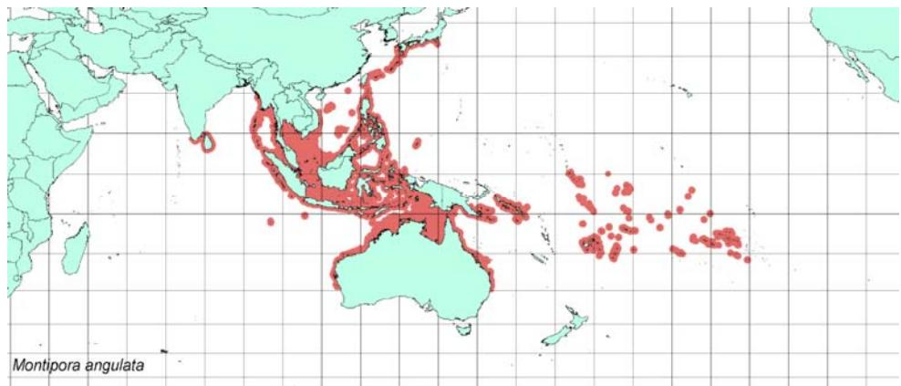

Figure 7.9.2.*Montipora angulata* distribution from IUCN copied from http://www.iucnredlist.org**.**

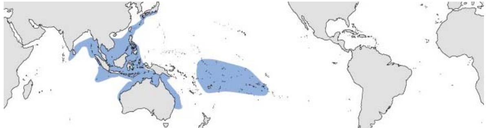

Figure 7.9.3. *Montipora angulata* distribution from Veron (2000).

#### **U.S. Distribution**

According to the IUCN Species Account, *Montipora angulata* occurs in American Samoa and the U.S. minor outlying islands. The CITES species database does not list this species in U.S. waters. A search of published and unpublished records of occurrence in U.S. waters indicates *Montipora angulata* has been reported from Rose Atoll in American Samoa (Kenyon et al., 2010a). No substantiated published or unpublished reference supporting its occurrence in the U.S. minor outlying islands could be identified.

Within federally protected waters, *Montipora anuglata* has been recorded from the following areas:

Rose Atoll National Monument

#### **Habitat**

**Habitat:** *Montipora angulata* has been reported to be found on fringing reefs and reef flats (Veron, 2000).

**Depth range**: *Montipora angulata* has been reported in water depths ranging from at least 1 m to 20 m (Carpenter et al., 2008).

#### **Abundance**

Abundance of *Montipora angulata* has been reported mostly as rare (Veron, 2000).

#### **Life History**

The reproductive characteristics of *Montipora angulata* have not been determined (Baird et al., 2009). However, sexuality and reproductive mode have been determined for 35 other species of *Montipora*, all of which are hermaphroditic broadcast spawners. Although specific observations have not been published for this species, the larvae of all other *Montipora* species studied contain zooxanthellae that can supplement maternal provisioning with energy sources provided by their photosynthesis.

#### **Threats**

**Thermal stress**: Branching *Montipora* spp. have relatively high bleaching response according to published rankings in both Australia and east Africa (Marshall and Baird, 2000; McClanahan et al., 2007). *Montipora angulata* contains Clade C zooxanthellae (Good et al., 2005); this clade varies in its thermal tolerance (LaJeunesse et al., 2003) but is generally less resistant to bleaching than Clade D. The congeneric species *Montipora capitata* copes with bleaching by relying more heavily on heterotrophic input, allowing it to rebuild lipid stores (Rodrigues et al., 2008) and maintain fecundity after bleaching (Cox, 2007).

**Acidification:** While not studied in this species, a congener, *Montipora capitata*, showed 15%–20% reduction in colony growth rate in mesocosm treatments of anticipated CO2 levels within this century, although gamete production was not affected (Jokiel et al., 2008). Similarly, experiments on acidification impacts have all demonstrated negative effects on other members of the family Acroporidae, including reduced *Acropora* calcification (Anthony et al., 2008; Marubini et al., 2003; Renegar and Riegl, 2005; Schneider and Erez, 2006) and productivity (Anthony et al., 2008) and, in *Acropora palmata,* impaired fertilization and settlement success (Albright et al., 2010) and reduced growth in the field from Curaçao (Bak et al., 2009). In general, most corals studied have shown negative relationships between acidification and growth (Table 3.2.2) and acidification is likely to contribute to reef destruction in the future (Hoegh-Guldberg et al., 2007; Silverman et al., 2009). While ocean acidification has not been demonstrated to have caused appreciable declines in coral populations so far, the BRT considers it to be a significant threat to corals by 2100.

**Disease:** *Montipora* species have moderate susceptibility/impact from disease. The genus has been susceptible to blackband disease in Australia (Sato et al., 2009) and the Red Sea (Al-Moghrabi, 2001), growth anomalies in Hawai`i (Aeby et al., 2006) and white syndromes in Australia and Hawai`i (Aeby, 2006; Willis et al., 2004). Ample evidence indicate that diseases can have devastating regional impacts on individual coral species (e.g., Aronson and Precht, 2001; Bruckner and Hill, 2009) and there is evidence that these impacts are occurring in more taxa and at a broader geographic scale (Green and Bruckner, 2000; Sutherland et al., 2004).

**Predation:** *Montipora* species are preferred prey of crown-of-thorns seastar (*Acanthaster planci)*.

**Land-based sources of pollution (LBSP):** The effects of LBSP on *Montipora angulata* are largely unknown. *Montipora* is characterized as a "sediment-intolerant" genus by McClanahan and Obura (1997), while other congeners have been found to be relatively sediment tolerant (Hodgson, 1990; Stafford-Smith, 1993). Clearly, some *Montipora* are more sediment susceptible than others (Jokiel et al., 2007). Elevated nutrients have also had no effect on fecundity or fertilization success in *Montipora* (Cox and Ward, 2002). Competition with algae reduced settlement and survival of *Montipora* larvae but was reversed with antibiotics, suggesting the recruitment inhibition was caused by indirect microbial interactions (Vermeij et al., 2009).

LBSP-related stresses (nutrients, sediment, toxins, and salinity) often act in concert rather than individually and are influenced by other biological (e.g., herbivory) and hydrological factors. Collectively, LBSP stresses are unlikely to produce extinction at a global scale; however, they may pose significant threats at local scales (particularly important for species with limited range) and reduce the resilience of corals to bleaching (Carilli et al., 2009a; Wooldridge, 2009b).

**Collection/Trade:** The genus *Montipora* is heavily involved in the international aquarium trade, with substantial exports reported (in the thousands of pieces per year) from Indonesia, Malaysia, Tonga, Solomon Islands, and Fiji regions for which *Montipora angulata* likely comprise a portion. Of concern, both Malaysia and Indonesia report increasing exports over the period from 2000 to 2008 (less than 5000 to over 35,000 for Indonesia).

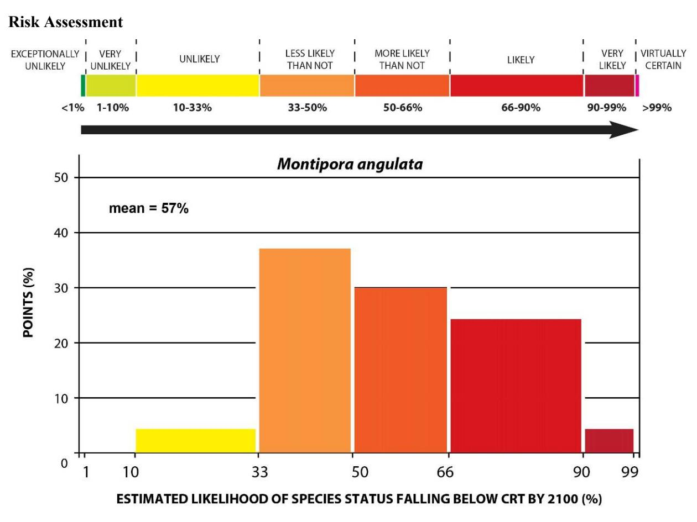

Figure 7.9.4. Distribution of points to estimate the likelihood that the status of *Montipora angulata* falls below the Critical Risk Threshold (the species is of such low abundance, or so spatially fragmented, or at such reduced diversity that extinction is extremely likely) by 2100.

Factors that increase the potential extinction risk (higher likelihood of falling below the Critical Risk Threshold) for this species include its rare abundance combined with presumed generic vulnerability to a range of threats including disease, bleaching, and predation as well as potentially increasing threats from collection/trade. Factors that reduce potential extinction risk (decrease the likelihood of falling below the Critical Risk Threshold) are its relatively wide geographic distribution, making it more likely a species will be able to escape the impacts of threats and catastrophes in at least some locations. The BRT also considered wide latitudinal distribution to indicate broader tolerance to environmental condtions and hence, greater potential for surviving changing environmental regimes.

The overall likelihood that *Montipora angulata* will fall below the Critical Risk Threshold by 2100 was estimated to be in the "more likely than not" risk category with a mean likelihood of 57% and a standard error (SE) of 12% (Fig. 7.9.4). This SE was calculated by taking the standard deviation of the seven mean voting scores of the BRT members and its relatively high value (among the 82 candidates) shows a somewhat lower coherence among the BRT. The uncertainty of the BRT is reflected in the wide range of votes of 10%–99% (Fig. 7.9.4) and the average range of likelihood estimates of the seven BRT voters (54%). The overall wide range of votes reflects the uncertainty among BRT members inherent in the lack of adequate ecological and demographic information for *Montipora angulata*.

**7.9.2** *Montipora australiensis* **Bernard, 1897** 

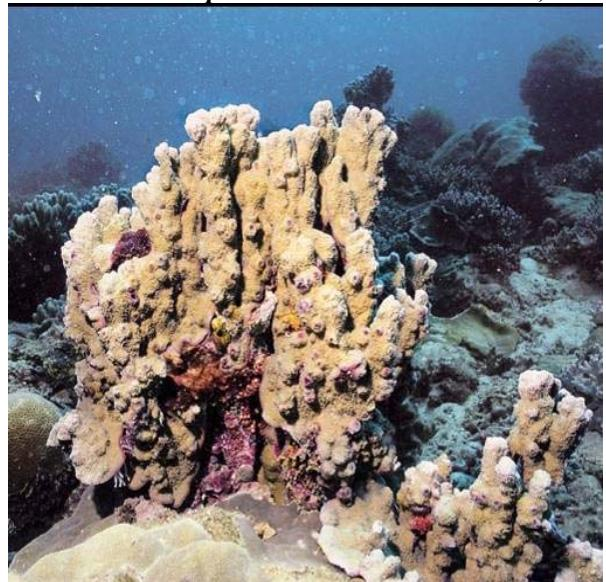

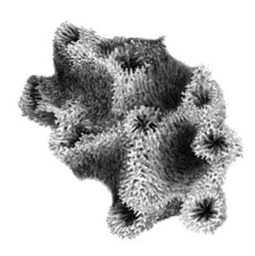

Figure 7.9.5. *Montipora australiensis* photos and corallite plan from Veron (2000).

#### **Characteristics**

Colonies of *Montipora australiensis* are pale brown, forming thick plates and irregular columns. Corallites are both immersed and exsert, the latter having a prominent ring of fused thecal papillae. Fine ridges of coenosteum, which are mostly vertical on branches, join corallites forming a network (Veron, 2000).

#### **Taxonomy**

**Taxonomic issues**: None.

**Family:** Acroporidae.

**Evolutionary and geologic history**: See Section 7.9: Genus *Montipora.*

#### **Global Distribution**

*Montipora australiensis* is widely distributed longitudinally, occurring widely throughout east Africa and through to the east-central Pacific from the south Indian coast throughout the central Pacific. It also has wide latitudinal range from central Japan to the midsection of both coasts of Australia. It is absent from Hawai`i, the northeastern Indian Ocean, and the Red and Arabian Seas.

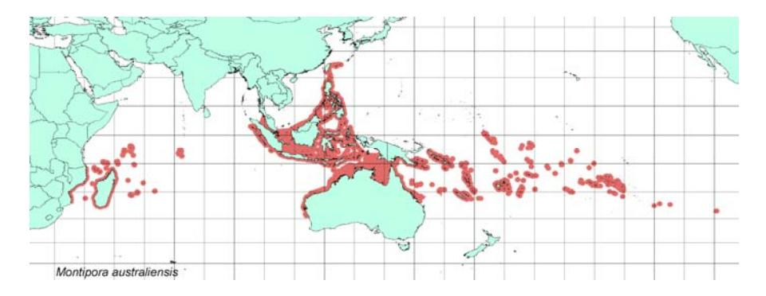

Figure 7.9.6. *Montipora australiensis* distribution from IUCN copied from http://www.iucnredlist.org.

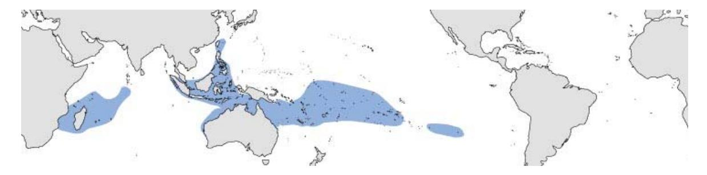

Figure 7.9.7. *Montipora australiensis* distribution from Veron (2000).

#### **U.S. Distribution**

The only record of occurrence of *Montipora australiensis* in federally protected waters is

National Park of American Samoa, Ofu unit (Birkeland, unpubl. data).

#### **Habitat**

**Habitat:** *Montipora australiensis* has been reported to occupy shallow reef environments with high wave action (Veron, 2000).

**Depth range**: The shallow reef environment described by Veron above seems at odds with the IUCN description of a 2 m–30-m depth range for *Montipora australiensis* (Carpenter et al., 2008).

#### **Abundance**

*Montipora australiensis* has most often been reported as rare (Veron, 2000).

#### **Life History**

The reproductive characteristics of *Montipora australiensis* have not been determined (Baird et al., 2009). However, sexuality and reproductive mode have been determined for 35 other species of *Montipora*, all of which are hermaphroditic broadcast spawners. Although specific observations have not been published for this species, the larvae of all other *Montipora* species studied contain zooxanthellae that can supplement maternal provisioning with energy sources provided by their photosynthesis.

#### **Threats**

**Thermal stress**: Branching *Montipora* spp. have relatively high bleaching response according to published rankings in both Australia and east Africa (Marshall and Baird, 2000; McClanahan et al., 2007; respectively). The congeneric species *Montipora capitata* copes with bleaching by relying more heavily on heterotrophic input, allowing it to rebuild lipid stores (Rodrigues et al., 2008) and maintain fecundity after bleaching (Cox, 2007).

**Acidification:** While not studied in this species, a congener, *Montipora capitata*, showed 15%–20% reduction in colony growth rate in mesocosm treatments of anticipated CO2 levels within this century, though gamete production was not affected (Jokiel et al., 2008). Similarly, experiments on acidification impacts have all demonstrated negative effects on other members of the family Acroporidae, including reduced *Acropora* calcification (Anthony et al., 2008; Marubini et al., 2003; Renegar and Riegl, 2005; Schneider and Erez, 2006) and productivity (Anthony et al., 2008) and, in *Acropora palmata,* impaired fertilization and settlement success (Albright et al., 2010), and reduced growth in the field from Curaçao (Bak et al., 2009). In general, most corals studied have shown negative relationships between acidification and growth (Table 3.2.2) and acidification is likely to contribute to reef destruction in the future (Hoegh-Guldberg et al. 2007; Silverman et al., 2009). While ocean acidification has not been demonstrated to cause appreciable declines in coral populations so far, the BRT considers it to be a significant threat to corals by 2100.

**Disease:** *Montipora* spp. have moderate susceptibility/impact from disease. The genus has been susceptible to blackband disease in Australia (Sato et al., 2009) and the Red Sea (Al-Moghrabi, 2001), growth anomalies in Hawai`i (Aeby et al., 2006) and white syndromes in Australia and Hawai`i (Aeby, 2006; Willis et al., 2004). Also ample evidence indicate that diseases can have devastating regional impacts on individual coral species (e.g., Aronson and Precht, 2001; Bruckner and Hill, 2009) and there is evidence that these impacts are occurring in more taxa and at a broader geographic scale (Green and Bruckner, 2000; Sutherland et al., 2004).

**Predation:** *Montipora* spp. are preferred prey of crown-of-thorns seastar (*Acanthaster planci)*.

**Land-based sources of pollution (LBSP):** The effects of LBSP on *Montipora australiensis* are largely unknown. *Montipora* is characterized as a "sediment-intolerant" genus by McClanahan and Obura (1997), while other congeners have been found to be relatively sediment tolerant (Hodgson, 1990; Stafford-Smith, 1993). Clearly some *Montipora* are more sediment susceptible than others (Jokiel et al., 2007). Elevated nutrients showed no effect on fecundity or fertilization success in *Montipora* (Cox and Ward, 2002). Competition with algae reduced settlement and survival of *Montipora* larvae but was reversed with antibiotics, suggesting the recruitment inhibition was caused by indirect microbial interactions (Vermeij et al., 2009).

LBSP-related stresses (nutrients, sediment, toxins, and salinity) often act in concert rather than individually and are influenced by other biological (e.g., herbivory) and hydrological factors. Collectively, LBSP stresses are unlikely to produce extinction at a global scale; however, they may pose significant threats at local scales (particularly important for species with limited range) and reduce the resilience of corals to bleaching (Carilli et al., 2009a; Wooldridge, 2009b).

**Collection/Trade:** The genus *Montipora* is heavily involved in the international ornamental trade, with substantial exports reported (in the thousands of pieces per year) from Indonesia, Malaysia, Tonga, Solomon Islands, and Fiji. Of particular concern, both Malaysia and Indonesia report increasing exports over the 2000 to 2008 period (less than 5000 to over 35,000 for Indonesia).

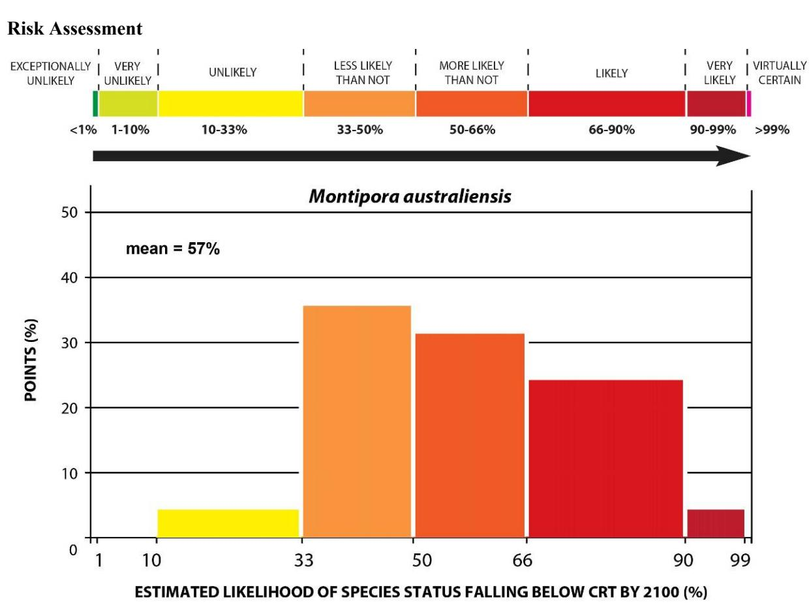

Figure 7.9.8. Distribution of points to estimate the likelihood that the status of *Montipora australiensis* falls below the Critical Risk Threshold (the species is of such low abundance, or so spatially fragmented, or at such reduced diversity that extinction is extremely likely) by 2100.

Factors that increase the potential extinction risk (higher likelihood of falling below the Critical Risk Threshold for *Montipora australiensis* include its rare abundance combined with presumed generic vulnerability to a range of threats including disease, bleaching, and predation as well as potentially increasing threats from collection/trade. Factors that reduce potential extinction risk (decrease the likelihood of falling below the Critical Risk Threshold) are its relatively wide geographic distribution, making it more likely a species will be able to escape the impacts of threats and catastrophes in at least some locations.

The mean likelihood that *Montipora australiensis* will fall below the Critical Risk Threshold by 2100 was estimated to be in the "more likely than not" risk category with a mean likelihood of 57% and a standard error (SE) of 12% (Fig. 7.9.8). This SE was calculated by taking the standard deviation of the seven mean voting scores of the BRT members and its relatively high value (among the 82 candidates) shows a somewhat lower coherence among the BRT. The uncertainty of the BRT is reflected in the wide range of votes of 10%–99% (Fig. 7.9.8) and the average range of likelihood estimates of the seven BRT voters (54%). The overall wide range of votes reflects the uncertainty among BRT members inherent in the lack of adequate ecological and demographic information for *Montipora australiensis*.

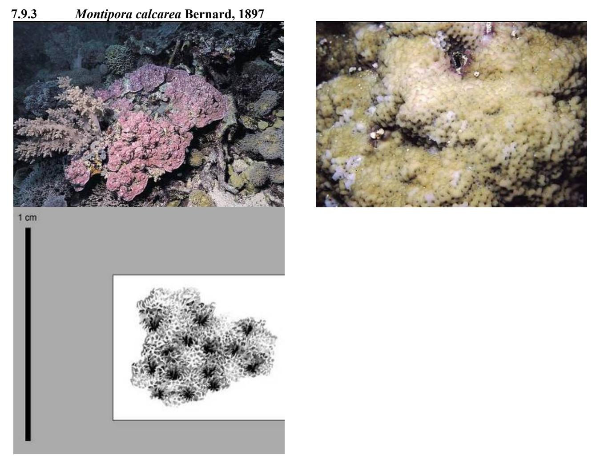

Figure 7.9.9. *Montipora calcarea* photos and corallite plan from Veron (2000).

#### **Characteristics**

Colonies of *Montipora calcarea* are pale brown or blue, which may photograph purple. Colonies are irregular thick plates with columnar upgrowths. Corallites are crowded and immersed; those on upgrowths have a slight formation of a lower lip. The coenosteum is coarse, with a light texture (Veron, 2000).

#### **Taxonomy**

**Taxonomic issues**: None.

**Family:** Acroporidae.

**Evolutionary and geologic history**: See Section 7.9: Genus *Montipora*.

#### **Global Distribution**

Global distribution of *Montipora calcarea* is fairly wide but somewhat discontinuous. It is present throughout the Red Sea and east Africa, but limited occurrences are reported across the Indian Ocean and the bulk of Southeast Asia. It is reported to occur along the west but not the east coast of Australia and has limited occurrence in the west-central Pacific.

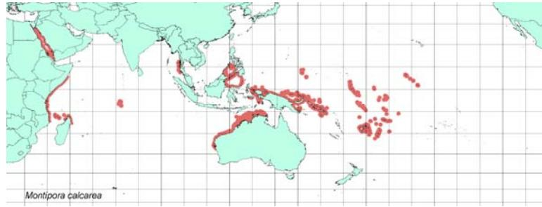

Figure 7.9.10. *Montipora calcarea* distribution from IUCN copied from http://www.iucnredlist.org.

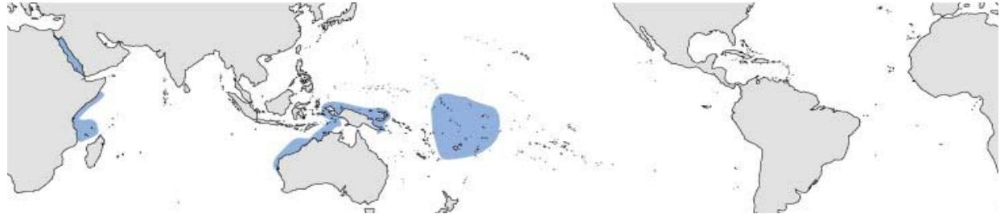

Figure 7.9.11. *Montipora calcarea* distribution from Veron (2000).

#### **U.S. Distribution**

According to both the IUCN Species Account and the CITES species database*, Montipora calcarea* occurs in American Samoa. The IUCN Species Account also lists its occurrence in the U.S. minor outlying islands. A search of published and unpublished records of occurrence in U.S. waters indicates *Montipora calcarea* has been reported from Tutuila, Tau, and Rose Atoll in American Samoa (Birkeland, unpubl. data; Fisk and Birkeland, 2002; Kenyon et al., 2010a; Lovell and McLardy, 2008; National Park Service, 2009), including areas under federal protection in these regions. No substantiated published or unpublished reference supporting its occurrence in the U.S. minor outlying islands could be identified.

Within federally protected waters, *Montipora calcarea* has been recorded from the following areas:

- National Park of American Samoa, Tutuila Island unit
- Fagatele Bay National Marine Sanctuary, Tutuila
- Rose Atoll Marine National Monument

#### **Habitat**

**Habitat:** *Montipora calcarea* has been reported to occur in shallow reef environments (Veron, 2000).

**Depth range**: *Montipora calcarea* has been reported in water depths ranging from 0 to 20 m (Carpenter et al., 2008).

#### **Abundance**

*Montipora calcarea* has most often been reported to be rare (Veron, 2000) but may be locally abundant.

#### **Life History**

The reproductive characteristics of *Montipora calcarea* have not been determined (Baird et al., 2009). However, sexuality and reproductive mode have been determined for 35 other species of *Montipora*, all of which are hermaphroditic broadcast spawners. Although specific observations have not been published for this species, the larvae of all other *Montipora* species studied contain zooxanthellae that can supplement maternal provisioning with energy sources provided by their photosynthesis.

#### **Threats**

**Thermal stress**: Plating *Montipora* spp. have relatively high bleaching response according to published rankings in both Australia and east Africa (Marshall and Baird, 2000; McClanahan et al., 2007; respectively). The congeneric species *Montipora capitata* copes with bleaching by relying more heavily on heterotrophic input, allowing it to rebuild lipid stores (Rodrigues et al., 2008) and maintain fecundity after bleaching (Cox, 2007).

**Acidification:** While not studied in this species, a congener, *Montipora capitata*, showed 15%–20% reduction in colony growth rate in mesocosm treatments of anticipated CO2 levels within this century, although gamete production was not affected (Jokiel et al., 2008). Similarly, experiments on acidification impacts have all demonstrated negative effects on other members of the family Acroporidae, including reduced *Acropora* calcification (Anthony et al., 2008; Marubini et al., 2003; Renegar and Riegl, 2005; Schneider and Erez, 2006) and productivity (Anthony et al., 2008) and, in *Acropora palmata,* impaired fertilization and settlement success (Albright et al., 2010) and reduced growth in the field from Curaçao (Bak et al., 2009). In general, most corals studied have shown negative relationships between acidification and growth (Table 3.2.2) and acidification is likely to contribute to reef destruction in the future (Hoegh-Guldberg et al. 2007; Silverman et al., 2009). While ocean acidification has not been demonstrated to have caused appreciable declines in coral populations so far, the BRT considers it to be a significant threat to corals by 2100.

**Disease:** *Montipora* spp. have moderate susceptibility/impact from disease. The genus has been susceptible to blackband disease in Australia (Sato et al., 2009) and the Red Sea (Al-Moghrabi, 2001), growth anomalies in Hawai`i (Aeby et al., 2006) and white syndromes in Australia and Hawai`i (Aeby, 2006; Willis et al., 2004).

**Predation:** *Montipora* spp. are preferred prey of crown-of-thorns seastar (*Acanthaster planci)*.

**Land-based sources of pollution (LBSP):** The effects of LBSP on *Montipora calcarea* are largely unknown. *Montipora calcarea* was not susceptible to algal or sediment impacts in anthropogenically impacted waters in Egypt (Mohammed and Mohammed, 2005; Wellington, 1982). *Montipora* is characterized as a "sediment-intolerant" genus by McClanahan and Obura (1997), while other congeners have been found to be relatively sediment-tolerant (Hodgson, 1990; Stafford-Smith, 1993). Clearly, some *Montipora* are more sediment susceptible than others (Jokiel et al., 2007). Elevated nutrients have also had no effect on fecundity or fertilization success in *Montipora* (Cox and Ward, 2002). Competition with algae reduced settlement and survival of *Montipora* larvae but was reversed with antibiotics, suggesting the recruitment inhibition was caused by indirect microbial interactions (Vermeij et al., 2009).

LBSP-related stresses (nutrients, sediment, toxins, and salinity) often act in concert rather than individually, and are influenced by other biological (e.g., herbivory) and hydrological factors. Collectively, LBSP stresses are unlikely to produce extinction at a global scale; however, they may pose significant threats at local scales (particularly important for species with limited range) and reduce the resilience of corals to bleaching (Carilli et al., 2009a; Wooldridge, 2009b).

**Collection/Trade:** The genus *Montipora* is heavily involved in the international aquarium trade, with substantial exports reported (in the thousands of pieces per year) from Indonesia, Malaysia, Tonga, Solomon Islands, and Fiji. Of concern, both Malaysia and Indonesia report increasing exports over the 2000−2008 period (less than 5000 to over 35,000 for Indonesia).

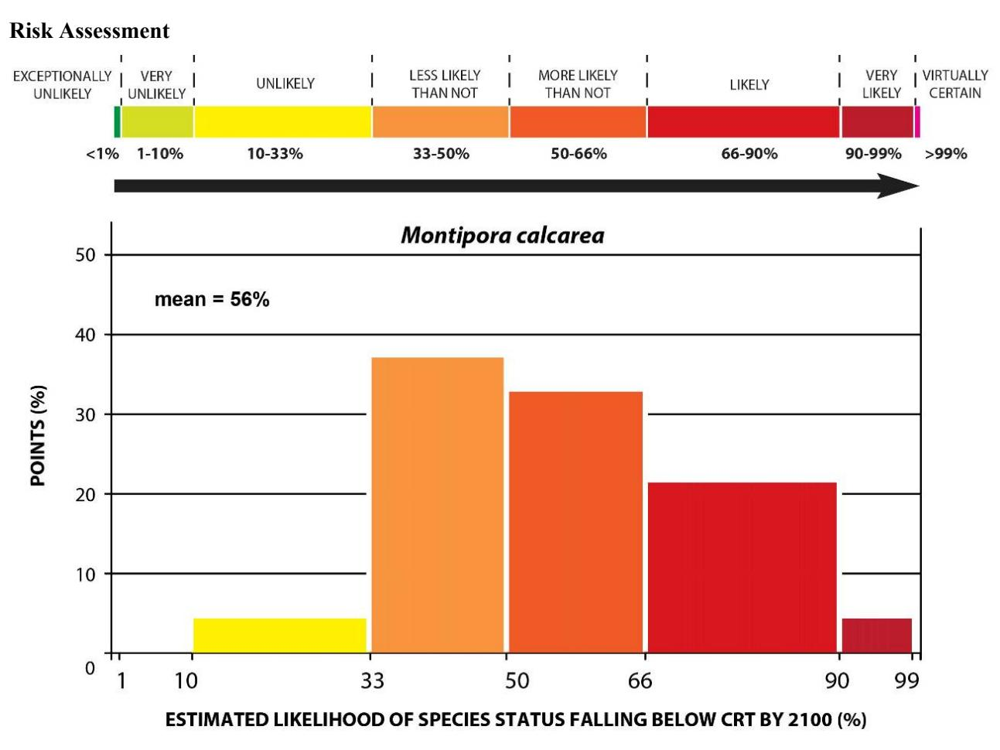

Figure 7.9.12. Distribution of points to estimate the likelihood that the status of *Montipora calcarea* falls below the Critical Risk Threshold (the species is of such low abundance, or so spatially fragmented, or at such reduced diversity that extinction is extremely likely) by 2100.

Factors that increase the potential extinction risk (higher likelihood of falling below the Critical Risk Threshold) for *Montipora calcarea* include its rare abundance combined with presumed generic vulnerability to a range of threats including disease, bleaching, and predation as well as potentially increasing threats from collection/trade. Factors that reduce potential extinction risk (decrease the likelihood of falling below the Critical Risk Threshold) are its relatively wide geographic distribution, making it more likely a species will be able to escape the impacts of threats and catastrophes in at least some locations.

The mean likelihood that *Montipora calcarea* will fall below the Critical Risk Threshold by 2100 was estimated to be in the "more likely than not" risk category with a mean likelihood of 56% and a standard error (SE) of 12% (Fig. 7.9.12). This SE was calculated by taking the standard deviation of the seven mean voting scores of the BRT members and its relatively high value (among the 82 candidates) shows a somewhat lower coherence among the BRT. The uncertainty of the BRT is reflected in the wide range of votes of 10%–99% (Fig. 7.9.12) and the average range of likelihood estimates of the seven BRT voters (54%). The overall wide range of votes reflects the uncertainty among BRT members inherent in the lack of adequate ecological and demographic information for *Montipora calcarea*.

**7.9.4** *Montipora caliculata* **Dana, 1846** 

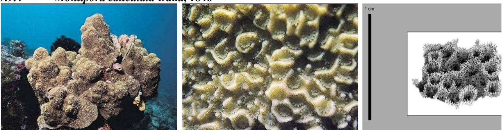

Figure 7.9.13. *Montipora caliculata* photos and corallite plan from Veron (2000).

#### **Characteristics**

*Montipora caliculata* colonies are brown or blue and massive. Corallites are a mixture of immersed and foveolate (funnel shaped), the latter usually having wavy rims. Individual corallites typically have all or part of their wall missing so that adjacent corallites form short valleys. Parts of walls that remain may be tuberculae-like (Veron, 2000).

#### **Taxonomy**

**Taxonomic issues**: None.

**Family:** Acroporidae.

**Evolutionary and geologic history:** See Section 7.9: Genus *Montipora*.

#### **Global Distribution**

*Montipora caliculata* has a wide distribution, though IUCN reports its existence in east Africa/Madegascar which is not supported by (Veron, 2000). Otherwise, it ranges from western Sumatra through the Pitcairn Islands. It also has fairly wide latitudinal range from Taiwan to mid-Australia.

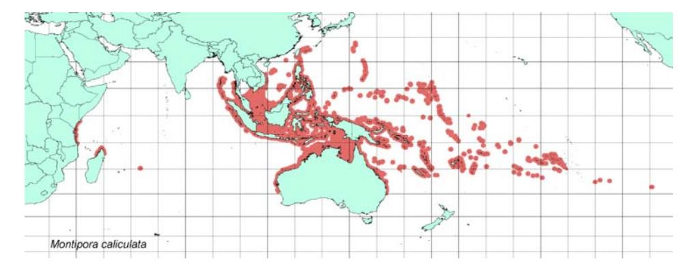

Figure 7.9.14. *Montipora caliculata* distribution from IUCN copied from http://www.iucnredlist.org.

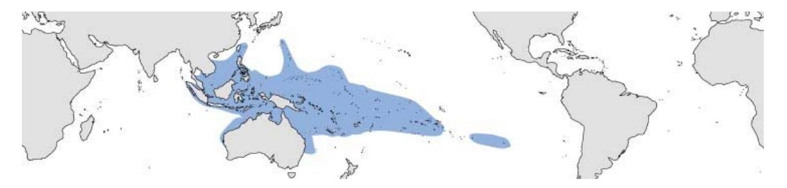

Figure 7.9.15. *Montipora caliculata* distribution from Veron (2000).

#### **U.S. Distribution**

According to both the IUCN Species Account and the CITES species database, *Montipora caliculata* occurs in American Samoa and the Northern Mariana Islands. The IUCN Species Account also lists its occurrence in the U.S. minor outlying islands. A search of published and unpublished records of occurrence in U.S. waters indicates *Montipora caliculata* has been reported from Tutuila, Ofu-Olosega, Tau, and Swains in American Samoa (Birkeland, unpubl. data; Coles et al., 2003; CRED, unpubl. data; Fisk and Birkeland, 2002; Kenyon et al., 2010b; Lamberts, 1983; Lovell and McLardy, 2008; Maragos, 1994; National Park Service, 2009), the Mariana Islands (CRED, unpubl. data; Randall, 2003), Howland and Baker Islands, Jarvis Island and Kingman Reef (CRED, unpubl. data), and Palmyra Atoll (Williams et al., 2008b).

Within federally protected waters, *Montipora caliculata* has been recorded from the following areas:

- Pacific Remote Islands Marine National Monument (Howland, Baker, Jarvis, Palmyra, Kingman),
- National Park of American Samoa (Tutuila and Ofu Island units),
- Fagatele Bay National Marine Sanctuary,
- Marianas Trench Marine National Monument (Asuncion, Maug).

#### **Habitat**

**Habitat:** *Montipora caliculata* are found in most reef environments (Veron, 2000).

**Depth range**: *Montipora caliculata* are found at depths of up to 20 m.

#### **Abundance**

*Montipora caliculata* are most often reported to be uncommon (Veron, 2000).

#### **Life History**

The reproductive characteristics of *Montipora caliculata* have not been determined (Baird et al., 2009). However, the sexuality and reproductive mode have been determined for 35 other species of *Montipora*, all of which are hermaphroditic broadcast spawners. Although specific observations have not been published for this species, the larvae of all other *Montipora* species studied contain zooxanthellae that can supplement maternal provisioning with energy sources provided by their photosynthesis.

#### **Threats**

**Thermal stress**: *Montipora* spp. have relatively high bleaching response according to published rankings in both Australia and east Africa (Marshall and Baird, 2000; McClanahan et al., 2007). *Montipora caliculata* is known to contain mycosporine-like amino acids (Teai et al., 1997), which can play a role in reducing bleaching exposure. However, *Montipora caliculata* was the 7th most susceptible to bleaching of the 18 *Montipora* listed on the Great Barrier Reef (Done et al., 2003), but showed only moderate bleaching (~ 20%, or less than half as susceptible as congener *Montipora tuberculosa*) in French Polynesia during the 2002 bleaching event (Hughes et al., 2003).

The congeneric species *Montipora capitata* copes with bleaching by relying more heavily on heterotrophic input, allowing it to rebuild lipid stores (Rodrigues et al., 2008) and maintain fecundity after bleaching (Cox, 2007).

**Acidification:** While not studied in this species, a congener, *Montipora capitata*, showed 15%–20% reduction in colony growth rate in mesocosm treatments of anticipated CO2 levels within this century, although gamete production was not affected (Jokiel et al., 2008). Similarly, experiments on acidification impacts have all demonstrated negative effects on other members of the family Acroporidae, including reduced *Acropora* calcification (Anthony et al., 2008; Marubini et al., 2003; Renegar and Riegl, 2005; Schneider and Erez, 2006) and productivity (Anthony et al., 2008) and, in *Acropora palmata,* impaired fertilization and settlement success (Albright et al., 2010) and reduced growth in the field from Curaçao (Bak et al., 2009). In general, most corals studied have shown negative relationships between acidification and growth (Table 3.2.2) and acidification is likely to contribute to reef destruction in the future (Hoegh-Guldberg et al. 2007; Silverman et al., 2009). While ocean acidification has not been demonstrated to have caused appreciable declines in coral populations so far, the BRT considers it to be a significant threat to corals by 2100.

**Disease:** *Montipora* spp. have moderate susceptibility/impact from disease. The genus has been susceptible to blackband disease in Australia (Sato et al., 2009) and the Red Sea (Al-Moghrabi, 2001), growth anomalies in Hawai`i (Aeby et al., 2006), and white syndromes in Australia and Hawai`i (Aeby, 2006; Willis et al., 2004). Also, ample evidence indicate that diseases can have devastating regional impacts on individual coral species (e.g., Aronson and Precht, 2001; Bruckner and Hill, 2009), and there is evidence that these impacts are occurring in more taxa and at a broader geographic scale (Green and Bruckner, 2000; Sutherland et al., 2004).

**Predation:** *Montipora* spp. are preferred prey of crown-of-thorns seastar (*Acanthaster planci)*.

**Land-based sources of pollution (LBSP):** The effects of LBSP on *Montipora caliculata* are largely unknown. *Montipora* is characterized as a "sediment-intolerant" genus by McClanahan and Obura (1997), although there is clearly substantial variation in sediment tolerance among species (Hodgson, 1990; Jokiel et al., 2007; Stafford-Smith, 1993). Elevated nutrients have shown no effect on fecundity or fertilization success in *Montipora* (Cox and Ward, 2002). Competition with algae reduced settlement and survival of *Montipora* larvae but was reversed with antibiotics, suggesting the recruitment inhibition was caused by indirect microbial interactions (Vermeij et al., 2009).

LBSP-related stresses (nutrients, sediment, toxins, and salinity) often act in concert rather than individually and are influenced by other biological (e.g., herbivory) and hydrological factors. Collectively, LBSP stresses are unlikely to produce extinction at a global scale; however, they may pose significant threats at local scales (particularly important for species with limited range) and reduce the resilience of corals to bleaching (Carilli et al., 2009a; Wooldridge, 2009b).

**Collection/Trade:** The genus *Montipora* is heavily involved in the international aquarium trade, with substantial exports reported (in the thousands of pieces per year) from Indonesia, Malaysia, Tonga, Solomon Islands, and Fiji. Of particular concern, both Malaysia and Indonesia report increasing exports over the 2000−2008 period (less than 5000 to over 35,000 for Indonesia).

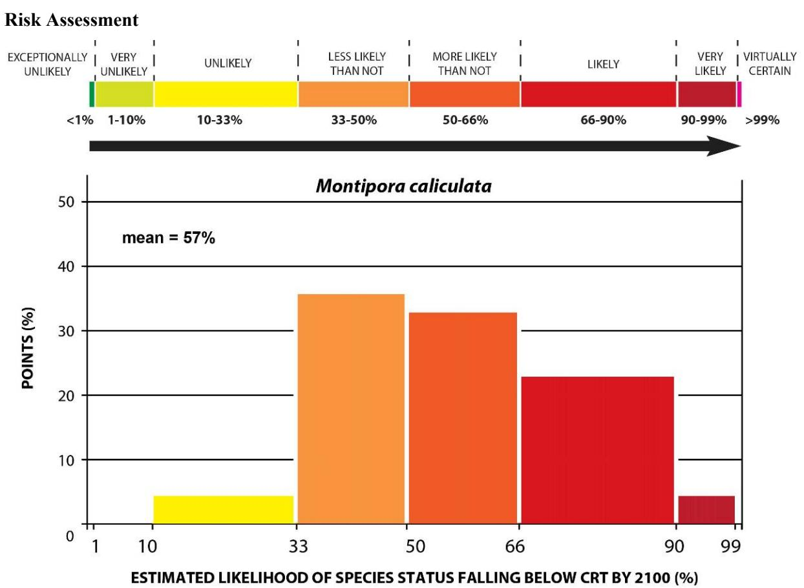

Figure 7.9.16. Distribution of points to estimate the likelihood that the status of *Montipora caliculata* falls below the Critical Risk Threshold (the species is of such low abundance, or so spatially fragmented, or at such reduced diversity that extinction is extremely likely) by 2100.

Factors that increase the potential extinction risk (higher likelihood of falling below the Critical Risk Threshold) for *Montipora caliculata* include its presumed generic vulnerability to a range of threats including disease, bleaching, and predation as well as potentially increasing threats from collection/trade. Factors that reduce potential extinction risk (decrease the likelihood of falling below the Critical Risk Threshold) are its relatively wide geographic distribution, making it more likely a species will be able to escape the impacts of threats and catastrophes in at least some locations.

The mean likelihood that *Montipora caliculata* will fall below the Critical Risk Threshold by 2100 was estimated to be in the "more likely than not" risk category with a mean likelihood of 57% and a standard error (SE) of 12% (Fig. 7.9.16). This SE was calculated by taking the standard deviation of the seven mean voting scores of the BRT members and its relatively high value (among the 82 candidates) indicates a somewhat lower coherence among the BRT. The uncertainty of the BRT is reflected in the wide range of votes of 10%–99% (Fig. 7.9.16) and the average range of likelihood estimates of the seven BRT voters (54%). The overall wide range of votes reflects the uncertainty among BRT members inherent in the lack of adequate ecological and demographic information for *Montipora caliculata*.

**7.9.5** *Montipora dilatata* **Dana, 1846,** *Montipora flabellata* **Dana, 1846, and** *Montipora turgescens*  **Bernard, 1897** 

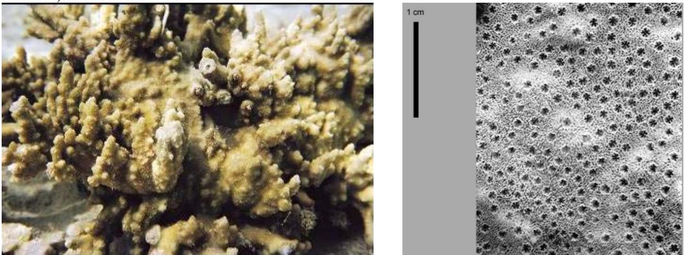

Figure 7.9.17. *Montipora dilatata* photos and corallite plan from Veron (2000).

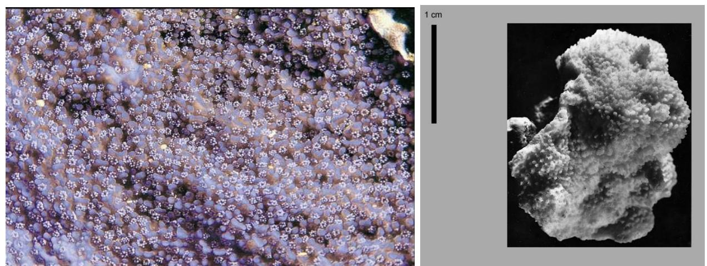

Figure 7.9.18. *Montipora flabellata* photos and corallite plan from Veron (2000).

#### **Characteristics**

*Montipora dilatata*: Colonies are encrusting to submassive and up to 0.3 m across, with irregular branch-like upgrowths up to 100 mm thick which become flattened near their ends. Coenosteum papillae are inconspicuous. Corallite walls are well defined. Colonies are pale to dark brown in color (Veron, 2000).

*Montipora flabellata:* Colonies are encrusting, with irregular lobes. Corallites are small (0.5 mm diameter). Papillae cover the colony surface and are sometimes fused into ridges. Septa are poorly developed. Colonies are usually blue (which may photograph pink), also brown or purple (Veron, 2000).

*Montipora turgescens*: Colonies are massive, flat, hemispherical or columnar. In habitats exposed to strong wave action the surface is usually mounded. Corallites are immersed. The coenosteum has no elaborations. Colonies are brown, cream or purple (Veron, 2000).

Note: Forsman et al (2010) show that the development of coenosteum elaborations is pheontypically plastic.

#### **Taxonomy**

**Taxonomic issues**: Important, see Section 7.8: Genus *Montipora*. In considering implications of recent results, the BRT has decided to assess extinction risk on this "species complex" as a single unit since the specimens examined from Hawai`i are indistinguishable on genetic or microskeletal characteristics and colony morphology is known to be highly plastic.

**Family:** Acroporidae.

**Evolutionary and geologic history**: See Section 7.9: Genus *Montipora*.

#### **Global Distribution**

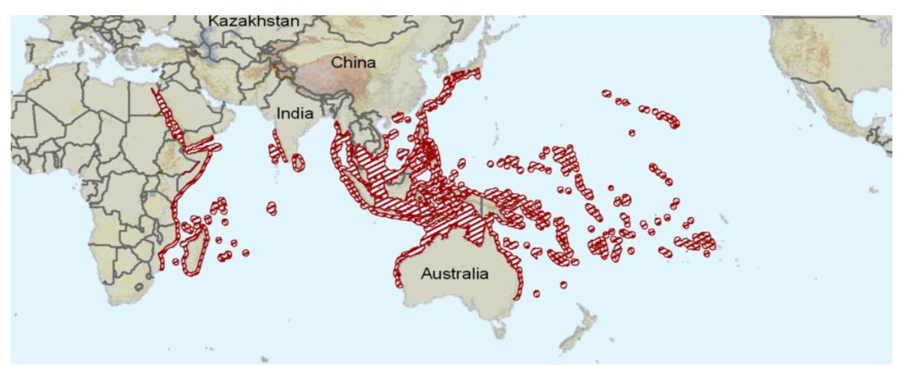

Figure 7.9.19. *Montipora dilatata/flabellata/turgescens* distribution (subsumed as distribution of *Montipora turgescens* as *Montipora dilatata* and *Montipora flabellata* are described as Hawaiian endemics) from IUCN copied from http://www.iucnredlist.org.

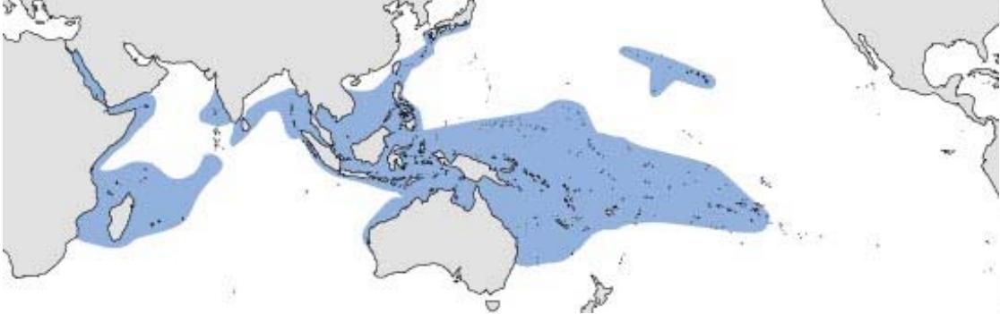

Figure 7.9.20. *Montipora dilatata/flabellata/turgescens* distribution (subsumed as distribution of *Montipora turgescens* as *Montipora dilatata* and *Montipora flabellata* are described as Hawaiian endemics) from Veron (2000).

#### **U.S. Distribution**

The rare components (*Montipora dilatata* and/or *Montipora flabellata*) of this complex have been recorded from the following federally protected areas (Godwin and Bolick, 2006; Maragos et al., 2004; Williams et al., 2008b):

- Papahānaumokuākea Marine National Monument (Necker, French Frigate Shoals, Gardner Pinnacles, Maro Reef, Laysan, Lisianski, Pearl and Hermes, Midway, Kure)
- Pacific Remote Islands Marine National Monument (Johnston, Palmyra, Kingman)
- Kalaupapa National Historic Park, Moloka'i
- Hawaiian Islands Humpback Whale National Marine Sanctuary

#### **Habitat**

**Habitat:** *Montipora dilatata/flabellata/turgescens* has been reported to occupy most reef environments (Veron, 2000).

**Depth range**: *Montipora dilatata/flabellata/turgescens* has been reported to depths of 30 m (Carpenter et al., 2008).

#### **Abundance**

The nominal *Montipora dilatata* is extremely rare while *Montipora flabellata* is the fifth most common coral in Hawai`i (statewide average 2.2% cover; http://cramp.wcc.hawaii.edu/LT\_Montoring\_files/Coral\_Species.htm). There have likely been declines in these nominal species over the recent past, particularly *Montipora dilatata*  (http://www.nmfs.noaa.gov/pr/pdfs/species/hawaiianreefcoral\_detailed.pdf). However, the nominal *Montipora turgescens* is described as widespread and common and no evidence of overall declines has been found.

#### **Life History**

*Montipora dilatata/flabellata/turgescens* are hermaphroditic broadcast spawners (Baird et al., 2009; Kolinski and Cox, 2003). Although specific observations have not been published for this species, the larvae of all other *Montipora* species studied contain zooxanthellae that can supplement maternal provisioning with energy sources provided by their photosynthesis.

#### **Threats**

*Montipora dilatata* has previously been identified as a Species of Concern under the Endangered Species Act (National Marine Fisheries Service, 2004). A "species of concern" identifies species about which NMFS has some concerns regarding status and threats, but for which insufficient information is available to indicate a need to list the species under the Endangered Species Act. *Montipora dilatata* was identified as a Species of Concern in 2004 based on the species being very rare, endemic to a small geographic area (Hawai`i), and subject to the following factors for decline: (1) vulnerability to coral bleaching; (2) fresh water kills and exposure at extreme low tide; (3) habitat degradation and modification as a result of sedimentation, pollution, and alien alga invasion; and (4) damage by anchors, fish pots, swimmers, and divers.

**Thermal stress**: The nominal *Montipora dilatata* and *Montipora flabellata* are highly susceptible to bleaching (Jokiel and Brown, 2004; Kenyon and Brainard, 2006) with substantial local declines of *Montipora dilatata* in Kāne`ohe Bay, Hawai`i, from bleaching mortality (Jokiel and Brown, 2004) (http://www.nmfs.noaa.gov/pr/pdfs/species/hawaiianreefcoral\_detailed.pdf). The congeneric species *Montipora capitata* copes with bleaching by relying more heavily on heterotrophic input, allowing it to rebuild lipid stores (Rodrigues et al., 2008) and maintain fecundity after bleaching (Cox, 2007).

**Acidification:** While not studied in this species, a congener, *Montipora capitata*, showed 15%–20% reduction in colony growth rate in mesocosm treatments of anticipated CO2 levels within this century, although gamete production was not affected (Jokiel et al., 2008). Similarly, in most corals studied (Table 3.2.2), acidification impairs growth (Langdon and Atkinson, 2005; Manzello, 2010) and, in the case of *Acropora palmate*, impairs fertilization and settlement success (Albright et al., 2010) and is likely to contribute to reef destruction in the future (Hoegh-Guldberg et al., 2007; Silverman et al., 2009). While ocean acidification has not been demonstrated to cause appreciable declines in coral populations so far, the BRT considers it to be a significant threat to corals by 2100.

**Disease:** *Montipora* spp. are generally described as medium susceptibility to disease. Nominal *Montipora turgescens* is specifically described with mortality from a rapid tissue-loss ("white") syndrome in the Northwestern Hawaiian Islands and this condition affected more than 21% of *Montipora* spp. colonies in a 2003 survey (Aeby, 2006). Also, ample evidence indicate that diseases can have devastating regional impacts on individual coral species (e.g., Aronson and Precht, 2001; Bruckner and Hill, 2009) and evidence show that these impacts are occurring in more taxa and at a broader geographic scale (Green and Bruckner, 2000; Sutherland et al., 2004).

**Predation:** *Montipora* spp. are preferred prey of crown-of-thorns seastar (*Acanthaster planci*) and susceptible to snail predation.

**Land-based sources of pollution (LBSP):** The effects of LBSP on *Montipora dilatata/flabellata/turgescens* are largely unknown. *Montipora* was characterized as a "sediment-intolerant" genus by McClanahan and Obura (1997), while other congeners have been found to be relatively sediment tolerant (Hodgson, 1990; Stafford-Smith, 1993). Clearly, some *Montipora* are more sediment susceptible than others (Jokiel et al., 2007). Elevated nutrients have shown no effect on fecundity or fertilization success in *Montipora* (Cox and Ward, 2002). Competition with algae reduced settlement and survival of *Montipora* larvae but was reversed with antibiotics, suggesting the recruitment inhibition was caused by indirect microbial interactions (Vermeij et al., 2009).

LBSP-related stresses (nutrients, sediment, toxins, and salinity) often act in concert rather than individually and are influenced by other biological (e.g., herbivory) and hydrological factors. Collectively, LBSP stresses are unlikely to produce extinction at a global scale; however, they may pose significant threats at local scales (particularly important for species with limited range) and reduce the resilience of corals to bleaching (Carilli et al., 2009a; Wooldridge, 2009b).

**Collection:** *Montipora* spp. are substantially involved in international trade, but there are no records at the species level. Substantial exports are reported (in the thousands of pieces per year) from Indonesia, Malaysia, Tonga, Solomon Islands, and Fiji. Of concern, both Malaysia and Indonesia report increasing exports over the 2000−2008 period (less than 5000 to over 35,000 for Indonesia).

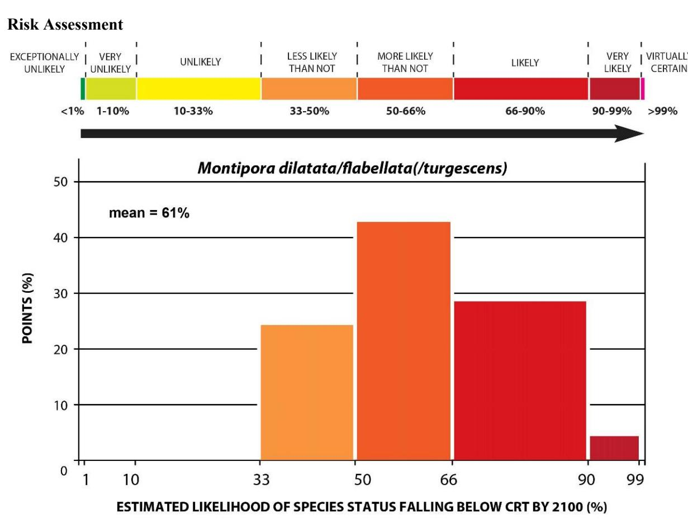

Figure 7.9.21. Distribution of points to estimate the likelihood that the status of *Montipora dilatata/flabellata/turgescens* falls below the Critical Risk Threshold (the species is of such low abundance, or so spatially fragmented, or at such reduced diversity that extinction is extremely likely) by 2100.

Factors that increase the potential extinction risk (higher likelihood of falling below the Critical Risk Threshold) for *Montipora dilatata/flabellata/turgescens* include its presumed generic vulnerability to a range of threats including disease, bleaching, predation and potentially increasing threats from collection/trade, as well as documented declines in Hawai`i of the *Montipora dilatata* component. Factors that reduce potential extinction risk (decrease the likelihood of falling below the Critical Risk Threshold) are the common occurrence and relatively wide geographic distribution of the *Montipora turgescens* component, making it more likely a species will be able to escape the impacts of threats and catastrophes in at least some locations.

The overall likelihood *Montipora dilatata/flabellata/turgescens* will fall below the Critical Risk Threshold by 2100 was estimated to be in the "more likely than not" risk category with a mean likelihood of 61% and a standard error (SE) of 7% (Fig. 7.9.21). This SE was calculated by taking the standard deviation of the seven mean voting scores of the BRT members and its relatively high value (among the 82 candidates) shows a somewhat lower coherence among the BRT. The uncertainty of the BRT is reflected in the range of votes of 33%–99% (Fig. 7.9.21) and the average range of likelihood estimates of the seven BRT voters (56%). The overall wide range of votes reflects the uncertainty among BRT members inherent in the lack of adequate ecological and demographic information for *Montipora dilatata/flabellata/turgescens*, but was partly attributed to taxonomic uncertainties in this group.

**7.9.6** *Montipora lobulata* **Bernard, 1897** 

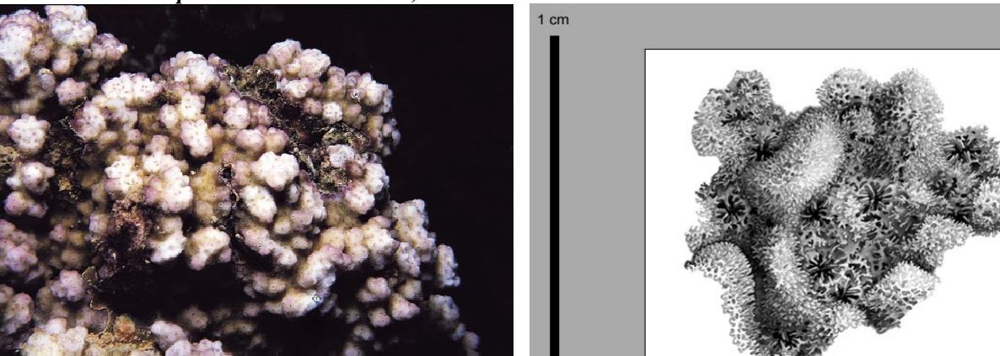

Figure 7.9.22. *Montipora lobulata* photos and corallite plan from Veron (2000).

#### **Characteristics**

Colonies of *Montipora lobulata* are mottled brown or white and submassive. Colony surfaces consist of irregular mounds covered by irregular tuberculae. There is complete continuity in size between the mounds and tuberculae. Corallites are distributed irregularly although they are less common in tuberculae. The coenosteum is irregularly coarse (Veron, 2000).

#### **Taxonomy**

**Taxonomic issues**: None.

**Family:** Acroporidae.

**Evolutionary and geologic history**: See Section 7.9: Genus *Montipora*.

#### **Global Distribution**

*Montipora lobulata* has a disjoint distribution, with occurrence in the western and central Indian Ocean and the central Pacific, but absence from Australia and the Coral Triangle region. It appears that Veron (2000) does not support its occurrence in the Northern Marianas.

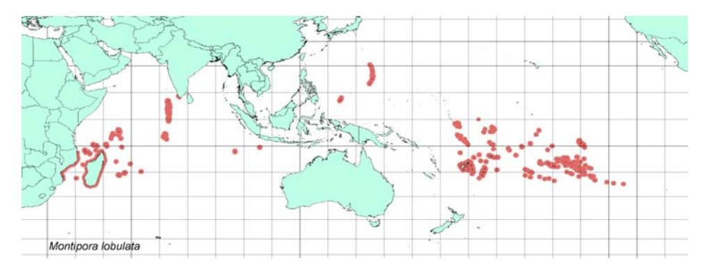

Figure 7.9.23. *Montipora lobulata* distribution from IUCN copied from http://www.iucnredlist.org.

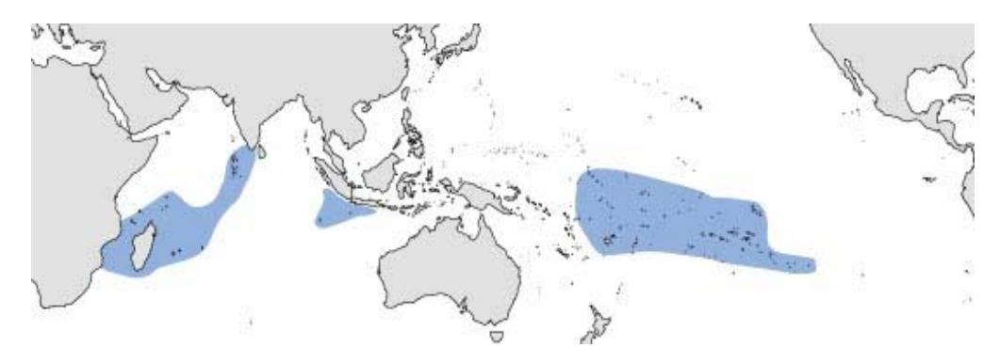

Figure 7.9.24. *Montipora lobulata* distribution from Veron (2000).

#### **U.S. Distribution**

According to both the IUCN Species Account and the CITES species database, *Montipora lobulata* occurs in American Samoa and the Northern Mariana Islands. The IUCN Species Account also lists its occurrence in the U.S. minor outlying islands.

A search of published and unpublished records of occurrence in U.S. waters indicates *Montipora lobulata* has been reported from Tutuila, Tau, and Rose Atoll in American Samoa (Coles et al., 2003; Kenyon et al., 2010a), Guam and CNMI (Burdick, unpubl. data; CRED, unpubl. data; Randall, 2003), and Wake Atoll (CRED, unpubl. data).

*Montipora lobulata* has been reported to occur in the following federally protected waters:

- Pacific Remote Islands Marine National Monument (Wake)
- Fagatele Bay National Marine Sanctuary, Tutuila
- Rose Atoll Marine National Monument

#### **Habitat**

**Habitat:** *Montipora lobulata* has been reported to inhabit shallow reef environments (Veron, 2000).

**Depth range**: *Montipora lobulata* has been reported at depths of up to 20 m.

#### **Abundance**

Abundance of *Montipora lobulata* has been reported as rare (Veron 2000).

#### **Life History**

The reproductive characteristics of *Montipora lobulata* have not been determined (Baird et al., 2009). However, the sexuality and reproductive mode have been determined for 35 other species of *Montipora*, all of which are hermaphroditic broadcast spawners. Although specific observations have not been published for this species, the larvae of all other *Montipora* species studied contain zooxanthellae that can supplement maternal provisioning with energy sources provided by their photosynthesis.

#### **Threats**

**Thermal stress**: *Montipora* spp. have relatively high bleaching response according to published rankings in both Australia and east Africa (Marshall and Baird, 2000; McClanahan et al., 2007). The congeneric species *Montipora capitata* copes with bleaching by relying more heavily on heterotrophic input, allowing it to rebuild lipid stores (Rodrigues et al., 2008) and maintain fecundity after bleaching (Cox, 2007).

**Acidification:** While not studied in this species, a congener, *Montipora capitata*, showed 15%−20% reduction in colony growth rate in mesocosm treatments of anticipated CO2 levels within this century, although gamete production was not affected (Jokiel et al., 2008). Similarly, in most corals studied (Table 3.2.2), acidification impairs growth (Langdon and Atkinson, 2005; Manzello, 2010) and, in the case of *Acropora palmata,* impairs fertilization and settlement success (Albright et al., 2010) and is likely to contribute to reef destruction in the future (Hoegh-Guldberg et al., 2007; Silverman et al., 2009). While ocean acidification has not been demonstrated to cause appreciable declines in coral populations so far, the BRT considers it to be a significant threat to corals by 2100.

**Disease:** *Montipora* spp. have moderate susceptibility/impact from disease. The genus has been susceptible to blackband disease in Australia (Bourne, 2005; Sato et al., 2009) and the Red Sea (Al-Moghrabi, 2001), growth anomalies in Hawai`i (Aeby, 2006) and white syndromes in Australia and Hawai`i (Aeby, 2006; Willis et al., 2004). Also, ample evidence indicate that diseases can have devastating regional impacts on individual coral species (e.g., Aronson and Precht, 2001; Bruckner and Hill, 2009), and evidence show that these impacts are occurring in more taxa and at a broader geographic scale (Green and Bruckner, 2000; Sutherland et al., 2004).

**Predation:** *Montipora* spp. are preferred prey of crown-of-thorns seastar (*Acanthaster planci*).

**Land-based sources of pollution (LBSP):** The effects of LBSP on *Montipora lobulata* are largely unknown. *Montipora* is characterized as a "sediment-intolerant" genus by McClanahan and Obura (1997), while other congeners have been found to be relatively sediment tolerant (Hodgson, 1990; Stafford-Smith, 1993). Clearly, some *Montipora* are more sediment susceptible than others (Jokiel et al., 2007). Elevated nutrients have shown no effect on fecundity or fertilization success in *Montipora* (Cox and Ward, 2002). Competition with algae reduced settlement and survival of *Montipora* larvae but was reversed with antibiotics, suggesting the recruitment inhibition was caused by indirect microbial interactions (Vermeij et al., 2009).

LBSP-related stresses (nutrients, sediment, toxins, and salinity) often act in concert rather than individually and are influenced by other biological (e.g., herbivory) and hydrological factors. Collectively, LBSP stresses are unlikely to produce extinction at a global scale; however, they may pose significant threats at local scales (particularly important for species with limited range) and reduce the resilience of corals to bleaching (Carilli et al., 2009a; Wooldridge, 2009b).

**Collection/Trade:** The genus *Montipora* is heavily involved in the international aquarium trade, with substantial exports reported (in the thousands of pieces per year) from Indonesia, Malaysia, Tonga, Solomon Islands, and Fiji. Of concern, both Malaysia and Indonesia report increasing exports over the 2000−2008 period (less than 5000 to more than 35,000 for Indonesia).

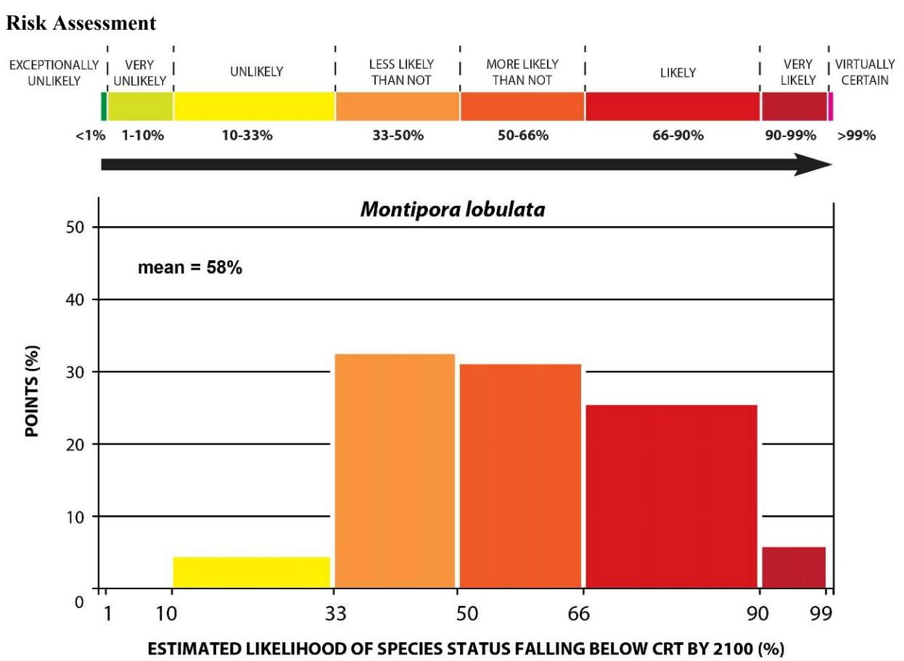

Figure 7.9.25. Distribution of points to estimate the likelihood that the status of *Montipora lobulata* falls below the Critical Risk Threshold (the species is of such low abundance, or so spatially fragmented, or at such reduced diversity that extinction is extremely likely) by 2100.

Factors that increase the potential extinction risk (higher likelihood of falling below the Critical Risk Threshold for *Montipora lobulata* include its rare occurrence combined with presumed generic vulnerability to a range of threats including disease, bleaching, and predation as well as potentially increasing threats from collection/trade. *Montipora lobulata* has a wide but seemingly more vulnerable disjunct longitudinal distribution (reducing connectivity and making "rescue" of extirpation less likely) and rather limited latitudinal distribution (suggesting less environmental tolerance). Wide distribution lowers extinction risk by making it more likely a species will be able to escape the impacts of threats and catastrophes in at least some locations.

The overall likelihood that *Montipora lobulata* will fall below the Critical Risk Threshold by 2100 was estimated to be in the "more likely than not" risk category with a mean likelihood of 58% and a standard error (SE) of 12% (Fig. 7.9.25). This SE was calculated by taking the standard deviation of the seven mean voting scores of the BRT members and its relatively high value (among the 82 candidates) indicates a somewhat lower coherence among the BRT. The uncertainty of the BRT is reflected in the wide range of votes of 10%–99% (Fig. 7.9.25) and the average range of likelihood estimates of the seven BRT voters (57%). The overall wide range of votes reflects the uncertainty among BRT members inherent in the lack of adequate ecological and demographic information for *Montipora lobulata*.

**7.9.7** *Montipora patula (/verrili)* **Bernard, 1897** 

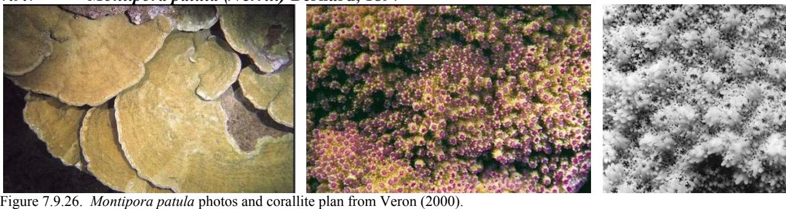

#### **Characteristics**

*Montipora patula* colonies are tan, most often with purple polyps and are encrusting or tiered plates, sometimes over two meters across. Plates usually have free edges. Corallites are small and irregular in height. Papillae are concentrated around the corallites (Veron, 2000).

(Nominal *Montipora verrilli* described similarly but as only encrusting)

#### **Taxonomy**

**Taxonomic issues**: See Section 7.9: Genus *Montipora*. Given results of recent genetic and micro-morphological analyses, the BRT has chosen to evaluate extinction risk of *Montipora patula/verrilli* as a single unit since they are indistinguishable genetically and micro-morphologically (Forsman et al., 2010).

**Family:** Acroporidae.

**Evolutionary and geologic history**: See Section 7.9: Genus *Montipora*."

#### **Global Distribution**

*Montipora patula/verrilli* has a very restricted range, centered in the main and Northwestern Hawaiian Islands. IUCN includes Palau, Marianas Islands, Phoenix Islands, French Polynesia, and Johnston Atoll for the nominal *Montipora verrilli,* but this is not supported by Veron (2000).

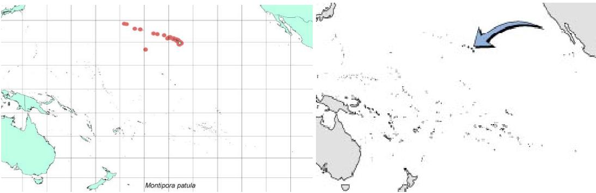

Figure 7.9.27. *Montipora patula* distribution from (*left*) IUCN copied from http://www.iucnredlist.org and (*right*) Veron (2000).

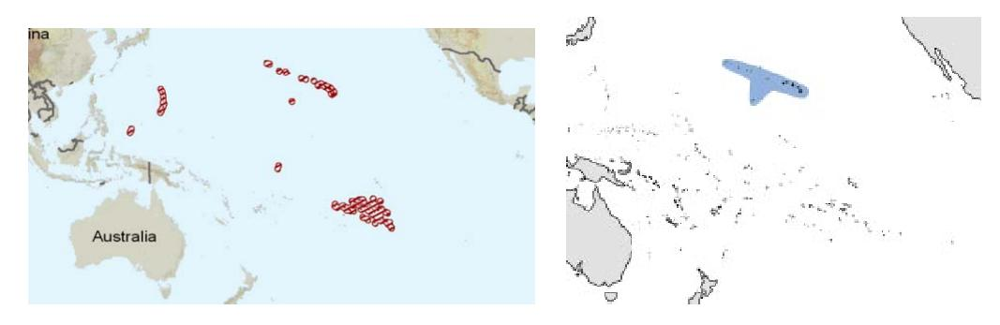

Figure 7.9.28. *Montipora verrilli* distribution from (*left*) IUCN copied from http://www.iucnredlist.org and (*right*) Veron (2000).

#### **U.S. Distribution**

As described above, and within federally protected waters, nominal *Montipora patula* has been recorded from the following areas:

- Papahānaumokuākea Marine National Monument (Nihoa, Necker, French Frigate Shoals, Gardner Pinnacles, Maro Reef, Laysan, Lisianski, Pearl and Hermes, Midway, Kure)
- Pacific Remote Islands Marine National Monument (Johnston, Palmyra, Kingman)
- Kaloko-Honokōhau National Historic Park, Hawai`i
- Puukoholā Heiau National Historic Site, Hawai`i
- Puuhonua o Hōnaunau National Historic Park, Hawai`i
- Kalaupapa National Historic Park, Moloka`i
- Hawaiian Islands Humpback Whale National Marine Sanctuary

#### **Habitat**

**Habitat:** *Montipora patula* has been reported to occupy shallow reef environments and reef flats (Veron, 2000). *Montipora patula* is common in wave-swept environments but less tolerant of sediment-impacted areas (Jokiel et al., 2007).

**Depth range**: IUCN describes both these nominal species as restricted to shallow reef flats, up to 10 m. However, Kuhlmann (1983) describes *Montipora verrilli* as occurring up to 40 m, including a photo at 25-m depth. This suggests the potential for deep refugia.

#### **Abundance**

Abundance of *Montipora patula* has been reported as sometimes common (Veron 2000). The nominal *Montipora patula* is the most abundant of the three Hawaiian endemic (nominal) *Montipora* with overall statewide mean cover of 3.3%, making it the 4th most abundant coral in Hawai`i (http://cramp.wcc.hawaii.edu/LT\_Montoring\_files/Coral\_Species.htm). The nominal *Montipora verrilli* is less abundant in Hawai`i. Dollar and Grigg (Dollar and Grigg, 2004) show substantial declines of *Montipora patula* on a subset of their transects over 12 years, but other transects within sites show high variability between surveys and/or similar cover between the beginning and end of the study.

#### **Life History**

*Montipora patula* and *Montipora verrilli* are both documented as hermaphroditic broadcast spawners (Heyward, 1986). Release of packaged egg and sperm bundles has been observed in the months of July through September at Coconut Island, O`ahu, Hawai`i, during two moon phases: new to first quarter, and full to third quarter (Heyward, 1986; Hodgson, 1988; Kolinski and Cox, 2003). Although specific larval descriptions have not been published for this species, the larvae of all other *Montipora* species studied contain zooxanthellae that can supplement maternal provisioning with energy sources provided by their photosynthesis.

#### **Threats**

**Thermal stress:** *Montipora* spp. have relatively high bleaching response according to published rankings in both Australia and east Africa (Marshall and Baird, 2000; McClanahan et al., 2007). *Montipora patula* is among the most bleaching-susceptible species in the Northwestern Hawaiian Islands (Kenyon and Brainard, 2006) and may be moderately susceptible in the main Hawaiian Islands (Jokiel and Brown, 2004). What ultimately became known as the stress-tolerant zooxanthellae clade D was first documented in shallow-water *Montipora patula* in Hawa`i (Rowan and Powers, 1991), though the species also hosts clade C in deeper waters (LaJeunesse et al., 2004b).

**Acidification:** While not studied in this species, a congener, *Montipora capitata*, showed 15%–20% reduction in colony growth rate in mesocosm treatments of anticipated CO2 levels within this century, although gamete production was not affected (Jokiel et al., 2008). Similarly, in most corals studied (Table 3.2.2), acidification impairs growth (Langdon and Atkinson, 2005; Manzello, 2010) and, in the case of *Acropora palmate*, impairs fertilization and settlement success (Albright et al., 2010) and is likely to contribute to reef destruction in the future (Hoegh-Guldberg et al., 2007; Silverman et al., 2009). While ocean acidification has not been demonstrated to have caused appreciable declines in coral populations so far, the BRT considers it to be a significant threat to corals by 2100.

**Disease:** *Montipora* spp. have moderate susceptibility/impact from disease. Both nominal *Montipora patula* and *Montipora verrilli* are specifically noted with acute disease conditions (involving tissue loss/partial mortality) with high frequency of occurrence (over 20% of surveyed sites where the taxa was observed showed disease signs) and high prevalence (over 7% in some sites) in the Northwestern Hawaiian Islands (Aeby, 2006). This author points out that the high prevalence sites had suffered severe bleaching in the previous year. Also, ample evidence indicate that diseases can have devastating regional impacts on individual coral species (e.g., Aronson and Precht, 2001; Bruckner and Hill, 2009), and evidence show that these impacts are occurring in more taxa and at a broader geographic scale (Green and Bruckner, 2000; Sutherland et al., 2004).

**Predation:** *Montipora* spp. are preferred prey of crown-of-thorns seastar (*Acanthaster planci)*.

**Land-based sources of pollution (LBSP):** The effects of LBSP on *Montipora patula* are largely unknown for this species. *Montipora patula* may be less sediment tolerant than other *Montipora* species (Jokiel et al., 2007), and it did disappear from survey stations in Pelekane Bay, Hawai`i between 1977 and 1996 as the bay became more sediment impacted (Tissot, 1998). Elevated nutrients have also had no effect on fecundity or fertilization success in *Montipora* (Cox and Ward, 2002). Competition with algae reduced settlement and survival of *Montipora* larvae but was reversed with antibiotics, suggesting the recruitment inhibition was caused by indirect microbial interactions (Vermeij et al., 2009).

LBSP are largely unknown for this genus. LBSP-related stresses (nutrients, sediment, toxins, and salinity) often act in concert rather than individually and are influenced by other biological (e.g., herbivory) and hydrological factors. Collectively, LBSP stresses are unlikely to produce extinction at a global scale; however, they may pose significant threats at local scales (particularly important for species with limited range) and reduce the resilience of corals to bleaching (Carilli et al., 2009a; Wooldridge, 2009b).

**Collection/Trade:** The genus *Montipora* is heavily involved in the international ornamental trade. However, collection for the ornamental trade is likely of a low overall impact in the geographic areas where this species is located, as compared to many of its congeners.

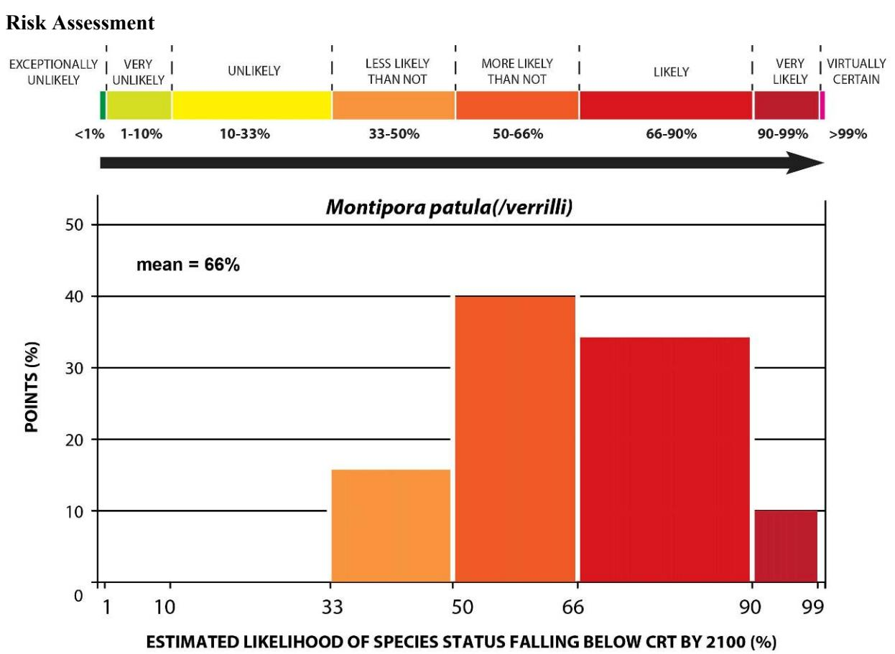

Figure 7.9.29. Distribution of points to estimate the likelihood that the status of *Montipora patula/verrilli* falls below the Critical Risk Threshold (the species is of such low abundance, or so spatially fragmented, or at such reduced diversity that extinction is extremely likely) by 2100.

Factors that increase the potential extinction risk (higher likelihood of falling below the Critical Risk Threshold) for *Montipora patula/verrilli* include its combined very narrow geographic distribution, restriction to shallow habitats,and its generic high susceptibility to a range of threats (bleaching, predation) and documented species-specific impacts from disease. Narrow geographic distribution (and narrow habitat range) increases the likelihood that changing conditions or a local impact in a particular location can push the species below the Critical Risk Threshold. No known characteristics of this species noted that reduced expectations of extinction risk were noted.

The overall likelihood that *Montipora patula/verrilli* will fall below the Critical Risk Threshold by 2100 was estimated to be in the "more likely than not/likely" risk categories with a mean likelihood of 66% and a standard error (SE) of 10% (Fig. 7.9.29). This SE was calculated by taking the standard deviation of the seven mean voting scores of the BRT members and its moderate value (among the 82 candidates) indicates the degree of coherence among the BRT. The uncertainty of the BRT is reflected in the range of votes of 33%–99% (Fig. 7.9.29) and the average range of likelihood estimates of the seven BRT voters (50%). The overall wide range of votes reflects the uncertainty among BRT members inherent in the lack of adequate ecological and demographic information for *Montipora patula/verrilli*.

#### **7.10 Genus** *Alveopora* **(Family Poritidae)**

**7.10.1** *Alveopora allingi* **Hoffmeister, 1925** 

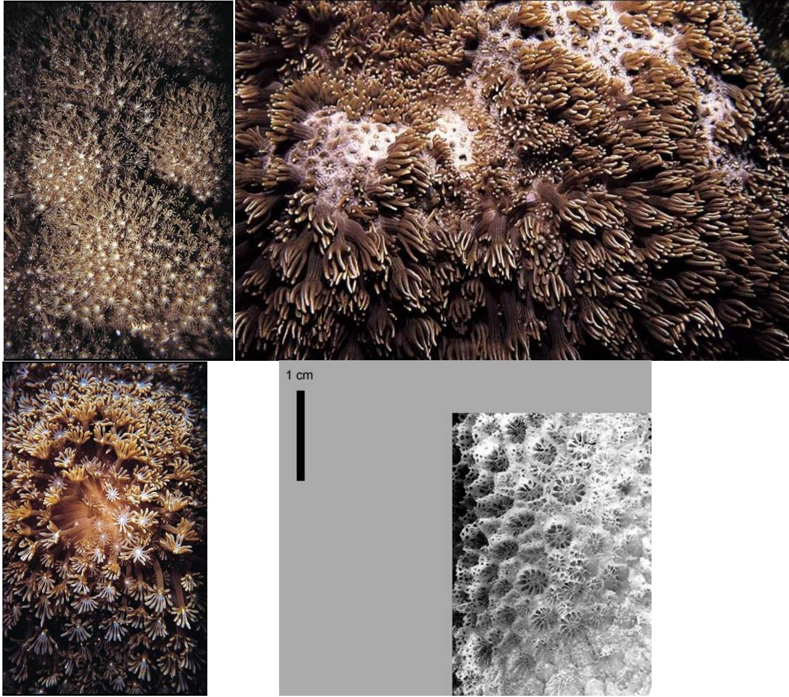

Figure 7.10.1. *Alveopora allingi* photos and corallite plan from Veron (2000).

#### **Characteristics**

Colonies of *Alveopora allingi* are encrusting or have short irregular lobes with rounded surfaces or are columnar. Corallites have walls composed of interconnected rods and spines and long spine-like septa. Columellae are usually present and are sometimes well developed. Polyps are tightly compacted and are long, usually with slightly expanded tentacle tips. Colonies are usually yellow, green or brown in color with white oral cones (Veron, 2000).

#### **Taxonomy**

**Taxonomic issues**: None. *Alveopora allingi* is similar to *Alveopora catalai*, which has larger corallites and a branching growth-form. *Alveopora marionensis* has smaller corallites but a similar growth-form (Veron, 2000).

**Family:** Poritidae.

**Evolutionary and geologic history:** The genus is known from the Tethys Sea in the Eocene, but is extinct in the Caribbean (Wells and Moore, 1956).

#### **Global Distribution**

*Alveopora allingi* has a very broad range, extending from the Red Sea and East Africa to the central Pacific. It extends latitudinally from the Japanese Ryukyu Islands and Red Sea in the northern hemisphere across the Great Barrier Reef and down both coastlines of Australia and South Africa in the southern hemisphere (Veron, 2000).

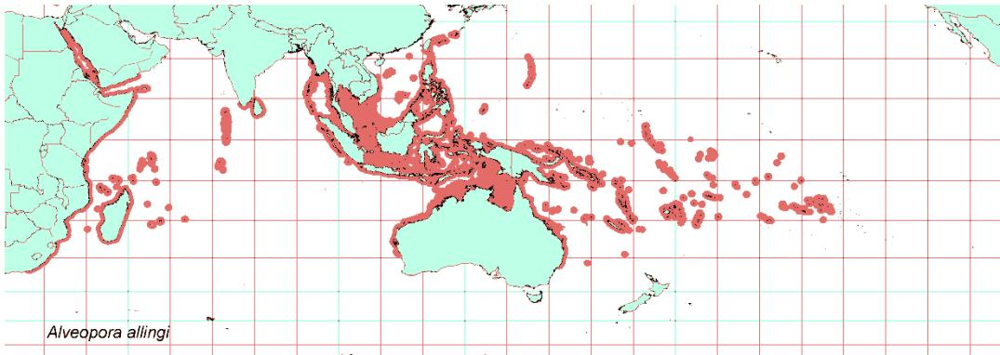

Figure 7.10.2. *Alveopora allingi* distribution from IUCN copied from http://www.iucnredlist.org.

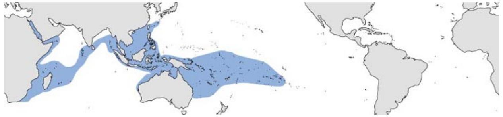

Figure 7.10.3. *Alveopora allingi* distribution from Veron (2000).

#### **U.S. Distribution**

According to both the IUCN Species Account and the CITES database, *Alveopora allingi* occurs in American Samoa. The IUCN Species Account lists its occurrence in the Northern Mariana Islands and U.S. minor outlying islands, but the CITES database does not.

A search of published and unpublished records of occurrence in U.S. waters indicates *Alveopora allingi* has been reported from Tutuila in American Samoa (Coles et al., 2003; Hoffmeister, 1925; Lovell and McLardy, 2008; Maragos et al., 1994; Mundy, 1996; National Park Service, 2009) and the Mariana Islands (Randall, 2003).

Within federally protected waters, *Alveopora allingi* has been recorded from the following areas:

National Park of American Samoa, Tutuila Island unit.

#### **Habitat**

**Habitat:** *Alveopora allingi* has been reported to occupy protected reef environments (Veron, 2000).

**Depth range**: *Alveopora allingi* has been reported in water depths ranging from 5 m to 10 m (Carpenter et al., 2008; Veron and Pichon, 1980).

#### **Abundance**

Abundance of *Alveopora allingi* has been reported as usually uncommon (Veron, 2000).

#### **Life History**

Reproductive characteristics of *Alveopora allingi* have not been determined (Baird et al., 2009). The congeners *Alveopora gigas, Alveopora verrilliana, and Alveopora tizardi* are hermaphroditic broadcast spawners (Babcock et al., 1994; Baird et al., 2009). The congeners *Alveopora daedalea* and *Alveopora japonica* have been reported as hermaphroditic brooders in the Red Sea (Shlesinger and Loya, 1985) and Japan (Harii et al., 2001), respectively. The minimum age of first reproduction for the congener *Alveopora japonica* in Tokyo Bay, where the annual sea temperature ranges from 13°C to 27°C, is 3 years (Harii et al., 2001).

On temperate-latitude reefs (28o –29o S) in the Houtman Abrolhous Islands, western Australia, two colonies of *Alveopora allingi* were sampled before the main mass spawning nights in late March 1987, but there was no indication of developed gametes (Babcock et al., 1994).

Although specific observations have not been published for this species, the larvae of two other *Alveopora* species studied contain zooxanthellae that can supplement maternal provisioning with energy sources provided by their photosynthesis (Baird et al., 2009), i.e., they are autotrophic. Larval longevity has not been determined in this family.

#### **Threats**

**Temperature stress**: The genus *Alveopora* is listed as having the highest bleaching response from the 17 included genera in McClanahan et al. (2007) table for the Indian Ocean. *Alveopora* had high bleaching in Guam in 1994 (Paulay and Benayahu, 1999) and South Africa in 2000 but had little bleaching or mortality in Palau in the 2001 event (Bruno et al., 2001). Low-to-moderate bleaching of *Alveopora allingi* was observed in East Africa during the 1997-1998 event (Obura, 2001).

**Acidification:** Unknown for this genus. However, in most corals studied (Table 3.2.2), acidification impairs growth (Langdon and Atkinson, 2005; Manzello, 2010) and, in the case of *Acropora palmata,* impairs fertilization and settlement success (Albright et al., 2010) and is likely to contribute to reef destruction in the future (Hoegh-Guldberg et al., 2007; Silverman et al., 2009). While ocean acidification has not been demonstrated to have caused appreciable declines in coral populations so far, the BRT considers it to be a significant threat to corals by 2100.

**Disease:** Susceptibility and impacts of disease on this species are not known. However, ample evidence indicate that diseases can have devastating regional impacts on individual coral species (e.g., (Aronson and Precht, 2001; Bruckner and Hill, 2009), and evidence show that these impacts are occurring in more taxa and at a broader geographic scale (Green and Bruckner, 2000; Sutherland et al., 2004). A few disease reports for the genus *Alveopora* can be found in the Global Disease Database (UNEP, 2010; B. Vargas-Ángel, CRED, Honolulu, HI, pers. comm., September 2010).

**Predation:** Unknown.

**Land-based sources of pollution (LBSP):** The effects of LBSP on *Alveopora allingi* are largely unknown, for both the species and the genus. LBSP-related stresses (nutrients, sediment, toxins, and salinity) often act in concert rather than individually and are influenced by other biological (e.g., herbivory) and hydrological factors. Collectively, LBSP stresses are unlikely to produce extinction at a global scale; however, they may pose significant threats at local scales (particularly important for species with limited range) and reduce the resilience of corals to bleaching (Carilli et al., 2009a; Wooldridge, 2009b).

**Collection/Trade:** No export data for this species in CITES Trade Database, UNEP World Conservation Monitoring Centre, Cambridge, UK (CITES, 2010). Collection and trade are not considered to be a significant threat to this species.

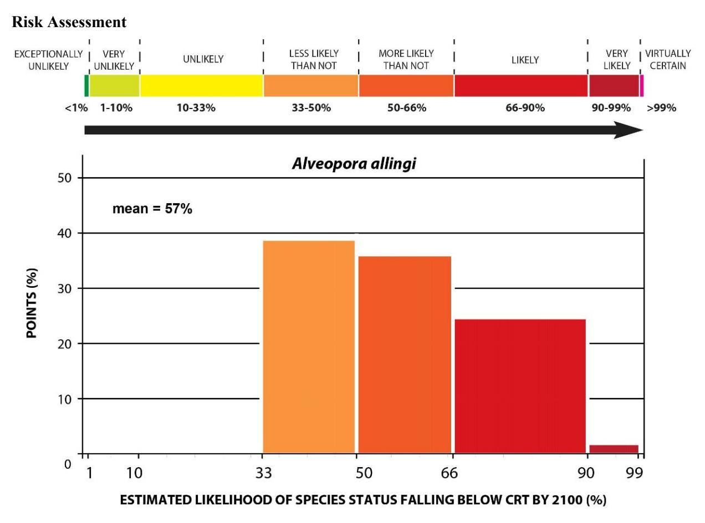

Figure 7.10.4. Distribution of points to estimate the likelihood that the status of *Alveopora allingi* falls below the Critical Risk Threshold (the species is of such low abundance, or so spatially fragmented, or at such reduced diversity that extinction is extremely likely) by 2100.

Factors that increase the potential extinction risk (higher likelihood of falling below the Critical Risk Threshold) for *Alveopora allingi* include bleaching. The high bleaching rate is the primary known threat of extinction for *Alveopora allingi*. Factors that reduce potential extinction risk (decrease the likelihood of falling below the Critical Risk Threshold) are that *Alveopora allingi* occupies a variety of habitat types and is broadly distributed both latitudinally and longitudinally in the Indo-Pacific. Wide geographic and habitat distribution lowers extinction risk by making it more likely a species will be able to escape the impacts of threats and catastrophes in at least some locations.

The overall likelihood that *Alveopora allingi* will fall below the Critical Risk Threshold by 2100 was estimated to be in the "more likely than not" risk category with a mean likelihood of 57% and a standard error (SE) of 9% (Fig. 7.10.4). This SE was calculated by taking the standard deviation of the seven mean voting scores of the BRT members and shows the coherence among the BRT. The uncertainty of the BRT is reflected in the range of votes of 33%–99% (Fig. 7.10.4) and the average range of likelihood estimates of the seven BRT voters (52%). The overall wide range of votes reflects the uncertainty among BRT members inherent in the lack of adequate ecological and demographic information for *Alveopora allingi*.

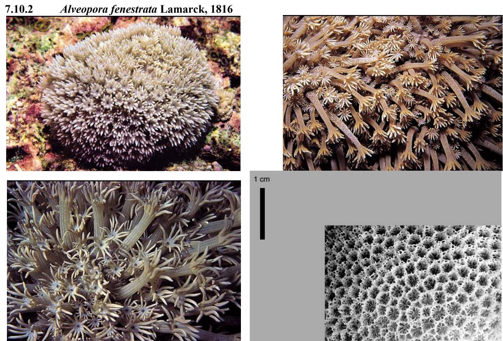

Figure 7.10.5. *Alveopora fenestrata* photos and corallite plan from Veron (2000).

#### **Characteristics**

Colonies of *Alveopora fenestrate* are generally hemispherical with the surface divided into lobes. Corallites have walls composed of compacted rods and spines. Septa are composed of tapered spines which are connected low in the corallite. Polyps are long, with long tentacles giving a ragged appearance. Colonies are grey or greenish-brown in color, sometimes with white oral cones (Veron, 2000). Maximum colony size is 30 cm.

#### **Taxonomy**

**Taxonomic issues**: None. *Alveopora fenestrata* is similar to *Alveopora marionensis* and *Alveopora verrilliana* (Veron, 2000).

**Family:** Poritidae.

**Evolutionary and geologic history:** The genus is known from the Tethys Sea in the Eocene but is extinct in the Caribbean (Wells and Moore, 1956).

#### **Global Distribution**

*Alveopora fenestrata* has a relatively broad range. Longitudally it stretches from the Red Sea to the oceanic west Pacific and latitudinally from the Red Sea and the Northern Mariana Islands on the northern hemisphere to southern Africa and across both coasts of Australia in the Southern hemisphere (Veron, 2000).

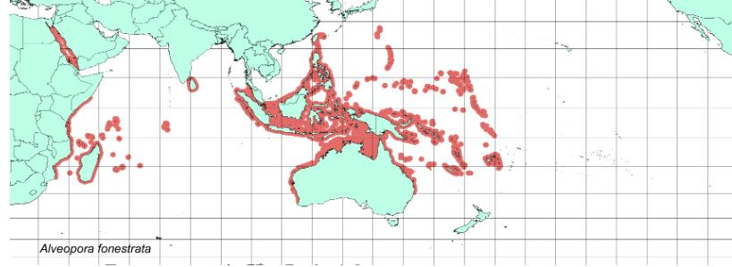

Figure 7.10.6. *Alveopora fenestrata* distribution from IUCN copied from http://www.iucnredlist.org.

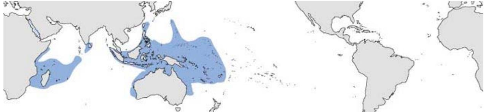

Figure 7.10.7. *Alveopora fenestrata* distribution from Veron (2000).

#### **U.S. Distribution**

According to the IUCN Species Account, *Alveopora fenestrata* occurs in the Northern Mariana Islands. The CITES database does not list its occurrence in U.S. waters.

A search of published and unpublished records of occurrence in U.S. waters indicates *Alveopora fenestrata* has been reported from Guam (Randall, 2003).

*Alveopora fenestrata* has not been recorded from federally protected waters.

#### **Habitat**

**Habitat:** *Alveopora fenestrata* has been reported to occupy shallow reef environments (Veron, 2000).

**Depth range**: *Alveopora fenestrata* has been reported in water depths ranging from 3 m to 30 m (Carpenter et al., 2008).

#### **Abundance**

Abundance of *Alveopora fenestrata* has been reported as uncommon (Veron, 2000).

#### **Life History**

Reproductive characteristics of *Alveopora fenestrata* have not been determined (Baird et al., 2009). The congeners *Alveopora gigas, Alveopora verrilliana, and Alveopora tizardi* are hermaphroditic broadcast spawners (Babcock et al., 1994; Baird et al., 2009). The congeners *Alveopora daedalea* and *Alveopora japonica* have been reported as hermaphroditic brooders in the Red Sea (Shlesinger and Loya, 1985) and Japan (Harii et al., 2001), respectively. The minimum age of first reproduction for the congener *Alveopora japonica* in Tokyo Bay, where the annual sea temperature ranges from 13 to 27°C, is 3 years (Harii et al., 2001).

Although specific observations have not been published for this species, the larvae of two other *Alveopora* species studied contain zooxanthellae that can supplement maternal provisioning with energy sources provided by their photosynthesis (Baird et al., 2009), i.e., they are autotrophic. Larval longevity has not been determined in this family.

#### **Threats**

**Temperature stress**: The genus *Alveopora* is listed as having the highest bleaching response from the 17 included genera in McClanahan et al. (2007) table for the Indian Ocean. *Alveopora* had high bleaching in Guam in 1994 (Paulay and Benayahu, 1999) and South Africa in 2000 but had little bleaching or mortality in Palau in the 2001 event (Bruno et al., 2001).

**Acidification:** Unknown for this genus. However, in most corals studied (Table 3.2.2), acidification impairs growth (Langdon and Atkinson, 2005; Manzello, 2010) and, in the case of *Acropora palmate*, impairs fertilization and settlement success (Albright et al., 2010) and is likely to contribute to reef destruction in the future (Hoegh-Guldberg et al., 2007; Silverman et al., 2009). While ocean acidification has not been demonstrated to have caused appreciable declines in coral populations so far, the BRT considers it to be a significant threat to corals by 2100.

**Disease:** Susceptibility and impacts of disease on this species are not known. However, ample evidence indicate that diseases can have devastating regional impacts on individual coral species (e.g., Aronson and Precht, 2001; Bruckner and Hill, 2009) and there is evidence that these impacts are occurring in more taxa and at a broader geographic scale (Green and Bruckner, 2000; Sutherland et al., 2004). A few disease reports for the genus *Alveopora* can be found in the global disease database (UNEP, 2010).

**Predation:** Effects from predation on *Alveopora fenestrata are u*nknown.

**Land-based sources of pollution (LBSP):** The effects of LBSP are largely unknown for the genus *Alveopora*. LBSPrelated stresses (nutrients, sediment, toxins, and salinity) often act in concert rather than individually and are influenced by other biological (e.g., herbivory) and hydrological factors. Collectively, LBSP stresses are unlikely to produce extinction at a global scale; however, they may pose significant threats at local scales (particularly important for species with limited range) and reduce the resilience of corals to bleaching (Carilli et al., 2009a; Wooldridge, 2009b).

**Collection/Trade:** No export data on CITES Trade Database, UNEP World Conservation Monitoring Centre, Cambridge, UK (CITES, 2010). Collection/trade is not considered a significant threat to this species.

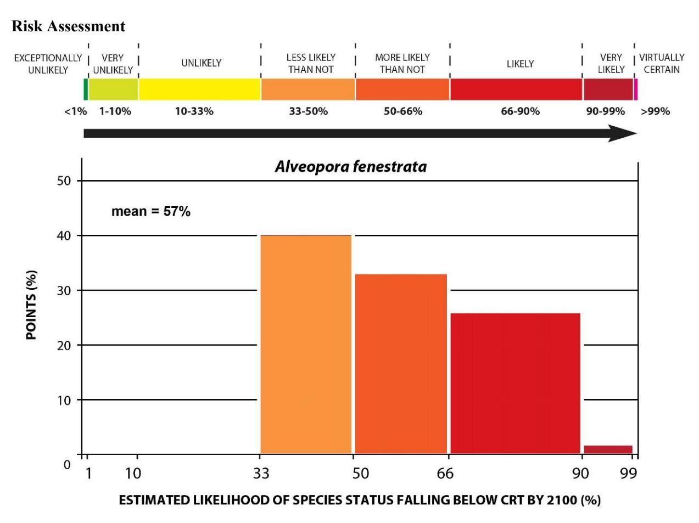

Figure 7.10.8. Distribution of points to estimate the likelihood that the status of *Alveopora fenestrata* falls below the Critical Risk Threshold (Critical Risk Threshold; the species is of such low abundance, or so spatially fragmented, or at such reduced diversity that extinction is extremely likely) by 2100.

Factors that increase the potential extinction risk (higher likelihood of falling below the Critical Risk Threshold) for *Alveopora fenestrata* include bleaching. The high bleaching rate is the primary known threat of extinction for *Alveopora fenestrata*. Factors that reduce potential extinction risk (decrease the likelihood of falling below the Critical Risk Threshold) are that *Alveopora fenestrata* occupies a range of depths and is broadly distributed both latitudinally and longitudinally in the Indo-Pacific. Wide geographic and habitat distribution lowers extinction risk by making it more likely a species will be able to escape the impacts of threats and catastrophes in at least some locations.

The overall likelihood that *Alveopora fenestrata* will fall below the Critical Risk Threshold by 2100 was estimated to be in the "more likely than not" risk category with a mean likelihood of 57% and a standard error (SE) of 9% (Fig. 7.10.8). This SE was calculated by taking the standard deviation of the seven mean voting scores of the BRT members and shows the coherence among the BRT. The uncertainty of the BRT is reflected in the range of votes of 33%–99% (Fig. 7.10.8) and the average range of likelihood estimates of the seven BRT voters (52%). The overall wide range of votes reflects the uncertainty among BRT members inherent in the lack of adequate ecological and demographic information for *Alveopora fenestrata*.

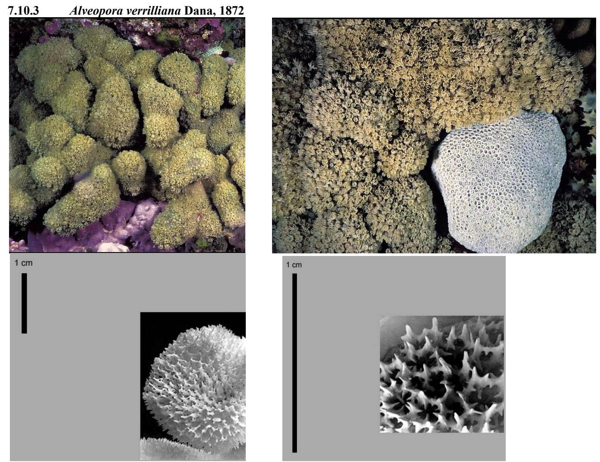

Figure 7.10.9. *Alveopora verrilliana* photos and corallite plan from Veron (2000).

#### **Characteristics**

Colonies of *Alveopora verrilliana* are composed of short irregularly dividing knob-like branches. Corallites have short blunt septal spines and a palisade of vertical spines above the wall. Polyps are long when extended. Colonies are dark greenish-brown, grey or chocolate in color, sometimes with white oral cones and/or tentacle tips (Veron, 2000). Maximum colony size is 100 cm.

#### **Taxonomy**

**Taxonomic issues**: None. *Alveopora verrilliana* is similar to *Alveopora fenestrata,* which is distinguished by growthform, lack of spines around the corallites and larger corallites.

**Family:** Poritidae.

**Evolutionary and geologic history**: The genus is known from the Tethys Sea in the Eocene but is extinct in the Caribbean (Wells and Moore, 1956).

#### **Global Distribution**

*Alveopora verrilliana* has a broad range. It stretches from the Red Sea to the central Pacific Ocean longitudinally and latitudinally from the Japanese Ryukyu Islands in the northern hemisphere and midway along both Australian coasts in the southern hemisphere (Veron, 2000). Veron (2000) also reports it in Hawai`i but the IUCN does not.

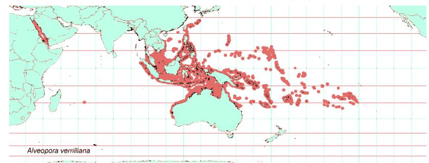

Figure 7.10.10. *Alveopora verrilliana* distribution from IUCN copied from http://www.iucnredlist.org.

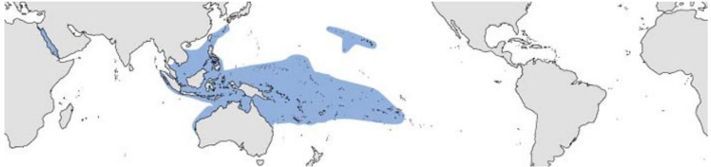

Figure 7.10.11. *Alveopora verrilliana* distribution from Veron (2000).

#### **U.S. Distribution**

According to both the IUCN Species Account and the CITES species database, *Alveopora verrilliana* occurs in American Samoa, the Northern Mariana Islands, and minor outlying islands.

A search of published and unpublished records of occurrence in U.S. waters indicates *Alveopora verrilliana* has been reported from Tutuila, Tau, and Rose Atoll in American Samoa (Hoffmeister, 1925; Kenyon et al., 2010a; Lamberts, 1983), the Mariana Islands (Randall, 2003). Palmyra Atoll (Williams et al., 2008b) and Kingman Reef (CRED, unpubl. data).

Within federally protected waters, *Alveopora verrilliana* has been recorded from the following areas:

- Pacific Remote Islands Marine National Monument (Palmyra, Kingman)
- Rose Atoll Marine National Monument

#### **Habitat**

**Habitat:** *Alveopora verrilliana* has been reported to occupy shallow reef environments (Veron, 2000).

**Depth range**: *Alveopora verrilliana* has been reported in water depths ranging from 3 m to 40 m (Carpenter et al., 2008). Kuhlman (1983) reported that *Alveopora verrilliana* occurs on outer steep slopes from 20 m to 80 m deep in the Red Sea, suggesting the potential for deep refugia.

#### **Abundance**

Abundance of *Alveopora verrilliana* has been reported to be uncommon (Veron, 2000).

#### **Life History**

Alveopora verrilliana is a hermaphroditic broadcast spawner (Babcock et al., 1994; Baird et al., 2009). On temperate-latitude reefs (28°–29° S) in the Houtman Abrolhous Islands, western Australia, 7 of 12 colonies sampled had ripe gametes, and spawning was inferred during the time of mass spawning for this region (Babcock et al., 1994). The minimum age of first reproduction for the congener Alveopora japonica in Tokyo Bay, where the annual sea temperature ranges from 13°C to 27°C, is 3 years (Harii et al., 2001).

Although specific observations have not been published for this species, the larvae of two other *Alveopora* species studied contain zooxanthellae that can supplement maternal provisioning with energy sources provided by their photosynthesis (Baird et al. 2009), i.e., they are autotrophic. Larval longevity has not been determined in this family.

#### **Threats**

**Temperature stress**: The genus *Alveopora* is listed as having the highest bleaching response from the 17 included genera in McClanahan et al. (2007) table for the Indian Ocean. *Alveopora* had high bleaching in Guam in 1994 (Paulay and Benayahu, 1999) and South Africa in 2000 but had little bleaching or mortality in Palau in the 2001 event (Bruno et al., 2001).

**Acidification:** Unknown for this genus. However, in most corals studied (Table 3.2.2), acidification impairs growth (Langdon and Atkinson, 2005; Manzello, 2010) and, in the case of *Acropora palmata*, impairs fertilization and settlement success (Albright et al., 2010) and is likely to contribute to reef destruction in the future (Hoegh-Guldberg et al., 2007; Silverman et al., 2009). While ocean acidification has not been demonstrated to have caused appreciable declines in coral populations so far, the BRT considers it to be a significant threat to corals by 2100.

**Disease:** Susceptibility and impacts of disease on this species are not known. However, ample evidence indicate that diseases can have devastating regional impacts on individual coral species (e.g., Aronson and Precht, 2001; Bruckner and Hill, 2009) and evidence show that these impacts are occurring in more taxa and at a broader geographic scale (Green and Bruckner, 2000; Sutherland et al., 2004). In the global disease database, there are a low number of disease reports for the genus *Alveopora* (UNEP, 2010).

Predation: Unknown.

**Land-based sources of pollution (LBSP):** The effects of LBSP are largely unknown for the genus *Alveopora*. LBSP-related stresses (nutrients, sediment, toxins, and salinity) often act in concert rather than individually and are influenced by other biological (e.g., herbivory) and hydrological factors. Collectively, LBSP stresses are unlikely to produce extinction at a global scale; however, they may pose significant threats at local scales (particularly important for species with limited range) and reduce the resilience of corals to bleaching (Carilli et al., 2009a; Wooldridge, 2009b).

**Collection/Trade:** No export data of this species reported in CITES Trade Database, UNEP World Conservation Monitoring Centre, Cambridge, UK (CITES, 2010). Collection/Trade is not considered a significant threat for this species.

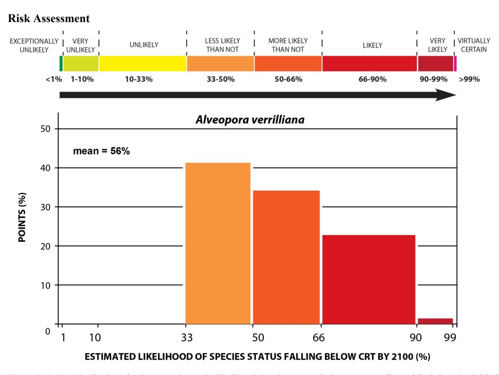

Figure 7.10.12. Distribution of points to estimate the likelihood that the status of *Alveopora verrilliana* falls below the Critical Risk Threshold (the species is of such low abundance, or so spatially fragmented, or at such reduced diversity that extinction is extremely likely) by 2100.

Factors that increase the potential extinction risk (higher likelihood of falling below the Critical Risk Threshold) for *Alveopora verrilliana* include bleaching. The high bleaching rate is the primary known threat of extinction for *Alveopora verrilliana*. Factors that reduce potential extinction risk (decrease the likelihood of falling below the Critical Risk Threshold) are that *Alveopora verrilliana* occupies a variety of habitat types and is broadly distributed both latitudinally and longitudinally in the Indo-Pacific. Wide distribution lowers extinction risk by making it more likely a species will be able to escape the impacts of threats and catastrophes in at least some locations.

The overall likelihood that *Alveopora verrilliana* will fall below the Critical Risk Threshold by 2100 was estimated to be in the "more likely than not" risk category with a mean likelihood of 56% and a standard error (SE) of 9% (Fig. 7.10.12). This SE was calculated by taking the standard deviation of the seven mean voting scores of the BRT members and shows the coherence among the BRT. The uncertainty of the BRT is reflected in the range of votes of 33%–90% (Fig. 7.10.12) and the average range of likelihood estimates of the seven BRT voters (49%). The overall wide range of votes reflects the uncertainty among BRT members inherent in the lack of adequate ecological and demographic information for *Alveopora verrilliana*.

#### **7.11 Genus** *Porites*

#### **7.11.1** *Porites horizontalata* **Hoffmeister, 1925**

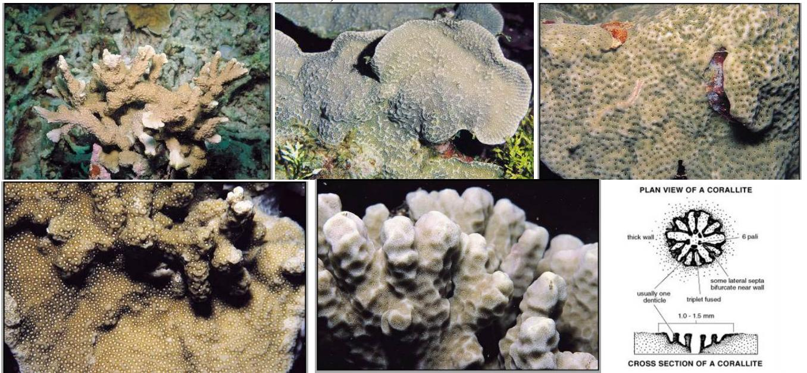

Figure 7.11.1. *Porites horizontalata* photos and corallite plan (Veron, 2000).

#### **Characteristics**

Colonies of *Porites horizontalata* are composites of encrusting laminae and contorted anastomosing branches. Corallites are separated into groups by ridges. Colonies are pale brown in color with cream extremities of branches and plates; sometimes they are brightly colored in shallow water (Veron, 2000).

#### **Taxonomy**

**Taxonomic issues**: *Porites* is known to be morphologically plastic and multiple sympatric species frequently exhibit intergradation of skeletal characteristics. Only limited molecular genetic analysis has been performed on the *Porites* thus far. In the most comprehensive, Forsman et al. (2009) identified inseparable clades that contain multiple morphological species, in some cases with morphological species that span more than one clade. However, such genetic work has not been conducted on *Porites horizontalata*. Laminar parts of colonies resemble those of *Porites vaughani*. Branching parts of colonies may have corallites arranged in a *Porites rus*-like pattern. Calice characters are closest to *Porites eridani* branches (Veron, 2000).

**Family:** Poritidae.

**Evolutionary and geologic history**: The genus originated in the Eocene and became overwhelmingly dominant in the Miocene Tethys (Veron, 1995). It continues to be the most cosmopolitan of all coral genera (Veron, 2000).

#### **Global Distribution**

The range of *Porites horizontalata* is somewhat restricted longitudinally from the Maldives in the west to the central Pacific in the east and latitudinally from south of Japan in the northern hemisphere to New Caledonia in the southern hemisphere.

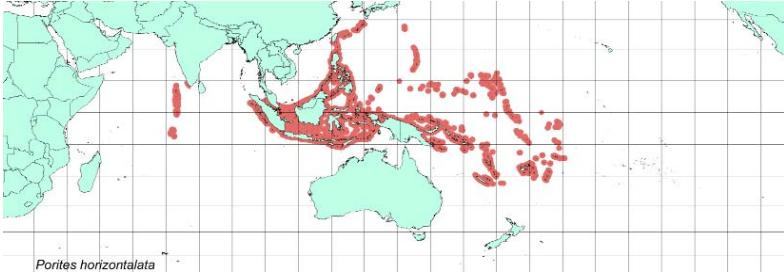

Figure 7.11.2. *Porites horizontalata* distribution from IUCN copied from http://www.iucnredlist.org.

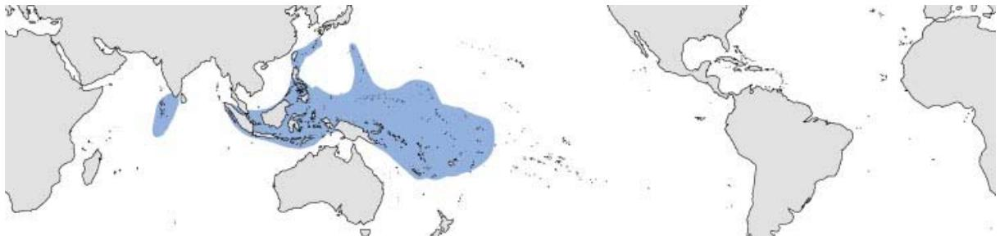

Figure 7.11.3. *Porites horizontalata* distribution from Veron (2000).

#### **U.S. Distribution**

According to both the IUCN Species Account and the CITES species database, *Porites horizontalata* has been recorded in American Samoa and the Northern Mariana Islands. The IUCN Species Account also lists this species in the U.S. minor outlying islands.

A search of published and unpublished records of occurrence in U.S. waters indicates *Porites horizontalata* has been reported from Tutuila in American Samoa (Birkeland, unpubl. data; Coles et al., 2003; CRED, unpubl. data; Fisk and Birkeland, 2002; Hoffmeister, 1925; Lamberts, 1983; Lovell and McLardy, 2008; National Park Service, 2009) and Guam (Burdick, unpubl. data; Randall, 2003). No substantiated published or unpublished records of its occurrence in the U.S. minor outlying islands could be identified.

Within federally protected waters, *Porites horizontalata* has been recorded from the following areas:

National Park of American Samoa, Tutuila Island unit

#### **Habitat**

**Habitat:** *Porites horizontalata* has been reported to occupy shallow reef environments (Veron, 2000).

**Depth range**: *Porites horizontalata* has been reported in water depths ranging from 5 m to 20 m (Carpenter et al., 2008). It is also known to range in depth from moderate to deep water in American Samoa (type location) and in New Caledonia (Veron, 2000).

#### **Abundance**

Abundance of *Porites horizontalata* has been reported as sometimes common (Carpenter et al., 2008; Veron, 2000).

#### **Life History**

*Porites horizontalata* is a gonochoric broadcast spawner (Baird et al., 2009). Although specific larval descriptions have not been published for this species, the larvae of all other *Porites* species studied contain zooxanthellae that can supplement maternal provisioning with energy sources provided by their photosynthesis (Baird et al., 2009). The minimum size and estimated age at first reproduction have not been determined for this species. However, for two other *Porites* species, the minimum size is < 8 cm (Harriott, 1983). Larval longevity has not been determined in this family.

#### **Threats**

**Temperature stress:** Massive *Porites* has moderate susceptibility to bleaching (Marshall and Baird, 2000; McClanahan et al., 2007) while branching *Porites* seem to have a higher susceptibility, comparable to *Pocillopora* and *Acropora* (Marshall and Baird, 2000; McClanahan et al., 2007), but branching *Porites* had higher mortality than massive *Porites* (Kayanne et al., 2002). *Porites horizontalata* was a bleaching "loser" in Okinawa, disappearing after the 1998 event (Loya et al., 2001). Recent work comparing *Porites lobata* from extreme lagoonal environments with individuals from more benign forereef habitats indicates that thermal history of these corals plays a large part in their reaction to thermal stress (Barshis et al., 2010).

**Acidification:** While no studies have tested acidification impacts on *Porites horizontalata,* De'ath et al. (De'ath et al., 2009) looked at 328 colonies of massive *Porites* from 69 reefs of the Great Barrier Reef (GBR) and found a decline in calcification by 14.2% since 1990, predominantly because extension declined by 13.3%. This is similar to the estimates of a global decline in aragonite saturation state of 16% since the beginning of global industrialization (De'ath et al., 2009). The De'ath study agreed with earlier, more limited work on *Porites* on the GBR (Cooper et al., 2008) and on laboratory and mesocosm experiments that showed declines in calcification with reduced aragonite saturation state in *Porites cylindrical* (Hii et al., 2009) and *Porites compressa* adults (Langdon and Atkinson, 2005; Marubini et al., 2001), *Porites lutea* adults (Hossain and Ohde, 2006; Ohde and Hossain, 2004), and *Porites astreoides* juveniles (Albright et al., 2008). Work on other corals has shown that impacts are not limited to extension as acidification impairs fertilization and settlement success in *Acropora palmata* (Albright et al., 2010), although it has not been found to interfere with settlement of larvae in *Porites astreoides* (Albright et al., 2008). Acidification also is likely to contribute to reef destruction in the future (Hoegh-Guldberg et al., 2007; Silverman et al., 2009) reducing habitat for corals. While ocean acidification has not been demonstrated to cause appreciable declines in coral populations so far, the BRT considers it to be a significant threat to corals by 2100.

**Disease:** Medium number of genus level disease reports of subacute (lesions resulting in slow progressive tissue loss) tissue loss, black band disease, and endolithis hypermycosis (UNEP, 2010). However, ample evidence indicate that diseases can have devastating regional impacts on individual coral species (e.g., Aronson and Precht, 2001; Bruckner and Hill, 2009), and evidence show that these impacts are occurring in more taxa and at a broader geographic scale (Green and Bruckner, 2000; Sutherland et al., 2004).

**Predation**: *Porites* is susceptible to crown-of-thorns seastar (*Acanthaster planci*) and corallivorous snail predation (B. Vargas-Ángel, CRED, Honolulu, HI, pers. comm., September 2010), including predation of *Coralliphilia violacea* on both massive and branching forms (Zeid et al., 1999). Massive *Porites* are susceptible, but not a preferred prey, of the predatory asteroid *Culcita novaeguineae* (Glynn and Krupp, 1986), and the butterflyfish *Chaetodon unimaculatus* (Cox, 1986). No reference was found to the susceptibility of ranching *Porites*.

**Land-based sources of pollution (LBSP):** McClanahan and Obura (McClanahan and Obura, 1997) identified *Porites* as intermediate for its sediment tolerance in the western Indian Ocean. In contrast, *Porites* is often found in relatively turbid waters in Asia and the eastern Pacific and were considered sediment tolerant by Rogers (1990) and Brown (1997b). LBSP-related stresses (nutrients, sediment, toxins, and salinity) often act in concert rather than individually and are influenced by other biological (e.g., herbivory) and hydrological factors. Collectively, LBSP stresses are unlikely to produce extinction at a global scale; however, they may pose significant threats at local scales (particularly important for species with limited range) and reduce the resilience of corals to bleaching (Carilli et al., 2009a; Wooldridge, 2009b).

**Collection/Trade:** According to the CITES Trade Database, UNEP World Conservation Monitoring Centre, 25,000- 50,000 pieces of *Porites* spp. per year traded (CITES, 2010).

#### **Risk Assessment**

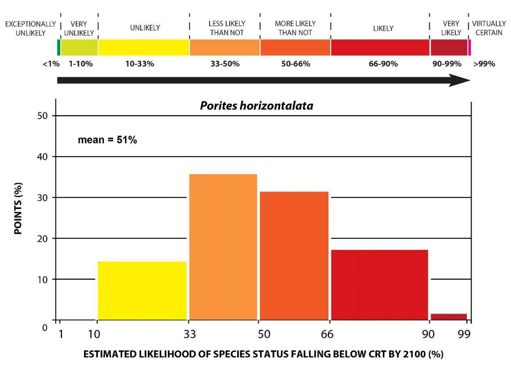

Figure 7.11.4. Distribution of points to estimate the likelihood that the status of *Porites horizontalata* falls below the Critical Risk Threshold (the species is of such low abundance, or so spatially fragmented, or at such reduced diversity that extinction is extremely likely) by 2100.

Factors that increase the potential extinction risk (higher likelihood of falling below the Critical Risk Threshold) for *Porites horizontalata* include the fairly low tolerance to thermal stress and susceptibility to acidification impacts in the genus. Factors that reduce potential extinction risk (decrease the likelihood of falling below the Critical Risk Threshold) are the species' broad distribution, the high tolerance of sediment stress and turbid water, and low disease and predation susceptibility of the genus. Wide distribution lowers extinction risk by making it more likely a species will be able to escape the impacts of threats and catastrophes in at least some locations.

The overall likelihood that *Porites horizontalata* will fall below the Critical Risk Threshold by 2100 was estimated to be in the "more likely than not" risk category with a mean likelihood of 51% and a standard error (SE) of 12% (Fig. 7.11.14). This SE was calculated by taking the standard deviation of the seven mean voting scores of the BRT members and shows the coherence among the BRT. The uncertainty of the BRT is reflected in the wide range of votes of 10%– 99% (Fig. 7.11.14) and the average range of likelihood estimates of the seven BRT voters (62%)—the third-higest variability (see Table 8.1).. The overall wide range of votes reflects the uncertainty among BRT members inherent in the lack of adequate ecological and demographic information for *Porites horizontalata*.

**7.11.2** *Porites napopora* **Veron, 2000** 

Figure 7.11.5. *Porites napopora* photos and corallite plan from Veron (2000).

#### **Characteristics**

Colonies of *Porites napopora* are broad basal laminae with irregular clumps of tapered irregularly fused branches. Corallites are irregularly spaced and are in excavated pits. Those on branches are especially deeply excavated, giving branches a rough surface. Walls between corallites are thin. Colonies are brown in color with white corallite centers (Veron, 2000).

#### **Taxonomy**

**Taxonomic issues**: *Porites* is known to be morphologically plastic and multiple sympatric species frequently exhibit intergradation of skeletal characteristics. Only limited molecular genetic analysis has been performed on the *Porites* so far. In the most comprehensive, Forsman et al. (2009) identified inseparable clades that contain multiple morphological species, in some cases with morphological species that span more than one clade. However, such genetic work has not been conducted on *Porites napopora*. *Porites napopora* is similar to *Porites nigrescens* and *Porites negrosensis*, both of which have similarly excavated corallites. *Porites nigrescens* does not have basal laminae and *Porites negrosensis* has corallites with rounded walls. *Porites horizontalata* has similar corallites but forms primarily explanate plates. See also *Porites flavus* and *Porites tuberculosa* (Veron, 2000).

**Family:** Poritidae.

**Evolutionary and geologic history**: The genus originated in the Eocene Era and became overwhelmingly dominant in the Miocene Tethys (Veron, 1995). It continues to be the most cosmopolitan of all coral genera (Veron, 2000).

#### **Global Distribution**

Range is somewhat restricted both longitudinally and latitudinally, limited to the west and central Pacific (Veron 2000), particularly the Coral Triange area.

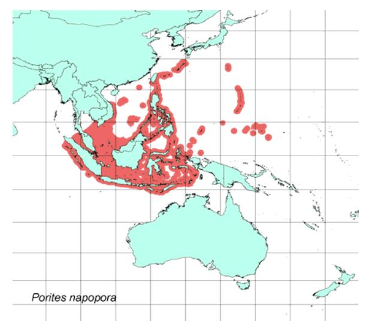

Figure 7.11.6. *Porites napopora* distribution from IUCN copied from http://www.iucnredlist.org.

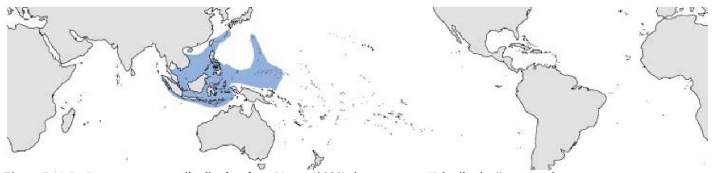

Figure 7.11.7. *Porites napopora* distribution from Veron (2000); however, see "Distribution" paragraphs.

#### **U.S. Distribution**

According to the IUCN Species Account, *Porites napopora* occurs in the Northern Mariana Islands, but no supporting reference is given. The CITES species database does not include any record of occurrence in U.S. waters.

In Veron (2000; Volume 3, page 318) the distribution map includes the Mariana Archipelago, with a photo taken by Gustav Paulay labeled "Guam." However, Veron (2002) indicates "erratum: photograph was taken at Palau, not Guam" (page 182). G. Paulay (University of Florida, Gainesville, FL, pers. comm. to J. Kenyon via email 2/28/2010) indicates photos submitted by him to Veron from Palau, the Cook Islands, and other locations were mistakenly attributed to Guam. Further email communications of J. Kenyon with G. Paulay (3/2/2010) confirm this species has not been observed by G. Paulay in the Mariana Archipelago. There are no other substantiated records of its occurrence in the Mariana Archipelago (J. Veron pers. comm. to J. Kenyon via email 4/23/2010).

Two colonies of *Porites napopora* have been reported at Fagatele Bay, Tutuila, American Samoa at a depth of 10 m based on visual identification (Birkeland, unpubl. data; Fisk and Birkeland, 2002, Table 5, page 31). No other published or unpublished data sources indicate the occurrence of *Porites napopora* elsewhere in U.S. waters.

Within federally protected waters, *Porites napopora* has been recorded from the following areas:

Fagatele Bay National Marine Sanctuary, Tutuila

#### **Habitat**

**Habitat:** *Porites napopora* has been reported to occupy shallow reef environments (Veron, 2000).

**Depth range**: *Porites napopora* has been reported in water depths ranging from 3 m to 15 m (Carpenter et al., 2008). The species has no known deep refugia.

#### **Abundance**

Abundance of *Porites napopora* has been reported as sometimes common (Carpenter et al., 2008; Veron, 2000).

#### **Life History**

The reproductive characteristics of *Porites napopora* have not been determined (Baird et al., 2009). Other species in the genus *Porites* have been described as gonochoric broadcast spawners (10), gonochoric brooders (6), or hermaphroditic brooders (2) (Baird et al., 2009). Although specific observations have not been published for this species, the larvae of all other *Porites* species studied contain zooxanthellae that can supplement maternal provisioning with energy sources provided by their photosynthesis (Baird et al., 2009). The minimum size and estimated age at first reproduction have not been determined for this species. However, for two other *Porites* species, the minimum size is < 8 cm (Harriott, 1983). Larval longevity has not been determined in this family.

#### **Threats**

**Temperature stress:** Massive *Porites* has moderate susceptibility to bleaching (Marshall and Baird, 2000; McClanahan et al., 2007) while branching *Porites* seem to have a higher susceptibility comparable to *Pocillopora* and *Acropora* (Marshall and Baird, 2000; McClanahan et al., 2007) , but branching *Porites* had higher mortality than massive corals (Kayanne et al., 2002). Recent work comparing *Porites lobata* from extreme lagoonal environments with individuals from more benign forereefs indicates that thermal history of these corals plays a large role in their response to thermal stress (Barshis et al., 2010).

**Acidification:** While no studies have tested acidification impacts on *Porites napopora,* De'ath et al. (De'ath et al., 2009) looked at 328 colonies of massive *Porites* from 69 reefs of the Great Barrier Reef (GBR) and found a decline in calcification by 14.2% since 1990, predominantly because extension declined by 13.3%. This is similar to the estimates of a global decline in aragonite saturation state of 16% since the beginning of global industrialization (De'ath et al., 2009). The De'ath study agreed with earlier, more limited work on *Porites* on the GBR (Cooper et al., 2008) and on laboratory and mesocosm experiments that showed declines in calcification with reduced aragonite saturation state in *Porites cylindrical* (Hii et al., 2009) and *Porites compressa* adults (Langdon and Atkinson, 2005; Marubini et al., 2001), *Porites lutea* adults (Hossain and Ohde, 2006; Ohde and Hossain, 2004), and *Porites astreoides* juveniles (Albright et al., 2008). Work in other corals has shown that impacts are not limited to extension as acidification impairs fertilization and settlement success in *Acropora palmata* (Albright et al., 2010), although it has not been found to interfere with settlement of larvae in *Porites astreoides* (Albright et al., 2008). Acidification also contributes to reef destruction (Hoegh-Guldberg et al., 2007; Silverman et al., 2009) reducing habitat for corals. While ocean acidification has not been demonstrated to have caused appreciable declines in coral populations so far, the BRT considers it to be a significant threat to corals by 2100.

**Disease:** Medium number of genus level disease reports of subacute (lesions resulting in slow progressive tissue loss) tissue loss syndrome, black band disease, and endolithis hypermycosis (UNEP, 2010). However, ample evidence indicate that diseases can have devastating regional impacts on individual coral species (e.g., (Aronson and Precht, 2001; Bruckner and Hill, 2009) and evidence show that these impacts are occurring in more taxa and at a broader geographic scale (Green and Bruckner, 2000; Sutherland et al., 2004).

**Predation**: *Porites* is susceptible to crown-of-thorns seastar (*Acanthaster planci*) and corallivorous snail predation (B. Vargas-Ángel, CRED, Honolulu, HI, pers. comm., September 2010), including predation of *Coralliphilia violacea* on both massive and branching forms (Zeid et al., 1999). Massive *Porites* are susceptible, but not a preferred prey, of the predatory asteroid *Culcita novaeguineae* (Glynn and Krupp, 1986) and the butterflyfish *Chaetodon unimaculatus* (Cox, 1986).

**Land-based sources of pollution (LBSP):** McClanahan and Obura (1997) identified *Porites* as intermediate for its sediment tolerance in the western Indian Ocean. In contrast, *Porites* is often found in relatively turbid waters in Asia and the eastern Pacific and were considered sediment tolerant by Rogers (1990) and Brown (1997b). LBSP-related stresses (nutrients, sediment, toxins, and salinity) often act in concert rather than individually and are influenced by other biological (e.g., herbivory) and hydrological factors. Collectively, LBSP stresses are unlikely to produce extinction at a global scale; however, they may pose significant threats at local scales (particularly important for species with limited range) and reduce the resilience of corals to bleaching (Carilli et al., 2009a; Wooldridge, 2009b).

**Collection/Trade:** According to the CITES Trade Database, UNEP World Conservation Monitoring Centre, 25,000- 50,000 pieces of *Porites* spp. per year traded (CITES, 2010).

#### **Risk Assessment**

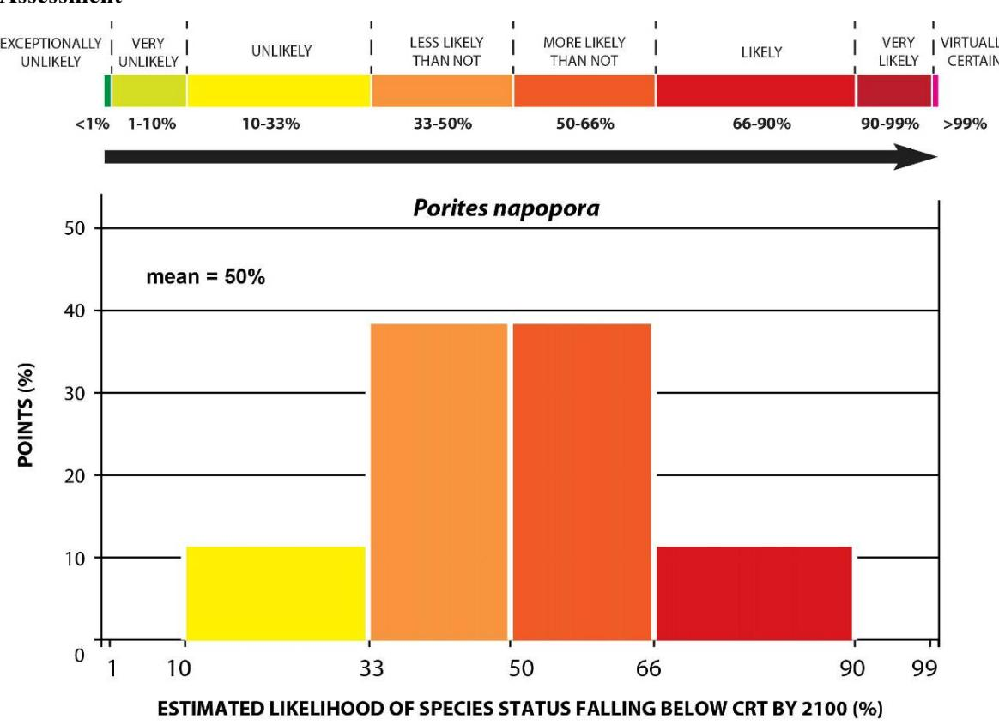

Figure 7.11.8. Distribution of points to estimate the likelihood that the status of *Porites napopora* falls below the Critical Risk Threshold (the species is of such low abundance, or so spatially fragmented, or at such reduced diversity that extinction is extremely likely) by 2100.

Factors that increase the potential extinction risk (higher likelihood of falling below the Critical Risk Threshold) for *Porites napopora* include the species' distribution that is restricted to the western Pacific and the fairly low tolerance to thermal stress and susceptibility to acidification impacts in the genus. Factors that reduce potential extinction risk (decrease the likelihood of falling below the Critical Risk Threshold) included the high tolerance of sediment stress and turbid water, and low disease and predation susceptibility of the genus.

The overall likelihood that *Porites napopora* will fall below the Critical Risk Threshold by 2100 was estimated to be in the "as likely as not" risk category with a mean likelihood of 50% and a standard error (SE) of 9% (Fig. 7.11.8). This SE was calculated by taking the standard deviation of the seven mean voting scores of the BRT members and shows the coherence among the BRT. The uncertainty of the BRT is reflected in the range of votes of 10%–90% (Fig. 7.11.8) and the average range of likelihood estimates of the seven BRT voters (58%). The overall wide range of votes reflects the uncertainty among BRT members inherent in the lack of adequate ecological and demographic information for *Porites napopora*.

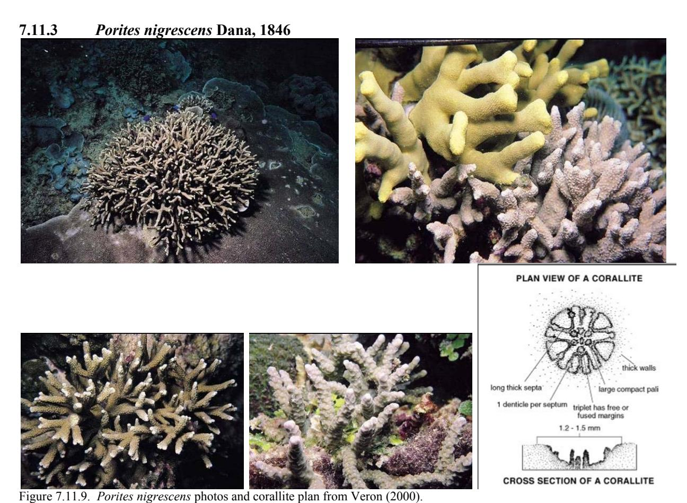

#### **Characteristics**

Colonies of *Porites nigrescens* are branching, sometimes with an encrusting base. Concave calices give the surface a pitted appearance. Tentacles are frequently extended during the day. Colonies are brown or cream in color (Veron, 2000).

#### **Taxonomy**

**Taxonomic issues**: *Porites* is known to be morphologically plastic and multiple sympatric species frequently exhibit intergradation of skeletal characteristics. Only limited molecular genetic analysis has been performed on the *Porites* so far. In the most comprehensive, Forsman et al. (2009) identified inseparable clades that contain multiple morphological species, in some cases with morphological species that span more than one clade. However, such genetic work has not been conducted on *Porites nigrescens*. *Porites nigrescens* is similar to *Porites cylindrica*, which is usually found in the same habitat where it has less excavated corallites and thicker branches (Veron, 2000).

**Family:** Poritidae.

**Evolutionary and geologic history**: The genus originated in the Eocene and became overwhelmingly dominant in the Miocene Tethys (Veron, 1995). It continues to be the most cosmopolitan of all coral genera (Veron, 2000).

#### **Global Distribution**

The distribution is broad longitudinally, ranging from the east coast of Africa to the central Pacific and broad latitudinally ranging from the Red Sea and south of Japan in the northern hemisphere to halfway down both coastlines of Australia in the southern hemisphere (Veron, 2000).

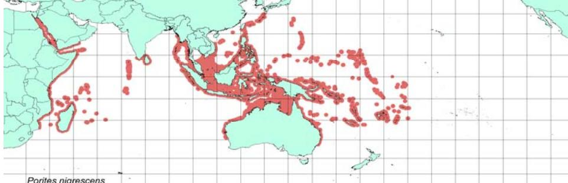

Figure 7.11.10. *Porites nigrescens* distribution from IUCN copied from http://www.iucnredlist.org.

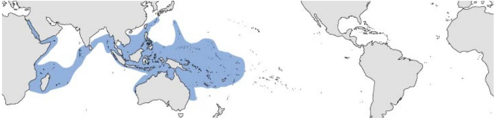

Figure 7.11.11. *Porites nigrescens* distribution from Veron (2000).

#### **U.S. Distribution**

According to both the IUCN Species Account and the CITES species database, *Porites nigrescens* has been recorded in American Samoa. The IUCN Species Account also lists this species in the Northern Mariana Islands and the U.S. minor outlying islands.

A search of published and unpublished records of occurrence in U.S. waters indicates *Porites nigrescens* has been reported from Tutuila and Ofu-Olosega in American Samoa (Maragos et al., 1994; Mundy 1996, Lovell and McLardy, 2008; National Park Service, 2009).

No substantiated published or unpublished records of its occurrence in the Northern Mariana Islands or the U.S. minor outlying islands could be identified.

Within federally protected waters, *Porites nigrescens* has been recorded from the following areas:

National Park of American Samoa, Ofu Island unit

#### **Habitat**

**Habitat:** *Porites nigrescens* has been reported to occupy lower reef slopes and lagoons protected from wave action (Veron 2000).

**Depth range**: *Porites nigrescens* has been reported at moderate depths ranging from 0.5 m to 20 m (Carpenter et al., 2008).

#### **Abundance**

*Porites nigrescens* has been reported as sometimes common (Veron, 2000). Where found, it can be a part of a locally abundant branching Poritid assemblage (Phongsuwan and Brown, 2007).

#### **Life History**

The reproductive characteristics of *Porites nigrescens* have not been determined (Baird et al., 2009). Other species in the genus *Porites* have been described as gonochoric broadcast spawners (10), gonochoric brooders (6), or hermaphroditic brooders (2) (ibid). Although specific observations have not been published for this species, the larvae of all other *Porites* species studied contain zooxanthellae that can supplement maternal provisioning with energy sources provided by their photosynthesis (Baird et al., 2009), i.e. they are autotrophic. The minimum size and estimated age at first reproduction have not been determined for this species. However, for two other *Porites* species, the minimum size is < 8 cm (Harriott, 1983). Larval longevity has not been determined in this family.

#### **Threats**

**Temperature stress:** Massive *Porites* have moderate susceptibility to bleaching (Marshall and Baird, 2000; McClanahan et al., 2007) while branching *Porites* seem to have a higher susceptibility comparable to *Pocillopora* and *Acropora* (Marshall and Baird, 2000; McClanahan et al., 2007), but branching *Porites* had higher mortality than massive *Porites* (Kayanne et al., 2002). *Porites nigrescens* had high bleaching rates in East Africa in 1998 (Obura, 2001) and Palau in 2000 (Bruno et al., 2001). Recent work comparing *Porites lobata* from extreme lagoonal environments with individuals from more benign forereefs indicates that thermal history of these corals plays a large role in their response to thermal stress (Barshis et al., 2010).

**Acidification:** While no studies have tested acidification impacts on *Porites nigrescens,* De'ath et al. (De'ath et al., 2009) looked at 328 colonies of massive *Porites* from 69 reefs of the Great Barrier Reef (GBR) and found a decline in calcification by 14.2% since 1990, predominantly because of an extension decline of 13.3%. This is similar to the estimates of a global decline in aragonite saturation state of 16% since the beginning of global industrialization (De'ath et al., 2009). The De'ath study agreed with earlier, more limited work on *Porites* on the GBR (Cooper et al., 2008) and on laboratory and mesocosm experiments that showed declines in calcification with reduced aragonite saturation state in *Porites cylindrical* (Hii et al., 2009) and *Porites compressa* adults (Langdon and Atkinson, 2005; Marubini et al., 2001), *Porites lutea* adults (Ohde and Hossain, 2004; Hossain and Ohde, 2006), and *Porites astreoides* juveniles (Albright et al., 2008). Work on other corals has shown that impacts are not limited to extension as acidification impairs fertilization and settlement success in *Acropora palmata* (Albright et al., 2010), although it has not been found to interfere with settlement of larvae in *Porites astreoides* (Albright et al., 2008). Acidification also contributes to reef destruction (Hoegh-Guldberg et al., 2007; Silverman et al., 2009) reducing habitat for corals. While ocean acidification has not been demonstrated to have caused appreciable declines in coral populations so far, the BRT considers it to be a significant threat to corals by 2100.

**Disease:** Medium number of genus level disease reports of subacute (lesions resulting in slow progressive tissue loss) black band disease, and endolithis hypermycosis (UNEP, 2010). However, ample evidence indicate that diseases can have devastating regional impacts on individual coral species (e.g., Aronson and Precht, 2001; Bruckner and Hill, 2009) and evidence show that these impacts are occurring in more taxa and at a broader geographic scale (Green and Bruckner, 2000; Sutherland et al., 2004).

**Predation:** *Porites* is susceptible to crown-of-thorns seastar (*Acanthaster planci*) and corallivorous snail predation (B. Vargas-Ángel, CRED, Honolulu, HI, pers. comm., September 2010), including predation of *Coralliphilia violacea* on both massive and branching forms (Zeid et al., 1999). Massive *Porites* are susceptible, but not a preferred prey, of the predatory asteroid *Culcita novaeguineae* (Glynn and Krupp, 1986) and the butterflyfish *Chaetodon unimaculatus* (Cox, 1986).

**Land-based sources of pollution (LBSP):** McClanahan and Obura (McClanahan and Obura, 1997) identified *Porites* as intermediate for its sediment tolerance in the western Indian Ocean. In contrast, *Porites* is often found in relatively turbid waters in Asia and the eastern Pacific and were considered sediment tolerant by Rogers (1990) and Brown (1997b). LBSP-related stresses (nutrients, sediment, toxins, and salinity) often act in concert rather than individually and are influenced by other biological (e.g., herbivory) and hydrological factors. Collectively, LBSP stresses are unlikely to produce extinction at a global scale; however, they may pose significant threats at local scales (particularly important for species with limited range) and reduce the resilience of corals to bleaching (Carilli et al., 2009a; Wooldridge, 2009b).

**Collection/Trade:** According to the CITES Trade Database, UNEP World Conservation Monitoring Centre, 25,000- 50,000 pieces of *Porites* spp. per year traded (CITES, 2010). CITES data specifically name *Porites nigrescens* but it is uncertain how much of this harvest is of *Porites nigrescens.*

#### **Risk Assessment**

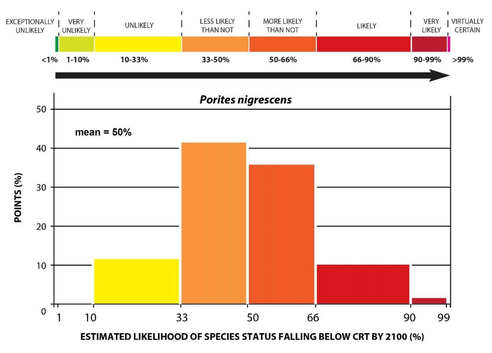

Figure 7.11.12. Distribution of points to estimate the likelihood that the status of *Porites nigrescens* falls below the Critical Risk Threshold (the species is of such low abundance, or so spatially fragmented, or at such reduced diversity that extinction is extremely likely) by 2100.

Factors that increase the potential extinction risk (higher likelihood of falling below the Critical Risk Threshold) for *Porites nigrescens* include the fairly low tolerance to thermal stress and susceptibility to acidification impacts in the genus. Factors that reduce potential extinction risk (decrease the likelihood of falling below the Critical Risk Threshold) included the species' broad distribution, the high tolerance of sediment stress and turbid water, and low disease and predation susceptibility of the genus.

The overall likelihood that *Porites nigrescens* will fall below the Critical Risk Threshold by 2100 was estimated to be in the "less likely than not" risk category with a mean likelihood of 50% and a standard error (SE) of 9% (Fig. 7.11.12). This SE was calculated by taking the standard deviation of the seven mean voting scores of the BRT members and shows the coherence among the BRT. The uncertainty of the BRT is reflected in the range of votes of 10%–99% (Fig. 7.11.12) and the average range of likelihood estimates of the seven BRT voters (58%). The overall wide range of votes reflects the uncertainty among BRT members inherent in the lack of adequate ecological and demographic information for *Porites nigrescens*.

**7.11.4** *Porites pukoensis* **Vaughan, 1907** 

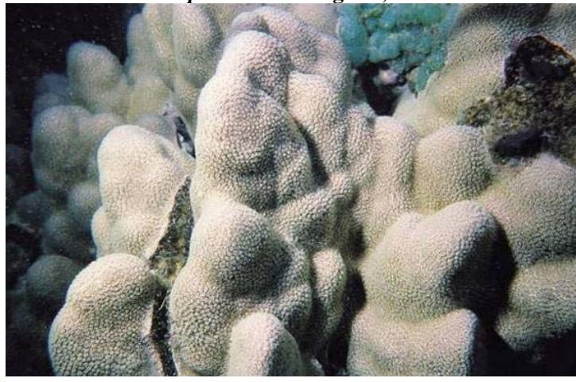

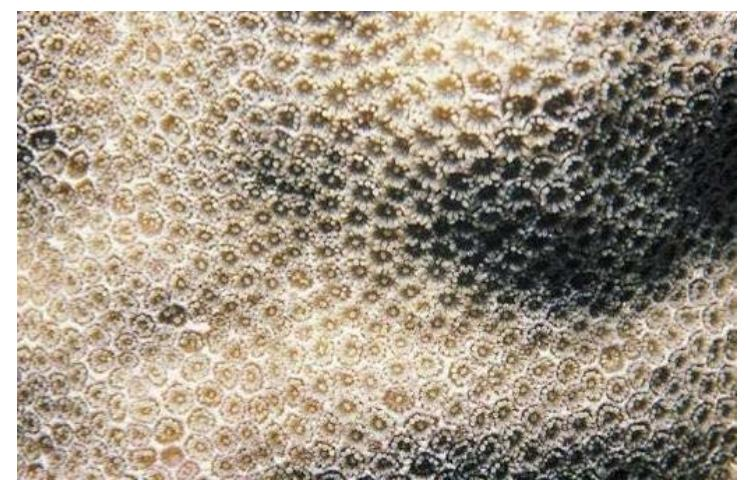

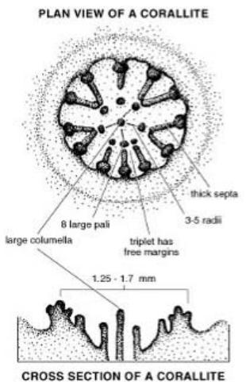

Figure 7.11.13. *Porites pukoensis* photos and corallite plan from Veron (2000).

#### **Characteristics**

Colonies of *Porites pukoensis* are massive with a tendency to form columns. Tentacles are usually extended during the day. Colonies are brown or tan in color (Veron, 2000).

#### **Taxonomy**

**Taxonomic issues**: *Porites* is known to be morphologically plastic and multiple sympatric species frequently exhibit intergradation of skeletal characteristics. Only limited molecular genetic analysis has been performed on the *Porites* so far. In the most comprehensive, Forsman et al. (2009) identified inseparable clades that contain multiple morphological species, in some cases, with morphological species that span more than one clade. This is a particular issue for *Porites pukoensis* as it is morphologically very similar to *Porites compressa* and *Porites lobata* that are both part of genetic Clade 1. However, no live *Porites pukoensis* could be found for genetic analysis. According to Veron (2000), *Porites pukoensis* is similar to *Porites evermanni*, which lacks denticles at the bases of septa. See also *Porites nodifera* (Veron 2000). However, according to the original description, it may be indistinguishable from forms of *Porites lobata* and *Porites compressa* (Vaughan, 1907). See "Risk Assessment" below for the BRT determination on taxonomy of the species.

**Family:** Poritidae.

**Evolutionary and geologic history:** The genus originated in the Eocene Era and became overwhelmingly dominant in the Miocene Tethys (Veron, 1995). It continues to be the most cosmopolitan of all coral genera (Veron, 2000).

#### **Global Distribution**

*Porites pukoensis* is only found in the Hawaiian Archipelago (Veron, 2000).

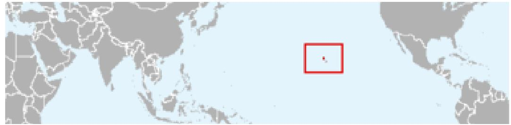

Figure 7.11.14. *Porites pukoensis* distribution from IUCN copied from http://www.iucnredlist.org.

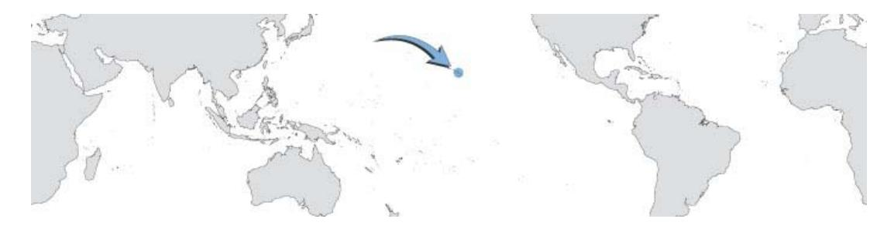

Figure 7.11.15. *Porites pukoensis* distribution copied from Veron and Stafford-Smith (2002) and agrees with Veron (2000).

#### **U.S. Distribution**

According to both the IUCN Species Account and the CITES species database, *Porites pukoensis* has been recorded in Hawai`i. The CITES species database also lists this species in American Samoa.

A search of published and unpublished records of occurrence in U.S. waters indicates *Porites pukoensis* has been reported from Tutuila in American Samoa (Hoffmeister, 1925; Lamberts, 1983), Hawai`i (Veron, 2000), and Kingman Reef (CRED, unpubl. data). *Porites pukoensis* was not been found during recent searches conducted from a reef near Pūko'o, Molokai'i (Z. Forsman, Hawai`i Institute of Marine Biology, Kāne`ohe, HI; E. Brown, marine biologist, National Park Service, Kalaupapa, HI, pers. comm., 21 September 2010).

Within federally protected waters, *Porites pukoensis* has been recorded from the following areas:

Pacific Remote Islands Marine National Monument (Kingman)

#### **Habitat**

**Habitat**: *Porites pukoensis* has been reported to occupy shallow protected reef environments, especially lagoons (Veron, 2000).

**Depth range**: *Porites pukoensis* has an unknown depth range.

#### **Abundance**

Abundance of *Porites pukoensis* has been reported as usually uncommon (Veron, 2000).

#### **Life History**

The reproductive characteristics of *Porites pukoensis* have not been determined, although all similar *Porites* in the central Pacific are gonochoric broadcast spawners (Baird et al., 2009). Although specific larval descriptions have not been published for this species, the larvae of all other Porites species studied contain zooxanthellae that can supplement maternal provisioning with energy sources provided by their photosynthesis (Baird et al., 2009). The minimum size and estimated age at first reproduction have not been determined for this species. However, for two other *Porites* species, the minimum size is < 8 cm in diameter (Harriott, 1983). Larval longevity has not been determined in this family.

#### **Threats**

**Temperature stress**: Massive *Porites* have moderate susceptibility to bleaching (Marshall and Baird, 2000; McClanahan et al., 2007), while branching *Porites* seem to have a higher susceptibility comparable to *Pocillopora* and *Acropora* (Marshall and Baird, 2000; McClanahan et al., 2007), but branching *Porites* had higher mortality than massive *Porites* (Kayanne et al., 2002). Recent work comparing *Porites lobata* from extreme lagoonal environments with individuals from more benign fore reefs indicates that thermal history of these corals plays a large part in their reaction to thermal stress (Barshis et al., 2010).

**Acidification:** De'ath et al. (2009) looked at 328 colonies of massive *Porites* from 69 reefs of the Great Barrier Reef (GBR) and found a decline in calcification by 14.2% since 1990, predominantly because of an extension decline of 13.3%. This is similar to the estimates of a global decline in aragonite saturation state of 16% since the beginning of global industrialization (De'ath et al., 2009). The De'ath study agreed with earlier, more limited work on *Porites* on the GBR (Cooper et al., 2008) and on laboratory and mesocosm experiments that showed declines in calcification with reduced aragonite saturation state in *Porites cylindrical* (Hii et al., 2009) and *Porites compressa* adults (Langdon and Atkinson, 2005; Marubini et al., 2001), *Porites lutea* adults (Hossain and Ohde, 2006; Ohde and Hossain, 2004), and *Porites astreoides* juveniles (Albright et al., 2008). Work in other corals has shown that impacts are not limited to extension as acidification impairs fertilization and settlement success in *Acropora palmata* (Albright et al., 2010), although it has not been found to interfere with settlement of larvae in *Porites astreoides* (Albright et al., 2008). Acidification is also likely to contribute to reef destruction in the future (Hoegh-Guldberg et al., 2007; Silverman et al., 2009) reducing habitat for corals. While ocean acidification has not been demonstrated to have caused appreciable declines in coral populations so far, the BRT considers it to be a significant threat to corals by 2100.

**Disease:** Medium number of disease reports for the genus *Porites* of subacute (lesions resulting in slow progressive tissue loss) tissue-loss syndrome, black-band disease, edolithic hypermycosis, yellow-band disease, and pigmentation response including pink-line syndrome (UNEP, 2010). However, ample evidence indicate that diseases can have devastating regional impacts on individual coral species (e.g., Aronson and Precht, 2001; Bruckner and Hill, 2009) and evidence show that these impacts are occurring in more taxa and at a broader geographic scale (Green and Bruckner, 2000; Sutherland et al., 2004).

**Predation**: *Porites* is susceptible to crown-of-thorns seastar (*Acanthaster planci*) and corallivorous snail predation (B. Vargas-Ángel, CRED, Honolulu, HI, pers. comm., September 2010), including predation by *Coralliphilia violacea* on both massive and branching forms (Zeid et al., 1999). Massive *Porites* are susceptible, but not a preferred prey, of the predatory asteroid *Culcita novaeguineae* (Glynn and Krupp, 1986) and the butterflyfish *Chaetodon unimaculatus* (Cox, 1986).

**Land-based sources of pollution:** McClanahan and Obura (McClanahan and Obura, 1997) identified *Porites* as intermediate for its sediment tolerance in the western Indian Ocean. In contrast, *Porites* is often found in relatively turbid waters in Asia and the eastern Pacific and were considered sediment tolerant by Rogers (Rogers, 1990) and Brown (Brown, 1997b). LBSP-related stresses (nutrients, sediment, toxins, and salinity) often act in concert rather than individually and are influenced by other biological (e.g., herbivory) and hydrological factors. Collectively, LBSP stresses are unlikely to produce extinction at a global scale; however, they may pose significant threats at local scales (particularly important for species with limited range) and reduce the resilience of corals to bleaching (Carilli et al., 2009a; Wooldridge, 2009b).

**Collection/Trade**: According to the CITES Trade Database, UNEP World Conservation Monitoring Centre, 25,000- 50,000 pieces of *Porites* spp. per year traded (CITES, 2010).

#### **Risk Assessment**

The risk assessment for this species was problematic because of questions of both taxonomy and identification of this species. Two risk assessments were voted on by the BRT for this species to cover both extremes of the potential status of the species: (1) *Porites pukoensis* is part of the clade of poritid corals that includes *Porites lobata* and *Porites compressa* (Forsman et al., 2009) and does not represent a separate species, and (2) *Porites pukoensis* is a unique species that is a rare member of coral reef communities where it is found and only exists in a range limited to Hawai`i and potentially a few other islands in the central Pacific.

After consultation with experts and key taxonomic references, including the most recent molecular analysis (Forsman et al., 2009) and the original species description (Vaughan, 1907), it was concluded by the BRT that *Porites pukoensis* does not represent a separate, rare species. The original description of *Porites pukoensis* (Vaughan, 1907) is unconvincing that this is a separate species:

> "The calicular characters of *Porites pukoensis* are practically identical with those of *P compressa* forma *angustisepta*. As was remarked in discussing the latter form, it is not at all unlikely that they may be only different growth forms of the same species. However, the specimens at my disposal for study do not show intergradation."

> "*Porites lobata* forma *parvicalyx* (p. 200) is also closely related. *…* The three forms, *Porites compressa* forma *angustisepta, Porites pukoensis,* and *Porites lobata* forma *parvicalyx* constitute a most interesting series. It may be that they all belong to the same species. Should they do so, they will show that the growth form of corals is of only slight systematic importance."

Recent work by Forsman et al. (2009) shows that, in fact, Vaughan was probably quite correct in the latter statement made 102 years prior. Molecular genetics have shown that *Porites lobata* and *Porites compressa* are members of a single clade, distinct from others in his analysis. These two works make it most likely that *Porites pukoensis* is only another form within this clade and perhaps genetically indistinct from these two. Forsman was unable to find specimens of *Porites pukoensis* to include it in the genetic analysis (pers. comm. 2010). Based on this determination, *Porites* Clade 1 forma *pukoensis* is part of a clade that includes the hardiest and most widely distributed of the poritids.

Based on this evidence, the BRT concluded that it is most likely that *Porites* Clade 1 forma *pukoensis* is not genetically distinct from the clade containing *Porites lobata* Dana 1846, making it part of a clade of corals that exists commonly from the eastern coast of Africa to the western coast of the Americas (Fig. 7.11.16).

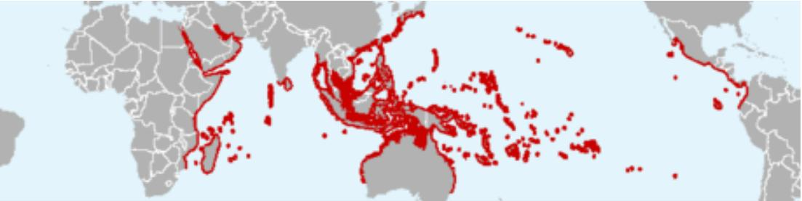

Figure 7.11.16. *Porites lobata* distribution from IUCN copied from http://www.iucnredlist.org.

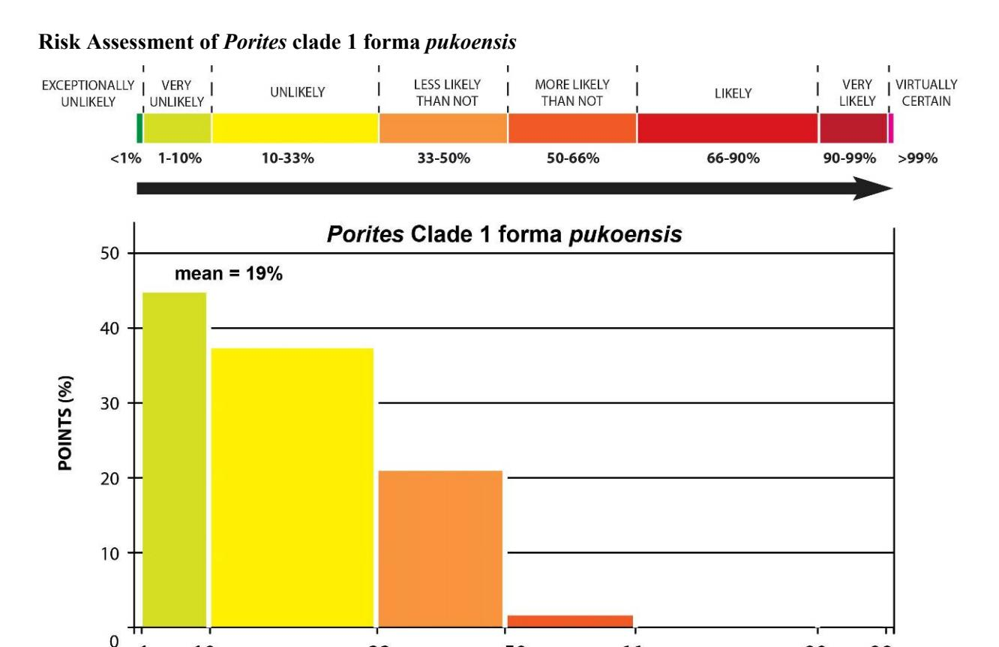

Figure 7.11.17. Distribution of points to estimate the likelihood that the status of *Porites* Clade 1 forma *pukoensis* falls below the Critical Risk Threshold (the species is of such low abundance, or so spatially fragmented, or at such reduced diversity that extinction is extremely likely) by 2100.

With the conclusion that this coral is not genetically distinct from *Porites lobata*, factors that reduce potential extinction risk (decrease the likelihood of falling below the Critical Risk Threshold) included the species' broad distribution, the high tolerance of sediment stress and turbid water, and low disease and predation susceptibility of the genus. Factors that increase the potential extinction risk (higher likelihood of falling below the Critical Risk Threshold) for this species include the moderate/low tolerance to thermal stress and susceptibility to acidification impacts in the genus.

The overall likelihood that *Porites* Clade 1 forma *pukoensis* will fall below the Critical Risk Threshold by 2100 was estimated to be in the "very unlikely" risk category with a mean likelihood of 19% and a standard error (SE) of 8% (Fig. 7.11.17). This SE was calculated by taking the standard deviation of the seven mean voting scores of the BRT members and shows the coherence among the BRT. The uncertainty of the BRT is reflected in the range of votes of 1%–66% (Fig. 7.11.17) and the average range of likelihood estimates of the seven BRT voters (43%). The overall wide range of votes reflects the uncertainty among BRT members inherent in the lack of adequate ecological and demographic information for this species.

## **Risk Assessment of** *Porites pukoensis*

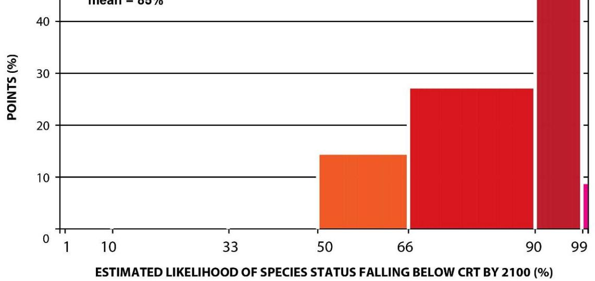

Figure 7.11.18. Distribution of points to estimate the likelihood that the status of *Porites pukoensis* falls below the Critical Risk Threshold (the species is of such low abundance, or so spatially fragmented, or at such reduced diversity that extinction is extremely likely) by 2100.

If *Porites pukoensis* is in fact a unique species that is a rare member of coral reef communities where it is found and only exists in a range limited to Hawai`i and potentially a few other islands in the central Pacific. Factors that increase the potential extinction risk (higher likelihood of falling below the Critical Risk Threshold) for this species include the extremely limited distribution and rarity where it occurs. Range may exist in a restricted area of Hawa`i only (off the island of Moloka'i) or be rare but present in American Samoa (Hoffmeister, 1925) and Kingman Reef (CRED, unpubl. data). Either way, any species with such a limited range, and rarity when present, is at high risk of extinction. Factors reducing the potential extinction risk (lower likelihood of falling below the Critical Risk Threshold) include the coral's high tolerance to sediment stress and turbid water and low susceptibility to disease and predation.

The overall likelihood that a unique *Porites pukoensis* species will fall below the Critical Risk Threshold by 2100 was estimated to be in the "likely" risk category with a mean likelihood of 85%, a standard error (SE) of 9%, and included some votes for "virtually certain" (Fig. 7.11.18). This SE was calculated by taking the standard deviation of the seven mean voting scores of the BRT members and shows the coherence among the BRT. The uncertainty of the BRT is reflected in the range of votes of 50%–100% (Fig. 7.11.18) and the average range of likelihood estimates of the seven BRT voters (40%)—the smallest range of any candidate coral (Table 8.1). The overall wide range of votes reflects the uncertainty among BRT members inherent in the lack of adequate ecological and demographic information for this species.

#### **7.12 Genus** *Psammocora* **(Family Siderastreidae)**

#### **7.12.1** *Psammocora stellata* **Verrill, 1866**

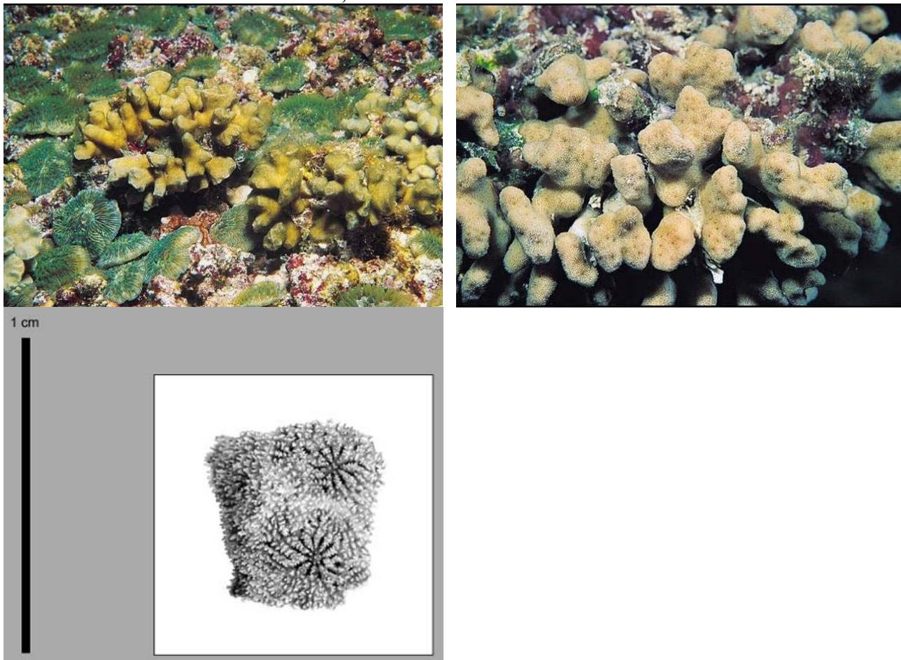

Figure 7.12.1. *Psammocora stellata* photos and corallite plan from Veron (2000).

#### **Characteristics**

Colonies of *Psammacora stellata* are submassive or branching, with encrusting bases. Corallites have poorly defined walls. Approximately half of the septo-costae are tear-shaped. Columellae are poorly developed or absent. Colonies are tan, grey or purple in color (Veron, 2000).

#### **Taxonomy**

**Taxonomic issues**: There is some question as to whether the eastern Pacific populations are distinct species ("Additional problematic species include the validity of…three to four species in the genus *Psammocora*" (Glynn and Ault, 2000)). *Psammocora stellata* is similar to *Psammocora obtusangula,* which forms branches and has discernible columellae (Veron, 2000). More recent work (Benzoni et al., 2010) compared genetic relationships among 12 morphologically identified Indo-Pacific *Psammocora* species and found that they represented 5 genetic species. This indicates that problems may exist in the classical identification of *Psammocora* species. However, no particular doubt has been placed on the validity of *Psammacora stellata* (Benzoni et al., 2010; Stefani et al., 2008).

**Family**: Siderastreidae.

**Evolutionary and geologic history**: Evolved in the Miocene Era (Edinger and Risk, 1995) and disappeared from the Caribbean in the Pliocene Age (Glynn and Ault, 2000).

#### **Global Distribution**

*Psammocora stellata* has a somewhat restricted and fragmented range. Longitudinally, it stretches from Indonesia to the East Pacific and latitudinally it is only found in the northern hemisphere from Hawai`i and the Northern Mariana Islands to the Galapagos and coast of Ecuador (Veron, 2000).

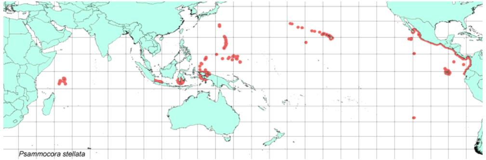

Figure 7.12.2. *Psammocora stellata* distribution from IUCN copied from http://www.iucnredlist.org.

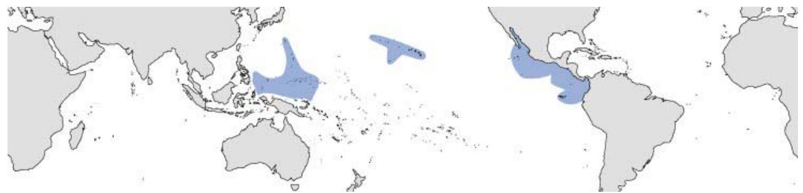

Figure 7.12.3. *Psammocora stellata* distribution from Veron (2000).

#### **U.S. Distribution**

According to both the IUCN Species Account and the CITES species database, *Psammocora stellata* has been recorded in the Northern Mariana Islands and the U.S. minor outlying islands. The CITES species database also lists this species in Hawai`i.

A search of published and unpublished records of occurrence in U.S. waters indicates *Psammacora stellata* has been reported from Guam (Burdick, unpubl. data; Randall, 2003), Hawai`i (Aki et al., 1994; Veron, 2000; Maragos et al., 2004; Fenner, 2005), Johnston Atoll, Howland Island and Kingman Reef (CRED, unpubl. data; Maragos and Jokiel, 1986), and Palmyra Atoll (Williams et al., 2008b).

Within federally protected waters, *Psammocora stellata* has been recorded from the following areas:

- Papahānaumokuākea Marine National Monument (Nihoa, French Frigate Shoals, Gardner Pinnacles, Maro Reef, Laysan, Lisianski, Pearl and Hermes, Midway, Kure)
- Pacific Remote Islands Marine National Monument (Johnston, Howland, Palmyra, Kingman)
- Hawaiian Islands Humpback Whale National Marine Sanctuary

#### **Habitat**

**Habitat**: *Psammocora stellata* has been reported to occupy shallow wave-washed rock (Veron, 2000). In the eastern Pacific, it is also found on rubble bottoms adjacent to reefs (Feingold, 1996).

**Depth range**: *Psammocora stellata* has been reported at depths ranging from 0 m to 20 m (Carpenter et al., 2008).

#### **Abundance**

Abundance of *Psammocora stellata has been reported as u*sually uncommon (Veron 2000). The species is abundant in the eastern Pacific (Glynn and Ault, 2000).

#### **Life History**

In the eastern Pacific, *Psammocora stellata* is a gonochoric spawner (Glynn and Colley, 2008). In Hawai`i, Kolinski and Cox (2003) classified *Psammocora stellata* as a brooder based on the tank collection of swimming coral larvae 45 min after previous examination of secluded colonies on the July full moon between 19:50 to 21:00. The minimum size and estimated age at first reproduction have not been determined for any members of the family Siderastreidae (Harrison and Wallace, 1990). Planula larvae do not contain zooxanthellae that can supplement maternal provisioning with energy sources provided by their photosynthesis (Glynn and Ault, 2000), i.e., they are lecithotrophic. Larval longevity has not been determined in this family.

Asexual reproduction by fragmentation is common in eastern Pacific populations of *Psammocora stellata* (Glynn and Colley, 2009).

#### **Threats**

**Temperature stress**: The genus *Psammocora* has a low bleaching susceptibility on the Great Barrier Reef (Marshall and Baird, 2000). It bleaches but is not highly susceptible in the eastern Pacific (multiple locations cited in (Glynn and Colley, 2001) and Gulf of California (Williams and Bunkley-Williams, 1990).

**Acidification**: While no studies have been published on acidification impacts on this genus, *Psammocora stellata* is common on eastern Pacific reefs and near-reef habitats where the aragonite saturation state is naturally low due to upwelling (Manzello et al., 2008). This may imply that to some degree, this species can tolerate acidified water but the impact of acidification on growth has not been quantified. However, in most corals studied (Table 3.2.2), acidification impairs growth (Kleypas and Langdon, 2006) and, in the case of *Acropora palmate,* impairs fertilization and settlement success (Albright et al., 2010) and is likely to contribute to reef destruction in the future (Hoegh-Guldberg et al., 2007; Silverman et al., 2009). While ocean acidification has not been demonstrated to have caused appreciable declines in coral populations so far, the BRT considers it to be a significant threat to corals by 2100.

**Disease**: None reported for this species, however, ample evidence indicate that diseases can have devastating regional impacts on individual coral species (e.g., Aronson and Precht, 2001; Bruckner and Hill, 2009), and evidence show that these impacts are occurring in more taxa and at a broader geographic scale (Sutherland et al., 2004, Green and Bruckner 2000).

**Predation**: *Psammacora stellata* is susceptible to predation by crown-of-thorns seastar (*Acanthaster planci*) but is not a preferred prey species (Cortés and Guzmán, 1998; Glynn, 1976).

**Land-based sources of pollution (LBSP):** *Psammacora stellata* is somewhat sediment tolerant in the eastern Pacific as it is frequently found growing on sand and rubble plains (Feingold, 1996), but is not found alive in high-sediment environments (Cortés, 1990). Occupying rubble habitat makes it less susceptible to habitat destruction than reefdwellers. Algal overgrowth slows colony growth (Fernandez et al., 2008) or kills colonies (Glynn, 1997). LBSP-related stresses (nutrients, sediment, toxins, and salinity) often act in concert rather than individually and are influenced by other biological (e.g., herbivory) and hydrological factors. Collectively, LBSP stresses are unlikely to produce extinction at a global scale; however, they may pose significant threats at local scales (particularly important for species with limited range) and reduce the resilience of corals to bleaching (Carilli et al., 2009a; Wooldridge, 2009b).

**Collection/Trade**: No trade information for this species was listed on the CITES Trade Database, UNEP World Conservation Monitoring Centre (CITES, 2010).

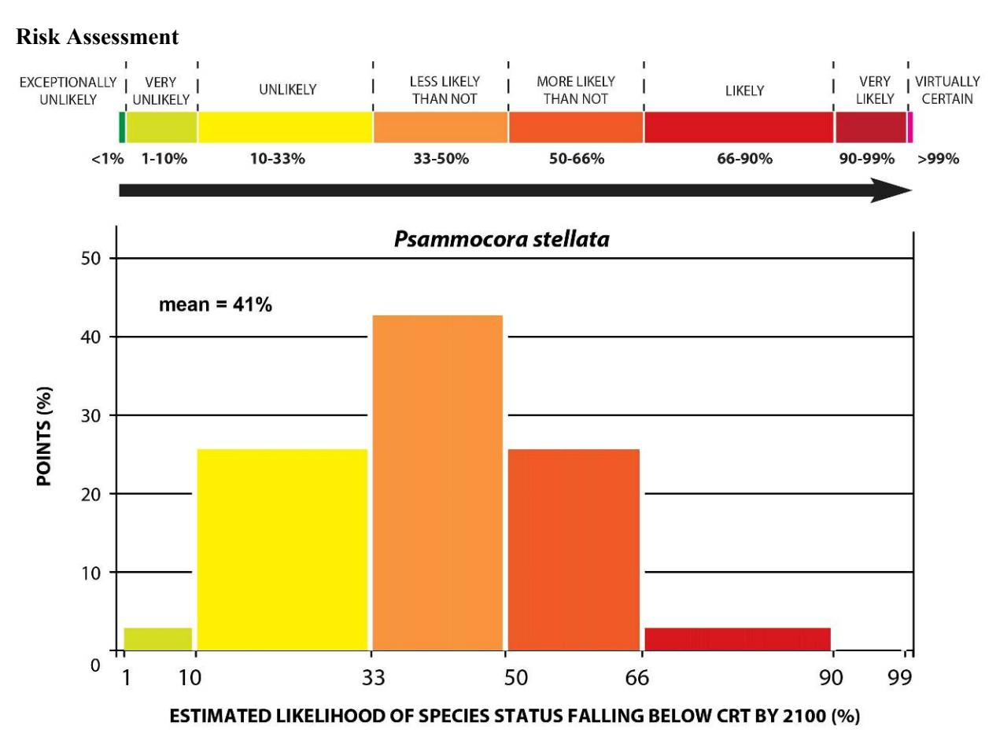

Figure 7.12.4. Distribution of points to estimate the likelihood that the status of *Psammocora stellata* falls below the Critical Risk Threshold (the species is of such low abundance, or so spatially fragmented, or at such reduced diversity that extinction is extremely likely) by 2100.

Factors that reduce potential extinction risk (decrease the likelihood of falling below the Critical Risk Threshold) for *Psammocora stellata* included the species' broad latitudinal distributions, its wide habitat distribution and free-living growth form (unattached coralith morphology) found on reef and just off reef including high energy zones, and its low susceptibility to bleaching, including high abundance after the 1982-1983 El Niño. Factors that increase the potential extinction risk (higher likelihood of falling below the Critical Risk Threshold) for this species include susceptibility to algal overgrowth.

The overall likelihood that *Psammocora stellata* will fall below the Critical Risk Threshold by 2100 was estimated to be in the "less likely than not" risk cateogoary with a mean likelihood of 41% and a standard error (SE) of 9 (Fig. 7.12.4). This SE was calculated by taking the standard deviation of the seven mean voting scores of the BRT members and shows the coherence among the BRT. The uncertainty of the BRT is reflected in the range of votes of 1%–90% (Fig. 7.12.4) and the average range of likelihood estimates of the seven BRT voters (58%). The overall wide range of votes reflects the uncertainty among BRT members inherent in the lack of adequate ecological and demographic information for *Psammocora stellata*.

#### **7.13 Genus** *Leptoseris* **(Family Agariciidae)**

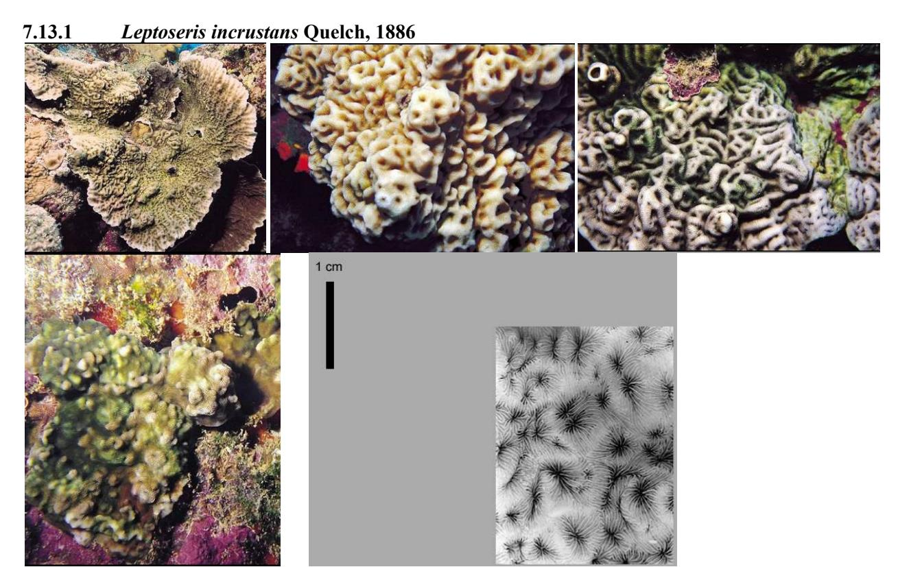

Figure 7.13.1. *Leptoseris incrustans* photos and corallite plan from Veron (2000).

#### **Characteristics**

Colonies of *Leptoseris incrustans* are primarily encrusting but may develop broad explanate laminae. These laminae often have radiating ridges. Corallites are small, closely compacted and superficial. The coenosteum commonly has Hydnophora-like monticules. Septo-costae are thin and equal, giving colonies a smooth surface. Columellae are small styles. Colonies are pale to dark brown or greenish-brown in color (Veron, 2000). Maximum colony size is 100 cm.

#### **Taxonomy**

**Taxonomic issues**: None. *Leptoseris incrustans* is similar to *Leptoseris hawaiiensis*, which has larger corallites and no Hydnophora-like projections on the coenosteum. It is also similar to *Leptoseris mycetoseroides*, which has welldeveloped radiating ridges on laminae (Veron, 2000).

**Family:** Agariciidae.

**Evolutionary and geologic history**: The genus is known from the Tethys Sea in the Oligocene Era (Wells and Moore, 1956).

#### **Global Distribution**

*Leptoseris incrustans* has a very broad range. Longitudinally it stretches from the Red Sea to the central Pacific Islands and latitudinally it stretches from the Red Sea and Hawai`i in the northern hemisphere to southern Africa and the Great Barrier Reef in Australia in the southern hemisphere (Veron, 2000).

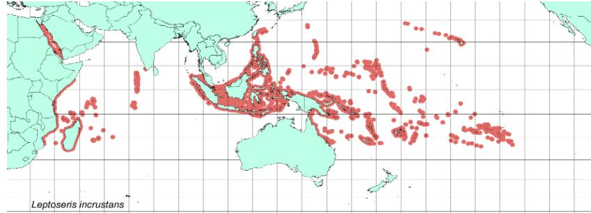

Figure 7.13.2. *Leptoseris incrustans* distribution from IUCN copied from http://www.iucnredlist.org.

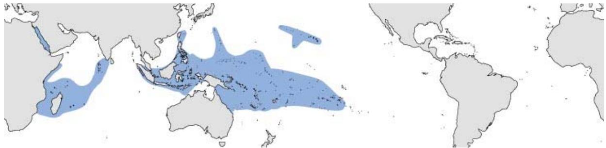

Figure 7.13.3. *Leptoseris incrustans* distribution from Veron (2000).

#### **U.S. Distribution**

According to both the IUCN Species Account and the CITES species database, *Leptoseris incrustans* occurs in American Samoa, the Northern Mariana Islands, Hawai`i, and the U.S. minor outlying islands.

A search of published and unpublished records of occurrence in U.S. waters indicates *Leptoseris incrustans* has been reported from Tutuila, Ofu-Olosega, and Rose Atoll in American Samoa (Maragos et al., 1994, Coles et al., 2003, Lovell and McLardy, 2008; Birkeland, unpubl. data; Kenyon et al., 2010a; National Park Service, 2009), Guam (Burdick, unpubl. data; Randall, 2003), Hawai`i (Aki et al., 1994; Beets et al., 2010; Godwin and Bolick, 2006; Maragos et al., 2004; Veron, 2000), Johnston Atoll and Jarvis Island (CRED, unpubl. data; Maragos and Jokiel, 1986).

Within federally protected waters, *Leptoseris incrustans* has been recorded from the following areas:

- Papahānaumokuākea Marine National Monument (French Frigate Shoals, Pearl and Hermes, Midway, Kure)
- Pacific Remote Islands Marine National Monument (Johnston, Jarvis)
- National Park of American Samoa, Ofu Island unit
- Rose Atoll Marine National Monument
- Puuhonua o Hōnauanau National Historic Park, Hawa`i
- Kalaupapa National Historic Park, Moloka'i
- Hawaiian Islands Humpback Whale National Marine Sanctuary

#### **Habitat**

**Habitat:** *Leptoseris incrustans* inhabits shallow reef environments (Veron, 2000).

**Depth range**: *Leptoseris incrustans* has been reported in water depths ranging from 10 m to 20 m (Carpenter et al., 2008). This species has also been reported in the mesophotic zone between 50 m and 80 m (Rooney et al., 2010), suggesting potential deep refugia.

#### **Abundance**

Abundance of *Leptoseris incrustans* has been reported as uncommon (Veron, 2000).

#### **Life History**

The reproductive characteristics of *Leptoseris incrustans* have not been determined ((Baird et al., 2009). However, the congener *Leptoseris explanata* is gonochoric (Baird et al., 2009). The minimum size and estimated age at first reproduction have not been determined for any members of the genus *Leptoseris* (Harrison and Wallace, 1990). Larvae in this genus have not been studied to determine whether or not they contain zooxanthellae that can supplement maternal provisioning with energy sources provided by their photosynthesis (Baird et al., 2009), i.e., if they are autotrophic or lecithotrophic. Larval longevity has not been determined in this family.

#### **Threats**

**Temperature stress**: The genus *Leptoseris* is listed as having no bleaching response (0 ± 0 SD) in a compilation of 17 genera in McClanahan et al. (2007). In Hawai`i, *Leptoseris incrustans* contains type C1 zooxanthellae (Lewis, 1989), which may be relatively bleaching tolerant.

**Acidification:** Unknown for this genus. However, in most corals studied (Table 3.2.2), acidification impairs growth (Langdon and Atkinson, 2005; Manzello, 2010) and, in the case of *Acropora palmate,* impairs fertilization and settlement success (Albright et al., 2010) and is likely to contribute to reef destruction in the future (Hoegh-Guldberg et al., 2007; Silverman et al., 2009). While ocean acidification has not been demonstrated to have caused appreciable declines in coral populations so far, the BRT considers it to be a significant threat to corals by 2100.

**Disease:** Susceptibility and impacts of disease on this species are not known. However, ample evidence indicate that diseases can have devastating regional impacts on individual coral species (e.g., Aronson and Precht, 2001; Bruckner and Hill, 2009) and some evidence show that these impacts are occurring on a trend of increasing taxonomic and geographic scale (Green and Bruckner, 2000; Sutherland et al., 2004). A few disease reports for the family Agariciidae could be found on the global disease database (UNEP, 2010).

**Predation:** Unknown.

**Land-based sources of pollution (LBSP):** The effects of LBSP on the genus *Leptoseris* are largely unknown. LBSPrelated stresses (nutrients, sediment, toxins, and salinity) often act in concert rather than individually and are influenced by other biological (e.g., herbivory) and hydrological factors. Collectively, LBSP stresses are unlikely to produce extinction at a global scale; however, they may pose significant threats at local scales (particularly important for species with limited range) and reduce the resilience of corals to bleaching (Carilli et al., 2009a; Wooldridge, 2009b).

**Collection/Trade:** No export data for this species was found in the CITES Trade Database, UNEP World Conservation Monitoring Centre, Cambridge, UK (CITES, 2010). Collection/trade is not considered to be a significant threat to this species.

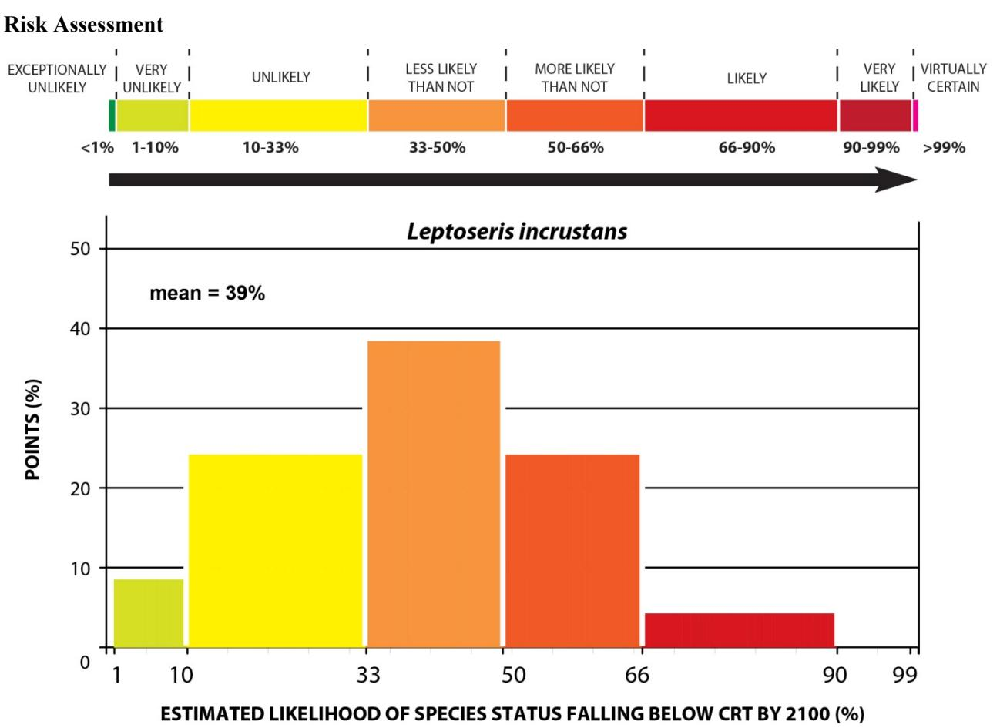

Figure 7.13.4. Distribution of points to estimate the likelihood that the status of *Leptoseris incrustans* falls below the Critical Risk Threshold (the species is of such low abundance, or so spatially fragmented, or at such reduced diversity that extinction is extremely likely) by 2100.

*Leptoseris incrustans* is considered uncommon; therefore, the potential extinction risk (higher likelihood of falling below the Critical Risk Threshold) for this species is increased. Factors that reduce potential extinction risk (decrease the likelihood of falling below the Critical Risk Threshold) are that *Leptoseris incrustans* occupies a variety of habitat types including mesophotic deep reefs, tolerates murky waters, has low bleaching rates, and is broadly distributed both latitudinally and longitudinally in the Indo-Pacific. Occurrence in mesophotic habitats was considered to reduce extinction risk since these habitats are somewhat buffered from surface-based threats.

The overall likelihood that *Leptoseris incrustans* will fall below the Critical Risk Threshold by 2100 was estimated to be in the "less likely than not" risk category with a mean likelihood of 39% and a standard error (SE) of 10% (Fig. 7.13.4). This SE was calculated by taking the standard deviation of the seven mean voting scores of the BRT members and shows the coherence among the BRT. The uncertainty of the BRT is reflected in the range of votes of 1%–90% (Fig. 7.13.4) and the average range of likelihood estimates of the seven BRT voters (61%)—the eighth-highest range (Table 8.1). The overall wide range of votes reflects the uncertainty among BRT members inherent in the lack of adequate ecological and demographic information for this species.

#### **7.13.2** *Leptoseris yabei* **Pillai and Scheer, 1976**

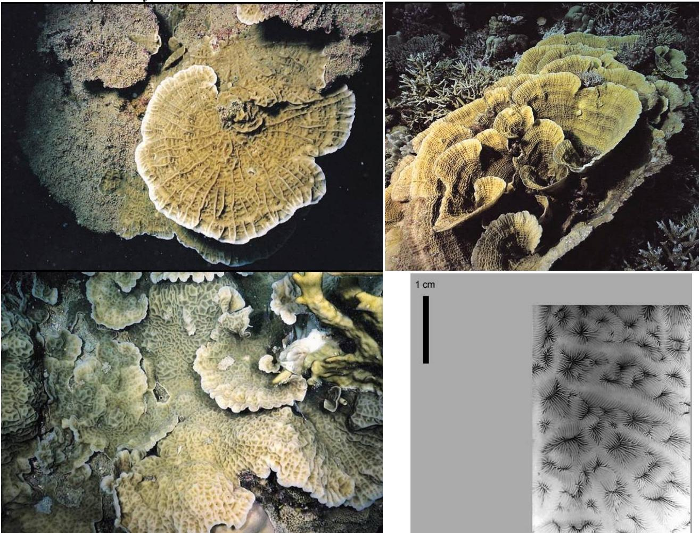

Figure 7.13.5. *Leptoseris yabei* photos and corallite plan from Veron (2000).

#### **Characteristics**

Colonies of *Leptoseris yabei* are laminar, in whorls or tiers or vase-shaped. They are commonly over 1 m across. Corallites are enclosed in rectangular pockets formed between radiating ridges and low walls that are parallel to frond margins. Septo-costae are moderately exsert and alternate. Colonies are usually pale brown or yellowish in color, sometimes with white margins (Veron, 2000). Maximum colony size 300 cm (Veron and Pichon, 1980).

#### **Taxonomy**

**Taxonomic issues**: None. *Leptoseris yabei* is closest to *Leptoseris mycetoseroides* but is readily distinguished from all other species by having corallites in rectangular pockets.

**Family:** Agariciidae.

**Evolutionary and geologic history:** The genus is known from the Tethys Sea in the Oligocene Era (Wells and Moore, 1956).

#### **Global Distribution**

*Leptoseris yabei* has a relatively broad distribution range, stretching longitudinally from the Red Sea to the east-central Pacific Ocean and latitudinally from Japanese waters in the northern hemisphere across the Great Barrier Reef and south Madagascar in the southern hemisphere (Veron, 2000).

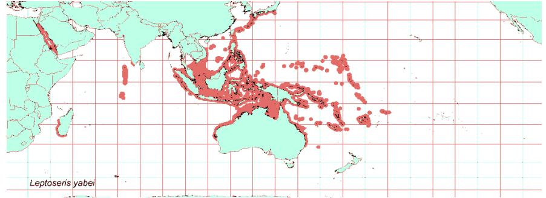

Figure 7.13.6. *Leptoseris yabei* distribution from IUCN copied from http://www.iucnredlist.org.

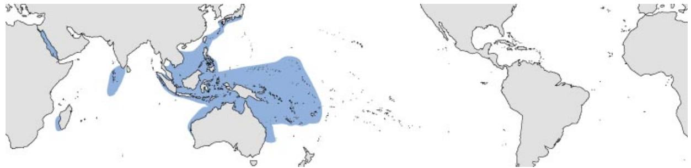

Figure 7.13.7. *Leptoseris yabei* distribution from Veron (2000).

#### **U.S. Distribution**

According to both the IUCN Species Account and the CITES species database, *Leptoseris yabei* occurs in American Samoa.

A search of published and unpublished records of occurrence in U.S. waters indicates *Leptoseris yabei* has been reported from Tutuila, Ofu-Olosega, and Rose Atoll in American Samoa (Maragos et al., 1994; Lovell and McLardy, 2008; National Park Service, 2009; Kenyon et al., 2010a). Kahng and Maragaos (2006) also report *Leptoseris yabei* specimens collected in deep-water surveys off Maui, Lāna`i, and Kaua`i in 2001–2004 using submersibles at depths of 70 m to 120 m and showed *Leptoseris* spp. to be dominant on hard substrate below 60 m with benthic cover exceeding 90% in some areas.

Within federally protected waters, *Leptoseris yabei* has been recorded from the following areas:

- National Park of American Samoa, Ofu Island unit
- Rose Atoll Marine National Monument

#### **Habitat**

**Habitat:** *Leptoseris yabei* is usually found on flat substrates (Veron, 2000).

**Depth range**: *Leptoseris yabei* has been reported at water depths ranging from 3 m to 50 m (Carpenter et al., 2008; Kahng et al., 2010; Kahng and Kelley, 2007; Kahng and Maragos, 2006; Rooney et al., 2010). This species has been reported as a dominant one in mesophotic reefs in Hawai`i (Kahng and Maragos, 2006), suggesting potential deep refugia. However, preliminary genetic work indicates there is likely unresolved taxonomic diversity among these deepwater *Lepotseris* (Chan et al., 2009) indicating that the species identification of *Leptoseris yabei* within these mesophotic reef communities is problematic.

#### **Abundance**

Abundance of *Leptoseris yabei* has been reported as uncommon but conspicious (Veron, 2000).

#### **Life History**

The reproductive characteristics of *Leptoseris yabei* have not been determined (Baird et al., 2009). However, the congener *Leptoseris explanata* is gonochoric (Baird et al., 2009), with colonies found to possess ripe testes or colored eggs on high-latitude reefs in the Houtman Abrolhos Islands, western Australia, when sampled before the main spawning event in March 1987 (Babcock et al., 1994; Baird et al., 2009). Other members of the family Agariciidae (i.e., 6 species of *Pavona*, 3 species of *Pachyseris*) are known to be gonochoric spawners (Baird et al., 2009). The minimum size and estimated age at first reproduction have not been determined for any members of the genus *Leptoseris* (Harrison and Wallace, 1990). Larvae in this genus have not been studied to determine whether or not they contain zooxanthellae that can supplement maternal provisioning with energy sources provided by their photosynthesis (Baird et al., 2009). Larval longevity has not been determined in this family.

#### **Threats**

**Temperature stress**: The genus *Leptoseris* is listed as having no bleaching response (0 ± 0 SD) among the 17 included genera in McClanahan et al. (2007). *Leptoseris yabei* contains clade C zooxanthellae, with the type shifting by depth; in shallower water it contains type C1 (LaJeunesse et al., 2004a), which may be relatively bleaching-resistant (Smith et al., 2004b).

**Acidification:** Unknown for this genus. However, in most corals studied (Table 3.2.2), acidification impairs growth (Langdon and Atkinson, 2005; Manzello, 2010) and, in the case of *Acropora palmata*, impairs fertilization and settlement success (Albright et al., 2010) and is likely to contribute to reef destruction in the future (Hoegh-Guldberg et al., 2007; Silverman et al., 2009). While ocean acidification has not been demonstrated to have caused appreciable declines in coral populations so far, the BRT considers it to be a significant threat to corals by 2100.

**Disease:** Susceptibility and impacts of disease on this species are not known. However, ample evidence indicate that diseases can have devastating regional impacts on individual coral species (e.g., Aronson and Precht, 2001; Bruckner and Hill, 2009), and evidence show that these impacts are occurring in more taxa and at a broader geographic scale (Green and Bruckner, 2000; Sutherland et al., 2004). A few disease reports for the family Agariciidae can be found in the global disease database (UNEP, 2010).

**Predation:** Unknown.

**Land-based sources of pollution (LBSP):** The effects of LBSP on the genus *Leptoseris* are largely unknown. LBSPrelated stresses (nutrients, sediment, toxins, and salinity) often act in concert rather than individually and are influenced by other biological (e.g., herbivory) and hydrological factors. Collectively, LBSP stresses are unlikely to produce extinction at a global scale; however, they may pose significant threats at local scales (particularly important for species with limited range) and reduce the resilience of corals to bleaching (Carilli et al., 2009a; Wooldridge, 2009b).

**Collection/Trade:** No export data on CITES Trade Database, UNEP World Conservation Monitoring Centre, Cambridge, UK (CITES, 2010). Collection/trade is not considered a significant threat to this species.

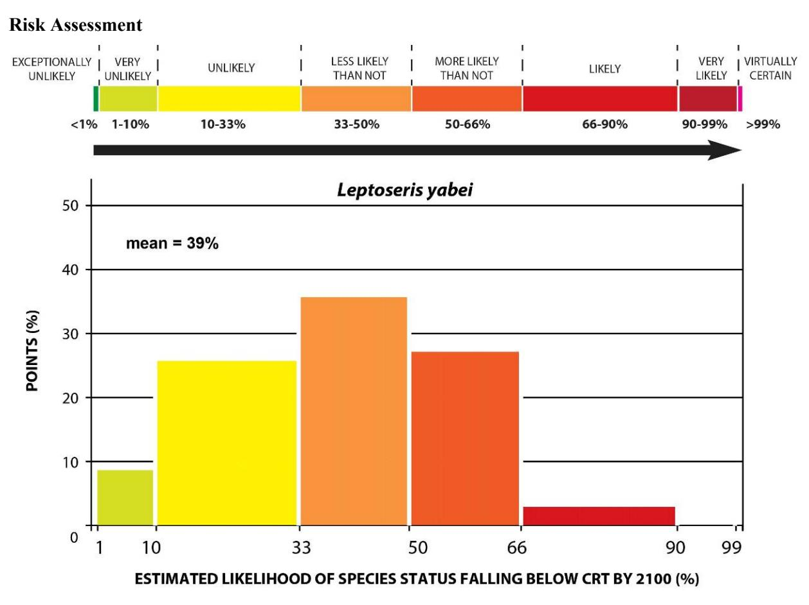

Figure 7.13.8. Distribution of points to estimate the likelihood that the status of *Leptoseris yabei* falls below the Critical Risk Threshold (the species is of such low abundance, or so spatially fragmented, or at such reduced diversity that extinction is extremely likely) by 2100.

*Leptoseris yabei* is considered uncommon; therefore,the potential extinction risk (higher likelihood of falling below the Critical Risk Threshold) for *Leptoseris yabei* is increased. Factors that reduce potential extinction risk (decrease the likelihood of falling below the Critical Risk Threshold) are that *Leptoseris yabei* has a broad depth range and occurs in mesophotoic environments, tolerates murky water, has low bleaching rates, and occupies a variety of habitat types and is broadly distributed both latitudinally and longitudinally in the Indo-Pacific. Occurrence in mesophotic habitats was considered to reduce extinction risk since these habitats are somewhat buffered from surface-based threats.

The overall likelihood that *Leptoseris yabei* will fall below the Critical Risk Threshold by 2100 was estimated to be in the "less likely than not" risk category with a mean likelihood of 39% and a standard error (SE) of 11% (Fig. 7.13.8). This SE was calculated by taking the standard deviation of the seven mean voting scores of the BRT members and shows the coherence among the BRT. The uncertainty of the BRT is reflected in the range of votes of 1%–90% (Fig. 7.13.8) and the average range of likelihood estimates of the seven BRT voters (57%). The overall wide range of votes reflects the uncertainty among BRT members inherent in the lack of adequate ecological and demographic information for *Leptoseris yabei*.

#### **7.14 Genus** *Pachyseris*

**7.14.1** *Pachyseris rugosa* **Lamarck, 1801** 

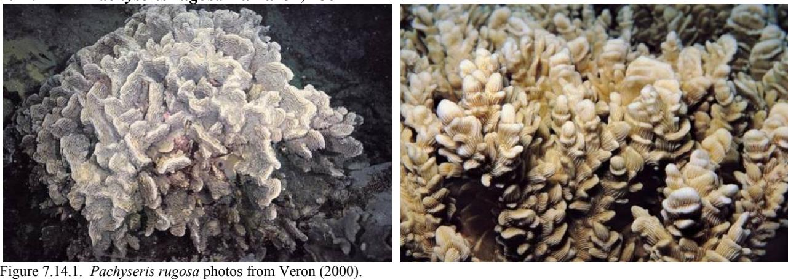

#### **Characteristics**

Colonies of *Pachyseris rugosa* are upright, irregular, anastomosing bifacial plates. Columellae are wall-like lobes (Veron, 2000). Colonies are often over 1 m across. Colonies are brown or deep blue-grey in color (Veron, 2000).

#### **Taxonomy**

**Taxonomic issues**: None. Similar to *Pachyseris gemmae* and *Pachyseris involuta* (Veron, 2000). An early review of *Pachyseris* taxonomy concluded all species were simply morphs of *Pachyseris speciosa* (Matthai, 1948), but many species are recognized today.

**Family:** Agariciidae

**Evolutionary and geologic history**: The genus is known from the Miocene in the western Tethys Sea and East Indies but is extinct in the Caribbean (Wells and Moore, 1956).

#### **Global Distribution**

*Pachyseris rugosa* has a very widespread distribution, stretching from the western Indian Ocean into the Pacific. The species is found in the Red Sea, Madagascar and the Seychelles, India, Indonesia, Australia, the Philippines, Japan, Micronesia, and the Marianas Archipelago.

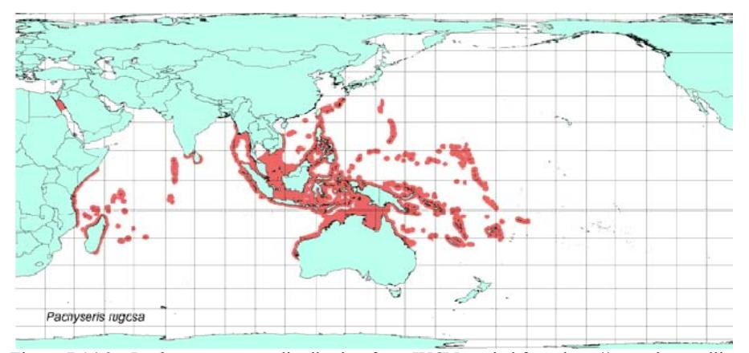

Figure 7.14.2. *Pachyseris rugosa* distribution from IUCN copied from http://www.iucnredlist.org.

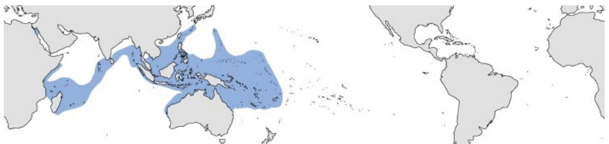

Figure 7.14.3. *Pachyseris rugosa* distribution from Veron (2000).

#### **U.S. Distribution**

According to both the IUCN Species Account and the CITES species database, *Pachyseris rugosa* occurs in American Samoa and the Northern Mariana Islands.

A search of published and unpublished records of occurrence in U.S. waters indicates *Pachyseris rugosa* has been reported from Tutuila in American Samoa (Coles et al., 2003; Lamberts, 1983; Maragos et al., 1994). Veron (2000) shows *Pachyseris rugosa* in the Marianas, but that is likely based on inaccurate geographic information of evidence (Kenyon et al., 2010b). G. Paulay (University of Florida, Gainesville, FL, pers. comm., 28 February 2010) indicates a number of photos submitted by him to Veron from Palau, the Cook Islands, and other locations in the Pacific were mistakenly attributed to Guam (similar to the *errata* later acknowledged by Veron (2002) for *Acanthastrea regularis* and *Porites napopora*).

*Pachyseris rugosa* has not been recorded from federally protected U.S. waters.

#### **Habitat**

**Habitat:** *Pachyseris rugosa* may develop into large mound-shaped colonies in shallow water but smaller colonies occur in a wide range of habitats including those exposed to strong wave action (Veron, 2000). Distribution of this genus on the Great Barrier Reef is associated with areas of fine-grained sediments (Uthicke et al., 2010). It could be an indicator of quiet water (Veron et al., 1977) or a moderate energy environment (Cabioch et al., 1998).

**Depth range**: *Pachyseris rugosa* has been reported in water depths ranging from 5 m to 20 m (Carpenter et al., 2008). The species may be excluded from shallow waters due to excess light (Titlyanov and Latypov, 1991).

#### **Abundance**

Abundance of *Pachyseris rugosa* has been reported to be common (Veron, 2000).

#### **Life History**

*Pachyseris rugosa* is a gonochoric broadcast spawner (Babcock and Heyward, 1986; Dai et al., 1992; Willis et al., 1985). The minimum size and estimated age at first reproduction have not been determined for any members of the genus *Pachyseris* (Harrison and Wallace, 1990). Although specific observations have not been published for this species, the larvae of the single *Pachyseris* species studied does not contain zooxanthellae that can supplement maternal provisioning with energy sources provided by their photosynthesis (Baird et al., 2009), i.e., they are lecithotrophic. Larval longevity has not been determined in this family.

*Pachyseris rugosa* contains clade C zooxanthellae (Abrego et al., 2009; Dong et al., 2009), with a predominance of clade C3h in areas of greater temperature or turbidity (LaJeunesse et al., 2004a). Congener *Pachyseris speciosa* may be somewhat photophobic and unable to adapt to high light levels (Dinesen, 1983).

#### **Threats**

**Thermal stress:** *Pachyseris* experiences variable but high bleaching (Bruno et al., 2001; Marshall and Baird, 2000; McClanahan et al., 2007; Stimson et al., 2002). In some places it may be bleaching tolerant (Sheppard, pers. comm. in McClanahan et al., 2007)). Congener *Pachyseris speciosa* showed heavy bleaching in Guam in 1994 (Paulay and Benayahu, 1999). Laboratory tests with this species showed a synergistic depression of photosynthetic characteristics based on elevated temperatures and light (Bhagooli and Hidaka, 2006). As a genus, its high bleaching rate and relative rarity may give it a relatively high extirpation risk in the western Indian Ocean (McClanahan et al., 2007).

**Acidification:** Unknown for this genus. However, in most corals studied (Table 3.2.2), acidification impairs growth (Langdon and Atkinson, 2005; Manzello, 2010) and, in the case of *Acropora palmata*, impairs fertilization and settlement success (Albright et al., 2010) and is likely to contribute to reef destruction in the future (Hoegh-Guldberg et al., 2007; Silverman et al., 2009). While ocean acidification has not been demonstrated to have caused appreciable declines in coral populations so far, the BRT considers it to be a significant threat to corals by 2100.

**Disease:** *Pachyseris rugosa* is vulnerable to a ciliate disease skeletal eroding band (Antonius and Lipscomb, 2000). Although overall disease presence was low during a survey in Indonesia, the black-band progressed across *Pachyseris rugosa* at an average rate of 0.63cm/d (Haapkyla et al., 2009). Ample evidence indicate that diseases can have devastating regional impacts on individual coral species (e.g., Aronson and Precht, 2001; Bruckner and Hill, 2009) and some evidence show that these impacts are occurring on a trend of increasing taxonomic in more taxa and at a broader geographic scale (Green and Bruckner, 2000; Sutherland et al., 2004).

**Predation:** Mass mortality of this species on the Great Barrier Reef has been attributed to *Acanthaster planci*, although predation was not observed directly (http://www.aims.gov.au/pages/research/reef-monitoring/cairns-section-fringingreefs/).

**Land-based sources of pollution (LBSP):** *Pachyseris rugosa* has suffered high partial mortality as a result of dredging (Blakeway, 2005), but its branching structure should make it an efficient sediment-rejecter (Stafford-Smith, 1993). The species disappeared in Jakarta Bay between 1920 and 2005, which was attributed to decreased water quality from coastal development (Van der Meij et al., 2010).

LBSP-related stresses (nutrients, sediment, toxins, and salinity) often act in concert rather than individually and are influenced by other biological (e.g., herbivory) and hydrological factors. Collectively, LBSP stresses are unlikely to produce extinction at a global scale; however, they may pose significant threats at local scales (particularly important for species with limited range) and reduce the resilience of corals to bleaching (Carilli et al., 2009a; Wooldridge, 2009b).

**Collection/Trade:** Trade in this genus is relatively high (CITES, 2010). *Pachyseris rugosa* experiences substantial export, averaging 1195 specimens annually from 1991 to 2008. Quotas from Fiji account for a high proportion of the export, although *Pachyseris rugosa* is also supplied in considerable quantities from the Solomon Islands. A substantial decline in exports recorded in 1997–2003 occurred, but it is not clear whether this was a real decline or exports were reported at the genus level. Exports returned to high levels (2085 *Pachyseris rugosa* annually) in 2004–2008.

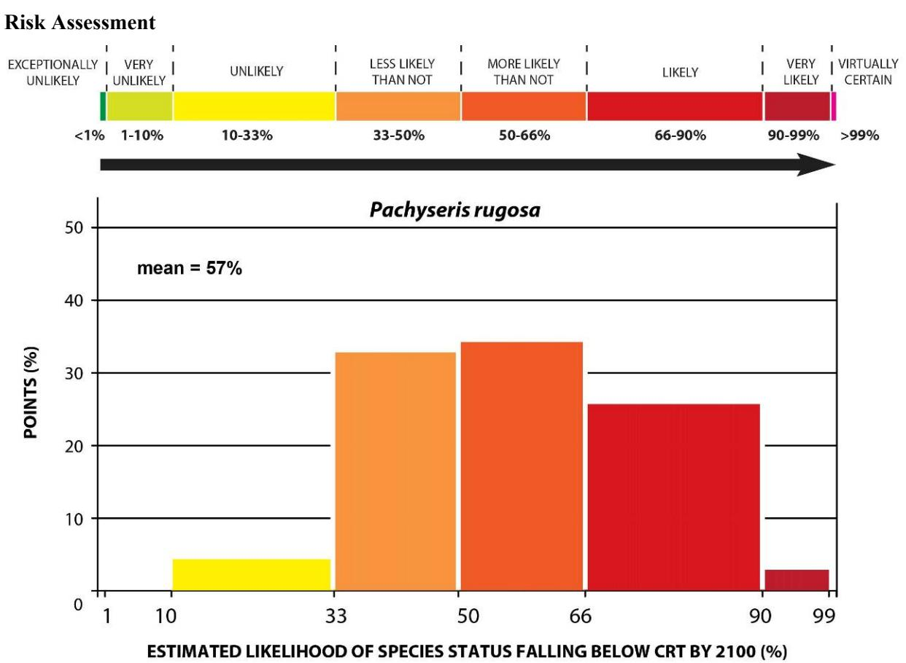

Figure 7.14.4. Distribution of points to estimate the likelihood that the status of *Pachyseris ruogsa* falls below the Critical Risk Threshold (the species is of such low abundance, or so spatially fragmented, or at such reduced diversity that extinction is extremely likely) by 2100.

Factors that increase the potential extinction risk (higher likelihood of falling below the Critical Risk Threshold) for *Pachyseris rugosa* are that it has high (but variable) bleaching, has been observed to be susceptiple to multiple types of disease, and has been inferred to be susceptible to poor water quality. Substantial collection from the aquarium trade could lead to local extirpation in some areas. Factors that reduce potential extinction risk (decrease the likelihood of falling below the Critical Risk Threshold) are that *Pachyseris rugosa* has a widespread distribution from the central Pacific to Africa, and it can have a high local abundance. Wide distribution is considered to lower extinction risk by making it more likely a species will be able to escape the impacts of threats and catastrophes in at least some locations.

The overall likelihood that *Pachyseris rugosa* will fall below the Critical Risk Threshold by 2100 was estimated to be in the "more likely than not" risk category with a mean likelihood of 57% and a standard error (SE) of 11% (Fig. 7.14.4). This SE was calculated by taking the standard deviation of the seven mean voting scores of the BRT members and shows the coherence among the BRT. The uncertainty of the BRT is reflected in the range of votes of 10%–99% (Fig. 7.14.4) and the average range of likelihood estimates of the seven BRT voters (57%). The overall wide range of votes reflects the uncertainty among BRT members inherent in the lack of adequate ecological and demographic information for *Pachyseris rugosa*. The overall wide range of votes also reflects the uncertainty in resolving *Pachyseris rugosa*'s potential stress sensitivity with its widespread distribution and common abundance.

#### **7.15 Genus** *Pavona*

#### **7.15.1** *Pavona bipartita* **Nemenzo, 1980**

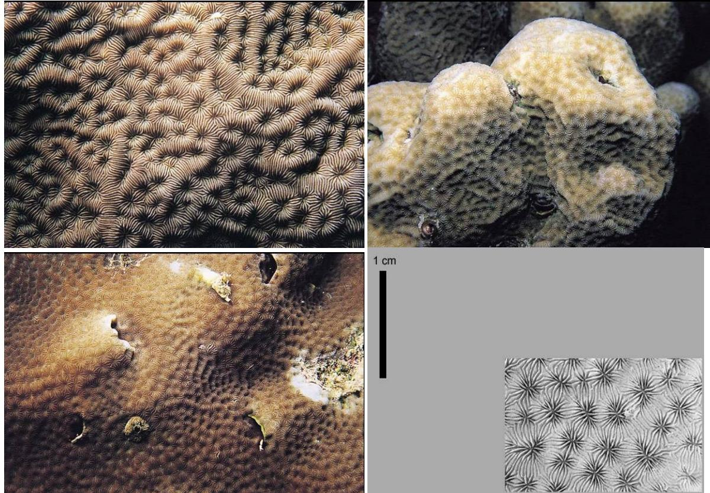

Figure 7.15.1. *Pavona bipartita* photos and corallite plan from Veron (2000).

#### **Characteristics**

Colonies of *Pavona bipartita* are submassive or encrusting and may be over 1 m across. Corallites are uniformly distributed but collines are characteristically uneven in height and may form slightly raised ridges several centimeters long. Septo-costae are in two slightly alternating orders. Colonies are uniform pale to dark brown in color (Veron, 2000)

#### **Taxonomy**

**Taxonomic issues**: None. *Pavona bipartita* is similar to *Pavona duerdeni* (Veron, 2000). Two further little-known and undescribed species are close to *Pavona bipartita* (Veron, 2000).

**Family:** Agariciidae.

**Evolutionary and geologic history**: The family evolved in the Tethys Sea during the Cenozoic Era, with most genera disappearing from the Caribbean. *Pavona* disappeared from the Caribbean in the Eocene (Veron, 1995).

#### **Global Distribution**

*Pavona bipartita* has a broad longitudinal range; it is found in the Red Sea, the southwest and central Indian Ocean, the central Indo-Pacific, southern Japan and the South China Sea, the oceanic west Pacific, the central Pacific, and the Great Barrier Reef.

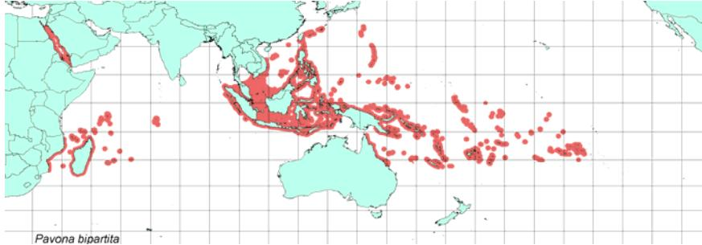

Figure 7.15.2. *Pavona bipartita* distribution from IUCN copied from http://www.iucnredlist.org.

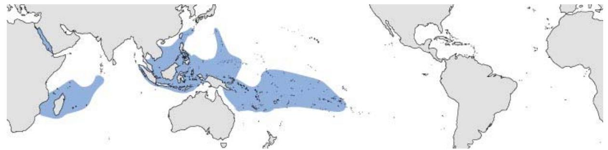

Figure 7.15.3. *Pavona bipartita* distribution from Veron (2000).

#### **U.S. Distribution**

According to the IUCN Species Account, *Pavona bipartita* occurs in American Samoa, the Northern Mariana Islands, and the U.S. minor outlying islands. The CITES species database does not list its occurrence in U.S. waters.

A search of published and unpublished records of occurrence in U.S. waters indicates *Pavona bipartita* has been reported from Tutuila in American Samoa (CRED, unpubl. data), Guam (Burdick, unpubl. data) and CNMI (CRED, unpubl. data).

Within federally protected waters, *Pavona bipartita* has been recorded from the following areas:

Marianas Trench Marine National Monument (Asuncion)

#### **Habitat**

**Habitat**: *Pavona bipartita* has been reported to occupy shallow reef environments (Veron, 2000).

**Depth range**: *Pavona bipartita* has been reported in water depths ranging from 3 m to 20 m (Carpenter et al., 2008).

**Abundance:** *Pavona bipartita* has been reported as uncommon (Carpenter et al., 2008; Veron, 2000).

#### **Life History**

The reproductive characteristics of *Pavona bipartita* have not been determined (Baird et al., 2009). However, six congeners (*Pavona cactus, Pavona chiriquiensis, Pavona clavus, Pavona duerdeni, Pavona gigantea*, and *Pavona varians*) are known to be gonochoric spawners (Baird et al., 2009); eastern Pacific populations of *Pavona varians* and the sibling agariciid species *Pavona* sp. are also known to be hermaphrodites (Glynn and Ault, 2000; Glynn et al., 2000). The minimum size and estimated age at first reproduction have not been determined for *Pavona bipartita*, but the minimum colony sizes (and ages) at first reproduction were 5 cm (5 years) and 3 cm (2 to 3 years), respectively, in eastern Pacific populations of the congeners *Pavona varians* and *Pavona* sp. (Baird et al., 2009). Although specific larval descriptions have not been published for this species, the larvae of three other *Pavona* species studied do not contain zooxanthellae that can supplement maternal provisioning with energy sources provided by their photosynthesis (Baird et al., 2009), i.e., they are lecithotrophic. Larval longevity has not been determined in this family.

#### **Threats**

**Temperature stress**: *Pavona* has mixed bleaching susceptibility according to Marshall and Baird (2000), and both massive and encrusting *Pavona* have been highly susceptible to bleaching in the eastern Pacific (Glynn et al., 2001; Maté, 2003b).

**Acidification:** No studies have examined the direct impacts of ocean acidification on *Pavona bipartita*. Marubini (Marubini et al., 2003) found that *Pavona cactus* calcification slowed during the experimental reduction of the aragonite saturation state. In contrast, a recent study compared growth rates of two massive species of *Pavona* in the eastern Pacific and found little change in growth over the past 30 years due to acidification and little evidence of change along a saturation state gradient (Manzello, 2010). However, no comparable studies have been published on encrusting, frondose or branching pavonids. The presence of multiple species of massive *Pavona* in low saturation state environments in the eastern Pacific (Manzello et al., 2008) and the lack of growth change in lower pH environments suggests a degree of tolerance to acidification, although direct experimental studies have not confirmed this and it may suggest that the threshold for response may be lower than levels seen in the eastern Pacific. Work in other corals has shown the potential for impacts other than extension, as acidification impairs fertilization and settlement success in *Acropora palmata* (Albright et al., 2010), and likely will contribute to reef destruction in the future (Hoegh-Guldberg et al., 2007; Silverman et al., 2009). While ocean acidification has not been demonstrated to have caused appreciable declines in coral populations so far, the BRT considers it to be a significant threat to corals by 2100.

**Disease:** Medium number of genus level disease reports of acute white diseases in the Pacific (B. Vargas-Ángel, CRED, Honolulu, HI, pers. comm., September 2010). However, ample evidence indicate that diseases can have devastating regional impacts on individual coral species (e.g., Aronson and Precht, 2001; Bruckner and Hill, 2009), and some evidence show that these impacts are occurring on a trend of increasing taxonomic and geographic scale (Green and Bruckner, 2000; Sutherland et al., 2004). Overall, a few disease reports for the family Agariciidae were found in the global disease database (UNEP, 2010).

**Predation**: Members of the genus *Pavona* are susceptible to predation by crown-of-thorns seastar (*Acanthaster planci*), but susceptibility is variable among species in the eastern Pacific (Glynn, 1976). No information is available on the specific susceptibility of *Pavona bipartita*.

**Land-based sources of pollution (LBSP):** No information is available on the specific susceptibility of *Pavona bipartita*. The genus *Pavona* is generally regarded as moderately tolerant to sediment stress (Blakeway, 2005). LBSPrelated stresses (nutrients, sediment, toxins, and salinity) often act in concert rather than individually and are influenced by other biological (e.g., herbivory) and hydrological factors. Collectively, LBSP stresses are unlikely to produce extinction at a global scale; however, they may pose significant threats at local scales (particularly important for species with limited range) and reduce the resilience of corals to bleaching (Carilli et al., 2009a; Wooldridge, 2009b).

**Collection**: More than 1000 pieces of *Pavona* spp. (including *Pavona cactus* and *Pavona decussata*, but with no mention of *Pavona bipartita)* per year are reportedly traded according to the CITES Trade Database, UNEP World Conservation Monitoring Centre (CITES 2010). Fiji appears to be the main exporter of *Pavona* spp (CITES, 2010).

Figure 7.15.4. Distribution of points to estimate the likelihood that the status of *Pavona bipartita* falls below the Critical Risk Threshold (the species is of such low abundance, or so spatially fragmented, or at such reduced diversity that extinction is extremely likely) by 2100.

*Pavona bipartita*'s moderate-to-low tolerance to thermal stress increases the potential extinction risk (higher likelihood of falling below the Critical Risk Threshold) for *Pavona bipartita*. Factors that reduce potential extinction risk (decrease the likelihood of falling below the Critical Risk Threshold) for *Pavona bipartita* are its broad distribution range, moderate tolerance of sediment stress, and low disease and predation susceptibility of the genus. Wide distribution is considered to lower extinction risk by making it more likely a species will be able to escape the impacts of threats and catastrophes in at least some locations.

The overall likelihood that *Pavona bipartita* will fall below the Critical Risk Threshold by 2100 was estimated to be in the "less likely than not" risk category with a mean likelihood of 48% and a standard error (SE) of 11% (Fig. 7.15.4). This SE was calculated by taking the standard deviation of the seven mean voting scores of the BRT members and shows the coherence among the BRT. The uncertainty of the BRT is reflected in the range of votes of 10%–90% (Fig. 7.15.4) and the average range of likelihood estimates of the seven BRT voters (47%). The overall wide range of votes reflects the uncertainty among BRT members inherent in the lack of adequate ecological and demographic information for *Pavona bipartita*.

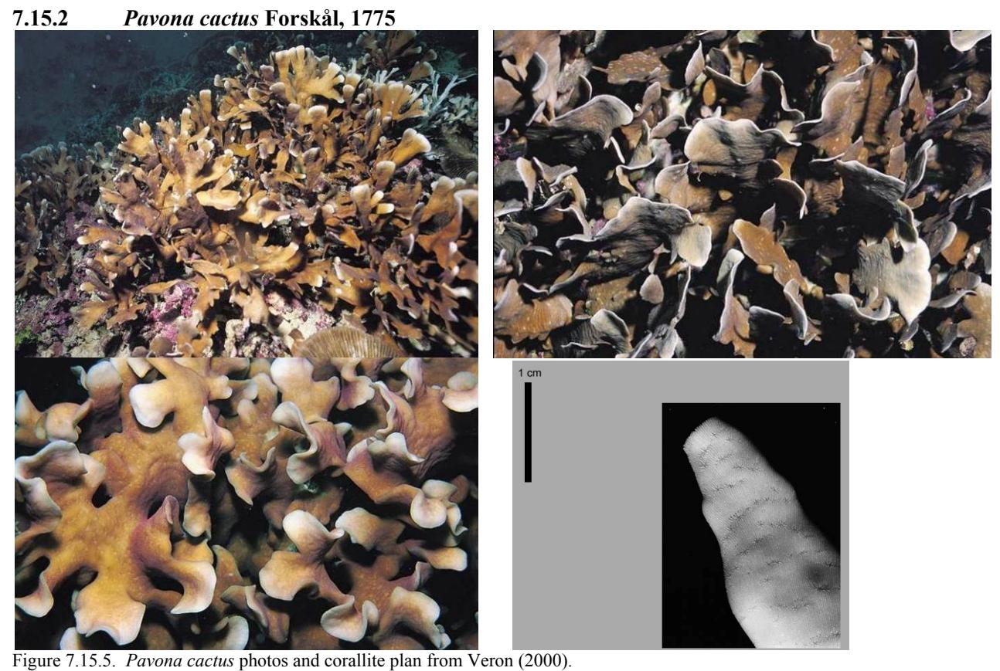

#### **Characteristics**

*Pavona cactus* colonies are composed of thin, contorted, bifacial, upright fronds with or without thickened branching bases. Corallites are fine, shallow and are aligned in irregular rows parallel to frond margins. Colonies are pale brown or greenish-brown in color, often with white margins (Veron, 2000).

#### **Taxonomy**

**Taxonomic issues**: None. *Pavona cactus* is similar to *Pavona frondifera* (Veron, 2000).

**Family:** Agariciidae

**Evolutionary and geologic history**: The family evolved in the Tethys Sea during the Cenozoic Age, with most genera disappearing from the Caribbean. *Pavona* disappeared from the Caribbean in the Eocene Era (Veron, 1995).

#### **Global Distribution**

*Pavona cactus* has a wide global distribution ranging in longitude from the Red Sea to the central Pacific, in latitude from Japan across the Great Barrier Reef and along the eastern and western coasts of Australia, and from the Red Sea to southern Africa (Veron, 2000). *Pavona cactus* does not have a restricted or highly fragmented range.

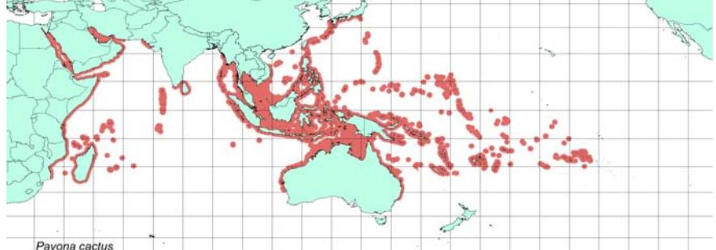

Figure 7.15.6. *Pavona cactus* distribution from IUCN copied from http://www.iucnredlist.org.

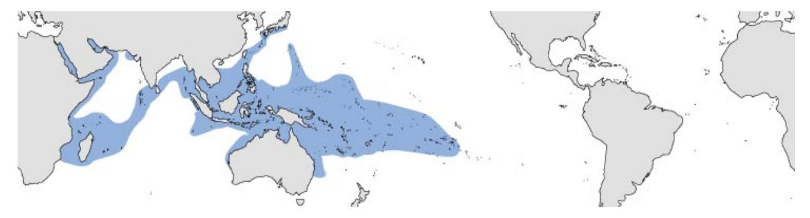

Figure 7.15.7. *Pavona cactus* distribution from Veron (2000).

#### **U.S. Distribution**

According to both the IUCN Species Account and the CITES species database, *Pavona cactus* occurs in American Samoa. The IUCN Species Account also lists its occurrence in the Northern Mariana Islands and the U.S. minor outlying islands.

A search of published and unpublished records of occurrence in U.S. waters indicates *Pavona cactus* has been reported from Ofu-Olosega in American Samoa (Lovell and McLardy, 2008; National Park Service, 2009), Guam (Burdick, unpubl. data; Randall, 2003) and Palmyra Atoll (Williams et al., 2008b).

Within federally protected waters, *Pavona cactus* has been recorded from the following areas:

- Pacific Remote Islands Marine National Monument (Palmyra)
- National Park of American Samoa, Ofu Island unit

#### **Habitat**

**Habitat:** *Pavona cactus* is usually found in lagoons and on upper reef slopes, especially those of fringing reefs, and in turbid waters protected from wave action, where colonies are sometimes greater than 10 meters across (Veron, 2000).

**Depth range**: *Pavona cactus* has been reported at water depths ranging from 1 to 20 m (Carpenter et al., 2008).

#### **Abundance**

Abundance of *Pavona cactus* has been reported as common (Veron, 2000).

#### **Life History**

*Pavona cactus* is a gonochoric broadcast spawner (Glynn and Ault, 2000). The minimum size and estimated age at first reproduction have not been determined for *Pavona cactus*, but the minimum colony sizes (and ages) at first reproduction were 5 cm (5 years) and 3 cm (2 to 3 years), respectively, in eastern Pacific populations of the congeners *Pavona varians* and *Pavona* sp. (Glynn et al., 2000). Although specific larval descriptions have not been published for this species, the larvae of three other *Pavona* species studied do not contain zooxanthellae that can supplement maternal provisioning with energy sources provided by their photosynthesis (Baird et al., 2009), i.e., they are lecithotrophic. Larval longevity has not been determined in this family. Its leafy/branching form makes it relatively fragile, and some clones have quite high fragment survival (Willis and Ayre, 1985).

#### **Threats**

**Temperature stress**: *Pavona* has mixed bleaching susceptibility according to Marshall and Baird (2000), and both massive and encrusting *Pavona* have been highly susceptible to bleaching in the eastern Pacific (Glynn et al., 2001; Maté, 2003b).

**Acidification:** Marubini et al. (2003) found that *Pavona cactus* calcification slowed during the experimental reduction of the aragonite saturation state. This agrees with a recent study that compared growth rates of two massive species of *Pavona* in the eastern Pacific and found little change in growth over the past 30 years because of acidification and little evidence of change along a saturation state gradient (Manzello, 2010). However, no comparable studies have been published on encrusting, frondose or branching pavonids. The presence of multiple species of massive *Pavona* in low saturation state environments in the eastern Pacific (Manzello et al., 2008) and the lack of growth change in lower pH environments suggests a degree of tolerance to acidification, although direct experimental studies have not confirmed this. Work in other corals has shown the potential for impacts other than extension as acidification impairs fertilization and settlement success in *Acropora palmata* (Albright et al., 2010) and likely will contribute to reef destruction in the future (Hoegh-Guldberg et al., 2007; Silverman et al., 2009). While ocean acidification has not been demonstrated to have caused appreciable declines in coral populations so far, the BRT considers it to be a significant threat to corals by 2100.

**Disease:** Medium number of genus level disease reports of acute white disease in the Pacific (B. Vargas-Ángel, CRED, Honolulu, HI, pers. comm., September 2010). However, ample evidence indicated that diseases can have devastating regional impacts on individual coral species (e.g., Aronson and Precht, 2001; Bruckner and Hill, 2009) and some evidence show that these impacts are occurring on a trend of increasing taxonomic and geographic scale (Green and Bruckner, 2000; Sutherland et al., 2004). Overall, a few disease reports for the family Agariciidae were found on the global disease database (UNEP, 2010).

**Predation:** Members of the genus *Pavona* are susceptible to predation by crown-of-thorns seastar (*Acanthaster planci*), but susceptibility is variable among species in the eastern Pacific (Glynn, 1976). No information is available on the specific susceptibility of *Pavona cactus*.

**Land-based sources of pollution (LBSP):** No information is available on the specific susceptibility of *Pavona cactus*. The genus *Pavona* is generally regarded as moderately tolerant to sediment stress (Blakeway, 2005). LBSP-related stresses (nutrients, sediment, toxins, and salinity) often act in concert rather than individually, and are influenced by other biological (e.g., herbivory) and hydrological factors. Collectively, LBSP stresses are unlikely to produce extinction at a global scale; however, they may pose significant threats at local scales (particularly important for species with limited range) and reduce the resilience of corals to bleaching (Carilli et al., 2009a; Wooldridge, 2009b).

**Collection/Trade**: More than 1000 pieces of *Pavona* spp. (including *Pavona cactus* and *Pavona decussata)* per year are reportedly traded according to the CITES Trade Database, UNEP World Conservation Monitoring Centre (CITES, 2010). Fiji appears to be the main exporter of *Pavona* spp. (CITES, 2010).

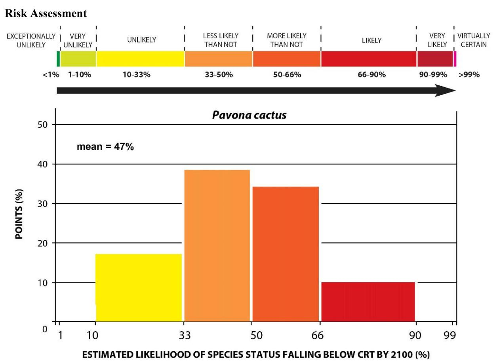

Figure 7.15.8. Distribution of points to estimate the likelihood that the status of *Pavona cactus* falls below the Critical Risk Threshold (the species is of such low abundance, or so spatially fragmented, or at such reduced diversity that extinction is extremely likely) by 2100.

*Pavona cactus'* moderate-to-low tolerance to thermal stress increases the potential extinction risk (higher likelihood of falling below the Critical Risk Threshold) for *Pavona cactus*. Factors that reduce potential extinction risk (decrease the likelihood of falling below the Critical Risk Threshold) for *Pavona cactus* are its broad distribution range, use of fragmentation as an important part of its life history, the moderate tolerance of sediment stress, and low susceptibility to disease and predation of the genus. Wide distribution is considered to lower extinction risk by making it more likely a species will be able to escape the impacts of threats and catastrophes in at least some locations.

The overall likelihood that *Pavona cactus* will fall below the Critical Risk Threshold by 2100 was estimated to be in the "less likely than not" risk category with a mean likelihood of 47% and a standard error (SE) of 11% (Fig. 7.15.8). This SE was calculated by taking the standard deviation of the seven mean voting scores of the BRT members and shows the coherence among the BRT. The uncertainty of the BRT is reflected in the range of votes of 10%–90% (Fig. 7.15.8) and the average range of likelihood estimates of the seven BRT voters (47%). The overall wide range of votes reflects the uncertainty among BRT members inherent in the lack of adequate ecological and demographic information for *Pavona cactus*.

#### **7.15.3** *Pavona decussata* **Dana, 1846**

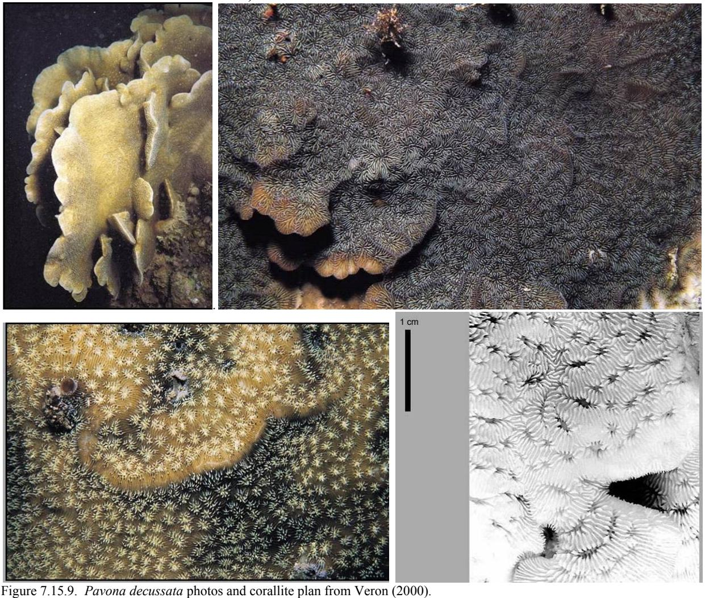

#### **Characteristics**

Colonies of *Pavona decussata* are thick interconnecting bifacial upright plates or are submassive, with or without lobed horizontal margins and upright plates. Corallites are irregular, deep seated, and are sometimes aligned parallel to margins or to radiating ridges. Colonies are brown, creamy-yellow or greenish in color (Veron, 2000).

#### **Taxonomy**

**Taxonomic issues**: No significant taxonomic issues. Stunted colonies superficially resemble *Pavona danai* and *Pavona frondifera* (Veron, 2000).

**Family:** Agariciidae.

**Evolutionary and geologic history**: The family evolved in the Tethys Sea during the Cenozoic Age, with most genera disappearing from the Caribbean. *Pavona* disappeared from the Caribbean in the Eocene Era (Veron, 1995).

#### **Global Distribution**

*Pavona decussata* has a wide global distribution ranging longitudinally from the Red Sea in the west to the French Polynesia in the east and latitudinally from Japan in the northern hemisphere to halfway up the eastern and western coasts of Australia and around Madagascar in the southern hemisphere (Veron, 2000).

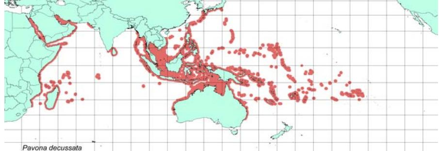

Figure 7.15.10. *Pavona decussata* distribution from IUCN copied from http://www.iucnredlist.org.

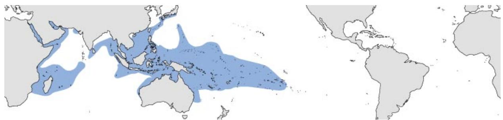

Figure 7.15.11. *Pavona decussata* distribution from Veron (2000).

#### **U.S. Distribution**

According to both the IUCN Species Account and the CITES species database, *Pavona decussata* occurs in American Samoa and the Northern Mariana Islands. The IUCN Species Account also lists its occurrence in the U.S. minor outlying islands.

A search of published and unpublished records of occurrence in U.S. waters indicates *Pavona decussata* has been reported from Tutuila and Ofu-Olosega in American Samoa (Birkeland, unpubl. data; Coles et al., 2003; Hoffmeister, 1925; Lamberts, 1983; Lovell and McLardy, 2008; Maragos et al., 1994; Mundy, 1996; National Park Service, 2009) and Guam (Amesbury et al., 1999; Burdick, unpubl. data; Randall, 2003). No substantiated published or unpublished record of its occurrence in the U.S. minor outlying islands could be identified.

Within federally protected waters, *Pavona decussata* has been recorded from the following areas:

- National Park of American Samoa, Ofu Island unit
- War in the Pacific National Historical Park, Guam

#### **Habitat**

**Habitat:** *Pavona decussata* can be found in most reef habitats (Veron, 2000).

**Depth range**: *Pavona decussata* has been reported in water depths ranging from 1 m to 20 m (Carpenter et al., 2008).

#### **Abundance**

Abundance of *Pavona decussata* has been reported as common (Veron, 2000).

#### **Life History**

The reproductive characteristics of *Pavona decussata* have not been determined (Baird et al., 2009). However, six congeners (*Pavona cactus, Pavona chiriquiensis, Pavona clavus, Pavona duerdeni, Pavona gigantea*, and *Pavona varians*) are known to be gonochoric spawners (Baird et al., 2009); eastern Pacific populations of *Pavona varians* and the sibling agariciid species *Pavona* sp. are also known to be hermaphrodites (Glynn et al., 2000). The minimum size and estimated age at first reproduction have not been determined for *Pavona decussata*, but the minimum colony sizes (and ages) at first reproduction were 5 cm (5 years) and 3 cm (2 to 3 years), respectively, in eastern Pacific populations of the congeners *Pavona varians* and *Pavona* sp. (Baird et al., 2009). Although specific larval descriptions have not been published for this species, the larvae of three other *Pavona* species studied do not contain zooxanthellae that can supplement maternal provisioning with energy sources provided by their photosynthesis (Baird et al., 2009), i.e., they are lecithotrophic. Larval longevity has not been determined in this family.

#### **Threats**

**Temperature stress**: *Pavona* is susceptible to mixed bleaching according to Marshall and Baird (2000) and both massive and encrusting *Pavona* have been highly susceptible to bleaching in the eastern Pacific (Glynn et al., 2001; Maté, 2003b). Yamano et al. (2011) found that *Pavona decussata* has expanded its range northward in Japan as temperatures have warmed. This may provide a northern refugium for the species.

**Acidification:** No studies have examined the direct impacts of ocean acidification on *Pavona decussata*. Marubini (Marubini et al., 2003) found that *Pavona cactus* calcification slowed during the experimental reduction of the aragonite saturation state. In contrast, a recent study compared growth rates of two massive species of *Pavona* in the eastern Pacific and found little change in growth over the past 30 years because of acidification and little evidence of change along a saturation state gradient (Manzello, 2010). However, no comparable studies have been published on encrusting, frondose or branching pavonids. The presence of multiple species of massive *Pavona* in low saturation state environments in the eastern Pacific (Manzello et al., 2008) and the lack of growth change in lower pH environments suggests a degree of tolerance to acidification, although direct experimental studies have not confirmed this and it may suggest that the threshold for response may be lower than levels seen in the eastern Pacific. Work in other corals has shown the potential for impacts other than extension as acidification impairs fertilization and settlement success in *Acropora palmata* (Albright et al., 2010) and likely will contribute to reef destruction in the future (Hoegh-Guldberg et al., 2007; Silverman et al., 2009). While ocean acidification has not been demonstrated to have caused appreciable declines in coral populations so far, the BRT considers it to be a significant threat to corals by 2100.

**Disease:** Medium number of genus level disease reports of acute white disease in the Pacific (B. Vargas-Ángel, CRED, Honolulu, HI, pers. comm., September 2010). However, ample evidence indicate that diseases can have devastating regional impacts on individual coral species (e.g., Aronson and Precht, 2001; Bruckner and Hill, 2009) and some evidence show that these impacts are occurring on a trend of increasing taxonomic and geographic scale (Green and Bruckner, 2000; Sutherland et al., 2004). Overall, a few disease reports for the family Agariciidae were found on the global disease database (UNEP, 2010).

**Predation**: Members of the genus *Pavona* are susceptible to predation by crown-of-thorns seastar (*Acanthaster planci*), but susceptibility is variable among species in the eastern Pacific (Glynn, 1976). No information is available on the specific susceptibility of *Pavona decussata*.

**Land-based sources of pollution (LBSP):** No information is available on the specific susceptibility of *Pavona decussata*. The genus *Pavona* is generally regarded as moderately tolerant to sediment stress (Blakeway, 2005). LBSPrelated stresses (nutrients, sediment, toxins, and salinity) often act in concert rather than individually, and are influenced by other biological (e.g., herbivory) and hydrological factors. Collectively, LBSP stresses are unlikely to produce extinction at a global scale; however, they may pose significant threats at local scales (particularly important for species with limited range) and reduce the resilience of corals to bleaching (Carilli et al., 2009a; Wooldridge, 2009b).

**Collection/Trade**: More than 1000 pieces of *Pavona* spp. (including *Pavona cactus* and *Pavona decussata)* per year are reportedly traded according to the CITES Trade Database, UNEP World Conservation Monitoring Centre (CITES, 2010). Fiji appears to be the main exporter of *Pavona* spp. (CITES, 2010).

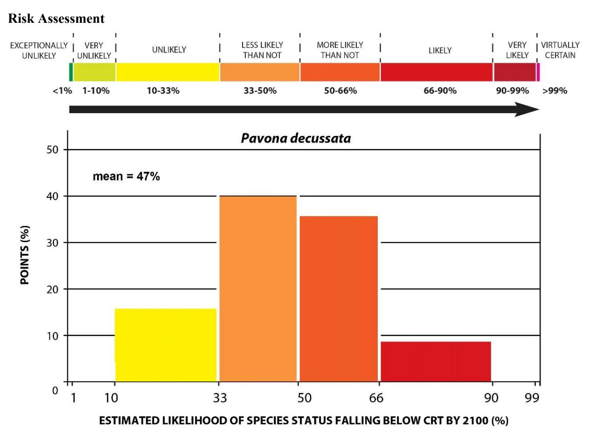

Figure 7.15.12. Distribution of points to estimate the likelihood that the status of *Pavona decussata* falls below the Critical Risk Threshold (the species is of such low abundance, or so spatially fragmented, or at such reduced diversity that extinction is extremely likely) by 2100.

*Pavona decussata*'s moderate-to-low tolerance to thermal stress increases the potential extinction risk (higher likelihood of falling below the Critical Risk Threshold) for *Pavona decussata*. Factors that reduce potential extinction risk (decrease the likelihood of falling below the Critical Risk Threshold) for *Pavona decussata* are its broad distribution range, the moderate tolerance of sediment stress, and low susceptibility to disease and predation of the genus. Wide distribution is considered to lower extinction risk by making it more likely a species will be able to escape the impacts of threats and catastrophes in at least some locations.

The overall likelihood that *Pavona decussata* will fall below the Critical Risk Threshold by 2100 was estimated to be in the "less likely than not" risk category with a mean likelihood of 47% and a standard error (SE) of 11% (Fig. 7.15.12). This SE was calculated by taking the standard deviation of the seven mean voting scores of the BRT members and shows the coherence among the BRT. The uncertainty of the BRT is reflected in the range of votes of 10%–90% (Fig. 7.15.12) and the average range of likelihood estimates of the seven BRT voters (51%). The overall wide range of votes reflects the uncertainty among BRT members inherent in the lack of adequate ecological and demographic information for *Pavona decussata*.

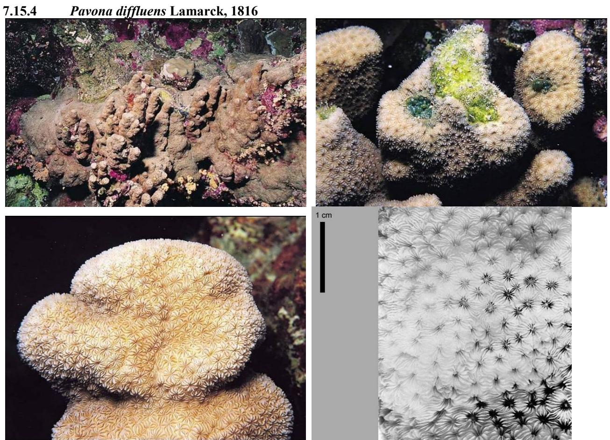

Figure 7.15.13. *Pavona diffluens* photos and corallite plan from Veron (2000).

#### **Characteristics**

Colonies of *Pavona diffluens* are submassive. Corallites are deep. Septo-costae strongly alternate with primary septa very exsert. Columellae are peg-like to absent. Colonies are tan colored (Veron, 2000).

#### **Taxonomy**

**Taxonomic issues:** None. *Pavona diffluens* is similar to *Pavona gigantea*, which forms massive colonies, and *Pavona explanulata*, which has a laminar growth-form and corallites with less exsert primary septa (Veron, 2000).

**Family:** Agariciidae.

**Evolutionary and geologic history**: The family evolved in the Tethys Sea during the Cenozoic Age, with most genera disappearing from the Caribbean. *Pavona* disappeared from the Caribbean in the Eocene Era (Veron, 1995).

#### **Global Distribution**

*Pavona diffluens* has a very narrow distribution, both latitudinal and longitudinal. It is only found in the region of the Red Sea and Arabian Gulf according to Veron (Veron, 2000) but Carpenter et al. (Carpenter et al., 2008) also record it in the Northern Marianas and American Samoa (but see below).

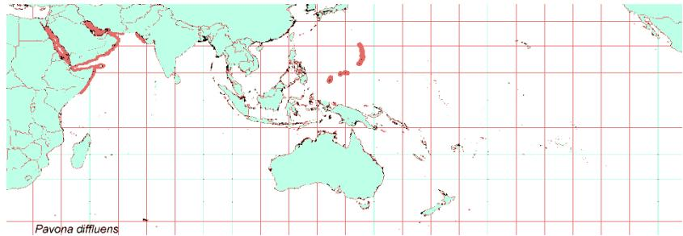

Figure 7.15.14. *Pavona diffluens* distribution from IUCN copied from http://www.iucnredlist.org.

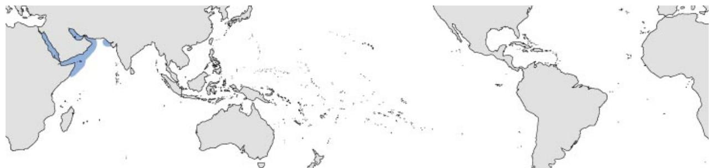

Figure 7.15.15. *Pavona diffluens* distribution from from Veron (2000).

#### **U.S. Distribution**

According to the IUCN Species Account, *Pavona diffluens* has been recorded in the Northern Mariana Islands, but the records (Randall, 1995) are considered unlikely. The CITES species database lists this species in American Samoa.

A search of published and unpublished records of occurrence in U.S. waters indicates *Pavona diffluens* has been reported from Tutuila, Ofu-Olosega, and Tau in American Samoa (Birkeland, unpubl. data; CRED, unpubl. data; Lovell and McLardy, 2008; National Park Service, 2009) and Guam (Burdick, unpubl. data; Randall, 2003).

Within federally protected waters, *Pavona diffluens* has been recorded from the following areas:

National Park of American Samoa, Tutuila Island unit

#### **Habitat**

**Habitat:** *Pavona diffluens* has been reported to be found in most reef habitats (Veron, 2000).

**Depth range**: *Pavona diffluens* has been reported in water depths ranging from 5 m to 20 m (Carpenter et al., 2008).

#### **Abundance**

Abundance of *Pavona diffluens* has been reported as uncommon (Veron, 2000).

#### **Life History**

The reproductive characteristics of *Pavona diffluens* have not been determined (Baird et al., 2009). However, six congeners (*Pavona cactus, Pavona chiriquiensis, Pavona clavus, Pavona duerdeni, Pavona gigantea*, and *Pavona varians*) are known to be gonochoric spawners (Baird et al., 2009); eastern Pacific populations of *Pavona varians* and the sibling agariciid species *Pavona* sp. are also known to be hermaphrodites (Glynn et al., 2000). The minimum size and estimated age at first reproduction have not been determined for *Pavona diffluens*, but the minimum colony sizes (and ages) at first reproduction were 5 cm (5 years) and 3 cm (2 to 3 years), respectively, in eastern Pacific populations of the congeners *Pavona varians* and *Pavona* sp. a (ibid). Although specific larval descriptions have not been published for this species, the larvae of all three other *Pavona* species studied do not contain zooxanthellae that can supplement maternal provisioning with energy sources provided by their photosynthesis (Baird et al., 2009), i.e., they are lecithotrophic. Larval longevity has not been determined in this family.

#### **Threats**

**Temperature stress**: *Pavona* is susceptible to mixed bleaching according to Marshall and Baird (2000), and both massive and encrusting *Pavona* have been highly susceptible to bleaching in the eastern Pacific (Glynn et al., 2001; Maté, 2003b).

**Acidification:** No studies have examined the direct impacts of ocean acidification on *Pavona diffluens*. Marubini (Marubini et al., 2003) found that *Pavona cactus* calcification slowed during the experimental reduction of the aragonite saturation state. In contrast, a recent study compared the fgrowth rates of two massive species of *Pavona* in the eastern Pacific and found little change in growth over the past 30 years because of acidification and little evidence of change along a saturation state gradient (Manzello, 2010). However, no comparable studies have been published on encrusting, frondose or branching pavonids. The presence of multiple species of massive *Pavona* in low saturation state environments in the eastern Pacific (Manzello et al., 2008) and the lack of growth change in lower pH environments suggests a degree of tolerance to acidification, although direct experimental studies have not confirmed this, and it may suggest that the threshold for response may be lower than levels seen in the eastern Pacific. Work in other corals has shown the potential for impacts other than extension as acidification impairs fertilization and settlement success in *Acropora palmata* (Albright et al., 2010) and likely will contribute to reef destruction in the future (Hoegh-Guldberg et al., 2007; Silverman et al., 2009). While ocean acidification has not been demonstrated to have caused appreciable declines in coral populations so far, the BRT considers it to be a significant threat to corals by 2100.

**Disease:** Medium number of genus level disease reports of acute white disease in the Pacific (B. Vargas-Ángel, CRED, Honolulu, HI, pers. comm., September 2010). However, ample evidence indicate that diseases can have devastating regional impacts on individual coral species (e.g., Aronson and Precht, 2001; Bruckner and Hill, 2009) and some evidence show that these impacts are occurring on a trend of increasing taxonomic and geographic scale (Green and Bruckner, 2000; Sutherland et al., 2004). Overall, few disease reports for the family Agariciidae were found on the global disease database (UNEP, 2010).

**Predation**: Members of the genus *Pavona* are susceptible to predation by crown-of-thorns seastar (*Acanthaster planci*), but susceptibility is variable among species in the eastern Pacific (Glynn, 1976). No information is available on the specific susceptibility of *Pavona diffluens*.

**Land-based sources of pollution (LBSP):** No information is available on the specific susceptibility of *Pavona diffluens*. The genus *Pavona* is generally regarded as moderately tolerant to sediment stress (Blakeway, 2005). LBSPrelated stresses (nutrients, sediment, toxins, and salinity) often act in concert rather than individually and are influenced by other biological (e.g., herbivory) and hydrological factors. Collectively, LBSP stresses are unlikely to produce extinction at a global scale; however, they may pose significant threats at local scales (particularly important for species with limited range) and reduce the resilience of corals to bleaching (Carilli et al., 2009a; Wooldridge, 2009b).

**Collection/Trade**: More than 1000 pieces of *Pavona* spp. (including *Pavona cactus* and *Pavona decussata*, but with no mention of *Pavona diffluens)* per year are reportedly traded according to the CITES Trade Database, UNEP World Conservation Monitoring Centre (CITES, 2010). Fiji appears to be the main exporter of *Pavona* spp. (CITES, 2010).

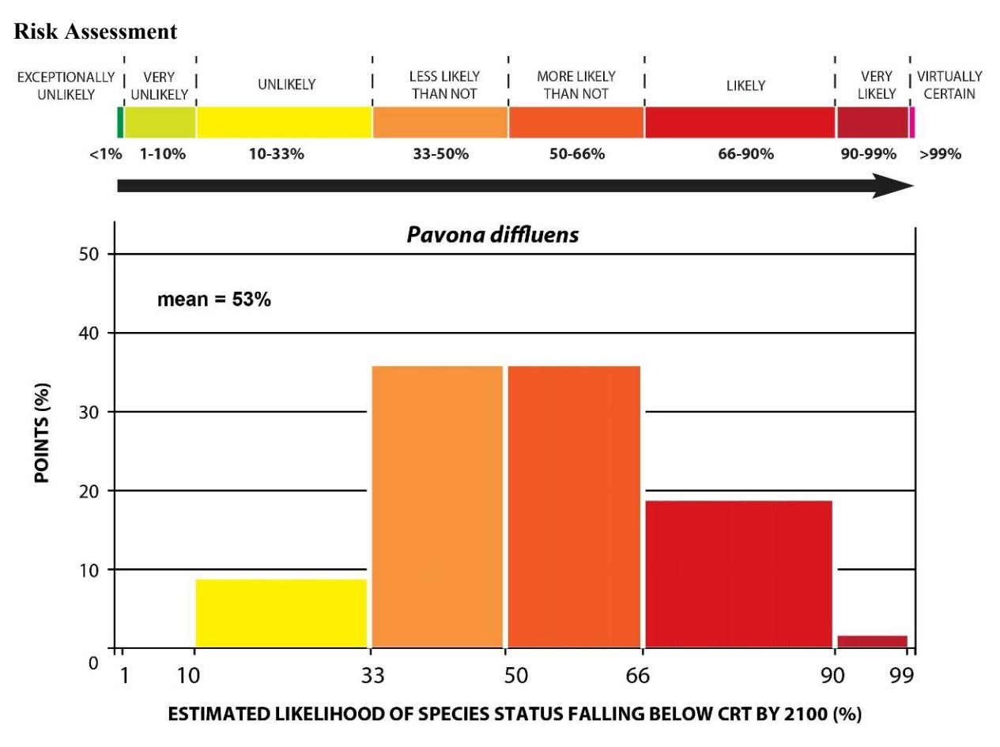

Figure 7.15.16. Distribution of points to estimate the likelihood that the status of *Pavona diffluens* falls below the Critical Risk Threshold (the species is of such low abundance, or so spatially fragmented, or at such reduced diversity that extinction is extremely likely) by 2100.

*Pavona diffluens*' fairly moderate-to-low tolerance to thermal stress and the species' narrow distribution range increase the potential extinction risk (higher likelihood of falling below the Critical Risk Threshold) for *Pavona diffluens*. Factors that reduce potential extinction risk (decrease the likelihood of falling below the Critical Risk Threshold) for *Pavona diffluens* are its moderate tolerance of sediment stress, low susceptibility of the genus to disease and predation, and it's restricted and split distribution range.

The overall likelihood that *Pavona diffluens* will fall below the Critical Risk Threshold by 2100 was estimated to be in the "more likely than not" risk category with a mean likelihood of 53% and a standard error (SE) of 12% (Fig. 7.15.16). This SE was calculated by taking the standard deviation of the seven mean voting scores of the BRT members and shows the coherence among the BRT. The narrow distribution range was the reason *Pavona diffluens* had a slightly higher mean likelihood compared to the other *Pavona* spp. The uncertainty of the BRT is reflected in the range of votes of 10%–99% (Fig. 7.15.16) and the average range of likelihood estimates of the seven BRT voters (61%). The overall wide range of votes reflects the uncertainty among BRT members inherent in the lack of adequate ecological and demographic information for *Pavona diffluens*.

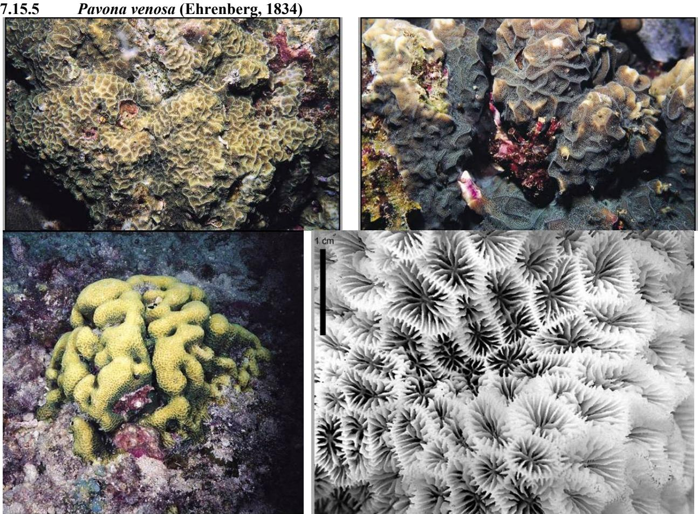

Figure 7.15.17. *Pavona venosa* photos and corallite plan from Veron (2000).

#### **Characteristics**

Colonies of *Pavona venosa* are massive to encrusting. Corallites are in short valleys with acute walls. Septo-costae are generally in three orders and are widely spaced. Columellae are poorly developed or absent. Colonies are yellow-brown or pinkish-brown in color, sometimes mottled (Veron, 2000).

#### **Taxonomy**

**Taxonomic issues**: None. *Pavona venosa* is similar to *Pavona varians*, which has less well-developed ridges (collines) and usually two orders of septa (Veron, 2000).

**Family:** Agariciidae.

**Evolutionary and geologic history**: The family evolved in the Tethys Sea during the Cenozoic Age, with most genera disappearing from the Caribbean. *Pavona* disappeared from the Caribbean in the Eocene Era (Veron, 1995).

#### **Global Distribution**

*Pavona venosa* has a wide distribution, ranging longitudinally from the Red Sea in the west to possibly the Cook Islands in the east and latitudinally from the Ryukyu Islands (Japan) on the northern hemisphere to South Africa and half way down the eastern and western coasts of Australia in the southern hemisphere.

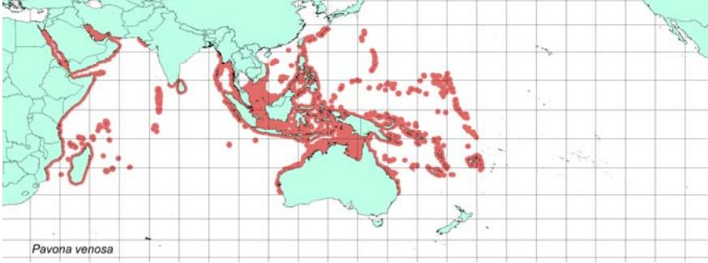

Figure 7.15.18. *Pavona venosa* distribution from IUCN copied from http://www.iucnredlist.org.

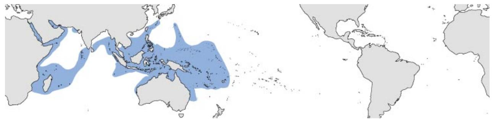

Figure 7.15.19. *Pavona venosa* distribution from Veron (2000).

#### **U.S. Distribution**

According to both the IUCN Species Account and the CITES species database, *Pavona venosa* has been recorded in the Northern Mariana Islands. The CITES species database also lists this species in American Samoa.

A search of published and unpublished records of occurrence in U.S. waters indicates *Pavona venosa* has been reported from Tutuila, Ofu-Olosega, Tau, and Rose Atoll in American Samoa (Birkeland, unpubl. data; Coles et al., 2003; Fisk and Birkeland, 2002; Kenyon et al., 2010a; Lovell and McLardy, 2008; National Park Service, 2009), Guam (Amesbury et al., 1999; Burdick, unpubl. data; Randall, 2003), and Kingman Reef (CRED, unpubl. data).

Within federally protected waters, *Pavona venosa* has been recorded from the following areas:

- Pacific Remote Islands Marine National Monument (Kingman)
- National Park of American Samoa, Tutuila and Ofu Island units
- Fagatele Bay National Marine Sanctuary, Tutuila
- Rose Atoll Marine National Monument
- War in the Pacific National Historical Park, Guam

#### **Habitat**

**Habitat:** *Pavona venosa* has been reported to occupy shallow reef environments (Veron, 2000).

**Depth range**: *Pavona venosa* has been reported in water depths ranging from 2 m to 20 m (Carpenter et al., 2008).

#### **Abundance**

Abundance of *Pavona venosa* has been reported to be usually uncommon but distinctive (Veron, 2000).

#### **Life History**

The reproductive characteristics of *Pavona venosa* have not been determined (Baird et al., 2009). However, six congeners (*Pavona cactus, Pavona chiriquiensis, Pavona clavus, Pavona duerdeni, Pavona gigantea*, and *Pavona varians*) are known to be gonochoric spawners (Baird et al., 2009); eastern Pacific populations of *Pavona varians* and the sibling agariciid species *Pavona* sp. are also known to be hermaphrodites (Glynn et al., 2000). The minimum size and estimated age at first reproduction have not been determined for *Pavona venosa*, but the minimum colony sizes (and ages) at first reproduction were 5 cm (5 years) and 3 cm (2 to 3 years), respectively, in eastern Pacific populations of the congeners *Pavona varians* and *Pavona* sp. (Baird et al., 2009). Although specific larval descriptions have not been published for this species, the larvae of three other *Pavona* species studied do not contain zooxanthellae that can supplement maternal provisioning with energy sources provided by their photosynthesis (Baird et al., 2009), i.e., they are lecithotrophic. Larval longevity has not been determined in this family.

#### **Threats**

**Temperature stress**: *Pavona* is susceptible to mixed bleaching according to Marshall and Baird (2000), and both massive and encrusting *Pavona* has been highly susceptible to bleaching in the eastern Pacific (Glynn et al., 2001; Maté, 2003b).

**Acidification:** No studies have examined the direct impacts of ocean acidification on *Pavona venosa*. Marubini (Marubini et al., 2003) found that *Pavona cactus* calcification slowed during the experimental reduction of the aragonite saturation state. In contrast, a recent study compared the growth rates of two massive species of *Pavona* in the eastern Pacific and found little change in growth over the past 30 years because of acidification and little evidence of change along a saturation state gradient (Manzello, 2010). However, no comparable studies have been published on encrusting, frondose or branching pavonids. The presence of multiple species of massive *Pavona* in low saturation state environments in the eastern Pacific (Manzello et al., 2008) and the lack of growth change in lower pH environments suggests a degree of tolerance to acidification, although direct experimental studies have not confirmed this, and it may suggest that the threshold for response may be lower than levels seen in the eastern Pacific. Work in other corals has shown the potential for impacts other than extension as acidification impairs fertilization and settlement success in *Acropora palmata* (Albright et al., 2010) and likely will contribute to reef destruction in the future (Hoegh-Guldberg et al., 2007; Silverman et al., 2009). While ocean acidification has not been demonstrated to have caused appreciable declines in coral populations so far, the BRT considers it to be a significant threat to corals by 2100.

**Disease:** Medium number of genus level disease reports of acute white disease in the Pacific (B. Vargas-Ángel, CRED, Honolulu, HI, pers. comm., September 2010). However, ample evidence indicate that diseases can have devastating regional impacts on individual coral species (e.g., Aronson and Precht, 2001; Bruckner and Hill, 2009) and some evidence show that these impacts are occurring on a trend of increasing taxonomic and geographic scale (Green and Bruckner, 2000; Sutherland et al., 2004). Overall, few disease reports for the family Agariciidae were found on the global disease database (UNEP, 2010).

**Predation**: Members of the genus *Pavona* are susceptible to predation by crown-of-thorns seastar (*Acanthaster planci*), but susceptibility is variable among species in the eastern Pacific (Glynn, 1976). No information is available on the specific susceptibility of *Pavona venosa*.

**Land-based sources of pollution (LBSP):** No information is available on the specific susceptibility of *Pavona venosa*. The genus *Pavona* is generally regarded as moderately tolerant to sediment stress (Blakeway, 2005). LBSP-related stresses (nutrients, sediment, toxins, and salinity) often act in concert rather than individually and are influenced by other biological (e.g., herbivory) and hydrological factors. Collectively, LBSP stresses are unlikely to produce extinction at a global scale; however, they may pose significant threats at local scales (particularly important for species with limited range) and reduce the resilience of corals to bleaching (Carilli et al., 2009a; Wooldridge, 2009b).

**Collection/Trade**: More than 1000 pieces of *Pavona* spp. (including *Pavona cactus* and *Pavona decussata*, but with no mention of *Pavona venosa*) per year are reportedly traded according to the CITES Trade Database, UNEP World Conservation Monitoring Centre (CITES, 2010). Fiji appears to be the main exporter of *Pavona* spp. (CITES, 2010).

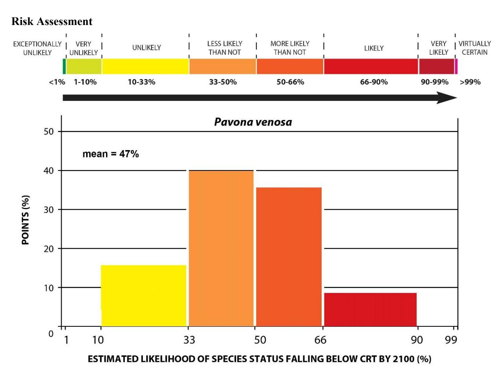

Figure 7.15.20. Distribution of points to estimate the likelihood that the status of *Pavona venosa* falls below the Critical Risk Threshold (the species is of such low abundance, or so spatially fragmented, or at such reduced diversity that extinction is extremely likely) by 2100.

The moderate-to-low tolerance to thermal stress increases the potential extinction risk (higher likelihood of falling below the Critical Risk Threshold) for *Pavona venosa*. Factors that reduce potential extinction risk (decrease the likelihood of falling below the Critical Risk Threshold) of *Pavona venosa* are its broad distribution, the moderate tolerance of sediment stress, and low susceptibility of the genus to disease and predation. Wide distribution is considered to lower extinction risk by making it more likely a species will be able to escape the impacts of threats and catastrophes in at least some locations.

The overall likelihood that *Pavona venosa* will fall below the Critical Risk Threshold by 2100 was estimated to be in the "less likely than not" risk category with a mean likelihood of 47% and a standard error (SE) of 12% (Fig. 7.15.20). This SE was calculated by taking the standard deviation of the seven mean voting scores of the BRT members and shows the coherence among the BRT. The uncertainty of the BRT is reflected in the range of votes of 10%–90% (Fig. 7.15.20) and the average range of likelihood estimates of the seven BRT voters (48%). The overall wide range of votes reflects the uncertainty among BRT members inherent in the lack of adequate ecological and demographic information for *Pavona venosa.*

#### **7.16 Genus** *Galaxea* **(Family Oculinidae)**

#### **7.16.1** *Galaxea astreata* **Lamarck, 1816**

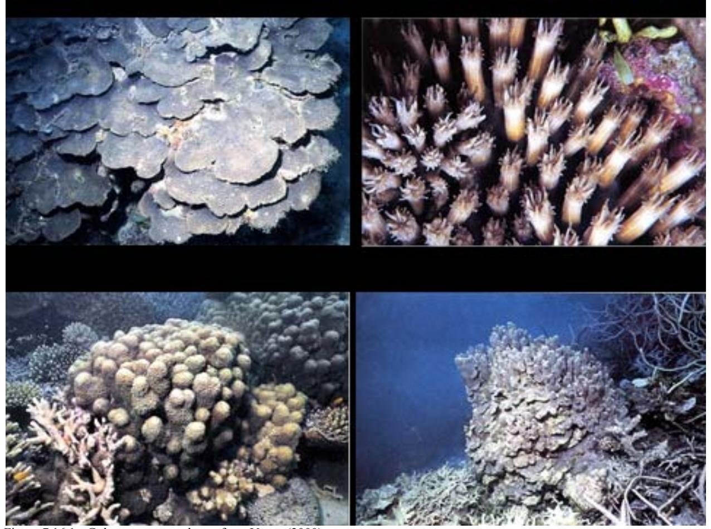

Figure 7.16.1. *Galaxea astreata* photos from Veron (2000).

#### **Characteristics**

*Galaxea astreata* can vary considerably in colony morphology from (upper left photo above) tiered plates to (lower left photo above) columnar to (lower right above) combinations of tiered plates and columns. The (upper right photo) corallites typically appear tall and even compared to other species of *Galaxea*, and the corallites are less than half the diameter of the common *Galaxea fascicularis*. The colonies can be more than 2 m across (Veron, 2000) and can dominate areas. Colonies are usually grey in color with brown, green, or sometimes pink (Veron, 2000).

#### **Taxonomy**

**Taxonomic issues**: None.

**Family:** Oculinidae.

**Evolutionary and geologic history**: The genus *Galaxea* originated in the Miocene (23 Ma–5.3 Ma). It became extinct in the Atlantic (Budd et al., 1994) but continues to be extraordinarily widespread throughout the Indo-Pacific.

#### **Global Distribution**

*Galaxea astreata* has a very broad range, extending from the Red Sea and east Africa to Fiji, Kiribati and American Samoa (east-central Pacific Ocean). It extends latitudinally from Japanese waters in the northern hemisphere across the Great Barrier Reef and southern Africa in the southern hemisphere.

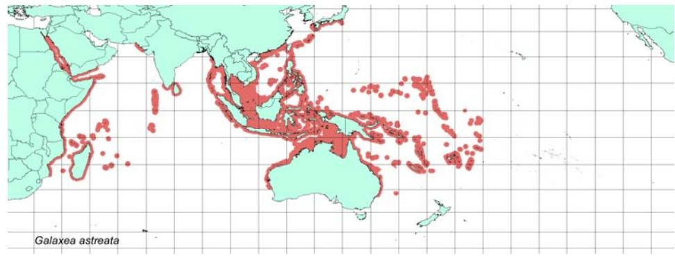

Figure 7.16.2. *Galaxea astreata* distribution from IUCN copied from http://www.iucnredlist.org.

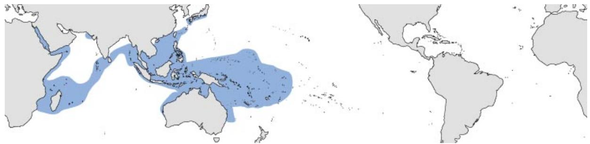

Figure 7.16.3. *Galaxea astreata* distribution from Veron (2000).

#### **U.S. Distribution**

According to both the IUCN Species Account and the CITES species database, *Galaxea astreata* occurs in American Samoa. The IUCN Species Account also lists it for the U.S. minor outlying islands and the CITES database lists it for the Northern Mariana Islands.

A search of published and unpublished records of occurrence in U.S. waters indicates *Galaxea astreata* has been reported from Tutuila, Ofu-Olosega, and Tau in American Samoa (Birkeland, unpubl. data; Coles et al., 2003; CRED, unpubl. data; Fisk and Birkeland, 2002; Lovell and McLardy, 2008; Maragos et al., 1994; Mundy, 1996; National Park Service, 2009). In Veron (Veron, 2000) (Volume 2, page 111) the distribution map for this species includes a photo taken by Gustav Paulay labeled "Guam." However, Paulay (pers. comm. to J. Kenyon via email 2/28/2010) indicates a number of photos submitted by him to Veron from Palau, the Cook Islands, and other locations in the Pacific were mistakenly attributed to Guam (similar to the *errata* later acknowledged by Veron (Veron, 2002)) for *Acanthastrea regularis* and *Porites napopora*). Consequently, there are no substantiated records of its occurrence in the Mariana Archipelago. No published or unpublished records of occurrence in the U.S. minor outlying islands could be identified.

Within federally protected waters, *Galaxea astreata* has been recorded from the following areas:

National Park of American Samoa, Ofu Island unit

#### **Habitat**

**Habitat**: *Galaxea astreata* generally lives in areas protected from strong wave action*.* It can live in turbid waters (Titlyanov and Latypov, 1991) and can survive on reefs heavily influenced by terrestrial runoff.

**Depth range**: *Galaxea astreata* lives from low tide to at least 20 m, but typically range from water depths of 5 to 10 m.

#### **Abundance**

*Galaxea astreata c*an be abundant and can even dominate some areas.

#### **Life History**

*Galaxea astreata* is a hermaphroditic broadcast spawner (Babcock et al., 1986; Dai et al., 1992; Harrison et al., 1984). The sexual pattern of *Galaxea astreata* has been described as "pseudo-gynodioecious" on the Great Barrier Reef (Harrison, 1988) and in Singapore (Guest et al., 2005b). Populations are composed of female colonies that produce red eggs and colonies that produce sperm and lipid-filled white eggs. In this system, hermaphroditic colonies function as males, and the populations function as a gonochoristic breeding system. The minimum size and estimated age of first reproduction has not been determined for this species, but for the congener *Galaxea fascicularis*, the minimum size at first reproduction is 4 cm–5 cm (Yamazato and Minei, 1986).

#### **Threats**

**Thermal stress:** On the genus level, *Galaxea* seems to be relatively bleaching resistant across regions (McClanahan et al., 2004a). *Galaxea* was one of the least susceptible to bleaching of scleractinian genera in the western Indian Ocean (McClanahan et al., 2007). The genus had low bleaching at the Great Barrier Reef (Marshall and Baird, 2000) during the 1997-1998 mass bleaching event, but *Galaxea astreata* had severe bleaching and total mortality in Africa (Obura, 2001) and Palau (Bruno et al., 2001) in the same event. *Galaxea astreata* in Australia host Clade C zooxanthellae, whereas *Galaxea fasicularis* hosts both C and the stress-resistant Clade D (LaJeunesse et al., 2004a); this could confer differences in bleaching resistance that would be difficult to detect when bleaching is often reported at the genus level. Bleaching may not pose a substantial risk to this genus, but it may have severe effects on this particular species.

**Acidification:** Acidification appears to be a potential risk for this species. When held under reduced pH conditions, *Galaxea astreata* produced abnormal skeletal septae. *Galaxea fascicularis* reduces calcification by 12% to 56% when pCO2 is increased 2 times the preindustrial revolution levels and by 18% to 83% when pCO2 is increased 3 times the preindustrial revolution levels (Kleypas et al., 2006). This agrees with the general pattern that acidification impairs growth (Langdon and Atkinson, 2005; Manzello, 2010) and, in the case of *Acropora palmata*, acidification impairs fertilization and settlement success (Albright et al., 2010), and acidification is likely to contribute to reef destruction in the future (Hoegh-Guldberg et al., 2007; Silverman et al., 2009). Interestingly, Hii et al. (2009) report that *Galaxea fasucularis* expel their zoozanthellae and increased their calcification under elevated pCO2 conditions. While ocean acidification has not been demonstrated to have caused appreciable declines in coral populations so far, the BRT considers it to be a significant threat to corals by 2100.

**Disease:** Susceptibility and impacts of disease on *Galaxea astreata* are not known. However, ample evidence indicate that diseases can have devastating regional impacts on individual coral species (e.g., Aronson and Precht, 2001; Bruckner and Hill, 2009) and evidence show that these impacts are occurring in more taxa and at a broader geographic scale (Green and Bruckner, 2000; Sutherland et al., 2004).

**Predation:** *Galaxea astreata* became one of the dominant corals in Zanzibar after crown-of-thorns seastar (*Acanthaster planci*) outbreaks removed Acroporid corals in the 1990s (Muhando and Lanshammar, 2008). *Drupella cornus* will feed on *Galaxea astreata* (probably synonymous with *Galaxea clavus*) (McClanahan et al., 2004b).

**Land-based sources of pollution (LBSP):** Sedimentation appears to be a minimal threat to *Galaxea astreata*. The species can live in turbid waters (Titlyanov and Latypov, 1991) and persist in areas under terrigenous influence (Van Woesik et al., 1999), while its congener *Galaxea fasicularis* is a relatively efficient sediment-rejecter (Stafford-Smith, 1993; Stafford-Smith and Ormond, 1992). Effects of nutrients and contaminants are unknkown.

LBSP-related stresses (nutrients, sediment, toxins, and salinity) often act in concert rather than individually and are influenced by other biological (e.g., herbivory) and hydrological factors. Collectively, LBSP stresses are unlikely to produce extinction at a global scale; however, they may pose significant threats at local scales (particularly important for species with limited range) and reduce the resilience of corals to bleaching (Carilli et al., 2009a; Wooldridge, 2009b).

C**ollection/Trade:** In Singapore, overcollecting and trampling was a major concern for *Galaxea*. In 2005 alone, 20,000 pieces were exported. *Galaxea astreata* is also involved in trade from Fiji, Tonga, and Malaysia but on a small scale (< 500) pieces per year between 2000 and 2008), whereas from Indonesia it was reported that exports were between 4000 and 8000 pieces per year in the same time period (CITES, 2010).

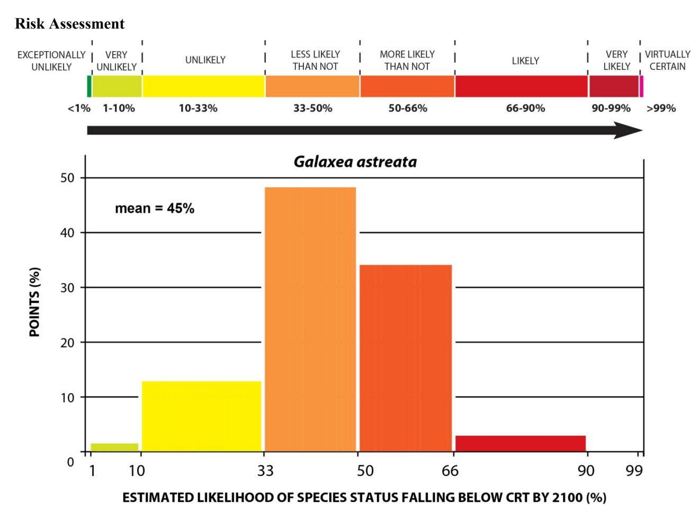

Figure 7.16.4. Distribution of points to estimate the likelihood that the status of *Galaxea astreata* falls below the Critical Risk Threshold (the species is of such low abundance, or so spatially fragmented, or at such reduced diversity that extinction is extremely likely) by 2100.

Factors that increase the potential extinction risk (higher likelihood of falling below the Critical Risk Threshold) for *Galaxea astreata* include susceptibility to thermal stress, seawater acidification, and harvesting. Factors that reduce potential extinction risk (decrease the likelihood of falling below the Critical Risk Threshold) for *Galaxea astreata* are that this species can be dominant in turbid waters, are remarkably tolerant to terrestrial runoff and sedimentation, are generally not favored by corallivores such as *Acanthaster planci*, and are broadly distributed both latitudinally and longitudinally in the Indo-Pacific. Wide distribution is considered to lower extinction risk by making it more likely a species will be able to escape the impacts of threats and catastrophes in at least some locations.

The overall likelihood that *Galaxea astreata* will fall below the Critical Risk Threshold by 2100 was estimated to be in the "less likely than not" risk category with a mean likelihood of 45% and a standard error (SE) of 8% (Fig. 7.16.4). This SE was calculated by taking the standard deviation of the seven mean voting scores of the BRT members and shows the coherence among the BRT. The uncertainty of the BRT is reflected in the range of votes of 1%–90% (Fig. 7.16.4) and the average range of likelihood estimates of the seven BRT voters (52%). The overall wide range of votes reflects the uncertainty among BRT members inherent in the lack of adequate ecological and demographic information for *Galaxea astreata*.

#### **7.17 Genus** *Pectinia* **(Family Pectiniidae)**

#### **7.17.1** *Pectinia alcicornis* **Saville-Kent, 1871**

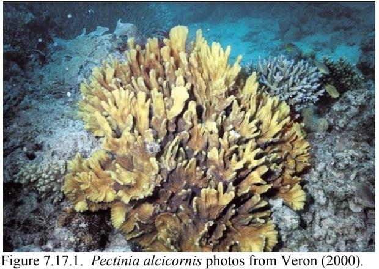

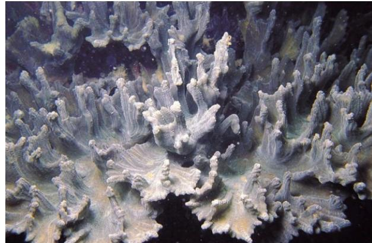

#### **Characteristics**

Colonies of *Pectinia alcicornis* are irregular clusters with flat fluted laminae and tall, upward-projecting spires that can dominate the morphology. Costae are toothed, exsert, and project upward with projecting spires and short walls. Colonies are green, yellow, brown, or mixtures of colors. Central portions of colonies are usually darker than colony edges (Veron, 2000).

#### **Taxonomy**

**Taxonomic issues**: None. *Pectinia alcicornis* is similar to *Pectinia paeonia* (Veron, 2000).

**Family:** Pectiniidae.

**Evolutionary and geologic history:** The genus is known in the Pacific from the Pleistocene Era (Veron, 1995).

#### **Global Distribution**

*Pectinia alcicornis* is broadly distributed in the Indo-Pacific, including Australia, Fiji, Indonesia, Japan, the Philippines, and India.

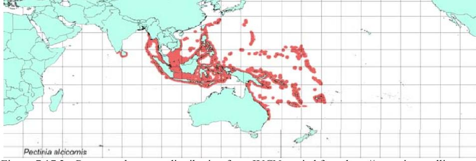

Figure 7.17.2. *Pectinia alcicornis* distribution from IUCN copied from http://www.iucnredlist.org.

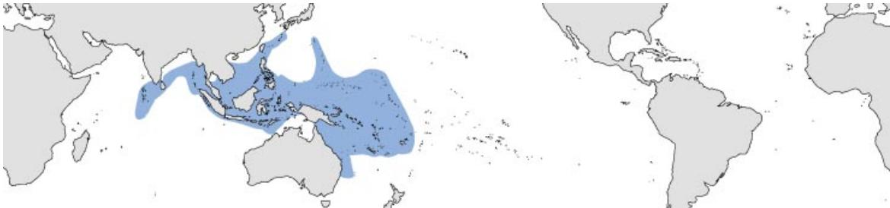

Figure 7.17.3. *Pectinia alcicornis* distribution from Veron (2000).

#### **U.S. Distribution**

The CITES database does not list *Pectinia alcicornis* as occurring in U.S. waters. The IUCN lists this species in the Mariana Islands, but no supporting record is given. Veron (2000) also lists *Pectinia alcicornis* in the Marianas; however, the Marianas record may be based on geographic errors of photographic records (Kenyon et al., 2010b). Paulay (pers. comm., 28 February 2010) indicates a number of photos submitted by him to Veron from Palau, and the Cook Islands, and other locations in the Pacific were mistakenly attributed to Guam (similar to the *errata* later acknowledged by Veron (2002) for *Acanthastrea regularis* and *Porites napopora*).

No other published or unpublished data sources indicate the occurrence of *Pectinia alcicornis* elsewhere in U.S. waters.

#### **Habitat**

**Habitat:** *Pectinia alcicornis* inhabits turbid water, often on horizontal substrates (Veron, 2000). It is found in most reef habitats, both shallow and deep (Wood, 1983). The species has been reported to be found in caves on the Great Barrier Reef (Dinesen, 1983).

**Depth range**: *Pectinia alcicornis has been reported in water depths ranging from* 5 m to 25 m (Carpenter et al., 2008).

#### **Abundance**

Abundance of *Pectinia alcicornis* has been reported as usually uncommon (Veron, 2000).

#### **Life History**

*Pectinia alcicornis* is a hermaphroditic broadcast spawner (Babcock et al., 1986; Babcock and Heyward, 1986; Penland et al., 2004; Willis et al., 1985). The minimum size and estimated age of first reproduction have not been determined for any members of the family Pectiniidae (Harrison and Wallace, 1990). Although specific larval descriptions have not been published for this species, the larvae of the single *Pectinia* species studied do not contain zooxanthellae that can supplement maternal provisioning with energy sources provided by their photosynthesis (Baird et al., 2009), i.e., they are lecithotrophic. Larval longevity has not been determined for this species, but the maximum larval longevity for the congener *Pectinia paeonia* studied in laboratory cultures was 209 days (Graham et al., 2008).

#### **Threats**

**Thermal stress:** As a genus, *Pectinia* were among the most highly susceptible to bleaching on the Great Barrier Reef in 1998 (Marshall and Baird, 2000), although *Pectinia alcicornis* showed very little mortality on the GBR in the 2001-2002 mass bleaching event (Done et al., 2003). Congener *Pectinia paeonia* was among the most susceptible species in Palau during the 1998 event (Bruno et al., 2001). *Pectinia alcicornis* harbors Clade C zooxanthellae in Okinawa (LaJeunesse et al., 2004a) and the South China Sea (Dong et al., 2009), but contained Clade D zooxanthellae in Palau after the 2001mass bleaching event (Fabricius et al., 2004).

**Acidification:** *Pectinia alcicornis* is one of many species that has been raised in the Waikiki Aquarium, which is characterized by high-nutrient, low-pH waters (Atkinson et al., 1995). This may imply that to some degree this species can tolerate acidified water, but the impact of acidification on growth has not been quantified. However, in most corals studied (Table 3.2.2), acidification impairs growth (Langdon and Atkinson, 2005; Manzello, 2010) and, in the case of *Acropora palmata*, impairs fertilization and settlement success (Albright et al., 2010) and is likely to contribute to reef destruction in the future (Hoegh-Guldberg et al., 2007; Silverman et al., 2009). While ocean acidification has not been demonstrated to have caused appreciable declines in coral populations so far, the BRT considers it to be a significant threat to corals by 2100.

**Disease:** Susceptibility and impacts of disease on *Pectinia alcicornis* are not known. Congener *Pectinia lactuca* was observed to lack tissue lesions in American Samoa but did have parasitic crustaceans in its mesoglea (Work and Rameyer, 2005). *Pectinia* were among those genera not infected by the ciliate disease skeletal eroding band in the Red Sea (Winkler et al., 2004). However, ample evidence indicate that diseases can have devastating regional impacts on individual coral species (e.g., Aronson and Precht, 2001; Bruckner and Hill, 2009) and evidence show that these impacts are occurring in more taxa and at a broader geographic scale (Green and Bruckner, 2000; Sutherland et al., 2004).

**Predation:** Pectinid corals belong to a coral family highly susceptible to crown-of-thorns seastar (Keesing, 1990). However, little is known about the potential population-level impacts for *Pectinia alcicornis*.

**Land-based sources of pollution (LBSP):** Although it is generally a sediment-tolerant genus (Dikou and van Woesik, 2006), *Pectinia alcicornis* decreased along a deteriorating water quality gradient on the Great Barrier Reef (Fabricius, 2005). *Pectinia alcicornis* is one of many species that has been raised in the Waikiki Aquarium, which is characterized by high-nutrient, low-pH waters (Atkinson et al., 1995). This implies that the species may tolerate eutrophic conditions to some degree. Congener *Pectinia lactuca* showed no reduction in photosynthetic capacity when exposed to sediment (Philipp and Fabricius, 2003).

LBSP-related stresses (nutrients, sediment, toxins, and salinity) often act in concert rather than individually and are influenced by other biological (e.g., herbivory) and hydrological factors. Collectively, LBSP stresses are unlikely to produce extinction at a global scale; however, they may pose significant threats at local scales (particularly important for species with limited ranges) and reduce the resilience of corals to bleaching (Carilli et al., 2009a; Wooldridge, 2009b).

**Collection/Trade:** This genus is heavily exported—several thousand specimens are exported annually, primarily from the Philippines, Indonesia, and the Solomon Islands. *Pectinia alcicornis* exports were reported at the species level only for 2000–2003, with a total of 133 specimens reported (CITES, 2010).

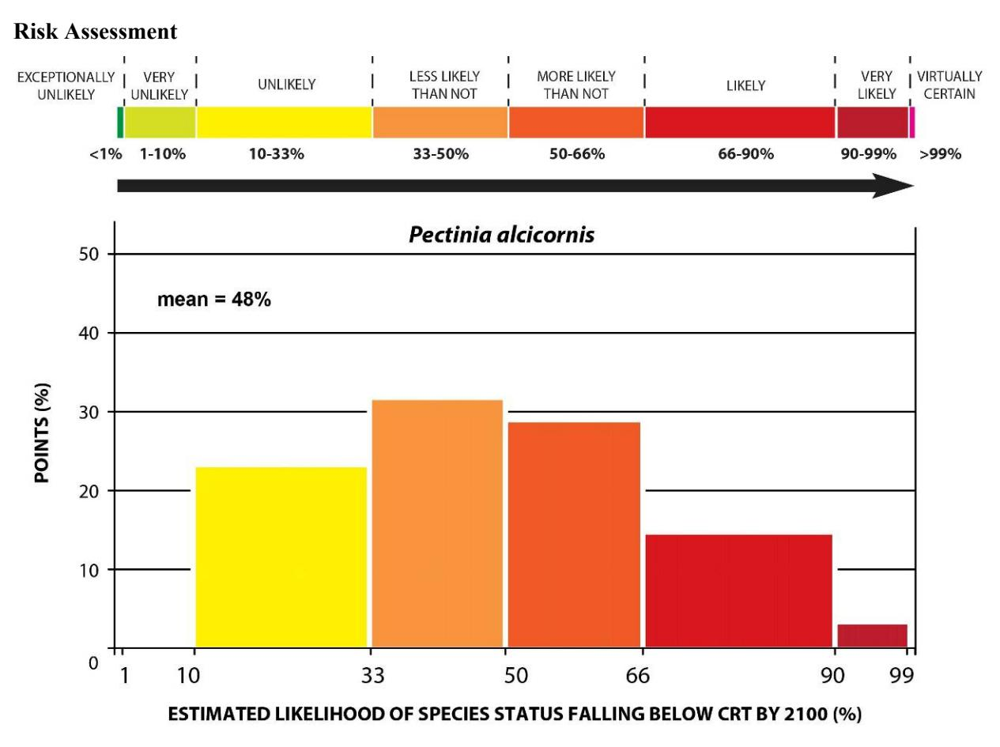

Figure 7.17.4. Distribution of points to estimate the likelihood that the status of *Pectinia alcicornis* falls below the Critical Risk Threshold (the species is of such low abundance, or so spatially fragmented, or at such reduced diversity that extinction is extremely likely) by 2100.

Factors that increase the potential extinction risk (higher likelihood of falling below the Critical Risk Threshold) for *Pectinia alcicornis* include susceptibility to bleaching, predation, and harvesting. The high bleaching rate is the primary threat of extinction for *Pectinia*, although *Pectinia alcicornis* may be relatively resistant in some areas. Heavy use of this genus in the aquarium trade implies the potential for local extirpation if this usually uncommon species is heavily harvested.. Factors that reduce potential extinction risk (decrease the likelihood of falling below the Critical Risk Threshold) are that *Pectinia alcicornis* occupies a variety of habitat types and is broadly distributed both latitudinally and longitudinally in the Indo-Pacific. Wide distribution is considered to lower extinction risk by making it more likely a species will be able to escape the impacts of threats and catastrophes in at least some locations.

The overall likelihood that *Pectinia alcicornis* will fall below the Critical Risk Threshold by 2100 was estimated to be in the "less likely than not" risk category with a mean likelihood of 48% and a standard error (SE) of 16% (Fig. 7.17.4). This SE was calculated by taking the standard deviation of the seven mean voting scores of the BRT members and shows the coherence among the BRT. The uncertainty of the BRT is reflected in the range of votes of 10%–99% (Fig. 7.17.4) and the average range of likelihood estimates of the seven BRT voters (59%). The overall wide range of votes reflects the uncertainty among BRT members inherent in the lack of adequate ecological and demographic information for *Pectinia alcicornis*.

#### **7.18 Genus** *Acanthastrea* **(Family Mussidae)**

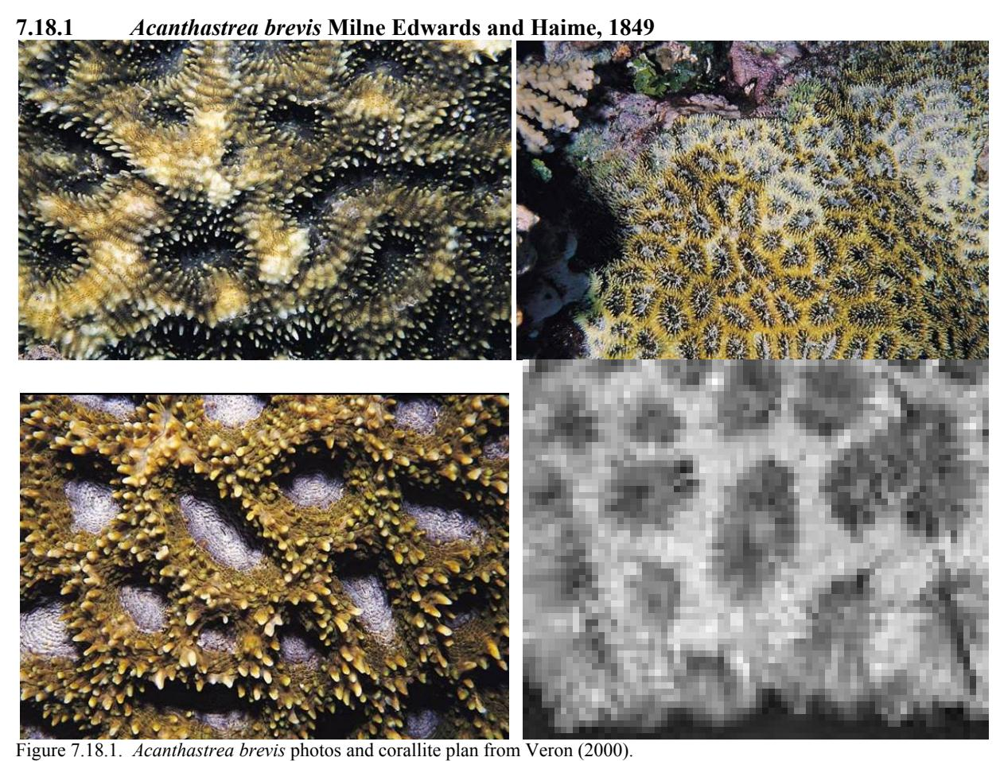

#### **Characteristics**

Colonies of *Acanthastrea brevis* are attached and colonial. Colonies are mostly submassive. Corallites are cerioid to subplocoid with moderately thin walls. Septa are thin and widely spaced. Larger septa have very long upwardly projecting teeth giving colonies a spiny appearance. Colonies are usually not fleshy. Uniform or mottled brown, yellow or green in color (Veron, 2000).

#### **Taxonomy**

**Taxonomic issues**: None. *Acanthastrea brevis* is similar to *Acanthastrea echinata* which has relatively fleshy corallites with thicker walls and less elongate septal teeth. These two species may be difficult to distinguish unless they occur together.

**Family:** Mussidae.

**Evolutionary and geologic history**: The genus is known in the Indo-Pacific from the Miocene Era (Wells and Moore, 1956).

#### **Global Distribution**

Wide distribution ranging from the Red Sea, Gulf of Aden, southwest Indian Ocean, and northern Indian Ocean to central Indo-Pacific, west Pacific, Great Barrier Reef, and Fiji (IUCN Species Account). In addition, Doug Fenner has identified this species from Fiji, Eastern Australia, New Caledonia, Papua New Guinea, Rodrigues, American Samoa (D. Fenner, Dept. Marine and Wildlife Resources, Tutuila, pers. comm., April 2010). Veron (2000) describes its distribution range from the Indian Ocean, Red Sea and Gulf of Aden to the Indo and west Pacific (Veron, 2000).

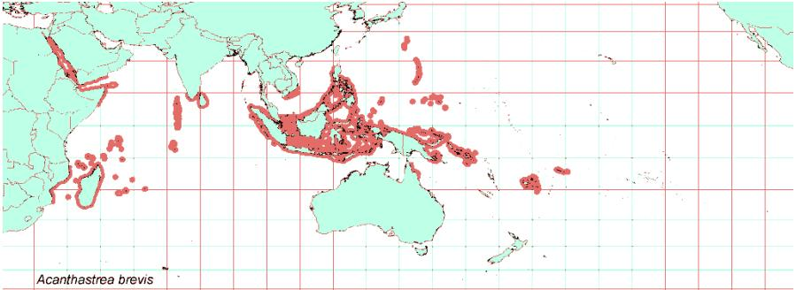

Figure 7.18.2. *Acanthastrea brevis* distribution from IUCN copied from http://www.iucnredlist.org.

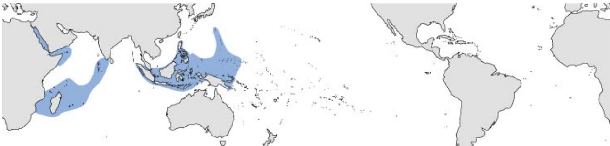

Figure 7.18.3. *Acanthastrea brevis* distribution from (Veron, 2000).

#### **U.S. Distribution**

According to the IUCN Species Account, *Acanthastrea brevis* occurs in American Samoa and in the Commonwealth of the Northern Mariana Islands. The references for the record in American Samoa are given as Fenner (2006, 2007), but those references pertain to Fiji, not to American Samoa. No supporting reference is given in the IUCN Species Account for the stated record of occurrence in the Northern Mariana Islands.

The CITES species database does not include any record of occurrence in U.S. waters. *Acanthastrea brevis* is not listed as occurring in American Samoa in Lovell and McLardy (2008). In Veron (2000) (Volume 3, page 17), the distribution map for this species includes the Mariana Archipelago, with a photo taken by Gustav Paulay labeled "Guam." However, G. Paulay (pers. comm., 28 February 2010) indicates a number of photos submitted by him to Veron from Palau, and the Cook Islands, and other locations in the Pacific were mistakenly attributed to Guam (similar to the *errata* later acknowledged by Veron (2002) for *Acanthastrea regularis* and *Porites napopora*). Further email communications of J. Kenyon with G. Paulay (3/2/2010) and J. Veron (4/23/2010) confirm this species has not been observed in the Mariana Archipelago. There are no other substantiated records of its occurrence in the Mariana Archipelago.

Fenner reports *Acanthastrea brevis* in American Samoa at Tutuila, Ofu-Olosega, Tau, and Rose Atoll (CRED, unpubl. data), with photographic support of visual identification at multiple sites. No other published or unpublished data sources indicate the occurrence of *Acanthastrea brevis* elsewhere in U.S. waters.

Within federally protected waters, *Acanthastrea brevis* has been recorded from the following areas:

Rose Atoll Marine National Monument

#### **Habitat**

**Habitat:** *Acanthastrea brevis* has been reported to occupy shallow reef environments (Veron, 2000), all types of reef habitats (Carpenter et al., 2008).

**Depth range**: *Acanthastrea brevis* has been reported at water depths ranging from 1 m to 20 m (Carpenter et al., 2008).

#### **Abundance**

Abundance of *Acanthastrea brevis* has been reported as uncommon but conspicuous (Veron, 2000).

#### **Life History**

Reproductive characteristics of *Acanthastrea brevis* have not been determined (Baird et al., 2009). However, the congeners *Acanthastrea echinata* and *Acanthastrea hillae* on the Great Barrier Reef are hermaphroditic broadcast spawners that participate in multispecies spawning events (Babcock et al., 1986; Willis et al., 1985). The minimum size and age of first reproduction has not been determined for any members of the family Mussidae (Harrison and Wallace, 1990). Although specific larval descriptions have not been published for this species, the larvae of three other *Acanthastrea* species studied do not contain zooxanthellae that can supplement maternal provisioning with energy sources provided by their photosynthesis (Baird et al., 2009), i.e., they are lecithotrophic. The maximum larval longevity for the congener *Acanthastrea lordhowensis* in laboratory cultures was 78 days (Wilson and Harrison, 1998).

#### **Threats**

**Temperature stress**: The genus *Acanthastrea* has been reported to be highly susceptibility to bleaching in Austrailia (Marshall and Baird, 2000) and in the western Indian Ocean (McClanahan et al., 2007). The genus sustained moderate bleaching in Palau in 1994 (Paulay and Benayahu, 1999) and several *Acanthastrea* species were relatively unaffected during the 2002 event on the Great Barrier Reef (Done et al., 2003).

**Acidification:** Unknown for the genus *Acanthastrea*. However, in most corals studied, (Table 3.2.2), acidification impairs growth (Langdon and Atkinson, 2005; Manzello, 2010) and, in the case of *Acropora palmata,* impairs fertilization and settlement success (Albright et al., 2010) and is likely to contribute to reef destruction in the future (Hoegh-Guldberg et al., 2007; Silverman et al., 2009). While ocean acidification has not been demonstrated to have caused appreciable declines in coral populations so far, the BRT considers it to be a significant threat to corals by 2100.

**Disease:** Susceptibility and impacts of disease on *Acanthastrea brevis* are not known. However, ample evidence indicate that diseases can have devastating regional impacts on individual coral species (e.g., Aronson and Precht, 2001; Bruckner and Hill, 2009) and evidence show that these impacts are occurring in more taxa and at a broader geographic scale (Green and Bruckner, 2000; Sutherland et al., 2004). Relatively few disease reports for the genus *Acanthastrea* have been documented in the global disease database (UNEP, 2010).

**Predation**: Unknown.

**Land-based sources of pollution (LBSP):** The effects of LBSP on *Acanthastrea brevis* are largely unknown. Congener *Acanthastrea echinata* has lower sediment rejection efficiency than many other corals, in part, because sediment becomes trapped between the calices when the polyps expand. However, it still clears most sediment within 24 h and is equally efficient in removing coarse and fine particles (Stafford-Smith, 1993). LBSP-related stresses (nutrients, sediment, toxins, and salinity) often act in concert rather than individually and are influenced by other biological (e.g., herbivory) and hydrological factors. Collectively, LBSP stresses are unlikely to produce extinction at a global scale; however, they may pose significant threats at local scales (particularly important for species with limited range) and reduce the resilience of corals to bleaching (Carilli et al., 2009a; Wooldridge, 2009b).

**Collection/Trade:** Although no exports of *Acanthastrea* were reported from 2000 through 2009, 1000 *Acanthastrea* pieces were exported from Indonesia in 2010 (CITES, 2010). Hence, collection/trade is not considered to be a significant threat to this species.

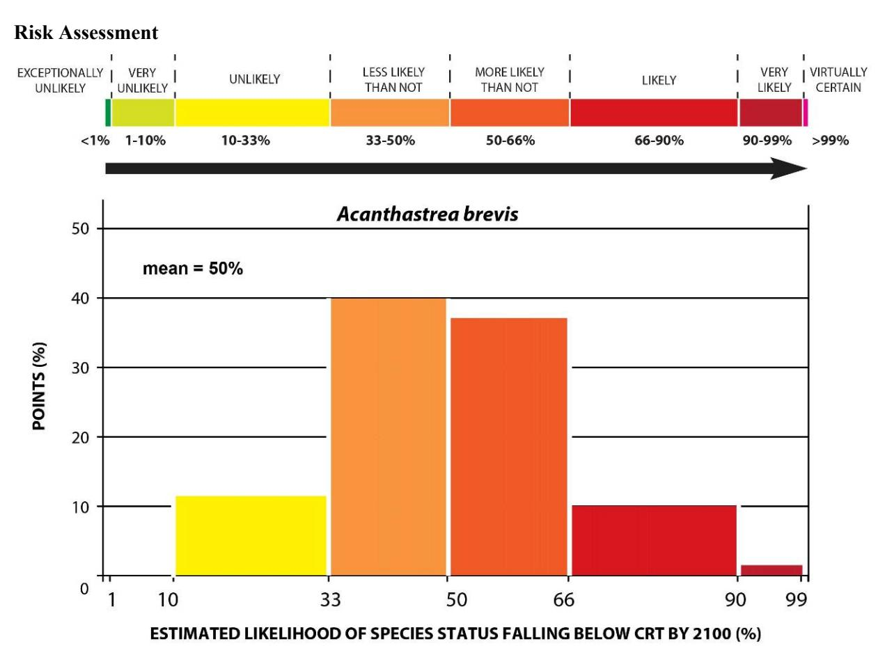

Figure 7.18.4. Distribution of points to estimate the likelihood that the status of *Acanthastrea brevis* falls below the Critical Risk Threshold (the species is of such low abundance, or so spatially fragmented, or at such reduced diversity that extinction is extremely likely) by 2100.

The high susceptibility to bleaching is the primary factor that increases the potential extinction risk (higher likelihood of falling below the Critical Risk Threshold) for *Acanthastrea brevis.* Factors that reduce potential extinction risk (decrease the likelihood of falling below the Critical Risk Threshold) for *Acanthastrea brevis* are that it occupies a variety of habitat types and is broadly distributed both latitudinally and longitudinally in the Indo-Pacific. Wide distribution range is considered to lower extinction risk by making it more likely a species will be able to escape the impacts of threats and catastrophes in at least some locations.

The overall likelihood that *Acanthastrea brevis* will fall below the Critical Risk Threshold by 2100 was estimated to be split between the "more likely than not" and "less likely than not" risk categories with a mean likelihood of 50% and a standard error (SE) of 9% (Fig. 7.18.4). This SE was calculated by taking the standard deviation of the seven mean voting scores of the BRT members and shows the coherence among the BRT. The uncertainty of the BRT is reflected in the range of votes of 10%–99% (Fig. 7.18.4) and the average range of likelihood estimates of the seven BRT voters (59%). The overall wide range of votes reflects the uncertainty among BRT members inherent in the lack of adequate ecological and demographic information for *Acanthastrea brevis*.

#### **7.18.2** *Acanthastrea hemprichii* **Ehrenberg, 1834**

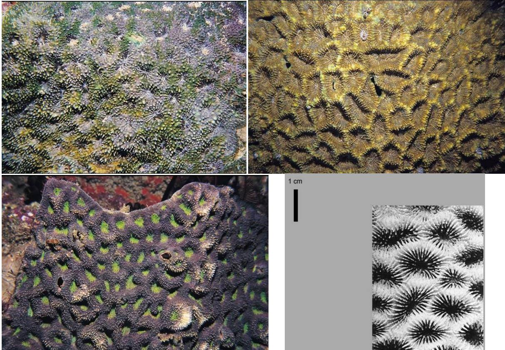

Figure 7.18.5. *Acanthastrea hemprichii* photos and corallite plan copied from Veron and Stafford-Smith (2002).

#### **Characteristics**

Colonies of *Acanthastrea hemprichii* are encrusting to massive and frequently over 1 m across. Corallites are cerioid. Septa have exsert teeth. Colonies have fleshy tissue over the skeleton, but this is not thick enough to mask underlying skeletal structures. Colonies are mottled browns and greens in color, commonly with brown walls and green oral discs (Veron, 2000).

#### **Taxonomy**

**Taxonomic issues**: None. *Acanthastrea hemprichii* is similar to *Acanthastrea echinata*, which has more widely-spaced, fleshy, less-cerioid corallites. It is also similar to *Acanthastrea bowerbanki*, which usually has a central corallite and more angular peripheral corallites and *Acanthastrea hillae*, which has larger and fleshier corallites (Veron, 2000).

**Family:** Mussidae.

**Evolutionary and geologic**: The genus *Acanthastrea* is known in the Indo-Pacific from the Miocene Epoch (Wells and Moore, 1956).

#### **Global Distribution**

Wide geographic distribution including Red Sea, Gulf of Aden, southwest Indian Ocean, Indo- and west Pacific, and Great Barrier Reef (Veron, 2000). Range is not restricted or highly fragmented.

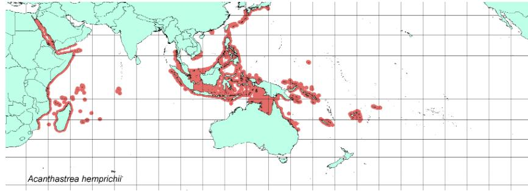

Figure 7.18.6. *Acanthastrea hemprichii* distribution from IUCN copied from http://www.iucnredlist.org.

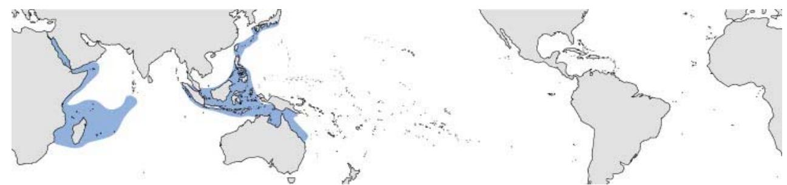

Figure 7.18.7. *Acanthastrea hemprichii* distribution from Veron (2000).

#### **U.S. Distribution**

According to the IUCN Species Account, *Acanthastrea hemprichii* occurs in American Samoa, with the supporting reference given as "Fenner (pers. comm.)." The CITES species database does not include any record of occurrence in U.S. waters. *Acanthastrea hemprichii* is not listed as occurring in American Samoa in Lovell and McLardy (2008).

Fenner reports *Acanthastrea hemprichii* in American Samoa at Tutuila (CRED, unpubl. data). Visual identifications are supported by photographs (3). This species was found at only Lee Lee Point, Tutuila, where it was rare. The three photographs were taken of two colonies. These photographs provide a secure identification, although no sample has yet been collected. The species is relatively easily identified by the shared walls between corallites, and the common yellow-brown color often with lighter color patches. Thus, although the identification is secure, it is a very rare species in American Samoa.

This species was not observed elsewhere in American Samoa (CRED unpubl. data) during dedicated surveys conducted at 38 sites off Ofu-Olosega, Tau, Rose Atoll, Swains, and South Bank in March 2010. No other published or unpublished data sources indicate the occurrence of *Acanthastrea hemprichii* elsewhere in U.S. waters.

*Acanthastrea hemprichii* has not been recorded from federally protected waters.

#### **Habitat**

**Habitat:** *Acanthastrea hemprichii* has been reported to occupy most reef environments (Carpenter et al., 2008; Veron, 2000).

**Depth range**: *Acanthastrea hemprichii* has been reported in water depths ranging from 2 m to 20 m (Carpenter et al., 2008).

#### **Abundance**

Abundance of *Acanthastrea hemprichii* has been reported as uncommon (Veron, 2000).

#### **Life History**

Reproductive characteristics of *Acanthastrea hemprichii* have not been determined (Baird et al., 2009). However, the congeners *Acanthastrea echinata and Acanthastrea hillae* on the Great Barrier Reef are hermaphroditic broadcast spawners that participate in multispecies spawning events (Babcock et al., 1986; Willis et al., 1985). The minimum size and age of first reproduction has not been determined for any members of the family Mussidae (Harrison and Wallace, 1990). Although specific larval descriptions have not been published for this species, the larvae of three other *Acanthastrea* species studied do not contain zooxanthellae that can supplement maternal provisioning with energy sources provided by their photosynthesis (Baird et al., 2009), i.e., they are lecithotrophic. The maximum larval longevity for the congener *Acanthastrea lordhowensis* in laboratory cultures was 78 days (Wilson and Harrison, 1998).

#### **Threats**

**Temperature stress**: The genus *Acanthastrea* has been reported to be highly susceptible to bleaching in Australia (Marshall and Baird, 2000) and in the western Indian Ocean (McClanahan et al., 2007). The genus sustained moderate bleaching in Palau in 1994 (Paulay and Benayahu, 1999) and several *Acanthastrea* species (including *Acanthastrea hemprichii*) were relatively unaffected during the 2002 bleaching event on the Great Barrier Reef (Done et al., 2003).

**Acidification:** Unknown for the genus *Acanthastrea*. However, in most corals studied (Table 3.2.2), acidification impairs growth (Langdon and Atkinson, 2005; Manzello, 2010) and, in the case of *Acropora palmata*, impairs fertilization and settlement success (Albright et al., 2010) and is likely to contribute to reef destruction in the future (Hoegh-Guldberg et al., 2007; Silverman et al., 2009). While ocean acidification has not been demonstrated to have caused appreciable declines in coral populations so far, the BRT considers it to be a significant threat to corals by 2100.

**Disease:** Susceptibility and impacts of disease on *Acanthastrea hemprichii* are not known. However, ample evidence indicate that diseases can have devastating regional impacts on individual coral species (e.g., Aronson and Precht, 2001; Bruckner and Hill, 2009), and some evidence show that these impacts are occurring on a trend of increasing taxonomic and geographic scale (Green and Bruckner, 2000; Sutherland et al., 2004). Few disease reports for the genus *Acanthastrea* appear in the global database (UNEP, 2010).

**Predation**: Unknown.

**Land-based sources of pollution (LBSP):** The effects of LBSP on *Acanthastrea hemprichii* are largely unknown. Congener *Acanthastrea echinata* has lower sediment rejection efficiency than many other corals, in part because sediment becomes trapped between the calices when the polyps expand. However, it still clears most sediment within 24 h and is equally efficient in removing coarse and fine particles (Stafford-Smith, 1993). LBSP-related stresses (nutrients, sediment, toxins, and salinity) often act in concert rather than individually and are influenced by other biological (e.g., herbivory) and hydrological factors. Collectively, LBSP stresses are unlikely to produce extinction at a global scale; however, they may pose significant threats at local scales (particularly important for species with limited range) and reduce the resilience of corals to bleaching (Carilli et al., 2009a; Wooldridge, 2009b).

**Collection/Trade:** Although no exports of *Acanthastrea* were reported from 2000 through 2009, 1000 pieces of *Acanthastrea* were exported from Indonesia in 2010 (CITES, 2010). Hence, collection/trade is not considered to be a significant threat to *Acanthastrea hemprichii*.

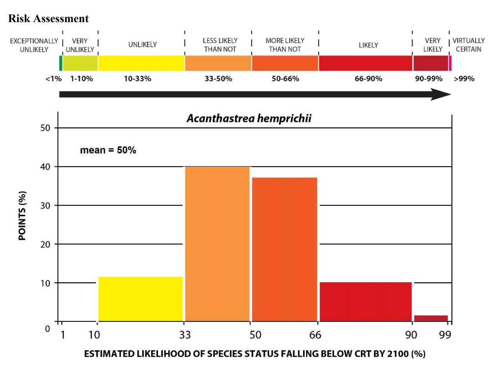

Figure 7.18.8. Distribution of points to estimate the likelihood that the status of *Acanthastrea hemprichii* falls below the Critical Risk Threshold (the species is of such low abundance, or so spatially fragmented, or at such reduced diversity that extinction is extremely likely) by 2100.

The high susceptibility to bleaching is the primary factor that increases the potential extinction risk (higher likelihood of falling below the Critical Risk Threshold) for *Acanthastrea hemprichii.* Factors that reduce potential extinction risk (decrease the likelihood of falling below the Critical Risk Threshold) for *Acanthastrea hemprichii* are that it occupies a variety of habitat types and is broadly distributed both latitudinally and longitudinally in the Indo-Pacific. Wide distribution range is considered to lower extinction risk by making it more likely a species will be able to escape the impacts of threats and catastrophes in at least some locations.

The overall likelihood that *Acanthastrea hemprichii* will fall below the Critical Risk Threshold by 2100 was estimated to straddle the "more likely than not" and "less likely than not" risk categories with a mean likelihood of 50% and a standard error (SE) of 9% (Fig. 7.18.8). This SE was calculated by taking the standard deviation of the seven mean voting scores of the BRT members and shows the coherence among the BRT. The uncertainty of the BRT is reflected in the range of votes of 10%–99% (Fig. 7.18.8) and the average range of likelihood estimates of the seven BRT voters (57%). The overall wide range of votes reflects the uncertainty among BRT members inherent in the lack of adequate ecological and demographic information for *Acanthastrea hemprichii*.

**7.18.3** *Acanthastrea ishigakiensis* **Veron, 1990** 

Figure 7.18.9. *Acanthastrea ishigakiensis* photos and corallite plan copied from Veron and Stafford-Smith (2002).

#### **Characteristics**

Colonies of *Acanthastrea ishigakiensis* are massive, usually hemispherical and often more than 0.5 m across. Corallites are up to 25 mm in diameter and cerioid, becoming plocoid on the colony sides. Septa are mostly uniform, with large teeth. Colonies have thick fleshy tissue over the skeleton. Colonies are uniform blue-grey or mixtures of grey, brown, cream and green in color, usually with mouth, oral disc and walls of contrasting colors (Veron, 2000).

#### **Taxonomy**

**Taxonomic issues**: None. *Acanthastrea ishigakiensis* is similar to *Acanthastrea hillae*, which has smaller corallites with a tendency to form valleys. It resembles *Symphyllia erythraea* underwater (Veron, 2000).

**Family:** Mussidae.

**Evolutionary and geologic history**: The genus *Acanthastrea is* known in the Indo-Pacific from the Miocene Epoch (Wells and Moore, 1956).

#### **Global Distribution**

*Acanthastrea ishigakiensis* has a broad range; it stretches from the Red Sea, Gulf of Aden, and southern Africa to the central Pacific Ocean as far as Samoa but not including Australia.

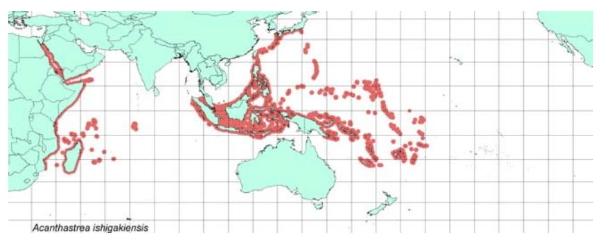

Figure 7.18.10. *Acanthastrea ishigakiensis* distribution from IUCN copied from http://www.iucnredlist.org.

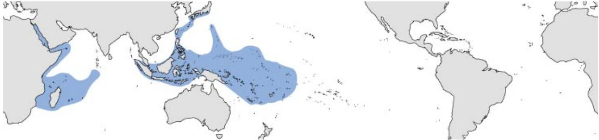

Figure 7.18.11. *Acanthastrea ishigakiensis* distribution from Veron (2000).

#### **U.S. Distribution**

According to the IUCN Species Account, *Acanthastrea ishigakiensis* occurs in American Samoa and the Northern Mariana Islands, but no supporting reference is given for the record of occurrence in either of these areas in the IUCN Species Account.

The CITES species database does not include any record of occurrence in U.S. waters. *Acanthastrea ishigakiensis* is not listed as occurring in American Samoa in Lovell and McLardy (2008). In Veron (2000) (Volume 3, page 17), the distribution map for this species includes the Mariana Archipelago, with a photo taken by Gustav Paulay labeled "Guam." However, G. Paulay (pers. comm. to J. Kenyon via email 2/28/2010) indicates a number of photos submitted by him to Veron from Palau and the Cook Islands, and other locations in the Pacific were mistakenly attributed to Guam (similar to the *errata* later acknowledged by Veron (2002) for *Acanthastrea regularis* and *Porites napopora*). No substantiated records of its occurrence in the Mariana Archipelago are documented (J. Veron pers. comm. to J. Kenyon via email 4/23/2010).

Fenner reports a single colony of *Acanthastrea ishigakiensis* in American Samoa at Tutuila (CRED, unpubl. data). Visual identifications are supported by photographs (3), but no voucher sample was collected. The colony was photographed at Matuu, Tutuila. The species is relatively easy to identify, as it has large corallites, which are often pinched sideways, and it forms massive colonies unlike *Acanthastrea hillae* which forms encrusting colonies.

This species was not observed elsewhere in American Samoa by Fenner during dedicated surveys conducted at 38 sites off Ofu-Olosega, Tau, Rose Atoll, Swains, and South Bank in March 2010 (CRED, unpubl.data). No other published or unpublished data sources indicate the occurrence of *Acanthastrea ishigakiensis* elsewhere in U.S. waters.

*Acanthastrea ishigakiensis* has not been recorded from federally protected waters.

#### **Habitat**

**Habitat:** *Acanthastrea ishigakiensis* has been reported to occupy shallow protected reef environments (Veron, 2000).

**Depth range**: *Acanthastrea ishigakiensis* has been reported in water depths ranging from 1 m to 15 m (Carpenter et al., 2008).

#### **Abundance**

Abundance of *Acanthastrea ishigakiensis* has been reported as uncommon but conspicuous (Veron, 2000).

#### **Life History**

Reproductive characteristics of *Acanthastrea ishigakiensis* have not been determined (Baird et al., 2009). However, the congeners *Acanthastrea echinata and Acanthastrea hillae* on the Great Barrier Reef are hermaphroditic broadcast spawners that participate in multispecies spawning events (Babcock et al., 1986; Willis et al., 1985). The minimum size and age of first reproduction has not been determined for any members of the family Mussidae (Harrison and Wallace, 1990).

Although specific larval descriptions have not been published for this species, the larvae of three other *Acanthastrea* species studied do not contain zooxanthellae that can supplement maternal provisioning with energy sources provided by their photosynthesis (Baird et al., 2009), i.e., they are lecithotrophic. The maximum larval longevity for the congener *Acanthastrea lordhowensis* in laboratory cultures was 78 days (Wilson and Harrison, 1998).

#### **Threats**

**Temperature stress**: The genus *Acanthastrea* has been reported to be highly susceptible to bleaching in Australia (Marshall and Baird, 2000) and in the western Indian Ocean (McClanahan et al., 2007). The genus sustained moderate bleaching in Palau in 1994 (Paulay and Benayahu, 1999) and several *Acanthastrea* species were relatively unaffected during the 2002 bleaching event on the Great Barrier Reef (Done et al., 2003).

**Acidification:** Unknown for the genus *Acanthastrea*. However, in most corals studied (Table 3.2.2), acidification impairs growth (Langdon and Atkinson, 2005; Manzello, 2010) and, in the case of *Acropora palmata*, impairs fertilization and settlement success (Albright et al., 2010) and is likely to contribute to reef destruction in the future (Hoegh-Guldberg et al., 2007; Silverman et al., 2009). While ocean acidification has not been demonstrated to have caused appreciable declines in coral populations so far, the BRT considers it to be a significant threat to corals by 2100.

**Disease:** Susceptibility and effects of disease on *Acanthastrea ishigakiensis* are not known. However, ample evidence indicate that diseases can have devastating regional impacts on individual coral species (e.g., Aronson and Precht, 2001; Bruckner and Hill, 2009) and evidence show that these impacts are occurring in more taxa and at a broader geographic scale (Green and Bruckner, 2000; Sutherland et al., 2004). Relatively few disease reports for the genus *Acanthastrea* were found in the global disease database (UNEP, 2010).

**Predation**: Unknown.

**Land-based sources of pollution (LBSP):** The effects of LBSP on *Acanthastrea ishigakiensis* are largely unknown. Congener *Acanthastrea echinata* has lower sediment rejection efficiency than many other corals, in part, because sediment becomes trapped between the calices when the polyps expand. However, it still clears most sediment within 24 h and is equally efficient in removing coarse and fine particles (Stafford-Smith, 1993). LBSP-related stresses (nutrients, sediment, toxins, and salinity) often act in concert rather than individually, and are influenced by other biological (e.g., herbivory) and hydrological factors. Collectively, LBSP stresses are unlikely to produce extinction at a global scale; however, they may pose significant threats at local scales (particularly important for species with limited range) and reduce the resilience of corals to bleaching (Carilli et al., 2009a; Wooldridge, 2009b).

**Collection/Trade:** Although no exports of *Acanthastrea* were reported from 2000 through 2009, 1000 pieces of *Acanthastrea* were exported from Indonesia in 2010 (CITES, 2010). Hence, collection/trade is not considered to be a significant threat to *Acanthastrea ishigakiensis*.

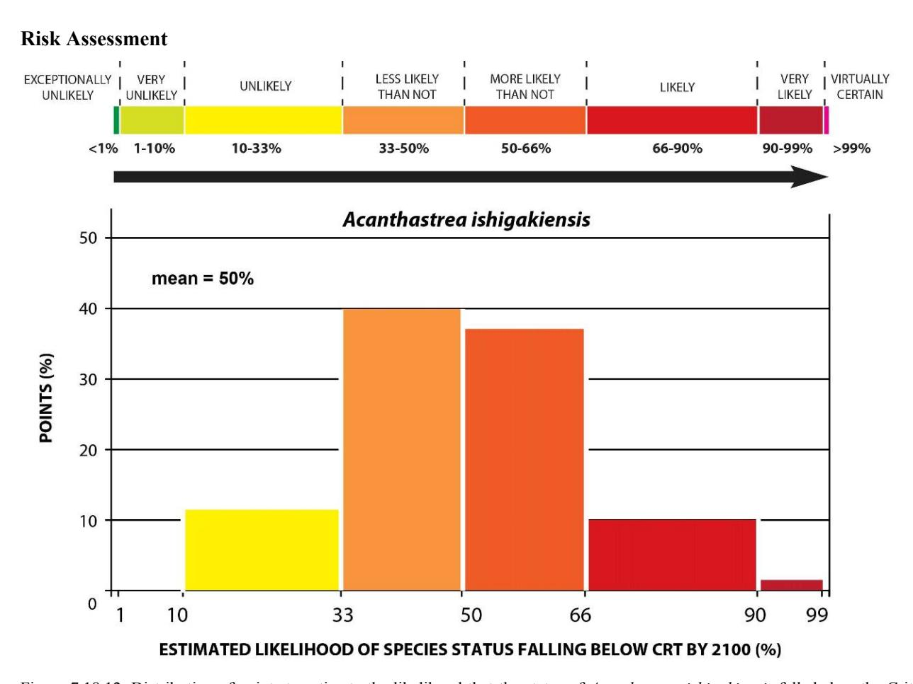

Figure 7.18.12. Distribution of points to estimate the likelihood that the status of *Acanthastrea ishigakiensis* falls below the Critical Risk Threshold (the species is of such low abundance, or so spatially fragmented, or at such reduced diversity that extinction is extremely likely) by 2100.

The high susceptibility to bleaching is the primary factor that increases the potential extinction risk (higher likelihood of falling below the Critical Risk Threshold) for *Acanthastrea ishigakiensis*. Factors that reduce potential extinction risk (decrease the likelihood of falling below the Critical Risk Threshold) are that *Acanthastrea ishigakiensis* is broadly distributed both latitudinally and longitudinally in the Indo-Pacific, making it more likely the species will be able to escape the impacts of threats and catastrophes in at least some locations.

The overall likelihood that *Acanthastrea ishigakiensis* will fall below the Critical Risk Threshold by 2100 was estimated to be in the "less likely than not" risk category with a mean likelihood of 50% and a standard error (SE) of 7% (Fig. 7.18.12). This SE was calculated by taking the standard deviation of the seven mean voting scores of the BRT members and shows the coherence among the BRT. The uncertainty of the BRT is reflected in the range of votes of 10%–99% (Fig. 7.18.12) and the average range of likelihood estimates of the seven BRT voters (59%). The overall wide range of votes reflects the uncertainty among BRT members inherent in the lack of adequate ecological and demographic information for *Acanthastrea ishigakiensis*.

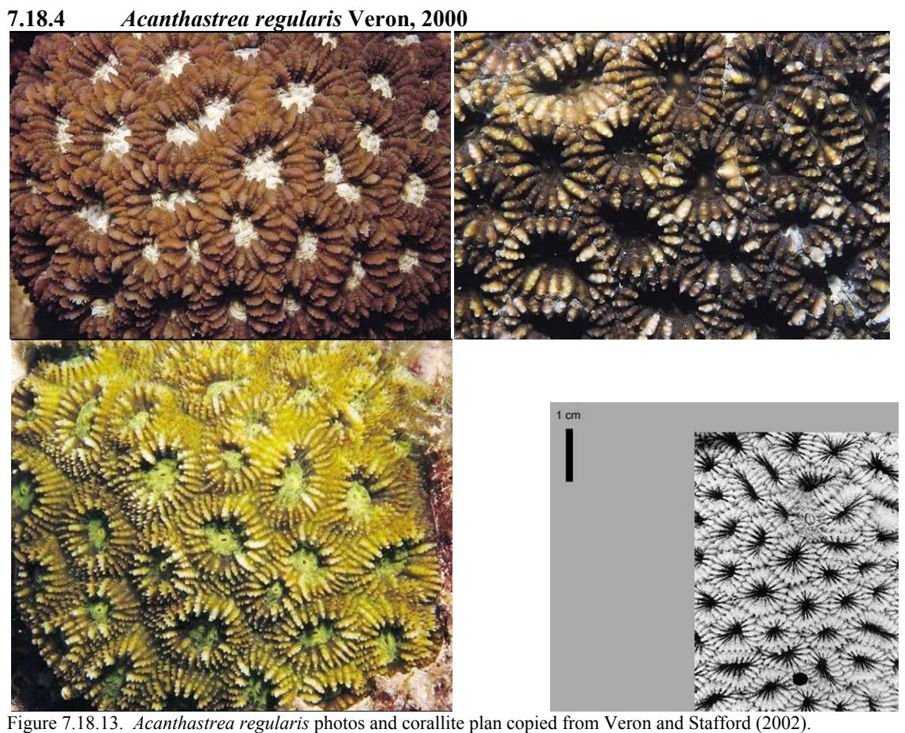

#### **Characteristics**

Colonies of *Acanthastrea regularis* are massive and subplocoid. Septa are uniformly spaced with 8–10 evenly spaced, rounded teeth. Teeth on adjacent septa are often aligned, forming concentric circles. Some septa are more prominent than others. Columellae are weakly developed. Colonies do not have thick tissue over the skeleton and are variable brown and yellow-brown in color, usually with contrasting corallite walls and centers (Veron, 2000).

#### **Taxonomy**

**Taxonomic issues**: None. *Acanthastrea regularis* may resemble the faviids *Montastraea* and *Favia* species more than other *Acanthastrea* underwater (Veron, 2000).

**Family:** Mussidae.

**Evolutionary and geologic history**: The genus *Acanthastrea* is known in the Indo-Pacific from the Miocene Epoch (Wells and Moore, 1956).

#### **Global Distribution**

Distribution is fairly restricted both longitudinally as latitudinally. It is highly centered in the Coral Triangle but also found around some of the islands in the west Pacific and Australia's Great Barrier Reef (Veron, 2000).

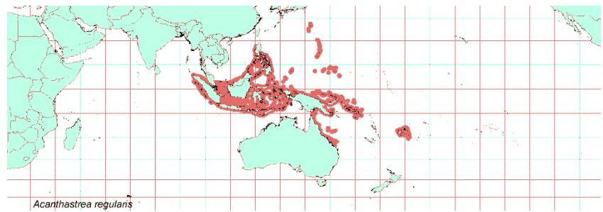

Figure 7.18.14. *Acanthastrea regularis* distribution from IUCN copied from http://www.iucnredlist.org.

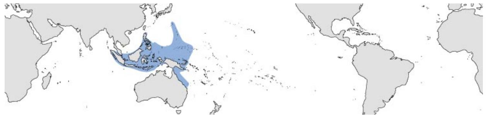

Figure 7.18.15. *Acanthastrea regularis* distribution from Veron (2000).

#### **U.S. Distribution**

According to the IUCN Species Account, *Acanthastrea regularis* occurs in the Northern Mariana Islands, but no supporting reference is given. The CITES species database does not include any record of occurrence in U.S. waters.

In Veron (2000) (Volume 3, page 16), the distribution map includes the Mariana Archipelago, with a photo taken by Gustav Paulay labeled "Guam." However, Veron (2002) indicates "erratum: photograph was taken at Palau, not Guam" (page 130). G. Paulay (University of Florida, Gainesville, FL. pers. comm. to J. Kenyon via email 2/28/2010) indicates photos submitted by him to Veron from Palau, the Cook Islands, and other locations were mistakenly attributed to Guam. Further email communications of J. Kenyon with G. Paulay (3/2/2010) confirm this species has not been observed by G. Paulay in the Mariana Archipelago. There are no other substantiated records of its occurrence in the Mariana Archipelago.

No other published or unpublished data sources indicate the occurrence of *Acanthastrea regularis* elsewhere in U.S. waters.

#### **Habitat**

**Habitat:** *Acanthastrea regularis* has been reported to occupy shallow reef environments (Veron, 2000).

**Depth range**: *Acanthastrea regularis* has been reported from water depths ranging from 2 m to 20 m (Carpenter et al., 2008).

#### **Abundance**

Abundance of *Acanthastrea regularis* has been reported as uncommon (Veron, 2000).

#### **Life History**

Reproductive characteristics of *Acanthastrea regularis* have not been determined (Baird et al., 2009). However, the congeners *Acanthastrea echinata and Acanthastrea hillae* on the Great Barrier Reef are hermaphroditic broadcast spawners that participate in multispecies spawning events (Willis et al., 1985; Babcock et al., 1986). The minimum size and age of first reproduction has not been determined for any members of the family Mussidae (Harrison and Wallace, 1990).

Although specific larval descriptions have not been published for this species, the larvae of three other *Acanthastrea* species studied do not contain zooxanthellae that can supplement maternal provisioning with energy sources provided by their photosynthesis (Baird et al., 2009), i.e., they are lecithotrophic. The maximum larval longevity for the congener *Acanthastrea lordhowensis* in laboratory cultures was 78 days (Wilson and Harrison, 1998).

#### **Threats**

**Temperature stress**: The genus *Acanthastrea* has been reported to be highly susceptible to bleaching in Australia (Marshall and Baird, 2000) and in the western Indian Ocean (McClanahan et al., 2007). The genus sustained moderate bleaching in Palau in 1994 (Paulay and Benayahu, 1999) and several *Acanthastrea* species were relatively unaffected during the 2002 bleaching event on the Great Barrier Reef (Done et al., 2003).

**Acidification:** Unknown for this genus. However, in most corals studied (Table 3.2.2), acidification impairs growth (Langdon and Atkinson, 2005; Manzello, 2010) and, in the case of *Acropora palmata*, impairs fertilization and settlement success (Albright et al., 2010) and is likely to contribute to reef destruction in the future (Hoegh-Guldberg et al., 2007; Silverman et al., 2009). While ocean acidification has not been demonstrated to have caused appreciable declines in coral populations so far, the BRT considers it to be a significant threat to corals by 2100.

**Disease:** Susceptibility and impacts of disease on *Acanthastrea regularis* are not known. However, ample evidence indicate that diseases can have devastating regional impacts on individual coral species (e.g., Aronson and Precht, 2001; Bruckner and Hill, 2009) and some evidence show that these impacts are occurring on a trend of increasing taxonomic and geographic scale (Green and Bruckner, 2000; Sutherland et al., 2004). A few disease reports for the genus *Acanthastrea* are documented in the global disease database (UNEP, 2010).

**Predation**: Unknown.

**Land-based sources of pollution (LBSP):** The effects of LBSP on *Acanthastrea regularis* are largely unknown. Congener *Acanthastrea echinata* has lower sediment rejection efficiency than many other corals, in part, because sediment becomes trapped between the calices when the polyps expand. However, it still clears most sediment within 24 h and is equally efficient in removing coarse and fine particles (Stafford-Smith, 1993). LBSP-related stresses (nutrients, sediment, toxins, and salinity) often act in concert rather than individually, and are influenced by other biological (e.g., herbivory) and hydrological factors. Collectively, LBSP stresses are unlikely to produce extinction at a global scale; however, they may pose significant threats at local scales (particularly important for species with limited range) and reduce the resilience of corals to bleaching (Carilli et al., 2009a; Wooldridge, 2009b).

**Collection/Trade:** Although no exports of *Acanthastrea* were reported from 2000 through 2009, 1000 pieces of *Acanthastrea* were exported from Indonesia in 2010 (CITES, 2010). Hence, collection/trade is not considered to be a significant threat to *Acanthastrea regularis*.

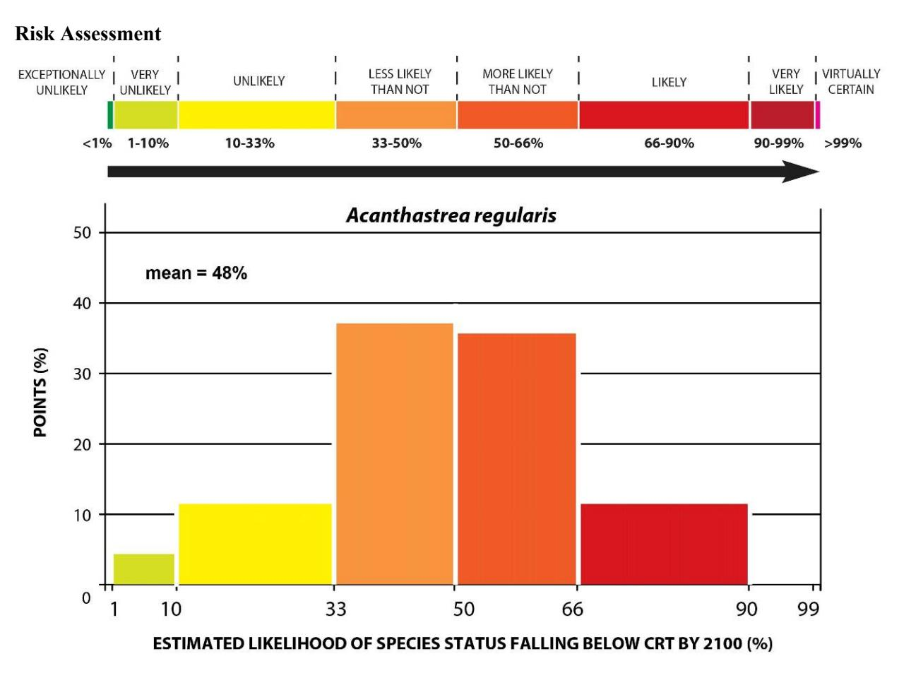

Figure 7.18.16. Distribution of points to estimate the likelihood that the status of *Acanthastrea regularis* falls below the Critical Risk Threshold (the species is of such low abundance, or so spatially fragmented, or at such reduced diversity that extinction is extremely likely) by 2100.

The high susceptibility to bleaching is the primary factor that increases the potential extinction risk (higher likelihood of falling below the Critical Risk Threshold) for *Acanthastrea regularis*. *Acanthastrea regularis* occupies a variety of habitat types and is broadly distributed both latitudinally and longitudinally in the Indo-Pacific which are factors that reduce potential extinction risk (decrease the likelihood of falling below the Critical Risk Threshold).

The overall likelihood that *Acanthastrea regularis* will fall below the Critical Risk Threshold by 2100 was estimated to be in the "less likely than not" risk category with a mean of 48% likelihood and a standard error (SE) of 15% (Fig. 7.18.16). This SE was calculated by taking the standard deviation of the seven mean voting scores of the BRT members and shows the coherence among the BRT. The uncertainty of the BRT is reflected in the range of votes of 1%–90% (Fig. 7.18.16) and the average range of likelihood estimates of the seven BRT voters (46%). The overall wide range of votes reflects the uncertainty among BRT members inherent in the lack of adequate ecological and demographic information for *Acanthastrea regularis*.

#### **7.19 Genus** *Barabattoia* **(Family Faviidae)**

#### **7.19.1** *Barabattoia laddi* **Wells, 1954**

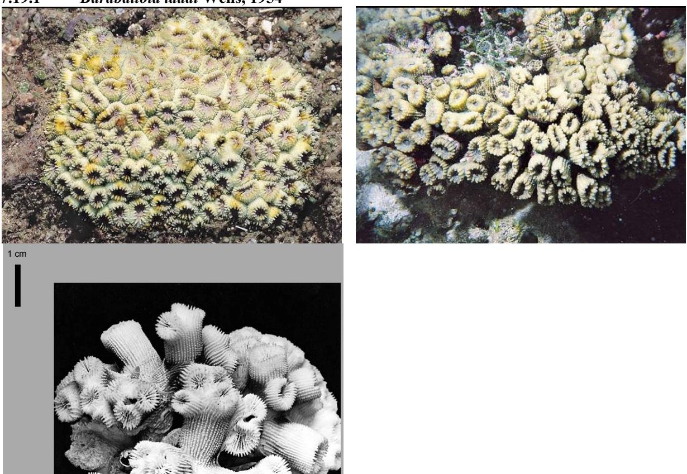

Figure 7.19.1. *Barabattoia laddi* photos and corallite plan copied from Veron and Stafford-Smith (2002).

#### **Characteristics**

Colonies of *Barabattoia laddi* are clusters of tubular corallites. Budding is extratentacular. Corallites bifurcate at approximately 10 mm intervals and frequently join. Costae are in two alternating orders and are strongly beaded. Colonies are pale brown in color (Veron, 2000).

#### **Taxonomy**

**Taxonomic issues**: None. *Barabattoia laddi* is similar to *Barabattoia amicorum* and *Montastraea* spp. (Veron, 2000).

**Family**: Faviidae.

**Evolutionary and geologic history**: *Barabattoia* is a recent Pacific genus with no known fossil record (Veron, 2000).

#### **Global Distribution**

The range of *Barabattoia laddi* is somewhat restricted, latitudinally. It is highly centered in the Coral Triangle but also found around some of the islands in the western Pacific, central South Pacific, and Australia's Great Barrier Reef (Veron, 2000).

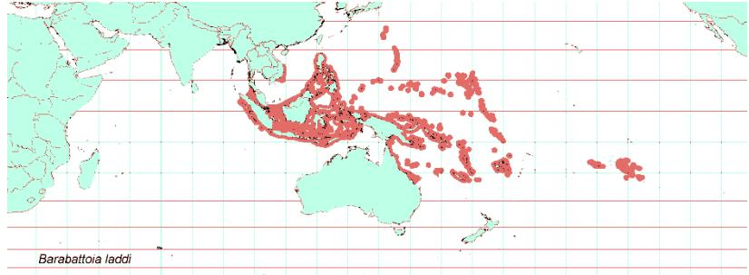

Figure 7.19.2. *Barabattoia laddi* distribution from IUCN copied from http://www.iucnredlist.org.

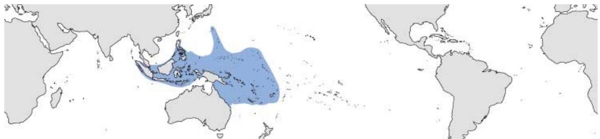

Figure 7.19.3. *Barabattoia laddi* distribution from Veron (2000).

#### **U.S. Distribution**

According to both the IUCN Species Account and the CITES species database, *Barabattoia laddi* occurs in the Northern Mariana Islands.

A search of published and unpublished records of occurrence in U.S. waters indicates *Barabattoia laddi* has been reported from Rose Atoll in American Samoa (Kenyon et al., 2010a) and Guam (Veron, 2000).

Within federally protected waters, *Barabattoia laddi* has been recorded from the following areas:

Rose Atoll Marine National Monument

#### **Habitat**

**Habitat**: *Barabattoia laddi* has been recorded only from shallow lagoons (Veron, 2000).

**Depth range**: *Barabattoia laddi* has been reported in water depths ranging from 0 m to 10 m (Carpenter et al., 2008).

#### **Abundance**

Abundance of *Barabattoia laddi* has been reported to be rare (Veron, 2000).

#### **Life History**

The reproductive characteristics of *Barabattoia laddi* have not been determined (Baird et al., 2009). The congener *Barabattoia amoricum* is a hermaphroditic broadcast spawner that participated in multispecies spawning events at Magnetic Island and Orpheus Island on the Great Barrier Reef (Babcock et al., 1986). The minimum size and age of first reproduction have not been determined for this genus. Although specific larval descriptions have not been published for this species, the larvae of the single *Barabattoia* species studied do not contain zooxanthellae that might supplement maternal provisioning with energy from photosynthesis (Baird et al., 2009), i.e., they are lecithotrophic and azooxanthellate. Larval longevity has not been determined in this genus, but maximum longevity in 9 other species in the family Faviidae ranges from 56 to 244 days (Graham et al., 2008).

#### **Threats**

**Temperature stress**: Unknown for this species but *Barabattoia amicorum* has low-to-moderate bleaching susceptibility with an unknown degree of resultant mortality (Bruno et al., 2001).

**Acidification**: Unknown for the genus *Barabattoia*. However, in most of the corals that have been studied to date, acidification impairs growth (Langdon and Atkinson, 2005; Manzello, 2010) and, in the case of *Acropora palmata*, impairs fertilization and settlement success (Albright et al., 2010) and likely will contribute to reef destruction in the future (Hoegh-Guldberg et al., 2007; Silverman et al., 2009). While ocean acidification has not been demonstrated to have caused appreciable declines in coral populations so far, the BRT considers it to be a significant threat to corals by 2100.

**Disease**: Susceptibility to and effects of disease on *Barabattoia laddi* are not known. However, ample evidence indicate that diseases can have devastating regional impacts on individual coral species (e.g., Aronson and Precht, 2001; Bruckner and Hill, 2009), and evidence show that these impacts are occurring in more taxa and at a broader geographic scale (Green and Bruckner, 2000; Sutherland et al., 2004).

**Predation**: Susceptibility to predation is unknown for *Barabattoia laddi*.

**Land-based sources of pollution (LBSP)**: The effects of LBSP on *Barabattoia laddi* are largely unknown. LBSPrelated stresses (nutrients, sediment, toxins, and salinity) often act in concert rather than individually, and are influenced by other biological (e.g., herbivory) and hydrological factors. Collectively, LBSP stresses are unlikely to produce extinction at a global scale; however, they may pose significant threats at local scales (particularly important for species with limited range) and reduce the resilience of corals to bleaching (Carilli et al., 2009a; Wooldridge, 2009b).

**Collection/Trade**: No trade information for *Barabattoia laddi* was listed in the CITES Trade Database, UNEP World Conservation Monitoring Centre (CITES, 2010).

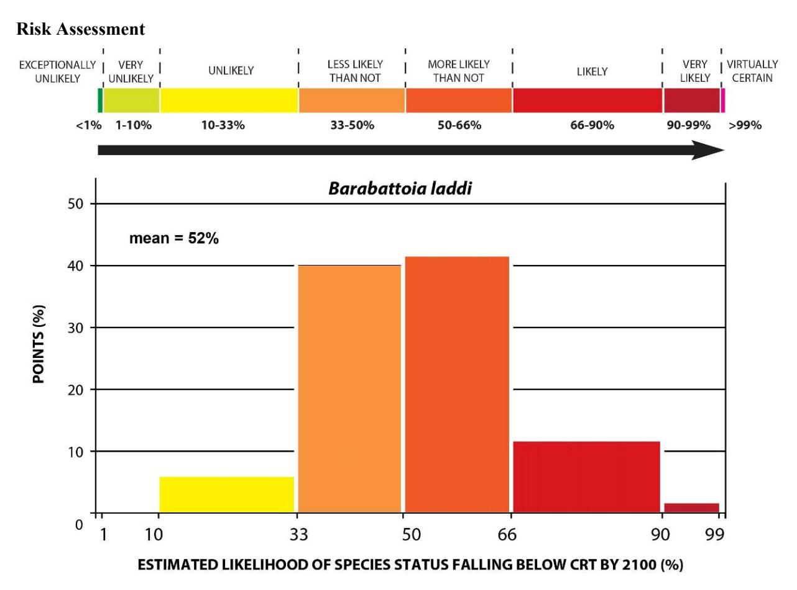

Figure 7.19.4. Distribution of points to estimate the likelihood that the status of *Barabattoia laddi* falls below the Critical Risk Threshold (the species is of such low abundance, or so spatially fragmented, or at such reduced diversity that extinction is extremely likely) by 2100.

Factors that increase the potential extinction risk (increase the likelihood of falling below the Critical Risk Threshold) are the species' limited western Pacific distribution, its occurrence in shallow lagoons and its rare abundance. However, very little information is available on *Barabattoia laddi*.

The overall likelihood that *Barabattoia laddi* will fall below the Critical Risk Threshold by 2100 was estimated to be in the "more likely than not" risk category with a mean likelihood of 52% and a standard error (SE) of 13%. (Fig. 7.19.4). This SE was calculated by taking the standard deviation of the seven mean voting scores of the BRT members and shows the coherence among the BRT. The uncertainty of the BRT is reflected in the range of votes of 10%–99% (Fig. 7.19.4) and the average range of likelihood estimates of the seven BRT voters (51%). The overall wide range of votes reflects the uncertainty among BRT members inherent in the lack of adequate ecological and demographic information for *Barabattoia laddi*.

#### **7.20 Genus** *Caulastrea*

**7.20.1** *Caulastrea echinulata* **Milne Edwards and Haime, 1849** 

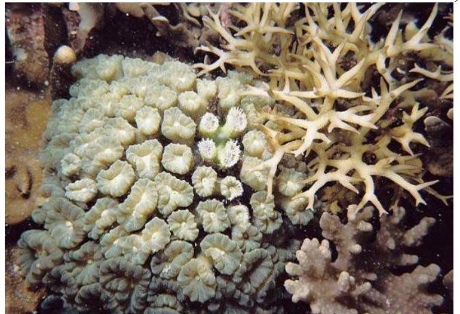

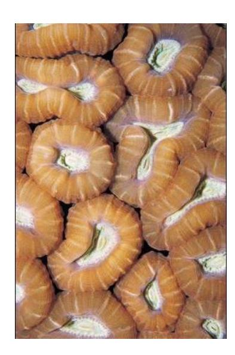

Figure 7.20.1. *Caulastrea echinulata* photos from Veron and Stafford-Smith (2002).

#### **Characteristics**

Colonies of *Caulastrea echinulata* are phaceloid with closely compacted corallites (< 10 mm diameter). Septa are exsert, irregular, and uniform in width. The colonies have fleshy polyps that conceal characteristics of the septae (Veron, 2000). The genus is usually less than 30 cm diameter (Wood, 1983), although the maximum size of this species may reach 100 cm (Veron, 1986). Colonies are tan or dark brown in color, with pale oral discs (Veron, 2000).

#### **Taxonomy**

**Taxonomic issues:** None. *Caulastrea echinulata* is similar to *Caulastrea furcata*, which has less compact corallites. Superficially resembles *Blastomussa wellsi* (Veron, 2000).

**Family:** Faviidae.

**Evolutionary and geologic history:** The genus is known from the Oligocene Age from the Caribbean and the Eocene Epoch in the Tethys Sea but is extinct in those locations (Wells and Moore, 1956).

#### **Global Distribution**

*Caulastrea echinulata* is known primarily from Australia, Fiji, Indonesia, and Japan, although it does extend to the Philippines, New Caledonia, and the Solomon Islands.

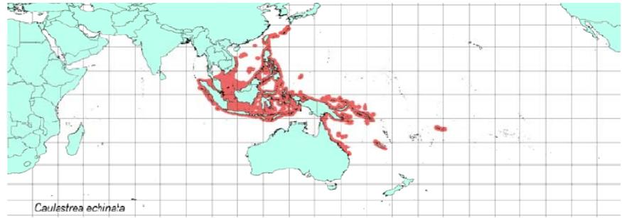

Figure 7.20.2. *Caulastrea echinulata* distribution from IUCN copied from http://www.iucnredlist.org.

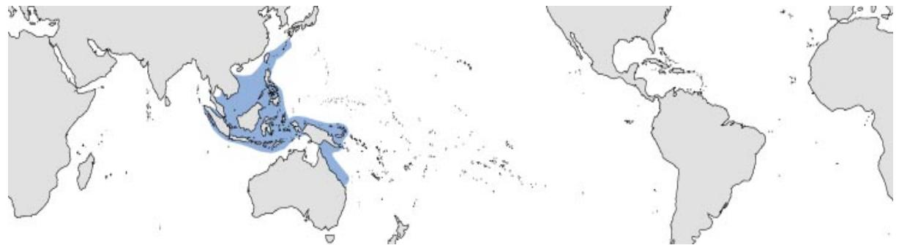

Figure 7.20.3. *Caulastrea echinulata* distribution from Veron (2000).

#### **U.S. Distribution**

According to the IUCN Species Account, *Caulastrea echinulata* occurs in American Samoa, with the supporting reference given as "Fenner (pers. comm.)." The CITES species database (which treats this genus as *Caulastraea*) does not include any record of occurrence in U.S. waters.

*Caulastrea echinulata* and *Caulastrea furcata* are not easily separated. Veron, Pichon and Wijman-Best (UNESCO, 1985) and Veron (1986; 2000) have changed those photos that are presented under these names. Fenner has examined samples of these two species in the Veron collection at AIMS and was unable to see the differences between these species indicated in Veron et al. (1977).

Fenner reports tentative identification of *Caulastrea echinulata* at Tutuila, with four photographs but no voucher sample. *Caulastrea echinulata* is not listed as occurring in American Samoa (Lovell and McLardy, 2008). This species was not observed elsewhere in American Samoa by Fenner during dedicated surveys conducted at 38 sites off Ofu-Olosega, Tau, Rose Atoll, Swains, and South Bank in March 2010, nor was any other species of *Caulastrea*.

The occurrence of *Caulastrea echinulata* in American Samoa remains uncertain. No other published or unpublished data sources indicate the occurrence of *Caulastrea echinulata* elsewhere in U.S. waters.

Within federally protected waters, *Caulastrea echinulata* may have possibly been recorded from the following areas:

National Park of American Samoa (Ofu unit; uncertain ID)

#### **Habitat**

**Habitat:** *Caulastrea echinulata* has been reported to occupy horizontal substrates protected from wave action and with turbid water (Veron, 2000).

**Depth range**: *Caulastrea echinulata* has been reported in water depths ranging from 1 m to 20 m (Carpenter et al., 2008).

#### **Abundance**

Abundance of *Caulastrea echinulata* has been reported to be uncommon (Veron, 2000).

#### **Life History**

The reproductive characteristics of *Caulastrea echinulata* have not been determined (Baird et al., 2009). The congener *Caulastrea furcata* is a hermaphroditic broadcast spawner (Willis et al., 1985). The minimum size and age of first reproduction have not been determined for this genus. Although observations of larvae have not been published for this species, *Caulastrea furcata* larvae do not contain zooxanthellae that can supplement maternal provisioning with energy sources provided by their photosynthesis (Baird et al., 2009), i.e., they are lecithotrophic. Larval longevity has not been determined in this genus, but maximum longevity in nine other species in the family Faviidae ranges from 56 to 244 days (Graham et al., 2008).

#### **Threats**

**Thermal stress:** Unknown, but other Faviid corals are often at moderate to low bleaching risk on the Great Barrier Reef (Marshall and Baird, 2000) and western Indian Ocean (McClanahan et al., 2007) (though see (Done et al., 2003) as an example of the range of bleaching response in that family). *Caulastrea furcata* was not observed to bleach in 1998 in Palau (Bruno et al., 2001).

**Acidification:** Unknown for the genus *Caulastrea*. However, in most corals studied (Table 3.2.2), acidification impairs growth (Langdon and Atkinson, 2005; Manzello, 2010) and, in the case of *Acropora palmata*, impairs fertilization and settlement success (Albright et al., 2010) and is likely to contribute to reef destruction in the future (Hoegh-Guldberg et al., 2007; Silverman et al., 2009). While ocean acidification has not been demonstrated to have caused appreciable declines in coral populations so far, the BRT considers it to be a significant threat to corals by 2100.

**Disease:** Susceptibility and impacts of disease on *Caulastrea echinulata* are not known. However, ample evidence indicate that diseases can have devastating regional impacts on individual coral species (e.g., Aronson and Precht, 2001; Bruckner and Hill, 2009), and evidence show that these impacts are occurring in more taxa and at a broader geographic scale (Green and Bruckner, 2000; Sutherland et al., 2004).

**Predation**: Unknown for *Caulastrea echinulata*.

**Land-based sources of pollution (LBSP):** The effects of LBSP on *Caulastrea echinulata* are largely unknown. LBSPrelated stresses (nutrients, sediment, toxins, and salinity) often act in concert rather than individually and are influenced by other biological (e.g., herbivory) and hydrological factors. Collectively, LBSP stresses are unlikely to produce extinction at a global scale; however, they may pose significant threats at local scales (particularly important for species with limited range) and reduce the resilience of corals to bleaching (Carilli et al., 2009a; Wooldridge, 2009b).

**Collection/Trade:** Trade in *Caulastrea echinulata* is heavy. From 1999 to 2009 gross exports averaged 8713 specimens annually, with the vast majority originating in Indonesia (CITES, 2010). Take quotas over that same period increased from 9000 in 1999 to 10,670 in 2010.

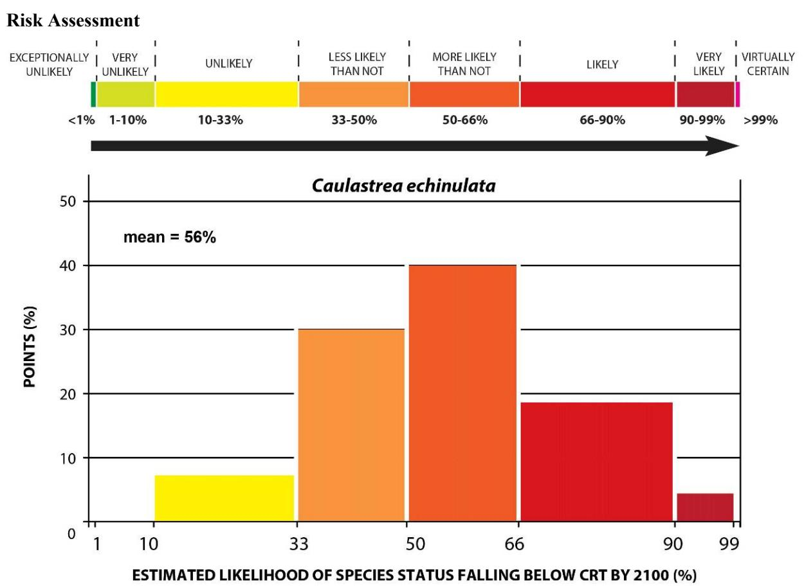

Figure 7.20.4. Distribution of points to estimate the likelihood that the status of *Caulastrea echinulata* falls below the Critical Risk Threshold (the species is of such low abundance, or so spatially fragmented, or at such reduced diversity that extinction is extremely likely) by 2100.

Factors that increase the potential extinction risk (higher likelihood of falling below the Critical Risk Threshold) for *Caulastrea echinulata* is uncommon but heavily traded. Factors that reduce potential extinction risk (decrease the likelihood of falling below the Critical Risk Threshold) are that the species distribution is broad latitudinally, and that its preferred habitat type (turbid conditions) may provide some refuge from global threats such as bleaching (to which it may have relatively low susceptibility).

The overall likelihood that *Caulastrea echinulata* will fall below the Critical Risk Threshold by 2100 was estimated to be in the "more likely than not" risk category with a mean likelihood of 56% and a standard error (SE) of 10% (Fig. 7.20.4). This SE was calculated by taking the standard deviation of the seven mean voting scores of the BRT members and shows the coherence among the BRT. The uncertainty of the BRT is reflected in the range of votes of 10%–99% (Fig. 7.20.4) and the average range of likelihood estimates of the seven BRT voters (63%). That average range is the second highest for any species (Table 8.1), reflecting the uncertainty among BRT members inherent in the lack of adequate ecological and demographic information for *Caulastrea echinulata*.

#### **7.21 Genus** *Cyphastrea*

**7.21.1** *Cyphastrea agassizi* **Vaughan, 1907** 

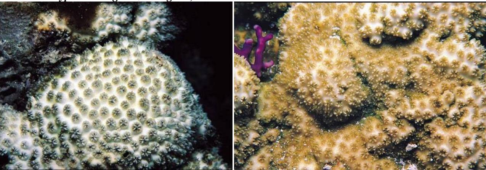

Figure 7.21.1. *Cyphastrea agassizi* photos from Veron (2000).

#### **Characteristics**

Colonies of *Cyphastrea agassizi* are massive, with deeply grooved surfaces, widely-spaced corallites, and a smooth coenosteum. Septae are in three unequal orders, with the first order exsert. May have irregular groove/tubercle formations (Veron, 2000). Colonies are usually only a few inches in diameter (Fenner, 2005). Colonies have a whitish coenosteum, with pale brown or green corallites. Septae are sometimes orange (Veron, 2000).

#### **Taxonomy**

**Taxonomic issues**: None. *Cyphastrea agassizi* is similar to *Cyphastrea ocellina* which has smaller, more crowded corallites. Superficially resembles *Cyphastrea japonica* and *Leptastrea inaequalis* (which has crowded corallites with thicker walls) (Veron, 2000).

**Family:** Faviidae.

**Evolutionary and geologic history**: The genus *Cyphastre* is known from the Oligocene Epoch from the Tethys Sea and West Indies, but is extinct in those locations (Wells and Moore, 1956).

#### **Global Distribution**

Found primarily in the Indo-Pacific, including Australia, Indonesia, Fiji, Japan, Hawai`i, and the Solomon Islands. *Cyphastrea agassizi* is also found in Bikini Atoll (Richards et al., 2008a).

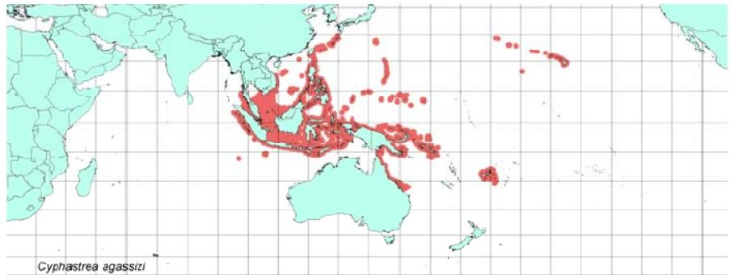

Figure 7.21.2. *Cyphastrea agassizi* distribution from IUCN copied from http://www.iucnredlist.org.

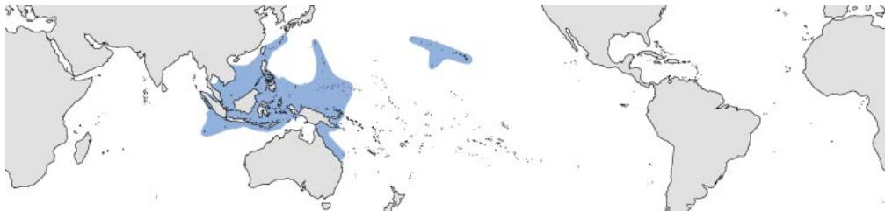

Figure 7.21.3. *Cyphastrea* agassizi distribution from Veron (2000).

#### **U.S. Distribution**

According to both the IUCN Species Account and the CITES species database, *Cyphastrea agassizi* occurs in the Northern Mariana Islands. The IUCN Species Accounts also lists it for the U.S. minor outlying islands, and the CITES species database lists it for Hawai`i.

A search of published and unpublished records of occurrence in U.S. waters indicates *Cyphastrea agassizi* has been reported from Guam (Burdick, unpubl. data), the Commonwealth of the Northern Mariana Islands (CRED, unpubl. data), Hawai`i (Aki et al., 1994; Beets et al., 2010; Fenner, 2005; Godwin and Bolick, 2006), and Palmyra Atoll (Williams et al., 2008b).

Within federally protected waters, *Cyphastrea agassizi* has been recorded from the following areas:

- Pacific Remote Islands Marine National Monument (Palmyra)
- Marianas Trench Marine National Monument (Asuncion)
- Kaloko-Honokōhau National Historic Park, Hawai`i
- Kalaupapa National Historic Park, Molokai
- Hawaiian Islands Humpback Whale National Marine Sanctuary

#### **Habitat**

**Habitat:** *Cyphastrea agassizi* has been reported from shallow reef environments (Veron, 2000). The species is found in back slopes, fore slopes, lagoons, and outer reef channels (IUCN, 2010).

**Depth range**: *Cyphastrea agassizi* has been reported in water depths ranging from 3 m to 20 m (Carpenter et al., 2008).

#### **Abundance**

Abundance of *Cyphastrea agassizi* has been reported to be uncommon (Veron, 2000).

#### **Life History**

The reproductive characteristics of *Cyphastrea agassizi* have not been determined. Congeners *Cyphastrea chalcidicum*  and *Cyphastrea microphthalma* are hermaphroditic spawners (Babcock et al., 1986; Willis et al., 1985), but *Cyphastrea ocellina* is a hermaphroditic brooder (Edmondson, 1929; Wright, 1986). The minimum size and age of first reproduction have not been determined for this species. However, for the congener *Cyphastrea ocellina*, the minimum size at first reproduction is 2 cm–3 cm, with an estimated age of first reproduction ≤ 2 years (Stimson, 1978; Wright, 1986). Larvae from spawned *Cyphastrea* do not contain zooxanthellae (Baird et al., 2009), but brooded *Cyphastrea* larvae do (Wright, 1986).

Photosynthetic performance of *Cyphastrea agassizi* is unremarkable. At lower light levels (100–300 µmol quanta/m2 /s), *Cyphastrea* has fluorescence yields and electron transport rates that are approximately average for the 68 species of corals surveyed in Sekisei Lagoon, Okinawa (Okamoto et al., 2005).

#### **Threats**

**Thermal stress:** The genus *Cyphastrea* is generally resistant to bleaching. The genus was unaffected during the 1998 mass bleaching in the Great Barrier Reef (Marshall and Baird, 2000). However, elevated temperatures can still induce mortality in *Cyphastrea* even in the absence of bleaching (McClanahan, 2004).

**Acidification:** Unknown for the genus *Cyphastre*. However, in most corals studied (Table 3.2.2), acidification impairs growth (Langdon and Atkinson, 2005; Manzello, 2010) and, in the case of *Acropora palmata*, impairs fertilization and settlement success (Albright et al., 2010) and is likely to contribute to reef destruction in the future (Hoegh-Guldberg et al., 2007; Silverman et al., 2009). While ocean acidification has not been demonstrated to have caused appreciable declines in coral populations so far, the BRT considers it to be a significant threat to corals by 2100.

**Disease:** Unknown, but its congeners have been infected with diseases. *Cyphastrea chalcidicum* is susceptible to ciliate-induced skeletal eroding band (Antonius and Lipscomb, 2000), while *Cyphastrea microphthalma* in the United Arab Emirates have contracted yellow-band disease (Korrubel and Riegl, 1998). The ecological and population impacts of disease have not been established for *Cyphastrea agassizi*. However, ample evidence indicate that diseases can have devastating regional impacts on individual coral species (e.g., Aronson and Precht, 2001; Bruckner and Hill, 2009) and evidence show that these impacts are occurring in more taxa and at a broader geographic scale (Green and Bruckner, 2000; Sutherland et al., 2004).

**Predation**: Unknown for *Cyphastrea agassizi*.

**Land-based pollution (LBSP):** The effects of LBSP on *Cyphastrea agassizi* are largely unknown. LBSP-related stresses (nutrients, sediment, toxins, and salinity) often act in concert rather than individually and are influenced by other biological (e.g., herbivory) and hydrological factors. Collectively, LBSP stresses are unlikely to produce extinction at a global scale; however, they may pose significant threats at local scales (particularly important for species with limited range) and reduce the resilience of corals to bleaching (Carilli et al., 2009a; Wooldridge, 2009b).

**Collection/Trade:** This coral experiences light-to-moderate trade at the genus level (CITES, 2010). From 1993 to 2008, an average of 248 specimens were exported worldwide, although the majority of the trade is accounted for by an export of 2810 specimens from Indonesia in 1993.

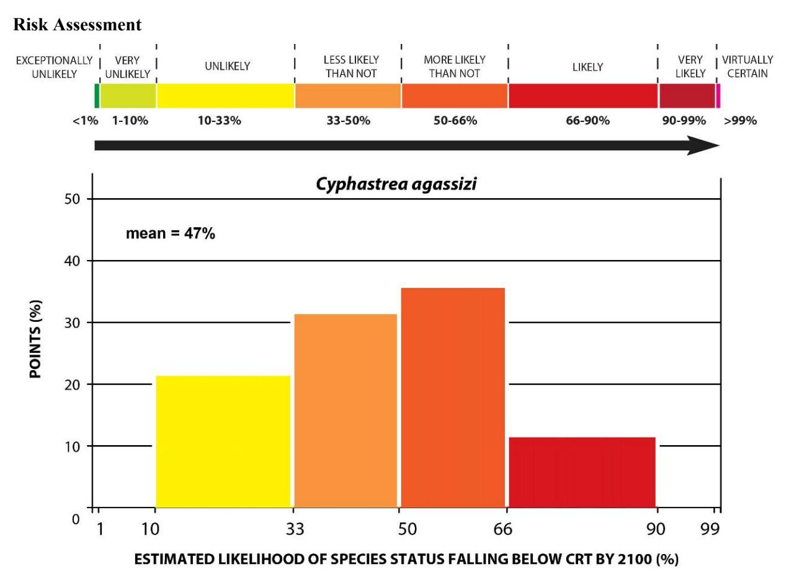

Figure 7.21.4. Distribution of points to estimate the likelihood that the status of *Cyphastrea agassizi* falls below the Critical Risk Threshold (the species is of such low abundance, or so spatially fragmented, or at such reduced diversity that extinction is extremely likely) by 2100.

*Cyphastrea agassizi* appears susceptible to disease, a factor that increases the potential extinction risk (higher likelihood of falling below the Critical Risk Threshold) for this species. *Cyphastrea agassizi* appears relatively resistant to bleaching, a factors that reduces the potential extinction risk (decrease the likelihood of falling below the Critical Risk Threshold).

The overall likelihood that *Cyphastrea agassizi* will fall below the Critical Risk Threshold by 2100 was estimated to be in the "less likely than not" risk category with a mean likelihood of 47% and a standard error (SE) of 14% (Fig. 7.21.4). This SE was calculated by taking the standard deviation of the seven mean voting scores of the BRT members and shows the coherence among the BRT. The uncertainty of the BRT is reflected in the range of votes of 10%–90% (Fig. 7.21.4) and the average range of likelihood estimates of the seven BRT voters (52%). The overall wide range of votes reflects the uncertainty among BRT members inherent in the lack of adequate ecological and demographic information for *Cyphastrea agassizi*.

**7.21.2** *Cyphastrea ocellina* **Dana, 1864** 

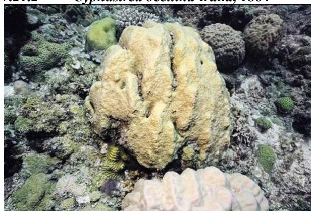

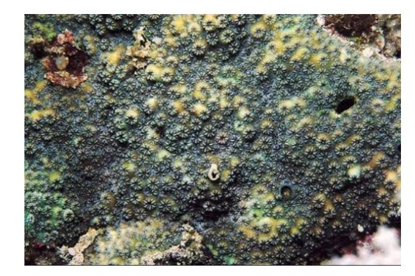

Figure 7.21.5. *Cyphastrea ocellina* photos from Veron (2000).

#### **Characteristics**

Colonies of *Cyphastrea ocelina* are massive or encrusting, with undulating surfaces (Veron, 2000). Colonies are often encrusting or knobby (Wright, 1986). They have tightly compact corallites, 3-mm diameter or smaller. Septa are in 2 unequal orders of 12 each, with a third order sometimes present. Paliform lobes are small or absent. Short spinules on coenosteum (Veron, 2000). In Hawai`i, *Cyphastrea ocellina* rarely grows more than 6 cm–8 cm in diameter (Edmondson, 1929) but can reach 15 cm (Maragos, 1977) or larger. Colonies are pale greenish-yellow or dark green in color (Veron, 2000).

#### **Taxonomy**

**Taxonomic issues**: None. *Cyphastrea ocelina* is similar to *Cyphastrea japonica*, which has unequal orders of septae and forms less massive colonies with grooves and tubercles often common (Veron, 2000).

**Family:** Faviidae.

**Evolutionary and geologic history**: The genus is known from the Oligocene Epoch from the Tethys Sea and West Indies, but is extinct in those locations (Wells and Moore, 1956).

#### **Global Distribution**

*Cyphastrea ocellina* is found in the Indo-Pacific, including the Great Barrier Reef in Australia, Indonesia, Japan, and the Philippines. It is also found in Hawai`i.

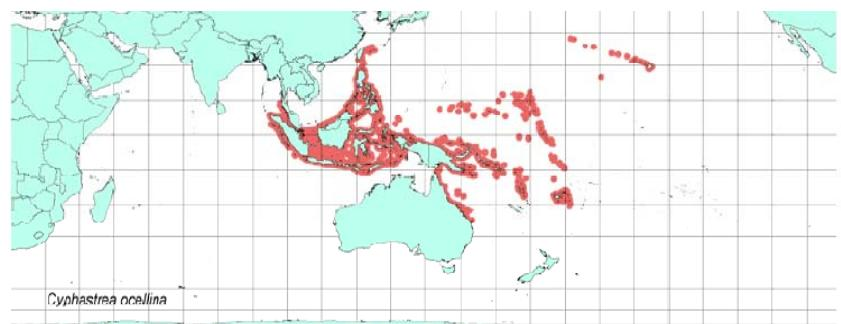

Figure 7.21.6. *Cyphastrea ocellina* distribution from IUCN copied from http://www.iucnredlist.org.

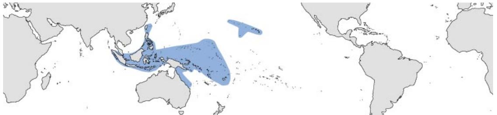

Figure 7.21.7. *Cyphastrea ocellina* distribution from Veron (2000).

#### **U.S. Distribution**

According to both the IUCN Species Account and the CITES species database, *Cyphastrea ocellina* occurs in Hawai`i and the U.S. minor outlying islands.

A search of published and unpublished records of occurrence in U.S. waters indicates *Cyphastrea ocelllina* has been reported from Hawai`i (Aki et al., 1994; Beets et al., 2010; Fenner, 2005; Godwin and Bolick, 2006; Maragos et al., 2004; Vaughan, 1907), Johnston Atol (CRED, unpubl. data; Maragos and Jokiel, 1986), and Kingman Reef (CRED, unpubl. data).

Within federally protected waters, *Cyphastrea ocellina* has been recorded from the following areas:

- Papahānaumokuākea Marine National Monument (Nihoa, Necker, French Frigate Shoals, Gardner Pinnacles, Maro Reef, Laysan, Lisianski, Pearl and Hermes, Midway)
- Pacific Remote Islands Marine National Monument (Johnston, Kingman)
- Kaloko-Honokōhau National Historic Park, Hawai`i
- Puukoholā Heiau National Historic Site, Hawai`i
- Kalaupapa National Historic Park, Molokai
- Hawaiian Islands Humpback Whale National Marine Sanctuary

#### **Habitat**

**Habitat:** *Cyphastrea ocellina* has been reported to occupy upper reef slopes (Veron, 2000). Stimson (1978) reported *Cyphastrea ocellina* in shallow water only—reef flats, tide pools, and vertical rock in turbid shallow water. Wright (1986) reported that *Cyphastrea ocellina* typically colonizes dead substrate. According to an IUCN Red List report, the species is found on shallow upper reef slopes, lagoons, and outer channels (IUCN, 2010). Jokiel et al. (2007) reported the species on reef flats, reef crest, and fore reefs.

**Depth range**: *Cyphastrea ocellina* has been reported in water depths ranging from 5 m to 20 m (Carpenter et al., 2008).

#### **Abundance**

Abundance of *Cyphastrea ocellina* has been reported as rare (Veron, 2000) or uncommon (Carpenter et al., 2008). It is not common in Hawai`i, but is found commonly enough that most of the physiology of the species is known from that location.

#### **Life History**

*Cyphastrea ocellina* is a simultaneous hermaphrodite (Kolinski and Cox, 2003; Wright, 1986) that broods freeswimming, tentaculate, zooxanthellate planula larvae with distinctive white bodies at the oral end (Edmondson, 1929). Planulae are produced continuously and released year-round; planulation may be in phase with the new moon (Stimson, 1978) or unrelated to lunar phase (Edmondson, 1946). Colonies become gravid at a size of ~ 6 cm2 (Stimson, 1978), but are less fecund than other brooders like *Pocillopora damicornis* (Wright, 1986), resulting in lower larval concentrations in the water column (Hodgson, 1985) and consequently, relative scarcity of *Cyphastrea ocellina* (Fitzhardinge, 1993). *Cyphastrea ocellina* larvae contain zooxanthellae (Wright, 1986).

Planulae can settle after 3 days, or remain unattached for over a month (Edmondson, 1929). Settled larvae tend to aggregate (Edmondson, 1946). Settled *Cyphastrea ocellina* can survive for up to 4 months without feeding, although skeletal deposition is reduced under these conditions (Edmondson, 1929). Planulae can tolerate elevated temperatures; settled larvae can deposit skeletal material at elevated temperatures (30°C–31.5°C), but do not show high survival (Edmondson, 1929). Planulae can also tolerate brief periods (several days) of reduced salinity more effectively than Pocilloporid larvae (Edmondson, 1929) but die quickly in fresh water (Edmondson, 1946). *Cyphastrea ocellina* larvae can settle in acidic water (pH = 6) but do not survive (Edmondson, 1946).

Feeding responses (mouth opening, extension of mesenterial filaments) of *Cyphastrea ocellina* are stimulated by both live prey and amino acid extracts and peptides (Mariscal and Lenhoff, 1968). Lipid levels (~ 40% of dry tissue weight) in shallow-water *Cyphastrea ocellina* are at the higher end of the range found in Hawaiian corals, potentially serving as an energy reserve during stressful conditions (Stimson, 1987).

Growth is generally slow after settlement, often requiring 4 months to produce the first bud, with larger colonies growing ~ 2 mm/yr (Edmondson, 1929). More recent work shows faster growth rates—4.0 mm in 11 months (Romano, 1990), or as much as 1.4 cm/yr (pers. comm. in Stimson, 1978). Colonies, after 39 months of observation, reached a maximum size of 68.7 mm (Fitzhardinge, 1993).

*Cyphastrea ocellina* shows high aggression. It generally has a halo growing around it, often even excluding algae (Fitzhardinge, 1993). *Cyphastrea ocellina* uses extracoelenteric digestion to defend itself against faster-growing corals, but at a high energetic cost that reduces growth rates (Romano, 1990).

#### **Threats**

**Thermal stress:** The genus *Cyphastrea* is generally resistant to bleaching. The genus was unaffected during the 1998 mass bleaching in the Great Barrier Reef (Marshall and Baird, 2000). However, elevated temperatures can still induce mortality in *Cyphastrea* even in the absence of bleaching (McClanahan, 2004). In Hawai`i *Cyphastrea ocellina* contains Clade C1 zooxanthellae (Thornhill, 2003), which may be relatively bleaching-tolerant (Smith et al., 2004b).

**Acidification:** Unknown for this genus *Cyphastrea*. However, in most corals studied (Table 3.2.2), acidification impairs growth (Langdon and Atkinson, 2005; Manzello, 2010) and, in the case of *Acropora palmata*, impairs fertilization and settlement success (Albright et al., 2010) and is likely to contribute to reef destruction in the future (Hoegh-Guldberg et al., 2007; Silverman et al., 2009). While ocean acidification has not been demonstrated to have caused appreciable declines in coral populations so far, the BRT considers it to be a significant threat to corals by 2100.

**Disease:** Unknown, but its congeners have been infected with diseases. *Cyphastrea chalcidicum* is susceptible to ciliateinduced skeletal-eroding band (Antonius and Lipscomb, 2000), while *Cyphastrea microphthalma* in the United Arab Emirates have contracted yellow-band disease (Korrubel and Riegl, 1998). The ecological and population impacts of disease have not been established for *Cyphastrea ocellina*. However, ample evidence indicate that diseases can have devastating regional impacts on individual coral species (e.g., Aronson and Precht, 2001; Bruckner and Hill, 2009) and evidence show that these impacts are occurring in more taxa and at a broader geographic scale (Green and Bruckner, 2000; Sutherland et al., 2004).

**Predation**: Unknown for *Cyphastrea ocellina*.

**Land-based sources of pollution (LBSP):** *Cyphastrea ocellina* may not compete well at high nutrient loads. The species rapidly recovered after sewage diversion reduced nutrient loads in Kāne`ohe Bay (Maragos et al., 1985) but rapidly crashed again during the *Dictyosphaeria cavernosa* bloom in 1990 (Evans, 1995).

LBSP-related stresses (nutrients, sediment, toxins, and salinity) often act in concert rather than individually and are influenced by other biological (e.g., herbivory) and hydrological factors. Collectively, LBSP stresses are unlikely to produce extinction at a global scale; however, they may pose significant threats at local scales (particularly important for species with limited range) and reduce the resilience of corals to bleaching (Carilli et al., 2009a; Wooldridge, 2009b).

**Collection/Trade:** This coral experiences light to moderate trade at the genus level (CITES, 2010). From 1993 to 2008, an average of 248 specimens were exported worldwide, although the majority of the trade is accounted for by an export of 2810 specimens from Indonesia in 1993. Only a single specimen identified as *Cyphastrea ocellina* was exported in 2002 (CITES, 2010).

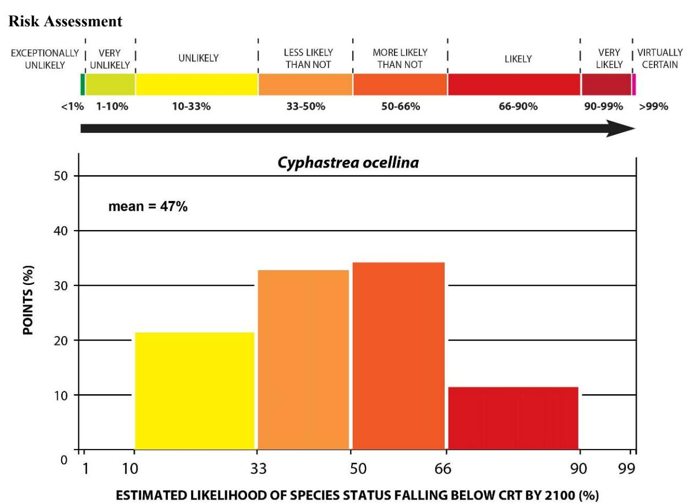

Figure 7.21.8. Distribution of points to estimate the likelihood that the status of *Cyphastrea ocellina* falls below the Critical Risk Threshold (the species is of such low abundance, or so spatially fragmented, or at such reduced diversity that extinction is extremely likely) by 2100.

Factors that increase the potential extinction risk (higher likelihood of falling below the Critical Risk Threshold) for *Cyphastrea ocellina* are that it has experienced population fluctuations in the past resulting from LBSP stress. Factors that reduce potential extinction risk (decrease the likelihood of falling below the Critical Risk Threshold) are that *Cyphastrea ocellina* is likely relatively resistant to bleaching. Its life history and physiology may help it resist or recover from disturbance.

The overall likelihood that *Cyphastrea ocellina* will fall below the Critical Risk Threshold by 2100 was estimated to be in the "less likely than not" risk category with a mean likelihood of 47% and a standard error (SE) of 14% (Fig. 7.21.8). This SE was calculated by taking the standard deviation of the seven mean voting scores of the BRT members and shows the coherence among the BRT. The uncertainty of the BRT is reflected in the range of votes of 10%–90% (Fig. 7.21.8) and the average range of likelihood estimates of the seven BRT voters (52%). The overall wide range of votes reflects the uncertainty among BRT members inherent in the lack of adequate ecological and demographic information for *Cyphastreaocellina.*

#### **7.22 Genus** *Euphyllia* **(Family Caryophyllidae)**

**7.22.1** *Euphyllia cristata* **Chevalier, 1971** 

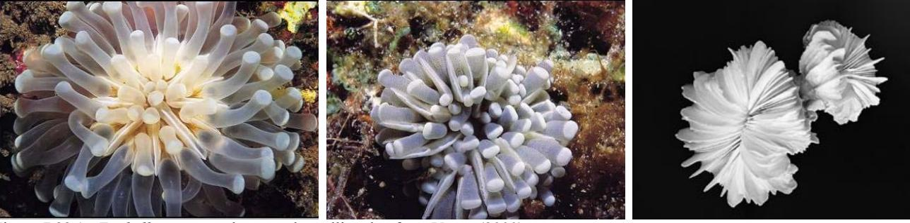

Figure 7.22.1. *Euphyllia cristata* photos and corallite plan from Veron (2000).

#### **Characteristics**

Colonies of *Euphyllia cristata* are phaceloid, comprised of branching separate corallites. Corallites are closely compacted, 20 mm–40 mm diameter. Small solitary polyps are common. Primary septa are very exsert and are conspicuous underwater. First and second order septa plunge steeply near the centre of the corallite. There are no columellae. Polyps have large tubular tentacles with knob-like tips. Polyps are usually pale grey or green, with distinctively colored tips to the tentacles (Veron, 2000).

#### **Taxonomy**

**Taxonomic issues:** None.

**Family:** Carophyllidae.

**Evolutionary and geologic history**: The genus is known from the Oligocene Epoch in the Tethys Sea and Caribbean but is extinct in those locations; known from the Eocene Age in Eurasia and the Indo-Pacific (Wells and Moore, 1956).

#### **Global Distribution**

*Euphyllia cristata* has a moderately wide range, including higher latitude areas in the Ryukus (Japan) and along both coasts of Australia. IUCN reports its existence off east Africa while Veron (2000) does not. It ranges east into the central Pacific.

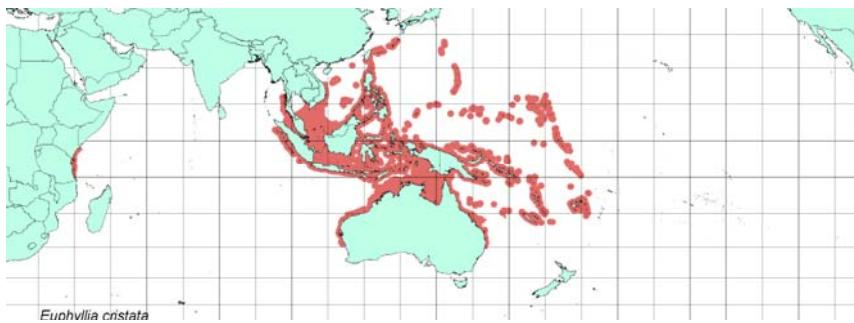

Figure 7.22.2. *Euphyllia cristata* distribution from IUCN copied from http://www.iucnredlist.org.

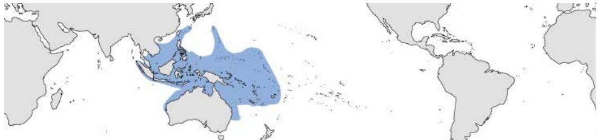

Figure 7.22.3. *Euphyllia cristata* distribution from Veron (2000).

#### **U.S. Distribution**

According to the IUCN Species Account, *Euphyllia cristata* occurs in American Samoa and the Northern Mariana Islands. The CITES database does not list its occurrence in U.S. waters. A search of published and unpublished records of occurrence in U.S. waters indicates *Euphyllia cristata* has been reported from Tutuila in American Samoa (CRED, unpubl. data) and Guam (Randall, 2003).

Within federally protected waters, *Euphyllia cristata* has been recorded from:

War in the Pacific National Historical Park, Guam.

#### **Habitat**

**Habitat:** Veron (2000) describes *Euphyllia cristata* as inhabiting shallow reef habitats, while the IUCN account includes a wide depth range (see below).

**Depth range**: *Euphyllia cristata* occurs at depths of 1 m to 35 m (IUCN Species Account).

#### **Abundance**

Abundance of *Euphyllia cristata* has been reported to be from common (Carpenter et al., 2008) to uncommon but conspicuous (Veron, 2000).

#### **Life History**

Reproductive mode is not known for *Euphyllia cristata*. One congener (*Euphyllia ancora*) is a gonochoric spawner (Guest et al., 2005a; Willis et al., 1985) while another congener (*Euphyllia glabrescens*) is reported to be a hermaphroditic brooder in southern Taiwan (Fan et al., 2006). No other information regarding its ecology or life history is available.

#### **Threats**

**Thermal stress**: *Euphyllia* species experienced high bleaching but mortality is unknown following the 1997/1998 mass bleaching event in Palau (Bruno et al., 2001). Congener *Euphyllia paraancora* in Taiwan contained both Clades C and D zooxanthellae, with Clade D primarily in stressful environments like shallow waters and reef edges (Chen et al., 2005).

**Acidification:** The effects of changes in ocean acidification are largely unknown for the genus *Euphyllia*. When raised in acidified conditions, congener *Euphyllia paradivisa* showed little change in skeletal morphology, while *Galaxea* and *Stylophora* showed substantial skeletal change and *Pocillopora* died (Tibbits, 2009). However, in most corals studied (Table 3.2.2), acidification impairs growth (Langdon and Atkinson, 2005; Manzello, 2010) and, in the case of *Acropora palmata*, impairs fertilization and settlement success (Albright et al., 2010) and is likely to contribute to reef destruction in the future (Hoegh-Guldberg et al., 2007; Silverman et al., 2009). While ocean acidification has not been demonstrated to have caused appreciable declines in coral populations so far, the BRT considers it to be a significant threat to corals by 2100.

**Disease:** Susceptibility and impacts of disease on *Euphyllia cristata* are not known. However, ample evidence indicate that diseases can have devastating regional impacts on individual coral species (e.g., Aronson and Precht, 2001; Bruckner and Hill, 2009) and evidence show that these impacts are occurring in more taxa and at a broader geographic scale (Green and Bruckner, 2000; Sutherland et al., 2004).

**Predation**: Unknown for *Euphyllia cristata*.

**Land-based sources of pollution (LBSP):** The effects of LBSP are largely unknown for the genus *Euphyllia*. Abundance of *Euphyllia* recruits was enhanced in areas where fish were excluded, indicating it may be more tolerant of the shaded conditions created by increased algal biomass in overfished areas (Hughes et al., 2007). Congener *Euphyllia divisa* was fairly sensitive to exposure to cyanide; concentrations at or below those used in cyanide fishing caused a progressive tissue detachment, microbial infection, and death (Cervino et al., 2003). Large patches of *Euphyllia* sp. can form in turbid areas in Indonesia, suggesting a toleration of high sediment loads (Sandin et al., 2008).

LBSP-related stresses (nutrients, sediment, toxins, and salinity) often act in concert rather than individually and are influenced by other biological (e.g., herbivory) and hydrological factors. Collectively, LBSP stresses are unlikely to produce extinction at a global scale; however, they may pose significant threats at local scales (particularly important for species with limited range) and reduce the resilience of corals to bleaching (Carilli et al., 2009a; Wooldridge, 2009b).

**Collection/Trade:** *Euphyllia cristata* is heavily involved in the aquarium trade with species-specific exports or quotas from Indonesia, Fiji, Malaysia, and Tonga. Actual reported annual exports from Indonesia alone averaged over 36,000 pieces from 2000 to 2008 (CITES, 2010).

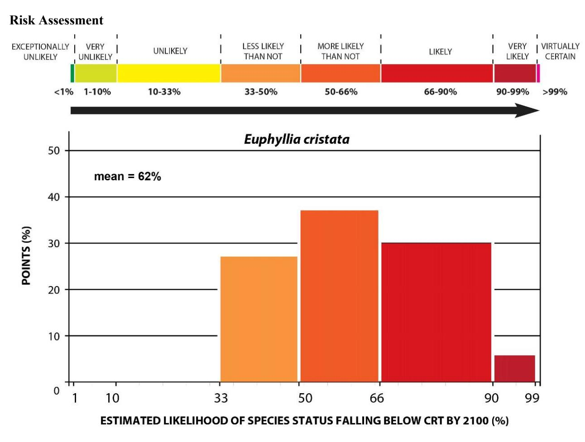

Figure 7.22.4. Distribution of points to estimate the likelihood that the status of *Euphyllia cristata* falls below the Critical Risk Threshold (the species is of such low abundance, or so spatially fragmented, or at such reduced diversity that extinction is extremely likely) by 2100.

Factors that increase the potential extinction risk (higher likelihood of falling below the Critical Risk Threshold) for *Euphyllia cristata* include its heavy involvement in international trade combined with its rare existence but conspicuous colonies, suggesting it is vulnerable to overexploitation. *Euphyllia cristata* appears to be susceptible to bleaching. Its geographic distribution range is moderate, although wider than its congeners under consideration in this review. Wide distribution lowers extinction risk by making it more likely a species will be able to escape the impacts of threats and catastrophes in at least some locations.

The overall likelihood *Euphyllia cristata* will fall below the Critical Risk Threshold by 2100 was estimated to be in the "more likely than not" risk category with a mean likelihood of 62% and a standard error (SE) of 11% (Fig. 7.22.4). This SE was calculated by taking the standard deviation of the seven mean voting scores of the BRT members and shows the coherence among the BRT. The uncertainty of the BRT is reflected in the range of votes of 33%–99% (Fig. 7.22.4) and the average range of likelihood estimates of the seven BRT voters (50%). The overall wide range of votes reflects the uncertainty among BRT members inherent in the lack of adequate ecological and demographic information for *Euphyllia cristata*.

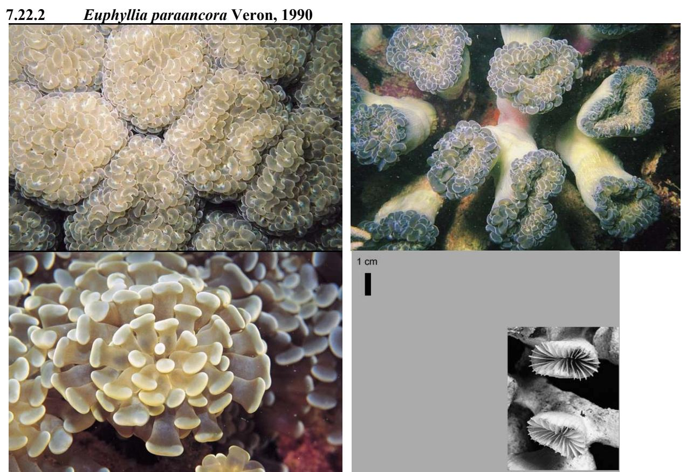

Figure 7.22.5. *Euphyllia paraancora* photos and corallite plan from Veron (2000).

#### **Characteristics**

Colonies of *Euphyllia paraancora* are phaceloid, comprised of branching separate corallites. Several species in this genus (including *Euphyllia glabrescens*, *Euphyllia paraglabrescens*, and *Euphyllia paradivisa*) cannot be distinguished based on skeletal characters, but only by the characters of polyp tentacles. Skeletons are similar to those of *Euphyllia glabrescens* with corallites 20 mm–40 mm diameter. Polyps have tentacles with anchor-shaped ends similar to those of *Euphyllia ancora*. Tentacle tips form concentric circles. Generally, colonies are pale tan or greenish-brown in color (Veron, 2000).

#### **Taxonomy**

**Taxonomic issues:** None.

**Family:** Carophyllidae.

**Evolutionary and geologic history:** The genus *Euphyllia* is known from the Oligocene Epoch in the Tethys Sea and Caribbean but is extinct in those locations; known from the Eocene Age in Eurasia and the Indo-Pacific (Wells and Moore, 1956).

#### **Global Distribution**

*Euphyllia paraancora* has a restricted range, both longitudinally and latitudinally. It is centered in the highly disturbed Coral Triangle Region. The IUCN indicates occurrence in the central Indian Ocean and in northern Australia which Veron (2000) does not support. It has been reported from Australia's Great Barrier Reef, Japan, and Hawai`i.

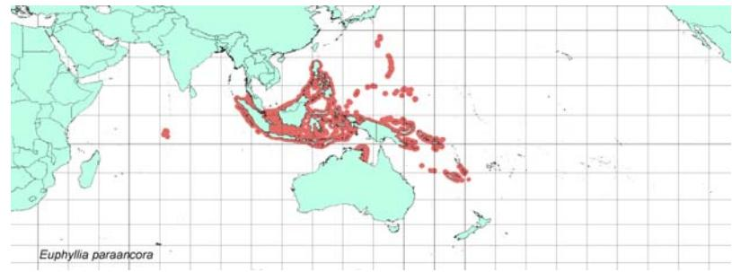

Figure 7.22.6. *Euphyllia paraancora* distribution from IUCN copied from http://www.iucnredlist.org.

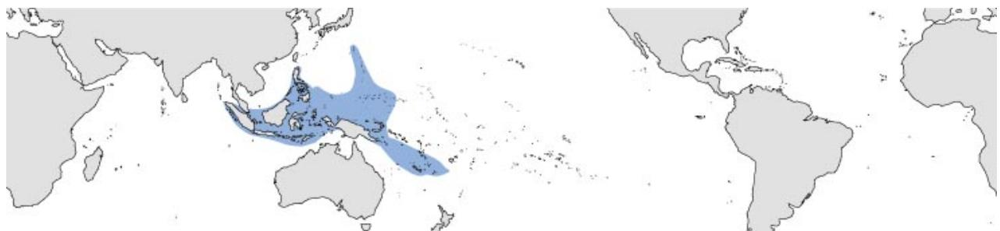

Figure 7.22.7. *Euphyllia paraancora* distribution from Veron (2000).

#### **U.S. Distribution**

According to the IUCN Species Account, *Euphyllia paraancora* occurs in the Northern Mariana Islands. The CITES database does not list its occurrence in U.S. waters. A search of published and unpublished records of occurrence in U.S. waters indicates *Euphyllia paraancora* has been reported from Guam (D. Burdick unpubl. data). It has also been reported from videotape imagery recorded off Saipan in CNMI (D. Fenner pers. comm.).

*Euphyllia paraancora* has not been recorded from federally protected waters.

#### **Habitat**

**Habitat:** *Euphyllia paraancora* has been reported from shallow and deep reef environments protected from wave action (Veron, 2000).

**Depth range**: *Euphyllia paraancora* has been reported in water depths ranging from 3 m to 30 m (Carpenter et al., 2008).

#### **Abundance**

Abundance of *Euphyllia paraancora* has been reported to be uncommon (Veron, 2000). However, it has reportedly been found in monospecific carpets at 6 m to 8 m depth, creating a recognizable coral reef zone at the only location it's been reported in Taiwan (Hsieh et al., 2007).

#### **Life History**

Reproductive mode is not known, although aquarium-maintained colonies of *Euphyllia paraancora* have been reported to release eggs 1 h before sunset and have also been reported to store eggs in polyp tentacles for 2 to 5 days before release (Borneman, 2006). One congener (*Euphylliaancora*) is gonochoric spawner (Guest et al., 2005a; Willis et al., 1985) while another congener (*Euphyllia glabrescens*) is reported to be a hermaphroditic brooder in southern Taiwan (Fan et al., 2006). No other information regarding its ecology or life history is available.

#### **Threats**

**Thermal stress**: *Euphyllia paraancora* and its congeners experienced high bleaching but mortality is unknown following the 1997/1998 mass bleaching event in Palau (Bruno et al., 2001). *Euphyllia paraancora* in Taiwan contained both Clades C and D zooxanthellae, with Clade D primarily in stressful environments like shallow waters and reef edges (Chen et al., 2005).

**Acidification:** The effects of changes in ocean acidification are largely unknown for the genus *Euphyllia*. When raised in acidified conditions, congener *Euphyllia paradivisa* showed little change in skeletal morphology, while *Galaxea* and *Stylophora* showed substantial skeletal change and *Pocillopora* died (Tibbits, 2009). However, in most corals studied (Table 3.2.2), acidification impairs growth (Langdon and Atkinson, 2005; Manzello, 2010) and, in the case of *Acropora palmata*, impairs fertilization and settlement success (Albright et al., 2010) and is likely to contribute to reef destruction in the future (Hoegh-Guldberg et al., 2007; Silverman et al., 2009). While ocean acidification has not been demonstrated to have caused appreciable declines in coral populations so far, the BRT considers it to be a significant threat to corals by 2100.

**Disease:** Susceptibility and impacts of disease on *Euphyllia paraancora* are not known. However, ample evidence indicate that diseases can have devastating regional impacts on individual coral species (e.g., Aronson and Precht, 2001; Bruckner and Hill, 2009) and evidence show that these impacts are occurring in more taxa and at a broader geographic scale (Green and Bruckner, 2000; Sutherland et al., 2004).

**Predation**: Unknown for *Euphyllia paraancora*.

**Land-based sources of pollution (LBSP):** The effects of LBSP on the genus *Euphyllia* are largely unknown. Abundance of *Euphyllia* recruits was enhanced in areas where fish were excluded, indicating it may be more tolerant of the shaded conditions created by increased algal biomass in overfished areas (Hughes et al., 2007). Congener *Euphyllia divisa* was fairly sensitive to exposure to cyanide; concentrations at or below those used in cyanide fishing caused a progressive tissue detachment, microbial infection, and death (Cervino et al., 2003). Large patches of *Euphyllia* sp. can form in turbid areas in Indonesia, suggesting a toleration of high sediment loads (Sandin et al., 2008).

LBSP-related stresses (nutrients, sediment, toxins, and salinity) often act in concert rather than individually and are influenced by other biological (e.g., herbivory) and hydrological factors. Collectively, LBSP stresses are unlikely to produce extinction at a global scale; however, they may pose significant threats at local scales (particularly important for species with limited range) and reduce the resilience of corals to bleaching (Carilli et al., 2009a; Wooldridge, 2009b).

**Collection/Trade:** *Euphillia* spp. are heavily involved in the aquarium trade. *Euphyllia paraancora* is specifically listed in the CITES databases with a 2008 annual export quota of ~ 5000 (up from 1000 in 2004) "maricultured" pieces from Indonesia although the meaning of "maricultured" is unclear. While *Euphyllia cristata* is the species listed in most of the wild-collected exports, the overlapping geographic range and the plethora of similar-looking species within this genus suggest that collection and trade may pose some degree of threat to this uncommon but conspicuous species which is in high international demand.

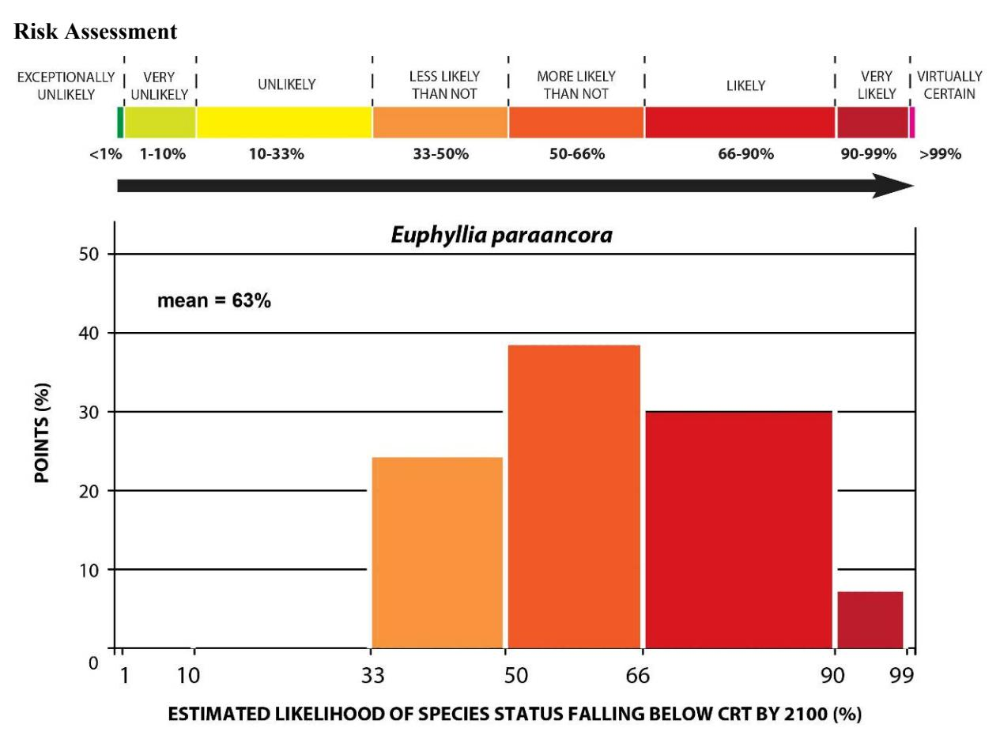

Figure 7.22.8. Distribution of points to estimate the likelihood that the status of *Euphyllia paraancora* falls below the Critical Risk Threshold (the species is of such low abundance, or so spatially fragmented, or at such reduced diversity that extinction is extremely likely) by 2100.

Factors that increase the potential extinction risk (higher likelihood of falling below the Critical Risk Threshold) for *Euphyllia paraancora* include its heavy involvement in international trade combined with its rare existence but conspicuous colonies, suggesting it is vulnerable to overexploitation. The species appears bleaching-suceptible. Its geographic distribution is also somewhat restricted, centered in the threat-prone Coral Triangle Region. Narrow geographic distribution increases the likelihood that changing conditions or a local impact in a particular location can push the species below the Critical Risk Threshold.

The overall likelihood *Euphyllia paraancora* will fall below the Critical Risk Threshold by 2100 was estimated to be in the "more likely than not" risk category with a mean likelihood of 63% and a standard error (SE) of 10% (Fig. 7.22.8). This SE was calculated by taking the standard deviation of the seven mean voting scores of the BRT members and shows a moderate degree of coherence among the BRT. The uncertainty of the BRT is reflected in the range of votes of 33%–99% (Fig. 7.22.8) and the average range of likelihood estimates of the seven BRT voters (50%). The overall wide range of votes reflects the uncertainty among BRT members inherent in the lack of adequate ecological and demographic information for *Euphyllia paraancora*.

**7.22.3** *Euphyllia paradivisa* **Veron, 1990** 

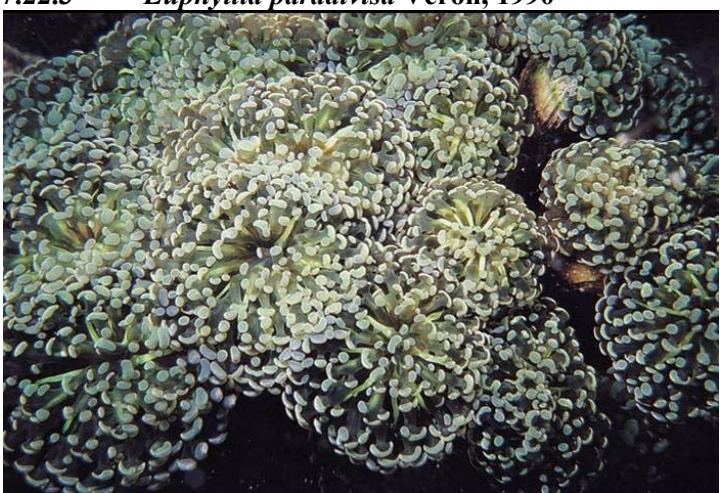

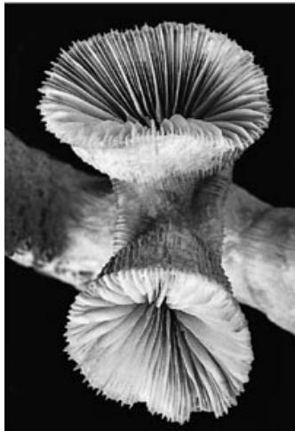

Figure 7.22.9. *Euphyllia paradivisa* photos and corallite plan from Veron (Veron, 2000).

#### **Characteristics**

Colonies are phaceloid, made up of branching separate corallites. Several species in this genus (including *Euphyllia glabrescens*, *Euphyllia paraglabrescens*, and *Euphyllia paraancora*) cannot be distinguished based on skeletal characters, but only by the characters of polyp tentacles. Polyps have branching tentacles almost identical to those of *Euphyllia divisa*. Color is pale greenish-grey with lighter tentacle tips (Veron, 2000).

#### **Taxonomy**

**Taxonomic issues**: None.

**Family:** Carophyllidae.

**Evolutionary and geologic history**: The genus *Euphyllia* is known from the Oligocene Epoch in the Tethys Sea and Caribbean but is extinct in those locations; known from the Eocene Period in Eurasia and the Indo-Pacific (Wells and Moore, 1956).

#### **Global Distribution**

*Euphyllia paradivisa* has a restricted range, existing only in the highly disturbed Coral Triangle Region.

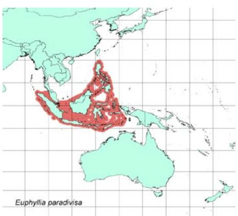

Figure 7.22.10. *Euphyllia paradivisa* distribution from IUCN copied from http://www.iucnredlist.org.

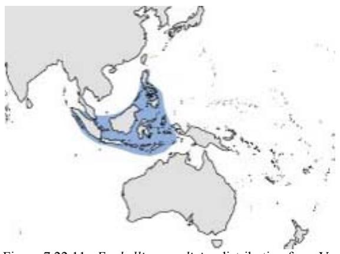

Figure 7.22.11. *Euphyllia paradivisa* distribution from Veron (2000).

#### **U.S. Distribution**

According to the IUCN Species Account, *Euphyllia paradivisa* occurs in American Samoa, but no supporting reference is given. The CITES species database does not include any record of occurrence in U.S. waters. *Euphyllia paradivisa* is not listed as occurring in American Samoa in (Lovell and McLardy, 2008). Fenner reports *Euphyllia paradivisa* in Tutuila, American Samoa at Vatia Bay (unpubl. data, March 2010), supported by three photographs clearly showing the branching tentacles diagnostic of this species. It is very rare with only one small group of colonies found at about 25-m depth on a flat silt bottom. This species was not observed elsewhere in American Samoa by Fenner during dedicated surveys conducted at 38 sites off Ofu-Olosega, Tau, Rose Atoll, Swains, and South Bank in March 2010. No other published or unpublished data sources indicate the occurrence of *Euphyllia paradivisa* elsewhere in U.S. waters.

*Euphyllia paradivisa* has not been recorded from federally protected waters.

#### **Habitat**

**Habitat:** *Euphyllia paradivisa* has been reported from shallow or mid-slope reef environments protected from wave action (Veron, 2000).

**Depth range**: *Euphyllia paradivisa* occurs at depths of 5 m to 20 m (IUCN Species Account).

#### **Abundance**

Abundance of *Euphyllia paradivisa* has been reported to be uncommon (Veron, 2000).

#### **Life History**

Reproductive mode is not known. One congener (*Euphyllia ancora*) is a gonochoric spawner (Guest et al., 2005a; Willis et al., 1985) while another congener (*Euphyllia glabrescens*) is reported to be a hermaphroditic brooder in southern Taiwan (Fan et al., 2006). No other information regarding its ecology or life history is available.

#### **Threats**

**Thermal stress**: *Euphyllia* species experienced high bleaching but mortality is unknown following the 1997/1998 mass bleaching event in Palau (Bruno et al., 2001). Congener *Euphyllia paraancora* in Taiwan contained both Clades C and D zooxanthellae, with Clade D primarily in stressful environments like shallow waters and reef edges (Chen et al., 2005).

**Acidification:** The effects of changes in ocean acidification are largely unknown for the genus *Euphyllia*. When raised in acidified conditions, *Euphyllia paradivisa* showed little change in skeletal morphology, while *Galaxea* and *Stylophora* showed substantial skeletal change and *Pocillopora* died (Tibbits, 2009). However, in most corals studied (Table 3.2.2), acidification impairs growth (Langdon and Atkinson, 2005; Manzello, 2010) and, in the case of *Acropora palmata*, impairs fertilization and settlement success (Albright et al., 2010) and is likely to contribute to reef destruction in the future (Hoegh-Guldberg et al., 2007; Silverman et al., 2009). While ocean acidification has not been demonstrated to have caused appreciable declines in coral populations so far, the BRT considers it to be a significant threat to corals by 2100.

**Disease:** Susceptibility and impacts of disease on *Euphyllia paradivisa* are not known. However, ample evidence indicate that diseases can have devastating regional impacts on individual coral species (e.g., Aronson and Precht, 2001; Bruckner and Hill, 2009) and evidence show that these impacts are occurring in more taxa and at a broader geographic scale (Green and Bruckner, 2000; Sutherland et al., 2004).

**Predation**: Unknown for *Euphyllia paradivisa.*

**Land-based sources of pollution (LBSP):** The effects of LBSP on the genus *Euphyllia* are largely unknown. Abundance of *Euphyllia* recruits was enhanced in areas where fish were excluded, indicating it may be more tolerant of the shaded conditions created by increased algal biomass in overfished areas (Hughes et al., 2007). Congener *Euphyllia divisa* was fairly sensitive to exposure to cyanide; concentrations at or below those used in cyanide fishing caused a progressive tissue detachment, microbial infection, and death (Cervino et al., 2003). Large patches of *Euphyllia* sp. can form in turbid areas in Indonesia, suggesting a toleration of high sediment loads (Sandin et al., 2008).

LBSP-related stresses (nutrients, sediment, toxins, and salinity) often act in concert rather than individually and are influenced by other biological (e.g., herbivory) and hydrological factors. Collectively, LBSP stresses are unlikely to produce extinction at a global scale; however, they may pose significant threats at local scales (particularly important for species with limited range) and reduce the resilience of corals to bleaching (Carilli et al., 2009a; Wooldridge, 2009b).

**Collection/Trade:** *Euphillia* spp. are heavily involved in the aquarium trade. *Euphyllia paradivisa* is specifically listed in the CITES databases with annual export quotas of up to 2380 "maricultured" pieces from Indonesia, although the meaning of "maricultured" is unclear. While *Euphyllia cristata* is the species listed in most of the wild-collected exports, the overlapping geographic range and the plethora of similar-looking species within this genus suggest that collection and trade may pose some degree of threat to an uncommon but conspicuous species which is in high international demand.

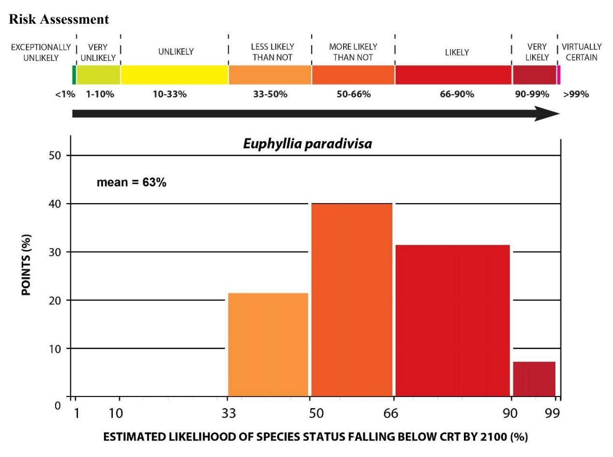

Figure 7.22.12. Distribution of points to estimate the likelihood that the status of *Euphyllia paradivisa* falls below the Critical Risk Threshold (the species is of such low abundance, or so spatially fragmented, or at such reduced diversity that extinction is extremely likely) by 2100.

Factors that increase the potential extinction risk (higher likelihood of falling below the Critical Risk Threshold) for *Euphyllia paradivisa* include its heavy involvement in international trade combined with its rare existence but conspicuous colonies, suggesting it is vulnerable to overexploitation. The species appears bleaching-susceptible. Its geographic distribution is also somewhat restricted, centered in the threat-prone Coral Triangle Region. Narrow geographic distribution increases the likelihood that changing conditions or a local impact in a particular location can push the species below the Critical Risk Threshold. No known factors were noted by the BRT to reduce the extinction risk of this species.

The overall likelihood *Euphillia paradivisa* will fall below the Critical Risk Threshold by 2100 was estimated to be in the "more likely than not" risk category with a mean likelihood of 63% and a standard error (SE) of 10% (Fig. 7.22.12). This SE was calculated by taking the standard deviation of the seven mean voting scores of the BRT members and shows a moderate degree of coherence among the BRT. The uncertainty of the BRT is reflected in the range of votes of 33%–99% (Fig. 7.21.12) and the average range of likelihood estimates of the seven BRT voters (50%). The overall wide range of votes reflects the uncertainty among BRT members inherent in the lack of adequate ecological and demographic information for *Euphyllia paradivisa*.

#### **7.23 Genus** *Physogyra*

**7.23.1** *Physogyra lichtensteini* **Saville-Kent, 1871** 

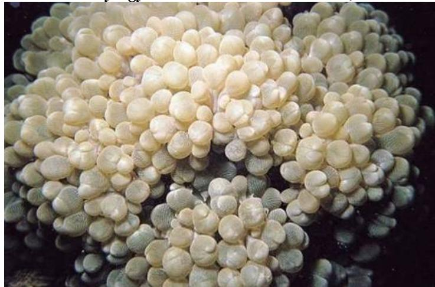

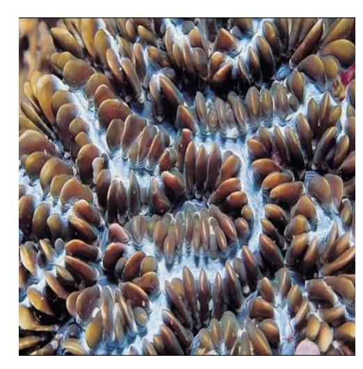

Figure 7.23.1. *Physogyra lichtensteini* photos from Veron (2000).

#### **Characteristics**

Colonies of *Physogyra lichtensteini* are massive or thick, platy and meandroid forms with short, widely separated valleys and a light coenosteum. Colonies have large septa that are solid, smooth-edged, exsert, and widely spaced. They lack columellae. During the day, colonies often have a mass of grape-like or bifurcated vesicles that retract when disturbed. Tentacles are extended only at night. Colonies are pale grey in color, sometimes dull green (Veron, 2000).

There are conflicting reports on the maximum size of this species, ranging from 30 cm (Dinesen, 1983) to 150 cm (Veron and Pichon, 1980).

#### **Taxonomy**

**Taxonomic issues**: None. *Physogyra lichtensteini* is similar to *Plerogyra sinuosa* (Veron, 2000).

**Family:** Carophyllidae.

**Evolutionary and geologic history**: A recent Indo-Pacific genus with no known fossil record (Wells and Moore, 1956).

#### **Global Distribution**

*Physogyra lichtensteini* has a relatively broad distribution. It is found in Australia, Indonesia, Japan, Kenya, Madagascar, the Seychelles, the Red Sea, the Arabian Sea, India, the Philippines, and other areas in the west Pacific.

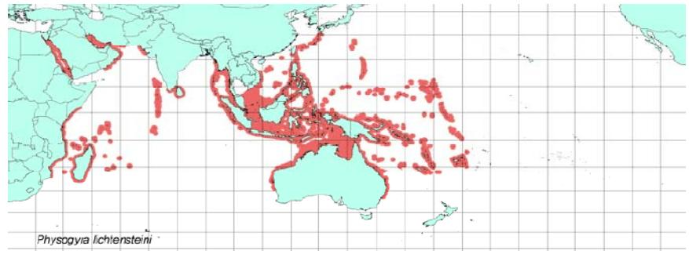

Figure 7.23.2. *Physogyra lichtensteini* distribution from IUCN copied from http://www.iucnredlist.org.

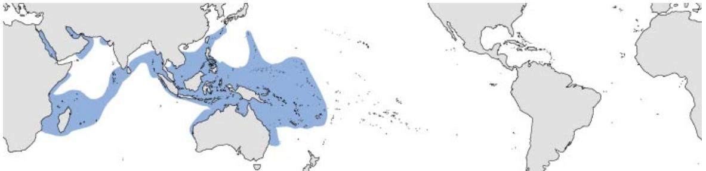

Figure 7.23.3. *Physogyra lichtensteini* distribution from Veron (2000).

#### **U.S. Distribution**

According to the IUCN Species Account, *Physogyra lichtensteini* occurs in the Northern Mariana Islands, but no supporting reference is given. The CITES species database does not include any record of occurrence in U.S. waters.

Veron (2000) also lists the species in the Marianas; however, the Marianas record may be an error resulting from inaccurate geographic attribution of photographic evidence (Kenyon et al., 2010). Paulay (pers. comm., 28 February 2010) indicates a number of photos submitted by him to Veron from Palau and the Cook Islands, and other locations in the Pacific were mistakenly attributed to Guam (similar to the *errata* later acknowledged by Veron (2002) for *Acanthastrea regularis* and *Porites napopora*).

No other published or unpublished data sources indicate the occurrence of *Physogyra lichtensteini* elsewhere in U.S. waters.

#### **Habitat**

**Habitat:** *Physogyra lichtensteini* has been reported to occupy turbid reef environments (Veron, 2000). The species is common in protected habitats (crevices and overhangs), especially in turbid water with tidal currents (Veron, 2000). *Physogyra lichtensteini* is also reported to be a caverniculous species that prefers shallow but shaded waters, and it is found in caves on the Great Barrier Reef (Dinesen, 1982).

**Depth range**: *Physogyra lichtensteini* has been reported in water depths ranging from 1 m to 20 m (Carpenter et al., 2008).

#### **Abundance**

Abundance of *Physogyra lichtensteini* has been reported to be common in protected habitats such as crevices and overhangs, especially in turbid water with tidal currents (Veron, 2000).

#### **Life History**

*Physogyra lichtensteini* is a gonochoric broadcast spawner (Babcock et al., 1986; Willis et al., 1985). Larvae are lecithotropic, i.e, they do not contain zooxanthellae (Baird et al., 2009). The minimum size and estimated age of first reproduction have not been determined for any members of the family (Harrison and Wallace, 1990). Larval longevity has not been determined in this family.

#### **Threats**

**Thermal stress:** *Physogyra lichtensteini* has been identified as vulnerable to extinction due to its high bleaching rate, low diversity of its genus, and narrow habitat range (McClanahan et al., 2007). The species bleached at 31°C in Palau in 1998 (Bruno et al., 2001). *Physogyra lichtensteini* contains Clade C zooxanthellae in the South China Sea (Dong et al., 2009).

**Acidification:** Unknown for the genus *Physogyra*. However, in most corals studied (Table 3.2.2), acidification impairs growth (Langdon and Atkinson, 2005; Manzello, 2010) and, in the case of *Acropora palmata*, impairs fertilization and settlement success (Albright et al., 2010) and is likely to contribute to reef destruction in the future (Hoegh-Guldberg et al., 2007; Silverman et al., 2009). While ocean acidification has not been demonstrated to have caused appreciable declines in coral populations so far, the BRT considers it to be a significant threat to corals by 2100.

**Disease:** Susceptibility and impacts of disease on *Physogyra lichtensteini* are not known. However, ample evidence indicates that diseases can have devastating regional impacts on individual coral species (e.g., Aronson and Precht, 2001; Bruckner and Hill, 2009) and evidence show that these impacts are occurring in more taxa and at a broader geographic scale (Green and Bruckner, 2000; Sutherland et al., 2004).

**Predation:** Population-level effects of predation are unknown for *Physogyra lichtensteini*, although it is preyed upon on by butterflyfish in Indonesia (Nagelkerken et al., 2009).

**Land-based sources of pollution (LBSP):** The effects of LBSP on *Physogyra lichtensteini* i**s** unknown, but given that it prefers turbid waters the risk of sediment impacts are low. LBSP-related stresses (nutrients, sediment, toxins, and salinity) often act in concert rather than individually and are influenced by other biological (e.g., herbivory) and hydrological factors. Collectively, LBSP stresses are unlikely to produce extinction at a global scale; however, they may pose significant threats at local scales (particularly important for species with limited range) and reduce the resilience of corals to bleaching (Carilli et al., 2009a; Wooldridge, 2009b).

**Collection/Trade:** The genus *Physogyra* is heavily traded (CITES, 2010), primarily exported from Indonesia. Between 1999 and 2010, the trade quota for Indonesia has been on the order of ~ 10,000 specimens annually. Reported exports for *Physogyra lichtensteini* have been at or near these quotas, averaging 9912 specimens from 1999 to 2008 (CITES, 2010).

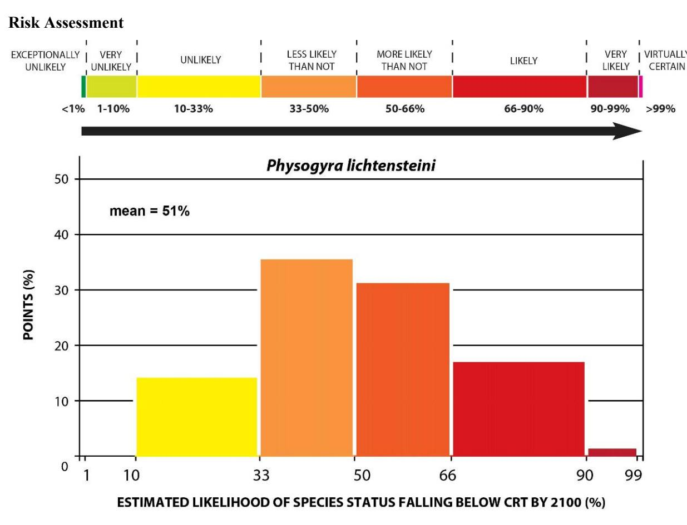

Figure 7.23.4. Distribution of points to estimate the likelihood that the status of *Physogyra lichtensteini* falls below the Critical Risk Threshold (the species is of such low abundance, or so spatially fragmented, or at such reduced diversity that extinction is extremely likely) by 2100.

Factors that increase the potential extinction risk (higher likelihood of falling below the Critical Risk Threshold) for *Physogyra lichtensteini* are that it has a high bleaching rate and is heavily collected. Factors that reduce potential extinction risk (decrease the likelihood of falling below the Critical Risk Threshold) are that *Physogyra lichtensteini* has a wide latitudinal distribution, is common, and tolerates difficult (turbid) environments. Wide distribution is considered to lower extinction risk by making it more likely a species will be able to escape the impacts of threats and catastrophes in at least some locations.

The overall likelihood that *Physogryra lichtensteini* will fall below the Critical Risk Threshold by 2100 was estimated to be in the "more likely than not" risk category with a mean likelihood score of 51% and a standard error (SE) of 11% (Fig. 7.23.4). This SE was calculated by taking the standard deviation of the seven mean voting scores of the BRT members and shows the coherence among the BRT. The uncertainty of the BRT is reflected in the range of votes of 10%–99% (Fig. 7.23.4) and the average range of likelihood estimates of the seven BRT voters (62%). *Physogyra lichtensteini* has the third-highest SE of the mean likelihood scores of all species (see Table 8.1 in Chapter 8). The overall wide range of votes reflects the uncertainty among BRT members inherent in the lack of adequate ecological and demographic information for this species. The variability also reflects the difficulty in reconciling its potential vulnerability to extinction from bleaching (McClanahan et al., 2007) with its wide range.

#### **7.24 Genus** *Turbinaria* **(Family Dendrophylliidae)**

**7.24.1** *Turbinaria mesenterina* **(Lamarck, 1816)** 

Figure 7.24.1. Colonies of *Turbinaria mesenterina* copied from Veron (2000).

#### **Characteristics**

Colonies of *Turbinaria mesenterina* are best known as large lettuce-like assemblages of plates with the polyps or corallites on the upper surfaces (Veron, 2000; see the *Turbinaria mesenterina* illustration in the center). The plates can be very contorted in shallow depths with a lot of water motion (see the *Turbinaria mesenterina* illustration to the left). In deeper water or low light conditions, the colonies can be large flat plates (see the *Turbinaria mesenterina* illustration to the right)*. Turbinaria mesenterina* are usually grey-green or grey-brown in color.

#### **Taxonomy**

**Taxonomic issues**: None. The genus *Turbinaria* is quite distinct and is not confused with other genera. The species are usually quite distinguishable, especially when seen together. Some preliminary electrophoretic data suggested species groupings in *Turbinaria* that differ from classic taxonomic definitions (Ayre et al., pers. comm. in Willis, 1990), although since no further work has been done on the subject they are considered here as valid species.

**Family:** Dendrophylliidae.

**Evolutionary and geologic history**: *Turbinaria* originated in the Oligocene Epoch in the Tethys Sea in southern Europe (Wells and Moore, 1956). It went extinct in the Atlantic (Caribbean), but it still occurs across the Indian and Pacific Oceans.

#### **Global Distribution**

*Turbinaria mesenterina* has become very broadly distributed both longitudinally from east Africa and the Red Sea to eastern central Pacific and latitudinally from southern Africa and the Great Barrier Reef to Japan. *Turbinaria mesenterina* has the broadest distribution of the four species of *Turbinaria* considered in this review.

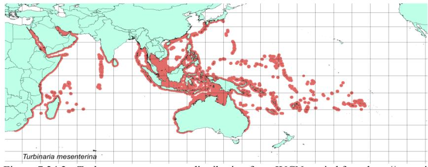

Figure 7.24.2. *Turbinaria mesenterina* distribution from IUCN copied from http://www.iucnredlist.org.

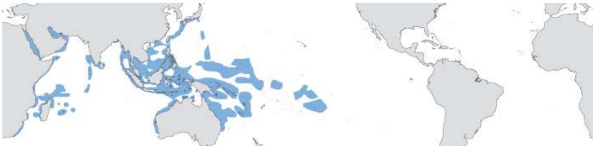

Figure 7.24.3. *Turbinaria mesenterina* distribution copied from Veron (2000).

#### **U.S. Distribution**

*Turbinaria mesenterina* is found in Samoa. The IUCN Red Book lists *Turbinaria mesenteria* in the Marianas Islands, but Randall (1995) does not. According to both the IUCN Species Account and the CITES species database, *Turbinaria mesenterina* has been recorded in American Samoa. The IUCN Species Account also lists its occurrence in the Northern Mariana Islands and U.S. minor outlying islands.

A search of published and unpublished records of occurrence in U.S. waters indicates *Turbinaria mesenterina* has been reported from Tutuila, Ofu-Olosega, and Tau in American Samoa (Lovell and McLardy, 2008; National Park Service, 2009; C. Birkeland, unpubl. data; CRED, unpubl. data). Veron (2000) shows a distribution map including the Northern Mariana Islands (volume 2, page 394) but no independent published or unpublished reference has substantiated this record. Randall (1995) does not list *Turbinaria mesenterina* for the northern or southern islands in the Mariana Archipelago. No published or unpublished reference listing its occurrence in the U.S. minor outlying islands could be identified.

Within federally protected waters, *Turbinaria mesenterina* has been recorded from the following areas:

National Park of American Samoa, Ofu Island unit.

#### **Habitat**

**Habitat:** *Turbinaria mesenterina* can be a dominant species, forming massive and extensive stands, especially in shallow protected waters with some turbidity (Veron, 2000). *Turbinaria mesenterina* can live on forereef slopes and can prevail in clear water as well, but usually not in areas of heavy wave action.

**Depth range**: The depth range of *Turbinaria mesenterina* has been recorded as 3 m to 20 m (Titlyanov and Latypov, 1991; Veron and Pichon, 1980). Sheppard and Sheppard (1991) found *Turbinaria mesenterina* to occur commonly "at the base of reef slopes at 10 m or deeper."

#### **Abundance**

*Turbinaria mesenterina* has been reported to be common (Veron, 2000). The species can be locally dominant and form massive and extensive stands, especially in protected shallow turbid waters.

#### **Life History**

The dominant sexual pattern in *Turbinaria mesenterina* is a gonochoric broadcast spawner, with a 1:1 sex ratio. However, a low incidence of hermaphroditism has been documented on the Great Barrier Reef (Babcock et al., 2003; Willis, 1987). Polyps nearest the growing plate edge are sterile or have lowered fecundity in their first year of growth, higher but sub-mature levels of fecundity after 2 or 3 years' growth, and are only fully fecund in their second spawning season, i.e., regions corresponding to 3 years or older. The minimum size at first reproduction is 12 cm to 16 cm, with an estimated age of 4 years (Willis, 1987). Planula larvae do not contain zooxanthellae that can supplement maternal provisioning with energy sources provided by their photosynthesis (Baird et al., 2009). Larval longevity has not been determined in this genus. Mean diameter of the corallum at settlement, in laboratory studies, is 900 µm (range 800*–*  1000 µm) (Babcock et al., 2003; Willis et al., 1985).

#### **Threats**

**Thermal stress**: Bleaching in *Turbinaria* varies among regions. The study by Marshall and Baird (2000) showed *Turbinaria* to be the most resistant to bleaching when responding to high seawater temperatures than any of the other 39 generic groups of scleratinians tested. *Turbinaria* were moderately vulnerable to bleaching in the western Indian Ocean from 1998 to 2005 (McClanahan et al., 2007), but that varied within that region—the genus bleached more in Mauritius than Kenya in 2004 (McClanahan et al., 2005a) and was one of the genera most resistant to bleaching in South Africa (Floros et al., 2004). Congeneric species had occasionally high bleaching and mortality occurrences in Palau from 1997 to 1998 (Bruno et al., 2001). It may be that some of the mixed bleaching response is determined by whether the stress is temperature- or light-induced, as repeated exposure to high irradiance significantly decreases the energy budget in *Turbinaria* (Hoogenboom et al., 2006). Alternatively, spatial differences in bleaching could be due to symbiont presence, as *Turbinaria* can host either Clade C or Clade D zooxanthellae (LaJeunesse et al., 2003; Ulstrup et al., 2006).

**Acidification:** A closely-related species, *Turbinaria reniformis,* appears to show a lower percent change in calcification when pCO2 is doubled and tripled compared to the other genera of scleractinians experimentally tested (Kleypas et al., 2006). *Turbinaria reniformis* showed a 13% reduction in growth in high-CO2 waters, but had no significant changes in skeletal microstructures (Marubini et al., 2003). Most corals studied have shown negative relationships between acidification and growth (Table 3.2.2) and acidification is likely to contribute to reef destruction in the future (Hoegh-Guldberg et al., 2007; Silverman et al., 2009). While ocean acidification has not been demonstrated to have caused appreciable declines in coral populations so far, the BRT considers it to be a significant threat to corals by 2100.

**Disease:** A white-syndrome disease has affected *Turbinaria* in Australia since 2000; elevated temperatures appear to significantly increase tissue loss (Dalton et al., 2010). Black lesions were also observed on *Turbinaria mesenterina* almost simultaneously with a bleaching event on the Great Barrier Reef (Jones et al., 2004). Also, ample evidence indicate that diseases can have devastating regional effects on individual coral species (e.g., Aronson and Precht, 2001; Bruckner and Hill, 2009) and evidence show that these effects are occurring in more taxa and at a broader geographic scale (Green and Bruckner, 2000; Sutherland et al., 2004).

**Predation:** Adult colonies of *Turbinaria* spp. are almost never eaten by crown-of-thorns seastars (Birkeland and Lucas 1990). *Turbinaria* are not thought to be eaten by *Phestilla sibogae* (Ritson-Williams et al., 2003), but recent evidence suggests that *Phestilla* can both feed on *Turbinaria* as well as infect it with disease (Dalton and Godwin, 2006).

**Land-base sources of pollution (LBSP):** *Turbinaria* spp. can be dominant in turbid waters. For both *Turbinaria reniformis* and *Turbinaria peltata*, Sheppard and Sheppard (1991) stated that "It coexists with *Turbinaria mesenterina* and is often found in sedimented conditions." *Turbinaria mesenterina* maintains photosynthetic and growth rates even under highly turbid conditions (Sofonia and Anthony, 2008) and accumulates significant energy reserves (Anthony, 2006). As a genus, *Turbinaria* are efficient sediment-rejecters (Stafford-Smith and Ormond, 1992), but have been observed to incur partial mortality from sediment during dredging events (Blakeway, 2005). *Turbinaria* adopt funnelshaped morphologies in turbid environments which localizes sediment effects to small portions of the colony (Riegl et al., 1996).*Turbinaria mesenterina* appears to tolerate low-salinity events, as it survived with little damage the 1991 cyclone floodwaters in the Keppel Islands (Van Woesik et al., 1995).

LBSP-related stresses (nutrients, sediment, toxins, and salinity) often act in concert rather than individually and are influenced by other biological (e.g., herbivory) and hydrological factors. Collectively, LBSP stresses are unlikely to produce extinction at a global scale; however, they may pose significant threats at local scales (particularly important for species with limited range) and reduce the resilience of corals to bleaching (Carilli et al., 2009a; Wooldridge, 2009b).

**Collection/Trade:** According to CITES records, *Turbinaria* spp. are one of the top 10 genera imported into the United States of America (U.S.A.). Between 1997 and 2001, more than 63,400 specimens were imported (Wabnitz, 2003) and between 2000 and 2008 around 370,000 pieces (between 30,000 and 50,000 per year) were reportedly exported from Indonesia that appears to be the main exporting country of *Turbinaria* spp. (CITES, 2010).

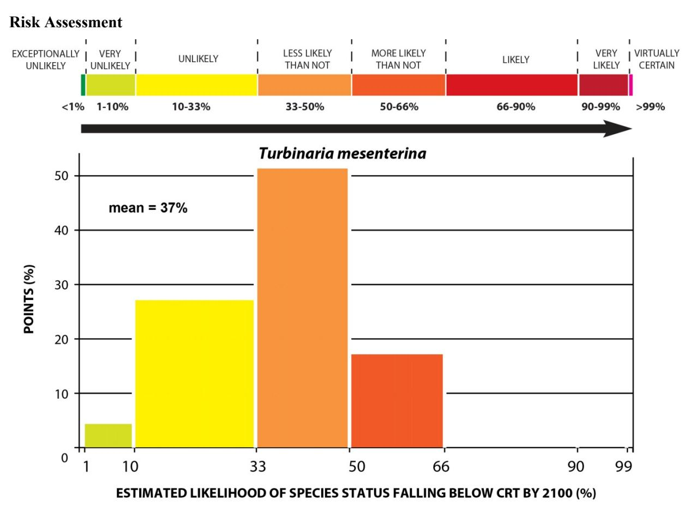

Figure 7.24.4. Distribution of points to estimate the likelihood that the status of *Turbinaria mesenterina* falls below the Critical Risk Threshold (the species is of such low abundance, or so spatially fragmented, or at such reduced diversity that extinction is extremely likely) by 2100.

Factors that increase the potential extinction risk (higher likelihood of falling below the Critical Risk Threshold) for *Turbinaria mesenterina* include susceptibility to disease and harvesting. *Turbinaria mesenterina* seems susceptible to disease at high latitudes in Australia. The aquarium trade appears to be the most immediate threat to populations of *Turbinaria.* Factors that reduce potential extinction risk (decrease the likelihood of falling below the Critical Risk Threshold) are that *Turbinaria mesenterina* can be dominant in turbid waters, is remarkably tolerant to seawater warming, low salinity events, lower pH, and predation, and is broadly distributed both latitudinally and longitudinally in the Indo-Pacific. Wide distribution is considered to lower extinction risk by making it more likely a species will be able to escape the impacts of threats and catastrophes in at least some locations

The overall likelihood that *Turbinaria mesenterina* will fall below the Critical Risk Threshold by 2100 was estimated to be in the "less likely than not" risk category with a mean likelihood of 37% and a standard error (SE) of 10% (Fig. 7.24.4). This SE was calculated by taking the standard deviation of the seven mean voting scores of the BRT members and shows the coherence among the BRT. The uncertainty of the BRT is reflected in the range of votes of 1%–66% (Fig. 7.24.4) and the average range of likelihood estimates of the seven BRT voters (45%). The overall wide range of votes reflects the uncertainty among BRT members inherent in the lack of adequate ecological and demographic information for *Turbinaria mesenterina*.

#### **7.24.2** *Turbinaria peltata* **(Esper, 1794)**

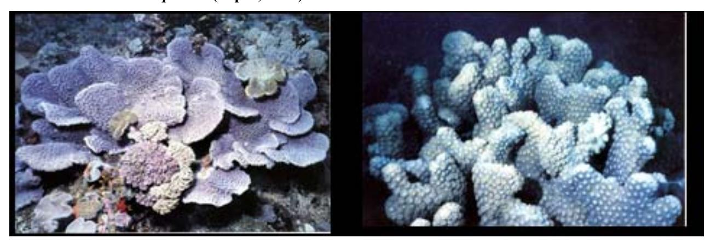

Figure 7.24.5. Colonies of *Turbinaria peltata* copied from Veron (2000).

#### **Characteristics**

Colonies of *Turbinaria peltata* are best known as large lettuce-like assemblages of plates with the polyps or corallites on the upper surfaces of the laminae or leaves or blades or plates. The plates can be contorted in shallow depths with a lot of water motion (see the *Turbinaria peltata* illustration to the left; Veron, 2000). *Turbinaria peltata* can adopt a branching morphology (see the above illustration to the right).

*Turbinaria peltata* is usually grey-green or grey-brown in color.

#### **Taxonomy**

**Taxonomic issues**: None. The genus *Turbinaria* is quite distinct and is not confused with other genera. The species are usually quite distinguishable, especially when seen together. Some preliminary electrophoretic data suggested species groupings in *Turbinaria* that differ from classic taxonomic definitions (Ayre et al., pers. comm. in Willis, 1990), but no further work has been done on the subject so they are considered here as valid species.

**Family:** Dendrophylliidae.

**Evolutionary and geologic history**: *Turbinaria* originated in the Oligocene Epoch (Wells and Moore, 1956). It went extinct in the Atlantic (Caribbean), but it still occurs across the Indian and Pacific Oceans.

#### **Global Distribution**

*Turbinaria peltata* has become very broadly distributed both longitudinally (from east Africa to eastern central Pacific) and latitudinally (from southern Africa and the Great Barrier Reef to Japan). *Turbinaria peltata* has a slightly narrower distribution than *Turbinaria mesenterina* and *Turbinaria reniformis,* but slightly more extensive than *Turbinaria stellulata. Turbinaria peltata* is absent from the Red Sea.

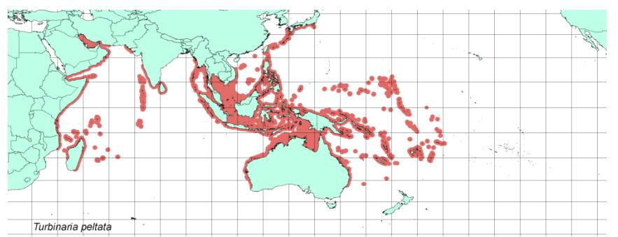

Figure 7.24.6. *Turbinaria peltata* distribution from IUCN copied from http://www.iucnredlist.org.

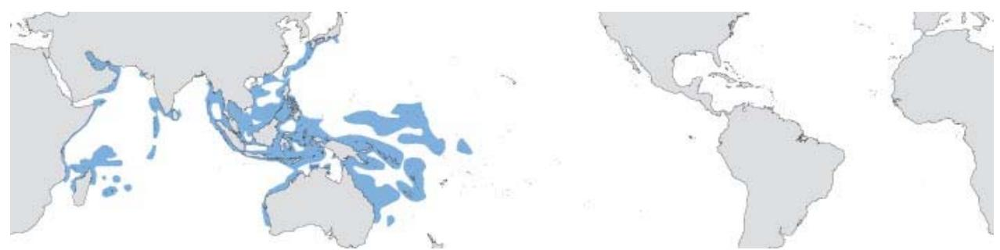

Figure 7.24.7. *Turbinaria peltata* distribution from Veron (2000).

#### **U.S. Distribution**

According to both the IUCN Species Account and the CITES species database, *Turbinaria peltata* has been recorded in American Samoa. A search of published and unpublished records of occurrence in U.S. waters indicates *Turbinaria peltata* has been reported from Tutuila, Tau, and South Bank in American Samoa (Lamberts, 1983; Maragos et al., 1994; CRED unpubl. data). No published or unpublished references listing its occurrence in the U.S. minor outlying islands could be identified.

*Turbinaria peltata* has not been recorded from federally protected waters.

#### **Habitat**

**Habitat:** *Turbinaria peltata* has been reported to occupy shallow protected waters with some turbidity (Veron, 2000). They can live on forereef slopes and can prevail in clear water as well, but usually not in areas of heavy wave action.

**Depth range**: The depth range of *Turbinaria peltata* has been recorded as 0 m–40 m. Sheppard and Sheppard (1991) found *Turbinaria peltata* to occur commonly "at the base of reef slopes at 10 m or deeper."

#### **Abundance**

*Turbinaria peltata* has been reported to be a common species that can be locally dominant and form massive and extensive stands, especially in protected shallow turbid waters (Veron, 2000).

#### **Life History**

*Turbinaria peltata* is a broadcast spawner (Babcock et al., 1994; Kenyon, 1995), but its sexual pattern (hermaphrodite vs. gonochoric) has not been determined. However, three other species of *Turbinaria* all are gonochoric, although a low frequency of hermaphroditism has been shown on the Great Barrier Reef in the congener *Turbinaria mesenterina* (Willis, 1987). The minimum size and estimated age at first reproduction have not been determined for this species. However, for the congener *Turbinaria mesenterina*, the minimum size at first reproduction is 12 cm to 16 cm, with an estimated age of 4 years (Willis, 1987). Although specific observations have not been published for this species, the larvae of 2 other *Turbinaria* species studied do not contain zooxanthellae that can supplement maternal provisioning with energy sources provided by their photosynthesis (Baird et al., 2009).

#### **Threats**

**Thermal stress**: Bleaching in *Turbinaria* varies among regions. The study by Marshall and Baird (2000) showed *Turbinaria* to be the most resistant to bleaching when responding to high seawater temperatures than any of the other 39 generic groups of scleratinians tested. *Turbinaria* were moderately vulnerable to bleaching in the western Indian Ocean from 1998 to 2005 (McClanahan et al., 2007), but that varied within that region—the genus bleached more in Mauritius than Kenya in 2004 (McClanahan et al., 2005a) and was one of the genera most resistant to bleaching in South Africa (Floros et al., 2004). Congeneric species had occasionally high bleaching and mortality in Palau in 1997–1998 (Bruno et al., 2001). It may be that some of the mixed bleaching response is whether the stress is temperature- or light-induced, as repeated exposure to high irradiance significantly decreases the energy budget in *Turbinaria* (Hoogenboom et al., 2006). Alternatively, spatial differences in bleaching could be attributed to symbiont presence, as *Turbinaria* can host either Clade C or Clade D zooxanthellae (LaJeunesse et al., 2003; Ulstrup et al., 2006).

**Acidification:** A congener *Turbinaria reniformis* appears to show a lower percent change in calcification when pCO2 is doubled and tripled compared to the other genera of scleractinians experimentally tested (Kleypas et al., 2006). *Turbinaria reniformis* showed 13% reduction in growth in low-carbonate waters but had no significant changes in skeletal microstructures (Marubini et al., 2003). We might predict that this is a generic characteristic. However, most corals studied have shown negative relationships between acidification and growth (Table 3.2.2) and acidification is likely to contribute to reef destruction in the future (Hoegh-Guldberg et al. 2007, Silverman et al. 2009). While ocean acidification has not been demonstrated to have caused appreciable declines in coral populations so far, the BRT considers it to be a significant threat to corals by 2100.

**Disease:** A white-syndrome disease has affected *Turbinaria* in Australia since 2000; elevated temperatures appear to significantly increase tissue loss (Dalton et al., 2010). Black lesions were also observed on the closely related *Turbinaria mesenterina* almost simultaneously with a bleaching event on the Great Barrier Reef (Jones et al., 2004). Ample evidence indicate that diseases can have devastating regional effects on individual coral species (e.g., Aronson and Precht, 2001; Bruckner and Hill, 2009) and there is evidence that these effects are occurring in more taxa and at a broader geographic scale (Green and Bruckner, 2000; Sutherland et al., 2004).

**Predation:** Adult colonies of *Turbinaria* spp. are almost never eaten by crown-of-thorns seastars (Birkeland and Lucas 1990). *Turbinaria* are not thought to be eaten by *Phestilla sibogae* (Ritson-Williams et al., 2003), but recent evidence suggests that *Phestilla* can both feed on *Turbinaria* as well as infect it with disease (Dalton and Godwin, 2006).

**Land-base sources of pollution (LBSP):** *Turbinaria* spp. can be dominant in turbid waters. For both *Turbinaria reniformis* and *Turbinaria peltata*, Sheppard and Sheppard (1991) stated that "It coexists with *Turbinaria mesenterina* and is often found in sedimented conditions." The closely related *Turbinaria mesenteria* maintains photosynthetic and growth rates even under highly turbid conditions (Sofonia and Anthony, 2008) and accumulates significant energy reserves (Anthony, 2006). As a genus, *Turbinaria* are efficient sediment rejecters (Stafford-Smith and Ormond, 1992), but have been observed to incur partial mortality from sediment during dredging events (Blakeway, 2005). *Turbinaria* adopt funnel-shaped morphologies in turbid environments and tends to localize sediment effects to small portions of the colony (Riegl et al., 1996).

*Turbinaria peltata* appears to tolerate low-salinity events, as it survived with little damage the 1991 cyclone floodwaters in the Keppel Islands (Van Woesik et al., 1995). LBSP-related stresses (nutrients, sediment, toxins, and salinity) often act in concert rather than individually and are influenced by other biological (e.g., herbivory) and hydrological factors. Collectively, LBSP stresses are unlikely to produce extinction at a global scale; however, they may pose significant threats at local scales (particularly important for species with limited range) and reduce the resilience of corals to bleaching (Carilli et al., 2009a; Wooldridge, 2009b).

**Collection/Trade:** According to CITES records, *Turbinaria* spp. are one of the top 10 genera imported into the USA. Between 1997 and 2001, more than 63,400 specimens were imported (Wabnitz, 2003) and between 2000 and 2008 around 370,000 pieces (between 30,000 and 50,000 per year) were reportedly exported from Indonesia that appears to be the main exporting country of *Turbinaria* spp (CITES, 2010).

Figure 7.24.8. Distribution of points to estimate the likelihood that the status of *Turbinaria peltata* falls below the Critical Risk Threshold (the species is of such low abundance, or so spatially fragmented, or at such reduced diversity that extinction is extremely likely) by 2100.

Factors that increase the potential extinction risk (higher likelihood of falling below the Critical Risk Threshold) for *Turbinaria peltata* include susceptibility to disease and harvesting. *Turbinaria peltata* seems susceptible to disease at high latitudes in Australia. The aquarium trade appears to be the most immediate threat to populations of *Turbinaria.* Factors that reduce potential extinction risk (decrease the likelihood of falling below the Critical Risk Threshold) are that *Turbinaria peltata* can be dominant in turbid waters, is remarkably tolerant to seawater warming, low salinity events, lower pH, and predation, and is broadly distributed both latitudinally and longitudinally in the Indo-Pacific. Wide distribution is considered to lower extinction risk by making it more likely a species will be able to escape the impacts of threats and catastrophes in at least some locations

The overall likelihood that *Turbinaria peltata* will fall below the Critical Risk Threshold by 2100 was estimated to be "less likely than not" with a mean likelihood of 37% probability and a standard error (SE) of 10% (Fig. 7.24.8). This SE was calculated by taking the standard deviation of the seven mean voting scores of the BRT members and shows the coherence among the BRT. The uncertainty of the BRT is reflected in the range of votes of 1%–66% (Fig. 7.23.3) and the average range of likelihood estimates of the seven BRT voters (45%). The overall wide range of votes reflects the uncertainty among BRT members inherent in the lack of adequate ecological and demographic information for *Turbinaria peltata*.

#### **7.24.3** *Turbinaria reniformis* **Bernard, 1896**

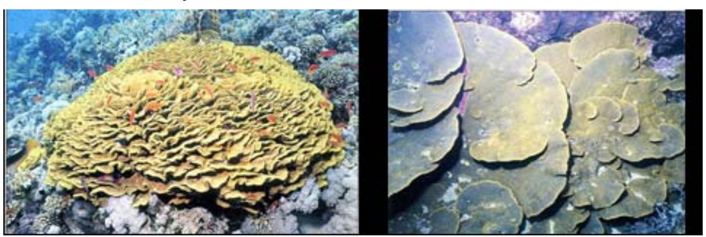

Figure 7.24.9. Colonies of *Turbinaria reniformis* copied from Veron (2000).

#### **Characteristics**

*Turbinaria reniformis* are best known as large lettuce-like assemblages of plates with the polyps or corallites on the upper surfaces of the laminae or leaves or blades or plates (see the *Turbinaria reniformis* illustration to the left). The plates can be very contorted in shallow depths with a lot of water motion. In deeper water or low light conditions, the colonies can form large flat plates (see the *Turbinaria reniformis* illustration to the right) (Veron, 2000). *Turbinaria* are usually grey-green or grey-brown in color, although *Turbinaria reniformis* usually displays some bright yellow, especially at the margins.

#### **Taxonomy**

**Taxonomic issues**: None. The genus *Turbinaria* is quite distinct and is not confused with other genera. The species are usually quite distinguishable, especially when seen together. Some preliminary electrophoretic data suggested species groupings in *Turbinaria* that differ from classic taxonomic definitions (Ayre et al., pers. comm. in Willis, 1990), but no further work has been done on the subject and so they are considered here as valid species.

**Family:** Dendrophylliidae.

**Evolutionary and geologic history**: *Turbinaria* originated in the Oligocene Epoch in the Tethys Sea in southern Europe (Wells and Moore, 1956). It went extinct in the Atlantic (Caribbean), but it still occurs across the Indian and Pacific Oceans.

#### **Global Distribution**

*Turbinaria reniformis* has become very broadly distributed both longitudinally (from east Africa and the Red Sea to eastern central Pacific) and latitudinally (from southern Africa and the Great Barrier Reef to Japan). *Turbinaria reniformis* is absent from eastern Australia and southern Africa.

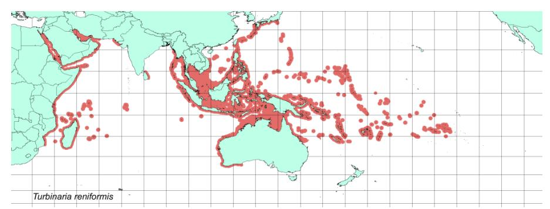

Figure 7.24.10. *Turbinaria reniformis* distribution from IUCN copied from http://www.iucnredlist.org.

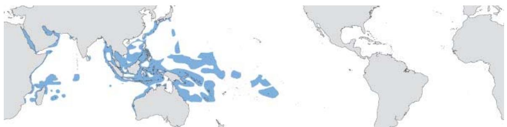

Figure 7.24.11. *Turbinaria reniformis* distribution from Veron (2000).

#### **U.S. Distribution**

*Turbinaria reniformis* is found in Samoa. According to both the IUCN Species Account and the CITES species database, *Turbinaria reniformis* has been recorded in American Samoa. The IUCN Species Account and Randall (1995) also list its occurrence in the Northern Mariana Islands, southern Mariana Islands (including Guam) and U.S. minor outlying islands.

A search of published and unpublished records of occurrence in U.S. waters indicates *Turbinaria reniformis* has been reported from Tutuila, Ofu-Olosega, Tau, and Rose Atoll in American Samoa (Coles et al., 2003; Fisk and Birkeland, 2002; Kenyon et al., 2010a; Lovell and McLardy, 2008; Maragos et al., 1994; Mundy, 1996; National Park Service, 2009; C. Birkeland, unpubl. data; CRED, unpubl. data), Guam (Randall, 2003; D. Burdick, unpubl. data), Commonwealth of the Northern Mariana Islands, Baker Island (CRED, unpubl. data), Palmyra Atoll (Williams et al., 2008b), and Kingman Reef (CRED, unpubl. data).

Within federally protected waters, *Turbinaria reniformis* has been recorded from the following areas:

- Pacific Remote Islands Marine National Monument (Baker, Palmyra, Kingman)
- National Park of American Samoa, Ofu Island unit
- Fagatele Bay National Marine Sanctuary, Tutuila
- Rose Atoll Marine National Monument

#### **Habitat**

**Habitat:** *Turbinaria reniformis* has been reported to occupy shallow protected waters with some turbidity (Veron, 2000). The species can live on forereef slopes and can prevail in clear water as well but usually not in areas of heavy wave action.

**Depth range**: The depth range of *Turbinaria reniformis* has been recorded as 0 m–40 m. Sheppard and Sheppard (1991) found *Turbinaria reniformis* to occur commonly "at the base of reef slopes at 10 m or deeper."

#### **Abundance**

*Turbinaria reniformis* can be locally dominant and form massive and extensive stands, especially in protected shallow turbid waters.

#### **Life History**

*Turbinaria reniformis* is a gonochoric broadcast spawner, with a 1:1 sex ratio reported from Magnetic Island on the central Great Barrier Reef (Babcock et al., 1994; Willis, 1987; Willis et al., 1985). The minimum size and estimate age at first reproduction have not been determined for this species. However, for the congener *Turbinaria mesenterina*, the minimum size at first reproduction is 12 to 16 cm, with an estimated age of 4 years (Willis, 1987). Planula larvae do not contain zooxanthellae that can supplement maternal provisioning with energy sources provided by their photosynthesis (Baird et al., 2009).

#### **Threats**

**Thermal stress**: Bleaching in *Turbinaria* varies among regions. The study by Marshall and Baird (2000) showed *Turbinaria* to be the most resistant to bleaching when responding to high seawater temperatures than any of the other 39 generic groups of scleratinians tested, although *Turbinaria reniformis* in the same region can bleach quickly (Jones, 2008). *Turbinaria* were moderately vulnerable to bleaching in the western Indian Ocean from 1998 to 2005 (McClanahan et al., 2007), but that varied within that region—the genus bleached more in Mauritius than Kenya in 2004 (McClanahan et al., 2005a) and was one of the genera most resistant to bleaching in South Africa (Floros et al., 2004). Congeneric species had occasionally high bleaching and mortality in Palau in 1997–1998 (Bruno et al., 2001). It may be that some of the mixed bleaching response is whether the stress is temperature- or light-induced, as repeated exposure to high irradiance significantly decreases the energy budget in *Turbinaria* (Hoogenboom et al., 2006). Alternatively, spatial differences in bleaching could be attributed to symbiont presence, as *Turbinaria* can host either Clade C or Clade D zooxanthellae (LaJeunesse et al., 2003; Ulstrup et al., 2006). *Turbinaria reniformis* also shows the potential to reduce bleaching vulnerability through increased feeding rates (Ferrier-Pagès et al., 2010).

**Acidification:** *Turbinaria reniformis* appears to show a lower percent change in calcification when pCO2 is doubled and tripled compared to the other genera of scleractinians experimentally tested (Kleypas et al., 2006). *Turbinaria reniformis* showed 13% reduction in growth in low-carbonate waters, but had no significant changes in skeletal microstructures (Marubini et al., 2003). We might predict that this is a generic characteristic. However, most corals studied have shown negative relationships between acidification and growth (Table 3.2.2) and acidification is likely to contribute to reef destruction in the future (Hoegh-Guldberg et al., 2007; Silverman et al., 2009). While ocean acidification has not been demonstrated to have caused appreciable declines in coral populations so far, the BRT considers it to be a significant threat to corals by 2100.

**Disease:** A white syndrome disease has affected *Turbinaria* in Australia since 2000; elevated temperatures appear to significantly increase tissue loss (Dalton et al., 2010). Ample evidence indicate that diseases can have devastating regional effects on individual coral species (e.g., Aronson and Precht, 2001; Bruckner and Hill, 2009) and evidence show that these effects are occurring in more taxa and at a broader geographic scale (Green and Bruckner, 2000; Sutherland et al., 2004).

**Predation:** Adult colonies of *Turbinaria* spp. are almost never eaten by crown-of-thorns seastars (Birkeland and Lucas, 1990). *Turbinaria* are not thought to be eaten by *Phestilla sibogae* (Ritson-Williams et al., 2003), but recent evidence suggests that *Phestilla* can both feed on *Turbinaria* as well as infect it with disease (Dalton and Godwin, 2006).

**Land-base sources of pollution (LBSP):** *Turbinaria* spp. can be dominant in turbid waters. For *Turbinaria reniformis,* Sheppard and Sheppard (1991) state that "It coexists with *Turbinaria mesenterina* and is often found in sedimented conditions." Its congener *Turbinaria mesenteria* maintains photosynthetic and growth rates even under highly turbid conditions (Sofonia and Anthony, 2008), and accumulates significant energy reserves (Anthony, 2006). As a genus, *Turbinaria* are efficient sediment-rejecters (Stafford-Smith and Ormond, 1992) but have been observed to incur partial mortality from sediment during dredging events (Blakeway, 2005). *Turbinaria* adopt funnel-shaped morphologies in turbid environments that tend to localize sediment effects to small portions of the colony (Riegl et al., 1996).

*Turbinaria reniformis* appear to tolerate low-salinity events, as it survived with little damage the 1991 cyclone floodwaters in the Keppel Islands (Van Woesik et al., 1995). LBSP-related stresses (nutrients, sediment, toxins, and salinity) often act in concert rather than individually and are influenced by other biological (e.g., herbivory) and hydrological factors. Collectively, LBSP stresses are unlikely to produce extinction at a global scale; however, they may pose significant threats at local scales (particularly important for species with limited range) and reduce the resilience of corals to bleaching (Carilli et al., 2009a; Wooldridge, 2009b).

**Collection/Trade:** According to CITES records, *Turbinaria* spp. are one of the top 10 genera imported into the USA. Between 1997 and 2001, more than 63,400 specimens were imported (Wabnitz, 2003) and between 2000 and 2008 around 370,000 pieces (between 30,000 and 50,000 per year) were reportedly exported from Indonesia that appears to be the main exporting country of *Turbinaria* spp (CITES, 2010).

#### **Risk Assessment**

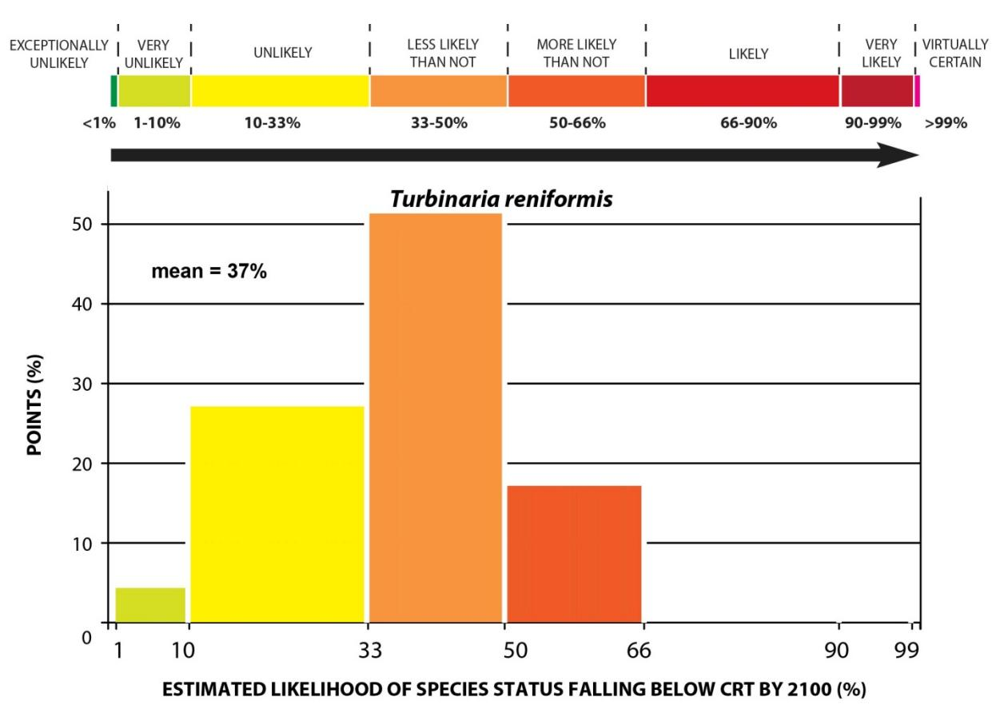

Figure 7.24.12. Distribution of points to estimate the likelihood that the status of *Turbinaria reniformis* falls below the Critical Risk Threshold (the species is of such low abundance, or so spatially fragmented, or at such reduced diversity that extinction is extremely likely) by 2100.

Factors that increase the potential extinction risk (higher likelihood of falling below the Critical Risk Threshold) for *Turbinaria reniformis* include susceptibility to disease and harvesting. They seem susceptible to disease at high latitudes in Australia. The aquarium trade appears to be the most immediate threat to populations of *Turbinaria.* Factors that reduce potential extinction risk (decrease the likelihood of falling below the Critical Risk Threshold) are that *Turbinaria reniformis* can be dominant in turbid waters, is remarkably tolerant to seawater warming, low salinity events, lower pH, and predation, and is broadly distributed both latitudinally and longitudinally in the Indo-Pacific. Wide distribution is considered to lower extinction risk by making it more likely a species will be able to escape the impacts of threats and catastrophes in at least some locations.

The overall likelihood that *Turbinaria reniformis* will fall below the Critical Risk Threshold by 2100 was estimated to be in the "less likely than not" risk category with a mean likelihood of 37% and a standard error (SE) of 10% (Fig. 7.24.12). This SE was calculated by taking the standard deviation of the seven mean voting scores of the BRT members and shows the coherence among the BRT. The uncertainty of the BRT is reflected in the range of votes of 1%–66% (Fig. 7.24.12) and the average range of likelihood estimates of the seven BRT voters (45%). The overall wide range of votes reflects the uncertainty among BRT members inherent in the lack of adequate ecological and demographic information for *Turbinaria reniformis*.

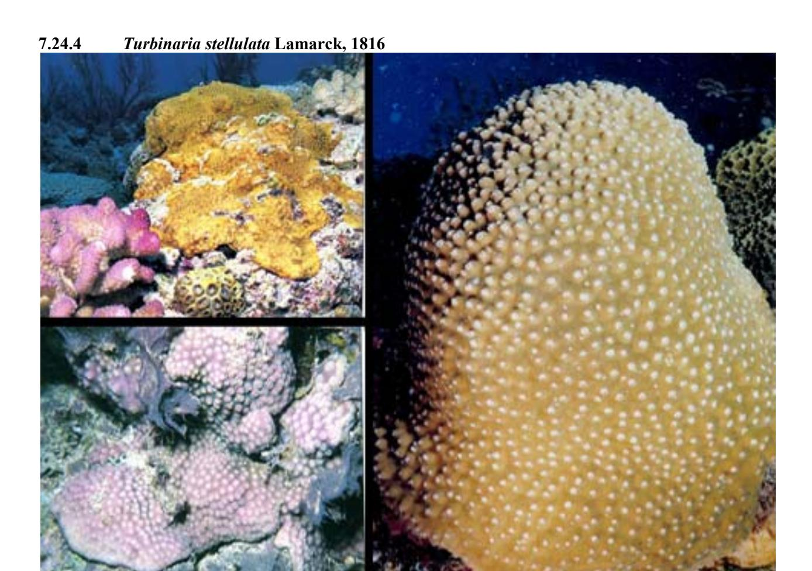

Figure 7.24.13. Colonies of *Turbinaria stellulata* from (Veron and Stafford-Smith, 2002).

#### **Characteristics**

Colonies of *Turbinaria stellulata* are usually encrusting (two illustrations on the left) but can sometimes form large massive done-shaped colonies (illustration to the right). *Turbinaria stellulata* can be easily distinguished from the more typical *Turbinaria* species that tend to form large lettuce-like assemblages of plates (Veron, 2000). Colonies are usually brown or green in color, but as for most corals, there are a variety of possibilities.

#### **Taxonomy**

**Taxonomic issues**: None. The genus *Turbinaria* is quite distinct and is not confused with other genera. The species are usually quite distinguishable, especially when seen together.

**Family:** Dendrophylliidae.

**Evolutionary and geologic history**: *Turbinaria* originated in the Tethys Sea in southern Europe in the Oligocene Epoch (Wells and Moore, 1956). It went extinct in the Atlantic (Caribbean), but it still occurs across the Indian and Pacific Oceans.

#### **Global Distribution**

*Turbinaria* stellulata has become very broadly distributed both longitudinally (from east Africa and the Red Sea to eastern central Pacific) and latitudinally (from southern Africa and the Great Barrier Reef to Japan).

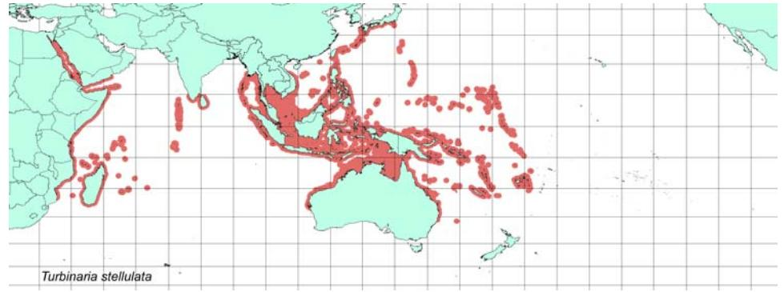

Figure 7.24.14. *Turbinaria stellulata* distribution from IUCN copied from http://www.iucnredlist.org.

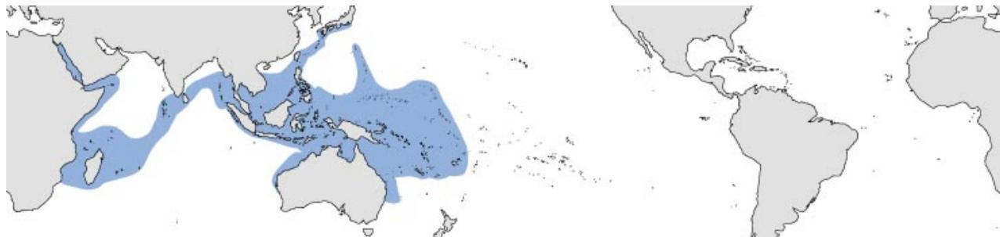

Figure 7.24.15. *Turbinaria stellulata* distribution from Veron (2000).

#### **U.S. Distribution**

*Turbinaria stellulata* are found in American Samoa, the Marshall Islands, Palau, the southern Marianas and the Northern Marianas (Randall, 1995).

A search of published and unpublished records of occurrence in U.S. waters indicates *Turbinaria stellulata* has been reported from Tutuila, Ofu-Olosega, Rose Atoll, and South Bank in American Samoa (Maragos et al., 1994; Lovell and McLardy 2008; National Park Service, 2009; Kenyon et al., 2010a; CRED, unpubl. data), Guam (Randall, 2003; D. Burdick, unpubl. data), CNMI (CRED, unpubl.), Palmyra Atoll (Williams et al., 2008b), and Kingman Reef (CRED, unpubl. data).

Within federally protected waters, *Turbinaria stellulata* has been recorded from the following areas:

- Pacific Remote Islands Marine National Monument (Palmyra, Kingman)
- National Park of American Samoa, Ofu Island unit
- Rose Atoll Marine National Monument
- Marianas Trench Marine National Monument (Asuncion)

#### **Habitat**

**Habitat:** Unlike *Turbinaria mesenteria, Turbinaria reniformis* and *Turbinaria peltata, Turbinaria stellulata* is generally found in clear water and is not often found in turbid waters (Veron, 2000).

**Depth range**: The depth range of *Turbinaria stellulata* is unknown.

#### **Abundance**

*Turbinaria stellulata* has been reported as usually uncommon (Veron, 2000) or as generally scattered and occasional. It does not form massive and extensive stands as *Turbinaria mesenterina, Turbinaria reniformis* and *Turbinaria peltata* sometimes do.

#### **Life History**

The reproductive characteristics of *Turbinaria stellulata* have not been determined. However, three other species of *Turbinaria* all are gonochoric broadcast spawners, although a low frequency of hermaphroditism has been shown on the Great Barrier Reef in the congener *Turbinaria mesenterina* (Willis, 1987). The minimum size and estimate age at first reproduction have not been determined for this species, but for *Turbinaria mesenterina*, the minimum size at first reproduction is 12 cm to 16 cm, with an estimated age of 4 years (Willis, 1987). Larval longevity has not been determined in this genus.

#### **Threats**

**Thermal stress**: Bleaching in *Turbinaria* varies among regions. The study by Marshall and Baird (2000) showed *Turbinaria* to be the most resistant to bleaching when responding to high seawater temperatures than any of the other 39 generic groups of scleratinians tested, though *Turbinaria reniformis* in the same region can bleach quickly (Jones, 2008). *Turbinaria* were moderately vulnerable to bleaching in the western Indian Ocean from 1998 to 2005 (McClanahan et al., 2007), but that varied within that region—the genus bleached more in Mauritius than Kenya in 2004 (McClanahan et al., 2005a) and was one of the genera most resistant to bleaching in South Africa (Floros et al., 2004). Congeneric species had occasionally high bleaching and mortality in Palau in 1997-1998 (Bruno et al., 2001). It may be that some of the mixed bleaching response is due to whether the stress is temperature- or light-induced, as repeated exposure to high irradiance significantly decreases the energy budget in *Turbinaria* (Hoogenboom et al., 2006). Alternatively, spatial differences in bleaching could be attributed to symbiont presence, as *Turbinaria* can host either Clade C or Clade D zooxanthellae (LaJeunesse et al., 2003; Ulstrup et al., 2006).

**Acidification:** *Turbinaria reniformis* appears to show a lower percent change in calcification when pCO2 is doubled and tripled compared to the other genera of scleractinians experimentally tested (Kleypas et al., 2006). *Turbinaria reniformis* showed 13% reduction in growth in low-carbonate waters but had no significant changes in skeletal microstructures (Marubini et al., 2003). We might predict that this is a generic characteristic. However, most corals studied have shown negative relationships between acidification and growth (Table 3.2.2) and acidification is likely to contribute to reef destruction in the future (Hoegh-Guldberg et al., 2007; Silverman et al., 2009). While ocean acidification has not been demonstrated to have caused appreciable declines in coral populations so far, the BRT considers it to be a significant threat to corals by 2100.

**Disease:** A white syndrome disease has affected *Turbinaria* in Australia since 2000; elevated temperatures appear to significantly increase tissue loss (Dalton et al., 2010). Black lesions were also observed on *Turbinaria mesenterina* almost simultaneously with a bleaching event on the Great Barrier Reef (Jones et al., 2004). However, ample evidence indicate that diseases can have devastating regional impacts on individual coral species (e.g., Aronson and Precht, 2001; Bruckner and Hill, 2009) and evidence show that these impacts are occurring in more taxa and at a broader geographic scale (Green and Bruckner, 2000; Sutherland et al., 2004).

**Predation:** Adult colonies of *Turbinaria* spp. are almost never eaten by crown-of-thorns seastar (*Acanthaster planci*) (Birkeland and Lucas, 1990). *Turbinaria* are not thought to be eaten by *Phestilla sibogae* (Ritson-Williams et al., 2003), but recent evidence suggests that *Phestilla* can both feed on *Turbinaria* as well as infect it with disease (Dalton and Godwin, 2006).

**Land-based sources of pollution (LBSP):** Unlike *Turbinaria mesenteria, Turbinaria reniformis,* and *Turbinaria peltata, Turbinaria stellulata* tends to be found in clear water. *Turbinaria stellulata* can, however, be found in shaded conditions (Dinesen, 1983)—implying some ability to cope with reduced light levels, if not turbidity. *Turbinaria mesenteria* maintains photosynthetic and growth rates even under highly turbid conditions (Sofonia and Anthony, 2008) and accumulates significant energy reserves (Anthony, 2006). As a genus, *Turbinaria* are efficient sediment rejecters (Stafford-Smith and Ormond, 1992) but have been observed to incur partial mortality from sediment during dredging events (Blakeway, 2005). *Turbinaria* adopt funnel-shaped morphologies in turbid environments as a means of localizing sediment impacts to small portions of the colony (Riegl et al., 1996). However, this is unlikely to be a benefit for *Turbinaria stellulata*, which primarily adopts flattened morphologies.

*Turbinaria stellulata* appears to tolerate low-salinity events, as it survived with little damage the 1991 flood in the Keppel Islands (Van Woesik et al., 1995). LBSP-related stresses (nutrients, sediment, toxins, and salinity) often act in concert rather than individually and are influenced by other biological (e.g., herbivory) and hydrological factors. Collectively, LBSP stresses are unlikely to produce extinction at a global scale; however, they may pose significant threats at local scales (particularly important for species with limited range) and reduce the resilience of corals to bleaching (Carilli et al., 2009a; Wooldridge, 2009b).

**Collection/Trade:** According to CITES records, *Turbinaria* spp. are one of the top 10 genera imported into the USA. Between 1997 and 2001, over 63,400 specimens were imported and between 2000 and 2008 around 370,000 pieces (between 30,000 and 50,000 per year) were reportedly exported from Indonesia which appears to be the main exporting country of *Turbinaria* spp. (CITES, 2010). However, *Turbinaria stellulata* might not be as attractive for the aquarium or curio trade because it does not generally grow in plates or blades.

#### **Risk Assessment**

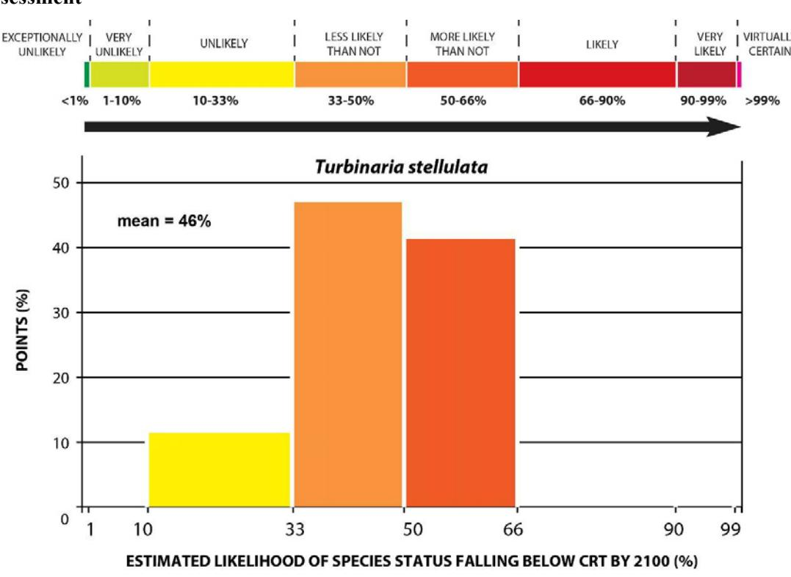

Figure 7.24.16. Distribution of points to estimate the likelihood that the status of *Turbinaria stellulata* falls below the Critical Risk Threshold (the species is of such low abundance, or so spatially fragmented, or at such reduced diversity that extinction is extremely likely) by 2100.

A factor that increases the potential extinction risk (higher likelihood of falling below the Critical Risk Threshold) for *Turbinaria stellulata* includes disease. Corals of the genus *Turbinaria* seem susceptible to disease at high latitudes in Australia. Factors that reduce potential extinction risk (decrease the likelihood of falling below the Critical Risk Threshold) for *Turbinaria stellulata* are tolerance to seawater warming, low salinity events, lower pH, and predation, and a broad geographic distribution both latitudinally and longitudinally in the Indo-Pacific. Wide distribution is considered to lower extinction risk by making it more likely a species will be able to escape the impacts of threats and catastrophes in at least some locations. *Turbinaria stellulata* has a higher risk than its congeners due to its relative intolerance of turbid waters.

The overall likelihood that *Turbinaria stellulata* will fall below the Critical Risk Threshold by 2100 was estimated to be in the "less likely than not" risk category with a mean likelihood of 46% and a standard error (SE) of 6% (Fig. 7.24.16). This SE was calculated by taking the standard deviation of the seven mean voting scores of the BRT members and shows the coherence among the BRT. The uncertainty of the BRT is reflected in the range of votes of 1%–66% (Fig. 7.24.16) and the average range of likelihood estimates of the seven BRT voters (41%). The overall wide range of votes reflects the uncertainty among BRT members inherent in the lack of adequate ecological and demographic information for *Turbinaria stellulata*.

#### **8. SYNTHESIS OF RISK ASSESSMENTS: TAXONOMIC, REGIONAL, AND THREAT-BASED PATTERNS**

Estimated likelihoods that the status for each of the 82 candidate coral species will fall below their Critical Risk Thresholds by the year 2100 are summarized in Figure 8.1 and Table 8.1. The candidate coral species are listed by ranked mean likelihood score while the range and relative distribution of points across risk likelihood categories reflect the varying uncertainties in demographic data and the individual Biological Review Team (BRT) members' perception of individual risks to each of the candidate species (Fig. 8.1 and Table 8.1). The relatively large spread of votes across risk categories for each candidate species primarily reflects the lack of adequate ecological and demographic information for most species. This resulted in uncertainties within votes by each of the BRT members in perception of that species' risk, as well as differences between BRT members' votes. On average, each BRT member spread their votes across three (mean 2.98, SD 0.66) risk likelihood categories per species or 53.75% (SD 12.73) likelihood points per species. The methods used to assess extinction risk, and the uncertainties that are reflected, do not allow for fine-scaled partitioning amongst mean likelihood scores for all of the 82 candidate coral species. However, characteristics of higher- and lower-ranked species can be discerned, and reflect somewhat greater confidence in the extinction risk status of the respective species. At one end species were clearly identified to have a relatively higher risk of extinction and at the other end a relatively lower risk of extinction, with a gradation of risk between these.

Species with high estimated likelihoods of their status falling below their Critical Risk Threshold by 2100 had at least some specific information available regarding small population size or declining population trends, combined with some specific or generic information indicating relatively high susceptibility to certain threats (e.g., bleaching or disease). Several of the highest-ranked (most at risk) species also had indications of very low to negligible recruitment potential. In contrast, species with lower estimated likelihoods of falling below their Critical Risk Thresholds by 2100 generally had wide geographic ranges, high abundances in at least some locations, and tended to display broad tolerances to environmental conditions, as evidenced by low known susceptibility to threats and/or known occurrence in diverse or marginal habitats. Many, if not most, species in the middle portion of the risk ranking have wide variances in likelihood points, or a relatively equal distribution of points across multiple categories. The resulting spread reflects some combination of uncertainties relative to taxonomic status, range, threat susceptibility, and population status and trends. For species in the middle and lower risk likelihood ranges, the evaluation was based primarily on projecting how high impact threats (i.e., ocean warming, disease, and ocean acidification) would affect the species, as there was little, if any, demographic information.

One other clear pattern in these assessments is that Caribbean species tend to have appreciably higher likelihood of falling below the Critical Risk Threshold by 2100. This reflects partly the relatively small geographic range size represented by the Caribbean basin (relative to the Indo-Pacific region). It is also clear that the Caribbean region has already been subject to dramatic, basin-wide declines in coral status, as reflected by the impacts of coral disease and general lack of coral recovery following disturbances. A similar high risk was given to the one species that likely is restricted to the eastern Pacific.

Ocean warming and coral disease were the threats that were deemed most important in driving Critical Risk Threshold likelihoods for the most at-risk species. However, the anticipated future impacts of ocean acidification were also deemed by the BRT to represent a substantial risk across almost all of the candidate species. While the BRT acknowledges the impacts of ocean acidification will vary among taxa, in the current state of knowledge, the BRT was unable to accurately separate taxa with greater or lesser risk from ocean acidification.

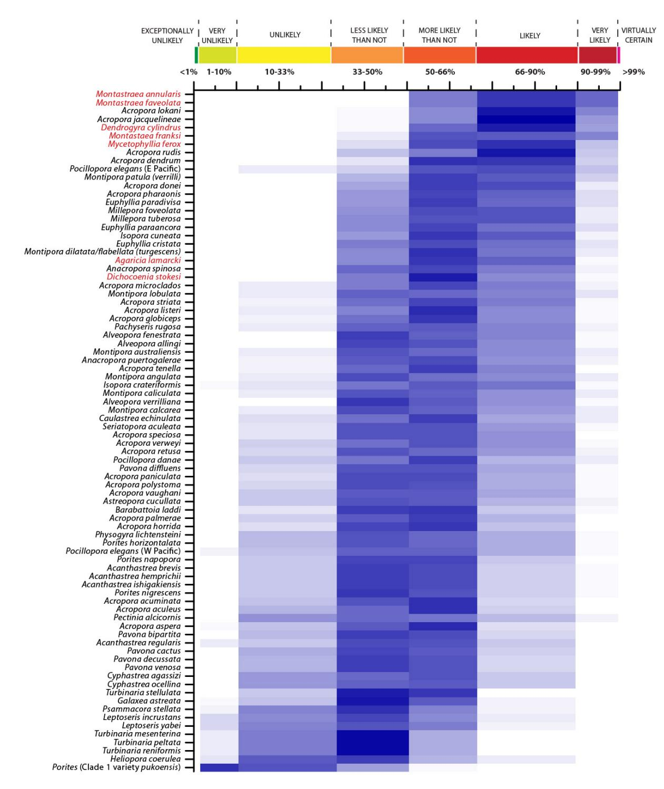

Figure 8.1. Summary of votes tallied across Critical Risk Threshold likelihood categories for all 82 candidate coral species ranked by mean likelihood. The x-axis indicates the percent likelihood of a species status falling below the Critical Risk Threshold. Darkness of color scales to the proportion of votes in each risk category for each species. Red text is used for Caribbean species names and black text is used for Indo-Pacific species names. See the Individual Species Accounts (Chapters 6 and 7) for the distribution of votes in each likelihood category.

| SPECIES                                    | # OF VOTES IN EACH RISK LIKELIHOOD CATEGORY |      |       |       |       |       |       |     |                          | SE OF BRT MEANS (%) | MEAN LIKELIHOOF RANGE (%) |
|--------------------------------------------|------------------------------------------------|------|-------|-------|-------|-------|-------|-----|--------------------------|------------------------|------------------------------|
|                                            | <1                                             | 1-10 | 10-33 | 33-50 | 50-66 | 66-90 | 90-99 | >99 | MEAN LIKELI- HOOD (%) | 88                     | MEA                          |
| Montastraea annularis                      | 0                                              | 0    | 0     | 0     | 19    | 29    | 22    | 0   | 78                       | 6.9                    | 45.4                         |
| Montastraea faveolata                      | 0                                              | 0    | 0     | 0     | 19    | 29    | 22    | 0   | 78                       | 6.9                    | 45.4                         |
| Acropora lokani                            | 0                                              | 0    | 0     | 1     | 17    | 34    | 18    | 0   | 77                       | 8.1                    | 50.1                         |
| Acropora jacquelineae                      | 0                                              | 0    | 0     | 1     | 17    | 37    | 15    | 0   | 76                       | 7.3                    | 50.1                         |
| Dendrogyra cylindrus                       | 0                                              | 0    | 0     | 1     | 22    | 33    | 14    | 0   | 74                       | 6.6                    | 48.9                         |
| Montastraea franksi                        | 0                                              | 0    | 0     | 3     | 25    | 24    | 18    | 0   | 74                       | 9                      | 47.9                         |
| Mycetophyllia ferox                        | 0                                              | 0    | 0     | 5     | 26    | 30    | 9     | 0   | 70                       | 8.2                    | 50                           |
| Acropora rudis                             | 0                                              | 0    | 0     | 9     | 19    | 34    | 8     | 0   | 70                       | 11.2                   | 49                           |
| Acropora dendrum                           | 0                                              | 0    | 0     | 4     | 30    | 29    | 7     | 0   | 69                       | 5.6                    | 55                           |
| Pocillopora elegans (E Pacific)            | 0                                              | 0    | 3     | 7     | 25    | 26    | 9     | 0   | 67                       | 13                     | 53.4                         |
| Montipora patula (verrilli)                | 0                                              | 0    | 0     | 11    | 28    | 24    | 7     | 0   | 66                       | 9.9                    | 50.1                         |
| Acropora donei                             | 0                                              | 0    | 0     | 13    | 28    | 26    | 3     | 0   | 64                       | 8.2                    | 52.6                         |
| Acropora pharaonis                         | 0                                              | 0    | 0     | 15    | 27    | 23    | 5     | 0   | 64                       | 8.9                    | 55                           |
| Euphyllia paradivisa                       | 0                                              | 0    | 0     | 15    | 28    | 22    | 5     | 0   | 63                       | 9.6                    | 50.3                         |
| Millepora foveolata                        | 0                                              | 0    | 0     | 16    | 26    | 25    | 3     | 0   | 63                       | 9.8                    | 50.3                         |
| Millepora tuberosa                         | 0                                              | 0    | 0     | 17    | 25    | 25    | 3     | 0   | 63                       | 10.1                   | 50.3                         |
| Euphyllia paraancora                       | 0                                              | 0    | 0     | 17    | 27    | 21    | 5     | 0   | 63                       | 10.4                   | 50.3                         |
| Isopora cuneata                            | 0                                              | 0    | 0     | 15    | 29    | 24    | 2     | 0   | 62                       | 8.5                    | 51.3                         |
| Euphyllia cristata                         | 0                                              | 0    | 0     | 19    | 26    | 21    | 4     | 0   | 62                       | 10.5                   | 50.3                         |
| Montipora dilatata/flabellata (turgescens) | 0                                              | 0    | 0     | 17    | 30    | 20    | 3     | 0   | 61                       | 7.3                    | 56.1                         |
| Agaricia lamarcki                          | 0                                              | 0    | 0     | 17    | 29    | 23    | 1     | 0   | 61                       | 6.3                    | 54.9                         |
| Anacropora spinosa                         | 0                                              | 0    | 0     | 22    | 27    | 19    | 2     | 0   | 59                       | 7.5                    | 54.9                         |
| Dichocoenia stokesi                        | 0                                              | 0    | 0     | 19    | 33    | 17    | 1     | 0   | 59                       | 5.1                    | 58.3                         |
| Acropora microclados                       | 0                                              | 0    | 3     | 19    | 27    | 19    | 2     | 0   | 58                       | 11                     | 60.3                         |
| Montipora lobulata                         | 0                                              | 0    | 3     | 23    | 22    | 18    | 4     | 0   | 58                       | 11.9                   | 57.1                         |
| Acropora striata                           | 0                                              | 0    | 2     | 21    | 27    | 19    | 1     | 0   | 58                       | 8.4                    | 58.1                         |
| Acropora listeri                           | 0                                              | 0    | 3     | 18    | 31    | 17    | 1     | 0   | 58                       | 6.7                    | 64.9                         |
| Acropora globiceps                         | 0                                              | 0    | 2     | 21    | 29    | 17    | 1     | 0   | 57                       | 8.1                    | 58.1                         |
| Pachyseris rugosa                          | 0                                              | 0    | 3     | 23    | 24    | 18    | 2     | 0   | 57                       | 10.8                   | 57.1                         |
| Alveopora fenestrata                       | 0                                              | 0    | 0     | 28    | 23    | 18    | 1     | 0   | 57                       | 8.5                    | 52.6                         |
| Alveopora allingi                          | 0                                              | 0    | 0     | 27    | 25    | 17    | 1     | 0   | 57                       | 8.7                    | 52.6                         |
| Montipora australiensis                    | 0                                              | 0    | 3     | 25    | 22    | 17    | 3     | 0   | 57                       | 12                     | 53.7                         |
| Anacropora puertogalerae                   | 0                                              | 0    | 2     | 24    | 26    | 16    | 2     | 0   | 57                       | 8.1                    | 60.1                         |
| Acropora tenella                           | 0                                              | 0    | 2     | 22    | 28    | 18    | 0     | 0   | 57                       | 7.7                    | 58.1                         |
| Montipora angulata                         | 0                                              | 0    | 3     | 26    | 21    | 17    | 3     | 0   | 57                       | 11.9                   | 53.7                         |
| Isopora crateriformis                      | 0                                              | 1    | 4     | 20    | 24    | 20    | 1     | 0   | 57                       | 14.2                   | 51.3                         |
| Montipora caliculata                       | 0                                              | 0    | 3     | 25    | 23    | 16    | 3     | 0   | 57                       | 11.6                   | 53.7                         |
| Alveopora verrilliana                      | 0                                              | 0    | 0     | 29    | 24    | 16    | 1     | 0   | 56                       | 9                      | 49.1                         |
| Montipora calcarea                         | 0                                              | 0    | 3     | 26    | 23    | 15    | 3     | 0   | 56                       | 11.6                   | 53.7                         |
| Caulastrea echinulata                      | 0                                              | 0    | 5     | 21    | 28    | 13    | 3     | 0   | 56                       | 9.6                    | 62.6                         |
| Seriatopora aculeata                       | 0                                              | 0    | 4     | 25    | 25    | 15    | 1     | 0   | 55                       | 10.3                   | 59.1                         |

| SPECIES                                      | # OF VOTES IN EACH RISK LIKELIHOOD CATEGORY |      |       |       |       |       |       |     |                          | SE OF BRT MEANS (%) | MEAN LIKELIHOC RANGE (%) |
|----------------------------------------------|------------------------------------------------|------|-------|-------|-------|-------|-------|-----|--------------------------|------------------------|-----------------------------|
|                                              | <1                                             | 1-10 | 10-33 | 33-50 | 50-66 | 66-90 | 90-99 | >99 | MEAN LIKELI- HOOD (%) | 8                      | ME                          |
| Acropora speciosa                            | 0                                              | 0    | 4     | 25    | 25    | 16    | 0     | 0   | 55                       | 10.1                   | 54.4                        |
| Acropora verweyi                             | 0                                              | 0    | 7     | 21    | 25    | 16    | 1     | 0   | 54                       | 11.5                   | 59.1                        |
| Acropora retusa                              | 0                                              | 0    | 6     | 25    | 22    | 15    | 2     | 0   | 54                       | 13.2                   | 55.7                        |
| Pocillopora danae                            | 0                                              | 0    | 8     | 20    | 28    | 11    | 3     | 0   | 54                       | 13.7                   | 52.3                        |
| Pavona diffluens                             | 0                                              | 0    | 6     | 25    | 25    | 13    | 1     | 0   | 53                       | 12                     | 61.4                        |
| Acropora paniculata                          | 0                                              | 0    | 5     | 26    | 26    | 12    | 1     | 0   | 53                       | 9.4                    | 49.9                        |
| Acropora polystoma                           | 0                                              | 0    | 6     | 26    | 25    | 12    | 1     | 0   | 53                       | 9.9                    | 61.                         |
| Acropora vaughani                            | 0                                              | 0    | 8     | 24    | 24    | 13    | 1     | 0   | 52                       | 11.2                   | 61.                         |
| Astreopora cucullata                         | 0                                              | 0    | 8     | 25    | 24    | 11    | 2     | 0   | 52                       | 9.2                    | 59                          |
| Barabattoia laddi                            | 0                                              | 0    | 4     | 28    | 29    | 8     | 1     | 0   | 52                       | 12.6                   | 51.                         |
| Acropora palmerae                            | 0                                              | 0    | 7     | 24    | 28    | 11    | 0     | 0   | 52                       | 8.8                    | 60                          |
| Acropora horrida                             | 0                                              | 0    | 5     | 27    | 29    | 9     | 0     | 0   | 52                       | 6.8                    | 56.                         |
| Physogyra lichtensteini                      | 0                                              | 0    | 10    | 25    | 22    | 12    | 1     | 0   | 51                       | 11.4                   | 62.                         |
| Porites horizontalata                        | 0                                              | 0    | 10    | 25    | 22    | 12    | 1     | 0   | 51                       | 11.7                   | 62.                         |
| Pocillopora elegans (W Pacific)              | 0                                              | 2    | 9     | 23    | 23    | 12    | 1     | 0   | 50                       | 14.6                   | 56.                         |
| Porites napopora                             | 0                                              | 0    | 8     | 27    | 27    | 8     | 0     | 0   | 50                       | 9.1                    | 57.                         |
| Acanthastrea brevis                          | 0                                              | 0    | 8     | 28    | 26    | 7     | 1     | 0   | 50                       | 9.1                    | 57.                         |
| Acanthastrea hemprichii                      | 0                                              | 0    | 8     | 28    | 26    | 7     | 1     | 0   | 50                       | 9.1                    | 57.                         |
| Acanthastrea ishigakiensis                   | 0                                              | 0    | 8     | 28    | 26    | 7     | 1     | 0   | 50                       | 7                      | 59.                         |
| Porites nigrescens                           | 0                                              | 0    | 8     | 29    | 25    | 7     | 1     | 0   | 50                       | 8.9                    | 57.                         |
| Acropora acuminata                           | 0                                              | 0    | 9     | 25    | 30    | 6     | 0     | 0   | 49                       | 8.5                    | 56.                         |
| Acropora aculeus                             | 0                                              | 0    | 11    | 22    | 30    | 7     | 0     | 0   | 49                       | 11.8                   | 51                          |
| Pectinia alcicornis                          | 0                                              | 0    | 16    | 22    | 20    | 10    | 2     | 0   | 48                       | 15.6                   | 58.                         |
| Acropora aspera                              | 0                                              | 1    | 9     | 24    | 31    | 5     | 0     | 0   | 48                       | 9.3                    | 57.                         |
| Pavona bipartita                             | 0                                              | 0    | 10    | 28    | 26    | 6     | 0     | 0   | 48                       | 10.9                   | 47.                         |
| Acanthastrea regularis                       | 0                                              | 3    | 8     | 26    | 25    | 8     | 0     | 0   | 48                       | 15                     | 46.                         |
| Pavona cactus                                | 0                                              | 0    | 12    | 27    | 24    | 7     | 0     | 0   | 47                       | 10.7                   | 47.                         |
| Pavona decussata                             | 0                                              | 0    | 11    | 28    | 25    | 6     | 0     | 0   | 47                       | 10.7                   | 50.                         |
| Pavona venosa                                | 0                                              | 0    | 11    | 28    | 25    | 6     | 0     | 0   | 47                       | 12                     | 48.                         |
| Cyphastrea agassizi                          | 0                                              | 0    | 15    | 22    | 25    | 8     | 0     | 0   | 47                       | 13.8                   | 51.                         |
| Cyphastrea ocellina                          | 0                                              | 0    | 15    | 23    | 24    | 8     | 0     | 0   | 47                       | 13.7                   | 51.                         |
| Turbinaria stellulata                        | 0                                              | 0    | 8     | 33    | 29    | 0     | 0     | 0   | 46                       | 5.9                    | 40.                         |
| Galaxea astreata                             | 0                                              | 1    | 9     | 34    | 24    | 2     | 0     | 0   | 45                       | 7.5                    | 51.                         |
| Psammacora stellata                          | 0                                              | 2    | 18    | 30    | 18    | 2     | 0     | 0   | 41                       | 9.2                    | 58.                         |
| Leptoseris incrustans                        | 0                                              | 6    | 17    | 27    | 17    | 3     | 0     | 0   | 39                       | 10.3                   | 61.                         |
| Leptoseris yabei                             | 0                                              | 6    | 18    | 25    | 19    | 2     | 0     | 0   | 39                       | 11.1                   | 57.                         |
| Turbinaria mesenterina                       | 0                                              | 3    | 19    | 36    | 12    | 0     | 0     | 0   | 37                       | 9.5                    | 45.                         |
| Turbinaria peltata                           | 0                                              | 3    | 19    | 36    | 12    | 0     | 0     | 0   | 37                       | 9.5                    | 45.                         |
| Turbinaria reniformis                        | 0                                              | 3    | 19    | 36    | 12    | 0     | 0     | 0   | 37                       | 9.5                    | 45.                         |
| Heliopora coerulea                           | 0                                              | 4    | 24    | 28    | 11    | 3     | 0     | 0   | 37                       | 11.1                   | 54.                         |
| Porites (Clade 1 forma pukoensis*)           | 0                                              | 30   | 25    | 14    | 1     | 0     | 0     | 0   | 19                       | 8.3                    | 43.                         |
| all votes summed                             | 0                                              | 65   | 494   | 1750  | 1981  | 1209  | 241   | 0   |                          |                        |                             |
| frequency of species per likelihood bin      | 0                                              | 13   | 57    | 80    | 82    | 77    | 57    | 0   |                          |                        |                             |
| percentage of species per likelihood bin (%) | 0                                              | 16   | 70    | 98    | 100   | 94    | 70    | 0   |                          |                        |                             |
| parameter per internition bill (70)          | 0                                              | 0    | 1     | 25    | 46    | 10    | 0     | 0   |                          |                        |                             |

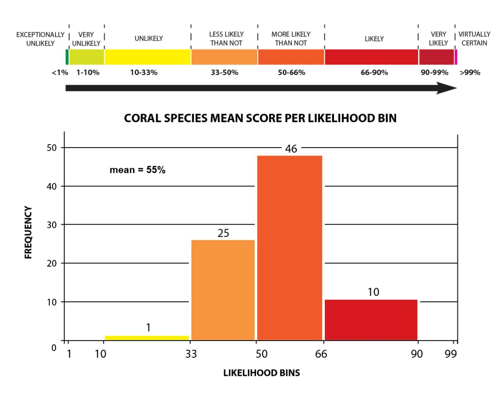

Figure 8.2. Number of coral species mean likelihood scores (total = 82 scores) that fall in each likelihood bin. The overall mean of the mean likelihood scores of all 82 species is 55%.

#### **REFERENCES**

Ablan, M. C. A., Licuanan W. Y., and Alino P. M.

 1997. Clonal variation within and between patches of the branching coral *Anacropora puertogalerae*: evidence for both sexual and asexual reproduction. *In* Proc. 8th Int. Coral Reef Symp., Panama.

Abramovitch-Gottlib, L., Katoshevski D., and Vago R.

 2003. Responses of *Stylophora pistillata* and *Millepora dichotoma* to seawater temperature elevation. Bull. Mar. Sci. 73:745-755.

Abrego, D., van Oppen M. J. H., and Willis B. L.

2009. Highly infectious symbiont dominates initial uptake in coral juveniles. Mol. Ecol. 3518-3531.

Acevedo, R., Morelock J., and Olivieri R. A.

1989. Modification of coral reef zonation by terrigenous sediment stress. Palaios 4:92-100.

Acosta, A., and Acevedo A.

 2006. Population structure and colony condition of *Dendrogyra cylindrus* (Anthozoa: Scleractinia) in Providencia Island, Columbian Caribbean. *In* Proc.10th Int. Coral Reef Symp., p. 1605-1610, Okinawa, Japan.

Adey, W. H., Macintyre I. G., Stuckenrath R., and Dill R. F.

 1977. Relict barrier reef system off St. Croix: its implications with respect to late Cenozoic coral reef development in the western Atlantic. *In* Proc. 3rd Int. Coral Reef Symp., p. 15-21, Miami, FL.

Adjeroud, M., Michonneau F., Edmunds P. J., Chancerelle Y., Lison de Loma T., Penin L., Thibaut L., Vidal-Dupiol J., Salvat B., and Galzin R.

 2009. Recurrent large-scale disturbances, recovery trajectories, and resilience of coral assemblages on a coral reef in the South Central Pacific reef. Coral Reefs 28:775-780.

Adjeroud, M., and Tsuchiya M.

 1999. Genetic variation and clonal structure in the scleractinian coral *Pocillopora damicornis* in the Ryukyu Archipelago, southern Japan. Mar. Biol. 134:753-759.

Aeby, G. S.

2005. Outbreak of coral disease in the Northwestern Hawaiian Islands. Coral Reefs 24:481.

Aeby, G. S.

2006. Baseline levels of coral disease in the Northwestern Hawaiian Islands. Atoll Res. Bull. 543:471-488.

Aeby, G. S., and Santavy D. L.

 2006. Factors affecting susceptibility of the coral *Montastraea faveolata* to black-band disease. Mar. Ecol. Prog. Ser. 318:103-110.

Aeby, G. S., Work T., Coles S., and Lewis T.

 2006. Coral disease across the Hawaiian Archipelago. EOS, Transactions, American Geophysical Union 87(36): suppl.

Ainsworth, T. D., and Hoegh-Guldberg O.

 2009. Bacterial communities closely associated with coral tissues vary under experimental and natural reef conditions and thermal stress. Aquatic Biology 4:289-296.

Aki, K., Brock R., Miller J., Mobley J. R., Rappa P. J., Tarnas D., and Yuen M.

 2001. A site characterization study for the Hawaiian Islands Humpback Whale National Marine Sanctuary. 129 p. University of Hawaii Sea Grant College Program, Honolulu, HI.

Al-Moghrabi, S.

 2001. Unusual black band disease (BBD) outbreak in the northern tip of the Gulf of Aqaba (Jordan). Coral Reefs 19:330-331.

Al-Moghrabi, S., Allemand D., and Jaubert J.

 1993. Valine uptake by the scleractinian coral *Galaxea fascicularis*; characterization and effect of light and nutritional status. Journal of Comparative Physiology B: Biochemical, Systemic, and Environmental Physiology 163:355-362.

Al-Rousan, S. A., Al-Shloul R. N., Al-Horani F. A., and Abu-Hilal A. H.

 2007. Heavy metal contents in growth bands of *Porites* corals: Record of anthropogenic and human developments from the Jordanian Gulf of Aqaba. Mar. Pollut. Bull. 54:1912-1922.

Albins, M. A., and Hixon M. A.

 2008. Invasive Indo-Pacific lionfish *Pterois volitans* reduce recruitment of Atlantic coral-reef fishes. Mar. Ecol. Prog. Ser. 367:233-238.

Albright, R., Mason B., and Langdon C.

 2008. Effect of aragonite saturation state on settlement and post-settlement growth of *Porites astreoides* larvae. Coral Reefs 27:485-490.

Albright, R. A., Mason B., Miller M., and Langdon C.

 2010. Ocean acidification compromises recruitment success of the threatened Caribbean coral, *Acropora palmata*. Proceedings of the National Academy of Sciences 107:20400-20404.

Alutoin, S., Boberg J., Nyström M., and Tedengren M.

 2001. Effects of the multiple stressors copper and reduced salinity on the metabolism of the hermatypic coral *Porites lutea*. Mar. Environ. Res. 52:289-299.

Alvarado-Chacon, E. M., and Acosta A.

 2009. Population size-structure of the reef-coral *Montastraea annularis* in two contrasting reefs of a marine protected area in the southern Caribbean Sea. Bull. Mar. Sci. 85:61-76.

Alvarez-Filip, L., Dulvy N. K., Gill J. A., Côté I. M., and Watkinson A. R.

 2009. Flattening of Caribbean coral reefs: region-wide declines in architectural complexity. Proceedings of the Royal Society B-Biological Sciences 276:3019-3025.

Amesbury, S. S., Ginsburg D., Rongo T., Kirkendale L., and Starmer J.

 2001. War-in-the-Pacific National Historical Park marine biological survey. Technical Report 68 p. University of Guam.

Ammar, M. S. A., Ghobashi A. A., Omran M. A., and Shaaban A. M.

 2007. Status of coral reef affected by different impacts in some sites of the Red Sea. Egyptian Journal of Aquatic Research 33:224-237.

Anthony, K.

1999. Coral suspension feeding on fine particulate matter. J. Exp. Mar. Biol. Ecol. 232:85-106.

Anthony, K.

2006. Enhanced energy status of corals on coastal high-turbidity reefs. Mar. Ecol. Prog. Ser. 319:111-116.

Anthony, K., Connolly S., and Hoegh-Guldberg O.

 2007. Bleaching, energetics, and coral mortality risk: effects of temperature, light and sediment regime. Limnol. Oceanogr. 52:716-726.

Anthony, K., and Fabricius K. E.

 2000. Shifting roles of heterotrophy and autotrophy in coral energetics under varying turbidity. J. Exp. Mar. Biol. Ecol. 252:221-253.

Anthony, K. R. N., and Connolly S. R.

 2004. Environmental limits to growth: physiological niche boundaries of corals along turbidity–light gradients. Oecologia 141:373-384.

Anthony, K. R. N., and Hoegh Guldberg O.

 2003. Variation in coral photosynthesis, respiration and growth characteristics in contrasting light microhabitats: an analogue to plants in forest gaps and understoreys? Funct. Ecol. 17:246-259.

Anthony, K. R. N., Kline D. I., Diaz-Pulido G., Dove S., and Hoegh-Guldberg O.

 2008. Ocean acidification causes bleaching and productivity loss in coral reef builders. Proceedings of the National Academy of Sciences 105:17442-17446.

Anthony, K. R. N., and Larcombe P.

 2000. Coral reefs in turbid waters: sediment-induced stresses in corals and likely mechanisms of adaptation. *In*  Proc. 9th Int. Coral Reef Symp. p. 239-244, Bali, Indonesia.

Anton, A., Simpson M., Layman C., and Bruno J.

 2010. Do native prey recognize invasive lionfish as predators? *In* 2010 Benthic Ecology Meeting Abstracts. p. 5. Wilmington, NC.

Antonius, A.

1985. Coral diseases in the Indo-Pacific: A first record. Mar. Ecol. 6:197-218.

Antonius, A., Scheer G., and Bouchon C.

1990. Corals of the eastern Red Sea. Atoll Res. Bull. 334:22.

Antonius, A. A., and Lipscomb D.

2000. First protozoan coral-killer identified in the Indo-Pacific. Atoll Res. Bull. 481:23.

Archer, D., and Ganopolski A.

 2005. A movable trigger: Fossil fuel CO2 and the onset of the next glaciation. Geochem. Geophys. Geosyst 6:Q05003.

Aronson, R. B., MacIntyre I. G., Wapnick C. M., and O'Neill M. W.

 2004. Phase shifts, alternative states, and the unprecedented convergence of two reef systems. Ecology 85:1876-1891.

Aronson, R. B., and Precht W. F.

 1995. Landscape patterns of reef coral diversity: A test of the intermediate disturbance hypothesis. J. Exp. Mar. Biol. Ecol. 192:1-14.

Aronson, R. B., and Precht W. F.

 2000. Herbivory and algal dynamics on the coral reef at Discovery Bay, Jamaica. Limnol. Oceanogr. 45:251- 255.

Aronson, R. B., and Precht W. F.

2001. White-band disease and the changing face of Caribbean coral reefs. Hydrobiologia 460:25-38.

Aronson, R. B., and Precht W. F.

2006. Conservation, precaution, and Caribbean reefs. Coral Reefs 25:441-450.

Aronson, R. B., Precht W. F., and Macintyre I. G.

 1998. Extrinsic control of species replacement on a Holocene reef in Belize: the role of coral disease. Coral Reefs 17:223-230.

Aronson, R. B., Precht W. F., Toscano M. A., and Koltes K. H.

2002. The 1998 bleaching event and its aftermath on a coral reef in Belize. Mar. Biol. 141:435-447.

Aronson, R. B., Sebens K. P., and Ebersole J. P.

 1993. Hurricane Hugo's impact on Salt River submarine canyon, St. Croix, US Virgin Islands. *In* Ginsburg RN (ed) Proceedings of the colloquium on global aspects of coral reefs: Health, hazards and history. Rosenstiel School of Marine and Atmospheric Science, Miami. p. 189-195.

Atkinson, M. J.

1992. Productivity of Enewetak Atoll reef flats predicted from mass transfer relationships. Cont. Shelf Res. 12:799-807.

Atkinson, M. J., Carlson B., and Crow G. L.

 1995. Coral growth in high-nutrient, low-pH seawater: a case study of corals cultured at the Waikiki Aquarium, Honolulu, Hawai`i. Coral Reefs 14:215-223.

Atwood, D. K., Hendee J. C., and Mendez A.

1992. An assessment of global warming stress on Caribbean coral reef ecosystems. Bull. Mar. Sci. 51:118-130.

Ayling, A. M., and Ayling A. L.

 2001. Ningaloo Marine Park: preliminary fish density assessment and habitat survey. Department of Conservation and Land Management by Sea Research, Daintree.

Ayre, D. J., and Hughes T. P.

 2000. Genotypic diversity and geneflow in brooding and spawning corals along the Great Barrier Reef, Australia. Evolution 54:1590-1605.

Ayre, D. J., and Hughes T. P.

2004. Climate change, genotypic diversity and gene flow in reef-building corals. Ecol. Lett. 7:273-278.

Ayre, D. J., and Resing J. M.

1986. Sexual and asexual production of planulae in reef corals. Mar. Biol. 90:187-190.

Ayre, D. J., Veron J. E. N., and Dufty S. L.

 1991. The corals *Acropora palifera* and *Acropora cuneata* are genetically and ecologically distinct. Coral Reefs 10:13-18.

Babcock, R.

 1990. Reproduction and development of the blue coral *Heliopora coerulea* (Alcyonaria: Coenothecalia). Mar. Biol. 104:475-481.

Babcock, R. C., Baird A. H., Piromvaragorn S., Thomson D. P., and Willis B. L.

2003. Identification of scleractinian coral recruits from Indo-Pacific reefs. Zool. Stud. 42:211-226.

Babcock, R. C., Bull G. D., Harrison P. L., Heyward A. J., Oliver J. K., Wallace C. C., and Willis B. L.

 1986. Synchronous spawnings of 105 scleractinian coral species on the Great Barrier Reef. Mar. Biol. 90:379- 394.

Babcock, R. C., and Heyward A. J.

1986. Larval development of certain gamete-spawning scleractinian corals. Coral Reefs 5:111-116.

Babcock, R. C., Wills B. L., and Simpson C. J.

1994. Mass spawning of corals on a high latitude coral reef. Coral Reefs 13:161-169.

Baggett, L. S., and Bright T. J.

 1985. Coral recruitment at the East Flower Garden Reef (Northwestern Gulf of Mexico). *In* Proceedings 5th International Coral Reef Congress, p. 379-384. Tahiti, Polynesia.

Baird, A. H., Guest J. R., and Willis B. L.

 2009. Systematic and biogeographical patterns in the reproductive biology of scleractinian corals. Annual Review of Ecology, Evolution, and Systematics 40:531-571.

Baird, A. H., Kospartov M. C., and Purcell S. W.

2010. Reproductive synchrony in *Acropora* assemblages on reefs of New Caledonia. Pac. Sci. 64:405-412.

Baird, A. H., and Marshall P. A.

 2002. Mortality, growth and reproduction in scleractinian corals following bleaching on the Great Barrier Reef. Mar. Ecol. Prog. Ser. 237:133-141.

Baird, A. H., Marshall P. A., and Wolstenholme J.

 2002. Latitudinal variation in the reproduction of *Acropora* in the Coral Sea. *In* Proc. 9th Int. Coral Reef Symp., p. 1-5. Bali, Indonesia.

Bak, R. P. M.

1978. Lethal and sublethal effects of dredging on reef corals. Mar. Pollut. Bull. 9:14-16.

Bak, R. P. M.

1987. Effects of chronic oil pollution on a Caribbean coral reef. Mar. Pollut. Bull. 18:534-539.

Bak, R. P. M., and Criens S. R.

 1982. Survival after fragmentation of colonies of *Madracis mirabilis*, *Acropora palmata* and *A. cervicornis* (Scleractinia) and the subsequent impact of a coral disease. *In* Proc. 4th Int. Coral Reef Symp., p. 221-227. Manila, Philippines.

Bak, R. P. M., and Elgershuizen J. H. B. W.

1976. Patterns of oil-sediment rejection in corals. Mar. Biol. 37:105-113.

Bak, R. P. M., and Engel M. S.

 1979. Distribution, abundance and survival of juvenile hermatypic corals (Scleractinia) and the importance of life history strategies in the parent coral community. Mar. Biol. 54:341-352.

Bak, R. P. M., and Luckhurst B. E.

1980. Constancy and change in coral reef habitats along depth gradients at Curacao. Oecologia 47:145-155.

Bak, R. P. M., and Nieuwland G.

 1995. Long-term change in coral communities along depth gradients over leeward reefs in the Netherlands Antilles. Bull. Mar. Sci. 56:609-619.

Bak, R. P. M., Nieuwland G., and Meesters E. H.

 2005. Coral reef crisis in deep and shallow reefs: 30 years of constancy and change in reefs of Curacao and Bonaire. Coral Reefs 24:475-479.

Bak, R. P. M., Nieuwland G., and Meesters E. H.

 2009. Coral growth rates revisited after 31 years: What is causing lower extension rates in *Acropora palmata*? Bull. Mar. Sci. 84:287-294.

Baker, A. C., Glynn P. W., and Riegl B.

 2008. Climate change and coral reef bleaching: An ecological assessment of long-term impacts, recovery trends and future outlook. Estuar. Coast. Shelf Sci. 80:435-471.

Baker, A. C., Starger C. J., McClanahan T. R., and Glynn P. W.

2001. Corals' adaptive response to climate change. Nature 69:79-109.

Baker, A. C., Starger C. J., McClanahan T. R., and Glynn P. W.

2004. Coral reefs: Corals' adaptive response to climate change. Nature 430:741.

Balboa, C.

 2003. The consumption of marine ornamental fish in the United States: a description from US import data. *In*  Marine Ornamental Species: Collection, Culture and Conservation (J. Cato, and C. Brown, eds.), p. 65-76. Balogh International Inc., Champaign, IL.

Ballou, T. G., Dodge R., Hess S., and Knap A.

 1989. Tropical oil pollution investigations in coastal systems (tropics): the effects of untreated and chemically dispersed Prudhoe Bay crude oil on mangroves, seagrasses, and corals in Panama. *In* Oil dispersants: New ecological approaches, p. 229-256. American Society for Testing and Materials, Philadelphia, PA.

Bare, A. Y., Grimshaw K. L., Rooney J. J., Sabater M. G., Fenner D., and Carroll B.

2010. Mesophotic communities of the insular shelf at Tutuila, American Samoa. Coral Reefs 29:369-377.

Barile, P. J., and Lapointe B. E.

 2005. Atmospheric nitrogen deposition from a remote source enriches macroalgae in coral reef ecosystems near Green Turtle Cay, Abacos, Bahamas. Mar. Pollut. Bull. 50:1262-1272.

Barker, S., and Elderfield H.

 2002. Foraminiferal calcification response to glacial-interglacial changes in atmospheric CO2. Science 297:833-836.

Barnes, D. J.

 1982. Light response curve for calcification in the staghorn coral, *Acropora acuminata*. Comparative Biochemistry and Physiology Part A: Physiology 73:41-45.

Barnes, D. J., and Crossland C. J.

 1982. Variability in the calcification rate of *Acropora acuminata* measured with radioisotopes. Coral Reefs 1:53-57.

Barshis, D. J., Stillman J. H., Gates R. D., Toonen R. J., Smith L. W., and Birkeland C.

 2010. Protein expression and genetic structure of the coral *Porites lobata* in an environmentally extreme Samoan back reef: Does host genotype limit phenotypic plasticity? Mol. Ecol. 19:1705-1720.

Baskett, M. L., Gaines S. D., and Nisbet R. M.

2009a. Symbiont diversity may help coral reefs survive moderate climate change. Ecol. Appl. 19:3-17.

Baskett, M. L., Nisbet R. M., Kappell C. V., Mumby P. J., and Gaines S. D.

 2009b. Conservation management approaches to protecting the capacity for corals to respond to climate change: a theoretical comparison. Global Change Biol. 16:1229-1246.

Bastidas, C., Bone D., and Garcia E. M.

 1999. Sedimentation rates and metal content of sediments in a Venezuelan coral reef. Mar. Pollut. Bull. 38:16- 24.

Bastidas, C., and Garcia E.

 1997. Metal concentration in the tissue and skeleton of the coral *Montastrea annularis* at a Venezuelan reef. *In*  Proc. 8th Int. Coral Reef Symp., p. 1847-1850, Panama.

Baums, I. B., Miller M. W., and Hellberg M. E.

 2005. Regionally isolated populations of an imperiled Caribbean coral, *Acropora palmata*. Mol. Ecol. 14:1377- 1390.

Baums, I. B., Miller M. W., and Hellberg M. E.

 2006. Geographic variation in clonal structure in a reef-building Caribbean coral, *Acropora palmata*. Ecol. Monogr. 76:503-519.

Baums, I. B., Miller M. W., and Szmant A. M.

 2003. Ecology of a corallivorous gastropod, *Coralliophila abbreviata*, on two scleractinian hosts. I: Population structure of snails and corals. Mar. Biol. 142:1083-1091.

Becks, L., and Agrawal A. F.

2010. Higher rates of sex evolve in spatially heterogeneous environments. Nature 468:89-92.

Beets, J., Brown E. K., and Friedlander A.

 2001. Inventory of marine vertebrate species and fish-habitat utilization patterns in coastal waters off four national parks in Hawai`i. 60 p. Pacific Cooperative Studies Unit, University of Hawai`i at Mānoa, Department of Botany, Honolulu, HI.

Beger, M., Jacobson D., Pinca S., Richards Z., Hess D., Harriss F., Page C., Peterson E., and Baker N.

 2008. The state of coral reef ecosystems of the Republic of the Marshall Islands. *In* The state of coral reef ecosystems of the United States and Pacific Freely Associated States: 2008 (J. E. Waddell, and A. M. Clarke, eds.), p. 387-417. NOAA/National Centers for Coastal Ocean Science, Silver Spring, MD.

Behrenfeld, M. J., O'Malley R. T., Siegel D. A., McClain C. R., Sarmiento J. L., Feldman G. C., Milligan A. J., Falkowski P. G., Letelier R. M., and Boss E. S.

2006. Climate-driven trends in contemporary ocean productivity. Nature 444:752-755.

Beisner, B., Haydon D., and Cuddington K.

2003. Alternative stable states in ecology. Front. Ecol. Environ. 1:376–382.

Belk, M. S., and Belk D.

 1975. Observation of algal colonization on *Acropora aspera* killed by Acanthaster planci. Hydrobiologia 46:29- 32.

Bell, P. R. F.

1991. Status of eutrophication in the Great Barrier Reef Lagoon. Mar. Pollut. Bull. 23:89-93.

Bellwood, D., Hoey A., and Choat J.

 2003. Limited functional redundancy in high diversity systems: resilience and ecosystem function on coral reefs. Ecol. Lett. 6:281-285.

Bellwood, D. R., Hughes T. P., Folke C., and Nyström M.

2004. Confronting the coral reef crisis. Nature 429:827-833.

Bellwood, D. R., Klanten S., Cowman P. F., Pratchett M. S., Konow N., and van Herwerden L.

 2009. Evolutionary history of the butterflyfishes (f: Chaetodontidae) and the rise of coral feeding fishes. J. Evol. Biol. 23:335-349.

Ben-Haim, Y., and Rosenberg E.

2002. A novel *Vibrio* sp. pathogen of the coral *Pocillopora damicornis*. Mar. Biol. 141:47-55.

Bengtsson, L., Botzet M., and Esch M.

 1996. Will greenhouse gas-induced warming over the next 50 years lead to higher frequency and greater intensity of hurricanes? Tellus A 48:57-73.

Benzoni, F., Stefani F., Pichon M., and Galli P.

 2010. The name game: morpho-molecular species boundaries in the genus *Psammocora* (Cnidaria, Scleractinia). Zool. J. Linn. Soc. 160:421-456.

Berger, A., and Loutre M. F.

2002. An exceptionally long interglacial ahead? Science 297:1287-1288.

Berkelmans, R., and Willis B. L.

 1999. Seasonal and local spatial patterns in the upper thermal limits of corals on the inshore Central Great Barrier Reef. Coral Reefs 18:219-228.

Bermas, N. A.

 1996. Variations in the pattern of growth and reproduction of the scleractinian coral *Anacropora puertogalerae* Nemenzo. 147 p. Philippines University Diliman, Quezon City, Philippines.

Bessat, F., and Buigues D.

 2001. Two centuries of variation in coral growth in a massive *Porites* colony from Moorea (French Polynesia): a response of ocean-atmosphere variability from south central Pacific. Palaeogeogr., Palaeoclimatol., Palaeoecol. 175:381-392.

Bhagooli, R., and Hidaka M.

 2006. Thermal inhibition and recovery of the maximum quantum yield of photosystem II and the maximum electron transport rate in zooxanthellae of a reef-building coral. Journal of the Japanese Coral Reef Society 8:1- 11.

Bielmyer, G. K., Grosell M., Bhagooli R., Baker A. C., Langdon C., Gillette P., and Capo T. R.

 2010. Differential effects of copper on three species of scleractinian corals and their algal symbionts (*Symbiodinium* spp.). Aquat. Toxicol. 97:125-133.

Birkeland, C.

 1977. The importance of rate of biomass accumulation in early successional stages of benthic communities to the survival of coral recruits. *In* Proc. 3rd Int. Coral Reef Symp., p. 15-21. Miami, FL.

Birkeland, C.

 1982. Terrestrial runoff as a cause of outbreaks of *Acanthaster planci* (Echinodermata: Asteroidea). Mar. Biol. 69:175-185.

Birkeland, C.

 1987. Biological resource assessment of the Fagatele Bay National Marine Sanctuary, US Dept. of Commerce, National Oceanic and Atmospheric Administration, National Ocean Service.

Birkeland, C.

unpubl. data. Summary of American Samoa corals transects databases. University of Hawai`i, Manoa.

Birkeland, C., Craig P., Fenner D., Smith L., Kiene W. E., and Riegl B. M.

 2008. Geologic setting and ecological functioning of coral reefs in American Samoa. *In* Coral Reefs of the USA (B. M. Riegl, and R. E. Dodge, eds.), p. 741-765. Springer Netherlands.

Birkeland, C., Grimm G., and Randall R. H.

 1979. Separation of age and colony size as factors influencing the growth rates of corals. Abstract. *In* Use and preservation of coral reef resources. XIV Pacific Science Congress, Khabarovsk, p. 18.

Birkeland, C., and Lucas J. S.

1990. *Acanthaster planci*: major management problem of coral reefs, CRC Press, Boca Raton, FL.

Birrell, C. L., McCook L. J., and Willis B. L.

2005. Effects of algal turfs and sediment on coral settlement. Mar. Pollut. Bull. 51:408-414.

Birrell, C. L., McCook L. J., Willis B. L., and Diaz-Pulido G. A.

 2008. Effects of benthic algae on the replenishment of corals and the implications for the resilience of coral reefs. Oceanogr. Mar. Biol. Annu. Rev. 46:25-63.

Black, K. P., Moran P. J., and Hammond L. S.

1991. Numerical models show coral reefs can be self-seeding. Mar. Ecol. Prog. Ser. 74:1–11.

Blakeway, D. R.

 2005. Patterns of mortality from natural and anthropogenic influences in Dampier corals: 2004 cyclone and dredging impacts. *In* Corals of the Dampier Harbour: Their Survival and Reproduction During the Dredging Programs of 2004 (J. A. Stoddart, and S. E. Stoddart, eds.), p. 65-76. MScience Pty Ltd, Perth, WA, Australia.

Blanchon, P., Eisenhauer A., Fietzke J., and Liebetrau V.

 2009. Rapid sea-level rise and reef back-stepping at the close of the last interglacial highstand. Nature 458:881- 884.

Blanchon, P., and Shaw J.

 1995. Reef drowning during the last deglaciation: Evidence for catastrophic sea-level rise and ice-sheet collapse. Geology 23:4-8.

Bongaerts, P., Ridgway T., Sampayo E. M., and Hoegh-Guldberg O.

2010. Assessing the 'deep reef refugia'hypothesis: focus on Caribbean reefs. Coral Reefs 29:309-327.

Borger, J. L., and Steiner S. C. C.

 2005. The spatial and temporal dynamics of coral diseases in Dominica, West Indies. Bull. Mar. Sci. 77:137- 154.

Borneman, E. H.

2006. Reproduction in aquarium corals. *In* Proc. 10th Int. Coral Reef Symp., p. 50-60.

Boschma, H.

 1966. On a new species of Millepora from Mauritius, with notes on the specific characters of *Millepora exaesa*. Proc. Koninklijke Nederlandse Akademie der Wetenschappen 69:409-419.

Bothwell, A. M.

 1981. Fragmentation, a means of asexual reproduction and dispersal in the coral genus *Acropora* (Scleractinia: Astrocoeniida: Acroporidae)-a preliminary report. Fragmentation, a means of asexual reproduction and dispersal in the coral genus *Acropora* (Scleractinia: Astrocoeniida: Acroporidae)-a preliminary report, p. 137- 144. City.

Bourne, D. G.

 2005. Microbiological assessment of a disease outbreak on corals from Magnetic Island (Great Barrier Reef, Australia). Coral Reefs 24:304-312.

Boyer, S. E., White J. S., Stier A. C., and Osenberg C. W.

 2009. Effects of the fish anesthetic, clove oil (eugenol), on coral health and growth. J. Exp. Mar. Biol. Ecol. 369:53-57.

Boyett, H., Bourne D., and Willis B.

 2007. Elevated temperature and light enhance progression and spread of black band disease on staghorn corals of the Great Barrier Reef. Mar. Biol. 151:1711-1720.

Bradbury, R. H., and Young P. C.

 1983. Coral interactions and community structure: An analysis of spatial pattern. Mar. Ecol. Prog. Ser. 11:265- 271.

Brandt, M. E.

 2009. The effect of species and colony size on the bleaching response of reef-building corals in the Florida Keys during the 2005 mass bleaching event. Coral Reefs 28:911-924.

Brandt, M. E., and McManus J. W.

2009. Disease incidence is related to bleaching extent in reef-building corals. Ecology 90:2859-2867.

Branham, J., Reed S., Bailey J. H., and Caperon J.

1971. Coral-eating sea stars *Acanthaster planci* in Hawai`i. Science 172:1155.

Bries, J. M., Debrot A. O., and Meyer D. L.

 2004. Damage to the leeward reefs of Curaçao and Bonaire, Netherlands Antilles from a rare storm event: Hurricane Lenny, November 1999. Coral Reefs 23:297-307.

Bright, T. J., Kraemer G. P., Minnery G. A., and Viada S. T.

 1984. Hermatypes of the Flower Garden Banks, northwestern Gulf of Mexico: a comparison to other western Atlantic reefs. Bull. Mar. Sci. 34:461-476.

Brodie, J., Fabricius K., De'ath G., and Okaji K.

 2005. Are increased nutrient inputs responsible for more outbreaks of crown-of-thorns starfish? An appraisal of the evidence. Mar. Pollut. Bull. 51:266-278.

Brown, B. E.

1997a. Coral bleaching: causes and consequences. Coral Reefs 16:129-138.

Brown, B. E.

 1997b. Disturbances to reefs in recent times. *In* Life and death of coral reefs (C. Birkeland, ed.), p. 354-379. Chapman and Hall, NY.

Brown, B. E.

 2007. Coral reefs of the Andaman Sea: an integrated perspective. *In* Oceanography and Marine Biology - An Annual Review 45, p. 173-194. CRC Press.

Brown, B. E., LeTissier M. D. A., Scoffin T. P., and Tudhope A. W.

 1990. Evaluation of the environmental impact of dredging on intertidal coral reefs at Ko Phuket, Thailand, using ecological and physiological parameters. Mar. Ecol. Prog. Ser. 65:273-281.

Brown, B. E., Sya'Rani L., and Le Tissier M.

 1985. Skeletal form and growth in *Acropora aspera* (Dana) from the Pulau Seribu, Indonesia. J. Exp. Mar. Biol. Ecol. 86:139-150.

Bruckner, A.

 2001. Tracking the trade in ornamental coral reef organisms: the importance of CITES and its limitations. Aquarium Sci. Conserv. 3:79-94.

Bruckner, A., Bruckner R., and Sollins P.

2000. Parrotfish predation on live coral:"spot biting" and "focused biting". Coral Reefs 19:50-50.

Bruckner, A. W.

 2002. Life-saving products from coral reefs. Issues in Science and Technology. Online at http://reinat.com/lpmnm/introduction/lifesavingproductsfromcoralreefs.doc. Accessed September 2010.

Bruckner, A. W., and Bruckner R. J.

 2006. Consequences of yellow band disease (YBD) on *Montastraea annularis* (species complex) populations on remote reefs off Mona Island, Puerto Rico. Dis. Aquat. Org. 69:67-73.

Bruckner, A. W., and Hill R. L.

 2009. Ten years of change to coral communities off Mona and Desecheo Islands, Puerto Rico, from disease and bleaching. Dis. Aquat. Org. 87:19-31.

Bruggemann, J. H., Kuyper M. W. M., and Breeman A. M.

 1994. Comparative analysis of foraging and habitat use by the sympatric Caribbean parrotfish *Scarus vetula* and *Sparisoma viride* (Scaridae). Mar. Ecol. Prog. Ser. 112:51-66.

Bruggemann, J. H., vanKessel A. M., vanRooij J. M., and Breeman A. M.

 1996. Bioerosion and sediment ingestion by the Caribbean parrotfish *Scarus vetula* and *Sparisoma viride*: Implications of fish size, feeding mode and habitat use. Marine Ecology Progress Series 134:59-71.

Bruno, J., Siddon C., Witman J., Colin P., and Toscano M.

2001. El Nino related coral bleaching in Palau, western Caroline Islands. Coral Reefs 20:127-136.

Bruno, J. F., Petes L. E., Drew Harvell C., and Hettinger A.

2003. Nutrient enrichment can increase the severity of coral diseases. Ecol. Lett. 6:1056-1061.

Bruno, J. F., and Selig E. R.

 2007. Regional decline of coral cover in the Indo-Pacific: timing, extent, and subregional comparisons. PLoS One 2:e711.

Bruno, J. F., Selig E. R., Casey K. S., Page C. A., Willis B. L., Harvell C. D., Sweatman H., and Melendy A. M. 2007. Thermal stress and coral cover as drivers of coral disease outbreaks. PLoS Biol. 5:e124.

Bruno, J. F., Sweatman H., Precht W. F., Selig E. R., and Schutte V. G. W.

 2009. Assessing evidence of phase shifts from coral to macroalgal dominance on coral reefs. Ecology 90:1478- 1484.

Bryant, D., Burke L., McManus J., and Spalding M.

 2001. Reefs at risk: a map-based indicator of threats to the world's coral reefs. 60 p. World Resources Institute (WRI), International Center for Living Aquatic Resources Management (ICLARM), World Conservation Monitoring Centre (WCMC), United Nations Environment Programme (UNEP), Washington, DC.

Budd, A. F., and Guzman H. M.

 1994. *Siderastrea glynni*, a new species of scleractinian coral (Cnidaria: Anthozoa) from the eastern Pacific. Proc. Biol. Soc. Wash. 107:591-599.

Budd, A. F., and Klaus J. S.

 2001. The origin and early evolution of the *Montastraea "annularis"* species complex (Anthozoa: Scleractinia). J. Paleontol. 75:527-545.

Budd, A. F., Stemann T. A., and Johnson K. G.

 1994. Stratigraphic distributions of genera and species of Neogene to recent Caribbean reef corals. J. Paleontol. 68:951-977.

Budd, A. F., Stemann T. A., and Stewart R. H.

 1992. Eocene Caribbean reef corals: a unique fauna from the Gatuncillo Formation of Panama. J. Paleontol. 66:570-594.

Budd, A. F., and Wallace C. C.

 2008. First record of the Indo-Pacific reef coral genus *Isopora* in the Caribbean region: two new species from the Neogene of Curaçao, Netherlands Anthilles. Palaeontology 51:1387-1401.

Buddemeier, R. W., and Fautin D. G.

1993. Coral bleaching as an adaptive mechanism. Bioscience 43:320-326.

Buddemeier, R. W., Kleypas J. A., and Aronson R. B.

 2004. Coral reefs & global climate change: Potential contributions of climate change to stresses on coral reef ecosystems, Pew Center on Global Climate Change, Arlington,VA.

Burdick, D.

unpubl. data. Guam reef life; raising awareness of Guam's marine biodivbersity.

Burke, L., Reytar K., Spalding M., and Perry A.

2001. Reefs at risk revisited. Reefs at Risk 114 p. World Resources Institute, Washington, DC.

Burkepile, D., and Hay M.

 2008. Herbivore species richness and feeding complementarity affect community structure and function on a coral reef. Proceedings of the National Academy of Sciences 105:16201.

Burkepile, D. E., and Hay M. E.

 2006. Herbivore vs. nutrient control of marine primary producers: context-dependent effects. Ecology 87:3128- 3139.

Burkepile, D. E., and Hay M. E.

 2007. Predator release of the gastropod *Cyphoma gibbosum* increases predation on gorgonian corals. Oecologia 154:167-173.

Burns, K. A., and Knap A. H.

1989. The Bahia las Minas oil spill hydrocarbon uptake by reef building corals. Mar. Pollut. Bull. 20:391-398.

Bythell, J. C.

 1990. Nutrient uptake in the reef-building coral *Acropora palmata* at natural environmental concentrations. Marine Ecolology Progress Series 68:1-2.

Bythell, J. C., Hillis-Starr Z. M., and Rogers C. S.

 2000. Local variability but landscape stability in coral reef communities following repeated hurricane impacts. Mar. Ecol. Prog. Ser. 204:93-100.

Cabioch, G., Taylor F. W., Recy J., Edwards R. L., Gray S. C., Faure G., Burr G. S., and Correge T.

 1998. Environmental and tectonic influence on growth and internal structure of a fringing reef at Tasmaloum (SW Espiritu Santo, New Hebrides island arc, SW Pacific). *In* Reefs and carbonate platforms in the Pacific and Indian oceans (G. F. Camoin, and P. J. Davies, eds.), p. 261-277. Special Publication of the International Association of Sedimentologists.

Cairns, S. D., Hoeksema B. W., and van der Land J.

1999. Appendix: List of extant stony corals. Atoll Res. Bull. 459:13-46.

Caldow, C., Clark R., Edwards K., Hile S., Menza C., Hickerson E., and Schmahl G.

 2009. Biogeographic characterization of fish communities and associated benthic habitats within the Flower Garden Banks National Marine Sanctuary, Silver Spring, MD.

Campbell, D. G.

1977. Bahamian chlorine bleach fishing: a survey. *In* Proc. 3rd Int. Coral Reef Symp., p. 593-595. Miami, FL.

Canadell, J. G., Le Quéré C., Raupach M. R., Field C. B., Buitenhuis E. T., Ciais P., Conway T. J., Gillett N. P., Houghton R. A., and Marland G.

 2007. Contributions to accelerating atmospheric CO2 growth from economic activity, carbon intensity, and efficiency of natural sinks. Proceedings of the National Academy of Sciences 104:18866-18870.

Cantin, N. E., Cohen A. L., Karnauskas K. B., Tarrant A. M., and McCorkle D. C.

2010. Ocean warming slows coral growth in the central Red Sea. Science 329:322-325.

- Carilli, J. E., Norris R. D., Black B., Walsh S. M., and McField M.
- 2010. Century-scale records of coral growth rates indicate that local stressors reduce coral thermal tolerance threshold. Global Change Biol. 16:1247-1257.
- Carilli, J. E., Norris R. D., Black B. A., Walsh S. M., and McField M.

2009a. Local stressors reduce coral resilience to bleaching. PLoS One 4:e6324.

Carilli, J. E., Prouty N. G., Hughen K. A., and Norris R. D.

 2009b. Century-scale records of land-based activities recorded in Mesoamerican coral cores. Mar. Pollut. Bull. 58:1835-1842.

Carlon, D. B., and Olson R. R.

 1993. Larval dispersal distance as an explanation for adult spatial pattern in two Caribbean reef corals. J. Exp. Mar. Biol. Ecol. 173:247-263.

Carlton, J.

1996. Pattern, process, and prediction in marine invasion ecology. Biol. Conserv. 78:97-106.

Carlton, J.

 2002. Bioinvasion ecology: assessing invasion impact and scale. *In* Invasive Aquatic Species of Europe: Distribution, Impacts and Management. (E. Leppäkoski, S. Gollasch, and S. Olenin, eds.), p. 7-19. Springer.

Carlton, J. T., Vermeij G. J., Lindberg D. R., Carlton D. A., and Dubley E. C.

 1991. The first historical extinction of a marine invertebrate in an ocean basin: the demise of the eelgrass limpet Lottia alveus. Biological Bulletin 180:72-80.

Carpenter, K. E., Abrar M., Aeby G., Aronson R. B., Banks S., Bruckner A., Chiriboga A., Cortes J., Delbeek J. C., DeVantier L., Edgar G. J., Edwards A. J., Fenner D., Guzman H. M., Hoeksema B. W., Hodgson G., Johan O., Licuanan W. Y., Livingstone S. R., Lovell E. R., Moore J. A., Obura D. O., Ochavillo D., Polidoro B. A., Precht W. F., Quibilan M. C., Reboton C., Richards Z. T., Rogers A. D., Sanciangco J., Sheppard A., Sheppard C., Smith J., Stuart S., Turak E., Veron J. E. N., Wallace C., Weil E., and Wood E.

 2008. One-third of reef-building corals face elevated extinction risk from climate change and local impacts. Science 321:560-563.

Carpenter, R.

1986. Partitioning herbivory and its effects on coral reef algal communities. Ecol. Monogr. 56:345-363.

Carpenter, R. C.

 1983. Effect of herbivore grazing intensity on coral-reef algal communities - biomass and primary productivity. Am. Zool. 23:948.

Carpenter, R. C., and Edmunds P. J.

 2006. Local and regional scale recovery of *Diadema* promotes recruitment of scleractinian corals. Ecol. Lett. 9:271-280.

Carricart-Ganivet, J. P., Beltran-Torres A. U., Merino M., and Ruiz-Zarate M. A.

 2000. Skeletal extension, density and calcification rate of the reef building coral Montastraea annularis (Ellis and Solander) in the Mexican Caribbean. Bull. Mar. Sci. 66:215-224.

Carricart-Ganivet, J. P., and Merino M.

 2001. Growth responses of the reef-building coral Montastraea annularis along a gradient of continental influence in the southern Gulf of Mexico. Bull. Mar. Sci. 68:133-146.

Carroll, A., Harrison P., and Adjeroud M.

2006. Sexual reproduction of *Acropora* reef corals at Moorea, French Polynesia. Coral Reefs 25:93-97.

Carroll, A., Harrison P., and Adjeroud M.

 2008. Sexual reproduction and early life history of *Acropora* reef corals at Moorea, French Polynesia. *In* Proc. 11th Int. Coral Reef Symp., Fort Lauderdale, FL.

Castelar, B., Reis R. P., Moura A. L., and Kirk R.

 2009. Invasive potential of *Kappaphycus alvarezii* off the south coast of Rio de Janeiro state, Brazil: a contribution to environmentally secure cultivation in the tropics. Bot. Mar. 52:283-289.

Cervino, J. M., Hayes R. L., Honovich M., Goreau T. J., Jones S., and Rubec P. J.

 2003. Changes in zooxanthellae density, morphology, and mitotic index in hermatypic corals and anemones exposed to cyanide. Mar. Pollut. Bull. 46:573-586.

Cervino, J. M., Hayes R. L., Polson S. W., Polson S. C., Goreau T. J., Martinez R. J., and Smith G. W.

 2004. Relationship of *Vibrio* species infection and elevated temperatures to yellow blotch/band disease in Caribbean corals. Appl. Environ. Microbiol. 70:6855-6864.

Cesar, H. S. J., and Beukering P.

2004. Economic valuation of the coral reefs of Hawai`i. Pac. Sci. 58:231-242.

Chabanet, P., Adjeroud M., Andréfouët S., Bozec Y. M., Ferraris J., Garcìa-Charton J. A., and Schrimm M.

 2005. Human-induced physical disturbances and their indicators on coral reef habitats: A multi-scale approach. Aquat. Living Resour. 18:215-230.

Chamberlain, J. A. j.

 1978. Mechanical properties of coral skeleton: compressive strength and its adaptive significance. Paleobiology 4:419-435.

Chan, J. C. L., and Shi J.

 1996. Long term trends and interannual variability in tropical cyclone activity over the western North Pacific. Geophys. Res. Lett. 23:2765-2767.

Chan, Y., Pochon X., Fisher M., Wagner D., Concepcion G., Kahng S., Toonen R., and Gates R.

 2009. Generalist dinoflagellate endosymbionts and host genotype diversity detected from mesophotic (67-100 m depths) coral *Leptoseris*. BMC Ecol. 9:21.

Chandrasekaran, S., Nagendran N. A., Pandiaraja D., Krishnankutty N., and Kamalakannan B.

2008. Bioinvasion of *Kappaphycus alvarezzi* on corals in the Gulf of Mannar, India. Curr. Sci. 94:1167-1172.

Chapman, D. S., and Davis M. G.

2010. Climate change: Past, present, and future. EOS Trans. Am. Geophys. Union 91:325-326

Chavanich, S., Siripong A., Sojisuporn P., and Menasveta P.

2005. Impact of tsunami on the seafloor and corals in Thailand. Coral Reefs 24:535.

Chávez-Romo, H., Correa-Sandoval F., Paz-GarcÌa D., Reyes-Bonilla H., López-Pérez R., Medina-Rosas P., and Hernández-Cortés M.

 2008. Genetic structure of the scleractinian coral, *Pocillopora damicornis*, from the Mexican Pacific. *In* Proc. 11th Int. Coral Reef Symp. Ft. Lauderdale, FL.

Chavez-Romo, H. E., and Reyes-Bonilla H.

 2007. Sexual reproduction of the coral *Pocillopora damicornis* in the southern Gulf of California, Mexico. Cienc. Mar. 33:495.

Chen, C. A., Yang Y. W., Wei N. V., Tsai W. S., and Fang L. S.

 2005. Symbiont diversity in scleractinian corals from tropical reefs and subtropical non-reef communities in Taiwan. Coral Reefs 24:11-22.

Chesher, R. H.

1969. Destruction of Pacific corals by the sea star *Acanthaster planci*. Science 165:280.

Chiappone, M.

2010. Public comment submitted to NMFS Southeast Regional Office, April 2010.

Chiappone, M., and Sullivan K. M.

 1996. Distribution, abundance and species composition of juvenile scleractinian corals in the Florida reef tract. Bull. Mar. Sci. 58:555-569.

Chiappone, M., Swanson D. W., and Miller S. L.

 2002. Density, spatial distribution and size structure of sea urchins in Florida Keys coral reef and hard-bottom habitats. Mar. Ecol. Prog. Ser. 235:117-126.

Church, J. A., Gregory J. M., Huybrechts P., Kuhn M., Lambeck K., Nhuan M. T., Qin D., and Woodworth P. L. 2001. Changes in sea level. *In* Climate Change 2001: The Scientific Basis: Contribution of Working Group I to the Third Assessment Report of the Intergovernmental Panel on Climate Change (J. T. Houghton, Y. Ding, D. J. Griggs, M. Noguer, P. J. V. d. Linden, X. Dai, K. Maskell, and C. A. Johnson, eds.), p. 639-694. Cambridge University Press, Cambridge & New York.

CITES.

 2010. Convention on International Trade in Endangered Species trade database. UNEP World Conservation Monitoring Centre.

Clark, R., Jeffrey C., Woody K., Hillis-Starr Z., and Monaco M.

 2009. Spatial and temporal patterns of coral bleaching around Buck Island Reef National Monument, St. Croix, US Virgin Islands. Bull. Mar. Sci. 84:167-182.

Clemente, S., Rodríguez A., Brito A., Ramos A., Monterroso Ó., and Hernández J.

 2010. On the occurrence of the hydrocoral *Millepora* (Hydrozoa: Milleporidae) in the subtropical eastern Atlantic (Canary Islands): is the colonization related to climatic events? Coral Reefs 1-4.

Cody, M. L.

1966. A general theory of clutch size. Evolution 20:174-184.

Coffroth, M. A.

 1985. Mucus sheet formation on Poritid corals: effects of altered salinity and sedimentation. *In* Proc. 5th Int. Coral Reef Symp., p. 165-170. Tahiti.

Coffroth, M. A., Poland D. M., Petrou E. L., Brazeau D. A., and Holmberg J. C.

 2010. Environmental symbiont acquisition may not be the solution to warming seas for reef-building corals. PloS one 5:e13258.

Cohen, A., Jachowski N., Jones R., and Smith S.

 2008. Declining calcification rates of Bermudan brain corals over the past 50 years. *In* Proc. 11th Int. Coral Reef Symp., Fort Lauderdale, FL.

Cohen, A. L., and Holcomb M.

2009. Why corals care about ocean acidification: uncovering the mechanism. Oceanography 22:118-127.

Cohen, A. L., McCorkle D. C., and de Putron S.

 2009. Morphological and compositional and morphological changes in the skeletons of juvenile corals reared in acidified seawater: Insights into the biomineralization response to ocean acidification. Geochemistry Geophysics Geosystems 10:Q07005.

Cole, A. J., Pratchett M. S., and Jones G. P.

2008. Diversity and functional importance of coral-feeding fishes on tropical coral reefs. Fish Fish. 9:286-307.

Cole, A. J., Pratchett M. S., and Jones G. P.

2010. Corallivory in tubelip wrasses: diet, feeding and trophic importance. J. Fish Biol. 76:818-835.

Coles, S., and Eldredge L.

2002. Nonindigenous species introductions on coral reefs: a need for information. Pac. Sci. 56:191-209.

Coles, S. L.

 1985. The effects of elevated temperature on reef coral planula settlement as related to power station entrainment. *In* Proc. 5th Int. Coral Reef Symp., vol. 4, p. 171-176. Tahiti.

Coles, S. L., and Brown B. E.

 2003. Coral bleaching -- capacity for acclimatization and adaptation. *In* Advances in Marine Biology, p. 183- 223. Academic Press.

Coles, S. L., and Fadlallah Y. H.

 1991. Reef coral survival and mortality at low temperatures in the Arabian Gulf: new species-specific lower temperature limits. Coral Reefs 9:231-237.

Coles, S. L., and Jokiel P. L.

 1978. Synergistic effects of temperature, salinity and light on the hermatypic coral *Montipora verrucosa*. Mar. Biol. 49:187-195.

Coles, S. L., and Jokiel P. L.

 1992. Effects of salinity on coral reefs. *In* Pollution in tropical aquatic systems (D. W. Connell, and D. W. Hawkins, eds.), p. 147–166. CRC Press.

Coles, S. L., Reath P. R., Skelton P. A., Bonito V., DeFelice R. C., and Basch L.

 2001. Introduced marine species in Pago Pago Harbor, Fagatele Bay and the national park coast, American Samoa. Technical Report 26 182 p. Bishop Museum, Honolulu.

Colgan, M.

 1984. The Cretaceous coral *Heliopora* (Octocorallia, Coenothecalia) - a common Indo-Pacific reef builder. *In*  Living fossils. A casebooks in earth sciences. , (N. Eldredge, ed.), p. 266–271. Springer, Berlin Heidelberg New York.

Colgan, M. W.

 1987. Coral reef recovery on Guam (Micronesia) after catastrophic predation by *Acanthaster planci*. Ecology 68:1592-1605.

Colgan, M. W.

 1990. El Niño and the history of eastern Pacific reef building. *In* Global ecological consequences of the 1982- 83 El Niño-Southern Oscillation (P. W. Glynn, ed.), p. 183-229. Elsevier Oceanography Series, Amsterdam.

Colin, P. L.

 1978. Caribbean Reef Invertebrates and Plants: A field guide to the invertebrates and plants occurring on coral reefs of the Caribbean, the Bahamas and Florida, TFH Publications, Neptune City, NJ.

Colley, S. B., Glynn P. W., May A. S., and Matu J. L.

 2006. Species-dependent reproductive responses of Eastern Pacific rorals to the 1997–1998 ENSO event. *In*  Proc. 10th Int. Coral Reef Symp., p. 61-70. Okinawa, Japan.

Coma, R., and Lasker H. R.

 1997. Small-scale heterogeneity of fertilization success in a broadcast spawning octocoral. J. Exp. Mar. Biol. Ecol. 214:107-120.

Combosch, D. J., Guzman H. M., Schuhmacher H., and Vollmer S. V.

 2008. Interspecific hybridization and restricted trans-Pacific gene flow in the Tropical Eastern Pacific Pocillopora. Mol. Ecol. 17:1304-1312.

Commoner, B., Corr M., and Stamler P. J.

1971. The causes of pollution. Environment 13:2-19.

Conklin, E.

 2007. The influence of preferential foraging, alien algal species, and predation risk on the interaction between herbivorous fishes and reef macroalgae. University of Hawai`i, Manoa.

Conklin, E. J., and Smith J. E.

 2005. Abundance and spread of the invasive red algae, *Kappaphycus* spp., in Kane`ohe Bay, Hawai`i and an experimental assessment of management options. Biol. Invasions 7:1029-1039.

Connell, J. H.

 1973. Population ecology of reef-building corals. *In* Biology and Geology of Coral Reefs: Volume II, Biology 1 (O. A. Jones, and R. Endean, eds.), p. 205-245. Academic Press, New York, New York.

Connell, J. H.

1978. Diversity in tropical rain forests and coral reefs. Science 199:1302-1310.

Connell, J. H., Hughes T. P., and Wallace C. C.

 1997. A 30-year study of coral abundance, recruitment, and disturbance at several scales in space and time. Ecol. Monogr. 67:461-488.

Connell, J. H., Hughes T. P., Wallace C. C., Tanner J. E., Harms K. E., and Kerr A. M. 2004. A long-term study of competition and diversity of corals. Ecol. Monogr. 74:179-210.

Cook, C. B., and Knap A. H.

 1983. Effects of crude oil and chemical dispersant on photosynthesis in the brain coral Diploria strigosa. Mar. Biol. 78:21-27.

Cooper, T. F., De 'Ath G., Fabricius K. E., and Lough J. M.

 2008. Declining coral calcification in massive *Porites* in two nearshore regions of the northern Great Barrier Reef. Global Change Biol. 14:529-538.

Correa, A. M. S., Brandt M. E., Smith T. B., Thornhill D. J., and Baker A. C.

2009. *Symbiodinium* associations with diseased and healthy scleractinian corals. Coral Reefs 28:437-448.

Cortes, J.

1993. Comparison between Caribbean and eastern Pacific coral reefs. Rev. Biol. Trop. 41:19-21.

Cortés, J.

 1990. The coral reefs of Golfo Dulce, Costa Rica: distribution and community structure. Atoll Res. Bull. 344:1- 37.

Cortés, J., and Guzmán H. M.

 1998. Organismos de los arrecifes coralinos de Costa Rica: Descripción, distribución geográfica e historia natural de los corales zooxantelados (Anthozoa: Scleractinia) del Pacífico. Rev. Biol. Trop. 46:55-92.

Cortes, J. N., and Risk M. J.

1985. A reef under siltation stress: Cahuita, Costa Rica. Bull. Mar. Sci. 36:339-356.

Costa, O. S., Jr., Nimmo M., and Attrill M. J.

 2008. Coastal nutrification in Brazil: A review of the role of nutrient excess on coral reef demise. Journal of South American Earth Sciences 25:257-270.

Costanza, R., d'Arge R., De Groot R., Farber S., Grasso M., Hannon B., Limburg K., Naeem S., O'Neill R., and Paruelo J.

1997. The value of the world's ecosystem services and natural capital. Nature 387:253-260.

Coulson, T., Mace G., Hudson E., and Possingham H.

2001. The use and abuse of population viability analysis. Trends Ecol. Evol. 16:219-221.

Courtenay, W. R., Jr.

 1995. Marine fish introductions in southeastern Florida. Am. Fish. Soc. Introduced Fish Section Newsletter 14:2-3.

Cowen, R. K., Paris C. B., and Srinivasan A.

2006. Scaling of connectivity in marine populations. Science 311:522-527.

Cox, E. F.

 1986. The effects of a selective corallivore on growth rates and competition for space between two species of Hawaiian corals. J. Exp. Mar. Biol. Ecol. 101:161-174.

Cox, E. F.

2007. Continuation of sexual reproduction in *Montipora capitata* following bleaching. Coral Reefs 26:721-724.

Cox, E. F., and Ward S.

 2002. Impact of elevated ammonium on reproduction in two Hawaiian scleractinian corals with different life history patterns. Mar. Pollut. Bull. 44:1230-1235.

Craig, P., Birkeland C., and Belliveau S.

 2001. High temperatures tolerated by a diverse assemblage of shallow-water corals in American Samoa. Coral Reefs 20:185-189.

Crawford, B., and Rumsey S.

 2009. Guidance for monitoring recovery of Pacific Northwest salmon and steelhead. NOAA/NMFS Northwest Region.

Crawley, A., Kline D. I., Dunn S., Anthony K., and Dove S.

 2010. The effect of ocean acidification on symbiont photorespiration and productivity in *Acropora formosa*. Global Change Biol. 16:851-863.

CRED.

 unpubl. data. Pacific Reef Assessment Monitoring Program. For more info contact nmfs.pic.credinfo@noaa.gov, Data on the petitioned corals was collected by the Coral Reef Ecosystem Division (PIFSC, Honolulu). Additional data was collected for Johnston, Howland, Baker in Jan-Feb 2010 and for Jarvis, Palmyra and Kingman in Mar-Apr 2010 by Jim Maragos (U.S.FWS, Honolulu); for American Samoa in Feb-Mar 2010 by D. Fenner (Dept. Wildlife and Marine Res., Tutuila), for Wake in Oct 2005 by J. Kenyon (USFWS, Honolulu) and V. Bonito (Reef Explorer, Fiji); and, for Guam and the Commonwealth of the Northern Mariana Islands in Aug-Sep 2003 by P. Houk (Div Environmental Quality, Saipan).

Croquer, A., Bastidas C., Lipscomp D., Rodríguez-Martínez R. E., Jordan-Dahlgren E., and Guzman H. M. 2006. First report of folliculinid ciliates affecting Caribbean scleractinian corals. Coral Reefs 25:187-191.

Crossland, C. J.

1952. *Madreporaria*, *Hydrocorallinae*, *Heliopora* and *Tubipora*, The Trustees of the British Museum.

Crossland, C. J., and Barnes D. J.

1974. The role of metabolic nitrogen in coral calcification. Mar. Biol. 28:325-332.

Crossland, C. J., and Barnes D. J.

 1977. Nitrate assimilation enzymes from two hard corals, *Acropora acuminata* and *Goniastrea australensis*. Comparative Biochemistry and Physiology Part B: Comparative Biochemistry 57:151-157.

Crossland, C. J., Barnes D. J., Cox T., and Devereux M.

 1980. Compartmentation and turnover of organic carbon in the staghorn coral *Acropora formosa*. Mar. Biol. 59:181-187.

Crutzen, P. J.

2002. Geology of mankind. Nature 415:23.

Cumming, R. L.

 1999. Predation on reef-building corals: multiscale variation in the density of three corallivorous gastropods, *Drupella* spp. Coral Reefs 18:147-157.

Cumming, R. L.

2002. Tissue injury predicts colony decline in reef-building corals. Mar. Ecol. Prog. Ser. 242:131-141.

Cumming, R. L., Toscano M. A., Lovell E. R., Carlson B. A., Dulvy N. K., Hughes A., Koven J. F., Quinn N. J., Sykes H. R., and Taylor O. J. S.

 2002. Mass coral bleaching in the Fiji Islands, 2000. *In* Proc. 9th Int. Coral Reef Symp., Vol. 2, p. 1161-1167. Bali, Indonesia.

D'Elia, C., and Cook C.

 1988. Methylamine uptake by zooxanthellae-invertebrate symbioses: Insights into host ammonium environment and nutrition. Limnol. Oceanogr. 1153-1165.

D'Elia, C. F., Webb K. L., and Porter J. W.

 1981. Nitrate-rich groundwater inputs to Discovery Bay, Jamaica: A significant source of N to local coral reefs? Bull. Mar. Sci. 31:903-910.

Dai, C. F.

 1990. Interspecific competition in Taiwanese corals with special reference to interactions between alcyonaceans and scleractinians. Mar. Ecol. Prog. Ser. 60:291-297.

Dai, C. F., Soong K., and Fan T. Y.

 1992. Sexual reproduction of corals in northern and southern Taiwan. *In* Proc. 7th Int. Coral Reef Symp., p. 448- 455. Guam.

Dallmeyer, D. G., Porter J. W., and Smith G. J.

 1982. Effects of particulate peat on the behavior and physiology of the Jamaican reef-building coral Montastrea annularis. Mar. Biol. 68:229-233.

Dalton, S. J., and Godwin S.

 2006. Progressive coral tissue mortality following predation by a corallivorous nudibranch (Phestilla sp.). Coral Reefs 25:529-529.

Dalton, S. J., Godwin S., Smith S. D. A., and Pereg L.

 2010. Australian subtropical white syndrome: a transmissible, temperature-dependent coral disease. Marine and Freshwater Research 61:342-350.

Dameron, O. J., Parke M., Albins M. A., and Brainard R.

 2007. Marine debris accumulation in the Northwestern Hawaiian Islands: An examination of rates and processes. Mar. Pollut. Bull. 54:423-433.

Dana, T. F.

1975. Development of contemporary Eastern Pacific coral reefs. Mar. Biol. 33:355-374.

Danovaro, R., Bongiorni L., Corinaldesi C., Giovannelli D., Damiani E., Astolfi P., Greci L., and Pusceddu A. 2008. Sunscreens cause coral bleaching by promoting viral infections. Environ. Health Perspect. 116:441-447.

Darling, E. S., and Côté I. M.

2008. Quantifying the evidence for ecological synergies. Ecol. Lett. 11:1278-1286.

Darling, E. S., McClanahan T. R., and Côté I. M.

 2010. Combined effects of two stressors on Kenyan coral reefs are additive or antagonistic, not synergistic. Conservation Letters 3:122-130.

Davies, P. S.

 1980. Respiration in some Atlantic reef corals in relation to vertical distribution and growth form. Biological Bulletin 158:187-194.

Davis, G. E.

1977. Anchor damage to a coral reef on the coast of Florida. Biol. Conserv. 11:29-34.

Davis, K. A., and Jones R. D.

 1997. Diel ammonium fluxes of two Caribbean reef corals, *Porites porites* and *Dichocoenia stokesii*, under non enrichment conditions. *In* Proc. 8th Int. Coral Reef Symp., Vol. 1, p. 851-854. Panama.

De'ath, G., Lough J. M., and Fabricius K. E.

2009. Declining coral calcification on the Great Barrier Reef. Science 323:116-119.

De Putron, S., McCorkle D., Cohen A., and Dillon A.

 2010. The impact of seawater saturation state and bicarbonate ion concentration on calcification by new recruits of two Atlantic corals. Coral Reefs 1-8.

De Weerdt, W. H., and Glynn P. W.

 1991. A new and presumably now extinct species of *Millepora* (Hydrozoa) in the eastern Pacific. Zool. Meded. 65:267-276.

Debrot, A. O., Kuenen M. M. C. E., and Dekker K.

 1998. Recent declines in the coral fauna of the Spaanse Water, Curacao, Netherlands Antilles. Bull. Mar. Sci. 63:571-580.

Delvoye, L.

 1988. Gametogenesis and gametogenic cycles in *Agaricia agaricites* (L) and *Agaricia humilis* Verrill and notes on gametogenesis in *Madracis mirabilis* (Duchassaing & Michelotti) (Scleractinia). Foundation for Scientific Research in Surinam and the Netherlands Antilles 123:101-134.

Dennis, G. D., and Wicklund R. I.

 1993. The relationship between environmental factors and coral bleaching at Lee Stocking Island, Bahamas in 1990. *In* Global aspects of coral reefs: health, hazards, and history (R. N. Ginsburg, ed.), p. 167-173. Rosenstiel School of Marine and Atmospheric Science, University of Miami, Miami, FL.

DESA, U. N.

2001. "Key Findings". Long-Range Population Projections.

DESA, U. N.

2001. World Population to 2300. 3,14 p.

DESA, U. N.

2001. "World Population Prospects:The 2008 Revision".

Desalvo, M., Voolstra C., Sunagawa S., Schwarz J., Stillman J., Coffroth M., Szmant A., and Medina M. 2008. Differential gene expression during thermal stress and bleaching in the Caribbean coral *Montastraea faveolata*. Mol. Ecol. 17:3952-3971.

Deslarzes, K. J. P., and Lugo-Fernandez A.

 2007. Influence of terrigenous runoff on offshore coral reefs: an example from the Flower Garden Banks, Gulf of Mexico. *In* Geological approaches to coral reef ecology (R. B. Aronson, ed.), p. 161-177. Springer, New York, NY.

Diamond, J. M.

 1984. "Normal" extinctions of isolated populations. *In* Extinctions (M. H. Nitecki, ed.), p. 191-246. University of Chicago Press, Chicago, IL

Diaz-Pulido, G., Harii S., McCook L. J., and Hoegh-Guldberg O.

2010. The impact of benthic algae on the settlement of a reef-building coral. Coral Reefs 29:203-208.

Diaz-Pulido, G., McCook L. J., Dove S., Berkelmans R., Roff G., Kline D. I., Weeks S., Evans R. D., Williamson D. H., and Hoegh Guldberg O.

 2009. Doom and boom on a resilient reef: climate change, algal overgrowth and coral recovery. PLos ONE 4:9. Díaz, M., and Madin J.

2011. Macroecological relationships between coral species' traits and disease potential. Coral Reefs 30:73-84.

Dikou, A., and van Woesik R.

 2006. Survival under chronic stress from sediment load: Spatial patterns of hard coral communities in the southern islands of Singapore. Mar. Pollut. Bull. 52:7-21.

Dinesen, Z. D.

 1982. Regional variation in shade-dwelling coral assemblages of the Great Barrier Reef. Mar. Ecol. Prog. Ser. 7:117-123.

Dinesen, Z. D.

1983. Shade-dwelling corals of the Great Barrier Reef. Mar. Ecol. Prog. Ser. 10:173-185.

Dinsdale, E. A., Pantos O., Smriga S., Edwards R. A., Angly F., Wegley L., Hatay M., Hall D., Brown E., Haynes M., Krause L., Sala E., Sandin S. A., Thurber R. V., Willis B. L., Azam F., Knowlton N., and Rohwer F. 2008. Microbial Ecology of Four Coral Atolls in the Northern Line Islands. PLoS ONE 3:e1584.

Dodge, R. E., and Lang J. C.

 1983. Environmental correlates of hermatypic coral (*Montastrea annularis*) growth on the East Flower Gardens Bank, northwest Gulf of Mexico. Limnol. Oceanogr. 28:228-240.

Dodge, R. E., and Vaisnys J. R.

 1977. Coral populations and growth patterns: responses to sedimentation and turbidity associated with dredging. J. Mar. Res. 35:715-730.

Dodge, R. E., Wyers S. C., Frith H. R., Knap A. H., Smith S. R., and Sleeter T. D.

 1984. The effects of oil and oil dispersants on the skeletal growth of the hermatypic coral Diploria strigosa. Coral Reefs 3:191-198.

Dollar, S. J.

1982. Wave stress and coral community structure in Hawai`i. Coral Reefs 1:71-81.

Dollar, S. J., and Grigg R. W.

 2004. Anthropogenic and natural stresses on selected coral reefs in Hawai`i: a multidecade synthesis of impact and recovery. Pac. Sci. 58:281-304.

Done, T., Devantier L., Turak E., Wakeford M., McDonald A., and Johnson C.

 2008. Great Barrier Reef coral communities: resilient in the 1980s but struggling in the 2000s. *In* Proc. 11th Int. Coral Reef Symp., Fort Lauderdale, FL.

Done, T. J.

1992. Phase shifts in coral reef communities and their ecological significance. Hydrobiologia 247:121-132.

Done, T. J., Turak E., Wakeford M., De'ath G., Kininmonth S., Wooldridge S., Berkelmans R., van Oppen M. J. H., and Mahoney M.

 2001. Testing bleaching resistance hypotheses for the 2002 Great Barrier Reef bleaching event. Unpublished report to The Nature Conservancy. Australian Institute of Marine Science, Townsville, Australia.

Doney, S., Fabry V., Feely R., and Kleypas J.

2009. Ocean acidification: the other CO2 problem. Annual Review of Marine Science 1.

Doney, S. C.

2006. Oceanography: Plankton in a warmer world. Nature 444:695-696.

Dong, Z. J., Huang H., Huang L. M., and Li Y. C.

 2009. Diversity of symbiotic algae of the genus *Symbiodinium* in scleractinian corals of the Xisha Islands in the South China Sea. Journal of Systematics and Evolution 47:321-326.

Donner, S. D.

 2009. Coping with commitment: projected thermal stress on coral reefs under different future scenarios. PLoS One 4.

Donner, S. D., Skirving W. J., Little C. M., Oppenheimer M., and Hoegh-Guldberg O.

 2005. Global assessment of coral bleaching and required rates of adaptation under climate change. Global Change Biol. 11:2251-2265.

Donohue, M. J., Boland R. C., Sramek C. M., and Antonelis G. A.

 2001. Derelict fishing gear in the Northwestern Hawaiian Islands: Diving surveys and debris removal in 1999 confirm threat to coral reef ecosystems. Mar. Pollut. Bull. 12:1301-1312.

Dove, S.

 2004. Scleractinian corals with photoprotective host pigments are hypersensitive to thermal bleaching. Mar. Ecol. Prog. Ser. 272:99-116.

Downs, C. A., Fauth J. E., Robinson C. E., Curry R., Lanzendorf B., Halas J. C., Halas J., and Woodley C. M. 2005. Cellular diagnostics and coral health: Declining coral health in the Florida Keys. Mar. Pollut. Bull. 51:558-569.

Downs, C. A., Kramarsky-Winter E., Woodley C. M., Downs A., Winters G., Loya Y., and Ostrander G. K. 2009. Cellular pathology and histopathology of hypo-salinity exposure on the coral *Stylophora pistillata*. Sci. Total Environ. 407:4838-4851.

Dubinsky, Z., and Stambler N.

1996. Marine pollution and coral reefs. Global Change Biol. 2:511-526.

Dudgeon, S. R., Aronson R. B., Bruno J. F., and Precht W. F.

2010. Phase shifts and stable states on coral reefs. Mar. Ecol. Prog. Ser. 413:201-216.

Dulvy, N. K., Freckleton R. P., and Polunin N. V. C.

2004. Coral reef cascades and the indirect effects of predator removal by exploitation. Ecol. Lett. 7:410-416.

Dulvy, N. K., Stanwell-Smith D., Darwall W. R. T., and Horrill C. J.

1995. Coral mining at Mafia Island, Tanzania: a management dilemma. Ambio 24:358-365.

Dunne, R. P.

2010. Synergy or antagonism—interactions between stressors on coral reefs. Coral Reefs 29:145-152.

Dupont, J., Jaap W., and Hallock P.

 2008. A retrospective analysis and comparative study of stony coral assemblages in Biscayne National Park, FL (1977–2000). Caribb. J. Sci. 44:334–344.

Durham, J.

 1966. Coelenterates, especially stony corals, from the Galapagos and Cocos Islands. *In* The Galapagos (R.I. Bowman, ed.) p. 123-135. Univ. California, Berkeley.

Dustan, P.

 1977. Vitality of reef coral populations off Key Largo, Florida: recruitment and mortality. Environmental Geology 2:51-58.

Dustan, P., and Halas J. C.

 1987. Changes in the reef-coral community of Carysfort Reef, Key Largo, Florida: 1974 to 1982. Coral Reefs 6:91-106.

Eakin, C. M.

 1996. Where have all the carbonates gone? A model comparison of calcium carbonate budgets before and after the 1982-1983 El Niño. Coral Reefs 15:109-119.

Eakin, C. M.

 2001. A tale of two ENSO events: Carbonate budgets and the influence of two warming events and intervening variability, Uva Island, Panama. Bull. Mar. Sci. 69:171-186.

Eakin, C. M., Feingold J. S., and Glynn P. W.

 1994. Oil refinery impacts on coral reef communities in Aruba, N.A. *In* Proceedings of the Colloquium on Global Aspects of Coral Reefs: Health, Hazards and History, 1993 (R. N. Ginsberg, ed.), p. 139-145. University of Miami, Miami.

Eakin, C. M., and Glynn P. W.

1996. Low tidal exposures and reef mortalities in the eastern Pacific. Coral Reefs 15:120.

Eakin, C. M., Lough J. M., and Heron S. F.

 2009. Climate variability and change: Monitoring data and evidence for increased coral bleaching stress. *In*  Coral Bleaching (M. J. H. van Oppen, and J. M. Lough, eds.), p. 41-67. Springer Berlin Heidelberg.

Eakin, C. M., Morgan J. A., Heron S. F., Smith T. B., Liu G., Alvarez-Filip L., Baca B., Bartels E., Bastidas C., Bouchon C., Brandt M., Bruckner A. W., Bunkley-Williams L., Cameron A., Causey B. D., Chiappone M., Christensen T. R. L., Crabbe M. J. C., Day O., de la Guardia E., Díaz-Pulido G., DiResta D., Gil-Agudelo D. L., Gilliam D. S., Ginsburg R. N., Gore S., Guzmán H. M., Hendee J. C., Hernández-Delgado E. A., Husain E., Jeffrey C. F. G., Jones R. J., Jordán-Dahlgren E., Kaufman L. S., Kline D. I., Kramer P. A., Lang J. C., Lirman D., Mallela J., Manfrino C., Maréchal J.-P., Marks K., Mihaly J., Miller W. J., Mueller E. M., Muller E. M., Orozco Toro C. A., Oxenford H. A., Ponce-Taylor D., Quinn N., Ritchie K. B., Rodríguez S., Ramírez A. R., Romano S., Samhouri J. F., Sánchez J. A., Schmahl G. P., Shank B. V., Skirving W. J., Steiner S. C. C., Villamizar E., Walsh S. M., Walter C., Weil E., Williams E. H., Roberson K. W., and Yusuf Y.

2010. Caribbean corals in crisis: record thermal stress, bleaching, and mortality in 2005. PloS one 5:e13969.

Edge, S. E., Morgan M. B., Gleason D. F., and Snell T. W.

 2005. Development of a coral cDNA array to examine gene expression profiles in *Montastraea faveolata* exposed to environmental stress. Mar. Pollut. Bull. 51:507-523.

Edinger, E. N., Jompa J., Limmon G. V., Widjatmoko W., and Risk M. J.

 1998. Reef degradation and coral biodiversity in Indonesia: Effects of land-based pollution, destructive fishing practices and changes over time. Mar. Pollut. Bull. 36:617-630.

Edinger, E. N., and Risk M. J.

1995. Preferential survivorship of brooding corals in a regional extinction. Paleobiology 21:200-219.

Edmondson, C. H.

1929. Growth of Hawaiian corals, Bernice P. Bishop Museum, Honolulu.

Edmondson, C. H.

 1946. Behavior of coral planulae under altered saline and thermal conditions. Occasional Papers of Bernice P. Bishop Museum 18:283-304.

Edmunds, P., Ross C., and Didden C.

 2011. High, but localized recruitment of *Montastraea annularis* complex in St. John, United States Virgin Islands. Coral Reefs 30:123-130.

Edmunds, P. J.

2002. Long-term dynamics of coral reefs in St. John, US Virgin Islands. Coral Reefs 21:357-367.

Edmunds, P. J.

 2007. Evidence for a decadal-scale decline in the growth rates of juvenile scleractinian corals. Mar. Ecol. Prog. Ser. 341:1-13.

Edmunds, P. J., and Elahi R.

 2007. The demographics of a 15-year decline in cover of the Caribbean reef coral *Montastraea annularis*. Ecol. Monogr. 77:3-18.

Edwards, H. J., Elliott I. A., Eakin C. M., Irikawa A., Madin J. S., McField M., Morgan J. A., van Woesik R., and Mumby P. J.

 2010. How much time can herbivore protection buy for coral reefs under realistic regimes of hurricanes and coral bleaching? Global Change Biol. DOI: 10.1111/j.1365-2486.2010.02366.x.

Egana, A. C., and Disalvo L. H.

1982. Mass explusion of zooxanthellae by Easter Island corals. Pac. Sci. 36:61-63.

Eggleston, D. B., Parsons D. M., Kellison G. T., Plaia G. R., and Johnson E. G.

 2008. Functional response of sport divers to lobsters with application to fisheries management. Ecol. Appl. 18:258-272.

Ehrlich, P., and Holdren J.

1970. The people problem. Saturday Review 4:42-43.

Ehrlich, P., and Holdren J.

 1972. A bulletin dialogue on the 'closing circle': critique: one-dimensional ecology. Bulletin of the Atomic Scientists 28:16-27.

Ehrlich, P. R., and Holdren J. P.

1971. Impact of population growth. Science 171:1212-1217.

Eldredge, L.

 1994. Perspectives in aquatic exotic species management in the Pacific Islands. Vol 1. Introductions of commercially significant aquatic organisms to the Pacific Islands, Pacific Science Association, Honolulu, HI.

Eldredge, L., and Smith C.

2001. A guidebook of introduced marine species in Hawai`i. Honolulu, HI.

Ellner, S. P., Fieberg J., Ludwig D., and Wilcox C.

2002. Precision of population viability analysis. Conserv. Biol. 16:258-261.

Emanuel, K.

2005. Increasing destructiveness of tropical cyclones over the past 30 years. Nature 436:686-688.

Engen, S., and Sæther B. E.

 2000. Predicting the time to quasi-extinction for populations far below their carrying capacity. J. Theor. Biol. 205:649-658.

Epstein, N., Bak R. P. M., and Rinkevich B.

 2000. Toxicity of third generation dispersants and dispersed Egyptian crude oil on Red Sea coral larvae. Mar. Pollut. Bull. 40:497-503.

Evans, C. W.

 1995. Sewage diversion and the coral reef community of Kane`ohe Bay, Hawai`i: 1970-1990. 192 p. University of Hawai`i, Honolulu, HI.

Fabricius, K., De'ath G., McCook L., Turak E., and Williams D. M. B.

 2005. Changes in algal, coral and fish assemblages along water quality gradients on the inshore Great Barrier Reef. Mar. Pollut. Bull. 51:384-398.

Fabricius, K., Okaji K., and De'ath G.

 2010. Three lines of evidence to link outbreaks of the crown-of-thorns seastar <i>Acanthaster planci</i> to the release of larval food limitation. Coral Reefs 29:593-605.

Fabricius, K. E.

 2005. Effects of terrestrial runoff on the ecology of corals and coral reefs: review and synthesis. Mar. Pollut. Bull. 50:125-146.

Fabricius, K. E.

 2006. Effects of irradiance, flow, and colony pigmentation on the temperature microenvironment around corals: Implications for coral bleaching? Limnol. Oceanogr. 51:30-37.

Fabricius, K. E., Mieog J. C., Colin P. L., Idip D., and van Oppen M. J. H.

 2004. Identity and diversity of coral endosymbionts (zooxanthellae) from three Palauan reefs with contrasting bleaching, temperature and shading histories. Mol. Ecol. 13:2445-2458.

Fabricius, K. E., Wild C., Wolanski E., and Abele D.

 2003. Effects of transparent exopolymer particles and muddy terrigenous sediments on the survival of hard coral recruits. Estuar. Coast. Shelf Sci. 57:613-621.

Fadlallah, Y. H.

1983. Sexual reproduction, development and larval biology in scleractinian corals. Coral Reefs 2:129-150.

Fagerstrom, J. A.

1987. The evolution of reef communities, John Wiley and Sons, Inc., New York.

Falkowski, P. G., Dubinsky Z., Muscatine L., and McCloskey L.

1993. Population control in symbiotic corals. Bioscience 43:606-611.

Falkowski, P. G., Dubinsky Z., Muscatine L., and Porter J. W.

1984. Light and the bioenergetics of a symbiotic coral. Bioscience 34:705-709.

Fan, T. Y., Lin K. H., Kuo F. W., Soong K., Liu L. L., and Fang L. S.

2006. Diel patterns of larval release by five brooding scleractinian corals. Mar. Ecol. Prog. Ser. 321:133-142.

Faxneld, S., Jörgensen T. L., and Tedengren M.

 2010. Effects of elevated water temperature, reduced salinity and nutrient enrichment on the metabolism of the coral *Turbinaria mesenterina*. Estuar. Coast. Shelf Sci.

Feely, R. A., Doney S. C., and Cooley S. R.

2009. Ocean acidification: Present conditions and future changes in a high-CO2 world. Oceanography 22:36-47.

Feingold, J. S.

 1996. Coral survivors of the 1982-83 El Niño-Southern Oscillation, Galapagos Islands, Ecuador. Coral Reefs 15:108.

Fenner, D.

2005. Corals of Hawai`i, Mutual Publishing, Honolulu.

Fenner, D., and Banks K.

 2004. Orange cup coral *Tubastraea coccinea* invades Florida and the Flower Garden Banks, northwestern Gulf of Mexico. Coral Reefs 23:505-507.

Fenner, D., Clark T. H., Turner J. R., and Chapman B.

2004. A checklist of the corals of the island state of Rodrigues, Mauritius. J. Nat. Hist. 38:3091-3102.

Fenner, D., and Heron S. F.

 2008. Annual summer bleaching of a multi-species coral community in backreef pools of American Samoa: a window on the future? *In* Proc.11th Int. Coral Reef Symp., p. 1289-1293, Fort Lauderdale, FL.

Fenner, K., Speicher M., Gulick S., Aeby G., Cooper-Aletto S., Anderson P., Caroll B., DiDonato E., DiDonato G., Framer V., Fenner D., Gove J., Gulick S., Houk P., Lundblad E., Nadon M., Riolo F., Sabater M., Schroeder R., Smith E., Speicher M., Tuitele C., Tagarino A., Vaitautolu S., Vaoli E., Vargas-Angel B., Vroom P., Brown P., Buchan E., Hall A., Helyer J., Heron S., Kenyon J., Oram R., Richards B., Schletz-Saili K., Work T., and Zgliczynski B.

 2008. The state of coral reef ecosystems of American Samoa. *In* The state of coral reef ecosystems of the United States and Pacific Freely Associated States: 2008 (J. E. Waddell, and A. M. Clarke, eds.), p. 307-351. NOAA/National Centers for Coastal Ocean Science, Silver Spring, MD.

Fernandez, C., Alvarado J. J., and Cortes J.

 2008. Impact of the invasive native algae Caulerpa sertularioides on coral reef communities in Culebra Bay, Costa Rica (Eastern Pacific). *In* Proc.11th Int. Coral Reef Symp., Fort Lauderdale, FL.

Fernando, H. J. S., McCulley J. L., Mendis S. G., and Perera K.

 2005. Coral poaching worsens tsunami destruction in Sri Lanka. Eos Transactions of the American Geophysical Union 86:301-304.

Ferrier-Pages, C., Gattuso J. P., Dallot S., and Jaubert J.

 2000. Effect of nutrient enrichment on growth and photosynthesis of the zooxanthellate coral *Stylophora pistillata*. Coral Reefs 19:103-113.

Ferrier-Pagès, C., Rottier C., Beraud E., and Levy O.

 2010. Experimental assessment of the feeding effort of three scleractinian coral species during a thermal stress: Effect on the rates of photosynthesis. J. Exp. Mar. Biol. Ecol. 309:118-124.

Fine, M., and Tchernov D.

2007. Scleractinian coral species survive and recover from decalcification. Science 315:1811.

Finney, J. C., Pettay D. T., Sampayo E. M., Warner M. E., Oxenford H. A., and LaJeunesse T. C.

 2010. The relative significance of host-habitat, depth, and geography on the ecology, endemism, and speciation of coral endosymbionts in the genus *Symbiodinium*. Microb. Ecol. 60:250-263.

Fisher, E. M., Fauth J. E., Hallock P., and Woodley C. M.

 2007. Lesion regeneration rates in reef-building corals *Montastraea* spp. as indicators of colony condition. Mar. Ecol. Prog. Ser. 339:61-71.

Fisk, D., and Birkeland C.

 2001. Status of coral communities on the volcanic islands of American Samoa. Prepared for the Government of American Samoa, Department of Marine and Wildlife Resources 154 p., Pago Pago, American Samoa.

Fisk, D. A., and Harriott V. J.

 1990. Spatial and temporal variation in coral recruitment on the Great Barrier Reef: Implications for dispersal hypotheses. Mar. Biol. 107:485-490.

Fitt, W., Spero H., Halas J., White M., and Porter J.

 1993. Recovery of the coral *Montastrea annularis* in the Florida Keys after the 1987 Caribbean "bleaching event". Coral Reefs 12:57-64.

Fitt, W. K., McFarland F. K., Warner M. E., and Chilcoat G. C.

 2000. Seasonal patterns of tissue biomass and densities of symbiotic dinoflagellates in reef corals and relation to coral bleaching. Limnol. Oceanogr. 45:677-685.

Fitt, W. K., and Warner M. E.

1995. Bleaching patterns of four species of Caribbean reef corals. Biological Bulletin 189:298-307.

Fitzhardinge, R. C.

1993. The ecology of juvenile Hawaiian corals. 252 p. University of Hawai`i, Honolulu, HI.

FKNMS

unpubl. data. Florida Key National Marine Sanctuary.

Floros, C. D., Samways M. J., and Armstrong B.

 2004. Taxonomic patterns of bleaching within a South African coral assemblage. Biodivers. Conserv. 13:1175- 1194.

Flot, J. F., Licuanan W. Y., Nakano Y., Payri C., Cruaud C., and Tillier S.

 2008. Mitochondrial sequences of *Seriatopora* corals show little agreement with morphology and reveal the duplication of a tRNA gene near the control region. Coral Reefs 27:789-794.

Flynn, A., Rotmann S., and Sigere C.

 2006. Long-term monitoring of coral reefs subject to sediment stress in Papua New Guinea. *In* Proc.10th Int. Coral Reef Symp., p. 286-292, Okinawa, Japan.

Fong, P., and Lirman D.

 1995. Hurricanes cause population expansion of the branching coral *Acropora palmata* (Scleractinia): wound healing and growth patterns of asexual recruits. Mar. Ecol. 16:317-335.

Forsman, Z. H., Barshis D. J., Hunter C. L., and Toonen R. J.

 2009. Shape-shifting corals: Molecular markers show morphology is evolutionarily plastic in Porites. BMC Evol. Biol. 9:45.

Forsman, Z. H., Concepcion G. T., Haverkort R. D., Shaw R. W., Maragos J. E., and Toonen R. J.

 2010. Ecomorph or endangered coral? DNA and microstructure reveal Hawaiian species complexes: *Montipora dilatata/flabellata/turgescens* & *M. patula/verrilli*. PLoS One 5: e15021

Forsman, Z. H., Guzman H. M., Chen C. A., Fox G. E., and Wellington G. M.

 2005. An ITS region phylogeny of *Siderastrea* (Cnidaria: Anthozoa): is *S. glynni* endangered or introduced? Coral Reefs 24:343-347.

Foster, N. L., Baums I. B., and Mumby P. J.

 2007. Sexual vs. asexual reproduction in an ecosystem engineer: the massive coral *Montastraea annularis*. J. Anim. Ecol. 76:384-391.

Fox, H. E., Pet J. S., Dahuri R., and Caldwell R. L.

2003. Recovery in rubble fields: long-term impacts of blast fishing. Mar. Pollut. Bull. 46:1024-1031.

Friedlander, A., Aeby G., Brown E., Clark A., Coles S., Dollar S., Hunter C., Jokiel P., Smith J., and Walsh B. 2008. The state of coral reef ecosystems of the main Hawaiian Islands. *In* The state of coral reef ecosystems of the United States and Pacific Freely Associated States: 2008 (J. E. Waddell, and A. M. Clarke, eds.), p. 219– 257. NOAA/National Centers for Coastal Ocean Science, Silver Spring, MD.

Friedlander, A. M., and DeMartini E. E.

 2002. Contrasts in density, size, and biomass of reef fishes between the northwestern and the main Hawaiian islands: the effects of fishing down apex predators. Mar. Ecol. Prog. Ser. 230:253-264.

Fukami, H., Budd A. F., Levitan D. R., Jara J., Kersanach R., and Knowlton N.

 2004. Geographic differences in species boundaries among members of the *Montastraea annularis* complex based on molecular and morphological markers. Evolution 58:324-337.

Fukami, H., Omori M., and Hatta M.

 2000. Phylogenetic relationships in the coral family Acroporidae, reassessed by inference from mitochondrial genes. Zool. Sci. 17:689-696.

Fukami, H., Omori M., Shimoike K., Hayashibara T., and Hatta M.

 2003. Ecological and genetic aspects of reproductive isolation by different spawning times in *Acropora* corals. Mar. Biol. 142:679-684.

Gaffney, O.

2010. One planet, four futures. Global Change 12-15.

Galloway, S. B., Bruckner A. W., and Woodley C. M. (eds.).

 2009. Coral health and disease in the Pacific: Vision for action. NOAA Technical Memorandum NOS NCCOS 97 and CRCP 7. National Oceanic and Atmospheric Administration, Silver Spring, MD, 314 pp.

Garcia-Sais, J. R.

 2010. Reef habitats and associated sessile-benthic and fish assemblages across a euphotic–mesophotic depth gradient in Isla Desecheo, Puerto Rico. Coral Reefs 29:277-288.

Gardella, D. J., and Edmunds P. J.

 1999. The oxygen microenvironment adjacent to the tissue of the scleractinian *Dichocoenia stokesii* and its effects on symbiont metabolism. Mar. Biol. 135:289-295.

Gardella, D. J., and Edmunds P. J.

 2001. The effect of flow and morphology on boundary layers in the scleractinians *Dichocoenia stokesii* (Milne-Edwards and Haime) and *Stephanocoenia michilini* (Milne-Edwards and Haime). J. Exp. Mar. Biol. Ecol. 256:279-289.

Gardiner, J. S.

 1898. On the perforate corals collected by the author in the South Pacific. Proceedings of the Zoological Society of London 17:257-276.

Gardner, T. A., Côté I. M., Gill J. A., Grant A., and Watkinson A. R.

2003. Long-term region-wide declines in Caribbean corals. Science 301:958-960.

Gardner, T. A., Côté I. M., Gill J. A., Grant A., and Watkinson A. R.

 2005. Hurricanes and Caribbean coral reefs: Impacts, recovery patterns, and role in long-term decline. Ecology 86:174-184.

Garrison, V. H., Shinn E. A., Foreman W. T., Griffin D. W., Holmes C. W., Kellogg C. A., Majewski M. S., Richardson L. L., Ritchie K. B., and Smith G. W.

2003. African and Asian dust: From desert soils to coral reefs. Bioscience 53:469-480.

Garzon-Ferreira, J., Gil-Agudelo D. L., Barrios L. M., and Zea S.

2001. Stony coral diseases observed in southwestern Caribbean reefs. Hydrobiologia 460:65-69.

Gassman, N. J., and Kennedy C. J.

 1992. Cytochrome P-450 content and xenobiotic metabolizing enzyme activities in the scleractinian coral, Favia fragum (Esper). Bull. Mar. Sci. 50:320-330.

Gattuso, J. P., Allemand D., and Frankignoulle M.

 1999. Photosynthesis and calcification at cellular, organismal and community levels in coral reefs: A review on interactions and control by carbonate chemistry. Am. Zool. 39:160-183.

Gattuso, J. P., Frankignoulle M., Bourge I., Romaine S., and Buddemeier R. W.

1998. Effect of calcium carbonate saturation of seawater on coral calcification. Global Planet. Change 18:37-46.

Geiser, D., J., Taylor K. R., and Smith G.

1998. Cause of sea fan death in the West Indies. Nature 394:137–138.

Geister, J.

 1977a. The influence of wave exposure on the ecological zonation of Caribbean coral reefs. *In* Proc.3rd Int. Coral Reef Symp., p. 23-29, Miami, FL.

Geister, J.

 1977b. Occurrence of the *Pocillopora* in late Pleistocene Caribbean coral reefs. Mémoires du Bureau de Recherches Géologiques et Minières 89:173-182.

Ghiold, J., and Smith S. H.

 1990. Bleaching and recovery of deep-water, reef-dwelling invertebrates in the Cayman Islands, B.W.I. Caribb. J. Sci. 26:52-61.

Gillis, J.

2010. Extreme heat bleaches coral, and threat is seen. New York Times article from September 20, 2010.

Gilmore, M. D., and Hall B. R.

 1976. Life history, growth habits, and constructional roles of *Acropora cervicornis* in the patch reef environment. Journal of Sedimentary Research 46:519-522.

Gilmour, J.

 1999. Experimental investigation into the effects of suspended sediment on fertilisation, larval survival and settlement in a scleractinian coral. Mar. Biol. 135:451-462.

Gilmour, J. P.

 2002. Substantial asexual recruitment of mushroom corals contributes little to population genetics of adults in conditions of chronic sedimentation. Mar. Ecol. Prog. Ser. 235.

Ginzburg, L. R., Slobodkin L. B., Johnson K., and Bindman A. G.

1982. Quasiextinction probabilities as a measure of impact on population growth. Risk Anal. 2:171-181.

Gladfelter, E. H., Monahan R. K., and Gladfelter W. B.

1978. Growth rates of five reef-building corals in the northeastern Caribbean. Bull. Mar. Sci. 28:728-734.

Gladfelter, W. B.

 1982. White-band disease in *Acropora palmata* : Implications for the structure and growth of shallow reefs. Bull. Mar. Sci. 32:639-643.

Gleason, D., and Wellington G.

1993. Ultraviolet radiation and coral bleaching. Nature 365:836-837.

Gleason, D. F., Danilowicz B. S., and Nolan C. J.

 2009. Reef waters stimulate substratum exploration in planulae from brooding Caribbean corals. Coral Reefs 28:549-554.

Gleason, M. G.

 1993. Effects of disturbance on coral communities: bleaching in Moorea, French Polynesia. Coral Reefs 12:193-201.

Gledhill, D. K., Wanninkhof R., Millero F. J., and Eakin M.

 2008. Ocean acidification of the greater Caribbean region 1996–2006. Journal of Geophysical Research 113:C10031.

Glynn, P. W.

 1976. Some physical and biological determinants of coral community structure in the eastern Pacific. Ecol. Monogr. 46:431-456.

Glynn, P. W.

 1982. Coral communities and their modifications relative to past and prospective Central American seaways. Adv. Mar. Biol. 19:91-132.

Glynn, P. W.

1984. Widespread coral mortality and the 1982-83 El Niño warming event. Environ. Conserv. 11:133-146.

Glynn, P. W.

 1985a. Corallivore population sizes and feeding effects following El Nino (1982-1983) associated coral mortality in Panama. *In* Proc.5th Int. Coral Reef Symp., Vol. 4, p. 183-188, Tahiti.

Glynn, P. W.

 1985b. El Niño-associated disturbance to coral reefs and post-disturbance mortality by *Acanthaster planci*. Mar. Ecol. Prog. Ser. 26:295-300.

Glynn, P. W.

 1988a. Coral bleaching and mortality in the tropical eastern Pacific during the 1982-83 El Niño warming event. *In* Mass bleaching of coral reefs in the Caribbean: a research strategy (J. Ogden, and R. Wicklund, eds.), p. 42- 45. U.S. Dept. of Commerce.

Glynn, P. W.

 1988b. El Niño warming, coral mortality and reef framework destruction by echinoid bioerosion in the eastern Pacific. Galaxea 7:129-160.

Glynn, P. W.

 1990. Coral mortality and disturbances to coral reefs in the tropical eastern Pacific. *In* Global Ecological Consequences of the 1982-83 El Niño-Southern Oscillation (P. W. Glynn, ed.), p. 55-126. Elsevier Press, Amsterdam.

Glynn, P. W.

 1997. Eastern Pacific reef coral biogeography and faunal flux: Durham's dilemma revisited. *In* Proc.8th Int. Coral Reef Symp., Vol. 1, p. 371-378, Panama.

Glynn, P. W.

 2000. Effects of the 1997–98 El Niño Southern Oscillation on eastern Pacific corals and coral reefs: An overview. *In* Proc.9th Int. Coral Reef Symp., Vol. 2, Bali, Indonesia.

Glynn, P. W., and Ault J. S.

2000. A biogeographic analysis and review of the far eastern Pacific coral reef region. Coral Reefs 19:1-23.

Glynn, P. W., and Colley S. B.

 2001. A collection of studies on the effects of the 1997–98 El Nino-Southern Oscillation event on corals and coral reefs in the eastern tropical Pacific. Bull. Mar. Sci. 69:1-288.

Glynn, P. W., and Colley S. B.

 2008. Survival of brooding and broadcasting reef corals following large scale disturbances: is there any hope for broadcasting species during global warming? *In* Proc.11th Int. Coral Reef Symp., p. 361-365, Fort Lauderdale, FL.

- Glynn, P. W., Colley S. B., Ting J. H., Mate J. L., and Guzman H. M.
- 2000. Reef coral reproduction in the eastern Pacific: Costa Rica, Panamá and Galápagos Islands (Ecuador). IV. Agariciidae, recruitment and recovery of Pavona varians and Pavona sp. a. Mar. Biol. 136:785-805.
- Glynn, P. W., and D'Croz L.
- 1990. Experimental evidence for high temperature stress as the cause of El Niño- coincident coral mortality. Coral Reefs 8:181-191.
- Glynn, P. W., and de Weerdt W. H.
- 1991. Elimination of two reef-building hydrocorals following the 1982-83 El Niño warming event. Science 253:69-71.
- Glynn, P. W., Gassman N. J., Eakin C. M., Cortés-Núñez J., Smith D. B., and Guzmán-Espinal H. M. 1991. Reef coral reproduction in the eastern Pacific: Costa Rica, Panama, and Galapagos Islands (Ecuador). I. Pocilloporidae. . Marine Biology. 109:355-368.
- Glynn, P. W., and Krupp D. A.
- 1986. Feeding biology of a Hawaiian sea star corallivore, *Culcita novaeguineae* Muller & Troschel. J. Exp. Mar. Biol. Ecol. 96:75-96.
- Glynn, P. W., Lirman D., Baker A. C., and Leyte Morales G. E. 1998. First documented hurricane strikes on eastern Pacific coral reefs reveal only slight damage. Coral Reefs 17:368.
- Glynn, P. W., and Macintyre I. G.
- 1977. Growth rate and age of coral reefs on the Pacific coast of Panama. *In* Proc. 3rd Int. Coral Reef Symp., p. 251-260, Miami, FL.
- Glynn, P. W., Mate J. L., Baker A. C., and Calderon M. O.
- 2001. Coral bleaching and mortality in Panama and Ecuador during the 1997-1998 El Nino-Southern Oscillation Event: spatial/temporal patterns and comparisons with the 1982-1983 event. Bull. Mar. Sci. 69:79- 109.
- Glynn, P. W., Szmant A. M., Corcoran E., and Cofer-Shabica S. V. 1989. Condition of coral reef cnidarians from the Northern Florida reef tract: pesticides, heavy metals, and histopathological examination. Mar. Pollut. Bull. 20.
- Glynn, P. W., Wellington G. M., Riegl B., Olson D. B., Borneman E., and Wieters E. A. 2007. Diversity and Biogeography of the Scleractinian Coral Fauna of Easter Island (Rapa Nui). Pac. Sci. 61:67-90.
- Gochfeld, D.
- 2004. Predation-induced morphological and behavioral defenses in a hard coral: implications for foraging behavior of coral-feeding butterflyfishes. Mar. Ecol. Prog. Ser. 267:145-158.
- Godwin, S., and Bolick H.
- 2006. Inventory of intertidal and shallow subtidal marine invertebrates at Kalaupapa National Historical Park Moloka'i, Hawai`i. 58 pp. Hawaii Biological Survey, Bishop Museum, Honolulu, HI.
- Goh, B. P. L.
- 1991. Mortality and settlement success of *Pocillopora damicornis* planula larvae during recovery from low levels of nickel. Pac. Sci. 45:276-286.
- Golbuu, Y., Victor S., Penland L., Idip D., Emaurois C., Okaji K., Yukihira H., Iwase A., and van Woesik R. 2007. Palau's coral reefs show differential habitat recovery following the 1998-bleaching event. Coral Reefs 26:319-332.
- Golbuu, Y., Victor S., Wolanski E., and Richmond R. H. 2003. Trapping of fine sediment in a semi-enclosed bay, Palau, Micronesia. Estuar. Coast. Shelf Sci. 57:941- 949.
- Goldberg, W. M.
- 1973. The ecology of the coral octocoral communities off the southeast Florida coast: geomorphology, species composition and zonation. Bull. Mar. Sci. 23:465-488.
- Goldenberg, S. B., Landsea C. W., Mestas-Nunez A. M., and Gray W. M.
- 2001. The Recent Increase in Atlantic Hurricane Activity: Causes and Implications. Science 293:474-479.
- Good, T. P., Waples R. S., Adams P., and (eds).
- 2001. Updated status of federally listed ESUs of West Coast salmon and steelhead. NOAA Tech. Memo. NMFS-NWFSC-66. NOAA Tech. Memo. NMFS-NWFSC-66 598 p. U.S. Dept. Commerce, 598 p.

Goreau, N. I., Goreau T. J., and Hayes R. L.

 1981. Settling, survivorship and spatial aggregation in planulae and juveniles of the coral *Porites porites*  (Pallas). Bull. Mar. Sci. 31:424-435.

Goreau, T., McClanahan T., Hayes R., and Strong A.

2000. Conservation of coral reefs after the 1998 global bleaching event. Conserv. Biol. 14:5-15.

Goreau, T. F.

1959. The ecology of Jamaican coral reefs I. Species composition and zonation. Ecology 40:67-90.

Goreau, T. F.

 1964. Mass expulsion of zooxanthellae from Jamaican reef communities after Hurricane Flora. Science 145:383-386.

Goreau, T. F., Goreau N. I., and Goreau T. J.

1979. Corals and coral reefs. Sci. Am. 241:124-136.

Goreau, T. J., and Hayes R. L.

1994. Coral bleaching and ocean" hot spots". Ambio 23:176-180.

Graham, E. M., Baird A. H., and Connolly S. R.

2008. Survival dynamics of scleractinian coral larvae and implications for dispersal. Coral Reefs 27:529-539.

Graham, N., Nash K., and Kool J.

2011. Coral reef recovery dynamics in a changing world. Coral Reefs 1-12.

Graus, R. R., and Macintyre I. G.

 1989. The zonation patterns of Caribbean coral reefs as controlled by wave and light energy input, bathymetric setting and reef morphology: computer simulation experiments. Coral Reefs 8:9-18.

Graus, R. R., Macintyre I. G., and Herchenroder B. E.

 1984. Computer simultion of the reef zonation at Discovery Bay, Jamaica: Hurricane disruption and long-term physical oceanographic controls. Coral Reefs 3:59-68.

Gray, W. M.

1998. The formation of tropical cyclones. Meteorology and Atmospheric Physics 67:37-69.

Green, D. H., Edmunds P. J., and Carpenter R. C.

 2008. Increasing relative abundance of *Porites astreoides* on Caribbean reefs mediated by an overall decline in coral cover. Mar. Ecol. Prog. Ser. 359:1-10.

Green, E., and Shirley F.

1999. The global trade in corals, World Conservation Press, Cambridge UK.

Green, E. P., and Bruckner A. W.

2000. The significance of coral disease epizootiology for coral reef conservation. Biol. Conserv. 96:347-361.

Greenstein, B. J., and Pandolfi J. M.

 2008. Escaping the heat: range shifts of reef coral taxa in coastal Western Australia. Global Change Biol. 14:513-528.

Griffin, D. W., Kellogg C. A., Garrison V. H., Lisle J. T., Borden T. C., and Shinn E. A.

 2003. Atmospheric microbiology in the northern Caribbean during African dust events. Aerobiologia 19:143- 157.

Grigg, R.

1984. Resource Management of Precious Corals. Mar. Ecol. 5:57-74.

Grigg, R. W.

 1995. Coral reefs in an urban embayment in Hawaii: a complex case history controlled by natural and anthropogenic stress. Coral Reefs 14:253-266.

Grosholz, E.

2002. Ecological and evolutionary consequences of coastal invasions. Trends Ecol. Evol. 17:22-27.

Grottoli-Everett, A., and Wellington G.

 1997. Fish predation on the scleractinian coral *Madracis mirabilis* controls its depth distribution in the Florida Keys, USA. Mar. Ecol. Prog. Ser. 160:291-293.

Grottoli, A. G., Rodrigues L. J., and Juarez C.

 2004. Lipids and stable carbon isotopes in two species of Hawaiian corals, *Porites compressa* and *Montipora verrucosa*, following a bleaching event. Mar. Biol. 145:621-631.

Grottoli, A. G., Rodrigues L. J., and Palardy J. E.

2006. Heterotrophic plasticity and resilience in bleached corals. Nature 440:1186-1189.

Grover, R., Maguer J., Allemand D., and Ferrier-Pagès C.

 2008. Uptake of dissolved free amino acids by the scleractinian coral *Stylophora pistillata*. The Journal of experimental biology 211:860.

Guest, J. R., Baird A. H., Goh B. P. L., and Chou L. M.

2005a. Reproductive seasonality in an equatorial assemblage of scleractinian corals. Coral Reefs 24:112-116.

Guest, J. R., Baird A. H., Goh B. P. L., and Chou L. M.

2005b. Seasonal reproduction in equatorial reef corals. Invertebr. Reprod. Dev. 48:207-218.

Guinotte, J., Buddemeier R., and Kleypas J.

 2003. Future coral reef habitat marginality: temporal and spatial effects of climate change in the Pacific basin. Coral Reefs 22:551-558.

Guzmán, H. M.

1991. Restoration of coral reefs in Pacific Costa Rica. Conserv. Biol. 5:189-194.

Guzmán, H. M., and García E. M.

 2002. Mercury levels in coral reefs along the Caribbean coast of Central America. Mar. Pollut. Bull. 44:1415- 1420.

Guzmán, H. M., and Holst I.

 1993. Effects of chronic oil-sediment pollution on the reproduction of the Caribbean reef coral Siderastrea siderea. Mar. Pollut. Bull. 26:276-282.

Guzmán, H. M., Jackson J. B. C., and Weil E.

 1991. Short-term ecological consequences of a major oil spill on Panamanian subtidal reef corals. Coral Reefs 10:1-12.

Guzmán, H. M., and Robertson D. R.

 1989. Population and feeding responses of the corallivorous pufferfish *Arothron meleagris* to coral mortality in the eastern Pacific. Mar. Ecol. Prog. Ser. 55:121-131.

Haapkyla, J., Unsworth R. K. F., Seymour A. S., Melbourne-Thomas J., Flavell M., Willis B. L., and Smith D. J. 2009. Spatio-temporal coral disease dynamics in the Wakatobi Marine National Park, South-East Sulawesi, Indonesia. Dis. Aquat. Org. 87:105-115.

Hall, V., and Hughes T.

 1996. Reproductive strategies of modular organisms: comparative studies of reef-building corals. Ecology 950- 963.

Halley, R. B., Swart P. K., Dodge R. E., and Hudson J. H.

 1994. Decade-scale trend in sea water salinity revealed through 18O analysis of *Montastraea annularis* annual growth bands. Bull. Mar. Sci. 54:670-678.

Hallock, P.

 1988. The role of nutrient availability in bioerosion: consequences to carbonate buildups. Palaeogeogr., Palaeoclimatol., Palaeoecol. 63:275-291.

Hallock, P., and Schlager W.

1986. Nutrient excess and the demise of coral reefs and carbonate platforms. Palaios 1:389-398.

Hanafy, M. H., Aamer M. A., Habib M., Rouphael A. B., and Baird A. H.

2010. Synchronous reproduction of corals in the Red Sea. Coral Reefs 29:119-124.

Harii, S., and Kayanne H.

 2003. Larval dispersal, recruitment, and adult distribution of the brooding stony octocoral *Heliopora coerulea* on Ishigaki Island, southwest Japan. Coral Reefs 22:188-196.

Harii, S., Kayanne H., Takigawa H., Hayashibara T., and Yamamoto M.

 2002. Larval survivorship, competency periods and settlement of two brooding corals, *Heliopora coerulea* and *Pocillopora damicornis*. Mar. Biol. 141:39-46.

Harii, S., Nadaoka K., Yamamoto M., and Iwao K.

 2007. Temporal changes in settlement, lipid content and lipid composition of larvae of the spawning hermatypic coral Acropora tenuis. . Mar. Ecol. Prog. Ser. 346:89-96.

Harii, S., Omori M., Yamakawa H., and Koike Y.

 2001. Sexual reproduction and larval settlement of the zooxanthellate coral *Alveopora japonica* Eguchi at high latitudes. Coral Reefs 20:19-23.

Harland, A. D., and Brown B. E.

1989. Metal tolerance in the scleractinian coral Porites lutea. Mar. Pollut. Bull. 20:353-357.

Harrigan, J. F.

 1972. The planula larva of *Pocillopora damicornis*, lunar periodicity of swimming and substratum selection behavior. PhD Univerfsity of Hawai`i at Manoa, Honolulu, HI.

Harriott, V. J.

 1983. Reproductive ecology of four scleratinian species at Lizard Island, Great Barrier Reef. Coral Reefs 2:9- 18.

Harriott, V. J.

 1985. Mortality rates of scleractinian corals before and during a mass bleaching event. Mar. Ecol. Prog. Ser. 21:81-88.

Harriott, V. J.

 1992. Recruitment patterns of scleractinian corals in an isolated sub-tropical reef system. Coral Reefs 11:215- 219.

Harriott, V. J.

 1995. Is the crown-of-thorns starfish a threat to the reefs of Lord Howe Island? Aquat. Conserv.: Mar. Freshwat. Ecosyst. 5:179-190.

Harriott, V. J.

2003. Can corals be harvested sustainably? Ambio 32:130-133.

Harriott, V. J., and Fisk D. A.

 1987. A comparison of settlement plate types for experiments on the recruitment of scleractinian corals. Mar. Ecol. Prog. Ser. 37:201-208.

Harrison, P., and Pearce F.

 2000. AAAS atlas of population & environment, American Association for the Advancement of Science and the University of California Press Available at: http://atlas.aaas.org/

Harrison, P., and Ward S.

 2001. Elevated levels of nitrogen and phosphorus reduce fertilisation success of gametes from scleractinian reef corals. Mar. Biol. 139:1057-1068.

Harrison, P. L.

 1988. Pseudo-gynodioecy: an unusual breeding system in the scleractinian coral *Galaxea fascicularis*. *In* Proc. 6th Int. Coral Reef Symp., p. 699-705, Townsville, Australia.

Harrison, P. L., Babcock R. C., Bull G. D., Oliver J. K., Wallace C. C., and Willis B. L.

1984. Mass spawning in tropical reef corals. Science 223:1186-1189.

Harrison, P. L., and Wallace C. C.

1990. Reproduction, dispersal and recruitment of scleractinian corals. Coral Reefs 25:133-207.

Hart, A., and Klumpp D.

 1996. Response of herbivorous fishes to crown-of-thorns starfish *Acanthaster planci* outbreaks. I. Substratum analysis and feeding ecology of *Acanthurus nigrofuscus* and *Scarus frenatus*. MEPS 132:11-19.

Hart, A., Klumpp D., and Russ G.

 1996. Response of herbivorous fishes to crown-of-thorns starfish *Acanthaster planci* outbreaks. II. Density and biomass of selected species of herbivorous fish and fish-habitat correlations. Mar. Ecol. Prog. Ser. 132:21-30.

Harvell, C. D., Mitchell C. E., Ward J. R., Altizer S., Dobson A. P., Ostfeld R. S., and Samuel M. D. 2002. Climate warming and disease risks for terrestrial and marine biota. Science 296:2158-2162.

Harvell, D., Jordan-Dahlgren E., Merkel S., Rosenberg E., Raymundo L., Smith G., Weil E., and Willis B.

 2007. Coral disease, environmental drivers, and the balance between coral and microbial associates. Oceanography 20:172-195.

Hatcher, B. G.

 1984. A maritime accident provides evidence for alternate stable states in benthic communities on coral reefs. Coral Reefs 3:199-204.

Hatcher, B. G.

1990. Coral reef primary productivity: A hierarchy of pattern and process. Trends Ecol. Evol. 5:149-155.

Hatcher, B. G.

1997. Coral reef ecosystems: how much greater is the whole than the sum of the parts? Coral Reefs 16:77-91.

Hawkins, J. P., and Roberts C. M.

 1992. Effects of recreational SCUBA diving on fore-reef slope communities of coral reefs. Biol. Conserv. 62:171-178.

Hawkins, J. P., and Roberts C. M.

 1993. Effects of recreational SCUBA diving on coral reefs: trampling on reef-flat communities. J. Appl. Ecol. 30:25-30.

Hawkins, J. P., and Roberts C. M.

 1997. Estimating the carrying capacity of coral reefs for SCUBA diving. *In* Proc. 8th Int. Coral Reef Symp., p. 1923-1926, Panama.

Hawkins, J. P., Roberts C. M., and Adamson T.

1991. Effects of a phosphate ship grounding on a Red Sea coral reef. Mar. Pollut. Bull. 22:538-542.

Hay, M. E.

 1984. Patterns of fish and urchin grazing on Caribbean coral reefs: Are previous results typical? Ecology 65:446-454.

Hayashibara, T., Shimoike K., Kimura T., Hosaka S., Heyward A., Harrison P., Kudo K., and Omori M.

1993. Patterns of coral spawning at Akajima Island, Okinawa, Japan. Mar. Ecol. Prog. Ser. 101:253-262.

Helmle, K. P., Dodge R. E., Swart P. K., Gledhill D. K., and Eakin C. M.

 2011. Growth rates of Florida corals from 1937 to 1996 and their response to climate change. Nature Communications 2:215.

Henderson-Sellers, A., Zhang H., Berz G., Emanuel K., Gray W., Landsea C., Holland G., Lighthill J., Shieh S., and Webster P.

 1998. Tropical cyclones and global climate change: A post-IPCC assessment. Bulletin of the American Meteorological Society 79:19-38.

Hernández-Pacheco, R., Hernández-Delgado E. A., and Sabat A. M.

 2011. Demographics of bleaching in a major Caribbean reef-building coral: *Montastraea annularis*. Ecosphere 2:art9.

Heron, S. F., Willis B. L., Skirving W. J., Eakin C. M., Page C. A., and Miller I. R.

 2010. Summer hot snaps and winter conditions: Modelling white syndrome outbreaks on Great Barrier Reef corals. PLoS ONE 5:e12210.

Heyward, A. J.

 2001. Sexual reproduction in five species of the coral *Montipora*. Coral reef population biology (P. L. Jokiel, R. H. Richmond, and R. A. Rogers, eds.), 170-178 p. Hawai`i Institute of Marine Biology.

Heyward, A. J.

 1988. Inhibitory effects of copper and zinc sulphates on fertilization in corals. *In* Proc. 6th Int. Coral Reef Symp., p. 299-303, Townsville, Australia.

Hickerson, E. L., Schmahl G. P., Robbart M., Precht W. F., and Caldow C.

 2008. The state of coral reef ecosystems of the Flower Garden Banks, Stetson Bank, and other banks in the northwestern Gulf of Mexico. *In* The state of coral reef ecosystems of the United States and Pacific Freely Associated States: 2008 (J. E. Waddell, and A. M. Clarke, eds.), p. 189–217. NOAA/National Centers for Coastal Ocean Science, Silver Spring, MD.

Highsmith, R. C.

1981. Coral bioerosion: damage relative to skeletal density. Am. Nat. 117:193-198.

Highsmith, R. C.

1982. Reproduction by fragmentation in corals. Mar. Ecol. Prog. Ser. 7:207-226.

Hii, Y. S., Bolong A. M. A., Yang T. T., and Liew H. C.

 2009. Effect of elevated carbon dioxide on two scleractinian corals: Porites cylindrica (Dana, 1846) and Galaxea fascicularis (Linnaeus, 1767). Journal of Marine Biology 215196.

Hill, M. S.

1998. Spongivory on Caribbean reefs releases corals from competition with sponges. Oecologia 117:143-150.

Hodgson, G.

 1985. Abundance and distribution of planktonic coral larvae in Kane`ohe Bay, O`ahu, Hawai`i. Mar. Ecol. Prog. Ser. 26:61-71.

Hodgson, G.

 1988. Potential gamete wastage in synchronously spawning corals due to hybrid inviability. *In* Proc. 6th Int. Coral Reef Symp., p. 707-714, Townsville, Australia.

Hodgson, G.

1990. Tetracycline reduces sedimentation damage to corals. Mar. Biol. 104.

Hoegh-Guldberg, O.

1994. Mass bleaching of coral reefs in French Polynesia, April 1994. Greenpeace International, Amsterdam 25.

Hoegh-Guldberg, O.

 1999. Climate change, coral bleaching and the future of the world's coral reefs. Marine and Freshwater Research 50:839-866.

Hoegh-Guldberg, O., Fine M., Skirving W., Johnstone R., Dove S., and Strong A.

2005. Coral bleaching following wintry weather. Limnol. Oceanogr. 50:265-271.

Hoegh-Guldberg, O., Mumby P. J., Hooten A. J., Steneck R. S., Greenfield P., Gomez E., Harvell C. D., Sale P. F., Edwards A. J., Caldeira K., Knowlton N., Eakin C. M., Iglesias-Prieto R., Muthiga N., Bradbury R. H., Dubi A., and Hatziolos M. E.

2007. Coral reefs under rapid climate change and ocean acidification. Science 318:1737-1742.

Hoegh-Guldberg, O., and Smith G. J.

 1989a. The effect of sudden changes in temperature, light and salinity on the population density and export of zooxanthellae from the reef corals Stylophora pistillata Esper and Seriatopora hystrix Dana. J. Exp. Mar. Biol. Ecol. 129:279-303.

Hoegh-Guldberg, O., and Smith G. J.

 1989b. Influence of the population density of zooxanthellae and supply of ammonium on the biomass and metabolic characteristics of the reef corals *Seriatopora hystrix* and *Stylophora pistillata*. Mar. Ecol. Prog. Ser. 57:173-186.

Hoeke, R., Brainard R., Moffitt R., Merrifield M., and Skirving W.

 2006. The role of oceanographic conditions and reef morphology in the 2002 coral bleaching event in the Northwestern Hawaiian Islands. Atoll Res. Bull. 543:489-503.

Hoeke, R. K., Jokiel P. L., Buddemeier R. W., and Brainard R. E.

 2011. Projected changes to growth and mortality of Hawaiian corals over the next 100 years. PLoS ONE 6:e18038.

Hoffmeister, J. E.

1925. Some corals from American Samoa and the Fiji Islands, Carnegie Institution of Washington.

Hoke, S. M.

 2007. Gametogenesis and spawning of the elliptical star coral, *Dichocoenia stokesi* (Cnidaria: Scleractinia) in Southeast Florida. Masters of Science thesis, Nova Southeastern University Oceanographic Center.

Holcomb, M. C., McCorkle D. C., and Cohen A. L.

 2010. Long-term effects of nutrient and CO2 enrichment on the temperate coral Astrangia poculata (Ellis and Solander 1786). J. Exp. Mar. Biol. Ecol. 386:27–33.

Holling, C.

 1959. The components of predation as revealed by a study of small mammal predation of the European Pine Sawfly. The Canadian Entomologist 91:293-320.

Holmes, E. E., Fagan W. F., Rango J. J., Folarin J. A., Sorensen J. E., Lippe J. E., and McIntyre N. E.

 2005. Cross validation of quasi-extinction risks from real time series: an examination of diffusion approximation methods. U.S. Dept. of Commerce, NOAA Tech. Memo. NMFS-NWFSC-67, 37 p.

Honnay, O., and Bossuyt B.

2005. Prolonged clonal growth: escape route or route to extinction? Oikos 108:427-432.

Hoogenboom, M. O., Anthony K. R. N., and Connolly S. R.

2006. Energetic cost of photoinhibition in corals. Mar. Ecol. Prog. Ser. 313:1-12.

Hopley, D., and Kinsey D. W.

 1988. The effects of a rapid short-term sea-level rise on the Great Barrier Reef. *In* Greenhouse: Planning for climate change (G. I. Pearman, ed.), p. 189-201. CSIRO Publications, East Melbourne, Victoria, Australia.

Hossain, M. M. M., and Ohde S.

 2006. Calcification of cultured *Porites* and *Fungia* under different aragonite saturation states of seawater. *In*  Proc. 10th Int. Coral Reef Symp., p. 597-606, Okinawa, Japan.

Howard, L. S., and Brown B. E.

1984. Heavy metals and reef corals. Oceanography and Marine Biology Annual Review 22:195-210.

Howard, L. S., and Brown B. E.

1987. Metals in Pocillopora damicornis exposed to tin smelter effluent. Mar. Pollut. Bull. 18:451-454.

Hsieh, H. J., Chen C. A., Dai C. F., Ou W., Tsai W. S., and Su W. C.

 2007. From the drawing board to the field: an example for establishing an MPA in Penghu, Taiwan. Aquat. Conserv.: Mar. Freshwat. Ecosyst. 17:619-635.

Hubbard, D. K.

1986. Sedimentation as a control of reef development: St. Croix, U.S.V.I. Coral Reefs 5:117-125.

Hubbard, D. K.

 1992. Hurricane-induced sediment transport in open-shelf tropical systems-- an example from St. Croix, U.S. Virgin Islands. Journal of Sedimentary Petrology 62:946-960.

Hubbard, D. K., and Scaturo D.

 1985. Growth rates of seven species of scleractinean corals from Cane Bay and Salt River, St. Croix, USVI. Bull. Mar. Sci. 36:325-338.

Hubbard, J., and Pocock Y.

 1972. Sediment rejection by recent scleractinian corals: a key to palaeo-environmental reconstruction. Geologische Rundschau 61:598-626.

Hudson, J. H., and Diaz R.

 1988. Damage survey and restoration of M/V Wellwood grouding site, Molasses Reef, Key Largo National Marine Sanctuary, Florida. *In* Proc. 6th Int. Coral Reef Symp., p. 231-236, Townsville, Australia.

Hudson, J. H., and Goodwin W. B.

 1997. Restoration and growth rate of hurricane damaged pillar coral (*Dendrogyra cylindrus*) in the Key Largo National Marine Sanctuary, Florida. *In* Proc. 8th Int. Coral Reef Symp., Vol. 1, p. 567-570, Panama.

Hudson, J. H., Hanson K. J., Halley R. B., and Kindinger J. L.

 1994. Environmental implications of growth rate changes in *Montastrea annularis*: Biscayne National Park, Florida. Bull. Mar. Sci. 54:647-669.

Hudson, J. H., Shinn E. A., and Robbin D. M.

1982. Effects of offshore oil drilling on Philippine reef corals. Bull. Mar. Sci. 32:890-908.

Hueerkamp, C., Glynn P. W., D'Croz L., Mate J. L., and Colley S. B.

 2001. Bleaching and recovery of five eastern Pacific corals in an El Niño-related temperature experiment. Bull. Mar. Sci. 69:215-236.

Hughes, A. R., and Stachowicz J. J.

 2004. Genetic diversity enhances the resistance of a seagrass ecosystem to disturbance. Proceedings of the National Academy of Sciences of the United States of America 101:8998-9002.

Hughes, T., Szmant A. M., Steneck R., Carpenter R., and Miller S. 1999a. Algal blooms on coral reefs: What are the causes? Limnol. Oceanogr. 44:1583-1586.

Hughes, T. P.

 1985. Life histories and population dynamics of early successional corals. *In* Proc. 5th Int. Coral Reef Symp., Vol. 4, p. 101-106, Tahiti.

Hughes, T. P.

1987. Skeletal density and growth form of corals. Mar. Ecol. Prog. Ser. 35:259-266.

Hughes, T. P.

1994. Catastrophes, phase shifts, and large-scale degradation of a Caribbean coral reef. Science 265:1547-1551.

Hughes, T. P.

1996. Demographic approaches to community dynamics: a coral reef example. Ecology 77:2256-2260.

Hughes, T. P., Ayre D., and Connell J. H.

1992. The evolutionary ecology of corals. Trends Ecol. Evol. 7:292-295.

Hughes, T. P., Baird A. H., Bellwood D. R., Card M., Connolly S. R., Folke C., Grosberg R., Hoegh-Guldberg O., Jackson J. B. C., Kleypas J., Lough J. M., Marshall P., Nystrom M., Palumbi S. R., Pandolfi J. M., Rosen B., and Roughgarden J.

2003. Climate change, human impacts, and the resilience of coral reefs. Science 301:929-933.

Hughes, T. P., Baird A. H., Dinsdale E. A., Moltschaniwskyj N. A., Pratchett M. S., Tanner J. E., and Willis B. L. 1999b. Patterns of recruitment and abundance of corals along the Great Barrier Reef. Nature 397:59-63.

Hughes, T. P., Baird A. H., Dinsdale E. A., Moltschaniwskyj N. A., Pratchett M. S., Tanner J. E., and Willis B. L. 2000. Supply-side ecology works both ways: the link between benthic adults, fecundity, and larval recruits. Ecology 81:2241-2249.

Hughes, T. P., Bellwood D. R., and Connolly S. R.

2002. Biodiversity hotspots, centres of endemicity, and the conservation of coral reefs. Ecol. Lett. 5:775-784.

Hughes, T. P., and Connell J. H.

1999. Multiple stressors on coral reefs: a long-term perspective. Limnol. Oceanogr. 44:932-940.

Hughes, T. P., and Jackson J. B. C.

1985. Population dynamics and life histories of foliaceous corals. Ecol. Monogr. 55:142-166.

Hughes, T. P., Rodrigues M. J., Bellwood D. R., Ceccarelli D., Hoegh-Guldberg O., McCook L., Moltschaniwskyj N., Pratchett M. S., Steneck R. S., and Willis B.

2007. Phase shifts, herbivory, and the resilience of coral reefs to climate change. Curr. Biol. 17:360-365.

Hughes, T. P., and Tanner J. E.

2000. Recruitment failure, life histories, and long-term decline of Caribbean corals. Ecology 81:2250-2263.

Humann, P.

1993. Reef coral identification: Florida, Caribbean, Bahamas, New World Publications, Inc., Jacksonville, FL.

Humphrey, C., Weber M., Lott C., Cooper T., and Fabricius K.

 2008. Effects of suspended sediments, dissolved inorganic nutrients and salinity on fertilisation and embryo development in the coral Acropora millepora (Ehrenberg, 1834). Coral Reefs 27:837-850.

Hunte, W., and Wittenberg M.

1992. Effects of eutrophication and sedimentation on juvenile corals. Mar. Biol. 114:625-631.

Hunter, C. L.

 1993. Genotypic variation and clonal structure in coral populations with different disturbance histories. Evolution 47:1213-1228.

Hunter, C. L., and Evans C. W.

 1995. Coral reefs in Kane`ohe Bay, Hawaii: two centuries of western influence and two decades of data. Bull. Mar. Sci. 57:501-515.

Hunter, I. G., and Jones B.

1996. Coral associations of the Pleistocene Ironshore Formation, Grand Cayman. Coral Reefs 15:249-267.

Huntington, B., Karnauskas, M., and Lirman, D.

In review. Coral declines at a Caribbean marine reserve despite ten years of protection.

Idjadi, J. A., Lee S. C., Bruno J. F., Precht W. F., Allen-Requa L., and Edmunds P. J.

2006. Rapid phase-shift reversal on a Jamaican coral reef. Coral Reefs 25:209-211.

Imbrie, J., and Imbrie J. Z.

1980. Modeling the Climatic Response to Orbital Variations. Science 207:943-953.

Inoue, M., Suzuki A., Nohara M., Kan H., Edward A., and Kawahata H.

 2004. Coral skeletal tin and copper concentrations at Pohnpei, Micronesia: possible index for marine pollution by toxic anti-biofouling paints. Environ. Pollut. 129:399-407.

IPCC.

 2001. Climate Change 1992: The Supplementary Report to the IPCC Scientific Assessment. (J. T. Houghton, B.A. Callander, and S.K. Varney, ed.) 200 p. Intergovernmental Panel on Climate Change, Cambridge, United Kingdom and New York, NY, USA.

IPCC.

 2001. Climate Change 2007: Synthesis Report. Contribution of Working Groups I, II and III to the Fourth Assessment Report of the Intergovernmental Panel on Climate Change. (R. K. Pachauri, and A. Reisinger, eds.), 104 p. Intergovernmental Panel on Climate Change, Geneva, Switzerland.

IPCC.

 2001. Climate change 2007: The physical science basis. Contribution of Working Group I to the Fourth Assessment Report of the Intergovernmental Panel on Climate Change. (S. Solomon, D. Qin, M. Manning, Z. Chen, M. Marquis, K. B. Averyt, M. Tignor, and H. L. Miller, eds.). Cambridge University Press, Cambridge, United Kingdom and New York, NY, USA.

IPCC.

 2007c. Summary for policymakers. *In* Climate change 2007: Impacts, adaptation and vulnerability. Contribution of working group II to the fourth assessment report of the Intergovernmental Panel on Climate Change (M. L. Parry, O. F. Canziani, J. P. Palutikof, P. J. van der Linden, and C. E. Hanson, eds.), p. 7-22. Cambridge University Press, Cambridge, UK.

IPCC.

 2001. Technical Summary. In: Climate Change 2007: the physical science basis: contribution of Working Group I to the Fourth Assessment Report of the Intergovernmental Panel on Climate Change. (S. Solomon, ed.). Cambridge University Press.

IPCC.

 2001. IPCC statement on the melting of Himalayan glaciers. 1 p. Intergovernmental Panel on Climate Change, Geneva.

Isdale, P. J., Stewart B. J., Tickle K. S., and Lough J. M.

 1998. Palaeohydrological variation in a tropical river catchment: a reconstruction using fluorescent bands in corals of the Great Barrier Reef, Australia. The Holocene 8:1-8.

IUCN

 2010. IUCN Red List of Threatened Species. Version 3.1. Page ii + 30 pp. Page: http://www.iucnredlist.org/. IUCN Species Survival Commission.

Jaap, W. C.

 1985. An epidemic zooxanthellae expulsion during 1983 in the lower coral reefs: hyperthermic etiology. *In*  Proc. 5th Int. Coral Reef Symp., Vol. 6, p. 143-148, Tahiti.

Jackson, J. B. C.

1997. Reefs since Columbus. Coral Reefs 16:S23-S32.

Jayewardene, D.

 2010. Experimental determination of the cost of lesion healing on Porites compressa growth. Coral Reefs 29:131-135.

Jayewardene, D., Donahue M. J., and Birkeland C.

2009. Effects of frequent fish predation on corals in Hawai`i. Coral Reefs 28:499-506.

Jennings, S., and Lock J. M.

 1996. Population and ecosystem effects of reef fishing. *In* Reef fisheries (N. V. C. Polunin, and C. M. Roberts, eds.), p. 193-218. Chapman and Hall, New York.

Jenouvrier, S., Caswell H., Barbraud C., Holland M., Strœve J., and Weimerskirch H.

 2009. Demographic models and IPCC climate projections predict the decline of an emperor penguin population. Proceedings of the National Academy of Sciences 106:1844-1847.

Johnson, K. G., Budd A. F., and Stemann T. A.

1995. Extinction selectivity and ecology of Neogene Caribbean reef corals. Paleobiology 21:52-73.

Jokiel, P. L.

1978. Effects of water motion on reef corals. J. Exp. Mar. Biol. Ecol. 35:87-97.

Jokiel, P. L., Brown E., Rodgers K., and Smith W.

 2007. Reef corals and the coral reefs of south Moloka'i. *In* The coral reef of south Moloka'i, Hawai`i--portrait of a sediment-threatened fringing reef (M. Field, S. Cochran, J. Logan, and C. Storlazzi, eds.), p. 43-50. US Geological Survey, Reston, VA.

Jokiel, P. L., and Brown E. K.

 2004. Global warming, regional trends and inshore environmental conditions influence coral bleaching in Hawai`i. Global Change Biol. 10:1627-1641.

Jokiel, P. L., Brown E. K., Friedlander A., Rodgers S. K., and Smith W. R.

 2004. Hawai`i coral reef assessment and monitoring program: spatial patterns and temporal dynamics in reef coral communities. Pac. Sci. 58:159-174.

Jokiel, P. L., and Coles S. L.

1977. Effects of temperature on the mortality and growth of Hawaiian reef corals. Mar. Biol. 43:201-208.

Jokiel, P. L., and Coles S. L.

1990. Response of Hawaiian and other Indo-Pacific reef corals to elevated temperature. Coral Reefs 8:155-162.

Jokiel, P. L., Hunter C. L., Taguchi S., and Watarai L.

1993. Ecological impact of a fresh-water "reef kill" in Kaneohe Bay, O`ahu, Hawai`i. Coral Reefs 12:177-184.

Jokiel, P. L., Rodgers K. S., Kuffner I. B., Andersson A. J., Cox E. F., and Mackenzie F. T.

2008. Ocean acidification and calcifying reef organisms: a mesocosm investigation. Coral Reefs 27:473-483.

Jompa, J., and McCook L. J.

 2003. Coral-algal competition: macroalgae with different properties have different effects on corals. Mar. Ecol. Prog. Ser. 258:87-95.

Jones, R.

2005. The ecotoxicological effects of Photosystem II herbicides on corals. Mar. Pollut. Bull. 51:495-506.

Jones, R. J.

 2007. Chemical contamination of a coral reef by the grounding of a cruise ship in Bermuda. Mar. Pollut. Bull. 54:905-911.

Jones, R. J.

 2008. Coral bleaching, bleaching-induced mortality, and the adaptive significance of the bleaching response. Mar. Biol. 154:65-80.

Jones, R. J., Bowyer J., Hoegh-Guldberg O., and Blackall L. L.

2004. Dynamics of a temperature-related coral disease outbreak. Mar. Ecol. Prog. Ser. 281:63-77.

Jones, R. J., and Hoegh-Guldberg O.

 1999. Effects of cyanide on coral photosynthesis: implications for identifying the cause of coral bleaching and for assessing the environmental effects of cyanide fishing. Mar. Ecol. Prog. Ser. 177:83-91.

Jones, R. J., and Kerswell A. P.

2003. Phytotoxicity of Photosystem II (PSII) herbicides to coral. Mar. Ecol. Prog. Ser. 261:149-159.

Jones, R. J., Muller J., Haynes D., and Schreiber U.

 2003. Effects of herbicides diuron and atrazine on corals of the Great Barrier Reef, Australia. Mar. Ecol. Prog. Ser. 251:153-167.

Jones, R. J., and Steven A. L.

 1997. Effects of cyanide on corals in relation to cyanide fishing on reefs. Marine and Freshwater Research 48:517-522.

Jordan-Dahlgren, E., Maldonado M. A., and Rodriguez-Martinez R. E.

 2005. Diseases and partial mortality in *Montastraea annularis* species complex in reefs with differing environmental conditions (NW Caribbean and Gulf of Mexico). Dis. Aquat. Org. 63:3-12.

Kaandorp, J. A.

 1999. Morphological analysis of growth forms of branching marine sessile organisms along environmental gradients. Mar. Biol. 134:295-306.

Kaczmarsky, L. T.

2006. Coral disease dynamics in the central Philippines. Dis. Aquat. Org. 69:9-21.

Kaczmarsky, L. T., Draud M., and Williams E. H.

 2005. Is there a relationship between proximity to sewage effluent and the prevalence of coral disease. Caribb. J. Sci. 41:124-137.

Kahng, S., and Grigg R.

2005. Impact of an alien octocoral, *Carijoa riisei*, on black corals in Hawai`i. Coral Reefs 24:556-562.

Kahng, S. E.

 2006. Ecology and ecological impact of an alien octocoral, *Carijoa riisei*, in Hawai`i. PhD University of Hawai`i at Manoa, Honolulu.

Kahng, S. E., Garcia-Sais J. R., Spalding H. L., Brokovich E., Wagner D., Weil E., Hinderstein L., and Toonen R. J. 2010. Community ecology of mesophotic coral reef ecosystems. Coral Reefs 29:255-275.

Kahng, S. E., and Kelley C. D.

 2007. Vertical zonation of megabenthic taxa on a deep photosynthetic reef (50–140 m) in the Au`au Channel, Hawai`i. Coral Reefs 26:679-687.

Kahng, S. E., and Maragos J. E.

2006. The deepest, zooxanthellate scleractinian corals in the world? Coral Reefs 25:254.

Kawahata, H., Ohta H., Inoue M., and Suzuki A.

 2004. Endocrine disrupter nonylphenol and bisphenol A contamination in Okinawa and Ishigaki Islands, Japan—within coral reefs and adjacent river mouths. Chemosphere 55:1519-1527.

Kay, A. M., and Liddle M. J.

1989. Impact of human trampling in different zones of a coral reef flat. Environ. Manage. 13:509-520.

Kayanne, H., Harii S., Ide Y., and Akimoto F.

 2002. Recovery of coral populations after the 1998 bleaching on Shiraho Reef, in the southern Ryukyus, NW Pacific. Mar. Ecol. Prog. Ser. 239:93-103.

Keesing, J. K.

 1990. Feeding biology of the crown-of-thorns starfish, Acanthaster planci (Linnaeus). 197 p. James Cook University of North Queensland, Townsville, Australia.

Keller, B. D., and Jackson J. B. C.

 1991. Long-term assessment of the oil spill at Bahía las Minas, Panama: interim report, US Dept. of the Interior, Minerals Management Service, Gulf of Mexico OCS Region.

Kellogg, C. A., Griffin D. W., Garrison V. H., Peak K. K., Royall N., Smith R. R., and Shinn E. A.

 2004. Characterization of aerosolized bacteria and fungi from desert dust events in Mali, West Africa. Aerobiologia 20:99-110.

Kendall, J., Powell E. N., Connor S. J., and Bright T. J.

 1983. The effects of drilling fluids (muds) and turbidity on the growth and metabolic state of the coral *Acropora cervicornis*, with comments on methods of normalization for coral data. Bull. Mar. Sci. 33:336-352.

Kennedy, C. J., Gassman N. J., and Walsh P. J.

 1992. The fate of benzo [a] pyrene in the scleractinian corals *Favia fragum* and *Montastrea annularis*. Mar. Biol. 113:313-318.

Kenyon, J., Maragos J., and Cooper S.

2010a. Characterization of coral communities at Rose Atoll, American Samoa. Atoll Res. Bull.

Kenyon, J., Maragos J., and Fenner D.

 2010b. The occurrence of coral species reported as threatened in federally protected waters of the US Pacific. Journal of Marine Biology 2011:12 pages.

Kenyon, J. C.

 1994. Hybridization and polyploid in the coral genus *Acropora*. Ph.D. 258 p. University of Hawai`i at Manoa, Honolulu.

Kenyon, J. C.

1995. Latitudinal differences between Palau and Yap in coral reproductive synchrony. Pac. Sci. 49:156-164.

Kenyon, J. C.

 2008. Acropora (Anthozoa: Scleractinia) reproductive synchrony and spawning phenology in the Northern Line Islands, Central Pacific, as inferred from size classes of developing oocytes. Pac. Sci. 62:569-578.

Kenyon, J. C., and Brainard R. E.

 2006. Second recorded episode of mass coral bleaching in the Northwestern Hawaiian Islands. Atoll Res. Bull. 543:505-523.

Kenyon, J. C., Vroom P. S., Page K. N., Dunlap M. J., Wilkinson C. B., and Aeby G. S.

 2006. Community structure of hermatypic corals at French Frigate Shoals, Northwestern Hawaiian Islands: Capacity for resistance and resilience to selective stressors. Pac. Sci. 60:153-175.

Kerswell, A. P., and Jones R. J.

 2003. Effects of hypo-osmosis on the coral *Stylophora pistillata*: nature and cause of 'low-salinity bleaching'. Mar. Ecol. Prog. Ser. 253:145-154.

Kinzie, R. A., Takayama M., Santos S. R., and Coffroth M. A.

 2001. The adaptive bleaching hypothesis: experimental tests of critical assumptions. Biological Bulletin 200:51-58.

Kleypas, J. A.

 1997. Modeled estimates of global reef habitat and carbonate production since the last glacial maximum. Paleoceanography 12:533-545.

Kleypas, J. A., Buddemeier R. W., Archer D., Gattuso J. P., Langdon C., and Opdyke B. N.

 1999a. Geochemical consequences of increased atmospheric carbon dioxide on coral reefs. Science 284:118- 120.

Kleypas, J. A., Feely R. A., Fabry V. J., Langdon C., Sabine C. L., and Robbins L. L.

 2001. Impacts of ocean acidification on coral reefs and other marine calcifiers: A guide for future research. Report of a workshop held 18-20 April 2005, St. Petersburg, FL, sponsored by NSF, NOAA, and the US Geological Survey 88 p., Report of a workshop held 18-20 April 2005, St. Petersburg, FL, sponsored by NSF, NOAA, and the US Geological Survey.

Kleypas, J. A., and Langdon C.

 2006. Coral reefs and changing seawater carbonate chemistry. *In* Coral reefs and climate change: science and management. Coastal and Estuarine Studies 61, p. 73-110. American Geophysical Union.

Kleypas, J. A., McManus J. W., and Menez L. A. B.

1999b. Environmental limits to coral reef development: Where do we draw the line? Am. Zool. 39:146-159.

Kline, D. I., Kuntz N. M., Breitbart M., Knowlton N., and Rohwer F.

 2006. Role of elevated organic carbon levels and microbial activity in coral mortality. Mar. Ecol. Prog. Ser. 314:119-125.

Knap, A. H., Sleeter T. D., Dodge R. E., Wyers S. C., Frith H. R., and Smith S. R.

 1983. The effects of oil spills and dispersant use on corals: A review and multidisciplinary experimental approach. Oil and Petrochemical Pollution 1:157-169.

Knowlton, N.

1992. Thresholds and multiple stable states in coral reef community dynamics. Am. Zool. 32:674-682.

Knowlton, N., Brainard R. E., Caley M. J., Fisher R., Moews M., and Plaisance L.

 2010. Coral reef biodiversity. *In* Life in the world's oceans: diversity, distribution, and abundance (A. D. McIntyre, ed.), p. 65-78. Blackwell Publishing Ltd., Oxford.

Knowlton, N., Lang J. C., and Keller B. D.

 2001. Case study of natural population collapse: post-hurricane predation on Jamaican staghorn corals. Smithsonian Contributions to the Marine Sciences. Smithsonian Institution Press, Washington, DC.

Knowlton, N., Lang J. C., Rooney M. C., and Clifford P.

1981. Evidence for delayed mortality in hurricane-damaged Jamaican staghorn corals. Nature 294:251-252.

Knutson, T. R., Sirutis J. J., Garner S. T., Vecchi G. A., and Held I. M.

 2008. Simulated reduction in Atlantic hurricane frequency under twenty-first-century warming conditions. Nature Geosci 1:359-364.

Knutson, T. R., Tuleya R. E., Shen W., and Ginis I.

 2001. Impact of CO2-induced warming on hurricane intensities as simulated in a hurricane model with ocean coupling. J. Clim. 14:2458-2468.

Kojis, B. L.

 1986. Sexual reproduction in *Acropora* (Isopora) species (Coelenterata: Scleractinia). I. *A. cuneata* and *A.*  palifera on Heron Island reef, Great Barrier Reef. Mar. Biol. 91:291-309.

Kolinski, S. P., and Cox E. F.

 2003. An update on modes and timing of gamete and planula release in Hawaiian scleractinian corals with implications for conservation and management. Pac. Sci. 57:17-27.

Koop, K., Booth D., Broadbent A., Brodie J., Bucher D., Capone D., Coll J., Dennison W., Erdmann M., and Harrison P. 2001. ENCORE: the effect of nutrient enrichment on coral reefs. Synthesis of results and conclusions. Mar. Pollut. Bull. 42:91-120.

Korrubel, J. L., and Riegl B.

1998. A new coral disease from the southern Arabian Gulf. Coral Reefs 17:22.

Kosaki, R.

 1989. Predation by *Chaetodon trifasciatus* and growth and distribution of *Pocilliopora damicornis* at Coconut Island, O`ahu, Hawai`i. Pac. Sci. 43:195.

Kruger, A., and Schleyer M. H.

 1998. Sexual reproduction in the coral *Pocillopora verrucosa* (Cnidaria: Scleractinia) in KwaZulu-Natal, South Africa. Mar. Biol. 132:703-710.

Kuffner, I. B., Andersson A. J., Jokiel P. L., Rodgers K. S., and Mackenzie F. T.

 2007. Decreased abundance of crustose coralline algae due to ocean acidification. Nature Geoscience 1:114- 117.

Kuffner, I. B., Walters L. J., Becerro M. A., Paul V. J., Ritson-Williams R., and Beach K. S.

2006. Inhibition of coral recruitment by macroalgae and cyanobacteria. Mar. Ecol. Prog. Ser. 323:107-117.

Kuhlmann, D. H. H.

 1983. Composition and ecology of deep-water coral associations. Helgolander Meeresuntersuchungen 36:183- 204.

Kuntz, N. M., Kline D. I., Sandin S. A., and Rohwer F.

 2005. Pathologies and mortality rates caused by organic carbon and nutrient stressors in three Caribbean coral species. Mar. Ecol. Prog. Ser. 294:173-180.

Kurihara, H.

 2008. Effects of CO2-driven ocean acidification on the early developmental stages of invertebrates. Mar Ecol Prog Ser 373:275-284.

Kurtz, A. C., Derry L. A., and Chadwick O. A.

 2001. Accretion of Asian dust to Hawaiian soils: isotopic, elemental, and mineral mass balances. Geochim. Cosmochim. Acta 65:1971-1983.

Kushmaro, A., Loya Y., Fine M., and Rosenberg E.

1996. Bacterial infection and coral bleaching. Nature 380:396.

Kushmaro, A., Rosenberg E., Fine M., and Loya Y.

 1997. Bleaching of the coral *Oculina patagonica* by *Vibrio* AK-1. Marine ecology progress series. Oldendorf 147:159-165.

Kuussaari, M., Bommarco R., Heikkinen R. K., Helm A., Krauss J., Lindborg R., Ockinger E., Partel M., Pino J., Roda F., Stefanescu C., Teder T., Zobel M., and Steffan-Dewenter I.

2009. Extinction debt: a challenge for biodiversity conservation. Trends Ecol. Evol. 564-571.

Lacks, A.

 2000. Reproductive ecology and distritution of the scleractinian coral *Fungia scutaria* in Kane`ohe Bay, O`ahu, Hawai`i. MSc 83 p. University of Hawai`i, Honolulu, HI.

- Lafferty, K. D., Porter J. W., and Ford S. E.
- 2004. Are diseases increasing in the ocean? Annual Review of Ecology, Evolution, and Systematics 35:31-54.
- LaJeunesse, T.
- 2002. Diversity and community structure of symbiotic dinoflagellates from Caribbean coral reefs. Mar. Biol. 141:387-400.
- LaJeunesse, T. C., Bhagooli R., Hidaka M., deVantier L., Done T., Schmidt G. W., Fitt W. K., and Hoegh-Guldberg O. 2004a. Closely related *Symbiodinium* spp. differ in relative dominance in coral reef host communities across environmental, latitudinal and biogeographic gradients. Mar. Ecol. Prog. Ser. 284:147-161.
- LaJeunesse, T. C., Loh W. K. W., van Woesik R., Hoegh-Guldberg O., Schmidt G. W., and Fitt W. K.
- 2003. Low symbiont diversity in southern Great Barrier Reef corals, relative to those of the Caribbean. Limnol. Oceanogr. 48:2046-2054.
- LaJeunesse, T. C., Pettay D. T., Sampayo E. M., Phongsuwan N., Brown B., Obura D. O., Hoegh-Guldberg O., and Fitt W. K.
- 2010. Long-standing environmental conditions, geographic isolation and host-symbiont specificity influence the relative ecological dominance and genetic diversification of coral endosymbionts in the genus *Symbiodinium*. J. Biogeogr. 37:785-800.
- LaJeunesse, T. C., Smith R. T., Finney J., and Oxenford H.
- 2009. Outbreak and persistence of opportunistic symbiotic dinoflagellates during the 2005 Caribbean mass coral 'bleaching' event. Proceedings of the Royal Society B-Biological Sciences 276:4139-4148.
- LaJeunesse, T. C., Thornhill D. J., Cox E. F., Stanton F. G., Fitt W. K., and Schmidt G. W. 2004b. High diversity and host specificity observed among symbiotic dinoflagellates in reef coral communities from Hawai`i. Coral Reefs 23:596-603.
- Lamberts, A. E.
- 1980. Two new species of *Astreopora* (Cnidaria, Anthozoa, Scleractinia) from the mid-Pacific. Pac. Sci. 34:261-267.
- Lamberts, A. E.
- 1982. The reef coral *Astreopora* (Anthozoa, Scleractinia, Astrocoeniidae): a revision of the taxonomy and description of a new species. Pac. Sci. 36:83-105.
- Lamberts, A. E.
- 1983. An annotated check list of the corals of American Samoa. Atoll Res. Bull. 264:1-20.
- Landsea, C. W., Nicholls N., Gray W. M., and Avila L. A.
- 1996. Downward trends in the frequency of intense at Atlantic hurricanes during the past five decades. Geophys. Res. Lett. 23:1697-1700.
- Langdon, C., and Atkinson M. J.
- 2005. Effect of elevated pCO2 on photosynthesis and calcification of corals and interactions with seasonal change in temperature/irradiance and nutrient enrichment. Journal of Geophysical Research 110.
- Langdon, C., Broecker W. S., Hammond D. E., Glenn E., Fitzsimmons K., Nelson S. G., Peng T. H., Hajdas I., and Bonani G.
- 2003. Effect of elevated CO2 on the community metabolism of an experimental coral reef. Global Biogeochemical Cycles 17:1-14.
- Lapointe, B. E.
- 1997. Nutrient thresholds for bottom-up control of macroalgal blooms on coral reefs in Jamaica and southeast Florida. Limnol. Oceanogr. 42:1119-1131.
- Lapointe, B. E.
- 1999. Simultaneous top-down and bottom-up forces control macroalgal blooms on coral reefs (reply to the comment by Hughes et al.). Limnol. Oceanogr. 44:1586-1592.
- Lapointe, B. E., Langton R., Bedford B. J., Potts A. C., Day O., and Hu C.
- 2010. Land-based nutrient enrichment of the Buccoo Reef Complex and fringing coral reefs of Tobago, West Indies. Mar. Pollut. Bull. 60:334-343.
- Larcombe, P., Costen A., and Woolfe K. J.
- 2001. The hydrodynamic and sedimentary setting of nearshore coral reefs, central Great Barrier Reef shelf, Australia: Paluma Shoals, a case study. Sedimentology 48:811-835.
- Larcombe, P., Ridd P. V., Prytz A., and Wilson B.
- 1995. Factors controlling suspended sediment on inner-shelf coral reefs, Townsville, Australia. Coral Reefs 14:163-171.

Larcombe, P., and Woolfe K. J.

 1999. Increased sediment supply to the Great Barrier Reef will not increase sediment accumulation at most coral reefs. Coral Reefs 18.

Lasker, H. R.

 1980. Sediment rejection by reef corals: the roles of behavior and morphology in *Montastrea cavernosa* (Linnaeus). J. Exp. Mar. Biol. Ecol. 47:77-87.

Latif, M., Roeckner E., Mikolajewicz U., and Voss R.

 2000. Tropical Stabilization of the Thermohaline Circulation in a Greenhouse Warming Simulation. J. Clim. 13:1809-1813.

Latypov, Y. Y., and Dautova T. N.

 2005. Species composition of corals in silty shallows of the Bai Thu Long Archipelago (Gulf of Tonkin, South China Sea). Russian Journal of Marine Biology 31:41-48.

Leder, J. J., Szmant A. M., and Swart P. K.

 1991. The effect of prolonged "bleaching" on skeletal banding and stable isotopic composition in *Montastrea annularis*. Coral Reefs 10:19-27.

Leichter, J. J., Stewart H. L., and Miller S. L.

2003. Episodic nutrient transport to Florida coral reefs. Limnol. Oceanogr. 48:1394-1407.

Leichter, J. J., Wing S. R., Miller S. L., and Denny M. W.

 1996. Pulsed delivery of subthermocline water to Conch Reef (Florida Keys) by internal tidal bores. Limnol. Oceanogr. 41:1490-1501.

Leigh, E. G., Jr.

1981. The average lifetime of a population in a varying environment. J. Theor. Biol. 90:213-239.

Lenihan, H. S., Adjeroud M., Kotchen M. J., Hench J. L., and Nakamura T.

 2008. Reef structure regulates small-scale spatial variation in coral bleaching. Mar. Ecol. Prog. Ser. 370:127- 141.

Lesser, M. P., Bythell J. C., Gates R. D., Johnstone R. W., and Hoegh-Guldberg O.

 2007. Are infectious diseases really killing corals? Alternative interpretations of the experimental and ecological data. J. Exp. Mar. Biol. Ecol. 346:36-44.

Lesser, M. P., Slattery M., and Leichter J. J.

2009. Ecology of mesophotic coral reefs. J. Exp. Mar. Biol. Ecol. 375:1-8.

Lessios, H. A.

 1988. Mass mortality of *Diadema antillarum* in the Caribbean: What have we learned? Annu. Rev. Ecol. Syst. 19:371-393.

Levitan, D. R., Fukami H., Jara J., Kline D., McGovern T. M., McGhee K. E., Swanson C. A., and Knowlton N.

 2004. Mechanisms of reproductive isolation among sympatric broadcast-spawning corals of the *Montastraea annularis* species complex. Evolution 58:308-323.

Lewis, C. F., Slade S. L., Maxwell K. E., and Matthews T. R.

 2009. Lobster trap impact on coral reefs: Effects of wind-driven trap movement. N. Z. J. Mar. Freshwat. Res. 43:271-282.

Lewis, J. B.

 1974. The settlement behaviour of planulae larvae of the hermatypic coral *Favia fragum* (Esper). J. Exp. Mar. Biol. Ecol. 15:165-172.

Lewis, J. B.

1976. Experimental tests of suspension feeding in Atlantic reef corals. Mar. Biol. 36:147-150.

Lewis, J. B.

 1981. Estimates of secondary production of reef corals. *In* Proc. 4th Int. Coral Reef Symp., Vol. 2, p. 369-374, Manila, Philippines.

Lewis, J. B.

1989. The ecology of *Millepora*. Coral Reefs 8:99-107.

Lewis, J. B.

 1991. Testing the coral fragment size-dependent survivorship hypothesis for the calcareous hydrozoan *Millepora complanata*. Mar. Ecol. Prog. Ser. 70:101-104.

Lewis, J. B.

2006. Biology and ecology of the hydrocoral *Millepora* on coral reefs. Adv. Mar. Biol. 50:1-55.

Lighty, R. G., Macintyre I. G., and Stuckenrath R.

1978. Submerged early Holocene barrier reef, southeast Florida shelf. Nature 276:59-60.

Lindahl, U.

 2003. Coral reef rehabilitation through transplantation of staghorn corals: effects of artificial stabilization and mechanical damages. Coral Reefs 22:217-223.

Lipp, E. K., Jarrell J. L., Griffin D. W., Lukasik J., Jacukiewicz J., and Rose J. B.

 2002. Preliminary evidence for human fecal contamination in corals of the Florida Keys, USA. Mar. Pollut. Bull. 44:666-670.

Lirman, D.

 2000. Fragmentation in the branching coral *Acropora palmata* (Lamarck): growth, survivorship, and reproduction of colonies and fragments. J. Exp. Mar. Biol. Ecol. 251:41-57.

Lirman, D., and Fong P.

 2007. Is proximity to land-based sources of coral stressors an appropriate measure of risk to coral reefs? An example from the Florida Reef Tract. Mar. Pollut. Bull. 54:779-791.

Lirman, D., and Manzello D.

 2009. Patterns of resistance and resilience of the stress-tolerant coral *Siderastrea radians* (Pallas) to suboptimal salinity and sediment burial. J. Exp. Mar. Biol. Ecol. 369:72-77.

Lirman, D., Orlando B., Maciá S., Manzello D., Kaufman L., Biber P., and Jones T.

 2003. Coral communities of Biscayne Bay, Florida and adjacent offshore areas: diversity, abundance, distribution, and environmental correlates. Aquat. Conserv.: Mar. Freshwat. Ecosyst. 13:121-135.

Littler, M. M., Taylor P. R., and Littler D. S.

1989. Complex interactions in the control of coral zonation on a Caribbean reef flat. Oecologia 80:331-340.

Lo-Yat, A., Simpson S. D., Meekan M., Lecchini D., Martinez E., and Galzin R.

 2011. Extreme climatic events reduce ocean productivity and larval supply in a tropical reef ecosystem. Global Change Biol. 17:1695-1702.

Loehle, C., and Li B.-L.

1996. Habitat destruction and the extinction debt revisited. Ecol. Appl. 6:784-789.

Lokrantz, J., Nyström M., Thyresson M., and Johansson C.

2008. The non-linear relationship between body size and function in parrotfishes. Coral Reefs 27:967-974.

Lopez, J. V., Kersanach R., Rehner S. A., and Knowlton N.

 1999. Molecular determination of species boundaries in corals: Genetic analysis of the *Montastraea annularis*  complex using amplified fragment length polymorphisms and a microsatellite marker. Biological Bulletin 196:80-93.

Lough, J. M., and Barnes D. J.

 1997. Several centuries of variation in skeletal extension, density and calcification in massive *Porites* colonies from the Great Barrier Reef: A proxy for seawater temperature and a background of variability against which to identify unnatural change. J. Exp. Mar. Biol. Ecol. 211:29-67.

Lovell, E. R.

 2001. Reef Check description of the 2000 mass coral bleaching event in Fiji with reference to the South Pacfic. Unpubl report to University of Rhode Island.

Lovell, E. R., and McLardy C.

 2001. Annotated checklist of the CITES-listed corals of Fiji with reference to Vanuatu, Tonga, Samoa and American Samoa. Joint Nature Conservation Committee Report No. 415 82 p. Joint Nature Conservation Committee.

Lovell, E. R., and Sykes H.

 2008. Rapid recovery from bleaching events-Fiji Coral Reef Monitoring Network Assessment of hard coral cover from 1999-2007. *In* Proc. 11th Int. Coral Reef Symp., p. 830-834, Fort Lauderdale, FL.

Loya, Y.

 1976. Effects of water turbidity and sedimentation on the community structure of Puerto Rican corals. Bull. Mar. Sci. 26:450-466.

Loya, Y., and Kramarsky-Winter E.

 2003. In situ eutrophication caused by fish farms in the northern Gulf of Eilat(Aqaba) is beneficial for its coral reefs: a critique. Mar. Ecol. Prog. Ser. 261:299-303.

Loya, Y., Lubinevsky H., Rosenfeld M., and Kramarsky-Winter E.

 2004. Nutrient enrichment caused by in situ fish farms at Eilat, Red Sea is detrimental to coral reproduction. Mar. Pollut. Bull. 49:344-353.

Loya, Y., and Rinkevich B.

1979. Abortion effect in corals induced by oil pollution. Mar. Ecol. Prog. Ser. 1:77-80.

Loya, Y., and Rinkevich B.

1980. Effects of oil pollution on coral reef communities. Mar. Ecol. Prog. Ser. 3:167-180.

Loya, Y., Sakai K., Yamazato K., Nakano Y., Sambali H., and van Woesik R.

2001. Coral bleaching: the winners and the losers. Ecol. Lett. 4:122-131.

Lozouet, P., and Molodtsova T.

 2008. Filling a gap: The first occurrences of *Epiphaxum* (Cnidaria: Helioporacea: Lithotelestidae) in the Ecosene, Oligocene, and Miocene. Palaeontology 51:241-250.

Lugo-Fernández, A., and Gravois M.

 2010. Understanding impacts of tropical storms and hurricanes on submerged bank reefs and coral communities in the northwestern Gulf of Mexico. Cont. Shelf Res. 30:1226-1240.

Lundgren, I., and Hillis-Starr Z.

 2008. Variation in *Acropora palmata* bleaching across benthic zones at Buck Island Reef National Monument (St. Croix, USVI) during the 2005 thermal stress event. Bull. Mar. Sci. 83:441-451.

Luthi, D., Le Floch M., Bereiter B., Blunier T., Barnola J. M., Siegenthaler U., Raynaud D., Jouzel J., Fischer H., Kawamura K., and Stocker T. F.

 2008. High-resolution carbon dioxide concentration record 650,000-800,000 years before present. Nature 453:379-382.

Lynch, M., Conery J., and Burger R.

1995. Mutation accumulation and the extinction of small populations. The American Naturalist 146:489-518.

MacArthur, R. H.

1972. Geographical ecology, patterns in the distribution of species, New Jersey.

MacArthur, R. H., and Wilson E. O.

1967. The theory of island biogeography, Princeton University Press, Princeton, NJ.

Mackenzie, J. B., Munday P. L., Willis B. L., Miller D. J., and van Oppen M. J. H.

 2004. Unexpected patterns of genetic structuring among locations but not colour morphs in Acropora nasuta (Cnidaria; Scleractinia). Mol. Ecol. 13:9-20.

Madin, J. S.

2005. Mechanical limitations of reef corals during hydrodynamic disturbances. Coral Reefs 24:630-635.

Madin, J. S., and Connolly S. R.

2006. Ecological consequences of major hydrodynamic disturbances on coral reefs. Nature 444:477-480.

Magurran, A. E.

2009. Threats to Freshwater Fish. Science 325:1215-1216.

Maier, C., Hegeman J., Weinbauer M., and Gattuso J.

 2009. Calcification of the cold-water coral *Lophelia pertusa* under ambient and reduced pH. Biogeosciences 6:1671-1680.

Mangel M, Brodziak J, and DiNardo G.

 2010. Reproductive ecology and scientific inference of steepness: a fundamental metric of population dynamics and strategic fisheries management. Fish and Fisheries 11(1): 89-104.

Mantelatto, M., Creed J., Mourão G., Migotto A., and Lindner A.

 2011. Range expansion of the invasive corals *Tubastraea coccinea* and *Tubastraea tagusensis* in the Southwest Atlantic. Coral Reefs DOI 10.1007/s00338-011-0720-z:1-1.

Manzello, D., and Lirman D.

2003. The photosynthetic resilience of *Porites furcata* to salinity disturbance. Coral Reefs 22:537-540.

Manzello, D. P.

 2010. Coral growth with thermal stress and ocean acidification: lessons from the eastern tropical Pacific. Coral Reefs 29:749-758.

Manzello, D. P., Brandt M., Smith T. B., Lirman D., Hendee J. C., and Nemeth R. S.

2007. Hurricanes benefit bleached corals. Proceedings of the National Academy of Sciences 104:12035-12039.

Manzello, D. P., Kleypas J. A., Budd D. A., Eakin C. M., Glynn P. W., and Langdon C.

 2008. Poorly cemented coral reefs of the eastern tropical Pacific: Possible insights into reef development in a high-CO2 world. Proceedings of the National Academy of Sciences 105:10450-10455.

Maragos, J. E.

 1977. Order Scleractinia: Stony corals. *In* Reef and shore fauna of Hawaii (D.M. Devaney and L.G. Eldredge, eds.), Bernice P. Bishop Museum Special Publication 64(1): 158-241.

Maragos, J. E.

 1993. Impact of coastal construction on coral reefs in the US-affiliated Pacific islands. Coast. Manage. 21:235- 269.

Maragos, J. E.

 1994. Description of reefs and corals for the 1988 protected area survey of the northern Marshall Islands. Atoll Res. Bull. 419:1-88.

Maragos, J. E., Evans C., and Holtus P.

 1985. Reef corals in Kane`ohe Bay six years before and after termination of sewage discharges (O`ahu, Hawaiian Archipelago). *In* Proc. 5th Int. Coral Reef Symp., Vol. 4, p. 189-194, Tahiti.

Maragos, J. E., Hunter C. L., and Meier K. Z.

 2001. Reefs and corals observed during the 1991-92 American Samoa coastal resources inventory. Prepared for the American Samoa Departement of Marine and Wildlife Resources 30 + 32 app. p., Pago Pago.

Maragos, J. E., and Jokiel P. L.

1986. Reef corals of Johnston Atoll: one of the world's most isolated reefs. Coral Reefs 4:141-150.

Maragos, J. E., Potts D. C., Aeby G., Gulko D., Kenyon J., Siciliano D., and VanRavenswaay D.

 2004. 2000-2002 Rapid ecological assessment of corals (Anthozoa) on shallow reefs of the Northwestern Hawaiian Islands. Part 1: Species and distribution. Pac. Sci. 58:211-230.

Marcus, J., and Thorhaug A.

 1981. Pacific versus Atlantic responses of the subtropical hermatypic coral *Porites* spp. to temperature and salinity effects. *In* Proc. 4th Int. Coral Reef Symp., Vol. 2, p. 15-20, Manila, Philippines.

Mariscal, R. N., and Lenhoff H. M.

 1968. The chemical control of feeding behavior in *Cyphastrea ocellina* and in some other Hawaiian corals. J. Exp. Biol. 49:689-699.

Markey, K. L., Baird A. H., Humphrey C., and Negri A. P.

2007. Insecticides and a fungicide affect multiple coral life stages. Mar. Ecol. Prog. Ser. 330:127-137.

Marshall, A. T., and Clode P. L.

 2002. Effect of increased calcium concentration in sea water on calcification and photosynthesis in the scleractinian coral *Galaxea fascicularis*, Company of Biologists, Cambridge.

Marshall, P. A., and Baird A. H.

 2000. Bleaching of corals on the Great Barrier Reef: differential susceptibilities among taxa. Coral Reefs 19:155-163.

Marszalek, D. S.

 1981. Impact of dredging on a subtropical reef community, Southeast Florida, USA. *In* Proc. 4th Int. Coral Reef Symp., Vol. 1, p. 147-153, Manila, Philippines.

Martin, S., and Gattuso J. P.

 2009. Response of Mediterranean coralline algae to ocean acidification and elevated temperature. Global Change Biol. 15:2089-2100.

Martínez, M. L., Intralawan A., Vázquez G., Pérez-Maqueo O., Sutton P., and Landgrave R.

2007. The coasts of our world: Ecological, economic and social importance. Ecol. Econ. 63:254-272.

Marubini, F., Barnett H., Langdon C., and Atkinson M. J.

 2001. Dependence of calcification on light and carbonate ion concentration for the hermatypic coral *Porites compressa*. Mar. Ecol. Prog. Ser. 220:153-162.

Marubini, F., and Davies P. S.

 1996. Nitrate increases zooxanthellae population density and reduces skeletogenesis in corals. Mar. Biol. 127:319-328.

Marubini, F., Ferrier–Pages C., and Cuif J. P.

 2003. Suppression of skeletal growth in scleractinian corals by decreasing ambient carbonate-ion concentration: a cross-family comparison. Proceedings of the Royal Society of London. Series B: Biological Sciences 270:179-184.

Massel, S. R., and Done T. J.

 1993. Effects of cyclone waves on massive coral assemblages on the Great Barrier Reef: meteorology, hydrodynamics and demography. Coral Reefs 12:153-166.

Maté, J.

 2003a. Corals and coral reefs of the Pacific coast of Panama. *In* Latin American coral reefs (J. Cortes, ed.), p. 387–417. Elsevier, Amsterdam.

Maté, J. L.

 1997. Experimental responses of Panamanian reef corals to high temperature and nutrients. *In* Proc. 8th Int. Coral Reef Symp., Vol. 1, p. 515-520, Panama.

Maté, J. L.

 2003b. Ecological, genetic, and morphological differences among three *Pavona* (Cnidaria: Anthozoa) species from the Pacific coast of Panama. Mar. Biol. 142:427-440.

Matthai, G.

 1948. On the mode of growth of the skeleton in fungid corals. Philosophical Transactions of the Royal Society of London. Series B, Biological Sciences 233:177-195.

Mayfield, A. B., and Gates R. D.

 2007. Osmoregulation in anthozoan-dinoflagellate symbiosis. Comparative Biochemistry and Physiology-Part A: Molecular & Integrative Physiology 147:1-10.

Maynard, J., Anthony K., Harvell C., Burgman M., Beeden R., Sweatman H., Heron S., Lamb J., and Willis B.

2010. Predicting outbreaks of a climate-driven coral disease in the Great Barrier Reef. Coral Reefs 1-11.

Maynard, J. A., Anthony K. R. N., Marshall P. A., and Masiri I.

2008. Major bleaching events can lead to increased thermal tolerance in corals. Mar. Biol. 155:173-182.

McClanahan, T., Weil E., and Maina J.

 2009. Strong relationship between coral bleaching and growth anomalies in massive Porites. Global Change Biol. 15:1804-1816.

McClanahan, T. R.

 1994. Coral-eating snail *Drupella cornus* population increases in Kenyan coral reef lagoons. Mar. Ecol. Prog. Ser. 115:131-131.

McClanahan, T. R.

2004. The relationship between bleaching and mortality of common corals. Mar. Biol. 144:1239-1245.

McClanahan, T. R., Ateweberhan M., Graham N. A. J., Wilson S. K., Sebastian C. R., Guillaume M. M. M., and Bruggemann J. H.

 2007. Western Indian Ocean coral communities: bleaching responses and susceptibility to extinction. Mar. Ecol. Prog. Ser. 337:1-13.

McClanahan, T. R., Ateweberhan M., and Omukoto J.

 2008. Long-term changes in coral colony size distributions on Kenyan reefs under different management regimes and across the 1998 bleaching event. Mar. Biol. 153:755-768.

McClanahan, T. R., Baird A. H., Marshall P. A., and Toscano M. A.

 2004a. Comparing bleaching and mortality responses of hard corals between southern Kenya and the Great Barrier Reef, Australia. Mar. Pollut. Bull. 48:327-335.

McClanahan, T. R., Maina J., Moothien-Pillay R., and Baker A. C.

 2005a. Effects of geography, taxa, water flow, and temperature variation on coral bleaching intensity in Mauritius. Mar. Ecol. Prog. Ser. 298:131-142.

McClanahan, T. R., Maina J., Starger C. J., Herron-Perez P., and Dusek E.

2005b. Detriments to post-bleaching recovery of corals. Coral Reefs 24:230-246.

McClanahan, T. R., McLaughlin S. M., Davy J. E., Wilson W. H., Peters E. C., Price K. L., and Maina J.

2004b. Observations of a new source of coral mortality along the Kenyan coast. Dev. Hydrobiol. 178:469-479.

McClanahan, T. R., and Muthiga N. A.

1998. An ecological shift in a remote coral atoll of Belize over 25 years. Environ. Conserv. 25:122-130.

McClanahan, T. R., and Obura D.

1997. Sedimentation effects on shallow coral communities in Kenya. J. Exp. Mar. Biol. Ecol. 209:103-122.

McConchie, D., and Harriott V. J.

 1992. The partitioning of metals between tissue and skeletal parts of corals: application in pollution monitoring. *In* Proc. 7th Int. Coral Reef Symp., Vol. 1, p. 97-103, Guam.

McCook, L., Jompa J., and Diaz-Pulido G.

 2001. Competition between corals and algae on coral reefs: a review of evidence and mechanisms. Coral Reefs 19:400-417.

McCook, L. J.

 1999. Macroalgae, nutrients and phase shifts on coral reefs: scientific issues and management consequences for the Great Barrier Reef. Coral Reefs 18:357-367.

McCormick, M. I.

 2003. Consumption of coral propagules after mass spawning enhances larval quality of damselfish through maternal effects. Oecologia 136:37-45.

McCulloch, M., Fallon S., Wyndham T., Hendy E., Lough J., and Barnes D.

 2003. Coral record of increased sediment flux to the inner Great Barrier Reef since European settlement. Nature 421:727-730.

McElhany, P., Chilcote M., Myers J. M., and Beamesderfer R.

 2001. Viability status of Oregon salmon and steelhead populations in the Willamette and Lower Columbia Basins. 414 p. NOAA-Northwest Fisheries Science Center, Seattle, WA.

McElhany, P., Ruckelshaus M. H., Ford M. J., Wainwright T. C., and Bjorkstedt E. P.

2001. Viable salmonid populations and the recovery of evolutionarily significant units. 156 p. NOAA, Seattle.

McField, M. D.

1999. Coral response during and after mass bleaching in Belize. Bull. Mar. Sci. 64:155-172.

McManus, J. W.

 1997. Tropical marine fisheries and the future of coral reefs: a brief review with emphasis on Southeast Asia. Coral Reefs 16:S121-S127.

McManus, J. W., Nanola C. L., Reyes R. B., and Kesner K. N.

1992. Resource ecology of the Bolinao coral reef system, ICLARM Stud. Rev. 22.

McMullen, C. P., and Jabbour J.

 2001. Climate change science compendium 2009. Online at http://www.unep.org/compendium2009/. 76 p. United Nations Environment Programme, Nairobi.

Medina-Elizalde, M., Gold-Bouchot G., and Ceja-Moreno V.

 2002. Lead contamination in the Mexican Caribbean recorded by the coral *Montastraea annularis* (Ellis and Solander). Mar. Pollut. Bull. 44:421-423.

Meehl, G. A., Stocker T. F., Collins W. D., Friedlingstein P., Gaye A. T., Gregory J. M., Kitoh A., Knutti R., Murphy J. M., Noda A., Raper S. C. B., Watterson I. G., Weaver A. J., and Zhao Z. C.

 2007. Global climate projections. *In* Climate Change 2007: The Physical Science Basis. Contribution of Working Group I to the Fourth assessment Report of the Intergovernmental Panel on Climate Change (S. Solomon, D. Qin, M. Manning, M. Marquis, K. Averyt, M. M. B. Tignor, J. H. L. Miller, and Z. Chen, eds.), p. 747‐846. Cambridge University Press, Cambridge, United Kingdom and New York, NY, USA.

Mendes, J. M., and Woodley J. D.

 2002. Effect of the 1995-1996 bleaching event on polyp tissue depth, growth, reproduction and skeletal band formation in *Montastraea annularis*. Mar. Ecol. Prog. Ser. 235:93-102.

Mercurio, P., Negri A. P., Burns K. A., and Heyward A. J.

 2004. The ecotoxicology of vegetable versus mineral based lubricating oils: 3. Coral fertilization and adult corals. Environ. Pollut. 129:183-194.

Meyer, C. G., and Holland K. N.

 2008. Spatial dynamics and substrate impacts of recreational snorkelers and SCUBA divers in Hawaiian Marine Protected Areas. J. Coast. Conservation 12:209-216.

Mezaki, T., Hayashi T., Iwase F., Nakachi S., and Nozawa Y.

 2007. Spawning patterns of high latitude scleractinian corals from 2002 to 2006 at Nishidomari, Otsuki, Kochi, Japan. Kuroshio Biosphere 3:33-47.

Middlebrook, R., Hoegh-Guldberg O., and Leggat W.

 2008. The effect of thermal history on the susceptibility of reef-building corals to thermal stress. The Journal of Experimental Biology 211:1050-1056.

Miller, I.

1996. Black band disease on the Great Barrier Reef. Coral Reefs 15:58.

Miller, J., Muller E., Rogers C., Waara R., Atkinson A., T. W. K. R., Patterson M., and Witcher B.

 2009. Coral disease following massive bleaching in 2005 causes 60% decline in coral cover on reefs in the US Virgin Islands. Coral Reefs 28:925-937.

Miller, J. E., Vogt S., Hoeke R., Ferguson S., Appelgate B., Smith J. R., and Parke M.

2006a. Bathymetric atlas and website for the northwestern Hawaiian Islands. Atoll Res. Bull. 543:409-422.

Miller, M., Bourque A., and Bohnsack J.

 2002. An analysis of the loss of acroporid corals at Looe Key, Florida, USA: 1983-2000. Coral Reefs 21:179- 182.

Miller, M., Schwagerl J., McClellan D., Vermeij M., and Williams D.

 2005. The State of coral reef ecosystems of Navassa Island. *In* The State of Coral Reef Ecosystems of the United States and Pacific Freely Associated States: 2005. NOAA Technical Memorandum NOS NCCOS 11 (J. Waddell, ed.), p. 522 pp. NOAA/National Centers for Coastal Ocean Science, Silver Spring, MD.

Miller, M. W.

2002. Using ecological processes to advance artificial reef goals. ICES J. Mar. Sci. 59:S27-S31.

Miller, M. W., and Hay M. E.

 1998. Effects of fish predation and seaweed competition on the survival and growth of corals. Oecologia 113:231-238.

Miller, M. W., Hay M. E., Miller S. L., Malone D., Sotka E. E., and Szmant A. M.

 1999. Effects of nutrients versus herbivores on reef algae: A new method for manipulating nutrients on coral reefs. Limnol. Oceanogr. 44:1847-1861.

Miller, M. W., and Williams D. E.

2007. Coral disease outbreak at Navassa, a remote Caribbean island. Coral Reefs 26:97-101.

Miller, S. L., Chiappone M., Rutten L. M., and Swanson D. W.

 2001. Population assessment of staghorn (*Acropora cervicornis*) and elkhorn corals (*A. palmata*) in the upper Keys region of the Florida Keys National Marine Sanctuary. 66 p. Center for Marine Science, University of North Carolina at Wilmington.

Mills, M. M., Lipschultz F., and Sebens K. P.

 2004. Particulate matter ingestion and associated nitrogen uptake by four species of scleractinian corals. Coral Reefs 23:311-323.

Milne, G. A., Gehrels W. R., Hughes C. W., and Tamisiea M. E.

2009. Identifying the causes of sea-level change. Nature Geoscience 2:471-478.

Mitchelmore, C. L., Verde E. A., and Weis V. M.

 2007. Uptake and partitioning of copper and cadmium in the coral *Pocillopora damicornis*. Aquat. Toxicol. 85:48-56.

Moberg, F., and Folke C.

1999. Ecological goods and services of coral reef ecosystems. Ecol. Econ. 29:215-233.

Moberg, F., Nyström M., Kautsky N., Tedengren M., and Jarayabhand P.

 1997. Effects of reduced salinity on the rates of photosynthesis and respiration in the hermatypic corals Porites lutea and *Pocillopora damicornis*. Mar. Ecol. Prog. Ser. 157:53-59.

Mohammed, T., and Mohammed A.

 2005. Some ecological factors affecting coral reef assemblages off Hurghada, Red Sea, Egypt. Egyptian Journal of Aquatic Research 31:133-142.

Montaggioni, L. F., and Braithwaite C. J. R.

2009. Quaternary Coral Reef Systems: Developments in Marine Geology 5, Elsevier, Oxford.

Mora, C.

 2008. A clear human footprint in the coral reefs of the Caribbean. Proceedings of the Royal Society B-Biological Sciences 275:767-773.

Morain, S. A.

1984. Systematic and regional biogeography, Van Nostrand Reinhold New York.

Moran, P.

1986. The *Acanthaster* phenomenon. Oceangr. Marine Bio. Ann. Rev 24:480.

Moran, P., Bradbury R., and Reichelt R.

 1985. Mesoscale studies of the crown-of-thorns/coral interaction: a case history from the Great Barrier Reef. *In*  Proc. 5th Int. Coral Reef Symp., Vol. 5, p. 321-326, Tahiti.

Morelock, J., Ramírez W. R., Bruckner A. W., and Carlo M.

2001. Status of coral reefs, southwest Puerto Rico. Caribean Journal of Science, special publication 4:57.

Morgan, M. B., Edge S. E., and Snell T. W.

 2005. Profiling differential gene expression of corals along a transect of waters adjacent to the Bermuda municipal dump. Mar. Pollut. Bull. 51:524-533.

Morse, A. N. C., Iwao K., Baba M., Shimoike K., Hayashibara T., and Omori M.

1996. An ancient chemosensory mechanism brings new life to coral reefs. Biological Bulletin 191:149-154.

Morse, D. E., Hooker N., Morse A. N. C., and Jensen R. A.

 1988. Control of larval metamorphosis and recruitment in sympatric agariciid corals. J. Exp. Mar. Biol. Ecol. 116:193-217.

Morse, D. E., Morse A. N. C., Raimondi P. T., and Hooker N.

1994. Morphogen-based chemical flypaper for *Agaricia humilis* coral larvae. Biological Bulletin 186:172-181.

Moss, R. H., Edmonds J. A., Hibbard K. A., Manning M. R., Rose S. K., van Vuuren D. P., Carter T. R., Emori S., Kainuma M., Kram T., Meehl G. A., Mitchell J. F. B., Nakicenovic N., Riahi K., Smith S. J., Stouffer R. J., Thomson A. M., Weyant J. P., and Wilbanks T. J.

2010. The next generation of scenarios for climate change research and assessment. Nature 463:747-756.

Motta, P.

 1989. Dentition patterns among Pacific and Western Atlantic butterflyfishes (Perciformes, Chaetodontidae): relationship to feeding ecology and evolutionary history. Environ. Biol. Fishes 25:159-170.

Mous, P., Pet-Soede L., Erdmann M., Cesar H. S. J., Sadovy Y., and Pet J. S.

 2000. Cyanide fishing on Indonesian coral reefs for the live food fish market – what is the problem? *In*  Secretariat of the Pacific Community Live Reef Fish Info. Bull. #7, p. 20-27.

Muhando, C. A., and Lanshammar F.

 2008. Ecological effects of the crown-of-thorns starfish removal programme on Chumbe Island Coral Park, Zanzibar, Tanzania. *In* Proc. 11th Int. Coral Reef Symp., Fort Lauderdale, FL.

Muller, E., Rogers C., Spitzack A., and van Woesik R.

 2008. Bleaching increases likelihood of disease on *Acropora palmata* (Lamarck) in Hawksnest Bay, St John, US Virgin Islands. Coral Reefs 27:191-195.

Mumby, P. J.

 2009. Phase shifts and the stability of macroalgal communities on Caribbean coral reefs. Coral Reefs 28:761- 773.

Mumby, P. J., Harborne A. R., Williams J., Kappel C. V., Brumbaugh D. R., Micheli F., Holmes K. E., Dahlgren C. P., Paris C. B., and Blackwell P. G.

 2007a. Trophic cascade facilitates coral recruitment in a marine reserve. Proceedings of the National Academy of Sciences 104:8362-8367.

Mumby, P. J., Hastings A., and Edwards H. J.

2007b. Thresholds and the resilience of Caribbean coral reefs. Nature 450:98-101.

Mundy, C.

 2001. A quantitative survey of the corals of American Samoa. Prepared for the Government of American Samoa, Department of Marine and Wildlife Resources 31 p. Biological Report Series. Dept. of Marine and Wildlife Resources, Pago Pago.

Muscatine, L., Falkowski P. G., Dubinsky Z., Cook P. A., and McCloskey L. R.

 1989a. The effect of external nutrient resources on the population dynamics of zooxanthellae in a reef coral. Proceedings of the Royal Society of London. Series B, Biological Sciences 236:311-324.

Muscatine, L., Grossman D., and Doino J.

 1991. Release of symbiotic algae by tropical sea anemones and corals after cold shock. Mar. Ecol. Prog. Ser. 77:233-243.

Muscatine, L., McCloskey L. R., and Marian R. W.

 1981. Estimating the daily contribution of carbon from zooxanthellae to coral animal respiration. Limnol Oceanogr 26:601-611.

Muscatine, L., and Porter J. W.

1977. Reef corals: mutualistic symbioses adapted to nutrient-poor environments. Bioscience 27:454-460.

Muscatine, L., Porter J. W., and Kaplan I. R.

 1989b. Resource partitioning by reef corals as determined from stable isotope composition. Mar. Biol. 100:185- 193.

Muthiga, N. A., and Szmant A. M.

 1987. The effects of salinity stress on the rates of aerobic respiration and photosynthesis in the hermatypic coral *Siderastrea siderea*. Biological Bulletin 173:539-551.

Mydlarz, L., McGinty E., and Harvell C.

 2010. What are the physiological and immunological responses of coral to climate warming and disease? The Journal of experimental biology 213:934.

Nagelkerken, I., Van der Velde G., Wartenbergh S. L. J., Nugues M. M., and Pratchett M. S.

 2009. Cryptic dietary components reduce dietary overlap among sympatric butterflyfishes (Chaetodontidae). J. Fish Biol. 75:1123-1143.

Nairn, O.

 1993. Seasonal responses of a fringing reef community to eutrophication (Reunion Island, Western Indian Ocean). Mar. Ecol. Prog. Ser. 99:137-151.

Nakamura, M., Ohki S., Suzuki A., and Sakai K.

2011. Coral larvae under ocean acidification: Survival, metabolism, and metamorphosis. PloS ONE 6:e14521.

Nakamura, T., and Yamasaki H.

 2005. Requirement of water-flow for sustainable growth of *Pocilloporid* corals during high temperature periods. Mar. Pollut. Bull. 50:1115-1120.

Nakano, Y., Tsuchiya M., Rungsupa S., and Yamazato K.

 2009. Influence of severe freshwater flooding during the rainy season on the coral community around Khang Khao Island in the inner Gulf of Tahiland. Galaxea 11:131-138.

Nakićenović , N., Alcamo J., Davis G., De Vries B., Fenhann J., Gaffin S., Gregory K., Grübler A., Jung T., and Kram T.

2000. IPCC Special Report on Emissions Scenarios (SRES), Cambridge: Cambridge University Press.

National Marine Fisheries Service.

 2004. Endangered and Threatened Species: Establishment of Species of Concern List, Addition of Species to Species of Concern List, Description of Factors for Identifying Species of Concern, and Revision of Candidate Species List under the Endangered Species Act. Online at www.nmfs.noaa.gov/pr/pdfs/fr/fr64-19975.pdf

National Marine Fisheries Service.

 2008. Endangered and Threatened Species; Critical Habitat for Threatened Elkhorn and Staghorn Corals. Online at http://www.nmfs.noaa.gov/pr/pdfs/fr/fr73-72210.pdf

National Marine Fisheries Service.

 2010. Endangered and Threatened Wildlife; Notice of 90–Day Finding on a Petition to List 83 Species of Corals as Threatened or Endangered Under the Endangered Species Act (ESA). Online at http://edocket.access.gpo.gov/2010/pdf/2010-2939.pdf

National Park Service

 2009. Corals of National Park of American Samoa. Online at http://www.nps.gov/archive/npsa/NPSAcorl/cornamsci.htm.

Negri, A., Vollhardt C., Humphrey C., Heyward A., Jones R., Eaglesham G., and Fabricius K. 2005. Effects of the herbicide diuron on the early life history stages of coral. Mar. Pollut. Bull. 51:370-383.

Negri, A. P., and Heyward A. J.

 2000. Inhibition of fertilization and larval metamorphosis of the coral *Acropora millepora* (Ehrenberg, 1834) by petroleum products. Mar. Pollut. Bull. 41:420-427.

Negri, A. P., and Heyward A. J.

 2001. Inhibition of coral fertilisation and larval metamorphosis by tributyltin and copper. Mar. Environ. Res. 51:17-27.

Negri, A. P., Marshall P. A., and Heyward A. J.

 2007. Differing effects of thermal stress on coral fertilization and early embryogenesis in four Indo Pacific species. Coral Reefs 26:759-763.

Negri, A. P., Smith L. D., Webster N. S., and Heyward A. J.

 2002. Understanding ship-grounding impacts on a coral reef: potential effects of anti-foulant paint contamination on coral recruitment. Mar. Pollut. Bull. 44:111-117.

Negri, A. P., Webster N. S., Hill R. T., and Heyward A. J.

 2001. Metamorphosis of broadcast spawning corals in response to bacterial isolated from crustose algae. Mar. Ecol. Prog. Ser. 223:121-131.

Neil, D.

 1990. Potential for coral stress due to sediment resuspension and deposition by reef walkers. Biol. Conserv. 52:221-227.

Neumann, A. C., and Macintyre I.

 1985. Reef response to sea level rise: keep-up, catch-up or give-up. *In* Proc. 5th Int. Coral Reef Symp., Vol. 3, p. 105-110, Tahiti.

Nozawa, Y., Tokeshi M., and Nojima S.

 2006. Reproduction and recruitment of scleractinian corals in a high-latitude coral community, Amakusa, southwestern Japan. Mar. Biol. 149:1047-1058.

Nugues, M., Delvoye L., and Bak R.

 2004a. Coral defence against macroalgae: differential effects of mesenterial filaments on the green alga Halimeda opuntia. Mar. Ecol. Prog. Ser. 278:103-114.

Nugues, M. M.

 2002. Impact of a coral disease outbreak on coral communities in St. Lucia: What and how much has been lost? Mar. Ecol. Prog. Ser. 229:61-71.

Nugues, M. M., and Bak R. P. M.

 2006. Differential competitive abilities between Caribbean coral species and a brown alga: a year of experiments and a long-term perspective Mar. Ecol. Prog. Ser. 315:75-86.

Nugues, M. M., and Bak R. P. M.

 2009. Brown-band syndrome on feeding scars of the crown-of-thorn starfish *Acanthaster planci*. Coral Reefs 28:507-510.

Nugues, M. M., and Roberts C. M.

 2003. Partial mortality in massive reef corals as an indicator of sediment stress on coral reefs. Mar. Pollut. Bull. 46:314-323.

Nugues, M. M., Smith G. W., Hooidonk R. J., Seabra M. I., and Bak R. P. M.

2004b. Algal contact as a trigger for coral disease. Ecol. Lett. 7:919-923.

Nyström, M., Folke C., and Moberg F.

2000. Coral reef disturbance and resilience in a human-dominated environment. Trends Ecol. Evol. 15:413-417.

O'Dea, A., Jackson J. B. C., Fortunato H., Smith J. T., D'Croz L., Johnson K. G., and Todd J. A.

 2007. Environmental change preceded Caribbean extinction by 2 million years. Proceedings of the National Academy of Sciences 104:5501-5506.

Obura, D. O.

 2001. Differential bleaching and mortality of eastern African corals. Marine Science Development in Tanzania and Eastern Africa 301–317.

Ogston, A. S., Storlazzi C. D., Field M. E., and Presto M. K.

 2004. Sediment resuspension and transport patterns on a fringing reef flat, Molokai, Hawai`i. Coral Reefs 23:559-569.

Ohde, S., and Hossain M. M. M.

 2004. Effect of CaCO3 (aragonite) saturation state of seawater on calcification of *Porites* coral. Geochemical Journal 38:613-621.

Ohmura, A.

 2009. Observed decadal variations in surface solar radiation and their causes. Journal of Geophysical Research 115.

Okamoto, M., Nojima S., Furushima Y., and Nojima H.

 2005. Evaluation of coral bleaching condition in situ using an underwater pulse amplitude modulated fluorometer. Fish. Sci. 71:847-854.

Oliver, J., Babcock, R.

 1992. Aspects of the fertilization ecology of broadcast spawning corals: sperm dilution effects and in situ meassurements of fertilization. Biol.Bull. 183:409-417.

Oliver, L. M., Lehrter J. C., and Fisher W. S.

 2011. Relating landscape development intensity to coral reef condition in the watersheds of St. Croix, US Virgin Islands. Mar. Ecol. Prog. Ser. 427:293-302.

Oliver, T., and Palumbi S.

2010. Many corals host thermally resistant symbionts in high-temperature habitat. Coral Reefs 1-10.

Omori, M., Fukami H., Kobinata H., and Hatta M.

 2001. Significant drop of fertilization of *Acropora* corals in 1999: An after-effect of heavy coral bleaching? Limnol. Oceanogr. 46:704-706.

Ong, L., and Holland K.

 2010. Bioerosion of coral reefs by two Hawaiian parrotfishes: species, size differences and fishery implications. Mar. Biol. 157:1313-1323.

Overpeck, J. T., Otto-Bliesner B. L., Miller G. H., Muhs D. R., Alley R. B., and Kiehl J. T.

 2006. Paleoclimatic Evidence for Future Ice-Sheet Instability and Rapid Sea-Level Rise. Science 311:1747- 1750.

- Overpeck, J. T., and Weiss J. L.
- 2009. Projections of future sea level becoming more dire. Proceedings of the National Academy of Sciences 106:21461-21462.
- Owen, R., Knap A., Toaspern M., and Carbery K.
- 2002. Inhibition of coral photosynthesis by the antifouling herbicide Irgarol 1051. Mar. Pollut. Bull. 44:623- 632.
- Oxenford, H. A., Roach R., Brathwaite A., Nurse L., Goodridge R., Hinds F., Baldwin K., and Finney C. 2008. Quantitative observations of a major coral bleaching event in Barbados, Southeastern Caribbean. Clim. Change 87:435-449.
- Paddack, M. J., Reynolds J. D., Aguilar C., Appeldoorn R. S., Beets J., Burkett E. W., Chittaro P. M., Clarke K., Esteves R., Fonseca A. C., Forrester G. E., Friedlander A. M., García-Sais J., González-Sansón G., Jordan L. K. B., McClellan D. B., Miller M. W., Molloy P. P., Mumby P. J., Nagelkerken I., Nemeth M., Navas-Camacho R., Pitt J., Polunin N. V. C., Reyes-Nivia M. C., Robertson D. R., Rodríguez-Ramírez A., Salas E., Smith S. R., Spieler R. E., Steele M. A., Williams I. D., Wormald C. L., Watkinson A. R., and Côté I. M. 2009. Recent region-wide declines in Caribbean reef fish abundance. Curr. Biol. 590-595.
- Pait, A. S., Whitall D. R., Jeffrey C. F. G., Caldow C., Mason A. L., Christensen J. D., Monaco M. E., and Ramirez J. 2007. An assessment of chemical contaminants in the marine sediments of southwest Puerto Rico, Silver Spring, MD.
- Palmer, C. V., Bythell J. C., and Willis B. L.
- 2010. Levels of immunity parameters underpin bleaching and disease susceptibility of reef corals. The FASEB Journal 24:1935-1946.
- Pandolfi, J. M., Bradbury R. H., Sala E., Hughes T. P., Bjorndal K. A., Cooke R. G., McArdle D., McClenachan L., Newman M. J. H., and Paredes G.
- 2003. Global trajectories of the long-term decline of coral reef ecosystems. Science 301:955-958.
- Pastorok, R. A., and Bilyard G. R.
- 1985. Effects of sewage pollution on coral-reef communities. Mar. Ecol. Prog. Ser. 21:175-189.
- Patterson, K., Porter J., Ritchie K., Polson S., Mueller E., Peters E., Santavy D., and Smith G.
- 2002. The etiology of white pox, a lethal disease of the Caribbean elkhorn coral, Acropora palmata. Proceedings of the National Academy of Sciences of the United States of America 99:8725.
- Paulay, G.
- 1997. Diversity and distribution of reef organisms. *In* Life and death of coral reefs (C. Birkeland, ed.), p. 298– 353. Chapman and Hall, New York.
- Paulay, G., and Benayahu Y.
- 1999. Patterns and consequences of coral bleaching in Micronesia (Majuro and Guam) in 1992-1994. Micronesica 31:109-124.
- Paulay, G., Kirkendale L., Lambert G., and Meyer C.
- 2002. Anthropogenic biotic interchange in a coral reef ecosystem: a case study from Guam.
- Paytan, A., Shellenbarger G. G., Street J. H., Gonneea M. E., Davis K., Young M. B., and Moore W. S.
- 2006. Submarine groundwater discharge: An important source of new inorganic nitrogen to coral reef ecosystems. Limnol. Oceanogr. 51:343-348.
- Pearse, V. B., and Muscatine L.
- 1971. Role of symbiotic algae (zooxanthellae) in coral calcification. Biological Bulletin 141:350-363.
- Pearson, P. N., and Palmer M. R.
- 2000. Atmospheric carbon dioxide concentrations over the past 60 million years. Nature 406:695-699.
- Penaflor, E. L., Skirving W. J., Strong A. E., Heron S. F., and David L. T.
- 2009. Sea-surface temperature and thermal stress in the Coral Triangle over the past two decades. Coral Reefs 28:841-850.
- Penland, L., Kloulechad J., Idip D., and van Woesik R.
- 2004. Coral spawning in the western Pacific Ocean is related to solar insolation: evidence of multiple spawning events in Palau. Coral Reefs 23:133-140.
- Peters, E. C., Gassman N. J., Firman J. C., Richmond R. H., and Power E. A.
- 1997. Ecotoxicology of tropical marine ecosystems. Environ. Toxicol. Chem. 16:12-40.
- Peters, E. C., Meyers P. A., Yevich P. P., and Blake N. J.
- 1981. Bioaccumulation and histopathological effects of oil on a stony coral. Mar. Pollut. Bull. 12:333-339.

Petit, J. R., Jouzel J., Raynaud D., Barkov N. I., Barnola J. M., Basile I., Bender M., Chappellaz J., Davis J., Delaygue G., Delmotte M., Kotlyakov V. M., Legrand M., Lipenkov V., Lorius C., Pépin L., Ritz C., Saltzman E., and Stievenard M.

 1999. Climate and atmospheric history of the past 420,000 years from the Vostok Ice Core, Antarctica. Nature 399:429-436.

Pew Center on Global Climate Change

 2007. Highlights from Climate Change 2007 Synthesis Report of the IPCC Fourth Assessment Report Summary for Policy Makers.

Pfeffer, W. T., Harper J. T., and O'Neel S.

2008. Kinematic Constraints on Glacier Contributions to 21st-Century Sea-Level Rise. Science 321:1340-1343.

Philipp, E., and Fabricius K.

 2003. Photophysiological stress in scleractinian corals in response to short-term sedimentation. J. Exp. Mar. Biol. Ecol. 287.

Phongsuwan, N., and Brown B. E.

 2007. The influence of the Indian Ocean tsunami on coral reefs of western Thailand, Andaman Sea, Indian Ocean. Atoll Res. Bull. 544:79-92.

Piller, W. E., and Riegl B.

 2003. Vertical versus horizontal growth strategies of coral frameworks (Tulamben, Bali, Indonesia). International Journal of Earth Sciences 92:511-519.

Pinzón, J. H., and LaJeunesse T.

 2011. Species delimitation of common reef corals in the genus *Pocillopora* using nucleotide sequence phylogenies, population genetics, and symbiosis ecology. Mol. Ecol. 20:311-325.

Polato, N., Voolstra C. R., Schnetzer J., DeSalvo M. K., Randall C. J., Szmant A. M., Medina M., and Baums I. B. 2010. Location-specific responses to thermal stress in larvae of the reef-building coral *Montastraea faveolata*. PLoS ONE 5:e11221.

Polovina, J. J., Howell E. A., and Abecassis M.

2008. Ocean's least productive waters are expanding. Geophys. Res. Lett. 35:L03618.

Population Reference Bureau.

2010. World Population Data Sheet. Population Reference Bureau. Online at www.prb.org

Porter, J.

 1974. Zooplankton feeding by the Caribbean reef-building coral *Montastrea cavernosa*. Proceedings 2nd International Coral Reef Symposium 1:553-556.

Porter, J. W.

 1976. Autotrophy, heterotrophy, and resource partitioning in Caribbean reef-building corals. Am. Nat. 110:731- 742.

Porter, J. W., Dustan P., Jaap W. C., Patterson K. L., Kosmynin V., Meier O. W., Patterson M. E., and Parsons M. 2001. Patterns of spread of coral disease in the Florida Keys. Hydrobiologia 460:1-24.

Porter, J. W., Fitt W. K., Spero H. J., Rogers C. S., and White M. W.

 1989. Bleaching in reef corals: physiological and stable isotopic responses. Proceedings of the National Academy of Sciences of the United States of America 86:9342-9346.

Porter, J. W., Lewis S. K., and Porter K. G.

 1999. The effect of multiple stressors on the Florida Keys coral reef ecosystem: A landscape hypothesis and a physiological test. Limnol. Oceanogr. 44:941-949.

Porter, J. W., and Targett N. M.

1988. Allelochemical interactions between sponges and corals. Biological Bulletin 175:230-239.

Porter, J. W., Woodley J. D., Smith G. J., Neigel J. E., Battey J. F., and Dallmeyer D. G.

1981. Population trends among Jamaican reef corals. Nature 294:294-250.

Pörtner, H. O., Langenbuch M., and Reipschläger A.

 2004. Biological impact of elevated ocean CO 2 concentrations: lessons from animal physiology and earth history. J. Oceanogr. 60:705-718.

Potts, D. C., and Jacobs I. R.

 2000. Evolution of reef-building scleractinian corals in turbid environments: a paleo-ecological hypothesis. *In*  Proc. 9th Int. Coral Reef Symp., Vol. 1, p. 249-254, Bali, Indonesia.

Pratchett, M. S.

 2007. Feeding preferences of *Acanthaster planci* (Echinodermata: Asteroidea) under controlled conditions of food availability. Pac. Sci. 61:113-120.

Pratchett, M. S., Gust N., Goby G., and Klanten S. O.

 2001. Consumption of coral propagules represents a significant trophic link between corals and reef fish. Coral Reefs 20:13-17.

Precht, W., Aronson R., Deslarzes K., Robbart M., Evans D., Zimmer B., and Duncan L.

 2001. Long-Term Monitoring at the East and West Flower Garden Banks, 2004-2005- Interim Report: Technical Report. U. S. Department of the Interior, Minerals Management Service Gulf of Mexico OCS Regional Office New Orleans LA USA.

Precht, W., Aronson R., Moody R., and Kaufman L.

 2010. Changing patterns of microhabitat utilization by the threespot damselfish, *Stegastes planifrons*, on Caribbean Reefs. PLoS ONE 5:171-233.

Precht, W. F., and Aronson R. B.

2004. Climate flickers and range shifts of reef corals. Front. Ecol. Environ. 2:307-314.

Precht, W. F., and Miller S. L.

 2007. Ecological shifts along the Florida Reef tract: The past as a key to the future. *In* Geological Aprroaches to Coral Reef Ecology (R. B. Aronson, ed.), p. 237-312. Springer, New York.

Presto, M. K., Ogston A. S., Storlazzi C. D., and Field M. E.

 2006. Temporal and spatial variability in the flow and dispersal of suspended-sediment on a fringing reef flat, Molokai, Hawai`i. Estuar. Coast. Shelf Sci. 67:67-81.

Puotinen, M. L.

 2007. Modelling the risk of cyclone wave damage to coral reefs using GIS: a case study of the Great Barrier Reef, 1969–2003. International Journal of Geographical Information Science 21:97-120.

Puritz, J. B., and Toonen R. J.

2011. Coastal pollution limits pelagic larval dispersal. Nature Communications 2:226.

Quan, C., Sun C., Sun Y., and Sun G.

 2009. High resolution estimates of paleo-CO2 levels through the Campanian (Late Cretaceous) based on Ginkgo cuticles. Cretaceous Res. 30:424-428.

Quinn, N., and Kojis B.

 2008. The recent collapse of a rapid phase-shift reversal on a Jamaican north coast coral reef after the 2005 bleaching event. Rev. Biol. Trop 56:149-159.

Råberg, S., Nyström M., Erös M., and Plantman P.

 2003. Impact of the herbicides 2, 4-D and diuron on the metabolism of the coral *Porites cylindrica*. Mar. Environ. Res. 56:503-514.

Rachello-Dolmen, P. G., and Cleary D. F. R.

 2007. Relating coral species traits to environmental conditions in the Jakarta Bay/Pulau Seribu reef system, Indonesia. Estuar. Coast. Shelf Sci. 73:816-826.

Raghuram, K. P., and Venkataraman K.

2001. Staghorn corals of Gulf of Mannar. SDMRI Research Publication.

Rahmstorf, S.

2002. Ocean circulation and climate during the past 120,000 years. Nature 419:207-214.

Rahmstorf, S., Cazenave A., Church J. A., Hansen J. E., Keeling R. F., Parker D. E., and Somerville R. C. J.

2009. Recent climate observations compared to projections. Science 316:709.

Rajasuriya, A.

 2002. Status report on the condition of reef habitats in Sri Lanka, 2002. *In* Coral reef degradation in the Indian Ocean: Status Report 2002 (O. Linden, D. Souter, D. Wilhelmsson, and D. Obura, eds.), p. 139-148. CORDIO, Department of Biology and Environmental Science, University of Kalmar, Sweden. Online at http://cmsdata.iucn.org/downloads/cordio\_status\_report\_2002.pdf.

Raloff, J.

2006. Bad-News Beauties-Poison-spined fish from Asia have invaded US waters. Science News 170:168-171.

Ramos, R., and Garcia E.

 2007. Induction of mixed-function oxygenase system and antioxidant enzymes in the coral Montastraea faveolata on acute exposure to benzo (a) pyrene. Comparative Biochemistry and Physiology Part C: Toxicology & Pharmacology 144:348-355.

Randall, C., and Szmant A.

 2009a. Elevated temperature affects development, survivorship, and settlement of the elkhorn coral, *Acropora palmata* (Lamarck 1816). Biological Bulletin 217:269-282.

Randall, C. J., and Szmant A. M.

 2009b. Elevated temperature reduces survivorship and settlement of the larvae of the Caribbean scleractinian coral, *Favia fragum* (Esper). Coral Reefs 28:537-545.

Randall, R. H.

 1981. Morphologic diversity in the scleractinian genus Acropora. *In* Proc. 4th Int. Coral Reef Symp., Vol. 2, p. 157-164, Manila, Philippines.

Randall, R. H.

 1995. Biogeography of reef-building corals in the Mariana and Palau Islands in relation to back-arc rifting and the formation of the Eastern Philippine Sea. Natural History Research, Natural History Museum and Institute, Chiba 3:193-210.

Randall, R. H.

 2003. An annotated checklist of hydrozoan and scleractinian corals collected from Guam and other Mariana Islands. Micronesica 35:121-137.

Randall, R. H., and Birkeland C.

 2001. Guam's reefs and beaches. Part II. Sedimentation studies at Fouha Bay and Ylig Bay. Univ. Guam Mar. Lab. Tech. Rep 1-77 p.

Randall, R. H., and Cheng Y. M.

 1984. Recent corals of Taiwan. Part III. Shallow water hydrozoan corals. Acta Oceanographica Taiwan 22:35- 99.

Randall, R. H., and Myers R. F.

1983. Guide to the Coastal Resources of Guam. Vol. 2. The Corals. University of Guam, Mangilao, Guam 129.

Rasher, D. B., and Hay M. E.

 2010. Chemically rich seaweeds poison corals when not controlled by herbivores. Proceedings of the National Academy of Sciences of the United States of America 107:9683-9688.

Rasser, M., and Riegl B.

2002. Holocene coral reef rubble and its binding agents. Coral Reefs 21:57-72.

Raupach, M. R., Marland G., Ciais P., Le Quéré C., Canadell J. G., Klepper G., and Field C. B.

 2007. Global and regional drivers of accelerating CO2 emissions. Proceedings of the National Academy of Sciences 104:10288-10293.

Raymundo, L. J., Halford A. R., Maypa A. P., and Kerr A. M.

 2009. Functionally diverse reef-fish communities ameliorate coral disease. Proceedings of the National Academy of Sciences 106:17067–17070.

Razak, T. B., and Hoeksema B. W.

 2003. The hydrocoral genus Millepora (Hydrozoa: Capitata: Milleporidae) in Indonesia. Zoologische Verhandelingen 345:313-336.

Reaka-Kudla, M. L., Feingold J. S., and Glynn P. W.

 1996. Experimental studies of rapid bioerosion of coral reefs in the Galápagos Islands. Coral Reefs 15:101- 107.

Rehfeld, U., and Ernst G.

 1998. Hydrozoan build-ups *Millepora irregularis* sp. nov. and fungiid coral meadows of *Cunnolites* Allaoiteau (Anthozoa)—Palaeoecological and palaeoceanographical implications for the upper cretaceous of North Cantabria (Northern Spain). Facies 39:125-138.

Reichelt-Brushett, A. J., and Harrison P. L.

 1999. The effect of copper, zinc and cadmium on fertilization success of gametes from scleractinian reef corals. Mar. Pollut. Bull. 38:182-187.

Reichelt-Brushett, A. J., and Harrison P. L.

 2000. The effect of copper on the settlement success of larvae from the scleractinian coral *Acropora tenuis*. Mar. Pollut. Bull. 41:385-391.

Reichelt-Brushett, A. J., and Harrison P. L.

 2005. The effect of selected trace metals on the fertilization success of several scleractinian coral species. Coral Reefs 24:524-534.

Reichelt-Brushett, A. J., and McOrist G.

 2003. Trace metals in the living and nonliving components of scleractinian corals. Mar. Pollut. Bull. 46:1573- 1582.

Renegar, D. A., and Riegl B. M.

 2005. Effect of nutrient enrichment and elevated CO2 partial pressure on growth rate of Atlantic scleractinian coral *Acropora cervicornis*. Mar. Ecol. Prog. Ser. 293:69-76.

Reyes-Bonilla, H.

 2002. Checklist of valid names and synonyms of stony corals (Anthozoa : Scleractinia) from the eastern Pacific. J. Nat. Hist. 36:1-13.

Reyes-Bonilla, H., Carriquiry J. D., Leyte-Morales G. E., and Cupul-Magana A. L.

 2002. Effects of the El Nino-Southern Oscillation and the anti-El Nino event (1997-1999) on coral reefs of the western coast of Mexico. Coral Reefs 21:368-372.

Reynaud, S., Ferrier-Pagès C., Boisson F., Allemand D., and Fairbanks R. G.

 2004. Effect of light and temperature on calcification and strontium uptake in the scleractinian coral Acropora verweyi. Mar. Ecol. Prog. Ser. 279:105-112.

Reynaud, S., Leclercq N., Romaine-Lioud S., Ferrier-Pages C., Jaubert J., and Gattuso J. P.

 2003. Interacting effects of CO2 partial pressure and temperature on photosynthesis and calcification in a scleractinian coral. Global Change Biol. 9:1660-1668.

Rhyne, A., Rotjan R., Bruckner A., and Tlusty M.

2009. Crawling to Collapse: Ecologically Unsound Ornamental Invertebrate Fisheries. PLoS ONE 4:e8413.

Rice, S. A., and Hunter C. L.

 1992. Effects of suspended sediment and burial on scleractinian corals from west central Florida patch reefs. Bull. Mar. Sci. 51:429-442.

Richards, Z. T.

 2009. Rarity in the coral genus *Acropora*: implications for biodiversity conservation. PhD James Cook University.

Richards, Z. T., Beger M., Pinca S., and Wallace C. C.

 2008a. Bikini Atoll coral biodiversity resilience five decades after nuclear testing. Mar. Pollut. Bull. 56:503- 515.

Richards, Z. T., van Oppen M. J. H., Wallace C. C., Willis B. L., and Miller D. J.

2008b. Some rare Indo-Pacific coral species are probable hybrids. PLoS ONE 3:e3240.

Richardson, L. L.

1998. Coral diseases: what is really known? Trends Ecol. Evol. 13:438-443.

Richardson, L. L., Goldberg W. M., and Kuta K. G.

1998. Florida's mystery coral-killer identified. Nature 392:557-558.

Richardson, L. L., and Voss J. D.

 2005. Changes in a coral population on reefs of the northern Florida Keys following a coral disease epizootic. Mar. Ecol. Prog. Ser. 297:147-156.

Richmond, R. H.

 1987. Energetic Relationships and Biogeographical Differences among Fecundity, Growth and Reproduction in the Reef Coral Pocillopora Damicornis. Bull. Mar. Sci. 41:594-604.

Richmond, R. H.

 1988. Competency and dispersal potential of planula larvae of a spawning versus a brooding coral. *In* Proc. 6th Int. Coral Reef Symp., Vol. 2, p. 827-831, Townsville, Australia.

Richmond, R. H.

 1993. Coral reefs: present problems and future concerns resulting from anthropogenic disturbance. Am. Zool. 33:524.

Richmond, R. H., Hamnett M., and Wolanski E.

 2001. Final report: Integrating coral reef ecosystem integrity and restoration options with watershed-based activities in the tropical Pacific islands and the societal costs of poor land-use practices. Report to the Environmental Protection Agency.

Richmond, R. H., and Hunter C. L.

 1990. Reproduction and recruitment of corals: Comparisons among the Caribbean, the Tropical Pacific, and the Red Sea. Mar. Ecol. Prog. Ser. 60:185-203.

Riebesell, U., Zondervan I., Rost B., Tortell P. D., Zeebe R. E., and Morel F. M. M.

 2000. Reduced calcification of marine plankton in response to increased atmospheric CO2. Nature 407:364-367. Riegl, B.

 1995. A revision of the hard coral genus *Acropora* Oken, 1815 (Scleractinia, Astrocoeniina, Acroporidae) in South-East Africa. Zool. J. Linn. Soc. 113:249-288.

Riegl, B.

1996. Hermatypic coral fauna of subtropical southeast Africa: a checklist. Pac. Sci. 50:404-414.

Riegl, B.

 1999. Corals in a non-reef setting in the southern Arabian Gulf (Dubai, UAE): fauna and community structure in response to recurrent mass mortality. Coral Reefs 18:63-73.

Riegl, B.

 2001. Degradation of reef structure, coral and fish communities in the Red Sea by ship groundings and dynamite fisheries. Bull. Mar. Sci. 69:595-611.

Riegl, B.

 2002. Effects of the 1996 and 1998 positive sea-surface temperature anomalies on corals, coral diseases and fish in the Arabian Gulf (Dubai, UAE). Mar. Biol. 140:29-40.

Riegl, B.

 2003. Climate change and coral reefs: different effects in two high-latitude areas (Arabian Gulf, South Africa). Coral Reefs 22:433-446.

Riegl, B., and Branch G. M.

 1995. Effects of sediment on the energy budgets of four scleractinian (Bourne 1900) and five alcyonacean (Lamouroux 1816) corals. J. Exp. Mar. Biol. Ecol. 186:259-275.

Riegl, B., Heine C., and Branch G. M.

 1996. Function of funnel-shaped coral growth in a high-sedimentation environment. Mar. Ecol. Prog. Ser. 145:87-93.

Riegl, B., and Piller W. E.

 2001. "Cryptic" tissues inside *Acropora* frameworks (Indonesia): a mechanism to enhance tissue survival in hard times while also increasing framework density. Coral Reefs 20:67-68.

Riegl, B., and Purkis S.

 2009. Model of coral population response to accelerated bleaching and mass mortality in a changing climate. Ecol. Model. 220:192-208.

Ries, J. B., Cohen A. L., and McCorkle D. C.

2009. Marine calcifiers exhibit mixed responses to CO2-induced ocean acidification. Geology 37:1131–1134.

Ries, J. B., Cohen A. L., and McCorkle D. C.

 2010. A nonlinear calcification response to CO2-induced ocean acidification by the coral *Oculina arbuscula*. Coral Reefs 29:661-674.

Ries, J. B., Stanley S. M., and Hardie L. A.

 2006. Scleractinian corals produce calcite, and grow more slowly, in artificial Cretaceous seawater. Geology 34:525-528.

Rinkevich, B., and Loya Y.

 1977. Harmful effects of chronic oil pollution on a Red Sea scleractinian coral population. *In* Proc. 3rd Int. Coral Reef Symp., p. 585-591, Miami, FL.

Rinkevich, B., and Loya Y.

 1979a. The reproduction of the Red Sea coral *Stylophora pistillata*. I. Gonads and planulae. Mar. Ecol. Prog. Ser. 1:133-144.

Rinkevich, B., and Loya Y.

 1979b. The reproduction of the Red Sea coral *Stylophora pistillata*. II. Synchronization in breeding and seasonality of planulae shedding. Mar. Ecol. Prog. Ser. 1:145-152.

Ritchie, K. B.

 2006. Regulation of microbial populations by coral surface mucus and mucus-associated bacteria. Mar. Ecol. Prog. Ser. 322:1-14.

Ritson-Williams, R., Arnold S. N., Fogarty N. D., Steneck R. S., Vermeij M. J. A., and Paul V. J.

 2009. New perspectives on ecological mechanisms affecting coral recruitment on reefs. Smithson. Contrib. Mar. Sci. 38:437-457.

Ritson-Williams, R., Shjegstad S., and Paul V.

 2003. Host specificity of four corallivorous *Phestilla* nudibranchs (Gastropoda: Opisthobranchia). Mar Ecol Prog Ser 255:207-218.

Roberts, C. M.

1997. Connectivity and management of Caribbean coral reefs. Science 278:1454-1457.

Roberts, C. M., McClean C. J., Veron J. E. N., Hawkins J. P., Allen G. R., McAllister D. E., Mittermeier C. G., Schueler F. W., Spalding M., and Wells F.

2002. Marine biodiversity hotspots and conservation priorities for tropical reefs. Science 295:1280-1284.

Rodgers, K., and Cox E. F.

2003. The effects of trampling on Hawaiian corals along a gradient of human use. Biol. Conserv. 112:383-389.

Rodgers, K., Cox E. F., and Newston C.

 2003. Effects of mechanical fracturing and experimental trampling on Hawaiian corals. Environ. Manage. 31:377-384.

Rodgers, S., and Cox E.

 1999. Rate of spread of introduced Rhodophytes *Kappaphycus alvarezii*, *Kappaphycus striatum*, and *Gracilaria salicornia and* their current distribution in Kane`ohe Bay, O`ahu Hawai`i. Pac. Sci. 53:232-241.

Rodrigues, L., and Grottoli A.

 2007. Energy reserves and metabolism as indicators of coral recovery from bleaching. Limnol. Oceanogr. 52:1874-1882.

Rodrigues, L. J., Grottoli A. G., and Pease T. K.

 2008. Lipid class composition of bleached and recovering *Porites compressa* Dana, 1846 and *Montipora capitata* Dana, 1846 corals from Hawai`i. J. Exp. Mar. Biol. Ecol. 358:136-143.

Rodriguez-Ramirez, A., Reyes-Nivia M. C., Zea S., Navas-Camacho R., Garzon-Ferreira J., Bejarano S., Herron P., and Orozco C.

2010. Recent dynamics and condition of coral reefs in the Colombian Caribbean. Rev. Biol. Trop. 58:107-131.

Rodríguez-Román, A., Hernández-Pech X., Thomé P. E., Enriquez S., and Iglesias-Prieto R.

 2006. Photosynthesis and light utilization in the Caribbean coral *Montastraea faveolata* recovering from a bleaching event. Limnol. Oceanogr. 2702-2710.

Rogers, C. S.

1979. The effect of shading on coral reef structure and function. J. Exp. Mar. Biol. Ecol. 41:269-288.

Rogers, C. S.

 1983. Sublethal and lethal effects of sediments applied to common Caribbean reef corals in the field. Mar. Pollut. Bull. 14:378-382.

Rogers, C. S.

1990. Responses of coral reefs and reef organisms to sedimentation. Mar. Ecol. Prog. Ser. 62:185-202.

Rogers, C. S., Fitz H. C. I., Gilnack M., Beets J., and Hardin J.

 1984. Scleractinian coral recruitment patterns at Salt River submarine canyon, St. Croix, U.S. Virgin Islands. Coral Reefs 3:69-76.

Rogers, C. S., and Garrison V. H.

 2001. Ten years after the crime: lasting effects of damage from a cruise ship anchor on a coral reef in St. John, US Virgin Islands. Bull. Mar. Sci. 69:793-803.

Rogers, C. S., and Miller J.

 2006. Permanent 'phase shifts' or reversible declines in coral cover? Lack of recovery of two coral reefs in St. John, US Virgin Islands. Mar. Ecol. Prog. Ser. 306:103-114.

Romano, S. L.

 1990. Long-term effects of interspecific aggression on growth of the reef-building corals *Cyphastrea ocellina* (Dana) and *Pocillopora damicornis* (Linnaeus). J. Exp. Mar. Biol. Ecol. 140:135-146.

Rooney, J., Donham E., Montgomery A., Spalding H., Parrish F., Boland R., Fenner D., Gove J., and Vetter O. 2010. Mesophotic coral ecosystems in the Hawaiian Archipelago. Coral Reefs 29:361-367.

Rosa, E. A., York R., and Dietz T.

2004. Tracking the anthropogenic drivers of ecological impacts. Ambio 33:509-512.

Rosen, B. R.

 1988. Progress, problems and patterns in the biogeography of reef corals and other tropical marine organisms. Helgolander Meeresunters 42:269-301.

Rosenberg, E., and Ben-Haim Y.

2002. Microbial diseases of corals and global warming. Environ. Microbiol. 4:318-326.

Ross, M. A.

1984. A quantitative study of the stony coral fishery in Cebu, Philippines. Mar. Ecol. 5:75-91.

Rosser, N. L., and Baird A. H.

 2008. Multi-specific coral spawning in spring and autumn in far north-western Australia. *In* Proc. 11th Int. Coral Reef Symp., Vol. 1, p. 366-370, Fort Lauderdale, FL.

Rotjan, R.

2007. The patterns, causes, and consequences of parrotfish corallivory in Belize. PhD Tufts University.

Rotjan, R., and Lewis S.

 2006. Parrotfish abundance and selective corallivory on a Belizean coral reef. J. Exp. Mar. Biol. Ecol. 335:292- 301.

Rotjan, R. D., Dimond J. L., Thornhill D. J., Leichter J. J., Helmuth B., Kemp D. W., and Lewis S. M.

2006. Chronic parrotfish grazing impedes coral recovery after bleaching. Coral Reefs 25:361-368.

Rotjan, R. D., and Lewis S. M.

2008. Impact of coral predators on tropical reefs. Mar. Ecol. Prog. Ser. 367:73-91.

Rougerie, F., and Wauthy B.

1993. The endo-upwelling concept: from geothermal convection to reef construction. Coral Reefs 12:19-30.

Rowan, R., Knowlton N., Baker A., and Jara J.

 1997. Landscape ecology of algal symbionts creates variation in episodes of coral bleaching. Nature 388:265- 269.

Rowan, R., and Powers D. A.

 1991. Molecular genetic identification of symbiotic dinoflagellates(zooxanthellae). Mar. Ecol. Prog. Ser. 71:65- 73.

Royal Society.

 2001. Ocean acidification due to increasing atmospheric carbon dioxide, Policy Document. 60 p. The Royal Society of London.

Ruiz, G., Fofonoff P., Carlton J., Wonham M., and Hines A.

 2000. Invasion of coastal marine communities in North America: apparent patterns, processes, and biases. Annu. Rev. Ecol. Syst. 481-531.

Ruiz, G., Fofonoff P., Hines A., and Grosholz E.

 1999. Non-indigenous species as stressors in estuarine and marine communities: assessing invasion impacts and interactions. Limnol. Oceanogr. 44:950-972.

Runnalls, L. A., and Coleman M. L.

 2003. Record of natural and anthropogenic changes in reef environments (Barbados West Indies) using laser ablation ICP-MS and sclerochronology on coral cores. Coral Reefs 22:416-426.

Russell, D.

 1992. The ecological invasion of Hawaiian reefs by two marine red algae, *Acanthophora spicifera* (Vahl) Boerg. and *Hypnea musciformis*(Wulfen) J. Ag., and their association with two native species, *Laurencia nidifica* J. Ag. and *Hypnea cervicornis* J. Ag. ICES Mar.Sci. Symp., 194: p. 110-125.

Russell, D., and Balazs G.

 1994. Colonization by the alien marine alga *Hypnea musciformis* (Wulfen) J. Ag.(Rhodophyta: Gigartinales) in the Hawaiian islands and its utilization by the green turtle, *Chelonia mydas* Linnaeus. Aquat. Bot. 47:53-60.

Rypien, K. L., Andras J. P., and Harvell C. D.

 2008. Globally panmictic population structure in the opportunistic fungal pathogen *Aspergillus sydowii*. Mol. Ecol. 17:4068-4078.

Sammarco, P. W.

 1980. *Diadema* and its relationship to coral spat mortality: grazing, competition, and biological disturbance. J. Exp. Mar. Biol. Ecol. 45:245-272.

Sammarco, P. W.

 1982. Polyp bail-out: An escape response to environmental stress and a new means of reproduction in corals. Mar. Ecol. Prog. Ser. 10:57-65.

Sammarco, P. W.

 1985. The Great Barrier Reef vs. the Caribbean: Comparisons of grazers, coral recruitment patterns and reef recovery. *In* Proc. 5th Int. Coral Reef Symp., Vol. 4, p. 391-397, Tahiti.

Sammarco, P. W., and Andrews J. C.

 1989. The Helix experiment; Differential localized dispersal and recruitment patterns in Great Barrier Reef corals. Limnol. Oceanogr. 34:896-912.

Sandin, S., Smith J., DeMartini E., Dinsdale E., Donner S., Friedlander A., Konotchick T., Malay M., Maragos J., and Obura D.

2008. Baselines and degradation of coral reefs in the northern Line Islands. PloS one 3:1548.

Sato, Y., Bourne D. G., and Willis B. L.

 2009. Dynamics of seasonal outbreaks of black band disease in an assemblage of *Montipora* species at Pelorus Island (Great Barrier Reef, Australia). Proceedings of the Royal Society B: Biological Sciences 276:2795-2803.

Scheltema, R. S.

 1986. On dispersal and planktonic larvae of benthic invertebrates: An eclectic overview and summary of problems. Bull. Mar. Sci. 39:290-322.

Schlöder, C., and D'Croz L.

 2004. Responses of massive and branching coral species to the combined effects of water temperature and nitrate enrichment. J. Exp. Mar. Biol. Ecol. 313:255-268.

Schneider, K., and Erez J.

 2006. The effect of carbonate chemistry on calcification and photosynthesis in the hermatypic coral *Acropora eurystoma*. Limnol. Oceanogr. 51:1284-1293.

Schofield, P. J.

 2009. Geographic extent and chronology of the invasion of non-native lionfish (*Pterois volitans* [Linnaeus 1758] and *P. miles* [Bennett 1828]) in the Western North Atlantic and Caribbean Sea (pp 473-479). Aquatic Invasions 4:473-479.

Schuhmacher, H.

 1977. Initial phases in reef development, studied at artificial reef types off Eilat, (Red Sea). Helgol. Mar. Res. 30:400-411.

Scoffin, T. P., Brown B. E., Dunne R. P., and Le Tissier M. D. A.

1997. The controls on growth form of intertidal massive corals, Phuket, South Thailand. Palaios 12:237-248.

Scott, P. J. B.

1990. Chronic pollution recorded in coral skeletons in Hong Kong. J. Exp. Mar. Biol. Ecol. 139:51-64.

Sekercioglu, C. H., Daily G. C., and Ehrlich P. R.

 2004. Ecosystem consequences of bird declines. Proceedings of the National Academy of Sciences 101:18042- 18047.

Semon, K. L.

 2007. Life history strategies and population dynamics of stony corals (Cnidaria: Scleractinia) in marginal habitats of the Bahama banks: Implications for long-term survival and persistence of coral communities. PhD University of Miami. 169 p.

Shafir, S., van Rijn J., and Rinkevich B.

 2007. Short and long term toxicity of crude oil and oil dispersants to two representative coral species. Environ. Sci. Technol. 41:5571-5574.

Shearer, T. L., and Coffroth M. A.

 2006. Genetic identification of Caribbean scleractinian coral recruits at the Flower Garden Banks and the Florida Keys. Mar. Ecol. Prog. Ser. 306:133-142.

Shenkar, N., Fine M., and Loya Y.

2005. Size matters: bleaching dynamics of the coral *Oculina patagonica*. Mar. Ecol. Prog. Ser. 294:181-188.

Shepherd, A., and Wingham D.

2007. Recent sea-level contributions of the Antarctic and Greenland Ice Sheets. Science 315:1529-1532.

Sheppard, C., Spalding M., Bradshaw C., and Wilson S.

 2002. Erosion vs. recovery of coral reefs after 1998 El Nino: Chagos reefs, Indian Ocean. AMBIO: A Journal of the Human Environment 31:40-48.

Sheppard, C. R. C.

2003. Predicted recurrences of mass coral mortality in the Indian Ocean. Nature 425:294-297.

Sheppard, C. R. C., and Sheppard A. L. S.

1991. Corals and coral communities of Arabia. Fauna Saudi Arabia 12:7-192.

Shinn, E., Griffin D., and Seba D.

2003. Atmospheric transport of mold spores in clouds of desert dust. Arch. Environ. Health 58:498-504.

Shinn, E. A., Smith G. W., Prospero J. M., Betzer P., Hayes M. L., Garrison V., and Barber R. T.

2000. African dust and the demise of Caribbean Coral Reefs. Geophys. Res. Lett. 27:3029-3032.

Shlesinger, Y., Goulet T. L., and Loya Y.

1998. Reproductive patterns of scleractinian corals in the northern Red Sea. Mar. Biol. 132:691-701.

Shlesinger, Y., and Loya Y.

1985. Coral community reproductive patterns: Red Sea versus the Great Barrier Reef. Science 228:1333-1335.

- Siddall, M., Rohling E. J., Almogi-Labin A., Hemleben C., Meischner D., Schmelzer I., and Smeed D. A. 2003. Sea-level fluctuations during the last glacial cycle. Nature 423:853-858.
- Sier, C. J. S., and Olive P. J. W.

 1994. Reproduction and reproductive variability in the coral *Pocillopora verrucosa* from the Republic of Maldives. Mar. Biol. 118:713-722.

Silverman, J., Lazar B., Cao L., Caldeira K., and Erez J.

2009. Coral reefs may start dissolving when atmospheric CO2 doubles. Geophys. Res. Lett. 36:L05606.

Silverman, J., Lazar B., and Erez J.

 2007. Effect of aragonite saturation, temperature, and nutrients on the community calcification rate of a coral reef. J. Geophys. Res. 112:C05004.

Simberloff, D.

1976. Species turnover and equilibrium island biogeography. Science 194:572-578.

Simkiss, K.

1964. Phosphates as crystal poisons of calcification. Biological Reviews 39:487-504.

Simpson, C. J.

 1985. Mass spawning of scleractinian corals in the Dampier archipelago and the implications for management of coral reefs in Western Australia. Western Australian Dept. of Conservation and Environmental Bulletin 244:1-35.

Skirving, W. J., Heron S. F., Steinberg C. R., McLean C., Parker B. A. A., Eakin C. M., Heron M. L., Strong A. E., and Arzayus L. F.

 2001. Determining Thermal Capacitance for Protected Area Network Design in Palau. NOAA Technical Memorandum 317 p. NOAA Coral Reef Conservation Program, Silver Spring, MD.

Small, A., Adey W., and Spoon D.

 1998. Are current estimates of coral reef biodiversity too low? The view through the window of a microcosm. Atoll Res. Bull. 450:20.

Smith, J., Hunter C., Conklin E., Most R., Sauvage T., Squair C., and Smith C. 2004a. Ecology of the invasive red alga *Gracilaria salicornia* (Rhodophyta) on O`ahu, Hawai`i. Pac. Sci. 58:325-343.

Smith, J., Smith C., Vroom P., Beach K., and Miller S. 2004b. Nutrient and growth dynamics of *Halimeda tuna* on Conch Reef, Florida Keys: Possible influence of

internal tides on nutrient status and physiology. Limnol. Oceanogr. 49:1923-1936.

Smith, J. E., Hunter C. L., and Smith C. M.

 2002. Distribution and reproductive characteristics of nonindigenous and invasive marine algae in the Hawaiian Islands. Pac. Sci. 56:299-316.

Smith, J. E., Shaw M., Edwards R. A., Obura D., Pantos O., Sala E., Sandin S. A., Smriga S., Hatay M., and Rohwer F. L.

2006. Indirect effects of algae on coral: algae-mediated, microbe-induced coral mortality. Ecol. Lett. 9:835-845.

Smith, J. E., Smith C. M., and Hunter C. L.

 2001. An experimental analysis of the effects of herbivory and nutrient enrichment on benthic community dynamics on a Hawaiian reef. Coral Reefs 19:332-342.

Smith, L. D., and Hughes T. P.

 1999. An experimental assessment of survival, re-attachment and fecundity of coral fragments. J. Exp. Mar. Biol. Ecol. 235:147-164.

Smith, S. R., Aronson R. B., and Ogden J.

 2008. Continuing decline of *Montastraea* populations on protected and unprotected reefs in the Florida Keys National Marine Sanctuary. *In* Proc. 11th Int. Coral Reef Symp., Fort Lauderdale, FL.

Smith, T. B., Blondeau J., Nemeth R. S., Pittman S. J., Calnan J. M., Kadison E., and Gass J. 2010. Benthic structure and cryptic mortality in a Caribbean mesophotic coral reef bank system, the Hind Bank Marine Conservation District, US Virgin Islands. Coral Reefs 29:289-308.

Sofonia, J. J., and Anthony K.

 2008. High-sediment tolerance in the reef coral *Turbinaria mesenterina* from the inner Great Barrier Reef lagoon (Australia). Estuar. Coast. Shelf Sci. 78:748-752.

Solbakken, J. E., Knap A. H., Sleeter T. D., Searle C. E., and Palmork K. H. 1984. Investigation into the fate of 14C-labelled xenobiotics (naphthalene, phenanthrene, 2, 4, 5, 2', 4', 5' hexachlorobiphenyl, octachlorostyrene) in Bermudian corals. Mar. Ecol. Prog. Ser. 16:149-154.

Solomon, S., Plattner G.-K., Knutti R., and Friedlingstein P.

 2009. Irreversible climate change due to carbon dioxide emissions. Proceedings of the National Academy of Sciences 106:1704-1709.

Sonoda, K., and Paul V. J.

1993. Effect of stony corals extracts on feeding by *Acanthaster planci*. Mar. Ecol. Prog. Ser. 102:161-168.

Soong, K., and Lang J. C.

1992. Reproductive integration in reef corals. Biological Bulletin 183:418-431.

Souter, P.

2010. Hidden genetic diversity in a key model species of coral. Mar. Biol. 157:875–885.

Souter, P., Henriksson O., Olsson N., and Grahn M.

2009. Patterns of genetic structuring in the coral *Pocillopora damicornis* on reefs in East Africa. BMC Ecol. 9.

Stachowicz, J., and Byrnes J.

 2006. Species diversity, invasion success, and ecosystem functioning: disentangling the influence of resource competition, facilitation, and extrinsic factors. Mar. Ecol. Prog. Ser.

Stafford-Smith, M. G.

1993. Sediment-rejection efficiency of 22 species of Australian scleractinian corals. Mar. Biol. 115:229-243.

Stafford-Smith, M. G., and Ormond R. F. G.

 1992. Sediment-rejection mechanisms of 42 species of Australian scleractinian corals. Marine and Freshwater Research 43:683-705.

Stanley, S. M.

 2006. Influence of seawater chemistry on biomineralization throughout phanerozoic time: Paleontological and experimental evidence. Palaeogeogr., Palaeoclimatol., Palaeoecol. 232:214-236.

Stefani, F., Benzoni F., Pichon M., Cancelliere C., and Galli P.

 2008. A multidisciplinary approach to the definition of species boundaries in branching species of the coral genus *Psammocora* (Cnidaria, Scleractinia). Zool. Scr. 37:71–91.

Steneck, R. S.

2006. Staying connected in a turbulent world. Science 311:480-481.

Stevenson, C., Katz L. S., Micheli F., Block B., Heiman K. W., Perle C., Weng K., Dunbar R., and Witting J.

2007. High apex predator biomass on remote Pacific islands. Coral Reefs 26:47-51.

Stimson, J., Sakai K., and Sembali H.

 2002. Interspecific comparison of the symbiotic relationship in corals with high and low rates of bleachinginduced mortality. Coral Reefs 21:409-421.

Stimson, J. S.

 1978. Mode and timing of reproduction in some common hermatypic corals of Hawai`i and Enewetak. Mar. Biol. 48:173-184.

Stimson, J. S.

 1987. Location, quantity and rate of change in quantity of lipids in tissue of Hawaiian hermatypic corals. Bull. Mar. Sci. 41:889-904.

Stoddart, D.

1997. Process and form in geomorphology, Routledge, New York.

Stoddart, D. R.

 1969. Ecology and morphology of recent coral reefs. Biological Review of the Cambridge Philosophical Society 44:433-498.

Stoddart, J. A.

1983. Asexual production of planulae in the coral *Pocillopora damicornis*. Mar. Biol. 76:279-284.

Stone, L., Eilam E., Abelson A., and Ilan M.

1996. Modelling coral reef biodiversity and habitat destruction. Mar. Ecol. Prog. Ser. 134:299-302.

Storlazzi, C. D., Brown E. K., Field M. E., Rodgers K., and Jokiel P. L.

 2005. A model for wave control on coral breakage and species distribution in the Hawaiian Islands. Coral Reefs 24:43-55.

Storlazzi, C. D., Field M. E., Bothner M. H., Presto M. K., and Draut A. E.

2009. Sedimentation processes in a coral reef embayment: Hanalei Bay, Hawai`i. Mar. Geol. 264:140-151.

Storlazzi, C. D., Ogston A. S., Bothner M. H., Field M. E., and Presto M. K.

 2004. Wave- and tidally driven flow and sediment flux across a fringing coral reef: South-central Molokai, Hawai`i. Cont. Shelf Res. 24:1397-1419.

Streamer, M.

 1980. Urea and arginine metabolism in the hard coral, *Acropora acuminata*. Comparative Biochemistry and Physiology Part B: Comparative Biochemistry 65:669-674.

Streets, D. G., Wu Y., and Chin M.

 2006. Two-decadal aerosol trends as a likely explanation of the global dimming/brightening transition. Geophys. Res. Lett. 33:L15806.

Strong, A. E., Liu G., Eakin C. M., Christensen T. R. L., Skirving W. J., Gledhill D. K., Heron S. F., and Morgan J. A. 2008. Implications for our coral reefs in a changing climate over the next few decades--Hints from the past 22 years. *In* Proc. 11th Int. Coral Reef Symp., p. 1324-1328, Fort Lauderdale, FL.

Sumich, J. 1996. An Introduction to the Biology of Marine Life, 6th Ed., Wm. C. Brown Publishers, Boston, MA.

Sun, Q.

1992. Skeletal aragonite dissolution from hypersaline seawater: a hypothesis. Sediment. Geol. 77:249-257.

Sussman, M., Loya Y., Fine M., and Rosenberg E.

 2003. The marine fireworm *Hermodice carunculata* is a winter reservoir and spring-summer vector for the coral-bleaching pathogen *Vibrio shiloi*. Environ. Microbiol. 5:250-255.

Sutherland, J. P.

1974. Multiple stable points in natural communities. Am. Nat. 108:859-873.

Sutherland, K. P., Porter J. W., and Torres C.

 2004. Disease and immunity in Caribbean and Indo-Pacific zooxanthellate corals. Mar. Ecol. Prog. Ser. 266:273-302.

Suwa, R., Nakamura M., Morita M., Shimada K., Iguchi A., Sakai K., and Suzuki A.

 2010. Effects of acidified seawater on early life stages of scleractinian corals (Genus *Acropora*). Fish. Sci. 76:93-99.

Sweatman, H., Delean S., and Syms C.

 2011. Assessing loss of coral cover on Australia's Great Barrier Reef over two decades, with implications for longer-term trends. Coral Reefs 1-11.

Syms, C., and Jones G.

2000. Disturbance, habitat structure, and the dynamics of a coral-reef fish community. Ecology 81:2714-2729.

Szmant-Froelich, A.

 1985. The effect of colony size on the reproductive ability of the Caribbean coral *Montastrea annularis* (Ellis and Solander). *In* Proc. 5th Int. Coral Reef Symp., Vol. 4, p. 295-300, Tahiti.

Szmant, A. M.

1986. Reproductive ecology of Caribbean reef corals. Coral Reefs 5:43-53.

Szmant, A. M.

 2002. Nutrient enrichment on coral reefs: is it a major cause of coral reef decline? Estuaries and Coasts 25:743- 766.

Szmant, A. M., and Gassman N. J.

 1990. The effects of prolonged "bleaching" on the tissue biomass and reproduction of the reef coral *Montastrea annularis*. Coral Reefs 8:217-224.

Szmant, A. M., and Miller M. W.

 2005. Settlement preferences and post-settlement mortality of laboratory cultured and settled larvae of the Caribbean hermatypic corals *Montastraea faveolata* and *Acropora palmata* in the Florida Keys, USA. *In* Proc. 5th Int. Coral Reef Symp., Vol. 4, p. 295-300, Tahiti.

Szmant, A. M., Weil E., Miller M. W., and Colón D. E.

 1997. Hybridization within the species complex of the scleractinan coral *Montastraea annularis*. Mar. Biol. 129:561-572.

Tanner, J. E.

 1995. Competition between scleractinian corals and macroalgae: An experimental investigation of coral growth, survival and reproduction. J. Exp. Mar. Biol. Ecol. 190:151-168.

Tans, P., and Keeling R.

 2010 National Oceanic and Atmospheric Administration, Earth System Research Laboratory. http://www.esrl.noaa.gov/gmd/ccgg/trends/. Accessed on 27 October 2010.

Tanzil, J., Brown B., Tudhope A., and Dunne R.

 2009. Decline in skeletal growth of the coral *Porites lutea* from the Andaman Sea, South Thailand between 1984 and 2005. Coral Reefs 28:519-528.

Tarrant, A. M., Atkinson M. J., and Atkinson S.

2004. Effects of steroidal estrogens on coral growth and reproduction. Mar. Ecol. Prog. Ser. 269:121-129.

Te, F. T.

 1997. Turbidity and its effects on corals: a model using the extinction coefficient (k) of photosynthetic active radiance (PAR). *In* Proc. 8th Int. Coral Reef Symp. 2, p. 1899-1904, Panama.

Te, F. T.

 2001. Responses of Hawaiian scleractinian corals to different levels of terrestrial and carbonate sediment. PhD University of Hawai`i at Manoa, Honolulu, HI.

Te, T.

1991. Effects of two petroleum products on *Pocillopora damicornis* planulae. Pac. Sci. 45:290-298.

Teai, T., Drollet J. H., Bianchini J. P., Cambon A., and Martin P. M. V.

 1997. Widespread occurrence of mycosporine-like amino acid compounds in scleractinians from French Polynesia. Coral Reefs 16:169-176.

Telesnicki, G., and Goldberg W.

 1995. Effects of turbidity on the photosynthesis and respiration of two south Florida reef coral species. Bull. Mar. Sci. 57:527-539.

Tentori, E., and Allemand D.

 2006. Light-enhanced calcification and dark decalcification in isolates of the soft coral *Cladiella* sp. during tissue recovery. The Biological Bulletin 211:193-202.

Thacker, R., Ginsburg D., and Paul V.

 2001. Effects of herbivore exclusion and nutrient enrichment on coral reef macroalgae and cyanobacteria. Coral Reefs 19:318-329.

Thinh, L. V.

 1991. Photo-adaptation in two species of *Acropora* grown under controlled conditions. Photosynthetica 25:365- 371.

Thomas, C. D., Cameron A., Green R. E., Bakkenes M., Beaumont L. J., Collingham Y. C., Erasmus B. F. N., de Siqueira M. F., Grainger A., Hannah L., Hughes L., Huntley B., van Jaarsveld A. S., Midgley G. F., Miles L., Ortega-Huerta M. A., Townsend Peterson A., Phillips O. L., and Williams S. E.

2004a. Extinction risk from climate change. Nature 427:145-148.

Thomas, R., Rignot E., Casassa G., Kanagaratnam P., Acuna C., Akins T., Brecher H., Frederick E., Gogineni P., Krabill W., Manizade S., Ramamoorthy H., Rivera A., Russell R., Sonntag J., Swift R., Yungel J., and Zwally J. 2004b. Accelerated sea-level rise from West Antarctica. Science 306:255-258.

Thompson, A., and Dolman A.

 2010. Coral bleaching: one disturbance too many for near-shore reefs of the Great Barrier Reef. Coral Reefs 29:637-648.

Thornhill, D.

 2003. Diversity and community structure of *Symbiodinium* from Hawaiian coral reefs. *In* Molecular Biology of Corals (C. E.F., and L. T.D., eds.), p. 89-99. Hawai`i Institute of Marine Biology.

Thornhill, D. J., LaJeunesse T. C., Kemp D. W., Fitt W. K., and Schmidt G. W.

 2006. Multi-year, seasonal genotypic surveys of coral-algal symbioses reveal prevalent stability or postbleaching reversion. Mar. Biol. 148:711-722.

Tibbits, M. A.

 2009. The effects of decling environmental pH on coral microstructure and morphology. Master's thesis 445 p. University of Iowa.

Tilman, D., May R. M., Lehman C. L., and Nowak M. A.

1994. Habitat destruction and the extinction debt. Nature 371:65-66.

Tissot, B.

 2001. Changes in the marine habitat and biota of Pelekane Bay, Hawai`i over a 20-year period. 34 p. Prepared for US Fish & Wildlife Service Pacific Islands Office, Honolulu, Hawai`i. March.

Tissot, B. N., Best B. A., Borneman E. H., Bruckner A. W., Cooper C. H., D'Agnes H., Fitzgerald T. P., Leland A., Lieberman S., and Mathews Amos A.

 2010. How US ocean policy and market power can reform the coral reef wildlife trade. Mar. Policy 34:1385- 1388.

Tissot, B. N., and Hallacher L. E.

2003. Effects of aquarium collectors on coral reef fishes in Kona, Hawai`i. Conserv. Biol. 17:1759-1768.

Titlyanov, E. A., and Latypov Y. Y.

 1991. Light-dependence in scleractinian distribution in the sublittoral zone of South China Sea islands. Coral Reefs 10:133-138.

Tomascik, T.

 1990. Growth rates of two morphotypes of *Montastrea annularis* along a eutrophication gradient, Barbados, WI. Mar. Pollut. Bull. 21:376-381.

Tomascik, T.

 1991. Settlement patterns of Caribbean scleractinian corals on artificial substrata along a eutrophication gradient, Barbados, West Indies. Mar. Ecol. Prog. Ser. 77:261-269.

Tomascik, T., and Sander F.

 1985. Effects of eutrophication on reef-building corals. I. Growth rate of the reef-building coral *Montastrea annularis*. Mar. Biol. 87:143-155.

Tomascik, T., and Sander F.

 1987a. Effects of eutrophication on reef-building corals. II. Structure of scleractinian coral communities on fringing reefs, Barbados, West Indies. Mar. Biol. 94:53-75.

Tomascik, T., and Sander F.

 1987b. Effects of eutrophication on reef-building corals. III. Reproduction of the reef-building coral Porites porites. Mar. Biol. 94:77-94.

Torres, J. L., and Morelock J.

 2002. Effect of terrigenous sediment influx on coral cover and linear extension rates of three Caribbean massive coral species. Caribb. J. Sci. 38:222-229.

Treml, E., Colgan M., and Keevican M.

 1997. Hurricane disturbance and coral reef development: a Geographic Information System (GIS) analysis of 501 years of hurricane data from the Lesser Antilles. *In* Proc. 8th Int. Coral Reef Symp., Vol. 1, p. 541-546, Panama.

Tricas, T. C.

 1985. The economics of foraging in coral-feeding butterflyfishes of Hawai`i. Proceedings of the 5th International Coral Reef Symposium, Tahiti 409-414.

Tunnell, J. W. J.

 1988. Regional comparison of southwestern Gulf of Mexico to Caribbean Sea coral reefs. *In* Proc. 6th Int. Coral Reef Symp., Vol. 3, p. 303-308, Townsville, Australia.

Tunnicliffe, V.

 1981. Breakage and propagation of the stony coral *Acropora cervicornis*. Proceedings of the National Academy of Sciences 78:2427-2431.

U.S. Census Bureau

 2010. Population Division. Online at http://www.census.gov/ipc/www/idb/worldpopgraph.php. Accessed on 25 October 2010.

U.S. Department of Interior.

 2009. The meaning of "Foreseeable Future" in Section 3(20) of the Endangered Species Act. Dept. of the Interior Solicitor's Memo M-37021, January 16, 2009.

U.S. Fish and Wildlife Service and National Marine Fisheries Service.

 1996. Policy regarding the recognition of distinct vertebrate population segments under the Endangered Species Act. Federal Register Wed. Feb. 7, 1996, Online at http://www.nmfs.noaa.gov/pr/pdfs/fr/fr61-4722.pdf.

Ulstrup, K. E., Berkelmans R., Ralph P. J., and van Oppen M. J. H.

 2006. Variation in bleaching sensitivity of two coral species across a latitudinal gradient on the Great Barrier Reef: the role of zooxanthellae. Mar. Ecol. Prog. Ser. 314:135-148.

UNEP

 2010. Global coral disease database. Online at development.unepwcmc.org/GIS/Coraldis/?CFID=5355509&CFTOKEN=41011411.

UNESCO.

 2001. Coral taxonomy; report and recommendations of a regional UNESCO (COMAR)/UNEP Workshop with advanced training. *UNESCO Reports in Marine Science* (UNESCO, ed.) 42 p. UNESCO, Paris.

UNESCO.

2001. UNESCO Statistical Yearbook, 1998.

USGS.

 2010. NAS-Nonindigenous aqautic species: *Pterois volitans/miles*. Online at http://nas.er.usgs.gov/AlertSystem/default.aspx. Accesed 25 October 2010.

Uthicke, S., Thompson A., and Schaffelke B.

 2010. Effectiveness of benthic foraminiferal and coral assemblages as water quality indicators on inshore reefs of the Great Barrier Reef, Australia. Coral Reefs 29:209-225.

Van der Meij, S. E., Suharsono, and Hoeksema B.

 2010. Long-term changes in coral assemblages under natural and anthropogenic stress in Jakarta Bay (1920- 2005). Mar. Pollut. Bull. 60:1442-1454.

Van Moorsel, G.

 1988. Early maximum growth of stony corals (Scleractinia) after settlement on artificial substrata on a Caribbean reef. Mar. Ecol. Prog. Ser. 50:127-135.

Van Moorsel, G. W. N. M.

 1983. Reproductive strategies in two closely related stony corals (*Agaricia*, Scleractinia). Mar. Ecol. Prog. Ser. 13:273-283.

Van Oppen, M. J. H., Koolmees E. M., and Veron J. E. N.

2004. Patterns of evolution in the scleractinian coral genus *Montipora* (Acroporidae). Mar. Biol. 144:9-18.

Van Oppen, M. J. H., Palstra F. P., Piquet A. M. T., and Miller D. J.

 2001. Patterns of coral–dinoflagellate associations in *Acropora*: significance of local availability and physiology of Symbiodinium strains and host–symbiont selectivity. Proceedings of the Royal Society of London. Series B: Biological Sciences 268:1759-1767.

Van Oppen, M. J. H., Willis B. L., van Rheede T., and Miller D. J.

 2002. Spawning times, reproductive compatibilities and genetic structuring in the *Acropora aspera* group: evidence for natural hybridization and semi permeable species boundaries in corals. Mol. Ecol. 11:1363-1376.

Van Oppen, M. J. H., Willis B. L., van Vugt H., and Miller D. J.

 2000. Examination of species boundaries in the *Acropora cervicornis* group (Scleractinia, Cnidaria) using nuclear DNA sequence analyses. Mol. Ecol. 9:1363.

Van Woesik, R.

 2001. Immediate Impact of the January 1991 floods on the Coral Assemblages of the Keppel Islands. A Report to the Great Barrier Reef Marine Park Authority. Great Barrier Reef Marine Park Authority, Townsville, Australia.

Van Woesik, R.

1998. Lesion healing on massive *Porites* spp. corals. Mar. Ecol. Prog. Ser. 164:213-220.

Van Woesik, R.

 2010. Calm before the spawn: global coral spawning patterns are explained by regional wind fields. Proceedings of the Royal Society B: Biological Sciences 277:715.

Van Woesik, R., De Vantier L. M., and Glazebrook J. S.

 1995. Effects of cyclone 'Joy' on nearshore coral communities of the Great Barrier Reef. Mar. Ecol. Prog. Ser. 128:261-270.

Van Woesik, R., Tomascik T., and Blake S.

 1999. Coral assemblages and physico-chemical characteristics of the Whitsunday Islands: evidence of recent community changes. Marine and Freshwater Research 50:427-440.

Vargas-Ángel, B., Peters E. C., Kramarsky-Winter E., Gilliam D. S., and Dodge R. E.

 2007. Cellular reactions to sedimentation and temperature stress in the Caribbean coral *Montastrea cavernosa*. J. Invertebr. Pathol. 95:140-145.

Vaughan, T. W.

 1907. Recent *Madreporaria* of the Hawaiian Islands and Laysan. Bulletin of the US National Museum 59:427. Vaughn, T. W.

 1915. The geologic significance of the growth rate of the Floridian and Bahaman shoal water corals. J. Wash. Acad. Sci. 5:591-600.

Vecchi, G., Soden B., Wittenberg A., Held I., Leetmaa A., and Harrison M.

2006. Weakening of tropical Pacific atmospheric circulation due to anthropogenic forcing. Nature 441:73-76.

Velimirov, B.

 1980. Growth aspects and magnesium carbonate concentrations of the reef building cctocoral *Heliopora coerulea* (Pallas) after transplantation. Mar. Ecol. 1:155-168.

Venn, A. A., Quinn J., Jones R., and Bodnar A.

 2009. P-glycoprotein (multi-xenobiotic resistance) and heat shock protein gene expression in the reef coral *Montastraea franksi* in response to environmental toxicants. Aquat. Toxicol. 93:188-195.

Vermeij, G. J.

 1978. Biogeography and adaptation, patterns of marine life, President and Fellows of Harvard College, Cambridge, MA.

Vermeij, M., Smith J., Smith C., Vega Thurber R., and Sandin S.

 2009. Survival and settlement success of coral planulae: independent and synergistic effects of macroalgae and microbes. Oecologia 159:325-336.

Vermeij, M. J. A., Fogarty N., and Miller M. W.

 2006. Pelagic conditions affect larval behavior, survival, and settlement patterns in the Caribbean coral *Montastraea faveolata*. Mar. Ecol. Prog. Ser. 310:119-128.

Vermeij, M. J. A., Marhaver K. L., Huijbers C. M., Nagelkerken I., and Simpson S. D.

2010. Coral larvae move toward reef sounds. PloS one 5:e10660.

Veron, J. E. N.

1986. Corals of Australia and the Indo-Pacific, Angus and Robertson, Sydney.

Veron, J. E. N.

1995. Corals in space and time, Cornell University Press.

Veron, J. E. N.

2000. Corals of the World. Australian Institute of Marine Science. Townsville, Australia 3 volumes.

Veron, J. E. N.

2002. New species described in Corals of the World. AIMS Monograph Series 11.

Veron, J. E. N.

 2008. Mass extinctions and ocean acidification: biological constraints on geological dilemmas. Coral Reefs 27:459-472.

Veron, J. E. N., Hoegh-Guldberg O., Lenton T. M., Lough J. M., Obura D. O., Pearce-Kelly P., Sheppard C. R. C., Spalding M., Stafford-Smith M. G., and Rogers A. D.

2009. The coral reef crisis: The critical importance of <350 ppm CO2. Mar. Pollut. Bull. 58:1428-1436.

Veron, J. E. N., and Pichon M.

 1980. Scleractinia of eastern Australia. Part 3. Families Agariciidae, Siderastreidae, Fungiidae, Oculinidae, Merulinidae, Mussidae, Pectiniidae, Caryophylliidae, Dendrophylliidae Australian National University Press for the Australian Institute of Marine Science, Canberra :.

Veron, J. E. N., Pichon M., and Wijsman-Best M.

1977. Scleractinia of eastern Australia. II. Families Faviidae, Trachyphyllidae.

Veron, J. E. N., and Stafford-Smith M. G.

2002. Coral ID. Aust. Inst. Mar. Sci. CD-ROM.

Veron, J. E. N., and Wallace C. C.

1984. Scleractinia of eastern Australia. Part V.

Villanueva, R. D., and Edwards A. J.

 2010. Butterflyfishes feed on externally brooded larvae of the blue coral, *Heliopora coerulea*. Coral Reefs 29:105.

Villanueva, R. D., Yap H. T., and Montano M. N. E.

 2006. Intensive fish farming in the Philippines is detrimental to the reef-building coral *Pocillopora damicornis*. Mar. Ecol. Prog. Ser. 316:165-174.

Villinski, J. T.

 2003. Depth-independent reproductive characteristics for the Caribbean reef-building coral *Montastraea faveolata*. Mar. Biol. 142:1043-1053.

Vitousek, P., Aber J., Howarth R., Likens G., Matson P., Schindler D., Schlesinger W., and Tilman D.

1997. Human alteration of the global nitrogen cycle: sources and consequences. Ecol. Appl. 7:737-750.

Vollmer, S. V., and Palumbi S. R.

2002. Hybridization and the evolution of reef coral diversity. Science (Wash.) 296:2023-2025.

Vollmer, S. V., and Palumbi S. R.

 2007. Restricted gene flow in the Caribbean staghorn coral *Acropora cervicornis*: Implications for the recovery of endangered reefs. J. Hered. 98:40-50.

Voolstra, C. R., Schnetzer J., Peshkin L., Randall C. J., Szmant A. M., and Medina M.

 2009. Effects of temperature on gene expression in embryos of the coral *Montastraea faveolata*. BMC Genomics 10:627.

Vroom, P. S., Page K. N., Kenyon J. C., and Brainard R. E.

 2006. Algae-dominated reefs: numerous reports suggest that reefs must be dominated by coral to be healthy, but many thriving reefs depend more on algae. Am. Sci. 94:430-437.

Wabnitz, C.

 2003. From ocean to aquarium: The global trade in marine ornamental species, UNEP/Earthprint, Cambridge, UK.

Waddell, J. E.

 2005. The state of coral reef ecosystems of the United States and Pacific Freely Associated States: 2005. NOAA Tech. Memo. NOS NCCOS 11. NOAA/NCCOS Cent. for Coastal Monit. and Assessment's Biogeog. Team. Silver Spring, MD. 522 p.

Wagner, D. E., Kramer P., and van Woesik R.

 2010. Species composition, habitat, and water quality influence coral bleaching in southern Florida. Mar. Ecol. Prog. Ser. 408:65-78.

Wallace, C. C.

 1985. Reproduction, recruitment and fragmentation in nine sympatric species of the coral genus *Acropora*. Mar. Biol. 88:217-233.

Wallace, C. C.

 1994. New species and a new species-group of the coral genus *Acropora* (Scleractinia: Astrocoeniina: Acroporidae) from Indo-Pacific locations. Invertebr. Taxon. 8:961-988.

Wallace, C. C.

 1999. Staghorn corals of the world: a revision of the coral genus *Acropora* (Scleractinia; Astrocoeniina; Acroporidae) worldwide, with emphasis on morphology, phylogeny and biogeography, CSIRO Publishing, Collingwood, Australia.

Wallace, C. C., and Bull G. D.

 1981. Patterns of juvenile coral recruitment on a reef front during a spring-summer spawning period. *In* Proc. 4th Int. Coral Reef Symp., Vol. 2, p. 345-350, Manila, Philippines.

Wallace, C. C., Chen C. A., Fukami H., and Muir P. R.

 2007. Recognition of separate genera within *Acropora* based on new morphological, reproductive and genetic evidence from *Acropora togianensis*, and elevation of the subgenus *Isopora* Studer, 1878 to genus (Scleractinia: Astrocoeniidae; Acroporidae). Coral Reefs 26:231-239.

Wallace, C. C., Pandolfi J. M., Young A., and Wolstenholme J.

 1991. Indo-Pacific coral biogeography: a case study from the *Acropora selago* group. Aust. Syst. Bot. 4:199- 210.

Wallace, C. C., Paulay G., Hoeksema B. W., Bellwood D. R., Hutchings P. A., Barber P. H., Erdmann M., and Wolstenholme J.

 2000. Nature and origins of unique high diversity reef faunas in the Bay of Tomini, Central Sulawesi: The ultimate "centre of diversity'? *In* Proc. 9th Int. Coral Reef Symp., Vol. 1, p. 185-192, Bali, Indonesia.

Wallace, C. C., Richards Z., and Suharsono.

 2001. Regional distribution patterns of *Acropora* and their use in the conservation of coral reefs in Indonesia. Indonesian Journal of Coastal and Marine Resources 4:40-61.

Wallace, C. C., and Rosen B. R.

 2006. Diverse staghorn corals (Acropora) in high-latitude Eocene assemblages: implications for the evolution of modern diversity patterns of reef corals. Proceedings of the Royal Society B: Biological Sciences 273:975.

Walton Smith, F. G.

1941. Sponge disease in British Honduras, and its transmission by water currents. Ecology 22:415-421.

Ward, J., Rypien K., Bruno J., Harvell C., Jordan-Dahlgren E., Mullen K., Rodríguez-Martínez R., Sánchez J., and Smith G.

2006. Coral diversity and disease in Mexico. Dis. Aquat. Org. 69:23-31.

Ward, J. R., Kim K., and Harvell C. D.

2007. Temperature affects coral disease resistance and pathogen growth. Mar. Ecol. Prog. Ser. 329:115-121.

Ward, P., and Risk M. J.

 1977. Boring pattern of the sponge Cliona vermifera in the coral *Montastrea annularis*. J. Paleontol. 51:520- 526.

Ward, S.

 1992. Evidence for broadcast spawning as well as brooding in the scleractinian coral *Pocillopora damicornis*. Mar. Biol. 112:641-646.

Ward, S., and Harrison P.

 2000. Changes in gametogenesis and fecundity of acroporid corals that were exposed to elevated nitrogen and phosphorus during the ENCORE experiment. J. Exp. Mar. Biol. Ecol. 246:179-221.

Ward, S., Harrison P., and Hoegh-Guldberg O.

 2000. Coral bleaching reduces reproduction of scleractinian corals and increases susceptibility to future stress. *In* Proc. 9th Int. Coral Reef Symp., Bali, Indonesia.

Warner, M. E., Fitt W. K., and Schmidt G. W.

 1996. The effects of elevated temperature on the photosynthetic efficiency of zooxanthellae in hospite from four different species of reef coral: a novel approach. Plant, Cell and Environment 19:291-299.

Warner, M. E., LaJeunesse T. C., Robison J. D., and Thur R. M.

 2006. The ecological distribution and comparative photobiology of symbiotic dinoflagellates from reef corals in Belize: potential implications for coral bleaching. Limnol. Oceanogr. 51:1887-1897.

Warner, R. R., and Chesson P. L.

 1985. Coexistence mediated by recruitment fluctuations: a field guide to the storage effect. Am. Nat. 125:769- 787.

Warner, R. R., and Cowen R. K.

 2002. Local retention of production in marine populations: Evidence, mechanisms, and consequences. Bull. Mar. Sci. 70:245-249.

WDCGG

2010. World Data Centre for Greenhouse Gases. Accessed at http://gaw.kishou.go.jp/wdcgg/.

Weber, J. N., and Woodhead P. M. J.

1970. Ecological studies of the coral predator Acanthaster planci in the South Pacific. Mar. Biol. 6:12-17.

Weber, M., Lott C., and Fabricius K. E.

 2006. Sedimentation stress in a scleractinian coral exposed to terrestrial and marine sediments with contrasting physical, organic and geochemical properties. J. Exp. Mar. Biol. Ecol. 336.

Webster, P. J., Holland G. J., Curry J. A., and Chang H. R.

 2005. Changes in tropical cyclone number, duration, and intensity in a warming environment. Science 309:1844-1846.

Weil, E., and Knowton N.

 1994. A multi-character analysis of the Caribbean coral *Montastraea annularis* (Ellis and Solander, 1786) and its two sibling species, *M. faveolata* (Ellis and Solander, 1786) and *M. franksi* (Gregory, 1895). Bull. Mar. Sci. 55:151-175.

Weir-Brush, J. R., Garrison V. H., Smith G. W., and Shinn E. A.

 2004. The relationship between gorgonian coral (Cnidaria: Gorgonacea) diseases and African dust storms. Aerobiologia 20:119-126.

Wellington, G.

 1982. Depth zonation of corals in the Gulf of Panama: control and facilitation by resident reef fishes. Ecol. Monogr. 52:224-241.

Wellington, G., and Fitt W.

 2003. Influence of UV radiation on the survival of larvae from broadcast-spawning reef corals. Mar. Biol. 143:1185-1192.

Wells, J. W.

1954. Recent corals of the Marshall Islands. U.S. Geol. Survey Prof. Paper 260-I, p. 385-486.

Wells, J. W.

1973. New and old scleractinian corals from Jamaica. Bull. Mar. Sci. 23:16-58.

Wells, J. W., and Moore R. C.

 1956. Scleractinia. *In* Treatise on Invertebrate Paleontology, Part F, Coelenterata (R. Moore, ed.), p. 328-444. Geological Society of America and University of Kansas Press, Lawrence, KS.

Wentz, F. J., Ricciardulli L., Hilburn K., and Mears C.

2007. How much more rain will global warming bring? Science 317:233-235.

Wesseling, I., Uychiaoco A. J., Aliño P. M., Aurin T., and Vermaat J. E.

 1999. Damage and recovery of four Philippine corals from short-term sediment burial. Mar. Ecol. Prog. Ser. 176:11-15.

West, J., and Salm R.

 2003. Resistance and resilience to coral bleaching: implications for coral reef conservation and management. Conserv. Biol. 17:956-967.

Westneat, M. W., and Resing J. M.

1988. Predation on coral spawn by planktivorous fish. Coral Reefs 7:89-92.

Whelan, K., Miller J., Sanchez O., and Patterson M.

 2007. Impact of the 2005 coral bleaching event on *Porites porites* and *Colpophyllia natans* at Tektite Reef, US Virgin Islands. Coral Reefs 26:689-693.

Whitfield, P., Hare J., David A., Harter S., Munoz R., and Addison C.

 2007. Abundance estimates of the Indo-Pacific lionfish *Pterois volitans*/*miles* complex in the Western North Atlantic. Biol. Invasions 9:53-64.

Wicks, L. C., Sampayo E., Gardner J. P. A., and Davy S. K.

 2010. Local endemicity and high diversity characterise high-latitude coral–*Symbiodinium* partnerships. Coral Reefs 29:989-1003.

Wiebe, W. J., Johannes R. E., and Webb K. L.

1975. Nitrogen fixation in a coral reef community. Science 188:257-259.

Wielgus, J., Chadwick-Furman N. E., and Dubinsky Z.

 2004. Coral cover and partial mortality on anthropogenically impacted coral reefs at Eilat, northern Red Sea. Mar. Pollut. Bull. 48:248-253.

Wielgus, J., Glassom D., and Fishelson L.

 2003. Long-term persistence of low coral cover and abundance on a disturbed coral reef flat in the northern Red Sea. J. Exp. Mar. Biol. Ecol. 297:31-41.

Wild, M.

2009. Global dimming and brightening: A review. J. Geophys. Res. 114:D00D16.

Wild, M., and Liepert B.

 2010. The Earth radiation balance as driver of the global hydrological cycle. Environmental Research Letters 5:025203.

Wilkinson, C.

2004. Status of coral reefs of the world: 2004. Australian Inst. of Marine Science, Townsville.

Wilkinson, C.

 2008. Status of coral reefs of the world: 2008. Global Coral Reef Monitoring Network and Reef Rainforest Research Centre, Townsville, Australia, 296 p.

Wilkinson, C., and Souter D.

 2001. Status of Caribbean coral reefs after bleaching and hurricanes in 2005. Global Coral Reef Monitoring Network, and Reef Rainforest Research Centre, Townsville, 152 p.

Wilkinson, C., Souter D., and Goldberg J.

2006. Status of coral reefs in tsunami affected countries: 2005, Australian Inst. of Marine Science, Townsville.

Williams, D.

 1986. Temporal variation in the structure of reef slope fish communities (central Great Barrier Reef): short-term effects of *Acanthaster planci* infestation. Mar. Ecol. Prog. Ser. 28:157-164.

Williams, D., and Hatcher A.

 1983. Structure of fish communities on outer slopes of inshore, mid-shelf and outer shelf reefs of the Great Barrier Reef. Mar. Ecol. Prog. Ser. 10:239-250.

Williams, D. E., and Miller M. W.

 2005. Coral disease outbreak: pattern, prevalence, and transmission in *Acropora cervicornis*. Mar. Ecol. Prog. Ser. 301:119-128.

Williams, D. E., Miller M. W., and Kramer K. L.

 2008a. Recruitment failure in Florida Keys *Acropora palmata*, a threatened Caribbean coral. Coral Reefs 27:697-705.

Williams, E. H., and Bunkley-Williams L.

 1990. The world-wide coral reef bleaching cycle and related sources of coral mortality. Atoll Res. Bull. 335:1- 71.

Williams, G. J., Maragos J. E., and Davy S. K.

 2008b. Characterization of the coral communities at palmyra atoll in the remote central Pacific ocean. Atoll Res. Bull. 557:1-30.

Williams, I.D., Walsh W., Schroeder R., Friedlander A., Richards B., and Stamoulis K.

 2008c. Assessing the importance of fishing impacts on Hawaiian coral reef fish assemblages along regionalscale human population gradients. Environ. Conserv. 35:261-272.

Williams, I. D.

2007. Status of Maui's Reefs. Hawai`i Department of Aquatic Resources.

Williams, I. D., Polunin N. V. C., and Hendrick V. J.

 2001. Limits to grazing by herbivorous fishes and the impact of low coral cover on macroalgal abundance on a coral reef in Belize. Mar. Ecol. Prog. Ser. 222:187-196.

Williams, I.D., Richards B.L., Sandin S. A., Baum J.K., Schroeder R.E., Nadon M.O., Zgliczynski B., Craig P., McIlwain, J.L., and Brainard R.E.

 2011. Differences in Reef Fish Assemblages between Populated and Remote Reefs Spanning Multiple Archipelagos Across the Central and Western Pacific. Journal of Marine Biology, Article ID 826234, pp. 1-14.

Williams, I. D., Walsh W. J., Sparks R. T., and Polhemus D. A.

 2007. The slippery slope to slime: Invasive alien algae, coral-to-macroalgal shifts, and the scope for enhancing herbivorous fish stocks as a control mechanism. 11p. Hawai`i Department of Aquatic Resources, Honolulu.

Williams, S., and Smith J.

 2007. A global review of the distribution, taxonomy, and impacts of introduced seaweeds. Annual Review of Ecology, Evolution, and Systematics 38:327.

Willis, B. L.

 1987. Morphological variation in the reef corals *Turbinaria mesenterina* and *Pavona cactus*: synthesis of transplant, histocompatibility, electrophoresis, growth, and reproduction studies. 202 p. James Cook University of North Queensland.

Willis, B. L.

 1990. Species concepts in extant scleractinian corals: considerations based on reproductive biology and genotypic population structures. Syst. Bot. 15:136-149.

Willis, B. L., and Ayre D. J.

 1985. Asexual reproduction and genetic determination of growth form in the coral *Pavona cactus*: biochemical genetic and immunogenic evidence. Oecologia 65:516-525.

Willis, B. L., Babcock R. C., Harrison P. L., Oliver J. K., and Wallace C. C.

 1985. Patterns in the mass spawning of corals on the Great Barrier Reef from 1981 to 1984. *In* Proc. 5th Int. Coral Reef Symp., Vol. 4, p. 343-348, Tahiti.

Willis, B. L., Page C. A., and Dinsdale E. A.

 2004. Coral disease on the Great Barrier Reef. *In* Coral Health and Disease (E. Rosenberg, and Y. Loya, eds.), p. 69–104. Springer-Verlag, Berlin.

Willis, B. L., van Oppen M. J. H., Miller D. J., Vollmer S. V., and Ayre D. J.

2006. The role of hybridization in the evolution of reef corals Annu. Rev. Ecol. Syst. 37:489–517.

Wilson, J. R., and Harrison P. L.

1998. Settlement-competency periods of larvae of three species of scleractinian corals. Mar. Biol. 131:339-345.

Wilson, J. R., and Harrison P. L.

 2003. Spawning patterns of scleractinian corals at the Solitary Islands-a high latitude coral community in eastern Australia. Mar. Ecol. Prog. Ser. 260:115-123.

Wing, S. R., and Wing E. S.

2001. Prehistoric fisheries in the Caribbean. Coral Reefs 20:1-8.

Winkler, R., Antonius A., and Renegar A. D.

2004. The skeleton eroding band disease on coral reefs of Aqaba, Red Sea. Mar. Ecol. 25:129-144.

Witman, J.

 1988. Effects of predation by the fireworm *Hermodice carunculata* on milleporid hydrocorals. Bull. Mar. Sci. 42:446-458.

Wobeser, G. A.

1981. Diseases of Wild Waterfowl, Plenum Press, New York.

Wolanski, E., and Delesalle B.

1995. Upwelling by internal waves, Tahiti, French Polynesia. Cont. Shelf Res. 15:357-368.

Wolanski, E., Fabricius K., Spagnol S., and Brinkman R.

 2005. Fine sediment budget on an inner-shelf coral-fringed island, Great Barrier Reef of Australia. Estuar. Coast. Shelf Sci. 65.

Wolanski, E., Richmond R. H., Davis G., and Bonito V.

 2003. Water and fine sediment dynamics in transient river plumes in a small, reef-fringed bay, Guam. Estuar. Coast. Shelf Sci. 56:1029-1040.

Wolf-Gladrow, D. A., Riebesell U., Burkhardt S., and Bijma J.

 1999. Direct effects of CO2 concentration on growth and isotopic composition of marine plankton. Tellus B 51:461-476.

Wood, E. M.

1983. Reef corals of the world: biology and field guide, T.F.H. Publications Inc, Hong Kong.

Wood, R.

1999. Reef evolution, Oxford University Press, Oxford, USA.

Woodley, J. D., Chornesky E. A., Clifford P. A., Jackson J. B. C., Kaufman L. S., Knowlton N., Lang J. C., Pearson M. P., Porter J. W., and Rooney M. C.

1981. Hurricane Allen's impact on Jamaican coral reefs. Science 214:749-755.

Wooldridge, S. A.

 2009a. A new conceptual model for the warm-water breakdown of the coral-algae endosymbiosis. Marine and Freshwater Research 60:483-496.

Wooldridge, S. A.

 2009b. Water quality and coral bleaching thresholds: Formalising the linkage for the inshore reefs of the Great Barrier Reef, Australia. Mar. Pollut. Bull. 58:745-751.

Wooldridge, S. A., and Done T. J.

2009. Improved water quality can ameliorate effects of climate change on corals. Ecol. Appl. 19:1492-1499.

Work, T. M., Aeby G. S., and Maragos J. E.

 2008. Phase shift from a coral to a corallimorph-dominated reef associated with a shipwreck on Palmyra Atoll. PLoS One 3:e2989.

Work, T. M., and Rameyer R. A.

2005. Characterizing lesions in corals from American Samoa. Coral Reefs 24:384-390.

World Bank.

2001. World Development Report 1998/1999. World Bank, Washington, DC.

World Bank.

2001. World Development Indicators 2000. World Bank, Washington DC.

World Bank

2011. The World Bank open data. http://data.worldbank.org. Accessed on 27 January 2011.

Wright, N. H.

 1986. Aspects of reproduction and planula development in the reef coral *Cyphastrea ocellina*. *In* Coral reef population biology (P. Jokiel, R. Richmond, and R. Rogers, eds.), p. 179-192. Hawai`i Institute of Marine Biology Technical Report 37, Sea Grant Cooperative Report UNIHI-SEAGRANT-CR-86-01, Honolulu, HI.

Wright, S.

1931. Evolution in Mendelian populations. Genetics 16:97-159.

Yamano, H., Sugihara K., and Nomura K.

 2011. Rapid poleward range expansion of tropical reef corals in response to rising sea surface temperatures. Geophys. Res. Lett. 38: Lo46o1. doi:10.1029/2010GL046474.

Yamazato, K., and Minei M.

1986. Reproductive ecology of a scleractinian coral *Galaxea fascicularis* Linnaeus. Zool. Sci. 3:1106.

Yamazato, K., Sai M., and Nakamura M.

 1991. Comparative studies on the reproductive mode among three genera of corals belonging to the family Pocilloporidae living in different geographical areas. Zool. Sci. 8:1188.

Yentsch, C. S., Yentsch C. M., Cullen J. J., Lapointe B. E., Phinney D. A., and Yentsch S. W.

2002. Sunlight and water transparency: cornerstones in coral research. J. Exp. Mar. Biol. Ecol. 268:171-183.

Yonge, C. M.

 1940. The biology of reef-building corals. British Museum of Natural History, Great Barrier Reef Expedition, 1928-1928, Scientific Reports 1:353-391.

York, R., Rosa E. A., and Dietz T.

 2003. STIRPAT, IPAT and ImPACT: analytic tools for unpacking the driving forces of environmental impacts. Ecol. Econ. 46:351-365.

- Yost, D. M., Jones R. J., and Mitchelmore C. L.
- 2010. Alterations in dimethylsulfoniopropionate (DMSP) levels in the coral *Montastraea franksi* in response to copper exposure. Aquat. Toxicol. 98:367-373.
- Yuen, Y. S., Nakamura T., Yamazaki S. S., and Yamasaki H.
- 2008. Long-term effects of inorganic nitrogen enrichment on the reef-building corals *Stylophora pistillata* and *Acropora* spp. *In* Proc. 11th Int. Coral Reef Symp., Fort Lauderdale, FL.
- Zachos, J. C., Röhl U., Schellenberg S. A., Sluijs A., Hodell D. A., Kelly D. C., Thomas E., Nicolo M., Raffi I., Lourens L. J., McCarren H., and Kroon D.
- 2005. Rapid acidification of the ocean during the Paleocene-Eocene Thermal Maximum. Science 308:1611- 1615.
- Zachos, J. C., Wara M. W., Bohaty S., Delaney M. L., Petrizzo M. R., Brill A., Bralower T. J., and Premoli-Silva I. 2003. A transient rise in tropical sea surface temperature during the Paleocene-Eocene Thermal Maximum. Science 302:1551-1554.
- Zalasiewicz, J., Williams M., Smith A., Barry T. L., Coe A. L., Bown P. R., Brenchley P., Cantrill D., Gale A., and Gibbard P.
- 2008. Are we now living in the Anthropocene? GSA Today 18:4-8.
- Zalasiewicz, J., Williams M., Steffen W., and Crutzen P.
- 2010. The New World of the Anthropocene. Environ. Sci. Technol. 44:2228-2231.
- Zann, L. P., and Bolton L.
- 1985. The distribution, abundance and ecology of the blue coral *Heliopora coerulea* (Pallas) in the Pacific. Coral Reefs 4:125-134.
- Zeebe, R. E.
- 2001. Seawater pH and isotopic paleotemperatures of Cretaceous oceans. Palaeogeogr., Palaeoclimatol., Palaeoecol. 170:49-57.
- Zeid, M. A., Kotb M. M., and Hanafy M. H.
- 1999. The impact of the corallivore gastropod *Coralliphilia violacea* on coral reefs at El-Hamrawain, Egyptian Red Sea coast. Egyptian J. of Biol. 1:124-132.

(This page is left blank intentionally.)

#### **Errata**

#### **Erroneous references:**

IPCC.

 2001. Climate Change 1992: The Supplementary Report to the IPCC Scientific Assessment. (J. T. Houghton, B.A. Callander, and S.K. Varney, ed.) 200 p. Intergovernmental Panel on Climate Change, Cambridge, United Kingdom and New York, NY, USA.

IPCC.

 2001. Climate Change 2007: Synthesis Report. Contribution of Working Groups I, II and III to the Fourth Assessment Report of the Intergovernmental Panel on Climate Change. (R. K. Pachauri, and A. Reisinger, eds.), 104 p. Intergovernmental Panel on Climate Change, Geneva, Switzerland.

IPCC.

 2001. Climate change 2007: The physical science basis. Contribution of Working Group I to the Fourth Assessment Report of the Intergovernmental Panel on Climate Change. (S. Solomon, D. Qin, M. Manning, Z. Chen, M. Marquis, K. B. Averyt, M. Tignor, and H. L. Miller, eds.). Cambridge University Press, Cambridge, United Kingdom and New York, NY, USA.

IPCC.

 2001. Technical Summary. In: Climate Change 2007: the physical science basis: contribution of Working Group I to the Fourth Assessment Report of the Intergovernmental Panel on Climate Change. (S. Solomon, ed.). Cambridge University Press.

IPCC.

 2001. IPCC statement on the melting of Himalayan glaciers. 1 p. Intergovernmental Panel on Climate Change, Geneva.

#### **Corresponding corrected references:**

IPCC.

 1992. Climate Change 1992: The Supplementary Report to the IPCC Scientific Assessment. (J. T. Houghton, B.A. Callander, and S.K. Varney, ed.) 200 p. Intergovernmental Panel on Climate Change, Cambridge, United Kingdom and New York, NY, USA.

IPCC.

 2007a. Climate Change 2007: Synthesis Report. Contribution of Working Groups I, II and III to the Fourth Assessment Report of the Intergovernmental Panel on Climate Change. (R. K. Pachauri, and A. Reisinger, eds.), 104 p. Intergovernmental Panel on Climate Change, Geneva, Switzerland.

IPCC.

 2007b. Climate change 2007: The physical science basis. Contribution of Working Group I to the Fourth Assessment Report of the Intergovernmental Panel on Climate Change. (S. Solomon, D. Qin, M. Manning, Z. Chen, M. Marquis, K. B. Averyt, M. Tignor, and H. L. Miller, eds.). Cambridge University Press, Cambridge, United Kingdom and New York, NY, USA.

IPCC.

 2007d. Technical Summary. In: Climate Change 2007: the physical science basis: contribution of Working Group I to the Fourth Assessment Report of the Intergovernmental Panel on Climate Change. (S. Solomon, ed.). Cambridge University Press.

IPCC.

 2010. IPCC statement on the melting of Himalayan glaciers. 1 p. Intergovernmental Panel on Climate Change, Geneva.

(This page is left blank intentionally.)

#### **APPENDIX:** *Millepora boschmai* **(De Weerdt and Glynn, 1991)**

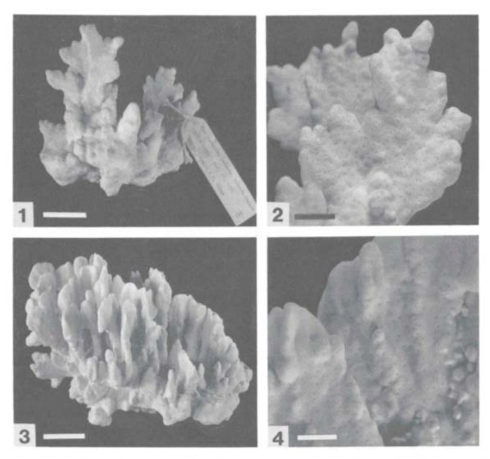

Figure A.1. Photos of *Millepora boschmai* skeletons used in the description of the species (de Weerdt and Glynn, 1991).

*Millepora boschmai* is a species of hydrocoral in the eastern Pacific that may have already gone extinct as a result of thermal-stress induced bleaching. While not a candidate species, the BRT determined that it would be valuable to assess the degree of extinction risk in this species to provide context for interpreting the voting results of the candidate species.

#### **Characteristics**

Shape and size: irregularly encrusting base from which arise plate-like outgrowths to 12 cm high and 0.5–1 cm thick. The plates are somewhat irregular in outline and usually increase in width distally, where they are irregularly, sometimes rather deeply, indented. Lateral plate-like extensions occasionally develop in between the plates, forming weakly developed box-like frameworks. Coralla of intermediate size, probably not exceeding 30 cm in overall height, 30 cm in length and 17 cm in width. Surface is generally smooth, sometimes a little warty (de Weerdt and Glynn, 1991).

#### **Taxonomy**

**Taxonomic issues:** Six specimens collected in Sumba and South Sulawesi, Indonesia were recently attributed to this species (Razak and Hoeksema, 2003). Such an anomalous distribution requires taxonomic follow up to confirm or refute conspecific status.

**Class:** Hydrozoa, Order Milleporina, Family Milleporidae

**Evolutionary and geologic history:** De Weerdt and Glynn (1991) first described this species from the eastern Pacific where it is one of only a few milleporid species, almost all of which are most closely related to Indo-Pacific forms. They identified this strong affinity with the Indo-pacific as being either due massive Eocene and Pleistocene extinctions in the eastern Pacific followed by reintroduction of Indo-West Pacific species by long-distance dispersal, or survival of some coral populations in eastern Pacific refugia after the closure of the Isthmus of Panama, providing the source for recolonization of places close enough to these refugia (see Rosen (1988) for a review of the different theories).

#### **Global Distribution**

This species was only found in the Gulf of Chiriquí, Panama (de Weerdt and Glynn, 1991), and most recently specimens from Indonesia were identified as *Millepora boschmai* (Razak and Hoeksema 2003). Its range is very restricted and highly fragmented.

Before 1983, the species was also reported to occur at Contreras Islands, Secas Islands, Coiba Island and Bahía Honda, Panama (de Weerdt and Glynn, 1991). No confirmed living animals are known, although animals possibly conspecific with this species have recently been reported from Indonesia. The species was initially recorded from a single location at Coiba Island, Panama and known only from the Gulf of Chiriqui; that subpopulation was regarded as extinct following the 1982/83 El Niño; however, a second subpopulation was later found off Uva Island. With the subsequent extinction of the Uva Island subpopulation following the 1997/98 El Niño, this species may now be extinct. Despite intensive searches no further living specimens have been found within the region. Observed population decline since 1982 in the eastern Pacific region is therefore estimated as 100% (IUCN 2008). According to Razak and Hoeksema (2003), *Millepora boschmai* may so far have been overlooked in Indonesia and the Indo-West Pacific because it is relatively rare or because it is not well known (Razak and Hoeksema, 2003). However, many milleporids are easily confused and separated by relatively small morphological characteristics. With a lack of living material in the eastern Pacific it may never be known for certain if the Panama and Indonesian corals are the same species.

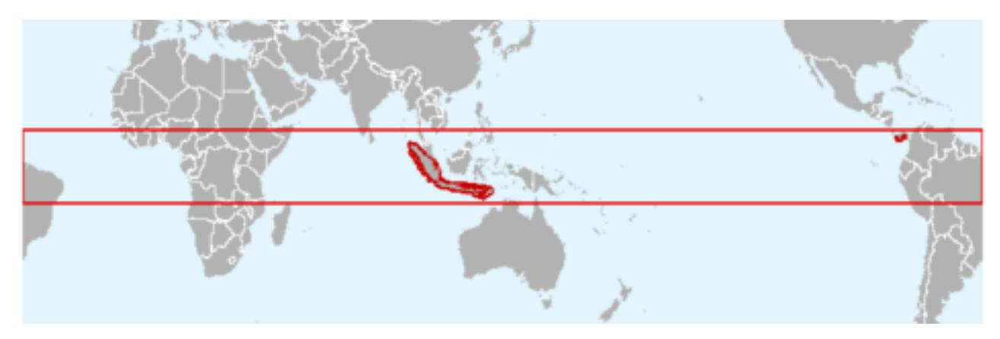

Figure A.2. *Millepora boschmai* distribution from IUCN copied from http://www.iucnredlist.org.

#### **Habitat**

**Habitat:** *Millepora* species are generally found in inshore areas characterized by turbidity, and exhibit a tolerance for siltation. *Millepora boschmai* in Panama were found in clear to moderately-sedimented bays protected from high surge.

**Depth range**: *Millepora boschmai* was reported from the upper forereef slope (2 m) to deep, sand and rubble slopes (18 m); however, it was most abundant at the reef base (5–6 m) and deeper outer slope to 12–15 m (de Weerdt and Glynn, 1991). No known deep refugia.

#### **Abundance**

This species was uncommon prior to 1982 and extremely rare between 1983 and 1997. It has not been found alive since 1998.

According to de Weerdt and Glynn (1991), *Millepora boschmai* was the least abundant of the three *Millepora* species known from the Gulf of Chiriquí. De Weerdt and Glynn (1991) reported the elimination of *Millepora boschmai* following the 1982/83 El Niño event. Detailed searches from 1984 through 1990 across the former range revealed only dead colonies (Glynn and Feingold, 1992). However, in the early 1990s eight live colonies were found in the Gulf of Chiriquí; five colonies at Uva Island (Glynn and Feingold, 1992), and three colonies at the north end of Coiba Island (Anonymous, 1993; Glynn and Colley, 2001; Glynn et al., 2001). However, after the 1997/98 ENSO event, all known colonies were dead (Glynn et al., 2001). Since then, no live colonies have been observed, despite targeted searches throughout the former distribution. The only species-specific population information available for this species is an estimate of a pre-1982 total population in the 100s (Glynn, 1997). However, there is evidence that overall coral reef habitat has declined, and this is used as a proxy for population decline for this species. This species is particularly susceptible to bleaching, disease, and other threats and therefore population decline is based on both the percentage of destroyed reefs and critical reefs that are likely to be destroyed within 20 years (Wilkinson, 2004). We assume that most, if not all, mature individuals will be removed from a destroyed reef and that on average, the number of individuals on reefs are equal across its range and proportional to the percentage destroyed reefs. Reef losses throughout the species' range have been estimated over three generations, two in the past and one projected into the future. (IUCN, 2010).

#### **Life History**

The reproductive characteristics of this species are unknown.

#### **Threats**

**Thermal stress**: *Millepora* are listed as having a severe susceptibility to bleaching (Marshall and Baird, 2000). This was borne out by the potential extinction during the 1997/98 El Niño.

**Acidification**: While no studies have been published on acidification impacts on this genus, *Millepora boschmai* is common on eastern Pacific reefs and near-reef habitats where the aragonite saturation state is naturally low due to upwelling (Abramovitch-Gottlib et al., 2003). This may imply that to some degree, this species can tolerate acidified water but the impact of acidification on growth has not been quantified. However, in most corals studied, acidification impairs growth (Langdon and Atkinson, 2005; Manzello, 2010) and, in the case of *Acropora palmate*, impairs fertilization and settlement success (Albright et al., 2010) and is likely to contribute to reef destruction in the future (Hoegh-Guldberg et al., 2007; Silverman et al., 2009). While ocean acidification has not been demonstrated to cause appreciable declines in coral populations so far, the BRT considers it to be a significant threat to corals by 2100.

**Disease:** Susceptibility and impacts of disease on this species are not known. However, there is ample evidence that emerging diseases can have devastating regional impacts on individual coral species (e.g., (Aronson and Precht, 2001; Bruckner and Hill, 2009) and there is evidence that these impacts are occurring in more taxa and at a broader geographic scale (Green and Bruckner, 2000; Sutherland et al., 2004).

**Predation**: Genus not particularly susceptible to predation by crown-of-thorns seastars (*Acanthaster planci*).

**Land-based sources of pollution (LBSP)**: The effects of LBSP on the genus *Millepora* are largely unknown. LBSPrelated stresses often act in concert rather than individually, and are influenced by other biological (e.g., herbivory) and hydrological factors. Excess nutrients can disrupt corals physiologically (Dubinsky and Stambler, 1996; Fabricius, 2005), but community-level effects on corals are often indirect through competition with algae (McCook et al., 2001; Szmant, 2002). Toxic contaminants are capable of producing coral mortality, as well as disrupting cellular and reproductive processes (Peters et al., 1997). Hyposaline runoff can lead to bleaching and mortality (Coles and Jokiel, 1992). Sediment stress is a complicated response; most sediment impacts are negative (Rogers, 1990; Fabricius, 2005) though some corals are sediment-tolerant. Collectively, LBSP stresses are unlikely to produce extinction at a global scale; however, they may pose significant threats at local scales and reduce the resilience of corals to bleaching (Carilli et al., 2009; Wooldridge, 2009).

**Collection/Trade**: No trade information for this species was listed on the CITES Trade Database, UNEP World Conservation Monitoring Centre (CITES, 2010).

#### **Risk assessment**

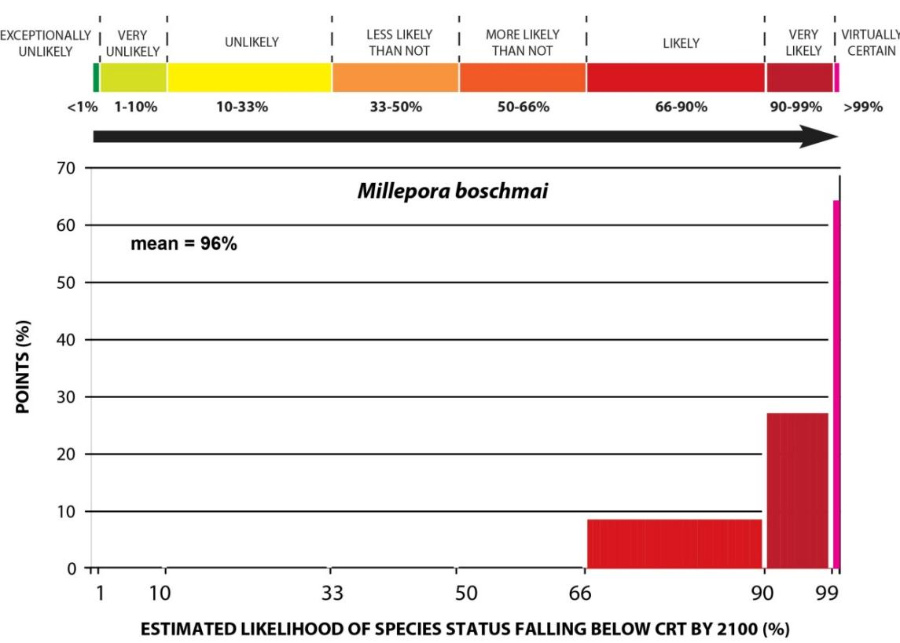

Figure A.3: Distribution of points to estimate the likelihood that the status of *Millepora boschmai* falls below the Critical Risk Threshold (CRT; the species is of such low abundance, or so spatially fragmented, or at such reduced diversity that extinction is extremely likely) by 2100.

The BRT was not able to identify factors that reduce potential extinction risk (decrease the likelihood of falling below the Critical Risk Threshold) for *Millepora boschmai*. Factors that increase the potential extinction risk (higher likelihood of falling below the Critical Risk Threshold) for *Millepora boschmai* include its bleaching susceptibility, its extremely limited distribution, and the fact that, when it is found, it is always extremely rare.

In the discussion of this species, de Weerdt and Glynn (1991) discussed the risk posed to any coral endemic to the eastern Pacific:

> "Elements of the eastern Pacific reef coral fauna, consisting of several small, geographically isolated populations in a highly varying environment, would seem to be especially vulnerable to extinction (Wiebe et al., 1975; D'elia et al., 1981; Wolanski and Delesalle, 1995; Leichter et al., 1996; Lewis, 2006; Paytan et al., 2006; Carilli et al., 2010). ENSO events, which started about 2.8 million years ago after the rise of the Panama Isthmus (Ferrier-Pagès et al., 2010), and have since then occurred continuously but un-predictably (Glynn, 1990; Ferrier-Pagès et al., 2010), probably contribute to the poor development of eastern Pacific coral reefs (Glynn, 1990). Range reductions, which affected the hydrocoral *M. platyphylla* and possibly three scleractinian species (Glynn, 1990; Ferrier-Pagès et al., 2010), may therefore have occurred regularly in the eastern Pacific since the onset of said events. If *M. boschmai* was endemic to the Gulf of Chiriqui prior to its disappearance, recovery of the species seems highly unlikely, but this can only be ascertained in due time."

It is very likely that this species is already extirpated from the eastern Pacific, if not extinct, due to its susceptibility to bleaching events. Surveys around Uva and Coiba Island in Panama's Gulf of Chiriqui within the last two years turned up no living specimens (Glynn pers. comm.).

The overall likelihood that *Millepora boschmai* will fall below the Critical Risk Threshold by 2100 was estimated to be in the "very likely" risk category with a mean likelihood of 96% and a standard error (SE) of 5% (Fig. A.3). This SE was calculated by taking the standard deviation of the seven mean voting scores of the BRT members and shows the coherence among the BRT. The uncertainty of the BRT is reflected in the range of votes of 66%-100% (Fig. A.3) and the average range of likelihood estimates of the seven BRT voters (14%).

#### **References (Appendix only)**

Abramovitch-Gottlib, L., D. Katoshevski, and R. Vago.

2003. Responses of Stylophora pistillata and Millepora dichotoma to seawater temperature elevation. Bulletin of Marine Science 73:745-755.

Albright, R. A., B. Mason, M. Miller, and C. Langdon.

2010. Ocean acidification compromises recruitment success of the threatened Caribbean coral, *Acropora palmata*. Proceedings of the National Academy of Sciences doi/10.1073/pnas.1007273107.

Anonymous.

1993. Plan de manejo del Parque Nacional Coiba. La Agencia Española de Cooperación Internacional, el Instituto Nacional para la Conservación de la Natura (España), y el Instituto de Recursos Naturales Renovables (Panamá).

Aronson, R. B. and W. F. Precht.

2001. White-band disease and the changing face of Caribbean coral reefs. Hydrobiologia 460:25-38.

Bruckner, A. W. and R. L. Hill.

2009. Ten years of change to coral communities off Mona and Desecheo Islands, Puerto Rico, from disease and bleaching. Diseases of aquatic organisms 87:19-31.

Carilli, J. E., R. D. Norris, B. Black, S. M. Walsh, and M. McField.

2010. Century-scale records of coral growth rates indicate that local stressors reduce coral thermal tolerance threshold. Global Change Biology 16:1247-1257.

Carilli, J. E., R. D. Norris, B. A. Black, S. M. Walsh, and M. McField.

2009. Local stressors reduce coral resilience to bleaching. PloS one 4:e6324.

CITES.

2010. Convention on International Trade in Endangered Species trade database. Pages export quotas: http://www.cites.org/eng/resources/quotas/index.shtml; international trade data: (http://www.unepwcmc.org/citestrade/expert.cfm?CFID=38999683&CFTOKEN=65497723. UNEP World Conservation Monitoring Centre, Cambridge, UK.

Coles, S. L. and P. L. Jokiel.

1992. Effects of salinity on coral reefs. Pages 147–166 *in* D. W. Connell and D. W. Hawkins, editors. Pollution in tropical aquatic systems. CRC Press.

D'elia, C. F., K. L. Webb, and J. W. Porter.

1981. Nitrate-rich groundwater inputs to Discovery Bay, Jamaica: A significant source of N to local coral reefs? Bulletin of Marine Science 31:903-910.

de Weerdt, W. H. and P. W. Glynn.

1991. A new and presumably now extinct species of Millepora (Hydrozoa) in the eastern Pacific. Zoologische Mededeelingen 65:267-276.

Dubinsky, Z. and N. Stambler.

1996. Marine pollution and coral reefs. Global Change Biology 2:511-526.

Fabricius, K. E.

2005. Effects of terrestrial runoff on the ecology of corals and coral reefs: review and synthesis. Marine Pollution Bulletin 50:125-146.

Ferrier-Pagès, C., C. Rottier, E. Beraud, and O. Levy.

2010. Experimental assessment of the feeding effort of three scleractinian coral species during a thermal stress: Effect on the rates of photosynthesis. Journal of Experimental Marine Biology and Ecology 309:118-124.

Glynn, P. W.

1990. Coral mortality and disturbances to coral reefs in the tropical eastern Pacific. Pages 55-126 *in* P. W. Glynn, editor. Global Ecological Consequences of the 1982-83 El Niño-Southern Oscillation. Elsevier Press, Amsterdam.

Glynn, P. W.

1997. Eastern Pacific reef coral biogeography and faunal flux: Durham's dilemma revisited. Pages 371–378 *in* Proceedings of the 8th International Coral Reef Symposium. Smithsonian Tropical Research Institute, Panama.

Glynn, P. W. and S. B. Colley.

2001. A collection of studies on the effects of the 1997–98 El Nino-Southern Oscillation event on corals and coral reefs in the eastern tropical Pacific. Bulletin of Marine Science 69:1-288.

Glynn, P. W. and J. S. Feingold.

1992. Hydrocoral species not extinct. Science 257:1845.

Glynn, P. W., J. L. Mate, A. C. Baker, and M. O. Calderon.

2001. Coral bleaching and mortality in Panama and Ecuador during the 1997-1998 El Nino-Southern Oscillation Event: spatial/temporal patterns and comparisons with the 1982-1983 event. Bulletin of Marine Science 69:79-109.

Green, E. P. and A. W. Bruckner.

2000. The significance of coral disease epizootiology for coral reef conservation. Biological Conservation 96:347-361.

Hoegh-Guldberg, O., P. J. Mumby, A. J. Hooten, R. S. Steneck, P. Greenfield, E. Gomez, C. D. Harvell, P. F. Sale, A. J. Edwards, K. Caldeira, N. Knowlton, C. M. Eakin, R. Iglesias-Prieto, N. Muthiga, R. H. Bradbury, A. Dubi, and M. E. Hatziolos.

2007. Coral reefs under rapid climate change and ocean acidification. Science 318:1737-1742.

IUCN.

2010. IUCN Red List of Threatened Species. Version 3.1. Page ii + 30 pp. Page: http://www.iucnredlist.org/. IUCN Species Survival Commission, Gland, Switzerland and Cambridge, UK.

Langdon, C. and M. J. Atkinson.

2005. Effect of elevated pCO2 on photosynthesis and calcification of corals and interactions with seasonal change in temperature/irradiance and nutrient enrichment. Journal of Geophysical Research 110.

Leichter, J. J., S. R. Wing, S. L. Miller, and M. W. Denny.

1996. Pulsed delivery of subthermocline water to Conch Reef (Florida Keys) by internal tidal bores. Limnology and Oceanography 41:1490-1501.

Lewis, J. B.

2006. Biology and ecology of the hydrocoral Millepora on coral reefs. Advances in Marine Biology 50:1-55.

Manzello, D. P.

2010. Coral growth with thermal stress and ocean acidification: lessons from the eastern tropical Pacific. Coral Reefs 29:749-758.

Marshall, P. A. and A. H. Baird.

2000. Bleaching of corals on the Great Barrier Reef: differential susceptibilities among taxa. Coral Reefs 19:155-163.

McCook, L., J. Jompa, and G. Diaz-Pulido.

2001. Competition between corals and algae on coral reefs: a review of evidence and mechanisms. Coral Reefs 19:400-417.

Paytan, A., G. G. Shellenbarger, J. H. Street, M. E. Gonneea, K. Davis, M. B. Young, and W. S. Moore.

2006. Submarine groundwater discharge: An important source of new inorganic nitrogen to coral reef ecosystems. Limnology and Oceanography 51:343-348.

Peters, E. C., N. J. Gassman, J. C. Firman, R. H. Richmond, and E. A. Power.

1997. Ecotoxicology of tropical marine ecosystems. Environmental Toxicology and Chemistry 16:12-40.

Razak, T. B. and B. W. Hoeksema.

2003. The hydrocoral genus Millepora (Hydrozoa: Capitata: Milleporidae) in Indonesia. Zoologische Verhandelingen 345:313-336.

Rogers, C. S.

1990. Responses of coral reefs and reef organisms to sedimentation. Marine Ecology Progress Series 62:185- 202.

Rosen, B. R.

1988. Progress, problems and patterns in the biogeography of reef corals and other tropical marine organisms. Helgolander Meeresunters 42:269-301.

Silverman, J., B. Lazar, L. Cao, K. Caldeira, and J. Erez.

2009. Coral reefs may start dissolving when atmospheric CO2 doubles. Geophysical Research Letters 36:L05606.

Sutherland, K. P., J. W. Porter, and C. Torres.

2004. Disease and immunity in Caribbean and Indo-Pacific zooxanthellate corals. Marine Ecology Progress Series 266:273-302.

Szmant, A. M.

2002. Nutrient enrichment on coral reefs: is it a major cause of coral reef decline? Estuaries and Coasts 25:743- 766.

Wiebe, W. J., R. E. Johannes, and K. L. Webb.

1975. Nitrogen fixation in a coral reef community. Science 188:257-259.

Wilkinson, C., editor.

2004. Status of coral reefs of the world: 2004. Australian Inst. of Marine Science, Townsville; UNEP, Nairobi; Global Coral Reef Monitoring Network, International Coral Reef Initiative, Paris.

Wolanski, E. and B. Delesalle.

1995. Upwelling by internal waves, Tahiti, French Polynesia. Continental Shelf Research 15:357-368. Wooldridge, S. A.

2009. Water quality and coral bleaching thresholds: Formalising the linkage for the inshore reefs of the Great Barrier Reef, Australia. Marine Pollution Bulletin 58:745-751.

#### **Availability of NOAA Technical Memorandum NMFS**

Copies of this and other documents in the NOAA Technical Memorandum NMFS series issued by the Pacific Islands Fisheries Science Center are available online at the PIFSC Web site http://www.pifsc.noaa.gov in PDF format. In addition, this series and a wide range of other NOAA documents are available in various formats from the National Technical Information Service, 5285 Port Royal Road, Springfield, VA 22161, U.S.A. [Tel: (703)-605- 6000]; URL: http://www.ntis.gov. A fee may be charged.

Recent issues of NOAA Technical Memorandum NMFS–PIFSC are listed below:

NOAA-TM-NMFS-PIFSC-19 American Samoa as a fishing community. A. LEVINE, and S. ALLEN (March 2009)

- 20 Demand for Hawaii bottomfish revisited: incorporating economics into total allowable catch management. J. HOSPITAL, and M. PAN (September 2009)
- 21 Shark predation on Hawaiian monk seals: Workshop II & post-workshop developments, November 5-6, 2008. K. S. GOBUSH (July 2010)
- 22 Status review of Hawaiian insular false killer whales (*Pseudorca crassidens*) under the Endangered Species Act. E. M. OLESON, C. H. BOGGS, K. A. FORNEY, M. B. HANSON, D. R. KOBAYASHI, B. L. TAYLOR, P. R. WADE, and G. M. YLITALO (August 2010)
- 23 Hawaiian monk seals and their prey: assessing characteristics of prey species fatty acid signatures and consequences for estimating monk seal diets using quantitative fatty acid signature analysis. S. IVERSON, J. PICHÉ, and W.BLANCHARD (March 2011)
- 24 Historic fishing methods in American Samoa. K. ARMSTRONG, D. HERDRICH, and A. LEVINE (June 2011)
- 25 Aversive conditioning and monk seal—human interactions in the main Hawaiian Islands: Aversive Conditioning Workshop, Honolulu, Hawaii, November 10-11, 2009. E. M. JENKINSON (July 2011)
  - 26 Bumphead parrotfish (*Bolbometopon muricatum*) status review. D. KOBAYASHI, A. FRIEDLANDER, C. GRIMES, R. NICHOLS, and B. ZGLICZYNSKI (September 2011)