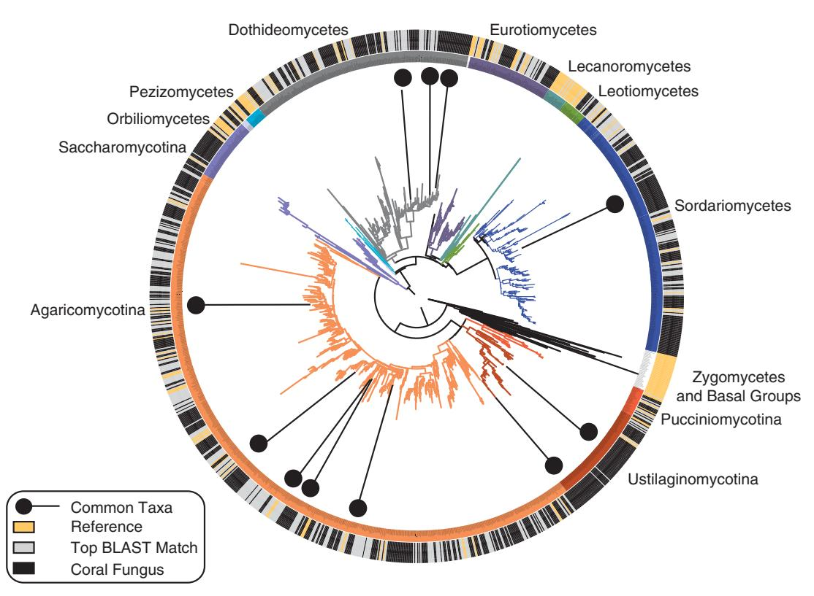
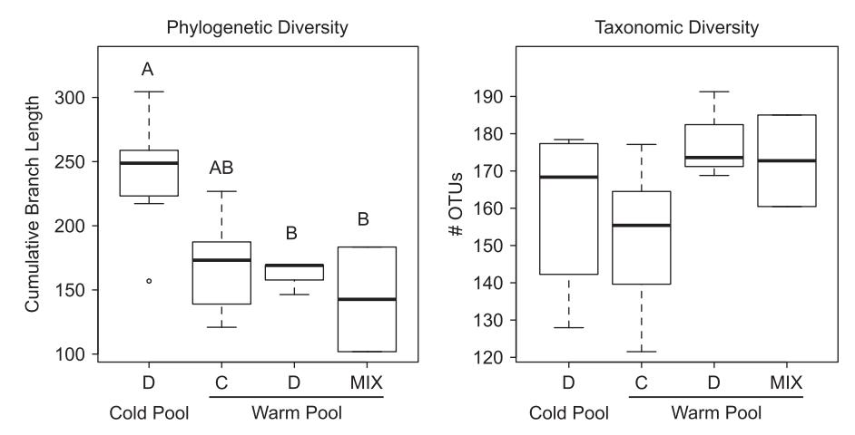
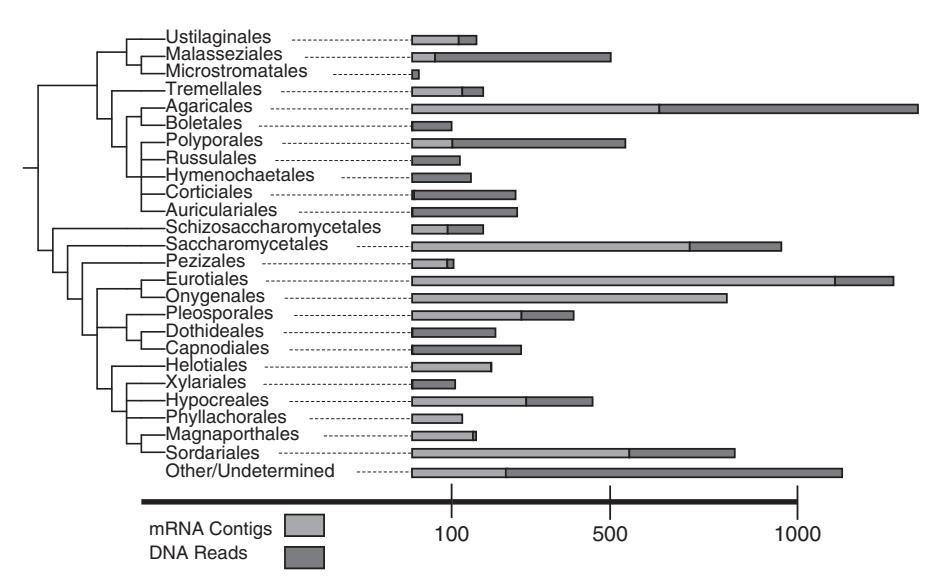
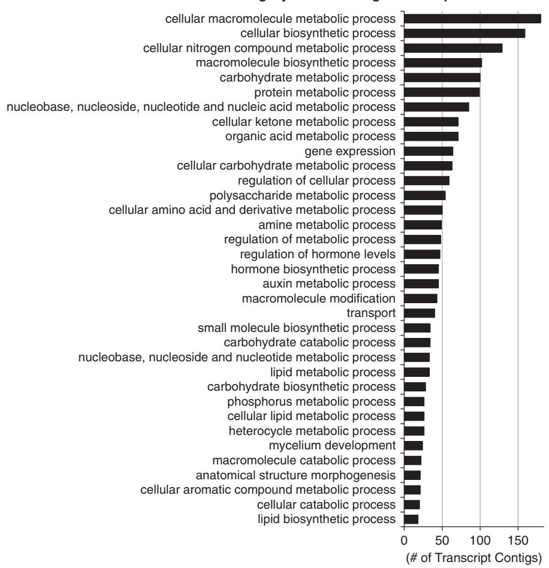

www.nature.com/isme

# Coral-associated marine fungi form novel lineages and heterogeneous assemblages

Anthony S Amend1, Daniel J Barshis2 and Thomas A Oliver2

1Department of Botany, University of Hawaii at Manoa, Honolulu, HI, USA and 2Hopkins Marine Station of Stanford University, Pacific Grove, CA, USA

Coral stress tolerance is intricately tied to the animal's association with microbial symbionts. The most well-known of these symbioses is that between corals and their dinoflagellate photobionts (Symbiodinium spp.), whose genotype indirectly affects whether a coral can survive cyclical and anthropogenic warming events. Fungi comprise a lesser-known coral symbiotic community whose taxonomy, stability and function is largely un-examined. To assess how fungal communities inside a coral host correlate with water temperature and the genotype of co-occurring Symbiodinium, we sampled Acropora hyacinthus coral colonies from adjacent natural pools with different water temperatures and Symbiodinium identities. Phylogenetic analysis of coral-associated fungal ribosomal DNA amplicons showed a high diversity of Basidiomycetes and Ascomycetes, including several clades separated from known fungal taxa by long and well-supported branches. Community similarity did not correlate with any measured variables, and total fungal community composition was highly variable among A. hyacinthus coral colonies. Colonies in the warmer pool contained more phylogenetically diverse fungal communities than the colder pool and contained statistically significant 'indicator' species. Four taxa were present in all coral colonies sampled, and may represent obligate associates. Messenger RNA sequenced from a subset of these same colonies contained an abundance of transcripts involved in metabolism of complex biological molecules. Coincidence between the taxonomic diversity found in the DNA and RNA analysis indicates a metabolically active and diverse resident marine fungal community.

The ISME Journal advance online publication, 22 December 2011; doi:10.1038/ismej.2011.193

Subject Category: microbe-microbe and microbe-host interactions

**Keywords:** marine fungi; 454 meta-genomics; mRNA meta-transcriptomics; scleractinian coral bleaching; *Malassezia*; fungal community assembly

## Introduction

Microbial impacts on a host's physiology, metabolism and fitness are a hallmark of symbiotic microbe-host interactions. A clear example of one such obligate symbiosis is the interaction between corals and their co-evolved photo-symbionts: dinoflagellates in the genus Symbiodinium. Although commonly presented as a simple model mutualism, technological advances such as scanning electron microscopy and environmental DNA sequencing have demonstrated additional complexity to this symbiosis involving a wide array of microbial symbionts associated with corals. A high diversity of bacteria, archaea, viruses, algae, protozoa and fungi comprise a complex assemblage that, including the coral animal, has been termed the coral holobiont (Rohwer et al., 2002; Knowlton and Rohwer, 2003). These organisms have been found to differ from those in the adjacent water column and represent potentially co-evolved symbionts (Rosenberg *et al.*, 2007).

Although the association between corals and fungi (henceforth 'coral fungi') has been reported from a wide host, geographic and climatic range (Freiwald et al., 1997), very little is known about their identity or the nature of their interaction with the holobiont. Coral fungi were long believed to be parasitic to the coral itself (Kendrick et al., 1982) or to endolithic algae within the coral skeleton (Priess et al., 2000). More recent hypotheses portray coral fungi as potentially mutualistic; either protecting the holobiont from infection and disease (Rohwer et al., 2002; Reshef et al., 2006; Shnit Orland and Kushmaro, 2009), or else by cycling recalcitrant nitrogen molecules for uptake by the Symbiodinium (Wegley et al., 2007). Alternatively, coral fungi may span a continuum from mutualist to commensalist to parasite depending on environmental context and overall coral health (Le Campion-Alsumard et al., 1995; Bentis et al., 2000; Golubic et al., 2005; Wegley et al., 2007; Lesser et al., 2007a; Thurber et al., 2009).

In contrast to the relationship between coral and fungus, comparatively much is understood about

Correspondence: A Amend, Department of Botany, University of Hawaii at Manoa, 3190 Maile Way, Honolulu, HI 96822, USA. E-mail: amend@hawaii.edu

Received 17 March 2011; revised 9 November 2011; accepted 21 November 2011

interactions between the coral animal and Symbiodinium, which passes photosynthetically fixed carbon to its host and greatly accelerates the process of calcification (Muscatine et al., 2005). The majority of Symbiodinium are obligately symbiotic, and genetically distinct Symbiodnium can confer differing levels of heat tolerance to the coral holobiont (Rowan et al., 1997). For example, in both field observations and laboratory experiments, corals hosting specific members of clade D Symbiodinium have been shown to be more resistant to warmer waters and less prone to bleaching than corals hosting common members of clade C (Rowan, 2004; Berkelmans and Van Oppen, 2006). Acroporid corals are known to associate with multiple genetically distinct Symbiodinium types, including heatresistant members of clade D (Baker, 2003; Oliver and Palumbi, 2011).

Our objectives here are to investigate the relationship between *Symbiodinum*, the environment and fungi associated with *Acropora hyacinthus* a reef building, tropical coral. First, we assess the phylogenetic diversity of fungi associated with *A. hyacinthus* to detect whether these comprise lineages distinct from terrestrial fungi. While a growing body of literature has found novel lineages of marine fungi in pelagic, sedimentary and vent environments, very few have examined the phylogenetic placement of marine biotrophic fungi, which presumably share many functional and nutritive traits with terrestrial biotrophic relatives.

Second, we assess whether Symbiodinium genotype or pool environment correlate with A. hyacinthus fungal community composition. Both environment and host identity have been shown to determine community composition in biotrophic fungi on land (Schechter and Bruns, 2008; Smith et al., 2009), even over relatively small spatial and phylogenetic scales (Sthultz et al., 2009). As Symbiodinium produces the majority of the holobiont's carbon, and because of presumed algal-fungal interactions (Wegley et al., 2007), we hypothesize that *Symbiodinum* genotype would significantly impact A. hyacinthus fungal community composition. We sample replicate coral colonies containing either Symbiodinium C or D from two natural pools with different water temperatures in order to assess how these variables impact coral fungi. Since environmental conditions covary with Symbiodinium genotype, and because global change is predicted to increase both water temperature and the prevalence of corals with heat tolerant D-clade Symbiodinium, we also hypothesize that the water temperature—genotype interaction significantly partitions fungal community variance.

Finally, because there are relatively few macroscopic marine fungi, it is unclear whether the taxonomic diversity of fungal communities detected via culture-independent DNA methods reflects active marine residents or terrestrial debris. To infer whether metabolically active community

membership overlaps that detected via DNA-based techniques, we examine the fungal mRNA transcripts of a subset of colonies under both ambient and warmed conditions. This method has the additional benefit of providing insight into which metabolic pathways are used in symbiosis, enabling us to generate new hypothesis and experiments to determine coral fungal functional roles.

#### Materials and methods

Sample site and collections

A. hyacinthus coral colonies were sampled from each of two back-reef pools on Ofu Island in American Samoa (14°11′S, 169°36′W). These pools are approximately 500 m apart and are characterized by varying degrees of daily fluctuations in a suite of environmental variables (for example, temperature, flow, salinity) described in detail elsewhere (Smith et al., 2007, 2008; Barshis et al., 2010; Oliver and Palumbi, 2011). The magnitude of the environmental fluctuations correlate with the amount of open ocean admixture, providing variable environmental conditions over short distances, while presumably maintaining comparable access to pools of microbial immigrants.

In the low mixture pool (warm pool) sampled in this study, water temperature fluctuates up to 6 °C daily, and summer water temperature maxima are as much as 1.5 °C warmer than in the adjacent highmixture pool (cold pool). Owing to differences in thermal tolerance, only *Symbiodinium* D (ITS1, sensu Van Oppen et al., 2001) are found in the warm pool, whereas both *Symbiodinium* C and D associate with corals in the cold pool, occasionally forming mixed assemblages within a colony.

For DNA analysis, individual coral fragments ( $\sim 2\,\mathrm{cm^3}$  per fragment) were sampled from 18 colonies of *A. hyacinthus* in each pool (36 total colonies) and stored in 70% ethanol until subsequent nucleic acid extraction.

For mRNA analysis, six individuals were removed from the cold pool and divided into duplicate samples. One duplicate was maintained in a laboratory tank at approximately ambient temperature (26.8–34.5 °C), whereas the other was maintained in a warmer-temperature tank (27–37.6 °C). Colonies were retrieved after 72 h and stored in a high-concentration trisodium citrate buffer until subsequent nucleic acid extraction.

#### Nucleic acid extractions

Genomic DNA was extracted from colonies preserved in 70% ethanol using a Nucleospin Tissue kit (Clontech, Mountain View, CA, USA) as per the manufacturer's instructions.

Total RNA was extracted using a modified TRIzol (GibcoBRL/Invitrogen, Carlsbad, CA, USA) protocol. Approximately, 150–200 mg of coral tissue and

skeleton was placed in 1 ml of TRIzol and homogenized for 2 min by vortexing with B100 ml of 0.5 mm Zirconia/Silica Beads (BioSpec Products, Inc., Bartlesville, OK, USA). Resulting tissue/TRIzol slurry was removed by centrifugation and standard TRIzol extraction was performed according to the manufacturer's specifications with the replacement of 250 ml of 100% isopropanol with 250 ml of high salt buffer (0.8 M Na citrate, 1.2 M NaCl) during the final precipitation step. Resulting RNA pellet was resuspended in 12 ml of diethyl pyrocarbonate treated H2O.

# Symbiodinium genotyping

Symbiodinium genotyping was performed by assessing PCR amplicon size polymorphism of chloroplast gene cp23s on an agarose gel using methods as described by [Oliver and Palumbi \(2011\)](#page-10-0). Briefly, because of indel variants of chloroplast genes among Symbiodinium clades C and D, the size of the PCR product can be used to detect the presence of one or both genotypes. Although most colonies in the cold pool presumably contain both Symbiodium genotypes to some degree, quantitative PCR (data not shown) demonstrates that this method reliably detects the genotype if present at 410% proportional abundance.

## PCR and 454 sequencing of genomic DNA

Approximately 10 ng DNA was used to amplify B950 bp of the gene containing the D1 and D2 variable regions of the large-subunit (28S) ribosomal DNA, using oligos containing the LRORf and LR5f primers, the 454 'A' and 'B' adaptors and a 10-bp multiplex tag as in Amend et al[. \(2010\)](#page-9-0). Negative controls were run on PCR reactions. PCR products were cleaned using the QIAquick PCR Purification Kit (Qiagen, Valencia, CA, USA) following the manufacturer's instructions, quantified using a Qubit Fluorometer (Invitrogen), pooled into equimolar concentrations and pyrosequenced at the Duke University ISGP Sequencing Facility on one of eight regions of a plate using the 454 Life Sciences FLX Titanium platform. Raw sequences were deposited in the Short Read Archives of NCBI under accession SRP005168.

#### Bioinformatic processing of 454 DNA amplicon sequences

Base calls and quality scores derived from the 454 sequencer were 'de-multiplexed', quality-control processed and clustered into operation taxonomic units (OTUs) using the MOTHUR v.1.14.0 analytic pipeline ([Schloss](#page-10-0) et al., 2009). Reads were culled if they were shorter than 250 bp, imperfectly matched the priming site or barcode sequences, contained a mean Q-score o30, or contained a homopolymer run longer than 12 bases.

The remaining sequences were queried against the NCBI nr/nt database using BLASTN ([Altschul](#page-9-0) et al., [1997\)](#page-9-0) on the Bioportal server at the University of Oslo. The resulting BLAST output was imported into MEGAN 3.9 and taxonomy was determined by 'last common ancestor' analysis (with parameters as described in Amend et al[. \(2010\)\).](#page-9-0) Non-fungal sequences (mostly from corals) were removed. Fungal sequences were aligned in MOTHUR, using a published 28S ribosomal DNA alignment [\(James](#page-9-0) et al[., 2006](#page-9-0)) as a template. Putative chimeras were screened and removed using the 'Chimera-Slayer' algorithm in MOTHUR with default settings.

Phylogenetic analysis of DNA amplicons

Non-singleton OTUs were aligned with a nonredundant set of their top BLAST matches (N ¼ 497) to the NCBI nr/nt database and the 28S sequences from the phylogeny of James et al[. \(2006\)](#page-9-0) using the local pairwise alignment setting of MAFFT. The resulting alignment contained 529 characters. A maximum likelihood tree was calculated using a web-server implementation of RAxML (v. 7.2.8; [Stamatakis](#page-10-0) et al., 2008) with Gamma rates of nucleotide heterogeneity and the six-gene Fungal Bayesian tree from James et al[. \(2006\)](#page-9-0) as a backbone to constrain the resulting topology [\(Figure 1\)](#page-3-0). The tree was visualized using the Interactive Tree of Life Program ([Letunic and Bork, 2006](#page-10-0)).

Computing and comparing community similarity For phylogenetic diversity analyses, all remaining sequences were included in a minimum evolution tree computed using the FastTree program ([Price](#page-10-0) et al[., 2009\)](#page-10-0), using the six-gene Bayesian tree as a constraint as above.

OTUs were calculated using MOTHUR's pre-cluster option followed by average-linkage clustering. An OTU sequence identity threshold of 97% was used for subsequent analyses. We are unaware of any estimates of the rate of evolution for this locus in fungi, but presume that this cutoff resolves taxa at approximately the genus or family level, rather than at approximately the species level inferred using the same cut-off level with the ITS cistron [\(Nilsson](#page-10-0) et al., 2008).

Differences in community composition were tested using the non-parametric ANOSIM analysis (available in the VEGAN package of R; [Dixon, 2003\)](#page-9-0) on matrices of the unweighted Unifrac (Phylogenetic Diversity; [Lozupone and Knight, 2005\)](#page-10-0) and Jaccard (OTU diversity) distances. For each diversity index calculated, sample sizes were normalized by randomly selecting the number of sequences in the smallest sample from all other samples, computing the distance matrix, and then calculating the mean matrix values from 1000 such random samplings. Distance matrices calculated to include relative abundance of sequencing reads (weighted Unifrac and Bray Curtis index) did not significantly change statistical results and are not discussed further. Symbiodinium genotype effects were tested by comparing groups of individuals from the cold

Figure 1 Best of 100 maximum likelihood trees of non-singleton coral-fungi OTUs. The tree used a previously published phylogeny as a constraining reference, and was augmented with 497 sequences, which were the top BLAST matches of OTUs downloaded from NCBI nr/nt database. Superimposed on the phylogeny are color-coded cladistic information (inner ring) and sequence source (outer ring). Basidiomycetes are designated with warm colors, Ascomycetes with cool. Uninterrupted black bars on the outer ring indicate clusters of A. hyacinthus fungi, which are more closely related to other coral fungi than to previously sequenced species. The 11 taxa that were found in 490% of the corals are indicated with black pushpins. A larger image with legible labels is provided as supplementary information. Sequences lacking a taxonomic color-code belong to lineages absent in this study.

pool only, as well as by comparing all clade D individuals with all clade C individuals while accounting for variance contributed by pool of origin. Environmental effects were tested by comparing only clade D individuals grouped by pool, as well as by comparing all individuals grouped by pool while accounting for variance contributed by Symbiodinium genotype. Genotype–environment interaction effects were tested by grouping individuals by both genotype and pool (clade D warm, clade D cold, clade C cold, mixed genotype cold).

#### Evaluating fungal OTU distribution patterns

Non-random positive co-occurrence patterns can indicate symbiotic relationships among organisms. To test whether the number of OTUs found in every coral sample differed from what would be expected given random occurence, we used a randomization procedure in which we maintained sequence totals per sample and sequence totals per OTU (row and column sums of the OTU matrix) while randomizing OTU locations. Observed co-occurrence patterns were compared with those of 100 such randomizations to calculate whether deviations from a randomized null distribution were statistically significant.

To test whether individual OTUs were statistically associated with either pool of origin or Symbiodinium genotype, we conducted a species indicator analysis. As low abundance OTUs are likelier to be unique to a grouping variable (such as pool or Symbiodinium type) by random chance, this procedure uses randomizations to calculate the probability that an association between an OTU and an environmental variable indicates a statistical deviation from null expectations given that OTU's observed frequency. Indicator values were calculated with the multipatt algorithm in the Indicspecies package ([Ca´ceres and Legendre, 2009\)](#page-9-0) in R, computed with 999 permutations. The procedure was parameterized to consider each grouping variable independently in addition to interactions among grouping variables, while assigning significance to OTUs among all possible permutations of variable combinations.

#### Illumina sequencing of mRNA

Messenger RNA was isolated from total RNA using the micro fast-track mRNA isolation kit (Invitrogen) and an overnight precipitation at -801C. Between 40 ng and 1 mg of mRNA was used in Illumina library

construction as in Beck et al. (2010). Briefly, mRNA was converted to double-stranded complementary DNA in a PCR reaction containing random hexamer primers, Superscript III Reverse Transcriptase (Invitrogen) and supplied buffer. Reactions were cleaned with the MinElute Reaction Cleanup Kit (Qiagen). Double-stranded, paired-end oligonucleotide adapters were ligated onto the ds-complementary DNA using T4 DNA Ligase (Invitrogen) at 16 °C for 4h. Resulting libraries were size selected for 200-300-bp fragments using agarose gel electrophoresis and purified using the MinElute Gel Extraction Kit (Qiagen). The final library was generated by PCR amplification of the Linker-ligated complementary DNA using P5 and P7 primers and Phusion PCR Master Mix (New England Biolabs, Ipswitch, MA, USA) using the following cycle program: initial denature at 98 °C for 30 s, 15 cycles of 98 °C for 10 s, 65 °C for 30 s, 72 °C for 30 s and a final extension at 72 °C for 5 min.

The sample of one individual's ambient-temperature treatment was not sequenced, thus 11 total libraries were constructed from 6 individuals: 5 from ambient and 6 from heat-stressed duplicates. Seven of these libraries were sequenced by Illumina Corp. with a 76-bp paired-end sequencing length (152 bp per sequence total) and the remaining four libraries were sequenced using single-end sequencing and a length of 36 bp in the lab of Dr Arend Sidow (Stanford University).

Fungal transcriptome assembly and annotation All 11 lanes of Illumina sequence data were assembled, de novo, using CLC Genomics Workbench (v.4, CLC Bio, Mühltal, Germany) with a mismatch cost of 1, insertion cost of 2, deletion cost of 2, length fraction of 0.27, similarity of 0.8, paired-end minimum distance of 1 and maximum distance of 250, single-end limit of 7, voting conflict resolution, random assignment of nonspecific matches and minimum contig length of 150. All assembled contigs were compared with the NCBI NR protein database using BLASTX. The resulting output was imported into MEGAN 3.9 for taxonomic assignment. BLAST output of putatively fungal transcripts (only transcripts that were assigned by MEGAN/ LCA to kingdom Fungi) was imported into Blast2Go (Gotz *et al.*, 2008) for gene mapping and annotation. Matches that mapped at >40% similarity and with E-values  $< 10^{-5}$  to putative proteins were retained and annotated with general GO-slim categories.

#### Results

DNA sequencing

Following initial DNA sequence processing, 57 415 reads were retained. In all, 28 083 sequences, nearly half of all reads, derived from the coral animals themselves and were subsequently removed from the data set, leaving 26 022 high-quality fungal sequences. Phylogenetic placement of A. hyacinthus-associated

A large number of well-supported clades separated from terrestrial taxa by long branch-lengths were recovered within, or sister to, many Orders (Supplementary Figures S1–S3). The average identity of the top alignment of each OTU to a Genbank fungal sequence (including unidentified environmental sequences) was low: 97.39% ± 1.83 (s.d.) aligned over  $325.16 \pm 36.68$  bp, reflecting the novelty of diversity detected here.

A. hyacinthus contained a high diversity of fungi, almost entirely dominated by Ascomycetes and Basidiomycetes (Figure 1). Sordariomycetes and Dothideomycetes (Ascomycota), and Agaricomycetes and Ustilaginomycetes (Basidiomycota) were the most species-rich. Notably absent was the causative agent of coral aspergillosis: Aspergillus sydowii, as well as most genera of the polyphyletic 'Halosphaeriales' commonly found on algae and woody debris in marine environments. Although several of the species detected here are closely related to species found in culture-based studies of marine fungi, including Dendryphiella sp., Debaryomyces sp. and Lulworthia sp., the majority of A. hyacinthus fungi were considerably divergent from known species, marine or otherwise.

Community similarity patterns

The high number of coral sequences in the libraries resulted in unequal numbers of fungal sequences derived from each sample, thus for comparisons of beta-diversity and fungal OTU distributions, only samples containing >464 fungal sequences were included in the analyses. Of these 19 remaining samples, 7 were from the warm pool (all Symbiodinium D) and 12 were from the cold pool (7 Symbiodinium C, 3 Symbiodinium D and 2 mixed genotype). These remaining samples contained a mean of 1319 sequences  $\pm$  1290 (s.d.).

Fungal communities were not statistically differentiated when grouped by Symbiodinium genotype, pool of origin (warm or cold), Symbiodinium genotype within the cold pool, or pool  $\times$  genotype interaction. Results of the ANOSIM analysis showed no significant differences in community composition as inferred from either OTU-based or phylogenetic dissimilarity metrics (no *P*-value < 0.2).

The majority (4570 of 5410) of OTUs detected were singletons, suggesting either that A. hyacinthusassociated fungal communities are highly diverse and undersampled, or else that a large component of the fungi we detected are transient and not obligately associated with these coral hosts. Whereas singletons comprised a large proportion of OTUs, they made up only 15% of all fungal sequences. Even with singletons removed, the majority of OTUs appear to be restricted to either a single pool and/or Symbiodinium genotype, with less than half shared between any two groups (Table 1).

# Fungal OTU distribution patterns

A core set of 11 OTUs were detected in 490% of all colonies assayed, 4 of which were present in all corals examined. None of these sequences matched perfectly to known isolates. Phylogenetic analysis demonstrates that five of these taxa are members of the Agaricomycetes, two are contained within the Ustilaginomycetes, three are Dothideomycetes and one is in the Sordariomycetes [\(Figure 1](#page-3-0)).

The observed number of core OTUs differed significantly from that expected given the null randomized distribution. Given random co-occurrence patterns between coral samples and fungi, the null distribution predicted more core OTUs: a median expectation of 39 OTUs distributed among 90% of the corals vs 11 observed (Pp0.01), and an expectation of 34 occurring in all vs 4 observed (Pp0.01).

Of these core OTUs, those within the Ustilaginomycetes are closely allied to and nested within the Malasseziales (Supplementary Figure S3), a group of fungi generally associated with sebaceous glands of mammalian hosts (Gue´ho et al[., 1996](#page-9-0)). Although other species of Malassezia are common on terrestrial animals, this is the first instance of a Cnidarian host reported. Several Malassezia sensu lato were also detected in a recent study of marine sponges

Table 1 Shared non-singleton OTUs among grouping variables shows relatively little overlap

| Group          | #OTUs | #Shared       | %Shared         |  |
|----------------|-------|---------------|-----------------|--|
| Variable pool  | 528   | 348           | 43.23           |  |
| Stable pool    | 625   |               |                 |  |
| Symbiodinium D | 625   | 256 (C and D) | 24.38 (C and D) |  |
| Symbiodinium C | 425   | 89 (All)      | 11.80 (All)     |  |
| Mixed Genotype | 219   |               |                 |  |
| Warm D         | 528   | 189           | 30.24           |  |
| Cold D         | 286   |               |                 |  |
| Cold D         | 286   | 172           | 31.91           |  |
| Cold C         | 425   |               |                 |  |

Abbreviation: OTU, operation taxonomic unit. Parentheses denote which groups are compared in the adjacent value.

(Gao et al[., 2008](#page-9-0)). However, because different molecular markers were used here and in the sponge study, the sequences cannot be compared directly between these two studies. The sequences of the Dothideomycetes fall within a group of fungi related to Hortaea werneckii, consisting of so-called 'black yeasts' that thrive in high salt environments and occasionally form rashes in human hosts ([Petrovic](#page-10-0) et al[., 2002](#page-10-0)). The sequence in the Sordariomycetes appears closely related to Lindra (species undetermined), a genus in which species have previously been described on marine algae (Roth et al[., 1964\)](#page-10-0).

Finally, every coral contained four distinct fungi in the Agaricomycetes. One of these falls within the Marasmiaceae (from which marine fungi have been reported previously ([Kis-Papo, 2005\)](#page-9-0)), and the remainder appear nested within the Polyporales, an order of Basidiomycota that is typically saprotrophic and forms multi-cellular fruiting bodies in terrestrial environments.

Although community similarity was not correlated with Symbiodinium genotype or pool, the distributions of some individual OTUs were. Indicator species analysis showed several species statistically associated with corals in the warm pool containing Symbiodium clade D, and a single species that was associated with corals containing clade D and mixed genotype Symbiodinium populations (Table 2).

Alpha-diversity of A. hyacinthus-associated fungi Somewhat different patterns emerged from phylogenetic and OTU-based diversity analyses of fungal associates [\(Figure 2](#page-6-0)). Rarefied phylogenetic diversity was significantly higher in the warm pool compared with the cold pool (one-tailed t-test, t ¼ 3.87, df ¼ 10, P ¼ 0.003). No significant differences in fungal diversity were found among corals grouped by the Symbiodinium genotypes. No significant differences were found among means of rarefied OTU richness for any grouping.

Table 2 Description of statistically significant indicator species

| Sequence                   | Statistic | P-value | Taxonomic group    | Best BLAST match                  | Match ID                             | % ID |
|----------------------------|-----------|---------|--------------------|-----------------------------------|--------------------------------------|------|
| Warm pool clade D          |           |         |                    |                                   |                                      |      |
| GLSBCHB02BVQZG             | 0.884     | 0.005   | Pleosporales       | Stagnospora/ Alternaria/Edenia | HM216201.1/ HM216200.1/FJ839654.1 | 98   |
| GLSBCHB02CE29K             | 0.784     | 0.044   | Sordariomycetes    | Verticillium                      | AY312607.1                           | 99   |
| GLSBCHB02BU5TQ             | 0.781     | 0.044   | Agaricomycetes     | Phlebia                           | AF141624.1                           | 98   |
| GLSBCHB02BW3T6             | 0.756     | 0.009   | Pleosporales       | Dendriphiella                     | EU848587.1                           | 99   |
| GLSBCHB02CK398             | 0.756     | 0.011   | Ustilaginomycotina | Malassezia globosa                | AY743604.1                           | 98   |
| GLSBCHB02B3JQH             | 0.655     | 0.031   | Pleosporales       | Westerdykella                     | GQ203754.1                           | 94   |
| GLSBCHB02CENAB             | 0.655     | 0.04    | Pleosporales       | Bipolaris/Cochliobolus            | GU183125.1/GQ328852.1                | 98   |
| GLSBCHB02B8O23             | 0.655     | 0.038   | Agaricomycetes     | Cerrena                           | FJ821522.1                           | 99   |
| GLSBCHB02CGFVF             | 0.655     | 0.035   | Pleosporales       | Phaeosphaeriopsis musae           | DQ885894.1                           | 99   |
| Clade D and mixed genotype |           |         |                    |                                   |                                      |      |
| GLSBCHB02B1NDB             | 0.707     | 0.047   | Agaricomycetes     | Exidia/Exidiopsis                 | AY509555.1/AY885162.1                | 97   |

Figure 2 Box and whisker plots of alpha diversity of A. hyacinthus fungi communities. Boxes contain the upper and lower quartiles, and the median is displayed as the band within. The outlier (open circle) is >1.5 times the interquartile range, and whiskers display the extent of non-outlier values. Phylogenetic diversity was significantly higher in the warm pools (t-test, P = 0.003). Box plots sharing a letter (above) do not significantly differ in a Tukey  $post\ hoc$  test of an analysis of variance analysis, although phylogenetic diversity of the fungal communities associated with D clade from the warm pool were marginally higher than those associated with C clade from the cold pool (P = 0.06). There were no significant differences in taxonomic diversity among variables.

Figure 3 Order-level taxonomic diversity of mRNA contigs is broadly congruent with that of DNA amplicon OTUs for most orders, although several orders were exclusive, or nearly so, to one method over the other. All orders shown here, except the Hymenochaetales, had at least a single draft genome deposited in NCBI Genbank at the time of writing. The abundance shown here is a measure of diversity, neither transcript nor DNA copy numbers were measured directly.

#### Fungal community transcriptomics

Illumina sequencing resulted in 294 624 883 sequences, which were assembled into 371 363 contigs averaging  $283.5\pm203.4\,\mathrm{bp}$  (s.d.) in length, and  $136\times$  coverage. The vast majority were identified as coral, *Symbiodinium* or other non-fungal microbial transcripts. In all, 5736 contigs matched fungal sequences with BLAST matches above our cutoff thresholds (>40% similarity and with *E*-values <10-5). Out of these matches, 4515 contigs were mapped to hypothetical fungal proteins in Genbank. Of these, 530 were annotated within the general GO-slim gene ontogeny framework (Figure 4).

Taxonomic diversity of mRNA mirrored that of DNA amplicons within the Agaricales, Sordario-mycetales and Ustilaginomycetales: the orders—aside from the Dothideales—containing the core fungal associates (Figure 3). Although DNA amplicons revealed a higher diversity within the Agaricomycetes, each method revealed several different orders of Ascomycota.

The majority of GO-slim annotated fungal transcripts related to metabolic processes: notably enzymes involved in metabolism of complex molecules such as proteins, polysaccharides, carbohydrates and lipids. Nitrogen metabolism was

#### **Gene Ontogeny Terms of Fungal Transcripts**

Figure 4 Diversity of generic Gene Ontogeny (GO) terms to which fungal transcripts were assigned. The top 20 percentile of 173 terms are shown here.

particularly well-represented, and included enzymes involved in nucleic acid, amine and cellular nitrogen compound metabolism. Specific enzymes included fungal ureases, enzymes involved in glutimate and glutamine pathways, nitrate and nitrite reductase, as well as multiple chitinases, peptidases and a relative of b-N-acetylglucosaminidase.

# Discussion

Phylogenetic diversity in A. hyacinthus-associated fungal communities

We found several groups in the Agaricomycetes, Ustilaginomycetes, Eurotiomycetes and Dothideomycetes that form separate, well-supported clades with branch lengths suggesting novel lineages (Supplementary Figures S1–S3). Considering the relative paucity of culture-independent fungal studies in marine environments, such novelty reflects a presumed vast amount of yet undescribed fungal diversity. The fact that our average BLAST match was only 97% similar to the best reference sequence of the commonly sequenced and slowly evolving 28S gene indicates a large degree of divergence from known species.

Phylogenetic analyses also demonstrate marine fungi nested within or allied to lineages observed in terrestrial environments, raising important questions about multiple transitions to or from marine environments and the frequency of amphibious lifestyles. Obtaining axenic cultures of some of these individuals will enable greater phylogenetic resolution and hypothesis testing about these evolutionary trajectories.

In a broad sense, the taxonomy of fungi we encountered in A. hyacinthus overlap with a recent culture-independent marine sponge study that detected fungi from seven orders of Ascomycota, including eight well-supported clades that group with sequences derived from other marine environments (Gao [et al](#page-9-0)., [2008\)](#page-9-0). As with our own study, Gao et al[. \(2008\)](#page-9-0) found a high diversity of Basidiomycete sequences within the Malasseziales, Corticiales, Agaricales and Polyporales. In another study of planktonic marine

fungi (Gao et al[., 2009\)](#page-9-0), clone libraries were dominated by sequences within the Pucciniomycetes, a group relatively underrepresented here.

Effect of Symbiodinium genotype and water temperature on fungal diversity

Only modest differences in fungal diversity were detected between the warm and cold pools. The warm pool contained a higher phylogenetic, although not taxonomic, diversity. Indicator analysis also demonstrated the exclusive association of some OTUs with the warm pool, which exceeding expectations given a random distribution of taxa. Neither pool of origin nor Symbiodinium genotype differentiated overall fungal community structure, and less than half of all OTUs were shared between the pools and Symbiodium genotypes. Similar to patterns described for communities of coral symbiotic bacteria (Rohwer et al[., 2001, 2002](#page-10-0); [Sunagawa](#page-10-0) et al[., 2010](#page-10-0)), archaea ([Wegley](#page-10-0) et al., 2004) and fungal endophyte communities on tropical leaves [\(Arnold](#page-9-0) [and Lutzoni, 2007\)](#page-9-0), there appears to be overlap of a few select 'core' species among hosts, whereas the majority of 'satellite' species are either transient or endemic to a specific host and locale.

Several factors may account for the high level of fungal community dissimilarity found within the pools and the Symbiodinium genotypes. Prior work has shown that physiology of conspecific corals can vary considerably over short distances ([Brown](#page-9-0) et al., [2002a, b;](#page-9-0) Smith et al[., 2007](#page-10-0); Bay et al[., 2009](#page-9-0); [Barshis](#page-9-0) et al[., 2010\)](#page-9-0), which could obscure fungal community patterns associated with our measured variables. Furthermore, stochastic recruitment of large numbers of planktonic, benthic or even terrestrial fungi could mask signatures of specialization or obligacy of a small number of taxa. Finally, because many OTUs were detected in low abundances, it is possible that increased sequencing effort would demonstrate their presence in a greater number of coral samples than observed here. However, given the typical 'long tailed' frequency distribution of the fungal communities, it is unlikely that increased sequencing effort would elucidate additional structure of the total fungal community within this experiment.

#### Core fungal associates

Eleven fungal OTUs, spanning two phyla and four classes were found in 90% of coral holobionts, and four of these were found in all samples. These fungi are the likeliest candidates for an ecologically significant association and/or coevolution with the A. hyacinthus holobiont. Detecting the limits of the geographical distribution and the host phylogenetic breadth of these associates in other natural coral systems will aid in understanding the drivers of coral fungal community composition.

In this study, we detect significantly fewer 'core' OTUs than is implicitly assumed by our null model. This under-representation of core OTUs may suggest competitive exclusion in fungal interactions, or else that fewer fungi are adapted to extremes in host physiological heterogeneity discussed above.

Activity and function of A. hyacinthus-associated fungi Data from fungal meta-transcriptomics provide insight into the diversity of the active community members. Concordance between the order-level taxonomic diversity of the mRNA and DNA libraries suggest that a large portion of the fungal diversity detected in DNA-based analyses are metabolically active marine residents, and not just terrestrial debris. The resolution of this comparison is directly proportional with the number of sequenced fungal genomes available to the public, and at this point we identify transcripts from 462% of fungal orders from which we detect DNA.

The role of coral-associated fungi has been described at nearly all points along the parasitemutualist continuum and may be context dependent. Phylogenetic placement of environmental sequences provides relatively little insight into these roles because trophic status, functionality and even morphology have been found to vary widely among closely related species. For this reason, the fact that many of the fungi detected in our study belong to clades of parasitic fungi, including plant pathogenic fungi such as Pleosporaceae and dermatophytes such as Malassezia, may not necessarily indicate parasitism in this particular environmental context. Lichenic symbioses, for example, show evidence of repeated shifts from symbiosis to pathogen ([Arnold](#page-9-0) et al., [2009\)](#page-9-0), and mutation in a single gene has been shown to convert a plant endosymbiotic fungus from a mutualist to a parasite [\(Takemoto](#page-10-0) et al., 2006).

Meta-transcriptomic and meta-genomic analyses offer alternative methods for determining the role of coral-fungi, because function may be ascribed independent of presumptions based on relatedness to terrestrial relatives. In a meta-genomic DNA analysis of a Porites astreoides coral holobiont [\(Wegley](#page-10-0) et al., 2007), for example, the investigators characterized a large proportion of fungal DNA as similar to genes coding for enzymes involved in nitrite and nitrate ammonification, by which the investigators hypothesize fungi convert nitrates and nitrites to NH4 for uptake by the Symbiodinium. Although we did not detect signatures of this metabolic pathway in fungal mRNA, we did detect active transcription of genes related to metabolism of N-containing bio-polymers such as proteins, peptides and chitin. Linking these fungal transcripts to functions within the holobiont may be possible using food web tracer techniques or comparative genomic methods coupled with experimental manipulations of environments and the coral holobiont community. The utility of fungal meta-transcriptomic methods will undoubtedly improve as the number of sequenced fungal genomes increases.

# Conclusion

Our analyses revealed several novel clades of fungi that are divergent from known and described isolates. We show that within our study, Symbiodinium genotype and water temperature had no discernable impact on the fungal community as a whole, but did impact the distribution patterns of some individual OTUs. We have shown the persistent association of a small, phylogenetically diverse core assemblage of fungi within A. hyacinthus hosts from distinct environments and with differing Symbiodinium partners. The finding of this core subset in all or most of our colonies suggests a locally stable, though functionally undetermined relationship between specific fungal taxa and the A. hyacinthus coral holobiont. Taxonomic and functional annotation of the transcriptome indicates that coral-associated fungi represent a diverse and metabolically active community. There is much to learn about fungi in corals, and we hope that with future work we can help unravel the functional and nutritive relationship between fungi and coral hosts.

# Acknowledgements

This work was supported by funding from the Woods Institute for the Environment, Conservation International, a fellowship from the NOAA Climate and Global Change program, and the Alfred P Sloan foundation who supported the senior author during the beginning of the study. We thank Tom Bruns, Donovan German, Jennifer Hughes Martiny, Jennifer Talbot, Else Vellinga, Antje Boetius and two anonymous reviewers for valuable editorial advice and Steve Palumbi for technical and logistic support.

# References

- Altschul S, Madden T, Schaffer A, Zhang J, Zhang Z, Miller W et al. (1997). Gapped BLAST and PSI-BLAST: a new generation of protein database search programs. Nucleic Acids Res 25: 3389–3402.
- Amend A, Seifert K, Samson R, Bruns T. (2010). Indoor fungal composition is geographically patterned and more diverse in temperate zones than in the tropics. Proc Natl Acad Sci USA 107: 13748–13753.
- Arnold A, Lutzoni F. (2007). Diversity and host range of foliar fungal endophytes: are tropical leaves biodiversity hotspots? Ecology 88: 541–549.
- Arnold A, Miadlikowska J, Higgins K, Sarvate S, Gugger P, Way A et al. (2009). A phylogenetic estimation of trophic transition networks for ascomycetous fungi: are lichens cradles of symbiotrophic fungal diversification? Syst Biol 58: 283–297.
- Baker AC. (2003). Flexibility and specificity in coral-algal symbiosis: diversity, ecology, and biogeography of Symbiodinium. Annu Rev Ecol Evol Syst 34: 661–689.
- Barshis D, Stillman J, Gates R, Toonen R, Smith L, Birkeland C. (2010). Protein expression and genetic

- structure of the coral Porites lobata in an environmentally extreme Samoan back reef: does host genotype limit phenotypic plasticity? Mol Ecol 19: 1705–1720.
- Bay LK, Ulstrup KE, Nielsen HB, Jarmer H, Goffard N, Willis BL et al. (2009). Microarray analysis reveals transcriptional plasticity in the reef building coral Acropora millepora. Mol Ecol 18: 3062–3075.
- Beck AH, Weng Z, Witten DM, Zhu S, Foley JW, Lacroute P et al. (2010). 3 -end sequencing for expression quantification (3SEQ) from archival tumor samples. PLoS One 5: e8768.
- Bentis C, Kaufman L, Golubic S. (2000). Endolithic fungi in reef-building corals (Order: Scleractinia) are common, cosmopolitan, and potentially pathogenic. Biol Bull 198: 254–260.
- Berkelmans R, Van Oppen MJH. (2006). The role of zooxanthellae in the thermal tolerance of corals: a nugget of hope for coral reefs in an era of climate change. Proc R Soc Lond B Biol Sci 273: 2305–2312.
- Brown B, Downs C, Dunne R, Gibb S. (2002a). Exploring the basis of thermotolerance in the reef coral Goniastrea aspera. Mar Ecol Prog Ser 242: 119–129.
- Brown B, Dunne R, Goodson M, Douglas A. (2002b). Experience shapes the susceptibility of a reef coral to bleaching. Coral Reefs 21: 119–126.
- Ca´ceres M, Legendre P. (2009). Associations between species and groups of sites: indices and statistical inference. Ecology 90: 3566–3574.
- Dixon P. (2003). VEGAN, a package of R functions for community ecology. J Veg Sci 14: 927–930.
- Freiwald A, Reitner J, Krutschinna J. (1997). Microbial alteration of the deep-water coral Lophelia pertusa: early postmortem processes. Facies 36: 223–226.
- Gao Z, Johnson Z, Wang G. (2009). Molecular characterization of the spatial diversity and novel lineages of mycoplankton in Hawaiian coastal waters. ISME J 4: 111–120.
- Gao Z, Li B, Zheng C, Wang G. (2008). Molecular detection of fungal communities in the Hawaiian marine sponges Suberites zeteki and Mycale armata. Appl Environ Microbiol 74: 6091–6101.
- Golubic S, Radtke G, Campion-Alsumard T. (2005). Endolithic fungi in marine ecosystems. Trends Microbiol 13: 229–235.
- Gotz S, Garcia-Gomez J, Terol J, Williams T, Nagaraj S, Nueda M et al. (2008). High-throughput functional annotation and data mining with the Blast 2 GO suite. Nucleic Acids Res 36: 3420–3435.
- Gue´ho E, Midgley G, Guillot J. (1996). The genus Malassezia with description of four new species. Antonie van 69: 337–355.
- James T, Kauff F, Schoch C, Matheny P, Hofstetter V, Cox C et al. (2006). Reconstructing the early evolution of Fungi using a six-gene phylogeny. Nature 443: 818–822.
- Kendrick B, Risk M, Michaelides J, Bergman K. (1982). Amphibious microborers: bioeroding fungi isolated from live corals. Bull Mar Sci 32: 862–867.
- Kis-Papo T. (2005). Marine fungal communities. In: Dighton J, White J, Oudemans P (eds). The Fungal Community: its Organization and Role in the Ecosystem. Taylor & Francis: Boca Raton, FL, pp 61–92.
- Knowlton N, Rohwer F. (2003). Multispecies microbial mutualisms on coral reefs: the host as a habitat. Am Nat 162: 51–62.
- Le Campion-Alsumard T, Golubic S, Priess K. (1995). Fungi in corals: symbiosis or disease? Interaction

- between polyps and fungi causes pearl-like skeleton biomineralization. Mar Ecol Prog Ser 117: 137–147.
- Lesser M, Bythell J, Gates R, Johnstone R, Hoegh-Guldberg O. (2007a). Are infectious diseases really killing corals? Alternative interpretations of the experimental and ecological data. J Exp Mar Biol Ecol 346: 36–44.
- Letunic I, Bork P. (2006). Interactive Tree Of Life (iTOL): an online tool for phylogenetic tree display and annotation. Bioinformatics 23: 127–128.
- Lozupone C, Knight R. (2005). UniFrac: a new phylogenetic method for comparing microbial communities. Appl Environ Microbiol 71: 8228–8235.
- Muscatine L, Goiran C, Land L, Jaubert J, Cuif JP, Allemand D. (2005). Stable isotopes ( 13C and 15N) of organic matrix from coral skeleton. Proc Natl Acad Sci USA 102: 1525–1530.
- Nilsson RH, Kristiansson E, Ryberg M, Hallenberg N, Larsson KH. (2008). Intraspecific ITS variability in the kingdom Fungi as expressed in the international sequence databases and its implications for molecular species identification. Evol Bioinform 4: 193–201.
- Oliver T, Palumbi S. (2011). Do fluctuating temperature environments elevate coral thermal tolerance? Coral Reefs 30: 429–440.
- Petrovic U, Gunde Cimerman N, Plemenitas A. (2002). Cellular responses to environmental salinity in the halophilic black yeast Hortaea werneckii. Mol Microbiol 45: 665–672.
- Price M, Dehal P, Arkin A. (2009). FastTree: computing large minimum evolution trees with profiles instead of a distance matrix. Mol Biol Evol 26: 1641–1650.
- Priess K, Le Campion-Alsumard T, Golubic S, Gadel F, Thomassin B. (2000). Fungi in corals: black bands and density-banding of Porites lutea and P. lobata skeleton. Mar Biol 136: 19–27.
- Reshef L, Koren O, Loya Y, Zilber Rosenberg I, Rosenberg E. (2006). The coral probiotic hypothesis. Environ Microbiol 8: 2068–2073.
- Rohwer F, Breitbart M, Jara J, Azam F, Knowlton N. (2001). Diversity of bacteria associated with the Caribbean coral Montastraea franksi. Coral Reefs 20: 85–91.
- Rohwer F, Seguritan V, Azam F, Knowlton N. (2002). Diversity and distribution of coral-associated bacteria. Mar Ecol Prog Series 243: 1–10.
- Rosenberg E, Koren O, Reshef L, Efrony R, Zilber-Rosenberg I. (2007). The role of microorganisms in coral health, disease and evolution. Nature Rev Microbiol 5: 355–362.
- Roth Jr F, Orpurt P, Ahearn D. (1964). Occurrence and distribution of fungi in a subtropical marine environment. Can J Bot 42: 375–383.
- Rowan R. (2004). Coral bleaching: thermal adaptation in reef coral symbionts. Nature 430: 742.
- Rowan R, Knowlton N, Baker A, Jara J. (1997). Landscape ecology of algal symbionts creates variation in episodes of coral bleaching. Nature 388: 265–269.

- Schechter SP, Bruns TD. (2008). Serpentine and nonserpentine ecotypes of Collinsia sparsiflora associate with distinct arbuscular mycorrhizal fungal assemblages. Mol Ecol 17: 3198–3210.
- Schloss P, Westcott S, Ryabin T, Hall J, Hartmann M, Hollister E et al. (2009). Introducing mothur: opensource, platform-independent, community-supported software for describing and comparing microbial communities. Appl Environ Microbiol 75: 7537–7541.
- Shnit Orland M, Kushmaro A. (2009). Coral mucus associated bacteria: a possible first line of defense. FEMS Microbial Ecol 67: 371–380.
- Smith L, Barshis D, Birkeland C. (2007). Phenotypic plasticity for skeletal growth, density and calcification of Porites lobata in response to habitat type. Coral Reefs 26: 559–567.
- Smith ME, Douhan GW, Fremier AK, Rizzo DM. (2009). Are true multihost fungi the exception or the rule? Dominant ectomycorrhizal fungi on Pinus sabiniana differ from those on co occurring Quercus species. New Phyt 182: 295–299.
- Smith L, Wirshing H, Baker A, Birkeland C. (2008). Environmental versus genetic influences on growth rates of the corals Pocillopora eydouxi and Porites lobata (Anthozoa: Scleractinia) 1. Pac Sci 62: 57–69.
- Stamatakis A, Hoover P, Rougemont J. (2008). A rapid bootstrap algorithm for the RAxML web servers. Sys Biol 57: 758–771.
- Sthultz CM, Whitham TG, Kennedy K, Deckert R, Gehring CA. (2009). Genetically based susceptibility to herbivory influences the ectomycorrhizal fungal communities of a foundation tree species. New Phyt 184: 657–667.
- Sunagawa S, Woodley CM, Medina M. (2010). Threatened corals provide underexplored microbial habitats. PLoS ONE 5: e9554.
- Takemoto D, Tanaka A, Scott B. (2006). A p67Phox-like regulator is recruited to control hyphal branching in a fungal-grass mutualistic symbiosis. Plant Cell 18: 2807–2821.
- Thurber R, Willner Hall D, Rodriguez Mueller B, Desnues C, Edwards R, Angly F et al. (2009). Metagenomic analysis of stressed coral holobionts. Environ Microbiol 11: 2148–2163.
- Van Oppen MJH, Palstra FP, Piquet AMT, Miller DJ. (2001). Patterns of coral dinoflagellate associations in Acropora: significance of local availability and physiology of Symbiodinium strains and host symbiont selectivity. Proc R Soc Lond B Biol Sci 268: 1759–1767.
- Wegley L, Edwards R, Rodriguez Brito B, Liu H, Rohwer F. (2007). Metagenomic analysis of the microbial community associated with the coral Porites astreoides. Environ Microbiol 9: 2707–2719.
- Wegley L, Yu Y, Breitbart M, Casas V, Kline DI, Rohwer F. (2004). Coral-associated archaea. Mar Ecol Prog Ser 273: 89–96.

Supplementary Information accompanies the paper on The ISME Journal website [\(http://www.nature.com/ismej\)](http://www.nature.com/ismej)