# **Results of the Territorial Coral Reef Monitoring Program of American Samoa for 2012, Benthic Section.**

By Douglas Fenner, Ph.D.

Coral Reef Monitoring Ecologist Department of Marine & Wildlife Resources (DMWR) American Samoa

2013

Report to DMWR, the Coral Reef Advisory Group (CRAG), and NOAA

Supported by a NOAA Coral Reef Monitoring Grant, part of the U.S. Coral Reef Initiative

### Contents

| Acknowledgements                     | 2  |
|--------------------------------------|----|
| Executive Summary                    | 3  |
| Abstract                             | 4  |
| Methods                              | 5  |
| Results                              | 10 |
| Reef Slopes                          | 10 |
| Trends at individual sites           | 23 |
| Corals in transects                  | 35 |
| Life forms                           | 35 |
| Genera                               | 36 |
| Species                              | 40 |
| Table coral size distribution        | 44 |
| Invertebrates                        | 46 |
| Reef flats                           | 48 |
| Trends at Individual Sites           | 53 |
| Corals in reef flat transects        | 64 |
| Lifeforms                            | 64 |
| Genera                               | 65 |
| Species                              | 69 |
| Water quality: visibility            | 72 |
| Bleaching                            | 79 |
| References                           | 80 |
| Appendix I: Four Incidence Reports86 |    |
| Appendix II: Reef Health          | 89 |
| Appendix III:Bleaching by Species112 |    |

## Acknowledgements

Thank you to boat captain Mika Letuane. Thanks also to Ekueta Schuster for filling tanks and other support, and for DMWR enforcement for the use of their giant pickup to pull the boat over the very steep pass to the boat ramp at Fagasa on the north side of Tutuila. Thank you to Ray Tulafono and Dr. Domingo Ochavillo for your leadership. Thank you to NOAA for supporting this monitoring program.

## **Executive Summary**

- Most indices continue to show that the reefs of American Samoa are in relatively good condition.
- Average coral cover is now 36%, higher than the averages for the Pacific, South Pacific, U.S. Pacific, Indian Ocean, Great Barrier Reef, and Caribbean. The latter two have just 10% and 8-18% coral cover left, respectively. Coral cover is lower than it was here before crown-of-thorns starfish ate almost all the coral in 1978, and lower than it was in the past in the Pacific, Indian Ocean and Caribbean.
- Coral cover has increased over the 8 years of this monitoring program, while coral cover has decreased in the Caribbean, Pacific, Indian Ocean, Red Sea, and Great Barrier Reef.
- There are very few dead corals, fewer than in the South Pacific, Indonesia, the Philippines, the Indo-Pacific, and world.
- Coralline algae, which is considered good, is plentiful, and macroalgae, which is considered bad, is rare most places. Most of the reef is covered by corals and coralline algae, both of which help build the reef, which is good.
- Water on the reef slopes is relatively clear, and has remained so, indicating relatively good water quality.
- Coral cover and the number of coral species in transects correlate with visibility, which is the best measure of water quality. This supports the view that pollution runoff is impacting the reefs.
- Reefs inside the harbor are in poor condition, likely due to sediments, nutrients, and chemical pollution. Coral diversity on slopes inside the harbor is lower than outside, probably due to nutrients and/or pollution. Water quality is low at the head of the harbor, indicated by murky water.
- Vatia was badly damaged by the tsunami in the inner bay and by Hurricane Heta in the outer bay. The outer bay is recovering, but the inner bay is not, due to nutrients fueling turf algae. Fagatele Bay was damaged by the tsunami but began recovering immediately.
- The coral reefs of American Samoa are in relatively good condition, much better than in the Caribbean and many other places. There are many features to consider. Coral cover is moderately good, not as good as it once was, it is increasing, most of it is alive, coralline algae is high, macroalgae is low, and water quality is fairly good. The largest fish species are very low due to overfishing, but there are good numbers of small fish and most herbivores (but not the largest). The harbor is in very poor condition.

## **Abstract**

 Benthic cover of corals, coralline algae, and turf all vary greatly from one site to another around Tutuila. Coral cover averaged 36%. Mean coral cover has increased from 25.5% in 2005 to 36.3% in 2012. Crustose coralline algae is now the second largest cover category, followed by turf. The north side of Tutuila has higher coral cover than the south side, the south side has more crustose calcareous algae (as reported in previous annual monitoring reports), and the north has more turf than the south side. American Samoa reef slopes have higher coral cover than many other places presently, including the entire Pacific, and the South Pacific. However, it has lower coral cover than the Caribbean had in 1977, the Pacific had in 1980, and two visual estimates of coral cover in American Samoa before the crown-of-thorns outbreak in 1978. It is, however, similar to some averages for near-pristine reefs now. American Samoa has coral cover measured by towboard that is as high or higher than the near-pristine areas of the Marianas and Hawaii, but less than the US Pacific remote islands. It is also much more than the latest report from the Great Barrier Reef, which reports cover now of only about 10%. The percentage of all corals in American Samoa which are dead is much lower than all other available comparison areas, and is steady. About 75% of the reef area is covered by calcifying organisms (which is very high) and shows no trends. At individual sites, coral cover has been steady at four sites, has increased at five sites, and decreased at only one site. The site that decreased is Vatia, which was badly damaged by the tsunami of 2009 and Hurricane Wilma in early 2010. As reported before, encrusting corals dominate the reef slopes with columnar corals second most common. *Acropora* is the genus that is most speciose, though *Montipora* covers the largest area. *Montipora grisea* is the coral species that covers the largest area, followed by *Porites rus* and *Pavona varians*. A size distribution of the table coral, *Acropora hyacinthus*, was produced, and it has a peak at the second smallest size category, 10-19 cm diameter. The sponge, *Stylissa* sp., was the most common invertebrate recorded, followed by another sponge, *Dysidea* sp

.

 Like reef slopes, benthic cover varies considerably between outer reef flat sites. The average coral cover on outer reef flats was 32%. This is not much less than on the reef slopes. Coral cover increased steadily from about 21% in 2007 to about 32% now. Thus, both the reef slopes and the reef flats have increased in coral cover over the monitoring period. There are very few dead corals on the reef flats just as on the reef slopes. The total cover of calcifying organisms on the reef flats is not as high as on the reef slopes, but was moderately high and increased over the monitoring period. Coral cover increased at five reef flat sites, was steady at three reef flat sites, and decreased at two reef flat sites, supporting the view that coral cover was increasing on reef flats. The lifeform with the most cover on reef flats was encrusting as it was on the reef slopes. *Acropora* had the most cover on reef flats, and the most species. Encrusting *Montipora* was the species with the most cover, followed by the table coral, *Acropora hyacinthus*. Water clarity on reef slopes was fairly high at 22 meters, with no trends over time. Coral cover and the number of coral species in transects correlated well with water clarity on the individual sites. These variables were also correlated in 2008, supporting the view that runoff from land impacts the coral communities.

This report has 112 pages, 69 graphs, 7 tables, and 3 appendices.

## **Methods**

The 12 reef slope sites are shown in the map below (Figure 1). All are on Tutuila and nearby Aunu'u.

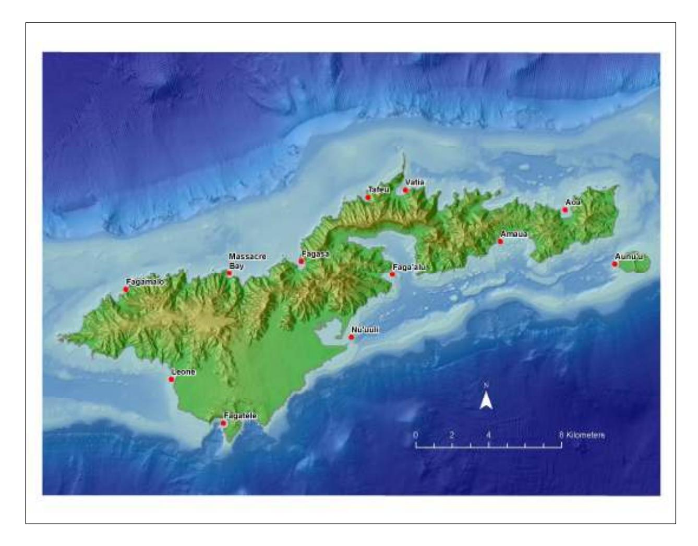

Figure 1. Map of Tutuila with the core slope sites shown.

 The benthic methods were the same as in 2011. In the core monitoring, four 50-m tapes were laid on a depth contour between 8 and 10 m deep. A space between them of about 10 m was kept. Benthic categories were recorded under each 0.5 m point on the tape. Benthic categories included live coral, dead coral, dead coral with algae, crustose calcareous algae, branching coralline algae, fleshy macroalgae, turf algae, rock, sand, rubble, soft coral, and sponge. "Branching coralline algae" included a soft feathery species that was the most common in that category. That species is *Cheilosporum spectabile*. Any rock that is not white has turf on it, and was recorded as turf. Corals were identified to lifeform, genus, and species when possible, and if the macroalgae was *Halimeda* or *Dictyota*, or something else that was identifiable, that was recorded in as

much detail as possible (usually genus). Soft corals were recorded to genus when possible. Hard coral lifeforms included encrusting, massive, foliose, branching, columnar, submassive, mushroom, *Millepora*, *Acropora* branching, *Acropora* table, *Acropora* digitate, and *Acropora* encrusting. Only the top visible layer was recorded of any multilayer formations such as corals or macroalgae, so all categories of cover add up to 100%. Diurnal, non-cryptic macroinvertebrates were counted in a half-meter wide belt transect beside each 50 m tape. Invertebrates were identified to the most detailed level possible. Spaces between coral branches were not searched. Hard and soft corals were not counted. Horizontal visibility was recorded using the tape. Two transect tapes were recorded on the first dive, and an additional two tapes were done on the second dive. Sites were re-located using the GPS and markers as indicated in the 2005 report. One day was required for each site. In 2008, a total of 12 sites were recorded, including the original 11 plus Masacre Bay. For 2011,10 sites were recorded since the lack of a working boat near the end of the year restricted monitoring fieldwork. Damage to boat ramps were repaired early in the year, facilitating monitoring work.

 As in 2007-2012, the rugosity measurements were omitted, because a third team member was not available and when included it lengthened dive times to the point where running out of air was a distinct possibility, thus reducing the margin of safety. Further, it appears that the measurement depends primarily on exactly where the chain falls, and that changes in rugosity caused by coral growth will take quite a few years before they would be detectable. A hurricane could make changes in rugosity quickly by removing corals, and if significant hurricane damage occurs, the rugosity measurements can be repeated. Until changes in coral cover or other rugosity changes are apparent, repeating the measurement of rugosity is not worth the increased risk of running out of air. In future years it is hoped that an additional team member can record the rugosity measure, or additional boat dives are available to take the rugosity measure. In the meantime, it will be considered a lower priority item, and will be done on an opportunistic basis.

 When laying the tape, the primary consideration is to keep the tape between 8 m and 9 m deep. The tape is passed along the sides of projections, including live corals such as *Pocillopora* and table corals, which usually have an overhanging side. If it is passed around first one side of one projection and then the other side of another, it is anchored securely from wave action moving it either way at that point. An attempt is made to anchor the tape in this fashion as often as possible, but in some areas there is little to anchor the tape on. A continuing problem is what to do about clefts in the reef. A cleft that is narrow and deep is crossed straight to an anchoring point on the other side. If it is large, then the tape may be laid along one side of it, going up toward shallower water but staying at 8-9 m depth, and then when the bottom rises to that depth, crossing to the other side and continuing on that side out of the canyon. The principle problem with that is finding an anchoring point near the head of the canyon that can hold the tape at the head. The tape is read at each point by reading the substrate under the point at the time at which the diver is directly above the point. A string and weight are not used, as surge and the movement of the tape in the surge makes that a much more difficult and slow procedure. If the tape is stretched between two points far apart and the surge is heavy, the tape can move a meter or more in either direction with each wave. This opens up an opportunity for bias, as the point on the tape sweeps across a variety of benthic patches. If the point on the bottom is recorded that is first seen from a vertical viewpoint, then bias is

minimized. An attempt is made to minimize bias in laying the tape by choosing a route based on depth and anchoring points for the tape, not the substrate.

 The direct observation underwater of what is under points makes it easier to identify species, and so allows greater taxonomic resolution than video techniques.

 For coral biodiversity, one hour search dives were conducted at each site. The dive begins at the bottom of the reef (but always well above 30 m deep) and continues as a roving dive as the diver ascends up the slope, searching for as many coral species as can be found. The presence of coral species is recorded underwater, and once out of the water, estimates of abundance of each species are recorded on a 0-5 ("DACOR") scale, with the names "not found," "rare," "uncommon," "common," "abundant," and "dominant." Rare was defined as just 1-2 colonies, and dominant was defined as composing more than half of all corals. The other categories were intermediate values, but not defined as individual corals were not counted, since that would greatly slow the survey and reduce the number of species found. This technique compliments the transect tapes since it covers the entire depth range of the slope, and produces a much larger sample that includes much rarer species than the transect tapes which only produce data on 100 points per tape. So the sample is much larger than the transects, but the quantitative accuracy is much lower. It compliments but does not replace the transects. Sites inside the harbor were added this year in addition to the usual sites outside the harbor.

 Data collection on reef flats was continued, using transects. In addition, coral diversity data from roving search snorkels on reef flats was carried out for the first time. The methods for both are similar to that on reef slopes. Reef flats are quite different from reef slopes, are a large and important part of the reefs, and are subject to different disturbances than reef slopes, such as low tide events that have no effect on reef slopes. Monitoring reef flats is an important compliment to monitoring reef flats.

GPS of the locations of the sites are listed below in Tables 1, 2, and 3.

Table 1. Reef Slope Monitoring Sites:

| Site         | GPS Coordinates             |
|--------------|-----------------------------|
| Fagamalo     | -14º 17.872S, -170º 48.726W |
| Masacre Bay  | -14º 17.374S, -170º 45.577W |
| Fagasa       | -14º 17.016S, -170º 43.383W |
| Tafeu        | -14º 15.109S, -170º 41.354W |
| Vatia        | -14º 14.888S, -170º 40.205W |
| Aoa          | -14º 15.474S, -170º 35.332W |
| Aunu'u       | -14º 17.076S, -170º 33.818W |
| Amaua        | -14º 16.418S, -170º 37.312W |
| Faga'alu     | -14º 17.404S, -170º 40.598W |
| Nu'uuli      | -14º 19.287S, -170º 41.850W |
| Fagatele Bay | -14º 21.859S, -170º 45.753W |
| Leone        | -14º 20.534S, -170º 47.339W |

Table 2. Reef Flat Monitoring Sites (approximate locations from a map):

| Fagamalo     | -14º 18.2 S -170º 49.4 W    |
|--------------|-----------------------------|
| Fagasa       | -14º 17.5 S -170º 43.5 W    |
| Vatia        | -14º 15.3 S -170º 40.2 W    |
| Aoa          | -14º 15.8 S -170º 35.3 W    |
| Alofau       | -14º 16.9 S -170º 36.3' W   |
| Amaua        | -14º 16.7 S -170º 37.3 W    |
| Gataivai     | -14º 17.3 S -170º 40.8 W    |
| Faga'alu     | -14º 17.9 S -170º 40.9 W    |
| Coconut Pt.  | -14º 19.2 S -170º 41.7 W    |
| Fagatele Bay | -14º 22.1 S -170º 45.5 W |
| Leone        | -14º 20.6 S -170º 47.1 W |

Table 3. Bleaching Monitoring Sites (approximate locations from a map):

| Site         | Coordinates                |
|--------------|----------------------------|
| Airport pool | -14º 20' S -170º 42' |
| Alofau       | -14º 16.9 S -170º 36.3' |

Dates of collection of data are shown in Tables 4-9.

Table 4. Dates of collection of benthic transect data for each reef slope site.

| Location |          |
|----------|----------|
|          | Date     |
| Fagamalo | 3/4/13   |
| Fagasa   | 2/13/13  |
| Tafeu    | 5/17/13  |
| Vatia    | 5/15/13  |
| Aoa      | 2/27/13  |
| Aunu'u   | 12/??/12 |
| Amaua    | 11/30/12 |
| Faga'alu | 10/12/12 |
| Nuu'uli  | 11/23/12 |
| Fagatele | 11/28/12 |
| Leone    | 11/27/12 |

Table 5. Dates of collection of benthic transect data for each reef flat site.

| Location | Date    |
|----------|---------|
| Fagasa   | 7/19/12 |
| Vatia    | 7/20/12 |
| Aoa      | 7/23/12 |
| Alofau   | 7/24/12 |
| Amaua    | 9/13/12 |
| Gataivai | 7/27/12 |
| Faga'alu | 9/7/12  |
| Nuu'uli  | 3/27/13 |
| Fagatele | 1/18/13 |
| Leone    | 7/26/12 |

 Monitoring of bleaching continues as before, with visual estimates of the amount of staghorn bleached in different areas of the airport and Alofau pools, about biweekly. Bleaching on the reef flat and slope are also recorded at Alofau each time data is taken.

## **Results**

 For background information on the coral reefs of American Samoa, see Wells (1988), Craig et al. (2005), Sabater and Tofaeono (2006, 2007), Whaylen and Fenner (2006), Fenner (2008a,b), Fenner et al. (2008), Birkeland et al. (2008), Brainard et al. (2008), Craig (2009), Fenner (2009; 2010, 2011, 2012, 2013), Sabater and Carroll (2009), PIFSC (2011) and Carroll (2012).

### **Reef Slopes**

 Benthic cover on each of the 11 sites is shown in Figure 2 below. There are large differences between sites. Coral cover is highest at Aunu'u, Fagamalo, Leone, Aoa, and Fagatele. It is lowest in Vatia, Amaua, and Faga'alu. Coral cover ranged between 13% and 59%, with a mean of 36%.

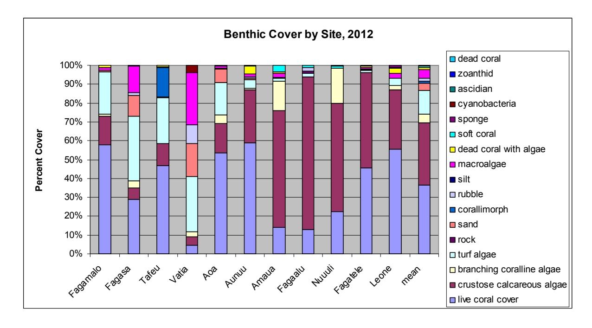

Trends in benthic cover are shown in Figure 3 below. There has been an over all increase in mean coral cover from 25.5% in 2005 to 36.3% in 2012. There was a slight decrease in the first three years, but steady increase since then. The greatest increase was between

2011 and 2012, when it increased 5.3%. That is a substantial increase for just one year, so perhaps it should be treated with some caution until we get next year's data. But in any case, the increase in coral cover appears to be solid.

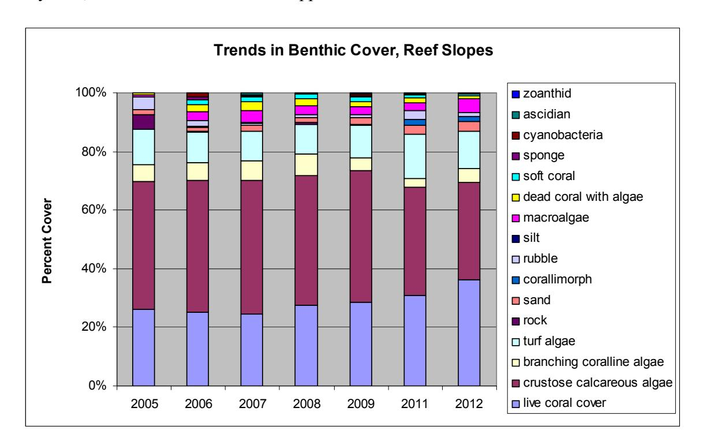

Figure 3.

The increase in coral cover has come at the expense of coralline algae, which has decreased. Branching coralline algae and turf appear to be relatively stable, though turf increased some in the last two years. Macroalgae also appears to be relatively stable, and averaged 3% cover over the 7 years of data. The Caribbean had between 2% macroalgal cover in the Caribbean in the 1970's (Côté et al. 2005; Schutte et al. 2010; Bruno et al. in press) and 6% cover (Bruno et al. 2009), and the Great Barrier Reef had about 4-9% macroalgal cover in 1996-2006, while the Caribbean had about 40% macroalgal cover in 1996-2006, and Florida had about 13% macroalgal cover at the same time (Bruno et al. 2009; Hughes et al. 2010). Bruno et al. (in press) reviewed the problem of baselines for macroalgae, concluding that the Caribbean was likely not a representative location in the 1970's and showing that even remote, near-pristine Pacific areas have much higher macroalgae than the early Caribbean. They also show that Tutuila and most of American Samoa has about the same macroalgae cover as the US remote Pacific Islands and the uninhabited islands in the Northern Marianas, and less macroalgae than the Northwest Hawaiian Islands (Vroom et al. 2006; Vroom, 2010; Bruno et al. in press).

 A comparison of benthic cover on the north side of Tutuila compared to the south side is shown below in Figure 4. The north side has higher coral cover than the south side, the south side has more crustose calcareous algae (CCA) than the north side, the north side has more turf than the south side, the south side has more branching coralline algae (BCA) than the north side, the north side has more sand than the south, the north

has more corallimorph than the south side, and the north has more macroalgae than the south side. The causes of most of these differences is not known, and some of the smaller differences may be due to the chance locations of the sites. However, the higher crustose calcareous algae on the south side is likely due to the fact that for half the year the wind comes from the east and so waves provide more water motion on the south side, since the island is at an angle so waves from the east strike the south side.

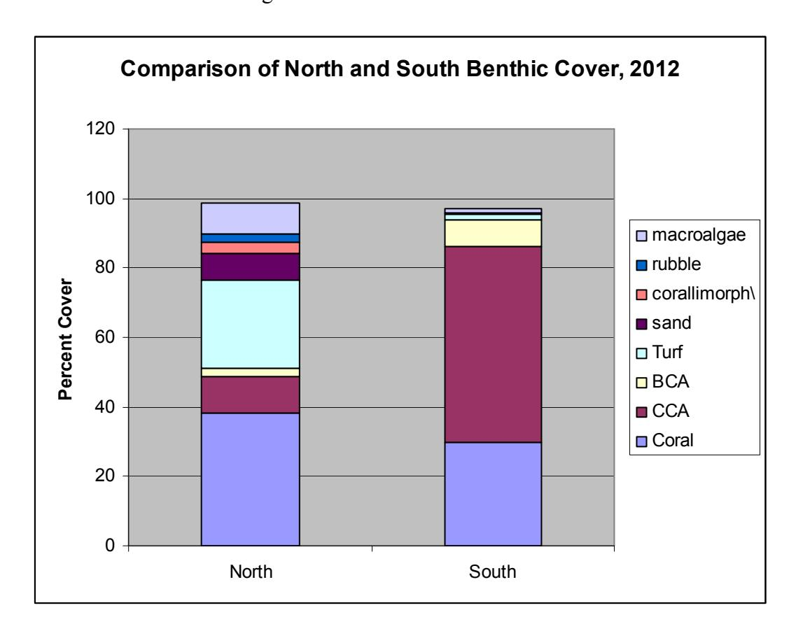

Figure 4.

 The coral cover on the slopes of American Samoa compare favorably with averages for most areas of the world, as shown in Figure 5, based on transect data. The coral cover on American Samoa is higher than the averages on the South Pacific (SPC, 2005; Bruno and Selig, 2007) the whole Pacific (Bruno and Selig, 2007), the Great Barrier Reef, the Caribbean (Gardiner et al 2003; Jackson et al in press) and Florida. New data from Houk and Musberger (2013) are added for the near-pristine Rongelap Atoll and populated Majuro Atoll in the Marshall Islands (there had been informal claims that Rongelap had 100% coral cover). American Samoa has 36% coral cover compared to only about 8- 18% in the Caribbean and 4% in Florida. Coral cover dropped drastically in the Indian Ocean in 1998, with places such as the Maldives, Seychelles and Chagos reported to have mortality as high as 90%, but a few other places had little mortality, like Rodriques. The Maldives are reported to be showing recovery, while the Seychelles are not. The Indian Ocean had an average of about 38% coral cover before the 1998 El Nino mass bleaching, then dropped to an average of 10%, and then recovered to about 30% cover

(Ateweberhan et al. 2011). American Samoa presently has higher coral cover than most major regions of the world.

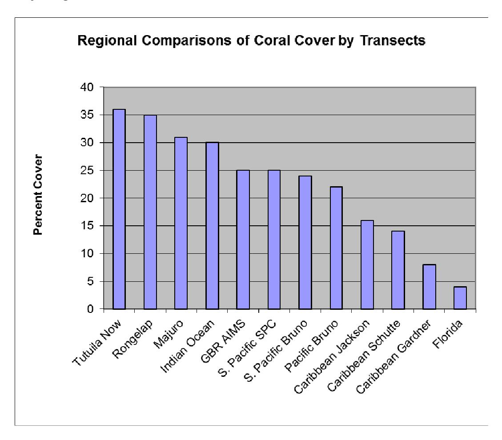

Figure 5.

 However, coral cover has declined in most parts of the world, and the available information indicates that most were originally higher than the present cover in American Samoa (Figure 6). The Caribbean in 1977, the Pacific in 1980, and the Indian Ocean in 1977-1993 have all been reported to have had higher coral cover than Tutuila now (Gardiner, 2003; Bruno and Selig, 2007; Schutte et al. 2010; Ateweberhan et al. 2011; Jackson et al. in press). Outer reef slopes at Rongelap (with no occupants for 57 years) have about 65% coral cover, but that is based on just a few sites (P. Houk, personal comm.). Scotts Reefs in northwestern Australia had about 45-60% coral cover before the El Nino 1998 mass coral bleaching event, and about 38-45% after it recovered (Gilmore et al. 2013; Rupert et al. 2013). Rowley Shoals, also in northwestern Australia, had about 30% coral cover before cyclone damage in 1994 and also after recovery (Rupert et al. 2013). There are two estimates of coral cover in American Samoa before the outbreak of crown-of-thorns in 1978 ate much of the coral (Wass, 1982; Maragos). Both are above the present coral cover, but they are estimates not quantitative measures, and may well have been from sites selected to be better than average. A survey by John McManus of

the available literature on near-pristine reefs produced an average of about 40% coral cover (McManus et al. 1995), while the Coral Reef Ecosystem Division of NOAA produced an average of 35% cover for the many near-pristine reefs of the U.S. Pacific (Fenner et al. 2008). Most of these reference coral cover levels are higher than the present cover in American Samoa, but some (including the Pacific, Indian Ocean and McManus's value for pristine reefs) are not much higher and the CRED value is slightly lower. Note that the highest values are all for individual small areas, not averages of large areas. The average cover of the Caribbean, Pacific, Indian Ocean, McManus's pristine reefs and CRED's pristine reefs is 42%. Coral cover in American Samoa is now at the lower end of the range for average reefs in the past around the world, present nearpristine reefs, and estimates of previous cover in American Samoa. It is also just 6% below the mean of the first surveys of the reefs of the Caribbean, Pacific, and Indian Oceans plus the present pristine reefs.

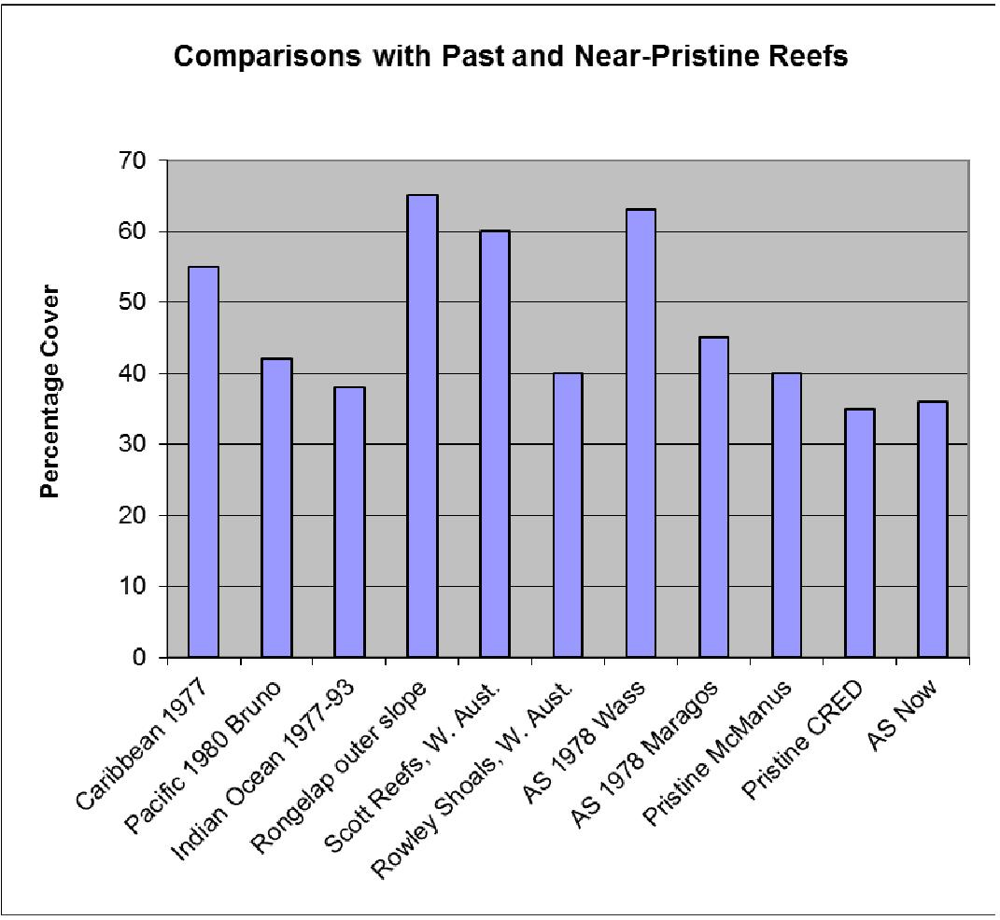

Figure 6.

 The data presented above are based on transects. Most of the available data on reefs around the world is from transects. However, transects are rarely taken at random locations, and there is evidence that there is a bias toward higher coral cover. When choosing transect locations, areas of low coral cover including sandy patches, rubble, or bare rock, are often avoided. The Reef Check instructions to volunteers direct them to survey the best available reefs in their area, and Reef Check surveys are a large majority of the transects taken in recent decades (but not earlier), biasing recent world average coral cover upward. Another way to survey is by towboard, where a person is towed over large areas of reef. With a towboard, there is no chance to pick the best (highest coral cover) areas, and so the coral cover recorded is generally lower than in transects. But it is more representative of the entire reef and not just the best areas. The NOAA CRED program has gathered both transect and towboard data, and their transect data is presented above. Below, Figure 7 is presented from Vroom (2010) in which the live coral cover recorded by towboard (by a camera that takes pictures automatically) around all of the U.S. Pacific Islands, including remote, near-pristine islands. The American Samoan islands are shown in the far right, with "TUT" being Tutuila. Tutuila had an average of about 17.5% coral cover in the CRED towboard surveys, compared to 35% in the CRED transects (Figure 6). Figure 7 shows that the mean coral cover for islands in American Samoa was lower than the mean for the Pacific Remote Island Areas (PRIA) which are all near-pristine, but higher than the near-pristine islands in the Marianas and Hawaiian chains, which are the islands to the left for each of those two areas in the graph below. Thus, American Samoa is in the mid-range for coral cover at near-pristine reefs in the U.S. Pacific, when measured by towboard.

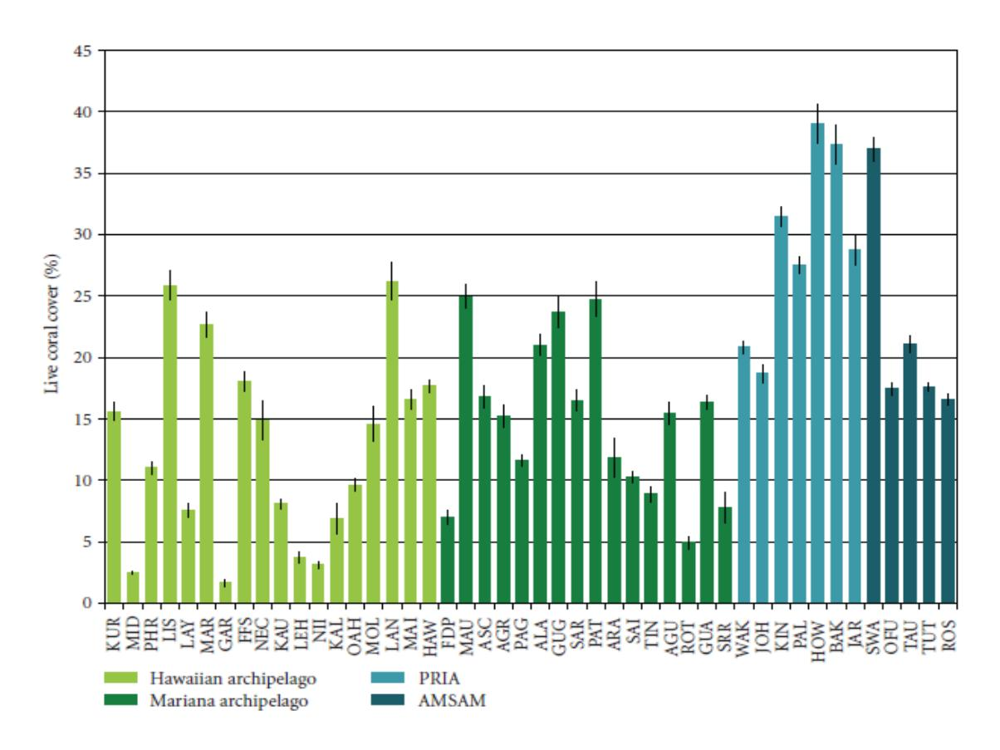

Figure 7. From Vroom (2010).

 Figure 8 summarizes the information in the previous figure. The mean for American Samoa (all islands) is higher than the means for the Marianas and Hawaii, but less than that for the PRIAS (Pacific Remote Island Areas: Howland, Baker, Jarvis, Palmyra, Kingman, Johnston and Wake Is.). The uninhabited islands in the Marianas and Hawaii are at higher latitudes than American Samoa, and most of the PRIAS are at lower latitudes. Most of the near-pristine islands and reefs are smaller than all but Rose and Swains in American Samoa (which have typical cover for American Samoan Islands). So American Samoa is within the range of variation for near-pristine island areas in the US system. The mean for American Samoa is slightly higher than the means for nearpristine U.S. reefs, taken either by region or by island. This is consistent with the view that American Samoan reef coral cover is in relatively good condition overall.

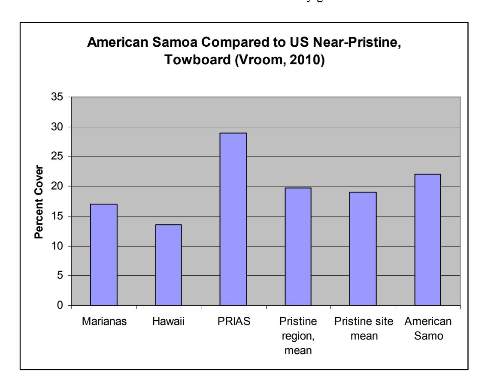

Figure 8. Mean coral cover from towboard surveys based on Figure 5 from Vroom (2010).

 A new publication (De'ath et al. 2012) reports coral cover from the Great Barrier Reef (GBR) from 1985 to 2012 based on towboard data. That data, shown in Figure 9, shows large decreases in coral cover recently, with mean coral cover now about 10%. The Great Barrier Reef has long been considered one of the more pristine reef systems in the world, with Pandolfi et al. (2005) reporting it as near to pristine as the NW Hawaiian Islands. But Tutuila now has about 17.5% (Figure 7) and American Samoa averages 22% (Figure 8) coral cover from towboard compared to 10% on the Great Barrier Reef, measured by towboard. At the same time, the GBR had about 28% coral cover in towboard surveys in 1985 and the northern GBR which has very little human impact has not declined and still has about 24% cover. Both are higher than Tutuila now. This is consistent with the other information indicating that the Tutuila reefs now have more coral than elsewhere, but not as much as reefs once had.

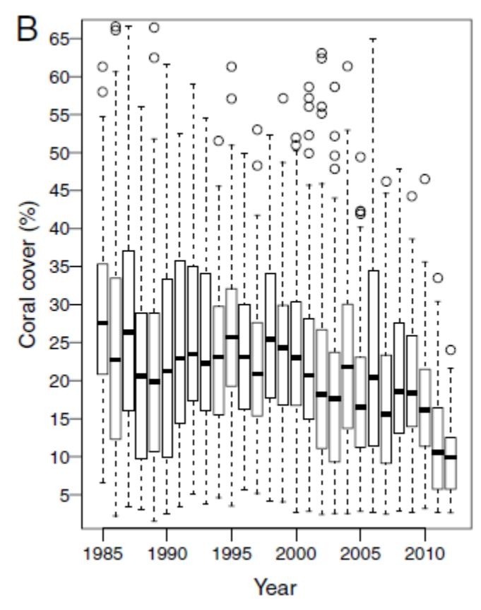

Figure 9. From De'ath et al. 2012.

Figure 10 compares the live coral cover recorded by towboarding from the Great Barrier Reef and American Samoa. American Samoa and Tutuila now have higher coral cover in towboard surveys than the Great Barrier Reef as a whole, but less than the northern Great Barrier Reef and the Great Barrier Reef in 1985.

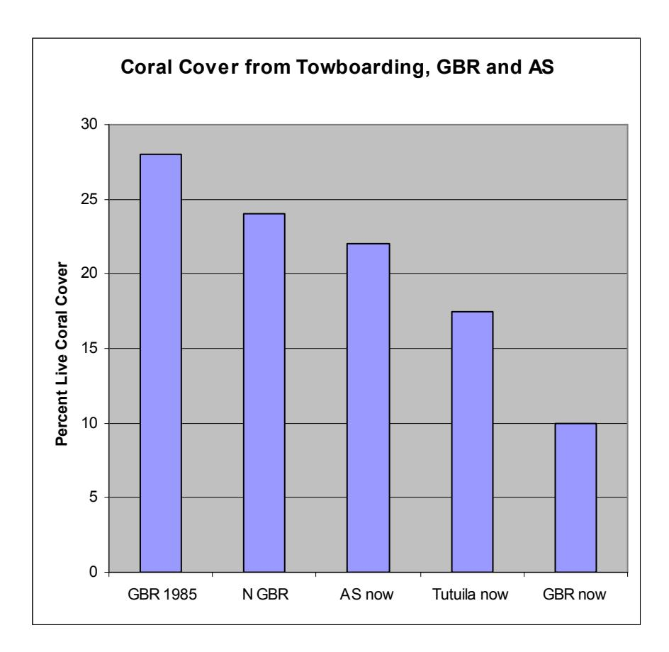

Figure 10.

All major areas of the world's reefs have been reported to have decreased in coral cover (Côté et al. 2006). In contrast, coral cover in American Samoa is currently increasing slightly. Coral cover on Tutuila increased an average of 1.54% per year from 2005 to 2012. The NOAA CRED program also recorded an increase of coral cover around Tutuila from 2002-2010 (PIFSC, 2011).

The rate of change of coral cover compared to different oceans, is shown in Figure 11. In all three of the major world ocean with coral reefs, coral cover has declined since monitoring began. Declines have been greatest in the Caribbean and least in the Indian Ocean. Interestingly, the South Pacific region did not decline, the only region in the Pacific that did not (Bruno and Selig, 2007). In contrast, Tutuila gained 1.5% coral cover per year on the average, while American Samoa as a whole gained 0.6% coral cover per year. These data support the view that reefs are relatively healthy in American Samoa. A note of caution is warranted, since the record from this monitoring program is much shorter (7 years) than the time span analyzed in the studies of the Caribbean, Pacific, and Indian Oceans. During shorter periods, coral cover can go up, down, or be stable, even though in the long term they may go down. For instance, Ninio et al. (2000) reported that coral cover increased on the Great Barrier Reef from 1992 to 1997, and Sweatman et al. (2011) reported a small decline, yet we know that over the long run it declined much more (De'ath et al. 2012), with strong decline in the last couple years. Further, the same studies plus Bruno and Selig (2007) document smaller regions within a large region can have quite different trajectories from each other and the average of the whole reef system. American Samoa and Tutuila in particular are the size of only a small part of the Great Barrier Reef or the South Pacific.

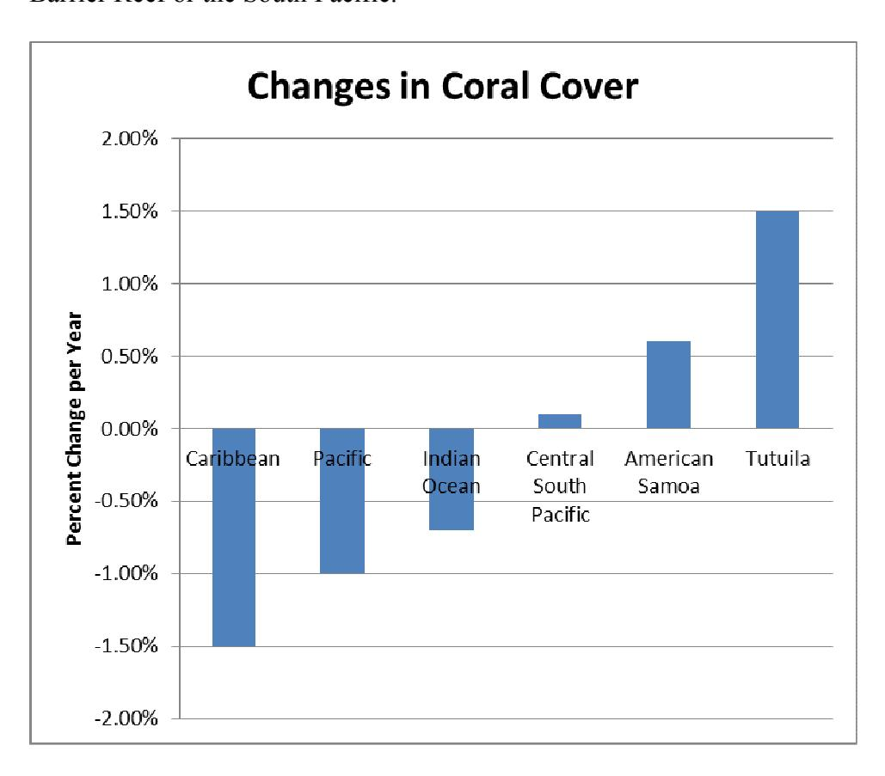

Figure 11. The rate of change of the major oceans compared to Tutuila (this study) and American Samoa as a whole. The Caribbean figure is derived from Gardiner et al. (2003), the Pacific and Central South Pacific figures from Bruno and Selig (2007), the

Indian Ocean from Ateweberhan et al. (2011), the Tutuila figure from Figure 2, and the American Samoa figure from PIFSC (2011).

The live coral cover index (live coral/(live coral + dead coral) remains high (Figure 12). There was a dip of unknown cause around 2007, but no overall trend. The live coral index remains above the Reef Check averages for the Indo-Pacific and world and a value for Indonesia (Edinger et al. 1998), and well above a value for the Philippines (Gomez et al. 1994a, b) and the PROCFish average for the South Pacific (Secretariat of the Pacific Community, 2005). The proportion of corals that are alive is an important measure of reef health. There is very little dead coral around Tutuila currently. A reef where most corals are alive is healthy compared to a reef where most corals are dead.

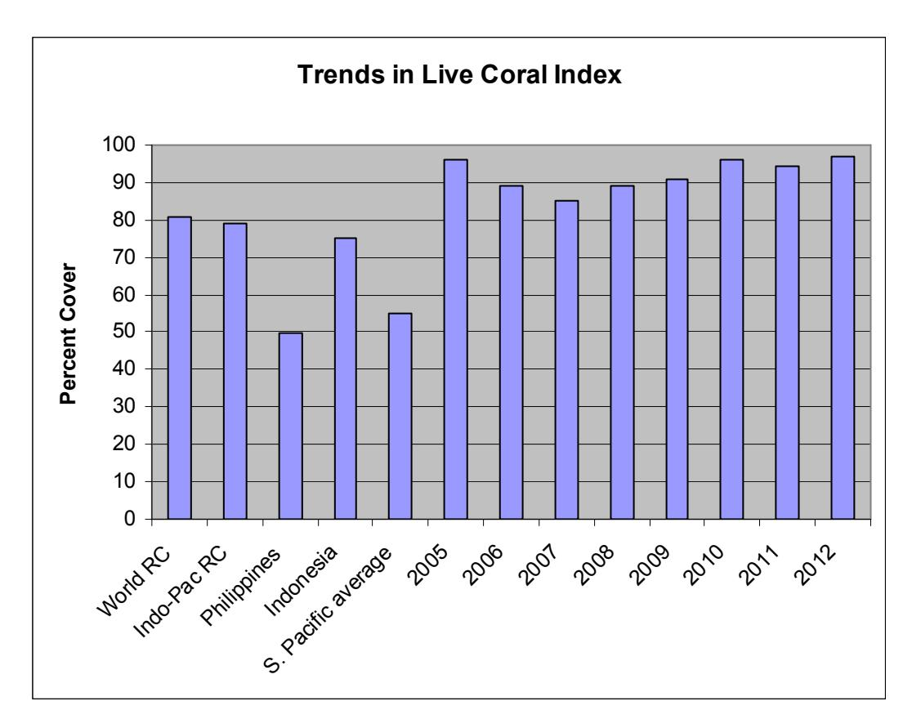

Figure 12. "RC" stands for Reef Check.

 Coral and crustose calcareous (CCA) algae are often considered good for coral reefs, while other algae may be considered bad or at least less good. Figure 13 shows trends in combined categories. The category combining CCA and coral has over 60% cover, and cover has increased slightly over the monitoring period. The turf algae plus macroalgae (MA) category is much smaller, around 20% or less, and shows no trends. American Samoa has a good balance of these categories.

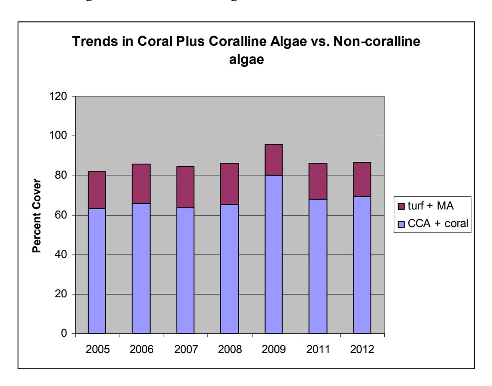

Figure 13.

 Some of the macroalgae, such as the green alga *Halimeda* , branching coralline algae *Cheilosporum spectabile*, a large, brown, foliose-encrusting coralline algae *Peyssonnelia*  and the brown alga *Padina*, produce some calcium. Thus, they contribute calcium to building the geological reef structure, which is often considered a good thing. *Halimeda* is by far the largest single component of macroalgae on the reef slope, though a few places like our site at Coconut Point have quite a bit of *Cheilosporum spectabile*. *C. spectabile*, brown *Peyssonnelia* and *Padina* are all lightly calcified and contribute relatively little calcium to the reef, but *Halimeda* is relatively heavily calcified and contributes much more. Crustose coralline algae often occurs under other algae, so the amount of CCA may be underestimated. Figure 14 below shows trends in the combination of coral, coralline algae, and *Halimeda*, compared with non-calcareous algae (primarily turf) and any other non-calcifying cover. Over 70% of the substrate is covered with calcifying cover, which should be a good value.

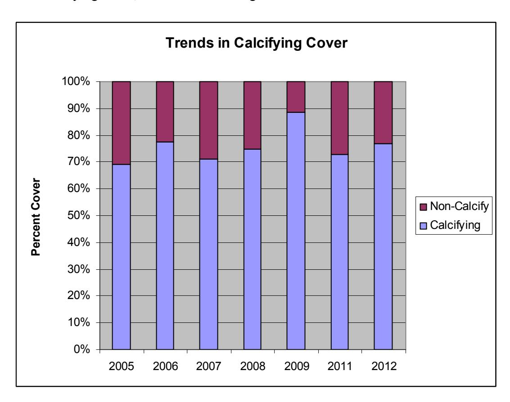

Figure 14.

## **Trends at Individual Sites**

#### Fagamalo

Figure 15 below shows trends in benthic cover at Fagamalo. Coral cover has increased steadily and strongly since 2005. The increase in coral cover came at the expense of crustose calcareous algae. It appears that this represents a real increase in coral cover.

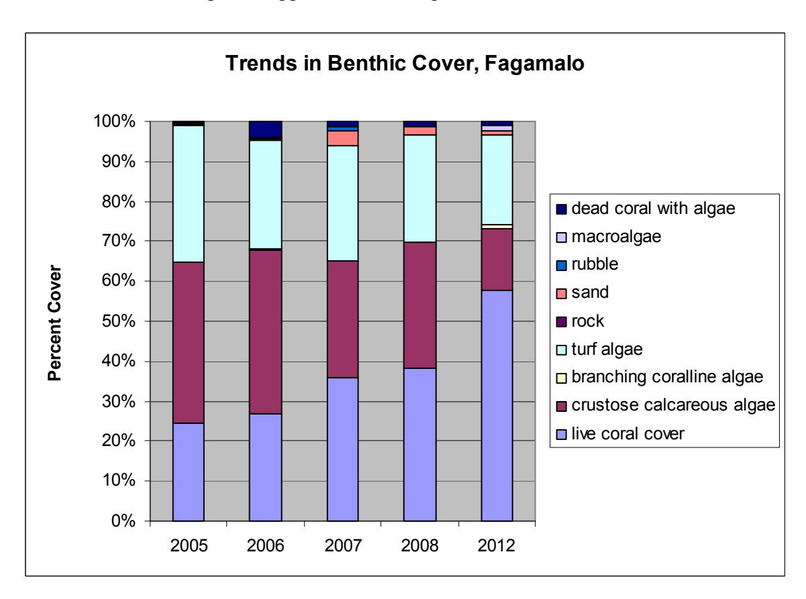

Figure 15

#### Fagasa

Figure 16 below presents the trends at Fagasa. Coral cover has increased very steadily at Fagasa. The reef that was surveyed in the early years was steep and smooth with very few corals, it was not far above the sand and rubble floor of the bay. The slope was covered with filamentous algae which was brown with sediment in it. Now, surveys are carried out on an irregular upper slope that has lots of corals, including corals that seem too large to have grown that large in just 8 years, however, corals can grow fast. It could be that somehow the location of the transects has changed, even though the same GPS coordinate is being used. But the increase has been continuous over the years, instead of all being a jump between two years, which is what a single change in location would cause. So it may be that the increases recorded are real. The increases in coral cover came at the expense of decreasing turf algae.

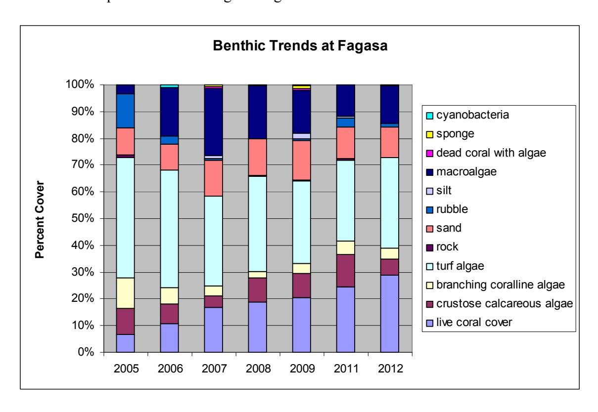

Figure 16.

#### Tafeu

Figure 17 presents the trends in benthic cover at Tafeu. There was a small increase in coral cover over the years until 2012, when coral cover decreased to near the original levels. Initially corallimorph cover increased along with the increasing coral cover, and both increases were at the expense of turf algae. It appears that over the long term, Tafeu has been relatively steady with high coral cover, and the corallimorph has now stabilized.

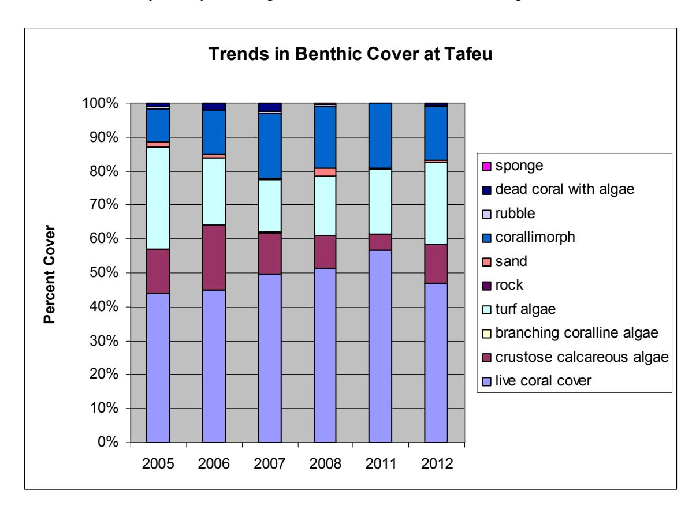

Figure 17.

#### Vatia

Figure 18 below gives the trends in coral cover for Vatia. The site is on the middle of the east side of the bay. The graph shows a decline of coral cover over the period of the program, with the largest decrease between 2008 and 2011. The inner part of the bay was damaged very heavily on the east side in the tsunami of Sept. 29, 2009. The outer part of the bay was heavily damaged by Hurricane Wilma in 2010. The transects span the area from the inner bay to the outer bay, so the decrease in coral cover recorded most likely reflects the damage done by both events, and unfortunately data was not taken between the two events that could document how much of the change came from each event. The graph also shows a smaller decline over the four years before these events, and a decline in the two years since the events. The decline before coincided with a large increase in macroalgae as seen in the graph (dark purple). The macroalgae that increased was *Dictyota*, a brown alga that fish don't like to eat, because it is chemically defended. It is a genus that has been reported to be one of the algae that take over when there is a phase shift from corals to algae, thus it can be considered a problem alga. The bay has fairly murky water, which is murkier near the head of the bay than the mouth. Water clarity is one of the best indicators of water quality, and low clarity indicates low water quality. A narrow bay like Vatia or the harbor has less water circulation at the head and better flushing near the mouth. Nutrients or other pollutants in runoff which enters the bay

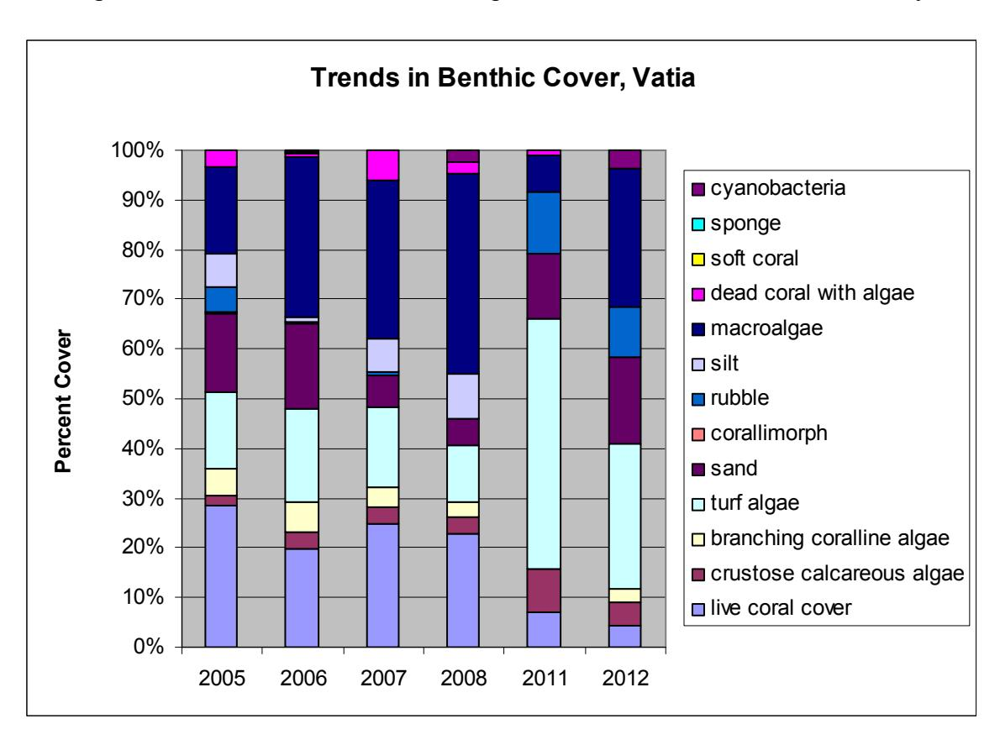

Figure 18.

builds up near the head of the bay, but is flushed out near the mouth of the bay. It is highly likely that nutrients have built up at the head of the bay. The shallow part of slope on the east side of the inner bay was heavily damaged by the tsunami, and immediately a dense cover of green filamentous algae covered everything, and has continued since then, with no sign of recovery beginning the last time it was examined. The green filamentous algae along with the *Dictyota* brown algae point to a buildup of nutrients near the head of the bay which needs to be addressed. The lack of recovery at the head of the bay indicates that the reef there is not resilient. Near the mouth of the bay, there is little filamentous algae or *Dictyota*, and it appears that recovery has begun, indicating resilience.

#### Aoa

Figure 19 below shows the trends in benthic cover at Aoa. Coral cover did not show net change until between 2007 and 2008, at which an increase to a new higher level occurred. This is a pattern that could be produced by a change in transect location, but there is no clear evidence of such a shift. Coral cover at Aoa is now quite high at over 50%, one of the highest of the sites in the monitoring program. The increase in coral cover came at the expense of crustose calcareous algae.

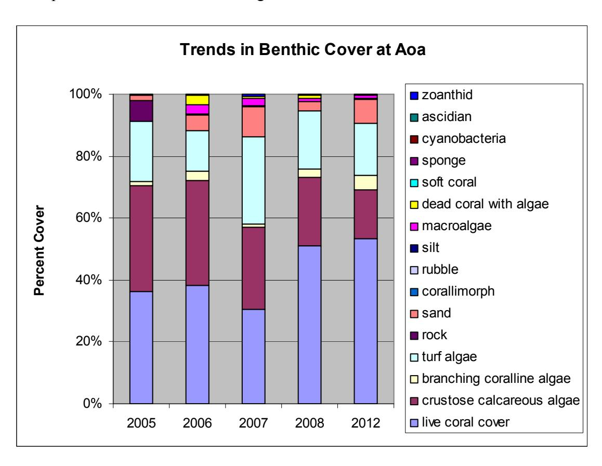

Figure 19.

#### Aunu'u

Figure 20 below shows trends in benthic cover at Aunu'u. Coral cover has been high and steady through the years of the monitoring program. There may be a very slight increase in coral cover. One should not conclude that coral cover is as high everywhere around Aunu'u since this seems to be an unusually good spot.

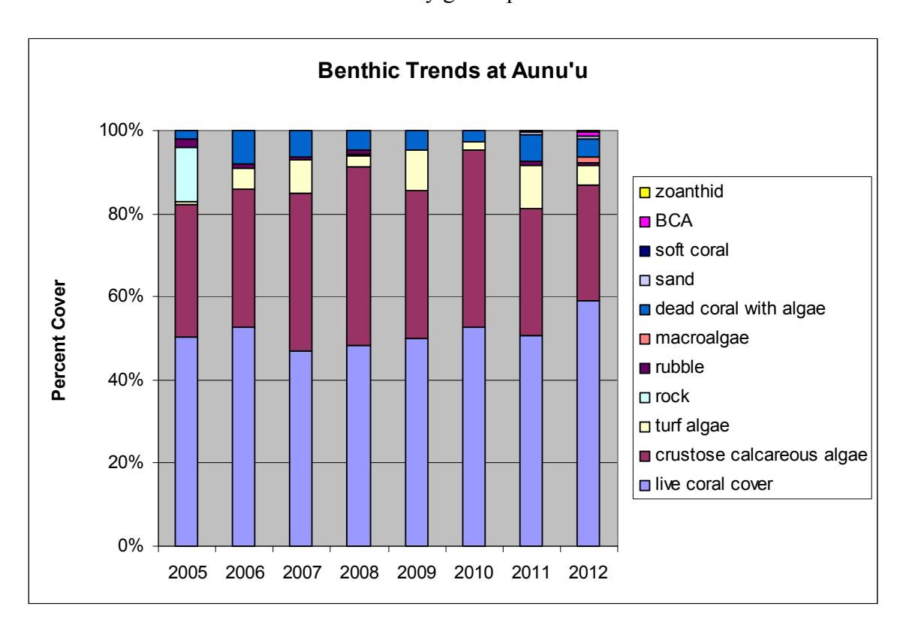

Figure 20.

#### Amaua

Figure 21 shows trends in benthic cover at Amaua. Amaua has had low, steady coral cover over the years of the monitoring program. Although crustose calcareous algae cover is high on this steep slope, which should indicate conditions that are good for coral, coral cover has not increased over time. It is not clear why coral has not increased.

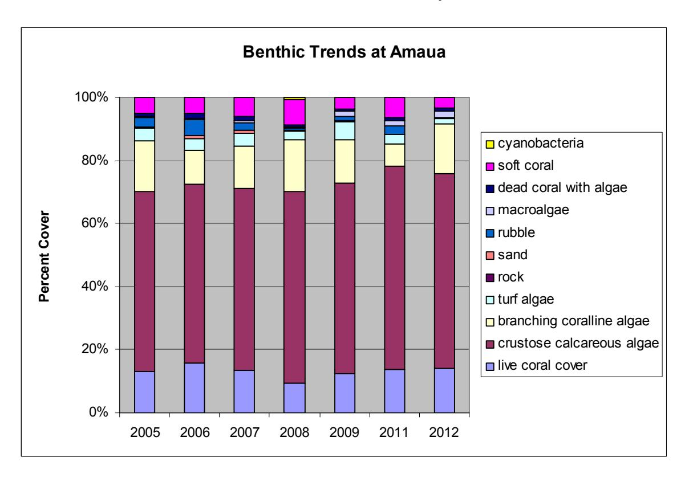

Figure 21.

#### Faga'alu

Figure 22 below presents the trends in benthic cover at Faga'alu. Coral cover has been low and very steady at Faga'alu for the duration of the monitoring program. Crustose calcareous algae has increased at the expense of turf, though turf has varied unsystematically, suggesting that small changes in transect tape locations hit or missed patches of turf. The transect area on the mid-slope of Faga'alu is on a large area of rubble covered with encrusting calcareous algae. The rubble is composed of cylindrical sticks which are clearly from some type of branching *Acropora*, most likely *Acropora intermedia* but possibly *Acropora abrotanoides* or a mixture of species. The corals were all dead, collapsed rubble when first seen, identical to how they look now. Thus it seems likely they were killed well before monitoring began. There is no sign of recovery. Interestingly, deeper on the slope, down at 18 m depth, there is a luxurious, high cover community of plate corals. Cover at 18 m was about 65% live coral before the tsunami. Thus, it would seem that water quality conditions were good for coral. It is not known what killed the *Acropora*, since *Acropora* are among the most sensitive genera of corals to bleaching, coral disease, hurricanes, and crown-of-thorns. It is not clear why there has been no recovery.

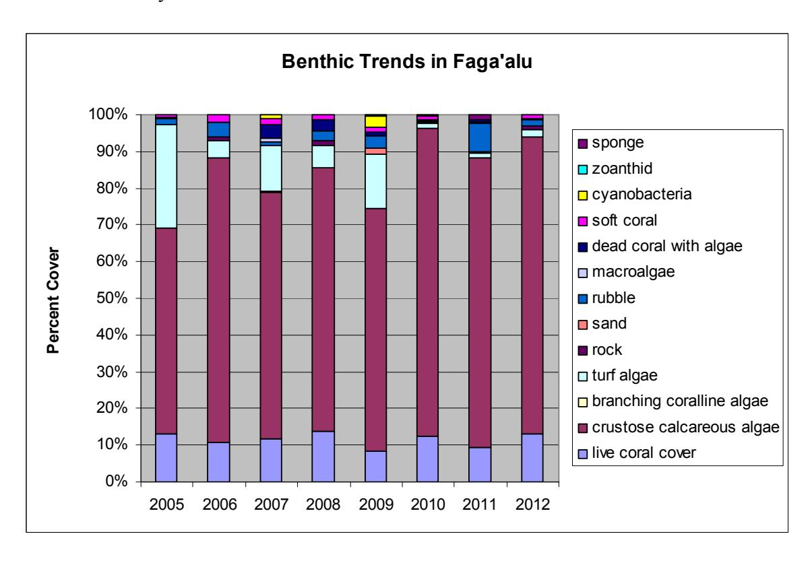

Figure 22.

#### Coconut Pt.

Figure 23 below shows trends in benthic cover at Coconut Point (Nu'uuli). Coral cover is moderate-low and steady. Branching coralline algae increased initially on this steep slope, then decreased and is now steady. It grew over and covered crustose calcareous algae which remained alive underneath it, and so when it decreased, the crustose coralline algae was again revealed.

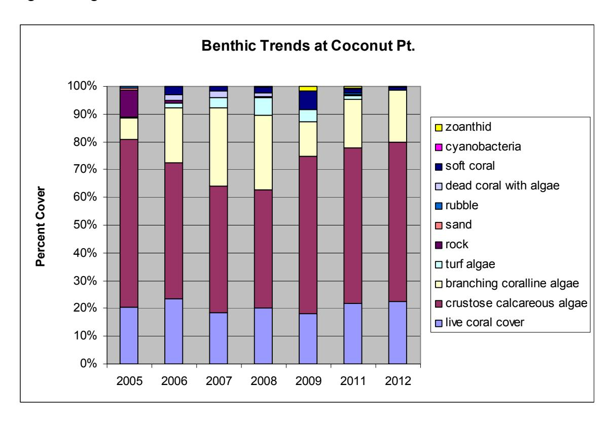

Figure 23.

#### Fagatele

Figure 24 below presents trends in benthic cover at Fagatele Bay. Coral cover has been steady, except during 2006 and 2007, when lower coral cover were recorded. It seems likely that in those two years the transects were not in the same location as in the other years. Coral cover is relatively high at this location on the slope at Fagatele Bay. This location is on the outer edge of the very gently sloping platform, just above the steep dropoff that goes down to about 30 m depth. It is not in one of the areas damaged by the tsunami in 2009. Coral cover in shallow areas is now lower due to the damage from the tsunami, however there was little or no damage in deeper areas such as the transect site.

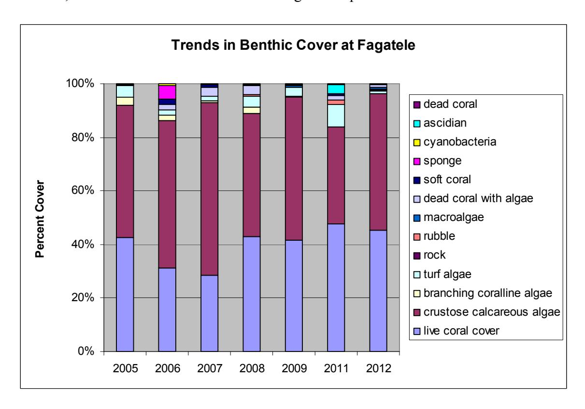

Figure 24.

#### Leone

Figure 25 below shows trends in benthic cover at Leone. Coral cover was initially steady, then increased, and now is stable at the higher level. This is surely a real change, as the starting point for the transects is a pinnacle that is re-located each year so the transect locations don't change much from year to year. This is now a particularly good site on the slope (although the reef flat is not good).

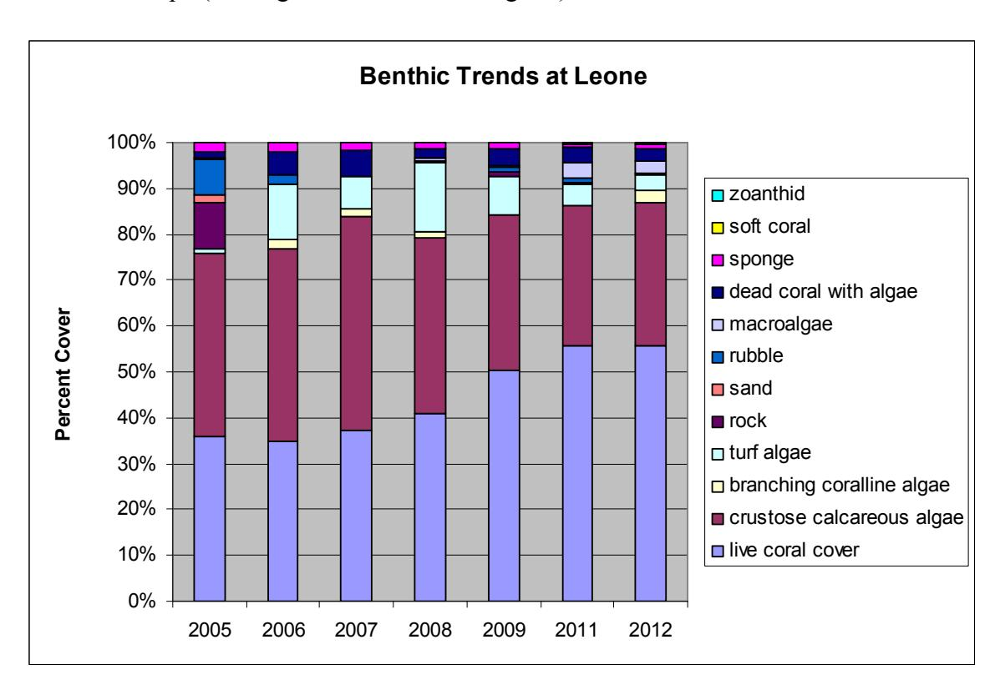

Figure 25.

Coral cover at individual sites show either an increase over the study period, are steady, or show a decrease. Table 6 summarizes the different trends at different sites. The trends were based on the difference between the 2005 and 2012 coral cover. Just one site showed a decrease, five sites were steady, and four sites showed increases. This indicates that while average coral cover is increasing, some sites show increases and others no change. Reefs on the Great Barrier Reef show a similar pattern (Sweatman, 2011). That seems more likely there, where reefs are much farther apart and events that affect one site seem less likely to affect other sites.

Table 6. Summary of Coral Cover Trends at individual sites.

|              | decrease | steady | , | increase |
|--------------|----------|--------|---|----------|
| Fagamalo     |          |        |   | Χ        |
| Fagasa       |          |        |   | Χ        |
| Tafeu        |          |        |   | Χ        |
| Vatia        | X        |        |   |          |
| Aoa          |          |        |   | Χ        |
| Aunu'u       |          |        |   | Χ        |
| Amaua        |          | Χ      |   |          |
| Faga'alu     |          | Χ      |   |          |
| Nu'uuli      |          | Χ      |   |          |
| Fagatele     |          | Χ      |   |          |
| Leone        |          |        |   | Χ        |
| total number | 1        |        | 4 | 5        |

### **Corals in Transects**

#### Lifeforms

The percent cover by different lifeforms (shapes) of corals in transects is shown in Figure 26. Encrusting corals have the most cover by far, followed by columnar, and then table, *Acropora* branching, massive and staghorn. Other lifeforms have very little cover. This is a typical pattern that is repeated every year. Encrusting is always the most common lifeform, followed by columnar.

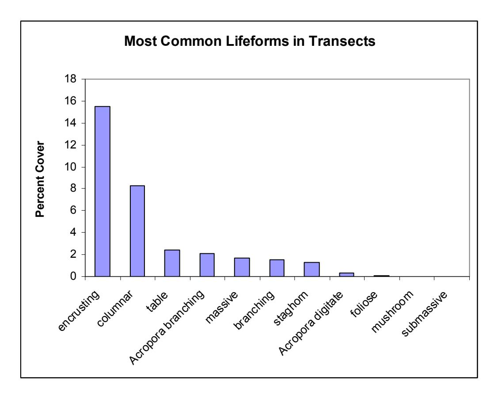

Figure 26.

### Genera

Coral genera with the most cover in transects are shown in Figure 27. This pattern is similar to those in previous years. *Montipora* has the most cover, followed by *Porites*, *Acropora*, and *Pavona*, and other genera have less cover.

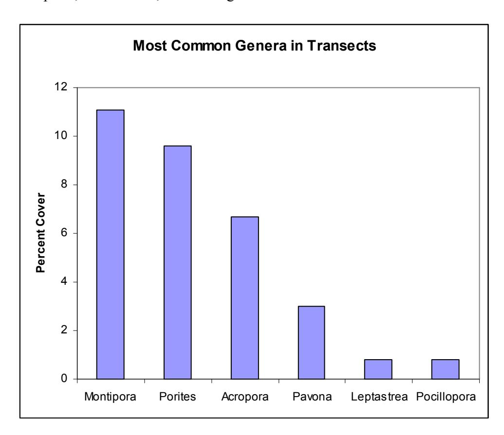

Figure 27.

The coral genera with the most species are shown in Figure 28. *Acropora* has the most species by far, followed by *Porites*, *Montipora*, *Goniastrea*, *Pavona*, *Leptastrea*, and other genera with less cover. Worldwide, *Acropora* has the most species, followed by *Montipora*, then *Porites*.

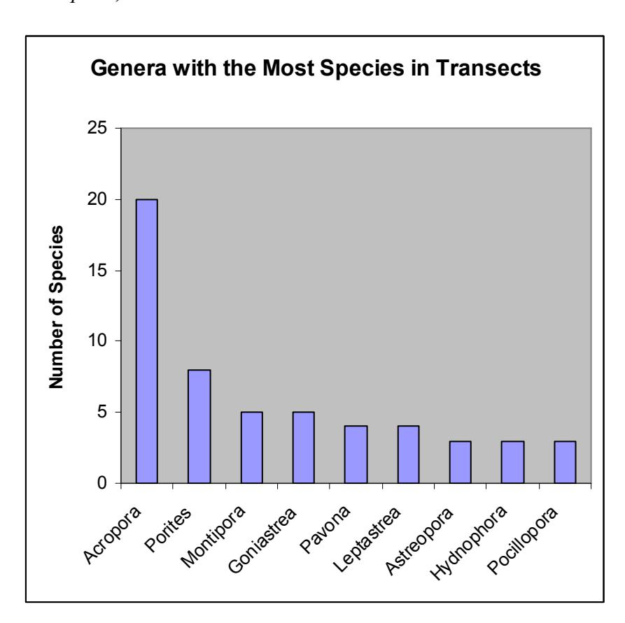

Figure 28.

Trends in the total number of coral genera in transects is shown in Figure 29. There is no overall trend.

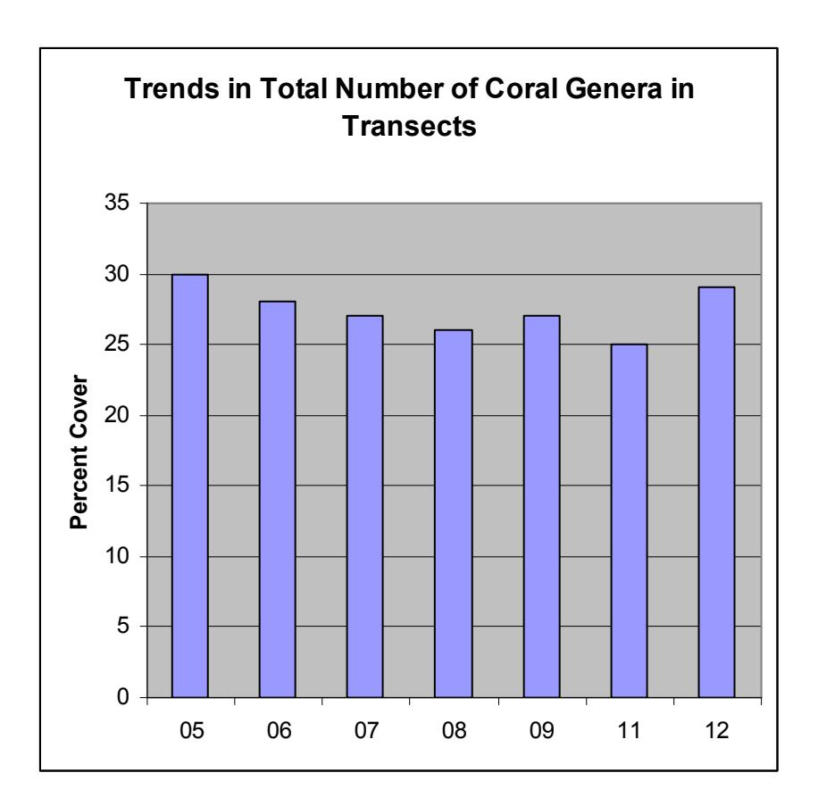

Figure 29.

Trends in the average number of coral genera per site is shown in Figure 30. There is no overall trend.

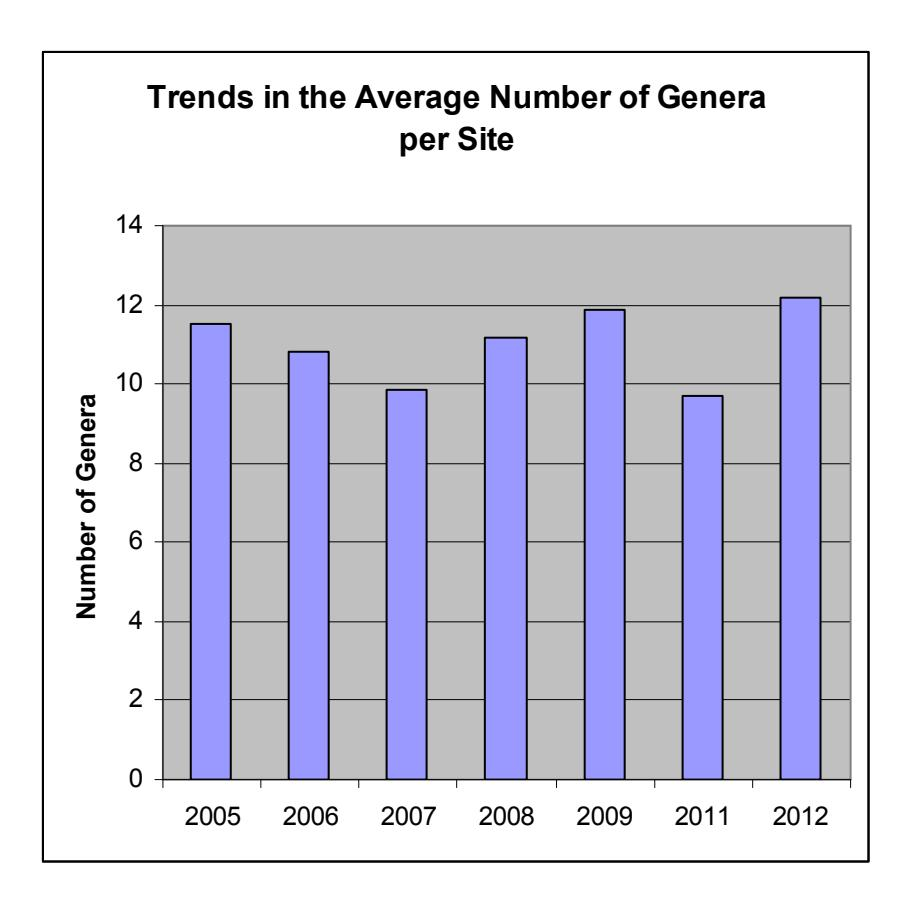

Figure 30.

## Species

The cover of the most common coral species is shown in Figure 31. *Montipora grisea* has the most cover, followed closely by *Porites rus*, which is followed by *Pavona varians* and *Acropora intermedia* (usually referred to as *A. nobilis*), and other species have less cover.

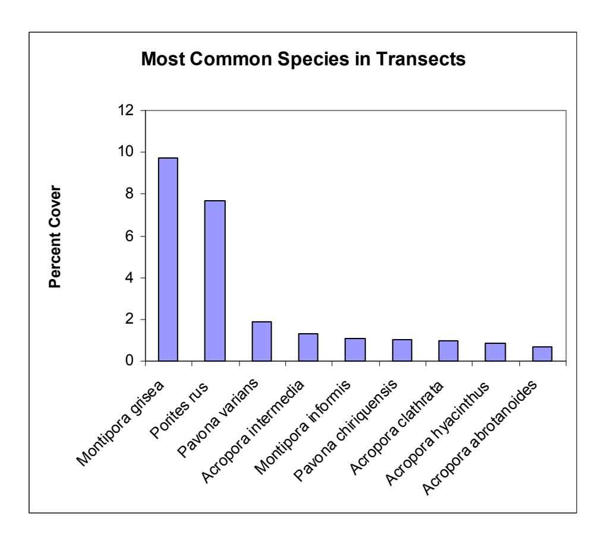

Figure 31.

Trends in the cover of the most common coral species is shown in Figure 32. The species with the most cover, *Montipora grisea* and *Pavona varians* show little overall trend in cover over the period of monitoring. *Porites rus* has increased in cover, from 4.86% cover in 2005 to 7.7% in 2012. *Porites rus* is a strong competitior which is resistant to bleaching and sediment, dispreferred by crown-of-thorns starfish, and which reproduces readily by fragmentation as well as sexual reproduction.

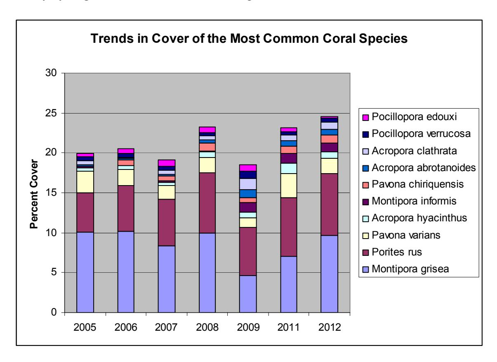

Figure 32.

Trends in the total number of coral species in transects is shown in Figure 33. There is no overall trend.

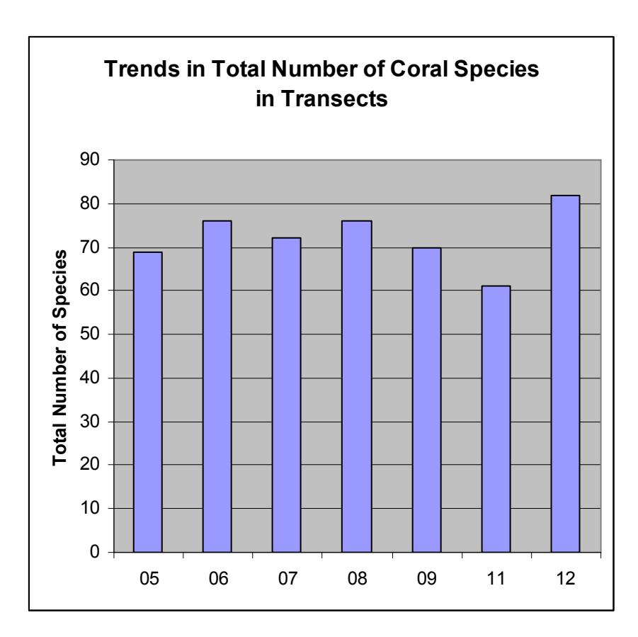

Figure 33.

Trends in the average number of coral species per site are shown in Figure 34. There appears to be no overall trend.

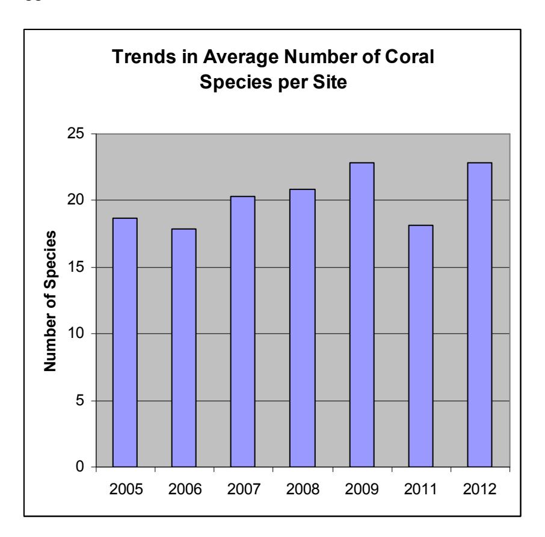

Figure 34.

### **Table Coral Size Distribution**

 There has been little or no demographic work on corals in American Samoa. We don't know much about the age and size structures of the populations of different species, for instance. The life history and life cycles of corals are more complex than those of vertebrates, since they are not only capable of sexual reproduction, growth and death, but also of partial death, fragmentation leading to partial death or to founding new colonies which are clone mates of the parent colony, fusion of colonies that are clonemates and so on. The complicated life history makes it difficult to impossible to determine from the shape and size of a coral, what its history is. Did the colony begin as a sexually produced larva that settled, or as an fragment that attached and grew as asexual reproduction? Usually we don't know. With table corals, however, there is a distinctive sequence a newly settled colony goes through. First it spreads out on the substrate, then it builds a column about 3-10 cm high, and then it begins to spread at the top of the column to build the table top. Fragmentation of tables leads to distinctive table-top fragments that are easily distinguished from growing sexual recruits. Further, fusion would be easy to detect as would be partial mortality. Some of these things are pretty easy to tell in massive corals as well, but branching corals are particularly hard to tell, foliose corals it may be hard to tell, and it may also be hard to tell in encrusting corals.

 Dr. Domingo Ochavillo suggested that I record colony sizes for a species, since that kind of data can be used for population study in ways that have been worked out in fisheries.

 Table sizes were recorded at Utulei Beach, out where the reef gets nearest to the surface. It isn't really reef flat there, it isn't close enough to the surface for low tides to kill coral and to form a flat. But there are a fair number of *Acropora hyacinthus* there of a variety of sizes, and most are not close enough together to form tiers. Tiers make it quite difficult to determine where one colony ends and another begins, unless the colonies are different colors. Tiers also seem to form most often when colonies are crowded together and can't expand laterally. If that is the case, then table diameter would be a poor proxy for age. In a colony of *A. hyacinthus* that is not restrained by neighboring colonies, table top diameter is proportional to colony age. Colonies add a fixed amount to their diameter each year. Sometimes, colonies can actually have slight concentric circles on the table top, as the angle of outward growth varies slightly with season, probably due to varying light levels. Such concentric circles are not visible on *A. hyacinthus*, but they are visible on *Acropora clathrata* in deeper water, such as out on banks. They may be visible on the *A. clathrata* because the colony is in deeper water where light is less intense and more limiting, so outward growth angle depends slightly on light intensity (Stimson, 1996).

 Table diameters were measured with a measuring tape, and the greatest diameter of each table was measured. A table that has not had mechanical injuries will have a nearcircular outer edge, but one that has had some mechanical injuries along the edge will have chunks knocked out of it. The edges where chunks have not been knocked out will reflect the age of the table accurately, but where they have been knocked out will not. So a diameter taken at the maximum diameter will almost always reflect the age best. Table

maximum diameters were measured to the nearest centimeter for tables under 20 cm diameter, and to the nearest 5 cm for tables larger than that. Fragments of tables (which were rare) were not measured, nor were overturned tables (which were also rare).

 The diameters of 166 tables were measured in one snorkel, working from one end of the roughly linear reef top area towards the other, to avoid double-counting any colonies. The resulting distribution can be seen in Figure 35 below.

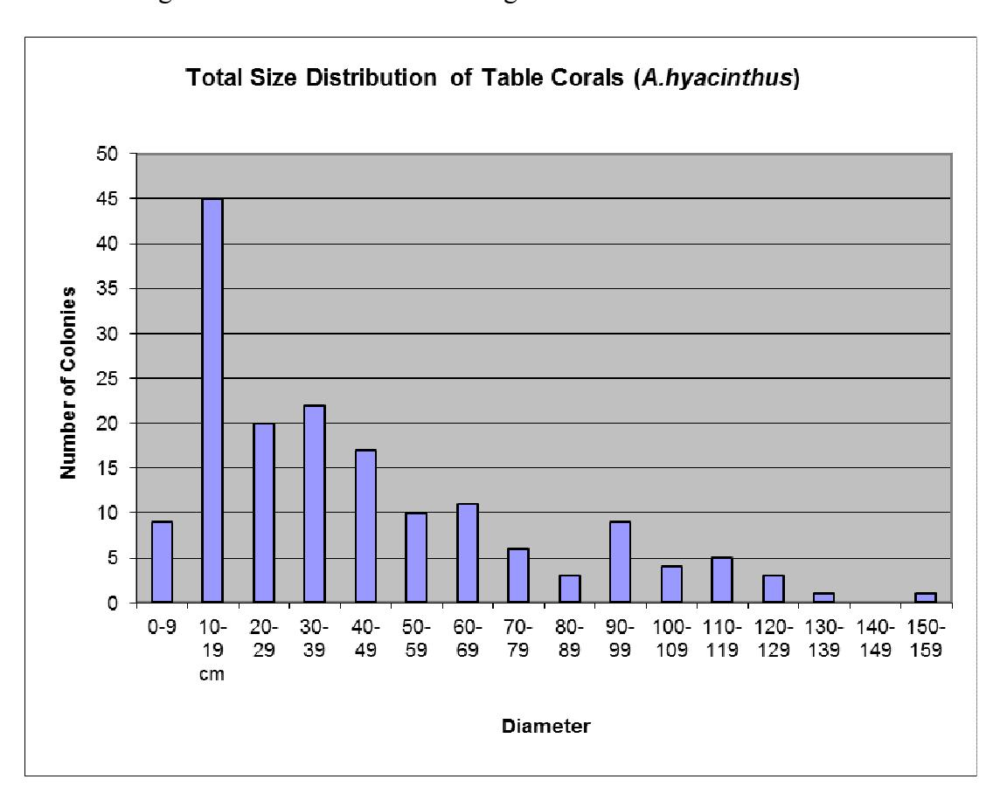

Figure 35. Size distribution of *Acropora hyacinthus* tables at Utulei Beach at the top of the reef.

The mode of the distribution is in the 10-19 cm diameter size class, with a tapering off to larger size tables. There were only a few tables at less than 10 cm size. The 10-19 cm size category had many more tables in it than any other size category. This suggests that there was a larger recruitment event when these tables settled. Young *Acropora* colonies grow to about 10-15 mm diameter in their first year, and by the end of the second year are about at the stage of beginning to grow the column (Wallace, 1999). So it may take about 3-4 years for a colony to build the base and column and begin producing the table top. Tables may grow around 10 cm in diameter (so an edge would grow around 5 cm) per year. So the peak category may be around 5 years old. Indeed, the author noticed a big settlement event at Fagasa about 6-7 years ago. The distribution also shows some variations in the abundances of larger sizes, which may reflect variation in the amount of annual recruitment, or be due to random variation.

#### **Invertebrates**

The number of individuals of the most common types of invertebrates recorded in the 50 cm wide belt transects is shown in Figure 36. The orange sponge *Sylissa* sp. was the most common invertebrate, followed by the encrusting sponge *Dysdea* sp., groups of holes produced by an unknown species, the colonial ascidian *Atriolum robustum*, tiny hermit crabs in holes in corals, the small burrowing urchin *Echinostrephus* wp., the Christmas tree worm, *Spirobrachus gigantea*, and grooves in coral produced by alpheid (snapping) shrimp. Non-cryptic diurnal macroinvertebrates are not common in American Samoa, and are typically small. This appears not to be unusual for many Pacific reefs, except in the Coral Triangle.

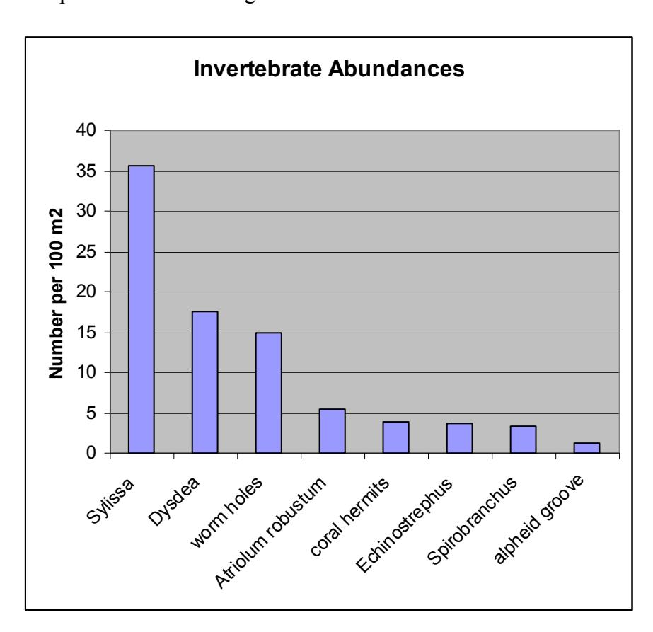

Figure 36.

Trends in the numbers of individual invertebrates is shown in Figure 37. The total numbers increased steadily up to 2011, but then decreased sharply in 2012. It seems highly unlikely that this reflects actual changes in numbers of invertebrates. Much more likely, this reflects a sharpening and expanding of the recorder's search image, with a decrease in 2012. The number and variety of invertebrates recorded depends heavily on whether the recorder has a search image for all the very different kinds of invertebrates in the belt transect.

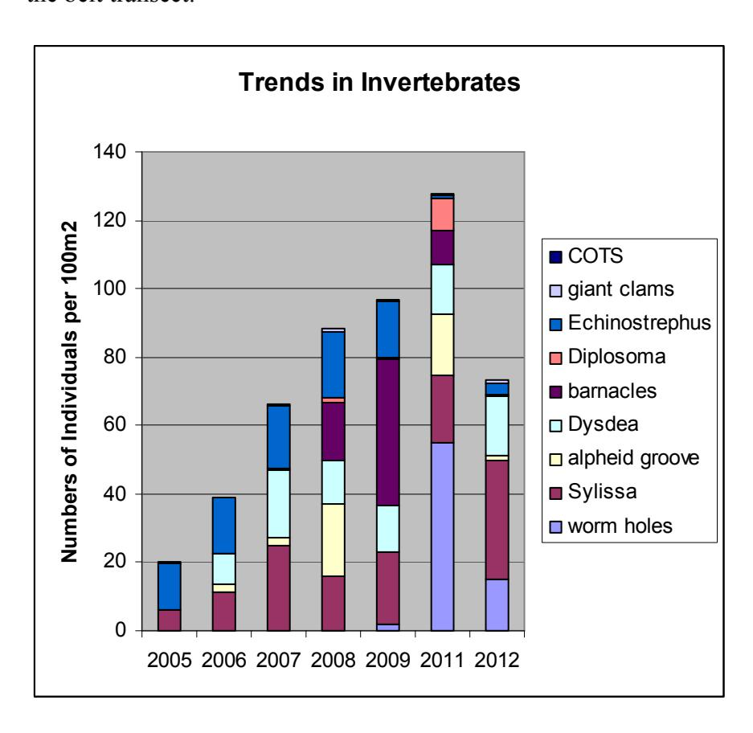

Figure 37.

### **Reef Flats**

The first scientists to study coral reefs, such as Charles Darwin, could walk on reef flats but could not dive on reef slopes, and had few other ways of studying reef slopes. So the earliest studies of coral reefs were generally carried out on reef flats. After SCUBA began to be used for scientific reef studies, most of the studies have been carried out on reef slopes, and fewer on reef flats, with reef flats often forgotten. The area of reef flats can be readily measured from satellite photos, while the area of reef slopes cannot. Estimates of reef slope area based on typical slopes and maximum depths have shown that reef flats are far larger in area than reef slopes (Vecsei, 2004). Thus, reef flats are important for coral reefs in general. Reef flats generally have less coral than reef slopes. because coral growth is limited by exposure to air during low tides. Low tides kill coral that grow above a certain level, due to exposure to air, much like a lawnmower cuts grass blades that grow above a certain level. This effect is why lawns and reef flats appear relatively flat. Low tides also usually restrict coral cove on reef flats to low levels. Reef flats are exposed to different disturbance events and so may have different trends in their communities, so it is important to monitor reef flats as well as reef slopes, although reef flats are generally not monitored.

In 2012, reef flats were surveyed near the outer edge of the reef flats, except at Amaua, where inner reef flat was surveyed as in previous years. Heavy surf makes surveying the outer reef flat there unfeasible. Benthic cover on reef flats was highly variable from site to site. Benthic cover for individual sites is shown in Figure 38. Coral cover ranged from 7% to 51%, with a mean of 32.7%.

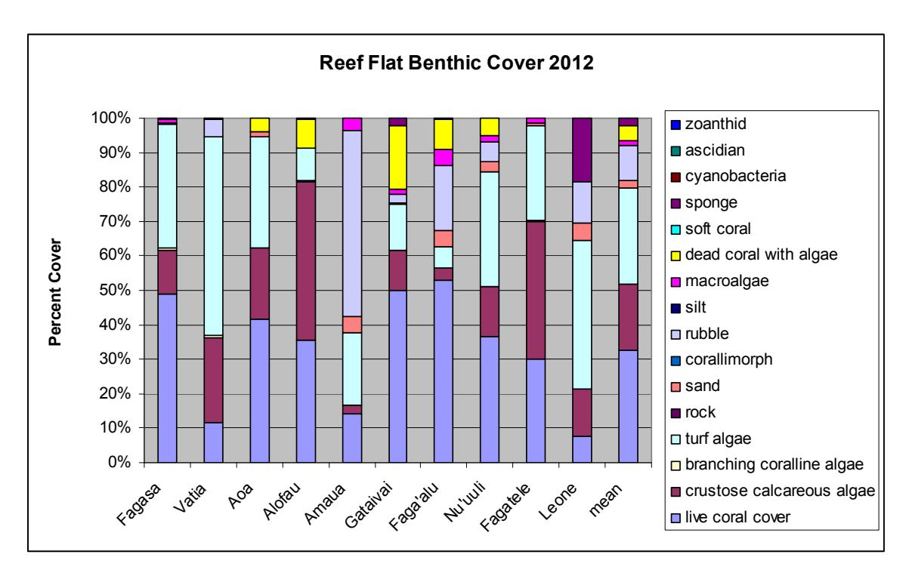

Figure 38.

Trends in reef flat benthic cover are shown in Figure 39 below. Coral cover increased steadily over the period that the reef flats were monitored. Turf decreased considerably, while crustose calcareous algae and rubble increased slightly.

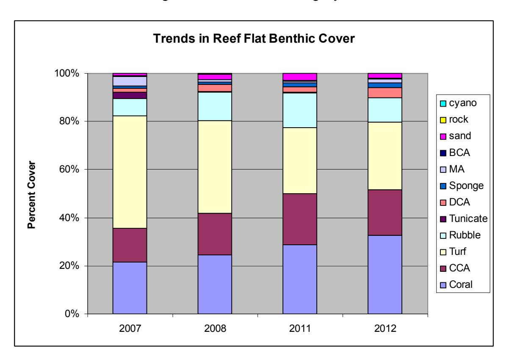

Figure 39.

Trends in the reef flat live coral index (live coral/(live coral + dead coral) is shown in Figure 40 below. The live coral index was high and shows no over all trends.

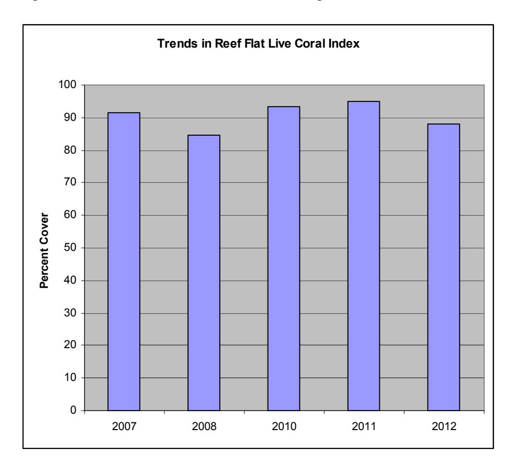

Figure 40.

Trends in reef flat major calcifiers (coral + crustose coralline algae) and algae (turf + macroalgae) are shown in Figure 41 below. Calcifiers have reasonably high cover and the cover increased over the monitoring period.

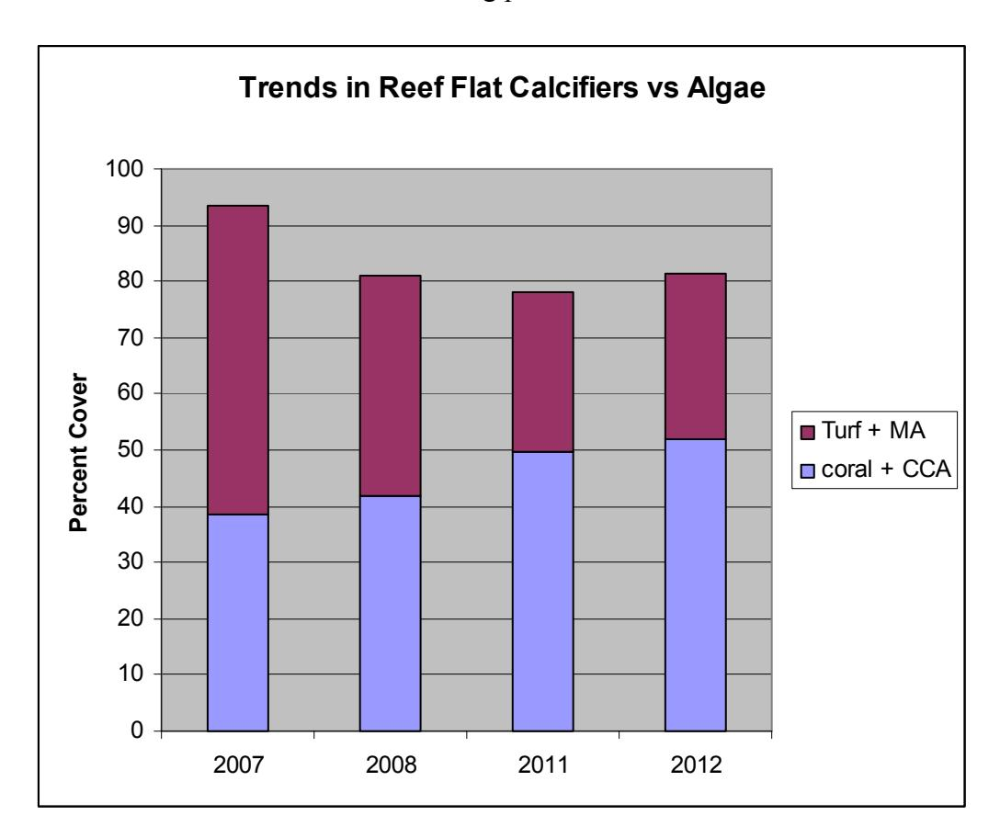

Figure 41.

Trends in total calcifying cover versus non-calcifying cover is shown in Figure 42 below. The only difference for calcifiers with the previous graph is the addition of calcifying macroalgae, namely *Halimeda* (other calcifying macroalgae are not found on our reefs except a very few specific areas, primarily near shore along Coconut Point). The difference for non-calcifiers is all non-calcifiers are included, not just algae, so noncalcifying area is the area of calcifiers subtracted from the total area (100%).

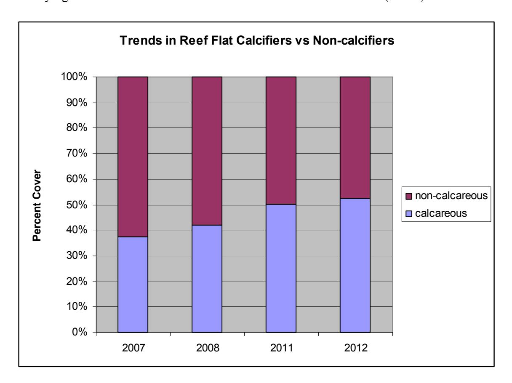

Figure 42.

### Trends at Individual Reef Flat Sites

#### Fagasa

Trends in benthic cover on the reef flat at Fagasa are shown in Figure 43. Coral cover increased during the period of monitoring, and turf decreased. This parallels the increase in coral cover on the reef slope (Figure 3).

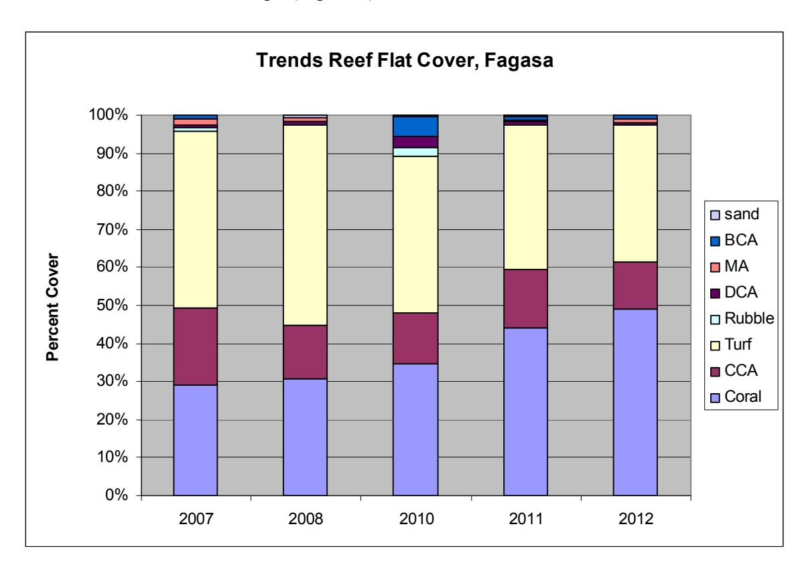

Figure 43.

#### Vatia

Trends in reef flat cover at Vatia are shown in Figure 44 below. Coral cover decreased suddenly between 2008 and 2009, but was steady both before and after that year. The tsunami occurred on Sept 29, 2009. Damage to the reef slope was very obvious, but not on the reef flat, yet clearly there was damage on the reef flat. Hurricane Wilma struck on January 24, 2011, after data was collected on the reef flat at Vatia on 7/1/10, so the decrease between 2008 and 2010 could not have been caused by Hurricane Wilma. There was a slight decrease in coral cove between 2010 and 2011, but then 2012 returned to the 2010 value, so it is unlikely that Wilma produced any decrease in coral cover on the Vatia reef flat.

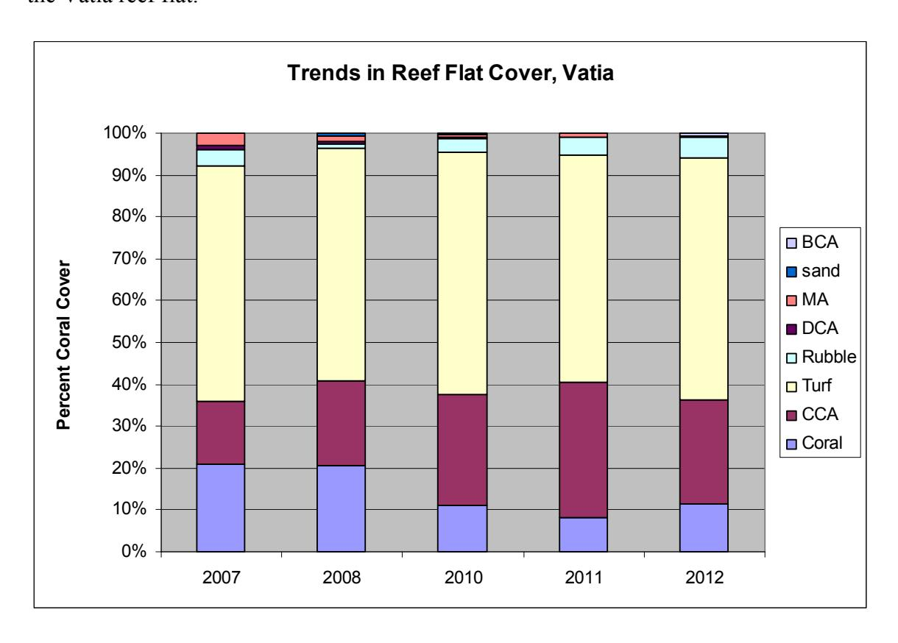

Figure 44.

#### Aoa

Trends in reef flat cover at Aoa are presented in Figure 45 below. Coral cover at Aoa increased over the monitoring period, particularly between 2011 and 2012. The increase was so large that it seems likely that much of the recorded increase was due to transect tape placement changing, not to actual increased coral. It was not visually obvious that there had been much increase in coral cover. Turf declined.

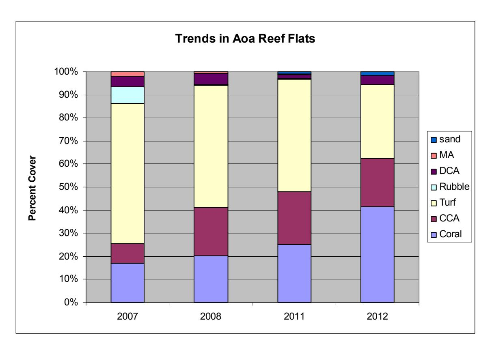

Figure 45.

#### Alofau

Trends in benthic cover on the reef flat at Alofau are shown in Figure 46 below. Coral cover, crustose calcareous algae, and turf have been steady since 2008

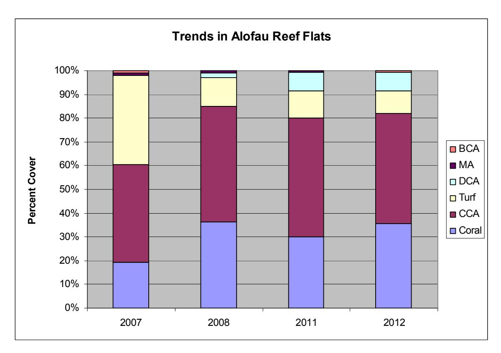

Figure 46.

#### Amaua

Trends in reef flat cover at Amaua are shown in Figure 47 below. Coral cover shows no overall trend, but rubble has increased greatly and turf decreased. It may be that the amount of turf decreased revealing that it was growing on rubble, or it may be that the same benthic community, which always had turf growing on rubble, was recorded as turn initially and rubble later.

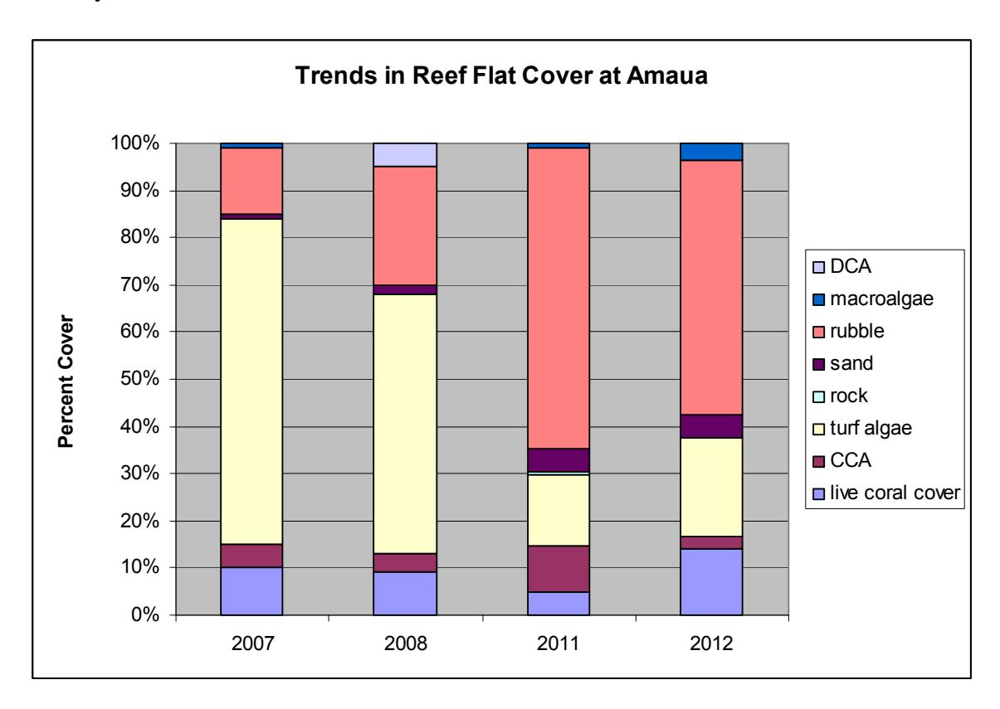

Figure 47.

#### Gataivai

The trends in reef flat cover at Gataivai are shown in Figure 48 below. Coral cover shows a slight decreasing trend over the monitoring period, with the largest drop between 2011 and 2012. The cause of this drop is not known, the transect tapes are placed close to the same location each year. It would be surprising if conditions there were deteriorating, since coral growth over the nearby sewage pipeline covering rocks has been prolific over the monitoring period, indicating good conditions.

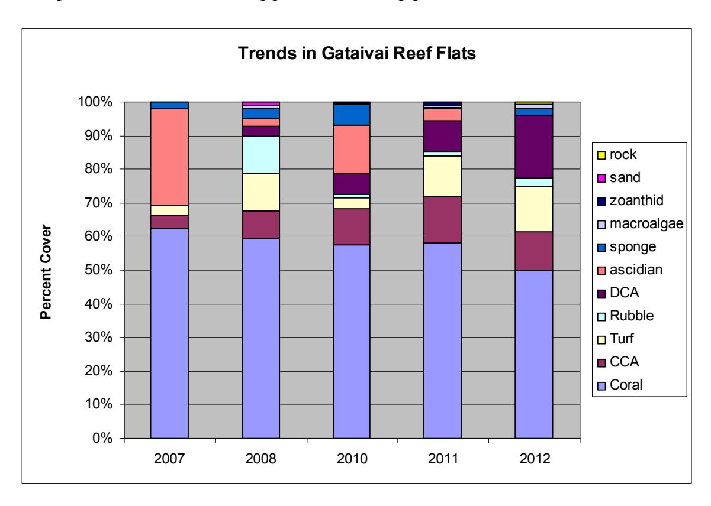

Figure 48.

#### Faga'alu

Trends in reef flat coral cover at Faga'alu are shown in Figure 49 below. There have been strong increases over the monitoring period in coral cover at Faga'alu, which occurred in two pulses, from 2007 to 2008, and from 2011 to 2012. It is not clear what produced those increases.

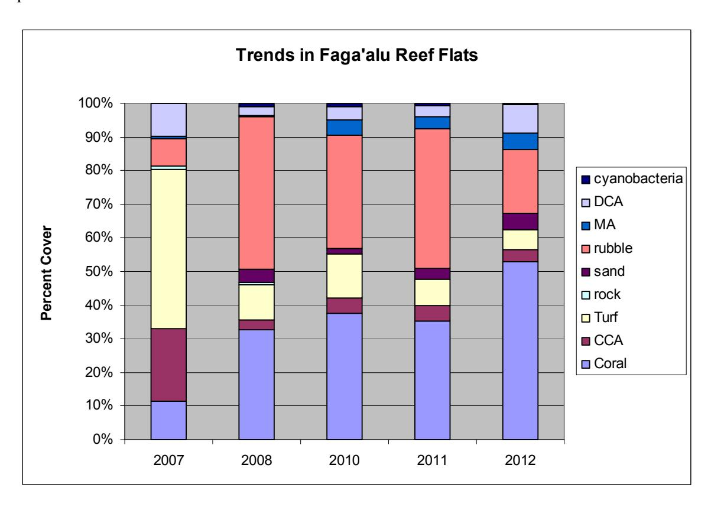

Figure 49.

#### Coconut Point

Trends in reef flat cover at Coconut Point are shown in Figure 50 below. There was an increasing trend in coral cover over the monitoring period. Transect tape locations are particularly hard to relocate on this very large, wide reef flat with few if any markers, so it is quite possible that the changes were due to change transect tape locations.

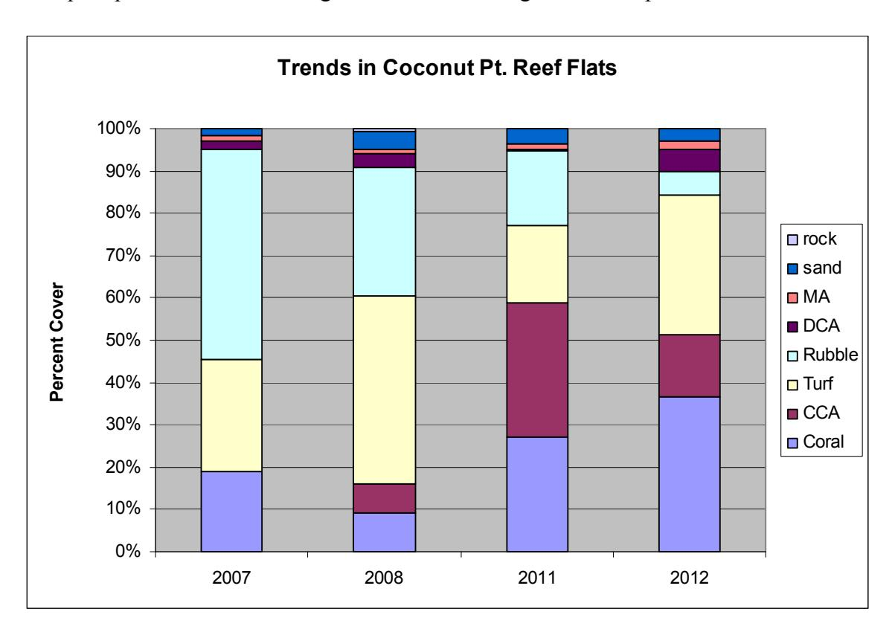

Figure 50.

#### Fagatele Bay

Trends in reef flat cover at Fagatele Bay are shown in Figure 51 below. Cover from only the first two tapes is shown as the first two years only had two tapes, and additional tapes were in areas of higher coral cover. Coral cover showed an increasing trend over the monitoring period. This seems likely to be real, but might have been produced at least partly by changing tape locations.

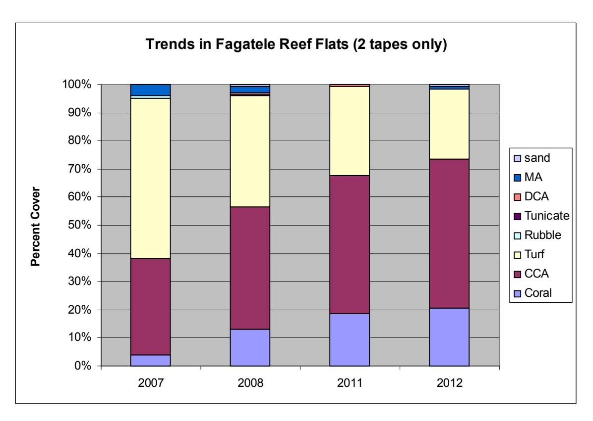

Figure 51.

#### Leone

Trends in reef flat cover are shown in Figure 52 below. Coral cover shows no trend on the Leone reef flat. In 2007 there was a very high cover of a gray encrusting sponge, and then in 2008 it decreased, but it has stayed steady since then. Sand, rubble and turf have varied in non-systematic fashion, suggesting that the changes recorded were due to changes in tape locations. The reef flat is large with few landmarks to relocate transect tapes and the locations have surely varied over the years. The gray sponge seems likely to be an indicator of poor water quality due to effluent from the stream at the east end of the village.

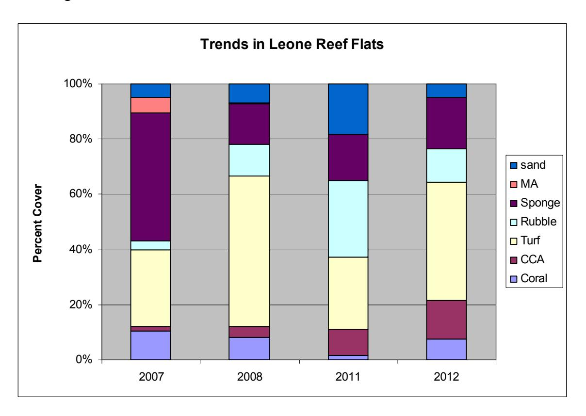

Figure 52.

A summary of the trends in reef flat coral cover at individual sites is given in Table 11. Two sites had decreasing coral cover, three had steady cover, and five had increases. This pattern is similar to that on the reef slopes shown in Table 10, but which sites increased and which decreased was not the same. This table supports the view that coral cover has been increasing on the reef flats as well as slopes.

Table 7. Summary of Reef Flat Coral Cover Trends at individual sites.

|              | decrease | steady | increase |
|--------------|----------|--------|----------|
| Fagasa       |          |        | Χ        |
| Vatia        | X        |        |          |
| Aoa          |          |        | Χ        |
| Alofau       |          | X      |          |
| Amaua        |          | X      |          |
| Gataivai     | X        |        |          |
| Faga'alu     |          |        | Χ        |
| Nu'uuli      |          |        | Χ        |
| Fagatele     |          |        | Χ        |
| Leone        |          | X      |          |
| total number | 2        | 3      | 5        |

### Corals in Reef Flat Transects

#### Lifeforms

Cover of different lifeforms (coral shapes) on reef flats is shown in Figure 53. Encrusting is the lifeform with the most cover, followed by branching, staghorn, table, foliose, *Acropora* branching, columna, *Acropora* digitate, and massive. On reef slopes, encrusting and columnar were the most common lifeforms by far, as shown in Figure 26. Encrusting is the most common lifeform on both slopes and reef flats, but columnar is the second most common lifeform only on slopes, not on reef flats, which have more lifeform diversity.

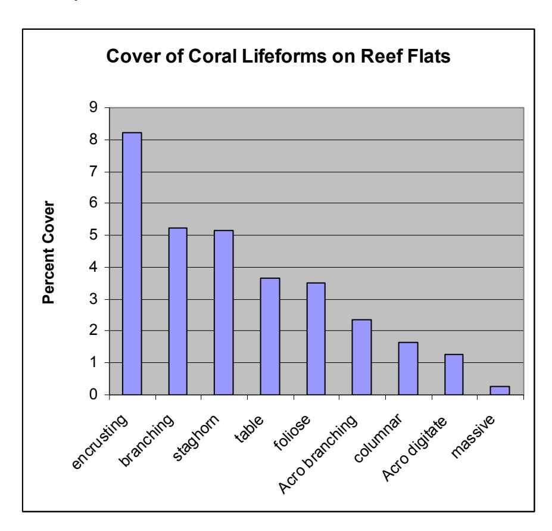

Figure 53.

### Genera

The coral genera with the most cover on reef flats are shown in Figure 54. *Acropora* is the genus with the most cover on reef flats, followed by *Montipora*, *Porites*, *Pocillopora*, *Pavona* and *Isopora*. On reef slopes, the genera with the most cover were *Montipora, Porites*, *Acropora*, *Pavona*, *Leptastrea* and *Pocillopora*, in that order, as shown in Figure 26. *Montipora*, *Porites* and *Acropora* were the three genera with the most cover on both slopes and reef flats, but their order was different in the two zones.

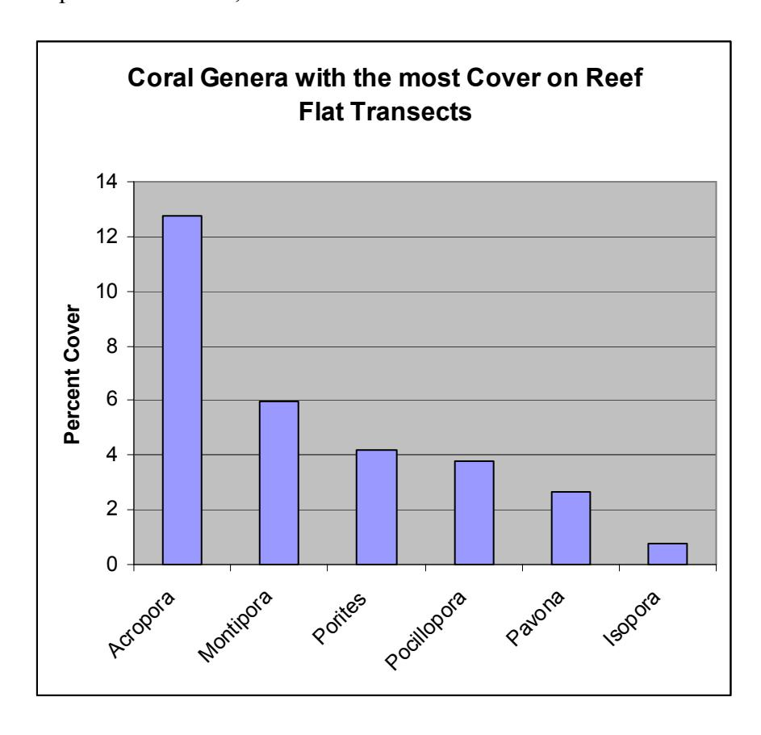

Figure 54.

Coral genera which had the most species in them on reef flats are shown in Figure 55. *Acropora* had the most species by far, followed by *Porites*, *Pocillopora*, *Montipora*, *Pavona* and *Isopora*. On reef slopes, *Acropora*, *Porites*, *Montipora*, *Goniastrea*, and *Pavona* had the most species, as seen in Figure 28. Thus, *Acropora* and *Porites* had the most species on both slopes and reef flats, but the order after that differed. *Montipora*  ranked high on both zones.

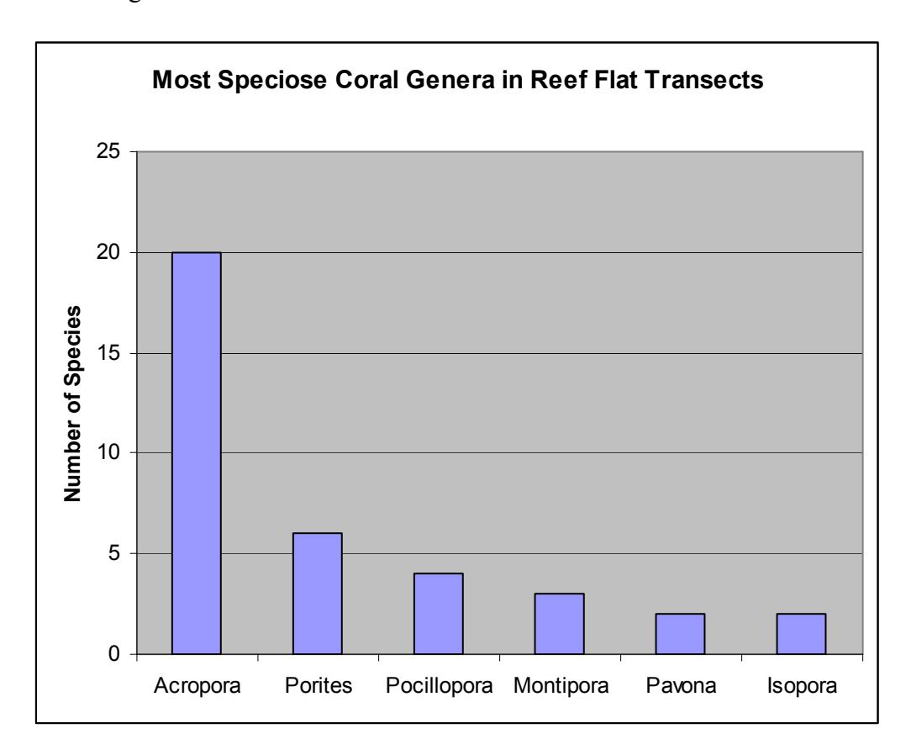

Figure 55.

Trends in the mean number of coral genera in reef flat transects is shown in Figure 56. The number of genera recorded increased from 2007 to 2008, but has remained steady after that.

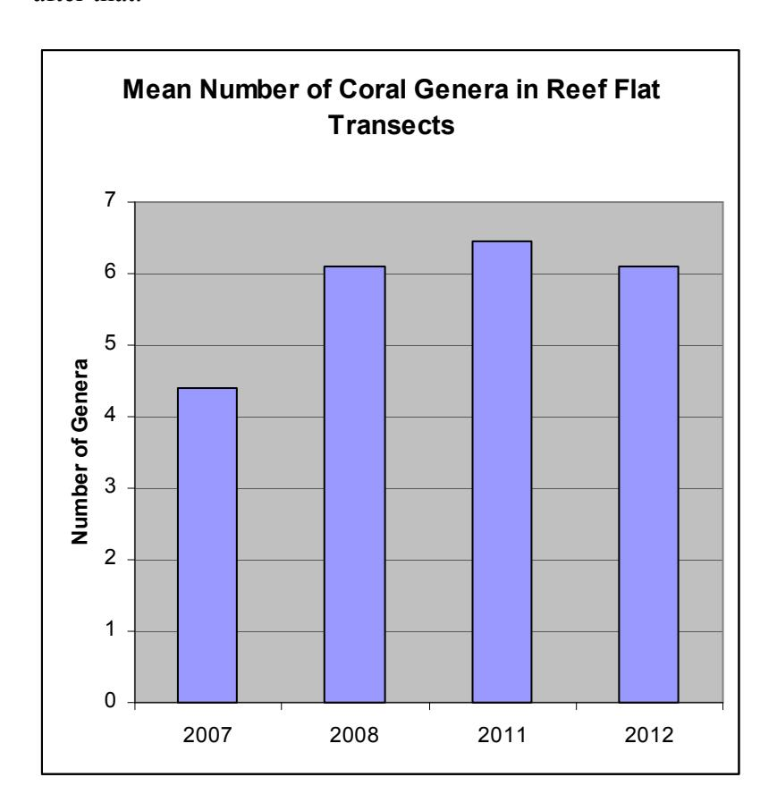

Figure 56.

Trends in the total number of genera recorded in reef flat transects is presented in Figure 57. The total number of coral genera in reef flat transects shows no overall trends over time.

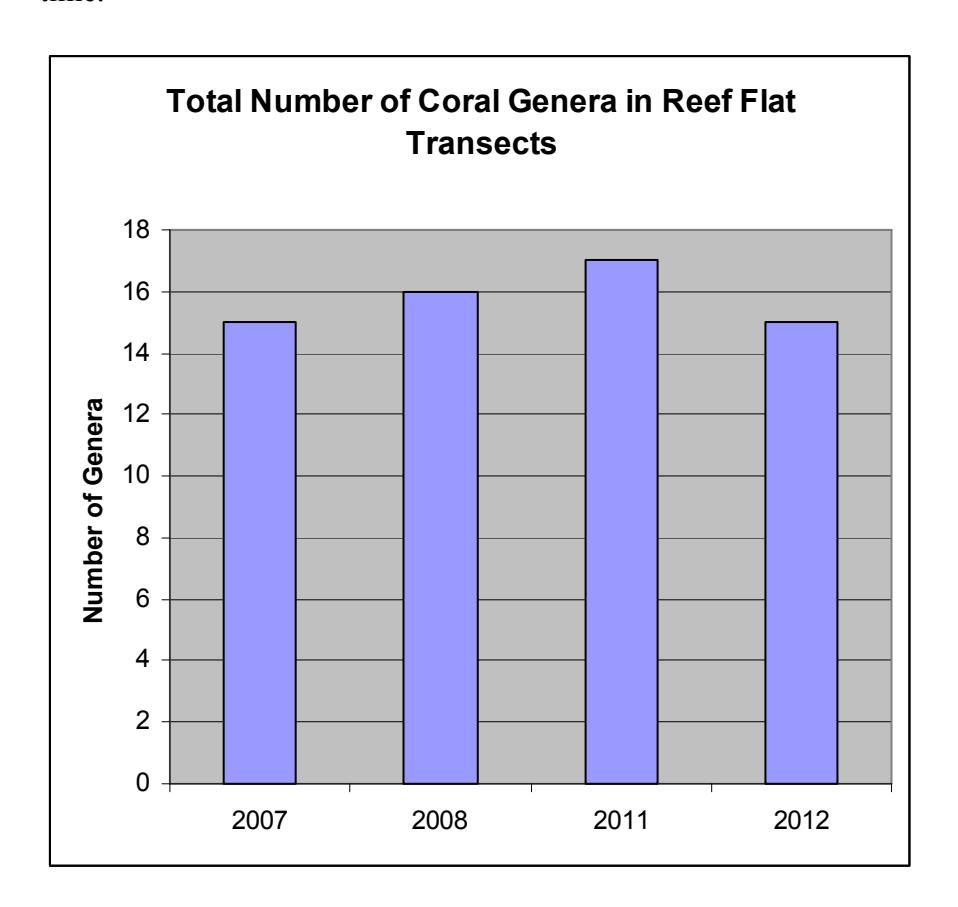

Figure 57.

### **Species**

The coral species with the most cover in reef flat transects are shown in Figure 58. The species with the most cover was an encrusting *Montipora*, followed by *Acropora hyacinthus*, *Acropora muricata*, and *Pavona varians*. On reef slopes, the coral species with the most cover was *Montipora grisea* (an encrusting species), followed by *Porites rus*. All other species had much less cover, as shown in Figure 31. Thus, the coral species on the reef flats were quite different from those on the reef slopes.

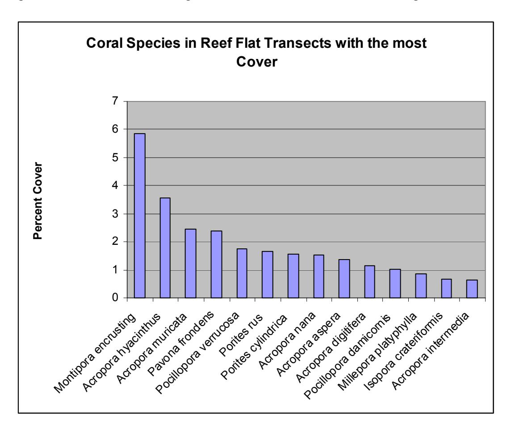

Figure 58.

Trends in the mean number of coral species per reef flat transect is shown in Figure 59. The mean number of coral species recorded in reef flat transects has increased steadily, and nearly doubled. The cause of this is not obvious. There was no overall trend in the mean number of coral species in reef slope transects, as shown in Figure 34.

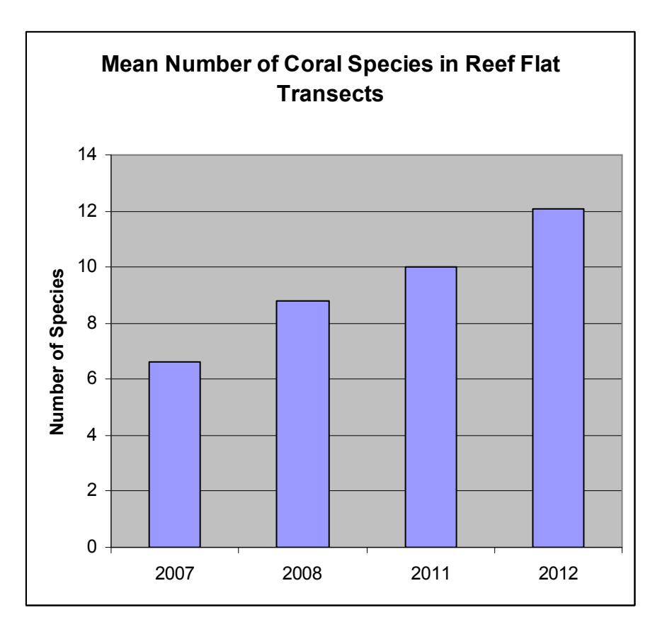

Figure 59.

Trends in the total number of coral species in reef flat transects is shown in Figure 60. The total number of coral species in reef flat transects has increased steadily, though not as much as the mean number per transect. There was no overall trend in the total number of coral species in reef flat transects on the reef slope, as shown in Figure 33.

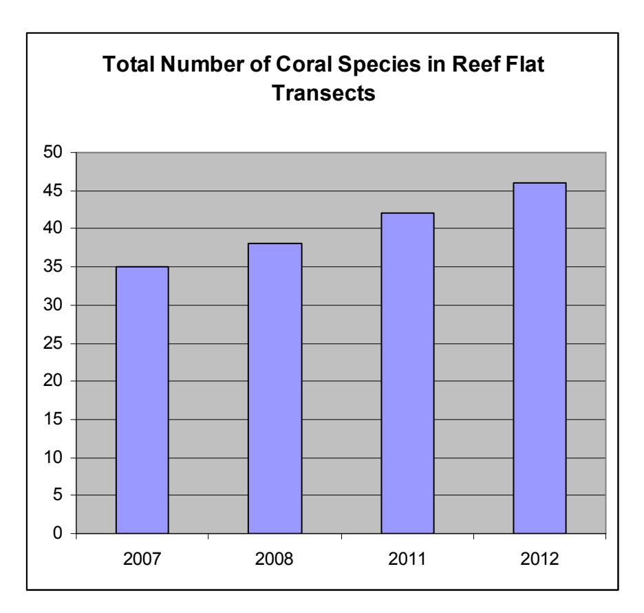

Figure 60.

### **Water Quality: Visibility**

Visibility is a relatively easily obtained indicator of water quality. Low visibility is caused by such things as sediment and plankton, both of which are indicators of poor water quality. A large study of indicators of water quality on the Great Barrier Reef reported that water clarity is the best single indicator of water quality (Fabricius et al. 2012). Visibility estimates were taken using the transect tapes and sighting the end of the tape. The tape was stretched horizontally out from the reef, at the transect depth. Figure 61 shows trends in mean visibility on the reef slope sites. There is no increasing or decreasing trend apparent. Water clarity is relatively good on the reef slopes, much better than in the harbor, but not as good as out at the banks where influence from the island is much less.

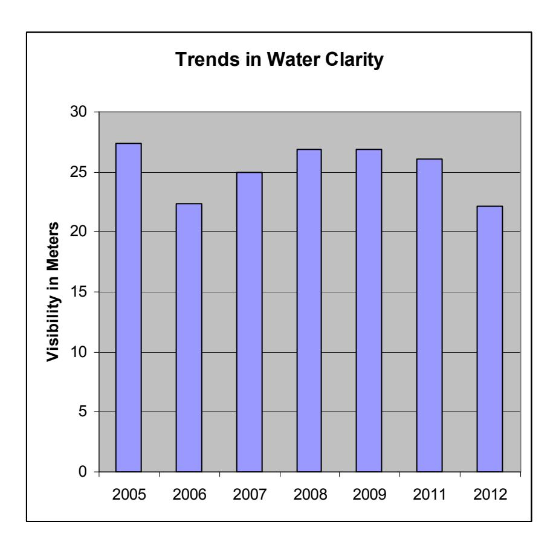

Figure 61.

Water clarity at each of the sites is shown in Figure 62 below. Leone, Fagatele, Aunu'u and Tafeu had the best clarity, in that order. Vatia and Fagasa have the worst visibility, in that order. Leone, Fagatele, Aunu'u and Tafeu are some of the best sites for coral cover, and Vatia is now the worst and Fagasa used to be one of the worst. It appears that water clarity may be correlated with coral cover.

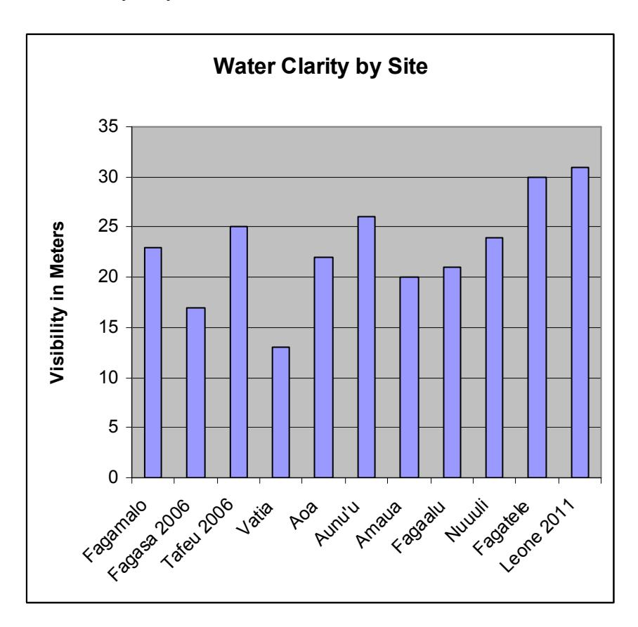

Figure 62.

Interestingly, the South side has higher average visibility than the north side, as shown in Figure 63. However, this is not significant (t-test, p = 0.18). The N is too small (5). All the sites on the north are in bays, some of which are narrow, while on the south side not all are in bays, and the bays tend to be more open. Bays almost always have streams, and narrow bays don't get flushed as well as areas outside of bays. This may account for the difference.

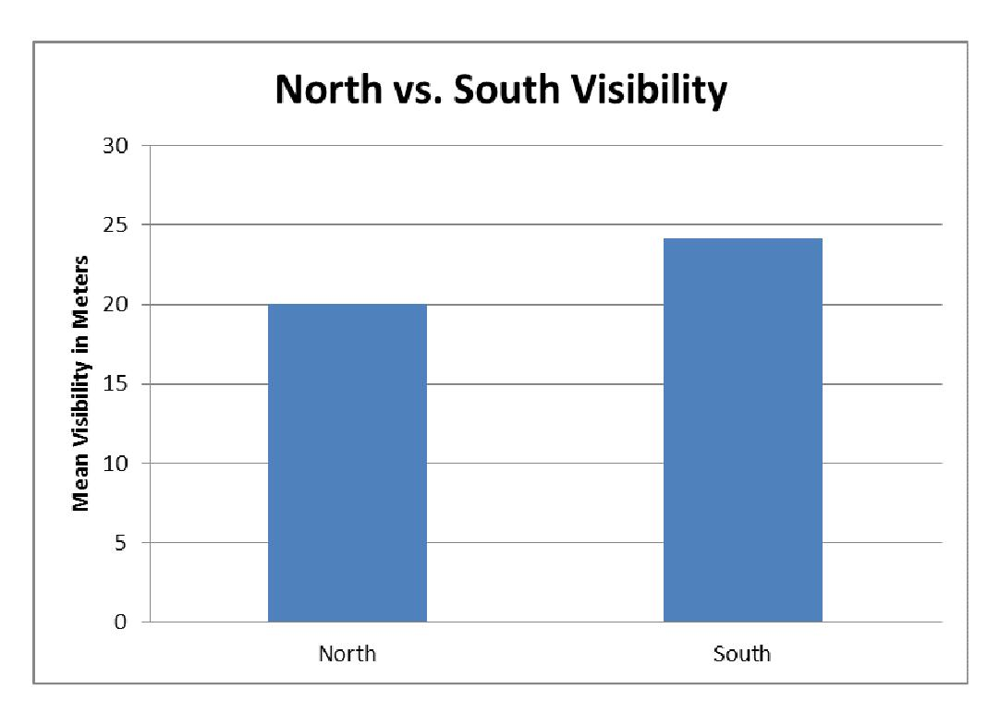

Figure 63.

In Figure 64 below, it can be seen that there are differences between some sites in visibility that are fairly consistent over time. Visibility is consistently highest at Aunu'u, Fagetele, Leone, and Tafeu. Visibility is lowest at Vatia, Fagasa, and Aoa. It appears that there are differences between individual sites, and that the highest clarity sites on the south side are clearer than the highest on the north, and the lowest on the south side are lower than on the north. It appears as though the north side is just shifted lower than the south side. The two sites with the least people, Tafeu and Fagatele, both have high water clarity. But some sites with people, such as Aunu'u and Leone, also have high clarity.

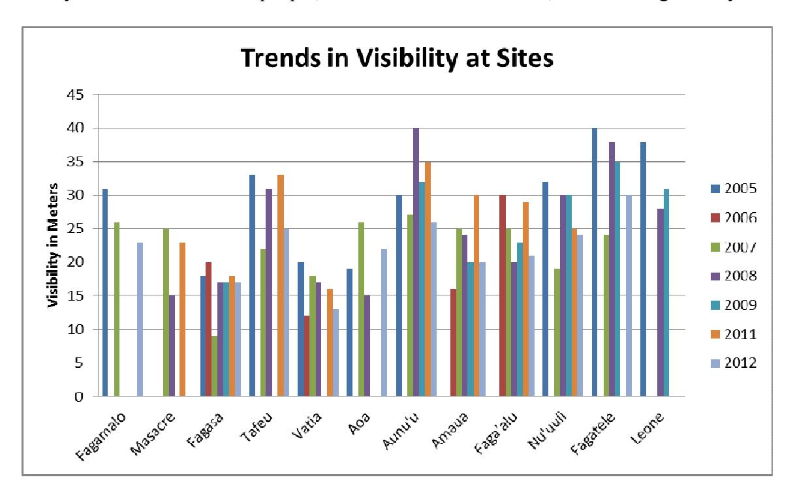

Figure 64.

 Since visibility is the best indicator of water quality, and most corals need good water quality, coral cover might be correlated with water quality. This is explored in Figure 65, which shows a moderately strong positive correlation between coral cover and visibility, r = 0.7031 which is significant (p < .02).

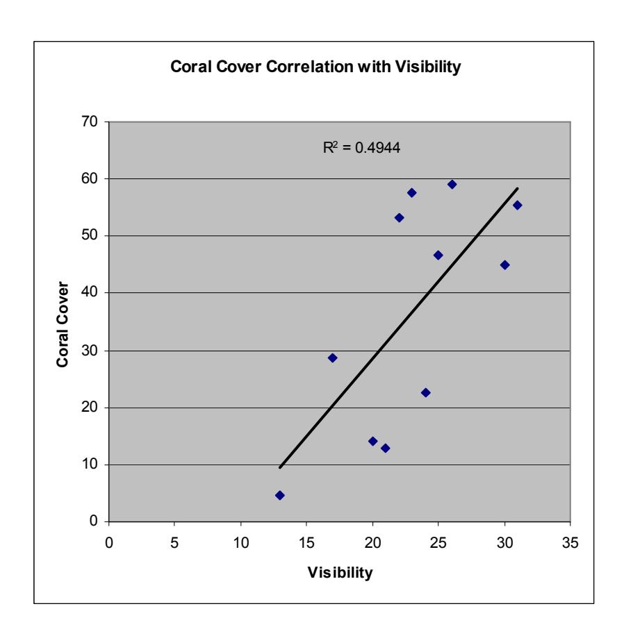

Figure 65.

The diversity of corals has also been correlated with pollution. Figure 66 shows the correlation between visibility and coral diversity (measured by the hour long biodiversity dives in 2011) is moderately strong, r = .6477, and significant p < .05, but the slope is much less than with coral cover. So visibility appears to influence coral cover more than coral diversity.

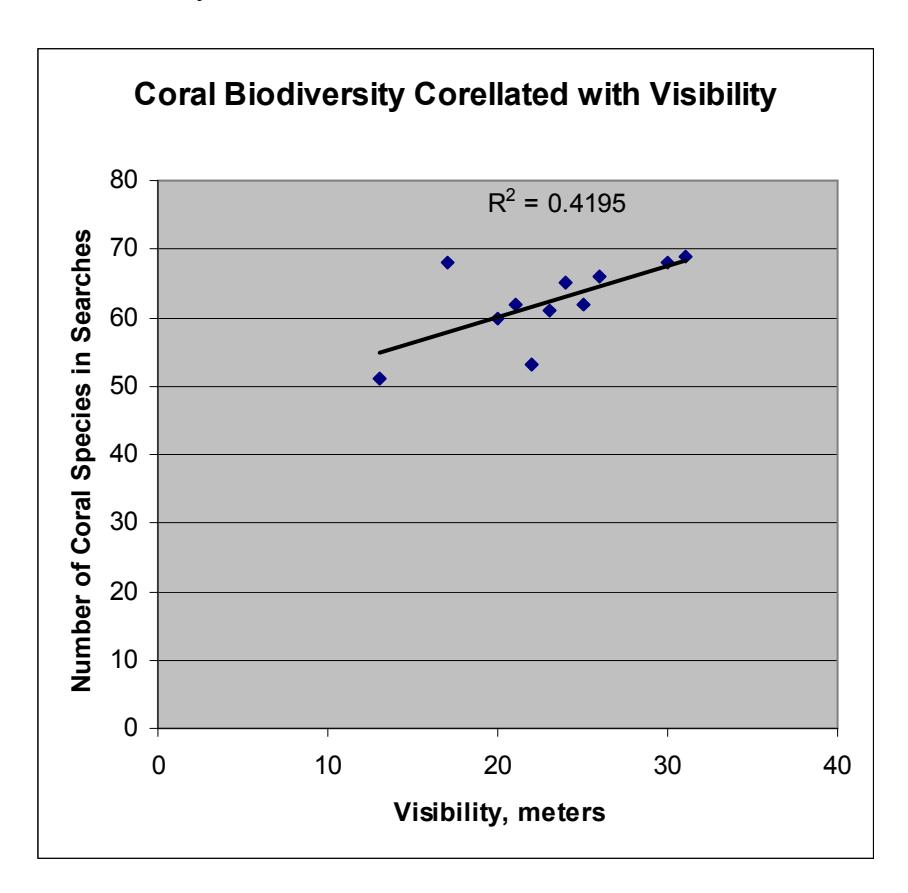

Figure 66.

The relationship between visibility and the number of coral species recorded in transects is shown in Figure 67. The correlation is surprisingly strong, r = .8117, and significant, p < .01. The relationship between visibility and coral diversity in transects is even stronger than between visibility and coral cover, so it is clear that visibility is significantly correlated with both coral cover and diversity.

 In 2008, the last year for which visibility data is available for 11 sites, the correlation of visibility with coral cover was more modest, r = .5139, which was not significant, but the correlation of visibility with the number of coral species in transects was high, r = .7085, which was significant, p < .02. Thus, the correlation of visibility with the number of coral species in transects is not a one time finding, supporting the view that it is a real effect.

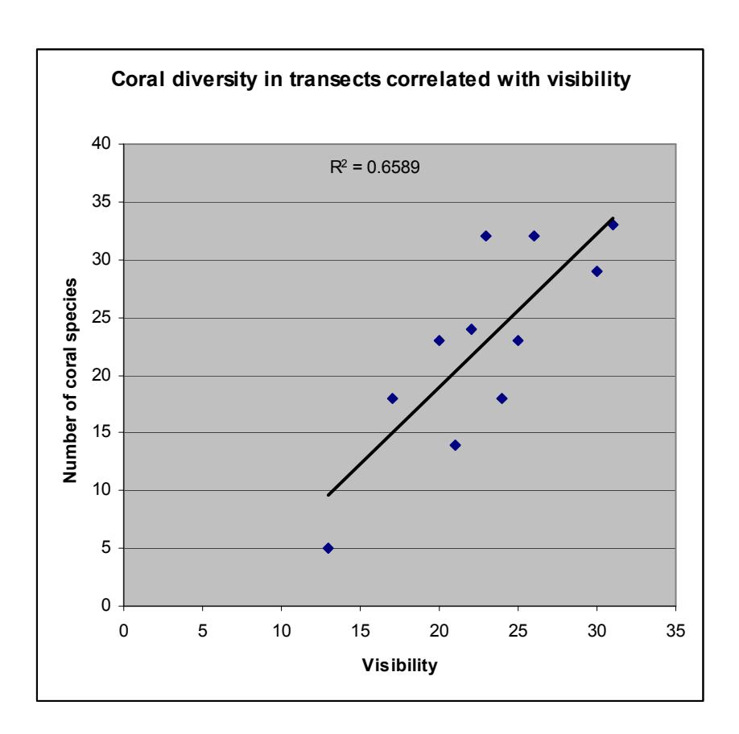

Figure 67.

 Water clarity of near shore water is reduced from the clarity of open ocean water, which here is likely to be something around 50 meters, to lower clarity. This is because particles washed off of land, and plankton fertilized by nutrients washed off land, reduce the water clarity. These correlations are the first evidence this monitoring program has found to support the proposition of Houk et al. (2010) that terrestrial runoff is negatively impacting the coral reefs of American Samoa. On the Great Barrier Reef, water clarity is correlated with coral diversity, macroalgal cover, and soft coral cover (De'ath and Fabricius, 2010). For the Great Barrier Reef, visibility of over 10 m was correlated with high coral diversity and low macroalgal cover (De'ath and Fabricius, 2010). Thus, the visibility recorded for Tutuila sites of around 23 m appears to be relatively good. The fact that macroalgae cover is low is consistent with the Great Barrier Reef data indicating that 23 m visibility should be correlated with low macroalgae cover.

## **Bleaching**

Monitoring of bleaching continued in the airport and Alofau backreef pools in 2012. Bleaching in the airport pool was less in 2010, 2011 and 2012 than it had been in previous years, as can be seen in Figure 68. The cause of the reduction in bleaching intensity is not yet clear.

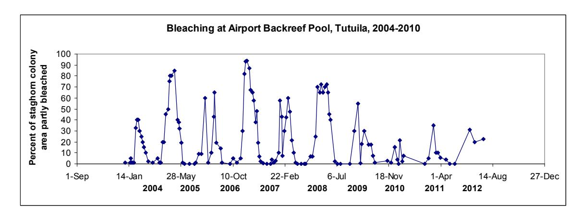

Figure 68.

Bleaching in the Alofau backreef pool is shown in Figure 69. Bleaching was less intense in 2010, but then increased in intensity in 2011 and 2012 to the place that bleaching is approximately as intense as it was in previous years. The cause of this pattern, and why bleaching in Alofau has returned to previous levels while it has not in the airport pool, is not yet clear.

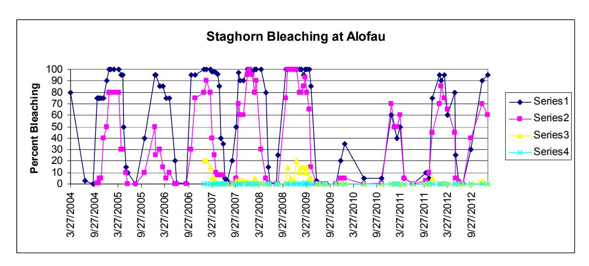

Figure 69.

#### **References**

Ateweberhan, M., McClanahan, T.R., Graham, N.A.J., and Sheppard, C.R.C. 2011. Episodic heterogeneous decline and recovery of coral cover in the Indian Ocean. Coral Reefs 30: 739-752.

Birkeland, C., Craig, P., Fenner, D., Smith, L. W., Kiene, W. E. and Riegl, B. 2008. Ch. 20: Geologic setting and ecological functioning of coral reefs in American Samoa. Pages 741-765 in B. Riegl and R. Dodge, Coral Reefs of the USA, Springer.

Boyett, H. V., Bourne, D. G., Willis, Bette L. 2007. Elevated temperature and light enhance progression and spread of black band disease on staghorn corals of the Great Barrier Reef. Marine Biology 151: 1711-1720.

Brainard, R., Asher, J., Gove, J., Helyer, J., Kenyon, J., Mancini, F., Miller, J., Myhre, S., Nadon, M., Rooney, J., Schroeder, R., Smith, E., Vargas-Angel, B., Vogt, S., Vroom, P., Balwani, S., Ferguson, S., Hoeke, R., Lammers, M., Lundlblad, E., Maragos, J., Moffitt, R., Timmers, M., and Vetter, O. 2008. Coral reef ecosystem monitoring report for American Samoa: 2002-2006. NOAA Special Report NMFS PIFSC.\

Brown, B. E., R. P. Dunne, N. Phongsuwan, and P. J. Somerfield. 2011. Increased sea level promotes coral cover on shallow reef flats in the Andaman Sea, eastern Indian Ocean. Coral Reefs 30: 867–878.

Bruno, J.F., Sweatman, H., Precht, W.F., Selig, E.R., Schutte, V.G.W. 2009. Assessing evidence of phase shifts from coral to macroalgal dominance on coral reefs. Ecology 90: 1478-1484.

Bruno, J.F., Precht, W.F., Vroom, P.S., Aronson, R.B. in press. Coral reef baselines: how much macroalgae is normal?

Bruno, J.F., Selig, E.R. 2007. Regional decline of coral cover in the Indo-Pacific: timing, extent, and subregional comparisons. PLoS ONE 2, e711.

Bruno, J.F., Selig, E.R., Casey, K.S., Page, C.A., Willis, B.L., Harvell, C.D., Sweatman, H., Melendy, A.M. 2007. Thermal stress and coral cover as drivers of coral disease outbreaks. PLoS Biology 5: 1220-1227.

Carroll, B. 2012. Coral Reef Fish Monitoring Report: 2006-2011. Final report, NOAA grant NAO8NOS4260325. 32 pp.

Cornish, A. and DiDonato, E. 2004. Resurvey of a reef flat in American Samoa after 85 years reveals devastation to a soft coral (Alcyonacea) community. Marine Pollution Buletin 48: 768-777.

- Côté, I.M., et al. 2005. Measuring coral reef decline through meta-analysis. Philosophical Transactions of the Royal Society of London B: Biological Science 360: 385-395.
- Côté, I.M.; Gardner, T.A.; Gill, J.A.; Hutchinson, D.J.; Watkinson, A.R. New approaches to estimating recent ecological changes on coral reefs. 2006. In *Coral Reef Conservation*; Côté, I.M., Reynolds, J.D., Eds.; Cambridge University Press: Cambridge, United Kingdom, pp. 293-313.
- Craig, P. 2009. Natural History Guide to American Samoa, 3rd Edition. National Park of American Samoa, Dept. Marine & Wildlife Resources, and American Samoa Community College, Pago Pago. 130 pages.
- Craig, P., DiDonato, G., Fenner, D., Hawkins, C. 2005. The state of coral reef ecosystems of American Samoa. PP. 312-337 in Waddell, J. E. (ed.), The State of Coral Reef Ecosystems of the United States and Pacific Freely Associated States: 2005. NOAA Technical Memorandum NOS NCCOS 11. NOAA/NCCOS Center for Coastal Monitoring and Assessment's Biogeography Team. Silver Spring, MD. 522 pp
- De'ath, G., Fabricius, K. 2010. Water quality as a regional driver of coral biodiversity and macroalgae on the Great Barrier Reef. Ecological Applications 20: 840-850.
- De'ath, G., Fabricius, K. E., Sweatman, H., Puotinen, M. 2012. The 27-year decline of coral cover on the Great Barrier Reef and its causes. Proceedings of the National Academy of Sciences 109: 17995-17999.
- Edinger, E.N., Jompa, J., Limmon, G. V., Widjatmoko, W., Risk, M.J. 1998. Reef degradation and coral biodiversity in Indonesia: effects of land-based pollution, destructive fishing practices and changes over time. Marine Pollution Bulletin 36: 617- 630.
- Fabricius, K. E., Cooper, T.F., Humphrey, C., Uthicke, S., De'ath, G., Davidson, J., LeGrand, H., Thompson, A., Schaffelke, B. 2012. A bioindicator system for water quality on inshore coral reefs of the Great Barrier Reef. Marine Pollution Bulletin 65: 320-332.
- Fenner, D. 2008a. Results of the territorial monitoring program of American Samoa for 2006, benthic section. Report to the Department of Marine & Wildlife Resources, the Coral Reef Advisory Group, and NOAA. 58 pp.
- Fenner, D. 2008b. Results of the territorial monitoring program of American Samoa for 2007, benthic portion. Report to the Department of Marine & Wildlife Resources, the Coral Reef Advisory Group, and NOAA. 76pp.
- Fenner, D. 2009. Results of the Territorial Monitoring Program of American Samoa for 2008, Benthic Section. Report to DMWR, CRAG, and NOAA. 108 pp.

Fenner, D. 2010. Results of the Territorial Monitoring Program of American Samoa for 2009, Benthic Section. Report to DMWR, CRAG, and NOAA. 58 pp.

Fenner, D. 2011. The state of the coral reef habitat in American Samoa, 2008. Pages 42-111 in Kilarsky, S. and Everson, A. R. (eds.), Proceedings of the American Samoa Coral Reef Fishery Workshop. NOAA Technical Memorandum NMFS-F/SPO-114

Fenner, D. 2012. Reef flat growth: comment on "Rising sea level may cause decline of fringing coral reefs." EOS 93 (23): 218.

Fenner, D. 2012. Results of the Territorial Monitoring Program of American Samoa for 2010, Benthic Section. Report to DMWR, CRAG, and NOAA. 48 pp.

Fenner, D., M. Speicher, S. Gulick, G. Aeby, S. Cooper Alleto, B. Carroll, E. DiDonato, G. DiDonato, V. Farmer, J. Gove, P. Houk, E. Lundblad, M. Nadon, F. Riolo, M. Sabater, R. Schroeder, E. Smith, C. Tuitle, A. Tagarino, S. Vaitautolu, E. Vaoli, B. Vargas-Angel, and P. Vroom. 2008. Status of the coral reefs of American Samoa. pp 307-331. In J.E. Waddell and A.M. Clarke (eds.), The State of Coral Reef Ecosystems of the United States and Pacific Freely Associated States: 2008. NOAA Technical Memorandum NOS NCCOS 73. NOAA/ NCCOS Center for Coastal Monitoring and Assessment's Biogeography Team. Silver Spring, MD. 569 pp.

Field, M. E., Ogston, A. S., Storlazzi, C. D. 2011. Rising sea level may cause decline of fringing coral reefs. EOS 92: (33), 273-274.

Gardner TA, Cote IM, Gill JA, Grant A, Watkinson AR (2003) Long-term region-wide declines in Caribbean corals. Science 301: 958-960.

Gilmour, J.P., Smith, L.D., Heyward, A.J., Baird, A.H., Pratchett, M.S. 2013. Recovery of an isolated coral reef system following severe disturbance. Science 340: 69-71.

Gomez, ED, Alino, PM, Licuanan WRY, and Yap HT. 1994a. Pages 57-76 in: Wilkinson, CR, Sudara, S, and Chou LM (eds.) Proceedings, Third ASEAN-Australia Symposium on Living Coastal Resources, Vol. 1: Status Reviews. Chulalongkorn University, Bangkok Thailand, May 1994. Australian Institute of Marine Science.

Gomez, E. D., Alino, P. M., Yap, H. T., and Licuanan, W. Y. 1994b. A review of the status of Philippine reefs. Marine Pollution Bulletin 29: 62-68.

Houk, P., Musberger, C., Wiles, P. 2010. Water quality and herbivory interactively drive coral-reef recovery patterns in American Samoa. PLoS One 5: e3913.

Houk, P., Musberger, C. 2013. Trophic interactions and ecological stability across a remote and a populated coral reef atoll in the Marshall Islands. Marine Ecology Progress Series 488: 23-34.

Hughes, T.P., Graham, N.A.J., Jackson, J.B.C., Mumby, P.J., and Steneck, R.S. 2010. Rising to the challenge of sustaining coral reef resilience. Trends in Ecology and Evolution 25: 633-642.

Jackson, J., Cramer, K., Donovan, M., and Lam, V. (eds.). in press. Status and trends of Caribbean coral reefs 1969-2012. Global Coral Reef Monitoring System. 299 pp.

Kuta, K. G., Richardson, L. L. 2002. Ecological aspects of black band disease of corals; relationships between disease incidence and environmental factors. Coral Reefs 21: 393- 398.

McManus, J.W., Vallejo, B., Meñez and Coronado, G. (1995) ReefBase: an international database on coral reefs. In: Marine/Coastal Biodiversity in the Tropical Region (workshop proceedings). East-West Center, Honolulu.

Ninio, R., Meeken, M., Done, T., and H. Sweatman. 2000. Temporal patterns in coral assemblages on the Great Barrier Reef from local to large spatial scales. Marine Ecology Progress Series 194: 65-74.

Pandolfi, J.M.; Jackson, J.B.C.; Baron, N.; Bradbury, R.H.; Guzman, H.M.; Hughes, T.P.; Kappel, C.V.; Micheli, F.; Ogden, J.C.; Possingham, H.P. et al*.* 2005. Are U.S. coral reefs on the slippery slope to slime? *Science* 307: 1725-1726.

PIFSC, Pacific Islands Fisheries Science Center. 2011. Coral reef ecosystems of American Samoa: 2002-2010 overview. NOAA Fisheries PIFSC Special Publication, SP-11-02, 48 pp.

Rupert, J.L.W., Travers, M.J., Smith, L.L., Fortin, M-J., Meeken, M.J. 2013. Caught in the middle: combined impacts of shark removal and coral loss on the fish communities of coral reefs. PLoS One 8 (9): e74648.

Sabater, M.G. and Carroll, B.P. 2009. Trends in reef fish population and associated fishery after three millennia of resource utilization and a century of socio-economic changes in American Samoa. Reviews in Fishery Science 17: 318-335.

Sabater MG and Tofaeono S. 2006. Spatial variation in biomass, abundance, and species composition of "key reef species" in American Samoa. Revised Edition. Biological Report Series no 2006-2. Department of Marine and Wildlife Resources, Pago-Pago, American Samoa 96799.

Sabater M.G. and Tofaeono S. 2007. Effects of scale and benthic composition on biomass and trophic group distribution of reef fishes in American Samoa. Pacific Science 61 (4): 503-520.

Schutte, V.G.W., Selig, E.R., and Bruno, J.F. 2010. Regional spatio-temporal trends in Caribbean coral reef benthic communities. Marine Ecology Progress Series 402: 115- 122.

Scopélitis, J., S. Andréfouët, S. Phinn, T. Done, and P. Chabanet. 2011. Coral colonization of a shallow reef flat in response to rising sea level: Quantification from 35 years of remote sensing data at Heron Island, Australia. Coral Reefs 30: 951– 965.

Secretariat of the Pacific Community (SPC). 2005. Reef Fisheries Observatory, preliminary findings: a snapshot of the condition of coral reefs in Fiji Islands, French Polynesia, Kiribati, New Caledonia, Tonga and Vanuatu from 2002-2004. SPC Fisheries Newsletter 112: 2-5.

Stimson, J. 1996. Wave-like outward growth of some table- and plate-forming corals, and a hypothetical mechanism. Bulletin of Marine Science 58: 301-313.

Sweatman, H., Delean, S., Syms, C. 2011. Assessing loss of coral cover on Australia's Great Barrier Reef over two decades, with implications for longer-term trends. Coral Reefs 30: 521-531.

Vargas-Angel, B., Godwin, S.L., Asher, J., Brainard, R. E. 2009. Invasive colonial tunicate spreading across coral reefs at remote Swains Island, American Samoa, South Pacific. Coral Reefs 28: 53.

Vecsei, A. 2004. A new estimate of global reefal carbonate production including the fore-reefs. Global and Planetary Change 43: 1-18.

Vroom, P. S. 2010. "Coral dominance: a dangerous ecosystem misnomer?" Journal of Marine Biology 2011: 164127.

Vroom, P. S., Page, K. N., Kenyon, J. C., and Brainard, R. E. 2006. Algae-dominated reefs. American Scientist 94: 430-437.

Wallace, C.C. 1999. Staghorn corals of the world, a revision of the genus *Acropora*. CISRO Publishing, Collingwood, Australia. 421 pp.

Wass, R.C. 1982. Characterization of inshore Samoan fish communities. Department of Marine and Wildlife Resources Biological Report Series 6, Government of American Samoa. Pago Pago, American Samoa. 27 pp.

Wells, S. 1988. Coral Reefs of the World, Vol. 3, Central and Western Pacific. UNEP, IUCN. 329 pp.

Whaylen, L. and Fenner, D. 2006. Report of 2005 American Samoa coral reef monitoring program (ASCRMP), expanded edition. Report to the Department of Marine and Wildlife Resources and Coral Reef Advisory Group, American Samoa. 64 pp.

Wilkinson, C., Souter, D. 2008. Status of Caribbean coral reefs after bleaching and hurricanes in 2005. Global Coral Reef Monitoring Network, and Reef and Rainforest Research Centre, Townsville, 152 pp.

# Appendix I. Four Incidence Reports.

## 1. The Introduced and Invasive Soft Coral, *Carijoa riisei*

 About November, 2012, a DMWR diving team including the author surveyed an area in front of the cannery in the harbor where there will be a construction project. During the survey, Alice Lawrence took a couple pictures at about 50 feet deep of something she had not seen before. Later she showed them to the author, and it was clear that it was *Carijoa riisei*. This is a type of soft coral which has been found in both the Caribbean and Indo-Pacific. It was known from the Caribbean, and then it was found in Hawaii. It was found first in Hawaii in Pearl Harbor, and since then it has spread to all the other Main Hawaiian Islands. In recent years, it has been found growing on black corals and killing them. The most recent study found that the genetics indicates that the *Carijoa* in Hawaii came from somewhere else in the Pacific, and the *Carijoa* in the Caribbean was introduced from the Indo-Pacific (Concepcion et al 2010). *Carijoa riisei* was not found in American Samoa in an extensive survey for introduced species a decade ago (Coles et al, 2003). Most introduced marine species are found in harbors, where they have been introduced by ships. Only a very small proportion are invasive and expand outside the harbors and cause problems. Dr. Posa Skelton (personal comm.) reports it is now common in Apia Harbor, (independent) Samoa, on the docks. The fact that it has only been found in the harbor here so far, and that it was not found in a previous survey of the harbor, is consistent with the hypothesis that it is an introduced species. Removing it appears to be a wise precautionary measure, and we plan to do that soon. DMWR also will be surveying the main docks in the harbor in 2013, during which we will be looking for this species.

Coles, S.L., P.R. Reath, P.A. Skelton, V. Bonito, R.C. DeFelice, and L. Basch. 2003. Introduced marine species in Pago Pago Harbor, Fagatele Bay and the national park coast, American Samoa. Bish. Mus. Tech. Rep. 26. 182 pp.

Concepcion, G. T., Kahng, S. E., Crepeau, M. W., Franklin, E. C., Coles, S. L., Toonen, R. J. 2010. Resolving natural ranges and marine invasions in a globally distributed octocoral (genus *Carijoa*). Marine Ecology Progress Series 401: 113-127.

## 2. Crown-of-thorns starfish

 During 2012, reports began to come in of sightings of crown-of-thorns starfish. Although at many sites they have not been sighted, there are some places where they have been sighted, such as on the slope at the end of the airport runway, at Maliu Mai, at Taema Banks, and at Fogama Bay (Larsen's). Counts in one location have been as high as 100 or more, and quite a few corals in the area where the group was found, have already been eaten. Some have been removed from the airport location and Maliu Mai. Supplies have been ordered to kill them in place, and when they arrive, further efforts will be taken to remove more. The only time when removal is effective is when there are moderate numbers, by the time there is a large outbreak, there can be millions and removal of even hundreds of thousands does little to save the coral.

## 3. Catfish

 A very dense school of juvenile catfish, *Plutosus lineatus*, was sighted by the author in Coconut Point in May, 2012. They were about tadpole size, and there were at least thousands if not more. They were all the same size, which is typical of this species. Lieske and Myers (???) state that Samoa is the eastern extent of the species range. The fact that there is such large numbers in one school, where all individuals are the same size, yet schools are rare, is typical of this species. The uniformity of size indicates they are all the same age, a cohort. The fact that there is such a large number in one school and no other schools seen suggests that they may not have a planktonic phase, since that would tend to distribute them widely across the reef. When rabbitfish settle on the reef they form schools too, but there are schools all over. Breder & Rosen (1966) state that this species has demersal eggs and planktonic larvae. However, the basis for this statement is not known to the author. How the larvae or juveniles manage to aggregate in such large numbers without any other schools is not clear.

**Breder, C.M. and D.E. Rosen** 1966 Modes of reproduction in fishes. T.F.H. Publications, Neptune City, New Jersey. 941 p.

## 4. Disease

 In April, 2012, an area of *Acropora muricata* staghorn in the Onososopo backreef pool was observed by the author to be partly dead, with white sections near the ends of some branches. Often the branch tip remained alive, but a white band about 5-10 cm long was below it. Sometimes part of the white area was light green indicating it had died before the white area (which was dead) but not long ago. This appears to be a disease. There was a sharp demarcation between the area nearest the mouth of the harbor which had this disease, and the much larger area next to it that did not. The dividing line was very sharp. With searching, a few sections of disease were found on the part that appeared healthy. It is not clear how much of the staghorn this disease will kill.

 Earlier, an area in the airport pool had died, and appeared to have similar white sections. That may have been seen by the author as early as late 2011.

 In late May, 2012, the author investigated reports of dead areas of *Pavona* and staghorns in the Coconut Pt. pool. Don Vargo had sent pictures of dead areas of *Pavona*, and Tracy Hart had reported areas of dead *Acropora*. The dead areas were found, but they are a very small portion of the *Pavona frondifera* in that pool. Two small areas of active disease were found on *Pavona frondifera* and samples collected. The death was clearly not from low tide as it was not depth related, the larger areas were much larger than COTS would produce and the pattern was not like that which COTS produces, and the dead areas are much more restricted than would be the case if bleaching had caused it. The dead areas were grey with algae on it that indicated it had been dead for some time. There were large amounts of staghorn dead, in some areas all the staghorn was dead. A very tentative guess might be that half the staghorn in the pool had died. There are areas

of lots of live staghorn, areas where much of the staghorn is dead but many branch tips are alive, and areas where all the staghorn is dead. The dead parts are grey with algae. One small area of active disease was found on *A. pulchra*, with white bands and live branch tips. The live branch tips typically were lighter brown and mottled, unlike healthy branches. Samples were collected.

# Appendix II.

The health of American Samoa's coral reefs: benthic habitat and fish populations

#### **Coral Reef Report Card**

This is based on the detailed information that follows, but there is a fairly large element of arbitrariness in deciding which things to include in the report card and what grades to give them. I weighted a couple items more heavily towards the present actual reef condition, than toward the past condition or present management. However, the overall conclusion that our reefs are better than many of the world's reefs, yet not as good as a pristine reef, is a pretty solid conclusion. Another way of stating it might be that our reefs are in relatively good shape, but by no means perfect. The report card can serve to remind us of what the weaknesses and strengths are. Note that all items were weighted equally. That is easy to do, but there is no rationale for doing that, or weighting them any other way. This report card is in a sense a reef health index, one of many possible. For an alternative index, see PIFSC (2011). More information is needed on coral recruitment.

Coral Cover: C+ Coral cover trend: A Live coral index: A Coral community B Macroalgae: A-Coralline algae: A Coral Disease: C Crown of Thorns: B Bioeroders: A

Invertebrates: B- (A for natural, D for little food for fish)

Water Quality: B (includes sediment and nutrients)

Big Fish: D for current condition (A for current management)

Small fish: A

Resilience C+/B- (could be anything from C to B)

Harbor: D-

Construction B- (A for present, D for past)

Rugosity D+/C- (D for score, C for holes in reef and lots of little fish)

**Overall grade: B- (2.77)** 

## **Detailed Report**:

Although the health of American Samoa's coral reefs has been summarized recently (PIFSC, 2011; Fenner, 2013), more extensive reviews are based on more dated information (Brainard et al. 2008; Fenner et al. 2008; Fenner, 2011).

**Reef zones**. Of the seven islands of American Samoa, Tutuila is by far the largest, and has most of the human population. The reefs of all seven islands have been studied, but the reefs of Tutuila have received the most study. The reefs of Tutuila consist of several zones: backreef pools that were dug out of the reef flat to obtain landfill for villages and the airport runway, the reef flat which is very shallow, reef slopes which extend from the reef flat down to a depth of about 50-100 feet, a mile wide shelf that varies from about 100 to 300 feet deep, and a ring of banks which in places reach as shallow as 30 feet deep, on the outer part of the shelf. Ofu-Olosega is geologically younger than Tutuila, and has a narrower shelf, and Ta'u is the youngest volcanic island and has no shelf. The reef flats have moderate cover which is less than on the reef slope, because low tides kill corals on the reef flat. The reef slopes and outer banks have the highest coral cover. Most or perhaps nearly all of the shelf is covered with sand or rubble.

**Pago Pago harbor construction and water quality**. The reefs in Pago Pago harbor are in much worse shape than those on the reefs outside of the harbor. Many of the reefs in the harbor have been built on top of, because the harbor area had very little flat land and the need for flat land was great as the harbor is the finest harbor in the South Pacific. The U.S. Navy put fill on top of the reef flat on a section of the reef flat on the north side of the harbor, and built storage facilities on that new land. After the Navy left in 1950, canneries were built on that land. A section of reef flat on the north side of the harbor near the mouth of the harbor at Onososopo was filled in, and became a sports field. A small section east of the cannery was filled out on the reef flat. Most of the Rainmaker hotel on the south side of the harbor was built on top of reef flat. The tank farm and Utulei area was built on reef flat. The main docks on the south side were probably also built on reef flat. Some areas of reef flat in the harbor were also excavated to provide fill, perhaps to fill in the areas on top of the reef flat. A fairly large area between Gataivai and Utulei was excavated, and a smaller area in Aua. The canneries released their effluent directly into the water at the canneries until a pipeline was constructed in 1991 out to the mouth of the harbor and sludge taken by boat and dumped 5 miles out to sea. Nutrient levels in the harbor declined quickly in the year following the diversion of the outfall (Craig et al 2005). The first coral reef monitoring transects in the Pacific (and second in the world by only one year) were first done in the harbor in 1917. Most of the transect locations have subsequently been filled or dredged, however, one survives at Aua and another at Utulei. In 1917, there were many coral colonies over all but the very inner section of the transect at Aua, which went from shore to the reef crest. Now, only the reef crest has coral on it, the rest is dead rubble (with a tiny amount of live coral). The reef flat from the canneries nearly to Onososopo is in the same condition as at the Aua transect. The transect in Utulei had a high soft coral cover in 1917, and now has no soft coral cover (Cornish and DiDonato, 2004; Craig et al. 2005). Soft corals remain uncommon to rare throughout the harbor. There is excellent coral in a small island of undisturbed reef flat on the outer edge of the reef flat at Gataivai near the sewage pipe, and an excellent area of coral on the reef flat at Onososopo. Coral has increased dramatically over the sewage pipe area at Gataivai since 2005. Both these locations are near the harbor mouth. Water quality in the harbor is best near the harbor mouth and worst near the head of the harbor, as indicated by water clarity. The water near the head of the harbor is green, indicating phytoplankton, which in turn indicates high nutrients. A small oyster grows near the water line in the harbor, and growth is dense in the inner and middle harbor, and they do not grow near the mouth of the harbor. Oysters are filter feeders that feed on plankton, so they indicate plankton which in turn indicates nutrients. Flushing is greatest at the mouth of the harbor and least at the head of the harbor, so nutrients that wash into the head of the harbor accumulate, while at the mouth of the harbor they are quickly washed away. Coral diversity in the harbor is lower than outside the harbor. Coral diversity declines with increasing pollution (Edinger et al. 1998). It is not clear whether reefs inside the harbor are currently stable, improving, or worsening. The harbor reefs in 1917 were described as having sufficient reef fish for a fleet of small traditional canoes (pao pao) that were used to fish the harbor reefs. Now, fish populations inside the harbor appear to be low, and there is little fishing inside the harbor. There were several periods around 2007-2009 when the inner harbor or whole harbor turned red from a non-toxic red tide caused by a dinoflagellate bloom. The new soccer field at the head of the harbor was being heavily fertilized, and recommended a reduced fertilization plan which would still stimulate the grass. That was carried out, and there have been no red tides since then (Morton et al. 2011). In sum, the reefs and reef fish of Pago Pago harbor are highly degraded, due to human activities.

**Outside the harbor: construction**. The majority of the reefs of Tutuila, and an even larger proportion of the reefs of the whole territory, are outside the harbor and are in much better condition than those inside the harbor. There are clear human impacts on the reefs outside the harbor. Outside the harbor, about half of the main airport runway was built on reef flat, and nearly all of the smaller runway was as well. Material to fill in the runway area came from dredging areas on both sides of the runways. On the south side of the runways that area was reef flat, and now is a back reef pool next to the runway (reef flat south of the pool remains). There are also back reef pools at Coconut Point, Faga'alu, and Alofau that were created by dredging the reef flat to obtain fill to increase village land. These dredging operations may have occurred around the 1940's. The main airport runway was built before World War II. Each of the backreef pools now has some coral growing and slowly filling in the pool.

**Reef flats and low tides**. The reef flats of Tutuila generally have low coral cover near shore and more coral cover farther from shore, with an average of about 10% coral cover mid-flat and 30% near the reef crest. Coral cover on the reef flat is primarily regulated by low tides. When unusually low tides occur, they expose living corals on the reef flat to air for a period of time longer than the coral can survive, and the portions of the coral that are exposed for too long die. In periods between unusually low tides, corals increase in live cover (Brown et al. 2007; Scopélitis et al. 2011). Corals in shallow pools (often around 30 cm deep) in the reef flat survive these low tides, and so continue to grow and fill in those low areas. The reef flat is flat because of these processes.

 Coral cover on reef flats has increased over the last 9 years. This may be a cyclical effect, with increases happening during periods of fewer unusually low tides, and may reverse in the future when lower tides occur. Sea level rise in the South Pacific is currently about 2 mm a year, while it is about 3 mm per year globally. Coral reefs can easily keep up with this, since reef growth rates of 3-6 mm a year are typical (Montaggioni, 2005). Currently, low tide events primarily affect stands of two staghorns corals, *Acropora aspera* and *A. muricata*. *A. aspera* is the more common of the two on reef flats, and forms thickets in shallow water on reef flats as well as somewhat deeper. *A. muricata* is less common on reef flats because it needs a bit more water depth than *A. aspera*. It is most common at Lauli'I, Faga'alu, Onososopo, and Faga'itua Bay. For both species, a low tide event may kill all the coral except for around the edges of thickets, or it may just kill the top ends of branch tips, depending on how low the water goes and whether live coral remains below the lowest level of the water. These are fast growing species, and thickets often grow back quickly, in a few years.

**Reef Slopes**. Since the advent of SCUBA diving in scientific research, reef slopes have often been considered the heart of the reef, since coral cover, diversity, and fish populations, are often greatest there. Reef flats actually cover a much larger area on reefs around the world, however (Vecsei, 2004).

 Reef slopes outside the harbor have an average of about 36% **coral cover** recorded in transects now. Variation from site to site is high (Fenner, this report, Figure 2), as is typical of many coral reefs. Coral cover in towboard surveys is closer to 27% (PIFSC, 2011) but values closer to 17% have also been recorded (Vroom, 2010). Towboard surveys commonly produce lower coral cover values because they cover the whole reef or a much larger part of the reef, including areas that don't have the best coral, such as rubble, bare rock, and/or sand. Reefs are naturally very patchy, which means they have high spatial variability, and that includes areas of high coral cover, low coral cover, bare rock, and sand. Reefs produce sand, which tends to accumulate in pockets. Transect locations are rarely chosen randomly (Nat Parks transects were chosen randomly within a specified depth range), and so the locations chosen often have higher coral cover than the average substrate. Nevertheless, transect data collected before 2008 by several different programs using different methods and different sites around Tutuila produced coral cover values that were similar (Fenner et al. 2008). Coral cover not only differs between sites on Tutuila, but between islands within the archipelago (Vroom, 2010; PIFSC, 2011). Swains has higher coral cover on slopes than the other islands, and Rose Atoll has lower cover than the other islands (Vroom, 2010; PIFSC, 2011).

 The coral cover of reef slopes on Tutuila, currently about 36% on the average, is higher than many current comparison averages for reef areas. So it is higher than averages for the South Pacific, for the whole Pacific, and much higher than the Caribbean. Although an average for the Indian Ocean is not currently available, there is no doubt that the current average for the Indian Ocean is well below that for Tutuila, since the 1998 mass bleaching event in the Indian Ocean devastated most of the reef systems there, killing up to 90% of the corals. The Caribbean currently has an average of 8-18% coral cover (Gardiner et al. 2003; Jackson in press), and Florida 4%. In the Caribbean and Indian Ocean, people would love to have reefs anywhere close to as healthy as ours.

 On the other hand, the average coral cover on Tutuila is not as high as some figures for near-pristine reefs (McManus et al. 1995; Vroom, 2010) , and not as high as visual estimates taken on Tutuila before the outbreak of crown-of-thorns starfish in 1978. At least one of those figures for near-pristine reefs, that for the U.S. Pacific areas (from CRED data, Vroom, 2010), is very close to that for Tutuila. But it is quite likely that

Tutuila once had more coral cover than it does now. There are a variety of technical issues that introduce uncertainty, such as the fact that the near-pristine areas are elsewhere and in different conditions (which may be more conducive to coral growth or less so). For the estimates of coral cover of Tutuila in the past, they are only visual estimates, which are often not terribly accurate, and they were not taken from random or representative sites, and so may have been biased towards areas with good cover.

 However, there seems little doubt that coral cover on Tutuila is a glass both half full and half empty. Better than many, not as good as it could be.

 Coral cover is probably the single most commonly recorded aspect of coral reefs. However, it is not the only important variable on coral reefs, by a long shot. There are many others. One can be derived from coral cover, and that is the **trend in coral cover**. Coral cover on both the reef slopes and reef flats of Tutuila are increasing. Increasing is of course better than decreasing, and coral is decreasing in many or most areas of the world's reefs (Gardiner et al. 2003; Côté et al. 2006; Bruno and Selig, 2007; De'ath et al. 2012). Decreases in average regional coral cover have been documented in the Caribbean, Pacific, Indian Ocean and Red sea (Côté et al. 2006) as wholes, and decreases in the Indian Ocean in 1998 were drastic. Decreases in the Caribbean averaged 1.5% per year, while in the Pacific as a whole decreases averaged 1% per year, and in the Indian Ocean about 0.7% a year, while on Tutuila the change was a 1.5% increase per year, and in American Samoa as a whole it was a 0.6% increase. So increasing coral cover in Tutuila is much better than the average condition of most world coral reef areas, and supports the view that reefs are relatively healthy in Tutuila and American Samoa as a whole.

 Some researchers have computed a "**live coral index**." This is an index that shows what proportion of all coral is live vs. dead. The index is simply live coral cover divided by all coral cover. Comparison values are available for several areas such as the Philippines, Indonesia, the Pacific as a whole (SPC, 2004) and the world as a whole (from Reef Check). Tutuila slopes have very high live coral indices, that is, almost all of the coral is alive (Fenner, this report). The live coral index for Tutuila is higher than all the other comparison values of this index available. This is consistent with the view that Tutuila reefs are relatively healthy.

 There are many features of the **coral community** that are not captured by coral cover, trends in coral cover, and the live coral index. Three aspects are the sizes of corals, recruitment, and the species composition of the coral community. Our reefs have a wide range of colony sizes, ranging from new recruits to the giant massive *Porites lutea* on Ta'u. No one has successfully studied coral recruitment here, and we still have only scattered information on when corals spawn. However, there has been strong recruitment of *Acropora hyacinthus* tables on the reef crest in Fagasa Bay, where there were few when I first saw it, and now there are areas in which colonies are running into each other as they grow. There are small numbers of recruits elsewhere as well. Birkeland and Green recorded a large pulse recruitment of *Acropora nana* on the outer reef flat of Aua in 1999 (Birkeland et al. in press). The big advantage of table corals is that you can tell their approximate age from their size and shape. I took size data on tables at Utulei

beach, where there are a variety of sizes, and indeed there is a wide range of sizes there. There are fields of the table coral *Acropora clathrata* on some of the banks, a fair number of which are around 2 m in diameter or more. However, they grow so rapidly, probably adding about 5 cm a year on the edge, that these are not very old, and all recruited since the 1978 crown-of-thorns (COTS) outbreak. You can also tell the approximate age of massive colonies by their size. There are a number of large massive *Porites* colonies, say 5 m diameter or more, around Tutuila, with several large ones in Fagatele Bay, about 3 in Vatia Bay, one in Tafeu, some in the pools on Ofu, and no doubt others elsewhere. Ta'u is reported by CRED to have more giant *Porites* colonies similar in size to the famous one on the SW side. Such giant *Porites* are over 100 years old (Big Momma on Ta'u may be around 450 years old), and show that conditions have been good enough for them to survive the entire period of their lives. All of the living large *Porites* survived the mass crown-of-thorns (COTS) outbreak in 1978, and I have never seen any dead large *Porites*,(except those newly killed by disease in the Ofu Hurricane House pool) indicating that none died in the 1978 outbreak, or the 1948 outbreak either. Chuck Birkeland reports he didn't see COTS eating them in 1978. Massive *Porites* are low on the preference list of COTS. However, COTS can have major effects by eating a portion of massive *Porites* colonies (Done, 1988), so they are quite capable of eating and killing massive *Porites* during a COTS outbreak. Why they didn't in American Samoa is not known, but may be because they had enough other things to eat that they prefer. (Chuck Birkeland reports they will never eat *Diploastrea heliopora* or *Heliopora coerulea* (blue coral. Indeed there are large *Diploastrea heliopora* that surely were here in 1978 and show no signs of mortality.) Also, they were not killed by the mass coral bleaching episodes in 1994, 2002 and 2003. Or the tsunami in 2009, though one massive *Porites* in Vatia Bay was tilted, it is still alive. Nor have the many hurricanes in their life spans. Further, diseases have not killed them, except for a few at Hurricane House in the Ofu pools, which has occurred in the past year or so. Some of the massive *Porites* in the Hurricane House pool that were killed are quite large in diameter. This indicates that the disease that killed them has not hit our territory and killed massive *Porites* for 100 years or more. Massive corals are thought to be more able to persist in unfavorable and disturbed environments (Darling et al. 2012) and so may not be a good indicator of ecosystem health, beyond a bare minimum. There is also a very large colony of *Pachyseris rugosa* in Fagatele Bay at the top of the drop off at about 15 m depth, the largest colony of that species the author has ever seen, rivaling the largest massive *Porites* on Tutuila in size. Coral sizes have been measured in belt transects at several sites and depths within Fagatele Bay, every three years or so since the COTS outbreak of 1978, by a team led by Charles Birkeland and Alison Green. The last report summarizes the data from previous years (Fenner et al. 2008).

 The coral communities of Tutuila have considerable variety. *Montipora grisea*, which is encrusting, is the most abundant coral on the island, followed by *Porites rus* and *Pavona varians*. While there are lots of species, at least 250, those three species are much more abundant than any of the others. In high diversity ecosystems, most species are rare, and indeed that is true on Tutuila, yet there are three species that dominate, which is more characteristic of low diversity ecosystems. It is possible that following the COTS outbreak in 1978 there was a heavy dominance by a few pioneering species, which slowly has been shifting towards less dominance and more evenness between species in

abundance (cover). But there is no hard evidence to support that possibility. There are places where other corals dominate. For instance, on lower slopes of the southern reef slope east of the Tafuna Plains, *Mycedium* dominates in some areas. In some areas well east of the harbor on the south side, *Lobophyllia* dominates mid-depths on slopes. In Fogama'a Bay (Larson's), there is a large patch of *Merulina* plates at mid-depth that extends a long ways at the same depth. On some of the banks, there are large fields dominated by *A. clathrata* tables. The shelf at 4-15 m depth in Fagatele appears to be dominated by the staghorn *Acropora nobilis* now, and mid-way along the edge of the bay, there is a pure *A. hyacinthus* table coral stand at about 5-7 m depth. Chuck Birkeland has photos of corals being eaten by COTS in 1978, and the photos show tables and staghorns. He remembers that there were also patches of other corals. On the slope at about 7 m deep in front of Leone, there is an area that is almost all a mixture of *A. hyacinthus* tables and *A. nobilis* staghorn. Such areas are rare, though, and surely were more common before the COTS outbreak in 1978. Thus, it is likely that the present coral community composition is not the same as before 1978, though Fagatele Bay may be quite similar. Chuck Birkeland says that the present Fagatele Bay community is similar to what he remembers in 1978. Fagatele Bay appears to be a very resilient reef community, perhaps because of the strong water movements from wave action and the relatively low human pressures. The dominance of an encrusting coral most places instead of tables and staghorns suggests that the coral community has not fully recovered from the COTS outbreak in 1978, 35 years earlier. This seems very slow, but we have little if any information from pristine reefs about how fast the coral community structure usually recovers from such a powerful disturbance. We do not appear to lack either small corals or large corals, suggesting that we may not have a problem with either adult coral mortality (which would reduce the number of large corals) or recruitment (which produces small colonies).

Coral **recruitment** has not been directly measured in American Samoa to my knowledge. Recruitment is necessary for the maintenance of coral populations. The reef crest at Fagasa has had good recruitment of table corals. Flows of rubble in Fagatele Bay produced by the 2009 tsunami have had considerable coral recruitment between then and 2013. One area on the north side monitored by Dr. Allison Green has high coralline algae cover, but very low coral cover, for unknown reasons.

**Macroalgae** has been reported to increase and dominate reefs during "phase shifts." Phase shifts happen when a reef relatively suddenly goes from being dominated by coral to being dominated by something else.

The best known thing dominating reefs after phase shifts is macroalgae. Other terms for macroalgae include "fleshy algae" and "frondose algae." Basically, it is algae with thalli that look like leaves, stipes that look like stems, and holdfasts that look like roots. They are distinct from what is often called "turf" or "filamentous algae" which are made of filaments which are strings of single cells. Filamentous algae grow fast and produce no defensive chemicals or structures (like tough cellulose or calcium) which deter herbivores feeding on them. Macroalgae generally grow slow and invest in chemical and/or structural defenses. As a result, most herbivorous fish readily feed on filamentous algae, but not on macroalgae. The primary defense of filamentous algae is its ability to grow

very fast and replace losses. Herbivory on undisturbed reefs is very intense, with something on the order of 25,000 bites per square meter per day. But almost all herbivory is directed at filamentous algae. There are a few fish that do eat macroalgae, like the batfish discovered to eat *Sargassum* in one experiment (Bellwood et al. 2006) and the unicorn surgeonfish found to eat the same algae in another experiment (Hoey and Bellwood, 2009). Macroalgae compete with corals for space and can inhibit the settlement of new recruits (Kuffner, et al. 2006; Box and Mumby, 2007; Birrell et al. 2008). Some macroalgae may harbor diseases, and when the rub against corals and injure the tissues, the disease can enter the tissue and the coral can get the disease (Nugues et al. 2004). Further, the toxic chemicals in macroalgae can cause bleaching or dead in areas in which the algae are in contact with the coral (Rasher and Hay, 2010).

 As a result of these considerations, macroalgae is generally considered bad. However, there are some types of macroalgae that have rarely been implicated in phase shifts or blooms. The genus *Halimeda* is one of those, though erect calcifying green algae like *Halimeda* have now been reported to have been increasing in a variety of locations (Bruno et al. in press). Tutuila has remarkably little macroalgae. Typically it covers about 2-3% or less of the substrate in transects on slopes, and almost all that is recorded is *Halimeda*. There are a few places with much more. Large areas of the shelf are covered with *Halimeda* growing on sand (some of which it produces). The slope on the inner side of an island at the mouth of Masafau Bay has very high *Halimeda* cover at 15-18 m depth. Neither of those appears to be a problem. *Halimeda* actually produces calcium in the form of little flakes inside the thallus, which adds to sand when the algae dies. So *Halimeda* actually contributes to building the reef, especially sand. On the south side of Vatia Bay, a large amount of the brown algae *Dictyota* appeared several years ago. *Dictyota* is chemically defended and fish don't like to eat it, and it is also one of the types of algae that has taken over in phase shifts. The tsunami and Hurricane Wilma removed that *Dictyota*, but now there is a large amount of red macroalgae. The red macroalgae may just be a stage in succession during recovery from these events, and naturally disappear in time. Hurricanes commonly have a period of red algae dominance in the early stages of succession following the hurricane. Another brown algae, *Padina*, has at times been abundant along the shore at Coconut Point. That is the path that ocean water takes after the stream water has entered it, suggesting that this may be in response to nutrients coming out the stream. *Dictyota* also has become more common in the Coconut Pool area in the 9 years the author has spent here. Another change is that there are now a few *Turbinaria* on some near shore parts of reef flats. *Sargassum* and *Turbinaria* dominate the dense brown macroalgae community which the author observed on reef flats on the south side of Viti Levu, the "Coral Coast." Village elders said that there used to be much less algae and more fish on that reef flat. It appears that it has undergone a phase shift from coral and fish to brown macroalgae and few fish. Both fishing and nutrient runoff are documented there. Compared to that, our reef flats look clean and healthy.

 One caveat to all this is that remote reefs that have almost no impact from humans often have significant amounts of algae, often including significant amounts of macroalgae (Vroom et al. 2006). Moderate amounts of algae, including macroalgae, are natural parts of coral reefs, and do not always indicate poor reef health. In addition, the impression that phase shifts on coral reefs are common and include both a decrease in

coral and an increase in macroalgae, do not turn out to be true when data from a large number of reefs is examined. Most coral reefs that have low coral cover now have the same moderate amount of macroalgae as reefs that have higher coral cover. Coral cover and macroalgae are not inversely correlated, indicating that overgrowth of macroalgae is not the primary cause for loss of coral cover (Bruno et al. 2009). The damage done by phase shifts appears to be overestimated. As discussed in the main part of the 2012 monitoring report, macroalgae on Tutuila recorded in this monitoring program averaged about 3% cover over the course of 7 years, which is low by most standards. It may be low because of low nutrients, or high herbivory, or both.

 **Coralline algae** is a living algae that produces hard calcium underneath a thin coat of living algae. A common form of it is crustose coralline algae, which grows as an encrusting sheet on the reef. It is a significant contributor to calcium building the reef. Coralline algae can easily be smothered by sediment accumulation or by other algae growing on it. So herbivores that remove algae from its surface, clear water with little sedimentation, and water motion that removes sediment, provide good conditions for its growth. Coralline algae can actually remove small amounts of algae and sediment by shedding the surface layer of the algae. Also, some coralline algae can grow in reduced light levels, so they are often an understory under larger algae such as macroalgae, and they can be found living in shady places such as under overhangs or under plate corals (Connell, 2003). In some places if you remove turf or filamentous algae from the bottom, you will find coralline algae underneath, so it is not absolutely impossible for them to live under algae and some sediment.

 Around Tutuila, crustose coralline algae is most abundant on upper reef slopes and outer reef flats. Both of these areas have greater wave surge than lower on the slope or the inner reef flat. In addition, the south side of Tutuila has more coralline algae than the north, and the south side has steady wave surge from the east half the year, while the other half of the year wind direction and wave surge change frequently so the north side does not have an extended period of strong wave surge. American Samoa has large amounts of coralline algae compared to many other reef areas (Vroom, 2010). Coral larvae are attracted to settle by a chemical emitted by bacteria living on the surfaces of coralline algae, and coralline algae has been called flypaper for coral larvae (Morse and Morse, 1996). Although this has only been demonstrated with a few coral species so far, it is likely to be true of many coral species. The reason is likely to be because coralline algae need the same type of habitat corals need: clear water, low sedimentation, and strong herbivory controlling algae. Thus, there is selection pressure for coral larvae to choose a settlement location where there is coralline algae. So coralline algae both attract coral larvae and add to the reef, both considered good things. Further, they are an indicator (like coral) of good conditions. So the large amount of coralline algae on the reefs here supports the view that the reefs are relatively healthy. The one down side to coralline algae is that a few species can grow over living corals. While that has been observed here, it does not appear to be common.

 Coral and coralline algae, both considered good on reefs, occupy much more area on the reef slopes than do macroalgae and turf put together. Further, most of the reef is covered with calcifying organisms (coral, coralline algae and *Halimeda*). This plus the

fact that bioeroders are uncommon to rare (see below) indicates that the reef is being added to in a healthy fahion.

 There are a number of different kinds of **coral disease** in American Samoa (Fenner et al. 2008; Aeby et al. 2009). The author has documented over 30 different types of coral disease symptoms on the reefs of Tutuila (Fenner, 2013). By comparison, Sutherland et al. (2004) reported that just 18 coral diseases were known for the entire world. American Samoa may have higher coral disease diversity than other places. Some of the diseases in American Samoa are lethal to coral while others are not, some are rare while others are more common. Quantitative disease surveys by Greta Aeby have found that diseases are not very abundant in American Samoa, infecting only about 0.2% of all colonies (Fenner et al. 2008; Aeby et al. 2009) which compares well with reports of from 6-13% at Solitary Islands, Indonesia and 8% in the Philippines, but not much above a report of 0.6% in Indonesia.

 Disease outbreaks following the bleaching events of 2002 and/or 2003 were documented with photographs (Craig et al. 2005) and reported to have killed as many or more corals than the bleaching events (P. Craig, personal comm.). The principle disease in these outbreaks was "white syndrome," which is lethal to *Acropora* and most common on table corals. Disease outbreaks following bleaching events have been reported elsewhere (Bruno et al. 2007). Another white disease, which infects *Pocillopora*, seems to be endemic, continually present. Reef slopes always have some dead *Pocillopora* colonies, and there are almost always a proportion of the living colonies which have areas of dead branches and some branches with white disease between the living and dead portions of the colony.

 When the author began working on the reefs of American Samoa in 2005, there was no disease in the backreef pools and no disease outbreaks. Since then there have been several relatively small disease outbreaks. One followed Hurricane Wilma and was worst in Vatia Bay where Hurricane Wilma did the most destruction. The diseases were white syndrome on *Acropora* and white disease on *Pocillopora*. Some disease was also observed at Alofau, and even some white syndrome on *Isopora crateriformis* in the southwest area of Tutuila. After a few months, the disease tapered off and the outbreak ended. Another outbreak occurred in *Porites rus* in front of Vaoto Lodge on Ofu, killing almost all of every colony there. The same disease has infected colonies of a yellow massive *Porites* in front of Hurricane House and is in the process of killing all of them*. Porites rus* on Tutuila has not been affected so far. There has also been an outbreak of a white disease on the staghorn coral *Acropora muricata* in the Onososopo pool. Initially it killed many of the branches in one thicket, but did not spread to a nearby thicket that is a slightly different color and thus may be genetically different. It did infect a second species of staghorn there, *Acropora aspera*, as well. The white disease disappeared on the *A. muricata* and then on the *A. aspera*. So for each outbreak, the outbreak burned out over a period of months without spreading widely and killing large amounts of coral. It could be that there were some coral outbreaks earlier on that went undetected, so the view that such outbreaks have increased can't be proven, but still there appears to be a worrying trend of increasing outbreaks

**Crown-of-thorns starfish** (COTS) eat coral tissues, and commonly undergo huge fluctuations in abundance, from rare most of the time to huge population explosions that kill much of the coral. In American Samoa there was a huge outbreak of millions of starfish in 1978 which killed about 90% of the coral. A previous outbreak is reported to have occurred in 1948. Populations have been very low for decades, but groups of adults eating coral appeared in Upolu around 2010, and began appearing around Tutuila about 2012. The total numbers on Tutuila are not high, but it is a clear increase from low background levels. There are enough of them in an area off of Fagamalo to have killed half or more of all the corals in a large area. Numbers of COTS appear to be increasing. The only time when removals can be effective is when there are moderate numbers, since in the outbreaks the numbers are too large for removals to have any effect. So several agencies have removed some of the crown-of-thorns and plan to remove more, to try to prevent an outbreak, or reduce the damage the present numbers do. Crown-of-thorns outbreaks are most likely caused by increases in nutrients which cause plankton blooms which provide food for starfish larvae which then can survive and grow into huge numbers of adults. So outbreaks may be an indicator of nutrient runoff pulses. In any case, increases in their numbers present a worrying trend. Some outbreaks may be totally natural due to sudden rain events, but humans may increase their probability by increasing nutrient runoff. The situation in the middle Great Barrier Reefs is one of the worse, with waves of COTS coming about every 10 years or so, doing great damage each time. It appears that rapidly repeating COTS outbreaks there are one of the primary reasons that coral cover has declined on the Great Barrier Reef (De'ath et al. 2012). The situation in American Samoa is vastly better than that on the Great Barrier Reef, but the present increases are quite worrying.

**Bioeroders** are organisms that erode reef limestone in a variety of ways. Examples include sea urchins which grind away the reef with their hard teeth as they eat filamentous algae, boring sponges which use acid to etch out tiny chips of reef rock or coral skeleton and blow the chips out into the water onto the reef. The boring sponges bore into the rock in order to live inside the rock, in a protected location. The small openings of some boring sponge species, and encrusting areas of other boring sponges, are easy to spot in Florida and the Caribbean, plus some reefs in Florida now have a fine white dust coating on the reef from the tiny chips that boring sponges emit. The author has never been able to find an encrusting boring sponge or boring sponge openings in American Samoa, in spite of trying to find them and a lot of time examining reef substrate. Further, the author has not seen the fine white dusting. The author has broken dead staghorn branches that have been dead long enough to have eroded surfaces and be covered with a mix of coralline algae and turf. Such branches do not break easily, and at most have one tiny spot of yellow sponge in the broken surface. Dead staghorns do not appear to collapse for many years. All of which indicates that sponge bioerosion in American Samoa is at low levels. A few types of filamentous algae bore into coral rock and coral skeletons as well, using acid to bore microscopic holes. Among larger borers, several types of clams can burrow into live corals. Several other types of animals bore into living corals, such as feather duster worms and vermatid worms, most doing very little to remove calcium. Boring sponges, clams, feather duster worms, and vermatids are all filter feeders, so they are likely to be most abundant where plankton in the water is most abundant. Filter feeders also include species which do not bore into calcium, such as non-boring sponges, sea squirts, feather stars, azooxanthellate hard and soft corals,

basket stars, and so on. Filter feeders are quite uncommon to rare and often small in American Samoa. For instance, the author has seen the openings of clam bore holes in just three coral colonies in American Samoa. There are a few exceptions, all found in the harbor. First, a small oyster completely covers hard substrates near the water line in the harbor, decrease in abundance toward the harbor mouth, and appear to be absent outside the harbor. Second, a sponge community has been reported in deep water in the harbor (P. Brown, personal comm.), including at least one barrel sponge the size of a small car. Sponges are small and uncommon outside the harbor. Third, vermatid worms which live in living corals are common in some corals in the harbor while they are generally uncommon outside the harbor. The harbor usually has green water indicating high levels of plankton, while water clarity outside the harbor is much higher. Sea urchins also appear to be uncommon in American Samoa, with two exceptions. First, high densities of a large black urchin, probably *Echinothrix*, were found by the author in a band about 1-2 m wide just inside from the reef crest at Coconut Point. Although hiding in holes, they were easy to see. Much smaller numbers were seen on either side of the band and they are rare elsewhere. Second, a very small urchin, *Echinostrephus*, lives in holes they bore in reef rock. They can be abundant in steep smooth solid reef rock without corals on the reef slope, such as on the sides of tongue and groove. They do not appear to leave their burrows and the author does not know what they eat. They do not seem to continually grind away more reef than in their single burrow, which they are always in. The urchin *Echinometra*, which can do considerable bioerosion, appears to be rare. Further, there are none of the scalloped reef surfaces commonly seen in a place like Hawaii where urchin bioerosion is significant. Some herbivorous fish are also bioeroders. Parrotfish can be divided into grazers, scrapers, and excavators. Grazers do not erode the reef, scrapers only remove very small amounts of substrate, but excavators remove large amounts of substrate. The amount which excavators remove differs between species, with the largest species of parrotfish, the bumphead parrot, removing more than all other species combined, and only one species of *Microrhinus* removing a significant amount. Bumphead parrotfish are now very rare with only about one individual sighted per year, and probably near local extinction. So parrotfish do very little bioerosion in American Samoa. In summary, bioeroders, including urchins, excavator parrotfish, and all filter feeders, are uncommon to rare in Tutuila outside the harbor, but a couple types of filter feeders are abundant in the harbor. The low levels of bioeroders are consistent with the view that the reefs are relatively healthy.

 Most **invertebrates** on the reefs of America are small and uncommon, with a few rare exceptions like the oysters and sponges in the harbor. One invertebrate that bears watching is the colonial sea squirt, *Diplosoma simili*. This bright green or blue encrusting species is normally uncommon, but experienced a huge outbreak on Swains several years ago (Vargas-Angel et al. 2009). It can grow over living corals and one would think that it would kill them. However, two years after high cover on Swains slopes, in nearly disappeared, and live coral cover was as high as before the outbreak. The cause of the outbreak is unknown. Also, on Ta'u the author photographed numbers of a grey frilly sponge growing over and killing corals, however, there have been no further reports of this sponge. Another species that may bear watching is the corallimorph, *Rhodactis*. This species is traditionally eaten by Samoans and know and

"matu-malu." There is a good size area of it in Tafeu, and there were good size patches of it in Vatia Bay before the tsunami and hurricane. It is reported from other areas in the National Park as well (P. Brown, personal comm.) Invertebrates are fish food for many species of reef fish, and the relatively small numbers and sizes of invertebrates in American Samoa indicate that there is relatively little of this food available for fish. On the other hand, the small number of invertebrates may be partly because of large populations of invertevore fish eating them. The small number and size of invertebrates may be natural, there does not seem to be any indicators pointing towards humans as the cause, though some species such as octopus, urchins, and sea cucumbers are traditionally eaten by Samoans. Octopus are actually reported to be a major part of the catch, but they are very fast growing and able to withstand heavy pressure. Many, such as sponges and sea squirts are not eaten by people, yet remain small and uncommon, suggesting that human harvesting is not the cause of the small size and numbers of invertebrates. Relatively small sizes and numbers of invertebrates seems to be a fairly common feature of Pacific reefs outside the Coral Triangle. This is in clear contrast to the Caribbean, where sponges are large and abundant, urchins used to be very abundant, and other invertebrates that are not small do not seem to be rare.

**Water clarity** has recently been found to be the best indicator of water quality around coral reefs (Fabricius et al. 2012). Luckily, it is also very easy to measure, and has been measured in the Territorial Monitoring Program as well as surveyed in the harbor once. Water clarity is low at the head of the harbor (about 2 meters) and increases to the mouth of the harbor where it is about 25 meters, similar to other reef slope sites outside the harbor. Water clarity is even greater farther offshore on the banks, though the author has not measured it there yet. The values at the reef slope are fairly good for reefs near an inhabited high island, generally around 30 meters visibility is considered good in the dive industry. On the Great Barrier Reef, visibility of over 10 m was sufficient to have low macroalgae and high coral diversity (De'ath and Fabricius, 2010). There is no trend in water clarity at the Territorial Monitoring Program sites. The fairly good water clarity on reef slopes is consistent with the view that the reefs are relatively healthy. However, Houk et al. (2010) have found evidence that coral diversity correlates with human population density, supporting the view that non-point pollution from human activities is impacting the reef slopes in American Samoa. The Territorial Monitoring Program data did not show a correlation between human population density and coral cover or diversity (Fenner, 2008), however, it does show a correlation between water clarity and coral cover and diversity (Fenner, 2013). Thus, there are at least two lines of evidence that support the view that non-point pollution is impacting coral reef slopes in Tutuila. So while the water clarity is fairly good, there is also evidence of impact. Water quality measures have another problem, which is that water runoff quality varies greatly over time, since there are intense pulse rain and runoff events from time to time which contain most of the sediment runoff (and may contain much of the nutrient runoff) onto the reefs. In order to catch those events, stream quality must be recorded continuously, as it is now at Faga'alu stream. The water quality measurements of the Territorial Monitoring Program are taken along with monitoring data, only on one day a year. Further, monitoring data is not taken when runoff is intense, since water clarity on the reef slope may be reduced. So the runoff events are actively avoided in this data collection. On the other hand, streamwater

during runoff events can carry heavy sediment loads which make the path of the water visible. It is easy to see with most streams that there is usually an ava near the stream mouth and water rushes out the ava as long as waves pump water over the crest. So the muddy stream water is drawn directly out the ava. Further, the fresh water containing the silt, nutrients, and chemical pollution floats on top of the salt water because fresh water floats. So it passes rapidly over the reef flat. Once out the ava, wave action tends to mix it with the larger body of ocean water there. Drifters show that once water goes out the ava, it stops, and may even be drawn in over the reef crest again and go out the ava again. The mixing without strong movement delivers a diluted concentration of the stream water contents to the reef slope. This is the reason that the reef slope does not have as high clarity as the offshore banks or oceanic water. Although the water on reef slopes is not nearly as bad as at the head of the harbor, it does have enough sediment, nutrients, and/or chemical pollution in it to have some impact on the reef. Thus, water quality is a "glass half full-glass half empty" situation for reef health.

 Another complication is that corals can take much higher levels of chronic sedimentation than they can in an acute sedimentation event. Thus, a big runoff event can kill most of the corals on a reef, while you can also find reefs with very high coral cover and good diversity in areas with huge amounts of sediment around the coral. Further, different species of coral have different thresholds of tolerance for sediment, so as sediment increases, species may drop out one at a time.

 Vatia Bay is a narrow bay like the harbor, but smaller in size and with fewer people around it. Because it is narrow, it has little flushing at the head of the bay compared to at the mouth, and water near the head is murkier than at the mouth. Quantitative visibility measurements have not been taken yet at different points in the bay to see the gradient in water quality. The murkier water at the head of the bay shows lower water quality. The tsunami of 2009 heavily damaged the west side near the head of the bay, and Hurricane Wilma in 2010 heavily damaged the mouth of the bay. Following these events, most of the coral near the head of the bay on the west side had been destroyed, and the substrate was covered with green filamentous algae. There was damage to the outer bay as well, but there was less filamentous algae. Since then, there has been little change to the inner bay, except that some of the filamentous algae has been replaced with soft red macroalgae. In the outer bay, the substrate appears clean and corals have begun to grow back. Thus, the inner bay shows classic signs of lack of resilience, and the outer bay is showing signs of resilience. The difference is surely due to the poor water quality at the head of the bay. It is quite possible that at the head of the bay humans are not putting any more nutrients or sediment in than they do elsewhere, but the nutrients that do run into the bay build up at the head of the bay because the water is not flushed. So the shape of the bay makes the head much more vulnerable to nutrient runoff than the mouth.

**Rugosity** or complexity refers to the physical shape of the reef, the roughness. Fish need hiding places, and a reef with a rugged surface provides more hiding places and may have more fish as a result. Some kinds of coral such as branching, foliose and tables, provide high rugosity. So rugosity should depend on both coral cover and which kinds of coral are present. Some natural disturbances like hurricanes can reduce rugosity, while crownof-thorns starfish remove coral tissue without reducing rugosity, as does mortality from bleaching or disease. Dead skeletons eventually collapse, reducing rugosity. Rubble

beds and sand flats have very low fish abundances compared to areas of coral. Coral cover in American Samoa of 36% is moderate, but the most abundant coral is encrusting (*Montipora grisea*), which does not provide hiding places for fish. The second most abundant coral, *Porites rus*, has thin horizontal plates and vertical columns, so it does produce good rugosity. Tutuila reefs also have high crustose coralline algae cover, which is encrusting, not adding to rugosity. In many places the reef matrix itself has holes in it, providing some hiding places for fish. Rugosity was recorded in the 2005 Territorial Monitoring Program, but not in subsequent years. The mean rugosity recorded in 2005, 1.2, is a very low value, close to the present average value in the Caribbean, where rugosity has declined from about 2.5 in 1970 to about 1.2 today (Alvarez-Filip et al. 2009). Abundances of small fish on the reefs are good, suggesting that the reef rugosity is sufficient for fish populations. My intuition is that the rugosity is not as low as the measurements indicate, which makes me wonder if the length of the chain was correctly measured. The chain has been lost so cannot be re-measured. Additional rugosity data need to be collected.

Total **reef fish** biomass in American Samoa is about one third that on remote unfished reefs. One third of virgin biomass is the approximate level at Maximum Sustainable Yield (MSY) for fishing. So from a fisheries science view, this would appear to be about right. However, that is the biomass of all fish species put together, and fishing does not impact all species equally. For instance, none of the smallest species are fished at all. Thus, while some species will not be overfished, others must be overfished in order to have the average be close to MSY. Thus, the one third level of the biomass of all fish together indicates that some species must be overfished.

 Fishing generally removes the largest fish first, then the medium size fish next, and the smallest fish last. The relative abundances of the largest fish, medium fish, and small fish, can provide a rough indicator of fishing pressure, as can simply observing the number of people fishing. Fishing pressure in American Samoa was very high in the past. At one point in the late 1970's, data Richard Wass took produced the highest fish catch weight per unit area of reef reported at that time anywhere in the world (Dalzell, 1996). Now, few fishers are commonly seen on the reefs at least in daytime, and fishing pressure is fairly low. The reduction in fishing effort has come because of rising incomes which allow the purchase of store-bought package food, which has replaced much of the fish diet (Sabater and Carroll, 2009). Surprisingly few fishers are required to reduce the populations of at least some species of fish. Houk and Musberger (2013) reported that just 40 people fishing to feed themselves on Rongelap are sufficient to reduce fish abundances where the people live. American Samoa has just 4-8% of the sharks that would be here if there were no people (Nadon et al. 2012). The biomass of a fish species at Maximum Sustainable Yield is on the order of 33%, so 4-8% indicates that the sharks are overfished. Sharks are among the most sensitive reef fish to fishing, with surprising large numbers found on remote reefs without fishing. American Samoa does have a small number of reef sharks, but they are clearly reduced numbers. At the other end of the size spectrum are species like gobies, blennies, and damsels, which are not fished because they are too small. In the size range just above damsels, surgeon fish and soldier fish are a large part of the catch. The most common fish on Tutuila is the surgeonfish *Ctenochaetus striatus*. There is a quantitative measure of the impact of fishing on

different species, called "vulnerability," which has been detailed in peer-reviewed publications (Cheung et al. 2007). The values for individual species are publicly available on FishBase. Scores can range from zero to 100. Large reef fish like sharks commonly have vulnerabilities to fishing in the range of 80 to 90. Small fish typically have lower vulnerabilities than large fish. *C. striatus* has a vulnerability of 7*. C. striatus* can take heavy fishing pressure, but sharks can't. Not surprisingly, *C. striatus* is our most common fish and shows no sign of depletion, while sharks are uncommon and show clear signs of depletion. Abundant small fish show that the habitat is healthy enough to support reef fish; they act as a control for variables like habitat and food that could cause low populations of large fish. Williams et al. (2011) showed that abundances of fish in populated areas of American Samoa compared to unpopulated areas decreases with increasing size of the fish species. This is a fingerprint of the effects of fishing, and show that the low levels of large fish are due to fishing not habitat or food or some other variable.

 The combined evidence is powerful that fishing is the cause of the low levels of large reef fish in American Samoa. However, relatively small fish like the surgeonfish *C. striatus* are abundant, consistent with the fact that fishing pressure is currently not intense. It takes much less fishing pressure to keep highly vulnerable large fish species like sharks at low levels, than it would to reduce abundances of the small, invulnerable species. Further, it takes time for species to recover when fishing is reduced. Small fish which mature quickly can recover quickly from fishing. Large fish which have late maturity take much longer to recover.

 The large fish on our reefs, sharks, humphead wrasse, and bumphead parrotfish are all protected now. Each of these three eats a different thing, sharks mostly eat fish, humphead wrasse are invertebrate eaters, and bumphead parrotfish eat algae and coral. Reducing the abundance of these three species could affect a wide variety of species on our reefs. However, smaller fish are caught by fishers as well, and this may mask effects of the reduction in sharks by fishing. In general, the removal of predatory fish may have effects on reefs, but disastrous effects have not been documented.

 There is a body of literature documenting phase shifts where algae take over reefs when corals die. There is also a body of evidence showing that herbivores have effects on abundances of algae (as do nutrients). Many people have deduced that removal of herbivorous fish by fishing may make reefs vulnerable to phase shifts. Phase shifts to algae are not as common as some have claimed (Bruno et al. 2009). Still, as a precautionary measure it seems wise to try to have good populations of herbivorous fish. Studies of the reef fish community show that herbivorous fish are a large component of the population (Sabater and Tafaeono, 2007), even when *C. striatus* is removed because it is a detritivore not herbivore. However, the herbivore community is dominated by small parrotfish, which means that the larger bodied scrapers and excavators are not well represented. The larger parrots may be more likely to remove the larger macroalgae that are the problem in phase shifts. Batfish are also known to eat macroalgae, and they are present around Tutuila in at least small numbers. At this point we don't know whether our batfish populations are similar to those on unfished reefs or whether we have enough of them. Further, we have little information on medium-size fish, and thus don't know if they are overfished or not. Each species is very likely to be in a different condition, and that condition can't be predicted easily. A good example is presented by the results of

the only full stock assessments of coral reef fish ever done, done by Gerry Ault's group in Florida and the Caribbean. Each of the 35 species assessed was in a different condition, some overfished, some not. It is also quite possible to have undesirable ecosystem effects of fishing even though a stock is not overfished. For instance, fishing herbivorous fish down to MSY may greatly reduce a reef's resilience to phase shifts. Further, a recent paper (Rupert et al. 2013) documents that removing sharks leads to reductions in herbivorous fish, because the sharks eat medium size predators, and when there are few sharks there are more medium size predators which then reduce the populations of herbivores. There is a risk in removing sharks that the trophic cascade will result in fewer herbivores, leaving the reefs more vulnerable to phase shifts.

 Coral reefs in the Caribbean and Red Sea have large amounts of African or Middle-Eastern **dust** settle on them, carrying pollution, toxic chemicals, and disease organisms, at least one of which causes sea fan disease. Even Hawaii gets some dust from Asia. American Samoa, however, is far from any deserts, and has some of the cleanest air in the world coming onto it.

**Impacts** and **threats** are terms used to describe the effects of humans on coral reefs. I use the term "impacts" to indicate things that have already happened to the reefs, so for instance, building the airport runway had an impact on the reefs. I use the term "threats" to indicate things that may have effects on reefs in the future.

 Reefs at Risk concludes that the greatest local impacts on reefs world wide have been overfishing and destructive fishing, sedimentation, nutrients, and chemical pollution. Other important impacts have come from coral diseases, crown-of-thorns starfish, introduced species, and African dust. In the case of coral diseases and crown-of-thorns, it is not clear what proportion of the causes are natural and what proportion due to humans, but it is likely that humans are part of the cause.

 Among the global impact factors, mass coral bleaching and acidification have already had impacts on world coral reefs. In 1998, the strongest El Nino on record, on top of global warming, heated the Indian Ocean to record levels, and caused the most severe coral mass mortality due to bleaching yet recorded, up to 90% mortality on some reefs, and mean coral cover for the Indian Ocean decreased from 38% to 20%.

Acidification may already be slowing coral growth.

 All of these factors are threats for the future. The consensus among coral reef scientists at this point is that the greatest future threat to world reefs including American Samoa, is from mass coral bleaching caused by high water temperatures. Within 3 decades, annual summer water temperatures will have reached coral bleaching thresholds. It is not clear how fast or how much corals can acclimate or adapt. It is likely that some or many coral species will survive, but coral reefs as we know them, dominated by corals, will become rare, having been replaced by algae dominated areas. This has already happened in Florida and much of the Caribbean.

 The evidence presented above indicates that on the whole the reefs of American Samoa are now **healthier** than many of the other reefs of the world, but are not as good as they once were. In addition, there are several significant impacts on American Samoa reefs, probably the greatest of which was the 1978 crown-of-thorns outbreak, followed by the construction activities of dredging and filling around the 1940's, and overfishing of the largest reef fish.

 Earlier, the difference in **resilience** between the head and mouth of Vatia Bay was mentioned. Other examples of resilience or lack thereof include Fagatele Bay. The tsunami mobilized swaths of rubble, which after the tsunami were bare. Within 6 months the entire rubble flows were 100% covered with coralline algae. By now, they have many small corals (most less than 20 cm diameter) on the flows, showing that corals are now recovering rapidly. In contrast, one site monitored by Dr. Alison Green on the north side was completely covered with coralline algae but had no corals many years after its last disturbance. Coral cover appears to have recovered perhaps 2/3 of the way to the original level before the COTS outbreak in 1978, and continues to rise. If the coral community composition is not like it was before 1978, perhaps it is still slowly recovering. The great variety of information on resilience suggests that some areas are resilient, others are not, and many areas may be intermediate.

 The question arises, why are the American Samoa reefs healthier than average? A few management actions have been helpful, one of which was the ban on scuba spearfishing. The diversion of the cannery effluent outside the harbor caused an immediate drop in excess nutrients in the harbor. The building of a sewage system with two treatment plants, and the EPA project to reduce runoff from piggeries are other notable efforts that have helped reduce nutrient flow onto the reefs. The effort to reduce over-fertilization of the Pago soccer field was successful at ending red tides in the harbor. The work of the PNRS system has surely led to less runoff into the ocean than there would have been without PNRS. These and other actions have helped keep the reefs relatively healthy.

 In addition, the island is by pure chance nearly ideal for limiting human impacts on the reefs. The islands are extremely steep, with very little flat land. The forests are not commercially valuable. As a result, there is no logging industry, and the slopes are almost completely covered with the original forest. In addition, there is relatively little agriculture. Both of these mean that sediment and nutrient runoff is very minor compared to islands where there are large areas of logging and/or agriculture. In addition, we are a tiny set of islands in a giant sea, so runoff is diluted relatively quickly. Further, increasing support by the U.S. has meant that people have shifted away from fishing to eating store bought food, and fishing pressure is now relatively light.

 Likely, the relatively healthy condition of the reefs is due to the combination of no logging, little agriculture and light fishing with the management actions that have been taken.

### **References**

- Aeby, G., Work, T., Fenner, D., DiDonato E. 2009. Coral and crustose coralline algae disease on the reefs of American Samoa. Proceedings of the 11th International Coral Reef Symposium, Ft. Lauderdale. 197-201.
- Alvarez-Filip, Dulvy, N.K., Gill, J.A., Cote, I.M., Watkinson, A.R. 2009. Flattening of Caribbean coral reefs: region-wide declines in architectural complexity. Proceedings of the Royal Society B 276: 3019-3025.
- Bellwood, D.R., Hughes, T.P. and Hoey, A.S. 2006. Sleeping functional group drives coral-reef recovery. Current Biology 16: 2434-2439.
- Birkeland, C., Green, A., Fenner, D., Squair, C., Dahl, A.L. in press. Substratum stability and coral reef resilience: insights from 90 years of disturbances on a reef in American Samoa. Micronesica.
- Birrell, C.L., McCook, L.J., Willis, B.L., and Diaz-Pulido, G.A. Effects of benthic algae on the replenishment of corals and the implications for the resilience of coral reefs. Oceanography and Marine Biology: An Annual Review 46: 25-63.
- Box, S.J., Mumby, P.J. 2007. Effect of macroalgal competition on growth and survival of juvenile Caribbean corals. Marine Ecology-Progress Series 342: 139-149.
- Brainard, R., Asher, J., Gove, J., Helyer, J., Kenyon, J., Mancini, F., Miller, J., Myhre, S., Nadon, M., Rooney, J., Schroeder, R., Smith, E., Vargas-Angel, B., Vogt, S., Vroom, P., Balwani, S., Ferguson, S., Hoeke, R., Lammers, M., Lundlblad, E., Maragos, J., Moffitt, R., Timmers, M., and Vetter, O. 2008. Coral reef ecosystem monitoring report for American Samoa: 2002-2006. NOAA Special Report NMFS PIFSC.
- Brown, B. E., R. P. Dunne, N. Phongsuwan, and P. J. Somerfield. 2011. Increased sea level promotes coral cover on shallow reef flats in the Andaman Sea, eastern Indian Ocean. Coral Reefs 30: 867–878.
- Bruno, J.F., Sweatman, H., Precut, W.F., Selig, E.R., Schutte, V.G.W. 2009. Assessing evidence of phase shifts from coral to macroalgal dominance on coral reefs. Ecology 90: 1478-1484.
- Bruno, J.F. and Selig, E.R. 2007. Regional decline of coral cover in the Indo-Pacific: timing, extent, and subregional comparisons. PLoS ONE 2, e711.
- Bruno, J.F., Selig, E.R., Casey, K.S., Page, C.A., Willis, B.L., Harvell, C.D., Sweatman, H., Melendy, A.M. 2007. Thermal stress and coral cover as drivers of coral disease outbreaks. PLoS Biology 5: 1220-1227.
- Cheung, W. W. L., Watson, R., Morato, T., Pitcher, T. J., and D. Pauly. 2007. Intrinsic vulnerability in the global fish catch. Marine Ecology Progress Series 333: 1-12.

- Connell, S.D. 2003. The monopolization of understory habitat by subtidal encrusting coralline algae: a test of the combined effects of canopy-mediated light and sedimentation. Marine Biology 142: 1065-1071.
- Côté, I.M.; Gardner, T.A.; Gill, J.A.; Hutchinson, D.J.; Watkinson, A.R. New approaches to estimating recent ecological changes on coral reefs. In *Coral Reef Conservation*; Côté, I.M., Reynolds, J.D., Eds.; Cambridge University Press: Cambridge, United Kingdom, 2006, pp. 293-313.
- Cornish, A. and DiDonato, E. 2004. Resurvey of a reef flat in American Samoa after 85 years reveals devastation to a soft coral (Alcyonacea) community. Marine Pollution Bulletin 48: 768-777.
- Dalzell, P. 1996. Catch rates, selectivity and yields of reef fishing. Pages 161-192 in N.V.C. Polunin and C.M. Roberts (eds.), Reef Fisheries. Chapman & Hall, London.
- Darling, E.S., Alvarez-Filip, L., Oliver, T.A., McClanahan, T.R., Côté, I.M. 2012. Evaluating life-history strategies of reef corals from species traits. Ecology Letters 15: 1378-1386.
- De'ath, G. and K. Fabricius 2010. Water quality as a regional driver of coral biodiversity and macroalgae on the Great Barrier Reef. Ecological Applications 20:840–850
- De'ath, G., Fabricius, K. E., Sweatman, H., Puotinen, M. 2012. The 27-year decline of coral cover on the Great Barrier Reef and its causes. Proceedings of the National Academy of Sciences 109: 17995-17999.
- Edinger, E.N., Jompa, J., Limmon, G. V., Widjatmoko, W., Risk, M.J. 1998. Reef degradation and coral biodiversity in Indonesia: effects of land-based pollution, destructive fishing practices and changes over time. Marine Pollution Bulletin 36: 617- 630.
- Fabricius, K. E., Cooper, T.F., Humphrey, C., Uthicke, S., De'ath, G., Davidson, J., LeGrand, H., Thompson, A., Schaffelke, B. 2012. A bioindicator system for water quality on inshore coral reefs of the Great Barrier Reef. Marine Pollution Bulletin 65: 320-332.
- Fenner, D. 2013. Benthic identification for coral reef monitoring in American Samoa, an electronic field guidebook. Department of Marine & Wildlife Resources, American Samoa. 235 pp.
- Fenner, D. 2013. Results of the Territorial Monitoring Program of American Samoa for 2011, Benthic Section. Dept. of Marine & Wildlife Resources, American Samoa. 151 pp.

- Fenner, D. 2011. The state of the coral reef habitat in American Samoa, 2008. Pages 42-111 in Kilarsky, S. and Everson, A. R. (eds.), Proceedings of the American Samoa Coral Reef Fishery Workshop. NOAA Technical Memorandum NMFS-F/SPO-114
- Fenner, D. 2008. Annual Report for 2006 of the Territorial Coral Reef Monitoring Program for American Samoa, Benthic Section. Dept. of Marine & Wildlife Resources, American Samoa. 58 pp.
- Fenner, D., Green, A., Birkeland, C., Squair, C., and Carroll, B. 2008. Long-term monitoring of Fagatele Bay National Marine Sanctuary, Tutuila Island, American Samoa: results of surveys conducted in 2007/8, including a re-survey of the historic Aua Transect. Report to Office of National Marine Sanctuaries and American Samoa Government Department of Commerce.
- Fenner, D., M. Speicher, S. Gulick, G. Aeby, S. Cooper Alleto, B. Carroll, E. DiDonato, G. DiDonato, V. Farmer, J. Gove, P. Houk, E. Lundblad, M. Nadon, F. Riolo, M. Sabater, R. Schroeder, E. Smith, C. Tuitle, A. Tagarino, S. Vaitautolu, E. Vaoli, B. Vargas-Angel, and P. Vroom. 2008. Status of the coral reefs of American Samoa. pp 307-331. In J.E. Waddell and A.M. Clarke (eds.), The State of Coral Reef Ecosystems of the United States and Pacific Freely Associated States: 2008. NOAA Technical Memorandum NOS NCCOS 73. NOAA/ NCCOS Center for Coastal Monitoring and Assessment's Biogeography Team. Silver Spring, MD. 569 pp.
- Gardner TA, Cote IM, Gill JA, Grant A, Watkinson AR (2003) Long-term region-wide declines in Caribbean corals. Science 301: 958-960.
- Hoey, A.S. and Bellwood, D.R. 2009. Limited functional redundancy in a high diversity system: single species dominates key ecological process on coral reefs. Ecosystems 12: 1316-1328.
- Houk, P., Musberger, C., Wiles, P. 2010. Water quality and herbivory interactively drive coral-reef recovery patterns in American Samoa. PLoS One 5: e3913.
- Houk, P. and Musburger, C. 2013. Trophic interactions and ecological stability across a remote and a populated coral reef atoll in the Marshall Islands. Marine Ecology Progress Series 488: 23-34.
- Jackson, J., Kramer, K., Donovan, M., and Lam, V. in press. Status and trends of Caribbean coral reefs: 1969-2012. GCRMN.
- Kuffner, I.B., Walters, L.J., Becerro, M.A., Paul, V.J., Ritson-Williams, R., Beach, K.S. 2006. Inhibition of coral recruitment by macroalgae and cyanobacteria. Marine Ecology Progress Series 323: 107-117.
- McManus, J.W., Vallejo, B., Meñez and Coronado, G. (1995) ReefBase: an international database on coral reefs. In: Marine/Coastal Biodiversity in the Tropical Region (workshop proceedings). East-West Center, Honolulu.

Montaggioni, L. F. 2005. History of Indo-Pacific coral reef systems since the last glaciation: Development patterns and controlling factors. Earth Science Reviews 71: 1- 75.

Morse, A.N.C., Morse, D.E. 1996. Flypapers for coral and other planktonic larvae. BioScience 46: 254-262.

Morton, S.L., Shler, A., Paternoster, J., Fanolua, S., Vargo, D. 2011. Coastal eutrophication, land use changes and *Ceratium furca* (Dinophycaeae) in Pago Pago Harbor, American Samoa 2007-2009. Chinese Journal of Oceanology and Limnology 29: 790-794.

Nadon, M.C., Baum, J.K., Williams, I.D., McPherson, J.M., Zglicynski, B.J., Richards, B.L., Schroeder, R.E., Brainard, R.E. Brainard, R.E. 2012. Re-creating missing population baselines for Pacific Reef Sharks. Conservation Biology 26: 493-503. PIFSC, Pacific Islands Fisheries Science Center. 2011. Coral reef ecosystems of American Samoa: 2002-2010 overview. NOAA Fisheries PIFSC Special Publication, SP-11-02, 48 pp.

Nugues, M.M., Smith, G.W., van Hooidonk, R.J., Seabra, M.I., Bak, R.P.M. 2004. Algal contact as a trigger for coral disease. Ecology Letters 7: 919-923.

PIFSC, Pacific Islands Fisheries Science Center. 2011. Coral reef ecosystems of American Samoa: 2002-2010 overview. NOAA Fisheries PIFSC Special Publication, SP-11-02, 48 pp.

Rasher, D.B., and Hay, M.E. 2010. Chemically rich seaweeds poison corals when not controlled by herbivores. Proceedings of the National Academy of Sciences of the USA 107: 9683-9688.

Rupert, J.L.W., Travers, M.J., Smith, L.L., Fortin, M-J., Meeken, M.J. 2013. Caught in the middle: combined impacts of shark removal and coral loss on the fish communities of coral reefs. PLoS One 8 (9): e74648.

Sabater, M.G. and Carroll, B.P. 2009. Trends in reef fish population and associated fishery after three millennia of resource utilization and a century of socio-economic changes in American Samoa. Reviews in Fishery Science 17: 318-335.

Sabater M.G. and Tofaeono S. 2007. Effects of scale and benthic composition on biomass and trophic group distribution of reef fishes in American Samoa. Pacific Science 61 (4): 503-520.

Scopélitis, J., S. Andréfouët, S. Phinn, T. Done, and P. Chabanet. 2011. Coral colonization of a shallow reef flat in response to rising sea level: Quantification from 35 years of remote sensing data at Heron Island, Australia. Coral Reefs 30: 951–965.

Secretariat of the Pacific Community (SPC). 2005. Reef Fisheries Observatory, preliminary findings: a snapshot of the condition of coral reefs in Fiji Islands, French Polynesia, Kiribati, New Caledonia, Tonga and Vanuatu from 2002-2004. SPC Fisheries Newsletter 112: 2-5.

Sutherland, K. P., Porter, J. W., and Torres, C. 2004. Disease and immunity in Caribbean and Indo-Pacific zooxanthellate corals. Marine Ecology Progress Series 266: 273-302. Vargas-Angel, B., Godwin, S.L., Asher, J., Brainard, R. E. 2009. Invasive colonial tunicate spreading across coral reefs at remote Swains Island, American Samoa, South Pacific. Coral Reefs 28: 53.

Vecsei, A. 2004. A new estimate of global reefal carbonate production including the fore-reefs. Global and Planetary Change 43: 1-18.

Vroom, P. S. 2010. "Coral dominance: a dangerous ecosystem misnomer?" Journal of Marine Biology 2011: 164127.

Vroom, P. S., Page, K. N., Kenyon, J. C., and Brainard, R. E. 2006. Algae-dominated reefs. American Scientist 94: 430-437.

Williams, I.D., Richards, B.L., Sandin, S.A., Baum, J.K., Schroeder, R.E., Nadon, M.O., Zgliczynski, B., Craig, P., McIlwain, J.L., Brainard, R.E. 2010. Differences in reef fish assemblages between populated and remote reefs spanning multiple archipelagos across the Central and Western Pacific. Journal of Marine Biology vol. 2011: 1-14.

# **Appendix III. Coral bleaching patterns among coral species**

Douglas Fenner, 2013

 There are several papers that report differences between species in susceptibility to bleaching. In general, they have reported that *Acropora*, *Millepora*, and *Pocillopora* are among the genera most vulnerable to bleaching. *Porites* is among the genera less subject to bleaching. Branching species are generally more subject to bleaching than massives.

 This fits with my observations in the back reef pools in the annual summer bleaching. *Acropora* and *Millepora* both bleach, while *Porites* doesn't bleach. Surprisingly, the *Pocillopora damicornis*, which is fairly common in some pools, doesn't bleach when *Acropora* and *Millepora* are bleached. *Millepora dichotoma*, of which there is one patch I know of in the airport pool, bleaches along with the *Acropora*. All species of *Acropora* seem to be roughly similar in how much they bleach, though *A. muricata* generally bleaches more than *A. pulchra*. When I first snorkeled in the Ofu back reef pools in early 2004, there were completely dead branching colonies that looked to me like they were *Millepora dichotoma*. All of it was dead, though I found a few tiny spots that were alive. Now, there are *Millepora dichotoma* colonies all over. I think that bleaching killed the colonies, most likely in early 2003 or 2002. No other colonies were dead back then. Now, there is at least one area in which almost all staghorn is dead in the Hurricane House pool, to the left from the entry point. Since other species were not affected and they are not broken, it was almost surely due to bleaching. People say that corals in the Ofu pools don't bleach but I have often seen some of the *Acropora* lightly frosted with white, and I am pretty sure the *M. dichotoma* and staghorns were killed by bleaching. So although they may be more temperature tolerant, some have been killed by bleaching.

 At least twice I have seen very mild bleaching on reef slopes at Tutuila. Both times, bleaching was very patchy, and only a few colonies were affected. Just the tops of colonies were light or white. I remember that *Pocillopora* (probably *P. eydouxi* and *P. verrucosa*) were partly bleached, and also *Montastrea curta*. They were bleached on top. I don't remember any other species being bleached (there was plenty of *Acropora* present). *Montastrea curta* has been reported before to be among the more readily bleaching species.