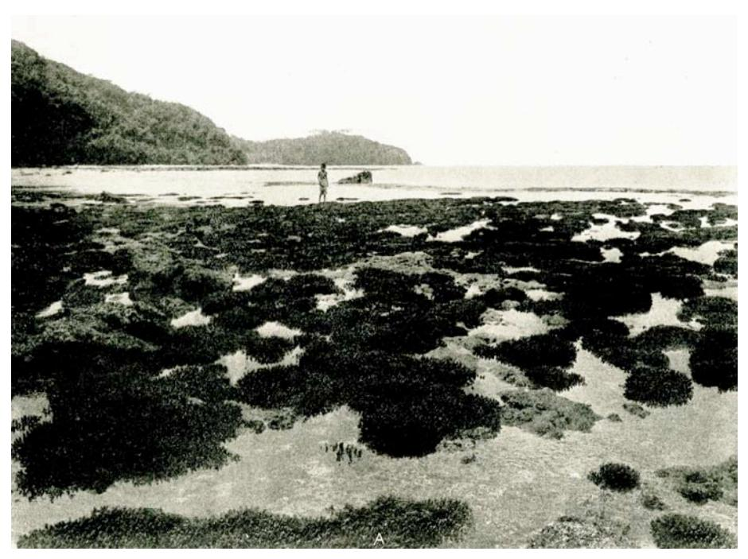
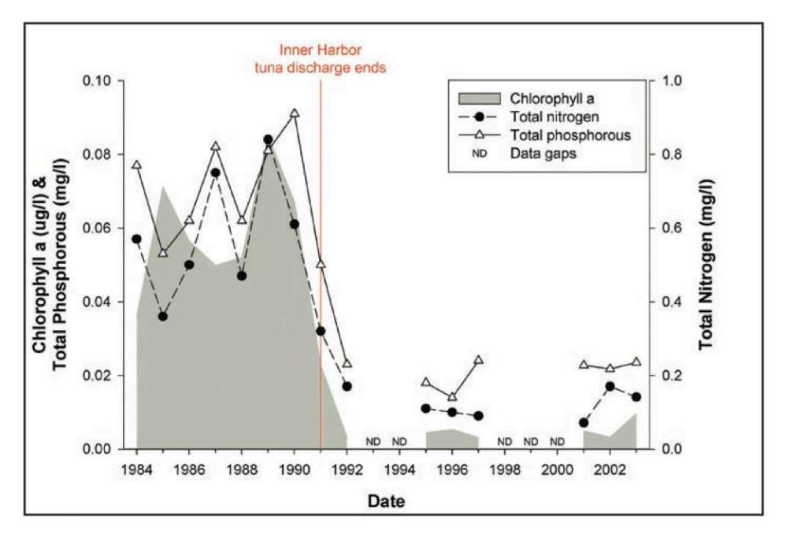
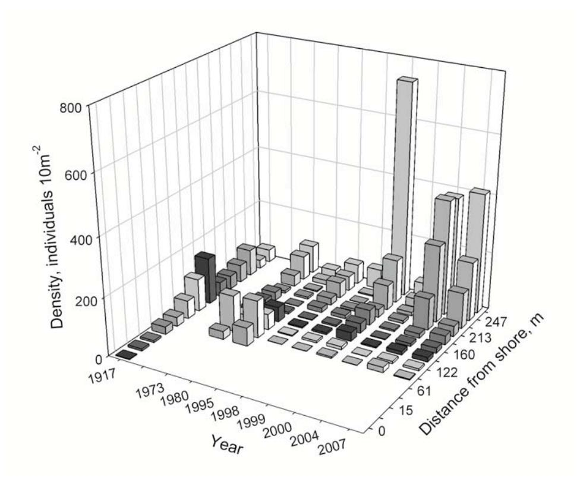
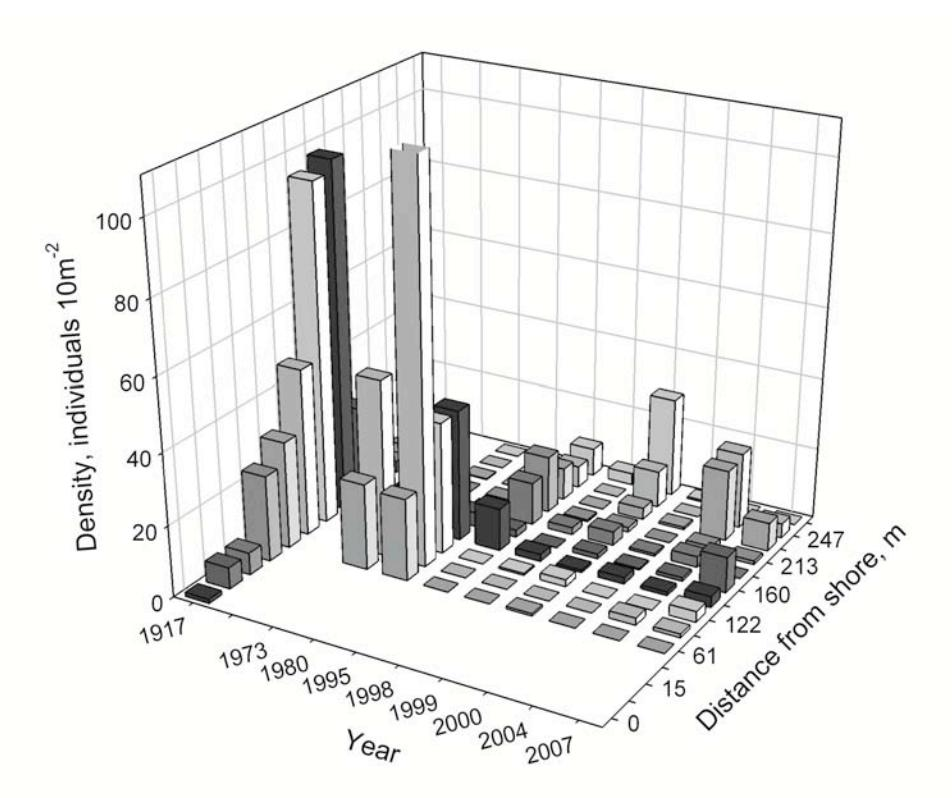
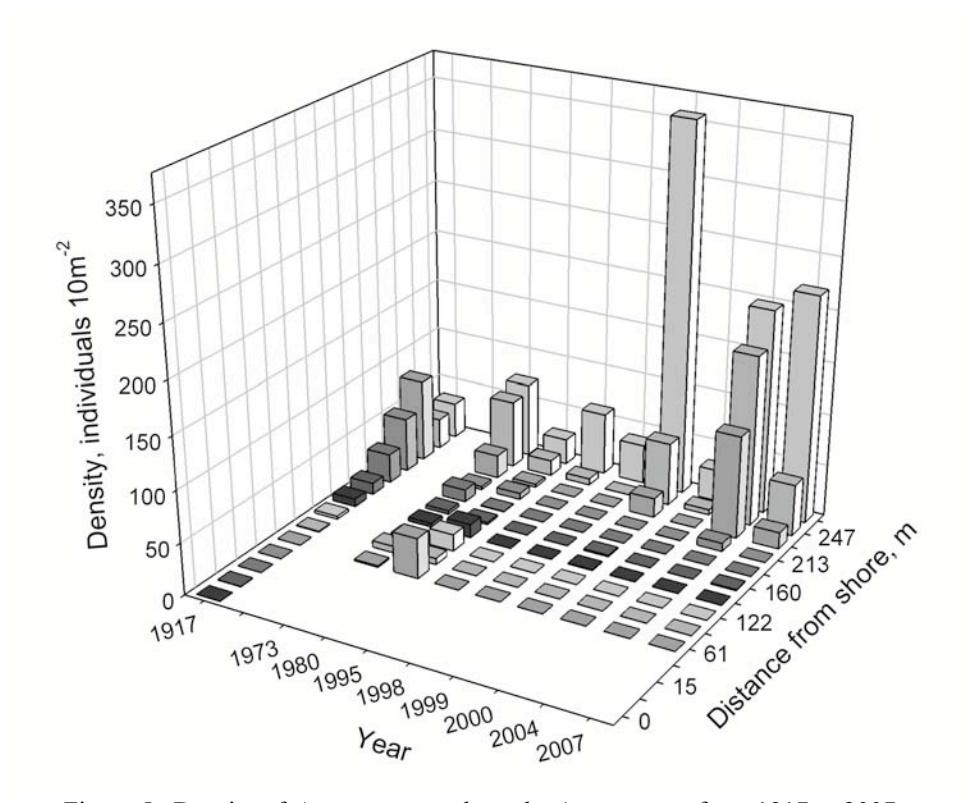
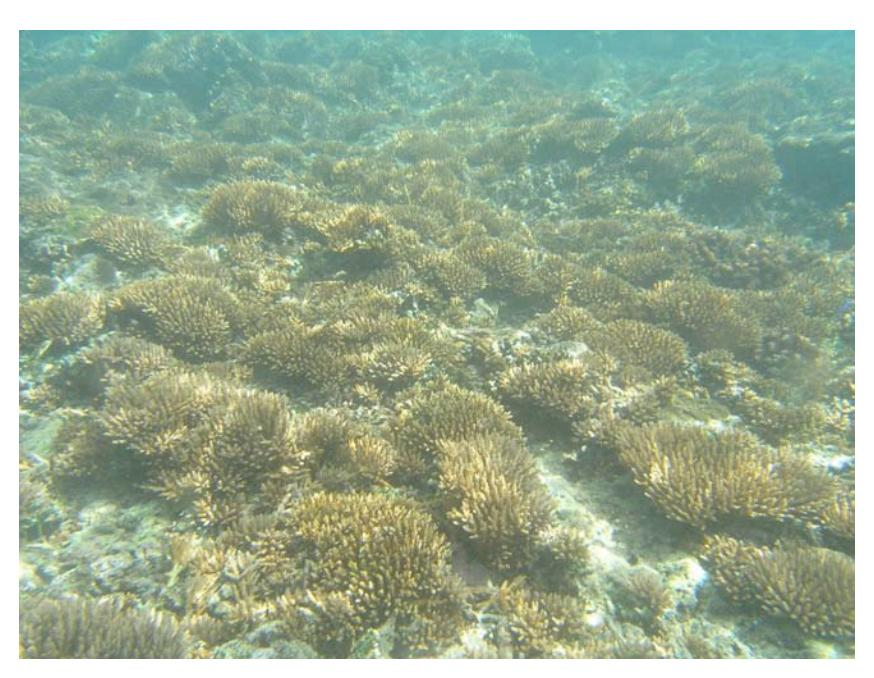
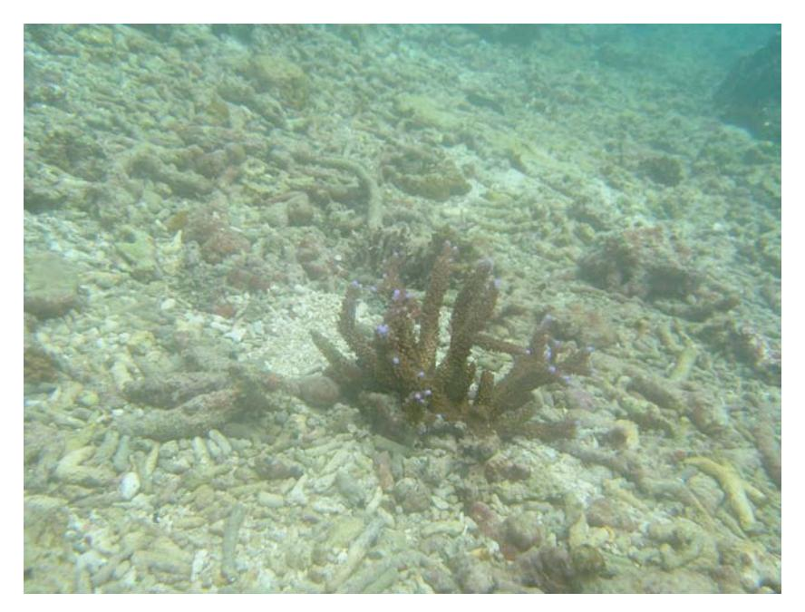
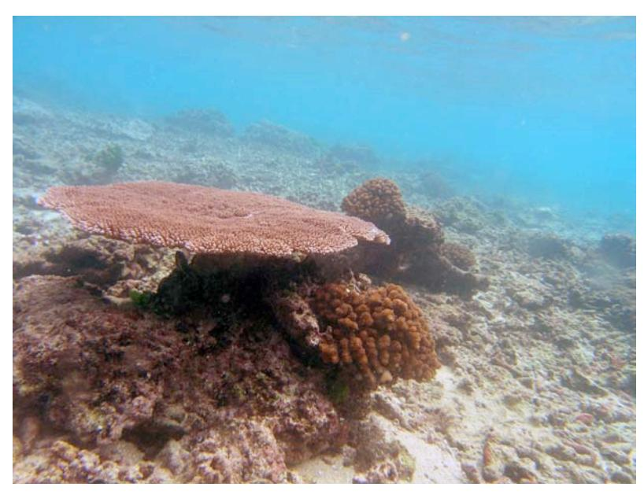
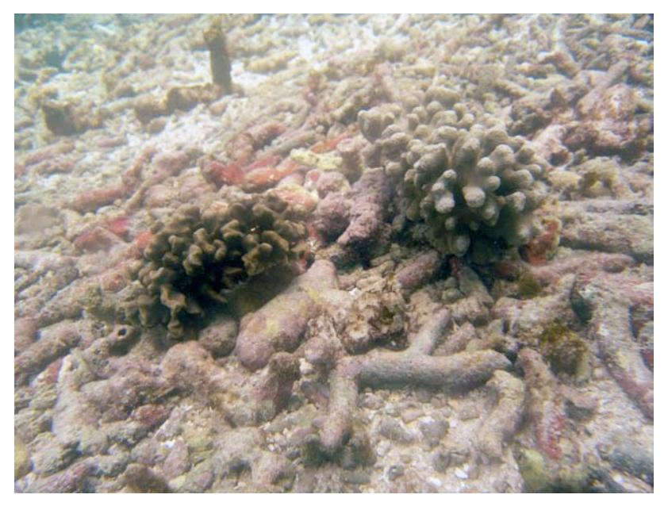

# **Substratum stability and coral reef resilience: insights from 90 years of disturbances on a reef in American Samoa1**

#### C. BIRKELAND

*Department of Biology, University of Hawaii, Honolulu, HI 96822 email: charlesb@hawaii.edu*

#### A. GREEN

*The Nature Conservancy, 245 Riverside Drive, West End, QLD 4101 Australia*

#### D. FENNER

*Department of Marine and Wildlife Resources, Government of American Samoa, Pago Pago, American Samoa*

#### C. SQUAIR

*Department of Botany, University of Hawaii, Honolulu, HI 96822*

#### AND

#### A.L. DAHL

*International Environment Forum, 12B Chemin de Maisonneuve, CH-1219 Chatelaine, Geneva, Switzerland*

*Abstract***—**In 1917, Alfred Mayor recorded rich coral communities in distinct zones on the reef flat along a permanent transect at Aua village in Pago Pago Harbor, American Samoa. In the 1950s-1980s, this area was seriously degraded by chronic pollution from two tuna canneries and fuel spills in the inner harbor and by coastal development. By the 1970s, coral communities had declined substantially. Mayor provided a map and photographs of the transect in his 1924 report and so we were able to repeat surveys along the same transect in 1973, 1980, 1995, 1998, 1999, 2000, 2004 and 2007. In 1992, a large pipe was installed to export wastewater from the tuna canneries to the harbor mouth. Management of coastal development and fuel spills had improved by the early 1990s. We found that since then, there has been a significant recovery of coral communities on the reef crest and outer reef flat where there is consolidated reef substratum (up to 30 m back from the reef

 1 Citation: Birkeland, C., A. Green, D. Fenner, C. Squair & A.L. Dahl. 2013. Substratum stability and coral reef resilience: insights from 90 years of disturbances on a reef in American Samoa. *Micronesica* 2013-06, 16 pp. Published online 28 Sep. 2013. www.uog.edu/up/micronesica/2013.

Open access, Creative Commons Attribution-NonCommercial-NoDerivs License.

crest). In contrast, we found that recovery has been substantially slower or absent behind the reef crest, where the substratum is primarily loose rubble. In particular, the *Acropora* zone recorded on the outer reef flat in 1917 (120–140 m behind the reef crest) had disappeared completely by the 1990s. Recovery is now proceeding in this zone by the slow accumulation of *Acropora muricata* colonies that are large enough to become established on the loose substratum. The recovery of coral communities on a few large stable blocks of reef rock scattered across the zone of loose rubble was similar to the recovery on the solid reef crest. The large stable blocks provided a natural experiment that demonstrated resilience (rate of recovery) of the coral communities after chronic or acute disturbance was determined largely by stability of the substratum.

*Key words:* coral, resilience, recovery, substrata, rubble, zonation

## **Introduction**

Alfred Mayor of the Carnegie Institute in Washington DC established a transect in 1917 for a quantitative study of the corals across 247 m of reef flat from the shore to the reef crest near the village of Aua in Pago Pago Harbor (Mayor 1924). In August 2007, with our assistance, the U.S. National Geodetic Survey established official benchmarks at the shoreline end (14° 16′ 45.00128′′ S, 170° 40′ 1.92334′′ W) and at the reef crest end (14° 16′ 45.05769′′ S and 170° 40′ 1.85080′′ W) of the transect.

Substantial urban development began in Pago Pago after World War II. In the 1950s, two tuna canneries were constructed and began operation, a fuel dump at Aua contributed pollutants to the seawater, and the inner 90 m of Mayor's Aua transect was dredged for road construction materials, contributing a plume of sedimentation over the transect for several years. The canneries poured large quantities of wastewater into the harbor continuously and this lower water quality was a chronic problem for about four decades. In Mayor's 1917 survey, the reef flat was covered by branching corals, with *Porites cylindrica* dominant from about 15 m from shore to 160 m and with *Acropora* spp. (mostly *A. muricata = A. formosa*) dominant on the outer 90 m (Fig. 1). Art Dahl and Austin Lamberts (1977) resurveyed the Aua transect in 1973 and recorded that the reef flat between the solid pavement of the reef crest and the excavated pit near shore was converted from a community of branching corals to a blanket of loose rubble. Art Dahl (1981) resurveyed the transect seven years later and found that the total number of coral colonies along the transect decreased further, but a thicket of *Acropora muricata* did appear, with some individual colonies reaching 2 m in diameter. This thicket was absent in further surveys.

Figure 1. *Acropora* exposed at low tide on Alfred Mayor's transect near Aua in Pago Pago Harbor in 1917 (reprinted from Mayor 1924 with permission of the Carnegie Institution, Washington, DC).

The US Environmental Protection Agency and the American Samoa Environmental Protection Agency started monitoring water quality in Pago Pago Harbor in 1984 and recorded nitrogen to be ranging between 0.3 and 0.8 mg  $\Gamma^1$ , phosphorus between 0.06 and 0.09 mg  $\Gamma^1$  and chlorophyll a between 9 and 15 µg  $\Gamma^1$  from 1984 to 1990 (Fig. 2). In 1992, the canneries completed an extension of the wastewater outflow pipes to the outer harbor, beyond the Aua transect, where water flow is stronger. Between 1990 and 1992, there was an abrupt drop in levels of total nitrogen from 0.8 to less than 0.2 mg  $\Gamma^1$ , in total phosphorus from over 0.09 to 0.02 mg  $\Gamma^1$ , and in chlorophyll a from over 15 to less than 1 µg  $\Gamma^1$  (Peshut 2003). The water quality has remained close to these latter values since 1992 (Craig et al. 2005).

After 1992, the corals showed successful recruitment and growth throughout the area around the transect. Although the water quality conditions were favorable for coral growth all along the transect, the coral community only recovered in certain areas. We monitored the course of recovery along the transect in 1995, 1998, 1999, 2000, 2004 and 2007 in order to determine why the reef is more resilient in some areas rather than in others, despite the generally favorable water quality conditions for coral physiology and growth throughout.

Figure 2. Water quality in inner Pago Pago Harbor greatly improved and remained improved after tuna canneries were required to modify their waste disposal processes in 1991. Data were taken by the American Samoa Environmental Protection Agency and the figure is from Craig et al. 2005 with permission.

Since the 1980s, coral reefs have been substantially decreasing in living coral cover by 80% in the Caribbean (Gardner et al. 2003), by 52% in the Indo-Pacific (Bruno & Selig 2007), and by over 50% even on the relatively wellmanaged Great Barrier Reef (De'ath et al. 2012). Of course, coral reefs such as those on American Samoa also have been frequently subjected to disturbances from natural factors in the past four decades including six hurricanes, a major crown-of-thorns (*Acanthaster planci*) outbreak, three bleachings from warm seawater, coral mortality from extreme low tides, and a tsunami. Unlike most coral reefs (Gardner et al. 2003; Bruno & Selig 2007; De'ath et al. 2012), the disturbances have generally been acute on the outer reef slopes, and recovery started soon after the event (Green et al. 1999; Birkeland et al. 2008). Anthropogenic factors including pollution, sedimentation, dredging and overfishing also stress corals on American Samoa (Green et al. 1997; Green et al. 1999; Houk et al. 2005), but American Samoan reefs, unlike most coral reefs, are still demonstrating the capacity to recover from frequent disturbance (Birkeland et al. 2008) and coral cover remains relatively good and is increasing at many sites outside the harbor (Fenner et al. 2008a; Fenner 2013).

The difference between American Samoan coral reefs and those that are in continuous decline over the past decades is not the disturbances, because American Samoan reefs experience as many stresses and disturbances as most reefs, it is because American Samoan coral reefs have generally retained the ability to recover. "The rate at which a system returns to an original state following a perturbation," the rate at which it is able to recover, is an operational definition of "resilience" (Pianka 1994: 398). In recent years, the definition has shifted from the capacity and rate of returning to an original state to the "capacity of a system to absorb disturbance without shifting to an alternative stable state and losing function and services" (Hughes et al. 2005; Hughes et al. 2010). To "absorb disturbance without shifting", used to be considered "resistance". This new definition of resilience combines two distinct processes: one that used to be called "resistance", the ability to absorb disturbance without shifting, and the previous use of "resilience", the capacity and rate of returning to an original state once being shifted away from its usual state by a disturbance.

The new definition can be messy because it does not distinguish the fundamentally different processes of resistance and resilience, which are often changing in opposite directions. As environmental stresses or disturbances become more severe or frequent, the corals have commonly become more resistant (Barshis 2010, 2013; Brown & Cossins 2011) and less resilient (Seymour & Bradbury 1999; Nyström et al. 2000; Done et al. 2007, 2008; Wakeford et al. 2008; Thompson & Dolman 2010; Hughes et al. 2011). We will use the older definition of resilience as capacity and rate of recovery because the many disturbances on American Samoa (e.g., hurricanes, crown-of-thorns outbreak) overcame resistance widely, but some regions had more resilience (recovered more quickly) than others. In particular, we attempt to determine why the coral community on the reef crest is resilient and the coral community on the reef flat is not.

## **Methods**

Corals were counted in 0.25 m2 quadrats that were tossed haphazardly within about 10 m to either side of the transect, with an equal number of quadrats on each side, within a set of zones established by Mayor (1924) between the shore and the reef crest. The transect now begins 91 m from shore because this is now the seaward extent of the borrow pit. A detailed history of the transect and the equivalences in names for each of the coral species through the 90 years is presented in Green et al. (1997).

We reported on coral density rather than percent living coral cover because coral density is what Mayor (1924) reported. Mayor did not give information on size distributions from which we could calculate percent living coral cover. The percent living coral cover from our surveys is presented in Fenner et al. 2008a.

Figure 3. Density of corals from 1917 to 2007 along the Aua transect from the shore to the reef crest.

## **Results**

Coral density has changed substantially over time along the Aua transect (Fig. 3). In 1917, corals were recorded along the entire reef flat, with the highest density recorded on the outer reef flat and crest as were evident in Mayor's (1924) photographs (Fig. 1). The excavation of a borrow pit in the 1950s removed nearly all corals from the inner 91 m since that time.

*Porites cylindrica* was the predominant coral on the inner 160 m of the reef flat through 1980 (Fig. 4), while *Acropora muricata* was prevalent from 160 m to the reef crest (Fig. 5) where the *Acropora* species became more diverse (*A. hyacinthus, A. samoensis, A. gemmifera, A. humilis, A. nana, A. aspera*). *Porites cylindrica* and *Acropora muricata* were likely the main contributors to the zone of rubble (about 120 to 130 m in length) from the reef crest (the outer 30 m of the reef flat) to the borrow pit (extending 91 m from shore).

Figure 4. Density of *Porites cylindrica* colonies along the Aua transect from 1917 to 2007.

There has been a significant recovery of coral communities on the reef crest and outer reef flat during the past 15 years. The corals were few in 1995-1998, but starting with a massive recruitment of *Acropora nana* in 1999, density has remained high on the outer part of the transect with solid substrata, but low on the rubble sections of the middle part of the transect. Corals are essentially absent from the borrow pit in the transect area, though *Porites cylindrica* is now present in other parts of the borrow pit.

There used to be a variety of *Acropora* species on the reef crest (see Fig. VB in Mayor 1924), but *Acropora nana* is now predominant (Fig. 6)*.* The reef flat is now mostly rubble with only a few colonies of *Acropora muricata* starting to become established. *Acropora muricata* occasionally gains stability when its relatively extensive branches become lodged in the substratum (Fig. 7). The *A. muricata* colonies on the rubble are quite healthy, as are the other species such as *A. hyacinthus, Montipora* spp., *Pocillopora* spp., *Pavona* spp., *Porites* spp., *Favites* spp., *Cyphastrea* spp., and *Millepora* spp. living on widely separated large immobile blocks among the rubble (Fig. 8). That water quality is not a

Figure 5. Density of *Acropora* spp. along the Aua transect from 1917 to 2007.

problem is evidenced by the observation that coral colonies are healthy as long as they are attached to stable substrata (Fig. 8).

*Pavona divaricata, Porites cylindrica,* and *Millepora* sp. sometimes form coralliths, or unattached free-rolling fragments of substrata with living coral tissue on all sides (Fig. 9). Coralliths appear to represent physiologically healthy corals, but while rolling around unattached, they do not contribute to the resilience of the reef structure.

*Stylaraea punctata* and *Leptastrea purpurea* are able to survive on and below the rubble, respectively, but they also do not contribute substantially to reef structure.

## **Discussion**

The coral reef communities in American Samoa are renowned for their resil– ience to hurricanes, extensive bleaching, predation by *Acanthaster planci*, low water exposures, ship groundings, and other acute disturbances (Birkeland et al. 2008). Recovery began soon after acute disturbances on solid substrata (Green et

Figure 6. *Acropora nana* recruited abundantly to the solid reef crest in the late 1990s.

Figure 7. *Acropora muricata* colony having stability by being wedged into the loose substratum.

Figure 8. Large coral colonies thrive on solid reef rock blocks in the field of rubble. This demonstrates that substratum stability is the key determining factor under relatively uniform conditions of water quality and larval recruitment.

Figure 9. Unattached colonies of *Pavona divaricata* and *Porites cylindrica* with living tissue on all sides.

al. 1999). Managers of coral reef systems should keep in mind that on solid substrata, the coral community can begin to recover as soon as larvae settle and undergo metamorphosis. An example time for coral community recovery to its prior undisturbed state is about 15 years on solid substrata under natural conditions (Colgan 1987, Sano et al. 1987, Birkeland et al. 2008). Where the disturbance is chronic, such as with pollution, sedimentation, climate change, removal of herbivores, and so forth, the recovery will be delayed or prevented until the chronic disturbance is alleviated. Once the chronic stress has been removed, the recovery will be the same as with acute disturbances on solid substrata. On the other hand, where the substratum is loose rubble, recovery will take decades until the substratum can be solidified or until the corals can eventually form a self-reinforcing aggregation.

The coral community on the Aua reef flat deteriorated in the 1950s and did not start to recover for over 40 years. This is because the wastewater pollution from the canneries was a chronic disturbance until 1992 when the canneries extended the wastewater outflow pipes to the outer harbor, beyond the Aua transect. Chronic disturbances such as a continuous input of pollution can keep the corals from recovering for decades, but the corals returned to solid substrata when the chronic disturbance had ended. The living coral cover and species richness all increased substantially wherever there were solid substrata, to about the levels recorded by Mayor in 1917 (Mayor 1924). The population density of corals on solid substrata is now even higher than in 1917, although the living coral cover is comparable (Fenner et al. 2008), so the average colony size must be smaller now. The corals will probably grow to be larger on average and continue to cover more space with time.

On the extensive rubble zone of the inner reef flat (120 – 130 m wide), the coral cover remains small. Rubble was probably produced by resident corals (Fig. 1), and also by some input from the reef crest zone (Rasser & Riegl 2002). The corals that are on the few large blocks among the rubble appear to be in fine health (Fig. 8), so water quality and abundance of larval supply are unlikely to be as important in this case as availability of solid substrata. The most likely reason for the scarcity of corals in the rubble zone is death of juvenile corals on rubble that has been overturned by water motion since larval recruitment.

For a similar example on a larger scale, predation by *Acanthaster planci* severely reduced living coral cover of branching *Acropora* colonies on 13 km2 in the Ngadderak Reef area of Palau in 1979. The extensive coral community changed to unattached rubble. Coral recruits were common on the rubble over the next 20 years (Birkeland, unpublished observations), but there were essentially no large living colonies. Victor (2008) experimentally determined that there was no significant difference in larval recruitment between the unstable rubble substrata and the areas of solid substrata, but the survival of recruits was significantly higher on stable substrata.

On a smaller scale, Fox et al. (2003) and Fox (2004) provided examples of the effects of fishing with dynamite ("blast fishing") that creates rubble on coral reefs in Indonesia. They also found no significant difference in coral recruitment to areas affected by dynamite fishing (rubble) and areas with more consolidated substrata. Their settlement tile results indicated that all sites had an adequate supply of larval recruits. On the other hand, they found a significant reduction in survival of coral recruits with increased water motion in areas of rubble and an increased survival of stabilized coral nubbins.

Limestone rubble provides a suitable substratum for colonization by *P. damicornis*, as Lee et al. (2009) and Ogawa (2009) found in their experiments. Baird & Morse (2004) also found that the substrata containing coral rubble enhanced larval settlement of *Stylophora pistillata*, and Heyward & Negri (1999) found that coral rubble induced metamorphosis in *Acropora millepora*. Although the survival of corals recruiting to rubble is very low, the calcium carbonate rubble seems as attractive as solid substrata and so the rubble acts like flypaper and attracts larvae to their death.

The processes of rigid binding require an initial stabilization of the rubble (Rasser & Riegl 2002). On the Aua transect, there is no evidence that the rubble is beginning to be bound or become consolidated. There are presently a few widely scattered individual *Acropora muricata* colonies that are large enough to become braced in the sand (Fig. 7). One possible mechanism for consolidation is for there to gradually be enough corals large enough to become braced, and thereby stabilizing the substrata and survival of coral recruits between them. In areas without solidifying corals, the rubble can be initially stabilized with overgrowth by colonial ascidians such as *Diplosoma similis* and sponges such as *Dysidea herbacea* observed in abundance and stabilizing rubble at Onososopo (just 700 meters south of Aua) and in Fagatele Bay National Marine Sanctuary.

Crustose coralline algae are an important component of the coral-reef system in their ability to cement and solidify a coral reef, but it probably requires initial stabilization by some other process (Rasser & Riegl 2002).

The more common focuses of discussion of coral resilience to climate change have been acclimatization (physiological and biochemical adjustments of individual colonies to environmental change), adaptation (genetic changes of populations to adjust to environmental changes) and environmental amelioration (local environmental attributes that facilitate survival of corals, such as water motion, shade, topographic complexity). We now know that it is also important to consider morphological aspects of the coral reef under consideration (solid substrata vis-à-vis unconsolidated rubble) and that processes that reduce a reef to rubble (e.g., blast-fishing) can extend the recovery time (i.e., reduce resilience) by several decades.

## **Acknowledgements**

This survey was funded by the NOAA National Marine Sanctuary Program. We appreciate the help of the Coral Reef Advisory Group to the Government of American Samoa for making arrangements and obtaining the funding. Bill Kiene (Fagatele Bay National Marine Sanctuary), and Peter Craig and Paul Brown (American Samoa National Park) helped with logistics. Karen Miller, Craig Mundy and Stephanie Belliveau helped in the collection of field data. Birkeland's first three surveys were conducted while he was at the UOG Marine Laboratory, Guam; Dahl's work (Dahl & Lamberts 1977 and Dahl 1981) was carried out while the author was employed by the Department of Botany, Smithsonian Institution, Washington, D.C. and the South Pacific Commission (now Secretariat of the Pacific Community), Noumea, New Caledonia, respectively.

## **References**

- Barshis, D.J., J.T. Ladner, T.A. Oliver, F.O. Seneca, N. Traylor-Knowles & S.R. Palumbi. 2013. Genomic basis for coral resilience to climate change. Proceedings of the National Academy of Sciences, USA 110: 1387–1392.
- Barshis, D.J., J.H. Stillman, R.D. Gates, R.J. Toonen, L.W. Smith & C. Birkeland. 2010. Protein expression and genetic structure of the coral *Porites lobata* in an environmentally extreme Samoan back reef: does host genotype limit phenotypic plasticity? Molecular Ecology 19: 1705–1720.
- Baird, A.H. & A.N.C. Morse. 2004. Induction of metamorphosis in larvae of the brooding corals. Marine and Freshwater Research 55: 469–472.
- Birkeland, C., P. Craig, D. Fenner, L. Smith, W.E. Keine & B. Riegl. 2008. Geologic setting and ecological functioning of coral reefs in American Samoa. *In:* B. Riegl & R.E. Dodge (eds.), Coral Reefs of the USA. Springer, NY, pp. 737–761.
- Brown, B.E. & A.R. Cossins. 2011. The potential for temperature acclimatization of reef corals in the face of climate change. *In:* Z. Dubinsky & N. Stambler (eds), Coral reefs: an ecosystem in transition. Springer, Dordrecht, Germany, pp. 421–433.
- Bruno, J.F. & E.R. Selig. 2007. Regional decline of coral cover in the Indo-Pacific: timing, extent, and subregional comparisons. PLoS One 2: e711.
- Colgan, M.W. 1987. Coral reef recovery on Guam (Micronesia) after catastrophic predation by *Acanthaster planci*: a study of community development. Ecology 68: 1592–1605.
- Craig, P., G. DiDonato, D. Fenner & C. Hawkins. 2005. The state of coral reef ecosystems of American Samoa. *In:* J. Waddell (ed.), The status of the coral reef ecosystems of the US and Pacific freely associated states: 2005. NOAA Technical Memorandum NOS NCCOS 11. NOAA/ NCCOS Center for

- Coastal Monitoring and Assessment's Biogeography Team. Silver Spring, MD, pp.312-337.
- Dahl, A.L. 1981. Monitoring coral reefs for urban impact. Bulletin of Marine Science 31: 544–551.
- Dahl, A.L. & A.E. Lamberts. 1977. Environmental impact on a Samoan coral reef: a resurvey of Mayor's 1917 transect. Pacific Science 31: 209–231.
- De'ath, G., K.E. Fabricius, H. Sweatman & M. Puotinen. 2012. The 27-year decline of coral cover on the Great Barrier Reef and its causes. Proceedings of the National Academy of Sciences 109: 17995–17999.
- Done, T., L. DeVantier, E. Turak, M. Wakeford, A. McDonald & C. Johnson. 2008. Great Barrier Reef coral communities: resilient in the 1980s but struggling in the 2000s. Abstract 12-28. 11th International Coral Reef Symposium, Fort Lauderdale
- Done, T., E. Turak, M. Wakeford, L. DeVantier, A. McDonald & D. Fisk. 2007. Decadal changes in turbid-water coral communities at Pandora Reef: loss of resilience or too soon to tell? Coral Reefs 26: 789–805.
- Fenner, D. 2013. Results of the Territorial Monitoring Program of American Samoa for 2012, Benthic Section. Department of Marine & Wildlife Resources, American Samoa.
- Fenner, D., M. Speicher, S. Gulick, G. Aeby, S. Cooper Alleto, B. Carroll, E. DiDonato, G. DiDonato, V. Farmer, J. Gove, P. Houk, E. Lundblad, M. Nadon, F. Riolo, M. Sabater, R. Schroeder, E. Smith, C. Tuitle, A. Tagarino, S. Vaitautolu, E. Vaoli, B. Vargas-Angel & P. Vroom. 2008a. Status of the coral reefs of American Samoa. In J.E. Waddell and A.M. Clarke (eds.), The State of Coral Reef Ecosystems of the United States and Pacific Freely Associated States: 2008. NOAA Technical Memorandum NOS NCCOS 73. NOAA/ NCCOS Center for Coastal Monitoring and Assessment's Biogeography Team. Silver Spring, MD, pp. 307-331.
- Fenner, D., A. Green, C. Birkeland, C. Squair & B. Carroll. 2008b. Long term monitoring of Fagatele Bay National Marine Sanctuary, Tutuila Island, American Samoa: results of surveys conducted in 2007/8, including a resurvey of the historic Aua Transect. Report prepared for NOAA Office of Marine Sanctuaries and for the American Samoa Government. 58 pp.
- Fox, H.E. 2004. Coral recruitment in blasted and unblasted sites in Indonesia: assessing rehabilitation potential. Marine Ecology Progress Series 269: 131– 139.
- Fox, H.E., J.S. Pet, R. Dahuri & R.L. Caldwell. 2003. Recovery in rubble fields: long-term impacts of blast fishing. Marine Pollution Bulletin 46: 1024–1031.
- Gardner, T.A., I.M. Côté, J.A. Gill, A. Grant & A.R. Watkinson. 2003. Longterm region-wide declines in Caribbean corals. Science 301: 958–960.
- Green, A.L., C.E. Birkeland, R.H. Randall, B.D. Smith & S. Wilkins. 1997. 78 years of coral reef degradation in Pago Pago Harbor: a quantitative record.

- Proceedings of the 8th International Coral Reef Symposium, Panama 2: 1883–1888.
- Green, A.L., C. Birkeland & R.H. Randall. 1999. Twenty years of disturbance and change in Fagatele Bay, National Marine Sanctuary, American Samoa. Pacific Science 53: 376–400.
- Heyward, A.J. & A.P. Negri. 1999. Natural inducers for coral larval metamorphosis. Coral Reefs 18: 273–279.
- Houk, P., G. Didonato, J. Iguel & R. van Woesik. 2005. Assessing the effects of non-point source pollution on American Samoa's coral reef communities. Environmental Monitoring and Assessment 107: 11–27.
- Hughes, T.P., D.R. Bellwood, A.H. Baird, J. Brodie, J.F. Bruno & J.M. Pandolfi. 2011. Shifting base-lines, declining coral cover, and the erosion of reef resilience: comment on Sweatman et al. (2011). Coral Reefs 30: 653–660.
- Hughes, T.P., D.R. Bellwood, C. Folke, R.S. Steneck & J. Wilson. 2005. New paradigms for supporting the resilience of marine ecosystems. Trends in Ecology and Evolution 20: 380–386.
- Hughes, T.P., N.A.J. Graham, J.B.C. Jackson, P.J. Mumby & R.S. Steneck. 2010. Rising to the challenge of sustaining coral reef resilience. Trends in Ecology and Evolution 25: 633–642.
- Lee, C.S., J. Walford & B.P.L. Goh. 2009. Adding coral rubble to substrata enhances settlement of *Pocillopora damicornis* larvae. Coral Reefs 28: 529– 533.
- Mayor, A. 1924. Structure and ecology of Samoan reefs. Carnegie Institute Publication 340: 1–25.
- Nyström, M., C. Folke & F. Moberg. 2000. Coral reef disturbance and resilience in a human-dominated environment. Trends in Ecology and Evolution 15: 413–417.
- Peshut, P.J. 2003. Monitoring demonstrates management success to improve water quality in Pago Pago Harbor, American Samoa. *In* C. Wilkinson, A. Green, J. Almany & S. Dionne (eds.), Monitoring Coral Reef Marine Protected Areas, Australian Institute of Marine Sciences and the IUCN Marine Program: 36–37.
- Pianka, E.R. 1994. Evolutionary Ecology. Harper Collins College Publishers, NY. 486 p.
- Rasser, M.W. & B. Riegl 2002. Holocene coral reef rubble and its binding agents. Coral Reefs 21: 57–72.
- Sano, M., M. Shimizu & Y. Nose. 1987. Long-term effects of destruction of hermatypic coral by *Acanthaster planci* infestation on reef communities of Iriomote Island, Japan. Marine Ecology Progress Series 37: 191–199.
- Seymour, R.M. & R.H. Bradbury. 1999. Lengthening reef recovery times from crown-of-thorns outbreaks signal systemic degradation of the Great Barrier Reef. Marine Ecology Progress Series 176: 1–10.

- Thompson, A.A. & A.M. Dolman. 2010. Coral bleaching: one disturbance too many for near-shore reefs of the Great barrier Reef. Coral Reefs 29: 637– 648.
- Victor, S. 2008. Stability of reef framework and post-settlement mortality as the structuring factor for recovery of Malakal Bay reef, Palau, Micronesia: 25 years after a severe COTS outbreak. Estuarine, Coastal and Shelf Science 77: 175–180.
- Wakeford, M., T.J. Done & C.R. Johnson. 2008. Decadal trends in a coral community and evidence of changed disturbance regime. Coral Reefs 27: 1– 13.

Received 3 June 2013 , revised 2 Sep.