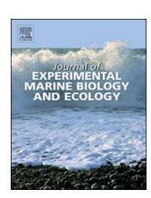
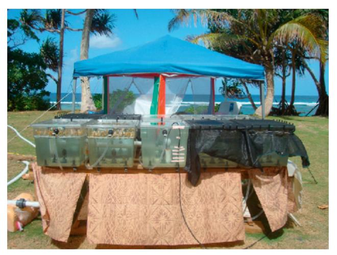
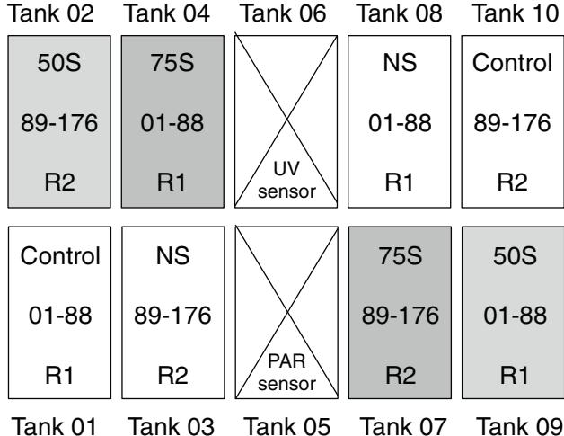
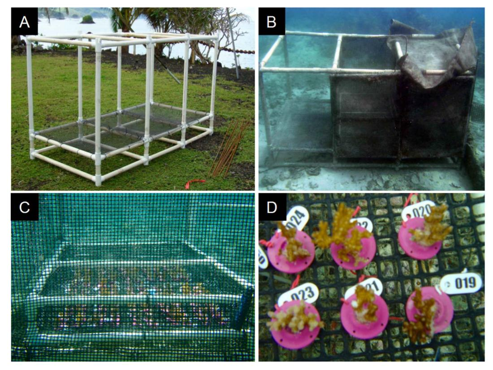
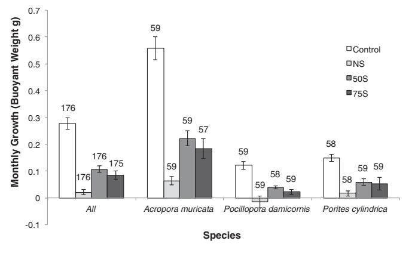
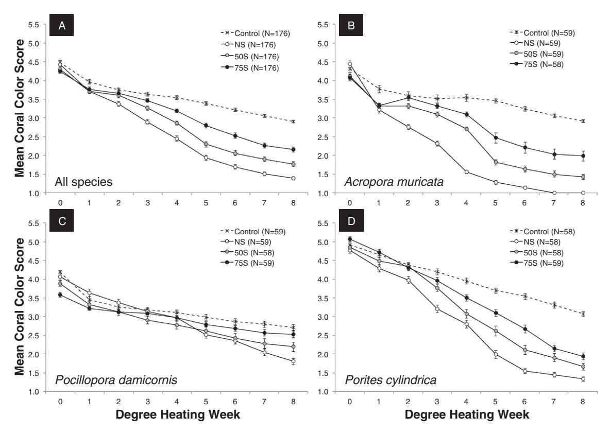
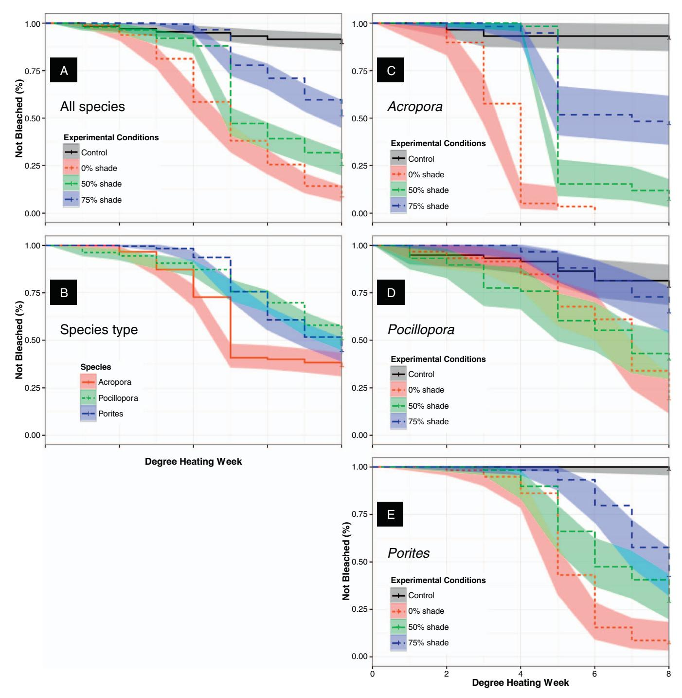
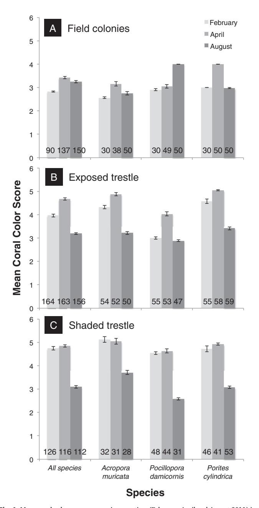

FISEVIER

Contents lists available at ScienceDirect

# Journal of Experimental Marine Biology and Ecology

journal homepage: www.elsevier.com/locate/jembe

# Shading as a mitigation tool for coral bleaching in three common Indo-Pacific species

V.R. Coelhoa, D. Fennerb,1, C. Carusoc,2, B.R. Baylesa,d, Y. Huanga, C. Birkelande

- a Department of Natural Sciences and Mathematics, School of Health and Natural Sciences, Dominican University of California, 50 Acacia Avenue, San Rafael, CA 94901-2298. United States
- b Department of Marine and Wildlife Resources, P.O. Box 4318, Pago Pago, AS 96799, United States
- c National Park of American Samoa, MJH Building, Pago Pago, AS 96799, United States
- d Department of Health Sciences, School of Health and Natural Sciences, Dominican University of California, 50 Acacia Avenue, San Rafael, CA 94901-2298, United States
- e Department of Biology, University of Hawai'i at Manoa, 2538 McCarthy Mall, Honolulu, HI 96822, United States

#### ABSTRACT

Shading substantially reduced the degree of bleaching in Acropora muricata, Pocillopora damicornis and Porites cylindrica in American Samoa. Experiments were conducted outdoors at two sites on Ofu and Tutuila Islands. An aquarium experiment was set up near some reef-flat pools in the National Park of American Samoa on Ofu Island, using different levels of shading (none, 50% and 75%) early in conditions of cumulative thermal stress corresponding to NOAA's Coral Reef Watch-Bleaching Alert System. We analyzed the effects of cumulative thermal stress regarding coral growth, as well as color changes (evaluated using a standardize reference card) as a proxy for decreases in symbiont density and chlorophyll a content (i.e. bleaching). Thermally stressed corals grew less than controls, but corals without shading experienced a more substantial decrease in growth compared to those under 50% or 75% shade. The analysis of coral color showed that both levels of shading were protective against bleaching in conditions of cumulative thermal stress for all species, but were particularly beneficial for the most sensitive ones: A. muricata and P. cylindrica. Heavier shading (75%) offered better protection than lighter shading (50%) in this experiment, possibly because of the intense light levels corals were subjected to. Although there were limits to the extent shading could mitigate the effects of cumulative heating, it was very effective to at least Degree Heating Week (DHW) 4 and continued to offer some protection until the end of the study (DHW 8). In Tutuila, a shaded/not-shaded platform experiment was carried out in a reef pool in which corals have shown repeated annual summer bleaching for several years. This experiment was designed to investigate if shading could attenuate bleaching in the field and also if there were negative consequences to shading removal. The only factor controlled was light intensity, and our main conclusion was that overall corals on the platform became darker than field colonies in response to shading, but adjusted back to the same color level as field colonies after shade removal. However, the latter results are preliminary and need to be confirmed by future studies under more controlled conditions. As bleaching becomes more frequent and regular due to global warming, we should consider proactively using shading to help mitigate the effects of thermal stress and prolong the survival of at least some coral communities, until solutions to address global climate change become effective.

## 1. Introduction

Solar radiation is one of the most important determinants of the distribution of marine organisms. The ultraviolet (UV) portion (280–400 nm) is harmful for many marine species (Jokiel, 1980), while photosynthetically active radiation (PAR, 400–700 nm) is necessary for

those that are photosynthetic or in a photosynthetic symbiosis, such as most hermatypic corals (for a comprehensive review on coral-algal photobiology see Roth, 2014).

There is a tradeoff between the cost of defense against UV and the gains from PAR, both of which decrease with depth. Increased energy from solar radiation can sometimes induce damage to photosystem II

\* Corresponding author.

E-mail address: vania.coelho@dominican.edu (V.R. Coelho).

 $^{\rm 1}$  Present address: P.O. Box 7390, Pago Pago, American Samoa 96799, United States.

&lt;sup>2 Present address: Hawai'i Institute of Marine Biology, 46-007 Lilipuna Rd, Kaneohe, HI 96744, United States.

(the site of the initial stage of photosynthesis) and cause bleaching, i.e. paling of corals due to loss of photosyntetic endosymbionts and/or decrease in their pigmentation ([Brown, 1997a; Brown et al., 1994;](#page-10-1) [Coles and Jokiel, 1978; Gleason and Wellington, 1993; Hoegh-Guldberg](#page-10-1) [and Smith, 1989; Le Tissier and Brown, 1996; Lesser et al., 1990\)](#page-10-1).

However, it is the synergistic effects of intense solar radiation with elevated temperature that are more detrimental, as both contribute excess energy ([Dunne and Brown, 2001; Gorbunov et al., 2001\)](#page-10-2) which increases the production of reactive oxygen species in both host (coral animal) and zooxanthellae (endosymbionts), reduces the concentration of D1 protein in the initial stages of photosynthesis, leads to greater DNA damage in the host, decreases photosynthetic pigments, and reduces mycosporine-like amino acids that protect the coral and zooxanthellae by absorbing excess radiation ([Gorbunov et al., 2001; Lesser](#page-10-3) [and Farrell, 2004](#page-10-3)).

The benefits of natural protection of corals from intense light during periods of thermal stress have been observed from large-scale coastal dimensions (e.g. areas with turbid water or greater cloud cover) to within coral colonies. Prior to the recent mass bleaching event ([Heron](#page-10-4) [et al., 2016; Hughes et al., 2017\)](#page-10-4), the circumtropical mass bleaching of 1997/98 was one of the most harmful in history; the world lost about 16% of its living coral [\(Wilkinson et al., 1999\)](#page-11-1). A striking exception was the lack of significant bleaching and mortality in French Polynesia; long-term sea-surface temperature (SST) and cloud cover records indicated that cloud cover may have alleviated bleaching stress from high SST by partial protection from solar irradiance [\(Mumby et al., 2001a](#page-10-5)). A study of spatial variation in bleaching response to the 2010 seawater warming by corals among 80 sites in Palau found that coral bleaching was significantly higher in the clear waters of outer reefs than in the more turbid waters of bays [\(Golbuu et al., 2011](#page-10-6)). [Goreau et al. \(2000\)](#page-10-7) reported less mortality from bleaching in relatively turbid waters of Sri Lanka and the Seychelles. [Wagner et al. \(2008\)](#page-11-2) also showed that near shore corals growing in turbid conditions with low light levels were less susceptible to bleaching, despite high temperatures. Likewise, in clear water on outer reefs in Palau, bleaching was observed in Astrea curta colonies down to 24 m, in contrast to the turbid Toachel Mlengui channel out of Ngermeduu Bay, where large stands of Acropora horrida and other coral genera showed no signs of bleaching in 3–5 m of water (CEB, pers. obs.).

On a more site-specific scale, [Mumby et al. \(2001b\)](#page-10-8) documented an increased protection of corals from bleaching with depth. There are even differences in tolerances within coral colonies that appear to be a result of which polyps are facing more solar radiation. [Fenner and](#page-10-9) [Heron \(2008\)](#page-10-9) documented annual bleaching on the upper surfaces of branches of Acropora muricata, and at the extreme, tissue on the tops of some branches died while tissue on the bottom remained healthy. [Brown \(1997b\)](#page-10-10) showed that bleaching occurred in a portion of a Goniastrea pectinata colony more exposed to light. [Glynn \(1984\)](#page-10-11), [Robinson](#page-10-12) [\(1985\),](#page-10-12) and [Glynn and D'Croz \(1990\)](#page-10-13) all found that there was less bleaching of polyps that were receiving solar radiation less directly, being positioned on sides facing away from the predominant exposure angle, in crevices or fissures in the colony.

There have been several coral-reef manager's handbooks (for a reference list see [Grimsditch and Salm, 2006](#page-10-14)) produced that provide guidance for aiding the recovery after a bleaching event and increasing the resilience of coral-reef species and communities. One of these handbooks ([Marshall and Schuttenberg, 2006](#page-10-15)) highlights that two main variables; the intensity of thermal stress and the ability of local corals to withstand such conditions, will be key to their long-term survival. [Grimsditch and Salm \(2006\)](#page-10-14) also suggest that solar radiation, among other factors, can play an important role affecting the survival of reefs under thermal stress. We propose that for bleaching, defense may be more efficient than recovery. As bleaching becomes more frequent due to climate change [\(Heron et al., 2016; Hoegh-Guldberg et al., 2007;](#page-10-4) [Hughes et al., 2017](#page-10-4)), we should shift from responding to events by aiding recovery, to proactive programs that prevent or reduce damage.

Shading is unique in that it is a potential direct intervention that can reduce bleaching in response to a specific forecast of a coming event. Thermal stress warning is now available via a satellite-based program provided by the National Oceanic and Atmospheric Administration (NOAA); the Coral Reef Watch-Bleaching Alert System (CRW-BAS, <http://coralreefwatch-satops.noaa.gov>; [Liu et al., 2014; Heron et al.,](#page-10-16) [2016\)](#page-10-16).

The CRW-BAS program uses satellite data on SST measurements to identify areas that are 1 °C above the expected maximum monthly mean ("HotSpot") and quantify the accumulated thermal stress over 12 weeks to determine the probability that bleaching may occur. One "Degree Heating Week" (DHW) corresponds to temperatures 1 °C above the maximum monthly mean SST for 7 days. DHW 2 is the same as DHW 1 but for 14 days, or temperatures 2 °C above the maximum monthly mean SST for 7 days, and so on. Based on cumulative thermal stress, a bleaching warning system was developed: No Stress (HotSpot ≤ 0 °C), Bleaching Watch (0 °C < HotSpot < 1 °C), Bleaching Warning (HotSpot ≥ 1 °C and 0 < DHW < 4), Bleaching Alert Level 1 (HotSpot ≥ 1 °C and 4 ≤ DHW < 8), and Bleaching Alert Level 2 (HotSpot ≥ 1 °C and DHW ≥ 8).

In this study, we examined the response of three branching species widely distributed in Indo-Pacific reefs; Acropora muricata,[3](#page-1-0) Pocillopora damicornis and Porites cylindrica, to shading under bleaching conditions, and its potential use as a mitigation tool. Experiments were conducted in American Samoa using different levels of shading early in conditions of cumulative thermal stress corresponding to CRW-BAS on Ofu Island, and measuring shading effects on corals during the annual bleaching season on Tutuila Island.

#### 2. Methods

Two sites were chosen for field shading experiments. A shaded/notshaded aquarium experiment was set-up outdoors, under natural sunlight, near some reef-flat pools in the National Park of American Samoa on Ofu Island. These diverse coral communities experience daily seawater temperature fluctuations as high as 4 °C to 8.6 °C, depending on the pools [\(Craig et al., 2001](#page-10-17)). Also, a shaded/not-shaded platform experiment was carried out in a reef pool in Tutuila in which corals have shown repeated annual summer bleaching for several years [\(Fenner and](#page-10-9) [Heron, 2008](#page-10-9)).

#### 2.1. Coral color measurements

In both experiments the response to stress was recorded using a standardized color reference card (Coral Health Chart, [www.](http://www.coralwatch.org) [coralwatch.org](http://www.coralwatch.org)) developed by [Siebeck et al. \(2006\)](#page-11-3), which uses a 6 point brightness/saturation scale as a reliable proxy for changes in symbiont density and chlorophyll a content, at least at the 2-units level difference. [Fabricius \(2006\)](#page-10-18) also showed that the same color scale was strongly and linearly related to the background fluorescence measurements of the corals she studied, confirming the reliability of this method to estimate potential bleaching responses over time.

[Siebeck et al. \(2006\)](#page-11-3)'s coral reference card also includes different hues, designated by letters, to assist the observer in matching the color of the coral. In the present study we used the C hue for A. muricata, the D hue for P. damicornis, and the E hue for P. cylindrica. However, only the card's numeric data were analyzed, as these are the key measurements to estimate changes [\(Siebeck et al., 2006](#page-11-3)).

The numeric scale varies from 1 to 6 units, with 6 representing the greatest saturation and least brightness, and therefore, the highest symbiont density and chlorophyll a content ([Siebeck et al., 2006\)](#page-11-3).

For each coral we recorded the lightest and darkest color scores, being careful not to include the very tip of the branches in the

3 Acropora formosa is a junior synonym of Acropora muricata [\(Wallace, 1999\)](#page-11-4).

measurement, as they may be lighter due to rapid growth. The final color score for each coral was the average number between the lightest and darkest color units (Coral Health Chart, www.coralwatch.org). To reduce possible variability due to multiple observers (Siebeck et al., 2006), only one of us scored the color data over time for the same species (in Ofu experiments, VC recorded the data for *A. muricata*, and YH for *P. damicornis* and *P. cylindrica*; for Tutuila experiments, DF scored all color data for all species).

#### 2.2. Ofu experiment

During June–July 2011, coral fragments were collected from as many different colonies as possible of *A. muricata*, *P. damicornis* and *P. cylindrica* in "Pool 400" at the National Park of American Samoa in Ofu. Pool 400 is one of the larger pools on the southeast coast of Ofu and probably because of its greater volume, temperature does not fluctuate as much as in the smaller pools. In Pool 400, the annual mean seawater temperature was 28.6 °C, the mean summer temperature was 29.3 °C, and the range through the year varies from 26.2 °C to 31.9 °C (referred to as "Pool B" in Craig et al., 2001). Coral branches were broken into 3–5 cm long fragments that were then glued with epoxy onto a plastic stub and allowed to recover for a minimum of 3 days in running seawater tables. Approximately 30 coral fragments per species were placed in each of 8 aquaria, with a total of 702 corals; 234 fragments per species (Fig. 1, and Fig. A1 in the Appendix, Supplementary material).

Two of the aquaria were set at  $28.5\,^{\circ}\text{C}$  as controls. All other aquaria were kept at  $31.5\,^{\circ}\text{C}$ ; two had no shading, two had 50% shading starting just after DHW 1 was reached, and two had 75% shading starting just after DHW 1 was reached. The temperature data per aquarium can be found in the Appendix, Fig. A2. The experiment continued until DHW 8 was reached (30 days).

All coral fragments had their buoyant weight measurements (Jokiel et al., 1978) taken at the beginning of the experiment ("DHW 0") and at the end (DHW 8). At the end, before weighing, any algal growth found on the base of the stub was removed as much as possible, and also from the fragment itself if necessary, with care not to damage the coral.

Photos were taken at the beginning of the experiment and at every DHW with the standardized color reference card (Siebeck et al., 2006). Control corals were photographed on the same days thermally stressed corals reached a new DHW.

#### 2.2.1. Aquaria system

Ten separate 801 (22 gal) polycarbonate tanks (Fig. 1, Cambro Manufacturing) received fresh seawater from a 38001 (1000 gal) container located close to shore, which was refilled twice a day by a gaspowered water pump. Water flow to individual tanks was regulated at a rate of about 201 (5 gal) per hour using flow meter valves (Key Instruments).

Seawater in the tanks was heated or cooled by diverting water from the tanks through coiled stainless steel heat exchangers using a system of pumps and plastic tubing. All tanks were fully self-contained with no mixing of water among them. Heating or cooling of the heat exchangers was achieved by their immersion in insulated chests filled with fresh water heated to  $\sim 36\,^{\circ}\text{C}$  or cooled to  $\sim 22\,^{\circ}\text{C}$  by a central heater (Elecro 4 kW, Aqua Logic Inc.) or chiller (Delta Star  $^{34}$  HP, Aqua Logic Inc.), respectively. Process controllers (Love Temperature Controller 16B-33, Dwyer Instruments Inc.) monitored individual tank temperature via a thermocouple (Type J, Omega Engineering Inc.) installed in each tank, and activated pumps (QuietOne 1200, Lifegard Aquatics) via relays to send tank water through the appropriate heat exchanger and back, according to a programmed temperature set point.

A separate pump (QuietOne 3000 - LifeGard Aquatics) centrally located at the bottom of each tank was used in conjunction with rotating diverter heads (BioFlo nozzle, Hydor S.R.L.) to circulate water continuously.

Fig. 1. Experimental set-up in Ofu. Control aquaria maintained at 28.5 °C in full sunlight (tanks 1, 10). High temperature aquaria maintained at 31.5 °C (tanks 2–4, 7–9): two of them without shade (tanks 3, 8); two of them with 50% shade (tanks 2, 9); and two of them with 75% shade (tanks 4, 7). Shade was placed in the selected aquaria just after Degree Heating Week 1 was reached. Tanks 5 and 6 without corals and without shade. Tank 5 had a photosynthetic active radiation (PAR) sensor, and tank 6, an ultraviolet radiation (UV) sensor. Number range within rectangles represents coral numbers. NS: high temperature aquaria without shade; 50S: high temperature aquaria with 50% shade; 75S: high temperature aquaria with 75% shade; R1: replicate 1; R2: replicate 2.

# 2.2.2. Light measurements

Irradiance was measured with an underwater spherical quantum sensor, and light meter, (LiCor\*; LI-193SA, LI-250A) for PAR, and a UV radiation sensor, and datalogging radiometer (Solar Light\*; PMA 2104, PMA 2100), that detected biologically weighted UV, also called "sunburning" UV radiation, in the 280 to 370 nm range following closely the erythema action spectrum (Appendix, Fig. A3). The UV sensor's peak relative spectral response was between 280 and 300 nm. Knitted black polyethylene fabric designed to reduce light by 50% and 75% were used to shade different aquaria (Fig. 1, and Appendix, Table A1). The effect of cloud cover on irradiance and level of cloudiness observed during the experiment was also recorded (Appendix, Table A2 and Fig. A4). The highest PAR levels on a cloudless day were above 2000  $\mu$ mol quanta m $^{-2}$ s $^{-1}$  and UV was above 5  $\mu$ W cm $^{-2}$  (Appendix, Tables A1 and A2, Fig. A3).

#### 2.3. Tutuila experiment

The study site was a large pool in Coconut Point, Nu'uuli, where two of the most common coral species are *A. muricata* and *P. cylindrica. Pocillopora damicornis* colonies are also abundant in this pool and were

Fig. 2. Field experiment apparatus in Tutuila: (A) trestle's framework; (B) trestle installed in the pool with caging material and top shade on one side; (C) closer view of one of the coral trays inside trestle, surrounded by caging material; (D) coral fragments, stubs were attached to the mesh with plastic coated wires.

Fig. 3. Mean monthly growth of coral fragments in Ofu in relation to species, temperature and light levels [\(Tables 1 and 2\)](#page-3-6). Bars represent standard error. Numbers above columns indicate sample size. Control: no thermal stress, no shade; NS: high temperature, no shade; 50S: high temperature, 50% shade; 75S: high temperature, 75% shade.

# examined as well.

Coral fragments were cut to 3–5 cm as in the Ofu experiment, and placed on small plastic stubs (using ethyl cyanoacrylate glue, 700cps, E-Z Bond®) that were attached with plastic coated wires to a 1 cm plastic mesh grid, which was located within a basket made with polyvinyl chloride (PVC) pipes. The PVC basket was placed atop of the same mesh material in a larger platform structure (trestle) that was anchored by PVC poles (perforated at regular intervals) secured deep in the sediment with rebars ([Fig. 2\)](#page-3-0). The trestle's grid was about 15 cm above the sandy substrate [\(Harriott and Fisk, 1987\)](#page-10-20).

The experimental platform was installed in a shallow water site (about 3 m deep). Corals were taken from similar depths to the depth at which the experiment was set up, to minimize light acclimatization issues. The trestle had two baskets with a minimum of 30 coral

Table 1 Ofu experiment: one-way analysis of variance for coral growth data in relation to species, temperature and light levels [\(Fig. 3\)](#page-3-1).

| Tests |           | All species    | Acropora       | Pocillopora    | Porites        |
|-------|-----------|----------------|----------------|----------------|----------------|
| KW    |           | 174.32 ⁎⁎⁎⁎ | 110.18 ⁎⁎⁎⁎ | 70.825 ⁎⁎⁎⁎ | 57.000 ⁎⁎⁎⁎ |
| DMC   |           |                |                |                |                |
|       | C × NS    | ⁎⁎⁎            | ⁎⁎⁎            | ⁎⁎⁎            | ⁎⁎⁎            |
|       | C × 50S   | ⁎⁎⁎            | ⁎⁎⁎            | ⁎⁎⁎            | ⁎⁎⁎            |
|       | C × 75S   | ⁎⁎⁎            | ⁎⁎⁎            | ⁎⁎⁎            | ⁎⁎⁎            |
|       | NS × 50S  | ⁎⁎⁎            | ⁎⁎⁎            | ⁎⁎             | −              |
|       | NS × 75S  | ⁎⁎⁎            | ⁎⁎⁎            | −              | ⁎⁎             |
|       | 50S × 75S | −              | −              | −              | −              |

KW: Kruskal-Wallis test (corrected for ties); DMC: Dunn's Multiple Comparison test; C: Control, no thermal stress, no shade; NS: high temperature, no shade; 50S: high temperature, 50% shade; 75S: high temperature, 75% shade.

- − P > 0.05 (not significant).
- ⁎⁎ P < 0.01.
- ⁎⁎⁎ P < 0.001.
- ⁎⁎⁎⁎ P < 0.0001.

fragments per species each, placed in a manner that allowed one of them to be under full sunlight and the other one to be shaded.

A plastic mesh of 7 mm, Nylex, high-density polyethylene [\(Jompa](#page-10-21) [and McCook, 2002](#page-10-21)) was attached to the sides of the platform's poles to decrease predation effects ("cage"). At an earlier trial, prior to the beginning of this experiment, we caged the entire structure but soon realized that we needed to allow herbivores to get in to minimize algal growth around the corals and on the trestle. Thus, we kept the caging material on the sides in an attempt to minimize predation on corals, but because half of the trestle did not have shading or caging material on top, fish could come in and out freely.

Bleaching levels were assessed using the standardized color reference card ([Siebeck et al., 2006](#page-11-3)). We compared the mean color score

Table 2
Ofu experiment: multivariate general linear model for coral growth data in relation to species, temperature and light levels (Fig. 3).

| Variables            |             | Coefficient | SE   | t-Value* |
|----------------------|-------------|-------------|------|----------|
| Intercept Species |             | 0.41        | 0.02 | 24.33*   |
| 1                    | Acropora    | ref         | ref  | ref      |
|                      | Pocillopora | -0.22       | 0.02 | - 12.73* |
|                      | Porites     | -0.19       | 0.02 | - 11.09* |
| Experiment           |             |             |      |          |
| _                    | Control     | ref         | ref  | ref      |
|                      | NS          | -0.26       | 0.02 | - 13.09* |
|                      | 50S         | -0.17       | 0.02 | - 8.74*  |
|                      | 75S         | -0.19       | 0.02 | - 9.72*  |

C: Control, no thermal stress, no shade; NS: high temperature, no shade; 50S: high temperature, 50% shade; 75S: high temperature, 75% shade; SE: standard error; ref: Reference.

for field colonies, and coral fragments placed on the trestle with caging material surrounding it, and 50% shade on top of half of it. Because of the surrounding caging material, both sides of trestle received some shading in comparison to field colonies. However the exposed side, i.e. without top shading, received more sunlight than the shaded side (with 50% top shade).

Field colonies were assessed randomly, i.e. we did not tag coral colonies to re-visit the exact same ones every time. In areas with large thickets of A. muricata or P. cylindrica, color scoring was done using a 0.5  $\rm m^2$  quadrat dropped at regular intervals during a fixed course swim. Coral colonies of P. damicornis were randomly chosen for assessment during the same trajectory.

The trestle was placed in the field in November 2010 at the expected beginning of the bleaching season. Coral color score assessments took place in February (bleaching season), April (bleaching season) and August (non-bleaching season) 2011. Field colonies of each species were assessed at the same time. The only exception was field colonies of *P. damicornis*, which were assessed in the beginning of May while the trestle coral fragments were all assessed a week earlier in the end of April. However, to simplify the graphs and tables, we referred to these assessments as if they all took place in April.

Caging and shading material were removed from the trestle in late April, close to the expected end of the bleaching season (Fenner and Heron, 2008). The April coral color score assessment was carried out immediately before the removal of the caging and shading material.

Average temperature changes over time for Tutuila during the study period can be found in the Appendix, Fig. A5.

## 2.4. Statistical analyses

#### 2.4.1. Coral growth

Data sets related to coral growth failed normality testing, even after several transformation attempts, thus differences between treatments and within species were assessed using a nonparametric one-way analysis of variance (ANOVA, Kruskal-Wallis with Dunn's multiple comparisons post-hoc test), as nonparametric multiple factor ANOVAs may not be accepted as valid (Zar, 1999). Additionally, we built a multivariate generalized linear model (GLM) to assess the relative effects of species type and experimental conditions on coral growth.

## 2.4.2. Coral color

Similarly to the coral growth data, the coral color score data did not meet the assumptions required by parametric statistical analysis (i.e. normal distribution). Thus, in order to identify differences in coral color score among treatments at a given point in time (measured either as cumulative thermal stress or time of the year, depending on the

Fig. 4. Mean coral color score changes over cumulative thermal stress measured in Degree Heating Weeks in Ofu regarding coral species and light levels (Tables 3–5): (A) all species combined, (B) Acropora muricata, (C) Pocillopora damicornis, (D) Porites cylindrica. Bars represent standard error. Shading was placed in selected aquaria just after Degree Heating Week 1 was reached. Control: no thermal stress, no shade; NS: high temperature, no shade; 50S: high temperature, 50% shade; 75S: high temperature, 75% shade; N: sample size.

\* Statistically significant at P < 0.05.

Table 3 Ofu experiment: one-way analysis of variance for coral color score data per Degree Heating Week (DHW) regarding coral species and light levels ([Fig. 4\)](#page-4-1). Shading was placed in selected aquaria just after DHW 1 was reached.

| DHW               |           | 0           | 1            | 2              | 3              | 4              | 5              | 6              | 7              | 8              |
|-------------------|-----------|-------------|--------------|----------------|----------------|----------------|----------------|----------------|----------------|----------------|
| All species KW |           | 10.884 ⁎ | 12.175 ⁎⁎ | 21.294 ⁎⁎⁎⁎ | 85.786 ⁎⁎⁎⁎ | 147.17 ⁎⁎⁎⁎ | 216.02 ⁎⁎⁎⁎ | 238.99 ⁎⁎⁎⁎ | 263.02 ⁎⁎⁎⁎ | 280.72 ⁎⁎⁎⁎ |
| DMC               | C × NS    | −           | ⁎            | ⁎⁎⁎            | ⁎⁎⁎            | ⁎⁎⁎            | ⁎⁎⁎            | ⁎⁎⁎            | ⁎⁎⁎            | ⁎⁎⁎            |
|                   | C × 50S   | −           | ⁎            | −              | ⁎⁎⁎            | ⁎⁎⁎            | ⁎⁎⁎            | ⁎⁎⁎            | ⁎⁎⁎            | ⁎⁎⁎            |
|                   | C × 75S   | −           | ⁎            | −              | −              | ⁎⁎⁎            | ⁎⁎⁎            | ⁎⁎⁎            | ⁎⁎⁎            | ⁎⁎⁎            |
|                   | NS × 50S  | −           | −            | −              | ⁎⁎⁎            | ⁎⁎             | ⁎⁎             | ⁎⁎             | ⁎⁎⁎            | ⁎⁎⁎            |
|                   | NS × 75S  | −           | −            | ⁎⁎             | ⁎⁎⁎            | ⁎⁎⁎            | ⁎⁎⁎            | ⁎⁎⁎            | ⁎⁎⁎            | ⁎⁎⁎            |
|                   | 50S × 75S | −           | −            | −              | −              | ⁎⁎⁎            | ⁎⁎⁎            | ⁎⁎⁎            | ⁎⁎⁎            | ⁎⁎⁎            |
| Acropora          |           |             |              |                |                |                |                |                |                |                |
| KW                |           | 10.369      | 21.463       | 56.992         | 93.008         | 156.87         | 134.46         | 125.85         | 138.1          | 140.31         |
|                   |           | ⁎           | ⁎⁎⁎⁎         | ⁎⁎⁎⁎           | ⁎⁎⁎⁎           | ⁎⁎⁎⁎           | ⁎⁎⁎⁎           | ⁎⁎⁎⁎           | ⁎⁎⁎⁎           | ⁎⁎⁎⁎           |
| DMC               | C × NS    | −           | ⁎⁎⁎          | ⁎⁎⁎            | ⁎⁎⁎            | ⁎⁎⁎            | ⁎⁎⁎            | ⁎⁎⁎            | ⁎⁎⁎            | ⁎⁎⁎            |
|                   | C × 50S   | −           | ⁎⁎           | −              | ⁎⁎             | ⁎⁎⁎            | ⁎⁎⁎            | ⁎⁎⁎            | ⁎⁎⁎            | ⁎⁎⁎            |
|                   | C × 75S   | −           | ⁎⁎           | −              | −              | −              | ⁎⁎⁎            | ⁎⁎⁎            | ⁎⁎⁎            | ⁎⁎⁎            |
|                   | NS × 50S  | ⁎           | −            | ⁎⁎⁎            | ⁎⁎⁎            | ⁎⁎⁎            | ⁎⁎             | ⁎⁎             | ⁎⁎             | ⁎              |
|                   | NS × 75S  | ⁎           | −            | ⁎⁎⁎            | ⁎⁎⁎            | ⁎⁎⁎            | ⁎⁎⁎            | ⁎⁎⁎            | ⁎⁎⁎            | ⁎⁎⁎            |
|                   | 50S × 75S | −           | −            | −              | −              | ⁎              | ⁎              | −              | −              | ⁎              |
| Pocillopora       |           |             |              |                |                |                |                |                |                |                |
| KW                |           | 34.117      | 12.874       | 7.205          | 6.083          | 7.734          | 14.37          | 16.965         | 33.7           | 48.821         |
|                   |           | ⁎⁎⁎⁎        | ⁎⁎           | −              | −              | −              | ⁎⁎             | ⁎⁎⁎            | ⁎⁎⁎⁎           | ⁎⁎⁎⁎           |
| DMC               | C × NS    | −           | −            | N/A            | N/A            | N/A            | ⁎⁎             | ⁎⁎             | ⁎⁎⁎            | ⁎⁎⁎            |
|                   | C × 50S   | ⁎           | −            | N/A            | N/A            | N/A            | ⁎              | ⁎⁎             | ⁎⁎             | ⁎⁎             |
|                   | C × 75S   | ⁎⁎⁎         | −            | N/A            | N/A            | N/A            | −              | −              | −              | −              |
|                   | NS × 50S  | −           | −            | N/A            | N/A            | N/A            | −              | −              | −              | ⁎              |
|                   | NS × 75S  | ⁎⁎⁎         | ⁎⁎           | N/A            | N/A            | N/A            | −              | −              | ⁎⁎⁎            | ⁎⁎⁎            |
|                   | 50S × 75S | ⁎           | −            | N/A            | N/A            | N/A            | −              | −              | −              | −              |
| Porites           |           |             |              |                |                |                |                |                |                |                |
| KW                |           | 7.289 −  | 12.601 ⁎⁎ | 11.215 ⁎    | 53.767 ⁎⁎⁎⁎ | 59.655 ⁎⁎⁎⁎ | 92.732 ⁎⁎⁎⁎ | 118.2 ⁎⁎⁎⁎  | 106.42 ⁎⁎⁎⁎ | 117.8 ⁎⁎⁎⁎  |
|                   |           |             |              |                |                |                |                |                |                |                |
| DMC               | C × NS    | N/A         | −            | ⁎              | ⁎⁎⁎            | ⁎⁎⁎            | ⁎⁎⁎            | ⁎⁎⁎            | ⁎⁎⁎            | ⁎⁎⁎            |
|                   | C × 50S   | N/A         | −            | −              | ⁎              | ⁎⁎⁎            | ⁎⁎⁎            | ⁎⁎⁎            | ⁎⁎⁎            | ⁎⁎⁎            |
|                   | C × 75S   | N/A         | −            | −              | −              | ⁎              | ⁎⁎             | ⁎⁎⁎            | ⁎⁎⁎            | ⁎⁎⁎            |
|                   | NS × 50S  | N/A         | −            | ⁎              | ⁎⁎⁎            | −              | ⁎⁎             | ⁎              | −              | −              |
|                   | NS × 75S  | N/A         | ⁎⁎           | −              | ⁎⁎⁎            | ⁎⁎⁎            | ⁎⁎⁎            | ⁎⁎⁎            | −              | ⁎⁎⁎            |
|                   | 50S × 75S | N/A         | −            | −              | −              | −              | −              | ⁎              | −              | −              |

KW: Kruskal-Wallis test (corrected for ties); DMC: Dunn's Multiple Comparison test; C: Control, no thermal stress, no shade; NS: high temperature, no shade; 50S: high temperature, 50% shade; 75S: high temperature, 75% shade; N/A: not applicable.

experiment), we used nonparametric one-way ANOVAs (Kruskal-Wallis and Dunn's multiple comparison post hoc tests). Although this approach has been previously validated ([Galbraith et al., 2010\)](#page-10-22), it does not provide information about possible trends over time. To address this, we developed multivariate Cox proportional hazard models [\(Hosmer](#page-10-23) [and Lemeshow, 1999](#page-10-23)) to assess the extent to which the type of coral species and experimental conditions (i.e. thermal stress and shade cover) contributed to the probability of coral bleaching over time. We categorized the data for the Ofu experiment in two sets: non-bleached, color score above 2; or bleached, color score of 2 or less (pale group, [Siebeck et al., 2006](#page-11-3)). The categorical species covariate did not meet the proportional hazards assumption and was therefore stratified in the subsequent multivariate analysis to control for the potential confounding effect of species type. The association between the different experimental conditions relative to the control group and probability of a bleaching event over time were presented as adjusted hazard ratios with corresponding 95% confidence intervals. Model fit was assessed with the coefficient of determination (R2 ) and the log-likelihood ratio test. In addition, we created Kaplan-Meier survival curves to visualize the relative contribution of each species type, experimental condition, and experimental condition within species type to the probability of coral bleaching events over cumulative thermal stress.

Data differences within treatments over time in Ofu were analyzed using nonparametric repeated measures ANOVA (Friedman and Dunn's multiple comparison post hoc tests), we compared three points in time: DHW 0, 4 and 8. For Tutuila, although this same type of analysis would have been the most appropriate to understand differences within coral fragments in the shaded or non-shaded trestle structure at different months, we were unable to use it because the data sets were incomplete; sample sizes varied as some corals died or were otherwise lost by predation, etc. Because of this limitation we had to compare the data using one-way nonparametric ANOVA instead (Kruskal-Wallis and Dunn's multiple comparison post hoc tests), which is less powerful than the repeated measures ANOVA would have been in this specific case.

# 2.4.3. Software

Normality testing and ANOVAs were performed with the software Instat ([www.graphpad.com](http://www.graphpad.com)). The GLM, Kaplan-Meier curves, and the multivariate Cox proportional hazard models were calculated using the R statistical software package (R [Development Core Team, 2012](#page-10-24)).

− P > 0.05 (not significant).

⁎ P < 0.05.

⁎⁎ P < 0.01.

⁎⁎⁎ P < 0.001.

⁎⁎⁎⁎ P < 0.0001.

Table 4

Ofu experiment: difference in mean coral color score over cumulative thermal stress measured in Degree Heating Weeks (DHWs) regarding coral species and light levels ([Fig. 4](#page-4-1)). Comparisons were made between the beginning (DHW 0), middle (DHW 4) and end (DHW 8) of the experiment. Score differences of 2 units or above are bolded, as they represent changes in symbiont density and chlorophyll a content [\(Siebeck et al., 2006](#page-11-3)).

|             | DHW 0 to 4 | DHW 0 to 8 | DHW 4 to 8 |
|-------------|------------|------------|------------|
| All species |            |            |            |
| Control     | 0.9        | 1.6        | 0.6        |
| NS          | 2.0        | 3.0        | 1.1        |
| 50S         | 1.4        | 2.5        | 1.1        |
| 75S         | 1.1        | 2.1        | 1.0        |
| Acropora    |            |            |            |
| Control     | 0.8        | 1.4        | 0.6        |
| NS          | 2.9        | 3.4        | 0.6        |
| 50S         | 1.4        | 2.7        | 1.3        |
| 75S         | 1.0        | 2.1        | 1.1        |
| Pocillopora |            |            |            |
| Control     | 1.1        | 1.5        | 0.4        |
| NS          | 1.1        | 2.3        | 1.2        |
| 50S         | 1.1        | 1.7        | 0.6        |
| 75S         | 0.6        | 1.1        | 0.4        |
| Porites     |            |            |            |
| Control     | 1.0        | 1.8        | 0.9        |
| NS          | 2.0        | 3.4        | 1.5        |
| 50S         | 1.8        | 3.2        | 1.4        |
| 75S         | 1.6        | 3.1        | 1.6        |
|             |            |            |            |

C: Control, no thermal stress, no shade; NS: high temperature, no shade; 50S: high temperature, 50% shade; 75S: high temperature, 75% shade.

Table 5 Ofu experiment: repeated measures analysis of variance for coral color score data over cumulative thermal stress measured in Degree Heating Weeks (DHWs) regarding coral species and light levels [\(Fig. 4\)](#page-4-1). Comparisons were made between the beginning (DHW 0), middle (DHW 4) and end (DHW 8) of the experiment.

|             | Control        | NS             | 50S            | 75S            |
|-------------|----------------|----------------|----------------|----------------|
| All species |                |                |                |                |
| Fr          | 286.24 ⁎⁎⁎⁎ | 343.14 ⁎⁎⁎⁎ | 332.33 ⁎⁎⁎⁎ | 295.51 ⁎⁎⁎⁎ |
| DMC         |                |                |                |                |
| DHW 0 × 4   | ⁎⁎⁎            | ⁎⁎⁎            | ⁎⁎⁎            | ⁎⁎⁎            |
| DHW 0 × 8   | ⁎⁎⁎            | ⁎⁎⁎            | ⁎⁎⁎            | ⁎⁎⁎            |
| DHW 4 × 8   | ⁎⁎⁎            | ⁎⁎⁎            | ⁎⁎⁎            | ⁎⁎⁎            |
| Acropora    |                |                |                |                |
| Fr          | 78.127         | 114.42         | 115.03         | 86.41          |
|             | ⁎⁎⁎⁎           | ⁎⁎⁎⁎           | ⁎⁎⁎⁎           | ⁎⁎⁎⁎           |
| DMC         |                |                |                |                |
| DHW 0 × 4   | ⁎⁎             | ⁎⁎⁎            | ⁎⁎⁎            | ⁎⁎⁎            |
| DHW 0 × 8   | ⁎⁎⁎            | ⁎⁎⁎            | ⁎⁎⁎            | ⁎⁎⁎            |
| DHW 4 × 8   | ⁎⁎⁎            | ⁎⁎⁎            | ⁎⁎⁎            | ⁎⁎⁎            |
| Pocillopora |                |                |                |                |
| Fr          | 107.09         | 115.56         | 105.04         | 96.5           |
|             | ⁎⁎⁎⁎           | ⁎⁎⁎⁎           | ⁎⁎⁎⁎           | ⁎⁎⁎⁎           |
| DMC         |                |                |                |                |
| DHW 0 × 4   | ⁎⁎⁎            | ⁎⁎⁎            | ⁎⁎⁎            | ⁎⁎⁎            |
| DHW 0 × 8   | ⁎⁎⁎            | ⁎⁎⁎            | ⁎⁎⁎            | ⁎⁎⁎            |
| DHW 4 × 8   | ⁎⁎             | ⁎⁎⁎            | ⁎⁎⁎            | ⁎⁎⁎            |
| Porites     |                |                |                |                |
| Fr          | 105.03         | 113.56         | 113.03         | 113.51         |
|             | ⁎⁎⁎⁎           | ⁎⁎⁎⁎           | ⁎⁎⁎⁎           | ⁎⁎⁎⁎           |
| DMC         |                |                |                |                |
| DHW 0 × 4   | ⁎⁎⁎            | ⁎⁎⁎            | ⁎⁎⁎            | ⁎⁎⁎            |
| DHW 0 × 8   | ⁎⁎⁎            | ⁎⁎⁎            | ⁎⁎⁎            | ⁎⁎⁎            |
| DHW 4 × 8   | ⁎⁎⁎            | ⁎⁎⁎            | ⁎⁎⁎            | ⁎⁎⁎            |
|             |                |                |                |                |

Fr: Friedman Statistic (corrected for ties), DMC: Dunn's Multiple Comparison test, C: Control, no thermal stress, no shade; NS: high temperature, no shade; 50S: high temperature, 50% shade; 75S: high temperature, 75% shade.

#### 3. Results

# 3.1. Ofu experiment: coral growth

Growth was lower in all thermally stressed corals compared to controls. According to the ANOVA results, corals under high temperature and without any shade grew significantly less than those under 50% and 75% shade when analyzing the data for all species combined, and for A. muricata. The same was observed for those under 50% shade in P. damicornis, and under 75% shade in P. cylindrica. Coral growth between 50 and 75% shade was not statistically different [\(Fig. 3](#page-3-1), [Table 1](#page-3-6)).

Results from the GLM model revealed statistically significant relationships between species and experimental conditions in relation to growth. Relative to the control group, the average monthly growth decreased by 0.26 g in thermally stressed corals with no shade, decreased by 0.17 g in thermally stressed corals with 50% shade, and decreased by 0.19 g in thermally stressed corals with 75% shade. Compared to A. muricata, which was the fastest growing coral, P. damicornis' monthly growth was 0.22 g smaller on average, and P. cylindrica's 0.19 g smaller on average [\(Fig. 3,](#page-3-1) [Table 2](#page-4-2)).

# 3.2. Ofu experiment: coral color

The mean coral color score changes over cumulative thermal stress for the Ofu experiment can be found in [Fig. 4](#page-4-1) (for frequency data on color coral score in each species see Appendix, Fig. A6 to 8).

Thermal stress resulted in statistically significant decrease in mean coral color score as early as DHW 1 for corals fully exposed to sunlight (no shade) in comparison to control corals when analyzing all species combined, and in A. muricata. The same was observed at DHW 2 for P. cylindrica and DHW 5 for P. damicornis ([Table 3](#page-5-0)).

Differences among thermally stressed corals that were shaded in comparison to non-shaded were observed as early as DHW 2 when analyzing the data for all species combined (75% shade, DHW 3 for 50% shade), A. muricata (50 and 75% shade) and P. cylindrica (50% shade, DHW 3 for 75% shade). However, P. cylindrica did not show a consistent pattern of statistically significant difference between nonshaded and 50% shaded treatments over time, only corals with 75% shade did (with the exception of DHW 7). In P. damicornis, the only differences observed started at DHW 7 (75% shade) or DHW 8 (50% shade) [\(Table 3](#page-5-0)).

Thermally stressed corals under more shading (75%) had a higher mean color score in comparison to those under less shading (50%) starting at DHW 4 when analyzing the data for all species combined. This pattern was not consistent when analyzing the data per species over time [\(Fig. 4,](#page-4-1) [Table 3](#page-5-0)).

Despite the statistically significant differences described above, the changes in mean color score per DHW among treatments and controls were most commonly below the 2 color scores difference threshold ([Siebeck et al., 2006](#page-11-3)), and thus must be interpreted with caution due to the limitations of the methodology used.

However, all corals under thermal stress and no shade did decrease by at least 2 color scores by the middle of the experiment (DHW 4), except for P. damicornis [\(Tables 4 and 5](#page-6-0)). By the end of the experiment (DHW 8) all of them had decreased by 2 scores or more in comparison to the starting point (DHW 0). This was also true for differences among thermally stressed shaded (both 50% and 75% shade) corals by the end of the experiment, the only exception being P. damicornis. Change in control corals remained below that level when analyzing all species combined and separately. All changes in mean color score over time were statistically significant ([Tables 4 and 5](#page-6-0)).

The 2 units difference decrease in mean color score from the beginning of the experiment (DHW 0) for thermally stressed corals without shade was reached at DHW 4 for all species combined (2.0 units difference), DHW 3 for A. muricata (2.1), DHW 4 for P.

⁎⁎ P < 0.01.

⁎⁎⁎ P < 0.001.

⁎⁎⁎⁎ P < 0.0001.

Fig. 5. Kaplan-Meier survival curves depicting the predicted probabilities of coral bleaching over cumulative thermal stress measured in Degree Heating Weeks in Ofu regarding coral species and light levels ([Table 6](#page-8-0)): (A) by experimental condition across all coral species, (B) by species type, (C) in Acropora muricata, (D) in Pocillopora damicornis, and (E) in Porites cylindrica. Shading around the point indicates 95% confidence intervals. Control corals experienced no thermal stress and full sunlight. Corals in high thermal stress conditions included those exposed to full sunlight (0% shade), under 50% shade, and under 75% shade.

cylindrica (2.0), and DHW 7 for P. damicornis (2.0). Those with 50% shade reached it at DHW 5 for all species combined (2.0), A. muricata (2.3) and P. cylindrica (2.2). For corals under 75% shade; at DHW 7 for all species combined (2.0) and for A. muricata (2.0), and DHW 5 for P. cylindrica (2.0). Shaded P. damicornis corals did not decrease by 2 units in color score during the experiment.

Kaplan-Meier survival curves suggested a significant effect on the change in coral bleaching risk over time among the different experimental conditions [\(Fig. 5A](#page-7-0)), species types [\(Fig. 5B](#page-7-0)), and experimental conditions within species ([Fig. 5C](#page-7-0)–E). To quantify this effect, Cox proportional hazards regression analysis was conducted to explore the association between experimental conditions, coral species, and the probability of bleaching over time [\(Table 6](#page-8-0)). First, a multivariate model (model 1) of data from all coral species was developed to measure the association between experimental conditions and risk of bleaching, controlling for the effects of species type. Compared to the control group, the risk of coral bleaching was 22.16 times higher in coral experiencing thermal stress and no shade, 9.51 times higher in coral experiencing thermal stress and 50% shade, and 5.09 times higher in coral experiencing thermal stress and 75% shade.

Table 6 Ofu experiment: Cox proportional hazards models analysis to assess the probability of coral bleaching over cumulative thermal stress measured in Degree Heating Weeks regarding coral species and light levels ([Fig. 5\)](#page-7-0).

|              |                |                 | Coral Species |                  |
|--------------|----------------|-----------------|---------------|------------------|
|              | Model 1        | Model 2         | Model 3       | Model 4          |
|              | All species    | Acropora        | Pocillopora   | Porites          |
| Experimental |                |                 |               |                  |
| Conditions   |                |                 |               |                  |
| Control      | 1.00 (ref)     | 1.00 (ref)      | 1.00 (ref)    | 1.00 (ref)       |
| NS           | 22.16          | 81.55           | 4.80          | 140.98           |
|              | (13.59–36.14)⁎ | (31.19–213.21)⁎ | (2.60–8.88)⁎  | (19.39–1024.90)⁎ |
| 50S          | 9.51           | 14.14           | 3.73          | 67.60            |
|              | (5.85–15.45)⁎  | (5.58–35.83)⁎   | (1.97–7.07)⁎  | (9.30–491.6)⁎    |
| 75S          | 5.09           | 7.21            | 1.62          | 40.99            |
|              | (3.09–8.37)⁎   | (2.80–18.60)⁎   | (0.81–3.23)   | (5.61–299.60)⁎   |
| Model fit    |                |                 |               |                  |
| R2           | 0.34           | 0.53            | 0.16          | 0.42             |
| LLR          | 294.9 (3)      | 176.80 (3)      | 40.8 (3)      | 128.3 (3)        |
|              | P < 0.001      | P < 0.001       | P < 0.001     | P < 0.001        |

C: Control, no thermal stress, no shade; NS: high temperature, no shade; 50S: high temperature, 50% shade; 75S: high temperature, 75% shade; R2 : correlation coefficient; LLR: log likehood ratio; ref: reference.

Next, coral species-specific models were built to test the associations between experimental conditions and bleaching within each species group. Among A. muricata, risk of bleaching increased by 81.55 times, 14.14 times, and 7.21 times among coral experiencing thermal stress and 0%, 50%, and 75% shade respectively, compared to the control group. Among P. damicornis, risk of bleaching increased by 4.80 times in coral experiencing thermal stress and no shade and 3.73 times among coral experiencing thermal stress and 50% shade, there was no statistically significant change in risk of bleaching in coral experiencing thermal stress and 75% shade. Among P. cylindrica, risk of bleaching increased by 140.98 times, 67.60 times, and 40.99 times among coral experiencing thermal stress and 0%, 50%, and 75% shade respectively, compared to the control group.

The effect of shading conditions on coral bleaching risk was much higher among A. muricata (model 2) and P. cylindrica (model 4) compared to P. damicornis (model 3).

# 3.3. Tutuila experiment

The mean SST remained below the maximum monthly mean of 29.3 °C (Appendix, Fig. A5) during the entire experiment in Tutuila, thus corals were not under thermal stress. The main factor in this experiment was a decrease in light availability due to shading.

When analyzing all species together, trestle corals were darker than field colonies in February and April ([Fig. 6](#page-9-0), [Table 7](#page-9-1)). Corals under heavier shading (shaded trestle, with top shade and caging material on the sides) were darker than those under lighter shading (exposed trestle, with caging material only) in February, but this difference was not statistically significant in April. After the removal of all caging material and top shade (August), no significant differences in color score were observed between trestle corals and field colonies. When the data was analyzed per species, there were some differences but the general pattern in February and April remained similar. In August, A. muricata and P. cylindrica trestle corals remained slightly darker than field colonies, while the opposite was observed in P. damicornis, which became lighter ([Fig. 6](#page-9-0), [Table 7\)](#page-9-1).

The combined data for all species showed that field colonies were lighter in February comparatively to April and August, and slightly darker in April in comparison to August ([Fig. 6](#page-9-0), [Table 8\)](#page-9-2). This pattern was similar for A. muricata and P. cylindrica, but P. damicornis field colonies were darkest in August. Overall, corals in the exposed trestle were darker in February in comparison to April, and lighter in August in comparison to both February and April. The data per species followed a similar pattern. The data for all species combined showed that corals in the shaded trestle were not significantly different in color in February and April, but were lighter in August. This was also the case when the data were analyzed per species ([Fig. 6](#page-9-0), [Table 8\)](#page-9-2).

Only in a couple of cases the change in color score was at or above 2 units (A. muricata: February, field colonies vs shaded trestle, 2.6 units difference; P. damicornis: shaded trestle, February vs August, 2.0 units, April vs August, 2.1 units).

#### 4. Discussion

Coral bleaching can be caused by many different factors [\(Brown,](#page-10-1) [1997a\)](#page-10-1), but currently the greatest concern is thermal stress due to the rising in ocean temperatures related to global climate change ([Heron](#page-10-4) [et al., 2016; Hoegh-Guldberg et al., 2007; Hughes et al., 2017\)](#page-10-4). Depending on its severity, bleaching events can cause partial or complete mortality of corals, sometimes on a massive scale [\(Hoegh-Guldberg,](#page-10-25) [1999; Hughes et al., 2017; Wilkinson et al., 1999](#page-10-25)). Recovery from such events are not always possible and depend on other factors, including local anthropogenic impacts and further bleaching episodes, which will likely become more common in the next few decades ([Hoegh-Guldberg](#page-10-26) [et al., 2007; Hughes et al., 2017; Sheppard, 2003\)](#page-10-26).

Coral bleaching, however, can be induced not only by higher water temperatures, but also by high light intensity [\(Coles and Jokiel, 1978;](#page-10-27) [Gleason and Wellington, 1993; Lesser and Farrell, 2004](#page-10-27)). Conditions that decrease solar irradiance such as cloud cover, natural shade or high turbidity, offer protection to corals under thermal stress [\(Hoegh-](#page-10-25)[Guldberg, 1999; Golbuu et al., 2011; Goreau et al., 2000; Mumby et al.,](#page-10-25) [2001a; Wagner et al., 2008; West and Salm, 2003\)](#page-10-25). Therefore, if corals could be shaded during periods of cumulative thermal stress, bleaching could potentially be reduced or prevented as it has been shown in aquaria (Lesser and Farrel, 2004; [Smith and Birkeland, 2007](#page-11-6)). Satellite technology is currently providing warning of harmful heating (CRW-BAS, [http://coralreefwatch-satops.noaa.gov\)](http://coralreefwatch-satops.noaa.gov), so now there is a possibility of implementing proactive mitigating measures in the form of shading. To develop this method, we need to know the most effective levels of light attenuation, the best time for implementing it and also if there are negative consequences to this methodology.

In this study we examined how early implementation of different levels of shading (50% and 75% shade, applied just after DHW 1 was reached) performed in mitigating the effects of cumulative thermal stress in three branching coral species, regarding their growth as well as their degree of color loss as a proxy for decreases in symbiont density and chlorophyll a content (i.e. bleaching).

In the Ofu experiment, all thermally stressed corals showed less

⁎ Statistically significant at P < 0.05.

**Fig. 6.** Mean coral color score per species over time (February, April and August 2011) in Tutuila (Tables 7 and 8): for (A) field coral colonies, and for coral fragments in the (B) exposed and (C) shaded sides of the trestle. Bars represent standard error. Sample size can be found at the base of each column.

growth than controls, but corals without shading experienced a more substantial decrease in growth compared to those under 50% or 75% shade. According to the results of the GLM analysis, corals under lighter shading grew faster than those under heavier shading, but the difference was very small.

The analysis of coral color score as an indicator of stress in the Ofu experiment, showed that both levels of shading were protective against bleaching in conditions of cumulative thermal stress for all species, but were particularly beneficial for the most sensitive ones: *A. muricata* and *P. cylindrica*. According to Craig et al. (2001) the latter species do not occur in the reef-flat pools with the highest temperature fluctuation (pool A) in the National Park, but *P. damicornis* does, which seems consistent with their responses to thermal stress in the present study.

Heavier shading (75%) offered better protection than lighter shading (50%) in this experiment, possibly because of the intense light

Table 7

Tutuila experiment: one-way analysis of variance for coral color score data per species among different sites (i.e. field coral colonies, and coral fragments in the exposed and shaded sides of the trestle) per month (Fig. 6).

| Species                | KW     |      | DMC       |           |           |  |
|------------------------|--------|------|-----------|-----------|-----------|--|
|                        |        |      | FC vs. TE | FC vs. TS | TE vs. TS |  |
| February 2011          |        |      |           |           |           |  |
| All species            | 179.07 | **** | ***       | ***       | ***       |  |
| Acropora muricata      | 84.245 | **** | ***       | ***       | **        |  |
| Pocillopora damicornis | 78.756 | **** | -         | ***       | ***       |  |
| Porites cylindrica     | 65.656 | **** | ***       | ***       | -         |  |
| April 2011             |        |      |           |           |           |  |
| All species            | 222.64 | **** | ***       | ***       | _         |  |
| Acropora muricata      | 79.444 | **** | ***       | ***       | _         |  |
| Pocillopora damicornis | 85.410 | **** | ***       | ***       | **        |  |
| Porites cylindrica     | 131.88 | **** | ***       | ***       | -         |  |
| August 2011            |        |      |           |           |           |  |
| All species            | 4.643  | -    | N/A       | N/A       | N/A       |  |
| Acropora muricata      | 48.700 | **** | ***       | ***       | ***       |  |
| Pocillopora damicornis | 111.09 | **** | ***       | ***       | _         |  |
| Porites cylindrica     | 34.839 | **** | ***       | -         | ***       |  |

KW: Kruskal-Wallis test (corrected for ties), DMC: Dunn's Multiple Comparison test, FC: field colonies near trestle, TE: trestle's exposed side, TS: trestle's shaded side, N/A: not applicable.

P > 0.05 (not significant).

shaded sides of the trestle) over time (Fig. 6).

- \*\* P < 0.01.
- \*\*\* P < 0.001.
- \*\*\*\* P < 0.0001

Table 8

Tutuila experiment: one-way analysis of variance for coral color score data per species within a specific site (i.e. field coral colonies, and coral fragments in the exposed and

| Species                | KW     |      | DMC         |             |             |
|------------------------|--------|------|-------------|-------------|-------------|
|                        |        |      | Feb vs. Apr | Feb vs. Aug | Apr vs. Aug |
| Field colonies         |        |      |             |             |             |
| All species            | 69.553 | **** | ***         | ***         | *           |
| Acropora muricata      | 31.635 | **** | ***         | **          | **          |
| Pocillopora damicornis | 96.386 | **** | _           | ***         | ***         |
| Porites cylindrica     | 127.46 | **** | ***         | _           | ***         |
| Exposed trestle        |        |      |             |             |             |
| All species            | 204.55 | **** | ***         | ***         | ***         |
| Acropora muricata      | 103.05 | **** | **          | ***         | ***         |
| Pocillopora damicornis | 78.951 | **** | ***         | -           | ***         |
| Porites cylindrica     | 118.19 | **** | **          | ***         | ***         |
| Shaded trestle         |        |      |             |             |             |
| All species            | 206.02 | **** | -           | ***         | ***         |
| Acropora muricata      | 48.560 | **** | -           | ***         | ***         |
| Pocillopora damicornis | 70.120 | **** | -           | ***         | ***         |
| Porites cylindrica     | 100.47 | **** | =           | ***         | ***         |

KW: Kruskal-Wallis test (corrected for ties), DMC: Dunn's Multiple Comparison test, Feb: February 2011, Apr: April 2011, Aug: August 2011.

-  $^{-}$  P > 0.05 (not significant).
- \*\* P < 0.01
- \*\*\* P < 0.001.
- \*\*\*\* P < 0.0001.

levels corals were subjected to. Further experiments would be needed to determine if less shading would be better or equally protective for corals exposed to less light intensity, e.g. those found in deeper water.

It was important to reduce irradiance levels early in the period of cumulative thermal stress as branching species can start bleaching as soon as DHW 1 or 2 (Berkelmans and Willis, 1999; Coles et al., 1976; Smith and Birkeland, 2007). Although there were limits to the extent shading could mitigate the effects of cumulative heating, it was very effective to at least DHW 4 and continued to offer some protection until the end of the study (DHW 8).

The Tutuila experiment was designed to investigate if shading could

attenuate bleaching in the field and also if there were negative consequences to shading removal. During the time of the experiment corals were not under thermal stress as the mean SST remained below the maximum monthly mean of 29.3 °C, thus any bleaching was not expected to have been caused by unusually high temperature.

The only factor that we were able to control in the Tutuila experiment was light intensity, and our main conclusion was that overall corals became darker than field colonies in response to shading, but seemed to be able to adjust back to the same color level as field colonies after shade removal. The only exception was P. damicornis, which had darker field colonies in comparison to all trestle fragments after shade/ caging material removal. However, the field colonies of this species were relatively much darker in August compared to the color score pattern of the field colonies of the other two species in relation to the previous months, and we are unsure of why that was the case. A more controlled experiment would be necessary to further clarify if this species does respond differently than the other species to shade removal or not. Additionally, most color changes in the experiment in Tutuila were below the 2 units difference in color score, and thus may not necessarily represent a real change in symbiont density and chlorophyll a content, so these results should be viewed cautiously and need to be confirmed by future studies.

[Fenner and Heron \(2008\)](#page-10-9) documented what seems to be the first regular summer subtidal bleaching event in coral communities caused by temperature and light. According to the latter authors, staghorn coral populations in the Tutuila pools probably have consecutively bleached for at least seven years. As bleaching becomes more frequent and regular due to global warming ([Heron et al., 2016; Hughes et al.,](#page-10-4) [2017\)](#page-10-4), we should consider methods such as shading to help mitigate the effects of thermal stress and prolong the survival of at least some coral communities, until solutions to address global climate change become effective.

# Acknowledgements

All field experiments were conducted in agreement with American Samoa's Department of Marine and Wildlife Resources, and the National Park Service in American Samoa. We are grateful to Mike King, Tafito Aitaoto, Terry Richard ("Ricky") Misa'alefua and Fa'atapepe ("Pepe") Fa'apito for their field assistance, Ricky also helped with lab activities in Ofu. We thank Peter Craig, Tim Clark and Mike Reynolds for their support for this project, and the Malae family for their hospitality and help with fieldwork in Ofu. Funding for this project was provided by the National Oceanic and Atmospheric Administration Coral Reef Conservation Program (award number NA09NMF4630105) and the National Park Service. Dominican University of California and Stanford University also helped fund various elements of the tank system in Ofu.

# Appendix A. Supplementary tables and figures

Supplementary tables and figures to this article can be found online at [https://doi.org/10.1016/j.jembe.2017.09.016.](https://doi.org/10.1016/j.jembe.2017.09.016)

#### References

- [Berkelmans, R., Willis, B.L., 1999. Seasonal and local spatial patterns in the upper thermal](http://refhub.elsevier.com/S0022-0981(17)30011-4/rf0005) [limits of corals on the inshore Central Great Barrier Reef. Coral Reefs 18, 219](http://refhub.elsevier.com/S0022-0981(17)30011-4/rf0005)–228. [Brown, B.E., 1997a. Coral bleaching: causes and consequences. Coral Reefs 16 \(Suppl\),](http://refhub.elsevier.com/S0022-0981(17)30011-4/rf0010) S129–[S138.](http://refhub.elsevier.com/S0022-0981(17)30011-4/rf0010)
- [Brown, B.E., 1997b. Disturbances to reefs in recent times. In: Birkeland, C. \(Ed.\), Life and](http://refhub.elsevier.com/S0022-0981(17)30011-4/rf0015) [Death of Coral Reefs. Chapman & Hall, New York, pp. 354](http://refhub.elsevier.com/S0022-0981(17)30011-4/rf0015)–379.
- Brown, B.E., Dunne, R.P., Scoffi[n, T.P., Le Tissier, M.D.A., 1994. Solar damage in inter](http://refhub.elsevier.com/S0022-0981(17)30011-4/rf0020)[tidal corals. Mar. Ecol. Prog. Ser. 105, 219](http://refhub.elsevier.com/S0022-0981(17)30011-4/rf0020)–230.
- Coles, S.L., Jokiel, P.L., 1978. Synergistic eff[ects of temperature, salinity and light on the](http://refhub.elsevier.com/S0022-0981(17)30011-4/rf0025) hermatypic coral Montipora verrucosa[. Mar. Biol. 49, 187](http://refhub.elsevier.com/S0022-0981(17)30011-4/rf0025)–195.
- [Coles, S.L., Jokiel, P.L., Lewis, C.R., 1976. Thermal tolerance in tropical versus sub](http://refhub.elsevier.com/S0022-0981(17)30011-4/rf0030)tropical Pacifi[c reef corals. Pac. Sci. 30 \(2\), 159](http://refhub.elsevier.com/S0022-0981(17)30011-4/rf0030)–166.
- [Craig, P., Birkeland, C., Belliveau, S.A., 2001. High temperatures tolerated by a diverse](http://refhub.elsevier.com/S0022-0981(17)30011-4/rf0035) [assemblage of shallow water corals. Coral Reefs 20, 185](http://refhub.elsevier.com/S0022-0981(17)30011-4/rf0035)–189.

- Dunne, R.P., Brown, B.E., 2001. The infl[uence of solar radiation on bleaching of shallow](http://refhub.elsevier.com/S0022-0981(17)30011-4/rf0045) [water reef corals in the Andaman Sea, 1993](http://refhub.elsevier.com/S0022-0981(17)30011-4/rf0045)–1998. Coral Reefs 20, 201–210.
- Fabricius, K.E., 2006. Effects of irradiance, fl[ow, and colony pigmentation on the tem](http://refhub.elsevier.com/S0022-0981(17)30011-4/rf0050)[perature microenvironment around corals: implications for coral bleaching? Limnol.](http://refhub.elsevier.com/S0022-0981(17)30011-4/rf0050) [Oceanogr. 51, 30](http://refhub.elsevier.com/S0022-0981(17)30011-4/rf0050)–37.
- [Fenner, D., Heron, S.F., 2008. Annual summer bleaching of a multi-species coral com](http://refhub.elsevier.com/S0022-0981(17)30011-4/rf0055)[munity in backreef pools of American Samoa: a window on the future? In: Proc. 11th](http://refhub.elsevier.com/S0022-0981(17)30011-4/rf0055) [International. Coral Reef Symp., Ft. Lauderdale, pp. 1289](http://refhub.elsevier.com/S0022-0981(17)30011-4/rf0055)–1293.
- [Galbraith, S., Daniel, J.A., Vissel, B., 2010. A study of clustered data and approaches to its](http://refhub.elsevier.com/S0022-0981(17)30011-4/rf0060) [analysis. The J. Neurosci. 30 \(32\), 10601](http://refhub.elsevier.com/S0022-0981(17)30011-4/rf0060)–10608.
- [Gleason, D.F., Wellington, G.M., 1993. Ultraviolet radiation and coral bleaching. Nature](http://refhub.elsevier.com/S0022-0981(17)30011-4/rf0065) [365, 836](http://refhub.elsevier.com/S0022-0981(17)30011-4/rf0065)–838.
- [Glynn, P.W., 1984. Widespread coral mortality and the 1982/83 El Niño warming event.](http://refhub.elsevier.com/S0022-0981(17)30011-4/rf0070) [Environ. Conserv. 11, 133](http://refhub.elsevier.com/S0022-0981(17)30011-4/rf0070)–156.
- [Glynn, P.W., D'Croz, L.D., 1990. Experimental evidence for high temperature stress as the](http://refhub.elsevier.com/S0022-0981(17)30011-4/rf0075) cause of El-Niño–[coincident coral mortality. Coral Reefs 8, 181](http://refhub.elsevier.com/S0022-0981(17)30011-4/rf0075)–191.
- [Golbuu, Y., Isechal, A.L., Idechong, J.W., van Woesik, R., 2011. Spatial Variability of](http://refhub.elsevier.com/S0022-0981(17)30011-4/rf0080) [Coral Bleaching in Palau During a Regional Thermal Stress Event in 2010. Report to](http://refhub.elsevier.com/S0022-0981(17)30011-4/rf0080) [The Nature Conservancy \(4 August 2011\). 15 p](http://refhub.elsevier.com/S0022-0981(17)30011-4/rf0080).
- [Gorbunov, M., Kolber, Z.S., Lesser, M.P., Falkowski, P.G., 2001. Photosynthesis and](http://refhub.elsevier.com/S0022-0981(17)30011-4/rf0085) [photoprotection in symbiotic corals. Limnol. Oceanogr. 46, 75](http://refhub.elsevier.com/S0022-0981(17)30011-4/rf0085)–85.
- [Goreau, T., McClanahan, T., Hayes, R., Strong, A., 2000. Conservation of coral reefs after](http://refhub.elsevier.com/S0022-0981(17)30011-4/rf0090) [the 1998 global bleaching event. Conserv. Biol. 14, 5](http://refhub.elsevier.com/S0022-0981(17)30011-4/rf0090)–15.
- Grimsditch, [G.D., Salm, R.V., 2006. Coral Reef Resilience and Resistance to Bleaching.](http://refhub.elsevier.com/S0022-0981(17)30011-4/rf0095) [IUCN, Gland, Switzerland.](http://refhub.elsevier.com/S0022-0981(17)30011-4/rf0095)
- [Harriott, V.J., Fisk, D.A., 1987. A comparison of settlement plate types for experiments on](http://refhub.elsevier.com/S0022-0981(17)30011-4/rf0100) [the recruitment of scleractinian corals. Mar. Ecol. Prog. Ser. 37, 201](http://refhub.elsevier.com/S0022-0981(17)30011-4/rf0100)–208.
- Heron, S.F., Maynard, J.A., van Hooidonk, R., Eakin, C.M., 2016. Warming trends and bleaching stress of the world's coral reefs 1985–2012. Sci Rep 6, 38402. [http://dx.](http://dx.doi.org/10.1038/srep38402) [doi.org/10.1038/srep38402.](http://dx.doi.org/10.1038/srep38402)
- [Hoegh-Guldberg, O., 1999. Climate change, coral bleaching and the future of the world's](http://refhub.elsevier.com/S0022-0981(17)30011-4/rf0110) [coral reefs. Mar. Freshw. Res. 50, 839](http://refhub.elsevier.com/S0022-0981(17)30011-4/rf0110)–866.
- [Hoegh-Guldberg, O., Smith, G.J., 1989. The e](http://refhub.elsevier.com/S0022-0981(17)30011-4/rf0115)ffect of sudden changes in temperature, light [and salinity on the population density and export of zooxanthellae from the reef](http://refhub.elsevier.com/S0022-0981(17)30011-4/rf0115) corals Stylophora pistillata Esper and Seriatopora hystrix [Dana. J. Exp. Mar. Biol. Ecol.](http://refhub.elsevier.com/S0022-0981(17)30011-4/rf0115) [129, 279](http://refhub.elsevier.com/S0022-0981(17)30011-4/rf0115)–303.
- [Hoegh-Guldberg, O., Mumby, P.J., Hooten, A.J., Steneck, R.S., Green](http://refhub.elsevier.com/S0022-0981(17)30011-4/rf0120)field, P., Gomez, E., [Harvell, C.D., Sale, P.F., Edwards, A.J., Caldeira, K., Knowlton, N., Eakin, C.M.,](http://refhub.elsevier.com/S0022-0981(17)30011-4/rf0120) [Iglesias-Prieto, R., Muthiga, N., Bradbury, R.H., Dubi, A., Hatziolos, M.E., 2007. Coral](http://refhub.elsevier.com/S0022-0981(17)30011-4/rf0120) [reefs under rapid climate change and ocean acidi](http://refhub.elsevier.com/S0022-0981(17)30011-4/rf0120)fication. Science 318, 1737–1742.
- [Hosmer Jr., D.W., Lemeshow, S., 1999. Applied Survival Analysis: Regression Modeling of](http://refhub.elsevier.com/S0022-0981(17)30011-4/rf0125) [Time to Event Data. Wiley, New York](http://refhub.elsevier.com/S0022-0981(17)30011-4/rf0125).
- [Hughes, T.P., Kerry, J.T., Noriega, M.A., Álvarez-Romero, J.G., Anderson, K.D., Baird,](http://refhub.elsevier.com/S0022-0981(17)30011-4/rf0130) [A.H., Babcock, R.C., Berger, M., Bellwood, D.R., Berkelmans, R., Bridge, T.C., Butler,](http://refhub.elsevier.com/S0022-0981(17)30011-4/rf0130) [I.R., Byrne, M., Cantin, N.E., Comeau, S., Connolly, S.R., Cumming, G.S., Dalton, S.J.,](http://refhub.elsevier.com/S0022-0981(17)30011-4/rf0130) [Diaz-Pulido, G., Eakin, C.M., Figueira, W.F., Gilmour, J.P., Harrison, H.B., Heron,](http://refhub.elsevier.com/S0022-0981(17)30011-4/rf0130) [S.F., Hoey, A.S., Hobbs, J.-P.A., Hoogenboom, M.O., Kennedy, E.V., Kuo, C.-Y.,](http://refhub.elsevier.com/S0022-0981(17)30011-4/rf0130) [Luogh, J.M., Lowe, R.J., Liu, G., McCulloch, M.T., Malcolm, H.A., McWilliam, M.J.,](http://refhub.elsevier.com/S0022-0981(17)30011-4/rf0130) Pandolfi[, J.M., Pears, R.J., Pratchett, M.S., Schoepf, V., Stimpson, T., Skirving, W.J.,](http://refhub.elsevier.com/S0022-0981(17)30011-4/rf0130) [Sommer, B., Torda, G., Wachenfeld, D.R., Willis, B.L., Wilson, S.K., 2017. Global](http://refhub.elsevier.com/S0022-0981(17)30011-4/rf0130) [warming and recurrent mass bleaching of corals. Nature 543, 373](http://refhub.elsevier.com/S0022-0981(17)30011-4/rf0130)–377.
- [Jokiel, P.L., 1980. Solar ultraviolet radiation and coral reef epifauna. Science 207,](http://refhub.elsevier.com/S0022-0981(17)30011-4/rf0135) 1069–[1071](http://refhub.elsevier.com/S0022-0981(17)30011-4/rf0135).
- [Jokiel, P.L., Maragos, J.E., Franzisket, L., 1978. Coral growth: buoyant weight technique.](http://refhub.elsevier.com/S0022-0981(17)30011-4/rf0140) [In: Stoddart, D.R., Johannes, R.E. \(Eds.\), Coral Reefs: Research Methods. UNESCO,](http://refhub.elsevier.com/S0022-0981(17)30011-4/rf0140) [Paris, France, pp. 529](http://refhub.elsevier.com/S0022-0981(17)30011-4/rf0140)–541.
- Jompa, J., McCook, L.J., 2002. The eff[ects of nutrients and herbivory on competition](http://refhub.elsevier.com/S0022-0981(17)30011-4/rf201710041829430377) [between a hard coral \(](http://refhub.elsevier.com/S0022-0981(17)30011-4/rf201710041829430377)Porites cylindrica) and a brown alga (Lobophora variegata). [Limnol. Oceanogr. 47, 527](http://refhub.elsevier.com/S0022-0981(17)30011-4/rf201710041829430377)–534.
- [Le Tissier, M.D.A., Brown, B.E., 1996. Dynamics of solar bleaching in the intertidal reef](http://refhub.elsevier.com/S0022-0981(17)30011-4/rf0145) coral Goniastrea aspera [at Ko Phuket. Thailand. Mar. Ecol. Progr. Ser. 136, 235](http://refhub.elsevier.com/S0022-0981(17)30011-4/rf0145)–244.
- [Lesser, M.P., Farrell, J.H., 2004. Exposure to solar radiation increases damage to both](http://refhub.elsevier.com/S0022-0981(17)30011-4/rf0150) [host tissues and algal symbionts of corals during thermal stress. Coral Reefs 23,](http://refhub.elsevier.com/S0022-0981(17)30011-4/rf0150) 367–[377](http://refhub.elsevier.com/S0022-0981(17)30011-4/rf0150).
- [Lesser, M.P., Stochaj, W.R., Tapley, D.W., Shick, J.M., 1990. Bleaching in coral reef an](http://refhub.elsevier.com/S0022-0981(17)30011-4/rf0155)thozoans: effects [of irradiance, ultraviolet radiation and temperature, on the activ](http://refhub.elsevier.com/S0022-0981(17)30011-4/rf0155)[ities of protective enzymes against active oxygen. Coral Reefs 8, 225](http://refhub.elsevier.com/S0022-0981(17)30011-4/rf0155)–232.
- [Liu, G., Heron, S.F., Eakin, C.M., Muller-Karger, F.E., Vega-Rodriguez, M., Guild, L.S., De](http://refhub.elsevier.com/S0022-0981(17)30011-4/rf0160) [La Cour, J., Geiger, E.F., Skirving, W.J., Burgess, T.F.R., Strong, A.E., Harris, A.,](http://refhub.elsevier.com/S0022-0981(17)30011-4/rf0160) [Maturi, E., Ignatov, A., Sapper, J., Li, J., Lynds, S., 2014. Reef-scale thermal stress](http://refhub.elsevier.com/S0022-0981(17)30011-4/rf0160) [monitoring of coral ecosystems: new 5-km global products from NOAA Coral Reef](http://refhub.elsevier.com/S0022-0981(17)30011-4/rf0160) [Watch. Remote Sens. 6, 11579](http://refhub.elsevier.com/S0022-0981(17)30011-4/rf0160)–11606.
- [Marshall, P., Schuttenberg, H., 2006. A Reef Manager's Guide to Coral Bleaching. Great](http://refhub.elsevier.com/S0022-0981(17)30011-4/rf0165) [Barrier Reef Marine Park Authority, Australia.](http://refhub.elsevier.com/S0022-0981(17)30011-4/rf0165)
- [Mumby, P.J., Chisholm, J.R.M., Edwards, A.J., Andrefouet, S., Jaubert, J., 2001a. Cloudy](http://refhub.elsevier.com/S0022-0981(17)30011-4/rf0170) [weather may have saved Society Island reef corals during 1998 ENSO event. Mar.](http://refhub.elsevier.com/S0022-0981(17)30011-4/rf0170) [Ecol. Prog. Ser. 222, 209](http://refhub.elsevier.com/S0022-0981(17)30011-4/rf0170)–216.
- [Mumby, P.J., Chisholm, J.R.M., Edwards, A.J., Clark, C.D., Roark, E.B., Andrefouet, S.,](http://refhub.elsevier.com/S0022-0981(17)30011-4/rf0175) [Jaubert, J., 2001b. Unprecedented bleaching-induced mortality in](http://refhub.elsevier.com/S0022-0981(17)30011-4/rf0175) Porites spp. at [Rangiroa Atoll, French Polynesia. Mar. Biol. 139, 183](http://refhub.elsevier.com/S0022-0981(17)30011-4/rf0175)–189.
- [R Development Core Team, 2012. R: A Language and Environment for Statistical](http://refhub.elsevier.com/S0022-0981(17)30011-4/rf0180) [Computing. R Foundation for Statistical Computing, Vienna, Austria](http://refhub.elsevier.com/S0022-0981(17)30011-4/rf0180).
- Robinson, G., 1985. Influence of the 1982–[83 El Niño on Galapagos marine life. In:](http://refhub.elsevier.com/S0022-0981(17)30011-4/rf0185) [Robinson, G., del Pino, E.M. \(Eds.\), El Niño en las Islas Galapagos: el Evento de](http://refhub.elsevier.com/S0022-0981(17)30011-4/rf0185) 1982–[83. Fundacion Charles Darwin para Las Islas Galapagos, Quito, Ecuador, pp.](http://refhub.elsevier.com/S0022-0981(17)30011-4/rf0185) 153–[190](http://refhub.elsevier.com/S0022-0981(17)30011-4/rf0185).

- [Roth, M.S., 2014. The engine of the reef: photobiology of the coral](http://refhub.elsevier.com/S0022-0981(17)30011-4/rf0190)–algal symbiosis. Front. [Microbiol. 5, 422](http://refhub.elsevier.com/S0022-0981(17)30011-4/rf0190).
- [Sheppard, C.R.C., 2003. Predicted recurrences of mass coral mortality in the Indian](http://refhub.elsevier.com/S0022-0981(17)30011-4/rf0195) [Ocean. Nature 425, 294](http://refhub.elsevier.com/S0022-0981(17)30011-4/rf0195)–297.
- [Siebeck, U.E., Marshall, N.J., Klüter, A., Hoegh-Guldberg, O., 2006. Monitoring coral](http://refhub.elsevier.com/S0022-0981(17)30011-4/rf0200) [bleaching using a colour reference card. Coral Reefs 25, 453](http://refhub.elsevier.com/S0022-0981(17)30011-4/rf0200)–460.
- [Smith, L.W., Birkeland, C., 2007. E](http://refhub.elsevier.com/S0022-0981(17)30011-4/rf0205)ffects of intermittent flow and irradiance level on back reef Porites [corals at elevated seawater temperatures. J. Exp. Mar. Biol. Ecol. 341,](http://refhub.elsevier.com/S0022-0981(17)30011-4/rf0205) 282–[294](http://refhub.elsevier.com/S0022-0981(17)30011-4/rf0205).
- [Wagner, D., Mielbrecht, E., van Woesik, R., 2008. Application of landscape ecology to](http://refhub.elsevier.com/S0022-0981(17)30011-4/rf0210)
- [spatio-temporal variance of water-quality parameters along the Florida Keys reef](http://refhub.elsevier.com/S0022-0981(17)30011-4/rf0210) [tract. Bull. Mar. Sci. 83 \(3\), 553](http://refhub.elsevier.com/S0022-0981(17)30011-4/rf0210)–569.
- [Wallace, C.C., 1999. Staghorn Corals of the World: A Revision of the Genus](http://refhub.elsevier.com/S0022-0981(17)30011-4/rf0215) Acropora. [CSIRO Publishing, Australia](http://refhub.elsevier.com/S0022-0981(17)30011-4/rf0215).
- [West, J.M., Salm, R.V., 2003. Resistance and resilience to coral bleaching: implications](http://refhub.elsevier.com/S0022-0981(17)30011-4/rf0220) [for coral reef conservation and management. Conserv. Biol. 17 \(4\), 956](http://refhub.elsevier.com/S0022-0981(17)30011-4/rf0220)–967.
- [Wilkinson, C., Linden, O., Cesar, H., Hodgson, G., Rubens, J., Strong, A.E., 1999.](http://refhub.elsevier.com/S0022-0981(17)30011-4/rf0225) [Ecological and socioeconomic impacts of 1998 coral mortality in the Indian Ocean:](http://refhub.elsevier.com/S0022-0981(17)30011-4/rf0225) [an ENSO impact and a warning of future change? Ambio 28, 188](http://refhub.elsevier.com/S0022-0981(17)30011-4/rf0225)–196.
- [Zar, J.H., 1999. Biostatistical Analysis, 4th Edition. Prentice-Hall, New Jersey 663 pp](http://refhub.elsevier.com/S0022-0981(17)30011-4/rf0230).