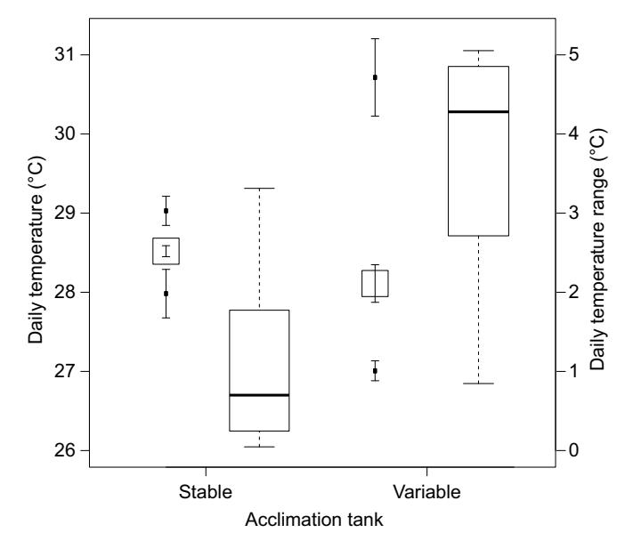
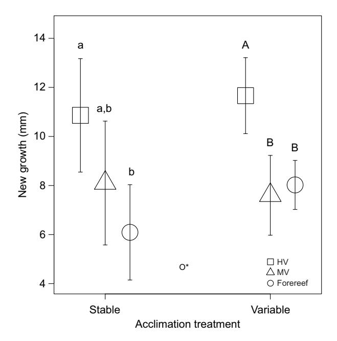
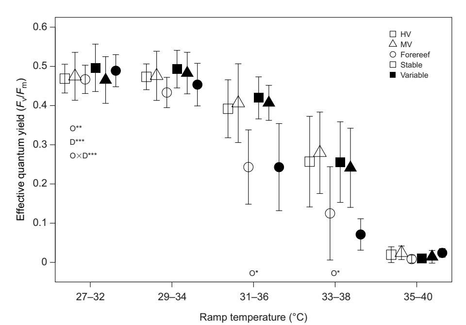
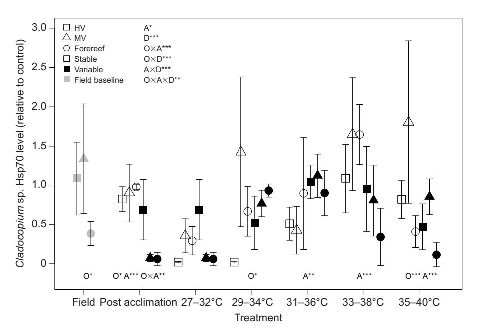
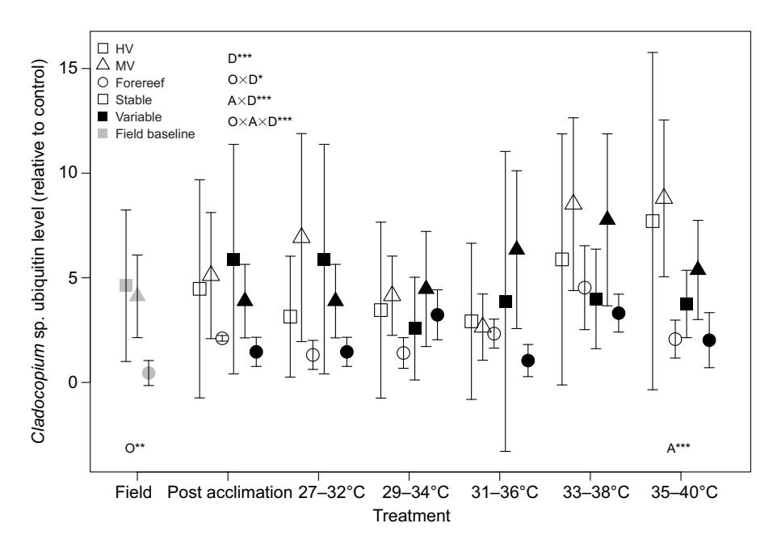
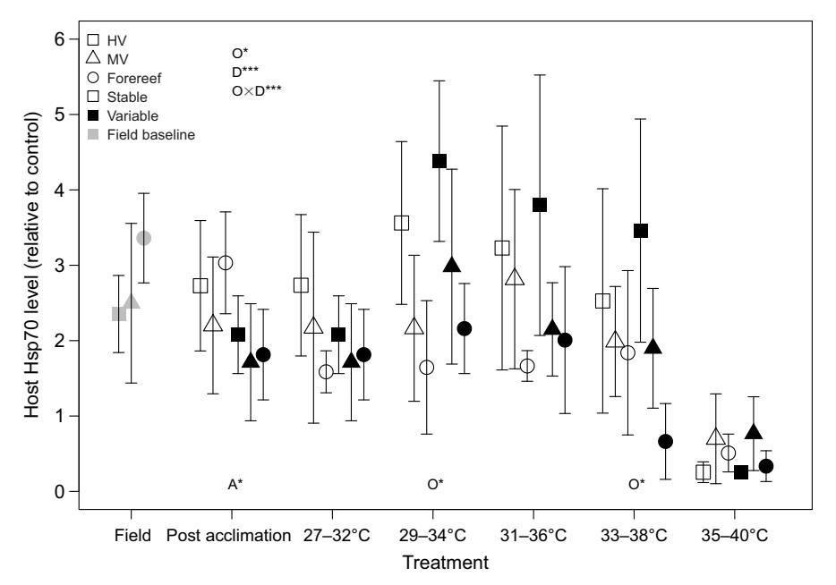
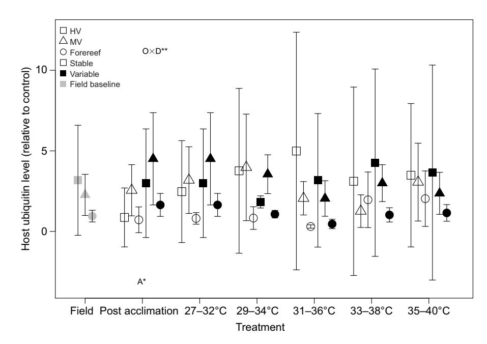
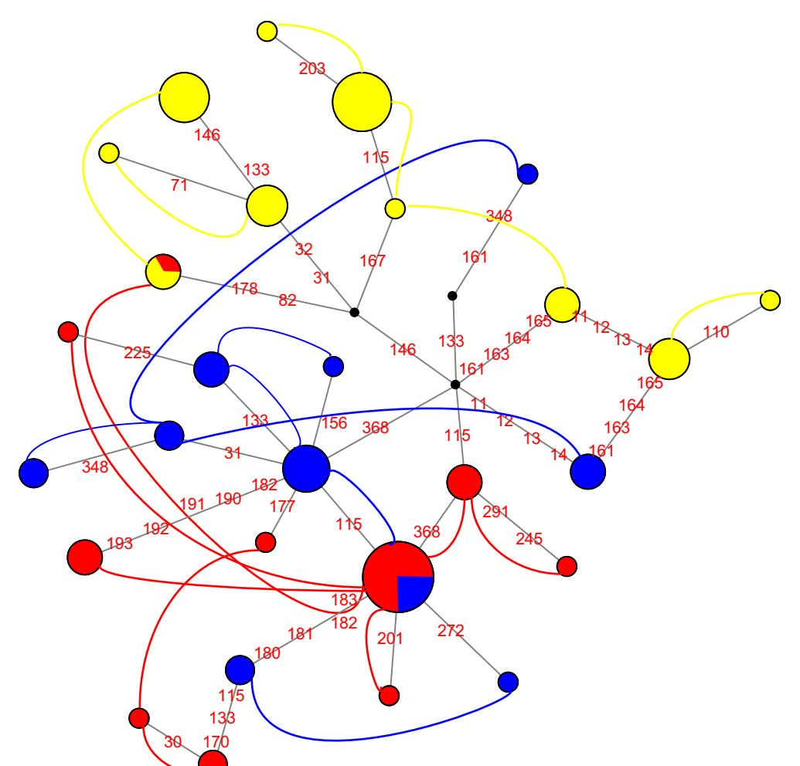

# **RESEARCH ARTICLE**

# High-frequency temperature variability mirrors fixed differences in thermal limits of the massive coral *Porites lobata*

Daniel J. Barshis1,\*, Charles Birkeland2, Robert J. Toonen3, Ruth D. Gates3 and Jonathon H. Stillman4,5

#### **ABSTRACT**

Spatial heterogeneity in environmental characteristics can drive adaptive differentiation when contrasting environments exert divergent selection pressures. This environmental and genetic heterogeneity can substantially influence population and community resilience to disturbance events. Here, we investigated corals from the highly variable back-reef habitats of Ofu Island in American Samoa that thrive in thermal conditions known to elicit widespread bleaching and mortality elsewhere. To investigate the relative importance of acclimation versus site of origin in shaping previously observed differences in coral tolerance limits at Ofu Island, specimens of the common Indo-Pacific coral Porites Iobata from locations with differing levels of thermal variability were acclimated to low and high thermal variation in controlled common garden aquaria. Overall, there were minimal effects of the acclimation exposure. Corals native to the site with the highest level of daily variability grew fastest, regardless of acclimation treatment. When exposed to lethal thermal stress, corals native to both variable sites contained elevated levels of heat shock proteins and maintained photosynthetic performance for 1-2 days longer than corals from the stable environment. Despite being separated by <5 km, there was significant genetic differentiation among coral colonies (FST=0.206, P<0.0001; nuclear ribosomal DNA), whereas Symbiodiniaceae were all Cladocopium sp. (ITS type C15). Our study demonstrates consistent signatures of adaptation in growth and stress resistance in corals from naturally thermally variable habitats, suggesting that differences in the amount of thermal variability may be an important contributor to adaptive differentiation in reef-building corals.

KEY WORDS: Local adaptation, Climate change, Coral bleaching, Acclimatization, Thermal tolerance

#### INTRODUCTION

Heterogeneous environments can drive adaptive diversification when contrasting environmental conditions exert strong divergent selection pressures and distinct habitat types are not equally frequent enough to favor the evolution of overall plasticity (e.g. Dempster, 1955; Kawecki and Ebert, 2004; Levene, 1953; Ravigné et al., 2004; Scheiner, 1993). Local adaptation is expected to evolve in

1Department of Biology, Old Dominion University, Norfolk, VA 23529, USA. 2Department of Biology, University of Hawai'i at Manoa, Honolulu, HI 96822, USA. 3Hawai'i Institute of Marine Biology, Kaneohe, HI 96744, USA. 4Estuary & Ocean Science Center, Romberg Tiburon Campus and Department of Biology, San Francisco State University, Tiburon, CA 94920, USA. 5Department of Integrative Biology, University of California Berkeley, Berkeley, CA 94720, USA.

\*Author for correspondence (dbarshis@odu.edu)

D.J.B., 0000-0003-1510-8375; C.B., 0000-0003-0113-8776; R.J.T., 0000-0001-6339-4340; R.D.G., 0000-0003-4523-1403; J.H.S., 0000-0002-4783-3830

populations with limited connectivity, but if environmentally driven selection is strong enough, adaptive differentiation can still accumulate despite ongoing gene flow (Feder et al., 2012; Hoey and Pinsky, 2018). In the marine environment, reproduction via broadcast spawning and gamete mixing at the sea surface favor the dispersal potential (i.e. gene flow) among neighboring habitats. For instance, many marine organisms can have larval neighborhoods extending over tens of kilometers (e.g. Palumbi, 2004; Pinsky et al., 2017). Thus, for small-scale population differentiation to be driven by selection in the sea, certain genotypes must preferentially settle in optimal habitat types, or sub-optimal settlers must have reduced fitness via strong post-settlement selection (Dempster, 1955; Levene, 1953; Ravigné et al., 2004).

Despite an established theoretical framework, the functional dynamics of adaptation and natural selection in most species remain unknown, and these processes are particularly complex in reefbuilding corals owing to the symbiotic nature of these organisms (Baird et al., 2007; Pandolfi et al., 2011). For example, adaptation of coral endosymbiotic algae, in the family Symbiodiniaceae (LaJeunesse et al., 2018), is known to confer varying degrees of thermal tolerance (Howells et al., 2012), and Symbiodiniaceae diversity within individual host coral species can vary across thermal environments (D'angelo et al., 2015; Oliver and Palumbi, 2011). The specifics of how the genetic diversity of the coral host contributes to adaptation, however, are relatively unknown (Baird et al., 2009, 2007; Barshis et al., 2010; Dixon et al., 2015; Hoegh-Guldberg et al., 2007; but see Lundgren et al., 2013; Matz et al., 2018). Adaptation to environmental change, including climate shifts, has been demonstrated in other organisms (Hancock et al., 2011; Hoffmann and Sgrò, 2011; Sanford and Kelly, 2011), and recent evidence for corals suggests that adaptive differences in coral thermal tolerance are heritable (Dixon et al., 2015; Kenkel et al., 2015; Meyer et al., 2009), lending credence to the idea of evolutionary rescue (sensu Bell and Gonzalez, 2009) of corals from climate impacts.

The back-reef pools at Ofu Island, American Samoa, represent a natural laboratory for investigations of adaptation and acclimatization of corals to contrasting environments owing to their high diurnal variation and small-scale heterogeneity in environmental characteristics (e.g. temperature, pH, flow, dissolved O2; Barshis et al., 2010; Craig et al., 2001; Smith et al., 2007). For example, the highly variable back-reef pool of Ofu undergoes daily temperature fluctuations of up to 5.6°C and reaches daily extremes of >35°C (mean±s.d. daily range 1.59±0.42°C). In contrast, the adjacent, less-variable forereef has seasonal maximum daily temperature fluctuations of 1.8°C (mean±s.d. daily range 0.6±0.2°C; Craig et al., 2001; Smith et al., 2008; D. J. Barshis, unpublished data). Corals from among these thermal habitats have phenotypic differences consistent with local adaptation of thermal performance, including increased prevalence of heat-tolerant *Durusdinium trenchii* (Symbiodiniaceae) (e.g. Acropora spp., Pocillopora spp., Pavona spp.; Cunning et al.,

2015; LaJeunesse et al., 2018; Oliver and Palumbi, 2009), constitutive upregulation of genes involved in cellular stress defense (Barshis et al., 2013), fixed and plastic responses following field transplantation (Palumbi et al., 2014; Smith et al., 2007, 2008), and small-scale (<5 km) genetic differentiation of coral hosts (Barshis et al., 2010; Bay and Palumbi, 2014).

In the massive coral *Porites lobata* Dana 1846, host genotypes were subdivided across small spatial scales (<5 km), while all Symbiodiniaceae sequences matched *Cladocopium* sp. (ITS rDNA type C15; Barshis et al., 2010). The genetic differentiation of the host mirrored fixed differences in the cellular stress response (Barshis et al., 2010) and growth characteristics (Smith et al., 2007), suggestive of genetic adaptation to differences in the amount of diurnal environmental variability between back-reef pools; however, upper thermal limits were not tested in previous *P. lobata* studies. Here, we explore whether high-frequency thermal variability (defined here as diurnal or shorter variation, sensu Safaie et al., 2018) is the environmental factor that differentiates growth and thermal tolerance of P. lobata colonies from contrasting habitats surrounding Ofu Island. We used a common-garden laboratory acclimation experiment to test the hypothesis that acclimating Ofu corals to greater amounts of high-frequency thermal variability will increase their capacity to tolerate a subsequent thermal challenge.

#### **MATERIALS AND METHODS**

# Study site, sample collection and transport

Corals were collected during May 2007 from three sites at Ofu and Olosega Islands in the territory of American Samoa (14°11′S, 169° 40′W). These islands host diverse communities of ~85 shallow reef-building coral species, many of which are consistently exposed to atypically high seawater temperatures (Craig et al., 2001) and irradiances (Smith and Birkeland, 2007). Two back-reef sites, a high variability (HV) and medium variability (MV) pool, and one low-variability forereef site (forereef) were selected based on general differences in environmental characteristics (Craig et al., 2001; Piniak and Brown, 2009; Smith et al., 2007, 2008; Smith and Birkeland, 2007). Briefly, the HV pool is smaller, shallower and more thermally variable, and experiences higher water flow than the MV pool, whereas the forereef is relatively more stable than the HV and MV pools.

A pneumatic hole saw drill was used to remove n=30 cores (19 mm diameter) from the upward-facing surfaces of each of n=5source colonies at each site (total n=150 cores per site). Source colonies were of similar size (1-1.5 m diameter) and at least 5 m apart to minimize potential for sampling the same clone (i.e. genet). Cores were affixed to nylon bolts with Z-Spar Splash Zone marine epoxy (Carboline Company, St Louis, MO, USA) and placed in the MV pool for a 7-day recovery period prior to shipping. Cores were wrapped in plastic bags and wet paper towels with a minimal amount of seawater, shipped in insulated coolers to the environmental simulation aquarium facility at San Francisco State University's Estuary & Ocean Science Center in Tiburon, CA, USA, and immediately placed in experimental aquaria. All corals were collected and exported under applicable permits from the National Park of American Samoa (NPSA-2006-SCI-0001) and the Department of Marine and Wildlife Resources, and imported under the authority of the US Fish and Wildlife Service.

#### **Coral acclimation conditions**

The cores from each source colony were divided into two groups of 15 and held in two separate experimental aquaria at a constant temperature of  $28{\pm}0.5^{\circ}\mathrm{C}$  and average irradiance of  $260~\mu\mathrm{mol}$  quanta  $m^{-2}~s^{-1}$ 

(12 h:12 h light:dark cycle) for a 28 day recovery period. For a detailed description of seawater acquisition and pre-treatment, see Paganini et al. (2014). Experimental aguaria were 180 gallons in volume (1.83×0.61×0.61 m). Each tank had its own Love process control 16A3116 temperature controller, and temperature set points were sent to the temperature controller from a computer using custom LabView software. Water circulation within each tank using Wave2K waveboxes and Tunze propeller pumps ensured high flow throughout the tank to prevent detritus accumulation on corals. Flow rates across all devices were rated at approximately one tank volume per minute. Each tank had a sump with an Octopus brand protein skimmer rated to 250 gallons. Flow to the sump was three to four tank volumes per hour. Flow of incoming seawater was four to six tank volumes per day. Tanks were each lit with 3×250 W double-ended HQI metal halide 14,000 K bulbs housed in AquaMedic pendants. Algal growth was removed from the nylon bolts daily during the recovery period using a toothbrush.

Following the recovery period, corals were exposed to one of two different thermal conditions for 35 days: 'variable' or 'stable'. In the variable aquarium, temperatures fluctuated between 27 and 32°C during the afternoon of each day (mean temperature=28.2°C), whereas the other aquarium was set to remain stable at 28.5°C (Fig. 1). The specific temperatures and amplitude of the treatments were chosen to reflect average water temperature and daily range extremes of natural summer temperature profiles of the forereef and back-reef sites (Barshis et al., 2010; Craig et al., 2001; Smith et al., 2008). Owing to equipment malfunction, there were two days of the acclimation when the stable aquarium and variable aquarium reached the same high temperature and three days where the stable aquarium reached temperatures below that of the variable aquarium (Fig. S1). After the 35-day acclimation period, coral growth, photophysiology and protein stress biomarkers were assessed.

We acknowledge that it would have been preferable to directly replicate the acclimation tanks and treatments; however, it was logistically and financially prohibitive to do so. The field collection,

Fig. 1. Daily temperature in the stable and variable acclimation tanks throughout the experiment. Daily mean (squares), minimum and maximum (dark circles) ±95% confidence intervals of each acclimation aquarium during the 35-day acclimation period (left-hand axis) and boxplot of daily temperature range (right-hand axis) of each acclimation aquarium. *N*=1 aquarium per treatment.

transport logistics and acclimation period (28+35 days) were of such an extended duration that successive field collections and trials were unable to be performed. As each acclimation tank had a constant flow of water from the same 10,000 liter recirculating water source, it is unlikely that there were any differences in water chemistry between tanks (see above). Furthermore, we believe the concordance between this study's laboratory-based results and those of prior field experiments demonstrating strong fixed effects of origin in this species and minimal effects of acclimation treatment corroborate the assertion of little to no confounding influence of the single tank replicates on the results of the study.

#### Growth

New tissue growth was measured as the distance the growth margin had extended down the sides of each coral core since original sampling, measured linearly down the four cardinal sides of each core using calipers. The four measurements were averaged and analyzed using a single average value for each individual core.

# **Photophysiology**

Chlorophyll *a* maximum quantum yield of *Cladocopium* sp. was measured using a pulse-amplitude modulated (PAM) fluorometer (DIVING-PAM, Walz GmbH, Germany). PAM fluorometry is a rapid, non-invasive technique that assesses the photosynthetic efficiency of photosystem II (PSII) reaction centers, which can be used as a proxy for assessing the health of the symbiotic association (Fitt et al., 2001). DIVING-PAM parameters and measurements were made following a previous study (Piniak and Brown, 2009); initial fluorescence measurements (F) were between ~150 and 400 units and maximum fluorescence ( $F'_{\rm m}$ ) was measured using a saturating light pulse (0.8 s, ~8000 µmol quanta m-2 s-1). Maximum quantum yield [ $(F_{\rm m}-F_{\rm o})/F_{\rm m}$ , or  $F_{\rm v}/F_{\rm m}$ ] was measured for dark-adapted samples at the end of each post-acclimation experimental day 45 min after all lights had been turned off.

# Thermal challenge

After the 35-day acclimation period, a 'temperature ramp' was performed. This consisted of placing five replicate cores from all source colonies and treatments in the variable temperature aquarium (baseline 27°C, peak 32°C) for 1 day and subsequently raising the baseline and peak temperatures by 2°C every 24 h for four additional days, with a final temperature fluctuation of 35–40°C and total experimental duration of 120 h (Fig. 1; Fig S1). PAM measurements were taken each day at 21:15 h after 45 min of dark adaptation. A single core from each source colony and acclimation treatment was used for protein analyses following PAM measurements each night, flash-frozen in liquid nitrogen and stored at -80°C until analyzed as described below.

## Protein biomarkers: Hsp70 and ubiquitin conjugates

Each coral core was flash-frozen in liquid nitrogen and the tissue layer (up to 1 cm below surface) was removed with bone-cutting pliers and placed in a pre-frozen, 50 ml stainless steel mixing jar (Glennmills, Clifton, NJ, USA). The tissue and skeleton of each tissue layer were crushed using a TissueLyser® (Qiagen, Valencia, CA, USA) at 25 rpm for 5 s, and the powdered samples were transferred to individual 2.5 ml cryovials and stored at  $-80^{\circ}$ C until further analyses.

Between 280 and 380 mg of crushed tissue was added to a prechilled 2 ml microcentrifuge tube before adding 750  $\mu$ l of chilled 50 mmol l-1 phosphate buffer (K2HPO4+KH2PO4; pH 7.8). Samples were vortexed and centrifuged at 2000 g for 5 min to separate out host

and algal endosymbiont (*Cladocopium* sp.) tissue fractions. The supernatant (host fraction) was removed and placed on ice while the remaining pellet (skeletal debris and *Cladocopium* sp. fraction) was washed three times with fresh phosphate buffer before re-suspension in a final volume of 500 µl of phosphate buffer, sonicated for 5 min and briefly centrifuged to remove skeletal debris. Aliquots were removed from both host and *Cladocopium* sp. fractions and stored at  $-80^{\circ}\text{C}$  until further analyses.

Levels of heat shock protein 70 (Hsp70) and ubiquitinconjugated proteins were assessed via western blot for both host and *Cladocopium* sp. protein fractions as described previously (Barshis et al., 2010). All samples were assayed in triplicate and a single average concentration per sample was analyzed. These specific biomarkers were chosen based on the previous study of Barshis et al. (2010), as they were indicative of differences between back-reef and forereef corals and represent common pathways involved in stress defense and stress-caused damage.

# **Host genetic analyses**

To assess the potential influence of host genotype on physiological responses, the internal transcribed spacer (ITS) region of nuclear ribosomal DNA was amplified and sequenced from each individual source colony. Primer sequences, polymerase chain reaction conditions and sequencing methods were performed as described previously (Barshis et al., 2010). Resulting sequences were inspected using Sequencher version 4.5 (Gene Codes Corp., Ann Arbor, MI, USA) and aligned using Bio-edit (http://www.mbio.ncsu.edu/BioEdit/bioedit.html) and by eye. Population genetic structure was estimated using an analysis of molecular variance (AMOVA) in Arlequin 2.0 (http://cmpg.unibe.ch/software/arlequin/). A molecular phylogenetic network was constructed using the median-joining algorithm and maximum parsimony post-processing calculation in NETWORK version 4.5.0.0 (Fluxus Technology Ltd) (Polzin and Daneschmand, 2003).

# Statistical analyses

Within a common garden framework, comparisons between transplant groups are designed to assess acclimation potential versus genetic/epigenetic control over the response variables. Comparisons between acclimation treatments examine environmental effects (i.e. phenotypic plasticity), while comparisons between source colony origins and individuals examine potential genetic or epigenetic influence on the response variables (DeWitt and Scheiner, 2004; Schluter, 2000; Smith et al., 2007).

Growth, photosynthetic efficiency and western blot biomarker levels were assessed from field collections prior to shipping (field baseline), following the acclimation to the differing temperature profiles of the two experimental aquaria (acclimation baseline) and during the temperature ramp. For the field baseline and acclimation baseline tests, all variables were tested against the fixed factors of source colony origin and acclimation treatment in a two-way ANOVA with source colony individual (i.e. genotype) included as a random factor. Post hoc analyses of significant main effects were computed using the Ismeans function in R v3.2.2 (https://www.rproject.org/). Individual clonal replicates within time points were averaged prior to the ANOVA and plotting to avoid pseudoreplication. Assumptions of normality and homoscedasticity were tested via the shapiro.test and fligner.test functions in R v3.2.2, respectively. For comparisons across time points, a repeated measures framework was used incorporating source colony identity (i.e. individual genotype) as a unit of repeated measure, allowing for a between-subjects test of origin and within-subjects tests

acclimation and day. *Post hoc* analyses of multiple comparisons were computed using the Ismeans function in R v3.2.2.

#### **RESULTS**

# Initial acclimation: temperature

The stable treatment had a slightly higher mean temperature and lower standard deviation than the variable treatment  $(28.54\pm0.63$  and  $28.15\pm1.20^{\circ}\text{C}$  for the stable and variable tanks, respectively; Fig. 1, Fig. S1). On average, the daily range of the variable tank was 11.84 times greater than the daily range of the stable tank (Fig. 1). Of the 33 acclimation days for which temperature records were available, the variable tank had a daily range greater than 3°C on 24 days (73%), whereas the daily range of the stable tank exceeded 3°C on only one day owing to a heater malfunction (Fig. S1). Irradiance levels did not appear to differ between the two tanks, with an average irradiance of 263 and 259  $\mu$ mol quanta m-2 s-1 for the stable and variable tank, respectively.

#### Initial acclimation: growth

New tissue extension during the acclimation period was affected by source colony origin (P=0.0106; Fig. 2, Table S1). HV source colonies grew fastest overall, with a mean ( $\pm$ s.d.) tissue extension of 10.85 $\pm$ 2.72 and 11.66 $\pm$ 2.23 mm in the stable and variable tanks, respectively, compared with MV source colonies (8.07 $\pm$ 2.62 and 7.60 $\pm$ 2.01 mm) and forereef source colonies (6.06 $\pm$ 2.00 and 8.01 $\pm$ 1.80 mm). There was no significant difference in growth between acclimation treatments for corals from any origin (P=0.0977; Fig. 2, Table S1).

#### Temperature ramp: photophysiology

Measurements of maximum quantum yield  $(F_v/F_m)$  were significantly affected by source colony origin, day and an

Fig. 2. Linear tissue extension measurements of *Porites lobata* taken after the 35-day acclimation period. Values are category means $\pm 1$  s.d. Statistical significance at P<0.05 (\*) is presented for comparison of source colony origins (O). N=5 genotypes/origin/acclimation tank (note n=4 genotypes for forereef stable) and 15 fragments/genotype/origin/acclimation tank. Different lowercase/uppercase letters indicate significant (P<0.05) within-treatment differences.

origin×day interaction (P=0.0036, P<0.0001 and P<0.0001, respectively; Fig. 3, Table S2). On days 3 and 4 of the temperature ramp, corals from the thermally stable forereef had markedly lower  $F_v/F_m$  compared with back-reef corals regardless of acclimation treatment (Fig. 3, Table S2). There was no effect of acclimation treatment throughout the temperature ramp. By the end of the ramp (day 5), corals from all populations had little to no fluorescence signature (Fig. 3, Table S2).

#### Hsp70 and ubiquitin conjugates: Cladocopium sp. fraction

Hsp70 levels in the Cladocopium sp. fraction of field-collected samples were different among origins (P=0.0259; Table S3A), with forereef levels 3.5 times lower than MV levels (P=0.0249; Fig. 4, Table S3A). Ubiquitin-conjugate levels were also different among origins (P=0.0352; Fig. 5, Table S4A), with forereef levels 10.3 times lower than HV levels (P=0.0439; Fig. 5, Table S4A). Following acclimation, origin, acclimation and origin × acclimation effects were observed (P=0.0398, P<0.0001 and P=0.0093, respectively; Table S3B) in Cladocopium sp. Hsp70 levels, with 3.3 times higher levels in the stable versus variable acclimation treatment (P<0.0001; Table S3B) and nine to 11 times higher in the HV versus MV or forereef variable-acclimated corals (P=0.0029 and P=0.0032 for MV and forereef contrasts, respectively; Table S3B). Cladocopium sp. ubiquitin conjugates were not different amongst origins or acclimation treatments following acclimation (Fig. 5, Table S4B). During the temperature ramp, a mix of origin and acclimation effects were observed, with variable and contrasting responses across groups throughout the experiment (Figs 4 and 5, Tables S3C, S4C).

#### Hsp70 and ubiquitin conjugates: host fraction

Neither host Hsp70 nor ubiquitin-conjugate protein levels were different in the field-collected samples (Figs 6 and 7, Tables S5A, S6A). Following acclimation, host Hsp70 levels were similar amongst origins but 1.4 times higher on average in stable-acclimated corals, similar to *Cladocopium* sp. (P=0.0029; Fig. 5, Table S5B), while ubiquitin conjugates were 2.2 times lower on average in stable-acclimated corals (P=0.0012; Fig. 7, Table S6B). Host Hsp70 levels were 2.9 and 2.5 times higher in HV versus forereef corals on days 2 and 4 of the heat ramp, respectively (P=0.0129, P=0.0404; Fig. 6, Table S5C), and there was a significant origin×day interaction in host ubiquitin-conjugate levels (P=0.0080), though no significant individual contrasts (Fig. 7, Table S6C).

#### **Host genetic analyses**

A 368 bp fragment of the ITS region was amplified from 15 individuals (n=5 per origin) and subsequently cloned for a total of 77 cloned sequences (NCBI accession numbers MK063730-MK063757). These 77 sequences comprised 28 unique haplotypes: one shared between the HV and MV pools, one shared between the HV pool and forereef, and eight, nine and nine unique to the HV, MV and forereef sites, respectively (Fig. 8). An AMOVA revealed significant population subdivision among all three populations ( $F_{ST}$ =0.2061, P<0.0001). Pairwise  $F_{ST}$ comparisons were highest between the MV pool and the other two populations ( $F_{ST}$ =0.2483 and 0.2319, P<0.0001 for HV and forereef, respectively), whereas the HV pool and forereef showed lower but still significant subdivision ( $F_{ST}$ =0.0509, P<0.03). This was qualitatively evident in the phylogenetic network construction, which showed a more explicit separation between MV haplotypes versus HV and forereef haplotypes (Fig. 8).

Fig. 3. Pulse-amplitude modulated (PAM) fluorometry measured maximum quantum yield (Fv/Fm) of Porites lobata during 5 days of the ramping temperature exposure. PAM measurements were taken at the end of the experimental day following ≥45 min of dark adaptation. The experimental temperatures for each day are denoted on the *x*-axis. Squares, triangles and circles represent source colonies from the high variability (HV) pool, medium variability (MV) pool and forereef (FR), respectively, and open and shaded symbols are for stable and variable acclimation treatments, respectively. Values are category means±1 s.d. Statistical significance at P<0.05 (\*), P<0.01 (\*\*) and P<0.001 (\*\*\*) is presented for overall comparisons of source colony origin (O), acclimation treatment (A), day (D) and the various interactions (e.g. O×D) along the left hand y-axis, while within-day contrasts are presented along the x-axis. N=5 genotypes/origin/ acclimation tank/day (note n=4 genotypes for forereef stable).

#### **DISCUSSION**

# The influence of high-frequency variability on coral physiological tolerance limits

We found that increasing the amount of high-frequency thermal variability (i.e. diurnal or shorter time scales) for 36 days of acclimation had little to no effect on coral growth, photophysiology, thermal tolerance or protein biomarker response (Figs 2–7). The predominant signal in our data was that of source population origin, in that corals from back-reef habitats (HV and MV) with consistent high-frequency variability in thermal and other environmental characteristics grew faster and had elevated thermal tolerance limits compared with corals from the more thermally stable forereef, regardless of acclimation treatment. Taken together, these results suggest real differences in thermal tolerance limits between back-reef corals that have routinely been exposed to high-frequency environmental variability and forereef corals native to a less-

variable environment. The disparity between the lack of acclimation effects and strong origin effects speaks to the potential for chronic exposure to high-frequency variability to exert differential selection pressure over very small spatial scales (<5 km).

The most widely used models of coral bleaching impacts and thermal tolerance differences rely on island-scale or regional-level data (e.g. the 5 km pixel width of NOAA Coral Reef Watch; Heron et al., 2016). However, our findings demonstrate substantial differences in coral thermal tolerances across hundreds of meters to a few kilometers. This follows previous results from Ofu corals in the highest variability back-reef habitats showing meter-scale differences in increased prevalence of heat-tolerant photosymbiotic *D. trenchii* (e.g. *Acropora* spp., *Pocillopora* spp., *Pavona* sp.; Cunning et al., 2015; Oliver and Palumbi, 2009), constitutive upregulation of genes involved in cellular stress defense (Barshis et al., 2013), acclimation gains in thermal tolerance following 12+ months of exposure to the

Fig. 4. Cladocopium sp. heat shock protein 70 levels across the entire sampling period: field baseline, post-acclimation and days 1–5 of the temperature ramp. All values are relative to a single control extract. Values are category means±1 s.d. Symbols and significance values are denoted as in Fig. 3. *N*=5 genotypes/origin/acclimation tank/day (note *n*=4 genotypes for forereef stable).

Fig. 5. Cladocopium sp. ubiquitin-conjugate protein levels across the entire sampling period: field baseline, post-acclimation and days 1–5 of the temperature ramp. All values are relative to a single control extract. Values are category means±1 s.d. Symbols and significance values are denoted as in [Fig. 3](#page-4-0). N=5 genotypes/origin/acclimation tank/day (note n=4 genotypes for forereef stable).

HV pool [\(Palumbi et al., 2014\)](#page-9-0) and small-scale (<5 km) genetic differentiation of coral hosts consistent with local adaptation [\(Barshis](#page-8-0) [et al., 2010;](#page-8-0) [Bay and Palumbi, 2014](#page-9-0)).

A number of other studies across the globe have found similar small-scale differences in physiological tolerance limits between corals from habitats with contrasting amounts of short-term environmental variability. For example, Porites astreoides corals from inshore environments with high-frequency thermal variability in the Florida Keys bleached less during thermal stress ([Kenkel](#page-9-0) [et al., 2013\)](#page-9-0), demonstrated increased flexibility in gene expression modulation ([Kenkel and Matz, 2016](#page-9-0)) and increased growth rates that were heritable between generations ([Kenkel et al., 2015](#page-9-0)) compared with corals from lower variability offshore sites (∼7 km away). Similarly, [Pineda et al. \(2013\)](#page-9-0) found decreased mortality in Stylophora pistillata on protected (shoreward) versus exposed (seaward) sides of reefs in the central Red Sea following a natural bleaching event in 2010. Despite being separated by <300 m, the protected sides of the reefs had greater high-frequency thermal variability than exposed sites, presumably owing to decreased wind-driven mixing [\(Pineda et al., 2013\)](#page-9-0). Similar increased stress tolerance was observed in inshore versus offshore populations of Montastrea annularis in Belize ([Castillo and Helmuth, 2005](#page-9-0)), which was subsequently linked to long-term declines in growth rates in offshore populations of this species over the past few decades [\(Castillo et al., 2012\)](#page-9-0). A recent large-scale meta-analysis of in situ temperature records and bleaching surveys from five reef regions around the globe found that greater amounts of highfrequency temperature variability were correlated with reduced bleaching severity and bleaching prevalence ([Safaie et al., 2018](#page-9-0)), suggesting the trends observed in the various single-site, singlespecies studies may be valid at the global and whole-reef community scales.

Fig. 6. Coral host heat shock protein 70 levels across the entire sampling period: field baseline, post-acclimation and days 1–5 of the temperature ramp. All values are relative to a single control extract. Values are category means±1 s.d. Symbols and significance values are denoted as in [Fig. 3](#page-4-0). N=5 genotypes/origin/acclimation tank/day (note n=4 genotypes for forereef stable).

Fig. 7. Coral ubiquitin-conjugate protein levels across the entire sampling period: field baseline, post-acclimation and days 1–5 of the temperature ramp. All values are relative to a single control extract. Values are category means±1 s.d. Symbols and significance values are denoted as in Fig. 3. *N*=5 genotypes/origin/acclimation tank/day (note *n*=4 genotypes for forereef stable).

There are a few notable exceptions to this pattern, however, with high-variability and low-variability populations of *Acropora palmata* and *Porites astreoides* in the Cayman Islands exhibiting a nearly identical response to increased heat and  $P_{\text{CO}_2}$  (Camp et al.,

2016), and exposure to greater high-frequency thermal variability eliciting bleaching rather than resilience in *Pocillopora meandrina* and *Porites rus* in Moorea, French Polynesia (Putnam and Edmunds, 2011). Although the specific threshold above which

Fig. 8. Maximum parsimony phylogenetic network reconstruction of ITS rDNA haplotypes. Haplotypes shown in red, yellow and blue are from the HV, MV and forereef populations, respectively. The diameter of circles at each node is proportional to the number of individuals with identical sequences. Haplotypes that co-occur in the same individual are connected by colored curves. Mutations are shown in red on each branch, with the number corresponding to the base pair position; hypothetical intermediate haplotypes are designated by black circles. NCBI accession numbers for all sequences used in this study are MK063730-MK063757. N=5 genotypes/ origin/acclimation tank/day (note n=4 genotypes for forereef stable), 77 total sequences forming 28 unique haplotypes. Drawn in NETWORK version 4.5.0.0 (Fluxus Technology Ltd) (Polzin and Daneschmand, 2003).

high-frequency variability increases resilience and/or the tipping points between beneficial exposures versus chronic stress remain to be determined, our data corroborate a growing body of evidence from multiple ocean basins, coral species, genera and habitat types suggesting a mostly beneficial role of high-frequency variability in increasing coral resilience to thermal stress. Thus, it is conceivable that differing degrees of environmental variability may exert divergent selection pressures across these small scales and drive adaptive differentiation.

# Is temperature variability really the most important driver?

Despite the overall effects of source colony origin, we found little evidence that acclimation to high-frequency temperature variability altered thermal tolerance limits in this species. In contrast to the lack of acclimation observed herein, multiple studies of Acropora spp. have demonstrated increased thermal tolerance following short-term (days to weeks) exposure to elevated temperatures. Acropora nana from a single back-reef population at Ofu exposed to variable temperatures (29-33°C) bleached less and had a muted gene expression response compared with corals acclimated to 29°C after just 7–11 days of exposure to the variable thermal regime (Bay and Palumbi, 2015). Similarly, Acropora millepora preconditioned to a 10-day mild stress (3°C below the experimentally determined bleaching threshold) bleached less during subsequent heat stress than non-preconditioned corals (Bellantuono et al., 2012b) and exhibited a muted gene expression response as well (Bellantuono et al., 2012a), similar to that seen in variable-acclimated Acropora nana (Bay and Palumbi, 2015) and HV A. hyacinthus (Barshis et al., 2013) at Ofu. Lastly, Acropora aspera preconditioned to a 48 h prestress (31°C) bleached less and maintained elevated photosynthetic efficiency during a subsequent 6-day heat stress (34°C) compared with non-preconditioned corals (Middlebrook et al., 2008). Although the above studies had shorter acclimation durations than those herein, it is noteworthy that significant longer-term acclimation was also observed in HV versus MV Acropora hyacinthus after a 12-24 month reciprocal field transplant (Palumbi et al., 2014). Thus, it is possible that a longer time frame than examined herein may result in a stronger acclimation response in *P. lobata* (see below for additional discussion).

Alternatively, acclimation capacity may be taxon specific, as most prior thermal-acclimation work in corals has focused on branching species in the genus Acropora, owing to their ubiquity on the reef and known variation in thermal sensitivity (e.g. Loya et al., 2001; van Woesik et al., 2011). In contrast, massive coral species such as *Porites lobata*, are thought to be more thermally tolerant due to greater tissue thicknesses (Loya et al., 2001), increased mass transfer rates (Loya et al., 2001; Nakamura and Van Woesik, 2001), and elevated metabolism (Gates and Edmunds, 1999) compared with most branching coral species (primarily Acropora spp. and *Pocillopora* spp.). Thus, as a species with a massive morphology, Porites lobata may have a greater innate temperature tolerance range to begin with, simply tolerating the environment when faced with new conditions versus the physiological acclimation seen in acroporids. However, the consistent origin effects on growth, thermal tolerance and cellular response suggest that the differing amounts of high-frequency variability in environmental characteristics between the back-reef and forereef habitats do influence thermal tolerance limits in P. lobata, though perhaps over longer time scales than those under investigation.

Significant origin effects in common garden experiments are generally attributed to potential genotypic (i.e. adaptive) influence on the response variable (DeWitt and Scheiner, 2004; Sanford and

Kelly, 2011; Schluter, 2000). However, long-term acclimatization, developmental plasticity and/or epigenetics can similarly cause apparent origin effects. Corals are long-lived organisms, and based on the size (>1 m diameter) of the colonies used in this study, we roughly estimate the minimum age of the source colonies to be >60 years old (based on >500 mm radius and ~8 mm year-1 growth rate sensu Houck et al., 1977; Potts et al., 1985). Decadal-scale 'environmental memory' was recently observed in the massive coral Coelastrea aspera, with former west sides of colonies (experimentally turned to face east) that had been previously exposed to high-irradiance levels retaining four times the D. trenchii during a natural bleaching event compared with unmanipulated eastfacing/low-irradiance sides of colonies, despite 10 years of conditioning to the low-irradiance eastern orientation and identical D. trenchii species/phylotypes (Brown et al., 2015). This certainly raises the possibility that long-term conditioning to the high-frequency environmental variability of the Ofu back reef could have long-lasting acclimation effects on P. lobata thermal tolerance limits that may not have been altered by our 36-day exposure.

However, we did observe acclimation effects on host and Cladocopium sp. protein biomarkers, particularly Hsp70 (Figs 4–7, Tables S3–S6). Although differences across acclimation treatments were variable in magnitude and direction depending on the marker and day, the host Hsp70 response demonstrated an interesting pattern relative to the fluorescence response. On the final day of the acclimation treatment, host Hsp70 levels were lower in the variableversus stable-acclimated corals (Fig. 6, Table S5B), suggesting reduced need for chaperone activity following variable thermal exposure. Symbiont Hsp70 levels followed a similar pattern, with lower levels in variable- versus stable-acclimated Cladocopium sp. However, these initial acclimation effects were supplanted by strong origin effects, with the greatest host Hsp70 increase in HV corals on days 2 and 4 of the temperature ramp (Fig. 5, Table S5C), corresponding to the greater maintenance of photosynthetic efficiency in HV corals on days 3 and 4 (Fig. 3, Table S2). It is notable that a similarly rapid and higher induction of Hsp70 was observed in back-reef versus forereef corals in our previous field study following transplantation (fig. 4A from Barshis et al., 2010). Thus, it is tempting to speculate that the larger and more rapid host Hsp70 increases in HV corals during the temperature ramp might signify a higher capacity for maintenance of homeostasis under thermal stress. Although not conclusive evidence for or against a mechanism of long-term acclimatization versus local adaptation, the acclimation and origin effects in protein response observed herein and previously (Barshis et al., 2010) demonstrate the ability of these corals to respond to high-frequency thermal variability over short time scales as well as potential evolutionary constraints on that ability related to population of origin.

Alternatively, the increased thermal tolerance limits of back-reef corals may have been influenced very early on via developmental canalization post-settlement in the back reef, parental effects and/or epigenetic acclimatization. Both maternal effects and signatures of differential epigenetic modification have been recently observed in *Pocillopora damicornis*, with larvae from parents exposed to high temperature and  $P_{\rm CO_2}$  exhibiting metabolic acclimation during subsequent stress compared with larvae from un-exposed parents (Putnam and Gates, 2015) and increased levels of DNA methylation in adults following high  $P_{\rm CO_2}$  exposure (Putnam et al., 2016), suggesting that the observed larval acclimation could have been caused by epigenetic modification. At Ofu, however, larvae from back-reef parents would have to settle/disperse back to the pool of origin for epigenetic modification from parents to positively affect

the response of the offspring. If there was epigenetic modification of larvae from back-reef parents but the larvae all dispersed outside the HV and MV pools, then there would be no positive contribution to the phenotype of the next generation.

Although long-term acclimatization, parental effects and/or epigenetic modification could explain the thermal tolerance differences between our populations, none of these processes would likely cause the genetic differentiation among populations seen here. The significant genetic subdivision among all three populations suggests the presence of a physical or environmental barrier to gene flow between the HV, MV and forereef populations, strong divergent selection pressures, or potential cryptic species/ genepools across the habitats at Ofu. We acknowledge that the small sample size (n=5 individuals per population) is limiting for drawing any substantial conclusions about population-level genetic diversity from these data alone; however, the  $F_{ST}$  observed herein is similar in magnitude and significance to that observed previously between a larger survey of 28 MV and 26 forereef P. lobata individuals  $(F_{ST}=0.146, P<0.0001;$  Barshis et al., 2010). Additionally, our previous study observed substantial population structure in mtDNA as well ( $F_{ST}$ =0.335, P<0.0001; Barshis et al., 2010). Collectively, these datasets certainly raise the possibility of a substantial barrier to gene flow among these neighboring habitats.

Reduced connectivity across such a small spatial scale (~500 m −1 km between HV and MV, and ~5 km between HV/MV and the forereef) is unlikely to be due to a physical barrier alone, as the water masses in the back reef appear to be well mixed during the daily high tide cycle and well within the spatial range of dispersing larvae. Bay and Palumbi (2014) observed a similar pattern of genetic differentiation between HV and MV Acropora hyacinthus, though only at a subset of outlier single nucleotide polymorphisms (SNPs) putatively responding to selection. They posited a mechanism involving strong spatial balancing selection, wherein the contrasting environmental pressures of each habitat exert high selection pressure on settling coral larvae from a common gene pool (sensu a protected polymorphism via an environment×genotype association; Bay and Palumbi, 2014; Levene, 1953; Ravigné et al., 2004; Sanford and Kelly, 2011). van Oppen et al. (2018) found a similar pattern of differentiation and outlier loci separating reef flat and reef slope Pocillopora damicornis on Heron Island in Australia and posited a similar mechanism of environmentally driven selection. The ITS locus sequenced herein is unlikely to be a direct target of selection, though differentiation at this locus could be correlated with the specific gene targets responding to selection. Alternatively, selection could be acting on a non-coral member of the coral holobiont, such as the bacterial microbiome. Although not an explicit objective of this study, prior research at Ofu found a strong association between particular bacterial community members and thermal performance in HV versus MV Acropora hyacinthus, though this community distinction was strongest based on the final transplant destination of coral fragments (i.e. an environmentally driven difference) rather than the native pool of origin (Ziegler et al., 2017).

#### Conclusions

The limited acclimation response, enhanced thermal tolerance capacity of back-reef corals, differential biomarker response and significant genetic differentiation observed in the present study are all consistent with a model of post-settlement selection and adaptation of coral genotypes to the greater amount of high-frequency environmental variability in the MV and HV pools. However, whether differences in high-frequency temperature exposures among habitats are the driving force behind selection in

this system is yet to be determined. Contrasting amounts of highfrequency temperature variability remain the common factor across the multiple experiments at Ofu (Barshis et al., 2013, 2010; Bay and Palumbi, 2014; Craig et al., 2001; Cunning et al., 2015; Oliver and Palumbi, 2011; Palumbi et al., 2014; Smith et al., 2007) and in the Red Sea (Pineda et al., 2013), the Florida Keys (Kenkel et al., 2013, 2015; Kenkel and Matz, 2016), the Mesoamerican barrier reef (Castillo and Helmuth, 2005; Castillo et al., 2012), Australia (van Oppen et al., 2018) and the variety of sites examined in Safaie et al. (2018). Future research should focus on assessing the potential influences of other environmental drivers on the observed differences in thermal limits, as well as the relative contributions of long-term acclimatization and/or developmental canalization and other taxonomic members of the coral holobiont. Additionally, the magnitude of  $F_{ST}$  differentiation observed herein makes it difficult to contextualize the scale of genetic differentiation across populations. Future in-depth genetic analysis of massive Porites populations from a variety of habitat types may provide a clearer picture of the potential for cryptic genotype×environment associations in this taxonomic group.

#### Acknowledgements

In memory of Ruth and her enduring optimism, wisdom and marvelous laugh. Thanks to the many field and laboratory assistants that made this research possible; to M. Mizobe, L. Smith, T. Waterson, C. Tomas-Miranda, the Stillman Lab at San Francisco State University, P. Craig and the staff at the National Park of American Samoa, especially the late Fale Tuilagi, and Vaoto Lodge for field and lab support; to Z. Forsman for primer sequences, advice and assistance; and to two anonymous reviewers for valuable comments. This is contribution number 1734 of the Hawai'i Institute of Marine Biology. The use of trade, firm or corporation names in this publication does not constitute an official endorsement or approval of any product or service to the exclusion of others that may be suitable.

# Competing interests

The authors declare no competing or financial interests.

#### Author contributions

Conceptualization: D.J.B., C.B., R.J.T., R.D.G., J.H.S.; Methodology: D.J.B., C.B., R.J.T., R.D.G., J.H.S.; Formal analysis: D.J.B., R.J.T., J.H.S.; Investigation: D.J.B., C.B., J.H.S.; Writing - original draft: D.J.B., J.H.S.; Writing - review & editing: D.J.B., C.B., R.J.T., R.D.G., J.H.S.; Funding acquisition: C.B., R.J.T., R.D.G., J.H.S.

#### Funding

This work was supported by the US Geological Survey's National Resources Preservation and Global Climate Change Research Program Award 1434-00HQRU1585 (C.B.), National Science Foundation (NSF) grant OCE06-23678 (R.J.T.), small grants (D.J.B.) from the University of Hawai'i's Arts and Sciences Advisory Council, Department of Zoology Edmondson Fund, and an Ecology, Evolution, and Conservation Biology research award through NSF grant DGE05-38550 to K. Y. Kaneshiro.

#### Data availability

All raw data, analyses and scripts are available as an electronic notebook: (https://github.com/BarshisLab/Poriteslobata-thermal-adaptation). Unique DNA sequences have also been deposited in NCBI GenBank (accession nos. MK063730–MK063757).

# Supplementary information

Supplementary information available online at http://jeb.biologists.org/lookup/doi/10.1242/jeb.188581.supplemental

# References

Baird, A. H., Cumbo, V. R., Leggat, W. and Rodriguez-Lanetty, M. (2007). Fidelity and flexibility in coral symbioses. *Mar. Ecol. Prog. Ser.* 347, 307-309.
Baird, A. H., Bhagooli, R., Ralph, P. J. and Takahashi, S. (2009). Coral bleaching:

the role of the host. *Trends Ecol. Evol.* **24**, 16-20.

Barshis, D. J., Stillman, J. H., Gates, R. D., Toonen, R. J., Smith, L. W. and Birkeland, C. (2010). Protein expression and genetic structure of the coral *Porites lobata* in an environmentally extreme Samoan back reef: does host genotype limit phenotypic plasticity? *Mol. Ecol.* 19, 1705-1720.

- [Barshis, D., Ladner, J. T., Oliver, T. A., Seneca, F. O., Traylor-Knowles, N. and](http://dx.doi.org/10.1073/pnas.1210224110) Palumbi, S. R. [\(2013\). Genomic basis for coral resilience to climate change.](http://dx.doi.org/10.1073/pnas.1210224110) Proc. [Natl. Acad. Sci. USA](http://dx.doi.org/10.1073/pnas.1210224110) 110, 1387-1392.
- Bay, R. A. and Palumbi, S. R. [\(2014\). Multilocus adaptation associated with heat](http://dx.doi.org/10.1016/j.cub.2014.10.044) [resistance in reef-building corals.](http://dx.doi.org/10.1016/j.cub.2014.10.044) Curr. Biol. 24, 2952-2956.
- Bay, R. A. and Palumbi, S. R. [\(2015\). Rapid acclimation ability mediated by](http://dx.doi.org/10.1093/gbe/evv085) [transcriptome changes in reef-building corals.](http://dx.doi.org/10.1093/gbe/evv085) Genome Biol. Evol. 7, 1602-1612.
- Bell, G. and Gonzalez, A. [\(2009\). Evolutionary rescue can prevent extinction](http://dx.doi.org/10.1111/j.1461-0248.2009.01350.x) [following environmental change.](http://dx.doi.org/10.1111/j.1461-0248.2009.01350.x) Ecol. Lett. 12, 942-948.
- [Bellantuono, A. J., Granados-Cifuentes, C., Miller, D. J., Hoegh-Guldberg, O.](http://dx.doi.org/10.1371/journal.pone.0050685) and Rodriguez-Lanetty, M. [\(2012a\). Coral thermal tolerance: tuning gene](http://dx.doi.org/10.1371/journal.pone.0050685) [expression to resist thermal stress.](http://dx.doi.org/10.1371/journal.pone.0050685) PLoS ONE 7, e50685.
- [Bellantuono, A. J., Hoegh-Guldberg, O. and Rodriguez-Lanetty, M.](http://dx.doi.org/10.1098/rspb.2011.1780) (2012b). [Resistance to thermal stress in corals without changes in symbiont composition.](http://dx.doi.org/10.1098/rspb.2011.1780) [Proc. R. Soc. B Biol. Sci.](http://dx.doi.org/10.1098/rspb.2011.1780) 279, 1100-1107.
- [Brown, B., Dunne, R., Edwards, A., Sweet, M. and Phongsuwan, N.](http://dx.doi.org/10.1007/s00227-014-2596-2) (2015). [Decadal environmental](http://dx.doi.org/10.1007/s00227-014-2596-2) 'memory' in a reef coral? Mar. Biol. 162, 479-483.
- [Camp, E. F., Smith, D. J., Evenhuis, C., Enochs, I., Manzello, D., Woodcock, S.](http://dx.doi.org/10.1098/rspb.2016.0442) and Suggett, D. J. [\(2016\). Acclimatization to high-variance habitats does not](http://dx.doi.org/10.1098/rspb.2016.0442) [enhance physiological tolerance of two key Caribbean corals to future](http://dx.doi.org/10.1098/rspb.2016.0442) temperature and pH. [Proc. R. Soc. B Biol. Sci.](http://dx.doi.org/10.1098/rspb.2016.0442) 283, 20160442.
- Castillo, K. D. and Helmuth, B. S. T. [\(2005\). Influence of thermal history on the](http://dx.doi.org/10.1007/s00227-005-0046-x) response of Montastraea annularis [to short-term temperature exposure.](http://dx.doi.org/10.1007/s00227-005-0046-x) Mar. Biol. 148[, 261-270.](http://dx.doi.org/10.1007/s00227-005-0046-x)
- [Castillo, K. D., Ries, J. B., Weiss, J. M. and Lima, F. P.](http://dx.doi.org/10.1038/nclimate1577) (2012). Decline of forereef [corals in response to recent warming linked to history of thermal exposure.](http://dx.doi.org/10.1038/nclimate1577) Nat. [Clim. Change](http://dx.doi.org/10.1038/nclimate1577) 2, 756-760.
- [Craig, P., Birkeland, C. and Belliveau, S.](http://dx.doi.org/10.1007/s003380100159) (2001). High temperatures tolerated by a [diverse assemblage of shallow-water corals in American Samoa.](http://dx.doi.org/10.1007/s003380100159) Coral Reefs 20, [185-189.](http://dx.doi.org/10.1007/s003380100159)
- [Cunning, R., Yost, D. M., Guarinello, M. L., Putnam, H. M. and Gates, R. D.](http://dx.doi.org/10.1371/journal.pone.0145099) (2015). Variability of Symbiodinium [communities in waters, sediments, and corals](http://dx.doi.org/10.1371/journal.pone.0145099) [of thermally distinct reef pools in American Samoa.](http://dx.doi.org/10.1371/journal.pone.0145099) PLoS ONE 10, e0145099.
- D'[angelo, C., Hume, B. C. C., Burt, J., Smith, E. G., Achterberg, E. P. and](http://dx.doi.org/10.1038/ismej.2015.80) Wiedenmann, J. [\(2015\). Local adaptation constrains the distribution potential of](http://dx.doi.org/10.1038/ismej.2015.80) heat-tolerant Symbiodinium [from the Persian/Arabian Gulf.](http://dx.doi.org/10.1038/ismej.2015.80) ISME J. 9, 2551-2560.
- Dempster, E. R. [\(1955\). Maintenance of genetic heterogeneity.](http://dx.doi.org/10.1101/SQB.1955.020.01.005) Cold Spring Harbor [Symp. Quant. Biol.](http://dx.doi.org/10.1101/SQB.1955.020.01.005) 20, 25-32.
- DeWitt, T. J. and Scheiner, S. M. (2004). Phenotypic variation from single genotypes. In Phenotypic Plasticity: Functional and Conceptual Approaches (ed. T. J. DeWitt and S. M. Scheiner), pp. 1-9. New York: Oxford University Press.
- [Dixon, G. B., Davies, S. W., Aglyamova, G. V., Meyer, E., Bay, L. K. and Matz,](http://dx.doi.org/10.1126/science.1261224) M. V. [\(2015\). Genomic determinants of coral heat tolerance across latitudes.](http://dx.doi.org/10.1126/science.1261224) Science 348[, 1460-1462.](http://dx.doi.org/10.1126/science.1261224)
- Feder, J. L., Egan, S. P. and Nosil, P. [\(2012\). The genomics of speciation with gene](http://dx.doi.org/10.1016/j.tig.2012.03.009) flow. [Trends Genet.](http://dx.doi.org/10.1016/j.tig.2012.03.009) 28, 342-350.
- [Fitt, W. K., Brown, B. E., Warner, M. E. and Dunne, R. P.](http://dx.doi.org/10.1007/s003380100146) (2001). Coral bleaching: [interpretation of thermal tolerance limits and thermal thresholds in tropical corals.](http://dx.doi.org/10.1007/s003380100146) [Coral Reefs](http://dx.doi.org/10.1007/s003380100146) 20, 51-65.
- Gates, R. D. and Edmunds, P. J. [\(1999\). The physiological mechanisms of](http://dx.doi.org/10.1093/icb/39.1.30) [acclimatization in tropical reef corals.](http://dx.doi.org/10.1093/icb/39.1.30) Am. Zool. 39, 30-43.
- [Hancock, A. M., Brachi, B., Faure, N., Horton, M. W., Jarymoqwycz, L. B.,](http://dx.doi.org/10.1126/science.1209244) [Sperone, F. G., Toomajian, C., Roux, F. and Bergelson, J.](http://dx.doi.org/10.1126/science.1209244) (2011). Adaptation to climate across the [Arabidopsis thaliana](http://dx.doi.org/10.1126/science.1209244) genome. Science 334, 83-86.
- [Heron, S. F., Maynard, J. A. and Ruben van Hooidonk, C.](http://dx.doi.org/10.1038/srep38402) (2016). Warming trends [and bleaching stress of the world](http://dx.doi.org/10.1038/srep38402)'s coral reefs 1985–2012. Sci. Rep. 6, 38402.
- [Hoegh-Guldberg, O., Mumby, P. J., Hooten, A. J., Steneck, R. S., Greenfield, P.,](http://dx.doi.org/10.1126/science.1152509) [Gomez, E., Harvell, C. D., Sale, P. F., Edwards, A. J., Caldeira, K. et al.](http://dx.doi.org/10.1126/science.1152509) (2007). [Coral reefs under rapid climate change and ocean acidification.](http://dx.doi.org/10.1126/science.1152509) Science 318, [1737-1742.](http://dx.doi.org/10.1126/science.1152509)
- Hoey, J. and Pinsky, M. L. [\(2018\). Genomic signatures of environmental selection](http://dx.doi.org/10.1111/eva.12676) [despite near-panmixia in summer flounder.](http://dx.doi.org/10.1111/eva.12676) Evol. Appl. 11, 1732-1747.
- Hoffmann, A. A. and Sgrò, C. M. [\(2011\). Climate change and evolutionary](http://dx.doi.org/10.1038/nature09670) [adaptation.](http://dx.doi.org/10.1038/nature09670) Nature 470, 479-485.
- Houck, J. E., Buddemeier, R. W., Smith, S. V. and Jokiel, P. L. (1977). The response of coral growth rate and skeletal strontium content to light intensity and water temperature. Proc. 3rd Intl. Coral Reef Symp. 2, 425-431.
- [Howells, E. J., Beltran, V. H., Larsen, N. W., Bay, L. K., Willis, B. L. and van](http://dx.doi.org/10.1038/nclimate1330) Oppen, M. J. H. [\(2012\). Coral thermal tolerance shaped by local adaptation of](http://dx.doi.org/10.1038/nclimate1330) photosymbionts. [Nat. Clim. Change](http://dx.doi.org/10.1038/nclimate1330) 2, 116.
- Kawecki, T. J. and Ebert, D. [\(2004\). Conceptual issues in local adaptation.](http://dx.doi.org/10.1111/j.1461-0248.2004.00684.x) Ecol. Lett. 7[, 1225-1241.](http://dx.doi.org/10.1111/j.1461-0248.2004.00684.x)
- Kenkel, C. D. and Matz, M. V. [\(2016\). Gene expression plasticity as a mechanism of](http://dx.doi.org/10.1038/s41559-016-0014) [coral adaptation to a variable environment.](http://dx.doi.org/10.1038/s41559-016-0014) Nat. Ecol. Evol. 1, 0014.
- [Kenkel, C. D., Goodbody-Gringley, G., Caillaud, D., Davies, S. W., Bartels, E.](http://dx.doi.org/10.1111/mec.12391) and Matz, M. V. [\(2013\). Evidence for a host role in thermotolerance divergence](http://dx.doi.org/10.1111/mec.12391) between [populations of the mustard hill coral \(](http://dx.doi.org/10.1111/mec.12391)Porites astreoides) from different [reef environments.](http://dx.doi.org/10.1111/mec.12391) Mol. Ecol. 22, 4335-4348.

- Kenkel, C., Setta, S. and Matz, M. [\(2015\). Heritable differences in fitness-related](http://dx.doi.org/10.1038/hdy.2015.52) [traits among populations of the mustard hill coral,](http://dx.doi.org/10.1038/hdy.2015.52) Porites astreoides. Heredity 115[, 509-516.](http://dx.doi.org/10.1038/hdy.2015.52)
- [LaJeunesse, T. C., Parkinson, J. E., Gabrielson, P. W., Jeong, H. J., Reimer,](http://dx.doi.org/10.1016/j.cub.2018.07.008) [J. D., Voolstra, C. R. and Santos, S. R.](http://dx.doi.org/10.1016/j.cub.2018.07.008) (2018). Systematic revision of [Symbiodiniaceae highlights the antiquity and diversity of coral endosymbionts.](http://dx.doi.org/10.1016/j.cub.2018.07.008) Curr. Biol. 28[, 2570-2580. e6.](http://dx.doi.org/10.1016/j.cub.2018.07.008)
- Levene, H. [\(1953\). Genetic equilibrium when more than one ecological niche is](http://dx.doi.org/10.1086/281792) available. Am. Nat. 87[, 331-333.](http://dx.doi.org/10.1086/281792)
- [Loya, Y., Sakai, K., Yamazato, K., Nakano, Y., Sambali, H. and van Woesik, R.](http://dx.doi.org/10.1046/j.1461-0248.2001.00203.x) [\(2001\). Coral bleaching: the winners and the losers.](http://dx.doi.org/10.1046/j.1461-0248.2001.00203.x) Ecol. Lett. 4, 122-131.
- [Lundgren, P., Vera, J. C., Peplow, L., Manel, S. and van Oppen, M. J. H.](http://dx.doi.org/10.1186/1471-2156-14-9) (2013). Genotype–[environment correlations in corals from the Great Barrier Reef.](http://dx.doi.org/10.1186/1471-2156-14-9) BMC [Genet.](http://dx.doi.org/10.1186/1471-2156-14-9) 14, 9.
- [Matz, M. V., Treml, E. A., Aglyamova, G. V. and Bay, L. K.](http://dx.doi.org/10.1371/journal.pgen.1007220) (2018). Potential and [limits for rapid genetic adaptation to warming in a Great Barrier Reef coral.](http://dx.doi.org/10.1371/journal.pgen.1007220) PLoS Genet. 14[, e1007220.](http://dx.doi.org/10.1371/journal.pgen.1007220)
- [Meyer, E., Davies, S., Wang, S., Willis, B. L., Abrego, D., Juenger, T. E. and Matz,](http://dx.doi.org/10.3354/meps08208) M. V. [\(2009\). Genetic variation in responses to a settlement cue and elevated](http://dx.doi.org/10.3354/meps08208) [temperature in the reef-building coral](http://dx.doi.org/10.3354/meps08208) Acropora millepora. Mar. Ecol. Prog. Ser. 392[, 81-92.](http://dx.doi.org/10.3354/meps08208)
- [Middlebrook, R., Hoegh-Guldberg, O. and Leggat, W.](http://dx.doi.org/10.1242/jeb.013284) (2008). The effect of [thermal history on the susceptibility of reef-building corals to thermal stress.](http://dx.doi.org/10.1242/jeb.013284) J. Exp. Biol. 211[, 1050-1056.](http://dx.doi.org/10.1242/jeb.013284)
- Nakamura, T. and Van Woesik, R. [\(2001\). Water-flow rates and passive diffusion](http://dx.doi.org/10.3354/meps212301) [partially explain differential survival of corals during the 1998 bleaching event.](http://dx.doi.org/10.3354/meps212301) [Mar. Ecol. Prog. Ser.](http://dx.doi.org/10.3354/meps212301) 212, 301-304.
- Oliver, T. A. and Palumbi, S. R. [\(2009\). Distributions of stress-resistant coral](http://dx.doi.org/10.3354/meps07871) [symbionts match environmental patterns at local but not regional scales.](http://dx.doi.org/10.3354/meps07871) Mar. [Ecol. Prog. Ser.](http://dx.doi.org/10.3354/meps07871) 378, 93-103.
- Oliver, T. A. and Palumbi, S. R. [\(2011\). Do fluctuating temperature environments](http://dx.doi.org/10.1007/s00338-011-0721-y) [elevate coral thermal tolerance?](http://dx.doi.org/10.1007/s00338-011-0721-y) Coral Reefs 30, 429-440.
- [Paganini, A. W., Miller, N. A. and Stillman, J. H.](http://dx.doi.org/10.1242/jeb.109801) (2014). Temperature and [acidification variability reduce physiological performance in the intertidal zone](http://dx.doi.org/10.1242/jeb.109801) porcelain crab [Petrolisthes cinctipes](http://dx.doi.org/10.1242/jeb.109801). J. Exp. Biol. 217, 3974-3980.
- Palumbi, S. R. [\(2004\). Marine reserves and ocean neighborhoods: the spatial scale](http://dx.doi.org/10.1146/annurev.energy.29.062403.102254) [of marine populations and their management.](http://dx.doi.org/10.1146/annurev.energy.29.062403.102254) Annu. Rev. Environ. Resour. 29, [31-68.](http://dx.doi.org/10.1146/annurev.energy.29.062403.102254)
- [Palumbi, S. R., Barshis, D. J., Traylor-Knowles, N. and Bay, R. A.](http://dx.doi.org/10.1126/science.1251336) (2014). [Mechanisms of reef coral resistance to future climate change.](http://dx.doi.org/10.1126/science.1251336) Science 344, [895-898.](http://dx.doi.org/10.1126/science.1251336)
- [Pandolfi, J. M., Connolly, S. R., Marshall, D. J. and Cohen, A. L.](http://dx.doi.org/10.1126/science.1204794) (2011). [Projecting coral reef futures under global warming and ocean acidification.](http://dx.doi.org/10.1126/science.1204794) Science 333[, 418-422.](http://dx.doi.org/10.1126/science.1204794)
- [Pineda, J., Starczak, V. R., Tarrant, A. M., Blythe, J. N., Davis, K. A., Farrar, J. T.,](http://dx.doi.org/10.4319/lo.2013.58.5.1531) Berumen, M. L. and da Silva, J. C. B. [\(2013\). Two spatial scales in a bleaching](http://dx.doi.org/10.4319/lo.2013.58.5.1531) [event: Corals from the mildest and the most extreme thermal environments](http://dx.doi.org/10.4319/lo.2013.58.5.1531) escape mortality. [Limnol. Oceanogr.](http://dx.doi.org/10.4319/lo.2013.58.5.1531) 58, 1531-1545.
- Piniak, G. A. and Brown, E. K. [\(2009\). Temporal variability in chlorophyll](http://dx.doi.org/10.1086/BBLv216n1p55) [fluorescence of back-reef corals in Ofu, American Samoa.](http://dx.doi.org/10.1086/BBLv216n1p55) Biol. Bull. 216, 55-67.
- [Pinsky, M. L., Saenz-Agudelo, P., Salles, O. C., Almany, G. R., Bode, M.,](http://dx.doi.org/10.1016/j.cub.2016.10.053) Berumen, M. L., Andréfouë[t, S., Thorrold, S. R., Jones, G. P. and Planes, S.](http://dx.doi.org/10.1016/j.cub.2016.10.053) [\(2017\). Marine dispersal scales are congruent over evolutionary and ecological](http://dx.doi.org/10.1016/j.cub.2016.10.053) time. Curr. Biol. 27[, 149-154.](http://dx.doi.org/10.1016/j.cub.2016.10.053)
- Polzin, T. and Daneschmand, S. V. [\(2003\). On Steiner trees and minimum](http://dx.doi.org/10.1016/S0167-6377(02)00185-2) [spanning trees in hypergraphs.](http://dx.doi.org/10.1016/S0167-6377(02)00185-2) Oper. Res. Lett. 31, 12-20.
- [Potts, D., Done, T., Isdale, P. and Fisk, D.](http://dx.doi.org/10.3354/meps023079) (1985). Dominance of a coral community by the genus Porites (Scleractinia). [Mar. Ecol. Prog. Ser.](http://dx.doi.org/10.3354/meps023079) 23, 79-84.
- Putnam, H. M. and Edmunds, P. J. [\(2011\). The physiological response of reef](http://dx.doi.org/10.1016/j.jembe.2010.10.026) [corals to diel fluctuations in seawater temperature.](http://dx.doi.org/10.1016/j.jembe.2010.10.026) J. Exp. Mar. Biol. Ecol. 396, [216-223.](http://dx.doi.org/10.1016/j.jembe.2010.10.026)
- Putnam, H. M. and Gates, R. D. [\(2015\). Preconditioning in the reef-building coral](http://dx.doi.org/10.1242/jeb.123018) Pocillopora damicornis [and the potential for trans-generational acclimatization in](http://dx.doi.org/10.1242/jeb.123018) [coral larvae under future climate change conditions.](http://dx.doi.org/10.1242/jeb.123018) J. Exp. Biol. 218, 2365-2372.
- [Putnam, H. M., Davidson, J. M. and Gates, R. D.](http://dx.doi.org/10.1111/eva.12408) (2016). Ocean acidification [influences host DNA methylation and phenotypic plasticity in environmentally](http://dx.doi.org/10.1111/eva.12408) [susceptible corals.](http://dx.doi.org/10.1111/eva.12408) Evol. Appl. 9, 1165-1178.
- Ravigné, V., Olivieri, I. and Dieckmann, U. (2004). Implications of habitat choice for protected polymorphisms. Evol. Ecol. Res. 6, 125-145.
- [Safaie, A., Silbiger, N., McClanahan, T., Pawlak, G., Barshis, D., Hench, J.,](http://dx.doi.org/10.1038/s41467-018-04074-2) [Rogers, J., Williams, G. and Davis, K.](http://dx.doi.org/10.1038/s41467-018-04074-2) (2018). High frequency temperature [variability reduces the risk of coral bleaching.](http://dx.doi.org/10.1038/s41467-018-04074-2) Nat. Commun. 9, 1671.
- Sanford, E. and Kelly, M. W. [\(2011\). Local adaptation in marine invertebrates.](http://dx.doi.org/10.1146/annurev-marine-120709-142756) Ann. [Rev. Mar. Sci.](http://dx.doi.org/10.1146/annurev-marine-120709-142756) 3, 509-535.
- Scheiner, S. M. [\(1993\). Genetics and evolution of phenotypic plasticity.](http://dx.doi.org/10.1146/annurev.es.24.110193.000343) Annu. Rev. [Ecol. Syst.](http://dx.doi.org/10.1146/annurev.es.24.110193.000343) 24, 35-68.
- Schluter, D. (2000). The Ecology of Adaptive Radiation. Oxford: Oxford University Press.

- Smith, L. W. and Birkeland, C. [\(2007\). Effects of intermittent flow and irradiance](http://dx.doi.org/10.1016/j.jembe.2006.10.053) level on back reef Porites [corals at elevated seawater temperatures.](http://dx.doi.org/10.1016/j.jembe.2006.10.053) J. Exp. Mar. Biol. Ecol. 341[, 282-294.](http://dx.doi.org/10.1016/j.jembe.2006.10.053)
- [Smith, L. W., Barshis, D. and Birkeland, C.](http://dx.doi.org/10.1007/s00338-007-0216-z) (2007). Phenotypic plasticity for [skeletal growth, density and calcification of](http://dx.doi.org/10.1007/s00338-007-0216-z) Porites lobata in response to habitat type. [Coral Reefs](http://dx.doi.org/10.1007/s00338-007-0216-z) 26, 559-567.
- [Smith, L. W., Wirshing, H. H., Baker, A. C. and Birkeland, C.](http://dx.doi.org/10.2984/1534-6188(2008)62[57:EVGIOG]2.0.CO;2) (2008). Environmental [versus genetic influences on growth rates of the corals](http://dx.doi.org/10.2984/1534-6188(2008)62[57:EVGIOG]2.0.CO;2) Pocillopora eydouxi and Porites lobata [\(Anthozoa: Scleractinia\).](http://dx.doi.org/10.2984/1534-6188(2008)62[57:EVGIOG]2.0.CO;2) Pac. Sci. 62, 57-69.
- [van Oppen, M. J. H., Bongaerts, P., Frade, P., Peplow, L., Boyd, S., Nim, H. and](http://dx.doi.org/10.1111/mec.14763) Bay, L. [\(2018\). Adaptation to reef habitats through selection on the coral animal](http://dx.doi.org/10.1111/mec.14763) [and its associated microbiome.](http://dx.doi.org/10.1111/mec.14763) Mol. Ecol. 27, 2956-2971.
- [van Woesik, R., Sakai, K., Ganase, A. and Loya, Y.](http://dx.doi.org/10.3354/meps09203) (2011). Revisiting the [winners and the losers a decade after coral bleaching.](http://dx.doi.org/10.3354/meps09203) Mar. Ecol. Prog. Ser. 434, [67-76.](http://dx.doi.org/10.3354/meps09203)
- [Ziegler, M., Seneca, F. O., Yum, L. K., Palumbi, S. R. and Voolstra, C. R.](http://dx.doi.org/10.1038/ncomms14213) (2017). [Bacterial community dynamics are linked to patterns of coral heat tolerance.](http://dx.doi.org/10.1038/ncomms14213) Nat. [Commun.](http://dx.doi.org/10.1038/ncomms14213) 14213, 1-8.