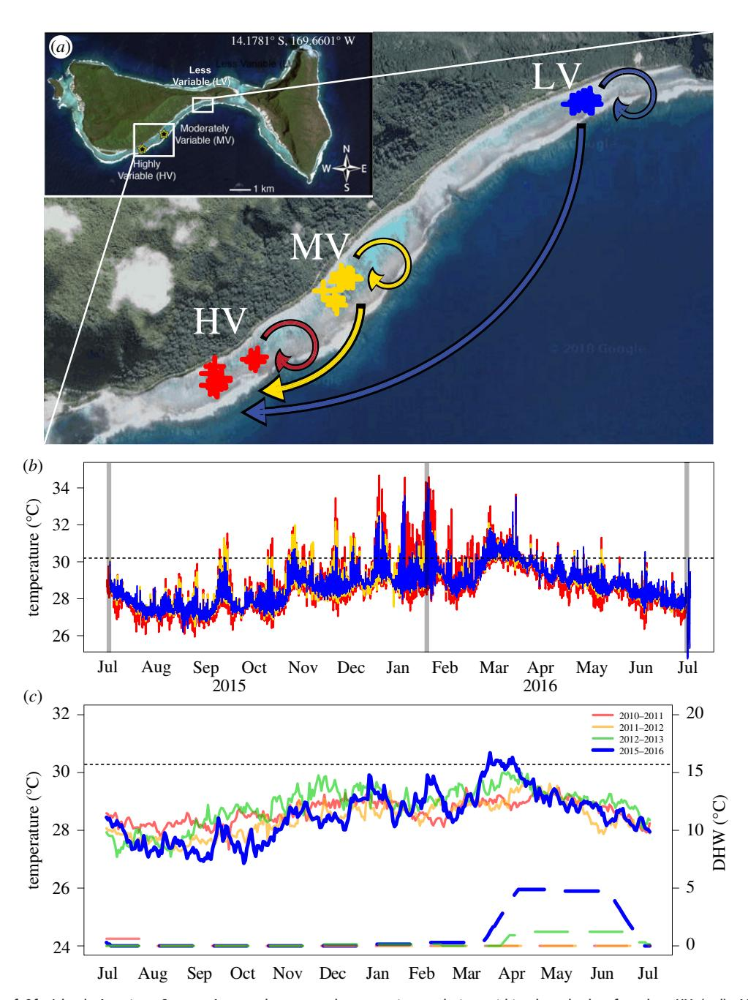
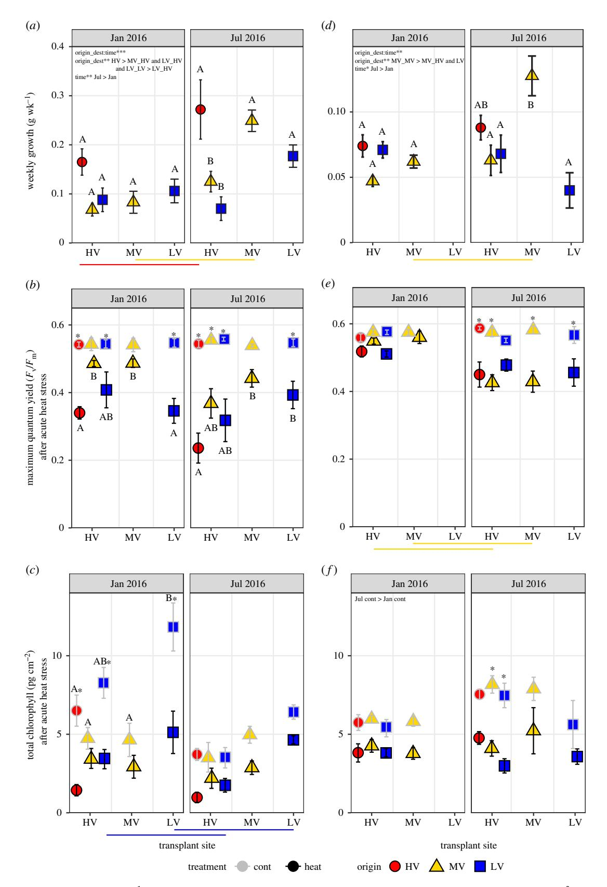

royalsocietypublishing.org/journal/rspb

# Research

Cite this article: Klepac CN, Barshis DJ. 2020 Reduced thermal tolerance of massive coral species in a highly variable environment. Proc. R. Soc. B 287: 20201379. http://dx.doi.org/10.1098/rspb.2020.1379

Received: 11 June 2020 Accepted: 22 July 2020

#### Subject Category:

Ecology

#### Subject Areas:

ecology, environmental science, genomics

#### Keywords:

coral, bleaching resilience, climate change, Porites lobata, thermal tolerance

#### Author for correspondence:

C. N. Klepac

e-mail: [cklep001@odu.edu](mailto:cklep001@odu.edu)

Electronic supplementary material is available online at rs.figshare.com.

# Reduced thermal tolerance of massive coral species in a highly variable environment

#### C. N. Klepac and D. J. Barshis

Department of Biology, Old Dominion University, Norfolk, VA 23529, USA

CNK, [0000-0002-3935-8275](http://orcid.org/0000-0002-3935-8275)

Coral bleaching events are increasing in frequency and severity, resulting in widespread losses in coral cover. However, branching corals native to highly variable (HV) thermal environments can have higher bleaching resistance than corals from more moderate habitats. Here, we investigated the response of two massive corals, Porites lobata and Goniastrea retiformis, from a moderately variable (MV) and a low variability (LV) pool transplanted into a HV pool on Ofu Island in American Samoa. Paired transplant and native ramets were exposed to an acute thermal stress after 6 and 12 months of exposure to the HV pool to evaluate changes in thermal tolerance limits. For both species, photosynthetic efficiency and chlorophyll loss following acute heat stress did not differ between ramets transplanted into the HV pool and respective native pool. Moreover, HV native P. lobata exhibited the greatest bleaching susceptibility compared to MV and LV natives and there was no effect of acute heat stress on MV P. lobata. There was also a thermal anomaly during the study, where Ofu's backreef thermal regime surpassed historical records—2015 had 8 degree heating weeks (DHW) and 2016 had up to 5 DHW (in comparison to less than or equal to 3 over the last 10 years) which may have exceeded the upper thermal limits of HV native P. lobata. These results strongly contrast with other research on coral tolerance in variable environments, potentially underscoring species-specific mechanisms and regional thermal anomalies that may be equally important in shaping coral responses to extreme temperatures.

# 1. Introduction

The frequency and magnitude of environmental variation is increasing in the upper ocean [[1](#page-7-0)] as our global climate rapidly warms. Environmental variability strongly influences organismal physiology and behaviour [\[2,3\]](#page-7-0), community assemblages [\[4\]](#page-7-0) and ultimately the integrity of ecosystems [\[5\]](#page-7-0). Impacts of climate warming are further magnified in marginal/extreme environments, such as low, high, or highly variable (HV) temperature, pH, and/or CO2 sites [\[6,7](#page-7-0)]. However, a number of studies show organisms in variable environments may have enhanced tolerance compared to those in more moderate habitats owing to acclimatization or adaptation [[8](#page-7-0)–[12\]](#page-7-0). Alternatively, warm-adapted species in these extreme environments may be particularly at risk because they live closest to their upper thermal limit and may have limited acclimation capacity [\[13](#page-7-0)–[15](#page-7-0)]. Although these populations have probably evolved the greatest thermal tolerance, it is possible an increased cost is involved in maintaining this tolerance [\[15\]](#page-7-0) compared to other populations with lower tolerances [[16\]](#page-7-0). Such a trade-off is critical for understanding the susceptibility of these populations to climate change.

Tropical reef-building corals live close to their upper thermal limits and are particularly sensitive to periods of elevated sea surface temperatures (SST) [[17,18\]](#page-7-0). Despite coral vulnerability to climate impacts, marginal and extreme reef habitats contain assemblages of corals that have acclimated and/or adapted to survive near or at their thermal thresholds [\[11,19](#page-7-0)–[21](#page-7-0)]. Resident coral populations in these environments are continuously exposed to HV abiotic conditions, yet coral diversity remains high [\[20](#page-7-0)] and uppertemperature tolerances are significantly higher than conspecifics from higher latitudes [\[18\]](#page-7-0) or less variable environments [\[8](#page-7-0)–[11,21](#page-7-0)–[24](#page-7-0)]. Mechanisms that contribute to high heat tolerance result from increased prevalence of heat-tolerant photosymbionts (Durusdinium spp. family Symbiodiniaceae; [\[25](#page-7-0)], but see [\[26](#page-7-0),[27](#page-7-0)]), modifications in gene regulation [\[28,29](#page-7-0)], adaptive divergence between coral populations [\[23,26,30](#page-7-0)–[32\]](#page-7-0) and/or potential epigenetic contributions to thermal tolerance [\[32,33](#page-7-0)]. As a result, HV habitats have become popular natural laboratories to understand the capacity of and mechanisms underlying coral stress tolerance [[6,8,22](#page-7-0)].

One such system that has been extensively studied is the network of backreef pools within the National Park of American Samoa on Ofu Island. These backreef pools are nearly identical in species diversity and per cent live coral cover, yet have distinct differences in small-scale environmental variability driven by tidal cycle and pool size [\[10](#page-7-0),[20](#page-7-0),[34\]](#page-7-0). Coral populations from two pools—a small, HV and a larger, moderately variable (MV) pool—exhibit both fixed and acclimatory responses to HV temperatures that contribute to enhanced thermal tolerance [\[8](#page-7-0)]. However, much of the research examining coral resilience in Ofu and elsewhere has been conducted on thermally susceptible branching corals, such as Acropora spp. [[8](#page-7-0),[24](#page-7-0),[35](#page-7-0)–[38\]](#page-7-0). Thus, there is scant evidence on whether massive, more robust corals exhibit similar responses to increasing environmental variability [\[22,39](#page-7-0)].

Additionally, evidence of tolerance trade-offs in organisms from HV habitats has been documented in intertidal porcelain crabs [[14,15\]](#page-7-0) and snails [\[40](#page-8-0)], diving beetles [\[16\]](#page-7-0), and seaweeds [\[41](#page-8-0)], but the potential negative impacts of extreme environments are largely unknown for tropical reef-building corals. Broadly, trade-offs in stress tolerance can result in reduced fecundity [\[42,43](#page-8-0)] and growth [\[41,44](#page-8-0)], changes in basal gene expression [[42\]](#page-8-0), transgenerational effects on offspring size and metabolism [\[45](#page-8-0)], and a limited scope for further acclimation to warmer temperatures [\[15,16](#page-7-0)]. For corals, the few documented consequences of elevated heat tolerance tradeoffs involve reduced lipids, growth and eggs size (attributed to hosting Durusdinium; [\[46](#page-8-0),[47](#page-8-0)]) and reduced larval size [\[33](#page-7-0)]. However, we do not know whether similar or extensive trade-offs apply to corals in naturally extreme environments, and what the implications would be for future reef habitats in a warming world.

Here, we test the scope for thermal tolerance in two dominant massive coral species, Porites lobata and Goniastrea retiformis in the Ofu backreef during an extremely warm year. We compare growth, bleaching sensitivity and endosymbiont species assemblage (Symbiodiniaceae) of coral samples transplanted into the HV pool compared to corals in the neighbouring MV and an additional nearby backreef pool of lesser thermal variability, the low variability (LV) pool. Corals were exposed to controlled, acute heat stress experiments at 6 and 12 months following transplantation to characterize upper thermal limits, acclimation capacities and trade-offs in this extreme environment.

# 2. Material and methods

#### (a) Coral collection and transplantation

In July 2015, corals were sampled from three backreef sites (HV, MV and LV) within the National Park of American Samoa of Ofu Island (14.1780765° S, 169.660109° W). Thirty colonies (n = 5 genets site−1 species−1 ) of two common massive coral species, P. lobata and G. retiformis, were sampled to remove 24 cores/ ramets from each genet in each site (n = 360 cores total species−1 ). Cores were measured for initial buoyant weight, secured to transplant grids via nylon bolts (approx. 36–40 cores grid−1 ), and returned to the respective native site for a one-week recovery. Ramets were then divided equally and transplanted into either the HV pool common garden or returned to the native reef site (n = 12 cores genet−1 site−1 species−1 ; [figure 1](#page-2-0)). HOBO pendant temperature loggers (Onset Computer Corp.) were deployed on native and transplant grids at all three sites and collected temperature data every 15 min. During January 2016, the LV native sample grid was dislodged by a cyclone but found a few days later and re-secured, precluding the six-month native versus transplant pairwise comparisons.

#### (b) Acute heat-stress assays

At each time point—6 months (January 2016) and 12 months (July 2016) after transplantation—2 ramets genet−1 species−1 were collected from the grids in each backreef pool (5 genets \* 2 ramets = 10 ramets species−1 \* 2 species = 20 ramets origin\_dest−1 \* 5 origin\_dest [LV\_LV, LV\_HV, MV\_MV, MV\_HV and HV\_HV] = 100 ramets total). Cores were scrubbed to remove algal and epiphyte growth prior to buoyant weight measurements. Coral growth was calculated by subtracting initial weight from final weight and then divided by the number of weeks since transplantation to determine weekly growth rate.

Coral ramets were placed in our Coral bleaching automated stress system (CBASS), constructed from sets of head and sump tanks (42 l volume treatment−1 ), resulting in four experimental tank systems—two heat and two control. A pump provided a flow of 88.9 ml s−1 to each head tank, which was also fitted with six LED bulbs (500 µmol photons m−2 s −1 ± 20 µE as measured via a Li-COR Li192 spherical quantum sensor) and 12 h 7.00 light/19.00 dark photoperiod. A flow-through drip system provided 9 l h−1 of local seawater throughout the duration of the experiment.

Following previous experiments by Palumbi et al. [\[8\]](#page-7-0), 60 ramets (approx. 30 cm3 ; four from each genet) were randomly assigned to one of two control and two heat treatment tanks (n ∼ 10–15 ramets tank−1 ) and then subjected to a customized temperature-controlled ramp programme [\[49\]](#page-8-0). All ramets from a single species were assayed in 1 day, with the second species assayed the following day. Beginning at 11.00, temperature increased over 3 h from 28 to 36.5°C for P. lobata and to 35.5°C for G. retiformis, followed by a 3 h incubation at the maximum temperature, then a ramp down to and hold at 28°C for 16 h (electronic supplementary material, figure S4). The control tank was set to remain stable at 28°C for 22 h. The two maximum temperatures were chosen: based on preliminary trials to elicit a visible bleaching response in greater than 50% of fragments, to represent acute thermal exposures above the local bleaching threshold, and to be approximately 1°C above the HV pool's mid-day low tide average maximum temperature.

#### (c) Symbiodiniaceae physiology under heat stress

The maximum quantum yield (Fv/Fm) of Photosystem II was measured using a pulse amplitude modulation (PAM) fluorometer (Junior-PAM, Walz, Germany; settings in the electronic supplementary material, Information). Following 30 min of dark adaptation, tops of coral ramets were measured in triplicate at the beginning (0 h) and before the end (21 h) of the experiment. Normalized Fv/Fm values (21–0 h)/0 h were used for statistical analyses to correct for between ramet variation in starting values. Fv/Fm values measured at the end of each assay were used for plotting for simplicity to allow for easy comparison to previous studies.

**Figure 1.** (a) Map of Ofu Island, American Samoa. Arrows show transplant experiment design within three backreef pools—HV (red), MV (gold), LV (blue). (b) In situ site temperatures during the study period. Vertical grey lines represent the start of the experiment and data collection time points. (c) Comparison of sea surface temperatures (solid lines) and degree heating weeks (DHW; dashed lines) during years of this and a prior experiment. Temperatures were extracted from a National Oceanic and Atmospheric Administration, Coral Reef Watch 5 km Ofu Island dataset spanning the years 2010–2012 [8] and 2015–2016 (this study). Dotted lines represent the regional bleaching threshold, 30.2°C [48]. (Online version in colour.)

Following experiments, coral tissue was airbrushed from the skeleton using 35 ppt artificial seawater, and the resulting slurry was homogenized, centrifuged and resuspended in 5 ml of seawater. For chlorophyll determination, slurry samples were homogenized using 90% acetone, a glass tissue homogenizer, and a 25 mm GF/F filter, and then stored at 4°C for 24 h. Absorbance spectra were measured using an Ocean Optics Spectrometer, and chlorophyll a and c values calculated using the Jeffrey & Humphrey [50] equation. Total chlorophyll (a+c) absorbance was normalized to acetone volume and then scaled to the surface area of each ramet, as measured using the paraffin wax method [51].

#### (d) Symbiodiniaceae genotyping

A 1 cm2 biopsy was sampled from each *G. retiformis* and *P. lobata* genet (n = 5 species-1 site-1) at the end of the experiment (control

ramets only) and in the field at each time point. Samples were incubated for 1–1.5 h at 65°C in a 1% sodium dodecyl sulfate in DNABuffer [52] and then transported back to Old Dominion University. During both time points, similar sized biopsies were sampled from control ramets after acute experiments to characterize Symbiodiniaceae ITS2-level assemblages over time (0, 6 and 12 months). DNA was extracted from the archived coral samples using a guanidinium-based extraction protocol [52].

Symbiodiniaceae were identified from both native coral colonies and corresponding HV pool transplanted replicates at 6 (January) and 12 months (July). We used a 350 bp segment of the internal transcribed spacer region 2 (ITS2) ribosomal DNA (rDNA) for amplification. The ITS2 region was amplified using Symbiodiniaceae specific primers, ITS-Dino-forward [53] and its2rev2-reverse [54]. Each primer also contained a universal linker, for downstream incorporation of Illumina adapters and

20201379

barcodes. Primer sequences and polymerase chain reaction (PCR) are specified in the electronic supplementary material. Following barcoding PCR, samples were pooled and sequenced on ODU's Illumina MiSeq (250 bp paired-end Reagent Nano Kit v.2).

Sequenced raw reads were demultiplexed, then trimmed of barcodes, adapters, linkers, ITS2 primers and degenerate bases. Sequences were identified via comparisons against available Symbiodiniaceae databases [\(http://webhome.auburn.edu/~santosr/](http://webhome.auburn.edu/~santosr/sequencedatasets.htm) [sequencedatasets.htm](http://webhome.auburn.edu/~santosr/sequencedatasets.htm); [\[55\]](#page-8-0)) and confirmed against NCBI's nucleotide BLASTn reference database. Symbiodiniaceae abundance counts for each amplicon sequence variant (ASV) per sample were produced using the R program DADA2.1.8.0 [[56\]](#page-8-0), and analysed using the MCMC.OTU model as described in Green et al. [\[57\]](#page-8-0), with fixed effects for origin, destination and time. Pairwise differences between all fixed effect combinations were calculated and adjusted using the false discovery rate (FDR). Count data were further filtered to retain ASV's detected in greater than 10% of all samples. A PERMANOVA was carried out on transformed ASV counts using the ADONIS function of the R package vegan [\[58\]](#page-8-0).

#### (e) Statistical analyses

All statistical analyses were performed using R.3.4.3 [[59](#page-8-0)]. Daily maximum, minimum, mean and daily range of temperatures were calculated from the in situ data, further divided into seasons: winter (July 2015–October 2015 and April 2016–July 2016), and summer (October 2015–April 2016), and tested using ANOVA, with site and season as fixed effects. Post hoc comparisons of significant effects were tested using the lsmeans function [[60](#page-8-0)]. We collected time-series data from the National Oceanic and Atmospheric Administration Coral Reef Watch (NOAA CRW) global 5 km product for Ofu Island [[48](#page-8-0)]—SST, sea surface temperature anomalies (SSTA) and degree heating weeks (DHW)—from 2010 to 2012 and from 2015 to 2016. These years were chosen to compare Ofu temperatures between previous 'normal' years—the Palumbi et al. [\[8\]](#page-7-0) study (2010–2012)—and recent mass bleaching years. ANOVA (lm function; [\[61\]](#page-8-0)) and Tukey's post hoc comparisons (lsmeans) were used to determine whether SST, SSTA and DHW differed between the aforementioned years.

For each coral species, differences in weekly growth, total chlorophyll and normalized FvFm were evaluated with respect to time point (levels: winter and summer), origin (levels: HV, MV, LV), transplantation (levels: HV common garden, native MV and LV) and treatment (levels: heat and control). Sample sizes for each factorial group (origin \* transplantation) were five (n = 5 genets), with an occasional reduction to 4 or 3 genets owing to sample loss (exact sample sizes for each variable/comparison are in the electronic supplementary material, tables S2 and S3). Effects were tested using a mixed model ANOVA, where time, a combined origin\_destination site variable (owing to the unbalanced design (i.e. not all origins in each destination), and treatment were modelled as fixed factors, and colony identity was nested within experimental tank designation as a random factor. Multiple comparisons across factors and interaction terms were assessed post hoc using general linear hypothesis testing and multiple comparisons (glht function; [\[62\]](#page-8-0)) for linear mixed-effects models, specifying Tukey's test. To satisfy model assumptions, normality was examined using the shapiro.test and homoscedasticity via the bartlett.test in R, as well as plotting residuals.

# 3. Results

#### (a) Anomalously high Ofu temperatures

In situ backreef temperatures of Ofu Island reveal greater daily maximum and lower minimum temperatures, and consequently a greater daily range in the HV pool than the MV and LV pool [\(figure 1](#page-2-0)b and the electronic supplementary material, figure S1; tables S1 and S4), specifically during the summer. Thermal anomalies were calculated as the total number of days during the experimental duration (July 2015 to July 2016) when temperatures exceeded the NOAA CRW 50 km regional bleaching threshold of 30.2°C [\[48](#page-8-0)]. The HV pool had a total of 125 days in which the daily maximum exceeded the bleaching threshold, versus 93 and 81 days over the threshold for the MV and LV pools, respectively. Moreover, the HV pool had 72 and 27 days above 31 and 32°C, versus 38 and 8 for the MV pool, and 33 and 12 days for the LV pool. By contrast to daily fluctuations and high-temperature events, overall mean temperature did not differ among the three pools (electronic supplementary material, figure S1; tables S1 and S4).

Annual temperatures also differed over the course of our study, where 2015 had greater max, min and average in situ temperatures in comparison to 2016 ([figure 1](#page-2-0)c). In comparison to temperatures of the previous study by Palumbi et al. [\[8](#page-7-0)] (e.g. a non-anomalous year), this study had a greater number of DHW than 2010, 2011 and 2012 ([figure 1](#page-2-0)c, electronic supplementary material, table S4). 2015 had up to 8 DHW over five months (six months prior to the first sampling point), 2016 had less than or equal to 5 DHW that spanned four months, while 2010 had less than or equal to 3 DHW over 2.5 months [\(figure 1](#page-2-0)c). In addition, SST and SSTA from 2016 were higher than in 2011–2012, as well as 2015.

#### (b) Coral host growth over time

For both coral species, weekly growth rate was influenced by the two-way interaction between origin\_destination transplant site and time. Averaged across both time points, P. lobata from the HV pool grew approximately 2.5 times more than MV and LV corals transplanted into the HV pool [\(figure 2](#page-4-0)a; electronic supplementary material, tables S2 and S5). By July 2016, growth was greatest in HV corals, and MV and LV native corals grew twice that of transplanted paired ramets. Additionally, the growth of native P. lobata ramets was higher in July than January ([figure 2](#page-4-0)a). For G. retiformis, weekly growth in July 2016 was 2–3 times higher in corals native to the MV pool compared to MV transplants and both LV groups [\(figure 2](#page-4-0)d; electronic supplementary material, tables S2 and S6), but not different than corals native to the HV pool. Similar to P. lobata, there were no growth differences in January. Growth of G. retiformis native to the MV pool was two times greater in July than January ([figure 2](#page-4-0)d; electronic supplementary material, tables S2 and S6).

### (c) Symbiodinaceae photophysiology under acute

### heat stress

Photophysiological responses of in hospite Symbiodiniaceae following heat stress varied by coral host species. ForP. lobata, acute heat stress reducedFv/Fm (calculated asloss normalized to starting value; see Material and methods) for HV and LV natives and MV and LV corals transplanted into the HV pool ( p < 0.0001; [figure 2](#page-4-0)b, denoted with '\*'). However, MV native P. lobata were not affected by acute heat stress (electronic supplementary material, tables S3 and S5), and Fv/Fm values were approximately 1.2–1.8 times higher in MV heated corals than heated HV and LV corals for both time points [\(figure 2](#page-4-0)b; electronic supplementary material, table S5). For G. retiformis there were no differences in Fv/Fm values among native and transplanted groups, nor was there an effect of heat treatment in January. Photochemical efficiency of heat-treated samples varied by a

Figure 2. Weekly growth rate (g week−1 ; top panel), maximum quantum yield (Fv/Fm; middle panel) and total chlorophyll (pg cm−2 ; bottom panel) of Symbiodiniaceae following acute heat stress (mean ± s.e.) in P. lobata (a–c) and G. retiformis (d–f ) with respect to transplant destination and time. Significant post hoc comparisons within each time panel are represented by letters (differences among transplant groups) and asterisks (effect of acute heat stress). Coloured horizontal lines represent significant differences within paired transplant groups over time. (Online version in colour.)

time and treatment interaction, with higher Fv/Fm values in January than July, but only for MV heated corals ( p < 0.0001; figure 2e, electronic supplementary material, tables S3 and S6). For both species, there were no significant tank effects.

Total chlorophyll (a + c) differed by either native pool or time. For P. lobata, native LV corals had approximately two times higher control than HV and MV corals during January (time \* origin\_dest \* trt p = 0.047; figure 2c; electronic supplementary material, tables S3 and S5). In January, acute heat stress reduced total chlorophyll values in LV and HV corals (electronic supplementary material, tables S3 and S5). Similar to Fv/Fm, there was no effect of treatment on total chlorophyll content in P. lobata from the MV pool [\(figure 2](#page-4-0)c; electronic supplementary material, tables S3 and S5). For G. retiformis, there was an interactive effect of treatment and time, where total chlorophyll control values were greater in July than January ( p < 0.0001; [figure 2](#page-4-0)f; electronic supplementary material, tables S3 and S6). Similar to Fv/Fm, therewas no effect of treatment in January, but heat stress reduced total chlorophyll values in MV and LV corals transplanted into the HV pool in July ( p ≤ 0.0001; electronic supplementary material, table S3, denoted with '\*').

#### (d) Stable symbiodinaceae composition

Symbiodiniaceae ITS2 rDNA was analysed for distinct ASVs, and resulted in two ASVs for P. lobata and six ASVs for G. retiformis. Dominant Symbiodiniaceae were all Cladocopium spp. (formerly Clade C; [\[27\]](#page-7-0)) and species varied between P. lobata and G. retiformis. In P. lobata, Cladocopium ITS2 type C15 (NCBI accession no. AY239369.1) was dominant at greater than 99%, but a few coral individuals contained background proportions (less than 1%) of Cladocopium ITS2 type C40 (AY258485.1; electronic supplementary material, figure S4A; table S7). For P. lobata, Cladocopium community composition did not change over time.

Unlike P. lobata, G. retiformis corals contained mostly Cladocopium ITS2 type C40 at 50–73%, types C15 and C3 (AF499789.1) at 6–27% and 3–6%, respectively, and types C1 (AF333515.1), C15b (AY258491.1) and C21 (AY239372.1) were detected at background proportions (less than 1%; electronic supplementary material, figure S4B, table S7). Goniastrea retiformis community composition varied by native backreef pool and time. ITS2 type C3 varied by origin, where it was present (5–10%) in G. retiformis from the HV and MV pool but absent from LV corals (PERMA-NOVA FDR < 0.05 p = 0.0062). ITS2 type C15 was present (2–30%) in HV and LV G. retiformis but absent in MV corals (PERMANOVA FDR < 0.05 p = 0.0014) until January 2016, when type C15 increased to 40–50% in MV corals and became absent from LV corals.

# 4. Discussion

We tested whether exposure to HV temperatures increased or decreased stress resistance in two massive coral species from distinct backreef environments. Corals transplanted for one year into the site with the highest variability (the HV pool common garden) did not increase growth or improve photophysiological responses following acute heat stress, as observed in previous studies [\[8](#page-7-0)]. Instead, growth and stress tolerance responded differently to spatial and temporal variation in temperature regimes, and differently in P. lobata and G. retiformis. Unexpectedly, P. lobata native to the HV pool, the site with the highest thermal variability, were most sensitive to experimental bleaching. Previous work in Ofu found increased stress tolerance following acclimation to the greater thermal variability of the HV regime [\[35\]](#page-7-0), yet we observed a negligible effect of this variability on thermal performance for corals transplanted into and a deleterious effect for corals from the HV pool. Our results suggest that not all coral species may respond positively (or similarly) to HV thermal habitats.

High magnitudes of temperature variation have recently been recognized as a significant promoter of reef-building coral thermal tolerance over small spatial scales (less than 10 km) and could increase resilience to anticipated ocean warming (e.g. [[8,9,22](#page-7-0)[,63](#page-8-0)]). Coral populations from inshore/ protected habitats with high diurnal fluctuations consistently exhibit greater growth and/or natural bleaching tolerance than conspecifics from offshore/exposed habitats, a paradigm congruent across the Caribbean [\[9,23,](#page-7-0)[64\]](#page-8-0), Red Sea [[65\]](#page-8-0), Ofu Island in the South Pacific [[22](#page-7-0),[34\]](#page-7-0), northwest Australia [\[11\]](#page-7-0) and Great Barrier Reef [\[24](#page-7-0)]. By contrast, coral growth in the present study was not different among the three backreef populations in their native environments (except lower growth in LV native G. retiformis in July 2016) despite differences in thermal regimes, although MV and LV P. lobata transplants in the HV pool had lower growth than paired native ramets and HV native genets in July 2016. Moreover, HV native corals and corals transplanted into the HV pool were susceptible to acute bleaching stress during one or both time points. We also observed no effect of acute heat stress on native and transplanted MV P. lobata corals (except for Fv/ Fm values in MV transplants during July 2016). This starkly contradicts previous studies examining coral species from or transplanted into the HV pool, which found higher: thermal tolerance limits [\[8,10,22\]](#page-7-0), the prevalence of heat-tolerant Durusdinium trenchii [\[66](#page-8-0)] and transcription of heat responsive genes [[29\]](#page-7-0) than MV pool corals. Despite persistent high magnitudes of thermal variability, the HV pool did not increase heat tolerance of massive coral species during our study, which complicates the notion that HV thermal habitats are universally beneficial for increasing the adaptive and acclimatory potential of all coral species.

The most obvious distinction between previous experiments and ours is that prior research has predominantly focused on corals in the genus Acropora [[24,35,38](#page-7-0)[,67](#page-8-0)]. Biological traits such as colony morphology, growth rate and reproductive mode separate branching corals such as Acropora spp. from massive coral species into 'competitive' and 'stress-tolerant' life-histories, respectively [\[68](#page-8-0)]. Large, slowgrowing massive corals are thought to be more thermally tolerant to chronically variable and disturbed habitats than branching species in both the Caribbean [\[69](#page-8-0)] and Indo-Pacific [[70\]](#page-8-0), given life-history traits such as increased tissue thickness and energy surplus [\[36](#page-7-0),[37,](#page-7-0)[71\]](#page-8-0). The HV population of P. lobata has previously exhibited higher growth (versus MV corals) and stress resistance (versus forereef corals; [[22\]](#page-7-0)), but here, P. lobata in the HV pool demonstrate reduced stress tolerance compared to MV and LV populations. These massive coral species are naturally abundant within the HV pool [[20\]](#page-7-0), thus, their common occurrence, as well as the increased growth and stress resistance shown previously in HV P. lobata makes it unlikely that the taxonomic difference between the present and previous studies is the main explanation for contrasting results of minimal growth differences and reduced thermal tolerance of HV corals seen herein.

Although both P. lobata and G. retiformis are clustered into the stress-tolerant life-history strategy [\[68](#page-8-0)], species-specific responses are apparent under acute bleaching stress. For both photochemical efficiency (Fv/Fm) and total chlorophyll, we found opposing effects of time, where heat stress affected P. lobata in January but G. retiformis corals were more affected in July 2016. In addition, stronger effects of pool of origin were evident for P. lobata bleaching responses and July 2016 growth versus G. retiformis. Ofu backreef Acropora populations harbour pool-specific Symbiodiniaceae communities, where Acropora spp. in the HV pool predominantly host D. trenchii, while MV corals host both D. trenchii and Cladocopium type C2 [\[25](#page-7-0)]. By contrast, we observed similar Symbiodiniaceae communities within P. lobata (type C15) across the backreef, site-specific assemblages within G. retiformis (type C40, C15 and C3), and distinct species-specific assemblages. While it is unclear whether different Symbiodiniaceae Cladocopium assemblages could be driving the observed species-specific seasonal variation in photophysiological responses to bleaching stress [[72\]](#page-8-0), both intra- and interspecific host and symbiont variation is known to shape growth and thermal tolerance limits in corals (e.g. [[36](#page-7-0),[73,74\]](#page-8-0)).

Additionally, it could be that corals in these backreef pools are locally adapted to their native thermal conditions. In the Florida Keys, mass gain, protein and lipid levels, and gene expression plasticity of Porites astreoides were greater for corals in their native environment in comparison to foreign transplants [[9](#page-7-0),[28](#page-7-0)]. Similarly in Ofu, backreef (HV and/or MV) P. lobata had consistently higher growth, environmental tolerance and cellular responses than corals from or reciprocally transplanted to a nearby forereef [[22](#page-7-0),[30,34\]](#page-7-0). In Barshis et al. [[22\]](#page-7-0), HV P. lobata grew more than forereef corals, and both HV and MV P. lobata exhibited increased tolerance under acute thermal stress compared to forereef corals regardless of acclimation to stable or fluctuating temperatures (though HV and MV did not differ; [\[22](#page-7-0)]). Notably, this experiment used a 36 days aquarium-based acclimation versus the 12 months field acclimatization performed herein and observed no differences between HV and MV populations. We also found the highest growth in HV natives versus MV and LV corals transplanted into the HV pool, but only for P. lobata during July 2016 and no differences among their native environments. However, differences in stress tolerance between paired native versus transplanted ramets exist for both species: a non-significant then significant reduction in both Fv/Fm for MV native versus transplanted P. lobata and total chlorophyll for MV and LV native versus transplanted G. retiformis from January to July 2016, suggesting a potentially higher stress level in transplanted ramets. For local adaptation to occur in these backreef populations, individuals would need to perform better at home versus away [[75\]](#page-8-0), which is illustrated here for coral growth but not stress tolerance (excepting the instances mentioned above). In addition, HV corals have previously demonstrated increased tolerance owing to the conditions of the HV pool [\[8,10\]](#page-7-0), yet in this study, Fv/Fm values suggest HV native P. lobata were most susceptible to stress. Local adaptation could contribute to the complexity of our results, though it cannot be fully supported, as we did not observe classic patterns of best performance at home versus away, nor did we conduct a full reciprocal transplant moving HV corals into the MV or LV pools.

For HV corals, increased growth but reduced stress tolerance could be evidence of tolerance trade-offs owing to specialization to HV habitats. Skeletal growth records of massive Porites colonies along the Great Barrier Reef illustrate progressive accretion rates associated with warming SST followed by precipitous declines following repeated mass bleaching events ([[76\]](#page-8-0), but see [\[77](#page-8-0)]). We explored the relationship between HV P. lobata coral growth and response to acute thermal stress and found a negative, albeit non-significant, correlation between growth and total chlorophyll (Pearson's R = −0.41; electronic supplementary material, figure S5) and no correlation between growth and photochemical efficiency. Taken together, our results corroborate recent findings that coral growth is probably not a good predictor of bleaching responses under extreme temperatures [\[78](#page-8-0)].

Compromised bleaching tolerance of HV native corals and a lack of enhanced performance for corals transplanted into the HV pool could also be attributed to the magnitude and duration of maximal summertime temperatures recorded during this study. From 2015 to 2016, a strong El Niño increased SST and triggered the third pan-tropical mass bleaching event [[79,80\]](#page-8-0). This bleaching event was reported to be the most extensive and severe in recent human history; and reefs in American Samoa were predicted to experience intense bleaching conditions [[79](#page-8-0)]. Our experiments were a few months prior to or post maximal bleaching stress on Ofu Island (2015: February– June, 2016: March–June; [figure 1](#page-2-0)c), however in January 2016, we observed sparse paling in some HV pool branching corals but not in our donor or transplanted corals (C. N. Klepac 2016, personal observation). Thus, the patterns observed herein could represent the initial stages of response to or accumulated after-effects of the thermal anomaly. The HV pool regularly experiences brief but frequent temperatures that reach over 35°C, which greatly exceed the regional bleaching threshold of 30.2°C [[10](#page-7-0),[20](#page-7-0)], and our acute thermal stress assays serve as an experimental analogue to the strong thermal variation in this pool. Much of the thermal tolerance research previously conducted in Ofu used similar thermal stress assay profiles [\[8\]](#page-7-0), yet these experiments occurred during milder years, where 2 DHW was rarely exceeded in comparison to 5–8 DHW during our study.

Itis thus tempting to speculatewhether the extreme temperatures in the HV pool during this study could have overwhelmed the physiological performance underlying temperature tolerance of this population of corals. However, this study would need to be repeated during non-bleaching years and during peak summer temperatures to effectively disentangle the effect of recent thermal history versus taxonomic, evolutionary and population-specific drivers of massive coral species upper thermal limits. Indeed, the differences in thermal tolerance limits observed herein are complex, challenging our understanding of how naturally tolerant populations will fare under rapid climate change. Regardless of the complexity, it is clear that higher magnitudes of temperature variation is not a universal promoter of thermal tolerance limits and that species-specific mechanisms and regional thermal anomalies may be equally important in shaping coral responses to extreme temperatures.

Data accessibility. Data will be made accessible through the author's GitHub repository [\(https://github.com/courtneyklepac/project\\_](https://github.com/courtneyklepac/project_reducedtolerance_massivecorals_variablehabitats) [reducedtolerance\\_massivecorals\\_variablehabitats](https://github.com/courtneyklepac/project_reducedtolerance_massivecorals_variablehabitats)) [\[49](#page-8-0)]. Unique Symbiodiniaceae sequences are available on NCBI's BioProject no. PRJNA647413.

Authors' contributions. C.N.K. and D.J.B. designed the study, C.N.K. performed field and laboratory research and conducted analyses, C.N.K. and D.J.B. wrote the manuscript.

Competing interests. We declare we have no competing interests Funding. This project was funded by NOAA-CRCP grant no. NA15NOS4820080 to D.J.B.

Acknowledgements. We thank the staff at the National Park of American Samoa for access to the field site and logistical help; the Malae family, Caroline Haymaker and Mike for invaluable field assistance; and reviewers and the editor for providing comments and suggestions that improved the manuscript. Coral sampling and transplant experiments were conducted under NPSA research and collection permits NPSA-2015-SCI-0012 and NPSA-2015-SCI-0015.

# References

- 1. Pachauri RK et al. 2014 Climate change 2014: synthesis report. Contribution of Working Groups I, II and III to the fifth assessment report of the Intergovernmental Panel on Climate Change, IPCC.
- 2. Gilchrist GW. 1995 Specialists and generalists in changing environments. I. Fitness landscapes of thermal sensitivity. Am. Nat. 146, 252–270. ([doi:10.](http://dx.doi.org/10.1086/285797) [1086/285797](http://dx.doi.org/10.1086/285797))
- 3. Parmesan C. 2006 Ecological and evolutionary responses to recent climate change. Ann. Rev. Ecol. Evol. Syst. 37, 637–669. [\(doi:10.1146/annurev.](http://dx.doi.org/10.1146/annurev.ecolsys.37.091305.110100) [ecolsys.37.091305.110100](http://dx.doi.org/10.1146/annurev.ecolsys.37.091305.110100))
- 4. Levin SA, Paine RT. 1974 Disturbance, patch formation, and community structure. Proc. Natl Acad. Sci. USA 71, 2744–2747. ([doi:10.1073/pnas.](http://dx.doi.org/10.1073/pnas.71.7.2744) [71.7.2744](http://dx.doi.org/10.1073/pnas.71.7.2744))
- 5. Baker AC, Glynn PW, Riegl B. 2008 Climate change and coral reef bleaching: an ecological assessment of long-term impacts, recovery trends and future outlook. Estuarine Coastal Shelf Sci. 80, 435–471. [\(doi:10.1016/j.ecss.2008.09.003\)](http://dx.doi.org/10.1016/j.ecss.2008.09.003)
- 6. Camp EF, Schoepf V, Mumby PJ, Hardtke LA, Rodolfo-Metalpa R, Smith DJ, Suggett DJ. 2018 The future of coral reefs subject to rapid climate change: lessons from natural extreme environments. Front. Mar. Sci. 5, 4. [\(doi:10.3389/fmars.2018.00004\)](http://dx.doi.org/10.3389/fmars.2018.00004)
- 7. Boyd PW, Cornwall CE, Davison A, Doney SC, Fourquez M, Hurd CL, Lima ID, McMinn A. 2016 Biological responses to environmental heterogeneity under future ocean conditions. Glob. Change Biol. 22, 2633–2650. ([doi:10.1111/gcb.13287\)](http://dx.doi.org/10.1111/gcb.13287)
- 8. Palumbi SR, Barshis DJ, Traylor-Knowles N, Bay RA. 2014 Mechanisms of reef coral resistance to future climate change. Science 344, 895–898. [\(doi:10.](http://dx.doi.org/10.1126/science.1251336) [1126/science.1251336\)](http://dx.doi.org/10.1126/science.1251336)
- 9. Kenkel CD, Almanza AT, Matz MV. 2015 Fine-scale environmental specialization of reef-building corals might be limiting reef recovery in the Florida Keys. Ecology 96, 3197–3212. ([doi:10.1890/14-2297.1](http://dx.doi.org/10.1890/14-2297.1))
- 10. Oliver T, Palumbi S. 2011 Do fluctuating temperature environments elevate coral thermal tolerance? Coral Reefs 30, 429–440. ([doi:10.1007/](http://dx.doi.org/10.1007/s00338-011-0721-y) [s00338-011-0721-y\)](http://dx.doi.org/10.1007/s00338-011-0721-y)
- 11. Schoepf V, Stat M, Falter JL, McCulloch MT. 2015 Limits to the thermal tolerance of corals adapted to a highly fluctuating, naturally extreme temperature environment. Sci. Rep. 5, 1–4. [\(doi:10.1038/](http://dx.doi.org/10.1038/srep17639) [srep17639](http://dx.doi.org/10.1038/srep17639))
- 12. Sgro CM, Overgaard J, Kristensen TN, Mitchell KA, Cockerell FE, Hoffmann AA. 2010 A comprehensive assessment of geographic variation in heat tolerance and hardening capacity in populations of Drosophila melanogaster from eastern Australia. J. Evol. Biol. 23, 2484–2493. ([doi:10.1111/j.1420-](http://dx.doi.org/10.1111/j.1420-9101.2010.02110.x) [9101.2010.02110.x\)](http://dx.doi.org/10.1111/j.1420-9101.2010.02110.x)
- 13. Somero G. 2010 The physiology of climate change: how potentials for acclimatization and genetic adaptation will determine 'winners' and 'losers'. J. Exp. Biol. 213, 912–920. [\(doi:10.1242/jeb.](http://dx.doi.org/10.1242/jeb.037473) [037473](http://dx.doi.org/10.1242/jeb.037473))

- 14. Stillman JH, Somero GN. 2000 A comparative analysis of the upper thermal tolerance limits of eastern Pacific porcelain crabs, genus Petrolisthes: influences of latitude, vertical zonation, acclimation, and phylogeny. Physiol. Biochem. Zool. 73, 200–208. ([doi:10.1086/316738](http://dx.doi.org/10.1086/316738))
- 15. Stillman JH. 2003 Acclimation capacity underlies susceptibility to climate change. Science 301, 65. [\(doi:10.1126/science.1083073](http://dx.doi.org/10.1126/science.1083073))
- 16. Calosi P, Bilton DT, Spicer JI. 2008 Thermal tolerance, acclimatory capacity and vulnerability to global climate change. Biol. Lett. 4, 99–102. [\(doi:10.1098/rsbl.2007.0408\)](http://dx.doi.org/10.1098/rsbl.2007.0408)
- 17. Heron SF, Maynard JA, Van Hooidonk R, Eakin CM. 2016 Warming trends and bleaching stress of the world's coral reefs 1985–2012. Sci. Rep. 6, 38402. [\(doi:10.1038/srep38402\)](http://dx.doi.org/10.1038/srep38402)
- 18. Coles SL, Jokiel PL, Lewis CR. 1976 Thermal tolerance in tropical versus subtropical Pacific reef corals. Pac. Sci. 30, 159–166.
- 19. Riegl BM, Purkis SJ, Al-Cibahy AS, Abdel-Moati MA, Hoegh-Guldberg O. 2011 Present limits to heatadaptability in corals and population-level responses to climate extremes. PLoS ONE 6, e24802. ([doi:10.](http://dx.doi.org/10.1371/journal.pone.0024802) [1371/journal.pone.0024802\)](http://dx.doi.org/10.1371/journal.pone.0024802)
- 20. Craig P, Birkeland C, Belliveau S. 2001 High temperatures tolerated by a diverse assemblage of shallow-water corals in American Samoa. Coral Reefs 20, 185–189. ([doi:10.1007/s003380100159](http://dx.doi.org/10.1007/s003380100159))
- 21. Camp EF, Nitschke MR, Rodolfo-Metalpa R, Houlbreque F, Gardner SG, Smith DJ, Zampighi M, Suggett DJ. 2017 Reef-building corals thrive within hot-acidified and deoxygenated waters. Sci. Rep. 7, 2434. [\(doi:10.1038/s41598-017-02383-y\)](http://dx.doi.org/10.1038/s41598-017-02383-y)
- 22. Barshis DJ, Birkeland C, Toonen RJ, Gates RD, Stillman JH. 2018 High-frequency temperature variability mirrors fixed differences in thermal limits of the massive coral Porites lobata. J. Exp. Biol. 221, jeb188581.
- 23. Kenkel CD, Goodbody-Gringley G, Caillaud D, Davies SW, Bartels E, Matz MV. 2013 Evidence for a host role in thermotolerance divergence between populations of the mustard hill coral (Porites astreoides) from different reef environments. Mol. Ecol. 22, 4335–4348. [\(doi:10.1111/mec.12391\)](http://dx.doi.org/10.1111/mec.12391)
- 24. Howells EJ, Berkelmans R, van Oppen MJ, Willis BL, Bay LK. 2013 Historical thermal regimes define limits to coral acclimatization. Ecology 94, 1078–1088. [\(doi:10.1890/12-1257.1\)](http://dx.doi.org/10.1890/12-1257.1)
- 25. Oliver TA, Palumbi SR. 2010 Many corals host thermally resistant symbionts in high-temperature habitat. Coral Reefs 30, 241–250. [\(doi:10.1007/](http://dx.doi.org/10.1007/s00338-010-0696-0) [s00338-010-0696-0\)](http://dx.doi.org/10.1007/s00338-010-0696-0)
- 26. Howells E, Abrego D, Meyer E, Kirk N, Burt J. 2016 Host adaptation and unexpected symbiont partners enable reef-building corals to tolerate extreme temperatures. Glob. Change Biol. 22, 2702–2714. [\(doi:10.1111/gcb.13250](http://dx.doi.org/10.1111/gcb.13250))
- 27. LaJeunesse TC, Parkinson JE, Gabrielson PW, Jeong HJ, Reimer JD, Voolstra CR, Santos SR. 2018

- Systematic revision of Symbiodiniaceae highlights the antiquity and diversity of coral endosymbionts. Curr. Biol. 28, 2570–2580.e2576. [\(doi:10.1016/j.](http://dx.doi.org/10.1016/j.cub.2018.07.008) [cub.2018.07.008\)](http://dx.doi.org/10.1016/j.cub.2018.07.008)
- 28. Kenkel CD, Matz MV. 2016 Gene expression plasticity as a mechanism of coral adaptation to a variable environment. Nat. Ecol. Evol. 1, 0014. ([doi:10.1038/s41559-016-0014](http://dx.doi.org/10.1038/s41559-016-0014))
- 29. Barshis DJ, Ladner JT, Oliver TA, Seneca FO, Traylor-Knowles N, Palumbi SR. 2013 Genomic basis for coral resilience to climate change. Proc. Natl Acad. Sci. USA 110, 1387–1392. ([doi:10.1073/pnas.](http://dx.doi.org/10.1073/pnas.1210224110) [1210224110](http://dx.doi.org/10.1073/pnas.1210224110))
- 30. Barshis D, Stillman J, Gates R, Toonen R, Smith L, Birkeland C. 2010 Protein expression and genetic structure of the coral Porites lobata in an environmentally extreme Samoan back reef: does host genotype limit phenotypic plasticity? Mol. Ecol. 19, 1705–1720. [\(doi:10.1111/j.1365-294X.2010.](http://dx.doi.org/10.1111/j.1365-294X.2010.04574.x) [04574.x](http://dx.doi.org/10.1111/j.1365-294X.2010.04574.x))
- 31. Bay RA, Palumbi SR. 2014 Multilocus adaptation associated with heat resistance in reef-building corals. Curr. Biol. 24, 2952–2956. ([doi:10.1016/j.](http://dx.doi.org/10.1016/j.cub.2014.10.044) [cub.2014.10.044\)](http://dx.doi.org/10.1016/j.cub.2014.10.044)
- 32. Dixon GB, Davies SW, Aglyamova GV, Meyer E, Bay LK, Matz MV. 2015 Genomic determinants of coral heat tolerance across latitudes. Science 348, 1460–1462. [\(doi:10.1126/science.1261224](http://dx.doi.org/10.1126/science.1261224))
- 33. Putnam HM, Gates RD. 2015 Preconditioning in the reef-building coral Pocillopora damicornis and the potential for trans-generational acclimatization in coral larvae under future climate change conditions. J. Exp. Biol. 218, 2365–2372. ([doi:10.1242/jeb.](http://dx.doi.org/10.1242/jeb.123018) [123018\)](http://dx.doi.org/10.1242/jeb.123018)
- 34. Smith L, Barshis D, Birkeland C. 2007 Phenotypic plasticity for skeletal growth, density and calcification of Porites lobata in response to habitat type. Coral Reefs 26, 559–567. ([doi:10.1007/](http://dx.doi.org/10.1007/s00338-007-0216-z) [s00338-007-0216-z\)](http://dx.doi.org/10.1007/s00338-007-0216-z)
- 35. Thomas L, Rose NH, Bay RA, López EH, Morikawa MK, Ruiz-Jones L, Palumbi SR. 2018 Mechanisms of thermal tolerance in reef-building corals across a fine-grained environmental mosaic: lessons from Ofu, American Samoa. Front. Mar. Sci. 4, 434. ([doi:10.3389/fmars.2017.00434\)](http://dx.doi.org/10.3389/fmars.2017.00434)
- 36. Loya Y, Sakai K, Yamazato K, Nakano Y, Sambali H, Van Woesik R. 2001 Coral bleaching: the winners and the losers. Ecol. Lett. 4, 122–131. [\(doi:10.1046/](http://dx.doi.org/10.1046/j.1461-0248.2001.00203.x) [j.1461-0248.2001.00203.x\)](http://dx.doi.org/10.1046/j.1461-0248.2001.00203.x)
- 37. van Woesik R, Sakai K, Ganase A, Loya Y. 2011 Revisiting the winners and the losers a decade after coral bleaching. Mar. Ecol. Prog. Ser. 434, 67–76. ([doi:10.3354/meps09203](http://dx.doi.org/10.3354/meps09203))
- 38. Middlebrook R, Hoegh-Guldberg O, Leggat W. 2008 The effect of thermal history on the susceptibility of reef-building corals to thermal stress. J. Exp. Biol. 211, 1050–1056. [\(doi:10.1242/](http://dx.doi.org/10.1242/jeb.013284) [jeb.013284](http://dx.doi.org/10.1242/jeb.013284))
- 39. Brown BE, Dunne RP, Edwards AJ, Sweet MJ, Phongsuwan N. 2015 Decadal environmental

- 'memory' in a reef coral? Mar. Biol. 162, 479–483. [\(doi:10.1007/s00227-014-2596-2\)](http://dx.doi.org/10.1007/s00227-014-2596-2)
- 40. Tomanek L, Somero GN. 1999 Evolutionary and acclimation-induced variation in the heat-shock responses of congeneric marine snails (genus Tegula) from different thermal habitats: implications for limits of thermotolerance and biogeography. J. Exp. Biol. 202, 2925–2936. [\(doi:10.1016/s1095-](http://dx.doi.org/10.1016/s1095-6433(99)90421-x) [6433\(99\)90421-x](http://dx.doi.org/10.1016/s1095-6433(99)90421-x))
- 41. Davison IR, Pearson GA. 1996 Stress tolerance in intertidal seaweeds. J. Phycol. 32, 197–211. ([doi:10.](http://dx.doi.org/10.1111/j.0022-3646.1996.00197.x) [1111/j.0022-3646.1996.00197.x](http://dx.doi.org/10.1111/j.0022-3646.1996.00197.x))
- 42. Hoffmann AA, Sørensen JG, Loeschcke V. 2003 Adaptation of Drosophila to temperature extremes: bringing together quantitative and molecular approaches. J. Therm. Biol. 28, 175–216. ([doi:10.](http://dx.doi.org/10.1016/S0306-4565(02)00057-8) [1016/S0306-4565\(02\)00057-8\)](http://dx.doi.org/10.1016/S0306-4565(02)00057-8)
- 43. Muller-Landau HC. 2010 The tolerance–fecundity trade-off and the maintenance of diversity in seed size. Proc. Natl Acad. Sci. USA 107, 4242–4247. [\(doi:10.1073/pnas.0911637107](http://dx.doi.org/10.1073/pnas.0911637107))
- 44. Calosi P et al. 2013 Adaptation and acclimatization to ocean acidification in marine ectotherms: an in situ transplant experiment with polychaetes at a shallow CO2 vent system. Phil. Trans. R. Soc. B 368, 20120444. ([doi:10.1098/rstb.2012.0444](http://dx.doi.org/10.1098/rstb.2012.0444))
- 45. Burgess SC, Marshall DJ. 2011 Temperature-induced maternal effects and environmental predictability. J. Exp. Biol. 214, 2329–2336. [\(doi:10.1242/jeb.](http://dx.doi.org/10.1242/jeb.054718) [054718](http://dx.doi.org/10.1242/jeb.054718))
- 46. Cunning R, Gillette P, Capo T, Galvez K, Baker AC. 2014 Growth tradeoffs associated with thermotolerant symbionts in the coral Pocillopora damicornis are lost in warmer oceans. Coral Reefs 34, 155–160. [\(doi:10.1007/s00338-014-](http://dx.doi.org/10.1007/s00338-014-1216-4) [1216-4](http://dx.doi.org/10.1007/s00338-014-1216-4))
- 47. Jones AM, Berkelmans R. 2011 Tradeoffs to thermal acclimation: energetics and reproduction of a reef coral with heat tolerant Symbiodinium type-D. J. Mar. Biol. 2011, 1–12. ([doi:10.1155/2011/](http://dx.doi.org/10.1155/2011/185890) [185890](http://dx.doi.org/10.1155/2011/185890))
- 48. NOAA-CRW. 2017 NOAA Coral Reef Watch Version 3.0 Daily Global 5-km Satellite Virtual Station Time Series Data for Ofu Island, American Samoa, Jan. 1, 2010-Dec. 31, 2017. College Park, Maryland, USA: NOAA Coral Reef Watch.
- 49. Klepac C, Barshis D. 2020 Data from: Reduced thermal tolerance of massive coral species in a highly variable environment. GitHub ([https://](https://github.com/courtneyklepac/project_reducedtolerance_massivecorals_variablehabitats) [github.com/courtneyklepac/project\\_](https://github.com/courtneyklepac/project_reducedtolerance_massivecorals_variablehabitats) [reducedtolerance\\_massivecorals\\_variablehabitats](https://github.com/courtneyklepac/project_reducedtolerance_massivecorals_variablehabitats))
- 50. Jeffrey S, Humphrey G. 1975 New spectrophotometric equations for determining chlorophylls a, b, c1 and c2 in higher plants, algae and natural phytoplankton. Biochem. Physiol. Pflanz 167, 191–194. [\(doi:10.1016/s0015-](http://dx.doi.org/10.1016/s0015-3796(17)30778-3) [3796\(17\)30778-3\)](http://dx.doi.org/10.1016/s0015-3796(17)30778-3)
- 51. Veal C, Carmi M, Fine M, Hoegh-Guldberg O. 2010 Increasing the accuracy of surface area estimation using single wax dipping of coral fragments. Coral Reefs 29, 893–897. ([doi:10.1007/](http://dx.doi.org/10.1007/s00338-010-0647-9) [s00338-010-0647-9\)](http://dx.doi.org/10.1007/s00338-010-0647-9)

- 52. Baker A, Cunning R. 2016 Bulk gDNA extraction from coral samples. Protocols. io. See [https://www.](https://www.protocols.io/view/Bulk-gDNA-extraction-from-coral-samples-dyq7vv) [protocols.io/view/Bulk-gDNA-extraction-from-coral](https://www.protocols.io/view/Bulk-gDNA-extraction-from-coral-samples-dyq7vv)[samples-dyq7vv](https://www.protocols.io/view/Bulk-gDNA-extraction-from-coral-samples-dyq7vv).
- 53. Pochon X, Pawlowski J, Zaninetti L, Rowan R. 2001 High genetic diversity and relative specificity among Symbiodinium-like endosymbiotic dinoflagellates in soritid foraminiferans. Mar. Biol. 139, 1069–1078. [\(doi:10.1007/s002270100674\)](http://dx.doi.org/10.1007/s002270100674)
- 54. Stat M, Pochon X, Cowie RO, Gates RD. 2009 Specificity in communities of Symbiodinium in corals from Johnston atoll. Mar. Ecol. Prog. Ser. 386, 83–96. ([doi:10.3354/meps08080](http://dx.doi.org/10.3354/meps08080))
- 55. Franklin EC, Stat M, Pochon X, Putnam HM, Gates RD. 2012 GeoSymbio: a hybrid, cloud-based web application of global geospatial bioinformatics and ecoinformatics for Symbiodinium–host symbioses. Mol. Ecol. Resour. 12, 369–373. [\(doi:10.1111/j.](http://dx.doi.org/10.1111/j.1755-0998.2011.03081.x) [1755-0998.2011.03081.x\)](http://dx.doi.org/10.1111/j.1755-0998.2011.03081.x)
- 56. Callahan BJ, McMurdie PJ, Rosen MJ, Han AW, Johnson AJA, Holmes SP. 2016 DADA2: highresolution sample inference from Illumina amplicon data. Nat. Methods 13, 581. [\(doi:10.1038/](http://dx.doi.org/10.1038/nmeth.3869) [nmeth.3869](http://dx.doi.org/10.1038/nmeth.3869))
- 57. Green EA, Davies SW, Matz MV, Medina M. 2014 Quantifying cryptic Symbiodinium diversity within Orbicella faveolata and Orbicella franksi at the Flower Garden Banks, Gulf of Mexico. PeerJ 2, e386. [\(doi:10.7717/peerj.386](http://dx.doi.org/10.7717/peerj.386))
- 58. Oksanen J et al. 2011 vegan: community ecology package. R package version, 117-118. See [https://](https://github.com/vegandevs/vegan) [github.com/vegandevs/vegan](https://github.com/vegandevs/vegan).
- 59. R Core Team. 2020 R: a language and environment for statistical computing. Vienna, Austria: R Foundation for Statistical Computing
- 60. Lenth R, Lenth MR. 2018 Package 'lsmeans'. Am. Stat. 34, 216–221.
- 61. Bates D, Sarkar D, Bates MD, Matrix L. 2007 The lme4 package. R package version 2(1), 74. See [https://github.com/lme4/lme4/.](https://github.com/lme4/lme4/)
- 62. Hothorn T, Bretz F, Westfall P, Heiberger RM, Schuetzenmeister A, Scheibe S, Hothorn MT. 2016 Package 'multcomp'. Simultaneous inference in general parametric models project for statistical computing, Vienna, Austria. See [http://multcomp.r](http://multcomp.r-forge.r-project.org/)[forge.r-project.org/](http://multcomp.r-forge.r-project.org/).
- 63. Safaie A, Silbiger NJ, McClanahan TR, Pawlak G, Barshis DJ, Hench JL, Rogers JS, Williams GJ, Davis KA. 2018 High frequency temperature variability reduces the risk of coral bleaching. Nat. Commun. 9, 1–2. [\(doi:10.1038/s41467-018-04074-2\)](http://dx.doi.org/10.1038/s41467-018-04074-2)
- 64. Castillo KD, Ries JB, Weiss JM. 2011 Declining coral skeletal extension for forereef colonies of Siderastrea siderea on the Mesoamerican Barrier Reef System, Southern Belize. PLoS ONE 6, e14615. [\(doi:10.1371/](http://dx.doi.org/10.1371/journal.pone.0014615) [journal.pone.0014615\)](http://dx.doi.org/10.1371/journal.pone.0014615)
- 65. Pineda J, Starczak V, Tarrant A, Blythe J, Davis K, Farrar T, Berumen M, da Silva JC. 2013 Two spatial scales in a bleaching event: corals from the mildest and the most extreme thermal environments escape mortality. Limnol. Oceanogr. 58, 1531–1545. [\(doi:10.4319/lo.2013.58.5.1531\)](http://dx.doi.org/10.4319/lo.2013.58.5.1531)

- 66. Oliver TA, Palumbi SR. 2009 Distributions of stressresistant coral symbionts match environmental patterns at local but not regional scales. Mar. Ecol. Prog. Ser. 378, 93–103. ([doi:10.3354/meps07871\)](http://dx.doi.org/10.3354/meps07871)
- 67. Bellantuono AJ, Granados-Cifuentes C, Miller DJ, Hoegh-Guldberg O, Rodriguez-Lanetty M. 2012 Coral thermal tolerance: tuning gene expression to resist thermal stress. PLoS ONE 7, e50685. ([doi:10.](http://dx.doi.org/10.1371/journal.pone.0050685) [1371/journal.pone.0050685](http://dx.doi.org/10.1371/journal.pone.0050685))
- 68. Darling ES, Alvarez-Filip L, Oliver TA, McClanahan TR, Côté IM. 2012 Evaluating life-history strategies of reef corals from species traits. Ecol. Lett. 15, 1378–1386. ([doi:10.1111/j.1461-0248.2012.01861.x\)](http://dx.doi.org/10.1111/j.1461-0248.2012.01861.x)
- 69. Alvarez-Filip L, Dulvy NK, Côté IM, Watkinson AR, Gill JA. 2011 Coral identity underpins architectural complexity on Caribbean reefs. Ecol. Appl. 21, 2223–2231. [\(doi:10.1890/10-1563.1](http://dx.doi.org/10.1890/10-1563.1))
- 70. McClanahan TR, Starger CJ, Baker AC. 2014 Decadal changes in common reef coral populations and their associations with algal symbionts (Symbiodinium spp.). Mar. Ecol. 36, 1215–1229. [\(doi:10.1111/](http://dx.doi.org/10.1111/maec.12225) [maec.12225\)](http://dx.doi.org/10.1111/maec.12225)
- 71. Edmunds P, Davies PS. 1989 An energy budget for Porites porites (Scleractinia), growing in a stressed environment. Coral Reefs 8, 37–43. ([doi:10.1007/](http://dx.doi.org/10.1007/BF00304690) [BF00304690](http://dx.doi.org/10.1007/BF00304690))
- 72. Fitt WK, McFarland F, Warner ME, Chilcoat GC. 2000 Seasonal patterns of tissue biomass and densities of symbiotic dinoflagellates in reef corals and relation to coral bleaching. Limnol. Oceanogr. 45, 677–685. [\(doi:10.4319/lo.2000.](http://dx.doi.org/10.4319/lo.2000.45.3.0677) [45.3.0677\)](http://dx.doi.org/10.4319/lo.2000.45.3.0677)
- 73. Little AF, Van Oppen MJ, Willis BL. 2004 Flexibility in algal endosymbioses shapes growth in reef corals. Science 304, 1492–1494. [\(doi:10.1126/](http://dx.doi.org/10.1126/science.1095733) [science.1095733](http://dx.doi.org/10.1126/science.1095733))
- 74. Parkinson JE, Baums IB. 2014 The extended phenotypes of marine symbioses: ecological and evolutionary consequences of intraspecific genetic diversity in coral–algal associations. Front. Microbiol. 5, 445. [\(doi:10.3389/fmicb.2014.00445\)](http://dx.doi.org/10.3389/fmicb.2014.00445)
- 75. Kawecki TJ, Ebert D. 2004 Conceptual issues in local adaptation. Ecol. Lett. 7, 1225–1241. ([doi:10.1111/j.](http://dx.doi.org/10.1111/j.1461-0248.2004.00684.x) [1461-0248.2004.00684.x\)](http://dx.doi.org/10.1111/j.1461-0248.2004.00684.x)
- 76. De'ath G, Lough JM, Fabricius KE. 2009 Declining coral calcification on the Great Barrier Reef. Science 323, 116–119. ([doi:10.1126/science.](http://dx.doi.org/10.1126/science.1165283) [1165283](http://dx.doi.org/10.1126/science.1165283))
- 77. Barkley HC, Cohen AL. 2016 Skeletal records of community-level bleaching in Porites corals from Palau. Coral Reefs 35, 1407–1417. [\(doi:10.1007/](http://dx.doi.org/10.1007/s00338-016-1483-3) [s00338-016-1483-3](http://dx.doi.org/10.1007/s00338-016-1483-3))
- 78. Edmunds PJ. 2017 Intraspecific variation in growth rate is a poor predictor of fitness for reef corals. Ecology 98, 2191–2200. [\(doi:10.1002/ecy.1912\)](http://dx.doi.org/10.1002/ecy.1912)
- 79. Eakin C, Liu G, Gomez A, De La CourJ, Heron S, SkirvingW, Geiger E, Tirak K, Strong A. 2016 Global coral bleaching 2014–2017: status and an appeal for observations. Reef Encount. 31, 20–26. [\(doi:10.1002/essoar.10500255.1\)](http://dx.doi.org/10.1002/essoar.10500255.1)
- 80. Hughes TP et al. 2017 Global warming and recurrent mass bleaching of corals. Nature 543, 373. ([doi:10.1038/nature21707\)](http://dx.doi.org/10.1038/nature21707)