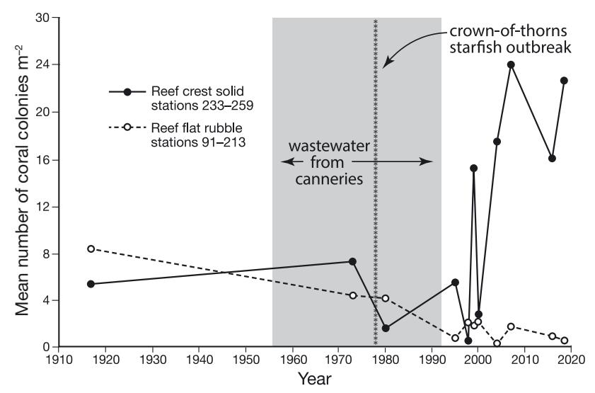
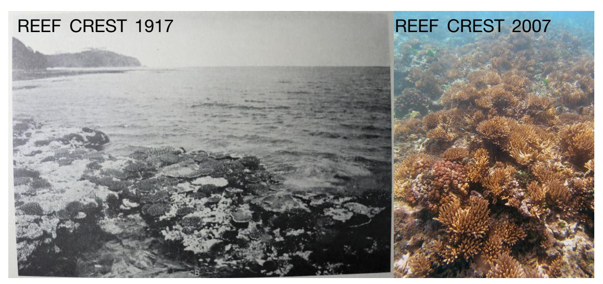
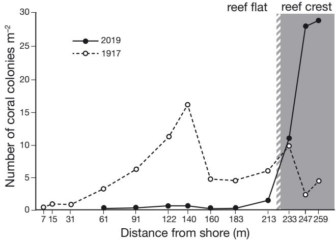
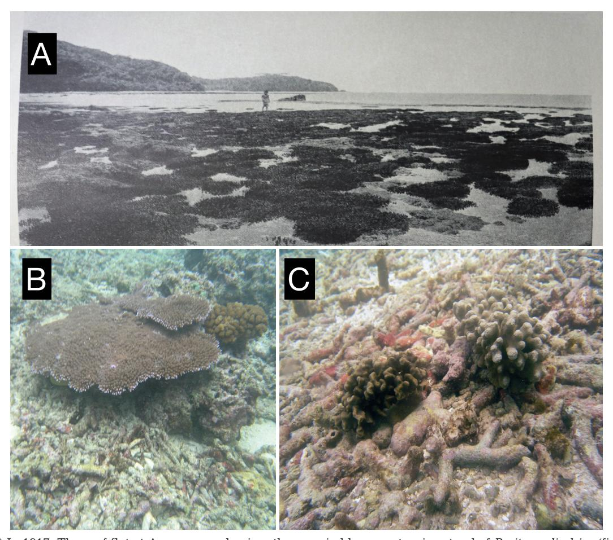
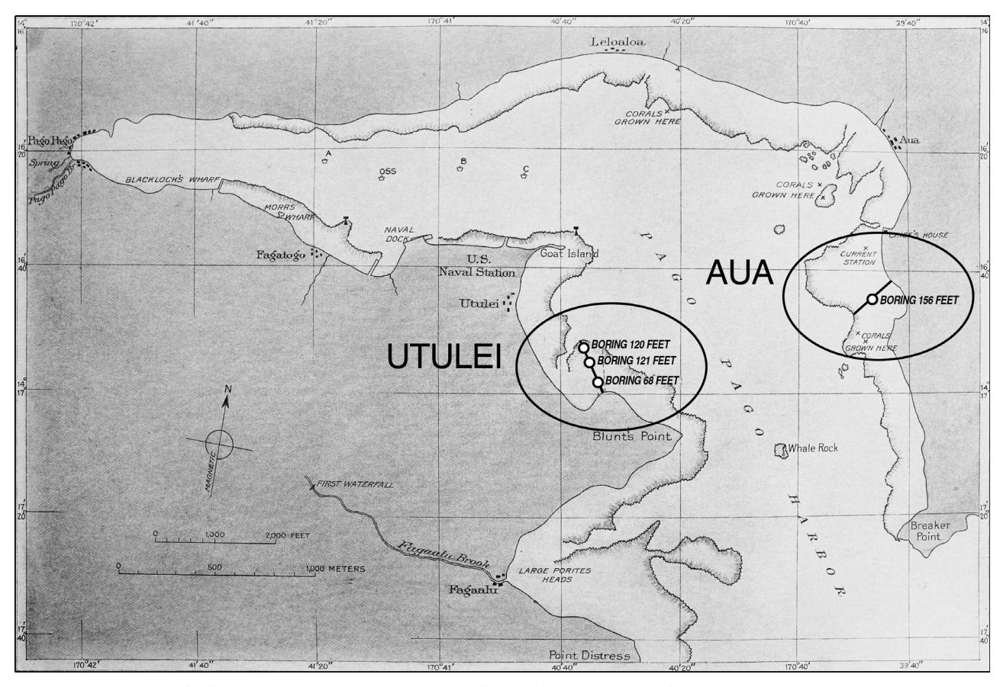
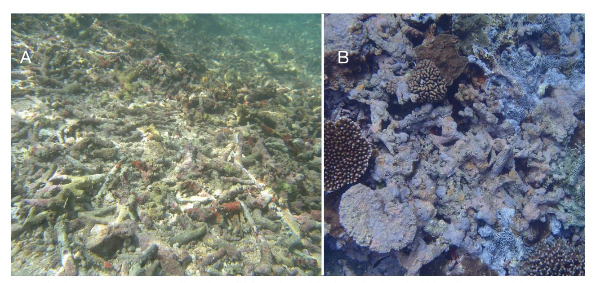
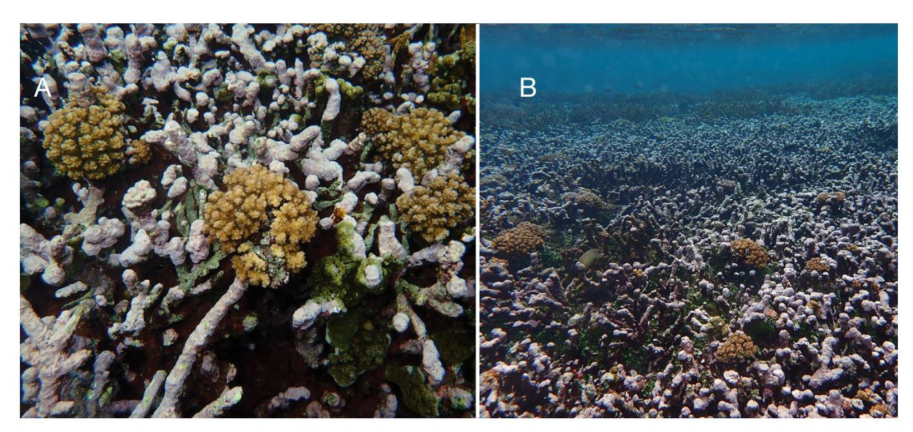
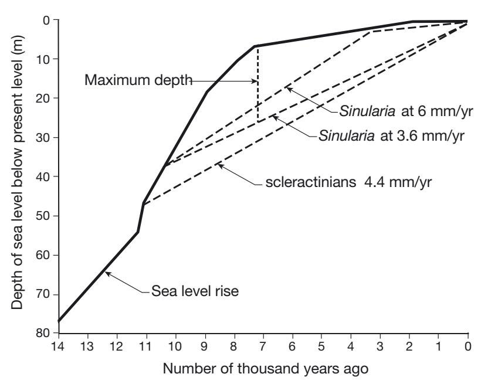

# Different resiliencies in coral communities over ecological and geological time scales in American Samoa

Charles Birkeland1,\*, Alison Green2, Alice Lawrence3, Georgia Coward3, Motusaga Vaeoso3, Douglas Fenner4

1Department of Biology, University of Hawaii at Manoa, 94-258 Olua Pl, Waipahu, Hawaii 96797, USA

2Red Sea Research Center, King Abdullah University of Science and Technology, Thuwal 23955-6900, Saudi Arabia

3American Samoa Coral Reef Advisory Group, Department of Marine and Wildlife Resources, Pago Pago,

American Samoa 96799, USA

4Lynker Technologies, LLC, Contractor, NOAA Fisheries Service, Pacific Islands Regional Office, Honolulu, Hawaii 96799, USA

ABSTRACT: In 1917, Alfred Mayor surveyed a 270 m transect on a reef flat on American Samoa. Eleven surveys were conducted on the transect from 1917 to 2019. The coral community on the reef crest was resilient over the century, occasionally being seriously damaged but always recovering rapidly. In contrast, the originally most dense coral community on the reef flat has been steadily deteriorating throughout the century. Resilience of coral communities in regions of high wave energy on the reef crests was associated with the important binding function of the crustose coralline alga (CCA) Porolithon onkodes. Successful coral recruits were found on CCA 94% of the time, yet living coral cover correlated negatively with CCA cover as they became alternative winners in competition. Mayor drilled a core from the transect on the surface to the basalt base of the reef 48 m below. Communities on Aua reef were dominated by scleractinians through the Holocene, while cores on another transect 2 km away showed the reef was occupied by alcyonaceans of the genus Sinularia, which built the massive reef with spiculite to the basalt base 37 m below. Despite periods of sea levels rising 9 to 15 times the rate of reef accretion, the reefs never drowned. The consistency of scleractinians on Aua reef and Sinularia on Utulei Reef 2 km away during the Holocene was because the shape of the bay allowed more water motion on Aua reef. After 10700 yr of reef building by octoorals, coastal construction terminated this spiculite-reef development.

KEY WORDS: Resilience  $\cdot$  Rubble  $\cdot$  Keystone species  $\cdot$  Ecological scale  $\cdot$  Geographical scale  $\cdot$  Spiculite reefs  $\cdot$  Sinularia  $\cdot$  Dolomite  $\cdot$  Porolithon  $\cdot$  Crustose coralline algae  $\cdot$  Octooral  $\cdot$  Scleractinians

- Resale or republication not permitted without written consent of the publisher -

#### 1. INTRODUCTION

Much attention has been given to investigating the rate at which many reef communities are deteriorating under stress from the increasing activities and resource needs of a growing human population, and rising temperatures and changing seawater chemistry from increasing greenhouse gases. However, attention should also be given to coral communities that are resilient under harsh conditions to determine how this resilience is maintained. Resilience has 2 aspects: rapid recovery and tolerance. A resilient response to irregular or unpredictable disturbances is usually rapid recovery (reliable recruitment and rapid growth), while a resilient response to frequent events or stressors is tolerance or resistance (acclimatization, epigenetic changes, symbiont shifting, and/or adaptation). Many of the coral commu-

nities of American Samoa have been remarkably resilient in both aspects.

American Samoa is a challenging environment for reef-building corals. In the past 40 yr, these reefs have faced multiple negative challenges: 2 major crown-of-thorns outbreaks, 4 mass bleaching events, 10 cyclones, 6 extreme low tides, and a tsunami (Birkeland et al. 2008). However, there has also been a potentially positive challenge. Since 2009, when the islands of American Samoa began sinking more rapidly, the annual sea level rise relative to the islands is now about 5 times the global average (Han et al. 2019), likely allowing more rapid reef accretion as evidenced by especially rapid reef growth during periods of rapid sea level rise in other locations (Eisenhauer et al. 1993, Kan & Kawana 2006, Hongo & Kayanne 2011).

Although many of the reefs in American Samoa are resilient to these challenges, there are a few sites that have exhibited little or no resilience. The permanent transect we surveyed at the village of Aua, on Tutuila, was particularly useful because it included a section of reef community that was consistently resilient, but also a section that was consistently without resilience. A question addressed by this study of the transect is how has the coral community in one section of the transect been consistently highly resilient, while the section of the transect in which the coral community started with the greatest abundance of corals has consistently shown no resilience throughout the century.

Holling (1973, p. 20) established the framework for theoretical models of constancy of numbers in populations in abstract systems by defining 'resilience' as the return to an equilibrium value after 'chance shifts in state variables'. He defined 'stability' as the extent and frequency of population shifts around the equilibrium. Resilience of corals to unpredictable or ir regular disturbances must not only include reliable recruitment, but also rapid growth because damage is nearly always more rapid than recovery. As disturbances become more frequent, the shift from fastgrowing branching corals to slower-growing massive corals will lead to a feedback situation in which there is insufficient time between disturbances for recovery (Birkeland 2018). In a long-term (1928 to 2019) monitoring effort of coral communities on the Great Barrier Reef (GBR), slow-growing massive corals re placed the fast-growing branching corals (Fine et al. 2019) and had still not recovered from cyclones 50 yr ago at the site of the GBR 1928 expedition, demonstrating that the community with slow-growing corals had little resilience.

Rather than using Holling's model of stability of the system as a whole, we suggest that in contrast to irregular and unpredictable disturbances which are responded to by rapid recovery, frequent and predictable disturbances are responded to by acclimatization of individual colonies and adaptations of local species populations. Consistency of disturbance and stress allows natural selection to be effective, enabling the community to be more stable based on natural selection on the individual species. American Samoan corals are also remarkably tolerant of frequent stresses. Intertidal pools on the small island of Ofu (Manu'a Islands) undergo daily fluctuations in temperature that range between 24.5 and 35°C (Thomas et al. 2018) and are inhabited by over 80 species of corals (Craig et al. 2001). Intertidal ponds appear to have been common in the long-term studies on the GBR as they were named according to the most prevalent coral in 1928, but by 2019 were 'mostly devoid of all corals' (Fine et al. 2019, p. 2). In the Ofu pools, the tolerance of corals to frequent fluctuations in temperature and other environmental variables was strongly developed in coral colonies by acclimatization, epigenetic changes, and symbiont shifting, and in coral populations by adaptation (Palumbi et al. 2014, Barshis et al. 2018, Thomas et al. 2018).

From 1917 to 1920, the Carnegie Institution of Washington sponsored expeditions to study the biology and ecology of the reef-building corals of American Samoa. The early expeditions led by Alfred G. Mayor 'became a paradigm model for ecological re search into reefs' (Bowen 2015, p. 91). One of Mayor's goals was to establish a permanent transect 270 m over a reef flat to the reef crest. The present paper discusses the changes in the reef communities along this transect over the next century. Mayor (1924) also directed a drill sample through the scleractinian-deposited aragonitic reef to the solid basalt at the base of the reef 48 m below. At the same time, Cary (1931) drilled 3 cores through the octocoral-deposited spiculite reef to the basalt 37 m below, 2 km from Mayor's transect. These core samples provided a history of the reefs on a geologic timescale to determine the resilience of the reef communities during most of the Holocene, including some periods of very rapid sea level rise. Two of the questions ad dressed in this study are why the reef-builders on the Aua transect were consistently stony corals (ara gonitic) while those on the Utulei reef were prevalently soft corals (spiculite) through most of the Holocene and why the reefs did not drown during periods of very rapid sea level rise.

There were a number of events in the following century that affected the reef communities along Mayor's transect. During a period of coastal development in the 1930s and 1940s, a sandy borrow pit (an excavation dug to remove gravel or sand to be used in construction) was created to a depth of about 5 m across the inner 61 m of the transect. From 1956 to

Fig. 1. Mean number of coral colonies per m2 on the reef crest and reef flat from 1917 to 2019. The coral communities on the reef crest were occasionally disturbed but always rebounded, while the number of coral communities on the reef flat consistently decreased during the century. On the reef crest, the corals were more abundant in 2019 than they were in the 'pristine' coral community of 1917. This may be because the prevalent species of *Acropora* in 1917 were the larger *A. muricata*, *A. humilis*, *A. aspera*, and *A. hyacinthus*, so fewer colonies occupied more space compared with the period from the 1990s to the present, in which space has been dominated by numerous small colonies of *A. nana* (see Fig. 2)

1992, the waters of Pago Pago Harbor were polluted by wastewater from 2 large tuna canneries and contained 0.4 to 0.8 mg l−1 nitrogen and 0.053 to 0.092 mg l−1 phosphorus. The coral communities on the reef crest were generally resilient despite the pollu-

> tion (Figs. 1 & 2). The American Sa moa Environmental Protection Agency re quired the canneries to construct a pipe in 1992 to channel the wastewater to the outer part of the harbor. Despite a reduction in nitrogen to 0.05− 0.17 mg l−1 and phosphorus to 0.015− 0.025 mg l−1 since 1992 (Birkeland et al. 2013), the coral community on the reef flat has continued to deteriorate (Figs. 1, 3 & 4). The decline in number of colonies on the reef crest in 1979 might have been caused by a major outbreak of *Acanthaster planci* (Birkeland 1982). A further decrease in 1998 may have been the result of an extreme low tide that killed corals exposed on the reef crest (Birkeland et al. 2008). The decline in 2000 may have been associated with the physical removal of 2 grounded ships high on the reef flat, one of which was located about 70 m south of the transect (Birkeland & Belliveau 2000). Regardless of the reasons for these

Fig. 2. The reef crest on the Aua transect was occupied by a set of larger *Acropora* species in 1917, but has been occupied mostly by numerous but smaller *A. nana* from the 1990s until the present. The photograph from 1917 is from Mayor (1924). Note that Mayor was able to photograph the exposed reef crest in 1917, but since 2009 the sea level has been rising 5 times faster than the global average (Han et al. 2019), so the reef crest is no longer exposed even during the lowest tides

Fig. 3. In 1917, corals were abundant all along the transect, especially on the reef flat where *Porites cylindrica* was predominant (see Figs. 4 & S2). The reef flat was a good habitat until it became rubble. In 2019, corals are abundant only on the solid reef crest

temporary declines, the main observation was that the coral communities on the reef crest were steadily resilient while those on the reef flat consistently declined during the century (Fig. 1).

# **2. MATERIALS AND METHODS**

# **2.1. Transects**

Mayor (1924) established a permanent transect at the village of Aua in 1917 (Fig. 5). He described the transect as running 39.5° W from a large 'Pua' tree *(Fagraea berteriana)* on the shore to a conspicuous coral block on the reef crest. Photographs in Mayor (1924) show the location of the transect in terms of perspective to landmarks. In 2007, the US National Geodetic Survey placed conspicuous benchmarks at the shoreline end (14° 16' 45.00128'' S, 170° 40'

Fig. 4. (A) In 1917, The reef flat at Aua was predominantly occupied by an extensive stand of *Porites cylindrica* (figure from Mayor 1924). (B) Although the rubble of *P. cylindrica* skeletons is largely unpopulated by corals, isolated large reef rocks, too large to be moved by waves, supported large coral colonies. This indicates that the decreasing abundance of corals on the reef flat was not a result of water quality. (C) Coralliths (unattached, free-living coral colonies, in this case *Pavona divaricata* and *Porites cylindrica*) are occasionally found among the rubble on the reef flat

Fig. 5. Locations of Alfred Mayor's 1917 transect near the village of Aua and Lewis Cary's transect about 2 km away near the village of Utulei. Note that Aua is in the path of waves coming into the harbor, while Utulei is sheltered around a corner. This figure is from Mayor (1924)

1.92334'' W) and at the reef crest end (14° 16' 45.05769'' S and 170° 40' 1.85080'' W) of the transect.

Mayor surveyed the coral community by staking out large quadrats (7.3 m each side = 53.3 m2 ) at specific distances from the shoreline and counting the number of coral colonies in each quadrat. Dahl & Lamberts (1977) and Dahl (1981) used the same method to resurvey the transects in 1973 and 1980. For increased numbers of quadrats to provide measures of variance, we counted corals in 0.25 m2 quadrats tossed haphazardly within 10 m on either side of the transect, with an equal number of quadrats on each side. The zones along the transect that we surveyed matched the distances established by Mayor be tween the shoreline and the reef crest, except the transect began 61 m from shore as this is now the seaward extent of the borrow pit.

A detailed history of the transect and the equivalences in names for each coral species through the century is presented in Green et al. (1997). We re ported on coral density rather than percent living coral cover to remain consistent with previous studies by Mayor (1924), Dahl & Lamberts (1977), and Dahl (1981). These prior studies did not provide in formation on size distributions from which we could calculate percent living coral cover.

Recruitment is usually an important component of resilience so we measured recruitment around Tutuila, Aunu'u, Ofu, Olosega, and Ta'u Islands and Rose Atoll in 2 ways. Coral recruits were defined as coral colonies <5 cm diameter. The type of substratum coral recruits were setting on was recorded by both visual observation and 870 photographs of 25 × 25 cm quadrats. The quadrats were placed every 2 m along transects for 10 readings along each of 3 transects at each site, or 30 quadrats site−1. We also measured the diameters of corals of all sizes that had their colony centers within 50 cm of the 3 transects at each site.

#### **2.2. Taxonomy**

'An essential suite of coral reef ecosystem engineers is coralline red algae. Among these, the smooth, encrusting *Porolithon onkodes* has historically been considered the most important and common reef building species worldwide' (Gabrielson et al. 2018, p. 429). Several species have been synonymized into *P. onkodes*, including *P. pachydermum* in the Atlantic (Adey & Macintyre 1973, Maneveldt & Keats 2014). Conversely, what we have been calling *P. onkodes* for decades in American Samoa may include some species that closely resemble *P. onkodes* morphologically and ecologically. For example, we have been considering the different color patches on uniform crusts (Fig. 6B) as color variations of *P. onkodes*, but they may be a mosaic of different genera and species (C. Squair pers. comm.). Gabrielson et al. (2018) ex amined the genomics of *P. onkodes* and report that *P. onkodes* consists of at least 20 distinct species in the western Pacific alone. Since they fulfill the same ecological role, we refer to them as *P. onkodes* to indicate a group with each having a very similar ecological role.

We refer to *Sinularia polydactyla* as a species complex for a similar reason. Cary (1931) identified *S. conferta* and *S. densa* on the Utulei reef. Cornish & DiDonato (2004) identified the species on the Utulei reef as *S. polydactyla*. *S. polydactyla* had been found on nearby Ofu Island in 2001 and verified with molecular systematic techniques as *S. poly dactyla* (McFadden et al. 2009). Jeng et al. (2011) identified an additional 13 species of *Sinularia* in southern Taiwan that deposited substantial amounts of spiculite.

#### **3. RESULTS**

## **3.1. Consistent differences in resilience of coral communities over the past century**

As with the reef crest community on the Aua transect, the exposed reef communities in American Samoa have generally shown resilience with strong re cruitment and rapid recovery by fast-growing branching corals (Mundy 1996, Green et al. 1999, Fisk & Birkeland 2002). The strong recruitment is indicated by successful recruits (colonies <5 cm diameter) robustly represented each year, e.g. 24% of colonies (8484 of 35 688) in 1995, 2002, and 2018 combined (Table S1 in the Supplement a[t www. int-res. com/](https://www.int-res.com/articles/suppl/m673p055_supp.pdf) [articles/ suppl/ m673 p055 \\_ supp .pdf\)](https://www.int-res.com/articles/suppl/m673p055_supp.pdf). Of 800 coral re cruits, 754 (94%) were found on crustose coralline alga (CCA) and the other 46 (6%) recruits were found on substrata other than CCA (Table S2). CCA occupied an average of 32% of the surface area (Vroom 2011), so we would have expected 256 re cruits by chance (χ2 = 1422, p < 0.001). Although successful coral recruits were significantly associated with CCA, cover of living coral colonies was negatively associated with cover of CCA (r = 0.31304, n = 99, p < 0.01; Fig. S1).

At the islands of Tutuila, Aunu'u, Ofu, Olosega, Ta'u and at Rose Atoll in 1995, 2002, and 2018, the resilience of the coral communities was indicated by the persistence of the fast-growing, branching corals of the genera *Acropora* and *Pocillopora*. The ratio of

Fig. 6. (A) The common crustose coralline algae (CCA) on the reef flat do not bind coral rubble or host successful coral recruitment. (B) *Porolithon onkodes,* the predominant CCA on the reef crest, forereef slope, and other areas where wave action is typical, rapidly and solidly binds rubble and attracts successful coral recruitment

numbers of colonies of *Acropora* and *Pocillopora* to 12 genera of slow-growing massive or encrusting genera was surprisingly persistent from 1995 to 2018: 317 fast-growing branching colonies/518 slowgrowing massive or encrusting colonies = 0.61 in 1995; 428/681 = 0.63 in 2002; and 211/345 = 0.61 in 2018 (Table S3).

In contrast to the resilient coral community on the reef crest on the Aua transect, the coral community on the protected reef flat was not resilient and continued to deteriorate through the century. The main components of rubble on the reef flat around the permanent transect were small fingers or branchlets of *Porites cylindrica* (Figs. 4B,C & 6A). This rubble had not stabilized during the past 75 to 85 yr, and the living coral colonies have steadily decreased in abundance (Fig. 1), possibly starting with the extraction of the borrow pit. The CCA species on the rubble (Fig. 6A) were not effective in binding the rubble.

Except for the cryptic *Stylaraea punctata* (<1.5 cm diameter) and occasional coralliths (Fig. 4C), coral recruits were not observed on the rubble but were mainly observed on the more stable substrata. Small corals were found on scattered rocks on the reef flat. However, there were some coral blocks large enough to not be rolled or overturned by waves on the reef flat among the rubble. Corals settled and grew on these blocks (Fig. 4B).

Unlike CCA on the reef flat, *Porolithon onkodes* has solidified coral rubble around all islands of American Samoa (Figs. 6B & 7) where there is typically wave action and this has been observed to facilitate coral recruitment (Figs. 6B & 7). Although its living tissue is thin (0.1 mm), *P. onkodes* 'can grow to many centimeters thick, frequently overgrowing and building upon itself to form thick crusts of indeterminant area' (Littler & Littler 2003, p. 50). Throughout the American Samoan Archipelago as well as on Johnston, Palmyra, Kingman Reef, Jarvis, Baker, and Howland, there are high rates of net CaCO3 accretion on the wave-exposed forereef, but it is nearly absent in most lagoons sheltered from wave action (Vargas-Ángel et al. 2015).

About 1 km south of the transect at Aua, near the mouth of the harbor, the reef flat at Onesosopo be comes very narrow so it is usually subjected to wave action, and *P. onkodes* is prevalent all the way to shore. Prior to 2017, *P. onkodes* overgrew a large area of *Acropora muricata* on the reef flat at Onesosopo (Fig. 7B). The *A. muricata* skeletons did not turn to rubble, apparently because they were bound together in their upright position by *P. onkodes* (Fig. 7).

## **3.2. Consistent differences between two neighboring reef communities through the Holocene**

In 1917, Alfred Mayor (1924) drilled a core through the limestone reef down to the basalt at 48 m below the island on the Aua transect. Also in 1917, Lewis Cary (1931) drilled 3 cores down to the basalt at 20 m

Fig. 7. (A) *Acropora muricata* skeletons did not become rubble when overgrown by *Porolithon onkodes* which bound the coral branches in their upright position. (B) *P. onkodes* overgrew *A. muricata* over a large area of reef flat exposed to wave action at Onesosopo

depth near the shore and at two 37 m depths near the middle and towards the outer edge of the reef along a transect on the Utulei reef flat, 2 km away from the Aua transect (Fig. 5). The core from the Aua transect was dominated throughout by scleractinians. The cores from the Utulei transect consisted substantially of spiculite down to the basalt. Spiculite is a collection of millions of microscopic rods of CaCO3 from the coenenchyma of alcyonaceans. There were scattered pieces of scleractinian corals, mostly *Porites*, mixed in the spiculite (Cary 1931).

## **4. DISCUSSION**

# **4.1. Consistent differences in resilience of coral communities over the past century**

Considering the regular rapid recovery of coral communities on the reef crest or on the limestone blocks on the reef flat, and considering the continuous deterioration of the coral communities on the reef flat (Fig. 1) which was mostly covered by rubble, we concluded that the resilience of coral communities along the Aua transect was a result of substratum stability. The large coral colonies growing well on a few large limestone blocks scattered on the reef flat (Fig. 4B) were a natural experiment that indicated that corals could survive on the reef flat where there was solid substrata isolated within the areas of rubble. Therefore, water quality was not a problem for coral growth and survival on the reef flat. The most abundant corals at the beginning of the survey in 1917 were recorded on the reef flat (Figs. 3 & S2). The coral communities on the reef crest and on solid substrata on the reef flat were resilient regardless of the pollution from the tuna canneries, and deterioration of the rubble continued after the wastewater was diverted away from the inner harbor (Fig. 1).

*Porolithon onkodes* is considered a keystone species because it determines the resilience of coral com munities on the reef crest and other areas of strong water motion. This resilience in American Samoa has been attributed to the ability of *P. onkodes* to bind loose rubble into a stable substratum (Birkeland et al. 2008). The substrata in high wave-energy environments such as algal ridges are solidified by *P. onkodes* (Figs. 6B & 7) and perhaps other species that resemble it and function similarly by overgrowth and binding. In sheltered areas, loose rubble is also occupied by CCA, sometimes *P. onkodes*, and other species and genera found also on the algal ridge, but there is essentially no binding of rubble by the CCA (Fig. 6A). '*P. onkodes* is pretty common in back reef areas, often occurring as small (1 cm diameter) patches on rubble and in the branches of dead coral. We recently discovered that these were observations made over a century ago and match our independent conclusions. Cary (1931) cites Finckh**1** and Setchell**2** (1926) on the functional importance of 'Lithothamniums' in areas of wave action and on its having little importance in sheltered areas.

Why does *P. onkodes* have the important binding function in areas of high wave energy, but almost none in the nearby relatively sheltered areas? '*P. onkodes* is pretty common in back reef areas, often occurring as small (1 cm diameter) patches on rubble and in the branches of dead coral. I've never seen it forming large patches in backreef areas, but it is generally present' (C. Squair pers. comm.). *P*. *onkodes* and perhaps other species in high-wave environments can have dolomite in their skeletons, which is chemically stable and solidifies the skeleton by filling in pores (Nash et al. 2011, 2013). Deposits of dolomite are f ound where there were high-energy reef crest and reef front areas in the geological record (Nash et al. 2011). *P. onkodes* and other CCA in sheltered backwater areas appear not to have dolomite in their skeletons, and we hypothesize that this may be associated with the loss of their abilities to overgrow and bind.

It has long been known that juvenile corals have low survivorship on loose coral rubble (Fox et al. 2003, Fox 2004), and the rubble will not stabilize itself; although rubble can sometimes be rapidl y stabilized with binding by other organisms such as CCA (Fig. 6B), sponges (Wulff 1984), and ascidians. Riegl & Luke (1999) judged that recovery (stabilization) of coral rubble by itself may take several hundred years (if it recovers at all), and our findings across 102 yr support this. Raymundo et al. (2007) and Williams et al. (2019) recognized that rubble would not stabilize for decades or perhaps hundreds of years. Accordingly, they tested large-scale techniques for stimulating reef rehabilitation by placing solid substrata or plastic mesh to artificially stabilize the rubble, allowing corals to successfully survive settlement and grow large enough to provide stable substrata for reef rehabilitation.

There is likely to be a selective advantage for coral planulae to recruit to solid CaCO3 substrata

Finckh AE (1904) The biology of the Funafuti Atoll and reef formation. The atoll of Funafuti. Royal Society of London Setchell WA (1926) Phytogeographical note on Tahiti II: marine vegetation. Univ Calif Pub in Botany 12 (8)

and avoid CaCO3 rubble. Fox (2004) placed hundreds of substrata in rubble and also on solid coral reef framework in Indonesia and found that planula larvae settled about equally in the 2 areas, but did not survive on rubble. If a substantial portion of the substrata in the region is rubble, and if the planulae do not distinguish the areas by settlement cues, then a large portion of potential larval recruits could be wasted, decreasing the number of successful recruits for reef recovery (Fox et al. 2003, Cameron et al. 2016, Yadav et al. 2016). Areas covered by rubble are called 'killing fields' for coral recruits (Fox & Caldwell 2006). In the Caribbean, the death of sea fans *Gorgonia ventilina* by being ripped off the reef and tossed on the beach by wave action was not correlated with the size of the sea fan and the increased vulnerability of large surface area to the force of the wave, but rather to the solidity of the substratum to which the sea fan was attached (Birkeland 1974). There may be no chemical signal to directly distinguish solid CaCO3 from eroded or weakly structured CaCO3, but we hypothesize there may be chemical signals to distinguish the strongbinding *P. onkodes* from the weakly-binding CCA, or from microbes on the surface of these CCA, that explain why we see more recruitment to *P. onkodes* (Figs. 6 & 7).

It seems paradoxical that 94% of successful coral recruits were found on CCA, but living coral cover was negatively associated with CCA cover. Of course, this is because when a large area is occupied by one species there is less space available for the other. *P. onkodes* in American Samoa are exceptionally ag gressive in overgrowing *Acropora* and other corals (Figs. 7 & S3). However, we must be careful to avoid assuming our findings on the roles of particular species of CCA in American Samoa can be found elsewhere to the same degrees (C. Squair pers. comm. ). Competition between CCA and stony corals by overgrowth did not indicate one competitor was superior to the other. Instead, the winner was determined by which had the upper hand, i.e. which was above the other by chance on initial encounter (Figs. S4 & S5). If a planula larva settled on the top of a CCA, it would have a good chance to be a successful recruit (Figs. 6, 7 & S6). Alternatively, if it settled off the CCA but near the growing edge of the CCA, then it would likely be overgrown.

At Rose Atoll, CCA (mostly *P. onkodes* and *P. craspedium)* occupy about 37% of space (Fig. S7), substantially more than at any of the remote Pacific Islands (e.g. Baker, Howland, Jarvis, Wake, Johnson, Palmyra, and Kingman Reef; average CCA cover: 21%), Hawaii (average cover: 6.2%), and the Marianas (8.4%) (Vroom 2011). There is an increasing gradient of carbonate accretion rates in American Samoa from Tutuila in the northwest towards Rose Atoll in the southeast (CREP NOAA 2016). The overwhelming prevalence of CCA on the reef crest and front at Rose Atoll makes sense with the highest carbonate accretion rates. In contrast, stony corals at Rose Atoll were mediocre, averaging about 16−17% (Vroom 2011, CREP NOAA 2016). A 340 m core at Funafuti Atoll also showed CCA to have the greatest role in reef accretion for the past hundreds of thousands of years, while scleractinian corals were a meagre 4th in importance in contributing to reef structure (Howe 1912).

The lesser prevalence of corals at Rose Atoll is a paradox, because Rose Atoll may have the highest aragonite saturation state in US waters (CREP NOAA 2016), and this should be good for corals. The mean (±SE) aragonite saturation state at Rose Atoll (4.034 ± 0.014) is significantly higher (ANOVA, *F* = 30.7, df = 1,54, p < 0.001; data from Vargas-Ángel et al. 2019) than the aragonite saturation state at Tutuila (3.818 ± 0.022). This follows the pattern for carbonate accretion rates, yet corals are more prevalent at Tutuila than at Rose Atoll (CREP NOAA 2016). The aragonite saturation levels in the American Samoan Archipelago were substantially higher than those on the GBR (3.61 ± 0.19; Mongin et al. 2016).

In the early to mid-Miocene, CCA took over from scleractinians globally in the tropics and subtropics as the main reef builders. The global takeover by CCA as carbonate producers was attributed to in creased productivity in the oceans from increased thermal gradients and upwelling and a 3°C cooling of the oceans (Halfar & Mutti 2005). These factors do not explain the prevalence of CCA at Rose and Funafuti Atolls. However, Rose and Funafuti Atolls may be typical of widespread increases in carbonate accretion by CCA in areas of high wave energy and a decrease in carbonate accretion by scleractinians in the near future because greenhouse conditions lower the aragonite saturation states while substantially increasing the production of dolomite (Diaz-Pulido et al. 2014). The high-magnesium calcite crusts of predominant *P. onkodes* lost substantial cover along a decreasing gradient in pH near 3 volcanic CO2 seeps in Papua New Guinea, especially when the pH fell below 7.8 (Fabricius et al. 2015). It might be that there was not enough wave action around the volcanic CO2 seeps to stimulate increased dolomite production in the *P. onkodes* crusts at lower pH (Diaz-Pulido et al. 2014).

# **4.2. Consistent differences between two neighboring reef communities through the Holocene**

One difference between Atlantic and Indo-Pacific reefs is that some octocorals, such as the *Sinularia polydactyla* complex and the *Heliopora coerulea* complex, are hermatypic and make solid contributions directly to reef frameworks in the Indo-Pacific. Octocorals in the Atlantic generally scatter their microscopic sclerites onto the substrata when they die.

Spiculite reefs constructed by members of the *S. polydactyla* species complex are found in the Indo-Pacific from the Red Sea (Schuhmacher 1997) in the west to at least American Samoa (Cary 1931, Cornish & DiDonato 2004) in the east. They are found from the Ryukyu Islands and Taiwan in the north (Jeng et al. 2011) to the GBR in the south (Kleypas 1996). *Sinularia*-type sclerites have been found to be 'among the most abundant fossils', perhaps indicating spiculite reefs in certain places as far back as the Llandoverian Age in the Silurian (428 million yr ago), about 200 million yr before the first scleractinians appeared (Bengtson 1981).

The most interesting aspect of the scleractinian reef at Aua and the *Sinularia* reef at Utulei is that they maintained their differences in community structure and thereby nature of their reef formation for 10 000 or 11 000 yr, despite being only about 2 km apart. The predominance of a genus at a particular reef locality for thousands of years is known for scleractinians in the Caribbean (Aronson & Precht 2001, Pandolfi & Jackson 2006, Hubbard 2015). Pandolfi (1996) found that coral communities were consistent at a site for 95 000 yr in the Pacific, not continuous, but repeated over multiple sea level changes. We call at tention to the fact that a reef can be built continuously or repeatedly for thousands of years by an octocoral *Sinularia polydactlya* complex (Cary 1931).

Why were the reef communities, which were only about 2 km apart, so consistently different from one another throughout the Holocene? Large 3-dimensional spiculite reefs 'are typically from non-exposed sites' (Schuhmacher 1977) and 'backwaters' (Tursch & Tursch 1982), with 'turbid waters' (Kleypas 1996). Although much of the mass of Utulei reef was spiculite, there were also coral skeletons scattered in the reef framework, and they were mostly *Porites* (Cary 1931), which are typical of backwaters. The reef crest at Aua was an algal ridge dominated by *Acropora* (Fig. 2), which is typical of areas of wave action. Further, the shape of Pago Pago Harbor (Fig. 5) is such that Aua receives more wave energy than nearby Utulei. 'Not even during the most severe storms in the 3 seasons over which my studies extended were waves observed of sufficient violence even to stir up thoroughly the loose sand' (Cary 1931, p. 58). Currently, there is a large, dense population of cf. *Sinularia maxima* in a highly protected area in American Samoa at Nu'uuli on Tutuila.

We hypothesize that the shape of Pago Pago Harbor allows the reef at Aua, with dominance of *Acropora* on the reef crest, to receive greater wave action, while the reef at Utulei, with dominance of *Sinularia* and *Porites*, is more protected from direct wave action. Although the sea level has risen substantially during the Holocene, the general shape of Pago Pago Harbor has not changed and thus the difference in wave action may have been a continuous factor that explains the consistent difference in community structure between these 2 reefs.

Hubbard (2015) reviewed the literature and found that Holocene reefs generally were accreted at rates of about 3 to 4 mm yr−1, rarely depositing at rates greater than 10 mm yr−1. Over 11 000 yr ago, the sea level was 48 m below the present level (Blanchon 2011), the depth of the Aua reef, so presumably when the reef originated. This was near the approximate beginning of the Holocene 11 650 yr ago (Walker et al. 2009). The scleractinian reef would have had to accrete an average of 4.4 mm yr−1 to keep up with the average rising sea level.

Jeng et al. (2011) determined from radiography of a spiculite boulder created in southern Taiwan by *Sinularia* that density banding occurred at about 3 to 6 mm yr−1. Using computer tomography, Schuhmacher (1997) found a banding pattern that indicated density banding occurred at about 3 to 8 mm yr−1. The sea level was at 37 m below present level, where the spiculite reef started, about 10 700 yr ago (Blanchon 2011). The spiculite reef would need to have accreted at an average of 3.6 mm yr−1. The average rates of ac cretion of alcyonacean reefs required to keep up with average rates of sea level rise are quite reasonable.

Although the average rates of reef accretion and sea level rise match reasonably well overall, the rates of accretion may not fit rates of sea level rise on shorter time scales because the sea level rose to near its present approximate asymptotic level in about 4000 yr, from 11 000 to 7000 yr ago. Since that time, the sea level has remained fairly stable for about 7000 yr (Fig. 8) until the recent global warming. The rates of sea level rise during meltwater pulses of glaciers were at least 35 mm yr−1 (about 9 times the rate of reef accretion of about 4 mm yr−1) and may have been 60 mm yr−1 (about 15 times the rate of reef ac cretion). These pulses of very active sea level rise

Fig. 8. Taking the rate of sea level rise during the Holocene from Blanchon (2011), and the rates of scleractinian reef accretion from Hubbard (2015) and spiculite reef accretion from Jeng et al. (2011), these nicely match the time it would take to build the 48 m thick scleractinian reef (Mayor 1924) and 37 m thick spiculite reef (Cary 1931). However, some reefs have been found to accrete faster than average during periods of rapid sea-level rise (Hongo & Kayanne 2011). Annual growth of spiculite reefs deposited by *Sinularia* can be as high as 8 mm yr−1 (Schuhmacher 1997) and 6 mm yr−1 (Jeng et al. 2011), so the reefs may have reached sea level several thousand years ago, after the sea level stabilized

were active for 300 to 500 yr (Blan chon 2011). The rapid meltwater pulses could have drowned the reefs by leaving the reefs behind in deep, dimly lit waters. Offshore, Taema and Nafa nua Banks may have been barrier reefs that have drowned, although they still host rich coral communities. Since Aua and Utulei reefs are fringing reefs, they may have backstepped up the shore during periods of exceptionally rapid sea level rise, filling out the reef when sea level rise was slow or stopped. However, Cary's (1931) 3 cores do not support this hypothesis. The inner and outermost cores were 645 ft (197 m) apart, yet all 3 cores had similar density bands at the same depths. This indicates that the reef was growing upwards uniformly throughout the length of the transect. So how do the Aua scleractinian reef and the Utulei *Sinularia* reef keep up with meltwater pulses?

Although the average rate of reef accretion through the Holocene may have been about 4 mm yr−1 (Hubbard 2015), the reefs may have grown faster during periods of rapid sea level rise and slower when sea level was not rising or was rising very slowly. Hongo & Kayanne (2011) found from cores in Palauan reefs that vertical reef growth was 7.8 mm yr−1 during times of rapid sea level rise but de creased to 1.5 mm yr−1 when the sea level stabilized. Eisenhauer et al. (1993) found 20 m of Holocene reef that averaged 6 to 7 mm yr−1 keeping pace with sea level rise. Kan & Kawana (2006) found a reef in the Ryukyu Islands during times of rapid sea level rise in the Holocene to accrete at 9.3 mm yr−1.

If we hypothesize that during rapid sea level rises in meltwater pulses, the *Sinularia* deposit reef structure at 6 mm yr−1, then the spiculite reef could rise at about 6 m per 1000 yr, or about 36 m between 9500 and 3500 yr ago. At 3500 yr ago, it could start filling in the final 2 m to the sea surface at 0.6 mm yr−1 (Fig. 8).

The Darwin Point is the compensation depth at which rates of accretion and formation of coral reefs no longer keep up with the rates of erosion and light attenuation as the sea level rises. The Darwin Point is generally be tween 30 and 50 m depth (Grigg 2008). Neither reef was 50 m thick; hence, it does seem possible that even if the reefs fell behind during rapid seawater rises in periods of meltwater pulses 11 000

to 7000 years ago, they were able to fill in and catch up when the sea level stabilized during the final 7000 yr. Even if the octocoral reef grew at only 3.6 mm yr−1 through the period of rapid sea level rise, the greatest distance be tween the reef and sea surface would have been about 25 m for a brief period (Fig. 8). Schuhmacher (1997) reported the depth range of spiculite producing *Sinularia* to be at least 35 m. Whether the spiculite reef accreted at 3.6 or 6 mm yr−1, it is possible that the reef was never temporarily drowning.

Although it is possible that the cores may show oc casional reduced abundance or even local absence of *Sinularia*, the primary builder to the base of the spiculite reef was the *S. polydactyla* species complex. This was resilient to climate change and periods of especially rapid rise in sea level over a period of an estimated 10 700 yr. The population of the *S. polydactyla* species-complex at Utulei decreased by 99.3% be tween 1917 and 2002 (Cornish & DiDonato 2004), and none were seen at Utulei during surveys a de cade later (Lawrence & Fenner 2015). The process of building the spiculite reef over thousands of years at Utulei was terminated in American Samoa by coastal construction in the 1940s. The life-history characteristics of *Sinularia*, i.e. long-lived, low mortality compensated by asexual reproduction, and very low rates of successful sexual reproduction (Fabricius 1995), lead us to believe that the *S. polydactyla* species complex and accretion of spiculite reef will not return to American Samoa.

## **5. CONCLUSIONS**

The consistent differences in resilience of coral communities on the Aua transect over the past century and the consistent differences between 2 neighboring reef communities through the Holocene may both be explained by relative differences in wave energies. Rates of calcium carbonate deposition, the effectively binding *Porolithon onkodes*, and the dissolution-resistant dolomite in its skeleton are associated with high-energy reef crests and reef fronts where there is usually reliable recruitment and rapid recovery from disturbances. Areas sheltered from wave action have substantially lower rates of calcium carbonate deposition, the CCA do not have substantial dolomite and do not effectively bind substrata, and therefore the coral communities often do not recover from disturbances. On one section of the Aua transect that is sheltered shoreward of the reef crest, the coral community has continuously degraded for a century. Dolomite is mainly found on the reef crest and reef front in areas of high-energy water motion and may enable *P. onkodes* to provide resilience to scleractinians. All known spiculite reefs are in sheltered areas. This may explain why the Aua reef was predominantly scleractinian and the Utulei reef was predominantly *Sinularia* through most of the Holocene.

*Acknowledgements*. We thank the Government of American Samoa, its Coral Reef Advisory Group, and its Department of Marine and Wildlife Resources for inviting us to conduct the surveys over the past 25 years and handling our logistics. We are grateful to the Carnegie Institution of Washington in Washington, DC, for allowing us to use Alfred Mayor's illustrations. We thank Mark Nakamura for drawing our diagrams and Cheryl Squair for advising us on CCA. Shreya Yadav and Eric Birkeland provided instruction or assistance with data management. We are very ap preciative of the interest and concern of the people of Aua Village for their reef and for their hospitality in letting us resurvey the transect 10 times over the past 47 years.

#### LITERATURE CITED

[Adey WH, Macintyre IG \(1973\) Crustose coralline algae:a](https://doi.org/10.1130/0016-7606(1973)84%3C883%3ACCAARI%3E2.0.CO%3B2) re-evaluation in the geological sciences. Geol Soc Am Bull 84: 883−904

Aronson BR, Precht WF (2001) Evolutionary paleoecology of

- Caribbean coral reefs. In:Allmon WD, Bottjer DJ (eds) Evolutionary paleoecology. Columbia University Press, New York, NY, p 171−233
- [Barshis DJ, Birkeland C, Toonen RJ, Gates RD, Stillman JH](https://www.ncbi.nlm.nih.gov/entrez/query.fcgi?cmd=Retrieve&db=PubMed&list_uids=30305375&dopt=Abstract) (2018) High-frequency temperature variability mirrors fixed differences in thermal limits of the massive coral *Porites lobata.* J Exp Biol 221: jeb188581
  - Bengtson S (1981) *Atractosella*, a Silurian alcyonacean octocoral. J Paleontol 55: 281−294
  - Birkeland C (1974) The effect of wave action on the population dynamics of *Gorgonia ventalina* Linnaeus. In:Bayer FM, Weinheimer AJ (eds) Prostaglandins from *Plexaura homomalla*:ecology, utilization and conservation of a major medical marine resource. Studies in Tropical Oceanography No. 12. University of Miami Press, Coral Gables, FL, p 115−126
- [Birkeland C \(1982\) Terrestrial runoff as a cause of outbreaks](https://doi.org/10.1007/BF00396897) of *Acanthaster planci* (Echinodermata:Asteroidea). Mar Biol 69: 175−185
  - Birkeland C (2018) Global status of coral reefs:in combination, disturbances and stressors become ratchets. In: Sheppard CRC (ed) World seas:an environmental evaluation, Vol 3. Elsevier, Oxford, p 35−56
  - Birkeland C, Belliveau SA (2000) Resurvey of the Aua transect after the ship removal. Report to the Government of American Samoa and NOAA, US Department of Commerce, Pago Pago
  - Birkeland C, Craig P, Fenner D, Smith L, Keine WE, Riegl B (2008) Geologic setting and ecological functioning of coral reefs in American Samoa. In:Riegl BM, Dodge RE (eds) Coral reefs of the USA. Springer, Dordrecht, p 741−765
  - Birkeland C, Green A, Fenner D, Squair C, Dahl AL (2013) Substratum stability and coral reef resilience:insights from 90 years of disturbances on a reef in American Samoa. Micronesica 2013-06: 1−16
  - Blanchon P (2011) Meltwater pulses. In:Hopley D (ed) Encyclopedia of modern coral reefs:structure, form, and process. Springer, Dordrecht, p 683−690
  - Bowen J (2015) The coral reef era:from discovery to decline. Springer, Dordrecht
- [Cameron CM, Pausch RE, Miller MW \(2016\) Coral recruit](https://doi.org/10.5343/bms.2015.1030)ment dynamics and substrate mobility in a rubble-dominated back reef habitat. Bull Mar Sci 92: 123−136
- Cary L (1931) Studies on the coral reefs of Tutuila, American Samoa, with special reference to the Alcyonaria. Carnegie Inst Wash Publ 27: 55−98
- [Cornish AS, DiDonato EM \(2004\) Resurvey of a reef flat in](https://doi.org/10.1016/j.marpolbul.2003.11.004) American Samoa after 85 years reveals devastation to a soft coral (Alcyonacea) community. Mar Pollut Bull 48: 768−777
- [Craig P, Birkeland C, Belliveau S \(2001\) High temperatures](https://doi.org/10.1007/s003380100159) tolerated by a diverse assemblage of shallow-water corals in American Samoa. Coral Reefs 20: 185−189
- [CREP \(Coral Reef Ecosystem Program\) NOAA \(2016\) Sum](https://doi.org/10.7289/V5N014J6)mary report of baseline surveys and installations conducted in 2015 in the National Marine Sanctuary of American Samoa. PIFSC Data Report DR-16-007. Coral Reef Ecosystem Program, Pacific islands Fisheries Science Center, NOAA Fisheries
  - Dahl AL (1981) Monitoring coral reefs for urban impact. Bull Mar Sci 31: 544−551
  - Dahl AL, Lamberts AE (1977) Environmental impact on a Samoan coral reef:a resurvey of Mayor's 1917 transect. Pac Sci 31: 309−319

- [Diaz-Pulido G, Nash MC, Anthonmy KRN, Bender D,](https://doi.org/10.1038/ncomms4310) Opdyke BN, Reyes-Nivia C, Troitzsch U (2014) Greenhouse conditions induce mineralogical changes and dolomite accumulation in coralline algae on tropical reefs. Nat Commun 5: 3310
- [Eisenhauer A, Wasserburg GJ, Chen JH, Bonani G,](https://doi.org/10.1016/0012-821X(93)90081-J) Collins LB, Zhu ZR, Wyrwoll KH (1993) Holocene sealevel de termination relative to the Australasian continent:U/Th (TIMS) and 14C (AMS) dating of coral cores from the Abrolhos Islands. Earth Planet Sci Lett 114: 529−547
- [Fabricius KE \(1995\) Slow population turnover in the soft](https://doi.org/10.3354/meps126145) coral genera *Sinularia* and *Sarcophyton* on mid-shelf and outer-shelf reefs of the Great Barrier Reef. Mar Ecol Prog Ser 126: 145−152
- [Fabricius KE, Kluibenschedl A, Harrington L, Noonan S,](https://doi.org/10.1038/srep09537) De'ath G (2015) *In situ* changes of tropical crustose coralline algae along carbon dioxide gradients. Sci Rep 5: 9537
- [Fine M, Hoegh-Guldberg O, Meroz-Fine E, Dove S \(2019\)](https://doi.org/10.1038/s41467-019-12431-y) Ecological changes over 90 years at Low Isles on the Great Barrier Reef. Nat Commun 10: 4409
  - Fisk D, Birkeland C (2002) Status of coral communities on the volcanic islands of American Samoa. A report to the Department of Marine and Wildlife Resources, American Samoa Government, Pago Pago
- [Fox HE \(2004\) Coral recruitment in blasted and unblasted](https://doi.org/10.3354/meps269131) sites in Indonesia:assessing rehabilitation potential. Mar Ecol Prog Ser 269: 131−139
- [Fox HE, Caldwell RL \(2006\) Recovery from blast fishing on](https://doi.org/10.1890/1051-0761(2006)016%5b1631%3ARFBFOC%5d2.0.CO%3B2) coral reefs:a tale of two scales. Ecol Appl 16: 1631−1635
- [Fox HE, Pet JS, Dahuri R, Caldwell RL \(2003\) Recovery in](https://doi.org/10.1016/S0025-326X(03)00246-7) rubble fields:long-term impacts of blast fishing. Mar Pollut Bull 46: 1024−1031
- [Gabrielson PW, Hughey JR, Diaz-Pulido G \(2018\) Genomics](https://doi.org/10.1111/jpy.12761) reveals abundant speciation in the coral reef building alga *Porolithon onkodes* (Corallinales, Rhodophyta). J Phycol 54: 429−434
  - Green AL, Birkeland CE, Randall RH, Smith BD, Wilkins S (1997) 78 years of coral reef degradation in Pago Pago Harbor:a quantitative record. Proc 8th Int Coral Reef Symp, Panama City 2: 1883−1888
  - Green AL, Birkeland CE, Randall RH (1999) Twenty years of disturbance and change in Fagatele Bay National Marine Sanctuary, American Samoa. Pac Sci 53: 376−400
  - Grigg RW (2008) The Darwin Point:a conceptual and historical review. Proc 11th Int Coral Reef Symp, Ft. Lauderdale 1: 54−56
- [Halfar J, Mutti M \(2005\) Global dominance of coralline red](https://doi.org/10.1130/G21462.1)algal facies:a response to Miocene oceanographic events. Geology 33: 481−484
- [Han SC, Sauber J, Pollitz F, Ray R \(2019\) Sea level rise in the](https://doi.org/10.1029/2018JB017110) Samoan Islands escalated by viscoelastic relaxation after the 2009 Samoa-Tonga earthquake. JGR Solid Earth 124: 4142−4156
- [Holling CS \(1973\) Resilience and stability of ecological sys](https://doi.org/10.1146/annurev.es.04.110173.000245)tems. Annu Rev Ecol Syst 4: 1−23
- [Hongo C, Kayanne H \(2011\) Key species of hermatypic coral](https://doi.org/10.1016/j.margeo.2010.10.023) for reef formation in the northwest Pacific during Holocene sea-level change. Mar Geol 279: 162−177
- [Howe MA \(1912\) The building of 'coral' reefs. Science 35:](https://doi.org/10.1126/science.35.909.837)  837−842
  - Hubbard DK (2015) Reef biology and geology not just a matter of scale. In:Birkeland C (ed) Coral reefs in the Anthropocene. Springer, Dordrecht, p 43−66

- [Jeng MS, Huang HD, Dai CF, Hsiao YC, Benayahu Y \(2011\)](https://doi.org/10.1007/s00338-011-0765-z) Sclerite calcification and reef-building in the fleshy octocoral genus *Sinularia* (Octocorallia:Alcyonacea). Coral Reefs 30: 925−933
  - Kan H, Kawana T (2006) 'Catch-up' of a high-latitude barrier reef by back-reef growth during post-glacial sealevel rise, southern Ryukyus, Japan. Proc 10th Int Coral Reef Symp, Okinawa 1: 494−503
- [Kleypas JA \(1996\) Coral reef development under naturally](https://doi.org/10.1007/BF01145886) turbid conditions:fringing reefs near Broad Sound, Australia. Coral Reefs 15: 153−167
- Lawrence A, Fenner D (2015) Marine biological assessment of Utulei-Gataivai, American Samoa. P Pacific Consultants, Pago Pago
- Littler DS, Littler MM (2003) South Pacific reef plants. Off-Shore Graphics, Washington, DC
- [Maneveldt GW, Keats DW \(2014\) Taxonomic review based](https://doi.org/10.11646/phytotaxa.190.1.14) on new data of the reef-building alga *Porolithon onkodes* (Corallinaceae, Corallinales, Rhodophyta) along with other taxa found to be conspecific. Phytotaxa 190: 216−249
  - Mayor A (1924) Structure and ecology of Samoan reefs. Carnegie Inst Wash Publ 340: 1−25
- [McFadden CS, van Ofwegen LP, Beckman EJ, Benayahu Y,](https://doi.org/10.1111/j.1744-7410.2009.00179.x) Alderslade P (2009) Molecular systematics of the speciose Indo-Pacific soft coral genus *Sinularia* (Anthozoa: Octocorallia). Invertebr Biol 128: 303−323
- [Mongin M, Baird ME, Tilbrook B, Matear RJ and others](https://doi.org/10.1038/ncomms10732) (2016) The exposure of the Great Barrier Reef to ocean acidification. Nat Commun 7: 10732
  - Mundy C (1996) A quantitative survey of the corals of American Samoa. A report to the Department of Marine and Wildlife Resources, American Samoa Government
- [Nash MC, Troitzsch U, Opdyke BN, Trafford JM, Russell](https://doi.org/10.5194/bg-8-3331-2011) BD, Kline DI (2011) First discovery of dolomite and magnesite in living coralline algae and its geobiological implications. Biogeosciences 8: 3331−3340
- [Nash MC, Opdyke BN, Troitzsch U, Russell BD and others](https://doi.org/10.1038/nclimate1760) (2013) Dolomite-rich coralline algae in reefs resist dissolution in acidified conditions. Nat Clim Chang 3: 268−272
- [Palumbi SR, Barshis DJ, Traylor-Knowles N, Bay RA \(2014\)](https://doi.org/10.1126/science.1251336) Mechanisms of reef coral resistance to future climate change. Science 344: 895−898
- [Pandolfi JM \(1996\) Limited membership in Pleistocene reef](https://doi.org/10.1017/S0094837300016158) coral assemblages from the Huon Peninsula, Papa New Guinea:constancy during global change. Paleobiology 22: 152−176
- [Pandolfi JM, Jackson JBC \(2006\) Ecological persistence](https://doi.org/10.1111/j.1461-0248.2006.00933.x) interrupted in Caribbean coral reefs. Ecol Lett 9: 818−826
- [Raymundo LJ, Maypa AP, Gomez ED, Cadiz P \(2007\) Can](https://doi.org/10.1016/j.marpolbul.2007.02.006) dynamite-blasted reefs recover? A novel, low-tech ap proach to stimulating natural recovery in fish and coral populations. Mar Pollut Bull 54: 1009−1019
- [Riegl B, Luke KE \(1999\) Ecological parameters of dynamited](https://doi.org/10.1016/S0025-326X(99)00104-6) reefs in the northern Red Sea and their relevance to reef rehabilitation. Mar Pollut Bull 37: 488−498
  - Schuhmacher H (1997) Soft corals as reef builders. Proc 8th Int Coral Reef Symp, Panama City 1: 499−502
  - Setchell WA (1926) Phytogeographical note on Tahiti II: marine vegetation. Univ Calif Pub in Botany 12 (8) [cited in Cary 1931]
- [Thomas L, Rose NH, Bay RA, López EH, Morikawa MK,](https://doi.org/10.3389/fmars.2017.00434) Ruiz-Jones L, Palumbi SR (2018) Mechanisms of thermal tolerance in reef-building corals across a fine-grained environmental mosaic:lessons from Ofu, American Samoa. Front Mar Sci 4: 434

- [Tursch B, Tursch A \(1982\) The soft coral community on a](https://doi.org/10.1007/BF00409597) sheltered reef quadrat at Laing Island (Papua New Guinea). Mar Biol 68: 321−332
- [Vargas-Ángel B, Richards CL, Vroom PS, Price NN and oth](https://doi.org/10.1371/journal.pone.0142196)ers (2015) Baseline assessment of net calcium carbonate accretion rates on US Pacific reefs. PLOS ONE 10: e0142196
- [Vargas-Ángel B, Ayotte P, Barkley H, Couch C, Halperin A,](https://doi.org/10.25923/1sk7-vp89) Kindinger T, Winston M (2019) Coral reef ecosystem monitoring report for the National Marine Sanctuary of American Samoa:2018. PIFSC Data Report DR-19-040. Pacific Islands Fisheries Science Center
- [Vroom PS \(2011\) 'Coral dominance':a dangerous ecosystem](https://doi.org/10.1155/2011/164127) misnomer? J Mar Sci 2011: 164127

*Editorial responsibility: Peter Edmunds, Northridge, California, USA Reviewed by: J.-C.Dajka and 2 anonymous referees*

- [Walker M, Johnsen S, Rasmussen SO, Popp T and others](https://doi.org/10.1002/jqs.1227) (2009) Formal definition and dating of the GSSP (Global Stratotype Section and Point) for the base of the Holo cene using the Greenland NGRIP ice core, and selected auxiliary records. J Quaternary Sci 24: 3−17
- [Williams SL, Sur C, Janetski N, Hollarsmith JA and others](https://doi.org/10.1111/rec.12866) (2019) Large-scale coral reef rehabilitation after blast fishing in Indonesia. Restor Ecol 27: 447−456
- [Wulff J \(1984\) Sponge-mediated coral reef growth and reju](https://doi.org/10.1007/BF00301960)venation. Coral Reefs 3: 157−163
- [Yadav S, Rathod P, Alcoverro T, Arthur R \(2016\) 'Choice'](https://doi.org/10.1007/s00338-015-1358-z) and destiny:the substrate composition and mechanical stability of settlement structures can mediate coral re cruit fate in post-bleached reefs. Coral Reefs 35: 211−222

*Submitted: November 6, 2020 Accepted: June 11, 2021*

*Proofs received from author(s): August 22, 2021*