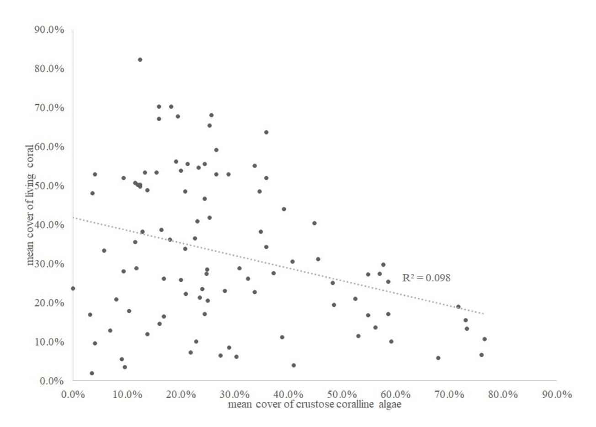
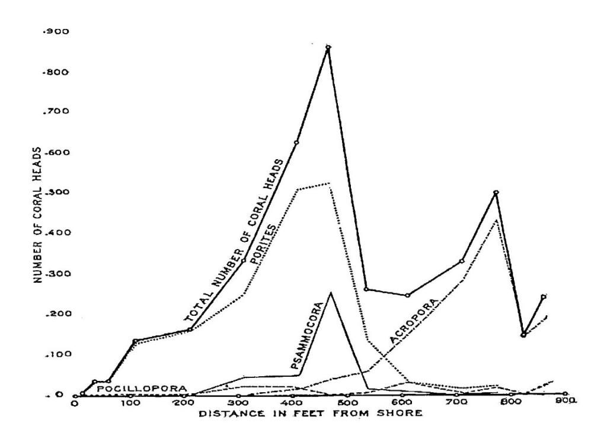
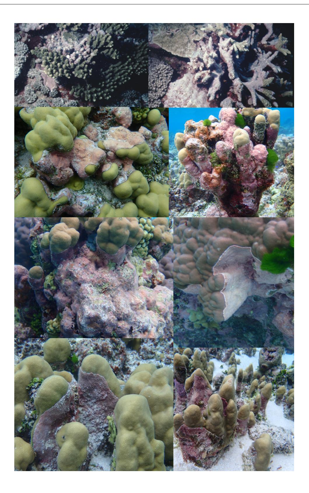
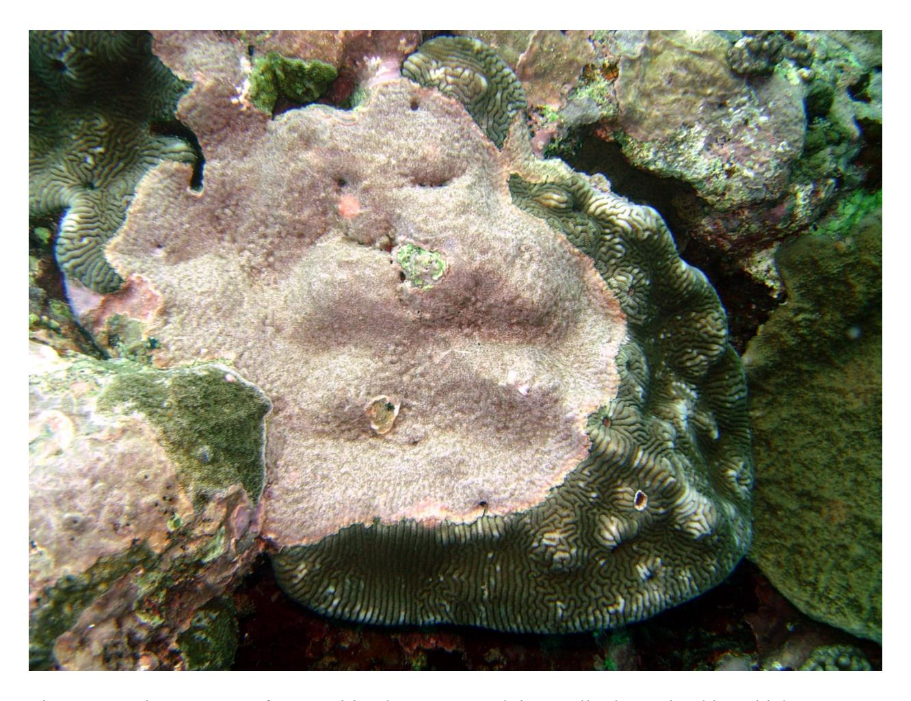
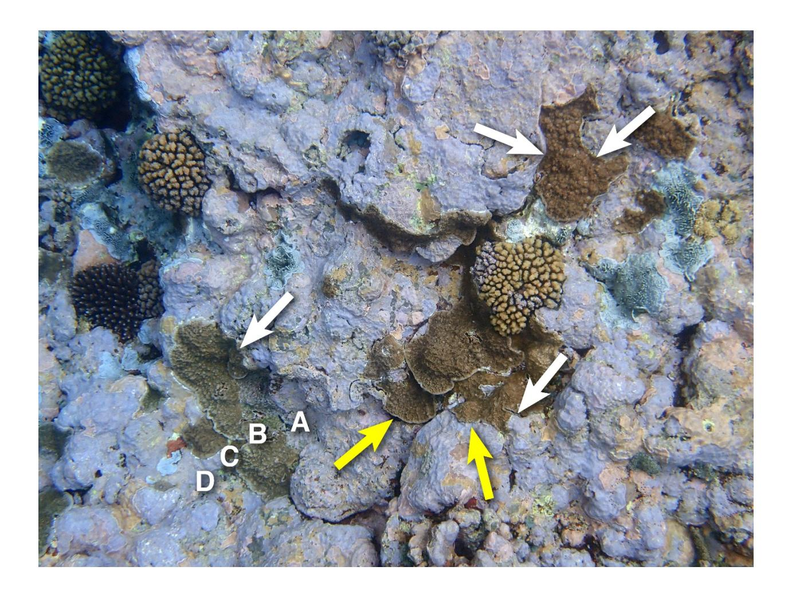
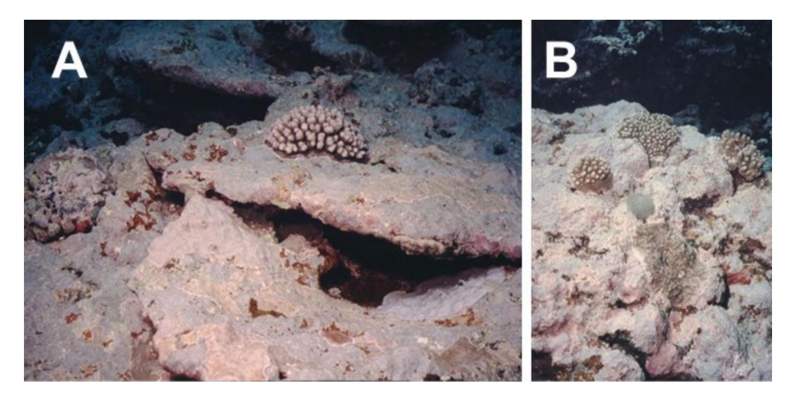
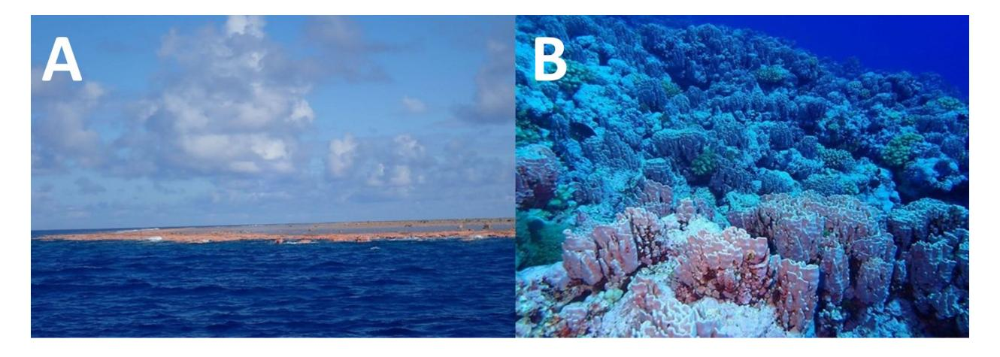

**Table S1** - Size distributions of coral colonies on 5 islands and an atoll in American Samoa during three years.

| year        | 1-5	cm | 5-10	cm | 10-20	cm | 20-40	cm | 40-80	cm | 80-160	cm | >	160	cm | Total |
|-------------|--------|---------|----------|----------|----------|-----------|----------|-------|
| 1995        | 3427   | 5156    | 4594     | 1309     | 178      | 27        | 1        | 14692 |
| 2002        | 4001   | 2876    | 2180     | 1324     | 557      | 83        | 15       | 11036 |
| 2018        | 1056   | 5055    | 1920     | 1406     | 414      | 84        | 25       | 9960  |
|             |        |         |          |          |          |           |          |       |
| grand	total | 8484   | 13087   | 8694     | 4039     | 1149     | 194       | 41       | 35688 |

\_\_\_\_\_\_\_\_\_\_\_\_\_\_\_\_\_\_\_\_\_\_\_\_\_\_\_\_\_\_\_\_\_\_\_\_\_\_\_\_\_\_\_\_\_\_\_\_\_\_\_\_\_\_\_\_\_\_\_\_\_\_\_\_\_\_\_\_\_\_\_\_\_\_\_\_\_\_\_\_\_\_\_\_\_

**Table S2** – The distribution of 800 coral recruits on CCA and other hard substrata

| surface                  |     | coral	recruits         |     |  |
|--------------------------|-----|------------------------|-----|--|
| cover                    |     | observed						expected |     |  |
| Crustose	coralline	algae | 32% | 754	(94%)              | 256 |  |
| All	other	surfaces       | 68% | 46		(		6%)             | 544 |  |

Chi-square = 1422, df = 1, p< 0.001

\_\_\_\_\_\_\_\_\_\_\_\_\_\_\_\_\_\_\_\_\_\_\_\_\_\_\_\_\_\_\_\_\_\_\_\_\_\_\_\_\_\_\_\_\_\_\_\_\_\_\_\_\_\_\_\_\_\_\_\_\_\_\_\_\_\_\_\_\_\_\_\_\_\_\_\_\_\_\_\_\_\_\_\_\_

**Table S3** – Numbers of colonies of fast-growing, branching corals (*Acropora* and *Pocillopora,* 14 spp.) and slow-growing massive or encrusting corals (massive *Porites, Diploastrea, Leptastrea, Astrea, Dipsastrea, Favites, Goniastrea, Cyphastrea, Acanthastrea, Coscinaraea, Pavona* and *Psammocora*, 26 spp.). Relative prevalence of fast-growing to slow-growing colonies remarkably consistent between years.

| fast-growing	corals | 1995 | 2002 | 2018 | slow-growing	corals | 1995 | 2002 | 2018 |
|---------------------|------|------|------|---------------------|------|------|------|
| Afuli               | 13   | 72   | 9    | Afuli               | 57   | 110  | 21   |
| Amanave             | 30   |      | 12   | Amanave             | 33   |      | 12   |
| Amouli              |      |      | 7    | Amouli              |      |      | 15   |
| Aoa                 |      |      | 7    | Aoa                 |      |      | 32   |
| Asaga               | 41   | 30   | 20   | Asaga               | 62   | 124  | 30   |
| Aua                 | 7    | 4    | 4    | Aua                 | 26   | 19   | 25   |
| Aunu'u              | 37   | 98   | 16   | Aunu'u              | 59   | 52   | 25   |
| cove                | 27   |      | 19   | cove                | 27   |      | 24   |
| Faga                | 25   | 10   |      | Faga                | 59   | 28   |      |
| Faga'alu            | 21   | 34   | 1    | Faga'alu            | 24   | 32   | 16   |

| Fagafue                               | 5   | 22  | 7   | Fagafue       | 31  | 26   | 17  |
|---------------------------------------|-----|-----|-----|---------------|-----|------|-----|
| Faga'itua                             | 17  | 29  | 23  | Faga'itua     | 17  | 25   | 27  |
| Fagamalo                              |     | 48  |     | Fagamalo      |     | 115  |     |
| Fagasa                                | 15  | 5   | 7   | Fagasa        | 47  | 31   | 30  |
| Fagatele                              | 19  | 25  | 67  | Fagatele      | 18  | 28   | 29  |
| Fagamafuti                            |     | 31  |     | Fagamafuti    |     | 27   |     |
| Hurricane                             |     | 25  |     | Hurricane     |     | 130  |     |
| Leloaloa                              | 5   |     | 18  | Leloaloa      | 23  |      | 34  |
| Leone                                 | 27  | 21  | 12  | Leone         | 24  | 41   | 19  |
| Lepula                                |     | 13  |     | Lepula        | 74  | 29   |     |
| Masefau                               | 20  | 25  | 5   | Masefau       | 22  | 39   | 7   |
| northwest                             | 28  |     | 11  | northwest     | 35  |      | 43  |
| Nu'uuli                               | 12  | 20  | 4   | Nu'uuli       |     |      |     |
| Ofu	Village                           | 24  | 8   |     | Ofu	Village   | 38  | 47   |     |
| Olosega                               | 7   | 15  |     | Olosega       | 67  | 119  |     |
| Onesosopo                             | 14  | 9   | 0   | Onesosopo     | 28  | 21   | 37  |
| Rose	NE                               |     |     | 17  | Rose	NE       |     |      | 20  |
| Rose	NW                               |     |     | 42  | Rose	NW       |     |      | 56  |
| Rose	SE                               |     |     | 7   | Rose	SE       |     |      | 17  |
| Rose	SW                               |     |     | 24  | Rose	SW       |     |      | 39  |
| Rose	SW	wreck                         |     |     | 44  | Rose	SW	wreck |     |      | 25  |
| Sili                                  | 46  | 14  | 17  | Sili          | 68  | 85   | 36  |
| Utulei                                | 7   |     | 2   | Utulei        | 26  |      | 20  |
| Vatia                                 | 33  | 40  | 23  | Vatia         | 35  | 48   | 26  |
| Total	when	all 3 years surveyed | 317 | 428 | 211 |               | 518 | 681  | 345 |
| Grand	total                           | 480 | 598 | 425 |               | 900 | 1176 | 682 |

## SUPPLEMENTARY FIGURES

Figure S1 – There is a negative correlation between the mean percent living coral cover and the mean percent CCA

Figure S2 - In 1917, corals were most abundant on the reef flat. *Porites cylindrica* was the predominant species. (This figure is from Mayor 1924)

Figure S3 – In American Samoa, *Porolithon onkodes* frequently overgrows apparently healthy reef-building corals

Figure S4– The outcome of competition by overgrowth is usually determined by which organisms initially contacts the other from above. From left to right CCA overgrows a *Montipora* colony which is overgrowing CCA which is overgrowing a *Leptoria* colony

Figure S5 – Alternative outcomes of competition resulting from which is above the other in initial contact. White arrows point to CCA overgrowing coral, yellow arrows indicate coral overgrowing CCA, and the alphabetical sequence indicates a cascade of CCA overgrowing coral colony B which is overgrowning coral colony C which is overgrowing CCA

Figure S6 – Hurricane Ofa (1990) and Hurricane Val (1991) did extensive damage to reefs. In Fagatele Bay, the broken skeletons of tabletop *Acropora* were cemented into a solid substratum by *P.onkodes* and thereby, coral recruitment was successful

Figure S7 – A) *Porolithon onkodes* dominates the reef crest and B) *P. onkodes* and *P. craspedium* dominate the forereef slope around Rose Atoll