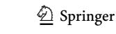
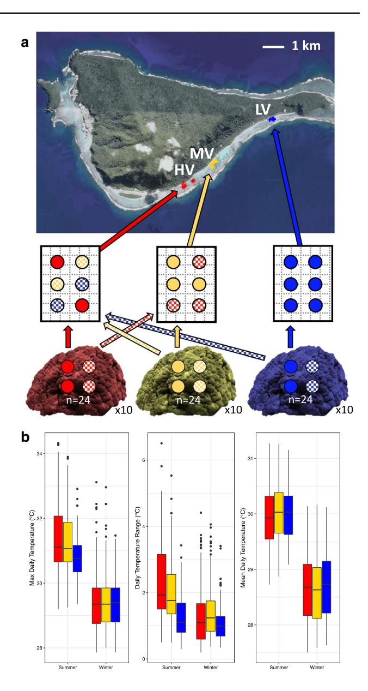
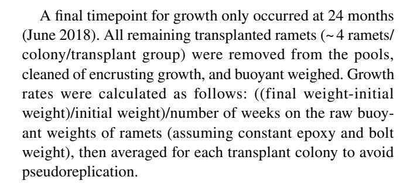
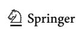
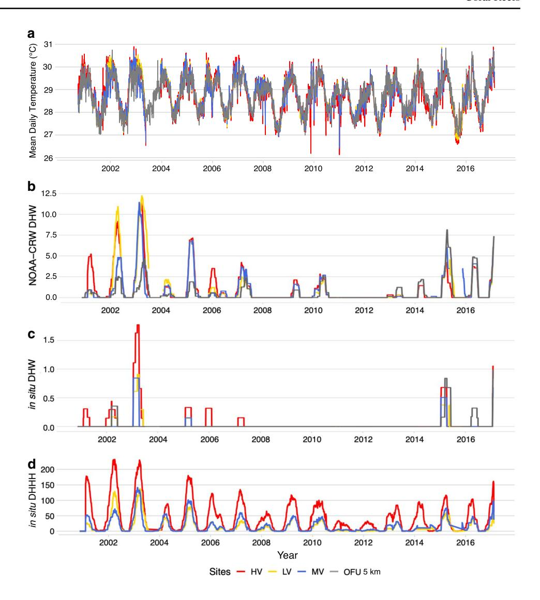
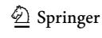
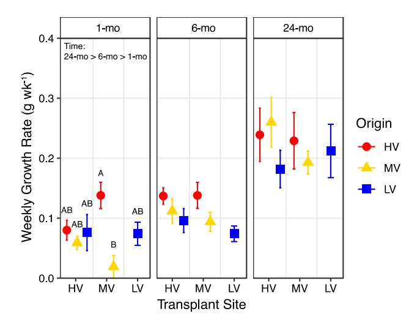
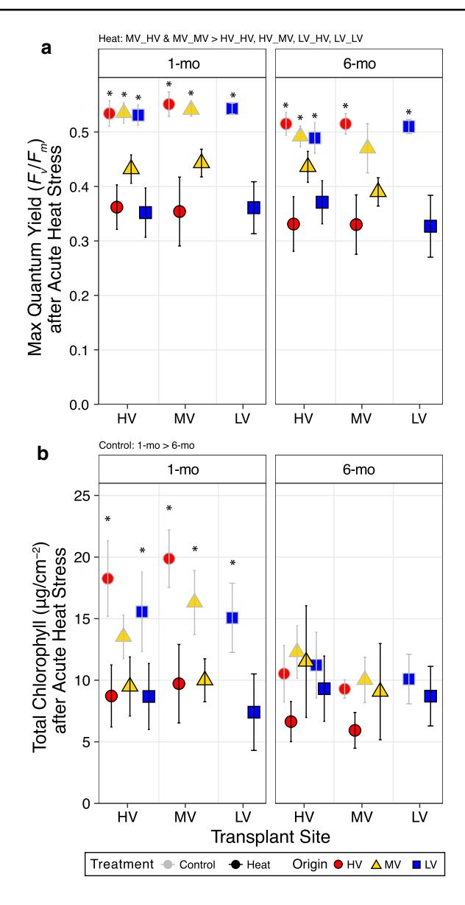
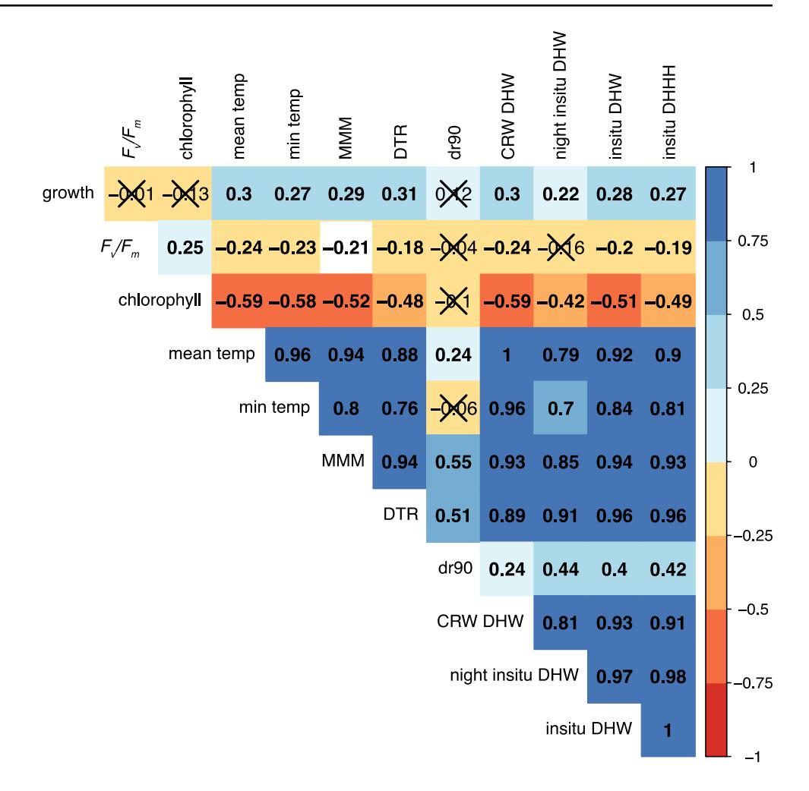
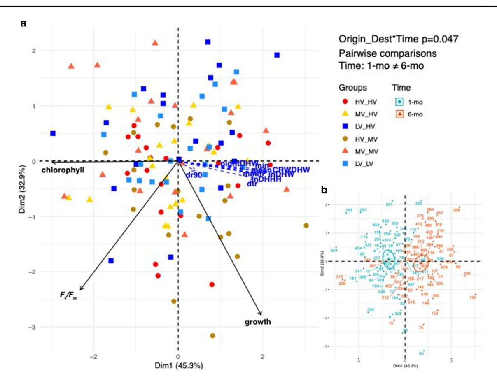

### REPORT

# **High‑resolution** *in situ* **thermal metrics coupled with acute heat stress experiments reveal diferential coral bleaching susceptibility**

**Courtney N. Klepac1,2 · Daniel J. Barshis1**

Received: 1 December 2021 / Accepted: 7 May 2022 © The Author(s), under exclusive licence to Springer-Verlag GmbH Germany, part of Springer Nature 2022

**Abstract** The relationship between thermal stress and coral bleaching has been a topic of study for decades, yet there is still a mismatch between remotely sensed bleaching predictors and population-specifc bleaching responses. Recent studies have linked greater amounts of thermal variability to coral bleaching resistance over small spatial scales, yet in some sites, this variability appears to push corals beyond their thermal limits. Here, we performed a 12-month reciprocal transplant and acute heat stress experiments in populations of *Porites lobata* from an American Sāmoan backreef: the Highly Variable (HV), the Moderately Variable, and the Less Variable pools of Ofu to investigate how natural and experimental stress across diferent thermal environments related to coral bleaching responses during the 2016–2017 thermal anomaly. We also compared various sea surface satellite versus *in situ* temperature data to determine which metrics were most aligned with observed bleaching responses. We found ~ 0.6 °C higher maximum monthly means for *in situ* versus remotely sensed data, which resulted in fewer degree heating weeks. Although greater thermal variability and heat loading did not have a strong relationship with the onset of natural bleaching responses, acute heat

Topic editor: Mark Vermeij

**Supplementary Information** The online version contains supplementary material available at [https://doi.org/10.1007/](https://doi.org/10.1007/s00338-022-02276-1) [s00338-022-02276-1](https://doi.org/10.1007/s00338-022-02276-1).

- \* Courtney N. Klepac cklepac@mote.org
- 1 Present Address: Department of Biological Sciences, Old Dominion University, Norfolk, VA, USA
- 2 Mote Marine Laboratory, International Center for Coral Reef Research and Restoration, 24244 Overseas Highway, Summerland Key, FL 33042, USA

stress revealed diferences in sublethal stress responses that aligned with *in situ* thermal metrics. We suggest greater thermal spikes and heat loading in the HV pool, detected only in the high-resolution *in situ* data, best explain the decreased thermal performance seen in HV corals; demonstrating the utility of *in situ* data (both environmental and experimental) for understanding bleaching responses at population-specifc spatial scales (<5 km).

**Keywords** Coral bleaching · Thermal variability · Degree Heating Weeks · *Porites lobata* · Thermal tolerance · Physiology

# **Introduction**

As climate change intensifies, rising temperatures and temperature variation are increasing the magnitude and frequency of thermal anomalies (Pachauri et al. [2014](#page-11-0); Stillman [2019](#page-12-0)). Marine heatwaves, prolonged periods of anomalously high sea surface temperatures (Hobday et al. [2016\)](#page-11-1), are becoming more severe, especially in tropical coral reef regions (Lough et al. [2018\)](#page-11-2). Reef-building corals live within a relatively narrow temperature range close to their upper thermal limits (Jokiel and Coles [1990;](#page-11-3) Berkelmans and Willis [1999\)](#page-10-0) and are particularly vulnerable to increased sea surface temperatures (SST) associated with anthropogenic climate change. As such, summertime heatwaves are projected to cause annual mass coral bleaching on more than 90% of coral reefs worldwide by the end of the century (Frieler et al. [2013;](#page-11-4) Hughes et al. [2017\)](#page-11-5).

The link between coral bleaching events and increased SST formed the basis of a global thermal stress monitoring system led by the National Oceanographic and Atmospheric Administration's Coral Reef Watch Program (NOAA

CRW; Liu et al. [2003,](#page-11-6) [2014](#page-11-7)). The magnitude and duration of remotely sensed SSTs above a fxed, locally defned Maximum Monthly Mean (MMM) temperature predicts the level of thermal stress on a coral reef region, called Degree Heating Weeks (DHW). The NOAA CRW daily satellite coral bleaching product defnes the amount of DHWs associated with coral bleaching stress and mortality (Heron et al. [2016\)](#page-11-8) and has guided targeted observations and management responses at reef locations worldwide. Despite these advances, the spatiotemporal resolution of remotely sensed data (5 km resolution) prevents precise thermal stress quantifcation at smaller scales, as it misses bleaching heterogeneity present within many reef regions and within individual reefs (Oliver and Palumbi [2011;](#page-11-9) Schoepf et al. [2015;](#page-12-1) Hughes et al. [2018](#page-11-10); Safaie et al. [2018](#page-11-11); Genevier et al. [2019\)](#page-11-12).

Diferential bleaching responses at smaller scales have been attributed to small-scale (< 5 km) variation in the magnitude and duration of thermal stress and can be poorly refected by DHW predictions (Langlais et al. [2017;](#page-11-13) Safaie et al. [2018;](#page-11-11) McClanahan et al. [2019\)](#page-11-14). Climatic and local environmental parameters not included in NOAA CRW's predictive toolbox but possibly as important for understanding coral responses to heat stress are small-scale interannual and diurnal temperature variability (Donner [2011](#page-10-1); Oliver and Palumbi [2011\)](#page-11-9), stress exposure duration (Berkelmans [2002](#page-10-2); Middlebrook et al. [2008](#page-11-15)), heating rate (Middlebrook et al. [2010\)](#page-11-16), water fow and internal waves (McClanahan et al. [2005;](#page-11-17) Wyatt et al. [2020](#page-12-2)), and light stress (Skirving et al. [2018](#page-12-3); Mason et al. [2020](#page-11-18)).

Another aspect of the NOAA CRW monitoring program is the assumption that coral reef thresholds remain constant over time (Van Hooidonk et al. [2013\)](#page-12-4). Sully et al. ([2019](#page-12-5)) revealed coral bleaching temperatures from the past decade are ~ 0.5 °C warmer than the previous decade, suggesting a recent adjustment in thermal thresholds of surviving coral populations. Moreover, many studies have demonstrated the capacity of coral communities to acclimatize to repeated heat stress exposures (Bellantuono et al. [2012;](#page-10-3) Howells et al. [2013](#page-11-19); Palumbi et al. [2014;](#page-11-20) Bay and Palumbi [2015](#page-10-4)), and that recent exposure to temperature variation can benefcially infuence coral physiological tolerance (McClanahan et al. [2005;](#page-11-17) Oliver and Palumbi [2011](#page-11-9); Barshis et al. [2013;](#page-10-5) Palumbi et al. [2014;](#page-11-20) Morikawa and Palumbi [2019\)](#page-11-21). It is suggested that reef areas with large environmental fuctuations contain corals with higher heat tolerance in comparison with corals from more thermally stable environments (Oliver and Palumbi [2011;](#page-11-9) Kenkel et al. [2013](#page-11-22); Palumbi et al. [2014](#page-11-20); Kenkel et al. [2015](#page-11-23); Camp et al. [2017;](#page-10-6) Barshis et al. [2018](#page-10-7); Safaie et al. [2018](#page-11-11); Sully et al. [2019\)](#page-12-5). These variable environmental regimes across small-scale heterogeneous reef habitats provide opportunities for coral populations to modify and increase their thermal thresholds through mechanisms of acclimatization and adaptation (Boyd et al. [2016\)](#page-10-8). A better understanding of thermal stress exposures and individual coral responses over various temporal and spatial scales will play a crucial role in determining coral thermal thresholds and ultimately reef-scale bleaching susceptibilities.

Previously, we examined whether two massive coral species from the naturally variable backreef pools of Ofu Island, American Sāmoa, could modify their stress tolerance via acclimatization to the highly variable (HV) pool. These backreef pools are<5 km apart and nearly identical in species diversity and percent live coral cover yet have distinct diferences in small-scale environmental variability driven by tidal cycle and pool size (Craig et al. [2001;](#page-10-9) Smith et al. [2007;](#page-12-6) Oliver and Palumbi [2011](#page-11-9)). The HV pool (4400 m3 at low tide) experiences summer temperatures as high as 35 °C, with up to 6 °C daily fuctuations (Craig et al. [2001,](#page-10-9) Klepac and Barshis [2020](#page-11-24)), whereas the moderately variable pool (MV; 51,300 m3 at low tide) ranges daily from 28 to 33 °C, and the less variable (LV; size unknown) pool ranges daily from 28 to 32.5 °C (Klepac and Barshis [2020](#page-11-24)). The HV pool is recognized to contain more thermally tolerant corals than nearby coral populations (Oliver and Palumbi [2011;](#page-11-9) Barshis et al. [2013](#page-10-5); Palumbi et al. [2014;](#page-11-20) Morikawa and Palumbi [2019](#page-11-21)) and elicit increases in thermal tolerance in corals transplanted into the HV pool (Palumbi et al. [2014](#page-11-20)). However, in contrast to corals from the genus *Acropora*, we recently demonstrated that *Porites lobata* and *Goniastrea retiformis* corals did not increase thermal tolerance following transplantation into the HV pool, and more importantly, native HV *P. lobata* had a reduced tolerance under acute heat stress (Klepac and Barshis [2020\)](#page-11-24). We did not observe enhanced physiological performance as typically expected, despite greater environmental variation in the HV pool, and hypothesized that a fner spatiotemporal scale of increased heat duration and magnitude, coupled with recent bleaching stress, could contribute to our contrasting results. Previous studies reported distinct temperature parameters for each pool but did not calculate how diferent metrics of *in situ* heat loading above local bleaching thresholds may infuence coral stress responses. To improve our understanding of backreef climatologies, derived thermal thresholds, and *in situ* heat loading, we compare various scales of *in situ* temperature data to the remotely sensed NOAA CRW DHW 5 km product to explore how high resolution *in situ* climatology compares to remotely sensed data and relates to the physiological diferences we observed previously in *P. lobata*. Moreover, we sampled additional colonies, tracked natural bleaching responses, and conducted a reciprocal transplant experiment between the HV and the moderately variable (MV) pool to elucidate (a) whether thermal tolerance changed following transplantation in the HV pool, (b) whether natural bleaching responses varied across the pools,

and (c) whether HV corals exhibited reduced thermal tolerance regardless of transplant environment.

# **Materials and methods**

#### **Coral collection & transplantation**

Ten colonies of *P. lobata* were sampled from the LV, MV, and HV backreef pools between July 1 and 3, 2016 (*n*=30). Colonies were chosen based on visual appearance (non-bleached), size (1.5–3 m diameter), and at a distance of ~ 5 m from other colonies to minimize clonality (sensu Baums et al. [2006\)](#page-10-10). From each colony, 24 cores (i.e., ramets) were collected and afxed to nylon bolts with marine epoxy and secured to a rack using wingnuts. Two to three ramets from three to four colonies from each site were randomly assigned to site-specifc transplant racks, yielding 24–36 ramets per grid with eight grids each at HV and MV, and four grids at LV (Fig. [1](#page-2-0)A). Half of the MV and LV samples (12 ramets/colony, *n*=120 per site) were transplanted into the HV pool and the other half remained at the respective native reef site as control groups. In addition, half of the samples from the HV pool were randomly mixed with MV ramets and transplanted into the MV site. Transplantation of HV samples into the MV pool occurred on July 13th, and MV and LV samples were transplanted into the HV pool July 15th, 2016. This resulted in six transplant groups: HV\_HV, HV\_MV, MV\_HV, MV\_MV, LV\_HV, and LV\_LV (origin\_destination).

### **Ofu backreef temperature profling**

To investigate the specifc temperature profles of the three backreef pools that are within the 5 km pixel produced by NOAA CRW's product, we obtained the National Park of American Sāmoa's (NPSA) Ofu Island temperature records spanning 2000–2017 (Barker [2018\)](#page-10-11). We also received the 5 km satellite pixel NOAA CRW product containing Ofu Island (−14.177949, −169.654364) via a custom request to NOAA CRW staf to calculate pool-specifc NOAA CRW DHW. The NOAA CRW dataset's calculated month with the highest maximum temperature (MMM) across years 1985–2012 was April (28.9 °C) and was applied to the NPSA dataset for each pool to then calculate NOAA CRW Hot spots and Degree Heating Weeks for the backreef pools of Ofu following NOAA's CRW SST climatology product methodology (Liu et al. [2006](#page-11-25)). In addition to these datasets, HOBO® Pendant temperature loggers (Onset Computer Corporation, Bourne, MA) were attached to each transplant rack and collected *in situ* temperatures every 10 min for the experimental duration. For each pool, temperature data were averaged across racks and binned

**Fig. 1** Transplant experiment and *in situ* temperature metrics of backreef sites on Ofu Island, American Sāmoa. **A** Ten *P. lobata* colonies (cross symbols) were sampled from three backreef pools—HV (red), MV (yellow), LV (blue). Twenty-four ramets from each colony were sampled from each site (*N*=720), and half were transplanted into either the HV or MV (excluding LV ramets) common garden (checkered arrows and circles) and the other half were returned to the native site (solid arrows and circles). After 1 (August 2016) and 6 months (February 2017), two ramets per colony per site were collected for acute heat stress experiments. **B** Seasonal *in situ* daily max temperatures, daily temperature range, and daily mean temperatures of the backreef pools from July 2016–February 2017. Winter includes July–October, and summer includes October–February. Boxplots display the median (horizontal line), frst and third quartile (hinges), and largest/smallest value no further than 1.5\*IQR (whiskers)

into either austral winter (April 16th–October 15th) or austral summer (October 16th–April 15th).

We also used the NPSA pool-specifc *in situ* temperature time series dataset spanning the years 2000–2017 to generate local climatologies and calculate Degree Heating metrics for each pool: NOAA CRW DHW, *in situ* DHW, and *in situ* "Degree Heating Half Hours" (DHHH). Following the NOAA CRW Ofu methodology, but excluding the bleaching years 2002–03 and 2015–17, MMMs for each pool were calculated as the average nightly temperature for a given month across years from the years 2000–2001 and 2004–2014. A separate, adjusted 5 km Ofu MMM of 29.5 °C was calculated from the same range and non-bleaching years (2000–2001, 2004–2014) subset from the NOAA CRW 5 km Ofu-specifc time series dataset to specifcally match the temporal range and compare with our *in situ* calculations. The NPSA *in situ* temperature records were measured continuously (every 30 min) so we also used daily averaged values to compute more precise climatologies for each backreef pool. April was the site-specifc MMM to calculate hot spots and *in situ*, bleaching year excluded, DHWs. We investigated a fnerscale metric of heat loading, DHHH, by summing hot spot values over the number of rows (30 min increments) totaling a 12-week rolling window (*n*=4032), and then dividing by 336 (7 days of half hour increments).

#### **Coral growth and acute heat stress assays**

At 1 month (August 5–8, 2016) and 6 months (February 9–11, 2017) following transplantation, two ramets were collected per colony per transplant group (2 ramets\*10 colonies\*6 transplant groups, *n*=120 ramets/timepoint) from the grids in the three backreef pools, scrubbed to remove fouling organisms, and buoyant weighed prior to controlled thermal stress experiments. Ramets were placed in a modifed version of the Coral Bleaching Automated Stress System (CBASS; Voolstra et al. [2020](#page-12-7); Evensen et al. [2021\)](#page-10-12), constructed from Coleman 24L Party Stacker Coolers™ as head and sump tanks. A pump provided a fow of 88.9 mL s −1 to the head tank, ftted with six LED bulbs (Phillips PAR38) with a light level of ~ 500±20 μM quanta m−2 s −1 (Li-Cor LI 193 spherical quantum sensor) and a 12 h light/dark photoperiod. A fow-through drip system provided 2.5 mL s −1 of local seawater throughout the duration of the experiment.

Controlled temperature ramp exposures occurred similar to Klepac & Barshis [\(2020](#page-11-24)). Briefy, samples were randomly assigned within two control and two heat tanks. In the heat tank, temperature increased over 3 h from 28 to 36.5 °C, followed by a 3 h hold at 36.5 °C, then a ramp down to and hold at 28 °C for 16 h. The control tank was set to remain stable at 28 °C for 22 h (Fig. S1). Samples were immediately wrapped in foil and stored at -20 °C until transportation back to Old Dominion University and subsequent storage at -20 °C.

#### **Symbiodiniaceae physiology under heat stress**

Dark-adapted maximum quantum yield (*Fv/Fm*) of photosystem II (PSII) was measured to quantify heat stress responses of *Symbiodiniaceae* during the acute assays (Warner et al. [1996\)](#page-12-8). Following 30 min of dark-adaptation, ramets were repeatedly measured on top in triplicate at 0 and 21 h of the experiment using a pulse amplitude modulation (PAM) fuorometer (Junior-PAM, Walz, Germany). Instrument settings were as follows: Measuring Light Intensity=6; Saturation Intensity=12; Saturation Pulse Width=0.6 s; Gain=2.

Preserved coral tissue was airbrushed from the skeleton using 35ppt unfltered, artifcial seawater. The resulting slurry was homogenized, centrifuged, and resuspended in 5 mL of unfltered seawater before aliquoting out 3 mL and further centrifugation to separate the algal pellet from seawater for chlorophyll measurements. To determine chlorophyll concentrations, 5 mL of cold 90% acetone was added to the pelleted material, which was then homogenized using a glass tissue homogenizer and a 25 mm GF/F flter for cellular disruption and then stored at 4 °C for 24 h. Absorbance spectra were measured using an Ocean Optics UV–Vis Miniature Spectrometer (Key Largo, FL), and cellular chlorophyll *a* and *c*2 values were calculated following the Ritchie ([2006](#page-11-26)) equation for dinophytes. Total chlorophyll (*a*+*c*2) absorbance was normalized to acetone volume (5 mL), aliquot (3 mL), and total slurry volume (5 mL) and then scaled to the surface area of each ramet, measured using the parafn wax method (Veal et al. [2010](#page-12-9)).

#### **Natural bleaching of donor colonies**

During the 6-month timepoint, the Sāmoan archipelago had begun experiencing a mass bleaching event (American Samoa Coral Reef Advisory Group [2017](#page-10-13)), where bleaching afected many corals in Ofu's backreef pools. We sampled small cores (2 cm2 ) of both afected (i.e., lightest visible area) and healthy (i.e., darkest visible area) regions of donor colonies at all sites. In addition, we recorded the percent area bleached for each colony. Chlorophyll concentration and surface area were processed and measured as aforementioned. Healthy and afected chlorophyll values were averaged to

produce a mean chlorophyll value of each colony to account for potential intra-colony physiological diferences.

### **Statistical analyses**

The interactive efects between season and backreef pool on mean daily temperature range, min, max, and mean temperatures were tested using the 'aov' function (*stats*; Chambers et al. [2017](#page-10-14)) with season and backreef pool as fxed factors in Rv3.6.3 (R Core Team [2018\)](#page-11-27). Post hoc pairwise comparisons were conducted using 'emmeans' contrasts (*emmeans*; Lenth et al. [2020\)](#page-11-28). *In situ* DHWs were compared across pools using a sliding window analysis followed by a Wilcox rank-sum test (*stats*) for 2-week windows (sliding by 1 week) where DHWs were greater than 0 °C week−1 (sensu Sale et al. [2019](#page-12-10)). Multiple tests were sequentially Bonferroni adjusted.

Generalized linear mixed models ('lmer' function) were used to examine the interactive effects of time (1- and 6-month), transplant group (HV\_HV, HV\_MV, MV\_HV, MV\_MV, LV\_HV, LV\_LV), and treatment (control and heat) on weekly growth (sans treatment), photochemical efciency (*Fv/Fm*), and total chlorophyll. Transplant group was considered a fxed variable since the nature of the transplantation efort was unbalanced (i.e., not all origins were in all destinations [no HV in LV, or LV in MV]). Models were run with coral colony nested within tank as a random efect. Residual normality and homogeneity of variance was tested using Shapiro–Wilk (*stats*) and Levene's HOV tests (*car*; Fox & Weisberg [2019](#page-11-29)), respectively. Post hoc multiple comparisons with multivariate adjustments were used to assess time\*transplant group\*treatment, time\*transplant group, or time\*treatment interactions using the *emmeans* package.

The natural bleaching event provided an opportunity to examine the relationship between donor colony and transplanted ramet bleaching. First, a linear mixed model incorporating fxed efects of site (HV, MV, LV), sample (donor, heated ramet, control ramet), and colony as a random efect was tested against total chlorophyll values, with post hoc comparisons of signifcant factors. Then, a Pearson's correlation was run against donor and control ramet total chlorophyll, as well as a correlation matrix comparing days spent over the nighttime NPSA bleaching threshold (*in situ* MMM + 1°C = 30.2/3 °C) and total chlorophyll of each sample type.

To investigate how coral holobiont physiological variables (weekly growth, control *Fv/Fm*, control total chlorophyll) related to temperature metrics averaged over 1 month prior to each timepoint (monthly mean and minimum temperatures, MMM, daily temperature range [DTR], 90th quartile daily range, CRW DHW, night DHW, *in situ* DHW, and *in situ* DHHH), we conducted a Pearson's correlation matrix test (*stats*) between each physiological variable and each temperature metric. In addition, a principal component analysis (PCA) was used to visualize log-transformed variables in a multivariate space. Log-transformed values were frst centered and scaled prior to conducting the PCA and subsequent PERMANOVA using the 'adonis' function in the *vegan* package (Oksanen et al. [2018\)](#page-11-30) with the dissimilarity index method set to 'Euclidian.' Analytical scripts and data fles are available on GitHub [\(https://github.com/courtneykl](https://github.com/courtneyklepac/Remotely-sensedVSinsitutemps_coralbleaching) [epac/Remotely-sensedVSinsitutemps\\_coralbleaching](https://github.com/courtneyklepac/Remotely-sensedVSinsitutemps_coralbleaching)).

### **Results**

### **Ofu backreef temperature profling**

From July 2016–January 2017, the HV and MV pools had greater daily temperature range (DTR), maximum, and minimum daily temperatures during summer (October–January) and winter months (July–October; DTR and minimum only) than the LV pool (aov site\*season; DTR *p*<0.01, max *p*<0.01, min *p*=0.01; Fig. [1](#page-2-0)B). Summer maximum temperatures were 33.4±0.4 °C (mean±SD) in the HV pool and 33.8±0.6 °C in the MV pool in contrast to 32.1±0.6 °C

**Table 1** Comparison of calculated MMMs from NOAA CRW Ofu 5 km remotely sensed nighttime Sea Surface Temperatures (full dataset spanning 1985–2017 and reduced dataset spanning 2000–2017

excluding bleaching years 2002 and 2015–2017) and NPSA *in situ* temperature dataset spanning 2000–2017 (nighttime and daily; bleaching years 2002 and 2015–2017 excluded)

|                      | NOAA CRW 5 km 1985–2017 (°C)                                           | NOAA CRW 5 km 2000–2017 (bleaching years excluded) (°C)       |
|----------------------|------------------------------------------------------------------------|---------------------------------------------------------------|
| Mean monthly maximum |                                                                        |                                                               |
| Ofu                  | 28.9                                                                   | 29.5                                                          |
|                      | Nighttime, non-bleaching in situ NPSA tempera ture time series (°C) | 24-h, non-bleaching in situ NPSA temperature time series (°C) |
| Mean monthly maximum |                                                                        |                                                               |
| HV                   | 29.2                                                                   | 29.4                                                          |
| MV                   | 29.3                                                                   | 29.5                                                          |
| LV                   | 29.3                                                                   | 29.5                                                          |

**Fig. 2** Comparison of *in situ* versus satellite temperature measurements for Ofu Island from 2000 to 2017. **A** Mean daily temperatures from the NOAA CRW Ofu 5 km satellite product (gray line) and NPSA *in situ* pool datasets (HV: red, MV: yellow, and LV: blue lines). **B** DHW derived from the NOAA CRW Ofu 5 km satellite product using the MMM of 28.9 °C. Pool-specifc DHWs were calculated using the same MMM. **C** *in situ* DHW using the NPSA *in situ* temperature data to calculate pool-specifc MMMs. DHWs were derived from each pool's MMM value (HV=29.4 °C, MV & LV=29.5 °C), excluding bleaching years. The gray line in this panel represents the Ofu 5 km DHW calculated for the same years as the *in situ* DHWs (see Table [1](#page-4-0)). **D** *in situ* DHHH calculated from pool-specifc MMMs. Gaps signify missing temperature data

in the LV pool (Table S1). Summer DTRs for HV and MV pools were 1.6- to 1.8-fold greater than summer DTR in the LV pool (Table S1). All temperature metrics were greater in the summer compared to winter months. In addition, the HV, MV, and LV pools experienced 122, 128, and 106 d over the nighttime NPSA bleaching threshold of 30.2/3 °C (i.e., HV/MV/LV *in situ* MMM+1 °C; Table [1](#page-4-0), S1), respectively, of which 75% of these days were during the summer months. Moreover, the HV pool had 56, 28, and 9 d over MMM +2,+3,+4 °C, whereas the MV pool had 57, 23, and 5 d, and the LV pool had only 29, 4, and 0 d over these thresholds (Table S1).

Daily *in situ* climatologies derived from the NPSA 2000–2017 temperature dataset of each backreef pool used to calculate *in situ* nighttime only MMMs (per NOAA CRW methods) resulted in similar but slightly higher MMM values for each pool (Table [1\)](#page-4-0). An adjusted Ofu 5 km MMM of 29.5 °C resulted after incorporating the exact timespan for which we had corresponding *in situ* data (2000–2001, 2004–2014). Daily *in situ* MMMs for each pool were greater than nighttime *in situ* MMMs and the satellite-derived MMM of 28.9 °C but similar to the adjusted Ofu 5 km MMM (Table [1\)](#page-4-0).

The NOAA CRW Ofu 5 km product's MMM of 28.9 °C was derived from 1985 to 2012 satellite nighttime sea surface temperatures (Table [1](#page-4-0); Liu et al. [2014\)](#page-11-7) and was used to calculate NOAA CRW DHW for each pool (Fig. [2](#page-5-0)B). From 2002 to 2007, pool-specific DHWs were two- to fourfold greater than Ofu 5 km DHWs (*p*<0.01), where sliding window analysis revealed pool-specifc DHWs had approximately 20–30 2-week sliding windows of signifcantly greater DHWs per year than the Ofu 5 km time series. From 2009–2010, pool-specific DHWs had 12 2-week sliding windows that were twofold greater than Ofu 5 km DHWs (*p*<0.01). However, from 2014 to 2016, this trend switched to Ofu 5 km DHWs having signifcantly greater DHWs in comparison with pool-specifc DHWs (Fig. [2](#page-5-0)A). Utilizing daily *in situ* pool-specifc MMMs instead of the

**Fig. 3** Mean weekly growth rates (g wk−1) of *P. lobata* with respect to transplant destination and time. Tukey's pairwise comparisons for signifcant overall efects are displayed, within timepoint signifcant comparisons are denoted with letters, and error bars are 95% confdence intervals

satellite-derived Ofu 5 km MMM (28.9 °C) resulted in a 0.05–0.1-fold decrease in DHWs (Fig. [2C](#page-5-0) vs. B), as the higher MMM values resulted in fewer calculated DHWs. For daily *in situ* DHWs, the HV pool had a greater number of DHWs than both the MV and LV pool during the years 2001–2003, 2005–2007, 2015, and 2017 (*p*<0.01, Fig. [2C](#page-5-0)). The MV pool had greater numbers of DHWs than the LV pool during 2002 and 2015 (*p*<0.01). For DHHH, the HV pool had more DHHH than the MV and LV pools across the entire time series (Fig. [2D](#page-5-0)) and a greater amount of overall heat loading regardless of bleaching years (*p*<0.01). Moreover, the LV and MV pools did not difer in DHHH heat loading over time, except for during 2002.

# **Coral growth**

Weekly growth rates for *P. lobata* difered by the interaction between time and transplant group. After 1 month of transplantation, HV corals transplanted into the MV pool had seven times greater weekly growth rates than MV native corals (HV\_MV 0.138±0.05 g week−1 vs. MV\_MV 0.019±0.04; *p*=0.05; Fig. [3\)](#page-6-0). Weekly growth rates were higher overall in 6-month versus 1-month ramets (*p*=0.02), but there was no diference among individual ramets from 1 to 6 months nor in paired ramets at the 6-month timepoint. Ramets that remained in their transplant site for 2 yr (June 2018) had coral weekly growth rates that were 2–3 times higher than the 6- and 1-month samples, respectively, for HV\_HV, MV\_HV, LV\_LV, and MV\_MV transplant groups (Fig. [3](#page-6-0)). In June 2018, there were no diferences in weekly growth rates among paired native and transplant ramets.

**Fig. 4 A** Mean maximum quantum yield (*Fv/Fm*) and **B** total chlorophyll (μg cm−2) of control (gray outline) and heated (black outline) Symbiodiniaceae following acute heat stress with respect to transplant destination and time. Error bars represent 95% confdence intervals, Tukey's pairwise comparisons for signifcant efects are displayed above panels, and asterisks within each panel signify an efect of treatment for each timepoint

### **Symbiodiniaceae photophysiology under experimental and natural stress**

Overall, there was a signifcant efect of transplant group (*p*<0.01), treatment (*p*<0.01), and the interaction of the two (*p*<0.01) on *Fv/Fm* values after 21 h of heat stress. Heated MV\_MV and MV\_HV corals had ~ 1.2-fold higher *Fv/Fm* values in comparison with all other transplant groups (Fig. [4](#page-6-1)A). There was an efect of treatment during both timepoints, except at 6 months where MV\_MV corals were the

only transplant group that did not have signifcantly reduced *Fv/Fm* under acute heat stress. During this timepoint, heated MV\_MV corals had higher *Fv/Fm* values than both HV\_HV (*p*=0.01) and HV\_MV corals (*p*<0.01), and MV\_HV corals had greater *Fv/Fm* values than HV\_HV corals (*p*=0.02).

There was an overall treatment by time interaction for total chlorophyll per surface area, where acute heat stress reduced total chlorophyll in 1-month (except MV\_HV) but not in 6-month transplants (Fig. [4B](#page-6-1)). In addition, control total chlorophyll values decreased almost 0.45–0.65-fold by the 6-month timepoint, which was at the beginning of the 2017 mass bleaching event.

During the onset of the local bleaching event in 2017, donor colony total chlorophyll values did not differ across backreef sites, where average percent bleaching was 21.5±19.2%, 19.7±13.8%, and 31.3±27.0% for HV, MV, and LV corals, respectively (Fig. S3). Donor colony total chlorophyll values were not correlated with control ramet total chlorophyll (Pearson's R = − 0.26, *p* = 0.20; Fig. S4) but were greater than both control and heated values (*emmeans p* < 0.01 for both; Fig. S5). Moreover, donor and control ramet total chlorophyll values did not correlate with number of days spent over 31 and 32 °C nor with *in situ* DHW.

### **Coral physiology in relation to temperature metrics**

Coral holobiont physiological variables (growth rate, control *Fv/Fm*, control total chlorophyll) and their relationship to environmental metrics such as monthly minimum and maximum temperatures, MMM, maximum DTR, 90th quartile range, NOAA CRW DHW, nighttime *in situ* DHW, daily *in situ* DHW, and DHHH were examined using a Pearson's correlation matrix (Fig. [5](#page-8-0)). Weekly growth was positively correlated with all temperature metrics, in contrast to control *Fv/Fm* and total chlorophyll that were negatively associated with all temperature metrics except 90th quartile daily range (and nighttime *in situ* DHW for *Fv/Fm*; Fig. [5](#page-8-0)), with a stronger correlation for total chlorophyll values compared to *Fv/Fm*. A PCA of control ramet variables further demonstrated the relationship among coral physiology and environment (Fig. [6](#page-9-0)), where PC1 explains 45.3% of the variance, and PC2 explains 32.9% of the variance. Individual points difer by time, where temperature metrics correlate with PC1 and physiological trait values are diferent between 1 month (PC1>0) and 6 months (PC1<0; *p*<0.01; Fig. [6](#page-9-0)) especially for total chlorophyll.

### **The complex relationship between thermal variability and bleaching sensitivity**

Increased thermal variability is generally benefcial for coral growth and bleaching resistance at exposures up to the local thermal optimum (Buddemeier et al. [2008](#page-10-15); Lough [2008](#page-11-31); Rivest et al. [2017;](#page-11-32) Safaie et al. [2018\)](#page-11-11), especially in the Ofu backreef (Oliver and Palumbi [2011](#page-11-9); Thomas et al. [2018](#page-12-11)). Here, backreef coral growth was positively correlated with multiple temperature metrics, and other *P. lobata* research on Ofu Island also demonstrated greater coral growth in the backreef compared to forereef environments, attributed to diferences in thermal variability between the two habitats (Smith et al. [2007;](#page-12-6) Barshis et al. [2018](#page-10-7)). Although increased thermal variability was positively correlated with backreef coral growth, it appears growth is decoupled from thermal tolerance (see Edmunds [2017](#page-10-16)), as HV\_MV corals grew the most initially but did not exhibit increased thermal tolerance 6 months following transplantation. In contrast to growth, thermal variability metrics had a strong negative relationship with *P. lobata* chlorophyll levels in native pool control ramets (Fig. [5\)](#page-8-0). Seasonality is recognized as a driver of coral pigment cycles (Fitt et al. [2000](#page-11-33)), with greater concentrations in winter, and here, coral ramets also had reduced pigment concentrations during the austral summer, which could be attributed to natural seasonal patterns and/or initial bleaching stress.

Coral bleaching in Ofu's backreef typically begins March–April and bleaching severity has been shown to vary across species and pool of origin (Morikawa and Palumbi [2019](#page-11-21); Thomas et al. [2019](#page-12-12)). During the bleaching events of 2015 and 2017, greater bleaching was observed in corals originating from the MV pool compared with the HV pool in a common garden (Morikawa and Palumbi [2019](#page-11-21)). Here, the early onset of natural bleaching stress observed in February 2017 did not result in site-specifc diferences in percent bleaching and total chlorophyll among wild donor *P. lobata* colonies. It is possible that donor corals may not have accrued enough heat stress to demonstrate measurable sitespecifc bleaching responses at the time they were measured. Moreover, there was no correlation between feld donor and control ramet chlorophyll levels (Fig. S4), contrary to the fndings of Morikawa and Palumbi [\(2019](#page-11-21)). In this instance, it appears unlikely that the bleaching responses of experimental ramets could serve as a proxy for bleaching susceptibility in natural coral populations, but could instead represent sizespecifc bleaching responses (Hughes and Jackson [1985](#page-11-34); but see Edmunds [2017](#page-10-16)) between the larger donor colonies (>1–2 m diameter) and small ramets (2–3 cm cores).

In contrast to relatively mild bleaching responses observed in donor colonies during the hottest month of

**Fig. 5** Pearson correlation heatmap based on scaled average for 120 ramets (all sites, both timepoints) of control *P. lobata* physiology and Ofu temperature metrics. Colors and values within the squares represent the magnitude and direction of the Pearson correlation according to the key. Non-signifcant (*p*>0.05) Pearson pairwise correlations are indicated with an "X."

this study (February 2017), experimentally heated ramets revealed site-specifc variation in bleaching. Previous studies examining thermal tolerances of Ofu backreef *P. lobata* demonstrated a strong efect of origin, where HV and MV corals had higher tolerance limits than nearby forereef corals (Barshis et al. [2018](#page-10-7)). Similar to Barshis et al. ([2018](#page-10-7)), there was an efect of native reef environment on chlorophyll fuorescence under experimental acute heat stress, however, it was native MV corals that had greater *Fv/Fm* values than HV native and transplanted ramets. Also, native MV coral *Fv/Fm* values were not afected by acute heat stress in February (6-mo), and total chlorophyll of MV ramets transplanted into the HV pool did not respond to acute heat stress in August (1-mo), suggesting that MV corals had greater tolerance limits than other backreef *P. lobata* examined herein. Sustained growth and bleaching resistance demonstrated by MV corals during this study and in Klepac & Barshis ([2020\)](#page-11-24) suggests that moderately variable environments with conditions just below an organism's thermal optimum could maximize ftness (Trmax; Martin and Huey [2008](#page-11-35)) as climate warms. These results also indicate *P. lobata* in this system behaves diferently than previously examined species from Ofu's backreef pools. While most thermal tolerance studies of branching corals on Ofu have shown greater heat tolerance in HV native coral populations or corals transplanted into the HV pool (Thomas et al. [2018](#page-12-11)), we consistently found no efect of the HV common garden increasing bleaching tolerance *and* increased tolerance limits in MV *P. lobata* over two bleaching years (Klepac & Barshis [2020](#page-11-24); this study). These reproducible results indicate reduced thermotolerance in massive corals from the highly variable backreef environment of Ofu Island relative to corals from the MV pool, likely due to chronic environmental variability that has become too physiologically costly under times of thermal stress.

### **High‑resolution temperature metrics coupled with physiological diagnostics reveal diferential bleaching responses**

DHW have long been recognized as an efective predictor and monitoring metric for coral bleaching stress (SST; Liu et al. [2006](#page-11-25)). This study, however, highlights that DHW metrics are quite sensitive to diferent sources and scales

**Fig. 6 A** Principal component analysis biplot of physiological trait data for 120 control (i.e., feld) ramets of *P. lobata*. Data points are colored by transplant group. Solid black vectors are the loadings for traits, and dashed blue vectors are temperature metric predictors cor-

related with the principal components. **B** The same data but points are colored by time with 95% confdence interval ellipses. PER-MANOVA results are displayed for signifcant efects

of temperature measurements. Alternate but related coral bleaching metrics have been proposed, such as Degree Heating Days (Garde et al. [2014](#page-11-36); Wyatt et al. [2020](#page-12-2)), Light Stress Damage (LSD; Skirving et al. [2018](#page-12-3); Mason et al. [2020\)](#page-11-18), and hydrodynamic modelling (Skirving et al. [2006](#page-12-13)). Here, the magnitude of thermal anomalies at a reef locale depends on whether accumulated heat stress is modeled using NOAA's CRW or *in situ* temperature, and which data and timespan are used to establish the historical climatology. NOAA's CRW products are all calculated from nighttime satellite 5 km SST data (Liu et al. [2003](#page-11-6)) and can over- or underestimate *in situ* temperature regimes at smaller reef-scales (Liu et al. [2013](#page-11-37)). When we applied the NOAA CRW 5 km MMM of 28.9 °C for Ofu Island to our *in situ* temperatures, the number of pool-specifc *in situ* DHWs was much greater than DHWs from the NOAA CRW remotely sensed data from 2002 to 2007, but then are roughly similar from 2008 to 2017 (Fig. [2](#page-5-0)A). However, these NOAA CRW-derived DHWs are 2–3 times greater than the *in situ* DHWs derived from each pool's calculated MMM (i.e., Fig. [2A](#page-5-0) vs. B). The frst discrepancy between these two climatologies is the use

of nighttime (NOAA CRW) versus 24 h (*in situ*) temperature data, where nighttime temperature-based climatologies result in lower daily and monthly temperature means and subsequently lower MMMs. Second, NOAA CRW products are based on a 5 km scale compared to our *in situ* temperature loggers (~ 1 km between pools), which result in averaged SST that also contributes to lower MMMs and greater number of DHWs. One additional consideration is the diferent range of years used to calculate the historical climatologies—our temperature records date back to 2000 versus 1985 for the NOAA CRW 50 km product (Liu et al. [2006](#page-11-25)). When the same years (2000–2017) were applied to the NOAA CRW dataset, the MMM was 1 °C higher. Given the steady increase in sea surface temperatures over the past decades (Lough et al. [2018](#page-11-2)), it is very likely a location's MMM would be greater if calculated from a more recent dataset instead of longer historical records dating back multiple decades.

Then which temperature metrics are best for predicting or understanding coral bleaching events? Metrics of thermal stress accumulation—daily variability, acute and cumulative

thermal stress, heating rate, and thermal trajectory—impose diferent amounts of stress exposure (Safaie et al. [2018](#page-11-11); Sully et al. [2019\)](#page-12-5) that could explain bleaching variation. McClanahan et al. ([2019\)](#page-11-14) demonstrated that a combination of multiple SST metrics (i.e., peak hot, duration of cool, and temperature bimodality) explained ~ 50% of the variance in coral bleaching prevalence during the global 2016 coral bleaching event as opposed to only 9% explained by DHW. The intensity, frequency, and rate of heat loading also infuence coral bleaching outcomes in mass bleaching events (Skirving et al. [2019](#page-12-14)). High-frequency temperature variability can have a mitigating efect, reducing the odds of severe bleaching outcomes (Safaie et al. [2018;](#page-11-11) Sully et al. [2019\)](#page-12-5).

Here, we found site-level differences in temperature variability, days over extreme temperatures, and DHW/ DHHH, however, we did not observe clear diferences in bleaching responses among pools in both our control ramets and donor colonies at the early onset of bleaching. Relatively low bleaching responses despite high variability and Degree Heating metrics could be a result of the timing of our sampling or other non-thermal factors, such as sunlight, turbidity, and water fow and quality diferences among the backreef pools. Yet, the most consistent pattern (though subtle) observed among the various thermal metrics was the higher-resolution DHHH revealed greater heat loading in HV, which aligns with increased bleaching sensitivity of HV corals (Klepac and Barshis [2020;](#page-11-24) this study). Here, highresolution heat loading metrics (DHHH) align with physiological diagnostics (CBASS and *Fv/Fm*) to reveal potential sublethal or subbleaching stress in the HV pool. Acute spikes in thermal variation are recognized as benefcial for coral stress responses (Safaie et al. [2018\)](#page-11-11), yet thermal performance theory (Huey and Stevenson [1979](#page-11-38)) suggests an upper limit, with spikes too far above a thermal optimum likely shifting from protective to stress inducing. Indeed, the combination of thermal spikes with chronic heat loading, as experienced in the HV pool over two consecutive bleaching years (2015 & 2016) and historically in the number of DHHH, may overwhelm coral thermal performance, shifting native corals from the HV pool toward a chronic state of thermal stress susceptibility. Consequently, high-resolution *in situ*-derived metrics may be the most sensitive tools at reef-scales<5 km to detect small-scale bleaching patterns and to assess thermal limits and, when coupled with bleaching monitoring and/or experimental heat stress, may improve our predictions and understanding of variation in thermal stress-induced coral bleaching.

**Acknowledgements** CK and DB were supported by a NOAA Coral Reef Conservation Program grant (NA15NOS4820080) to DB. We thank the National Park of American Sāmoa staf for access to the feld site and logistical support, Gang Liu for providing the NOAA CRW Ofu 5km temperature data, and N Evensen,V Radice, and two anonymous reviewers for providing constructive edits to earlier drafts. Coral sampling and transplant experiments were conducted under NPSA permits NPSA-2015-SCI-0015.

#### **Declarations**

**Confict of interest** The corresponding author states that there is no confict of interest.

### **References**

- American Samoa Coral Reef Assessment Group (2017) American Samoa Bleaching Monitoring Report 2015–2017 Unpublished draft
- Barker V (2018) Exceptional thermal tolerance of coral reefs in American Samoa: a review. Current Climate Change Reports 4:417–427
- Barshis DJ, Ladner JT, Oliver TA, Seneca FO, Traylor-Knowles N, Palumbi SR (2013) Genomic basis for coral resilience to climate change. Proc Natl Acad Sci 110:1387–1392
- Barshis DJ, Birkeland C, Toonen RJ, Gates RD, Stillman JH (2018) High-frequency temperature variability mirrors fxed diferences in thermal limits of the massive coral *Porites lobata*. J Exp Biol 221:jeb188581
- Baums IB, Miller MW, Hellberg ME (2006) Geographic variation in clonal structure in a reef-building Caribbean coral, *Acropora palmata*. Ecol Monogr 76:503–519
- Bay RA, Palumbi SR (2015) Rapid acclimation ability mediated by transcriptome changes in reef-building corals. Genome Biol Evol 7:1602–1612
- Bellantuono AJ, Granados-Cifuentes C, Miller DJ, Hoegh-Guldberg O, Rodriguez-Lanetty M (2012) Coral thermal tolerance: tuning gene expression to resist thermal stress. PLoS One 7:e50685
- Berkelmans R (2002) Time-integrated thermal bleaching thresholds of reefs and their variation on the Great Barrier Reef. Mar Ecol Prog Ser 229:73–82
- Berkelmans R, Willis B (1999) Seasonal and local spatial patterns in the upper thermal limits of corals on the inshore Central Great Barrier Reef. Coral Reefs 18:219–228
- Boyd PW, Cornwall CE, Davison A, Doney SC, Fourquez M, Hurd CL, Lima ID, McMinn A (2016) Biological responses to environmental heterogeneity under future ocean conditions. Glob Change Biol 22:2633–2650
- Buddemeier RW, Jokiel PL, Zimmerman KM, Lane DR, Carey JM, Bohling GC, Martinich JA (2008) A modeling tool to evaluate regional coral reef responses to changes in climate and ocean chemistry. Limnol Oceanogr Methods 6:395–411
- Camp EF, Nitschke MR, Rodolfo-Metalpa R, Houlbreque F, Gardner SG, Smith DJ, Zampighi M, Suggett DJ (2017) Reef-building corals thrive within hot-acidifed and deoxygenated waters. Sci Rep 7:2434
- Chambers JM, Freeny AE, Heiberger RM (2017) Analysis of variance; designed experiments. In: Chambers JM, Hastie TJ (eds) Statistical models in S. Routledge, UK, pp 145–193
- Craig P, Birkeland C, Belliveau S (2001) High temperatures tolerated by a diverse assemblage of shallow-water corals in American Samoa. Coral Reefs 20:185–189
- Donner SD (2011) An evaluation of the efect of recent temperature variability on the prediction of coral bleaching events. Ecol Appl 21:1718–1730
- Edmunds PJ (2017) Intraspecifc variation in growth rate is a poor predictor of ftness for reef corals. Ecology 98:2191–2200
- Evensen NR, Fine M, Perna G, Voolstra CR, Barshis DJ (2021) Remarkably high and consistent tolerance of a Red Sea coral to

- acute and chronic thermal stress exposures. Limnol Oceanogr 66:1718–1729
- Fitt W, McFarland F, Warner ME, Chilcoat GC (2000) Seasonal patterns of tissue biomass and densities of symbiotic dinofagellates in reef corals and relation to coral bleaching. Limnol Oceanogr 45:677–685
- Fox J, Weisberg S (2019) An R Companion to Applied Regression, 3rd edn. Sage, London
- Frieler K, Meinshausen M, Golly A, Mengel M, Lebek K, Donner S, Hoegh-Guldberg O (2013) Limiting global warming to 2 °C is unlikely to save most coral reefs. Nat Clim Chang 3:165–170
- Garde LA, Spillman CM, Heron SF, Beeden RJ (2014) Reef temp next generation: a new operational system for monitoring reef thermal stress. J Op Oceanogr 7:21–33
- Genevier LG, Jamil T, Raitsos DE, Krokos G, Hoteit I (2019) Marine heatwaves reveal coral reef zones susceptible to bleaching in the Red Sea. Glob Change Biol 25:2338–2351
- Heron SF, Maynard JA, Van Hooidonk R, Eakin CM (2016) Warming trends and bleaching stress of the world's coral reefs 1985–2012. Sci Rep 6:38402
- Hobday AJ, Alexander LV, Perkins SE, Smale DA, Straub SC, Oliver EC, Benthuysen JA, Burrows MT, Donat MG, Feng M, Holbrook NJ (2016) A hierarchical approach to defning marine heatwaves. Prog Oceanogr 141:227–238
- Howells EJ, Berkelmans R, van Oppen MJ, Willis BL, Bay LK (2013) Historical thermal regimes defne limits to coral acclimatization. Ecology 94:1078–1088
- Huey RB, Stevenson RD (1979) Integrating thermal physiology and ecology of ectotherms: a discussion of approaches. Am Zool 19:357–366
- Hughes T, Jackson J (1985) Population dynamics and life histories of foliaceous corals. Ecol Monogr 55:141–166
- Hughes TP, Kerry JT, Álvarez-Noriega M, Álvarez-Romero JG, Anderson KD, Baird AH, Babcock RC, Beger M, Bellwood DR, Berkelmans R (2017) Global warming and recurrent mass bleaching of corals. Nature 543:373
- Hughes TP, Anderson KD, Connolly SR, Heron SF, Kerry JT, Lough JM, Baird AH, Baum JK, Berumen ML, Bridge TC, Claar DC (2018) Spatial and temporal patterns of mass bleaching of corals in the Anthropocene. Science 6371:80–83
- Jokiel P, Coles S (1990) Response of Hawaiian and other Indo-Pacifc reef corals to elevated temperature. Coral Reefs 8:155–162
- Kenkel CD, Goodbody-Gringley G, Caillaud D, Davies SW, Bartels E, Matz MV (2013) Evidence for a host role in thermotolerance divergence between populations of the mustard hill coral (*Porites astreoides*) from diferent reef environments. Mol Ecol 22:4335–4348
- Kenkel CD, Almanza AT, Matz MV (2015) Fine-scale environmental specialization of reef-building corals might be limiting reef recovery in the Florida Keys. Ecology 96:3197–3212
- Klepac C, Barshis D (2020) Reduced thermal tolerance of massive coral species in a highly variable environment. Proc R Soc B: Biol Sci 287:20201379
- Langlais CE, Lenton A, Heron SF, Evenhuis C, Gupta AS, Brown JN, Kuchinke M (2017) Coral bleaching pathways under the control of regional temperature variability. Nat Clim Chang 11:839–844
- Lenth R, Singmann H, Love J, Buerkner P, Herve M (2018) emmeans: estimated marginal means, aka least-squares means. R package version 1(1):3
- Liu G, Strong AE, Skirving W (2003) Remote sensing of sea surface temperatures during 2002 Barrier Reef coral bleaching. EOS Trans Am Geophys Union 84:137–141
- Liu G, Rauenzahn JL, Heron SF, Eakin CM, Skirving WJ, Christensen T, Strong AE, Li J (2013) NOAA coral reef watch 50 km satellite

- sea surface temperature-based decision support system for coral bleaching management. NOAA Tech Report NESDIS 143:1–41
- Liu G, Heron SF, Eakin CM, Muller-Karger FE, Vega-Rodriguez M, Guild LS, De La Cour JL, Geiger EF, Skirving WJ, Burgess TF (2014) Reef-scale thermal stress monitoring of coral ecosystems: new 5-km global products from NOAA Coral Reef Watch. Remote Sens 6:11579–11606
- Liu G, Strong AE, Skirving W, Arzayus LF (2006) Overview of NOAA coral reef watch program's near-real time satellite global coral bleaching monitoring activities. In: Proceedings of the 10th International Coral Reef Symposium, Okinawa, pp 1783–1793
- Lough JM (2008) Coral calcifcation from skeletal records revisited. Mar Ecol Prog Ser 373:257–264
- Lough J, Anderson K, Hughes T (2018) Increasing thermal stress for tropical coral reefs: 1871–2017. Sci Rep 8:1–8
- Martin TL, Huey RB (2008) Why "suboptimal" is optimal: Jensen's inequality and ectotherm thermal preferences. Am Nat 171:E102–E118
- Mason RA, Skirving WJ, Dove SG (2020) Integrating physiology with remote sensing to advance the prediction of coral bleaching events. Remote Sens Environ 246:111794
- McClanahan T, Maina J, Moothien-Pillay R, Baker AC (2005) Efects of geography, taxa, water fow, and temperature variation on coral bleaching intensity in Mauritius. Mar Ecol Prog Ser 298:131–142
- McClanahan TR, Darling ES, Maina JM, Muthiga NA, D'agata S, Jupiter SD, Arthur R, Wilson SK, Mangubhai S, Nand Y (2019) Temperature patterns and mechanisms infuencing coral bleaching during the 2016 El Niño. Nat Clim Chang 9:845–851
- Middlebrook R, Hoegh-Guldberg O, Leggat W (2008) The efect of thermal history on the susceptibility of reef-building corals to thermal stress. J Exp Biol 211:1050–1056
- Middlebrook R, Anthony KR, Hoegh-Guldberg O, Dove S (2010) Heating rate and symbiont productivity are key factors determining thermal stress in the reef-building coral *Acropora formosa*. J Exp Biol 213:1026–1034
- Morikawa MK, Palumbi SR (2019) Using naturally occurring climate resilient corals to construct bleaching-resistant nurseries. Proc Natl Acad Sci 116:10586–10591
- Oksanen J, Kindt R, Legendre P, O'Hara B, Stevens MH, Oksanen MJ, Suggests MA (2007) The vegan package. Community Ecol Package 10(631–637):719
- Oliver T, Palumbi S (2011) Do fuctuating temperature environments elevate coral thermal tolerance? Coral Reefs 30:429–440
- Pachauri RK, Allen MR, Barros VR, Broome J, Cramer W, Christ R, Church JA, Clarke L, Dahe Q, Dasgupta P (2014) Climate change 2014: synthesis report. Contribution of Working Groups I, II and III to the ffth assessment report of the Intergovernmental Panel on Climate Change
- Palumbi SR, Barshis DJ, Traylor-Knowles N, Bay RA (2014) Mechanisms of reef coral resistance to future climate change. Science 344:895–898
- R Core Team (2018) R: A language and environment for statistical computing; 2018. Vienna, Austria: R Foundation for Statistical Computing,<https://www.R-project.org/>
- Ritchie RJ (2006) Consistent sets of spectrophotometric chlorophyll equations for acetone, methanol and ethanol solvents. Photosynth Res 89:27–41
- Rivest EB, Comeau S, Cornwall CE (2017) The role of natural variability in shaping the response of coral reef organisms to climate change. Current Climate Change Reports 3:271–281
- Safaie A, Silbiger NJ, McClanahan TR, Pawlak G, Barshis DJ, Hench JL, Rogers JS, Williams GJ, Davis KA (2018) High frequency temperature variability reduces the risk of coral bleaching. Nat Commun 9:1–12

- Sale TL, Marko PB, Oliver TA, Hunter CL (2019) Assessment of acclimatization and subsequent survival of corals during repeated natural thermal stress events in Hawai'i. Mar Ecol Prog Ser 624:65–76
- Schoepf V, Stat M, Falter JL, McCulloch MT (2015) Limits to the thermal tolerance of corals adapted to a highly fuctuating, naturally extreme temperature environment. Sci Rep 5:1–14
- Skirving W, Heron M, Heron S (2006) The hydrodynamics of a bleaching event: implications for management and monitoring. Coral Reefs Climate Change: Sci Manag 61:145–161
- Skirving W, Enríquez S, Hedley JD, Dove S, Eakin CM, Mason RA, De La Cour JL, Liu G, Hoegh-Guldberg O, Strong AE, Mumby PJ (2018) Remote sensing of coral bleaching using temperature and light: progress towards an operational algorithm. Remote Sens 10:18
- Skirving W, Heron S, Marsh B, Liu G, De La Cour J, Geiger E, Eakin C (2019) The relentless march of mass coral bleaching: a global perspective of changing heat stress. Coral Reefs 38:547–557
- Smith L, Barshis D, Birkeland C (2007) Phenotypic plasticity for skeletal growth, density and calcifcation of *Porites lobata* in response to habitat type. Coral Reefs 26:559–567
- Stillman JH (2019) Heat waves, the new normal: summertime temperature extremes will impact animals, ecosystems, and human communities. Physiology 34:86–100
- Sully S, Burkepile DE, Donovan MK, Hodgson G, Van Woesik R (2019) A global analysis of coral bleaching over the past two decades. Nat Commun 10:1–5
- Thomas L, Rose NH, Bay RA, López EH, Morikawa MK, Ruiz-Jones L, Palumbi SR (2018) Mechanisms of thermal tolerance in

- reef-building corals across a fne-grained environmental mosaic: lessons from Ofu. Am Samoa Front Marine Sci 4:434
- Thomas L, López EH, Morikawa MK, Palumbi SR (2019) Transcriptomic resilience, symbiont shufing, and vulnerability to recurrent bleaching in reef-building corals. Mol Ecol 28:3371–3382
- Van Hooidonk R, Maynard J, Planes S (2013) Temporary refugia for coral reefs in a warming world. Nat Clim Chang 3:508–511
- Veal C, Carmi M, Fine M, Hoegh-Guldberg O (2010) Increasing the accuracy of surface area estimation using single wax dipping of coral fragments. Coral Reefs 29:893–897
- Voolstra CR, Buitrago-López C, Perna G, Cárdenas A, Hume BC, Rädecker N, Barshis DJ (2020) Standardized short-term acute heat stress assays resolve historical diferences in coral thermotolerance across microhabitat reef sites. Glob Change Biol 26(8):4328–4343
- Warner M, Fitt W, Schmidt G (1996) The efects of elevated temperature on the photosynthetic efciency of zooxanthellae in hospite from four diferent species of reef coral: a novel approach. Plant, Cell Environ 19:291–299
- Wyatt AS, Leichter JJ, Toth LT, Miyajima T, Aronson RB, Nagata T (2020) Heat accumulation on coral reefs mitigated by internal waves. Nat Geosci 13(1):28–34

**Publisher's Note** Springer Nature remains neutral with regard to jurisdictional claims in published maps and institutional afliations.

